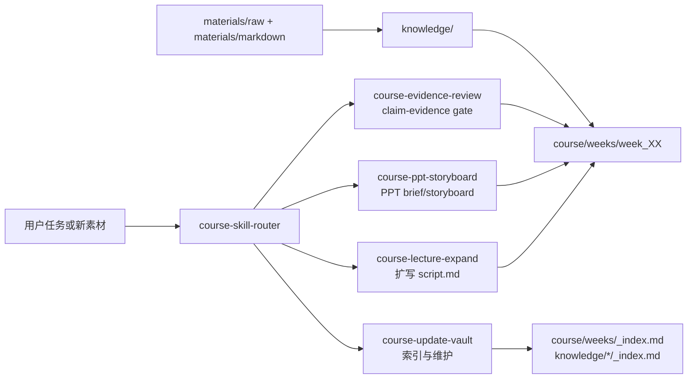

# AI_Course · 医药数据处理与可视化 · 课程课件生产工作区

本项目服务于“医药数据处理与可视化（36 课时 · AI 前置版）”的备课、素材整理、PPT 大纲、授课脚本和后续课件生成。当前唯一有效工作区是：

```text
E:\Codex_Projects\AI_Course
```

`F:\AI_Course` 已完成迁移并删除，不再作为 Codex、Obsidian、Git 或脚本入口。

## 目录角色

```text
AI_Course\
├── AGENTS.md            # AI 协作规则和项目边界
├── memory.md            # 跨会话决策、偏好和当前状态
├── README.md            # 项目使用说明
├── materials\           # 素材层：原始素材与转换 Markdown
├── knowledge\           # 知识层：来源、概念、实体、综合映射
├── course\              # 课程层：正式大纲、周次产物、模板、考核
├── scripts\             # 转换、课件和维护脚本
├── skills\              # 项目本地 Codex skills
├── docs\                # 计划、迁移边界、维护文档
├── outputs\             # 最终导出的 PPT、讲义和脚本
└── site\                # 课程网站实验区
```

核心边界：

- `course/syllabus/` 是课程事实主线。
- `course/weeks/week_01` 到 `week_18` 是课件生产主工作区。
- `knowledge/` 是备课辅助层，不替代课程大纲。
- `materials/raw/` 默认只读；原始 PDF 和外部课件不进入 Git。
- `outputs/`、`site/node_modules/`、`site/dist/`、缓存和临时文件不进入 Git。

## AI 原生课件工作流

本项目不把知识库做成独立百科，而是让 AI 作为课件生产流程的入口和执行者。当前采用“双层技能体系”：全局技能提供通用科研、写作、审查和 Office/PPT 能力；项目本地 `skills/course-*` 决定具体写入位置、检索顺序和验收命令。



### 常用入口

| 任务 | 本地 skill | 典型写入 |
|---|---|---|
| 扩写某周讲义 | `course-lecture-expand` | `course/weeks/week_XX/script.md` |
| 生成 PPT 前置设计 | `course-ppt-storyboard` | `course/weeks/week_XX/outline.md` 或 `docs/` storyboard |
| 审查统计/生物学/AI 主张 | `course-evidence-review` | `course/evaluation/` 或 review 报告 |
| 更新索引和清单 | `course-update-vault` | `_index.md`、`docs/course_script_depth_report.md` |
| 外部资料入库 | `course-skill-router` 后转素材/知识流程 | `materials/markdown/`、`knowledge/sources/`、`knowledge/synthesis/` |

### 使用案例

扩写 Week 15 讲义：

```text
使用 course-lecture-expand 修订 Week 15 讲义。先读 week_15/materials.md、outline.md、script.md，再读 knowledge/concepts/差异表达分析.md 和 knowledge/entities/DESeq2.md。当前 Week 15 script.md 已达到 formal_ready/full-lecture；修订目标应聚焦事实核验、课堂任务、AI 审计或评分点，而不是单纯增加字数。
```

生成 Week 15 PPT 前置 storyboard：

```text
使用 course-ppt-storyboard 为 Week 15 生成 12 页 storyboard。每页包含行动标题、视觉意图、教师话术、学生任务、来源说明和 overclaim 风险。不要直接生成 PPTX。
```

审查单细胞图形解释：

```text
使用 course-evidence-review 检查 Week 16 单细胞可视化讲义。重点审查 UMAP 距离、cluster 与细胞类型、marker 注释是否被过度解释，并输出 claim-evidence gate。
```

技能加载记录见 [AI_Course Skill Loading Manifest](docs/skill_loading_manifest_2026-06-03.md)，本轮全面评审见 [AI_Course 全面 Review](docs/project_review_2026-06-03.md)，本地改动分组见 [技能与状态收口审计](docs/status_closure_audit_2026-06-03.md)。

## 课程产物标准

每个周次至少包含：

- `materials.md`：素材来源、可用程度、待核验点。
- `outline.md`：PPT 页级大纲，含药学问题入口。
- `script.md`：可直接授课的讲稿，不只是提纲。

样板周为 `week_03`、`week_14`、`week_15`、`week_16`。样板周固定包含：

- 教学目标
- 药学场景或药学问题入口
- 核心数据结构
- 课堂任务
- AI协作边界
- 课后练习
- 素材来源
- 待核验

状态解释：

- `script.md` 的 `formal_ready/full-lecture` 只表示讲义深度和教师话术长度达标。
- `materials.md` 与 `outline.md` 的 `draft/pilot_ready` 表示整周课件准备状态；非样板周目前允许保留 `draft`。
- PPT 状态单独按 `storyboard -> evidence review -> PPTX -> PNG/contact sheet QA` 判断，不能由讲义状态自动推断。

## 维护命令

每次 meaningful ingest、courseware draft 或结构调整后运行：

```powershell
python scripts/maintenance/course_km_index.py --write
python scripts/maintenance/course_km_index.py --check
python scripts/maintenance/course_quality_check.py --check
python scripts/maintenance/course_script_depth.py --write docs/course_script_depth_report.md
python scripts/maintenance/course_skill_inventory.py --check
python scripts/maintenance/course_online_book_check.py
python -m pytest -q
Push-Location site; npm run build; Pop-Location
```

通过标准：

- `course_km_index.py --check` 输出 `OK`。
- `course_quality_check.py --check` 输出 `OK`。
- `course_online_book_check.py` 输出 `OK`。
- `pytest` 全部通过。
- `site` 的 `npm run build` 完成 Astro 构建和 Pagefind 索引。
- 样板周通过质量区块检查；非样板周允许保持 draft，但必须有三件套。

## 当前节奏

当前先收口技能体系、状态语义和本地改动基线；不是继续堆素材，也不是全量生成 PPT：

1. 维护 E 盘唯一真源。
2. 通过 `course_skill_inventory.py` 固定全局白名单和本地 `course-*` workflow。
3. 区分讲义深度、周次材料/大纲状态和 PPT 生产线状态。
4. 保留 Week 03 与 Week 15 PPT 试点作为样例；Week 16 后续先做 storyboard，再生成 PPT。
5. 用在线 Coursebook 先承载 Week 03/14/15/16 样章，其余 14 章只显示目录、来源和状态。
6. 用维护脚本检查周次三件套、断链、索引、Week 11/15 历史错位、样板周质量区块和在线教材映射。

## 在线预览

站点通过 GitHub Actions 构建 `site/` 并发布到 GitHub Pages。发布地址为 `https://luvega.github.io/ai-bioinfo-wiki/`，工作流见 `.github/workflows/deploy-site.yml`。

下一轮执行计划见 [AI_Course 下一轮工作计划](docs/next_round_work_plan_2026-05-31.md)。

暂不全量生成 18 周 PPT；远端动作仅限课程站点的 GitHub Pages 发布。
