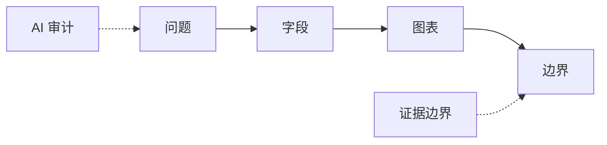

# 第 1 章 课程导论与医药数据特征

## 本章导入

某药治疗前后血糖下降，是否可以据此说药物有效？

本章是全书扩写稿，先形成足够完整的教学主干，后续再追加独立任务页和复盘页。 本章仍以课程周次事实文件为主线，所有示例均为教学模拟或课程化改写素材。它们用于训练数据结构、代码核验、图表表达和证据边界，不代表真实医学、统计、生物学或临床结论。

## 学习目标

- 识别医药数据的字段、单位和来源。
- 把药学问题拆成数据、方法、图表和证据边界。
- 说明 AI 可以辅助解释和检查，不能替代医学判断。

## Storyboard 对应表

| Slide range | Storyboard module | Textbook section | Purpose |
|---|---|---|---|
| 1-4 | 课程定位与导入 | 本章导入；本章主线与课程位置 | 本周先把问题和误区讲清楚 |
| 5-12 | 核心概念展开 | 核心概念；概念展开与药学解释 | 概念必须绑定输入、输出和边界 |
| 13-20 | 数据结构与案例 | 案例数据与字段说明；课堂案例 | 案例先看字段和观测单位 |
| 21-30 | 方法流程与代码 | 方法路线；工具实现与代码样例；方法流程与代码解读 | 代码要讲输入、处理、输出和错误 |
| 31-36 | 图表与结果解释 | 图表与结果解释；证据边界 | 图表只支持有来源的观察 |
| 37-40 | AI 协作与核验收束 | AI 协作与核验；来源与待核验点 | AI 只能帮助审计和改写边界 |

## 本章主线与课程位置

第 01 周处在“课程入口与 AI 边界”阶段。本章的主线是 **问题 -> 字段 -> 图表 -> 边界**。教师备课时应把这条路线看作一个证据链：前一环节提供输入，后一环节只在输入可靠、字段清楚、参数可追溯时才有解释价值。学生不需要把所有工具细节一次性掌握，但必须能说明本周为什么需要这些输入、为什么产生这些输出，以及哪些表达必须保留为待核验状态。

从课程整体看，本章不是独立百科条目，而是 36 课时主线中的一个教学节点。它既要服务课堂讲授，也要服务在线教材、后续 PPTX 生成和项目复盘。教材正文因此比课堂投屏更细：它保留字段说明、代码意图、图表解释和 AI 审计理由，方便学生课后回到源稿复习，也方便教师在制作 PPT 时裁剪主干内容。

## 核心概念

- **医药数据**：来自临床、实验、公共数据库或文献的结构化或半结构化资料。
- **证据边界**：数据和方法能够支持的结论范围。
- **工具分工**：Python、R、Bash 和 AI 分别服务不同环节。
- **课程契约**：记录来源、代码、图表、AI 使用和人工核验的共同规范。

## 概念展开与药学解释

本章的概念讲解要始终绑定药学语境。以“血糖变化小表”为例，教师不能只解释术语，还要追问术语背后的输入和输出。学生需要知道一列数据来自哪里，代表什么观测单位，是否有单位、分组、批次或来源说明。如果这些基础信息缺失，任何代码运行、图表展示或 AI 解释都只能算课堂演示，不能被写成可靠结论。

概念之间也要形成顺序。`问题 -> 字段 -> 图表 -> 边界` 不是装饰性的流程图，而是本章的认知路径。教师应先讲清数据如何进入流程，再讲方法如何处理数据，最后讲输出如何被解释。对药学本科生而言，最重要的不是记住所有函数名，而是形成“先看输入，再看处理，再看输出，最后看证据边界”的稳定习惯。

## 方法路线

本章路线可以概括为：**问题 -> 字段 -> 图表 -> 边界**。



这张路线图进入教材和 storyboard 时必须配合文字解释。第一，路线图只表示教学流程，不表示学生已经能够运行完整研究 workflow。第二，图中的每个节点都需要明确输入和输出。第三，图中的 AI 审计只用于检查解释是否遗漏字段、方法和待核验点，不能替代医学、统计或生物学判断。

## 案例数据与字段说明

本章配套小数据是 `course/textbook/assets/datasets/week01_glucose_contract.csv`。教师应先让学生阅读字段，而不是立刻运行代码。字段阅读至少包括四件事：字段名是否清楚，单位是否存在，观测单位是什么，是否有分组、批次或来源说明。若字段名称来自外部素材的缩写，教材正文只能保留课程化解释，不能把未核验缩写直接当作事实。

主案例“血糖变化小表”承担本章的教学主线。这个案例的价值不在于数据规模，而在于它足够小，学生可以看见每一步处理如何改变输入。教师应把小数据、字段字典和风险提示并列展示，使学生理解：数据表不是结论表，图表也不是机制图，代码输出必须回到字段和来源重新解释。

## 工具实现与代码样例

本章配套代码是 `course/textbook/assets/code/week01_glucose_contract.py`。代码只承担课堂核验和结构说明功能，不作为真实研究流程。教师讲代码时应按四层展开：输入文件、关键字段、处理逻辑、输出结果。每一层都要能被学生用小数据复核。如果代码依赖阈值、分组、标准化或参数，教材必须写明这些规则是课堂教学规则，不是通用医学或统计标准。

代码讲解不能退化成语法百科。对于 Python 或 R 周次，教师可以多讲变量、列表、数据框、函数和输出；对于统计或组学周次，教师应把代码看作“可复核的流程说明”，重点解释结果表字段、图形坐标和核验清单。AI 可以帮助解释代码、定位报错和生成边界样本，但学生必须保留人工判断和运行记录。

## 方法流程与代码解读

### Slide 01 · 用一个可核验问题打开第 01 周

这一页属于“课程定位与导入”，在教材中对应“本章导入”。主干内容是：本周导入问题是：某药治疗前后血糖下降，是否可以据此说药物有效？ 教师先要求学生把问题改写为数据、方法和边界三件事。 画面应采用“标题页叠加问题卡和课程链路条”，并显式引用 `course/textbook/chapters/chapter_01.md`。教师讲解时要做到：开场不要给结论，先让学生意识到医药数据分析不是把结果交给工具，而是把问题拆成可检查的结构。 本页教师追问：请学生完成“学生用一句话把导入问题改写为“数据、方法、边界”三栏，并标出仍需核验的词。”，并用一句话说明证据边界。 学生当场动作是：学生用一句话把导入问题改写为“数据、方法、边界”三栏，并标出仍需核验的词。 预计用时 2 min。 证据来源从 `knowledge/concepts/医药数据特征.md` 开始核对。边界提示是：不得把导入问题直接讲成医学、机制或统计结论。 本页进入教材正文时要写成连续说明，不要只保留幻灯片标题；学生复习时应能从文字中看出输入、处理、输出和待核验点之间的关系。

### Slide 02 · 本周承接上一周并服务下一周

这一页属于“课程定位与导入”，在教材中对应“Storyboard 对应表”。主干内容是：把本周放在全课路线中：问题 -> 字段 -> 图表 -> 边界。这条路线说明本周只解决链条中的特定环节。 画面应采用“18 周课程进度轴，突出本周节点”，并显式引用 `course/textbook/assets/diagrams/week01_evidence_chain.mmd`。教师讲解时要做到：教师说明前后周衔接，帮助学生知道哪些知识已经学过，哪些内容只作预告，不在本周展开。 本页教师追问：请学生完成“学生在 18 周路线轴上标出本周输入来自哪里、输出服务下一周哪一步。”，并用一句话说明证据边界。 学生当场动作是：学生在 18 周路线轴上标出本周输入来自哪里、输出服务下一周哪一步。 预计用时 2 min。 证据来源从 `knowledge/concepts/AI协作边界.md` 开始核对。边界提示是：不把后续周次的高级 workflow 提前变成学生必跑任务。 本页进入教材正文时要写成连续说明，不要只保留幻灯片标题；学生复习时应能从文字中看出输入、处理、输出和待核验点之间的关系。

### Slide 03 · 学习目标要落在可观察行为上

这一页属于“课程定位与导入”，在教材中对应“学习目标”。主干内容是：本页把目标拆为三类：能识别输入，能解释处理过程，能写出证据边界。 画面应采用“三列目标表，逐列标出输入、处理、边界”，并显式引用 `course/textbook/chapters/chapter_01.md`。教师讲解时要做到：教师逐条解释目标：说明 AI 可以辅助解释和检查，不能替代医学判断。 目标不是背术语，而是能对小数据、代码或图表做出有依据的说明。 本页教师追问：请学生完成“学生判断 3 个学习目标中哪个能通过表格、代码或图注现场观察到。”，并用一句话说明证据边界。 学生当场动作是：学生判断 3 个学习目标中哪个能通过表格、代码或图注现场观察到。 预计用时 2 min。 证据来源从 `course/weeks/week_01/teaching_pack_v1.md` 开始核对。边界提示是：学习目标不能写成掌握完整研究流程或独立完成高级生信分析。 本页进入教材正文时要写成连续说明，不要只保留幻灯片标题；学生复习时应能从文字中看出输入、处理、输出和待核验点之间的关系。

### Slide 04 · 先暴露本周最容易犯的解释错误

这一页属于“课程定位与导入”，在教材中对应“来源与待核验点”。主干内容是：本周常见误区是把 边界 看到的课堂观察直接写成真实结论，忽略来源、参数和待核验点。 画面应采用“错误表达与修订表达对照框”，并显式引用 `course/textbook/chapters/chapter_01.md`。教师讲解时要做到：教师用一条错误句子演示怎样降级为观察、候选解释或待核验点，建立整节课的表达边界。 本页教师追问：请学生完成“学生改写一条过度结论，把它降级为课堂观察、候选解释或待核验点。”，并用一句话说明证据边界。 学生当场动作是：学生改写一条过度结论，把它降级为课堂观察、候选解释或待核验点。 预计用时 2 min。 证据来源从 `knowledge/concepts/医药数据特征.md` 开始核对。边界提示是：错误示例必须标注为反例，不能被学生当成推荐结论。 本页进入教材正文时要写成连续说明，不要只保留幻灯片标题；学生复习时应能从文字中看出输入、处理、输出和待核验点之间的关系。

### Slide 05 · 先定义 医药数据 的输入和输出

这一页属于“核心概念展开”，在教材中对应“核心概念”。主干内容是：核心概念“医药数据”的课堂定义是：来自临床、实验、公共数据库或文献的结构化或半结构化资料。 本页同时说明它需要什么输入、产生什么输出、不能支持什么结论。 画面应采用“医药数据 概念卡，左侧输入，右侧输出和边界”，并显式引用 `course/textbook/chapters/chapter_01.md`。教师讲解时要做到：教师不要只读定义，要把“医药数据”放回 血糖变化小表 的场景，让学生看到概念怎样约束数据解释。 本页教师追问：请学生完成“学生标出“医药数据”需要的输入、产生的输出和不能支持的结论。”，并用一句话说明证据边界。 学生当场动作是：学生标出“医药数据”需要的输入、产生的输出和不能支持的结论。 预计用时 2 min。 证据来源从 `knowledge/concepts/AI协作边界.md` 开始核对。边界提示是：如果学生把“医药数据”解释成医学事实、机制事实或统计事实，需要立即要求其补来源和前提。 本页进入教材正文时要写成连续说明，不要只保留幻灯片标题；学生复习时应能从文字中看出输入、处理、输出和待核验点之间的关系。

### Slide 06 · 先定义 证据边界 的输入和输出

这一页属于“核心概念展开”，在教材中对应“核心概念”。主干内容是：核心概念“证据边界”的课堂定义是：数据和方法能够支持的结论范围。 本页同时说明它需要什么输入、产生什么输出、不能支持什么结论。 画面应采用“证据边界 概念卡，左侧输入，右侧输出和边界”，并显式引用 `course/textbook/assets/diagrams/week01_evidence_chain.mmd`。教师讲解时要做到：教师不要只读定义，要把“证据边界”放回 血糖变化小表 的场景，让学生看到概念怎样约束数据解释。 本页教师追问：请学生完成“学生比较“证据边界”与本周案例字段之间的一一对应关系。”，并用一句话说明证据边界。 学生当场动作是：学生比较“证据边界”与本周案例字段之间的一一对应关系。 预计用时 2 min。 证据来源从 `course/weeks/week_01/teaching_pack_v1.md` 开始核对。边界提示是：如果学生把“证据边界”解释成医学事实、机制事实或统计事实，需要立即要求其补来源和前提。 本页进入教材正文时要写成连续说明，不要只保留幻灯片标题；学生复习时应能从文字中看出输入、处理、输出和待核验点之间的关系。

### Slide 07 · 先定义 工具分工 的输入和输出

这一页属于“核心概念展开”，在教材中对应“核心概念”。主干内容是：核心概念“工具分工”的课堂定义是：Python、R、Bash 和 AI 分别服务不同环节。 本页同时说明它需要什么输入、产生什么输出、不能支持什么结论。 画面应采用“工具分工 概念卡，左侧输入，右侧输出和边界”，并显式引用 `course/textbook/chapters/chapter_01.md`。教师讲解时要做到：教师不要只读定义，要把“工具分工”放回 血糖变化小表 的场景，让学生看到概念怎样约束数据解释。 本页教师追问：请学生完成“学生判断概念解释中哪一句属于事实、哪一句仍需来源核验。”，并用一句话说明证据边界。 学生当场动作是：学生判断概念解释中哪一句属于事实、哪一句仍需来源核验。 预计用时 2 min。 证据来源从 `knowledge/concepts/医药数据特征.md` 开始核对。边界提示是：如果学生把“工具分工”解释成医学事实、机制事实或统计事实，需要立即要求其补来源和前提。 本页进入教材正文时要写成连续说明，不要只保留幻灯片标题；学生复习时应能从文字中看出输入、处理、输出和待核验点之间的关系。

### Slide 08 · 先定义 课程契约 的输入和输出

这一页属于“核心概念展开”，在教材中对应“核心概念”。主干内容是：核心概念“课程契约”的课堂定义是：记录来源、代码、图表、AI 使用和人工核验的共同规范。 本页同时说明它需要什么输入、产生什么输出、不能支持什么结论。 画面应采用“课程契约 概念卡，左侧输入，右侧输出和边界”，并显式引用 `course/textbook/assets/diagrams/week01_evidence_chain.mmd`。教师讲解时要做到：教师不要只读定义，要把“课程契约”放回 血糖变化小表 的场景，让学生看到概念怎样约束数据解释。 本页教师追问：请学生完成“学生说出一个把概念误写成医学或机制结论的风险表达。”，并用一句话说明证据边界。 学生当场动作是：学生说出一个把概念误写成医学或机制结论的风险表达。 预计用时 2 min。 证据来源从 `knowledge/concepts/AI协作边界.md` 开始核对。边界提示是：如果学生把“课程契约”解释成医学事实、机制事实或统计事实，需要立即要求其补来源和前提。 本页进入教材正文时要写成连续说明，不要只保留幻灯片标题；学生复习时应能从文字中看出输入、处理、输出和待核验点之间的关系。

### Slide 09 · 用 医药数据 检查案例解释边界

这一页属于“核心概念展开”，在教材中对应“核心概念”。主干内容是：核心概念“医药数据”的课堂定义是：来自临床、实验、公共数据库或文献的结构化或半结构化资料。 本页同时说明它需要什么输入、产生什么输出、不能支持什么结论。 画面应采用“医药数据 概念卡，左侧输入，右侧输出和边界”，并显式引用 `course/textbook/chapters/chapter_01.md`。教师讲解时要做到：教师不要只读定义，要把“医药数据”放回 血糖变化小表 的场景，让学生看到概念怎样约束数据解释。 本页教师追问：请学生完成“学生标出 `course/textbook/assets/datasets/week01_glucose_contract.csv` 中与“医药数据”对应的字段或图形元素。”，并用一句话说明证据边界。 学生当场动作是：学生标出 `course/textbook/assets/datasets/week01_glucose_contract.csv` 中与“医药数据”对应的字段或图形元素。 预计用时 2 min。 证据来源从 `course/weeks/week_01/teaching_pack_v1.md` 开始核对。边界提示是：如果学生把“医药数据”解释成医学事实、机制事实或统计事实，需要立即要求其补来源和前提。 本页进入教材正文时要写成连续说明，不要只保留幻灯片标题；学生复习时应能从文字中看出输入、处理、输出和待核验点之间的关系。

### Slide 10 · 用 证据边界 检查案例解释边界

这一页属于“核心概念展开”，在教材中对应“核心概念”。主干内容是：核心概念“证据边界”的课堂定义是：数据和方法能够支持的结论范围。 本页同时说明它需要什么输入、产生什么输出、不能支持什么结论。 画面应采用“证据边界 概念卡，左侧输入，右侧输出和边界”，并显式引用 `course/textbook/assets/diagrams/week01_evidence_chain.mmd`。教师讲解时要做到：教师不要只读定义，要把“证据边界”放回 血糖变化小表 的场景，让学生看到概念怎样约束数据解释。 本页教师追问：请学生完成“学生写出一句含前提的概念解释，避免脱离输入输出。”，并用一句话说明证据边界。 学生当场动作是：学生写出一句含前提的概念解释，避免脱离输入输出。 预计用时 2 min。 证据来源从 `knowledge/concepts/医药数据特征.md` 开始核对。边界提示是：如果学生把“证据边界”解释成医学事实、机制事实或统计事实，需要立即要求其补来源和前提。 本页进入教材正文时要写成连续说明，不要只保留幻灯片标题；学生复习时应能从文字中看出输入、处理、输出和待核验点之间的关系。

### Slide 11 · 用 工具分工 检查案例解释边界

这一页属于“核心概念展开”，在教材中对应“核心概念”。主干内容是：核心概念“工具分工”的课堂定义是：Python、R、Bash 和 AI 分别服务不同环节。 本页同时说明它需要什么输入、产生什么输出、不能支持什么结论。 画面应采用“工具分工 概念卡，左侧输入，右侧输出和边界”，并显式引用 `course/textbook/chapters/chapter_01.md`。教师讲解时要做到：教师不要只读定义，要把“工具分工”放回 血糖变化小表 的场景，让学生看到概念怎样约束数据解释。 本页教师追问：请学生完成“学生检查 AI 对概念的解释是否遗漏来源、参数或观测单位。”，并用一句话说明证据边界。 学生当场动作是：学生检查 AI 对概念的解释是否遗漏来源、参数或观测单位。 预计用时 2 min。 证据来源从 `knowledge/concepts/AI协作边界.md` 开始核对。边界提示是：如果学生把“工具分工”解释成医学事实、机制事实或统计事实，需要立即要求其补来源和前提。 本页进入教材正文时要写成连续说明，不要只保留幻灯片标题；学生复习时应能从文字中看出输入、处理、输出和待核验点之间的关系。

### Slide 12 · 用 课程契约 检查案例解释边界

这一页属于“核心概念展开”，在教材中对应“核心概念”。主干内容是：核心概念“课程契约”的课堂定义是：记录来源、代码、图表、AI 使用和人工核验的共同规范。 本页同时说明它需要什么输入、产生什么输出、不能支持什么结论。 画面应采用“课程契约 概念卡，左侧输入，右侧输出和边界”，并显式引用 `course/textbook/assets/diagrams/week01_evidence_chain.mmd`。教师讲解时要做到：教师不要只读定义，要把“课程契约”放回 血糖变化小表 的场景，让学生看到概念怎样约束数据解释。 本页教师追问：请学生完成“学生补写一个“不能据此说明……”的边界句。”，并用一句话说明证据边界。 学生当场动作是：学生补写一个“不能据此说明……”的边界句。 预计用时 2 min。 证据来源从 `course/weeks/week_01/teaching_pack_v1.md` 开始核对。边界提示是：如果学生把“课程契约”解释成医学事实、机制事实或统计事实，需要立即要求其补来源和前提。 本页进入教材正文时要写成连续说明，不要只保留幻灯片标题；学生复习时应能从文字中看出输入、处理、输出和待核验点之间的关系。

### Slide 13 · 主案例从一个小表开始

这一页属于“数据结构与案例”，在教材中对应“案例数据与字段说明”。主干内容是：案例名称是“血糖变化小表”。本页先说明数据是教学模拟或课程化改写素材。 画面应采用“小数据表、字段字典和风险标记三栏布局”，并显式引用 `course/textbook/assets/datasets/week01_glucose_contract.csv`。教师讲解时要做到：教师把表格逐行读给学生听，强调每个字段进入分析前都要能回答来源、单位和含义。 本页教师追问：请学生完成“学生打开或查看 `course/textbook/assets/datasets/week01_glucose_contract.csv`，标出主键、分组和主要指标列。”，并用一句话说明证据边界。 学生当场动作是：学生打开或查看 `course/textbook/assets/datasets/week01_glucose_contract.csv`，标出主键、分组和主要指标列。 预计用时 2 min。 证据来源从 `knowledge/concepts/医药数据特征.md` 开始核对。边界提示是：教学模拟数据不得被描述为真实患者、真实药效、真实表达矩阵或真实细胞注释。 本页进入教材正文时要写成连续说明，不要只保留幻灯片标题；学生复习时应能从文字中看出输入、处理、输出和待核验点之间的关系。

### Slide 14 · 字段含义决定后续分析是否可信

这一页属于“数据结构与案例”，在教材中对应“案例数据与字段说明”。主干内容是：逐列解释样本标识、分组、指标、单位、来源和可能缺失。 画面应采用“小数据表、字段字典和风险标记三栏布局”，并显式引用 `course/textbook/assets/datasets/week01_glucose_contract.csv`。教师讲解时要做到：教师把表格逐行读给学生听，强调每个字段进入分析前都要能回答来源、单位和含义。 本页教师追问：请学生完成“学生补写每个关键字段的字段含义、单位或来源说明。”，并用一句话说明证据边界。 学生当场动作是：学生补写每个关键字段的字段含义、单位或来源说明。 预计用时 3 min。 证据来源从 `knowledge/concepts/AI协作边界.md` 开始核对。边界提示是：教学模拟数据不得被描述为真实患者、真实药效、真实表达矩阵或真实细胞注释。 本页进入教材正文时要写成连续说明，不要只保留幻灯片标题；学生复习时应能从文字中看出输入、处理、输出和待核验点之间的关系。

### Slide 15 · 观测单位必须先说清楚

这一页属于“数据结构与案例”，在教材中对应“案例数据与字段说明”。主干内容是：判断一行代表 patient、sample、gene、cell、spot 还是项目条目。 画面应采用“小数据表、字段字典和风险标记三栏布局”，并显式引用 `course/textbook/assets/datasets/week01_glucose_contract.csv`。教师讲解时要做到：教师把表格逐行读给学生听，强调每个字段进入分析前都要能回答来源、单位和含义。 本页教师追问：请学生完成“学生判断一行数据代表 patient、sample、gene、cell、spot 还是项目条目。”，并用一句话说明证据边界。 学生当场动作是：学生判断一行数据代表 patient、sample、gene、cell、spot 还是项目条目。 预计用时 2 min。 证据来源从 `course/weeks/week_01/teaching_pack_v1.md` 开始核对。边界提示是：教学模拟数据不得被描述为真实患者、真实药效、真实表达矩阵或真实细胞注释。 本页进入教材正文时要写成连续说明，不要只保留幻灯片标题；学生复习时应能从文字中看出输入、处理、输出和待核验点之间的关系。

### Slide 16 · metadata 不是附录而是解释入口

这一页属于“数据结构与案例”，在教材中对应“案例数据与字段说明”。主干内容是：把分组、批次、处理条件和来源信息从结果表中分离出来。 画面应采用“小数据表、字段字典和风险标记三栏布局”，并显式引用 `course/textbook/assets/datasets/week01_glucose_contract.csv`。教师讲解时要做到：教师把表格逐行读给学生听，强调每个字段进入分析前都要能回答来源、单位和含义。 本页教师追问：请学生完成“学生把分组、批次、处理条件或来源信息写成 metadata 检查项。”，并用一句话说明证据边界。 学生当场动作是：学生把分组、批次、处理条件或来源信息写成 metadata 检查项。 预计用时 3 min。 证据来源从 `knowledge/concepts/医药数据特征.md` 开始核对。边界提示是：教学模拟数据不得被描述为真实患者、真实药效、真实表达矩阵或真实细胞注释。 本页进入教材正文时要写成连续说明，不要只保留幻灯片标题；学生复习时应能从文字中看出输入、处理、输出和待核验点之间的关系。

### Slide 17 · 小数据先做人工核验

这一页属于“数据结构与案例”，在教材中对应“案例数据与字段说明”。主干内容是：让学生先用肉眼或手算识别明显风险，再进入代码或图形。 画面应采用“小数据表、字段字典和风险标记三栏布局”，并显式引用 `course/textbook/assets/datasets/week01_glucose_contract.csv`。教师讲解时要做到：教师把表格逐行读给学生听，强调每个字段进入分析前都要能回答来源、单位和含义。 本页教师追问：请学生完成“学生检查小数据，找出一个缺失、异常、阈值或样本错位风险。”，并用一句话说明证据边界。 学生当场动作是：学生检查小数据，找出一个缺失、异常、阈值或样本错位风险。 预计用时 2 min。 证据来源从 `knowledge/concepts/AI协作边界.md` 开始核对。边界提示是：教学模拟数据不得被描述为真实患者、真实药效、真实表达矩阵或真实细胞注释。 本页进入教材正文时要写成连续说明，不要只保留幻灯片标题；学生复习时应能从文字中看出输入、处理、输出和待核验点之间的关系。

### Slide 18 · 质量风险要早于结论出现

这一页属于“数据结构与案例”，在教材中对应“案例数据与字段说明”。主干内容是：列出缺失、错位、单位不明、样本量不足、参数不明等风险。 画面应采用“小数据表、字段字典和风险标记三栏布局”，并显式引用 `course/textbook/assets/datasets/week01_glucose_contract.csv`。教师讲解时要做到：教师把表格逐行读给学生听，强调每个字段进入分析前都要能回答来源、单位和含义。 本页教师追问：请学生完成“学生列出进入代码前必须先确认的两个质量问题。”，并用一句话说明证据边界。 学生当场动作是：学生列出进入代码前必须先确认的两个质量问题。 预计用时 3 min。 证据来源从 `course/weeks/week_01/teaching_pack_v1.md` 开始核对。边界提示是：教学模拟数据不得被描述为真实患者、真实药效、真实表达矩阵或真实细胞注释。 本页进入教材正文时要写成连续说明，不要只保留幻灯片标题；学生复习时应能从文字中看出输入、处理、输出和待核验点之间的关系。

### Slide 19 · 素材来源要和课堂用途绑定

这一页属于“数据结构与案例”，在教材中对应“案例数据与字段说明”。主干内容是：本页把来源 `knowledge/concepts/医药数据特征.md` 与本周课堂任务绑定，避免资源堆砌。 画面应采用“小数据表、字段字典和风险标记三栏布局”，并显式引用 `course/textbook/assets/datasets/week01_glucose_contract.csv`。教师讲解时要做到：教师把表格逐行读给学生听，强调每个字段进入分析前都要能回答来源、单位和含义。 本页教师追问：请学生完成“学生写出来源 `knowledge/concepts/医药数据特征.md` 与课堂用途之间的一句可追溯说明。”，并用一句话说明证据边界。 学生当场动作是：学生写出来源 `knowledge/concepts/医药数据特征.md` 与课堂用途之间的一句可追溯说明。 预计用时 2 min。 证据来源从 `knowledge/concepts/医药数据特征.md` 开始核对。边界提示是：教学模拟数据不得被描述为真实患者、真实药效、真实表达矩阵或真实细胞注释。 本页进入教材正文时要写成连续说明，不要只保留幻灯片标题；学生复习时应能从文字中看出输入、处理、输出和待核验点之间的关系。

### Slide 20 · 案例边界决定能写什么句子

这一页属于“数据结构与案例”，在教材中对应“案例数据与字段说明”。主干内容是：本案例可支持对 边界 的课堂观察，不支持直接外推为真实研究结论。 画面应采用“小数据表、字段字典和风险标记三栏布局”，并显式引用 `course/textbook/assets/datasets/week01_glucose_contract.csv`。教师讲解时要做到：教师把表格逐行读给学生听，强调每个字段进入分析前都要能回答来源、单位和含义。 本页教师追问：请学生完成“学生写出本案例能支持的一个观察，并写出不能外推到真实结论的一句话。”，并用一句话说明证据边界。 学生当场动作是：学生写出本案例能支持的一个观察，并写出不能外推到真实结论的一句话。 预计用时 3 min。 证据来源从 `knowledge/concepts/AI协作边界.md` 开始核对。边界提示是：教学模拟数据不得被描述为真实患者、真实药效、真实表达矩阵或真实细胞注释。 本页进入教材正文时要写成连续说明，不要只保留幻灯片标题；学生复习时应能从文字中看出输入、处理、输出和待核验点之间的关系。

### Slide 21 · 方法流程先看全图再看细节

这一页属于“方法流程与代码”，在教材中对应“方法流程与代码解读”。主干内容是：用流程图串联 问题 -> 字段 -> 图表 -> 边界，让学生知道每一步的输入和输出。 画面应采用“流程图、代码片段、输出框和审计记录并列”，并显式引用 `course/textbook/assets/code/week01_glucose_contract.py`。教师讲解时要做到：教师逐步解释代码意图，只讲本周需要的最小结构，不展开无关语法百科或完整高级 workflow。 本页教师追问：请学生完成“学生在流程图中圈出 `问题` 的输入和输出。”，并用一句话说明证据边界。 学生当场动作是：学生在流程图中圈出 `问题` 的输入和输出。 预计用时 2 min。 证据来源从 `course/weeks/week_01/teaching_pack_v1.md` 开始核对。边界提示是：代码输出不是研究结论，必须和输入字段、参数、教学模拟边界一起呈现。 本页进入教材正文时要写成连续说明，不要只保留幻灯片标题；学生复习时应能从文字中看出输入、处理、输出和待核验点之间的关系。

### Slide 22 · 代码文件只是可核验示例

这一页属于“方法流程与代码”，在教材中对应“方法流程与代码解读”。主干内容是：配套代码 `course/textbook/assets/code/week01_glucose_contract.py` 用于说明处理逻辑，不作为真实研究 pipeline。 画面应采用“流程图、代码片段、输出框和审计记录并列”，并显式引用 `course/textbook/assets/code/week01_glucose_contract.py`。教师讲解时要做到：教师逐步解释代码意图，只讲本周需要的最小结构，不展开无关语法百科或完整高级 workflow。 本页教师追问：请学生完成“学生运行或阅读 `course/textbook/assets/code/week01_glucose_contract.py`，标出负责读入数据的代码行。”，并用一句话说明证据边界。 学生当场动作是：学生运行或阅读 `course/textbook/assets/code/week01_glucose_contract.py`，标出负责读入数据的代码行。 预计用时 3 min。 证据来源从 `knowledge/concepts/医药数据特征.md` 开始核对。边界提示是：代码输出不是研究结论，必须和输入字段、参数、教学模拟边界一起呈现。 本页进入教材正文时要写成连续说明，不要只保留幻灯片标题；学生复习时应能从文字中看出输入、处理、输出和待核验点之间的关系。

### Slide 23 · 代码输入必须回到字段字典

这一页属于“方法流程与代码”，在教材中对应“方法流程与代码解读”。主干内容是：代码读取 `course/textbook/assets/datasets/week01_glucose_contract.csv`，教师要求学生先指出会被代码使用的列。 画面应采用“流程图、代码片段、输出框和审计记录并列”，并显式引用 `course/textbook/assets/code/week01_glucose_contract.py`。教师讲解时要做到：教师逐步解释代码意图，只讲本周需要的最小结构，不展开无关语法百科或完整高级 workflow。 本页教师追问：请学生完成“学生检查 `course/textbook/assets/datasets/week01_glucose_contract.csv`，指出代码实际使用的列名。”，并用一句话说明证据边界。 学生当场动作是：学生检查 `course/textbook/assets/datasets/week01_glucose_contract.csv`，指出代码实际使用的列名。 预计用时 2 min。 证据来源从 `knowledge/concepts/AI协作边界.md` 开始核对。边界提示是：代码输出不是研究结论，必须和输入字段、参数、教学模拟边界一起呈现。 本页进入教材正文时要写成连续说明，不要只保留幻灯片标题；学生复习时应能从文字中看出输入、处理、输出和待核验点之间的关系。

### Slide 24 · 第一段处理逻辑负责选择有效记录

这一页属于“方法流程与代码”，在教材中对应“方法流程与代码解读”。主干内容是：说明过滤、分组、类型转换或样本匹配，不让 AI 直接代替判断规则。 画面应采用“流程图、代码片段、输出框和审计记录并列”，并显式引用 `course/textbook/assets/code/week01_glucose_contract.py`。教师讲解时要做到：教师逐步解释代码意图，只讲本周需要的最小结构，不展开无关语法百科或完整高级 workflow。 本页教师追问：请学生完成“学生检查第一段处理逻辑是否过滤、分组或类型转换了正确字段。”，并用一句话说明证据边界。 学生当场动作是：学生检查第一段处理逻辑是否过滤、分组或类型转换了正确字段。 预计用时 3 min。 证据来源从 `course/weeks/week_01/teaching_pack_v1.md` 开始核对。边界提示是：代码输出不是研究结论，必须和输入字段、参数、教学模拟边界一起呈现。 本页进入教材正文时要写成连续说明，不要只保留幻灯片标题；学生复习时应能从文字中看出输入、处理、输出和待核验点之间的关系。

### Slide 25 · 第二段处理逻辑负责计算或标记

这一页属于“方法流程与代码”，在教材中对应“方法流程与代码解读”。主干内容是：解释均值、阈值、矩阵转换、模型字段或图形坐标如何得到。 画面应采用“流程图、代码片段、输出框和审计记录并列”，并显式引用 `course/textbook/assets/code/week01_glucose_contract.py`。教师讲解时要做到：教师逐步解释代码意图，只讲本周需要的最小结构，不展开无关语法百科或完整高级 workflow。 本页教师追问：请学生完成“学生手工复核一行计算、标记、阈值判断或矩阵转换结果。”，并用一句话说明证据边界。 学生当场动作是：学生手工复核一行计算、标记、阈值判断或矩阵转换结果。 预计用时 2 min。 证据来源从 `knowledge/concepts/医药数据特征.md` 开始核对。边界提示是：代码输出不是研究结论，必须和输入字段、参数、教学模拟边界一起呈现。 本页进入教材正文时要写成连续说明，不要只保留幻灯片标题；学生复习时应能从文字中看出输入、处理、输出和待核验点之间的关系。

### Slide 26 · 运行输出要能被人工复核

这一页属于“方法流程与代码”，在教材中对应“方法流程与代码解读”。主干内容是：展示前 3 行输出或汇总结果，并回到小数据手工检查。 画面应采用“流程图、代码片段、输出框和审计记录并列”，并显式引用 `course/textbook/assets/code/week01_glucose_contract.py`。教师讲解时要做到：教师逐步解释代码意图，只讲本周需要的最小结构，不展开无关语法百科或完整高级 workflow。 本页教师追问：请学生完成“学生读出前三行输出，并判断输出能回答哪一个课堂问题。”，并用一句话说明证据边界。 学生当场动作是：学生读出前三行输出，并判断输出能回答哪一个课堂问题。 预计用时 3 min。 证据来源从 `knowledge/concepts/AI协作边界.md` 开始核对。边界提示是：代码输出不是研究结论，必须和输入字段、参数、教学模拟边界一起呈现。 本页进入教材正文时要写成连续说明，不要只保留幻灯片标题；学生复习时应能从文字中看出输入、处理、输出和待核验点之间的关系。

### Slide 27 · 参数和阈值要写入来源说明

这一页属于“方法流程与代码”，在教材中对应“方法流程与代码解读”。主干内容是：说明阈值、分组、标准化、距离、resolution 或图形参数来自课堂规则而非通用标准。 画面应采用“流程图、代码片段、输出框和审计记录并列”，并显式引用 `course/textbook/assets/code/week01_glucose_contract.py`。教师讲解时要做到：教师逐步解释代码意图，只讲本周需要的最小结构，不展开无关语法百科或完整高级 workflow。 本页教师追问：请学生完成“学生把阈值、参数或分组规则写入运行记录的一句话。”，并用一句话说明证据边界。 学生当场动作是：学生把阈值、参数或分组规则写入运行记录的一句话。 预计用时 2 min。 证据来源从 `course/weeks/week_01/teaching_pack_v1.md` 开始核对。边界提示是：代码输出不是研究结论，必须和输入字段、参数、教学模拟边界一起呈现。 本页进入教材正文时要写成连续说明，不要只保留幻灯片标题；学生复习时应能从文字中看出输入、处理、输出和待核验点之间的关系。

### Slide 28 · 常见代码错误来自列名和类型

这一页属于“方法流程与代码”，在教材中对应“方法流程与代码解读”。主干内容是：展示列名拼写、缺失值、因子/字符串、样本错位或空结果的风险。 画面应采用“流程图、代码片段、输出框和审计记录并列”，并显式引用 `course/textbook/assets/code/week01_glucose_contract.py`。教师讲解时要做到：教师逐步解释代码意图，只讲本周需要的最小结构，不展开无关语法百科或完整高级 workflow。 本页教师追问：请学生完成“学生标出一个列名、缺失值、类型或样本错位导致的代码风险。”，并用一句话说明证据边界。 学生当场动作是：学生标出一个列名、缺失值、类型或样本错位导致的代码风险。 预计用时 3 min。 证据来源从 `knowledge/concepts/医药数据特征.md` 开始核对。边界提示是：代码输出不是研究结论，必须和输入字段、参数、教学模拟边界一起呈现。 本页进入教材正文时要写成连续说明，不要只保留幻灯片标题；学生复习时应能从文字中看出输入、处理、输出和待核验点之间的关系。

### Slide 29 · 可复现记录比一次跑通更重要

这一页属于“方法流程与代码”，在教材中对应“方法流程与代码解读”。主干内容是：记录输入文件、代码版本、运行输出、AI 建议和人工修改。 画面应采用“流程图、代码片段、输出框和审计记录并列”，并显式引用 `course/textbook/assets/code/week01_glucose_contract.py`。教师讲解时要做到：教师逐步解释代码意图，只讲本周需要的最小结构，不展开无关语法百科或完整高级 workflow。 本页教师追问：请学生完成“学生补写一条可复现记录：输入文件、代码文件、运行输出和人工修改。”，并用一句话说明证据边界。 学生当场动作是：学生补写一条可复现记录：输入文件、代码文件、运行输出和人工修改。 预计用时 2 min。 证据来源从 `knowledge/concepts/AI协作边界.md` 开始核对。边界提示是：代码输出不是研究结论，必须和输入字段、参数、教学模拟边界一起呈现。 本页进入教材正文时要写成连续说明，不要只保留幻灯片标题；学生复习时应能从文字中看出输入、处理、输出和待核验点之间的关系。

### Slide 30 · 方法小结回到本周问题

这一页属于“方法流程与代码”，在教材中对应“方法流程与代码解读”。主干内容是：本页把代码输出重新放回“某药治疗前后血糖下降，是否可以据此说药物有效？”，说明能回答什么、不能回答什么。 画面应采用“流程图、代码片段、输出框和审计记录并列”，并显式引用 `course/textbook/assets/code/week01_glucose_contract.py`。教师讲解时要做到：教师逐步解释代码意图，只讲本周需要的最小结构，不展开无关语法百科或完整高级 workflow。 本页教师追问：请学生完成“学生回到导入问题，判断代码结果能回答什么、不能回答什么。”，并用一句话说明证据边界。 学生当场动作是：学生回到导入问题，判断代码结果能回答什么、不能回答什么。 预计用时 2 min。 证据来源从 `course/weeks/week_01/teaching_pack_v1.md` 开始核对。边界提示是：代码输出不是研究结论，必须和输入字段、参数、教学模拟边界一起呈现。 本页进入教材正文时要写成连续说明，不要只保留幻灯片标题；学生复习时应能从文字中看出输入、处理、输出和待核验点之间的关系。

### Slide 31 · 图表先说明视觉编码

这一页属于“图表与结果解释”，在教材中对应“图表与结果解释”。主干内容是：解释横轴、纵轴、颜色、形状、图例和单位分别映射什么字段。 画面应采用“结果表、示意图、图注和证据门四区布局”，并显式引用 `course/textbook/assets/diagrams/week01_evidence_chain.mmd`。教师讲解时要做到：教师用同一张图或表反复追问：图上看到了什么，数据支持什么，还需要核验什么。 本页教师追问：请学生完成“学生在图表草图上标出横轴、纵轴、颜色、图例和单位分别对应什么字段。”，并用一句话说明证据边界。 学生当场动作是：学生在图表草图上标出横轴、纵轴、颜色、图例和单位分别对应什么字段。 预计用时 2 min。 证据来源从 `knowledge/concepts/医药数据特征.md` 开始核对。边界提示是：不得把颜色、聚类、P 值、相关性或 AI 图注直接写成机制、疗效或临床建议。 本页进入教材正文时要写成连续说明，不要只保留幻灯片标题；学生复习时应能从文字中看出输入、处理、输出和待核验点之间的关系。

### Slide 32 · 结果表字段回答不同问题

这一页属于“图表与结果解释”，在教材中对应“图表与结果解释”。主干内容是：区分标识列、分组列、统计列、图形坐标列和待核验列。 画面应采用“结果表、示意图、图注和证据门四区布局”，并显式引用 `course/textbook/assets/diagrams/week01_evidence_chain.mmd`。教师讲解时要做到：教师用同一张图或表反复追问：图上看到了什么，数据支持什么，还需要核验什么。 本页教师追问：请学生完成“学生标出结果表字段所属的标识、分组、统计、坐标和待核验类别。”，并用一句话说明证据边界。 学生当场动作是：学生标出结果表字段所属的标识、分组、统计、坐标和待核验类别。 预计用时 3 min。 证据来源从 `knowledge/concepts/AI协作边界.md` 开始核对。边界提示是：不得把颜色、聚类、P 值、相关性或 AI 图注直接写成机制、疗效或临床建议。 本页进入教材正文时要写成连续说明，不要只保留幻灯片标题；学生复习时应能从文字中看出输入、处理、输出和待核验点之间的关系。

### Slide 33 · 图注要保留数据来源和处理前提

这一页属于“图表与结果解释”，在教材中对应“图表与结果解释”。主干内容是：图注必须包含教学模拟、字段含义、单位或参数说明。 画面应采用“结果表、示意图、图注和证据门四区布局”，并显式引用 `course/textbook/assets/diagrams/week01_evidence_chain.mmd`。教师讲解时要做到：教师用同一张图或表反复追问：图上看到了什么，数据支持什么，还需要核验什么。 本页教师追问：请学生完成“学生改写一条图注，补入教学模拟、字段含义、单位或参数说明。”，并用一句话说明证据边界。 学生当场动作是：学生改写一条图注，补入教学模拟、字段含义、单位或参数说明。 预计用时 2 min。 证据来源从 `course/weeks/week_01/teaching_pack_v1.md` 开始核对。边界提示是：不得把颜色、聚类、P 值、相关性或 AI 图注直接写成机制、疗效或临床建议。 本页进入教材正文时要写成连续说明，不要只保留幻灯片标题；学生复习时应能从文字中看出输入、处理、输出和待核验点之间的关系。

### Slide 34 · 证据边界决定报告句子的强度

这一页属于“图表与结果解释”，在教材中对应“图表与结果解释”。主干内容是：把观察、统计关联、候选解释和待核验事实分开写。 画面应采用“结果表、示意图、图注和证据门四区布局”，并显式引用 `course/textbook/assets/diagrams/week01_evidence_chain.mmd`。教师讲解时要做到：教师用同一张图或表反复追问：图上看到了什么，数据支持什么，还需要核验什么。 本页教师追问：请学生完成“学生改写一句强结论，拆出观察、统计关联、候选解释和待核验事实。”，并用一句话说明证据边界。 学生当场动作是：学生改写一句强结论，拆出观察、统计关联、候选解释和待核验事实。 预计用时 3 min。 证据来源从 `knowledge/concepts/医药数据特征.md` 开始核对。边界提示是：不得把颜色、聚类、P 值、相关性或 AI 图注直接写成机制、疗效或临床建议。 本页进入教材正文时要写成连续说明，不要只保留幻灯片标题；学生复习时应能从文字中看出输入、处理、输出和待核验点之间的关系。

### Slide 35 · Claim-Evidence Gate 用来拦截过度结论

这一页属于“图表与结果解释”，在教材中对应“图表与结果解释”。主干内容是：每一句结论都要能回答证据从哪里来、是否经过人工核验。 画面应采用“结果表、示意图、图注和证据门四区布局”，并显式引用 `course/textbook/assets/diagrams/week01_evidence_chain.mmd`。教师讲解时要做到：教师用同一张图或表反复追问：图上看到了什么，数据支持什么，还需要核验什么。 本页教师追问：请学生完成“学生检查一次 Claim-Evidence Gate，指出证据来源和人工核验状态。”，并用一句话说明证据边界。 学生当场动作是：学生检查一次 Claim-Evidence Gate，指出证据来源和人工核验状态。 预计用时 2 min。 证据来源从 `knowledge/concepts/AI协作边界.md` 开始核对。边界提示是：不得把颜色、聚类、P 值、相关性或 AI 图注直接写成机制、疗效或临床建议。 本页进入教材正文时要写成连续说明，不要只保留幻灯片标题；学生复习时应能从文字中看出输入、处理、输出和待核验点之间的关系。

### Slide 36 · 本周结果服务下一个学习节点

这一页属于“图表与结果解释”，在教材中对应“图表与结果解释”。主干内容是：把本周图表或结果表连接到下一周，不提前完成下一周任务。 画面应采用“结果表、示意图、图注和证据门四区布局”，并显式引用 `course/textbook/assets/diagrams/week01_evidence_chain.mmd`。教师讲解时要做到：教师用同一张图或表反复追问：图上看到了什么，数据支持什么，还需要核验什么。 本页教师追问：请学生完成“学生说出本周结果如何衔接下一周，同时指出不能提前完成的任务。”，并用一句话说明证据边界。 学生当场动作是：学生说出本周结果如何衔接下一周，同时指出不能提前完成的任务。 预计用时 2 min。 证据来源从 `course/weeks/week_01/teaching_pack_v1.md` 开始核对。边界提示是：不得把颜色、聚类、P 值、相关性或 AI 图注直接写成机制、疗效或临床建议。 本页进入教材正文时要写成连续说明，不要只保留幻灯片标题；学生复习时应能从文字中看出输入、处理、输出和待核验点之间的关系。

### Slide 37 · AI Prompt 必须限制任务边界

这一页属于“AI 协作与核验收束”，在教材中对应“AI 协作与核验”。主干内容是：Prompt 只要求 AI 检查 血糖变化小表 的字段、方法、图表和待核验点。 画面应采用“Prompt、AI 输出审计表、人工核验清单和下周衔接条”，并显式引用 `course/textbook/chapters/chapter_01.md`。教师讲解时要做到：教师强调 AI 是解释、检查和重构工具，不是医学判断、统计判断或真实数据核验者。 本页教师追问：请学生完成“学生写一条限定任务边界的 AI Prompt，只让 AI 检查字段、方法、图表和待核验点。”，并用一句话说明证据边界。 学生当场动作是：学生写一条限定任务边界的 AI Prompt，只让 AI 检查字段、方法、图表和待核验点。 预计用时 2 min。 证据来源从 `knowledge/concepts/医药数据特征.md` 开始核对。边界提示是：AI 不得编造数据来源、样本量、统计显著性、基因功能、细胞类型、药效机制或临床建议。 本页进入教材正文时要写成连续说明，不要只保留幻灯片标题；学生复习时应能从文字中看出输入、处理、输出和待核验点之间的关系。

### Slide 38 · AI 输出先当作待审文本

这一页属于“AI 协作与核验收束”，在教材中对应“AI 协作与核验”。主干内容是：把 AI 生成的解释拆成可保留、需修改、需删除三类。 画面应采用“Prompt、AI 输出审计表、人工核验清单和下周衔接条”，并显式引用 `course/textbook/chapters/chapter_01.md`。教师讲解时要做到：教师强调 AI 是解释、检查和重构工具，不是医学判断、统计判断或真实数据核验者。 本页教师追问：请学生完成“学生标出一段 AI 输出中可保留、需修改、必须删除的三类句子。”，并用一句话说明证据边界。 学生当场动作是：学生标出一段 AI 输出中可保留、需修改、必须删除的三类句子。 预计用时 2 min。 证据来源从 `knowledge/concepts/AI协作边界.md` 开始核对。边界提示是：AI 不得编造数据来源、样本量、统计显著性、基因功能、细胞类型、药效机制或临床建议。 本页进入教材正文时要写成连续说明，不要只保留幻灯片标题；学生复习时应能从文字中看出输入、处理、输出和待核验点之间的关系。

### Slide 39 · 人工核验负责最终证据状态

这一页属于“AI 协作与核验收束”，在教材中对应“AI 协作与核验”。主干内容是：教师说明医学意义、统计前提、基因功能、通路和细胞注释都要人工核验。 画面应采用“Prompt、AI 输出审计表、人工核验清单和下周衔接条”，并显式引用 `course/textbook/chapters/chapter_01.md`。教师讲解时要做到：教师强调 AI 是解释、检查和重构工具，不是医学判断、统计判断或真实数据核验者。 本页教师追问：请学生完成“学生判断一个医学、统计、基因功能或细胞注释说法应由谁核验。”，并用一句话说明证据边界。 学生当场动作是：学生判断一个医学、统计、基因功能或细胞注释说法应由谁核验。 预计用时 2 min。 证据来源从 `course/weeks/week_01/teaching_pack_v1.md` 开始核对。边界提示是：AI 不得编造数据来源、样本量、统计显著性、基因功能、细胞类型、药效机制或临床建议。 本页进入教材正文时要写成连续说明，不要只保留幻灯片标题；学生复习时应能从文字中看出输入、处理、输出和待核验点之间的关系。

### Slide 40 · 用一条克制句子收束本周

这一页属于“AI 协作与核验收束”，在教材中对应“AI 协作与核验”。主干内容是：最终表达必须回到 问题 -> 字段 -> 图表 -> 边界，只说本周数据和方法真正支持的内容。 画面应采用“Prompt、AI 输出审计表、人工核验清单和下周衔接条”，并显式引用 `course/textbook/chapters/chapter_01.md`。教师讲解时要做到：教师强调 AI 是解释、检查和重构工具，不是医学判断、统计判断或真实数据核验者。 本页教师追问：请学生完成“学生写出一条克制句子总结本周，只保留数据和方法真正支持的内容。”，并用一句话说明证据边界。 学生当场动作是：学生写出一条克制句子总结本周，只保留数据和方法真正支持的内容。 预计用时 2 min。 证据来源从 `knowledge/concepts/医药数据特征.md` 开始核对。边界提示是：AI 不得编造数据来源、样本量、统计显著性、基因功能、细胞类型、药效机制或临床建议。 本页进入教材正文时要写成连续说明，不要只保留幻灯片标题；学生复习时应能从文字中看出输入、处理、输出和待核验点之间的关系。


## 图表与结果解释

图表解释要遵循四步：先确认数据来源，再解释视觉编码，再说明统计或处理前提，最后写证据边界。无论本章使用流程图、结果表、散点图、热图、UMAP 还是项目 rubric，都不能跳过图注和来源说明。图表中的颜色、距离、聚类、P 值、阈值或分数只是在特定数据和方法前提下的观察，不自动构成机制、疗效、诊断或推荐。

当教师把本章内容转成 PPT 时，可以从 40 页 storyboard 中裁剪正式投屏页，但不能删除证据边界。正式 PPT 可以压缩页数，教材源稿不能压缩证据链。教材应保留足够细的字段、代码和图形解释，方便学生课后复习时知道每张图表为什么能说某句话、为什么不能说另一句话。

## 课堂案例

**案例名称：血糖变化小表**

课堂使用步骤：

1. 先说明数据来源是教学模拟或课程化素材。
2. 让学生标出关键字段、观测单位和可能的质量风险。
3. 用配套代码或手算方式得到一个可复核结果。
4. 把结果写成克制表达，并列出仍需人工核验的项目。

## AI 协作与核验

推荐 Prompt：

```text
请检查我对“血糖变化小表”的解释是否越过证据边界。
请只指出字段、方法、图表和待核验点中的遗漏，不要替我编造医学、统计、基因功能、通路机制、细胞注释或临床建议。
```

AI 可以用于解释术语、检查代码、改写图注和生成待核验清单；不能替代数据来源、统计前提、医学意义、基因功能、细胞注释或真实结果核验。教师应要求学生把 AI 输出分为三类：可以保留的语言、需要修改的表达、必须删除的越界结论。只有经过人工核验和来源记录的内容，才可以进入报告或 PPT。

## 练习与参考答案要点

练习：填写一张“问题-字段-图表-证据边界”四列表。

参考答案要点：答案应保留 adherence、分组和模拟数据边界，不能写成“药物有效”。

本轮扩写不把练习、答案、课后复盘和备用拓展作为 40 页 storyboard 的独立页面；这些内容先保留在教材章节中，后续再单独追加到教学包或正式 PPT 备份页。

## 来源与待核验点

主要来源：

- `knowledge/concepts/医药数据特征.md`
- `knowledge/concepts/AI协作边界.md`
- `course/weeks/week_01/teaching_pack_v1.md`

待核验点：

- 进入公开展示或 PPT 前，检查素材授权、字段含义、单位和图形参数。
- 若使用外部书籍、Notebook 或 PDF 中的图形，只记录来源，不直接复制图像进入教材正文。
- 若 AI 输出涉及机制、疗效、统计显著性、基因功能、通路或细胞类型，必须回到课程数据、数据库或人工审查记录核验。
- 本章 `textbook_status: expanded_draft` 只表示教材源稿扩写，不表示试讲完成或 PPTX 完成。
