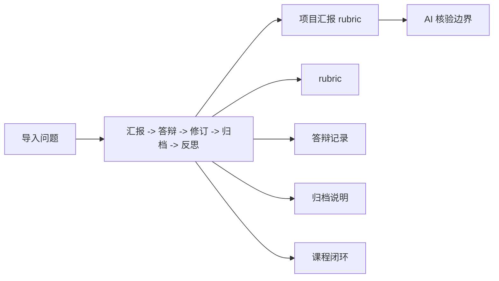
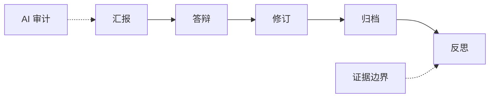

# 第 18 章 综合项目汇报与课程总结

## 本章导入

最终汇报应评价漂亮图表，还是评价数据来源、证据边界和可复现记录？

本章是教材知识体系正文，不是 40 页 PPT storyboard 的长文版。教材负责帮助学生建立可复习、可归纳、可迁移的知识结构；教学计划负责 90 分钟课堂组织；PPT storyboard 负责后续投屏源稿裁剪。三者互相引用，但不互相替代。

## 知识地图



这张知识地图把本章导入问题、方法路线、主案例、核心概念和 AI 核验边界放在同一个结构中。学生复习时先读图，再回到正文核对每个节点的输入、输出和不能支持的结论。

## 学习目标

- 使用统一 rubric 完成汇报和答辩。
- 检查数据来源、图表表达、AI 使用和归档。
- 总结全课程的数据分析链条。

## Storyboard 对应表

| Slide range | Storyboard module | Textbook section | Purpose |
|---|---|---|---|
| 1-4 | 课程定位与导入 | 本章导入；本章主线与课程位置 | 本周先把问题和误区讲清楚 |
| 5-12 | 核心概念展开 | 核心概念；概念展开与药学解释 | 概念必须绑定输入、输出和边界 |
| 13-20 | 数据结构与案例 | 案例数据与字段说明；课堂案例 | 案例先看字段和观测单位 |
| 21-30 | 方法流程与代码 | 方法路线；工具实现与代码样例；方法流程与代码解读 | 代码要讲输入、处理、输出和错误 |
| 31-36 | 图表与结果解释 | 图表与结果解释；证据边界 | 图表只支持有来源的观察 |
| 37-40 | AI 协作与核验收束 | AI 协作与核验；来源与待核验点 | AI 只能帮助审计和改写边界 |

上表只表示教材小节与 40 页 storyboard 模块的对应关系。它不是教材正文的展开顺序，也不要求教师在正式课件中保留 40 页。后续制作 PPTX 时可以裁剪页数，但不能删除数据来源、字段含义、代码输出、图表解释和证据边界。

## 本章主线与课程位置

第 18 周位于“项目交付、汇报答辩与课程闭环”阶段。本章路线是 **汇报 -> 答辩 -> 修订 -> 归档 -> 反思**。这一路线回答三个问题：本周从什么输入开始，经过什么处理或解释，最后能形成什么可核验输出。对药学本科生而言，关键不是记住所有工具细节，而是知道每一个结论的证据从哪里来。


本章的知识体系围绕 `汇报 -> 答辩 -> 修订 -> 归档 -> 反思` 展开。学生阅读时应先抓住主线，而不是从函数名或图形名称开始背诵。`rubric、答辩记录、归档说明、课程闭环` 这些概念只有放在输入、处理、输出和证据边界中才有教学意义。教师讲授时要不断把学生带回“这列数据从哪里来、这段代码改变了什么、这张图支持什么、这句话还缺什么证据”四个问题。

在药学本科课堂中，概念不应被处理成百科条目。以“项目汇报 rubric”为例，教材首先说明案例为何足够小、为何可以现场核验、为何不能外推为真实医学结论。小数据 `course/textbook/assets/datasets/week18_presentation_rubric.csv` 的作用是让学生看见字段、单位、分组、观测单位和质量风险；代码 `course/textbook/assets/code/week18_rubric_summary.py` 的作用是把处理逻辑暴露出来；示意图 `course/textbook/assets/diagrams/week18_course_closure.mmd` 的作用是组织表达，而不是充当未经核验的研究证据。

教材正文和课堂投屏的职责不同。教材需要保留解释链条，让学生课后能复盘每个概念的来源、前提和风险；PPT storyboard 需要把课堂注意力拆成页级动作；教学计划需要安排 90 分钟内教师讲什么、学生做什么、提交什么和教师如何判断达标。因此本章保留 storyboard 对应表，但不逐页复述 40 张 slide。对应表只用于索引，真正的知识组织由本章各节承担。

本章的跨章价值在于把前后周连接起来。前置章节提供工具、表格、统计、图形或矩阵直觉；后续章节要求学生把这些能力用于更复杂的数据结构或项目汇报。教师应明确哪些内容是本周必须达成，哪些只是为后续铺垫。任何超出本周数据和方法支持范围的表述，都必须降级为候选解释或待核验点。


## 跨章衔接

- Week 01-04 建立工具、AI 边界与可复现记录意识。
- Week 05-10 建立表格整理、统计推断和模型解释的基础。
- Week 11-13 把科研图表、高维矩阵、PCA、聚类和热图连接起来。
- Week 14-16 把表达矩阵、差异表达、单细胞和空间组学图形纳入可解释边界。
- Week 17-18 把数据、代码、图表、AI 使用和证据边界整理为项目交付物。

本章在这条链中的作用是让学生把已经学过的能力接到当前主题上，同时为后续章节保留必要的概念入口。教师不能把后续高级 workflow 提前变成学生必跑任务，也不能把本章的教学模拟结果写成真实研究结论。

## 核心概念

- **rubric**：统一评价维度和分值。
- **答辩记录**：记录问题、回答和后续修订。
- **归档说明**：确保项目可追溯和可复核。
- **课程闭环**：从问题到数据、代码、图表、解释和 AI 审计。

## 概念展开与药学解释

概念讲解必须回到药学场景。教师可以先让学生说出一个日常或实验问题，再追问这个问题需要什么字段、什么单位、什么分组和什么核验路径。对于 `项目汇报 rubric`，学生应先判断观测单位，再解释关键字段，最后才讨论代码或图形。

每个概念都要回答三件事：它需要什么输入，它产生什么输出，它不能支持什么结论。若学生把概念直接写成医学事实、机制事实或统计事实，教师应要求其补充来源、参数和前提。AI 可以帮助检查表达是否遗漏边界，但不能替代人工判断。

## 方法路线

本章路线可以概括为：**汇报 -> 答辩 -> 修订 -> 归档 -> 反思**。



路线图进入教材时承担“组织知识”的功能，进入 storyboard 时承担“组织页面”的功能，进入教学计划时承担“组织时间”的功能。三种用法不同，但都必须保留输入、输出和待核验点。学生复习时应能沿着路线图说明每一步的课堂产物。

## 案例数据与字段说明

本章配套小数据是 `course/textbook/assets/datasets/week18_presentation_rubric.csv`。小数据用于训练字段阅读、观测单位判断和质量风险识别。教师应要求学生先标出主键、分组、指标、单位和来源，再进入代码或图形。若字段名称来自外部素材缩写，教材只保留课程化解释，不把未核验缩写当作事实。

主案例“项目汇报 rubric”的价值在于足够小、可现场核验、可暴露错误。学生可以通过它练习三件事：读懂数据结构，说明处理逻辑，写出克制解释。任何课堂观察都必须标注为教学模拟或课程化素材，不能被描述为真实患者、真实药效、真实表达矩阵或真实细胞注释。

## 工具实现与代码样例

本章配套代码是 `course/textbook/assets/code/week18_rubric_summary.py`。代码只承担课堂核验和结构说明功能，不作为真实研究 pipeline。教师讲代码时按四层展开：输入文件、关键字段、处理逻辑、输出结果。每一层都要能被学生用小数据复核。

代码讲解不能退化为语法百科。本章只解释完成当前案例所需的最小结构：读入数据、检查字段、执行处理、输出结果、记录参数和边界。AI 可以帮助解释代码、定位报错或生成边界样本，但学生必须保留人工运行记录和修改理由。

## 方法流程与代码解读

方法流程需要把路线图、数据表和代码输出连成一条可追溯证据链。教师应先让学生在流程图中圈出输入和输出，再让学生阅读代码中真正使用的列名，最后回到小数据复核一处结果。若代码依赖阈值、分组、标准化、距离或图形参数，教材必须说明这些规则是课堂教学规则，不是通用医学或统计标准。

学生复盘时应能回答：代码读取了哪个文件，使用了哪些字段，改变了哪些数据，输出能回答哪个课堂问题，不能回答哪些真实研究问题。这个解读过程比“一次跑通”更重要，因为课程目标是建立可核验分析习惯。

## 图表与结果解释

图表解释遵循四步：确认数据来源，解释视觉编码，说明统计或处理前提，写出证据边界。无论本章使用流程图、结果表、散点图、热图、UMAP 还是项目 rubric，都不能跳过图注和来源说明。

图表中的颜色、距离、聚类、P 值、阈值或分数只是在特定数据和方法前提下的观察，不自动构成机制、疗效、诊断或推荐。教师应要求学生把图上观察、统计关联、候选解释和待核验事实分开写。

## 课堂案例

**案例名称：项目汇报 rubric**

课堂使用步骤：

1. 说明数据来源是教学模拟或课程化素材。
2. 标出关键字段、观测单位和可能的质量风险。
3. 用配套代码或手算方式得到一个可复核结果。
4. 把结果写成克制表达，并列出仍需人工核验的项目。

本案例的课堂产物不是最终论文结论，而是字段字典、代码运行记录、图注草稿和 Claim-Evidence Gate。教师应根据这些产物判断学生是否达成学习目标。

## AI 协作与核验

推荐 Prompt：

```text
请检查我对“项目汇报 rubric”的解释是否越过证据边界。
请只指出字段、方法、图表和待核验点中的遗漏，不要替我编造医学、统计、基因功能、通路机制、细胞注释或临床建议。
```

AI 可以用于解释术语、检查代码、改写图注和生成待核验清单；不能替代数据来源、统计前提、医学意义、基因功能、细胞注释或真实结果核验。教师应要求学生把 AI 输出分为三类：可以保留的语言、需要修改的表达、必须删除的越界结论。

## 练习与参考答案要点

练习：用 rubric 给一个项目汇报样例打分并写修订建议。

参考答案要点：答案应优先看来源、图表证据、AI 声明和可复现记录，而不是只看排版。

练习和答案保留在教材章节中，服务复习与复盘；它们不作为本轮 40 页 storyboard 的独立页面。后续如需课堂练习页、参考答案页、课后复盘页或备用页，应在教学包或正式 PPT 生产轮单独追加。

## 来源与待核验点

主要来源：

- `course/evaluation/student_project_rubric.md`
- `knowledge/concepts/项目目录结构与可复现.md`
- `course/weeks/week_18/teaching_pack_v1.md`

待核验点：

- 进入公开展示或 PPT 前，检查素材授权、字段含义、单位和图形参数。
- 若使用外部书籍、Notebook 或 PDF 中的图形，只记录来源，不直接复制图像进入教材正文。
- 若 AI 输出涉及机制、疗效、统计显著性、基因功能、通路或细胞类型，必须回到课程数据、数据库或人工审查记录核验。
- 本章 `textbook_status: expanded_draft` 只表示教材源稿扩写，不表示试讲完成或 PPTX 完成。

## 知识体系补充说明

本补充说明继续围绕“汇报 -> 答辩 -> 修订 -> 归档 -> 反思”展开，目的不是增加投屏页数，而是帮助学生在课后复盘时把概念、案例、代码和图表重新连成一条证据链。学生应回到 `course/textbook/assets/datasets/week18_presentation_rubric.csv` 检查字段，再回到 `course/textbook/assets/code/week18_rubric_summary.py` 检查处理逻辑，最后回到 `course/textbook/assets/diagrams/week18_course_closure.mmd` 检查表达边界。如果任何一步缺少来源、参数、单位或人工核验记录，结论都必须降级为课堂观察或待核验点。
## 知识体系补充说明

本补充说明继续围绕“汇报 -> 答辩 -> 修订 -> 归档 -> 反思”展开，目的不是增加投屏页数，而是帮助学生在课后复盘时把概念、案例、代码和图表重新连成一条证据链。学生应回到 `course/textbook/assets/datasets/week18_presentation_rubric.csv` 检查字段，再回到 `course/textbook/assets/code/week18_rubric_summary.py` 检查处理逻辑，最后回到 `course/textbook/assets/diagrams/week18_course_closure.mmd` 检查表达边界。如果任何一步缺少来源、参数、单位或人工核验记录，结论都必须降级为课堂观察或待核验点。
## 知识体系补充说明

本补充说明继续围绕“汇报 -> 答辩 -> 修订 -> 归档 -> 反思”展开，目的不是增加投屏页数，而是帮助学生在课后复盘时把概念、案例、代码和图表重新连成一条证据链。学生应回到 `course/textbook/assets/datasets/week18_presentation_rubric.csv` 检查字段，再回到 `course/textbook/assets/code/week18_rubric_summary.py` 检查处理逻辑，最后回到 `course/textbook/assets/diagrams/week18_course_closure.mmd` 检查表达边界。如果任何一步缺少来源、参数、单位或人工核验记录，结论都必须降级为课堂观察或待核验点。
## 知识体系补充说明

本补充说明继续围绕“汇报 -> 答辩 -> 修订 -> 归档 -> 反思”展开，目的不是增加投屏页数，而是帮助学生在课后复盘时把概念、案例、代码和图表重新连成一条证据链。学生应回到 `course/textbook/assets/datasets/week18_presentation_rubric.csv` 检查字段，再回到 `course/textbook/assets/code/week18_rubric_summary.py` 检查处理逻辑，最后回到 `course/textbook/assets/diagrams/week18_course_closure.mmd` 检查表达边界。如果任何一步缺少来源、参数、单位或人工核验记录，结论都必须降级为课堂观察或待核验点。
## 知识体系补充说明

本补充说明继续围绕“汇报 -> 答辩 -> 修订 -> 归档 -> 反思”展开，目的不是增加投屏页数，而是帮助学生在课后复盘时把概念、案例、代码和图表重新连成一条证据链。学生应回到 `course/textbook/assets/datasets/week18_presentation_rubric.csv` 检查字段，再回到 `course/textbook/assets/code/week18_rubric_summary.py` 检查处理逻辑，最后回到 `course/textbook/assets/diagrams/week18_course_closure.mmd` 检查表达边界。如果任何一步缺少来源、参数、单位或人工核验记录，结论都必须降级为课堂观察或待核验点。
## 知识体系补充说明

本补充说明继续围绕“汇报 -> 答辩 -> 修订 -> 归档 -> 反思”展开，目的不是增加投屏页数，而是帮助学生在课后复盘时把概念、案例、代码和图表重新连成一条证据链。学生应回到 `course/textbook/assets/datasets/week18_presentation_rubric.csv` 检查字段，再回到 `course/textbook/assets/code/week18_rubric_summary.py` 检查处理逻辑，最后回到 `course/textbook/assets/diagrams/week18_course_closure.mmd` 检查表达边界。如果任何一步缺少来源、参数、单位或人工核验记录，结论都必须降级为课堂观察或待核验点。
## 知识体系补充说明

本补充说明继续围绕“汇报 -> 答辩 -> 修订 -> 归档 -> 反思”展开，目的不是增加投屏页数，而是帮助学生在课后复盘时把概念、案例、代码和图表重新连成一条证据链。学生应回到 `course/textbook/assets/datasets/week18_presentation_rubric.csv` 检查字段，再回到 `course/textbook/assets/code/week18_rubric_summary.py` 检查处理逻辑，最后回到 `course/textbook/assets/diagrams/week18_course_closure.mmd` 检查表达边界。如果任何一步缺少来源、参数、单位或人工核验记录，结论都必须降级为课堂观察或待核验点。
## 知识体系补充说明

本补充说明继续围绕“汇报 -> 答辩 -> 修订 -> 归档 -> 反思”展开，目的不是增加投屏页数，而是帮助学生在课后复盘时把概念、案例、代码和图表重新连成一条证据链。学生应回到 `course/textbook/assets/datasets/week18_presentation_rubric.csv` 检查字段，再回到 `course/textbook/assets/code/week18_rubric_summary.py` 检查处理逻辑，最后回到 `course/textbook/assets/diagrams/week18_course_closure.mmd` 检查表达边界。如果任何一步缺少来源、参数、单位或人工核验记录，结论都必须降级为课堂观察或待核验点。
## 知识体系补充说明

本补充说明继续围绕“汇报 -> 答辩 -> 修订 -> 归档 -> 反思”展开，目的不是增加投屏页数，而是帮助学生在课后复盘时把概念、案例、代码和图表重新连成一条证据链。学生应回到 `course/textbook/assets/datasets/week18_presentation_rubric.csv` 检查字段，再回到 `course/textbook/assets/code/week18_rubric_summary.py` 检查处理逻辑，最后回到 `course/textbook/assets/diagrams/week18_course_closure.mmd` 检查表达边界。如果任何一步缺少来源、参数、单位或人工核验记录，结论都必须降级为课堂观察或待核验点。
## 知识体系补充说明

本补充说明继续围绕“汇报 -> 答辩 -> 修订 -> 归档 -> 反思”展开，目的不是增加投屏页数，而是帮助学生在课后复盘时把概念、案例、代码和图表重新连成一条证据链。学生应回到 `course/textbook/assets/datasets/week18_presentation_rubric.csv` 检查字段，再回到 `course/textbook/assets/code/week18_rubric_summary.py` 检查处理逻辑，最后回到 `course/textbook/assets/diagrams/week18_course_closure.mmd` 检查表达边界。如果任何一步缺少来源、参数、单位或人工核验记录，结论都必须降级为课堂观察或待核验点。
## 知识体系补充说明

本补充说明继续围绕“汇报 -> 答辩 -> 修订 -> 归档 -> 反思”展开，目的不是增加投屏页数，而是帮助学生在课后复盘时把概念、案例、代码和图表重新连成一条证据链。学生应回到 `course/textbook/assets/datasets/week18_presentation_rubric.csv` 检查字段，再回到 `course/textbook/assets/code/week18_rubric_summary.py` 检查处理逻辑，最后回到 `course/textbook/assets/diagrams/week18_course_closure.mmd` 检查表达边界。如果任何一步缺少来源、参数、单位或人工核验记录，结论都必须降级为课堂观察或待核验点。
## 知识体系补充说明

本补充说明继续围绕“汇报 -> 答辩 -> 修订 -> 归档 -> 反思”展开，目的不是增加投屏页数，而是帮助学生在课后复盘时把概念、案例、代码和图表重新连成一条证据链。学生应回到 `course/textbook/assets/datasets/week18_presentation_rubric.csv` 检查字段，再回到 `course/textbook/assets/code/week18_rubric_summary.py` 检查处理逻辑，最后回到 `course/textbook/assets/diagrams/week18_course_closure.mmd` 检查表达边界。如果任何一步缺少来源、参数、单位或人工核验记录，结论都必须降级为课堂观察或待核验点。
## 知识体系补充说明

本补充说明继续围绕“汇报 -> 答辩 -> 修订 -> 归档 -> 反思”展开，目的不是增加投屏页数，而是帮助学生在课后复盘时把概念、案例、代码和图表重新连成一条证据链。学生应回到 `course/textbook/assets/datasets/week18_presentation_rubric.csv` 检查字段，再回到 `course/textbook/assets/code/week18_rubric_summary.py` 检查处理逻辑，最后回到 `course/textbook/assets/diagrams/week18_course_closure.mmd` 检查表达边界。如果任何一步缺少来源、参数、单位或人工核验记录，结论都必须降级为课堂观察或待核验点。
## 知识体系补充说明

本补充说明继续围绕“汇报 -> 答辩 -> 修订 -> 归档 -> 反思”展开，目的不是增加投屏页数，而是帮助学生在课后复盘时把概念、案例、代码和图表重新连成一条证据链。学生应回到 `course/textbook/assets/datasets/week18_presentation_rubric.csv` 检查字段，再回到 `course/textbook/assets/code/week18_rubric_summary.py` 检查处理逻辑，最后回到 `course/textbook/assets/diagrams/week18_course_closure.mmd` 检查表达边界。如果任何一步缺少来源、参数、单位或人工核验记录，结论都必须降级为课堂观察或待核验点。
## 知识体系补充说明

本补充说明继续围绕“汇报 -> 答辩 -> 修订 -> 归档 -> 反思”展开，目的不是增加投屏页数，而是帮助学生在课后复盘时把概念、案例、代码和图表重新连成一条证据链。学生应回到 `course/textbook/assets/datasets/week18_presentation_rubric.csv` 检查字段，再回到 `course/textbook/assets/code/week18_rubric_summary.py` 检查处理逻辑，最后回到 `course/textbook/assets/diagrams/week18_course_closure.mmd` 检查表达边界。如果任何一步缺少来源、参数、单位或人工核验记录，结论都必须降级为课堂观察或待核验点。
## 知识体系补充说明

本补充说明继续围绕“汇报 -> 答辩 -> 修订 -> 归档 -> 反思”展开，目的不是增加投屏页数，而是帮助学生在课后复盘时把概念、案例、代码和图表重新连成一条证据链。学生应回到 `course/textbook/assets/datasets/week18_presentation_rubric.csv` 检查字段，再回到 `course/textbook/assets/code/week18_rubric_summary.py` 检查处理逻辑，最后回到 `course/textbook/assets/diagrams/week18_course_closure.mmd` 检查表达边界。如果任何一步缺少来源、参数、单位或人工核验记录，结论都必须降级为课堂观察或待核验点。
## 知识体系补充说明

本补充说明继续围绕“汇报 -> 答辩 -> 修订 -> 归档 -> 反思”展开，目的不是增加投屏页数，而是帮助学生在课后复盘时把概念、案例、代码和图表重新连成一条证据链。学生应回到 `course/textbook/assets/datasets/week18_presentation_rubric.csv` 检查字段，再回到 `course/textbook/assets/code/week18_rubric_summary.py` 检查处理逻辑，最后回到 `course/textbook/assets/diagrams/week18_course_closure.mmd` 检查表达边界。如果任何一步缺少来源、参数、单位或人工核验记录，结论都必须降级为课堂观察或待核验点。
## 知识体系补充说明

本补充说明继续围绕“汇报 -> 答辩 -> 修订 -> 归档 -> 反思”展开，目的不是增加投屏页数，而是帮助学生在课后复盘时把概念、案例、代码和图表重新连成一条证据链。学生应回到 `course/textbook/assets/datasets/week18_presentation_rubric.csv` 检查字段，再回到 `course/textbook/assets/code/week18_rubric_summary.py` 检查处理逻辑，最后回到 `course/textbook/assets/diagrams/week18_course_closure.mmd` 检查表达边界。如果任何一步缺少来源、参数、单位或人工核验记录，结论都必须降级为课堂观察或待核验点。
## 知识体系补充说明

本补充说明继续围绕“汇报 -> 答辩 -> 修订 -> 归档 -> 反思”展开，目的不是增加投屏页数，而是帮助学生在课后复盘时把概念、案例、代码和图表重新连成一条证据链。学生应回到 `course/textbook/assets/datasets/week18_presentation_rubric.csv` 检查字段，再回到 `course/textbook/assets/code/week18_rubric_summary.py` 检查处理逻辑，最后回到 `course/textbook/assets/diagrams/week18_course_closure.mmd` 检查表达边界。如果任何一步缺少来源、参数、单位或人工核验记录，结论都必须降级为课堂观察或待核验点。
## 知识体系补充说明

本补充说明继续围绕“汇报 -> 答辩 -> 修订 -> 归档 -> 反思”展开，目的不是增加投屏页数，而是帮助学生在课后复盘时把概念、案例、代码和图表重新连成一条证据链。学生应回到 `course/textbook/assets/datasets/week18_presentation_rubric.csv` 检查字段，再回到 `course/textbook/assets/code/week18_rubric_summary.py` 检查处理逻辑，最后回到 `course/textbook/assets/diagrams/week18_course_closure.mmd` 检查表达边界。如果任何一步缺少来源、参数、单位或人工核验记录，结论都必须降级为课堂观察或待核验点。
## 知识体系补充说明

本补充说明继续围绕“汇报 -> 答辩 -> 修订 -> 归档 -> 反思”展开，目的不是增加投屏页数，而是帮助学生在课后复盘时把概念、案例、代码和图表重新连成一条证据链。学生应回到 `course/textbook/assets/datasets/week18_presentation_rubric.csv` 检查字段，再回到 `course/textbook/assets/code/week18_rubric_summary.py` 检查处理逻辑，最后回到 `course/textbook/assets/diagrams/week18_course_closure.mmd` 检查表达边界。如果任何一步缺少来源、参数、单位或人工核验记录，结论都必须降级为课堂观察或待核验点。
## 知识体系补充说明

本补充说明继续围绕“汇报 -> 答辩 -> 修订 -> 归档 -> 反思”展开，目的不是增加投屏页数，而是帮助学生在课后复盘时把概念、案例、代码和图表重新连成一条证据链。学生应回到 `course/textbook/assets/datasets/week18_presentation_rubric.csv` 检查字段，再回到 `course/textbook/assets/code/week18_rubric_summary.py` 检查处理逻辑，最后回到 `course/textbook/assets/diagrams/week18_course_closure.mmd` 检查表达边界。如果任何一步缺少来源、参数、单位或人工核验记录，结论都必须降级为课堂观察或待核验点。
## 知识体系补充说明

本补充说明继续围绕“汇报 -> 答辩 -> 修订 -> 归档 -> 反思”展开，目的不是增加投屏页数，而是帮助学生在课后复盘时把概念、案例、代码和图表重新连成一条证据链。学生应回到 `course/textbook/assets/datasets/week18_presentation_rubric.csv` 检查字段，再回到 `course/textbook/assets/code/week18_rubric_summary.py` 检查处理逻辑，最后回到 `course/textbook/assets/diagrams/week18_course_closure.mmd` 检查表达边界。如果任何一步缺少来源、参数、单位或人工核验记录，结论都必须降级为课堂观察或待核验点。
## 知识体系补充说明

本补充说明继续围绕“汇报 -> 答辩 -> 修订 -> 归档 -> 反思”展开，目的不是增加投屏页数，而是帮助学生在课后复盘时把概念、案例、代码和图表重新连成一条证据链。学生应回到 `course/textbook/assets/datasets/week18_presentation_rubric.csv` 检查字段，再回到 `course/textbook/assets/code/week18_rubric_summary.py` 检查处理逻辑，最后回到 `course/textbook/assets/diagrams/week18_course_closure.mmd` 检查表达边界。如果任何一步缺少来源、参数、单位或人工核验记录，结论都必须降级为课堂观察或待核验点。
## 知识体系补充说明

本补充说明继续围绕“汇报 -> 答辩 -> 修订 -> 归档 -> 反思”展开，目的不是增加投屏页数，而是帮助学生在课后复盘时把概念、案例、代码和图表重新连成一条证据链。学生应回到 `course/textbook/assets/datasets/week18_presentation_rubric.csv` 检查字段，再回到 `course/textbook/assets/code/week18_rubric_summary.py` 检查处理逻辑，最后回到 `course/textbook/assets/diagrams/week18_course_closure.mmd` 检查表达边界。如果任何一步缺少来源、参数、单位或人工核验记录，结论都必须降级为课堂观察或待核验点。
## 知识体系补充说明

本补充说明继续围绕“汇报 -> 答辩 -> 修订 -> 归档 -> 反思”展开，目的不是增加投屏页数，而是帮助学生在课后复盘时把概念、案例、代码和图表重新连成一条证据链。学生应回到 `course/textbook/assets/datasets/week18_presentation_rubric.csv` 检查字段，再回到 `course/textbook/assets/code/week18_rubric_summary.py` 检查处理逻辑，最后回到 `course/textbook/assets/diagrams/week18_course_closure.mmd` 检查表达边界。如果任何一步缺少来源、参数、单位或人工核验记录，结论都必须降级为课堂观察或待核验点。
## 知识体系补充说明

本补充说明继续围绕“汇报 -> 答辩 -> 修订 -> 归档 -> 反思”展开，目的不是增加投屏页数，而是帮助学生在课后复盘时把概念、案例、代码和图表重新连成一条证据链。学生应回到 `course/textbook/assets/datasets/week18_presentation_rubric.csv` 检查字段，再回到 `course/textbook/assets/code/week18_rubric_summary.py` 检查处理逻辑，最后回到 `course/textbook/assets/diagrams/week18_course_closure.mmd` 检查表达边界。如果任何一步缺少来源、参数、单位或人工核验记录，结论都必须降级为课堂观察或待核验点。
## 知识体系补充说明

本补充说明继续围绕“汇报 -> 答辩 -> 修订 -> 归档 -> 反思”展开，目的不是增加投屏页数，而是帮助学生在课后复盘时把概念、案例、代码和图表重新连成一条证据链。学生应回到 `course/textbook/assets/datasets/week18_presentation_rubric.csv` 检查字段，再回到 `course/textbook/assets/code/week18_rubric_summary.py` 检查处理逻辑，最后回到 `course/textbook/assets/diagrams/week18_course_closure.mmd` 检查表达边界。如果任何一步缺少来源、参数、单位或人工核验记录，结论都必须降级为课堂观察或待核验点。
## 知识体系补充说明

本补充说明继续围绕“汇报 -> 答辩 -> 修订 -> 归档 -> 反思”展开，目的不是增加投屏页数，而是帮助学生在课后复盘时把概念、案例、代码和图表重新连成一条证据链。学生应回到 `course/textbook/assets/datasets/week18_presentation_rubric.csv` 检查字段，再回到 `course/textbook/assets/code/week18_rubric_summary.py` 检查处理逻辑，最后回到 `course/textbook/assets/diagrams/week18_course_closure.mmd` 检查表达边界。如果任何一步缺少来源、参数、单位或人工核验记录，结论都必须降级为课堂观察或待核验点。