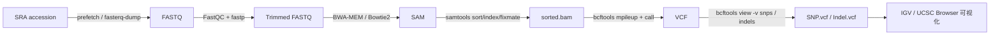

# Variant Calling 流程

## 流程图

来源：AIDD [Ch.8 Variant Calling on Bash](../sources/AIDD_Bioinformatics_Course.md)。

## 步骤详解

| 步骤 | 工具 | 输入 | 输出 |
|---|---|---|---|
| 1. 获取数据 | SRA Toolkit | SRA accession | FASTQ |
| 2. QC / 修剪 | FastQC / fastp | FASTQ | Trimmed FASTQ |
| 3. 比对 | BWA-MEM / Bowtie2 | FASTQ + reference | SAM |
| 4. 整理 BAM | [samtools](../entities/samtools.md) `sort`、`index`、`fixmate` | SAM | sorted.bam + .bai |
| 5. 变异检测 | bcftools `mpileup` + `call` | sorted.bam + ref.fa | VCF |
| 6. 类型分离 | bcftools `view -v snps` / `-v indels` | VCF | 分离 VCF |
| 7. 可视化 | IGV / UCSC Browser | VCF + ref + bam | 可视化页面 |

## 与 RNA-seq 流程的对比

| 项 | RNA-seq | Variant Calling |
|---|---|---|
| 目标 | 表达定量 | 序列变异检测 |
| 比对器 | HISAT2 / STAR（splice-aware） | BWA-MEM / Bowtie2（不允许 split） |
| 输出 | count matrix | VCF |
| 下游 | DESeq2 / edgeR / limma | 注释（VEP / SnpEff）/ 临床判读 |
| 课程位置 | 第 11、16 周 | 第 16 周（选讲）/ 项目实战 |

## 在本课程中的位置

- **第 16 周**：作为"组学综合分析"的扩展案例，**不要求学生上机跑完整 pipeline**，
  重点是理解每一步的输入输出。
- **第 17-18 周项目**：若有学生项目方向是药物基因组学（PGx），可以从公共数据库下载已有 VCF，
  跳过上游流程直接进入注释与解读。

## 常见坑

- **不做 `fixmate`** → 配对信息异常 → 后续 SNP 大量假阳性。
- **mpileup 默认 max-depth 太低** → 漏掉真实变异。
- **染色体命名风格**（`chr1` vs `1`）→ 比对到不存在的 contig，导致 VCF 为空。
- **机翻陷阱**："SAM 工具" / "BCF 工具" → 实际是 `samtools` / `bcftools`。

## 相关页面

- 概念：[RNA-seq 上游流程](RNA-seq上游流程.md) · [差异表达分析](差异表达分析.md)
- 实体：[Bash](../entities/Bash.md) · [samtools](../entities/samtools.md)
- 来源：[AIDD Ch.8](../sources/AIDD_Bioinformatics_Course.md)

## 待办

> [!todo] 待 ingest：BWA、bcftools、IGV、SnpEff、VEP 各建 entity 页。
