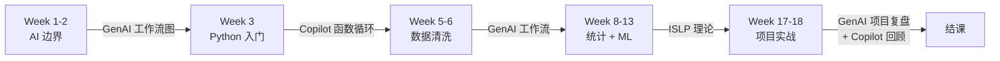

# 三本 Python/AI 书定位对比

## TL;DR

- **[ISLP](../sources/ISLP.md)**：统计学习与机器学习的**理论 + Python lab** 教材。
- **[Starting Data Analytics with GenAI](../sources/Starting_Data_Analytics_GenAI.md)**：**项目级**数据分析中的 AI 协作循环。
- **[Learn AI-Assisted Python Programming](../sources/Learn_AI_Assisted_Python_Programming.md)**：**函数级**编程教学中的 AI 协作。

## 对比表

| 维度 | ISLP | GenAI for Data Analytics | Copilot/ChatGPT for Python |
|---|---|---|---|
| 作者背景 | 统计学教授 | 数据科学顾问 | CS 教育研究者 |
| 主线 | 统计学习方法 | 数据分析项目流程中的 LLM 使用 | 编程入门中的 LLM 使用 |
| 抽象层次 | 算法 / 概念 | 项目 / 工作流 | 函数 / 行 |
| 工具 | Python + ISLP 包 | Python + ChatGPT | Python + Copilot + ChatGPT |
| 是否教 Python | 否（默认会） | 是（轻量） | 是（系统） |
| 是否教 AI | 否 | 是 | 是 |
| 是否谈伦理 | 弱 | 中（项目级 reflection） | 强（CS 教育视角） |
| 本课程引用周次 | 8-13、16 | 1-2、5-6、17-18 | 3-4、17-18 |

## 三本如何配合（按课程周次）

## 三本能解决的"教学难题"

| 教学难题 | 由哪本书解决 |
|---|---|
| "AI 写代码我看不懂怎么办？" | Copilot 书 §"function design cycle"——不接收没读懂的代码 |
| "做项目时如何让 AI 帮我？" | GenAI 书 §"Recommended GenAI Data Analysis Flow" |
| "什么时候用 logistic 回归 vs KNN？" | ISLP Ch.4 |
| "为什么 padj 比 pvalue 可靠？" | ISLP Ch.13 多重检验 |
| "学生过度依赖 AI 怎么办？" | Copilot 书 § 教育研究章节，给出阶段化引入策略 |
| "我手头是 messy data，怎么开始？" | GenAI 书 § 数据清洗章节 |

## 三本的局限（避免被带偏）

- **ISLP**：不讲 AI 协作、不讲临床医药数据特性。
- **GenAI 书**：例子偏商业 / 一般数据科学，不专门讲医药。
- **Copilot 书**：偏 CS 编程入门，案例不是数据分析。

→ 三本都不足以单独支撑本课程，**必须配合** [AIDD 课程](../sources/AIDD_Bioinformatics_Course.md)
（提供生信案例）与 [36 课时讲稿](../sources/36课时讲稿.md)（提供医药语境）。

## 学生推荐阅读路径

- **必读**：36 课时讲稿（教师讲）
- **选读 1（编程能力较弱）**：Copilot 书前 5 章
- **选读 2（要做项目）**：GenAI 书全本
- **选读 3（要做组学/统计深入）**：ISLP Ch.2-4、Ch.12-13

## 相关页面

- 来源：[ISLP](../sources/ISLP.md) · [Starting Data Analytics with GenAI](../sources/Starting_Data_Analytics_GenAI.md) · [Learn AI-Assisted Python Programming](../sources/Learn_AI_Assisted_Python_Programming.md)
- 概念：[AI 协作边界](../concepts/AI协作边界.md)
- 课程主页：[课程主页_36课时](../topics/课程主页_36课时.md)
