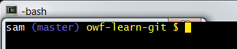

# Git Resources

This documentation includes the following sections:

* [Bash Utilities](#bash-utilities)
	+ [Auto-Completion with `git-completion.bash`](#auto-completion-with-git-completionbash)
	+ [Set Prompt to Indicate Repository Information with `git-prompt.sh`](#set-prompt-to-indicate-repository-information-with-git-promptsh)

------------------

## Bash Utilities

The following are useful `bash` utilities to enhance the Git experience.
The utilities will need to be configured in each independent development environment,
for example for Cygwin, Linux, Git Bash, and each virtual machine that may be configured.

Use of the `git-completion.sh` and `git-prompt.sh` tools is described in the following Udacity Git training course:
[Udacity:  How to Use Git and GitHub](https://www.udacity.com/course/how-to-use-git-and-github--ud775)

The `git-completion` and `git-prompt` scripts can be enabled in the software developer's
`.bashrc` file (executed for interactive shells),
where the `.bashrc` should be sourced from the `.bash_profile` or `.profile`.
The following calls the `git-completion.bash` and `git-prompt.sh`
scripts that are described in the following subsections.
The following example illustrates saving the scripts in the user's `~/home/bin` folder but the
scripts could also be named with a leading period and be saved in the home folder as a hidden file
(developer needs to decide how to configure their environment).
Local modifications can be made by the developer, for example to customize the prompt content and colors.
Git for Windows (Git Bash) may already include the following scripts
and therefore modifications are only needed if default behavior is not as desired.

The functionality has been tested in Cygwin, Git Bash, and Debian Linux.

On Debian Linux, the following can be inserted in the `.profile` (may be included by default):

```sh
# if running bash
if [ -n "$BASH_VERSION" ]; then
    # include .bashrc if it exists
    if [ -f "$HOME/.bashrc" ]; then
        . "$HOME/.bashrc"
    fi
fi

```

Then insert the following in the `.bashrc` file:

```sh
# Start Git utilities insert
# Enable tab completion for Git commands
source ~/bin/git-completion.bash

# Enable git-aware command prompt.
# See:  http://tldp.org/HOWTO/Bash-Prompt-HOWTO/x329.html
# https://tiswww.case.edu/php/chet/bash/bashref.html#Controlling-the-Prompt
cyan="\[\033[0;36m\]"
blue="\[\033[0;34m\]"
green="\[\033[0;32m\]"
lightblue="\[\033[1;34m\]"
pink="\[\033[0;31m\]"
purple="\[\033[0;35m\]"
white="\[\033[1;37m\]"
yellow="\[\033[1;33m\]"
# reset switches back to regular color
reset="\[\033[0m\]"

# Change command prompt to display the current Git branch and whether any changes have been made
source ~/bin/git-prompt.sh
export GIT_PS1_SHOWDIRTYSTATE=1
# '\u' adds the name of the current user to the prompt
# '\$(__git_ps1)' adds git-related stuff
# '\W' adds the name of the current directory
# Prompt will be:
#  user (branch) directory $
# where branch may be followed by:
#  * if unstaged files
#  + if staged files
export PS1="$white\u$lightblue\$(__git_ps1)$yellow \W $ $reset"
# End Git utilities insert
```

The resulting command prompt appears similar to the following:



### Auto-Completion with `git-completion.bash`

The complete example in the previous section uses the `git-completion.bash` script
to enable auto-completion of Git commands.  See the following original sources describing this script:

* [Git Basics - Tips and Tricks](https://git-scm.com/book/en/v1/Git-Basics-Tips-and-Tricks)
* [git-completion.bash](https://github.com/git/git/blob/master/contrib/completion/git-completion.bash) - save to the `~/bin` folder to enable consistent with the above configuration


### Set Prompt to Indicate Repository Information with `git-prompt.sh`

It can be confusing to know what branch is being edited with command-line tools,
especially after being away from a project for awhile.  The `git-prompt.sh` shell script provides context 
by showing the Git branch in the shell prompt.
The following provides the original `git-prompt.sh` script:

* [git-prompt.sh](https://github.com/git/git/blob/master/contrib/completion/git-prompt.sh) - save to the `~/bin` folder to enable consistent with the above configuration
