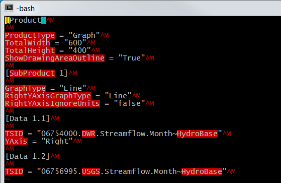
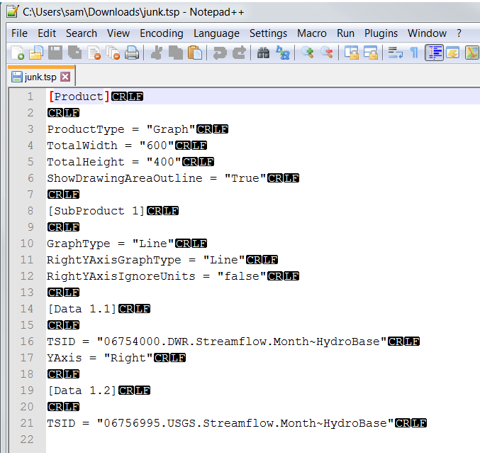

# Common Git Tasks / Overview

This documentation provides guidance on common tasks that are simple enough to run on the command line.

The following are helpful cheat sheets:

* [GitHub Git Cheat Sheet](https://services.github.com/on-demand/downloads/github-git-cheat-sheet.pdf)

The following is a list of common tasks that are explained below.
Most of these tasks use the Git command line such as Git Bash.

* [Determine end-of-line for file in repository](#task-determine-end-of-line-for-file-in-repository)
* [Determine whether remote repository is ahead of local](#task-determine-whether-remote-repository-is-ahead-of-local)
* [Save empty folder in repository](#task-save-empty-folder-in-repository)
* [Stage all added/removed/modified working files](#task-stage-all-addedremovedmodified-working-files)
* [Unstage file(s) that should not be committed](#task-unstage-filess-that-should-not-be-committed)

------

## Task - Determine end-of-line for file in repository

**Scenario:**  You are dealing with end-of-line issues in the repository, for example due to developers
collaborating and using different operating systems for development.
It can be confusing to understand when the end-of-line is changed when using Git software
and you want to confirm what is being used in the repository.

**Solution:**

An editor that shows binary end-of-file characters is needed and can be used as follows to edit working files.
The file in the Git repository working files on the local disk can be examined.
Or, view the file using the GitHub or Bitbucket website (or other online repo tool).
Use the ***Raw*** feature of the website and then save to a local file
(for example once the raw view in the browser is shown, use ***Ctrl-S*** or other feature to save the file to local disk.

If using a development environment that provides the `vi` or `vim` editor, then use `vi -b filename` to edit in binary mode.
Linefeed `LF` (`\n`) will not be displayed although the presence of separate lines indicates that line feed is present.
Carriage return `CR` (`\r`) characters will be shown as `^M` at the end of lines
if DOS-style `CRLF` is being used for the file, for example:



Another option on Windows is [Notepad++](https://notepad-plus-plus.org/).  Use the ***View / Show Symbol / Show End of Line*** menu to toggle
whether the end of line characters are shown, which will show, for example:



## Task - Determine whether remote repository is ahead of local

**Scenario**:  You are collaborating with another developer and want to know if the remote repository
is ahead of the local repository, meaning does the remote have commits that are not in the local.
You want to know because you will need to do a `git pull` or `git fetch` and then `git merge` to get caught up.

**Solution:**

* See [Stack Overflow article "Check if pull needed in git"](http://stackoverflow.com/questions/3258243/check-if-pull-needed-in-git)
* See [Git Book - Git Basics - Working with Remotes](https://git-scm.com/book/en/v2/Git-Basics-Working-with-Remotes)

First, a simple status check on the local repository checked out branch will only indicate if local changes need to be committed,
not that remote changes need to be pulled:

```bash
$ git status
On branch master
Your branch is up-to-date with 'origin/master'.
nothing to commit, working tree clean
```

To get an overview of the remote repository:


```bash
# To inspect the origin
$ git remote show origin
* remote origin
  Fetch URL: https://github.com/OpenWaterFoundation/cdss-app-snodas-tools.git
  Push  URL: https://github.com/OpenWaterFoundation/cdss-app-snodas-tools.git
  HEAD branch: master
  Remote branch:
    master tracked
  Local branch configured for 'git pull':
    master merges with remote master
  Local ref configured for 'git push':
    master pushes to master (local out of date)
```

To list how many commits are different between the remote `origin/master` and the local `HEAD` branch:

```bash
$ git rev-list HEAD...origin/master --count
2
```

Do the following to bring the remote repository references up to date locally and then check whether the remote is ahead.
Note that as per a [Stack Overflow article](http://stackoverflow.com/questions/2688251/what-is-the-difference-between-git-fetch-origin-and-git-remote-update-origin)
`git remote update` is equivalent to `git fetch -all`.


```bash
# 1) First use the following to bring remote references up to date
git remote update
$ git remote update
Fetching origin
remote: Counting objects: 13, done.
remote: Compressing objects: 100% (9/9), done.
remote: Total 13 (delta 4), reused 12 (delta 3), pack-reused 0
Unpacking objects: 100% (13/13), done.
From https://github.com/OpenWaterFoundation/cdss-app-snodas-tools
   cce3321..4016452  master     -> origin/master


# 2a) Then list whether the current branch is up to date
git status -uno
$ git status
On branch master
Your branch is up-to-date with 'origin/master'.
nothing to commit, working tree clean


# 2b) OR, to show commits in all of the branches whose names end in 'master' (such as 'master' and 'origin/master'):
git show-branch *master
$ git status -uno
On branch master
Your branch is behind 'origin/master' by 2 commits, and can be fast-forwarded.
  (use "git pull" to update your local branch)
nothing to commit (use -u to show untracked files)
```

## Task - Save empty folder in repository

**Scenario**  You want to save an empty folder in the repository but by default Git will not
save an empty folder.
For example, the folder may be needed for output generated by a tool that does not create the folder if it does not exist,
or, the folder is a place-holder for files that will be added later.

**Solution**

One option is to create a README.txt, README.md, or similar file in the folder, in which case the README file will always be visible.

Another option is to create a simple `.gitignore` file, which will be hidden on systems that hide files with names that start with a period (Linux, etc.).
To ensure that the folder will always remain empty, create the folder and then create the `.gitignore` file in the folder with content like:

```text
# Make sure folder remains empty
*
!.gitignore
```

To ensure that the folder will always exist, but allow files to be added,
create the folder and then create the `.gitignore` file in the folder with content like the following.
In this case, once legitimate files are added and will remain, the `.gitignore` file can be removed.

```text
# Make sure folder exists and may be empty or contain files
!.gitignore
```

## Task - Stage all added/removed/modified working files

Git requires that changes to working files must be added to the staging area before they can be committed.
Running `git status` shows a summary of files that have been added/deleted/modified,
and which files have not yet been staged.  Note that new folders are shown but not the new files in those folders.
The `git add` command can be used to add working files to the staging area and `git rm` can be used to indicate that files have been removed.
However, it is convenient to use one command:

```sh
git add -A
git add --all
```

From [`git add`](https://git-scm.com/docs/git-add) documentation:  "This adds, modifies, and removes index entries to match the working tree.
If no `<pathspec>` is given when -A option is used, all files in the entire working tree are updated
(old versions of Git used to limit the update to the current directory and its subdirectories)."
Consequently, if an old version of Git is used, run from the root repository folder or specify the folder to process.

## Task - Unstage files(s) that should not be committed

**Scenario:**  You ran `git add...` and some files were added to the staging area that should not have been.
You removed the files, added to `.gitignore` etc. but need to make sure they won't get committed.

**Solution:**

* See [Stack Overflow article answer by Max summarized below](http://stackoverflow.com/questions/19730565/how-to-remove-files-from-git-staging-area)
* See [git rm](https://git-scm.com/docs/git-rm)

```bash
# To recursively remove files in a folder that was added:
git rm --cached -r theFolder
# To remove speciic files that were added:
git rm --cached filename1 filename2
```

Can also use `--dry-run` to see what will be done.
