<!-- part 1: pages 1-200 -->

Gareth James • Daniela Witten • Trevor Hastie
Robert Tibshirani • Jonathan Taylor

# An Introduction to Statistical Learning

with Applications in Python

First Printing: July 5, 2023

To our parents:

Alison and Michael James

Chiara Nappi and Edward Witten

Valerie and Patrick Hastie

Vera and Sami Tibshirani

John and Brenda Taylor

and to our families:

Michael, Daniel, and Catherine

Tessa, Theo, Otto, and Ari

Samantha, Timothy, and Lynda

Charlie, Ryan, Julie, and Cheryl

Lee-Ann and Isobel

Statistical learning refers to a set of tools for making sense of complex datasets. In recent years, we have seen a staggering increase in the scale and scope of data collection across virtually all areas of science and industry. As a result, statistical learning has become a critical toolkit for anyone who wishes to understand data — and as more and more of today's jobs involve data, this means that statistical learning is fast becoming a critical toolkit for everyone.

One of the first books on statistical learning — The Elements of Statistical Learning (ESL, by Hastie, Tibshirani, and Friedman) — was published in 2001, with a second edition in 2009. ESL has become a popular text not only in statistics but also in related fields. One of the reasons for ESL's popularity is its relatively accessible style. But ESL is best-suited for individuals with advanced training in the mathematical sciences.

An Introduction to Statistical Learning, With Applications in R (ISLR) — first published in 2013, with a second edition in 2021 — arose from the clear need for a broader and less technical treatment of the key topics in statistical learning. In addition to a review of linear regression, ISLR covers many of today's most important statistical and machine learning approaches, including resampling, sparse methods for classification and regression, generalized additive models, tree-based methods, support vector machines, deep learning, survival analysis, clustering, and multiple testing.

Since it was published in 2013, ISLR has become a mainstay of undergraduate and graduate classrooms worldwide, as well as an important reference book for data scientists. One of the keys to its success has been that, beginning with Chapter 2, each chapter contains an R lab illustrating how to implement the statistical learning methods seen in that chapter, providing the reader with valuable hands-on experience.

However, in recent years Python has become an increasingly popular language for data science, and there has been increasing demand for a Pythonbased alternative to ISLR. Hence, this book, An Introduction to Statistical Learning, With Applications in Python (ISLP), covers the same materials as ISLR but with labs implemented in Python — a feat accomplished by the addition of a new co-author, Jonathan Taylor. Several of the labs make use of the ISLP Python package, which we have written to facilitate carrying out the statistical learning methods covered in each chapter in Python. These labs will be useful both for Python novices, as well as experienced users.

The intention behind ISLP (and ISLR) is to concentrate more on the applications of the methods and less on the mathematical details, so it is appropriate for advanced undergraduates or master's students in statistics or related quantitative fields, or for individuals in other disciplines who wish to use statistical learning tools to analyze their data. It can be used as a textbook for a course spanning two semesters.

We are grateful to these readers for providing valuable comments on the first edition of ISLR: Pallavi Basu, Alexandra Chouldechova, Patrick Danaher, Will Fithian, Luella Fu, Sam Gross, Max Grazier G'Sell, Courtney Paulson, Xinghao Qiao, Elisa Sheng, Noah Simon, Kean Ming Tan, Xin Lu Tan. We thank these readers for helpful input on the second edition of ISLR: Alan Agresti, Iain Carmichael, Yiqun Chen, Erin Craig, Daisy Ding, Lucy Gao, Ismael Lemhadri, Bryan Martin, Anna Neufeld, Geoff Tims, Carsten Voelkmann, Steve Yadlowsky, and James Zou. We are immensely grateful to Balasubramanian “Naras” Narasimhan for his assistance on both ISLR and ISLP.

It has been an honor and a privilege for us to see the considerable impact that ISLR has had on the way in which statistical learning is practiced, both in and out of the academic setting. We hope that this new Python edition will continue to give today's and tomorrow's applied statisticians and data scientists the tools they need for success in a data-driven world.

It's tough to make predictions, especially about the future.

-Yogi Berra

# Contents

# Preface vii

# 1 Introduction 1

# 2 Statistical Learning 15

2.1 What Is Statistical Learning? 15

2.1.1 Why Estimate $f$ ? 17   
2.1.2 How Do We Estimate $f$ ? 20   
2.1.3 The Trade-Off Between Prediction Accuracy and Model Interpretability ..... 23   
2.1.4 Supervised Versus Unsupervised Learning ..... 25   
2.1.5 Regression Versus Classification Problems ..... 27

2.2 Assessing Model Accuracy 27

2.2.1 Measuring the Quality of Fit 28   
2.2.2 The Bias-Variance Trade-Off ..... 31   
2.2.3 The Classification Setting 34

2.3 Lab: Introduction to Python 40

2.3.1 Getting Started 40   
2.3.2 Basic Commands 40   
2.3.3 Introduction to Numerical Python 42   
2.3.4 Graphics 48   
2.3.5 Sequences and Slice Notation 51   
2.3.6 Indexing Data 51   
2.3.7 Loading Data 55   
2.3.8 For Loops 59   
2.3.9 Additional Graphical and Numerical Summaries . . 61

2.4 Exercises 63

# 3 Linear Regression 69

3.1 Simple Linear Regression 70

3.1.1 Estimating the Coefficients 71   
3.1.2 Assessing the Accuracy of the Coefficient Estimates 72   
3.1.3 Assessing the Accuracy of the Model ..... 77

3.2 Multiple Linear Regression 80

3.2.1 Estimating the Regression Coefficients ..... 81

3.2.2 Some Important Questions ..... 83

3.3 Other Considerations in the Regression Model ..... 91

3.3.1 Qualitative Predictors 91

3.3.2 Extensions of the Linear Model 94

3.3.3 Potential Problems 100

3.4 The Marketing Plan 109

3.5 Comparison of Linear Regression with $K$ -Nearest Neighbors 111

3.6 Lab: Linear Regression 116

3.6.1 Importing packages ..... 116

3.6.2 Simple Linear Regression ..... 117

3.6.3 Multiple Linear Regression ..... 122

3.6.4 Multivariate Goodness of Fit 123

3.6.5 Interaction Terms 124

3.6.6 Non-linear Transformations of the Predictors . . . 125

3.6.7 Qualitative Predictors 126

3.7 Exercises 127

# 4 Classification 135

4.1 An Overview of Classification ..... 135

4.2 Why Not Linear Regression? 136

4.3 Logistic Regression 138

4.3.1 The Logistic Model ..... 139

4.3.2 Estimating the Regression Coefficients ..... 140

4.3.3 Making Predictions ..... 141

4.3.4 Multiple Logistic Regression ..... 142

4.3.5 Multinomial Logistic Regression ..... 144

4.4 Generative Models for Classification ..... 146

4.4.1 Linear Discriminant Analysis for $p = 1 \ldots 147$

4.4.2 Linear Discriminant Analysis for $p > 1$ . . . . . . . 150

4.4.3 Quadratic Discriminant Analysis 156

4.4.4 Naive Bayes 158

4.5 A Comparison of Classification Methods ..... 161

4.5.1 An Analytical Comparison ..... 161

4.5.2 An Empirical Comparison 164

4.6 Generalized Linear Models 167

4.6.1 Linear Regression on the Bikeshare Data ..... 167

4.6.2 Poisson Regression on the Bikeshare Data ..... 169

4.6.3 Generalized Linear Models in Greater Generality . 172

4.7 Lab: Logistic Regression, LDA, QDA, and KNN ..... 173

4.7.1 The Stock Market Data 173

4.7.2 Logistic Regression 174

4.7.3 Linear Discriminant Analysis 179

4.7.4 Quadratic Discriminant Analysis 181

4.7.5 Naive Bayes 182

4.7.6 K-Nearest Neighbors 183

4.7.7 Linear and Poisson Regression on the Bikeshare Data188

4.8 Exercises 193

# 5 Resampling Methods 201

5.1 Cross-Validation 202

5.1.1 The Validation Set Approach ..... 202   
5.1.2 Leave-One-Out Cross-Validation 204   
5.1.3 k-Fold Cross-Validation 206   
5.1.4 Bias-Variance Trade-Off for $k$ -Fold Cross-Validation 208   
5.1.5 Cross-Validation on Classification Problems ..... 209

5.2 The Bootstrap 212

5.3 Lab: Cross-Validation and the Bootstrap ..... 215

5.3.1 The Validation Set Approach 216   
5.3.2 Cross-Validation 217   
5.3.3 The Bootstrap 220

5.4 Exercises 224

# 6 Linear Model Selection and Regularization 229

6.1 Subset Selection 231

6.1.1 Best Subset Selection . . . . . . . . . . . . . . . 231   
6.1.2 Stepwise Selection 233   
6.1.3 Choosing the Optimal Model 235

6.2 Shrinkage Methods 240

6.2.1 Ridge Regression 240   
6.2.2 The Lasso 244   
6.2.3 Selecting the Tuning Parameter ..... 252

6.3 Dimension Reduction Methods 253

6.3.1 Principal Components Regression ..... 254   
6.3.2 Partial Least Squares 260

6.4 Considerations in High Dimensions 262

6.4.1 High-Dimensional Data 262   
6.4.2 What Goes Wrong in High Dimensions? ..... 263   
6.4.3 Regression in High Dimensions 265   
6.4.4 Interpreting Results in High Dimensions ..... 266

6.5 Lab: Linear Models and Regularization Methods ..... 267

6.5.1 Subset Selection Methods 268   
6.5.2 Ridge Regression and the Lasso 273   
6.5.3 PCR and PLS Regression 280

6.6 Exercises 283

# 7 Moving Beyond Linearity 289

7.1 Polynomial Regression 290   
7.2 Step Functions 292   
7.3 Basis Functions 293   
7.4 Regression Splines 294

7.4.1 Piecewise Polynomials 294   
7.4.2 Constraints and Splines 296   
7.4.3 The Spline Basis Representation 296   
7.4.4 Choosing the Number and Locations of the Knots . 297   
7.4.5 Comparison to Polynomial Regression ..... 299

7.5 Smoothing Splines 300

7.5.1 An Overview of Smoothing Splines ..... 300   
7.5.2 Choosing the Smoothing Parameter $\lambda$ 301

7.6 Local Regression 303

7.7 Generalized Additive Models 305

7.7.1 GAMs for Regression Problems ..... 306   
7.7.2 GAMs for Classification Problems ..... 308

7.8 Lab: Non-Linear Modeling 309

7.8.1 Polynomial Regression and Step Functions ..... 310   
7.8.2 Splines 315   
7.8.3 Smoothing Splines and GAMs ..... 317   
7.8.4 Local Regression 324

7.9 Exercises 325

# 8 Tree-Based Methods 331

8.1 The Basics of Decision Trees 331

8.1.1 Regression Trees 331   
8.1.2 Classification Trees 337   
8.1.3 Trees Versus Linear Models 341   
8.1.4 Advantages and Disadvantages of Trees ..... 341

8.2 Bagging, Random Forests, Boosting, and Bayesian Additive Regression Trees 343

8.2.1 Bagging 343   
8.2.2 Random Forests . . . . . . . . . . . . . . . . . . 346   
8.2.3 Boosting 347   
8.2.4 Bayesian Additive Regression Trees ..... 350   
8.2.5 Summary of Tree Ensemble Methods ..... 353

8.3 Lab: Tree-Based Methods ..... 354

8.3.1 Fitting Classification Trees ..... 355   
8.3.2 Fitting Regression Trees 358   
8.3.3 Bagging and Random Forests 360   
8.3.4 Boosting 361   
8.3.5 Bayesian Additive Regression Trees ..... 362

8.4 Exercises 363

# 9 Support Vector Machines 367

9.1 Maximal Margin Classifier 367

9.1.1 What Is a Hyperplane? 368   
9.1.2 Classification Using a Separating Hyperplane . . . 368   
9.1.3 The Maximal Margin Classifier ..... 370   
9.1.4 Construction of the Maximal Margin Classifier . . 372   
9.1.5 The Non-separable Case 372

9.2 Support Vector Classifiers ..... 373

9.2.1 Overview of the Support Vector Classifier ..... 373   
9.2.2 Details of the Support Vector Classifier ..... 374

9.3 Support Vector Machines 377

9.3.1 Classification with Non-Linear Decision Boundaries 378   
9.3.2 The Support Vector Machine 379

9.3.3 An Application to the Heart Disease Data ..... 382

9.4 SVMs with More than Two Classes 383

9.4.1 One-Versus-One Classification ..... 384

9.4.2 One-Versus-All Classification 384

9.5 Relationship to Logistic Regression 384

9.6 Lab: Support Vector Machines 387

9.6.1 Support Vector Classifier ..... 387

9.6.2 Support Vector Machine 390

9.6.3 ROC Curves 392

9.6.4 SVM with Multiple Classes 393

9.6.5 Application to Gene Expression Data ..... 394

9.7 Exercises 395

# 10 Deep Learning 399

10.1 Single Layer Neural Networks 400

10.2 Multilayer Neural Networks ..... 402

10.3 Convolutional Neural Networks ..... 406

10.3.1 Convolution Layers 407

10.3.2 Pooling Layers 410

10.3.3 Architecture of a Convolutional Neural Network . . 410

10.3.4 Data Augmentation ..... 411

10.3.5 Results Using a Pretrained Classifier ..... 412

10.4 Document Classification ..... 413

10.5 Recurrent Neural Networks 416

10.5.1 Sequential Models for Document Classification . . 418

10.5.2 Time Series Forecasting 420

10.5.3 Summary of RNNs 424

10.6 When to Use Deep Learning 425

10.7 Fitting a Neural Network 427

10.7.1 Backpropagation 428

10.7.2 Regularization and Stochastic Gradient Descent . . 429

10.7.3 Dropout Learning 431

10.7.4 Network Tuning 431

10.8 Interpolation and Double Descent 432

10.9 Lab: Deep Learning 435

10.9.1 Single Layer Network on Hitters Data ..... 437

10.9.2 Multilayer Network on the MNIST Digit Data . . . 444

10.9.3 Convolutional Neural Networks ..... 448

10.9.4 Using Pretrained CNN Models 452

10.9.5 IMDB Document Classification ..... 454

10.9.6 Recurrent Neural Networks 458

10.10 Exercises 465

# 11 Survival Analysis and Censored Data 469

11.1 Survival and Censoring Times 470

11.2 A Closer Look at Censoring . . . . . . . . . . . . . . . . . 470

11.3 The Kaplan-Meier Survival Curve 472

11.4 The Log-Rank Test 474

11.5 Regression Models With a Survival Response ..... 476

11.5.1 The Hazard Function . . . . . . . . . . . . . . . . 476   
11.5.2 Proportional Hazards 478   
11.5.3 Example: Brain Cancer Data 482   
11.5.4 Example: Publication Data 482

11.6 Shrinkage for the Cox Model 484

11.7 Additional Topics 486

11.7.1 Area Under the Curve for Survival Analysis . . . . 486   
11.7.2 Choice of Time Scale 487   
11.7.3 Time-Dependent Covariates 488   
11.7.4 Checking the Proportional Hazards Assumption . . 488   
11.7.5 Survival Trees 488

11.8 Lab: Survival Analysis ..... 489

11.8.1 Brain Cancer Data 489   
11.8.2 Publication Data 493   
11.8.3 Call Center Data 494

11.9 Exercises 498

# 12 Unsupervised Learning 503

12.1 The Challenge of Unsupervised Learning ..... 503

12.2 Principal Components Analysis ..... 504

12.2.1 What Are Principal Components? ..... 505   
12.2.2 Another Interpretation of Principal Components . 508   
12.2.3 The Proportion of Variance Explained ..... 510   
12.2.4 More on PCA 512   
12.2.5 Other Uses for Principal Components ..... 515

12.3 Missing Values and Matrix Completion ..... 515

12.4 Clustering Methods 520

12.4.1 $K$ -Means Clustering 521   
12.4.2 Hierarchical Clustering ..... 525   
12.4.3 Practical Issues in Clustering 532

12.5 Lab: Unsupervised Learning 535

12.5.1 Principal Components Analysis ..... 535   
12.5.2 Matrix Completion 539   
12.5.3 Clustering 542   
12.5.4 NCI60 Data Example . . . . . . . . . . . . . . . . 546

12.6 Exercises 552

# 13 Multiple Testing 557

13.1 A Quick Review of Hypothesis Testing 558

13.1.1 Testing a Hypothesis 558   
13.1.2 Type I and Type II Errors ..... 562

13.2 The Challenge of Multiple Testing ..... 563

13.3 The Family-Wise Error Rate 565

13.3.1 What is the Family-Wise Error Rate? ..... 565   
13.3.2 Approaches to Control the Family-Wise Error Rate 567   
13.3.3 Trade-Off Between the FWER and Power ..... 572

13.4 The False Discovery Rate . . . . . . . . . . . . . . . . . . . 573

13.4.1 Intuition for the False Discovery Rate ..... 573   
13.4.2 The Benjamini-Hochberg Procedure ..... 575

13.5 A Re-Sampling Approach to $p$ -Values and False Discovery Rates 577

13.5.1 A Re-Sampling Approach to the $p$ -Value . . . . . . 578   
13.5.2 A Re-Sampling Approach to the False Discovery Rate579   
13.5.3 When Are Re-Sampling Approaches Useful? . . . . 581

13.6 Lab: Multiple Testing 583

13.6.1 Review of Hypothesis Tests 583   
13.6.2 Family-Wise Error Rate 585   
13.6.3 False Discovery Rate 588   
13.6.4 A Re-Sampling Approach 590

13.7 Exercises 593

Index

# 1

# Introduction


# An Overview of Statistical Learning

Statistical learning refers to a vast set of tools for understanding data. These tools can be classified as supervised or unsupervised. Broadly speaking, supervised statistical learning involves building a statistical model for predicting, or estimating, an output based on one or more inputs. Problems of this nature occur in fields as diverse as business, medicine, astrophysics, and public policy. With unsupervised statistical learning, there are inputs but no supervising output; nevertheless we can learn relationships and structure from such data. To provide an illustration of some applications of statistical learning, we briefly discuss three real-world data sets that are considered in this book.

# Wage Data

In this application (which we refer to as the Wage data set throughout this book), we examine a number of factors that relate to wages for a group of men from the Atlantic region of the United States. In particular, we wish to understand the association between an employee's age and education, as well as the calendar year, on his wage. Consider, for example, the left-hand panel of Figure 1.1, which displays wage versus age for each of the individuals in the data set. There is evidence that wage increases with age but then decreases again after approximately age 60. The blue line, which provides an estimate of the average wage for a given age, makes this trend clearer. Given an employee's age, we can use this curve to predict his wage. However, it is also clear from Figure 1.1 that there is a significant amount of variability associated with this average value, and so age alone is unlikely to provide an accurate prediction of a particular man's wage.


<details>
<summary>scatter</summary>

| Age | Wage |
| --- | --- |
| 20 | 50 |
| 40 | 100 |
| 60 | 120 |
| 80 | 80 |
</details>


<details>
<summary>bar_line</summary>

| Year | Wage (Median) | Wage (Min) | Wage (Max) |
|------|---------------|------------|------------|
| 2003 | 100           | 50         | 200        |
| 2006 | 100           | 50         | 200        |
| 2009 | 100           | 50         | 200        |
</details>


<details>
<summary>boxplot</summary>

| Education Level | Wage (Min) | Wage (Q1) | Wage (Median) | Wage (Q3) | Wage (Max) |
| --------------- | ---------- | --------- | ------------- | --------- | ---------- |
| 1               | 40         | 70        | 80            | 90        | 120        |
| 2               | 50         | 90        | 100           | 110       | 160        |
| 3               | 60         | 100       | 110           | 120       | 180        |
| 4               | 70         | 110       | 120           | 130       | 200        |
| 5               | 80         | 120       | 130           | 140       | 220        |
</details>

FIGURE 1.1. Wage data, which contains income survey information for men from the central Atlantic region of the United States. Left: wage as a function of age. On average, wage increases with age until about 60 years of age, at which point it begins to decline. Center: wage as a function of year. There is a slow but steady increase of approximately \$10,000 in the average wage between 2003 and 2009. Right: Boxplots displaying wage as a function of education, with 1 indicating the lowest level (no high school diploma) and 5 the highest level (an advanced graduate degree). On average, wage increases with the level of education.

We also have information regarding each employee's education level and the year in which the wage was earned. The center and right-hand panels of Figure 1.1, which display wage as a function of both year and education, indicate that both of these factors are associated with wage. Wages increase by approximately \$10,000, in a roughly linear (or straight-line) fashion, between 2003 and 2009, though this rise is very slight relative to the variability in the data. Wages are also typically greater for individuals with higher education levels: men with the lowest education level (1) tend to have substantially lower wages than those with the highest education level (5). Clearly, the most accurate prediction of a given man's wage will be obtained by combining his age, his education, and the year. In Chapter 3, we discuss linear regression, which can be used to predict wage from this data set. Ideally, we should predict wage in a way that accounts for the non-linear relationship between wage and age. In Chapter 7, we discuss a class of approaches for addressing this problem.

# Stock Market Data

The Wage data involves predicting a continuous or quantitative output value. This is often referred to as a regression problem. However, in certain cases we may instead wish to predict a non-numerical value—that is, a categorical or qualitative output. For example, in Chapter 4 we examine a stock market data set that contains the daily movements in the Standard & Poor's 500 (S&P) stock index over a 5-year period between 2001 and 2005. We refer to this as the Smarket data. The goal is to predict whether the index will increase or decrease on a given day, using the past 5 days' percentage changes in the index. Here the statistical learning problem does not involve predicting a numerical value. Instead it involves predicting whether a given day's stock market performance will fall into the Up bucket or the Down bucket. This is known as a classification problem. A model that could accurately predict the direction in which the market will move would be very useful!


<details>
<summary>boxplot</summary>

| Today's Direction | Percentage change in S&P |
| ------------------ | ------------------------ |
| Down               | -3.0                     |
| Down               | -2.5                     |
| Down               | -2.0                     |
| Down               | -1.5                     |
| Down               | -1.0                     |
| Down               | -0.5                     |
| Down               | 0.0                      |
| Down               | 0.5                      |
| Down               | 1.0                      |
| Down               | 1.5                      |
| Down               | 2.0                      |
| Down               | 2.5                      |
| Down               | 3.0                      |
| Down               | 3.5                      |
| Down               | 4.0                      |
| Down               | 4.5                      |
| Down               | 5.0                      |
| Up                 | -3.0                     |
| Up                 | -2.5                     |
| Up                 | -2.0                     |
| Up                 | -1.5                     |
| Up                 | -1.0                     |
| Up                 | -0.5                     |
| Up                 | 0.0                      |
| Up                 | 0.5                      |
| Up                 | 1.0                      |
| Up                 | 1.5                      |
| Up                 | 2.0                      |
| Up                 | 2.5                      |
| Up                 | 3.0                      |
| Up                 | 3.5                      |
| Up                 | 4.0                      |
| Up                 | 4.5                      |
| Up                 | 5.0                      |
| Up                 | 5.5                      |
</details>


<details>
<summary>boxplot</summary>

| Today's Direction | Percentage change in S&P |
| ------------------ | ------------------------ |
| Down               | -3.0                     |
| Down               | -2.5                     |
| Down               | -1.0                     |
| Down               | 0.5                      |
| Down               | 1.0                      |
| Up                 | -3.0                     |
| Up                 | -2.0                     |
| Up                 | -1.0                     |
| Up                 | 0.5                      |
| Up                 | 1.0                      |
| Up                 | 2.0                      |
| Up                 | 3.0                      |
| Up                 | 4.0                      |
| Up                 | 5.0                      |
</details>


<details>
<summary>boxplot</summary>

| Today's Direction | Percentage change in S&P |
| ------------------ | ------------------------ |
| Down               | -3.0                     |
| Down               | -2.5                     |
| Down               | -1.0                     |
| Down               | 0.5                      |
| Down               | 1.0                      |
| Up                 | -3.0                     |
| Up                 | -2.5                     |
| Up                 | -1.0                     |
| Up                 | 0.5                      |
| Up                 | 1.0                      |
| Up                 | 2.0                      |
| Up                 | 3.0                      |
| Up                 | 4.0                      |
| Up                 | 5.0                      |
</details>

FIGURE 1.2. Left: Boxplots of the previous day's percentage change in the S&P index for the days for which the market increased or decreased, obtained from the Smarket data. Center and Right: Same as left panel, but the percentage changes for 2 and 3 days previous are shown.

The left-hand panel of Figure 1.2 displays two boxplots of the previous day's percentage changes in the stock index: one for the 648 days for which the market increased on the subsequent day, and one for the 602 days for which the market decreased. The two plots look almost identical, suggesting that there is no simple strategy for using yesterday's movement in the S&P to predict today's returns. The remaining panels, which display boxplots for the percentage changes 2 and 3 days previous to today, similarly indicate little association between past and present returns. Of course, this lack of pattern is to be expected: in the presence of strong correlations between successive days' returns, one could adopt a simple trading strategy to generate profits from the market. Nevertheless, in Chapter 4, we explore these data using several different statistical learning methods. Interestingly, there are hints of some weak trends in the data that suggest that, at least for this 5-year period, it is possible to correctly predict the direction of movement in the market approximately $60\%$ of the time (Figure 1.3).

# Gene Expression Data

The previous two applications illustrate data sets with both input and output variables. However, another important class of problems involves situations in which we only observe input variables, with no corresponding output. For example, in a marketing setting, we might have demographic information for a number of current or potential customers. We may wish to understand which types of customers are similar to each other by grouping individuals according to their observed characteristics. This is known as a clustering problem. Unlike in the previous examples, here we are not trying to predict an output variable.


<details>
<summary>boxplot</summary>

| Today's Direction | Predicted Probability (Min) | Predicted Probability (Q1) | Predicted Probability (Max) |
| ------------------ | --------------------------- | -------------------------- | --------------------------- |
| Down               | 0.46                        | 0.48                       | 0.52                        |
| Up                 | 0.46                        | 0.48                       | 0.52                        |
</details>

FIGURE 1.3. We fit a quadratic discriminant analysis model to the subset of the Smarket data corresponding to the 2001–2004 time period, and predicted the probability of a stock market decrease using the 2005 data. On average, the predicted probability of decrease is higher for the days in which the market does decrease. Based on these results, we are able to correctly predict the direction of movement in the market 60% of the time.

We devote Chapter 12 to a discussion of statistical learning methods for problems in which no natural output variable is available. We consider the NCI60 data set, which consists of 6,830 gene expression measurements for each of 64 cancer cell lines. Instead of predicting a particular output variable, we are interested in determining whether there are groups, or clusters, among the cell lines based on their gene expression measurements. This is a difficult question to address, in part because there are thousands of gene expression measurements per cell line, making it hard to visualize the data.

The left-hand panel of Figure 1.4 addresses this problem by representing each of the 64 cell lines using just two numbers, $Z_{1}$ and $Z_{2}$ . These are the first two principal components of the data, which summarize the 6,830 expression measurements for each cell line down to two numbers or dimensions. While it is likely that this dimension reduction has resulted in some loss of information, it is now possible to visually examine the data for evidence of clustering. Deciding on the number of clusters is often a difficult problem. But the left-hand panel of Figure 1.4 suggests at least four groups of cell lines, which we have represented using separate colors.

In this particular data set, it turns out that the cell lines correspond to 14 different types of cancer. (However, this information was not used to create the left-hand panel of Figure 1.4.) The right-hand panel of Figure 1.4 is identical to the left-hand panel, except that the 14 cancer types are shown using distinct colored symbols. There is clear evidence that cell lines with the same cancer type tend to be located near each other in this two-dimensional representation. In addition, even though the cancer information was not used to produce the left-hand panel, the clustering obtained does bear some resemblance to some of the actual cancer types observed in the right-hand panel. This provides some independent verification of the accuracy of our clustering analysis.


<details>
<summary>scatter</summary>

| Z1  | Z2  | Color  |
| --- | --- | ------ |
| -45 | -5  | Red    |
| -30 | 10  | Blue   |
| -20 | 5   | Blue   |
| -10 | 15  | Blue   |
| 0   | 0   | Blue   |
| 10  | -5  | Blue   |
| 20  | -10 | Green  |
| 30  | -15 | Green  |
| 40  | -20 | Green  |
| 50  | -25 | Green  |
| 60  | -30 | Green  |
| 70  | -35 | Green  |
| -40 | -10 | Red    |
| -25 | 15  | Blue   |
| -15 | 20  | Blue   |
| -5  | 10  | Blue   |
| 5   | 5   | Blue   |
| 25  | 0   | Blue   |
| 35  | -5  | Blue   |
| 45  | -10 | Blue   |
| 55  | -15 | Blue   |
| 65  | -20 | Blue   |
| -35 | 10  | Blue   |
| -20 | 15  | Blue   |
| -10 | 20  | Blue   |
| 0   | 10  | Blue   |
| 10  | 5   | Blue   |
| 20  | 0   | Blue   |
| 30  | -5  | Blue   |
| 40  | -10 | Blue   |
| 50  | -15 | Blue   |
| 60  | -20 | Blue   |
| -30 | 15  | Blue   |
| -15 | 20  | Blue   |
| -5  | 15  | Blue   |
| 5   | 10  | Blue   |
| 25  | 5   | Blue   |
| 35  | 0   | Blue   |
| 45  | -5  | Blue   |
| 55  | -10 | Blue   |
| 65  | -15 | Blue   |
| -25 | -10 | Blue   |
| -10 | -5  | Blue   |
| -5  | -10 | Blue   |
| 0   | -5  | Blue   |
| 10  | -10 | Blue   |
| 20  | -15 | Blue   |
| 30  | -20 | Blue   |
| 40  | -25 | Blue   |
| 50  | -30 | Blue   |
| 60  | -35 | Blue   |
| -20 | -20 | Blue   |
| -10 | -10 | Blue   |
| -5  | -5  | Blue   |
| 0   | -10 | Blue   |
| 10  | -15 | Blue   |
| 20  | -20 | Blue   |
| 30  | -25 | Blue   |
| 40  | -30 | Blue   |
| 50  | -35 | Blue   |
| 60  | -40 | Blue   |
| -15 | -25 | Blue   |
| -5  | -15 | Blue   |
| -10 | -10 | Blue   |
| -15 | -5  | Blue   |
| -20 | -10 | Blue   |
| -25 | -15 | Blue   |
| -30 | -20 | Blue   |
| -35 | -25 | Blue   |
| -40 | -30 | Blue   |
| -45 | -35 | Blue   |
| -50 | -40 | Blue   |
| -45 | -35 | Red    |
| -35 | -30 | Red    |
| -25 | -25 | Red    |
| -15 | -20 | Red    |
| -5  | -15 | Red    |
| 5   | -10 | Red    |
| 15  | -5  | Red    |
| 25  | 0   | Red    |
| 35  | 5   | Red    |
| 45  | 10  | Red    |
| 55  | 15  | Red    |
| 65  | 20  | Red    |
| -30 | -20 | Red    |
| -15 | -10 | Red    |
| -5  | -5  | Red    |
| -10 | -10 | Red    |
| -15 | -15 | Red    |
| -20 | -20 | Red    |
| -25 | -25 | Red    |
| -30 | -30 | Red    |
| -35 | -35 | Red    |
| -40 | -40 | Red    |
| -45 | -45 | Red    |
| -48.76| -48.76| Red|
| -48.76| -48.76| Green|
| -48.76| -48.76| Green|
| -48.76| -48.76| Green|
| -48.76| -48.76| Green|
| -48.76| -48.76| Green|
| ... (additional values not labeled in the image) are not provided in the code.
</details>

  
FIGURE 1.4. Left: Representation of the NCI60 gene expression data set in a two-dimensional space, $Z_{1}$ and $Z_{2}$ . Each point corresponds to one of the 64 cell lines. There appear to be four groups of cell lines, which we have represented using different colors. Right: Same as left panel except that we have represented each of the 14 different types of cancer using a different colored symbol. Cell lines corresponding to the same cancer type tend to be nearby in the two-dimensional space.

# A Brief History of Statistical Learning

Though the term statistical learning is fairly new, many of the concepts that underlie the field were developed long ago. At the beginning of the nineteenth century, the method of least squares was developed, implementing the earliest form of what is now known as linear regression. The approach was first successfully applied to problems in astronomy. Linear regression is used for predicting quantitative values, such as an individual's salary. In order to predict qualitative values, such as whether a patient survives or dies, or whether the stock market increases or decreases, linear discriminant analysis was proposed in 1936. In the 1940s, various authors put forth an alternative approach, logistic regression. In the early 1970s, the term generalized linear model was developed to describe an entire class of statistical learning methods that include both linear and logistic regression as special cases.

By the end of the 1970s, many more techniques for learning from data were available. However, they were almost exclusively linear methods because fitting non-linear relationships was computationally difficult at the time. By the 1980s, computing technology had finally improved sufficiently that non-linear methods were no longer computationally prohibitive. In the mid 1980s, classification and regression trees were developed, followed shortly by generalized additive models. Neural networks gained popularity in the 1980s, and support vector machines arose in the 1990s.

Since that time, statistical learning has emerged as a new subfield in statistics, focused on supervised and unsupervised modeling and prediction. In recent years, progress in statistical learning has been marked by the increasing availability of powerful and relatively user-friendly software, such as the popular and freely available Python system. This has the potential to continue the transformation of the field from a set of techniques used and developed by statisticians and computer scientists to an essential toolkit for a much broader community.

# This Book

The Elements of Statistical Learning (ESL) by Hastie, Tibshirani, and Friedman was first published in 2001. Since that time, it has become an important reference on the fundamentals of statistical machine learning. Its success derives from its comprehensive and detailed treatment of many important topics in statistical learning, as well as the fact that (relative to many upper-level statistics textbooks) it is accessible to a wide audience. However, the greatest factor behind the success of ESL has been its topical nature. At the time of its publication, interest in the field of statistical learning was starting to explode. ESL provided one of the first accessible and comprehensive introductions to the topic.

Since ESL was first published, the field of statistical learning has continued to flourish. The field's expansion has taken two forms. The most obvious growth has involved the development of new and improved statistical learning approaches aimed at answering a range of scientific questions across a number of fields. However, the field of statistical learning has also expanded its audience. In the 1990s, increases in computational power generated a surge of interest in the field from non-statisticians who were eager to use cutting-edge statistical tools to analyze their data. Unfortunately, the highly technical nature of these approaches meant that the user community remained primarily restricted to experts in statistics, computer science, and related fields with the training (and time) to understand and implement them.

In recent years, new and improved software packages have significantly eased the implementation burden for many statistical learning methods. At the same time, there has been growing recognition across a number of fields, from business to health care to genetics to the social sciences and beyond, that statistical learning is a powerful tool with important practical applications. As a result, the field has moved from one of primarily academic interest to a mainstream discipline, with an enormous potential audience. This trend will surely continue with the increasing availability of enormous quantities of data and the software to analyze it.

The purpose of An Introduction to Statistical Learning (ISL) is to facilitate the transition of statistical learning from an academic to a mainstream field. ISL is not intended to replace ESL, which is a far more comprehensive text both in terms of the number of approaches considered and the depth to which they are explored. We consider ESL to be an important companion for professionals (with graduate degrees in statistics, machine learning, or related fields) who need to understand the technical details behind statistical learning approaches. However, the community of users of statistical learning techniques has expanded to include individuals with a wider range of interests and backgrounds. Therefore, there is a place for a less technical and more accessible version of ESL.

In teaching these topics over the years, we have discovered that they are of interest to master's and PhD students in fields as disparate as business administration, biology, and computer science, as well as to quantitatively-oriented upper-division undergraduates. It is important for this diverse group to be able to understand the models, intuitions, and strengths and weaknesses of the various approaches. But for this audience, many of the technical details behind statistical learning methods, such as optimization algorithms and theoretical properties, are not of primary interest. We believe that these students do not need a deep understanding of these aspects in order to become informed users of the various methodologies, and in order to contribute to their chosen fields through the use of statistical learning tools.

ISL is based on the following four premises.

1. Many statistical learning methods are relevant and useful in a wide range of academic and non-academic disciplines, beyond just the statistical sciences. We believe that many contemporary statistical learning procedures should, and will, become as widely available and used as is currently the case for classical methods such as linear regression. As a result, rather than attempting to consider every possible approach (an impossible task), we have concentrated on presenting the methods that we believe are most widely applicable.   
2. Statistical learning should not be viewed as a series of black boxes. No single approach will perform well in all possible applications. Without understanding all of the cogs inside the box, or the interaction between those cogs, it is impossible to select the best box. Hence, we have attempted to carefully describe the model, intuition, assumptions, and trade-offs behind each of the methods that we consider.   
3. While it is important to know what job is performed by each cog, it is not necessary to have the skills to construct the machine inside the box! Thus, we have minimized discussion of technical details related to fitting procedures and theoretical properties. We assume that the reader is comfortable with basic mathematical concepts, but we do not assume a graduate degree in the mathematical sciences. For instance, we have almost completely avoided the use of matrix algebra, and it is possible to understand the entire book without a detailed knowledge of matrices and vectors.   
4. We presume that the reader is interested in applying statistical learning methods to real-world problems. In order to facilitate this, as well as to motivate the techniques discussed, we have devoted a section within each chapter to computer labs. In each lab, we walk the reader through a realistic application of the methods considered in that chapter. When we have taught this material in our courses, we have allocated roughly one-third of classroom time to working through the labs, and we have found them to be extremely useful. Many of the less computationally-oriented students who were initially intimidated by the labs got the hang of things over the course of the quarter or semester. This book originally appeared (2013, second edition 2021)

with computer labs written in the R language. Since then, there has been increasing demand for Python implementations of the important techniques in statistical learning. Consequently, this version has labs in Python. There are a rapidly growing number of Python packages available, and by examination of the imports at the beginning of each lab, readers will see that we have carefully selected and used the most appropriate. We have also supplied some additional code and functionality in our package ISLP. However, the labs in ISL are self-contained, and can be skipped if the reader wishes to use a different software package or does not wish to apply the methods discussed to real-world problems.

# Who Should Read This Book?

This book is intended for anyone who is interested in using modern statistical methods for modeling and prediction from data. This group includes scientists, engineers, data analysts, data scientists, and quants, but also less technical individuals with degrees in non-quantitative fields such as the social sciences or business. We expect that the reader will have had at least one elementary course in statistics. Background in linear regression is also useful, though not required, since we review the key concepts behind linear regression in Chapter 3. The mathematical level of this book is modest, and a detailed knowledge of matrix operations is not required. This book provides an introduction to Python. Previous exposure to a programming language, such as MATLAB or R, is useful but not required.

The first edition of this textbook has been used to teach master's and PhD students in business, economics, computer science, biology, earth sciences, psychology, and many other areas of the physical and social sciences. It has also been used to teach advanced undergraduates who have already taken a course on linear regression. In the context of a more mathematically rigorous course in which ESL serves as the primary textbook, ISL could be used as a supplementary text for teaching computational aspects of the various approaches.

# Notation and Simple Matrix Algebra

Choosing notation for a textbook is always a difficult task. For the most part we adopt the same notational conventions as ESL.

We will use n to represent the number of distinct data points, or observations, in our sample. We will let p denote the number of variables that are available for use in making predictions. For example, the Wage data set consists of 11 variables for 3,000 people, so we have n = 3,000 observations and p = 11 variables (such as year, age, race, and more). Note that throughout this book, we indicate variable names using colored font: Variable Name.

In some examples, p might be quite large, such as on the order of thousands or even millions; this situation arises quite often, for example, in the analysis of modern biological data or web-based advertising data.

In general, we will let $x_{ij}$ represent the value of the jth variable for the ith observation, where $i = 1, 2, \ldots, n$ and $j = 1, 2, \ldots, p$ . Throughout this book, i will be used to index the samples or observations (from 1 to n) and j will be used to index the variables (from 1 to p). We let X denote an $n \times p$ matrix whose $(i, j)$ th element is $x_{ij}$ . That is,

$$
\mathbf {X} = \left( \begin{array}{c c c c} x _ {1 1} & x _ {1 2} & \ldots & x _ {1 p} \\ x _ {2 1} & x _ {2 2} & \ldots & x _ {2 p} \\ \vdots & \vdots & \ddots & \vdots \\ x _ {n 1} & x _ {n 2} & \ldots & x _ {n p} \end{array} \right).
$$

For readers who are unfamiliar with matrices, it is useful to visualize $\mathbf{X}$ as a spreadsheet of numbers with $n$ rows and $p$ columns.

At times we will be interested in the rows of X, which we write as $x_{1}, x_{2}, \ldots, x_{n}$ . Here $x_{i}$ is a vector of length p, containing the p variable measurements for the ith observation. That is,

$$
x _ {i} = \left( \begin{array}{c} x _ {i 1} \\ x _ {i 2} \\ \vdots \\ x _ {i p} \end{array} \right). \tag {1.1}
$$

(Vectors are by default represented as columns.) For example, for the Wage data, $x_{i}$ is a vector of length 11, consisting of year, age, race, and other values for the ith individual. At other times we will instead be interested in the columns of X, which we write as $x_{1}, x_{2}, \ldots, x_{p}$ . Each is a vector of length n. That is,

$$
\mathbf {x} _ {j} = \left( \begin{array}{c} x _ {1 j} \\ x _ {2 j} \\ \vdots \\ x _ {n j} \end{array} \right).
$$

For example, for the Wage data, $x_{1}$ contains the n = 3,000 values for year. Using this notation, the matrix X can be written as

$$
\mathbf {X} = \left( \begin{array}{c c c c} \mathbf {x} _ {1} & \mathbf {x} _ {2} & \dots & \mathbf {x} _ {p} \end{array} \right),
$$

or

$$
\mathbf {X} = \left( \begin{array}{c} x _ {1} ^ {T} \\ x _ {2} ^ {T} \\ \vdots \\ x _ {n} ^ {T} \end{array} \right).
$$

The $^T$ notation denotes the transpose of a matrix or vector. So, for example,

$$
\mathbf {X} ^ {T} = \left( \begin{array}{c c c c} x _ {1 1} & x _ {2 1} & \ldots & x _ {n 1} \\ x _ {1 2} & x _ {2 2} & \ldots & x _ {n 2} \\ \vdots & \vdots & & \vdots \\ x _ {1 p} & x _ {2 p} & \ldots & x _ {n p} \end{array} \right),
$$

while

$$
x _ {i} ^ {T} = \left( \begin{array}{c c c c} x _ {i 1} & x _ {i 2} & \dots & x _ {i p} \end{array} \right).
$$

We use $y_{i}$ to denote the ith observation of the variable on which we wish to make predictions, such as wage. Hence, we write the set of all n observations in vector form as

$$
\mathbf {y} = \left( \begin{array}{c} y _ {1} \\ y _ {2} \\ \vdots \\ y _ {n} \end{array} \right).
$$

Then our observed data consists of $\{(x_1, y_1), (x_2, y_2), \ldots, (x_n, y_n)\}$ , where each $x_i$ is a vector of length $p$ . (If $p = 1$ , then $x_i$ is simply a scalar.)

In this text, a vector of length $n$ will always be denoted in lower case bold; e.g.

$$
\mathbf {a} = \left( \begin{array}{c} a _ {1} \\ a _ {2} \\ \vdots \\ a _ {n} \end{array} \right).
$$

However, vectors that are not of length n (such as feature vectors of length p, as in $(1.1)$ ) will be denoted in lower case normal font, e.g. a. Scalars will also be denoted in lower case normal font, e.g. a. In the rare cases in which these two uses for lower case normal font lead to ambiguity, we will clarify which use is intended. Matrices will be denoted using bold capitals, such as A. Random variables will be denoted using capital normal font, e.g. A, regardless of their dimensions.

Occasionally we will want to indicate the dimension of a particular object. To indicate that an object is a scalar, we will use the notation $a \in R$ . To indicate that it is a vector of length k, we will use $a \in R^{k}$ (or $a \in R^{n}$ if it is of length n). We will indicate that an object is an $r \times s$ matrix using $A \in R^{r \times s}$ .

We have avoided using matrix algebra whenever possible. However, in a few instances it becomes too cumbersome to avoid it entirely. In these rare instances it is important to understand the concept of multiplying two matrices. Suppose that $A \in R^{r \times d}$ and $B \in R^{d \times s}$ . Then the product of A and B is denoted AB. The $(i,j)$ th element of AB is computed by multiplying each element of the ith row of A by the corresponding element of the jth column of B. That is, $(\mathbf{AB})_{ij} = \sum_{k=1}^{d} a_{ik} b_{kj}$ . As an example, consider

$$
\mathbf {A} = \left( \begin{array}{c c} 1 & 2 \\ 3 & 4 \end{array} \right) \quad \text {and} \quad \mathbf {B} = \left( \begin{array}{c c} 5 & 6 \\ 7 & 8 \end{array} \right).
$$

Then

$$
\mathbf {A B} = \left( \begin{array}{c c} 1 & 2 \\ 3 & 4 \end{array} \right) \left( \begin{array}{c c} 5 & 6 \\ 7 & 8 \end{array} \right) = \left( \begin{array}{c c} 1 \times 5 + 2 \times 7 & 1 \times 6 + 2 \times 8 \\ 3 \times 5 + 4 \times 7 & 3 \times 6 + 4 \times 8 \end{array} \right) = \left( \begin{array}{c c} 1 9 & 2 2 \\ 4 3 & 5 0 \end{array} \right).
$$

Note that this operation produces an $r \times s$ matrix. It is only possible to compute AB if the number of columns of A is the same as the number of rows of B.

# Organization of This Book

Chapter 2 introduces the basic terminology and concepts behind statistical learning. This chapter also presents the K-nearest neighbor classifier, a very simple method that works surprisingly well on many problems. Chapters 3 and 4 cover classical linear methods for regression and classification. In particular, Chapter 3 reviews linear regression, the fundamental starting point for all regression methods. In Chapter 4 we discuss two of the most important classical classification methods, logistic regression and linear discriminant analysis.

A central problem in all statistical learning situations involves choosing the best method for a given application. Hence, in Chapter 5 we introduce cross-validation and the bootstrap, which can be used to estimate the accuracy of a number of different methods in order to choose the best one.

Much of the recent research in statistical learning has concentrated on non-linear methods. However, linear methods often have advantages over their non-linear competitors in terms of interpretability and sometimes also accuracy. Hence, in Chapter 6 we consider a host of linear methods, both classical and more modern, which offer potential improvements over standard linear regression. These include stepwise selection, ridge regression, principal components regression, and the lasso.

The remaining chapters move into the world of non-linear statistical learning. We first introduce in Chapter 7 a number of non-linear methods that work well for problems with a single input variable. We then show how these methods can be used to fit non-linear additive models for which there is more than one input. In Chapter 8, we investigate tree-based methods, including bagging, boosting, and random forests. Support vector machines, a set of approaches for performing both linear and non-linear classification, are discussed in Chapter 9. We cover deep learning, an approach for non-linear regression and classification that has received a lot of attention in recent years, in Chapter 10. Chapter 11 explores survival analysis, a regression approach that is specialized to the setting in which the output variable is censored, i.e. not fully observed.

In Chapter 12, we consider the unsupervised setting in which we have input variables but no output variable. In particular, we present principal components analysis, K-means clustering, and hierarchical clustering. Finally, in Chapter 13 we cover the very important topic of multiple hypothesis testing.

At the end of each chapter, we present one or more Python lab sections in which we systematically work through applications of the various methods discussed in that chapter. These labs demonstrate the strengths and weaknesses of the various approaches, and also provide a useful reference for the syntax required to implement the various methods. The reader may choose to work through the labs at their own pace, or the labs may be the focus of group sessions as part of a classroom environment. Within each Python lab, we present the results that we obtained when we performed the lab at the time of writing this book. However, new versions of Python are continuously released, and over time, the packages called in the labs will be updated. Therefore, in the future, it is possible that the results shown in the lab sections may no longer correspond precisely to the results obtained by the reader who performs the labs. As necessary, we will post updates to the labs on the book website.

<table><tr><td>Name</td><td>Description</td></tr><tr><td>Auto</td><td>Gas mileage, horsepower, and other information for cars.</td></tr><tr><td>Bikeshare</td><td>Hourly usage of a bike sharing program in Washington, DC.</td></tr><tr><td>Boston</td><td>Housing values and other information about Boston census tracts.</td></tr><tr><td>BrainCancer</td><td>Survival times for patients diagnosed with brain cancer.</td></tr><tr><td>Caravan</td><td>Information about individuals offered caravan insurance.</td></tr><tr><td>Carseats</td><td>Information about car seat sales in 400 stores.</td></tr><tr><td>College</td><td>Demographic characteristics, tuition, and more for USA colleges.</td></tr><tr><td>Credit</td><td>Information about credit card debt for 400 customers.</td></tr><tr><td>Default</td><td>Customer default records for a credit card company.</td></tr><tr><td>Fund</td><td>Returns of 2,000 hedge fund managers over 50 months.</td></tr><tr><td>Hitters</td><td>Records and salaries for baseball players.</td></tr><tr><td>Khan</td><td>Gene expression measurements for four cancer types.</td></tr><tr><td>NCI60</td><td>Gene expression measurements for 64 cancer cell lines.</td></tr><tr><td>NYSE</td><td>Returns, volatility, and volume for the New York Stock Exchange.</td></tr><tr><td>OJ</td><td>Sales information for Citrus Hill and Minute Maid orange juice.</td></tr><tr><td>Portfolio</td><td>Past values of financial assets, for use in portfolio allocation.</td></tr><tr><td>Publication</td><td>Time to publication for 244 clinical trials.</td></tr><tr><td>Smarket</td><td>Daily percentage returns for S&amp;P 500 over a 5-year period.</td></tr><tr><td>USArrests</td><td>Crime statistics per 100,000 residents in 50 states of USA.</td></tr><tr><td>Wage</td><td>Income survey data for men in central Atlantic region of USA.</td></tr><tr><td>Weekly</td><td>1,089 weekly stock market returns for 21 years.</td></tr></table>

TABLE 1.1. A list of data sets needed to perform the labs and exercises in this textbook. All data sets are available in the ISLP package, with the exception of USArrests, which is part of the base R distribution, but accessible from Python.

We use the ⚙ symbol to denote sections or exercises that contain more challenging concepts. These can be easily skipped by readers who do not wish to delve as deeply into the material, or who lack the mathematical background.

# Data Sets Used in Labs and Exercises

In this textbook, we illustrate statistical learning methods using applications from marketing, finance, biology, and other areas. The ISLP package contains a number of data sets that are required in order to perform the labs and exercises associated with this book. One other data set is part of the base R distribution (the USArrests data), and we show how to access it from Python in Section 12.5.1. Table 1.1 contains a summary of the data sets required to perform the labs and exercises. A couple of these data sets are also available as text files on the book website, for use in Chapter 2.

# Book Website

The website for this book is located at

www.statlearning.com

It contains a number of resources, including the Python package associated with this book, and some additional data sets.

# Acknowledgements

A few of the plots in this book were taken from ESL: Figures 6.7, 8.3, and 12.14. All other plots were produced for the R version of ISL, except for Figure 13.10 which differs because of the Python software supporting the plot.

# 2

# Statistical Learning


# 2.1 What Is Statistical Learning?

In order to motivate our study of statistical learning, we begin with a simple example. Suppose that we are statistical consultants hired by a client to investigate the association between advertising and sales of a particular product. The Advertising data set consists of the sales of that product in 200 different markets, along with advertising budgets for the product in each of those markets for three different media: TV, radio, and newspaper. The data are displayed in Figure 2.1. It is not possible for our client to directly increase sales of the product. On the other hand, they can control the advertising expenditure in each of the three media. Therefore, if we determine that there is an association between advertising and sales, then we can instruct our client to adjust advertising budgets, thereby indirectly increasing sales. In other words, our goal is to develop an accurate model that can be used to predict sales on the basis of the three media budgets.

In this setting, the advertising budgets are input variables while sales is an output variable. The input variables are typically denoted using the symbol X, with a subscript to distinguish them. So $X_{1}$ might be the TV budget, $X_{2}$ the radio budget, and $X_{3}$ the newspaper budget. The inputs go by different names, such as predictors, independent variables, features, or sometimes just variables. The output variable—in this case, sales—is often called the response or dependent variable, and is typically denoted using the symbol Y. Throughout this book, we will use all of these terms interchangeably.

More generally, suppose that we observe a quantitative response Y and p different predictors, $X_{1}, X_{2}, \ldots, X_{p}$ . We assume that there is some relationship between Y and $X = (X_{1}, X_{2}, \ldots, X_{p})$ , which can be written in the very general form

$$
Y = f (X) + \epsilon . \tag {2.1}
$$

input
variable
output
variable
predictor
independent
variable
feature
variable
response
dependent
variable


<details>
<summary>scatter</summary>

| TV  | Sales |
| --- | ----- |
| 0   | 2     |
| 50  | 8     |
| 100 | 12    |
| 150 | 16    |
| 200 | 20    |
| 250 | 24    |
| 300 | 26    |
</details>


<details>
<summary>scatter</summary>

| Radio | Sales |
|-------|-------|
| 0     | 8     |
| 5     | 10    |
| 10    | 12    |
| 15    | 14    |
| 20    | 16    |
| 25    | 18    |
| 30    | 20    |
| 35    | 22    |
| 40    | 24    |
| 45    | 26    |
| 50    | 28    |
</details>


<details>
<summary>scatter</summary>

| Newspaper | Sales |
| --------- | ----- |
| 0         | 10    |
| 10        | 12    |
| 20        | 14    |
| 30        | 16    |
| 40        | 18    |
| 50        | 20    |
| 60        | 22    |
| 70        | 24    |
| 80        | 26    |
| 90        | 28    |
| 100       | 30    |
</details>

FIGURE 2.1. The Advertising data set. The plot displays sales, in thousands of units, as a function of TV, radio, and newspaper budgets, in thousands of dollars, for 200 different markets. In each plot we show the simple least squares fit of sales to that variable, as described in Chapter 3. In other words, each blue line represents a simple model that can be used to predict sales using TV, radio, and newspaper, respectively.

Here f is some fixed but unknown function of $X_{1},\ldots,X_{p}$ , and $\epsilon$ is a random error term, which is independent of X and has mean zero. In this formulation, f represents the systematic information that X provides about Y. error term systematic


<details>
<summary>scatter</summary>

| Years of Education | Income |
| ------------------ | ------ |
| 10                 | 25     |
| 11                 | 22     |
| 12                 | 18     |
| 13                 | 26     |
| 14                 | 35     |
| 15                 | 40     |
| 16                 | 45     |
| 17                 | 50     |
| 18                 | 58     |
| 19                 | 65     |
| 20                 | 70     |
| 21                 | 75     |
| 22                 | 80     |
</details>


<details>
<summary>line</summary>

| Years of Education | Income |
| ------------------ | ------ |
| 10                 | 25     |
| 11                 | 22     |
| 12                 | 18     |
| 13                 | 25     |
| 14                 | 35     |
| 15                 | 45     |
| 16                 | 55     |
| 17                 | 65     |
| 18                 | 70     |
| 19                 | 75     |
| 20                 | 78     |
| 21                 | 77     |
| 22                 | 80     |
</details>

FIGURE 2.2. The Income data set. Left: The red dots are the observed values of income (in thousands of dollars) and years of education for 30 individuals. Right: The blue curve represents the true underlying relationship between income and years of education, which is generally unknown (but is known in this case because the data were simulated). The black lines represent the error associated with each observation. Note that some errors are positive (if an observation lies above the blue curve) and some are negative (if an observation lies below the curve). Overall, these errors have approximately mean zero.

As another example, consider the left-hand panel of Figure 2.2, a plot of income versus years of education for 30 individuals in the Income data set. The plot suggests that one might be able to predict income using years of education. However, the function f that connects the input variable to the output variable is in general unknown. In this situation one must estimate f based on the observed points. Since Income is a simulated data set, f is known and is shown by the blue curve in the right-hand panel of Figure 2.2. The vertical lines represent the error terms $\epsilon$ . We note that some of the 30 observations lie above the blue curve and some lie below it; overall, the errors have approximately mean zero.

In general, the function f may involve more than one input variable. In Figure 2.3 we plot income as a function of years of education and seniority. Here f is a two-dimensional surface that must be estimated based on the observed data.

In essence, statistical learning refers to a set of approaches for estimating f. In this chapter we outline some of the key theoretical concepts that arise in estimating f, as well as tools for evaluating the estimates obtained.

# 2.1.1 Why Estimate f?

There are two main reasons that we may wish to estimate $f$ : prediction and inference. We discuss each in turn.

# Prediction

In many situations, a set of inputs X are readily available, but the output Y cannot be easily obtained. In this setting, since the error term averages to zero, we can predict Y using

$$
\hat {Y} = \hat {f} (X), \tag {2.2}
$$

where $\hat{f}$ represents our estimate for f, and $\hat{Y}$ represents the resulting prediction for Y. In this setting, $\hat{f}$ is often treated as a black box, in the sense that one is not typically concerned with the exact form of $\hat{f}$ , provided that it yields accurate predictions for Y.

As an example, suppose that $X_{1}, \ldots, X_{p}$ are characteristics of a patient's blood sample that can be easily measured in a lab, and $Y$ is a variable encoding the patient's risk for a severe adverse reaction to a particular drug. It is natural to seek to predict $Y$ using $X$ , since we can then avoid giving the drug in question to patients who are at high risk of an adverse reaction—that is, patients for whom the estimate of $Y$ is high.

The accuracy of $\hat{Y}$ as a prediction for Y depends on two quantities, which we will call the reducible error and the irreducible error. In general, $\hat{f}$ will not be a perfect estimate for f, and this inaccuracy will introduce some error. This error is reducible because we can potentially improve the accuracy of $\hat{f}$ by using the most appropriate statistical learning technique to estimate f. However, even if it were possible to form a perfect estimate for f, so that our estimated response took the form $\hat{Y} = f(X)$ , our prediction would still have some error in it! This is because Y is also a function of $\epsilon$ , which, by definition, cannot be predicted using X. Therefore, variability associated with $\epsilon$ also affects the accuracy of our predictions. This is known as the irreducible error, because no matter how well we estimate f, we cannot reduce the error introduced by $\epsilon$ .

Why is the irreducible error larger than zero? The quantity $\epsilon$ may contain unmeasured variables that are useful in predicting $Y$ : since we don't measure them, $f$ cannot use them for its prediction. The quantity $\epsilon$ may also contain unmeasurable variation. For example, the risk of an adverse reaction might vary for a given patient on a given day, depending on manufacturing variation in the drug itself or the patient's general feeling of well-being on that day.


<details>
<summary>scatter</summary>

| Years of Education | Income | Seniority |
| ------------------ | ------ | --------- |
| 0                  | 0      | 0         |
| 1                  | 1      | 1         |
| 2                  | 2      | 2         |
| 3                  | 3      | 3         |
| 4                  | 4      | 4         |
| 5                  | 5      | 5         |
| 6                  | 6      | 6         |
| 7                  | 7      | 7         |
| 8                  | 8      | 8         |
| 9                  | 9      | 9         |
| 10                 | 10     | 10        |
| 11                 | 11     | 11        |
| 12                 | 12     | 12        |
| 13                 | 13     | 13        |
| 14                 | 14     | 14        |
| 15                 | 15     | 15        |
| 16                 | 16     | 16        |
| 17                 | 17     | 17        |
| 18                 | 18     | 18        |
| 19                 | 19     | 19        |
| 20                 | 20     | 20        |
| 21                 | 21     | 21        |
| 22                 | 22     | 22        |
| 23                 | 23     | 23        |
| 24                 | 24     | 24        |
| 25                 | 25     | 25        |
| 26                 | 26     | 26        |
| 27                 | 27     | 27        |
| 28                 | 28     | 28        |
| 29                 | 29     | 29        |
| 30                 | 30     | 30        |
| 31                 | 31     | 31        |
| 32                 | 32     | 32        |
| 33                 | 33     | 33        |
| 34                 | 34     | 34        |
| 35                 | 35     | 35        |
| 36                 | 36     | 36        |
| 37                 | 37     | 37        |
| 38                 | 38     | 38        |
| 39                 | 39     | 39        |
| 40                 | 40     | 40        |
| 41                 | 41     | 41        |
| 42                 | 42     | 42        |
| 43                 | 43     | 43        |
| 44                 | 44     | 44        |
| 45                 | 45     | 45        |
| 46                 | 46     | 46        |
| 47                 | 47     | 47        |
| 48                 | 48     | 48        |
| 49                 | 49     | 49        |
| 50                 | 50     | 50        |
| Note: The data is not explicitly provided in the code. The box plot does not have explicit labels for the axes. The box plot is labeled 'Income' and 'Seniority'. The legend is not explicitly labeled but corresponds to the color scheme used in the box plot.
</details>

FIGURE 2.3. The plot displays income as a function of years of education and seniority in the Income data set. The blue surface represents the true underlying relationship between income and years of education and seniority, which is known since the data are simulated. The red dots indicate the observed values of these quantities for 30 individuals.

Consider a given estimate $\hat{f}$ and a set of predictors X, which yields the prediction $\hat{Y} = \hat{f}(X)$ . Assume for a moment that both $\hat{f}$ and X are fixed, so that the only variability comes from $\epsilon$ . Then, it is easy to show that

$$
\begin{array}{l} \operatorname{E} (Y - \hat {Y}) ^ {2} = \operatorname{E} [ f (X) + \epsilon - \hat {f} (X) ] ^ {2} \\ = \underbrace {[ f (X) - \hat {f} (X) ] ^ {2}} _ {\text { Reducible }} + \underbrace {\operatorname{Var} (\epsilon)} _ {\text { Irreducible }}, \tag {2.3} \\ \end{array}
$$

where $\mathrm{E}(Y-\hat{Y})^{2}$ represents the average, or expected value, of the squared difference between the predicted and actual value of Y, and $\operatorname{Var}(\epsilon)$ represents the variance associated with the error term $\epsilon$ .

The focus of this book is on techniques for estimating f with the aim of minimizing the reducible error. It is important to keep in mind that the irreducible error will always provide an upper bound on the accuracy of our prediction for Y. This bound is almost always unknown in practice.

expected
value
variance

# Inference

We are often interested in understanding the association between Y and $X_{1},\ldots,X_{p}$ . In this situation we wish to estimate f, but our goal is not necessarily to make predictions for Y. Now $\hat{f}$ cannot be treated as a black box, because we need to know its exact form. In this setting, one may be interested in answering the following questions:

\- Which predictors are associated with the response? It is often the case that only a small fraction of the available predictors are substantially associated with Y. Identifying the few important predictors among a large set of possible variables can be extremely useful, depending on the application.

\- What is the relationship between the response and each predictor? Some predictors may have a positive relationship with $Y$ , in the sense that larger values of the predictor are associated with larger values of $Y$ . Other predictors may have the opposite relationship. Depending on the complexity of $f$ , the relationship between the response and a given predictor may also depend on the values of the other predictors.

\- Can the relationship between Y and each predictor be adequately summarized using a linear equation, or is the relationship more complicated? Historically, most methods for estimating f have taken a linear form. In some situations, such an assumption is reasonable or even desirable. But often the true relationship is more complicated, in which case a linear model may not provide an accurate representation of the relationship between the input and output variables.

In this book, we will see a number of examples that fall into the prediction setting, the inference setting, or a combination of the two.

For instance, consider a company that is interested in conducting a direct-marketing campaign. The goal is to identify individuals who are likely to respond positively to a mailing, based on observations of demographic variables measured on each individual. In this case, the demographic variables serve as predictors, and response to the marketing campaign (either positive or negative) serves as the outcome. The company is not interested in obtaining a deep understanding of the relationships between each individual predictor and the response; instead, the company simply wants to accurately predict the response using the predictors. This is an example of modeling for prediction.

In contrast, consider the Advertising data illustrated in Figure 2.1. One may be interested in answering questions such as:

- Which media are associated with sales?   
- Which media generate the biggest boost in sales? or   
- How large of an increase in sales is associated with a given increase in TV advertising?

This situation falls into the inference paradigm. Another example involves modeling the brand of a product that a customer might purchase based on variables such as price, store location, discount levels, competition price, and so forth. In this situation one might really be most interested in the association between each variable and the probability of purchase. For instance, to what extent is the product's price associated with sales? This is an example of modeling for inference.

Finally, some modeling could be conducted both for prediction and inference. For example, in a real estate setting, one may seek to relate values of homes to inputs such as crime rate, zoning, distance from a river, air quality, schools, income level of community, size of houses, and so forth. In this case one might be interested in the association between each individual input variable and housing price—for instance, how much extra will a house be worth if it has a view of the river? This is an inference problem. Alternatively, one may simply be interested in predicting the value of a home given its characteristics: is this house under- or over-valued? This is a prediction problem.

Depending on whether our ultimate goal is prediction, inference, or a combination of the two, different methods for estimating f may be appropriate. For example, linear models allow for relatively simple and interpretable inference, but may not yield as accurate predictions as some other approaches. In contrast, some of the highly non-linear approaches that we discuss in the later chapters of this book can potentially provide quite accurate predictions for Y, but this comes at the expense of a less interpretable model for which inference is more challenging.

linear model

# 2.1.2 How Do We Estimate $f$ ?

Throughout this book, we explore many linear and non-linear approaches for estimating f. However, these methods generally share certain characteristics. We provide an overview of these shared characteristics in this section. We will always assume that we have observed a set of n different data points. For example in Figure 2.2 we observed n = 30 data points. These observations are called the training data because we will use these observations to train, or teach, our method how to estimate f. Let $x_{ij}$ represent the value of the jth predictor, or input, for observation i, where $i = 1, 2, \ldots, n$ and $j = 1, 2, \ldots, p$ . Correspondingly, let $y_i$ represent the response variable for the ith observation. Then our training data consist of $\{(x_1, y_1), (x_2, y_2), \ldots, (x_n, y_n)\}$ where $x_i = (x_{i1}, x_{i2}, \ldots, x_{ip})^T$ .

Our goal is to apply a statistical learning method to the training data in order to estimate the unknown function f. In other words, we want to find a function $\hat{f}$ such that $Y \approx \hat{f}(X)$ for any observation $(X, Y)$ . Broadly speaking, most statistical learning methods for this task can be characterized as either parametric or non-parametric. We now briefly discuss these two types of approaches.

training data

parametric non-parametric

# Parametric Methods

Parametric methods involve a two-step model-based approach.

1. First, we make an assumption about the functional form, or shape, of $f$ . For example, one very simple assumption is that $f$ is linear in $X$ :

$$
f (X) = \beta_ {0} + \beta_ {1} X _ {1} + \beta_ {2} X _ {2} + \dots + \beta_ {p} X _ {p}. \tag {2.4}
$$

This is a linear model, which will be discussed extensively in Chapter 3. Once we have assumed that $f$ is linear, the problem of estimating $f$ is greatly simplified. Instead of having to estimate an entirely arbitrary $p$ -dimensional function $f(X)$ , one only needs to estimate the $p + 1$ coefficients $\beta_0, \beta_1, \ldots, \beta_p$ .


<details>
<summary>scatter</summary>

| Years of Education | Income | Seniority |
| ------------------ | ------ | --------- |
| 1                  | 0.5    | 0.2       |
| 2                  | 0.6    | 0.3       |
| 3                  | 0.7    | 0.4       |
| 4                  | 0.8    | 0.5       |
| 5                  | 0.9    | 0.6       |
| 6                  | 1.0    | 0.7       |
| 7                  | 1.1    | 0.8       |
| 8                  | 1.2    | 0.9       |
| 9                  | 1.3    | 1.0       |
| 10                 | 1.4    | 1.1       |
| 11                 | 1.5    | 1.2       |
| 12                 | 1.6    | 1.3       |
| 13                 | 1.7    | 1.4       |
| 14                 | 1.8    | 1.5       |
| 15                 | 1.9    | 1.6       |
| 16                 | 2.0    | 1.7       |
| 17                 | 2.1    | 1.8       |
| 18                 | 2.2    | 1.9       |
| 19                 | 2.3    | 2.0       |
| 20                 | 2.4    | 2.1       |
| 21                 | 2.5    | 2.2       |
| 22                 | 2.6    | 2.3       |
| 23                 | 2.7    | 2.4       |
| 24                 | 2.8    | 2.5       |
| 25                 | 2.9    | 2.6       |
| 26                 | 3.0    | 2.7       |
| 27                 | 3.1    | 2.8       |
| 28                 | 3.2    | 2.9       |
| 29                 | 3.3    | 3.0       |
| 30                 | 3.4    | 3.1       |
| 31                 | 3.5    | 3.2       |
| 32                 | 3.6    | 3.3       |
| 33                 | 3.7    | 3.4       |
| 34                 | 3.8    | 3.5       |
| 35                 | 3.9    | 3.6       |
| 36                 | 4.0    | 3.7       |
| 37                 | 4.1    | 3.8       |
| 38                 | 4.2    | 3.9       |
| 39                 | 4.3    | 4.0       |
| 40                 | 4.4    | 4.1       |
| 41                 | 4.5    | 4.2       |
| 42                 | 4.6    | 4.3       |
| 43                 | 4.7    | 4.4       |
| 44                 | 4.8    | 4.5       |
| 45                 | 4.9    | 4.6       |
| 46                 | 5.0    | 4.7       |
| 47                 | 5.1    | 4.8       |
| 48                 | 5.2    | 4.9       |
| 49                 | 5.3    | 5.0       |
| 50                 | 5.4    | 5.1       |
| Note: The data is already in the required format for visualization purposes only on the axes labeled 'Income' and 'Seniority'. The values are estimated based on the provided code.
</details>

FIGURE 2.4. A linear model fit by least squares to the Income data from Figure 2.3. The observations are shown in red, and the yellow plane indicates the least squares fit to the data.

2. After a model has been selected, we need a procedure that uses the training data to fit or train the model. In the case of the linear model (2.4), we need to estimate the parameters $\beta_0, \beta_1, \ldots, \beta_p$ . That is, we want to find values of these parameters such that

fit
train

$$
Y \approx \beta_ {0} + \beta_ {1} X _ {1} + \beta_ {2} X _ {2} + \dots + \beta_ {p} X _ {p}.
$$

The most common approach to fitting the model $(2.4)$ is referred to as (ordinary) least squares, which we discuss in Chapter 3. However, least squares is one of many possible ways to fit the linear model. In Chapter 6, we discuss other approaches for estimating the parameters in $(2.4)$ .

least squares

The model-based approach just described is referred to as parametric; it reduces the problem of estimating f down to one of estimating a set of parameters. Assuming a parametric form for f simplifies the problem of estimating f because it is generally much easier to estimate a set of parameters, such as $\beta_{0}, \beta_{1}, \ldots, \beta_{p}$ in the linear model (2.4), than it is to fit an entirely arbitrary function f. The potential disadvantage of a parametric approach is that the model we choose will usually not match the true unknown form of f. If the chosen model is too far from the true f, then our estimate will be poor. We can try to address this problem by choosing flexible models that can fit many different possible functional forms for f. But in general, fitting a more flexible model requires estimating a greater number of parameters. These more complex models can lead to a phenomenon known as overfitting the data, which essentially means they follow the errors, or noise, too closely. These issues are discussed throughout this book.

Figure 2.4 shows an example of the parametric approach applied to the Income data from Figure 2.3. We have fit a linear model of the form

flexible

overfitting
noise

$$
\text { income } \approx \beta_ {0} + \beta_ {1} \times \text { education } + \beta_ {2} \times \text { seniority }.
$$


<details>
<summary>surface_3d</summary>

| Years of Education | Income | Seniority |
| ------------------ | ------ | --------- |
| 0                  | 0      | 0         |
| 1                  | 1      | 1         |
| 2                  | 2      | 2         |
| 3                  | 3      | 3         |
| 4                  | 4      | 4         |
| 5                  | 5      | 5         |
| 6                  | 6      | 6         |
| 7                  | 7      | 7         |
| 8                  | 8      | 8         |
| 9                  | 9      | 9         |
| 10                 | 10     | 10        |
</details>

FIGURE 2.5. A smooth thin-plate spline fit to the Income data from Figure 2.3 is shown in yellow; the observations are displayed in red. Splines are discussed in Chapter 7.

Since we have assumed a linear relationship between the response and the two predictors, the entire fitting problem reduces to estimating $\beta_{0}$ , $\beta_{1}$ , and $\beta_{2}$ , which we do using least squares linear regression. Comparing Figure 2.3 to Figure 2.4, we can see that the linear fit given in Figure 2.4 is not quite right: the true f has some curvature that is not captured in the linear fit. However, the linear fit still appears to do a reasonable job of capturing the positive relationship between years of education and income, as well as the slightly less positive relationship between seniority and income. It may be that with such a small number of observations, this is the best we can do.

# Non-Parametric Methods

Non-parametric methods do not make explicit assumptions about the functional form of f. Instead they seek an estimate of f that gets as close to the data points as possible without being too rough or wiggly. Such approaches can have a major advantage over parametric approaches: by avoiding the assumption of a particular functional form for f, they have the potential to accurately fit a wider range of possible shapes for f. Any parametric approach brings with it the possibility that the functional form used to estimate f is very different from the true f, in which case the resulting model will not fit the data well. In contrast, non-parametric approaches completely avoid this danger, since essentially no assumption about the form of f is made. But non-parametric approaches do suffer from a major disadvantage: since they do not reduce the problem of estimating f to a small number of parameters, a very large number of observations (far more than is typically needed for a parametric approach) is required in order to obtain an accurate estimate for f.

An example of a non-parametric approach to fitting the Income data is shown in Figure 2.5. A thin-plate spline is used to estimate f. This approach does not impose any pre-specified model on f. It instead attempts

thin-plate spline


<details>
<summary>surface_3d</summary>

| Years of Education | Income | Seniority |
| ------------------ | ------ | --------- |
| 0                  | 0      | 0         |
| 1                  | 1      | 1         |
| 2                  | 2      | 2         |
| 3                  | 3      | 3         |
| 4                  | 4      | 4         |
| 5                  | 5      | 5         |
| 6                  | 6      | 6         |
| 7                  | 7      | 7         |
| 8                  | 8      | 8         |
| 9                  | 9      | 9         |
| 10                 | 10     | 10        |
| 11                 | 11     | 11        |
| 12                 | 12     | 12        |
| 13                 | 13     | 13        |
| 14                 | 14     | 14        |
| 15                 | 15     | 15        |
| 16                 | 16     | 16        |
| 17                 | 17     | 17        |
| 18                 | 18     | 18        |
| 19                 | 19     | 19        |
| 20                 | 20     | 20        |
| 21                 | 21     | 21        |
| 22                 | 22     | 22        |
| 23                 | 23     | 23        |
| 24                 | 24     | 24        |
| 25                 | 25     | 25        |
| 26                 | 26     | 26        |
| 27                 | 27     | 27        |
| 28                 | 28     | 28        |
| 29                 | 29     | 29        |
| 30                 | 30     | 30        |
| 31                 | 31     | 31        |
| 32                 | 32     | 32        |
| 33                 | 33     | 33        |
| 34                 | 34     | 34        |
| 35                 | 35     | 35        |
| 36                 | 36     | 36        |
| 37                 | 37     | 37        |
| 38                 | 38     | 38        |
| 39                 | 39     | 39        |
| 40                 | 40     | 40        |
| 41                 | 41     | 41        |
| 42                 | 42     | 42        |
| 43                 | 43     | 43        |
| 44                 | 44     | 44        |
| 45                 | 45     | 45        |
| 46                 | 46     | 46        |
| 47                 | 47     | 47        |
| 48                 | 48     | 48        |
| 49                 | 49     | 49        |
| 50                 | 50     | 50        |
| Note: The data is not explicitly provided in the code. The 'Income' column is calculated based on the 'Years of Education' column. There is only one data series in this case. The 'Seniority' column is not used in the plot. The values are estimated based on the 'Income' and 'Seniority' columns. There is no additional data series labeled 'Income'.
</details>

FIGURE 2.6. A rough thin-plate spline fit to the Income data from Figure 2.3. This fit makes zero errors on the training data.

to produce an estimate for f that is as close as possible to the observed data, subject to the fit—that is, the yellow surface in Figure 2.5—being smooth. In this case, the non-parametric fit has produced a remarkably accurate estimate of the true f shown in Figure 2.3. In order to fit a thin-plate spline, the data analyst must select a level of smoothness. Figure 2.6 shows the same thin-plate spline fit using a lower level of smoothness, allowing for a rougher fit. The resulting estimate fits the observed data perfectly! However, the spline fit shown in Figure 2.6 is far more variable than the true function f, from Figure 2.3. This is an example of overfitting the data, which we discussed previously. It is an undesirable situation because the fit obtained will not yield accurate estimates of the response on new observations that were not part of the original training data set. We discuss methods for choosing the correct amount of smoothness in Chapter 5. Splines are discussed in Chapter 7.

As we have seen, there are advantages and disadvantages to parametric and non-parametric methods for statistical learning. We explore both types of methods throughout this book.

# 2.1.3 The Trade-Off Between Prediction Accuracy and Model Interpretability

Of the many methods that we examine in this book, some are less flexible, or more restrictive, in the sense that they can produce just a relatively small range of shapes to estimate f. For example, linear regression is a relatively inflexible approach, because it can only generate linear functions such as the lines shown in Figure 2.1 or the plane shown in Figure 2.4. Other methods, such as the thin plate splines shown in Figures 2.5 and 2.6, are considerably more flexible because they can generate a much wider range of possible shapes to estimate f.


<details>
<summary>scatter</summary>

| Method | Interpretability | Flexibility |
| --- | --- | --- |
| Subset Selection Lasso | High | Low |
| Least Squares | High | Low |
| Generalized Additive Models Trees | High | Low |
| Bagging, Boosting | High | Low |
| Support Vector Machines | High | Low |
| Deep Learning | High | Low |
</details>

FIGURE 2.7. A representation of the tradeoff between flexibility and interpretability, using different statistical learning methods. In general, as the flexibility of a method increases, its interpretability decreases.

One might reasonably ask the following question: why would we ever choose to use a more restrictive method instead of a very flexible approach? There are several reasons that we might prefer a more restrictive model. If we are mainly interested in inference, then restrictive models are much more interpretable. For instance, when inference is the goal, the linear model may be a good choice since it will be quite easy to understand the relationship between Y and $X_{1}, X_{2}, \ldots, X_{p}$ . In contrast, very flexible approaches, such as the splines discussed in Chapter 7 and displayed in Figures 2.5 and 2.6, and the boosting methods discussed in Chapter 8, can lead to such complicated estimates of f that it is difficult to understand how any individual predictor is associated with the response.

Figure 2.7 provides an illustration of the trade-off between flexibility and interpretability for some of the methods that we cover in this book. Least squares linear regression, discussed in Chapter 3, is relatively inflexible but is quite interpretable. The lasso, discussed in Chapter 6, relies upon the linear model (2.4) but uses an alternative fitting procedure for estimating the coefficients $\beta_{0},\beta_{1},\ldots,\beta_{p}$ . The new procedure is more restrictive in estimating the coefficients, and sets a number of them to exactly zero. Hence in this sense the lasso is a less flexible approach than linear regression. It is also more interpretable than linear regression, because in the final model the response variable will only be related to a small subset of the predictors—namely, those with nonzero coefficient estimates. Generalized additive models (GAMs), discussed in Chapter 7, instead extend the linear model (2.4) to allow for certain non-linear relationships. Consequently, GAMs are more flexible than linear regression. They are also somewhat less interpretable than linear regression, because the relationship between each predictor and the response is now modeled using a curve. Finally, fully non-linear methods such as bagging, boosting, support vector machines with non-linear kernels, and neural networks (deep learning), discussed in Chapters 8, 9, and 10, are highly flexible approaches that are harder to interpret.

We have established that when inference is the goal, there are clear advantages to using simple and relatively inflexible statistical learning methods. In some settings, however, we are only interested in prediction, and the interpretability of the predictive model is simply not of interest. For instance, if we seek to develop an algorithm to predict the price of a stock, our sole requirement for the algorithm is that it predict accurately—interpretability is not a concern. In this setting, we might expect that it will be best to use the most flexible model available. Surprisingly, this is not always the case! We will often obtain more accurate predictions using a less flexible method. This phenomenon, which may seem counterintuitive at first glance, has to do with the potential for overfitting in highly flexible methods. We saw an example of overfitting in Figure 2.6. We will discuss this very important concept further in Section 2.2 and throughout this book.

# 2.1.4 Supervised Versus Unsupervised Learning

Most statistical learning problems fall into one of two categories: supervised or unsupervised. The examples that we have discussed so far in this chapter all fall into the supervised learning domain. For each observation of the predictor measurement(s) $x_{i}, i = 1, \ldots, n$ there is an associated response measurement $y_{i}$ . We wish to fit a model that relates the response to the predictors, with the aim of accurately predicting the response for future observations (prediction) or better understanding the relationship between the response and the predictors (inference). Many classical statistical learning methods such as linear regression and logistic regression (Chapter 4), as well as more modern approaches such as GAM, boosting, and support vector machines, operate in the supervised learning domain. The vast majority of this book is devoted to this setting.

By contrast, unsupervised learning describes the somewhat more challenging situation in which for every observation $i = 1, \ldots, n$ , we observe a vector of measurements $x_{i}$ but no associated response $y_{i}$ . It is not possible to fit a linear regression model, since there is no response variable to predict. In this setting, we are in some sense working blind; the situation is referred to as unsupervised because we lack a response variable that can supervise our analysis. What sort of statistical analysis is possible? We can seek to understand the relationships between the variables or between the observations. One statistical learning tool that we may use in this setting is cluster analysis, or clustering. The goal of cluster analysis is to ascertain, on the basis of $x_{1}, \ldots, x_{n}$ , whether the observations fall into relatively distinct groups. For example, in a market segmentation study we might observe multiple characteristics (variables) for potential customers, such as zip code, family income, and shopping habits. We might believe that the customers fall into different groups, such as big spenders versus low spenders. If the information about each customer's spending patterns were available, then a supervised analysis would be possible. However, this information is not available—that is, we do not know whether each potential customer is a big spender or not. In this setting, we can try to cluster the customers on the basis of the variables measured, in order to identify distinct groups of potential customers. Identifying such groups can be of interest because it might be that the groups differ with respect to some property of interest, such as spending habits.


<details>
<summary>scatter</summary>

| X1 | X2 | Group |
|----|----|-------|
| 0  | 6  | A     |
| 1  | 5  | B     |
| 2  | 4  | C     |
| 3  | 3  | D     |
| 4  | 2  | E     |
| 5  | 1  | F     |
| 6  | 0  | G     |
</details>

FIGURE 2.8. A clustering data set involving three groups. Each group is shown using a different colored symbol. Left: The three groups are well-separated. In this setting, a clustering approach should successfully identify the three groups. Right: There is some overlap among the groups. Now the clustering task is more challenging.

Figure 2.8 provides a simple illustration of the clustering problem. We have plotted 150 observations with measurements on two variables, $X_{1}$ and $X_{2}$ . Each observation corresponds to one of three distinct groups. For illustrative purposes, we have plotted the members of each group using different colors and symbols. However, in practice the group memberships are unknown, and the goal is to determine the group to which each observation belongs. In the left-hand panel of Figure 2.8, this is a relatively easy task because the groups are well-separated. By contrast, the right-hand panel illustrates a more challenging setting in which there is some overlap between the groups. A clustering method could not be expected to assign all of the overlapping points to their correct group (blue, green, or orange).

In the examples shown in Figure 2.8, there are only two variables, and so one can simply visually inspect the scatterplots of the observations in order to identify clusters. However, in practice, we often encounter data sets that contain many more than two variables. In this case, we cannot easily plot the observations. For instance, if there are p variables in our data set, then $p(p - 1)/2$ distinct scatterplots can be made, and visual inspection is simply not a viable way to identify clusters. For this reason, automated clustering methods are important. We discuss clustering and other unsupervised learning approaches in Chapter 12.

Many problems fall naturally into the supervised or unsupervised learning paradigms. However, sometimes the question of whether an analysis should be considered supervised or unsupervised is less clear-cut. For instance, suppose that we have a set of n observations. For m of the observations, where m < n, we have both predictor measurements and a response measurement. For the remaining n - m observations, we have predictor measurements but no response measurement. Such a scenario can arise if the predictors can be measured relatively cheaply but the corresponding responses are much more expensive to collect. We refer to this setting as a semi-supervised learning problem. In this setting, we wish to use a statistical learning method that can incorporate the m observations for which response measurements are available as well as the n - m observations for which they are not. Although this is an interesting topic, it is beyond the scope of this book.

semi-
supervised
learning

# 2.1.5 Regression Versus Classification Problems

Variables can be characterized as either quantitative or qualitative (also known as categorical). Quantitative variables take on numerical values. Examples include a person's age, height, or income, the value of a house, and the price of a stock. In contrast, qualitative variables take on values in one of K different classes, or categories. Examples of qualitative variables include a person's marital status (married or not), the brand of product purchased (brand A, B, or C), whether a person defaults on a debt (yes or no), or a cancer diagnosis (Acute Myelogenous Leukemia, Acute Lymphoblastic Leukemia, or No Leukemia). We tend to refer to problems with a quantitative response as regression problems, while those involving a qualitative response are often referred to as classification problems. However, the distinction is not always that crisp. Least squares linear regression (Chapter 3) is used with a quantitative response, whereas logistic regression (Chapter 4) is typically used with a qualitative (two-class, or binary) response. Thus, despite its name, logistic regression is a classification method. But since it estimates class probabilities, it can be thought of as a regression method as well. Some statistical methods, such as K-nearest neighbors (Chapters 2 and 4) and boosting (Chapter 8), can be used in the case of either quantitative or qualitative responses.

We tend to select statistical learning methods on the basis of whether the response is quantitative or qualitative; i.e. we might use linear regression when quantitative and logistic regression when qualitative. However, whether the predictors are qualitative or quantitative is generally considered less important. Most of the statistical learning methods discussed in this book can be applied regardless of the predictor variable type, provided that any qualitative predictors are properly coded before the analysis is performed. This is discussed in Chapter 3.

quantitative
qualitative
categorical
class

regression
classification

binary

# 2.2 Assessing Model Accuracy

One of the key aims of this book is to introduce the reader to a wide range of statistical learning methods that extend far beyond the standard linear regression approach. Why is it necessary to introduce so many different statistical learning approaches, rather than just a single best method? There is no free lunch in statistics: no one method dominates all others over all possible data sets. On a particular data set, one specific method may work best, but some other method may work better on a similar but different data set. Hence it is an important task to decide for any given set of data which method produces the best results. Selecting the best approach can be one of the most challenging parts of performing statistical learning in practice.

In this section, we discuss some of the most important concepts that arise in selecting a statistical learning procedure for a specific data set. As the book progresses, we will explain how the concepts presented here can be applied in practice.

# 2.2.1 Measuring the Quality of Fit

In order to evaluate the performance of a statistical learning method on a given data set, we need some way to measure how well its predictions actually match the observed data. That is, we need to quantify the extent to which the predicted response value for a given observation is close to the true response value for that observation. In the regression setting, the most commonly-used measure is the mean squared error (MSE), given by

$$
\mathrm{MSE} = \frac {1}{n} \sum_ {i = 1} ^ {n} (y _ {i} - \hat {f} (x _ {i})) ^ {2}, \tag {2.5}
$$

where $\hat{f}(x_{i})$ is the prediction that $\hat{f}$ gives for the ith observation. The MSE will be small if the predicted responses are very close to the true responses, and will be large if for some of the observations, the predicted and true responses differ substantially.

The MSE in $(2.5)$ is computed using the training data that was used to fit the model, and so should more accurately be referred to as the training MSE. But in general, we do not really care how well the method works on the training data. Rather, we are interested in the accuracy of the predictions that we obtain when we apply our method to previously unseen test data. Why is this what we care about? Suppose that we are interested in developing an algorithm to predict a stock's price based on previous stock returns. We can train the method using stock returns from the past 6 months. But we don't really care how well our method predicts last week's stock price. We instead care about how well it will predict tomorrow's price or next month's price. On a similar note, suppose that we have clinical measurements (e.g. weight, blood pressure, height, age, family history of disease) for a number of patients, as well as information about whether each patient has diabetes. We can use these patients to train a statistical learning method to predict risk of diabetes based on clinical measurements. In practice, we want this method to accurately predict diabetes risk for future patients based on their clinical measurements. We are not very interested in whether or not the method accurately predicts diabetes risk for patients used to train the model, since we already know which of those patients have diabetes.

To state it more mathematically, suppose that we fit our statistical learning method on our training observations $\{(x_{1},y_{1}),(x_{2},y_{2}),\ldots,(x_{n},y_{n})\}$ , and we obtain the estimate $\hat{f}$ . We can then compute $\hat{f}(x_{1}),\hat{f}(x_{2}),\ldots,\hat{f}(x_{n})$ .


<details>
<summary>line</summary>

| X  | Y (Black Line) | Y (Orange Line) | Y (Teal Line) |
|----|----------------|-----------------|---------------|
| 0  | 4.0            | 4.5             | 3.5           |
| 20 | 5.5            | 5.0             | 4.5           |
| 40 | 7.0            | 6.5             | 6.0           |
| 60 | 9.0            | 8.0             | 10.5          |
| 80 | 8.5            | 9.0             | 9.0           |
| 100| 6.0            | 10.0            | 5.0           |
</details>


<details>
<summary>line</summary>

| Flexibility | Mean Squared Error |
| ----------- | ------------------ |
| 2           | 2.1                |
| 5           | 1.1                |
| 22          | 1.5                |
</details>

FIGURE 2.9. Left: Data simulated from f, shown in black. Three estimates of f are shown: the linear regression line (orange curve), and two smoothing spline fits (blue and green curves). Right: Training MSE (grey curve), test MSE (red curve), and minimum possible test MSE over all methods (dashed line). Squares represent the training and test MSEs for the three fits shown in the left-hand panel.

If these are approximately equal to $y_{1}, y_{2}, \ldots, y_{n}$ , then the training MSE given by (2.5) is small. However, we are really not interested in whether $\hat{f}(x_{i}) \approx y_{i}$ ; instead, we want to know whether $\hat{f}(x_{0})$ is approximately equal to $y_{0}$ , where $(x_{0}, y_{0})$ is a previously unseen test observation not used to train the statistical learning method. We want to choose the method that gives the lowest test MSE, as opposed to the lowest training MSE. In other words, if we had a large number of test observations, we could compute

$$
\operatorname{Ave} (y _ {0} - \hat {f} (x _ {0})) ^ {2}, \tag {2.6}
$$

test MSE

the average squared prediction error for these test observations $(x_0, y_0)$ . We'd like to select the model for which this quantity is as small as possible.

How can we go about trying to select a method that minimizes the test MSE? In some settings, we may have a test data set available—that is, we may have access to a set of observations that were not used to train the statistical learning method. We can then simply evaluate $(2.6)$ on the test observations, and select the learning method for which the test MSE is smallest. But what if no test observations are available? In that case, one might imagine simply selecting a statistical learning method that minimizes the training MSE $(2.5)$ . This seems like it might be a sensible approach, since the training MSE and the test MSE appear to be closely related. Unfortunately, there is a fundamental problem with this strategy: there is no guarantee that the method with the lowest training MSE will also have the lowest test MSE. Roughly speaking, the problem is that many statistical methods specifically estimate coefficients so as to minimize the training set MSE. For these methods, the training set MSE can be quite small, but the test MSE is often much larger.

Figure 2.9 illustrates this phenomenon on a simple example. In the left-hand panel of Figure 2.9, we have generated observations from (2.1) with the true f given by the black curve. The orange, blue and green curves illustrate three possible estimates for f obtained using methods with increasing levels of flexibility. The orange line is the linear regression fit, which is relatively inflexible. The blue and green curves were produced using smoothing splines, discussed in Chapter 7, with different levels of smoothness. It is clear that as the level of flexibility increases, the curves fit the observed data more closely. The green curve is the most flexible and matches the data very well; however, we observe that it fits the true f (shown in black) poorly because it is too wiggly. By adjusting the level of flexibility of the smoothing spline fit, we can produce many different fits to this data.

We now move on to the right-hand panel of Figure 2.9. The grey curve displays the average training MSE as a function of flexibility, or more formally the degrees of freedom, for a number of smoothing splines. The degrees of freedom is a quantity that summarizes the flexibility of a curve; it is discussed more fully in Chapter 7. The orange, blue and green squares indicate the MSEs associated with the corresponding curves in the left-hand panel. A more restricted and hence smoother curve has fewer degrees of freedom than a wiggly curve—note that in Figure 2.9, linear regression is at the most restrictive end, with two degrees of freedom. The training MSE declines monotonically as flexibility increases. In this example the true f is non-linear, and so the orange linear fit is not flexible enough to estimate f well. The green curve has the lowest training MSE of all three methods, since it corresponds to the most flexible of the three curves fit in the left-hand panel.

In this example, we know the true function f, and so we can also compute the test MSE over a very large test set, as a function of flexibility. (Of course, in general f is unknown, so this will not be possible.) The test MSE is displayed using the red curve in the right-hand panel of Figure 2.9. As with the training MSE, the test MSE initially declines as the level of flexibility increases. However, at some point the test MSE levels off and then starts to increase again. Consequently, the orange and green curves both have high test MSE. The blue curve minimizes the test MSE, which should not be surprising given that visually it appears to estimate f the best in the left-hand panel of Figure 2.9. The horizontal dashed line indicates $\operatorname{Var}(\epsilon)$ , the irreducible error in (2.3), which corresponds to the lowest achievable test MSE among all possible methods. Hence, the smoothing spline represented by the blue curve is close to optimal.

In the right-hand panel of Figure 2.9, as the flexibility of the statistical learning method increases, we observe a monotone decrease in the training MSE and a U-shape in the test MSE. This is a fundamental property of statistical learning that holds regardless of the particular data set at hand and regardless of the statistical method being used. As model flexibility increases, the training MSE will decrease, but the test MSE may not. When a given method yields a small training MSE but a large test MSE, we are said to be overfitting the data. This happens because our statistical learning procedure is working too hard to find patterns in the training data, and may be picking up some patterns that are just caused by random chance rather than by true properties of the unknown function f. When we overfit the training data, the test MSE will be very large because the supposed patterns that the method found in the training data simply don't exist in the test data. Note that regardless of whether or not overfitting has occurred, we almost always expect the training MSE to be smaller than the test MSE because most statistical learning methods either directly or indirectly seek to minimize the training MSE. Overfitting refers specifically to the case in which a less flexible model would have yielded a smaller test MSE.


<details>
<summary>scatter</summary>

| X  | Y  |
|----|----|
| 0  | 2  |
| 10 | 3  |
| 20 | 4  |
| 30 | 5  |
| 40 | 6  |
| 50 | 7  |
| 60 | 8  |
| 70 | 9  |
| 80 | 10 |
| 90 | 11 |
| 100| 12 |
</details>


<details>
<summary>line</summary>

| Flexibility | Mean Squared Error |
| ----------- | ------------------ |
| 2           | 1.0                |
| 3           | 1.0                |
| 22          | 1.5                |
| 23          | 0.4                |
</details>

FIGURE 2.10. Details are as in Figure 2.9, using a different true f that is much closer to linear. In this setting, linear regression provides a very good fit to the data.

Figure 2.10 provides another example in which the true f is approximately linear. Again we observe that the training MSE decreases monotonically as the model flexibility increases, and that there is a U-shape in the test MSE. However, because the truth is close to linear, the test MSE only decreases slightly before increasing again, so that the orange least squares fit is substantially better than the highly flexible green curve. Finally, Figure 2.11 displays an example in which f is highly non-linear. The training and test MSE curves still exhibit the same general patterns, but now there is a rapid decrease in both curves before the test MSE starts to increase slowly.

In practice, one can usually compute the training MSE with relative ease, but estimating the test MSE is considerably more difficult because usually no test data are available. As the previous three examples illustrate, the flexibility level corresponding to the model with the minimal test MSE can vary considerably among data sets. Throughout this book, we discuss a variety of approaches that can be used in practice to estimate this minimum point. One important method is cross-validation (Chapter 5), which is a method for estimating the test MSE using the training data.

cross-
validation

# 2.2.2 The Bias-Variance Trade-Off

The U-shape observed in the test MSE curves (Figures 2.9-2.11) turns out to be the result of two competing properties of statistical learning methods.


<details>
<summary>line</summary>

| X   | Y (Line 1) | Y (Line 2) |
| --- | ---------- | ---------- |
| 0   | 25.0       | 20.0       |
| 10  | 20.0       | 18.0       |
| 20  | 15.0       | 16.0       |
| 30  | 12.0       | 14.0       |
| 40  | 10.0       | 12.0       |
| 50  | 12.0       | 10.0       |
| 60  | 14.0       | 8.0        |
| 70  | 16.0       | 6.0        |
| 80  | 18.0       | 4.0        |
| 90  | 20.0       | 2.0        |
| 100 | -15.0      | -5.0       |
</details>


<details>
<summary>line</summary>

| Flexibility | Mean Squared Error |
| ----------- | ------------------ |
| 2           | 19.0               |
| 2           | 15.0               |
| 10          | 1.0                |
| 20          | 1.5                |
</details>

FIGURE 2.11. Details are as in Figure 2.9, using a different f that is far from linear. In this setting, linear regression provides a very poor fit to the data.

Though the mathematical proof is beyond the scope of this book, it is possible to show that the expected test MSE, for a given value $x_{0}$ , can always be decomposed into the sum of three fundamental quantities: the variance of $\hat{f}(x_{0})$ , the squared bias of $\hat{f}(x_{0})$ and the variance of the error terms $\epsilon$ . That is,

$$
E \left(y _ {0} - \hat {f} (x _ {0})\right) ^ {2} = \operatorname{Var} (\hat {f} (x _ {0})) + [ \operatorname{Bias} (\hat {f} (x _ {0})) ] ^ {2} + \operatorname{Var} (\epsilon). \tag {2.7}
$$

Here the notation $E\left(y_{0}-\hat{f}(x_{0})\right)^{2}$ defines the expected test MSE at $x_{0}$ , and refers to the average test MSE that we would obtain if we repeatedly estimated f using a large number of training sets, and tested each at $x_{0}$ . The overall expected test MSE can be computed by averaging $E\left(y_{0}-\hat{f}(x_{0})\right)^{2}$ over all possible values of $x_{0}$ in the test set.

Equation 2.7 tells us that in order to minimize the expected test error, we need to select a statistical learning method that simultaneously achieves low variance and low bias. Note that variance is inherently a nonnegative quantity, and squared bias is also nonnegative. Hence, we see that the expected test MSE can never lie below $\mathrm{Var}(\epsilon)$ , the irreducible error from (2.3).

What do we mean by the variance and bias of a statistical learning method? Variance refers to the amount by which $\hat{f}$ would change if we estimated it using a different training data set. Since the training data are used to fit the statistical learning method, different training data sets will result in a different $\hat{f}$ . But ideally the estimate for f should not vary too much between training sets. However, if a method has high variance then small changes in the training data can result in large changes in $\hat{f}$ . In general, more flexible statistical methods have higher variance. Consider the green and orange curves in Figure 2.9. The flexible green curve is following the observations very closely. It has high variance because changing any one of these data points may cause the estimate $\hat{f}$ to change considerably.

variance
bias

expected
test MSE


<details>
<summary>line</summary>

| Flexibility | Red Line | Cyan Line | Orange Line | Dark Red Line |
|-------------|----------|-----------|-------------|---------------|
| 2           | 2.1      | 1.1       | 0.0         | 0.0           |
| 5           | 1.1      | 0.0       | 0.1         | 0.0           |
| 10          | 1.2      | 0.0       | 0.3         | 0.0           |
| 20          | 1.5      | 0.0       | 0.8         | 0.0           |
| 25          | 2.4      | 0.0       | 1.4         | 0.0           |
</details>


<details>
<summary>line</summary>

| Flexibility | Red Line | Orange Line | Cyan Line |
| ----------- | -------- | ----------- | --------- |
| 2           | 1.0      | 0.0         | 0.0       |
| 5           | 1.0      | 0.1         | 0.0       |
| 10          | 1.1      | 0.3         | 0.0       |
| 20          | 1.5      | 0.8         | 0.0       |
| 25          | 2.3      | 1.3         | 0.0       |
</details>


<details>
<summary>line</summary>

| Flexibility | MSE  | Bias | Var  |
| ----------- | ---- | ---- | ---- |
| 2           | 19.0 | 18.0 | 0.5  |
| 5           | 3.0  | 2.0  | 0.5  |
| 10          | 1.5  | 1.0  | 0.5  |
| 20          | 2.0  | 1.5  | 1.0  |
</details>

FIGURE 2.12. Squared bias (blue curve), variance (orange curve), Var( $\epsilon$ ) (dashed line), and test MSE (red curve) for the three data sets in Figures 2.9–2.11. The vertical dotted line indicates the flexibility level corresponding to the smallest test MSE.

In contrast, the orange least squares line is relatively inflexible and has low variance, because moving any single observation will likely cause only a small shift in the position of the line.

On the other hand, bias refers to the error that is introduced by approximating a real-life problem, which may be extremely complicated, by a much simpler model. For example, linear regression assumes that there is a linear relationship between Y and $X_{1}, X_{2}, \ldots, X_{p}$ . It is unlikely that any real-life problem truly has such a simple linear relationship, and so performing linear regression will undoubtedly result in some bias in the estimate of f. In Figure 2.11, the true f is substantially non-linear, so no matter how many training observations we are given, it will not be possible to produce an accurate estimate using linear regression. In other words, linear regression results in high bias in this example. However, in Figure 2.10 the true f is very close to linear, and so given enough data, it should be possible for linear regression to produce an accurate estimate. Generally, more flexible methods result in less bias.

As a general rule, as we use more flexible methods, the variance will increase and the bias will decrease. The relative rate of change of these two quantities determines whether the test MSE increases or decreases. As we increase the flexibility of a class of methods, the bias tends to initially decrease faster than the variance increases. Consequently, the expected test MSE declines. However, at some point increasing flexibility has little impact on the bias but starts to significantly increase the variance. When this happens the test MSE increases. Note that we observed this pattern of decreasing test MSE followed by increasing test MSE in the right-hand panels of Figures 2.9–2.11.

The three plots in Figure 2.12 illustrate Equation 2.7 for the examples in Figures 2.9–2.11. In each case the blue solid curve represents the squared bias, for different levels of flexibility, while the orange curve corresponds to the variance. The horizontal dashed line represents $\operatorname{Var}(\epsilon)$ , the irreducible error. Finally, the red curve, corresponding to the test set MSE, is the sum of these three quantities. In all three cases, the variance increases and the bias decreases as the method's flexibility increases. However, the flexibility level corresponding to the optimal test MSE differs considerably among the three data sets, because the squared bias and variance change at different rates in each of the data sets. In the left-hand panel of Figure 2.12, the bias initially decreases rapidly, resulting in an initial sharp decrease in the expected test MSE. On the other hand, in the center panel of Figure 2.12 the true $f$ is close to linear, so there is only a small decrease in bias as flexibility increases, and the test MSE only declines slightly before increasing rapidly as the variance increases. Finally, in the right-hand panel of Figure 2.12, as flexibility increases, there is a dramatic decline in bias because the true $f$ is very non-linear. There is also very little increase in variance as flexibility increases. Consequently, the test MSE declines substantially before experiencing a small increase as model flexibility increases.

The relationship between bias, variance, and test set MSE given in Equation 2.7 and displayed in Figure 2.12 is referred to as the bias-variance trade-off. Good test set performance of a statistical learning method requires low variance as well as low squared bias. This is referred to as a trade-off because it is easy to obtain a method with extremely low bias but high variance (for instance, by drawing a curve that passes through every single training observation) or a method with very low variance but high bias (by fitting a horizontal line to the data). The challenge lies in finding a method for which both the variance and the squared bias are low. This trade-off is one of the most important recurring themes in this book.

In a real-life situation in which f is unobserved, it is generally not possible to explicitly compute the test MSE, bias, or variance for a statistical learning method. Nevertheless, one should always keep the bias-variance trade-off in mind. In this book we explore methods that are extremely flexible and hence can essentially eliminate bias. However, this does not guarantee that they will outperform a much simpler method such as linear regression. To take an extreme example, suppose that the true f is linear. In this situation linear regression will have no bias, making it very hard for a more flexible method to compete. In contrast, if the true f is highly non-linear and we have an ample number of training observations, then we may do better using a highly flexible approach, as in Figure 2.11. In Chapter 5 we discuss cross-validation, which is a way to estimate the test MSE using the training data.

# 2.2.3 The Classification Setting

Thus far, our discussion of model accuracy has been focused on the regression setting. But many of the concepts that we have encountered, such as the bias-variance trade-off, transfer over to the classification setting with only some modifications due to the fact that $y_{i}$ is no longer quantitative. Suppose that we seek to estimate f on the basis of training observations $\{(x_{1},y_{1}),\ldots,(x_{n},y_{n})\}$ , where now $y_{1},\ldots,y_{n}$ are qualitative. The most common approach for quantifying the accuracy of our estimate $\hat{f}$ is the training error rate, the proportion of mistakes that are made if we apply our estimate $\hat{f}$ to the training observations:

$$
\frac {1}{n} \sum_ {i = 1} ^ {n} I (y _ {i} \neq \hat {y} _ {i}). \tag {2.8}
$$

Here $\hat{y}_{i}$ is the predicted class label for the ith observation using $\hat{f}$ . And $I(y_{i} \neq \hat{y}_{i})$ is an indicator variable that equals 1 if $y_{i} \neq \hat{y}_{i}$ and zero if $y_{i} = \hat{y}_{i}$ . If $I(y_{i} \neq \hat{y}_{i}) = 0$ then the ith observation was classified correctly by our classification method; otherwise it was misclassified. Hence Equation 2.8 computes the fraction of incorrect classifications.

Equation 2.8 is referred to as the training error rate because it is computed based on the data that was used to train our classifier. As in the regression setting, we are most interested in the error rates that result from applying our classifier to test observations that were not used in training. The test error rate associated with a set of test observations of the form $(x_{0}, y_{0})$ is given by

$$
\operatorname{Ave} \left(I (y _ {0} \neq \hat {y} _ {0})\right), \tag {2.9}
$$

where $\hat{y}_{0}$ is the predicted class label that results from applying the classifier to the test observation with predictor $x_{0}$ . A good classifier is one for which the test error (2.9) is smallest.

# The Bayes Classifier

It is possible to show (though the proof is outside of the scope of this book) that the test error rate given in $(2.9)$ is minimized, on average, by a very simple classifier that assigns each observation to the most likely class, given its predictor values. In other words, we should simply assign a test observation with predictor vector $x_{0}$ to the class j for which

$$
\operatorname * {P r} (Y = j | X = x _ {0}) \tag {2.10}
$$

is largest. Note that $(2.10)$ is a conditional probability: it is the probability that Y = j, given the observed predictor vector $x_{0}$ . This very simple classifier is called the Bayes classifier. In a two-class problem where there are only two possible response values, say class 1 or class 2, the Bayes classifier corresponds to predicting class one if $\Pr(Y = 1|X = x_{0}) > 0.5$ , and class two otherwise.

Figure 2.13 provides an example using a simulated data set in a two-dimensional space consisting of predictors $X_{1}$ and $X_{2}$ . The orange and blue circles correspond to training observations that belong to two different classes. For each value of $X_{1}$ and $X_{2}$ , there is a different probability of the response being orange or blue. Since this is simulated data, we know how the data were generated and we can calculate the conditional probabilities for each value of $X_{1}$ and $X_{2}$ . The orange shaded region reflects the set of points for which $\Pr(Y = \text{orange}|X)$ is greater than 50%, while the blue shaded region indicates the set of points for which the probability is below 50%. The purple dashed line represents the points where the probability is exactly 50%. This is called the Bayes decision boundary. The Bayes classifier's prediction is determined by the Bayes decision boundary; an observation that falls on the orange side of the boundary will be assigned

indicator variable

training error

test error

conditional probability
Bayes classifier

Bayes
decision
boundary


<details>
<summary>scatter</summary>

| X1 | X2 | Group |
|----|----|-------|
| (various) | (various) | Blue Circle |
| (various) | (various) | Orange Circle |
| (various) | (various) | Purple Dashed Line |
| (various) | (various) | Blue Circle |
| (various) | (various) | Orange Circle |
| (various) | (various) | Purple Dashed Line |
</details>

FIGURE 2.13. A simulated data set consisting of 100 observations in each of two groups, indicated in blue and in orange. The purple dashed line represents the Bayes decision boundary. The orange background grid indicates the region in which a test observation will be assigned to the orange class, and the blue background grid indicates the region in which a test observation will be assigned to the blue class.

to the orange class, and similarly an observation on the blue side of the boundary will be assigned to the blue class.

The Bayes classifier produces the lowest possible test error rate, called the Bayes error rate. Since the Bayes classifier will always choose the class for which (2.10) is largest, the error rate will be $1 - \max_{j} \Pr(Y = j | X = x_0)$ at $X = x_0$ . In general, the overall Bayes error rate is given by

$$
1 - E \left(\max _ {j} \operatorname * {P r} (Y = j | X)\right), \tag {2.11}
$$

Bayes error rate

where the expectation averages the probability over all possible values of X. For our simulated data, the Bayes error rate is 0.133. It is greater than zero, because the classes overlap in the true population, which implies that $\max_{j}\Pr(Y=j|X=x_{0})<1$ for some values of $x_{0}$ . The Bayes error rate is analogous to the irreducible error, discussed earlier.

# K-Nearest Neighbors

In theory we would always like to predict qualitative responses using the Bayes classifier. But for real data, we do not know the conditional distribution of Y given X, and so computing the Bayes classifier is impossible. Therefore, the Bayes classifier serves as an unattainable gold standard against which to compare other methods. Many approaches attempt to estimate the conditional distribution of Y given X, and then classify a given observation to the class with highest estimated probability. One such method is the K-nearest neighbors (KNN) classifier. Given a positive integer K and a test observation $x_{0}$ , the KNN classifier first identifies the K points in the training data that are closest to $x_{0}$ , represented by $N_{0}$ . It then estimates the conditional probability for class j as the fraction of points in $N_{0}$ whose response values equal j:

$$
\operatorname * {P r} (Y = j | X = x _ {0}) = \frac {1}{K} \sum_ {i \in \mathcal {N} _ {0}} I (y _ {i} = j). \tag {2.12}
$$

Finally, KNN classifies the test observation $x_0$ to the class with the largest probability from (2.12).

Figure 2.14 provides an illustrative example of the KNN approach. In the left-hand panel, we have plotted a small training data set consisting of six blue and six orange observations. Our goal is to make a prediction for the point labeled by the black cross. Suppose that we choose K = 3. Then KNN will first identify the three observations that are closest to the cross. This neighborhood is shown as a circle. It consists of two blue points and one orange point, resulting in estimated probabilities of 2/3 for the blue class and 1/3 for the orange class. Hence KNN will predict that the black cross belongs to the blue class. In the right-hand panel of Figure 2.14 we have applied the KNN approach with K = 3 at all of the possible values for $X_{1}$ and $X_{2}$ , and have drawn in the corresponding KNN decision boundary.

Despite the fact that it is a very simple approach, KNN can often produce classifiers that are surprisingly close to the optimal Bayes classifier. Figure 2.15 displays the KNN decision boundary, using K = 10, when applied to the larger simulated data set from Figure 2.13. Notice that even though the true distribution is not known by the KNN classifier, the KNN decision boundary is very close to that of the Bayes classifier. The test error rate using KNN is 0.1363, which is close to the Bayes error rate of 0.1304.

The choice of $K$ has a drastic effect on the KNN classifier obtained. Figure 2.16 displays two KNN fits to the simulated data from Figure 2.13, using $K = 1$ and $K = 100$ . When $K = 1$ , the decision boundary is overly flexible and finds patterns in the data that don't correspond to the Bayes decision boundary. This corresponds to a classifier that has low bias but very high variance. As $K$ grows, the method becomes less flexible and produces a decision boundary that is close to linear. This corresponds to a low-variance but high-bias classifier. On this simulated data set, neither $K = 1$ nor $K = 100$ give good predictions: they have test error rates of 0.1695 and 0.1925, respectively.

Just as in the regression setting, there is not a strong relationship between the training error rate and the test error rate. With K = 1, the KNN training error rate is 0, but the test error rate may be quite high. In general, as we use more flexible classification methods, the training error rate will decline but the test error rate may not. In Figure 2.17, we have plotted the KNN test and training errors as a function of 1/K. As 1/K increases, the method becomes more flexible. As in the regression setting, the training error rate consistently declines as the flexibility increases. However, the test error exhibits a characteristic U-shape, declining at first (with a minimum at approximately K = 10) before increasing again when the method becomes excessively flexible and overfits.


<details>
<summary>text_image</summary>

Diagram showing a green circle with an 'x' at center surrounded by scattered blue and orange circles, likely representing a mathematical or physical concept.
</details>


<details>
<summary>text_image</summary>

Diagram with colored dots and labeled points, showing a path through a region with blue and orange markers.
</details>

FIGURE 2.14. The KNN approach, using K = 3, is illustrated in a simple situation with six blue observations and six orange observations. Left: a test observation at which a predicted class label is desired is shown as a black cross. The three closest points to the test observation are identified, and it is predicted that the test observation belongs to the most commonly-occurring class, in this case blue. Right: The KNN decision boundary for this example is shown in black. The blue grid indicates the region in which a test observation will be assigned to the blue class, and the orange grid indicates the region in which it will be assigned to the orange class.

KNN: K=10   


<details>
<summary>scatter</summary>

| X2 | Y |
|----|----|
| (Data not extractable as discrete values; visual scatter points) | (Data not extractable as discrete values; visual scatter points) |
</details>

$X_{1}$   
FIGURE 2.15. The black curve indicates the KNN decision boundary on the data from Figure 2.13, using K = 10. The Bayes decision boundary is shown as a purple dashed line. The KNN and Bayes decision boundaries are very similar.

In both the regression and classification settings, choosing the correct level of flexibility is critical to the success of any statistical learning method. The bias-variance tradeoff, and the resulting U-shape in the test error, can make this a difficult task. In Chapter 5, we return to this topic and discuss various methods for estimating test error rates and thereby choosing the optimal level of flexibility for a given statistical learning method.


FIGURE 2.16. A comparison of the KNN decision boundaries (solid black curves) obtained using K = 1 and K = 100 on the data from Figure 2.13. With K = 1, the decision boundary is overly flexible, while with K = 100 it is not sufficiently flexible. The Bayes decision boundary is shown as a purple dashed line.   


<details>
<summary>line</summary>

| 1/K    | Training Errors | Test Errors |
| ------ | --------------- | ----------- |
| 0.01   | 0.185           | 0.192       |
| 0.02   | 0.145           | 0.175       |
| 0.03   | 0.135           | 0.160       |
| 0.04   | 0.140           | 0.155       |
| 0.05   | 0.125           | 0.145       |
| 0.06   | 0.115           | 0.135       |
| 0.07   | 0.105           | 0.130       |
| 0.08   | 0.100           | 0.135       |
| 0.09   | 0.095           | 0.135       |
| 0.10   | 0.090           | 0.135       |
| 0.11   | 0.085           | 0.135       |
| 0.12   | 0.075           | 0.135       |
| 0.13   | 0.085           | 0.145       |
| 0.14   | 0.095           | 0.145       |
| 0.15   | 0.075           | 0.155       |
| 0.16   | 0.065           | 0.145       |
| 0.17   | 0.075           | 0.155       |
| 0.18   | 0.085           | 0.165       |
| 0.19   | 0.095           | 0.175       |
| 0.20   | 0.060           | 0.185       |
| 0.21   | 0.095           | 0.195       |
| 0.22   | 0.085           | 0.205       |
| 0.23   | 0.075           | 0.215       |
| 0.24   | 0.075           | 0.225       |
| 0.25   | 0.075           | 0.235       |
| 0.26   | 0.075           | 0.245       |
| 0.27   | 0.075           | 0.255       |
| 0.28   | 0.075           | 0.265       |
| 0.29   | 0.075           | 0.275       |
| 0.30   | 0.075           | 0.285       |
| 0.31   | 0.075           | 0.295       |
| 0.32   | 0.075           | 0.305       |
| 0.33   | 0.075           | 0.315       |
| 0.34   | 0.075           | 0.325       |
| 0.35   | 0.075           | 0.335       |
| 0.36   | 0.075           | 0.345       |
| 0.37   | 0.075           | 0.355       |
| 0.38   | 0.075           | 0.365       |
| 0.39   | 0.075           | 0.375       |
| 0.40   | 0.075           | 0.385       |
| 0.41   | 0.075           | 0.395       |
| 0.42   | 0.075           | 0.405       |
| 0.43   | 0.075           | 0.415       |
| 0.44   | 0.075           | 0.425       |
| 0.45   | 0.075           | 0.435       |
| 0.46   | 0.075           | 0.445       |
| 0.47   | 0.075           | 0.455       |
| 0.48   | 0.075           | 0.465       |
| 0.49   | 0.075           | 0.475       |
| 0.50   | 0.075           | 0.485       |
| 1      | -               | -           |
</details>

FIGURE 2.17. The KNN training error rate (blue, 200 observations) and test error rate (orange, 5,000 observations) on the data from Figure 2.13, as the level of flexibility (assessed using 1/K on the log scale) increases, or equivalently as the number of neighbors K decreases. The black dashed line indicates the Bayes error rate. The jumpiness of the curves is due to the small size of the training data set.

# 2.3 Lab: Introduction to Python

# 2.3.1 Getting Started

To run the labs in this book, you will need two things:

1. An installation of Python3, which is the specific version of Python used in the labs.   
2. Access to Jupyter, a very popular Python interface that runs code through a file called a notebook.

notebook

You can download and install Python3 by following the instructions available at anaconda.com.

There are a number of ways to get access to Jupyter. Here are just a few:

1. Using Google's Colaboratory service: colab.research.google.com/.   
2. Using JupyterHub, available at jupyter.org/hub.   
3. Using your own jupyter installation. Installation instructions are available at jupyter.org/install.

Please see the Python resources page on the book website statlearning.com for up-to-date information about getting Python and Jupyter working on your computer.

You will need to install the ISLP package, which provides access to the datasets and custom-built functions that we provide. Inside a macOS or Linux terminal type pip install ISLP; this also installs most other packages needed in the labs. The Python resources page has a link to the ISLP documentation website.

To run this lab, download the file Ch2-statlearn-lab.ipynb from the Python resources page. Now run the following code at the command line: jupyter lab Ch2-statlearn-lab.ipynb.

If you're using Windows, you can use the start menu to access anaconda, and follow the links. For example, to install ISLP and run this lab, you can run the same code above in an anaconda shell.

# 2.3.2 Basic Commands

In this lab, we will introduce some simple Python commands. For more resources about Python in general, readers may want to consult the tutorial at docs.python.org/3/tutorial/.

Like most programming languages, Python uses functions to perform operations. To run a function called fun, we type fun(input1, input2), where the inputs (or arguments) input1 and input2 tell Python how to run the function. A function can have any number of inputs. For example, the print() function outputs a text representation of all of its arguments to the console.

function

argument

print()

fit a model with 11 variables

The following command will provide information about the print() function.

In [2]: print?

Adding two integers in Python is pretty intuitive.

In [3]: 3 + 5

Out [3]: 8

In Python, textual data is handled using strings. For instance, "hello" and 'hello' are strings. We can concatenate them using the addition + symbol. string

In [4]: "hello" + " " + "world"

Out[4]: 'hello world'

A string is actually a type of sequence: this is a generic term for an ordered sequence list. The three most important types of sequences are lists, tuples, and strings. We introduce lists now.

The following command instructs Python to join together the numbers 3, 4, and 5, and to save them as a list named x. When we type x, it gives us back the list.

In [5]: x = [3, 4, 5]
x

Out[5]: [3, 4, 5]

Note that we used the brackets [] to construct this list.

We will often want to add two sets of numbers together. It is reasonable to try the following code, though it will not produce the desired results.

In [6]: y = [4, 9, 7]
x + y

Out[6]: [3, 4, 5, 4, 9, 7]

The result may appear slightly counterintuitive: why did Python not add the entries of the lists element-by-element? In Python, lists hold arbitrary objects, and are added using concatenation. In fact, concatenation is the behavior that we saw earlier when we entered "hello" + " " + "world".

This example reflects the fact that Python is a general-purpose programming language. Much of Python's data-specific functionality comes from other packages, notably numpy and pandas. In the next section, we will introduce the numpy package. See docs.scipy.org/doc/numpy/user/quickstart.html for more information about numpy.

concatenat-
ion

# 2.3.3 Introduction to Numerical Python

As mentioned earlier, this book makes use of functionality that is contained in the numpy library, or package. A package is a collection of modules that are not necessarily included in the base Python distribution. The name numpy is an abbreviation for numerical Python.

To access numpy, we must first import it.

numpy
package

In [7]:

```txt
import numpy as np 
```

import

In the previous line, we named the numpy module np; an abbreviation for easier referencing.

module

In numpy, an array is a generic term for a multidimensional set of numbers. We use the np.array() function to define x and y, which are one-dimensional arrays, i.e. vectors.

array

np.array()

In [8]:

```python
x = np.array([3, 4, 5])
y = np.array([4, 9, 7]) 
```

Note that if you forgot to run the import numpy as np command earlier, then you will encounter an error in calling the np.array() function in the previous line. The syntax np.array() indicates that the function being called is part of the numpy package, which we have abbreviated as np.

Since x and y have been defined using np.array(), we get a sensible result when we add them together. Compare this to our results in the previous section, when we tried to add two lists without using numpy.

In [9]:

```txt
x + y 
```

Out [9]:

```txt
array([7, 13, 12]) 
```

In numpy, matrices are typically represented as two-dimensional arrays, and vectors as one-dimensional arrays. $^{1}$ We can create a two-dimensional array as follows.

In [10]:

```txt
x = np.array([[1, 2], [3, 4]])
x 
```

Out [10]:

```txt
array([[1, 2], [3, 4]]) 
```

attribute

ndim

The object x has several attributes, or associated objects. To access an attribute of x, we type x.attribute, where we replace attribute with the name of the attribute. For instance, we can access the ndim attribute of x as follows.

In [11]:

```txt
x.ndim 
```

Out [11]: 2

The output indicates that x is a two-dimensional array. Similarly, x.dtype is the data type attribute of the object x. This indicates that x is comprised of 64-bit integers:

data type

In [12]: x.dtype

Out[12]: dtype('int64')

Why is x comprised of integers? This is because we created x by passing in exclusively integers to the np.array() function. If we had passed in any decimals, then we would have obtained an array of floating point numbers (i.e. real-valued numbers).

floating point

In [13]: np.array([[1, 2], [3.0, 4]]).dtype

Out[13]: dtype('float64')

Typing fun? will cause Python to display documentation associated with the function fun, if it exists. We can try this for np.array().

In [14]: np.array?

This documentation indicates that we could create a floating point array by passing a dtype argument into np.array().

dtype

In [15]: np.array([[1, 2], [3, 4]], float).dtype

Out[15]: dtype('float64')

The array x is two-dimensional. We can find out the number of rows and columns by looking at its shape attribute.

shape

In [16]: x.shape

Out [16]: (2, 2)

A method is a function that is associated with an object. For instance, given an array x, the expression x.sum() sums all of its elements, using the sum() method for arrays. The call x.sum() automatically provides x as the first argument to its sum() method.

method

.sum()

In [17]: x = np.array([1, 2, 3, 4])
x.sum()

Out [17]: 10

We could also sum the elements of x by passing in x as an argument to the np.sum() function.

np.sum()

In [18]: x = np.array([1, 2, 3, 4])
np.sum(x)

Out [18]: 10

As another example, the reshape() method returns a new array with the same elements as x, but a different shape. We do this by passing in a tuple

.reshape()
tuple

in our call to reshape(), in this case (2, 3). This tuple specifies that we would like to create a two-dimensional array with 2 rows and 3 columns. $^{2}$

In what follows, the \n character creates a new line.

In [19]:   
```python
x = np.array([1, 2, 3, 4, 5, 6])
print('beginning x:\n', x)
x_reshape = x.reshape((2, 3))
print('reshaped x:\n', x_reshape) 
```

```yaml
beginning x:
[1 2 3 4 5 6]
reshaped x:
[[1 2 3]
[4 5 6]] 
```

The previous output reveals that numpy arrays are specified as a sequence of rows. This is called row-major ordering, as opposed to column-major ordering.

Python (and hence numpy) uses 0-based indexing. This means that to access the top left element of x\_reshape, we type in x\_reshape[0,0].

In [20]:   
```txt
x_reshape[0, 0] 
```  
Out [20]: 1

Similarly, x\_reshape[1,2] yields the element in the second row and the third column of x\_reshape.

In [21]:   
```txt
x_reshape[1, 2] 
```  
Out [21]: 6

Similarly, x[2] yields the third entry of x.

Now, let's modify the top left element of $\mathbf{x\_reshape}$ . To our surprise, we discover that the first element of $\mathbf{x}$ has been modified as well!

In [22]:   
```python
print('x before we modify x_reshape:\n', x)
print('x_reshape before we modify x_reshape:\n', x_reshape)
x_reshape[0, 0] = 5
print('x_reshape after we modify its top left element:\n', x_reshape)
print('x after we modify top left element of x_reshape:\n', x) 
```

Out[22]: x before we modify x.reshape:   
```txt
[1 2 3 4 5 6]
x_reshape before we modify x_reshape:
[[1 2 3]
[4 5 6]]
x_reshape after we modify its top left element:
[[5 2 3] 
```

```ini
[4 5 6]]
x after we modify top left element of x.reshape:
[5 2 3 4 5 6] 
```

Modifying x\_reshape also modified x because the two objects occupy the same space in memory.

We just saw that we can modify an element of an array. Can we also modify a tuple? It turns out that we cannot — and trying to do so introduces an exception, or error.

exception

```python
In [23]: my_tuple = (3, 4, 5)
my_tuple[0] = 2 
```

```txt
TypeError: 'tuple' object does not support item assignment 
```

We now briefly mention some attributes of arrays that will come in handy. An array's shape attribute contains its dimension; this is always a tuple. The ndim attribute yields the number of dimensions, and T provides its transpose.

```javascript
In [24]: x_reshape.shape, x_reshape.ndim, x_reshape.T 
```

```python
Out[24]: ((2, 3),
    2,
    array([[5, 4],
    [2, 5],
    [3, 6]]) 
```

Notice that the three individual outputs $(2,3)$ , 2, and array([5, 4], [2, 5], [3,6]]) are themselves output as a tuple.

We will often want to apply functions to arrays. For instance, we can compute the square root of the entries using the np.sqrt() function:

np.sqrt()

```txt
In [25]: np.sqrt(x) 
```

```txt
Out[25]: array([2.24, 1.41, 1.73, 2., 2.24, 2.45])
```

We can also square the elements:

```txt
In [26]: x**2 
```

```txt
Out[26]: array([25, 4, 9, 16, 25, 36]) 
```

We can compute the square roots using the same notation, raising to the power of 1/2 instead of 2.

```txt
In [27]: x**0.5 
```

```txt
Out[27]: array([2.24, 1.41, 1.73, 2., 2.24, 2.45])
```

Throughout this book, we will often want to generate random data. The np.random.normal() function generates a vector of random normal variables. We can learn more about this function by looking at the help page, via a call to np.random.normal?. The first line of the help page reads normal(loc=0.0, scale=1.0, size=None). This signature line tells us that the function's ar-

np.random.
normal()

signature

guments are loc, scale, and size. These are keyword arguments, which means that when they are passed into the function, they can be referred to by name (in any order). $^{3}$ By default, this function will generate random normal variable(s) with mean (loc) 0 and standard deviation (scale) 1; furthermore, a single random variable will be generated unless the argument to size is changed.

keyword

We now generate 50 independent random variables from a $N(0,1)$ distribution.

```txt
In [28]: x = np.random.normal(size=50)
x 
```

```javascript
Out[28]: array([-1.19, 0.41, 0.9, -0.44, -0.9, -0.38, 0.13, 1.87, -0.35, 1.16, 0.79, -0.97, -1.21, 0.06, -1.62, -0.6, -0.77, -2.12, 0.38, -1.22, -0.06, -1.97, -1.74, -0.56, 1.7, -0.95, 0.56, 0.35, 0.87, 0.88, -1.66, -0.32, -0.3, -1.36, 0.92, -0.31, 1.28, -1.94, 1.07, 0.07, 0.79, -0.46, 2.19, -0.27, -0.64, 0.85, 0.13, 0.46, -0.09, 0.7]) 
```

We create an array y by adding an independent $N(50,1)$ random variable to each element of x.

```txt
In [29]: y = x + np.random.normal(loc=50, scale=1, size=50) 
```

The np.corrcoef() function computes the correlation matrix between x and y. The off-diagonal elements give the correlation between x and y.

np.corrcoef()

```javascript
In [30]: np.corrcoef(x, y) 
```

```txt
Out[30]: array([[1., 0.69], [0.69, 1.]]) 
```

If you're following along in your own Jupyter notebook, then you probably noticed that you got a different set of results when you ran the past few commands. In particular, each time we call np.random.normal(), we will get a different answer, as shown in the following example.

```python
In [31]: print(np.random.normal(scale=5, size=2))
print(np.random.normal(scale=5, size=2)) 
```

```txt
Out[31]: [4.28 2.59]
[4.62 -2.54] 
```

In order to ensure that our code provides exactly the same results each time it is run, we can set a random seed using the np.random.default\_rng() function. This function takes an arbitrary, user-specified integer argument. If we set a random seed before generating random data, then re-running our code will yield the same results. The object rng has essentially all the

random seed
np.random.
default\_rng()

random number generating methods found in np.random. Hence, to generate normal data we use rng.normal().

```python
In [32]: rng = np.random.default_rng(1303)
print(rng.normal(scale=5, size=2))
rng2 = np.random.default_rng(1303)
print(rng2.normal(scale=5, size=2)) 
```

```txt
Out [32]: [4.09 -1.07]
[4.09 -1.07] 
```

Throughout the labs in this book, we use np.random.default\_rng() whenever we perform calculations involving random quantities within numpy. In principle, this should enable the reader to exactly reproduce the stated results. However, as new versions of numpy become available, it is possible that some small discrepancies may occur between the output in the labs and the output from numpy.

The np.mean(), np.var(), and np.std() functions can be used to compute the mean, variance, and standard deviation of arrays. These functions are also available as methods on the arrays.

```txt
np.mean()
np.var()
np.std() 
```

```python
In [33]: rng = np.random.default_rng(3)
y = rng.standard_normal(10)
np.mean(y), y.mean() 
```

```txt
Out [33]: (-0.11, -0.11) 
```

```txt
In [34]: np.var(y), y.var(), np.mean((y - y.mean())**2) 
```

```txt
Out [34]: (2.72, 2.72, 2.72) 
```

Notice that by default np.var() divides by the sample size n rather than n-1; see the ddof argument in np.var?.

```javascript
In [35]: np.sqrt(np.var(y)), np.std(y) 
```

```txt
Out [35]: (1.65, 1.65) 
```

The np.mean(), np.var(), and np.std() functions can also be applied to the rows and columns of a matrix. To see this, we construct a $10 \times 3$ matrix of $N(0,1)$ random variables, and consider computing its row sums.

```python
In [36]: X = rng.standard_normal((10, 3))
X 
```

```javascript
Out[36]: array([[0.23, -0.35, -0.28], [-0.67, -1.06, -0.39], [0.48, -0.24, 0.96], [-0.2, 0.02, 1.55], [0.55, -0.51, -0.18], [0.54, 1.94, -0.27], [-0.24, 1., -0.89], [-0.29, 0.88, 0.58], [0.09, 0.67, -2.83], [1.02, -0.96, -1.67]]) 
```

Since arrays are row-major ordered, the first axis, i.e. axis=0, refers to its rows. We pass this argument into the mean() method for the object X.

```javascript
In [37]: X.mean(axis=0) 
```

.mean()

```txt
Out[37]: array([0.15, 0.14, -0.34])
```

The following yields the same result.

```javascript
In [38]: X.mean(0) 
```

```txt
Out[38]: array([0.15, 0.14, -0.34])
```

# 2.3.4 Graphics

In Python, common practice is to use the library matplotlib for graphics. However, since Python was not written with data analysis in mind, the notion of plotting is not intrinsic to the language. We will use the subplots() function from matplotlib.pyplot to create a figure and the axes onto which we plot our data. For many more examples of how to make plots in Python, readers are encouraged to visit matplotlib.org/stable/gallery/.

In matplotlib, a plot consists of a figure and one or more axes. You can think of the figure as the blank canvas upon which one or more plots will be displayed: it is the entire plotting window. The axes contain important information about each plot, such as its x- and y-axis labels, title, and more. (Note that in matplotlib, the word axes is not the plural of axis: a plot's axes contains much more information than just the x-axis and the y-axis.)

We begin by importing the subplots() function from matplotlib. We use this function throughout when creating figures. The function returns a tuple of length two: a figure object as well as the relevant axes object. We will typically pass figsize as a keyword argument. Having created our axes, we attempt our first plot using its plot() method. To learn more about it, type ax.plot?.

matplotlib

figure
axes

subplots()

.plot()

```python
In [39]: from matplotlib.pyplot import subplots
fig, ax = subplots(figsize=(8, 8))
x = rng.standard_normal(100)
y = rng.standard_normal(100)
ax.plot(x, y); 
```

We pause here to note that we have unpacked the tuple of length two returned by subplots() into the two distinct variables fig and ax. Unpacking is typically preferred to the following equivalent but slightly more verbose code:

```python
In [40]: output = subplots(figsize=(8, 8))
fig = output[0]
ax = output[1] 
```

We see that our earlier cell produced a line plot, which is the default. To create a scatterplot, we provide an additional argument to ax.plot(), indicating that circles should be displayed.

```matlab
In [41]: fig, ax = subplots(figsize=(8, 8))
ax.plot(x, y, 'o'); 
```

Different values of this additional argument can be used to produce different colored lines as well as different linestyles.

As an alternative, we could use the ax.scatter() function to create a scatterplot.

.scatter()

```javascript
In [42]: fig, ax = subplots(figsize=(8, 8))
ax.scatter(x, y, marker='o'); 
```

Notice that in the code blocks above, we have ended the last line with a semicolon. This prevents ax.plot(x, y) from printing text to the notebook. However, it does not prevent a plot from being produced. If we omit the trailing semi-colon, then we obtain the following output:

```txt
In [43]: fig, ax = subplots(figsize=(8, 8))
ax.scatter(x, y, marker='o') 
```

```txt
Out[43]: <matplotlib.collections.PathCollection at 0x7fb3d9c8f310> Figure(432x288) 
```

In what follows, we will use trailing semicolons whenever the text that would be output is not germane to the discussion at hand.

To label our plot, we make use of the set\_xlabel(), set\_ylabel(), and set\_title() methods of ax.

.set\_xlabel()

.set\_ylabel()

```txt
In [44]: fig, ax = subplots(figsize=(8, 8))
ax.scatter(x, y, marker='o')
ax.set_xlabel("this is the x-axis")
ax.set_ylabel("this is the y-axis")
ax.set_title("Plot of X vs Y"); 
```

.set\_title()

Having access to the figure object fig itself means that we can go in and change some aspects and then redisplay it. Here, we change the size from (8, 8) to (12, 3).

```txt
fig.set_size_inches(12,3)
fig 
```

Occasionally we will want to create several plots within a figure. This can be achieved by passing additional arguments to subplots(). Below, we create a $2 \times 3$ grid of plots in a figure of size determined by the figsize argument. In such situations, there is often a relationship between the axes in the plots. For example, all plots may have a common x-axis. The subplots() function can automatically handle this situation when passed the keyword argument sharex=True. The axes object below is an array pointing to different plots in the figure.

```txt
In [45]: fig, axes = subplots(nrows=2,
    ncols=3,
    figsize=(15, 5)) 
```

We now produce a scatter plot with 'o' in the second column of the first row and a scatter plot with '+' in the third column of the second row.

```asm
In [46]: axes[0,1].plot(x, y, 'o')
axes[1,2].scatter(x, y, marker=' +')
fig 
```

Type subplots? to learn more about subplots().

To save the output of fig, we call its savefig() method. The argument dpi is the dots per inch, used to determine how large the figure will be in pixels.

.savefig()

```txt
In [47]: fig.savefig("Figure.png", dpi=400)
fig.savefig("Figure.pdf", dpi=200); 
```

We can continue to modify fig using step-by-step updates; for example, we can modify the range of the $x$ -axis, re-save the figure, and even re-display it.

```txt
In [48]: axes[0,1].set_xlim([-1,1])
fig.savefig("Figure_updated.jpg")
fig 
```

We now create some more sophisticated plots. The ax.contour() method produces a contour plot in order to represent three-dimensional data, similar to a topographical map. It takes three arguments:

.contour()
contour plot

- A vector of $\mathbf{x}$ values (the first dimension),   
- A vector of $\mathbf{y}$ values (the second dimension), and   
- A matrix whose elements correspond to the $z$ value (the third dimension) for each pair of $(x, y)$ coordinates.

To create x and y, we'll use the command np.linspace(a, b, n), which returns a vector of n numbers starting at a and ending at b.

np.linspace()

```javascript
In [49]: fig, ax = subplots(figsize=(8, 8))
x = np.linspace(-np.pi, np.pi, 50)
y = x
f = np.multiply.outer(np.cos(y), 1 / (1 + x**2))
ax.contour(x, y, f); 
```

We can increase the resolution by adding more levels to the image.

```javascript
In [50]: fig, ax = subplots(figsize=(8, 8))
ax.contour(x, y, f, levels=45); 
```

To fine-tune the output of the ax.contour() function, take a look at the help file by typing ?plt.contour.

.imshow()

The ax.imshow() method is similar to ax.contour(), except that it produces a color-coded plot whose colors depend on the z value. This is known as a heatmap, and is sometimes used to plot temperature in weather forecasts.

heatmap

```txt
In [51]: fig, ax = subplots(figsize=(8, 8))
ax.imshow(f); 
```

# 2.3.5 Sequences and Slice Notation

As seen above, the function np.linspace() can be used to create a sequence of numbers.

```txt
In [52]: seq1 = np.linspace(0, 10, 11)
seq1 
```

```txt
Out[52]: array([0., 1., 2., 3., 4., 5., 6., 7., 8., 9., 10.]) 
```

The function np.arange() returns a sequence of numbers spaced out by step. If step is not specified, then a default value of 1 is used. Let's create a sequence that starts at 0 and ends at 10.

np.arange()

```txt
In [53]: seq2 = np.arange(0, 10)
seq2 
```

```txt
Out[53]: array([0, 1, 2, 3, 4, 5, 6, 7, 8, 9]) 
```

Why isn't 10 output above? This has to do with slice notation in Python. Slice notation is used to index sequences such as lists, tuples and arrays. Suppose we want to retrieve the fourth through sixth (inclusive) entries of a string. We obtain a slice of the string using the indexing notation [3:6].

slice

```txt
In [54]: "hello world" [3:6] 
```

```txt
Out[54]: 'lo'
```

In the code block above, the notation 3:6 is shorthand for slice(3,6) when used inside [].

```javascript
In [55]: "hello world" [slice(3,6)] 
```

```txt
Out[55]: 'lo'
```

You might have expected slice(3,6) to output the fourth through seventh characters in the text string (recalling that Python begins its indexing at zero), but instead it output the fourth through sixth. This also explains why the earlier np.arange(0, 10) command output only the integers from 0 to 9. See the documentation slice? for useful options in creating slices.

# 2.3.6 Indexing Data

To begin, we create a two-dimensional numpy array.

```txt
In [56]: A = np.array(np.arange(16)).reshape((4, 4))
A 
```

```txt
Out[56]: array([[0, 1, 2, 3],
    [4, 5, 6, 7],
    [8, 9, 10, 11],
    [12, 13, 14, 15]]) 
```

Typing A[1,2] retrieves the element corresponding to the second row and third column. (As usual, Python indexes from 0.)

In [57]: A[1,2]

Out [57]: 6

The first number after the open-bracket symbol [ refers to the row, and the second number refers to the column.

Indexing Rows, Columns, and Submatrices

To select multiple rows at a time, we can pass in a list specifying our selection. For instance, $[1,3]$ will retrieve the second and fourth rows:

In [58]: A [[1,3]]

Out[58]: array([[4, 5, 6, 7], [12, 13, 14, 15]])

To select the first and third columns, we pass in $[0,2]$ as the second argument in the square brackets. In this case we need to supply the first argument: which selects all rows.

In [59]: A [:, [0, 2]]

Out[59]: array([[0, 2], [4, 6], [8, 10], [12, 14]])

Now, suppose that we want to select the submatrix made up of the second and fourth rows as well as the first and third columns. This is where indexing gets slightly tricky. It is natural to try to use lists to retrieve the rows and columns:

In [60]: A [[1,3], [0,2]]

Out[60]: array([4, 14])

Oops — what happened? We got a one-dimensional array of length two identical to

In [61]: np.array([A[1,0],A[3,2]])

Out[61]: array([4, 14])

Similarly, the following code fails to extract the submatrix comprised of the second and fourth rows and the first, third, and fourth columns:

In [62]: A[[1,3],[0,2,3]]

IndexError: shape mismatch: indexing arrays could not be broadcast together with shapes (2,) (3,)

We can see what has gone wrong here. When supplied with two indexing lists, the numpy interpretation is that these provide pairs of i, j indices for a series of entries. That is why the pair of lists must have the same length. However, that was not our intent, since we are looking for a submatrix.

One easy way to do this is as follows. We first create a submatrix by subsetting the rows of A, and then on the fly we make a further submatrix by subsetting its columns.

```json
In [63]: A [[1,3]] [:,[0,2]] 
```

```txt
Out[63]: array([[4, 6], [12, 14]])
```

There are more efficient ways of achieving the same result.

The convenience function np.ix\_() allows us to extract a submatrix using lists, by creating an intermediate mesh object.

```txt
convenience
function
np.ix_()
mesh 
```

```txt
In [64]: idx = np.ix_([1,3], [0,2,3])
A[idx] 
```

```txt
Out[64]: array([[4, 6, 7], [12, 14, 15]]) 
```

Alternatively, we can subset matrices efficiently using slices. The slice 1:4:2 captures the second and fourth items of a sequence, while the slice 0:3:2 captures the first and third items (the third element in a slice sequence is the step size).

```json
In [65]: A [1:4:2, 0:3:2] 
```

```txt
Out[65]: array([[4, 6], [12, 14]]) 
```

Why are we able to retrieve a submatrix directly using slices but not using lists? Its because they are different Python types, and are treated differently by numpy. Slices can be used to extract objects from arbitrary sequences, such as strings, lists, and tuples, while the use of lists for indexing is more limited.

# Boolean Indexing

Boolean

In numpy, a Boolean is a type that equals either True or False (also represented as 1 and 0, respectively). The next line creates a vector of 0's, represented as Booleans, of length equal to the first dimension of A.

```txt
In [66]: keep_rows = np.zeros(A.shape[0], bool)
keep_rows 
```

```txt
Out[66]: array([False, False, False, False]) 
```

We now set two of the elements to True.

```txt
In [67]: keep_rows[[1,3]] = True
keep_rows 
```

Out[67]: array([False, True, False, True])

Note that the elements of keep\_rows, when viewed as integers, are the same as the values of np.array([0,1,0,1]). Below, we use == to verify their equality. When applied to two arrays, the == operation is applied elementwise.

In [68]: np.all(keep\_rows == np.array([0,1,0,1]))

Out[68]: True

(Here, the function np.all() has checked whether all entries of an array are True. A similar function, np.any(), can be used to check whether any entries of an array are True.)

np.all()
np.any()

However, even though np.array([0,1,0,1]) and keep\_rows are equal according to ==, they index different sets of rows! The former retrieves the first, second, first, and second rows of A.

In [69]: A [np.array([0,1,0,1])]

Out[69]: array([[0, 1, 2, 3], [4, 5, 6, 7], [0, 1, 2, 3], [4, 5, 6, 7]])

By contrast, keep\_rows retrieves only the second and fourth rows of A — i.e. the rows for which the Boolean equals TRUE.

In [70]: A[keep\_rows]

Out[70]: array([[4, 5, 6, 7], [12, 13, 14, 15]])

This example shows that Booleans and integers are treated differently by numpy.

We again make use of the np.ix\_() function to create a mesh containing the second and fourth rows, and the first, third, and fourth columns. This time, we apply the function to Booleans, rather than lists.

In [71]: keep\_cols = np.zeros(A.shape[1], bool)
keep\_cols[[0, 2, 3]] = True
idx\_bool = np.ix\_(keep\_rows, keep\_cols)
A[idx\_bool]

Out[71]: array([[4, 6, 7], [12, 14, 15]])

We can also mix a list with an array of Booleans in the arguments to np.ix\_():

In [72]: idx\_mixed = np.ix\_([1,3], keep\_cols)
A[idx\_mixed]

Out[72]: array([[4, 6, 7], [12, 14, 15]])

For more details on indexing in numpy, readers are referred to the numpy tutorial mentioned earlier.

# 2.3.7 Loading Data

Data sets often contain different types of data, and may have names associated with the rows or columns. For these reasons, they typically are best accommodated using a data frame. We can think of a data frame as a sequence of arrays of identical length; these are the columns. Entries in the different arrays can be combined to form a row. The pandas library can be used to create and work with data frame objects.

data frame

# Reading in a Data Set

The first step of most analyses involves importing a data set into Python. Before attempting to load a data set, we must make sure that Python knows where to find the file containing it. If the file is in the same location as this notebook file, then we are all set. Otherwise, the command os.chdir() can be used to change directory. (You will need to call import os before calling os.chdir().)

os.chdir()

We will begin by reading in Auto.csv, available on the book website. This is a comma-separated file, and can be read in using pd.read\_csv():

pd.read\_csv()

```txt
In [73]: import pandas as pd
Auto = pd.read_csv('Auto.csv')
Auto 
```

The book website also has a whitespace-delimited version of this data, called Auto.data. This can be read in as follows:

```python
In [74]: Auto = pd.read_csv('Auto.data', delim_whitespace=True) 
```

Both Auto.csv and Auto.data are simply text files. Before loading data into Python, it is a good idea to view it using a text editor or other software, such as Microsoft Excel.

We now take a look at the column of Auto corresponding to the variable horsepower:

```txt
In [75]: Auto['horsepower'] 
```

```asm
Out [75]: 0 130.0
1 165.0
2 150.0
3 150.0
4 140.0
...
392 86.00
393 52.00
394 84.00
395 79.00
396 82.00 
```

Name: horsepower, Length: 397, dtype: object

We see that the dtype of this column is object. It turns out that all values of the horsepower column were interpreted as strings when reading in the data. We can find out why by looking at the unique values.

```javascript
In [76]: np.unique(Auto['horsepower']) 
```

To save space, we have omitted the output of the previous code block. We see the culprit is the value?, which is being used to encode missing values.

To fix the problem, we must provide pd.read\_csv() with an argument called na\_values. Now, each instance of ? in the file is replaced with the value np.nan, which means not a number:

```python
In [77]: Auto = pd.read_csv('Auto.data', na_values=['?'], delim_whitespace=True)
Auto['horsepower'].sum() 
```

```txt
Out [77]: 40952.0 
```

The Auto.shape attribute tells us that the data has 397 observations, or rows, and nine variables, or columns.

```javascript
In [78]: Auto.shape 
```

```txt
Out [78]: (397, 9) 
```

There are various ways to deal with missing data. In this case, since only five of the rows contain missing observations, we choose to use the Auto.dropna() method to simply remove these rows.

```python
In [79]: Auto_new = Auto.dropna()
Auto_new.shape 
```

```txt
Out [79]: (392, 9) 
```

.dropna()

# Basics of Selecting Rows and Columns

We can use Auto.columns to check the variable names.

```txt
In [80]: Auto = Auto_new # overwrite the previous value
Auto.columns 
```

```javascript
Out[80]: Index(['mpg', 'cylinders', 'displacement', 'horsepower', 'weight', 'acceleration', 'year', 'origin', 'name'], dtype='object') 
```

Accessing the rows and columns of a data frame is similar, but not identical, to accessing the rows and columns of an array. Recall that the first argument to the [] method is always applied to the rows of the array. Similarly, passing in a slice to the [] method creates a data frame whose rows are determined by the slice:

```txt
In [81]: Auto[:3] 
```

```matlab
Out[81]: mpg cylinders displacement horsepower weight ...
0 18.0 8 307.0 130.0 3504.0 ...
1 15.0 8 350.0 165.0 3693.0 ...
2 18.0 8 318.0 150.0 3436.0 ... 
```

Similarly, an array of Booleans can be used to subset the rows:

```txt
In [82]: idx_80 = Auto['year'] > 80
Auto[idx_80] 
```

However, if we pass in a list of strings to the [] method, then we obtain a data frame containing the corresponding set of columns.

```txt
In [83]: Auto[['mpg', 'horsepower']] 
```

```txt
Out [83]: mpg horsepower
0 18.0 130.0
1 15.0 165.0
2 18.0 150.0
3 16.0 150.0
4 17.0 140.0
... ... ...
392 27.0 86.0
393 44.0 52.0
394 32.0 84.0
395 28.0 79.0
396 31.0 82.0
392 rows x 2 columns 
```

Since we did not specify an index column when we loaded our data frame, the rows are labeled using integers 0 to 396.

```txt
In [84]: Auto.index 
```

```javascript
Out[84]: Int64Index([0, 1, 2, 3, 4, 5, 6, 7, 8, 9, ... 387, 388, 389, 390, 391, 392, 393, 394, 395, 396], dtype='int64', length=392) 
```

We can use the set\_index() method to re-name the rows using the contents of Auto['name'].

.set\_index()

```python
In [85]: Auto_re = Auto.set_index('name')
Auto_re 
```

```txt
Out[85]:
mpg cylinders displacement ...
name
chevrolet chevelle malibu 18.0 8 307.0 ...
buick skylark 32 15.0 8 350.0 ...
plymouth satellite 18.0 8 318.0 ...
amc rebel sst 16.0 8 304.0 ... 
```

```txt
In [86]: Auto_re.columns 
```

```javascript
Out[86]: Index(['mpg', 'cylinders', 'displacement', 'horsepower', 'weight', 'acceleration', 'year', 'origin'], dtype='object') 
```

We see that the column 'name' is no longer there.

Now that the index has been set to name, we can access rows of the data frame by name using the loc[] method of Auto:

.loc[]

```txt
In [87]: rows = ['amc rebel sst', 'ford torino']
Auto_re.loc[rows] 
```

```txt
Out[87]: mpg cylinders displacement horsepower ...
name
amc rebel sst 16.0 8 304.0 150.0 ...
ford torino 17.0 8 302.0 140.0 ... 
```

As an alternative to using the index name, we could retrieve the 4th and 5th rows of Auto using the iloc[] method:

.iloc[]

```txt
In [88]: Auto_re.iloc[[3,4]] 
```

We can also use it to retrieve the 1st, 3rd and and 4th columns of Auto\_re:

```txt
In [89]: Auto_re.iloc[:, [0, 2, 3]] 
```

We can extract the 4th and 5th rows, as well as the 1st, 3rd and 4th columns, using a single call to iloc[]:

```txt
In [90]: Auto_re.iloc[[3,4],[0,2,3]] 
```

```txt
Out[90]: mpg displacement horsepower
name
amc rebel sst 16.0 304.0 150.0
ford torino 17.0 302.0 140.0 
```

Index entries need not be unique: there are several cars in the data frame named ford galaxie 500.

```python
In [91]: Auto_re.loc['ford galaxie 500', ['mpg', 'origin']] 
```

```txt
Out [91]:
mpg origin
name
ford galaxie 500 15.0 1
ford galaxie 500 14.0 1
ford galaxie 500 14.0 1 
```

# More on Selecting Rows and Columns

Suppose now that we want to create a data frame consisting of the weight and origin of the subset of cars with year greater than 80 — i.e. those built after 1980. To do this, we first create a Boolean array that indexes the rows. The loc[] method allows for Boolean entries as well as strings:

```txt
In [92]: idx_80 = Auto_re['year'] > 80
Auto_re.loc[idx_80, ['weight', 'origin']] 
```

To do this more concisely, we can use an anonymous function called a lambda:

lambda

```txt
In [93]: Auto_re.loc[lambda df: df['year'] > 80, ['weight', 'origin']] 
```

The lambda call creates a function that takes a single argument, here df, and returns df['year]>80. Since it is created inside the loc[] method for the dataframe Auto\_re, that dataframe will be the argument supplied. As another example of using a lambda, suppose that we want all cars built after 1980 that achieve greater than 30 miles per gallon:

In [94]:

```txt
Auto_re.loc[lambda df: (df['year'] > 80) & (df['mpg'] > 30), ['weight', 'origin']
] 
```

The symbol & computes an element-wise and operation. As another example, suppose that we want to retrieve all Ford and Datsun cars with displacement less than 300. We check whether each name entry contains either the string ford or datsun using the str.contains() method of the index attribute of the dataframe:

```txt
.str.
contains() 
```

In [95]:

```txt
Auto_re.loc[lambda df: (df['displacement'] < 300)
& (df.index.str.contains('ford')
| df.index.str.contains('datsun'),
['weight', 'origin']
] 
```

Here, the symbol | computes an element-wise or operation.

In summary, a powerful set of operations is available to index the rows and columns of data frames. For integer based queries, use the iloc[] method. For string and Boolean selections, use the loc[] method. For functional queries that filter rows, use the loc[] method with a function (typically a lambda) in the rows argument.

# 2.3.8 For Loops

A for loop is a standard tool in many languages that repeatedly evaluates some chunk of code while varying different values inside the code. For example, suppose we loop over elements of a list and compute their sum.

for

In [96]:

```python
total = 0
for value in [3,2,19]:
    total += value
print('Total is: {0}'.format(total)) 
```

Total is: 24

The indented code beneath the line with the for statement is run for each value in the sequence specified in the for statement. The loop ends either when the cell ends or when code is indented at the same level as the original for statement. We see that the final line above which prints the total is executed only once after the for loop has terminated. Loops can be nested by additional indentation.

In [97]:

```python
total = 0
for value in [2,3,19]:
    for weight in [3, 2, 1]:
    total += value * weight
print('Total is: {0}'.format(total)) 
```

Total is: 144

Above, we summed over each combination of value and weight. We also took advantage of the increment notation in Python: the expression $a += b$ is equivalent to $a = a + b$ . Besides being a convenient notation, this can save time in computationally heavy tasks in which the intermediate value of $a+b$ need not be explicitly created.

increment

Perhaps a more common task would be to sum over (value, weight) pairs. For instance, to compute the average value of a random variable that takes on possible values 2, 3 or 19 with probability 0.2, 0.3, 0.5 respectively we would compute the weighted sum. Tasks such as this can often be accomplished using the zip() function that loops over a sequence of tuples.

zip()

In [98]:

```python
total = 0
for value, weight in zip([2,3,19],
    [0.2,0.3,0.5]):
    total += weight * value
print('Weighted average is: {0}'.format(total)) 
```

Weighted average is: 10.8

# String Formatting

In the code chunk above we also printed a string displaying the total. However, the object total is an integer and not a string. Inserting the value of something into a string is a common task, made simple using some of the powerful string formatting tools in Python. Many data cleaning tasks involve manipulating and programmatically producing strings.

np.nan

For example we may want to loop over the columns of a data frame and print the percent missing in each column. Let's create a data frame D with columns in which 20% of the entries are missing i.e. set to np.nan. We'll create the values in D from a normal distribution with mean 0 and variance 1 using rng.standard\_normal() and then overwrite some random entries using rng.choice().

In [99]:

```python
rng = np.random.default_rng(1)
A = rng.standard_normal((127, 5))
M = rng.choice([0, np.nan], p=[0.8,0.2], size=A.shape)
A += M
D = pd.DataFrame(A, columns=['food',
    'bar',
    'pickle',
    'snack',
    'popcorn'])
D[:3] 
```

Out [99]:

```txt
food bar pickle snack popcorn 0.345584 0.821618 0.330437 -1.303157 NaN 1 NaN -0.536953 0.581118 0.364572 0.294132 2 NaN 0.546713 NaN -0.162910 -0.482119 
```

In [100]:

```python
for col in D.columns:
    template = 'Column "{0}" has {1:.2%} missing values'
    print(template.format(col,
    np.isnan(D[col]).mean())) 
```

```txt
Column "food" has 16.54% missing values
Column "bar" has 25.98% missing values
Column "pickle" has 29.13% missing values
Column "snack" has 21.26% missing values
Column "popcorn" has 22.83% missing values 
```

We see that the template.format() method expects two arguments $\{0\}$ and $\{1:.2\%$ , and the latter includes some formatting information. In particular, it specifies that the second argument should be expressed as a percent with two decimal digits.

The reference docs.python.org/3/library/string.html includes many helpful and more complex examples.

# 2.3.9 Additional Graphical and Numerical Summaries

We can use the ax.plot() or ax.scatter() functions to display the quantitative variables. However, simply typing the variable names will produce an error message, because Python does not know to look in the Auto data set for those variables.

```txt
In [101]: fig, ax = subplots(figsize=(8, 8))
ax.plot(horsepower, mpg, 'o'); 
```

```txt
NameError: name 'horsepower' is not defined 
```

We can address this by accessing the columns directly:

```javascript
In [102]: fig, ax = subplots(figsize=(8, 8))
ax.plot(Auto['horsepower'], Auto['mpg'], 'o'); 
```

Alternatively, we can use the plot() method with the call Auto.plot(). Using this method, the variables can be accessed by name. The plot methods of a data frame return a familiar object: an axes. We can use it to update the plot as we did previously:

```txt
In [103]: ax = Auto.plot.scatter('horsepower', 'mpg');
ax.set_title('Horsepower vs. MPG') 
```

If we want to save the figure that contains a given axes, we can find the relevant figure by accessing the figure attribute:

```txt
In [104]: fig = ax.figure
fig.savefig('horsepower_mpg.png'); 
```

We can further instruct the data frame to plot to a particular axes object. In this case the corresponding plot() method will return the modified axes we passed in as an argument. Note that when we request a one-dimensional grid of plots, the object axes is similarly one-dimensional. We place our scatter plot in the middle plot of a row of three plots within a figure.

```javascript
In [105]: fig, axes = subplots(ncols=3, figsize=(15, 5))
Auto.plot.scatter('horsepower', 'mpg', ax=axes[1]); 
```

Note also that the columns of a data frame can be accessed as attributes: try typing in Auto.horsepower.

We now consider the cylinders variable. Typing in Auto.cylinders.dtype reveals that it is being treated as a quantitative variable. However, since there is only a small number of possible values for this variable, we may wish to treat it as qualitative. Below, we replace the cylinders column with a categorical version of Auto.cylinders. The function pd.Series() owes its name to the fact that pandas is often used in time series applications.

pd.Series()

In [106]: Auto.cylinders = pd.Series(Auto.cylinders, dtype='category')
Auto.cylinders.dtype

.boxplot()

Now that cylinders is qualitative, we can display it using the boxplot() method.

In [107]: fig, ax = subplots(figsize=(8, 8))
Auto.boxplot('mpg', by='cylinders', ax=ax);

.hist()

The hist() method can be used to plot a histogram.

In [108]: fig, ax = subplots(figsize=(8, 8))
Auto.hist('mpg', ax=ax);

The color of the bars and the number of bins can be changed:

In [109]: fig, ax = subplots(figsize=(8, 8))
Auto.hist('mpg', color='red', bins=12, ax=ax);

See Auto.hist? for more plotting options.

pd.plotting.
scatter\_
matrix()

We can use the pd.plotting.scatter\_matrix() function to create a scatterplot matrix to visualize all of the pairwise relationships between the columns in a data frame.

In [110]: pd.plotting.scatter\_matrix(Auto);

We can also produce scatterplots for a subset of the variables.

In [111]: pd.plotting.scatter\_matrix(Auto[['mpg', 'displacement', 'weight']]);

.describe()

The describe() method produces a numerical summary of each column in a data frame.

In [112]: Auto[['mpg', 'weight']].describe()

We can also produce a summary of just a single column.

In [113]: Auto['cylinders'].describe()
Auto['mpg'].describe()

To exit Jupyter, select File / Close and Halt.

# 2.4 Exercises

# Conceptual

1. For each of parts (a) through (d), indicate whether we would generally expect the performance of a flexible statistical learning method to be better or worse than an inflexible method. Justify your answer.

(a) The sample size $n$ is extremely large, and the number of predictors $p$ is small.   
(b) The number of predictors $p$ is extremely large, and the number of observations $n$ is small.   
(c) The relationship between the predictors and response is highly non-linear.   
(d) The variance of the error terms, i.e. $\sigma^2 = \mathrm{Var}(\epsilon)$ , is extremely high.

2. Explain whether each scenario is a classification or regression problem, and indicate whether we are most interested in inference or prediction. Finally, provide n and p.

(a) We collect a set of data on the top 500 firms in the US. For each firm we record profit, number of employees, industry and the CEO salary. We are interested in understanding which factors affect CEO salary.   
(b) We are considering launching a new product and wish to know whether it will be a success or a failure. We collect data on 20 similar products that were previously launched. For each product we have recorded whether it was a success or failure, price charged for the product, marketing budget, competition price, and ten other variables.   
(c) We are interested in predicting the \% change in the USD/Euro exchange rate in relation to the weekly changes in the world stock markets. Hence we collect weekly data for all of 2012. For each week we record the \% change in the USD/Euro, the \% change in the US market, the \% change in the British market, and the \% change in the German market.

3. We now revisit the bias-variance decomposition.

(a) Provide a sketch of typical (squared) bias, variance, training error, test error, and Bayes (or irreducible) error curves, on a single plot, as we go from less flexible statistical learning methods towards more flexible approaches. The $x$ -axis should represent the amount of flexibility in the method, and the $y$ -axis should represent the values for each curve. There should be five curves. Make sure to label each one.

(b) Explain why each of the five curves has the shape displayed in part (a).

4. You will now think of some real-life applications for statistical learning.

(a) Describe three real-life applications in which classification might be useful. Describe the response, as well as the predictors. Is the goal of each application inference or prediction? Explain your answer.   
(b) Describe three real-life applications in which regression might be useful. Describe the response, as well as the predictors. Is the goal of each application inference or prediction? Explain your answer.   
(c) Describe three real-life applications in which cluster analysis might be useful.

5. What are the advantages and disadvantages of a very flexible (versus a less flexible) approach for regression or classification? Under what circumstances might a more flexible approach be preferred to a less flexible approach? When might a less flexible approach be preferred?

6. Describe the differences between a parametric and a non-parametric statistical learning approach. What are the advantages of a parametric approach to regression or classification (as opposed to a non-parametric approach)? What are its disadvantages?

7. The table below provides a training data set containing six observations, three predictors, and one qualitative response variable.

<table><tr><td>Obs.</td><td> $X_1$ </td><td> $X_2$ </td><td> $X_3$ </td><td>Y</td></tr><tr><td>1</td><td>0</td><td>3</td><td>0</td><td>Red</td></tr><tr><td>2</td><td>2</td><td>0</td><td>0</td><td>Red</td></tr><tr><td>3</td><td>0</td><td>1</td><td>3</td><td>Red</td></tr><tr><td>4</td><td>0</td><td>1</td><td>2</td><td>Green</td></tr><tr><td>5</td><td>-1</td><td>0</td><td>1</td><td>Green</td></tr><tr><td>6</td><td>1</td><td>1</td><td>1</td><td>Red</td></tr></table>

Suppose we wish to use this data set to make a prediction for Y when $X_{1}=X_{2}=X_{3}=0$ using K-nearest neighbors.

(a) Compute the Euclidean distance between each observation and the test point, $X_{1} = X_{2} = X_{3} = 0$ .   
(b) What is our prediction with $K = 1$ ? Why?   
(c) What is our prediction with $K = 3$ ? Why?   
(d) If the Bayes decision boundary in this problem is highly nonlinear, then would we expect the best value for $K$ to be large or small? Why?

# Applied

8. This exercise relates to the College data set, which can be found in the file College.csv on the book website. It contains a number of variables for 777 different universities and colleges in the US. The variables are

- Private: Public/private indicator   
- Apps : Number of applications received   
- Accept : Number of applicants accepted   
• Enroll : Number of new students enrolled   
- Top10perc : New students from top $10\%$ of high school class   
- Top25perc : New students from top 25 % of high school class   
• F. Undergrad : Number of full-time undergraduates   
• P.Undergrad : Number of part-time undergraduates   
• Outstate : Out-of-state tuition   
• Room.Board : Room and board costs   
• Books : Estimated book costs   
• Personal : Estimated personal spending   
• PhD : Percent of faculty with Ph.D.s   
• Terminal : Percent of faculty with terminal degree   
• S.F.Ratio : Student/faculty ratio   
• perc.alumni : Percent of alumni who donate   
- Expend : Instructional expenditure per student   
• Grad.Rate : Graduation rate

Before reading the data into Python, it can be viewed in Excel or a text editor.

(a) Use the pd.read\_csv() function to read the data into Python. Call the loaded data college. Make sure that you have the directory set to the correct location for the data.   
(b) Look at the data used in the notebook by creating and running a new cell with just the code college in it. You should notice that the first column is just the name of each university in a column named something like Unnamed: 0. We don't really want pandas to treat this as data. However, it may be handy to have these names for later. Try the following commands and similarly look at the resulting data frames:

```python
college2 = pd.read_csv('College.csv', index_col=0)
college3 = college.rename({'Unnamed: 0': 'College'}, axis=1)
college3 = college3.set_index('College') 
```

This has used the first column in the file as an index for the data frame. This means that pandas has given each row a name corresponding to the appropriate university. Now you should see that the first data column is Private. Note that the names of the colleges appear on the left of the table. We also introduced a new python object above: a dictionary, which is specified by (key, value) pairs. Keep your modified version of the data with the following:

dictionary

```txt
college = college3 
```

(c) Use the describe() method of to produce a numerical summary of the variables in the data set.   
(d) Use the pd.plotting.scatter\_matrix() function to produce a scatterplot matrix of the first columns [Top10perc, Apps, Enroll]. Recall that you can reference a list C of columns of a data frame A using A[C].   
(e) Use the boxplot() method of college to produce side-by-side boxplots of Outstate versus Private.   
(f) Create a new qualitative variable, called Elite, by binning the Top10perc variable into two groups based on whether or not the proportion of students coming from the top 10% of their high school classes exceeds 50%.

```python
college['Elite'] = pd.cut(college['Top10perc'], [0, 0.5, 1], labels=['No', 'Yes']) 
```

Use the value\_counts() method of college['Elite'] to see how many elite universities there are. Finally, use the boxplot() method again to produce side-by-side boxplots of Outstate versus Elite.

(g) Use the plot.hist() method of college to produce some histograms with differing numbers of bins for a few of the quantitative variables. The command plt.subplots(2, 2) may be useful: it will divide the plot window into four regions so that four plots can be made simultaneously. By changing the arguments you can divide the screen up in other combinations.   
(h) Continue exploring the data, and provide a brief summary of what you discover.

9. This exercise involves the Auto data set studied in the lab. Make sure that the missing values have been removed from the data.

(a) Which of the predictors are quantitative, and which are qualitative?   
(b) What is the range of each quantitative predictor? You can answer this using the min() and max() methods in numpy.   
(c) What is the mean and standard deviation of each quantitative predictor?

.min()

.max()

(d) Now remove the 10th through 85th observations. What is the range, mean, and standard deviation of each predictor in the subset of the data that remains?   
(e) Using the full data set, investigate the predictors graphically, using scatterplots or other tools of your choice. Create some plots highlighting the relationships among the predictors. Comment on your findings.   
(f) Suppose that we wish to predict gas mileage (mpg) on the basis of the other variables. Do your plots suggest that any of the other variables might be useful in predicting mpg? Justify your answer.

10. This exercise involves the Boston housing data set.

(a) To begin, load in the Boston data set, which is part of the ISLP library.   
(b) How many rows are in this data set? How many columns? What do the rows and columns represent?   
(c) Make some pairwise scatterplots of the predictors (columns) in this data set. Describe your findings.   
(d) Are any of the predictors associated with per capita crime rate? If so, explain the relationship.   
(e) Do any of the suburbs of Boston appear to have particularly high crime rates? Tax rates? Pupil-teacher ratios? Comment on the range of each predictor.   
(f) How many of the suburbs in this data set bound the Charles river?   
(g) What is the median pupil-teacher ratio among the towns in this data set?   
(h) Which suburb of Boston has lowest median value of owner-occupied homes? What are the values of the other predictors for that suburb, and how do those values compare to the overall ranges for those predictors? Comment on your findings.   
(i) In this data set, how many of the suburbs average more than seven rooms per dwelling? More than eight rooms per dwelling? Comment on the suburbs that average more than eight rooms per dwelling.

# 3

# Linear Regression


This chapter is about linear regression, a very simple approach for supervised learning. In particular, linear regression is a useful tool for predicting a quantitative response. It has been around for a long time and is the topic of innumerable textbooks. Though it may seem somewhat dull compared to some of the more modern statistical learning approaches described in later chapters of this book, linear regression is still a useful and widely used statistical learning method. Moreover, it serves as a good jumping-off point for newer approaches: as we will see in later chapters, many fancy statistical learning approaches can be seen as generalizations or extensions of linear regression. Consequently, the importance of having a good understanding of linear regression before studying more complex learning methods cannot be overstated. In this chapter, we review some of the key ideas underlying the linear regression model, as well as the least squares approach that is most commonly used to fit this model.

Recall the Advertising data from Chapter 2. Figure 2.1 displays sales (in thousands of units) for a particular product as a function of advertising budgets (in thousands of dollars) for TV, radio, and newspaper media. Suppose that in our role as statistical consultants we are asked to suggest, on the basis of this data, a marketing plan for next year that will result in high product sales. What information would be useful in order to provide such a recommendation? Here are a few important questions that we might seek to address:

# 1. Is there a relationship between advertising budget and sales?

Our first goal should be to determine whether the data provide evidence of an association between advertising expenditure and sales. If the evidence is weak, then one might argue that no money should be spent on advertising!

2. How strong is the relationship between advertising budget and sales? Assuming that there is a relationship between advertising and sales, we would like to know the strength of this relationship. Does knowledge of the advertising budget provide a lot of information about product sales?   
3. Which media are associated with sales?

Are all three media—TV, radio, and newspaper—associated with sales, or are just one or two of the media associated? To answer this question, we must find a way to separate out the individual contribution of each medium to sales when we have spent money on all three media.

4. How large is the association between each medium and sales?

For every dollar spent on advertising in a particular medium, by what amount will sales increase? How accurately can we predict this amount of increase?

5. How accurately can we predict future sales?

For any given level of television, radio, or newspaper advertising, what is our prediction for sales, and what is the accuracy of this prediction?

6. Is the relationship linear?

If there is approximately a straight-line relationship between advertising expenditure in the various media and sales, then linear regression is an appropriate tool. If not, then it may still be possible to transform the predictor or the response so that linear regression can be used.

7. Is there synergy among the advertising media?

Perhaps spending \$50,000 on television advertising and \$50,000 on radio advertising is associated with higher sales than allocating \$100,000 to either television or radio individually. In marketing, this is known as a synergy effect, while in statistics it is called an interaction effect.

It turns out that linear regression can be used to answer each of these questions. We will first discuss all of these questions in a general context, and then return to them in this specific context in Section 3.4.

synergy interaction

# 3.1 Simple Linear Regression

Simple linear regression lives up to its name: it is a very straightforward approach for predicting a quantitative response Y on the basis of a single predictor variable X. It assumes that there is approximately a linear relationship between X and Y. Mathematically, we can write this linear relationship as

$$
Y \approx \beta_ {0} + \beta_ {1} X. \tag {3.1}
$$

You might read “ $\approx$ ” as “is approximately modeled as”. We will sometimes describe (3.1) by saying that we are regressing Y on X (or Y onto X).

simple linear regression

For example, X may represent TV advertising and Y may represent sales. Then we can regress sales onto TV by fitting the model

$$
\mathsf {s a l e s} \approx \beta_ {0} + \beta_ {1} \times \mathsf {T V}.
$$

In Equation 3.1, $\beta_{0}$ and $\beta_{1}$ are two unknown constants that represent the intercept and slope terms in the linear model. Together, $\beta_{0}$ and $\beta_{1}$ are known as the model coefficients or parameters. Once we have used our training data to produce estimates $\hat{\beta}_{0}$ and $\hat{\beta}_{1}$ for the model coefficients, we can predict future sales on the basis of a particular value of TV advertising by computing

$$
\hat {y} = \hat {\beta} _ {0} + \hat {\beta} _ {1} x, \tag {3.2}
$$

where $\hat{y}$ indicates a prediction of Y on the basis of X = x. Here we use a hat symbol, $\hat{}$ , to denote the estimated value for an unknown parameter or coefficient, or to denote the predicted value of the response.

intercept
slope
coefficient
parameter

# 3.1.1 Estimating the Coefficients

In practice, $\beta_{0}$ and $\beta_{1}$ are unknown. So before we can use (3.1) to make predictions, we must use data to estimate the coefficients. Let

$$
(x _ {1}, y _ {1}), (x _ {2}, y _ {2}), \dots , (x _ {n}, y _ {n})
$$

represent n observation pairs, each of which consists of a measurement of X and a measurement of Y. In the Advertising example, this data set consists of the TV advertising budget and product sales in n = 200 different markets. (Recall that the data are displayed in Figure 2.1.) Our goal is to obtain coefficient estimates $\hat{\beta}_{0}$ and $\hat{\beta}_{1}$ such that the linear model (3.1) fits the available data well—that is, so that $y_{i} \approx \hat{\beta}_{0} + \hat{\beta}_{1} x_{i}$ for $i = 1, \ldots, n$ . In other words, we want to find an intercept $\hat{\beta}_{0}$ and a slope $\hat{\beta}_{1}$ such that the resulting line is as close as possible to the n = 200 data points. There are a number of ways of measuring closeness. However, by far the most common approach involves minimizing the least squares criterion, and we take that approach in this chapter. Alternative approaches will be considered in Chapter 6.

Let $\hat{y}_{i}=\hat{\beta}_{0}+\hat{\beta}_{1}x_{i}$ be the prediction for Y based on the ith value of X. Then $e_{i}=y_{i}-\hat{y}_{i}$ represents the ith residual—this is the difference between the ith observed response value and the ith response value that is predicted by our linear model. We define the residual sum of squares (RSS) as

$$
\mathrm{RSS} = e _ {1} ^ {2} + e _ {2} ^ {2} + \dots + e _ {n} ^ {2},
$$

least squares

residual

residual sum of squares

or equivalently as

$$
\mathrm{RSS} = \left(y _ {1} - \hat {\beta} _ {0} - \hat {\beta} _ {1} x _ {1}\right) ^ {2} + \left(y _ {2} - \hat {\beta} _ {0} - \hat {\beta} _ {1} x _ {2}\right) ^ {2} + \dots + \left(y _ {n} - \hat {\beta} _ {0} - \hat {\beta} _ {1} x _ {n}\right) ^ {2}. \tag {3.3}
$$

The least squares approach chooses $\hat{\beta}_0$ and $\hat{\beta}_1$ to minimize the RSS. Using some calculus, one can show that the minimizers are

$$
\hat {\beta} _ {1} = \frac {\sum_ {i = 1} ^ {n} (x _ {i} - \bar {x}) (y _ {i} - \bar {y})}{\sum_ {i = 1} ^ {n} (x _ {i} - \bar {x}) ^ {2}}, \tag {3.4}
$$

$$
\hat {\beta} _ {0} = \bar {y} - \hat {\beta} _ {1} \bar {x},
$$


<details>
<summary>scatter</summary>

| TV  | Sales |
| --- | ----- |
| 0   | 2     |
| 10  | 5     |
| 20  | 7     |
| 30  | 8     |
| 40  | 9     |
| 50  | 10    |
| 60  | 11    |
| 70  | 12    |
| 80  | 13    |
| 90  | 14    |
| 100 | 15    |
| 110 | 16    |
| 120 | 17    |
| 130 | 18    |
| 140 | 19    |
| 150 | 20    |
| 160 | 21    |
| 170 | 22    |
| 180 | 23    |
| 190 | 24    |
| 200 | 25    |
| 210 | 24    |
| 220 | 23    |
| 230 | 22    |
| 240 | 21    |
| 250 | 20    |
| 260 | 19    |
| 270 | 18    |
| 280 | 17    |
| 290 | 16    |
| 300 | 15    |
</details>

FIGURE 3.1. For the Advertising data, the least squares fit for the regression of sales onto TV is shown. The fit is found by minimizing the residual sum of squares. Each grey line segment represents a residual. In this case a linear fit captures the essence of the relationship, although it overestimates the trend in the left of the plot.

where $\bar{y} \equiv \frac{1}{n} \sum_{i=1}^{n} y_i$ and $\bar{x} \equiv \frac{1}{n} \sum_{i=1}^{n} x_i$ are the sample means. In other words, (3.4) defines the least squares coefficient estimates for simple linear regression.

Figure 3.1 displays the simple linear regression fit to the Advertising data, where $\hat{\beta}_0 = 7.03$ and $\hat{\beta}_1 = 0.0475$ . In other words, according to this approximation, an additional \$1,000 spent on TV advertising is associated with selling approximately 47.5 additional units of the product. In Figure 3.2, we have computed RSS for a number of values of $\beta_0$ and $\beta_1$ , using the advertising data with sales as the response and TV as the predictor. In each plot, the red dot represents the pair of least squares estimates ( $\hat{\beta}_0$ , $\hat{\beta}_1$ ) given by (3.4). These values clearly minimize the RSS.

# 3.1.2 Assessing the Accuracy of the Coefficient Estimates

Recall from (2.1) that we assume that the true relationship between $X$ and $Y$ takes the form $Y = f(X) + \epsilon$ for some unknown function $f$ , where $\epsilon$ is a mean-zero random error term. If $f$ is to be approximated by a linear function, then we can write this relationship as

$$
Y = \beta_ {0} + \beta_ {1} X + \epsilon . \tag {3.5}
$$

Here $\beta_{0}$ is the intercept term—that is, the expected value of Y when X = 0, and $\beta_{1}$ is the slope—the average increase in Y associated with a one-unit increase in X. The error term is a catch-all for what we miss with this simple model: the true relationship is probably not linear, there may be other variables that cause variation in Y, and there may be measurement error. We typically assume that the error term is independent of X.


<details>
<summary>contour</summary>

| β₀   | β₁   |
| ---- | ---- |
| 7.0  | 0.05 |
| 6.0  | 0.04 |
| 5.0  | 0.03 |
</details>


<details>
<summary>text_image</summary>

RSS
β₀
β₁
</details>

FIGURE 3.2. Contour and three-dimensional plots of the RSS on the Advertising data, using sales as the response and TV as the predictor. The red dots correspond to the least squares estimates $\hat{\beta}_{0}$ and $\hat{\beta}_{1}$ , given by (3.4).

The model given by (3.5) defines the population regression line, which is the best linear approximation to the true relationship between $X$ and $Y$ . The least squares regression coefficient estimates (3.4) characterize the least squares line (3.2). The left-hand panel of Figure 3.3 displays these two lines in a simple simulated example. We created 100 random $Xs$ , and generated 100 corresponding $Ys$ from the model

$$
Y = 2 + 3 X + \epsilon , \tag {3.6}
$$

where $\epsilon$ was generated from a normal distribution with mean zero. The red line in the left-hand panel of Figure 3.3 displays the true relationship, $f(X) = 2 + 3X$ , while the blue line is the least squares estimate based on the observed data. The true relationship is generally not known for real data, but the least squares line can always be computed using the coefficient estimates given in (3.4). In other words, in real applications, we have access to a set of observations from which we can compute the least squares line; however, the population regression line is unobserved. In the right-hand panel of Figure 3.3 we have generated ten different data sets from the model given by (3.6) and plotted the corresponding ten least squares lines. Notice that different data sets generated from the same true model result in slightly different least squares lines, but the unobserved population regression line does not change.

At first glance, the difference between the population regression line and the least squares line may seem subtle and confusing. We only have one data set, and so what does it mean that two different lines describe the relationship between the predictor and the response? Fundamentally, the concept of these two lines is a natural extension of the standard statistical approach of using information from a sample to estimate characteristics of a large population. For example, suppose that we are interested in knowing

population
regression
line
least squares
line

  
FIGURE 3.3. A simulated data set. Left: The red line represents the true relationship, $f(X) = 2 + 3X$ , which is known as the population regression line. The blue line is the least squares line; it is the least squares estimate for $f(X)$ based on the observed data, shown in black. Right: The population regression line is again shown in red, and the least squares line in dark blue. In light blue, ten least squares lines are shown, each computed on the basis of a separate random set of observations. Each least squares line is different, but on average, the least squares lines are quite close to the population regression line.

the population mean $\mu$ of some random variable Y. Unfortunately, $\mu$ is unknown, but we do have access to n observations from Y, $y_{1},\ldots,y_{n}$ , which we can use to estimate $\mu$ . A reasonable estimate is $\hat{\mu}=\bar{y}$ , where $\bar{y}=\frac{1}{n}\sum_{i=1}^{n}y_{i}$ is the sample mean. The sample mean and the population mean are different, but in general the sample mean will provide a good estimate of the population mean. In the same way, the unknown coefficients $\beta_{0}$ and $\beta_{1}$ in linear regression define the population regression line. We seek to estimate these unknown coefficients using $\hat{\beta}_{0}$ and $\hat{\beta}_{1}$ given in (3.4). These coefficient estimates define the least squares line.

The analogy between linear regression and estimation of the mean of a random variable is an apt one based on the concept of bias. If we use the sample mean $\hat{\mu}$ to estimate $\mu$ , this estimate is unbiased, in the sense that on average, we expect $\hat{\mu}$ to equal $\mu$ . What exactly does this mean? It means that on the basis of one particular set of observations $y_{1},\ldots ,y_{n}$ , $\hat{\mu}$ might overestimate $\mu$ , and on the basis of another set of observations, $\hat{\mu}$ might underestimate $\mu$ . But if we could average a huge number of estimates of $\mu$ obtained from a huge number of sets of observations, then this average would exactly equal $\mu$ . Hence, an unbiased estimator does not systematically over- or under-estimate the true parameter. The property of unbiasedness holds for the least squares coefficient estimates given by (3.4) as well: if we estimate $\beta_0$ and $\beta_{1}$ on the basis of a particular data set, then our estimates won't be exactly equal to $\beta_0$ and $\beta_{1}$ . But if we could average the estimates obtained over a huge number of data sets, then the average of these estimates would be spot on! In fact, we can see from the right-hand panel of Figure 3.3 that the average of many least squares lines, each estimated from a separate data set, is pretty close to the true population regression line.

We continue the analogy with the estimation of the population mean $\mu$ of a random variable Y. A natural question is as follows: how accurate is the sample mean $\hat{\mu}$ as an estimate of $\mu$ ? We have established that the average of $\hat{\mu}$ 's over many data sets will be very close to $\mu$ , but that a single estimate $\hat{\mu}$ may be a substantial underestimate or overestimate of $\mu$ . How far off will that single estimate of $\hat{\mu}$ be? In general, we answer this question by computing the standard error of $\hat{\mu}$ , written as SE( $\hat{\mu}$ ). We have the well-known formula

standard error

$$
\mathrm{Var} (\hat {\mu}) = \mathrm{SE} (\hat {\mu}) ^ {2} = \frac {\sigma^ {2}}{n}, \tag {3.7}
$$

where $\sigma$ is the standard deviation of each of the realizations $y_{i}$ of $Y.^{2}$ . Roughly speaking, the standard error tells us the average amount that this estimate $\hat{\mu}$ differs from the actual value of $\mu$ . Equation 3.7 also tells us how this deviation shrinks with n—the more observations we have, the smaller the standard error of $\hat{\mu}$ . In a similar vein, we can wonder how close $\hat{\beta}_{0}$ and $\hat{\beta}_{1}$ are to the true values $\beta_{0}$ and $\beta_{1}$ . To compute the standard errors associated with $\hat{\beta}_{0}$ and $\hat{\beta}_{1}$ , we use the following formulas:

$$
\mathrm{SE} (\hat {\beta} _ {0}) ^ {2} = \sigma^ {2} \left[ \frac {1}{n} + \frac {\bar {x} ^ {2}}{\sum_ {i = 1} ^ {n} (x _ {i} - \bar {x}) ^ {2}} \right], \quad \mathrm{SE} (\hat {\beta} _ {1}) ^ {2} = \frac {\sigma^ {2}}{\sum_ {i = 1} ^ {n} (x _ {i} - \bar {x}) ^ {2}}, \tag {3.8}
$$

where $\sigma^{2} = \operatorname{Var}(\epsilon)$ . For these formulas to be strictly valid, we need to assume that the errors $\epsilon_{i}$ for each observation have common variance $\sigma^{2}$ and are uncorrelated. This is clearly not true in Figure 3.1, but the formula still turns out to be a good approximation. Notice in the formula that $\mathrm{SE}(\hat{\beta}_{1})$ is smaller when the $x_{i}$ are more spread out; intuitively we have more leverage to estimate a slope when this is the case. We also see that $\mathrm{SE}(\hat{\beta}_{0})$ would be the same as $\mathrm{SE}(\hat{\mu})$ if $\bar{x}$ were zero (in which case $\hat{\beta}_{0}$ would be equal to $\bar{y}$ ). In general, $\sigma^{2}$ is not known, but can be estimated from the data. This estimate of $\sigma$ is known as the residual standard error, and is given by the formula $\mathrm{RSE} = \sqrt{\mathrm{RSS}/(n-2)}$ . Strictly speaking, when $\sigma^{2}$ is estimated from the data we should write $\widehat{\mathrm{SE}}(\hat{\beta}_{1})$ to indicate that an estimate has been made, but for simplicity of notation we will drop this extra “hat”.

Standard errors can be used to compute confidence intervals. A 95% confidence interval is defined as a range of values such that with 95% probability, the range will contain the true unknown value of the parameter. The range is defined in terms of lower and upper limits computed from the sample of data. A 95% confidence interval has the following property: if we take repeated samples and construct the confidence interval for each sample, 95% of the intervals will contain the true unknown value of the parameter. For linear regression, the 95% confidence interval for $\beta_{1}$ approximately takes the form

$$
\hat {\beta} _ {1} \pm 2 \cdot \mathrm{SE} (\hat {\beta} _ {1}). \tag {3.9}
$$

residual standard error

confidence interval

That is, there is approximately a $95\%$ chance that the interval

$$
\left[ \hat {\beta} _ {1} - 2 \cdot \mathrm{SE} (\hat {\beta} _ {1}), \hat {\beta} _ {1} + 2 \cdot \mathrm{SE} (\hat {\beta} _ {1}) \right] \tag {3.10}
$$

will contain the true value of $\beta_{1}$ . $^{3}$ Similarly, a confidence interval for $\beta_{0}$ approximately takes the form

$$
\hat {\beta} _ {0} \pm 2 \cdot \mathrm{SE} (\hat {\beta} _ {0}). \tag {3.11}
$$

In the case of the advertising data, the 95% confidence interval for $\beta_{0}$ is [6.130, 7.935] and the 95% confidence interval for $\beta_{1}$ is [0.042, 0.053]. Therefore, we can conclude that in the absence of any advertising, sales will, on average, fall somewhere between 6,130 and 7,935 units. Furthermore, for each 1,000 increase in television advertising, there will be an average increase in sales of between 42 and 53 units.

Standard errors can also be used to perform hypothesis tests on the coefficients. The most common hypothesis test involves testing the null hypothesis of

$$
H _ {0}: \text { There   is   no   relationship   between } X \text { and } Y \tag {3.12}
$$

versus the alternative hypothesis

$$
H _ {a}: \text { There   is   some   relationship   between } X \text { and } Y. \tag {3.13}
$$

Mathematically, this corresponds to testing

$$
H _ {0}: \beta_ {1} = 0
$$

versus

$$
H _ {a}: \beta_ {1} \neq 0,
$$

since if $\beta_{1}=0$ then the model (3.5) reduces to $Y=\beta_{0}+\epsilon$ , and X is not associated with Y. To test the null hypothesis, we need to determine whether $\hat{\beta}_{1}$ , our estimate for $\beta_{1}$ , is sufficiently far from zero that we can be confident that $\beta_{1}$ is non-zero. How far is far enough? This of course depends on the accuracy of $\hat{\beta}_{1}$ —that is, it depends on $\mathrm{SE}(\hat{\beta}_{1})$ . If $\mathrm{SE}(\hat{\beta}_{1})$ is small, then even relatively small values of $\hat{\beta}_{1}$ may provide strong evidence that $\beta_{1}\neq0$ , and hence that there is a relationship between X and Y. In contrast, if $\mathrm{SE}(\hat{\beta}_{1})$ is large, then $\hat{\beta}_{1}$ must be large in absolute value in order for us to reject the null hypothesis. In practice, we compute a t-statistic, given by

$$
t = \frac {\hat {\beta} _ {1} - 0}{\mathrm{SE} (\hat {\beta} _ {1})}, \tag {3.14}
$$

hypothesis test

null
hypothesis

alternative
hypothesis

t-statistic

<table><tr><td></td><td>Coefficient</td><td>Std. error</td><td>t-statistic</td><td>p-value</td></tr><tr><td>Intercept</td><td>7.0325</td><td>0.4578</td><td>15.36</td><td>&lt; 0.0001</td></tr><tr><td>TV</td><td>0.0475</td><td>0.0027</td><td>17.67</td><td>&lt; 0.0001</td></tr></table>

TABLE 3.1. For the Advertising data, coefficients of the least squares model for the regression of number of units sold on TV advertising budget. An increase of \$1,000 in the TV advertising budget is associated with an increase in sales by around 50 units. (Recall that the sales variable is in thousands of units, and the TV variable is in thousands of dollars.)

which measures the number of standard deviations that $\hat{\beta}_{1}$ is away from 0. If there really is no relationship between X and Y, then we expect that (3.14) will have a t-distribution with n-2 degrees of freedom. The t-distribution has a bell shape and for values of n greater than approximately 30 it is quite similar to the standard normal distribution. Consequently, it is a simple matter to compute the probability of observing any number equal to $|t|$ or larger in absolute value, assuming $\beta_{1}=0$ . We call this probability the p-value. Roughly speaking, we interpret the p-value as follows: a small p-value indicates that it is unlikely to observe such a substantial association between the predictor and the response due to chance, in the absence of any real association between the predictor and the response. Hence, if we see a small p-value, then we can infer that there is an association between the predictor and the response. We reject the null hypothesis—that is, we declare a relationship to exist between X and Y—if the p-value is small enough. Typical p-value cutoffs for rejecting the null hypothesis are 5% or 1%, although this topic will be explored in much greater detail in Chapter 13. When n=30, these correspond to t-statistics (3.14) of around 2 and 2.75, respectively.

Table 3.1 provides details of the least squares model for the regression of number of units sold on TV advertising budget for the Advertising data. Notice that the coefficients for $\hat{\beta}_{0}$ and $\hat{\beta}_{1}$ are very large relative to their standard errors, so the t-statistics are also large; the probabilities of seeing such values if $H_{0}$ is true are virtually zero. Hence we can conclude that $\beta_{0} \neq 0$ and $\beta_{1} \neq 0.^{4}$

p-value

# 3.1.3 Assessing the Accuracy of the Model

Once we have rejected the null hypothesis $(3.12)$ in favor of the alternative hypothesis $(3.13)$ , it is natural to want to quantify the extent to which the model fits the data. The quality of a linear regression fit is typically assessed using two related quantities: the residual standard error (RSE) and the $R^{2}$ statistic.

$R^2$

<table><tr><td>Quantity</td><td>Value</td></tr><tr><td>Residual standard error</td><td>3.26</td></tr><tr><td> $R^{2}$ </td><td>0.612</td></tr><tr><td>F-statistic</td><td>312.1</td></tr></table>

TABLE 3.2. For the Advertising data, more information about the least squares model for the regression of number of units sold on TV advertising budget.

Table 3.2 displays the RSE, the $R^{2}$ statistic, and the F-statistic (to be described in Section 3.2.2) for the linear regression of number of units sold on TV advertising budget.

# Residual Standard Error

Recall from the model (3.5) that associated with each observation is an error term $\epsilon$ . Due to the presence of these error terms, even if we knew the true regression line (i.e. even if $\beta_{0}$ and $\beta_{1}$ were known), we would not be able to perfectly predict Y from X. The RSE is an estimate of the standard deviation of $\epsilon$ . Roughly speaking, it is the average amount that the response will deviate from the true regression line. It is computed using the formula

$$
\mathrm{RSE} = \sqrt {\frac {1}{n - 2} \mathrm{RSS}} = \sqrt {\frac {1}{n - 2} \sum_ {i = 1} ^ {n} (y _ {i} - \hat {y} _ {i}) ^ {2}}. \tag {3.15}
$$

Note that RSS was defined in Section 3.1.1, and is given by the formula

$$
\mathrm{RSS} = \sum_ {i = 1} ^ {n} (y _ {i} - \hat {y} _ {i}) ^ {2}. \tag {3.16}
$$

In the case of the advertising data, we see from the linear regression output in Table 3.2 that the RSE is 3.26. In other words, actual sales in each market deviate from the true regression line by approximately 3,260 units, on average. Another way to think about this is that even if the model were correct and the true values of the unknown coefficients $\beta_0$ and $\beta_{1}$ were known exactly, any prediction of sales on the basis of TV advertising would still be off by about 3,260 units on average. Of course, whether or not 3,260 units is an acceptable prediction error depends on the problem context. In the advertising data set, the mean value of sales over all markets is approximately 14,000 units, and so the percentage error is $3,260 / 14,000 = 23\%$ .

The RSE is considered a measure of the lack of fit of the model (3.5) to the data. If the predictions obtained using the model are very close to the true outcome values—that is, if $\hat{y}_i \approx y_i$ for $i = 1, \dots, n$ —then (3.15) will be small, and we can conclude that the model fits the data very well. On the other hand, if $\hat{y}_i$ is very far from $y_i$ for one or more observations, then the RSE may be quite large, indicating that the model doesn't fit the data well.

# $R^2$ Statistic

The RSE provides an absolute measure of lack of fit of the model (3.5) to the data. But since it is measured in the units of $Y$ , it is not always clear what constitutes a good RSE. The $R^{2}$ statistic provides an alternative measure of fit. It takes the form of a proportion—the proportion of variance explained—and so it always takes on a value between 0 and 1, and is independent of the scale of Y.

To calculate $R^{2}$ , we use the formula

$$
R ^ {2} = \frac {\mathrm{TSS-RSS}}{\mathrm{TSS}} = 1 - \frac {\mathrm{RSS}}{\mathrm{TSS}} \tag {3.17}
$$

where $\mathrm{TSS} = \sum(y_{i} - \bar{y})^{2}$ is the total sum of squares, and RSS is defined in (3.16). TSS measures the total variance in the response Y, and can be thought of as the amount of variability inherent in the response before the regression is performed. In contrast, RSS measures the amount of variability that is left unexplained after performing the regression. Hence, TSS – RSS measures the amount of variability in the response that is explained (or removed) by performing the regression, and $R^{2}$ measures the proportion of variability in Y that can be explained using X. An $R^{2}$ statistic that is close to 1 indicates that a large proportion of the variability in the response is explained by the regression. A number near 0 indicates that the regression does not explain much of the variability in the response; this might occur because the linear model is wrong, or the error variance $\sigma^{2}$ is high, or both. In Table 3.2, the $R^{2}$ was 0.61, and so just under two-thirds of the variability in sales is explained by a linear regression on TV.

The $R^{2}$ statistic (3.17) has an interpretational advantage over the RSE (3.15), since unlike the RSE, it always lies between 0 and 1. However, it can still be challenging to determine what is a good $R^{2}$ value, and in general, this will depend on the application. For instance, in certain problems in physics, we may know that the data truly comes from a linear model with a small residual error. In this case, we would expect to see an $R^{2}$ value that is extremely close to 1, and a substantially smaller $R^{2}$ value might indicate a serious problem with the experiment in which the data were generated. On the other hand, in typical applications in biology, psychology, marketing, and other domains, the linear model (3.5) is at best an extremely rough approximation to the data, and residual errors due to other unmeasured factors are often very large. In this setting, we would expect only a very small proportion of the variance in the response to be explained by the predictor, and an $R^{2}$ value well below 0.1 might be more realistic!

The $R^{2}$ statistic is a measure of the linear relationship between X and Y. Recall that correlation, defined as

total sum of
squares

correlation

$$
\operatorname{Cor} (X, Y) = \frac {\sum_ {i = 1} ^ {n} (x _ {i} - \overline {{{x}}}) (y _ {i} - \overline {{{y}}})}{\sqrt {\sum_ {i = 1} ^ {n} (x _ {i} - \overline {{{x}}}) ^ {2}} \sqrt {\sum_ {i = 1} ^ {n} (y _ {i} - \overline {{{y}}}) ^ {2}}}, \tag {3.18}
$$

is also a measure of the linear relationship between X and Y. $^{5}$ This suggests that we might be able to use $r = \text{Cor}(X, Y)$ instead of $R^{2}$ in order to assess the fit of the linear model. In fact, it can be shown that in the simple linear regression setting, $R^{2} = r^{2}$ . In other words, the squared correlation and the $R^{2}$ statistic are identical. However, in the next section we will discuss the multiple linear regression problem, in which we use several predictors simultaneously to predict the response. The concept of correlation between the predictors and the response does not extend automatically to this setting, since correlation quantifies the association between a single pair of variables rather than between a larger number of variables. We will see that $R^{2}$ fills this role.

Simple regression of sales on radio 

<table><tr><td></td><td>Coefficient</td><td>Std. error</td><td>t-statistic</td><td>p-value</td></tr><tr><td>Intercept</td><td>9.312</td><td>0.563</td><td>16.54</td><td>&lt; 0.0001</td></tr><tr><td>radio</td><td>0.203</td><td>0.020</td><td>9.92</td><td>&lt; 0.0001</td></tr></table>

Simple regression of sales on newspaper 

<table><tr><td></td><td>Coefficient</td><td>Std. error</td><td>t-statistic</td><td>p-value</td></tr><tr><td>Intercept</td><td>12.351</td><td>0.621</td><td>19.88</td><td>&lt; 0.0001</td></tr><tr><td>newspaper</td><td>0.055</td><td>0.017</td><td>3.30</td><td>0.00115</td></tr></table>

TABLE 3.3. More simple linear regression models for the Advertising data. Coefficients of the simple linear regression model for number of units sold on Top: radio advertising budget and Bottom: newspaper advertising budget. A \$1,000 increase in spending on radio advertising is associated with an average increase in sales by around 203 units, while the same increase in spending on newspaper advertising is associated with an average increase in sales by around 55 units. (Note that the sales variable is in thousands of units, and the radio and newspaper variables are in thousands of dollars.)

# 3.2 Multiple Linear Regression

Simple linear regression is a useful approach for predicting a response on the basis of a single predictor variable. However, in practice we often have more than one predictor. For example, in the Advertising data, we have examined the relationship between sales and TV advertising. We also have data for the amount of money spent advertising on the radio and in newspapers, and we may want to know whether either of these two media is associated with sales. How can we extend our analysis of the advertising data in order to accommodate these two additional predictors?

One option is to run three separate simple linear regressions, each of which uses a different advertising medium as a predictor. For instance, we can fit a simple linear regression to predict sales on the basis of the amount spent on radio advertisements. Results are shown in Table 3.3 (top table). We find that a \$1,000 increase in spending on radio advertising is associated with an increase in sales of around 203 units. Table 3.3 (bottom table) contains the least squares coefficients for a simple linear regression of sales onto newspaper advertising budget. A \$1,000 increase in newspaper advertising budget is associated with an increase in sales of approximately 55 units.

However, the approach of fitting a separate simple linear regression model for each predictor is not entirely satisfactory. First of all, it is unclear how to make a single prediction of sales given the three advertising media budgets, since each of the budgets is associated with a separate regression equation. Second, each of the three regression equations ignores the other two media in forming estimates for the regression coefficients. We will see shortly that if the media budgets are correlated with each other in the 200 markets in our data set, then this can lead to very misleading estimates of the association between each media budget and sales.

Instead of fitting a separate simple linear regression model for each predictor, a better approach is to extend the simple linear regression model $(3.5)$ so that it can directly accommodate multiple predictors. We can do this by giving each predictor a separate slope coefficient in a single model. In general, suppose that we have p distinct predictors. Then the multiple linear regression model takes the form

$$
Y = \beta_ {0} + \beta_ {1} X _ {1} + \beta_ {2} X _ {2} + \dots + \beta_ {p} X _ {p} + \epsilon , \tag {3.19}
$$

where $X_{j}$ represents the jth predictor and $\beta_{j}$ quantifies the association between that variable and the response. We interpret $\beta_{j}$ as the average effect on Y of a one unit increase in $X_{j}$ , holding all other predictors fixed. In the advertising example, (3.19) becomes

$$
\text { sales } = \beta_ {0} + \beta_ {1} \times \mathrm{TV} + \beta_ {2} \times \text { radio } + \beta_ {3} \times \text { newspaper } + \epsilon . \tag {3.20}
$$

# 3.2.1 Estimating the Regression Coefficients

As was the case in the simple linear regression setting, the regression coefficients $\beta_{0},\beta_{1},\ldots,\beta_{p}$ in (3.19) are unknown, and must be estimated. Given estimates $\hat{\beta}_{0},\hat{\beta}_{1},\ldots,\hat{\beta}_{p}$ , we can make predictions using the formula

$$
\hat {y} = \hat {\beta} _ {0} + \hat {\beta} _ {1} x _ {1} + \hat {\beta} _ {2} x _ {2} + \dots + \hat {\beta} _ {p} x _ {p}. \tag {3.21}
$$

The parameters are estimated using the same least squares approach that we saw in the context of simple linear regression. We choose $\beta_{0}, \beta_{1}, \ldots, \beta_{p}$ to minimize the sum of squared residuals

$$
\begin{array}{l} \mathrm{RSS} = \sum_ {i = 1} ^ {n} (y _ {i} - \hat {y} _ {i}) ^ {2} \\ = \sum_ {i = 1} ^ {n} (y _ {i} - \hat {\beta} _ {0} - \hat {\beta} _ {1} x _ {i 1} - \hat {\beta} _ {2} x _ {i 2} - \dots - \hat {\beta} _ {p} x _ {i p}) ^ {2}. \tag {3.22} \\ \end{array}
$$

The values $\hat{\beta}_{0},\hat{\beta}_{1},\ldots,\hat{\beta}_{p}$ that minimize (3.22) are the multiple least squares regression coefficient estimates. Unlike the simple linear regression estimates given in (3.4), the multiple regression coefficient estimates have somewhat complicated forms that are most easily represented using matrix algebra. For this reason, we do not provide them here. Any statistical software package can be used to compute these coefficient estimates, and later in this chapter we will show how this can be done in R. Figure 3.4 illustrates an example of the least squares fit to a toy data set with $p = 2$ predictors.


<details>
<summary>scatter</summary>

| X1 | Y |
|----|----|
| 0  | 0  |
| 1  | 1  |
| 2  | 2  |
| 3  | 3  |
| 4  | 4  |
| 5  | 5  |
| 6  | 6  |
| 7  | 7  |
| 8  | 8  |
| 9  | 9  |
| 10 | 10 |
| 11 | 11 |
| 12 | 12 |
| 13 | 13 |
| 14 | 14 |
| 15 | 15 |
| 16 | 16 |
| 17 | 17 |
| 18 | 18 |
| 19 | 19 |
| 20 | 20 |
| 21 | 21 |
| 22 | 22 |
| 23 | 23 |
| 24 | 24 |
| 25 | 25 |
| 26 | 26 |
| 27 | 27 |
| 28 | 28 |
| 29 | 29 |
| 30 | 30 |
| 31 | 31 |
| 32 | 32 |
| 33 | 33 |
| 34 | 34 |
| 35 | 35 |
| 36 | 36 |
| 37 | 37 |
| 38 | 38 |
| 39 | 39 |
| 40 | 40 |
| 41 | 41 |
| 42 | 42 |
| 43 | 43 |
| 44 | 44 |
| 45 | 45 |
| 46 | 46 |
| 47 | 47 |
| 48 | 48 |
| 49 | 49 |
| 50 | 50 |
| 51 | 51 |
| 52 | 52 |
| 53 | 53 |
| 54 | 54 |
| 55 | 55 |
| 56 | 56 |
| 57 | 57 |
| 58 | 58 |
| 59 | 59 |
| 60 | 60 |
| 61 | 61 |
| 62 | 62 |
| 63 | 63 |
| 64 | 64 |
| 65 | 65 |
| 66 | 66 |
| 67 | 67 |
| 68 | 68 |
| 69 | 69 |
| 70 | 70 |
| 71 | 71 |
| 72 | 72 |
| 73 | 73 |
| 74 | 74 |
| 75 | 75 |
| 76 | 76 |
| 77 | 77 |
| 78 | 78 |
| 79 | 79 |
| 80 | 80 |
| 81 | 81 |
| 82 | 82 |
| 83 | 83 |
| 84 | 84 |
| 85 | 85 |
| 86 | 86 |
| 87 | 87 |
| 88 | 88 |
| 89 | 89 |
| 90 | 90 |
| 91 | 91 |
| 92 | 92 |
| 93 | 93 |
| 94 | 94 |
| 95 | 95 |
| 96 | 96 |
| 97 | 97 |
| 98 | 98 |
| 99 | 99 |
| X1 | Y
Y
X2
X3
X4
X5
X6
X7
X8
X9
X10
X11
X12
X13
X14
X15
X16
X17
X18
X19
X20
X21
X22
X23
X24
X25
X26
X27
X28
X29
X30
X31
X32
X33
X34
X35
X36
X37
X38
X39
X40
X41
X42
X43
X44
X45
X46
X47
X48
X49
X50
X51
X52
X53
X54
X55
X56
X57
X58
X59
X60
X61
X62
X63
X64
X65
X66
X67
X68
X69
X70
X71
X72
X73
X74
X75
X76
X77
X78
X79
X80
X81
X82
X83
X84
X85
X86
X87
X88
X89
X90
X91
X92
X93
X94
X95
X96
X97
X98
X99
Z
</details>

FIGURE 3.4. In a three-dimensional setting, with two predictors and one response, the least squares regression line becomes a plane. The plane is chosen to minimize the sum of the squared vertical distances between each observation (shown in red) and the plane.

Table 3.4 displays the multiple regression coefficient estimates when TV, radio, and newspaper advertising budgets are used to predict product sales using the Advertising data. We interpret these results as follows: for a given amount of TV and newspaper advertising, spending an additional \$1,000 on radio advertising is associated with approximately 189 units of additional sales. Comparing these coefficient estimates to those displayed in Tables 3.1 and 3.3, we notice that the multiple regression coefficient estimates for TV and radio are pretty similar to the simple linear regression coefficient estimates. However, while the newspaper regression coefficient estimate in Table 3.3 was significantly non-zero, the coefficient estimate for newspaper in the multiple regression model is close to zero, and the corresponding p-value is no longer significant, with a value around 0.86. This illustrates that the simple and multiple regression coefficients can be quite different. This difference stems from the fact that in the simple regression case, the slope term represents the average increase in product sales associated with a \$1,000 increase in newspaper advertising, ignoring other predictors such as TV and radio. By contrast, in the multiple regression setting, the coefficient for newspaper represents the average increase in product sales associated with increasing newspaper spending by \$1,000 while holding TV and radio fixed.

Does it make sense for the multiple regression to suggest no relationship between sales and newspaper while the simple linear regression implies the opposite? In fact it does. Consider the correlation matrix for the three predictor variables and response variable, displayed in Table 3.5. Notice that the correlation between radio and newspaper is 0.35. This indicates that markets with high newspaper advertising tend to also have high radio advertising. Now suppose that the multiple regression is correct and newspaper advertising is not associated with sales, but radio advertising is associated with sales. Then in markets where we spend more on radio our sales will tend to be higher, and as our correlation matrix shows, we also tend to spend more on newspaper advertising in those same markets. Hence, in a simple linear regression which only examines sales versus newspaper, we will observe that higher values of newspaper tend to be associated with higher values of sales, even though newspaper advertising is not directly associated with sales. So newspaper advertising is a surrogate for radio advertising; newspaper gets “credit” for the association between radio on sales.

<table><tr><td></td><td>Coefficient</td><td>Std. error</td><td>t-statistic</td><td>p-value</td></tr><tr><td>Intercept</td><td>2.939</td><td>0.3119</td><td>9.42</td><td>&lt; 0.0001</td></tr><tr><td>TV</td><td>0.046</td><td>0.0014</td><td>32.81</td><td>&lt; 0.0001</td></tr><tr><td>radio</td><td>0.189</td><td>0.0086</td><td>21.89</td><td>&lt; 0.0001</td></tr><tr><td>newspaper</td><td>-0.001</td><td>0.0059</td><td>-0.18</td><td>0.8599</td></tr></table>

TABLE 3.4. For the Advertising data, least squares coefficient estimates of the multiple linear regression of number of units sold on TV, radio, and newspaper advertising budgets.

<table><tr><td></td><td>TV</td><td>radio</td><td>newspaper</td><td>sales</td></tr><tr><td>TV</td><td>1.0000</td><td>0.0548</td><td>0.0567</td><td>0.7822</td></tr><tr><td>radio</td><td></td><td>1.0000</td><td>0.3541</td><td>0.5762</td></tr><tr><td>newspaper</td><td></td><td></td><td>1.0000</td><td>0.2283</td></tr><tr><td>sales</td><td></td><td></td><td></td><td>1.0000</td></tr></table>

TABLE 3.5. Correlation matrix for TV, radio, newspaper, and sales for the Advertising data.

This slightly counterintuitive result is very common in many real life situations. Consider an absurd example to illustrate the point. Running a regression of shark attacks versus ice cream sales for data collected at a given beach community over a period of time would show a positive relationship, similar to that seen between sales and newspaper. Of course no one has (yet) suggested that ice creams should be banned at beaches to reduce shark attacks. In reality, higher temperatures cause more people to visit the beach, which in turn results in more ice cream sales and more shark attacks. A multiple regression of shark attacks onto ice cream sales and temperature reveals that, as intuition implies, ice cream sales is no longer a significant predictor after adjusting for temperature.

# 3.2.2 Some Important Questions

When we perform multiple linear regression, we usually are interested in answering a few important questions.

1. Is at least one of the predictors $X_{1}, X_{2}, \ldots, X_{p}$ useful in predicting the response?   
2. Do all the predictors help to explain Y, or is only a subset of the predictors useful?   
3. How well does the model fit the data?   
4. Given a set of predictor values, what response value should we predict, and how accurate is our prediction?

We now address each of these questions in turn.

One: Is There a Relationship Between the Response and Predictors?

Recall that in the simple linear regression setting, in order to determine whether there is a relationship between the response and the predictor we can simply check whether $\beta_{1}=0$ . In the multiple regression setting with p predictors, we need to ask whether all of the regression coefficients are zero, i.e. whether $\beta_{1}=\beta_{2}=\cdots=\beta_{p}=0$ . As in the simple linear regression setting, we use a hypothesis test to answer this question. We test the null hypothesis,

$$
H _ {0}: \beta_ {1} = \beta_ {2} = \dots = \beta_ {p} = 0
$$

versus the alternative

$$
H _ {a}: \mathrm{atleastone} \beta_ {j} \mathrm{isnon-zero}.
$$

This hypothesis test is performed by computing the F-statistic,

F-statistic

$$
F = \frac {(\mathrm{TSS} - \mathrm{RSS}) / p}{\mathrm{RSS} / (n - p - 1)}, \tag {3.23}
$$

where, as with simple linear regression, $\mathrm{TSS} = \sum(y_{i} - \bar{y})^{2}$ and $\mathrm{RSS} = \sum(y_{i} - \hat{y}_{i})^{2}$ . If the linear model assumptions are correct, one can show that

$$
E \{\mathrm{RSS} / (n - p - 1) \} = \sigma^ {2}
$$

and that, provided $H_{0}$ is true,

$$
E \{(\mathrm{TSS-RSS}) / p \} = \sigma^ {2}.
$$

Hence, when there is no relationship between the response and predictors, one would expect the F-statistic to take on a value close to 1. On the other hand, if $H_{a}$ is true, then $E\{(\mathrm{TSS}-\mathrm{RSS})/p\} > \sigma^{2}$ , so we expect F to be greater than 1.

The F-statistic for the multiple linear regression model obtained by regressing sales onto radio, TV, and newspaper is shown in Table 3.6. In this example the F-statistic is 570. Since this is far larger than 1, it provides compelling evidence against the null hypothesis $H_{0}$ . In other words, the large F-statistic suggests that at least one of the advertising media must be related to sales. However, what if the F-statistic had been closer to 1? How large does the F-statistic need to be before we can reject $H_{0}$ and conclude that there is a relationship? It turns out that the answer depends on the values of n and p. When n is large, an F-statistic that is just a little larger than 1 might still provide evidence against $H_{0}$ . In contrast, a larger F-statistic is needed to reject $H_{0}$ if n is small. When $H_{0}$ is true and the errors $\epsilon_{i}$ have a normal distribution, the F-statistic follows an F-distribution. $^{6}$ For any given value of n and p, any statistical software package can be used to compute the p-value associated with the F-statistic using this distribution. Based on this p-value, we can determine whether or not to reject $H_{0}$ . For the advertising data, the p-value associated with the F-statistic in Table 3.6 is essentially zero, so we have extremely strong evidence that at least one of the media is associated with increased sales.

<table><tr><td>Quantity</td><td>Value</td></tr><tr><td>Residual standard error</td><td>1.69</td></tr><tr><td> $R^{2}$ </td><td>0.897</td></tr><tr><td>F-statistic</td><td>570</td></tr></table>

TABLE 3.6. More information about the least squares model for the regression of number of units sold on TV, newspaper, and radio advertising budgets in the Advertising data. Other information about this model was displayed in Table 3.4.

In (3.23) we are testing $H_{0}$ that all the coefficients are zero. Sometimes we want to test that a particular subset of q of the coefficients are zero. This corresponds to a null hypothesis

$$
H _ {0}: \quad \beta_ {p - q + 1} = \beta_ {p - q + 2} = \dots = \beta_ {p} = 0,
$$

where for convenience we have put the variables chosen for omission at the end of the list. In this case we fit a second model that uses all the variables except those last q. Suppose that the residual sum of squares for that model is $RSS_{0}$ . Then the appropriate F-statistic is

$$
F = \frac {(\mathrm{RSS} _ {0} - \mathrm{RSS}) / q}{\mathrm{RSS} / (n - p - 1)}. \tag {3.24}
$$

Notice that in Table 3.4, for each individual predictor a t-statistic and a p-value were reported. These provide information about whether each individual predictor is related to the response, after adjusting for the other predictors. It turns out that each of these is exactly equivalent $^{7}$ to the F-test that omits that single variable from the model, leaving all the others in—i.e. q=1 in (3.24). So it reports the partial effect of adding that variable to the model. For instance, as we discussed earlier, these p-values indicate that TV and radio are related to sales, but that there is no evidence that newspaper is associated with sales, when TV and radio are held fixed.

Given these individual p-values for each variable, why do we need to look at the overall F-statistic? After all, it seems likely that if any one of the p-values for the individual variables is very small, then at least one of the predictors is related to the response. However, this logic is flawed, especially when the number of predictors p is large.

For instance, consider an example in which p = 100 and $H_{0} : \beta_{1} = \beta_{2} = \cdots = \beta_{p} = 0$ is true, so no variable is truly associated with the response. In this situation, about 5% of the p-values associated with each variable (of the type shown in Table 3.4) will be below 0.05 by chance. In other words, we expect to see approximately five small p-values even in the absence of any true association between the predictors and the response. $^{8}$ In fact, it is likely that we will observe at least one p-value below 0.05 by chance! Hence, if we use the individual t-statistics and associated p-values in order to decide whether or not there is any association between the variables and the response, there is a very high chance that we will incorrectly conclude that there is a relationship. However, the F-statistic does not suffer from this problem because it adjusts for the number of predictors. Hence, if $H_{0}$ is true, there is only a 5% chance that the F-statistic will result in a p-value below 0.05, regardless of the number of predictors or the number of observations.

The approach of using an F-statistic to test for any association between the predictors and the response works when p is relatively small, and certainly small compared to n. However, sometimes we have a very large number of variables. If p > n then there are more coefficients $\beta_{j}$ to estimate than observations from which to estimate them. In this case we cannot even fit the multiple linear regression model using least squares, so the F-statistic cannot be used, and neither can most of the other concepts that we have seen so far in this chapter. When p is large, some of the approaches discussed in the next section, such as forward selection, can be used. This high-dimensional setting is discussed in greater detail in Chapter 6.

high-
dimensional

# Two: Deciding on Important Variables

As discussed in the previous section, the first step in a multiple regression analysis is to compute the F-statistic and to examine the associated p-value. If we conclude on the basis of that p-value that at least one of the predictors is related to the response, then it is natural to wonder which are the guilty ones! We could look at the individual p-values as in Table 3.4, but as discussed (and as further explored in Chapter 13), if p is large we are likely to make some false discoveries.

It is possible that all of the predictors are associated with the response, but it is more often the case that the response is only associated with a subset of the predictors. The task of determining which predictors are associated with the response, in order to fit a single model involving only those predictors, is referred to as variable selection. The variable selection problem is studied extensively in Chapter 6, and so here we will provide only a brief outline of some classical approaches.

Ideally, we would like to perform variable selection by trying out a lot of different models, each containing a different subset of the predictors. For instance, if p = 2, then we can consider four models: (1) a model containing no variables, (2) a model containing $X_{1}$ only, (3) a model containing

variable selection

$X_{2}$ only, and (4) a model containing both $X_{1}$ and $X_{2}$ . We can then select the best model out of all of the models that we have considered. How do we determine which model is best? Various statistics can be used to judge the quality of a model. These include Mallow's $C_{p}$ , Akaike information criterion (AIC), Bayesian information criterion (BIC), and adjusted $R^{2}$ . These are discussed in more detail in Chapter 6. We can also determine which model is best by plotting various model outputs, such as the residuals, in order to search for patterns.

Unfortunately, there are a total of $2^{p}$ models that contain subsets of p variables. This means that even for moderate p, trying out every possible subset of the predictors is infeasible. For instance, we saw that if p = 2, then there are $2^{2} = 4$ models to consider. But if p = 30, then we must consider $2^{30} = 1,073,741,824$ models! This is not practical. Therefore, unless p is very small, we cannot consider all $2^{p}$ models, and instead we need an automated and efficient approach to choose a smaller set of models to consider. There are three classical approaches for this task:

Mallow's $C_p$ Akaike information criterion Bayesian information criterion adjusted $R^2$

\- Forward selection. We begin with the null model—a model that contains an intercept but no predictors. We then fit p simple linear regressions and add to the null model the variable that results in the lowest RSS. We then add to that model the variable that results in the lowest RSS for the new two-variable model. This approach is continued until some stopping rule is satisfied.

forward
selection
null model

\- Backward selection. We start with all variables in the model, and remove the variable with the largest $p$ -value—that is, the variable that is the least statistically significant. The new $(p - 1)$ -variable model is fit, and the variable with the largest $p$ -value is removed. This procedure continues until a stopping rule is reached. For instance, we may stop when all remaining variables have a $p$ -value below some threshold.

backward
selection

\- Mixed selection. This is a combination of forward and backward selection. We start with no variables in the model, and as with forward selection, we add the variable that provides the best fit. We continue to add variables one-by-one. Of course, as we noted with the Advertising example, the p-values for variables can become larger as new predictors are added to the model. Hence, if at any point the p-value for one of the variables in the model rises above a certain threshold, then we remove that variable from the model. We continue to perform these forward and backward steps until all variables in the model have a sufficiently low p-value, and all variables outside the model would have a large p-value if added to the model.

mixed
selection

Backward selection cannot be used if p > n, while forward selection can always be used. Forward selection is a greedy approach, and might include variables early that later become redundant. Mixed selection can remedy this.

# Three: Model Fit

Two of the most common numerical measures of model fit are the RSE and $R^{2}$ , the fraction of variance explained. These quantities are computed and interpreted in the same fashion as for simple linear regression.

Recall that in simple regression, $R^{2}$ is the square of the correlation of the response and the variable. In multiple linear regression, it turns out that it equals $\operatorname{Cor}(Y,\hat{Y})^{2}$ , the square of the correlation between the response and the fitted linear model; in fact one property of the fitted linear model is that it maximizes this correlation among all possible linear models.

An $R^{2}$ value close to 1 indicates that the model explains a large portion of the variance in the response variable. As an example, we saw in Table 3.6 that for the Advertising data, the model that uses all three advertising media to predict sales has an $R^{2}$ of 0.8972. On the other hand, the model that uses only TV and radio to predict sales has an $R^{2}$ value of 0.89719. In other words, there is a small increase in $R^{2}$ if we include newspaper advertising in the model that already contains TV and radio advertising, even though we saw earlier that the p-value for newspaper advertising in Table 3.4 is not significant. It turns out that $R^{2}$ will always increase when more variables are added to the model, even if those variables are only weakly associated with the response. This is due to the fact that adding another variable always results in a decrease in the residual sum of squares on the training data (though not necessarily the testing data). Thus, the $R^{2}$ statistic, which is also computed on the training data, must increase. The fact that adding newspaper advertising to the model containing only TV and radio advertising leads to just a tiny increase in $R^{2}$ provides additional evidence that newspaper can be dropped from the model. Essentially, newspaper provides no real improvement in the model fit to the training samples, and its inclusion will likely lead to poor results on independent test samples due to overfitting.

By contrast, the model containing only TV as a predictor had an $R^{2}$ of 0.61 (Table 3.2). Adding radio to the model leads to a substantial improvement in $R^{2}$ . This implies that a model that uses TV and radio expenditures to predict sales is substantially better than one that uses only TV advertising. We could further quantify this improvement by looking at the p-value for the radio coefficient in a model that contains only TV and radio as predictors.

The model that contains only TV and radio as predictors has an RSE of 1.681, and the model that also contains newspaper as a predictor has an RSE of 1.686 (Table 3.6). In contrast, the model that contains only TV has an RSE of 3.26 (Table 3.2). This corroborates our previous conclusion that a model that uses TV and radio expenditures to predict sales is much more accurate (on the training data) than one that only uses TV spending. Furthermore, given that TV and radio expenditures are used as predictors, there is no point in also using newspaper spending as a predictor in the model. The observant reader may wonder how RSE can increase when newspaper is added to the model given that RSS must decrease. In general RSE is defined as

$$
\mathrm{RSE} = \sqrt {\frac {1}{n - p - 1} \mathrm{RSS}}, \tag {3.25}
$$


<details>
<summary>scatter</summary>

| Radio | Sales |
|-------|-------|
| 0     | 0     |
| 10    | 5     |
| 20    | 10    |
| 30    | 15    |
| 40    | 20    |
| 50    | 25    |
| 60    | 30    |
| 70    | 35    |
| 80    | 40    |
| 90    | 45    |
| 100   | 50    |
| 110   | 55    |
| 120   | 60    |
| 130   | 65    |
| 140   | 70    |
| 150   | 75    |
| 160   | 80    |
| 170   | 85    |
| 180   | 90    |
| 190   | 95    |
| 200   | 100   |
</details>

FIGURE 3.5. For the Advertising data, a linear regression fit to sales using TV and radio as predictors. From the pattern of the residuals, we can see that there is a pronounced non-linear relationship in the data. The positive residuals (those visible above the surface), tend to lie along the 45-degree line, where TV and Radio budgets are split evenly. The negative residuals (most not visible), tend to lie away from this line, where budgets are more lopsided.

which simplifies to $(3.15)$ for a simple linear regression. Thus, models with more variables can have higher RSE if the decrease in RSS is small relative to the increase in p.

In addition to looking at the RSE and $R^{2}$ statistics just discussed, it can be useful to plot the data. Graphical summaries can reveal problems with a model that are not visible from numerical statistics. For example, Figure 3.5 displays a three-dimensional plot of TV and radio versus sales. We see that some observations lie above and some observations lie below the least squares regression plane. In particular, the linear model seems to overestimate sales for instances in which most of the advertising money was spent exclusively on either TV or radio. It underestimates sales for instances where the budget was split between the two media. This pronounced non-linear pattern suggests a synergy or interaction effect between the advertising media, whereby combining the media together results in a bigger boost to sales than using any single medium. In Section 3.3.2, we will discuss extending the linear model to accommodate such synergistic effects through the use of interaction terms.

interaction

# Four: Predictions

Once we have fit the multiple regression model, it is straightforward to apply $(3.21)$ in order to predict the response Y on the basis of a set of values for the predictors $X_{1}, X_{2}, \ldots, X_{p}$ . However, there are three sorts of uncertainty associated with this prediction.

1. The coefficient estimates $\hat{\beta}_0, \hat{\beta}_1, \ldots, \hat{\beta}_p$ are estimates for $\beta_0, \beta_1, \ldots, \beta_p$ . That is, the least squares plane

$$
\hat {Y} = \hat {\beta} _ {0} + \hat {\beta} _ {1} X _ {1} + \dots + \hat {\beta} _ {p} X _ {p}
$$

is only an estimate for the true population regression plane

$$
f (X) = \beta_ {0} + \beta_ {1} X _ {1} + \dots + \beta_ {p} X _ {p}.
$$

The inaccuracy in the coefficient estimates is related to the reducible error from Chapter 2. We can compute a confidence interval in order to determine how close $\hat{Y}$ will be to $f(X)$ .

2. Of course, in practice assuming a linear model for $f(X)$ is almost always an approximation of reality, so there is an additional source of potentially reducible error which we call model bias. So when we use a linear model, we are in fact estimating the best linear approximation to the true surface. However, here we will ignore this discrepancy, and operate as if the linear model were correct.   
3. Even if we knew $f(X)$ —that is, even if we knew the true values for $\beta_{0},\beta_{1},\ldots,\beta_{p}$ —the response value cannot be predicted perfectly because of the random error $\epsilon$ in the model (3.20). In Chapter 2, we referred to this as the irreducible error. How much will Y vary from $\hat{Y}$ ? We use prediction intervals to answer this question. Prediction intervals are always wider than confidence intervals, because they incorporate both the error in the estimate for $f(X)$ (the reducible error) and the uncertainty as to how much an individual point will differ from the population regression plane (the irreducible error).

We use a confidence interval to quantify the uncertainty surrounding the average sales over a large number of cities. For example, given that 100,000 is spent on TV advertising and 20,000 is spent on radio advertising in each city, the 95% confidence interval is [10,985, 11,528]. We interpret this to mean that 95% of intervals of this form will contain the true value of $f(X)$ .⁹ On the other hand, a prediction interval can be used to quantify the uncertainty surrounding sales for a particular city. Given that 100,000 is spent on TV advertising and 20,000 is spent on radio advertising in that city the 95% prediction interval is [7,930, 14,580]. We interpret this to mean that 95% of intervals of this form will contain the true value of Y for this city. Note that both intervals are centered at 11,256, but that the prediction interval is substantially wider than the confidence interval, reflecting the increased uncertainty about sales for a given city in comparison to the average sales over many locations.

confidence interval

prediction interval

# 3.3 Other Considerations in the Regression Model

# 3.3.1 Qualitative Predictors

In our discussion so far, we have assumed that all variables in our linear regression model are quantitative. But in practice, this is not necessarily the case; often some predictors are qualitative.

For example, the Credit data set displayed in Figure 3.6 records variables for a number of credit card holders. The response is balance (average credit card debt for each individual) and there are several quantitative predictors: age, cards (number of credit cards), education (years of education), income (in thousands of dollars), limit (credit limit), and rating (credit rating). Each panel of Figure 3.6 is a scatterplot for a pair of variables whose identities are given by the corresponding row and column labels. For example, the scatterplot directly to the right of the word “Balance” depicts balance versus age, while the plot directly to the right of “Age” corresponds to age versus cards. In addition to these quantitative variables, we also have four qualitative variables: own (house ownership), student (student status), status (marital status), and region (East, West or South).

# Predictors with Only Two Levels

Suppose that we wish to investigate differences in credit card balance between those who own a house and those who don't, ignoring the other variables for the moment. If a qualitative predictor (also known as a factor) only has two levels, or possible values, then incorporating it into a regression model is very simple. We simply create an indicator or dummy variable that takes on two possible numerical values. $^{10}$ For example, based on the own variable, we can create a new variable that takes the form

factor
level
dummy
variable

$$
x _ {i} = \left\{ \begin{array}{l l} 1 & \text {   if   } i \text {th   person   owns   a   house   } \\ 0 & \text {   if   } i \text {th   person   does   not   own   a   house,   } \end{array} \right. \tag {3.26}
$$

and use this variable as a predictor in the regression equation. This results in the model

$$
y _ {i} = \beta_ {0} + \beta_ {1} x _ {i} + \epsilon_ {i} = \left\{ \begin{array}{l l} \beta_ {0} + \beta_ {1} + \epsilon_ {i} & \text { if   } i \text { th   person   owns   a   house } \\ \beta_ {0} + \epsilon_ {i} & \text { if   } i \text { th   person   does   not. } \end{array} \right. \tag {3.27}
$$

Now $\beta_{0}$ can be interpreted as the average credit card balance among those who do not own, $\beta_{0} + \beta_{1}$ as the average credit card balance among those who do own their house, and $\beta_{1}$ as the average difference in credit card balance between owners and non-owners.

Table 3.7 displays the coefficient estimates and other information associated with the model (3.27). The average credit card debt for non-owners is estimated to be \$509.80, whereas owners are estimated to carry \$19.73 in additional debt for a total of \$509.80 + \$19.73 = \$529.53. However, we notice that the p-value for the dummy variable is very high. This indicates that there is no statistical evidence of a difference in average credit card balance based on house ownership.


<details>
<summary>scatter</summary>

| Variable   | Value |
|------------|-------|
| Balance    | 20    |
| Balance    | 40    |
| Balance    | 60    |
| Balance    | 80    |
| Balance    | 100   |
| Balance    | 120   |
| Balance    | 140   |
| Balance    | 160   |
| Balance    | 180   |
| Balance    | 200   |
| Balance    | 220   |
| Balance    | 240   |
| Balance    | 260   |
| Balance    | 280   |
| Balance    | 300   |
| Balance    | 320   |
| Balance    | 340   |
| Balance    | 360   |
| Balance    | 380   |
| Balance    | 400   |
| Balance    | 420   |
| Balance    | 440   |
| Balance    | 460   |
| Balance    | 480   |
| Balance    | 500   |
| Balance    | 520   |
| Balance    | 540   |
| Balance    | 560   |
| Balance    | 580   |
| Balance    | 600   |
| Balance    | 620   |
| Balance    | 640   |
| Balance    | 660   |
| Balance    | 680   |
| Balance    | 700   |
| Balance    | 720   |
| Balance    | 740   |
| Balance    | 760   |
| Balance    | 780   |
| Balance    | 800   |
| Balance    | 820   |
| Balance    | 840   |
| Balance    | 860   |
| Balance    | 880   |
| Balance    | 900   |
| Balance    | 920   |
| Balance    | 940   |
| Balance    | 960   |
| Balance    | 980   |
| Balance    | 1000  |
| Age        | 20    |
| Age        | 40    |
| Age        | 60    |
| Age        | 80    |
| Age        | 100   |
| Age        | 120   |
| Age        | 140   |
| Age        | 160   |
| Age        | 180   |
| Age        | 200   |
| Age        | 220   |
| Age        | 240   |
| Age        | 260   |
| Age        | 280   |
| Age        | 300   |
| Age        | 320   |
| Age        | 340   |
| Age        | 360   |
| Age        | 380   |
| Age        | 400   |
| Age        | 420   |
| Age        | 440   |
| Age        | 460   |
| Age        | 480   |
| Age        | 500   |
| Age        | 520   |
| Age        | 540   |
| Age        | 560   |
| Age        | 580   |
| Age        | 600   |
| Age        | 620   |
| Age        | 640   |
| Age        | 660   |
| Age        | 680   |
| Age        | 700   |
| Age        | 720   |
| Age        | 740   |
| Age        | 760   |
| Age        | 780   |
| Age        | 800   |
| Age        | 820   |
| Age        | 840   |
| Age        | 860   |
| Age        | 880   |
| Age        | 900   |
| Age        | 920   |
| Age        | 940   |
| Age        | 960   |
| Age        | 980   |
| Age        | 1000  |
| Cards      | 20    |
| Cards      | 40    |
| Cards      | 60    |
| Cards      | 80    |
| Cards      | 100   |
| Cards      | 120   |
| Cards      | 140   |
| Cards      | 160   |
| Cards      | 180   |
| Cards      | 200   |
| Cards      | 220   |
| Cards      | 240   |
| Cards      | 260   |
| Cards      | 280   |
| Cards      | 300   |
| Cards      | 320   |
| Cards      | 340   |
| Cards      | 360   |
| Cards      | 380   |
| Cards      | 400   |
| Cards      | 420   |
| Cards      | 440   |
| Cards      | 460   |
| Cards      | 480   |
| Cards      | 500   |
| Cards      | 520   |
| Cards      | 540   |
| Cards      | 560   |
| Cards      | 580   |
| Cards      | 600   |
| Cards      | 620   |
| Cards      | 640   |
| Cards      | 660   |
| Cards      | 680   |
| Cards      | 700   |
| Cards      | 720   |
| Cards      | 740   |
| Cards      | 760   |
| Cards      | 780   |
| Cards      | 800   |
| Cards      | 820   |
| Cards      | 840   |
| Cards      | 860   |
| Cards      | 880   |
| Cards      | 900   |
| Cards      | 920   |
| Cards      | 940   |
| Cards      | 960   |
| Cards      | 980   |
| Cards      | 1000  |
| Education  | -     |
| Education  | -     |
| Education  | -     |
| Education  | -     |
| Education  | -     |
| Education  | -     |
| Education  | -     |
| Education  | -     |
| Education  | -     |
| Education  | -     |
| Education  | -     |
| Education  | -     |
| Education  | -     |
| Education  | -     |
| Education  | -     |
|
| Education  | -     |
|
| Education  | -     (with label "Income")<br>[Value] position in the image on the right side of the chart] 
|
|
|
|
|
|
|
|
|
|
|
|
|
|
|
|
|
|
|
|
|
|
|
|
|
|
|
|
|
|
|
|
|
|
|
|
|
|
|
|
|
|
|
|
|
|
|
|
|
|
|
|
|
|
|
|
|
|
|
|
|
|
|
|
|
|
|
|
|
|
|
|
|
|
|
|
|
|
|
|
|
|
|
|
|
|
|
|
|
|
|
|
|
|
|
|
|
|
|
|
|\( \text{Income} \) vs. \( \text{Limit} \) vs. \( \text{Rating} \) 
\(\text{Limit} \) vs.\(\text{Rating} \)<br>[Value] position in the image
</details>

FIGURE 3.6. The Credit data set contains information about balance, age, cards, education, income, limit, and rating for a number of potential customers.

The decision to code owners as 1 and non-owners as 0 in (3.27) is arbitrary, and has no effect on the regression fit, but does alter the interpretation of the coefficients. If we had coded non-owners as 1 and owners as 0, then the estimates for $\beta_{0}$ and $\beta_{1}$ would have been 529.53 and -19.73, respectively, leading once again to a prediction of credit card debt of \$529.53 - \$19.73 = \$509.80 for non-owners and a prediction of \$529.53 for owners. Alternatively, instead of a 0/1 coding scheme, we could create a dummy variable

$$
x _ {i} = \left\{ \begin{array}{l l} 1 & \quad \text { if   } i \text { th   person   owns   a   house } \\ - 1 & \quad \text { if   } i \text { th   person   does   not   own   a   house } \end{array} \right.
$$

and use this variable in the regression equation. This results in the model

$$
y _ {i} = \beta_ {0} + \beta_ {1} x _ {i} + \epsilon_ {i} = \left\{ \begin{array}{l l} \beta_ {0} + \beta_ {1} + \epsilon_ {i} & \text {if i \text {th person owns a house}} \\ \beta_ {0} - \beta_ {1} + \epsilon_ {i} & \text {if i \text {th person does not own a house.}} \end{array} \right.
$$

<table><tr><td></td><td>Coefficient</td><td>Std. error</td><td>t-statistic</td><td>p-value</td></tr><tr><td>Intercept</td><td>509.80</td><td>33.13</td><td>15.389</td><td>&lt; 0.0001</td></tr><tr><td>own[Yes]</td><td>19.73</td><td>46.05</td><td>0.429</td><td>0.6690</td></tr></table>

TABLE 3.7. Least squares coefficient estimates associated with the regression of balance onto own in the Credit data set. The linear model is given in (3.27). That is, ownership is encoded as a dummy variable, as in (3.26).

Now $\beta_{0}$ can be interpreted as the overall average credit card balance (ignoring the house ownership effect), and $\beta_{1}$ is the amount by which house owners and non-owners have credit card balances that are above and below the average, respectively. $^{11}$ In this example, the estimate for $\beta_{0}$ is 519.665, halfway between the non-owner and owner averages of 509.80 and 529.53. The estimate for $\beta_{1}$ is 9.865, which is half of 19.73, the average difference between owners and non-owners. It is important to note that the final predictions for the credit balances of owners and non-owners will be identical regardless of the coding scheme used. The only difference is in the way that the coefficients are interpreted.

# Qualitative Predictors with More than Two Levels

When a qualitative predictor has more than two levels, a single dummy variable cannot represent all possible values. In this situation, we can create additional dummy variables. For example, for the region variable we create two dummy variables. The first could be

$$
x _ {i 1} = \left\{ \begin{array}{l l} 1 & \text {   if   } i \text {th   person   is   from   the   South   } \\ 0 & \text {   if   } i \text {th   person   is   not   from   the   South,   } \end{array} \right. \tag {3.28}
$$

and the second could be

$$
x _ {i 2} = \left\{ \begin{array}{l l} 1 & \text {   if   } i \text {th   person   is   from   the   West   } \\ 0 & \text {   if   } i \text {th   person   is   not   from   the   West.   } \end{array} \right. \tag {3.29}
$$

Then both of these variables can be used in the regression equation, in order to obtain the model

$$
y _ {i} = \beta_ {0} + \beta_ {1} x _ {i 1} + \beta_ {2} x _ {i 2} + \epsilon_ {i} = \left\{ \begin{array}{l l} \beta_ {0} + \beta_ {1} + \epsilon_ {i} & \text { if   } i \text {th   person   is   from   the   South } \\ \beta_ {0} + \beta_ {2} + \epsilon_ {i} & \text { if   } i \text {th   person   is   from   the   West } \\ \beta_ {0} + \epsilon_ {i} & \text { if   } i \text {th   person   is   from   the   East. } \end{array} \right. \tag {3.30}
$$

Now $\beta_{0}$ can be interpreted as the average credit card balance for individuals from the East, $\beta_{1}$ can be interpreted as the difference in the average balance between people from the South versus the East, and $\beta_{2}$ can be interpreted as the difference in the average balance between those from the West versus the East. There will always be one fewer dummy variable than the number of levels. The level with no dummy variable—East in this example—is known as the baseline.

baseline

<table><tr><td></td><td>Coefficient</td><td>Std. error</td><td>t-statistic</td><td>p-value</td></tr><tr><td>Intercept</td><td>531.00</td><td>46.32</td><td>11.464</td><td>&lt; 0.0001</td></tr><tr><td>region [South]</td><td>-12.50</td><td>56.68</td><td>-0.221</td><td>0.8260</td></tr><tr><td>region [West]</td><td>-18.69</td><td>65.02</td><td>-0.287</td><td>0.7740</td></tr></table>

TABLE 3.8. Least squares coefficient estimates associated with the regression of balance onto region in the Credit data set. The linear model is given in (3.30). That is, region is encoded via two dummy variables (3.28) and (3.29).

From Table 3.8, we see that the estimated balance for the baseline, East, is \$531.00. It is estimated that those in the South will have \$18.69 less debt than those in the East, and that those in the West will have \$12.50 less debt than those in the East. However, the $p$ -values associated with the coefficient estimates for the two dummy variables are very large, suggesting no statistical evidence of a real difference in average credit card balance between South and East or between West and East. $^{12}$ Once again, the level selected as the baseline category is arbitrary, and the final predictions for each group will be the same regardless of this choice. However, the coefficients and their $p$ -values do depend on the choice of dummy variable coding. Rather than rely on the individual coefficients, we can use an $F$ -test to test $H_0: \beta_1 = \beta_2 = 0$ ; this does not depend on the coding. This $F$ -test has a $p$ -value of 0.96, indicating that we cannot reject the null hypothesis that there is no relationship between balance and region.

Using this dummy variable approach presents no difficulties when incorporating both quantitative and qualitative predictors. For example, to regress balance on both a quantitative variable such as income and a qualitative variable such as student, we must simply create a dummy variable for student and then fit a multiple regression model using income and the dummy variable as predictors for credit card balance.

There are many different ways of coding qualitative variables besides the dummy variable approach taken here. All of these approaches lead to equivalent model fits, but the coefficients are different and have different interpretations, and are designed to measure particular contrasts. This topic is beyond the scope of the book.

contrast

# 3.3.2 Extensions of the Linear Model

The standard linear regression model (3.19) provides interpretable results and works quite well on many real-world problems. However, it makes several highly restrictive assumptions that are often violated in practice. Two of the most important assumptions state that the relationship between the predictors and response are additive and linear. The additivity assumption means that the association between a predictor $X_{j}$ and the response Y does not depend on the values of the other predictors. The linearity assumption states that the change in the response Y associated with a one-unit change in $X_{j}$ is constant, regardless of the value of $X_{j}$ . In later chapters of this book, we examine a number of sophisticated methods that relax these two

additive
linear

assumptions. Here, we briefly examine some common classical approaches for extending the linear model.

# Removing the Additive Assumption

In our previous analysis of the Advertising data, we concluded that both TV and radio seem to be associated with sales. The linear models that formed the basis for this conclusion assumed that the effect on sales of increasing one advertising medium is independent of the amount spent on the other media. For example, the linear model $(3.20)$ states that the average increase in sales associated with a one-unit increase in TV is always $\beta_{1}$ , regardless of the amount spent on radio.

However, this simple model may be incorrect. Suppose that spending money on radio advertising actually increases the effectiveness of TV advertising, so that the slope term for TV should increase as radio increases. In this situation, given a fixed budget of \$100,000, spending half on radio and half on TV may increase sales more than allocating the entire amount to either TV or to radio. In marketing, this is known as a synergy effect, and in statistics it is referred to as an interaction effect. Figure 3.5 suggests that such an effect may be present in the advertising data. Notice that when levels of either TV or radio are low, then the true sales are lower than predicted by the linear model. But when advertising is split between the two media, then the model tends to underestimate sales.

Consider the standard linear regression model with two variables,

$$
Y = \beta_ {0} + \beta_ {1} X _ {1} + \beta_ {2} X _ {2} + \epsilon .
$$

According to this model, a one-unit increase in $X_{1}$ is associated with an average increase in Y of $\beta_{1}$ units. Notice that the presence of $X_{2}$ does not alter this statement—that is, regardless of the value of $X_{2}$ , a one-unit increase in $X_{1}$ is associated with a $\beta_{1}$ -unit increase in Y. One way of extending this model is to include a third predictor, called an interaction term, which is constructed by computing the product of $X_{1}$ and $X_{2}$ . This results in the model

$$
Y = \beta_ {0} + \beta_ {1} X _ {1} + \beta_ {2} X _ {2} + \beta_ {3} X _ {1} X _ {2} + \epsilon . \tag {3.31}
$$

How does inclusion of this interaction term relax the additive assumption? Notice that (3.31) can be rewritten as

$$
Y = \beta_ {0} + \left(\beta_ {1} + \beta_ {3} X _ {2}\right) X _ {1} + \beta_ {2} X _ {2} + \epsilon \tag {3.32}
$$

$$
= \beta_ {0} + \tilde {\beta} _ {1} X _ {1} + \beta_ {2} X _ {2} + \epsilon
$$

where $\tilde{\beta}_{1} = \beta_{1} + \beta_{3}X_{2}$ . Since $\tilde{\beta}_{1}$ is now a function of $X_{2}$ , the association between $X_{1}$ and Y is no longer constant: a change in the value of $X_{2}$ will change the association between $X_{1}$ and Y. A similar argument shows that a change in the value of $X_{1}$ changes the association between $X_{2}$ and Y.

For example, suppose that we are interested in studying the productivity of a factory. We wish to predict the number of units produced on the basis of the number of production lines and the total number of workers. It seems likely that the effect of increasing the number of production lines will depend on the number of workers, since if no workers are available to operate the lines, then increasing the number of lines will not increase production. This suggests that it would be appropriate to include an interaction term between lines and workers in a linear model to predict units. Suppose that when we fit the model, we obtain

<table><tr><td></td><td>Coefficient</td><td>Std. error</td><td>t-statistic</td><td>p-value</td></tr><tr><td>Intercept</td><td>6.7502</td><td>0.248</td><td>27.23</td><td>&lt; 0.0001</td></tr><tr><td>TV</td><td>0.0191</td><td>0.002</td><td>12.70</td><td>&lt; 0.0001</td></tr><tr><td>radio</td><td>0.0289</td><td>0.009</td><td>3.24</td><td>0.0014</td></tr><tr><td>TV×radio</td><td>0.0011</td><td>0.000</td><td>20.73</td><td>&lt; 0.0001</td></tr></table>

TABLE 3.9. For the Advertising data, least squares coefficient estimates associated with the regression of sales onto TV and radio, with an interaction term, as in (3.33).

$$
\begin{array}{l} \text { units } \approx 1. 2 + 3. 4 \times \text { lines } + 0. 2 2 \times \text { workers } + 1. 4 \times (\text { lines } \times \text { workers }) \\ = 1. 2 + (3. 4 + 1. 4 \times \text { workers }) \times \text { lines } + 0. 2 2 \times \text { workers }. \\ \end{array}
$$

In other words, adding an additional line will increase the number of units produced by $3.4 + 1.4 \times workers$ . Hence the more workers we have, the stronger will be the effect of lines.

We now return to the Advertising example. A linear model that uses radio, TV, and an interaction between the two to predict sales takes the form

$$
\begin{array}{l} \text { sales } = \beta_ {0} + \beta_ {1} \times \mathrm{TV} + \beta_ {2} \times \text { radio } + \beta_ {3} \times (\text { radio } \times \mathrm{TV}) + \epsilon \\ = \beta_ {0} + \left(\beta_ {1} + \beta_ {3} \times \text { radio }\right) \times \mathrm{TV} + \beta_ {2} \times \text { radio } + \epsilon . \tag {3.33} \\ \end{array}
$$

We can interpret $\beta_{3}$ as the increase in the effectiveness of TV advertising associated with a one-unit increase in radio advertising (or vice-versa). The coefficients that result from fitting the model (3.33) are given in Table 3.9.

The results in Table 3.9 strongly suggest that the model that includes the interaction term is superior to the model that contains only main effects. The p-value for the interaction term, TV×radio, is extremely low, indicating that there is strong evidence for $H_{a}:\beta_{3}\neq0$ . In other words, it is clear that the true relationship is not additive. The $R^{2}$ for the model (3.33) is 96.8%, compared to only 89.7% for the model that predicts sales using TV and radio without an interaction term. This means that $(96.8-89.7)/(100-89.7)=69\%$ of the variability in sales that remains after fitting the additive model has been explained by the interaction term. The coefficient estimates in Table 3.9 suggest that an increase in TV advertising of 1,000 is associated with increased sales of $(\hat{\beta}_{1}+\hat{\beta}_{3}\times\text{radio})\times1,000=19+1.1\times\text{radio}$ units. And an increase in radio advertising of 1,000 will be associated with an increase in sales of $(\hat{\beta}_{2}+\hat{\beta}_{3}\times\text{TV})\times1,000=29+1.1\times\text{TV}$ units.

In this example, the p-values associated with TV, radio, and the interaction term all are statistically significant (Table 3.9), and so it is obvious that all three variables should be included in the model. However, it is sometimes the case that an interaction term has a very small p-value, but the associated main effects (in this case, TV and radio) do not. The hierarchical principle states that if we include an interaction in a model, we should also include the main effects, even if the p-values associated with their coefficients are not significant. In other words, if the interaction between $X_{1}$ and $X_{2}$ seems important, then we should include both $X_{1}$ and $X_{2}$ in the model even if their coefficient estimates have large p-values. The rationale for this principle is that if $X_{1} \times X_{2}$ is related to the response, then whether or not the coefficients of $X_{1}$ or $X_{2}$ are exactly zero is of little interest. Also $X_{1} \times X_{2}$ is typically correlated with $X_{1}$ and $X_{2}$ , and so leaving them out tends to alter the meaning of the interaction.

In the previous example, we considered an interaction between TV and radio, both of which are quantitative variables. However, the concept of interactions applies just as well to qualitative variables, or to a combination of quantitative and qualitative variables. In fact, an interaction between a qualitative variable and a quantitative variable has a particularly nice interpretation. Consider the Credit data set from Section 3.3.1, and suppose that we wish to predict balance using the income (quantitative) and student (qualitative) variables. In the absence of an interaction term, the model takes the form

$$
\begin{array}{l} \text {balance} _ {i} \approx \beta_ {0} + \beta_ {1} \times \text {income} _ {i} + \left\{ \begin{array}{l l} \beta_ {2} & \text {if ith person is a student} \\ 0 & \text {if ith person is not a student} \end{array} \right. \\ = \beta_ {1} \times \text { income } _ {i} + \left\{ \begin{array}{l l} \beta_ {0} + \beta_ {2} & \text { if   } i \text { th   person   is   a   student } \\ \beta_ {0} & \text { if   } i \text { th   person   is   not   a   student. } \end{array} \right. \tag {3.34} \\ \end{array}
$$

Notice that this amounts to fitting two parallel lines to the data, one for students and one for non-students. The lines for students and non-students have different intercepts, $\beta_{0} + \beta_{2}$ versus $\beta_{0}$ , but the same slope, $\beta_{1}$ . This is illustrated in the left-hand panel of Figure 3.7. The fact that the lines are parallel means that the average effect on balance of a one-unit increase in income does not depend on whether or not the individual is a student. This represents a potentially serious limitation of the model, since in fact a change in income may have a very different effect on the credit card balance of a student versus a non-student.

This limitation can be addressed by adding an interaction variable, created by multiplying income with the dummy variable for student. Our model now becomes

$$
\begin{array}{l} \text {balance} _ {i} \approx \beta_ {0} + \beta_ {1} \times \text {income} _ {i} + \left\{ \begin{array}{l l} \beta_ {2} + \beta_ {3} \times \text {income} _ {i} & \text {if student} \\ 0 & \text {if not student} \end{array} \right. \\ = \left\{ \begin{array}{l l} \left(\beta_ {0} + \beta_ {2}\right) + \left(\beta_ {1} + \beta_ {3}\right) \times \text {income} _ {i} & \text {if student} \\ \beta_ {0} + \beta_ {1} \times \text {income} _ {i} & \text {if not student.} \end{array} \right. \tag {3.35} \\ \end{array}
$$

Once again, we have two different regression lines for the students and the non-students. But now those regression lines have different intercepts, $\beta_{0}+\beta_{2}$ versus $\beta_{0}$ , as well as different slopes, $\beta_{1}+\beta_{3}$ versus $\beta_{1}$ . This allows for the possibility that changes in income may affect the credit card balances of students and non-students differently. The right-hand panel of Figure 3.7 shows the estimated relationships between income and balance for students and non-students in the model $(3.35)$ . We note that the slope for students is lower than the slope for non-students. This suggests that increases in income are associated with smaller increases in credit card balance among students as compared to non-students.


<details>
<summary>line</summary>

| Income | Balance (Red Line) | Balance (Black Line) |
| ------ | ------------------ | -------------------- |
| 0      | 600                | 200                  |
| 150    | 1400               | 1100                 |
</details>


<details>
<summary>line</summary>

| Income | student | non-student |
| ------ | ------- | ----------- |
| 0      | 700     | 200         |
| 150    | 1350    | 1200        |
</details>

FIGURE 3.7. For the Credit data, the least squares lines are shown for prediction of balance from income for students and non-students. Left: The model (3.34) was fit. There is no interaction between income and student. Right: The model (3.35) was fit. There is an interaction term between income and student.

# Non-linear Relationships

As discussed previously, the linear regression model $(3.19)$ assumes a linear relationship between the response and predictors. But in some cases, the true relationship between the response and the predictors may be nonlinear. Here we present a very simple way to directly extend the linear model to accommodate non-linear relationships, using polynomial regression. In later chapters, we will present more complex approaches for performing non-linear fits in more general settings.

Consider Figure 3.8, in which the mpg (gas mileage in miles per gallon) versus horsepower is shown for a number of cars in the Auto data set. The orange line represents the linear regression fit. There is a pronounced relationship between mpg and horsepower, but it seems clear that this relationship is in fact non-linear: the data suggest a curved relationship. A simple approach for incorporating non-linear associations in a linear model is to include transformed versions of the predictors. For example, the points in Figure 3.8 seem to have a quadratic shape, suggesting that a model of the form

$$
\mathrm{mpg} = \beta_ {0} + \beta_ {1} \times \text { horsepower } + \beta_ {2} \times \text { horsepower } ^ {2} + \epsilon \tag {3.36}
$$

may provide a better fit. Equation 3.36 involves predicting mpg using a non-linear function of horsepower. But it is still a linear model! That is, (3.36) is simply a multiple linear regression model with $X_{1} = \text{horsepower}$ and $X_{2} = \text{horsepower}^{2}$ . So we can use standard linear regression software to estimate $\beta_{0}, \beta_{1}$ , and $\beta_{2}$ in order to produce a non-linear fit. The blue curve in Figure 3.8 shows the resulting quadratic fit to the data. The quadratic fit appears to be substantially better than the fit obtained when just the linear term is included. The $R^2$ of the quadratic fit is 0.688, compared to 0.606 for the linear fit, and the $p$ -value in Table 3.10 for the quadratic term is highly significant.


<details>
<summary>scatter</summary>

| Horsepower | Miles per gallon | Series     |
| ---------- | ---------------- | ---------- |
| 50         | 40               | Linear     |
| 50         | 35               | Degree 2   |
| 50         | 35               | Degree 5   |
| 100        | 25               | Linear     |
| 100        | 20               | Degree 2   |
| 100        | 20               | Degree 5   |
| 150        | 15               | Linear     |
| 150        | 15               | Degree 2   |
| 150        | 15               | Degree 5   |
| 200        | 10               | Linear     |
| 200        | 15               | Degree 2   |
| 200        | 10               | Degree 5   |
| 220        | 5                | Linear     |
| 220        | 15               | Degree 2   |
| 220        | 20               | Degree 5   |
</details>

FIGURE 3.8. The Auto data set. For a number of cars, mpg and horsepower are shown. The linear regression fit is shown in orange. The linear regression fit for a model that includes horsepower $^{2}$ is shown as a blue curve. The linear regression fit for a model that includes all polynomials of horsepower up to fifth-degree is shown in green. 

<table><tr><td></td><td>Coefficient</td><td>Std. error</td><td>t-statistic</td><td>p-value</td></tr><tr><td>Intercept</td><td>56.9001</td><td>1.8004</td><td>31.6</td><td>&lt; 0.0001</td></tr><tr><td>horsepower</td><td>-0.4662</td><td>0.0311</td><td>-15.0</td><td>&lt; 0.0001</td></tr><tr><td> $horsepower^2$ </td><td>0.0012</td><td>0.0001</td><td>10.1</td><td>&lt; 0.0001</td></tr></table>

TABLE 3.10. For the Auto data set, least squares coefficient estimates associated with the regression of mpg onto horsepower and horsepower $^{2}$ .

If including horsepower $^{2}$ led to such a big improvement in the model, why not include horsepower $^{3}$ , horsepower $^{4}$ , or even horsepower $^{5}$ ? The green curve in Figure 3.8 displays the fit that results from including all polynomials up to fifth degree in the model (3.36). The resulting fit seems unnecessarily wiggly—that is, it is unclear that including the additional terms really has led to a better fit to the data.

The approach that we have just described for extending the linear model to accommodate non-linear relationships is known as polynomial regression, since we have included polynomial functions of the predictors in the regression model. We further explore this approach and other non-linear extensions of the linear model in Chapter 7.

# 3.3.3 Potential Problems

When we fit a linear regression model to a particular data set, many problems may occur. Most common among these are the following:

2. Correlation of error terms.   
3. Non-constant variance of error terms.   
4. Outliers.   
5. High-leverage points.   
6. Collinearity.

1. Non-linearity of the response-predictor relationships.

In practice, identifying and overcoming these problems is as much an art as a science. Many pages in countless books have been written on this topic. Since the linear regression model is not our primary focus here, we will provide only a brief summary of some key points.

# 1. Non-linearity of the Data


<details>
<summary>scatter</summary>

| Fitted values | Residuals |
| ------------- | --------- |
| 334           | 15        |
| 323           | 18        |
| 330           | 16        |
</details>


<details>
<summary>scatter</summary>

| Fitted values | Residuals |
| ------------- | --------- |
| 15            | 0         |
| 20            | -2        |
| 25            | -1        |
| 30            | 0         |
| 35            | 2         |
</details>

FIGURE 3.9. Plots of residuals versus predicted (or fitted) values for the Auto data set. In each plot, the red line is a smooth fit to the residuals, intended to make it easier to identify a trend. Left: A linear regression of mpg on horsepower. A strong pattern in the residuals indicates non-linearity in the data. Right: A linear regression of mpg on horsepower and horsepower $^{2}$ . There is little pattern in the residuals.

The linear regression model assumes that there is a straight-line relationship between the predictors and the response. If the true relationship is far from linear, then virtually all of the conclusions that we draw from the fit are suspect. In addition, the prediction accuracy of the model can be significantly reduced.

Residual plots are a useful graphical tool for identifying non-linearity. Given a simple linear regression model, we can plot the residuals, $e_{i} =$

residual plot

$y_{i}-\hat{y}_{i}$ , versus the predictor $x_{i}$ . In the case of a multiple regression model, since there are multiple predictors, we instead plot the residuals versus the predicted (or fitted) values $\hat{y}_{i}$ . Ideally, the residual plot will show no discernible pattern. The presence of a pattern may indicate a problem with some aspect of the linear model.

The left panel of Figure 3.9 displays a residual plot from the linear regression of mpg onto horsepower on the Auto data set that was illustrated in Figure 3.8. The red line is a smooth fit to the residuals, which is displayed in order to make it easier to identify any trends. The residuals exhibit a clear U-shape, which provides a strong indication of non-linearity in the data. In contrast, the right-hand panel of Figure 3.9 displays the residual plot that results from the model (3.36), which contains a quadratic term. There appears to be little pattern in the residuals, suggesting that the quadratic term improves the fit to the data.

If the residual plot indicates that there are non-linear associations in the data, then a simple approach is to use non-linear transformations of the predictors, such as $\log X$ , $\sqrt{X}$ , and $X^{2}$ , in the regression model. In the later chapters of this book, we will discuss other more advanced non-linear approaches for addressing this issue.

# 2. Correlation of Error Terms

An important assumption of the linear regression model is that the error terms, $\epsilon_{1}, \epsilon_{2}, \ldots, \epsilon_{n}$ , are uncorrelated. What does this mean? For instance, if the errors are uncorrelated, then the fact that $\epsilon_{i}$ is positive provides little or no information about the sign of $\epsilon_{i+1}$ . The standard errors that are computed for the estimated regression coefficients or the fitted values are based on the assumption of uncorrelated error terms. If in fact there is correlation among the error terms, then the estimated standard errors will tend to underestimate the true standard errors. As a result, confidence and prediction intervals will be narrower than they should be. For example, a 95% confidence interval may in reality have a much lower probability than 0.95 of containing the true value of the parameter. In addition, p-values associated with the model will be lower than they should be; this could cause us to erroneously conclude that a parameter is statistically significant. In short, if the error terms are correlated, we may have an unwarranted sense of confidence in our model.

As an extreme example, suppose we accidentally doubled our data, leading to observations and error terms identical in pairs. If we ignored this, our standard error calculations would be as if we had a sample of size 2n, when in fact we have only n samples. Our estimated parameters would be the same for the 2n samples as for the n samples, but the confidence intervals would be narrower by a factor of $\sqrt{2}!$

Why might correlations among the error terms occur? Such correlations frequently occur in the context of time series data, which consists of observations for which measurements are obtained at discrete points in time. In many cases, observations that are obtained at adjacent time points will have positively correlated errors. In order to determine if this is the case for a given data set, we can plot the residuals from our model as a function of time. If the errors are uncorrelated, then there should be no discernible pattern. On the other hand, if the error terms are positively correlated, then we may see tracking in the residuals—that is, adjacent residuals may have similar values. Figure 3.10 provides an illustration. In the top panel, we see the residuals from a linear regression fit to data generated with uncorrelated errors. There is no evidence of a time-related trend in the residuals. In contrast, the residuals in the bottom panel are from a data set in which adjacent errors had a correlation of 0.9. Now there is a clear pattern in the residuals—adjacent residuals tend to take on similar values. Finally, the center panel illustrates a more moderate case in which the residuals had a correlation of 0.5. There is still evidence of tracking, but the pattern is less clear.

  
FIGURE 3.10. Plots of residuals from simulated time series data sets generated with differing levels of correlation $\rho$ between error terms for adjacent time points.

Many methods have been developed to properly take account of correlations in the error terms in time series data. Correlation among the error terms can also occur outside of time series data. For instance, consider a study in which individuals' heights are predicted from their weights. The assumption of uncorrelated errors could be violated if some of the individuals in the study are members of the same family, eat the same diet, or have been exposed to the same environmental factors. In general, the assumption of uncorrelated errors is extremely important for linear regression as well as for other statistical methods, and good experimental design is crucial in order to mitigate the risk of such correlations.


<details>
<summary>scatter</summary>

| Fitted values | Residuals |
| ------------- | --------- |
| 30            | 998       |
| 28            | 875       |
| 26            | 845       |
</details>


<details>
<summary>line</summary>

| Fitted values | Residuals |
| ------------- | --------- |
| 2.4           | -0.2      |
| 2.6           | 0.0       |
| 2.8           | 0.1       |
| 3.0           | 0.2       |
| 3.2           | 0.1       |
| 3.4           | 0.0       |
</details>

FIGURE 3.11. Residual plots. In each plot, the red line is a smooth fit to the residuals, intended to make it easier to identify a trend. The blue lines track the outer quantiles of the residuals, and emphasize patterns. Left: The funnel shape indicates heteroscedasticity. Right: The response has been log transformed, and there is now no evidence of heteroscedasticity.

# 3. Non-constant Variance of Error Terms

Another important assumption of the linear regression model is that the error terms have a constant variance, $\operatorname{Var}(\epsilon_{i}) = \sigma^{2}$ . The standard errors, confidence intervals, and hypothesis tests associated with the linear model rely upon this assumption.

Unfortunately, it is often the case that the variances of the error terms are non-constant. For instance, the variances of the error terms may increase with the value of the response. One can identify non-constant variances in the errors, or heteroscedasticity, from the presence of a funnel shape in the residual plot. An example is shown in the left-hand panel of Figure 3.11, in which the magnitude of the residuals tends to increase with the fitted values. When faced with this problem, one possible solution is to transform the response Y using a concave function such as $\log Y$ or $\sqrt{Y}$ . Such a transformation results in a greater amount of shrinkage of the larger responses, leading to a reduction in heteroscedasticity. The right-hand panel of Figure 3.11 displays the residual plot after transforming the response using $\log Y$ . The residuals now appear to have constant variance, though there is some evidence of a slight non-linear relationship in the data.

Sometimes we have a good idea of the variance of each response. For example, the ith response could be an average of $n_{i}$ raw observations. If each of these raw observations is uncorrelated with variance $\sigma^{2}$ , then their average has variance $\sigma_{i}^{2} = \sigma^{2}/n_{i}$ . In this case a simple remedy is to fit our model by weighted least squares, with weights proportional to the inverse variances—i.e. $w_{i} = n_{i}$ in this case. Most linear regression software allows for observation weights.

hetero-
scedasticity

weighted least squares

# 4. Outliers

An outlier is a point for which $y_{i}$ is far from the value predicted by the

outlier


<details>
<summary>scatter</summary>

| X    | Y    |
| ---- | ---- |
| -2   | -4   |
| -1   | 0    |
| 0    | 2    |
| 1    | 4    |
| 2    | 6    |
</details>


<details>
<summary>scatter</summary>

| Fitted Values | Residuals |
| ------------- | --------- |
| -2            | -1        |
| 0             | 0         |
| 2             | 1         |
| 4             | 0         |
| 6             | -1        |
</details>


<details>
<summary>scatter</summary>

| Fitted Values | Studentized Residuals |
| ------------- | --------------------- |
| -2            | 0                     |
| 0             | 0                     |
| 2             | 0                     |
| 4             | 0                     |
| 6             | 0                     |
</details>

FIGURE 3.12. Left: The least squares regression line is shown in red, and the regression line after removing the outlier is shown in blue. Center: The residual plot clearly identifies the outlier. Right: The outlier has a studentized residual of 6; typically we expect values between -3 and 3.

model. Outliers can arise for a variety of reasons, such as incorrect recording of an observation during data collection.

The red point (observation 20) in the left-hand panel of Figure 3.12 illustrates a typical outlier. The red solid line is the least squares regression fit, while the blue dashed line is the least squares fit after removal of the outlier. In this case, removing the outlier has little effect on the least squares line: it leads to almost no change in the slope, and a miniscule reduction in the intercept. It is typical for an outlier that does not have an unusual predictor value to have little effect on the least squares fit. However, even if an outlier does not have much effect on the least squares fit, it can cause other problems. For instance, in this example, the RSE is 1.09 when the outlier is included in the regression, but it is only 0.77 when the outlier is removed. Since the RSE is used to compute all confidence intervals and p-values, such a dramatic increase caused by a single data point can have implications for the interpretation of the fit. Similarly, inclusion of the outlier causes the $R^{2}$ to decline from 0.892 to 0.805.

Residual plots can be used to identify outliers. In this example, the outlier is clearly visible in the residual plot illustrated in the center panel of Figure 3.12. But in practice, it can be difficult to decide how large a residual needs to be before we consider the point to be an outlier. To address this problem, instead of plotting the residuals, we can plot the studentized residuals, computed by dividing each residual $e_i$ by its estimated standard error. Observations whose studentized residuals are greater than 3 in absolute value are possible outliers. In the right-hand panel of Figure 3.12, the outlier's studentized residual exceeds 6, while all other observations have studentized residuals between -2 and 2.

If we believe that an outlier has occurred due to an error in data collection or recording, then one solution is to simply remove the observation. However, care should be taken, since an outlier may instead indicate a deficiency with the model, such as a missing predictor.

# 5. High Leverage Points

We just saw that outliers are observations for which the response $y_{i}$ is unusual given the predictor $x_{i}$ . In contrast, observations with high leverage have an unusual value for $x_{i}$ . For example, observation 41 in the left-hand panel of Figure 3.13 has high leverage, in that the predictor value for this observation is large relative to the other observations. (Note that the data displayed in Figure 3.13 are the same as the data displayed in Figure 3.12, but with the addition of a single high leverage observation.) The red solid line is the least squares fit to the data, while the blue dashed line is the fit produced when observation 41 is removed. Comparing the left-hand panels of Figures 3.12 and 3.13, we observe that removing the high leverage observation has a much more substantial impact on the least squares line than removing the outlier. In fact, high leverage observations tend to have a sizable impact on the estimated regression line. It is cause for concern if the least squares line is heavily affected by just a couple of observations, because any problems with these points may invalidate the entire fit. For this reason, it is important to identify high leverage observations.


<details>
<summary>scatter</summary>

| X    | Y    |
| ---- | ---- |
| -2   | 0    |
| -1   | 1    |
| 0    | 2    |
| 1    | 3    |
| 2    | 4    |
| 3    | 5    |
| 4    | 6    |
</details>


<details>
<summary>scatter</summary>

| X1    | X2    |
|-------|-------|
| -2.0  | -2.0  |
| -1.5  | -1.5  |
| -1.0  | -1.0  |
| -0.5  | -0.5  |
| 0.0   | 0.0   |
| 0.5   | 0.5   |
| 1.0   | 1.0   |
| 1.5   | 1.5   |
| 2.0   | 2.0   |
</details>


<details>
<summary>scatter</summary>

| Leverage | Studentized Residuals |
| -------- | --------------------- |
| 0.01     | 5                     |
| 0.25     | 3                     |
</details>

FIGURE 3.13. Left: Observation 41 is a high leverage point, while 20 is not. The red line is the fit to all the data, and the blue line is the fit with observation 41 removed. Center: The red observation is not unusual in terms of its $X_{1}$ value or its $X_{2}$ value, but still falls outside the bulk of the data, and hence has high leverage. Right: Observation 41 has a high leverage and a high residual.

In a simple linear regression, high leverage observations are fairly easy to identify, since we can simply look for observations for which the predictor value is outside of the normal range of the observations. But in a multiple linear regression with many predictors, it is possible to have an observation that is well within the range of each individual predictor's values, but that is unusual in terms of the full set of predictors. An example is shown in the center panel of Figure 3.13, for a data set with two predictors, $X_{1}$ and $X_{2}$ . Most of the observations' predictor values fall within the blue dashed ellipse, but the red observation is well outside of this range. But neither its value for $X_{1}$ nor its value for $X_{2}$ is unusual. So if we examine just $X_{1}$ or just $X_{2}$ , we will fail to notice this high leverage point. This problem is more pronounced in multiple regression settings with more than two predictors, because then there is no simple way to plot all dimensions of the data simultaneously.

In order to quantify an observation's leverage, we compute the leverage statistic. A large value of this statistic indicates an observation with high leverage. For a simple linear regression,

leverage statistic

$$
h _ {i} = \frac {1}{n} + \frac {(x _ {i} - \bar {x}) ^ {2}}{\sum_ {i ^ {\prime} = 1} ^ {n} (x _ {i ^ {\prime}} - \bar {x}) ^ {2}}. \tag {3.37}
$$


<details>
<summary>scatter</summary>

| Limit | Age |
| ----- | --- |
| 2000  | 45  |
| 2500  | 65  |
| 3000  | 75  |
| 3500  | 70  |
| 4000  | 65  |
| 4500  | 60  |
| 5000  | 55  |
| 5500  | 50  |
| 6000  | 45  |
| 6500  | 40  |
| 7000  | 35  |
| 7500  | 30  |
| 8000  | 25  |
| 8500  | 20  |
| 9000  | 15  |
| 9500  | 10  |
| 10000 | 5   |
| 10500 | 3   |
| 11000 | 2   |
| 11500 | 1   |
| 12000 | 0   |
| 12500 | -1  |
</details>


<details>
<summary>scatter</summary>

| Limit | Rating |
| ----- | ------ |
| 1000  | 120    |
| 2000  | 200    |
| 3000  | 280    |
| 4000  | 360    |
| 5000  | 440    |
| 6000  | 520    |
| 7000  | 600    |
| 8000  | 680    |
| 9000  | 760    |
| 10000 | 840    |
| 11000 | 920    |
| 12000 | 1000   |
| 13000 | 1180   |
</details>

FIGURE 3.14. Scatterplots of the observations from the Credit data set. Left: A plot of age versus limit. These two variables are not collinear. Right: A plot of rating versus limit. There is high collinearity.

It is clear from this equation that $h_{i}$ increases with the distance of $x_{i}$ from $\bar{x}$ . There is a simple extension of $h_{i}$ to the case of multiple predictors, though we do not provide the formula here. The leverage statistic $h_{i}$ is always between 1/n and 1, and the average leverage for all the observations is always equal to $(p+1)/n$ . So if a given observation has a leverage statistic that greatly exceeds $(p+1)/n$ , then we may suspect that the corresponding point has high leverage.

The right-hand panel of Figure 3.13 provides a plot of the studentized residuals versus $h_{i}$ for the data in the left-hand panel of Figure 3.13. Observation 41 stands out as having a very high leverage statistic as well as a high studentized residual. In other words, it is an outlier as well as a high leverage observation. This is a particularly dangerous combination! This plot also reveals the reason that observation 20 had relatively little effect on the least squares fit in Figure 3.12: it has low leverage.

# 6. Collinearity

Collinearity refers to the situation in which two or more predictor variables are closely related to one another. The concept of collinearity is illustrated in Figure 3.14 using the Credit data set. In the left-hand panel of Figure 3.14, the two predictors limit and age appear to have no obvious relationship. In contrast, in the right-hand panel of Figure 3.14, the predictors limit and rating are very highly correlated with each other, and we say that they are collinear. The presence of collinearity can pose problems in the regression context, since it can be difficult to separate out the individual effects of collinear variables on the response. In other words, since limit and rating tend to increase or decrease together, it can be difficult to determine how each one separately is associated with the response, balance.

Figure 3.15 illustrates some of the difficulties that can result from collinearity. The left-hand panel of Figure 3.15 is a contour plot of the RSS (3.22) associated with different possible coefficient estimates for the regression of balance on limit and age. Each ellipse represents a set of coefficients that correspond to the same RSS, with ellipses nearest to the center taking on the lowest values of RSS. The black dots and associated dashed lines represent the coefficient estimates that result in the smallest possible RSS—in other words, these are the least squares estimates. The axes for limit and age have been scaled so that the plot includes possible coefficient estimates that are up to four standard errors on either side of the least squares estimates. Thus the plot includes all plausible values for the coefficients. For example, we see that the true limit coefficient is almost certainly somewhere between 0.15 and 0.20.


<details>
<summary>radar</summary>

| βLimit | βAge  |
|--------|-------|
| 0.17   | -2.5  |
| 0.16   | -2.0  |
| 0.15   | -1.5  |
| 0.14   | -1.0  |
| 0.13   | -0.5  |
| 0.12   | 0.0   |
| 0.11   | 0.5   |
| 0.10   | 1.0   |
| 0.09   | 1.5   |
| 0.08   | 2.0   |
| 0.07   | 2.5   |
| 0.06   | 3.0   |
| 0.05   | 3.5   |
| 0.04   | 4.0   |
| 0.03   | 4.5   |
| 0.02   | 5.0   |
| 0.01   | 5.5   |
| 0.00   | 6.0   |
</details>


<details>
<summary>scatter</summary>

| β_Limit | β_Rating |
| ------- | -------- |
| -0.1    | 4.5      |
| 0.0     | 2.0      |
| 0.2     | 0.0      |
</details>

FIGURE 3.15. Contour plots for the RSS values as a function of the parameters $\beta$ for various regressions involving the Credit data set. In each plot, the black dots represent the coefficient values corresponding to the minimum RSS. Left: A contour plot of RSS for the regression of balance onto age and limit. The minimum value is well defined. Right: A contour plot of RSS for the regression of balance onto rating and limit. Because of the collinearity, there are many pairs ( $\beta_{Limit}, \beta_{Rating}$ ) with a similar value for RSS.

In contrast, the right-hand panel of Figure 3.15 displays contour plots of the RSS associated with possible coefficient estimates for the regression of balance onto limit and rating, which we know to be highly collinear. Now the contours run along a narrow valley; there is a broad range of values for the coefficient estimates that result in equal values for RSS. Hence a small change in the data could cause the pair of coefficient values that yield the smallest RSS—that is, the least squares estimates—to move anywhere along this valley. This results in a great deal of uncertainty in the coefficient estimates. Notice that the scale for the limit coefficient now runs from roughly -0.2 to 0.2; this is an eight-fold increase over the plausible range of the limit coefficient in the regression with age. Interestingly, even though the limit and rating coefficients now have much more individual uncertainty, they will almost certainly lie somewhere in this contour valley. For example, we would not expect the true value of the limit and rating coefficients to be -0.1 and 1 respectively, even though such a value is plausible for each coefficient individually.

Since collinearity reduces the accuracy of the estimates of the regression coefficients, it causes the standard error for $\hat{\beta}_{j}$ to grow. Recall that the t-statistic for each predictor is calculated by dividing $\hat{\beta}_{j}$ by its standard error. Consequently, collinearity results in a decline in the t-statistic. As a result, in the presence of collinearity, we may fail to reject $H_{0} : \beta_{j} = 0$ . This means that the power of the hypothesis test—the probability of correctly detecting a non-zero coefficient—is reduced by collinearity.

<table><tr><td colspan="2"></td><td>Coefficient</td><td>Std. error</td><td>t-statistic</td><td>p-value</td></tr><tr><td rowspan="3">Model 1</td><td>Intercept</td><td>-173.411</td><td>43.828</td><td>-3.957</td><td>&lt; 0.0001</td></tr><tr><td>age</td><td>-2.292</td><td>0.672</td><td>-3.407</td><td>0.0007</td></tr><tr><td>limit</td><td>0.173</td><td>0.005</td><td>34.496</td><td>&lt; 0.0001</td></tr><tr><td rowspan="3">Model 2</td><td>Intercept</td><td>-377.537</td><td>45.254</td><td>-8.343</td><td>&lt; 0.0001</td></tr><tr><td>rating</td><td>2.202</td><td>0.952</td><td>2.312</td><td>0.0213</td></tr><tr><td>limit</td><td>0.025</td><td>0.064</td><td>0.384</td><td>0.7012</td></tr></table>

TABLE 3.11. The results for two multiple regression models involving the Credit data set are shown. Model 1 is a regression of balance on age and limit, and Model 2 a regression of balance on rating and limit. The standard error of $\hat{\beta}_{limit}$ increases 12-fold in the second regression, due to collinearity.

Table 3.11 compares the coefficient estimates obtained from two separate multiple regression models. The first is a regression of balance on age and limit, and the second is a regression of balance on rating and limit. In the first regression, both age and limit are highly significant with very small p-values. In the second, the collinearity between limit and rating has caused the standard error for the limit coefficient estimate to increase by a factor of 12 and the p-value to increase to 0.701. In other words, the importance of the limit variable has been masked due to the presence of collinearity. To avoid such a situation, it is desirable to identify and address potential collinearity problems while fitting the model.

A simple way to detect collinearity is to look at the correlation matrix of the predictors. An element of this matrix that is large in absolute value indicates a pair of highly correlated variables, and therefore a collinearity problem in the data. Unfortunately, not all collinearity problems can be detected by inspection of the correlation matrix: it is possible for collinearity to exist between three or more variables even if no pair of variables has a particularly high correlation. We call this situation multicollinearity. Instead of inspecting the correlation matrix, a better way to assess multicollinearity is to compute the variance inflation factor (VIF). The VIF is the ratio of the variance of $\hat{\beta}_{j}$ when fitting the full model divided by the variance of $\hat{\beta}_{j}$ if fit on its own. The smallest possible value for VIF is 1, which indicates the complete absence of collinearity. Typically in practice there is a small amount of collinearity among the predictors. As a rule of thumb, a VIF value that exceeds 5 or 10 indicates a problematic amount of collinearity. The VIF for each variable can be computed using the formula

$$
\mathrm{VIF} (\hat {\beta} _ {j}) = \frac {1}{1 - R _ {X _ {j} | X _ {- j}} ^ {2}},
$$

where $R_{X_{j}|X_{-j}}^{2}$ is the $R^{2}$ from a regression of $X_{j}$ onto all of the other predictors. If $R_{X_{j}|X_{-j}}^{2}$ is close to one, then collinearity is present, and so the VIF will be large.

In the Credit data, a regression of balance on age, rating, and limit indicates that the predictors have VIF values of 1.01, 160.67, and 160.59. As we suspected, there is considerable collinearity in the data!

When faced with the problem of collinearity, there are two simple solutions. The first is to drop one of the problematic variables from the regression. This can usually be done without much compromise to the regression fit, since the presence of collinearity implies that the information that this variable provides about the response is redundant in the presence of the other variables. For instance, if we regress balance onto age and limit, without the rating predictor, then the resulting VIF values are close to the minimum possible value of 1, and the $R^{2}$ drops from 0.754 to 0.75. So dropping rating from the set of predictors has effectively solved the collinearity problem without compromising the fit. The second solution is to combine the collinear variables together into a single predictor. For instance, we might take the average of standardized versions of limit and rating in order to create a new variable that measures credit worthiness.

# 3.4 The Marketing Plan

We now briefly return to the seven questions about the Advertising data that we set out to answer at the beginning of this chapter.

1. Is there a relationship between sales and advertising budget?

This question can be answered by fitting a multiple regression model of sales onto TV, radio, and newspaper, as in (3.20), and testing the hypothesis $H_{0} : \beta_{TV} = \beta_{radio} = \beta_{newspaper} = 0$ . In Section 3.2.2, we showed that the F-statistic can be used to determine whether or not we should reject this null hypothesis. In this case the p-value corresponding to the F-statistic in Table 3.6 is very low, indicating clear evidence of a relationship between advertising and sales.

2. How strong is the relationship?

We discussed two measures of model accuracy in Section 3.1.3. First, the RSE estimates the standard deviation of the response from the population regression line. For the Advertising data, the RSE is 1.69 units while the mean value for the response is 14.022, indicating a percentage error of roughly 12%. Second, the $R^{2}$ statistic records the percentage of variability in the response that is explained by the predictors. The predictors explain almost 90% of the variance in sales. The RSE and $R^{2}$ statistics are displayed in Table 3.6.

3. Which media are associated with sales?

To answer this question, we can examine the p-values associated with each predictor's t-statistic (Section 3.1.2). In the multiple linear regression displayed in Table 3.4, the p-values for TV and radio are low, but the p-value for newspaper is not. This suggests that only TV and radio are related to sales. In Chapter 6 we explore this question in greater detail.

4. How large is the association between each medium and sales?

We saw in Section 3.1.2 that the standard error of $\hat{\beta}_j$ can be used to construct confidence intervals for $\beta_{j}$ . For the Advertising data, we can use the results in Table 3.4 to compute the $95\%$ confidence intervals for the coefficients in a multiple regression model using all three media budgets as predictors. The confidence intervals are as follows: (0.043, 0.049) for TV, (0.172, 0.206) for radio, and $(-0.013, 0.011)$ for newspaper. The confidence intervals for TV and radio are narrow and far from zero, providing evidence that these media are related to sales. But the interval for newspaper includes zero, indicating that the variable is not statistically significant given the values of TV and radio.

We saw in Section 3.3.3 that collinearity can result in very wide standard errors. Could collinearity be the reason that the confidence interval associated with newspaper is so wide? The VIF scores are 1.005, 1.145, and 1.145 for TV, radio, and newspaper, suggesting no evidence of collinearity.

In order to assess the association of each medium individually on sales, we can perform three separate simple linear regressions. Results are shown in Tables 3.1 and 3.3. There is evidence of an extremely strong association between TV and sales and between radio and sales. There is evidence of a mild association between newspaper and sales, when the values of TV and radio are ignored.

5. How accurately can we predict future sales?

The response can be predicted using $(3.21)$ . The accuracy associated with this estimate depends on whether we wish to predict an individual response, $Y = f(X) + \epsilon$ , or the average response, $f(X)$ (Section 3.2.2). If the former, we use a prediction interval, and if the latter, we use a confidence interval. Prediction intervals will always be wider than confidence intervals because they account for the uncertainty associated with $\epsilon$ , the irreducible error.

6. Is the relationship linear?

In Section 3.3.3, we saw that residual plots can be used in order to identify non-linearity. If the relationships are linear, then the residual plots should display no pattern. In the case of the Advertising data, we observe a non-linear effect in Figure 3.5, though this effect could also be observed in a residual plot. In Section 3.3.2, we discussed the inclusion of transformations of the predictors in the linear regression model in order to accommodate non-linear relationships.

7. Is there synergy among the advertising media?

The standard linear regression model assumes an additive relationship between the predictors and the response. An additive model is easy to interpret because the association between each predictor and the response is unrelated to the values of the other predictors. However, the additive assumption may be unrealistic for certain data sets. In Section 3.3.2, we showed how to include an interaction term in the regression model in order to accommodate non-additive relationships. A small p-value associated with the interaction term indicates the presence of such relationships. Figure 3.5 suggested that the Advertising data may not be additive. Including an interaction term in the model results in a substantial increase in $R^{2}$ , from around 90% to almost 97%.

# 3.5 Comparison of Linear Regression with $K$ -Nearest Neighbors

As discussed in Chapter 2, linear regression is an example of a parametric approach because it assumes a linear functional form for $f(X)$ . Parametric methods have several advantages. They are often easy to fit, because one need estimate only a small number of coefficients. In the case of linear regression, the coefficients have simple interpretations, and tests of statistical significance can be easily performed. But parametric methods do have a disadvantage: by construction, they make strong assumptions about the form of $f(X)$ . If the specified functional form is far from the truth, and prediction accuracy is our goal, then the parametric method will perform poorly. For instance, if we assume a linear relationship between X and Y but the true relationship is far from linear, then the resulting model will provide a poor fit to the data, and any conclusions drawn from it will be suspect.

In contrast, non-parametric methods do not explicitly assume a parametric form for $f(X)$ , and thereby provide an alternative and more flexible approach for performing regression. We discuss various non-parametric methods in this book. Here we consider one of the simplest and best-known non-parametric methods, K-nearest neighbors regression (KNN regression). The KNN regression method is closely related to the KNN classifier discussed in Chapter 2. Given a value for K and a prediction point $x_{0}$ , KNN regression first identifies the K training observations that are closest to $x_{0}$ , represented by $N_{0}$ . It then estimates $f(x_{0})$ using the average of all the training responses in $N_{0}$ . In other words,

$$
\hat {f} (x _ {0}) = \frac {1}{K} \sum_ {x _ {i} \in \mathcal {N} _ {0}} y _ {i}.
$$

Figure 3.16 illustrates two KNN fits on a data set with p = 2 predictors. The fit with K = 1 is shown in the left-hand panel, while the right-hand panel corresponds to K = 9. We see that when K = 1, the KNN fit perfectly interpolates the training observations, and consequently takes the form of a step function. When K = 9, the KNN fit still is a step function, but averaging over nine observations results in much smaller regions of constant prediction, and consequently a smoother fit. In general, the optimal value for K will depend on the bias-variance tradeoff, which we introduced in Chapter 2. A small value for K provides the most flexible fit, which will have low bias but high variance. This variance is due to the fact that the prediction in a given region is entirely dependent on just one observation.

K-nearest
neighbors
regression


<details>
<summary>natural_image</summary>

3D rendered cube with colored blocks and orange-yellow dots, labeled x₁, x₂, y axes (no text or symbols on the blocks themselves)
</details>


<details>
<summary>surface_3d</summary>

| x1 | y1 | x2 |
|----|----|----|
| (data not extractable as discrete values) | (data not extractable as discrete values) | (data not extractable as discrete values) |
</details>

FIGURE 3.16. Plots of $\hat{f}(X)$ using KNN regression on a two-dimensional data set with 64 observations (orange dots). Left: K = 1 results in a rough step function fit. Right: K = 9 produces a much smoother fit.

In contrast, larger values of K provide a smoother and less variable fit; the prediction in a region is an average of several points, and so changing one observation has a smaller effect. However, the smoothing may cause bias by masking some of the structure in $f(X)$ . In Chapter 5, we introduce several approaches for estimating test error rates. These methods can be used to identify the optimal value of K in KNN regression.

In what setting will a parametric approach such as least squares linear regression outperform a non-parametric approach such as KNN regression? The answer is simple: the parametric approach will outperform the nonparametric approach if the parametric form that has been selected is close to the true form of f. Figure 3.17 provides an example with data generated from a one-dimensional linear regression model. The black solid lines represent $f(X)$ , while the blue curves correspond to the KNN fits using K = 1 and K = 9. In this case, the K = 1 predictions are far too variable, while the smoother K = 9 fit is much closer to $f(X)$ . However, since the true relationship is linear, it is hard for a non-parametric approach to compete with linear regression: a non-parametric approach incurs a cost in variance that is not offset by a reduction in bias. The blue dashed line in the left-hand panel of Figure 3.18 represents the linear regression fit to the same data. It is almost perfect. The right-hand panel of Figure 3.18 reveals that linear regression outperforms KNN for this data. The green solid line, plotted as a function of 1/K, represents the test set mean squared error (MSE) for KNN. The KNN errors are well above the black dashed line, which is the test MSE for linear regression. When the value of K is large, then KNN performs only a little worse than least squares regression in terms of MSE. It performs far worse when K is small.

In practice, the true relationship between X and Y is rarely exactly linear. Figure 3.19 examines the relative performances of least squares regression and KNN under increasing levels of non-linearity in the relationship between X and Y. In the top row, the true relationship is nearly linear. In this case we see that the test MSE for linear regression is still superior


<details>
<summary>line</summary>

| x     | y (red dots) | y (blue line) |
|-------|--------------|---------------|
| -1.0  | 0.5          | 0.5           |
| -0.8  | 1.0          | 1.0           |
| -0.6  | 1.2          | 1.2           |
| -0.4  | 1.5          | 1.5           |
| -0.2  | 2.0          | 2.0           |
| 0.0   | 2.2          | 2.2           |
| 0.2   | 2.5          | 2.5           |
| 0.4   | 3.0          | 3.0           |
| 0.6   | 3.5          | 3.5           |
| 0.8   | 3.8          | 3.8           |
| 1.0   | 4.0          | 4.0           |
</details>


<details>
<summary>scatter</summary>

| x    | y    |
| ---- | ---- |
| -1.0 | 0.5  |
| -0.8 | 0.7  |
| -0.6 | 1.0  |
| -0.4 | 1.3  |
| -0.2 | 1.6  |
| 0.0  | 1.9  |
| 0.2  | 2.2  |
| 0.4  | 2.5  |
| 0.6  | 2.8  |
| 0.8  | 3.1  |
| 1.0  | 3.4  |
</details>

FIGURE 3.17. Plots of $\hat{f}(X)$ using KNN regression on a one-dimensional data set with 50 observations. The true relationship is given by the black solid line. Left: The blue curve corresponds to K = 1 and interpolates (i.e. passes directly through) the training data. Right: The blue curve corresponds to K = 9, and represents a smoother fit.


<details>
<summary>scatter</summary>

| x       | y       |
| ------- | ------- |
| -1.0    | 0.5     |
| -0.8    | 0.7     |
| -0.6    | 1.0     |
| -0.4    | 1.3     |
| -0.2    | 1.6     |
| 0.0     | 1.9     |
| 0.2     | 2.2     |
| 0.4     | 2.5     |
| 0.6     | 2.8     |
| 0.8     | 3.1     |
| 1.0     | 3.4     |
</details>


<details>
<summary>line</summary>

| 1/K   | Mean Squared Error |
|-------|---------------------|
| 0.0   | 0.11                |
| 0.1   | 0.11                |
| 0.2   | 0.12                |
| 0.3   | 0.12                |
| 0.4   | 0.12                |
| 0.5   | 0.14                |
| 1.0   | 0.18                |
</details>

FIGURE 3.18. The same data set shown in Figure 3.17 is investigated further. Left: The blue dashed line is the least squares fit to the data. Since $f(X)$ is in fact linear (displayed as the black line), the least squares regression line provides a very good estimate of $f(X)$ . Right: The dashed horizontal line represents the least squares test set MSE, while the green solid line corresponds to the MSE for KNN as a function of 1/K (on the log scale). Linear regression achieves a lower test MSE than does KNN regression, since $f(X)$ is in fact linear. For KNN regression, the best results occur with a very large value of K, corresponding to a small value of 1/K.


<details>
<summary>line</summary>

| x    | y (black line) | y (red line) |
| ---- | -------------- | ------------ |
| -1.0 | 0.5            | 0.9          |
| -0.5 | 1.0            | 1.2          |
| 0.0  | 2.0            | 2.0          |
| 0.5  | 3.0            | 3.0          |
| 1.0  | 3.5            | 3.5          |
</details>


<details>
<summary>line</summary>

| 1/K   | Mean Squared Error |
|-------|---------------------|
| 0.0   | 0.06                |
| 0.1   | 0.055               |
| 0.2   | 0.055               |
| 0.3   | 0.055               |
| 0.4   | 0.06                |
| 0.5   | 0.07                |
| 1.0   | 0.085               |
</details>


<details>
<summary>line</summary>

| x     | y (black line) | y (red line) | y (blue step) |
|-------|----------------|--------------|---------------|
| -1.0  | 1.0            | 1.0          | 1.0           |
| -0.5  | 1.5            | 1.5          | 1.5           |
| 0.0   | 2.5            | 2.5          | 2.5           |
| 0.5   | 3.5            | 3.5          | 3.5           |
| 1.0   | 3.0            | 3.0          | 3.0           |
</details>


<details>
<summary>line</summary>

| 1/K   | Mean Squared Error |
|-------|---------------------|
| 0.0   | 0.058               |
| 0.1   | 0.053               |
| 0.2   | 0.052               |
| 0.3   | 0.053               |
| 0.4   | 0.060               |
| 0.5   | 0.070               |
| 1.0   | 0.090               |
</details>

FIGURE 3.19. Top Left: In a setting with a slightly non-linear relationship between X and Y (solid black line), the KNN fits with K = 1 (blue) and K = 9 (red) are displayed. Top Right: For the slightly non-linear data, the test set MSE for least squares regression (horizontal black) and KNN with various values of 1/K (green) are displayed. Bottom Left and Bottom Right: As in the top panel, but with a strongly non-linear relationship between X and Y.

to that of KNN for low values of K. However, for $K \geq 4$ , KNN outperforms linear regression. The second row illustrates a more substantial deviation from linearity. In this situation, KNN substantially outperforms linear regression for all values of K. Note that as the extent of non-linearity increases, there is little change in the test set MSE for the non-parametric KNN method, but there is a large increase in the test set MSE of linear regression.

Figures 3.18 and 3.19 display situations in which KNN performs slightly worse than linear regression when the relationship is linear, but much better than linear regression for nonlinear situations. In a real life situation in which the true relationship is unknown, one might suspect that KNN should be favored over linear regression because it will at worst be slightly inferior to linear regression if the true relationship is linear, and may give substantially better results if the true relationship is non-linear. But in reality, even when the true relationship is highly non-linear, KNN may still provide inferior results to linear regression. In particular, both Figures 3.18 and 3.19 illustrate settings with p = 1 predictor. But in higher dimensions, KNN often performs worse than linear regression.

  
FIGURE 3.20. Test MSE for linear regression (black dashed lines) and KNN (green curves) as the number of variables p increases. The true function is nonlinear in the first variable, as in the lower panel in Figure 3.19, and does not depend on the additional variables. The performance of linear regression deteriorates slowly in the presence of these additional noise variables, whereas KNN's performance degrades much more quickly as p increases.

Figure 3.20 considers the same strongly non-linear situation as in the second row of Figure 3.19, except that we have added additional noise predictors that are not associated with the response. When p = 1 or p = 2, KNN outperforms linear regression. But for p = 3 the results are mixed, and for $p \geq 4$ linear regression is superior to KNN. In fact, the increase in dimension has only caused a small deterioration in the linear regression test set MSE, but it has caused more than a ten-fold increase in the MSE for KNN. This decrease in performance as the dimension increases is a common problem for KNN, and results from the fact that in higher dimensions there is effectively a reduction in sample size. In this data set there are 50 training observations; when p = 1, this provides enough information to accurately estimate $f(X)$ . However, spreading 50 observations over p = 20 dimensions results in a phenomenon in which a given observation has no nearby neighbors—this is the so-called curse of dimensionality. That is, the K observations that are nearest to a given test observation $x_{0}$ may be very far away from $x_{0}$ in p-dimensional space when p is large, leading to a very poor prediction of $f(x_{0})$ and hence a poor KNN fit. As a general rule, parametric methods will tend to outperform non-parametric approaches when there is a small number of observations per predictor.

Even when the dimension is small, we might prefer linear regression to KNN from an interpretability standpoint. If the test MSE of KNN is only slightly lower than that of linear regression, we might be willing to forego a little bit of prediction accuracy for the sake of a simple model that can be described in terms of just a few coefficients, and for which p-values are available.

curse of dimensionality

# 3.6 Lab: Linear Regression

# 3.6.1 Importing packages

We import our standard libraries at this top level.

In [1]:   
```python
import numpy as np
import pandas as pd
from matplotlib.pyplot import subplots 
```

# New imports

Throughout this lab we will introduce new functions and libraries. However, we will import them here to emphasize these are the new code objects in this lab. Keeping imports near the top of a notebook makes the code more readable, since scanning the first few lines tells us what libraries are used.

In [2]:   
```python
import statsmodels.api as sm 
```

We will provide relevant details about the functions below as they are needed.

Besides importing whole modules, it is also possible to import only a few items from a given module. This will help keep the namespace clean. We will use a few specific objects from the statsmodels package which we import here.

namespace
statsmodels

In [3]:   
```python
from statsmodels.stats.outliers_influence \
import variance_inflation_factor as VIF
from statsmodels.stats.anova import anova_lm 
```

As one of the import statements above is quite a long line, we inserted a line break \ to ease readability.

We will also use some functions written for the labs in this book in the ISLP package.

In [4]:   
```python
from ISLP import load_data
from ISLP.models import (ModelSpec as MS, summarize, poly) 
```

# Inspecting Objects and Namespaces

The function dir() provides a list of objects in a namespace.

dir()

In [5]:   
```txt
dir() 
```

```python
Out[5]: ['In',
    'MS',
    '_, 
    '_, 
    '_, 
    '_, 
    '__builtin_', 
    '__builtins_', 
    ... 
```

```txt
'poly',
'quit',
'sm',
'summarize'] 
```

This shows you everything that Python can find at the top level. There are certain objects like \_\_builtins\_\_ that contain references to built-in functions like print().

Every python object has its own notion of namespace, also accessible with dir(). This will include both the attributes of the object as well as any methods associated with it. For instance, we see 'sum' in the listing for an array.

```txt
In [6]: A = np.array([3,5,11])
dir(A) 
```

```txt
Out[6]: ...
'strides',
'sum',
'swapaxes',
... 
```

This indicates that the object A.sum exists. In this case it is a method that can be used to compute the sum of the array A as can be seen by typing A.sum?.

```txt
In [7]: A. sum() 
```

```txt
Out [7]: 19 
```

# 3.6.2 Simple Linear Regression

In this section we will construct model matrices (also called design matrices) using the ModelSpec() transform from ISLP.models.

We will use the Boston housing data set, which is contained in the ISLP package. The Boston dataset records medv (median house value) for 506 neighborhoods around Boston. We will build a regression model to predict medv using 13 predictors such as rmvar (average number of rooms per house), age (proportion of owner-occupied units built prior to 1940), and lstat (percent of households with low socioeconomic status). We will use statsmodels for this task, a Python package that implements several commonly used regression methods.

We have included a simple loading function load\_data() in the ISLP package:

load\_data()

```python
In [8]: Boston = load_data("Boston")
Boston.columns 
```

```javascript
Out[8]: Index(['crim', 'zn', 'indus', 'chas', 'nox', 'rm', 'age', 'dis', 'rad', 'tax', 'ptratio', 'black', 'lstat', 'medv'], dtype='object') 
```

Type Boston? to find out more about these data.

We start by using the sm.OLS() function to fit a simple linear regression model. Our response will be medv and lstat will be the single predictor. For this model, we can create the model matrix by hand.

```python
In [9]: X = pd.DataFrame({'intercept': np.ones(Boston.shape[0]), 'lstat': Boston['lstat']} X[:4] 
```

```csv
Out[9]: intercept lstat
0 1.0 4.98
1 1.0 9.14
2 1.0 4.03
3 1.0 2.94 
```

We extract the response, and fit the model.

```python
In [10]: y = Boston['medv']
model = sm.OLS(y, X)
results = model.fit() 
```

Note that sm.OLS() does not fit the model; it specifies the model, and then model.fit() does the actual fitting.

Our ISLP function summarize() produces a simple table of the parameter estimates, their standard errors, t-statistics and p-values. The function takes a single argument, such as the object results returned here by the fit method, and returns such a summary.

summarize()

```txt
In [11]: summarize(results) 
```

```txt
Out[11]: coef std err t P>|t|
intercept 34.5538 0.563 61.415 0.0
lstat -0.9500 0.039 -24.528 0.0 
```

Before we describe other methods for working with fitted models, we outline a more useful and general framework for constructing a model matrix X.

# Using Transformations: Fit and Transform

Our model above has a single predictor, and constructing x was straightforward. In practice we often fit models with more than one predictor, typically selected from an array or data frame. We may wish to introduce transformations to the variables before fitting the model, specify interactions between variables, and expand some particular variables into sets of variables (e.g. polynomials). The sklearn package has a particular notion for this type of task: a transform. A transform is an object that is created with some parameters as arguments. The object has two main methods: fit() and transform().

We provide a general approach for specifying models and constructing the model matrix through the transform ModelSpec() in the ISLP library. ModelSpec() (renamed MS() in the preamble) creates a transform object, and then a pair of methods transform() and fit() are used to construct a corresponding model matrix.

sklearn

.fit()

.transform()

ModelSpec()

We first describe this process for our simple regression model using a single predictor lstat in the Boston data frame, but will use it repeatedly in more complex tasks in this and other labs in this book. In our case the transform is created by the expression design = MS(['lstat']).

The fit() method takes the original array and may do some initial computations on it, as specified in the transform object. For example, it may compute means and standard deviations for centering and scaling. The transform() method applies the fitted transformation to the array of data, and produces the model matrix.

```python
In [12]: design = MS(['lstat'])
design = design.fit(Boston)
X = design.transform(Boston)
X[:4] 
```

```csv
Out[12]: intercept lstat
0 1.0 4.98
1 1.0 9.14
2 1.0 4.03
3 1.0 2.94 
```

In this simple case, the fit() method does very little; it simply checks that the variable 'lstat' specified in design exists in Boston. Then transform() constructs the model matrix with two columns: an intercept and the variable lstat.

These two operations can be combined with the fit\_transform() method.

```python
In [13]: design = MS(['lstat'])
X = design.fit_transform(Boston)
X[:4] 
```

.fit\_ transform()

```csv
Out[13]: intercept lstat
0 1.0 4.98
1 1.0 9.14
2 1.0 4.03
3 1.0 2.94 
```

Note that, as in the previous code chunk when the two steps were done separately, the design object is changed as a result of the fit() operation. The power of this pipeline will become clearer when we fit more complex models that involve interactions and transformations.

Let's return to our fitted regression model. The object results has several methods that can be used for inference. We already presented a function summarize() for showing the essentials of the fit. For a full and somewhat exhaustive summary of the fit, we can use the summary() method (output not shown).

```javascript
In [14]: results.summary() 
```

The fitted coefficients can also be retrieved as the params attribute of results.

```txt
In [15]: results.params 
```

```txt
Out[15]: intercept 34.553841
lstat -0.950049
dtype: float64 
```

The get\_prediction() method can be used to obtain predictions, and produce confidence intervals and prediction intervals for the prediction of medv for given values of lstat.

.get\_ prediction()

We first create a new data frame, in this case containing only the variable lstat, with the values for this variable at which we wish to make predictions. We then use the transform() method of design to create the corresponding model matrix.

```python
In [16]: new_df = pd.DataFrame({'lstat': [5, 10, 15]})
newX = design.transform(new_df)
newX 
```

```asm
Out[16]: intercept lstat
0 1.0 5
1 1.0 10
2 1.0 15 
```

Next we compute the predictions at newX, and view them by extracting the predicted\_mean attribute.

```txt
In [17]: new_predictions = results.get_prediction(newX);
new_predictions.predicted_mean 
```

```txt
Out[17]: array([29.80359411, 25.05334734, 20.30310057]) 
```

We can produce confidence intervals for the predicted values.

```txt
In [18]: new_predictions.conf_int(alpha=0.05) 
```

```javascript
Out[18]: array([[29.00741194, 30.59977628], [24.47413202, 25.63256267], [19.73158815, 20.87461299]]) 
```

Prediction intervals are computing by setting obs=True:

```txt
In [19]: new_predictions.conf_int(obs=True, alpha=0.05) 
```

```txt
Out[19]: array([[17.56567478, 42.04151344], [12.82762635, 37.27906833], [8.0777421, 32.52845905]]) 
```

For instance, the 95% confidence interval associated with an lstat value of 10 is (24.47, 25.63), and the 95% prediction interval is (12.82, 37.28). As expected, the confidence and prediction intervals are centered around the same point (a predicted value of 25.05 for medv when lstat equals 10), but the latter are substantially wider.

Next we will plot medv and lstat using DataFrame.plot.scatter(), and wish to add the regression line to the resulting plot.

.plot.
scatter()

# Defining Functions

While there is a function within the ISLP package that adds a line to an existing plot, we take this opportunity to define our first function to do so.

def

In [20]:

```python
def abline(ax, b, m):
    "Add a line with slope m and intercept b to ax"
    xlim = ax.get_xlim()
    ylim = [m * xlim[0] + b, m * xlim[1] + b]
    ax.plot(xlim, ylim) 
```

A few things are illustrated above. First we see the syntax for defining a function: def funcname(...). The function has arguments ax, b, m where ax is an axis object for an existing plot, b is the intercept and m is the slope of the desired line. Other plotting options can be passed on to ax.plot by including additional optional arguments as follows:

In [21]:

```python
def abline(ax, b, m, *args, **kwargs):
    "Add a line with slope m and intercept b to ax"
    xlim = ax.get_xlim()
    ylim = [m * xlim[0] + b, m * xlim[1] + b]
    ax.plot(xlim, ylim, *args, **kwargs) 
```

The addition of \*args allows any number of non-named arguments to abline, while \*kwargs allows any number of named arguments (such as linewidth=3) to abline. In our function, we pass these arguments verbatim to ax.plot above. Readers interested in learning more about functions are referred to the section on defining functions in docs.python.org/tutorial.

Let's use our new function to add this regression line to a plot of medv vs. lstat.

In [22]:

```python
ax = Boston.plot.scatter('lstat', 'medv')
abline(ax,
    results.params[0],
    results.params[1],
    'r--',
    linewidth=3) 
```

Thus, the final call to ax.plot() is ax.plot(xlim, ylim, 'r--', linewidth=3). We have used the argument 'r--' to produce a red dashed line, and added an argument to make it of width 3. There is some evidence for non-linearity in the relationship between lstat and medv. We will explore this issue later in this lab.

As mentioned above, there is an existing function to add a line to a plot — ax.axline() — but knowing how to write such functions empowers us to create more expressive displays.

Next we examine some diagnostic plots, several of which were discussed in Section 3.3.3. We can find the fitted values and residuals of the fit as attributes of the results object. Various influence measures describing the regression model are computed with the get\_influence() method. As we will not use the fig component returned as the first value from subplots(), we simply capture the second returned value in ax below.

.get\_ influence()

In [23]:

```javascript
ax = subplots(figsize=(8,8))[1] 
```

```txt
ax.scatter(results.fittedvalues, results.resid)
ax.set_xlabel('Fitted value')
ax.set_ylabel('Residual')
ax.axhline(0, c='k', ls='--'); 
```

We add a horizontal line at 0 for reference using the ax.axhline() method, indicating it should be black (c='k') and have a dashed linestyle (ls='--').

On the basis of the residual plot (not shown), there is some evidence of non-linearity. Leverage statistics can be computed for any number of predictors using the hat\_matrix\_diag attribute of the value returned by the get\_influence() method.

.axhline()

In [24]:

```python
infl = results.get_influence()
ax = subplots(figsize=(8,8))[1]
ax.scatter(np.arange(X.shape[0]), infl.hat_matrix_diag)
ax.set_xlabel('Index')
ax.set_ylabel('Leverage')
np.argmax(infl.hat_matrix_diag) 
```

Out [24]: 374

The np.argmax() function identifies the index of the largest element of an array, optionally computed over an axis of the array. In this case, we maximized over the entire array to determine which observation has the largest leverage statistic.

np.argmax()

# 3.6.3 Multiple Linear Regression

In order to fit a multiple linear regression model using least squares, we again use the ModelSpec() transform to construct the required model matrix and response. The arguments to ModelSpec() can be quite general, but in this case a list of column names suffice. We consider a fit here with the two variables lstat and age.

In [25]:

```matlab
X = MS(['lstat', 'age']).fit_transform(Boston)
model1 = sm.OLS(y, X)
results1 = model1.fit()
summarize(results1) 
```

Out [25]:

```batch
coef std err t P>|t|
intercept 33.2228 0.731 45.458 0.000
lstat -1.0321 0.048 -21.416 0.000
age 0.0345 0.012 2.826 0.005 
```

Notice how we have compacted the first line into a succinct expression describing the construction of x.

The Boston data set contains 12 variables, and so it would be cumbersome to have to type all of these in order to perform a regression using all of the predictors. Instead, we can use the following short-hand:

.columns.
drop()

In [26]:

```txt
terms = Boston.columns.drop('medv')
terms 
```

```javascript
Out[26]: Index(['crim', 'zn', 'indus', 'chas', 'nox', 'rm', 'age', 'dis', 'rad', 'tax', 'ptratio', 'lstat'], dtype='object') 
```

We can now fit the model with all the variables in terms using the same model matrix builder.

```txt
In [27]: X = MS(terms).fit_transform(Boston)
model = sm.OLS(y, X)
results = model.fit()
summarize(results) 
```

```txt
Out[27]: coef std err t P>|t|
intercept 41.6173 4.936 8.431 0.000
crim -0.1214 0.033 -3.678 0.000
zn 0.0470 0.014 3.384 0.001
indus 0.0135 0.062 0.217 0.829
chas 2.8400 0.870 3.264 0.001
nox -18.7580 3.851 -4.870 0.000
rm 3.6581 0.420 8.705 0.000
age 0.0036 0.013 0.271 0.787
dis -1.4908 0.202 -7.394 0.000
rad 0.2894 0.067 4.325 0.000
tax -0.0127 0.004 -3.337 0.001
ptratio -0.9375 0.132 -7.091 0.000
lstat -0.5520 0.051 -10.897 0.000 
```

What if we would like to perform a regression using all of the variables but one? For example, in the above regression output, age has a high p-value. So we may wish to run a regression excluding this predictor. The following syntax results in a regression using all predictors except age (output not shown).

```python
In [28]: minus_age = Boston.columns.drop(['medv', 'age'])
Xma = MS(minus_age).fit_transform(Boston)
model1 = sm.OLS(y, Xma)
summarize(model1.fit()) 
```

# 3.6.4 Multivariate Goodness of Fit

We can access the individual components of results by name (dir(results) shows us what is available). Hence results.rsquared gives us the $R^{2}$ , and np.sqrt(results.scale) gives us the RSE.

Variance inflation factors (section 3.3.3) are sometimes useful to assess the effect of collinearity in the model matrix of a regression model. We will compute the VIFs in our multiple regression fit, and use the opportunity to introduce the idea of list comprehension.

list comprehension

# List Comprehension

Often we encounter a sequence of objects which we would like to transform for some other task. Below, we compute the VIF for each feature in our x matrix and produce a data frame whose index agrees with the columns of x. The notion of list comprehension can often make such a task easier.

List comprehensions are simple and powerful ways to form lists of Python objects. The language also supports dictionary and generator comprehension, though these are beyond our scope here. Let's look at an example. We compute the VIF for each of the variables in the model matrix X, using the function variance\_inflation\_factor().

In [29]:   
```python
vals = [VIF(X, i)
    for i in range(1, X.shape[1])]
vif = pd.DataFrame({'vif':vals},
    index=X.columns[1:])
vif 
```  
variance\_inflation\_factor()

```csv
Out[29]: vif
crim 1.767
zn 2.298
indus 3.987
chas 1.071
nox 4.369
rm 1.913
age 3.088
dis 3.954
rad 7.445
tax 9.002
ptratio 1.797
lstat 2.871 
```

The function VIF() takes two arguments: a dataframe or array, and a variable column index. In the code above we call VIF() on the fly for all columns in x. We have excluded column 0 above (the intercept), which is not of interest. In this case the VIFs are not that exciting.

The object vals above could have been constructed with the following for loop:

In [30]:   
```python
vals = []
for i in range(1, X.values.shape[1]):
    vals.append(VIF(X.values, i)) 
```

List comprehension allows us to perform such repetitive operations in a more straightforward way.

# 3.6.5 Interaction Terms

It is easy to include interaction terms in a linear model using ModelSpec(). Including a tuple ("lstat", "age") tells the model matrix builder to include an interaction term between lstat and age.

In [31]:   
```python
X = MS(['lstat', 'age', ('lstat', 'age')]).fit_transform(Boston)
model2 = sm.OLS(y, X)
summarize(model2.fit()) 
```

Out [31]:   
```txt
coef std err t P>|t|
intercept 36.0885 1.470 24.553 0.000
lstat -1.3921 0.167 -8.313 0.000 
```

<table><tr><td>age</td><td>-0.0007</td><td>0.020</td><td>-0.036</td><td>0.971</td></tr><tr><td>lstat:age</td><td>0.0042</td><td>0.002</td><td>2.244</td><td>0.025</td></tr></table>

# 3.6.6 Non-linear Transformations of the Predictors

The model matrix builder can include terms beyond just column names and interactions. For instance, the poly() function supplied in ISLP specifies that columns representing polynomial functions of its first argument are added to the model matrix.

poly()

```python
In [32]: X = MS([poly('lstat', degree=2), 'age']).fit_transform(Boston)
model3 = sm.OLS(y, X)
results3 = model3.fit()
summarize(results3) 
```

```txt
Out[32]: coef std err t P>|t|
intercept 17.7151 0.781 22.681 0.000
poly(lstat, degree=2)[0] -179.2279 6.733 -26.620 0.000
poly(lstat, degree=2)[1] 72.9908 5.482 13.315 0.000
age 0.0703 0.011 6.471 0.000 
```

The effectively zero $p$ -value associated with the quadratic term (i.e. the third row above) suggests that it leads to an improved model.

By default, poly() creates a basis matrix for inclusion in the model matrix whose columns are orthogonal polynomials, which are designed for stable least squares computations. $^{13}$ Alternatively, had we included an argument raw=True in the above call to poly(), the basis matrix would consist simply of lstat and lstat\*\*2. Since either of these bases represent quadratic polynomials, the fitted values would not change in this case, just the polynomial coefficients. Also by default, the columns created by poly() do not include an intercept column as that is automatically added by MS().

We use the anova\_lm() function to further quantify the extent to which the quadratic fit is superior to the linear fit.

orthogonal
polynomial

anova\_lm()

```txt
In [33]: anova_lm(results1, results3) 
```

```csv
Out[33]: df_resid ssr df_diff ss_diff F Pr(>F)
0 503.0 19168.13 0.0 NaN NaN NaN
1 502.0 14165.61 1.0 5002.52 177.28 7.47e-35 
```

Here results1 represents the linear submodel containing predictors lstat and age, while results3 corresponds to the larger model above with a quadratic term in lstat. The anova\_lm() function performs a hypothesis test comparing the two models. The null hypothesis is that the quadratic term in the bigger model is not needed, and the alternative hypothesis is that the bigger model is superior. Here the $F$ -statistic is 177.28 and the associated $p$ -value is zero. In this case the $F$ -statistic is the square of the $t$ -statistic for the quadratic term in the linear model summary for results3 — a consequence of the fact that these nested models differ by one degree of freedom. This provides very clear evidence that the quadratic polynomial in lstat improves the linear model. This is not surprising, since earlier we saw evidence for non-linearity in the relationship between medv and lstat.

The function anova\_lm() can take more than two nested models as input, in which case it compares every successive pair of models. That also explains why their are NaNs in the first row above, since there is no previous model with which to compare the first.

```txt
In [34]: ax = subplots(figsize=(8,8))[1]
ax.scatter(results3.fittedvalues, results3.resid)
ax.set_xlabel('Fitted value')
ax.set_ylabel('Residual')
ax.axhline(0, c='k', ls='--') 
```

We see that when the quadratic term is included in the model, there is little discernible pattern in the residuals. In order to create a cubic or higher-degree polynomial fit, we can simply change the degree argument to poly().

# 3.6.7 Qualitative Predictors

Here we use the Carseats data, which is included in the ISLP package. We will attempt to predict Sales (child car seat sales) in 400 locations based on a number of predictors.

```python
In [35]: Carseats = load_data('Carseats')
Carseats.columns 
```

```javascript
Out[35]: Index(['Sales', 'CompPrice', 'Income', 'Advertising', 'Population', 'Price', 'ShelveLoc', 'Age', 'Education', 'Urban', 'US'], dtype='object') 
```

The Carseats data includes qualitative predictors such as ShelveLoc, an indicator of the quality of the shelving location — that is, the space within a store in which the car seat is displayed. The predictor ShelveLoc takes on three possible values, Bad, Medium, and Good. Given a qualitative variable such as ShelveLoc, ModelSpec() generates dummy variables automatically. These variables are often referred to as a one-hot encoding of the categorical feature. Their columns sum to one, so to avoid collinearity with an intercept, the first column is dropped. Below we see the column ShelveLoc[Bad] has been dropped, since Bad is the first level of ShelveLoc. Below we fit a multiple regression model that includes some interaction terms.

```txt
In [36]: allvars = list(Carseats.columns.drop('Sales'))
y = Carseats['Sales']
final = allvars + [('Income', 'Advertising'),
    ('Price', 'Age')]
X = MS(final).fit_transform(Carseats)
model = sm.OLS(y, X)
summarize(model.fit()) 
```

```txt
Out [36]: coef std err t P>|t|
intercept 6.5756 1.009 6.519 0.000 
```

<table><tr><td>CompPrice</td><td>0.0929</td><td>0.004</td><td>22.567</td><td>0.000</td></tr><tr><td>Income</td><td>0.0109</td><td>0.003</td><td>4.183</td><td>0.000</td></tr><tr><td>Advertising</td><td>0.0702</td><td>0.023</td><td>3.107</td><td>0.002</td></tr><tr><td>Population</td><td>0.0002</td><td>0.000</td><td>0.433</td><td>0.665</td></tr><tr><td>Price</td><td>-0.1008</td><td>0.007</td><td>-13.549</td><td>0.000</td></tr><tr><td>ShelveLoc[Good]</td><td>4.8487</td><td>0.153</td><td>31.724</td><td>0.000</td></tr><tr><td>ShelveLoc[Medium]</td><td>1.9533</td><td>0.126</td><td>15.531</td><td>0.000</td></tr><tr><td>Age</td><td>-0.0579</td><td>0.016</td><td>-3.633</td><td>0.000</td></tr><tr><td>Education</td><td>-0.0209</td><td>0.020</td><td>-1.063</td><td>0.288</td></tr><tr><td>Urban[Yes]</td><td>0.1402</td><td>0.112</td><td>1.247</td><td>0.213</td></tr><tr><td>US[Yes]</td><td>-0.1576</td><td>0.149</td><td>-1.058</td><td>0.291</td></tr><tr><td>Income:Advertising</td><td>0.0008</td><td>0.000</td><td>2.698</td><td>0.007</td></tr><tr><td>Price:Age</td><td>0.0001</td><td>0.000</td><td>0.801</td><td>0.424</td></tr></table>

In the first line above, we made allvars a list, so that we could add the interaction terms two lines down. Our model-matrix builder has created a ShelveLoc[Good] dummy variable that takes on a value of 1 if the shelving location is good, and 0 otherwise. It has also created a ShelveLoc[Medium] dummy variable that equals 1 if the shelving location is medium, and 0 otherwise. A bad shelving location corresponds to a zero for each of the two dummy variables. The fact that the coefficient for ShelveLoc[Good] in the regression output is positive indicates that a good shelving location is associated with high sales (relative to a bad location). And ShelveLoc[Medium] has a smaller positive coefficient, indicating that a medium shelving location leads to higher sales than a bad shelving location, but lower sales than a good shelving location.

# 3.7 Exercises

# Conceptual

1. Describe the null hypotheses to which the p-values given in Table 3.4 correspond. Explain what conclusions you can draw based on these p-values. Your explanation should be phrased in terms of sales, TV, radio, and newspaper, rather than in terms of the coefficients of the linear model.   
2. Carefully explain the differences between the KNN classifier and KNN regression methods.   
3. Suppose we have a data set with five predictors, $X_{1} = GPA$ , $X_{2} = IQ$ , $X_{3} = Level$ (1 for College and 0 for High School), $X_{4} = Interaction$ between GPA and IQ, and $X_{5} = Interaction$ between GPA and Level. The response is starting salary after graduation (in thousands of dollars). Suppose we use least squares to fit the model, and get $\hat{\beta}_{0} = 50$ , $\hat{\beta}_{1} = 20$ , $\hat{\beta}_{2} = 0.07$ , $\hat{\beta}_{3} = 35$ , $\hat{\beta}_{4} = 0.01$ , $\hat{\beta}_{5} = -10$ .

(a) Which answer is correct, and why?

i. For a fixed value of IQ and GPA, high school graduates earn more, on average, than college graduates.

ii. For a fixed value of IQ and GPA, college graduates earn more, on average, than high school graduates.

iii. For a fixed value of IQ and GPA, high school graduates earn more, on average, than college graduates provided that the GPA is high enough.

iv. For a fixed value of IQ and GPA, college graduates earn more, on average, than high school graduates provided that the GPA is high enough.

(b) Predict the salary of a college graduate with IQ of 110 and a GPA of 4.0.

(c) True or false: Since the coefficient for the GPA/IQ interaction term is very small, there is very little evidence of an interaction effect. Justify your answer.

4. I collect a set of data ( $n = 100$ observations) containing a single predictor and a quantitative response. I then fit a linear regression model to the data, as well as a separate cubic regression, i.e. $Y = \beta_0 + \beta_1X + \beta_2X^2 + \beta_3X^3 + \epsilon$ .

(a) Suppose that the true relationship between X and Y is linear, i.e. $Y = \beta_{0} + \beta_{1}X + \epsilon$ . Consider the training residual sum of squares (RSS) for the linear regression, and also the training RSS for the cubic regression. Would we expect one to be lower than the other, would we expect them to be the same, or is there not enough information to tell? Justify your answer.

(b) Answer (a) using test rather than training RSS.

(c) Suppose that the true relationship between X and Y is not linear, but we don't know how far it is from linear. Consider the training RSS for the linear regression, and also the training RSS for the cubic regression. Would we expect one to be lower than the other, would we expect them to be the same, or is there not enough information to tell? Justify your answer.

(d) Answer (c) using test rather than training RSS.

5. Consider the fitted values that result from performing linear regression without an intercept. In this setting, the ith fitted value takes the form

$$
\hat {y} _ {i} = x _ {i} \hat {\beta},
$$

where

$$
\hat {\beta} = \left(\sum_ {i = 1} ^ {n} x _ {i} y _ {i}\right) / \left(\sum_ {i ^ {\prime} = 1} ^ {n} x _ {i ^ {\prime}} ^ {2}\right). \tag {3.38}
$$

Show that we can write

$$
\hat {y} _ {i} = \sum_ {i ^ {\prime} = 1} ^ {n} a _ {i ^ {\prime}} y _ {i ^ {\prime}}.
$$

What is $a_{i'}$ ?

Note: We interpret this result by saying that the fitted values from linear regression are linear combinations of the response values.

6. Using (3.4), argue that in the case of simple linear regression, the least squares line always passes through the point $(\bar{x}, \bar{y})$ .

7. It is claimed in the text that in the case of simple linear regression of $Y$ onto $X$ , the $R^2$ statistic (3.17) is equal to the square of the correlation between $X$ and $Y$ (3.18). Prove that this is the case. For simplicity, you may assume that $\bar{x} = \bar{y} = 0$ .


# Applied

8. This question involves the use of simple linear regression on the Auto data set.

(a) Use the sm.OLS() function to perform a simple linear regression with mpg as the response and horsepower as the predictor. Use the summarize() function to print the results. Comment on the output. For example:

i. Is there a relationship between the predictor and the response?   
ii. How strong is the relationship between the predictor and the response?   
iii. Is the relationship between the predictor and the response positive or negative?   
iv. What is the predicted mpg associated with a horsepower of 98? What are the associated 95% confidence and prediction intervals?

(b) Plot the response and the predictor in a new set of axes ax. Use the ax.axline() method or the abline() function defined in the lab to display the least squares regression line.   
(c) Produce some of diagnostic plots of the least squares regression fit as described in the lab. Comment on any problems you see with the fit.

9. This question involves the use of multiple linear regression on the Auto data set.

(a) Produce a scatterplot matrix which includes all of the variables in the data set.

(b) Compute the matrix of correlations between the variables using the DataFrame.corr() method.

(c) Use the sm.OLS() function to perform a multiple linear regression with mpg as the response and all other variables except name as the predictors. Use the summarize() function to print the results. Comment on the output. For instance:

i. Is there a relationship between the predictors and the response? Use the anova\_lm() function from statsmodels to answer this question.

.corr()

ii. Which predictors appear to have a statistically significant relationship to the response?

iii. What does the coefficient for the year variable suggest?

(d) Produce some of diagnostic plots of the linear regression fit as described in the lab. Comment on any problems you see with the fit. Do the residual plots suggest any unusually large outliers?   
Does the leverage plot identify any observations with unusually high leverage?   
(e) Fit some models with interactions as described in the lab. Do any interactions appear to be statistically significant?   
(f) Try a few different transformations of the variables, such as $\log(X)$ , $\sqrt{X}$ , $X^2$ . Comment on your findings.

10. This question should be answered using the Carseats data set.

(a) Fit a multiple regression model to predict Sales using Price, Urban, and US.   
(b) Provide an interpretation of each coefficient in the model. Be careful—some of the variables in the model are qualitative!   
(c) Write out the model in equation form, being careful to handle the qualitative variables properly.   
(d) For which of the predictors can you reject the null hypothesis $H_0: \beta_j = 0$ ?   
(e) On the basis of your response to the previous question, fit a smaller model that only uses the predictors for which there is evidence of association with the outcome.   
(f) How well do the models in (a) and (e) fit the data?   
(g) Using the model from (e), obtain $95\%$ confidence intervals for the coefficient(s).   
(h) Is there evidence of outliers or high leverage observations in the model from (e)?

11. In this problem we will investigate the t-statistic for the null hypothesis $H_{0} : \beta = 0$ in simple linear regression without an intercept. To begin, we generate a predictor x and a response y as follows.

```python
rng = np.random.default_rng(1)
x = rng.normal(size=100)
y = 2 * x + rng.normal(size=100) 
```

(a) Perform a simple linear regression of y onto x, without an intercept. Report the coefficient estimate $\hat{\beta}$ , the standard error of this coefficient estimate, and the t-statistic and p-value associated with the null hypothesis $H_{0}: \beta = 0$ . Comment on these results. (You can perform regression without an intercept using the keywords argument intercept=False to ModelSpec().)

(b) Now perform a simple linear regression of x onto y without an intercept, and report the coefficient estimate, its standard error, and the corresponding t-statistic and p-values associated with the null hypothesis $H_{0} : \beta = 0$ . Comment on these results.   
(c) What is the relationship between the results obtained in (a) and (b)?   
(d) For the regression of $Y$ onto $X$ without an intercept, the $t$ -statistic for $H_0: \beta = 0$ takes the form $\hat{\beta} / \mathrm{SE}(\hat{\beta})$ , where $\hat{\beta}$ is given by (3.38), and where

$$
\mathrm{SE} (\hat {\beta}) = \sqrt {\frac {\sum_ {i = 1} ^ {n} (y _ {i} - x _ {i} \hat {\beta}) ^ {2}}{(n - 1) \sum_ {i ^ {\prime} = 1} ^ {n} x _ {i ^ {\prime}} ^ {2}}}.
$$

(These formulas are slightly different from those given in Sections 3.1.1 and 3.1.2, since here we are performing regression without an intercept.) Show algebraically, and confirm numerically in $\mathbb{R}$ , that the $t$ -statistic can be written as

$$
\frac {(\sqrt {n - 1}) \sum_ {i = 1} ^ {n} x _ {i} y _ {i}}{\sqrt {(\sum_ {i = 1} ^ {n} x _ {i} ^ {2}) (\sum_ {i ^ {\prime} = 1} ^ {n} y _ {i ^ {\prime}} ^ {2}) - (\sum_ {i ^ {\prime} = 1} ^ {n} x _ {i ^ {\prime}} y _ {i ^ {\prime}}) ^ {2}}}.
$$

(e) Using the results from (d), argue that the $t$ -statistic for the regression of $\mathbf{y}$ onto $\mathbf{x}$ is the same as the $t$ -statistic for the regression of $\mathbf{x}$ onto $\mathbf{y}$ .   
(f) In R, show that when regression is performed with an intercept, the t-statistic for $H_{0} : \beta_{1} = 0$ is the same for the regression of y onto x as it is for the regression of x onto y.

12. This problem involves simple linear regression without an intercept.

(a) Recall that the coefficient estimate $\hat{\beta}$ for the linear regression of $Y$ onto $X$ without an intercept is given by (3.38). Under what circumstance is the coefficient estimate for the regression of $X$ onto $Y$ the same as the coefficient estimate for the regression of $Y$ onto $X$ ?   
(b) Generate an example in Python with $n = 100$ observations in which the coefficient estimate for the regression of $X$ onto $Y$ is different from the coefficient estimate for the regression of $Y$ onto $X$ .   
(c) Generate an example in Python with $n = 100$ observations in which the coefficient estimate for the regression of $X$ onto $Y$ is the same as the coefficient estimate for the regression of $Y$ onto $X$ .

13. In this exercise you will create some simulated data and will fit simple linear regression models to it. Make sure to use the default random number generator with seed set to 1 prior to starting part (a) to ensure consistent results.


(a) Using the normal() method of your random number generator, create a vector, x, containing 100 observations drawn from a $N(0,1)$ distribution. This represents a feature, X.   
(b) Using the normal() method, create a vector, eps, containing 100 observations drawn from a $N(0,0.25)$ distribution—a normal distribution with mean zero and variance 0.25.   
(c) Using $\mathbf{x}$ and eps, generate a vector $\mathbf{y}$ according to the model

$$
Y = - 1 + 0. 5 X + \epsilon . \tag {3.39}
$$

What is the length of the vector $\mathbf{y}$ ? What are the values of $\beta_0$ and $\beta_{1}$ in this linear model?

(d) Create a scatterplot displaying the relationship between $\mathbf{x}$ and $\mathbf{y}$ . Comment on what you observe.   
(e) Fit a least squares linear model to predict y using x. Comment on the model obtained. How do $\hat{\beta}_{0}$ and $\hat{\beta}_{1}$ compare to $\beta_{0}$ and $\beta_{1}$ ?   
(f) Display the least squares line on the scatterplot obtained in (d). Draw the population regression line on the plot, in a different color. Use the legend() method of the axes to create an appropriate legend.   
(g) Now fit a polynomial regression model that predicts y using x and $x^{2}$ . Is there evidence that the quadratic term improves the model fit? Explain your answer.   
(h) Repeat (a)-(f) after modifying the data generation process in such a way that there is less noise in the data. The model (3.39) should remain the same. You can do this by decreasing the variance of the normal distribution used to generate the error term $\epsilon$ in (b). Describe your results.   
(i) Repeat (a)-(f) after modifying the data generation process in such a way that there is more noise in the data. The model (3.39) should remain the same. You can do this by increasing the variance of the normal distribution used to generate the error term $\epsilon$ in (b). Describe your results.   
(j) What are the confidence intervals for $\beta_{0}$ and $\beta_{1}$ based on the original data set, the noisier data set, and the less noisy data set? Comment on your results.

14. This problem focuses on the collinearity problem.

(a) Perform the following commands in Python:

```python
rng = np.random.default_rng(10)
x1 = rng.uniform(0, 1, size=100)
x2 = 0.5 * x1 + rng.normal(size=100) / 10
y = 2 + 2 * x1 + 0.3 * x2 + rng.normal(size=100) 
```

The last line corresponds to creating a linear model in which y is a function of x1 and x2. Write out the form of the linear model. What are the regression coefficients?

(b) What is the correlation between $\mathbf{x1}$ and $\mathbf{x2}$ ? Create a scatterplot displaying the relationship between the variables.   
(c) Using this data, fit a least squares regression to predict y using x1 and x2. Describe the results obtained. What are $\hat{\beta}_{0}$ , $\hat{\beta}_{1}$ , and $\hat{\beta}_{2}$ ? How do these relate to the true $\beta_{0}$ , $\beta_{1}$ , and $\beta_{2}$ ? Can you reject the null hypothesis $H_{0}: \beta_{1} = 0$ ? How about the null hypothesis $H_{0}: \beta_{2} = 0$ ?   
(d) Now fit a least squares regression to predict y using only x1. Comment on your results. Can you reject the null hypothesis $H_{0}:\beta_{1}=0?$   
(e) Now fit a least squares regression to predict y using only x2. Comment on your results. Can you reject the null hypothesis $H_{0}:\beta_{1}=0?$   
(f) Do the results obtained in (c)-(e) contradict each other? Explain your answer.   
(g) Suppose we obtain one additional observation, which was unfortunately mismeasured. We use the function np.concatenate() to add this additional observation to each of x1, x2 and y.

np.conca-
tenate()

```txt
x1 = np.concatenate([x1, [0.1]])
x2 = np.concatenate([x2, [0.8]])
y = np.concatenate([y, [6]]) 
```

Re-fit the linear models from (c) to (e) using this new data. What effect does this new observation have on the each of the models? In each model, is this observation an outlier? A high-leverage point? Both? Explain your answers.

15. This problem involves the Boston data set, which we saw in the lab for this chapter. We will now try to predict per capita crime rate using the other variables in this data set. In other words, per capita crime rate is the response, and the other variables are the predictors.

(a) For each predictor, fit a simple linear regression model to predict the response. Describe your results. In which of the models is there a statistically significant association between the predictor and the response? Create some plots to back up your assertions.   
(b) Fit a multiple regression model to predict the response using all of the predictors. Describe your results. For which predictors can we reject the null hypothesis $H_0: \beta_j = 0$ ?   
(c) How do your results from (a) compare to your results from (b)? Create a plot displaying the univariate regression coefficients from (a) on the $x$ -axis, and the multiple regression coefficients from (b) on the $y$ -axis. That is, each predictor is displayed as a single point in the plot. Its coefficient in a simple linear regression model is shown on the $x$ -axis, and its coefficient estimate in the multiple linear regression model is shown on the $y$ -axis.

(d) Is there evidence of non-linear association between any of the predictors and the response? To answer this question, for each predictor $X$ , fit a model of the form

$$
Y = \beta_ {0} + \beta_ {1} X + \beta_ {2} X ^ {2} + \beta_ {3} X ^ {3} + \epsilon .
$$

The linear regression model discussed in Chapter 3 assumes that the response variable Y is quantitative. But in many situations, the response variable is instead qualitative. For example, eye color is qualitative. Often qualitative variables are referred to as categorical; we will use these terms interchangeably. In this chapter, we study approaches for predicting qualitative responses, a process that is known as classification. Predicting a qualitative response for an observation can be referred to as classifying that observation, since it involves assigning the observation to a category, or class. On the other hand, often the methods used for classification first predict the probability that the observation belongs to each of the categories of a qualitative variable, as the basis for making the classification. In this sense they also behave like regression methods.

There are many possible classification techniques, or classifiers, that one might use to predict a qualitative response. We touched on some of these in Sections 2.1.5 and 2.2.3. In this chapter we discuss some widely-used classifiers: logistic regression, linear discriminant analysis, quadratic discriminant analysis, naive Bayes, and K-nearest neighbors. The discussion of logistic regression is used as a jumping-off point for a discussion of generalized linear models, and in particular, Poisson regression. We discuss more computer-intensive classification methods in later chapters: these include generalized additive models (Chapter 7); trees, random forests, and boosting (Chapter 8); and support vector machines (Chapter 9).

# 4.1 An Overview of Classification

Classification problems occur often, perhaps even more so than regression problems. Some examples include:

qualitative

classification

classifier

logistic
regression
linear
discriminant
analysis
quadratic
discriminant
analysis
naive Bayes
K-nearest
neighbors
generalized
linear
models
Poisson
regression

1. A person arrives at the emergency room with a set of symptoms that could possibly be attributed to one of three medical conditions. Which of the three conditions does the individual have?

2. An online banking service must be able to determine whether or not a transaction being performed on the site is fraudulent, on the basis of the user's IP address, past transaction history, and so forth.

3. On the basis of DNA sequence data for a number of patients with and without a given disease, a biologist would like to figure out which DNA mutations are deleterious (disease-causing) and which are not.

Just as in the regression setting, in the classification setting we have a set of training observations $(x_{1}, y_{1}), \ldots, (x_{n}, y_{n})$ that we can use to build a classifier. We want our classifier to perform well not only on the training data, but also on test observations that were not used to train the classifier.

In this chapter, we will illustrate the concept of classification using the simulated Default data set. We are interested in predicting whether an individual will default on his or her credit card payment, on the basis of annual income and monthly credit card balance. The data set is displayed in Figure 4.1. In the left-hand panel of Figure 4.1, we have plotted annual income and monthly credit card balance for a subset of 10,000 individuals. The individuals who defaulted in a given month are shown in orange, and those who did not in blue. (The overall default rate is about $3\%$ , so we have plotted only a fraction of the individuals who did not default.) It appears that individuals who defaulted tended to have higher credit card balances than those who did not. In the center and right-hand panels of Figure 4.1, two pairs of boxplots are shown. The first shows the distribution of balance split by the binary default variable; the second is a similar plot for income. In this chapter, we learn how to build a model to predict default $(Y)$ for any given value of balance $(X_{1})$ and income $(X_{2})$ . Since $Y$ is not quantitative, the simple linear regression model of Chapter 3 is not a good choice: we will elaborate on this further in Section 4.2.

It is worth noting that Figure 4.1 displays a very pronounced relationship between the predictor balance and the response default. In most real applications, the relationship between the predictor and the response will not be nearly so strong. However, for the sake of illustrating the classification procedures discussed in this chapter, we use an example in which the relationship between the predictor and the response is somewhat exaggerated.

# 4.2 Why Not Linear Regression?

We have stated that linear regression is not appropriate in the case of a qualitative response. Why not?

Suppose that we are trying to predict the medical condition of a patient in the emergency room on the basis of her symptoms. In this simplified example, there are three possible diagnoses: stroke, drug overdose, and epileptic seizure. We could consider encoding these values as a quantitative response variable, Y, as follows:


<details>
<summary>scatter</summary>

| Balance | Income | Group |
| ------- | ------ | ----- |
| 0       | 60000  | Blue  |
| 500     | 40000  | Blue  |
| 1000    | 20000  | Blue  |
| 1500    | 10000  | Orange|
| 2000    | 5000   | Orange|
| 2500    | 2000   | Orange|
</details>


<details>
<summary>boxplot</summary>

| Default | Balance |
| ------- | ------- |
| No      | 0       |
| Yes     | 1000    |
| Yes     | 2000    |
| Yes     | 2500    |
</details>


<details>
<summary>boxplot</summary>

| Default | Income (Min) | Income (Q1) | Income (Max) |
| ------- | ------------ | ----------- | ------------ |
| No      | 0            | 20000       | 45000        |
| Yes     | 10000        | 30000       | 45000        |
</details>

FIGURE 4.1. The Default data set. Left: The annual incomes and monthly credit card balances of a number of individuals. The individuals who defaulted on their credit card payments are shown in orange, and those who did not are shown in blue. Center: Boxplots of balance as a function of default status. Right: Boxplots of income as a function of default status.

$$
Y = \left\{ \begin{array}{l l} 1 & \text { if   stroke; } \\ 2 & \text { if   drug   overdose; } \\ 3 & \text { if   epileptic   seizure. } \end{array} \right.
$$

Using this coding, least squares could be used to fit a linear regression model to predict Y on the basis of a set of predictors $X_{1},\ldots,X_{p}$ . Unfortunately, this coding implies an ordering on the outcomes, putting drug overdose in between stroke and epileptic seizure, and insisting that the difference between stroke and drug overdose is the same as the difference between drug overdose and epileptic seizure. In practice there is no particular reason that this needs to be the case. For instance, one could choose an equally reasonable coding,

$$
Y = \left\{ \begin{array}{l l} 1 & \text { if   epileptic   seizure; } \\ 2 & \text { if   stroke; } \\ 3 & \text { if   drug   overdose, } \end{array} \right.
$$

which would imply a totally different relationship among the three conditions. Each of these codings would produce fundamentally different linear models that would ultimately lead to different sets of predictions on test observations.

If the response variable's values did take on a natural ordering, such as mild, moderate, and severe, and we felt the gap between mild and moderate was similar to the gap between moderate and severe, then a 1, 2, 3 coding would be reasonable. Unfortunately, in general there is no natural way to convert a qualitative response variable with more than two levels into a quantitative response that is ready for linear regression.

For a binary (two level) qualitative response, the situation is better. For instance, perhaps there are only two possibilities for the patient's medical condition: stroke and drug overdose. We could then potentially use the dummy variable approach from Section 3.3.1 to code the response as follows:

$$
Y = \left\{ \begin{array}{l l} 0 & \text { if   stroke; } \\ 1 & \text { if   drug   overdose. } \end{array} \right.
$$

binary

We could then fit a linear regression to this binary response, and predict drug overdose if $\hat{Y} > 0.5$ and stroke otherwise. In the binary case it is not hard to show that even if we flip the above coding, linear regression will produce the same final predictions.

For a binary response with a 0/1 coding as above, regression by least squares is not completely unreasonable: it can be shown that the $X\hat{\beta}$ obtained using linear regression is in fact an estimate of $\Pr(\text{drug overdose}|X)$ in this special case. However, if we use linear regression, some of our estimates might be outside the [0, 1] interval (see Figure 4.2), making them hard to interpret as probabilities! Nevertheless, the predictions provide an ordering and can be interpreted as crude probability estimates. Curiously, it turns out that the classifications that we get if we use linear regression to predict a binary response will be the same as for the linear discriminant analysis (LDA) procedure we discuss in Section 4.4.

To summarize, there are at least two reasons not to perform classification using a regression method: (a) a regression method cannot accommodate a qualitative response with more than two classes; (b) a regression method will not provide meaningful estimates of $\Pr(Y|X)$ , even with just two classes. Thus, it is preferable to use a classification method that is truly suited for qualitative response values. In the next section, we present logistic regression, which is well-suited for the case of a binary qualitative response; in later sections we will cover classification methods that are appropriate when the qualitative response has two or more classes.

# 4.3 Logistic Regression

Consider again the Default data set, where the response default falls into one of two categories, Yes or No. Rather than modeling this response Y directly, logistic regression models the probability that Y belongs to a particular category.

For the Default data, logistic regression models the probability of default. For example, the probability of default given balance can be written as

$$
\operatorname * {P r} (\text { default } = \text { Yes } | \text { balance }).
$$

The values of $\Pr(\text{default} = \text{Yes}|\text{balance})$ , which we abbreviate $p(\text{balance})$ , will range between 0 and 1. Then for any given value of balance, a prediction can be made for default. For example, one might predict default = Yes for any individual for whom $p(\text{balance}) > 0.5$ . Alternatively, if a company wishes to be conservative in predicting individuals who are at risk for default, then they may choose to use a lower threshold, such as $p(\text{balance}) > 0.1$ .


<details>
<summary>line</summary>

| Balance | Probability of Default (Blue Line) | Probability of Default (Orange Dashed Line) |
| ------- | ---------------------------------- | ------------------------------------------ |
| 0       | ~0.0                               | 1.0                                        |
| 500     | ~0.05                              | 1.0                                        |
| 1000    | ~0.1                               | 1.0                                        |
| 1500    | ~0.15                              | 1.0                                        |
| 2000    | ~0.2                               | 1.0                                        |
| 2500    | ~0.25                              | 1.0                                        |
</details>


<details>
<summary>line</summary>

| Balance | Probability of Default |
| ------- | ---------------------- |
| 0       | 0.0                    |
| 500     | 0.0                    |
| 1000    | 0.0                    |
| 1500    | 0.2                    |
| 2000    | 0.8                    |
| 2500    | 1.0                    |
</details>

FIGURE 4.2. Classification using the Default data. Left: Estimated probability of default using linear regression. Some estimated probabilities are negative! The orange ticks indicate the 0/1 values coded for default (No or Yes). Right: Predicted probabilities of default using logistic regression. All probabilities lie between 0 and 1.

# 4.3.1 The Logistic Model

How should we model the relationship between $p(X) = \Pr(Y = 1|X)$ and X? (For convenience we are using the generic 0/1 coding for the response.) In Section 4.2 we considered using a linear regression model to represent these probabilities:

$$
p (X) = \beta_ {0} + \beta_ {1} X. \tag {4.1}
$$

If we use this approach to predict default=Yes using balance, then we obtain the model shown in the left-hand panel of Figure 4.2. Here we see the problem with this approach: for balances close to zero we predict a negative probability of default; if we were to predict for very large balances, we would get values bigger than 1. These predictions are not sensible, since of course the true probability of default, regardless of credit card balance, must fall between 0 and 1. This problem is not unique to the credit default data. Any time a straight line is fit to a binary response that is coded as 0 or 1, in principle we can always predict $p(X) < 0$ for some values of X and $p(X) > 1$ for others (unless the range of X is limited).

To avoid this problem, we must model $p(X)$ using a function that gives outputs between 0 and 1 for all values of X. Many functions meet this description. In logistic regression, we use the logistic function,

$$
p (X) = \frac {e ^ {\beta_ {0} + \beta_ {1} X}}{1 + e ^ {\beta_ {0} + \beta_ {1} X}}. \tag {4.2}
$$

To fit the model $(4.2)$ , we use a method called maximum likelihood, which we discuss in the next section. The right-hand panel of Figure 4.2 illustrates the fit of the logistic regression model to the Default data. Notice that for

logistic function

maximum likelihood

low balances we now predict the probability of default as close to, but never below, zero. Likewise, for high balances we predict a default probability close to, but never above, one. The logistic function will always produce an S-shaped curve of this form, and so regardless of the value of X, we will obtain a sensible prediction. We also see that the logistic model is better able to capture the range of probabilities than is the linear regression model in the left-hand plot. The average fitted probability in both cases is 0.0333 (averaged over the training data), which is the same as the overall proportion of defaulters in the data set.

After a bit of manipulation of (4.2), we find that

$$
\frac {p (X)}{1 - p (X)} = e ^ {\beta_ {0} + \beta_ {1} X}. \tag {4.3}
$$

The quantity $p(X)/[1-p(X)]$ is called the odds, and can take on any value between 0 and $\infty$ . Values of the odds close to 0 and $\infty$ indicate very low and very high probabilities of default, respectively. For example, on average 1 in 5 people with an odds of 1/4 will default, since $p(X)=0.2$ implies an odds of $\frac{0.2}{1-0.2}=1/4$ . Likewise, on average nine out of every ten people with an odds of 9 will default, since $p(X)=0.9$ implies an odds of $\frac{0.9}{1-0.9}=9$ . Odds are traditionally used instead of probabilities in horse-racing, since they relate more naturally to the correct betting strategy.

By taking the logarithm of both sides of $(4.3)$ , we arrive at

$$
\log \left(\frac {p (X)}{1 - p (X)}\right) = \beta_ {0} + \beta_ {1} X. \tag {4.4}
$$

The left-hand side is called the log odds or logit. We see that the logistic regression model (4.2) has a logit that is linear in $X$ .

Recall from Chapter 3 that in a linear regression model, $\beta_{1}$ gives the average change in Y associated with a one-unit increase in X. By contrast, in a logistic regression model, increasing X by one unit changes the log odds by $\beta_{1}$ (4.4). Equivalently, it multiplies the odds by $e^{\beta_{1}}$ (4.3). However, because the relationship between $p(X)$ and X in (4.2) is not a straight line, $\beta_{1}$ does not correspond to the change in $p(X)$ associated with a one-unit increase in X. The amount that $p(X)$ changes due to a one-unit change in X depends on the current value of X. But regardless of the value of X, if $\beta_{1}$ is positive then increasing X will be associated with increasing $p(X)$ , and if $\beta_{1}$ is negative then increasing X will be associated with decreasing $p(X)$ . The fact that there is not a straight-line relationship between $p(X)$ and X, and the fact that the rate of change in $p(X)$ per unit change in X depends on the current value of X, can also be seen by inspection of the right-hand panel of Figure 4.2.

# 4.3.2 Estimating the Regression Coefficients

The coefficients $\beta_{0}$ and $\beta_{1}$ in (4.2) are unknown, and must be estimated based on the available training data. In Chapter 3, we used the least squares approach to estimate the unknown linear regression coefficients. Although we could use (non-linear) least squares to fit the model (4.4), the more general method of maximum likelihood is preferred, since it has better statistical properties. The basic intuition behind using maximum likelihood to fit a logistic regression model is as follows: we seek estimates for $\beta_{0}$ and $\beta_{1}$ such that the predicted probability $\hat{p}(x_{i})$ of default for each individual, using (4.2), corresponds as closely as possible to the individual's observed default status. In other words, we try to find $\hat{\beta}_{0}$ and $\hat{\beta}_{1}$ such that plugging these estimates into the model for $p(X)$ , given in (4.2), yields a number close to one for all individuals who defaulted, and a number close to zero for all individuals who did not. This intuition can be formalized using a mathematical equation called a likelihood function:

$$
\ell (\beta_ {0}, \beta_ {1}) = \prod_ {i: y _ {i} = 1} p (x _ {i}) \prod_ {i ^ {\prime}: y _ {i ^ {\prime}} = 0} (1 - p (x _ {i ^ {\prime}})). \tag {4.5}
$$

likelihood function

The estimates $\hat{\beta}_{0}$ and $\hat{\beta}_{1}$ are chosen to maximize this likelihood function.

Maximum likelihood is a very general approach that is used to fit many of the non-linear models that we examine throughout this book. In the linear regression setting, the least squares approach is in fact a special case of maximum likelihood. The mathematical details of maximum likelihood are beyond the scope of this book. However, in general, logistic regression and other models can be easily fit using statistical software such as R, and so we do not need to concern ourselves with the details of the maximum likelihood fitting procedure.

Table 4.1 shows the coefficient estimates and related information that result from fitting a logistic regression model on the Default data in order to predict the probability of default=Yes using balance. We see that $\hat{\beta}_{1}=0.0055$ ; this indicates that an increase in balance is associated with an increase in the probability of default. To be precise, a one-unit increase in balance is associated with an increase in the log odds of default by 0.0055 units.

Many aspects of the logistic regression output shown in Table 4.1 are similar to the linear regression output of Chapter 3. For example, we can measure the accuracy of the coefficient estimates by computing their standard errors. The z-statistic in Table 4.1 plays the same role as the t-statistic in the linear regression output, for example in Table 3.1 on page 77. For instance, the z-statistic associated with $\beta_{1}$ is equal to $\hat{\beta}_{1}/\mathrm{SE}(\hat{\beta}_{1})$ , and so a large (absolute) value of the z-statistic indicates evidence against the null hypothesis $H_{0}: \beta_{1} = 0$ . This null hypothesis implies that $p(X) = \frac{e^{\beta_{0}}}{1 + e^{\beta_{0}}}$ : in other words, that the probability of default does not depend on balance. Since the p-value associated with balance in Table 4.1 is tiny, we can reject $H_{0}$ . In other words, we conclude that there is indeed an association between balance and probability of default. The estimated intercept in Table 4.1 is typically not of interest; its main purpose is to adjust the average fitted probabilities to the proportion of ones in the data (in this case, the overall default rate).

# 4.3.3 Making Predictions

Once the coefficients have been estimated, we can compute the probability of default for any given credit card balance. For example, using the coefficient estimates given in Table 4.1, we predict that the default probability for an individual with a balance of \$1,000 is

<table><tr><td></td><td>Coefficient</td><td>Std. error</td><td>z-statistic</td><td>p-value</td></tr><tr><td>Intercept</td><td>-10.6513</td><td>0.3612</td><td>-29.5</td><td>&lt;0.0001</td></tr><tr><td>balance</td><td>0.0055</td><td>0.0002</td><td>24.9</td><td>&lt;0.0001</td></tr></table>

TABLE 4.1. For the Default data, estimated coefficients of the logistic regression model that predicts the probability of default using balance. A one-unit increase in balance is associated with an increase in the log odds of default by 0.0055 units. 

<table><tr><td></td><td>Coefficient</td><td>Std. error</td><td>z-statistic</td><td>p-value</td></tr><tr><td>Intercept</td><td>-3.5041</td><td>0.0707</td><td>-49.55</td><td>&lt;0.0001</td></tr><tr><td>student[Yes]</td><td>0.4049</td><td>0.1150</td><td>3.52</td><td>0.0004</td></tr></table>

TABLE 4.2. For the Default data, estimated coefficients of the logistic regression model that predicts the probability of default using student status. Student status is encoded as a dummy variable, with a value of 1 for a student and a value of 0 for a non-student, and represented by the variable student [Yes] in the table.

$$
\hat {p} (X) = \frac {e ^ {\hat {\beta} _ {0} + \hat {\beta} _ {1} X}}{1 + e ^ {\hat {\beta} _ {0} + \hat {\beta} _ {1} X}} = \frac {e ^ {- 1 0 . 6 5 1 3 + 0 . 0 0 5 5 \times 1 , 0 0 0}}{1 + e ^ {- 1 0 . 6 5 1 3 + 0 . 0 0 5 5 \times 1 , 0 0 0}} = 0. 0 0 5 7 6,
$$

which is below 1%. In contrast, the predicted probability of default for an individual with a balance of \$2,000 is much higher, and equals 0.586 or 58.6%.

One can use qualitative predictors with the logistic regression model using the dummy variable approach from Section 3.3.1. As an example, the Default data set contains the qualitative variable student. To fit a model that uses student status as a predictor variable, we simply create a dummy variable that takes on a value of 1 for students and 0 for non-students. The logistic regression model that results from predicting probability of default from student status can be seen in Table 4.2. The coefficient associated with the dummy variable is positive, and the associated p-value is statistically significant. This indicates that students tend to have higher default probabilities than non-students:

$$
\widehat {\operatorname * {P r}} (\text { default } = \text { Yes } | \text { student } = \text { Yes }) = \frac {e ^ {- 3 . 5 0 4 1 + 0 . 4 0 4 9 \times 1}}{1 + e ^ {- 3 . 5 0 4 1 + 0 . 4 0 4 9 \times 1}} = 0. 0 4 3 1,
$$

$$
\widehat {\operatorname * {P r}} (\text { default } = \text { Yes } | \text { student } = \text { No }) = \frac {e ^ {- 3 . 5 0 4 1 + 0 . 4 0 4 9 \times 0}}{1 + e ^ {- 3 . 5 0 4 1 + 0 . 4 0 4 9 \times 0}} = 0. 0 2 9 2.
$$

# 4.3.4 Multiple Logistic Regression

We now consider the problem of predicting a binary response using multiple predictors. By analogy with the extension from simple to multiple linear regression in Chapter 3, we can generalize (4.4) as follows:

$$
\log \left(\frac {p (X)}{1 - p (X)}\right) = \beta_ {0} + \beta_ {1} X _ {1} + \dots + \beta_ {p} X _ {p}, \tag {4.6}
$$

where $X = (X_{1},\ldots ,X_{p})$ are $p$ predictors. Equation 4.6 can be rewritten as

$$
p (X) = \frac {e ^ {\beta_ {0} + \beta_ {1} X _ {1} + \cdots + \beta_ {p} X _ {p}}}{1 + e ^ {\beta_ {0} + \beta_ {1} X _ {1} + \cdots + \beta_ {p} X _ {p}}}. \tag {4.7}
$$

<table><tr><td></td><td>Coefficient</td><td>Std. error</td><td>z-statistic</td><td>p-value</td></tr><tr><td>Intercept</td><td>-10.8690</td><td>0.4923</td><td>-22.08</td><td>&lt;0.0001</td></tr><tr><td>balance</td><td>0.0057</td><td>0.0002</td><td>24.74</td><td>&lt;0.0001</td></tr><tr><td>income</td><td>0.0030</td><td>0.0082</td><td>0.37</td><td>0.7115</td></tr><tr><td>student[Yes]</td><td>-0.6468</td><td>0.2362</td><td>-2.74</td><td>0.0062</td></tr></table>

TABLE 4.3. For the Default data, estimated coefficients of the logistic regression model that predicts the probability of default using balance, income, and student status. Student status is encoded as a dummy variable student [Yes], with a value of 1 for a student and a value of 0 for a non-student. In fitting this model, income was measured in thousands of dollars.

Just as in Section 4.3.2, we use the maximum likelihood method to estimate $\beta_0, \beta_1, \ldots, \beta_p$ .

Table 4.3 shows the coefficient estimates for a logistic regression model that uses balance, income (in thousands of dollars), and student status to predict probability of default. There is a surprising result here. The p-values associated with balance and the dummy variable for student status are very small, indicating that each of these variables is associated with the probability of default. However, the coefficient for the dummy variable is negative, indicating that students are less likely to default than non-students. In contrast, the coefficient for the dummy variable is positive in Table 4.2. How is it possible for student status to be associated with an increase in probability of default in Table 4.2 and a decrease in probability of default in Table 4.3? The left-hand panel of Figure 4.3 provides a graphical illustration of this apparent paradox. The orange and blue solid lines show the average default rates for students and non-students, respectively, as a function of credit card balance. The negative coefficient for student in the multiple logistic regression indicates that for a fixed value of balance and income, a student is less likely to default than a non-student. Indeed, we observe from the left-hand panel of Figure 4.3 that the student default rate is at or below that of the non-student default rate for every value of balance. But the horizontal broken lines near the base of the plot, which show the default rates for students and non-students averaged over all values of balance and income, suggest the opposite effect: the overall student default rate is higher than the non-student default rate. Consequently, there is a positive coefficient for student in the single variable logistic regression output shown in Table 4.2.

The right-hand panel of Figure 4.3 provides an explanation for this discrepancy. The variables student and balance are correlated. Students tend to hold higher levels of debt, which is in turn associated with higher probability of default. In other words, students are more likely to have large credit card balances, which, as we know from the left-hand panel of Figure 4.3, tend to be associated with high default rates. Thus, even though an individual student with a given credit card balance will tend to have a lower probability of default than a non-student with the same credit card balance, the fact that students on the whole tend to have higher credit card balances means that overall, students tend to default at a higher rate than non-students. This is an important distinction for a credit card company that is trying to determine to whom they should offer credit. A student is riskier than a non-student if no information about the student's credit card balance is available. However, that student is less risky than a non-student with the same credit card balance!


<details>
<summary>line</summary>

| Credit Card Balance | Default Rate (Blue Line) | Default Rate (Orange Line) |
| ------------------- | ------------------------ | -------------------------- |
| 500                 | 0.0                      | 0.0                        |
| 1000                | 0.0                      | 0.0                        |
| 1500                | 0.1                      | 0.1                        |
| 2000                | 0.8                      | 0.7                        |
| 2500                | 0.9                      | 0.8                        |
</details>


<details>
<summary>boxplot</summary>

| Student Status | Credit Card Balance |
| -------------- | ------------------- |
| No             | 0 to 2500           |
| Yes            | 0 to 2500           |
</details>

FIGURE 4.3. Confounding in the Default data. Left: Default rates are shown for students (orange) and non-students (blue). The solid lines display default rate as a function of balance, while the horizontal broken lines display the overall default rates. Right: Boxplots of balance for students (orange) and non-students (blue) are shown.

This simple example illustrates the dangers and subtleties associated with performing regressions involving only a single predictor when other predictors may also be relevant. As in the linear regression setting, the results obtained using one predictor may be quite different from those obtained using multiple predictors, especially when there is correlation among the predictors. In general, the phenomenon seen in Figure 4.3 is known as confounding.

By substituting estimates for the regression coefficients from Table 4.3 into (4.7), we can make predictions. For example, a student with a credit card balance of \$1,500 and an income of \$40,000 has an estimated probability of default of

$$
\hat {p} (X) = \frac {e ^ {- 1 0 . 8 6 9 + 0 . 0 0 5 7 4 \times 1 , 5 0 0 + 0 . 0 0 3 \times 4 0 - 0 . 6 4 6 8 \times 1}}{1 + e ^ {- 1 0 . 8 6 9 + 0 . 0 0 5 7 4 \times 1 , 5 0 0 + 0 . 0 0 3 \times 4 0 - 0 . 6 4 6 8 \times 1}} = 0. 0 5 8. \tag {4.8}
$$

A non-student with the same balance and income has an estimated probability of default of

$$
\hat {p} (X) = \frac {e ^ {- 1 0 . 8 6 9 + 0 . 0 0 5 7 4 \times 1 , 5 0 0 + 0 . 0 0 3 \times 4 0 - 0 . 6 4 6 8 \times 0}}{1 + e ^ {- 1 0 . 8 6 9 + 0 . 0 0 5 7 4 \times 1 , 5 0 0 + 0 . 0 0 3 \times 4 0 - 0 . 6 4 6 8 \times 0}} = 0. 1 0 5. \tag {4.9}
$$

(Here we multiply the income coefficient estimate from Table 4.3 by 40, rather than by 40,000, because in that table the model was fit with income measured in units of \$1,000.)

# 4.3.5 Multinomial Logistic Regression

We sometimes wish to classify a response variable that has more than two classes. For example, in Section 4.2 we had three categories of medical condition in the emergency room: stroke, drug overdose, epileptic seizure. However, the logistic regression approach that we have seen in this section only allows for K = 2 classes for the response variable.

confounding

It turns out that it is possible to extend the two-class logistic regression approach to the setting of K > 2 classes. This extension is sometimes known as multinomial logistic regression. To do this, we first select a single class to serve as the baseline; without loss of generality, we select the Kth class for this role. Then we replace the model (4.7) with the model

multinomial
logistic
regression

$$
\operatorname * {P r} (Y = k | X = x) = \frac {e ^ {\beta_ {k 0} + \beta_ {k 1} x _ {1} + \cdots + \beta_ {k p} x _ {p}}}{1 + \sum_ {l = 1} ^ {K - 1} e ^ {\beta_ {l 0} + \beta_ {l 1} x _ {1} + \cdots + \beta_ {l p} x _ {p}}} \tag {4.10}
$$

for $k = 1, \ldots, K - 1$ , and

$$
\operatorname * {P r} (Y = K | X = x) = \frac {1}{1 + \sum_ {l = 1} ^ {K - 1} e ^ {\beta_ {l 0} + \beta_ {l 1} x _ {1} + \cdots + \beta_ {l p} x _ {p}}}. \tag {4.11}
$$

It is not hard to show that for $k = 1, \ldots, K - 1$ ,

$$
\log \left(\frac {\operatorname * {P r} (Y = k | X = x)}{\operatorname * {P r} (Y = K | X = x)}\right) = \beta_ {k 0} + \beta_ {k 1} x _ {1} + \dots + \beta_ {k p} x _ {p}. \tag {4.12}
$$

Notice that (4.12) is quite similar to (4.6). Equation 4.12 indicates that once again, the log odds between any pair of classes is linear in the features.

It turns out that in $(4.10)-(4.12)$ , the decision to treat the Kth class as the baseline is unimportant. For example, when classifying emergency room visits into stroke, drug overdose, and epileptic seizure, suppose that we fit two multinomial logistic regression models: one treating stroke as the baseline, another treating drug overdose as the baseline. The coefficient estimates will differ between the two fitted models due to the differing choice of baseline, but the fitted values (predictions), the log odds between any pair of classes, and the other key model outputs will remain the same.

Nonetheless, interpretation of the coefficients in a multinomial logistic regression model must be done with care, since it is tied to the choice of baseline. For example, if we set epileptic seizure to be the baseline, then we can interpret $\beta_{stroke0}$ as the log odds of stroke versus epileptic seizure, given that $x_{1} = \cdots = x_{p} = 0$ . Furthermore, a one-unit increase in $X_{j}$ is associated with a $\beta_{strokej}$ increase in the log odds of stroke over epileptic seizure. Stated another way, if $X_{j}$ increases by one unit, then

$$
\frac {\operatorname* {P r} (Y = \text { stroke } | X = x)}{\operatorname* {P r} (Y = \text { epileptic   seizure } | X = x)}
$$

increases by $e^{\beta_{\mathrm{stroke}j}}$

We now briefly present an alternative coding for multinomial logistic regression, known as the softmax coding. The softmax coding is equivalent to the coding just described in the sense that the fitted values, log odds between any pair of classes, and other key model outputs will remain the same, regardless of coding. But the softmax coding is used extensively in some areas of the machine learning literature (and will appear again in Chapter 10), so it is worth being aware of it. In the softmax coding, rather than selecting a baseline class, we treat all K classes symmetrically, and assume that for $k = 1, \ldots, K$ ,

softmax

$$
\operatorname * {P r} (Y = k | X = x) = \frac {e ^ {\beta_ {k 0} + \beta_ {k 1} x _ {1} + \cdots + \beta_ {k p} x _ {p}}}{\sum_ {l = 1} ^ {K} e ^ {\beta_ {l 0} + \beta_ {l 1} x _ {1} + \cdots + \beta_ {l p} x _ {p}}}. \tag {4.13}
$$

Thus, rather than estimating coefficients for K - 1 classes, we actually estimate coefficients for all K classes. It is not hard to see that as a result of (4.13), the log odds ratio between the kth and $k'$ th classes equals

$$
\log \left(\frac {\operatorname* {P r} (Y = k | X = x)}{\operatorname* {P r} (Y = k ^ {\prime} | X = x)}\right) = (\beta_ {k 0} - \beta_ {k ^ {\prime} 0}) + (\beta_ {k 1} - \beta_ {k ^ {\prime} 1}) x _ {1} + \dots + (\beta_ {k p} - \beta_ {k ^ {\prime} p}) x _ {p}. \tag {4.14}
$$

# 4.4 Generative Models for Classification

Logistic regression involves directly modeling $\Pr(Y = k|X = x)$ using the logistic function, given by (4.7) for the case of two response classes. In statistical jargon, we model the conditional distribution of the response Y, given the predictor(s) X. We now consider an alternative and less direct approach to estimating these probabilities. In this new approach, we model the distribution of the predictors X separately in each of the response classes (i.e. for each value of Y). We then use Bayes' theorem to flip these around into estimates for $\Pr(Y = k|X = x)$ . When the distribution of X within each class is assumed to be normal, it turns out that the model is very similar in form to logistic regression.

Why do we need another method, when we have logistic regression? There are several reasons:

- When there is substantial separation between the two classes, the parameter estimates for the logistic regression model are surprisingly unstable. The methods that we consider in this section do not suffer from this problem.   
- If the distribution of the predictors $X$ is approximately normal in each of the classes and the sample size is small, then the approaches in this section may be more accurate than logistic regression.   
- The methods in this section can be naturally extended to the case of more than two response classes. (In the case of more than two response classes, we can also use multinomial logistic regression from Section 4.3.5.)

Suppose that we wish to classify an observation into one of $K$ classes, where $K \geq 2$ . In other words, the qualitative response variable $Y$ can take on $K$ possible distinct and unordered values. Let $\pi_k$ represent the overall or prior probability that a randomly chosen observation comes from the $k$ th class. Let $f_k(X) \equiv \Pr(X|Y = k)^1$ denote the density function of $X$ for an observation that comes from the $k$ th class. In other words, $f_k(x)$ is relatively large if there is a high probability that an observation in the $k$ th class has $X \approx x$ , and $f_k(x)$ is small if it is very unlikely that an observation in the $k$ th class has $X \approx x$ . Then Bayes' theorem states that

prior
density
function

Bayes' theorem

$$
\operatorname * {P r} (Y = k | X = x) = \frac {\pi_ {k} f _ {k} (x)}{\sum_ {l = 1} ^ {K} \pi_ {l} f _ {l} (x)}. \tag {4.15}
$$

In accordance with our earlier notation, we will use the abbreviation $p_{k}(x) = \Pr(Y = k | X = x)$ ; this is the posterior probability that an observation X = x belongs to the kth class. That is, it is the probability that the observation belongs to the kth class, given the predictor value for that observation.

Equation 4.15 suggests that instead of directly computing the posterior probability $p_k(x)$ as in Section 4.3.1, we can simply plug in estimates of $\pi_k$ and $f_{k}(x)$ into (4.15). In general, estimating $\pi_k$ is easy if we have a random sample from the population: we simply compute the fraction of the training observations that belong to the $k$ th class. However, estimating the density function $f_{k}(x)$ is much more challenging. As we will see, to estimate $f_{k}(x)$ , we will typically have to make some simplifying assumptions.

We know from Chapter 2 that the Bayes classifier, which classifies an observation $x$ to the class for which $p_k(x)$ is largest, has the lowest possible error rate out of all classifiers. (Of course, this is only true if all of the terms in (4.15) are correctly specified.) Therefore, if we can find a way to estimate $f_k(x)$ , then we can plug it into (4.15) in order to approximate the Bayes classifier.

In the following sections, we discuss three classifiers that use different estimates of $f_{k}(x)$ in (4.15) to approximate the Bayes classifier: linear discriminant analysis, quadratic discriminant analysis, and naive Bayes.

# 4.4.1 Linear Discriminant Analysis for $p = 1$

For now, assume that $p = 1$ — that is, we have only one predictor. We would like to obtain an estimate for $f_{k}(x)$ that we can plug into (4.15) in order to estimate $p_{k}(x)$ . We will then classify an observation to the class for which $p_{k}(x)$ is greatest. To estimate $f_{k}(x)$ , we will first make some assumptions about its form.

In particular, we assume that $f_{k}(x)$ is normal or Gaussian. In the one-dimensional setting, the normal density takes the form

$$
f _ {k} (x) = \frac {1}{\sqrt {2 \pi} \sigma_ {k}} \exp \left(- \frac {1}{2 \sigma_ {k} ^ {2}} (x - \mu_ {k}) ^ {2}\right), \tag {4.16}
$$

where $\mu_{k}$ and $\sigma_{k}^{2}$ are the mean and variance parameters for the kth class. For now, let us further assume that $\sigma_{1}^{2}=\cdots=\sigma_{K}^{2}$ : that is, there is a shared variance term across all K classes, which for simplicity we can denote by $\sigma^{2}$ . Plugging (4.16) into (4.15), we find that

$$
p _ {k} (x) = \frac {\pi_ {k} \frac {1}{\sqrt {2 \pi} \sigma} \exp \left(- \frac {1}{2 \sigma^ {2}} (x - \mu_ {k}) ^ {2}\right)}{\sum_ {l = 1} ^ {K} \pi_ {l} \frac {1}{\sqrt {2 \pi} \sigma} \exp \left(- \frac {1}{2 \sigma^ {2}} (x - \mu_ {l}) ^ {2}\right)}. \tag {4.17}
$$

(Note that in (4.17), $\pi_k$ denotes the prior probability that an observation belongs to the $k$ th class, not to be confused with $\pi \approx 3.14159$ , the mathematical constant.) The Bayes classifier $^2$ involves assigning an observation


<details>
<summary>line</summary>

| x    | Green Line | Pink Line |
| ---- | ---------- | --------- |
| -4   | 0          | 0         |
| -2   | 0.8796     | 0         |
| 0    | 0          | 0         |
| 2    | 0.8796     | 0.8796    |
| 4    | 0          | 0         |
</details>


<details>
<summary>histogram</summary>

| Bin Range | Green Count | Pink Count |
|-----------|-------------|------------|
| -3 to -2  | 2           | 0          |
| -2 to -1  | 5           | 1          |
| -1 to 0   | 3           | 2          |
| 0 to 1    | 1           | 3          |
| 1 to 2    | 0           | 5          |
| 2 to 3    | 0           | 3          |
| 3 to 4    | 0           | 2          |
</details>

FIGURE 4.4. Left: Two one-dimensional normal density functions are shown. The dashed vertical line represents the Bayes decision boundary. Right: 20 observations were drawn from each of the two classes, and are shown as histograms. The Bayes decision boundary is again shown as a dashed vertical line. The solid vertical line represents the LDA decision boundary estimated from the training data.

X = x to the class for which $(4.17)$ is largest. Taking the log of $(4.17)$ and rearranging the terms, it is not hard to show $^{3}$ that this is equivalent to assigning the observation to the class for which

$$
\delta_ {k} (x) = x \cdot \frac {\mu_ {k}}{\sigma^ {2}} - \frac {\mu_ {k} ^ {2}}{2 \sigma^ {2}} + \log (\pi_ {k}) \tag {4.18}
$$

is largest. For instance, if $K = 2$ and $\pi_1 = \pi_2$ , then the Bayes classifier assigns an observation to class 1 if $2x(\mu_1 - \mu_2) > \mu_1^2 - \mu_2^2$ , and to class 2 otherwise. The Bayes decision boundary is the point for which $\delta_1(x) = \delta_2(x)$ ; one can show that this amounts to

$$
x = \frac {\mu_ {1} ^ {2} - \mu_ {2} ^ {2}}{2 (\mu_ {1} - \mu_ {2})} = \frac {\mu_ {1} + \mu_ {2}}{2}. \tag {4.19}
$$

An example is shown in the left-hand panel of Figure 4.4. The two normal density functions that are displayed, $f_{1}(x)$ and $f_{2}(x)$ , represent two distinct classes. The mean and variance parameters for the two density functions are $\mu_{1} = -1.25$ , $\mu_{2} = 1.25$ , and $\sigma_{1}^{2} = \sigma_{2}^{2} = 1$ . The two densities overlap, and so given that X = x, there is some uncertainty about the class to which the observation belongs. If we assume that an observation is equally likely to come from either class—that is, $\pi_{1} = \pi_{2} = 0.5$ —then by inspection of (4.19), we see that the Bayes classifier assigns the observation to class 1 if x < 0 and class 2 otherwise. Note that in this case, we can compute the Bayes classifier because we know that X is drawn from a Gaussian distribution within each class, and we know all of the parameters involved. In a real-life situation, we are not able to calculate the Bayes classifier.

In practice, even if we are quite certain of our assumption that $X$ is drawn from a Gaussian distribution within each class, to apply the Bayes classifier we still have to estimate the parameters $\mu_1, \ldots, \mu_K$ , $\pi_1, \ldots, \pi_K$ , and $\sigma^2$ . The linear discriminant analysis (LDA) method approximates the Bayes classifier by plugging estimates for $\pi_k$ , $\mu_k$ , and $\sigma^2$ into (4.18). In linear
discriminant
analysis

particular, the following estimates are used:

$$
\hat {\mu} _ {k} = \frac {1}{n _ {k}} \sum_ {i: y _ {i} = k} x _ {i}
$$

$$
\hat {\sigma} ^ {2} = \frac {1}{n - K} \sum_ {k = 1} ^ {K} \sum_ {i: y _ {i} = k} (x _ {i} - \hat {\mu} _ {k}) ^ {2} \tag {4.20}
$$

where n is the total number of training observations, and $n_{k}$ is the number of training observations in the kth class. The estimate for $\mu_{k}$ is simply the average of all the training observations from the kth class, while $\hat{\sigma}^{2}$ can be seen as a weighted average of the sample variances for each of the K classes. Sometimes we have knowledge of the class membership probabilities $\pi_{1},\ldots,\pi_{K}$ , which can be used directly. In the absence of any additional information, LDA estimates $\pi_{k}$ using the proportion of the training observations that belong to the kth class. In other words,

$$
\hat {\pi} _ {k} = n _ {k} / n. \tag {4.21}
$$

The LDA classifier plugs the estimates given in (4.20) and (4.21) into (4.18), and assigns an observation $X = x$ to the class for which

$$
\hat {\delta} _ {k} (x) = x \cdot \frac {\hat {\mu} _ {k}}{\hat {\sigma} ^ {2}} - \frac {\hat {\mu} _ {k} ^ {2}}{2 \hat {\sigma} ^ {2}} + \log (\hat {\pi} _ {k}) \tag {4.22}
$$

is largest. The word linear in the classifier's name stems from the fact that the discriminant functions $\hat{\delta}_k(x)$ in (4.22) are linear functions of $x$ (as opposed to a more complex function of $x$ ).

The right-hand panel of Figure 4.4 displays a histogram of a random sample of 20 observations from each class. To implement LDA, we began by estimating $\pi_k$ , $\mu_k$ , and $\sigma^2$ using (4.20) and (4.21). We then computed the decision boundary, shown as a black solid line, that results from assigning an observation to the class for which (4.22) is largest. All points to the left of this line will be assigned to the green class, while points to the right of this line are assigned to the purple class. In this case, since $n_1 = n_2 = 20$ , we have $\hat{\pi}_1 = \hat{\pi}_2$ . As a result, the decision boundary corresponds to the midpoint between the sample means for the two classes, $(\hat{\mu}_1 + \hat{\mu}_2)/2$ . The figure indicates that the LDA decision boundary is slightly to the left of the optimal Bayes decision boundary, which instead equals $(\mu_1 + \mu_2)/2 = 0$ . How well does the LDA classifier perform on this data? Since this is simulated data, we can generate a large number of test observations in order to compute the Bayes error rate and the LDA test error rate. These are $10.6\%$ and $11.1\%$ , respectively. In other words, the LDA classifier's error rate is only $0.5\%$ above the smallest possible error rate! This indicates that LDA is performing pretty well on this data set.

To reiterate, the LDA classifier results from assuming that the observations within each class come from a normal distribution with a class-specific mean and a common variance $\sigma^{2}$ , and plugging estimates for these parameters into the Bayes classifier. In Section 4.4.3, we will consider a less stringent set of assumptions, by allowing the observations in the kth class to have a class-specific variance, $\sigma_{k}^{2}$ .


<details>
<summary>natural_image</summary>

Two 3D surface plots with grid patterns, labeled x₁ and x₂, showing a gradient-filled surface (no text or symbols beyond labels)
</details>

FIGURE 4.5. Two multivariate Gaussian density functions are shown, with p = 2. Left: The two predictors are uncorrelated. Right: The two variables have a correlation of 0.7.

# 4.4.2 Linear Discriminant Analysis for $p > 1$

We now extend the LDA classifier to the case of multiple predictors. To do this, we will assume that $X = (X_{1}, X_{2}, \ldots, X_{p})$ is drawn from a multivariate Gaussian (or multivariate normal) distribution, with a class-specific mean vector and a common covariance matrix. We begin with a brief review of this distribution.

The multivariate Gaussian distribution assumes that each individual predictor follows a one-dimensional normal distribution, as in (4.16), with some correlation between each pair of predictors. Two examples of multivariate Gaussian distributions with p = 2 are shown in Figure 4.5. The height of the surface at any particular point represents the probability that both $X_{1}$ and $X_{2}$ fall in a small region around that point. In either panel, if the surface is cut along the $X_{1}$ axis or along the $X_{2}$ axis, the resulting cross-section will have the shape of a one-dimensional normal distribution. The left-hand panel of Figure 4.5 illustrates an example in which $\operatorname{Var}(X_{1}) = \operatorname{Var}(X_{2})$ and $\operatorname{Cor}(X_{1}, X_{2}) = 0$ ; this surface has a characteristic bell shape. However, the bell shape will be distorted if the predictors are correlated or have unequal variances, as is illustrated in the right-hand panel of Figure 4.5. In this situation, the base of the bell will have an elliptical, rather than circular, shape. To indicate that a p-dimensional random variable X has a multivariate Gaussian distribution, we write $X \sim N(\mu, \Sigma)$ . Here $\operatorname{E}(X) = \mu$ is the mean of X (a vector with p components), and $\operatorname{Cov}(X) = \Sigma$ is the $p \times p$ covariance matrix of X. Formally, the multivariate Gaussian density is defined as

$$
f (x) = \frac {1}{(2 \pi) ^ {p / 2} | \boldsymbol {\Sigma} | ^ {1 / 2}} \exp \left(- \frac {1}{2} (x - \mu) ^ {T} \boldsymbol {\Sigma} ^ {- 1} (x - \mu)\right). \tag {4.23}
$$

In the case of p > 1 predictors, the LDA classifier assumes that the observations in the kth class are drawn from a multivariate Gaussian distribution $N(\mu_{k}, \Sigma)$ , where $\mu_{k}$ is a class-specific mean vector, and $\Sigma$ is a covariance matrix that is common to all K classes. Plugging the density function for the kth class, $f_{k}(X = x)$ , into (4.15) and performing a little bit of algebra reveals that the Bayes classifier assigns an observation X = x

multivariate Gaussian


<details>
<summary>scatter</summary>

| Group | X1    | X2    |
|-------|-------|-------|
| Green | -3.5  | -3.8  |
| Green | -1.0  | -1.5  |
| Green | 0.5   | 0.0   |
| Blue  | 1.0   | 0.5   |
| Blue  | 2.5   | 3.0   |
| Blue  | 4.0   | 4.5   |
| Orange| 1.5   | 1.0   |
| Orange| 2.0   | 2.5   |
| Orange| 3.0   | 4.0   |
</details>


<details>
<summary>scatter</summary>

| X1    | X2    | Group |
|-------|-------|-------|
| -3.5  | -3.0  | Green |
| -2.8  | -2.5  | Green |
| -2.2  | -2.0  | Green |
| -1.5  | -1.5  | Green |
| -0.8  | -1.0  | Green |
| 0.0   | -0.5  | Green |
| 0.5   | 0.0   | Green |
| 1.0   | 0.5   | Green |
| 1.5   | 1.0   | Green |
| 2.0   | 1.5   | Green |
| 2.5   | 2.0   | Green |
| 3.0   | 2.5   | Green |
| 3.5   | 3.0   | Green |
| -3.0  | 2.0   | Orange |
| -2.5  | 2.5   | Orange |
| -2.0  | 3.0   | Orange |
| -1.5  | 3.5   | Orange |
| -1.0  | 4.0   | Orange |
| -0.5  | 4.5   | Orange |
| 0.0   | 5.0   | Orange |
| 0.5   | 4.5   | Orange |
| 1.0   | 4.0   | Orange |
| 1.5   | 3.5   | Orange |
| 2.0   | 3.0   | Orange |
| 2.5   | 2.5   | Orange |
| 3.0   | 2.0   | Orange |
| 3.5   | 1.5   | Orange |
| 4.0   | 1.0   | Orange |
| -3.5  | -1.5  | Blue  |
| -3.0  | -2.0  | Blue  |
| -2.5  | -2.5  | Blue  |
| -2.0  | -3.0  | Blue  |
| -1.5  | -3.5  | Blue  |
| -1.0  | -4.0  | Blue  |
| -0.5  | -3.5  | Blue  |
| 0.0   | -3.0  | Blue  |
| 0.5   | -2.5  | Blue  |
| 1.0   | -2.0  | Blue  |
| 1.5   | -1.5  | Blue  |
| 2.0   | -1.0  | Blue  |
| 2.5   | -0.5  | Blue  |
| 3.0   | 0.0   | Blue  |
| 3.5   | 0.5   | Blue  |
| 4.0   | 1.0   | Blue  |
</details>

FIGURE 4.6. An example with three classes. The observations from each class are drawn from a multivariate Gaussian distribution with p = 2, with a class-specific mean vector and a common covariance matrix. Left: Ellipses that contain 95% of the probability for each of the three classes are shown. The dashed lines are the Bayes decision boundaries. Right: 20 observations were generated from each class, and the corresponding LDA decision boundaries are indicated using solid black lines. The Bayes decision boundaries are once again shown as dashed lines.

to the class for which

$$
\delta_ {k} (x) = x ^ {T} \boldsymbol {\Sigma} ^ {- 1} \mu_ {k} - \frac {1}{2} \mu_ {k} ^ {T} \boldsymbol {\Sigma} ^ {- 1} \mu_ {k} + \log \pi_ {k} \tag {4.24}
$$

is largest. This is the vector/matrix version of (4.18).

An example is shown in the left-hand panel of Figure 4.6. Three equally-sized Gaussian classes are shown with class-specific mean vectors and a common covariance matrix. The three ellipses represent regions that contain $95\%$ of the probability for each of the three classes. The dashed lines are the Bayes decision boundaries. In other words, they represent the set of values $x$ for which $\delta_k(x) = \delta_\ell(x)$ ; i.e.

$$
x ^ {T} \boldsymbol {\Sigma} ^ {- 1} \mu_ {k} - \frac {1}{2} \mu_ {k} ^ {T} \boldsymbol {\Sigma} ^ {- 1} \mu_ {k} = x ^ {T} \boldsymbol {\Sigma} ^ {- 1} \mu_ {l} - \frac {1}{2} \mu_ {l} ^ {T} \boldsymbol {\Sigma} ^ {- 1} \mu_ {l} \tag {4.25}
$$

for $k \neq l$ . (The $\log \pi_{k}$ term from (4.24) has disappeared because each of the three classes has the same number of training observations; i.e. $\pi_{k}$ is the same for each class.) Note that there are three lines representing the Bayes decision boundaries because there are three pairs of classes among the three classes. That is, one Bayes decision boundary separates class 1 from class 2, one separates class 1 from class 3, and one separates class 2 from class 3. These three Bayes decision boundaries divide the predictor space into three regions. The Bayes classifier will classify an observation according to the region in which it is located.

Once again, we need to estimate the unknown parameters $\mu_{1},\ldots,\mu_{K}$ , $\pi_{1},\ldots,\pi_{K}$ , and $\Sigma$ ; the formulas are similar to those used in the one-dimensional case, given in (4.20). To assign a new observation X = x, LDA plugs these estimates into (4.24) to obtain quantities $\hat{\delta}_{k}(x)$ , and classifies to the class for which $\hat{\delta}_{k}(x)$ is largest. Note that in (4.24) $\delta_{k}(x)$ is a linear function of x; that is, the LDA decision rule depends on x only through a linear combination of its elements. As previously discussed, this is the reason for the word linear in LDA.

<table><tr><td rowspan="2" colspan="2"></td><td colspan="3">True default status</td></tr><tr><td>No</td><td>Yes</td><td>Total</td></tr><tr><td rowspan="3">Predicted default status</td><td>No</td><td>9644</td><td>252</td><td>9896</td></tr><tr><td>Yes</td><td>23</td><td>81</td><td>104</td></tr><tr><td>Total</td><td>9667</td><td>333</td><td>10000</td></tr></table>

TABLE 4.4. A confusion matrix compares the LDA predictions to the true default statuses for the 10,000 training observations in the Default data set. Elements on the diagonal of the matrix represent individuals whose default statuses were correctly predicted, while off-diagonal elements represent individuals that were misclassified. LDA made incorrect predictions for 23 individuals who did not default and for 252 individuals who did default.

In the right-hand panel of Figure 4.6, 20 observations drawn from each of the three classes are displayed, and the resulting LDA decision boundaries are shown as solid black lines. Overall, the LDA decision boundaries are pretty close to the Bayes decision boundaries, shown again as dashed lines. The test error rates for the Bayes and LDA classifiers are 0.0746 and 0.0770, respectively. This indicates that LDA is performing well on this data.

We can perform LDA on the Default data in order to predict whether or not an individual will default on the basis of credit card balance and student status. $^{4}$ The LDA model fit to the 10,000 training samples results in a training error rate of 2.75%. This sounds like a low error rate, but two caveats must be noted.

- First of all, training error rates will usually be lower than test error rates, which are the real quantity of interest. In other words, we might expect this classifier to perform worse if we use it to predict whether or not a new set of individuals will default. The reason is that we specifically adjust the parameters of our model to do well on the training data. The higher the ratio of parameters $p$ to number of samples $n$ , the more we expect this overfitting to play a role. For these data we don't expect this to be a problem, since $p = 2$ and $n = 10,000$ .   
- Second, since only 3.33% of the individuals in the training sample defaulted, a simple but useless classifier that always predicts that an individual will not default, regardless of his or her credit card balance and student status, will result in an error rate of 3.33%. In other words, the trivial null classifier will achieve an error rate that is only a bit higher than the LDA training set error rate.

In practice, a binary classifier such as this one can make two types of errors: it can incorrectly assign an individual who defaults to the no default category, or it can incorrectly assign an individual who does not default to

overfitting

null

the default category. It is often of interest to determine which of these two types of errors are being made. A confusion matrix, shown for the Default data in Table 4.4, is a convenient way to display this information. The table reveals that LDA predicted that a total of 104 people would default. Of these people, 81 actually defaulted and 23 did not. Hence only 23 out of 9,667 of the individuals who did not default were incorrectly labeled. This looks like a pretty low error rate! However, of the 333 individuals who defaulted, 252 (or $75.7\%$ ) were missed by LDA. So while the overall error rate is low, the error rate among individuals who defaulted is very high. From the perspective of a credit card company that is trying to identify high-risk individuals, an error rate of $252 / 333 = 75.7\%$ among individuals who default may well be unacceptable.

Class-specific performance is also important in medicine and biology, where the terms sensitivity and specificity characterize the performance of a classifier or screening test. In this case the sensitivity is the percentage of true defaulters that are identified; it equals 24.3%. The specificity is the percentage of non-defaulters that are correctly identified; it equals $(1 - 23/9667) = 99.8\%$ .

Why does LDA do such a poor job of classifying the customers who default? In other words, why does it have such low sensitivity? As we have seen, LDA is trying to approximate the Bayes classifier, which has the lowest total error rate out of all classifiers. That is, the Bayes classifier will yield the smallest possible total number of misclassified observations, regardless of the class from which the errors stem. Some misclassifications will result from incorrectly assigning a customer who does not default to the default class, and others will result from incorrectly assigning a customer who defaults to the non-default class. In contrast, a credit card company might particularly wish to avoid incorrectly classifying an individual who will default, whereas incorrectly classifying an individual who will not default, though still to be avoided, is less problematic. We will now see that it is possible to modify LDA in order to develop a classifier that better meets the credit card company's needs.

The Bayes classifier works by assigning an observation to the class for which the posterior probability $p_{k}(X)$ is greatest. In the two-class case, this amounts to assigning an observation to the default class if

$$
\operatorname * {P r} (\text { default } = \text { Yes } | X = x) > 0. 5. \tag {4.26}
$$

Thus, the Bayes classifier, and by extension LDA, uses a threshold of 50% for the posterior probability of default in order to assign an observation to the default class. However, if we are concerned about incorrectly predicting the default status for individuals who default, then we can consider lowering this threshold. For instance, we might label any customer with a posterior probability of default above 20% to the default class. In other words, instead of assigning an observation to the default class if $(4.26)$ holds, we could instead assign an observation to this class if

$$
\operatorname * {P r} (\text { default } = \text { Yes } | X = x) > 0. 2. \tag {4.27}
$$

The error rates that result from taking this approach are shown in Table 4.5. Now LDA predicts that 430 individuals will default. Of the 333 individuals who default, LDA correctly predicts all but 138, or $41.4\%$ . This is a vast improvement over the error rate of 75.7% that resulted from using the threshold of 50%. However, this improvement comes at a cost: now 235 individuals who do not default are incorrectly classified. As a result, the overall error rate has increased slightly to 3.73%. But a credit card company may consider this slight increase in the total error rate to be a small price to pay for more accurate identification of individuals who do indeed default.

<table><tr><td rowspan="2" colspan="2"></td><td colspan="3">True default status</td></tr><tr><td>No</td><td>Yes</td><td>Total</td></tr><tr><td rowspan="3">Predicted default status</td><td>No</td><td>9432</td><td>138</td><td>9570</td></tr><tr><td>Yes</td><td>235</td><td>195</td><td>430</td></tr><tr><td>Total</td><td>9667</td><td>333</td><td>10000</td></tr></table>

TABLE 4.5. A confusion matrix compares the LDA predictions to the true default statuses for the 10,000 training observations in the Default data set, using a modified threshold value that predicts default for any individuals whose posterior default probability exceeds 20 %.


<details>
<summary>line</summary>

| Threshold | Error Rate (Solid Line) | Error Rate (Dashed Line) |
| --------- | ------------------------ | ------------------------- |
| 0.0       | 0.7                      | 0.0                       |
| 0.1       | 0.1                      | 0.2                       |
| 0.2       | 0.05                     | 0.35                      |
| 0.3       | 0.02                     | 0.45                      |
| 0.4       | 0.01                     | 0.55                      |
| 0.5       | 0.0                      | 0.65                      |
</details>

FIGURE 4.7. For the Default data set, error rates are shown as a function of the threshold value for the posterior probability that is used to perform the assignment. The black solid line displays the overall error rate. The blue dashed line represents the fraction of defaulting customers that are incorrectly classified, and the orange dotted line indicates the fraction of errors among the non-defaulting customers.

Figure 4.7 illustrates the trade-off that results from modifying the threshold value for the posterior probability of default. Various error rates are shown as a function of the threshold value. Using a threshold of 0.5, as in (4.26), minimizes the overall error rate, shown as a black solid line. This is to be expected, since the Bayes classifier uses a threshold of 0.5 and is known to have the lowest overall error rate. But when a threshold of 0.5 is used, the error rate among the individuals who default is quite high (blue dashed line). As the threshold is reduced, the error rate among individuals who default decreases steadily, but the error rate among the individuals who do not default increases. How can we decide which threshold value is best? Such a decision must be based on domain knowledge, such as detailed information about the costs associated with default.

The ROC curve is a popular graphic for simultaneously displaying the two types of errors for all possible thresholds. The name “ROC” is historic, and comes from communications theory. It is an acronym for receiver operating characteristics. Figure 4.8 displays the ROC curve for the LDA classifier on the training data. The overall performance of a classifier, sum-

ROC curve


<details>
<summary>line</summary>

| False positive rate | True positive rate |
| ------------------- | ------------------ |
| 0.0                 | 0.0                |
| 0.2                 | 0.8                |
| 0.4                 | 0.95               |
| 0.6                 | 0.98               |
| 0.8                 | 0.99               |
| 1.0                 | 1.0                |
</details>

FIGURE 4.8. A ROC curve for the LDA classifier on the Default data. It traces out two types of error as we vary the threshold value for the posterior probability of default. The actual thresholds are not shown. The true positive rate is the sensitivity: the fraction of defaulters that are correctly identified, using a given threshold value. The false positive rate is 1-specificity: the fraction of non-defaulters that we classify incorrectly as defaulters, using that same threshold value. The ideal ROC curve hugs the top left corner, indicating a high true positive rate and a low false positive rate. The dotted line represents the “no information” classifier; this is what we would expect if student status and credit card balance are not associated with probability of default.

marized over all possible thresholds, is given by the area under the (ROC) curve (AUC). An ideal ROC curve will hug the top left corner, so the larger the AUC the better the classifier. For this data the AUC is 0.95, which is close to the maximum of 1.0, so would be considered very good. We expect a classifier that performs no better than chance to have an AUC of 0.5 (when evaluated on an independent test set not used in model training). ROC curves are useful for comparing different classifiers, since they take into account all possible thresholds. It turns out that the ROC curve for the logistic regression model of Section 4.3.4 fit to these data is virtually indistinguishable from this one for the LDA model, so we do not display it here.

As we have seen above, varying the classifier threshold changes its true positive and false positive rate. These are also called the sensitivity and one minus the specificity of our classifier. Since there is an almost bewildering array of terms used in this context, we now give a summary. Table 4.6 shows the possible results when applying a classifier (or diagnostic test) to a population. To make the connection with the epidemiology literature, we think of “+” as the “disease” that we are trying to detect, and “−” as the “non-disease” state. To make the connection to the classical hypothesis testing literature, we think of “−” as the null hypothesis and “+” as the

area under the (ROC) curve

sensitivity
specificity

<table><tr><td rowspan="2" colspan="2"></td><td colspan="3">True class</td></tr><tr><td>- or Null</td><td>+ or Non-null</td><td>Total</td></tr><tr><td rowspan="3">Predicted class</td><td>- or Null</td><td>True Neg. (TN)</td><td>False Neg. (FN)</td><td>N*</td></tr><tr><td>+ or Non-null</td><td>False Pos. (FP)</td><td>True Pos. (TP)</td><td>P*</td></tr><tr><td>Total</td><td>N</td><td>P</td><td></td></tr></table>

TABLE 4.6. Possible results when applying a classifier or diagnostic test to a population. 

<table><tr><td>Name</td><td>Definition</td><td>Synonyms</td></tr><tr><td>False Pos. rate</td><td>FP/N</td><td>Type I error, 1-Specificity</td></tr><tr><td>True Pos. rate</td><td>TP/P</td><td>1-Type II error, power, sensitivity, recall</td></tr><tr><td>Pos. Pred. value</td><td>TP/P*</td><td>Precision, 1-false discovery proportion</td></tr><tr><td>Neg. Pred. value</td><td>TN/N*</td><td></td></tr></table>

TABLE 4.7. Important measures for classification and diagnostic testing, derived from quantities in Table 4.6.

alternative (non-null) hypothesis. In the context of the Default data, “+” indicates an individual who defaults, and “−” indicates one who does not.

Table 4.7 lists many of the popular performance measures that are used in this context. The denominators for the false positive and true positive rates are the actual population counts in each class. In contrast, the denominators for the positive predictive value and the negative predictive value are the total predicted counts for each class.

# 4.4.3 Quadratic Discriminant Analysis

As we have discussed, LDA assumes that the observations within each class are drawn from a multivariate Gaussian distribution with a class-specific mean vector and a covariance matrix that is common to all K classes. Quadratic discriminant analysis (QDA) provides an alternative approach. Like LDA, the QDA classifier results from assuming that the observations from each class are drawn from a Gaussian distribution, and plugging estimates for the parameters into Bayes' theorem in order to perform prediction. However, unlike LDA, QDA assumes that each class has its own covariance matrix. That is, it assumes that an observation from the kth class is of the form $X \sim N(\mu_k, \Sigma_k)$ , where $\Sigma_k$ is a covariance matrix for the kth class. Under this assumption, the Bayes classifier assigns an observation X = x to the class for which

$$
\begin{array}{l} \delta_ {k} (x) = - \frac {1}{2} (x - \mu_ {k}) ^ {T} \boldsymbol {\Sigma} _ {k} ^ {- 1} (x - \mu_ {k}) - \frac {1}{2} \log | \boldsymbol {\Sigma} _ {k} | + \log \pi_ {k} \\ = - \frac {1}{2} x ^ {T} \boldsymbol {\Sigma} _ {k} ^ {- 1} x + x ^ {T} \boldsymbol {\Sigma} _ {k} ^ {- 1} \mu_ {k} - \frac {1}{2} \mu_ {k} ^ {T} \boldsymbol {\Sigma} _ {k} ^ {- 1} \mu_ {k} - \frac {1}{2} \log | \boldsymbol {\Sigma} _ {k} | + \log \pi_ {k} \tag {4.28} \\ \end{array}
$$

is largest. So the QDA classifier involves plugging estimates for $\Sigma_{k}$ , $\mu_{k}$ , and $\pi_{k}$ into (4.28), and then assigning an observation X = x to the class for which this quantity is largest. Unlike in (4.24), the quantity x appears as a quadratic function in (4.28). This is where QDA gets its name.

Why does it matter whether or not we assume that the K classes share a common covariance matrix? In other words, why would one prefer LDA to


<details>
<summary>scatter</summary>

| X1    | X2    | Group |
|-------|-------|-------|
| -4.0  | 2.0   | Blue  |
| -3.5  | 1.5   | Blue  |
| -3.0  | 1.0   | Blue  |
| -2.5  | 0.5   | Blue  |
| -2.0  | 0.0   | Blue  |
| -1.5  | -0.5  | Blue  |
| -1.0  | -1.0  | Blue  |
| -0.5  | -1.5  | Blue  |
| 0.0   | -2.0  | Blue  |
| 0.5   | -2.5  | Blue  |
| 1.0   | -3.0  | Blue  |
| 1.5   | -3.5  | Blue  |
| 2.0   | -4.0  | Blue  |
| 2.5   | -4.5  | Blue  |
| 3.0   | -5.0  | Blue  |
| 3.5   | -5.5  | Blue  |
| -4.0  | -2.5  | Orange|
| -3.5  | -2.0  | Orange|
| -3.0  | -1.5  | Orange|
| -2.5  | -1.0  | Orange|
| -2.0  | -0.5  | Orange|
| -1.5  | 0.0   | Orange|
| -1.0  | 0.5   | Orange|
| -0.5  | 1.0   | Orange|
| 0.0   | 1.5   | Orange|
| 0.5   | 2.0   | Orange|
| 1.0   | 2.5   | Orange|
| 1.5   | 3.0   | Orange|
| 2.0   | 3.5   | Orange|
| 2.5   | 4.0   | Orange|
| 3.0   | 4.5   | Orange|
| 3.5   | 5.0   | Orange|
</details>

FIGURE 4.9. Left: The Bayes (purple dashed), LDA (black dotted), and QDA (green solid) decision boundaries for a two-class problem with $\Sigma_{1} = \Sigma_{2}$ . The shading indicates the QDA decision rule. Since the Bayes decision boundary is linear, it is more accurately approximated by LDA than by QDA. Right: Details are as given in the left-hand panel, except that $\Sigma_{1} \neq \Sigma_{2}$ . Since the Bayes decision boundary is non-linear, it is more accurately approximated by QDA than by LDA.

QDA, or vice-versa? The answer lies in the bias-variance trade-off. When there are $p$ predictors, then estimating a covariance matrix requires estimating $p(p + 1) / 2$ parameters. QDA estimates a separate covariance matrix for each class, for a total of $Kp(p + 1) / 2$ parameters. With 50 predictors this is some multiple of 1,275, which is a lot of parameters. By instead assuming that the $K$ classes share a common covariance matrix, the LDA model becomes linear in $x$ , which means there are $Kp$ linear coefficients to estimate. Consequently, LDA is a much less flexible classifier than QDA, and so has substantially lower variance. This can potentially lead to improved prediction performance. But there is a trade-off: if LDA's assumption that the $K$ classes share a common covariance matrix is badly off, then LDA can suffer from high bias. Roughly speaking, LDA tends to be a better bet than QDA if there are relatively few training observations and so reducing variance is crucial. In contrast, QDA is recommended if the training set is very large, so that the variance of the classifier is not a major concern, or if the assumption of a common covariance matrix for the $K$ classes is clearly untenable.

Figure 4.9 illustrates the performances of LDA and QDA in two scenarios. In the left-hand panel, the two Gaussian classes have a common correlation of 0.7 between $X_{1}$ and $X_{2}$ . As a result, the Bayes decision boundary is linear and is accurately approximated by the LDA decision boundary. The QDA decision boundary is inferior, because it suffers from higher variance without a corresponding decrease in bias. In contrast, the right-hand panel displays a situation in which the orange class has a correlation of 0.7 between the variables and the blue class has a correlation of -0.7. Now the Bayes decision boundary is quadratic, and so QDA more accurately approximates this boundary than does LDA.

# 4.4.4 Naive Bayes

In previous sections, we used Bayes' theorem (4.15) to develop the LDA and QDA classifiers. Here, we use Bayes' theorem to motivate the popular naive Bayes classifier.

Recall that Bayes' theorem (4.15) provides an expression for the posterior probability $p_k(x) = \Pr(Y = k|X = x)$ in terms of $\pi_1, \ldots, \pi_K$ and $f_1(x), \ldots, f_K(x)$ . To use (4.15) in practice, we need estimates for $\pi_1, \ldots, \pi_K$ and $f_1(x), \ldots, f_K(x)$ . As we saw in previous sections, estimating the prior probabilities $\pi_1, \ldots, \pi_K$ is typically straightforward: for instance, we can estimate $\hat{\pi}_k$ as the proportion of training observations belonging to the $k$ th class, for $k = 1, \ldots, K$ .

However, estimating $f_{1}(x),\ldots,f_{K}(x)$ is more subtle. Recall that $f_{k}(x)$ is the p-dimensional density function for an observation in the kth class, for $k=1,\ldots,K$ . In general, estimating a p-dimensional density function is challenging. In LDA, we make a very strong assumption that greatly simplifies the task: we assume that $f_{k}$ is the density function for a multivariate normal random variable with class-specific mean $\mu_{k}$ , and shared covariance matrix $\Sigma$ . By contrast, in QDA, we assume that $f_{k}$ is the density function for a multivariate normal random variable with class-specific mean $\mu_{k}$ , and class-specific covariance matrix $\Sigma_{k}$ . By making these very strong assumptions, we are able to replace the very challenging problem of estimating K p-dimensional density functions with the much simpler problem of estimating K p-dimensional mean vectors and one (in the case of LDA) or K (in the case of QDA) ( $p\times p$ )-dimensional covariance matrices.

The naive Bayes classifier takes a different tack for estimating $f_{1}(x),\ldots,f_{K}(x)$ . Instead of assuming that these functions belong to a particular family of distributions (e.g. multivariate normal), we instead make a single assumption:

Within the kth class, the p predictors are independent.

Stated mathematically, this assumption means that for $k = 1, \ldots, K$ ,

$$
f _ {k} (x) = f _ {k 1} (x _ {1}) \times f _ {k 2} (x _ {2}) \times \dots \times f _ {k p} (x _ {p}), \tag {4.29}
$$

where $f_{kj}$ is the density function of the $j$ th predictor among observations in the $k$ th class.

Why is this assumption so powerful? Essentially, estimating a p-dimensional density function is challenging because we must consider not only the marginal distribution of each predictor — that is, the distribution of each predictor on its own — but also the joint distribution of the predictors — that is, the association between the different predictors. In the case of a multivariate normal distribution, the association between the different predictors is summarized by the off-diagonal elements of the covariance matrix. However, in general, this association can be very hard to characterize, and exceedingly challenging to estimate. But by assuming that the p covariates are independent within each class, we completely eliminate the need to worry about the association between the p predictors, because we have simply assumed that there is no association between the predictors!

Do we really believe the naive Bayes assumption that the p covariates are independent within each class? In most settings, we do not. But even though this modeling assumption is made for convenience, it often leads to pretty decent results, especially in settings where n is not large enough relative to p for us to effectively estimate the joint distribution of the predictors within each class. In fact, since estimating a joint distribution requires such a huge amount of data, naive Bayes is a good choice in a wide range of settings. Essentially, the naive Bayes assumption introduces some bias, but reduces variance, leading to a classifier that works quite well in practice as a result of the bias-variance trade-off.

Once we have made the naive Bayes assumption, we can plug $(4.29)$ into $(4.15)$ to obtain an expression for the posterior probability,

$$
\operatorname * {P r} (Y = k \mid X = x) = \frac {\pi_ {k} \times f _ {k 1} \left(x _ {1}\right) \times f _ {k 2} \left(x _ {2}\right) \times \cdots \times f _ {k p} \left(x _ {p}\right)}{\sum_ {l = 1} ^ {K} \pi_ {l} \times f _ {l 1} \left(x _ {1}\right) \times f _ {l 2} \left(x _ {2}\right) \times \cdots \times f _ {l p} \left(x _ {p}\right)} \tag {4.30}
$$

for $k = 1, \ldots, K$ .

To estimate the one-dimensional density function $f_{kj}$ using training data $x_{1j},\ldots,x_{nj}$ , we have a few options.

- If $X_{j}$ is quantitative, then we can assume that $X_{j}|Y = k \sim N(\mu_{jk}, \sigma_{jk}^{2})$ . In other words, we assume that within each class, the $j$ th predictor is drawn from a (univariate) normal distribution. While this may sound a bit like QDA, there is one key difference, in that here we are assuming that the predictors are independent; this amounts to QDA with an additional assumption that the class-specific covariance matrix is diagonal.   
- If $X_{j}$ is quantitative, then another option is to use a non-parametric estimate for $f_{kj}$ . A very simple way to do this is by making a histogram for the observations of the $j$ th predictor within each class. Then we can estimate $f_{kj}(x_{j})$ as the fraction of the training observations in the $k$ th class that belong to the same histogram bin as $x_{j}$ . Alternatively, we can use a kernel density estimator, which is essentially a smoothed version of a histogram.   
- If $X_{j}$ is qualitative, then we can simply count the proportion of training observations for the $j$ th predictor corresponding to each class. For instance, suppose that $X_{j} \in \{1,2,3\}$ , and we have 100 observations in the $k$ th class. Suppose that the $j$ th predictor takes on values of 1, 2, and 3 in 32, 55, and 13 of those observations, respectively. Then we can estimate $f_{kj}$ as

$$
\hat {f} _ {k j} (x _ {j}) = \left\{ \begin{array}{l l} 0. 3 2 & \text { if } x _ {j} = 1 \\ 0. 5 5 & \text { if } x _ {j} = 2 \\ 0. 1 3 & \text { if } x _ {j} = 3. \end{array} \right.
$$

We now consider the naive Bayes classifier in a toy example with p = 3 predictors and K = 2 classes. The first two predictors are quantitative, and the third predictor is qualitative with three levels. Suppose further that $\hat{\pi}_{1} = \hat{\pi}_{2} = 0.5$ . The estimated density functions $\hat{f}_{kj}$ for k = 1, 2 and j = 1, 2, 3 are displayed in Figure 4.10. Now suppose that we wish to classify a new observation, $x^{*} = (0.4, 1.5, 1)^{T}$ . It turns out that in this

kernel
density
estimator

Density estimates for class k=1   


Density estimates for class k=2   
$\hat{f}_{21}$   


<details>
<summary>histogram</summary>

| Bin Range | Frequency |
| --------- | --------- |
| -4 to -3  | 1         |
| -3 to -2  | 3         |
| -2 to -1  | 8         |
| -1 to 0   | 10        |
| 0 to 1    | 5         |
| 1 to 2    | 2         |
| 2 to 3    | 1         |
| 3 to 4    | 0         |
</details>

$\hat{f}_{22}$   


<details>
<summary>histogram</summary>

| Bin Range | Frequency |
| --------- | --------- |
| -3 to -2  | 1         |
| -2 to -1  | 3         |
| -1 to 0   | 8         |
| 0 to 1    | 10        |
| 1 to 2    | 7         |
| 2 to 3    | 3         |
| 3 to 4    | 1         |
</details>

$\hat{f}_{23}$   


FIGURE 4.10. In the toy example in Section 4.4.4, we generate data with p = 3 predictors and K = 2 classes. The first two predictors are quantitative, and the third predictor is qualitative with three levels. In each class, the estimated density for each of the three predictors is displayed. If the prior probabilities for the two classes are equal, then the observation $x^{*} = (0.4, 1.5, 1)^{T}$ has a 94.4% posterior probability of belonging to the first class. 

<table><tr><td rowspan="2" colspan="2"></td><td colspan="3">True default status</td></tr><tr><td>No</td><td>Yes</td><td>Total</td></tr><tr><td rowspan="3">Predicted default status</td><td>No</td><td>9621</td><td>244</td><td>9865</td></tr><tr><td>Yes</td><td>46</td><td>89</td><td>135</td></tr><tr><td>Total</td><td>9667</td><td>333</td><td>10000</td></tr></table>

TABLE 4.8. Comparison of the naive Bayes predictions to the true default status for the 10,000 training observations in the Default data set, when we predict default for any observation for which $P(Y = \text{default}|X = x) > 0.5$ .

example, $\hat{f}_{11}(0.4) = 0.368$ , $\hat{f}_{12}(1.5) = 0.484$ , $\hat{f}_{13}(1) = 0.226$ , and $\hat{f}_{21}(0.4) = 0.030$ , $\hat{f}_{22}(1.5) = 0.130$ , $\hat{f}_{23}(1) = 0.616$ . Plugging these estimates into (4.30) results in posterior probability estimates of $\Pr(Y = 1|X = x^*) = 0.944$ and $\Pr(Y = 2|X = x^*) = 0.056$ .

Table 4.8 provides the confusion matrix resulting from applying the naive Bayes classifier to the Default data set, where we predict a default if the posterior probability of a default — that is, $P(Y = \text{default}|X = x)$ — exceeds 0.5. Comparing this to the results for LDA in Table 4.4, our findings are mixed. While LDA has a slightly lower overall error rate, naive Bayes correctly predicts a higher fraction of the true defaulters. In this implementation of naive Bayes, we have assumed that each quantitative predictor is drawn from a Gaussian distribution (and, of course, that within each class, each predictor is independent).

<table><tr><td rowspan="2" colspan="2"></td><td colspan="3">True default status</td></tr><tr><td>No</td><td>Yes</td><td>Total</td></tr><tr><td rowspan="3">Predicted default status</td><td>No</td><td>9339</td><td>130</td><td>9469</td></tr><tr><td>Yes</td><td>328</td><td>203</td><td>531</td></tr><tr><td>Total</td><td>9667</td><td>333</td><td>10000</td></tr></table>

TABLE 4.9. Comparison of the naive Bayes predictions to the true default status for the 10,000 training observations in the Default data set, when we predict default for any observation for which $P(Y = \text{default}|X = x) > 0.2$ .

Just as with LDA, we can easily adjust the probability threshold for predicting a default. For example, Table 4.9 provides the confusion matrix resulting from predicting a default if $P(Y = \text{default}|X = x) > 0.2$ . Again, the results are mixed relative to LDA with the same threshold (Table 4.5). Naive Bayes has a higher error rate, but correctly predicts almost two-thirds of the true defaults.

In this example, it should not be too surprising that naive Bayes does not convincingly outperform LDA: this data set has n = 10,000 and p = 2, and so the reduction in variance resulting from the naive Bayes assumption is not necessarily worthwhile. We expect to see a greater pay-off to using naive Bayes relative to LDA or QDA in instances where p is larger or n is smaller, so that reducing the variance is very important.

# 4.5 A Comparison of Classification Methods

# 4.5.1 An Analytical Comparison

We now perform an analytical (or mathematical) comparison of LDA, QDA, naive Bayes, and logistic regression. We consider these approaches in a setting with K classes, so that we assign an observation to the class that maximizes $\Pr(Y = k|X = x)$ . Equivalently, we can set K as the baseline class and assign an observation to the class that maximizes

$$
\log \left(\frac {\operatorname* {P r} (Y = k | X = x)}{\operatorname* {P r} (Y = K | X = x)}\right) \tag {4.31}
$$

for $k = 1, \ldots, K$ . Examining the specific form of (4.31) for each method provides a clear understanding of their similarities and differences.

First, for LDA, we can make use of Bayes' theorem (4.15) as well as the assumption that the predictors within each class are drawn from a multivariate normal density (4.23) with class-specific mean and shared covariance matrix in order to show that

$$
\begin{array}{l} \log \left(\frac {\operatorname* {P r} (Y = k | X = x)}{\operatorname* {P r} (Y = K | X = x)}\right) = \log \left(\frac {\pi_ {k} f _ {k} (x)}{\pi_ {K} f _ {K} (x)}\right) \\ { = } { \log \left( \frac { \pi _ { k } \exp \left( - \frac { 1 } { 2 } ( x - \mu _ { k } ) ^ { T } \pmb { \Sigma } ^ { - 1 } ( x - \mu _ { k } ) \right) } { \pi _ { K } \exp \left( - \frac { 1 } { 2 } ( x - \mu _ { K } ) ^ { T } \pmb { \Sigma } ^ { - 1 } ( x - \mu _ { K } ) \right) } \right) } \\ = \log \left(\frac {\pi_ {k}}{\pi_ {K}}\right) - \frac {1}{2} (x - \mu_ {k}) ^ {T} \boldsymbol {\Sigma} ^ {- 1} (x - \mu_ {k}) \\ + \frac {1}{2} (x - \mu_ {K}) ^ {T} \pmb {\Sigma} ^ {- 1} (x - \mu_ {K}) \\ = \log \left(\frac {\pi_ {k}}{\pi_ {K}}\right) - \frac {1}{2} (\mu_ {k} + \mu_ {K}) ^ {T} \boldsymbol {\Sigma} ^ {- 1} (\mu_ {k} - \mu_ {K}) \\ + x ^ {T} \pmb {\Sigma} ^ {- 1} (\mu_ {k} - \mu_ {K}) \\ = a _ {k} + \sum_ {j = 1} ^ {p} b _ {k j} x _ {j}, \tag {4.32} \\ \end{array}
$$

where $a_{k} = \log \left(\frac{\pi_{k}}{\pi_{K}}\right) - \frac{1}{2} (\mu_{k} + \mu_{K})^{T}\pmb{\Sigma}^{-1}(\mu_{k} - \mu_{K})$ and $b_{kj}$ is the $j$ th component of $\pmb{\Sigma}^{-1}(\mu_k - \mu_K)$ . Hence LDA, like logistic regression, assumes that the log odds of the posterior probabilities is linear in $x$ .

Using similar calculations, in the QDA setting (4.31) becomes

$$
\log \left(\frac {\operatorname* {P r} (Y = k | X = x)}{\operatorname* {P r} (Y = K | X = x)}\right) = a _ {k} + \sum_ {j = 1} ^ {p} b _ {k j} x _ {j} + \sum_ {j = 1} ^ {p} \sum_ {l = 1} ^ {p} c _ {k j l} x _ {j} x _ {l}, \tag {4.33}
$$

where $a_{k}, b_{kj}$ , and $c_{kjl}$ are functions of $\pi_{k}, \pi_{K}, \mu_{k}, \mu_{K}, \Sigma_{k}$ and $\Sigma_{K}$ . Again, as the name suggests, QDA assumes that the log odds of the posterior probabilities is quadratic in x.

Finally, we examine (4.31) in the naive Bayes setting. Recall that in this setting, $f_{k}(x)$ is modeled as a product of p one-dimensional functions $f_{kj}(x_{j})$ for $j=1,\ldots,p$ . Hence,

$$
\begin{array}{l} \log \left(\frac {\operatorname* {P r} (Y = k | X = x)}{\operatorname* {P r} (Y = K | X = x)}\right) = \log \left(\frac {\pi_ {k} f _ {k} (x)}{\pi_ {K} f _ {K} (x)}\right) \\ = \log \left(\frac {\pi_ {k} \prod_ {j = 1} ^ {p} f _ {k j} (x _ {j})}{\pi_ {K} \prod_ {j = 1} ^ {p} f _ {K j} (x _ {j})}\right) \\ = \log \left(\frac {\pi_ {k}}{\pi_ {K}}\right) + \sum_ {j = 1} ^ {p} \log \left(\frac {f _ {k j} (x _ {j})}{f _ {K j} (x _ {j})}\right) \\ = a _ {k} + \sum_ {j = 1} ^ {p} g _ {k j} (x _ {j}), \tag {4.34} \\ \end{array}
$$

where $a_{k} = \log\left(\frac{\pi_{k}}{\pi_{K}}\right)$ and $g_{kj}(x_{j}) = \log\left(\frac{f_{kj}(x_{j})}{f_{Kj}(x_{j})}\right)$ . Hence, the right-hand side of (4.34) takes the form of a generalized additive model, a topic that is discussed further in Chapter 7.

Inspection of $(4.32)$ , $(4.33)$ , and $(4.34)$ yields the following observations about LDA, QDA, and naive Bayes:

- LDA is a special case of QDA with $c_{kjl} = 0$ for all $j = 1, \ldots, p$ , $l = 1, \ldots, p$ , and $k = 1, \ldots, K$ . (Of course, this is not surprising, since LDA is simply a restricted version of QDA with $\Sigma_{1} = \cdots = \Sigma_{K} = \Sigma$ .)   
- Any classifier with a linear decision boundary is a special case of naive Bayes with $g_{kj}(x_j) = b_{kj}x_j$ . In particular, this means that LDA is a special case of naive Bayes! This is not at all obvious from the descriptions of LDA and naive Bayes earlier in this chapter, since each method makes very different assumptions: LDA assumes that the features are normally distributed with a common within-class covariance matrix, and naive Bayes instead assumes independence of the features.   
- If we model $f_{kj}(x_j)$ in the naive Bayes classifier using a one-dimensional Gaussian distribution $N(\mu_{kj},\sigma_j^2)$ , then we end up with $g_{kj}(x_j)=b_{kj}x_j$ where $b_{kj}=(\mu_{kj}-\mu_{Kj})/\sigma_j^2$ . In this case, naive Bayes is actually a special case of LDA with $\Sigma$ restricted to be a diagonal matrix with jth diagonal element equal to $\sigma_j^2$ .   
- Neither QDA nor naive Bayes is a special case of the other. Naive Bayes can produce a more flexible fit, since any choice can be made for $g_{kj}(x_j)$ . However, it is restricted to a purely additive fit, in the sense that in (4.34), a function of $x_j$ is added to a function of $x_l$ , for $j \neq l$ ; however, these terms are never multiplied. By contrast, QDA includes multiplicative terms of the form $c_{kjl}x_jx_l$ . Therefore, QDA has the potential to be more accurate in settings where interactions among the predictors are important in discriminating between classes.

None of these methods uniformly dominates the others: in any setting, the choice of method will depend on the true distribution of the predictors in each of the K classes, as well as other considerations, such as the values of n and p. The latter ties into the bias-variance trade-off.

How does logistic regression tie into this story? Recall from $(4.12)$ that multinomial logistic regression takes the form

$$
\log \left(\frac {\operatorname * {P r} (Y = k | X = x)}{\operatorname * {P r} (Y = K | X = x)}\right) = \beta_ {k 0} + \sum_ {j = 1} ^ {p} \beta_ {k j} x _ {j}.
$$

This is identical to the linear form of LDA (4.32): in both cases, $\log\left(\frac{\Pr(Y=k|X=x)}{\Pr(Y=K|X=x)}\right)$ is a linear function of the predictors. In LDA, the coefficients in this linear function are functions of estimates for $\pi_{k}$ , $\pi_{K}$ , $\mu_{k}$ , $\mu_{K}$ , and $\Sigma$ obtained by assuming that $X_{1},\ldots,X_{p}$ follow a normal distribution within each class. By contrast, in logistic regression, the coefficients are chosen to maximize the likelihood function (4.5). Thus, we expect LDA to outperform logistic regression when the normality assumption (approximately) holds, and we expect logistic regression to perform better when it does not.

We close with a brief discussion of K-nearest neighbors (KNN), introduced in Chapter 2. Recall that KNN takes a completely different approach from the classifiers seen in this chapter. In order to make a prediction for an observation X = x, the training observations that are closest to x are identified. Then X is assigned to the class to which the plurality of these observations belong. Hence KNN is a completely non-parametric approach: no assumptions are made about the shape of the decision boundary. We make the following observations about KNN:

- Because KNN is completely non-parametric, we can expect this approach to dominate LDA and logistic regression when the decision boundary is highly non-linear, provided that n is very large and p is small.   
- In order to provide accurate classification, KNN requires a lot of observations relative to the number of predictors—that is, n much larger than p. This has to do with the fact that KNN is non-parametric, and thus tends to reduce the bias while incurring a lot of variance.   
- In settings where the decision boundary is non-linear but n is only modest, or p is not very small, then QDA may be preferred to KNN. This is because QDA can provide a non-linear decision boundary while taking advantage of a parametric form, which means that it requires a smaller sample size for accurate classification, relative to KNN.   
- Unlike logistic regression, KNN does not tell us which predictors are important: we don't get a table of coefficients as in Table 4.3.

# 4.5.2 An Empirical Comparison

We now compare the empirical (practical) performance of logistic regression, LDA, QDA, naive Bayes, and KNN. We generated data from six different scenarios, each of which involves a binary (two-class) classification problem. In three of the scenarios, the Bayes decision boundary is linear, and in the remaining scenarios it is non-linear. For each scenario, we produced 100 random training data sets. On each of these training sets, we fit each method to the data and computed the resulting test error rate on a large test set. Results for the linear scenarios are shown in Figure 4.11, and the results for the non-linear scenarios are in Figure 4.12. The KNN method requires selection of $K$ , the number of neighbors (not to be confused with the number of classes in earlier sections of this chapter). We performed KNN with two values of $K$ : $K = 1$ , and a value of $K$ that was chosen automatically using an approach called cross-validation, which we discuss further in Chapter 5. We applied naive Bayes assuming univariate Gaussian densities for the features within each class (and, of course — since this is the key characteristic of naive Bayes — assuming independence of the features).

In each of the six scenarios, there were $p = 2$ quantitative predictors. The scenarios were as follows:


<details>
<summary>boxplot</summary>

| Method   | Min  | Q1   | Median | Q3   | Max  |
| -------- | ---- | ---- | ------ | ---- | ---- |
| KNN-1    | 0.27 | 0.31 | 0.33   | 0.35 | 0.45 |
| KNN-CV   | 0.26 | 0.29 | 0.28   | 0.30 | 0.36 |
| LDA      | 0.25 | 0.26 | 0.25   | 0.27 | 0.29 |
| Logistic | 0.24 | 0.25 | 0.24   | 0.26 | 0.28 |
| NBayes   | 0.23 | 0.24 | 0.23   | 0.25 | 0.27 |
| QDA      | 0.22 | 0.25 | 0.24   | 0.26 | 0.29 |
</details>


<details>
<summary>boxplot</summary>

| Method   | Min  | Q1   | Median | Q3   | Max  |
| -------- | ---- | ---- | ------ | ---- | ---- |
| KNN-1    | 0.17 | 0.24 | 0.23   | 0.26 | 0.31 |
| KNN-CV   | 0.15 | 0.20 | 0.19   | 0.21 | 0.25 |
| LDA      | 0.14 | 0.18 | 0.17   | 0.19 | 0.20 |
| Logistic | 0.14 | 0.17 | 0.16   | 0.18 | 0.20 |
| NBayes   | 0.15 | 0.19 | 0.18   | 0.20 | 0.27 |
| QDA      | 0.14 | 0.18 | 0.17   | 0.19 | 0.21 |
</details>


<details>
<summary>boxplot</summary>

| Method   | Min  | Q1   | Median | Q3   | Max  |
| -------- | ---- | ---- | ------ | ---- | ---- |
| KNN-1    | 0.20 | 0.30 | 0.32   | 0.34 | 0.38 |
| KNN-CV   | 0.20 | 0.25 | 0.27   | 0.29 | 0.31 |
| LDA      | 0.20 | 0.26 | 0.28   | 0.30 | 0.33 |
| Logistic | 0.20 | 0.24 | 0.26   | 0.28 | 0.31 |
| NBayes   | 0.20 | 0.40 | 0.42   | 0.44 | 0.48 |
| QDA      | 0.20 | 0.38 | 0.39   | 0.41 | 0.45 |
</details>

FIGURE 4.11. Boxplots of the test error rates for each of the linear scenarios described in the main text.

Scenario 1: There were 20 training observations in each of two classes. The observations within each class were uncorrelated random normal variables with a different mean in each class. The left-hand panel of Figure 4.11 shows that LDA performed well in this setting, as one would expect since this is the model assumed by LDA. Logistic regression also performed quite well, since it assumes a linear decision boundary. KNN performed poorly because it paid a price in terms of variance that was not offset by a reduction in bias. QDA also performed worse than LDA, since it fit a more flexible classifier than necessary. The performance of naive Bayes was slightly better than QDA, because the naive Bayes assumption of independent predictors is correct.

Scenario 2: Details are as in Scenario 1, except that within each class, the two predictors had a correlation of -0.5. The center panel of Figure 4.11 indicates that the performance of most methods is similar to the previous scenario. The notable exception is naive Bayes, which performs very poorly here, since the naive Bayes assumption of independent predictors is violated.

Scenario 3: As in the previous scenario, there is substantial negative correlation between the predictors within each class. However, this time we generated $X_{1}$ and $X_{2}$ from the t-distribution, with 50 observations per class. The t-distribution has a similar shape to the normal distribution, but it has a tendency to yield more extreme points—that is, more points that are far from the mean. In this setting, the decision boundary was still linear, and so fit into the logistic regression framework. The set-up violated the assumptions of LDA, since the observations were not drawn from a normal distribution. The right-hand panel of Figure 4.11 shows that logistic regression outperformed LDA, though both methods were superior to the other approaches. In particular, the QDA results deteriorated considerably as a consequence of non-normality. Naive Bayes performed very poorly because the independence assumption is violated.

Scenario 4: The data were generated from a normal distribution, with a correlation of 0.5 between the predictors in the first class, and correlation of -0.5 between the predictors in the second class. This setup corresponded to the QDA assumption, and resulted in quadratic decision boundaries. The left-hand panel of Figure 4.12 shows that QDA outperformed all of the other approaches. The naive Bayes assumption of independent predictors is violated, so naive Bayes performs poorly.


<details>
<summary>boxplot</summary>

| Method   | Min  | Q1   | Median | Q3   | Max  |
| -------- | ---- | ---- | ------ | ---- | ---- |
| KNN-1    | 0.25 | 0.35 | 0.37   | 0.38 | 0.40 |
| KNN-CV   | 0.20 | 0.32 | 0.34   | 0.36 | 0.39 |
| LDA      | 0.28 | 0.36 | 0.37   | 0.38 | 0.40 |
| Logistic | 0.25 | 0.35 | 0.36   | 0.37 | 0.39 |
| NBayes   | 0.28 | 0.38 | 0.39   | 0.40 | 0.41 |
| QDA      | 0.22 | 0.31 | 0.32   | 0.33 | 0.34 |
</details>


<details>
<summary>boxplot</summary>

| Method    | Min  | Q1   | Median | Q3   | Max  |
|-----------|------|------|--------|------|------|
| KNN-1     | 0.18 | 0.24 | 0.26   | 0.28 | 0.32 |
| KNN-CV    | 0.18 | 0.20 | 0.22   | 0.24 | 0.28 |
| LDA       | 0.18 | 0.22 | 0.24   | 0.26 | 0.30 |
| Logistic  | 0.18 | 0.22 | 0.24   | 0.26 | 0.28 |
| NBayes    | 0.18 | 0.22 | 0.24   | 0.26 | 0.28 |
| QDA       | 0.18 | 0.22 | 0.24   | 0.26 | 0.28 |
</details>


<details>
<summary>boxplot</summary>

| Method   | Min  | Q1   | Median | Q3   | Max  |
| -------- | ---- | ---- | ------ | ---- | ---- |
| KNN-1    | 0.15 | 0.20 | 0.22   | 0.25 | 0.28 |
| KNN-CV   | 0.15 | 0.20 | 0.22   | 0.25 | 0.28 |
| LDA      | 0.15 | 0.20 | 0.22   | 0.25 | 0.28 |
| Logistic | 0.15 | 0.20 | 0.22   | 0.25 | 0.28 |
| NBayes   | 0.15 | 0.18 | 0.19   | 0.21 | 0.23 |
| QDA      | 0.15 | 0.19 | 0.20   | 0.22 | 0.24 |
</details>

FIGURE 4.12. Boxplots of the test error rates for each of the non-linear scenarios described in the main text.

Scenario 5: The data were generated from a normal distribution with uncorrelated predictors. Then the responses were sampled from the logistic function applied to a complicated non-linear function of the predictors. The center panel of Figure 4.12 shows that both QDA and naive Bayes gave slightly better results than the linear methods, while the much more flexible KNN-CV method gave the best results. But KNN with K = 1 gave the worst results out of all methods. This highlights the fact that even when the data exhibits a complex non-linear relationship, a non-parametric method such as KNN can still give poor results if the level of smoothness is not chosen correctly.

Scenario 6: The observations were generated from a normal distribution with a different diagonal covariance matrix for each class. However, the sample size was very small: just n = 6 in each class. Naive Bayes performed very well, because its assumptions are met. LDA and logistic regression performed poorly because the true decision boundary is non-linear, due to the unequal covariance matrices. QDA performed a bit worse than naive Bayes, because given the very small sample size, the former incurred too much variance in estimating the correlation between the predictors within each class. KNN's performance also suffered due to the very small sample size.

These six examples illustrate that no one method will dominate the others in every situation. When the true decision boundaries are linear, then the LDA and logistic regression approaches will tend to perform well. When the boundaries are moderately non-linear, QDA or naive Bayes may give better results. Finally, for much more complicated decision boundaries, a non-parametric approach such as KNN can be superior. But the level of smoothness for a non-parametric approach must be chosen carefully. In the next chapter we examine a number of approaches for choosing the correct level of smoothness and, in general, for selecting the best overall method.

Finally, recall from Chapter 3 that in the regression setting we can accommodate a non-linear relationship between the predictors and the response by performing regression using transformations of the predictors. A similar approach could be taken in the classification setting. For instance, we could create a more flexible version of logistic regression by including $X^{2}$ , $X^{3}$ , and even $X^{4}$ as predictors. This may or may not improve logistic regression's performance, depending on whether the increase in variance due to the added flexibility is offset by a sufficiently large reduction in bias. We could do the same for LDA. If we added all possible quadratic terms and cross-products to LDA, the form of the model would be the same as the QDA model, although the parameter estimates would be different. This device allows us to move somewhere between an LDA and a QDA model.

<table><tr><td></td><td>Coefficient</td><td>Std. error</td><td>t-statistic</td><td>p-value</td></tr><tr><td>Intercept</td><td>73.60</td><td>5.13</td><td>14.34</td><td>0.00</td></tr><tr><td>workingday</td><td>1.27</td><td>1.78</td><td>0.71</td><td>0.48</td></tr><tr><td>temp</td><td>157.21</td><td>10.26</td><td>15.32</td><td>0.00</td></tr><tr><td>weathersit[cloudy/misty]</td><td>-12.89</td><td>1.96</td><td>-6.56</td><td>0.00</td></tr><tr><td>weathersit[light rain/snow]</td><td>-66.49</td><td>2.97</td><td>-22.43</td><td>0.00</td></tr><tr><td>weathersit[heavy rain/snow]</td><td>-109.75</td><td>76.67</td><td>-1.43</td><td>0.15</td></tr></table>

TABLE 4.10. Results for a least squares linear model fit to predict bikers in the Bikeshare data. The predictors mth and hr are omitted from this table due to space constraints, and can be seen in Figure 4.13. For the qualitative variable weathersit, the baseline level corresponds to clear skies.

# 4.6 Generalized Linear Models

In Chapter 3, we assumed that the response Y is quantitative, and explored the use of least squares linear regression to predict Y. Thus far in this chapter, we have instead assumed that Y is qualitative. However, we may sometimes be faced with situations in which Y is neither qualitative nor quantitative, and so neither linear regression from Chapter 3 nor the classification approaches covered in this chapter is applicable.

As a concrete example, we consider the Bikeshare data set. The response is bikers, the number of hourly users of a bike sharing program in Washington, DC. This response value is neither qualitative nor quantitative: instead, it takes on non-negative integer values, or counts. We will consider predicting bikers using the covariates mnth (month of the year), hr (hour of the day, from 0 to 23), workingday (an indicator variable that equals 1 if it is neither a weekend nor a holiday), temp (the normalized temperature, in Celsius), and weathersit (a qualitative variable that takes on one of four possible values: clear; misty or cloudy; light rain or light snow; or heavy rain or heavy snow.)

In the analyses that follow, we will treat mnth, hr, and weathersit as qualitative variables.

# 4.6.1 Linear Regression on the Bikeshare Data

To begin, we consider predicting bikers using linear regression. The results are shown in Table 4.10.

We see, for example, that a progression of weather from clear to cloudy results in, on average, 12.89 fewer bikers per hour; however, if the weather progresses further to rain or snow, then this further results in 53.60 fewer bikers per hour. Figure 4.13 displays the coefficients associated with mnth and the coefficients associated with hr. We see that bike usage is highest in the spring and fall, and lowest during the winter months. Furthermore, bike usage is greatest around rush hour (9 AM and 6 PM), and lowest overnight. Thus, at first glance, fitting a linear regression model to the Bikeshare data set seems to provide reasonable and intuitive results.


<details>
<summary>line</summary>

| Month | Coefficient |
|-------|-------------|
| J     | -48         |
| F     | -38         |
| M     | -28         |
| A     | -5          |
| M     | 25          |
| J     | 20          |
| J     | 0           |
| A     | 10          |
| S     | 20          |
| O     | 25          |
| N     | 15          |
| D     | 0           |
</details>


<details>
<summary>line</summary>

| Hour | Coefficient |
| ---- | ----------- |
| 1    | -80         |
| 2    | -90         |
| 3    | -100        |
| 4    | -110        |
| 5    | -120        |
| 6    | -130        |
| 7    | -100        |
| 8    | 30          |
| 9    | 120         |
| 10   | 30          |
| 11   | -20         |
| 12   | 10          |
| 13   | 40          |
| 14   | 45          |
| 15   | 35          |
| 16   | 40          |
| 17   | 80          |
| 18   | 200         |
| 19   | 180         |
| 20   | 90          |
| 21   | 30          |
| 22   | -20         |
| 23   | -40         |
| 24   | -60         |
| 25+  | -80         |
</details>

FIGURE 4.13. A least squares linear regression model was fit to predict bikers in the Bikeshare data set. Left: The coefficients associated with the month of the year. Bike usage is highest in the spring and fall, and lowest in the winter. Right: The coefficients associated with the hour of the day. Bike usage is highest during peak commute times, and lowest overnight.

But upon more careful inspection, some issues become apparent. For example, 9.6% of the fitted values in the Bikeshare data set are negative: that is, the linear regression model predicts a negative number of users during 9.6% of the hours in the data set. This calls into question our ability to perform meaningful predictions on the data, and it also raises concerns about the accuracy of the coefficient estimates, confidence intervals, and other outputs of the regression model.

Furthermore, it is reasonable to suspect that when the expected value of bikers is small, the variance of bikers should be small as well. For instance, at 2 AM during a heavy December snow storm, we expect that extremely few people will use a bike, and moreover that there should be little variance associated with the number of users during those conditions. This is borne out in the data: between 1 AM and 4 AM, in December, January, and February, when it is raining, there are 5.05 users, on average, with a standard deviation of 3.73. By contrast, between 7 AM and 10 AM, in April, May, and June, when skies are clear, there are 243.59 users, on average, with a standard deviation of 131.7. The mean-variance relationship is displayed in the left-hand panel of Figure 4.14. This is a major violation of the assumptions of a linear model, which state that $Y = \sum_{j=1}^{p} X_j \beta_j + \epsilon$ , where $\epsilon$ is a mean-zero error term with variance $\sigma^2$ that is constant, and not a function of the covariates. Therefore, the heteroscedasticity of the data calls into question the suitability of a linear regression model.

Finally, the response bikers is integer-valued. But under a linear model, $Y = \beta_{0} + \sum_{j=1}^{p} X_{j} \beta_{j} + \epsilon$ , where $\epsilon$ is a continuous-valued error term. This means that in a linear model, the response Y is necessarily continuous-valued (quantitative). Thus, the integer nature of the response bikers suggests that a linear regression model is not entirely satisfactory for this data set.


<details>
<summary>bar_line</summary>

| Hour | Number of Bikers |
| ---- | ---------------- |
| 0    | 0                |
| 1    | 50               |
| 2    | 100              |
| 3    | 150              |
| 4    | 200              |
| 5    | 250              |
| 6    | 300              |
| 7    | 350              |
| 8    | 400              |
| 9    | 450              |
| 10   | 500              |
| 11   | 550              |
| 12   | 600              |
| 13   | 550              |
| 14   | 500              |
| 15   | 450              |
| 16   | 400              |
| 17   | 350              |
| 18   | 300              |
| 19   | 250              |
| 20   | 200              |
| 21   | 150              |
| 22   | 100              |
| 23   | 50               |
</details>


<details>
<summary>line</summary>

| Hour | Log(Number of Bikers) |
| ---- | --------------------- |
| 0    | 0                     |
| 1    | 1                     |
| 2    | 2                     |
| 3    | 3                     |
| 4    | 4                     |
| 5    | 5                     |
| 6    | 4                     |
| 7    | 3                     |
| 8    | 2                     |
| 9    | 1                     |
| 10   | 2                     |
| 11   | 3                     |
| 12   | 4                     |
| 13   | 5                     |
| 14   | 4                     |
| 15   | 3                     |
| 16   | 2                     |
| 17   | 1                     |
| 18   | 2                     |
| 19   | 3                     |
| 20   | 4                     |
| 21   | 5                     |
| 22   | 4                     |
| 23   | 3                     |
| 24   | 2                     |
</details>

FIGURE 4.14. Left: On the Bikeshare dataset, the number of bikers is displayed on the y-axis, and the hour of the day is displayed on the x-axis. Jitter was applied for ease of visualization. For the most part, as the mean number of bikers increases, so does the variance in the number of bikers. A smoothing spline fit is shown in green. Right: The log of the number of bikers is now displayed on the y-axis.

Some of the problems that arise when fitting a linear regression model to the Bikeshare data can be overcome by transforming the response; for instance, we can fit the model

$$
\log (Y) = \sum_ {j = 1} ^ {p} X _ {j} \beta_ {j} + \epsilon .
$$

Transforming the response avoids the possibility of negative predictions, and it overcomes much of the heteroscedasticity in the untransformed data, as is shown in the right-hand panel of Figure 4.14. However, it is not quite a satisfactory solution, since predictions and inference are made in terms of the log of the response, rather than the response. This leads to challenges in interpretation, e.g. “a one-unit increase in $X_{j}$ is associated with an increase in the mean of the log of Y by an amount $\beta_{j}$ ”. Furthermore, a log transformation of the response cannot be applied in settings where the response can take on a value of 0. Thus, while fitting a linear model to a transformation of the response may be an adequate approach for some count-valued data sets, it often leaves something to be desired. We will see in the next section that a Poisson regression model provides a much more natural and elegant approach for this task.

# 4.6.2 Poisson Regression on the Bikeshare Data

To overcome the inadequacies of linear regression for analyzing the Bikeshare data set, we will make use of an alternative approach, called Poisson regression. Before we can talk about Poisson regression, we must first introduce the Poisson distribution.

Suppose that a random variable Y takes on nonnegative integer values, i.e. $Y \in \{0, 1, 2, \ldots\}$ . If Y follows the Poisson distribution, then

$$
\operatorname * {P r} (Y = k) = \frac {e ^ {- \lambda} \lambda^ {k}}{k !} \text {   for   } k = 0, 1, 2, \dots . \tag {4.35}
$$


Poisson
regression
Poisson
distribution

Here, $\lambda > 0$ is the expected value of Y, i.e. $\mathrm{E}(Y)$ . It turns out that $\lambda$ also equals the variance of Y, i.e. $\lambda = \mathrm{E}(Y) = \mathrm{Var}(Y)$ . This means that if Y follows the Poisson distribution, then the larger the mean of Y, the larger its variance. (In (4.35), the notation $k!$ , pronounced “k factorial”, is defined as $k! = k \times (k - 1) \times (k - 2) \times \ldots \times 3 \times 2 \times 1$ .)

The Poisson distribution is typically used to model counts; this is a natural choice for a number of reasons, including the fact that counts, like the Poisson distribution, take on nonnegative integer values. To see how we might use the Poisson distribution in practice, let Y denote the number of users of the bike sharing program during a particular hour of the day, under a particular set of weather conditions, and during a particular month of the year. We might model Y as a Poisson distribution with mean $\mathrm{E}(Y)=\lambda=5$ . This means that the probability of no users during this particular hour is $\Pr(Y=0)=\frac{e^{-5}5^{0}}{0!}=e^{-5}=0.0067$ (where $0!=1$ by convention). The probability that there is exactly one user is $\Pr(Y=1)=\frac{e^{-5}5^{1}}{1!}=5e^{-5}=0.034$ , the probability of two users is $\Pr(Y=2)=\frac{e^{-5}5^{2}}{2!}=0.084$ , and so on.

Of course, in reality, we expect the mean number of users of the bike sharing program, $\lambda = \mathrm{E}(Y)$ , to vary as a function of the hour of the day, the month of the year, the weather conditions, and so forth. So rather than modeling the number of bikers, Y, as a Poisson distribution with a fixed mean value like $\lambda = 5$ , we would like to allow the mean to vary as a function of the covariates. In particular, we consider the following model for the mean $\lambda = \mathrm{E}(Y)$ , which we now write as $\lambda(X_{1}, \ldots, X_{p})$ to emphasize that it is a function of the covariates $X_{1}, \ldots, X_{p}$ :

$$
\log (\lambda (X _ {1}, \dots , X _ {p})) = \beta_ {0} + \beta_ {1} X _ {1} + \dots + \beta_ {p} X _ {p} \tag {4.36}
$$

or equivalently

$$
\lambda (X _ {1}, \dots , X _ {p}) = e ^ {\beta_ {0} + \beta_ {1} X _ {1} + \dots + \beta_ {p} X _ {p}}. \tag {4.37}
$$

Here, $\beta_0, \beta_1, \ldots, \beta_p$ are parameters to be estimated. Together, (4.35) and (4.36) define the Poisson regression model. Notice that in (4.36), we take the log of $\lambda(X_1, \ldots, X_p)$ to be linear in $X_1, \ldots, X_p$ , rather than having $\lambda(X_1, \ldots, X_p)$ itself be linear in $X_1, \ldots, X_p$ ; this ensures that $\lambda(X_1, \ldots, X_p)$ takes on nonnegative values for all values of the covariates.

To estimate the coefficients $\beta_{0},\beta_{1},\ldots,\beta_{p}$ , we use the same maximum likelihood approach that we adopted for logistic regression in Section 4.3.2. Specifically, given n independent observations from the Poisson regression model, the likelihood takes the form

$$
\ell (\beta_ {0}, \beta_ {1}, \dots , \beta_ {p}) = \prod_ {i = 1} ^ {n} \frac {e ^ {- \lambda (x _ {i})} \lambda (x _ {i}) ^ {y _ {i}}}{y _ {i} !}, \tag {4.38}
$$

where $\lambda(x_{i}) = e^{\beta_{0} + \beta_{1}x_{i1} + \cdots + \beta_{p}x_{ip}}$ , due to (4.37). We estimate the coefficients that maximize the likelihood $\ell(\beta_{0}, \beta_{1}, \ldots, \beta_{p})$ , i.e. that make the observed data as likely as possible.

We now fit a Poisson regression model to the Bikeshare data set. The results are shown in Table 4.11 and Figure 4.15. Qualitatively, the results are similar to those from linear regression in Section 4.6.1. We again see that bike usage is highest in the spring and fall and during rush hour, and lowest during the winter and in the early morning hours. Moreover, bike usage increases as the temperature increases, and decreases as the weather worsens. Interestingly, the coefficient associated with workingday is statistically significant under the Poisson regression model, but not under the linear regression model.

<table><tr><td></td><td>Coefficient</td><td>Std. error</td><td>z-statistic</td><td>p-value</td></tr><tr><td>Intercept</td><td>4.12</td><td>0.01</td><td>683.96</td><td>0.00</td></tr><tr><td>workingday</td><td>0.01</td><td>0.00</td><td>7.5</td><td>0.00</td></tr><tr><td>temp</td><td>0.79</td><td>0.01</td><td>68.43</td><td>0.00</td></tr><tr><td>weathersit[cloudy/misty]</td><td>-0.08</td><td>0.00</td><td>-34.53</td><td>0.00</td></tr><tr><td>weathersit[light rain/snow]</td><td>-0.58</td><td>0.00</td><td>-141.91</td><td>0.00</td></tr><tr><td>weathersit[heavy rain/snow]</td><td>-0.93</td><td>0.17</td><td>-5.55</td><td>0.00</td></tr></table>

TABLE 4.11. Results for a Poisson regression model fit to predict bikers in the Bikeshare data. The predictors mth and hr are omitted from this table due to space constraints, and can be seen in Figure 4.15. For the qualitative variable weathersit, the baseline corresponds to clear skies.


<details>
<summary>line</summary>

| Month | Coefficient |
|-------|-------------|
| J     | -0.8        |
| F     | -0.5        |
| M     | -0.3        |
| A     | 0.0         |
| M     | 0.2         |
| J     | 0.15        |
| J     | 0.1         |
| A     | 0.15        |
| S     | 0.2         |
| O     | 0.25        |
| N     | 0.15        |
| D     | 0.0         |
</details>


<details>
<summary>line</summary>

| Hour | Coefficient |
| ---- | ----------- |
| 1    | -0.8        |
| 2    | -1.2        |
| 3    | -1.6        |
| 4    | -2.2        |
| 5    | -3.0        |
| 6    | -1.8        |
| 7    | -0.5        |
| 8    | 0.5         |
| 9    | 1.0         |
| 10   | 0.5         |
| 11   | 0.3         |
| 12   | 0.5         |
| 13   | 0.6         |
| 14   | 0.6         |
| 15   | 0.6         |
| 16   | 0.7         |
| 17   | 0.8         |
| 18   | 1.0         |
| 19   | 1.2         |
| 20   | 1.0         |
| 21   | 0.7         |
| 22   | 0.5         |
| 23   | 0.2         |
| 24   | -0.2        |
</details>

FIGURE 4.15. A Poisson regression model was fit to predict bikers in the Bikeshare data set. Left: The coefficients associated with the month of the year. Bike usage is highest in the spring and fall, and lowest in the winter. Right: The coefficients associated with the hour of the day. Bike usage is highest during peak commute times, and lowest overnight.

Some important distinctions between the Poisson regression model and the linear regression model are as follows:

\- Interpretation: To interpret the coefficients in the Poisson regression model, we must pay close attention to (4.37), which states that an increase in $X_{j}$ by one unit is associated with a change in $\mathrm{E}(Y) = \lambda$ by a factor of $\exp (\beta_j)$ . For example, a change in weather from clear to cloudy skies is associated with a change in mean bike usage by a factor of $\exp (-0.08) = 0.923$ , i.e. on average, only $92.3\%$ as many people will use bikes when it is cloudy relative to when it is clear. If the weather worsens further and it begins to rain, then the mean bike usage will further change by a factor of $\exp (-0.5) = 0.607$ , i.e. on average only $60.7\%$ as many people will use bikes when it is rainy relative to when it is cloudy.

\- Mean-variance relationship: As mentioned earlier, under the Poisson model, $\lambda = \mathrm{E}(Y) = \mathrm{Var}(Y)$ . Thus, by modeling bike usage with a Poisson regression, we implicitly assume that mean bike usage in a given hour equals the variance of bike usage during that hour. By contrast, under a linear regression model, the variance of bike usage always takes on a constant value. Recall from Figure 4.14 that in the Bikeshare data, when biking conditions are favorable, both the mean and the variance in bike usage are much higher than when conditions are unfavorable. Thus, the Poisson regression model is able to handle the mean-variance relationship seen in the Bikeshare data in a way that the linear regression model is not. $^{5}$

\- nonnegative fitted values: There are no negative predictions using the Poisson regression model. This is because the Poisson model itself only allows for nonnegative values; see (4.35). By contrast, when we fit a linear regression model to the Bikeshare data set, almost 10% of the predictions were negative.

overdispersion

# 4.6.3 Generalized Linear Models in Greater Generality

We have now discussed three types of regression models: linear, logistic and Poisson. These approaches share some common characteristics:


1. Each approach uses predictors $X_{1},\ldots,X_{p}$ to predict a response Y. We assume that, conditional on $X_{1},\ldots,X_{p}$ , Y belongs to a certain family of distributions. For linear regression, we typically assume that Y follows a Gaussian or normal distribution. For logistic regression, we assume that Y follows a Bernoulli distribution. Finally, for Poisson regression, we assume that Y follows a Poisson distribution.

2. Each approach models the mean of $Y$ as a function of the predictors. In linear regression, the mean of $Y$ takes the form

$$
\mathrm{E} (Y | X _ {1}, \dots , X _ {p}) = \beta_ {0} + \beta_ {1} X _ {1} + \dots + \beta_ {p} X _ {p}, \tag {4.39}
$$

i.e. it is a linear function of the predictors. For logistic regression, the mean instead takes the form

$$
\begin{array}{l} \operatorname{E} (Y | X _ {1}, \ldots , X _ {p}) = \operatorname * {P r} (Y = 1 | X _ {1}, \ldots , X _ {p}) \\ = \frac {e ^ {\beta_ {0} + \beta_ {1} X _ {1} + \cdots + \beta_ {p} X _ {p}}}{1 + e ^ {\beta_ {0} + \beta_ {1} X _ {1} + \cdots + \beta_ {p} X _ {p}}}, \tag {4.40} \\ \end{array}
$$

while for Poisson regression it takes the form

$$
\mathrm{E} (Y | X _ {1}, \dots , X _ {p}) = \lambda (X _ {1}, \dots , X _ {p}) = e ^ {\beta_ {0} + \beta_ {1} X _ {1} + \dots + \beta_ {p} X _ {p}}. \tag {4.41}
$$

Equations (4.39)-(4.41) can be expressed using a link function, $\eta$ , which

link function

applies a transformation to $\mathrm{E}(Y|X_{1},\ldots,X_{p})$ so that the transformed mean is a linear function of the predictors. That is,

$$
\eta (\mathrm{E} (Y | X _ {1}, \dots , X _ {p})) = \beta_ {0} + \beta_ {1} X _ {1} + \dots + \beta_ {p} X _ {p}. \tag {4.42}
$$

The link functions for linear, logistic and Poisson regression are $\eta(\mu) = \mu$ , $\eta(\mu) = \log(\mu/(1 - \mu))$ , and $\eta(\mu) = \log(\mu)$ , respectively.

The Gaussian, Bernoulli and Poisson distributions are all members of a wider class of distributions, known as the exponential family. Other well-known members of this family are the exponential distribution, the Gamma distribution, and the negative binomial distribution. In general, we can perform a regression by modeling the response Y as coming from a particular member of the exponential family, and then transforming the mean of the response so that the transformed mean is a linear function of the predictors via $(4.42)$ . Any regression approach that follows this very general recipe is known as a generalized linear model (GLM). Thus, linear regression, logistic regression, and Poisson regression are three examples of GLMs. Other examples not covered here include Gamma regression and negative binomial regression.

exponential
family
exponential
Gamma
negative
binomial

generalized
linear model

# 4.7 Lab: Logistic Regression, LDA, QDA, and KNN

# 4.7.1 The Stock Market Data

In this lab we will examine the Smarket data, which is part of the ISLP library. This data set consists of percentage returns for the S&P 500 stock index over 1,250 days, from the beginning of 2001 until the end of 2005. For each date, we have recorded the percentage returns for each of the five previous trading days, Lag1 through Lag5. We have also recorded Volume (the number of shares traded on the previous day, in billions), Today (the percentage return on the date in question) and Direction (whether the market was Up or Down on this date).

We start by importing our libraries at this top level; these are all imports we have seen in previous labs.

In [1]:

```python
import numpy as np
import pandas as pd
from matplotlib.pyplot import subplots
import statsmodels.api as sm
from ISLP import load_data
from ISLP.models import (ModelSpec as MS, summarize) 
```

We also collect together the new imports needed for this lab.

In [2]:

```python
from ISLP import confusion_table
from ISLP.models import contrast
from sklearn.discriminant_analysis import \
(LinearDiscriminantAnalysis as LDA,
QuadraticDiscriminantAnalysis as QDA)
from sklearn.naive_bayes import GaussianNB
from sklearn.neighbors import KNeighborsClassifier
from sklearn.preprocessing import StandardScaler 
```

```python
from sklearn.model_selection import train_test_split
from sklearn.linear_model import LogisticRegression 
```

Now we are ready to load the Smarket data.

```python
In [3]: Smarket = load_data('Smarket')
Smarket 
```

This gives a truncated listing of the data, which we do not show here. We can see what the variable names are.

```txt
In [4]: Smarket.columns 
```

```javascript
Out[4]: Index(['Year', 'Lag1', 'Lag2', 'Lag3', 'Lag4', 'Lag5', 'Volume', 'Today', 'Direction'], dtype='object') 
```

We compute the correlation matrix using the corr() method for data frames, which produces a matrix that contains all of the pairwise correlations among the variables. (We suppress the output here.) The pandas library does not report a correlation for the Direction variable because it is qualitative.

```txt
In [5]: Smarket.corr() 
```

As one would expect, the correlations between the lagged return variables and today's return are close to zero. The only substantial correlation is between Year and Volume. By plotting the data we see that Volume is increasing over time. In other words, the average number of shares traded daily increased from 2001 to 2005.

```javascript
In [6]: Smarket.plot(y='Volume'); 
```

# 4.7.2 Logistic Regression

Next, we will fit a logistic regression model in order to predict Direction using Lag1 through Lag5 and Volume. The sm.GLM() function fits generalized linear models, a class of models that includes logistic regression. Alternatively, the function sm.Logit() fits a logistic regression model directly. The syntax of sm.GLM() is similar to that of sm.OLS(), except that we must pass in the argument family=sm.families.Binomial() in order to tell statsmodels to run a logistic regression rather than some other type of generalized linear model.

```python
In [7]: allvars = Smarket.columns.drop(['Today', 'Direction', 'Year'])
design = MS(allvars)
X = design.fit_transform(Smarket)
y = Smarket.Direction == 'Up'
glm = sm.GLM(y,
    X,
    family=sm.families.Binomial())
results = glm.fit()
summarize(results) 
```

<table><tr><td>Out[7]:</td><td>coef</td><td>std err</td><td>z</td><td>P&gt;|z|</td></tr><tr><td>intercept</td><td>-0.1260</td><td>0.241</td><td>-0.523</td><td>0.601</td></tr><tr><td>Lag1</td><td>-0.0731</td><td>0.050</td><td>-1.457</td><td>0.145</td></tr><tr><td>Lag2</td><td>-0.0423</td><td>0.050</td><td>-0.845</td><td>0.398</td></tr><tr><td>Lag3</td><td>0.0111</td><td>0.050</td><td>0.222</td><td>0.824</td></tr><tr><td>Lag4</td><td>0.0094</td><td>0.050</td><td>0.187</td><td>0.851</td></tr><tr><td>Lag5</td><td>0.0103</td><td>0.050</td><td>0.208</td><td>0.835</td></tr><tr><td>Volume</td><td>0.1354</td><td>0.158</td><td>0.855</td><td>0.392</td></tr></table>

The smallest p-value here is associated with Lag1. The negative coefficient for this predictor suggests that if the market had a positive return yesterday, then it is less likely to go up today. However, at a value of 0.15, the p-value is still relatively large, and so there is no clear evidence of a real association between Lag1 and Direction.

We use the params attribute of results in order to access just the coefficients for this fitted model.

In [8]: results.params

<table><tr><td>Out [8]: intercept</td><td>-0.126000</td></tr><tr><td>Lag1</td><td>-0.073074</td></tr><tr><td>Lag2</td><td>-0.042301</td></tr><tr><td>Lag3</td><td>0.011085</td></tr><tr><td>Lag4</td><td>0.009359</td></tr><tr><td>Lag5</td><td>0.010313</td></tr><tr><td>Volume</td><td>0.135441</td></tr><tr><td colspan="2">dtype: float64</td></tr></table>

Likewise we can use the pvalues attribute to access the p-values for the coefficients (not shown).

In [9]: results.pvalues

The predict() method of results can be used to predict the probability that the market will go up, given values of the predictors. This method returns predictions on the probability scale. If no data set is supplied to the predict() function, then the probabilities are computed for the training data that was used to fit the logistic regression model. As with linear regression, one can pass an optional exog argument consistent with a design matrix if desired. Here we have printed only the first ten probabilities.

In [10]: probs = results.predict()
probs[:10]

Out[10]: array([0.5070841, 0.4814679, 0.4811388, 0.5152223, 0.5107812, 0.5069565, 0.4926509, 0.5092292, 0.5176135, 0.4888378])

In order to make a prediction as to whether the market will go up or down on a particular day, we must convert these predicted probabilities into class labels, Up or Down. The following two commands create a vector of class predictions based on whether the predicted probability of a market increase is greater than or less than 0.5.

In [11]: labels = np.array(['Down'] \* 1250)
labels[probs > 0.5] = "Up"

The confusion\_table() function from the ISLP package summarizes these predictions, showing how many observations were correctly or incorrectly classified. Our function, which is adapted from a similar function in the module sklearn.metrics, transposes the resulting matrix and includes row and column labels. The confusion\_table() function takes as first argument the predicted labels, and second argument the true labels.

confusion\_table()

In [12]: confusion\_table(labels, Smarket.Direction)   
```txt
Out[12]: Truth Down Up
Predicted
Down 145 141
Up 457 507 
```

The diagonal elements of the confusion matrix indicate correct predictions, while the off-diagonals represent incorrect predictions. Hence our model correctly predicted that the market would go up on 507 days and that it would go down on 145 days, for a total of $507 + 145 = 652$ correct predictions. The np.mean() function can be used to compute the fraction of days for which the prediction was correct. In this case, logistic regression correctly predicted the movement of the market $52.2\%$ of the time.

In [13]: (507+145)/1250, np.mean(labels == Smarket.Direction)

Out[13]: (0.5216, 0.5216)

At first glance, it appears that the logistic regression model is working a little better than random guessing. However, this result is misleading because we trained and tested the model on the same set of 1,250 observations. In other words, $100 - 52.2 = 47.8\%$ is the training error rate. As we have seen previously, the training error rate is often overly optimistic — it tends to underestimate the test error rate. In order to better assess the accuracy of the logistic regression model in this setting, we can fit the model using part of the data, and then examine how well it predicts the held out data. This will yield a more realistic error rate, in the sense that in practice we will be interested in our model's performance not on the data that we used to fit the model, but rather on days in the future for which the market's movements are unknown.

To implement this strategy, we first create a Boolean vector corresponding to the observations from 2001 through 2004. We then use this vector to create a held out data set of observations from 2005.

```txt
In [14]: train = (Smarket.Year < 2005)
Smarket_train = Smarket.loc[train]
Smarket_test = Smarket.loc[~train]
Smarket_test.shape 
```  
Out [14]: (252, 9)

The object train is a vector of 1,250 elements, corresponding to the observations in our data set. The elements of the vector that correspond to observations that occurred before 2005 are set to True, whereas those that correspond to observations in 2005 are set to False. Hence train is a boolean array, since its elements are True and False. Boolean arrays can be used to obtain a subset of the rows or columns of a data frame using the loc method. For instance, the command Smarket.loc[train] would pick out a submatrix of the stock market data set, corresponding only to the dates before 2005, since those are the ones for which the elements of train are True. The \~ symbol can be used to negate all of the elements of a Boolean vector. That is, \~train is a vector similar to train, except that the elements that are True in train get swapped to False in \~train, and vice versa. Therefore, Smarket.loc[\~train] yields a subset of the rows of the data frame of the stock market data containing only the observations for which train is False. The output above indicates that there are 252 such observations.

We now fit a logistic regression model using only the subset of the observations that correspond to dates before 2005. We then obtain predicted probabilities of the stock market going up for each of the days in our test set — that is, for the days in 2005.

```python
In [15]: X_train, X_test = X.loc[train], X.loc[~train]
y_train, y_test = y.loc[train], y.loc[~train]
glm_train = sm.GLM(y_train,
    X_train,
    family=sm.families.Binomial())
results = glm_train.fit()
probs = results.predict(exog=X_test) 
```

Notice that we have trained and tested our model on two completely separate data sets: training was performed using only the dates before 2005, and testing was performed using only the dates in 2005.

Finally, we compare the predictions for 2005 to the actual movements of the market over that time period. We will first store the test and training labels (recall y\_test is binary).

```txt
In [16]: D = Smarket.Direction
L_train, L_test = D.loc[train], D.loc[~train] 
```

Now we threshold the fitted probability at 50% to form our predicted labels.

```python
In [17]: labels = np.array(['Down'] * 252)
labels[probs > 0.5] = 'Up'
confusion_table(labels, L_test) 
```

```txt
Out[17]: Truth Down Up
Predicted
Down 77 97
Up 34 44 
```

The test accuracy is about 48% while the error rate is about 52%

```txt
In [18]: np.mean(labels == L_test), np.mean(labels != L_test) 
```

```txt
Out [18]: (0.4802, 0.5198) 
```

The != notation means not equal to, and so the last command computes the test set error rate. The results are rather disappointing: the test error rate is 52%, which is worse than random guessing! Of course this result is not all that surprising, given that one would not generally expect to be able to use previous days' returns to predict future market performance. (After all, if it were possible to do so, then the authors of this book would be out striking it rich rather than writing a statistics textbook.)

We recall that the logistic regression model had very underwhelming p-values associated with all of the predictors, and that the smallest p-value, though not very small, corresponded to Lag1. Perhaps by removing the variables that appear not to be helpful in predicting Direction, we can obtain a more effective model. After all, using predictors that have no relationship with the response tends to cause a deterioration in the test error rate (since such predictors cause an increase in variance without a corresponding decrease in bias), and so removing such predictors may in turn yield an improvement. Below we refit the logistic regression using just Lag1 and Lag2, which seemed to have the highest predictive power in the original logistic regression model.

```python
In [19]: model = MS(['Lag1', 'Lag2']).fit(Smarket)
X = model.transform(Smarket)
X_train, X_test = X.loc[train], X.loc[~train]
glm_train = sm.GLM(y_train,
    X_train,
    family=sm.families.Binomial())
results = glm_train.fit()
probs = results.predict(exog=X_test)
labels = np.array(['Down']*252)
labels[probs>0.5] = 'Up'
confusion_table(labels, L_test) 
```

```txt
Out[19]: Truth Down Up
Predicted
Down 35 35
Up 76 106 
```

Let's evaluate the overall accuracy as well as the accuracy within the days when logistic regression predicts an increase.

```javascript
In [20]: (35+106)/252,106/(106+76) 
```

```txt
Out [20]: (0.5595, 0.5824) 
```

Now the results appear to be a little better: 56% of the daily movements have been correctly predicted. It is worth noting that in this case, a much simpler strategy of predicting that the market will increase every day will also be correct 56% of the time! Hence, in terms of overall error rate, the logistic regression method is no better than the naive approach. However, the confusion matrix shows that on days when logistic regression predicts an increase in the market, it has a 58% accuracy rate. This suggests a possible trading strategy of buying on days when the model predicts an increasing market, and avoiding trades on days when a decrease is predicted. Of course one would need to investigate more carefully whether this small improvement was real or just due to random chance.

Suppose that we want to predict the returns associated with particular values of Lag1 and Lag2. In particular, we want to predict Direction on a day when Lag1 and Lag2 equal 1.2 and 1.1, respectively, and on a day when they equal 1.5 and -0.8. We do this using the predict() function.

```javascript
In [21]: newdata = pd.DataFrame({'Lag1': [1.2, 1.5], 'Lag2': [1.1, -0.8]}); 
```

```txt
newX = model.transform(newdata)
results.predict(newX) 
```

```yaml
Out[21]: 0 0.4791
1 0.4961
dtype: float64 
```

# 4.7.3 Linear Discriminant Analysis

We begin by performing LDA on the Smarket data, using the function LinearDiscriminantAnalysis(), which we have abbreviated LDA(). We fit the model using only the observations before 2005.

```txt
Linear
Discriminant
Analysis() 
```

```txt
In [22]: lda = LDA(store_covariance=True) 
```

Since the LDA estimator automatically adds an intercept, we should remove the column corresponding to the intercept in both X\_train and X\_test. We can also directly use the labels rather than the Boolean vectors y\_train.

```python
In [23]: X_train, X_test = [M.drop(columns=['intercept'])
    for M in [X_train, X_test]]
lda.fit(X_train, L_train) 
```

```txt
Out[23]: LinearDiscriminantAnalysis(store_covariance=True) 
```

Here we have used the list comprehensions introduced in Section 3.6.4. Looking at our first line above, we see that the right-hand side is a list of length two. This is because the code for M in [X\_train, X\_test] iterates over a list of length two. While here we loop over a list, the list comprehension method works when looping over any iterable object. We then apply the drop() method to each element in the iteration, collecting the result in a list. The left-hand side tells Python to unpack this list of length two, assigning its elements to the variables X\_train and X\_test. Of course, this overwrites the previous values of X\_train and X\_test.

```txt
.drop() 
```

Having fit the model, we can extract the means in the two classes with the means\_ attribute. These are the average of each predictor within each class, and are used by LDA as estimates of $\mu_{k}$ . These suggest that there is a tendency for the previous 2 days' returns to be negative on days when the market increases, and a tendency for the previous days' returns to be positive on days when the market declines.

```txt
In [24]: lda.means_ 
```

```clojure
Out [24]: array([[0.04, 0.03], [-0.04, -0.03]])
```

The estimated prior probabilities are stored in the priors\_ attribute. The package sklearn typically uses this trailing \_ to denote a quantity estimated when using the fit() method. We can be sure of which entry corresponds to which label by looking at the classes\_ attribute.

```txt
In [25]: lda.classes_ 
```

```txt
Out[25]: array(['Down', 'Up'], dtype='<U4') 
```

The LDA output indicates that $\hat{\pi}_{Down} = 0.492$ and $\hat{\pi}_{Up} = 0.508$ .

In [26]: lda.priors\_

Out[26]: array([0.492, 0.508])

The linear discriminant vectors can be found in the scalings\_ attribute:

In [27]: lda.scalings\_

Out[27]: array([[-0.642], [-0.513]])

These values provide the linear combination of Lag1 and Lag2 that are used to form the LDA decision rule. In other words, these are the multipliers of the elements of X = x in $(4.24)$ . If $-0.64 \times Lag1 - 0.51 \times Lag2$ is large, then the LDA classifier will predict a market increase, and if it is small, then the LDA classifier will predict a market decline.

In [28]: lda\_pred = lda.predict(X\_test)

As we observed in our comparison of classification methods (Section 4.5), the LDA and logistic regression predictions are almost identical.

In [29]: confusion\_table(lda\_pred, L\_test)

Out[29]: Truth Down Up
Predicted
Down 35 35
Up 76 106

We can also estimate the probability of each class for each point in a training set. Applying a 50% threshold to the posterior probabilities of being in class one allows us to recreate the predictions contained in lda\_pred.

In [30]: lda\_prob = lda.predict\_proba(X\_test)
np.all(
    np.where(lda\_prob[:,1] >= 0.5, 'Up', 'Down') == lda\_pred)

Out[30]: True

Above, we used the np.where() function that creates an array with value 'Up' for indices where the second column of lda\_prob (the estimated posterior probability of 'Up') is greater than 0.5. For problems with more than two classes the labels are chosen as the class whose posterior probability is highest:

In [31]: np.all(
    [lda.classes\_[i] for i in np.argmax(lda\_prob, 1)] == 
    lda\_pred
)

Out [31]: True

If we wanted to use a posterior probability threshold other than 50% in order to make predictions, then we could easily do so. For instance, suppose that we wish to predict a market decrease only if we are very certain that the

np.where()

market will indeed decrease on that day — say, if the posterior probability is at least 90%. We know that the first column of lda\_prob corresponds to the label Down after having checked the classes\_ attribute, hence we use the column index 0 rather than 1 as we did above.

```txt
In [32]: np.sum(lda_prob[:,0] > 0.9) 
```

```txt
Out [32]: 0 
```

No days in 2005 meet that threshold! In fact, the greatest posterior probability of decrease in all of 2005 was 52.02%.

The LDA classifier above is the first classifier from the sklearn library. We will use several other objects from this library. The objects follow a common structure that simplifies tasks such as cross-validation, which we will see in Chapter 5. Specifically, the methods first create a generic classifier without referring to any data. This classifier is then fit to data with the fit() method and predictions are always produced with the predict() method. This pattern of first instantiating the classifier, followed by fitting it, and then producing predictions is an explicit design choice of sklearn. This uniformity makes it possible to cleanly copy the classifier so that it can be fit on different data; e.g. different training sets arising in cross-validation. This standard pattern also allows for a predictable formation of workflows.

# 4.7.4 Quadratic Discriminant Analysis

We will now fit a QDA model to the Smarket data. QDA is implemented via QuadraticDiscriminantAnalysis() in the sklearn package, which we abbreviate to QDA(). The syntax is very similar to LDA().

```txt
Quadratic
Discriminant
Analysis() 
```

```python
In [33]: qda = QDA(store_covariance=True)
qda.fit(X_train, L_train) 
```

```python
Out[33]: QuadraticDiscriminantAnalysis(store_covariance=True) 
```

The QDA() function will again compute means\_ and priors\_.

```txt
In [34]: qda.means_, qda.priors_ 
```

```javascript
Out[34]: (array([[0.04279022, 0.03389409], [-0.03954635, -0.03132544]]), array([0.49198397, 0.50801603]))
```

The QDA() classifier will estimate one covariance per class. Here is the estimated covariance in the first class:

```txt
In [35]: qda.covariance_[0] 
```

```txt
Out[35]: array([[1.50662277, -0.03924806], [-0.03924806, 1.53559498]])
```

The output contains the group means. But it does not contain the coefficients of the linear discriminants, because the QDA classifier involves a quadratic, rather than a linear, function of the predictors. The predict() function works in exactly the same fashion as for LDA.

```python
In [36]: qda_pred = qda.predict(X_test)
confusion_table(qda_pred, L_test) 
```

```txt
Out[36]: Truth Down Up
Predicted
Down 30 20
Up 81 121 
```

Interestingly, the QDA predictions are accurate almost 60% of the time, even though the 2005 data was not used to fit the model.

```txt
In [37]: np.mean(qda_pred == L_test) 
```

```txt
Out [37]: 0.599 
```

This level of accuracy is quite impressive for stock market data, which is known to be quite hard to model accurately. This suggests that the quadratic form assumed by QDA may capture the true relationship more accurately than the linear forms assumed by LDA and logistic regression. However, we recommend evaluating this method's performance on a larger test set before betting that this approach will consistently beat the market!

# 4.7.5 Naive Bayes

Next, we fit a naive Bayes model to the Smarket data. The syntax is similar to that of LDA() and QDA(). By default, this implementation GaussianNB() of the naive Bayes classifier models each quantitative feature using a Gaussian distribution. However, a kernel density method can also be used to estimate the distributions.

GaussianNB()

```python
In [38]: NB = GaussianNB()
NB.fit(X_train, L_train) 
```

```javascript
Out[38]: GaussianNB()
```

The classes are stored as classes\_.

```txt
In [39]: NB.classes_ 
```

```txt
Out[39]: array(['Down', 'Up'], dtype='<U4') 
```

The class prior probabilities are stored in the class\_prior\_attribute.

```txt
In [40]: NB.class_prior_ 
```

```txt
Out[40]: array([0.49, 0.51])
```

The parameters of the features can be found in the theta\_ and var attributes. The number of rows is equal to the number of classes, while the number of columns is equal to the number of features. We see below that the mean for feature Lag1 in the Down class is 0.043.

```txt
In [41]: NB.theta_ 
```

```txt
Out[41]: array([[0.043, 0.034], [-0.040, -0.031]])
```

Its variance is 1.503.

```txt
In [42]: NB.var_ 
```

```txt
Out[42]: array([[1.503, 1.532], [1.514, 1.487]]) 
```

How do we know the names of these attributes? We use NB? (or ?NB).

We can easily verify the mean computation:

```python
In [43]: X_train[L_train == 'Down'].mean() 
```

```yaml
Out[43]: Lag1 0.042790
Lag2 0.033894
dtype: float64 
```

Similarly for the variance:

```python
In [44]: X_train[L_train == 'Down'].var(ddof=0) 
```

```txt
Out [44]: Lag1 1.503554
Lag2 1.532467
dtype: float64 
```

The GaussianNB() function calculates variances using the 1/n formula. $^{6}$ Since NB() is a classifier in the sklearn library, making predictions uses the same syntax as for LDA() and QDA() above.

```python
In [45]: nb_labels = NB.predict(X_test)
confusion_table(nb_labels, L_test) 
```

```txt
Out[45]: Truth Down Up
Predicted
Down 29 20
Up 82 121 
```

Naive Bayes performs well on these data, with accurate predictions over 59% of the time. This is slightly worse than QDA, but much better than LDA.

As for LDA, the predict\_proba() method estimates the probability that each observation belongs to a particular class.

```python
In [46]: NB.predict_proba(X_test)[:5] 
```

```txt
Out[46]: array([[0.4873, 0.5127], [0.4762, 0.5238], [0.4653, 0.5347], [0.4748, 0.5252], [0.4902, 0.5098]]) 
```

# 4.7.6 K-Nearest Neighbors

We will now perform KNN using the KNeighborsClassifier() function. This

KNeighbors
Classifier()

function works similarly to the other model-fitting functions that we have encountered thus far.

As is the case for LDA and QDA, we fit the classifier using the fit method. New predictions are formed using the predict method of the object returned by fit().

```python
In [47]: knn1 = KNeighborsClassifier(n_neighbors=1)
knn1.fit(X_train, L_train)
knn1_pred = knn1.predict(X_test)
confusion_table(knn1_pred, L_test) 
```

```txt
Out[47]: Truth Down Up
Predicted
Down 43 58
Up 68 83 
```

The results using K = 1 are not very good, since only 50% of the observations are correctly predicted. Of course, it may be that K = 1 results in an overly-flexible fit to the data.

```javascript
In [48]: (83+43)/252, np.mean(knn1_pred == L_test) 
```

```txt
Out [48]: (0.5, 0.5) 
```

We repeat the analysis below using $K = 3$ .

```txt
In [49]: knn3 = KNeighborsClassifier(n_neighbors=3)
knn3_pred = knn3.fit(X_train, L_train).predict(X_test)
np.mean(knn3_pred == L_test) 
```

```txt
Out [49]: 0.532 
```

The results have improved slightly. But increasing K further provides no further improvements. It appears that for these data, and this train/test split, QDA gives the best results of the methods that we have examined so far.

KNN does not perform well on the Smarket data, but it often does provide impressive results. As an example we will apply the KNN approach to the Caravan data set, which is part of the ISLP library. This data set includes 85 predictors that measure demographic characteristics for 5,822 individuals. The response variable is Purchase, which indicates whether or not a given individual purchases a caravan insurance policy. In this data set, only 6% of people purchased caravan insurance.

```python
In [50]: Caravan = load_data('Caravan')
Purchase = Caravan.Purchase
Purchase.value_counts() 
```

```txt
Out [50]: No 5474
Yes 348 
```

Name: Purchase, dtype: int64

The method value\_counts() takes a pd.Series or pd.DataFrame and returns a pd.Series with the corresponding counts for each unique element. In this case Purchase has only Yes and No values and returns how many values of each there are.

In [51]: 348 / 5822

Out [51]: 0.0598

Our features will include all columns except Purchase.

In [52]: feature\_df = Caravan.drop(columns=['Purchase'])

Because the KNN classifier predicts the class of a given test observation by identifying the observations that are nearest to it, the scale of the variables matters. Any variables that are on a large scale will have a much larger effect on the distance between the observations, and hence on the KNN classifier, than variables that are on a small scale. For instance, imagine a data set that contains two variables, salary and age (measured in dollars and years, respectively). As far as KNN is concerned, a difference of 1,000 USD in salary is enormous compared to a difference of 50 years in age. Consequently, salary will drive the KNN classification results, and age will have almost no effect. This is contrary to our intuition that a salary difference of 1,000 USD is quite small compared to an age difference of 50 years. Furthermore, the importance of scale to the KNN classifier leads to another issue: if we measured salary in Japanese yen, or if we measured age in minutes, then we'd get quite different classification results from what we get if these two variables are measured in dollars and years.

A good way to handle this problem is to standardize the data so that all variables are given a mean of zero and a standard deviation of one. Then all variables will be on a comparable scale. This is accomplished using the StandardScaler() transformation.

standardize

In [53]: scaler = StandardScaler(with\_mean=True, with\_std=True, copy=True)

Standard
Scaler()

The argument with\_mean indicates whether or not we should subtract the mean, while with\_std indicates whether or not we should scale the columns to have standard deviation of 1 or not. Finally, the argument copy=True indicates that we will always copy data, rather than trying to do calculations in place where possible.

This transformation can be fit and then applied to arbitrary data. In the first line below, the parameters for the scaling are computed and stored in scaler, while the second line actually constructs the standardized set of features.

In [54]: scaler.fit(feature\_df)
X\_std = scaler.transform(feature\_df)

Now every column of feature\_std below has a standard deviation of one and a mean of zero.

In [55]: feature\_std = pd.DataFrame(
    X\_std,
    columns=feature\_df.columns);
feature\_std.std()

Out [55]: MOSTYPE 1.000086
MAANTHUI 1.000086

```txt
MGEMOMV 1.000086
MGEMLEEF 1.000086
MOSHOOFD 1.000086
...
AZEILPL 1.000086
APLEZIER 1.000086
AFIETS 1.000086
AINBOED 1.000086
ABYSTAND 1.000086
Length: 85, dtype: float64 
```

Notice that the standard deviations are not quite 1 here; this is again due to some procedures using the $1 / n$ convention for variances (in this case scaler()), while others use $1 / (n - 1)$ (the std() method). See the footnote on page 183. In this case it does not matter, as long as the variables are all on the same scale.

Using the function train\_test\_split() we now split the observations into a test set, containing 1000 observations, and a training set containing the remaining observations. The argument random\_state=0 ensures that we get the same split each time we rerun the code.

.std()

train\_test\_split()

In [56]:

```python
(X_train,
X_test,
y_train,
y_test) = train_test_split(feature_std,
    Purchase,
    test_size=1000,
    random_state=0) 
```

?train\_test\_split reveals that the non-keyword arguments can be lists, arrays, pandas dataframes etc that all have the same length (shape[0]) and hence are indexable. In this case they are the dataframe feature\_std and the response variable Purchase. We fit a KNN model on the training data using $K = 1$ , and evaluate its performance on the test data.

indexable

In [57]:

```python
knn1 = KNeighborsClassifier(n_neighbors=1)
knn1_pred = knn1.fit(X_train, y_train).predict(X_test)
np.mean(y_test != knn1_pred), np.mean(y_test != "No") 
```

Out[57]: (0.111, 0.067)

The KNN error rate on the 1,000 test observations is about 11%. At first glance, this may appear to be fairly good. However, since just over 6% of customers purchased insurance, we could get the error rate down to almost 6% by always predicting No regardless of the values of the predictors! This is known as the null rate.

null rate

Suppose that there is some non-trivial cost to trying to sell insurance to a given individual. For instance, perhaps a salesperson must visit each potential customer. If the company tries to sell insurance to a random selection of customers, then the success rate will be only 6%, which may be far too low given the costs involved. Instead, the company would like to try to sell insurance only to customers who are likely to buy it. So the overall error rate is not of interest. Instead, the fraction of individuals that are correctly predicted to buy insurance is of interest.

In [58]:

```python
confusion_table(knn1_pred, y_test)
```

```txt
Out[58]: Truth No Yes
Predicted
No 880 58
Yes 53 9 
```

It turns out that KNN with K = 1 does far better than random guessing among the customers that are predicted to buy insurance. Among 62 such customers, 9, or 14.5%, actually do purchase insurance. This is double the rate that one would obtain from random guessing.

In [59]: $9/(53+9)$

```txt
Out [59]: 0.145 
```

# Tuning Parameters

The number of neighbors in KNN is referred to as a tuning parameter, also referred to as a hyperparameter. We do not know a priori what value to use. It is therefore of interest to see how the classifier performs on test data as we vary these parameters. This can be achieved with a for loop, described in Section 2.3.8. Here we use a for loop to look at the accuracy of our classifier in the group predicted to purchase insurance as we vary the number of neighbors from 1 to 5:

tuning
parameter
hyper-
parameter

```python
In [60]: for K in range(1,6):
    knn = KNeighborsClassifier(n_neighbors=K)
    knn_pred = knn.fit(X_train, y_train).predict(X_test)
    C = confusion_table(knn_pred, y_test)
    templ = ('K={0:d}: # predicted to rent: {1:>2}, ' + ' # who did rent {2:d}, accuracy {3:.1%}')
    pred = C.loc['Yes'].sum()
    did_rent = C.loc['Yes', 'Yes']
    print(templ.format(
    K,
    pred,
    did_rent,
    did_rent / pred)) 
```

```txt
K=1: # predicted to rent: 62,# who did rent 9, accuracy 14.5%
K=2: # predicted to rent: 6,# who did rent 1, accuracy 16.7%
K=3: # predicted to rent: 20,# who did rent 3, accuracy 15.0%
K=4: # predicted to rent: 3,# who did rent 0, accuracy 0.0%
K=5: # predicted to rent: 7,# who did rent 1, accuracy 14.3% 
```

We see some variability — the numbers for K=4 are very different from the rest.

# Comparison to Logistic Regression

As a comparison, we can also fit a logistic regression model to the data. This can also be done with sklearn, though by default it fits something like the ridge regression version of logistic regression, which we introduce in Chapter 6. This can be modified by appropriately setting the argument c below. Its default value is 1 but by setting it to a very large number, the algorithm converges to the same solution as the usual (unregularized) logistic regression estimator discussed above.

Unlike the statsmodels package, sklearn focuses less on inference and more on classification. Hence, the summary methods seen in statsmodels and our simplified version seen with summarize are not generally available for the classifiers in sklearn.

```python
In [61]: logit = LogisticRegression(C=1e10, solver='liblinear')
logit.fit(X_train, y_train)
logit_pred = logit.predict_proba(X_test)
logit_labels = np.where(logit_pred[:,1] > 5, 'Yes', 'No')
confusion_table(logit_labels, y_test) 
```

```txt
Out[61]: Truth No Yes
Predicted
No 933 67
Yes 0 0 
```

We used the argument solver='liblinear' above to avoid a warning with the default solver which would indicate that the algorithm does not converge.

If we use 0.5 as the predicted probability cut-off for the classifier, then we have a problem: none of the test observations are predicted to purchase insurance. However, we are not required to use a cut-off of 0.5. If we instead predict a purchase any time the predicted probability of purchase exceeds 0.25, we get much better results: we predict that 29 people will purchase insurance, and we are correct for about 31% of these people. This is almost five times better than random guessing!

```python
In [62]: logit_labels = np.where(logit_pred[:,1]>0.25, 'Yes', 'No') confusion_table(logit_labels, y_test) 
```

```txt
Out[62]: Truth No Yes
Predicted
No 913 58
Yes 20 9 
```

```txt
In [63]: 9/(20+9) 
```

```txt
Out [63]: 0.310 
```

# 4.7.7 Linear and Poisson Regression on the Bikeshare Data

Here we fit linear and Poisson regression models to the Bikeshare data, as described in Section 4.6. The response bikers measures the number of bike rentals per hour in Washington, DC in the period 2010–2012.

```javascript
In [64]: Bike = load_data('Bikeshare') 
```

Let's have a peek at the dimensions and names of the variables in this dataframe.

```txt
In [65]: Bike.shape, Bike.columns 
```

```javascript
Out[65]: ((8645, 15), Index(['season', 'mth', 'day', 'hr', 'holiday', 'weekday', 'workingday', 'weathersit', 'temp', 'atemp', 'hum', 'windspeed', 'casual', 'registered', 'bikers'], dtype='object')) 
```

# Linear Regression

We begin by fitting a linear regression model to the data.

```python
In [66]: X = MS(['mth', 'hr', 'workingday', 'temp', 'weathersit']).fit_transform(Bike)
Y = Bike['bikers']
M_lm = sm.OLS(Y, X).fit()
summarize(M_lm) 
```

```batch
Out [66]:
coef std err t P>|t|
intercept -68.6317 5.307 -12.932 0.000
mth [Feb] 6.8452 4.287 1.597 0.110
mth [March] 16.5514 4.301 3.848 0.000
mth [April] 41.4249 4.972 8.331 0.000
mth [May] 72.5571 5.641 12.862 0.000
mth [June] 67.8187 6.544 10.364 0.000
mth [July] 45.3245 7.081 6.401 0.000
mth [Aug] 53.2430 6.640 8.019 0.000
mth [Sept] 66.6783 5.925 11.254 0.000
mth [Oct] 75.8343 4.950 15.319 0.000
mth [Nov] 60.3100 4.610 13.083 0.000
mth [Dec] 46.4577 4.271 10.878 0.000
hr [1] -14.5793 5.699 -2.558 0.011
hr [2] -21.5791 5.733 -3.764 0.000
hr [3] -31.1408 5.778 -5.389 0.000
...... .... .... .... .... .... 
```

There are 24 levels in hr and 40 rows in all, so we have truncated the summary. In M\_1m, the first levels hr[0] and mnth[Jan] are treated as the baseline values, and so no coefficient estimates are provided for them: implicitly, their coefficient estimates are zero, and all other levels are measured relative to these baselines. For example, the Feb coefficient of 6.845 signifies that, holding all other variables constant, there are on average about 7 more riders in February than in January. Similarly there are about 16.5 more riders in March than in January.

The results seen in Section 4.6.1 used a slightly different coding of the variables hr and mth, as follows:

```python
In [67]: hr_encode = contrast('hr', 'sum')
    mth_encode = contrast('mth', 'sum') 
```

Refitting again:

```txt
In [68]: X2 = MS([mnth_encode, hr_encode, 'workingday', 'temp', 
```

```txt
'weathersit']).fit_transform(Bike)
M2_lm = sm.OLS(Y, X2).fit()
S2 = summarize(M2_lm)
S2 
```

<table><tr><td>Out [68]:</td><td>coef</td><td>std err</td><td>t</td><td>P&gt;|t|</td></tr><tr><td>intercept</td><td>73.5974</td><td>5.132</td><td>14.340</td><td>0.000</td></tr><tr><td>mnth [Jan]</td><td>-46.0871</td><td>4.085</td><td>-11.281</td><td>0.000</td></tr><tr><td>mnth [Feb]</td><td>-39.2419</td><td>3.539</td><td>-11.088</td><td>0.000</td></tr><tr><td>mnth [March]</td><td>-29.5357</td><td>3.155</td><td>-9.361</td><td>0.000</td></tr><tr><td>mnth [April]</td><td>-4.6622</td><td>2.741</td><td>-1.701</td><td>0.089</td></tr><tr><td>mnth [May]</td><td>26.4700</td><td>2.851</td><td>9.285</td><td>0.000</td></tr><tr><td>mnth [June]</td><td>21.7317</td><td>3.465</td><td>6.272</td><td>0.000</td></tr><tr><td>mnth [July]</td><td>-0.7626</td><td>3.908</td><td>-0.195</td><td>0.845</td></tr><tr><td>mnth [Aug]</td><td>7.1560</td><td>3.535</td><td>2.024</td><td>0.043</td></tr><tr><td>mnth [Sept]</td><td>20.5912</td><td>3.046</td><td>6.761</td><td>0.000</td></tr><tr><td>mnth [Oct]</td><td>29.7472</td><td>2.700</td><td>11.019</td><td>0.000</td></tr><tr><td>mnth [Nov]</td><td>14.2229</td><td>2.860</td><td>4.972</td><td>0.000</td></tr><tr><td>hr [0]</td><td>-96.1420</td><td>3.955</td><td>-24.307</td><td>0.000</td></tr><tr><td>hr [1]</td><td>-110.7213</td><td>3.966</td><td>-27.916</td><td>0.000</td></tr><tr><td>hr [2]</td><td>-117.7212</td><td>4.016</td><td>-29.310</td><td>0.000</td></tr><tr><td>......</td><td>......</td><td>......</td><td>......</td><td>......</td></tr></table>

What is the difference between the two codings? In M2\_lm, a coefficient estimate is reported for all but level 23 of hr and level Dec of mnth. Importantly, in M2\_lm, the (unreported) coefficient estimate for the last level of mnth is not zero: instead, it equals the negative of the sum of the coefficient estimates for all of the other levels. Similarly, in M2\_lm, the coefficient estimate for the last level of hr is the negative of the sum of the coefficient estimates for all of the other levels. This means that the coefficients of hr and mnth in M2\_lm will always sum to zero, and can be interpreted as the difference from the mean level. For example, the coefficient for January of -46.087 indicates that, holding all other variables constant, there are typically 46 fewer riders in January relative to the yearly average.

It is important to realize that the choice of coding really does not matter, provided that we interpret the model output correctly in light of the coding used. For example, we see that the predictions from the linear model are the same regardless of coding:

```txt
In [69]: np.sum((M_lm.fittedvalues - M2_lm.fittedvalues)**2) 
```

```javascript
Out [69]: 1.53e-20 
```

The sum of squared differences is zero. We can also see this using the np.allclose() function:

```python
In [70]: np.allclose(M_lm.fittedvalues, M2_lm.fittedvalues) 
```

np.allclose()

```txt
Out[70]: True 
```

To reproduce the left-hand side of Figure 4.13 we must first obtain the coefficient estimates associated with $\text{mnth}$ . The coefficients for January through November can be obtained directly from the M2\_lm object. The coefficient for December must be explicitly computed as the negative sum of all the other months. We first extract all the coefficients for month from the coefficients of M2\_lm.

```python
In [71]: coef_month = S2[S2.index.str.contains('mnth')]['coef']
coef_month 
```

```txt
Out[71]: mnth [Jan] -46.0871  
mnth [Feb] -39.2419  
mnth [March] -29.5357  
mnth [April] -4.6622  
mnth [May] 26.4700  
mnth [June] 21.7317  
mnth [July] -0.7626  
mnth [Aug] 7.1560  
mnth [Sept] 20.5912  
mnth [Oct] 29.7472  
mnth [Nov] 14.2229  
Name: coef, dtype: float64 
```

Next, we append Dec as the negative of the sum of all other months.

```python
In [72]: months = Bike['mth'].dtype.categories
coef_month = pd.concat([
    coef_month,
    pd.Series([-coef_month.sum()],
    index=['mth[Dec]']
])
coef_month 
```

```txt
Out[72]: mnth [Jan] -46.0871  
mnth [Feb] -39.2419  
mnth [March] -29.5357  
mnth [April] -4.6622  
mnth [May] 26.4700  
mnth [June] 21.7317  
mnth [July] -0.7626  
mnth [Aug] 7.1560  
mnth [Sept] 20.5912  
mnth [Oct] 29.7472  
mnth [Nov] 14.2229  
mnth [Dec] 0.3705  
Name: coef, dtype: float64 
```

Finally, to make the plot neater, we'll just use the first letter of each month, which is the 6th entry of each of the labels in the index.

```python
In [73]: fig_month, ax_month = subplots(figsize=(8,8))
x_month = np.arange(coef_month.shape[0])
ax_month.plot(x_month, coef_month, marker='o', ms=10)
ax_month.set_xticks(x_month)
ax_month.set_xticklabels([l[5] for l in coef_month.index], fontsize=20)
ax_month.set_xlabel('Month', fontsize=20)
ax_month.set_ylabel('Coefficient', fontsize=20); 
```

Reproducing the right-hand plot in Figure 4.13 follows a similar process.

```python
In [74]: coef_hr = S2[S2.index.str.contains('hr')]['coef']
coef_hr = coef_hr.reindex(['hr[{0}]'.format(h) for h in range(23)])
coef_hr = pd.concat([coef_hr, 
```

<!-- part 2: pages 201-400 -->

```txt
pd.Series([-coef_hr.sum()), index=['hr[23]'])
]) 
```

We now make the hour plot.

```python
In [75]: fig_hr, ax_hr = subplots(figsize=(8,8))
x_hr = np.arange(coef_hr.shape[0])
ax_hr.plot(x_hr, coef_hr, marker='o', ms=10)
ax_hr.set_xticks(x_hr[::-2])
ax_hr.set_xticklabels(range(24)[::-2], fontsize=20)
ax_hr.set_xlabel('Hour', fontsize=20)
ax_hr.set_ylabel('Coefficient', fontsize=20); 
```

# Poisson Regression

Now we ft instead a Poisson regression model to the Bikeshare data. Very little changes, except that we now use the function sm.GLM() with the Poisson family specifed:

```python
In [76]: M_pois = sm.GLM(Y, X2, family=sm.families.Poisson()).fit() 
```

We can plot the coefcients associated with mnth and hr, in order to reproduce Figure 4.15. We frst complete these coefcients as before.

```python
In [77]: S_pois = summarize(M_pois)
coef_month = S_pois[S_pois.index.str.contains('mth')]['coef']
coef_month = pd.concat([coef_month,
    pd.Series([-coef_month.sum()],
    index=['mth[Dec']])])
coef_hr = S_pois[S_pois.index.str.contains('hr')]['coef']
coef_hr = pd.concat([coef_hr,
    pd.Series([-coef_hr.sum()],
    index=['hr[23']])]) 
```

The plotting is as before.

```python
In [78]: fig_pois, (ax_month, ax_hr) = subplots(1, 2, figsize=(16,8))
ax_month.plot(x_month, coef_month, marker='o', ms=10)
ax_month.set_xticks(x_month)
ax_month.set_xticklabels([l[5] for l in coef_month.index], fontsize=20)
ax_month.set_xlabel('Month', fontsize=20)
ax_month.set_ylabel('Coefficient', fontsize=20)
ax_hr.plot(x_hr, coef_hr, marker='o', ms=10)
ax_hr.set_xticklabels(range(24)[::2], fontsize=20)
ax_hr.set_xlabel('Hour', fontsize=20)
ax_hr.set_ylabel('Coefficient', fontsize=20); 
```

We compare the ftted values of the two models. The ftted values are stored in the fittedvalues attribute returned by the fit() method for both the linear regression and the Poisson fts. The linear predictors are stored as the attribute lin\_pred.

```python
In [79]: fig, ax = subplots(figsize=(8, 8))
ax.scatter(M2_lm.fittedvalues,
    M_pois.fittedvalues,
    s=20)
ax.set_xlabel('Linear Regression Fit', fontsize=20) 
```

```javascript
ax.set_ylabel('Poisson Regression Fit', fontsize=20)
ax.axline([0,0], c='black', linewidth=3,
linestyle='--', slope=1); 
```

The predictions from the Poisson regression model are correlated with those from the linear model; however, the former are non-negative. As a result the Poisson regression predictions tend to be larger than those from the linear model for either very low or very high levels of ridership.

In this section, we ft Poisson regression models using the sm.GLM() function with the argument family=sm.families.Poisson(). Earlier in this lab we used the sm.GLM() function with family=sm.families.Binomial() to perform logistic regression. Other choices for the family argument can be used to ft other types of GLMs. For instance, family=sm.families.Gamma() fts a Gamma regression model.

# 4.8 Exercises

# Conceptual

1. Using a little bit of algebra, prove that (4.2) is equivalent to (4.3). In other words, the logistic function representation and logit representation for the logistic regression model are equivalent.   
2. It was stated in the text that classifying an observation to the class for which (4.17) is largest is equivalent to classifying an observation to the class for which (4.18) is largest. Prove that this is the case. In other words, under the assumption that the observations in the kth class are drawn from a $N ( \mu _ { k } , \sigma ^ { 2 } )$ distribution, the Bayes classifer assigns an observation to the class for which the discriminant function is maximized.   
3. This problem relates to the QDA model, in which the observations within each class are drawn from a normal distribution with a classspecifc mean vector and a class specifc covariance matrix. We consider the simple case where p = 1; i.e. there is only one feature.

Suppose that we have K classes, and that if an observation belongs to the kth class then X comes from a one-dimensional normal distribution, $X \sim { \cal N } ( \mu _ { k } , \sigma _ { k } ^ { 2 } )$ . Recall that the density function for the one-dimensional normal distribution is given in (4.16). Prove that in this case, the Bayes classifer is not linear. Argue that it is in fact quadratic.

Hint: For this problem, you should follow the arguments laid out in Section 4.4.1, but without making the assumption that $\sigma _ { 1 } ^ { 2 } = \cdot \cdot \cdot = \sigma _ { K } ^ { 2 }$ .

4. When the number of features p is large, there tends to be a deterioration in the performance of KNN and other local approaches that perform prediction using only observations that are near the test observation for which a prediction must be made. This phenomenon is known as the curse of dimensionality, and it ties into the fact that non-parametric approaches often perform poorly when p is large. We will now investigate this curse.


curse of dimensionality

(a) Suppose that we have a set of observations, each with measurements on $p = 1$ feature, X. We assume that X is uniformly (evenly) distributed on [0, 1]. Associated with each observation is a response value. Suppose that we wish to predict a test observation’s response using only observations that are within 10 % of the range of X closest to that test observation. For instance, in order to predict the response for a test observation with $X = 0 . 6$ , we will use observations in the range [0.55, 0.65]. On average, what fraction of the available observations will we use to make the prediction?

(b) Now suppose that we have a set of observations, each with measurements on $p = 2$ features, $X _ { 1 }$ and $X _ { 2 }$ . We assume that $( X _ { 1 } , X _ { 2 } )$ are uniformly distributed on $[ 0 , 1 ] \times [ 0 , 1 ]$ ]. We wish to predict a test observation’s response using only observations that are within 10 % of the range of $X _ { 1 }$ and within 10 % of the range of $X _ { 2 }$ closest to that test observation. For instance, in order to predict the response for a test observation with $X _ { 1 } = 0 . 6$ and $X _ { 2 } = 0 . 3 5$ , we will use observations in the range [0.55, 0.65] for $X _ { 1 }$ and in the range [0.3, 0.4] for $X _ { 2 }$ . On average, what fraction of the available observations will we use to make the prediction?

(c) Now suppose that we have a set of observations on $p = 1 0 0$ features. Again the observations are uniformly distributed on each feature, and again each feature ranges in value from 0 to 1. We wish to predict a test observation’s response using observations within the 10 % of each feature’s range that is closest to that test observation. What fraction of the available observations will we use to make the prediction?

(d) Using your answers to parts (a)–(c), argue that a drawback of KNN when p is large is that there are very few training observations “near” any given test observation.

(e) Now suppose that we wish to make a prediction for a test observation by creating a p-dimensional hypercube centered around the test observation that contains, on average, 10 % of the training observations. For $p = 1 , 2$ , and 100, what is the length of each side of the hypercube? Comment on your answer.

Note: A hypercube is a generalization of a cube to an arbitrary number of dimensions. When $p = 1$ , a hypercube is simply a line segment, when $p = 2$ it is a square, and when $p = 1 0 0$ it is a 100-dimensional cube.

5. We now examine the diferences between LDA and QDA.

(a) If the Bayes decision boundary is linear, do we expect LDA or QDA to perform better on the training set? On the test set?

(b) If the Bayes decision boundary is non-linear, do we expect LDA or QDA to perform better on the training set? On the test set?

(c) In general, as the sample size n increases, do we expect the test prediction accuracy of QDA relative to LDA to improve, decline, or be unchanged? Why?   
(d) True or False: Even if the Bayes decision boundary for a given problem is linear, we will probably achieve a superior test error rate using QDA rather than LDA because QDA is fexible enough to model a linear decision boundary. Justify your answer.

6. Suppose we collect data for a group of students in a statistics class with variables $X _ { 1 } =$ hours studied, $X _ { 2 } =$ undergrad GPA, and $Y =$ receive an A. We ft a logistic regression and produce estimated coefcient, $\hat { \beta } _ { 0 } = - 6 , \hat { \beta } _ { 1 } = 0 . 0 5 , \hat { \beta } _ { 2 } = 1$ .

(a) Estimate the probability that a student who studies for 40 h and has an undergrad GPA of 3.5 gets an A in the class.   
(b) How many hours would the student in part (a) need to study to have a 50 % chance of getting an A in the class?

7. Suppose that we wish to predict whether a given stock will issue a dividend this year (“Yes” or “No”) based on X, last year’s percent proft. We examine a large number of companies and discover that the mean value of X for companies that issued a dividend was ${ \bar { X } } = 1 0 .$ , while the mean for those that didn’t was $\bar { X } = 0$ . In addition, the variance of X for these two sets of companies was $\hat { \sigma } ^ { 2 } = 3 6$ . Finally, 80 % of companies issued dividends. Assuming that X follows a normal distribution, predict the probability that a company will issue a dividend this year given that its percentage proft was $X = 4$ last year.

Hint: Recall that the density function for a normal random variable is $\begin{array} { r } { f ( x ) = \frac { 1 } { \sqrt { 2 \pi \sigma ^ { 2 } } } e ^ { - ( x - \mu ) ^ { 2 } / 2 \sigma ^ { 2 } } } \end{array}$ . You will need to use Bayes’ theorem.

8. Suppose that we take a data set, divide it into equally-sized training and test sets, and then try out two diferent classifcation procedures. First we use logistic regression and get an error rate of 20 % on the training data and 30 % on the test data. Next we use 1-nearest neighbors (i.e. K = 1) and get an average error rate (averaged over both test and training data sets) of 18 %. Based on these results, which method should we prefer to use for classifcation of new observations? Why?

9. This problem has to do with odds.

(a) On average, what fraction of people with an odds of 0.37 of defaulting on their credit card payment will in fact default?   
(b) Suppose that an individual has a 16 % chance of defaulting on her credit card payment. What are the odds that she will default?

10. Equation 4.32 derived an expression for log $\scriptstyle \left( { \frac { \operatorname* { P r } ( Y = k | X = x ) } { \operatorname* { P r } ( Y = K | X = x ) } } \right)$ in the setting where $p > 1$ , so that the mean for the kth class, $\mu _ { k }$ , is a $p \textmd { - }$ dimensional vector, and the shared covariance Σ is a $p \times p$ matrix. However, in the setting with $p = 1$ , (4.32) takes a simpler form, since the means $\mu _ { 1 } , \ldots , \mu _ { K }$ and the variance $\sigma ^ { 2 }$ are scalars. In this simpler setting, repeat the calculation in (4.32), and provide expressions for $a _ { k }$ and $b _ { k j }$ in terms of $\pi _ { k } , \pi _ { K } , \mu _ { k } , \mu _ { K }$ , and $\sigma ^ { 2 }$ .   
11. Work out the detailed forms of $a _ { k } , b _ { k j }$ , and $b _ { k j l }$ in (4.33). Your answer should involve $\pi _ { k } , \pi _ { K } , \mu _ { k } , \mu _ { K } , \Sigma _ { k }$ , and $\Sigma _ { K }$ .   
12. Suppose that you wish to classify an observation $X \in \mathbb { R }$ into apples and oranges. You ft a logistic regression model and fnd that

$$
\widehat {\mathrm{Pr}} (Y = \mathrm{orange} | X = x) = \frac {\exp (\hat {\beta} _ {0} + \hat {\beta} _ {1} x)}{1 + \exp (\hat {\beta} _ {0} + \hat {\beta} _ {1} x)}.
$$

Your friend fts a logistic regression model to the same data using the softmax formulation in (4.13), and fnds that

$$
\begin{array}{c} \widehat {\operatorname * {P r}} (Y = \text {orange} | X = x) = \\ \frac {\exp (\hat {\alpha} _ {\text {orange0}} + \hat {\alpha} _ {\text {orange1}} x)}{\exp (\hat {\alpha} _ {\text {orange0}} + \hat {\alpha} _ {\text {orange1}} x) + \exp (\hat {\alpha} _ {\text {apple0}} + \hat {\alpha} _ {\text {apple1}} x)}. \end{array}
$$

(a) What is the log odds of orange versus apple in your model?   
(b) What is the log odds of orange versus apple in your friend’s model?   
(c) Suppose that in your model, $\hat { \beta } _ { 0 } = 2$ and $\hat { \beta } _ { 1 } = - 1$ . What are the coefcient estimates in your friend’s model? Be as specifc as possible.   
(d) Now suppose that you and your friend ft the same two models on a diferent data set. This time, your friend gets the coefcient estimates $\hat { \alpha } _ { \mathrm { o r a n g e 0 } } = 1 . 2 , \hat { \alpha } _ { \mathrm { o r a n g e 1 } } = - 2 , \hat { \alpha } _ { \mathrm { o r a n g e 0 } } = 3 , \hat { \alpha } _ { \mathrm { o r a n g e 1 } } =$ 0.6. What are the coefcient estimates in your model?   
(e) Finally, suppose you apply both models from (d) to a data set with 2,000 test observations. What fraction of the time do you expect the predicted class labels from your model to agree with those from your friend’s model? Explain your answer.

# Applied

13. This question should be answered using the Weekly data set, which is part of the ISLP package. This data is similar in nature to the Smarket data from this chapter’s lab, except that it contains 1, 089 weekly returns for 21 years, from the beginning of 1990 to the end of 2010.

(a) Produce some numerical and graphical summaries of the Weekly data. Do there appear to be any patterns?

(b) Use the full data set to perform a logistic regression with Direction as the response and the fve lag variables plus Volume as predictors. Use the summary function to print the results. Do any of the predictors appear to be statistically signifcant? If so, which ones?   
(c) Compute the confusion matrix and overall fraction of correct predictions. Explain what the confusion matrix is telling you about the types of mistakes made by logistic regression.   
(d) Now ft the logistic regression model using a training data period from 1990 to 2008, with Lag2 as the only predictor. Compute the confusion matrix and the overall fraction of correct predictions for the held out data (that is, the data from 2009 and 2010).   
(e) Repeat (d) using LDA.   
(f) Repeat (d) using QDA.   
(g) Repeat (d) using KNN with K = 1.   
(h) Repeat (d) using naive Bayes.   
(i) Which of these methods appears to provide the best results on this data?   
(j) Experiment with diferent combinations of predictors, including possible transformations and interactions, for each of the methods. Report the variables, method, and associated confusion matrix that appears to provide the best results on the held out data. Note that you should also experiment with values for K in the KNN classifer.

14. In this problem, you will develop a model to predict whether a given car gets high or low gas mileage based on the Auto data set.

(a) Create a binary variable, mpg01, that contains a 1 if mpg contains a value above its median, and a 0 if mpg contains a value below its median. You can compute the median using the median() method of the data frame. Note you may fnd it helpful to add a column mpg01 to the data frame by assignment. Assuming you have stored the data frame as Auto, this can be done as follows:

```python
Auto['mpg01'] = mpg01 
```

(b) Explore the data graphically in order to investigate the association between mpg01 and the other features. Which of the other features seem most likely to be useful in predicting mpg01? Scatterplots and boxplots may be useful tools to answer this question. Describe your fndings.   
(c) Split the data into a training set and a test set.   
(d) Perform LDA on the training data in order to predict mpg01 using the variables that seemed most associated with mpg01 in (b). What is the test error of the model obtained?

(e) Perform QDA on the training data in order to predict mpg01 using the variables that seemed most associated with mpg01 in (b). What is the test error of the model obtained?   
(f) Perform logistic regression on the training data in order to predict mpg01 using the variables that seemed most associated with mpg01 in (b). What is the test error of the model obtained?   
(g) Perform naive Bayes on the training data in order to predict mpg01 using the variables that seemed most associated with mpg01 in (b). What is the test error of the model obtained?   
(h) Perform KNN on the training data, with several values of K, in order to predict mpg01. Use only the variables that seemed most associated with mpg01 in (b). What test errors do you obtain? Which value of K seems to perform the best on this data set?

15. This problem involves writing functions.

(a) Write a function, Power(), that prints out the result of raising 2 to the 3rd power. In other words, your function should compute 23 and print out the results.

Hint: Recall that x\*\*a raises x to the power a. Use the print() function to display the result.

(b) Create a new function, Power2(), that allows you to pass any two numbers, x and a, and prints out the value of x\*\*a. You can do this by beginning your function with the line

def Power2(x, a):

You should be able to call your function by entering, for instance, Power2(3, 8)

on the command line. This should output the value of 38, namely, 6, 561.

(c) Using the Power2() function that you just wrote, compute 103, 817, and 1313.   
(d) Now create a new function, Power3(), that actually returns the result x\*\*a as a Python object, rather than simply printing it to the screen. That is, if you store the value x\*\*a in an object called result within your function, then you can simply return this result, using the following line:

return result

Note that the line above should be the last line in your function, and it should be indented 4 spaces.

(e) Now using the Power3() function, create a plot of f(x) = x2. The x-axis should display a range of integers from 1 to 10, and the y-axis should display x2. Label the axes appropriately, and use an appropriate title for the fgure. Consider displaying either the x-axis, the y-axis, or both on the log-scale. You can do this by using the ax.set\_xscale() and ax.set\_yscale() methods of the axes you are plotting to.

return

.set\_xscale()

.set\_yscale()

(f) Create a function, PlotPower(), that allows you to create a plot of x against x\*\*a for a fxed a and a sequence of values of x. For instance, if you call

PlotPower(np.arange(1, 11), 3)

then a plot should be created with an x-axis taking on values 1, 2, . . . , 10, and a y-axis taking on values $1 ^ { 3 } , 2 ^ { 3 } , \dots , 1 0 ^ { 3 }$ .

16. Using the Boston data set, ft classifcation models in order to predict whether a given suburb has a crime rate above or below the median. Explore logistic regression, LDA, naive Bayes, and KNN models using various subsets of the predictors. Describe your fndings.

Hint: You will have to create the response variable yourself, using the variables that are contained in the Boston data set.

Resampling methods are an indispensable tool in modern statistics. They involve repeatedly drawing samples from a training set and reftting a model of interest on each sample in order to obtain additional information about the ftted model. For example, in order to estimate the variability of a linear regression ft, we can repeatedly draw diferent samples from the training data, ft a linear regression to each new sample, and then examine the extent to which the resulting fts difer. Such an approach may allow us to obtain information that would not be available from ftting the model only once using the original training sample.

Resampling approaches can be computationally expensive, because they involve ftting the same statistical method multiple times using diferent subsets of the training data. However, due to recent advances in computing power, the computational requirements of resampling methods generally are not prohibitive. In this chapter, we discuss two of the most commonly used resampling methods, cross-validation and the bootstrap. Both methods are important tools in the practical application of many statistical learning procedures. For example, cross-validation can be used to estimate the test error associated with a given statistical learning method in order to evaluate its performance, or to select the appropriate level of fexibility. The process of evaluating a model’s performance is known as model assessment, whereas the process of selecting the proper level of fexibility for a model is known as model selection. The bootstrap is used in several contexts, most commonly to provide a measure of accuracy of a parameter estimate or of a given statistical learning method.

model assessment model selection

# 5.1 Cross-Validation

In Chapter 2 we discuss the distinction between the test error rate and the training error rate. The test error is the average error that results from using a statistical learning method to predict the response on a new observation— that is, a measurement that was not used in training the method. Given a data set, the use of a particular statistical learning method is warranted if it results in a low test error. The test error can be easily calculated if a designated test set is available. Unfortunately, this is usually not the case. In contrast, the training error can be easily calculated by applying the statistical learning method to the observations used in its training. But as we saw in Chapter 2, the training error rate often is quite diferent from the test error rate, and in particular the former can dramatically underestimate the latter.

In the absence of a very large designated test set that can be used to directly estimate the test error rate, a number of techniques can be used to estimate this quantity using the available training data. Some methods make a mathematical adjustment to the training error rate in order to estimate the test error rate. Such approaches are discussed in Chapter 6. In this section, we instead consider a class of methods that estimate the test error rate by holding out a subset of the training observations from the ftting process, and then applying the statistical learning method to those held out observations.

In Sections 5.1.1–5.1.4, for simplicity we assume that we are interested in performing regression with a quantitative response. In Section 5.1.5 we consider the case of classifcation with a qualitative response. As we will see, the key concepts remain the same regardless of whether the response is quantitative or qualitative.

# 5.1.1 The Validation Set Approach

Suppose that we would like to estimate the test error associated with ftting a particular statistical learning method on a set of observations. The validation set approach, displayed in Figure 5.1, is a very simple strategy for this task. It involves randomly dividing the available set of observations into two parts, a training set and a validation set or hold-out set. The model is ft on the training set, and the ftted model is used to predict the responses for the observations in the validation set. The resulting validation set error rate—typically assessed using MSE in the case of a quantitative response—provides an estimate of the test error rate.

We illustrate the validation set approach on the Auto data set. Recall from Chapter 3 that there appears to be a non-linear relationship between mpg and horsepower, and that a model that predicts mpg using horsepower and horsepower2 gives better results than a model that uses only a linear term. It is natural to wonder whether a cubic or higher-order ft might provide even better results. We answer this question in Chapter 3 by looking at the p-values associated with a cubic term and higher-order polynomial terms in a linear regression. But we could also answer this question using the validation method. We randomly split the 392 observations into two

validation set approach validation set hold-out set


<details>
<summary>flowchart</summary>

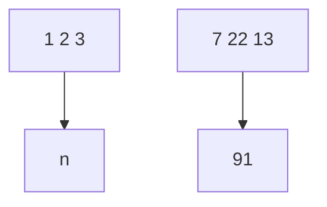
</details>

FIGURE 5.1. A schematic display of the validation set approach. A set of n observations are randomly split into a training set (shown in blue, containing observations 7, 22, and 13, among others) and a validation set (shown in beige, and containing observation 91, among others). The statistical learning method is ft on the training set, and its performance is evaluated on the validation set.

sets, a training set containing 196 of the data points, and a validation set containing the remaining 196 observations. The validation set error rates that result from ftting various regression models on the training sample and evaluating their performance on the validation sample, using MSE as a measure of validation set error, are shown in the left-hand panel of Figure 5.2. The validation set MSE for the quadratic ft is considerably smaller than for the linear ft. However, the validation set MSE for the cubic ft is actually slightly larger than for the quadratic ft. This implies that including a cubic term in the regression does not lead to better prediction than simply using a quadratic term.

Recall that in order to create the left-hand panel of Figure 5.2, we randomly divided the data set into two parts, a training set and a validation set. If we repeat the process of randomly splitting the sample set into two parts, we will get a somewhat diferent estimate for the test MSE. As an illustration, the right-hand panel of Figure 5.2 displays ten diferent validation set MSE curves from the Auto data set, produced using ten diferent random splits of the observations into training and validation sets. All ten curves indicate that the model with a quadratic term has a dramatically smaller validation set MSE than the model with only a linear term. Furthermore, all ten curves indicate that there is not much beneft in including cubic or higher-order polynomial terms in the model. But it is worth noting that each of the ten curves results in a diferent test MSE estimate for each of the ten regression models considered. And there is no consensus among the curves as to which model results in the smallest validation set MSE. Based on the variability among these curves, all that we can conclude with any confdence is that the linear ft is not adequate for this data.

The validation set approach is conceptually simple and is easy to implement. But it has two potential drawbacks:

1. As is shown in the right-hand panel of Figure 5.2, the validation estimate of the test error rate can be highly variable, depending on precisely which observations are included in the training set and which observations are included in the validation set.   
2. In the validation approach, only a subset of the observations—those that are included in the training set rather than in the validation set—are used to ft the model. Since statistical methods tend to perform worse when trained on fewer observations, this suggests that the


<details>
<summary>line</summary>

| Degree of Polynomial | Mean Squared Error |
| --------------------- | ------------------ |
| 1                     | 23.5               |
| 2                     | 19.0               |
| 3                     | 19.2               |
| 4                     | 19.1               |
| 5                     | 18.7               |
| 6                     | 18.5               |
| 7                     | 18.3               |
| 8                     | 18.2               |
| 9                     | 18.2               |
| 10                    | 18.2               |
</details>


<details>
<summary>line</summary>

| Degree of Polynomial | Series 1 | Series 2 | Series 3 | Series 4 | Series 5 | Series 6 | Series 7 | Series 8 |
| --------------------- | -------- | -------- | -------- | -------- | -------- | -------- | -------- | -------- |
| 1                     | 29.0     | 26.0     | 24.0     | 22.0     | 20.0     | 18.0     | 16.0     | 15.0     |
| 2                     | 22.0     | 24.0     | 20.0     | 18.0     | 16.0     | 15.0     | 14.0     | 13.0     |
| 4                     | 24.0     | 23.0     | 19.0     | 17.0     | 15.0     | 14.0     | 13.0     | 12.0     |
| 6                     | 23.0     | 22.0     | 18.0     | 16.0     | 14.0     | 13.0     | 12.0     | 11.0     |
| 8                     | 23.0     | 21.0     | 17.0     | 15.0     | 13.0     | 12.0     | 11.0     | 10.0     |
| 10                    | 25.0     | 25.0     | 20.0     | 18.0     | 16.0     | 15.0     | 14.0     | 13.0     |
</details>

FIGURE 5.2. The validation set approach was used on the Auto data set in order to estimate the test error that results from predicting mpg using polynomial functions of horsepower. Left: Validation error estimates for a single split into training and validation data sets. Right: The validation method was repeated ten times, each time using a diferent random split of the observations into a training set and a validation set. This illustrates the variability in the estimated test MSE that results from this approach.

validation set error rate may tend to overestimate the test error rate for the model ft on the entire data set.

In the coming subsections, we will present cross-validation, a refnement of the validation set approach that addresses these two issues.

# 5.1.2 Leave-One-Out Cross-Validation

Leave-one-out cross-validation (LOOCV) is closely related to the validation set approach of Section 5.1.1, but it attempts to address that method’s drawbacks.

Like the validation set approach, LOOCV involves splitting the set of observations into two parts. However, instead of creating two subsets of comparable size, a single observation $( x _ { 1 } , y _ { 1 } )$ is used for the validation set, and the remaining observations $\left\{ ( x _ { 2 } , y _ { 2 } ) , \ldots , ( x _ { n } , y _ { n } ) \right\}$ make up the training set. The statistical learning method is ft on the $n - 1$ training observations, and a prediction $\hat { y } _ { 1 }$ is made for the excluded observation, using its value $x _ { 1 }$ . Since $( x _ { 1 } , y _ { 1 } )$ was not used in the ftting process, $\mathrm { M S E _ { 1 } = }$ $( y _ { 1 } - { \hat { y } } _ { 1 } ) ^ { 2 }$ provides an approximately unbiased estimate for the test error. But even though $\mathrm { M S E _ { 1 } }$ is unbiased for the test error, it is a poor estimate because it is highly variable, since it is based upon a single observation $( x _ { 1 } , y _ { 1 } )$ .

We can repeat the procedure by selecting $( x _ { 2 } , y _ { 2 } )$ for the validation data, training the statistical learning procedure on the $n - 1$ observations $\left\{ ( x _ { 1 } , y _ { 1 } ) , ( x _ { 3 } , y _ { 3 } ) , \dots , ( x _ { n } , y _ { n } ) \right\}$ , and computing $\begin{array} { r } { \mathrm { M S E _ { 2 } } = ( y _ { 2 } - \hat { y } _ { 2 } ) ^ { 2 } } \end{array}$ . Repeating this approach n times produces n squared errors, $\mathrm { M S E _ { 1 } } , \ldots , \mathrm { M S E } _ { n }$ . The LOOCV estimate for the test MSE is the average of these n test error estimates:

$$
\mathrm{CV} _ {(n)} = \frac {1}{n} \sum_ {i = 1} ^ {n} \mathrm{MSE} _ {i}. \tag {5.1}
$$

leave-oneout crossvalidation


<details>
<summary>flowchart</summary>

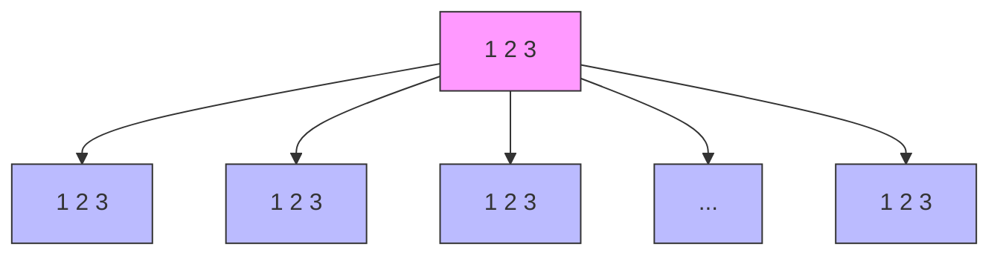
</details>

FIGURE 5.3. A schematic display of LOOCV. A set of n data points is repeatedly split into a training set (shown in blue) containing all but one observation, and a validation set that contains only that observation (shown in beige). The test error is then estimated by averaging the n resulting MSEs. The frst training set contains all but observation 1, the second training set contains all but observation 2, and so forth.

A schematic of the LOOCV approach is illustrated in Figure 5.3.

LOOCV has a couple of major advantages over the validation set approach. First, it has far less bias. In LOOCV, we repeatedly ft the statistical learning method using training sets that contain n − 1 observations, almost as many as are in the entire data set. This is in contrast to the validation set approach, in which the training set is typically around half the size of the original data set. Consequently, the LOOCV approach tends not to overestimate the test error rate as much as the validation set approach does. Second, in contrast to the validation approach which will yield diferent results when applied repeatedly due to randomness in the training/validation set splits, performing LOOCV multiple times will always yield the same results: there is no randomness in the training/validation set splits.

We used LOOCV on the Auto data set in order to obtain an estimate of the test set MSE that results from ftting a linear regression model to predict mpg using polynomial functions of horsepower. The results are shown in the left-hand panel of Figure 5.4.

LOOCV has the potential to be expensive to implement, since the model has to be ft n times. This can be very time consuming if n is large, and if each individual model is slow to ft. With least squares linear or polynomial regression, an amazing shortcut makes the cost of LOOCV the same as that of a single model ft! The following formula holds:

$$
\mathrm{CV} _ {(n)} = \frac {1}{n} \sum_ {i = 1} ^ {n} \left(\frac {y _ {i} - \hat {y} _ {i}}{1 - h _ {i}}\right) ^ {2}, \tag {5.2}
$$


<details>
<summary>line</summary>

| Degree of Polynomial | Mean Squared Error |
| --------------------- | ------------------ |
| 1                     | 24.5               |
| 2                     | 19.0               |
| 3                     | 19.2               |
| 4                     | 19.3               |
| 5                     | 18.9               |
| 6                     | 18.8               |
| 7                     | 18.6               |
| 8                     | 18.7               |
| 9                     | 18.8               |
| 10                    | 19.0               |
</details>


<details>
<summary>line</summary>

| Degree of Polynomial | Mean Squared Error |
| --------------------- | ------------------ |
| 1                     | 24.5               |
| 2                     | 18.5               |
| 4                     | 19.0               |
| 6                     | 18.8               |
| 8                     | 19.2               |
| 10                    | 20.5               |
</details>

FIGURE 5.4. Cross-validation was used on the Auto data set in order to estimate the test error that results from predicting mpg using polynomial functions of horsepower. Left: The LOOCV error curve. Right: 10-fold CV was run nine separate times, each with a diferent random split of the data into ten parts. The fgure shows the nine slightly diferent CV error curves.

where $\hat { y } _ { i }$ is the ith ftted value from the original least squares ft, and $h _ { i }$ is the leverage defned in (3.37) on page 105. 1 This is like the ordinary MSE, except the ith residual is divided by $1 - h _ { i }$ . The leverage lies between $1 / n$ and 1, and refects the amount that an observation infuences its own ft. Hence the residuals for high-leverage points are infated in this formula by exactly the right amount for this equality to hold.

LOOCV is a very general method, and can be used with any kind of predictive modeling. For example we could use it with logistic regression or linear discriminant analysis, or any of the methods discussed in later chapters. The magic formula (5.2) does not hold in general, in which case the model has to be reft n times.

# 5.1.3 k-Fold Cross-Validation

An alternative to LOOCV is k-fold CV. This approach involves randomly dividing the set of observations into k groups, or folds, of approximately equal size. The frst fold is treated as a validation set, and the method is ft on the remaining k − 1 folds. The mean squared error, $\mathrm { M S E _ { 1 } }$ , is then computed on the observations in the held-out fold. This procedure is repeated k times; each time, a diferent group of observations is treated as a validation set. This process results in k estimates of the test error, $\mathrm { M S E _ { 1 } } , \mathrm { M S E _ { 2 } } , \dotsc , \mathrm { M S E } _ { k }$ . The k-fold CV estimate is computed by averaging these values,

$$
\mathrm{CV} _ {(k)} = \frac {1}{k} \sum_ {i = 1} ^ {k} \mathrm{MSE} _ {i}. \tag {5.3}
$$

Figure 5.5 illustrates the k-fold CV approach.

k-fold CV


<details>
<summary>bar_stacked</summary>

| Category | Value 1 | Value 2 |
|---|---|---|
| 1 | 1 | 3 |
| 2 | 0 | 0 |
| Total | 47 | 5 |
| Top Right (n) | 0 | 0 |
| Bottom Right (n) | 47 | 0 |
| Bottom Left (n) | 0 | 0 |
| Bottom Right (n) | 47 | 0 |
| Bottom Left (n) | 0 | 0 |
| Bottom Right (n) | 47 | 0 |
</details>

FIGURE 5.5. A schematic display of 5-fold CV. A set of n observations is randomly split into fve non-overlapping groups. Each of these ffths acts as a validation set (shown in beige), and the remainder as a training set (shown in blue). The test error is estimated by averaging the fve resulting MSE estimates.

It is not hard to see that LOOCV is a special case of k-fold CV in which k is set to equal n. In practice, one typically performs k-fold CV using k = 5 or k = 10. What is the advantage of using k = 5 or k = 10 rather than k = n? The most obvious advantage is computational. LOOCV requires ftting the statistical learning method n times. This has the potential to be computationally expensive (except for linear models ft by least squares, in which case formula (5.2) can be used). But cross-validation is a very general approach that can be applied to almost any statistical learning method. Some statistical learning methods have computationally intensive ftting procedures, and so performing LOOCV may pose computational problems, especially if n is extremely large. In contrast, performing 10-fold CV requires ftting the learning procedure only ten times, which may be much more feasible. As we see in Section 5.1.4, there also can be other non-computational advantages to performing 5-fold or 10-fold CV, which involve the bias-variance trade-of.

The right-hand panel of Figure 5.4 displays nine diferent 10-fold CV estimates for the Auto data set, each resulting from a diferent random split of the observations into ten folds. As we can see from the fgure, there is some variability in the CV estimates as a result of the variability in how the observations are divided into ten folds. But this variability is typically much lower than the variability in the test error estimates that results from the validation set approach (right-hand panel of Figure 5.2).

When we examine real data, we do not know the true test MSE, and so it is difcult to determine the accuracy of the cross-validation estimate. However, if we examine simulated data, then we can compute the true test MSE, and can thereby evaluate the accuracy of our cross-validation results. In Figure 5.6, we plot the cross-validation estimates and true test error rates that result from applying smoothing splines to the simulated data sets illustrated in Figures 2.9–2.11 of Chapter 2. The true test MSE is displayed in blue. The black dashed and orange solid lines respectively show the estimated LOOCV and 10-fold CV estimates. In all three plots, the two cross-validation estimates are very similar. In the right-hand panel of Figure 5.6, the true test MSE and the cross-validation curves are almost identical. In the center panel of Figure 5.6, the two sets of curves are similar at the lower degrees of fexibility, while the CV curves overestimate the test set MSE for higher degrees of fexibility. In the left-hand panel of Figure 5.6, the CV curves have the correct general shape, but they underestimate the true test MSE.


<details>
<summary>line</summary>

| Flexibility | Mean Squared Error (Solid Line) | Mean Squared Error (Dashed Line) |
| ----------- | ------------------------------- | -------------------------------- |
| 2           | 2.1                             | 1.9                              |
| 5           | 1.1                             | 0.8                              |
| 10          | 0.7                             | 0.6                              |
| 20          | 1.6                             | 1.5                              |
| 25          | 2.5                             | 2.4                              |
</details>


<details>
<summary>line</summary>

| Flexibility | Mean Squared Error |
| ----------- | ------------------ |
| 2           | 1.0                |
| 5           | 1.0                |
| 20          | 1.5                |
| 25          | 2.5                |
</details>


<details>
<summary>line</summary>

| Flexibility | Mean Squared Error |
| ----------- | ------------------ |
| 2           | 18.0               |
| 5           | 3.0                |
| 10          | 1.5                |
| 20          | 2.5                |
</details>

FIGURE 5.6. True and estimated test MSE for the simulated data sets in Figures 2.9 ( left), 2.10 ( center), and 2.11 ( right). The true test MSE is shown in blue, the LOOCV estimate is shown as a black dashed line, and the 10-fold CV estimate is shown in orange. The crosses indicate the minimum of each of the MSE curves.

When we perform cross-validation, our goal might be to determine how well a given statistical learning procedure can be expected to perform on independent data; in this case, the actual estimate of the test MSE is of interest. But at other times we are interested only in the location of the minimum point in the estimated test MSE curve. This is because we might be performing cross-validation on a number of statistical learning methods, or on a single method using diferent levels of fexibility, in order to identify the method that results in the lowest test error. For this purpose, the location of the minimum point in the estimated test MSE curve is important, but the actual value of the estimated test MSE is not. We fnd in Figure 5.6 that despite the fact that they sometimes underestimate the true test MSE, all of the CV curves come close to identifying the correct level of fexibility—that is, the fexibility level corresponding to the smallest test MSE.

# 5.1.4 Bias-Variance Trade-Of for k-Fold Cross-Validation

We mentioned in Section 5.1.3 that k-fold CV with k < n has a computational advantage to LOOCV. But putting computational issues aside, a less obvious but potentially more important advantage of k-fold CV is that it often gives more accurate estimates of the test error rate than does LOOCV. This has to do with a bias-variance trade-of.

It was mentioned in Section 5.1.1 that the validation set approach can lead to overestimates of the test error rate, since in this approach the training set used to ft the statistical learning method contains only half the observations of the entire data set. Using this logic, it is not hard to see that LOOCV will give approximately unbiased estimates of the test error, since each training set contains n−1 observations, which is almost as many as the number of observations in the full data set. And performing k-fold CV for, say, $k = 5$ or $k = 1 0$ will lead to an intermediate level of bias, since each training set contains approximately $( k - 1 ) n / k$ observations— fewer than in the LOOCV approach, but substantially more than in the validation set approach. Therefore, from the perspective of bias reduction, it is clear that LOOCV is to be preferred to k-fold CV.

However, we know that bias is not the only source for concern in an estimating procedure; we must also consider the procedure’s variance. It turns out that LOOCV has higher variance than does k-fold CV with $k < n$ . Why is this the case? When we perform LOOCV, we are in efect averaging the outputs of n ftted models, each of which is trained on an almost identical set of observations; therefore, these outputs are highly (positively) correlated with each other. In contrast, when we perform k-fold CV with $k < n ,$ , we are averaging the outputs of k ftted models that are somewhat less correlated with each other, since the overlap between the training sets in each model is smaller. Since the mean of many highly correlated quantities has higher variance than does the mean of many quantities that are not as highly correlated, the test error estimate resulting from LOOCV tends to have higher variance than does the test error estimate resulting from k-fold CV.

To summarize, there is a bias-variance trade-of associated with the choice of k in k-fold cross-validation. Typically, given these considerations, one performs k-fold cross-validation using k = 5 or $k = 1 0 ,$ , as these values have been shown empirically to yield test error rate estimates that sufer neither from excessively high bias nor from very high variance.

# 5.1.5 Cross-Validation on Classifcation Problems

In this chapter so far, we have illustrated the use of cross-validation in the regression setting where the outcome Y is quantitative, and so have used MSE to quantify test error. But cross-validation can also be a very useful approach in the classifcation setting when Y is qualitative. In this setting, cross-validation works just as described earlier in this chapter, except that rather than using MSE to quantify test error, we instead use the number of misclassifed observations. For instance, in the classifcation setting, the LOOCV error rate takes the form

$$
\mathrm{CV} _ {(n)} = \frac {1}{n} \sum_ {i = 1} ^ {n} \mathrm{Err} _ {i}, \tag {5.4}
$$

where $\mathrm { E r r } _ { i } = I ( y _ { i } \neq \hat { y } _ { i } )$ . The k-fold CV error rate and validation set error rates are defned analogously.

As an example, we ft various logistic regression models on the twodimensional classifcation data displayed in Figure 2.13. In the top-left panel of Figure 5.7, the black solid line shows the estimated decision boundary resulting from ftting a standard logistic regression model to this data set. Since this is simulated data, we can compute the true test error rate, which takes a value of 0.201 and so is substantially larger than the Bayes error rate of 0.133. Clearly logistic regression does not have enough fexibility to model the Bayes decision boundary in this setting. We can easily extend logistic regression to obtain a non-linear decision boundary by using polynomial functions of the predictors, as we did in the regression setting in Section 3.3.2. For example, we can ft a quadratic logistic regression model, given by

  
FIGURE 5.7. Logistic regression fts on the two-dimensional classifcation data displayed in Figure 2.13. The Bayes decision boundary is represented using a purple dashed line. Estimated decision boundaries from linear, quadratic, cubic and quartic (degrees 1–4) logistic regressions are displayed in black. The test error rates for the four logistic regression fts are respectively 0.201, 0.197, 0.160, and 0.162, while the Bayes error rate is 0.133.

$$
\log \left(\frac {p}{1 - p}\right) = \beta_ {0} + \beta_ {1} X _ {1} + \beta_ {2} X _ {1} ^ {2} + \beta_ {3} X _ {2} + \beta_ {4} X _ {2} ^ {2}. \tag {5.5}
$$

The top-right panel of Figure 5.7 displays the resulting decision boundary, which is now curved. However, the test error rate has improved only slightly, to 0.197. A much larger improvement is apparent in the bottom-left panel of Figure 5.7, in which we have ft a logistic regression model involving cubic polynomials of the predictors. Now the test error rate has decreased to 0.160. Going to a quartic polynomial (bottom-right) slightly increases the test error.


<details>
<summary>line</summary>

| Order of Polynomials Used | Error Rate (Black Line) | Error Rate (Orange Line) | Error Rate (Blue Line) |
| ------------------------- | ------------------------ | ------------------------- | ----------------------- |
| 2                         | 0.20                     | 0.20                      | 0.20                    |
| 4                         | 0.14                     | 0.16                      | 0.13                    |
| 6                         | 0.15                     | 0.16                      | 0.15                    |
| 8                         | 0.16                     | 0.17                      | 0.14                    |
| 10                        | 0.19                     | 0.19                      | 0.12                    |
</details>


<details>
<summary>line</summary>

| 1/K   | Error Rate (Black) | Error Rate (Blue) | Error Rate (Orange) |
|-------|--------------------|-------------------|---------------------|
| 0.01  | 0.20               | 0.18              | 0.20                |
| 0.02  | 0.15               | 0.14              | 0.18                |
| 0.05  | 0.13               | 0.12              | 0.16                |
| 0.10  | 0.12               | 0.10              | 0.13                |
| 0.20  | 0.12               | 0.10              | 0.14                |
| 0.50  | 0.12               | 0.10              | 0.16                |
| 1.00  | 0.12               | 0.10              | 0.17                |
</details>

FIGURE 5.8. Test error (brown), training error (blue), and 10-fold CV error (black) on the two-dimensional classifcation data displayed in Figure 5.7. Left: Logistic regression using polynomial functions of the predictors. The order of the polynomials used is displayed on the x-axis. Right: The KNN classifer with diferent values of K, the number of neighbors used in the KNN classifer.

In practice, for real data, the Bayes decision boundary and the test error rates are unknown. So how might we decide between the four logistic regression models displayed in Figure 5.7? We can use cross-validation in order to make this decision. The left-hand panel of Figure 5.8 displays in black the 10-fold CV error rates that result from ftting ten logistic regression models to the data, using polynomial functions of the predictors up to tenth order. The true test errors are shown in brown, and the training errors are shown in blue. As we have seen previously, the training error tends to decrease as the fexibility of the ft increases. (The fgure indicates that though the training error rate doesn’t quite decrease monotonically, it tends to decrease on the whole as the model complexity increases.) In contrast, the test error displays a characteristic U-shape. The 10-fold CV error rate provides a pretty good approximation to the test error rate. While it somewhat underestimates the error rate, it reaches a minimum when fourth-order polynomials are used, which is very close to the minimum of the test curve, which occurs when third-order polynomials are used. In fact, using fourth-order polynomials would likely lead to good test set performance, as the true test error rate is approximately the same for third, fourth, ffth, and sixth-order polynomials.

The right-hand panel of Figure 5.8 displays the same three curves using the KNN approach for classifcation, as a function of the value of K (which in this context indicates the number of neighbors used in the KNN classifer, rather than the number of CV folds used). Again the training error rate declines as the method becomes more fexible, and so we see that the training error rate cannot be used to select the optimal value for K. Though the cross-validation error curve slightly underestimates the test error rate, it takes on a minimum very close to the best value for K.

# 5.2 The Bootstrap

The bootstrap is a widely applicable and extremely powerful statistical tool that can be used to quantify the uncertainty associated with a given estimator or statistical learning method. As a simple example, the bootstrap can be used to estimate the standard errors of the coefcients from a linear regression ft. In the specifc case of linear regression, this is not particularly useful, since we saw in Chapter 3 that standard statistical software such as R outputs such standard errors automatically. However, the power of the bootstrap lies in the fact that it can be easily applied to a wide range of statistical learning methods, including some for which a measure of variability is otherwise difcult to obtain and is not automatically output by statistical software.

In this section we illustrate the bootstrap on a toy example in which we wish to determine the best investment allocation under a simple model. In Section 5.3 we explore the use of the bootstrap to assess the variability associated with the regression coefcients in a linear model ft.

Suppose that we wish to invest a fxed sum of money in two fnancial assets that yield returns of X and Y , respectively, where X and $Y$ are random quantities. We will invest a fraction α of our money in X, and will invest the remaining $1 - \alpha$ in Y . Since there is variability associated with the returns on these two assets, we wish to choose α to minimize the total risk, or variance, of our investment. In other words, we want to minimize $\operatorname { V a r } ( \alpha X + ( 1 - \alpha ) Y )$ . One can show that the value that minimizes the risk is given by

$$
\alpha = \frac {\sigma_ {Y} ^ {2} - \sigma_ {X Y}}{\sigma_ {X} ^ {2} + \sigma_ {Y} ^ {2} - 2 \sigma_ {X Y}}, \tag {5.6}
$$

where $\sigma _ { X } ^ { 2 } = \operatorname { V a r } ( X ) , \sigma _ { Y } ^ { 2 } = \operatorname { V a r } ( Y )$ , and $\sigma _ { X Y } = \operatorname { C o v } ( X , Y )$ .

In reality, the quantities $\sigma _ { X } ^ { 2 } , \sigma _ { Y } ^ { 2 } .$ , and $\sigma _ { X Y }$ are unknown. We can compute Xestimates for these quantities, $\mathring { \sigma } _ { X } ^ { 2 } , \ \hat { \sigma } _ { Y } ^ { 2 }$ , and $\hat { \sigma } _ { X Y }$ , using a data set that contains past measurements for $X$ and Y . We can then estimate the value of α that minimizes the variance of our investment using

$$
\hat {\alpha} = \frac {\hat {\sigma} _ {Y} ^ {2} - \hat {\sigma} _ {X Y}}{\hat {\sigma} _ {X} ^ {2} + \hat {\sigma} _ {Y} ^ {2} - 2 \hat {\sigma} _ {X Y}}. \tag {5.7}
$$

Figure 5.9 illustrates this approach for estimating α on a simulated data set. In each panel, we simulated 100 pairs of returns for the investments X and Y . We used these returns to estimate $\sigma _ { X } ^ { 2 } , \sigma _ { Y } ^ { 2 }$ , and $\sigma _ { X Y }$ , which we then substituted into (5.7) in order to obtain estimates for $\alpha$ . The value of αˆ resulting from each simulated data set ranges from 0.532 to 0.657.

It is natural to wish to quantify the accuracy of our estimate of α. To estimate the standard deviation of $\hat { \alpha }$ , we repeated the process of simulating 100 paired observations of X and $Y$ , and estimating α using (5.7), 1,000 times. We thereby obtained 1,000 estimates for $\alpha .$ , which we can call $\hat { \alpha } _ { 1 } , \hat { \alpha } _ { 2 } , \dots , \hat { \alpha } _ { 1 , 0 0 0 }$ . The left-hand panel of Figure 5.10 displays a histogram of the resulting estimates. For these simulations the parameters were set to $\sigma _ { X } ^ { 2 } = 1 , \sigma _ { Y } ^ { 2 } = \bar { 1 } . 2 5$ , and $\sigma _ { X Y } = 0 . 5$ , and so we know that the true value of α is 0.6. We indicated this value using a solid vertical line on the histogram.


<details>
<summary>scatter</summary>

| X    | Y    |
|------|------|
| -2.0 | -2.0 |
| -1.5 | -1.5 |
| -1.0 | -1.0 |
| -0.5 | -0.5 |
| 0.0  | 0.0  |
| 0.5  | 0.5  |
| 1.0  | 1.0  |
| 1.5  | 1.5  |
| 2.0  | 2.0  |
</details>


<details>
<summary>scatter</summary>

| X    | Y    |
|------|------|
| -2.0 | -1.5 |
| -1.8 | -1.2 |
| -1.6 | -0.9 |
| -1.4 | -0.6 |
| -1.2 | -0.3 |
| -1.0 | 0.0  |
| -0.8 | 0.3  |
| -0.6 | 0.6  |
| -0.4 | 0.9  |
| -0.2 | 1.2  |
| 0.0  | 1.5  |
| 0.2  | 1.8  |
| 0.4  | 2.1  |
| 0.6  | 1.9  |
| 0.8  | 1.6  |
| 1.0  | 1.3  |
| 1.2  | 1.0  |
| 1.4  | 0.7  |
| 1.6  | 0.4  |
| 1.8  | 0.1  |
| 2.0  | -0.2 |
| 2.2  | -0.5 |
| 2.4  | -0.8 |
| 2.6  | -1.1 |
| 2.8  | -1.4 |
| 3.0  | -1.7 |
</details>


<details>
<summary>scatter</summary>

| X    | Y    |
|------|------|
| -3.0 | -2.5 |
| -2.5 | -1.0 |
| -2.0 | 0.0  |
| -1.5 | 0.5  |
| -1.0 | 1.0  |
| -0.5 | 1.5  |
| 0.0  | 2.0  |
| 0.5  | 1.5  |
| 1.0  | 1.0  |
| 1.5  | 0.5  |
| 2.0  | -0.5 |
| 2.5  | -1.0 |
| 3.0  | -1.5 |
</details>


<details>
<summary>scatter</summary>

| X    | Y    |
|------|------|
| -1.8 | -2.5 |
| -1.5 | -2.0 |
| -1.2 | -1.5 |
| -0.9 | -1.0 |
| -0.6 | -0.5 |
| -0.3 | 0.0  |
| 0.0  | 0.5  |
| 0.3  | 1.0  |
| 0.6  | 1.5  |
| 0.9  | 2.0  |
| 1.2  | 2.5  |
| 1.5  | 3.0  |
| 1.8  | 3.5  |
| 2.1  | 4.0  |
| 2.4  | 4.5  |
| 2.7  | 5.0  |
| 3.0  | 5.5  |
| 3.3  | 6.0  |
| 3.6  | 6.5  |
| 3.9  | 7.0  |
| 4.2  | 7.5  |
| 4.5  | 8.0  |
| 4.8  | 8.5  |
| 5.1  | 9.0  |
| 5.4  | 9.5  |
| 5.7  | 10.0 |
| 6.0  | 10.5 |
| 6.3  | 11.0 |
| 6.6  | 11.5 |
| 6.9  | 12.0 |
| 7.2  | 12.5 |
| 7.5  | 13.0 |
| 7.8  | 13.5 |
| 8.1  | 14.0 |
| 8.4  | 14.5 |
| 8.7  | 15.0 |
| 9.0  | 15.5 |
| 9.3  | 16.0 |
| 9.6  | 16.5 |
| 9.9  | 17.0 |
| 10.2 | 17.5 |
| 10.5 | 18.0 |
| 10.8 | 18.5 |
| 11.1 | 19.0 |
| 11.4 | 19.5 |
| 11.7 | 20.0 |
| 12.0 | 20.5 |
| 12.3 | 21.0 |
| 12.6 | 21.5 |
| 12.9 | 22.0 |
| 13.2 | 22.5 |
| 13.5 | 23.0 |
| 13.8 | 23.5 |
| 14.1 | 24.0 |
| 14.4 | 24.5 |
| 14.7 | 25.0 |
| 15.0 | 25.5 |
| 15.3 | 26.0 |
| 15.6 | 26.5 |
| 15.9 | 27.0 |
| 16.2 | 27.5 |
| 16.5 | 28.0 |
| 16.8 | 28.5 |
| 17.1 | 29.0 |
| 17.4 | 29.5 |
| 17.7 | 30.0 |
| 18.0 | 30.5 |
| 18.3 | 31.0 |
| 18.6 | 31.5 |
| 18.9 | 32.0 |
| 19.2 | 32.5 |
| 19.5 | 33.0 |
| 19.8 | 33.5 |
| 20.1 | 34.0 |
| 20.4 | 34.5 |
| 20.7 | 35.0 |
| 21.0 | 35.5 |
| 21.3 | 36.0 |
| 21.6 | 36.5 |
| 21.9 | 37.0 |
| 22.2 | 37.5 |
| 22.5 | 38.0 |
| 22.8 | 38.5 |
| 23.1 | 39.0 |
| 23.4 | 39.5 |
| 23.7 | 40.0 |
| 24.0 | 40.5 |
| 24.3 | 41.0 |
| 24.6 | 41.5 |
| 24.9 | 42.0 |
| 25.2 | 42.5 |
| 25.5 | 43.0 |
| 25.8 | 43.5 |
| 26.1 | 44.0 |
| 26.4 | 44.5 |
| 26.7 | 45.0 |
| 27.0 | 45.5 |
| 27.3 | 46.0 |
| 27.6 | 46.5 |
| 27.9 | 47.0 |
| 28.2 | 47.5 |
| 28.5 | 48.0 |
| 28.8 | 48.5 |
| 29.1 | 49.0 |
| 29.4 | 49.5 |
| 29.7 | 50.0 |
| ...   | ...    |
| ...   | ...    |
| ...   | ...    |
| ...   | ...    |
| ...   | ...    |
| ...   | ...    |
| ...   | ...    |
| ...   | ...    |
| ...   | ...    |
| ...   | ...    |
| ...   | ...    |
| ...   | ...    |
| ...   | ...    |
| ...   | ...    |
| ...   | ...    |
|
| ...   | ...    |
|
| ...   | ...    |
|
| ...   | ...    |
|
|
| ...   | ...    |
|
|
|
|
|
|
|
|
|
|
|
|
|
|
|
|
|
|
|
|
|
|
|
|
|
|
|
|
|
|
|
|
|
|
|
|
|
|
|
|
|
|
|
|
|
|
|
|
|
|
|
|
|
|
|
|
|
|
|
|
|
|
|
|
|
|
|
|
|
|
|
|
|
|
|
|
|
|
|
|
|
|
|
|
|
|
|
|
|
|
|
|
|
|
|
|
|
|
|
|
| ...   | ...    |
| ...   | ...    |
| ...   | ...    |
| ...   | ...    |
| ...   | ...    |
| ...   | ...    |
| ...   | ...    |
| ...   | ...    |
| ...   | ...    |
| ...   | ...    |
| ...   | ...    |
| ...   | ...    |
| ...   | ...    |
| ...   | ...    |
|...   | ...    |
| ...   | ...    |
| ...   | ...    |
| ...   | ...    |
| ...   | ...    |
| ...   | ...    |
| ...   | ...    |
| ...   | ...    |
| ...   | ...    |
| ...   | ...    |
| ...   | ...    |
| ...   | ...    |
| ...   | ...    |
| ...   | ...    |
| ...   = 'X'     |

||X'      ||Y'      ||Z''      ||A''      ||B''      ||C''      ||D''      ||E''      ||F''      ||G''      ||H''      ||I''      ||J''      ||K''      ||L''      ||M''      ||N''      ||O''      ||P''      ||Q''      ||R''      ||S''      ||T''      ||U''      ||V''      ||W''      ||X''      ||Y''      ||Z''      ||A''      ||B''      ||C''      ||C''      ||A''      ||B''      ||C''      ||A''      ||C''      ||C''      ||C''      ||Y''      ||Y''      ||Z''      ||A''      ||B''      ||C''      ||A''      ||C''      ||C''      ||C''      ||Y''      ||Y''      ||Z''      ||A''      ||B''      ||C''      ||A''      ||C''      ||C''      ||C''      ||Y''      ||Y''      ||Z''      ||A''      ||B''      ||C''      ||A''      ||B''      ||C''      ||C''      ||A''      ||C''      ||C''      ||C''      ||Y''      ||Y''      ||Z''      ||A''      ||B''      ||C''      ||A''      ||C''      ||C''      ||C''      ||C''      ||Y''      ||Y''      ||Z''      ||A''      ||B''      ||C''      ||A''      ||C''      ||C''      ||A''      ||C''      ||C''      ||C''      ||Y''      ||Y''      ||Z''      ||A''      ||B''      ||C''      ||A''      ||C''      ||C''      ||C''      ||A''      ||C''      ||C''      ||C''      ||Y'
</details>

FIGURE 5.9. Each panel displays 100 simulated returns for investments X and Y . From left to right and top to bottom, the resulting estimates for α are 0.576, 0.532, 0.657, and 0.651.

The mean over all 1,000 estimates for α is

$$
\bar {\alpha} = \frac {1}{1 0 0 0} \sum_ {r = 1} ^ {1 0 0 0} \hat {\alpha} _ {r} = 0. 5 9 9 6,
$$

very close to $\alpha = 0 . 6$ , and the standard deviation of the estimates is

$$
\sqrt {\frac {1}{1 0 0 0 - 1} \sum_ {r = 1} ^ {1 0 0 0} (\hat {\alpha} _ {r} - \bar {\alpha}) ^ {2}} = 0. 0 8 3.
$$

This gives us a very good idea of the accuracy of $\hat { \alpha } \colon \mathrm { S E } ( \hat { \alpha } ) \approx 0 . 0 8 3$ . So roughly speaking, for a random sample from the population, we would expect αˆ to difer from α by approximately 0.08, on average.

In practice, however, the procedure for estimating SE(ˆα) outlined above cannot be applied, because for real data we cannot generate new samples from the original population. However, the bootstrap approach allows us to use a computer to emulate the process of obtaining new sample sets, so that we can estimate the variability of αˆ without generating additional samples. Rather than repeatedly obtaining independent data sets from the population, we instead obtain distinct data sets by repeatedly sampling observations from the original data set.

This approach is illustrated in Figure 5.11 on a simple data set, which we call Z, that contains only $n = 3$ observations. We randomly select n observations from the data set in order to produce a bootstrap data set,


<details>
<summary>histogram</summary>

| α Range | Frequency |
|---|---|
| 0.4 - 0.45 | 1 |
| 0.45 - 0.5 | 35 |
| 0.5 - 0.55 | 75 |
| 0.55 - 0.6 | 165 |
| 0.6 - 0.65 | 230 |
| 0.65 - 0.7 | 220 |
| 0.7 - 0.75 | 125 |
| 0.75 - 0.8 | 85 |
| 0.8 - 0.85 | 30 |
| 0.85 - 0.9 | 10 |
| 0.9 - 0.95 | 1 |
</details>


<details>
<summary>histogram</summary>

| α Range       | Frequency |
| ------------- | --------- |
| 0.3 - 0.4     | 5         |
| 0.4 - 0.5     | 50        |
| 0.5 - 0.6     | 200       |
| 0.6 - 0.7     | 180       |
| 0.7 - 0.8     | 40        |
| 0.8 - 0.9     | 5         |
</details>


<details>
<summary>boxplot</summary>

| Group    | Min  | Q1   | Median | Q3   | Max  |
| -------- | ---- | ---- | ------ | ---- | ---- |
| True     | 0.35 | 0.60 | 0.58   | 0.62 | 0.85 |
| Bootstrap| 0.30 | 0.55 | 0.57   | 0.60 | 0.80 |
</details>

FIGURE 5.10. Left: A histogram of the estimates of α obtained by generating 1,000 simulated data sets from the true population. Center: A histogram of the estimates of α obtained from 1,000 bootstrap samples from a single data set. Right: The estimates of α displayed in the left and center panels are shown as boxplots. In each panel, the pink line indicates the true value of α.

$Z ^ { * 1 }$ . The sampling is performed with replacement, which means that the same observation can occur more than once in the bootstrap data set. In this example, $Z ^ { * 1 }$ contains the third observation twice, the frst observation once, and no instances of the second observation. Note that if an observation is contained in $Z ^ { * 1 }$ , then both its X and Y values are included. We can use $Z ^ { * 1 }$ to produce a new bootstrap estimate for $\alpha ,$ , which we call $\hat { \alpha } ^ { * 1 }$ . This procedure is repeated B times for some large value of B, in order to produce B diferent bootstrap data sets, $Z ^ { * 1 } , Z ^ { * 2 } , \ldots , Z ^ { * B }$ , and B corresponding α estimates, αˆ∗1, αˆ∗2, . $\hat { \alpha } ^ { * 1 } , \hat { \alpha } ^ { * 2 } , \hat { \hdots } , \hat { \alpha } ^ { * B }$ . We can compute the standard error of these bootstrap estimates using the formula

$$
\mathrm{SE} _ {B} (\hat {\alpha}) = \sqrt {\frac {1}{B - 1} \sum_ {r = 1} ^ {B} \left(\hat {\alpha} ^ {* r} - \frac {1}{B} \sum_ {r ^ {\prime} = 1} ^ {B} \hat {\alpha} ^ {* r ^ {\prime}}\right) ^ {2}}. \tag {5.8}
$$

This serves as an estimate of the standard error of $\hat { \alpha }$ estimated from the original data set.

The bootstrap approach is illustrated in the center panel of Figure 5.10, which displays a histogram of 1,000 bootstrap estimates of $\alpha ,$ , each computed using a distinct bootstrap data set. This panel was constructed on the basis of a single data set, and hence could be created using real data. Note that the histogram looks very similar to the left-hand panel, which displays the idealized histogram of the estimates of α obtained by generating 1,000 simulated data sets from the true population. In particular the bootstrap estimate SE( ˆα) from (5.8) is 0.087, very close to the estimate of 0.083 obtained using 1,000 simulated data sets. The right-hand panel displays the information in the center and left panels in a diferent way, via boxplots of the estimates for α obtained by generating 1,000 simulated data sets from the true population and using the bootstrap approach. Again, the boxplots have similar spreads, indicating that the bootstrap approach can be used to efectively estimate the variability associated with αˆ.


<details>
<summary>flowchart</summary>

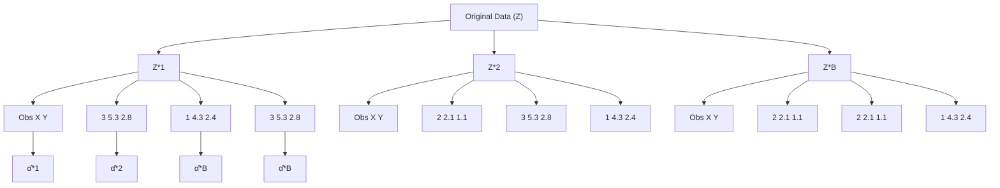
</details>

FIGURE 5.11. A graphical illustration of the bootstrap approach on a small sample containing n = 3 observations. Each bootstrap data set contains n observations, sampled with replacement from the original data set. Each bootstrap data set is used to obtain an estimate of α.

# 5.3 Lab: Cross-Validation and the Bootstrap

In this lab, we explore the resampling techniques covered in this chapter. Some of the commands in this lab may take a while to run on your computer.

We again begin by placing most of our imports at this top level.

In [1]:

```python
import numpy as np
import statsmodels.api as sm
from ISLP import load_data
from ISLP.models import (ModelSpec as MS,
    summarize,
    poly)
from sklearn.model_selection import train_test_split 
```

There are several new imports needed for this lab.

In [2]:

```python
from functools import partial
from sklearn.model_selection import \
    (cross_validate,
    KFold,
    ShuffleSplit)
from sklearn.base import clone
from ISLP.models import sklearn_sm 
```

# 5.3.1 The Validation Set Approach

We explore the use of the validation set approach in order to estimate the test error rates that result from ftting various linear models on the Auto data set.

We use the function train\_test\_split() to split the data into training and validation sets. As there are 392 observations, we split into two equal sets of size 196 using the argument test\_size=196. It is generally a good idea to set a random seed when performing operations like this that contain an element of randomness, so that the results obtained can be reproduced precisely at a later time. We set the random seed of the splitter with the argument random\_state=0.

train\_test\_ split()

```python
In [3]: Auto = load_data('Auto')
Auto_train, Auto_valid = train_test_split(Auto,
    test_size=196,
    random_state=0) 
```

Now we can ft a linear regression using only the observations corresponding to the training set Auto\_train.

```python
In [4]: hp_mm = MS(['horsepower'])
X_train = hp_mm.fit_transform(Auto_train)
y_train = Auto_train['mpg']
model = sm.OLS(y_train, X_train)
results = model.fit() 
```

We now use the predict() method of results evaluated on the model matrix for this model created using the validation data set. We also calculate the validation MSE of our model.

```python
In [5]: X_valid = hp_mm.transform(Auto_valid)
y_valid = Auto_valid['mpg']
valid_pred = results.predict(X_valid)
np.mean((y_valid - valid_pred)**2) 
```

Out[5]: 23.6166

Hence our estimate for the validation MSE of the linear regression ft is 23.62.

We can also estimate the validation error for higher-degree polynomial regressions. We frst provide a function evalMSE() that takes a model string as well as a training and test set and returns the MSE on the test set.

```python
In [6]: def evalMSE(terms,
    response,
    train,
    test):
    mm = MS(terms)
    X_train = mm.fit_transform(train)
    y_train = train[response]
    X_test = mm.transform(test)
    y_test = test[response] 
```

```txt
results = sm.OLS(y_train, X_train).fit()
test_pred = results.predict(X_test)
return np.mean((y_test - test_pred)**2) 
```

Let’s use this function to estimate the validation MSE using linear, quadratic and cubic fts. We use the enumerate() function here, which gives both the values and indices of objects as one iterates over a for loop.

enumerate()

```python
In [7]: MSE = np.zeros(3)
for idx, degree in enumerate(range(1, 4)):
    MSE[idx] = evalMSE([poly('horsepower', degree)],
    'mpg',
    Auto_train,
    Auto_valid)
MSE 
```

```python
Out[7]: array([23.62, 18.76, 18.80]) 
```

These error rates are 23.62, 18.76, and 18.80, respectively. If we choose a diferent training/validation split instead, then we can expect somewhat diferent errors on the validation set.

```python
In [8]: Auto_train, Auto_valid = train_test_split(Auto,
    test_size=196,
    random_state=3)
MSE = np.zeros(3)
for idx, degree in enumerate(range(1, 4)):
    MSE[idx] = evalMSE([poly('horsepower', degree)],
    'mpg',
    Auto_train,
    Auto_valid)
MSE 
```

```txt
Out[8]: array([20.76, 16.95, 16.97]) 
```

Using this split of the observations into a training set and a validation set, we fnd that the validation set error rates for the models with linear, quadratic, and cubic terms are 20.76, 16.95, and 16.97, respectively.

These results are consistent with our previous fndings: a model that predicts mpg using a quadratic function of horsepower performs better than a model that involves only a linear function of horsepower, and there is no evidence of an improvement in using a cubic function of horsepower.

# 5.3.2 Cross-Validation

In theory, the cross-validation estimate can be computed for any generalized linear model. In practice, however, the simplest way to cross-validate in Python is to use sklearn, which has a diferent interface or API than statsmodels, the code we have been using to ft GLMs.

This is a problem which often confronts data scientists: “I have a function to do task A, and need to feed it into something that performs task B, so that I can compute B(A(D)), where D is my data.” When A and B don’t naturally speak to each other, this requires the use of a wrapper. In the ISLP

wrapper

package, we provide a wrapper, sklearn\_sm(), that enables us to easily use the cross-validation tools of sklearn with models ft by statsmodels.

sklearn\_sm()

The class sklearn\_sm() has as its frst argument a model from statsmodels. It can take two additional optional arguments: model\_str which can be used to specify a formula, and model\_args which should be a dictionary of additional arguments used when ftting the model. For example, to ft a logistic regression model we have to specify a family argument. This is passed as model\_args={'family':sm.families.Binomial()}.

Here is our wrapper in action:

In [9]:   
```python
hp_model = sklearn_sm(sm.OLS,
    MS(['horsepower'])) 
X, Y = Auto.drop(columns=['mpg']), Auto['mpg']
cv_results = cross_validate(hp_model,
    X,
    Y,
    cv=Auto.shape[0])
cv_err = np.mean(cv_results['test_score'])
cv_err 
```  
Out[9]: 24.2315

The arguments to cross\_validate() are as follows: an object with the appropriate fit(), predict(), and score() methods, an array of features X and a response Y. We also included an additional argument cv to cross\_validate(); specifying an integer K results in K-fold cross-validation. We have provided a value corresponding to the total number of observations, which results in leave-one-out cross-validation (LOOCV). The cross\_validate() func- c tion produces a dictionary with several components; we simply want the y cross-validated test score here (MSE), which is estimated to be 24.23.

cross validate()

We can repeat this procedure for increasingly complex polynomial fts. To automate the process, we again use a for loop which iteratively fts polynomial regressions of degree 1 to 5, computes the associated crossvalidation error, and stores it in the ith element of the vector cv\_error. The variable d in the for loop corresponds to the degree of the polynomial. We begin by initializing the vector. This command may take a couple of seconds to run.

In [10]:   
```python
cv_error = np.zeros(5)
H = np.array(Auto['horsepower'])
M = sklearn_sm(sm.OLS)
for i, d in enumerate(range(1,6)):
    X = np.power.outer(H, np.arange(d+1))
    M_CV = cross_validate(M,
    X,
    Y,
    cv=Auto.shape[0])
    cv_error[i] = np.mean(M_CV['test_score'])
cv_error 
```  
Out[10]: array([24.2315, 19.2482, 19.3350, 19.4244, 19.0332])

As in Figure 5.4, we see a sharp drop in the estimated test MSE between the linear and quadratic fts, but then no clear improvement from using higher-degree polynomials.

Above we introduced the outer() method of the np.power() function. The outer() method is applied to an operation that has two arguments, such as add(), min(), or power(). It has two arrays as arguments, and then forms a larger array where the operation is applied to each pair of elements of the two arrays.

.outer() np.power()

```python
In [11]: A = np.array([3, 5, 9])
B = np.array([2, 4])
np.add.outer(A, B) 
```

```javascript
Out[11]: array([[5, 7], [7, 9], [11, 13]]) 
```

In the CV example above, we used K = n, but of course we can also use K < n. The code is very similar to the above (and is signifcantly faster). Here we use KFold() to partition the data into K = 10 random groups. We use random\_state to set a random seed and initialize a vector cv\_error in which we will store the CV errors corresponding to the polynomial fts of degrees one to fve.

KFold()

```python
In [12]: cv_error = np.zeros(5)
cv = KFold(n_splits=10,
    shuffle=True,
    random_state=0) # use same splits for each degree
for i, d in enumerate(range(1,6)):
    X = np.power.outer(H, np.arange(d+1))
    M_CV = cross_validate(M,
    X,
    Y,
    cv=cv)
    cv_error[i] = np.mean(M_CV['test_score'])
cv_error 
```

```javascript
Out[12]: array([24.2077, 19.1853, 19.2763, 19.4785, 19.1372]) 
```

Notice that the computation time is much shorter than that of LOOCV. (In principle, the computation time for LOOCV for a least squares linear model should be faster than for K-fold CV, due to the availability of the formula (5.2) for LOOCV; however, the generic cross\_validate() function does not make use of this formula.) We still see little evidence that using cubic or higher-degree polynomial terms leads to a lower test error than simply using a quadratic ft.

Shuffle Split()

The cross\_validate() function is fexible and can take diferent splitting mechanisms as an argument. For instance, one can use the ShuffleSplit() funtion to implement the validation set approach just as easily as K-fold cross-validation.

```python
In [13]: validation = ShuffleSplit(n_splits=1,
    test_size=196,
    random_state=0)
results = cross_validate(hp_model,
    Auto.drop(['mpg'], axis=1),
    Auto['mpg'],
    cv=validation);
results['test_score'] 
```

```javascript
Out[13]: array([23.6166]) 
```

One can estimate the variability in the test error by running the following:

In [14]:   
```txt
validation = ShuffleSplit(n_splits=10,
    test_size=196,
    random_state=0)
results = cross_validate(hp_model,
    Auto.drop(['mpg'], axis=1),
    Auto['mpg'],
    cv=validation)
results['test_score'].mean(), results['test_score'].std() 
```  
Out[14]: (23.8022, 1.4218)

Note that this standard deviation is not a valid estimate of the sampling variability of the mean test score or the individual scores, since the randomly-selected training samples overlap and hence introduce correlations. But it does give an idea of the Monte Carlo variation incurred by picking diferent random folds.

# 5.3.3 The Bootstrap

We illustrate the use of the bootstrap in the simple example of Section 5.2, as well as on an example involving estimating the accuracy of the linear regression model on the Auto data set.

# Estimating the Accuracy of a Statistic of Interest

One of the great advantages of the bootstrap approach is that it can be applied in almost all situations. No complicated mathematical calculations are required. While there are several implementations of the bootstrap in Python, its use for estimating standard error is simple enough that we write our own function below for the case when our data is stored in a dataframe.

To illustrate the bootstrap, we start with a simple example. The Portfolio data set in the ISLP package is described in Section 5.2. The goal is to estimate the sampling variance of the parameter α given in formula (5.7). We will create a function alpha\_func(), which takes as input a dataframe D assumed to have columns X and Y, as well as a vector idx indicating which observations should be used to estimate α. The function then outputs the estimate for α based on the selected observations.

In [15]:   
```python
Portfolio = load_data('Portfolio')
def alpha_func(D, idx):
    cov_ = np.cov(D[['X', 'Y']].loc[idx], rowvar=False)
    return ((cov_[1,1] - cov_[0,1]) / (cov_[0,0] + cov_[1,1] - 2 * cov_[0,1])) 
```

This function returns an estimate for α based on applying the minimum variance formula (5.7) to the observations indexed by the argument idx. For instance, the following command estimates α using all 100 observations.

In [16]:   
```txt
alpha_func(Portfolio, range(100)) 
```

Out[16]: 0.5758

Next we randomly select 100 observations from range(100), with replacement. This is equivalent to constructing a new bootstrap data set and recomputing αˆ based on the new data set.

In [17]:

```python
rng = np.random.default_rng(0)
alpha_func(Portfolio,
    rng.choice(100,
    100,
    replace=True)) 
```

Out[17]: 0.6074

This process can be generalized to create a simple function boot\_SE() for computing the bootstrap standard error for arbitrary functions that take only a data frame as an argument.

In [18]:

```python
def boot_SE(func,
    D,
    n=None,
    B=1000,
    seed=0):
    rng = np.random.default_rng(seed)
    first_, second_ = 0, 0
    n = n or D.shape[0]
    for _ in range(B):
    idx = rng.choice(D.index,
    n,
    replace=True)
    value = func(D, idx)
    first_ += value
    second_ += value**2
    return np.sqrt(second_ / B - (first_ / B)**2) 
```

Notice the use of \_ as a loop variable in for \_ in range(B). This is often used if the value of the counter is unimportant and simply makes sure the loop is executed B times.

Let’s use our function to evaluate the accuracy of our estimate of α using B = 1,000 bootstrap replications.

In [19]:

```txt
alpha_SE = boot_SE(alpha_func,
    Portfolio,
    B=1000,
    seed=0)
alpha_SE 
```

Out[19]: 0.0912

The fnal output shows that the bootstrap estimate for SE( ˆα) is 0.0912.

# Estimating the Accuracy of a Linear Regression Model

The bootstrap approach can be used to assess the variability of the coeffcient estimates and predictions from a statistical learning method. Here we use the bootstrap approach in order to assess the variability of the estimates for $\beta _ { 0 }$ and $\beta _ { 1 }$ , the intercept and slope terms for the linear regression model that uses horsepower to predict mpg in the Auto data set. We will compare the estimates obtained using the bootstrap to those obtained using the formulas for $\operatorname { S E } ( { \hat { \beta } } _ { 0 } )$ and $\operatorname { S E } ( { \hat { \beta } } _ { 1 } )$ described in Section 3.1.2.

To use our boot\_SE() function, we must write a function (its frst argument) that takes a data frame D and indices idx as its only arguments. But here we want to bootstrap a specifc regression model, specifed by a model formula and data. We show how to do this in a few simple steps.

We start by writing a generic function boot\_OLS() for bootstrapping a regression model that takes a formula to defne the corresponding regression. We use the clone() function to make a copy of the formula that can be reft to the new dataframe. This means that any derived features such as those defned by poly() (which we will see shortly), will be re-ft on the resampled data frame.

clone()

```python
In [20]: def boot_OLS(model_matrix, response, D, idx):
    D_ = D.loc[idx]
    Y_ = D_[response]
    X_ = clone(model_matrix).fit_transform(D_)
    return sm.OLS(Y_, X_).fit().params 
```

This is not quite what is needed as the frst argument to boot\_SE(). The frst two arguments which specify the model will not change in the bootstrap process, and we would like to freeze them. The function partial() from the functools module does precisely this: it takes a function as an argument, and freezes some of its arguments, starting from the left. We use it to freeze the frst two model-formula arguments of boot\_OLS().

partial()

```python
In [21]: hp_func = partial(boot_OLS, MS(['horsepower']), 'mpg') 
```

Typing hp\_func? will show that it has two arguments D and idx — it is a version of boot\_OLS() with the frst two arguments frozen — and hence is ideal as the frst argument for boot\_SE().

The hp\_func() function can now be used in order to create bootstrap estimates for the intercept and slope terms by randomly sampling from among the observations with replacement. We frst demonstrate its utility on 10 bootstrap samples.

```python
In [22]: rng = np.random.default_rng(0)
np.array([hp_func(Auto,
    rng.choice(392,
    392,
    replace=True)) for _ in range(10)]) 
```

```txt
Out[22]: array([[39.8806, -0.1568],
    [38.733, -0.147],
    [38.3173, -0.1444],
    [39.9145, -0.1578],
    [39.4335, -0.1507],
    [40.3663, -0.1591],
    [39.6233, -0.1545],
    [39.0581, -0.1495],
    [38.6669, -0.1452],
    [39.6428, -0.1556]]) 
```

Next, we use the boot\_SE() function to compute the standard errors of 1,000 bootstrap estimates for the intercept and slope terms.

```txt
In [23]: hp_se = boot_SE(hp_func, Auto, B=1000, seed=10)
hp_se 
```

```txt
Out[23]: intercept 0.8488
horsepower 0.0074
dtype: float64 
```

This indicates that the bootstrap estimate for $\operatorname { S E } ( { \hat { \beta } } _ { 0 } )$ is 0.85, and that the bootstrap estimate for $\operatorname { S E } ( { \hat { \beta } } _ { 1 } )$ is 0.0074. As discussed in Section 3.1.2, standard formulas can be used to compute the standard errors for the regression coefcients in a linear model. These can be obtained using the summarize() function from ISLP.sm.

```python
In [24]: hp_model.fit(Auto, Auto['mpg'])
model_se = summarize(hp_model.results_)['std err']
model_se 
```

```txt
Out[24]: intercept 0.717
horsepower 0.006
Name: std err, dtype: float64 
```

The standard error estimates for $\hat { \beta } _ { 0 }$ and $\hat { \beta } _ { 1 }$ obtained using the formulas from Section 3.1.2 are 0.717 for the intercept and 0.006 for the slope. Interestingly, these are somewhat diferent from the estimates obtained using the bootstrap. Does this indicate a problem with the bootstrap? In fact, it suggests the opposite. Recall that the standard formulas given in Equation 3.8 on page 75 rely on certain assumptions. For example, they depend on the unknown parameter $\sigma ^ { 2 }$ , the noise variance. We then estimate $\sigma ^ { 2 }$ using the RSS. Now although the formula for the standard errors do not rely on the linear model being correct, the estimate for $\sigma ^ { 2 }$ does. We see in Figure 3.8 on page 99 that there is a non-linear relationship in the data, and so the residuals from a linear ft will be infated, and so will $\hat { \sigma } ^ { 2 }$ . Secondly, the standard formulas assume (somewhat unrealistically) that the $x _ { i }$ are fxed, and all the variability comes from the variation in the errors $\epsilon _ { i } .$ . The bootstrap approach does not rely on any of these assumptions, and so it is likely giving a more accurate estimate of the standard errors of $\hat { \beta } _ { 0 }$ and $\hat { \beta } _ { 1 }$ than the results from sm.OLS.

Below we compute the bootstrap standard error estimates and the standard linear regression estimates that result from ftting the quadratic model to the data. Since this model provides a good ft to the data (Figure 3.8), there is now a better correspondence between the bootstrap estimates and the standard estimates of $\mathrm { \bar { S E } } ( \hat { \beta } _ { 0 } ) , \mathrm { S E } ( \hat { \beta } _ { 1 } )$ and $\mathrm { S E } ( \hat { \beta } _ { 2 } )$ .

```python
In [25]: quad_model = MS([poly('horsepower', 2, raw=True)])
quad_func = partial(boot_OLS,
    quad_model,
    'mpg')
boot_SE(quad_func, Auto, B=1000) 
```

```txt
Out[25]: intercept 2.067840
poly(horsepower, 2, raw=True)[0] 0.033019
poly(horsepower, 2, raw=True)[1] 0.000120
dtype: float64 
```

We compare the results to the standard errors computed using sm.OLS().

```python
In [26]: M = sm.OLS(Auto['mpg'], quad_model.fit_transform(Auto)) summarize(M.fit())['std err'] 
```

```txt
Out[26]: intercept 1.800
poly(horsepower, 2, raw=True)[0] 0.031
poly(horsepower, 2, raw=True)[1] 0.000
Name: std err, dtype: float64 
```

# 5.4 Exercises

# Conceptual

1. Using basic statistical properties of the variance, as well as singlevariable calculus, derive (5.6). In other words, prove that α given by (5.6) does indeed minimize Var(αX + (1 − α)Y ).

2. We will now derive the probability that a given observation is part of a bootstrap sample. Suppose that we obtain a bootstrap sample from a set of n observations.

(a) What is the probability that the frst bootstrap observation is not the jth observation from the original sample? Justify your answer.   
(b) What is the probability that the second bootstrap observation is not the jth observation from the original sample?   
(c) Argue that the probability that the jth observation is not in the bootstrap sample is $( 1 - 1 / n ) ^ { n }$ .   
(d) When n = 5, what is the probability that the jth observation is in the bootstrap sample?   
(e) When n = 100, what is the probability that the jth observation is in the bootstrap sample?   
(f) When n = 10, 000, what is the probability that the jth observation is in the bootstrap sample?   
(g) Create a plot that displays, for each integer value of n from 1 to 100, 000, the probability that the jth observation is in the bootstrap sample. Comment on what you observe.   
(h) We will now investigate numerically the probability that a bootstrap sample of size n = 100 contains the jth observation. Here j = 4. We frst create an array store with values that will subsequently be overwritten using the function np.empty(). We then

repeatedly create bootstrap samples, and each time we record whether or not the ffth observation is contained in the bootstrap sample.

```python
rng = np.random.default_rng(10)
store = np.empty(10000)
for i in range(10000):
    store[i] = np.sum(rng.choice(100, replace=True) == 4)
    > 0
np.mean(store) 
```

Comment on the results obtained.

3. We now review k-fold cross-validation.

(a) Explain how k-fold cross-validation is implemented.   
(b) What are the advantages and disadvantages of k-fold crossvalidation relative to:

i. The validation set approach?

ii. LOOCV?

4. Suppose that we use some statistical learning method to make a prediction for the response Y for a particular value of the predictor X. Carefully describe how we might estimate the standard deviation of our prediction.

# Applied

5. In Chapter 4, we used logistic regression to predict the probability of default using income and balance on the Default data set. We will now estimate the test error of this logistic regression model using the validation set approach. Do not forget to set a random seed before beginning your analysis.

(a) Fit a logistic regression model that uses income and balance to predict default.   
(b) Using the validation set approach, estimate the test error of this model. In order to do this, you must perform the following steps:

i. Split the sample set into a training set and a validation set.   
ii. Fit a multiple logistic regression model using only the training observations.   
iii. Obtain a prediction of default status for each individual in the validation set by computing the posterior probability of default for that individual, and classifying the individual to the default category if the posterior probability is greater than 0.5.   
iv. Compute the validation set error, which is the fraction of the observations in the validation set that are misclassifed.

(c) Repeat the process in (b) three times, using three diferent splits of the observations into a training set and a validation set. Comment on the results obtained.

(d) Now consider a logistic regression model that predicts the probability of default using income, balance, and a dummy variable for student. Estimate the test error for this model using the validation set approach. Comment on whether or not including a dummy variable for student leads to a reduction in the test error rate.

6. We continue to consider the use of a logistic regression model to predict the probability of default using income and balance on the Default data set. In particular, we will now compute estimates for the standard errors of the income and balance logistic regression coefcients in two diferent ways: (1) using the bootstrap, and (2) using the standard formula for computing the standard errors in the sm.GLM() function. Do not forget to set a random seed before beginning your analysis.

(a) Using the summarize() and sm.GLM() functions, determine the estimated standard errors for the coefcients associated with income and balance in a multiple logistic regression model that uses both predictors.   
(b) Write a function, boot\_fn(), that takes as input the Default data set as well as an index of the observations, and that outputs the coefcient estimates for income and balance in the multiple logistic regression model.   
(c) Following the bootstrap example in the lab, use your boot\_fn() function to estimate the standard errors of the logistic regression coefcients for income and balance.   
(d) Comment on the estimated standard errors obtained using the sm.GLM() function and using the bootstrap.

7. In Sections 5.1.2 and 5.1.3, we saw that the cross\_validate() function can be used in order to compute the LOOCV test error estimate. Alternatively, one could compute those quantities using just sm.GLM() and the predict() method of the ftted model within a for loop. You will now take this approach in order to compute the LOOCV error for a simple logistic regression model on the Weekly data set. Recall that in the context of classifcation problems, the LOOCV error is given in (5.4).

(a) Fit a logistic regression model that predicts Direction using Lag1 and Lag2.   
(b) Fit a logistic regression model that predicts Direction using Lag1 and Lag2 using all but the frst observation.   
(c) Use the model from (b) to predict the direction of the frst observation. You can do this by predicting that the frst observation will go up if P (Direction = "Up"|Lag1, Lag2) > 0.5. Was this observation correctly classifed?   
(d) Write a for loop from i = 1 to i = n, where n is the number of observations in the data set, that performs each of the following steps:

i. Fit a logistic regression model using all but the ith observation to predict Direction using Lag1 and Lag2.

ii. Compute the posterior probability of the market moving up for the ith observation.

iii. Use the posterior probability for the ith observation in order to predict whether or not the market moves up.

iv. Determine whether or not an error was made in predicting the direction for the ith observation. If an error was made, then indicate this as a 1, and otherwise indicate it as a 0.

(e) Take the average of the n numbers obtained in (d)iv in order to obtain the LOOCV estimate for the test error. Comment on the results.

8. We will now perform cross-validation on a simulated data set.

(a) Generate a simulated data set as follows:

```python
rng = np.random.default_rng(1)
x = rng.normal(size=100)
y = x - 2 * x**2 + rng.normal(size=100) 
```

In this data set, what is n and what is p? Write out the model used to generate the data in equation form.

(b) Create a scatterplot of X against Y . Comment on what you fnd.

(c) Set a random seed, and then compute the LOOCV errors that result from ftting the following four models using least squares:

i. Y = β0 + β1X + "   
ii. Y = β0 + β1X + β2X2 + "   
iii. Y = β0 + β1X + β2X2 + β3X3 + "   
iv. Y = β0 + β1X + β2X2 + β3X3 + β4X4 + ".

Note you may fnd it helpful to use the data.frame() function to create a single data set containing both X and Y .

(d) Repeat (c) using another random seed, and report your results. Are your results the same as what you got in (c)? Why?   
(e) Which of the models in (c) had the smallest LOOCV error? Is this what you expected? Explain your answer.   
(f) Comment on the statistical signifcance of the coefcient estimates that results from ftting each of the models in (c) using least squares. Do these results agree with the conclusions drawn based on the cross-validation results?

9. We will now consider the Boston housing data set, from the ISLP library.

(a) Based on this data set, provide an estimate for the population mean of medv. Call this estimate µˆ.

(b) Provide an estimate of the standard error of $\hat { \mu } .$ . Interpret this result.

Hint: We can compute the standard error of the sample mean by dividing the sample standard deviation by the square root of the number of observations.

(c) Now estimate the standard error of $\hat { \mu }$ using the bootstrap. How does this compare to your answer from (b)?

(d) Based on your bootstrap estimate from (c), provide a 95 $\%$ confdence interval for the mean of medv. Compare it to the results obtained by using Boston['medv'].std() and the two standard error rule (3.9).

Hint: You can approximate a 95 % confdence interval using the formula $\left[ \hat { \mu } - 2 \mathrm { S E } ( \hat { \mu } ) , \hat { \mu } + 2 \mathrm { S E } ( \hat { \mu } ) \right]$ .

(e) Based on this data set, provide an estimate, $\hat { \mu } _ { m e d }$ , for the median value of medv in the population.

(f) We now would like to estimate the standard error of $\hat { \mu } _ { m e d }$ . Unfortunately, there is no simple formula for computing the standard error of the median. Instead, estimate the standard error of the median using the bootstrap. Comment on your fndings.

(g) Based on this data set, provide an estimate for the tenth percentile of medv in Boston census tracts. Call this quantity µˆ0.1. (You can use the np.percentile() function.)

(h) Use the bootstrap to estimate the standard error of $\hat { \mu } _ { 0 . 1 }$ . Comment on your fndings.

np. percentile()

# 6

# Linear Model Selection and Regularization


In the regression setting, the standard linear model

$$
Y = \beta_ {0} + \beta_ {1} X _ {1} + \dots + \beta_ {p} X _ {p} + \epsilon \tag {6.1}
$$

is commonly used to describe the relationship between a response Y and a set of variables $X _ { 1 } , X _ { 2 } , \ldots , X _ { p }$ . We have seen in Chapter 3 that one typically fts this model using least squares.

In the chapters that follow, we consider some approaches for extending the linear model framework. In Chapter 7 we generalize (6.1) in order to accommodate non-linear, but still additive, relationships, while in Chapters 8 and 10 we consider even more general non-linear models. However, the linear model has distinct advantages in terms of inference and, on realworld problems, is often surprisingly competitive in relation to non-linear methods. Hence, before moving to the non-linear world, we discuss in this chapter some ways in which the simple linear model can be improved, by replacing plain least squares ftting with some alternative ftting procedures.

Why might we want to use another ftting procedure instead of least squares? As we will see, alternative ftting procedures can yield better prediction accuracy and model interpretability.

• Prediction Accuracy: Provided that the true relationship between the response and the predictors is approximately linear, the least squares estimates will have low bias. If n p—that is, if n, the number of observations, is much larger than p, the number of variables—then the least squares estimates tend to also have low variance, and hence will perform well on test observations. However, if n is not much larger than p, then there can be a lot of variability in the least squares ft, resulting in overftting and consequently poor predictions on future observations not used in model training. And if $p > n .$ , then there is no longer a unique least squares coefcient estimate: there are infnitely many solutions. Each of these least squares solutions gives zero error on the training data, but typically very poor test set performance due to extremely high variance.1 By constraining or shrinking the estimated coefcients, we can often substantially reduce the variance at the cost of a negligible increase in bias. This can lead to substantial improvements in the accuracy with which we can predict the response for observations not used in model training.

• Model Interpretability: It is often the case that some or many of the variables used in a multiple regression model are in fact not associated with the response. Including such irrelevant variables leads to unnecessary complexity in the resulting model. By removing these variables—that is, by setting the corresponding coefcient estimates to zero—we can obtain a model that is more easily interpreted. Now least squares is extremely unlikely to yield any coefcient estimates that are exactly zero. In this chapter, we see some approaches for automatically performing feature selection or variable selection—that is, for excluding irrelevant variables from a multiple regression model.

There are many alternatives, both classical and modern, to using least squares to ft (6.1). In this chapter, we discuss three important classes of methods.

• Subset Selection. This approach involves identifying a subset of the p predictors that we believe to be related to the response. We then ft a model using least squares on the reduced set of variables.   
• Shrinkage. This approach involves ftting a model involving all p predictors. However, the estimated coefcients are shrunken towards zero relative to the least squares estimates. This shrinkage (also known as regularization) has the efect of reducing variance. Depending on what type of shrinkage is performed, some of the coefcients may be estimated to be exactly zero. Hence, shrinkage methods can also perform variable selection.   
• Dimension Reduction. This approach involves projecting the p predictors into an M-dimensional subspace, where M < p. This is achieved by computing M diferent linear combinations, or projections, of the variables. Then these M projections are used as predictors to ft a linear regression model by least squares.

In the following sections we describe each of these approaches in greater detail, along with their advantages and disadvantages. Although this chapter describes extensions and modifcations to the linear model for regression seen in Chapter 3, the same concepts apply to other methods, such as the classifcation models seen in Chapter 4.

feature selection variable selection

# 6.1 Subset Selection

In this section we consider some methods for selecting subsets of predictors. These include best subset and stepwise model selection procedures.

# 6.1.1 Best Subset Selection

To perform best subset selection, we ft a separate least squares regression for each possible combination of the p predictors. That is, we ft all p models that contain exactly one predictor, all $\binom { p } { 2 } = p ( p - 1 ) / 2$ models that contain exactly two predictors, and so forth. We then look at all of the resulting models, with the goal of identifying the one that is best.

The problem of selecting the best model from among the $2 ^ { p }$ possibilities considered by best subset selection is not trivial. This is usually broken up into two stages, as described in Algorithm 6.1.

best subset selection

# Algorithm 6.1 Best subset selection

1. Let $\mathcal { M } _ { 0 }$ denote the null model, which contains no predictors. This model simply predicts the sample mean for each observation.   
2. For k = 1, 2, . . . p:   
(a) Fit all $\textstyle { \binom { p } { k } }$ ( models that contain exactly k predictors.   
(b) Pick the best among these $\textstyle { \binom { p } { k } }$ ( models, and call it $\mathcal { M } _ { k }$ . Here best is defned as having the smallest RSS, or equivalently largest $R ^ { 2 }$ .   
3. Select a single best model from among $\mathcal { M } _ { 0 } , \ldots , \mathcal { M } _ { p }$ using using the prediction error on a validation set, $C _ { p } \ ( \mathrm { A I C } )$ , BIC, or adjusted $R ^ { 2 }$ . Or use the cross-validation method.

In Algorithm 6.1, Step 2 identifes the best model (on the training data) for each subset size, in order to reduce the problem from one of $2 ^ { p }$ possible models to one of $p + 1$ possible models. In Figure 6.1, these models form the lower frontier depicted in red.

Now in order to select a single best model, we must simply choose among these $p + 1$ options. This task must be performed with care, because the RSS of these $p + 1$ models decreases monotonically, and the $R ^ { 2 }$ increases monotonically, as the number of features included in the models increases. Therefore, if we use these statistics to select the best model, then we will always end up with a model involving all of the variables. The problem is that a low RSS or a high $R ^ { 2 }$ indicates a model with a low training error, whereas we wish to choose a model that has a low test error. (As shown in Chapter 2 in Figures 2.9–2.11, training error tends to be quite a bit smaller than test error, and a low training error by no means guarantees a low test error.) Therefore, in Step 3, we use the error on a validation set, $C _ { p } .$ BIC, or adjusted $R ^ { 2 }$ in order to select among $\mathcal { M } _ { 0 } , \mathcal { M } _ { 1 } , \ldots , \mathcal { M } _ { p }$ . If cross-validation is used to select the best model, then Step 2 is repeated on each training fold, and the validation errors are averaged to select the best value of $k .$ .


<details>
<summary>line</summary>

| Number of Predictors | Residual Sum of Squares |
| --------------------- | ------------------------ |
| 1                     | 2e+07                    |
| 2                     | ~1.5e+07                 |
| 3                     | ~1.0e+07                 |
| 4                     | ~8.0e+06                 |
| 5                     | ~7.0e+06                 |
| 6                     | ~6.5e+06                 |
| 7                     | ~6.0e+06                 |
| 8                     | ~5.5e+06                 |
| 9                     | ~5.0e+06                 |
| 10                    | ~4.5e+06                 |
</details>


<details>
<summary>line</summary>

| Number of Predictors | R²    |
| -------------------- | ----- |
| 1                    | 0.75  |
| 2                    | 0.85  |
| 3                    | 0.95  |
| 4                    | 0.98  |
| 5                    | 0.98  |
| 6                    | 0.98  |
| 7                    | 0.98  |
| 8                    | 0.98  |
| 9                    | 0.98  |
| 10                   | 0.98  |
</details>

FIGURE 6.1. For each possible model containing a subset of the ten predictors in the Credit data set, the RSS and $R ^ { 2 }$ are displayed. The red frontier tracks the best model for a given number of predictors, according to RSS and $R ^ { 2 }$ . Though the data set contains only ten predictors, the x-axis ranges from 1 to 11, since one of the variables is categorical and takes on three values, leading to the creation of two dummy variables.

Then the model $\mathcal { M } _ { k }$ ft on the full training set is delivered for the chosen k. These approaches are discussed in Section 6.1.3.

An application of best subset selection is shown in Figure 6.1. Each plotted point corresponds to a least squares regression model ft using a diferent subset of the 10 predictors in the Credit data set, discussed in Chapter 3. Here the variable region is a three-level qualitative variable, and so is represented by two dummy variables, which are selected separately in this case. Hence, there are a total of 11 possible variables which can be included in the model. We have plotted the RSS and $R ^ { 2 }$ statistics for each model, as a function of the number of variables. The red curves connect the best models for each model size, according to RSS or $R ^ { 2 }$ . The fgure shows that, as expected, these quantities improve as the number of variables increases; however, from the three-variable model on, there is little improvement in RSS and $R ^ { 2 }$ as a result of including additional predictors.

Although we have presented best subset selection here for least squares regression, the same ideas apply to other types of models, such as logistic regression. In the case of logistic regression, instead of ordering models by RSS in Step 2 of Algorithm 6.1, we instead use the deviance, a measure that plays the role of RSS for a broader class of models. The deviance is negative two times the maximized log-likelihood; the smaller the deviance, the better the ft.

While best subset selection is a simple and conceptually appealing approach, it sufers from computational limitations. The number of possible models that must be considered grows rapidly as $p$ increases. In general, there are $2 ^ { p }$ models that involve subsets of $p$ predictors. So if $p = 1 0$ , then there are approximately 1,000 possible models to be considered, and if $p = 2 0$ , then there are over one million possibilities! Consequently, best subset selection becomes computationally infeasible for values of $p$ greater than

# Algorithm 6.2 Forward stepwise selection

1. Let $\mathcal { M } _ { 0 }$ denote the null model, which contains no predictors.   
2. For $k = 0 , \ldots , p - 1 \colon$   
(a) Consider all $p - k$ models that augment the predictors in $\mathcal { M } _ { k }$ with one additional predictor.   
(b) Choose the best among these $p - k$ models, and call it $\mathcal { M } _ { k + 1 }$ . Here best is defned as having smallest RSS or highest $R ^ { 2 }$ .   
3. Select a single best model from among $\mathcal { M } _ { 0 } , \ldots , \mathcal { M } _ { p }$ using the prediction error on a validation set, $C _ { p }$ (AIC), BIC, or adjusted $R ^ { 2 }$ . Or use the cross-validation method.

around 40, even with extremely fast modern computers. There are computational shortcuts—so called branch-and-bound techniques—for eliminating some choices, but these have their limitations as p gets large. They also only work for least squares linear regression. We present computationally efcient alternatives to best subset selection next.

# 6.1.2 Stepwise Selection

For computational reasons, best subset selection cannot be applied with very large p. Best subset selection may also sufer from statistical problems when p is large. The larger the search space, the higher the chance of fnding models that look good on the training data, even though they might not have any predictive power on future data. Thus an enormous search space can lead to overftting and high variance of the coefcient estimates.

For both of these reasons, stepwise methods, which explore a far more restricted set of models, are attractive alternatives to best subset selection.

# Forward Stepwise Selection

Forward stepwise selection is a computationally efcient alternative to best subset selection. While the best subset selection procedure considers all $2 ^ { p }$ possible models containing subsets of the p predictors, forward stepwise considers a much smaller set of models. Forward stepwise selection begins with a model containing no predictors, and then adds predictors to the model, one-at-a-time, until all of the predictors are in the model. In particular, at each step the variable that gives the greatest additional improvement to the ft is added to the model. More formally, the forward stepwise selection procedure is given in Algorithm 6.2.

Unlike best subset selection, which involved ftting $2 ^ { p }$ models, forward stepwise selection involves ftting one null model, along with $p - k$ models in the kth iteration, for $k = 0 , \ldots , p - 1$ . This amounts to a total of $1 +$ $\textstyle \sum _ { k = 0 } ^ { p - 1 } ( p - k ) = 1 + p ( p + 1 ) / 2$ models. This is a substantial diference: when $p = 2 0$ , best subset selection requires ftting 1,048,576 models, whereas forward stepwise selection requires ftting only 211 models.2

<table><tr><td># Variables</td><td>Best subset</td><td>Forward stepwise</td></tr><tr><td>One</td><td>rating</td><td>rating</td></tr><tr><td>Two</td><td>rating, income</td><td>rating, income</td></tr><tr><td>Three</td><td>rating, income, student</td><td>rating, income, student</td></tr><tr><td>Four</td><td>cards, income</td><td>rating, income,</td></tr><tr><td></td><td>student, limit</td><td>student, limit</td></tr></table>

TABLE 6.1. The frst four selected models for best subset selection and forward stepwise selection on the Credit data set. The frst three models are identical but the fourth models difer.

In Step 2(b) of Algorithm 6.2, we must identify the best model from among those $p - k$ that augment $\mathcal { M } _ { k }$ with one additional predictor. We can do this by simply choosing the model with the lowest RSS or the highest $R ^ { 2 }$ . However, in Step 3, we must identify the best model among a set of models with diferent numbers of variables. This is more challenging, and is discussed in Section 6.1.3.

Forward stepwise selection’s computational advantage over best subset selection is clear. Though forward stepwise tends to do well in practice, it is not guaranteed to fnd the best possible model out of all $2 ^ { p }$ models containing subsets of the $p$ predictors. For instance, suppose that in a given data set with $p = 3$ predictors, the best possible one-variable model contains $X _ { 1 }$ , and the best possible two-variable model instead contains $X _ { 2 }$ and $X _ { 3 }$ . Then forward stepwise selection will fail to select the best possible two-variable model, because $\mathcal { M } _ { 1 }$ will contain $X _ { 1 }$ , so $\mathcal { M } _ { 2 }$ must also contain $X _ { 1 }$ together with one additional variable.

Table 6.1, which shows the frst four selected models for best subset and forward stepwise selection on the Credit data set, illustrates this phenomenon. Both best subset selection and forward stepwise selection choose rating for the best one-variable model and then include income and student for the two- and three-variable models. However, best subset selection replaces rating by cards in the four-variable model, while forward stepwise selection must maintain rating in its four-variable model. In this example, Figure 6.1 indicates that there is not much diference between the threeand four-variable models in terms of RSS, so either of the four-variable models will likely be adequate.

Forward stepwise selection can be applied even in the high-dimensional setting where $n < p ;$ however, in this case, it is possible to construct submodels $\mathcal { M } _ { 0 } , \ldots , \mathcal { M } _ { n - 1 }$ only, since each submodel is ft using least squares, which will not yield a unique solution if $p \geq n$ .

# Backward Stepwise Selection

Like forward stepwise selection, backward stepwise selection provides an

backward stepwise selection

efcient alternative to best subset selection. However, unlike forward stepwise selection, it begins with the full least squares model containing all $p$ predictors, and then iteratively removes the least useful predictor, one-ata-time. Details are given in Algorithm 6.3.

# Algorithm 6.3 Backward stepwise selection

1. Let $\mathcal { M } _ { p }$ denote the full model, which contains all $p$ predictors.   
2. For $k = p , p - 1 , \dotsc , 1 \colon$

(a) Consider all k models that contain all but one of the predictors in $\mathcal { M } _ { k }$ , for a total of $k - 1$ predictors.   
(b) Choose the best among these k models, and call it $\mathcal { M } _ { k - 1 }$ . Here best is defned as having smallest RSS or highest $R ^ { 2 }$ .

3. Select a single best model from among $\mathcal { M } _ { 0 } , \ldots , \mathcal { M } _ { p }$ using the prediction error on a validation set, $C _ { p }$ (AIC), BIC, or adjusted $R ^ { 2 }$ . Or use the cross-validation method.

Like forward stepwise selection, the backward selection approach searches through only $1 + p ( p + 1 ) / 2$ models, and so can be applied in settings where $p$ is too large to apply best subset selection.3 Also like forward stepwise selection, backward stepwise selection is not guaranteed to yield the best model containing a subset of the $p$ predictors.

Backward selection requires that the number of samples n is larger than the number of variables p (so that the full model can be ft). In contrast, forward stepwise can be used even when $n < p ,$ , and so is the only viable subset method when p is very large.

# Hybrid Approaches

The best subset, forward stepwise, and backward stepwise selection approaches generally give similar but not identical models. As another alternative, hybrid versions of forward and backward stepwise selection are available, in which variables are added to the model sequentially, in analogy to forward selection. However, after adding each new variable, the method may also remove any variables that no longer provide an improvement in the model ft. Such an approach attempts to more closely mimic best subset selection while retaining the computational advantages of forward and backward stepwise selection.

# 6.1.3 Choosing the Optimal Model

Best subset selection, forward selection, and backward selection result in the creation of a set of models, each of which contains a subset of the $p$ predictors. To apply these methods, we need a way to determine which of these models is best. As we discussed in Section 6.1.1, the model containing all of the predictors will always have the smallest RSS and the largest $R ^ { 2 }$ , since these quantities are related to the training error. Instead, we wish to choose a model with a low test error. As is evident here, and as we show in Chapter 2, the training error can be a poor estimate of the test error. Therefore, RSS and $R ^ { 2 }$ are not suitable for selecting the best model among a collection of models with diferent numbers of predictors.

In order to select the best model with respect to test error, we need to estimate this test error. There are two common approaches:

1. We can indirectly estimate test error by making an adjustment to the training error to account for the bias due to overftting.   
2. We can directly estimate the test error, using either a validation set approach or a cross-validation approach, as discussed in Chapter 5.

We consider both of these approaches below.

# $C _ { p } ,$ , AIC, BIC, and Adjusted $R ^ { 2 }$

We show in Chapter 2 that the training set MSE is generally an underestimate of the test MSE. (Recall that $\mathrm { M S E } = \mathrm { R S S } / n . )$ This is because when we ft a model to the training data using least squares, we specifcally estimate the regression coefcients such that the training RSS (but not the test RSS) is as small as possible. In particular, the training error will decrease as more variables are included in the model, but the test error may not. Therefore, training set RSS and training set $R ^ { 2 }$ cannot be used to select from among a set of models with diferent numbers of variables.

However, a number of techniques for adjusting the training error for the model size are available. These approaches can be used to select among a set of models with diferent numbers of variables. We now consider four such approaches: $C _ { p } ,$ Akaike information criterion (AIC), Bayesian information criterion (BIC), and adjusted $R ^ { 2 }$ . Figure 6.2 displays $C _ { p }$ , BIC, and adjusted $R ^ { 2 }$ for the best model of each size produced by best subset selection on the Credit data set.

For a ftted least squares model containing d predictors, the $C _ { p }$ estimate of test MSE is computed using the equation

$$
C _ {p} = \frac {1}{n} \left(\mathrm{RSS} + 2 d \hat {\sigma} ^ {2}\right), \tag {6.2}
$$

where $\hat { \sigma } ^ { 2 }$ is an estimate of the variance of the error " associated with each response measurement in (6.1).4 Typically $\hat { \sigma } ^ { 2 }$ is estimated using the full model containing all predictors. Essentially, the $C _ { p }$ statistic adds a penalty of $2 d \hat { \sigma } ^ { 2 }$ to the training RSS in order to adjust for the fact that the training error tends to underestimate the test error. Clearly, the penalty increases as the number of predictors in the model increases; this is intended to adjust

$C _ { p }$ Akaike information criterion Bayesian information criterion adjusted $R ^ { 2 }$


<details>
<summary>line</summary>

| Number of Predictors | Cp     |
| -------------------- | ------ |
| 2                    | 27000  |
| 4                    | 10000  |
| 6                    | 10000  |
| 8                    | 10000  |
| 10                   | 10000  |
</details>


<details>
<summary>line</summary>

| Number of Predictors | BIC     |
| -------------------- | ------- |
| 2                    | 27000   |
| 4                    | 11000   |
| 6                    | 11500   |
| 8                    | 12000   |
| 10                   | 12500   |
</details>


<details>
<summary>line</summary>

| Number of Predictors | Adjusted R² |
| --------------------- | ----------- |
| 2                     | 0.87        |
| 4                     | 0.95        |
| 6                     | 0.95        |
| 8                     | 0.95        |
| 10                    | 0.95        |
</details>

FIGURE 6.2. $C _ { p } ,$ BIC, and adjusted $R ^ { 2 }$ are shown for the best models of each size for the Credit data set (the lower frontier in Figure 6.1). $C _ { p }$ and BIC are estimates of test MSE. In the middle plot we see that the BIC estimate of test error shows an increase after four variables are selected. The other two plots are rather fat after four variables are included.

for the corresponding decrease in training RSS. Though it is beyond the scope of this book, one can show that if $\hat { \sigma } ^ { 2 }$ is an unbiased estimate of $\sigma ^ { 2 }$ in (6.2), then $C _ { p }$ is an unbiased estimate of test MSE. As a consequence, the $C _ { p }$ statistic tends to take on a small value for models with a low test error, so when determining which of a set of models is best, we choose the model with the lowest $C _ { p }$ value. In Figure 6.2, $C _ { p }$ selects the six-variable model containing the predictors income, limit, rating, cards, age and student.

The AIC criterion is defned for a large class of models ft by maximum likelihood. In the case of the model (6.1) with Gaussian errors, maximum likelihood and least squares are the same thing. In this case AIC is given by

$$
\mathrm{AIC} = \frac {1}{n} \left(\mathrm{RSS} + 2 d \hat {\sigma} ^ {2}\right),
$$

where, for simplicity, we have omitted irrelevant constants.5 Hence for least squares models, $C _ { p }$ and AIC are proportional to each other, and so only $C _ { p }$ is displayed in Figure 6.2.

BIC is derived from a Bayesian point of view, but ends up looking similar to $C _ { p }$ (and AIC) as well. For the least squares model with d predictors, the BIC is, up to irrelevant constants, given by

$$
\mathrm{BIC} = \frac {1}{n} \left(\mathrm{RSS} + \log (n) d \hat {\sigma} ^ {2}\right). \tag {6.3}
$$

Like $C _ { p } .$ , the BIC will tend to take on a small value for a model with a low test error, and so generally we select the model that has the lowest BIC value. Notice that BIC replaces the $2 d \hat { \sigma } ^ { 2 }$ used by $C _ { p }$ with a log $( n ) d { \hat { \sigma } } ^ { 2 }$ term, where n is the number of observations. Since log $n > 2$ for any $n > 7 .$ , the BIC statistic generally places a heavier penalty on models with many variables, and hence results in the selection of smaller models than $C _ { p } .$ . In Figure 6.2, we see that this is indeed the case for the Credit data set; BIC chooses a model that contains only the four predictors income, limit, cards, and student. In this case the curves are very fat and so there does not appear to be much diference in accuracy between the four-variable and six-variable models.

The adjusted $R ^ { 2 }$ statistic is another popular approach for selecting among a set of models that contain diferent numbers of variables. Recall from Chapter 3 that the usual $R ^ { 2 }$ is defned as $1 - \mathrm { R S S } / \mathrm { T S S }$ , where $\mathrm { T S S = }$ $\sum ( y _ { i } - { \overline { { y } } } ) ^ { 2 }$ is the total sum $o f$ squares for the response. Since RSS always decreases as more variables are added to the model, the $R ^ { 2 }$ always increases as more variables are added. For a least squares model with d variables, the adjusted $R ^ { 2 }$ statistic is calculated as

$$
\text { Adjusted } R ^ {2} = 1 - \frac {\mathrm{RSS} / (n - d - 1)}{\mathrm{TSS} / (n - 1)}. \tag {6.4}
$$

Unlike $C _ { p } .$ , AIC, and BIC, for which a small value indicates a model with a low test error, a large value of adjusted $R ^ { 2 }$ indicates a model with a small test error. Maximizing the adjusted $R ^ { 2 }$ is equivalent to minimizing RSSn d 1 . While RSS always decreases as the number of variables in the model $\textstyle { \frac { \mathrm { R S S } } { n - d - 1 } }$ increases, $\textstyle { \frac { \mathrm { R S S } } { n - d - 1 } }$ may increase or decrease, due to the presence of $d$ in the denominator.

The intuition behind the adjusted $R ^ { 2 }$ is that once all of the correct variables have been included in the model, adding additional noise variables will lead to only a very small decrease in RSS. Since adding noise variables leads to an increase in $d ,$ such variables will lead to an increase in $\textstyle { \frac { \mathrm { R S S } } { n - d - 1 } } ;$ , and consequently a decrease in the adjusted $R ^ { 2 }$ . Therefore, in theory, the model with the largest adjusted $R ^ { 2 }$ will have only correct variables and no noise variables. Unlike the $R ^ { 2 }$ statistic, the adjusted $R ^ { 2 }$ statistic pays a price for the inclusion of unnecessary variables in the model. Figure 6.2 displays the adjusted $R ^ { 2 }$ for the Credit data set. Using this statistic results in the selection of a model that contains seven variables, adding own to the model selected by $C _ { p }$ and AIC.

$C _ { p } ,$ , AIC, and BIC all have rigorous theoretical justifcations that are beyond the scope of this book. These justifcations rely on asymptotic arguments (scenarios where the sample size n is very large). Despite its popularity, and even though it is quite intuitive, the adjusted $R ^ { 2 }$ is not as well motivated in statistical theory as AIC, BIC, and $C _ { p }$ . All of these measures are simple to use and compute. Here we have presented their formulas in the case of a linear model ft using least squares; however, AIC and BIC can also be defned for more general types of models.

# Validation and Cross-Validation

As an alternative to the approaches just discussed, we can directly estimate the test error using the validation set and cross-validation methods discussed in Chapter 5. We can compute the validation set error or the cross-validation error for each model under consideration, and then select the model for which the resulting estimated test error is smallest. This procedure has an advantage relative to AIC, BIC, $C _ { p }$ , and adjusted $R ^ { 2 }$ , in that it provides a direct estimate of the test error, and makes fewer assumptions about the true underlying model. It can also be used in a wider range of model selection tasks, even in cases where it is hard to pinpoint the model degrees of freedom (e.g. the number of predictors in the model) or hard to estimate the error variance $\sigma ^ { 2 }$ . Note that when cross-validation is used, the sequence of models $\mathcal { M } _ { k }$ in Algorithms 6.1–6.3 is determined separately for each training fold, and the validation errors are averaged over all folds for each model size $k .$ . This means, for example with best-subset regression, that $\mathcal { M } _ { k }$ , the best subset of size $k ,$ can difer across the folds. Once the best size k is chosen, we fnd the best model of that size on the full data set.


<details>
<summary>line</summary>

| Number of Predictors | Square Root of BIC |
| --------------------- | ------------------ |
| 2                     | 230                |
| 4                     | 105                |
| 6                     | 103                |
| 8                     | 104                |
| 10                    | 105                |
</details>


<details>
<summary>line</summary>

| Number of Predictors | Validation Set Error |
| -------------------- | --------------------- |
| 2                    | 225                   |
| 4                    | 105                   |
| 6                    | 100                   |
| 8                    | 105                   |
| 10                   | 105                   |
</details>


<details>
<summary>line</summary>

| Number of Predictors | Cross-Validation Error |
| -------------------- | ---------------------- |
| 2                    | 230                    |
| 4                    | 105                    |
| 6                    | 100                    |
| 8                    | 100                    |
| 10                   | 100                    |
</details>

FIGURE 6.3. For the Credit data set, three quantities are displayed for the best model containing d predictors, for d ranging from 1 to 11. The overall best model, based on each of these quantities, is shown as a blue cross. Left: Square root of BIC. Center: Validation set errors. Right: Cross-validation errors.

In the past, performing cross-validation was computationally prohibitive for many problems with large $p$ and/or large n, and so AIC, BIC, $C _ { p } ,$ , and adjusted $R ^ { 2 }$ were more attractive approaches for choosing among a set of models. However, nowadays with fast computers, the computations required to perform cross-validation are hardly ever an issue. Thus, crossvalidation is a very attractive approach for selecting from among a number of models under consideration.

Figure 6.3 displays, as a function of $d ,$ the BIC, validation set errors, and cross-validation errors on the Credit data, for the best d-variable model. The validation errors were calculated by randomly selecting three-quarters of the observations as the training set, and the remainder as the validation set. The cross-validation errors were computed using $k = 1 0$ folds. In this case, the validation and cross-validation methods both result in a six-variable model. However, all three approaches suggest that the four-, fve-, and six-variable models are roughly equivalent in terms of their test errors.

In fact, the estimated test error curves displayed in the center and righthand panels of Figure 6.3 are quite fat. While a three-variable model clearly has lower estimated test error than a two-variable model, the estimated test errors of the 3- to 11-variable models are quite similar. Furthermore, if we repeated the validation set approach using a diferent split of the data into a training set and a validation set, or if we repeated cross-validation using a diferent set of cross-validation folds, then the precise model with the lowest estimated test error would surely change. In this setting, we can select a model using the one-standard-error rule. We frst calculate the standard error of the estimated test MSE for each model size, and then select the smallest model for which the estimated test error is within one standard error of the lowest point on the curve. The rationale here is that if a set of models appear to be more or less equally good, then we might as well choose the simplest model—that is, the model with the smallest number of predictors. In this case, applying the one-standard-error rule to the validation set or cross-validation approach leads to selection of the three-variable model.

onestandarderror rule

# 6.2 Shrinkage Methods

The subset selection methods described in Section 6.1 involve using least squares to ft a linear model that contains a subset of the predictors. As an alternative, we can ft a model containing all p predictors using a technique that constrains or regularizes the coefcient estimates, or equivalently, that shrinks the coefcient estimates towards zero. It may not be immediately obvious why such a constraint should improve the ft, but it turns out that shrinking the coefcient estimates can signifcantly reduce their variance. The two best-known techniques for shrinking the regression coefcients towards zero are ridge regression and the lasso.

# 6.2.1 Ridge Regression

Recall from Chapter 3 that the least squares ftting procedure estimates $\beta _ { 0 } , \beta _ { 1 } , \ldots , \beta _ { p }$ using the values that minimize

$$
\mathrm{RSS} = \sum_ {i = 1} ^ {n} \left(y _ {i} - \beta_ {0} - \sum_ {j = 1} ^ {p} \beta_ {j} x _ {i j}\right) ^ {2}.
$$

Ridge regression is very similar to least squares, except that the coefcients are estimated by minimizing a slightly diferent quantity. In particular, the ridge regression coefcient estimates $\hat { \beta } ^ { R }$ are the values that minimize

ridge regression

$$
\sum_ {i = 1} ^ {n} \left(y _ {i} - \beta_ {0} - \sum_ {j = 1} ^ {p} \beta_ {j} x _ {i j}\right) ^ {2} + \lambda \sum_ {j = 1} ^ {p} \beta_ {j} ^ {2} = \mathrm{RSS} + \lambda \sum_ {j = 1} ^ {p} \beta_ {j} ^ {2}, \tag {6.5}
$$

where $\lambda \geq 0$ is a tuning parameter, to be determined separately. Equation 6.5 trades of two diferent criteria. As with least squares, ridge regression seeks coefcient estimates that ft the data well, by making the RSS small. However, the second term, $\lambda \textstyle \sum _ { j } \beta _ { j } ^ { 2 }$ , called a shrinkage penalty, is small when $\beta _ { 1 } , \ldots , \beta _ { p }$ are close to zero, and so it has the efect of shrinking the estimates of $\beta _ { j }$ towards zero. The tuning parameter λ serves to control

tuning parameter shrinkage penalty


<details>
<summary>line</summary>

| λ       | Income | Limit | Rating | Student |
| ------- | ------ | ----- | ------ | ------- |
| 1e-02   | -300   | 450   | 200    | 150     |
| 1e+00   | -250   | 350   | 300    | 150     |
| 1e+02   | -100   | 250   | 250    | 150     |
| 1e+04   | 0      | 0     | 0      | 0       |
</details>

  
FIGURE 6.4. The standardized ridge regression coefcients are displayed for the Credit data set, as a function of λ and $\| \hat { \beta } _ { \lambda } ^ { R } \| _ { 2 } / \| \hat { \beta } \| _ { 2 }$ .

the relative impact of these two terms on the regression coefcient estimates. When $\lambda = 0$ , the penalty term has no efect, and ridge regression will produce the least squares estimates. However, as $\lambda \to \infty$ , the impact of the shrinkage penalty grows, and the ridge regression coefcient estimates will approach zero. Unlike least squares, which generates only one set of coefcient estimates, ridge regression will produce a diferent set of coefcient estimates, $\hat { \beta } _ { \lambda } ^ { R }$ , for each value of λ. Selecting a good value for λ is critical; we defer this discussion to Section 6.2.3, where we use cross-validation.

Note that in (6.5), the shrinkage penalty is applied to $\beta _ { 1 } , \ldots , \beta _ { p }$ , but not to the intercept $\beta _ { 0 }$ . We want to shrink the estimated association of each variable with the response; however, we do not want to shrink the intercept, which is simply a measure of the mean value of the response when $x _ { i 1 } = x _ { i 2 } = . . . = x _ { i p } = 0$ . If we assume that the variables—that is, the columns of the data matrix X—have been centered to have mean zero before ridge regression is performed, then the estimated intercept will take the form $\begin{array} { r } { \hat { \beta } _ { 0 } = \bar { y } = \sum _ { i = 1 } ^ { n } y _ { i } / n } \end{array}$ .

# An Application to the Credit Data

In Figure 6.4, the ridge regression coefcient estimates for the Credit data set are displayed. In the left-hand panel, each curve corresponds to the ridge regression coefcient estimate for one of the ten variables, plotted as a function of λ. For example, the black solid line represents the ridge regression estimate for the income coefcient, as λ is varied. At the extreme left-hand side of the plot, λ is essentially zero, and so the corresponding ridge coefcient estimates are the same as the usual least squares estimates. But as λ increases, the ridge coefcient estimates shrink towards zero. When λ is extremely large, then all of the ridge coefcient estimates are basically zero; this corresponds to the null model that contains no predictors. In this plot, the income, limit, rating, and student variables are displayed in distinct colors, since these variables tend to have by far the largest coefcient estimates. While the ridge coefcient estimates tend to decrease in aggregate as λ increases, individual coefcients, such as rating and income, may occasionally increase as λ increases.

The right-hand panel of Figure 6.4 displays the same ridge coefcient estimates as the left-hand panel, but instead of displaying λ on the x-axis, we now display $\| \hat { \beta } _ { \lambda } ^ { R } \| _ { 2 } / \| \hat { \beta } \| _ { 2 }$ , where $\hat { \beta }$ denotes the vector of least squares coefcient estimates. The notation $\| \beta \| _ { 2 }$ denotes the $\ell _ { 2 }$ norm (pronounced “ell 2”) of a vector, and is defned as $\begin{array} { r } { \| \beta \| _ { 2 } = \sqrt { \sum _ { j = 1 } ^ { p } { \beta _ { j } } ^ { 2 } } } \end{array}$ . It measures the distance of $\beta$ from zero. As λ increases, the $\ell _ { 2 }$ norm of $\hat { \beta } _ { \lambda } ^ { R }$ will always decrease, and so will $\| \hat { \beta } _ { \lambda } ^ { R } \| _ { 2 } / \| \hat { \beta } \| _ { 2 }$ . The latter quantity ranges from 1 (when $\lambda = 0$ , in which case the ridge regression coefcient estimate is the same as the least squares estimate, and so their $\ell _ { 2 }$ norms are the same) to 0 (when $\lambda = \infty$ , in which case the ridge regression coefcient estimate is a vector of zeros, with $\ell _ { 2 }$ norm equal to zero). Therefore, we can think of the x-axis in the right-hand panel of Figure 6.4 as the amount that the ridge regression coefcient estimates have been shrunken towards zero; a small value indicates that they have been shrunken very close to zero.

The standard least squares coefcient estimates discussed in Chapter 3 are scale equivariant: multiplying $X _ { j }$ by a constant c simply leads to a scaling of the least squares coefcient estimates by a factor of $1 / c .$ . In other words, regardless of how the jth predictor is scaled, $X _ { j } \hat { \beta } _ { j }$ will remain the same. In contrast, the ridge regression coefcient estimates can change substantially when multiplying a given predictor by a constant. For instance, consider the income variable, which is measured in dollars. One could reasonably have measured income in thousands of dollars, which would result in a reduction in the observed values of income by a factor of 1,000. Now due to the sum of squared coefcients term in the ridge regression formulation (6.5), such a change in scale will not simply cause the ridge regression coefcient estimate for income to change by a factor of 1,000. In other words, $X _ { j } \hat { \beta } _ { j , \lambda } ^ { R }$ will depend not only on the value of λ, but also on the scaling of the jth predictor. In fact, the value of $X _ { j } \hat { \beta } _ { j , \lambda } ^ { R }$ may even depend on the scaling of the other predictors! Therefore, it is best to apply ridge regression after standardizing the predictors, using the formula

$$
\tilde {x} _ {i j} = \frac {x _ {i j}}{\sqrt {\frac {1}{n} \sum_ {i = 1} ^ {n} (x _ {i j} - \overline {{x}} _ {j}) ^ {2}}}, \tag {6.6}
$$

so that they are all on the same scale. In (6.6), the denominator is the estimated standard deviation of the jth predictor. Consequently, all of the standardized predictors will have a standard deviation of one. As a result the fnal ft will not depend on the scale on which the predictors are measured. In Figure 6.4, the y-axis displays the standardized ridge regression coefcient estimates—that is, the coefcient estimates that result from performing ridge regression using standardized predictors.

# Why Does Ridge Regression Improve Over Least Squares?

Ridge regression’s advantage over least squares is rooted in the bias-variance trade-of. As λ increases, the fexibility of the ridge regression ft decreases, leading to decreased variance but increased bias. This is illustrated in the left-hand panel of Figure 6.5, using a simulated data set containing $p = 4 5$ ) predictors and $n = 5 0$ observations. The green curve in the left-hand panel of Figure 6.5 displays the variance of the ridge regression predictions as a function of λ. At the least squares coefcient estimates, which correspond to ridge regression with λ = 0, the variance is high but there is no bias. But as λ increases, the shrinkage of the ridge coefcient estimates leads to a substantial reduction in the variance of the predictions, at the expense of a slight increase in bias. Recall that the test mean squared error (MSE), plotted in purple, is closely related to the variance plus the squared bias. For values of λ up to about 10, the variance decreases rapidly, with very little increase in bias, plotted in black. Consequently, the MSE drops considerably as λ increases from 0 to 10. Beyond this point, the decrease in variance due to increasing λ slows, and the shrinkage on the coefcients causes them to be signifcantly underestimated, resulting in a large increase in the bias. The minimum MSE is achieved at approximately $\lambda = 3 0$ . Interestingly, because of its high variance, the MSE associated with the least squares ft, when $\lambda = 0$ , is almost as high as that of the null model for which all coefcient estimates are zero, when $\lambda = \infty$ . However, for an intermediate value of λ, the MSE is considerably lower.


<details>
<summary>line</summary>

| λ      | Mean Squared Error (Line 1) | Mean Squared Error (Line 2) | Mean Squared Error (Line 3) |
| ------ | --------------------------- | --------------------------- | --------------------------- |
| 1e-01  | 48                          | 22                          | 0                           |
| 1e+01  | 38                          | 10                          | 0                           |
| 1e+03  | 58                          | 32                          | 0                           |
</details>

  
FIGURE 6.5. Squared bias (black), variance (green), and test mean squared error (purple) for the ridge regression predictions on a simulated data set, as a function of λ and $\| \hat { \beta } _ { \lambda } ^ { R } \| _ { 2 } / \| \hat { \beta } \| _ { 2 }$ . The horizontal dashed lines indicate the minimum possible MSE. The purple crosses indicate the ridge regression models for which the MSE is smallest.

The right-hand panel of Figure 6.5 displays the same curves as the lefthand panel, this time plotted against the $\ell _ { 2 }$ norm of the ridge regression coefcient estimates divided by the $\ell _ { 2 }$ norm of the least squares estimates. Now as we move from left to right, the fts become more fexible, and so the bias decreases and the variance increases.

In general, in situations where the relationship between the response and the predictors is close to linear, the least squares estimates will have low bias but may have high variance. This means that a small change in the training data can cause a large change in the least squares coefcient estimates. In particular, when the number of variables p is almost as large as the number of observations n, as in the example in Figure 6.5, the least squares estimates will be extremely variable. And if $p > n$ , then the least squares estimates do not even have a unique solution, whereas ridge regression can still perform well by trading of a small increase in bias for a large decrease in variance. Hence, ridge regression works best in situations where the least squares estimates have high variance.

Ridge regression also has substantial computational advantages over best subset selection, which requires searching through $2 ^ { p }$ models. As we discussed previously, even for moderate values of $p ,$ such a search can be computationally infeasible. In contrast, for any fxed value of $\lambda ,$ , ridge regression only fts a single model, and the model-ftting procedure can be performed quite quickly. In fact, one can show that the computations required to solve (6.5), simultaneously for all values of λ, are almost identical to those for ftting a model using least squares.

# 6.2.2 The Lasso

Ridge regression does have one obvious disadvantage. Unlike best subset, forward stepwise, and backward stepwise selection, which will generally select models that involve just a subset of the variables, ridge regression will include all $p$ predictors in the fnal model. The penalty $\lambda \bar { \Sigma } \beta _ { j } ^ { 2 }$ in (6.5) will shrink all of the coefcients towards zero, but it will not set any of them exactly to zero (unless $\lambda = \infty )$ . This may not be a problem for prediction accuracy, but it can create a challenge in model interpretation in settings in which the number of variables $p$ is quite large. For example, in the Credit data set, it appears that the most important variables are income, limit, rating, and student. So we might wish to build a model including just these predictors. However, ridge regression will always generate a model involving all ten predictors. Increasing the value of λ will tend to reduce the magnitudes of the coefcients, but will not result in exclusion of any of the variables.

The lasso is a relatively recent alternative to ridge regression that overcomes this disadvantage. The lasso coefcients, $\hat { \beta } _ { \lambda } ^ { L }$ , minimize the quantity

$$
\sum_ {i = 1} ^ {n} \left(y _ {i} - \beta_ {0} - \sum_ {j = 1} ^ {p} \beta_ {j} x _ {i j}\right) ^ {2} + \lambda \sum_ {j = 1} ^ {p} | \beta_ {j} | = \mathrm{RSS} + \lambda \sum_ {j = 1} ^ {p} | \beta_ {j} |. \tag {6.7}
$$

Comparing (6.7) to (6.5), we see that the lasso and ridge regression have similar formulations. The only diference is that the $\beta _ { j } ^ { 2 }$ term in the ridge regression penalty (6.5) has been replaced by $| \beta _ { j } |$ in the lasso penalty (6.7). In statistical parlance, the lasso uses an $\ell _ { 1 }$ (pronounced “ell 1”) penalty instead of an $\ell _ { 2 }$ penalty. The $\ell _ { 1 }$ norm of a coefcient vector $\beta$ is given by $\| \beta \| _ { 1 } = \sum | \beta _ { j } |$ .

As with ridge regression, the lasso shrinks the coefcient estimates towards zero. However, in the case of the lasso, the $\ell _ { 1 }$ penalty has the efect of forcing some of the coefcient estimates to be exactly equal to zero when the tuning parameter λ is sufciently large. Hence, much like best subset selection, the lasso performs variable selection. As a result, models generated from the lasso are generally much easier to interpret than those produced by ridge regression. We say that the lasso yields sparse models—that is, models that involve only a subset of the variables. As in ridge regression, selecting a good value of λ for the lasso is critical; we defer this discussion to Section 6.2.3, where we use cross-validation.


<details>
<summary>line</summary>

| λ    | Standardized Coefficients (Red Dashed) | Standardized Coefficients (Blue Dotted) | Standardized Coefficients (Orange Dash-Dot) | Standardized Coefficients (Black Solid) | Standardized Coefficients (Gray Dash-Dot) |
| ---- | -------------------------------------- | --------------------------------------- | ------------------------------------------ | --------------------------------------- | ----------------------------------------- |
| 20   | 450                                    | 200                                     | 150                                        | -300                                    | 20                                        |
| 50   | 400                                    | 220                                     | 140                                        | -250                                    | 15                                        |
| 100  | 350                                    | 250                                     | 130                                        | -200                                    | 10                                        |
| 200  | 300                                    | 300                                     | 120                                        | -150                                    | 5                                         |
| 500  | 250                                    | 350                                     | 100                                        | -100                                    | 0                                         |
| 1000 | 200                                    | 300                                     | 80                                         | -50                                     | -5                                        |
| 2000 | 150                                    | 250                                     | 60                                         | 0                                       | -10                                       |
| 5000 | 100                                    | 150                                     | 40                                         | 0                                       | -15                                       |
| 10000| 50                                     | 50                                      | 20                                         | 0                                       | -20                                       |
</details>

  
FIGURE 6.6. The standardized lasso coefcients on the Credit data set are shown as a function of λ and $\| \hat { \beta } _ { \lambda } ^ { L } \| _ { 1 } / \| \hat { \beta } \| _ { 1 }$ .

As an example, consider the coefcient plots in Figure 6.6, which are generated from applying the lasso to the Credit data set. When $\lambda = 0$ , then the lasso simply gives the least squares ft, and when λ becomes sufciently large, the lasso gives the null model in which all coefcient estimates equal zero. However, in between these two extremes, the ridge regression and lasso models are quite diferent from each other. Moving from left to right in the right-hand panel of Figure 6.6, we observe that at frst the lasso results in a model that contains only the rating predictor. Then student and limit enter the model almost simultaneously, shortly followed by income. Eventually, the remaining variables enter the model. Hence, depending on the value of λ, the lasso can produce a model involving any number of variables. In contrast, ridge regression will always include all of the variables in the model, although the magnitude of the coefcient estimates will depend on λ.

# Another Formulation for Ridge Regression and the Lasso

One can show that the lasso and ridge regression coefcient estimates solve the problems

$$
\underset {\beta} {\text { minimize }} \left\{\sum_ {i = 1} ^ {n} \left(y _ {i} - \beta_ {0} - \sum_ {j = 1} ^ {p} \beta_ {j} x _ {i j}\right) ^ {2} \right\} \quad \text { subject   to } \quad \sum_ {j = 1} ^ {p} | \beta_ {j} | \leq s \tag {6.8}
$$

and

$$
\underset {\beta} {\text { minimize }} \left\{\sum_ {i = 1} ^ {n} \left(y _ {i} - \beta_ {0} - \sum_ {j = 1} ^ {p} \beta_ {j} x _ {i j}\right) ^ {2} \right\} \quad \text { subject   to } \quad \sum_ {j = 1} ^ {p} \beta_ {j} ^ {2} \leq s, \tag {6.9}
$$

respectively. In other words, for every value of λ, there is some s such that the Equations (6.7) and (6.8) will give the same lasso coefcient estimates. Similarly, for every value of λ there is a corresponding s such that Equations (6.5) and (6.9) will give the same ridge regression coefcient estimates.

When $p = 2$ , then (6.8) indicates that the lasso coefcient estimates have the smallest RSS out of all points that lie within the diamond defned by $| \beta _ { 1 } | + | \beta _ { 2 } | \le s$ . Similarly, the ridge regression estimates have the smallest RSS out of all points that lie within the circle defned by $\beta _ { 1 } ^ { 2 } + \beta _ { 2 } ^ { 2 } \leq s$ .

We can think of (6.8) as follows. When we perform the lasso we are trying to fnd the set of coefcient estimates that lead to the smallest RSS, subject to the constraint that there is a budget s for how large $\sum _ { j = 1 } ^ { p } | \beta _ { j } |$ can be. When s is extremely large, then this budget is not very restrictive, and so the coefcient estimates can be large. In fact, if s is large enough that the least squares solution falls within the budget, then (6.8) will simply yield the least squares solution. In contrast, if s is small, then $\textstyle \sum _ { j = 1 } ^ { p } | \beta _ { j } |$ | must be small in order to avoid violating the budget. Similarly, (6.9) indicates that when we perform ridge regression, we seek a set of coefcient estimates such that the RSS is as small as possible, subject to the requirement that $\textstyle \sum _ { j = 1 } ^ { p } \beta _ { j } ^ { 2 }$ not exceed the budget s.

The formulations (6.8) and (6.9) reveal a close connection between the lasso, ridge regression, and best subset selection. Consider the problem

$$
\underset {\beta} {\text { minimize }} \left\{\sum_ {i = 1} ^ {n} \left(y _ {i} - \beta_ {0} - \sum_ {j = 1} ^ {p} \beta_ {j} x _ {i j}\right) ^ {2} \right\} \quad \text { subject   to } \quad \sum_ {j = 1} ^ {p} I (\beta_ {j} \neq 0) \leq s. \tag {6.10}
$$

Here $I ( \beta _ { j } \neq 0 )$ is an indicator variable: it takes on a value of 1 if $\beta _ { j } \neq 0$ , and equals zero otherwise. Then (6.10) amounts to fnding a set of coefcient estimates such that RSS is as small as possible, subject to the constraint that no more than s coefcients can be nonzero. The problem (6.10) is equivalent to best subset selection. Unfortunately, solving (6.10) is computationally infeasible when $p$ is large, since it requires considering all 'p ( models containing s predictors. Therefore, we can interpret ridge regression and the lasso as computationally feasible alternatives to best subset selection that replace the intractable form of the budget in (6.10) with forms that are much easier to solve. Of course, the lasso is much more closely related to best subset selection, since the lasso performs feature selection for s sufciently small in (6.8), while ridge regression does not.

# The Variable Selection Property of the Lasso

Why is it that the lasso, unlike ridge regression, results in coefcient estimates that are exactly equal to zero? The formulations (6.8) and (6.9) can be used to shed light on the issue. Figure 6.7 illustrates the situation. The least squares solution is marked as ${ \hat { \boldsymbol { \beta } } } ,$ while the blue diamond and circle represent the lasso and ridge regression constraints in (6.8) and (6.9), respectively. If s is sufciently large, then the constraint regions will contain ${ \hat { \beta } } .$ , and so the ridge regression and lasso estimates will be the same as the least squares estimates. (Such a large value of s corresponds to λ = 0 in (6.5) and (6.7).) However, in Figure 6.7 the least squares estimates lie outside of the diamond and the circle, and so the least squares estimates are not the same as the lasso and ridge regression estimates.

Each of the ellipses centered around $\hat { \beta }$ represents a contour: this means that all of the points on a particular ellipse have the same RSS value. As

contour


<details>
<summary>text_image</summary>

β₂
β̂
β₁
β₂
β̂
β₁
</details>

FIGURE 6.7. Contours of the error and constraint functions for the lasso (left) and ridge regression (right). The solid blue areas are the constraint regions, $| \beta _ { 1 } | + | \beta _ { 2 } | \le s$ and $\beta _ { 1 } ^ { 2 } + \beta _ { 2 } ^ { 2 } \leq s ,$ , while the red ellipses are the contours of the RSS.

the ellipses expand away from the least squares coefcient estimates, the RSS increases. Equations (6.8) and (6.9) indicate that the lasso and ridge regression coefcient estimates are given by the frst point at which an ellipse contacts the constraint region. Since ridge regression has a circular constraint with no sharp points, this intersection will not generally occur on an axis, and so the ridge regression coefcient estimates will be exclusively non-zero. However, the lasso constraint has corners at each of the axes, and so the ellipse will often intersect the constraint region at an axis. When this occurs, one of the coefcients will equal zero. In higher dimensions, many of the coefcient estimates may equal zero simultaneously. In Figure 6.7, the intersection occurs at $\beta _ { 1 } = 0$ , and so the resulting model will only include $\beta _ { 2 }$ .

In Figure 6.7, we considered the simple case of $p = 2$ . When $p = 3 ,$ , then the constraint region for ridge regression becomes a sphere, and the constraint region for the lasso becomes a polyhedron. When $p > 3$ , the constraint for ridge regression becomes a hypersphere, and the constraint for the lasso becomes a polytope. However, the key ideas depicted in Figure 6.7 still hold. In particular, the lasso leads to feature selection when $p > 2$ due to the sharp corners of the polyhedron or polytope.

# Comparing the Lasso and Ridge Regression

It is clear that the lasso has a major advantage over ridge regression, in that it produces simpler and more interpretable models that involve only a subset of the predictors. However, which method leads to better prediction accuracy? Figure 6.8 displays the variance, squared bias, and test MSE of the lasso applied to the same simulated data as in Figure 6.5. Clearly the lasso leads to qualitatively similar behavior to ridge regression, in that as λ increases, the variance decreases and the bias increases. In the right-hand panel of Figure 6.8, the dotted lines represent the ridge regression fts. Here we plot both against their $R ^ { 2 }$ on the training data. This is another useful way to index models, and can be used to compare models with diferent types of regularization, as is the case here. In this example, the lasso and ridge regression result in almost identical biases. However, the variance of ridge regression is slightly lower than the variance of the lasso. Consequently, the minimum MSE of ridge regression is slightly smaller than that of the lasso.


<details>
<summary>line</summary>

| λ     | Mean Squared Error (Line 1) | Mean Squared Error (Line 2) | Mean Squared Error (Line 3) |
|-------|-----------------------------|-----------------------------|-----------------------------|
| 0.02  | 47.0                        | 22.0                        | 0.0                         |
| 0.10  | 46.0                        | 20.0                        | 0.0                         |
| 0.50  | 44.0                        | 16.0                        | 0.0                         |
| 2.00  | 42.0                        | 12.0                        | 0.0                         |
| 5.00  | 38.0                        | 8.0                         | 5.0                         |
| 10.00 | 45.0                        | 35.0                        | 15.0                        |
| 50.00 | 60.0                        | 35.0                        | 1.0                         |
</details>


<details>
<summary>line</summary>

| R² on Training Data | Mean Squared Error (Line 1) | Mean Squared Error (Line 2) | Mean Squared Error (Line 3) |
| ------------------- | --------------------------- | --------------------------- | --------------------------- |
| 0.0                 | 60                          | 35                          | 0                           |
| 0.2                 | 55                          | 30                          | 2                           |
| 0.4                 | 50                          | 25                          | 4                           |
| 0.6                 | 45                          | 20                          | 6                           |
| 0.8                 | 40                          | 15                          | 8                           |
| 1.0                 | 45                          | 20                          | 10                          |
</details>

FIGURE 6.8. Left: Plots of squared bias (black), variance (green), and test MSE (purple) for the lasso on a simulated data set. Right: Comparison of squared bias, variance, and test MSE between lasso (solid) and ridge (dotted). Both are plotted against their $R ^ { 2 }$ on the training data, as a common form of indexing. The crosses in both plots indicate the lasso model for which the MSE is smallest.

However, the data in Figure 6.8 were generated in such a way that all 45 predictors were related to the response—that is, none of the true coefcients $\beta _ { 1 } , \ldots , \beta _ { 4 5 }$ equaled zero. The lasso implicitly assumes that a number of the coefcients truly equal zero. Consequently, it is not surprising that ridge regression outperforms the lasso in terms of prediction error in this setting. Figure 6.9 illustrates a similar situation, except that now the response is a function of only 2 out of 45 predictors. Now the lasso tends to outperform ridge regression in terms of bias, variance, and MSE.

These two examples illustrate that neither ridge regression nor the lasso will universally dominate the other. In general, one might expect the lasso to perform better in a setting where a relatively small number of predictors have substantial coefcients, and the remaining predictors have coefcients that are very small or that equal zero. Ridge regression will perform better when the response is a function of many predictors, all with coefcients of roughly equal size. However, the number of predictors that is related to the response is never known a priori for real data sets. A technique such as cross-validation can be used in order to determine which approach is better on a particular data set.

As with ridge regression, when the least squares estimates have excessively high variance, the lasso solution can yield a reduction in variance at the expense of a small increase in bias, and consequently can generate more accurate predictions. Unlike ridge regression, the lasso performs variable selection, and hence results in models that are easier to interpret.


<details>
<summary>line</summary>

| λ     | Mean Squared Error (Line 1) | Mean Squared Error (Line 2) | Mean Squared Error (Line 3) |
|-------|-----------------------------|-----------------------------|-----------------------------|
| 0.02  | ~48                         | ~22                         | ~0                          |
| 0.10  | ~46                         | ~20                         | ~0                          |
| 0.50  | ~44                         | ~18                         | ~0                          |
| 2.00  | ~40                         | ~15                         | ~0                          |
| 10.00 | ~30                         | ~5                          | ~0                          |
| 50.00 | ~100                        | ~5                          | ~0                          |
</details>


<details>
<summary>line</summary>

| R² on Training Data | Mean Squared Error (Line 1) | Mean Squared Error (Line 2) | Mean Squared Error (Line 3) | Mean Squared Error (Line 4) |
| ------------------- | --------------------------- | --------------------------- | --------------------------- | --------------------------- |
| 0.4                 | 100                         | 100                         | 0                           | 0                           |
| 0.5                 | 90                          | 95                          | 0                           | 0                           |
| 0.6                 | 80                          | 90                          | 0                           | 0                           |
| 0.7                 | 70                          | 85                          | 0                           | 0                           |
| 0.8                 | 60                          | 80                          | 0                           | 0                           |
| 0.9                 | 50                          | 75                          | 10                          | 5                           |
| 1.0                 | 40                          | 70                          | 20                          | 10                          |
</details>

FIGURE 6.9. Left: Plots of squared bias (black), variance (green), and test MSE (purple) for the lasso. The simulated data is similar to that in Figure 6.8, except that now only two predictors are related to the response. Right: Comparison of squared bias, variance, and test MSE between lasso (solid) and ridge (dotted). Both are plotted against their $R ^ { 2 }$ on the training data, as a common form of indexing. The crosses in both plots indicate the lasso model for which the MSE is smallest.

There are very efcient algorithms for ftting both ridge and lasso models; in both cases the entire coefcient paths can be computed with about the same amount of work as a single least squares ft. We will explore this further in the lab at the end of this chapter.

# A Simple Special Case for Ridge Regression and the Lasso

In order to obtain a better intuition about the behavior of ridge regression and the lasso, consider a simple special case with $n = p ,$ and X a diagonal matrix with 1’s on the diagonal and 0’s in all of-diagonal elements. To simplify the problem further, assume also that we are performing regression without an intercept. With these assumptions, the usual least squares problem simplifes to fnding $\beta _ { 1 } , \ldots , \beta _ { p }$ that minimize

$$
\sum_ {j = 1} ^ {p} (y _ {j} - \beta_ {j}) ^ {2}. \tag {6.11}
$$

In this case, the least squares solution is given by

$$
\hat {\beta} _ {j} = y _ {j}.
$$

And in this setting, ridge regression amounts to fnding $\beta _ { 1 } , \ldots , \beta _ { p }$ such that

$$
\sum_ {j = 1} ^ {p} (y _ {j} - \beta_ {j}) ^ {2} + \lambda \sum_ {j = 1} ^ {p} \beta_ {j} ^ {2} \tag {6.12}
$$

is minimized, and the lasso amounts to fnding the coefcients such that

$$
\sum_ {j = 1} ^ {p} (y _ {j} - \beta_ {j}) ^ {2} + \lambda \sum_ {j = 1} ^ {p} | \beta_ {j} | \tag {6.13}
$$


<details>
<summary>line</summary>

| y_j   | Ridge | Least Squares |
|-------|-------|---------------|
| -1.5  | -1.5  | -1.5          |
| -0.5  | -0.5  | -0.5          |
| 0.0   | 0.0   | 0.0           |
| 0.5   | 0.5   | 0.5           |
| 1.0   | 1.0   | 1.0           |
| 1.5   | 1.5   | 1.5           |
</details>


<details>
<summary>line</summary>

| y_j   | Lasso | Least Squares |
|-------|-------|---------------|
| -1.5  | -1.5  | -1.5          |
| -0.5  | 0.0   | 0.0           |
| 0.0   | 0.0   | 0.0           |
| 0.5   | 0.25  | 0.25          |
| 1.0   | 0.75  | 0.75          |
| 1.5   | 1.25  | 1.25          |
</details>

FIGURE 6.10. The ridge regression and lasso coefcient estimates for a simple setting with $n = p$ and X a diagonal matrix with 1’s on the diagonal. Left: The ridge regression coefcient estimates are shrunken proportionally towards zero, relative to the least squares estimates. Right: The lasso coefcient estimates are soft-thresholded towards zero.

is minimized. One can show that in this setting, the ridge regression estimates take the form

$$
\hat {\beta} _ {j} ^ {R} = y _ {j} / (1 + \lambda), \tag {6.14}
$$

and the lasso estimates take the form

$$
\hat {\beta} _ {j} ^ {L} = \left\{ \begin{array}{l l} y _ {j} - \lambda / 2 & \text { if   } y _ {j} > \lambda / 2; \\ y _ {j} + \lambda / 2 & \text { if   } y _ {j} <   - \lambda / 2; \\ 0 & \text { if   } | y _ {j} | \leq \lambda / 2. \end{array} \right. \tag {6.15}
$$

Figure 6.10 displays the situation. We can see that ridge regression and the lasso perform two very diferent types of shrinkage. In ridge regression, each least squares coefcient estimate is shrunken by the same proportion. In contrast, the lasso shrinks each least squares coefcient towards zero by a constant amount, $\lambda / 2 ;$ ; the least squares coefcients that are less than $\lambda / 2$ in absolute value are shrunken entirely to zero. The type of shrinkage performed by the lasso in this simple setting (6.15) is known as softthresholding. The fact that some lasso coefcients are shrunken entirely to zero explains why the lasso performs feature selection.

In the case of a more general data matrix X, the story is a little more complicated than what is depicted in Figure 6.10, but the main ideas still hold approximately: ridge regression more or less shrinks every dimension of the data by the same proportion, whereas the lasso more or less shrinks all coefcients toward zero by a similar amount, and sufciently small coefcients are shrunken all the way to zero.

# Bayesian Interpretation of Ridge Regression and the Lasso

softthresholding


We now show that one can view ridge regression and the lasso through a Bayesian lens. A Bayesian viewpoint for regression assumes that the coefcient vector β has some prior distribution, say $p ( \beta )$ , where $\beta \ =$ $( \beta _ { 0 } , \beta _ { 1 } , \ldots , \beta _ { p } ) ^ { T }$ . The likelihood of the data can be written as $f ( Y | X , \beta )$ , where $X = ( X _ { 1 } , \ldots , X _ { p } )$ . Multiplying the prior distribution by the likelihood gives us (up to a proportionality constant) the posterior distribution, which takes the form


<details>
<summary>line</summary>

| βj   | g(βj) |
| ---- | ----- |
| -3.0 | 0.000 |
| -2.0 | 0.100 |
| -1.0 | 0.300 |
| 0.0  | 0.400 |
| 1.0  | 0.300 |
| 2.0  | 0.100 |
| 3.0  | 0.000 |
</details>


<details>
<summary>line</summary>

| βj   | g(βj) |
| ---- | ----- |
| -3.0 | 0.000 |
| -2.0 | 0.050 |
| -1.0 | 0.250 |
| 0.0  | 0.700 |
| 1.0  | 0.250 |
| 2.0  | 0.050 |
| 3.0  | 0.000 |
</details>

FIGURE 6.11. Left: Ridge regression is the posterior mode for β under a Gaussian prior. Right: The lasso is the posterior mode for β under a double-exponential prior.

posterior distribution

$$
p (\beta | X, Y) \propto f (Y | X, \beta) p (\beta | X) = f (Y | X, \beta) p (\beta),
$$

where the proportionality above follows from Bayes’ theorem, and the equality above follows from the assumption that X is fxed.

We assume the usual linear model,

$$
Y = \beta_ {0} + X _ {1} \beta_ {1} + \dots + X _ {p} \beta_ {p} + \epsilon ,
$$

and suppose that the errors are independent and drawn from a normal distribution. Furthermore, assume that $\begin{array} { r } { p ( \beta ) = \prod _ { j = 1 } ^ { p } g ( \beta _ { j } ) } \end{array}$ , for some density function g. It turns out that ridge regression and the lasso follow naturally from two special cases of $g \colon$

• If g is a Gaussian distribution with mean zero and standard deviation a function of λ, then it follows that the posterior mode for $\beta -$ —that is, the most likely value for $\beta _ { i }$ , given the data—is given by the ridge regression solution. (In fact, the ridge regression solution is also the posterior mean.)   
• If g is a double-exponential (Laplace) distribution with mean zero and scale parameter a function of λ, then it follows that the posterior mode for $\beta$ is the lasso solution. (However, the lasso solution is not the posterior mean, and in fact, the posterior mean does not yield a sparse coefcient vector.)

The Gaussian and double-exponential priors are displayed in Figure 6.11. Therefore, from a Bayesian viewpoint, ridge regression and the lasso follow directly from assuming the usual linear model with normal errors, together with a simple prior distribution for $\beta .$ . Notice that the lasso prior is steeply peaked at zero, while the Gaussian is fatter and fatter at zero. Hence, the lasso expects a priori that many of the coefcients are (exactly) zero, while ridge assumes the coefcients are randomly distributed about zero.

posterior mode


<details>
<summary>line</summary>

| λ      | Cross-Validation Error |
| ------ | ---------------------- |
| 5e-03  | 25.0                   |
| 5e-02  | 25.0                   |
| 5e-01  | 25.0                   |
| 5e+00  | 25.6                   |
</details>


<details>
<summary>line</summary>

| λ      | Standardized Coefficients |
| ------ | ------------------------ |
| 5e-03  | ~350                     |
| 5e-02  | ~300                     |
| 5e-01  | ~250                     |
| 5e+00  | ~280                     |
</details>

FIGURE 6.12. Left: Cross-validation errors that result from applying ridge regression to the Credit data set with various values of λ. Right: The coefcient estimates as a function of λ. The vertical dashed lines indicate the value of λ selected by cross-validation.

# 6.2.3 Selecting the Tuning Parameter

Just as the subset selection approaches considered in Section 6.1 require a method to determine which of the models under consideration is best, implementing ridge regression and the lasso requires a method for selecting a value for the tuning parameter λ in (6.5) and (6.7), or equivalently, the value of the constraint s in (6.9) and (6.8). Cross-validation provides a simple way to tackle this problem. We choose a grid of λ values, and compute the cross-validation error for each value of λ, as described in Chapter 5. We then select the tuning parameter value for which the cross-validation error is smallest. Finally, the model is re-ft using all of the available observations and the selected value of the tuning parameter.

Figure 6.12 displays the choice of λ that results from performing leaveone-out cross-validation on the ridge regression fts from the Credit data set. The dashed vertical lines indicate the selected value of λ. In this case the value is relatively small, indicating that the optimal ft only involves a small amount of shrinkage relative to the least squares solution. In addition, the dip is not very pronounced, so there is rather a wide range of values that would give a very similar error. In a case like this we might simply use the least squares solution.

Figure 6.13 provides an illustration of ten-fold cross-validation applied to the lasso fts on the sparse simulated data from Figure 6.9. The left-hand panel of Figure 6.13 displays the cross-validation error, while the right-hand panel displays the coefcient estimates. The vertical dashed lines indicate the point at which the cross-validation error is smallest. The two colored lines in the right-hand panel of Figure 6.13 represent the two predictors that are related to the response, while the grey lines represent the unrelated predictors; these are often referred to as signal and noise variables, respectively. Not only has the lasso correctly given much larger coefcient estimates to the two signal predictors, but also the minimum crossvalidation error corresponds to a set of coefcient estimates for which only the signal variables are non-zero. Hence cross-validation together with the lasso has correctly identifed the two signal variables in the model, even though this is a challenging setting, with p = 45 variables and only n = 50 observations. In contrast, the least squares solution—displayed on the far right of the right-hand panel of Figure 6.13—assigns a large coefcient estimate to only one of the two signal variables.


  
FIGURE 6.13. Left: Ten-fold cross-validation MSE for the lasso, applied to the sparse simulated data set from Figure 6.9. Right: The corresponding lasso coefcient estimates are displayed. The two signal variables are shown in color, and the noise variables are in gray. The vertical dashed lines indicate the lasso ft for which the cross-validation error is smallest.

# 6.3 Dimension Reduction Methods

The methods that we have discussed so far in this chapter have controlled variance in two diferent ways, either by using a subset of the original variables, or by shrinking their coefcients toward zero. All of these methods are defned using the original predictors, $X _ { 1 } , X _ { 2 } , \ldots , X _ { p }$ . We now explore a class of approaches that transform the predictors and then ft a least squares model using the transformed variables. We will refer to these techniques as dimension reduction methods.

Let $Z _ { 1 } , Z _ { 2 } , \dots , Z _ { M }$ represent $M < p$ linear combinations of our original p predictors. That is,

$$
Z _ {m} = \sum_ {j = 1} ^ {p} \phi_ {j m} X _ {j} \tag {6.16}
$$

for some constants $\phi _ { 1 m } , \phi _ { 2 m } \ldots , \phi _ { p m } , ~ m = 1 , \ldots , M$ . We can then ft the linear regression model

$$
y _ {i} = \theta_ {0} + \sum_ {m = 1} ^ {M} \theta_ {m} z _ {i m} + \epsilon_ {i}, \quad i = 1, \dots , n, \tag {6.17}
$$

using least squares. Note that in (6.17), the regression coefcients are given by $\theta _ { 0 } , \theta _ { 1 } , \dots , \theta _ { M }$ . If the constants $\phi _ { 1 m } , \phi _ { 2 m } , \ldots , \phi _ { p m }$ are chosen wisely, then such dimension reduction approaches can often outperform least squares regression. In other words, ftting (6.17) using least squares can lead to better results than ftting (6.1) using least squares.

The term dimension reduction comes from the fact that this approach reduces the problem of estimating the $p { + 1 }$ coefcients $\beta _ { 0 } , \beta _ { 1 } , \ldots , \beta _ { p }$ to the

dimension reduction linear combination


<details>
<summary>scatter</summary>

| Population | Ad Spending |
| ---------- | ----------- |
| 15         | 3           |
| 20         | 9           |
| 25         | 12          |
| 30         | 16          |
| 35         | 18          |
| 40         | 20          |
| 45         | 22          |
| 50         | 25          |
| 55         | 28          |
| 60         | 32          |
| 65         | 34          |
</details>

FIGURE 6.14. The population size (pop) and ad spending (ad) for 100 diferent cities are shown as purple circles. The green solid line indicates the frst principal component, and the blue dashed line indicates the second principal component.

simpler problem of estimating the $M + 1$ coefcients $\theta _ { 0 } , \theta _ { 1 } , \dots , \theta _ { M }$ , where $M < p .$ . In other words, the dimension of the problem has been reduced from $p + 1$ to $M + 1$ .

Notice that from (6.16),

$$
\sum_ {m = 1} ^ {M} \theta_ {m} z _ {i m} = \sum_ {m = 1} ^ {M} \theta_ {m} \sum_ {j = 1} ^ {p} \phi_ {j m} x _ {i j} = \sum_ {j = 1} ^ {p} \sum_ {m = 1} ^ {M} \theta_ {m} \phi_ {j m} x _ {i j} = \sum_ {j = 1} ^ {p} \beta_ {j} x _ {i j},
$$

where

$$
\beta_ {j} = \sum_ {m = 1} ^ {M} \theta_ {m} \phi_ {j m}. \tag {6.18}
$$

Hence (6.17) can be thought of as a special case of the original linear regression model given by (6.1). Dimension reduction serves to constrain the estimated $\beta _ { j }$ coefcients, since now they must take the form (6.18). This constraint on the form of the coefcients has the potential to bias the coefcient estimates. However, in situations where $p$ is large relative to $n ,$ selecting a value of $M \ll p$ can signifcantly reduce the variance of the ftted coefcients. If $M = p ,$ , and all the $Z _ { m }$ are linearly independent, then (6.18) poses no constraints. In this case, no dimension reduction occurs, and so ftting (6.17) is equivalent to performing least squares on the original $p$ predictors.

All dimension reduction methods work in two steps. First, the transformed predictors $Z _ { 1 } , Z _ { 2 } , \dots , Z _ { M }$ are obtained. Second, the model is ft using these M predictors. However, the choice of $Z _ { 1 } , Z _ { 2 } , \dots , Z _ { M }$ , or equivalently, the selection of the $\phi _ { j m } \mathrm { ^ { \circ } s }$ , can be achieved in diferent ways. In this chapter, we will consider two approaches for this task: principal components and partial least squares.

# 6.3.1 Principal Components Regression

Principal components analysis (PCA) is a popular approach for deriving a low-dimensional set of features from a large set of variables. PCA is discussed in greater detail as a tool for unsupervised learning in Chapter 12. Here we describe its use as a dimension reduction technique for regression.

# An Overview of Principal Components Analysis

PCA is a technique for reducing the dimension of an $n \times p$ data matrix X. The frst principal component direction of the data is that along which the observations vary the most. For instance, consider Figure 6.14, which shows population size (pop) in tens of thousands of people, and ad spending for a particular company (ad) in thousands of dollars, for 100 cities.6 The green solid line represents the frst principal component direction of the data. We can see by eye that this is the direction along which there is the greatest variability in the data. That is, if we projected the 100 observations onto this line (as shown in the left-hand panel of Figure 6.15), then the resulting projected observations would have the largest possible variance; projecting the observations onto any other line would yield projected observations with lower variance. Projecting a point onto a line simply involves fnding the location on the line which is closest to the point.

The frst principal component is displayed graphically in Figure 6.14, but how can it be summarized mathematically? It is given by the formula

$$
Z _ {1} = 0. 8 3 9 \times (\text { pop } - \overline {{\text { pop }}}) + 0. 5 4 4 \times (\text { ad } - \overline {{\text { ad }}}). \tag {6.19}
$$

Here $\phi _ { 1 1 } = 0 . 8 3 9$ and $\phi _ { 2 1 } = 0 . 5 4 4$ are the principal component loadings, which defne the direction referred to above. In (6.19), pop indicates the mean of all pop values in this data set, and ad indicates the mean of all advertising spending. The idea is that out of every possible linear combination of pop and ad such that $\phi _ { 1 1 } ^ { 2 } + \phi _ { 2 1 } ^ { 2 } = 1$ , this particular linear combination yields the highest variance: i.e. this is the linear combination for which $\mathrm { V a r } ( \phi _ { 1 1 } \times ( \mathrm { p o p } - \overline { { \mathrm { p o p } } } ) + \phi _ { 2 1 } \times ( \mathrm { a d } - \overline { { \mathrm { a d } } } ) )$ is maximized. It is necessary to consider only linear combinations of the form $\phi _ { 1 1 } ^ { 2 } + \phi _ { 2 1 } ^ { 2 } = 1$ , since otherwise we could increase $\phi _ { 1 1 }$ and $\phi _ { 2 1 }$ arbitrarily in order to blow up the variance. In (6.19), the two loadings are both positive and have similar size, and so $Z _ { 1 }$ is almost an average of the two variables.

Since $n = 1 0 0$ , pop and ad are vectors of length 100, and so is $Z _ { 1 }$ in (6.19). For instance,

$$
z _ {i 1} = 0. 8 3 9 \times (\text { pop } _ {i} - \overline {{\text { pop }}}) + 0. 5 4 4 \times (\text { ad } _ {i} - \overline {{\text { ad }}}). \tag {6.20}
$$

The values of $z _ { 1 1 } , \ldots , z _ { n 1 }$ are known as the principal component scores, and can be seen in the right-hand panel of Figure 6.15.

There is also another interpretation of PCA: the frst principal component vector defnes the line that is as close as possible to the data. For instance, in Figure 6.14, the frst principal component line minimizes the sum of the squared perpendicular distances between each point and the line. These distances are plotted as dashed line segments in the left-hand panel of Figure 6.15, in which the crosses represent the projection of each point onto the frst principal component line. The frst principal component has been chosen so that the projected observations are as close as possible to the original observations.


<details>
<summary>scatter</summary>

| Population | Ad Spending |
| ---------- | ----------- |
| 20         | 5           |
| 30         | 15          |
| 40         | 20          |
| 50         | 25          |
</details>


<details>
<summary>scatter</summary>

| 1st Principal Component | 2nd Principal Component |
| ----------------------- | ----------------------- |
| -25                     | -6                      |
| -20                     | 0                       |
| -15                     | 4                       |
| -10                     | 6                       |
| -5                      | 3                       |
| 0                       | 0                       |
| 5                       | 4                       |
| 10                      | -4                      |
| 15                      | 0                       |
| 20                      | 0                       |
</details>

FIGURE 6.15. A subset of the advertising data. The mean pop and ad budgets are indicated with a blue circle. Left: The frst principal component direction is shown in green. It is the dimension along which the data vary the most, and it also defnes the line that is closest to all n of the observations. The distances from each observation to the principal component are represented using the black dashed line segments. The blue dot represents (pop, ad). Right: The left-hand panel has been rotated so that the frst principal component direction coincides with the x-axis.

In the right-hand panel of Figure 6.15, the left-hand panel has been rotated so that the frst principal component direction coincides with the x-axis. It is possible to show that the frst principal component score for the ith observation, given in (6.20), is the distance in the x-direction of the ith cross from zero. So for example, the point in the bottom-left corner of the left-hand panel of Figure 6.15 has a large negative principal component score, $z _ { i 1 } ~ = ~ - 2 6 . 1$ , while the point in the top-right corner has a large positive score, $z _ { i 1 } ~ = ~ 1 8 . 7$ . These scores can be computed directly using (6.20).

We can think of the values of the principal component $Z _ { 1 }$ as singlenumber summaries of the joint pop and ad budgets for each location. In this example, if $z _ { i 1 } = 0 . 8 3 9 \times ( \mathrm { p o p } _ { i } - \mathrm { \overline { { { p o p } } } } ) + 0 . 5 4 4 \times ( \mathrm { a d } _ { i } - \mathrm { \overline { { { a d } } } } ) < 0 ,$ , then this indicates a city with below-average population size and belowaverage ad spending. A positive score suggests the opposite. How well can a single number represent both pop and ad? In this case, Figure 6.14 indicates that pop and ad have approximately a linear relationship, and so we might expect that a single-number summary will work well. Figure 6.16 displays $z _ { i 1 }$ versus both pop and ad. 7 The plots show a strong relationship between the frst principal component and the two features. In other words, the frst principal component appears to capture most of the information contained in the pop and ad predictors.

So far we have concentrated on the frst principal component. In general, one can construct up to $p$ distinct principal components. The second principal component $Z _ { 2 }$ is a linear combination of the variables that is uncorrelated with $Z _ { 1 }$ , and has largest variance subject to this constraint. The second principal component direction is illustrated as a dashed blue line in Figure 6.14. It turns out that the zero correlation condition of $Z _ { 1 }$ with $Z _ { 2 }$ is equivalent to the condition that the direction must be perpendicular, or orthogonal, to the frst principal component direction. The second principal component is given by the formula


<details>
<summary>scatter</summary>

| 1st Principal Component | Population |
| ----------------------- | ---------- |
| -3.0                    | 20.0       |
| -2.5                    | 25.0       |
| -2.0                    | 30.0       |
| -1.5                    | 35.0       |
| -1.0                    | 40.0       |
| -0.5                    | 45.0       |
| 0.0                     | 50.0       |
| 0.5                     | 55.0       |
| 1.0                     | 60.0       |
| 1.5                     | 65.0       |
| 2.0                     | 70.0       |
| 2.5                     | 75.0       |
| 3.0                     | 80.0       |
</details>


<details>
<summary>scatter</summary>

| 1st Principal Component | Ad Spending |
| ----------------------- | ----------- |
| -3.0                    | 4.0         |
| -2.5                    | 8.0         |
| -2.0                    | 10.0        |
| -1.5                    | 12.0        |
| -1.0                    | 14.0        |
| -0.5                    | 16.0        |
| 0.0                     | 18.0        |
| 0.5                     | 20.0        |
| 1.0                     | 22.0        |
| 1.5                     | 24.0        |
| 2.0                     | 26.0        |
| 2.5                     | 28.0        |
| 3.0                     | 30.0        |
</details>

FIGURE 6.16. Plots of the frst principal component scores $z _ { i 1 }$ versus pop and ad. The relationships are strong.

perpendicular orthogonal

$$
Z _ {2} = 0. 5 4 4 \times (\text { pop } - \overline {{\text { pop }}}) - 0. 8 3 9 \times (\text { ad } - \overline {{\text { ad }}}).
$$

Since the advertising data has two predictors, the frst two principal components contain all of the information that is in pop and ad. However, by construction, the frst component will contain the most information. Consider, for example, the much larger variability of $z _ { i 1 }$ (the x-axis) versus zi2 (the y-axis) in the right-hand panel of Figure 6.15. The fact that the second principal component scores are much closer to zero indicates that this component captures far less information. As another illustration, Figure 6.17 displays $z _ { i 2 }$ versus pop and ad. There is little relationship between the second principal component and these two predictors, again suggesting that in this case, one only needs the frst principal component in order to accurately represent the pop and ad budgets.

With two-dimensional data, such as in our advertising example, we can construct at most two principal components. However, if we had other predictors, such as population age, income level, education, and so forth, then additional components could be constructed. They would successively maximize variance, subject to the constraint of being uncorrelated with the preceding components.

# The Principal Components Regression Approach

The principal components regression (PCR) approach involves constructing the frst M principal components, $Z _ { 1 } , \dots , Z _ { M }$ , and then using these components as the predictors in a linear regression model that is ft using least squares. The key idea is that often a small number of principal components sufce to explain most of the variability in the data, as well as the relationship with the response. In other words, we assume that the

principal components regression


<details>
<summary>scatter</summary>

| 2nd Principal Component | Population |
| ----------------------- | ---------- |
| -1.0                    | 40         |
| -0.5                    | 55         |
| 0.0                     | 60         |
| 0.5                     | 50         |
| 1.0                     | 30         |
</details>


<details>
<summary>scatter</summary>

| 2nd Principal Component | Ad Spending |
| ----------------------- | ----------- |
| -1.0                    | 12          |
| -0.8                    | 14          |
| -0.6                    | 16          |
| -0.4                    | 18          |
| -0.2                    | 20          |
| 0.0                     | 22          |
| 0.2                     | 24          |
| 0.4                     | 26          |
| 0.6                     | 28          |
| 0.8                     | 30          |
| 1.0                     | 28          |
</details>

FIGURE 6.17. Plots of the second principal component scores $z _ { i 2 }$ versus pop and ad. The relationships are weak.


<details>
<summary>line</summary>

| Number of Components | Mean Squared Error (Line 1) | Mean Squared Error (Line 2) | Mean Squared Error (Line 3) |
| -------------------- | --------------------------- | --------------------------- | --------------------------- |
| 0                    | 60                          | 32                          | 2                           |
| 5                    | 58                          | 28                          | 4                           |
| 10                   | 55                          | 25                          | 6                           |
| 15                   | 50                          | 18                          | 8                           |
| 20                   | 45                          | 10                          | 10                          |
| 25                   | 42                          | 5                           | 12                          |
| 30                   | 40                          | 2                           | 14                          |
| 35                   | 42                          | 1                           | 16                          |
| 40                   | 45                          | 0                           | 18                          |
| 45                   | 48                          | 0                           | 20                          |
</details>


<details>
<summary>line</summary>

| Number of Components | Squared Bias | Test MSE | Variance |
| -------------------- | ------------ | -------- | -------- |
| 0                    | 130          | 160      | 0        |
| 10                   | 90           | 120      | 5        |
| 20                   | 30           | 70       | 10       |
| 30                   | 10           | 50       | 15       |
| 40                   | 0            | 45       | 20       |
| 45                   | 0            | 45       | 25       |
</details>

FIGURE 6.18. PCR was applied to two simulated data sets. In each panel, the horizontal dashed line represents the irreducible error. Left: Simulated data from Figure 6.8. Right: Simulated data from Figure 6.9.

directions in which $X _ { 1 } , \ldots , X _ { p }$ show the most variation are the directions that are associated with Y . While this assumption is not guaranteed to be true, it often turns out to be a reasonable enough approximation to give good results.

If the assumption underlying PCR holds, then ftting a least squares model to $Z _ { 1 } , \dots , Z _ { M }$ will lead to better results than ftting a least squares model to $X _ { 1 } , \ldots , X _ { p } ,$ since most or all of the information in the data that relates to the response is contained in $Z _ { 1 } , \dots , Z _ { M }$ , and by estimating only $M \ll p$ coefcients we can mitigate overftting. In the advertising data, the frst principal component explains most of the variance in both pop and ad, so a principal component regression that uses this single variable to predict some response of interest, such as sales, will likely perform quite well.

Figure 6.18 displays the PCR fts on the simulated data sets from Figures 6.8 and 6.9. Recall that both data sets were generated using $n = 5 0$ cYamaGent.lowb observations and $p = 4 5$ predictors. However, while the response in the frst data set was a function of all the predictors, the response in the second data set was generated using only two of the predictors. The curves are plotted as a function of M, the number of principal components used as predictors in the regression model. As more principal components are used in the regression model, the bias decreases, but the variance increases. This results in a typical U-shape for the mean squared error. When $M = p = 4 5$ , then PCR amounts simply to a least squares ft using all of the original predictors. The fgure indicates that performing PCR with an appropriate choice of M can result in a substantial improvement over least squares, especially in the left-hand panel. However, by examining the ridge regression and lasso results in Figures 6.5, 6.8, and 6.9, we see that PCR does not perform as well as the two shrinkage methods in this example.


<details>
<summary>line</summary>

| Number of Components | Squared Bias | Test MSE | Variance |
| -------------------- | ------------ | -------- | -------- |
| 0                    | 35           | 60       | 0        |
| 5                    | 0            | 28       | 5        |
| 10                   | 0            | 32       | 8        |
| 20                   | 0            | 36       | 12       |
| 30                   | 0            | 40       | 16       |
| 40                   | 0            | 45       | 20       |
| 45                   | 0            | 48       | 23       |
</details>


<details>
<summary>line</summary>

| Shrinkage Factor | Mean Squared Error (Ridge Regression) | Mean Squared Error (Lasso) |
| ---------------- | ------------------------------------- | -------------------------- |
| 0.0              | 65.0                                  | 30.0                       |
| 0.2              | 40.0                                  | 28.0                       |
| 0.4              | 45.0                                  | 27.0                       |
| 0.6              | 48.0                                  | 26.0                       |
| 0.8              | 50.0                                  | 25.0                       |
| 1.0              | 52.0                                  | 24.0                       |
</details>

FIGURE 6.19. PCR, ridge regression, and the lasso were applied to a simulated data set in which the frst fve principal components of X contain all the information about the response Y . In each panel, the irreducible error Var(!) is shown as a horizontal dashed line. Left: Results for PCR. Right: Results for lasso (solid) and ridge regression (dotted). The x-axis displays the shrinkage factor of the coefcient estimates, defned as the $\ell _ { 2 }$ norm $o f$ the shrunken coefcient estimates divided by the $\ell _ { 2 }$ norm of the least squares estimate.

The relatively worse performance of PCR in Figure 6.18 is a consequence of the fact that the data were generated in such a way that many principal components are required in order to adequately model the response. In contrast, PCR will tend to do well in cases when the frst few principal components are sufcient to capture most of the variation in the predictors as well as the relationship with the response. The left-hand panel of Figure 6.19 illustrates the results from another simulated data set designed to be more favorable to PCR. Here the response was generated in such a way that it depends exclusively on the frst fve principal components. Now the bias drops to zero rapidly as M, the number of principal components used in PCR, increases. The mean squared error displays a clear minimum at $M = 5$ . The right-hand panel of Figure 6.19 displays the results on these data using ridge regression and the lasso. All three methods ofer a significant improvement over least squares. However, PCR and ridge regression slightly outperform the lasso.

We note that even though PCR provides a simple way to perform regression using $M < p$ predictors, it is not a feature selection method. This is because each of the M principal components used in the regression is a linear combination of all p of the original features. For instance, in (6.19), $Z _ { 1 }$ was a linear combination of both pop and ad. Therefore, while PCR often performs quite well in many practical settings, it does not result in the development of a model that relies upon a small set of the original features. In this sense, PCR is more closely related to ridge regression than to the lasso. In fact, one can show that PCR and ridge regression are very closely related. One can even think of ridge regression as a continuous version of PCR!8


<details>
<summary>line</summary>

| Number of Components | Income | Limit | Rating | Student |
| -------------------- | ------ | ----- | ------ | ------- |
| 2                    | 100    | 100   | 100    | 0       |
| 4                    | 100    | 100   | 100    | 0       |
| 6                    | 100    | 100   | 100    | 0       |
| 8                    | 100    | 100   | 100    | 0       |
| 10                   | -300   | 400   | 200    | 100     |
| 11                   | -300   | 450   | 200    | 100     |
</details>


<details>
<summary>line</summary>

| Number of Components | Cross-Validation MSE |
| -------------------- | --------------------- |
| 1                    | 90000                 |
| 2                    | 88000                 |
| 3                    | 87000                 |
| 4                    | 86000                 |
| 5                    | 85000                 |
| 6                    | 82000                 |
| 7                    | 72000                 |
| 8                    | 73000                 |
| 9                    | 74000                 |
| 10                   | 12000                 |
| 11                   | 12000                 |
</details>

FIGURE 6.20. Left: PCR standardized coefcient estimates on the Credit data set for diferent values of M . Right: The ten-fold cross-validation MSE obtained using PCR, as a function of M .

In PCR, the number of principal components, M, is typically chosen by cross-validation. The results of applying PCR to the Credit data set are shown in Figure 6.20; the right-hand panel displays the cross-validation errors obtained, as a function of M . On these data, the lowest cross-validation error occurs when there are M = 10 components; this corresponds to almost no dimension reduction at all, since PCR with M = 11 is equivalent to simply performing least squares.

When performing PCR, we generally recommend standardizing each predictor, using (6.6), prior to generating the principal components. This standardization ensures that all variables are on the same scale. In the absence of standardization, the high-variance variables will tend to play a larger role in the principal components obtained, and the scale on which the variables are measured will ultimately have an efect on the fnal PCR model. However, if the variables are all measured in the same units (say, kilograms, or inches), then one might choose not to standardize them.

# 6.3.2 Partial Least Squares

The PCR approach that we just described involves identifying linear combinations, or directions, that best represent the predictors $X _ { 1 } , \ldots , X _ { p }$ . These directions are identifed in an unsupervised way, since the response Y is not used to help determine the principal component directions. That is, the response does not supervise the identifcation of the principal components. Consequently, PCR sufers from a drawback: there is no guarantee that the directions that best explain the predictors will also be the best directions to use for predicting the response. Unsupervised methods are discussed further in Chapter 12.


<details>
<summary>scatter</summary>

| Population | Ad Spending |
| ---------- | ----------- |
| 20         | 3           |
| 25         | 12          |
| 30         | 18          |
| 35         | 20          |
| 40         | 22          |
| 45         | 25          |
| 50         | 28          |
| 55         | 30          |
| 60         | 32          |
</details>

FIGURE 6.21. For the advertising data, the frst PLS direction (solid line) and frst PCR direction (dotted line) are shown.

We now present partial least squares (PLS), a supervised alternative to PCR. Like PCR, PLS is a dimension reduction method, which frst identifes a new set of features $Z _ { 1 } , \dots , Z _ { M }$ that are linear combinations of the original features, and then fts a linear model via least squares using these M new features. But unlike PCR, PLS identifes these new features in a supervised way—that is, it makes use of the response Y in order to identify new features that not only approximate the old features well, but also that are related to the response. Roughly speaking, the PLS approach attempts to fnd directions that help explain both the response and the predictors.

We now describe how the frst PLS direction is computed. After standardizing the p predictors, PLS computes the frst direction $Z _ { 1 }$ by setting each $\phi _ { j 1 }$ in (6.16) equal to the coefcient from the simple linear regression of Y onto $X _ { j }$ . One can show that this coefcient is proportional to the correlation between Y and $X _ { j }$ . Hence, in computing $\begin{array} { r } { Z _ { 1 } = \sum _ { j = 1 } ^ { p } \phi _ { j 1 } X _ { j } } \end{array}$ , PLS places the highest weight on the variables that are most strongly related to the response.

Figure 6.21 displays an example of PLS on a synthetic dataset with Sales in each of 100 regions as the response, and two predictors; Population Size and Advertising Spending. The solid green line indicates the frst PLS direction, while the dotted line shows the frst principal component direction. PLS has chosen a direction that has less change in the ad dimension per unit change in the pop dimension, relative to PCA. This suggests that pop is more highly correlated with the response than is ad. The PLS direction does not ft the predictors as closely as does PCA, but it does a better job explaining the response.

To identify the second PLS direction we frst adjust each of the variables for $Z _ { 1 }$ , by regressing each variable on $Z _ { 1 }$ and taking residuals. These residuals can be interpreted as the remaining information that has not been explained by the frst PLS direction. We then compute $Z _ { 2 }$ using this orthogonalized data in exactly the same fashion as $Z _ { 1 }$ was computed based on the original data. This iterative approach can be repeated M times to identify multiple PLS components $Z _ { 1 } , \dots , Z _ { M }$ . Finally, at the end of this procedure, we use least squares to ft a linear model to predict Y using $Z _ { 1 } , \dots , Z _ { M }$ in exactly the same fashion as for PCR.

As with PCR, the number M of partial least squares directions used in PLS is a tuning parameter that is typically chosen by cross-validation. We generally standardize the predictors and response before performing PLS.

PLS is popular in the feld of chemometrics, where many variables arise from digitized spectrometry signals. In practice it often performs no better than ridge regression or PCR. While the supervised dimension reduction of PLS can reduce bias, it also has the potential to increase variance, so that the overall beneft of PLS relative to PCR is a wash.

# 6.4 Considerations in High Dimensions

# 6.4.1 High-Dimensional Data

Most traditional statistical techniques for regression and classifcation are intended for the low-dimensional setting in which n, the number of observations, is much greater than p, the number of features. This is due in part to the fact that throughout most of the feld’s history, the bulk of scientifc problems requiring the use of statistics have been low-dimensional. For instance, consider the task of developing a model to predict a patient’s blood pressure on the basis of his or her age, sex, and body mass index (BMI). There are three predictors, or four if an intercept is included in the model, and perhaps several thousand patients for whom blood pressure and age, sex, and BMI are available. Hence $n \gg p ,$ , and so the problem is low-dimensional. (By dimension here we are referring to the size of p.)

In the past 20 years, new technologies have changed the way that data are collected in felds as diverse as fnance, marketing, and medicine. It is now commonplace to collect an almost unlimited number of feature measurements (p very large). While p can be extremely large, the number of observations n is often limited due to cost, sample availability, or other considerations. Two examples are as follows:

1. Rather than predicting blood pressure on the basis of just age, sex, and BMI, one might also collect measurements for half a million single nucleotide polymorphisms (SNPs; these are individual DNA mutations that are relatively common in the population) for inclusion in the predictive model. Then $n \approx 2 0 0$ and $p \approx 5 0 0 { , } 0 0 0$ .

2. A marketing analyst interested in understanding people’s online shopping patterns could treat as features all of the search terms entered by users of a search engine. This is sometimes known as the “bag-ofwords” model. The same researcher might have access to the search histories of only a few hundred or a few thousand search engine users who have consented to share their information with the researcher. For a given user, each of the p search terms is scored present (0) or absent (1), creating a large binary feature vector. Then $n \approx 1 { , } 0 0 0$ .. and $p$ is much larger.

Data sets containing more features than observations are often referred to as high-dimensional. Classical approaches such as least squares linear regression are not appropriate in this setting. Many of the issues that arise in the analysis of high-dimensional data were discussed earlier in this book, since they apply also when $n > p { : }$ these include the role of the bias-variance trade-of and the danger of overftting. Though these issues are always relevant, they can become particularly important when the number of features is very large relative to the number of observations.

We have defned the high-dimensional setting as the case where the number of features p is larger than the number of observations n. But the considerations that we will now discuss certainly also apply if p is slightly smaller than n, and are best always kept in mind when performing supervised learning.

# 6.4.2 What Goes Wrong in High Dimensions?

In order to illustrate the need for extra care and specialized techniques for regression and classifcation when $p > n$ , we begin by examining what can go wrong if we apply a statistical technique not intended for the highdimensional setting. For this purpose, we examine least squares regression. But the same concepts apply to logistic regression, linear discriminant analysis, and other classical statistical approaches.

When the number of features p is as large as, or larger than, the number of observations n, least squares as described in Chapter 3 cannot (or rather, should not) be performed. The reason is simple: regardless of whether or not there truly is a relationship between the features and the response, least squares will yield a set of coefcient estimates that result in a perfect ft to the data, such that the residuals are zero.

An example is shown in Figure 6.22 with $p = 1$ feature (plus an intercept) in two cases: when there are 20 observations, and when there are only two observations. When there are 20 observations, $n \ > \ p$ and the least squares regression line does not perfectly ft the data; instead, the regression line seeks to approximate the 20 observations as well as possible. On the other hand, when there are only two observations, then regardless of the values of those observations, the regression line will ft the data exactly. This is problematic because this perfect ft will almost certainly lead to overftting of the data. In other words, though it is possible to perfectly ft the training data in the high-dimensional setting, the resulting linear model will perform extremely poorly on an independent test set, and therefore does not constitute a useful model. In fact, we can see that this happened in Figure 6.22: the least squares line obtained in the right-hand panel will perform very poorly on a test set comprised of the observations in the lefthand panel. The problem is simple: when $p > n$ or $p \approx n$ , a simple least squares regression line is too fexible and hence overfts the data.

Figure 6.23 further illustrates the risk of carelessly applying least squares when the number of features p is large. Data were simulated with $n = 2 0$ observations, and regression was performed with between 1 and 20 features, each of which was completely unrelated to the response. As shown in the fgure, the model $R ^ { 2 }$ increases to 1 as the number of features included in the model increases, and correspondingly the training set MSE decreases to 0 as the number of features increases, even though the features are completely unrelated to the response. On the other hand, the MSE on an independent test set becomes extremely large as the number of features included in the model increases, because including the additional predictors leads to a vast increase in the variance of the coefcient estimates. Looking at the test set MSE, it is clear that the best model contains at most a few variables. However, someone who carelessly examines only the $R ^ { 2 }$ or the training set MSE might erroneously conclude that the model with the greatest number of variables is best. This indicates the importance of applying extra care when analyzing data sets with a large number of variables, and of always evaluating model performance on an independent test set.


FIGURE 6.22. Left: Least squares regression in the low-dimensional setting. Right: Least squares regression with $n = 2$ observations and two parameters to be estimated (an intercept and a coefcient).   


<details>
<summary>line</summary>

| Number of Variables | R²    |
| ------------------- | ----- |
| 2                   | 0.1   |
| 5                   | 0.3   |
| 10                  | 0.6   |
| 15                  | 0.9   |
| 20                  | 1.0   |
</details>


<details>
<summary>line</summary>

| Number of Variables | Training MSE |
| ------------------- | ------------ |
| 0                   | 0.9          |
| 5                   | 0.7          |
| 10                  | 0.5          |
| 15                  | 0.2          |
| 20                  | 0.0          |
</details>


<details>
<summary>line</summary>

| Number of Variables | Test MSE |
| ------------------- | -------- |
| 0                   | 1.0      |
| 5                   | 1.2      |
| 10                  | 2.0      |
| 15                  | 4.0      |
| 18                  | 6.0      |
| 19                  | 7.0      |
| 20                  | 8.0      |
</details>

FIGURE 6.23. On a simulated example with $n = 2 0$ training observations, features that are completely unrelated to the outcome are added to the model. Left: The $R ^ { 2 }$ increases to 1 as more features are included. Center: The training set MSE decreases to 0 as more features are included. Right: The test set MSE increases as more features are included.


<details>
<summary>boxplot</summary>

| Group | Min | Q1 | Median | Q3 | Max |
|-------|-----|----|--------|----|-----|
| 1     | 2.0 | 3.0 | 2.5    | 4.0 | 4.0 |
| 16    | 1.0 | 1.5 | 1.5    | 2.0 | 2.0 |
| 21    | 1.0 | 1.5 | 1.5    | 1.5 | 1.5 |
</details>

Degrees of Freedom


<details>
<summary>boxplot</summary>

| Group | Min | Q1 | Median | Q3 | Max |
|-------|-----|----|--------|----|-----|
| 1     | 1.8 | 2.8 | 3.0    | 3.8 | 4.2 |
| 28    | 0.9 | 1.5 | 1.6    | 2.1 | 2.2 |
| 51    | 1.1 | 1.7 | 1.8    | 2.4 | 3.0 |
</details>

Degrees of Freedom


<details>
<summary>boxplot</summary>

| Group | Min | Q1 | Median | Q3 | Max |
|-------|-----|----|--------|----|-----|
| 1     | 1   | 2  | 2.5    | 3  | 3.5 |
| 70    | 1.5 | 2  | 2.5    | 3  | 3.5 |
| 111   | 1.5 | 2  | 2.5    | 3  | 3.5 |
</details>

Degrees of Freedom   
FIGURE 6.24. The lasso was performed with $n = 1 0 0$ observations and three values of $p ,$ the number of features. Of the p features, 20 were associated with the response. The boxplots show the test MSEs that result using three diferent values of the tuning parameter λ in (6.7). For ease of interpretation, rather than reporting λ, the degrees of freedom are reported; for the lasso this turns out to be simply the number of estimated non-zero coefcients. When $p = 2 0$ , the lowest test MSE was obtained with the smallest amount of regularization. When $p = 5 0$ , the lowest test MSE was achieved when there is a substantial amount of regularization. When $p = 2 { , } 0 0 0$ the lasso performed poorly regardless of the amount of regularization, due to the fact that only 20 of the 2,000 features truly are associated with the outcome.

In Section 6.1.3, we saw a number of approaches for adjusting the training set RSS or $R ^ { 2 }$ in order to account for the number of variables used to ft a least squares model. Unfortunately, the $C _ { p }$ , AIC, and BIC approaches are not appropriate in the high-dimensional setting, because estimating $\hat { \sigma } ^ { 2 }$ is problematic. (For instance, the formula for $\hat { \sigma } ^ { 2 }$ from Chapter 3 yields an estimate $\hat { \sigma } ^ { 2 } = 0$ in this setting.) Similarly, problems arise in the application of adjusted $R ^ { 2 }$ in the high-dimensional setting, since one can easily obtain a model with an adjusted $R ^ { 2 }$ value of 1. Clearly, alternative approaches that are better-suited to the high-dimensional setting are required.

# 6.4.3 Regression in High Dimensions

It turns out that many of the methods seen in this chapter for ftting less fexible least squares models, such as forward stepwise selection, ridge regression, the lasso, and principal components regression, are particularly useful for performing regression in the high-dimensional setting. Essentially, these approaches avoid overftting by using a less fexible ftting approach than least squares.

Figure 6.24 illustrates the performance of the lasso in a simple simulated example. There are $p = 2 0 , 5 0$ , or 2,000 features, of which 20 are truly associated with the outcome. The lasso was performed on $n = 1 0 0$ training observations, and the mean squared error was evaluated on an independent test set. As the number of features increases, the test set error increases. When $p \ = \ 2 0$ , the lowest validation set error was achieved when λ in (6.7) was small; however, when p was larger then the lowest validation set error was achieved using a larger value of λ. In each boxplot, rather than reporting the values of λ used, the degrees of freedom of the resulting lasso solution is displayed; this is simply the number of non-zero coefcient estimates in the lasso solution, and is a measure of the fexibility of the lasso ft. Figure 6.24 highlights three important points: (1) regularization or shrinkage plays a key role in high-dimensional problems, (2) appropriate tuning parameter selection is crucial for good predictive performance, and (3) the test error tends to increase as the dimensionality of the problem (i.e. the number of features or predictors) increases, unless the additional features are truly associated with the response.

The third point above is in fact a key principle in the analysis of highdimensional data, which is known as the curse of dimensionality. One might think that as the number of features used to ft a model increases, the quality of the ftted model will increase as well. However, comparing the left-hand and right-hand panels in Figure 6.24, we see that this is not necessarily the case: in this example, the test set MSE almost doubles as p increases from 20 to 2,000. In general, adding additional signal features that are truly associated with the response will improve the ftted model, in the sense of leading to a reduction in test set error. However, adding noise features that are not truly associated with the response will lead to a deterioration in the ftted model, and consequently an increased test set error. This is because noise features increase the dimensionality of the problem, exacerbating the risk of overftting (since noise features may be assigned nonzero coefcients due to chance associations with the response on the training set) without any potential upside in terms of improved test set error. Thus, we see that new technologies that allow for the collection of measurements for thousands or millions of features are a double-edged sword: they can lead to improved predictive models if these features are in fact relevant to the problem at hand, but will lead to worse results if the features are not relevant. Even if they are relevant, the variance incurred in ftting their coefcients may outweigh the reduction in bias that they bring.

curse of dimensionality

# 6.4.4 Interpreting Results in High Dimensions

When we perform the lasso, ridge regression, or other regression procedures in the high-dimensional setting, we must be quite cautious in the way that we report the results obtained. In Chapter 3, we learned about multicollinearity, the concept that the variables in a regression might be correlated with each other. In the high-dimensional setting, the multicollinearity problem is extreme: any variable in the model can be written as a linear combination of all of the other variables in the model. Essentially, this means that we can never know exactly which variables (if any) truly are predictive of the outcome, and we can never identify the best coefcients for use in the regression. At most, we can hope to assign large regression coefcients to variables that are correlated with the variables that truly are predictive of the outcome.

For instance, suppose that we are trying to predict blood pressure on the basis of half a million SNPs, and that forward stepwise selection indicates that 17 of those SNPs lead to a good predictive model on the training data. It would be incorrect to conclude that these 17 SNPs predict blood pressure more efectively than the other SNPs not included in the model. There are likely to be many sets of 17 SNPs that would predict blood pressure just as well as the selected model. If we were to obtain an independent data set and perform forward stepwise selection on that data set, we would likely obtain a model containing a diferent, and perhaps even non-overlapping, set of SNPs. This does not detract from the value of the model obtained— for instance, the model might turn out to be very efective in predicting blood pressure on an independent set of patients, and might be clinically useful for physicians. But we must be careful not to overstate the results obtained, and to make it clear that what we have identifed is simply one of many possible models for predicting blood pressure, and that it must be further validated on independent data sets.

It is also important to be particularly careful in reporting errors and measures of model ft in the high-dimensional setting. We have seen that when $p > n ,$ , it is easy to obtain a useless model that has zero residuals. Therefore, one should never use sum of squared errors, p-values, $R ^ { 2 }$ statistics, or other traditional measures of model ft on the training data as evidence of a good model ft in the high-dimensional setting. For instance, as we saw in Figure 6.23, one can easily obtain a model with $R ^ { 2 } = 1$ when $p > n .$ . Reporting this fact might mislead others into thinking that a statistically valid and useful model has been obtained, whereas in fact this provides absolutely no evidence of a compelling model. It is important to instead report results on an independent test set, or cross-validation errors. For instance, the MSE or $R ^ { 2 }$ on an independent test set is a valid measure of model ft, but the MSE on the training set certainly is not.

# 6.5 Lab: Linear Models and Regularization Methods

In this lab we implement many of the techniques discussed in this chapter. We import some of our libraries at this top level.

In [1]:

```python
import numpy as np
import pandas as pd
from matplotlib.pyplot import subplots
from statsmodels.api import OLS
import sklearn.model_selection as skm
import sklearn.linear_model as skl
from sklearn.preprocessing import StandardScaler
from ISLP import load_data
from ISLP.models import ModelSpec as MS
from functools import partial 
```

We again collect the new imports needed for this lab.

In [2]:

```python
from sklearn.pipeline import Pipeline
from sklearn.decomposition import PCA 
```

```python
from sklearn.cross_decomposition import PLSRegression
from ISLP.models import \
(Stepwise,
sklearn_selected,
sklearn_selection_path)
!pip install 10bnb
from 10bnb import fit_path 
```

We have installed the package l0bnb on the fy. Note the escaped !pip install — this is run as a separate system command.

# 6.5.1 Subset Selection Methods

Here we implement methods that reduce the number of parameters in a model by restricting the model to a subset of the input variables.

# Forward Selection

We will apply the forward-selection approach to the Hitters data. We wish to predict a baseball player’s Salary on the basis of various statistics associated with performance in the previous year.

First of all, we note that the Salary variable is missing for some of the players. The np.isnan() function can be used to identify the missing observations. It returns an array of the same shape as the input vector, with a True for any elements that are missing, and a False for non-missing elements. The sum() method can then be used to count all of the missing elements.

np.isnan()

sum()

```python
In [3]: Hitters = load_data('Hitters')
np.isnan(Hitters['Salary']).sum() 
```

Out[3]: 59

We see that Salary is missing for 59 players. The dropna() method of data frames removes all of the rows that have missing values in any variable (by default — see Hitters.dropna?).

```javascript
In [4]: Hitters = Hitters.dropna();
Hitters.shape 
```

Out[4]: (263, 20)

We frst choose the best model using forward selection based on Cp (6.2). This score is not built in as a metric to sklearn. We therefore defne a function to compute it ourselves, and use it as a scorer. By default, sklearn tries to maximize a score, hence our scoring function computes the negative Cp statistic.

```python
In [5]: def nCp(sigma2, estimator, X, Y):
    "Negative Cp statistic"
    n, p = X.shape
    Yhat = estimator.predict(X)
    RSS = np.sum((Y - Yhat)**2)
    return -(RSS + 2 * p * sigma2) / n 
```

We need to estimate the residual variance $\sigma ^ { 2 }$ , which is the frst argument in our scoring function above. We will ft the biggest model, using all the variables, and estimate $\sigma ^ { 2 }$ based on its MSE.

```python
In [6]: design = MS(Hitters.columns.drop('Salary')).fit(Hitters)
Y = np.array(Hitters['Salary'])
X = design.transform(Hitters)
sigma2 = OLS(Y,X).fit().scale 
```

The function sklearn\_selected() expects a scorer with just three arguments — the last three in the defnition of nCp() above. We use the function partial() frst seen in Section 5.3.3 to freeze the frst argument with our estimate of $\sigma ^ { 2 }$ .

```python
In [7]: neg_Cp = partial(nCp, sigma2) 
```

We can now use neg\_Cp() as a scorer for model selection.

Along with a score we need to specify the search strategy. This is done through the object Stepwise() in the ISLP.models package. The method Stepwise.first\_peak() runs forward stepwise until any further additions to the model do not result in an improvement in the evaluation score. Similarly, the method Stepwise.fixed\_steps() runs a fxed number of steps of stepwise search.

```python
In [8]: strategy = Stepwise.first_peak(design, direction='forward', max_terms=len(design.terms)) 
```

We now ft a linear regression model with Salary as outcome using forward selection. To do so, we use the function sklearn\_selected() from the ISLP.models package. This takes a model from statsmodels along with a search strategy and selects a model with its fit method. Without specifying a scoring argument, the score defaults to MSE, and so all 19 variables will be selected (output not shown).

sklearn\_ selected()

```python
In [9]: hitters_MSE = sklearn_selected(OLS, strategy)
hitters_MSE.fit(Hitters, Y)
hitters_MSE.selected_state_ 
```

Using neg\_Cp results in a smaller model, as expected, with just 10 variables selected.

```python
In [10]: hitters_Cp = sklearn_selected(OLS,
strategy,
scoring=neg_Cp)
hitters_Cp.fit(Hitters, Y)
hitters_Cp.selected_state_ 
```

```javascript
Out[10]: ('Assists', 'AtBat', 'CAtBat', 'CRBI', 'CRuns', 'CWalks', 'Division', 
```

```txt
'Hits',
'PutOuts',
'Walks') 
```

# Choosing Among Models Using the Validation Set Approach and Cross-Validation

As an alternative to using $C _ { p } ,$ we might try cross-validation to select a model in forward selection. For this, we need a method that stores the full path of models found in forward selection, and allows predictions for each of these. This can be done with the sklearn\_selection\_path() estimator from ISLP.models. The function cross\_val\_predict() from ISLP.models computes the cross-validated predictions for each of the models along the path, which we can use to evaluate the cross-validated MSE along the path.

Here we defne a strategy that fts the full forward selection path. While there are various parameter choices for sklearn\_selection\_path(), we use the defaults here, which selects the model at each step based on the biggest reduction in RSS.

```txt
sklearn_
selection_
path()
cross_val_
predict() 
```

```python
In [11]: strategy = Stepwise.fixed_steps(design, len(design.terms), direction='forward')
full_path = sklearn_selection_path(OLS, strategy) 
```

We now ft the full forward-selection path on the Hitters data and compute the ftted values.

```txt
In [12]: full_path.fit(Hitters, Y)
Yhat_in = full_path.predict(Hitters)
Yhat_in.shape 
```

```javascript
Out[12]: (263, 20) 
```

This gives us an array of ftted values — 20 steps in all, including the ftted mean for the null model — which we can use to evaluate in-sample MSE. As expected, the in-sample MSE improves each step we take, indicating we must use either the validation or cross-validation approach to select the number of steps. We fx the y-axis to range from 50,000 to 250,000 to compare to the cross-validation and validation set MSE below, as well as other methods such as ridge regression, lasso and principal components regression.

```python
In [13]: mse_fig, ax = subplots(figsize=(8,8))
insample_mse = ((Yhat_in - Y[:, None])**2).mean(0)
n_steps = insample_mse.shape[0]
ax.plot(np.arange(n_steps),
    insample_mse,
    'k', # color black
    label='In-sample')
ax.set_ylabel('MSE',
    fontsize=20)
ax.set_xlabel('# steps of forward stepwise',
    fontsize=20)
ax.set_xticks(np.arange(n_steps)[::2])
ax.legend() 
```

```javascript
ax.set_ylim([50000,250000]); 
```

Notice the expression None in Y[:,None] above. This adds an axis (dimension) to the one-dimensional array Y, which allows it to be recycled when subtracted from the two-dimensional Yhat\_in.

We are now ready to use cross-validation to estimate test error along the model path. We must use only the training observations to perform all aspects of model-ftting — including variable selection. Therefore, the determination of which model of a given size is best must be made using only the training observations in each training fold. This point is subtle but important. If the full data set is used to select the best subset at each step, then the validation set errors and cross-validation errors that we obtain will not be accurate estimates of the test error.

We now compute the cross-validated predicted values using 5-fold crossvalidation.

In [14]:   
```python
K = 5
kfold = skm.KFold(K,
    random_state=0,
    shuffle=True)
Yhat_cv = skm.cross_val_predict(full_path,
    Hitters,
    Y,
    cv=kfold)
Yhat_cv.shape 
```  
Out[14]: (263, 20)

```txt
skm.KFold()
skm.cross_
val_predict()
```

The prediction matrix Yhat\_cv is the same shape as Yhat\_in; the diference is that the predictions in each row, corresponding to a particular sample index, were made from models ft on a training fold that did not include that row.

At each model along the path, we compute the MSE in each of the crossvalidation folds. These we will average to get the mean MSE, and can also use the individual values to compute a crude estimate of the standard error of the mean.9 Hence we must know the test indices for each cross-validation split. This can be found by using the split() method of kfold. Because we fxed the random state above, whenever we split any array with the same number of rows as Y we recover the same training and test indices, though we simply ignore the training indices below.

In [15]:   
```python
cv_mse = []
for train_idx, test_idx in kfold.split(Y):
    errors = (Yhat_cv[test_idx] - Y[test_idx, None])**2
    cv_mse.append(errors.mean(0)) # column means
cv_mse = np.array(cv_mse).T
cv_mse.shape 
```  
Out[15]: (20, 5)

We now add the cross-validation error estimates to our MSE plot. We include the mean error across the fve folds, and the estimate of the standard error of the mean.

In [16]:   
```python
ax.errorbar(np.arange(n_steps),
    cv_mse.mean(1),
    cv_mse.std(1) / np.sqrt(K),
    label='Cross-validated',
    c='r') # color red
ax.set_ylim([50000,250000])
ax.legend()
mse_fig 
```

To repeat the above using the validation set approach, we simply change our cv argument to a validation set: one random split of the data into a test and training. We choose a test size of 20%, similar to the size of each test set in 5-fold cross-validation.

skm.Shuffle Split()   
In [17]:   
```python
validation = skm.ShuffleSplit(n_splits=1,
    test_size=0.2,
    random_state=0)
for train_idx, test_idx in validation.split(Y):
    full_path.fit(Hitters.iloc[train_idx],
    Y[train_idx])
    Yhat_val = full_path.predict(Hitters.iloc[test_idx])
    errors = (Yhat_val - Y[test_idx, None])**2
    validation_mse = errors.mean(0) 
```

As for the in-sample MSE case, the validation set approach does not provide standard errors.

In [18]:   
```python
ax.plot(np.arange(n_steps),
    validation_mse,
    'b--', # color blue, broken line
    label='Validation')
ax.set_xticks(np.arange(n_steps)[::2])
ax.set_ylim([50000, 250000])
ax.legend()
mse_fig 
```

# Best Subset Selection

Forward stepwise is a greedy selection procedure; at each step it augments the current set by including one additional variable. We now apply best subset selection to the Hitters data, which for every subset size, searches for the best set of predictors.

We will use a package called l0bnb to perform best subset selection. Instead of constraining the subset to be a given size, this package produces a path of solutions using the subset size as a penalty rather than a constraint. Although the distinction is subtle, the diference comes when we crossvalidate.

In [19]:   
```python
D = design.fit_transform(Hitters)
D = D.drop('intercept', axis=1)
X = np.asarray(D) 
```

Here we excluded the frst column corresponding to the intercept, as l0bnb will ft the intercept separately. We can fnd a path using the fit\_path() function.

```javascript
In [20]: path = fit_path(X,
    Y,
    max_nonzeros=X.shape[1]) 
```

The function fit\_path() returns a list whose values include the ftted coefcients as B, an intercept as B0, as well as a few other attributes related to the particular path algorithm used. Such details are beyond the scope of this book.

```txt
In [21]: path [3] 
```

```python
Out[21]: {'B': array([0., 3.254844, 0., 0., 0., 0., 0., 0., 0., 0.677753, 0., 0., 0., 0., 0.677753, 0., 0., 0.677753, 0., 0., 0.677753, 0., 0.677753, 0., 0.677753, 0., 0.677753, 0., 0.677753, 0., 0.677753, 0., 0.677753, 0., 0.677753, 0., 0.67 
```

In the example above, we see that at the fourth step in the path, we have two nonzero coefcients in 'B', corresponding to the value 0.114 for the penalty parameter lambda\_0. We could make predictions using this sequence of fts on a validation set as a function of lambda\_0, or with more work using cross-validation.

# 6.5.2 Ridge Regression and the Lasso

We will use the sklearn.linear\_model package (for which we use skl as shorthand below) to ft ridge and lasso regularized linear models on the Hitters data. We start with the model matrix X (without an intercept) that we computed in the previous section on best subset regression.

# Ridge Regression

We will use the function skl.ElasticNet() to ft both ridge and the lasso. To ft a path of ridge regressions models, we use skl.ElasticNet.path(), which can ft both ridge and lasso, as well as a hybrid mixture; ridge regression corresponds to l1\_ratio=0. It is good practice to standardize the columns of X in these applications, if the variables are measured in diferent units. Since skl.ElasticNet() does no normalization, we have to take care of that ourselves. Since we standardize frst, in order to fnd coefcient estimates on the original scale, we must unstandardize the coefcient estimates. The parameter λ in (6.5) and (6.7) is called alphas in sklearn. In order to be consistent with the rest of this chapter, we use lambdas rather than alphas in what follows. 10

skl.Elastic Net() skl.Elastic Net.path()

```python
In [22]: Xs = X - X.mean(0)[None, :]
X_scale = X.std(0)
Xs = Xs / X_scale[None, :]
lambdas = 10**np.linspace(8, -2, 100) / Y.std()
soln_array = skl.ElasticNet.path(Xs,
    Y,
    l1_ratio=0.,
    alphas=lambda)[1]
soln_array.shape 
```  
Out[22]: (19, 100)

Here we extract the array of coefcients corresponding to the solutions along the regularization path. By default the skl.ElasticNet.path method fts a path along an automatically selected range of λ values, except for the case when l1\_ratio=0, which results in ridge regression (as is the case here).11 So here we have chosen to implement the function over a grid of values ranging from λ = 108 to λ = 10−2 scaled by the standard deviation of y, essentially covering the full range of scenarios from the null model containing only the intercept, to the least squares ft.

Associated with each value of λ is a vector of ridge regression coefcients, that can be accessed by a column of soln\_array. In this case, soln\_array is a 19 × 100 matrix, with 19 rows (one for each predictor) and 100 columns (one for each value of λ).

We transpose this matrix and turn it into a data frame to facilitate viewing and plotting.

```python
In [23]: soln_path = pd.DataFrame(soln_array.T,
    columns=D.columns,
    index=-np.log(lambda))
soln_path.index.name = 'negative log(lambda)'
soln_path 
```

```txt
Out[23]: AtBat Hits HmRun Runs ...
negative
log(lambda)
-12.310855 0.000800 0.000889 0.000695 0.000851 ...
-12.078271 0.001010 0.001122 0.000878 0.001074 ...
-11.845686 0.001274 0.001416 0.001107 0.001355 ...
-11.613102 0.001608 0.001787 0.001397 0.001710 ...
-11.380518 0.002029 0.002255 0.001763 0.002158 ...
...
...
...
...
...
...
...
...
...
...
...
...
...
...
...
...
...
...
...
...
...
...
...
...
...
...
...
...
...
...
...
...
...
...
...
...
...
...
...
...
...
...
...
...
...
...
...
...
...
...
...
...
...
...
...
...
...
...
...
...
...
...
... 
```

We plot the paths to get a sense of how the coefcients vary with λ. To control the location of the legend we frst set legend to False in the plot method, adding it afterward with the legend() method of ax.

```txt
In [24]: path_fig, ax = subplots(figsize=(8,8))
soln_path.plot(ax=ax, legend=False)
ax.set_xlabel("$-\log(\lambda)$', fontsize=20) 
```

```javascript
ax.set_ylabel('Standardized coefficients', fontsize=20)
ax.legend(loc='upper left'); 
```

(We have used latex formatting in the horizontal label, in order to format the Greek λ appropriately.) We expect the coefcient estimates to be much smaller, in terms of $\ell _ { 2 }$ norm, when a large value of λ is used, as compared to when a small value of λ is used. (Recall that the $\ell _ { 2 }$ norm is the square root of the sum of squared coefcient values.) We display the coefcients at the 40th step, where λ is 25.535.

```txt
In [25]: beta_hat = soln_path.loc[soln_path.index[39]]  
lambdas[39], beta_hat 
```

```txt
Out[25]: (25.535,
    AtBat 5.433750
    Hits 6.223582
    HmRun 4.585498
    Runs 5.880855
    RBI 6.195921
    Walks 6.277975
    Years 5.299767
... ... 
```

Let’s compute the $\ell _ { 2 }$ norm of the standardized coefcients.

```txt
In [26]: np.linalg.norm(beta_hat) 
```

```txt
Out [26]: 24.17 
```

In contrast, here is the $\ell _ { 2 }$ norm when λ is 2.44e-01. Note the much larger $\ell _ { 2 }$ norm of the coefcients associated with this smaller value of λ.

```python
In [27]: beta_hat = soln_path.loc[soln_path.index[59]] lambdas[59], np.linalg.norm(beta_hat) 
```

```txt
Out [27]: (0.2437, 160.4237) 
```

Above we normalized X upfront, and ft the ridge model using Xs. The Pipeline() object in sklearn provides a clear way to separate feature normalization from the ftting of the ridge model itself.

```python
In [28]: ridge = skl.ElasticNet(alpha=lambda[59], l1_ratio=0)
    scaler = StandardScaler(with_mean=True, with_std=True)
    pipe = Pipeline(steps=['scaler', scaler), ('ridge', ridge)])
    pipe.fit(X, Y) 
```

We show that it gives the same $\ell _ { 2 }$ norm as in our previous ft on the standardized data.

```txt
In [29]: np.linalg.norm(ridge.coef_) 
```

```txt
Out [29]: 160.4237 
```

Notice that the operation pipe.fit(X, Y) above has changed the ridge object, and in particular has added attributes such as coef\_ that were not there before.

# Estimating Test Error of Ridge Regression

Choosing an a priori value of λ for ridge regression is difcult if not impossible. We will want to use the validation method or cross-validation to select the tuning parameter. The reader may not be surprised that the Pipeline() approach can be used in skm.cross\_validate() with either a validation method (i.e. validation) or k-fold cross-validation.

We fx the random state of the splitter so that the results obtained will be reproducible.

In [30]:   
```lua
validation = skm.ShuffleSplit(n_splits=1,
    test_size=0.5,
    random_state=0)
ridge.alpha = 0.01
results = skm.cross_validate(ridge,
    X,
    Y,
    scoring='neg_mean_squared_error',
    cv=validation)
-results['test_score'] 
```  
Out[30]: array([134214.0])

The test MSE is 1.342e+05. Note that if we had instead simply ft a model with just an intercept, we would have predicted each test observation using the mean of the training observations. We can get the same result by ftting a ridge regression model with a very large value of λ. Note that 1e10 means 1010.

In [31]:   
```python
ridge.alpha = 1e10
results = skm.cross_validate(ridge,
    X,
    Y,
    scoring='neg_mean_squared_error',
    cv=validation)
-results['test_score'] 
```  
Out[31]: array([231788.32])

Obviously choosing λ = 0.01 is arbitrary, so we will use cross-validation or the validation-set approach to choose the tuning parameter λ. The object GridSearchCV() allows exhaustive grid search to choose such a parameter.

We frst use the validation set method to choose λ.

Grid SearchCV()

In [32]:   
```python
param_grid = {'ridge__alpha': lambdas}
grid = skm.GridSearchCV(pipe,
    param_grid,
    cv=validation,
    scoring='neg_mean_squared_error')
grid.fit(X, Y)
grid.best_params['ridge__alpha']
grid.best_estimator_ 
```  
Out[32]: Pipeline(steps=[('scaler', StandardScaler()), ('ridge', ElasticNet(alpha=0.005899, l1\_ratio=0))])

Alternatively, we can use 5-fold cross-validation.

In [33]:   
```python
grid = skm.GridSearchCV(pipe,
    param_grid,
    cv=kfold,
    scoring='neg_mean_squared_error')
grid.fit(X, Y)
grid.best_params['ridge__alpha']
grid.best_estimator_ 
```

Recall we set up the kfold object for 5-fold cross-validation on page 271. We now plot the cross-validated MSE as a function of  log(λ), which has shrinkage decreasing from left to right.

In [34]:   
```python
ridge_fig, ax = subplots(figsize=(8,8))
ax.errorbar(-np.log(lambda),
    -grid.cv_results['mean_test_score'],
    yerr=grid.cv_results['std_test_score'] / np.sqrt(K))
ax.set_ylim([50000,250000])
ax.set_xlabel("$-\log(\lambda)$', fontsize=20)
ax.set_ylabel('Cross-validated MSE', fontsize=20); 
```

One can cross-validate diferent metrics to choose a parameter. The default metric for skl.ElasticNet() is test $R ^ { 2 }$ . Let’s compare $R ^ { 2 }$ to MSE for cross-validation here.

In [35]:   
```python
grid_r2 = skm.GridSearchCV(pipe,
    param_grid,
    cv=kfold)
grid_r2.fit(X, Y) 
```

Finally, let’s plot the results for cross-validated $R ^ { 2 }$ .

In [36]:   
```txt
r2_fig, ax = subplots(figsize=(8,8))
ax.errorbar(-np.log(lambda),
    grid_r2.cv_results['mean_test_score'],
    yerr=grid_r2.cv_results['std_test_score'] / np.sqrt(K)
)

ax.set_xlabel("$-\log(\lambda)$', fontsize=20)
ax.set_ylabel('Cross-validated $R^2$, fontsize=20); 
```

# Fast Cross-Validation for Solution Paths

The ridge, lasso, and elastic net can be efciently ft along a sequence of λ values, creating what is known as a solution path or regularization path. Hence there is specialized code to ft such paths, and to choose a suitable value of λ using cross-validation. Even with identical splits the results will not agree exactly with our grid above because the standardization of each feature in grid is carried out on each fold, while in pipeCV below it is carried out only once. Nevertheless, the results are similar as the normalization is relatively stable across folds.

In [37]:   
```python
ridgeCV = skl.ElasticNetCV(alphas=lambda, l1_ratio=0, cv=kfold)
pipeCV = Pipeline(steps=[('scaler', scaler), 
```

```txt
('ridge', ridgeCV)]
pipeCV.fit(X, Y) 
```

Let’s produce a plot again of the cross-validation error to see that it is similar to using skm.GridSearchCV.

```txt
In [38]: tuned_ridge = pipeCV.named_steps['ridge']
ridgeCV_fig, ax = subplots(figsize=(8,8))
ax.errorbar(-np.log(lambdas),
    tuned_ridge.mse_path_.mean(1),
    yerr=tuned_ridge.mse_path_.std(1) / np.sqrt(K))
ax.axvline(-np.log(tuned_ridge.alpha_), c='k', ls='--')
ax.set_ylim([50000,250000])
ax.set_xlabel("$-\log(\lambda)$', fontsize=20)
ax.set_ylabel('Cross-validated MSE', fontsize=20); 
```

We see that the value of λ that results in the smallest cross-validation error is 1.19e-02, available as the value tuned\_ridge.alpha\_. What is the test MSE associated with this value of λ?

```python
In [39]: np.min(tuned_ridge.mse_path_.mean(1)) 
```

```txt
Out [39]: 115526.71 
```

This represents a further improvement over the test MSE that we got using λ = 4. Finally, tuned\_ridge.coef\_ has the coefcients ft on the entire data set at this value of λ.

```txt
In [40]: tuned_ridge.coef_ 
```

```txt
Out[40]: array([-222.80877051, 238.77246614, 3.21103754, -2.93050845, 3.64888723, 108.90953869, -50.81896152, -105.15731984, 122.00714801, 57.1859509, 210.35170348, 118.05683748, -150.21959435, 30.36634231, -61.62459095, 77.73832472, 40.07350744, -25.02151514, -13.68429544]) 
```

As expected, none of the coefcients are zero—ridge regression does not perform variable selection!

# Evaluating Test Error of Cross-Validated Ridge

Choosing λ using cross-validation provides a single regression estimator, similar to ftting a linear regression model as we saw in Chapter 3. It is therefore reasonable to estimate what its test error is. We run into a problem here in that cross-validation will have touched all of its data in choosing λ, hence we have no further data to estimate test error. A compromise is to do an initial split of the data into two disjoint sets: a training set and a test set. We then ft a cross-validation tuned ridge regression on the training set, and evaluate its performance on the test set. We might call this cross-validation nested within the validation set approach. A priori there is no reason to use half of the data for each of the two sets in validation. Below, we use 75% for training and 25% for test, with the estimator being ridge regression tuned using 5-fold cross-validation. This can be achieved in code as follows:

```matlab
In [41]: outer_valid = skm.ShuffleSplit(n_splits=1, test_size=0.25, random_state=1)
inner_cv = skm.KFold(n_splits=5, shuffle=True, random_state=2)
ridgeCV = skl.ElasticNetCV(alphas=lambda, l1_ratio=0, cv=inner_cv)
pipeCV = Pipeline(steps=['scaler', scaler), ('ridge', ridgeCV)]; 
```

```python
In [42]: results = skm.cross_validate(pipeCV,
    X,
    Y,
    cv=outer_valid,
    scoring='neg_mean_squared_error')
-results['test_score'] 
```

```txt
Out [42]: array([132393.84]) 
```

# The Lasso

We saw that ridge regression with a wise choice of λ can outperform least squares as well as the null model on the Hitters data set. We now ask whether the lasso can yield either a more accurate or a more interpretable model than ridge regression. In order to ft a lasso model, we once again use the ElasticNetCV() function; however, this time we use the argument l1\_ratio=1. Other than that change, we proceed just as we did in ftting a ridge model.

```python
In [43]: lassoCV = skl.ElasticNetCV(n_alphas=100, l1_ratio=1, cv=kfold)
pipeCV = Pipeline(steps=['scaler', scaler), ('lasso', lassoCV)])
pipeCV.fit(X, Y)
tuned_lasso = pipeCV.named_steps['lasso']
tuned_lasso.alpha_ 
```

```txt
Out [43]: 3.147 
```

```txt
In [44]: lambdas, soln_array = skl.Lasso.path(Xs,
    Y,
    l1_ratio=1,
    n_alphas=100)[:2]
soln_path = pd.DataFrame(soln_array.T,
    columns=D.columns,
    index=-np.log(lambdas)) 
```

We can see from the coefcient plot of the standardized coefcients that depending on the choice of tuning parameter, some of the coefcients will be exactly equal to zero.

```javascript
In [45]: path_fig, ax = subplots(figsize=(8,8))
soln_path.plot(ax=ax, legend=False)
ax.legend(loc='upper left')
ax.set_xlabel("$-\log(\lambda)$', fontsize=20)
ax.set_ylabel('Standardized coefficients', fontsize=20); 
```

The smallest cross-validated error is lower than the test set MSE of the null model and of least squares, and very similar to the test MSE of 115526.71 of ridge regression (page 278) with λ chosen by cross-validation.

```python
In [46]: np.min(tuned_lasso.mse_path_.mean(1)) 
```

```txt
Out [46]: 114690.73 
```

Let’s again produce a plot of the cross-validation error.

```txt
In [47]: lassoCV_fig, ax = subplots(figsize=(8,8))
ax.errorbar(-np.log(tuned_lasso.alphas_),
    tuned_lasso.mse_path_.mean(1),
    yerr=tuned_lasso.mse_path_.std(1) / np.sqrt(K))
ax.axvline(-np.log(tuned_lasso.alpha_), c='k', ls='--')
ax.set_ylim([50000,250000])
ax.set_xlabel("$-\log(\lambda)$', fontsize=20)
ax.set_ylabel('Cross-validated MSE', fontsize=20); 
```

However, the lasso has a substantial advantage over ridge regression in that the resulting coefcient estimates are sparse. Here we see that 6 of the 19 coefcient estimates are exactly zero. So the lasso model with λ chosen by cross-validation contains only 13 variables.

```txt
In [48]: tuned_lasso.coef_ 
```

```javascript
Out[48]: array([-210.01008773, 243.4550306, 0., 0., 0., 0., 97.69397357, -41.52283116, -0., 39.62298193, 205.75273856, 124.55456561, 15.70262427, -59.50157967, 75.24590036, 21.62698014, -12.04423675, -0.]) 
```

As in ridge regression, we could evaluate the test error of cross-validated lasso by frst splitting into test and training sets and internally running cross-validation on the training set. We leave this as an exercise.

# 6.5.3 PCR and PLS Regression

# Principal Components Regression

Principal components regression (PCR) can be performed using PCA() from the sklearn.decomposition module. We now apply PCR to the Hitters data, in order to predict Salary. Again, ensure that the missing values have been removed from the data, as described in Section 6.5.1.

We use LinearRegression() to ft the regression model here. Note that it fts an intercept by default, unlike the OLS() function seen earlier in Section 6.5.1.

PCA()

Linear Regression()

```python
In [49]: pca = PCA(n_components=2)
linreg = skl.LinearRegression()
pipe = Pipeline([('pca', pca), ('linreg', linreg)])
pipe.fit(X, Y)
pipe.named_steps['linreg'].coef_ 
```

```txt
Out[49]: array([0.09846131, 0.4758765])
```

When performing PCA, the results vary depending on whether the data has been standardized or not. As in the earlier examples, this can be accomplished by including an additional step in the pipeline.

```python
In [50]: pipe = Pipeline([('scaler', scaler), ('pca', pca), ('linreg', linreg)])
pipe.fit(X, Y)
pipe.named_steps['linreg'].coef_ 
```

```txt
Out[50]: array([106.36859204, -21.60350456]) 
```

We can of course use CV to choose the number of components, by using skm.GridSearchCV, in this case fxing the parameters to vary the n\_components.

```python
In [51]: param_grid = {'pca__n_components': range(1, 20)}
grid = skm.GridSearchCV(pipe,
    param_grid,
    cv=kfold,
    scoring='neg_mean_squared_error')
grid.fit(X, Y) 
```

Let’s plot the results as we have for other methods.

```python
In [52]: pcr_fig, ax = subplots(figsize=(8,8))
n_comp = param_grid['pca__n_components']
ax.errorbar(n_comp,
    -grid.cv_results['mean_test_score'],
    grid.cv_results['std_test_score'] / np.sqrt(K))
ax.set_ylabel('Cross-validated MSE', fontsize=20)
ax.set_xlabel('# principal components', fontsize=20)
ax.set_xticks(n_comp[::-2])
ax.set_ylim([50000,250000]); 
```

We see that the smallest cross-validation error occurs when 17 components are used. However, from the plot we also see that the cross-validation error is roughly the same when only one component is included in the model. This suggests that a model that uses just a small number of components might sufce.

The CV score is provided for each possible number of components from 1 to 19 inclusive. The PCA() method complains if we try to ft an intercept only with n\_components=0 so we also compute the MSE for just the null model with these splits.

```python
In [53]: Xn = np.zeros((X.shape[0], 1))
cv_null = skm.cross_validate(linreg, 
```

```javascript
Xn,
Y,
cv=kfold,
scoring='neg_mean_squared_error')
-cv_null['test_score'].mean() 
```  
Out[53]: 204139.31

The explained\_variance\_ratio\_ attribute of our PCA object provides the percentage of variance explained in the predictors and in the response using diferent numbers of components. This concept is discussed in greater detail in Section 12.2.

```txt
In [54]: pipe.named_steps['pca'].explained_variance_ratio_ 
```  
Out[54]: array([0.3831424 , 0.21841076])

Briefy, we can think of this as the amount of information about the predictors that is captured using M principal components. For example, setting M = 1 only captures 38.31% of the variance, while M = 2 captures an additional 21.84%, for a total of 60.15% of the variance. By M = 6 it increases to 88.63%. Beyond this the increments continue to diminish, until we use all M = p = 19 components, which captures all 100% of the variance.

# Partial Least Squares

Partial least squares (PLS) is implemented in the PLSRegression() function.

PLS

```python
In [55]: pls = PLSRegression(n_components=2, scale=True)
pls.fit(X, Y) 
```

Regression()

As was the case in PCR, we will want to use CV to choose the number of components.

```python
In [56]: param_grid = {'n_components': range(1, 20)}
grid = skm.GridSearchCV(pls,
    param_grid,
    cv=kfold,
    scoring='neg_mean_squared_error')
grid.fit(X, Y) 
```

As for our other methods, we plot the MSE.

```python
In [57]: pls_fig, ax = subplots(figsize=(8,8))
n_comp = param_grid['n_components']
ax.errorbar(n_comp,
    -grid.cv_results['mean_test_score'],
    grid.cv_results['std_test_score'] / np.sqrt(K))
ax.set_ylabel('Cross-validated MSE', fontsize=20)
ax.set_xlabel('# principal components', fontsize=20)
ax.set_xticks(n_comp[::-2])
ax.set_ylim([50000,250000]); 
```

CV error is minimized at 12, though there is little noticable diference between this point and a much lower number like 2 or 3 components.

# 6.6 Exercises

# Conceptual

1. We perform best subset, forward stepwise, and backward stepwise selection on a single data set. For each approach, we obtain p + 1 models, containing 0, 1, 2, . . . , p predictors. Explain your answers:

(a) Which of the three models with k predictors has the smallest training RSS?   
(b) Which of the three models with k predictors has the smallest test RSS?   
(c) True or False:

i. The predictors in the k-variable model identifed by forward stepwise are a subset of the predictors in the (k +1)-variable model identifed by forward stepwise selection.   
ii. The predictors in the k-variable model identifed by backward stepwise are a subset of the predictors in the (k + 1)- variable model identifed by backward stepwise selection.   
iii. The predictors in the k-variable model identifed by backward stepwise are a subset of the predictors in the (k + 1)- variable model identifed by forward stepwise selection.   
iv. The predictors in the k-variable model identifed by forward stepwise are a subset of the predictors in the (k +1)-variable model identifed by backward stepwise selection.   
v. The predictors in the k-variable model identifed by best subset are a subset of the predictors in the (k + 1)-variable model identifed by best subset selection.

2. For parts (a) through (c), indicate which of i. through iv. is correct. Justify your answer.

(a) The lasso, relative to least squares, is:

i. More fexible and hence will give improved prediction accuracy when its increase in bias is less than its decrease in variance.   
ii. More fexible and hence will give improved prediction accuracy when its increase in variance is less than its decrease in bias.   
iii. Less fexible and hence will give improved prediction accuracy when its increase in bias is less than its decrease in variance.   
iv. Less fexible and hence will give improved prediction accuracy when its increase in variance is less than its decrease in bias.

(b) Repeat (a) for ridge regression relative to least squares.   
(c) Repeat (a) for non-linear methods relative to least squares.

3. Suppose we estimate the regression coefcients in a linear regression model by minimizing

$$
\sum_ {i = 1} ^ {n} \left(y _ {i} - \beta_ {0} - \sum_ {j = 1} ^ {p} \beta_ {j} x _ {i j}\right) ^ {2} \quad \text { subject   to } \quad \sum_ {j = 1} ^ {p} | \beta_ {j} | \leq s
$$

for a particular value of s. For parts (a) through (e), indicate which of i. through v. is correct. Justify your answer.

(a) As we increase s from 0, the training RSS will:

i. Increase initially, and then eventually start decreasing in an inverted U shape.   
ii. Decrease initially, and then eventually start increasing in a U shape.   
iii. Steadily increase.   
iv. Steadily decrease.   
v. Remain constant.

(b) Repeat (a) for test RSS.   
(c) Repeat (a) for variance.   
(d) Repeat (a) for (squared) bias.   
(e) Repeat (a) for the irreducible error.

4. Suppose we estimate the regression coefcients in a linear regression model by minimizing

$$
\sum_ {i = 1} ^ {n} \left(y _ {i} - \beta_ {0} - \sum_ {j = 1} ^ {p} \beta_ {j} x _ {i j}\right) ^ {2} + \lambda \sum_ {j = 1} ^ {p} \beta_ {j} ^ {2}
$$

for a particular value of λ. For parts (a) through (e), indicate which of i. through v. is correct. Justify your answer.

(a) As we increase λ from 0, the training RSS will:

i. Increase initially, and then eventually start decreasing in an inverted U shape.   
ii. Decrease initially, and then eventually start increasing in a U shape.   
iii. Steadily increase.   
iv. Steadily decrease.   
v. Remain constant.

(b) Repeat (a) for test RSS.   
(c) Repeat (a) for variance.   
(d) Repeat (a) for (squared) bias.   
(e) Repeat (a) for the irreducible error.

5. It is well-known that ridge regression tends to give similar coefcient values to correlated variables, whereas the lasso may give quite different coefcient values to correlated variables. We will now explore this property in a very simple setting.


Suppose that $n = 2 , p = 2 , x _ { 1 1 } = x _ { 1 2 } , x _ { 2 1 } = x _ { 2 2 }$ . Furthermore, suppose that $y _ { 1 } + y _ { 2 } = 0$ and $x _ { 1 1 } + x _ { 2 1 } = 0$ and $x _ { 1 2 } + x _ { 2 2 } = 0$ , so that the estimate for the intercept in a least squares, ridge regression, or lasso model is zero: $\hat { \beta } _ { 0 } = 0$ .

(a) Write out the ridge regression optimization problem in this setting.   
(b) Argue that in this setting, the ridge coefcient estimates satisfy $\hat { \beta } _ { 1 } = \hat { \beta } _ { 2 }$ .   
(c) Write out the lasso optimization problem in this setting.   
(d) Argue that in this setting, the lasso coefcients $\hat { \beta } _ { 1 }$ and $\hat { \beta } _ { 2 }$ are not unique—in other words, there are many possible solutions to the optimization problem in (c). Describe these solutions.

6. We will now explore (6.12) and (6.13) further.

(a) Consider (6.12) with $p = 1$ . For some choice of $y _ { 1 }$ and $\lambda > 0$ plot (6.12) as a function of $\beta _ { 1 }$ . Your plot should confrm that (6.12) is solved by (6.14).   
(b) Consider (6.13) with $p = 1$ . For some choice of $y _ { 1 }$ and $\lambda > 0$ , plot (6.13) as a function of $\beta _ { 1 }$ . Your plot should confrm that (6.13) is solved by (6.15).

7. We will now derive the Bayesian connection to the lasso and ridge regression discussed in Section 6.2.2.


(a) Suppose that $\begin{array} { r } { y _ { i } = \beta _ { 0 } + \sum _ { j = 1 } ^ { p } x _ { i j } \beta _ { j } + \epsilon _ { i } } \end{array}$ where $\epsilon _ { 1 } , \ldots , \epsilon _ { n }$ are independent and identically distributed from a $N ( 0 , \sigma ^ { 2 } )$ distribution. Write out the likelihood for the data.   
(b) Assume the following prior for $\beta \colon \beta _ { 1 } , \ldots , \beta _ { p }$ are independent and identically distributed according to a double-exponential distribution with mean 0 and common scale parameter $b \colon$ i.e. $\begin{array} { r } { p ( \beta ) ~ = ~ \frac { 1 } { 2 b } \exp ( - | \beta | / b ) } \end{array}$ . Write out the posterior for $\beta$ in this setting.   
(c) Argue that the lasso estimate is the mode for $\beta$ under this posterior distribution.   
(d) Now assume the following prior for $\beta \colon \beta _ { 1 } , \ldots , \beta _ { p }$ are independent and identically distributed according to a normal distribution with mean zero and variance c. Write out the posterior for $\beta$ in this setting.   
(e) Argue that the ridge regression estimate is both the mode and the mean for $\beta$ under this posterior distribution.

# Applied

8. In this exercise, we will generate simulated data, and will then use this data to perform forward and backward stepwise selection.

(a) Create a random number generator and use its normal() method to generate a predictor X of length $n = 1 0 0$ , as well as a noise vector " of length $n = 1 0 0$ .

(b) Generate a response vector Y of length $n = 1 0 0$ according to the model

$$
Y = \beta_ {0} + \beta_ {1} X + \beta_ {2} X ^ {2} + \beta_ {3} X ^ {3} + \epsilon ,
$$

where $\beta _ { 0 } , \beta _ { 1 } , \beta _ { 2 }$ , and $\beta _ { 3 }$ are constants of your choice.

(c) Use forward stepwise selection in order to select a model containing the predictors $X , X ^ { 2 } , \ldots , X ^ { 1 0 }$ . What is the model obtained according to $C _ { p } ?$ Report the coefcients of the model obtained.

(d) Repeat (c), using backwards stepwise selection. How does your answer compare to the results in (c)?

(e) Now ft a lasso model to the simulated data, again using $X , X ^ { 2 }$ , $\ldots , X ^ { 1 0 }$ as predictors. Use cross-validation to select the optimal value of λ. Create plots of the cross-validation error as a function of λ. Report the resulting coefcient estimates, and discuss the results obtained.

(f) Now generate a response vector Y according to the model

$$
Y = \beta_ {0} + \beta_ {7} X ^ {7} + \epsilon ,
$$

and perform forward stepwise selection and the lasso. Discuss the results obtained.

9. In this exercise, we will predict the number of applications received using the other variables in the College data set.

(a) Split the data set into a training set and a test set.   
(b) Fit a linear model using least squares on the training set, and report the test error obtained.   
(c) Fit a ridge regression model on the training set, with λ chosen by cross-validation. Report the test error obtained.   
(d) Fit a lasso model on the training set, with λ chosen by crossvalidation. Report the test error obtained, along with the number of non-zero coefcient estimates.   
(e) Fit a PCR model on the training set, with M chosen by crossvalidation. Report the test error obtained, along with the value of M selected by cross-validation.   
(f) Fit a PLS model on the training set, with M chosen by crossvalidation. Report the test error obtained, along with the value of M selected by cross-validation.

(g) Comment on the results obtained. How accurately can we predict the number of college applications received? Is there much diference among the test errors resulting from these fve approaches?

10. We have seen that as the number of features used in a model increases, the training error will necessarily decrease, but the test error may not. We will now explore this in a simulated data set.

(a) Generate a data set with $p = 2 0$ features, $n = 1 { , } 0 0 0$ observations, and an associated quantitative response vector generated according to the model

$$
Y = X \beta + \epsilon ,
$$

where $\beta$ has some elements that are exactly equal to zero.

(b) Split your data set into a training set containing 100 observations and a test set containing 900 observations.

(c) Perform best subset selection on the training set, and plot the training set MSE associated with the best model of each size.

(d) Plot the test set MSE associated with the best model of each size.

(e) For which model size does the test set MSE take on its minimum value? Comment on your results. If it takes on its minimum value for a model containing only an intercept or a model containing all of the features, then play around with the way that you are generating the data in (a) until you come up with a scenario in which the test set MSE is minimized for an intermediate model size.

(f) How does the model at which the test set MSE is minimized compare to the true model used to generate the data? Comment on the coefcient values.

(g) Create a plot displaying $\sqrt { \textstyle { \sum _ { j = 1 } ^ { p } ( \beta _ { j } - \hat { \beta } _ { j } ^ { r } ) ^ { 2 } } }$ for a range of values of r, where $\hat { \beta } _ { j } ^ { r }$ is the jth coefcient estimate for the best model containing r coefcients. Comment on what you observe. How does this compare to the test MSE plot from (d)?

11. We will now try to predict per capita crime rate in the Boston data set.

(a) Try out some of the regression methods explored in this chapter, such as best subset selection, the lasso, ridge regression, and PCR. Present and discuss results for the approaches that you consider.

(b) Propose a model (or set of models) that seem to perform well on this data set, and justify your answer. Make sure that you are evaluating model performance using validation set error, crossvalidation, or some other reasonable alternative, as opposed to using training error.

6. Linear Model Selection and Regularization

(c) Does your chosen model involve all of the features in the data set? Why or why not?

So far in this book, we have mostly focused on linear models. Linear models are relatively simple to describe and implement, and have advantages over other approaches in terms of interpretation and inference. However, standard linear regression can have signifcant limitations in terms of predictive power. This is because the linearity assumption is almost always an approximation, and sometimes a poor one. In Chapter 6 we see that we can improve upon least squares using ridge regression, the lasso, principal components regression, and other techniques. In that setting, the improvement is obtained by reducing the complexity of the linear model, and hence the variance of the estimates. But we are still using a linear model, which can only be improved so far! In this chapter we relax the linearity assumption while still attempting to maintain as much interpretability as possible. We do this by examining very simple extensions of linear models like polynomial regression and step functions, as well as more sophisticated approaches such as splines, local regression, and generalized additive models.

• Polynomial regression extends the linear model by adding extra predictors, obtained by raising each of the original predictors to a power. For example, a cubic regression uses three variables, X, $X ^ { 2 }$ , and $X ^ { 3 }$ , as predictors. This approach provides a simple way to provide a nonlinear ft to data.   
• Step functions cut the range of a variable into K distinct regions in order to produce a qualitative variable. This has the efect of ftting a piecewise constant function.   
• Regression splines are more fexible than polynomials and step functions, and in fact are an extension of the two. They involve dividing the range of X into K distinct regions. Within each region, a polynomial function is ft to the data. However, these polynomials are

constrained so that they join smoothly at the region boundaries, or knots. Provided that the interval is divided into enough regions, this can produce an extremely fexible ft.

• Smoothing splines are similar to regression splines, but arise in a slightly diferent situation. Smoothing splines result from minimizing a residual sum of squares criterion subject to a smoothness penalty.   
• Local regression is similar to splines, but difers in an important way. The regions are allowed to overlap, and indeed they do so in a very smooth way.   
• Generalized additive models allow us to extend the methods above to deal with multiple predictors.

In Sections 7.1–7.6, we present a number of approaches for modeling the relationship between a response Y and a single predictor X in a fexible way. In Section 7.7, we show that these approaches can be seamlessly integrated in order to model a response Y as a function of several predictors $X _ { 1 } , \ldots , X _ { p }$ .

# 7.1 Polynomial Regression

Historically, the standard way to extend linear regression to settings in which the relationship between the predictors and the response is nonlinear has been to replace the standard linear model

$$
y _ {i} = \beta_ {0} + \beta_ {1} x _ {i} + \epsilon_ {i}
$$

with a polynomial function

$$
y _ {i} = \beta_ {0} + \beta_ {1} x _ {i} + \beta_ {2} x _ {i} ^ {2} + \beta_ {3} x _ {i} ^ {3} + \dots + \beta_ {d} x _ {i} ^ {d} + \epsilon_ {i}, \tag {7.1}
$$

where $\epsilon _ { i }$ is the error term. This approach is known as polynomial regression, and in fact we saw an example of this method in Section 3.3.2. For large enough degree d, a polynomial regression allows us to produce an extremely non-linear curve. Notice that the coefcients in (7.1) can be easily estimated using least squares linmodel with predictors $x _ { i } , x _ { i } ^ { 2 } , x _ { i } ^ { 3 } , \ldots , x _ { i } ^ { d }$ cause this is just a standard linear. Generally speaking, it is unusual to use d greater than 3 or 4 because for large values of d, the polynomial curve can become overly fexible and can take on some very strange shapes. This is especially true near the boundary of the X variable.

The left-hand panel in Figure 7.1 is a plot of wage against age for the Wage data set, which contains income and demographic information for males who reside in the central Atlantic region of the United States. We see the results of ftting a degree-4 polynomial using least squares (solid blue curve). Even though this is a linear regression model like any other, the individual coefcients are not of particular interest. Instead, we look at the entire ftted function across a grid of 63 values for age from 18 to 80 in order to understand the relationship between age and wage.

Degree−4 Polynomial   


<details>
<summary>scatter</summary>

| Age | Wage |
| --- | --- |
| 20 | 50 |
| 30 | 100 |
| 40 | 120 |
| 50 | 130 |
| 60 | 125 |
| 70 | 110 |
| 80 | 90 |
</details>

  
FIGURE 7.1. The Wage data. Left: The solid blue curve is a degree-4 polynomial of wage (in thousands of dollars) as a function of age, ft by least squares. The dashed curves indicate an estimated 95 % confdence interval. Right: We model the binary event wage>250 using logistic regression, again with a degree-4 polynomial. The ftted posterior probability of wage exceeding \$250,000 is shown in blue, along with an estimated 95 % confdence interval.

In Figure 7.1, a pair of dashed curves accompanies the ft; these are $( 2 \times )$ standard error curves. Let’s see how these arise. Suppose we have computed the ft at a particular value of age, x0:

$$
\hat {f} (x _ {0}) = \hat {\beta} _ {0} + \hat {\beta} _ {1} x _ {0} + \hat {\beta} _ {2} x _ {0} ^ {2} + \hat {\beta} _ {3} x _ {0} ^ {3} + \hat {\beta} _ {4} x _ {0} ^ {4}. \tag {7.2}
$$

What is the variance of the ft, i.e. Var $\hat { f } ( x _ { 0 } ) \colon$ Least squares returns variance estimates for each of the ftted coefcients $\hat { \beta } _ { j }$ , as well as the covariances between pairs of coefcient estimates. We can use these to compute the estimated variance of ${ \hat { f } } ( x _ { 0 } )$ . 1 The estimated pointwise standard error of ${ \hat { f } } ( x _ { 0 } )$ is the square-root of this variance. This computation is repeated at each reference point $x _ { 0 }$ , and we plot the ftted curve, as well as twice the standard error on either side of the ftted curve. We plot twice the standard error because, for normally distributed error terms, this quantity corresponds to an approximate 95 % confdence interval.

It seems like the wages in Figure 7.1 are from two distinct populations: there appears to be a high earners group earning more than \$250,000 per annum, as well as a low earners group. We can treat wage as a binary variable by splitting it into these two groups. Logistic regression can then be used to predict this binary response, using polynomial functions of age as predictors. In other words, we ft the model

$$
\operatorname * {P r} (y _ {i} > 2 5 0 | x _ {i}) = \frac {\exp (\beta_ {0} + \beta_ {1} x _ {i} + \beta_ {2} x _ {i} ^ {2} + \cdots + \beta_ {d} x _ {i} ^ {d})}{1 + \exp (\beta_ {0} + \beta_ {1} x _ {i} + \beta_ {2} x _ {i} ^ {2} + \cdots + \beta_ {d} x _ {i} ^ {d})}. \tag {7.3}
$$

The result is shown in the right-hand panel of Figure 7.1. The gray marks on the top and bottom of the panel indicate the ages of the high earners and the low earners. The solid blue curve indicates the ftted probabilities of being a high earner, as a function of age. The estimated 95 % confdence interval is shown as well. We see that here the confdence intervals are fairly wide, especially on the right-hand side. Although the sample size for this data set is substantial $( n = 3 , 0 0 0 )$ , there are only 79 high earners, which results in a high variance in the estimated coefcients and consequently wide confdence intervals.

# 7.2 Step Functions

Using polynomial functions of the features as predictors in a linear model imposes a global structure on the non-linear function of X. We can instead use step functions in order to avoid imposing such a global structure. Here we break the range of X into bins, and ft a diferent constant in each bin. This amounts to converting a continuous variable into an ordered categorical variable.

In greater detail, we create cutpoints $c _ { 1 } , c _ { 2 } , \dotsc , c _ { K }$ in the range of $X$ and then construct $K + 1$ new variables

step function

ordered categorical variable

$$
\begin{array}{l} C _ {0} (X) \quad = I (X <   c _ {1}), \\ C _ {1} (X) \quad = I \left(c _ {1} \leq X <   c _ {2}\right), \\ \begin{array}{r l} C _ {2} (X) & = I \left(c _ {2} \leq X <   c _ {3}\right), \\ & \vdots \end{array} \tag {7.4} \\ \end{array}
$$

$$
C _ {K - 1} (X) = I \left(c _ {K - 1} \leq X <   c _ {K}\right),
$$

$$
{C _ {K} (X)} = {I (c _ {K} \leq X),}
$$

where $I ( \cdot )$ is an indicator function that returns a 1 if the condition is true, and returns a 0 otherwise. For example, $I ( c _ { K } \leq X )$ ) equals 1 if $c _ { K } \leq X$ , and equals 0 otherwise. These are sometimes called dummy variables. Notice that for any value of X, $C _ { 0 } ( X ) + C _ { 1 } ( X ) + \cdots + C _ { K } ( X ) = 1$ , since X must be in exactly one of the $K + 1$ intervals. We then use least squares to ft a linear model using $C _ { 1 } ( X ) , C _ { 2 } ( X ) , \ldots , C _ { K } ( X )$ as predictors2:

indicator function

$$
y _ {i} = \beta_ {0} + \beta_ {1} C _ {1} (x _ {i}) + \beta_ {2} C _ {2} (x _ {i}) + \dots + \beta_ {K} C _ {K} (x _ {i}) + \epsilon_ {i}. \tag {7.5}
$$

For a given value of X, at most one of $C _ { 1 } , C _ { 2 } , \dots , C _ { K }$ can be non-zero. Note that when $X < c _ { 1 }$ , all of the predictors in (7.5) are zero, so $\beta _ { 0 }$ can be interpreted as the mean value of Y for $X < c _ { 1 }$ . By comparison, (7.5) predicts a response of $\beta _ { 0 } + \beta _ { j }$ for $c _ { j } \leq X < c _ { j + 1 }$ , so $\beta _ { j }$ represents the average increase in the response for X in $c _ { j } \leq X < c _ { j + 1 }$ relative to $X < c _ { 1 }$ .

Piecewise Constant   


<details>
<summary>scatter</summary>

| Age | Wage |
| --- | --- |
| 20 | 100 |
| 30 | 100 |
| 40 | 100 |
| 50 | 100 |
| 60 | 100 |
| 70 | 100 |
| 80 | 100 |
</details>

  
FIGURE 7.2. The Wage data. Left: The solid curve displays the ftted value from a least squares regression of wage (in thousands of dollars) using step functions of age. The dashed curves indicate an estimated 95 % confdence interval. Right: We model the binary event wage>250 using logistic regression, again using step functions of age. The ftted posterior probability of wage exceeding \$250,000 is shown, along with an estimated 95 % confdence interval.

An example of ftting step functions to the Wage data from Figure 7.1 is shown in the left-hand panel of Figure 7.2. We also ft the logistic regression model

$$
\operatorname * {P r} (y _ {i} > 2 5 0 | x _ {i}) = \frac {\exp (\beta_ {0} + \beta_ {1} C _ {1} (x _ {i}) + \cdots + \beta_ {K} C _ {K} (x _ {i}))}{1 + \exp (\beta_ {0} + \beta_ {1} C _ {1} (x _ {i}) + \cdots + \beta_ {K} C _ {K} (x _ {i}))} \tag {7.6}
$$

in order to predict the probability that an individual is a high earner on the basis of age. The right-hand panel of Figure 7.2 displays the ftted posterior probabilities obtained using this approach.

Unfortunately, unless there are natural breakpoints in the predictors, piecewise-constant functions can miss the action. For example, in the lefthand panel of Figure 7.2, the frst bin clearly misses the increasing trend of wage with age. Nevertheless, step function approaches are very popular in biostatistics and epidemiology, among other disciplines. For example, 5-year age groups are often used to defne the bins.

# 7.3 Basis Functions

Polynomial and piecewise-constant regression models are in fact special cases of a basis function approach. The idea is to have at hand a family of functions or transformations that can be applied to a variable X: $b _ { 1 } ( X ) , b _ { 2 } ( X ) , \ldots , b _ { K } ( X )$ . Instead of ftting a linear model in X, we ft the model

$$
y _ {i} = \beta_ {0} + \beta_ {1} b _ {1} (x _ {i}) + \beta_ {2} b _ {2} (x _ {i}) + \beta_ {3} b _ {3} (x _ {i}) + \dots + \beta_ {K} b _ {K} (x _ {i}) + \epsilon_ {i}. \tag {7.7}
$$

Note that the basis functions $b _ { 1 } ( \cdot ) , b _ { 2 } ( \cdot ) , \ldots , b _ { K } ( \cdot )$ are fxed and known. (In other words, we choose the functions ahead of time.) For polynomial regression, the basis functions are $b _ { j } ( x _ { i } ) = x _ { i } ^ { j }$ , and for piecewise constant functions they are $b _ { j } ( x _ { i } ) = I ( c _ { j } \leq \overline { { x } } _ { i } < c _ { j + 1 } )$ . We can think of (7.7) as a standard linear model with predictors $b _ { 1 } ( x _ { i } ) , b _ { 2 } ( x _ { i } ) , \dots , b _ { K } ( x _ { i } )$ . Hence, we can use least squares to estimate the unknown regression coefcients in (7.7). Importantly, this means that all of the inference tools for linear models that are discussed in Chapter 3, such as standard errors for the coefcient estimates and F-statistics for the model’s overall signifcance, are available in this setting.

Thus far we have considered the use of polynomial functions and piecewise constant functions for our basis functions; however, many alternatives are possible. For instance, we can use wavelets or Fourier series to construct basis functions. In the next section, we investigate a very common choice for a basis function: regression splines.

regression spline

# 7.4 Regression Splines

Now we discuss a fexible class of basis functions that extends upon the polynomial regression and piecewise constant regression approaches that we have just seen.

# 7.4.1 Piecewise Polynomials

Instead of ftting a high-degree polynomial over the entire range of X, piecewise polynomial regression involves ftting separate low-degree polynomials over diferent regions of X. For example, a piecewise cubic polynomial works by ftting a cubic regression model of the form

$$
y _ {i} = \beta_ {0} + \beta_ {1} x _ {i} + \beta_ {2} x _ {i} ^ {2} + \beta_ {3} x _ {i} ^ {3} + \epsilon_ {i}, \tag {7.8}
$$

piecewise polynomial regression

where the coefcients $\beta _ { 0 } , \beta _ { 1 } , \beta _ { 2 }$ , and $\beta _ { 3 }$ difer in diferent parts of the range of X. The points where the coefcients change are called knots.

For example, a piecewise cubic with no knots is just a standard cubic polynomial, as in (7.1) with d = 3. A piecewise cubic polynomial with a single knot at a point c takes the form

$$
y _ {i} = \left\{ \begin{array}{l l} \beta_ {0 1} + \beta_ {1 1} x _ {i} + \beta_ {2 1} x _ {i} ^ {2} + \beta_ {3 1} x _ {i} ^ {3} + \epsilon_ {i} & \text {if} x _ {i} <   c \\ \beta_ {0 2} + \beta_ {1 2} x _ {i} + \beta_ {2 2} x _ {i} ^ {2} + \beta_ {3 2} x _ {i} ^ {3} + \epsilon_ {i} & \text {if} x _ {i} \geq c. \end{array} \right.
$$

knot

In other words, we ft two diferent polynomial functions to the data, one on the subset of the observations with $x _ { i } < c ,$ and one on the subset of the observations with $x _ { i } \geq c .$ . The frst polynomial function has coefcients $\beta _ { 0 1 } , \beta _ { 1 1 } , \beta _ { 2 1 }$ , and $\beta _ { 3 1 }$ , and the second has coefcients $\beta _ { 0 2 } , \beta _ { 1 2 } , \beta _ { 2 2 }$ , and $\beta _ { 3 2 }$ . Each of these polynomial functions can be ft using least squares applied to simple functions of the original predictor.

  
FIGURE 7.3. Various piecewise polynomials are $\mathit { f i t }$ to a subset of the Wage data, with a knot at age=50. Top Left: The cubic polynomials are unconstrained. Top Right: The cubic polynomials are constrained to be continuous at $\mathtt { a g e = } 5 0$ . Bottom Left: The cubic polynomials are constrained to be continuous, and to have continuous frst and second derivatives. Bottom Right: A linear spline is shown, which is constrained to be continuous.

Using more knots leads to a more fexible piecewise polynomial. In general, if we place K diferent knots throughout the range of X, then we will end up ftting K + 1 diferent cubic polynomials. Note that we do not need to use a cubic polynomial. For example, we can instead ft piecewise linear functions. In fact, our piecewise constant functions of Section 7.2 are piecewise polynomials of degree 0!

The top left panel of Figure 7.3 shows a piecewise cubic polynomial ft to a subset of the Wage data, with a single knot at age=50. We immediately see a problem: the function is discontinuous and looks ridiculous! Since each polynomial has four parameters, we are using a total of eight degrees of freedom in ftting this piecewise polynomial model.

degrees of freedom

# 7.4.2 Constraints and Splines

The top left panel of Figure 7.3 looks wrong because the ftted curve is just too fexible. To remedy this problem, we can ft a piecewise polynomial under the constraint that the ftted curve must be continuous. In other words, there cannot be a jump when age=50. The top right plot in Figure 7.3 shows the resulting ft. This looks better than the top left plot, but the Vshaped join looks unnatural.

In the lower left plot, we have added two additional constraints: now both the frst and second derivatives of the piecewise polynomials are continuous at age=50. In other words, we are requiring that the piecewise polynomial be not only continuous when age=50, but also very smooth. Each constraint that we impose on the piecewise cubic polynomials efectively frees up one degree of freedom, by reducing the complexity of the resulting piecewise polynomial ft. So in the top left plot, we are using eight degrees of freedom, but in the bottom left plot we imposed three constraints (continuity, continuity of the frst derivative, and continuity of the second derivative) and so are left with fve degrees of freedom. The curve in the bottom left plot is called a cubic spline. 3 In general, a cubic spline with K knots uses a total of 4 + K degrees of freedom.

In Figure 7.3, the lower right plot is a linear spline, which is continuous at age=50. The general defnition of a degree-d spline is that it is a piecewise degree-d polynomial, with continuity in derivatives up to degree d − 1 at each knot. Therefore, a linear spline is obtained by ftting a line in each region of the predictor space defned by the knots, requiring continuity at each knot.

In Figure 7.3, there is a single knot at age=50. Of course, we could add more knots, and impose continuity at each.

# 7.4.3 The Spline Basis Representation

The regression splines that we just saw in the previous section may have seemed somewhat complex: how can we ft a piecewise degree-d polynomial under the constraint that it (and possibly its frst d − 1 derivatives) be continuous? It turns out that we can use the basis model (7.7) to represent a regression spline. A cubic spline with K knots can be modeled as

$$
y _ {i} = \beta_ {0} + \beta_ {1} b _ {1} (x _ {i}) + \beta_ {2} b _ {2} (x _ {i}) + \dots + \beta_ {K + 3} b _ {K + 3} (x _ {i}) + \epsilon_ {i}, \tag {7.9}
$$

for an appropriate choice of basis functions $b _ { 1 } , b _ { 2 } , \dots , b _ { K + 3 }$ . The model (7.9) can then be ft using least squares.

Just as there were several ways to represent polynomials, there are also many equivalent ways to represent cubic splines using diferent choices of basis functions in (7.9). The most direct way to represent a cubic spline using (7.9) is to start of with a basis for a cubic polynomial—namely, $x , x ^ { 2 }$ , and $x ^ { 3 }$ —and then add one truncated power basis function per knot.


<details>
<summary>line</summary>

| Age | Natural Cubic Spline Wage | Cubic Spline Wage |
|-----|---------------------------|-------------------|
| 20  | ~50                       | ~50               |
| 30  | ~100                      | ~100              |
| 40  | ~120                      | ~120              |
| 50  | ~110                      | ~110              |
| 60  | ~100                      | ~100              |
| 70  | ~90                       | ~80               |
| 75  | ~80                       | ~60               |
</details>

FIGURE 7.4. A cubic spline and a natural cubic spline, with three knots, ft to a subset of the Wage data. The dashed lines denote the knot locations.

A truncated power basis function is defned as

$$
h (x, \xi) = (x - \xi) _ {+} ^ {3} = \left\{ \begin{array}{c l} (x - \xi) ^ {3} & \text { if } x > \xi \\ 0 & \text { otherwise }, \end{array} \right. \tag {7.10}
$$

where $\xi$ is the knot. One can show that adding a term of the form $\beta _ { 4 } h ( x , \xi )$ to the model (7.8) for a cubic polynomial will lead to a discontinuity in only the third derivative at $\xi ;$ the function will remain continuous, with continuous frst and second derivatives, at each of the knots.

In other words, in order to ft a cubic spline to a data set with K knots, we perform least squares regression with an intercept and 3 + K predictors, of the form X, $X ^ { 2 } , X ^ { 3 } , h ( X , \xi _ { 1 } ) , h ( X , \xi _ { 2 } ) , \dots , h ( X , \xi _ { K } )$ , where $\xi _ { 1 } , \dots , \xi _ { K }$ are the knots. This amounts to estimating a total of $K + 4$ regression coefcients; for this reason, ftting a cubic spline with K knots uses K +4 degrees of freedom.

Unfortunately, splines can have high variance at the outer range of the predictors—that is, when X takes on either a very small or very large value. Figure 7.4 shows a ft to the Wage data with three knots. We see that the confdence bands in the boundary region appear fairly wild. A natural spline is a regression spline with additional boundary constraints: the function is required to be linear at the boundary (in the region where X is smaller than the smallest knot, or larger than the largest knot). This additional constraint means that natural splines generally produce more stable estimates at the boundaries. In Figure 7.4, a natural cubic spline is also displayed as a red line. Note that the corresponding confdence intervals are narrower.

natural spline

# 7.4.4 Choosing the Number and Locations of the Knots

When we ft a spline, where should we place the knots? The regression spline is most fexible in regions that contain a lot of knots, because in those regions the polynomial coefcients can change rapidly. Hence, one option is to place more knots in places where we feel the function might vary most rapidly, and to place fewer knots where it seems more stable. While this option can work well, in practice it is common to place knots in a uniform fashion. One way to do this is to specify the desired degrees of freedom, and then have the software automatically place the corresponding number of knots at uniform quantiles of the data.

Natural Cubic Spline   


<details>
<summary>scatter</summary>

| Age | Wage |
| --- | --- |
| 20 | 50 |
| 30 | 100 |
| 40 | 120 |
| 50 | 120 |
| 60 | 110 |
| 70 | 100 |
| 80 | 90 |
</details>

  
FIGURE 7.5. A natural cubic spline function with four degrees of freedom is ft to the Wage data. Left: A spline is ft to wage (in thousands of dollars) as a function of age. Right: Logistic regression is used to model the binary event wage>250 as a function of age. The ftted posterior probability of wage exceeding \$250,000 is shown. The dashed lines denote the knot locations.

Figure 7.5 shows an example on the Wage data. As in Figure 7.4, we have ft a natural cubic spline with three knots, except this time the knot locations were chosen automatically as the 25th, 50th, and 75th percentiles of age. This was specifed by requesting four degrees of freedom. The argument by which four degrees of freedom leads to three interior knots is somewhat technical.4

How many knots should we use, or equivalently how many degrees of freedom should our spline contain? One option is to try out diferent numbers of knots and see which produces the best looking curve. A somewhat more objective approach is to use cross-validation, as discussed in Chapters 5 and 6. With this method, we remove a portion of the data (say 10 %), ft a spline with a certain number of knots to the remaining data, and then use the spline to make predictions for the held-out portion. We repeat this process multiple times until each observation has been left out once, and then compute the overall cross-validated RSS. This procedure can be repeated for diferent numbers of knots K. Then the value of K giving the smallest RSS is chosen.


<details>
<summary>line</summary>

| Degrees of Freedom of Natural Spline | Mean Squared Error |
| ------------------------------------- | ------------------ |
| 1                                     | 1680               |
| 2                                     | 1600               |
| 3                                     | 1595               |
| 4                                     | 1595               |
| 5                                     | 1595               |
| 6                                     | 1595               |
| 7                                     | 1595               |
| 8                                     | 1595               |
| 9                                     | 1595               |
| 10                                    | 1600               |
</details>


<details>
<summary>line</summary>

| Degrees of Freedom of Cubic Spline | Mean Squared Error |
| ----------------------------------- | ------------------ |
| 1                                   | 1680               |
| 2                                   | 1600               |
| 3                                   | 1595               |
| 4                                   | 1593               |
| 5                                   | 1592               |
| 6                                   | 1593               |
| 7                                   | 1594               |
| 8                                   | 1594               |
| 9                                   | 1593               |
| 10                                  | 1592               |
</details>

FIGURE 7.6. Ten-fold cross-validated mean squared errors for selecting the degrees of freedom when ftting splines to the Wage data. The response is wage and the predictor age. Left: A natural cubic spline. Right: A cubic spline.

Figure 7.6 shows ten-fold cross-validated mean squared errors for splines with various degrees of freedom ft to the Wage data. The left-hand panel corresponds to a natural cubic spline and the right-hand panel to a cubic spline. The two methods produce almost identical results, with clear evidence that a one-degree ft (a linear regression) is not adequate. Both curves fatten out quickly, and it seems that three degrees of freedom for the natural spline and four degrees of freedom for the cubic spline are quite adequate.

In Section 7.7 we ft additive spline models simultaneously on several variables at a time. This could potentially require the selection of degrees of freedom for each variable. In cases like this we typically adopt a more pragmatic approach and set the degrees of freedom to a fxed number, say four, for all terms.

# 7.4.5 Comparison to Polynomial Regression

Figure 7.7 compares a natural cubic spline with 15 degrees of freedom to a degree-15 polynomial on the Wage data set. The extra fexibility in the polynomial produces undesirable results at the boundaries, while the natural cubic spline still provides a reasonable ft to the data. Regression splines often give superior results to polynomial regression. This is because unlike polynomials, which must use a high degree (exponent in the highest monomial term, e.g. X15) to produce fexible fts, splines introduce fexibility by increasing the number of knots but keeping the degree fxed. Generally, this approach produces more stable estimates. Splines also allow us to place more knots, and hence fexibility, over regions where the function f seems to be changing rapidly, and fewer knots where f appears more stable.


<details>
<summary>line</summary>

| Age | Natural Cubic Spline | Polynomial |
| --- | --- | --- |
| 20 | 50 | 60 |
| 30 | 100 | 100 |
| 40 | 120 | 120 |
| 50 | 120 | 120 |
| 60 | 120 | 120 |
| 70 | 100 | 100 |
| 80 | 80 | 140 |
</details>

FIGURE 7.7. On the Wage data set, a natural cubic spline with 15 degrees of freedom is compared to a degree-15 polynomial. Polynomials can show wild behavior, especially near the tails.

# 7.5 Smoothing Splines

In the last section we discussed regression splines, which we create by specifying a set of knots, producing a sequence of basis functions, and then using least squares to estimate the spline coefcients. We now introduce a somewhat diferent approach that also produces a spline.

# 7.5.1 An Overview of Smoothing Splines

In ftting a smooth curve to a set of data, what we really want to do is fnd some function, say $g ( x )$ , that fts the observed data well: that is, we want $\begin{array} { r } { \mathrm { R S S } = \sum _ { i = 1 } ^ { n } ( y _ { i } - \overset { . } { g } ( x _ { i } ) ) ^ { 2 } } \end{array}$ to be small. However, there is a problem with this approach. If we don’t put any constraints on $g ( x _ { i } )$ , then we can always make RSS zero simply by choosing g such that it interpolates all of the $y _ { i }$ . Such a function would woefully overft the data—it would be far too fexible. What we really want is a function g that makes RSS small, but that is also smooth.

How might we ensure that g is smooth? There are a number of ways to do this. A natural approach is to fnd the function g that minimizes

$$
\sum_ {i = 1} ^ {n} (y _ {i} - g (x _ {i})) ^ {2} + \lambda \int g ^ {\prime \prime} (t) ^ {2} d t \tag {7.11}
$$

where λ is a nonnegative tuning parameter. The function g that minimizes (7.11) is known as a smoothing spline.

What does ( 7.11) mean? Equation 7.11 takes the “Loss+Penalty” formulation that we encounter in the context of ridge regression and the lasso in Chapter 6. The term $\textstyle \sum _ { i = 1 } ^ { n } ( y _ { i } - g ( x _ { i } ) ) ^ { 2 }$ is a loss function that encourages g to ft the data well, and the term $\lambda \int g ^ { \prime \prime } ( t ) ^ { 2 } d t$ is a penalty term that penalizes the variability in $g .$ . The notation $g ^ { \prime \prime } ( t )$ indicates the second derivative of the function $g .$ . The frst derivative $g ^ { \prime } ( t )$ measures the slope of a function at t, and the second derivative corresponds to the amount by which the slope is changing. Hence, broadly speaking, the second derivative of a function is a measure of its roughness: it is large in absolute value if $g ( t )$ is very wiggly near $t ,$ and it is close to zero otherwise. (The second derivative of a straight line is zero; note that a line is perfectly smooth.) The M notation is an integral, which we can think of as a summation over the range of t. In other words, $\textstyle \int g ^ { \prime \prime } ( t ) ^ { 2 } d t$ is simply a measure of the total change in the function $g ^ { \prime } ( t )$ , over its entire range. If g is very smooth, then $g ^ { \prime } ( t )$ will be close to constant and $\begin{array} { r } { \int g ^ { \prime \prime } ( t ) ^ { 2 } d t } \end{array}$ will take on a small value. Conversely, if g is jumpy and variable then $g ^ { \prime } ( t )$ will vary signifcantly and $\begin{array} { r } { \int g ^ { \prime \prime } ( t ) ^ { 2 } d t } \end{array}$ will take on a large value. Therefore, in (7.11), $\textstyle { \bar { \lambda } } \int g ^ { \prime \prime } ( t ) ^ { 2 } { \bar { d } } t$ encourages g to be smooth. The larger the value of λ, the smoother g will be.

When $\lambda = 0$ , then the penalty term in (7.11) has no efect, and so the function g will be very jumpy and will exactly interpolate the training observations. When $\lambda  \infty , g$ will be perfectly smooth—it will just be a straight line that passes as closely as possible to the training points. In fact, in this case, g will be the linear least squares line, since the loss function in (7.11) amounts to minimizing the residual sum of squares. For an intermediate value of λ, g will approximate the training observations but will be somewhat smooth. We see that λ controls the bias-variance trade-of of the smoothing spline.

The function $g ( x )$ that minimizes (7.11) can be shown to have some special properties: it is a piecewise cubic polynomial with knots at the unique values of $x _ { 1 } , \ldots , x _ { n }$ , and continuous frst and second derivatives at each knot. Furthermore, it is linear in the region outside of the extreme knots. In other words, the function $g ( x )$ that minimizes (7.11) is a natural cubic spline with knots at $x _ { 1 } , \ldots , x _ { n } !$ However, it is not the same natural cubic spline that one would get if one applied the basis function approach described in Section 7.4.3 with knots at $x _ { 1 } , . . . , x _ { n } { \mathrm { - r a t h e r } } ,$ it is a shrunken version of such a natural cubic spline, where the value of the tuning parameter λ in (7.11) controls the level of shrinkage.

# 7.5.2 Choosing the Smoothing Parameter λ

We have seen that a smoothing spline is simply a natural cubic spline with knots at every unique value of $x _ { i }$ . It might seem that a smoothing spline will have far too many degrees of freedom, since a knot at each data point allows a great deal of fexibility. But the tuning parameter λ controls the roughness of the smoothing spline, and hence the efective degrees of freedom. It is possible to show that as λ increases from 0 to ∞, the efective degrees of freedom, which we write $d f _ { \lambda }$ , decrease from n to 2.

In the context of smoothing splines, why do we discuss efective degrees of freedom instead of degrees of freedom? Usually degrees of freedom refer to the number of free parameters, such as the number of coefcients ft in a polynomial or cubic spline. Although a smoothing spline has n parameters and hence n nominal degrees of freedom, these n parameters are heavily constrained or shrunk down. Hence $d f _ { \lambda }$ is a measure of the fexibility of the smoothing spline—the higher it is, the more fexible (and the lower-bias but higher-variance) the smoothing spline. The defnition of efective degrees of

efective degrees of freedom

freedom is somewhat technical. We can write

$$
\hat {\mathbf {g}} _ {\lambda} = \mathbf {S} _ {\lambda} \mathbf {y}, \tag {7.12}
$$

where $\hat { \bf g } _ { \lambda }$ is the solution to (7.11) for a particular choice of λ—that is, it is an n-vector containing the ftted values of the smoothing spline at the training points $x _ { 1 } , \ldots , x _ { n }$ . Equation 7.12 indicates that the vector of ftted values when applying a smoothing spline to the data can be written as a $n \times n$ matrix $\mathbf { S } _ { \lambda }$ (for which there is a formula) times the response vector y. Then the efective degrees of freedom is defned to be

$$
d f _ {\lambda} = \sum_ {i = 1} ^ {n} \{\mathbf {S} _ {\lambda} \} _ {i i}, \tag {7.13}
$$

the sum of the diagonal elements of the matrix $\mathbf { S } _ { \lambda }$ .

In ftting a smoothing spline, we do not need to select the number or location of the knots—there will be a knot at each training observation, $x _ { 1 } , \ldots , x _ { n }$ . Instead, we have another problem: we need to choose the value of λ. It should come as no surprise that one possible solution to this problem is cross-validation. In other words, we can fnd the value of λ that makes the cross-validated RSS as small as possible. It turns out that the leaveone-out cross-validation error (LOOCV) can be computed very efciently for smoothing splines, with essentially the same cost as computing a single ft, using the following formula:

$$
\mathrm{RSS} _ {c v} (\lambda) = \sum_ {i = 1} ^ {n} (y _ {i} - \hat {g} _ {\lambda} ^ {(- i)} (x _ {i})) ^ {2} = \sum_ {i = 1} ^ {n} \left[ \frac {y _ {i} - \hat {g} _ {\lambda} (x _ {i})}{1 - \{\mathbf {S} _ {\lambda} \} _ {i i}} \right] ^ {2}.
$$

The notation $\hat { g } _ { \lambda } ^ { ( - i ) } ( x _ { i } )$ indicates the ftted value for this smoothing spline evaluated at $x _ { i }$ , where the ft uses all of the training observations except for the ith observation $( x _ { i } , y _ { i } )$ . In contrast, ${ \hat { g } } _ { \lambda } ( x _ { i } )$ indicates the smoothing spline function ft to all of the training observations and evaluated at xi. This remarkable formula says that we can compute each of these leaveone-out fts using only $\hat { g } _ { \lambda }$ , the original ft to all of the data!5 We have a very similar formula (5.2) on page 205 in Chapter 5 for least squares linear regression. Using (5.2), we can very quickly perform LOOCV for the regression splines discussed earlier in this chapter, as well as for least squares regression using arbitrary basis functions.

Figure 7.8 shows the results from ftting a smoothing spline to the Wage data. The red curve indicates the ft obtained from pre-specifying that we would like a smoothing spline with 16 efective degrees of freedom. The blue curve is the smoothing spline obtained when λ is chosen using LOOCV; in this case, the value of λ chosen results in 6.8 efective degrees of freedom (computed using (7.13)). For this data, there is little discernible diference between the two smoothing splines, beyond the fact that the one with 16 degrees of freedom seems slightly wigglier. Since there is little diference between the two fts, the smoothing spline ft with 6.8 degrees of freedom is preferable, since in general simpler models are better unless the data provides evidence in support of a more complex model.

Smoothing Spline   


<details>
<summary>line</summary>

| Age | Wage (16 Degrees of Freedom) | Wage (6.8 Degrees of Freedom (LOOCV)) |
|-----|------------------------------|----------------------------------------|
| 20  | ~60                          | ~60                                    |
| 30  | ~100                         | ~100                                   |
| 40  | ~120                         | ~120                                   |
| 50  | ~120                         | ~120                                   |
| 60  | ~110                         | ~110                                   |
| 70  | ~100                         | ~100                                   |
| 80  | ~90                          | ~90                                    |
</details>

FIGURE 7.8. Smoothing spline fts to the Wage data. The red curve results from specifying 16 efective degrees of freedom. For the blue curve, λ was found automatically by leave-one-out cross-validation, which resulted in 6.8 efective degrees of freedom.

# 7.6 Local Regression

Local regression is a diferent approach for ftting fexible non-linear functions, which involves computing the ft at a target point $x _ { 0 }$ using only the nearby training observations. Figure 7.9 illustrates the idea on some simulated data, with one target point near 0.4, and another near the boundary at 0.05. In this fgure the blue line represents the function $f ( x )$ from which the data were generated, and the light orange line corresponds to the local regression estimate ${ \hat { f } } ( x )$ . Local regression is described in Algorithm 7.1.

Note that in Step 3 of Algorithm 7.1, the weights $K _ { i 0 }$ will difer for each value of $x _ { 0 }$ . In other words, in order to obtain the local regression ft at a new point, we need to ft a new weighted least squares regression model by minimizing (7.14) for a new set of weights. Local regression is sometimes referred to as a memory-based procedure, because like nearest-neighbors, we need all the training data each time we wish to compute a prediction. We will avoid getting into the technical details of local regression here—there are books written on the topic.

In order to perform local regression, there are a number of choices to be made, such as how to defne the weighting function K, and whether to ft a linear, constant, or quadratic regression in Step 3. (Equation 7.14 corresponds to a linear regression.) While all of these choices make some diference, the most important choice is the span s, which is the proportion of points used to compute the local regression at $x _ { 0 }$ , as defned in Step 1 above. The span plays a role like that of the tuning parameter λ in smooth-

local regression

Local Regression   


<details>
<summary>scatter</summary>

| x    | y     |
| ---- | ----- |
| 0.0  | 0.0   |
| 0.1  | 0.3   |
| 0.2  | 0.6   |
| 0.3  | 0.9   |
| 0.4  | 1.0   |
| 0.5  | 0.8   |
| 0.6  | 0.6   |
| 0.7  | 0.3   |
| 0.8  | 0.0   |
| 0.9  | -0.3  |
| 1.0  | -0.5  |
</details>


<details>
<summary>scatter</summary>

| x    | y     |
| ---- | ----- |
| 0.0  | 0.0   |
| 0.2  | 0.8   |
| 0.4  | 1.0   |
| 0.6  | 0.8   |
| 0.8  | 0.2   |
| 1.0  | -0.5  |
</details>

FIGURE 7.9. Local regression illustrated on some simulated data, where the blue curve represents f(x) from which the data were generated, and the light orange curve corresponds to the local regression estimate ˆf(x). The orange colored points are local to the target point x0, represented by the orange vertical line. The yellow bell-shape superimposed on the plot indicates weights assigned to each point, decreasing to zero with distance from the target point. The ft ˆf (x0) at x0 is obtained by ftting a weighted linear regression (orange line segment), and using the ftted value at x0 (orange solid dot) as the estimate ${ \hat { f } } ( x _ { 0 } )$ .

ing splines: it controls the fexibility of the non-linear ft. The smaller the value of s, the more local and wiggly will be our ft; alternatively, a very large value of s will lead to a global ft to the data using all of the training observations. We can again use cross-validation to choose s, or we can specify it directly. Figure 7.10 displays local linear regression fts on the Wage data, using two values of s: 0.7 and 0.2. As expected, the ft obtained using s = 0.7 is smoother than that obtained using s = 0.2.

The idea of local regression can be generalized in many diferent ways. In a setting with multiple features $X _ { 1 } , X _ { 2 } , \ldots , X _ { p } ,$ , one very useful generalization involves ftting a multiple linear regression model that is global in some variables, but local in another, such as time. Such varying coefcient models are a useful way of adapting a model to the most recently gathered data. Local regression also generalizes very naturally when we want to ft models that are local in a pair of variables $X _ { 1 }$ and $X _ { 2 }$ , rather than one. We can simply use two-dimensional neighborhoods, and ft bivariate linear regression models using the observations that are near each target point in two-dimensional space. Theoretically the same approach can be implemented in higher dimensions, using linear regressions ft to p-dimensional neighborhoods. However, local regression can perform poorly if p is much larger than about 3 or 4 because there will generally be very few training observations close to $x _ { 0 }$ . Nearest-neighbors regression, discussed in Chapter 3, sufers from a similar problem in high dimensions.

varying coefcient model

# Algorithm 7.1 Local Regression At $X = x _ { 0 }$

1. Gather the fraction $s = k / n$ of training points whose $x _ { i }$ are closest to $x _ { 0 }$ .   
2. Assign a weight $K _ { i 0 } = K ( x _ { i } , x _ { 0 } )$ to each point in this neighborhood, so that the point furthest from $x _ { 0 }$ has weight zero, and the closest has the highest weight. All but these $k$ nearest neighbors get weight zero.   
3. Fit a weighted least squares regression of the $y _ { i }$ on the $x _ { i }$ using the aforementioned weights, by fnding $\hat { \beta } _ { 0 }$ and $\hat { \beta } _ { 1 }$ that minimize

$$
\sum_ {i = 1} ^ {n} K _ {i 0} (y _ {i} - \beta_ {0} - \beta_ {1} x _ {i}) ^ {2}. \tag {7.14}
$$

4. The ftted value at $x _ { 0 }$ is given by $\hat { f } ( x _ { 0 } ) = \hat { \beta } _ { 0 } + \hat { \beta } _ { 1 } x _ { 0 }$


<details>
<summary>line</summary>

| Age | Wage (Span 0.2) | Wage (Span 0.7) |
|-----|------------------|------------------|
| 20  | ~50              | ~50              |
| 30  | ~100             | ~100             |
| 40  | ~120             | ~120             |
| 50  | ~110             | ~110             |
| 60  | ~110             | ~110             |
| 70  | ~100             | ~100             |
| 80  | ~80              | ~80              |
</details>

FIGURE 7.10. Local linear fts to the Wage data. The span specifes the fraction of the data used to compute the ft at each target point.

# 7.7 Generalized Additive Models

In Sections $7 . 1 \mathrm { - } 7 . 6$ , we present a number of approaches for fexibly predicting a response $Y$ on the basis of a single predictor X. These approaches can be seen as extensions of simple linear regression. Here we explore the problem of fexibly predicting $Y$ on the basis of several predictors, $X _ { 1 } , \ldots , X _ { p }$ . This amounts to an extension of multiple linear regression.

Generalized additive models (GAMs) provide a general framework for extending a standard linear model by allowing non-linear functions of each of the variables, while maintaining additivity. Just like linear models, GAMs can be applied with both quantitative and qualitative responses. We frst

generalized additive model additivity

  
FIGURE 7.11. For the Wage data, plots of the relationship between each feature and the response, wage, in the ftted model (7.16). Each plot displays the ftted function and pointwise standard errors. The frst two functions are natural splines in year and age, with four and fve degrees of freedom, respectively. The third function is a step function, ft to the qualitative variable education.

examine GAMs for a quantitative response in Section 7.7.1, and then for a qualitative response in Section 7.7.2.

# 7.7.1 GAMs for Regression Problems

A natural way to extend the multiple linear regression model

$$
y _ {i} = \beta_ {0} + \beta_ {1} x _ {i 1} + \beta_ {2} x _ {i 2} + \dots + \beta_ {p} x _ {i p} + \epsilon_ {i}
$$

in order to allow for non-linear relationships between each feature and the response is to replace each linear component $\beta _ { j } x _ { i j }$ with a (smooth) nonlinear function $f _ { j } ( x _ { i j } )$ ). We would then write the model as

$$
\begin{array}{l} y _ {i} = \beta_ {0} + \sum_ {j = 1} ^ {p} f _ {j} (x _ {i j}) + \epsilon_ {i} \\ = \beta_ {0} + f _ {1} (x _ {i 1}) + f _ {2} (x _ {i 2}) + \dots + f _ {p} (x _ {i p}) + \epsilon_ {i}. \tag {7.15} \\ \end{array}
$$

This is an example of a GAM. It is called an additive model because we calculate a separate $f _ { j }$ for each $X _ { j }$ , and then add together all of their contributions.

In Sections 7.1–7.6, we discuss many methods for ftting functions to a single variable. The beauty of GAMs is that we can use these methods as building blocks for ftting an additive model. In fact, for most of the methods that we have seen so far in this chapter, this can be done fairly trivially. Take, for example, natural splines, and consider the task of ftting the model

$$
\text { wage } = \beta_ {0} + f _ {1} (\text { year }) + f _ {2} (\text { age }) + f _ {3} (\text { education }) + \epsilon \tag {7.16}
$$

on the Wage data. Here year and age are quantitative variables, while the variable education is qualitative with fve levels: <HS, HS, <Coll, Coll, >Coll, referring to the amount of high school or college education that an individual has completed. We ft the frst two functions using natural splines. We ft the third function using a separate constant for each level, via the usual dummy variable approach of Section 3.3.1.

  
FIGURE 7.12. Details are as in Figure 7.11, but now $f _ { 1 }$ and $f _ { 2 }$ are smoothing splines with four and fve degrees of freedom, respectively.

Figure 7.11 shows the results of ftting the model (7.16) using least squares. This is easy to do, since as discussed in Section 7.4, natural splines can be constructed using an appropriately chosen set of basis functions. Hence the entire model is just a big regression onto spline basis variables and dummy variables, all packed into one big regression matrix.

Figure 7.11 can be easily interpreted. The left-hand panel indicates that holding age and education fxed, wage tends to increase slightly with year; this may be due to infation. The center panel indicates that holding education and year fxed, wage tends to be highest for intermediate values of age, and lowest for the very young and very old. The right-hand panel indicates that holding year and age fxed, wage tends to increase with education: the more educated a person is, the higher their salary, on average. All of these fndings are intuitive.

Figure 7.12 shows a similar triple of plots, but this time $f _ { 1 }$ and $f _ { 2 }$ are smoothing splines with four and fve degrees of freedom, respectively. Fitting a GAM with a smoothing spline is not quite as simple as ftting a GAM with a natural spline, since in the case of smoothing splines, least squares cannot be used. However, standard software such as the Python package pygam can be used to ft GAMs using smoothing splines, via an approach known as backftting. This method fts a model involving multiple predictors by repeatedly updating the ft for each predictor in turn, holding the others fxed. The beauty of this approach is that each time we update a function, we simply apply the ftting method for that variable to a partial residual.6

The ftted functions in Figures 7.11 and 7.12 look rather similar. In most situations, the diferences in the GAMs obtained using smoothing splines versus natural splines are small.

pygam backftting

We do not have to use splines as the building blocks for GAMs: we can just as well use local regression, polynomial regression, or any combination of the approaches seen earlier in this chapter in order to create a GAM. GAMs are investigated in further detail in the lab at the end of this chapter.

# Pros and Cons of GAMs

Before we move on, let us summarize the advantages and limitations of a GAM.

▲ GAMs allow us to ft a non-linear $f _ { j }$ to each $X _ { j }$ , so that we can automatically model non-linear relationships that standard linear regression will miss. This means that we do not need to manually try out many diferent transformations on each variable individually.   
▲ The non-linear fts can potentially make more accurate predictions for the response $Y$ .   
▲ Because the model is additive, we can examine the efect of each $X _ { j }$ on Y individually while holding all of the other variables fxed.   
▲ The smoothness of the function $f _ { j }$ for the variable $X _ { j }$ can be summarized via degrees of freedom.   
◆ The main limitation of GAMs is that the model is restricted to be additive. With many variables, important interactions can be missed. However, as with linear regression, we can manually add interaction terms to the GAM model by including additional predictors of the form $X _ { j } \times X _ { k }$ . In addition we can add low-dimensional interaction functions of the form $f _ { j k } ( X _ { j } , X _ { k } )$ into the model; such terms can be ft using two-dimensional smoothers such as local regression, or two-dimensional splines (not covered here).

For fully general models, we have to look for even more fexible approaches such as random forests and boosting, described in Chapter 8. GAMs provide a useful compromise between linear and fully nonparametric models.

# 7.7.2 GAMs for Classifcation Problems

GAMs can also be used in situations where Y is qualitative. For simplicity, here we assume Y takes on values 0 or 1, and let $p ( X ) = \operatorname* { P r } ( Y = 1 | X )$ be the conditional probability (given the predictors) that the response equals one. Recall the logistic regression model (4.6):

$$
\log \left(\frac {p (X)}{1 - p (X)}\right) = \beta_ {0} + \beta_ {1} X _ {1} + \beta_ {2} X _ {2} + \dots + \beta_ {p} X _ {p}. \tag {7.17}
$$

The left-hand side is the log of the odds of $P ( \boldsymbol { Y } = 1 | \boldsymbol { X } )$ versus $P ( \boldsymbol { Y } = 0 | \boldsymbol { X } )$ , which (7.17) represents as a linear function of the predictors. A natural way to extend (7.17) to allow for non-linear relationships is to use the model

$$
\log \left(\frac {p (X)}{1 - p (X)}\right) = \beta_ {0} + f _ {1} (X _ {1}) + f _ {2} (X _ {2}) + \dots + f _ {p} (X _ {p}). \tag {7.18}
$$

  
FIGURE 7.13. For the Wage data, the logistic regression GAM given in (7.19) is ft to the binary response I(wage>250). Each plot displays the ftted function and pointwise standard errors. The frst function is linear in year, the second function a smoothing spline with fve degrees of freedom in age, and the third a step function for education. There are very wide standard errors for the frst level <HS of education.

Equation 7.18 is a logistic regression GAM. It has all the same pros and cons as discussed in the previous section for quantitative responses.

We ft a GAM to the Wage data in order to predict the probability that an individual’s income exceeds \$250,000 per year. The GAM that we ft takes the form

$$
\log \left(\frac {p (X)}{1 - p (X)}\right) = \beta_ {0} + \beta_ {1} \times \text { year } + f _ {2} (\text { age }) + f _ {3} (\text { education }), \tag {7.19}
$$

where

$$
p (X) = \operatorname * {P r} (\text { wage } > 2 5 0 | \text { year }, \text { age }, \text { education }).
$$

Once again $f _ { 2 }$ is ft using a smoothing spline with fve degrees of freedom, and $f _ { 3 }$ is ft as a step function, by creating dummy variables for each of the levels of education. The resulting ft is shown in Figure 7.13. The last panel looks suspicious, with very wide confdence intervals for level <HS. In fact, no response values equal one for that category: no individuals with less than a high school education make more than \$250,000 per year. Hence we reft the GAM, excluding the individuals with less than a high school education. The resulting model is shown in Figure 7.14. As in Figures 7.11 and 7.12, all three panels have similar vertical scales. This allows us to visually assess the relative contributions of each of the variables. We observe that age and education have a much larger efect than year on the probability of being a high earner.

# 7.8 Lab: Non-Linear Modeling

In this lab, we demonstrate some of the nonlinear models discussed in this chapter. We use the Wage data as a running example, and show that many of the complex non-linear ftting procedures discussed can easily be implemented in Python.

  
FIGURE 7.14. The same model is ft as in Figure 7.13, this time excluding the observations for which education is <HS. Now we see that increased education tends to be associated with higher salaries.

As usual, we start with some of our standard imports.

In [1]:   
```python
import numpy as np, pandas as pd
from matplotlib.pyplot import subplots
import statsmodels.api as sm
from ISLP import load_data
from ISLP.models import (summarize,
poly,
ModelSpec as MS)
from statsmodels.stats.anova import anova_lm 
```

We again collect the new imports needed for this lab. Many of these are developed specifcally for the ISLP package.

In [2]:   
```python
from pygam import (s as s_gam,
    l as l_gam,
    f as f_gam,
    LinearGAM,
    LogisticGAM)

from ISLP.transforms import (BSpline,
    NaturalSpline)

from ISLP.models import bs, ns
from ISLP.pygam import (approx_lam,
    degrees_of_freedom,
    plot as plot_gam,
    anova as anova_gam) 
```

# 7.8.1 Polynomial Regression and Step Functions

We start by demonstrating how Figure 7.1 can be reproduced. Let’s begin by loading the data.

In [3]:   
```python
Wage = load_data('Wage')
y = Wage['wage']
age = Wage['age'] 
```

Throughout most of this lab, our response is Wage['wage'], which we have stored as y above. As in Section 3.6.6, we will use the poly() function to create a model matrix that will ft a 4th degree polynomial in age.

```python
In [4]: poly_age = MS([poly('age', degree=4)]).fit(Wage)
M = sm.OLS(y, poly_age.transform(Wage)).fit()
summarize(M) 
```

```txt
Out[4]: coef std err t P>|t|
intercept 111.7036 0.729 153.283 0.000
poly(age, degree=4)[0] 447.0679 39.915 11.201 0.000
poly(age, degree=4)[1] -478.3158 39.915 -11.983 0.000
poly(age, degree=4)[2] 125.5217 39.915 3.145 0.002
poly(age, degree=4)[3] -77.9112 39.915 -1.952 0.051 
```

This polynomial is constructed using the function poly(), which creates a special transformer Poly() (using sklearn terminology for feature transformations such as PCA() seen in Section 6.5.3) which allows for easy evaluation of the polynomial at new data points. Here poly() is referred to as a helper function, and sets up the transformation; Poly() is the actual workhorse that computes the transformation. See also the discussion of transformations on page 118.

In the code above, the frst line executes the fit() method using the dataframe Wage. This recomputes and stores as attributes any parameters needed by Poly() on the training data, and these will be used on all subsequent evaluations of the transform() method. For example, it is used on the second line, as well as in the plotting function developed below.

We now create a grid of values for age at which we want predictions.

```python
In [5]: age_grid = np.linspace(age.min(), age.max(), 100)
age_df = pd.DataFrame({'age': age_grid}) 
```

Finally, we wish to plot the data and add the ft from the fourth-degree polynomial. As we will make several similar plots below, we frst write a function to create all the ingredients and produce the plot. Our function takes in a model specifcation (here a basis specifed by a transform), as well as a grid of age values. The function produces a ftted curve as well as 95% confdence bands. By using an argument for basis we can produce and plot the results with several diferent transforms, such as the splines we will see shortly.

```python
In [6]: def plot_wage_fit(age_df,
    basis,
    title):
    X = basis.transform(Wage)
    Xnew = basis.transform(age_df)
    M = sm.OLS(y, X).fit()
    preds = M.get_prediction(Xnew)
    bands = preds.conf_int(alpha=0.05)
    fig, ax = subplots(figsize=(8,8))
    ax.scatter(age,
    y, 
```

```matlab
facecolor='gray',
alpha=0.5)
for val, ls in zip([preds.predicted_mean,
    bands[:,0],
    bands[:,1]],
    ['b', 'r--', 'r--']);
    ax.plot(age_df.values, val, ls, linewidth=3)
ax.set_title(title, fontsize=20)
ax.set_xlabel('Age', fontsize=20)
ax.set_ylabel('Wage', fontsize=20);
return ax 
```

We include an argument alpha to ax.scatter() to add some transparency to the points. This provides a visual indication of density. Notice the use of the zip() function in the for loop above (see Section 2.3.8). We have three lines to plot, each with diferent colors and line types. Here zip() conveniently bundles these together as iterators in the loop.7

We now plot the ft of the fourth-degree polynomial using this function.

iterator

In [7]:

```sql
plot_wage_fit(age_df,
poly_age,
'Degree-4 Polynomial'); 
```

With polynomial regression we must decide on the degree of the polynomial to use. Sometimes we just wing it, and decide to use second or third degree polynomials, simply to obtain a nonlinear ft. But we can make such a decision in a more systematic way. One way to do this is through hypothesis tests, which we demonstrate here. We now ft a series of models ranging from linear (degree-one) to degree-fve polynomials, and look to determine the simplest model that is sufcient to explain the relationship between wage and age. We use the anova\_lm() function, which performs a series of ANOVA tests. An analysis of variance or ANOVA tests the null hypothesis that a model $\mathcal { M } _ { 1 }$ is sufcient to explain the data against the alternative hypothesis that a more complex model $\mathcal { M } _ { 2 }$ is required. The determination is based on an F-test. To perform the test, the models $\mathcal { M } _ { 1 }$ and $\mathcal { M } _ { 2 }$ must be nested: the space spanned by the predictors in $\mathcal { M } _ { 1 }$ must be a subspace of the space spanned by the predictors in $\mathcal { M } _ { 2 }$ . In this case, we ft fve different polynomial models and sequentially compare the simpler model to the more complex model.

analysis of variance

In [8]:

```python
models = [MS([poly('age', degree=d)])
    for d in range(1, 6)]
Xs = [model.fit_transform(Wage) for model in models]
anova_lm(*[sm.OLS(y, X_).fit()
    for X_ in Xs]) 
```

Out[8]:

```txt
df_resid ssr df_diff ss_diff F Pr(>F)
0 2998.0 5.022e+06 0.0 NaN NaN NaN
1 2997.0 4.793e+06 1.0 228786.010 143.593 2.364e-32
2 2996.0 4.778e+06 1.0 15755.694 9.889 1.679e-03
3 2995.0 4.772e+06 1.0 6070.152 3.810 5.105e-02 
```

4 2994.0 4.770e+06 1.0 1282.563 0.805 3.697e-01

Notice the \* in the anova\_lm() line above. This function takes a variable number of non-keyword arguments, in this case ftted models. When these models are provided as a list (as is done here), it must be prefxed by \*.

The p-value comparing the linear models[0] to the quadratic models[1] is essentially zero, indicating that a linear ft is not sufcient.8 Similarly the p-value comparing the quadratic models[1] to the cubic models[2] is very low (0.0017), so the quadratic ft is also insufcient. The p-value comparing the cubic and degree-four polynomials, models[2] and models[3], is approximately 5%, while the degree-fve polynomial models[4] seems unnecessary because its p-value is 0.37. Hence, either a cubic or a quartic polynomial appear to provide a reasonable ft to the data, but lower- or higher-order models are not justifed.

In this case, instead of using the anova() function, we could have obtained these p-values more succinctly by exploiting the fact that poly() creates orthogonal polynomials.

In [9]: summarize(M)

<table><tr><td colspan="2">Out [9]:</td><td>coef</td><td>std err</td><td>t</td><td>P&gt;|t|</td></tr><tr><td></td><td>intercept</td><td>111.7036</td><td>0.729</td><td>153.283</td><td>0.000</td></tr><tr><td></td><td>poly(age, degree=4) [0]</td><td>447.0679</td><td>39.915</td><td>11.201</td><td>0.000</td></tr><tr><td></td><td>poly(age, degree=4) [1]</td><td>-478.3158</td><td>39.915</td><td>-11.983</td><td>0.000</td></tr><tr><td></td><td>poly(age, degree=4) [2]</td><td>125.5217</td><td>39.915</td><td>3.145</td><td>0.002</td></tr><tr><td></td><td>poly(age, degree=4) [3]</td><td>-77.9112</td><td>39.915</td><td>-1.952</td><td>0.051</td></tr></table>

Notice that the p-values are the same, and in fact the square of the t-statistics are equal to the F-statistics from the anova\_lm() function; for example:

In [10]: (-11.983)\*\*2

Out[10]: 143.59228

However, the ANOVA method works whether or not we used orthogonal polynomials, provided the models are nested. For example, we can use anova\_lm() to compare the following three models, which all have a linear term in education and a polynomial in age of diferent degrees:

In [11]: models = [MS(['education', poly('age', degree=d)]) for d in range(1, 4)] XEs = [model.fit\_transform(Wage) for model in models] anova\_lm(\*[sm.OLS(y, X\_).fit() for X\_ in XEs])

Out[11]: df\_resid ssr df\_diff ss\_diff F Pr(>F) 0 2997.0 3.902e+06 0.0 NaN NaN NaN 1 2996.0 3.759e+06 1.0 142862.701 113.992 3.838e-26 2 2995.0 3.754e+06 1.0 5926.207 4.729 2.974e-02

As an alternative to using hypothesis tests and ANOVA, we could choose the polynomial degree using cross-validation, as discussed in Chapter 5.

Next we consider the task of predicting whether an individual earns more than \$250,000 per year. We proceed much as before, except that frst we create the appropriate response vector, and then apply the glm() function using the binomial family in order to ft a polynomial logistic regression model.

```python
In [12]: X = poly_age.transform(Wage)
high_earn = Wage['high_earn'] = y > 250 # shorthand
glm = sm.GLM(y > 250,
    X,
    family=sm.families.Binomial())
B = glm.fit()
summarize(B) 
```

```txt
Out[12]: coef std err z P>|z|
intercept -4.3012 0.345 -12.457 0.000
poly(age, degree=4)[0] 71.9642 26.133 2.754 0.006
poly(age, degree=4)[1] -85.7729 35.929 -2.387 0.017
poly(age, degree=4)[2] 34.1626 19.697 1.734 0.083
poly(age, degree=4)[3] -47.4008 24.105 -1.966 0.049 
```

Once again, we make predictions using the get\_prediction() method.

```python
In [13]: newX = poly_age.transform(age_df)
preds = B.get_prediction(newX)
bands = preds.conf_int(alpha=0.05) 
```

We now plot the estimated relationship.

```python
In [14]: fig, ax = subplots(figsize=(8,8))
rng = np.random.default_rng(0)
ax.scatter(age +
    0.2 * rng.uniform(size=y.shape[0]),
    np.where(high_earn, 0.198, 0.002),
    fc='gray',
    marker='|')
for val, ls in zip([preds.predicted_mean,
    bands[:,0],
    bands[:,1]],
    ['b', 'r--', 'r--'])
    ax.plot(age_df.values, val, ls, linewidth=3)
ax.set_title('Degree-4 Polynomial', fontsize=20)
ax.set_xlabel('Age', fontsize=20)
ax.set_ylim([0,0.2])
ax.set_ylabel('P(Wage > 250)', fontsize=20); 
```

We have drawn the age values corresponding to the observations with wage values above 250 as gray marks on the top of the plot, and those with wage values below 250 are shown as gray marks on the bottom of the plot. We added a small amount of noise to jitter the age values a bit so that observations with the same age value do not cover each other up. This type of plot is often called a rug plot.

In order to ft a step function, as discussed in Section 7.2, we frst use the pd.qcut() function to discretize age based on quantiles. Then we use

rug plot

pd.qcut()

pd.get\_dummies() to create the columns of the model matrix for this categorical variable. Note that this function will include all columns for a given categorical, rather than the usual approach which drops one of the levels.

pd.get\_ dummies()

```python
In [15]: cut_age = pd.qcut(age, 4)
summarize(sm.OLS(y, pd.get_dummies(cut_age)).fit()) 
```

```txt
Out[15]:
coef std err t P>|t|
(17.999, 33.75] 94.1584 1.478 63.692 0.0
(33.75, 42.0] 116.6608 1.470 79.385 0.0
(42.0, 51.0] 119.1887 1.416 84.147 0.0
(51.0, 80.0] 116.5717 1.559 74.751 0.0 
```

Here pd.qcut() automatically picked the cutpoints based on the quantiles 25%, 50% and 75%, which results in four regions. We could also have specifed our own quantiles directly instead of the argument 4. For cuts not based on quantiles we would use the pd.cut() function. The function pd.qcut() (and pd.cut()) returns an ordered categorical variable. The regression model then creates a set of dummy variables for use in the regression. Since age is the only variable in the model, the value \$94,158.40 is the average salary for those under 33.75 years of age, and the other coefcients are the average salary for those in the other age groups. We can produce predictions and plots just as we did in the case of the polynomial ft.

pd.cut()

# 7.8.2 Splines

In order to ft regression splines, we use transforms from the ISLP package. The actual spline evaluation functions are in the scipy.interpolate package; we have simply wrapped them as transforms similar to Poly() and PCA().

BSpline()

In Section 7.4, we saw that regression splines can be ft by constructing an appropriate matrix of basis functions. The BSpline() function generates the entire matrix of basis functions for splines with the specifed set of knots. By default, the B-splines produced are cubic. To change the degree, use the argument degree.

```python
In [16]: bs_ = BSpline(internal_knots=[25,40,60], intercept=True).fit(age)
bs_age = bs_.transform(age)
bs_age.shape 
```

```txt
Out [16]: (3000, 7) 
```

This results in a seven-column matrix, which is what is expected for a cubicspline basis with 3 interior knots. We can form this same matrix using the bs() object, which facilitates adding this to a model-matrix builder (as in poly() versus its workhorse Poly()) described in Section 7.8.1.

We now ft a cubic spline model to the Wage data.

```python
In [17]: bs_age = MS([bs('age', internal_knots=[25,40,60])])
Xbs = bs_age.fit_transform(Wage)
M = sm.OLS(y, Xbs).fit()
summarize(M) 
```

<table><tr><td colspan="5">Out [17] :</td></tr><tr><td rowspan="2"></td><td rowspan="2">intercept</td><td>coef</td><td>std err</td><td>...</td></tr><tr><td>60.494</td><td>9.460</td><td>...</td></tr><tr><td colspan="2">bs(age, internal_knots=[25, 40, 60])[0]</td><td>3.980</td><td>12.538</td><td>...</td></tr><tr><td colspan="2">bs(age, internal_knots=[25, 40, 60])[1]</td><td>44.631</td><td>9.626</td><td>...</td></tr><tr><td colspan="2">bs(age, internal_knots=[25, 40, 60])[2]</td><td>62.839</td><td>10.755</td><td>...</td></tr><tr><td colspan="2">bs(age, internal_knots=[25, 40, 60])[3]</td><td>55.991</td><td>10.706</td><td>...</td></tr><tr><td colspan="2">bs(age, internal_knots=[25, 40, 60])[4]</td><td>50.688</td><td>14.402</td><td>...</td></tr><tr><td colspan="2">bs(age, internal_knots=[25, 40, 60])[5]</td><td>16.606</td><td>19.126</td><td>...</td></tr></table>

The column names are a little cumbersome, and have caused us to truncate the printed summary. They can be set on construction using the name argument as follows.

```python
In [18]: bs_age = MS([bs('age', internal_knots=[25,40,60], name='bs(age)')])
Xbs = bs_age.fit_transform(Wage)
M = sm.OLS(y, Xbs).fit()
summarize(M) 
```

<table><tr><td colspan="2">Out [18] :</td><td>coef</td><td>std err</td><td>t</td><td>P&gt;|t|</td></tr><tr><td></td><td>intercept</td><td>60.494</td><td>9.460</td><td>6.394</td><td>0.000</td></tr><tr><td colspan="2">bs(age, knots) [0]</td><td>3.981</td><td>12.538</td><td>0.317</td><td>0.751</td></tr><tr><td colspan="2">bs(age, knots) [1]</td><td>44.631</td><td>9.626</td><td>4.636</td><td>0.000</td></tr><tr><td colspan="2">bs(age, knots) [2]</td><td>62.839</td><td>10.755</td><td>5.843</td><td>0.000</td></tr><tr><td colspan="2">bs(age, knots) [3]</td><td>55.991</td><td>10.706</td><td>5.230</td><td>0.000</td></tr><tr><td colspan="2">bs(age, knots) [4]</td><td>50.688</td><td>14.402</td><td>3.520</td><td>0.000</td></tr><tr><td colspan="2">bs(age, knots) [5]</td><td>16.606</td><td>19.126</td><td>0.868</td><td>0.385</td></tr></table>

Notice that there are 6 spline coefcients rather than 7. This is because, by default, bs() assumes intercept=False, since we typically have an overall intercept in the model. So it generates the spline basis with the given knots, and then discards one of the basis functions to account for the intercept.

We could also use the df (degrees of freedom) option to specify the complexity of the spline. We see above that with 3 knots, the spline basis has 6 columns or degrees of freedom. When we specify df=6 rather than the actual knots, bs() will produce a spline with 3 knots chosen at uniform quantiles of the training data. We can see these chosen knots most easily using Bspline() directly:

```txt
In [19]: BSpline(df=6).fit(age).internal_knots_ 
```

```txt
Out[19]: array([33.75, 42.0, 51.0]) 
```

When asking for six degrees of freedom, the transform chooses knots at ages 33.75, 42.0, and 51.0, which correspond to the 25th, 50th, and 75th percentiles of age.

When using B-splines we need not limit ourselves to cubic polynomials (i.e. degree=3). For instance, using degree=0 results in piecewise constant functions, as in our example with pd.qcut() above.

```python
In [20]: bs_age0 = MS([bs('age', df=3, degree=0)]).fit(Wage)
Xbs0 = bs_age0.transform(Wage)
summarize(sm.OLS(y, Xbs0).fit()) 
```

Out[20]:

<table><tr><td></td><td>coef</td><td>std err</td><td>t</td><td>P&gt;|t|</td></tr><tr><td>intercept</td><td>94.158</td><td>1.478</td><td>63.687</td><td>0.0</td></tr><tr><td>bs(age, df=3, degree=0) [0]</td><td>22.349</td><td>2.152</td><td>10.388</td><td>0.0</td></tr><tr><td>bs(age, df=3, degree=0) [1]</td><td>24.808</td><td>2.044</td><td>12.137</td><td>0.0</td></tr><tr><td>bs(age, df=3, degree=0) [2]</td><td>22.781</td><td>2.087</td><td>10.917</td><td>0.0</td></tr></table>

This ft should be compared with cell [15] where we use qcut() to create four bins by cutting at the 25%, 50% and 75% quantiles of age. Since we specifed df=3 for degree-zero splines here, there will also be knots at the same three quantiles. Although the coefcients appear diferent, we see that this is a result of the diferent coding. For example, the frst coefcient is identical in both cases, and is the mean response in the frst bin. For the second coefcient, we have $9 4 . 1 5 8 + 2 2 . 3 4 9 = 1 1 6 . 5 0 7 \approx 1 1 6 . 6 1 1$ , the latter being the mean in the second bin in cell [15]. Here the intercept is coded by a column of ones, so the second, third and fourth coefcients are increments for those bins. Why is the sum not exactly the same? It turns out that the qcut() uses ≤, while bs() uses < when deciding bin membership.

In order to ft a natural spline, we use the NaturalSpline() transform with the corresponding helper ns(). Here we ft a natural spline with fve degrees of freedom (excluding the intercept) and plot the results.

Natural Spline()

In [21]:

```python
ns_age = MS([ns('age', df=5)]).fit(Wage)
M_ns = sm.OLS(y, ns_age.transform(Wage)).fit()
summarize(M_ns) 
```

Out[21]:

<table><tr><td></td><td>coef</td><td>std err</td><td>t</td><td>P&gt;|t|</td></tr><tr><td>intercept</td><td>60.475</td><td>4.708</td><td>12.844</td><td>0.000</td></tr><tr><td>ns(age, df=5) [0]</td><td>61.527</td><td>4.709</td><td>13.065</td><td>0.000</td></tr><tr><td>ns(age, df=5) [1]</td><td>55.691</td><td>5.717</td><td>9.741</td><td>0.000</td></tr><tr><td>ns(age, df=5) [2]</td><td>46.818</td><td>4.948</td><td>9.463</td><td>0.000</td></tr><tr><td>ns(age, df=5) [3]</td><td>83.204</td><td>11.918</td><td>6.982</td><td>0.000</td></tr><tr><td>ns(age, df=5) [4]</td><td>6.877</td><td>9.484</td><td>0.725</td><td>0.468</td></tr></table>

We now plot the natural spline using our plotting function.

In [22]:

```txt
plot_wage_fit(age_df,
    ns_age,
    'Natural spline, df=5'); 
```

# 7.8.3 Smoothing Splines and GAMs

A smoothing spline is a special case of a GAM with squared-error loss and a single feature. To ft GAMs in Python we will use the pygam package which can be installed via pip install pygam. The estimator LinearGAM() uses squared-error loss. The GAM is specifed by associating each column of a model matrix with a particular smoothing operation: s for smoothing spline; l for linear, and f for factor or categorical variables. The argument 0 passed to s below indicates that this smoother will apply to the frst column of a feature matrix. Below, we pass it a matrix with a single column: X\_age. The argument lam is the penalty parameter λ as discussed in Section 7.5.2.

pygamLinearGAM()

In [23]:

```python
X_age = np.asarray(age).reshape((-1,1))
gam = LinearGAM(s_gam(0, lam=0.6))
gam.fit(X_age, y) 
```

```txt
Out[23]: LinearGAM(callbacks=[Deviance(), Diffs()], fit_intercept=True, max_iter=100, scale=None, terms=s(0) + intercept, tol=0.0001, verbose=False) 
```

The pygam library generally expects a matrix of features so we reshape age to be a matrix (a two-dimensional array) instead of a vector (i.e. a onedimensional array). The -1 in the call to the reshape() method tells numpy to impute the size of that dimension based on the remaining entries of the shape tuple.

Let’s investigate how the ft changes with the smoothing parameter lam. The function np.logspace() is similar to np.linspace() but spaces points evenly on the log-scale. Below we vary lam from 10−2 to 106.

np.logspace()

```txt
In [24]: fig, ax = subplots(figsize=(8,8))
ax.scatter(age, y, facecolor='gray', alpha=0.5)
for lam in np.logspace(-2, 6, 5):
    gam = LinearGAM(s_gam(0, lam=lam)).fit(X_age, y)
    ax.plot(age_grid,
    gam.predict(age_grid),
    label='{:.1e}'.format(lam),
    linewidth=3)
ax.set_xlabel('Age', fontsize=20)
ax.set_ylabel('Wage', fontsize=20);
ax.legend(title='$\lambda$'); 
```

The pygam package can perform a search for an optimal smoothing parameter.

```python
In [25]: gam_opt = gam.gridsearch(X_age, y)
ax.plot(age_grid,
    gam_opt.predict(age_grid),
    label='Grid search',
    linewidth=4)
ax.legend()
fig 
```

Alternatively, we can fx the degrees of freedom of the smoothing spline using a function included in the ISLP.pygam package. Below we fnd a value of λ that gives us roughly four degrees of freedom. We note here that these degrees of freedom include the unpenalized intercept and linear term of the smoothing spline, hence there are at least two degrees of freedom.

```python
In [26]: age_term = gam.terms[0]
lam_4 = approx_lam(X_age, age_term, 4)
age_term.lam = lam_4
degrees_of_freedom(X_age, age_term) 
```

```txt
Out [26]: 4.000000100004728 
```

Let’s vary the degrees of freedom in a similar plot to above. We choose the degrees of freedom as the desired degrees of freedom plus one to account for the fact that these smoothing splines always have an intercept term. Hence, a value of one for df is just a linear ft.

```txt
In [27]: fig, ax = subplots(figsize=(8,8))
ax.scatter(X_age,
y, 
```

```python
facecolor='gray', alpha=0.3)
for df in [1,3,4,8,15]:
    lam = approx_lam(X_age, age_term, df+1)
    age_term.lam = lam
    gam.fit(X_age, y)
    ax.plot(age_grid,
    gam.predict(age_grid),
    label='{:d}'.format(df),
    linewidth=4)
ax.set_xlabel('Age', fontsize=20)
ax.set_ylabel('Wage', fontsize=20);
ax.legend(title='Degrees of freedom'); 
```

# Additive Models with Several Terms

The strength of generalized additive models lies in their ability to ft multivariate regression models with more fexibility than linear models. We demonstrate two approaches: the frst in a more manual fashion using natural splines and piecewise constant functions, and the second using the pygam package and smoothing splines.

We now ft a GAM by hand to predict wage using natural spline functions of year and age, treating education as a qualitative predictor, as in (7.16). Since this is just a big linear regression model using an appropriate choice of basis functions, we can simply do this using the sm.OLS() function.

We will build the model matrix in a more manual fashion here, since we wish to access the pieces separately when constructing partial dependence plots.

In [28]:   
```python
ns_age = NaturalSpline(df=4).fit(age)
ns_year = NaturalSpline(df=5).fit(Wage['year'])
Xs = [ns_age.transform(age),
    ns_year.transform(Wage['year']), 
    pd.get_dummies(Wage['education']).values]
X_bh = np.hstack(Xs)
gam_bh = sm.OLS(y, X_bh).fit() 
```

Here the function NaturalSpline() is the workhorse supporting the ns() helper function. We chose to use all columns of the indicator matrix for the categorical variable education, making an intercept redundant. Finally, we stacked the three component matrices horizontally to form the model matrix X\_bh.

We now show how to construct partial dependence plots for each of the terms in our rudimentary GAM. We can do this by hand, given grids for age and year. We simply predict with new X matrices, fxing all but one of the features at a time.

In [29]:   
```python
age_grid = np.linspace(age.min(),
    age.max(),
    100)
X_age_bh = X_bh.copy()[:100]
X_age_bh[:] = X_bh[:] .mean(0)[None, :]
X_age_bh[:, :4] = ns_age.transform(age_grid)
preds = gam_bh.get_prediction(X_age_bh)
bounds_age = preds.conf_int(alpha=0.05) 
```

```txt
partial_age = preds.predicted_mean
center = partial_age.mean()
partial_age -= center
bounds_age -= center
fig, ax = subplots(figsize=(8,8))
ax.plot(age_grid, partial_age, 'b', linewidth=3)
ax.plot(age_grid, bounds_age[:,0], 'r--', linewidth=3)
ax.plot(age_grid, bounds_age[:,1], 'r--', linewidth=3)
ax.set_xlabel('Age')
ax.set_ylabel('Effect on wage')
ax.set_title('Partial dependence of age on wage', fontsize=20); 
```

Let’s explain in some detail what we did above. The idea is to create a new prediction matrix, where all but the columns belonging to age are constant (and set to their training-data means). The four columns for age are flled in with the natural spline basis evaluated at the 100 values in age\_grid.

1. We made a grid of length 100 in age, and created a matrix X\_age\_bh with 100 rows and the same number of columns as X\_bh.   
2. We replaced every row of this matrix with the column means of the original.   
3. We then replace just the frst four columns representing age with the natural spline basis computed at the values in age\_grid.

The remaining steps should by now be familiar.

We also look at the efect of year on wage; the process is the same.

In [30]:

```python
year_grid = np.linspace(2003, 2009, 100)
year_grid = np.linspace(Wage['year'].min(),
    Wage['year'].max(),
    100)

X_year_bh = X_bh.copy()[:100]
X_year_bh[:] = X_bh[:] .mean(0)[None,:]
X_year_bh[:,4:9] = ns_year.transform(year_grid)
preds = gam_bh.get_prediction(X_year_bh)
bounds_year = preds.conf_int(alpha=0.05)
partial_year = preds.predicted_mean
center = partial_year.mean()
partial_year -= center
bounds_year -= center
fig, ax = subplots(figsize=(8,8))
ax.plot(year_grid, partial_year, 'b', linewidth=3)
ax.plot(year_grid, bounds_year[:,0], 'r--', linewidth=3)
ax.plot(year_grid, bounds_year[:,1], 'r--', linewidth=3)
ax.set_xlabel('Year')
ax.set_ylabel('Effect on wage')
ax.set_title('Partial dependence of year on wage', fontsize=20); 
```

We now ft the model (7.16) using smoothing splines rather than natural splines. All of the terms in (7.16) are ft simultaneously, taking each other into account to explain the response. The pygam package only works with matrices, so we must convert the categorical series education to its array representation, which can be found with the cat.codes attribute of education. As year only has 7 unique values, we use only seven basis functions for it.

In [31]:   
```python
gam_full = LinearGAM(s_gam(0) + s_gam(1, n_splines=7) + f_gam(2, lam=0))
Xgam = np.column_stack([age,
    Wage['year'],
    Wage['education'].cat.codes])
gam_full = gam_full.fit(Xgam, y) 
```

The two s\_gam() terms result in smoothing spline fts, and use a default value for λ (lam=0.6), which is somewhat arbitrary. For the categorical term education, specifed using a f\_gam() term, we specify lam=0 to avoid any shrinkage. We produce the partial dependence plot in age to see the efect of these choices.

The values for the plot are generated by the pygam package. We provide a plot\_gam() function for partial-dependence plots in ISLP.pygam, which makes this job easier than in our last example with natural splines.

plot\_gam()

In [32]:   
```txt
fig, ax = subplots(figsize=(8,8))
plot_gam(gam_full, 0, ax=ax)
ax.set_xlabel('Age')
ax.set_ylabel('Effect on wage')
ax.set_title('Partial dependence of age on wage - default lam=0.6', fontsize=20); 
```

We see that the function is somewhat wiggly. It is more natural to specify the df than a value for lam. We reft a GAM using four degrees of freedom each for age and year. Recall that the addition of one below takes into account the intercept of the smoothing spline.

In [33]:   
```txt
age_term = gam_full.terms[0]
age_term.lam = approx_lam(Xgam, age_term, df=4+1)
year_term = gam_full.terms[1]
year_term.lam = approx_lam(Xgam, year_term, df=4+1)
gam_full = gam_full.fit(Xgam, y) 
```

Note that updating age\_term.lam above updates it in gam\_full.terms[0] as well! Likewise for year\_term.lam.

Repeating the plot for age, we see that it is much smoother. We also produce the plot for year.

In [34]:   
```python
fig, ax = subplots(figsize=(8,8))
plot_gam(gam_full,
    1,
    ax=ax)
ax.set_xlabel('Year')
ax.set_ylabel('Effect on wage')
ax.set_title('Partial dependence of year on wage', fontsize=20) 
```

Finally we plot education, which is categorical. The partial dependence plot is diferent, and more suitable for the set of ftted constants for each level of this variable.

In [35]:   
```python
fig, ax = subplots(figsize=(8, 8))
ax = plot_gam(gam_full, 2)
ax.set_xlabel('Education')
ax.set_ylabel('Effect on wage') 
```

```javascript
ax.set_title('Partial dependence of wage on education', fontsize=20);
ax.set_xticklabels(Wage['education'].cat.categories, fontsize=8); 
```

# ANOVA Tests for Additive Models

In all of our models, the function of year looks rather linear. We can perform a series of ANOVA tests in order to determine which of these three models is best: a GAM that excludes year ( 1), a GAM that uses a linear function of year (M2), or a GAM that uses a spline function of year (M3).

```python
In [36]: gam_0 = LinearGAM(age_term + f_gam(2, lam=0))
gam_0.fit(Xgam, y)
gam_linear = LinearGAM(age_term +
    l_gam(1, lam=0) +
    f_gam(2, lam=0))
gam_linear.fit(Xgam, y) 
```

```python
Out[36]: LinearGAM(callbacks=[Deviance(), Diffs()], fit_intercept=True, max_iter=100, scale=None, terms=s(0) + l(1) + f(2) + intercept, tol=0.0001, verbose=False) 
```

Notice our use of age\_term in the expressions above. We do this because earlier we set the value for lam in this term to achieve four degrees of freedom.

To directly assess the efect of year we run an ANOVA on the three models ft above.

```txt
In [37]: anova_gam(gam_0, gam_linear, gam_full) 
```

Out[37]:   
```csv
deviance df deviance_diff df_diff F pvalue
0 3714362.366 2991.004 NaN NaN NaN NaN
1 3696745.823 2990.005 17616.543 0.999 14.265 0.002
2 3693142.930 2987.007 3602.894 2.998 0.972 0.436 
```

We fnd that there is compelling evidence that a GAM with a linear function in year is better than a GAM that does not include year at all (p-value= 0.002). However, there is no evidence that a non-linear function of year is needed (p-value=0.435). In other words, based on the results of this ANOVA, M2 is preferred.

We can repeat the same process for age as well. We see there is very clear evidence that a non-linear term is required for age.

```txt
In [38]: gam_0 = LinearGAM(year_term + f_gam(2, lam=0))
gam_linear = LinearGAM(1_gam(0, lam=0) + year_term + f_gam(2, lam=0))
gam_0.fit(Xgam, y)
gam_linear.fit(Xgam, y)
anova_gam(gam_0, gam_linear, gam_full) 
```

<table><tr><td>Out [38] :</td><td>deviance</td><td>df</td><td>deviance_diff</td><td>df_diff</td><td>F</td><td>pvalue</td></tr><tr><td>0</td><td>3975443.045</td><td>2991.001</td><td>NaN</td><td>NaN</td><td>NaN</td><td>NaN</td></tr><tr><td>1</td><td>3850246.908</td><td>2990.001</td><td>125196.137</td><td>1.000</td><td>101.270</td><td>0.000</td></tr><tr><td>2</td><td>3693142.930</td><td>2987.007</td><td>157103.978</td><td>2.993</td><td>42.448</td><td>0.000</td></tr></table>

There is a (verbose) summary() method for the GAM ft. (We do not reproduce it here.)

In [39]: gam\_full.summary()

We can make predictions from gam objects, just like from lm objects, using the predict() method for the class gam. Here we make predictions on the training set.

In [40]: Yhat = gam\_full.predict(Xgam)

In order to ft a logistic regression GAM, we use LogisticGAM() from pygam.

LogisticGAM()

In [41]: gam\_logit = LogisticGAM(age\_term + l\_gam(1, lam=0) f\_gam(2, lam=0)) gam\_logit.fit(Xgam, high\_earn)

Out[41]: LogisticGAM(callbacks=[Deviance(), Diffs(), Accuracy()], fit\_intercept=True, max\_iter=100, terms=s(0) + l(1) + f(2) + intercept , tol=0.0001, verbose=False)

In [42]: fig, ax = subplots(figsize=(8, 8)) ax = plot\_gam(gam\_logit , 2) ax.set\_xlabel('Education') ax.set\_ylabel('Effect on wage') ax.set\_title('Partial dependence of wage on education', fontsize=20); ax.set\_xticklabels(Wage['education'].cat.categories , fontsize=8);

The model seems to be very fat, with especially high error bars for the frst category. Let’s look at the data a bit more closely.

In [43]: pd.crosstab(Wage['high\_earn'], Wage['education'])

We see that there are no high earners in the frst category of education, meaning that the model will have a hard time ftting. We will ft a logistic regression GAM excluding all observations falling into this category. This provides more sensible results.

To do so, we could subset the model matrix, though this will not remove the column from Xgam. While we can deduce which column corresponds to this feature, for reproducibility’s sake we reform the model matrix on this smaller subset.

In [44]: only\_hs = Wage['education'] == '1. < HS Grad' Wage\_ = Wage.loc[∼only\_hs] Xgam\_ = np.column\_stack([Wage\_['age'], Wage\_['year'], Wage\_['education'].cat.codes -1]) high\_earn\_ = Wage\_['high\_earn']

In the second-to-last line above, we subtract one from the codes of the category, due to a bug in pygam. It just relabels the education values and hence has no efect on the ft.

We now ft the model.

In [45]:   
```python
gam_logit_ = LogisticGAM(age_term +
    year_term +
    f_gam(2, lam=0))
gam_logit_.fit(Xgam_, high_earn_) 
```

Out[45]: LogisticGAM(callbacks=[Deviance(), Diffs(), Accuracy()],   
```python
fit_intercept=True, max_iter=100,
terms=s(0) + s(1) + f(2) + intercept, tol=0.0001, verbose=False) 
```

Let’s look at the efect of education, year and age on high earner status now that we’ve removed those observations.

In [46]:   
```txt
fig, ax = subplots(figsize=(8, 8))
ax = plot_gam(gam_logit_, 2)
ax.set_xlabel('Education')
ax.set_ylabel('Effect on wage')
ax.set_title('Partial dependence of high earner status on education', fontsize=20);
ax.set_xticklabels(Wage['education'].cat.categories[1:], fontsize=8); 
```

In [47]:   
```txt
fig, ax = subplots(figsize=(8, 8))
ax = plot_gam(gam_logit_, 1)
ax.set_xlabel('Year')
ax.set_ylabel('Effect on wage')
ax.set_title('Partial dependence of high earner status on year', fontsize=20); 
```

In [48]:   
```python
fig, ax = subplots(figsize=(8, 8))
ax = plot_gam(gam_logit_, 0)
ax.set_xlabel('Age')
ax.set_ylabel('Effect on wage')
ax.set_title('Partial dependence of high earner status on age', fontsize=20); 
```

# 7.8.4 Local Regression

We illustrate the use of local regression using the lowess() function from lowess() sm.nonparametric. Some implementations of GAMs allow terms to be local regression operators; this is not the case in pygam.

Here we ft local linear regression models using spans of 0.2 and 0.5; that is, each neighborhood consists of 20% or 50% of the observations. As expected, using a span of 0.5 is smoother than 0.2.

In [49]:   
```python
lowess = sm.nonparametric.lowess
fig, ax = subplots(figsize=(8,8))
ax.scatter(age, y, facecolor='gray', alpha=0.5)
for span in [0.2, 0.5]:
    fitted = lowess(y, 
```

```javascript
age,
frac=span,
xvals=age_grid)
ax.plot(age_grid,
fitted,
label='{:.1f}'.format(span),
linewidth=4)
ax.set_xlabel('Age', fontsize=20)
ax.set_ylabel('Wage', fontsize=20);
ax.legend(title='span', fontsize=15); 
```

# 7.9 Exercises

# Conceptual

1. It was mentioned in this chapter that a cubic regression spline with one knot at $\xi$ can be obtained using a basis of the form $\bar { \boldsymbol { x } } , \boldsymbol { x } ^ { 2 } , \boldsymbol { x } ^ { 3 }$ , $( x - \xi ) _ { + } ^ { 3 }$ , where $( x - \xi ) _ { + } ^ { 3 } = ( x - \xi ) ^ { 3 } { \mathrm { ~ i f ~ } } x > \xi$ and equals 0 otherwise. We will now show that a function of the form


$$
f (x) = \beta_ {0} + \beta_ {1} x + \beta_ {2} x ^ {2} + \beta_ {3} x ^ {3} + \beta_ {4} (x - \xi) _ {+} ^ {3}
$$

is indeed a cubic regression spline, regardless of the values of $\beta _ { 0 } , \beta _ { 1 } , \beta _ { 2 }$ , $\beta _ { 3 } , \beta _ { 4 }$ .

(a) Find a cubic polynomial

$$
f _ {1} (x) = a _ {1} + b _ {1} x + c _ {1} x ^ {2} + d _ {1} x ^ {3}
$$

such that $f ( x ) = f _ { 1 } ( x )$ for all $x \leq \xi$ . Express $a _ { 1 } , b _ { 1 } , c _ { 1 } , d _ { 1 }$ in terms of $\beta _ { 0 } , \beta _ { 1 } , \beta _ { 2 } , \beta _ { 3 } , \beta _ { 4 }$ .

(b) Find a cubic polynomial

$$
f _ {2} (x) = a _ {2} + b _ {2} x + c _ {2} x ^ {2} + d _ {2} x ^ {3}
$$

such that $f ( x ) = f _ { 2 } ( x )$ for all $x > \xi ,$ . Express $a _ { 2 } , b _ { 2 } , c _ { 2 } , d _ { 2 }$ in terms of $\beta _ { 0 } , \beta _ { 1 } , \beta _ { 2 } , \beta _ { 3 } , \beta _ { 4 }$ . We have now established that $f ( x )$ is a piecewise polynomial.

(c) Show that $f _ { 1 } ( \xi ) = f _ { 2 } ( \xi )$ . That is, f (x) is continuous at $\xi .$   
(d) Show that $f _ { 1 } ^ { \prime } ( \xi ) = f _ { 2 } ^ { \prime } ( \xi )$ . That is, $f ^ { \prime } ( x )$ is continuous at $\xi$   
(e) Show that $f _ { 1 } ^ { \prime \prime } ( \xi ) = f _ { 2 } ^ { \prime \prime } ( \xi )$ . That is, $f ^ { \prime \prime } ( x )$ is continuous at $\xi .$

Therefore, f (x) is indeed a cubic spline.

Hint: Parts (d) and (e) of this problem require knowledge of singlevariable calculus. As a reminder, given a cubic polynomial

$$
f _ {1} (x) = a _ {1} + b _ {1} x + c _ {1} x ^ {2} + d _ {1} x ^ {3},
$$

the frst derivative takes the form

$$
f _ {1} ^ {\prime} (x) = b _ {1} + 2 c _ {1} x + 3 d _ {1} x ^ {2}
$$

and the second derivative takes the form

$$
f _ {1} ^ {\prime \prime} (x) = 2 c _ {1} + 6 d _ {1} x.
$$

2. Suppose that a curve $\hat { g }$ is computed to smoothly ft a set of n points using the following formula:

$$
\hat {g} = \arg \min _ {g} \left(\sum_ {i = 1} ^ {n} (y _ {i} - g (x _ {i})) ^ {2} + \lambda \int \left[ g ^ {(m)} (x) \right] ^ {2} d x\right),
$$

where $g ^ { ( m ) }$ represents the mth derivative of g (and $g ^ { ( 0 ) } = g )$ . Provide example sketches of $\hat { g }$ in each of the following scenarios.

(a) λ = ∞, m = 0.   
(b) λ = ∞, m = 1.   
(c) λ = ∞, m = 2.   
(d) λ = ∞, m = 3.   
(e) λ = 0, m = 3.

3. Suppose we ft a curve with basis functions $b _ { 1 } ( X ) = X , b _ { 2 } ( X ) =$ $( X - 1 ) ^ { 2 } I ( X \geq 1 )$ . (Note that $I ( X \geq 1 )$ equals 1 for $X \geq 1$ and 0 otherwise.) We ft the linear regression model

$$
Y = \beta_ {0} + \beta_ {1} b _ {1} (X) + \beta_ {2} b _ {2} (X) + \epsilon ,
$$

and obtain coefcient estimates $\hat { \beta } _ { 0 } = 1 , \hat { \beta } _ { 1 } = 1 , \hat { \beta } _ { 2 } = - 2$ . Sketch the estimated curve between $X = - 2$ and $X = 2$ . Note the intercepts, slopes, and other relevant information.

4. Suppose we ft a curve with basis functions $b _ { 1 } ( X ) = I ( 0 \leq X \leq 2 ) -$ $( X - 1 ) I ( 1 \leq X \leq 2 ) , b _ { 2 } ( X ) = ( X - 3 ) I ( 3 \leq X \leq 4 ) + I ( 4 < X \leq 5 )$ . We ft the linear regression model

$$
Y = \beta_ {0} + \beta_ {1} b _ {1} (X) + \beta_ {2} b _ {2} (X) + \epsilon ,
$$

and obtain coefcient estimates $\hat { \beta } _ { 0 } = 1 , \hat { \beta } _ { 1 } = 1 , \hat { \beta } _ { 2 } = 3$ . Sketch the estimated curve between $X = - 2$ and $X = 6$ . Note the intercepts, slopes, and other relevant information.

5. Consider two curves, $\hat { g } _ { 1 }$ and ${ \hat { g } } _ { 2 }$ , defned by

$$
\begin{array}{l} \hat {g} _ {1} = \arg \min _ {g} \left(\sum_ {i = 1} ^ {n} (y _ {i} - g (x _ {i})) ^ {2} + \lambda \int \left[ g ^ {(3)} (x) \right] ^ {2} d x\right), \\ \hat {g} _ {2} = \arg \min _ {g} \left(\sum_ {i = 1} ^ {n} (y _ {i} - g (x _ {i})) ^ {2} + \lambda \int \left[ g ^ {(4)} (x) \right] ^ {2} d x\right), \\ \end{array}
$$

where $g ^ { ( m ) }$ represents the mth derivative of $g .$

(a) $\mathrm { A s } \ \lambda \to \infty$ , will $\hat { g } _ { 1 }$ or ${ \hat { g } } _ { 2 }$ have the smaller training RSS?   
(b) $\mathrm { A s } \ \lambda \to \infty$ , will $\hat { g } _ { 1 }$ or ${ \hat { g } } _ { 2 }$ have the smaller test RSS?   
(c) For $\lambda = 0$ , will $\hat { g } _ { 1 }$ or ${ \hat { g } } _ { 2 }$ have the smaller training and test RSS?

# Applied

6. In this exercise, you will further analyze the Wage data set considered throughout this chapter.

(a) Perform polynomial regression to predict wage using age. Use cross-validation to select the optimal degree d for the polynomial. What degree was chosen, and how does this compare to the results of hypothesis testing using ANOVA? Make a plot of the resulting polynomial ft to the data.   
(b) Fit a step function to predict wage using age, and perform crossvalidation to choose the optimal number of cuts. Make a plot of the ft obtained.

7. The Wage data set contains a number of other features not explored in this chapter, such as marital status (maritl), job class (jobclass), and others. Explore the relationships between some of these other predictors and wage, and use non-linear ftting techniques in order to ft fexible models to the data. Create plots of the results obtained, and write a summary of your fndings.

8. Fit some of the non-linear models investigated in this chapter to the Auto data set. Is there evidence for non-linear relationships in this data set? Create some informative plots to justify your answer.

9. This question uses the variables dis (the weighted mean of distances to fve Boston employment centers) and nox (nitrogen oxides concentration in parts per 10 million) from the Boston data. We will treat dis as the predictor and nox as the response.

(a) Use the poly() function from the ISLP.models module to ft a cubic polynomial regression to predict nox using dis. Report the regression output, and plot the resulting data and polynomial fts.   
(b) Plot the polynomial fts for a range of diferent polynomial degrees (say, from 1 to 10), and report the associated residual sum of squares.   
(c) Perform cross-validation or another approach to select the optimal degree for the polynomial, and explain your results.   
(d) Use the bs() function from the ISLP.models module to ft a regression spline to predict nox using dis. Report the output for the ft using four degrees of freedom. How did you choose the knots? Plot the resulting ft.   
(e) Now ft a regression spline for a range of degrees of freedom, and plot the resulting fts and report the resulting RSS. Describe the results obtained.   
(f) Perform cross-validation or another approach in order to select the best degrees of freedom for a regression spline on this data. Describe your results.

10. This question relates to the College data set.

(a) Split the data into a training set and a test set. Using out-of-state tuition as the response and the other variables as the predictors, perform forward stepwise selection on the training set in order to identify a satisfactory model that uses just a subset of the predictors.   
(b) Fit a GAM on the training data, using out-of-state tuition as the response and the features selected in the previous step as the predictors. Plot the results, and explain your fndings.   
(c) Evaluate the model obtained on the test set, and explain the results obtained.   
(d) For which variables, if any, is there evidence of a non-linear relationship with the response?

11. In Section 7.7, it was mentioned that GAMs are generally ft using a backftting approach. The idea behind backftting is actually quite simple. We will now explore backftting in the context of multiple linear regression.

Suppose that we would like to perform multiple linear regression, but we do not have software to do so. Instead, we only have software to perform simple linear regression. Therefore, we take the following iterative approach: we repeatedly hold all but one coefcient estimate fxed at its current value, and update only that coefcient estimate using a simple linear regression. The process is continued until convergence—that is, until the coefcient estimates stop changing.

We now try this out on a toy example.

(a) Generate a response Y and two predictors X1 and X2, with n = 100.   
(b) Write a function simple\_reg() that takes two arguments outcome and feature, fts a simple linear regression model with this outcome and feature, and returns the estimated intercept and slope.   
(c) Initialize beta1 to take on a value of your choice. It does not matter what value you choose.   
(d) Keeping beta1 fxed, use your function simple\_reg() to ft the model:

$$
Y - \mathsf {b e t a 1} \cdot X _ {1} = \beta_ {0} + \beta_ {2} X _ {2} + \epsilon .
$$

Store the resulting values as beta0 and beta2.

(e) Keeping beta2 fxed, ft the model

$$
Y - \mathrm{beta2} \cdot X _ {2} = \beta_ {0} + \beta_ {1} X _ {1} + \epsilon .
$$

Store the result as beta0 and beta1 (overwriting their previous values).

(f) Write a for loop to repeat (c) and (d) 1,000 times. Report the estimates of beta0, beta1, and beta2 at each iteration of the for loop. Create a plot in which each of these values is displayed, with beta0, beta1, and beta2.

(g) Compare your answer in (e) to the results of simply performing multiple linear regression to predict $Y$ using $X _ { 1 }$ and $X _ { 2 }$ . Use axline() method to overlay those multiple linear regression coefcient estimates on the plot obtained in (e).   
(h) On this data set, how many backftting iterations were required in order to obtain a “good” approximation to the multiple regression coefcient estimates?

12. This problem is a continuation of the previous exercise. In a toy example with $p = 1 0 0$ , show that one can approximate the multiple linear regression coefcient estimates by repeatedly performing simple linear regression in a backftting procedure. How many backftting iterations are required in order to obtain a “good” approximation to the multiple regression coefcient estimates? Create a plot to justify your answer.

In this chapter, we describe tree-based methods for regression and classifcation. These involve stratifying or segmenting the predictor space into a number of simple regions. In order to make a prediction for a given observation, we typically use the mean or the mode response value for the training observations in the region to which it belongs. Since the set of splitting rules used to segment the predictor space can be summarized in a tree, these types of approaches are known as decision tree methods.

Tree-based methods are simple and useful for interpretation. However, they typically are not competitive with the best supervised learning approaches, such as those seen in Chapters 6 and 7, in terms of prediction accuracy. Hence in this chapter we also introduce bagging, random forests, boosting, and Bayesian additive regression trees. Each of these approaches involves producing multiple trees which are then combined to yield a single consensus prediction. We will see that combining a large number of trees can often result in dramatic improvements in prediction accuracy, at the expense of some loss in interpretation.

decision tree

# 8.1 The Basics of Decision Trees

Decision trees can be applied to both regression and classifcation problems. We frst consider regression problems, and then move on to classifcation.

# 8.1.1 Regression Trees

In order to motivate regression trees, we begin with a simple example.

regression tree


<details>
<summary>tree</summary>

| Node | Value |
|---|---|
| 1 | 5.11 |
| 2 | 6.00 |
| 3 | 6.74 |
Years < 4.5
Hits < 117.5
</details>

FIGURE 8.1. For the Hitters data, a regression tree for predicting the log salary of a baseball player, based on the number of years that he has played in the major leagues and the number of hits that he made in the previous year. At a given internal node, the label (of the form $X _ { j } < t _ { k } )$ indicates the left-hand branch emanating from that split, and the right-hand branch corresponds to $X _ { j } ~ \geq ~ t _ { k }$ . For instance, the split at the top of the tree results in two large branches. The left-hand branch corresponds to Years<4.5, and the right-hand branch corresponds to Years>=4.5. The tree has two internal nodes and three terminal nodes, or leaves. The number in each leaf is the mean of the response for the observations that fall there.

# Predicting Baseball Players’ Salaries Using Regression Trees

We use the Hitters data set to predict a baseball player’s Salary based on Years (the number of years that he has played in the major leagues) and Hits (the number of hits that he made in the previous year). We frst remove observations that are missing Salary values, and log-transform Salary so that its distribution has more of a typical bell-shape. (Recall that Salary is measured in thousands of dollars.)

Figure 8.1 shows a regression tree ft to this data. It consists of a series of splitting rules, starting at the top of the tree. The top split assigns observations having Years<4.5 to the left branch.1 The predicted salary for these players is given by the mean response value for the players in the data set with Years<4.5. For such players, the mean log salary is 5.107, and so we make a prediction of $e ^ { 5 . 1 0 7 }$ thousands of dollars, i.e. \$165,174, for these players. Players with Years>=4.5 are assigned to the right branch, and then that group is further subdivided by Hits. Overall, the tree stratifes or segments the players into three regions of predictor space: players who have played for four or fewer years, players who have played for fve or more years and who made fewer than 118 hits last year, and players who have played for fve or more years and who made at least 118 hits last year. These three regions can be written as $R _ { 1 } = \{ \mathrm { X }$ | Years<4.5}, $R _ { 2 } = \{ \mathrm { X }$ | Years>=4.5, Hits<117.5}, and $R _ { 3 } = \{ { \mathrm { X } } { \mathrm { ~ | ~ } } { \mathrm { Y e a r s } } > = 4 . 5 { \mathrm { . } }$ Hits>=117.5}. Figure 8.2 illustrates the regions as a function of Years and Hits. The predicted salaries for these three groups are $\$ 1,000\times e ^ { 5 . 10 7 } = \$ 165 ,17 4$ , \$1 $0 0 0 \times e ^ { 5 . 9 9 9 } = \ S 4 0 2 , 8 3 4$ , and $\$ 1,000\times e ^ { 6. 7 4 0 } = \ S 8 45 ,3 46$ respectively.


<details>
<summary>scatter</summary>

| Years | Hits |
|-------|------|
| 1     | 1    |
| 4.5   | 238  |
| 24    | 1    |
</details>

FIGURE 8.2. The three-region partition for the Hitters data set from the regression tree illustrated in Figure 8.1.

In keeping with the tree analogy, the regions $R _ { 1 } , R _ { 2 }$ , and $R _ { 3 }$ are known as terminal nodes or leaves of the tree. As is the case for Figure 8.1, decision trees are typically drawn upside down, in the sense that the leaves are at the bottom of the tree. The points along the tree where the predictor space is split are referred to as internal nodes. In Figure 8.1, the two internal nodes are indicated by the text Years<4.5 and Hits<117.5. We refer to the segments of the trees that connect the nodes as branches.

We might interpret the regression tree displayed in Figure 8.1 as follows: Years is the most important factor in determining Salary, and players with less experience earn lower salaries than more experienced players. Given that a player is less experienced, the number of hits that he made in the previous year seems to play little role in his salary. But among players who have been in the major leagues for fve or more years, the number of hits made in the previous year does afect salary, and players who made more hits last year tend to have higher salaries. The regression tree shown in Figure 8.1 is likely an over-simplifcation of the true relationship between Hits, Years, and Salary. However, it has advantages over other types of regression models (such as those seen in Chapters 3 and 6): it is easier to interpret, and has a nice graphical representation.

# Prediction via Stratifcation of the Feature Space

We now discuss the process of building a regression tree. Roughly speaking, there are two steps.

1. We divide the predictor space — that is, the set of possible values for $X _ { 1 } , X _ { 2 } , \ldots , X _ { p }$ — into J distinct and non-overlapping regions, $R _ { 1 } , R _ { 2 } , \ldots , R _ { J }$ .

2. For every observation that falls into the region $R _ { j }$ , we make the same prediction, which is simply the mean of the response values for the training observations in $R _ { j }$ .

For instance, suppose that in Step 1 we obtain two regions, $R _ { 1 }$ and $R _ { 2 }$ , and that the response mean of the training observations in the frst region is 10, while the response mean of the training observations in the second region is 20. Then for a given observation $X = x$ , if $x \in R _ { 1 }$ we will predict a value of 10, and if $x \in R _ { 2 }$ we will predict a value of 20.

We now elaborate on Step 1 above. How do we construct the regions $R _ { 1 } , \ldots , R _ { J } ?$ In theory, the regions could have any shape. However, we choose to divide the predictor space into high-dimensional rectangles, or boxes, for simplicity and for ease of interpretation of the resulting predictive model. The goal is to fnd boxes $R _ { 1 } , \ldots , R _ { J }$ that minimize the RSS, given by

$$
\sum_ {j = 1} ^ {J} \sum_ {i \in R _ {j}} (y _ {i} - \hat {y} _ {R _ {j}}) ^ {2}, \tag {8.1}
$$

where $\hat { y } _ { R _ { j } }$ is the mean response for the training observations within the jth box. Unfortunately, it is computationally infeasible to consider every possible partition of the feature space into J boxes. For this reason, we take a top-down, greedy approach that is known as recursive binary splitting. The approach is top-down because it begins at the top of the tree (at which point all observations belong to a single region) and then successively splits the predictor space; each split is indicated via two new branches further down on the tree. It is greedy because at each step of the tree-building process, the best split is made at that particular step, rather than looking ahead and picking a split that will lead to a better tree in some future step.

In order to perform recursive binary splitting, we frst select the predictor $X _ { j }$ and the cutpoint s such that splitting the predictor space into the regions $\{ X | X _ { j } \ < \ s \}$ and $\{ X | X _ { j } \ \geq \ s \}$ leads to the greatest possible reduction in RSS. (The notation $\{ X | X _ { j } < s \}$ means the region of predictor space in which $X _ { j }$ takes on a value less than s.) That is, we consider all predictors $X _ { 1 } , \ldots , X _ { p } ,$ , and all possible values of the cutpoint s for each of the predictors, and then choose the predictor and cutpoint such that the resulting tree has the lowest RSS. In greater detail, for any j and s, we defne the pair of half-planes

$$
R _ {1} (j, s) = \{X | X _ {j} <   s \} \text { and } R _ {2} (j, s) = \{X | X _ {j} \geq s \}, \tag {8.2}
$$

and we seek the value of j and s that minimize the equation

$$
\sum_ {i: x _ {i} \in R _ {1} (j, s)} (y _ {i} - \hat {y} _ {R _ {1}}) ^ {2} + \sum_ {i: x _ {i} \in R _ {2} (j, s)} (y _ {i} - \hat {y} _ {R _ {2}}) ^ {2}, \tag {8.3}
$$

where $\hat { y } _ { R _ { 1 } }$ is the mean response for the training observations in $R _ { 1 } ( j , s )$ , and $\hat { y } _ { R _ { 2 } }$ is the mean response for the training observations in $R _ { 2 } ( j , s )$ . Finding the values of j and s that minimize (8.3) can be done quite quickly, especially when the number of features p is not too large.

Next, we repeat the process, looking for the best predictor and best cutpoint in order to split the data further so as to minimize the RSS within each of the resulting regions. However, this time, instead of splitting the entire predictor space, we split one of the two previously identifed regions. We now have three regions. Again, we look to split one of these three regions further, so as to minimize the RSS. The process continues until a stopping criterion is reached; for instance, we may continue until no region contains more than fve observations.


<details>
<summary>text_image</summary>

X₂
X₁
</details>


<details>
<summary>text_image</summary>

X₂
t₂
R₂
R₃
R₅
t₄
R₁
R₄
t₁ t₃
X₁
</details>


<details>
<summary>flowchart</summary>

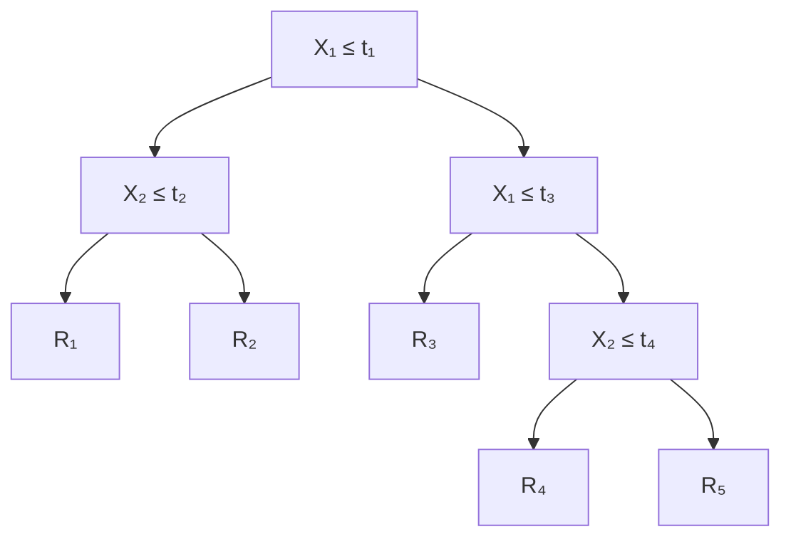
</details>


<details>
<summary>natural_image</summary>

3D diagram of a layered structure with labeled axes X₁, X₂ and colored blocks (no text or symbols beyond axis labels)
</details>

FIGURE 8.3. Top Left: A partition of two-dimensional feature space that could not result from recursive binary splitting. Top Right: The output of recursive binary splitting on a two-dimensional example. Bottom Left: A tree corresponding to the partition in the top right panel. Bottom Right: A perspective plot of the prediction surface corresponding to that tree.

Once the regions $R _ { 1 } , \ldots , R _ { J }$ have been created, we predict the response for a given test observation using the mean of the training observations in the region to which that test observation belongs.

A fve-region example of this approach is shown in Figure 8.3.

# Tree Pruning

The process described above may produce good predictions on the training set, but is likely to overft the data, leading to poor test set performance. This is because the resulting tree might be too complex. A smaller tree with fewer splits (that is, fewer regions $R _ { 1 } , \ldots , R _ { J } )$ might lead to lower variance and better interpretation at the cost of a little bias. One possible alternative to the process described above is to build the tree only so long as the decrease in the RSS due to each split exceeds some (high) threshold. This strategy will result in smaller trees, but is too short-sighted since a seemingly worthless split early on in the tree might be followed by a very good split—that is, a split that leads to a large reduction in RSS later on.

Therefore, a better strategy is to grow a very large tree $T _ { 0 }$ , and then prune it back in order to obtain a subtree. How do we determine the best way to prune the tree? Intuitively, our goal is to select a subtree that leads to the lowest test error rate. Given a subtree, we can estimate its test error using cross-validation or the validation set approach. However, estimating the cross-validation error for every possible subtree would be too cumbersome, since there is an extremely large number of possible subtrees. Instead, we need a way to select a small set of subtrees for consideration.

Cost complexity pruning—also known as weakest link pruning—gives us a way to do just this. Rather than considering every possible subtree, we consider a sequence of trees indexed by a nonnegative tuning parameter α. For each value of α there corresponds a subtree $T \subset T _ { 0 }$ such that

prune subtree

cost complexity pruning weakest link pruning

$$
\sum_ {m = 1} ^ {| T |} \sum_ {i: x _ {i} \in R _ {m}} (y _ {i} - \hat {y} _ {R _ {m}}) ^ {2} + \alpha | T | \tag {8.4}
$$

is as small as possible. Here T indicates the number of terminal nodes of the tree $T , R _ { m }$ is the rectangle (i.e. the subset of predictor space) corresponding to the mth terminal node, and $\hat { y } _ { R _ { m } }$ is the predicted response associated with $R _ { m }$ —that is, the mean of the training observations in $R _ { m }$ . The tuning parameter α controls a trade-of between the subtree’s complexity and its ft to the training data. When $\alpha = 0$ , then the subtree T will simply equal $T _ { 0 }$ , because then (8.4) just measures the training error. However, as α increases, there is a price to pay for having a tree with many terminal nodes, and so the quantity (8.4) will tend to be minimized for a smaller subtree. Equation 8.4 is reminiscent of the lasso (6.7) from Chapter 6, in which a similar formulation was used in order to control the complexity of a linear model.

It turns out that as we increase α from zero in (8.4), branches get pruned from the tree in a nested and predictable fashion, so obtaining the whole sequence of subtrees as a function of α is easy. We can select a value of α using a validation set or using cross-validation. We then return to the full data set and obtain the subtree corresponding to α. This process is summarized in Algorithm 8.1.

Figures 8.4 and 8.5 display the results of ftting and pruning a regression tree on the Hitters data, using nine of the features. First, we randomly divided the data set in half, yielding 132 observations in the training set and 131 observations in the test set. We then built a large regression tree on the training data and varied α in (8.4) in order to create subtrees with diferent numbers of terminal nodes. Finally, we performed six-fold crossvalidation in order to estimate the cross-validated MSE of the trees as

# Algorithm 8.1 Building a Regression Tree

1. Use recursive binary splitting to grow a large tree on the training data, stopping only when each terminal node has fewer than some minimum number of observations.   
2. Apply cost complexity pruning to the large tree in order to obtain a sequence of best subtrees, as a function of α.   
3. Use K-fold cross-validation to choose α. That is, divide the training observations into K folds. For each k = 1, . . . , K:   
(a) Repeat Steps 1 and 2 on all but the kth fold of the training data.   
(b) Evaluate the mean squared prediction error on the data in the left-out kth fold, as a function of α.   
Average the results for each value of α, and pick α to minimize the average error.   
4. Return the subtree from Step 2 that corresponds to the chosen value of α.

a function of α. (We chose to perform six-fold cross-validation because 132 is an exact multiple of six.) The unpruned regression tree is shown in Figure 8.4. The green curve in Figure 8.5 shows the CV error as a function of the number of leaves,2 while the orange curve indicates the test error. Also shown are standard error bars around the estimated errors. For reference, the training error curve is shown in black. The CV error is a reasonable approximation of the test error: the CV error takes on its minimum for a three-node tree, while the test error also dips down at the three-node tree (though it takes on its lowest value at the ten-node tree). The pruned tree containing three terminal nodes is shown in Figure 8.1.

# 8.1.2 Classifcation Trees

A classifcation tree is very similar to a regression tree, except that it is used to predict a qualitative response rather than a quantitative one. Recall that for a regression tree, the predicted response for an observation is given by the mean response of the training observations that belong to the same terminal node. In contrast, for a classifcation tree, we predict that each observation belongs to the most commonly occurring class of training observations in the region to which it belongs. In interpreting the results of a classifcation tree, we are often interested not only in the class prediction corresponding to a particular terminal node region, but also in the class proportions among the training observations that fall into that region.

The task of growing a classifcation tree is quite similar to the task of growing a regression tree. Just as in the regression setting, we use recursive binary splitting to grow a classifcation tree. However, in the classifcation setting, RSS cannot be used as a criterion for making the binary splits. A natural alternative to RSS is the classifcation error rate. Since we plan to assign an observation in a given region to the most commonly occurring class of training observations in that region, the classifcation error rate is simply the fraction of the training observations in that region that do not belong to the most common class:


<details>
<summary>flowchart</summary>

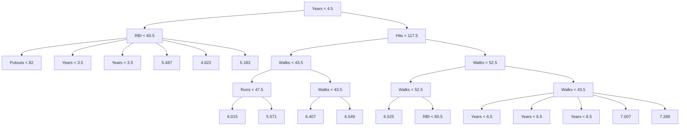
</details>

FIGURE 8.4. Regression tree analysis for the Hitters data. The unpruned tree that results from top-down greedy splitting on the training data is shown.

$$
E = 1 - \max _ {k} (\hat {p} _ {m k}). \tag {8.5}
$$

Here $\hat { p } _ { m k }$ represents the proportion of training observations in the mth region that are from the kth class. However, it turns out that classifcation error is not sufciently sensitive for tree-growing, and in practice two other measures are preferable.

The Gini index is defned by

classifcation error rate

Gini index

$$
G = \sum_ {k = 1} ^ {K} \hat {p} _ {m k} (1 - \hat {p} _ {m k}), \tag {8.6}
$$

a measure of total variance across the K classes. It is not hard to see that the Gini index takes on a small value if all of the $\hat { p } _ { m k } { ' } \mathrm { s }$ are close to zero or one. For this reason the Gini index is referred to as a measure of node purity—a small value indicates that a node contains predominantly observations from a single class.


<details>
<summary>line</summary>

| Tree Size | Training | Cross-Validation | Test |
| --------- | -------- | ---------------- | ---- |
| 1         | 0.75     | 0.78             | 0.88 |
| 2         | 0.42     | 0.48             | 0.45 |
| 3         | 0.35     | 0.40             | 0.36 |
| 4         | 0.29     | 0.41             | 0.35 |
| 5         | 0.27     | 0.43             | 0.38 |
| 6         | 0.25     | 0.46             | 0.39 |
| 7         | 0.24     | 0.50             | 0.38 |
| 8         | 0.23     | 0.50             | 0.37 |
| 9         | 0.22     | 0.50             | 0.34 |
| 10        | 0.21     | 0.50             | 0.33 |
</details>

FIGURE 8.5. Regression tree analysis for the Hitters data. The training, cross-validation, and test MSE are shown as a function of the number of terminal nodes in the pruned tree. Standard error bands are displayed. The minimum cross-validation error occurs at a tree size of three.

An alternative to the Gini index is entropy, given by

entropy

$$
D = - \sum_ {k = 1} ^ {K} \hat {p} _ {m k} \log \hat {p} _ {m k}. \tag {8.7}
$$

Since $0 \leq \hat { p } _ { m k } \leq 1$ , it follows that $0 \le - \hat { p } _ { m k }$ log $\hat { p } _ { m k }$ . One can show that the entropy will take on a value near zero if the $\hat { p } _ { m k }$ ’s are all near zero or near one. Therefore, like the Gini index, the entropy will take on a small value if the mth node is pure. In fact, it turns out that the Gini index and the entropy are quite similar numerically.

When building a classifcation tree, either the Gini index or the entropy are typically used to evaluate the quality of a particular split, since these two approaches are more sensitive to node purity than is the classifcation error rate. Any of these three approaches might be used when pruning the tree, but the classifcation error rate is preferable if prediction accuracy of the fnal pruned tree is the goal.

Figure 8.6 shows an example on the Heart data set. These data contain a binary outcome HD for 303 patients who presented with chest pain. An outcome value of Yes indicates the presence of heart disease based on an angiographic test, while No means no heart disease. There are 13 predictors including Age, Sex, Chol (a cholesterol measurement), and other heart and lung function measurements. Cross-validation results in a tree with six terminal nodes.

In our discussion thus far, we have assumed that the predictor variables take on continuous values. However, decision trees can be constructed even in the presence of qualitative predictor variables. For instance, in the Heart data, some of the predictors, such as Sex, Thal (Thallium stress test), and ChestPain, are qualitative. Therefore, a split on one of these variables amounts to assigning some of the qualitative values to one branch and assigning the remaining to the other branch. In Figure 8.6, some of the internal nodes correspond to splitting qualitative variables. For instance, the top internal node corresponds to splitting Thal. The text Thal:a indicates that the left-hand branch coming out of that node consists of observations with the frst value of the Thal variable (normal), and the right-hand node consists of the remaining observations (fxed or reversible defects). The text ChestPain:bc two splits down the tree on the left indicates that the left-hand branch coming out of that node consists of observations with the second and third values of the ChestPain variable, where the possible values are typical angina, atypical angina, non-anginal pain, and asymptomatic.

  
FIGURE 8.6. Heart data. Top: The unpruned tree. Bottom Left: Cross-validation error, training, and test error, for diferent sizes of the pruned tree. Bottom Right: The pruned tree corresponding to the minimal cross-validation error.

Figure 8.6 has a surprising characteristic: some of the splits yield two terminal nodes that have the same predicted value. For instance, consider the split RestECG<1 near the bottom right of the unpruned tree. Regardless of the value of RestECG, a response value of Yes is predicted for those observations. Why, then, is the split performed at all? The split is performed because it leads to increased node purity. That is, all 9 of the observations corresponding to the right-hand leaf have a response value of Yes, whereas 7/11 of those corresponding to the left-hand leaf have a response value of Yes. Why is node purity important? Suppose that we have a test observation that belongs to the region given by that right-hand leaf. Then we can be pretty certain that its response value is Yes. In contrast, if a test observation belongs to the region given by the left-hand leaf, then its response value is probably Yes, but we are much less certain. Even though the split RestECG<1 does not reduce the classifcation error, it improves the Gini index and the entropy, which are more sensitive to node purity.

# 8.1.3 Trees Versus Linear Models

Regression and classifcation trees have a very diferent favor from the more classical approaches for regression and classifcation presented in Chapters 3 and 4. In particular, linear regression assumes a model of the form

$$
f (X) = \beta_ {0} + \sum_ {j = 1} ^ {p} X _ {j} \beta_ {j}, \tag {8.8}
$$

whereas regression trees assume a model of the form

$$
f (X) = \sum_ {m = 1} ^ {M} c _ {m} \cdot 1 _ {(X \in R _ {m})} \tag {8.9}
$$

where $R _ { 1 } , \dots , R _ { M }$ represent a partition of feature space, as in Figure 8.3.

Which model is better? It depends on the problem at hand. If the relationship between the features and the response is well approximated by a linear model as in (8.8), then an approach such as linear regression will likely work well, and will outperform a method such as a regression tree that does not exploit this linear structure. If instead there is a highly nonlinear and complex relationship between the features and the response as indicated by model (8.9), then decision trees may outperform classical approaches. An illustrative example is displayed in Figure 8.7. The relative performances of tree-based and classical approaches can be assessed by estimating the test error, using either cross-validation or the validation set approach (Chapter 5).

Of course, other considerations beyond simply test error may come into play in selecting a statistical learning method; for instance, in certain settings, prediction using a tree may be preferred for the sake of interpretability and visualization.

# 8.1.4 Advantages and Disadvantages of Trees

Decision trees for regression and classifcation have a number of advantages over the more classical approaches seen in Chapters 3 and 4:

▲ Trees are very easy to explain to people. In fact, they are even easier to explain than linear regression!

  
FIGURE 8.7. Top Row: A two-dimensional classifcation example in which the true decision boundary is linear, and is indicated by the shaded regions. A classical approach that assumes a linear boundary (left) will outperform a decision tree that performs splits parallel to the axes (right). Bottom Row: Here the true decision boundary is non-linear. Here a linear model is unable to capture the true decision boundary (left), whereas a decision tree is successful (right).

▲ Some people believe that decision trees more closely mirror human decision-making than do the regression and classifcation approaches seen in previous chapters.   
▲ Trees can be displayed graphically, and are easily interpreted even by a non-expert (especially if they are small).   
▲ Trees can easily handle qualitative predictors without the need to create dummy variables.   
▼ Unfortunately, trees generally do not have the same level of predictive accuracy as some of the other regression and classifcation approaches seen in this book.   
▼ Additionally, trees can be very non-robust. In other words, a small change in the data can cause a large change in the fnal estimated tree.

However, by aggregating many decision trees, using methods like bagging, random forests, and boosting, the predictive performance of trees can be substantially improved. We introduce these concepts in the next section.

# 8.2 Bagging, Random Forests, Boosting, and Bayesian Additive Regression Trees

An ensemble method is an approach that combines many simple “building block” models in order to obtain a single and potentially very powerful model. These simple building block models are sometimes known as weak learners, since they may lead to mediocre predictions on their own.

We will now discuss bagging, random forests, boosting, and Bayesian additive regression trees. These are ensemble methods for which the simple building block is a regression or a classifcation tree.

ensemble

weak learners

# 8.2.1 Bagging

The bootstrap, introduced in Chapter 5, is an extremely powerful idea. It is used in many situations in which it is hard or even impossible to directly compute the standard deviation of a quantity of interest. We see here that the bootstrap can be used in a completely diferent context, in order to improve statistical learning methods such as decision trees.

The decision trees discussed in Section 8.1 sufer from high variance. This means that if we split the training data into two parts at random, and ft a decision tree to both halves, the results that we get could be quite diferent. In contrast, a procedure with low variance will yield similar results if applied repeatedly to distinct data sets; linear regression tends to have low variance, if the ratio of n to p is moderately large. Bootstrap aggregation, or bagging, is a general-purpose procedure for reducing the variance of a statistical learning method; we introduce it here because it is particularly useful and frequently used in the context of decision trees.

Recall that given a set of n independent observations $Z _ { 1 } , \ldots , Z _ { n }$ , each with variance $\sigma ^ { 2 }$ , the variance of the mean Z¯ of the observations is given by $\sigma ^ { 2 } / n$ . In other words, averaging a set of observations reduces variance. Hence a natural way to reduce the variance and increase the test set accuracy of a statistical learning method is to take many training sets from the population, build a separate prediction model using each training set, and average the resulting predictions. In other words, we could calculate $\hat { f } ^ { 1 } ( x ) , \hat { f } ^ { 2 } ( \stackrel { \smile } { x } ) , \dots , \hat { f } ^ { B } ( x )$ using B separate training sets, and average them in order to obtain a single low-variance statistical learning model, given by

bagging

$$
\hat {f} _ {\mathrm{avg}} (x) = \frac {1}{B} \sum_ {b = 1} ^ {B} \hat {f} ^ {b} (x).
$$

Of course, this is not practical because we generally do not have access to multiple training sets. Instead, we can bootstrap, by taking repeated samples from the (single) training data set. In this approach we generate B diferent bootstrapped training data sets. We then train our method on the bth bootstrapped training set in order to get ${ \hat { f } } ^ { * b } ( x )$ , and fnally average all the predictions, to obtain

$$
\hat {f} _ {\mathrm{bag}} (x) = \frac {1}{B} \sum_ {b = 1} ^ {B} \hat {f} ^ {* b} (x).
$$


<details>
<summary>line</summary>

| Number of Trees | Test: Bagging | Test: RandomForest | OOB: Bagging | OOB: RandomForest |
| --------------- | ------------- | ----------------- | ------------ | ---------------- |
| 0               | 0.25          | 0.26              | 0.25         | 0.28             |
| 50              | 0.24          | 0.23              | 0.20         | 0.17             |
| 100             | 0.24          | 0.23              | 0.20         | 0.16             |
| 150             | 0.25          | 0.23              | 0.19         | 0.16             |
| 200             | 0.24          | 0.23              | 0.19         | 0.16             |
| 250             | 0.24          | 0.23              | 0.19         | 0.16             |
| 300             | 0.24          | 0.23              | 0.19         | 0.16             |
</details>

FIGURE 8.8. Bagging and random forest results for the Heart data. The test error (black and orange) is shown as a function of B, the number of bootstrapped training sets used. Random forests were applied with $m = { \sqrt { p } }$ . The dashed line indicates the test error resulting from a single classifcation tree. The green and blue traces show the OOB error, which in this case is — by chance — considerably lower.

This is called bagging.

While bagging can improve predictions for many regression methods, it is particularly useful for decision trees. To apply bagging to regression trees, we simply construct B regression trees using B bootstrapped training sets, and average the resulting predictions. These trees are grown deep, and are not pruned. Hence each individual tree has high variance, but low bias. Averaging these B trees reduces the variance. Bagging has been demonstrated to give impressive improvements in accuracy by combining together hundreds or even thousands of trees into a single procedure.

Thus far, we have described the bagging procedure in the regression context, to predict a quantitative outcome Y . How can bagging be extended to a classifcation problem where Y is qualitative? In that situation, there are a few possible approaches, but the simplest is as follows. For a given test observation, we can record the class predicted by each of the B trees, and take a majority vote: the overall prediction is the most commonly occurring class among the B predictions.

Figure 8.8 shows the results from bagging trees on the Heart data. The test error rate is shown as a function of B, the number of trees constructed using bootstrapped training data sets. We see that the bagging test error rate is slightly lower in this case than the test error rate obtained from a single tree. The number of trees B is not a critical parameter with bagging; using a very large value of B will not lead to overftting. In practice we

majority vote

use a value of B sufciently large that the error has settled down. Using B = 100 is sufcient to achieve good performance in this example.

# Out-of-Bag Error Estimation

It turns out that there is a very straightforward way to estimate the test error of a bagged model, without the need to perform cross-validation or the validation set approach. Recall that the key to bagging is that trees are repeatedly ft to bootstrapped subsets of the observations. One can show that on average, each bagged tree makes use of around two-thirds of the observations.3 The remaining one-third of the observations not used to ft a given bagged tree are referred to as the out-of-bag (OOB) observations. We can predict the response for the ith observation using each of the trees in which that observation was OOB. This will yield around B/3 predictions for the ith observation. In order to obtain a single prediction for the ith observation, we can average these predicted responses (if regression is the goal) or can take a majority vote (if classifcation is the goal). This leads to a single OOB prediction for the ith observation. An OOB prediction can be obtained in this way for each of the n observations, from which the overall OOB MSE (for a regression problem) or classifcation error (for a classifcation problem) can be computed. The resulting OOB error is a valid estimate of the test error for the bagged model, since the response for each observation is predicted using only the trees that were not ft using that observation. Figure 8.8 displays the OOB error on the Heart data. It can be shown that with B sufciently large, OOB error is virtually equivalent to leave-one-out cross-validation error. The OOB approach for estimating the test error is particularly convenient when performing bagging on large data sets for which cross-validation would be computationally onerous.

out-of-bag

# Variable Importance Measures

As we have discussed, bagging typically results in improved accuracy over prediction using a single tree. Unfortunately, however, it can be difcult to interpret the resulting model. Recall that one of the advantages of decision trees is the attractive and easily interpreted diagram that results, such as the one displayed in Figure 8.1. However, when we bag a large number of trees, it is no longer possible to represent the resulting statistical learning procedure using a single tree, and it is no longer clear which variables are most important to the procedure. Thus, bagging improves prediction accuracy at the expense of interpretability.

Although the collection of bagged trees is much more difcult to interpret than a single tree, one can obtain an overall summary of the importance of each predictor using the RSS (for bagging regression trees) or the Gini index (for bagging classifcation trees). In the case of bagging regression trees, we can record the total amount that the RSS (8.1) is decreased due to splits over a given predictor, averaged over all B trees. A large value indicates an important predictor. Similarly, in the context of bagging classifcation trees, we can add up the total amount that the Gini index (8.6) is decreased by splits over a given predictor, averaged over all B trees.


<details>
<summary>bar</summary>

| Variable | Variable Importance |
| :--- | :--- |
| Fbs | 2 |
| RestECG | 6 |
| ExAng | 9 |
| Sex | 11 |
| Slope | 19 |
| Chol | 22 |
| Age | 22 |
| RestBP | 24 |
| MaxHR | 31 |
| Oldpeak | 35 |
| ChestPain | 44 |
| Ca | 55 |
| Thal | 100 |
</details>

FIGURE 8.9. A variable importance plot for the Heart data. Variable importance is computed using the mean decrease in Gini index, and expressed relative to the maximum.

A graphical representation of the variable importances in the Heart data is shown in Figure 8.9. We see the mean decrease in Gini index for each variable, relative to the largest. The variables with the largest mean decrease in Gini index are Thal, Ca, and ChestPain.

variable importance

# 8.2.2 Random Forests

Random forests provide an improvement over bagged trees by way of a small tweak that decorrelates the trees. As in bagging, we build a number of decision trees on bootstrapped training samples. But when building these decision trees, each time a split in a tree is considered, a random sample of m predictors is chosen as split candidates from the full set of p predictors. The split is allowed to use only one of those m predictors. A fresh sample of m predictors is taken at each split, and typically we choose $m \approx { \sqrt { p } }$ —that is, the number of predictors considered at each split is approximately equal to the square root of the total number of predictors (4 out of the 13 for the Heart data).

In other words, in building a random forest, at each split in the tree, the algorithm is not even allowed to consider a majority of the available predictors. This may sound crazy, but it has a clever rationale. Suppose that there is one very strong predictor in the data set, along with a number of other moderately strong predictors. Then in the collection of bagged trees, most or all of the trees will use this strong predictor in the top split. Consequently, all of the bagged trees will look quite similar to each other.

random forest

Hence the predictions from the bagged trees will be highly correlated. Unfortunately, averaging many highly correlated quantities does not lead to as large of a reduction in variance as averaging many uncorrelated quantities. In particular, this means that bagging will not lead to a substantial reduction in variance over a single tree in this setting.

Random forests overcome this problem by forcing each split to consider only a subset of the predictors. Therefore, on average $( p - m ) / p$ of the splits will not even consider the strong predictor, and so other predictors will have more of a chance. We can think of this process as decorrelating the trees, thereby making the average of the resulting trees less variable and hence more reliable.

The main diference between bagging and random forests is the choice of predictor subset size m. For instance, if a random forest is built using $m = p$ , then this amounts simply to bagging. On the Heart data, random forests using $m = { \sqrt { p } }$ leads to a reduction in both test error and OOB error over bagging (Figure 8.8).

Using a small value of m in building a random forest will typically be helpful when we have a large number of correlated predictors. We applied random forests to a high-dimensional biological data set consisting of expression measurements of 4,718 genes measured on tissue samples from 349 patients. There are around 20,000 genes in humans, and individual genes have diferent levels of activity, or expression, in particular cells, tissues, and biological conditions. In this data set, each of the patient samples has a qualitative label with 15 diferent levels: either normal or 1 of 14 diferent types of cancer. Our goal was to use random forests to predict cancer type based on the 500 genes that have the largest variance in the training set. We randomly divided the observations into a training and a test set, and applied random forests to the training set for three diferent values of the number of splitting variables m. The results are shown in Figure 8.10. The error rate of a single tree is 45.7 %, and the null rate is 75.4 %. 4 We see that using 400 trees is sufcient to give good performance, and that the choice $m = { \sqrt { p } }$ gave a small improvement in test error over bagging $( m = p )$ in this example. As with bagging, random forests will not overft if we increase B, so in practice we use a value of B sufciently large for the error rate to have settled down.

# 8.2.3 Boosting

We now discuss boosting, yet another approach for improving the predictions resulting from a decision tree. Like bagging, boosting is a general approach that can be applied to many statistical learning methods for regression or classifcation. Here we restrict our discussion of boosting to the context of decision trees.

Recall that bagging involves creating multiple copies of the original training data set using the bootstrap, ftting a separate decision tree to each copy, and then combining all of the trees in order to create a single predic-

boosting


<details>
<summary>line</summary>

| Number of Trees | m=p    | m=p/2  | m=√p   |
| --------------- | ------ | ------ | ------ |
| 0               | 0.5    | 0.5    | 0.5    |
| 50              | 0.28   | 0.27   | 0.25   |
| 100             | 0.25   | 0.26   | 0.23   |
| 150             | 0.24   | 0.25   | 0.22   |
| 200             | 0.24   | 0.25   | 0.21   |
| 250             | 0.24   | 0.25   | 0.21   |
| 300             | 0.24   | 0.25   | 0.21   |
| 350             | 0.24   | 0.25   | 0.21   |
| 400             | 0.24   | 0.25   | 0.21   |
| 450             | 0.24   | 0.25   | 0.21   |
| 500             | 0.24   | 0.25   | 0.21   |
</details>

FIGURE 8.10. Results from random forests for the 15-class gene expression data set with $p = 5 0 0$ predictors. The test error is displayed as a function of the number of trees. Each colored line corresponds to a diferent value of m, the number of predictors available for splitting at each interior tree node. Random forests $( m < p )$ lead to a slight improvement over bagging $( m = p )$ . A single classifcation tree has an error rate of 45.7 %.

tive model. Notably, each tree is built on a bootstrap data set, independent of the other trees. Boosting works in a similar way, except that the trees are grown sequentially: each tree is grown using information from previously grown trees. Boosting does not involve bootstrap sampling; instead each tree is ft on a modifed version of the original data set.

Consider frst the regression setting. Like bagging, boosting involves combining a large number of decision trees, $\hat { f } ^ { 1 } , \dotsc , \tilde { f } ^ { B }$ . Boosting is described in Algorithm 8.2.

What is the idea behind this procedure? Unlike ftting a single large decision tree to the data, which amounts to ftting the data hard and potentially overftting, the boosting approach instead learns slowly. Given the current model, we ft a decision tree to the residuals from the model. That is, we ft a tree using the current residuals, rather than the outcome Y , as the response. We then add this new decision tree into the ftted function in order to update the residuals. Each of these trees can be rather small, with just a few terminal nodes, determined by the parameter d in the algorithm. By ftting small trees to the residuals, we slowly improve $\hat { f }$ in areas where it does not perform well. The shrinkage parameter λ slows the process down even further, allowing more and diferent shaped trees to attack the residuals. In general, statistical learning approaches that learn slowly tend to perform well. Note that in boosting, unlike in bagging, the construction of each tree depends strongly on the trees that have already been grown.

We have just described the process of boosting regression trees. Boosting classifcation trees proceeds in a similar but slightly more complex way, and the details are omitted here.

# Algorithm 8.2 Boosting for Regression Trees

1. Set ${ \hat { f } } ( x ) = 0$ and ri = yi for all i in the training set.

2. For b = 1, 2, . . . , B, repeat:

(a) Fit a tree $\hat { f } ^ { b }$ with d splits (d + 1 terminal nodes) to the training data (X, r).   
(b) Update $\hat { f }$ by adding in a shrunken version of the new tree:

$$
\hat {f} (x) \leftarrow \hat {f} (x) + \lambda \hat {f} ^ {b} (x). \tag {8.10}
$$

(c) Update the residuals,

$$
r _ {i} \leftarrow r _ {i} - \lambda \hat {f} ^ {b} (x _ {i}). \tag {8.11}
$$

3. Output the boosted model,

$$
\hat {f} (x) = \sum_ {b = 1} ^ {B} \lambda \hat {f} ^ {b} (x). \tag {8.12}
$$

Boosting has three tuning parameters:

1. The number of trees B. Unlike bagging and random forests, boosting can overft if B is too large, although this overftting tends to occur slowly if at all. We use cross-validation to select B.   
2. The shrinkage parameter λ, a small positive number. This controls the rate at which boosting learns. Typical values are 0.01 or 0.001, and the right choice can depend on the problem. Very small λ can require using a very large value of B in order to achieve good performance.   
3. The number d of splits in each tree, which controls the complexity of the boosted ensemble. Often d = 1 works well, in which case each tree is a stump, consisting of a single split. In this case, the boosted ensemble is ftting an additive model, since each term involves only a single variable. More generally d is the interaction depth, and controls the interaction order of the boosted model, since d splits can involve at most d variables.

In Figure 8.11, we applied boosting to the 15-class cancer gene expression data set, in order to develop a classifer that can distinguish the normal class from the 14 cancer classes. We display the test error as a function of the total number of trees and the interaction depth d. We see that simple stumps with an interaction depth of one perform well if enough of them are included. This model outperforms the depth-two model, and both outperform a random forest. This highlights one diference between boosting and random forests: in boosting, because the growth of a particular tree takes into account the other trees that have already been grown, smaller trees are typically sufcient. Using smaller trees can aid in interpretability as well; for instance, using stumps leads to an additive model.


<details>
<summary>line</summary>

| Number of Trees | Boosting: depth=1 | Boosting: depth=2 | RandomForest: m=√p |
| --------------- | ----------------- | ----------------- | ------------------ |
| 0               | 0.24              | 0.24              | 0.19               |
| 500             | 0.13              | 0.12              | 0.14               |
| 1000            | 0.09              | 0.10              | 0.13               |
| 1500            | 0.08              | 0.10              | 0.13               |
| 2000            | 0.08              | 0.10              | 0.13               |
| 2500            | 0.08              | 0.10              | 0.13               |
| 3000            | 0.08              | 0.10              | 0.13               |
| 3500            | 0.08              | 0.10              | 0.13               |
| 4000            | 0.08              | 0.10              | 0.13               |
| 4500            | 0.08              | 0.10              | 0.13               |
| 5000            | 0.08              | 0.10              | 0.13               |
</details>

FIGURE 8.11. Results from performing boosting and random forests on the 15-class gene expression data set in order to predict cancer versus normal. The test error is displayed as a function of the number of trees. For the two boosted models, $\lambda = 0 . 0 1$ . Depth-1 trees slightly outperform depth-2 trees, and both outperform the random forest, although the standard errors are around 0.02, making none of these diferences signifcant. The test error rate for a single tree is 24 %.

# 8.2.4 Bayesian Additive Regression Trees

Finally, we discuss Bayesian additive regression trees (BART), another ensemble method that uses decision trees as its building blocks. For simplicity, we present BART for regression (as opposed to classifcation).

Recall that bagging and random forests make predictions from an average of regression trees, each of which is built using a random sample of data and/or predictors. Each tree is built separately from the others. By contrast, boosting uses a weighted sum of trees, each of which is constructed by ftting a tree to the residual of the current ft. Thus, each new tree attempts to capture signal that is not yet accounted for by the current set of trees. BART is related to both approaches: each tree is constructed in a random manner as in bagging and random forests, and each tree tries to capture signal not yet accounted for by the current model, as in boosting. The main novelty in BART is the way in which new trees are generated.

Before we introduce the BART algorithm, we defne some notation. We let K denote the number of regression trees, and B the number of iterations for which the BART algorithm will be run. The notation $\hat { f } _ { k } ^ { b } ( x )$ represents the prediction at x for the kth regression tree used in the bth iteration. At the end of each iteration, the K trees from that iteration will be summed, i.e. $\begin{array} { r } { \hat { f } ^ { b } ( x ) = \sum _ { k = 1 } ^ { K } \hat { f } _ { k } ^ { b } ( x ) } \end{array}$ for $b = 1 , \dots , B$ .

In the frst iteration of the BART algorithm, all trees are initialized to have a single root node, with $\begin{array} { r } { \hat { f } _ { k } ^ { 1 } ( x ) = \frac { 1 } { n K } \sum _ { i = 1 } ^ { n } \dot { y } _ { i } } \end{array}$ , the mean of the response

Bayesian additive regression trees

(a): ${ \hat { f } } _ { k } ^ { b - 1 } ( X )$   


<details>
<summary>flowchart</summary>


</details>

(c): Possibility #2 for ${ \hat { f } } _ { k } ^ { b } ( X )$ cYanmaGentYlowb

(b): Possibility $\# 1$ for ${ \hat { f } } _ { k } ^ { b } ( X )$   


<details>
<summary>flowchart</summary>

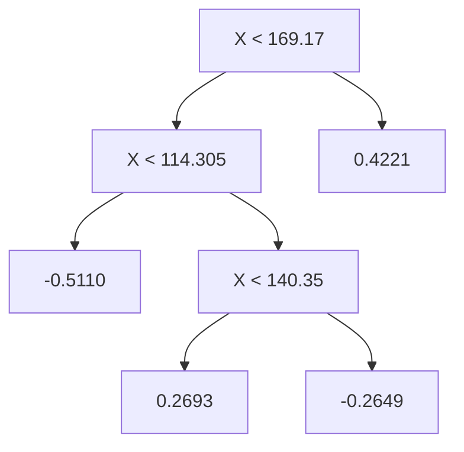
</details>

(d): Possibility #3 for ${ \hat { f } } _ { k } ^ { b } ( X )$


<details>
<summary>line</summary>

| X | Value |
|---|---|
| < 169.17 | |
| -0.1218 | |
| 0.4079 | |
</details>


<details>
<summary>flowchart</summary>

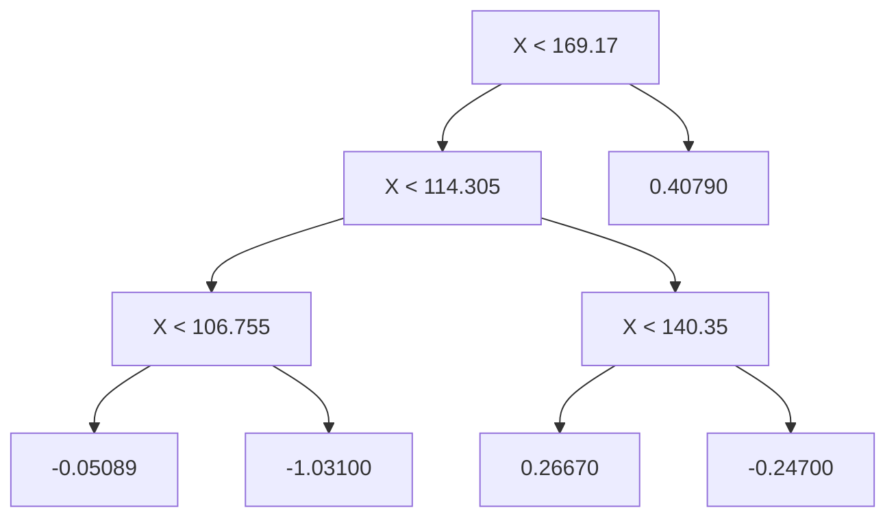
</details>

FIGURE 8.12. A schematic of perturbed trees from the BART algorithm. (a): The kth tree at the $( b - 1 ) s t$ iteration, ${ \hat { f } } _ { k } ^ { b - 1 } ( X )$ , is displayed. Panels $( b ) - ( d )$ display three of many possibilities for ${ \hat { f } } _ { k } ^ { b } ( X )$ , given the form of ${ \hat { f } } _ { k } ^ { b - 1 } ( X )$ ). (b): One possibility is that ${ \hat { f } } _ { k } ^ { b } ( X )$ has the same structure as ${ \hat { f } } _ { k } ^ { b - 1 } ( X )$ , but with diferent predictions at the terminal nodes. (c): Another possibility is that ${ \hat { f } } _ { k } ^ { b } ( X )$ results from pruning ${ \hat { f } } _ { k } ^ { b - 1 } ( X )$ ). (d): Alternatively, ${ \hat { f } } _ { k } ^ { b } ( X )$ may have more terminal nodes than ${ \hat { f } } _ { k } ^ { b - 1 } ( X )$ .

values divided by the total number of trees. Thus, $\begin{array} { r } { \hat { f } ^ { 1 } ( x ) = \sum _ { k = 1 } ^ { K } \hat { f } _ { k } ^ { 1 } ( x ) = } \end{array}$ 1n ) i=1 yi. $\textstyle { \frac { 1 } { n } } \sum _ { i = 1 } ^ { n } y _ { i }$

In subsequent iterations, BART updates each of the K trees, one at a time. In the bth iteration, to update the kth tree, we subtract from each response value the predictions from all but the kth tree, in order to obtain a partial residual

$$
r _ {i} = y _ {i} - \sum_ {k ^ {\prime} <   k} \hat {f} _ {k ^ {\prime}} ^ {b} (x _ {i}) - \sum_ {k ^ {\prime} > k} \hat {f} _ {k ^ {\prime}} ^ {b - 1} (x _ {i})
$$

for the ith observation, $i = 1 , \ldots , n$ . Rather than ftting a fresh tree to this partial residual, BART randomly chooses a perturbation to the tree from the previous iteration $( \hat { f } _ { k } ^ { b - 1 } )$ from a set of possible perturbations, favoring ones that improve the ft to the partial residual. There are two components to this perturbation:

1. We may change the structure of the tree by adding or pruning branches.   
2. We may change the prediction in each terminal node of the tree.

Figure 8.12 illustrates examples of possible perturbations to a tree.

The output of BART is a collection of prediction models,

$$
\hat {f} ^ {b} (x) = \sum_ {k = 1} ^ {K} \hat {f} _ {k} ^ {b} (x), \text {   for   } b = 1, 2, \dots , B.
$$

# Algorithm 8.3 Bayesian Additive Regression Trees

1. Let $\begin{array} { r } { \hat { f } _ { 1 } ^ { 1 } ( x ) = \hat { f } _ { 2 } ^ { 1 } ( x ) = \dots = \hat { f } _ { K } ^ { 1 } ( x ) = \frac { 1 } { n K } \sum _ { i = 1 } ^ { n } y _ { i } . } \end{array}$   
2. Compute $\begin{array} { r } { \hat { f } ^ { 1 } ( x ) = \sum _ { k = 1 } ^ { K } \hat { f } _ { k } ^ { 1 } ( x ) = \frac { 1 } { n } \sum _ { i = 1 } ^ { n } y _ { i } . } \end{array}$   
3. For $b = 2 , \ldots , B \colon$

(a) For $k = 1 , 2 , \ldots , K \colon$ :

i. For $i = 1 , \ldots , n ,$ compute the current partial residual

$$
r _ {i} = y _ {i} - \sum_ {k ^ {\prime} <   k} \hat {f} _ {k ^ {\prime}} ^ {b} (x _ {i}) - \sum_ {k ^ {\prime} > k} \hat {f} _ {k ^ {\prime}} ^ {b - 1} (x _ {i}).
$$

ii. Fit a new tree, $\hat { f } _ { k } ^ { b } ( x )$ , to $r _ { i }$ , by randomly perturbing the kth tree from the previous iteration, ˆf b−1k (x). Perturbations $\hat { f } _ { k } ^ { b - 1 } ( x )$ that improve the ft are favored.

(b) Compute $\begin{array} { r } { \hat { f } ^ { b } ( x ) = \sum _ { k = 1 } ^ { K } \hat { f } _ { k } ^ { b } ( x ) } \end{array}$

4. Compute the mean after L burn-in samples,

$$
\hat {f} (x) = \frac {1}{B - L} \sum_ {b = L + 1} ^ {B} \hat {f} ^ {b} (x).
$$

We typically throw away the frst few of these prediction models, since models obtained in the earlier iterations — known as the burn-in period — tend not to provide very good results. We can let L denote the number of burn-in iterations; for instance, we might take $L = 2 0 0$ . Then, to obtain a single prediction, we simply take the average after the burn-in iterations, $\begin{array} { r } { \hat { f } ( x ) = \frac { 1 } { B - L } \sum _ { b = L + 1 } ^ { B } \hat { f } ^ { b } ( x ) } \end{array}$ . However, it is also possible to compute quantities other than the average: for instance, the percentiles of $\mathbf { \hat { f } } ^ { L + 1 } ( \hat { x } ) , \dots , \hat { f } ^ { B } ( x )$ provide a measure of uncertainty in the fnal prediction. The overall BART procedure is summarized in Algorithm 8.3.

A key element of the BART approach is that in Step 3(a)ii., we do not ft a fresh tree to the current partial residual: instead, we try to improve the ft to the current partial residual by slightly modifying the tree obtained in the previous iteration (see Figure 8.12). Roughly speaking, this guards against overftting since it limits how “hard” we ft the data in each iteration. Furthermore, the individual trees are typically quite small. We limit the tree size in order to avoid overftting the data, which would be more likely to occur if we grew very large trees.

Figure 8.13 shows the result of applying BART to the Heart data, using $K = 2 0 0$ trees, as the number of iterations is increased to 10, 000. During the initial iterations, the test and training errors jump around a bit. After this initial burn-in period, the error rates settle down. We note that there is only a small diference between the training error and the test error, indicating that the tree perturbation process largely avoids overftting.


<details>
<summary>line</summary>

| Number of Iterations | BART Training Error | BART Test Error | Boosting Training Error | Boosting Test Error |
| -------------------- | ------------------- | --------------- | ----------------------- | ------------------- |
| 5                    | 0.13                | 0.21            | 0.46                    | 0.47                |
| 10                   | 0.10                | 0.22            | 0.46                    | 0.47                |
| 50                   | 0.12                | 0.18            | 0.23                    | 0.30                |
| 100                  | 0.12                | 0.20            | 0.18                    | 0.22                |
| 500                  | 0.11                | 0.19            | 0.11                    | 0.22                |
| 1000                 | 0.11                | 0.19            | 0.13                    | 0.21                |
| 5000                 | 0.11                | 0.19            | 0.08                    | 0.23                |
| 10000                | 0.11                | 0.19            | 0.01                    | 0.27                |
</details>

FIGURE 8.13. BART and boosting results for the Heart data. Both training and test errors are displayed. After a burn-in period of 100 iterations (shown in gray), the error rates for BART settle down. Boosting begins to overft after a few hundred iterations.

The training and test errors for boosting are also displayed in Figure 8.13. We see that the test error for boosting approaches that of BART, but then begins to increase as the number of iterations increases. Furthermore, the training error for boosting decreases as the number of iterations increases, indicating that boosting has overft the data.

Though the details are outside of the scope of this book, it turns out that the BART method can be viewed as a Bayesian approach to ftting an ensemble of trees: each time we randomly perturb a tree in order to ft the residuals, we are in fact drawing a new tree from a posterior distribution. (Of course, this Bayesian connection is the motivation for BART’s name.) Furthermore, Algorithm 8.3 can be viewed as a Markov chain Monte Carlo algorithm for ftting the BART model.

When we apply BART, we must select the number of trees K, the number of iterations B, and the number of burn-in iterations L. We typically choose large values for B and K, and a moderate value for L: for instance, K = 200, $B = 1 { , } 0 0 0$ , and L = 100 is a reasonable choice. BART has been shown to have very impressive out-of-box performance — that is, it performs well with minimal tuning.

Markov chain Monte Carlo

# 8.2.5 Summary of Tree Ensemble Methods

Trees are an attractive choice of weak learner for an ensemble method for a number of reasons, including their fexibility and ability to handle predictors of mixed types (i.e. qualitative as well as quantitative). We have now seen four approaches for ftting an ensemble of trees: bagging, random forests, boosting, and BART.

• In bagging, the trees are grown independently on random samples of the observations. Consequently, the trees tend to be quite similar to each other. Thus, bagging can get caught in local optima and can fail to thoroughly explore the model space.   
• In random forests, the trees are once again grown independently on random samples of the observations. However, each split on each tree is performed using a random subset of the features, thereby decorrelating the trees, and leading to a more thorough exploration of model space relative to bagging.   
• In boosting, we only use the original data, and do not draw any random samples. The trees are grown successively, using a “slow” learning approach: each new tree is ft to the signal that is left over from the earlier trees, and shrunken down before it is used.   
• In BART, we once again only make use of the original data, and we grow the trees successively. However, each tree is perturbed in order to avoid local minima and achieve a more thorough exploration of the model space.

# 8.3 Lab: Tree-Based Methods

We import some of our usual libraries at this top level.

In [1]:

```python
import numpy as np
import pandas as pd
from matplotlib.pyplot import subplots
from statsmodels.datasets import get_rdataset
import sklearn.model_selection as skm
from ISLP import load_data, confusion_table
from ISLP.models import ModelSpec as MS 
```

We also collect the new imports needed for this lab.

In [2]:

```python
from sklearn.tree import (DecisionTreeClassifier as DTC,
    DecisionTreeRegressor as DTR,
    plot_tree,
    export_text)
from sklearn.metrics import (accuracy_score,
    log_loss)
from sklearn.ensemble import \
(RandomForestRegressor as RF,
    GradientBoostingRegressor as GBR)
from ISLP.bart import BART 
```

# 8.3.1 Fitting Classifcation Trees

We frst use classifcation trees to analyze the Carseats data set. In these data, Sales is a continuous variable, and so we begin by recoding it as a binary variable. We use the where() function to create a variable, called High, which takes on a value of Yes if the Sales variable exceeds 8, and takes on a value of No otherwise.

where()

```python
In [3]: Carseats = load_data('Carseats')
High = np.where(Carseats.Sales > 8,
    "Yes",
    "No") 
```

We now use DecisionTreeClassifier() to ft a classifcation tree in order to predict High using all variables but Sales. To do so, we must form a model matrix as we did when ftting regression models.

DecisionTree Classifier()

```python
In [4]: model = MS(Carseats.columns.drop('Sales'), intercept=False)
D = model.fit_transform(Carseats)
feature_names = list(D.columns)
X = np.asarray(D) 
```

We have converted D from a data frame to an array X, which is needed in some of the analysis below. We also need the feature\_names for annotating our plots later.

There are several options needed to specify the classifer, such as max\_depth (how deep to grow the tree), min\_samples\_split (minimum number of observations in a node to be eligible for splitting) and criterion (whether to use Gini or cross-entropy as the split criterion). We also set random\_state for reproducibility; ties in the split criterion are broken at random.

```python
In [5]: clf = DTC(criterion='entropy', max_depth=3, random_state=0)
clf.fit(X, High) 
```

Out[5]: DecisionTreeClassifier(criterion='entropy', max\_depth=3)

In our discussion of qualitative features in Section 3.3, we noted that for a linear regression model such a feature could be represented by including a matrix of dummy variables (one-hot-encoding) in the model matrix, using the formula notation of statsmodels. As mentioned in Section 8.1, there is a more natural way to handle qualitative features when building a decision tree, that does not require such dummy variables; each split amounts to partitioning the levels into two groups. However, the sklearn implementation of decision trees does not take advantage of this approach; instead it simply treats the one-hot-encoded levels as separate variables.

```txt
In [6]: accuracy_score(High, clf.predict(X)) 
```

Out[6]: 0.7275

With only the default arguments, the training error rate is 21%. For classifcation trees, we can access the value of the deviance using log\_loss(),

log\_loss()

$$
- 2 \sum_ {m} \sum_ {k} n _ {m k} \log \hat {p} _ {m k},
$$

where $n _ { m k }$ is the number of observations in the mth terminal node that belong to the kth class.

```python
In [7]: resid_dev = np.sum(log_loss(High, clf.predict_proba(X)))  
resid_dev 
```

```txt
Out [7]: 0.4711 
```

This is closely related to the entropy, defned in (8.7). A small deviance indicates a tree that provides a good ft to the (training) data.

One of the most attractive properties of trees is that they can be graphically displayed. Here we use the plot() function to display the tree structure (not shown here).

```python
In [8]: ax = subplots(figsize=(12,12))[1]
plot_tree(clf,
    feature_names=feature_names,
    ax=ax); 
```

The most important indicator of Sales appears to be ShelveLoc.

We can see a text representation of the tree using export\_text(), which displays the split criterion (e.g. Price <= 92.5) for each branch. For leaf nodes it shows the overall prediction (Yes or No). We can also see the number of observations in that leaf that take on values of Yes and No by specifying show\_weights=True.

export\_text()

```txt
In [9]: print(export_text(clf,
feature_names=feature_names,
show_weights=True)) 
```

```txt
Out[9]: |--- ShelveLoc[Good] <= 0.50
| |--- Price <= 92.50
| | |--- Income <= 57.00
| | | |--- weights: [7.00, 3.00] class: No
| | | --- Income > 57.00
| | | |--- weights: [7.00, 29.00] class: Yes
| |--- Price > 92.50
| | |--- Advertising <= 13.50
| | | |--- weights: [183.00, 41.00] class: No
| | | --- Advertising > 13.50
| | | |--- weights: [20.00, 25.00] class: Yes
|--- ShelveLoc[Good] > 0.50
| |--- Price <= 135.00
| | |--- US[Yes] <= 0.50
| | | |--- weights: [6.00, 11.00] class: Yes
| | | --- US[Yes] > 0.50
| | | |--- weights: [2.00, 49.00] class: Yes
| |--- Price > 135.00
| | |--- Income <= 46.00
| | | |--- weights: [6.00, 0.00] class: No
| | | --- Income > 46.00
| | | |--- weights: [5.00, 6.00] class: Yes 
```

In order to properly evaluate the performance of a classifcation tree on these data, we must estimate the test error rather than simply computing the training error. We split the observations into a training set and a test set, build the tree using the training set, and evaluate its performance on the test data. This pattern is similar to that in Chapter 6, with the linear models replaced here by decision trees — the code for validation is almost identical. This approach leads to correct predictions for 68.5% of the locations in the test data set.

In [10]:   
```python
validation = skm.ShuffleSplit(n_splits=1,
    test_size=200,
    random_state=0)
results = skm.cross_validate(clf,
    D,
    High,
    cv=validation)
results['test_score'] 
```  
Out[10]: array([0.685])

Next, we consider whether pruning the tree might lead to improved classifcation performance. We frst split the data into a training and test set. We will use cross-validation to prune the tree on the training set, and then evaluate the performance of the pruned tree on the test set.

In [11]:   
```python
(X_train,
X_test,
High_train,
High_test) = skm.train_test_split(X,
    High,
    test_size=0.5,
    random_state=0) 
```

We frst reft the full tree on the training set; here we do not set a max\_depth parameter, since we will learn that through cross-validation.

In [12]:   
```python
clf = DTC(criterion='entropy', random_state=0)
clf.fit(X_train, High_train)
accuracy_score(High_test, clf.predict(X_test)) 
```  
Out[12]: 0.735

Next we use the cost\_complexity\_pruning\_path() method of clf to extract cost-complexity values.

In [13]:   
```python
ccp_path = clf.cost_complexity_pruning_path(X_train, High_train)
kfold = skm.KFold(10,
    random_state=1,
    shuffle=True) 
```

```txt
cost_
complexity_
pruning_
path() 
```

This yields a set of impurities and α values from which we can extract an optimal one by cross-validation.

In [14]:   
```python
grid = skm.GridSearchCV(clf,
{'ccp_alpha': ccp_path.ccp_alphas},
refit=True, 
```

```python
cv=kfold,
scoring='accuracy')
grid.fit(X_train, High_train)
grid.best_score_ 
```

```txt
Out [14]: 0.685 
```

Let’s take a look at the pruned true.

```txt
In [15]: ax = subplots(figsize=(12, 12))[1]
best_ = grid.best_estimator_
plot_tree(best_, feature_names=feature_names, ax=ax); 
```

This is quite a bushy tree. We could count the leaves, or query best\_ instead.

```txt
In [16]: best_.tree_.n_leaves 
```

```txt
Out [16]: 30 
```

The tree with 30 terminal nodes results in the lowest cross-validation error rate, with an accuracy of 68.5%. How well does this pruned tree perform on the test data set? Once again, we apply the predict() function.

```txt
In [17]: print(accuracy_score(High_test, best_.predict(X_test)))
confusion = confusion_table(best_.predict(X_test), High_test)
confusion 
```

```txt
Out [17]: 0.72 
```

```txt
Truth No Yes
Predicted
No 108 61
Yes 10 21 
```

Now 72.0% of the test observations are correctly classifed, which is slightly worse than the error for the full tree (with 35 leaves). So crossvalidation has not helped us much here; it only pruned of 5 leaves, at a cost of a slightly worse error. These results would change if we were to change the random number seeds above; even though cross-validation gives an unbiased approach to model selection, it does have variance.

# 8.3.2 Fitting Regression Trees

Here we ft a regression tree to the Boston data set. The steps are similar to those for classifcation trees.

```python
In [18]: Boston = load_data("Boston")
model = MS(Boston.columns.drop('medv'), intercept=False)
D = model.fit_transform(Boston)
feature_names = list(D.columns)
X = np.asarray(D) 
```

First, we split the data into training and test sets, and ft the tree to the training data. Here we use 30% of the data for the test set.

In [19]:   
```python
(X_train,
X_test,
y_train,
y_test) = skm.train_test_split(X,
Boston['medv'],
test_size=0.3,
random_state=0) 
```

Having formed our training and test data sets, we ft the regression tree.

In [20]:   
```python
reg = DTR(max_depth=3)
reg.fit(X_train, y_train)
ax = subplots(figsize=(12,12))[1]
plot_tree(reg,
    feature_names=feature_names,
    ax=ax); 
```

The variable lstat measures the percentage of individuals with lower socioeconomic status. The tree indicates that lower values of lstat correspond to more expensive houses. The tree predicts a median house price of \$12,042 for small-sized homes (rm < 6.8), in suburbs in which residents have low socioeconomic status (lstat > 14.4) and the crime-rate is moderate (crim > 5.8).

Now we use the cross-validation function to see whether pruning the tree will improve performance.

In [21]:   
```python
ccp_path = reg.cost_complexity_pruning_path(X_train, y_train)
kfold = skm.KFold(5,
    shuffle=True,
    random_state=10)
grid = skm.GridSearchCV(reg,
    {'ccp_alpha': ccp_path.ccp_alphas},
    refit=True,
    cv=kfold,
    scoring='neg_mean_squared_error')
G = grid.fit(X_train, y_train) 
```

In keeping with the cross-validation results, we use the pruned tree to make predictions on the test set.

In [22]:   
```python
best_ = grid.best_estimator_
np.mean((y_test - best_.predict(X_test))**2) 
```  
Out[22]: 28.07

In other words, the test set MSE associated with the regression tree is 28.07. The square root of the MSE is therefore around 5.30, indicating that this model leads to test predictions that are within around \$5300 of the true median home value for the suburb.

Let’s plot the best tree to see how interpretable it is.

In [23]:   
```txt
ax = subplots(figsize=(12,12))[1]
plot_tree(G.best_estimator_,
    feature_names=feature_names,
    ax=ax); 
```

# 8.3.3 Bagging and Random Forests

Here we apply bagging and random forests to the Boston data, using the RandomForestRegressor() from the sklearn.ensemble package. Recall that bagging is simply a special case of a random forest with m = p. Therefore, the RandomForestRegressor() function can be used to perform both bagging and random forests. We start with bagging.

RandomForest Regressor() sklearn. ensemble

```javascript
In [24]: bag_boston = RF(max_features=X_train.shape[1], random_state=0)
bag_boston.fit(X_train, y_train) 
```

```txt
Out[24]: RandomForestRegressor(max_features=12, random_state=0) 
```

The argument max\_features indicates that all 12 predictors should be considered for each split of the tree — in other words, that bagging should be done. How well does this bagged model perform on the test set?

```python
In [25]: ax = subplots(figsize=(8,8))[1]
y_hat_bag = bag_boston.predict(X_test)
ax.scatter(y_hat_bag, y_test)
np.mean((y_test - y_hat_bag)**2) 
```

```txt
Out [25]: 14.63 
```

The test set MSE associated with the bagged regression tree is 14.63, about half that obtained using an optimally-pruned single tree. We could change the number of trees grown from the default of 100 by using the n\_estimators argument:

```python
In [26]: bag_boston = RF(max_features=X_train.shape[1], n_estimators=500, random_state=0).fit(X_train, y_train)
y_hat_bag = bag_boston.predict(X_test)
np.mean((y_test - y_hat_bag)**2) 
```

```txt
Out [26]: 14.61 
```

There is not much change. Bagging and random forests cannot overft by increasing the number of trees, but can underft if the number is too small.

Growing a random forest proceeds in exactly the same way, except that we use a smaller value of the max\_features argument. By default, RandomForestRegressor() uses p variables when building a random forest of regression trees (i.e. it defaults to bagging), and RandomForestClassifier() uses √p variables when building a random forest of classifcation trees. Here we use max\_features=6.

```python
In [27]: RF_boston = RF(max_features=6, random_state=0).fit(X_train, y_train)
y_hat_RF = RF_boston.predict(X_test)
np.mean((y_test - y_hat_RF)**2) 
```

```txt
Out [27]: 20.04 
```

The test set MSE is 20.04; this indicates that random forests did somewhat worse than bagging in this case. Extracting the feature\_importances\_ values from the ftted model, we can view the importance of each variable.

```python
In [28]: feature_imp = pd.DataFrame(
    {'importance': RF_boston.feature_importances_},
    index=feature_names)
feature_imp.sort_values(by='importance', ascending=False) 
```

```csv
Out[28]: importance
lstat 0.368683
rm 0.333842
ptratio 0.057306
indus 0.053303
crim 0.052426
dis 0.042493
nox 0.034410
age 0.024327
tax 0.022368
rad 0.005048
zn 0.003238
chas 0.002557 
```

This is a relative measure of the total decrease in node impurity that results from splits over that variable, averaged over all trees (this was plotted in Figure 8.9 for a model ft to the Heart data).

The results indicate that across all of the trees considered in the random forest, the wealth level of the community (lstat) and the house size (rm) are by far the two most important variables.

# 8.3.4 Boosting

Here we use GradientBoostingRegressor() from sklearn.ensemble to ft boosted regression trees to the Boston data set. For classifcation we would use GradientBoostingClassifier(). The argument n\_estimators=5000 indicates that we want 5000 trees, and the option max\_depth=3 limits the depth of each tree. The argument learning\_rate is the λ mentioned earlier in the description of boosting.

```txt
Gradient
Boosting
Regressor()
Gradient
Boosting
Classifier() 
```

```python
In [29]: boost_boston = GBR(n_estimators=5000,
    learning_rate=0.001,
    max_depth=3,
    random_state=0)
boost_boston.fit(X_train, y_train) 
```

We can see how the training error decreases with the train\_score\_ attribute. To get an idea of how the test error decreases we can use the staged\_predict() method to get the predicted values along the path.

```python
In [30]: test_error = np.zeros_like(boost_boston.train_score_) for idx, y_ in enumerate(boost_boston.staged_predict(X_test)): test_error[idx] = np.mean((y_test - y_)**2)

plot_idx = np.arange(boost_boston.train_score_.shape[0])
ax = subplots(figsize=(8,8))[1]
ax.plot(plot_idx,
    boost_boston.train_score_,
    'b',
    label='Training') 
```

```python
ax.plot(plot_idx,
    test_error,
    'r',
    label='Test')
ax.legend(); 
```

We now use the boosted model to predict medv on the test set:

```txt
In [31]: y_hat_boost = boost_boston.predict(X_test);
np.mean((y_test - y_hat_boost)**2) 
```

```txt
Out [31]: 14.48 
```

The test MSE obtained is 14.48, similar to the test MSE for bagging. If we want to, we can perform boosting with a diferent value of the shrinkage parameter λ in (8.10). The default value is 0.001, but this is easily modifed. Here we take λ = 0.2.

```python
In [32]: boost_boston = GBR(n_estimators=5000,
    learning_rate=0.2,
    max_depth=3,
    random_state=0)
boost_boston.fit(X_train,
    y_train)
y_hat_boost = boost_boston.predict(X_test);
np.mean((y_test - y_hat_boost)**2) 
```

```txt
Out [32]: 14.50 
```

In this case, using λ = 0.2 leads to a almost the same test MSE as when using λ = 0.001.

# 8.3.5 Bayesian Additive Regression Trees

In this section we demonstrate a Python implementation of BART found in the ISLP.bart package. We ft a model to the Boston housing data set. This BART() estimator is designed for quantitative outcome variables, though other implementations are available for ftting logistic and probit models to categorical outcomes.

BART()

```python
In [33]: bart_boston = BART(random_state=0, burnin=5, ndraw=15)
bart_boston.fit(X_train, y_train) 
```

```txt
Out[33]: BART(burnin=5, ndraw=15, random_state=0) 
```

On this data set, with this split into test and training, we see that the test error of BART is similar to that of random forest.

```python
In [34]: yhat_test = bart_boston.predict(X_test.astype(np.float32))
np.mean((y_test - yhat_test)**2) 
```

```txt
Out [34]: 20.92 
```

We can check how many times each variable appeared in the collection of trees. This gives a summary similar to the variable importance plot for boosting and random forests.

```txt
In [35]: var_inclusion = pd.Series(bart_boston.variable_inclusion_.mean(0), index=D.columns)
var_inclusion 
```

```txt
Out[35]: crim 25.333333
zn 27.000000
indus 21.266667
chas 20.466667
nox 25.400000
rm 32.400000
age 26.133333
dis 25.666667
rad 24.666667
tax 23.933333
ptratio 25.000000
lstat 31.866667
dtype: float64 
```

# 8.4 Exercises

# Conceptual

1. Draw an example (of your own invention) of a partition of twodimensional feature space that could result from recursive binary splitting. Your example should contain at least six regions. Draw a decision tree corresponding to this partition. Be sure to label all aspects of your fgures, including the regions $R _ { 1 } , R _ { 2 } , . . . ,$ , the cutpoints $t _ { 1 } , t _ { 2 } , \ldots$ , and so forth.

Hint: Your result should look something like Figures 8.1 and 8.2.

2. It is mentioned in Section 8.2.3 that boosting using depth-one trees (or stumps) leads to an additive model: that is, a model of the form

$$
f (X) = \sum_ {j = 1} ^ {p} f _ {j} (X _ {j}).
$$

Explain why this is the case. You can begin with (8.12) in Algorithm 8.2.

3. Consider the Gini index, classifcation error, and entropy in a simple classifcation setting with two classes. Create a single plot that displays each of these quantities as a function of $\hat { p } _ { m 1 }$ . The x-axis should display $\hat { p } _ { m 1 }$ , ranging from 0 to 1, and the y-axis should display the value of the Gini index, classifcation error, and entropy.

Hint: In a setting with two classes, $\hat { p } _ { m 1 } = 1 - \hat { p } _ { m 2 }$ . You could make this plot by hand, but it will be much easier to make in R.

4. This question relates to the plots in Figure 8.14.


<details>
<summary>treemap</summary>

| X1 | X2 | Value |
|---|---|---|
| 0 | 1 | 5 |
| 0 | 3 | 3 |
| 1 | 10 | 10 |
| 1 | 0 | 0 |
X₂: X₂ = 1; X₁: X₁ = 1
</details>


<details>
<summary>flowchart</summary>

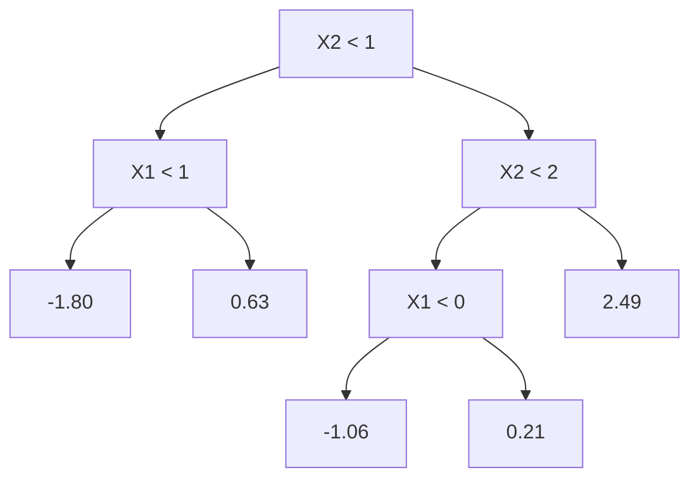
</details>

FIGURE 8.14. Left: A partition of the predictor space corresponding to Exercise 4a. Right: A tree corresponding to Exercise 4b.

(a) Sketch the tree corresponding to the partition of the predictor space illustrated in the left-hand panel of Figure 8.14. The numbers inside the boxes indicate the mean of Y within each region.   
(b) Create a diagram similar to the left-hand panel of Figure 8.14, using the tree illustrated in the right-hand panel of the same fgure. You should divide up the predictor space into the correct regions, and indicate the mean for each region.

5. Suppose we produce ten bootstrapped samples from a data set containing red and green classes. We then apply a classifcation tree to each bootstrapped sample and, for a specifc value of X, produce 10 estimates of P (Class is Red|X):

0.1, 0.15, 0.2, 0.2, 0.55, 0.6, 0.6, 0.65, 0.7, and 0.75.

There are two common ways to combine these results together into a single class prediction. One is the majority vote approach discussed in this chapter. The second approach is to classify based on the average probability. In this example, what is the fnal classifcation under each of these two approaches?

6. Provide a detailed explanation of the algorithm that is used to ft a regression tree.

# Applied

7. In Section 8.3.3, we applied random forests to the Boston data using max\_features = 6 and using n\_estimators = 100 and n\_estimators = 500. Create a plot displaying the test error resulting from random forests on this data set for a more comprehensive range of values for max\_features and n\_estimators. You can model your plot after Figure 8.10. Describe the results obtained.

8. In the lab, a classifcation tree was applied to the Carseats data set after converting Sales into a qualitative response variable. Now we will seek to predict Sales using regression trees and related approaches, treating the response as a quantitative variable.

(a) Split the data set into a training set and a test set.   
(b) Fit a regression tree to the training set. Plot the tree, and interpret the results. What test MSE do you obtain?   
(c) Use cross-validation in order to determine the optimal level of tree complexity. Does pruning the tree improve the test MSE?   
(d) Use the bagging approach in order to analyze this data. What test MSE do you obtain? Use the feature\_importance\_ values to determine which variables are most important.   
(e) Use random forests to analyze this data. What test MSE do you obtain? Use the feature\_importance\_ values to determine which variables are most important. Describe the efect of m, the number of variables considered at each split, on the error rate obtained.   
(f) Now analyze the data using BART, and report your results.

9. This problem involves the OJ data set which is part of the ISLP package.

(a) Create a training set containing a random sample of 800 observations, and a test set containing the remaining observations.   
(b) Fit a tree to the training data, with Purchase as the response and the other variables as predictors. What is the training error rate?   
(c) Create a plot of the tree, and interpret the results. How many terminal nodes does the tree have?   
(d) Use the export\_tree() function to produce a text summary of the ftted tree. Pick one of the terminal nodes, and interpret the information displayed.   
(e) Predict the response on the test data, and produce a confusion matrix comparing the test labels to the predicted test labels. What is the test error rate?   
(f) Use cross-validation on the training set in order to determine the optimal tree size.   
(g) Produce a plot with tree size on the x-axis and cross-validated classifcation error rate on the y-axis.   
(h) Which tree size corresponds to the lowest cross-validated classifcation error rate?   
(i) Produce a pruned tree corresponding to the optimal tree size obtained using cross-validation. If cross-validation does not lead to selection of a pruned tree, then create a pruned tree with fve terminal nodes.   
(j) Compare the training error rates between the pruned and unpruned trees. Which is higher?   
(k) Compare the test error rates between the pruned and unpruned trees. Which is higher?

10. We now use boosting to predict Salary in the Hitters data set.

(a) Remove the observations for whom the salary information is unknown, and then log-transform the salaries.   
(b) Create a training set consisting of the frst 200 observations, and a test set consisting of the remaining observations.   
(c) Perform boosting on the training set with 1,000 trees for a range of values of the shrinkage parameter λ. Produce a plot with diferent shrinkage values on the x-axis and the corresponding training set MSE on the y-axis.   
(d) Produce a plot with diferent shrinkage values on the x-axis and the corresponding test set MSE on the y-axis.   
(e) Compare the test MSE of boosting to the test MSE that results from applying two of the regression approaches seen in Chapters 3 and 6.   
(f) Which variables appear to be the most important predictors in the boosted model?   
(g) Now apply bagging to the training set. What is the test set MSE for this approach?

11. This question uses the Caravan data set.

(a) Create a training set consisting of the frst 1,000 observations, and a test set consisting of the remaining observations.   
(b) Fit a boosting model to the training set with Purchase as the response and the other variables as predictors. Use 1,000 trees, and a shrinkage value of 0.01. Which predictors appear to be the most important?   
(c) Use the boosting model to predict the response on the test data. Predict that a person will make a purchase if the estimated probability of purchase is greater than 20 %. Form a confusion matrix. What fraction of the people predicted to make a purchase do in fact make one? How does this compare with the results obtained from applying KNN or logistic regression to this data set?

12. Apply boosting, bagging, random forests, and BART to a data set of your choice. Be sure to ft the models on a training set and to evaluate their performance on a test set. How accurate are the results compared to simple methods like linear or logistic regression? Which of these approaches yields the best performance?

# 9

# Support Vector Machines


In this chapter, we discuss the support vector machine (SVM), an approach for classifcation that was developed in the computer science community in the 1990s and that has grown in popularity since then. SVMs have been shown to perform well in a variety of settings, and are often considered one of the best “out of the box” classifers.

The support vector machine is a generalization of a simple and intuitive classifer called the maximal margin classifer, which we introduce in Section 9.1. Though it is elegant and simple, we will see that this classifer unfortunately cannot be applied to most data sets, since it requires that the classes be separable by a linear boundary. In Section 9.2, we introduce the support vector classifer, an extension of the maximal margin classifer that can be applied in a broader range of cases. Section 9.3 introduces the support vector machine, which is a further extension of the support vector classifer in order to accommodate non-linear class boundaries. Support vector machines are intended for the binary classifcation setting in which there are two classes; in Section 9.4 we discuss extensions of support vector machines to the case of more than two classes. In Section 9.5 we discuss the close connections between support vector machines and other statistical methods such as logistic regression.

People often loosely refer to the maximal margin classifer, the support vector classifer, and the support vector machine as “support vector machines”. To avoid confusion, we will carefully distinguish between these three notions in this chapter.

# 9.1 Maximal Margin Classifer

In this section, we defne a hyperplane and introduce the concept of an optimal separating hyperplane.

# 9.1.1 What Is a Hyperplane?

In a p-dimensional space, a hyperplane is a fat afne subspace of dimension $p - 1 . ^ { 1 }$ For instance, in two dimensions, a hyperplane is a fat one-dimensional subspace—in other words, a line. In three dimensions, a hyperplane is a fat two-dimensional subspace—that is, a plane. In $p > 3$ dimensions, it can be hard to visualize a hyperplane, but the notion of a (p − 1)-dimensional fat subspace still applies.

The mathematical defnition of a hyperplane is quite simple. In two dimensions, a hyperplane is defned by the equation

$$
\beta_ {0} + \beta_ {1} X _ {1} + \beta_ {2} X _ {2} = 0 \tag {9.1}
$$

for parameters $\beta _ { 0 } , \beta _ { 1 }$ , and $\beta _ { 2 }$ . When we say that (9.1) “defnes” the hyperplane, we mean that any $\boldsymbol { X } = ( X _ { 1 } , X _ { 2 } ) ^ { T }$ for which (9.1) holds is a point on the hyperplane. Note that (9.1) is simply the equation of a line, since indeed in two dimensions a hyperplane is a line.

Equation 9.1 can be easily extended to the p-dimensional setting:

$$
\beta_ {0} + \beta_ {1} X _ {1} + \beta_ {2} X _ {2} + \dots + \beta_ {p} X _ {p} = 0 \tag {9.2}
$$

defnes a p-dimensional hyperplane, again in the sense that if a point $X =$ $( X _ { 1 } , X _ { 2 } , \ldots , X _ { p } ) ^ { T }$ in p-dimensional space (i.e. a vector of length p) satisfes (9.2), then X lies on the hyperplane.

Now, suppose that X does not satisfy (9.2); rather,

$$
\beta_ {0} + \beta_ {1} X _ {1} + \beta_ {2} X _ {2} + \dots + \beta_ {p} X _ {p} > 0. \tag {9.3}
$$

Then this tells us that X lies to one side of the hyperplane. On the other hand, if

$$
\beta_ {0} + \beta_ {1} X _ {1} + \beta_ {2} X _ {2} + \dots + \beta_ {p} X _ {p} <   0, \tag {9.4}
$$

then X lies on the other side of the hyperplane. So we can think of the hyperplane as dividing p-dimensional space into two halves. One can easily determine on which side of the hyperplane a point lies by simply calculating the sign of the left-hand side of (9.2). A hyperplane in two-dimensional space is shown in Figure 9.1.

# 9.1.2 Classifcation Using a Separating Hyperplane

Now suppose that we have an $n \times p$ data matrix X that consists of n training observations in p-dimensional space,

$$
x _ {1} = \left( \begin{array}{c} x _ {1 1} \\ \vdots \\ x _ {1 p} \end{array} \right), \dots , x _ {n} = \left( \begin{array}{c} x _ {n 1} \\ \vdots \\ x _ {n p} \end{array} \right), \tag {9.5}
$$

and that these observations fall into two classes—that is, $y _ { 1 } , \ldots , y _ { n } \in$ {−1, 1} where −1 represents one class and 1 the other class. We also have a test observation, a p-vector of observed features $x ^ { * } = \left( x _ { 1 } ^ { * } \quad \ldots \quad x _ { p } ^ { * } \right) ^ { T }$ . Our goal is to develop a classifer based on the training data that will correctly classify the test observation using its feature measurements. We have seen a number of approaches for this task, such as linear discriminant analysis and logistic regression in Chapter 4, and classifcation trees, bagging, and boosting in Chapter 8. We will now see a new approach that is based upon the concept of a separating hyperplane.


<details>
<summary>scatter</summary>

| X1    | X2    |
|-------|-------|
| -1.5  | 0.7   |
| -1.0  | 0.4   |
| -0.5  | 0.0   |
| 0.0   | -0.4  |
| 0.5   | -0.8  |
| 1.0   | -1.2  |
| 1.5   | -1.5  |
</details>

FIGURE 9.1. The hyperplane $1 + 2 X _ { 1 } + 3 X _ { 2 } = 0$ is shown. The blue region is the set of points for which $1 + 2 X _ { 1 } + 3 X _ { 2 } > 0$ , and the purple region is the set of points for which $1 + 2 X _ { 1 } + 3 X _ { 2 } < 0$ .

Suppose that it is possible to construct a hyperplane that separates the training observations perfectly according to their class labels. Examples of three such separating hyperplanes are shown in the left-hand panel of Figure 9.2. We can label the observations from the blue class as $y _ { i } = 1$ and those from the purple class as $y _ { i } = - 1$ . Then a separating hyperplane has the property that

separating hyperplane

$$
\beta_ {0} + \beta_ {1} x _ {i 1} + \beta_ {2} x _ {i 2} + \dots + \beta_ {p} x _ {i p} > 0 \text {   if   } y _ {i} = 1, \tag {9.6}
$$

and

$$
\beta_ {0} + \beta_ {1} x _ {i 1} + \beta_ {2} x _ {i 2} + \dots + \beta_ {p} x _ {i p} <   0 \text {   if   } y _ {i} = - 1. \tag {9.7}
$$

Equivalently, a separating hyperplane has the property that

$$
y _ {i} \left(\beta_ {0} + \beta_ {1} x _ {i 1} + \beta_ {2} x _ {i 2} + \dots + \beta_ {p} x _ {i p}\right) > 0 \tag {9.8}
$$

for all $i = 1 , \ldots , n$

If a separating hyperplane exists, we can use it to construct a very natural classifer: a test observation is assigned a class depending on which side of the hyperplane it is located. The right-hand panel of Figure 9.2 shows an example of such a classifer. That is, we classify the test observation $x ^ { * }$ based on the sign of $f ( x ^ { * } ) = \beta _ { 0 } + \beta _ { 1 } x _ { 1 } ^ { * } + \beta _ { 2 } x _ { 2 } ^ { * } + \cdot \cdot \cdot + \beta _ { p } x _ { p } ^ { * }$ . If $f ( x ^ { * } )$ is positive, then we assign the test observation to class 1, and if $f ( x ^ { * } )$ is negative, then we assign it to class 1. We can also make use of the magnitude of $f ( x ^ { * } )$ . If $f ( x ^ { * } )$ is far from zero, then this means that $x ^ { * }$ lies far from the hyperplane, and so we can be confdent about our class assignment for $x ^ { * }$ . On the other hand, if $f ( x ^ { * } )$ is close to zero, then $x ^ { * }$ is located near the hyperplane, and so we are less certain about the class assignment for $x ^ { * }$ . Not surprisingly, and as we see in Figure 9.2, a classifer that is based on a separating hyperplane leads to a linear decision boundary.

  
FIGURE 9.2. Left: There are two classes of observations, shown in blue and in purple, each of which has measurements on two variables. Three separating hyperplanes, out of many possible, are shown in black. Right: A separating hyperplane is shown in black. The blue and purple grid indicates the decision rule made by a classifer based on this separating hyperplane: a test observation that falls in the blue portion of the grid will be assigned to the blue class, and a test observation that falls into the purple portion of the grid will be assigned to the purple class.

# 9.1.3 The Maximal Margin Classifer

In general, if our data can be perfectly separated using a hyperplane, then there will in fact exist an infnite number of such hyperplanes. This is because a given separating hyperplane can usually be shifted a tiny bit up or down, or rotated, without coming into contact with any of the observations. Three possible separating hyperplanes are shown in the left-hand panel of Figure 9.2. In order to construct a classifer based upon a separating hyperplane, we must have a reasonable way to decide which of the infnite possible separating hyperplanes to use.

A natural choice is the maximal margin hyperplane (also known as the optimal separating hyperplane), which is the separating hyperplane that is farthest from the training observations. That is, we can compute the (perpendicular) distance from each training observation to a given separating hyperplane; the smallest such distance is the minimal distance from the observations to the hyperplane, and is known as the margin. The maximal margin hyperplane is the separating hyperplane for which the margin is largest—that is, it is the hyperplane that has the farthest minimum distance to the training observations. We can then classify a test observation based on which side of the maximal margin hyperplane it lies. This is known

maximal margin hyperplane optimal separating hyperplane margin


<details>
<summary>scatter</summary>

| X1    | X2    |
|-------|-------|
| -0.8  | 3.5   |
| -0.6  | 2.9   |
| -0.4  | 2.8   |
| -0.2  | 2.7   |
| 0.0   | 2.6   |
| 0.2   | 2.5   |
| 0.4   | 2.4   |
| 0.6   | 2.3   |
| 0.8   | 2.2   |
| 1.0   | 2.1   |
| 1.2   | 2.0   |
| 1.4   | 1.9   |
| 1.6   | 1.8   |
| 1.8   | 1.7   |
| 2.0   | 1.6   |
| 2.2   | 1.5   |
| 2.4   | 1.4   |
| 2.6   | 1.3   |
| 2.8   | 1.2   |
| 3.0   | 1.1   |
| 3.2   | 1.0   |
| 3.4   | 0.9   |
| 3.6   | 0.8   |
| 3.8   | 0.7   |
| 4.0   | 0.6   |
| 4.2   | 0.5   |
| 4.4   | 0.4   |
| 4.6   | 0.3   |
| 4.8   | 0.2   |
| 5.0   | 0.1   |
| 5.2   | 0.0   |
| 5.4   | -0.1  |
| 5.6   | -0.2  |
| 5.8   | -0.3  |
| 6.0   | -0.4  |
| 6.2   | -0.5  |
| 6.4   | -0.6  |
| 6.6   | -0.7  |
| 6.8   | -0.8  |
| 7.0   | -0.9  |
| 7.2   | -1.0  |
| 7.4   | -1.1  |
| 7.6   | -1.2  |
| 7.8   | -1.3  |
| 8.0   | -1.4  |
| 8.2   | -1.5  |
| 8.4   | -1.6  |
| 8.6   | -1.7  |
| 8.8   | -1.8  |
| 9.0   | -1.9  |
| 9.2   | -2.0  |
| 9.4   | -2.1  |
| 9.6   | -2.2  |
| 9.8   | -2.3  |
| 10.0  | -2.4  |
</details>

FIGURE 9.3. There are two classes of observations, shown in blue and in purple. The maximal margin hyperplane is shown as a solid line. The margin is the distance from the solid line to either of the dashed lines. The two blue points and the purple point that lie on the dashed lines are the support vectors, and the distance from those points to the hyperplane is indicated by arrows. The purple and blue grid indicates the decision rule made by a classifer based on this separating hyperplane.

as the maximal margin classifer. We hope that a classifer that has a large margin on the training data will also have a large margin on the test data, and hence will classify the test observations correctly. Although the maximal margin classifer is often successful, it can also lead to overftting when p is large.

If $\beta _ { 0 } , \beta _ { 1 } , \ldots , \beta _ { p }$ are the coefcients of the maximal margin hyperplane, then the maximal margin classifer classifes the test observation $x ^ { * }$ based on the sign of $f ( x ^ { * } ) = \beta _ { 0 } + \beta _ { 1 } x _ { 1 } ^ { * } + \beta _ { 2 } x _ { 2 } ^ { * } + \cdot \cdot \cdot + \beta _ { p } x _ { p } ^ { * }$ .

Figure 9.3 shows the maximal margin hyperplane on the data set of Figure 9.2. Comparing the right-hand panel of Figure 9.2 to Figure 9.3, we see that the maximal margin hyperplane shown in Figure 9.3 does indeed result in a greater minimal distance between the observations and the separating hyperplane—that is, a larger margin. In a sense, the maximal margin hyperplane represents the mid-line of the widest “slab” that we can insert between the two classes.

Examining Figure 9.3, we see that three training observations are equidistant from the maximal margin hyperplane and lie along the dashed lines indicating the width of the margin. These three observations are known as support vectors, since they are vectors in p-dimensional space (in Figure 9.3, $p = 2 )$ and they “support” the maximal margin hyperplane in the sense that if these points were moved slightly then the maximal margin hyperplane would move as well. Interestingly, the maximal margin hyperplane depends directly on the support vectors, but not on the other observations: a movement to any of the other observations would not afect the separating hyperplane, provided that the observation’s movement does not cause it to

maximal margin classifer

support vector

cross the boundary set by the margin. The fact that the maximal margin hyperplane depends directly on only a small subset of the observations is an important property that will arise later in this chapter when we discuss the support vector classifer and support vector machines.

# 9.1.4 Construction of the Maximal Margin Classifer

We now consider the task of constructing the maximal margin hyperplane based on a set of n training observations $x _ { 1 } , \ldots , x _ { n } \in \mathbb { R } ^ { p }$ and associated class labels $y _ { 1 } , \ldots , y _ { n } \in \{ - 1 , 1 \}$ . Briefy, the maximal margin hyperplane is the solution to the optimization problem

$$
\underset {\beta_ {0}, \beta_ {1}, \dots , \beta_ {p}, M} {\text { maximize }} M \tag {9.9}
$$

$$
\text { subject   to } \sum_ {j = 1} ^ {p} \beta_ {j} ^ {2} = 1, \tag {9.10}
$$

$$
y _ {i} \left(\beta_ {0} + \beta_ {1} x _ {i 1} + \beta_ {2} x _ {i 2} + \dots + \beta_ {p} x _ {i p}\right) \geq M \forall i = 1, \dots , n. \tag {9.11}
$$

This optimization problem (9.9)–(9.11) is actually simpler than it looks. First of all, the constraint in (9.11) that

$$
y _ {i} (\beta_ {0} + \beta_ {1} x _ {i 1} + \beta_ {2} x _ {i 2} + \dots + \beta_ {p} x _ {i p}) \geq M \forall i = 1, \ldots , n
$$

guarantees that each observation will be on the correct side of the hyperplane, provided that M is positive. (Actually, for each observation to be on the correct side of the hyperplane we would simply need $y _ { i } ( \beta _ { 0 } + \beta _ { 1 } x _ { i 1 } +$ $\beta _ { 2 } x _ { i 2 } + \cdot \cdot \cdot + \beta _ { p } x _ { i p } ) > 0$ , so the constraint in (9.11) in fact requires that each observation be on the correct side of the hyperplane, with some cushion, provided that M is positive.)

Second, note that (9.10) is not really a constraint on the hyperplane, since if $\beta _ { 0 } + \beta _ { 1 } x _ { i 1 } + \beta _ { 2 } x _ { i 2 } + \cdot \cdot \cdot + \beta _ { p } x _ { i p } = 0$ defnes a hyperplane, then so does $k ( \beta _ { 0 } + \beta _ { 1 } x _ { i 1 } + \beta _ { 2 } x _ { i 2 } + \cdot \cdot \cdot + \beta _ { p } x _ { i p } ) = 0$ for any $k \neq 0$ . However, (9.10) adds meaning to (9.11); one can show that with this constraint the perpendicular distance from the ith observation to the hyperplane is given by

$$
y _ {i} (\beta_ {0} + \beta_ {1} x _ {i 1} + \beta_ {2} x _ {i 2} + \dots + \beta_ {p} x _ {i p}).
$$

Therefore, the constraints (9.10) and (9.11) ensure that each observation is on the correct side of the hyperplane and at least a distance M from the hyperplane. Hence, M represents the margin of our hyperplane, and the optimization problem chooses $\beta _ { 0 } , \beta _ { 1 } , \ldots , \beta _ { p }$ to maximize M . This is exactly the defnition of the maximal margin hyperplane! The problem (9.9)–(9.11) can be solved efciently, but details of this optimization are outside of the scope of this book.

# 9.1.5 The Non-separable Case

The maximal margin classifer is a very natural way to perform classifcation, if a separating hyperplane exists. However, as we have hinted, in many cases no separating hyperplane exists, and so there is no maximal margin classifer. In this case, the optimization problem (9.9)–(9.11) has no solution with $M > 0$ . An example is shown in Figure 9.4. In this case, we cannot exactly separate the two classes. However, as we will see in the next section, we can extend the concept of a separating hyperplane in order to develop a hyperplane that almost separates the classes, using a so-called soft margin. The generalization of the maximal margin classifer to the non-separable case is known as the support vector classifer.


<details>
<summary>scatter</summary>

| X1    | X2    |
|-------|-------|
| -0.5  | 1.8   |
| -0.3  | 0.5   |
| -0.2  | 0.2   |
| -0.1  | -0.1  |
| 0.0   | -1.0  |
| 0.1   | -0.6  |
| 0.2   | 1.2   |
| 0.3   | 0.4   |
| 0.4   | 2.1   |
| 0.5   | 2.0   |
| 0.6   | 0.3   |
| 0.7   | 0.1   |
| 0.8   | -0.4  |
| 0.9   | -0.6  |
| 1.0   | 0.5   |
| 1.1   | 0.7   |
| 1.2   | 0.4   |
| 1.3   | -0.7  |
| 1.4   | -1.1  |
| 1.5   | -0.3  |
| 1.6   | 1.6   |
| 1.7   | 2.0   |
| 1.8   | 2.1   |
| 1.9   | -0.9  |
| 2.0   | -0.6  |
| 2.1   | -0.3  |
| 2.2   | -0.1  |
| 2.3   | 0.2   |
| 2.4   | 0.5   |
| 2.5   | 0.8   |
| 2.6   | 1.0   |
| 2.7   | 1.3   |
| 2.8   | 1.5   |
| 2.9   | 1.8   |
| 3.0   | -0.3  |
</details>

FIGURE 9.4. There are two classes of observations, shown in blue and in purple. In this case, the two classes are not separable by a hyperplane, and so the maximal margin classifer cannot be used.

# 9.2 Support Vector Classifers

# 9.2.1 Overview of the Support Vector Classifer

In Figure 9.4, we see that observations that belong to two classes are not necessarily separable by a hyperplane. In fact, even if a separating hyperplane does exist, then there are instances in which a classifer based on a separating hyperplane might not be desirable. A classifer based on a separating hyperplane will necessarily perfectly classify all of the training observations; this can lead to sensitivity to individual observations. An example is shown in Figure 9.5. The addition of a single observation in the right-hand panel of Figure 9.5 leads to a dramatic change in the maximal margin hyperplane. The resulting maximal margin hyperplane is not satisfactory—for one thing, it has only a tiny margin. This is problematic because as discussed previously, the distance of an observation from the hyperplane can be seen as a measure of our confdence that the observation was correctly classifed. Moreover, the fact that the maximal margin hyperplane is extremely sensitive to a change in a single observation suggests that it may have overft the training data.

In this case, we might be willing to consider a classifer based on a hyperplane that does not perfectly separate the two classes, in the interest of


<details>
<summary>scatter</summary>

| X1    | X2    |
|-------|-------|
| -0.8  | 1.9   |
| -0.6  | 1.5   |
| -0.4  | 3.5   |
| -0.2  | 2.9   |
| 0.0   | 1.7   |
| 0.2   | 2.9   |
| 0.4   | 0.5   |
| 0.6   | -0.2  |
| 0.8   | -0.8  |
| 1.0   | -1.2  |
| 1.2   | -0.5  |
| 1.4   | 0.3   |
| 1.6   | 0.7   |
| 1.8   | 0.1   |
| 2.0   | -0.8  |
| 2.2   | -1.0  |
| 2.4   | -0.5  |
| 2.6   | -0.2  |
| 2.8   | -0.8  |
| 3.0   | -1.0  |
</details>


<details>
<summary>scatter</summary>

| X1    | X2    |
|-------|-------|
| -0.8  | 3.5   |
| -0.6  | 2.9   |
| -0.4  | 2.8   |
| -0.2  | 2.7   |
| 0.0   | 2.6   |
| 0.2   | 2.5   |
| 0.4   | 2.4   |
| 0.6   | 2.3   |
| 0.8   | 2.2   |
| 1.0   | 2.1   |
| 1.2   | 2.0   |
| 1.4   | 1.9   |
| 1.6   | 1.8   |
| 1.8   | 1.7   |
| 2.0   | 1.6   |
| 2.2   | 1.5   |
| 2.4   | 1.4   |
| 2.6   | 1.3   |
| 2.8   | 1.2   |
| 3.0   | 1.1   |
| 3.2   | 1.0   |
| 3.4   | 0.9   |
| 3.6   | 0.8   |
| 3.8   | 0.7   |
| 4.0   | 0.6   |
| 4.2   | 0.5   |
| 4.4   | 0.4   |
| 4.6   | 0.3   |
| 4.8   | 0.2   |
| 5.0   | 0.1   |
| 5.2   | 0.0   |
| 5.4   | -0.1  |
| 5.6   | -0.2  |
| 5.8   | -0.3  |
| 6.0   | -0.4  |
| 6.2   | -0.5  |
| 6.4   | -0.6  |
| 6.6   | -0.7  |
| 6.8   | -0.8  |
| 7.0   | -0.9  |
| 7.2   | -1.0  |
| 7.4   | -1.1  |
| 7.6   | -1.2  |
| 7.8   | -1.3  |
| 8.0   | -1.4  |
| 8.2   | -1.5  |
| 8.4   | -1.6  |
| 8.6   | -1.7  |
| 8.8   | -1.8  |
| 9.0   | -1.9  |
| 9.2   | -2.0  |
| 9.4   | -2.1  |
| 9.6   | -2.2  |
| 9.8   | -2.3  |
| 10.0  | -2.4  |
</details>

FIGURE 9.5. Left: Two classes of observations are shown in blue and in purple, along with the maximal margin hyperplane. Right: An additional blue observation has been added, leading to a dramatic shift in the maximal margin hyperplane shown as a solid line. The dashed line indicates the maximal margin hyperplane that was obtained in the absence of this additional point.

• Greater robustness to individual observations, and   
• Better classifcation of most of the training observations.

That is, it could be worthwhile to misclassify a few training observations in order to do a better job in classifying the remaining observations.

The support vector classifer, sometimes called a soft margin classifer, does exactly this. Rather than seeking the largest possible margin so that every observation is not only on the correct side of the hyperplane but also on the correct side of the margin, we instead allow some observations to be on the incorrect side of the margin, or even the incorrect side of the hyperplane. (The margin is soft because it can be violated by some of the training observations.) An example is shown in the left-hand panel of Figure 9.6. Most of the observations are on the correct side of the margin. However, a small subset of the observations are on the wrong side of the margin.

An observation can be not only on the wrong side of the margin, but also on the wrong side of the hyperplane. In fact, when there is no separating hyperplane, such a situation is inevitable. Observations on the wrong side of the hyperplane correspond to training observations that are misclassifed by the support vector classifer. The right-hand panel of Figure 9.6 illustrates such a scenario.

support vector classifer soft margin classifer

# 9.2.2 Details of the Support Vector Classifer

The support vector classifer classifes a test observation depending on which side of a hyperplane it lies. The hyperplane is chosen to correctly separate most of the training observations into the two classes, but may misclassify a few observations. It is the solution to the optimization problem


<details>
<summary>line</summary>

| Point | X1    | X2    |
|-------|-------|-------|
| 1     | 0.5   | 1.5   |
| 2     | 1.0   | 1.0   |
| 3     | -0.5  | 0.5   |
| 4     | 0.0   | -0.5  |
| 5     | 0.5   | -1.0  |
| 6     | 0.0   | -1.0  |
| 7     | 2.5   | 3.5   |
| 8     | 1.5   | 2.5   |
| 9     | 2.5   | 2.0   |
| 10    | 2.5   | 1.5   |
</details>


<details>
<summary>scatter</summary>

| Point | X1    | X2    |
|-------|-------|-------|
| 1     | 0.8   | 0.5   |
| 2     | 1.3   | -0.5  |
| 3     | -0.2  | 0.2   |
| 4     | 0.3   | -0.8  |
| 5     | 0.6   | -0.3  |
| 6     | 0.1   | -1.0  |
| 7     | 1.2   | 4.0   |
| 8     | 1.4   | 2.5   |
| 9     | 2.3   | 2.0   |
| 10    | 2.4   | 2.5   |
| 11    | 1.3   | 3.5   |
</details>

FIGURE 9.6. Left: A support vector classifer was $\mathit { f i t }$ to a small data set. The hyperplane is shown as a solid line and the margins are shown as dashed lines. Purple observations: Observations 3, 4, 5, and 6 are on the correct side of the margin, observation 2 is on the margin, and observation 1 is on the wrong side of the margin. Blue observations: Observations 7 and 10 are on the correct side of the margin, observation 9 is on the margin, and observation 8 is on the wrong side of the margin. No observations are on the wrong side of the hyperplane. Right: Same as left panel with two additional points, 11 and 12. These two observations are on the wrong side of the hyperplane and the wrong side of the margin.

$$
\underset {\beta_ {0}, \beta_ {1}, \dots , \beta_ {p}, \epsilon_ {1}, \dots , \epsilon_ {n}, M} {\text { maximize }} M \tag {9.12}
$$

$$
\text { subject   to } \sum_ {j = 1} ^ {p} \beta_ {j} ^ {2} = 1, \tag {9.13}
$$

$$
y _ {i} (\beta_ {0} + \beta_ {1} x _ {i 1} + \beta_ {2} x _ {i 2} + \dots + \beta_ {p} x _ {i p}) \geq M (1 - \epsilon_ {i}), \tag {9.14}
$$

$$
\epsilon_ {i} \geq 0, \sum_ {i = 1} ^ {n} \epsilon_ {i} \leq C, \tag {9.15}
$$

where C is a nonnegative tuning parameter. As in (9.11), M is the width of the margin; we seek to make this quantity as large as possible. In (9.14), $\epsilon _ { 1 } , \ldots , \epsilon _ { n }$ are slack variables that allow individual observations to be on the wrong side of the margin or the hyperplane; we will explain them in greater detail momentarily. Once we have solved (9.12)–(9.15), we classify a test observation $x ^ { * }$ as before, by simply determining on which side of the hyperplane it lies. That is, we classify the test observation based on the sign of $f ( x ^ { * } ) = \beta _ { 0 } + \beta _ { 1 } x _ { 1 } ^ { * } + \cdot \cdot \cdot + \beta _ { p } x _ { p } ^ { * }$ .

The problem (9.12)–(9.15) seems complex, but insight into its behavior can be made through a series of simple observations presented below. First of all, the slack variable $\epsilon _ { i }$ tells us where the ith observation is located, relative to the hyperplane and relative to the margin. If $\epsilon _ { i } = 0$ then the ith observation is on the correct side of the margin, as we saw in Section 9.1.4. If $\epsilon _ { i } > 0$ then the ith observation is on the wrong side of the margin, and we say that the ith observation has violated the margin. If $\epsilon _ { i } > 1$ then it is on the wrong side of the hyperplane.

We now consider the role of the tuning parameter C. In (9.15), C bounds the sum of the $\epsilon _ { i } { ' } \mathrm { s } .$ , and so it determines the number and severity of the violations to the margin (and to the hyperplane) that we will tolerate. We can think of C as a budget for the amount that the margin can be violated by the n observations. If $C = 0$ then there is no budget for violations to the margin, and it must be the case that $\epsilon _ { 1 } = \cdot \cdot \cdot = \epsilon _ { n } = 0$ , in which case (9.12)–(9.15) simply amounts to the maximal margin hyperplane optimization problem (9.9)–(9.11). (Of course, a maximal margin hyperplane exists only if the two classes are separable.) For $C > 0$ no more than C observations can be on the wrong side of the hyperplane, because if an observation is on the wrong side of the hyperplane then $\epsilon _ { i } > 1$ , and (9.15) requires that $\textstyle \sum _ { i = 1 } ^ { n } \epsilon _ { i } \leq C$ . As the budget C increases, we become more tolerant of violations to the margin, and so the margin will widen. Conversely, as C decreases, we become less tolerant of violations to the margin and so the margin narrows. An example is shown in Figure 9.7.

In practice, C is treated as a tuning parameter that is generally chosen via cross-validation. As with the tuning parameters that we have seen throughout this book, C controls the bias-variance trade-of of the statistical learning technique. When C is small, we seek narrow margins that are rarely violated; this amounts to a classifer that is highly ft to the data, which may have low bias but high variance. On the other hand, when C is larger, the margin is wider and we allow more violations to it; this amounts to ftting the data less hard and obtaining a classifer that is potentially more biased but may have lower variance.

The optimization problem (9.12)–(9.15) has a very interesting property: it turns out that only observations that either lie on the margin or that violate the margin will afect the hyperplane, and hence the classifer obtained. In other words, an observation that lies strictly on the correct side of the margin does not afect the support vector classifer! Changing the position of that observation would not change the classifer at all, provided that its position remains on the correct side of the margin. Observations that lie directly on the margin, or on the wrong side of the margin for their class, are known as support vectors. These observations do afect the support vector classifer.

The fact that only support vectors afect the classifer is in line with our previous assertion that C controls the bias-variance trade-of of the support vector classifer. When the tuning parameter C is large, then the margin is wide, many observations violate the margin, and so there are many support vectors. In this case, many observations are involved in determining the hyperplane. The top left panel in Figure 9.7 illustrates this setting: this classifer has low variance (since many observations are support vectors) but potentially high bias. In contrast, if C is small, then there will be fewer support vectors and hence the resulting classifer will have low bias but high variance. The bottom right panel in Figure 9.7 illustrates this setting, with only eight support vectors.

The fact that the support vector classifer’s decision rule is based only on a potentially small subset of the training observations (the support vectors) means that it is quite robust to the behavior of observations that are far away from the hyperplane. This property is distinct from some of the other classifcation methods that we have seen in preceding chapters, such as linear discriminant analysis. Recall that the LDA classifcation rule depends on the mean of all of the observations within each class, as well as the within-class covariance matrix computed using all of the observations. In contrast, logistic regression, unlike LDA, has very low sensitivity to observations far from the decision boundary. In fact we will see in Section 9.5 that the support vector classifer and logistic regression are closely related.

  
FIGURE 9.7. A support vector classifer was ft using four diferent values of the tuning parameter C in (9.12)–(9.15). The largest value of C was used in the top left panel, and smaller values were used in the top right, bottom left, and bottom right panels. When C is large, then there is a high tolerance for observations being on the wrong side of the margin, and so the margin will be large. As C decreases, the tolerance for observations being on the wrong side of the margin decreases, and the margin narrows.

# 9.3 Support Vector Machines

We frst discuss a general mechanism for converting a linear classifer into one that produces non-linear decision boundaries. We then introduce the support vector machine, which does this in an automatic way.


<details>
<summary>scatter</summary>

| X1    | X2    |
|-------|-------|
| -4.0  | -3.5  |
| -3.5  | -2.8  |
| -3.0  | -2.5  |
| -2.5  | -2.0  |
| -2.0  | -1.5  |
| -1.5  | -1.0  |
| -1.0  | -0.5  |
| -0.5  | 0.0   |
| 0.0   | 0.5   |
| 0.5   | 1.0   |
| 1.0   | 1.5   |
| 1.5   | 2.0   |
| 2.0   | 2.5   |
| 2.5   | 3.0   |
| 3.0   | 3.5   |
| 3.5   | 4.0   |
| 4.0   | 4.5   |
</details>


<details>
<summary>scatter</summary>

| X1    | X2    |
|-------|-------|
| -4.0  | -3.5  |
| -3.5  | -3.0  |
| -3.0  | -2.5  |
| -2.5  | -2.0  |
| -2.0  | -1.5  |
| -1.5  | -1.0  |
| -1.0  | -0.5  |
| -0.5  | 0.0   |
| 0.0   | 0.5   |
| 0.5   | 1.0   |
| 1.0   | 1.5   |
| 1.5   | 2.0   |
| 2.0   | 2.5   |
| 2.5   | 3.0   |
| 3.0   | 3.5   |
| 3.5   | 4.0   |
| 4.0   | 4.5   |
</details>

FIGURE 9.8. Left: The observations fall into two classes, with a non-linear boundary between them. Right: The support vector classifer seeks a linear boundary, and consequently performs very poorly.

# 9.3.1 Classifcation with Non-Linear Decision Boundaries

The support vector classifer is a natural approach for classifcation in the two-class setting, if the boundary between the two classes is linear. However, in practice we are sometimes faced with non-linear class boundaries. For instance, consider the data in the left-hand panel of Figure 9.8. It is clear that a support vector classifer or any linear classifer will perform poorly here. Indeed, the support vector classifer shown in the right-hand panel of Figure 9.8 is useless here.

In Chapter 7, we are faced with an analogous situation. We see there that the performance of linear regression can sufer when there is a nonlinear relationship between the predictors and the outcome. In that case, we consider enlarging the feature space using functions of the predictors, such as quadratic and cubic terms, in order to address this non-linearity. In the case of the support vector classifer, we could address the problem of possibly non-linear boundaries between classes in a similar way, by enlarging the feature space using quadratic, cubic, and even higher-order polynomial functions of the predictors. For instance, rather than ftting a support vector classifer using p features

$$
X _ {1}, X _ {2}, \ldots , X _ {p},
$$

we could instead ft a support vector classifer using 2p features

$$
X _ {1}, X _ {1} ^ {2}, X _ {2}, X _ {2} ^ {2}, \ldots , X _ {p}, X _ {p} ^ {2}.
$$

Then (9.12)–(9.15) would become

$$
\underset {\beta_ {0}, \beta_ {1 1}, \beta_ {1 2}, \dots , \beta_ {p 1}, \beta_ {p 2}, \epsilon_ {1}, \dots , \epsilon_ {n}, M} {\text { maximize }} M \tag {9.16}
$$

$$
\text { subject   to } y _ {i} \left(\beta_ {0} + \sum_ {j = 1} ^ {p} \beta_ {j 1} x _ {i j} + \sum_ {j = 1} ^ {p} \beta_ {j 2} x _ {i j} ^ {2}\right) \geq M (1 - \epsilon_ {i}),
$$

$$
\sum_ {i = 1} ^ {n} \epsilon_ {i} \leq C, \epsilon_ {i} \geq 0, \sum_ {j = 1} ^ {p} \sum_ {k = 1} ^ {2} \beta_ {j k} ^ {2} = 1.
$$

Why does this lead to a non-linear decision boundary? In the enlarged feature space, the decision boundary that results from (9.16) is in fact linear. But in the original feature space, the decision boundary is of the form $q ( x ) = 0$ , where q is a quadratic polynomial, and its solutions are generally non-linear. One might additionally want to enlarge the feature space with higher-order polynomial terms, or with interaction terms of the form $X _ { j } X _ { j ^ { \prime } }$ for $j \neq j ^ { \prime }$ . Alternatively, other functions of the predictors could be considered rather than polynomials. It is not hard to see that there are many possible ways to enlarge the feature space, and that unless we are careful, we could end up with a huge number of features. Then computations would become unmanageable. The support vector machine, which we present next, allows us to enlarge the feature space used by the support vector classifer in a way that leads to efcient computations.

# 9.3.2 The Support Vector Machine

The support vector machine (SVM) is an extension of the support vector classifer that results from enlarging the feature space in a specifc way, using kernels. We will now discuss this extension, the details of which are somewhat complex and beyond the scope of this book. However, the main idea is described in Section 9.3.1: we may want to enlarge our feature space in order to accommodate a non-linear boundary between the classes. The kernel approach that we describe here is simply an efcient computational approach for enacting this idea.

We have not discussed exactly how the support vector classifer is computed because the details become somewhat technical. However, it turns out that the solution to the support vector classifer problem (9.12)–(9.15) involves only the inner products of the observations (as opposed to the observations themselves). The inner product of two r-vectors a and b is defned as $\begin{array} { r } { \langle a , b \rangle = \sum _ { i = 1 } ^ { r } a _ { i } b _ { i } } \end{array}$ . Thus the inner product of two observations $x _ { i } , \ x _ { i ^ { \prime } }$ is given by

$$
\langle x _ {i}, x _ {i ^ {\prime}} \rangle = \sum_ {j = 1} ^ {p} x _ {i j} x _ {i ^ {\prime} j}. \tag {9.17}
$$

It can be shown that

• The linear support vector classifer can be represented as

$$
f (x) = \beta_ {0} + \sum_ {i = 1} ^ {n} \alpha_ {i} \langle x, x _ {i} \rangle , \tag {9.18}
$$

support vector machine kernel

where there are n parameters $\alpha _ { i } , \ i = \ 1 , \ldots , n .$ , one per training observation.

• To estimate the parameters $\alpha _ { 1 } , \ldots , \alpha _ { n }$ and $\beta _ { 0 }$ , all we need are the $\binom { n } { 2 }$ ( inner products $\left. { { x } _ { i } , { x } _ { i ^ { \prime } } } \right.$ between all pairs of training observations. (The notation $\binom { n } { 2 }$ ( means $n ( n - 1 ) / 2$ , and gives the number of pairs among a set of n items.)

Notice that in (9.18), in order to evaluate the function $f ( x )$ , we need to compute the inner product between the new point x and each of the training points $x _ { i }$ . However, it turns out that $\alpha _ { i }$ is nonzero only for the support vectors in the solution—that is, if a training observation is not a support vector, then its $\alpha _ { i }$ equals zero. So if S is the collection of indices of these support points, we can rewrite any solution function of the form (9.18) as

$$
f (x) = \beta_ {0} + \sum_ {i \in \mathcal {S}} \alpha_ {i} \langle x, x _ {i} \rangle , \tag {9.19}
$$

which typically involves far fewer terms than in (9.18).2

To summarize, in representing the linear classifer $f ( x )$ , and in computing its coefcients, all we need are inner products.

Now suppose that every time the inner product (9.17) appears in the representation (9.18), or in a calculation of the solution for the support vector classifer, we replace it with a generalization of the inner product of the form

$$
K (x _ {i}, x _ {i ^ {\prime}}), \tag {9.20}
$$

where K is some function that we will refer to as a kernel. A kernel is a function that quantifes the similarity of two observations. For instance, we could simply take

$$
K (x _ {i}, x _ {i ^ {\prime}}) = \sum_ {j = 1} ^ {p} x _ {i j} x _ {i ^ {\prime} j}, \tag {9.21}
$$

which would just give us back the support vector classifer. Equation 9.21 is known as a linear kernel because the support vector classifer is linear in the features; the linear kernel essentially quantifes the similarity of a pair of observations using Pearson (standard) correlation. But one could instead choose another form for (9.20). For instance, one could replace every instance of )pj= $\textstyle \sum _ { j = 1 } ^ { p } x _ { i j } x _ { i ^ { \prime } j }$ 1 xijxi!j with the quantity

$$
K (x _ {i}, x _ {i ^ {\prime}}) = (1 + \sum_ {j = 1} ^ {p} x _ {i j} x _ {i ^ {\prime} j}) ^ {d}. \tag {9.22}
$$

This is known as a polynomial kernel of degree d, where d is a positive integer. Using such a kernel with $d > 1$ , instead of the standard linear kernel (9.21), in the support vector classifer algorithm leads to a much more fexible decision boundary. It essentially amounts to ftting a support vector classifer in a higher-dimensional space involving polynomials of degree $d ,$ rather than in the original feature space. When the support vector classifer is combined with a non-linear kernel such as (9.22), the resulting classifer is known as a support vector machine. Note that in this case the (non-linear) function has the form


<details>
<summary>scatter</summary>

| X1    | X2    |
|-------|-------|
| -4.0  | -3.5  |
| -3.5  | -3.0  |
| -3.0  | -2.5  |
| -2.5  | -2.0  |
| -2.0  | -1.5  |
| -1.5  | -1.0  |
| -1.0  | -0.5  |
| -0.5  | 0.0   |
| 0.0   | 0.5   |
| 0.5   | 1.0   |
| 1.0   | 1.5   |
| 1.5   | 2.0   |
| 2.0   | 2.5   |
| 2.5   | 3.0   |
| 3.0   | 3.5   |
| 3.5   | 4.0   |
| 4.0   | 4.5   |
</details>

FIGURE 9.9. Left: An SVM with a polynomial kernel of degree 3 is applied to the non-linear data from Figure $9 . 8 ,$ resulting in a far more appropriate decision rule. Right: An SVM with a radial kernel is applied. In this example, either kernel is capable of capturing the decision boundary.

$$
f (x) = \beta_ {0} + \sum_ {i \in \mathcal {S}} \alpha_ {i} K (x, x _ {i}). \tag {9.23}
$$

The left-hand panel of Figure 9.9 shows an example of an SVM with a polynomial kernel applied to the non-linear data from Figure 9.8. The ft is a substantial improvement over the linear support vector classifer. When $d = 1$ , then the SVM reduces to the support vector classifer seen earlier in this chapter.

The polynomial kernel shown in (9.22) is one example of a possible non-linear kernel, but alternatives abound. Another popular choice is the radial kernel, which takes the form

radial kernel

$$
K (x _ {i}, x _ {i ^ {\prime}}) = \exp (- \gamma \sum_ {j = 1} ^ {p} (x _ {i j} - x _ {i ^ {\prime} j}) ^ {2}). \tag {9.24}
$$

In (9.24), γ is a positive constant. The right-hand panel of Figure 9.9 shows an example of an SVM with a radial kernel on this non-linear data; it also does a good job in separating the two classes.

How does the radial kernel (9.24) actually work? If a given test observation $x ^ { * } = ( x _ { 1 } ^ { * } , \ldots , x _ { p } ^ { * } ) ^ { T }$ is far from a training observation $x _ { i }$ in terms of Euclidean distance, then $\textstyle \sum _ { j = 1 } ^ { p } ( x _ { j } ^ { * } - x _ { i j } ) ^ { 2 }$ will be large, and so $K ( x ^ { * } , x _ { i } ) =$ e $\begin{array} { r } { \mathrm { { r p } } \big ( { - \gamma \sum _ { j = 1 } ^ { p } ( x _ { j } ^ { * } - x _ { i j } ) ^ { 2 } } \big ) } \end{array}$ will be tiny. This means that in (9.23), $x _ { i }$ will play virtually no role in $f ( x ^ { * } )$ . Recall that the predicted class label for the test observation $x ^ { * }$ is based on the sign of $f ( x ^ { * } )$ . In other words, training observations that are far from $x ^ { * }$ will play essentially no role in the predicted class label for $x ^ { * }$ . This means that the radial kernel has very local behavior, in the sense that only nearby training observations have an efect on the class label of a test observation.


<details>
<summary>line</summary>

| False positive rate | Support Vector Classifier | LDA |
| ------------------- | ------------------------- | --- |
| 0.0                 | 0.0                       | 0.0 |
| 0.1                 | 0.8                       | 0.7 |
| 0.2                 | 0.9                       | 0.85 |
| 0.3                 | 0.95                      | 0.9 |
| 0.4                 | 0.98                      | 0.95 |
| 0.5                 | 0.99                      | 0.98 |
| 0.6                 | 0.995                     | 0.99 |
| 0.7                 | 0.998                     | 0.995 |
| 0.8                 | 0.999                     | 0.998 |
| 0.9                 | 1.0                       | 1.0 |
| 1.0                 | 1.0                       | 1.0 |
</details>


<details>
<summary>line</summary>

| False positive rate | True positive rate (Support Vector Classifier) | True positive rate (SVM: γ=10⁻³) | True positive rate (SVM: γ=10⁻²) | True positive rate (SVM: γ=10⁻¹) |
| ------------------- | ----------------------------------------------- | --------------------------------- | --------------------------------- | --------------------------------- |
| 0.0                 | 0.0                                             | 0.0                               | 0.0                               | 0.0                               |
| 0.2                 | 0.8                                             | 0.6                               | 0.7                               | 0.9                               |
| 0.4                 | 0.9                                             | 0.8                               | 0.9                               | 0.95                              |
| 0.6                 | 0.95                                            | 0.9                               | 0.95                              | 0.98                              |
| 0.8                 | 0.98                                            | 0.95                              | 0.98                              | 0.99                              |
| 1.0                 | 1.0                                             | 1.0                               | 1.0                               | 1.0                               |
</details>

FIGURE 9.10. ROC curves for the Heart data training set. Left: The support vector classifer and LDA are compared. Right: The support vector classifer is compared to an SVM using a radial basis kernel with $\gamma = 1 0 ^ { - 3 } , 1 0 ^ { - 2 }$ , and $1 0 ^ { - 1 }$ .

What is the advantage of using a kernel rather than simply enlarging the feature space using functions of the original features, as in (9.16)? One advantage is computational, and it amounts to the fact that using kernels, one need only compute $K ( x _ { i } , x _ { i } ^ { \prime } )$ for all $\binom { n } { 2 }$ ( distinct pairs i, i\$ . This can be done without explicitly working in the enlarged feature space. This is important because in many applications of SVMs, the enlarged feature space is so large that computations are intractable. For some kernels, such as the radial kernel (9.24), the feature space is implicit and infnite-dimensional, so we could never do the computations there anyway!

# 9.3.3 An Application to the Heart Disease Data

In Chapter 8 we apply decision trees and related methods to the Heart data. The aim is to use 13 predictors such as Age, Sex, and Chol in order to predict whether an individual has heart disease. We now investigate how an SVM compares to LDA on this data. After removing 6 missing observations, the data consist of 297 subjects, which we randomly split into 207 training and 90 test observations.

We frst ft LDA and the support vector classifer to the training data. Note that the support vector classifer is equivalent to an SVM using a polynomial kernel of degree d = 1. The left-hand panel of Figure 9.10 displays ROC curves (described in Section 4.4.2) for the training set predictions for both LDA and the support vector classifer. Both classifers compute scores of the form $\hat { f } ( X ) = \hat { \hat { \beta } _ { 0 } } + \hat { \beta } _ { 1 } X _ { 1 } + \hat { \beta } _ { 2 } X _ { 2 } + \cdots + \hat { \beta } _ { p } X _ { p }$ for each observation. For any given cutof t, we classify observations into the heart disease or no heart disease categories depending on whether ${ \hat { f } } ( X ) < t { \mathrm { ~ o r ~ } } { \hat { f } } ( X ) \geq t .$ . The ROC curve is obtained by forming these predictions and computing the false positive and true positive rates for a range of values of t. An optimal classifer will hug the top left corner of the ROC plot. In this instance


<details>
<summary>line</summary>

| False positive rate | Support Vector Classifier | LDA |
| ------------------- | ------------------------- | --- |
| 0.0                 | 0.0                       | 0.0 |
| 0.1                 | 0.7                       | 0.3 |
| 0.2                 | 0.8                       | 0.7 |
| 0.3                 | 0.85                      | 0.75 |
| 0.4                 | 0.9                       | 0.8 |
| 0.5                 | 0.95                      | 0.85 |
| 0.6                 | 0.98                      | 0.9 |
| 0.7                 | 0.99                      | 0.95 |
| 0.8                 | 1.0                       | 0.98 |
| 0.9                 | 1.0                       | 1.0 |
| 1.0                 | 1.0                       | 1.0 |
</details>


<details>
<summary>line</summary>

| False positive rate | True positive rate (Support Vector Classifier) | True positive rate (SVM: γ=10⁻³) | True positive rate (SVM: γ=10⁻²) | True positive rate (SVM: γ=10⁻¹) |
| ------------------- | ----------------------------------------------- | --------------------------------- | --------------------------------- | --------------------------------- |
| 0.0                 | 0.0                                             | 0.0                               | 0.0                               | 0.0                               |
| 0.1                 | 0.7                                             | 0.65                              | 0.6                               | 0.4                               |
| 0.2                 | 0.8                                             | 0.75                              | 0.7                               | 0.55                              |
| 0.3                 | 0.85                                            | 0.8                               | 0.75                              | 0.65                              |
| 0.4                 | 0.9                                             | 0.85                              | 0.8                               | 0.7                               |
| 0.5                 | 0.95                                            | 0.9                               | 0.85                              | 0.75                              |
| 0.6                 | 0.98                                            | 0.95                              | 0.9                               | 0.8                               |
| 0.7                 | 0.99                                            | 0.98                              | 0.95                              | 0.85                              |
| 0.8                 | 1.0                                             | 1.0                               | 1.0                               | 0.9                               |
| 0.9                 | 1.0                                             | 1.0                               | 1.0                               | 1.0                               |
| 1.0                 | 1.0                                             | 1.0                               | 1.0                               | 1.0                               |
</details>

FIGURE 9.11. ROC curves for the test set of the Heart data. Left: The support vector classifer and LDA are compared. Right: The support vector classifer is compared to an SVM using a radial basis kernel with $\gamma = 1 0 ^ { - 3 } , 1 0 ^ { - 2 }$ , and $1 0 ^ { - 1 }$ .

LDA and the support vector classifer both perform well, though there is a suggestion that the support vector classifer may be slightly superior.

The right-hand panel of Figure 9.10 displays ROC curves for SVMs using a radial kernel, with various values of $\gamma . \operatorname { A s } \gamma$ increases and the ft becomes more non-linear, the ROC curves improve. Using $\gamma = 1 0 ^ { - 1 }$ appears to give an almost perfect ROC curve. However, these curves represent training error rates, which can be misleading in terms of performance on new test data. Figure 9.11 displays ROC curves computed on the 90 test observations. We observe some diferences from the training ROC curves. In the left-hand panel of Figure 9.11, the support vector classifer appears to have a small advantage over LDA (although these diferences are not statistically signifcant). In the right-hand panel, the SVM using $\gamma = 1 0 ^ { - 1 }$ , which showed the best results on the training data, produces the worst estimates on the test data. This is once again evidence that while a more fexible method will often produce lower training error rates, this does not necessarily lead to improved performance on test data. The SVMs with $\gamma = 1 0 ^ { - 2 }$ and $\gamma = 1 0 ^ { - 3 }$ perform comparably to the support vector classifer, and all three outperform the SVM with $\gamma = 1 0 ^ { - 1 }$ .

# 9.4 SVMs with More than Two Classes

So far, our discussion has been limited to the case of binary classifcation: that is, classifcation in the two-class setting. How can we extend SVMs to the more general case where we have some arbitrary number of classes? It turns out that the concept of separating hyperplanes upon which SVMs are based does not lend itself naturally to more than two classes. Though a number of proposals for extending SVMs to the K-class case have been made, the two most popular are the one-versus-one and one-versus-all approaches. We briefy discuss those two approaches here.

# 9.4.1 One-Versus-One Classifcation

Suppose that we would like to perform classifcation using SVMs, and there are $K > 2$ classes. A one-versus-one or all-pairs approach constructs $\binom { K } { 2 }$ ( SVMs, each of which compares a pair of classes. For example, one such SVM might compare the kth class, coded as +1, to the k\$ th class, coded as −1. We classify a test observation using each of the $\binom { K } { 2 }$ ( classifers, and we tally the number of times that the test observation is assigned to each of the K classes. The fnal classifcation is performed by assigning the test observation to the class to which it was most frequently assigned in these $\binom { K } { 2 }$ ( pairwise classifcations.

one-versusone

# 9.4.2 One-Versus-All Classifcation

The one-versus-all approach (also referred to as one-versus-rest) is an alternative procedure for applying SVMs in the case of $K > 2$ classes. We ft K SVMs, each time comparing one of the K classes to the remaining K − 1 classes. Let $\beta _ { 0 k } , \beta _ { 1 k } , \ldots , \beta _ { p k }$ denote the parameters that result from ftting an SVM comparing the kth class (coded as +1) to the others (coded as 1). Let $x ^ { * }$ denote a test observation. We assign the observation to the class for which $\beta _ { 0 k } + \beta _ { 1 k } x _ { 1 } ^ { * } + \beta _ { 2 k } x _ { 2 } ^ { * } + \cdot \cdot \cdot + \beta _ { p k } x _ { p } ^ { * }$ is largest, as this amounts to a high level of confdence that the test observation belongs to the kth class rather than to any of the other classes.

one-versusall one-versusrest

# 9.5 Relationship to Logistic Regression


When SVMs were frst introduced in the mid-1990s, they made quite a splash in the statistical and machine learning communities. This was due in part to their good performance, good marketing, and also to the fact that the underlying approach seemed both novel and mysterious. The idea of fnding a hyperplane that separates the data as well as possible, while allowing some violations to this separation, seemed distinctly diferent from classical approaches for classifcation, such as logistic regression and linear discriminant analysis. Moreover, the idea of using a kernel to expand the feature space in order to accommodate non-linear class boundaries appeared to be a unique and valuable characteristic.

However, since that time, deep connections between SVMs and other more classical statistical methods have emerged. It turns out that one can rewrite the criterion (9.12)–(9.15) for ftting the support vector classifer $f ( X ) = \beta _ { 0 } + \beta _ { 1 } X _ { 1 } + \cdot \cdot \cdot + \beta _ { p } X _ { p }$ as

$$
\underset {\beta_ {0}, \beta_ {1}, \dots , \beta_ {p}} {\text { minimize }} \left\{\sum_ {i = 1} ^ {n} \max \left[ 0, 1 - y _ {i} f (x _ {i}) \right] + \lambda \sum_ {j = 1} ^ {p} \beta_ {j} ^ {2} \right\}, \tag {9.25}
$$

where λ is a nonnegative tuning parameter. When λ is large then $\beta _ { 1 } , \ldots , \beta _ { p }$ are small, more violations to the margin are tolerated, and a low-variance but high-bias classifer will result. When λ is small then few violations to the margin will occur; this amounts to a high-variance but low-bias classifer. Thus, a small value of λ in (9.25) amounts to a small value of C in (9.15). Note that the $\lambda \sum _ { j = 1 } ^ { p } \beta _ { j } ^ { 2 }$ term in (9.25) is the ridge penalty term from Section 6.2.1, and plays a similar role in controlling the bias-variance trade-of for the support vector classifer.

Now (9.25) takes the “Loss + Penalty” form that we have seen repeatedly throughout this book:

$$
\underset {\beta_ {0}, \beta_ {1}, \dots , \beta_ {p}} {\text { minimize }} \left\{L (\mathbf {X}, \mathbf {y}, \beta) + \lambda P (\beta) \right\}. \tag {9.26}
$$

In (9.26), $L ( \mathbf { X } , \mathbf { y } , \beta )$ is some loss function quantifying the extent to which the model, parametrized by $\beta ,$ fts the data $( \mathbf { X } , \mathbf { y } )$ , and $P ( \beta )$ is a penalty function on the parameter vector $\beta$ whose efect is controlled by a nonnegative tuning parameter λ. For instance, ridge regression and the lasso both take this form with

$$
L (\mathbf {X}, \mathbf {y}, \beta) = \sum_ {i = 1} ^ {n} \left(y _ {i} - \beta_ {0} - \sum_ {j = 1} ^ {p} x _ {i j} \beta_ {j}\right) ^ {2}
$$

and with $\begin{array} { r } { P ( \beta ) = \sum _ { j = 1 } ^ { p } \beta _ { j } ^ { 2 } } \end{array}$ for ridge regression and $\begin{array} { r } { P ( \beta ) = \sum _ { j = 1 } ^ { p } | \beta _ { j } | } \end{array}$ for the lasso. In the case of (9.25) the loss function instead takes the form

$$
L (\mathbf {X}, \mathbf {y}, \beta) = \sum_ {i = 1} ^ {n} \max \left[ 0, 1 - y _ {i} \left(\beta_ {0} + \beta_ {1} x _ {i 1} + \dots + \beta_ {p} x _ {i p}\right) \right].
$$

This is known as hinge loss, and is depicted in Figure 9.12. However, it turns out that the hinge loss function is closely related to the loss function used in logistic regression, also shown in Figure 9.12.

An interesting characteristic of the support vector classifer is that only support vectors play a role in the classifer obtained; observations on the correct side of the margin do not afect it. This is due to the fact that the loss function shown in Figure 9.12 is exactly zero for observations for which $y _ { i } ( \beta _ { 0 } + \beta _ { 1 } x _ { i 1 } + \cdot \cdot \cdot + \beta _ { p } x _ { i p } ) \geq 1$ ; these correspond to observations that are on the correct side of the margin.3 In contrast, the loss function for logistic regression shown in Figure 9.12 is not exactly zero anywhere. But it is very small for observations that are far from the decision boundary. Due to the similarities between their loss functions, logistic regression and the support vector classifer often give very similar results. When the classes are well separated, SVMs tend to behave better than logistic regression; in more overlapping regimes, logistic regression is often preferred.

When the support vector classifer and SVM were frst introduced, it was thought that the tuning parameter C in (9.15) was an unimportant “nuisance” parameter that could be set to some default value, like 1. However, the $\mathrm { ^ { * } L o s s + P e n a l t y ^ { * } }$ formulation (9.25) for the support vector classifer indicates that this is not the case. The choice of tuning parameter is very important and determines the extent to which the model underfts or overfts the data, as illustrated, for example, in Figure 9.7.


<details>
<summary>line</summary>

| x    | SVM Loss | Logistic Regression Loss |
| ---- | -------- | ------------------------ |
| -7   | 8.0      | 7.0                      |
| -6   | 7.0      | 6.0                      |
| -4   | 5.0      | 4.0                      |
| -2   | 3.0      | 2.0                      |
| 0    | 1.0      | 1.0                      |
| 2    | 0.0      | 0.0                      |
</details>

yi(β0 + β1xi1 + . . . + βpxip)

FIGURE 9.12. The SVM and logistic regression loss functions are compared, as a function of $y _ { i } ( \beta _ { 0 } + \beta _ { 1 } x _ { i 1 } + \cdot \cdot \cdot + \beta _ { p } x _ { i p } )$ . When $y _ { i } ( \beta _ { 0 } + \beta _ { 1 } x _ { i 1 } + \cdot \cdot \cdot + \beta _ { p } x _ { i p } )$ is greater than 1, then the SVM loss is zero, since this corresponds to an observation that is on the correct side of the margin. Overall, the two loss functions have quite similar behavior.

We have established that the support vector classifer is closely related to logistic regression and other preexisting statistical methods. Is the SVM unique in its use of kernels to enlarge the feature space to accommodate non-linear class boundaries? The answer to this question is “no”. We could just as well perform logistic regression or many of the other classifcation methods seen in this book using non-linear kernels; this is closely related to some of the non-linear approaches seen in Chapter 7. However, for historical reasons, the use of non-linear kernels is much more widespread in the context of SVMs than in the context of logistic regression or other methods.

Though we have not addressed it here, there is in fact an extension of the SVM for regression (i.e. for a quantitative rather than a qualitative response), called support vector regression. In Chapter 3, we saw that least squares regression seeks coefcients $\beta _ { 0 } , \beta _ { 1 } , \ldots , \beta _ { p }$ such that the sum of squared residuals is as small as possible. (Recall from Chapter 3 that residuals are defned as $y _ { i } - \beta _ { 0 } - \beta _ { 1 } x _ { i 1 } - \cdot \cdot \cdot - \beta _ { p } x _ { i p } . )$ Support vector regression instead seeks coefcients that minimize a diferent type of loss, where only residuals larger in absolute value than some positive constant contribute to the loss function. This is an extension of the margin used in support vector classifers to the regression setting.

support vector regression

# 9.6 Lab: Support Vector Machines

In this lab, we use the sklearn.svm library to demonstrate the support vector classifer and the support vector machine.

We import some of our usual libraries.

```python
In [1]: import numpy as np
from matplotlib.pyplot import subplots, cm
import sklearn.model_selection as skm
from ISLP import load_data, confusion_table 
```

We also collect the new imports needed for this lab.

```python
In [2]: from sklearn.svm import SVC
from ISLP.svm import plot as plot_svm
from sklearn.metrics import RocCurveDisplay 
```

We will use the function RocCurveDisplay.from\_estimator() to produce several ROC plots, using a shorthand roc\_curve.

```txt
In [3]: roc_curve = RocCurveDisplay.from_estimator # shorthand 
```

```txt
RocCurve
Display.from_
estimator() 
```

# 9.6.1 Support Vector Classifer

We now use the SupportVectorClassifier() function (abbreviated SVC()) from sklearn to ft the support vector classifer for a given value of the parameter C. The C argument allows us to specify the cost of a violation to the margin. When the cost argument is small, then the margins will be wide and many support vectors will be on the margin or will violate the margin. When the C argument is large, then the margins will be narrow and there will be few support vectors on the margin or violating the margin.

Here we demonstrate the use of SVC() on a two-dimensional example, so that we can plot the resulting decision boundary. We begin by generating the observations, which belong to two classes, and checking whether the classes are linearly separable.

```txt
SupportVector
Classifier() 
```

```txt
In [4]: rng = np.random.default_rng(1)
X = rng.standard_normal((50, 2))
y = np.array([-1]*25+[1]*25)
X[y==1] += 1
fig, ax = subplots(figsize=(8,8))
ax.scatter(X[:,0],
    X[:,1],
    c=y,
    cmap=cm.coolwarm); 
```

They are not. We now ft the classifer.

```python
In [5]: svm_linear = SVC(C=10, kernel='linear')
svm_linear.fit(X, y) 
```

```javascript
Out[5]: SVC(C=10, kernel='linear')
```

The support vector classifer with two features can be visualized by plotting values of its decision function. We have included a function for this in the ISLP package (inspired by a similar example in the sklearn docs).

```txt
decision function 
```

In [6]:

```txt
fig, ax = subplots(figsize=(8,8))
plot_svm(X,
    y,
    svm_linear,
    ax=ax) 
```

The decision boundary between the two classes is linear (because we used the argument kernel='linear'). The support vectors are marked with + and the remaining observations are plotted as circles.

What if we instead used a smaller value of the cost parameter?

In [7]:

```python
svm_linear_small = SVC(C=0.1, kernel='linear')
svm_linear_small.fit(X, y)
fig, ax = subplots(figsize=(8,8))
plot_svm(X,
    y,
    svm_linear_small,
    ax=ax) 
```

With a smaller value of the cost parameter, we obtain a larger number of support vectors, because the margin is now wider. For linear kernels, we can extract the coefcients of the linear decision boundary as follows:

In [8]:

```txt
svm_linear.coef_ 
```

Out[8]:

```txt
array([[1.173, 0.7734]]) 
```

Since the support vector machine is an estimator in sklearn, we can use the usual machinery to tune it.

In [9]:

```python
kfold = skm.KFold(5,
    random_state=0,
    shuffle=True)
grid = skm.GridSearchCV(svm_linear,
    {'C': [0.001, 0.01, 0.1, 1, 5, 10, 100]},
    refit=True,
    cv=kfold,
    scoring='accuracy')
grid.fit(X, y)
grid.best_params_ 
```

Out[9]:

```json
{'C': 1} 
```

We can easily access the cross-validation errors for each of these models in grid.cv\_results\_. This prints out a lot of detail, so we extract the accuracy results only.

In [10]:

```python
grid.cv_results_[( 'mean_test_score') ] 
```

Out[10]:

```javascript
array([0.46, 0.46, 0.72, 0.74, 0.74, 0.74, 0.74]) 
```

We see that C=1 results in the highest cross-validation accuracy of 0.74, though the accuracy is the same for several values of C. The classifer grid.best\_estimator\_ can be used to predict the class label on a set of test observations. Let’s generate a test data set.

```python
In [11]: X_test = rng.standard_normal((20, 2))
y_test = np.array([-1]*10+[1]*10)
X_test[y_test==1] += 1 
```

Now we predict the class labels of these test observations. Here we use the best model selected by cross-validation in order to make the predictions.

```python
In [12]: best_ = grid.best_estimator_
y_test_hat = best_.predict(X_test)
confusion_table(y_test_hat, y_test) 
```

```txt
Out[12]: Truth -1 1
Predicted
-1 8 4
1 2 6 
```

Thus, with this value of C, 70% of the test observations are correctly classifed. What if we had instead used C=0.001?

```python
In [13]: svm_ = SVC(C=0.001, kernel='linear').fit(X, y)
y_test_hat = svm_.predict(X_test)
confusion_table(y_test_hat, y_test) 
```

```txt
Out[13]: Truth -1 1
Predicted
-1 2 0
1 8 10 
```

In this case 60% of test observations are correctly classifed.

We now consider a situation in which the two classes are linearly separable. Then we can fnd an optimal separating hyperplane using the SVC() estimator. We frst further separate the two classes in our simulated data so that they are linearly separable:

```javascript
In [14]: X[y==1] += 1.9;
fig, ax = subplots(figsize=(8,8))
ax.scatter(X[:,0], X[:,1], c=y, cmap=cm.coolwarm); 
```

Now the observations are just barely linearly separable.

```python
In [15]: svm_ = SVC(C=1e5, kernel='linear').fit(X, y)
y_hat = svm_.predict(X)
confusion_table(y_hat, y) 
```

```txt
Out [15]: Truth -1 1
Predicted
-1 25 0
1 0 25 
```

We ft the support vector classifer and plot the resulting hyperplane, using a very large value of C so that no observations are misclassifed.

```python
In [16]: fig, ax = subplots(figsize=(8,8))
plot_svm(X,
    y,
    svm_,
    ax=ax) 
```

Indeed no training errors were made and only three support vectors were used. In fact, the large value of C also means that these three support points are on the margin, and defne it. One may wonder how good the classifer could be on test data that depends on only three data points! We now try a smaller value of C.

```python
In [17]: svm_ = SVC(C=0.1, kernel='linear').fit(X, y)
y_hat = svm_.predict(X)
confusion_table(y_hat, y) 
```

```txt
Out [17]: Truth -1 1
Predicted
-1 25 0
1 0 25 
```

Using C=0.1, we again do not misclassify any training observations, but we also obtain a much wider margin and make use of twelve support vectors. These jointly defne the orientation of the decision boundary, and since there are more of them, it is more stable. It seems possible that this model will perform better on test data than the model with C=1e5 (and indeed, a simple experiment with a large test set would bear this out).

```python
In [18]: fig, ax = subplots(figsize=(8,8))
plot_svm(X,
    y,
    svm_,
    ax=ax) 
```

# 9.6.2 Support Vector Machine

In order to ft an SVM using a non-linear kernel, we once again use the SVC() estimator. However, now we use a diferent value of the parameter kernel. To ft an SVM with a polynomial kernel we use kernel="poly", and to ft an SVM with a radial kernel we use kernel="rbf". In the former case we also use the degree argument to specify a degree for the polynomial kernel (this is d in (9.22)), and in the latter case we use gamma to specify a value of γ for the radial basis kernel (9.24).

We frst generate some data with a non-linear class boundary, as follows:

```python
In [19]: X = rng.standard_normal((200, 2))
X[:100] += 2
X[100:150] -= 2
y = np.array([1]*150+[2]*50) 
```

Plotting the data makes it clear that the class boundary is indeed nonlinear.

```javascript
In [20]: fig, ax = subplots(figsize=(8,8))
ax.scatter(X[:,0],
    X[:,1],
    c=y,
    cmap=cm.coolwarm) 
```

```javascript
Out[20]: <matplotlib.collections.PathCollection at 0x7faa9ba52eb0> 
```

The data is randomly split into training and testing groups. We then ft the training data using the SVC() estimator with a radial kernel and γ = 1:

In [21]:   
```txt
(X_train,
X_test,
y_train,
y_test) = skm.train_test_split(X,
    y,
    test_size=0.5,
    random_state=0)
svm_rbf = SVC(kernel="rbf", gamma=1, C=1)
svm_rbf.fit(X_train, y_train) 
```

The plot shows that the resulting SVM has a decidedly non-linear boundary.

In [22]:   
```python
fig, ax = subplots(figsize=(8,8))
plot_svm(X_train,
    y_train,
    svm_rbf,
    ax=ax) 
```

We can see from the fgure that there are a fair number of training errors in this SVM ft. If we increase the value of C, we can reduce the number of training errors. However, this comes at the price of a more irregular decision boundary that seems to be at risk of overftting the data.

In [23]:   
```python
svm_rbf = SVC(kernel="rbf", gamma=1, C=1e5)
svm_rbf.fit(X_train, y_train)
fig, ax = subplots(figsize=(8,8))
plot_svm(X_train,
    y_train,
    svm_rbf,
    ax=ax) 
```

We can perform cross-validation using skm.GridSearchCV() to select the best choice of γ and C for an SVM with a radial kernel:

In [24]:   
```python
kfold = skm.KFold(5,
    random_state=0,
    shuffle=True)
grid = skm.GridSearchCV(svm_rbf,
    {'C':[0.1,1,10,100,1000],
    'gamma':[0.5,1,2,3,4]},
    refit=True,
    cv=kfold,
    scoring='accuracy');
grid.fit(X_train, y_train)
grid.best_params_ 
```  
Out[24]: {'C': 100, 'gamma': 1}

The best choice of parameters under fve-fold CV is achieved at C=1 and gamma=0.5, though several other values also achieve the same value.

In [25]:   
```python
best_svm = grid.best_estimator_
fig, ax = subplots(figsize=(8,8))
plot_svm(X_train, 
```

```python
y_train,
best_svm,
ax=ax)
y_hat_test = best_svm.predict(X_test)
confusion_table(y_hat_test, y_test) 
```

```txt
Out [25]: Truth 1 2
Predicted
1 69 6
2 6 19 
```

With these parameters, 12% of test observations are misclassifed by this SVM.

# 9.6.3 ROC Curves

SVMs and support vector classifers output class labels for each observation. However, it is also possible to obtain ftted values for each observation, which are the numerical scores used to obtain the class labels. For instance, in the case of a support vector classifer, the ftted value for an observation $X = ( X _ { 1 } , X _ { 2 } , \ldots , { \bar { X } } _ { p } ) ^ { T }$ takes the form $\hat { \beta } _ { 0 } + \hat { \beta } _ { 1 } X _ { 1 } + \hat { \beta } _ { 2 } X _ { 2 } + . . . + \hat { \beta } _ { p } X _ { p }$ . For an SVM with a non-linear kernel, the equation that yields the ftted value is given in (9.23). The sign of the ftted value determines on which side of the decision boundary the observation lies. Therefore, the relationship between the ftted value and the class prediction for a given observation is simple: if the ftted value exceeds zero then the observation is assigned to one class, and if it is less than zero then it is assigned to the other. By changing this threshold from zero to some positive value, we skew the classifcations in favor of one class versus the other. By considering a range of these thresholds, positive and negative, we produce the ingredients for a ROC plot. We can access these values by calling the decision\_function() method of a ftted SVM estimator.

The function ROCCurveDisplay.from\_estimator() (which we have abbreviated to roc\_curve()) will produce a plot of a ROC curve. It takes a ftted estimator as its frst argument, followed by a model matrix X and labels y. The argument name is used in the legend, while color is used for the color of the line. Results are plotted on our axis object ax.

```cmake
.function_
decision()
roc_curve() 
```

```txt
In [26]: fig, ax = subplots(figsize=(8,8))
roc_curve(best_svm,
    X_train,
    y_train,
    name='Training',
    color='r',
    ax=ax); 
```

In this example, the SVM appears to provide accurate predictions. By increasing γ we can produce a more fexible ft and generate further improvements in accuracy.

```python
In [27]: svm_flex = SVC(kernel="rbf", gamma=50, 
```

```txt
C=1)
svm_flex.fit(X_train, y_train)
fig, ax = subplots(figsize=(8,8))
roc_curve(svm_flex,
    X_train,
    y_train,
    name='Training $\gamma=50$$',
    color='r',
    ax=ax); 
```

However, these ROC curves are all on the training data. We are really more interested in the level of prediction accuracy on the test data. When we compute the ROC curves on the test data, the model with γ = 0.5 appears to provide the most accurate results.

In [28]:   
```txt
roc_curve(svm_flex,
    X_test,
    y_test,
    name='Test $ \gamma=50$',
    color='b',
    ax=ax)
fig; 
```

Let’s look at our tuned SVM.

In [29]:   
```python
fig, ax = subplots(figsize=(8,8))
for (X_, y_, c, name) in zip(
    (X_train, X_test),
    (y_train, y_test),
    ('r', 'b'),
    ('CV tuned on training',
    'CV tuned on test'))
    roc_curve(best_svm,
    X_,
    y_,
    name=name,
    ax=ax,
    color=c) 
```

# 9.6.4 SVM with Multiple Classes

If the response is a factor containing more than two levels, then the SVC() function will perform multi-class classifcation using either the one-versusone approach (when decision\_function\_shape=='ovo') or one-versus-rest4 (when decision\_function\_shape=='ovr'). We explore that setting briefy here by generating a third class of observations.

In [30]:   
```matlab
rng = np.random.default_rng(123)
X = np.vstack([X, rng.standard_normal((50, 2))])
y = np.hstack([y, [0]*50])
X[y==0,1] += 2
fig, ax = subplots(figsize=(8,8))
ax.scatter(X[:,0], X[:,1], c=y, cmap=cm.coolwarm); 
```

<!-- part 3: pages 401-600 -->

We now ft an SVM to the data:

In [31]:   
```python
svm_rbf_3 = SVC(kernel="rbf", C=10, gamma=1, decision_function_shape='ovo');
svm_rbf_3.fit(X, y)
fig, ax = subplots(figsize=(8,8))
plot_svm(X,
    y,
    svm_rbf_3,
    scatter_cmap=cm.tab10,
    ax=ax) 
```

The sklearn.svm library can also be used to perform support vector regression with a numerical response using the estimator SupportVector-Regression().

SupportVector Regression()

# 9.6.5 Application to Gene Expression Data

We now examine the Khan data set, which consists of a number of tissue samples corresponding to four distinct types of small round blue cell tumors. For each tissue sample, gene expression measurements are available. The data set consists of training data, xtrain and ytrain, and testing data, xtest and ytest.

We examine the dimension of the data:

In [32]:   
```python
Khan = load_data('Khan')
Khan['xtrain'].shape, Khan['xtest'].shape 
```  
Out[32]:

This data set consists of expression measurements for 2,308 genes. The training and test sets consist of 63 and 20 observations, respectively.

We will use a support vector approach to predict cancer subtype using gene expression measurements. In this data set, there is a very large number of features relative to the number of observations. This suggests that we should use a linear kernel, because the additional fexibility that will result from using a polynomial or radial kernel is unnecessary.

In [33]:   
```python
khan_linear = SVC(kernel='linear', C=10)
khan_linear.fit(Khan['xtrain'], Khan['ytrain'])
confusion_table(khan_linear.predict(Khan['xtrain']), Khan['ytrain']) 
```

Out[33]:   
```txt
Truth 1 2 3 4
Predicted
1 8 0 0 0
2 0 23 0 0
3 0 0 12 0
4 0 0 0 20 
```

We see that there are no training errors. In fact, this is not surprising, because the large number of variables relative to the number of observations implies that it is easy to fnd hyperplanes that fully separate the classes.

We are more interested in the support vector classifer’s performance on the test observations.

```javascript
In [34]: confusion_table(khan_linear.predict(Khan['xtest']), Khan['ytest']) 
```

```txt
Out[34]: Truth 1 2 3 4
Predicted
1 3 0 0 0
2 0 6 2 0
3 0 0 4 0
4 0 0 0 5 
```

We see that using C=10 yields two test set errors on these data.

# 9.7 Exercises

# Conceptual

1. This problem involves hyperplanes in two dimensions.

(a) Sketch the hyperplane $1 + 3 X _ { 1 } - X _ { 2 } = 0$ . Indicate the set of points for which $1 + 3 X _ { 1 } - X _ { 2 } > 0$ , as well as the set of points for which $1 + 3 X _ { 1 } - X _ { 2 } < 0$ .   
(b) On the same plot, sketch the hyperplane $- 2 + X _ { 1 } + 2 X _ { 2 } = 0$ . Indicate the set of points for which $- 2 + X _ { 1 } + 2 X _ { 2 } > 0$ , as well as the set of points for which $- 2 + X _ { 1 } + 2 X _ { 2 } < 0$ .

2. We have seen that in p = 2 dimensions, a linear decision boundary takes the form $\beta _ { 0 } + \beta _ { 1 } X _ { 1 } + \beta _ { 2 } X _ { 2 } = 0$ . We now investigate a non-linear decision boundary.

(a) Sketch the curve

$$
(1 + X _ {1}) ^ {2} + (2 - X _ {2}) ^ {2} = 4.
$$

(b) On your sketch, indicate the set of points for which

$$
(1 + X _ {1}) ^ {2} + (2 - X _ {2}) ^ {2} > 4,
$$

as well as the set of points for which

$$
(1 + X _ {1}) ^ {2} + (2 - X _ {2}) ^ {2} \leq 4.
$$

(c) Suppose that a classifer assigns an observation to the blue class if

$$
(1 + X _ {1}) ^ {2} + (2 - X _ {2}) ^ {2} > 4,
$$

and to the red class otherwise. To what class is the observation (0, 0) classifed? (−1, 1)? (2, 2)? (3, 8)?

(d) Argue that while the decision boundary in (c) is not linear in terms of $X _ { 1 }$ and $X _ { 2 }$ , it is linear in terms of $\dot { X } _ { 1 } , X _ { 1 } ^ { 2 } , X _ { 2 }$ , and $X _ { 2 } ^ { 2 }$ .

3. Here we explore the maximal margin classifer on a toy data set.

(a) We are given $n = 7$ observations in $p = 2$ dimensions. For each observation, there is an associated class label.

<table><tr><td>Obs.</td><td> $X_1$ </td><td> $X_2$ </td><td>Y</td></tr><tr><td>1</td><td>3</td><td>4</td><td>Red</td></tr><tr><td>2</td><td>2</td><td>2</td><td>Red</td></tr><tr><td>3</td><td>4</td><td>4</td><td>Red</td></tr><tr><td>4</td><td>1</td><td>4</td><td>Red</td></tr><tr><td>5</td><td>2</td><td>1</td><td>Blue</td></tr><tr><td>6</td><td>4</td><td>3</td><td>Blue</td></tr><tr><td>7</td><td>4</td><td>1</td><td>Blue</td></tr></table>

Sketch the observations.

(b) Sketch the optimal separating hyperplane, and provide the equation for this hyperplane (of the form (9.1)).   
(c) Describe the classifcation rule for the maximal margin classifer. It should be something along the lines of “Classify to Red if $\beta _ { 0 } + \beta _ { 1 } X _ { 1 } + \beta _ { 2 } X _ { 2 } > 0$ , and classify to Blue otherwise.” Provide the values for $\beta _ { 0 } , \beta _ { 1 }$ , and $\beta _ { 2 }$ .   
(d) On your sketch, indicate the margin for the maximal margin hyperplane.   
(e) Indicate the support vectors for the maximal margin classifer.   
(f) Argue that a slight movement of the seventh observation would not afect the maximal margin hyperplane.   
(g) Sketch a hyperplane that is not the optimal separating hyperplane, and provide the equation for this hyperplane.   
(h) Draw an additional observation on the plot so that the two classes are no longer separable by a hyperplane.

# Applied

4. Generate a simulated two-class data set with 100 observations and two features in which there is a visible but non-linear separation between the two classes. Show that in this setting, a support vector machine with a polynomial kernel (with degree greater than 1) or a radial kernel will outperform a support vector classifer on the training data. Which technique performs best on the test data? Make plots and report training and test error rates in order to back up your assertions.

5. We have seen that we can ft an SVM with a non-linear kernel in order to perform classifcation using a non-linear decision boundary. We will now see that we can also obtain a non-linear decision boundary by performing logistic regression using non-linear transformations of the features.

(a) Generate a data set with $n = 5 0 0$ and $p = 2$ , such that the observations belong to two classes with a quadratic decision boundary between them. For instance, you can do this as follows:

```python
rng = np.random.default_rng(5)
x1 = rng.uniform(size=500) - 0.5
x2 = rng.uniform(size=500) - 0.5
y = x1**2 - x2**2 > 0 
```

(b) Plot the observations, colored according to their class labels. Your plot should display $X _ { 1 }$ on the x-axis, and $X _ { 2 }$ on the $y -$ axis.   
(c) Fit a logistic regression model to the data, using $X _ { 1 }$ and $X _ { 2 }$ as predictors.   
(d) Apply this model to the training data in order to obtain a predicted class label for each training observation. Plot the observations, colored according to the predicted class labels. The decision boundary should be linear.   
(e) Now ft a logistic regression model to the data using non-linear functions of $X _ { 1 }$ and $X _ { 2 }$ as predictors $( \mathrm { e . g . } X _ { 1 } ^ { 2 } , X _ { 1 } \times X _ { 2 } , \log ( X _ { 2 } )$ , and so forth).   
(f) Apply this model to the training data in order to obtain a predicted class label for each training observation. Plot the observations, colored according to the predicted class labels. The decision boundary should be obviously non-linear. If it is not, then repeat (a)–(e) until you come up with an example in which the predicted class labels are obviously non-linear.   
(g) Fit a support vector classifer to the data with $X _ { 1 }$ and $X _ { 2 }$ as predictors. Obtain a class prediction for each training observation. Plot the observations, colored according to the predicted class labels.   
(h) Fit a SVM using a non-linear kernel to the data. Obtain a class prediction for each training observation. Plot the observations, colored according to the predicted class labels.   
(i) Comment on your results.

6. At the end of Section 9.6.1, it is claimed that in the case of data that is just barely linearly separable, a support vector classifer with a small value of C that misclassifes a couple of training observations may perform better on test data than one with a huge value of C that does not misclassify any training observations. You will now investigate this claim.

(a) Generate two-class data with $p = 2$ in such a way that the classes are just barely linearly separable.   
(b) Compute the cross-validation error rates for support vector classifers with a range of C values. How many training observations are misclassifed for each value of C considered, and how does this relate to the cross-validation errors obtained?

(c) Generate an appropriate test data set, and compute the test errors corresponding to each of the values of C considered. Which value of C leads to the fewest test errors, and how does this compare to the values of C that yield the fewest training errors and the fewest cross-validation errors?   
(d) Discuss your results.

7. In this problem, you will use support vector approaches in order to predict whether a given car gets high or low gas mileage based on the Auto data set.

(a) Create a binary variable that takes on a 1 for cars with gas mileage above the median, and a 0 for cars with gas mileage below the median.   
(b) Fit a support vector classifer to the data with various values of C, in order to predict whether a car gets high or low gas mileage. Report the cross-validation errors associated with diferent values of this parameter. Comment on your results. Note you will need to ft the classifer without the gas mileage variable to produce sensible results.   
(c) Now repeat (b), this time using SVMs with radial and polynomial basis kernels, with diferent values of gamma and degree and C. Comment on your results.   
(d) Make some plots to back up your assertions in (b) and (c).

Hint: In the lab, we used the plot\_svm() function for ftted SVMs. When p > 2, you can use the keyword argument features to create plots displaying pairs of variables at a time.

8. This problem involves the OJ data set which is part of the ISLP package.

(a) Create a training set containing a random sample of 800 observations, and a test set containing the remaining observations.   
(b) Fit a support vector classifer to the training data using C = 0.01, with Purchase as the response and the other variables as predictors. How many support points are there?   
(c) What are the training and test error rates?   
(d) Use cross-validation to select an optimal C. Consider values in the range 0.01 to 10.   
(e) Compute the training and test error rates using this new value for C.   
(f) Repeat parts (b) through (e) using a support vector machine with a radial kernel. Use the default value for gamma.   
(g) Repeat parts (b) through (e) using a support vector machine with a polynomial kernel. Set degree = 2.   
(h) Overall, which approach seems to give the best results on this data?

This chapter covers the important topic of deep learning. At the time of writing (2020), deep learning is a very active area of research in the machine learning and artifcial intelligence communities. The cornerstone of deep learning is the neural network.

Neural networks rose to fame in the late 1980s. There was a lot of excitement and a certain amount of hype associated with this approach, and they were the impetus for the popular Neural Information Processing Systems meetings (NeurIPS, formerly NIPS) held every year, typically in exotic places like ski resorts. This was followed by a synthesis stage, where the properties of neural networks were analyzed by machine learners, mathematicians and statisticians; algorithms were improved, and the methodology stabilized. Then along came SVMs, boosting, and random forests, and neural networks fell somewhat from favor. Part of the reason was that neural networks required a lot of tinkering, while the new methods were more automatic. Also, on many problems the new methods outperformed poorly-trained neural networks. This was the status quo for the frst decade in the new millennium.

All the while, though, a core group of neural-network enthusiasts were pushing their technology harder on ever-larger computing architectures and data sets. Neural networks resurfaced after 2010 with the new name deep learning, with new architectures, additional bells and whistles, and a string of success stories on some niche problems such as image and video classifcation, speech and text modeling. Many in the feld believe that the major reason for these successes is the availability of ever-larger training datasets, made possible by the wide-scale use of digitization in science and industry.

In this chapter we discuss the basics of neural networks and deep learning, and then go into some of the specializations for specifc problems, such as convolutional neural networks (CNNs) for image classifcation, and recurrent neural networks (RNNs) for time series and other sequences. We

deep learning

neural network


<details>
<summary>flowchart</summary>

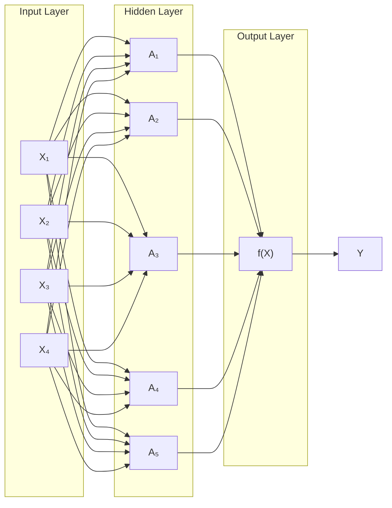
</details>

FIGURE 10.1. Neural network with a single hidden layer. The hidden layer computes activations $A _ { k } = h _ { k } ( X )$ that are nonlinear transformations of linear combinations of the inputs $X _ { 1 } , X _ { 2 } , \ldots , X _ { p }$ . Hence these $A _ { k }$ are not directly observed. The functions $h _ { k } ( \cdot )$ are not fxed in advance, but are learned during the training of the network. The output layer is a linear model that uses these activations $A _ { k }$ as inputs, resulting in a function $f ( X )$ .

will also demonstrate these models using the Python torch package, along with a number of helper packages.

The material in this chapter is slightly more challenging than elsewhere in this book.

# 10.1 Single Layer Neural Networks

A neural network takes an input vector of p variables $X = ( X _ { 1 } , X _ { 2 } , \ldots , X _ { p } )$ Gowb and builds a nonlinear function $f ( X )$ to predict the response Y . We have built nonlinear prediction models in earlier chapters, using trees, boosting and generalized additive models. What distinguishes neural networks from these methods is the particular structure of the model. Figure 10.1 shows a simple feed-forward neural network for modeling a quantitative response using $p = 4$ predictors. In the terminology of neural networks, the four features $X _ { 1 } , \ldots , X _ { 4 }$ make up the units in the input layer. The arrows indicate that each of the inputs from the input layer feeds into each of the K hidden units (we get to pick $K \colon$ here we chose 5). The neural network model has the form

$$
f (X) = \beta_ {0} + \sum_ {k = 1} ^ {K} \beta_ {k} h _ {k} (X) \tag {10.1}
$$

$$
{ = } { \beta _ { 0 } + \sum _ { k = 1 } ^ { K } \beta _ { k } g ( w _ { k 0 } + \sum _ { j = 1 } ^ { p } w _ { k j } X _ { j } ) . }
$$

It is built up here in two steps. First the K activations $A _ { k } , k = 1 , \ldots , K$ , in the hidden layer are computed as functions of the input features $X _ { 1 } , \ldots , X _ { p } ,$ ,

$$
A _ {k} = h _ {k} (X) = g (w _ {k 0} + \sum_ {j = 1} ^ {p} w _ {k j} X _ {j}), \tag {10.2}
$$

feed-forward neural network input layer hidden units

activations


<details>
<summary>line</summary>

| z    | sigmoid | ReLU |
| ---- | ------- | ---- |
| -5   | 0.0     | 0.0  |
| -4   | 0.0     | 0.0  |
| -2   | 0.1     | 0.0  |
| 0    | 0.5     | 0.0  |
| 2    | 0.8     | 0.5  |
| 4    | 0.95    | 0.8  |
| 5    | 1.0     | 1.0  |
</details>

FIGURE 10.2. Activation functions. The piecewise-linear ReLU function is popular for its efciency and computability. We have scaled it down by a factor of fve for ease of comparison.

where $g ( z )$ is a nonlinear activation function that is specifed in advance. We can think of each $A _ { k }$ as a diferent transformation $h _ { k } ( X )$ of the original features, much like the basis functions of Chapter 7. These K activations from the hidden layer then feed into the output layer, resulting in

activation function

$$
f (X) = \beta_ {0} + \sum_ {k = 1} ^ {K} \beta_ {k} A _ {k}, \tag {10.3}
$$

a linear regression model in the $K = 5$ activations. All the parameters $\beta _ { 0 } , \ldots , \beta _ { K }$ and $w _ { 1 0 } , \ldots , w _ { K p }$ need to be estimated from data. In the early instances of neural networks, the sigmoid activation function was favored,

sigmoid

$$
g (z) = \frac {e ^ {z}}{1 + e ^ {z}} = \frac {1}{1 + e ^ {- z}}, \tag {10.4}
$$

which is the same function used in logistic regression to convert a linear function into probabilities between zero and one (see Figure 10.2). The preferred choice in modern neural networks is the ReLU (rectifed linear unit) activation function, which takes the form

$$
g (z) = (z) _ {+} = \left\{ \begin{array}{l l} 0 & \text { if   } z <   0 \\ z & \text { otherwise. } \end{array} \right. \tag {10.5}
$$

ReLU rectifed linear unit

A ReLU activation can be computed and stored more efciently than a sigmoid activation. Although it thresholds at zero, because we apply it to a linear function (10.2) the constant term $w _ { k 0 }$ will shift this infection point.

So in words, the model depicted in Figure 10.1 derives fve new features by computing fve diferent linear combinations of X, and then squashes each through an activation function $g ( \cdot )$ to transform it. The fnal model is linear in these derived variables.

The name neural network originally derived from thinking of these hidden units as analogous to neurons in the brain — values of the activations $A _ { k } \ = \ h _ { k } ( X )$ close to one are fring, while those close to zero are silent (using the sigmoid activation function).

The nonlinearity in the activation function $g ( \cdot )$ is essential, since without it the model f (X) in (10.1) would collapse into a simple linear model in

$X _ { 1 } , \ldots , X _ { p } .$ . Moreover, having a nonlinear activation function allows the model to capture complex nonlinearities and interaction efects. Consider a very simple example with $p \ : = \ : 2$ input variables $\boldsymbol { X } ~ = ~ ( X _ { 1 } , X _ { 2 } )$ , and K = 2 hidden units $h _ { 1 } ( X )$ and $h _ { 2 } ( X )$ with $g ( z ) = z ^ { 2 }$ . We specify the other parameters as

$$
\beta_ {0} = 0, \quad \beta_ {1} = \frac {1}{4}, \quad \beta_ {2} = - \frac {1}{4},
$$

$$
w _ {1 0} = 0, \quad w _ {1 1} = 1, \quad w _ {1 2} = 1, \tag {10.6}
$$

$$
w _ {2 0} = 0, \quad w _ {2 1} = 1, \quad w _ {2 2} = - 1.
$$

From (10.2), this means that

$$
\begin{array}{r c l} h _ {1} (X) & = & (0 + X _ {1} + X _ {2}) ^ {2}, \\ h _ {2} (X) & = & (0 + X _ {1} - X _ {2}) ^ {2}. \end{array} \tag {10.7}
$$

Then plugging (10.7) into (10.1), we get

$$
f (X) = 0 + \frac {1}{4} \cdot \left(0 + X _ {1} + X _ {2}\right) ^ {2} - \frac {1}{4} \cdot \left(0 + X _ {1} - X _ {2}\right) ^ {2}
$$

$$
= \frac {1}{4} \left[ \left(X _ {1} + X _ {2}\right) ^ {2} - \left(X _ {1} - X _ {2}\right) ^ {2} \right] \tag {10.8}
$$

$$
= X _ {1} X _ {2}.
$$

So the sum of two nonlinear transformations of linear functions can give us an interaction! In practice we would not use a quadratic function for $g ( z )$ , since we would always get a second-degree polynomial in the original coordinates $X _ { 1 } , \ldots , X _ { p }$ . The sigmoid or ReLU activations do not have such a limitation.

Fitting a neural network requires estimating the unknown parameters in (10.1). For a quantitative response, typically squared-error loss is used, so that the parameters are chosen to minimize

$$
\sum_ {i = 1} ^ {n} \left(y _ {i} - f (x _ {i})\right) ^ {2}. \tag {10.9}
$$

Details about how to perform this minimization are provided in Section 10.7.

# 10.2 Multilayer Neural Networks

Modern neural networks typically have more than one hidden layer, and often many units per layer. In theory a single hidden layer with a large number of units has the ability to approximate most functions. However, the learning task of discovering a good solution is made much easier with multiple layers each of modest size.

We will illustrate a large dense network on the famous and publicly available MNIST handwritten digit dataset.1 Figure 10.3 shows examples of these digits. The idea is to build a model to classify the images into their correct digit class 0–9. Every image has $p = 2 8 \times 2 8 = 7 8 4$ pixels, each of which is an eight-bit grayscale value between 0 and 255 representing the relative amount of the written digit in that tiny square.2 These pixels are stored in the input vector X (in, say, column order). The output is the class label, represented by a vector $Y = ( Y _ { 0 } , Y _ { 1 } , \dots , Y _ { 9 } )$ of 10 dummy variables, with a one in the position corresponding to the label, and zeros elsewhere. In the machine learning community, this is known as one-hot encoding. There are 60,000 training images, and 10,000 test images.


<details>
<summary>text_image</summary>

0 1 2 3 4 5 6 7 8 9
0 1 2 3 4 5 6 7 8 9
0 1 2 3 4 5 6 7 8 9
0 1 2 3 4 5 6 7 8 9
3 5 8
</details>

FIGURE 10.3. Examples of handwritten digits from the MNIST corpus. Each grayscale image has $2 8 \times 2 8$ pixels, each of which is an eight-bit number (0–255) which represents how dark that pixel is. The frst 3, 5, and 8 are enlarged to show their 784 individual pixel values.

On a historical note, digit recognition problems were the catalyst that accelerated the development of neural network technology in the late 1980s at AT&T Bell Laboratories and elsewhere. Pattern recognition tasks of this kind are relatively simple for humans. Our visual system occupies a large fraction of our brains, and good recognition is an evolutionary force for survival. These tasks are not so simple for machines, and it has taken more than 30 years to refne the neural-network architectures to match human performance.

Figure 10.4 shows a multilayer network architecture that works well for solving the digit-classifcation task. It difers from Figure 10.1 in several ways:

• It has two hidden layers $L _ { 1 }$ (256 units) and $L _ { 2 }$ (128 units) rather than one. Later we will see a network with seven hidden layers.   
• It has ten output variables, rather than one. In this case the ten variables really represent a single qualitative variable and so are quite dependent. (We have indexed them by the digit class 0–9 rather than 1–10, for clarity.) More generally, in multi-task learning one can predict diferent responses simultaneously with a single network; they all have a say in the formation of the hidden layers.   
• The loss function used for training the network is tailored for the multiclass classifcation task.

one-hot encoding

multi-task learning


<details>
<summary>flowchart</summary>


</details>

FIGURE 10.4. Neural network diagram with two hidden layers and multiple outputs, suitable for the MNIST handwritten-digit problem. The input layer has $p = 7 8 4$ units, the two hidden layers $K _ { 1 } = 2 5 6$ and $K _ { 2 } = 1 2 8$ units respectively, and the output layer 10 units. Along with intercepts (referred to as biases in the deep-learning community) this network has 235,146 parameters (referred to as weights).

The frst hidden layer is as in (10.2), with

$$
\begin{array}{l} A _ {k} ^ {(1)} = h _ {k} ^ {(1)} (X) \tag {10.10} \\ = g \left(w _ {k 0} ^ {(1)} + \sum_ {j = 1} ^ {p} w _ {k j} ^ {(1)} X _ {j}\right) \\ \end{array}
$$

for $k = 1 , \ldots , K _ { 1 }$ . The second hidden layer treats the activations $A _ { k } ^ { ( 1 ) }$ (k of the frst hidden layer as inputs and computes new activations

$$
\begin{array}{l} A _ {\ell} ^ {(2)} = h _ {\ell} ^ {(2)} (X) \tag {10.11} \\ = g (w _ {\ell 0} ^ {(2)} + \sum_ {k = 1} ^ {K _ {1}} w _ {\ell k} ^ {(2)} A _ {k} ^ {(1)}) \\ \end{array}
$$

for $\ell = 1 , \ldots , K _ { 2 }$ . Notice that each of the activations in the second layer $A _ { \ell } ^ { ( 2 ) } = h _ { \ell } ^ { ( 2 ) } ( X )$ is a function of the input vector X. This is the case because while they are explicitly a function of the activations $A _ { k } ^ { ( 1 ) }$ from layer $L _ { 1 }$ these in turn are functions of X. This would also be the case with more hidden layers. Thus, through a chain of transformations, the network is able to build up fairly complex transformations of X that ultimately feed into the output layer as features.

We have introduced additional superscript notation such as $h _ { \ell } ^ { ( 2 ) } ( X )$ and w\$j $w _ { \ell j } ^ { ( 2 ) }$ in (10.10) and (10.11) to indicate to which layer the activations and weights (coefcients) belong, in this case layer 2. The notation $\mathbf { W } _ { 1 }$ in Figure 10.4 represents the entire matrix of weights that feed from the input layer to the frst hidden layer $L _ { 1 }$ . This matrix will have $7 8 5 \times 2 5 6 = 2 0 0 , 9 6 0$ cYm.owb elements; there are 785 rather than 784 because we must account for the intercept or bias term.3

Each element $A _ { k } ^ { ( 1 ) }$ feeds to the second hidden layer $L _ { 2 }$ via the matrix of weights $\mathbf { W } _ { 2 }$ of dimension $2 5 7 \times 1 2 8 = 3 2 { , } 8 9 6$ .

We now get to the output layer, where we now have ten responses rather than one. The frst step is to compute ten diferent linear models similar to our single model (10.1),

$$
Z _ {m} = \beta_ {m 0} + \sum_ {\ell = 1} ^ {K _ {2}} \beta_ {m \ell} h _ {\ell} ^ {(2)} (X) \tag {10.12}
$$

$$
= \beta_ {m 0} + \sum_ {\ell = 1} ^ {K _ {2}} \beta_ {m \ell} A _ {\ell} ^ {(2)},
$$

for $m = 0 , 1 , \ldots , 9$ . The matrix B stores all $1 2 9 \times 1 0 = 1 { , } 2 9 0$ of these weights.

If these were all separate quantitative responses, we would simply set each $f _ { m } ( X ) = Z _ { m }$ and be done. However, we would like our estimates to represent class probabilities $f _ { m } ( X ) = \mathrm { P r } ( Y = m \vert X )$ , just like in multinomial logistic regression in Section 4.3.5. So we use the special softmax activation function (see (4.13) on page 145),

bias

$$
f _ {m} (X) = \operatorname * {P r} (Y = m | X) = \frac {e ^ {Z _ {m}}}{\sum_ {\ell = 0} ^ {9} e ^ {Z _ {\ell}}}, \tag {10.13}
$$

softmax

for $m = 0 , 1 , \ldots , 9$ . This ensures that the 10 numbers behave like probabilities (non-negative and sum to one). Even though the goal is to build a classifer, our model actually estimates a probability for each of the 10 classes. The classifer then assigns the image to the class with the highest probability.

To train this network, since the response is qualitative, we look for coeffcient estimates that minimize the negative multinomial log-likelihood

$$
- \sum_ {i = 1} ^ {n} \sum_ {m = 0} ^ {9} y _ {i m} \log (f _ {m} (x _ {i})), \tag {10.14}
$$

also known as the cross-entropy. This is a generalization of the criterion (4.5) for two-class logistic regression. Details on how to minimize this objective are given in Section 10.7. If the response were quantitative, we would instead minimize squared-error loss as in (10.9).

Table 10.1 compares the test performance of the neural network with two simple models presented in Chapter 4 that make use of linear decision boundaries: multinomial logistic regression and linear discriminant analysis. The improvement of neural networks over both of these linear methods is dramatic: the network with dropout regularization achieves a test error rate below 2% on the 10,000 test images. (We describe dropout regularization in Section 10.7.3.) In Section 10.9.2 of the lab, we present the code for ftting this model, which runs in just over two minutes on a laptop computer.

crossentropy

<table><tr><td>Method</td><td>Test Error</td></tr><tr><td>Neural Network + Ridge Regularization</td><td>2.3%</td></tr><tr><td>Neural Network + Dropout Regularization</td><td>1.8%</td></tr><tr><td>Multinomial Logistic Regression</td><td>7.2%</td></tr><tr><td>Linear Discriminant Analysis</td><td>12.7%</td></tr></table>

TABLE 10.1. Test error rate on the MNIST data, for neural networks with two forms of regularization, as well as multinomial logistic regression and linear discriminant analysis. In this example, the extra complexity of the neural network leads to a marked improvement in test error.


<details>
<summary>natural_image</summary>

Grid of 30 colorful and nature-themed images including animals, animals, animals, animals, animals, animals, animals, animals, animals, animals, animals, animals, animals, animals, animals, animals, animals, animals, animals, animals, animals, animals, animals, animals, animals, animals, animals, animals, animals, animals, animals, animals, animals, animals, animals, animals, animals, animals, animals, animals, animals, animals, animals, animals, animals, animals, animals, animals, animals, animals, animals
</details>

FIGURE 10.5. A sample of images from the CIFAR100 database: a collection of natural images from everyday life, with 100 diferent classes represented.

Adding the number of coefcients in $\mathbf { W } _ { 1 } , \ \mathbf { W } _ { 2 }$ and B, we get 235,146 in all, more than 33 times the number 785 9 = 7,065 needed for multinomial logistic regression. Recall that there are 60,000 images in the training set. While this might seem like a large training set, there are almost four times as many coefcients in the neural network model as there are observations in the training set! To avoid overftting, some regularization is needed. In this example, we used two forms of regularization: ridge regularization, which is similar to ridge regression from Chapter 6, and dropout regularization. We discuss both forms of regularization in Section 10.7.

dropout

# 10.3 Convolutional Neural Networks

Neural networks rebounded around 2010 with big successes in image classifcation. Around that time, massive databases of labeled images were being accumulated, with ever-increasing numbers of classes. Figure 10.5 shows 75 images drawn from the CIFAR100 database.4 This database consists of 60,000 images labeled according to 20 superclasses (e.g. aquatic mammals), with fve classes per superclass (beaver, dolphin, otter, seal, whale). Each image has a resolution of $3 2 \times 3 2$ pixels, with three eight-bit numbers per pixel representing red, green and blue. The numbers for each image are organized in a three-dimensional array called a feature map. The frst two

feature map


<details>
<summary>flowchart</summary>

```mermaid
graph TD
    A["TIGER"] --> B[" facial"]
    A --> C[" visually"]
    A --> D[" sensory"]
    B --> E[ facial emoji: eye, down arrow, smiling face, smiling face, down arrow, down arrow, down arrow, down arrow, down arrow, down arrow, down arrow, down arrow, down arrow, down arrow, down arrow, down arrow, down arrow, down arrow, down arrow, down arrow, down arrow, down arrow, down arrow, down arrow, down arrow, down arrow, down arrow, down arrow, down arrow, down arrow, down arrow, down arrow, down arrow, down arrow, down arrow, down arrow, down arrow, down arrow
```
</details>

FIGURE 10.6. Schematic showing how a convolutional neural network classifes an image of a tiger. The network takes in the image and identifes local features. It then combines the local features in order to create compound features, which in this example include eyes and ears. These compound features are used to output the label “tiger”.

axes are spatial (both are 32-dimensional), and the third is the channel axis,5 representing the three colors. There is a designated training set of 50,000 images, and a test set of 10,000.

A special family of convolutional neural networks (CNNs) has evolved for classifying images such as these, and has shown spectacular success on a wide range of problems. CNNs mimic to some degree how humans classify images, by recognizing specifc features or patterns anywhere in the image that distinguish each particular object class. In this section we give a brief overview of how they work.

Figure 10.6 illustrates the idea behind a convolutional neural network on a cartoon image of a tiger.6

The network frst identifes low-level features in the input image, such as small edges, patches of color, and the like. These low-level features are then combined to form higher-level features, such as parts of ears, eyes, and so on. Eventually, the presence or absence of these higher-level features contributes to the probability of any given output class.

How does a convolutional neural network build up this hierarchy? It combines two specialized types of hidden layers, called convolution layers and pooling layers. Convolution layers search for instances of small patterns in the image, whereas pooling layers downsample these to select a prominent subset. In order to achieve state-of-the-art results, contemporary neuralnetwork architectures make use of many convolution and pooling layers. We describe convolution and pooling layers next.

channel

convolutional neural networks

# 10.3.1 Convolution Layers

A convolution layer is made up of a large number of convolution flters, each

convolution layer convolution flter

of which is a template that determines whether a particular local feature is present in an image. A convolution flter relies on a very simple operation, called a convolution, which basically amounts to repeatedly multiplying matrix elements and then adding the results.

To understand how a convolution flter works, consider a very simple example of a 4 × 3 image:

$$
\text { Original   Image } = \left[ \begin{array}{c c c} a & b & c \\ d & e & f \\ g & h & i \\ j & k & l \end{array} \right].
$$

Now consider a 2 2 flter of the form

$$
\text { Convolution   Filter } = \left[ \begin{array}{c c} \alpha & \beta \\ \gamma & \delta \end{array} \right].
$$

When we convolve the image with the flter, we get the result7

$$
\text {Convolved Image} = \left[ \begin{array}{c c} a \alpha + b \beta + d \gamma + e \delta & b \alpha + c \beta + e \gamma + f \delta \\ d \alpha + e \beta + g \gamma + h \delta & e \alpha + f \beta + h \gamma + i \delta \\ g \alpha + h \beta + j \gamma + k \delta & h \alpha + i \beta + k \gamma + l \delta \end{array} \right].
$$

For instance, the top-left element comes from multiplying each element in the 2 × 2 flter by the corresponding element in the top left $2 \times 2$ portion of the image, and adding the results. The other elements are obtained in a similar way: the convolution flter is applied to every $2 \times 2$ submatrix of the original image in order to obtain the convolved image. If a $2 \times 2$ submatrix of the original image resembles the convolution flter, then it will have a large value in the convolved image; otherwise, it will have a small value. Thus, the convolved image highlights regions of the original image that resemble the convolution flter. We have used $2 \times 2$ as an example; in general convolution flters are small $\ell _ { 1 } \times \ell _ { 2 }$ arrays, with $\ell _ { 1 }$ and $\ell _ { 2 }$ small positive integers that are not necessarily equal.

Figure 10.7 illustrates the application of two convolution flters to a 192 179 image of a tiger, shown on the left-hand side.8 Each convolution flter is a $1 5 \times 1 5$ image containing mostly zeros (black), with a narrow strip of ones (white) oriented either vertically or horizontally within the image. When each flter is convolved with the image of the tiger, areas of the tiger that resemble the flter (i.e. that have either horizontal or vertical stripes or edges) are given large values, and areas of the tiger that do not resemble the feature are given small values. The convolved images are displayed on the right-hand side. We see that the horizontal stripe flter picks out horizontal stripes and edges in the original image, whereas the vertical stripe flter picks out vertical stripes and edges in the original image.


<details>
<summary>flowchart</summary>

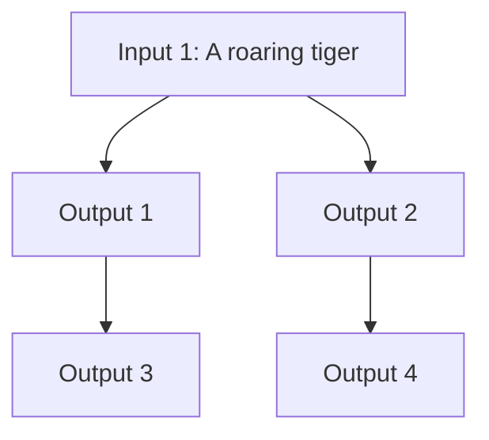
</details>

FIGURE 10.7. Convolution flters fnd local features in an image, such as edges and small shapes. We begin with the image of the tiger shown on the left, and apply the two small convolution flters in the middle. The convolved images highlight areas in the original image where details similar to the flters are found. Specifcally, the top convolved image highlights the tiger’s vertical stripes, whereas the bottom convolved image highlights the tiger’s horizontal stripes. We can think of the original image as the input layer in a convolutional neural network, and the convolved images as the units in the frst hidden layer.

We have used a large image and two large flters in Figure 10.7 for illustration. For the CIFAR100 database there are 32 × 32 color pixels per image, and we use 3 3 convolution flters.

In a convolution layer, we use a whole bank of flters to pick out a variety of diferently-oriented edges and shapes in the image. Using predefned flters in this way is standard practice in image processing. By contrast, with CNNs the flters are learned for the specifc classifcation task. We can think of the flter weights as the parameters going from an input layer to a hidden layer, with one hidden unit for each pixel in the convolved image. This is in fact the case, though the parameters are highly structured and constrained (see Exercise 4 for more details). They operate on localized patches in the input image (so there are many structural zeros), and the same weights in a given flter are reused for all possible patches in the image (so the weights are constrained). 9

We now give some additional details.

• Since the input image is in color, it has three channels represented by a three-dimensional feature map (array). Each channel is a twodimensional (32 × 32) feature map — one for red, one for green, and one for blue. A single convolution flter will also have three channels, one per color, each of dimension 3 3, with potentially diferent flter weights. The results of the three convolutions are summed to form a two-dimensional output feature map. Note that at this point the color information has been used, and is not passed on to subsequent layers except through its role in the convolution.

• If we use K diferent convolution flters at this frst hidden layer, we get K two-dimensional output feature maps, which together are treated as a single three-dimensional feature map. We view each of the K output feature maps as a separate channel of information, so now we have K channels in contrast to the three color channels of the original input feature map. The three-dimensional feature map is just like the activations in a hidden layer of a simple neural network, except organized and produced in a spatially structured way.   
• We typically apply the ReLU activation function (10.5) to the convolved image. This step is sometimes viewed as a separate layer in the convolutional neural network, in which case it is referred to as a detector layer.

detector layer

# 10.3.2 Pooling Layers

A pooling layer provides a way to condense a large image into a smaller summary image. While there are a number of possible ways to perform pooling, the max pooling operation summarizes each non-overlapping 2 × 2 block of pixels in an image using the maximum value in the block. This reduces the size of the image by a factor of two in each direction, and it also provides some location invariance: i.e. as long as there is a large value in one of the four pixels in the block, the whole block registers as a large value in the reduced image.

Here is a simple example of max pooling:

$$
\text {Max pool} \left[ \begin{array}{c c c c} 1 & 2 & 5 & 3 \\ 3 & 0 & 1 & 2 \\ 2 & 1 & 3 & 4 \\ 1 & 1 & 2 & 0 \end{array} \right] \to \left[ \begin{array}{c c} 3 & 5 \\ 2 & 4 \end{array} \right].
$$

pooling

# 10.3.3 Architecture of a Convolutional Neural Network

So far we have defned a single convolution layer — each flter produces a new two-dimensional feature map. The number of convolution flters in a convolution layer is akin to the number of units at a particular hidden layer in a fully-connected neural network of the type we saw in Section 10.2. This number also defnes the number of channels in the resulting threedimensional feature map. We have also described a pooling layer, which reduces the frst two dimensions of each three-dimensional feature map. Deep CNNs have many such layers. Figure 10.8 shows a typical architecture for a CNN for the CIFAR100 image classifcation task.

At the input layer, we see the three-dimensional feature map of a color image, where the channel axis represents each color by a 32 × 32 twodimensional feature map of pixels. Each convolution flter produces a new channel at the frst hidden layer, each of which is a 32 × 32 feature map (after some padding at the edges). After this frst round of convolutions, we now have a new “image”; a feature map with considerably more channels than the three color input channels (six in the fgure, since we used six convolution flters).


<details>
<summary>flowchart</summary>

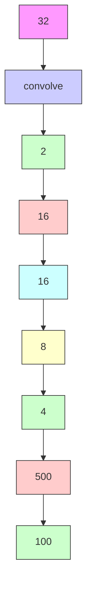
</details>

FIGURE 10.8. Architecture of a deep CNN for the CIFAR100 classifcation task. Convolution layers are interspersed with 2  2 max-pool layers, which reduce the size by a factor of 2 in both dimensions.

This is followed by a max-pool layer, which reduces the size of the feature map in each channel by a factor of four: two in each dimension.

This convolve-then-pool sequence is now repeated for the next two layers. Some details are as follows:

• Each subsequent convolve layer is similar to the frst. It takes as input the three-dimensional feature map from the previous layer and treats it like a single multi-channel image. Each convolution flter learned has as many channels as this feature map.   
• Since the channel feature maps are reduced in size after each pool layer, we usually increase the number of flters in the next convolve layer to compensate.   
• Sometimes we repeat several convolve layers before a pool layer. This efectively increases the dimension of the flter.

These operations are repeated until the pooling has reduced each channel feature map down to just a few pixels in each dimension. At this point the three-dimensional feature maps are fattened — the pixels are treated as separate units — and fed into one or more fully-connected layers before reaching the output layer, which is a softmax activation for the 100 classes (as in (10.13)).

There are many tuning parameters to be selected in constructing such a network, apart from the number, nature, and sizes of each layer. Dropout learning can be used at each layer, as well as lasso or ridge regularization (see Section 10.7). The details of constructing a convolutional neural network can seem daunting. Fortunately, terrifc software is available, with extensive examples and vignettes that provide guidance on sensible choices for the parameters. For the CIFAR100 ofcial test set, the best accuracy as of this writing is just above 75%, but undoubtedly this performance will continue to improve.

# 10.3.4 Data Augmentation

An additional important trick used with image modeling is data augmentation. Essentially, each training image is replicated many times, with each replicate randomly distorted in a natural way such that human recognition is unafected. Figure 10.9 shows some examples. Typical distortions are

data augmentation

  
FIGURE 10.9. Data augmentation. The original image (leftmost) is distorted in natural ways to produce diferent images with the same class label. These distortions do not fool humans, and act as a form of regularization when ftting the CNN.

zoom, horizontal and vertical shift, shear, small rotations, and in this case horizontal fips. At face value this is a way of increasing the training set considerably with somewhat diferent examples, and thus protects against overftting. In fact we can see this as a form of regularization: we build a cloud of images around each original image, all with the same label. This kind of fattening of the data is similar in spirit to ridge regularization.

We will see in Section 10.7.2 that the stochastic gradient descent algorithms for ftting deep learning models repeatedly process randomlyselected batches of, say, 128 training images at a time. This works hand-inglove with augmentation, because we can distort each image in the batch on the fy, and hence do not have to store all the new images.

# 10.3.5 Results Using a Pretrained Classifer

Here we use an industry-level pretrained classifer to predict the class of some new images. The resnet50 classifer is a convolutional neural network that was trained using the imagenet data set, which consists of millions of images that belong to an ever-growing number of categories.10 Figure 10.10 demonstrates the performance of resnet50 on six photographs (private collection of one of the authors).11 The CNN does a reasonable job classifying the hawk in the second image. If we zoom out as in the third image, it gets confused and chooses the fountain rather than the hawk. In the fnal image a “jacamar” is a tropical bird from South and Central America with similar coloring to the South African Cape Weaver. We give more details on this example in Section 10.9.4.

Much of the work in ftting a CNN is in learning the convolution flters at the hidden layers; these are the coefcients of a CNN. For models ft to massive corpora such as imagenet with many classes, the output of these flters can serve as features for general natural-image classifcation problems. One can use these pretrained hidden layers for new problems with much smaller training sets (a process referred to as weight freezing), and just train the last few layers of the network, which requires much less data.

weight freezing


famingo   
Cooper’s hawk   
Cooper’s hawk 

<table><tr><td>flamingo</td><td>0.83</td><td>kite</td><td>0.60</td><td>fountain</td><td>0.35</td></tr><tr><td>spoonbill</td><td>0.17</td><td>great grey owl</td><td>0.09</td><td>nail</td><td>0.12</td></tr><tr><td>white stork</td><td>0.00</td><td>robin</td><td>0.06</td><td>hook</td><td>0.07</td></tr></table>

Lhasa Apso   
cat   
Cape weaver 

<table><tr><td>Tibetan terrier</td><td>0.56</td><td>Old English sheepdog</td><td>0.82</td><td>jacamar</td><td>0.28</td></tr><tr><td>Lhasa</td><td>0.32</td><td>Shih-Tzu</td><td>0.04</td><td>macaw</td><td>0.12</td></tr><tr><td>cocker spaniel</td><td>0.03</td><td>Persian cat</td><td>0.04</td><td>robin</td><td>0.12</td></tr></table>

FIGURE 10.10. Classifcation of six photographs using the resnet50 CNN trained on the imagenet corpus. The table below the images displays the true (intended) label at the top of each panel, and the top three choices of the classifer (out of 100). The numbers are the estimated probabilities for each choice. (A kite is a raptor, but not a hawk.)

The vignettes and book12 that accompany the keras package give more details on such applications.

# 10.4 Document Classifcation

In this section we introduce a new type of example that has important applications in industry and science: predicting attributes of documents. Examples of documents include articles in medical journals, Reuters news feeds, emails, tweets, and so on. Our example will be IMDb (Internet Movie Database) ratings — short documents where viewers have written critiques of movies.13 The response in this case is the sentiment of the review, which will be positive or negative.

Here is the beginning of a rather amusing negative review:

This has to be one of the worst flms of the 1990s. When my friends & I were watching this flm (being the target audience it was aimed at) we just sat & watched the frst half an hour with our jaws touching the foor at how bad it really was. The rest of the time, everyone else in the theater just started talking to each other, leaving or generally crying into their popcorn . .

Each review can be a diferent length, include slang or non-words, have spelling errors, etc. We need to fnd a way to featurize such a document. This is modern parlance for defning a set of predictors.

The simplest and most common featurization is the bag-of-words model. We score each document for the presence or absence of each of the words in a language dictionary — in this case an English dictionary. If the dictionary contains M words, that means for each document we create a binary feature vector of length M, and score a 1 for every word present, and 0 otherwise. That can be a very wide feature vector, so we limit the dictionary — in this case to the 10,000 most frequently occurring words in the training corpus of 25,000 reviews. Fortunately there are nice tools for doing this automatically. Here is the beginning of a positive review that has been redacted in this way:

4START 5 this flm was just brilliant casting location scenery story direction everyone’s really suited the part they played and you could just imagine being there robert 4UNK 5 is an amazing actor and now the same being director 4UNK 5 father came from the same scottish island as myself so i loved . . .

Here we can see many words have been omitted, and some unknown words (UNK) have been marked as such. With this reduction the binary feature vector has length 10,000, and consists mostly of 0’s and a smattering of 1’s in the positions corresponding to words that are present in the document. We have a training set and test set, each with 25,000 examples, and each balanced with regard to sentiment. The resulting training feature matrix X has dimension 25,000×10,000, but only 1.3% of the binary entries are nonzero. We call such a matrix sparse, because most of the values are the same (zero in this case); it can be stored efciently in sparse matrix format. 14 There are a variety of ways to account for the document length; here we only score a word as in or out of the document, but for example one could instead record the relative frequency of words. We split of a validation set of size 2,000 from the 25,000 training observations (for model tuning), and ft two model sequences:

• A lasso logistic regression using the glmnet package;   
• A two-class neural network with two hidden layers, each with 16 ReLU units.


<details>
<summary>line</summary>

| -log(λ) | train  | validation | test   |
| ------- | ------ | ---------- | ------ |
| 3       | 0.61   | 0.61       | 0.61   |
| 4       | 0.65   | 0.65       | 0.65   |
| 5       | 0.75   | 0.75       | 0.75   |
| 6       | 0.82   | 0.82       | 0.82   |
| 7       | 0.87   | 0.87       | 0.87   |
| 8       | 0.90   | 0.90       | 0.90   |
| 9       | 0.93   | 0.93       | 0.93   |
| 10      | 0.96   | 0.96       | 0.96   |
| 11      | 0.98   | 0.98       | 0.98   |
| 12      | 1.00   | 0.98       | 0.98   |
</details>


<details>
<summary>line</summary>

| Epochs | Accuracy (Black) | Accuracy (Cyan) | Accuracy (Orange) |
| ------ | ---------------- | --------------- | ----------------- |
| 0      | 0.81             | 0.88            | 0.88              |
| 5      | 0.92             | 0.89            | 0.87              |
| 10     | 0.96             | 0.88            | 0.86              |
| 15     | 0.98             | 0.87            | 0.85              |
| 20     | 0.99             | 0.86            | 0.84              |
</details>

FIGURE 10.11. Accuracy of the lasso and a two-hidden-layer neural network on the IMDb data. For the lasso, the x-axis displays − log(λ), while for the neural network it displays epochs (number of times the ftting algorithm passes through the training set). Both show a tendency to overft, and achieve approximately the same test accuracy.

Both methods produce a sequence of solutions. The lasso sequence is indexed by the regularization parameter λ. The neural-net sequence is indexed by the number of gradient-descent iterations used in the ftting, as measured by training epochs or passes through the training set (Section 10.7). Notice that the training accuracy in Figure 10.11 (black points) increases monotonically in both cases. We can use the validation error to pick a good solution from each sequence (blue points in the plots), which would then be used to make predictions on the test data set.

Note that a two-class neural network amounts to a nonlinear logistic regression model. From (10.12) and (10.13) we can see that

$$
\begin{array}{l} \log \left(\frac {\operatorname* {P r} (Y = 1 | X)}{\operatorname* {P r} (Y = 0 | X)}\right) = Z _ {1} - Z _ {0} \tag {10.15} \\ { = } { ( \beta _ { 1 0 } - \beta _ { 0 0 } ) + \sum _ { \ell = 1 } ^ { K _ { 2 } } ( \beta _ { 1 \ell } - \beta _ { 0 \ell } ) A _ { \ell } ^ { ( 2 ) } . } \\ \end{array}
$$

(This shows the redundancy in the softmax function; for K classes we really only need to estimate K 1 sets of coefcients. See Section 4.3.5.) In Figure 10.11 we show accuracy (fraction correct) rather than classifcation error (fraction incorrect), the former being more popular in the machine learning community. Both models achieve a test-set accuracy of about 88%.

The bag-of-words model summarizes a document by the words present, and ignores their context. There are at least two popular ways to take the context into account:

• The bag-of-n-grams model. For example, a bag of 2-grams records

accuracy

bag-of-ngrams

the consecutive co-occurrence of every distinct pair of words. “Blissfully long” can be seen as a positive phrase in a movie review, while “blissfully short” a negative.

• Treat the document as a sequence, taking account of all the words in the context of those that preceded and those that follow.

In the next section we explore models for sequences of data, which have applications in weather forecasting, speech recognition, language translation, and time-series prediction, to name a few. We continue with this IMDb example there.

# 10.5 Recurrent Neural Networks

Many data sources are sequential in nature, and call for special treatment when building predictive models. Examples include:

• Documents such as book and movie reviews, newspaper articles, and tweets. The sequence and relative positions of words in a document capture the narrative, theme and tone, and can be exploited in tasks such as topic classifcation, sentiment analysis, and language translation.   
• Time series of temperature, rainfall, wind speed, air quality, and so on. We may want to forecast the weather several days ahead, or climate several decades ahead.   
• Financial time series, where we track market indices, trading volumes, stock and bond prices, and exchange rates. Here prediction is often difcult, but as we will see, certain indices can be predicted with reasonable accuracy.   
• Recorded speech, musical recordings, and other sound recordings. We may want to give a text transcription of a speech, or perhaps a language translation. We may want to assess the quality of a piece of music, or assign certain attributes.   
• Handwriting, such as doctor’s notes, and handwritten digits such as zip codes. Here we want to turn the handwriting into digital text, or read the digits (optical character recognition).

In a recurrent neural network (RNN), the input object X is a sequence. Consider a corpus of documents, such as the collection of IMDb movie reviews. Each document can be represented as a sequence of L words, so $X = \{ X _ { 1 } , X _ { 2 } , . . . , X _ { L } \}$ , where each $X _ { \ell }$ represents a word. The order of the words, and closeness of certain words in a sentence, convey semantic meaning. RNNs are designed to accommodate and take advantage of the sequential nature of such input objects, much like convolutional neural networks accommodate the spatial structure of image inputs. The output Y can also be a sequence (such as in language translation), but often is a scalar, like the binary sentiment label of a movie review document.

recurrent neural network


<details>
<summary>flowchart</summary>

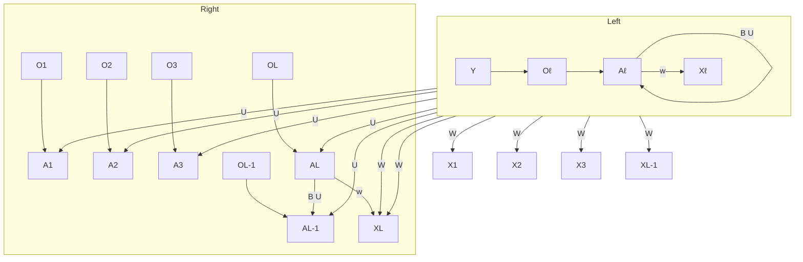
</details>

FIGURE 10.12. Schematic of a simple recurrent neural network. The input is a sequence of vectors $\{ X _ { \ell } \} _ { 1 } ^ { L }$ , and here the target is a single response. The network processes the input sequence X sequentially; each $X _ { \ell }$ feeds into the hidden layer, which also has as input the activation vector $A _ { \ell - 1 }$ from the previous element in the sequence, and produces the current activation vector $A _ { \ell }$ . The same collections of weights W, U and B are used as each element of the sequence is processed. The output layer produces a sequence of predictions $O _ { \ell }$ from the current activation $A _ { \ell }$ , but typically only the last of these, $O _ { L }$ , is of relevance. To the left of the equal sign is a concise representation of the network, which is unrolled into a more explicit version on the right.

Figure 10.12 illustrates the structure of a very basic RNN with a sequence $X = \{ X _ { 1 } , X _ { 2 } , \ldots , X _ { L } \}$ as input, a simple output $Y ,$ , and a hidden-layer sequence $\{ A _ { \ell } \} _ { 1 } ^ { L } = \{ A _ { 1 } , A _ { 2 } , \ldots , A _ { L } \}$ . Each $X _ { \ell }$ is a vector; in the document example $X _ { \ell }$ could represent a one-hot encoding for the %th word based on the language dictionary for the corpus (see the top panel in Figure 10.13 for a simple example). As the sequence is processed one vector $X _ { \ell }$ at a time, the network updates the activations $A _ { \ell }$ in the hidden layer, taking as input the vector $X _ { \ell }$ and the activation vector $A _ { \ell - 1 }$ from the previous step in the sequence. Each $A _ { \ell }$ feeds into the output layer and produces a prediction $O _ { \ell }$ for $Y . O _ { L }$ , the last of these, is the most relevant.

In detail, suppose each vector $X _ { \ell }$ of the input sequence has p components $X _ { \ell } ^ { T } = ( X _ { \ell 1 } , X _ { \ell 2 } , \ldots , X _ { \ell p } )$ , and the hidden layer consists of K units $A _ { \ell } ^ { T } =$ $\left( A _ { \ell 1 } , A _ { \ell 2 } , \ldots , A _ { \ell K } \right)$ . As in Figure 10.4, we represent the collection of $K \times$ $( p + 1 )$ shared weights $w _ { k j }$ for the input layer by a matrix W, and similarly U is a $K \times K$ matrix of the weights $u _ { k s }$ for the hidden-to-hidden layers, and B is a $K + 1$ vector of weights $\beta _ { k }$ for the output layer. Then

$$
A _ {\ell k} = g \left(w _ {k 0} + \sum_ {j = 1} ^ {p} w _ {k j} X _ {\ell j} + \sum_ {s = 1} ^ {K} u _ {k s} A _ {\ell - 1, s}\right), \tag {10.16}
$$

and the output $O _ { \ell }$ is computed as

$$
O _ {\ell} = \beta_ {0} + \sum_ {k = 1} ^ {K} \beta_ {k} A _ {\ell k} \tag {10.17}
$$

for a quantitative response, or with an additional sigmoid activation function for a binary response, for example. Here $g ( \cdot )$ is an activation function such as ReLU. Notice that the same weights W, U and B are used as we process each element in the sequence, i.e. they are not functions of %. This is a form of weight sharing used by RNNs, and similar to the use of flters in convolutional neural networks (Section 10.3.1.) As we proceed from beginning to end, the activations $A _ { \ell }$ accumulate a history of what has been seen before, so that the learned context can be used for prediction.

For regression problems the loss function for an observation (X, Y ) is

$$
(Y - O _ {L}) ^ {2}, \tag {10.18}
$$

which only references the fnal output $\begin{array} { r } { O _ { L } = \beta _ { 0 } + \sum _ { k = 1 } ^ { K } \beta _ { k } A _ { L k } } \end{array}$ . Thus $O _ { 1 } , O _ { 2 }$ $\dots , O _ { L - 1 }$ are not used. When we ft the model, each element $X _ { \ell }$ of the input sequence X contributes to $O _ { L }$ via the chain (10.16), and hence contributes indirectly to learning the shared parameters W, U and B via the loss (10.18). With n input sequence/response pairs $( x _ { i } , y _ { i } )$ , the parameters are found by minimizing the sum of squares

$$
\sum_ {i = 1} ^ {n} (y _ {i} - o _ {i L}) ^ {2} = \sum_ {i = 1} ^ {n} \left(y _ {i} - \left(\beta_ {0} + \sum_ {k = 1} ^ {K} \beta_ {k} g \left(w _ {k 0} + \sum_ {j = 1} ^ {p} w _ {k j} x _ {i L j} + \sum_ {s = 1} ^ {K} u _ {k s} a _ {i, L - 1, s}\right)\right)\right) ^ {2}. \tag {10.19}
$$

Here we use lowercase letters for the observed $y _ { i }$ and vector sequences $x _ { i } = \{ x _ { i 1 } , x _ { i 2 } , \ldots , x _ { i L } \} , ^ { 1 5 }$ as well as the derived activations.

Since the intermediate outputs $O _ { \ell }$ are not used, one may well ask why they are there at all. First of all, they come for free, since they use the same output weights B needed to produce $O _ { L }$ , and provide an evolving prediction for the output. Furthermore, for some learning tasks the response is also a sequence, and so the output sequence $\{ O _ { 1 } , O _ { 2 } , \ldots , O _ { L } \}$ is explicitly needed.

When used at full strength, recurrent neural networks can be quite complex. We illustrate their use in two simple applications. In the frst, we continue with the IMDb sentiment analysis of the previous section, where we process the words in the reviews sequentially. In the second application, we illustrate their use in a fnancial time series forecasting problem.

# 10.5.1 Sequential Models for Document Classifcation

Here we return to our classifcation task with the IMDb reviews. Our approach in Section 10.4 was to use the bag-of-words model. Here the plan is to use instead the sequence of words occurring in a document to make predictions about the label for the entire document.

We have, however, a dimensionality problem: each word in our document is represented by a one-hot-encoded vector (dummy variable) with 10,000 elements (one per word in the dictionary)! An approach that has become popular is to represent each word in a much lower-dimensional embedding space. This means that rather than representing each word by a binary vector with 9,999 zeros and a single one in some position, we will represent it instead by a set of m real numbers, none of which are typically zero. Here m is the embedding dimension, and can be in the low 100s, or even less. This means (in our case) that we need a matrix E of dimension $m \times 1 0 { , } 0 0 0$ ,

weight sharing

embedding


<details>
<summary>bar</summary>

| Category | One-hot | Embed |
|---|---|---|
| this | black | blue |
| is | black | blue |
| one | black | red |
| of | black | yellow |
| the | black | blue |
| best | black | orange |
| films | black | red |
| actually | black | orange |
| the | black | red |
| best | black | blue |
| l | black | yellow |
| have | black | blue |
| ever | black | red |
| seen | black | yellow |
| the | black | blue |
| film | black | red |
| starts | black | red |
| one | black | blue |
| fall | black | yellow |
| day | black | red |
</details>

FIGURE 10.13. Depiction of a sequence of 20 words representing a single document: one-hot encoded using a dictionary of 16 words (top panel) and embedded in an m-dimensional space with m = 5 (bottom panel).

where each column is indexed by one of the 10,000 words in our dictionary, and the values in that column give the m coordinates for that word in the embedding space.

Figure 10.13 illustrates the idea (with a dictionary of 16 rather than 10,000, and $m = 5 )$ . Where does E come from? If we have a large corpus of labeled documents, we can have the neural network learn E as part of the optimization. In this case E is referred to as an embedding layer, and a specialized E is learned for the task at hand. Otherwise we can insert a precomputed matrix E in the embedding layer, a process known as weight freezing. Two pretrained embeddings, word2vec and GloVe, are widely used.16 These are built from a very large corpus of documents by a variant of principal components analysis (Section 12.2). The idea is that the positions of words in the embedding space preserve semantic meaning; e.g. synonyms should appear near each other.

So far, so good. Each document is now represented as a sequence of mvectors that represents the sequence of words. The next step is to limit each document to the last L words. Documents that are shorter than L get padded with zeros upfront. So now each document is represented by a series consisting of L vectors $X = \{ X _ { 1 } , X _ { 2 } , \ldots , X _ { L } \}$ , and each $X _ { \ell }$ in the sequence has m components.

We now use the RNN structure in Figure 10.12. The training corpus consists of n separate series (documents) of length L, each of which gets processed sequentially from left to right. In the process, a parallel series of hidden activation vectors A\$, $\ell = 1 , \ldots , L$ is created as in (10.16) for each document. $A _ { \ell }$ feeds into the output layer to produce the evolving prediction $O _ { \ell }$ . We use the fnal value $O _ { L }$ to predict the response: the sentiment of the review.

embedding layer

weight freezing word2vec GloVe

This is a simple RNN, and has relatively few parameters. If there are K hidden units, the common weight matrix W has $K \times ( m + 1 )$ parameters, the matrix U has $K \times K$ parameters, and B has 2(K + 1) for the two-class logistic regression as in (10.15). These are used repeatedly as we process the sequence $X ~ = ~ \{ X _ { \ell } \} _ { 1 } ^ { L }$ from left to right, much like we use a single convolution flter to process each patch in an image (Section 10.3.1). If the embedding layer E is learned, that adds an additional $m \times D$ parameters (D = 10,000 here), and is by far the biggest cost.

We ft the RNN as described in Figure 10.12 and the accompaying text to the IMDb data. The model had an embedding matrix E with m = 32 (which was learned in training as opposed to precomputed), followed by a single recurrent layer with K = 32 hidden units. The model was trained with dropout regularization on the 25,000 reviews in the designated training set, and achieved a disappointing 76% accuracy on the IMDb test data. A network using the GloVe pretrained embedding matrix E performed slightly worse.

For ease of exposition we have presented a very simple RNN. More elaborate versions use long term and short term memory (LSTM). Two tracks of hidden-layer activations are maintained, so that when the activation $A _ { \ell }$ is computed, it gets input from hidden units both further back in time, and closer in time — a so-called LSTM RNN. With long sequences, this overcomes the problem of early signals being washed out by the time they get propagated through the chain to the fnal activation vector $A _ { L }$ .

When we reft our model using the LSTM architecture for the hidden layer, the performance improved to 87% on the IMDb test data. This is comparable with the 88% achieved by the bag-of-words model in Section 10.4. We give details on ftting these models in Section 10.9.6.

Despite this added LSTM complexity, our RNN is still somewhat “entry level”. We could probably achieve slightly better results by changing the size of the model, changing the regularization, and including additional hidden layers. However, LSTM models take a long time to train, which makes exploring many architectures and parameter optimization tedious.

RNNs provide a rich framework for modeling data sequences, and they continue to evolve. There have been many advances in the development of RNNs — in architecture, data augmentation, and in the learning algorithms. At the time of this writing (early 2020) the leading RNN confgurations report accuracy above 95% on the IMDb data. The details are beyond the scope of this book.17

# 10.5.2 Time Series Forecasting

Figure 10.14 shows historical trading statistics from the New York Stock Exchange. Shown are three daily time series covering the period December 3, 1962 to December 31, 1986:18


<details>
<summary>line</summary>

| Year | Log(Trading Volume) | Dow Jones Return | Log(Volatility) |
|------|---------------------|------------------|-----------------|
| 1965 | ~0.0                | ~0.0             | ~-13            |
| 1970 | ~0.0                | ~0.0             | ~-8             |
| 1975 | ~0.0                | ~0.0             | ~-11            |
| 1980 | ~0.0                | ~0.0             | ~-9             |
| 1985 | ~0.0                | ~0.0             | ~-11            |
</details>

FIGURE 10.14. Historical trading statistics from the New York Stock Exchange. Daily values of the normalized log trading volume, DJIA return, and log volatility are shown for a 24-year period from 1962–1986. We wish to predict trading volume on any day, given the history on all earlier days. To the left of the red bar (January 2, 1980) is training data, and to the right test data.

• Log trading volume. This is the fraction of all outstanding shares that are traded on that day, relative to a 100-day moving average of past turnover, on the log scale.   
• Dow Jones return. This is the diference between the log of the Dow Jones Industrial Index on consecutive trading days.   
• Log volatility. This is based on the absolute values of daily price movements.

Predicting stock prices is a notoriously hard problem, but it turns out that predicting trading volume based on recent past history is more manageable (and is useful for planning trading strategies).

An observation here consists of the measurements $\left( { { v _ { t } } , { r _ { t } } , { z _ { t } } } \right)$ on day t, in this case the values for log\_volume, DJ\_return and log\_volatility. There are a total of $T = 6 { , } 0 5 1$ such triples, each of which is plotted as a time series in Figure 10.14. One feature that strikes us immediately is that the dayto-day observations are not independent of each other. The series exhibit auto-correlation — in this case values nearby in time tend to be similar to each other. This distinguishes time series from other data sets we have encountered, in which observations can be assumed to be independent of

autocorrelation


<details>
<summary>bar</summary>

| Lag | Autocorrelation Function |
| --- | ------------------------ |
| 0   | 0.7                      |
| 1   | 0.45                     |
| 2   | 0.4                      |
| 3   | 0.4                      |
| 4   | 0.4                      |
| 5   | 0.4                      |
| 6   | 0.35                     |
| 7   | 0.35                     |
| 8   | 0.35                     |
| 9   | 0.35                     |
| 10  | 0.3                      |
| 11  | 0.3                      |
| 12  | 0.3                      |
| 13  | 0.3                      |
| 14  | 0.3                      |
| 15  | 0.3                      |
| 16  | 0.25                     |
| 17  | 0.25                     |
| 18  | 0.25                     |
| 19  | 0.25                     |
| 20  | 0.2                      |
| 21  | 0.2                      |
| 22  | 0.2                      |
| 23  | 0.2                      |
| 24  | 0.2                      |
| 25  | 0.2                      |
| 26  | 0.15                     |
| 27  | 0.15                     |
| 28  | 0.15                     |
| 29  | 0.15                     |
| 30  | 0.15                     |
| 31  | 0.1                      |
| 32  | 0.1                      |
| 33  | 0.1                      |
| 34  | 0.1                      |
| 35  | 0.05                     |
| 36+ | <0.05                    |
</details>

FIGURE 10.15. The autocorrelation function for log\_volume. We see that nearby values are fairly strongly correlated, with correlations above 0.2 as far as 20 days apart.

each other. To be clear, consider pairs of observations $( v _ { t } , v _ { t - \ell } )$ , a lag of % days apart. If we take all such pairs in the $v _ { t }$ series and compute their corre- lag lation coefcient, this gives the autocorrelation at lag %. Figure 10.15 shows the autocorrelation function for all lags up to $3 7$ , and we see considerable correlation.

Another interesting characteristic of this forecasting problem is that the response variable vt — log\_volume — is also a predictor! In particular, we will use the past values of log\_volume to predict values in the future.

# RNN forecaster

We wish to predict a value $v _ { t }$ from past values $v _ { t - 1 } , v _ { t - 2 } , . . . ,$ and also to make use of past values of the other series $r _ { t - 1 } , r _ { t - 2 } , . . .$ . and $z _ { t - 1 } , z _ { t - 2 } , . . . .$ Although our combined data is quite a long series with 6,051 trading days, the structure of the problem is diferent from the previous documentclassifcation example.

• We only have one series of data, not 25,000.   
• We have an entire series of targets $v _ { t }$ , and the inputs include past values of this series.

How do we represent this problem in terms of the structure displayed in Figure 10.12? The idea is to extract many short mini-series of input sequences $X = \{ X _ { 1 } , X _ { 2 } , \ldots , X _ { L } \}$ with a predefned length L (called the lag lag in this context), and a corresponding target Y . They have the form

$$
X _ {1} = \left( \begin{array}{c} v _ {t - L} \\ r _ {t - L} \\ z _ {t - L} \end{array} \right), X _ {2} = \left( \begin{array}{c} v _ {t - L + 1} \\ r _ {t - L + 1} \\ z _ {t - L + 1} \end{array} \right), \dots , X _ {L} = \left( \begin{array}{c} v _ {t - 1} \\ r _ {t - 1} \\ z _ {t - 1} \end{array} \right), \text {   and   } Y = v _ {t}. \tag {10.20}
$$

So here the target $Y$ is the value of log\_volume $v _ { t }$ at a single timepoint $t ,$ and the input sequence X is the series of 3-vectors $\{ X _ { \ell } \} _ { 1 } ^ { L }$ each consisting of the three measurements log\_volume, DJ\_return and log\_volatility from day $t - L , t - L + 1$ , up to $t - 1$ . Each value of t makes a separate (X, Y ) pair, for t running from L + 1 to T . For the NYSE data we will use the past fve trading days to predict the next day’s trading volume. Hence, we use $L = 5$ . Since $T = 6 { , } 0 5 1$ , we can create 6,046 such (X, Y ) pairs. Clearly L is a parameter that should be chosen with care, perhaps using validation data.


<details>
<summary>line</summary>

| Year | log(Trading Volume) |
| ---- | ------------------- |
| 1980 | ~0.5                |
| 1981 | ~-0.5               |
| 1982 | ~0.0                |
| 1983 | ~0.5                |
| 1984 | ~0.0                |
| 1985 | ~0.5                |
| 1986 | ~0.0                |
</details>

YearFIGURE 10.16. RNN forecast of log\_volume on the NYSE test data. The black lines are the true volumes, and the superimposed orange the forecasts. The forecasted series accounts for 42% of the variance of log\_volume.

We ft this model with K = 12 hidden units using the 4,281 training sequences derived from the data before January 2, 1980 (see Figure 10.14), and then used it to forecast the 1,770 values of log\_volume after this date. We achieve an $R ^ { 2 } ~ = ~ 0 . 4 2$ on the test data. Details are given in Section 10.9.6. As a straw man, 19 using yesterday’s value for log\_volume as the prediction for today has $R ^ { 2 } = 0 . 1 8$ . Figure 10.16 shows the forecast results. We have plotted the observed values of the daily log\_volume for the test period 1980–1986 in black, and superimposed the predicted series in orange. The correspondence seems rather good.

In forecasting the value of log\_volume in the test period, we have to use the test data itself in forming the input sequences X. This may feel like cheating, but in fact it is not; we are always using past data to predict the future.

# Autoregression

The RNN we just ft has much in common with a traditional autoregression (AR) linear model, which we present now for comparison. We frst consider the response sequence vt alone, and construct a response vector y and a matrix M of predictors for least squares regression as follows:

$$
\mathbf {y} = \left[ \begin{array}{c} v _ {L + 1} \\ v _ {L + 2} \\ v _ {L + 3} \\ \vdots \\ v _ {T} \end{array} \right] \quad \mathbf {M} = \left[ \begin{array}{c c c c c} 1 & v _ {L} & v _ {L - 1} & \dots & v _ {1} \\ 1 & v _ {L + 1} & v _ {L} & \dots & v _ {2} \\ 1 & v _ {L + 2} & v _ {L + 1} & \dots & v _ {3} \\ \vdots & \vdots & \vdots & \ddots & \vdots \\ 1 & v _ {T - 1} & v _ {T - 2} & \dots & v _ {T - L} \end{array} \right]. \tag {10.21}
$$

M and y each have T  L rows, one per observation. We see that the predictors for any given response $v _ { t }$ on day t are the previous L values

autoregression

of the same series. Fitting a regression of y on M amounts to ftting the model

$$
\hat {v} _ {t} = \hat {\beta} _ {0} + \hat {\beta} _ {1} v _ {t - 1} + \hat {\beta} _ {2} v _ {t - 2} + \dots + \hat {\beta} _ {L} v _ {t - L}, \tag {10.22}
$$

and is called an order-L autoregressive model, or simply AR(L). For the NYSE data we can include lagged versions of DJ\_return and log\_volatility, $r _ { t }$ and $z _ { t }$ , in the predictor matrix M, resulting in $3 L + 1$ columns. An AR model with $L = 5$ achieves a test $R ^ { 2 }$ of 0.41, slightly inferior to the 0.42 achieved by the RNN.

Of course the RNN and AR models are very similar. They both use the same response Y and input sequences X of length $L = 5$ and dimension $p = 3$ in this case. The RNN processes this sequence from left to right with the same weights W (for the input layer), while the AR model simply treats all L elements of the sequence equally as a vector of $L \times p$ predictors — a process called fattening in the neural network literature. Of course the RNN also includes the hidden layer activations $A _ { \ell }$ which transfer information along the sequence, and introduces additional nonlinearity. From (10.19) with K = 12 hidden units, we see that the RNN has $1 3 + 1 2 \times ( 1 + 3 + 1 2 ) = 2 0 5$ parameters, compared to the 16 for the AR(5) model.

An obvious extension of the AR model is to use the set of lagged predictors as the input vector to an ordinary feedforward neural network (10.1), and hence add more fexibility. This achieved a test $R ^ { 2 } = 0 . 4 2$ , slightly better than the linear AR, and the same as the RNN.

All the models can be improved by including the variable day\_of\_week corresponding to the day t of the target $v _ { t }$ (which can be learned from the calendar dates supplied with the data); trading volume is often higher on Mondays and Fridays. Since there are fve trading days, this one-hot encodes to fve binary variables. The performance of the AR model improved to $R ^ { 2 } = 0 . 4 6$ as did the RNN, and the nonlinear AR model improved to $R ^ { 2 } = 0 . 4 7$ .

We used the most simple version of the RNN in our examples here. Additional experiments with the LSTM extension of the RNN yielded small improvements, typically of up to 1% in $R ^ { 2 }$ in these examples.

We give details of how we ft all three models in Section 10.9.6.

# 10.5.3 Summary of RNNs

We have illustrated RNNs through two simple use cases, and have only scratched the surface.

There are many variations and enhancements of the simple RNN we used for sequence modeling. One approach we did not discuss uses a onedimensional convolutional neural network, treating the sequence of vectors (say words, as represented in the embedding space) as an image. The convolution flter slides along the sequence in a one-dimensional fashion, with the potential to learn particular phrases or short subsequences relevant to the learning task.

One can also have additional hidden layers in an RNN. For example, with two hidden layers, the sequence $A _ { \ell }$ is treated as an input sequence to the next hidden layer in an obvious fashion.

The RNN we used scanned the document from beginning to end; alternative bidirectional RNNs scan the sequences in both directions.

In language translation the target is also a sequence of words, in a language diferent from that of the input sequence. Both the input sequence and the target sequence are represented by a structure similar to Figure 10.12, and they share the hidden units. In this so-called Seq2Seq learning, the hidden units are thought to capture the semantic meaning of the sentences. Some of the big breakthroughs in language modeling and translation resulted from the relatively recent improvements in such RNNs.

Algorithms used to ft RNNs can be complex and computationally costly. Fortunately, good software protects users somewhat from these complexities, and makes specifying and ftting these models relatively painless. Many of the models that we enjoy in daily life (like Google Translate) use stateof-the-art architectures developed by teams of highly skilled engineers, and have been trained using massive computational and data resources.

# 10.6 When to Use Deep Learning

The performance of deep learning in this chapter has been rather impressive. It nailed the digit classifcation problem, and deep CNNs have really revolutionized image classifcation. We see daily reports of new success stories for deep learning. Many of these are related to image classifcation tasks, such as machine diagnosis of mammograms or digital X-ray images, ophthalmology eye scans, annotations of MRI scans, and so on. Likewise there are numerous successes of RNNs in speech and language translation, forecasting, and document modeling. The question that then begs an answer is: should we discard all our older tools, and use deep learning on every problem with data? To address this question, we revisit our Hitters dataset from Chapter 6.

This is a regression problem, where the goal is to predict the Salary of a baseball player in 1987 using his performance statistics from 1986. After removing players with missing responses, we are left with 263 players and 19 variables. We randomly split the data into a training set of 176 players (two thirds), and a test set of 87 players (one third). We used three methods for ftting a regression model to these data.

• A linear model was used to ft the training data, and make predictions on the test data. The model has 20 parameters.   
• The same linear model was ft with lasso regularization. The tuning parameter was selected by 10-fold cross-validation on the training data. It selected a model with 12 variables having nonzero coefcients.   
• A neural network with one hidden layer consisting of 64 ReLU units was ft to the data. This model has 1,345 parameters.20

<table><tr><td>Model</td><td># Parameters</td><td>Mean Abs. Error</td><td>Test Set  $R^{2}$ </td></tr><tr><td>Linear Regression</td><td>20</td><td>254.7</td><td>0.56</td></tr><tr><td>Lasso</td><td>12</td><td>252.3</td><td>0.51</td></tr><tr><td>Neural Network</td><td>1345</td><td>257.4</td><td>0.54</td></tr></table>

TABLE 10.2. Prediction results on the Hitters test data for linear models ft by ordinary least squares and lasso, compared to a neural network ft by stochastic gradient descent with dropout regularization.

<table><tr><td></td><td>Coefficient</td><td>Std. error</td><td>t-statistic</td><td>p-value</td></tr><tr><td>Intercept</td><td>-226.67</td><td>86.26</td><td>-2.63</td><td>0.0103</td></tr><tr><td>Hits</td><td>3.06</td><td>1.02</td><td>3.00</td><td>0.0036</td></tr><tr><td>Walks</td><td>0.181</td><td>2.04</td><td>0.09</td><td>0.9294</td></tr><tr><td>CRuns</td><td>0.859</td><td>0.12</td><td>7.09</td><td>&lt; 0.0001</td></tr><tr><td>PutOuts</td><td>0.465</td><td>0.13</td><td>3.60</td><td>0.0005</td></tr></table>

TABLE 10.3. Least squares coefcient estimates associated with the regression of Salary on four variables chosen by lasso on the Hitters data set. This model achieved the best performance on the test data, with a mean absolute error of 224.8. The results reported here were obtained from a regression on the test data, which was not used in ftting the lasso model.

Table 10.2 compares the results. We see similar performance for all three models. We report the mean absolute error on the test data, as well as the test $R ^ { 2 }$ for each method, which are all respectable (see Exercise 5). We spent a fair bit of time fddling with the confguration parameters of the neural network to achieve these results. It is possible that if we were to spend more time, and got the form and amount of regularization just right, that we might be able to match or even outperform linear regression and the lasso. But with great ease we obtained linear models that work well. Linear models are much easier to present and understand than the neural network, which is essentially a black box. The lasso selected 12 of the 19 variables in making its prediction. So in cases like this we are much better of following the Occam’s razor principle: when faced with several methods that give roughly equivalent performance, pick the simplest.

After a bit more exploration with the lasso model, we identifed an even simpler model with four variables. We then reft the linear model with these four variables to the training data (the so-called relaxed lasso), and achieved a test mean absolute error of 224.8, the overall winner! It is tempting to present the summary table from this ft, so we can see coefcients and pvalues; however, since the model was selected on the training data, there would be selection bias. Instead, we reft the model on the test data, which was not used in the selection. Table 10.3 shows the results.

We have a number of very powerful tools at our disposal, including neural networks, random forests and boosting, support vector machines and generalized additive models, to name a few. And then we have linear models, and simple variants of these. When faced with new data modeling and prediction problems, it’s tempting to always go for the trendy new methods. Often they give extremely impressive results, especially when the datasets are very large and can support the ftting of high-dimensional nonlinear models. However, if we can produce models with the simpler tools that perform as well, they are likely to be easier to ft and understand, and potentially less fragile than the more complex approaches. Wherever possible, it makes sense to try the simpler models as well, and then make a choice based on the performance/complexity tradeof.

Typically we expect deep learning to be an attractive choice when the sample size of the training set is extremely large, and when interpretability of the model is not a high priority.

# 10.7 Fitting a Neural Network

Fitting neural networks is somewhat complex, and we give a brief overview here. The ideas generalize to much more complex networks. Readers who fnd this material challenging can safely skip it. Fortunately, as we see in the lab at the end of this chapter, good software is available to ft neural network models in a relatively automated way, without worrying about the technical details of the model-ftting procedure.

We start with the simple network depicted in Figure 10.1 in Section 10.1. In model (10.1) the parameters are $\beta = \left( \beta _ { 0 } , \beta _ { 1 } , \dots , \beta _ { K } \right)$ , as well as each of the $w _ { k } = ( w _ { k 0 } , w _ { k 1 } , \ldots , w _ { k p } ) , k = 1 , \ldots , K$ . Given observations $( x _ { i } , y _ { i } ) , i =$ 1, . . . , n, we could ft the model by solving a nonlinear least squares problem

$$
\underset {\{w _ {k} \} _ {1} ^ {K}, \beta} {\text { minimize }} \frac {1}{2} \sum_ {i = 1} ^ {n} (y _ {i} - f (x _ {i})) ^ {2}, \tag {10.23}
$$

where

$$
f (x _ {i}) = \beta_ {0} + \sum_ {k = 1} ^ {K} \beta_ {k} g \left(w _ {k 0} + \sum_ {j = 1} ^ {p} w _ {k j} x _ {i j}\right). \tag {10.24}
$$

The objective in (10.23) looks simple enough, but because of the nested arrangement of the parameters and the symmetry of the hidden units, it is not straightforward to minimize. The problem is nonconvex in the parameters, and hence there are multiple solutions. As an example, Figure 10.17 shows a simple nonconvex function of a single variable $\theta ;$ there are two solutions: one is a local minimum and the other is a global minimum. Furthermore, (10.1) is the very simplest of neural networks; in this chapter we have presented much more complex ones where these problems are compounded. To overcome some of these issues and to protect from overftting, two general strategies are employed when ftting neural networks.

• Slow Learning: the model is ft in a somewhat slow iterative fashion, using gradient descent. The ftting process is then stopped when overftting is detected.   
• Regularization: penalties are imposed on the parameters, usually lasso or ridge as discussed in Section 6.2.

Suppose we represent all the parameters in one long vector θ. Then we can rewrite the objective in (10.23) as

$$
R (\theta) = \frac {1}{2} \sum_ {i = 1} ^ {n} (y _ {i} - f _ {\theta} (x _ {i})) ^ {2}, \tag {10.25}
$$


<details>
<summary>line</summary>

| θ     | R(θ) |
| ------ | ---- |
| 0.3    | 2.1  |
| 0.4    | 1.9  |
| 0.6    | 1.2  |
| 1.0    | 0.5  |
</details>

FIGURE 10.17. Illustration of gradient descent for one-dimensional θ. The objective function $R ( \theta )$ is not convex, and has two minima, one at $\theta = - 0 . 4 6$ (local), the other at $\theta = 1 . 0 2$ (global). Starting at some value $\theta ^ { 0 }$ (typically randomly chosen), each step in θ moves downhill — against the gradient — until it cannot go down any further. Here gradient descent reached the global minimum in 7 steps.

where we make explicit the dependence of f on the parameters. The idea of gradient descent is very simple.

1. Start with a guess $\theta ^ { 0 }$ for all the parameters in θ, and set $t = 0$   
2. Iterate until the objective (10.25) fails to decrease:

(a) Find a vector δ that refects a small change in θ, such that $\theta ^ { t + 1 } =$ $\theta ^ { t } + \delta$ reduces the objective; i.e. such that $R ( \theta ^ { t + 1 } ) < R ( \theta ^ { t } )$ .   
(b) Set $t \gets t + 1$ .

One can visualize (Figure 10.17) standing in a mountainous terrain, and the goal is to get to the bottom through a series of steps. As long as each step goes downhill, we must eventually get to the bottom. In this case we were lucky, because with our starting guess $\theta ^ { 0 }$ we end up at the global minimum. In general we can hope to end up at a (good) local minimum.

# 10.7.1 Backpropagation

How do we fnd the directions to move $\theta$ so as to decrease the objective $R ( \theta )$ ) in (10.25)? The gradient of $R ( \theta )$ , evaluated at some current value $\theta = \theta ^ { m }$ , gradient is the vector of partial derivatives at that point:

$$
\nabla R (\theta^ {m}) = \left. \frac {\partial R (\theta)}{\partial \theta} \right| _ {\theta = \theta^ {m}}. \tag {10.26}
$$

The subscript $\theta = \theta ^ { m }$ means that after computing the vector of derivatives, we evaluate it at the current guess, $\theta ^ { m }$ . This gives the direction in θ-space in which $R ( \theta )$ increases most rapidly. The idea of gradient descent is to move θ a little in the opposite direction (since we wish to go downhill):

$$
\theta^ {m + 1} \leftarrow \theta^ {m} - \rho \nabla R (\theta^ {m}). \tag {10.27}
$$

For a small enough value of the learning rate $\rho ,$ this step will decrease the objective R(θ); i.e. $R ( \theta ^ { m + 1 } ) \leq R ( \theta ^ { m } )$ . If the gradient vector is zero, then we may have arrived at a minimum of the objective.

How complicated is the calculation (10.26)? It turns out that it is quite simple here, and remains simple even for much more complex networks, because of the chain rule of diferentiation.

Since $\begin{array} { r } { R ( \theta ) = \sum _ { i = 1 } ^ { n } R _ { i } ( \theta ) = \frac { 1 } { 2 } \sum _ { i = 1 } ^ { n } ( y _ { i } - f _ { \theta } ( x _ { i } ) ) ^ { 2 } } \end{array}$ is a sum, its gradient is also a sum over the n observations, so we will just examine one of these terms,

$$
R _ {i} (\theta) = \frac {1}{2} \left(y _ {i} - \beta_ {0} - \sum_ {k = 1} ^ {K} \beta_ {k} g \left(w _ {k 0} + \sum_ {j = 1} ^ {p} w _ {k j} x _ {i j}\right)\right) ^ {2}. \tag {10.28}
$$

To simplify the expressions to follow, we write $\begin{array} { r } { z _ { i k } = w _ { k 0 } + \sum _ { j = 1 } ^ { p } w _ { k j } x _ { i j } } \end{array}$ First we take the derivative with respect to $\beta _ { k }$ :

$$
{\frac {\partial R _ {i} (\theta)}{\partial \beta_ {k}}} = {\frac {\partial R _ {i} (\theta)}{\partial f _ {\theta} (x _ {i})} \cdot \frac {\partial f _ {\theta} (x _ {i})}{\partial \beta_ {k}}}
$$

$$
= - (y _ {i} - f _ {\theta} (x _ {i})) \cdot g (z _ {i k}). \tag {10.29}
$$

And now we take the derivative with respect to $w _ { k j }$ :

$$
\frac {\partial R _ {i} (\theta)}{\partial w _ {k j}} = \frac {\partial R _ {i} (\theta)}{\partial f _ {\theta} (x _ {i})} \cdot \frac {\partial f _ {\theta} (x _ {i})}{\partial g (z _ {i k})} \cdot \frac {\partial g (z _ {i k})}{\partial z _ {i k}} \cdot \frac {\partial z _ {i k}}{\partial w _ {k j}}
$$

$$
= - (y _ {i} - f _ {\theta} (x _ {i})) \cdot \beta_ {k} \cdot g ^ {\prime} (z _ {i k}) \cdot x _ {i j}. \tag {10.30}
$$

Notice that both these expressions contain the residual $y _ { i } - f _ { \theta } ( x _ { i } )$ . In (10.29) we see that a fraction of that residual gets attributed to each of the hidden units according to the value of $g ( z _ { i k } )$ . Then in (10.30) we see a similar attribution to input $j$ via hidden unit k. So the act of diferentiation assigns a fraction of the residual to each of the parameters via the chain rule — a process known as backpropagation in the neural network literature. Although these calculations are straightforward, it takes careful bookkeeping to keep track of all the pieces.

learning rate

chain rule

backpropagation

# 10.7.2 Regularization and Stochastic Gradient Descent

Gradient descent usually takes many steps to reach a local minimum. In practice, there are a number of approaches for accelerating the process. Also, when $n$ is large, instead of summing (10.29)–(10.30) over all n observations, we can sample a small fraction or minibatch of them each time we compute a gradient step. This process is known as stochastic gradient descent (SGD) and is the state of the art for learning deep neural networks. Fortunately, there is very good software for setting up deep learning models, and for ftting them to data, so most of the technicalities are hidden from the user.

We now turn to the multilayer network (Figure 10.4) used in the digit recognition problem. The network has over 235,000 weights, which is around four times the number of training examples. Regularization is essential here

minibatch

stochastic gradient descent


<details>
<summary>line</summary>

| Epochs | Training Set | Validation Set |
| ------ | ------------ | -------------- |
| 0      | 0.4          | 0.15           |
| 5      | 0.1          | 0.08           |
| 10     | 0.07         | 0.09           |
| 15     | 0.06         | 0.09           |
| 20     | 0.05         | 0.1            |
| 25     | 0.04         | 0.1            |
| 30     | 0.03         | 0.1            |
</details>


<details>
<summary>line</summary>

| Epochs | Classification Error (Blue Line) | Classification Error (Orange Line) |
| ------ | --------------------------------- | ----------------------------------- |
| 0      | 0.12                              | 0.045                               |
| 5      | 0.03                              | 0.02                                |
| 10     | 0.02                              | 0.02                                |
| 15     | 0.015                             | 0.018                               |
| 20     | 0.01                              | 0.015                               |
| 25     | 0.01                              | 0.015                               |
| 30     | 0.01                              | 0.015                               |
</details>

FIGURE 10.18. Evolution of training and validation errors for the MNIST neural network depicted in Figure 10.4, as a function of training epochs. The objective refers to the log-likelihood (10.14).

to avoid overftting. The frst row in Table 10.1 uses ridge regularization on the weights. This is achieved by augmenting the objective function (10.14) with a penalty term:

$$
R (\theta ; \lambda) = - \sum_ {i = 1} ^ {n} \sum_ {m = 0} ^ {9} y _ {i m} \log (f _ {m} (x _ {i})) + \lambda \sum_ {j} \theta_ {j} ^ {2}. \tag {10.31}
$$

The parameter λ is often preset at a small value, or else it is found using the validation-set approach of Section 5.3.1. We can also use diferent values of λ for the groups of weights from diferent layers; in this case $\mathbf { W } _ { 1 }$ and $\mathbf { W } _ { 2 }$ were penalized, while the relatively few weights B of the output layer were not penalized at all. Lasso regularization is also popular as an additional form of regularization, or as an alternative to ridge.

Figure 10.18 shows some metrics that evolve during the training of the network on the MNIST data. It turns out that SGD naturally enforces its own form of approximately quadratic regularization.21 Here the minibatch size was 128 observations per gradient update. The term epochs labeling the horizontal axis in Figure 10.18 counts the number of times an equivalent of the full training set has been processed. For this network, 20% of the 60,000 training observations were used as a validation set in order to determine when training should stop. So in fact 48,000 observations were used for training, and hence there are 48,000/128  375 minibatch gradient updates per epoch. We see that the value of the validation objective actually starts to increase by 30 epochs, so early stopping can also be used as an additional form of regularization.


<details>
<summary>flowchart</summary>

```mermaid
graph TD
    A1["Orange Node"] --> B1["Blue Node"]
    A2["Orange Node"] --> B1["Blue Node"]
    A3["Orange Node"] --> B1["Blue Node"]
    A4["Orange Node"] --> B1["Blue Node"]
    A5["Orange Node"] --> B1["Blue Node"]
    A6["Orange Node"] --> B1["Blue Node"]
    A7["Orange Node"] --> B1["Blue Node"]
    A8["Orange Node"] --> B1["Blue Node"]
    A9["Orange Node"] --> B1["Blue Node"]
    A10["Orange Node"] --> B2["Blue Node"]
    A11["Orange Node"] --> B2["Blue Node"]
    A12["Orange Node"] --> B2["Blue Node"]
    A13["Orange Node"] --> B2["Blue Node"]
    A14["Orange Node"] --> B2["Blue Node"]
    A15["Orange Node"] --> B2["Blue Node"]
    A16["Orange Node"] --> B2["Blue Node"]
    A17["Orange Node"] --> B2["Blue Node"]
    A18["Orange Node"] --> B2["Blue Node"]
    A19["Orange Node"] --> B2["Blue Node"]
    A20["Orange Node"] --> B3["Red Node"]
```
</details>


<details>
<summary>flowchart</summary>

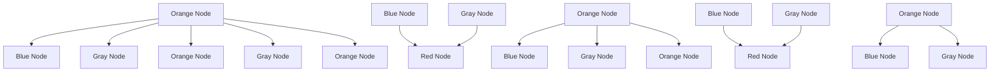
</details>

FIGURE 10.19. Dropout Learning. Left: a fully connected network. Right: network with dropout in the input and hidden layer. The nodes in grey are selected at random, and ignored in an instance of training.

# 10.7.3 Dropout Learning

The second row in Table 10.1 is labeled dropout. This is a relatively new and efcient form of regularization, similar in some respects to ridge regularization. Inspired by random forests (Section 8.2), the idea is to randomly remove a fraction φ of the units in a layer when ftting the model. Figure 10.19 illustrates this. This is done separately each time a training observation is processed. The surviving units stand in for those missing, and their weights are scaled up by a factor of 1/(1 − φ) to compensate. This prevents nodes from becoming over-specialized, and can be seen as a form of regularization. In practice dropout is achieved by randomly setting the activations for the “dropped out” units to zero, while keeping the architecture intact.

dropout

# 10.7.4 Network Tuning

The network in Figure 10.4 is considered to be relatively straightforward; it nevertheless requires a number of choices that all have an efect on the performance:

• The number of hidden layers, and the number of units per layer. Modern thinking is that the number of units per hidden layer can be large, and overftting can be controlled via the various forms of regularization.   
• Regularization tuning parameters. These include the dropout rate φ and the strength λ of lasso and ridge regularization, and are typically set separately at each layer.   
• Details of stochastic gradient descent. These include the batch size, the number of epochs, and if used, details of data augmentation (Section 10.3.4.)

Choices such as these can make a diference. In preparing this MNIST example, we achieved a respectable 1.8% misclassifcation error after some trial and error. Finer tuning and training of a similar network can get under 1% error on these data, but the tinkering process can be tedious, and can result in overftting if done carelessly.


<details>
<summary>line</summary>

| Degrees of Freedom | Training Error | Test Error |
| ------------------- | -------------- | ---------- |
| 2                   | 0.65           | 0.55       |
| 4                   | 0.15           | 0.18       |
| 6                   | 0.10           | 0.15       |
| 8                   | 0.08           | 0.12       |
| 10                  | 0.07           | 0.18       |
| 12                  | 0.06           | 0.15       |
| 14                  | 0.05           | 0.40       |
| 16                  | 0.03           | 2.00       |
| 18                  | 0.02           | 1.60       |
| 20                  | 0.01           | 0.55       |
| 22                  | 0.01           | 0.35       |
| 24                  | 0.01           | 0.25       |
| 26                  | 0.01           | 0.25       |
| 28                  | 0.01           | 0.25       |
| 30                  | 0.01           | 0.25       |
| 32                  | 0.01           | 0.25       |
| 34                  | 0.01           | 0.25       |
| 36                  | 0.01           | 0.25       |
| 38                  | 0.01           | 0.25       |
| 40                  | 0.01           | 0.25       |
| 42                  | 0.01           | 0.25       |
| 44                  | 0.01           | 0.25       |
| 46                  | 0.01           | 0.25       |
| 48                  | 0.01           | 0.25       |
| 50                  | 0.01           | 0.25       |
| 52                  | 0.01           | 0.25       |
| 54                  | 0.01           | 0.25       |
| 56                  | 0.01           | 0.25       |
| 58                  | 0.01           | 0.25       |
| 60                  | 0.01           | 0.25       |
</details>

FIGURE 10.20. Double descent phenomenon, illustrated using error plots for a one-dimensional natural spline example. The horizontal axis refers to the number of spline basis functions on the log scale. The training error hits zero when the degrees of freedom coincides with the sample size $n = 2 0 .$ , the “interpolation threshold”, and remains zero thereafter. The test error increases dramatically at this threshold, but then descends again to a reasonable value before fnally increasing again.

# 10.8 Interpolation and Double Descent

Throughout this book, we have repeatedly discussed the bias-variance tradeof, frst presented in Section 2.2.2. This trade-of indicates that statistical learning methods tend to perform the best, in terms of test-set error, for an intermediate level of model complexity. In particular, if we plot “fexibility” on the x-axis and error on the y-axis, then we generally expect to see that test error has a U-shape, whereas training error decreases monotonically. Two “typical” examples of this behavior can be seen in the right-hand panel of Figure 2.9 on page 29, and in Figure 2.17 on page 39. One implication of the bias-variance trade-of is that it is generally not a good idea to interpolate the training data — that is, to get zero training error — since that will often result in very high test error.

However, it turns out that in certain specifc settings it can be possible for a statistical learning method that interpolates the training data to perform well — or at least, better than a slightly less complex model that does not quite interpolate the data. This phenomenon is known as double descent, and is displayed in Figure 10.20. “Double descent” gets its name from the fact that the test error has a U-shape before the interpolation threshold is reached, and then it descends again (for a while, at least) as an increasingly fexible model is ft.

We now describe the set-up that resulted in Figure 10.20. We simulated $n = 2 0$ observations from the model

$$
Y = \sin (X) + \epsilon ,
$$

where $X \sim U [ - 5 , 5 ]$ (uniform distribution), and $\epsilon \sim N ( 0 , \sigma ^ { 2 } )$ ) with $\sigma = 0 . 3$ . We then ft a natural spline to the data, as described in Section 7.4, with d degrees of freedom.22 Recall from Section 7.4 that ftting a natural spline with d degrees of freedom amounts to ftting a least-squares regression of the response onto a set of d basis functions. The upper-left panel of Figure 10.21 shows the data, the true function $f ( X )$ , and ${ \hat { f } } _ { 8 } ( X )$ , the ftted natural spline with $d = 8$ degrees of freedom.


<details>
<summary>line</summary>

| x    | y      |
| ---- | ------ |
| -5   | 1.0    |
| -4   | 0.5    |
| -3   | 0.0    |
| -2   | -0.5   |
| -1   | -1.0   |
| 0    | -0.5   |
| 1    | 0.0    |
| 2    | 0.5    |
| 3    | 1.0    |
| 4    | 0.5    |
| 5    | 0.0    |
</details>


<details>
<summary>line</summary>

| x    | y      |
| ---- | ------ |
| -4.5 | 1.0    |
| -4.0 | 0.8    |
| -3.5 | 0.6    |
| -3.0 | 0.4    |
| -2.5 | 0.2    |
| -2.0 | 0.0    |
| -1.5 | -0.2   |
| -1.0 | -0.4   |
| -0.5 | -0.6   |
| 0.0  | -0.8   |
| 0.5  | -1.0   |
| 1.0  | -1.2   |
| 1.5  | -1.4   |
| 2.0  | -1.6   |
| 2.5  | -1.8   |
| 3.0  | -2.0   |
| 3.5  | -2.2   |
| 4.0  | -2.4   |
| 4.5  | -2.6   |
</details>


<details>
<summary>line</summary>

| x    | y (black line) | y (orange line) |
| ---- | -------------- | --------------- |
| -5   | 1.0            | 1.0             |
| -4   | 0.5            | 0.5             |
| -3   | 0.0            | 0.0             |
| -2   | -0.5           | -0.5            |
| -1   | -1.0           | -1.0            |
| 0    | -0.5           | -0.5            |
| 1    | 0.0            | 0.0             |
| 2    | 0.5            | 0.5             |
| 3    | 0.0            | 0.0             |
| 4    | -0.5           | -0.5            |
| 5    | -1.0           | -1.0            |
</details>


<details>
<summary>line</summary>

| x    | y1     | y2     |
| ---- | ------ | ------ |
| -5   | 1.0    | 2.5    |
| -4   | 0.5    | 1.0    |
| -3   | 0.0    | -0.5   |
| -2   | -0.5   | -1.0   |
| -1   | -1.0   | -1.5   |
| 0    | -0.5   | 0.0    |
| 1    | 0.0    | 1.0    |
| 2    | 0.5    | 1.5    |
| 3    | 0.0    | 0.5    |
| 4    | -0.5   | -1.0   |
| 5    | -1.0   | -3.0   |
</details>

FIGURE 10.21. Fitted functions ${ \hat { f } } _ { d } ( X )$ (orange), true function f (X) (black) and the observed 20 training data points. A diferent value of d (degrees of freedom) is used in each panel. For $d \geq 2 0$ the orange curves all interpolate the training points, and hence the training error is zero.

Next, we ft a natural spline with $d = 2 0$ degrees of freedom. Since $n = 2 0$ , this means that $n = d ,$ , and we have zero training error; in other words, we have interpolated the training data! We can see from the top-right panel of Figure 10.21 that ${ \hat { f } } _ { 2 0 } ( X )$ makes wild excursions, and hence the test error will be large.

We now continue to ft natural splines to the data, with increasing values of d. For $d > 2 0$ , the least squares regression of Y onto d basis functions is not unique: there are an infnite number of least squares coefcient estimates that achieve zero error. To select among them, we choose the one with the smallest sum of squared coefcients, $\textstyle \sum _ { j = 1 } ^ { d } \hat { \beta } _ { j } ^ { 2 }$ . This is known as the minimum-norm solution.

The two lower panels of Figure 10.21 show the minimum-norm natural spline fts with $d = 4 2$ and $d = 8 0$ degrees of freedom. Incredibly, ${ \hat { f } } _ { 4 2 } ( X )$ is quite a bit less less wild than ${ \hat { f } } _ { 2 0 } ( X )$ , even though it makes use of more degrees of freedom. And ${ \hat { f } } _ { 8 0 } ( X )$ is not much diferent. How can this be? Essentially, ${ \hat { f } } _ { 2 0 } ( X )$ is very wild because there is just a single way to interpolate $n = 2 0$ observations using d = 20 basis functions, and that single way results in a somewhat extreme ftted function. By contrast, there are an infnite number of ways to interpolate $n = 2 0$ observations using $d = 4 2$ or $d = 8 0$ basis functions, and the smoothest of them — that is, the minimum norm solution — is much less wild than ${ \hat { f } } _ { 2 0 } ( X ) !$

In Figure 10.20, we display the training error and test error associated with ${ \hat { f } } _ { d } ( X )$ , for a range of values of the degrees of freedom d. We see that the training error drops to zero once $d = 2 0$ and beyond; i.e. once the interpolation threshold is reached. By contrast, the test error shows a U - shape for $d \leq 2 0$ , grows extremely large around $d = 2 0$ , and then shows a second region of descent for $d > 2 0$ . For this example the signal-to-noise ratio $- \operatorname { V a r } ( f ( X ) ) / \sigma ^ { 2 }$ — is 5.9, which is quite high (the data points are close to the true curve). So an estimate that interpolates the data and does not wander too far inbetween the observed data points will likely do well.

In Figures 10.20 and 10.21, we have illustrated the double descent phenomenon in a simple one-dimensional setting using natural splines. However, it turns out that the same phenomenon can arise for deep learning. Basically, when we ft neural networks with a huge number of parameters, we are sometimes able to get good results with zero training error. This is particularly true in problems with high signal-to-noise ratio, such as natural image recognition and language translation, for example. This is because the techniques used to ft neural networks, including stochastic gradient descent, naturally lend themselves to selecting a “smooth” interpolating model that has good test-set performance on these kinds of problems.

Some points are worth emphasizing:

• The double-descent phenomenon does not contradict the bias-variance trade-of, as presented in Section 2.2.2. Rather, the double-descent curve seen in the right-hand side of Figure 10.20 is a consequence of the fact that the x-axis displays the number of spline basis functions used, which does not properly capture the true “fexibility” of models that interpolate the training data. Stated another way, in this example, the minimum-norm natural spline with d = 42 has lower variance than the natural spline with $d = 2 0$ .   
• Most of the statistical learning methods seen in this book do not exhibit double descent. For instance, regularization approaches typically do not interpolate the training data, and thus double descent does not occur. This is not a drawback of regularized methods: they can give great results without interpolating the data!   
In particular, in the examples here, if we had ft the natural splines using ridge regression with an appropriately-chosen penalty rather than least squares, then we would not have seen double descent, and in fact would have obtained better test error results.   
• In Chapter 9, we saw that maximal margin classifers and SVMs that have zero training error nonetheless often achieve very good test error. This is in part because those methods seek smooth minimum norm solutions. This is similar to the fact that the minimum-norm natural spline can give good results with zero training error.   
• The double-descent phenomenon has been used by the machine learning community to explain the successful practice of using an over-

parametrized neural network (many layers, and many hidden units), and then ftting all the way to zero training error. However, ftting to zero error is not always optimal, and whether it is advisable depends on the signal-to-noise ratio. For instance, we may use ridge regularization to avoid overftting a neural network, as in (10.31). In this case, provided that we use an appropriate choice for the tuning parameter λ, we will never interpolate the training data, and thus will not see the double descent phenomenon. Nonetheless we can get very good test-set performance, likely much better than we would have achieved had we interpolated the training data. Early stopping during stochastic gradient descent can also serve as a form of regularization that prevents us from interpolating the training data, while still getting very good results on test data.

To summarize: though double descent can sometimes occur in neural networks, we typically do not want to rely on this behavior. Moreover, it is important to remember that the bias-variance trade-of always holds (though it is possible that test error as a function of fexibility may not exhibit a U-shape, depending on how we have parametrized the notion of “fexibility” on the x-axis).

# 10.9 Lab: Deep Learning

In this section we demonstrate how to ft the examples discussed in the text. We use the Python torch package, along with the pytorch\_lightning package which provides utilities to simplify ftting and evaluating models. This code can be impressively fast with certain special processors, such as Apple’s new M1 chip. The package is well-structured, fexible, and will feel comfortable to Python users. A good companion is the site pytorch.org/tutorials. Much of our code is adapted from there, as well as the pytorch\_lightning documentation.23

We start with several standard imports that we have seen before.

In [1]:   
```python
import numpy as np, pandas as pd
from matplotlib.pyplot import subplots
from sklearn.linear_model import \
    (LinearRegression,
    LogisticRegression,
    Lasso)
from sklearn.preprocessing import StandardScaler
from sklearn.model_selection import KFold
from sklearn.pipeline import Pipeline
from ISLP import load_data
from ISLP.models import ModelSpec as MS
from sklearn.model_selection import \
    (train_test_split,
    GridSearchCV) 
```

torch pytorch\_ lightning

# Torch-Specifc Imports

There are a number of imports for torch. (These are not included with ISLP, so must be installed separately.) First we import the main library and essential tools used to specify sequentially-structured networks.

```python
In [2]: import torch
from torch import nn
from torch.optim import RMSprop
from torch.utils.data import TensorDataset 
```

There are several other helper packages for torch. For instance, the torchmetrics package has utilities to compute various metrics to evaluate performance when ftting a model. The torchinfo package provides a useful summary of the layers of a model. We use the read\_image() function when loading test images in Section 10.9.4.

```txt
torchmetrics
torchinfo
read_image() 
```

```python
In [3]: from torchmetrics import (MeanAbsoluteError, R2Score)
from torchinfo import summary
from torchvision.io import read_image 
```

The package pytorch\_lightning is a somewhat higher-level interface to torch that simplifes the specifcation and ftting of models by reducing the amount of boilerplate code needed (compared to using torch alone).

```python
In [4]: from pytorch_lightning import Trainer
from pytorch_lightning.loggers import CSVLogger 
```

In order to reproduce results we use seed\_everything(). We will also instruct torch to use deterministic algorithms where possible.

```txt
seed_
everything() 
```

```python
In [5]: from pytorch_lightning.utilities.seed import seed_everything
seed_everything(0, workers=True)
torch.use_deterministic_algorithms(True, warn_only=True) 
```

We will use several datasets shipped with torchvision for our examples: a pretrained network for image classifcation, as well as some transforms used for preprocessing.

```txt
torchvision 
```

```python
In [6]: from torchvision.datasets import MNIST, CIFAR100
from torchvision.models import (resnet50,
ResNet50_Weights)
from torchvision.transforms import (Resize,
Normalize,
CenterCrop,
ToTensor) 
```

We have provided a few utilities in ISLP specifcally for this lab. The SimpleDataModule and SimpleModule are simple versions of objects used in pytorch\_lightning, the high-level module for ftting torch models. Although more advanced uses such as computing on graphical processing units (GPUs) and parallel data processing are possible in this module, we will not be focusing much on these in this lab. The ErrorTracker handles collections of targets and predictions over each mini-batch in the validation or test stage, allowing computation of the metric over the entire validation or test data set.

```python
In [7]: from ISLP.torch import (SimpleDataModule, SimpleModule, ErrorTracker, rec_num_workers) 
```

In addition we have included some helper functions to load the IMDb database, as well as a lookup that maps integers to particular keys in the database. We’ve included a slightly modifed copy of the preprocessed IMDb data from keras, a separate package for ftting deep learning models. This keras saves us signifcant preprocessing and allows us to focus on specifying and ftting the models themselves.

```python
In [8]: from ISLP.torch.imdb import (load_lookup, load_tensor, load_sparse, load_sequential) 
```

Finally, we introduce some utility imports not directly related to torch. The glob() function from the glob module is used to fnd all fles matching glob() glob() wildcard characters, which we will use in our example applying the ResNet50 model to some of our own images. The json module will be used to load a json json JSON fle for looking up classes to identify the labels of the pictures in the ResNet50 example.

```txt
In [9]: from glob import glob import json 
```

# 10.9.1 Single Layer Network on Hitters Data

We start by ftting the models in Section 10.6 on the Hitters data.

```python
In [10]: Hitters = load_data('Hitters').dropna()
n = Hitters.shape[0] 
```

We will ft two linear models (least squares and lasso) and compare their performance to that of a neural network. For this comparison we will use mean absolute error on a validation dataset.

$$
\operatorname{MAE} (y, \hat {y}) = \frac {1}{n} \sum_ {i = 1} ^ {n} | y _ {i} - \hat {y} _ {i} |.
$$

We set up the model matrix and the response.

```python
In [11]: model = MS(Hitters.columns.drop('Salary'), intercept=False)
X = model.fit_transform(Hitters).to_numpy()
Y = Hitters['Salary'].to_numpy() 
```

The to\_numpy() method above converts pandas data frames or series to numpy arrays. We do this because we will need to use sklearn to ft the lasso model, and it requires this conversion. We also use a linear regression method from sklearn, rather than the method in Chapter 3 from statsmodels, to facilitate the comparisons.

We now split the data into test and training, fxing the random state used by sklearn to do the split.

to\_numpy()

In [12]:   
```erlang
(X_train,
X_test,
Y_train,
Y_test) = train_test_split(X,
    Y,
    test_size=1/3,
    random_state=1) 
```

# Linear Models

We ft the linear model and evaluate the test error directly.

In [13]:   
```txt
hit_lm = LinearRegression().fit(X_train, Y_train)
Yhat_test = hit_lm.predict(X_test)
np.abs(Yhat_test - Y_test).mean() 
```  
Out[13]: 259.7153

Next we ft the lasso using sklearn. We are using mean absolute error to select and evaluate a model, rather than mean squared error. The specialized solver we used in Section 6.5.2 uses only mean squared error. So here, with a bit more work, we create a cross-validation grid and perform the cross-validation directly.

We encode a pipeline with two steps: we frst normalize the features using a StandardScaler() transform, and then ft the lasso without further normalization.

In [14]:   
```python
scaler = StandardScaler(with_mean=True, with_std=True)
lasso = Lasso(warm_start=True, max_iter=30000)
standard_lasso = Pipeline(steps=['scaler', scaler), ('lasso', lasso)]) 
```

We need to create a grid of values for λ. As is common practice, we choose a grid of 100 values of λ, uniform on the log scale from lam\_max down to 0.01\*lam\_max. Here lam\_max is the smallest value of λ with an allzero solution. This value equals the largest absolute inner-product between any predictor and the (centered) response.24

In [15]:   
```python
X_s = scaler.fit_transform(X_train)
n = X_s.shape[0]
lam_max = np.fabs(X_s.T.dot(Y_train - Y_train.mean()).max() / n
param_grid = {'alpha': np.exp(np.linspace(0, np.log(0.01), 100))
    * lam_max} 
```

Note that we had to transform the data frst, since the scale of the variables impacts the choice of λ. We now perform cross-validation using this sequence of λ values.

In [16]:   
```python
cv = KFold(10,
    shuffle=True,
    random_state=1)
grid = GridSearchCV(lasso, 
```

```txt
param_grid,
cv=cv,
scoring='neg_mean_absolute_error')
grid.fit(X_train, Y_train); 
```

We extract the lasso model with best cross-validated mean absolute error, and evaluate its performance on X\_test and Y\_test, which were not used in cross-validation.

```python
In [17]: trained_lasso = grid.best_estimator_Yhat_test = trained_lasso.predict(X_test) np.fabs(Yhat_test - Y_test).mean() 
```

```txt
Out [17]: 257.2382 
```

This is similar to the results we got for the linear model ft by least squares. However, these results can vary a lot for diferent train/test splits; we encourage the reader to try a diferent seed in code block 12 and rerun the subsequent code up to this point.

# Specifying a Network: Classes and Inheritance

To ft the neural network, we frst set up a model structure that describes the network. Doing so requires us to defne new classes specifc to the model we wish to ft. Typically this is done in pytorch by sub-classing a generic representation of a network, which is the approach we take here. Although this example is simple, we will go through the steps in some detail, since it will serve us well for the more complex examples to follow.

```python
In [18]: class HittersModel(nn.Module):
    def __init__(self, input_size):
    super(HittersModel, self).__init__()
    self.flatten = nn.Flatten()
    self.Sequential = nn.Sequential(
    nn.Linear(input_size, 50),
    nn.ReLU(),
    nn.Dropout(0.4),
    nn.Linear(50, 1))

    def forward(self, x):
    x = self.flatten(x)
    return torch.flatten(self.Sequential(x)) 
```

The class statement identifes the code chunk as a declaration for a class HittersModel that inherits from the base class nn.Module. This base class is ubiquitous in torch and represents the mappings in the neural networks.

Indented beneath the class statement are the methods of this class: in this case \_\_init\_\_ and forward. The \_\_init\_\_ method is called when an instance of the class is created as in the cell below. In the methods, self always refers to an instance of the class. In the \_\_init\_\_ method, we have attached two objects to self as attributes: flatten and sequential. These are used in the forward method to describe the map that this module implements.

There is one additional line in the \_\_init\_\_ method, which is a call to super(). This function allows subclasses (i.e. HittersModel) to access methods of the class they inherit from. For example, the class nn.Module has its own \_\_init\_\_ method, which is diferent from the HittersModel.\_\_init\_\_() method we’ve written above. Using super() allows us to call the method of the base class. For torch models, we will always be making this super() call as it is necessary for the model to be properly interpreted by torch.

super()

The object nn.Module has more methods than simply \_\_init\_\_ and forward. These methods are directly accessible to HittersModel instances because of this inheritance. One such method we will see shortly is the eval() method, used to disable dropout for when we want to evaluate the model on test data.

```txt
In [19]: hit_model = HittersModel(X.shape[1]) 
```

The object self.sequential is a composition of four maps. The frst maps the 19 features of Hitters to 50 dimensions, introducing 50 19 + 50 parameters for the weights and intercept of the map (often called the bias). This layer is then mapped to a ReLU layer followed by a 40% dropout layer, and fnally a linear map down to 1 dimension, again with a bias. The total number of trainable parameters is therefore 50  19 + 50 + 50 + 1 = 1051.

The package torchinfo provides a summary() function that neatly summarizes this information. We specify the size of the input and see the size of each tensor as it passes through layers of the network.

```python
In [20]: summary(hit_model,
    input_size=X_train.shape,
    col_names=['input_size',
    'output_size',
    'num_params']) 
```

<table><tr><td>Layer (type:depth-idx)</td><td>Input Shape</td><td>Output Shape</td><td>Param #</td></tr><tr><td>HittersModel</td><td>[175, 19]</td><td>[175]</td><td>--</td></tr><tr><td>Flatten: 1-1</td><td>[175, 19]</td><td>[175, 19]</td><td>--</td></tr><tr><td>Sequential: 1-2</td><td>[175, 19]</td><td>[175, 1]</td><td>--</td></tr><tr><td>Linear: 2-1</td><td>[175, 19]</td><td>[175, 50]</td><td>1,000</td></tr><tr><td>ReLU: 2-2</td><td>[175, 50]</td><td>[175, 50]</td><td>--</td></tr><tr><td>Dropout: 2-3</td><td>[175, 50]</td><td>[175, 50]</td><td>--</td></tr><tr><td>Linear: 2-4</td><td>[175, 50]</td><td>[175, 1]</td><td>51</td></tr></table>

Total params: 1,051

Trainable params: 1,051

We have truncated the end of the output slightly, here and in subsequent uses.

We now need to transform our training data into a form accessible to torch. The basic datatype in torch is a tensor, which is very similar to an ndarray from early chapters. We also note here that torch typically works with 32-bit (single precision) rather than 64-bit (double precision) foating point numbers. We therefore convert our data to np.float32 before forming the tensor. The X and Y tensors are then arranged into a Dataset

Dataset

recognized by torch using TensorDataset().

In [21]:

```python
X_train_t = torch.tensor(X_train.astype(np.float32))
Y_train_t = torch.tensor(Y_train.astype(np.float32))
hit_train = TensorDataset(X_train_t, Y_train_t) 
```

Tensor Dataset()

We do the same for the test data.

In [22]:

```python
X_test_t = torch.tensor(X_test.astype(np.float32))
Y_test_t = torch.tensor(Y_test.astype(np.float32))
hit_test = TensorDataset(X_test_t, Y_test_t) 
```

Finally, this dataset is passed to a DataLoader() which ultimately passes data into our network. While this may seem like a lot of overhead, this structure is helpful for more complex tasks where data may live on diferent machines, or where data must be passed to a GPU. We provide a helper function SimpleDataModule() in ISLP to make this task easier for standard usage. One of its arguments is num\_workers, which indicates how many processes we will use for loading the data. For small data like Hitters this will have little efect, but it does provide an advantage for the MNIST and CIFAR100 examples below. The torch package will inspect the process running and determine a maximum number of workers.25 We’ve included a function rec\_num\_workers() to compute this so we know how many workers might be reasonable (here the max was 16).

SimpleDataModule()

In [23]:

```python
max_num_workers = rec_num_workers() 
```

The general training setup in pytorch\_lightning involves training, validation and test data. These are each represented by diferent data loaders. During each epoch, we run a training step to learn the model and a validation step to track the error. The test data is typically used at the end of training to evaluate the model.

In this case, as we had split only into test and training, we’ll use the test data as validation data with the argument validation=hit\_test. The validation argument can be a foat between 0 and 1, an integer, or a Dataset. If a foat (respectively, integer), it is interpreted as a percentage (respectively number) of the training observations to be used for validation. If it is a Dataset, it is passed directly to a data loader.

In [24]:

```python
hit_dm = SimpleDataModule(hit_train,
    hit_test,
    batch_size=32,
    num_workers=min(4, max_num_workers),
    validation=hit_test) 
```

Next we must provide a pytorch\_lightning module that controls the steps performed during the training process. We provide methods for our SimpleModule() that simply record the value of the loss function and any additional metrics at the end of each epoch. These operations are controlled by the methods SimpleModule.[training/test/validation]\_step(), though we will not be modifying these in our examples.

```javascript
In [25]: hit_module = SimpleModule.regression(hit_model, metrics={'mae':MeanAbsoluteError()}) 
```

By using the SimpleModule.regression() method, we indicate that we will use squared-error loss as in ( 10.23). We have also asked for mean absolute error to be tracked as well in the metrics that are logged.

We log our results via CSVLogger(), which in this case stores the results in a CSV fle within a directory logs/hitters. After the ftting is complete, this allows us to load the results as a pd.DataFrame() and visualize them below. There are several ways to log the results within pytorch\_lightning, though we will not cover those here in detail.

SimpleModule.regression()

```txt
In [26]: hit_logger = CSVLogger('logs', name='hitters') 
```

Finally we are ready to train our model and log the results. We use the Trainer() object from pytorch\_lightning to do this work. The argument datamodule=hit\_dm tells the trainer how training/validation/test logs are produced, while the frst argument hit\_module specifes the network architecture as well as the training/validation/test steps. The callbacks argument allows for several tasks to be carried out at various points while training a model. Here our ErrorTracker() callback will enable us to compute validation error while training and, fnally, the test error. We now ft the model for 50 epochs.

```python
In [27]: hit_trainer = Trainer(deterministic=True,
    max_epochs=50,
    log_every_n_steps=5,
    logger=hit_logger,
    callbacks=[ErrorTracker()])
hit_trainer.fit(hit_module, datamodule=hit_dm) 
```

At each step of SGD, the algorithm randomly selects 32 training observations for the computation of the gradient. Recall from Section 10.7 that an epoch amounts to the number of SGD steps required to process n observations. Since the training set has n = 175, and we specifed a batch\_size of 32 in the construction of hit\_dm, an epoch is 175/32 = 5.5 SGD steps.

After having ft the model, we can evaluate performance on our test data using the test() method of our trainer.

```txt
In [28]: hit_trainer.test(hit_module, datamodule=hit_dm) 
```

```json
Out[28]: [{ 'test_loss': 104098.5469, 'test_mae': 229.5012}] 
```

The results of the ft have been logged into a CSV fle. We can fnd the results specifc to this run in the experiment.metrics\_file\_path attribute of our logger. Note that each time the model is ft, the logger will output results into a new subdirectory of our directory logs/hitters.

We now create a plot of the MAE (mean absolute error) as a function of the number of epochs. First we retrieve the logged summaries.

```python
hit_results = pd.read_csv(hit_logger.experiment.metrics_file_path) 
```

Since we will produce similar plots in later examples, we write a simple generic function to produce this plot.

In [29]:   
```python
def summary_plot(results,
    ax,
    col='loss',
    valid_legend='Validation',
    training_legend='Training',
    ylabel='Loss',
    fontsize=20):
    for (column,
    color,
    label) in zip([f'train_{col}_epoch',
    f'valid_{col}'],
    ['black',
    'red'],
    [training_legend,
    valid_legend]):
    results.plot(x='epoch',
    y=column,
    label=label,
    marker='o',
    color=color,
    ax=ax)
    ax.set_xlabel('Epoch')
    ax.set_ylabel(ylabel)
    return ax 
```

We now set up our axes, and use our function to produce the MAE plot.

In [30]:   
```txt
fig, ax = subplots(1, 1, figsize=(6, 6))
ax = summary_plot(hit_results,
    ax,
    col='mae',
    ylabel='MAE',
    valid_legend='Validation (=Test)')
ax.set_ylim([0, 400])
ax.set_xticks(np.linspace(0, 50, 11).astype(int)); 
```

We can predict directly from the fnal model, and evaluate its performance on the test data. Before ftting, we call the eval() method of hit\_model. This tells torch to efectively consider this model to be ftted, so that we can use it to predict on new data. For our model here, the biggest change is that the dropout layers will be turned of, i.e. no weights will be randomly dropped in predicting on new data.

In [31]:   
```txt
hit_model.eval()
preds = hit_module(X_test_t)
torch.abs(Y_test_t - preds).mean() 
```

Out[31]: tensor(229.5012, grad\_fn=<MeanBackward0 >)

# Cleanup

In setting up our data module, we had initiated several worker processes that will remain running. We delete all references to the torch objects to ensure these processes will be killed.

In [32]:

```erlang
del(Hitters,
    hit_model, hit_dm,
    hit_logger,
    hit_test, hit_train,
    X, Y,
    X_test, X_train,
    Y_test, Y_train,
    X_test_t, Y_test_t,
    hit_trainer, hit_module) 
```

# 10.9.2 Multilayer Network on the MNIST Digit Data

The torchvision package comes with a number of example datasets, including the MNIST digit data. Our frst step is to retrieve the training and test data sets; the MNIST() function within torchvision.datasets is provided for this purpose. The data will be downloaded the frst time this function is executed, and stored in the directory data/MNIST.

MNIST()

In [33]:

```txt
(mnist_train,
mnist_test) = [MNIST(root='data',
train=train,
download=True,
transform=ToTensor())
for train in [True, False]]
mnist_train 
```

Out[33]: Dataset MNIST

```swift
Number of datapoints: 60000
Root location: data
Split: Train
StandardTransform
Transform: ToTensor() 
```

There are 60,000 images in the training data and 10,000 in the test data. The images are 28 × 28, and stored as a matrix of pixels. We need to transform each one into a vector.

Neural networks are somewhat sensitive to the scale of the inputs, much as ridge and lasso regularization are afected by scaling. Here the inputs are eight-bit grayscale values between 0 and 255, so we rescale to the unit interval.26 This transformation, along with some reordering of the axes, is performed by the ToTensor() transform from the torchvision.transforms package.

As in our Hitters example, we form a data module from the training and test datasets, setting aside 20% of the training images for validation.

In [34]:

```python
mnist_dm = SimpleDataModule(mnist_train,
    mnist_test,
    validation=0.2,
    num_workers=max_num_workers,
    batch_size=256) 
```

Let’s take a look at the data that will get fed into our network. We loop through the frst few chunks of the test dataset, breaking after 2 batches:

In [35]:   
```python
for idx, (X_, Y_) in enumerate(mnist_dm.train_dataloader()):
    print('X: ', X_.shape)
    print('Y: ', Y_.shape)
    if idx >= 1:
    break 
```

```txt
X: torch.Size([256, 1, 28, 28])
Y: torch.Size([256])
X: torch.Size([256, 1, 28, 28])
Y: torch.Size([256]) 
```

We see that the X for each batch consists of 256 images of size 1x28x28. Here the 1 indicates a single channel (greyscale). For RGB images such as CIFAR100 below, we will see that the 1 in the size will be replaced by 3 for the three RGB channels.

Now we are ready to specify our neural network.

In [36]:   
```python
class MNISTModel(nn.Module):
    def __init__(self):
    super(MNISTModel, self).__init__()
    self.layer1 = nn.Sequential(
    nn.Flatten(),
    nn.Linear(28*28, 256),
    nn.ReLU(),
    nn.Dropout(0.4))
    self.layer2 = nn.Sequential(
    nn.Linear(256, 128),
    nn.ReLU(),
    nn.Dropout(0.3))
    self._forward = nn.Sequential(
    self.layer1,
    self.layer2,
    nn.Linear(128, 10))
    def forward(self, x):
    return self._forward(x) 
```

We see that in the frst layer, each 1x28x28 image is fattened, then mapped to 256 dimensions where we apply a ReLU activation with 40% dropout. A second layer maps the frst layer’s output down to 128 dimensions, applying a ReLU activation with 30% dropout. Finally, the 128 dimensions are mapped down to 10, the number of classes in the MNIST data.

In [37]:   
```python
mnist_model = MNISTModel() 
```

We can check that the model produces output of expected size based on our existing batch X\_ above.

In [38]:   
```python
mnist_model(X_).size() 
```

Out[38]:  
```txt
torch.Size([256, 10]) 
```

Let’s take a look at the summary of the model. Instead of an input\_size we can pass a tensor of correct shape. In this case, we pass through the fnal batched X\_ from above.

In [39]:

```bazel
summary(mnist_model,
    input_data=X_,
    col_names=['input_size',
    'output_size',
    'num_params']) 
```

Out[39]:

<table><tr><td>Layer (type:depth-idx)</td><td>Input Shape</td><td>Output Shape</td><td>Param #</td></tr><tr><td>MNISTModel</td><td>[256, 1, 28, 28]</td><td>[256, 10]</td><td>--</td></tr><tr><td>Sequential: 1-1</td><td>[256, 1, 28, 28]</td><td>[256, 10]</td><td>--</td></tr><tr><td>Sequential: 2-1</td><td>[256, 1, 28, 28]</td><td>[256, 256]</td><td>--</td></tr><tr><td>Flatten: 3-1</td><td>[256, 1, 28, 28]</td><td>[256, 784]</td><td>--</td></tr><tr><td>Linear: 3-2</td><td>[256, 784]</td><td>[256, 256]</td><td>200,960</td></tr><tr><td>ReLU: 3-3</td><td>[256, 256]</td><td>[256, 256]</td><td>--</td></tr><tr><td>Dropout: 3-4</td><td>[256, 256]</td><td>[256, 256]</td><td>--</td></tr><tr><td>Sequential: 2-2</td><td>[256, 256]</td><td>[256, 128]</td><td>--</td></tr><tr><td>Linear: 3-5</td><td>[256, 256]</td><td>[256, 128]</td><td>32,896</td></tr><tr><td>ReLU: 3-6</td><td>[256, 128]</td><td>[256, 128]</td><td>--</td></tr><tr><td>Dropout: 3-7</td><td>[256, 128]</td><td>[256, 128]</td><td>--</td></tr><tr><td>Linear: 2-3</td><td>[256, 128]</td><td>[256, 10]</td><td>1,290</td></tr></table>

Total params: 235,146

Trainable params: 235,146

Having set up both the model and the data module, ftting this model is now almost identical to the Hitters example. In contrast to our regression model, here we will use the SimpleModule.classification() method which uses the cross-entropy loss function instead of mean squared error.

SimpleModule. classification()

In [40]:

```python
mnist_module = SimpleModule.classification(mnist_model)
mnist_logger = CSVLogger('logs', name='MNIST') 
```

Now we are ready to go. The fnal step is to supply training data, and ft the model.

In [41]:

```python
mnist_trainer = Trainer(deterministic=True,
    max_epochs=30,
    logger=mnist_logger,
    callbacks=[ErrorTracker()])
mnist_trainer.fit(mnist_module,
    datamodule=mnist_dm) 
```

We have suppressed the output here, which is a progress report on the ftting of the model, grouped by epoch. This is very useful, since on large datasets ftting can take time. Fitting this model took 245 seconds on a MacBook Pro with an Apple M1 Pro chip with 10 cores and 16 GB of RAM. Here we specifed a validation split of 20%, so training is actually performed on 80% of the 60,000 observations in the training set. This is an alternative to actually supplying validation data, like we did for the Hitters data. SGD uses batches of 256 observations in computing the gradient, and doing the arithmetic, we see that an epoch corresponds to 188 gradient steps.

SimpleModule.classification() includes an accuracy metric by default. Other classifcation metrics can be added from torchmetrics. We will use our summary\_plot() function to display accuracy across epochs.

```matlab
In [42]: mnist_results = pd.read_csv(mnist_logger.experiment.metrics_file_path)
fig, ax = subplots(1, 1, figsize=(6, 6))
summary_plot(mnist_results,
    ax,
    col='accuracy',
    ylabel='Accuracy')
ax.set_ylim([0.5, 1])
ax.set_ylabel('Accuracy')
ax.set_xticks(np.linspace(0, 30, 7).astype(int)); 
```

Once again we evaluate the accuracy using the test() method of our trainer. This model achieves 97% accuracy on the test data.

```javascript
In [43]: mnist_trainer.test(mnist_module, datamodule=mnist_dm)
```

```txt
Out[43]: [{ 'test_loss': 0.1471, 'test_accuracy': 0.9681}] 
```

Table 10.1 also reports the error rates resulting from LDA (Chapter 4) and multiclass logistic regression. For LDA we refer the reader to Section 4.7.3. Although we could use the sklearn function LogisticRegression() to ft multiclass logistic regression, we are set up here to ft such a model with torch. We just have an input layer and an output layer, and omit the hidden layers!

```python
In [44]: class MNIST_MLR(nn.Module):
    def __init__(self):
    super(MNIST_MLR, self).__init__()
    self.linear = nn.Sequential(nn.Flatten(),
    nn.Linear(784, 10))
    def forward(self, x):
    return self.linear(x)

mlr_model = MNIST_MLR()
mlr_module = SimpleModule.classification(mlr_model)
mlr_logger = CSVLogger('logs', name='MNIST_MLR') 
```

```python
In [45]: mlr_trainer = Trainer(deterministic=True, max_epochs=30, callbacks=[ErrorTracker()])
mlr_trainer.fit(mlr_module, datamodule=mnist_dm) 
```

We ft the model just as before and compute the test results.

```txt
In [46]: mlr_trainer.test(mlr_module, datamodule=mnist_dm) 
```

```txt
Out[46]: [{ 'test_loss': 0.3187, 'test_accuracy': 0.9241}] 
```

The accuracy is above 90% even for this pretty simple model.

As in the Hitters example, we delete some of the objects we created above.

```txt
In [47]: del(mnist_test, mnist_train, 
```

```txt
mnist_model,
mnist_dm,
mnist_trainer,
mnist_module,
mnist_results,
mlr_model,
mlr_module,
mlr_trainer) 
```

# 10.9.3 Convolutional Neural Networks

In this section we ft a CNN to the CIFAR100 data, which is available in the torchvision package. It is arranged in a similar fashion as the MNIST data.

In [48]:   
```python
(cifar_train,
    cifar_test) = [CIFAR100(root="data",
    train=train,
    download=True)
    for train in [True, False]] 
```

In [49]:   
```python
transform = ToTensor()
cifar_train_X = torch.stack([transform(x) for x in
    cifar_train.data])
cifar_test_X = torch.stack([transform(x) for x in
    cifar_test.data])
cifar_train = TensorDataset(cifar_train_X,
    torch.tensor(cifar_train.targets))
cifar_test = TensorDataset(cifar_test_X,
    torch.tensor(cifar_test.targets)) 
```

The CIFAR100 dataset consists of 50,000 training images, each represented by a three-dimensional tensor: each three-color image is represented as a set of three channels, each of which consists of 32 × 32 eight-bit pixels. We standardize as we did for the digits, but keep the array structure. This is accomplished with the ToTensor() transform.

Creating the data module is similar to the MNIST example.

In [50]:   
```python
cifar_dm = SimpleDataModule(cifar_train,
    cifar_test,
    validation=0.2,
    num_workers=max_num_workers,
    batch_size=128) 
```

We again look at the shape of typical batches in our data loaders.

In [51]:   
```python
for idx, (X_, Y_) in enumerate(cifar_dm.train_dataloader()):
    print('X: ', X_.shape)
    print('Y: ', Y_.shape)
    if idx >= 1:
    break 
```

```elixir
X: torch.Size([128, 3, 32, 32])
Y: torch.Size([128])
X: torch.Size([128, 3, 32, 32])
Y: torch.Size([128]) 
```

Before we start, we look at some of the training images; similar code produced Figure 10.5 on page 406. The example below also illustrates that TensorDataset objects can be indexed with integers — we are choosing random images from the training data by indexing cifar\_train. In order to display correctly, we must reorder the dimensions by a call to np.transpose().

In [52]:   
```python
fig, axes = subplots(5, 5, figsize=(10,10))
rng = np.random.default_rng(4)
indices = rng.choice(np.arange(len(cifar_train)), 25, replace=False).reshape((5,5))
for i in range(5):
    for j in range(5):
    idx = indices[i,j]
    axes[i,j].imshow(np.transpose(cifar_train[idx][0], [1,2,0]), interpolation=None)
    axes[i,j].set_xticks([])
    axes[i,j].set_yticks([]) 
```

.imshow()

Here the imshow() method recognizes from the shape of its argument that it is a 3-dimensional array, with the last dimension indexing the three RGB color channels.

We specify a moderately-sized CNN for demonstration purposes, similar in structure to Figure 10.8. We use several layers, each consisting of convolution, ReLU, and max-pooling steps. We frst defne a module that defnes one of these layers. As in our previous examples, we overwrite the \_init\_\_() and forward() methods of nn.Module. This user-defned module can now be used in ways just like nn.Linear() or nn.Dropout().

In [53]:   
```python
class BuildingBlock(nn.Module):
    def __init__(self,
    in_channels,
    out_channels):
    super(BuildingBlock, self).__init__()
    self.conv = nn.Conv2d(in_channels=in_channels,
    out_channels=out_channels,
    kernel_size=(3,3),
    padding='same')
    self.activation = nn.ReLU()
    self.pool = nn.MaxPool2d(kernel_size=(2,2))

    def forward(self, x):
    return self.pool(self.activation(self.conv(x))) 
```

Notice that we used the padding = "same" argument to nn.Conv2d(), which ensures that the output channels have the same dimension as the input channels. There are 32 channels in the frst hidden layer, in contrast to the three channels in the input layer. We use a 3 3 convolution flter for each channel in all the layers. Each convolution is followed by a max-pooling layer over 2  2 blocks.

In forming our deep learning model for the CIFAR100 data, we use several of our BuildingBlock() modules sequentially. This simple example illustrates some of the power of torch. Users can defne modules of their own, which can be combined in other modules. Ultimately, everything is ft by a generic trainer.

In [54]:   
```python
class CIFARModel(nn.Module):
    def __init__(self):
    super(CIFARModel, self).__init__()
    sizes = [(3, 32),
    (32, 64),
    (64, 128),
    (128, 256)]
    self.conv = nn.Sequential(*[BuildingBlock(in_, out_)
    for in_, out_ in sizes])

    self.output = nn.Sequential(nn.Dropout(0.5),
    nn.Linear(2*2*256, 512),
    nn.ReLU(),
    nn.Linear(512, 100))

    def forward(self, x):
    val = self.conv(x)
    val = torch.flatten(val, start_dim=1)
    return self.output(val) 
```

We build the model and look at the summary. (We had created examples of X\_ earlier.)

In [55]:   
```bazel
cifar_model = CIFARModel()
summary(cifar_model,
    input_data=X_,
    col_names=['input_size',
    'output_size',
    'num_params']) 
```

Out[55]:   
```txt
Layer (type:depth-idx) Input Shape Output Shape Param #
CIFARModel [128, 3, 32, 32] [128, 100] -- Sequential: 1-1 [128, 3, 32, 32] [128, 256, 2, 2] -- BuildingBlock: 2-1 [128, 3, 32, 32] [128, 32, 16, 16] -- Conv2d: 3-1 [128, 3, 32, 32] [128, 32, 32, 32] 896 ReLU: 3-2 [128, 32, 32, 32] [128, 32, 32, 32] -- MaxPool2d: 3-3 [128, 32, 32, 32] [128, 32, 16, 16] -- BuildingBlock: 2-2 [128, 32, 16, 16] [128, 64, 8, 8] -- Conv2d: 3-4 [128, 32, 16, 16] [128, 64, 16, 16] 18,496 ReLU: 3-5 [128, 64, 16, 16] [128, 64, 16, 16] -- MaxPool2d: 3-6 [128, 64, 16, 16] [128, 64, 8, 8] -- BuildingBlock: 2-3 [128, 64, 8, 8] [128, 128, 4, 4] -- Conv2d: 3-7 [128, 64, 8, 8] [128, 128, 8, 8] 73,856 ReLU: 3-8 [128, 128, 8, 8] [128, 128, 8, 8] -- MaxPool2d: 3-9 [128, 128, 8, 8] [128, 128, 4, 4] -- BuildingBlock: 2-4 [128, 128, 4, 4] [128, 256, 2, 2] -- Conv2d: 3-10 [128, 128, 4, 4] [128, 256, 4, 4] 295,168 ReLU: 3-11 [128, 256, 4, 4] [128, 256, 4, 4] -- MaxPool2d: 3-12 [128, 256, 4, 4] [128, 256, 2, 2] -- Sequential: 1-2 [128, 1024] [128, 100] -- Dropout: 2-5 [128, 1024] [128, 1024] -- Linear: 2-6 [128, 1024] [128, 512] 524,800 
```

<table><tr><td>ReLU: 2-7</td><td>[128, 512]</td><td>[128, 512]</td><td>--</td></tr><tr><td>Linear: 2-8</td><td>[128, 512]</td><td>[128, 100]</td><td>51,300</td></tr></table>

Total params: 964,516

Trainable params: 964,516

The total number of trainable parameters is 964,516. By studying the size of the parameters, we can see that the channels halve in both dimensions after each of these max-pooling operations. After the last of these we have a layer with 256 channels of dimension 2 × 2. These are then fattened to a dense layer of size 1,024; in other words, each of the 2  2 matrices is turned into a 4-vector, and put side-by-side in one layer. This is followed by a dropout regularization layer, then another dense layer of size 512, and fnally, the output layer.

Up to now, we have been using a default optimizer in SimpleModule(). For these data, experiments show that a smaller learning rate performs better than the default 0.01. We use a custom optimizer here with a learning rate of 0.001. Besides this, the logging and training follow a similar pattern to our previous examples. The optimizer takes an argument params that informs the optimizer which parameters are involved in SGD (stochastic gradient descent).

We saw earlier that entries of a module’s parameters are tensors. In passing the parameters to the optimizer we are doing more than simply passing arrays; part of the structure of the graph is encoded in the tensors themselves.

```python
In [56]: cifar_optimizer = RMSprop(cifar_model.parameters(), lr=0.001)
cifar_module = SimpleModule.classification(cifar_model,
    optimizer=cifar_optimizer)
cifar_logger = CSVLogger('logs', name='CIFAR100') 
```

```python
In [57]: cifar_trainer = Trainer(deterministic=True,
    max_epochs=30,
    logger=cifar_logger,
    callbacks=[ErrorTracker()])
cifar_trainer.fit(cifar_module,
    datamodule=cifar_dm) 
```

This model takes 10 minutes or more to run and achieves about 42% accuracy on the test data. Although this is not terrible for 100-class data (a random classifer gets 1% accuracy), searching the web we see results around 75%. Typically it takes a lot of architecture carpentry, fddling with regularization, and time, to achieve such results.

Let’s take a look at the validation and training accuracy across epochs.

```matlab
In [58]: log_path = cifar_logger.experiment.metrics_file_path
cifar_results = pd.read_csv(log_path)
fig, ax = subplots(1, 1, figsize=(6, 6))
summary_plot(cifar_results,
    ax,
    col='accuracy',
    ylabel='Accuracy')
ax.set_xticks(np.linspace(0, 10, 6).astype(int))
ax.set_ylabel('Accuracy')
ax.set_ylim([0, 1]); 
```

Finally, we evaluate our model on our test data.

```javascript
In [59]: cifar_trainer.test(cifar_module, datamodule=cifar_dm)
```

```yaml
Out[59]: [{ 'test_loss': 2.4238 'test_accuracy': 0.4206}] 
```

# Hardware Acceleration

As deep learning has become ubiquitous in machine learning, hardware manufacturers have produced special libraries that can often speed up the gradient-descent steps.

For instance, Mac OS devices with the M1 chip may have the Metal programming framework enabled, which can speed up the torch computations. We present an example of how to use this acceleration.

The main changes are to the Trainer() call as well as to the metrics that will be evaluated on the data. These metrics must be told where the data will be located at evaluation time. This is accomplished with a call to the to() method of the metrics.

```python
In [60]: try:
    for name, metric in cifar_module.metrics.items():
    cifar_module.metrics[name] = metric.to('mps')
    cifar_trainer_mps = Trainer(accelerator='mps',
    deterministic=True,
    max_epochs=30)
    cifar_trainer_mps.fit(cifar_module,
    datamodule=cifar_dm)
    cifar_trainer_mps.test(cifar_module,
    datamodule=cifar_dm)
except:
    pass 
```

This yields approximately two- or three-fold acceleration for each epoch. We have protected this code block using try: and except: clauses; if it works, we get the speedup, if it fails, nothing happens.

# 10.9.4 Using Pretrained CNN Models

We now show how to use a CNN pretrained on the imagenet database to classify natural images, and demonstrate how we produced Figure 10.10. We copied six JPEG images from a digital photo album into the directory book\_images. These images are available from the data section of www. statlearning.com, the ISLP book website. Download book\_images.zip; when clicked it creates the book\_images directory.

The pretrained network we use is called resnet50; specifcation details can be found on the web. We will read in the images, and convert them into the array format expected by the torch software to match the specifcations in resnet50. The conversion involves a resize, a crop and then a predefned standardization for each of the three channels. We now read in the images and preprocess them.

```python
In [61]: resize = Resize((232,232))
crop = CenterCrop(224)
normalize = Normalize([0.485,0.456,0.406], [0.229,0.224,0.225])
imgfiles = sorted([f for f in glob('book_images/*')])
imgs = torch.stack([torch.div(crop(resize(read_image(f))), 255) for f in imgfiles])
imgs = normalize(imgs)
imgs.size() 
```  
Out[61]: torch.Size([6, 3, 224, 224])

We now set up the trained network with the weights we read in code block 6. The model has 50 layers, with a fair bit of complexity.

```python
In [62]: resnet_model = resnet50(weights=ResNet50_Weights.DEFAULT)
summary(resnet_model,
    input_data=imgs,
    col_names=['input_size',
    'output_size',
    'num_params']) 
```

We set the mode to eval() to ensure that the model is ready to predict on new data.

```javascript
In [63]: resnet_model.eval()
```

Inspecting the output above, we see that when setting up the resnet\_model, the authors defned a Bottleneck, much like our BuildingBlock module.

We now feed our six images through the ftted network.

```python
In [64]: img_preds = resnet_model(imgs) 
```

Let’s look at the predicted probabilities for each of the top 3 choices. First we compute the probabilities by applying the softmax to the logits in img\_preds. Note that we have had to call the detach() method on the tensor img\_preds in order to convert it to our a more familiar ndarray.

```python
In [65]: img_probs = np.exp(np.asarray(img_preds.detach()))
img_probs /= img_probs.sum(1)[:, None] 
```

In order to see the class labels, we must download the index fle associated with imagenet. 27

```python
In [66]: labs = json.load(open('imagenet_class_index.json'))
class_labels = pd.DataFrame([(int(k), v[1]) for k, v in labs.items()],
columns=['idx', 'label'])
class_labels = class_labels.set_index('idx')
class_labels = class_labels.sort_index() 
```

We’ll now construct a data frame for each image fle with the labels with the three highest probabilities as estimated by the model above.

In [67]:   
```python
for i, imgfile in enumerate(imgfiles):
    img_df = class_labels.copy()
    img_df['prob'] = img_probs[i]
    img_df = img_df.sort_values(by='prob', ascending=False)[:3]
    print(f'Image: {imgfile}')
    print(img_df.reset_index().drop(columns=['idx'])) 
```

```csv
Image: book_images/Cape_Weaver.jpg
label prob
0 jacamar 0.287283
1 bee_eater 0.046768
2 bulbul 0.037507
Image: book_images/Flamingo.jpg
label prob
0 flamingo 0.591761
1 spoonbill 0.012386
2 American_egret 0.002105
Image: book_images/Hawk_Fountain.jpg
label prob
0 great_grey_owl 0.287959
1 kite 0.039478
2 fountain 0.029384
Image: book_images/Hawk_cropped.jpg
label prob
0 kite 0.301830
1 jay 0.121674
2 magpie 0.015513
Image: book_images/Lhasa_Apso.jpg
label prob
0 Lhasa 0.151143
1 Shih-Tzu 0.129850
2 Tibetan_terrier 0.102358
Image: book_images/Sleeping_Cat.jpg
label prob
0 tabby 0.173627
1 tiger_cat 0.110414
2 doormat 0.093447 
```

We see that the model is quite confdent about Flamingo.jpg, but a little less so for the other images.

We end this section with our usual cleanup.

In [68]:   
```txt
del(cifar_test,
    cifar_train,
    cifar_dm,
    cifar_module,
    cifar_logger,
    cifar_optimizer,
    cifar_trainer) 
```

# 10.9.5 IMDB Document Classifcation

We now implement models for sentiment classifcation (Section 10.4) on the IMDB dataset. As mentioned above code block 8, we are using a preprocessed version of the IMDB dataset found in the keras package. As keras uses tensorflow, a diferent tensor and deep learning library, we have converted the data to be suitable for torch. The code used to convert from keras is available in the module ISLP.torch.\_make\_imdb. It requires some of the keras packages to run. These data use a dictionary of size 10,000.

We have stored three diferent representations of the review data for this lab:

• load\_tensor(), a sparse tensor version usable by torch;   
• load\_sparse(), a sparse matrix version usable by sklearn, since we will compare with a lasso ft;   
• load\_sequential(), a padded version of the original sequence representation, limited to the last 500 words of each review.

```python
In [69]: (imdb_seq_train,
    imdb_seq_test) = load_sequential(root='data/IMDB')
padded_sample = np.asarray(imdb_seq_train.tensors[0][0])
sample_review = padded_sample[padded_sample > 0][:12]
sample_review[:12] 
```

```javascript
Out[69]: array([1, 14, 22, 16, 43, 530, 973, 1622, 1385, 65, 458, 4468], dtype=int32) 
```

The datasets imdb\_seq\_train and imdb\_seq\_test are both instances of the class TensorDataset. The tensors used to construct them can be found in the tensors attribute, with the frst tensor the features X and the second the outcome Y. We have taken the frst row of features and stored it as padded\_sample. In the preprocessing used to form these data, sequences were padded with 0s in the beginning if they were not long enough, hence we remove this padding by restricting to entries where padded\_sample > 0. We then provide the frst 12 words of the sample review.

We can fnd these words in the lookup dictionary from the ISLP.torch.imdb module.

```python
In [70]: lookup = load_lookup(root='data/IMDB') ' '.join(lookup[i] for i in sample_review) 
```

```txt
Out[70]: "<START> this film was just brilliant casting location scenery story direction everyone's" 
```

For our frst model, we have created a binary feature for each of the 10,000 possible words in the dataset, with an entry of one in the i, j entry if word j appears in review i. As most reviews are quite short, such a feature matrix has over 98% zeros. These data are accessed using load\_tensor() from the ISLP library.

```python
In [71]: max_num_workers=10
(imdb_train,
    imdb_test) = load_tensor(root='data/IMDB')
imdb_dm = SimpleDataModule(imdb_train,
    imdb_test,
    validation=2000,
    num_workers=min(6, max_num_workers),
    batch_size=512) 
```

We’ll use a two-layer model for our frst model.

In [72]:   
```python
class IMDBModel(nn.Module):
    def __init__(self, input_size):
    super(IMDBModel, self).__init__()
    self.dense1 = nn.Linear(input_size, 16)
    self.activation = nn.ReLU()
    self.dense2 = nn.Linear(16, 16)
    self.output = nn.Linear(16, 1)

    def forward(self, x):
    val = x
    for _map in [self.dense1,
    self.activation,
    self.dense2,
    self.activation,
    self.output]:
    val = _map(val)
    return torch.flatten(val) 
```

We now instantiate our model and look at a summary (not shown).

In [73]:   
```python
imdb_model = IMDBModel(imdb_test.tensors[0].size()[1])
summary(imdb_model,
    input_size=imdb_test.tensors[0].size(),
    col_names=['input_size',
    'output_size',
    'num_params']) 
```

We’ll again use a smaller learning rate for these data, hence we pass an optimizer to the SimpleModule. Since the reviews are classifed into positive or negative sentiment, we use SimpleModule.binary\_classification().28

In [74]:   
```python
imdb_optimizer = RMSprop(imdb_model.parameters(), lr=0.001)
imdb_module = SimpleModule.binary_classification(
    imdb_model,
    optimizer=imdb_optimizer) 
```

Having loaded the datasets into a data module and created a SimpleModule, the remaining steps are familiar.

In [75]:   
```python
imdb_logger = CSVLogger('logs', name='IMDB')
imdb_trainer = Trainer(deterministic=True,
    max_epochs=30,
    logger=imdb_logger,
    callbacks=[ErrorTracker()])
imdb_trainer.fit(imdb_module,
    datamodule=imdb_dm) 
```

Evaluating the test error yields roughly 86% accuracy.

In [76]:   
```python
test_results = imdb_trainer.test(imdb_module, datamodule=imdb_dm)
test_results
```

Out[76]: [{'test\_loss': 1.0863, 'test\_accuracy': 0.8550}]

# Comparison to Lasso

We now ft a lasso logistic regression model using LogisticRegression() from sklearn. Since sklearn does not recognize the sparse tensors of torch, we use a sparse matrix that is recognized by sklearn.

```python
In [77]: ((X_train, Y_train), (X_valid, Y_valid), (X_test, Y_test)) = load_sparse(validation=2000, random_state=0, root='data/IMDB') 
```

Similar to what we did in Section 10.9.1, we construct a series of 50 values for the lasso reguralization parameter λ.

```python
In [78]: lam_max = np.abs(X_train.T * (Y_train - Y_train.mean()).max()
lam_val = lam_max * np.exp(np.linspace(np.log(1), np.log(1e-4), 50)) 
```

With LogisticRegression() the regularization parameter C is specifed as the inverse of λ. There are several solvers for logistic regression; here we use liblinear which works well with the sparse input format.

```python
In [79]: logit = LogisticRegression(penalty='l1', C=1/lam_max, solver='liblinear', warm_start=True, fit_intercept=True) 
```

The path of 50 values takes approximately 40 seconds to run.

```python
In [80]: coefs = []
intercepts = []

for l in lam_val:
    logit.C = 1/1
    logit.fit(X_train, Y_train)
    coefs.append(logit.coef_.copy())
    intercepts.append(logit.intercept_) 
```

The coefcient and intercepts have an extraneous dimension which can be removed by the np.squeeze() function.

```txt
In [81]: coefs = np.squeeze(coefs)
intercepts = np.squeeze(intercepts) 
```

We’ll now make a plot to compare our neural network results with the lasso.

```python
In [82]: %%capture
fig, axes = subplots(1, 2, figsize=(16, 8), sharey=True)
for ((X_, Y_),
    data_,
    color) in zip([(X_train, Y_train),
    (X_valid, Y_valid),
    (X_test, Y_test)], 
```

```python
['Training', 'Validation', 'Test'],
['black', 'red', 'blue']):
linpred_ = X_* coeffs.T + intercepts[None, :]
label_ = np.array(linpred_ > 0)
accuracy_ = np.array([np.mean(Y_ == 1) for l in label_.T])
axes[0].plot(-np.log(lam_val / X_train.shape[0]),
    accuracy_,
    '.-',
    color=color,
    markersize=13,
    linewidth=2,
    label=data_)
axes[0].legend()
axes[0].set_xlabel(r'$-\log(\lambda)$', fontsize=20)
axes[0].set_ylabel('Accuracy', fontsize=20) 
```

Notice the use of %%capture, which suppresses the displaying of the partially completed fgure. This is useful when making a complex fgure, since the steps can be spread across two or more cells. We now add a plot of the lasso accuracy, and display the composed fgure by simply entering its name at the end of the cell.

%%capture

```python
In [83]: imdb_results = pd.read_csv(imdb_logger.experiment.metrics_file_path)
summary_plot(imdb_results,
    axes[1],
    col='accuracy',
    ylabel='Accuracy')
axes[1].set_xticks(np.linspace(0, 30, 7).astype(int))
axes[1].set_ylabel('Accuracy', fontsize=20)
axes[1].set_xlabel('Epoch', fontsize=20)
axes[1].set_ylim([0.5, 1]);
axes[1].axhline(test_results[0]['test_accuracy'],
    color='blue',
    linestyle='--',
    linewidth=3)
fig 
```

From the graphs we see that the accuracy of the lasso logistic regression peaks at about 0.88, as it does for the neural network.

Once again, we end with a cleanup.

```txt
In [84]: del(imdb_model, imdb_trainer, imdb_logger, imdb_dm, imdb_train, imdb_test) 
```

# 10.9.6 Recurrent Neural Networks

In this lab we ft the models illustrated in Section 10.5.

# Sequential Models for Document Classifcation

Here we ft a simple LSTM RNN for sentiment prediction to the IMDb movie-review data, as discussed in Section 10.5.1. For an RNN we use the sequence of words in a document, taking their order into account. We loaded the preprocessed data at the beginning of Section 10.9.5. A script that details the preprocessing can be found in the ISLP library. Notably, since more than 90% of the documents had fewer than 500 words, we set the document length to 500. For longer documents, we used the last 500 words, and for shorter documents, we padded the front with blanks.

In [85]:   
```python
imdb_seq_dm = SimpleDataModule(imdb_seq_train,
    imdb_seq_test,
    validation=2000,
    batch_size=300,
    num_workers=min(6, max_num_workers)
) 
```

The frst layer of the RNN is an embedding layer of size 32, which will be learned during training. This layer one-hot encodes each document as a matrix of dimension 500 × 10, 003, and then maps these 10, 003 dimensions down to 32. 29 Since each word is represented by an integer, this is efectively achieved by the creation of an embedding matrix of size 10, 003 × 32; each of the 500 integers in the document are then mapped to the appropriate 32 real numbers by indexing the appropriate rows of this matrix.

The second layer is an LSTM with 32 units, and the output layer is a single logit for the binary classifcation task. In the last line of the forward() method below, we take the last 32-dimensional output of the LSTM and map it to our response.

In [86]:   
```python
class LSTMModel(nn.Module):
    def __init__(self, input_size):
    super(LSTMModel, self).__init__()
    self.embedding = nn.Embedding(input_size, 32)
    self.lstm = nn.LSTM(input_size=32,
    hidden_size=32,
    batch_first=True)
    self.dense = nn.Linear(32, 1)
    def forward(self, x):
    val, (h_n, c_n) = self.lstm(self.embedding(x))
    return torch.flatten(self.dense(val[:, -1])) 
```

We instantiate and take a look at the summary of the model, using the frst 10 documents in the corpus.

In [87]:   
```python
lstm_model = LSTMModel(X_test.shape[-1])
summary(lstm_model,
    input_data=imdb_seq_train.tensors[0][:10],
    col_names=['input_size',
    'output_size',
    'num_params']) 
```

Out[87]:   
```txt
Layer (type:depth-idx) Input Shape Output Shape Param #
LSTMModel [10, 500] [10] -- 
```

```txt
Embedding: 1-1 [10, 500] [10, 500, 32] 320,096  
LSTM: 1-2 [10, 500, 32] [10, 500, 32] 8,448  
Linear: 1-3 [10, 32] [10, 1] 33 
```

Total params: 328,577

Trainable params: 328,577

The 10,003 is suppressed in the summary, but we see it in the parameter count, since 10, 003  32 = 320, 096.

```python
In [88]: lstm_module = SimpleModule.binary_classification(lstm_model)
    lstm_logger = CSVLogger('logs', name='IMDB_LSTM') 
```

```python
In [89]: lstm_trainer = Trainer(deterministic=True,
    max_epochs=20,
    logger=lstm_logger,
    callbacks=[ErrorTracker()])
    lstm_trainer.fit(lstm_module,
    datamodule=imdb_seq_dm) 
```

The rest is now similar to other networks we have ft. We track the test performance as the network is ft, and see that it attains 85% accuracy.

```javascript
In [90]: lstm_trainer.test(lstm_module, datamodule=imdb_seq_dm)
```

Out[90]: [{'test\_loss': 0.8178, 'test\_accuracy': 0.8476}]

We once again show the learning progress, followed by cleanup.

```python
In [91]: lstm_results = pd.read_csv(lstm_logger.experiment.metrics_file_path)
fig, ax = subplots(1, 1, figsize=(6, 6))
summary_plot(lstm_results,
    ax,
    col='accuracy',
    ylabel='Accuracy')
ax.set_xticks(np.linspace(0, 20, 5).astype(int))
ax.set_ylabel('Accuracy')
ax.set_ylim([0.5, 1]) 
```

```python
In [92]: del(lstm_model,
    lstm_trainer,
    lstm_logger,
    imdb_seq_dm,
    imdb_seq_train,
    imdb_seq_test) 
```

# Time Series Prediction

We now show how to ft the models in Section 10.5.2 for time series prediction. We frst load and standardize the data.

```python
In [93]: NYSE = load_data('NYSE')
cols = ['DJ_return', 'log_volume', 'log_volatility']
X = pd.DataFrame(StandardScaler(
    with_mean=True,
    with_std=True).fit_transform(NYSE[cols]),
    columns=NYSE[cols].columns,
    index=NYSE.index) 
```

Next we set up the lagged versions of the data, dropping any rows with missing values using the dropna() method.

```python
In [94]: for lag in range(1, 6):
    for col in cols:
    newcol = np.zeros(X.shape[0]) * np.nan
    newcol[lag:] = X[col].values[:-lag]
    X.insert(len(X.columns), " {0} _ {1}".format(col, lag), newcol)
X.insert(len(X.columns), 'train', NYSE['train'])
X = X.dropna() 
```

Finally, we extract the response, training indicator, and drop the current day’s DJ\_return and log\_volatility to predict only from previous day’s data.

```python
In [95]: Y, train = X['log_volume'], X['train']
X = X.drop(columns=['train'] + cols)
X.columns 
```

```python
Out[95]: Index(['DJ_return_1', 'log_volume_1', 'log_volatility_1', 'DJ_return_2', 'log_volume_2', 'log_volatility_2', 'DJ_return_3', 'log_volume_3', 'log_volatility_3', 'DJ_return_4', 'log_volume_4', 'log_volatility_4', 'DJ_return_5', 'log_volume_5', 'log_volatility_5'], dtype='object') 
```

We frst ft a simple linear model and compute the $R ^ { 2 }$ on the test data using the score() method.

```python
In [96]: M = LinearRegression()
M.fit(X[train], Y[train])
M.score(X[~train], Y[~train]) 
```

```txt
Out [96]: 0.4129 
```

We reft this model, including the factor variable day\_of\_week. For a categorical series in pandas, we can form the indicators using the get\_dummies() method.

```python
In [97]: X_day = pd.merge(X,
    pd.get_dummies(NYSE['day_of_week']), 
    on='date') 
```

Note that we do not have to reinstantiate the linear regression model as its fit() method accepts a design matrix and a response directly.

```txt
In [98]: M.fit(X_day[train], Y[train])
M.score(X_day[~train], Y[~train]) 
```

```txt
Out [98]: 0.4595 
```

This model achieves an $R ^ { 2 }$ of about 46%.

To ft the RNN, we must reshape the data, as it will expect 5 lagged versions of each feature as indicated by the input\_shape argument to the layer nn.RNN() below. We frst ensure the columns of our data frame are such that a reshaped matrix will have the variables correctly lagged. We use the reindex() method to do this.

For an input shape (5,3), each row represents a lagged version of the three variables. The nn.RNN() layer also expects the frst row of each observation to be earliest in time, so we must reverse the current order. Hence we loop over range(5,0,-1) below, which is an example of using a slice() to index iterable objects. The general notation is start:end:step.

```python
In [99]: ordered_cols = []
for lag in range(5,0,-1):
    for col in cols:
    ordered_cols.append('[0}_{1}'.format(col, lag))
X = X.reindex(columns=ordered_cols)
X.columns 
```

```python
Out[99]: Index(['DJ_return_5', 'log_volume_5', 'log_volatility_5', 'DJ_return_4', 'log_volume_4', 'log_volatility_4', 'DJ_return_3', 'log_volume_3', 'log_volatility_3', 'DJ_return_2', 'log_volume_2', 'log_volatility_2', 'DJ_return_1', 'log_volume_1', 'log_volatility_1'], dtype='object') 
```

We now reshape the data.

```python
In [100]: X_rnn = X.to_numpy().reshape((-1,5,3))
X_rnn.shape 
```

```txt
Out[100]: (6046, 5, 3) 
```

By specifying the frst size as -1, numpy.reshape() deduces its size based on the remaining arguments.

Now we are ready to proceed with the RNN, which uses 12 hidden units, and 10% dropout. After passing through the RNN, we extract the fnal time point as val[:,-1] in forward() below. This gets passed through a 10% dropout and then fattened through a linear layer.

```python
In [101]: class NYSEModel(nn.Module):
    def __init__(self):
    super(NYSEModel, self).__init__()
    self.rnn = nn.RNN(3,
    12,
    batch_first=True)
    self.dense = nn.Linear(12, 1)
    self.dropout = nn.Dropout(0.1)
    def forward(self, x):
    val, h_n = self.rnn(x)
    val = self.dense(self.dropout(val[:, -1]))
    return torch.flatten(val)
    nyse_model = NYSEModel() 
```

We ft the model in a similar fashion to previous networks. We supply the fit function with test data as validation data, so that when we monitor its progress and plot the history function we can see the progress on the test data. Of course we should not use this as a basis for early stopping, since then the test performance would be biased.

We form the training dataset similar to our Hitters example.

```python
In [102]: datasets = []
for mask in [train, ~train]:
    X_rnn_t = torch.tensor(X_rnn[mask].astype(np.float32))
    Y_t = torch.tensor(Y[mask].astype(np.float32))
    datasets.append(TensorDataset(X_rnn_t, Y_t))
nyse_train, nyse_test = datasets 
```

Following our usual pattern, we inspect the summary.

```python
In [103]: summary(nyse_model,
    input_data=X_rnn_t,
    col_names=['input_size',
    'output_size',
    'num_params']) 
```

```txt
Out [103]:
Layer (type:depth-idx) Input Shape Output Shape Param #
NYSEModel [1770, 5, 3] [1770] --
RNN: 1-1 [1770, 5, 3] [1770, 5, 12] 204
Dropout: 1-2 [1770, 12] [1770, 12] --
Linear: 1-3 [1770, 12] [1770, 1] 13
Total params: 217
Trainable params: 217 
```

We again put the two datasets into a data module, with a batch size of 64.

```python
In [104]: nyse_dm = SimpleDataModule(nyse_train,
    nyse_test,
    num_workers=min(4, max_num_workers),
    validation=nyse_test,
    batch_size=64) 
```

We run some data through our model to be sure the sizes match up correctly.

```python
In [105]: for idx, (x, y) in enumerate(nyse_dm.train_dataloader()):
    out = nyse_model(x)
    print(y.size(), out.size())
    if idx >= 2:
    break 
```

```go
torch.Size([64]) torch.Size([64])
torch.Size([64]) torch.Size([64])
torch.Size([64]) torch.Size([64])
```

We follow our previous example for setting up a trainer for a regression problem, requesting the R2 metric to be be computed at each epoch.

```python
In [106]: nyse_optimizer = RMSprop(nyse_model.parameters(), lr=0.001)
nyse_module = SimpleModule.regression(nyse_model,
    optimizer=nyse_optimizer,
    metrics={'r2':R2Score()}) 
```

Fitting the model should by now be familiar. The results on the test data are very similar to the linear AR model.

In [107]:   
```python
nyse_trainer = Trainer(deterministic=True,
    max_epochs=200,
    callbacks=[ErrorTracker()])
nyse_trainer.fit(nyse_module,
    datamodule=nyse_dm)
nyse_trainer.test(nyse_module,
    datamodule=nyse_dm) 
```  
Out[107]: [{'test\_loss': 0.6141, 'test\_r2': 0.4172}]

We could also ft a model without the nn.RNN() layer by just using a nn.Flatten() layer instead. This would be a nonlinear AR model. If in addition we excluded the hidden layer, this would be equivalent to our earlier linear AR model.

Instead we will ft a nonlinear AR model using the feature set X\_day that includes the day\_of\_week indicators. To do so, we must frst create our test and training datasets and a corresponding data module. This may seem a little burdensome, but is part of the general pipeline for torch.

In [108]:   
```python
datasets = []
for mask in [train, ~train]:
    X_day_t = torch.tensor(
    np.asarray(X_day[mask]).astype(np.float32))
    Y_t = torch.tensor(np.asarray(Y[mask]).astype(np.float32))
    datasets.append(TensorDataset(X_day_t, Y_t))
day_train, day_test = datasets 
```

Creating a data module follows a familiar pattern.

In [109]:   
```python
day_dm = SimpleDataModule(day_train,
    day_test,
    num_workers=min(4, max_num_workers),
    validation=day_test,
    batch_size=64) 
```

We build a NonLinearARModel() that takes as input the 20 features and a hidden layer with 32 units. The remaining steps are familiar.

In [110]:   
```python
class NonLinearARModel(nn.Module):
    def __init__(self):
    super(NonLinearARModel, self).__init__()
    self._forward = nn.Sequential(nn.Flatten(),
    nn.Linear(20, 32),
    nn.ReLU(),
    nn.Dropout(0.5),
    nn.Linear(32, 1))
    def forward(self, x):
    return torch.flatten(self._forward(x)) 
```

In [111]:   
```python
nl_model = NonLinearARModel()
nl_optimizer = RMSprop(nl_model.parameters(),
    lr=0.001)
nl_module = SimpleModule.regression(nl_model,
    optimizer=nl_optimizer,
    metrics={'r2':R2Score()}) 
```

We continue with the usual training steps, ft the model, and evaluate the test error. We see the test $R ^ { 2 }$ is a slight improvement over the linear AR model that also includes day\_of\_week.

In [112]:   
```python
nl_trainer = Trainer(deterministic=True,
    max_epochs=20,
    callbacks=[ErrorTracker()])
nl_trainer.fit(nl_module, datamodule=day_dm)
nl_trainer.test(nl_module, datamodule=day_dm) 
```

```txt
Out[112]: [{'test_loss': 0.5625, 'test_r2': 0.4662}] 
```

# 10.10 Exercises

# Conceptual

1. Consider a neural network with two hidden layers: p = 4 input units, 2 units in the frst hidden layer, 3 units in the second hidden layer, and a single output.

(a) Draw a picture of the network, similar to Figures 10.1 or 10.4.   
(b) Write out an expression for f (X), assuming ReLU activation functions. Be as explicit as you can!   
(c) Now plug in some values for the coefcients and write out the value of f (X).   
(d) How many parameters are there?

2. Consider the softmax function in (10.13) (see also (4.13) on page 145) for modeling multinomial probabilities.

(a) In (10.13), show that if we add a constant c to each of the z\$, then the probability is unchanged.   
(b) In (4.13), show that if we add constants cj, j = 0, 1, . . . , p, to each of the corresponding coefcients for each of the classes, then the predictions at any new point x are unchanged.

This shows that the softmax function is over-parametrized. However, regularization and SGD typically constrain the solutions so that this is not a problem.

overparametrized

3. Show that the negative multinomial log-likelihood (10.14) is equivalent to the negative log of the likelihood expression (4.5) when there are M = 2 classes.

4. Consider a CNN that takes in 32 × 32 grayscale images and has a single convolution layer with three 5 × 5 convolution flters (without boundary padding).

(a) Draw a sketch of the input and frst hidden layer similar to Figure 10.8.

(b) How many parameters are in this model?   
(c) Explain how this model can be thought of as an ordinary feedforward neural network with the individual pixels as inputs, and with constraints on the weights in the hidden units. What are the constraints?   
(d) If there were no constraints, then how many weights would there be in the ordinary feed-forward neural network in (c)?

5. In Table 10.2 on page 426, we see that the ordering of the three methods with respect to mean absolute error is diferent from the ordering with respect to test set $R ^ { 2 }$ . How can this be?

# Applied

6. Consider the simple function $R ( \beta ) = \sin ( \beta ) + \beta / 1 0 .$

(a) Draw a graph of this function over the range $\beta \in [ - 6 , 6 ]$ .   
(b) What is the derivative of this function?   
(c) Given $\beta ^ { 0 } = 2 . 3 ,$ , run gradient descent to fnd a local minimum of $R ( \beta )$ using a learning rate of $\rho = 0 . 1$ . Show each of $\beta ^ { 0 } , \beta ^ { 1 } , \ldots$ in your plot, as well as the fnal answer.   
(d) Repeat with $\beta ^ { 0 } = 1 . 4 .$ .

7. Fit a neural network to the Default data. Use a single hidden layer with 10 units, and dropout regularization. Have a look at Labs 10.9.1– 10.9.2 for guidance. Compare the classifcation performance of your model with that of linear logistic regression.

8. From your collection of personal photographs, pick 10 images of animals (such as dogs, cats, birds, farm animals, etc.). If the subject does not occupy a reasonable part of the image, then crop the image. Now use a pretrained image classifcation CNN as in Lab 10.9.4 to predict the class of each of your images, and report the probabilities for the top fve predicted classes for each image.

9. Fit a lag-5 autoregressive model to the NYSE data, as described in the text and Lab 10.9.6. Reft the model with a 12-level factor representing the month. Does this factor improve the performance of the model?

10. In Section 10.9.6, we showed how to ft a linear AR model to the NYSE data using the LinearRegression() function. However, we also mentioned that we can “fatten” the short sequences produced for the RNN model in order to ft a linear AR model. Use this latter approach to ft a linear AR model to the NYSE data. Compare the test $R ^ { 2 }$ of this linear AR model to that of the linear AR model that we ft in the lab. What are the advantages/disadvantages of each approach?

11. Repeat the previous exercise, but now ft a nonlinear AR model by “fattening” the short sequences produced for the RNN model.

12. Consider the RNN ft to the NYSE data in Section 10.9.6. Modify the code to allow inclusion of the variable day\_of\_week, and ft the RNN. Compute the test $R ^ { 2 }$ .   
13. Repeat the analysis of Lab 10.9.5 on the IMDb data using a similarly structured neural network. We used 16 hidden units at each of two hidden layers. Explore the efect of increasing this to 32 and 64 units per layer, with and without 30% dropout regularization.

In this chapter, we will consider the topics of survival analysis and censored data. These arise in the analysis of a unique kind of outcome variable: the time until an event occurs.

For example, suppose that we have conducted a fve-year medical study, in which patients have been treated for cancer. We would like to ft a model to predict patient survival time, using features such as baseline health measurements or type of treatment. At frst pass, this may sound like a regression problem of the kind discussed in Chapter 3. But there is an important complication: hopefully some or many of the patients have survived until the end of the study. Such a patient’s survival time is said to be censored: we know that it is at least fve years, but we do not know its true value. We do not want to discard this subset of surviving patients, as the fact that they survived at least fve years amounts to valuable information. However, it is not clear how to make use of this information using the techniques covered thus far in this textbook.

Though the phrase “survival analysis” evokes a medical study, the applications of survival analysis extend far beyond medicine. For example, consider a company that wishes to model churn, the process by which customers cancel subscription to a service. The company might collect data on customers over some time period, in order to model each customer’s time to cancellation as a function of demographics or other predictors. However, presumably not all customers will have canceled their subscription by the end of this time period; for such customers, the time to cancellation is censored.

In fact, survival analysis is relevant even in application areas that are unrelated to time. For instance, suppose we wish to model a person’s weight as a function of some covariates, using a dataset with measurements for a large number of people. Unfortunately, the scale used to weigh those people is unable to report weights above a certain number. Then, any weights that

survival analysis censored data

exceed that number are censored. The survival analysis methods presented in this chapter could be used to analyze this dataset.

Survival analysis is a very well-studied topic within statistics, due to its critical importance in a variety of applications, both in and out of medicine. However, it has received relatively little attention in the machine learning community.

# 11.1 Survival and Censoring Times

For each individual, we suppose that there is a true survival time, T , as well as a true censoring time, C. (The survival time is also known as the failure time or the event time.) The survival time represents the time at which the event of interest occurs: for instance, the time at which the patient dies, or the customer cancels his or her subscription. By contrast, the censoring time is the time at which censoring occurs: for example, the time at which the patient drops out of the study or the study ends.

We observe either the survival time T or else the censoring time C. Specifcally, we observe the random variable

$$
Y = \min (T, C). \tag {11.1}
$$

In other words, if the event occurs before censoring (i.e. $T < C )$ then we observe the true survival time $T ;$ however, if censoring occurs before the event $( T > C )$ then we observe the censoring time. We also observe a status indicator,

$$
\delta = \left\{ \begin{array}{l l} 1 & \text {if T\leq C} \\ 0 & \text {if T > C.} \end{array} \right.
$$

Thus, $\delta = 1$ if we observe the true survival time, and $\delta = 0$ if we instead observe the censoring time.

Now, suppose we observe n $( Y , \delta )$ pairs, which we denote as $( y _ { 1 } , \delta _ { 1 } ) , \ldots ,$ , $( y _ { n } , \delta _ { n } )$ . Figure 11.1 displays an example from a (fctitious) medical study in which we observe $n = 4$ patients for a 365-day follow-up period. For patients 1 and 3, we observe the time to event (such as death or disease relapse) $T = t _ { i }$ . Patient 2 was alive when the study ended, and patient 4 dropped out of the study, or was “lost to follow-up”; for these patients we observe $C = c _ { i }$ . Therefore, $y _ { 1 } = t _ { 1 } , y _ { 3 } = t _ { 3 } , y _ { 2 } = c _ { 2 } , y _ { 4 } = c _ { 4 } , \delta _ { 1 } = \delta _ { 3 } = 1$ , and $\delta _ { 2 } = \delta _ { 4 } = 0$ .

# 11.2 A Closer Look at Censoring

In order to analyze survival data, we need to make some assumptions about why censoring has occurred. For instance, suppose that a number of patients drop out of a cancer study early because they are very sick. An analysis that does not take into consideration the reason why the patients dropped out will likely overestimate the true average survival time. Similarly, suppose that males who are very sick are more likely to drop out of the study than females who are very sick. Then a comparison of male and female survival times may wrongly suggest that males survive longer than females.


<details>
<summary>scatter</summary>

| Patient | Time in Days |
| ------- | ------------ |
| 1       | 300          |
| 2       | 350          |
| 3       | 150          |
| 4       | 250          |
</details>

FIGURE 11.1. Illustration of censored survival data. For patients 1 and 3, the event was observed. Patient 2 was alive when the study ended. Patient 4 dropped out of the study.

In general, we need to assume that the censoring mechanism is independent: conditional on the features, the event time T is independent of the censoring time C. The two examples above violate the assumption of independent censoring. Typically, it is not possible to determine from the data itself whether the censoring mechanism is independent. Instead, one has to carefully consider the data collection process in order to determine whether independent censoring is a reasonable assumption. In the remainder of this chapter, we will assume that the censoring mechanism is independent.1

In this chapter, we focus on right censoring, which occurs when $T \geq Y$ , i.e. the true event time $T$ is at least as large as the observed time Y . (Notice that $T \geq Y$ is a consequence of (11.1). Right censoring derives its name from the fact that time is typically displayed from left to right, as in Figure 11.1.) However, other types of censoring are possible. For instance, in $l e f t$ censoring, the true event time T is less than or equal to the observed time Y . For example, in a study of pregnancy duration, suppose that we survey patients 250 days after conception, when some have already had their babies. Then we know that for those patients, pregnancy duration is less than 250 days. More generally, interval censoring refers to the setting in which we do not know the exact event time, but we know that it falls in some interval. For instance, this setting arises if we survey patients once per week in order to determine whether the event has occurred. While left censoring and interval censoring can be accommodated using variants of the ideas presented in this chapter, in what follows we focus specifcally on right censoring.

# 11.3 The Kaplan–Meier Survival Curve

The survival curve, or survival function, is defned as

$$
S (t) = \operatorname * {P r} (T > t). \tag {11.2}
$$

survival curve survival function

This decreasing function quantifes the probability of surviving past time t. For example, suppose that a company is interested in modeling customer churn. Let T represent the time that a customer cancels a subscription to the company’s service. Then $S ( t )$ represents the probability that a customer cancels later than time t. The larger the value of $S ( t )$ , the less likely that the customer will cancel before time t.

In this section, we will consider the task of estimating the survival curve. Our investigation is motivated by the BrainCancer dataset, which contains the survival times for patients with primary brain tumors undergoing treatment with stereotactic radiation methods.2 The predictors are gtv (gross tumor volume, in cubic centimeters); sex (male or female); diagnosis (meningioma, LG glioma, HG glioma, or other); loc (the tumor location: either infratentorial or supratentorial); ki (Karnofsky index); and stereo (stereotactic method: either stereotactic radiosurgery or fractionated stereotactic radiotherapy, abbreviated as SRS and SRT, respectively). Only 53 of the 88 patients were still alive at the end of the study.

Now, we consider the task of estimating the survival curve (11.2) for these data. To estimate $S ( 2 0 ) = \mathrm { P r } ( T > 2 0 )$ , the probability that a patient survives for at least t = 20 months, it is tempting to simply compute the proportion of patients who are known to have survived past 20 months, i.e. the proportion of patients for whom $Y > 2 0$ . This turns out to be 48/88, or approximately 55%. However, this does not seem quite right, since Y and T represent diferent quantities. In particular, 17 of the 40 patients who did not survive to 20 months were actually censored, and this analysis implicitly assumes that $T < 2 0$ for all of those censored patients; of course, we do not know whether that is true.

Alternatively, to estimate S(20), we could consider computing the proportion of patients for whom $Y > 2 0$ , out of the 71 patients who were not censored by time $t = 2 0 ;$ ; this comes out to $4 8 / 7 1$ , or approximately 68%. However, this is not quite right either, since it amounts to completely ignoring the patients who were censored before time $t = 2 0$ , even though the time at which they are censored is potentially informative. For instance, a patient who was censored at time $t = 1 9 . 9$ likely would have survived past $t = 2 0$ had he or she not been censored.

We have seen that estimating S(t) is complicated by the presence of censoring. We now present an approach to overcome these challenges. We let $d _ { 1 } < d _ { 2 } < \dots < d _ { K }$ denote the K unique death times among the noncensored patients, and we let $q _ { k }$ denote the number of patients who died at time $d _ { k }$ . For $k = 1 , \ldots , K$ , we let $r _ { k }$ denote the number of patients alive and in the study just before $d _ { k } ;$ ; these are the at risk patients. The set of patients that are at risk at a given time are referred to as the risk set.

By the law of total probability,

risk set

$$
\begin{array}{l} \operatorname * {P r} (T > d _ {k}) = \operatorname * {P r} (T > d _ {k} | T > d _ {k - 1}) \operatorname * {P r} (T > d _ {k - 1}) \\ + \operatorname * {P r} (T > d _ {k} | T \leq d _ {k - 1}) \operatorname * {P r} (T \leq d _ {k - 1}). \\ \end{array}
$$

The fact that $d _ { k - 1 } < d _ { k }$ implies that $\operatorname* { P r } ( T > d _ { k } | T \leq d _ { k - 1 } ) = 0$ (it is impossible for a patient to survive past time $d _ { k }$ if he or she did not survive until an earlier time $d _ { k - 1 } )$ . Therefore,

$$
S (d _ {k}) = \operatorname * {P r} (T > d _ {k}) = \operatorname * {P r} (T > d _ {k} | T > d _ {k - 1}) \operatorname * {P r} (T > d _ {k - 1}).
$$

Plugging in (11.2) again, we see that

$$
S (d _ {k}) = \operatorname * {P r} (T > d _ {k} | T > d _ {k - 1}) S (d _ {k - 1}).
$$

This implies that

$$
S (d _ {k}) = \operatorname * {P r} (T > d _ {k} | T > d _ {k - 1}) \times \dots \times \operatorname * {P r} (T > d _ {2} | T > d _ {1}) \operatorname * {P r} (T > d _ {1}).
$$

We now must simply plug in estimates of each of the terms on the righthand side of the previous equation. It is natural to use the estimator

$$
\widehat {\operatorname * {P r}} (T > d _ {j} | T > d _ {j - 1}) = (r _ {j} - q _ {j}) / r _ {j},
$$

which is the fraction of the risk set at time $d _ { j }$ who survived past time $d _ { j }$ . This leads to the Kaplan–Meier estimator of the survival curve:

$$
\widehat {S} (d _ {k}) = \prod_ {j = 1} ^ {k} \left(\frac {r _ {j} - q _ {j}}{r _ {j}}\right). \tag {11.3}
$$

Kaplan– Meier estimator

For times t between $d _ { k }$ and $d _ { k + 1 }$ , we set $\widehat { S } ( t ) = \widehat { S } ( d _ { k } )$ . Consequently, the Kaplan–Meier survival curve has a step-like shape.

The Kaplan–Meier survival curve for the BrainCancer data is displayed in Figure 11.2. Each point in the solid step-like curve shows the estimated probability of surviving past the time indicated on the horizontal axis. The estimated probability of survival past 20 months is 71%, which is quite a bit higher than the naive estimates of 55% and 68% presented earlier.

The sequential construction of the Kaplan–Meier estimator — starting at time zero and mapping out the observed events as they unfold in time — is fundamental to many of the key techniques in survival analysis. These include the log-rank test of Section 11.4, and Cox’s proportional hazard model of Section 11.5.2.


<details>
<summary>line</summary>

| Months | Estimated Probability of Survival (Solid) | Estimated Probability of Survival (Dashed) |
| ------ | ---------------------------------------- | ------------------------------------------ |
| 0      | 1.0                                      | 1.0                                        |
| 20     | 0.7                                      | 0.8                                        |
| 40     | 0.5                                      | 0.6                                        |
| 60     | 0.4                                      | 0.6                                        |
| 80     | 0.4                                      | 0.6                                        |
</details>

FIGURE 11.2. For the BrainCancer data, we display the Kaplan–Meier survival curve (solid curve), along with standard error bands (dashed curves).


<details>
<summary>line</summary>

| Months | Female | Male |
| ------ | ------ | ---- |
| 0      | 1.0    | 1.0  |
| 10     | 0.9    | 0.85 |
| 20     | 0.8    | 0.7  |
| 30     | 0.75   | 0.6  |
| 40     | 0.7    | 0.45 |
| 50     | 0.6    | 0.45 |
| 60     | 0.45   | 0.45 |
| 70     | 0.45   | 0.45 |
| 80     | 0.45   | 0.45 |
</details>

FIGURE 11.3. For the BrainCancer data, Kaplan–Meier survival curves for males and females are displayed.

# 11.4 The Log-Rank Test

We now continue our analysis of the BrainCancer data introduced in Section 11.3. We wish to compare the survival of males to that of females. Figure 11.3 shows the Kaplan–Meier survival curves for the two groups. Females seem to fare a little better up to about 50 months, but then the two curves both level of to about 50%. How can we carry out a formal test of equality of the two survival curves?

At frst glance, a two-sample t-test seems like an obvious choice: we could test whether the mean survival time among the females equals the mean survival time among the males. But the presence of censoring again creates a complication. To overcome this challenge, we will conduct a log-rank test, 4 which examines how the events in each group unfold sequentially in time.

<table><tr><td></td><td>Group 1</td><td>Group 2</td><td>Total</td></tr><tr><td>Died</td><td> $q_{1k}$ </td><td> $q_{2k}$ </td><td> $q_k$ </td></tr><tr><td>Survived</td><td> $r_{1k} - q_{1k}$ </td><td> $r_{2k} - q_{2k}$ </td><td> $r_k - q_k$ </td></tr><tr><td>Total</td><td> $r_{1k}$ </td><td> $r_{2k}$ </td><td> $r_k$ </td></tr></table>

TABLE 11.1. Among the set of patients at risk at time $d _ { k }$ , the number of patients who died and survived in each of two groups is reported.

Recall from Section 11.3 that $d _ { 1 } < d _ { 2 } < \dots < d _ { K }$ are the unique death times among the non-censored patients, $r _ { k }$ is the number of patients at risk at time $d _ { k }$ , and $q _ { k }$ is the number of patients who died at time $d _ { k }$ . We further defne $r _ { 1 k }$ and $r _ { 2 k }$ to be the number of patients in groups 1 and 2, respectively, who are at risk at time $d _ { k }$ . Similarly, we defne $q _ { 1 k }$ and $q _ { 2 k }$ to be the number of patients in groups 1 and 2, respectively, who died at time $d _ { k }$ . Note that $r _ { 1 k } + r _ { 2 k } = r _ { k }$ and $q _ { 1 k } + q _ { 2 k } = q _ { k }$ .

At each death time $d _ { k }$ , we construct a $2 \times 2$ table of counts of the form shown in Table 11.1. Note that if the death times are unique (i.e. no two individuals die at the same time), then one of $q _ { 1 k }$ and $q _ { 2 k }$ equals one, and the other equals zero.

The main idea behind the log-rank test statistic is as follows. In order to test $H _ { 0 } : \operatorname { E } ( X ) = \mu$ for some random variable X, one approach is to construct a test statistic of the form

$$
W = \frac {X - \mu}{\sqrt {\operatorname{Var} (X)}}. \tag {11.4}
$$

To construct the log-rank test statistic, we compute a quantity that takes exactly the form (11.4), with $\textstyle X = \sum _ { k = 1 } ^ { K } q _ { 1 k }$ , where $q _ { 1 k }$ is given in the top left of Table 11.1.

In greater detail, if there is no diference in survival between the two groups, and conditioning on the row and column totals in Table 11.1, the expected value of $q _ { 1 k }$ is

$$
\mu_ {k} = \frac {r _ {1 k}}{r _ {k}} q _ {k}. \tag {11.5}
$$

So the expected value of $\textstyle X = \sum _ { k = 1 } ^ { K } q _ { 1 k }$ is $\begin{array} { r } { \mu = \sum _ { k = 1 } ^ { K } \frac { r _ { 1 k } } { r _ { k } } q _ { k } } \end{array}$ )k= k 1 r1kr qk. Furthermore, it can be shown5 that the variance of $q _ { 1 k }$ is

$$
\operatorname{Var} \left(q _ {1 k}\right) = \frac {q _ {k} (r _ {1 k} / r _ {k}) (1 - r _ {1 k} / r _ {k}) (r _ {k} - q _ {k})}{r _ {k} - 1}. \tag {11.6}
$$

Though $q _ { 1 1 } , \ldots , q _ { 1 K }$ may be correlated, we nonetheless estimate

$$
\operatorname{Var} \left(\sum_ {k = 1} ^ {K} q _ {1 k}\right) \approx \sum_ {k = 1} ^ {K} \operatorname{Var} \left(q _ {1 k}\right) = \sum_ {k = 1} ^ {K} \frac {q _ {k} (r _ {1 k} / r _ {k}) (1 - r _ {1 k} / r _ {k}) (r _ {k} - q _ {k})}{r _ {k} - 1}. \tag {11.7}
$$

Therefore, tin (11.4), with $\textstyle X = \sum _ { k = 1 } ^ { K } q _ { 1 k }$ log-rank test statistic, we simply proceed as, making use of (11.5) and (11.7). That is, we

$$
W = \frac {\sum_ {k = 1} ^ {K} \left(q _ {1 k} - \mu_ {k}\right)}{\sqrt {\sum_ {k = 1} ^ {K} \operatorname{Var} \left(q _ {1 k}\right)}} = \frac {\sum_ {k = 1} ^ {K} \left(q _ {1 k} - \frac {q _ {k}}{r _ {k}} r _ {1 k}\right)}{\sqrt {\sum_ {k = 1} ^ {K} \frac {q _ {k} (r _ {1 k} / r _ {k}) (1 - r _ {1 k} / r _ {k}) (r _ {k} - q _ {k})}{r _ {k} - 1}}}. \tag {11.8}
$$

When the sample size is large, the log-rank test statistic W has approximately a standard normal distribution; this can be used to compute a p-value for the null hypothesis that there is no diference between the survival curves in the two groups.6

Comparing the survival times of females and males on the BrainCancer data gives a log-rank test statistic of $W = 1 . 2$ , which corresponds to a twosided p-value of 0.2 using the theoretical null distribution, and a p-value of 0.25 using the permutation null distribution with 1,000 permutations. Thus, we cannot reject the null hypothesis of no diference in survival curves between females and males.

The log-rank test is closely related to Cox’s proportional hazards model, which we discuss in Section 11.5.2.

# 11.5 Regression Models With a Survival Response

We now consider the task of ftting a regression model to survival data. As in Section 11.1, the observations are of the form (Y, δ), where $Y =$ min(T, C) is the (possibly censored) survival time, and δ is an indicator variable that equals 1 if $T \leq C$ . Furthermore, $X \in \mathbb { R } ^ { p }$ is a vector of p features. We wish to predict the true survival time T .

Since the observed quantity Y is positive and may have a long right tail, we might be tempted to ft a linear regression of log(Y ) on X. But as the reader will surely guess, censoring again creates a problem since we are actually interested in predicting T and not Y . To overcome this difculty, we instead make use of a sequential construction, similar to the constructions of the Kaplan–Meier survival curve in Section 11.3 and the log-rank test in Section 11.4.

# 11.5.1 The Hazard Function

The hazard function or hazard rate — also known as the force of mortality — is formally defned as

$$
h (t) = \lim _ {\Delta t \rightarrow 0} \frac {\operatorname* {P r} (t <   T \leq t + \Delta t | T > t)}{\Delta t}, \tag {11.9}
$$

hazard function

where T is the (unobserved) survival time. It is the death rate in the instant after time t, given survival past that time.7 In (11.9), we take the limit as $\Delta t$ approaches zero, so we can think of $\Delta t$ as being an extremely tiny number. Thus, more informally, (11.9) implies that

$$
h (t) \approx \frac {\operatorname * {P r} (t <   T \leq t + \Delta t | T > t)}{\Delta t}
$$

for some arbitrarily small $\Delta t .$

Why should we care about the hazard function? First of all, it is closely related to the survival curve (11.2), as we will see next. Second, it turns out that a key approach for modeling survival data as a function of covariates relies heavily on the hazard function; we will introduce this approach — Cox’s proportional hazards model — in Section 11.5.2.

We now consider the hazard function $h ( t )$ in a bit more detail. Recall that for two events A and B, the probability of A given B can be expressed as $\operatorname* { P r } ( A \mid B ) = \operatorname* { P r } ( A \cap B ) / \operatorname* { P r } ( B )$ , i.e. the probability that A and B both occur divided by the probability that B occurs. Furthermore, recall from (11.2) that $S ( t ) = \operatorname* { P r } ( T > t )$ . Thus,

$$
\begin{array}{l} h (t) = \lim _ {\Delta t \rightarrow 0} \frac {\operatorname* {P r} \left((t <   T \leq t + \Delta t) \cap (T > t)\right) / \Delta t}{\operatorname* {P r} (T > t)} \\ = \lim _ {\Delta t \rightarrow 0} \frac {\operatorname* {P r} (t <   T \leq t + \Delta t) / \Delta t}{\operatorname* {P r} (T > t)} \\ = \frac {f (t)}{S (t)}, \tag {11.10} \\ \end{array}
$$

where

$$
f (t) = \lim _ {\Delta t \to 0} \frac {\operatorname * {P r} (t <   T \leq t + \Delta t)}{\Delta t} \tag {11.11}
$$

is the probability density function associated with T , i.e. it is the instantaneous rate of death at time t. The second equality in (11.10) made use of the fact that if $t < T \leq t + \Delta t$ , then it must be the case that $T > t ,$ .

Equation 11.10 implies a relationship between the hazard function $h ( t )$ , the survival function $S ( t )$ , and the probability density function $f ( t )$ . In fact, these are three equivalent $\mathrm { w a y s } ^ { 8 }$ of describing the distribution of $T .$ .

The likelihood associated with the ith observation is

$$
\begin{array}{l} L _ {i} = \left\{ \begin{array}{l l} f (y _ {i}) & \text { if   the   } i \text {th observation is not censored} \\ S (y _ {i}) & \text { if   the   } i \text {th observation is censored} \end{array} \right. \\ = f (y _ {i}) ^ {\delta_ {i}} S (y _ {i}) ^ {1 - \delta_ {i}}. \tag {11.12} \\ \end{array}
$$

The intuition behind (11.12) is as follows: if $Y = y _ { i }$ and the ith observation is not censored, then the likelihood is the probability of dying in a tiny interval around time $y _ { i }$ . If the ith observation is censored, then the likelihood

probability density function

is the probability of surviving at least until time $y _ { i }$ . Assuming that the n observations are independent, the likelihood for the data takes the form

$$
L = \prod_ {i = 1} ^ {n} f (y _ {i}) ^ {\delta_ {i}} S (y _ {i}) ^ {1 - \delta_ {i}} = \prod_ {i = 1} ^ {n} h (y _ {i}) ^ {\delta_ {i}} S (y _ {i}), \tag {11.13}
$$

where the second equality follows from (11.10).

We now consider the task of modeling the survival times. If we assume exponential survival, i.e. that the probability density function of the survival time T takes the form $f ( t ) = \lambda \exp ( - \lambda t )$ , then estimating the parameter λ by maximizing the likelihood in (11.13) is straightforward.9 Alternatively, we could assume that the survival times are drawn from a more fexible family of distributions, such as the Gamma or Weibull family. Another possibility is to model the survival times non-parametrically, as was done in Section 11.3 using the Kaplan–Meier estimator.

However, what we would really like to do is model the survival time as a function of the covariates. To do this, it is convenient to work directly with the hazard function, instead of the probability density function.10 One possible approach is to assume a functional form for the hazard function $h ( t | x _ { i } )$ , such as $\begin{array} { r } { h ( t | x _ { i } ) = \exp \left( \beta _ { 0 } + \sum _ { j = 1 } ^ { p } \beta _ { j } x _ { i j } \right) } \end{array}$ , where the exponent function guarantees that the hazard function is non-negative. Note that the exponential hazard function is special, in that it does not vary with time.11 Given $h ( t | x _ { i } )$ , we could calculate $S ( t | x _ { i } )$ . Plugging these equations into (11.13), we could then maximize the likelihood in order to estimate the parameter ${ \bf \beta } \beta = ( \beta _ { 0 } , \beta _ { 1 } , \ldots , \beta _ { p } ) ^ { T }$ . However, this approach is quite restrictive, in the sense that it requires us to make a very stringent assumption on the form of the hazard function $h ( t | x _ { i } )$ . In the next section, we will consider a much more fexible approach.

# 11.5.2 Proportional Hazards

The Proportional Hazards Assumption

The proportional hazards assumption states that

$$
h (t | x _ {i}) = h _ {0} (t) \exp \left(\sum_ {j = 1} ^ {p} x _ {i j} \beta_ {j}\right), \tag {11.14}
$$

proportional hazards assumption

where $h _ { 0 } ( t ) \geq 0$ is an unspecifed function, known as the baseline hazard. It is the hazard function for an individual with features $x _ { i 1 } = \cdot \cdot \cdot = x _ { i p } =$ 0. The name “proportional hazards” arises from the fact that the hazard function for an individual with feature vector $x _ { i }$ is some unknown function

baseline hazard


<details>
<summary>line</summary>

| Time | Log Hazard (Black Line) | Log Hazard (Green Line) |
|------|--------------------------|--------------------------|
| 0.0  | -2.5                     | -3.5                     |
| 0.5  | -1.0                     | -2.0                     |
| 1.0  | 0.0                      | -1.0                     |
| 1.5  | 0.5                      | -0.5                     |
| 2.0  | 1.0                      | 0.0                      |
</details>


<details>
<summary>line</summary>

| Time | Survival Probability (Black Line) | Survival Probability (Green Line) |
|------|------------------------------------|------------------------------------|
| 0.0  | 1.0                                | 1.0                                |
| 0.5  | ~0.8                               | ~0.9                               |
| 1.0  | ~0.6                               | ~0.7                               |
| 1.5  | ~0.4                               | ~0.5                               |
| 2.0  | ~0.2                               | ~0.3                               |
</details>


<details>
<summary>line</summary>

| Time | Log Hazard (Black Line) | Log Hazard (Green Line) |
|------|--------------------------|--------------------------|
| 0.0  | -3.0                     | -4.5                     |
| 0.5  | -1.5                     | -2.0                     |
| 1.0  | 0.0                      | 0.0                      |
| 1.5  | 0.5                      | 1.5                      |
| 2.0  | 1.0                      | 2.5                      |
</details>


<details>
<summary>line</summary>

| Time | Survival Probability (Black Line) | Survival Probability (Green Line) |
|------|------------------------------------|------------------------------------|
| 0.0  | 1.0                                | 1.0                                |
| 0.5  | ~0.8                               | ~0.9                               |
| 1.0  | ~0.6                               | ~0.7                               |
| 1.5  | ~0.4                               | ~0.4                               |
| 2.0  | ~0.2                               | ~0.1                               |
</details>

FIGURE 11.4. Top: In a simple example with $p = 1$ and a binary covariate $x _ { i } ~ \in ~ \{ 0 , 1 \}$ , the log hazard and the survival function under the model (11.14) are shown (green for $x _ { i } = 0$ and black for $x _ { i } = 1 )$ . Because of the proportional hazards assumption (11.14), the log hazard functions difer by a constant, and the survival functions do not cross. Bottom: Again we have a single binary covariate $x _ { i } \in \{ 0 , 1 \}$ . However, the proportional hazards assumption (11.14) does not hold. The log hazard functions cross, as do the survival functions.

$h _ { 0 } ( t )$ times the factor exp $\left( \sum _ { j = 1 } ^ { p } x _ { i j } \beta _ { j } \right)$ . The quantity exp $\left( \sum _ { j = 1 } ^ { p } x _ { i j } \beta _ { j } \right)$ is called the relative risk for the feature vector $x _ { i } = ( x _ { i 1 } , \ldots , x _ { i p } ) ^ { T }$ , relative to that for the feature vector $x _ { i } = ( 0 , \ldots , 0 ) ^ { T }$ .

What does it mean that the baseline hazard function $h _ { 0 } ( t )$ in (11.14) is unspecifed? Basically, we make no assumptions about its functional form. We allow the instantaneous probability of death at time $t ,$ given that one has survived at least until time t, to take any form. This means that the hazard function is very fexible and can model a wide range of relationships between the covariates and survival time. Our only assumption is that a one-unit increase in $x _ { i j }$ corresponds to an increase in $h ( t | x _ { i } )$ by a factor of $\exp ( \beta _ { j } )$ .

An illustration of the proportional hazards assumption (11.14) is given in Figure 11.4, in a simple setting with a single binary covariate $x _ { i } \in \{ 0 , 1 \}$ (so that $p = 1 )$ . In the top row, the proportional hazards assumption (11.14) holds. Thus, the hazard functions of the two groups are a constant multiple of each other, so that on the log scale, the gap between them is constant. Furthermore, the survival curves never cross, and in fact the gap between the survival curves tends to (initially) increase over time. By contrast, in the bottom row, (11.14) does not hold. We see that the log hazard functions for the two groups cross, as do the survival curves.

# Cox’s Proportional Hazards Model

Because the form of $h _ { 0 } ( t )$ in the proportional hazards assumption (11.14) is unknown, we cannot simply plug $h ( t | x _ { i } )$ into the likelihood (11.13) and then estimate $\beta = ( \beta _ { 1 } , \ldots , \beta _ { p } ) ^ { T }$ by maximum likelihood. The magic of Cox’s proportional hazards model lies in the fact that it is in fact possible to estimate $\beta$ without having to specify the form of $h _ { 0 } ( t )$ .

To accomplish this, we make use of the same “sequential in time” logic that we used to derive the Kaplan–Meier survival curve and the log-rank test. For simplicity, assume that there are no ties among the failure, or death, times: i.e. each failure occurs at a distinct time. Assume that $\delta _ { i } =$ 1, i.e. the ith observation is uncensored, and thus $y _ { i }$ is its failure time. Then the hazard function for the ith observation at time $y _ { i }$ is $h ( y _ { i } | x _ { i } ) =$ $\begin{array} { r } { h _ { 0 } ( y _ { i } ) \exp \left( \sum _ { j = 1 } ^ { p } x _ { i j } \beta _ { j } \right) } \end{array}$ , and the total hazard at time $y _ { i }$ for the at risk observations12 is

$$
\sum_ {i ^ {\prime}: y _ {i ^ {\prime}} \geq y _ {i}} h _ {0} (y _ {i}) \exp \left(\sum_ {j = 1} ^ {p} x _ {i ^ {\prime} j} \beta_ {j}\right).
$$

Therefore, the probability that the ith observation is the one to fail at time $y _ { i }$ (as opposed to one of the other observations in the risk set) is

$$
\frac {h _ {0} \left(y _ {i}\right) \exp \left(\sum_ {j = 1} ^ {p} x _ {i j} \beta_ {j}\right)}{\sum_ {i ^ {\prime} : y _ {i ^ {\prime}} \geq y _ {i}} h _ {0} \left(y _ {i}\right) \exp \left(\sum_ {j = 1} ^ {p} x _ {i ^ {\prime} j} \beta_ {j}\right)} = \frac {\exp \left(\sum_ {j = 1} ^ {p} x _ {i j} \beta_ {j}\right)}{\sum_ {i ^ {\prime} : y _ {i ^ {\prime}} \geq y _ {i}} \exp \left(\sum_ {j = 1} ^ {p} x _ {i ^ {\prime} j} \beta_ {j}\right)}. \tag {11.15}
$$

Notice that the unspecifed baseline hazard function $h _ { 0 } ( y _ { i } )$ cancels out of the numerator and denominator!

The partial likelihood is simply the product of these probabilities over all of the uncensored observations,

$$
P L (\beta) = \prod_ {i: \delta_ {i} = 1} \frac {\exp \left(\sum_ {j = 1} ^ {p} x _ {i j} \beta_ {j}\right)}{\sum_ {i ^ {\prime} : y _ {i ^ {\prime}} \geq y _ {i}} \exp \left(\sum_ {j = 1} ^ {p} x _ {i ^ {\prime} j} \beta_ {j}\right)}. \tag {11.16}
$$

Critically, the partial likelihood is valid regardless of the true value of $h _ { 0 } ( t )$ , making the model very fexible and robust.13

To estimate $\beta ,$ , we simply maximize the partial likelihood (11.16) with respect to $\beta .$ . As was the case for logistic regression in Chapter 4, no closedform solution is available, and so iterative algorithms are required.

In addition to estimating $\beta ,$ we can also obtain other model outputs that we saw in the context of least squares regression in Chapter 3 and logistic regression in Chapter 4. For example, we can obtain p-values corresponding

Cox’s proportional hazards model

partial likelihood

to particular null hypotheses $( \mathrm { e . g . ~ } H _ { 0 } : \beta _ { j } = 0 )$ , as well as confdence intervals associated with the coefcients.

# Connection With The Log-Rank Test

Suppose we have just a single predictor $( p = 1 )$ , which we assume to be binary, i.e. $x _ { i } \in \{ 0 , 1 \}$ . In order to determine whether there is a diference between the survival times of the observations in the group $\{ i : x _ { i } = 0 \}$ and those in the group $\{ i : x _ { i } = 1 \}$ , we can consider taking two possible approaches:

Approach $\# 1 .$ : Fit a Cox proportional hazards model, and test the null hypothesis $H _ { 0 } : \beta = 0$ . (Since $p = 1 , \beta$ is a scalar.)

Approach $\# 2 .$ : Perform a log-rank test to compare the two groups, as in Section 11.4.

Which one should we prefer?

In fact, there is a close relationship between these two approaches. In particular, when taking Approach $\# 1$ , there are a number of possible ways to test $H _ { 0 } .$ . One way is known as a score test. It turns out that in the case of a single binary covariate, the score test for $H _ { 0 } : \beta = 0$ in Cox’s proportional hazards model is exactly equal to the log-rank test. In other words, it does not matter whether we take Approach #1 or Approach $\# 2 !$

# Additional Details

The discussion of Cox’s proportional hazards model glossed over a few subtleties:

• There is no intercept in (11.14) nor in the equations that follow, because an intercept can be absorbed into the baseline hazard $h _ { 0 } ( t )$ .   
• We have assumed that there are no tied failure times. In the case of ties, the exact form of the partial likelihood (11.16) is a bit more complicated, and a number of computational approximations must be used.   
• (11.16) is known as the partial likelihood because it is not exactly a likelihood. That is, it does not correspond exactly to the probability of the data under the assumption (11.14). However, it is a very good approximation.   
• We have focused only on estimation of the coefcients $\beta = ( \beta _ { 1 } , \ldots , \beta _ { p } ) ^ { T }$ . However, at times we may also wish to estimate the baseline hazard $h _ { 0 } ( t )$ , for instance so that we can estimate the survival curve $S ( t | x )$ for an individual with feature vector x. The details are beyond the scope of this book. Estimation of $h _ { 0 } ( t )$ is implemented in the lifelines package in Python, which we will see in Section 11.8.

# 11.5.3 Example: Brain Cancer Data

Table 11.2 shows the result of ftting the proportional hazards model to the BrainCancer data, which was originally described in Section 11.3. The coefcient column displays $\hat { \beta } _ { j }$ . The results indicate, for instance, that the estimated hazard for a male patient is $e ^ { 0 . 1 8 } = 1 . 2$ times greater than for a female patient: in other words, with all other features held fxed, males have a 1.2 times greater chance of dying than females, at any point in time. However, the p-value is 0.61, which indicates that this diference between males and females is not signifcant.

As another example, we also see that each one-unit increase in the Karnofsky index corresponds to a multiplier of $\exp ( - 0 . 0 5 ) = 0 . 9 5$ in the instantaneous chance of dying. In other words, the higher the Karnofsky index, the lower the chance of dying at any given point in time. This efect is highly signifcant, with a p-value of 0.0027.

<table><tr><td></td><td>Coefficient</td><td>Std. error</td><td>z-statistic</td><td>p-value</td></tr><tr><td>sex [Male]</td><td>0.18</td><td>0.36</td><td>0.51</td><td>0.61</td></tr><tr><td>diagnosis [LG Glioma]</td><td>0.92</td><td>0.64</td><td>1.43</td><td>0.15</td></tr><tr><td>diagnosis [HG Glioma]</td><td>2.15</td><td>0.45</td><td>4.78</td><td>0.00</td></tr><tr><td>diagnosis [Other]</td><td>0.89</td><td>0.66</td><td>1.35</td><td>0.18</td></tr><tr><td>loc [Supratentorial]</td><td>0.44</td><td>0.70</td><td>0.63</td><td>0.53</td></tr><tr><td>ki</td><td>-0.05</td><td>0.02</td><td>-3.00</td><td>&lt;0.01</td></tr><tr><td>gtv</td><td>0.03</td><td>0.02</td><td>1.54</td><td>0.12</td></tr><tr><td>stereo [SRT]</td><td>0.18</td><td>0.60</td><td>0.30</td><td>0.77</td></tr></table>

TABLE 11.2. Results for Cox’s proportional hazards model ft to the BrainCancer data, which was frst described in Section 11.3. The variable diagnosis is qualitative with four levels: meningioma, LG glioma, HG glioma, or other. The variables sex, loc, and stereo are binary.

# 11.5.4 Example: Publication Data

Next, we consider the dataset Publication involving the time to publication of journal papers reporting the results of clinical trials funded by the National Heart, Lung, and Blood Institute.14 For 244 trials, the time in months until publication is recorded. Of the 244 trials, only 156 were published during the study period; the remaining studies were censored. The covariates include whether the trial focused on a clinical endpoint (clinend), whether the trial involved multiple centers (multi), the funding mechanism within the National Institutes of Health (mech), trial sample size (sampsize), budget (budget), impact (impact, related to the number of citations), and whether the trial produced a positive (signifcant) result (posres). The last covariate is particularly interesting, as a number of studies have suggested that positive trials have a higher publication rate.


<details>
<summary>line</summary>

| Months | Negative Result | Positive Result |
| ------ | --------------- | --------------- |
| 0      | 1.0             | 1.0             |
| 20     | 0.6             | 0.5             |
| 40     | 0.3             | 0.2             |
| 60     | 0.2             | 0.1             |
| 80     | 0.2             | 0.0             |
| 100    | 0.2             | 0.0             |
| 120    | 0.2             | 0.0             |
</details>

FIGURE 11.5. Survival curves for time until publication for the Publication data described in Section 11.5.4, stratifed by whether or not the study produced a positive result.

Figure 11.5 shows the Kaplan–Meier curves for the time until publication, stratifed by whether or not the study produced a positive result. We see slight evidence that time until publication is lower for studies with a positive result. However, the log-rank test yields a very unimpressive p-value of 0.36.

We now consider a more careful analysis that makes use of all of the available predictors. The results of ftting Cox’s proportional hazards model using all of the available features are shown in Table 11.3. We fnd that the chance of publication of a study with a positive result is $e ^ { 0 . 5 5 } = 1 . 7 4$ times higher than the chance of publication of a study with a negative result at any point in time, holding all other covariates fxed. The very small p-value associated with posres in Table 11.3 indicates that this result is highly signifcant. This is striking, especially in light of our earlier fnding that a log-rank test comparing time to publication for studies with positive versus negative results yielded a p-value of 0.36. How can we explain this discrepancy? The answer stems from the fact that the log-rank test did not consider any other covariates, whereas the results in Table 11.3 are based on a Cox model using all of the available covariates. In other words, after we adjust for all of the other covariates, then whether or not the study yielded a positive result is highly predictive of the time to publication.

In order to gain more insight into this result, in Figure 11.6 we display estimates of the survival curves associated with positive and negative results, adjusting for the other predictors. To produce these survival curves, we estimated the underlying baseline hazard $h _ { 0 } ( t )$ . We also needed to select representative values for the other predictors; we used the mean value for each predictor, except for the categorical predictor mech, for which we used the most prevalent category (R01). Adjusting for the other predictors, we now see a clear diference in the survival curves between studies with positive versus negative results.

Other interesting insights can be gleaned from Table 11.3. For example, studies with a clinical endpoint are more likely to be published at any given point in time than those with a non-clinical endpoint. The funding mechanism did not appear to be signifcantly associated with time until publication.

<table><tr><td></td><td>Coefficient</td><td>Std. error</td><td>z-statistic</td><td>p-value</td></tr><tr><td>posres[Yes]</td><td>0.55</td><td>0.18</td><td>3.02</td><td>0.00</td></tr><tr><td>multi[Yes]</td><td>0.15</td><td>0.31</td><td>0.47</td><td>0.64</td></tr><tr><td>clinend[Yes]</td><td>0.51</td><td>0.27</td><td>1.89</td><td>0.06</td></tr><tr><td>mech[K01]</td><td>1.05</td><td>1.06</td><td>1.00</td><td>0.32</td></tr><tr><td>mech[K23]</td><td>-0.48</td><td>1.05</td><td>-0.45</td><td>0.65</td></tr><tr><td>mech[P01]</td><td>-0.31</td><td>0.78</td><td>-0.40</td><td>0.69</td></tr><tr><td>mech[P50]</td><td>0.60</td><td>1.06</td><td>0.57</td><td>0.57</td></tr><tr><td>mech[R01]</td><td>0.10</td><td>0.32</td><td>0.30</td><td>0.76</td></tr><tr><td>mech[R18]</td><td>1.05</td><td>1.05</td><td>0.99</td><td>0.32</td></tr><tr><td>mech[R21]</td><td>-0.05</td><td>1.06</td><td>-0.04</td><td>0.97</td></tr><tr><td>mech[R24,K24]</td><td>0.81</td><td>1.05</td><td>0.77</td><td>0.44</td></tr><tr><td>mech[R42]</td><td>-14.78</td><td>3414.38</td><td>-0.00</td><td>1.00</td></tr><tr><td>mech[R44]</td><td>-0.57</td><td>0.77</td><td>-0.73</td><td>0.46</td></tr><tr><td>mech[RC2]</td><td>-14.92</td><td>2243.60</td><td>-0.01</td><td>0.99</td></tr><tr><td>mech[U01]</td><td>-0.22</td><td>0.32</td><td>-0.70</td><td>0.48</td></tr><tr><td>mech[U54]</td><td>0.47</td><td>1.07</td><td>0.44</td><td>0.66</td></tr><tr><td>sampsize</td><td>0.00</td><td>0.00</td><td>0.19</td><td>0.85</td></tr><tr><td>budget</td><td>0.00</td><td>0.00</td><td>1.67</td><td>0.09</td></tr><tr><td>impact</td><td>0.06</td><td>0.01</td><td>8.23</td><td>0.00</td></tr></table>

TABLE 11.3. Results for Cox’s proportional hazards model ft to the Publication data, using all of the available features. The features posres, multi, and clinend are binary. The feature mech is qualitative with $\it { 1 4 }$ levels; it is coded so that the baseline level is Contract.

# 11.6 Shrinkage for the Cox Model

In this section, we illustrate that the shrinkage methods of Section 6.2 can be applied to the survival data setting. In particular, motivated by the “loss+penalty” formulation of Section 6.2, we consider minimizing a penalized version of the negative log partial likelihood in (11.16),

$$
- \log \left(\prod_ {i: \delta_ {i} = 1} \frac {\exp \left(\sum_ {j = 1} ^ {p} x _ {i j} \beta_ {j}\right)}{\sum_ {i ^ {\prime} : y _ {i ^ {\prime}} \geq y _ {i}} \exp \left(\sum_ {j = 1} ^ {p} x _ {i ^ {\prime} j} \beta_ {j}\right)}\right) + \lambda P (\beta), \tag {11.17}
$$

with respect to $\beta = ( \beta _ { 1 } , \ldots , \beta _ { p } ) ^ { T }$ . We might take $\begin{array} { r } { P ( \beta ) = \sum _ { j = 1 } ^ { p } \beta _ { j } ^ { 2 } } \end{array}$ , which corresponds to a ridge penalty, or $\begin{array} { r } { P ( \beta ) = \sum _ { j = 1 } ^ { p } | \beta _ { j } | } \end{array}$ , which corresponds to a lasso penalty.

In (11.17), λ is a non-negative tuning parameter; typically we will minimize it over a range of values of λ. When $\lambda = 0$ , then minimizing (11.17) is equivalent to simply maximizing the usual Cox partial likelihood (11.16). However, when $\lambda > 0$ , then minimizing (11.17) yields a shrunken version of the coefcient estimates. When λ is large, then using a ridge penalty will give small coefcients that are not exactly equal to zero. By contrast, for a sufciently large value of λ, using a lasso penalty will give some coefcients that are exactly equal to zero.


<details>
<summary>line</summary>

| Months | Negative Result | Positive Result |
| ------ | --------------- | --------------- |
| 0      | 1.0             | 1.0             |
| 20     | 0.6             | 0.4             |
| 40     | 0.3             | 0.1             |
| 60     | 0.1             | 0.05            |
| 80     | 0.05            | 0.02            |
| 100    | 0.02            | 0.01            |
| 120    | 0.01            | 0.01            |
</details>

FIGURE 11.6. For the Publication data, we display survival curves for time until publication, stratifed by whether or not the study produced a positive result, after adjusting for all other covariates.

We now apply the lasso-penalized Cox model to the Publication data, described in Section 11.5.4. We frst randomly split the 244 trials into equallysized training and test sets. The cross-validation results from the training set are shown in Figure 11.7. The “partial likelihood deviance”, shown on the y-axis, is twice the cross-validated negative log partial likelihood; it plays the role of the cross-validation error.15 Note the “U-shape” of the partial likelihood deviance: just as we saw in previous chapters, the crossvalidation error is minimized for an intermediate level of model complexity. Specifcally, this occurs when just two predictors, budget and impact, have non-zero estimated coefcients.

Now, how do we apply this model to the test set? This brings up an important conceptual point: in essence, there is no simple way to compare predicted survival times and true survival times on the test set. The frst problem is that some of the observations are censored, and so the true survival times for those observations are unobserved. The second issue arises from the fact that in the Cox model, rather than predicting a single survival time given a covariate vector x, we instead estimate an entire survival curve, S(t x), as a function of t.

Therefore, to assess the model ft, we must take a diferent approach, which involves stratifying the observations using the coefcient estimates. In particular, for each test observation, we compute the “risk” score

$$
\text { budget } _ {i} \cdot \hat {\beta} _ {\text { budget }} + \text { impact } _ {i} \cdot \hat {\beta} _ {\text { impact }},
$$

where $\hat { \beta } _ { \mathrm { b u d g e t } }$ and $\hat { \beta } _ { \mathrm { i m p a c t } }$ are the coefcient estimates for these two features from the training set. We then use these risk scores to categorize the observations based on their “risk”. For instance, the high risk group consists of the observations for which budge $\dot { \boldsymbol { \mathscr { \rho } } } _ { i } \cdot \hat { \boldsymbol { \beta } } _ { \mathrm { b u d g e t } } + \mathrm { i m p a c t } _ { i } \cdot \hat { \boldsymbol { \beta } } _ { \mathrm { i m p a c t } }$ is largest; by (11.14), we see that these are the observations for which the instantaneous probability of being published at any moment in time is largest. In other words, the high risk group consists of the trials that are likely to be published sooner. On the Publication data, we stratify the observations into tertiles of low, medium, and high risk. The resulting survival curves for each of the three strata are displayed in Figure 11.8. We see that there is clear separation between the three strata, and that the strata are correctly ordered in terms of low, medium, and high risk of publication.

  
FIGURE 11.7. For the Publication data described in Section 11.5.4, cross-validation results for the lasso-penalized Cox model are shown. The y-axis displays the partial likelihood deviance, which plays the role of the cross-validation error. The x-axis displays the $\ell _ { 1 }$ norm (that is, the sum of the absolute values) of the coefcients of the lasso-penalized Cox model with tuning parameter $\lambda ,$ divided by the $\ell _ { 1 }$ norm of the coefcients of the unpenalized Cox model. The dashed line indicates the minimum cross-validation error.

# 11.7 Additional Topics

# 11.7.1 Area Under the Curve for Survival Analysis

In Chapter 4, we introduced the area under the ROC curve — often referred to as the $^ { * } \mathrm { A U C } ^ { * } - \mathrm { a s } \mathrm { a }$ way to quantify the performance of a two-class classifer. Defne the score for the ith observation to be the classifer’s estimate of $\operatorname* { P r } ( Y = 1 | X = x _ { i } )$ . It turns out that if we consider all pairs consisting of one observation in Class 1 and one observation in Class 2, then the AUC is the fraction of pairs for which the score for the observation in Class 1 exceeds the score for the observation in Class 2.

This suggests a way to generalize the notion of AUC to survival analysis. We calculate an estimated risk score, $\hat { \eta } _ { i } = \hat { \beta } _ { 1 } x _ { i 1 } + \cdot \cdot \cdot + \hat { \beta } _ { p } x _ { i p }$ , for $i = 1 , \ldots , n$ , using the Cox model coefcients. If $\hat { \eta } _ { i ^ { \prime } } > \hat { \eta } _ { i }$ , then the model predicts that the $i ^ { \prime } \mathrm { t h }$ observation has a larger hazard than the ith observation, and thus that the survival time $t _ { i }$ will be greater than $t _ { i ^ { \prime } }$ . Thus, it is tempting to try to generalize AUC by computing the proportion of observations for which $t _ { i } > t _ { i ^ { \prime } }$ and $\hat { \eta } _ { i ^ { \prime } } > \hat { \eta } _ { i }$ . However, things are not quite so easy, because recall that we do not observe $t _ { 1 } , \ldots , t _ { n } ;$ ; instead, we observe the (possibly-censored) times $y _ { 1 } , \ldots , y _ { n }$ , as well as the censoring indicators $\delta _ { 1 } , \ldots , \delta _ { n }$ .


<details>
<summary>line</summary>

| Months | Low Risk | Medium Risk | High Risk |
| ------ | -------- | ----------- | --------- |
| 0      | 1.0      | 1.0         | 1.0       |
| 20     | 0.8      | 0.6         | 0.4       |
| 40     | 0.5      | 0.3         | 0.1       |
| 60     | 0.4      | 0.2         | 0.0       |
| 80     | 0.4      | 0.1         | 0.0       |
| 100    | 0.4      | 0.0         | 0.0       |
| 120    | 0.4      | 0.0         | 0.0       |
</details>

FIGURE 11.8. For the Publication data introduced in Section 11.5.4, we compute tertiles of “risk” in the test set using coefcients estimated on the training set. There is clear separation between the resulting survival curves.

Therefore, Harrell’s concordance index (or C-index) computes the proportion of observation pairs for which $\hat { \eta } _ { i ^ { \prime } } > \hat { \eta } _ { i }$ and $y _ { i } > y _ { i ^ { \prime } }$ :

$$
C = \frac {\sum_ {i , i ^ {\prime} : y _ {i} > y _ {i ^ {\prime}}} I (\hat {\eta} _ {i ^ {\prime}} > \hat {\eta} _ {i}) \delta_ {i ^ {\prime}}}{\sum_ {i , i ^ {\prime} : y _ {i} > y _ {i ^ {\prime}}} \delta_ {i ^ {\prime}}},
$$

Harrell’s concordance index

where the indicator variable $I ( \hat { \eta } _ { i ^ { \prime } } > \hat { \eta } _ { i } )$ equals one if $\hat { \eta } _ { i ^ { \prime } } > \hat { \eta } _ { i }$ , and equals zero otherwise. The numerator and denominator are multiplied by the status indicator $\delta _ { i ^ { \prime } }$ , since if the i \$ th observation is uncensored (i.e. if $\delta _ { i ^ { \prime } } = 1 )$ ), then $y _ { i } > y _ { i ^ { \prime } }$ implies that $t _ { i } > t _ { i ^ { \prime } }$ . By contrast, if $\delta _ { i ^ { \prime } } = 0$ , then $y _ { i } > y _ { i ^ { \prime } }$ does not imply that $t _ { i } > t _ { i ^ { \prime } }$ .

We ft a Cox proportional hazards model on the training set of the Publication data, and computed the C-index on the test set. This yielded $C = 0 . 7 3 3$ . Roughly speaking, given two random papers from the test set, the model can predict with 73.3% accuracy which will be published frst.

# 11.7.2 Choice of Time Scale

In the examples considered thus far in this chapter, it has been fairly clear how to defne time. For example, in the Publication example, time zero for each paper was defned to be the calendar time at the end of the study, and the failure time was defned to be the number of months that elapsed from the end of the study until the paper was published.

However, in other settings, the defnitions of time zero and failure time may be more subtle. For example, when examining the association between risk factors and disease occurrence in an epidemiological study, one might use the patient’s age to defne time, so that time zero is the patient’s date of birth. With this choice, the association between age and survival cannot be measured; however, there is no need to adjust for age in the analysis. When examining covariates associated with disease-free survival (i.e. the amount of time elapsed between treatment and disease recurrence), one might use the date of treatment as time zero.

# 11.7.3 Time-Dependent Covariates

A powerful feature of the proportional hazards model is its ability to handle time-dependent covariates, predictors whose value may change over time. For example, suppose we measure a patient’s blood pressure every week over the course of a medical study. In this case, we can think of the blood pressure for the ith observation not as $x _ { i } ,$ , but rather as $x _ { i } ( t )$ at time t.

Because the partial likelihood in (11.16) is constructed sequentially in time, dealing with time-dependent covariates is straightforward. In particular, we simply replace $x _ { i j }$ and $x _ { i ^ { \prime } j }$ in (11.16) with $x _ { i j } ( y _ { i } )$ and $x _ { i ^ { \prime } j } ( y _ { i } )$ , respectively; these are the current values of the predictors at time yi. By contrast, time-dependent covariates would pose a much greater challenge within the context of a traditional parametric approach, such as (11.13).

One example of time-dependent covariates appears in the analysis of data from the Stanford Heart Transplant Program. Patients in need of a heart transplant were put on a waiting list. Some patients received a transplant, but others died while still on the waiting list. The primary objective of the analysis was to determine whether a transplant was associated with longer patient survival.

A naïve approach would use a fxed covariate to represent transplant status: that is, $x _ { i } = 1$ if the ith patient ever received a transplant, and $x _ { i } =$ 0 otherwise. But this approach overlooks the fact that patients had to live long enough to get a transplant, and hence, on average, healthier patients received transplants. This problem can be solved by using a time-dependent covariate for transplant: $x _ { i } ( t ) = 1$ if the patient received a transplant by time t, and $x _ { i } ( t ) = 0$ otherwise.

# 11.7.4 Checking the Proportional Hazards Assumption

We have seen that Cox’s proportional hazards model relies on the proportional hazards assumption (11.14). While results from the Cox model tend to be fairly robust to violations of this assumption, it is still a good idea to check whether it holds. In the case of a qualitative feature, we can plot the log hazard function for each level of the feature. If (11.14) holds, then the log hazard functions should just difer by a constant, as seen in the top-left panel of Figure 11.4. In the case of a quantitative feature, we can take a similar approach by stratifying the feature.

# 11.7.5 Survival Trees

In Chapter 8, we discussed fexible and adaptive learning procedures such as trees, random forests, and boosting, which we applied in both the regression and classifcation settings. Most of these approaches can be generalized to the survival analysis setting. For example, survival trees are a modifcation of classifcation and regression trees that use a split criterion that maximizes

survival trees

the diference between the survival curves in the resulting daughter nodes. Survival trees can then be used to create random survival forests.

# 11.8 Lab: Survival Analysis

In this lab, we perform survival analyses on three separate data sets. In Section 11.8.1 we analyze the BrainCancer data that was frst described in Section 11.3. In Section 11.8.2, we examine the Publication data from Section 11.5.4. Finally, Section 11.8.3 explores a simulated call-center data set.

We begin by importing some of our libraries at this top level. This makes the code more readable, as scanning the frst few lines of the notebook tell us what libraries are used in this notebook.

```python
In [1]: from matplotlib.pyplot import subplots
import numpy as np
import pandas as pd
from ISLP.models import ModelSpec as MS
from ISLP import load_data 
```

We also collect the new imports needed for this lab.

```python
In [2]: from lifelines import \
(KaplanMeierFitter,
CoxPHFitter)
from lifelines.statistics import \
(logrank_test,
multivariate_logrank_test)
from ISLP.survival import sim_time 
```

# 11.8.1 Brain Cancer Data

We begin with the BrainCancer data set, contained in the ISLP package.

```python
In [3]: BrainCancer = load_data('BrainCancer')
BrainCancer.columns 
```

```javascript
Out[3]: Index(['sex', 'diagnosis', 'loc', 'ki', 'gtv', 'stereo', 'status', 'time'], dtype='object') 
```

The rows index the 88 patients, while the 8 columns contain the predictors and outcome variables. We frst briefy examine the data.

```txt
In [4]: BrainCancer['sex'].value_counts() 
```

```txt
Out[4]: Female 45
Male 43
Name: sex, dtype: int64 
```

```txt
In [5]: BrainCancer['diagnosis'].value_counts() 
```

```txt
Out[5]: Meningioma 42
HG glioma 22
Other 14
LG glioma 9
Name: diagnosis, dtype: int64 
```

```txt
In [6]: BrainCancer['status'].value_counts() 
```

```txt
Out[6]:0 53
1 35 
```

```yaml
Name: status, dtype: int64 
```

Before beginning an analysis, it is important to know how the status variable has been coded. Most software uses the convention that a status of 1 indicates an uncensored observation (often death), and a status of 0 indicates a censored observation. But some scientists might use the opposite coding. For the BrainCancer data set 35 patients died before the end of the study, so we are using the conventional coding.

To begin the analysis, we re-create the Kaplan-Meier survival curve shown in Figure 11.2. The main package we will use for survival analysis is lifelines. The variable time corresponds to yi, the time to the ith event (either censoring or death). The frst argument to km.fit is the event time, and the second argument is the censoring variable, with a 1 indicating an observed failure time. The plot() method produces a survival curve with pointwise confdence intervals. By default, these are 90% confdence intervals, but this can be changed by setting the alpha argument to one minus the desired confdence level.

```python
In [7]: fig, ax = subplots(figsize=(8,8))
km = KaplanMeierFitter()
km_brain = km.fit(BrainCancer['time'], BrainCancer['status'])
km_brain.plot(label='Kaplan Meier estimate', ax=ax) 
```

Next we create Kaplan-Meier survival curves that are stratifed by sex, in order to reproduce Figure 11.3. We do this using the groupby() method of a dataframe. This method returns a generator that can be iterated over in the for loop. In this case, the items in the for loop are 2-tuples representing the groups: the frst entry is the value of the grouping column sex while the second value is the dataframe consisting of all rows in the dataframe matching that value of sex. We will want to use this data below in the logrank test, hence we store this information in the dictionary by\_sex. Finally, we have also used the notion of string interpolation to automatically label the diferent lines in the plot. String interpolation is a powerful technique to format strings — Python has many ways to facilitate such operations.

```python
In [8]: fig, ax = subplots(figsize=(8,8))
by_sex = {}
for sex, df in BrainCancer.groupby('sex'):
    by_sex[sex] = df
    km_sex = km.fit(df['time'], df['status'])
    km_sex.plot(label='Sex=%s' % sex, ax=ax) 
```

As discussed in Section 11.4, we can perform a log-rank test to compare the survival of males to females. We use the logrank\_test() function from the lifelines.statistics module. The frst two arguments are the event times, with the second denoting the corresponding (optional) censoring indicators.

```txt
In [9]: logrank_test(by_sex['Male']['time'], by_sex['Female']['time'], by_sex['Male']['status'], by_sex['Female']['status']) 
```

```csv
Out[9]: t_0 -1
null_distribution chi squared
degrees_of_freedom 1
test_name logrank_test
test_statistic p -log2(p)
1.44 0.23 2.12 
```

The resulting p-value is 0.23, indicating no evidence of a diference in survival between the two sexes.

Next, we use the CoxPHFitter() estimator from lifelines to ft Cox proportional hazards models. To begin, we consider a model that uses sex as the only predictor.

CoxPHFitter()

```python
In [10]: coxph = CoxPHFitter # shorthand
sex_df = BrainCancer[['time', 'status', 'sex']]
model_df = MS(['time', 'status', 'sex'],
    intercept=False).fit_transform(sex_df)
cox_fit = coxph().fit(model_df,
    'time',
    'status')
cox_fit.summary[['coef', 'se(coef)', 'p']] 
```

```txt
Out[10]: coef se(coef) p covariate sex [Male] 0.407667 0.342004 0.233263 
```

The frst argument to fit should be a data frame containing at least the event time (the second argument time in this case), as well as an optional censoring variable (the argument status in this case). Note also that the Cox model does not include an intercept, which is why we used the intercept=False argument to ModelSpec above. The summary() method delivers many columns; we chose to abbreviate its output here. It is possible to obtain the likelihood ratio test comparing this model to the one with no features as follows:

```txt
In [11]: cox_fit.log_likelihood_ratio_test() 
```

```csv
Out[11]: null_distribution chi squared
degrees_freedom 1
test_name log-likelihood ratio test
test_statistic p -log2(p)
1.44 0.23 2.12 
```

Regardless of which test we use, we see that there is no clear evidence for a diference in survival between males and females. As we learned in this chapter, the score test from the Cox model is exactly equal to the log rank test statistic!

Now we ft a model that makes use of additional predictors. We frst note that one of our diagnosis values is missing, hence we drop that observation before continuing.

```python
In [12]: cleaned = BrainCancer.dropna()
all_MS = MS(cleaned.columns, intercept=False)
all_df = all_MS.fit_transform(cleaned)
fit_all = coxph().fit(all_df,
    'time',
    'status')
fit_all.summary[['coef', 'se(coef)', 'p']] 
```

```txt
Out[12]: coef se(coef) p covariate sex [Male] 0.183748 0.360358 0.610119 diagnosis [LG glioma] -1.239541 0.579557 0.032454 diagnosis [Meningioma] -2.154566 0.450524 0.000002 diagnosis [Other] -1.268870 0.617672 0.039949 loc [Supratentorial] 0.441195 0.703669 0.530664 ki -0.054955 0.018314 0.002693 gtv 0.034293 0.022333 0.124660 stereo [SRT] 0.177778 0.601578 0.767597 
```

The diagnosis variable has been coded so that the baseline corresponds to HG glioma. The results indicate that the risk associated with HG glioma is more than eight times (i.e. e2.15 = 8.62) the risk associated with meningioma. In other words, after adjusting for the other predictors, patients with HG glioma have much worse survival compared to those with meningioma. In addition, larger values of the Karnofsky index, ki, are associated with lower risk, i.e. longer survival.

Finally, we plot estimated survival curves for each diagnosis category, adjusting for the other predictors. To make these plots, we set the values of the other predictors equal to the mean for quantitative variables and equal to the mode for categorical. To do this, we use the apply() method across rows (i.e. axis=0) with a function representative that checks if a column is categorical or not.

```python
In [13]: levels = cleaned['diagnosis'].unique()
    def representative(series):
    if hasattr(series.dtype, 'categories'):
    return pd.Series.mode(series)
    else:
    return series.mean()
    modal_data = cleaned.apply(representative, axis=0) 
```

We make four copies of the column means and assign the diagnosis column to be the four diferent diagnoses.

```python
In [14]: modal_df = pd.DataFrame(
    [modal_data.iloc[0] for _ in range(len(levels))])
    modal_df['diagnosis'] = levels
    modal_df 
```

```txt
Out[14]: sex diagnosis loc ki gtv stereo ...
Female Meningioma Supratentorial 80.920 8.687 SRT ...
Female HG glioma Supratentorial 80.920 8.687 SRT ...
Female LG glioma Supratentorial 80.920 8.687 SRT ...
Female Other Supratentorial 80.920 8.687 SRT ... 
```

We then construct the model matrix based on the model specifcation all\_MS used to ft the model, and name the rows according to the levels of diagnosis.

```txt
In [15]: modal_X = all_MS.transform(modal_df)
    modal_X.index = levels
    modal_X 
```

We can use the predict\_survival\_function() method to obtain the estimated survival function.

```cmake
.predict_survival_function() 
```

```txt
In [16]: predicted_survival = fit_all.predict_survival_function(modal_X)
predicted_survival 
```

```txt
Out[16]: Meningioma HG glioma LG glioma Other
0.070 0.998 0.982 0.995 0.995
1.180 0.998 0.982 0.995 0.995
1.410 0.996 0.963 0.989 0.990
1.540 0.996 0.963 0.989 0.990
... ... ... ... ...
67.380 0.689 0.040 0.394 0.405
73.740 0.689 0.040 0.394 0.405
78.750 0.689 0.040 0.394 0.405
82.560 0.689 0.040 0.394 0.405
85 rows × 4 columns 
```

This returns a data frame, whose plot methods yields the diferent survival curves. To avoid clutter in the plots, we do not display confdence intervals.

```javascript
In [17]: fig, ax = subplots(figsize=(8, 8))
predicted_survival.plot(ax=ax); 
```

# 11.8.2 Publication Data

The Publication data presented in Section 11.5.4 can be found in the ISLP package. We frst reproduce Figure 11.5 by plotting the Kaplan-Meier curves stratifed on the posres variable, which records whether the study had a positive or negative result.

```python
In [18]: fig, ax = subplots(figsize=(8,8))
Publication = load_data('Publication')
by_result = {}
for result, df in Publication.groupby('posres'):
    by_result[result] = df
    km_result = km.fit(df['time'], df['status'])
    km_result.plot(label='Result=%d' % result, ax=ax) 
```

As discussed previously, the p-values from ftting Cox’s proportional hazards model to the posres variable are quite large, providing no evidence of a diference in time-to-publication between studies with positive versus negative results.

```python
In [19]: posres_df = MS(['posres', 'time', 'status'], intercept=False).fit_transform(Publication)
    posres_fit = coxph().fit(posres_df, 'time', 'status')
    posres_fit.summary[['coef', 'se(coef)', 'p']] 
```

```txt
Out[19]: coef se(coef) p covariate posres 0.148076 0.161625 0.359578 
```

However, the results change dramatically when we include other predictors in the model. Here we exclude the funding mechanism variable.

```python
In [20]: model = MS(Publication.columns.drop('mech'), intercept=False)
coxph().fit(model.fit_transform(Publication), 'time', 'status').summary[['coef', 'se(coef)', 'p']] 
```

```txt
Out[20]: coef se(coef) p covariate posres 0.570774 0.175960 1.179606e-03 multi -0.040863 0.251194 8.707727e-01 clinend 0.546180 0.262001 3.710099e-02 sampsize 0.000005 0.000015 7.506978e-01 budget 0.004386 0.002464 7.511276e-02 impact 0.058318 0.006676 2.426779e-18 
```

We see that there are a number of statistically signifcant variables, including whether the trial focused on a clinical endpoint, the impact of the study, and whether the study had positive or negative results.

# 11.8.3 Call Center Data

In this section, we will simulate survival data using the relationship between cumulative hazard and the survival function explored in Exercise 8. Our simulated data will represent the observed wait times (in seconds) for 2,000 customers who have phoned a call center. In this context, censoring occurs if a customer hangs up before his or her call is answered.

There are three covariates: Operators (the number of call center operators available at the time of the call, which can range from 5 to 15), Center (either A, B, or C), and Time of day (Morning, Afternoon, or Evening). We generate data for these covariates so that all possibilities are equally likely: for instance, morning, afternoon and evening calls are equally likely, and any number of operators from 5 to 15 is equally likely.

```python
In [21]: rng = np.random.default_rng(10)
N = 2000
Operators = rng.choice(np.arange(5, 16), N,
replace=True) 
```

```python
Center = rng.choice(['A', 'B', 'C'], N, replace=True)
Time = rng.choice(['Morn.', 'After.', 'Even.'], N, replace=True)
D = pd.DataFrame({'Operators': Operators, 'Center': pd.Categorical(Center), 'Time': pd.Categorical(Time)}} 
```

We then build a model matrix (omitting the intercept)

```python
In [22]: model = MS(['Operators', 'Center', 'Time'], intercept=False)
X = model.fit_transform(D) 
```

It is worthwhile to take a peek at the model matrix X, so that we can be sure that we understand how the variables have been coded. By default, the levels of categorical variables are sorted and, as usual, the frst column of the one-hot encoding of the variable is dropped.

```jsonl
In [23]: X[:5] 
```

```txt
Out[23]: Operators Center[B] Center[C] Time[Even.] Time[Morn.]
0 13 0.0 1.0 0.0 0.0
1 15 0.0 0.0 1.0 0.0
2 7 1.0 0.0 0.0 1.0
3 7 0.0 1.0 0.0 1.0
4 13 0.0 1.0 1.0 0.0 
```

Next, we specify the coefcients and the hazard function.

```python
In [24]: true_beta = np.array([0.04, -0.3, 0, 0.2, -0.2])
true_linpred = X.dot(true_beta)
hazard = lambda t: 1e-5 * t 
```

Here, we have set the coefcient associated with Operators to equal 0.04; in other words, each additional operator leads to a e0.04 = 1.041-fold increase in the “risk” that the call will be answered, given the Center and Time covariates. This makes sense: the greater the number of operators at hand, the shorter the wait time! The coefcient associated with Center == B is 0.3, and Center == A is treated as the baseline. This means that the risk of a call being answered at Center B is 0.74 times the risk that it will be answered at Center A; in other words, the wait times are a bit longer at Center B.

Recall from Section 2.3.7 the use of lambda for creating short functions on the fy. We use the function sim\_time() from the ISLP.survival package. This function uses the relationship between the survival function and cumulative hazard S(t) = exp( H(t)) and the specifc form of the cumulative hazard function in the Cox model to simulate data based on values of the linear predictor true\_linpred and the cumulative hazard. We need to provide the cumulative hazard function, which we do here.

sim\_time()

```txt
In [25]: cum_hazard = lambda t: 1e-5 * t**2 / 2 
```

We are now ready to generate data under the Cox proportional hazards model. We truncate the maximum time to 1000 seconds to keep simulated wait times reasonable. The function sim\_time() takes a linear predictor, a cumulative hazard function and a random number generator.

```python
In [26]: W = np.array([sim_time(1, cum_hazard, rng) for l in true_linpred])
D['Wait time'] = np.clip(W, 0, 1000) 
```

We now simulate our censoring variable, for which we assume 90% of calls were answered (Failed==1) before the customer hung up (Failed==0).

```python
In [27]: D['Failed'] = rng.choice([1, 0], N, p=[0.9, 0.1])
D[:5] 
```

```csv
Out[27]: Operators Center Time Wait time Failed
0 13 C After. 525.064979 1
1 15 A Even. 254.677835 1
2 7 B Morn. 487.739224 1
3 7 C Morn. 308.580292 1
4 13 C Even. 154.174608 1 
```

```javascript
In [28]: D['Failed'].mean() 
```

```txt
Out [28]: 0.8985 
```

We now plot Kaplan-Meier survival curves. First, we stratify by Center.

```python
In [29]: fig, ax = subplots(figsize=(8,8))
by_center = {}
for center, df in D.groupby('Center'):
    by_center[center] = df
    km_center = km.fit(df['Wait time'], df['Failed'])
    km_center.plot(label='Center=%s' % center, ax=ax)
ax.set_title("Probability of Still Being on Hold") 
```

Next, we stratify by Time.

```python
In [30]: fig, ax = subplots(figsize=(8,8))
by_time = {}
for time, df in D.groupby('Time'):
    by_time[time] = df
    km_time = km.fit(df['Wait time'], df['Failed'])
    km_time.plot(label='Time=%s' % time, ax=ax)
ax.set_title("Probability of Still Being on Hold") 
```

It seems that calls at Call Center B take longer to be answered than calls at Centers A and C. Similarly, it appears that wait times are longest in the morning and shortest in the evening hours. We can use a log-rank test to determine whether these diferences are statistically signifcant using the function multivariate\_logrank\_test().

```python
In [31]: multivariate_logrank_test(D['Wait time'], D['Center'], D['Failed']) 
```

```shell
Out[31]: t_0 -1
null_distribution chi squared
degrees_of_freedom 2
test_name multivariate_logrank_test
test_statistic p -log2(p)
20.30 <0.005 14.65 
```

Next, we consider the efect of Time.

```txt
In [32]: multivariate_logrank_test(D['Wait time'], D['Time'], D['Failed']) 
```

```txt
Out[32]: t_0 -1
null_distribution chi squared
degrees_of_freedom 2
test_name multivariate_logrank_test
test_statistic p -log2(p)
49.90 <0.005 35.99 
```

As in the case of a categorical variable with 2 levels, these results are similar to the likelihood ratio test from the Cox proportional hazards model. First, we look at the results for Center.

```python
In [33]: X = MS(['Wait time', 'Failed', 'Center'], intercept=False).fit_transform(D)
F = coxph().fit(X, 'Wait time', 'Failed')
F.log_likelihood_ratio_test() 
```

```csv
Out[33]: null_distribution chi squared
degrees_freedom 2
test_name log-likelihood ratio test
test_statistic p -log2(p)
20.58 <0.005 14.85 
```

Next, we look at the results for Time.

```python
In [34]: X = MS(['Wait time', 'Failed', 'Time'], intercept=False).fit_transform(D)
F = coxph().fit(X, 'Wait time', 'Failed')
F.log_likelihood_ratio_test() 
```

```txt
Out[34]: null_distribution chi squared degrees_freedom 2 test_name log-likelihood ratio test
test_statistic p -log2(p)
48.12 <0.005 34.71 
```

We fnd that diferences between centers are highly signifcant, as are diferences between times of day.

Finally, we ft Cox’s proportional hazards model to the data.

In [35]:   
```python
X = MS(D.columns,
    intercept=False).fit_transform(D)
fit_queuing = coxph().fit(
    X,
    'Wait time',
    'Failed')
fit_queuing.summary[['coef', 'se(coef)', 'p']] 
```

Out[35]:   
```txt
coef se(coef) p covariate
Operators 0.043934 0.007520 5.143677e-09
Center [B] -0.236059 0.058113 4.864734e-05
Center [C] 0.012231 0.057518 8.316083e-01
Time [Even.] 0.268845 0.057797 3.294914e-06
Time [Morn.] -0.148215 0.057334 9.734378e-03 
```

The p-values for Center B and evening time are very small. It is also clear that the hazard — that is, the instantaneous risk that a call will be answered — increases with the number of operators. Since we generated the data ourselves, we know that the true coefcients for Operators, Center = B, Center = C, Time = Even. and Time = Morn. are 0.04, 0.3, 0, 0.2, and −0.2, respectively. The coefcient estimates from the ftted Cox model are fairly accurate.

# 11.9 Exercises

# Conceptual

1. For each example, state whether or not the censoring mechanism is independent. Justify your answer.

(a) In a study of disease relapse, due to a careless research scientist, all patients whose phone numbers begin with the number “2” are lost to follow up.   
(b) In a study of longevity, a formatting error causes all patient ages that exceed 99 years to be lost (i.e. we know that those patients are more than 99 years old, but we do not know their exact ages).   
(c) Hospital A conducts a study of longevity. However, very sick patients tend to be transferred to Hospital B, and are lost to follow up.   
(d) In a study of unemployment duration, the people who fnd work earlier are less motivated to stay in touch with study investigators, and therefore are more likely to be lost to follow up.   
(e) In a study of pregnancy duration, women who deliver their babies pre-term are more likely to do so away from their usual hospital, and thus are more likely to be censored, relative to women who deliver full-term babies.

(f) A researcher wishes to model the number of years of education of the residents of a small town. Residents who enroll in college out of town are more likely to be lost to follow up, and are also more likely to attend graduate school, relative to those who attend college in town.   
(g) Researchers conduct a study of disease-free survival (i.e. time until disease relapse following treatment). Patients who have not relapsed within fve years are considered to be cured, and thus their survival time is censored at fve years.   
(h) We wish to model the failure time for some electrical component. This component can be manufactured in Iowa or in Pittsburgh, with no diference in quality. The Iowa factory opened fve years ago, and so components manufactured in Iowa are censored at fve years. The Pittsburgh factory opened two years ago, so those components are censored at two years.   
(i) We wish to model the failure time of an electrical component made in two diferent factories, one of which opened before the other. We have reason to believe that the components manufactured in the factory that opened earlier are of higher quality.

2. We conduct a study with n = 4 participants who have just purchased cell phones, in order to model the time until phone replacement. The frst participant replaces her phone after 1.2 years. The second participant still has not replaced her phone at the end of the two-year study period. The third participant changes her phone number and is lost to follow up (but has not yet replaced her phone) 1.5 years into the study. The fourth participant replaces her phone after 0.2 years.

For each of the four participants $( i = 1 , \ldots , 4 )$ , answer the following questions using the notation introduced in Section 11.1:

(a) Is the participant’s cell phone replacement time censored?   
(b) Is the value of $c _ { i }$ known, and if so, then what is it?   
(c) Is the value of $t _ { i }$ known, and if so, then what is it?   
(d) Is the value of $y _ { i }$ known, and if so, then what is it?   
(e) Is the value of $\delta _ { i }$ known, and if so, then what is it?

3. For the example in Exercise 2, report the values of K, $d _ { 1 } , \ldots , d _ { K }$ , $r _ { 1 } , \ldots , r _ { K }$ , and $q _ { 1 } , \ldots , q _ { K }$ , where this notation was defned in Section 11.3.

4. This problem makes use of the Kaplan-Meier survival curve displayed in Figure 11.9. The raw data that went into plotting this survival curve is given in Table 11.4. The covariate column of that table is not needed for this problem.

(a) What is the estimated probability of survival past 50 days?

<table><tr><td>Observation (Y)</td><td>Censoring Indicator (δ)</td><td>Covariate (X)</td></tr><tr><td>26.5</td><td>1</td><td>0.1</td></tr><tr><td>37.2</td><td>1</td><td>11</td></tr><tr><td>57.3</td><td>1</td><td>-0.3</td></tr><tr><td>90.8</td><td>0</td><td>2.8</td></tr><tr><td>20.2</td><td>0</td><td>1.8</td></tr><tr><td>89.8</td><td>0</td><td>0.4</td></tr></table>

TABLE 11.4. Data used in Exercise $\it 4 .$ .

(b) Write out an analytical expression for the estimated survival function. For instance, your answer might be something along the lines of

$$
\widehat {S} (t) = \left\{ \begin{array}{l l} 0. 8 & \text { if } t <   3 1 \\ 0. 5 & \text { if } 3 1 \leq t <   7 7 \\ 0. 2 2 & \text { if } 7 7 \leq t. \end{array} \right.
$$

(The previous equation is for illustration only: it is not the correct answer!)

5. Sketch the survival function given by the equation

$$
\widehat {S} (t) = \left\{ \begin{array}{l l} 0. 8 & \text { if } t <   3 1 \\ 0. 5 & \text { if } 3 1 \leq t <   7 7 \\ 0. 2 2 & \text { if } 7 7 \leq t. \end{array} \right.
$$

Your answer should look something like Figure 11.9.


<details>
<summary>line</summary>

| Time in Days | Estimated Probability of Survival |
| ------------ | ---------------------------------- |
| 0            | 1.0                                |
| 25           | 1.0                                |
| 35           | 0.8                                |
| 40           | 0.6                                |
| 55           | 0.6                                |
| 60           | 0.4                                |
| 90           | 0.4                                |
</details>

FIGURE 11.9. A Kaplan-Meier survival curve used in Exercise $\it 4 .$

6. This problem makes use of the data displayed in Figure 11.1. In completing this problem, you can refer to the observation times as $y _ { 1 } , \ldots , y _ { 4 }$ . The ordering of these observation times can be seen from Figure 11.1; their exact values are not required.

(a) Report the values of ${ \delta _ { 1 } , \dots , \delta _ { 4 } , \ K , \ d _ { 1 } , \dots , d _ { K } , \ r _ { 1 } , \dots , r _ { K } }$ , and $q _ { 1 } , \ldots , q _ { K }$ . The relevant notation is defned in Sections 11.1 and 11.3.

(b) Sketch the Kaplan-Meier survival curve corresponding to this data set. (You do not need to use any software to do this — you can sketch it by hand using the results obtained in (a).)   
(c) Based on the survival curve estimated in (b), what is the probability that the event occurs within 200 days? What is the probability that the event does not occur within 310 days?   
(d) Write out an expression for the estimated survival curve from (b).

7. In this problem, we will derive (11.5) and (11.6), which are needed for the construction of the log-rank test statistic (11.8). Recall the notation in Table 11.1.

(a) Assume that there is no diference between the survival functions of the two groups. Then we can think of $q _ { 1 k }$ as the number of failures if we draw $r _ { 1 k }$ observations, without replacement, from a risk set of $r _ { k }$ observations that contains a total of $q _ { k }$ failures. Argue that $q _ { 1 k }$ follows a hypergeometric distribution. Write the parameters of this distribution in terms of $r _ { 1 k } , \ r _ { k }$ , and $q _ { k }$ .   
(b) Given your previous answer, and the properties of the hypergeometric distribution, what are the mean and variance of $q _ { 1 k } ?$ Compare your answer to (11.5) and (11.6).

8. Recall that the survival function S(t), the hazard function h(t), and the density function $f ( t )$ are defned in (11.2), (11.9), and (11.11), respectively. Furthermore, defne $F ( t ) = 1 - S ( t )$ . Show that the following relationships hold:


hypergeometric distribution

$$
f (t) = d F (t) / d t
$$

$$
S (t) = \exp \left(- \int_ {0} ^ {t} h (u) d u\right).
$$


9. In this exercise, we will explore the consequences of assuming that the survival times follow an exponential distribution.

(a) Suppose that a survival time follows an Exp(λ) distribution, so that its density function is $f ( t ) ~ = ~ \lambda \exp ( - \lambda t )$ . Using the relationships provided in Exercise 8, show that $S ( t ) = \exp ( - \lambda t )$ ).   
(b) Now suppose that each of n independent survival times follows an $\mathrm { E x p } ( \lambda )$ distribution. Write out an expression for the likelihood function (11.13).   
(c) Show that the maximum likelihood estimator for λ is

$$
\hat {\lambda} = \sum_ {i = 1} ^ {n} \delta_ {i} / \sum_ {i = 1} ^ {n} y _ {i}.
$$

(d) Use your answer to (c) to derive an estimator of the mean survival time.

Hint: For (d), recall that the mean of an $\mathrm { E x p } ( \lambda )$ random variable is $1 / \lambda$ .

# Applied

10. This exercise focuses on the brain tumor data, which is included in the ISLP library.

(a) Plot the Kaplan-Meier survival curve with 1 standard error bands, using the KaplanMeierFitter() estimator in the lifelines package.

(b) Draw a bootstrap sample of size n = 88 from the pairs $( y _ { i } , \delta _ { i } )$ , and compute the resulting Kaplan-Meier survival curve. Repeat this process $B = 2 0 0$ times. Use the results to obtain an estimate of the standard error of the Kaplan-Meier survival curve at each timepoint. Compare this to the standard errors obtained in (a).

(c) Fit a Cox proportional hazards model that uses all of the predictors to predict survival. Summarize the main fndings.

(d) Stratify the data by the value of ki. (Since only one observation has ki==40, you can group that observation together with the observations that have ki==60.) Plot Kaplan-Meier survival curves for each of the fve strata, adjusted for the other predictors.

11. This exercise makes use of the data in Table 11.4.

(a) Create two groups of observations. In Group 1, $X < 2$ , whereas in Group 2, $X \geq 2$ . Plot the Kaplan-Meier survival curves corresponding to the two groups. Be sure to label the curves so that it is clear which curve corresponds to which group. By eye, does there appear to be a diference between the two groups’ survival curves?

(b) Fit Cox’s proportional hazards model, using the group indicator as a covariate. What is the estimated coefcient? Write a sentence providing the interpretation of this coefcient, in terms of the hazard or the instantaneous probability of the event. Is there evidence that the true coefcient value is non-zero?

(c) Recall from Section 11.5.2 that in the case of a single binary covariate, the log-rank test statistic should be identical to the score statistic for the Cox model. Conduct a log-rank test to determine whether there is a diference between the survival curves for the two groups. How does the p-value for the log-rank test statistic compare to the p-value for the score statistic for the Cox model from (b)?

# 12

# Unsupervised Learning


Most of this book concerns supervised learning methods such as regression and classifcation. In the supervised learning setting, we typically have access to a set of $p$ features $X _ { 1 } , X _ { 2 } , \ldots , X _ { p } ,$ , measured on n observations, and a response Y also measured on those same n observations. The goal is then to predict Y using $X _ { 1 } , X _ { 2 } , \ldots , X _ { p } .$ .

This chapter will instead focus on unsupervised learning, a set of statistical tools intended for the setting in which we have only a set of features $X _ { 1 } , X _ { 2 } , \ldots , X _ { p }$ measured on n observations. We are not interested in prediction, because we do not have an associated response variable Y . Rather, the goal is to discover interesting things about the measurements on $X _ { 1 } , X _ { 2 } , \ldots , X _ { p }$ . Is there an informative way to visualize the data? Can we discover subgroups among the variables or among the observations? Unsupervised learning refers to a diverse set of techniques for answering questions such as these. In this chapter, we will focus on two particular types of unsupervised learning: principal components analysis, a tool used for data visualization or data pre-processing before supervised techniques are applied, and clustering, a broad class of methods for discovering unknown subgroups in data.

# 12.1 The Challenge of Unsupervised Learning

Supervised learning is a well-understood area. In fact, if you have read the preceding chapters in this book, then you should by now have a good grasp of supervised learning. For instance, if you are asked to predict a binary outcome from a data set, you have a very well developed set of tools at your disposal (such as logistic regression, linear discriminant analysis, classifcation trees, support vector machines, and more) as well as a clear understanding of how to assess the quality of the results obtained (using cross-validation, validation on an independent test set, and so forth).

In contrast, unsupervised learning is often much more challenging. The exercise tends to be more subjective, and there is no simple goal for the analysis, such as prediction of a response. Unsupervised learning is often performed as part of an exploratory data analysis. Furthermore, it can be hard to assess the results obtained from unsupervised learning methods, since there is no universally accepted mechanism for performing crossvalidation or validating results on an independent data set. The reason for this diference is simple. If we ft a predictive model using a supervised learning technique, then it is possible to check our work by seeing how well our model predicts the response Y on observations not used in ftting the model. However, in unsupervised learning, there is no way to check our work because we don’t know the true answer—the problem is unsupervised.

Techniques for unsupervised learning are of growing importance in a number of felds. A cancer researcher might assay gene expression levels in 100 patients with breast cancer. He or she might then look for subgroups among the breast cancer samples, or among the genes, in order to obtain a better understanding of the disease. An online shopping site might try to identify groups of shoppers with similar browsing and purchase histories, as well as items that are of particular interest to the shoppers within each group. Then an individual shopper can be preferentially shown the items in which he or she is particularly likely to be interested, based on the purchase histories of similar shoppers. A search engine might choose which search results to display to a particular individual based on the click histories of other individuals with similar search patterns. These statistical learning tasks, and many more, can be performed via unsupervised learning techniques.

exploratory data analysis

# 12.2 Principal Components Analysis

Principal components are discussed in Section 6.3.1 in the context of principal components regression. When faced with a large set of correlated variables, principal components allow us to summarize this set with a smaller number of representative variables that collectively explain most of the variability in the original set. The principal component directions are presented in Section 6.3.1 as directions in feature space along which the original data are highly variable. These directions also defne lines and subspaces that are as close as possible to the data cloud. To perform principal components regression, we simply use principal components as predictors in a regression model in place of the original larger set of variables.

Principal components analysis (PCA) refers to the process by which principal components are computed, and the subsequent use of these components in understanding the data. PCA is an unsupervised approach, since it involves only a set of features $X _ { 1 } , X _ { 2 } , \ldots , X _ { p }$ , and no associated response Y . Apart from producing derived variables for use in supervised learning problems, PCA also serves as a tool for data visualization (visualization of

principal components analysis

the observations or visualization of the variables). It can also be used as a tool for data imputation — that is, for flling in missing values in a data matrix.

We now discuss PCA in greater detail, focusing on the use of PCA as a tool for unsupervised data exploration, in keeping with the topic of this chapter.

# 12.2.1 What Are Principal Components?

Suppose that we wish to visualize n observations with measurements on a set of p features, $X _ { 1 } , X _ { 2 } , \ldots , X _ { p } ,$ , as part of an exploratory data analysis. We could do this by examining two-dimensional scatterplots of the data, each of which contains the n observations’ measurements on two of the features. However, there are $\binom { p } { 2 } = p ( p - 1 ) / 2$ such scatterplots; for example, with $p = 1 0$ there are 45 plots! If $p$ is large, then it will certainly not be possible to look at all of them; moreover, most likely none of them will be informative since they each contain just a small fraction of the total information present in the data set. Clearly, a better method is required to visualize the n observations when p is large. In particular, we would like to fnd a low-dimensional representation of the data that captures as much of the information as possible. For instance, if we can obtain a two-dimensional representation of the data that captures most of the information, then we can plot the observations in this low-dimensional space.

PCA provides a tool to do just this. It fnds a low-dimensional representation of a data set that contains as much as possible of the variation. The idea is that each of the n observations lives in p-dimensional space, but not all of these dimensions are equally interesting. PCA seeks a small number of dimensions that are as interesting as possible, where the concept of interesting is measured by the amount that the observations vary along each dimension. Each of the dimensions found by PCA is a linear combination of the p features. We now explain the manner in which these dimensions, or principal components, are found.

The frst principal component of a set of features $X _ { 1 } , X _ { 2 } , \ldots , X _ { p }$ is the normalized linear combination of the features

$$
Z _ {1} = \phi_ {1 1} X _ {1} + \phi_ {2 1} X _ {2} + \dots + \phi_ {p 1} X _ {p} \tag {12.1}
$$

that has the largest variance. By normalized, we mean that $\textstyle \sum _ { j = 1 } ^ { p } \phi _ { j 1 } ^ { 2 } = 1$ We refer to the elements $\phi _ { 1 1 } , \ldots , \phi _ { p 1 }$ as the loadings of the frst principal component; together, the loadings make up the principal component loading vector, ${ \boldsymbol { \phi } } _ { 1 } = ( \phi _ { 1 1 } \ \phi _ { 2 1 } \dots \phi _ { p 1 } ) ^ { T }$ . We constrain the loadings so that their sum of squares is equal to one, since otherwise setting these elements to be arbitrarily large in absolute value could result in an arbitrarily large variance.

Given an $n \times p$ data set X, how do we compute the frst principal component? Since we are only interested in variance, we assume that each of the variables in X has been centered to have mean zero (that is, the column means of X are zero). We then look for the linear combination of the sample feature values of the form

$$
z _ {i 1} = \phi_ {1 1} x _ {i 1} + \phi_ {2 1} x _ {i 2} + \dots + \phi_ {p 1} x _ {i p} \tag {12.2}
$$

that has largest sample variance, subject to the constraint that $\textstyle \sum _ { j = 1 } ^ { p } \phi _ { j 1 } ^ { 2 } = 1$ . In other words, the frst principal component loading vector solves the optimization problem

$$
\underset {\phi_ {1 1}, \dots , \phi_ {p 1}} {\text { maximize }} \left\{\frac {1}{n} \sum_ {i = 1} ^ {n} \left(\sum_ {j = 1} ^ {p} \phi_ {j 1} x _ {i j}\right) ^ {2} \right\} \text {   subject   to   } \sum_ {j = 1} ^ {p} \phi_ {j 1} ^ {2} = 1. \tag {12.3}
$$

From (12.2) we can write the objective in (12.3) as $\textstyle { \frac { 1 } { n } } \sum _ { i = 1 } ^ { n } z _ { i 1 } ^ { 2 }$ . Since 1n )ni=1 xij = 0, the average of the z11, . . . , zn1 will be zero as well. Hence $\begin{array} { r } { \frac { 1 } { n } \sum _ { i = 1 } ^ { n } x _ { i j } = 0 } \end{array}$ $z _ { 1 1 } , \ldots , z _ { n 1 }$ the objective that we are maximizing in (12.3) is just the sample variance of the n values of $z _ { i 1 }$ . We refer to $z _ { 1 1 } , \ldots , z _ { n 1 }$ as the scores of the frst principal component. Problem (12.3) can be solved via an eigen decomposition, a standard technique in linear algebra, but the details are outside of the scope of this book.1

There is a nice geometric interpretation of the frst principal component. The loading vector $\phi _ { 1 }$ with elements $\phi _ { 1 1 } , \phi _ { 2 1 } , . . . , \phi _ { p 1 }$ defnes a direction in feature space along which the data vary the most. If we project the n data points $x _ { 1 } , \ldots , x _ { n }$ onto this direction, the projected values are the principal component scores $z _ { 1 1 } , \ldots , z _ { n 1 }$ themselves. For instance, Figure 6.14 on page 254 displays the frst principal component loading vector (green solid line) on an advertising data set. In these data, there are only two features, and so the observations as well as the frst principal component loading vector can be easily displayed. As can be seen from (6.19), in that data set $\phi _ { 1 1 } = 0 . 8 3 9$ and $\phi _ { 2 1 } = 0 . 5 4 4$ .

After the frst principal component $Z _ { 1 }$ of the features has been determined, we can fnd the second principal component $Z _ { 2 }$ . The second principal component is the linear combination of $X _ { 1 } , \ldots , X _ { p }$ that has maximal variance out of all linear combinations that are uncorrelated with $Z _ { 1 }$ . The second principal component scores $z _ { 1 2 } , z _ { 2 2 } , . . . , z _ { n 2 }$ take the form

$$
z _ {i 2} = \phi_ {1 2} x _ {i 1} + \phi_ {2 2} x _ {i 2} + \dots + \phi_ {p 2} x _ {i p}, \tag {12.4}
$$

where $\phi _ { 2 }$ is the second principal component loading vector, with elements $\phi _ { 1 2 } , \phi _ { 2 2 } , . . . , \phi _ { p 2 }$ . It turns out that constraining $Z _ { 2 }$ to be uncorrelated with $Z _ { 1 }$ is equivalent to constraining the direction $\phi _ { 2 }$ to be orthogonal (perpendicular) to the direction $\phi _ { 1 }$ . In the example in Figure 6.14, the observations lie in two-dimensional space (since $p = 2 )$ , and so once we have found $\phi _ { 1 }$ , there is only one possibility for $\phi _ { 2 }$ , which is shown as a blue dashed line. (From Section 6.3.1, we know that $\phi _ { 1 2 } = 0 . 5 4 4$ and $\phi _ { 2 2 } = - 0 . 8 3 9 . )$ But in a larger data set with $p > 2$ variables, there are multiple distinct principal components, and they are defned in a similar manner. To fnd $\phi _ { 2 }$ , we solve a problem similar to (12.3) with $\phi _ { 2 }$ replacing $\phi _ { 1 }$ , and with the additional constraint that $\phi _ { 2 }$ is orthogonal to $\phi _ { 1 } . ^ { 2 }$


<details>
<summary>scatter</summary>

| State | First Principal Component | Second Principal Component |
| :--- | :--- | :--- |
| California | 2.5 | 0.4 |
| Nevada | 2.8 | 0.3 |
| New York | 1.8 | 0.2 |
| Texas | 1.5 | 0.1 |
| Rhode Island | -0.3 | 1.6 |
| Hawaii | -0.2 | 1.5 |
| Massachusetts | -0.4 | 1.4 |
| Connecticut | -1.2 | 1.1 |
| Washington | -0.1 | 0.9 |
| Ohio | -0.1 | 0.7 |
| Oregon | -0.1 | 0.6 |
| Minnesota | -1.8 | 0.6 |
| Pennsylvania | -0.8 | 0.5 |
| Wisconsin | -1.9 | 0.5 |
| Kansas | -0.6 | 0.4 |
| Oklahoma | -0.5 | 0.3 |
| Indiana | -0.4 | 0.3 |
| Delaware | -0.2 | 0.2 |
| Missouri | 0.3 | 0.1 |
| Virginia | -0.1 | 0.1 |
| Iowa | -2.2 | 0.0 |
| New Hampshire | -2.3 | 0.0 |
| Maine | -2.4 | -0.1 |
| Montana | -1.3 | -0.2 |
| Idaho | -1.5 | -0.3 |
| Wyoming | -0.7 | -0.4 |
| Kentucky | -0.6 | -0.5 |
| Arkansas | -0.3 | -0.6 |
| South Dakota | -1.4 | -0.7 |
| Vermont West Virginia | -2.5 | -0.8 |
| North Carolina | 1.8 | -2.1 |
| Mississippi | 1.7 | -2.2 |
| Alabama | 1.4 | -1.3 |
| Georgia | 1.5 | -1.4 |
| Louisiana | 1.6 | -1.5 |
| Tennessee | 1.3 | -1.6 |
| Maryland | 1.2 | -0.2 |
| Missouri | 0.8 | 0.0 |
| Michigan | 1.7 | 0.1 |
| New Mexico | 1.6 | 0.2 |
| Florida | 2.9 | 0.0 |
| Alaska | 1.5 | -1.3 |
| North Carolina | 1.4 | -2.2 |
| South Carolina | 1.3 | -2.3 |
| Murder | 1.4 | -2.4 |
| Texas | 1.3 | 0.3 |
| Illinois | 1.2 | 0.4 |
| New York | 1.1 | 0.5 |
| Colorado | 1.0 | 0.6 |
| Arizona | 1.9 | 0.7 |
| Rape | 1.8 | 0.8 |
| Utah | 1.7 | 0.9 |
| Nevada | 2.7 | 0.4 |
| Utah | 2.6 | 0.5 |
| Utah | 2.5 | 0.6 |
| Utah | 2.4 | 0.7 |
| Utah | 2.3 | 0.8 |
| Utah | 2.2 | 0.9 |
| Utah | 2.1 | 1.0 |
| Utah | 2.0 | 1.1 |
| Utah | 1.9 | 1.2 |
| Utah | 1.8 | 1.3 |
| Utah | 1.7 | 1.4 |
| Utah | 1.6 | 1.5 |
| Utah | 1.5 | 1.6 |
| Utah | 1.4 | 1.7 |
| Utah | 1.3 | 1.8 |
| Utah | 1.2 | 1.9 |
| Utah | 1.1 | 2.0 |
| Utah | 1.0 | 2.1 |
| Utah | 0.9 | 2.2 |
| Utah | 0.8 | 2.3 |
| Utah | 0.7 | 2.4 |
| Utah | 0.6 | 2.5 |
| Utah | 0.5 | 2.6 |
| Utah | 0.4 | 2.7 |
| Utah | 0.3 | 2.8 |
| Utah | 0.2 | 2.9 |
| Utah | 0.1 | 3.0 |
UrbanPop: UrbanPop; Assault: Assault; Murder: Murder; Kentucky: Kentucky; Arkansas: Arkansas; Tennessee: Tennessee; Alabama: Alabama; Georgia: Georgia; Alaska: Alaska; Louisiana: Louisiana; Tennessee: Louisiana; Tennessee: Tennessee; Tennessee: Tennessee; Tennessee: Tennessee; Tennessee: Tennessee; Tennessee: Tennessee; Tennessee: Tennessee; Tennessee: Tennessee; Tennessee: Tennessee; Tennessee: Tennessee; Tennessee: Tennessee; Tennessee: Tennessee; Tennessee: Tennessee; Tennessee: Tennessee; Tennessee: Tennessee; Tennessee: Tennessee; Tennessee: Tennessee; Tennessee: Tennessee; Tennessee: Tennessee; Tennessee: Tennessee; Tennessee: Tennessee; Tennessee: Tennessee; Tennessee: Tennessee; Tennessee: Tennessee; Tennessee: Tennessee; Tennessee: Tennessee; Tennessee: Tanzania; Tennessee: Tanzania; Tennessee: Tanzania; Tennessee: Tanzania; Tennessee: Tanzania; Tennessee: Tanzania; Tennessee: Tanzania; Tennessee: Tanzania; Tennessee: Tanzania; Tennessee: Tanzania; Tennessee: Tanzania; Tennessee: Tanzania; Tennessee: Tanzania; Tennessee: Tanzania; Tennessee: Tanzania; Tennessee: Tanzania; Tennessee: Tanzania; Tennessee: Tanzania; Tennessee: Tanzania; Tennessee: Tanzania; Tennessee: Tanzania; Tennessee: Tanzania; Tennessee: Tanzania; Tennessee: Tanzania; Tennessee: Tanzania; Tennessee: Terns Carolina; Tennessee: Terns Carolina; Tennessee: Terns Carolina; Tennessee: Terns Carolina; Tennessee: Terns Carolina; Tennessee: Terns Carolina; Tennessee: Terns Carolina; Tennessee: Terns Carolina; Tennessee: Terns Carolina; Tennessee: Terns Carolina; Tennessee: Terns Carolina; Tennessee: Terns Carolina; Tennessee: Terns Carolina; Tennessee: Terns Carolina; Tennessee: Terns Carolina; Terns Carolina: North Carolina, North Carolina, Mississippi, Mississippi, Mississippi, Mississippi, Mississippi, Mississippi, Mississippi, Mississippi, Mississippi, Mississippi, Mississippi, Mississippi, Mississippi, Mississippi, Mississippi, Mississippi, Mississippi, Mississippi, Mississippi, Mississippi, Mississippi, Mississippi, Mississippi, Mississippi, Mississippi, Mississippi, Mississippi, Mississippi, Mississippi, Mississippi, Mississippi, Mississippi, Mississippi, Mississippi, Mississippi, Mississippi, Mississippi, Mississippi, Mississippi, Mississippi, Mississippi, Mississippi, Mississippi, Mississippi, Mississippi, Mississippi, Mississippi, Mississippi, Mississippi, Mississippi, Missouri, Missouri, Missouri, Missouri, Missouri, Missouri, Missouri, Missouri, Missouri, Missouri, Missouri, Missouri, Missouri, Missouri, Missouri, Missouri, Missouri, Missouri, Missouri, Missouri, Missouri, Missouri, Missouri, Missouri, Missouri, Missouri, Missouri, Missouri, Missouri, Missouri, Missouri, Missouri, Missouri, Missouri, Missouri, Missouri, Missouri, Missouri, Missouri, Missouri, Missouri, Missouri, Missouri, Missouri, Missouri, Missouri, Missouri, Missouri, Missouri, Missouri, Mississippi, Mississippi, Mississippi, Mississippi, Mississippi, Mississippi, Mississippi, Mississippi, Mississippi, Mississippi, Mississippi, Mississippi, Mississippi, Mississippi, Mississippi, Mississippi, Mississippi, Mississippi, Mississippi, Mississippi, Mississippi, Mississippi, Mississippi, Mississippi, Mississippi, Mississippi, Mississippi, Mississippi, Mississippi, Mississippi, Mississippi, Mississippi, Mississippi, Mississippi, Mississippi, Mississippi, Mississippi, Mississippi, Mississippi, Mississippi, Mississippi, Mississippi, Mississippi, Mississippi, Mississippi, Mississippi, Mississippi, Mississippi, Mississippi, Pennsylvania & Florida (not labeled) — a separate label for the chart.
</details>

FIGURE 12.1. The frst two principal components for the USArrests data. The blue state names represent the scores for the frst two principal components. The orange arrows indicate the frst two principal component loading vectors (with axes on the top and right). For example, the loading for Rape on the frst component is 0.54, and its loading on the second principal component 0.17 (the word Rape is centered at the point (0.54, 0.17)). This fgure is known as a biplot, because it displays both the principal component scores and the principal component loadings.

Once we have computed the principal components, we can plot them against each other in order to produce low-dimensional views of the data. For instance, we can plot the score vector $Z _ { 1 }$ against $Z _ { 2 } , \ Z _ { 1 }$ against $Z _ { 3 }$ , $Z _ { 2 }$ against $Z _ { 3 }$ , and so forth. Geometrically, this amounts to projecting the original data down onto the subspace spanned by $\phi _ { 1 } , \ \phi _ { 2 }$ , and $\phi _ { 3 }$ , and plotting the projected points.

We illustrate the use of PCA on the USArrests data set. For each of the 50 states in the United States, the data set contains the number of arrests per 100, 000 residents for each of three crimes: Assault, Murder, and Rape. We also record UrbanPop (the percent of the population in each state living in urban areas). The principal component score vectors have length n = 50, and the principal component loading vectors have length p = 4. PCA was performed after standardizing each variable to have mean zero and standard deviation one. Figure 12.1 plots the frst two principal components of these data. The fgure represents both the principal component scores and the loading vectors in a single biplot display. The loadings are also given in Table 12.2.1.

<table><tr><td></td><td>PC1</td><td>PC2</td></tr><tr><td>Murder</td><td>0.5358995</td><td>-0.4181809</td></tr><tr><td>Assault</td><td>0.5831836</td><td>-0.1879856</td></tr><tr><td>UrbanPop</td><td>0.2781909</td><td>0.8728062</td></tr><tr><td>Rape</td><td>0.5434321</td><td>0.1673186</td></tr></table>

TABLE 12.1. The principal component loading vectors, φ1 and φ2, for the USArrests data. These are also displayed in Figure 12.1.

In Figure 12.1, we see that the frst loading vector places approximately equal weight on Assault, Murder, and Rape, but with much less weight on UrbanPop. Hence this component roughly corresponds to a measure of overall rates of serious crimes. The second loading vector places most of its weight on UrbanPop and much less weight on the other three features. Hence, this component roughly corresponds to the level of urbanization of the state. Overall, we see that the crime-related variables (Murder, Assault, and Rape) are located close to each other, and that the UrbanPop variable is far from the other three. This indicates that the crime-related variables are correlated with each other—states with high murder rates tend to have high assault and rape rates—and that the UrbanPop variable is less correlated with the other three.

We can examine diferences between the states via the two principal component score vectors shown in Figure 12.1. Our discussion of the loading vectors suggests that states with large positive scores on the frst component, such as California, Nevada and Florida, have high crime rates, while states like North Dakota, with negative scores on the frst component, have low crime rates. California also has a high score on the second component, indicating a high level of urbanization, while the opposite is true for states like Mississippi. States close to zero on both components, such as Indiana, have approximately average levels of both crime and urbanization.

biplot

# 12.2.2 Another Interpretation of Principal Components

The frst two principal component loading vectors in a simulated threedimensional data set are shown in the left-hand panel of Figure 12.2; these two loading vectors span a plane along which the observations have the highest variance.

In the previous section, we describe the principal component loading vectors as the directions in feature space along which the data vary the most, and the principal component scores as projections along these directions. However, an alternative interpretation of principal components can also be useful: principal components provide low-dimensional linear surfaces that are closest to the observations. We expand upon that interpretation here.3


<details>
<summary>network</summary>

| Category | Value |
| -------- | ----- |
| Green    | 0.8   |
| Green    | 0.7   |
| Green    | 0.9   |
| Green    | 0.6   |
| Green    | 0.5   |
| Green    | 0.7   |
| Green    | 0.8   |
| Green    | 0.6   |
| Green    | 0.8   |
| Orange   | 0.9   |
| Orange   | 0.8   |
| Orange   | 0.7   |
| Orange   | 0.6   |
| Orange   | 0.8   |
| Orange   | 0.7   |
| Orange   | 0.6   |
| Orange   | 0.8   |
| Orange   | 0.7   |
| Cyan     | 0.4   |
| Cyan     | 0.5   |
| Cyan     | 0.6   |
| Cyan     | 0.7   |
| Cyan     | 0.8   |
| Cyan     | 0.6   |
| Cyan     | 0.5   |
| Cyan     | 0.7   |
| Cyan     | 0.8   |
</details>


<details>
<summary>scatter</summary>

| First principal component | Second principal component | Group |
| ------------------------- | -------------------------- | ----- |
| -0.8                      | 0.1                        | Orange |
| -0.7                      | -0.2                       | Orange |
| -0.6                      | -0.3                       | Orange |
| -0.5                      | -0.4                       | Orange |
| -0.4                      | -0.5                       | Orange |
| -0.3                      | -0.6                       | Orange |
| -0.2                      | -0.7                       | Orange |
| -0.1                      | -0.8                       | Orange |
| 0.0                       | -0.9                       | Orange |
| 0.1                       | -1.0                       | Orange |
| 0.2                       | -1.1                       | Orange |
| 0.3                       | -1.2                       | Orange |
| 0.4                       | -1.3                       | Orange |
| 0.5                       | -1.4                       | Orange |
| 0.6                       | -1.5                       | Orange |
| 0.7                       | -1.6                       | Orange |
| 0.8                       | -1.7                       | Orange |
| 0.9                       | -1.8                       | Orange |
| 1.0                       | -1.9                       | Orange |
| -0.8                      | 0.2                        | Green |
| -0.7                      | 0.3                        | Green |
| -0.6                      | 0.4                        | Green |
| -0.5                      | 0.5                        | Green |
| -0.4                      | 0.6                        | Green |
| -0.3                      | 0.7                        | Green |
| -0.2                      | 0.8                        | Green |
| -0.1                      | 0.9                        | Green |
| 0.0                       | 1.0                        | Green |
| 0.1                       | 0.9                        | Green |
| 0.2                       | 0.8                        | Green |
| 0.3                       | 0.7                        | Green |
| 0.4                       | 0.6                        | Green |
| 0.5                       | 0.5                        | Green |
| 0.6                       | 0.4                        | Green |
| 0.7                       | 0.3                        | Green |
| 0.8                       | 0.2                        | Green |
| 0.9                       | 0.1                        | Green |
| 1.0                       | 0.0                        | Green |
| -0.8                      | -0.1                       | Cyan   |
| -0.7                      | -0.2                       | Cyan   |
| -0.6                      | -0.3                       | Cyan   |
| -0.5                      | -0.4                       | Cyan   |
| -0.4                      | -0.5                       | Cyan   |
| -0.3                      | -0.6                       | Cyan   |
| -0.2                      | -0.7                       | Cyan   |
| -0.1                      | -0.8                       | Cyan   |
| 0.0                       | -0.9                       | Cyan   |
| 0.1                       | -1.0                       | Cyan   |
| 0.2                       | -1.1                       | Cyan   |
| 0.3                       | -1.2                       | Cyan   |
| 0.4                       | -1.3                       | Cyan   |
| 0.5                       | -1.4                       | Cyan   |
| 0.6                       | -1.5                       | Cyan   |
| 0.7                       | -1.6                       | Cyan   |
| 0.8                       | -1.7                       | Cyan   |
| 0.9                       | -1.8                       | Cyan   |
| 1.0                       | -1.9                       | Cyan   |
</details>

FIGURE 12.2. Ninety observations simulated in three dimensions. The observations are displayed in color for ease of visualization. Left: the frst two principal component directions span the plane that best fts the data. The plane is positioned to minimize the sum of squared distances to each point. Right: the frst two principal component score vectors give the coordinates of the projection of the 90 observations onto the plane.

The frst principal component loading vector has a very special property: it is the line in p-dimensional space that is closest to the n observations (using average squared Euclidean distance as a measure of closeness). This interpretation can be seen in the left-hand panel of Figure 6.15; the dashed lines indicate the distance between each observation and the line defned by the frst principal component loading vector. The appeal of this interpretation is clear: we seek a single dimension of the data that lies as close as possible to all of the data points, since such a line will likely provide a good summary of the data.

The notion of principal components as the dimensions that are closest to the n observations extends beyond just the frst principal component. For instance, the frst two principal components of a data set span the plane that is closest to the n observations, in terms of average squared Euclidean distance. An example is shown in the left-hand panel of Figure 12.2. The frst three principal components of a data set span the three-dimensional hyperplane that is closest to the n observations, and so forth.

Using this interpretation, together the frst M principal component score vectors and the frst M principal component loading vectors provide the best M-dimensional approximation (in terms of Euclidean distance) to the ith observation xij. This representation can be written as

$$
x _ {i j} \approx \sum_ {m = 1} ^ {M} z _ {i m} \phi_ {j m}. \tag {12.5}
$$

We can state this more formally by writing down an optimization problem. Suppose the data matrix X is column-centered. Out of all approximations of the form $\begin{array} { r } { x _ { i j } \approx \sum _ { m = 1 } ^ { M } a _ { i m } b _ { j m } } \end{array}$ , we could ask for the one with the smallest residual sum of squares:

$$
\underset {\mathbf {A} \in \mathbb {R} ^ {n \times M}, \mathbf {B} \in \mathbb {R} ^ {p \times M}} {\text { minimize }} \left\{\sum_ {j = 1} ^ {p} \sum_ {i = 1} ^ {n} \left(x _ {i j} - \sum_ {m = 1} ^ {M} a _ {i m} b _ {j m}\right) ^ {2} \right\}. \tag {12.6}
$$

Here, A is an $n \times M$ matrix whose $( i , m )$ element is $a _ { i m }$ , and B is a $p \times M$ element whose $( j , m )$ element is $b _ { j m }$ .

It can be shown that for any value of M , the columns of the matrices Aˆ and Bˆ that solve (12.6) are in fact the frst M principal components score and loading vectors. In other words, if Aˆ and Bˆ solve (12.6), then $\hat { a } _ { i m } = z _ { i m }$ and $\hat { b } _ { j m } = \phi _ { j m } . ^ { 4 }$ This means that the smallest possible value of the objective in (12.6) is

$$
\sum_ {j = 1} ^ {p} \sum_ {i = 1} ^ {n} \left(x _ {i j} - \sum_ {m = 1} ^ {M} z _ {i m} \phi_ {j m}\right) ^ {2}. \tag {12.7}
$$

In summary, together the M principal component score vectors and M principal component loading vectors can give a good approximation to the data when M is sufciently large. When $M = \operatorname* { m i n } ( n - 1 , p )$ , then the representation is exact: $\begin{array} { r } { x _ { i j } = \sum _ { m = 1 } ^ { M } z _ { i m } \phi _ { j m } } \end{array}$ .

# 12.2.3 The Proportion of Variance Explained

In Figure 12.2, we performed PCA on a three-dimensional data set (lefthand panel) and projected the data onto the frst two principal component loading vectors in order to obtain a two-dimensional view of the data (i.e. the principal component score vectors; right-hand panel). We see that this two-dimensional representation of the three-dimensional data does successfully capture the major pattern in the data: the orange, green, and cyan observations that are near each other in three-dimensional space remain nearby in the two-dimensional representation. Similarly, we have seen on the USArrests data set that we can summarize the 50 observations and 4 variables using just the frst two principal component score vectors and the frst two principal component loading vectors.

We can now ask a natural question: how much of the information in a given data set is lost by projecting the observations onto the frst few principal components? That is, how much of the variance in the data is not contained in the frst few principal components? More generally, we are interested in knowing the proportion of variance explained (PVE) by each

proportion of variance explained

principal component. The total variance present in a data set (assuming that the variables have been centered to have mean zero) is defned as

$$
\sum_ {j = 1} ^ {p} \mathrm{Var} (X _ {j}) = \sum_ {j = 1} ^ {p} \frac {1}{n} \sum_ {i = 1} ^ {n} x _ {i j} ^ {2}, \tag {12.8}
$$

and the variance explained by the mth principal component is

$$
\frac {1}{n} \sum_ {i = 1} ^ {n} z _ {i m} ^ {2} = \frac {1}{n} \sum_ {i = 1} ^ {n} \left(\sum_ {j = 1} ^ {p} \phi_ {j m} x _ {i j}\right) ^ {2}. \tag {12.9}
$$

Therefore, the PVE of the mth principal component is given by

$$
\frac {\sum_ {i = 1} ^ {n} z _ {i m} ^ {2}}{\sum_ {j = 1} ^ {p} \sum_ {i = 1} ^ {n} x _ {i j} ^ {2}} = \frac {\sum_ {i = 1} ^ {n} \left(\sum_ {j = 1} ^ {p} \phi_ {j m} x _ {i j}\right) ^ {2}}{\sum_ {j = 1} ^ {p} \sum_ {i = 1} ^ {n} x _ {i j} ^ {2}}. \tag {12.10}
$$

The PVE of each principal component is a positive quantity. In order to compute the cumulative PVE of the frst M principal components, we can simply sum (12.10) over each of the frst M PVEs. In total, there are min(n − 1, p) principal components, and their PVEs sum to one.

In Section 12.2.2, we showed that the frst M principal component loading and score vectors can be interpreted as the best M-dimensional approximation to the data, in terms of residual sum of squares. It turns out that the variance of the data can be decomposed into the variance of the frst M principal components plus the mean squared error of this M-dimensional approximation, as follows:

$$
\underbrace {\sum_ {j = 1} ^ {p} \frac {1}{n} \sum_ {i = 1} ^ {n} x _ {i j} ^ {2}} _ {\text { Var.   of   data }} = \underbrace {\sum_ {m = 1} ^ {M} \frac {1}{n} \sum_ {i = 1} ^ {n} z _ {i m} ^ {2}} _ {\text { Var.   of   first   M   PCs }} + \underbrace {\frac {1}{n} \sum_ {j = 1} ^ {p} \sum_ {i = 1} ^ {n} \left(x _ {i j} - \sum_ {m = 1} ^ {M} z _ {i m} \phi_ {j m}\right) ^ {2}} _ {\text { MSE   of   M -dimensional   approximation }} \tag {12.11}
$$

The three terms in this decomposition are discussed in (12.8), (12.9), and (12.7), respectively. Since the frst term is fxed, we see that by maximizing the variance of the frst M principal components, we minimize the mean squared error of the M-dimensional approximation, and vice versa. This explains why principal components can be equivalently viewed as minimizing the approximation error (as in Section 12.2.2) or maximizing the variance (as in Section 12.2.1).

Moreover, we can use (12.11) to see that the PVE defned in (12.10) equals

$$
1 - \frac {\sum_ {j = 1} ^ {p} \sum_ {i = 1} ^ {n} \left(x _ {i j} - \sum_ {m = 1} ^ {M} z _ {i m} \phi_ {j m}\right) ^ {2}}{\sum_ {j = 1} ^ {p} \sum_ {i = 1} ^ {n} x _ {i j} ^ {2}} = 1 - \frac {\mathrm{RSS}}{\mathrm{TSS}},
$$

where TSS represents the total sum of squared elements of X, and RSS represents the residual sum of squares of the M-dimensional approximation given by the principal components. Recalling the defnition of $R ^ { 2 }$ from (3.17), this means that we can interpret the PVE as the $R ^ { 2 }$ of the approximation for X given by the frst M principal components.


<details>
<summary>line</summary>

| Principal Component | Prop. Variance Explained |
| ------------------- | ------------------------ |
| 1.0                 | 0.6                      |
| 2.0                 | 0.25                     |
| 3.0                 | 0.1                      |
| 4.0                 | 0.05                     |
</details>


<details>
<summary>line</summary>

| Principal Component | Cumulative Prop. Variance Explained |
| ------------------- | ---------------------------------- |
| 1.0                 | 0.6                                |
| 2.0                 | 0.85                               |
| 3.0                 | 0.95                               |
| 4.0                 | 1.0                                |
</details>

FIGURE 12.3. Left: a scree plot depicting the proportion of variance explained by each of the four principal components in the USArrests data. Right: the cumulative proportion of variance explained by the four principal components in the USArrests data.

In the USArrests data, the frst principal component explains 62.0 % of the variance in the data, and the next principal component explains 24.7 % of the variance. Together, the frst two principal components explain almost 87 % of the variance in the data, and the last two principal components explain only 13 % of the variance. This means that Figure 12.1 provides a pretty accurate summary of the data using just two dimensions. The PVE of each principal component, as well as the cumulative PVE, is shown in Figure 12.3. The left-hand panel is known as a scree plot, and will be discussed later in this chapter.

scree plot

# 12.2.4 More on PCA

# Scaling the Variables

We have already mentioned that before PCA is performed, the variables should be centered to have mean zero. Furthermore, the results obtained when we perform PCA will also depend on whether the variables have been individually scaled (each multiplied by a diferent constant). This is in contrast to some other supervised and unsupervised learning techniques, such as linear regression, in which scaling the variables has no efect. (In linear regression, multiplying a variable by a factor of c will simply lead to multiplication of the corresponding coefcient estimate by a factor of 1/c, and thus will have no substantive efect on the model obtained.)

For instance, Figure 12.1 was obtained after scaling each of the variables to have standard deviation one. This is reproduced in the left-hand plot in Figure 12.4. Why does it matter that we scaled the variables? In these data, the variables are measured in diferent units; Murder, Rape, and Assault are reported as the number of occurrences per 100, 000 people, and UrbanPop is the percentage of the state’s population that lives in an urban area. These four variables have variances of 18.97, 87.73, 6945.16, and 209.5, respectively. Consequently, if we perform PCA on the unscaled variables, then the frst principal component loading vector will have a very large loading for Assault, since that variable has by far the highest variance. The righthand plot in Figure 12.4 displays the frst two principal components for the USArrests data set, without scaling the variables to have standard deviation one. As predicted, the frst principal component loading vector places almost all of its weight on Assault, while the second principal component loading vector places almost all of its weight on UrbanPop. Comparing this to the left-hand plot, we see that scaling does indeed have a substantial efect on the results obtained.


<details>
<summary>scatter</summary>

| Label     | First Principal Component | Second Principal Component |
| --------- | ------------------------- | -------------------------- |
| UrbanPop  | ~1.5                      | ~0.5                       |
| Rape      | ~1.2                      | ~0.3                       |
| Assault   | ~1.8                      | ~-0.2                      |
| Murder    | ~1.6                      | ~-0.4                      |
</details>


<details>
<summary>scatter</summary>

| Label   | First Principal Component | Second Principal Component |
|---------|---------------------------|----------------------------|
| UrbanPop| 0                         | 150                        |
| Rape    | 0                         | 0                          |
| Murder  | 0                         | 0                          |
| Assa    | 150                       | -50                        |
</details>

FIGURE 12.4. Two principal component biplots for the USArrests data. Left: the same as Figure 12.1, with the variables scaled to have unit standard deviations. Right: principal components using unscaled data. Assault has by far the largest loading on the frst principal component because it has the highest variance among the four variables. In general, scaling the variables to have standard deviation one is recommended.

However, this result is simply a consequence of the scales on which the variables were measured. For instance, if Assault were measured in units of the number of occurrences per 100 people (rather than number of occurrences per 100, 000 people), then this would amount to dividing all of the elements of that variable by 1, 000. Then the variance of the variable would be tiny, and so the frst principal component loading vector would have a very small value for that variable. Because it is undesirable for the principal components obtained to depend on an arbitrary choice of scaling, we typically scale each variable to have standard deviation one before we perform PCA.

In certain settings, however, the variables may be measured in the same units. In this case, we might not wish to scale the variables to have standard deviation one before performing PCA. For instance, suppose that the variables in a given data set correspond to expression levels for p genes. Then since expression is measured in the same “units” for each gene, we might choose not to scale the genes to each have standard deviation one.

# Uniqueness of the Principal Components

While in theory the principal components need not be unique, in almost all practical settings they are (up to sign fips). This means that two diferent software packages will yield the same principal component loading vectors, although the signs of those loading vectors may difer. The signs may difer because each principal component loading vector specifes a direction in pdimensional space: fipping the sign has no efect as the direction does not change. (Consider Figure 6.14—the principal component loading vector is a line that extends in either direction, and fipping its sign would have no efect.) Similarly, the score vectors are unique up to a sign fip, since the variance of Z is the same as the variance of Z. It is worth noting that when we use (12.5) to approximate $x _ { i j }$ we multiply $z _ { i m }$ by $\phi _ { j m }$ . Hence, if the sign is fipped on both the loading and score vectors, the fnal product of the two quantities is unchanged.

# Deciding How Many Principal Components to Use

In general, an $n \times p$ data matrix X has min(n − 1, p) distinct principal components. However, we usually are not interested in all of them; rather, we would like to use just the frst few principal components in order to visualize or interpret the data. In fact, we would like to use the smallest number of principal components required to get a good understanding of the data. How many principal components are needed? Unfortunately, there is no single (or simple!) answer to this question.

We typically decide on the number of principal components required to visualize the data by examining a scree plot, such as the one shown in the left-hand panel of Figure 12.3. We choose the smallest number of principal components that are required in order to explain a sizable amount of the variation in the data. This is done by eyeballing the scree plot, and looking for a point at which the proportion of variance explained by each subsequent principal component drops of. This drop is often referred to as an elbow in the scree plot. For instance, by inspection of Figure 12.3, one might conclude that a fair amount of variance is explained by the frst two principal components, and that there is an elbow after the second component. After all, the third principal component explains less than ten percent of the variance in the data, and the fourth principal component explains less than half that and so is essentially worthless.

However, this type of visual analysis is inherently ad hoc. Unfortunately, there is no well-accepted objective way to decide how many principal components are enough. In fact, the question of how many principal components are enough is inherently ill-defned, and will depend on the specifc area of application and the specifc data set. In practice, we tend to look at the frst few principal components in order to fnd interesting patterns in the data. If no interesting patterns are found in the frst few principal components, then further principal components are unlikely to be of interest. Conversely, if the frst few principal components are interesting, then we typically continue to look at subsequent principal components until no further interesting patterns are found. This is admittedly a subjective approach, and is refective of the fact that PCA is generally used as a tool for exploratory data analysis.

On the other hand, if we compute principal components for use in a supervised analysis, such as the principal components regression presented in Section 6.3.1, then there is a simple and objective way to determine how many principal components to use: we can treat the number of principal component score vectors to be used in the regression as a tuning parameter to be selected via cross-validation or a related approach. The comparative simplicity of selecting the number of principal components for a supervised analysis is one manifestation of the fact that supervised analyses tend to be more clearly defned and more objectively evaluated than unsupervised analyses.

# 12.2.5 Other Uses for Principal Components

We saw in Section 6.3.1 that we can perform regression using the principal component score vectors as features. In fact, many statistical techniques, such as regression, classifcation, and clustering, can be easily adapted to use the $n \times M$ matrix whose columns are the frst $M \ll p$ principal component score vectors, rather than using the full $n \times p$ data matrix. This can lead to less noisy results, since it is often the case that the signal (as opposed to the noise) in a data set is concentrated in its frst few principal components.

# 12.3 Missing Values and Matrix Completion

Often datasets have missing values, which can be a nuisance. For example, suppose that we wish to analyze the USArrests data, and discover that 20 of the 200 values have been randomly corrupted and marked as missing. Unfortunately, the statistical learning methods that we have seen in this book cannot handle missing values. How should we proceed?

We could remove the rows that contain missing observations and perform our data analysis on the complete rows. But this seems wasteful, and depending on the fraction missing, unrealistic. Alternatively, if $x _ { i j }$ is missing, then we could replace it by the mean of the jth column (using the non-missing entries to compute the mean). Although this is a common and convenient strategy, often we can do better by exploiting the correlation between the variables.

In this section we show how principal components can be used to impute the missing values, through a process known as matrix completion. The completed matrix can then be used in a statistical learning method, such as linear regression or LDA.

This approach for imputing missing data is appropriate if the missingness is random. For example, it is suitable if a patient’s weight is missing because the battery of the electronic scale was fat at the time of his exam. By contrast, if the weight is missing because the patient was too heavy to climb on the scale, then this is not missing at random; the missingness is

impute imputation matrix completion

missing at random

informative, and the approach described here for handling missing data is not suitable.

Sometimes data is missing by necessity. For example, if we form a matrix of the ratings (on a scale from 1 to 5) that n customers have given to the entire Netfix catalog of p movies, then most of the matrix will be missing, since no customer will have seen and rated more than a tiny fraction of the catalog. If we can impute the missing values well, then we will have an idea of what each customer will think of movies they have not yet seen. Hence matrix completion can be used to power recommender systems.

recommender systems

# Principal Components with Missing Values

In Section 12.2.2, we showed that the frst M principal component score and loading vectors provide the “best” approximation to the data matrix X, in the sense of (12.6). Suppose that some of the observations $x _ { i j }$ are missing. We now show how one can both impute the missing values and solve the principal component problem at the same time. We return to a modifed form of the optimization problem (12.6),

$$
\underset {\mathbf {A} \in \mathbb {R} ^ {n \times M}, \mathbf {B} \in \mathbb {R} ^ {p \times M}} {\text { minimize }} \left\{\sum_ {(i, j) \in \mathcal {O}} \left(x _ {i j} - \sum_ {m = 1} ^ {M} a _ {i m} b _ {j m}\right) ^ {2} \right\}, \tag {12.12}
$$

where O is the set of all observed pairs of indices (i, j), a subset of the possible $n \times p$ pairs.

Once we solve this problem:

• we can estimate a missing observation xij using xˆij = )Mm=1 aˆimˆbjm, $\boldsymbol { x } _ { i j }$ $\begin{array} { r } { \hat { x } _ { i j } = \sum _ { m = 1 } ^ { M } \hat { a } _ { i m } \hat { b } _ { j m } } \end{array}$ where $\hat { a } _ { i m }$ and $\hat { b } _ { j m }$ are the $( i , m )$ and $( j , m )$ elements, respectively, of the matrices Aˆ and Bˆ that solve (12.12); and   
• we can (approximately) recover the M principal component scores and loadings, as we did when the data were complete.

It turns out that solving (12.12) exactly is difcult, unlike in the case of complete data: the eigen decomposition no longer applies. But the simple iterative approach in Algorithm 12.1, which is demonstrated in Section 12.5.2, typically provides a good solution.56

We illustrate Algorithm 12.1 on the USArrests data. There are $p = 4$ variables and $n = 5 0$ observations (states). We frst standardized the data so each variable has mean zero and standard deviation one. We then randomly selected 20 of the 50 states, and then for each of these we randomly set one of the four variables to be missing. Thus, 10% of the elements of the data matrix were missing. We applied Algorithm 12.1 with M = 1 principal component. Figure 12.5 shows that the recovery of the missing elements

# Algorithm 12.1 Iterative Algorithm for Matrix Completion

1. Create a complete data matrix $\tilde { \mathbf { X } }$ of dimension $n \times p$ of which the $( i , j )$ element equals

$$
\tilde {x} _ {i j} = \left\{ \begin{array}{l l} x _ {i j} & \text { if } (i, j) \in \mathcal {O} \\ \bar {x} _ {j} & \text { if } (i, j) \notin \mathcal {O}, \end{array} \right.
$$

where $\bar { x } _ { j }$ is the average of the observed values for the jth variable in the incomplete data matrix X. Here,  indexes the observations that are observed in X.

2. Repeat steps (a)–(c) until the objective (12.14) fails to decrease:

(a) Solve

$$
\underset {\mathbf {A} \in \mathbb {R} ^ {n \times M}, \mathbf {B} \in \mathbb {R} ^ {p \times M}} {\text { minimize }} \left\{\sum_ {j = 1} ^ {p} \sum_ {i = 1} ^ {n} \left(\tilde {x} _ {i j} - \sum_ {m = 1} ^ {M} a _ {i m} b _ {j m}\right) ^ {2} \right\} \tag {12.13}
$$

by computing the principal components of $\tilde { \mathbf { X } } .$ .

(b) For each element $( i , j ) \notin { \mathcal { O } } ,$ , set $\begin{array} { r } { \tilde { x } _ { i j } \gets \sum _ { m = 1 } ^ { M } \hat { a } _ { i m } \hat { b } _ { j m } } \end{array}$

(c) Compute the objective

$$
\sum_ {(i, j) \in \mathcal {O}} \left(x _ {i j} - \sum_ {m = 1} ^ {M} \hat {a} _ {i m} \hat {b} _ {j m}\right) ^ {2}. \tag {12.14}
$$

3. Return the estimated missing entries $\tilde { x } _ { i j } , ~ ( i , j ) \notin \mathcal { O }$

is pretty accurate. Over 100 random runs of this experiment, the average correlation between the true and imputed values of the missing elements is 0.63, with a standard deviation of 0.11. Is this good performance? To answer this question, we can compare this correlation to what we would have gotten if we had estimated these 20 values using the complete data — that is, if we had simply computed $\hat { x } _ { i j } = z _ { i 1 } \phi _ { j 1 }$ , where $z _ { i 1 }$ and $\phi _ { j 1 }$ are elements of the frst principal component score and loading vectors of the complete data.7 Using the complete data in this way results in an average correlation of 0.79 between the true and estimated values for these 20 elements, with a standard deviation of 0.08. Thus, our imputation method does worse than the method that uses all of the data $( 0 . 6 3 \pm 0 . 1 1$ versus $0 . 7 9 \pm 0 . 0 8 )$ , but its performance is still pretty good. (And of course, the method that uses all of the data cannot be applied in a real-world setting with missing data.)

Figure 12.6 further indicates that Algorithm 12.1 performs fairly well on this dataset.

  
FIGURE 12.5. Missing value imputation on the USArrests data. Twenty values (10% of the total number of matrix elements) were artifcially set to be missing, and then imputed via Algorithm 12.1 with $M = 1$ . The fgure displays the true value $\boldsymbol { x } _ { i j }$ and the imputed value $\hat { x } _ { i j }$ for all twenty missing values. For each of the twenty missing values, the color indicates the variable, and the label indicates the state. The correlation between the true and imputed values is around 0.63.

We close with a few observations:

• The USArrests data has only four variables, which is on the low end for methods like Algorithm 12.1 to work well. For this reason, for this demonstration we randomly set at most one variable per state to be missing, and only used M = 1 principal component.   
• In general, in order to apply Algorithm 12.1, we must select M , the number of principal components to use for the imputation. One approach is to randomly leave out a few additional elements from the matrix, and select M based on how well those known values are recovered. This is closely related to the validation-set approach seen in Chapter 5.

# Recommender Systems

Digital streaming services like Netfix and Amazon use data about the content that a customer has viewed in the past, as well as data from other customers, to suggest other content for the customer. As a concrete example, some years back, Netfix had customers rate each movie that they had seen with a score from 1–5. This resulted in a very big $n \times p$ matrix for which the $( i , j )$ element is the rating given by the ith customer to the jth movie. One specifc early example of this matrix had $n = 4 8 0 , 1 8 9$ customers and $p = 1 7 , 7 7 0$ movies. However, on average each customer had seen around 200 movies, so 99% of the matrix had missing elements. Table 12.2 illustrates the setup.


<details>
<summary>scatter</summary>

| True First Principal Component | Imputed First Principal Component |
| ------------------------------ | --------------------------------- |
| -3.0                           | -3.0                              |
| -2.5                           | -2.5                              |
| -2.0                           | -2.0                              |
| -1.5                           | -1.5                              |
| -1.0                           | -1.0                              |
| -0.5                           | -0.5                              |
| 0.0                            | 0.0                               |
| 0.5                            | 0.5                               |
| 1.0                            | 1.0                               |
| 1.5                            | 1.5                               |
| 2.0                            | 2.0                               |
| 2.5                            | 2.5                               |
| 3.0                            | 3.0                               |
</details>


<details>
<summary>scatter</summary>

| True PC Variances | Imputed PC Variances |
| ----------------- | -------------------- |
| 3                 | 2.5                  |
| 4                 | 4.0                  |
| 7                 | 6.5                  |
| 11                | 11.0                 |
</details>

FIGURE 12.6. As described in the text, in each of 100 trials, we left out 20 elements of the USArrests dataset. In each trial, we applied Algorithm 12.1 with $M = 1$ to impute the missing elements and compute the principal components. Left: For each of the 50 states, the imputed frst principal component scores (averaged over 100 trials, and displayed with a standard deviation bar) are plotted against the frst principal component scores computed using all the data. Right: The imputed principal component loadings (averaged over 100 trials, and displayed with a standard deviation bar) are plotted against the true principal component loadings.

In order to suggest a movie that a particular customer might like, Netfix needed a way to impute the missing values of this data matrix. The key idea is as follows: the set of movies that the ith customer has seen will overlap with those that other customers have seen. Furthermore, some of those other customers will have similar movie preferences to the ith customer. Thus, it should be possible to use similar customers’ ratings of movies that the ith customer has not seen to predict whether the ith customer will like those movies.

More concretely, by applying Algorithm 12.1, we can predict the ith customer’s rating for the jth movie using $\begin{array} { r } { \hat { x } _ { i j } = \sum _ { m = 1 } ^ { M } \hat { a } _ { i m } \hat { b } _ { j m } } \end{array}$ . Furthermore, we can interpret the M components in terms of “cliques” and “genres”:

• $\hat { a } _ { i m }$ represents the strength with which the ith user belongs to the mth clique, where a clique is a group of customers that enjoys movies of the mth genre;   
• $\hat { b } _ { j m }$ represents the strength with which the jth movie belongs to the mth genre.

Examples of genres include Romance, Western, and Action.

Principal component models similar to Algorithm 12.1 are at the heart of many recommender systems. Although the data matrices involved are typically massive, algorithms have been developed that can exploit the high level of missingness in order to perform efcient computations.

<table><tr><td rowspan="5"></td><td colspan="11">Jerry Maguire</td></tr><tr><td colspan="3">Oceans</td><td colspan="3">Road to Perdition</td><td colspan="5">Catch Me If You Can</td></tr><tr><td colspan="3"></td><td colspan="3">A Fortunate Man</td><td colspan="5">Driving Miss Daisy</td></tr><tr><td colspan="3"></td><td colspan="3">The Two Popes</td><td colspan="5">The Laundromat</td></tr><tr><td colspan="3"></td><td colspan="3">Code 8</td><td colspan="5">The Social Network</td></tr><tr><td>Customer 1</td><td>●</td><td>●</td><td>●</td><td>●</td><td>4</td><td>●</td><td>●</td><td>●</td><td>●</td><td>●</td><td>...</td></tr><tr><td>Customer 2</td><td>●</td><td>●</td><td>3</td><td>●</td><td>●</td><td>●</td><td>3</td><td>●</td><td>●</td><td>3</td><td>...</td></tr><tr><td>Customer 3</td><td>●</td><td>2</td><td>●</td><td>4</td><td>●</td><td>●</td><td>●</td><td>●</td><td>2</td><td>●</td><td>...</td></tr><tr><td>Customer 4</td><td>3</td><td>●</td><td>●</td><td>●</td><td>●</td><td>●</td><td>●</td><td>●</td><td>●</td><td>●</td><td>...</td></tr><tr><td>Customer 5</td><td>5</td><td>1</td><td>●</td><td>●</td><td>4</td><td>●</td><td>●</td><td>●</td><td>●</td><td>●</td><td>...</td></tr><tr><td>Customer 6</td><td>●</td><td>●</td><td>●</td><td>●</td><td>●</td><td>2</td><td>4</td><td>●</td><td>●</td><td>●</td><td>...</td></tr><tr><td>Customer 7</td><td>●</td><td>●</td><td>5</td><td>●</td><td>●</td><td>●</td><td>●</td><td>3</td><td>●</td><td>●</td><td>...</td></tr><tr><td>Customer 8</td><td>●</td><td>●</td><td>●</td><td>●</td><td>●</td><td>●</td><td>●</td><td>●</td><td>●</td><td>●</td><td>...</td></tr><tr><td>Customer 9</td><td>3</td><td>●</td><td>●</td><td>●</td><td>5</td><td>●</td><td>●</td><td>1</td><td>●</td><td>●</td><td>...</td></tr><tr><td>⋮</td><td>⋮</td><td>⋮</td><td>⋮</td><td>⋮</td><td>⋮</td><td>⋮</td><td>⋮</td><td>⋮</td><td>⋮</td><td>⋮</td><td>...</td></tr></table>

TABLE 12.2. Excerpt of the Netfix movie rating data. The movies are rated from 1 (worst) to 5 (best). The symbol • represents a missing value: a movie that was not rated by the corresponding customer.

# 12.4 Clustering Methods

Clustering refers to a very broad set of techniques for fnding subgroups, or clusters, in a data set. When we cluster the observations of a data set, we seek to partition them into distinct groups so that the observations within each group are quite similar to each other, while observations in diferent groups are quite diferent from each other. Of course, to make this concrete, we must defne what it means for two or more observations to be similar or diferent. Indeed, this is often a domain-specifc consideration that must be made based on knowledge of the data being studied.

For instance, suppose that we have a set of n observations, each with p features. The n observations could correspond to tissue samples for patients with breast cancer, and the p features could correspond to measurements collected for each tissue sample; these could be clinical measurements, such as tumor stage or grade, or they could be gene expression measurements. We may have a reason to believe that there is some heterogeneity among the n tissue samples; for instance, perhaps there are a few diferent unknown subtypes of breast cancer. Clustering could be used to fnd these subgroups. This is an unsupervised problem because we are trying to discover structure—in this case, distinct clusters—on the basis of a data set. The goal in supervised problems, on the other hand, is to try to predict some outcome vector such as survival time or response to drug treatment.

Both clustering and PCA seek to simplify the data via a small number of summaries, but their mechanisms are diferent:

• PCA looks to fnd a low-dimensional representation of the observations that explain a good fraction of the variance;   
• Clustering looks to fnd homogeneous subgroups among the observations.

Another application of clustering arises in marketing. We may have access to a large number of measurements (e.g. median household income, occupation, distance from nearest urban area, and so forth) for a large number of people. Our goal is to perform market segmentation by identifying subgroups of people who might be more receptive to a particular form of advertising, or more likely to purchase a particular product. The task of performing market segmentation amounts to clustering the people in the data set.

Since clustering is popular in many felds, there exist a great number of clustering methods. In this section we focus on perhaps the two best-known clustering approaches: K-means clustering and hierarchical clustering. In K-means clustering, we seek to partition the observations into a pre-specifed number of clusters. On the other hand, in hierarchical clustering, we do not know in advance how many clusters we want; in fact, we end up with a tree-like visual representation of the observations, called a dendrogram, that allows us to view at once the clusterings obtained for each possible number of clusters, from 1 to n. There are advantages and disadvantages to each of these clustering approaches, which we highlight in this chapter.

In general, we can cluster observations on the basis of the features in order to identify subgroups among the observations, or we can cluster features on the basis of the observations in order to discover subgroups among the features. In what follows, for simplicity we will discuss clustering observations on the basis of the features, though the converse can be performed by simply transposing the data matrix.

# 12.4.1 K-Means Clustering

K-means clustering is a simple and elegant approach for partitioning a data set into K distinct, non-overlapping clusters. To perform K-means clustering, we must frst specify the desired number of clusters $K ;$ then the K-means algorithm will assign each observation to exactly one of the K clusters. Figure 12.7 shows the results obtained from performing K-means clustering on a simulated example consisting of 150 observations in two dimensions, using three diferent values of K.

The K-means clustering procedure results from a simple and intuitive mathematical problem. We begin by defning some notation. Let $C _ { 1 } , \ldots , C _ { K }$ denote sets containing the indices of the observations in each cluster. These sets satisfy two properties:

1. $C _ { 1 } \cup C _ { 2 } \cup \dots \cup C _ { K } = \{ 1 , \dots , n \}$ . In other words, each observation belongs to at least one of the K clusters.   
2. $C _ { k } \cap C _ { k ^ { \prime } } = \emptyset$ for all $k \neq k ^ { \prime }$ . In other words, the clusters are nonoverlapping: no observation belongs to more than one cluster.


<details>
<summary>scatter</summary>

| K   | Color 1 | Color 2 | Color 3 |
|-----|---------|---------|---------|
| 2   | Blue    | Light Blue | Light Blue |
| 2   | Orange  | Yellow  | Yellow  |
| 3   | Green   | Light Green | Light Green |
| 3   | Blue    | Light Blue | Light Blue |
| 3   | Green   | Light Green | Light Green |
| 3   | Pink    | Light Pink | Light Pink |
| 4   | Light Blue | Light Blue | Light Blue |
| 4   | Green   | Light Green | Light Green |
| 4   | Pink    | Light Pink | Light Pink |
</details>

FIGURE 12.7. A simulated data set with 150 observations in two-dimensional space. Panels show the results of applying K-means clustering with diferent values of K, the number of clusters. The color of each observation indicates the cluster to which it was assigned using the K-means clustering algorithm. Note that there is no ordering of the clusters, so the cluster coloring is arbitrary. These cluster labels were not used in clustering; instead, they are the outputs of the clustering procedure.

For instance, if the ith observation is in the kth cluster, then $i \in C _ { k }$ . The idea behind K-means clustering is that a good clustering is one for which the within-cluster variation is as small as possible. The within-cluster variation for cluster $C _ { k }$ is a measure $W ( C _ { k } )$ of the amount by which the observations within a cluster difer from each other. Hence we want to solve the problem

$$
\underset {C _ {1}, \dots , C _ {K}} {\text { minimize }} \left\{\sum_ {k = 1} ^ {K} W (C _ {k}) \right\}. \tag {12.15}
$$

In words, this formula says that we want to partition the observations into K clusters such that the total within-cluster variation, summed over all K clusters, is as small as possible.

Solving (12.15) seems like a reasonable idea, but in order to make it actionable we need to defne the within-cluster variation. There are many possible ways to defne this concept, but by far the most common choice involves squared Euclidean distance. That is, we defne

$$
W (C _ {k}) = \frac {1}{| C _ {k} |} \sum_ {i, i ^ {\prime} \in C _ {k}} \sum_ {j = 1} ^ {p} (x _ {i j} - x _ {i ^ {\prime} j}) ^ {2}, \tag {12.16}
$$

where $| C _ { k } |$ denotes the number of observations in the kth cluster. In other words, the within-cluster variation for the kth cluster is the sum of all of the pairwise squared Euclidean distances between the observations in the kth cluster, divided by the total number of observations in the kth cluster. Combining (12.15) and (12.16) gives the optimization problem that defnes

K-means clustering,

$$
\underset {C _ {1}, \dots , C _ {K}} {\text { minimize }} \left\{\sum_ {k = 1} ^ {K} \frac {1}{| C _ {k} |} \sum_ {i, i ^ {\prime} \in C _ {k}} \sum_ {j = 1} ^ {p} (x _ {i j} - x _ {i ^ {\prime} j}) ^ {2} \right\}. \tag {12.17}
$$

Now, we would like to fnd an algorithm to solve (12.17)—that is, a method to partition the observations into K clusters such that the objective of (12.17) is minimized. This is in fact a very difcult problem to solve precisely, since there are almost $K ^ { n }$ ways to partition n observations into K clusters. This is a huge number unless K and n are tiny! Fortunately, a very simple algorithm can be shown to provide a local optimum—a pretty good solution—to the K-means optimization problem (12.17). This approach is laid out in Algorithm 12.2.

# Algorithm 12.2 K-Means Clustering

1. Randomly assign a number, from 1 to K, to each of the observations. These serve as initial cluster assignments for the observations.

2. Iterate until the cluster assignments stop changing:

(a) For each of the K clusters, compute the cluster centroid. The kth cluster centroid is the vector of the p feature means for the observations in the kth cluster.   
(b) Assign each observation to the cluster whose centroid is closest (where closest is defned using Euclidean distance).

Algorithm 12.2 is guaranteed to decrease the value of the objective (12.17) at each step. To understand why, the following identity is illuminating:

$$
\frac {1}{| C _ {k} |} \sum_ {i, i ^ {\prime} \in C _ {k}} \sum_ {j = 1} ^ {p} (x _ {i j} - x _ {i ^ {\prime} j}) ^ {2} = 2 \sum_ {i \in C _ {k}} \sum_ {j = 1} ^ {p} (x _ {i j} - \bar {x} _ {k j}) ^ {2}, \tag {12.18}
$$

where $\begin{array} { r } { \begin{array} { l r c l } { \bar { x } _ { k j } } & { = } & { \frac { 1 } { \left| C _ { k } \right| } \sum _ { i \in C _ { k } } x _ { i j } } \end{array} } \end{array}$ is the mean for feature j in cluster $C _ { k }$ . In Step 2(a) the cluster means for each feature are the constants that minimize the sum-of-squared deviations, and in Step 2(b), reallocating the observations can only improve (12.18). This means that as the algorithm is run, the clustering obtained will continually improve until the result no longer changes; the objective of (12.17) will never increase. When the result no longer changes, a local optimum has been reached. Figure 12.8 shows the progression of the algorithm on the toy example from Figure 12.7. K-means clustering derives its name from the fact that in Step 2(a), the cluster centroids are computed as the mean of the observations assigned to each cluster.

Because the K-means algorithm fnds a local rather than a global optimum, the results obtained will depend on the initial (random) cluster assignment of each observation in Step 1 of Algorithm 12.2. For this reason, it is important to run the algorithm multiple times from diferent random initial confgurations. Then one selects the best solution, i.e. that for which the objective (12.17) is smallest. Figure 12.9 shows the local optima obtained by running K-means clustering six times using six diferent initial cluster assignments, using the toy data from Figure 12.7. In this case, the best clustering is the one with an objective value of 235.8.

  
FIGURE 12.8. The progress of the K-means algorithm on the example of Figure 12.7 with K=3. Top left: the observations are shown. Top center: in Step 1 of the algorithm, each observation is randomly assigned to a cluster. Top right: in Step 2(a), the cluster centroids are computed. These are shown as large colored disks. Initially the centroids are almost completely overlapping because the initial cluster assignments were chosen at random. Bottom left: in Step 2(b), each observation is assigned to the nearest centroid. Bottom center: Step 2(a) is once again performed, leading to new cluster centroids. Bottom right: the results obtained after ten iterations.

As we have seen, to perform K-means clustering, we must decide how many clusters we expect in the data. The problem of selecting K is far from simple. This issue, along with other practical considerations that arise in performing K-means clustering, is addressed in Section 12.4.3.

  
FIGURE 12.9. K-means clustering performed six times on the data from Figure 12.7 with K = 3, each time with a diferent random assignment of the observations in Step 1 of the K-means algorithm. Above each plot is the value of the objective (12.17). Three diferent local optima were obtained, one of which resulted in a smaller value of the objective and provides better separation between the clusters. Those labeled in red all achieved the same best solution, with an objective value of 235.8.

# 12.4.2 Hierarchical Clustering

One potential disadvantage of K-means clustering is that it requires us to pre-specify the number of clusters K. Hierarchical clustering is an alternative approach which does not require that we commit to a particular choice of K. Hierarchical clustering has an added advantage over K-means clustering in that it results in an attractive tree-based representation of the observations, called a dendrogram.

In this section, we describe bottom-up or agglomerative clustering. This is the most common type of hierarchical clustering, and refers to the fact that a dendrogram (generally depicted as an upside-down tree; see Figure 12.11) is built starting from the leaves and combining clusters up to the trunk. We will begin with a discussion of how to interpret a dendrogram

bottom-up agglomerative


<details>
<summary>scatter</summary>

| X1       | X2       | Group |
| -------- | -------- | ----- |
| -6.5     | 0.5      | Green |
| -5.8     | 1.2      | Green |
| -5.2     | -0.3     | Green |
| -4.9     | 0.8      | Green |
| -4.7     | -1.5     | Green |
| -4.3     | 0.2      | Green |
| -4.1     | 2.1      | Green |
| -3.9     | -0.8     | Green |
| -3.7     | 0.5      | Green |
| -3.5     | -0.2     | Green |
| -3.3     | 0.9      | Green |
| -3.1     | -0.5     | Green |
| -2.9     | 0.3      | Green |
| -2.7     | -0.1     | Green |
| -2.5     | 0.7      | Green |
| -2.3     | -0.4     | Green |
| -2.1     | 0.1      | Green |
| -1.9     | -0.6     | Green |
| -1.7     | 0.4      | Green |
| -1.5     | -0.3     | Green |
| -1.3     | 0.6      | Green |
| -1.1     | -0.7     | Green |
| -0.9     | 0.2      | Green |
| -0.7     | -0.9     | Green |
| -0.5     | 0.5      | Green |
| -0.3     | -0.2     | Green |
| -0.1     | 0.8      | Green |
| 0.1      | -0.5     | Green |
| 0.3      | 0.3      | Green |
| 0.5      | -0.1     | Green |
| 0.7      | 0.7      | Green |
| 0.9      | -0.4     | Green |
| 1.1      | 0.2      | Green |
| 1.3      | -0.6     | Green |
| 1.5      | 0.6      | Green |
| 1.7      | -0.3     | Green |
| 1.9      | 0.9      | Green |
| 2.1      | -0.7     | Green |
| 2.3      | 0.4      | Green |
| 2.5      | -0.2     | Green |
| 2.7      | 0.8      | Green |
| 2.9      | -0.5     | Green |
| 3.1      | 0.3      | Green |
| 3.3      | -0.1     | Green |
| 3.5      | 0.6      | Green |
| 3.7      | -0.4     | Green |
| 3.9      | 0.2      | Green |
| 4.1      | -0.6     | Green |
| 4.3      | 0.7      | Green |
| 4.5      | -0.3     | Green |
| 4.7      | 0.5      | Green |
| 4.9      | -0.7     | Green |
| 5.1      | 0.4      | Green |
| 5.3      | -0.2     | Green |
| 5.5      | 0.8      | Green |
| 5.7      | -0.5     | Green |
| 5.9      | 0.3      | Green |
| 6.1      | -0.1     | Green |
| 6.3      | 0.6      | Green |
| 6.5      | -0.4     | Green |
| 6.7      | 0.2      | Green |
| 6.9      | -0.6     | Green |
| 7.1      | 0.7      | Green |
| 7.3      | -0.3     | Green |
| 7.5      | 0.5      | Green |
| 7.7      | -0.7     | Green |
| 7.9      | 0.4      | Green |
| 8.1      | -0.2     | Green |
| 8.3      | 0.8      | Green |
| 8.5      | -0.5     | Green |
| 8.7      | 0.3      | Green |
| 8.9      | -0.1     | Green |
| 9.1      | 0.6      | Green |
| 9.3      | -0.4     | Green |
| 9.5      | 0.2      | Green |
| 9.7      | -0.6     | Green |
| 9.9      | 0.7      | Green |
| 10.1     | -0.3     | Green |
| 10.3     | 0.5      | Green |
| 10.5     | -0.7     | Green |
| 10.7     | 0.4      | Green |
| 10.9     | -0.2     | Green |
| 11.1     | 0.8      | Green |
| 11.3     | -0.5     | Green |
| 11.5     | 0.3      | Green |
| 11.7     | -0.1     | Green |
| 11.9     | 0.6      | Green |
| 12.1     | -0.4     | Green |
| 12.3     | 0.2      | Green |
| 12.5     | -0.6     | Green |
| 12.7     | 0.7      | Green |
| 12.9     | -0.3     | Green |
| 13.1     | 0.5      | Green |
| 13.3     | -0.7     | Green |
| 13.5     | 0.4      | Green |
| 13.7     | -0.2     | Green |
| 13.9     | 0.8      | Green |
| 14.1     | -0.5     | Green |
| 14.3     | 0.3      | Green |
| 14.5     | -0.1     | Green |
| 14.7     | 0.6      | Green |
| 14.9     | -0.4     | Green |
| 15.1     | 0.2      | Green |
| 15.3     | -0.6     | Green |
| 15.5     | 0.7      | Green |
| 15.7     | -0.3     | Green |
| 15.9     | 0.5      | Green |
| 16.1     | -0.7     | Green |
| 16.3     | 0.4      | Green |
| 16.5     | -0.2     | Green |
| 16.7     | 0.8      | Green |
| 16.9     | -0.5     | Green |
| 17.1     | 0.3      | Green |
| 17.3     | -0.1     | Green |
| 17.5     | 0.6      | Green |
| 17.7     | -0.4     | Green |
| 17.9     | 0.2      | Green |
| 18.1     | -0.6     | Green |
| 18.3     | 0.7      | Green |
| 18.5     | -0.3     | Green |
| 18.7     | 0.5      | Green |
| 18.9     | -0.7     | Green |
| 19.1     | 0.4      | Green |
| 19.3     | -0.2     | Green |
| 19.5     | 0.8      | Green |
| 19.7     | -0.5     | Green |
| 19.9     | 0.3      | Green |
| 20   !**    )
</details>

FIGURE 12.10. Forty-fve observations generated in two-dimensional space. In reality there are three distinct classes, shown in separate colors. However, we will treat these class labels as unknown and will seek to cluster the observations in order to discover the classes from the data.

and then discuss how hierarchical clustering is actually performed—that is, how the dendrogram is built.

# Interpreting a Dendrogram

We begin with the simulated data set shown in Figure 12.10, consisting of 45 observations in two-dimensional space. The data were generated from a three-class model; the true class labels for each observation are shown in distinct colors. However, suppose that the data were observed without the class labels, and that we wanted to perform hierarchical clustering of the data. Hierarchical clustering (with complete linkage, to be discussed later) yields the result shown in the left-hand panel of Figure 12.11. How can we interpret this dendrogram?

In the left-hand panel of Figure 12.11, each leaf of the dendrogram represents one of the 45 observations in Figure 12.10. However, as we move up the tree, some leaves begin to fuse into branches. These correspond to observations that are similar to each other. As we move higher up the tree, branches themselves fuse, either with leaves or other branches. The earlier (lower in the tree) fusions occur, the more similar the groups of observations are to each other. On the other hand, observations that fuse later (near the top of the tree) can be quite diferent. In fact, this statement can be made precise: for any two observations, we can look for the point in the tree where branches containing those two observations are frst fused. The height of this fusion, as measured on the vertical axis, indicates how diferent the two observations are. Thus, observations that fuse at the very bottom of the tree are quite similar to each other, whereas observations that fuse close to the top of the tree will tend to be quite diferent.

This highlights a very important point in interpreting dendrograms that is often misunderstood. Consider the left-hand panel of Figure 12.12, which shows a simple dendrogram obtained from hierarchically clustering nine observations. One can see that observations 5 and 7 are quite similar to each other, since they fuse at the lowest point on the dendrogram. Observations 1 and 6 are also quite similar to each other. However, it is tempting but incorrect to conclude from the fgure that observations 9 and 2 are quite similar to each other on the basis that they are located near each other on the dendrogram. In fact, based on the information contained in the dendrogram, observation 9 is no more similar to observation 2 than it is to observations 8, 5, and 7. (This can be seen from the right-hand panel of Figure 12.12, in which the raw data are displayed.) To put it mathematically, there are $2 ^ { n - 1 }$ possible reorderings of the dendrogram, where n is the number of leaves. This is because at each of the n 1 points where fusions occur, the positions of the two fused branches could be swapped without afecting the meaning of the dendrogram. Therefore, we cannot draw conclusions about the similarity of two observations based on their proximity along the horizontal axis. Rather, we draw conclusions about the similarity of two observations based on the location on the vertical axis where branches containing those two observations frst are fused.


<details>
<summary>bar</summary>

| Level | Count |
|---|---|
| 1 | 10 |
| 2 | 4 |
| 3 | 3 |
| 4 | 2 |
| 5 | 1 |
| 6 | 7 |
| 7 | 4 |
| 8 | 3 |
| 9 | 2 |
| 10 | 1 |
| 11 | 1 |
| 12 | 1 |
| 13 | 1 |
| 14 | 1 |
| 15 | 1 |
| 16 | 1 |
| 17 | 1 |
| 18 | 1 |
| 19 | 1 |
| 20 | 1 |
| 21 | 1 |
| 22 | 1 |
| 23 | 1 |
| 24 | 1 |
| 25 | 1 |
| 26 | 1 |
| 27 | 1 |
| 28 | 1 |
| 29 | 1 |
| 30 | 1 |
| 31 | 1 |
| 32 | 1 |
| 33 | 1 |
| 34 | 1 |
| 35 | 1 |
| 36 | 1 |
| 37 | 1 |
| 38 | 1 |
| 39 | 1 |
| 40 | 1 |
| 41 | 1 |
| 42 | 1 |
| 43 | 1 |
| 44 | 1 |
| 45 | 1 |
| 46 | 1 |
| 47 | 1 |
| 48 | 1 |
| 49 | 1 |
| 50 | 1 |
| 51 | 1 |
| 52 | 1 |
| 53 | 1 |
| 54 | 1 |
| 55 | 1 |
| 56 | 1 |
| 57 | 1 |
| 58 | 1 |
| 59 | 1 |
| 60 | 1 |
| 61 | 1 |
| 62 | 1 |
| 63 | 1 |
| 64 | 1 |
| 65 | 1 |
| 66 | 1 |
| 67 | 1 |
| 68 | 1 |
| 69 | 1 |
| 70 | 1 |
| 71 | 1 |
| 72 | 1 |
| 73 | 1 |
| 74 | 1 |
| 75 | 1 |
| 76 | 1 |
| 77 | 1 |
| 78 | 1 |
| 79 | 1 |
| 80 | 1 |
| 81 | 1 |
| 82 | 1 |
| 83 | 1 |
| 84 | 1 |
| 85 | 1 |
| 86 | 1 |
| 87 | 1 |
| 88 | 1 |
| 89 | 1 |
| 90 | 1 |
| Note: The actual values for 'Count' are not provided in the code. The 'Number' is estimated based on the number of nodes in the tree structure. There is only one data series in this case. The 'Number' values are estimated based on the number of nodes in the tree structure. There is no additional data series present in the chart.
</details>


<details>
<summary>bar</summary>

| Level | Count |
|---|---|
| 1 | 10 |
| 2 | 4 |
| 3 | 3 |
| 4 | 2 |
| 5 | 3 |
| 6 | 7 |
| 7 | 4 |
| 8 | 3 |
| 9 | 2 |
| 10 | 1 |
| 11 | 1 |
| 12 | 1 |
| 13 | 1 |
| 14 | 1 |
| 15 | 1 |
| 16 | 1 |
| 17 | 1 |
| 18 | 1 |
| 19 | 1 |
| 20 | 1 |
| 21 | 1 |
| 22 | 1 |
| 23 | 1 |
| 24 | 1 |
| 25 | 1 |
| 26 | 1 |
| 27 | 1 |
| 28 | 1 |
| 29 | 1 |
| 30 | 1 |
| 31 | 1 |
| 32 | 1 |
| 33 | 1 |
| 34 | 1 |
| 35 | 1 |
| 36 | 1 |
| 37 | 1 |
| 38 | 1 |
| 39 | 1 |
| 40 | 1 |
| 41 | 1 |
| 42 | 1 |
| 43 | 1 |
| 44 | 1 |
| 45 | 1 |
| 46 | 1 |
| 47 | 1 |
| 48 | 1 |
| 49 | 1 |
| 50 | 1 |
| 51 | 1 |
| 52 | 1 |
| 53 | 1 |
| 54 | 1 |
| 55 | 1 |
| 56 | 1 |
| 57 | 1 |
| 58 | 1 |
| 59 | 1 |
| 60 | 1 |
| 61 | 1 |
| 62 | 1 |
| 63 | 1 |
| 64 | 1 |
| 65 | 1 |
| 66 | 1 |
| 67 | 1 |
| 68 | 1 |
| 69 | 1 |
| 70 | 1 |
| 71 | 1 |
| 72 | 1 |
| 73 | 1 |
| 74 | 1 |
| 75 | 1 |
| 76 | 1 |
| 77 | 1 |
| 78 | 1 |
| 79 | 1 |
| 80 | 1 |
| 81 | 1 |
| 82 | 1 |
| 83 | 1 |
| 84 | 1 |
| 85 | 1 |
| 86 | 1 |
| 87 | 1 |
| 88 | 1 |
| 89 | 1 |
| 90 | 1 |
| 91 | 1 |
| 92 | 1 |
| 93 | 1 |
| 94 | 1 |
| 95 | 1 |
| 96 | 1 |
| 97 | 1 |
| 98 | 1 |
| 99 | 1 |
| Note: The 'Number' in the chart is not explicitly labeled in the code. The 'Category' labels are not present in the image. The 'Value' values are estimated based on the number of categories (e.g., 'Number', 'Category'). The 'Percentage' values are estimated based on the number of categories (e.g., 'Percentage'). There is no additional data series or multiple series present in the chart.
</details>


<details>
<summary>bar</summary>

| Category | Value |
|---|---|
| Row 1 | 10 |
| Row 2 | 7 |
| Row 3 | 4 |
| Row 4 | 3 |
| Row 5 | 2 |
| Row 6 | 1 |
| Row 7 | 1 |
| Row 8 | 1 |
| Row 9 | 1 |
| Row 10 | 1 |
| Row 11 | 1 |
| Row 12 | 1 |
| Row 13 | 1 |
| Row 14 | 1 |
| Row 15 | 1 |
| Row 16 | 1 |
| Row 17 | 1 |
| Row 18 | 1 |
| Row 19 | 1 |
| Row 20 | 1 |
| Row 21 | 1 |
| Row 22 | 1 |
| Row 23 | 1 |
| Row 24 | 1 |
| Row 25 | 1 |
| Row 26 | 1 |
| Row 27 | 1 |
| Row 28 | 1 |
| Row 29 | 1 |
| Row 30 | 1 |
| Row 31 | 1 |
| Row 32 | 1 |
| Row 33 | 1 |
| Row 34 | 1 |
| Row 35 | 1 |
| Row 36 | 1 |
| Row 37 | 1 |
| Row 38 | 1 |
| Row 39 | 1 |
| Row 40 | 1 |
| Row 41 | 1 |
| Row 42 | 1 |
| Row 43 | 1 |
| Row 44 | 1 |
| Row 45 | 1 |
| Row 46 | 1 |
| Row 47 | 1 |
| Row 48 | 1 |
| Row 49 | 1 |
| Row 50 | 1 |
| Row 51 | 1 |
| Row 52 | 1 |
| Row 53 | 1 |
| Row 54 | 1 |
| Row 55 | 1 |
| Row 56 | 1 |
| Row 57 | 1 |
| Row 58 | 1 |
| Row 59 | 1 |
| Row 60 | 1 |
| Row 61 | 1 |
| Row 62 | 1 |
| Row 63 | 1 |
| Row 64 | 1 |
| Row 65 | 1 |
| Row 66 | 1 |
| Row 67 | 1 |
| Row 68 | 1 |
| Row 69 | 1 |
| Row 70 | 1 |
| Row 71 | 1 |
| Row 72 | 1 |
| Row 73 | 1 |
| Row 74 | 1 |
| Row 75 | 1 |
| Row 76 | 1 |
| Row 77 | 1 |
| Row 78 | 1 |
| Row 79 | 1 |
| Row 80 | 1 |
| Row 81 | 1 |
| Row 82 | 1 |
| Row 83 | 1 |
| Row 84 | 1 |
| Row 85 | 1 |
| Row 86 | 1 |
| Row 87 | 1 |
| Row 88 | 1 |
| Row 89 | 1 |
| Row 90 | 1 |
| Row 91 | 1 |
| Row 92 | 1 |
| Row 93 | 1 |
| Row 94 | 1 |
| Row 95 | 1 |
| Row 96 | 1 |
| Row 97 | 1 |
| Row 98 | 1 |
| Row 99 | 1 |
| Column End | -2.
</details>

FIGURE 12.11. Left: dendrogram obtained from hierarchically clustering the data from Figure 12.10 with complete linkage and Euclidean distance. Center: the dendrogram from the left-hand panel, cut at a height of nine (indicated by the dashed line). This cut results in two distinct clusters, shown in diferent colors. Right: the dendrogram from the left-hand panel, now cut at a height of fve. This cut results in three distinct clusters, shown in diferent colors. Note that the colors were not used in clustering, but are simply used for display purposes in this fgure.

Now that we understand how to interpret the left-hand panel of Figure 12.11, we can move on to the issue of identifying clusters on the basis of a dendrogram. In order to do this, we make a horizontal cut across the dendrogram, as shown in the center and right-hand panels of Figure 12.11. The distinct sets of observations beneath the cut can be interpreted as clusters. In the center panel of Figure 12.11, cutting the dendrogram at a height of nine results in two clusters, shown in distinct colors. In the right-hand panel, cutting the dendrogram at a height of fve results in three clusters. Further cuts can be made as one descends the dendrogram in order to obtain any number of clusters, between 1 (corresponding to no cut) and n (corresponding to a cut at height 0, so that each observation is in its own cluster). In other words, the height of the cut to the dendrogram serves the same role as the K in K-means clustering: it controls the number of clusters obtained.


<details>
<summary>dendrogram</summary>

| Category | Value |
| -------- | ----- |
| 1        | 0.5   |
| 2        | 1.5   |
| 3        | 1.0   |
| 4        | 0.8   |
| 5        | 0.3   |
| 6        | 0.2   |
| 7        | 0.1   |
| 8        | 0.6   |
| 9        | 1.8   |
</details>


<details>
<summary>scatter</summary>

| Point | X₁    | X₂    |
|-------|-------|-------|
| 1     | -0.5  | -1.0  |
| 2     | 0.0   | -0.8  |
| 3     | -1.5  | -1.5  |
| 4     | -1.5  | -1.5  |
| 5     | 1.0   | -0.2  |
| 6     | -1.0  | -1.2  |
| 7     | 1.0   | 0.0   |
| 8     | 0.5   | -0.3  |
| 9     | 0.0   | 0.5   |
</details>

FIGURE 12.12. An illustration of how to properly interpret a dendrogram with nine observations in two-dimensional space. Left: a dendrogram generated using Euclidean distance and complete linkage. Observations 5 and 7 are quite similar to each other, as are observations 1 and 6. However, observation 9 is no more similar to observation 2 than it is to observations 8, 5, and 7, even though observations 9 and 2 are close together in terms of horizontal distance. This is because observations 2, 8, 5, and 7 all fuse with observation 9 at the same height, approximately 1.8. Right: the raw data used to generate the dendrogram can be used to confrm that indeed, observation 9 is no more similar to observation 2 than it is to observations 8, 5, and 7.

Figure 12.11 therefore highlights a very attractive aspect of hierarchical clustering: one single dendrogram can be used to obtain any number of clusters. In practice, people often look at the dendrogram and select by eye a sensible number of clusters, based on the heights of the fusion and the number of clusters desired. In the case of Figure 12.11, one might choose to select either two or three clusters. However, often the choice of where to cut the dendrogram is not so clear.

The term hierarchical refers to the fact that clusters obtained by cutting the dendrogram at a given height are necessarily nested within the clusters obtained by cutting the dendrogram at any greater height. However, on an arbitrary data set, this assumption of hierarchical structure might be unrealistic. For instance, suppose that our observations correspond to a group of men and women, evenly split among Americans, Japanese, and French. We can imagine a scenario in which the best division into two groups might split these people by gender, and the best division into three groups might split them by nationality. In this case, the true clusters are not nested, in the sense that the best division into three groups does not result from taking the best division into two groups and splitting up one of those groups. Consequently, this situation could not be well-represented by hierarchical clustering. Due to situations such as this one, hierarchical clustering can sometimes yield worse (i.e. less accurate) results than Kmeans clustering for a given number of clusters.

# Algorithm 12.3 Hierarchical Clustering

1. Begin with n observations and a measure (such as Euclidean distance) of all the 'n ( = n(n − 1)/2 pairwise dissimilarities. Treat each observation as its own cluster.

2. For i = n, n − 1, . . . , 2:

(a) Examine all pairwise inter-cluster dissimilarities among the i clusters and identify the pair of clusters that are least dissimilar (that is, most similar). Fuse these two clusters. The dissimilarity between these two clusters indicates the height in the dendrogram at which the fusion should be placed.   
(b) Compute the new pairwise inter-cluster dissimilarities among the i − 1 remaining clusters.

# The Hierarchical Clustering Algorithm

The hierarchical clustering dendrogram is obtained via an extremely simple algorithm. We begin by defning some sort of dissimilarity measure between each pair of observations. Most often, Euclidean distance is used; we will discuss the choice of dissimilarity measure later in this chapter. The algorithm proceeds iteratively. Starting out at the bottom of the dendrogram, each of the n observations is treated as its own cluster. The two clusters that are most similar to each other are then fused so that there now are n 1 clusters. Next the two clusters that are most similar to each other are fused again, so that there now are n 2 clusters. The algorithm proceeds in this fashion until all of the observations belong to one single cluster, and the dendrogram is complete. Figure 12.13 depicts the frst few steps of the algorithm, for the data from Figure 12.12. To summarize, the hierarchical clustering algorithm is given in Algorithm 12.3.

This algorithm seems simple enough, but one issue has not been addressed. Consider the bottom right panel in Figure 12.13. How did we determine that the cluster 5, 7 should be fused with the cluster 8 ? We have a concept of the dissimilarity between pairs of observations, but how do we defne the dissimilarity between two clusters if one or both of the clusters contains multiple observations? The concept of dissimilarity between a pair of observations needs to be extended to a pair of groups of observations. This extension is achieved by developing the notion of linkage, which defnes the dissimilarity between two groups of observations. The four most common types of linkage—complete, average, single, and centroid—are briefy described in Table 12.3. Average, complete, and single linkage are most popular among statisticians. Average and complete linkage are generally preferred over single linkage, as they tend to yield more balanced dendrograms. Centroid linkage is often used in genomics, but sufers from a major drawback in that an inversion can occur, whereby two clusters are fused at a height below either of the individual clusters in the dendrogram. This can lead to difculties in visualization as well as in interpretation of the dendrogram. The dissimilarities computed in Step 2(b)

<table><tr><td>Linkage</td><td>Description</td></tr><tr><td>Complete</td><td>Maximal intercluster dissimilarity. Compute all pairwise dissimilarities between the observations in cluster A and the observations in cluster B, and record the largest of these dissimilarities.</td></tr><tr><td>Single</td><td>Minimal intercluster dissimilarity. Compute all pairwise dissimilarities between the observations in cluster A and the observations in cluster B, and record the smallest of these dissimilarities. Single linkage can result in extended, trailing clusters in which single observations are fused one-at-a-time.</td></tr><tr><td>Average</td><td>Mean intercluster dissimilarity. Compute all pairwise dissimilarities between the observations in cluster A and the observations in cluster B, and record the average of these dissimilarities.</td></tr><tr><td>Centroid</td><td>Dissimilarity between the centroid for cluster A (a mean vector of length p) and the centroid for cluster B. Centroid linkage can result in undesirable inversions.</td></tr></table>

TABLE 12.3. A summary of the four most commonly-used types of linkage in hierarchical clustering.

of the hierarchical clustering algorithm will depend on the type of linkage used, as well as on the choice of dissimilarity measure. Hence, the resulting dendrogram typically depends quite strongly on the type of linkage used, as is shown in Figure 12.14.

# Choice of Dissimilarity Measure

Thus far, the examples in this chapter have used Euclidean distance as the dissimilarity measure. But sometimes other dissimilarity measures might be preferred. For example, correlation-based distance considers two observations to be similar if their features are highly correlated, even though the observed values may be far apart in terms of Euclidean distance. This is an unusual use of correlation, which is normally computed between variables; here it is computed between the observation profles for each pair of observations. Figure 12.15 illustrates the diference between Euclidean and correlation-based distance. Correlation-based distance focuses on the shapes of observation profles rather than their magnitudes.

The choice of dissimilarity measure is very important, as it has a strong efect on the resulting dendrogram. In general, careful attention should be paid to the type of data being clustered and the scientifc question at hand. These considerations should determine what type of dissimilarity measure is used for hierarchical clustering.

For instance, consider an online retailer interested in clustering shoppers based on their past shopping histories. The goal is to identify subgroups of similar shoppers, so that shoppers within each subgroup can be shown items and advertisements that are particularly likely to interest them. Suppose the data takes the form of a matrix where the rows are the shoppers and the columns are the items available for purchase; the elements of the data matrix indicate the number of times a given shopper has purchased a given item (i.e. a 0 if the shopper has never purchased this item, a 1 if the shopper has purchased it once, etc.) What type of dissimilarity measure should be used to cluster the shoppers? If Euclidean distance is used, then shoppers who have bought very few items overall (i.e. infrequent users of the online shopping site) will be clustered together. This may not be desirable. On the other hand, if correlation-based distance is used, then shoppers with similar preferences (e.g. shoppers who have bought items A and B but never items C or D) will be clustered together, even if some shoppers with these preferences are higher-volume shoppers than others. Therefore, for this application, correlation-based distance may be a better choice.


<details>
<summary>scatter</summary>

| Point | X1    | X2    |
|-------|-------|-------|
| 1     | -0.6  | -1.0  |
| 2     | 0.0   | -0.8  |
| 3     | -1.3  | -0.4  |
| 4     | -1.3  | -1.5  |
| 5     | 1.0   | -0.2  |
| 6     | -0.9  | -1.2  |
| 7     | 1.1   | 0.1   |
| 8     | 0.6   | -0.3  |
| 9     | -0.2  | 0.6   |
</details>


<details>
<summary>scatter</summary>

| Point | X₁    | X₂    |
|-------|-------|-------|
| 1     | -0.6  | -1.2  |
| 2     | 0.1   | -0.8  |
| 3     | -1.4  | -0.5  |
| 4     | -1.4  | -1.5  |
| 5     | 1.0   | 0.0   |
| 6     | -0.9  | -1.1  |
| 7     | 1.0   | 0.0   |
| 8     | 0.6   | -0.2  |
| 9     | 0.0   | 0.5   |
</details>


<details>
<summary>scatter</summary>

| Point | X1    | X2    |
|-------|-------|-------|
| 1     | -0.8  | -1.2  |
| 2     | 0.0   | -0.8  |
| 3     | -1.2  | -1.0  |
| 4     | -1.3  | -1.4  |
| 5     | 1.0   | -0.2  |
| 6     | -0.9  | -1.3  |
| 7     | 1.0   | 0.1   |
| 8     | 0.7   | -0.3  |
| 9     | -0.6  | 0.4   |
</details>


<details>
<summary>scatter</summary>

| Point | X1    | X2    |
|-------|-------|-------|
| 1     | -0.8  | -1.2  |
| 2     | 0.0   | -0.8  |
| 3     | -1.0  | -1.0  |
| 4     | -1.3  | -1.4  |
| 5     | 1.0   | -0.2  |
| 6     | -0.9  | -1.1  |
| 7     | 1.0   | 0.1   |
| 8     | 0.6   | 0.1   |
| 9     | 0.8   | 0.0   |
</details>

FIGURE 12.13. An illustration of the frst few steps of the hierarchical clustering algorithm, using the data from Figure 12.12, with complete linkage and Euclidean distance. Top Left: initially, there are nine distinct clusters, $\{ 1 \} , \{ 2 \} , \dots , \{ 9 \}$ . Top Right: the two clusters that are closest together, {5} and {7}, are fused into a single cluster. Bottom Left: the two clusters that are closest together, {6} and {1}, are fused into a single cluster. Bottom Right: the two clusters that are closest together using complete linkage, {8} and the cluster {5, 7}, are fused into a single cluster.

In addition to carefully selecting the dissimilarity measure used, one must also consider whether or not the variables should be scaled to have standard deviation one before the dissimilarity between the observations is computed. To illustrate this point, we continue with the online shopping example just described. Some items may be purchased more frequently than others; for instance, a shopper might buy ten pairs of socks a year, but a computer very rarely. High-frequency purchases like socks therefore tend to have a much larger efect on the inter-shopper dissimilarities, and hence on the clustering ultimately obtained, than rare purchases like computers. This may not be desirable. If the variables are scaled to have standard deviation one before the inter-observation dissimilarities are computed, then each variable will in efect be given equal importance in the hierarchical clustering performed. We might also want to scale the variables to have standard deviation one if they are measured on diferent scales; otherwise, the choice of units (e.g. centimeters versus kilometers) for a particular variable will greatly afect the dissimilarity measure obtained. It should come as no surprise that whether or not it is a good decision to scale the variables before computing the dissimilarity measure depends on the application at hand. An example is shown in Figure 12.16. We note that the issue of whether or not to scale the variables before performing clustering applies to K-means clustering as well.

  
FIGURE 12.14. Average, complete, and single linkage applied to an example data set. Average and complete linkage tend to yield more balanced clusters.

# 12.4.3 Practical Issues in Clustering

Clustering can be a very useful tool for data analysis in the unsupervised setting. However, there are a number of issues that arise in performing clustering. We describe some of these issues here.

# Small Decisions with Big Consequences

In order to perform clustering, some decisions must be made.


<details>
<summary>line</summary>

| Variable Index | Observation 1 | Observation 2 | Observation 3 |
| -------------- | ------------- | ------------- | ------------- |
| 1              | 4             | 14            | 2             |
| 2              | 4             | 14            | 2             |
| 3              | 3             | 13            | 3             |
| 4              | 1             | 6             | 2             |
| 5              | 0             | 6             | 1             |
| 6              | -1            | 5             | 1             |
| 7              | 4             | 14            | 2             |
| 8              | 4             | 14            | 3             |
| 9              | 4             | 14            | 2             |
| 10             | 4             | 14            | 3             |
| 11             | 1             | 8             | 2             |
| 12             | -1            | 6             | 1             |
| 13             | -1            | 5             | 2             |
| 14             | 3             | 12            | 1             |
| 15             | 4             | 14            | 4             |
| 16             | 4             | 14            | 4             |
| 17             | 4             | 14            | 2             |
| 18             | 1             | 7             | 1             |
| 19             | 0             | 7             | 3             |
| 20             | 0             | 7             | 2             |
</details>

FIGURE 12.15. Three observations with measurements on 20 variables are shown. Observations 1 and 3 have similar values for each variable and so there is a small Euclidean distance between them. But they are very weakly correlated, so they have a large correlation-based distance. On the other hand, observations 1 and 2 have quite diferent values for each variable, and so there is a large Euclidean distance between them. But they are highly correlated, so there is a small correlation-based distance between them.

• Should the observations or features frst be standardized in some way? For instance, maybe the variables should be scaled to have standard deviation one.   
• In the case of hierarchical clustering,

– What dissimilarity measure should be used?   
– What type of linkage should be used?   
– Where should we cut the dendrogram in order to obtain clusters?

• In the case of K-means clustering, how many clusters should we look for in the data?

Each of these decisions can have a strong impact on the results obtained. In practice, we try several diferent choices, and look for the one with the most useful or interpretable solution. With these methods, there is no single right answer—any solution that exposes some interesting aspects of the data should be considered.

# Validating the Clusters Obtained

Any time clustering is performed on a data set we will fnd clusters. But we really want to know whether the clusters that have been found represent true subgroups in the data, or whether they are simply a result of clustering the noise. For instance, if we were to obtain an independent set of observations, then would those observations also display the same set of clusters? This is a hard question to answer. There exist a number of techniques for assigning a p-value to a cluster in order to assess whether there is more evidence for the cluster than one would expect due to chance. However, there has been no consensus on a single best approach. More details can be found in ESL.8


<details>
<summary>bar</summary>

| Category   | Black | Orange | Blue | Green | Yellow | Red  | Pink |
| ---------- | ----- | ------ | ---- | ----- | ------ | ---- | ---- |
| Socks      | 8     | 11     | 7    | 6     | 5      | 6    | 8    |
| Computers  | 1     | 1      | 1    | 1     | 1      | 1    | 1    |
</details>


<details>
<summary>bar</summary>

| Category | Series 1 | Series 2 | Series 3 | Series 4 |
|---|---|---|---|---|
| Socks | 1.0 | 1.3 | 0.75 | 0.6 |
| Computers | 1.3 | 1.3 | 1.3 | 1.3 |
</details>


<details>
<summary>bar</summary>

| Category   | Value |
| ---------- | ----- |
| Socks      | 0     |
| Computers  | 1500  |
</details>

FIGURE 12.16. An eclectic online retailer sells two items: socks and computers. Left: the number of pairs of socks, and computers, purchased by eight online shoppers is displayed. Each shopper is shown in a diferent color. If inter-observation dissimilarities are computed using Euclidean distance on the raw variables, then the number of socks purchased by an individual will drive the dissimilarities obtained, and the number of computers purchased will have little efect. This might be undesirable, since (1) computers are more expensive than socks and so the online retailer may be more interested in encouraging shoppers to buy computers than socks, and (2) a large diference in the number of socks purchased by two shoppers may be less informative about the shoppers’ overall shopping preferences than a small diference in the number of computers purchased. Center: the same data are shown, after scaling each variable by its standard deviation. Now the two products will have a comparable efect on the inter-observation dissimilarities obtained. Right: the same data are displayed, but now the y-axis represents the number of dollars spent by each online shopper on socks and on computers. Since computers are much more expensive than socks, now computer purchase history will drive the inter-observation dissimilarities obtained.

# Other Considerations in Clustering

Both K-means and hierarchical clustering will assign each observation to a cluster. However, sometimes this might not be appropriate. For instance, suppose that most of the observations truly belong to a small number of (unknown) subgroups, and a small subset of the observations are quite diferent from each other and from all other observations. Then since Kmeans and hierarchical clustering force every observation into a cluster, the clusters found may be heavily distorted due to the presence of outliers that do not belong to any cluster. Mixture models are an attractive approach for accommodating the presence of such outliers. These amount to a soft version of K-means clustering, and are described in ESL.

In addition, clustering methods generally are not very robust to perturbations to the data. For instance, suppose that we cluster n observations, and then cluster the observations again after removing a subset of the n observations at random. One would hope that the two sets of clusters obtained would be quite similar, but often this is not the case!

# A Tempered Approach to Interpreting the Results of Clustering

We have described some of the issues associated with clustering. However, clustering can be a very useful and valid statistical tool if used properly. We mentioned that small decisions in how clustering is performed, such as how the data are standardized and what type of linkage is used, can have a large efect on the results. Therefore, we recommend performing clustering with diferent choices of these parameters, and looking at the full set of results in order to see what patterns consistently emerge. Since clustering can be non-robust, we recommend clustering subsets of the data in order to get a sense of the robustness of the clusters obtained. Most importantly, we must be careful about how the results of a clustering analysis are reported. These results should not be taken as the absolute truth about a data set. Rather, they should constitute a starting point for the development of a scientifc hypothesis and further study, preferably on an independent data set.

# 12.5 Lab: Unsupervised Learning

In this lab we demonstrate PCA and clustering on several datasets. As in other labs, we import some of our libraries at this top level. This makes the code more readable, as scanning the frst few lines of the notebook tell us what libraries are used in this notebook.

```python
In [1]: import numpy as np
import pandas as pd
import matplotlib.pyplot as plt
from statsmodels.datasets import get_rdataset
from sklearn.decomposition import PCA
from sklearn.preprocessing import StandardScaler
from ISLP import load_data 
```

We also collect the new imports needed for this lab.

```python
In [2]: from sklearn.cluster import \
(KMeans,
AgglomerativeClustering)
from scipy.cluster.hierarchy import \
(dendrogram,
cut_tree)
from ISLP.cluster import compute_linkage 
```

# 12.5.1 Principal Components Analysis

In this lab, we perform PCA on USArrests, a data set in the R computing environment. We retrieve the data using get\_rdataset(), which can fetch data from many standard R packages.

The rows of the data set contain the 50 states, in alphabetical order.

```python
In [3]: USArrests = get_rdataset('USArrests').data
USArrests 
```

```txt
Out[3]: Murder Assault UrbanPop Rape
Alabama 13.2 236 58 21.2
Alaska 10.0 263 48 44.5
Arizona 8.1 294 80 31.0
...
Wisconsin 2.6 53 66 10.8
Wyoming 6.8 161 60 15.6 
```

The columns of the data set contain the four variables.

```txt
In [4]: USArrests.columns 
```

```javascript
Out[4]: Index(['Murder', 'Assault', 'UrbanPop', 'Rape'], dtype='object') 
```

We frst briefy examine the data. We notice that the variables have vastly diferent means.

```txt
In [5]: USArrests.mean() 
```

```txt
Out[5]: Murder 7.788
Assault 170.760
UrbanPop 65.540
Rape 21.232
dtype: float64 
```

Dataframes have several useful methods for computing column-wise summaries. We can also examine the variance of the four variables using the var() method.

```txt
In [6]: USArrests.var() 
```

```txt
Out[6]: Murder 18.970465
Assault 6945.165714
UrbanPop 209.518776
Rape 87.729159
dtype: float64 
```

Not surprisingly, the variables also have vastly diferent variances. The UrbanPop variable measures the percentage of the population in each state living in an urban area, which is not a comparable number to the number of rapes in each state per 100,000 individuals. PCA looks for derived variables that account for most of the variance in the data set. If we do not scale the variables before performing PCA, then the principal components would mostly be driven by the Assault variable, since it has by far the largest variance. So if the variables are measured in diferent units or vary widely in scale, it is recommended to standardize the variables to have standard deviation one before performing PCA. Typically we set the means to zero as well.

This scaling can be done via the StandardScaler() transform imported above. We frst fit the scaler, which computes the necessary means and standard deviations and then apply it to our data using the transform method. As before, we combine these steps using the fit\_transform() method.

```python
In [7]: scaler = StandardScaler(with_std=True, with_mean=True)
USArrests_scaled = scaler.fit_transform(USArrests) 
```

Having scaled the data, we can then perform principal components analysis using the PCA() transform from the sklearn.decomposition package.

PCA()

```txt
In [8]: pcaUS = PCA() 
```

(By default, the PCA() transform centers the variables to have mean zero though it does not scale them.) The transform pcaUS can be used to fnd the PCA scores returned by fit(). Once the fit method has been called, the pcaUS object also contains a number of useful quantities.

```javascript
In [9]: pcaUS.fit(USArrests_scaled) 
```

After ftting, the mean\_ attribute corresponds to the means of the variables. In this case, since we centered and scaled the data with scaler() the means will all be 0.

```txt
In [10]: pcaUS.mean_ 
```

```txt
Out[10]: array([-0., 0., -0., 0.])
```

The scores can be computed using the transform() method of pcaUS after it has been ft.

```python
In [11]: scores = pcaUS.transform(USArrests_scaled) 
```

We will plot these scores a bit further down. The components\_ attribute provides the principal component loadings: each row of pcaUS.components\_ contains the corresponding principal component loading vector.

```javascript
In [12]: pcaUS.components_ 
```

```txt
Out[12]: array([[0.53589947, 0.58318363, 0.27819087, 0.54343209], [0.41818087, 0.1879856, -0.87280619, -0.16731864], [-0.34123273, -0.26814843, -0.37801579, 0.81777791], [0.6492278, -0.74340748, 0.13387773, 0.08902432]])
```

The biplot is a common visualization method used with PCA. It is not built in as a standard part of sklearn, though there are python packages that do produce such plots. Here we make a simple biplot manually.

```python
In [13]: i, j = 0, 1 # which components
fig, ax = plt.subplots(1, 1, figsize=(8, 8))
ax.scatter(scores[:, 0], scores[:, 1])
ax.set_xlabel('PC%d' % (i+1))
ax.set_ylabel('PC%d' % (j+1))
for k in range(pcaUS.components_.shape[1]): 
```

```javascript
ax.arrow(0, 0, pcaUS.components_[i,k], pcaUS.components_[j,k])
ax.text(pcaUS.components_[i,k],
    pcaUS.components_[j,k],
    USArrests.columns[k]) 
```

Notice that this fgure is a refection of Figure 12.1 through the y-axis. Recall that the principal components are only unique up to a sign change, so we can reproduce that fgure by fipping the signs of the second set of scores and loadings. We also increase the length of the arrows to emphasize the loadings.

```python
In [14]: scale_arrow = s_ = 2
scores[:,1] *= -1
pcaUS.components_[1] *= -1 # flip the y-axis
fig, ax = plt.subplots(1, 1, figsize=(8, 8))
ax.scatter(scores[:,0], scores[:,1])
ax.set_xlabel('PC%d' % (i+1))
ax.set_ylabel('PC%d' % (j+1))
for k in range(pcaUS.components_.shape[1]):
    ax.arrow(0, 0, s_*pcaUS.components_[i,k], s_*pcaUS.components_[j,k])
    ax.text(s_*pcaUS.components_[i,k],
    s_*pcaUS.components_[j,k],
    USArrests.columns[k]) 
```

The standard deviations of the principal component scores are as follows:

```javascript
In [15]: scores.std(0, ddof=1) 
```

```txt
Out[15]: array([1.5909, 1.0050, 0.6032, 0.4207])
```

The variance of each score can be extracted directly from the pcaUS object via the explained\_variance\_ attribute.

```txt
In [16]: pcaUS.explained_variance_ 
```

```txt
Out[16]: array([2.5309, 1.01, 0.3638, 0.177])
```

The proportion of variance explained by each principal component (PVE) is stored as explained\_variance\_ratio\_:

```txt
In [17]: pcaUS.explained_variance_ratio_ 
```

```txt
Out[17]: array([0.6201, 0.2474, 0.0891, 0.0434]) 
```

We see that the frst principal component explains 62.0% of the variance in the data, the next principal component explains 24.7% of the variance, and so forth. We can plot the PVE explained by each component, as well as the cumulative PVE. We frst plot the proportion of variance explained.

```python
In [18]: %%capture
fig, axes = plt.subplots(1, 2, figsize=(15, 6))
ticks = np.arange(pcaUS.n_components_) + 1
ax = axes[0]
ax.plot(ticks,
    pcaUS.explained_variance_ratio_,
    marker='o') 
```

```python
ax.set_xlabel('Principal Component');
ax.set_ylabel('Proportion of Variance Explained')
ax.set_ylim([0,1])
ax.set_xticks(ticks) 
```

Notice the use of %%capture, which suppresses the displaying of the partially completed fgure.

In [19]:   
```python
ax = axes[1]
ax.plot(ticks,
    pcaUS.explained_variance_ratio_.cumsum(),
    marker='o')
ax.set_xlabel('Principal Component')
ax.set_ylabel('Cumulative Proportion of Variance Explained')
ax.set_ylim([0, 1])
ax.set_xticks(ticks)
fig 
```

cumsum()

The result is similar to that shown in Figure 12.3. Note that the method cumsum() computes the cumulative sum of the elements of a numeric vector. For instance:

In [20]:   
```txt
a = np.array([1,2,8,-3])
np.cumsum(a) 
```

Out[20]: array([ 1, 3, 11, 8])

# 12.5.2 Matrix Completion

We now re-create the analysis carried out on the USArrests data in Section 12.3.

We saw in Section 12.2.2 that solving the optimization problem (12.6) on a centered data matrix X is equivalent to computing the frst M principal components of the data. We use our scaled and centered USArrests data as X below. The singular value decomposition (SVD) is a general algorithm for solving (12.6).

singular value decomposition svd()

In [21]:   
```txt
X = USArrests_scaled
U, D, V = np.linalg.svd(X, full_matrices=False)
U.shape, D.shape, V.shape 
```

Out[21]: ((50, 4), (4,), (4, 4))

The np.linalg.svd() function returns three components, U, D and V. The matrix V is equivalent to the loading matrix from principal components (up to an unimportant sign fip). Using the full\_matrices=False option ensures that for a tall matrix the shape of U is the same as the shape of X.

np.linalg. svd()

In [22]:   
```txt
V 
```

```txt
Out[22]: array([[-0.53589947, -0.58318363, -0.27819087, -0.54343209], [0.41818087, 0.1879856, -0.87280619, -0.16731864], [-0.34123273, -0.26814843, -0.37801579, 0.81777791], [0.6492278, -0.74340748, 0.13387773, 0.08902432]]) 
```

```javascript
In [23]: pcaUS.components_ 
```

```txt
Out[23]: array([[0.53589947, 0.58318363, 0.27819087, 0.54343209], [0.41818087, 0.1879856, -0.87280619, -0.16731864], [-0.34123273, -0.26814843, -0.37801579, 0.81777791], [0.6492278, -0.74340748, 0.13387773, 0.08902432]])
```

The matrix U corresponds to a standardized version of the PCA score matrix (each column standardized to have sum-of-squares one). If we multiply each column of U by the corresponding element of D, we recover the PCA scores exactly (up to a meaningless sign fip).

```txt
In [24]: (U * D[None, :])[:3] 
```

```txt
Out[24]: array([[-0.9856, 1.1334, -0.4443, 0.1563], [-1.9501, 1.0732, 2.04, -0.4386], [-1.7632, -0.746, 0.0548, -0.8347]]) 
```

```snap
In [25]: scores[:3] 
```

```txt
Out[25]: array([[0.9856, -1.1334, -0.4443, 0.1563], [1.9501, -1.0732, 2.04, -0.4386], [1.7632, 0.746, 0.0548, -0.8347]]) 
```

While it would be possible to carry out this lab using the PCA() estimator, here we use the np.linalg.svd() function in order to illustrate its use.

We now omit 20 entries in the 50 4 data matrix at random. We do so by frst selecting 20 rows (states) at random, and then selecting one of the four entries in each row at random. This ensures that every row has at least three observed values.

```python
In [26]: n_omit = 20
np.random.seed(15)
r_idx = np.random.choice(np.arange(X.shape[0]), n_omit, replace=False)
c_idx = np.random.choice(np.arange(X.shape[1]), n_omit, replace=True)
Xna = X.copy()
Xna[r_idx, c_idx] = np.nan 
```

Here the array r\_idx contains 20 integers from 0 to 49; this represents the states (rows of X) that are selected to contain missing values. And c\_idx contains 20 integers from 0 to 3, representing the features (columns in X) that contain the missing values for each of the selected states.

We now write some code to implement Algorithm 12.1. We frst write a function that takes in a matrix, and returns an approximation to the matrix using the svd() function. This will be needed in Step 2 of Algorithm 12.1.

```python
In [27]: def low_rank(X, M=1):
    U, D, V = np.linalg.svd(X)
    L = U[:, :M] * D[None, :M]
    return L.dot(V[:M]) 
```

To conduct Step 1 of the algorithm, we initialize Xhat — this is $\tilde { \mathbf { X } }$ in Algorithm 12.1 — by replacing the missing values with the column means of the non-missing entries. These are stored in Xbar below after running np.nanmean() over the row axis. We make a copy so that when we assign values to Xhat below we do not also overwrite the values in Xna.

np.nanmean()

In [28]:

```python
Xhat = Xna.copy()
Xbar = np.nanmean(Xhat, axis=0)
Xhat[r_idx, c_idx] = Xbar[c_idx] 
```

Before we begin Step 2, we set ourselves up to measure the progress of our iterations:

In [29]:

```python
thresh = 1e-7
rel_err = 1
count = 0
ismiss = np.isnan(Xna)
mssold = np.mean(Xhat[~ismiss]**2)
mss0 = np.mean(Xna[~ismiss]**2) 
```

Here ismiss is a logical matrix with the same dimensions as Xna; a given element is True if the corresponding matrix element is missing. The notation ismiss negates this boolean vector. This is useful because it allows us to access both the missing and non-missing entries. We store the mean of the squared non-missing elements in mss0. We store the mean squared error of the non-missing elements of the old version of Xhat in mssold (which currently agrees with mss0). We plan to store the mean squared error of the non-missing elements of the current version of Xhat in mss, and will then iterate Step 2 of Algorithm 12.1 until the relative error, defned as (mssold mss) / mss0, falls below thresh = 1e-7. 9

In Step 2(a) of Algorithm 12.1, we approximate Xhat using low\_rank(); we call this Xapp. In Step 2(b), we use Xapp to update the estimates for elements in Xhat that are missing in Xna. Finally, in Step 2(c), we compute the relative error. These three steps are contained in the following while loop:

In [30]:

```python
while rel_err > thresh:
    count += 1
    # Step 2(a)
    Xapp = low_rank(Xhat, M=1)
    # Step 2(b)
    Xhat[ismiss] = Xapp[ismiss]
    # Step 2(c)
    mss = np.mean(((Xna - Xapp)[~ismiss])**2)
    rel_err = (mssold - mss) / mss0
    mssold = mss
    print("Iteration: {0}, MSS:{1:.3f}, Rel.Err {2:.2e}"
    .format(count, mss, rel_err)) 
```

```txt
Iteration: 1, MSS:0.395, Rel.Err 5.99e-01  
Iteration: 2, MSS:0.382, Rel.Err 1.33e-02  
Iteration: 3, MSS:0.381, Rel.Err 1.44e-03  
Iteration: 4, MSS:0.381, Rel.Err 1.79e-04  
Iteration: 5, MSS:0.381, Rel.Err 2.58e-05  
Iteration: 6, MSS:0.381, Rel.Err 4.22e-06  
Iteration: 7, MSS:0.381, Rel.Err 7.65e-07  
Iteration: 8, MSS:0.381, Rel.Err 1.48e-07  
Iteration: 9, MSS:0.381, Rel.Err 2.95e-08 
```

We see that after eight iterations, the relative error has fallen below thresh = 1e-7, and so the algorithm terminates. When this happens, the mean squared error of the non-missing elements equals 0.381.

Finally, we compute the correlation between the 20 imputed values and the actual values:

```txt
In [31]: np.corrcoef(Xapp[ismiss], X[ismiss])[0,1] 
```

```txt
Out [31]: 0.711 
```

In this lab, we implemented Algorithm 12.1 ourselves for didactic purposes. However, a reader who wishes to apply matrix completion to their data might look to more specialized Python implementations.

# 12.5.3 Clustering

# K-Means Clustering

The estimator sklearn.cluster.KMeans() performs K-means clustering in Python. We begin with a simple simulated example in which there truly are Kmeans() two clusters in the data: the frst 25 observations have a mean shift relative to the next 25 observations.

```javascript
In [32]: np.random.seed(0);
X = np.random.standard_normal((50, 2));
X[:25, 0] += 3;
X[:25, 1] -= 4; 
```

We now perform K-means clustering with K = 2.

```python
In [33]: kmeans = KMeans(n_clusters=2, random_state=2, n_init=20).fit(X) 
```

We specify random\_state to make the results reproducible. The cluster assignments of the 50 observations are contained in kmeans.labels\_.

```txt
In [34]: kmeans.labels_ 
```

```txt
Out[34]: array([1, 1, 1, 1, 1, 1, 1, 1, 1, 1, 1, 1, 1, 1, 1, 1, 1, 1, 1, 1, 0, 1, 1, 1, 0, 0, 0, 0, 0, 0, 0, 0, 0, 0, 0, 0, 0, 0, 0, 0, 0, 0, 0, 0, 0, 0, 0, 0]，dtype=int32) 
```

The K-means clustering perfectly separated the observations into two clusters even though we did not supply any group information to KMeans(). We can plot the data, with each observation colored according to its cluster assignment.

```txt
In [35]: fig, ax = plt.subplots(1, 1, figsize=(8,8))
ax.scatter(X[:,0], X[:,1], c=kmeans.labels_)
ax.set_title("K-Means Clustering Results with K=2"); 
```

Here the observations can be easily plotted because they are two-dimensional. If there were more than two variables then we could instead perform PCA and plot the frst two principal component score vectors to represent the clusters.

In this example, we knew that there really were two clusters because we generated the data. However, for real data, we do not know the true number of clusters, nor whether they exist in any precise way. We could instead have performed K-means clustering on this example with K = 3.

```txt
In [36]: kmeans = KMeans(n_clusters=3,
    random_state=3,
    n_init=20).fit(X)
fig, ax = plt.subplots(figsize=(8,8))
ax.scatter(X[:,0], X[:,1], c=kmeans.labels_)
ax.set_title("K-Means Clustering Results with K=3"); 
```

When K = 3, K-means clustering splits up the two clusters. We have used the n\_init argument to run the K-means with 20 initial cluster assignments (the default is 10). If a value of n\_init greater than one is used, then Kmeans clustering will be performed using multiple random assignments in Step 1 of Algorithm 12.2, and the KMeans() function will report only the best results. Here we compare using n\_init=1 to n\_init=20.

```python
In [37]: kmeans1 = KMeans(n_clusters=3,
    random_state=3,
    n_init=1).fit(X)
kmeans20 = KMeans(n_clusters=3,
    random_state=3,
    n_init=20).fit(X);
kmeans1.inertia_, kmeans20.inertia_ 
```

```txt
Out [37]: (78.06, 75.04) 
```

Note that kmeans.inertia\_ is the total within-cluster sum of squares, which we seek to minimize by performing K-means clustering (12.17).

We strongly recommend always running K-means clustering with a large value of n\_init, such as 20 or 50, since otherwise an undesirable local optimum may be obtained.

When performing K-means clustering, in addition to using multiple initial cluster assignments, it is also important to set a random seed using the random\_state argument to KMeans(). This way, the initial cluster assignments in Step 1 can be replicated, and the K-means output will be fully reproducible.

# Hierarchical Clustering

The AgglomerativeClustering() class from the sklearn.clustering package implements hierarchical clustering. As its name is long, we use the short hand HClust for hierarchical clustering. Note that this will not change

Agglomerative Clustering()

the return type when using this method, so instances will still be of class AgglomerativeClustering. In the following example we use the data from the previous lab to plot the hierarchical clustering dendrogram using complete, single, and average linkage clustering with Euclidean distance as the dissimilarity measure. We begin by clustering observations using complete linkage.

In [38]:   
```python
HClust = AgglomerativeClustering
hc_comp = HClust(distance_threshold=0,
    n_clusters=None,
    linkage='complete')
hc_comp.fit(X) 
```

This computes the entire dendrogram. We could just as easily perform hierarchical clustering with average or single linkage instead:

In [39]:   
```txt
hc_avg = HClust(distance_threshold=0,
    n_clusters=None,
    linkage='average');
hc_avg.fit(X)
hc_sing = HClust(distance_threshold=0,
    n_clusters=None,
    linkage='single');
hc_sing.fit(X); 
```

To use a precomputed distance matrix, we provide an additional argument metric="precomputed". In the code below, the frst four lines computes the 50 50 pairwise-distance matrix.

In [40]:   
```python
D = np.zeros((X.shape[0], X.shape[0]));
for i in range(X.shape[0]):
    x_ = np.multiply.outer(np.ones(X.shape[0]), X[i])
    D[i] = np.sqrt(np.sum((X - x_)**2, 1));
hc_sing_pre = HClust(distance_threshold=0,
    n_clusters=None,
    metric='precomputed',
    linkage='single')
hc_sing_pre.fit(D) 
```

We use dendrogram() from scipy.cluster.hierarchy to plot the dendrogram. However, dendrogram() expects a so-called linkage-matrix representation of the clustering, which is not provided by AgglomerativeClustering(), but can be computed. The function compute\_linkage() in the ISLP.cluster package is provided for this purpose.

We can now plot the dendrograms. The numbers at the bottom of the plot identify each observation. The dendrogram() function has a default method to color diferent branches of the tree that suggests a pre-defned cut of the tree at a particular depth. We prefer to overwrite this default by setting this threshold to be infnite. Since we want this behavior for many dendrograms, we store these values in a dictionary cargs and pass this as keyword arguments using the notation \*\*cargs.

In [41]:   
```python
cargs = {'color_threshold': -np.inf, 'above_threshold_color': 'black'}
linkage_comp = compute_linkage(hc_comp)
fig, ax = plt.subplots(1, 1, figsize=(8, 8)) 
```

```javascript
dendrogram(linkage_comp,
    ax=ax,
    **cargs); 
```

We may want to color branches of the tree above and below a cutthreshold diferently. This can be achieved by changing the color\_threshold. Let’s cut the tree at a height of 4, coloring links that merge above 4 in black.

```txt
In [42]: fig, ax = plt.subplots(1, 1, figsize=(8, 8))
dendrogram(linkage_comp,
    ax=ax,
    color_threshold=4,
    above_threshold_color='black'); 
```

To determine the cluster labels for each observation associated with a given cut of the dendrogram, we can use the cut\_tree() function from scipy.cluster.hierarchy:

cut\_tree()

```python
In [43]: cut_tree(linkage_comp, n_clusters=4).T 
```

```txt
Out[43]: array([[0, 1, 0, 0, 1, 1, 0, 1, 0, 0, 2, 0, 0, 0, 1, 1, 0, 0, 1, 0, 0, 2, 0, 2, 3, 2, 3, 2, 3, 3, 3, 3, 2, 3, 3, 3, 3, 2, 3, 3, 3, 3, 3, 3]]) 
```

This can also be achieved by providing an argument n\_clusters to HClust(); however each cut would require recomputing the clustering. Similarly, trees may be cut by distance threshold with an argument of distance\_threshold to HClust() or height to cut\_tree().

```txt
In [44]: cut_tree(linkage_comp, height=5) 
```

```txt
Out[44]: array([[0, 0, 0, 0, 0, 0, 0, 0, 0, 1, 0, 0, 0, 0, 0, 0, 0, 0, 0, 0, 0, 0, 1, 2, 2, 2, 2, 2, 2, 2, 2, 2, 2]]) 
```

To scale the variables before performing hierarchical clustering of the observations, we use StandardScaler() as in our PCA example:

```python
In [45]: scaler = StandardScaler()
X_scale = scaler.fit_transform(X)
hc_comp_scale = HClust(distance_threshold=0,
    n_clusters=None,
    linkage='complete').fit(X_scale)
linkage_comp_scale = compute_linkage(hc_comp_scale)
fig, ax = plt.subplots(1, 1, figsize=(8, 8))
dendrogram(linkage_comp_scale, ax=ax, **cargs)
ax.set_title("Hierarchical Clustering with Scaled Features"); 
```

Correlation-based distances between observations can be used for clustering. The correlation between two observations measures the similarity of their feature values.10 With n observations, the n × n correlation matrix can then be used as a similarity (or afnity) matrix, i.e. so that one minus the correlation matrix is the dissimilarity matrix used for clustering.

Note that using correlation only makes sense for data with at least three features since the absolute correlation between any two observations with measurements on two features is always one. Hence, we will cluster a threedimensional data set.

```python
In [46]: X = np.random.standard_normal((30, 3))
corD = 1 - np.corrcoef(X)
hc_cor = HClust(linkage='complete',
    distance_threshold=0,
    n_clusters=None,
    metric='precomputed')
hc_cor.fit(corD)
linkage_cor = compute_linkage(hc_cor)
fig, ax = plt.subplots(1, 1, figsize=(8, 8))
dendrogram(linkage_cor, ax=ax, **cargs)
ax.set_title("Complete Linkage with Correlation-Based Dissimilarity"); 
```

# 12.5.4 NCI60 Data Example

Unsupervised techniques are often used in the analysis of genomic data. In particular, PCA and hierarchical clustering are popular tools. We illustrate these techniques on the NCI60 cancer cell line microarray data, which consists of 6830 gene expression measurements on 64 cancer cell lines.

```python
In [47]: NCI60 = load_data('NCI60')
nci_labs = NCI60['labels']
nci_data = NCI60['data'] 
```

Each cell line is labeled with a cancer type. We do not make use of the cancer types in performing PCA and clustering, as these are unsupervised techniques. But after performing PCA and clustering, we will check to see the extent to which these cancer types agree with the results of these unsupervised techniques.

The data has 64 rows and 6830 columns.

```txt
In [48]: nci_data.shape 
```

```txt
Out [48]: (64, 6830) 
```

We begin by examining the cancer types for the cell lines.

```txt
In [49]: nci_labs.value_counts() 
```

```asm
Out [49]: label
NSCLC 9
RENAL 9
MELANOMA 8
BREAST 7
COLON 7
LEUKEMIA 6
OVARIAN 6 
```

```txt
CNS 5
PROSTATE 2
K562A-repro 1
K562B-repro 1
MCF7A-repro 1
MCF7D-repro 1
UNKNOWN 1
dtype: int64 
```

# PCA on the NCI60 Data

We frst perform PCA on the data after scaling the variables (genes) to have standard deviation one, although here one could reasonably argue that it is better not to scale the genes as they are measured in the same units.

In [50]:   
```python
scaler = StandardScaler()
nci_scaled = scaler.fit_transform(nci_data)
nci_pca = PCA()
nci_scores = nci_pca.fit_transform(nci_scaled) 
```

We now plot the frst few principal component score vectors, in order to visualize the data. The observations (cell lines) corresponding to a given cancer type will be plotted in the same color, so that we can see to what extent the observations within a cancer type are similar to each other.

In [51]:   
```python
cancer_types = list(np.unique(nci_labs))
nci_groups = np.array([cancer_types.index(lab)
    for lab in nci_labs.values])
fig, axes = plt.subplots(1, 2, figsize=(15,6))
ax = axes[0]
ax.scatter(nci_scores[:,0],
    nci_scores[:,1],
    c=nci_groups,
    marker='o',
    s=50)
ax.set_xlabel('PC1'); ax.set_ylabel('PC2')
ax = axes[1]
ax.scatter(nci_scores[:,0],
    nci_scores[:,2],
    c=nci_groups,
    marker='o',
    s=50)
ax.set_xlabel('PC1'); ax.set_ylabel('PC3'); 
```

The resulting plots are shown in Figure 12.17. On the whole, cell lines corresponding to a single cancer type do tend to have similar values on the frst few principal component score vectors. This indicates that cell lines from the same cancer type tend to have pretty similar gene expression levels.

We can also plot the percent variance explained by the principal components as well as the cumulative percent variance explained. This is similar to the plots we made earlier for the USArrests data.

In [52]:   
```python
fig, axes = plt.subplots(1, 2, figsize=(15,6))
ax = axes[0]
ticks = np.arange(nci_pca.n_components_) + 1 
```


<details>
<summary>scatter</summary>

| Z1  | Z2  |
| --- | --- |
| -40 | -10 |
| -30 | 5   |
| -20 | 10  |
| -10 | 15  |
| 0   | 20  |
| 10  | 10  |
| 20  | 5   |
| 30  | 0   |
| 40  | -5  |
| 50  | -10 |
| 60  | -15 |
| -50 | -5  |
| -40 | -15 |
| -30 | -25 |
| -20 | -35 |
| -10 | -45 |
| 0   | -55 |
| 10  | -65 |
| 20  | -75 |
| 30  | -85 |
| 40  | -95 |
| 50  | -105|
| 60  | -115|
| 70  | -125|
| 80  | -135|
| 90  | -145|
| 100 | -155|
| 110 | -165|
| 120 | -175|
| 130 | -185|
| 140 | -195|
| 150 | -205|
| 160 | -215|
| 170 | -225|
| 180 | -235|
| 190 | -245|
| 200 | -255|
| 210 | -265|
| 220 | -275|
| 230 | -285|
| 240 | -295|
| 250 | -305|
| 260 | -315|
| 270 | -325|
| 280 | -335|
| 290 | -345|
| 300 | -355|
| 310 | -365|
| 320 | -375|
| 330 | -385|
| 340 | -395|
| 350 | -405|
| 360 | -415|
| 370 | -425|
| 380 | -435|
| 390 | -445|
| 400 | -455|
| 410 | -465|
| 420 | -475|
| 430 | -485|
| 440 | -495|
| 450 | -505|
| 460 | -515|
| 470 | -525|
| 480 | -535|
| 490 | -545|
| 500 | -555|
| 510 | -565|
| 520 | -575|
| 530 | -585|
| 540 | -595|
| 550 | -605|
| 560 | -615|
| 570 | -625|
| 580 | -635|
| 590 | -645|
| 600 | -655|
| 610 | -665|
| 620 | -675|
| 630 | -685|
| 640 | -695|
| 650 | -705|
| 660 | -715|
| 670 | -725|
| 680 | -735|
| 690 | -745|
| 700 | -755|
| 710 | -765|
| 720 | -775|
| 730 | -785|
| 740 | -795|
| 750 | -805|
| 760 | -815|
| 770 | -825|
| 780 | -835|
| 790 | -845|
| 800 | -855|
| 810 | -865|
| 820 | -875|
| 830 | -885|
| 840 | -895|
| 850 | -905|
| 860 | -915|
| 870 | -925|
| 880 | -935|
| 890 | -945|
| 900 | -955|
| 910 | -965|
| 920 | -975|
| 930 | -985|
| 940 | -995|
| 950 | -1005|
| 960 | -1015|
| 970 | -1025|
| 980 | -1035|
| 990 | -1045|
| 1000| -1055|
</details>


<details>
<summary>scatter</summary>

| Z1  | Z3  |
| --- | --- |
| -40 | -20 |
| -30 | 0   |
| -20 | 10  |
| -10 | 5   |
| 0   | 0   |
| 10  | 10  |
| 20  | 20  |
| 30  | 30  |
| 40  | 40  |
| 50  | -30 |
| 60  | -40 |
</details>

FIGURE 12.17. Projections of the NCI60 cancer cell lines onto the frst three principal components (in other words, the scores for the frst three principal components). On the whole, observations belonging to a single cancer type tend to lie near each other in this low-dimensional space. It would not have been possible to visualize the data without using a dimension reduction method such as PCA, since based on the full data set there are $\binom { 6 , 8 3 0 } { 2 }$ cYanmaGentaYelowb possible scatterplots, none of which would have been particularly informative.

```matlab
ax.plot(ticks,
    nci_pca.explained_variance_ratio_,
    marker='o')
ax.set_xlabel('Principal Component');
ax.set_ylabel('PVE')
ax = axes[1]
ax.plot(ticks,
    nci_pca.explained_variance_ratio_.cumsum(),
    marker='o');
ax.set_xlabel('Principal Component')
ax.set_ylabel('Cumulative PVE'); 
```

The resulting plots are shown in Figure 12.18.

We see that together, the frst seven principal components explain around 40% of the variance in the data. This is not a huge amount of the variance. However, looking at the scree plot, we see that while each of the frst seven principal components explain a substantial amount of variance, there is a marked decrease in the variance explained by further principal components. That is, there is an elbow in the plot after approximately the seventh principal component. This suggests that there may be little beneft to examining more than seven or so principal components (though even examining seven principal components may be difcult).

# Clustering the Observations of the NCI60 Data

We now perform hierarchical clustering of the cell lines in the NCI60 data using complete, single, and average linkage. Once again, the goal is to fnd out whether or not the observations cluster into distinct types of cancer. Euclidean distance is used as the dissimilarity measure. We frst write a short function to produce the three dendrograms.


<details>
<summary>line</summary>

| Principal Component | PVE  |
| ------------------- | ---- |
| 0                   | 11.0 |
| 5                   | 6.8  |
| 10                  | 4.2  |
| 15                  | 3.0  |
| 20                  | 2.5  |
| 25                  | 2.2  |
| 30                  | 2.0  |
| 35                  | 1.8  |
| 40                  | 1.6  |
| 45                  | 1.4  |
| 50                  | 1.2  |
| 55                  | 1.0  |
| 60                  | 0.8  |
| 65                  | 0.6  |
</details>


<details>
<summary>line</summary>

| Principal Component | Cumulative PVE |
| ------------------- | -------------- |
| 0                   | 10             |
| 5                   | 30             |
| 10                  | 45             |
| 15                  | 55             |
| 20                  | 65             |
| 25                  | 75             |
| 30                  | 80             |
| 35                  | 85             |
| 40                  | 90             |
| 45                  | 92             |
| 50                  | 95             |
| 55                  | 97             |
| 60                  | 98             |
</details>

FIGURE 12.18. The PVE of the principal components of the NCI60 cancer cell line microarray data set. Left: the PVE of each principal component is shown. Right: the cumulative PVE of the principal components is shown. Together, all principal components explain 100,% of the variance.

In [53]:   
```python
def plot_nci(linkage, ax, cut=-np.inf):
    cargs = {'above_threshold_color':'black',
    'color_threshold':cut}
    hc = HClust(n_clusters=None,
    distance_threshold=0,
    linkage=linkage.lower()).fit(nci_scaled)
    linkage_ = compute_linkage(hc)
    dendrogram(linkage,)
    ax=ax,
    labels=np.asarray(nci_labs),
    leaf_font_size=10,
    **cargs)
    ax.set_title('%s Linkage' % linkage)
    return hc 
```

Let’s plot our results.

In [54]:   
```matlab
fig, axes = plt.subplots(3, 1, figsize=(15,30))
ax = axes[0]; hc_comp = plot_nci('Complete', ax)
ax = axes[1]; hc_avg = plot_nci('Average', ax)
ax = axes[2]; hc_sing = plot_nci('Single', ax) 
```

The results are shown in Figure 12.19. We see that the choice of linkage certainly does afect the results obtained. Typically, single linkage will tend to yield trailing clusters: very large clusters onto which individual observations attach one-by-one. On the other hand, complete and average linkage tend to yield more balanced, attractive clusters. For this reason, complete and average linkage are generally preferred to single linkage. Clearly cell lines within a single cancer type do tend to cluster together, although the clustering is not perfect. We will use complete linkage hierarchical clustering for the analysis that follows.

  
FIGURE 12.19. The NCI60 cancer cell line microarray data, clustered with average, complete, and single linkage, and using Euclidean distance as the dissimilarity measure. Complete and average linkage tend to yield evenly sized clusters whereas single linkage tends to yield extended clusters to which single leaves are fused one by one.

We can cut the dendrogram at the height that will yield a particular number of clusters, say four:

```python
In [55]: linkage_comp = compute_linkage(hc_comp)
comp_cut = cut_tree(linkage_comp, n_clusters=4).reshape(-1)
pd.crosstab(nci_labs['label'], pd.Series(comp_cut.reshape(-1), name='Complete')) 
```

There are some clear patterns. All the leukemia cell lines fall in one cluster, while the breast cancer cell lines are spread out over three diferent clusters.

We can plot a cut on the dendrogram that produces these four clusters:

```matlab
In [56]: fig, ax = plt.subplots(figsize=(10, 10))
plot_nci('Complete', ax, cut=140)
ax.axhline(140, c='r', linewidth=4); 
```

The axhline() function draws a horizontal line line on top of any existing set of axes. The argument 140 plots a horizontal line at height 140 on the dendrogram; this is a height that results in four distinct clusters. It is easy to verify that the resulting clusters are the same as the ones we obtained in comp\_cut.

We claimed earlier in Section 12.4.2 that K-means clustering and hierarchical clustering with the dendrogram cut to obtain the same number of clusters can yield very diferent results. How do these NCI60 hierarchical clustering results compare to what we get if we perform K-means clustering with K = 4?

```python
In [57]: nci_kmeans = KMeans(n_clusters=4,
    random_state=0,
    n_init=20).fit(nci_scaled)
pd.crosstab(pd.Series(comp_cut, name='HClust'),
    pd.Series(nci_kmeans.labels_, name='K-means')) 
```

```txt
Out[57]: K-means 0 1 2 3
HClust
0 28 3 9 0
1 7 0 0 0
2 0 0 0 8
3 0 9 0 0 
```

We see that the four clusters obtained using hierarchical clustering and K-means clustering are somewhat diferent. First we note that the labels in the two clusterings are arbitrary. That is, swapping the identifer of the cluster does not change the clustering. We see here Cluster 3 in K-means clustering is identical to cluster 2 in hierarchical clustering. However, the other clusters difer: for instance, cluster 0 in K-means clustering contains a portion of the observations assigned to cluster 0 by hierarchical clustering, as well as all of the observations assigned to cluster 1 by hierarchical clustering.

Rather than performing hierarchical clustering on the entire data matrix, we can also perform hierarchical clustering on the frst few principal component score vectors, regarding these frst few components as a less noisy version of the data.

In [58]:   
```python
hc_pca = HClust(n_clusters=None,
    distance_threshold=0,
    linkage='complete'
).fit(nci_scores[:,:5])

linkage_pca = compute_linkage(hc_pca)
fig, ax = plt.subplots(figsize=(8,8))

dendrogram(linkage_pca,
    labels=np.asarray(nci_labs),
    leaf_font_size=10,
    ax=ax,
    **cargs)

ax.set_title("Hier. Clust. on First Five Score Vectors")
pca_labels = pd.Series(cut_tree(linkage_pca,
    n_clusters=4).reshape(-1),
    name='Complete-PCA')
pd.crosstab(nci_labs['label'], pca_labels) 
```

# 12.6 Exercises

# Conceptual

1. This problem involves the K-means clustering algorithm.

(a) Prove (12.18).   
(b) On the basis of this identity, argue that the K-means clustering algorithm (Algorithm 12.2) decreases the objective (12.17) at each iteration.


2. Suppose that we have four observations, for which we compute a dissimilarity matrix, given by

$$
\left[ \begin{array}{c c c c} & 0. 3 & 0. 4 & 0. 7 \\ 0. 3 & & 0. 5 & 0. 8 \\ 0. 4 & 0. 5 & & 0. 4 5 \\ 0. 7 & 0. 8 & 0. 4 5 \end{array} \right].
$$

For instance, the dissimilarity between the frst and second observations is 0.3, and the dissimilarity between the second and fourth observations is 0.8.

(a) On the basis of this dissimilarity matrix, sketch the dendrogram that results from hierarchically clustering these four observations using complete linkage. Be sure to indicate on the plot the height at which each fusion occurs, as well as the observations corresponding to each leaf in the dendrogram.   
(b) Repeat (a), this time using single linkage clustering.   
(c) Suppose that we cut the dendrogram obtained in (a) such that two clusters result. Which observations are in each cluster?   
(d) Suppose that we cut the dendrogram obtained in (b) such that two clusters result. Which observations are in each cluster?

(e) It is mentioned in this chapter that at each fusion in the dendrogram, the position of the two clusters being fused can be swapped without changing the meaning of the dendrogram. Draw a dendrogram that is equivalent to the dendrogram in (a), for which two or more of the leaves are repositioned, but for which the meaning of the dendrogram is the same.

3. In this problem, you will perform K-means clustering manually, with K = 2, on a small example with n = 6 observations and $p \ : = \ : 2$ features. The observations are as follows.

<table><tr><td>Obs.</td><td> $X_1$ </td><td> $X_2$ </td></tr><tr><td>1</td><td>1</td><td>4</td></tr><tr><td>2</td><td>1</td><td>3</td></tr><tr><td>3</td><td>0</td><td>4</td></tr><tr><td>4</td><td>5</td><td>1</td></tr><tr><td>5</td><td>6</td><td>2</td></tr><tr><td>6</td><td>4</td><td>0</td></tr></table>

(a) Plot the observations.   
(b) Randomly assign a cluster label to each observation. You can use the np.random.choice() function to do this. Report the cluster labels for each observation.   
(c) Compute the centroid for each cluster.   
(d) Assign each observation to the centroid to which it is closest, in terms of Euclidean distance. Report the cluster labels for each observation.   
(e) Repeat (c) and (d) until the answers obtained stop changing.   
(f) In your plot from (a), color the observations according to the cluster labels obtained.

4. Suppose that for a particular data set, we perform hierarchical clustering using single linkage and using complete linkage. We obtain two dendrograms.

(a) At a certain point on the single linkage dendrogram, the clusters {1, 2, 3} and {4, 5} fuse. On the complete linkage dendrogram, the clusters {1, 2, 3} and {4, 5} also fuse at a certain point. Which fusion will occur higher on the tree, or will they fuse at the same height, or is there not enough information to tell?   
(b) At a certain point on the single linkage dendrogram, the clusters {5} and {6} fuse. On the complete linkage dendrogram, the clusters {5} and {6} also fuse at a certain point. Which fusion will occur higher on the tree, or will they fuse at the same height, or is there not enough information to tell?

5. In words, describe the results that you would expect if you performed K-means clustering of the eight shoppers in Figure 12.16, on the basis of their sock and computer purchases, with K = 2. Give three answers, one for each of the variable scalings displayed. Explain.

6. We saw in Section 12.2.2 that the principal component loading and score vectors provide an approximation to a matrix, in the sense of (12.5). Specifcally, the principal component score and loading vectors solve the optimization problem given in (12.6).

Now, suppose that the M principal component score vectors $z _ { i m }$ , m = $1 , \ldots , M .$ , are known. Using (12.6), explain that each of the frst M principal component loading vectors $\phi _ { j m } , \ m = 1 , \ldots , M _ { \mathrm { { \scriptsize ~ \cdot ~ } \mathrm { ~ } } }$ , can be obtained by performing p separate least squares linear regressions. In each regression, the principal component score vectors are the predictors, and one of the features of the data matrix is the response.

# Applied

7. In this chapter, we mentioned the use of correlation-based distance and Euclidean distance as dissimilarity measures for hierarchical clustering. It turns out that these two measures are almost equivalent: if each observation has been centered to have mean zero and standard deviation one, and if we let $r _ { i j }$ denote the correlation between the ith and jth observations, then the quantity $1 - r _ { i j }$ is proportional to the squared Euclidean distance between the ith and jth observations.

On the USArrests data, show that this proportionality holds.

Hint: The Euclidean distance can be calculated using the pairwise\_distances() function from the sklearn.metrics module, and correlations can be calculated using the np.corrcoef() function.

pairwise\_ distances()

8. In Section 12.2.3, a formula for calculating PVE was given in Equation 12.10. We also saw that the PVE can be obtained using the explained\_variance\_ratio\_ attribute of a ftted PCA() estimator.

On the USArrests data, calculate PVE in two ways:

(a) Using the explained\_variance\_ratio\_ output of the ftted PCA() estimator, as was done in Section 12.2.3.

(b) By applying Equation 12.10 directly. The loadings are stored as the components\_ attribute of the ftted PCA() estimator. Use those loadings in Equation 12.10 to obtain the PVE.

These two approaches should give the same results.

Hint: You will only obtain the same results in (a) and (b) if the same data is used in both cases. For instance, if in (a) you performed PCA() using centered and scaled variables, then you must center and scale the variables before applying Equation 12.10 in (b).

9. Consider the USArrests data. We will now perform hierarchical clustering on the states.

(a) Using hierarchical clustering with complete linkage and Euclidean distance, cluster the states.

(b) Cut the dendrogram at a height that results in three distinct clusters. Which states belong to which clusters?

(c) Hierarchically cluster the states using complete linkage and Euclidean distance, after scaling the variables to have standard deviation one.   
(d) What efect does scaling the variables have on the hierarchical clustering obtained? In your opinion, should the variables be scaled before the inter-observation dissimilarities are computed? Provide a justifcation for your answer.

10. In this problem, you will generate simulated data, and then perform PCA and K-means clustering on the data.

(a) Generate a simulated data set with 20 observations in each of three classes (i.e. 60 observations total), and 50 variables.

Hint: There are a number of functions in Python that you can use to generate data. One example is the normal() method of the random() function in numpy; the uniform() method is another option. Be sure to add a mean shift to the observations in each class so that there are three distinct classes.

(b) Perform PCA on the 60 observations and plot the frst two principal component score vectors. Use a diferent color to indicate the observations in each of the three classes. If the three classes appear separated in this plot, then continue on to part (c). If not, then return to part (a) and modify the simulation so that there is greater separation between the three classes. Do not continue to part (c) until the three classes show at least some separation in the frst two principal component score vectors.

(c) Perform K-means clustering of the observations with K = 3. How well do the clusters that you obtained in K-means clustering compare to the true class labels?

Hint: You can use the pd.crosstab() function in Python to compare the true class labels to the class labels obtained by clustering. Be careful how you interpret the results: K-means clustering will arbitrarily number the clusters, so you cannot simply check whether the true class labels and clustering labels are the same.

(d) Perform K-means clustering with K = 2. Describe your results.

(e) Now perform K-means clustering with K = 4, and describe your results.

(f) Now perform K-means clustering with K = 3 on the frst two principal component score vectors, rather than on the raw data. That is, perform K-means clustering on the 60  2 matrix of which the frst column is the frst principal component score vector, and the second column is the second principal component score vector. Comment on the results.

(g) Using the StandardScaler() estimator, perform K-means clustering with K = 3 on the data after scaling each variable to have standard deviation one. How do these results compare to those obtained in (b)? Explain.

11. Write a Python function to perform matrix completion as in Algorithm 12.1, and as outlined in Section 12.5.2. In each iteration, the function should keep track of the relative error, as well as the iteration count. Iterations should continue until the relative error is small enough or until some maximum number of iterations is reached (set a default value for this maximum number). Furthermore, there should be an option to print out the progress in each iteration.

Test your function on the Boston data. First, standardize the features to have mean zero and standard deviation one using the StandardScaler() function. Run an experiment where you randomly leave out an increasing (and nested) number of observations from 5% to 30%, in steps of 5%. Apply Algorithm 12.1 with M = 1, 2, . . . , 8. Display the approximation error as a function of the fraction of observations that are missing, and the value of M, averaged over 10 repetitions of the experiment.

12. In Section 12.5.2, Algorithm 12.1 was implemented using the svd() function from the np.linalg module. However, given the connection between the svd() function and the PCA() estimator highlighted in the lab, we could have instead implemented the algorithm using PCA().

Write a function to implement Algorithm 12.1 that makes use of PCA() rather than svd().

13. On the book website, www.statlearning.com, there is a gene expression data set (Ch12Ex13.csv) that consists of 40 tissue samples with measurements on 1,000 genes. The frst 20 samples are from healthy patients, while the second 20 are from a diseased group.

(a) Load in the data using pd.read\_csv(). You will need to select header = None.   
(b) Apply hierarchical clustering to the samples using correlationbased distance, and plot the dendrogram. Do the genes separate the samples into the two groups? Do your results depend on the type of linkage used?   
(c) Your collaborator wants to know which genes difer the most across the two groups. Suggest a way to answer this question, and apply it here.

# 13

# Multiple Testing


Thus far, this textbook has mostly focused on estimation and its close cousin, prediction. In this chapter, we instead focus on hypothesis testing, which is key to conducting inference. We remind the reader that inference was briefy discussed in Chapter 2.

While Section 13.1 provides a brief review of null hypotheses, p-values, test statistics, and other key ideas in hypothesis testing, this chapter assumes that the reader has had previous exposure to these topics. In particular, we will not focus on why or how to conduct a hypothesis test — a topic on which entire books can be (and have been) written! Instead, we will assume that the reader is interested in testing some particular set of null hypotheses, and has a specifc plan in mind for how to conduct the tests and obtain p-values.

Much of the emphasis in classical statistics focuses on testing a single null hypothesis, such as $H _ { 0 } .$ the expected blood pressure of mice in the control group equals the expected blood pressure of mice in the treatment group. Of course, we would probably like to discover that there is a diference between the mean blood pressure in the two groups. But for reasons that will become clear, we construct a null hypothesis corresponding to no diference.

In contemporary settings, we are often faced with huge amounts of data, and consequently may wish to test a great many null hypotheses. For instance, rather than simply testing $H _ { 0 }$ , we might want to test m null hypotheses, $H _ { 0 1 } , \ldots , H _ { 0 m }$ , where $H _ { 0 j }$ : the expected value of the $j ^ { t h }$ biomarker among mice in the control group equals the expected value of the $j ^ { t h }$ biomarker among mice in the treatment group. When conducting multiple testing, we need to be very careful about how we interpret the results, in order to avoid erroneously rejecting far too many null hypotheses.

This chapter discusses classical as well as more contemporary ways to conduct multiple testing in a big-data setting. In Section 13.2, we highlight the challenges associated with multiple testing. Classical solutions to these challenges are presented in Section 13.3, and more contemporary solutions in Sections 13.4 and 13.5.

In particular, Section 13.4 focuses on the false discovery rate. The notion of the false discovery rate dates back to the 1990s. It quickly rose in popularity in the early 2000s, when large-scale data sets began to come out of genomics. These datasets were unique not only because of their large size,1 but also because they were typically collected for exploratory purposes: researchers collected these datasets in order to test a huge number of null hypotheses, rather than just a very small number of pre-specifed null hypotheses. Today, of course, huge datasets are collected without a pre-specifed null hypothesis across virtually all felds. As we will see, the false discovery rate is perfectly-suited for this modern-day reality.

This chapter naturally centers upon the classical statistical technique of p-values, used to quantify the results of hypothesis tests. At the time of writing of this book (2020), p-values have recently been the topic of extensive commentary in the social science research community, to the extent that some social science journals have gone so far as to ban the use of p-values altogether! We will simply comment that when properly understood and applied, p-values provide a powerful tool for drawing inferential conclusions from our data.

# 13.1 A Quick Review of Hypothesis Testing

Hypothesis tests provide a rigorous statistical framework for answering simple “yes-or-no” questions about data, such as the following:

1. Is the true coefcient $\beta _ { j }$ in a linear regression of Y onto $X _ { 1 } , \ldots , X _ { p }$ equal to zero?2   
2. Is there a diference in the expected blood pressure of laboratory mice in the control group and laboratory mice in the treatment group?3

In Section 13.1.1, we briefy review the steps involved in hypothesis testing. Section 13.1.2 discusses the diferent types of mistakes, or errors, that can occur in hypothesis testing.

# 13.1.1 Testing a Hypothesis

Conducting a hypothesis test typically proceeds in four steps. First, we defne the null and alternative hypotheses. Next, we construct a test statistic that summarizes the strength of evidence against the null hypothesis. We then compute a p-value that quantifes the probability of having obtained a comparable or more extreme value of the test statistic under the null hypothesis. Finally, based on the p-value, we decide whether to reject the null hypothesis. We now briefy discuss each of these steps in turn.

# Step 1: Defne the Null and Alternative Hypotheses

In hypothesis testing, we divide the world into two possibilities: the null hypothesis and the alternative hypothesis. The null hypothesis, denoted $H _ { 0 }$ , is the default state of belief about the world.4 For instance, null hypotheses associated with the two questions posed earlier in this chapter are as follows:

null hypothesis alternative hypothesis

1. The true coefcient $\beta _ { j }$ in a linear regression of $Y$ onto $X _ { 1 } , \ldots , X _ { p }$ equals zero.   
2. There is no diference between the expected blood pressure of mice in the control and treatment groups.

The null hypothesis is boring by construction: it may well be true, but we might hope that our data will tell us otherwise.

The alternative hypothesis, denoted $H _ { a } ,$ , represents something diferent and unexpected: for instance, that there is a diference between the expected blood pressure of the mice in the two groups. Typically, the alternative hypothesis simply posits that the null hypothesis does not hold: if the null hypothesis states that there is no diference between A and B, then the alternative hypothesis states that there is a diference between A and $B .$

It is important to note that the treatment of $H _ { 0 }$ and $H _ { a }$ is asymmetric. $H _ { 0 }$ is treated as the default state of the world, and we focus on using data to reject $H _ { 0 }$ . If we reject $H _ { 0 }$ , then this provides evidence in favor of $H _ { a }$ . We can think of rejecting $H _ { 0 }$ as making a discovery about our data: namely, we are discovering that $H _ { 0 }$ does not hold! By contrast, if we fail to reject $H _ { 0 }$ , then our fndings are more nebulous: we will not know whether we failed to reject $H _ { 0 }$ because our sample size was too small (in which case testing $H _ { 0 }$ again on a larger or higher-quality dataset might lead to rejection), or whether we failed to reject $H _ { 0 }$ because $H _ { 0 }$ really holds.

# Step 2: Construct the Test Statistic

Next, we wish to use our data in order to fnd evidence for or against the null hypothesis. In order to do this, we must compute a test statistic, denoted $T$ , which summarizes the extent to which our data are consistent with $H _ { 0 }$ . The way in which we construct $T$ depends on the nature of the null hypothesis that we are testing.

To make things concrete, let $x _ { 1 } ^ { t } , \ldots , x _ { n _ { i } } ^ { t }$ t denote the blood pressure measurements for the $n _ { t }$ mice in the treatment group, and let $x _ { 1 } ^ { c } , \ldots , x _ { n _ { c } } ^ { c }$ c denote the blood pressure measurements for the $n _ { c }$ mice in the control group, and $\mu _ { t } = \operatorname { E } ( X ^ { t } ) , \mu _ { c } = \operatorname { E } ( X ^ { c } )$ . To test $H _ { 0 } : \mu _ { t } = \mu _ { c }$ , we make use of a two-sample t-statistic, 5 defned as

test statistic

two-sample t-statistic


<details>
<summary>area</summary>

| Value of Test Statistic | Probability Density Function |
| ----------------------- | ----------------------------- |
| 0                       | 0.4                           |
| 2.33                    | 0.0                           |
</details>

FIGURE 13.1. The density function for the N (0, 1) distribution, with the vertical line indicating a value of 2.33. 1% of the area under the curve falls to the right of the vertical line, so there is only a 2% chance of observing a N (0, 1) value that is greater than 2.33 or less than 2.33. Therefore, if a test statistic has a $N ( 0 , 1 )$ null distribution, then an observed test statistic of $T = 2 . 3 3$ leads to a p-value of 0.02.

$$
T = \frac {\hat {\mu} _ {t} - \hat {\mu} _ {c}}{s \sqrt {\frac {1}{n _ {t}} + \frac {1}{n _ {c}}}} \tag {13.1}
$$

where µˆt = 1n )nti=1 $\begin{array} { r } { \hat { \mu } _ { t } = \frac { 1 } { n _ { t } } \sum _ { i = 1 } ^ { n _ { t } } x _ { i } ^ { t } , \hat { \mu } _ { c } = \frac { 1 } { n _ { c } } \sum _ { i = 1 } ^ { n _ { c } } x _ { i } ^ { c } } \end{array}$ 1nc )nci=1 xci , and

$$
s = \sqrt {\frac {(n _ {t} - 1) s _ {t} ^ {2} + (n _ {c} - 1) s _ {c} ^ {2}}{n _ {t} + n _ {c} - 2}} \tag {13.2}
$$

is an estimator of the pooled standard deviation of the two samples.6 Here, $s _ { t } ^ { 2 }$ and $s _ { c } ^ { 2 }$ are unbiased estimators of the variance of the blood pressure in the treatment and control groups, respectively. A large (absolute) value of $T$ provides evidence against $H _ { 0 } : \mu _ { t } = \mu _ { c }$ , and hence evidence in support of $H _ { a } : \mu _ { t } \neq \mu _ { c }$ .

# Step 3: Compute the p-Value

In the previous section, we noted that a large (absolute) value of a twosample t-statistic provides evidence against $H _ { 0 }$ . This begs the question: how large is large? In other words, how much evidence against $H _ { 0 }$ is provided by a given value of the test statistic?

The notion of a p-value provides us with a way to formalize as well as answer this question. The p-value is defned as the probability of observing a test statistic equal to or more extreme than the observed statistic, under the assumption that $H _ { 0 }$ is in fact true. Therefore, a small p-value provides evidence against $H _ { 0 }$ .

p-value

To make this concrete, suppose that $T = 2 . 3 3$ for the test statistic in (13.1). Then, we can ask: what is the probability of having observed such a large value of $T ,$ , if indeed $H _ { 0 }$ holds? It turns out that under $H _ { 0 }$ , the distribution of T in (13.1) follows approximately a N (0, 1) distribution7 that is, a normal distribution with mean 0 and variance 1. This distribution is displayed in Figure 13.1. We see that the vast majority — 98% — of the N (0, 1) distribution falls between 2.33 and 2.33. This means that under $H _ { 0 } ,$ , we would expect to see such a large value of T only 2% of the time. Therefore, the p-value corresponding to $T = 2 . 3 3$ is 0.02.

The distribution of the test statistic under $H _ { 0 }$ (also known as the test statistic’s null distribution) will depend on the details of what type of null hypothesis is being tested, and what type of test statistic is used. In general, most commonly-used test statistics follow a well-known statistical distribution under the null hypothesis — such as a normal distribution, a t-distribution, a $\chi ^ { 2 } .$ -distribution, or an F -distribution — provided that the sample size is sufciently large and that some other assumptions hold. Typically, the R function that is used to compute a test statistic will make use of this null distribution in order to output a p-value. In Section 13.5, we will see an approach to estimate the null distribution of a test statistic using re-sampling; in many contemporary settings, this is a very attractive option, as it exploits the availability of fast computers in order to avoid having to make potentially problematic assumptions about the data.

The p-value is perhaps one of the most used and abused notions in all of statistics. In particular, it is sometimes said that the p-value is the probability that $H _ { 0 }$ holds, i.e., that the null hypothesis is true. This is not correct! The one and only correct interpretation of the p-value is as the fraction of the time that we would expect to see such an extreme value of the test statistic8 if we repeated the experiment many many times, provided $H _ { 0 }$ holds.

In Step 2 we computed a test statistic, and noted that a large (absolute) value of the test statistic provides evidence against $H _ { 0 }$ . In Step 3 the test statistic was converted to a p-value, with small p-values providing evidence against $H _ { 0 }$ . What, then, did we accomplish by converting the test statistic from Step 2 into a p-value in Step 3? To answer this question, suppose a data analyst conducts a statistical test, and reports a test statistic of $T = 1 7 . 3$ . Does this provide strong evidence against $H _ { 0 } ?$ It’s impossible to know, without more information: in particular, we would need to know

null distribution

<table><tr><td rowspan="2" colspan="2"></td><td colspan="2">Truth</td></tr><tr><td> $H_0$ </td><td> $H_a$ </td></tr><tr><td rowspan="2">Decision</td><td>Reject  $H_0$ </td><td>Type I Error</td><td>Correct</td></tr><tr><td>Do Not Reject  $H_0$ </td><td>Correct</td><td>Type II Error</td></tr></table>

TABLE 13.1. A summary of the possible scenarios associated with testing the null hypothesis $H _ { 0 }$ . Type I errors are also known as false positives, and Type II errors as false negatives.

what value of the test statistic should be expected, under $H _ { 0 }$ . This is exactly what a p-value gives us. In other words, a p-value allows us to transform our test statistic, which is measured on some arbitrary and uninterpretable scale, into a number between 0 and 1 that can be more easily interpreted.

# Step 4: Decide Whether to Reject the Null Hypothesis

Once we have computed a p-value corresponding to $H _ { 0 }$ , it remains for us to decide whether or not to reject $H _ { 0 }$ . (We do not usually talk about “accepting” $H _ { 0 } { \mathrm { : } }$ : instead, we talk about “failing to reject” $H _ { 0 } . )$ A small $p \textmd { - }$ value indicates that such a large value of the test statistic is unlikely to occur under $H _ { 0 }$ , and thereby provides evidence against $H _ { 0 }$ . If the p-value is sufciently small, then we will want to reject $H _ { 0 }$ (and, therefore, make a “discovery”). But how small is small enough to reject $H _ { 0 } ?$

It turns out that the answer to this question is very much in the eyes of the beholder, or more specifcally, the data analyst. The smaller the $p \textmd { - }$ value, the stronger the evidence against $H _ { 0 }$ . In some felds, it is typical to reject $H _ { 0 }$ if the p-value is below 0.05; this means that, if $H _ { 0 }$ holds, we would expect to see such a small p-value no more than 5% of the time.9 However, in other felds, a much higher burden of proof is required: for example, in some areas of physics, it is typical to reject $H _ { 0 }$ only if the p-value is below $1 0 ^ { - 9 } !$ !

In the example displayed in Figure 13.1, if we use a threshold of 0.05 as our cut-of for rejecting the null hypothesis, then we will reject the null. By contrast, if we use a threshold of 0.01, then we will fail to reject the null. These ideas are formalized in the next section.

# 13.1.2 Type I and Type II Errors

If the null hypothesis holds, then we say that it is a true null hypothesis; otherwise, it is a false null hypothesis. For instance, if we test $H _ { 0 } : \mu _ { t } = \mu _ { c }$ as in Section 13.1.1, and there is indeed no diference in the population mean blood pressure for mice in the treatment group and mice in the control group, then $H _ { 0 }$ is true; otherwise, it is false. Of course, we do not know a priori whether $H _ { 0 }$ is true or whether it is false: this is why we need to conduct a hypothesis test!

true null hypothesis false null hypothesis

Table 13.1 summarizes the possible scenarios associated with testing the null hypothesis $H _ { 0 } . ^ { 1 0 }$ Once the hypothesis test is performed, the row of the table is known (based on whether or not we have rejected $H _ { 0 } )$ ; however, it is impossible for us to know which column we are in. If we reject $H _ { 0 }$ when $H _ { 0 }$ is false (i.e., when $H _ { a }$ is true), or if we do not reject $H _ { 0 }$ when it is true, then we arrived at the correct result. However, if we erroneously reject $H _ { 0 }$ when $H _ { 0 }$ is in fact true, then we have committed a Type I error. The Type I error rate is defned as the probability of making a Type I error given that $H _ { 0 }$ holds, i.e., the probability of incorrectly rejecting $H _ { 0 }$ . Alternatively, if we do not reject $H _ { 0 }$ when $H _ { 0 }$ is in fact false, then we have committed a Type II error. The power of the hypothesis test is defned as the probability of not making a Type II error given that $H _ { a }$ holds, i.e., the probability of correctly rejecting $H _ { 0 }$ .

Ideally we would like both the Type I and Type II error rates to be small. But in practice, this is hard to achieve! There typically is a trade-of: we can make the Type I error small by only rejecting $H _ { 0 }$ if we are quite sure that it doesn’t hold; however, this will result in an increase in the Type II error. Alternatively, we can make the Type II error small by rejecting $H _ { 0 }$ in the presence of even modest evidence that it does not hold, but this will cause the Type I error to be large. In practice, we typically view Type I errors as more “serious” than Type II errors, because the former involves declaring a scientifc fnding that is not correct. Hence, when we perform hypothesis testing, we typically require a low Type I error rate $- \ \mathrm { e . g . }$ , at most $\alpha = 0 . 0 5 \mathrm { ~ - ~ }$ while trying to make the Type II error small (or, equivalently, the power large).

It turns out that there is a direct correspondence between the p-value threshold that causes us to reject $H _ { 0 }$ , and the Type I error rate. By only rejecting $H _ { 0 }$ when the p-value is below α, we ensure that the Type I error rate will be less than or equal to α.

Type I error Type I error rate

Type II error power

# 13.2 The Challenge of Multiple Testing

In the previous section, we saw that rejecting $H _ { 0 }$ if the p-value is below (say) 0.01 provides us with a simple way to control the Type I error for $H _ { 0 }$ at level 0.01: if $H _ { 0 }$ is true, then there is no more than a 1% probability that we will reject it. But now suppose that we wish to test m null hypotheses, $H _ { 0 1 } , \ldots , H _ { 0 m }$ . Will it do to simply reject all null hypotheses for which the corresponding p-value falls below (say) 0.01? Stated another way, if we reject all null hypotheses for which the p-value falls below 0.01, then how many Type I errors should we expect to make?

As a frst step towards answering this question, consider a stockbroker who wishes to drum up new clients by convincing them of her trading acumen. She tells $1 , 0 2 4 \ ( 1 , 0 2 4 = 2 ^ { 1 0 } )$ potential new clients that she can correctly predict whether Apple’s stock price will increase or decrease for 10 days running. There are $2 ^ { 1 0 }$ possibilities for how Apple’s stock price might change over the course of these 10 days. Therefore, she emails each client one of these $2 ^ { 1 0 }$ possibilities. The vast majority of her potential clients will fnd that the stockbroker’s predictions are no better than chance (and many will fnd them to be even worse than chance). But a broken clock is right twice a day, and one of her potential clients will be really impressed to fnd that her predictions were correct for all 10 of the days! And so the stockbroker gains a new client.

What happened here? Does the stockbroker have any actual insight into whether Apple’s stock price will increase or decrease? No. How, then, did she manage to predict Apple’s stock price perfectly for 10 days running? The answer is that she made a lot of guesses, and one of them happened to be exactly right.

How does this relate to multiple testing? Suppose that we fip 1,024 fair coins11 ten times each. Then we would expect (on average) one coin to come up all tails. (There’s a $1 / 2 ^ { 1 0 } = 1 / 1 \small { , } 0 2 4$ chance that any single coin will come up all tails. So if we fip 1,024 coins, then we expect one coin to come up all tails, on average.) If one of our coins comes up all tails, then we might therefore conclude that this particular coin is not fair. In fact, a standard hypothesis test for the null hypothesis that this particular coin is fair would lead to a p-value below 0.002! 12 But it would be incorrect to conclude that the coin is not fair: in fact, the null hypothesis holds, and we just happen to have gotten ten tails in a row by chance.

These examples illustrate the main challenge of multiple testing: when testing a huge number of null hypotheses, we are bound to get some very small p-values by chance. If we make a decision about whether to reject each null hypothesis without accounting for the fact that we have performed a very large number of tests, then we may end up rejecting a great number of true null hypotheses — that is, making a large number of Type I errors.

How severe is the problem? Recall from the previous section that if we reject a single null hypothesis, $H _ { 0 }$ , if its p-value is less than, say, $\alpha = 0 . 0 1$ , then there is a 1% chance of making a false rejection if $H _ { 0 }$ is in fact true. Now what if we test m null hypotheses, $H _ { 0 1 } , \ldots , H _ { 0 m }$ , all of which are true? There’s a 1% chance of rejecting any individual null hypothesis; therefore, we expect to falsely reject approximately $0 . 0 1 \times m$ null hypotheses. If $m =$ 10,000, then that means that we expect to falsely reject 100 null hypotheses by chance! That is a lot of Type I errors.

The crux of the issue is as follows: rejecting a null hypothesis if the p-value is below α controls the probability of falsely rejecting that null hypothesis at level α. However, if we do this for m null hypotheses, then the chance of falsely rejecting at least one of the m null hypotheses is quite a bit higher!

multiple testing

<table><tr><td></td><td> $H_0$  is True</td><td> $H_0$  is False</td><td>Total</td></tr><tr><td>Reject  $H_0$ </td><td>V</td><td>S</td><td>R</td></tr><tr><td>Do Not Reject  $H_0$ </td><td>U</td><td>W</td><td>m-R</td></tr><tr><td>Total</td><td> $m_0$ </td><td> $m - m_0$ </td><td>m</td></tr></table>

TABLE 13.2. A summary of the results of testing m null hypotheses. A given null hypothesis is either true or false, and a test of that null hypothesis can either reject or fail to reject it. In practice, the individual values of V , S, U , and W are unknown. However, we do have access to $V + S = R$ and $U + W = m - R$ , which are the numbers of null hypotheses rejected and not rejected, respectively.

We will investigate this issue in greater detail, and pose a solution to it, in Section 13.3.

# 13.3 The Family-Wise Error Rate

In the following sections, we will discuss testing multiple hypotheses while controlling the probability of making at least one Type I error.

# 13.3.1 What is the Family-Wise Error Rate?

Recall that the Type I error rate is the probability of rejecting $H _ { 0 }$ if $H _ { 0 }$ is true. The family-wise error rate (FWER) generalizes this notion to the setting of m null hypotheses, $H _ { 0 1 } , \ldots , H _ { 0 m }$ , and is defned as the probability of making at least one Type I error. To state this idea more formally, consider Table 13.2, which summarizes the possible outcomes when performing m hypothesis tests. Here, V represents the number of Type I errors (also known as false positives or false discoveries), S the number of true positives, U the number of true negatives, and W the number of Type II errors (also known as false negatives). Then the family-wise error rate is given by

$$
\mathrm{FWER} = \operatorname * {P r} (V \geq 1). \tag {13.3}
$$

A strategy of rejecting any null hypothesis for which the p-value is below α (i.e. controlling the Type I error for each null hypothesis at level α) leads to a FWER of

$$
\begin{array}{l} \operatorname{FWER} (\alpha) = 1 - \operatorname * {P r} (V = 0) \\ = 1 - \operatorname * {P r} (\text { do   not   falsely   reject   any   null   hypotheses }) \\ = 1 - \operatorname * {P r} \left(\bigcap_ {j = 1} ^ {m} \{\text { do   not   falsely   reject } H _ {0 j} \}\right). \tag {13.4} \\ \end{array}
$$

Recall from basic probability that if two events A and B are independent, then $\operatorname* { P r } ( A \cap B ) = \operatorname* { P r } ( A ) \operatorname* { P r } ( B )$ . Therefore, if we make the additional rather strong assumptions that the m tests are independent and that all m null hypotheses are true, then

$$
\mathrm{FWER} (\alpha) = 1 - \prod_ {j = 1} ^ {m} (1 - \alpha) = 1 - (1 - \alpha) ^ {m}. \tag {13.5}
$$

family-wise error rate


<details>
<summary>line</summary>

| Number of Hypotheses | α = 0.05 | α = 0.01 | α = 0.001 |
| ------------------- | -------- | -------- | --------- |
| 1                   | 0.03     | 0.01     | 0.00      |
| 2                   | 0.06     | 0.02     | 0.00      |
| 5                   | 0.15     | 0.04     | 0.01      |
| 10                  | 0.35     | 0.10     | 0.02      |
| 20                  | 0.65     | 0.25     | 0.03      |
| 50                  | 0.95     | 0.55     | 0.08      |
| 100                 | 0.99     | 0.85     | 0.15      |
| 200                 | 1.00     | 0.95     | 0.25      |
| 500                 | 1.00     | 1.00     | 0.40      |
</details>

FIGURE 13.2. The family-wise error rate, as a function of the number of hypotheses tested (displayed on the log scale), for three values of $\alpha \colon \alpha = 0 . 0 5$ ,) (orange), $\alpha = 0 . 0 1$ (blue), and $\alpha = 0 . 0 0 1$ (purple). The dashed line indicates 0.05. For example, in order to control the FWER at 0.05 when testing $m = 5 0$ cm.owb null hypotheses, we must control the Type I error for each null hypothesis at level $\alpha = 0 . 0 0 1$ .

Hence, if we test only one null hypothesis, then FWER $\begin{array} { r l r } { \mathrm { \Lambda } } & { { } } & { \mathrm { \Lambda } ( \alpha ) = 1 - ( 1 - \alpha ) ^ { 1 } = } \end{array}$ α, so the Type I error rate and the FWER are equal. However, if we perform $m = 1 0 0$ independent tests, then FWER $( \alpha ) = \bar { 1 } - ( 1 - \alpha ) ^ { 1 0 0 }$ . For instance, taking $\alpha = 0 . 0 5$ leads to a FWER of $1 - ( 1 - 0 . 0 5 ) ^ { 1 0 0 } = 0 . 9 9 4$ . In other words, we are virtually guaranteed to make at least one Type I error!

Figure 13.2 displays (13.5) for various values of m, the number of hypotheses, and α, the Type I error. We see that setting $\alpha = 0 . 0 5$ results in a high FWER even for moderate m. With $\alpha = 0 . 0 1$ , we can test no more than fve null hypotheses before the FWER exceeds 0.05. Only for very small values, such as $\alpha = 0 . 0 0 1$ , do we manage to ensure a small FWER, at least for moderately-sized m.

We now briefy return to the example in Section 13.1.1, in which we consider testing a single null hypothesis of the form $H _ { 0 } : \mu _ { t } = \mu _ { c }$ using a two-sample t-statistic. Recall from Figure 13.1 that in order to guarantee that the Type I error does not exceed 0.02, we decide whether or not to reject $H _ { 0 }$ using a cutpoint of 2.33 (i.e. we reject $H _ { 0 } { \mathrm { ~ i f ~ } } | T | \geq 2 . 3 3 )$ ). Now, what if we wish to test 10 null hypotheses using two-sample t-statistics, instead of just one? We will see in Section 13.3.2 that we can guarantee that the FWER does not exceed 0.02 by rejecting only null hypotheses for which the p-value falls below 0.002. This corresponds to a much more stringent cutpoint of 3.09 (i.e. we should reject $H _ { 0 j }$ only if its test statistic $| T _ { j } | \ge 3 . 0 9$ , for $j = 1 , \ldots , 1 0 )$ . In other words, controlling the FWER at level α amounts to a much higher bar, in terms of evidence required to reject any given null hypothesis, than simply controlling the Type I error for each null hypothesis at level α.

<table><tr><td>Manager</td><td>Mean,  $\bar{x}$ </td><td>Standard Deviation, s</td><td>t-statistic</td><td>p-value</td></tr><tr><td>One</td><td>3.0</td><td>7.4</td><td>2.86</td><td>0.006</td></tr><tr><td>Two</td><td>-0.1</td><td>6.9</td><td>-0.10</td><td>0.918</td></tr><tr><td>Three</td><td>2.8</td><td>7.5</td><td>2.62</td><td>0.012</td></tr><tr><td>Four</td><td>0.5</td><td>6.7</td><td>0.53</td><td>0.601</td></tr><tr><td>Five</td><td>0.3</td><td>6.8</td><td>0.31</td><td>0.756</td></tr></table>

TABLE 13.3. The frst two columns correspond to the sample mean and sample standard deviation of the percentage excess return, over $n = 5 0$ months, for the frst fve managers in the Fund dataset. The last two columns provide the t-statistic $( { \sqrt { n } } \cdot { \bar { X } } / S )$ and associated p-value for testing $H _ { 0 j } : \mu _ { j } = 0$ , the null hypothesis that the (population) mean return for the jth hedge fund manager equals zero.

# 13.3.2 Approaches to Control the Family-Wise Error Rate

In this section, we briefy survey some approaches to control the FWER. We will illustrate these approaches on the Fund dataset, which records the monthly percentage excess returns for 2,000 fund managers over $n = 5 0$ cYm.owb months.13 Table 13.3 provides relevant summary statistics for the frst fve managers.

We frst present the Bonferroni method and Holm’s step-down procedure, which are very general-purpose approaches for controlling the FWER that can be applied whenever m p-values have been computed, regardless of the form of the null hypotheses, the choice of test statistics, or the (in)dependence of the p-values. We then briefy discuss Tukey’s method and Schefé’s method in order to illustrate the fact that, in certain situations, more specialized approaches for controlling the FWER may be preferable.

# The Bonferroni Method

As in the previous section, suppose we wish to test $H _ { 0 1 } , \ldots , H _ { 0 m }$ . Let $A _ { j }$ denote the event that we make a Type I error for the jth null hypothesis, for $j = 1 , \ldots , m$ . Then

$$
\begin{array}{l} \mathrm{FWER} = \operatorname * {P r} (\text { falsely   reject   at   least   one   null   hypothesis }) \\ = \operatorname * {P r} (\cup_ {j = 1} ^ {m} A _ {j}) \\ \leq \sum_ {j = 1} ^ {m} \operatorname * {P r} (A _ {j}). \tag {13.6} \\ \end{array}
$$

In (13.6), the inequality results from the fact that for any two events A and B, $\operatorname* { P r } ( A \cup B ) \leq \operatorname* { P r } ( A ) + \operatorname* { P r } ( B )$ , regardless of whether A and B are independent. The Bonferroni method, or Bonferroni correction, sets the threshold for rejecting each hypothesis test to α/m, so that $\operatorname* { P r } ( A _ { j } ) \leq \alpha / m$ . Equation 13.6 implies that

$$
\mathrm{FWER} (\alpha / m) \leq m \times \frac {\alpha}{m} = \alpha ,
$$

so this procedure controls the FWER at level α. For instance, in order to control the FWER at level 0.1 while testing $m = 1 0 0$ null hypotheses, the Bonferroni procedure requires us to control the Type I error for each null hypothesis at level $0 . 1 / 1 0 0 = 0 . 0 0 1$ , i.e. to reject all null hypotheses for which the p-value is below 0.001.

We now consider the Fund dataset in Table 13.3. If we control the Type I error at level $\alpha = 0 . 0 5$ for each fund manager separately, then we will conclude that the frst and third managers have signifcantly non-zero excess returns; in other words, we will reject $H _ { 0 1 } : \mu _ { 1 } = 0$ and $H _ { 0 3 } : \mu _ { 3 } = 0$ . However, as discussed in previous sections, this procedure does not account for the fact that we have tested multiple hypotheses, and therefore it will lead to a FWER greater than 0.05. If we instead wish to control the FWER at level 0.05, then, using a Bonferroni correction, we must control the Type I error for each individual manager at level $\alpha / m = 0 . 0 5 / 5 = 0 . 0 1$ . Consequently, we will reject the null hypothesis only for the frst manager, since the p-values for all other managers exceed 0.01. The Bonferroni correction gives us peace of mind that we have not falsely rejected too many null hypotheses, but for a price: we reject few null hypotheses, and thus will typically make quite a few Type II errors.

The Bonferroni correction is by far the best-known and most commonlyused multiplicity correction in all of statistics. Its ubiquity is due in large part to the fact that it is very easy to understand and simple to implement, and also from the fact that it successfully controls Type I error regardless of whether the m hypothesis tests are independent. However, as we will see, it is typically neither the most powerful nor the best approach for multiple testing correction. In particular, the Bonferroni correction can be quite conservative, in the sense that the true FWER is often quite a bit lower than the nominal (or target) FWER; this results from the inequality in (13.6). By contrast, a less conservative procedure might allow us to control the FWER while rejecting more null hypotheses, and therefore making fewer Type II errors.

# Holm’s Step-Down Procedure

Holm’s method, also known as Holm’s step-down procedure or the Holm– Bonferroni method, is an alternative to the Bonferroni procedure. Holm’s method controls the FWER, but it is less conservative than Bonferroni, in the sense that it will reject more null hypotheses, typically resulting in fewer Type II errors and hence greater power. The procedure is summarized in Algorithm 13.1. The proof that this method controls the FWER is similar to, but slightly more complicated than, the argument in (13.6) that the Bonferroni method controls the FWER. It is worth noting that in Holm’s procedure, the threshold that we use to reject each null hypothesis — p(L) in Step 5 — actually depends on the values of all m of the p-values. (See the defnition of L in (13.7).) This is in contrast to the Bonferroni procedure, in which to control the FWER at level α, we reject any null hypotheses for which the p-value is below $\alpha / m$ , regardless of the other p-values. Holm’s method makes no independence assumptions about the m hypothesis tests, and is uniformly more powerful than the Bonferroni method — it will

# Algorithm 13.1 Holm’s Step-Down Procedure to Control the FWER

1. Specify α, the level at which to control the FWER.   
2. Compute p-values, $p _ { 1 } , \ldots , p _ { m }$ , for the m null hypotheses $H _ { 0 1 } , \ldots , H _ { 0 m }$ .   
3. Order the m p-values so that $p _ { ( 1 ) } \leq p _ { ( 2 ) } \leq \cdot \cdot \cdot \leq p _ { ( m ) }$   
4. Defne

$$
L = \min \left\{j: p _ {(j)} > \frac {\alpha}{m + 1 - j} \right\}. \tag {13.7}
$$

5. Reject all null hypotheses $H _ { 0 j }$ for which $p _ { j } < p _ { ( L ) }$

always reject at least as many null hypotheses as Bonferroni — and so it should always be preferred.

We now consider applying Holm’s method to the frst fve fund managers in the Fund dataset in Table 13.3, while controlling the FWER at level 0.05. The ordered p-values are $p _ { ( 1 ) } = 0 . 0 0 6 , p _ { ( 2 ) } = 0 . 0 1 2 , p _ { ( 3 ) } = 0 . 6 0 1 , p _ { ( 4 ) } =$ 0.756 and $p _ { ( 5 ) } ~ = ~ 0 . 9 1 8$ . The Holm procedure rejects the frst two null hypotheses, because $p _ { ( 1 ) } = 0 . 0 0 6 < 0 . 0 5 / ( 5 + 1 - 1 ) = 0 . 0 1$ and $p _ { ( 2 ) } =$ $0 . 0 1 2 < 0 . 0 5 / ( 5 + 1 - 2 ) = 0 . 0 1 2 5$ , but $p _ { ( 3 ) } = 0 . 6 0 1 > 0 . 0 5 / ( 5 + 1 - 3 ) =$ 0.0167, which implies that $L = 3$ . We note that, in this setting, Holm is more powerful than Bonferroni: the former rejects the null hypotheses for the frst and third managers, whereas the latter rejects the null hypothesis only for the frst manager.

Figure 13.3 provides an illustration of the Bonferroni and Holm methods on three simulated data sets in a setting involving $m = 1 0$ hypothesis tests, of which $m _ { 0 } = 2$ of the null hypotheses are true. Each panel displays the ten corresponding p-values, ordered from smallest to largest, and plotted on a log scale. The eight red points represent the false null hypotheses, and the two black points represent the true null hypotheses. We wish to control the FWER at level 0.05. The Bonferroni procedure requires us to reject all null hypotheses for which the p-value is below 0.005; this is represented by the black horizontal line. The Holm procedure requires us to reject all null hypotheses that fall below the blue line. The blue line always lies above the black line, so Holm will always reject more tests than Bonferroni; the region between the two lines corresponds to the hypotheses that are only rejected by Holm. In the left-hand panel, both Bonferroni and Holm successfully reject seven of the eight false null hypotheses. In the center panel, Holm successfully rejects all eight of the false null hypotheses, while Bonferroni fails to reject one. In the right-hand panel, Bonferroni only rejects three of the false null hypotheses, while Holm rejects all eight. Neither Bonferroni nor Holm makes any Type I errors in these examples.

# Two Special Cases: Tukey’s Method and Schefé’s Method

Bonferroni’s method and Holm’s method can be used in virtually any setting in which we wish to control the FWER for m null hypotheses: they make no assumptions about the nature of the null hypotheses, the type of test statistic used, or the (in)dependence of the p-values. However, in certain very specifc settings, we can achieve higher power by controlling the FWER using approaches that are more tailored to the task at hand. Tukey’s method and Schefé’s method provide two such examples.


<details>
<summary>scatter</summary>

| Ordering of p-values | p-values (log scale) |
| --------------------- | --------------------- |
| 2                     | 1e-05                 |
| 4                     | 1e-04                 |
| 6                     | 1e-03                 |
| 8                     | 1e-02                 |
| 10                    | 1e-01                 |
</details>


<details>
<summary>scatter</summary>

| Ordering of p-values | p-values (log scale) |
| --------------------- | --------------------- |
| 2                     | 1e-07                 |
| 4                     | 1e-05                 |
| 6                     | 1e-03                 |
| 8                     | 1e-01                 |
| 10                    | 1e-01                 |
</details>


<details>
<summary>scatter</summary>

| Ordering of p-values | p-values (log scale) |
| --------------------- | --------------------- |
| 2                     | 1e-05                 |
| 4                     | 1e-04                 |
| 6                     | 1e-03                 |
| 8                     | 1e-02                 |
| 10                    | 1e-01                 |
</details>

FIGURE 13.3. Each panel displays, for a separate simulation, the sorted p-values for tests of $m \ = \ 1 0$ null hypotheses. The p-values corresponding to the $m _ { 0 } = 2$ true null hypotheses are displayed in black, and the rest are in red. When controlling the FWER at level 0.05, the Bonferroni procedure rejects all null hypotheses that fall below the black line, and the Holm procedure rejects all null hypotheses that fall below the blue line. The region between the blue and black lines indicates null hypotheses that are rejected using the Holm procedure but not using the Bonferroni procedure. In the center panel, the Holm procedure rejects one more null hypothesis than the Bonferroni procedure. In the right-hand panel, it rejects fve more null hypotheses.

Table 13.3 indicates that for the Fund dataset, Managers One and Two have the greatest diference in their sample mean returns. This fnding might motivate us to test the null hypothesis $H _ { 0 } : \mu _ { 1 } = \mu _ { 2 }$ , where $\mu _ { j }$ is the (population) mean return for the jth fund manager. A two-sample t-test (13.1) for $H _ { 0 }$ yields a p-value of 0.0349, suggesting modest evidence against $H _ { 0 }$ . However, this p-value is misleading, since we decided to compare the average returns of Managers One and Two only after having examined the returns for all fve managers; this essentially amounts to having performed $m = 5 \times ( 5 - 1 ) / 2 = 1 0$ hypothesis tests, and selecting the one with the smallest p-value. This suggests that in order to control the FWER at level 0.05, we should make a Bonferroni correction for $m = 1 0$ hypothesis tests, and therefore should only reject a null hypothesis for which the p-value is below 0.005. If we do this, then we will be unable to reject the null hypothesis that Managers One and Two have identical performance.

However, in this setting, a Bonferroni correction is actually a bit too stringent, since it fails to consider the fact that the $m = 1 0$ hypothesis tests are all somewhat related: for instance, Managers Two and Five have similar mean returns, as do Managers Two and Four; this guarantees that the mean returns of Managers Four and Five are similar. Stated another way, the m p-values for the m pairwise comparisons are not independent. Therefore, it should be possible to control the FWER in a way that is less conservative. This is exactly the idea behind Tukey’s method: when performing $m = G ( G - 1 ) / 2$ pairwise comparisons of G means, it allows us to control the FWER at level α while rejecting all null hypotheses for which the p-value falls below $\alpha _ { T } .$ , for some $\alpha _ { T } > \alpha / m$ .


<details>
<summary>scatter</summary>

| Ordering of p-values | p-values (log scale) |
| --------------------- | --------------------- |
| 2                     | 1e-04                 |
| 4                     | 1e-03                 |
| 6                     | 1e-02                 |
| 8                     | 1e-01                 |
| 10                    | 1e+00                 |
| 12                    | 1e+00                 |
| 14                    | 1e+00                 |
</details>


<details>
<summary>scatter</summary>

| Ordering of p-values | p-values (log scale) |
| --------------------- | --------------------- |
| 2                     | 1e-06                 |
| 3                     | 1e-05                 |
| 4                     | 1e-04                 |
| 5                     | 1e-03                 |
| 6                     | 1e-02                 |
| 7                     | 1e+00                 |
| 8                     | 1e+00                 |
| 9                     | 1e+00                 |
| 10                    | 1e+00                 |
| 11                    | 1e+00                 |
| 12                    | 1e+00                 |
| 13                    | 1e+00                 |
| 14                    | 1e+00                 |
</details>


<details>
<summary>scatter</summary>

| Ordering of p-values | p-values (log scale) |
| --------------------- | --------------------- |
| 2                     | 1e-04                 |
| 4                     | 1e-03                 |
| 6                     | 1e-02                 |
| 8                     | 1e-01                 |
| 10                    | 1e-01                 |
| 12                    | 1e-01                 |
| 14                    | 1e-01                 |
</details>

FIGURE 13.4. Each panel displays, for a separate simulation, the sorted p-values for tests of $m = 1 5$ hypotheses, corresponding to pairwise tests for the equality $o f G = 6$ means. The $m _ { 0 } = 1 0$ true null hypotheses are displayed in black, and the rest are in red. When controlling the FWER at level 0.05, the Bonferroni procedure rejects all null hypotheses that fall below the black line, whereas Tukey rejects all those that fall below the blue line. Thus, Tukey’s method has slightly higher power than Bonferroni’s method. Controlling the Type I error without adjusting for multiple testing involves rejecting all those that fall below the green line.

Figure 13.4 illustrates Tukey’s method on three simulated data sets in a setting with $G = 6$ means, with $\mu _ { 1 } = \mu _ { 2 } = \mu _ { 3 } = \mu _ { 4 } = \mu _ { 5 } \neq \mu _ { 6 }$ . Therefore, of the $m = G ( G - 1 ) / 2 = 1 5$ null hypotheses of the form $H _ { 0 } : \mu _ { j } = \mu _ { k }$ , ten are true and fve are false. In each panel, the true null hypotheses are displayed in black, and the false ones are in red. The horizontal lines indicate that Tukey’s method always results in at least as many rejections as Bonferroni’s method. In the left-hand panel, Tukey correctly rejects two more null hypotheses than Bonferroni.

Now, suppose that we once again examine the data in Table 13.3, and notice that Managers One and Three have higher mean returns than Managers Two, Four, and Five. This might motivate us to test the null hypothesis

$$
H _ {0}: \frac {1}{2} \left(\mu_ {1} + \mu_ {3}\right) = \frac {1}{3} \left(\mu_ {2} + \mu_ {4} + \mu_ {5}\right). \tag {13.8}
$$

(Recall that $\mu _ { j }$ is the population mean return for the jth hedge fund manager.) It turns out that we could test (13.8) using a variant of the twosample t-test presented in (13.1), leading to a p-value of 0.004. This suggests strong evidence of a diference between Managers One and Three compared to Managers Two, Four, and Five. However, there is a problem: we decided to test the null hypothesis in (13.8) only after peeking at the data in Table 13.3. In a sense, this means that we have conducted multiple testing. In this setting, using Bonferroni to control the FWER at level α

Tukey’s method

would require a p-value threshold of $\alpha / m$ , for an extremely large value of m14. $m ^ { 1 4 }$

Schefé’s method is designed for exactly this setting. It allows us to compute a value $\alpha _ { S }$ such that rejecting the null hypothesis $H _ { 0 }$ in (13.8) if the p-value is below αS will control the Type I error at level α. It turns out that for the Fund example, in order to control the Type I error at level $\alpha = 0 . 0 5$ , we must set $\alpha _ { S } = 0 . 0 0 2$ . Therefore, we are unable to reject $H _ { 0 }$ in (13.8), despite the apparently very small p-value of 0.004. An important advantage of Schefé’s method is that we can use this same threshold of $\alpha _ { S } = 0 . 0 0 2$ in order to perform a pairwise comparison of any split of the managers into two groups: for instance, we could also test $H _ { 0 } : { \frac { 1 } { 3 } } \left( \mu _ { 1 } + \mu _ { 2 } + \mu _ { 3 } \right) = { \frac { 1 } { 2 } } \left( \mu _ { 4 } + \mu _ { 5 } \right)$ and $H _ { 0 } : \frac { 1 } { 4 } ( \mu _ { 1 } + \mu _ { 2 } + \mu _ { 3 } + \mu _ { 4 } ) = \mu _ { 5 }$ using the same threshold of 0.002, without needing to further adjust for multiple testing.

To summarize, Holm’s procedure and Bonferroni’s procedure are very general approaches for multiple testing correction that can be applied under all circumstances. However, in certain special cases, more powerful procedures for multiple testing correction may be available, in order to control the FWER while achieving higher power (i.e. committing fewer Type II errors) than would be possible using Holm or Bonferroni. In this section, we have illustrated two such examples.

Schefé’s method

# 13.3.3 Trade-Of Between the FWER and Power

In general, there is a trade-of between the FWER threshold that we choose, and our power to reject the null hypotheses. Recall that power is defned as the number of false null hypotheses that we reject divided by the total number of false null hypotheses, i.e. $S / ( m - m _ { 0 } )$ ) using the notation of Table 13.2. Figure 13.5 illustrates the results of a simulation setting involving m null hypotheses, of which 90% are true and the remaining 10% are false; power is displayed as a function of the FWER. In this particular simulation setting, when $m = 1 0$ , a FWER of 0.05 corresponds to power of approximately 60%. However, as m increases, the power decreases. With $m = 5 0 0$ , the power is below 0.2 at a FWER of 0.05, so that we successfully reject only 20% of the false null hypotheses.

Figure 13.5 indicates that it is reasonable to control the FWER when m takes on a small value, like 5 or 10. However, for $m = 1 0 0$ or $m = 1 { , } 0 0 0$ , attempting to control the FWER will make it almost impossible to reject any of the false null hypotheses. In other words, the power will be extremely low.

Why is this the case? Recall that, using the notation in Table 13.2, the FWER is defned as $\operatorname* { P r } ( V \geq 1 )$ (13.3). In other other words, controlling the FWER at level α guarantees that the data analyst is very unlikely (with probability no more than α) to reject any true null hypotheses, i.e. to have any false positives. In order to make good on this guarantee when m is large, the data analyst may be forced to reject very few null hypotheses, or perhaps even none at all (since if $R = 0$ then also $V = 0 ;$ see Table 13.2).


<details>
<summary>line</summary>

| Family-Wise Error Rate | m = 10 | m = 100 | m = 500 |
| ---------------------- | ------ | ------- | ------- |
| 0.0                    | 0.0    | 0.0     | 0.0     |
| 0.2                    | 0.8    | 0.4     | 0.2     |
| 0.4                    | 0.9    | 0.6     | 0.3     |
| 0.6                    | 0.95   | 0.7     | 0.4     |
| 0.8                    | 0.98   | 0.8     | 0.5     |
| 1.0                    | 1.0    | 0.9     | 0.6     |
</details>

FIGURE 13.5. In a simulation setting in which 90% of the m null hypotheses are true, we display the power (the fraction of false null hypotheses that we successfully reject) as a function of the family-wise error rate. The curves correspond to $m = 1 0$ (orange), $m = 1 0 0$ (blue), and $m = 5 0 0$ (purple). As the value of m increases, the power decreases. The vertical dashed line indicates a FWER of 0.05.

This is scientifcally uninteresting, and typically results in very low power, as in Figure 13.5.

In practice, when m is large, we may be willing to tolerate a few false positives, in the interest of making more discoveries, i.e. more rejections of the null hypothesis. This is the motivation behind the false discovery rate, which we present next.

# 13.4 The False Discovery Rate

# 13.4.1 Intuition for the False Discovery Rate

As we just discussed, when m is large, then trying to prevent any false positives (as in FWER control) is simply too stringent. Instead, we might try to make sure that the ratio of false positives (V ) to total positives (V + $S = R )$ is sufciently low, so that most of the rejected null hypotheses are not false positives. The ratio V /R is known as the false discovery proportion (FDP).

It might be tempting to ask the data analyst to control the FDP: to make sure that no more than, say, 20% of the rejected null hypotheses are false positives. However, in practice, controlling the FDP is an impossible task for the data analyst, since she has no way to be certain, on any particular dataset, which hypotheses are true and which are false. This is very similar to the fact that the data analyst can control the FWER, i.e. she can guarantee that $\operatorname* { P r } ( V \geq 1 ) \leq \alpha$ for any pre-specifed $\alpha ,$ , but she cannot guarantee that $V = 0$ on any particular dataset (short of failing to reject any null hypotheses, i.e. setting R = 0).

false discovery proportion

Therefore, we instead control the false discovery rate $\mathrm { ( F D R ) ^ { 1 5 } }$ , defned as

$$
\mathrm{FDR} = \mathrm{E} (\mathrm{FDP}) = \mathrm{E} (V / R). \tag {13.9}
$$

false discovery rate

When we control the FDR at (say) level $q = 2 0 \%$ , we are rejecting as many null hypotheses as possible while guaranteeing that no more than 20% of those rejected null hypotheses are false positives, on average.

In the defnition of the FDR in (13.9), the expectation is taken over the population from which the data are generated. For instance, suppose we control the FDR for m null hypotheses at $q = 0 . 2$ . This means that if we repeat this experiment a huge number of times, and each time control the FDR at $q = 0 . 2$ , then we should expect that, on average, 20% of the rejected null hypotheses will be false positives. On a given dataset, the fraction of false positives among the rejected hypotheses may be greater than or less than 20%.

Thus far, we have motivated the use of the FDR from a pragmatic perspective, by arguing that when m is large, controlling the FWER is simply too stringent, and will not lead to “enough” discoveries. An additional motivation for the use of the FDR is that it aligns well with the way that data are often collected in contemporary applications. As datasets continue to grow in size across a variety of felds, it is increasingly common to conduct a huge number of hypothesis tests for exploratory, rather than confrmatory, purposes. For instance, a genomic researcher might sequence the genomes of individuals with and without some particular medical condition, and then, for each of 20,000 genes, test whether sequence variants in that gene are associated with the medical condition of interest. This amounts to performing $m = 2 0 { , } 0 0 0$ hypothesis tests. The analysis is exploratory in nature, in the sense that the researcher does not have any particular hypothesis in mind; instead she wishes to see whether there is modest evidence for the association between each gene and the disease, with a plan to further investigate any genes for which there is such evidence. She is likely willing to tolerate some number of false positives in the set of genes that she will investigate further; thus, the FWER is not an appropriate choice. However, some correction for multiple testing is required: it would not be a good idea for her to simply investigate all genes with p-values less than (say) 0.05, since we would expect 1,000 genes to have such small p-values simply by chance, even if no genes are associated with the disease (since $0 . 0 5 \times 2 0 , 0 0 0 = 1 , 0 0 0 )$ . Controlling the FDR for her exploratory analysis at 20% guarantees that — on average — no more than 20% of the genes that she investigates further are false positives.

It is worth noting that unlike p-values, for which a threshold of 0.05 is typically viewed as the minimum standard of evidence for a “positive” result, and a threshold of 0.01 or even 0.001 is viewed as much more compelling, there is no standard accepted threshold for FDR control. Instead, the choice of FDR threshold is typically context-dependent, or even datasetdependent. For instance, the genomic researcher in the previous example might seek to control the FDR at a threshold of 10% if the planned followup analysis is time-consuming or expensive. Alternatively, a much larger threshold of 30% might be suitable if she plans an inexpensive follow-up analysis.

# 13.4.2 The Benjamini–Hochberg Procedure

We now focus on the task of controlling the FDR: that is, deciding which null hypotheses to reject while guaranteeing that the FDR, $\operatorname { E } ( V / R )$ , is less than or equal to some pre-specifed value q. In order to do this, we need some way to connect the p-values, $p _ { 1 } , \ldots , p _ { m }$ , from the m null hypotheses to the desired FDR value, q. It turns out that a very simple procedure, outlined in Algorithm 13.2, can be used to control the FDR.

# Algorithm 13.2 Benjamini–Hochberg Procedure to Control the FDR

1. Specify $q ,$ the level at which to control the FDR.   
2. Compute p-values, $p _ { 1 } , \ldots , p _ { m }$ , for the m null hypotheses $H _ { 0 1 } , \ldots , H _ { 0 m }$ .   
3. Order the m p-values so that $p _ { ( 1 ) } \leq p _ { ( 2 ) } \leq \cdot \cdot \cdot \leq p _ { ( m ) }$ .

4. Defne

$$
L = \max \{j: p _ {(j)} <   q j / m \}. \tag {13.10}
$$

5. Reject all null hypotheses $H _ { 0 j }$ for which $p _ { j } \leq p _ { ( L ) }$

Algorithm 13.2 is known as the Benjamini–Hochberg procedure. The crux of this procedure lies in (13.10). For example, consider again the frst fve managers in the Fund dataset, presented in Table 13.3. (In this example, $m = 5 .$ , although typically we control the FDR in settings involving a much greater number of null hypotheses.) We see that $p _ { ( 1 ) } = 0 . 0 0 6 < 0 . 0 5 \times 1 / 5 ,$ , $p _ { ( 2 ) } = 0 . 0 1 2 < 0 . 0 5 \times 2 / 5 , p _ { ( 3 ) } = 0 . 6 0 1 > 0 . 0 5 \times 3 / 5 , p _ { ( 4 ) } = 0 . 7 5 6 >$ $0 . { \dot { 0 } } 5 \times 4 / 5 .$ , and $p _ { ( 5 ) } = 0 . 9 1 8 > 0 . 0 5 \times 5 / 5$ . Therefore, to control the FDR at 5%, we reject the null hypotheses that the frst and third fund managers perform no better than chance.

As long as the m p-values are independent or only mildly dependent, then the Benjamini–Hochberg procedure guarantees16 that

$$
\mathrm{FDR} \leq q.
$$

In other words, this procedure ensures that, on average, no more than a fraction q of the rejected null hypotheses are false positives. Remarkably, this holds regardless of how many null hypotheses are true, and regardless of the distribution of the p-values for the null hypotheses that are false. Therefore, the Benjamini–Hochberg procedure gives us a very easy way to determine, given a set of m p-values, which null hypotheses to reject in order to control the FDR at any pre-specifed level $q .$

Benjamini– Hochberg procedure

  
FIGURE 13.6. Each panel displays the same set of $m = 2 { , } 0 0 0$ ordered p-values for the Fund data. The green lines indicate the p-value thresholds corresponding to FWER control, via the Bonferroni procedure, at levels $\alpha = 0 . 0 5 ~ ( \mathrm { l e f t } ) , \alpha = 0 . 1$ (center), and $\alpha = 0 . 3 ~ \mathrm { ( r i g h t ) }$ . The orange lines indicate the p-value thresholds corresponding to FDR control, via Benjamini–Hochberg, at levels $q = 0 . 0 5 ~ \mathrm { ( l e f t ) }$ , $q = 0 . 1$ (center), and $q = 0 . 3 \ \mathrm { ( r i g h t ) }$ . When the FDR is controlled at level $q = 0 . 1$ , $1 \%$ null hypotheses are rejected (center); the corresponding p-values are shown in blue. When the FDR is controlled at level $q = 0 . 3$ , 279 null hypotheses are rejected (right); the corresponding p-values are shown in blue.

There is a fundamental diference between the Bonferroni procedure of Section 13.3.2 and the Benjamini–Hochberg procedure. In the Bonferroni procedure, in order to control the FWER for m null hypotheses at level $\alpha ,$ we must simply reject null hypotheses for which the p-value is below $\alpha / m$ . This threshold of $\alpha / m$ does not depend on anything about the data (beyond the value of m), and certainly does not depend on the p-values themselves. By contrast, the rejection threshold used in the Benjamini– Hochberg procedure is more complicated: we reject all null hypotheses for which the p-value is less than or equal to the Lth smallest p-value, where L is itself a function of all m p-values, as in (13.10). Therefore, when conducting the Benjamini–Hochberg procedure, we cannot plan out in advance what threshold we will use to reject p-values; we need to frst see our data. For instance, in the abstract, there is no way to know whether we will reject a null hypothesis corresponding to a p-value of 0.01 when using an FDR threshold of 0.1 with $m = 1 0 0$ ; the answer depends on the values of the other $m - 1 \ p { \mathrm { - v a l u e s } }$ . This property of the Benjamini–Hochberg procedure is shared by the Holm procedure, which also involves a data-dependent p-value threshold.

Figure 13.6 displays the results of applying the Bonferroni and Benjamini– Hochberg procedures on the Fund data set, using the full set of $m = 2 { , } 0 0 0$ cYm.owb fund managers, of which the frst fve were displayed in Table 13.3. When the FWER is controlled at level 0.3 using Bonferroni, only one null hypothesis is rejected; that is, we can conclude only that a single fund manager is beating the market. This is despite the fact that a substantial portion of the $m = 2 { , } 0 0 0$ fund managers appear to have beaten the market without performing correction for multiple testing — for instance, 13 of them have p-values below 0.001. By contrast, when the FDR is controlled at level 0.3, we can conclude that 279 fund managers are beating the market: we expect that no more than around $2 7 9 \times 0 . 3 = 8 3 . 7$ of these fund managers had good performance only due to chance. Thus, we see that FDR control is much milder — and more powerful — than FWER control, in the sense that it allows us to reject many more null hypotheses, with a cost of substantially more false positives.

The Benjamini–Hochberg procedure has been around since the mid-1990s. While a great many papers have been published since then proposing alternative approaches for FDR control that can perform better in particular scenarios, the Benjamini–Hochberg procedure remains a very useful and widely-applicable approach.

# 13.5 A Re-Sampling Approach to p-Values and False Discovery Rates

Thus far, the discussion in this chapter has assumed that we are interested in testing a particular null hypothesis $H _ { 0 }$ using a test statistic T , which has some known (or assumed) distribution under $H _ { 0 }$ , such as a normal distribution, a t-distribution, a $\chi ^ { 2 } .$ -distribution, or an F -distribution. This is referred to as the theoretical null distribution. We typically rely upon the availability of a theoretical null distribution in order to obtain a $p \textmd { - }$ value associated with our test statistic. Indeed, for most of the types of null hypotheses that we might be interested in testing, a theoretical null distribution is available, provided that we are willing to make stringent assumptions about our data.

However, if our null hypothesis $H _ { 0 }$ or test statistic T is somewhat unusual, then it may be the case that no theoretical null distribution is available. Alternatively, even if a theoretical null distribution exists, then we may be wary of relying upon it, perhaps because some assumption that is required for it to hold is violated. For instance, maybe the sample size is too small.

In this section, we present a framework for performing inference in this setting, which exploits the availability of fast computers in order to approximate the null distribution of T , and thereby to obtain a p-value. While this framework is very general, it must be carefully instantiated for a specifc problem of interest. Therefore, in what follows, we consider a specifc example in which we wish to test whether the means of two random variables are equal, using a two-sample t-test.

The discussion in this section is more challenging than the preceding sections in this chapter, and can be safely skipped by a reader who is content to use the theoretical null distribution to compute p-values for his or her test statistics.

theoretical null distribution

# 13.5.1 A Re-Sampling Approach to the p-Value

We return to the example of Section 13.1.1, in which we wish to test whether the mean of a random variable X equals the mean of a random variable $Y _ { i \textrm { \scriptsize { F } } i }$ , i.e. $H _ { 0 } : \operatorname { E } ( X ) = \operatorname { E } ( Y )$ , against the alternative $H _ { a } : \operatorname { E } ( X ) \neq \operatorname { E } ( Y )$ . Given $n _ { X }$ independent observations from X and $n _ { Y }$ independent observations from $Y .$ , the two-sample t-statistic takes the form

$$
T = \frac {\hat {\mu} _ {X} - \hat {\mu} _ {Y}}{s \sqrt {\frac {1}{n _ {X}} + \frac {1}{n _ {Y}}}} \tag {13.11}
$$

where $\begin{array} { r } { \hat { \mu } _ { X } \ = \ \frac { 1 } { n _ { X } } \sum _ { i = 1 } ^ { n _ { X } } x _ { i } , \ \hat { \mu } _ { Y } \ = \ \frac { 1 } { n _ { Y } } \sum _ { i = 1 } ^ { n _ { Y } } y _ { i } , \ s \ = \ \sqrt { \frac { ( n _ { X } - 1 ) s _ { X } ^ { 2 } + ( n _ { Y } - 1 ) s _ { Y } ^ { 2 } } { n _ { X } + n _ { Y } - 2 } } } \end{array}$ nX )nXi=1 xi, µˆY = ) Yi=1 yi, s = and $s _ { X } ^ { 2 }$ and $s _ { Y } ^ { 2 }$ are unbiased estimators of the variances in the two groups. A large (absolute) value of $T$ provides evidence against $H _ { 0 }$ .

If $n _ { X }$ and $n _ { Y }$ are large, then T in (13.11) approximately follows a $N ( 0 , 1 )$ Gowb distribution. But if $n _ { X }$ and $n _ { Y }$ are small, then in the absence of a strong assumption about the distribution of X and $Y _ { ; }$ , we do not know the theoretical null distribution of $T . ^ { 1 7 }$ In this case, it turns out that we can approximate the null distribution of $T$ using a re-sampling approach, or more specifcally, a permutation approach.

To do this, we conduct a thought experiment. If $H _ { 0 }$ holds, so that $\operatorname { E } ( X ) =$ $\operatorname { E } ( Y )$ , and we make the stronger assumption that the distributions of X and $Y$ are the same, then the distribution of $T$ is invariant under swapping observations of X with observations of $Y$ . That is, if we randomly swap some of the observations in X with the observations in $Y _ { i \textrm { \scriptsize { F } } i }$ , then the test statistic $T$ in (13.11) computed based on this swapped data has the same distribution as T based on the original data. This is true only if $H _ { 0 }$ holds, and the distributions of X and Y are the same.

This suggests that in order to approximate the null distribution of $T _ { \cdot }$ , we can take the following approach. We randomly permute the $n _ { X } + n _ { Y }$ observations B times, for some large value of B, and each time we compute (13.11). We let $T ^ { * 1 } , \ldots , T ^ { * B }$ denote the values of (13.11) on the permuted data. These can be viewed as an approximation of the null distribution of $T$ under $H _ { 0 }$ . Recall that by defnition, a p-value is the probability of observing a test statistic at least this extreme under $H _ { 0 }$ . Therefore, to compute a p-value for $T ,$ , we can simply compute

$$
p \text {-value} = \frac {\sum_ {b = 1} ^ {B} 1 _ {(| T * b | \geq | T |)}}{B}, \tag {13.12}
$$

the fraction of permuted datasets for which the value of the test statistic is at least as extreme as the value observed on the original data. This procedure is summarized in Algorithm 13.3.

# Algorithm 13.3 Re-Sampling p-Value for a Two-Sample t-Test

1. Compute T , defned in (13.11), on the original data $x _ { 1 } , \ldots , x _ { n _ { X } }$ and $y _ { 1 } , \dotsc , y _ { n _ { Y } } .$ .

2. For $b = 1 , \dots , B _ { }$ , where B is a large number (e.g. $B = 1 0 , 0 0 0 )$ :

(a) Permute the $n _ { X } + n _ { Y }$ observations at random. Call the frst $n _ { X }$ permuted observations $x _ { 1 } ^ { * } , \ldots , x _ { n _ { X } } ^ { * }$ , and call the remaining nY observations y∗1, . . . , y∗n . $y _ { 1 } ^ { * } , \ldots , y _ { n _ { Y } } ^ { * } .$

(b) Compute (13.11) on the permuted data $x _ { 1 } ^ { * } , \ldots , x _ { n _ { X } } ^ { * }$ and y∗1 , . . . , y∗n , and call the result T ∗b. $y _ { 1 } ^ { * } , \ldots , y _ { n _ { Y } } ^ { * } ,$ $T ^ { * b }$

3. The p-value is given by $\frac { \sum _ { b = 1 } ^ { B } 1 _ { ( | T ^ { * b } | \geq | T | ) } } { B }$

We try out this procedure on the Khan dataset, which consists of expression measurements for 2,308 genes in four sub-types of small round blood cell tumors, a type of cancer typically seen in children. This dataset is part of the ISLR2 package. We restrict our attention to the two sub-types for which the most observations are available: rhabdomyosarcoma $( n _ { X } = 2 9 )$ and Burkitt’s lymphoma $( n _ { Y } = 2 5 )$ .

A two-sample t-test for the null hypothesis that the 11th gene’s mean expression values are equal in the two groups yields $T = - 2 . 0 9$ . Using the theoretical null distribution, which is a $t _ { 5 2 }$ distribution (since $n _ { X } ~ +$ $n _ { Y } - 2 = 5 2 )$ , we obtain a p-value of 0.041. (Note that a $t _ { 5 2 }$ distribution is virtually indistinguishable from a $N ( 0 , 1 )$ ) distribution.) If we instead apply Algorithm 13.3 with $B = 1 0 { , } 0 0 0$ , then we obtain a p-value of 0.042. Figure 13.7 displays the theoretical null distribution, the re-sampling null distribution, and the actual value of the test statistic $( T = - 2 . 0 9 )$ for this gene. In this example, we see very little diference between the p-values obtained using the theoretical null distribution and the re-sampling null distribution.

By contrast, Figure 13.8 shows an analogous set of results for the 877th gene. In this case, there is a substantial diference between the theoretical and re-sampling null distributions, which results in a diference between their p-values.

In general, in settings with a smaller sample size or a more skewed data distribution (so that the theoretical null distribution is less accurate), the diference between the re-sampling and theoretical p-values will tend to be more pronounced. In fact, the substantial diference between the resampling and theoretical null distributions in Figure 13.8 is due to the fact that a single observation in the 877th gene is very far from the other observations, leading to a very skewed distribution.

# 13.5.2 A Re-Sampling Approach to the False Discovery Rate

Now, suppose that we wish to control the FDR for m null hypotheses, $H _ { 0 1 } , \ldots , H _ { 0 m }$ , in a setting in which either no theoretical null distribution is available, or else we simply prefer to avoid the use of a theoretical null distribution. As in Section 13.5.1, we make use of a two-sample t-statistic for each hypothesis, leading to the test statistics $T _ { 1 } , \ldots , T _ { m }$ . We could simply compute a p-value for each of the m null hypotheses, as in Section 13.5.1, and then apply the Benjamini–Hochberg procedure of Section 13.4.2 to these p-values. However, it turns out that we can do this in a more direct way, without even needing to compute p-values.


<details>
<summary>histogram</summary>

| Bin Range | Frequency |
| --------- | --------- |
| -4 to -3  | 0         |
| -3 to -2  | 1         |
| -2 to -1  | 5         |
| -1 to 0   | 15        |
| 0 to 1    | 20        |
| 1 to 2    | 10        |
| 2 to 3    | 3         |
| 3 to 4    | 0         |
</details>

FIGURE 13.7. The 11th gene in the Khan dataset has a test statistic of $T = - 2 . 0 9$ . Its theoretical and re-sampling null distributions are almost identical. The theoretical p-value equals 0.041 and the re-sampling p-value equals 0.042.


<details>
<summary>histogram</summary>

| Bin Range | Frequency |
| --------- | --------- |
| -4 to -3  | 0         |
| -3 to -2  | 1         |
| -2 to -1  | 3         |
| -1 to 0   | 6         |
| 0 to 1    | 5         |
| 1 to 2    | 3         |
| 2 to 3    | 1         |
| 3 to 4    | 0         |
</details>

FIGURE 13.8. The 877th gene in the Khan dataset has a test statistic of $T = - 0 . 5 7$ . Its theoretical and re-sampling null distributions are quite diferent. The theoretical p-value equals 0.571, and the re-sampling p-value equals 0.673.

Recall from Section 13.4 that the FDR is defned as E(V/R), using the notation in Table 13.2. In order to estimate the FDR via re-sampling, we frst make the following approximation:

$$
\mathrm{FDR} = E \left(\frac {V}{R}\right) \approx \frac {\mathrm{E} (V)}{R}. \tag {13.13}
$$

Now suppose we reject any null hypothesis for which the test statistic exceeds c in absolute value. Then computing R in the denominator on the right-hand side of (13.13) is straightforward: $\begin{array} { r } { R = \sum _ { j = 1 } ^ { m } 1 _ { ( | T _ { j } | \geq c ) } } \end{array}$ .

However, the numerator E(V ) on the right-hand side of (13.13) is more challenging. This is the expected number of false positives associated with rejecting any null hypothesis for which the test statistic exceeds c in absolute value. At the risk of stating the obvious, estimating V is challenging because we do not know which of $H _ { 0 1 } , \ldots , H _ { 0 m }$ are really true, and so we do not know which rejected hypotheses are false positives. To overcome this problem, we take a re-sampling approach, in which we simulate data under $H _ { 0 1 } , \ldots , H _ { 0 m }$ , and then compute the resulting test statistics. The number of re-sampled test statistics that exceed c provides an estimate of V .

In greater detail, in the case of a two-sample t-statistic (13.11) for each of the null hypotheses $H _ { 0 1 } , \ldots , H _ { 0 m }$ , we can estimate E(V ) as follows. Let $x _ { 1 } ^ { ( j ) } , \ldots , x _ { n _ { X } } ^ { ( j ) }$ and $y _ { 1 } ^ { ( j ) } , \ldots , y _ { n _ { Y } } ^ { ( j ) }$ denote the data associated with the jth null hypothesis, $j = 1 , \ldots , m$ . We permute these $n _ { X } + n _ { Y }$ observations at random, and then compute the t-statistic on the permuted data. For this permuted data, we know that all of the null hypotheses $H _ { 0 1 } , \ldots , H _ { 0 m }$ hold; therefore, the number of permuted t-statistics that exceed the threshold c in absolute value provides an estimate for E(V ). This estimate can be further improved by repeating the permutation process B times, for a large value of B, and averaging the results.

Algorithm 13.4 details this procedure.18 It provides what is known as a plug-in estimate of the FDR, because the approximation in (13.13) allows us to estimate the FDR by plugging R into the denominator and an estimate for E(V ) into the numerator.

We apply the re-sampling approach to the FDR from Algorithm 13.4, as well as the Benjamini–Hochberg approach from Algorithm 13.2 using theoretical p-values, to the $m = 2 { , } 3 0 8$ genes in the Khan dataset. Results are shown in Figure 13.9. We see that for a given number of rejected hypotheses, the estimated FDRs are almost identical for the two methods.

We began this section by noting that in order to control the FDR for m hypothesis tests using a re-sampling approach, we could simply compute m re-sampling p-values as in Section 13.5.1, and then apply the Benjamini– Hochberg procedure of Section 13.4.2 to these p-values. It turns out that if we defne the jth re-sampling p-value as

$$
p _ {j} = \frac {\sum_ {j ^ {\prime} = 1} ^ {m} \sum_ {b = 1} ^ {B} 1 _ {\left(| T _ {j ^ {\prime}} ^ {* b} | \geq | T _ {j} |\right)}}{B m} \tag {13.14}
$$

for $j = 1 , \dots , m _ { ; }$ , instead of as in (13.12), then applying the Benjamini– Hochberg procedure to these re-sampled p-values is exactly equivalent to Algorithm 13.4. Note that (13.14) is an alternative to (13.12) that pools the information across all m hypothesis tests in approximating the null distribution.

# 13.5.3 When Are Re-Sampling Approaches Useful?

In Sections 13.5.1 and 13.5.2, we considered testing null hypotheses of the form $H _ { 0 } : \operatorname { E } ( X ) = \operatorname { E } ( Y )$ using a two-sample t-statistic (13.11), for which we

# Algorithm 13.4 Plug-In FDR for a Two-Sample T -Test

1. Select a threshold $^ { c , }$ where $c > 0 .$ .

2. For $j = 1 , \dots , m \colon$

(a) Compute $T ^ { ( j ) }$ , the two-sample t-statistic (13.11) for the null hypothesis $H _ { 0 j }$ on the basis of the original data, $x _ { 1 } ^ { ( j ) } , \ldots , x _ { n _ { X } } ^ { ( j ) }$ and y(j)1 , . . . , y(j) nY . $y _ { 1 } ^ { ( j ) } , \ldots , \dot { y _ { n _ { Y } } ^ { ( j ) } }$

(b) For $b = 1 , \dots , B$ , where B is a large number (e.g. $B = 1 0 , 0 0 0 )$ :

i. Permute the $n _ { X } + n _ { Y }$ observations at random. Call the frst $n _ { X }$ observations $x _ { 1 } ^ { * ( \hat { j } ) } , \ldots , x _ { n _ { X } } ^ { * ( j ) }$ . , x∗ nX , and call the remaining observations y∗ $y _ { 1 } ^ { * ( j ) } , \ldots , y _ { n _ { Y } } ^ { * ( j ) }$

ii. Compute (13.11) on the permuted data $x _ { 1 } ^ { * ( j ) } , \ldots , x _ { n _ { X } } ^ { * ( j ) }$ and $y _ { 1 } ^ { * ( j ) } , \ldots , y _ { n _ { Y } } ^ { * ( j ) }$ , and call the result $T ^ { ( j ) , * b }$ .

3. Compute R = )mj=1 1(|T (j)|≥c). $\begin{array} { r } { R = \sum _ { j = 1 } ^ { m } 1 _ { \left( \left. T ^ { \left( j \right) } \right. \geq c \right) } . } \end{array}$

4. Compute V = $\begin{array} { r } { \widehat { V } = \frac { \sum _ { b = 1 } ^ { B } \sum _ { j = 1 } ^ { m } 1 _ { \left( \mid T ^ { ( j ) , * b } \mid \geq c \right) } } { B } } \end{array}$

5. The estimated FDR associated with the threshold c is ${ \widehat { V } } / R .$

approximated the null distribution via a re-sampling approach. We saw that using the re-sampling approach gave us substantially diferent results from using the theoretical $p \textmd { - }$ value approach in Figure 13.8, but not in Figure 13.7.

In general, there are two settings in which a re-sampling approach is particularly useful:

1. Perhaps no theoretical null distribution is available. This may be the case if you are testing an unusual null hypothesis $H _ { 0 }$ , or using an unsual test statistic $T$ .

2. Perhaps a theoretical null distribution is available, but the assumptions required for its validity do not hold. For instance, the twosample t-statistic in (13.11) follows a $t _ { n _ { X } + n _ { Y } - 2 }$ distribution only if the observations are normally distributed. Furthermore, it follows a $N ( 0 , 1 )$ distribution only if $n _ { X }$ and $n _ { Y }$ are quite large. If the data are non-normal and $n _ { X }$ and $n _ { Y }$ are small, then p-values that make use of the theoretical null distribution will not be valid (i.e. they will not properly control the Type I error).

In general, if you can come up with a way to re-sample or permute your observations in order to generate data that follow the null distribution, then you can compute p-values or estimate the FDR using variants of Algorithms 13.3 and 13.4. In many real-world settings, this provides a powerful tool for hypothesis testing when no out-of-box hypothesis tests are available, or when the key assumptions underlying those out-of-box tests are violated.


<details>
<summary>line</summary>

| Number of Rejections | False Discovery Rate |
| -------------------- | -------------------- |
| 0                    | 0.0                  |
| 500                  | 0.2                  |
| 1000                 | 0.4                  |
| 1500                 | 0.6                  |
| 2000                 | 0.8                  |
| 2500                 | 1.0                  |
</details>

FIGURE 13.9. For $j = 1 , \ldots , m = 2 , 3 0 8$ , we tested the null hypothesis that for the jth gene in the Khan dataset, the mean expression in Burkitt’s lymphoma equals the mean expression in rhabdomyosarcoma. For each value of k from 1 to 2,308, the y-axis displays the estimated FDR associated with rejecting the null hypotheses corresponding to the k smallest p-values. The orange dashed curve shows the FDR obtained using the Benjamini–Hochberg procedure, whereas the blue solid curve shows the FDR obtained using the re-sampling approach of Algorithm 13.4, with B = 10,000. There is very little diference between the two FDR estimates. According to either estimate, rejecting the null hypothesis for the 500 genes with the smallest p-values corresponds to an FDR of around 17.7%.

# 13.6 Lab: Multiple Testing

We include our usual imports seen in earlier labs.

In [1]:

```python
import numpy as np
import pandas as pd
import matplotlib.pyplot as plt
import statsmodels.api as sm
from ISLP import load_data 
```

We also collect the new imports needed for this lab.

In [2]:

```python
from scipy.stats import \
(ttest_1samp,
ttest_rel,
ttest_ind,
t as t_dbn)
from statsmodels.stats.multicomp import \
pairwise_tukeyhsd
from statsmodels.stats.multitest import \
multipletests as mult_test 
```

# 13.6.1 Review of Hypothesis Tests

We begin by performing some one-sample t-tests. First we create 100 variables, each consisting of 10 observations. The frst 50 variables have mean 0.5 and variance 1, while the others have mean 0 and variance 1.

In [3]:

```python
rng = np.random.default_rng(12)
X = rng.standard_normal((10, 100))
true_mean = np.array([0.5]*50 + [0]*50)
X += true_mean[None, :] 
```

To begin, we use ttest\_1samp() from the scipy.stats module to test $H _ { 0 }$ : ttest\_1samp() $\mu _ { 1 } = 0$ , the null hypothesis that the frst variable has mean zero.

```txt
In [4]: result = ttest_1samp(X[:,0], 0)
result.pvalue 
```  
Out[4]: 0.931

The p-value comes out to 0.931, which is not low enough to reject the null hypothesis at level $\alpha = 0 . 0 5$ . In this case, $\mu _ { 1 } = 0 . 5$ , so the null hypothesis is false. Therefore, we have made a Type II error by failing to reject the null hypothesis when the null hypothesis is false.

We now test $H _ { 0 , j } : \mu _ { j } = 0$ for $j = 1 , \ldots , 1 0 0$ . We compute the 100 pvalues, and then construct a vector recording whether the jth p-value is less than or equal to 0.05, in which case we reject $H _ { 0 j }$ , or greater than 0.05, in which case we do not reject $H _ { 0 j }$ , for $j = 1 , \ldots , 1 0 0 .$ .

```python
In [5]: p_values = np.empty(100)
for i in range(100):
    p_values[i] = ttest_1samp(X[:,i], 0).pvalue
decision = pd.cut(p_values,
    [0, 0.05, 1],
    labels=['Reject HO',
    'Do not reject HO'])
truth = pd.Categorical(true_mean == 0,
    categories=[True, False],
    ordered=True) 
```

Since this is a simulated data set, we can create a $2 \times 2$ table similar to Table 13.2.

```txt
In [6]: pd.crosstab(decision,
    truth,
    rownames=['Decision'],
    colnames=['HO']) 
```

```txt
Out[6]: HO True False Decision Reject HO 5 15 Do not reject HO 45 35 
```

Therefore, at level $\alpha = 0 . 0 5$ , we reject 15 of the 50 false null hypotheses, and we incorrectly reject 5 of the true null hypotheses. Using the notation from Section 13.3, we have V = 5, S = 15, U = 45 and $W = 3 5$ . We have set α = 0.05, which means that we expect to reject around 5% of the true null hypotheses. This is in line with the $2 \times 2$ table above, which indicates that we rejected V = 5 of the 50 true null hypotheses.

In the simulation above, for the false null hypotheses, the ratio of the mean to the standard deviation was only $0 . 5 / 1 = 0 . 5$ . This amounts to quite a weak signal, and it resulted in a high number of Type II errors. Let’s instead simulate data with a stronger signal, so that the ratio of the mean to the standard deviation for the false null hypotheses equals 1. We make only 10 Type II errors.

```python
In [7]: true_mean = np.array([1]*50 + [0]*50)
X = rng.standard_normal((10, 100))
X += true_mean[None, :]
for i in range(100):
    p_values[i] = ttest_1samp(X[:, i], 0).pvalue
decision = pd.cut(p_values,
    [0, 0.05, 1],
    labels=['Reject HO',
    'Do not reject HO'])
truth = pd.Categorical(true_mean == 0,
    categories=[True, False],
    ordered=True)
pd.crosstab(decision,
    truth,
    rownames=['Decision'],
    colnames=['HO']) 
```

```txt
Out[7]: HO True False Decision Reject HO 2 40 Do not reject HO 48 10 
```

# 13.6.2 Family-Wise Error Rate

Recall from (13.5) that if the null hypothesis is true for each of m independent hypothesis tests, then the FWER is equal to $1 - ( 1 - \alpha ) ^ { m }$ . We can use this expression to compute the FWER for m = 1, . . . , 500 and α = 0.05, 0.01, and 0.001. We plot the FWER for these values of α in order to reproduce Figure 13.2.

In [8]: m = np.linspace(1, 501)
fig, ax = plt.subplots()
[ax.plot(m,
    1 - (1 - alpha)**m,
    label=r' $$ $$ alpha=%s' $$ % str(alpha))
    for alpha in [0.05, 0.01, 0.001]]
ax.set_xscale('log')
ax.set_xlabel('Number of Hypotheses')
ax.set_ylabel('Family-Wise Error Rate')
ax.legend()
ax.axhline(0.05, c='k', ls='--');

As discussed previously, even for moderate values of m such as 50, the FWER exceeds 0.05 unless α is set to a very low value, such as 0.001. Of course, the problem with setting α to such a low value is that we are likely to make a number of Type II errors: in other words, our power is very low.

We now conduct a one-sample t-test for each of the frst fve managers in the Fund dataset, in order to test the null hypothesis that the jth fund manager’s mean return equals zero, $H _ { 0 , j } : \mu _ { j } = 0$ .

```python
In [9]: Fund = load_data('Fund')
    fund_mini = Fund.iloc[:, :5]
    fund_mini_pvals = np.empty(5)
    for i in range(5): 
```

```python
fund_mini_pvals[i] = ttest_1samp(fund_mini.iloc[:, i], 0).pvalue fund_mini_pvals 
```

```txt
Out[9]: array([0.006, 0.918, 0.012, 0.601, 0.756])
```

The p-values are low for Managers One and Three, and high for the other three managers. However, we cannot simply reject H0,1 and H0,3, since this would fail to account for the multiple testing that we have performed. Instead, we will conduct Bonferroni’s method and Holm’s method to control the FWER.

To do this, we use the multipletests() function from the statsmodels module (abbreviated to mult\_test()). Given the p-values, for methods like Holm and Bonferroni the function outputs adjusted p-values, which can be thought of as a new set of p-values that have been corrected for multiple testing. If the adjusted p-value for a given hypothesis is less than or equal to α, then that hypothesis can be rejected while maintaining a FWER of no more than α. In other words, for such methods, the adjusted p-values resulting from the multipletests() function can simply be compared to the desired FWER in order to determine whether or not to reject each hypothesis. We will later see that we can use the same function to control FDR as well.

The mult\_test() function takes p-values and a method argument, as well as an optional alpha argument. It returns the decisions (reject below) as well as the adjusted p-values (bonf).

```python
In [10]: reject, bonf = mult_test(fund_mini_pvals, method = "bonferroni")[:2] reject 
```

```txt
Out[10]: array([ True, False, False, False, False]) 
```

The p-values bonf are simply the fund\_mini\_pvalues multiplied by 5 and truncated to be less than or equal to 1.

```txt
In [11]: bonf, np.minimum(fund_mini_pvals * 5, 1) 
```

```javascript
Out[11]: (array([0.03, 1., 0.06, 1., 1. ]), array([0.03, 1., 0.06, 1., 1. ])) 
```

Therefore, using Bonferroni’s method, we are able to reject the null hypothesis only for Manager One while controlling FWER at 0.05.

By contrast, using Holm’s method, the adjusted p-values indicate that we can reject the null hypotheses for Managers One and Three at a FWER of 0.05.

```txt
In [12]: mult_test(fund_mini_pvals, method = "holm", alpha=0.05)[:2] 
```

```txt
Out[12]: (array([ True, False, True, False, False]), array([0.03, 1., 0.05, 1., 1. ])) 
```

As discussed previously, Manager One seems to perform particularly well, whereas Manager Two has poor performance.

In [13]: fund\_mini.mean()   
```txt
Out[13]: Manager1 3.0
    Manager2 -0.1
    Manager3 2.8
    Manager4 0.5
    Manager5 0.3
dtype: float64 
```

Is there evidence of a meaningful diference in performance between these two managers? We can check this by performing a paired t-test using the ttest\_rel() function from scipy.stats:

paired t-test ttest\_rel()   
```javascript
In [14]: ttest_rel(fund_mini['Manager1'], fund_mini['Manager2']).pvalue
```  
Out[14]: 0.038

The test results in a p-value of 0.038, suggesting a statistically signifcant diference.

However, we decided to perform this test only after examining the data and noting that Managers One and Two had the highest and lowest mean performances. In a sense, this means that we have implicitly performed '52( = 5(5 − 1)/2 = 10 hypothesis tests, rather than just one, as discussed in Section 13.3.2. Hence, we use the pairwise\_tukeyhsd() function from statsmodels.stats.multicomp to apply Tukey’s method in order to adjust for multiple testing. This function takes as input a ftted ANOVA regression model, which is essentially just a linear regression in which all of the predictors are qualitative. In this case, the response consists of the monthly excess returns achieved by each manager, and the predictor indicates the manager to which each return corresponds.

pairwise\_ tukeyhsd() ANOVA   
```python
In [15]: returns = np.hstack([fund_mini.iloc[:,i] for i in range(5)])
managers = np.hstack([[i+1]*50 for i in range(5)])
tukey = pairwise_tukeyhsd(returns, managers)
print(tukey.summary()) 
```

Multiple Comparison of Means - Tukey HSD, FWER=0.05   
```txt
group1 group2 meandiff p-adj lower upper reject
1 2 -3.1 0.1862 -6.9865 0.7865 False
1 3 -0.2 0.9999 -4.0865 3.6865 False
1 4 -2.5 0.3948 -6.3865 1.3865 False
1 5 -2.7 0.3152 -6.5865 1.1865 False
2 3 2.9 0.2453 -0.9865 6.7865 False
2 4 0.6 0.9932 -3.2865 4.4865 False
2 5 0.4 0.9986 -3.4865 4.2865 False
3 4 -2.3 0.482 -6.1865 1.5865 False
3 5 -2.5 0.3948 -6.3865 1.3865 False
4 5 -0.2 0.9999 -4.0865 3.6865 False 
```

The pairwise\_tukeyhsd() function provides confdence intervals for the diference between each pair of managers (lower and upper), as well as a p-value. All of these quantities have been adjusted for multiple testing. Notice that the p-value for the diference between Managers One and Two has increased from 0.038 to 0.186, so there is no longer clear evidence of a diference between the managers’ performances. We can plot the confdence intervals for the pairwise comparisons using the plot\_simultaneous() method of tukey. Any pair of intervals that don’t overlap indicates a signifcant diference at the nominal level of 0.05. In this case, no diferences are considered signifcant as reported in the table above.


<details>
<summary>scatter</summary>

| x | y |
|---|---|
| 0 | 2 |
| 0 | 5 |
| 0.5 | 4 |
| 3 | 3 |
| 3 | 1 |
</details>

FIGURE 13.10. 95% confdence intervals for each manager on the Fund data, using Tukey’s method to adjust for multiple testing. All of the confdence intervals overlap, so none of the diferences among managers are statistically signifcant when controlling FWER at level 0.05.

```txt
In [16]: fig, ax = plt.subplots(figsize=(8,8))
tukey.plot_simultaneous(ax=ax); 
```

The result can be seen19 in Figure 13.10.

# 13.6.3 False Discovery Rate

Now we perform hypothesis tests for all 2,000 fund managers in the Fund dataset. We perform a one-sample t-test of $H _ { 0 , j } : \mu _ { j } = 0$ , which states that the jth fund manager’s mean return is zero.

```python
In [17]: fund_pvalues = np.empty(2000)
for i, manager in enumerate(Fund.columns):
    fund_pvalues[i] = ttest_1samp(Fund[manager], 0).pvalue 
```

There are far too many managers to consider trying to control the FWER. Instead, we focus on controlling the FDR: that is, the expected fraction of rejected null hypotheses that are actually false positives. The multipletests() function (abbreviated mult\_test()) can be used to carry out the Benjamini–Hochberg procedure.

```python
In [18]: fund_qvalues = mult_test(fund_pvalues, method = "fdr_bh")[1] fund_qvalues[:10] 
```

```javascript
Out[18]: array([0.09, 0.99, 0.12, 0.92, 0.96, 0.08, 0.08, 0.08, 0.08, 0.08]) 
```

The q-values output by the Benjamini–Hochberg procedure can be interpreted as the smallest FDR threshold at which we would reject a particular null hypothesis. For instance, a q-value of 0.1 indicates that we can reject the corresponding null hypothesis at an FDR of 10% or greater, but that we cannot reject the null hypothesis at an FDR below 10%.

q-values

If we control the FDR at 10%, then for how many of the fund managers can we reject $H _ { 0 , j } : \mu _ { j } = 0 ?$

```txt
In [19]: (fund_qvalues <= 0.1).sum() 
```

```txt
Out [19]: 146 
```

We fnd that 146 of the 2,000 fund managers have a q-value below 0.1; therefore, we are able to conclude that 146 of the fund managers beat the market at an FDR of 10%. Only about 15 (10% of 146) of these fund managers are likely to be false discoveries.

By contrast, if we had instead used Bonferroni’s method to control the FWER at level α = 0.1, then we would have failed to reject any null hypotheses!

```txt
In [20]: (fund_pvalues <= 0.1 / 2000).sum() 
```

```txt
Out [20]: 0 
```

Figure 13.6 displays the ordered p-values, $p _ { ( 1 ) } \leq p _ { ( 2 ) } \leq \cdot \cdot \cdot \leq p _ { ( 2 0 0 0 ) }$ , for the Fund dataset, as well as the threshold for rejection by the Benjamini– Hochberg procedure. Recall that the Benjamini–Hochberg procedure identifes the largest p-value such that $p _ { ( j ) } < q j / m$ , and rejects all hypotheses for which the p-value is less than or equal to $p _ { ( j ) }$ . In the code below, we implement the Benjamini–Hochberg procedure ourselves, in order to illustrate how it works. We frst order the p-values. We then identify all p-values that satisfy $p _ { ( j ) } < q j / m$ (sorted\_set\_). Finally, selected\_ is a boolean array indicating which p-values are less than or equal to the largest p-value in sorted\_[sorted\_set\_]. Therefore, selected\_ indexes the p-values rejected by the Benjamini–Hochberg procedure.

```python
In [21]: sorted_ = np.sort(fund_pvalues)
m = fund_pvalues.shape[0]
q = 0.1
sorted_set_ = np.where(sorted_ < q * np.linspace(1, m, m) / m)[0]
if sorted_set_.shape[0] > 0:
    selected_ = fund_pvalues < sorted_[sorted_set_].max()
    sorted_set_ = np.arange(sorted_set_.max())
else:
    selected_ = []
    sorted_set_ = [] 
```

We now reproduce the middle panel of Figure 13.6.

In [22]:   
```matlab
fig, ax = plt.subplots()
ax.scatter(np.arange(0, sorted_.shape[0]) + 1,
    sorted_, s=10)
ax.set_yscale('log')
ax.set_xscale('log')
ax.set_ylabel('P-Value')
ax.set_xlabel('Index')
ax.scatter(sorted_set_+1, sorted_[sorted_set_], c='r', s=20)
ax.axline((0, 0), (1, q/m), c='k', ls='--', linewidth=3); 
```

# 13.6.4 A Re-Sampling Approach

Here, we implement the re-sampling approach to hypothesis testing using the Khan dataset, which we investigated in Section 13.5. First, we merge the training and testing data, which results in observations on 83 patients for 2,308 genes.

In [23]:   
```python
Khan = load_data('Khan')
D = pd.concat([Khan['xtrain'], Khan['xtest']])
D['Y'] = pd.concat([Khan['ytrain'], Khan['ytest']])
D['Y'].value_counts() 
```

Out[23]:   
```yaml
2 29
4 25
3 18
1 11
Name: Y, dtype: int64 
```

There are four classes of cancer. For each gene, we compare the mean expression in the second class (rhabdomyosarcoma) to the mean expression in the fourth class (Burkitt’s lymphoma). Performing a standard two-sample t-test using ttest\_ind() from scipy.stats on the 11th gene produces a test-statistic of -2.09 and an associated p-value of 0.0412, suggesting modest evidence of a diference in mean expression levels between the two cancer types.

ttest\_ind()

In [24]:   
```python
D2 = D[lambda df:df['Y'] == 2]
D4 = D[lambda df:df['Y'] == 4]
gene_11 = 'G0011'
observedT, pvalue = ttest_ind(D2[gene_11],
    D4[gene_11],
    equal_var=True)
observedT, pvalue 
```  
Out[24]: (-2.094, 0.041)

However, this p-value relies on the assumption that under the null hypothesis of no diference between the two groups, the test statistic follows a t-distribution with 29 + 25  2 = 52 degrees of freedom. Instead of using this theoretical null distribution, we can randomly split the 54 patients into two groups of 29 and 25, and compute a new test statistic. Under the null hypothesis of no diference between the groups, this new test statistic should have the same distribution as our original one. Repeating this process 10,000 times allows us to approximate the null distribution of the test statistic. We compute the fraction of the time that our observed test statistic exceeds the test statistics obtained via re-sampling.

In [25]:   
```python
B = 10000
Tnull = np.empty(B)
D_ = np.hstack([D2[gene_11], D4[gene_11]])
n_ = D2[gene_11].shape[0]
D_null = D_.copy()
for b in range(B):
    rng.shuffle(D_null)
    ttest_ = ttest_ind(D_null[:n_],
    D_null[n_:], 
    equal_var=True)
    Tnull[b] = ttest_.statistic
(np.abs(Tnull) > np.abs(observedT)).mean() 
```  
Out[25]: 0.0398

This fraction, 0.0398, is our re-sampling-based p-value. It is almost identical to the p-value of 0.0412 obtained using the theoretical null distribution. We can plot a histogram of the re-sampling-based test statistics in order to reproduce Figure 13.7.

In [26]:   
```txt
fig, ax = plt.subplots(figsize=(8,8))
ax.hist(Tnull,
    bins=100,
    density=True,
    facecolor='y',
    label='Null')
xval = np.linspace(-4.2, 4.2, 1001)
ax.plot(xval,
    t_dbn.pdf(xval, D_.shape[0]-2),
    c='r')
ax.axvline(observedT,
    c='b',
    label='Observed')
ax.legend()
ax.set_xlabel("Null Distribution of Test Statistic"); 
```

The re-sampling-based null distribution is almost identical to the theoretical null distribution, which is displayed in red.

Finally, we implement the plug-in re-sampling FDR approach outlined in Algorithm 13.4. Depending on the speed of your computer, calculating the FDR for all 2,308 genes in the Khan dataset may take a while. Hence, we will illustrate the approach on a random subset of 100 genes. For each gene, we frst compute the observed test statistic, and then produce 10,000 re-sampled test statistics. This may take a few minutes to run. If you are in a rush, then you could set B equal to a smaller value (e.g. B=500).

In [27]:   
```python
m, B = 100, 10000
idx = rng.choice(Khan['xtest'].columns, m, replace=False)
T_vals = np.empty(m)
Tnull_vals = np.empty((m, B))
for j in range(m):
    col = idx[j] 
```

```python
T_vals[j] = ttest_ind(D2[col],
    D4[col],
    equal_var=True).statistic
D_ = np.hstack([D2[col], D4[col]])
D_null = D_.copy()
for b in range(B):
    rng.shuffle(D_null)
    ttest_ = ttest_ind(D_null[:n_],
    D_null[n_:], 
    equal_var=True)
    Tnull_vals[j,b] = ttest_.statistic
```

Next, we compute the number of rejected null hypotheses R, the estimated number of false positives ${ \widehat { V } } _ { \ ; }$ , and the estimated FDR, for a range of threshold values c in Algorithm 13.4. The threshold values are chosen using the absolute values of the test statistics from the 100 genes.

```python
In [28]: cutoffs = np.sort(np.abs(T_vals))
FDRs, Rs, Vs = np.empty((3, m))
for j in range(m):
    R = np.sum(np.abs(T_vals) >= cutoffs[j])
    V = np.sum(np.abs(Tnull_vals) >= cutoffs[j]) / B
    Rs[j] = R
    Vs[j] = V
    FDRs[j] = V / R 
```

Now, for any given FDR, we can fnd the genes that will be rejected. For example, with FDR controlled at 0.1, we reject 15 of the 100 null hypotheses. On average, we would expect about one or two of these genes (i.e. 10% of 15) to be false discoveries. At an FDR of 0.2, we can reject the null hypothesis for 28 genes, of which we expect around six to be false discoveries.

The variable idx stores which genes were included in our 100 randomlyselected genes. Let’s look at the genes whose estimated FDR is less than 0.1.

```txt
In [29]: sorted(idx[np.abs(T_vals) >= cutoffs[FDRs < 0.1].min()]) 
```

At an FDR threshold of 0.2, more genes are selected, at the cost of having a higher expected proportion of false discoveries.

```txt
In [30]: sorted(idx[np.abs(T_vals) >= cutoffs[FDRs < 0.2].min()]) 
```

The next line generates Figure 13.11, which is similar to Figure 13.9, except that it is based on only a subset of the genes.

```txt
In [31]: fig, ax = plt.subplots()
ax.plot(Rs, FDRs, 'b', linewidth=3)
ax.set_xlabel("Number of Rejections")
ax.set_ylabel("False Discovery Rate"); 
```


<details>
<summary>line</summary>

| Number of Rejections | False Discovery Rate |
| --------------------- | --------------------- |
| 0                     | 0.0                   |
| 10                    | 0.05                  |
| 20                    | 0.15                  |
| 30                    | 0.25                  |
| 40                    | 0.45                  |
| 50                    | 0.65                  |
| 60                    | 0.75                  |
| 70                    | 0.85                  |
| 80                    | 0.95                  |
| 90                    | 0.98                  |
| 100                   | 1.0                   |
</details>

FIGURE 13.11. The estimated false discovery rate versus the number of rejected null hypotheses, for 100 genes randomly selected from the Khan dataset.

# 13.7 Exercises

# Conceptual

1. Suppose we test m null hypotheses, all of which are true. We control the Type I error for each null hypothesis at level α. For each subproblem, justify your answer.

(a) In total, how many Type I errors do we expect to make?   
(b) Suppose that the m tests that we perform are independent. What is the family-wise error rate associated with these m tests?   
Hint: If two events A and B are independent, then $\operatorname* { P r } ( A \cap B ) =$ $\operatorname* { P r } ( A ) \operatorname* { P r } ( B )$ .   
(c) Suppose that m = 2, and that the p-values for the two tests are positively correlated, so that if one is small then the other will tend to be small as well, and if one is large then the other will tend to be large. How does the family-wise error rate associated with these $m = 2$ tests qualitatively compare to the answer in (b) with $m = 2 ?$

Hint: First, suppose that the two p-values are perfectly correlated.

(d) Suppose again that $m = 2$ , but that now the p-values for the two tests are negatively correlated, so that if one is large then the other will tend to be small. How does the family-wise error rate associated with these $m = 2$ tests qualitatively compare to the answer in (b) with $m = 2 ?$

Hint: First, suppose that whenever one p-value is less than α, then the other will be greater than α. In other words, we can never reject both null hypotheses.

2. Suppose that we test m hypotheses, and control the Type I error for each hypothesis at level α. Assume that all m p-values are independent, and that all null hypotheses are true.

(a) Let the random variable $A _ { j }$ equal 1 if the jth null hypothesis is rejected, and 0 otherwise. What is the distribution of $A _ { j } ?$   
(b) What is the distribution of $\textstyle \sum _ { j = 1 } ^ { m } A _ { j } ?$   
(c) What is the standard deviation of the number of Type I errors that we will make?

3. Suppose we test m null hypotheses, and control the Type I error for the jth null hypothesis at level $\alpha _ { j }$ , for $j = 1 , \ldots , m$ . Argue that the family-wise error rate is no greater than $\textstyle \sum _ { j = 1 } ^ { m } \alpha _ { j }$ .

<table><tr><td>Null Hypothesis</td><td>p-value</td></tr><tr><td> $H_{01}$ </td><td>0.0011</td></tr><tr><td> $H_{02}$ </td><td>0.031</td></tr><tr><td> $H_{03}$ </td><td>0.017</td></tr><tr><td> $H_{04}$ </td><td>0.32</td></tr><tr><td> $H_{05}$ </td><td>0.11</td></tr><tr><td> $H_{06}$ </td><td>0.90</td></tr><tr><td> $H_{07}$ </td><td>0.07</td></tr><tr><td> $H_{08}$ </td><td>0.006</td></tr><tr><td> $H_{09}$ </td><td>0.004</td></tr><tr><td> $H_{10}$ </td><td>0.0009</td></tr></table>

TABLE 13.4. p-values for Exercise 4.

4. Suppose we test $m = 1 0$ hypotheses, and obtain the p-values shown in Table 13.4.

(a) Suppose that we wish to control the Type I error for each null hypothesis at level $\alpha \ : = \ : 0 . 0 5$ . Which null hypotheses will we reject?   
(b) Now suppose that we wish to control the FWER at level $\alpha =$ 0.05. Which null hypotheses will we reject? Justify your answer.   
(c) Now suppose that we wish to control the FDR at level $q = 0 . 0 5$ Which null hypotheses will we reject? Justify your answer.   
(d) Now suppose that we wish to control the FDR at level $q = 0 . 2$ Which null hypotheses will we reject? Justify your answer.   
(e) Of the null hypotheses rejected at FDR level $q = 0 . 2$ , approximately how many are false positives? Justify your answer.

5. For this problem, you will make up p-values that lead to a certain number of rejections using the Bonferroni and Holm procedures.

(a) Give an example of fve p-values (i.e. fve numbers between 0 and 1 which, for the purpose of this problem, we will interpret as pvalues) for which both Bonferroni’s method and Holm’s method

<!-- part 4: pages 601-613 -->

reject exactly one null hypothesis when controlling the FWER at level 0.1.

(b) Now give an example of fve p-values for which Bonferroni rejects one null hypothesis and Holm rejects more than one null hypothesis at level 0.1.

6. For each of the three panels in Figure 13.3, answer the following questions:

(a) How many false positives, false negatives, true positives, true negatives, Type I errors, and Type II errors result from applying the Bonferroni procedure to control the FWER at level α = 0.05?   
(b) How many false positives, false negatives, true positives, true negatives, Type I errors, and Type II errors result from applying the Holm procedure to control the FWER at level $\alpha = 0 . 0 5 ?$   
(c) What is the false discovery proportion associated with using the Bonferroni procedure to control the FWER at level $\alpha = 0 . 0 5 ?$   
(d) What is the false discovery proportion associated with using the Holm procedure to control the FWER at level α = 0.05?   
(e) How would the answers to (a) and (c) change if we instead used the Bonferroni procedure to control the FWER at level $\alpha =$ 0.001?

# Applied

7. This problem makes use of the Carseats dataset in the ISLP package.

(a) For each quantitative variable in the dataset besides Sales, ft a linear model to predict Sales using that quantitative variable. Report the p-values associated with the coefcients for the variables. That is, for each model of the form $Y = \beta _ { 0 } + \beta _ { 1 } X + \epsilon ,$ report the p-value associated with the coefcient $\beta _ { 1 }$ . Here, Y represents Sales and X represents one of the other quantitative variables.   
(b) Suppose we control the Type I error at level $\alpha = 0 . 0 5$ for the p-values obtained in (a). Which null hypotheses do we reject?   
(c) Now suppose we control the FWER at level 0.05 for the p-values. Which null hypotheses do we reject?   
(d) Finally, suppose we control the FDR at level 0.2 for the p-values. Which null hypotheses do we reject?

8. In this problem, we will simulate data from m = 100 fund managers.

```python
rng = np.random.default_rng(1)
n, m = 20, 100
X = rng.normal(size=(n, m)) 
```

These data represent each fund manager’s percentage returns for each of n = 20 months. We wish to test the null hypothesis that each fund manager’s percentage returns have population mean equal to zero. Notice that we simulated the data in such a way that each fund manager’s percentage returns do have population mean zero; in other words, all m null hypotheses are true.

(a) Conduct a one-sample t-test for each fund manager, and plot a histogram of the p-values obtained.   
(b) If we control Type I error for each null hypothesis at level α = 0.05, then how many null hypotheses do we reject?   
(c) If we control the FWER at level 0.05, then how many null hypotheses do we reject?   
(d) If we control the FDR at level 0.05, then how many null hypotheses do we reject?   
(e) Now suppose we “cherry-pick” the 10 fund managers who perform the best in our data. If we control the FWER for just these 10 fund managers at level 0.05, then how many null hypotheses do we reject? If we control the FDR for just these 10 fund managers at level 0.05, then how many null hypotheses do we reject?   
(f) Explain why the analysis in (e) is misleading.   
Hint: The standard approaches for controlling the FWER and FDR assume that all tested null hypotheses are adjusted for multiplicity, and that no “cherry-picking” of the smallest p-values has occurred. What goes wrong if we cherry-pick?

accuracy, 415

activation, 400

activation function, 401

additive, 11, 94–98, 110–111

additivity, 305, 306

adjusted R2, 87, 231, 232, 236– 238

Advertising data set, 15, 16, 19, 69, 71–73, 77, 78, 80, 82, 83, 85, 87–90, 95, 96, 109– 111

agglomerative clustering, 525

Akaike information criterion, 87, 231, 232, 236–238

alternative hypothesis, 76, 559

analysis of variance, 312

ANOVA, 587

area under the curve, 155, 486– 487

argument, 40

array, 42

attribute, 42

AUC, 155

Auto data set, 12, 66, 98–101, 129, 197, 202–207, 327, 398

auto-correlation, 421

autoregression, 423

axes, 48

backftting, 307, 328

backpropagation, 429

backward stepwise selection, 87, 234–235

bag-of-n-grams, 415

bag-of-words, 414

bagging, 11, 24, 331, 343–346, 354, 360–361

BART, 343, 350, 353, 354, 362– 363

baseline, 93, 145, 161

basis function, 293–294, 296

Bayes

classifer, 35–37, 147

decision boundary, 148

error, 35–37

Bayes’ theorem, 146, 250

Bayesian, 250–251, 353

Bayesian additive regression trees, 331, 343, 350, 350, 353, 354, 362–363

Bayesian information criterion, 87, 231, 232, 236–238

Benjamini–Hochberg procedure, 575– 577

Bernoulli distribution, 172

best subset selection, 231, 246

bias, 31–34, 74, 90, 159, 405

bias-variance

decomposition, 32 trade-of, 31–34, 38, 111–112, 157, 159, 163, 164, 242, 254, 263, 266, 301, 336, 376, 385

bidirectional, 425

Bikeshare data set, 12, 167–172

binary, 27, 138

biplot, 507, 508

Bonferroni method, 575–577, 585

Boolean, 53, 176

boosting, 11, 24, 331, 343, 347– 350, 354, 361–362

bootstrap, 11, 201, 212–214, 343

Boston data set, 12, 67, 117, 122, 133, 199, 227, 287, 327, 364, 556

bottom-up clustering, 525

boxplot, 62

BrainCancer data set, 12, 472– 474, 476, 482

branch, 333

burn-in, 352

C-index, 487

Caravan data set, 12, 184, 366

Carseats data set, 12, 126, 130, 364

categorical, 2, 27

censored data, 469–502

censoring

independent, 471

interval, 471

left, 471

mechanism, 471

non-informative, 471

right, 471

time, 470

chain rule, 429

channel, 407

CIFAR100 data set, 406, 409–411, 448, 449

classifcation, 2, 11, 27, 34–39, 135– 199, 367–382

error rate, 338

tree, 337–341, 355–358

classifer, 135

cluster analysis, 25–26

clustering, 4, 25–26, 520–535

agglomerative, 525

bottom-up, 525

hierarchical, 521, 525–535

K-means, 11, 521–524

Cochran–Mantel–Haenszel test, 475

coefcient, 71

College data set, 12, 65, 286, 328

collinearity, 106–110

concatenation, 41

conditional probability, 35

confdence interval, 75–76, 90, 110, 292

confounding, 144

confusion matrix, 153, 176

continuous, 2

contour, 246

contour plot, 50

contrast, 94

convenience function, 53

convolution flter, 407

convolution layer, 407

convolutional neural network, 406– 413

correlation, 79, 82–83, 530

count data, 167, 170

Cox’s proportional hazards model, 480, 483–486

Cp, 87, 231, 232, 236–238

Credit data set, 12, 91, 92, 94, 97, 98, 106–109

cross-entropy, 405

cross-validation, 11, 31, 34, 201– 211, 231, 252, 270

k-fold, 206–209

leave-one-out, 204–206

curse of dimensionality, 115, 193, 266

data augmentation, 411

data frame, 55

Data sets

Advertising, 15, 16, 19, 69, 71–73, 77, 78, 80, 82, 83, 85, 87–90, 95, 96, 109– 111

Auto, 12, 66, 98–101, 129, 197, 202–207, 327, 398

Bikeshare, 12, 167–172

Boston, 12, 67, 117, 122, 133, 199, 227, 287, 327, 364, 556

BrainCancer, 12, 472–474, 476, 482

Caravan, 12, 184, 366

Carseats, 12, 126, 130, 364

CIFAR100, 406, 409–411, 448, 449

College, 12, 65, 286, 328

Credit, 12, 91, 92, 94, 97, 98, 106–109

Default, 12, 136–139, 141– 144, 152–156, 160, 161, 225, 226, 466

Fund, 12, 567–570, 572, 575, 576, 585, 588, 589

Heart, 339, 340, 344–347, 352, 353, 382, 383

Hitters, 12, 332, 333, 336, 338, 339, 366, 425, 426, 437, 446

IMDb, 413, 415, 416, 418, 420, 437, 458, 467

Income, 16–18, 21–23

Khan, 12, 579–581, 583, 590,593

MNIST, 402–404, 406, 430, 431, 441, 444, 445, 448

NCI60, 4, 5, 12, 546, 548–550

NYSE, 12, 422–424, 466, 467

OJ, 12, 365, 398

Portfolio, 12

Publication, 12, 482–487

Smarket, 2, 3, 12, 173, 184, 196

USArrests, 12, 507, 508, 510, 512, 513, 515, 516, 518, 519

Wage, 1, 2, 8, 9, 12, 290, 291, 293, 295, 297–300, 302– 306, 309, 315, 327

Weekly, 12, 196, 226

data type, 42

decision function, 387

decision tree, 11, 331–342

deep learning, 399

Default data set, 12, 136–139, 141– 144, 152–156, 160, 161, 225, 226, 466

degrees of freedom, 30, 266, 295, 296, 301

dendrogram, 521, 525–530

density function, 146

dependent variable, 15

derivative, 296, 300

detector layer, 410

deviance, 232

dictionary, 66

dimension reduction, 230, 253–262

discriminant function, 149

discriminant method, 146–161

dissimilarity, 530–532

distance

correlation-based, 530–532, 554

Euclidean, 509, 522, 523, 529– 532

double descent, 431–435

double-exponential distribution, 251

dropout, 406, 431

dummy variable, 91–94, 138, 142, 292

early stopping, 430

efective degrees of freedom, 301

eigen decomposition, 506, 516

elbow, 548

embedding, 418

embedding layer, 419

ensemble, 343–354

entropy, 337–339, 363

epochs, 430

error

irreducible, 17, 30

rate, 34

reducible, 17

term, 16

Euclidean distance, 509, 522, 523, 529–532, 554

event time, 470

exception, 45

expected value, 18

exploratory data analysis, 504

exponential, 173

exponential family, 173

F-statistic, 84

factor, 92

factorial, 170

failure time, 470

false

discovery proportion, 155, 573

discovery rate, 558, 573–577, 579–582

negative, 155, 562

positive, 155, 562, 563

positive rate, 155, 156, 382

family-wise error rate, 565–573, 577

feature, 15

feature map, 406

feature selection, 230

featurize, 414

feed-forward neural network, 400

fgure, 48

ft, 21

ftted value, 101

fattening, 424

fexible, 21

foating point, 43

forward stepwise selection, 86, 87, 233–234, 268

function, 40

Fund data set, 12, 567–570, 572, 575, 576, 585, 588, 589

Gamma, 173

Gaussian (normal) distribution, 146, 147, 150, 172, 561

generalized additive model, 5, 24, 162, 289, 290, 305–309, 319

generalized linear model, 5, 135, 167–174, 217

generative model, 146–161

Gini index, 337–339, 345, 346, 363

global minimum, 427

gradient, 428

gradient descent, 427

Harrell’s concordance index, 487

hazard function, 476–478

baseline, 478

hazard rate, 476

Heart data set, 339, 340, 344–347, 352, 353, 382, 383

heatmap, 50

helper, 311

heteroscedasticity, 103, 168

hidden layer, 400

hidden units, 400

hierarchical clustering, 525–530

dendrogram, 525–528

inversion, 529

linkage, 529–530

hierarchical principle, 96

high-dimensional, 86, 234, 263

hinge loss, 385

Hitters data set, 12, 332, 333, 336, 338, 339, 366, 425, 426, 437, 446

hold-out set, 202

Holm’s method, 568, 576, 585

hypergeometric distribution, 501

hyperparameter, 187

hyperplane, 367–372

hypothesis test, 76–77, 84, 103, 558–583

IMDb data set, 413, 415, 416, 418, 420, 437, 458, 467

imputation, 515

Income data set, 16–18, 21–23

increment, 60

independent variable, 15

indexable, 186

indicator function, 292

inference, 17, 18

inner product, 379, 380

input layer, 400

input variable, 15

integral, 301

interaction, 70, 89, 95–98, 110– 111, 308

intercept, 71, 72

interpolate, 432

interpretability, 229

inversion, 529

irreducible error, 17, 36, 90, 110

iterator, 312

joint distribution, 158

K-means clustering, 11, 521–524

K-nearest neighbors, 135, 164–167 classifer, 11, 36–37

regression, 111–115

Kaplan–Meier survival curve, 472– 474, 483

kernel, 379–382, 384, 394

linear, 380

non-linear, 377–382

polynomial, 380, 382

radial, 381–383, 390

kernel density estimator, 159

keyword, 46

Khan data set, 12, 579–581, 583,590, 593

knot, 290, 294, 296–299

%1 norm, 244

%2 norm, 242

lag, 422

Laplace distribution, 251

lasso, 11, 24, 244–251, 265–266, 336, 385, 484

leaf, 333, 526

learning rate, 429

least squares, 5, 21, 71–72, 140, 141, 229

line, 73

weighted, 103

level, 92

leverage, 104–106

likelihood function, 141

linear, 2, 69–115

linear combination, 128, 230, 253, 505

linear discriminant analysis, 5, 11, 135, 138, 147–155, 164– 167, 377, 382

linear kernel, 380

linear model, 20, 69–115

linear regression, 5, 11, 69–115, 172–173

multiple, 80–90

simple, 70–80

link function, 172, 173

linkage, 529–530, 548

average, 529–530

centroid, 529–530

complete, 526, 529–530

single, 529–530

list, 41

list comprehension, 123

local minimum, 427

local regression, 290

log odds, 145

log-rank test, 474–476, 483

logistic function, 139

logistic regression, 5, 11, 25, 135, 138–144, 164–167, 172– 173, 308–309, 377, 384– 385

multinomial, 145, 163

multiple, 142–144

logit, 140

loss function, 300, 385

low-dimensional, 262

LSTM RNN, 420

main efects, 96

majority vote, 344

Mallow’s Cp, 87, 231, 232, 236– 238

Mantel–Haenszel test, 475

margin, 370, 385

marginal distribution, 158

Markov chain Monte Carlo, 353

matrix completion, 515

matrix multiplication, 10

maximal margin classifer, 367–372

hyperplane, 370

maximum likelihood, 139–141, 143, 170

mean squared error, 28

mesh, 53

method, 43

minibatch, 429

misclassifcation error, 35

missing at random, 515

missing data, 56, 515–520

mixed selection, 87

MNIST data set, 402–404, 406, 430, 431, 441, 444, 445, 448

model assessment, 201

model selection, 201

module, 42

multicollinearity, 108, 266

multinomial logistic regression, 145, 163

multiple testing, 557–583

multi-task learning, 403

multivariate Gaussian, 150

multivariate normal, 150

naive Bayes, 135, 158–161, 164– 167

namespace, 116

natural spline, 297, 298, 301, 317

NCI60 data set, 4, 5, 12, 546, 548– 550

negative binomial, 173

negative predictive value, 155, 156

neural network, 5, 399

node

internal, 333

purity, 337–339

terminal, 333

noise, 21, 252

non-linear, 2, 11, 289–329

decision boundary, 377–382

kernel, 377–382

non-parametric, 20, 22–23, 111– 115, 193

normal (Gaussian) distribution, 146, 147, 150, 172, 476, 561

notebook, 40

null, 152

distribution, 561, 578

hypothesis, 76, 559

model, 87, 231, 245

null rate, 186

NYSE data set, 12, 422–424, 466, 467

Occam’s razor, 426

odds, 140, 145, 195

OJ data set, 12, 365, 398

one-hot encoding, 92, 126, 403

one-standard-error rule, 240

one-versus-all, 384

one-versus-one, 384

one-versus-rest, 384

optimal separating hyperplane, 370

optimism of training error, 30

ordered categorical variable, 315

orthogonal, 257, 506

basis, 125

out-of-bag, 345

outlier, 103–104

output variable, 15

over-parametrized, 465

overdispersion, 172

overftting, 21, 23, 25, 30–31, 88, 152, 233, 371

p-value, 77, 82, 560–562, 578–579

adjusted, 586

package, 42

parameter, 71

parametric, 20–22, 111–115

partial least squares, 254, 260–262, 282

partial likelihood, 480

path algorithm, 249

permutation, 578

permutation approach, 577–582

perpendicular, 257

Poisson distribution, 169, 172

Poisson regression, 135, 167–173

polynomial

kernel, 380, 382

regression, 98–99, 289–292, 294– 295

pooling, 410

population regression line, 73

Portfolio data set, 12

positive predictive value, 155, 156

posterior

distribution, 251

mode, 251

probability, 147

power, 108, 155, 563

precision, 155

prediction, 17

interval, 90, 110

predictor, 15

principal components, 505

analysis, 11, 254–260, 504–515

loading vector, 505, 506

missing values, 515–520

proportion of variance explained, 510–515, 547

regression, 11, 254–260, 280– 282, 504, 515

score vector, 506

scree plot, 514–515

prior

distribution, 251

probability, 146

probability density function, 477, 478

projection, 230

proportional hazards assumption, 478

pruning, 336

cost complexity, 336

weakest link, 336

Publication data set, 12, 482– 487

Python objects and functions

%%capture, 458

iloc[], 58

loc[], 57

AgglomerativeClustering(), 543

anova(), 313

anova\_lm(), 125, 129, 312, 313

axhline(), 122, 551

axline(), 121, 129, 329

BART(), 362

biplot, 537

boot\_SE(), 223

boxplot(), 62, 66

bs(), 315, 327

BSpline(), 315

clone(), 222

columns.drop(), 122

compute\_linkage(), 544

confusion\_table(), 176

contour(), 50

corr(), 129, 174

cost\_complexity\_pruning\_path(), 357

CoxPHFitter(), 491

cross\_val\_predict(), 270

cross\_validate(), 218, 219, 226

cumsum(), 539

cut\_tree(), 545

data.frame(), 227

Dataset, 440

decision\_function(), 392

DecisionTreeClassifier(), 354, 355

DecisionTreeRegressor(), 354

def, 121

dendrogram(), 544

describe(), 62, 66

dir(), 116

drop(), 179

dropna(), 56, 268, 461

DTC(), see DecisionTreeClassifier()

DTR(), see DecisionTreeRegressor()

dtype, 43

ElasticNetCV(), 279

enumerate(), 217

export\_text(), 356

export\_tree(), 365

fit(), 118, 181, 218

fit\_transform(), 119

for, 59

GaussianNB(), 182

GBR(), see GradientBoosting-Regressor()

get\_dummies(), 461

get\_influence(), 121

get\_prediction(), 120, 314

get\_rdataset(), 535

glm(), 313

glob(), 437

GradientBoostingClassifier(), 361

GradientBoostingRegressor(), 354, 361

GridSearchCV(), 276

groupby(), 490

hist(), 62

iloc[], 58, 59

import, 42

imshow(), 50, 449

ISLP.bart, 362

ISLP.cluster, 544

json, 437

KaplanMeierFitter(), 502

keras, 437

KFold(), 219

KMeans(), 542, 543

Kmeans(), 542

KNeighborsClassifier(), 183

lambda, 58

LDA(), see LinearDiscriminant-Analysis()

legend(), 132

lifelines, 490

LinearDiscriminantAnalysis(), 174, 179

LinearGAM(), 317

LinearRegression(), 280

load\_data(), 117

loc[], 58, 59, 177

log\_loss(), 355

LogisticGAM(), 323

logrank\_test(), 490

lowess(), 324

matplotlib, 48

max(), 66

mean(), 48

median(), 197

min(), 66

MNIST(), 444

ModelSpec(), 116–118, 122, 124, 267

MS(), see ModelSpec()

mult\_test(), see multipletests()

multipletests(), 586

multipletests(), 583, 589

multivariate\_logrank\_test(), 496

NaturalSpline(), 317, 319

ndim, 42

nn.RNN(), 461

normal(), 132, 286, 555

np, see numpy

np.all(), 54, 180

np.allclose(), 190

np.any(), 54

np.arange(), 51

np.argmax(), 122

np.array(), 42

np.concatenate(), 133

np.corrcoef(), 46, 554

np.empty(), 224

np.isnan(), 268

np.ix\_(), 53

np.linalg.svd(), 539

np.linspace(), 50

np.logspace(), 318

np.mean(), 47, 176

np.nan, 60

np.nanmean(), 541

np.percentile(), 228

np.power(), 219

np.random.choice(), 553

np.random.default\_rng(), 46, 47

np.random.normal(), 45

np.sqrt(), 45

np.squeeze(), 457

np.std(), 47

np.sum(), 43

np.var(), 47

np.where(), 180

ns(), 317

numpy, 42, 555

os.chdir(), 55

outer(), 219

pairwise\_distances(), 554

pairwise\_tukeyhsd(), 587

pandas, 55

params, 175

partial(), 222, 269

PCA(), 280, 537, 540, 554

pd, see pandas

pd.crosstab(), 555

pd.cut(), 315

pd.get\_dummies(), 314

pd.plotting.scatter\_matrix(), 62

pd.qcut(), 314, 315

pd.read\_csv(), 55, 556

pd.Series(), 62

Pipeline(), 275

plot(), 48, 61, 356, 490

plot.scatter(), 120

plot\_gam(), 321

plot\_svm(), 398

PLSRegression(), 282

poly(), 125, 313, 327

predict(), 175, 178, 181, 216, 218, 323, 358

predict\_survival\_function(), 493

print(), 40

pvalues, 175

pygam, 307, 317

pytorch\_lightning, 435

QDA(), see QuadraticDiscriminant-Analysis()

QuadraticDiscriminantAnalysis(), 174, 181

random(), 555

RandomForestRegressor(), 354, 360

read\_image(), 436

reindex(), 461

reshape(), 43

return, 198   
RF(), see RandomForestRegressor()   
rng, see np.random.default\_rng()   
rng.choice(), 60   
rng.standard\_normal(), 60   
roc\_curve(), 392   
RocCurveDisplay.from\_estimator(), 387   
savefig(), 50   
scatter(), 49, 61   
scipy.interpolate, 315   
score(), 218, 461   
seed\_everything(), 436   
set\_index(), 57   
set\_title(), 49   
set\_xlabel(), 49   
set\_xscale(), 198   
set\_ylabel(), 49   
set\_yscale(), 198   
shape, 43   
ShuffleSplit(), 219   
sim\_time(), 495  
SimpleDataModule(), 441   
SimpleModule.classification(), 446   
SimpleModule.regression(), 442   
skl, see sklearn.linear\_model   
skl.ElasticNet(), 273, 277   
skl.ElasticNet.path, 274   
skl.ElasticNet.path(), 273   
sklearn, 118, 181   
sklearn.ensemble, 360   
sklearn.linear\_model, 267   
sklearn.model\_selection, 267   
sklearn\_selected(), 269   
sklearn\_selection\_path(), 270   
sklearn\_sm(), 218   
skm, see sklearn.model\_selection   
skm.cross\_val\_predict(), 271   
skm.KFold(), 271  
skm.ShuffleSplit(), 272   
slice(), 51, 462   
sm, see statsmodels   
sm.GLM(), 174, 192, 226   
sm.Logit(), 174   
sm.OLS(), 118, 129, 174, 319   
StandardScaler(), 185, 438, 537, 555   
statsmodels, 116, 173   
std(), 186   
Stepwise(), 269   
str.contains(), 59   
subplots(), 48   
sum(), 43, 268   
summarize(), 118, 129, 223, 226   
summary(), 119, 322, 587   
super(), 440   
SupportVectorClassifier(), 387, 389–391, 393   
SupportVectorRegression(), 394   
SVC(), see SupportVector-Classifier()   
svd(), 539   
SVR(), see SupportVector-Regression()   
TensorDataset(), 441   
to\_numpy(), 437   
torch, 435   
torchinfo, 436   
torchmetrics, 436   
torchvision, 436   
ToTensor(), 444   
train\_test\_split(), 186, 216   
transform(), 118, 119   
ttest\_1samp(), 584  
ttest\_ind(), 590  
ttest\_rel(), 587  
tuple, 43   
uniform(), 555   
value\_counts(), 66   
var(), 536   
variance\_inflation\_factor(), 116, 124   
VIF(), see variance\_inflation-\_factor()   
where(), 355   
zip(), 60, 312   
q-values, 589   
quadratic, 98   
quadratic discriminant analysis, 4, 135, 156–157, 164–167

qualitative, 2, 27, 91, 135, 167, 202

variable, 91–94

quantitative, 2, 27, 91, 135, 167, 202

radial kernel, 381, 383, 390

random forest, 11, 331, 343, 346– 347, 354, 360–361

random seed, 46

re-sampling, 577–582

recall, 155

receiver operating characteristic (ROC), 154, 382–383

recommender systems, 516

rectifed linear unit, 401

recurrent neural network, 416–427

recursive binary splitting, 334, 337, 338

reducible error, 17, 90

regression, 2, 11, 27

local, 289, 290, 304–305

piecewise polynomial, 294–295

polynomial, 289–292, 299

spline, 289, 294

tree, 331–337, 358–360

regularization, 230, 240, 406, 484– 486

ReLU, 401

resampling, 201–214

residual, 71, 81

plot, 100

standard error, 75, 77–78, 88– 89, 109

studentized, 104

sum of squares, 71, 79, 81

residuals, 263, 348

response, 15

ridge regression, 11, 240–244, 385, 484

risk set, 473

robust, 374, 376, 535

ROC curve, 154, 382–383, 486– 487

R2, 77–80, 88, 109, 238

rug plot, 314

scale equivariant, 242

Schefé’s method, 572

scree plot, 512, 514–515

elbow, 514

semi-supervised learning, 27

sensitivity, 153, 155, 156

separating hyperplane, 367–372

Seq2Seq, 425

sequence, 41

shrinkage, 230, 240, 484–486

penalty, 240

sigmoid, 401

signal, 252

signature, 45

singular value decomposition, 539

slack variable, 375

slice, 51

slope, 71, 72

Smarket data set, 2, 3, 12, 173, 184, 196

smoother, 308

smoothing spline, 290, 300–303

soft margin classifer, 372–374

soft-thresholding, 250

softmax, 145, 405

sparse, 244, 252

sparse matrix format, 414

sparsity, 244

specifcity, 153, 155, 156

spline, 289, 294–303

cubic, 296

linear, 296

natural, 297, 301

regression, 289, 294–299

smoothing, 30, 290, 300–303

thin-plate, 22

standard error, 75, 101

standardize, 185

statistical model, 1

step function, 111, 289, 292–293

stepwise model selection, 11, 231, 233

stochastic gradient descent, 429

string, 41

string interpolation, 490

stump, 349

subset selection, 230–240

subtree, 336

supervised learning, 25–27, 261

support vector, 371, 376, 385

classifer, 367, 372–377

machine, 5, 11, 24, 377–386

regression, 386   
survival   
analysis, 469–502   
curve, 472, 483   
function, 472   
time, 470   
synergy, 70, 89, 95–98, 110–111   
systematic, 16   
t-distribution, 77, 165   
t-statistic, 76   
t-test   
one-sample, 583, 584, 588   
paired, 587   
two-sample, 559, 570, 571, 577– 581, 584, 590   
test   
error, 35, 37, 176   
MSE, 28–32   
observations, 28   
set, 30   
statistic, 559   
theoretical null distribution, 577   
time series, 101   
total sum of squares, 79   
tracking, 102   
train, 21   
training   
data, 20   
error, 35, 37, 176   
MSE, 28–31   
transformer, 311   
tree, 331–342   
tree-based method, 331   
true negative, 155   
true positive, 155   
true positive rate, 155, 156, 382   
truncated power basis, 296   
Tukey’s method, 571, 585, 587   
tuning parameter, 187, 240, 484   
two-sample t-test, 474   
Type I error, 155, 562–565   
Type I error rate, 563   
Type II error, 155, 563, 568, 584

unsupervised learning, 25–27, 255, 260, 503–552

USArrests data set, 12, 507, 508, 510, 512, 513, 515, 516, 518, 519

validation set, 202

approach, 202–204

variable, 15

dependent, 15

dummy, 91–94, 97–98

importance, 346, 360

independent, 15

indicator, 35

input, 15

output, 15

qualitative, 91–94, 97–98

selection, 86, 230, 244

variance, 18, 31–34, 159

infation factor, 108–110, 123

varying coefcient model, 305

Wage data set, 1, 2, 8, 9, 12, 290, 291, 293, 295, 297–300, 302–306, 309, 315, 327

weak learner, 343

weakest link pruning, 336

Weekly data set, 12, 196, 226

weight freezing, 412, 419

weight sharing, 418

weighted least squares, 103, 304

weights, 404

with replacement, 214

within class covariance, 150

wrapper, 217