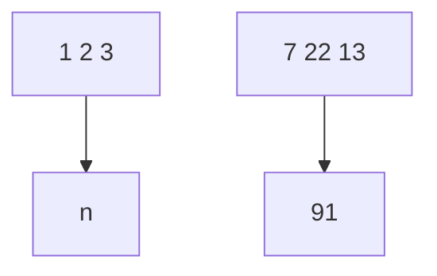
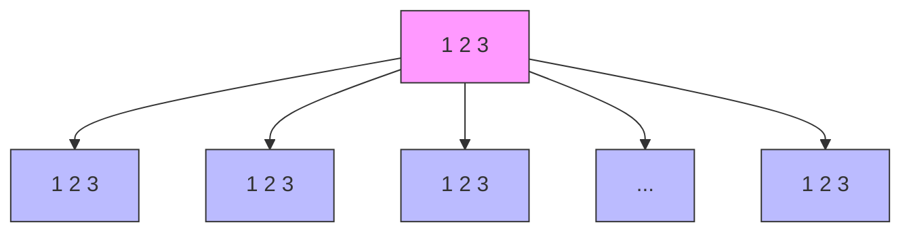
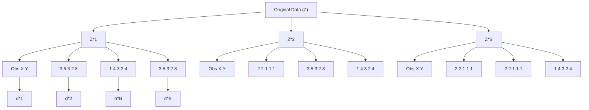
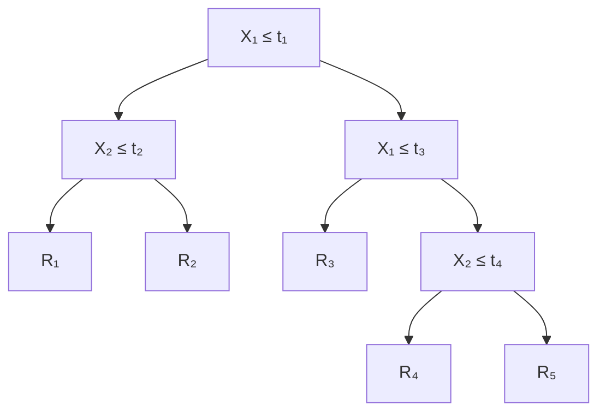
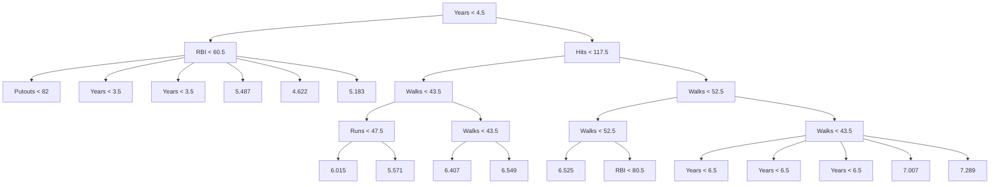
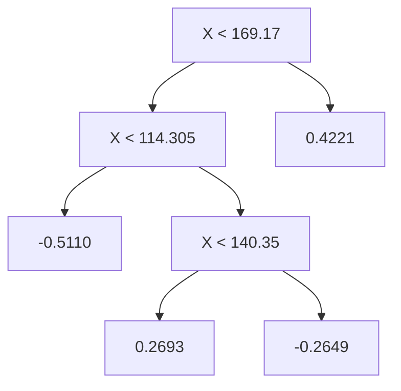
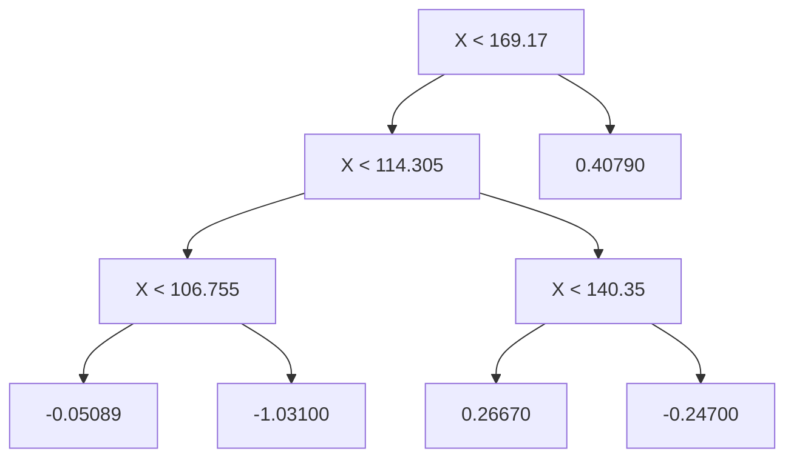
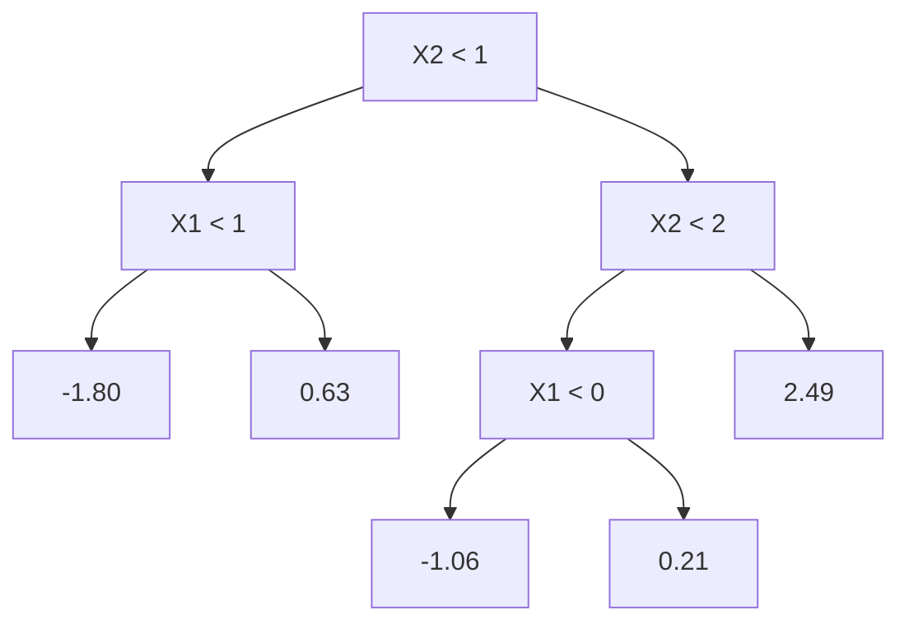

```txt
pd.Series([-coef_hr.sum()), index=['hr[23]'])
]) 
```

We now make the hour plot.

```python
In [75]: fig_hr, ax_hr = subplots(figsize=(8,8))
x_hr = np.arange(coef_hr.shape[0])
ax_hr.plot(x_hr, coef_hr, marker='o', ms=10)
ax_hr.set_xticks(x_hr[::-2])
ax_hr.set_xticklabels(range(24)[::-2], fontsize=20)
ax_hr.set_xlabel('Hour', fontsize=20)
ax_hr.set_ylabel('Coefficient', fontsize=20); 
```

# Poisson Regression

Now we ft instead a Poisson regression model to the Bikeshare data. Very little changes, except that we now use the function sm.GLM() with the Poisson family specifed:

```python
In [76]: M_pois = sm.GLM(Y, X2, family=sm.families.Poisson()).fit() 
```

We can plot the coefcients associated with mnth and hr, in order to reproduce Figure 4.15. We frst complete these coefcients as before.

```python
In [77]: S_pois = summarize(M_pois)
coef_month = S_pois[S_pois.index.str.contains('mth')]['coef']
coef_month = pd.concat([coef_month,
    pd.Series([-coef_month.sum()],
    index=['mth[Dec']])])
coef_hr = S_pois[S_pois.index.str.contains('hr')]['coef']
coef_hr = pd.concat([coef_hr,
    pd.Series([-coef_hr.sum()],
    index=['hr[23']])]) 
```

The plotting is as before.

```python
In [78]: fig_pois, (ax_month, ax_hr) = subplots(1, 2, figsize=(16,8))
ax_month.plot(x_month, coef_month, marker='o', ms=10)
ax_month.set_xticks(x_month)
ax_month.set_xticklabels([l[5] for l in coef_month.index], fontsize=20)
ax_month.set_xlabel('Month', fontsize=20)
ax_month.set_ylabel('Coefficient', fontsize=20)
ax_hr.plot(x_hr, coef_hr, marker='o', ms=10)
ax_hr.set_xticklabels(range(24)[::2], fontsize=20)
ax_hr.set_xlabel('Hour', fontsize=20)
ax_hr.set_ylabel('Coefficient', fontsize=20); 
```

We compare the ftted values of the two models. The ftted values are stored in the fittedvalues attribute returned by the fit() method for both the linear regression and the Poisson fts. The linear predictors are stored as the attribute lin\_pred.

```python
In [79]: fig, ax = subplots(figsize=(8, 8))
ax.scatter(M2_lm.fittedvalues,
    M_pois.fittedvalues,
    s=20)
ax.set_xlabel('Linear Regression Fit', fontsize=20) 
```

```javascript
ax.set_ylabel('Poisson Regression Fit', fontsize=20)
ax.axline([0,0], c='black', linewidth=3,
linestyle='--', slope=1); 
```

The predictions from the Poisson regression model are correlated with those from the linear model; however, the former are non-negative. As a result the Poisson regression predictions tend to be larger than those from the linear model for either very low or very high levels of ridership.

In this section, we ft Poisson regression models using the sm.GLM() function with the argument family=sm.families.Poisson(). Earlier in this lab we used the sm.GLM() function with family=sm.families.Binomial() to perform logistic regression. Other choices for the family argument can be used to ft other types of GLMs. For instance, family=sm.families.Gamma() fts a Gamma regression model.

# 4.8 Exercises

# Conceptual

1. Using a little bit of algebra, prove that (4.2) is equivalent to (4.3). In other words, the logistic function representation and logit representation for the logistic regression model are equivalent.   
2. It was stated in the text that classifying an observation to the class for which (4.17) is largest is equivalent to classifying an observation to the class for which (4.18) is largest. Prove that this is the case. In other words, under the assumption that the observations in the kth class are drawn from a $N ( \mu _ { k } , \sigma ^ { 2 } )$ distribution, the Bayes classifer assigns an observation to the class for which the discriminant function is maximized.   
3. This problem relates to the QDA model, in which the observations within each class are drawn from a normal distribution with a classspecifc mean vector and a class specifc covariance matrix. We consider the simple case where p = 1; i.e. there is only one feature.

Suppose that we have K classes, and that if an observation belongs to the kth class then X comes from a one-dimensional normal distribution, $X \sim { \cal N } ( \mu _ { k } , \sigma _ { k } ^ { 2 } )$ . Recall that the density function for the one-dimensional normal distribution is given in (4.16). Prove that in this case, the Bayes classifer is not linear. Argue that it is in fact quadratic.

Hint: For this problem, you should follow the arguments laid out in Section 4.4.1, but without making the assumption that $\sigma _ { 1 } ^ { 2 } = \cdot \cdot \cdot = \sigma _ { K } ^ { 2 }$ .

4. When the number of features p is large, there tends to be a deterioration in the performance of KNN and other local approaches that perform prediction using only observations that are near the test observation for which a prediction must be made. This phenomenon is known as the curse of dimensionality, and it ties into the fact that non-parametric approaches often perform poorly when p is large. We will now investigate this curse.


curse of dimensionality

(a) Suppose that we have a set of observations, each with measurements on $p = 1$ feature, X. We assume that X is uniformly (evenly) distributed on [0, 1]. Associated with each observation is a response value. Suppose that we wish to predict a test observation’s response using only observations that are within 10 % of the range of X closest to that test observation. For instance, in order to predict the response for a test observation with $X = 0 . 6$ , we will use observations in the range [0.55, 0.65]. On average, what fraction of the available observations will we use to make the prediction?

(b) Now suppose that we have a set of observations, each with measurements on $p = 2$ features, $X _ { 1 }$ and $X _ { 2 }$ . We assume that $( X _ { 1 } , X _ { 2 } )$ are uniformly distributed on $[ 0 , 1 ] \times [ 0 , 1 ]$ ]. We wish to predict a test observation’s response using only observations that are within 10 % of the range of $X _ { 1 }$ and within 10 % of the range of $X _ { 2 }$ closest to that test observation. For instance, in order to predict the response for a test observation with $X _ { 1 } = 0 . 6$ and $X _ { 2 } = 0 . 3 5$ , we will use observations in the range [0.55, 0.65] for $X _ { 1 }$ and in the range [0.3, 0.4] for $X _ { 2 }$ . On average, what fraction of the available observations will we use to make the prediction?

(c) Now suppose that we have a set of observations on $p = 1 0 0$ features. Again the observations are uniformly distributed on each feature, and again each feature ranges in value from 0 to 1. We wish to predict a test observation’s response using observations within the 10 % of each feature’s range that is closest to that test observation. What fraction of the available observations will we use to make the prediction?

(d) Using your answers to parts (a)–(c), argue that a drawback of KNN when p is large is that there are very few training observations “near” any given test observation.

(e) Now suppose that we wish to make a prediction for a test observation by creating a p-dimensional hypercube centered around the test observation that contains, on average, 10 % of the training observations. For $p = 1 , 2$ , and 100, what is the length of each side of the hypercube? Comment on your answer.

Note: A hypercube is a generalization of a cube to an arbitrary number of dimensions. When $p = 1$ , a hypercube is simply a line segment, when $p = 2$ it is a square, and when $p = 1 0 0$ it is a 100-dimensional cube.

5. We now examine the diferences between LDA and QDA.

(a) If the Bayes decision boundary is linear, do we expect LDA or QDA to perform better on the training set? On the test set?

(b) If the Bayes decision boundary is non-linear, do we expect LDA or QDA to perform better on the training set? On the test set?

(c) In general, as the sample size n increases, do we expect the test prediction accuracy of QDA relative to LDA to improve, decline, or be unchanged? Why?   
(d) True or False: Even if the Bayes decision boundary for a given problem is linear, we will probably achieve a superior test error rate using QDA rather than LDA because QDA is fexible enough to model a linear decision boundary. Justify your answer.

6. Suppose we collect data for a group of students in a statistics class with variables $X _ { 1 } =$ hours studied, $X _ { 2 } =$ undergrad GPA, and $Y =$ receive an A. We ft a logistic regression and produce estimated coefcient, $\hat { \beta } _ { 0 } = - 6 , \hat { \beta } _ { 1 } = 0 . 0 5 , \hat { \beta } _ { 2 } = 1$ .

(a) Estimate the probability that a student who studies for 40 h and has an undergrad GPA of 3.5 gets an A in the class.   
(b) How many hours would the student in part (a) need to study to have a 50 % chance of getting an A in the class?

7. Suppose that we wish to predict whether a given stock will issue a dividend this year (“Yes” or “No”) based on X, last year’s percent proft. We examine a large number of companies and discover that the mean value of X for companies that issued a dividend was ${ \bar { X } } = 1 0 .$ , while the mean for those that didn’t was $\bar { X } = 0$ . In addition, the variance of X for these two sets of companies was $\hat { \sigma } ^ { 2 } = 3 6$ . Finally, 80 % of companies issued dividends. Assuming that X follows a normal distribution, predict the probability that a company will issue a dividend this year given that its percentage proft was $X = 4$ last year.

Hint: Recall that the density function for a normal random variable is $\begin{array} { r } { f ( x ) = \frac { 1 } { \sqrt { 2 \pi \sigma ^ { 2 } } } e ^ { - ( x - \mu ) ^ { 2 } / 2 \sigma ^ { 2 } } } \end{array}$ . You will need to use Bayes’ theorem.

8. Suppose that we take a data set, divide it into equally-sized training and test sets, and then try out two diferent classifcation procedures. First we use logistic regression and get an error rate of 20 % on the training data and 30 % on the test data. Next we use 1-nearest neighbors (i.e. K = 1) and get an average error rate (averaged over both test and training data sets) of 18 %. Based on these results, which method should we prefer to use for classifcation of new observations? Why?

9. This problem has to do with odds.

(a) On average, what fraction of people with an odds of 0.37 of defaulting on their credit card payment will in fact default?   
(b) Suppose that an individual has a 16 % chance of defaulting on her credit card payment. What are the odds that she will default?

10. Equation 4.32 derived an expression for log $\scriptstyle \left( { \frac { \operatorname* { P r } ( Y = k | X = x ) } { \operatorname* { P r } ( Y = K | X = x ) } } \right)$ in the setting where $p > 1$ , so that the mean for the kth class, $\mu _ { k }$ , is a $p \textmd { - }$ dimensional vector, and the shared covariance Σ is a $p \times p$ matrix. However, in the setting with $p = 1$ , (4.32) takes a simpler form, since the means $\mu _ { 1 } , \ldots , \mu _ { K }$ and the variance $\sigma ^ { 2 }$ are scalars. In this simpler setting, repeat the calculation in (4.32), and provide expressions for $a _ { k }$ and $b _ { k j }$ in terms of $\pi _ { k } , \pi _ { K } , \mu _ { k } , \mu _ { K }$ , and $\sigma ^ { 2 }$ .   
11. Work out the detailed forms of $a _ { k } , b _ { k j }$ , and $b _ { k j l }$ in (4.33). Your answer should involve $\pi _ { k } , \pi _ { K } , \mu _ { k } , \mu _ { K } , \Sigma _ { k }$ , and $\Sigma _ { K }$ .   
12. Suppose that you wish to classify an observation $X \in \mathbb { R }$ into apples and oranges. You ft a logistic regression model and fnd that

$$
\widehat {\mathrm{Pr}} (Y = \mathrm{orange} | X = x) = \frac {\exp (\hat {\beta} _ {0} + \hat {\beta} _ {1} x)}{1 + \exp (\hat {\beta} _ {0} + \hat {\beta} _ {1} x)}.
$$

Your friend fts a logistic regression model to the same data using the softmax formulation in (4.13), and fnds that

$$
\begin{array}{c} \widehat {\operatorname * {P r}} (Y = \text {orange} | X = x) = \\ \frac {\exp (\hat {\alpha} _ {\text {orange0}} + \hat {\alpha} _ {\text {orange1}} x)}{\exp (\hat {\alpha} _ {\text {orange0}} + \hat {\alpha} _ {\text {orange1}} x) + \exp (\hat {\alpha} _ {\text {apple0}} + \hat {\alpha} _ {\text {apple1}} x)}. \end{array}
$$

(a) What is the log odds of orange versus apple in your model?   
(b) What is the log odds of orange versus apple in your friend’s model?   
(c) Suppose that in your model, $\hat { \beta } _ { 0 } = 2$ and $\hat { \beta } _ { 1 } = - 1$ . What are the coefcient estimates in your friend’s model? Be as specifc as possible.   
(d) Now suppose that you and your friend ft the same two models on a diferent data set. This time, your friend gets the coefcient estimates $\hat { \alpha } _ { \mathrm { o r a n g e 0 } } = 1 . 2 , \hat { \alpha } _ { \mathrm { o r a n g e 1 } } = - 2 , \hat { \alpha } _ { \mathrm { o r a n g e 0 } } = 3 , \hat { \alpha } _ { \mathrm { o r a n g e 1 } } =$ 0.6. What are the coefcient estimates in your model?   
(e) Finally, suppose you apply both models from (d) to a data set with 2,000 test observations. What fraction of the time do you expect the predicted class labels from your model to agree with those from your friend’s model? Explain your answer.

# Applied

13. This question should be answered using the Weekly data set, which is part of the ISLP package. This data is similar in nature to the Smarket data from this chapter’s lab, except that it contains 1, 089 weekly returns for 21 years, from the beginning of 1990 to the end of 2010.

(a) Produce some numerical and graphical summaries of the Weekly data. Do there appear to be any patterns?

(b) Use the full data set to perform a logistic regression with Direction as the response and the fve lag variables plus Volume as predictors. Use the summary function to print the results. Do any of the predictors appear to be statistically signifcant? If so, which ones?   
(c) Compute the confusion matrix and overall fraction of correct predictions. Explain what the confusion matrix is telling you about the types of mistakes made by logistic regression.   
(d) Now ft the logistic regression model using a training data period from 1990 to 2008, with Lag2 as the only predictor. Compute the confusion matrix and the overall fraction of correct predictions for the held out data (that is, the data from 2009 and 2010).   
(e) Repeat (d) using LDA.   
(f) Repeat (d) using QDA.   
(g) Repeat (d) using KNN with K = 1.   
(h) Repeat (d) using naive Bayes.   
(i) Which of these methods appears to provide the best results on this data?   
(j) Experiment with diferent combinations of predictors, including possible transformations and interactions, for each of the methods. Report the variables, method, and associated confusion matrix that appears to provide the best results on the held out data. Note that you should also experiment with values for K in the KNN classifer.

14. In this problem, you will develop a model to predict whether a given car gets high or low gas mileage based on the Auto data set.

(a) Create a binary variable, mpg01, that contains a 1 if mpg contains a value above its median, and a 0 if mpg contains a value below its median. You can compute the median using the median() method of the data frame. Note you may fnd it helpful to add a column mpg01 to the data frame by assignment. Assuming you have stored the data frame as Auto, this can be done as follows:

```python
Auto['mpg01'] = mpg01 
```

(b) Explore the data graphically in order to investigate the association between mpg01 and the other features. Which of the other features seem most likely to be useful in predicting mpg01? Scatterplots and boxplots may be useful tools to answer this question. Describe your fndings.   
(c) Split the data into a training set and a test set.   
(d) Perform LDA on the training data in order to predict mpg01 using the variables that seemed most associated with mpg01 in (b). What is the test error of the model obtained?

(e) Perform QDA on the training data in order to predict mpg01 using the variables that seemed most associated with mpg01 in (b). What is the test error of the model obtained?   
(f) Perform logistic regression on the training data in order to predict mpg01 using the variables that seemed most associated with mpg01 in (b). What is the test error of the model obtained?   
(g) Perform naive Bayes on the training data in order to predict mpg01 using the variables that seemed most associated with mpg01 in (b). What is the test error of the model obtained?   
(h) Perform KNN on the training data, with several values of K, in order to predict mpg01. Use only the variables that seemed most associated with mpg01 in (b). What test errors do you obtain? Which value of K seems to perform the best on this data set?

15. This problem involves writing functions.

(a) Write a function, Power(), that prints out the result of raising 2 to the 3rd power. In other words, your function should compute 23 and print out the results.

Hint: Recall that x\*\*a raises x to the power a. Use the print() function to display the result.

(b) Create a new function, Power2(), that allows you to pass any two numbers, x and a, and prints out the value of x\*\*a. You can do this by beginning your function with the line

def Power2(x, a):

You should be able to call your function by entering, for instance, Power2(3, 8)

on the command line. This should output the value of 38, namely, 6, 561.

(c) Using the Power2() function that you just wrote, compute 103, 817, and 1313.   
(d) Now create a new function, Power3(), that actually returns the result x\*\*a as a Python object, rather than simply printing it to the screen. That is, if you store the value x\*\*a in an object called result within your function, then you can simply return this result, using the following line:

return result

Note that the line above should be the last line in your function, and it should be indented 4 spaces.

(e) Now using the Power3() function, create a plot of f(x) = x2. The x-axis should display a range of integers from 1 to 10, and the y-axis should display x2. Label the axes appropriately, and use an appropriate title for the fgure. Consider displaying either the x-axis, the y-axis, or both on the log-scale. You can do this by using the ax.set\_xscale() and ax.set\_yscale() methods of the axes you are plotting to.

return

.set\_xscale()

.set\_yscale()

(f) Create a function, PlotPower(), that allows you to create a plot of x against x\*\*a for a fxed a and a sequence of values of x. For instance, if you call

PlotPower(np.arange(1, 11), 3)

then a plot should be created with an x-axis taking on values 1, 2, . . . , 10, and a y-axis taking on values $1 ^ { 3 } , 2 ^ { 3 } , \dots , 1 0 ^ { 3 }$ .

16. Using the Boston data set, ft classifcation models in order to predict whether a given suburb has a crime rate above or below the median. Explore logistic regression, LDA, naive Bayes, and KNN models using various subsets of the predictors. Describe your fndings.

Hint: You will have to create the response variable yourself, using the variables that are contained in the Boston data set.

Resampling methods are an indispensable tool in modern statistics. They involve repeatedly drawing samples from a training set and reftting a model of interest on each sample in order to obtain additional information about the ftted model. For example, in order to estimate the variability of a linear regression ft, we can repeatedly draw diferent samples from the training data, ft a linear regression to each new sample, and then examine the extent to which the resulting fts difer. Such an approach may allow us to obtain information that would not be available from ftting the model only once using the original training sample.

Resampling approaches can be computationally expensive, because they involve ftting the same statistical method multiple times using diferent subsets of the training data. However, due to recent advances in computing power, the computational requirements of resampling methods generally are not prohibitive. In this chapter, we discuss two of the most commonly used resampling methods, cross-validation and the bootstrap. Both methods are important tools in the practical application of many statistical learning procedures. For example, cross-validation can be used to estimate the test error associated with a given statistical learning method in order to evaluate its performance, or to select the appropriate level of fexibility. The process of evaluating a model’s performance is known as model assessment, whereas the process of selecting the proper level of fexibility for a model is known as model selection. The bootstrap is used in several contexts, most commonly to provide a measure of accuracy of a parameter estimate or of a given statistical learning method.

model assessment model selection

# 5.1 Cross-Validation

In Chapter 2 we discuss the distinction between the test error rate and the training error rate. The test error is the average error that results from using a statistical learning method to predict the response on a new observation— that is, a measurement that was not used in training the method. Given a data set, the use of a particular statistical learning method is warranted if it results in a low test error. The test error can be easily calculated if a designated test set is available. Unfortunately, this is usually not the case. In contrast, the training error can be easily calculated by applying the statistical learning method to the observations used in its training. But as we saw in Chapter 2, the training error rate often is quite diferent from the test error rate, and in particular the former can dramatically underestimate the latter.

In the absence of a very large designated test set that can be used to directly estimate the test error rate, a number of techniques can be used to estimate this quantity using the available training data. Some methods make a mathematical adjustment to the training error rate in order to estimate the test error rate. Such approaches are discussed in Chapter 6. In this section, we instead consider a class of methods that estimate the test error rate by holding out a subset of the training observations from the ftting process, and then applying the statistical learning method to those held out observations.

In Sections 5.1.1–5.1.4, for simplicity we assume that we are interested in performing regression with a quantitative response. In Section 5.1.5 we consider the case of classifcation with a qualitative response. As we will see, the key concepts remain the same regardless of whether the response is quantitative or qualitative.

# 5.1.1 The Validation Set Approach

Suppose that we would like to estimate the test error associated with ftting a particular statistical learning method on a set of observations. The validation set approach, displayed in Figure 5.1, is a very simple strategy for this task. It involves randomly dividing the available set of observations into two parts, a training set and a validation set or hold-out set. The model is ft on the training set, and the ftted model is used to predict the responses for the observations in the validation set. The resulting validation set error rate—typically assessed using MSE in the case of a quantitative response—provides an estimate of the test error rate.

We illustrate the validation set approach on the Auto data set. Recall from Chapter 3 that there appears to be a non-linear relationship between mpg and horsepower, and that a model that predicts mpg using horsepower and horsepower2 gives better results than a model that uses only a linear term. It is natural to wonder whether a cubic or higher-order ft might provide even better results. We answer this question in Chapter 3 by looking at the p-values associated with a cubic term and higher-order polynomial terms in a linear regression. But we could also answer this question using the validation method. We randomly split the 392 observations into two

validation set approach validation set hold-out set


<details>
<summary>flowchart</summary>


</details>

FIGURE 5.1. A schematic display of the validation set approach. A set of n observations are randomly split into a training set (shown in blue, containing observations 7, 22, and 13, among others) and a validation set (shown in beige, and containing observation 91, among others). The statistical learning method is ft on the training set, and its performance is evaluated on the validation set.

sets, a training set containing 196 of the data points, and a validation set containing the remaining 196 observations. The validation set error rates that result from ftting various regression models on the training sample and evaluating their performance on the validation sample, using MSE as a measure of validation set error, are shown in the left-hand panel of Figure 5.2. The validation set MSE for the quadratic ft is considerably smaller than for the linear ft. However, the validation set MSE for the cubic ft is actually slightly larger than for the quadratic ft. This implies that including a cubic term in the regression does not lead to better prediction than simply using a quadratic term.

Recall that in order to create the left-hand panel of Figure 5.2, we randomly divided the data set into two parts, a training set and a validation set. If we repeat the process of randomly splitting the sample set into two parts, we will get a somewhat diferent estimate for the test MSE. As an illustration, the right-hand panel of Figure 5.2 displays ten diferent validation set MSE curves from the Auto data set, produced using ten diferent random splits of the observations into training and validation sets. All ten curves indicate that the model with a quadratic term has a dramatically smaller validation set MSE than the model with only a linear term. Furthermore, all ten curves indicate that there is not much beneft in including cubic or higher-order polynomial terms in the model. But it is worth noting that each of the ten curves results in a diferent test MSE estimate for each of the ten regression models considered. And there is no consensus among the curves as to which model results in the smallest validation set MSE. Based on the variability among these curves, all that we can conclude with any confdence is that the linear ft is not adequate for this data.

The validation set approach is conceptually simple and is easy to implement. But it has two potential drawbacks:

1. As is shown in the right-hand panel of Figure 5.2, the validation estimate of the test error rate can be highly variable, depending on precisely which observations are included in the training set and which observations are included in the validation set.   
2. In the validation approach, only a subset of the observations—those that are included in the training set rather than in the validation set—are used to ft the model. Since statistical methods tend to perform worse when trained on fewer observations, this suggests that the


<details>
<summary>line</summary>

| Degree of Polynomial | Mean Squared Error |
| --------------------- | ------------------ |
| 1                     | 23.5               |
| 2                     | 19.0               |
| 3                     | 19.2               |
| 4                     | 19.1               |
| 5                     | 18.7               |
| 6                     | 18.5               |
| 7                     | 18.3               |
| 8                     | 18.2               |
| 9                     | 18.2               |
| 10                    | 18.2               |
</details>


<details>
<summary>line</summary>

| Degree of Polynomial | Series 1 | Series 2 | Series 3 | Series 4 | Series 5 | Series 6 | Series 7 | Series 8 |
| --------------------- | -------- | -------- | -------- | -------- | -------- | -------- | -------- | -------- |
| 1                     | 29.0     | 26.0     | 24.0     | 22.0     | 20.0     | 18.0     | 16.0     | 15.0     |
| 2                     | 22.0     | 24.0     | 20.0     | 18.0     | 16.0     | 15.0     | 14.0     | 13.0     |
| 4                     | 24.0     | 23.0     | 19.0     | 17.0     | 15.0     | 14.0     | 13.0     | 12.0     |
| 6                     | 23.0     | 22.0     | 18.0     | 16.0     | 14.0     | 13.0     | 12.0     | 11.0     |
| 8                     | 23.0     | 21.0     | 17.0     | 15.0     | 13.0     | 12.0     | 11.0     | 10.0     |
| 10                    | 25.0     | 25.0     | 20.0     | 18.0     | 16.0     | 15.0     | 14.0     | 13.0     |
</details>

FIGURE 5.2. The validation set approach was used on the Auto data set in order to estimate the test error that results from predicting mpg using polynomial functions of horsepower. Left: Validation error estimates for a single split into training and validation data sets. Right: The validation method was repeated ten times, each time using a diferent random split of the observations into a training set and a validation set. This illustrates the variability in the estimated test MSE that results from this approach.

validation set error rate may tend to overestimate the test error rate for the model ft on the entire data set.

In the coming subsections, we will present cross-validation, a refnement of the validation set approach that addresses these two issues.

# 5.1.2 Leave-One-Out Cross-Validation

Leave-one-out cross-validation (LOOCV) is closely related to the validation set approach of Section 5.1.1, but it attempts to address that method’s drawbacks.

Like the validation set approach, LOOCV involves splitting the set of observations into two parts. However, instead of creating two subsets of comparable size, a single observation $( x _ { 1 } , y _ { 1 } )$ is used for the validation set, and the remaining observations $\left\{ ( x _ { 2 } , y _ { 2 } ) , \ldots , ( x _ { n } , y _ { n } ) \right\}$ make up the training set. The statistical learning method is ft on the $n - 1$ training observations, and a prediction $\hat { y } _ { 1 }$ is made for the excluded observation, using its value $x _ { 1 }$ . Since $( x _ { 1 } , y _ { 1 } )$ was not used in the ftting process, $\mathrm { M S E _ { 1 } = }$ $( y _ { 1 } - { \hat { y } } _ { 1 } ) ^ { 2 }$ provides an approximately unbiased estimate for the test error. But even though $\mathrm { M S E _ { 1 } }$ is unbiased for the test error, it is a poor estimate because it is highly variable, since it is based upon a single observation $( x _ { 1 } , y _ { 1 } )$ .

We can repeat the procedure by selecting $( x _ { 2 } , y _ { 2 } )$ for the validation data, training the statistical learning procedure on the $n - 1$ observations $\left\{ ( x _ { 1 } , y _ { 1 } ) , ( x _ { 3 } , y _ { 3 } ) , \dots , ( x _ { n } , y _ { n } ) \right\}$ , and computing $\begin{array} { r } { \mathrm { M S E _ { 2 } } = ( y _ { 2 } - \hat { y } _ { 2 } ) ^ { 2 } } \end{array}$ . Repeating this approach n times produces n squared errors, $\mathrm { M S E _ { 1 } } , \ldots , \mathrm { M S E } _ { n }$ . The LOOCV estimate for the test MSE is the average of these n test error estimates:

$$
\mathrm{CV} _ {(n)} = \frac {1}{n} \sum_ {i = 1} ^ {n} \mathrm{MSE} _ {i}. \tag {5.1}
$$

leave-oneout crossvalidation


<details>
<summary>flowchart</summary>


</details>

FIGURE 5.3. A schematic display of LOOCV. A set of n data points is repeatedly split into a training set (shown in blue) containing all but one observation, and a validation set that contains only that observation (shown in beige). The test error is then estimated by averaging the n resulting MSEs. The frst training set contains all but observation 1, the second training set contains all but observation 2, and so forth.

A schematic of the LOOCV approach is illustrated in Figure 5.3.

LOOCV has a couple of major advantages over the validation set approach. First, it has far less bias. In LOOCV, we repeatedly ft the statistical learning method using training sets that contain n − 1 observations, almost as many as are in the entire data set. This is in contrast to the validation set approach, in which the training set is typically around half the size of the original data set. Consequently, the LOOCV approach tends not to overestimate the test error rate as much as the validation set approach does. Second, in contrast to the validation approach which will yield diferent results when applied repeatedly due to randomness in the training/validation set splits, performing LOOCV multiple times will always yield the same results: there is no randomness in the training/validation set splits.

We used LOOCV on the Auto data set in order to obtain an estimate of the test set MSE that results from ftting a linear regression model to predict mpg using polynomial functions of horsepower. The results are shown in the left-hand panel of Figure 5.4.

LOOCV has the potential to be expensive to implement, since the model has to be ft n times. This can be very time consuming if n is large, and if each individual model is slow to ft. With least squares linear or polynomial regression, an amazing shortcut makes the cost of LOOCV the same as that of a single model ft! The following formula holds:

$$
\mathrm{CV} _ {(n)} = \frac {1}{n} \sum_ {i = 1} ^ {n} \left(\frac {y _ {i} - \hat {y} _ {i}}{1 - h _ {i}}\right) ^ {2}, \tag {5.2}
$$


<details>
<summary>line</summary>

| Degree of Polynomial | Mean Squared Error |
| --------------------- | ------------------ |
| 1                     | 24.5               |
| 2                     | 19.0               |
| 3                     | 19.2               |
| 4                     | 19.3               |
| 5                     | 18.9               |
| 6                     | 18.8               |
| 7                     | 18.6               |
| 8                     | 18.7               |
| 9                     | 18.8               |
| 10                    | 19.0               |
</details>


<details>
<summary>line</summary>

| Degree of Polynomial | Mean Squared Error |
| --------------------- | ------------------ |
| 1                     | 24.5               |
| 2                     | 18.5               |
| 4                     | 19.0               |
| 6                     | 18.8               |
| 8                     | 19.2               |
| 10                    | 20.5               |
</details>

FIGURE 5.4. Cross-validation was used on the Auto data set in order to estimate the test error that results from predicting mpg using polynomial functions of horsepower. Left: The LOOCV error curve. Right: 10-fold CV was run nine separate times, each with a diferent random split of the data into ten parts. The fgure shows the nine slightly diferent CV error curves.

where $\hat { y } _ { i }$ is the ith ftted value from the original least squares ft, and $h _ { i }$ is the leverage defned in (3.37) on page 105. 1 This is like the ordinary MSE, except the ith residual is divided by $1 - h _ { i }$ . The leverage lies between $1 / n$ and 1, and refects the amount that an observation infuences its own ft. Hence the residuals for high-leverage points are infated in this formula by exactly the right amount for this equality to hold.

LOOCV is a very general method, and can be used with any kind of predictive modeling. For example we could use it with logistic regression or linear discriminant analysis, or any of the methods discussed in later chapters. The magic formula (5.2) does not hold in general, in which case the model has to be reft n times.

# 5.1.3 k-Fold Cross-Validation

An alternative to LOOCV is k-fold CV. This approach involves randomly dividing the set of observations into k groups, or folds, of approximately equal size. The frst fold is treated as a validation set, and the method is ft on the remaining k − 1 folds. The mean squared error, $\mathrm { M S E _ { 1 } }$ , is then computed on the observations in the held-out fold. This procedure is repeated k times; each time, a diferent group of observations is treated as a validation set. This process results in k estimates of the test error, $\mathrm { M S E _ { 1 } } , \mathrm { M S E _ { 2 } } , \dotsc , \mathrm { M S E } _ { k }$ . The k-fold CV estimate is computed by averaging these values,

$$
\mathrm{CV} _ {(k)} = \frac {1}{k} \sum_ {i = 1} ^ {k} \mathrm{MSE} _ {i}. \tag {5.3}
$$

Figure 5.5 illustrates the k-fold CV approach.

k-fold CV


<details>
<summary>bar_stacked</summary>

| Category | Value 1 | Value 2 |
|---|---|---|
| 1 | 1 | 3 |
| 2 | 0 | 0 |
| Total | 47 | 5 |
| Top Right (n) | 0 | 0 |
| Bottom Right (n) | 47 | 0 |
| Bottom Left (n) | 0 | 0 |
| Bottom Right (n) | 47 | 0 |
| Bottom Left (n) | 0 | 0 |
| Bottom Right (n) | 47 | 0 |
</details>

FIGURE 5.5. A schematic display of 5-fold CV. A set of n observations is randomly split into fve non-overlapping groups. Each of these ffths acts as a validation set (shown in beige), and the remainder as a training set (shown in blue). The test error is estimated by averaging the fve resulting MSE estimates.

It is not hard to see that LOOCV is a special case of k-fold CV in which k is set to equal n. In practice, one typically performs k-fold CV using k = 5 or k = 10. What is the advantage of using k = 5 or k = 10 rather than k = n? The most obvious advantage is computational. LOOCV requires ftting the statistical learning method n times. This has the potential to be computationally expensive (except for linear models ft by least squares, in which case formula (5.2) can be used). But cross-validation is a very general approach that can be applied to almost any statistical learning method. Some statistical learning methods have computationally intensive ftting procedures, and so performing LOOCV may pose computational problems, especially if n is extremely large. In contrast, performing 10-fold CV requires ftting the learning procedure only ten times, which may be much more feasible. As we see in Section 5.1.4, there also can be other non-computational advantages to performing 5-fold or 10-fold CV, which involve the bias-variance trade-of.

The right-hand panel of Figure 5.4 displays nine diferent 10-fold CV estimates for the Auto data set, each resulting from a diferent random split of the observations into ten folds. As we can see from the fgure, there is some variability in the CV estimates as a result of the variability in how the observations are divided into ten folds. But this variability is typically much lower than the variability in the test error estimates that results from the validation set approach (right-hand panel of Figure 5.2).

When we examine real data, we do not know the true test MSE, and so it is difcult to determine the accuracy of the cross-validation estimate. However, if we examine simulated data, then we can compute the true test MSE, and can thereby evaluate the accuracy of our cross-validation results. In Figure 5.6, we plot the cross-validation estimates and true test error rates that result from applying smoothing splines to the simulated data sets illustrated in Figures 2.9–2.11 of Chapter 2. The true test MSE is displayed in blue. The black dashed and orange solid lines respectively show the estimated LOOCV and 10-fold CV estimates. In all three plots, the two cross-validation estimates are very similar. In the right-hand panel of Figure 5.6, the true test MSE and the cross-validation curves are almost identical. In the center panel of Figure 5.6, the two sets of curves are similar at the lower degrees of fexibility, while the CV curves overestimate the test set MSE for higher degrees of fexibility. In the left-hand panel of Figure 5.6, the CV curves have the correct general shape, but they underestimate the true test MSE.


<details>
<summary>line</summary>

| Flexibility | Mean Squared Error (Solid Line) | Mean Squared Error (Dashed Line) |
| ----------- | ------------------------------- | -------------------------------- |
| 2           | 2.1                             | 1.9                              |
| 5           | 1.1                             | 0.8                              |
| 10          | 0.7                             | 0.6                              |
| 20          | 1.6                             | 1.5                              |
| 25          | 2.5                             | 2.4                              |
</details>


<details>
<summary>line</summary>

| Flexibility | Mean Squared Error |
| ----------- | ------------------ |
| 2           | 1.0                |
| 5           | 1.0                |
| 20          | 1.5                |
| 25          | 2.5                |
</details>


<details>
<summary>line</summary>

| Flexibility | Mean Squared Error |
| ----------- | ------------------ |
| 2           | 18.0               |
| 5           | 3.0                |
| 10          | 1.5                |
| 20          | 2.5                |
</details>

FIGURE 5.6. True and estimated test MSE for the simulated data sets in Figures 2.9 ( left), 2.10 ( center), and 2.11 ( right). The true test MSE is shown in blue, the LOOCV estimate is shown as a black dashed line, and the 10-fold CV estimate is shown in orange. The crosses indicate the minimum of each of the MSE curves.

When we perform cross-validation, our goal might be to determine how well a given statistical learning procedure can be expected to perform on independent data; in this case, the actual estimate of the test MSE is of interest. But at other times we are interested only in the location of the minimum point in the estimated test MSE curve. This is because we might be performing cross-validation on a number of statistical learning methods, or on a single method using diferent levels of fexibility, in order to identify the method that results in the lowest test error. For this purpose, the location of the minimum point in the estimated test MSE curve is important, but the actual value of the estimated test MSE is not. We fnd in Figure 5.6 that despite the fact that they sometimes underestimate the true test MSE, all of the CV curves come close to identifying the correct level of fexibility—that is, the fexibility level corresponding to the smallest test MSE.

# 5.1.4 Bias-Variance Trade-Of for k-Fold Cross-Validation

We mentioned in Section 5.1.3 that k-fold CV with k < n has a computational advantage to LOOCV. But putting computational issues aside, a less obvious but potentially more important advantage of k-fold CV is that it often gives more accurate estimates of the test error rate than does LOOCV. This has to do with a bias-variance trade-of.

It was mentioned in Section 5.1.1 that the validation set approach can lead to overestimates of the test error rate, since in this approach the training set used to ft the statistical learning method contains only half the observations of the entire data set. Using this logic, it is not hard to see that LOOCV will give approximately unbiased estimates of the test error, since each training set contains n−1 observations, which is almost as many as the number of observations in the full data set. And performing k-fold CV for, say, $k = 5$ or $k = 1 0$ will lead to an intermediate level of bias, since each training set contains approximately $( k - 1 ) n / k$ observations— fewer than in the LOOCV approach, but substantially more than in the validation set approach. Therefore, from the perspective of bias reduction, it is clear that LOOCV is to be preferred to k-fold CV.

However, we know that bias is not the only source for concern in an estimating procedure; we must also consider the procedure’s variance. It turns out that LOOCV has higher variance than does k-fold CV with $k < n$ . Why is this the case? When we perform LOOCV, we are in efect averaging the outputs of n ftted models, each of which is trained on an almost identical set of observations; therefore, these outputs are highly (positively) correlated with each other. In contrast, when we perform k-fold CV with $k < n ,$ , we are averaging the outputs of k ftted models that are somewhat less correlated with each other, since the overlap between the training sets in each model is smaller. Since the mean of many highly correlated quantities has higher variance than does the mean of many quantities that are not as highly correlated, the test error estimate resulting from LOOCV tends to have higher variance than does the test error estimate resulting from k-fold CV.

To summarize, there is a bias-variance trade-of associated with the choice of k in k-fold cross-validation. Typically, given these considerations, one performs k-fold cross-validation using k = 5 or $k = 1 0 ,$ , as these values have been shown empirically to yield test error rate estimates that sufer neither from excessively high bias nor from very high variance.

# 5.1.5 Cross-Validation on Classifcation Problems

In this chapter so far, we have illustrated the use of cross-validation in the regression setting where the outcome Y is quantitative, and so have used MSE to quantify test error. But cross-validation can also be a very useful approach in the classifcation setting when Y is qualitative. In this setting, cross-validation works just as described earlier in this chapter, except that rather than using MSE to quantify test error, we instead use the number of misclassifed observations. For instance, in the classifcation setting, the LOOCV error rate takes the form

$$
\mathrm{CV} _ {(n)} = \frac {1}{n} \sum_ {i = 1} ^ {n} \mathrm{Err} _ {i}, \tag {5.4}
$$

where $\mathrm { E r r } _ { i } = I ( y _ { i } \neq \hat { y } _ { i } )$ . The k-fold CV error rate and validation set error rates are defned analogously.

As an example, we ft various logistic regression models on the twodimensional classifcation data displayed in Figure 2.13. In the top-left panel of Figure 5.7, the black solid line shows the estimated decision boundary resulting from ftting a standard logistic regression model to this data set. Since this is simulated data, we can compute the true test error rate, which takes a value of 0.201 and so is substantially larger than the Bayes error rate of 0.133. Clearly logistic regression does not have enough fexibility to model the Bayes decision boundary in this setting. We can easily extend logistic regression to obtain a non-linear decision boundary by using polynomial functions of the predictors, as we did in the regression setting in Section 3.3.2. For example, we can ft a quadratic logistic regression model, given by

  
FIGURE 5.7. Logistic regression fts on the two-dimensional classifcation data displayed in Figure 2.13. The Bayes decision boundary is represented using a purple dashed line. Estimated decision boundaries from linear, quadratic, cubic and quartic (degrees 1–4) logistic regressions are displayed in black. The test error rates for the four logistic regression fts are respectively 0.201, 0.197, 0.160, and 0.162, while the Bayes error rate is 0.133.

$$
\log \left(\frac {p}{1 - p}\right) = \beta_ {0} + \beta_ {1} X _ {1} + \beta_ {2} X _ {1} ^ {2} + \beta_ {3} X _ {2} + \beta_ {4} X _ {2} ^ {2}. \tag {5.5}
$$

The top-right panel of Figure 5.7 displays the resulting decision boundary, which is now curved. However, the test error rate has improved only slightly, to 0.197. A much larger improvement is apparent in the bottom-left panel of Figure 5.7, in which we have ft a logistic regression model involving cubic polynomials of the predictors. Now the test error rate has decreased to 0.160. Going to a quartic polynomial (bottom-right) slightly increases the test error.


<details>
<summary>line</summary>

| Order of Polynomials Used | Error Rate (Black Line) | Error Rate (Orange Line) | Error Rate (Blue Line) |
| ------------------------- | ------------------------ | ------------------------- | ----------------------- |
| 2                         | 0.20                     | 0.20                      | 0.20                    |
| 4                         | 0.14                     | 0.16                      | 0.13                    |
| 6                         | 0.15                     | 0.16                      | 0.15                    |
| 8                         | 0.16                     | 0.17                      | 0.14                    |
| 10                        | 0.19                     | 0.19                      | 0.12                    |
</details>


<details>
<summary>line</summary>

| 1/K   | Error Rate (Black) | Error Rate (Blue) | Error Rate (Orange) |
|-------|--------------------|-------------------|---------------------|
| 0.01  | 0.20               | 0.18              | 0.20                |
| 0.02  | 0.15               | 0.14              | 0.18                |
| 0.05  | 0.13               | 0.12              | 0.16                |
| 0.10  | 0.12               | 0.10              | 0.13                |
| 0.20  | 0.12               | 0.10              | 0.14                |
| 0.50  | 0.12               | 0.10              | 0.16                |
| 1.00  | 0.12               | 0.10              | 0.17                |
</details>

FIGURE 5.8. Test error (brown), training error (blue), and 10-fold CV error (black) on the two-dimensional classifcation data displayed in Figure 5.7. Left: Logistic regression using polynomial functions of the predictors. The order of the polynomials used is displayed on the x-axis. Right: The KNN classifer with diferent values of K, the number of neighbors used in the KNN classifer.

In practice, for real data, the Bayes decision boundary and the test error rates are unknown. So how might we decide between the four logistic regression models displayed in Figure 5.7? We can use cross-validation in order to make this decision. The left-hand panel of Figure 5.8 displays in black the 10-fold CV error rates that result from ftting ten logistic regression models to the data, using polynomial functions of the predictors up to tenth order. The true test errors are shown in brown, and the training errors are shown in blue. As we have seen previously, the training error tends to decrease as the fexibility of the ft increases. (The fgure indicates that though the training error rate doesn’t quite decrease monotonically, it tends to decrease on the whole as the model complexity increases.) In contrast, the test error displays a characteristic U-shape. The 10-fold CV error rate provides a pretty good approximation to the test error rate. While it somewhat underestimates the error rate, it reaches a minimum when fourth-order polynomials are used, which is very close to the minimum of the test curve, which occurs when third-order polynomials are used. In fact, using fourth-order polynomials would likely lead to good test set performance, as the true test error rate is approximately the same for third, fourth, ffth, and sixth-order polynomials.

The right-hand panel of Figure 5.8 displays the same three curves using the KNN approach for classifcation, as a function of the value of K (which in this context indicates the number of neighbors used in the KNN classifer, rather than the number of CV folds used). Again the training error rate declines as the method becomes more fexible, and so we see that the training error rate cannot be used to select the optimal value for K. Though the cross-validation error curve slightly underestimates the test error rate, it takes on a minimum very close to the best value for K.

# 5.2 The Bootstrap

The bootstrap is a widely applicable and extremely powerful statistical tool that can be used to quantify the uncertainty associated with a given estimator or statistical learning method. As a simple example, the bootstrap can be used to estimate the standard errors of the coefcients from a linear regression ft. In the specifc case of linear regression, this is not particularly useful, since we saw in Chapter 3 that standard statistical software such as R outputs such standard errors automatically. However, the power of the bootstrap lies in the fact that it can be easily applied to a wide range of statistical learning methods, including some for which a measure of variability is otherwise difcult to obtain and is not automatically output by statistical software.

In this section we illustrate the bootstrap on a toy example in which we wish to determine the best investment allocation under a simple model. In Section 5.3 we explore the use of the bootstrap to assess the variability associated with the regression coefcients in a linear model ft.

Suppose that we wish to invest a fxed sum of money in two fnancial assets that yield returns of X and Y , respectively, where X and $Y$ are random quantities. We will invest a fraction α of our money in X, and will invest the remaining $1 - \alpha$ in Y . Since there is variability associated with the returns on these two assets, we wish to choose α to minimize the total risk, or variance, of our investment. In other words, we want to minimize $\operatorname { V a r } ( \alpha X + ( 1 - \alpha ) Y )$ . One can show that the value that minimizes the risk is given by

$$
\alpha = \frac {\sigma_ {Y} ^ {2} - \sigma_ {X Y}}{\sigma_ {X} ^ {2} + \sigma_ {Y} ^ {2} - 2 \sigma_ {X Y}}, \tag {5.6}
$$

where $\sigma _ { X } ^ { 2 } = \operatorname { V a r } ( X ) , \sigma _ { Y } ^ { 2 } = \operatorname { V a r } ( Y )$ , and $\sigma _ { X Y } = \operatorname { C o v } ( X , Y )$ .

In reality, the quantities $\sigma _ { X } ^ { 2 } , \sigma _ { Y } ^ { 2 } .$ , and $\sigma _ { X Y }$ are unknown. We can compute Xestimates for these quantities, $\mathring { \sigma } _ { X } ^ { 2 } , \ \hat { \sigma } _ { Y } ^ { 2 }$ , and $\hat { \sigma } _ { X Y }$ , using a data set that contains past measurements for $X$ and Y . We can then estimate the value of α that minimizes the variance of our investment using

$$
\hat {\alpha} = \frac {\hat {\sigma} _ {Y} ^ {2} - \hat {\sigma} _ {X Y}}{\hat {\sigma} _ {X} ^ {2} + \hat {\sigma} _ {Y} ^ {2} - 2 \hat {\sigma} _ {X Y}}. \tag {5.7}
$$

Figure 5.9 illustrates this approach for estimating α on a simulated data set. In each panel, we simulated 100 pairs of returns for the investments X and Y . We used these returns to estimate $\sigma _ { X } ^ { 2 } , \sigma _ { Y } ^ { 2 }$ , and $\sigma _ { X Y }$ , which we then substituted into (5.7) in order to obtain estimates for $\alpha$ . The value of αˆ resulting from each simulated data set ranges from 0.532 to 0.657.

It is natural to wish to quantify the accuracy of our estimate of α. To estimate the standard deviation of $\hat { \alpha }$ , we repeated the process of simulating 100 paired observations of X and $Y$ , and estimating α using (5.7), 1,000 times. We thereby obtained 1,000 estimates for $\alpha .$ , which we can call $\hat { \alpha } _ { 1 } , \hat { \alpha } _ { 2 } , \dots , \hat { \alpha } _ { 1 , 0 0 0 }$ . The left-hand panel of Figure 5.10 displays a histogram of the resulting estimates. For these simulations the parameters were set to $\sigma _ { X } ^ { 2 } = 1 , \sigma _ { Y } ^ { 2 } = \bar { 1 } . 2 5$ , and $\sigma _ { X Y } = 0 . 5$ , and so we know that the true value of α is 0.6. We indicated this value using a solid vertical line on the histogram.


<details>
<summary>scatter</summary>

| X    | Y    |
|------|------|
| -2.0 | -2.0 |
| -1.5 | -1.5 |
| -1.0 | -1.0 |
| -0.5 | -0.5 |
| 0.0  | 0.0  |
| 0.5  | 0.5  |
| 1.0  | 1.0  |
| 1.5  | 1.5  |
| 2.0  | 2.0  |
</details>


<details>
<summary>scatter</summary>

| X    | Y    |
|------|------|
| -2.0 | -1.5 |
| -1.8 | -1.2 |
| -1.6 | -0.9 |
| -1.4 | -0.6 |
| -1.2 | -0.3 |
| -1.0 | 0.0  |
| -0.8 | 0.3  |
| -0.6 | 0.6  |
| -0.4 | 0.9  |
| -0.2 | 1.2  |
| 0.0  | 1.5  |
| 0.2  | 1.8  |
| 0.4  | 2.1  |
| 0.6  | 1.9  |
| 0.8  | 1.6  |
| 1.0  | 1.3  |
| 1.2  | 1.0  |
| 1.4  | 0.7  |
| 1.6  | 0.4  |
| 1.8  | 0.1  |
| 2.0  | -0.2 |
| 2.2  | -0.5 |
| 2.4  | -0.8 |
| 2.6  | -1.1 |
| 2.8  | -1.4 |
| 3.0  | -1.7 |
</details>


<details>
<summary>scatter</summary>

| X    | Y    |
|------|------|
| -3.0 | -2.5 |
| -2.5 | -1.0 |
| -2.0 | 0.0  |
| -1.5 | 0.5  |
| -1.0 | 1.0  |
| -0.5 | 1.5  |
| 0.0  | 2.0  |
| 0.5  | 1.5  |
| 1.0  | 1.0  |
| 1.5  | 0.5  |
| 2.0  | -0.5 |
| 2.5  | -1.0 |
| 3.0  | -1.5 |
</details>


<details>
<summary>scatter</summary>

| X    | Y    |
|------|------|
| -1.8 | -2.5 |
| -1.5 | -2.0 |
| -1.2 | -1.5 |
| -0.9 | -1.0 |
| -0.6 | -0.5 |
| -0.3 | 0.0  |
| 0.0  | 0.5  |
| 0.3  | 1.0  |
| 0.6  | 1.5  |
| 0.9  | 2.0  |
| 1.2  | 2.5  |
| 1.5  | 3.0  |
| 1.8  | 3.5  |
| 2.1  | 4.0  |
| 2.4  | 4.5  |
| 2.7  | 5.0  |
| 3.0  | 5.5  |
| 3.3  | 6.0  |
| 3.6  | 6.5  |
| 3.9  | 7.0  |
| 4.2  | 7.5  |
| 4.5  | 8.0  |
| 4.8  | 8.5  |
| 5.1  | 9.0  |
| 5.4  | 9.5  |
| 5.7  | 10.0 |
| 6.0  | 10.5 |
| 6.3  | 11.0 |
| 6.6  | 11.5 |
| 6.9  | 12.0 |
| 7.2  | 12.5 |
| 7.5  | 13.0 |
| 7.8  | 13.5 |
| 8.1  | 14.0 |
| 8.4  | 14.5 |
| 8.7  | 15.0 |
| 9.0  | 15.5 |
| 9.3  | 16.0 |
| 9.6  | 16.5 |
| 9.9  | 17.0 |
| 10.2 | 17.5 |
| 10.5 | 18.0 |
| 10.8 | 18.5 |
| 11.1 | 19.0 |
| 11.4 | 19.5 |
| 11.7 | 20.0 |
| 12.0 | 20.5 |
| 12.3 | 21.0 |
| 12.6 | 21.5 |
| 12.9 | 22.0 |
| 13.2 | 22.5 |
| 13.5 | 23.0 |
| 13.8 | 23.5 |
| 14.1 | 24.0 |
| 14.4 | 24.5 |
| 14.7 | 25.0 |
| 15.0 | 25.5 |
| 15.3 | 26.0 |
| 15.6 | 26.5 |
| 15.9 | 27.0 |
| 16.2 | 27.5 |
| 16.5 | 28.0 |
| 16.8 | 28.5 |
| 17.1 | 29.0 |
| 17.4 | 29.5 |
| 17.7 | 30.0 |
| 18.0 | 30.5 |
| 18.3 | 31.0 |
| 18.6 | 31.5 |
| 18.9 | 32.0 |
| 19.2 | 32.5 |
| 19.5 | 33.0 |
| 19.8 | 33.5 |
| 20.1 | 34.0 |
| 20.4 | 34.5 |
| 20.7 | 35.0 |
| 21.0 | 35.5 |
| 21.3 | 36.0 |
| 21.6 | 36.5 |
| 21.9 | 37.0 |
| 22.2 | 37.5 |
| 22.5 | 38.0 |
| 22.8 | 38.5 |
| 23.1 | 39.0 |
| 23.4 | 39.5 |
| 23.7 | 40.0 |
| 24.0 | 40.5 |
| 24.3 | 41.0 |
| 24.6 | 41.5 |
| 24.9 | 42.0 |
| 25.2 | 42.5 |
| 25.5 | 43.0 |
| 25.8 | 43.5 |
| 26.1 | 44.0 |
| 26.4 | 44.5 |
| 26.7 | 45.0 |
| 27.0 | 45.5 |
| 27.3 | 46.0 |
| 27.6 | 46.5 |
| 27.9 | 47.0 |
| 28.2 | 47.5 |
| 28.5 | 48.0 |
| 28.8 | 48.5 |
| 29.1 | 49.0 |
| 29.4 | 49.5 |
| 29.7 | 50.0 |
| ...   | ...    |
| ...   | ...    |
| ...   | ...    |
| ...   | ...    |
| ...   | ...    |
| ...   | ...    |
| ...   | ...    |
| ...   | ...    |
| ...   | ...    |
| ...   | ...    |
| ...   | ...    |
| ...   | ...    |
| ...   | ...    |
| ...   | ...    |
| ...   | ...    |
|
| ...   | ...    |
|
| ...   | ...    |
|
| ...   | ...    |
|
|
| ...   | ...    |
|
|
|
|
|
|
|
|
|
|
|
|
|
|
|
|
|
|
|
|
|
|
|
|
|
|
|
|
|
|
|
|
|
|
|
|
|
|
|
|
|
|
|
|
|
|
|
|
|
|
|
|
|
|
|
|
|
|
|
|
|
|
|
|
|
|
|
|
|
|
|
|
|
|
|
|
|
|
|
|
|
|
|
|
|
|
|
|
|
|
|
|
|
|
|
|
|
|
|
|
| ...   | ...    |
| ...   | ...    |
| ...   | ...    |
| ...   | ...    |
| ...   | ...    |
| ...   | ...    |
| ...   | ...    |
| ...   | ...    |
| ...   | ...    |
| ...   | ...    |
| ...   | ...    |
| ...   | ...    |
| ...   | ...    |
| ...   | ...    |
|...   | ...    |
| ...   | ...    |
| ...   | ...    |
| ...   | ...    |
| ...   | ...    |
| ...   | ...    |
| ...   | ...    |
| ...   | ...    |
| ...   | ...    |
| ...   | ...    |
| ...   | ...    |
| ...   | ...    |
| ...   | ...    |
| ...   | ...    |
| ...   = 'X'     |

||X'      ||Y'      ||Z''      ||A''      ||B''      ||C''      ||D''      ||E''      ||F''      ||G''      ||H''      ||I''      ||J''      ||K''      ||L''      ||M''      ||N''      ||O''      ||P''      ||Q''      ||R''      ||S''      ||T''      ||U''      ||V''      ||W''      ||X''      ||Y''      ||Z''      ||A''      ||B''      ||C''      ||C''      ||A''      ||B''      ||C''      ||A''      ||C''      ||C''      ||C''      ||Y''      ||Y''      ||Z''      ||A''      ||B''      ||C''      ||A''      ||C''      ||C''      ||C''      ||Y''      ||Y''      ||Z''      ||A''      ||B''      ||C''      ||A''      ||C''      ||C''      ||C''      ||Y''      ||Y''      ||Z''      ||A''      ||B''      ||C''      ||A''      ||B''      ||C''      ||C''      ||A''      ||C''      ||C''      ||C''      ||Y''      ||Y''      ||Z''      ||A''      ||B''      ||C''      ||A''      ||C''      ||C''      ||C''      ||C''      ||Y''      ||Y''      ||Z''      ||A''      ||B''      ||C''      ||A''      ||C''      ||C''      ||A''      ||C''      ||C''      ||C''      ||Y''      ||Y''      ||Z''      ||A''      ||B''      ||C''      ||A''      ||C''      ||C''      ||C''      ||A''      ||C''      ||C''      ||C''      ||Y'
</details>

FIGURE 5.9. Each panel displays 100 simulated returns for investments X and Y . From left to right and top to bottom, the resulting estimates for α are 0.576, 0.532, 0.657, and 0.651.

The mean over all 1,000 estimates for α is

$$
\bar {\alpha} = \frac {1}{1 0 0 0} \sum_ {r = 1} ^ {1 0 0 0} \hat {\alpha} _ {r} = 0. 5 9 9 6,
$$

very close to $\alpha = 0 . 6$ , and the standard deviation of the estimates is

$$
\sqrt {\frac {1}{1 0 0 0 - 1} \sum_ {r = 1} ^ {1 0 0 0} (\hat {\alpha} _ {r} - \bar {\alpha}) ^ {2}} = 0. 0 8 3.
$$

This gives us a very good idea of the accuracy of $\hat { \alpha } \colon \mathrm { S E } ( \hat { \alpha } ) \approx 0 . 0 8 3$ . So roughly speaking, for a random sample from the population, we would expect αˆ to difer from α by approximately 0.08, on average.

In practice, however, the procedure for estimating SE(ˆα) outlined above cannot be applied, because for real data we cannot generate new samples from the original population. However, the bootstrap approach allows us to use a computer to emulate the process of obtaining new sample sets, so that we can estimate the variability of αˆ without generating additional samples. Rather than repeatedly obtaining independent data sets from the population, we instead obtain distinct data sets by repeatedly sampling observations from the original data set.

This approach is illustrated in Figure 5.11 on a simple data set, which we call Z, that contains only $n = 3$ observations. We randomly select n observations from the data set in order to produce a bootstrap data set,


<details>
<summary>histogram</summary>

| α Range | Frequency |
|---|---|
| 0.4 - 0.45 | 1 |
| 0.45 - 0.5 | 35 |
| 0.5 - 0.55 | 75 |
| 0.55 - 0.6 | 165 |
| 0.6 - 0.65 | 230 |
| 0.65 - 0.7 | 220 |
| 0.7 - 0.75 | 125 |
| 0.75 - 0.8 | 85 |
| 0.8 - 0.85 | 30 |
| 0.85 - 0.9 | 10 |
| 0.9 - 0.95 | 1 |
</details>


<details>
<summary>histogram</summary>

| α Range       | Frequency |
| ------------- | --------- |
| 0.3 - 0.4     | 5         |
| 0.4 - 0.5     | 50        |
| 0.5 - 0.6     | 200       |
| 0.6 - 0.7     | 180       |
| 0.7 - 0.8     | 40        |
| 0.8 - 0.9     | 5         |
</details>


<details>
<summary>boxplot</summary>

| Group    | Min  | Q1   | Median | Q3   | Max  |
| -------- | ---- | ---- | ------ | ---- | ---- |
| True     | 0.35 | 0.60 | 0.58   | 0.62 | 0.85 |
| Bootstrap| 0.30 | 0.55 | 0.57   | 0.60 | 0.80 |
</details>

FIGURE 5.10. Left: A histogram of the estimates of α obtained by generating 1,000 simulated data sets from the true population. Center: A histogram of the estimates of α obtained from 1,000 bootstrap samples from a single data set. Right: The estimates of α displayed in the left and center panels are shown as boxplots. In each panel, the pink line indicates the true value of α.

$Z ^ { * 1 }$ . The sampling is performed with replacement, which means that the same observation can occur more than once in the bootstrap data set. In this example, $Z ^ { * 1 }$ contains the third observation twice, the frst observation once, and no instances of the second observation. Note that if an observation is contained in $Z ^ { * 1 }$ , then both its X and Y values are included. We can use $Z ^ { * 1 }$ to produce a new bootstrap estimate for $\alpha ,$ , which we call $\hat { \alpha } ^ { * 1 }$ . This procedure is repeated B times for some large value of B, in order to produce B diferent bootstrap data sets, $Z ^ { * 1 } , Z ^ { * 2 } , \ldots , Z ^ { * B }$ , and B corresponding α estimates, αˆ∗1, αˆ∗2, . $\hat { \alpha } ^ { * 1 } , \hat { \alpha } ^ { * 2 } , \hat { \hdots } , \hat { \alpha } ^ { * B }$ . We can compute the standard error of these bootstrap estimates using the formula

$$
\mathrm{SE} _ {B} (\hat {\alpha}) = \sqrt {\frac {1}{B - 1} \sum_ {r = 1} ^ {B} \left(\hat {\alpha} ^ {* r} - \frac {1}{B} \sum_ {r ^ {\prime} = 1} ^ {B} \hat {\alpha} ^ {* r ^ {\prime}}\right) ^ {2}}. \tag {5.8}
$$

This serves as an estimate of the standard error of $\hat { \alpha }$ estimated from the original data set.

The bootstrap approach is illustrated in the center panel of Figure 5.10, which displays a histogram of 1,000 bootstrap estimates of $\alpha ,$ , each computed using a distinct bootstrap data set. This panel was constructed on the basis of a single data set, and hence could be created using real data. Note that the histogram looks very similar to the left-hand panel, which displays the idealized histogram of the estimates of α obtained by generating 1,000 simulated data sets from the true population. In particular the bootstrap estimate SE( ˆα) from (5.8) is 0.087, very close to the estimate of 0.083 obtained using 1,000 simulated data sets. The right-hand panel displays the information in the center and left panels in a diferent way, via boxplots of the estimates for α obtained by generating 1,000 simulated data sets from the true population and using the bootstrap approach. Again, the boxplots have similar spreads, indicating that the bootstrap approach can be used to efectively estimate the variability associated with αˆ.


<details>
<summary>flowchart</summary>


</details>

FIGURE 5.11. A graphical illustration of the bootstrap approach on a small sample containing n = 3 observations. Each bootstrap data set contains n observations, sampled with replacement from the original data set. Each bootstrap data set is used to obtain an estimate of α.

# 5.3 Lab: Cross-Validation and the Bootstrap

In this lab, we explore the resampling techniques covered in this chapter. Some of the commands in this lab may take a while to run on your computer.

We again begin by placing most of our imports at this top level.

In [1]:

```python
import numpy as np
import statsmodels.api as sm
from ISLP import load_data
from ISLP.models import (ModelSpec as MS,
    summarize,
    poly)
from sklearn.model_selection import train_test_split 
```

There are several new imports needed for this lab.

In [2]:

```python
from functools import partial
from sklearn.model_selection import \
    (cross_validate,
    KFold,
    ShuffleSplit)
from sklearn.base import clone
from ISLP.models import sklearn_sm 
```

# 5.3.1 The Validation Set Approach

We explore the use of the validation set approach in order to estimate the test error rates that result from ftting various linear models on the Auto data set.

We use the function train\_test\_split() to split the data into training and validation sets. As there are 392 observations, we split into two equal sets of size 196 using the argument test\_size=196. It is generally a good idea to set a random seed when performing operations like this that contain an element of randomness, so that the results obtained can be reproduced precisely at a later time. We set the random seed of the splitter with the argument random\_state=0.

train\_test\_ split()

```python
In [3]: Auto = load_data('Auto')
Auto_train, Auto_valid = train_test_split(Auto,
    test_size=196,
    random_state=0) 
```

Now we can ft a linear regression using only the observations corresponding to the training set Auto\_train.

```python
In [4]: hp_mm = MS(['horsepower'])
X_train = hp_mm.fit_transform(Auto_train)
y_train = Auto_train['mpg']
model = sm.OLS(y_train, X_train)
results = model.fit() 
```

We now use the predict() method of results evaluated on the model matrix for this model created using the validation data set. We also calculate the validation MSE of our model.

```python
In [5]: X_valid = hp_mm.transform(Auto_valid)
y_valid = Auto_valid['mpg']
valid_pred = results.predict(X_valid)
np.mean((y_valid - valid_pred)**2) 
```

Out[5]: 23.6166

Hence our estimate for the validation MSE of the linear regression ft is 23.62.

We can also estimate the validation error for higher-degree polynomial regressions. We frst provide a function evalMSE() that takes a model string as well as a training and test set and returns the MSE on the test set.

```python
In [6]: def evalMSE(terms,
    response,
    train,
    test):
    mm = MS(terms)
    X_train = mm.fit_transform(train)
    y_train = train[response]
    X_test = mm.transform(test)
    y_test = test[response] 
```

```txt
results = sm.OLS(y_train, X_train).fit()
test_pred = results.predict(X_test)
return np.mean((y_test - test_pred)**2) 
```

Let’s use this function to estimate the validation MSE using linear, quadratic and cubic fts. We use the enumerate() function here, which gives both the values and indices of objects as one iterates over a for loop.

enumerate()

```python
In [7]: MSE = np.zeros(3)
for idx, degree in enumerate(range(1, 4)):
    MSE[idx] = evalMSE([poly('horsepower', degree)],
    'mpg',
    Auto_train,
    Auto_valid)
MSE 
```

```python
Out[7]: array([23.62, 18.76, 18.80]) 
```

These error rates are 23.62, 18.76, and 18.80, respectively. If we choose a diferent training/validation split instead, then we can expect somewhat diferent errors on the validation set.

```python
In [8]: Auto_train, Auto_valid = train_test_split(Auto,
    test_size=196,
    random_state=3)
MSE = np.zeros(3)
for idx, degree in enumerate(range(1, 4)):
    MSE[idx] = evalMSE([poly('horsepower', degree)],
    'mpg',
    Auto_train,
    Auto_valid)
MSE 
```

```txt
Out[8]: array([20.76, 16.95, 16.97]) 
```

Using this split of the observations into a training set and a validation set, we fnd that the validation set error rates for the models with linear, quadratic, and cubic terms are 20.76, 16.95, and 16.97, respectively.

These results are consistent with our previous fndings: a model that predicts mpg using a quadratic function of horsepower performs better than a model that involves only a linear function of horsepower, and there is no evidence of an improvement in using a cubic function of horsepower.

# 5.3.2 Cross-Validation

In theory, the cross-validation estimate can be computed for any generalized linear model. In practice, however, the simplest way to cross-validate in Python is to use sklearn, which has a diferent interface or API than statsmodels, the code we have been using to ft GLMs.

This is a problem which often confronts data scientists: “I have a function to do task A, and need to feed it into something that performs task B, so that I can compute B(A(D)), where D is my data.” When A and B don’t naturally speak to each other, this requires the use of a wrapper. In the ISLP

wrapper

package, we provide a wrapper, sklearn\_sm(), that enables us to easily use the cross-validation tools of sklearn with models ft by statsmodels.

sklearn\_sm()

The class sklearn\_sm() has as its frst argument a model from statsmodels. It can take two additional optional arguments: model\_str which can be used to specify a formula, and model\_args which should be a dictionary of additional arguments used when ftting the model. For example, to ft a logistic regression model we have to specify a family argument. This is passed as model\_args={'family':sm.families.Binomial()}.

Here is our wrapper in action:

In [9]:   
```python
hp_model = sklearn_sm(sm.OLS,
    MS(['horsepower'])) 
X, Y = Auto.drop(columns=['mpg']), Auto['mpg']
cv_results = cross_validate(hp_model,
    X,
    Y,
    cv=Auto.shape[0])
cv_err = np.mean(cv_results['test_score'])
cv_err 
```  
Out[9]: 24.2315

The arguments to cross\_validate() are as follows: an object with the appropriate fit(), predict(), and score() methods, an array of features X and a response Y. We also included an additional argument cv to cross\_validate(); specifying an integer K results in K-fold cross-validation. We have provided a value corresponding to the total number of observations, which results in leave-one-out cross-validation (LOOCV). The cross\_validate() func- c tion produces a dictionary with several components; we simply want the y cross-validated test score here (MSE), which is estimated to be 24.23.

cross validate()

We can repeat this procedure for increasingly complex polynomial fts. To automate the process, we again use a for loop which iteratively fts polynomial regressions of degree 1 to 5, computes the associated crossvalidation error, and stores it in the ith element of the vector cv\_error. The variable d in the for loop corresponds to the degree of the polynomial. We begin by initializing the vector. This command may take a couple of seconds to run.

In [10]:   
```python
cv_error = np.zeros(5)
H = np.array(Auto['horsepower'])
M = sklearn_sm(sm.OLS)
for i, d in enumerate(range(1,6)):
    X = np.power.outer(H, np.arange(d+1))
    M_CV = cross_validate(M,
    X,
    Y,
    cv=Auto.shape[0])
    cv_error[i] = np.mean(M_CV['test_score'])
cv_error 
```  
Out[10]: array([24.2315, 19.2482, 19.3350, 19.4244, 19.0332])

As in Figure 5.4, we see a sharp drop in the estimated test MSE between the linear and quadratic fts, but then no clear improvement from using higher-degree polynomials.

Above we introduced the outer() method of the np.power() function. The outer() method is applied to an operation that has two arguments, such as add(), min(), or power(). It has two arrays as arguments, and then forms a larger array where the operation is applied to each pair of elements of the two arrays.

.outer() np.power()

```python
In [11]: A = np.array([3, 5, 9])
B = np.array([2, 4])
np.add.outer(A, B) 
```

```javascript
Out[11]: array([[5, 7], [7, 9], [11, 13]]) 
```

In the CV example above, we used K = n, but of course we can also use K < n. The code is very similar to the above (and is signifcantly faster). Here we use KFold() to partition the data into K = 10 random groups. We use random\_state to set a random seed and initialize a vector cv\_error in which we will store the CV errors corresponding to the polynomial fts of degrees one to fve.

KFold()

```python
In [12]: cv_error = np.zeros(5)
cv = KFold(n_splits=10,
    shuffle=True,
    random_state=0) # use same splits for each degree
for i, d in enumerate(range(1,6)):
    X = np.power.outer(H, np.arange(d+1))
    M_CV = cross_validate(M,
    X,
    Y,
    cv=cv)
    cv_error[i] = np.mean(M_CV['test_score'])
cv_error 
```

```javascript
Out[12]: array([24.2077, 19.1853, 19.2763, 19.4785, 19.1372]) 
```

Notice that the computation time is much shorter than that of LOOCV. (In principle, the computation time for LOOCV for a least squares linear model should be faster than for K-fold CV, due to the availability of the formula (5.2) for LOOCV; however, the generic cross\_validate() function does not make use of this formula.) We still see little evidence that using cubic or higher-degree polynomial terms leads to a lower test error than simply using a quadratic ft.

Shuffle Split()

The cross\_validate() function is fexible and can take diferent splitting mechanisms as an argument. For instance, one can use the ShuffleSplit() funtion to implement the validation set approach just as easily as K-fold cross-validation.

```python
In [13]: validation = ShuffleSplit(n_splits=1,
    test_size=196,
    random_state=0)
results = cross_validate(hp_model,
    Auto.drop(['mpg'], axis=1),
    Auto['mpg'],
    cv=validation);
results['test_score'] 
```

```javascript
Out[13]: array([23.6166]) 
```

One can estimate the variability in the test error by running the following:

In [14]:   
```txt
validation = ShuffleSplit(n_splits=10,
    test_size=196,
    random_state=0)
results = cross_validate(hp_model,
    Auto.drop(['mpg'], axis=1),
    Auto['mpg'],
    cv=validation)
results['test_score'].mean(), results['test_score'].std() 
```  
Out[14]: (23.8022, 1.4218)

Note that this standard deviation is not a valid estimate of the sampling variability of the mean test score or the individual scores, since the randomly-selected training samples overlap and hence introduce correlations. But it does give an idea of the Monte Carlo variation incurred by picking diferent random folds.

# 5.3.3 The Bootstrap

We illustrate the use of the bootstrap in the simple example of Section 5.2, as well as on an example involving estimating the accuracy of the linear regression model on the Auto data set.

# Estimating the Accuracy of a Statistic of Interest

One of the great advantages of the bootstrap approach is that it can be applied in almost all situations. No complicated mathematical calculations are required. While there are several implementations of the bootstrap in Python, its use for estimating standard error is simple enough that we write our own function below for the case when our data is stored in a dataframe.

To illustrate the bootstrap, we start with a simple example. The Portfolio data set in the ISLP package is described in Section 5.2. The goal is to estimate the sampling variance of the parameter α given in formula (5.7). We will create a function alpha\_func(), which takes as input a dataframe D assumed to have columns X and Y, as well as a vector idx indicating which observations should be used to estimate α. The function then outputs the estimate for α based on the selected observations.

In [15]:   
```python
Portfolio = load_data('Portfolio')
def alpha_func(D, idx):
    cov_ = np.cov(D[['X', 'Y']].loc[idx], rowvar=False)
    return ((cov_[1,1] - cov_[0,1]) / (cov_[0,0] + cov_[1,1] - 2 * cov_[0,1])) 
```

This function returns an estimate for α based on applying the minimum variance formula (5.7) to the observations indexed by the argument idx. For instance, the following command estimates α using all 100 observations.

In [16]:   
```txt
alpha_func(Portfolio, range(100)) 
```

Out[16]: 0.5758

Next we randomly select 100 observations from range(100), with replacement. This is equivalent to constructing a new bootstrap data set and recomputing αˆ based on the new data set.

In [17]:

```python
rng = np.random.default_rng(0)
alpha_func(Portfolio,
    rng.choice(100,
    100,
    replace=True)) 
```

Out[17]: 0.6074

This process can be generalized to create a simple function boot\_SE() for computing the bootstrap standard error for arbitrary functions that take only a data frame as an argument.

In [18]:

```python
def boot_SE(func,
    D,
    n=None,
    B=1000,
    seed=0):
    rng = np.random.default_rng(seed)
    first_, second_ = 0, 0
    n = n or D.shape[0]
    for _ in range(B):
    idx = rng.choice(D.index,
    n,
    replace=True)
    value = func(D, idx)
    first_ += value
    second_ += value**2
    return np.sqrt(second_ / B - (first_ / B)**2) 
```

Notice the use of \_ as a loop variable in for \_ in range(B). This is often used if the value of the counter is unimportant and simply makes sure the loop is executed B times.

Let’s use our function to evaluate the accuracy of our estimate of α using B = 1,000 bootstrap replications.

In [19]:

```txt
alpha_SE = boot_SE(alpha_func,
    Portfolio,
    B=1000,
    seed=0)
alpha_SE 
```

Out[19]: 0.0912

The fnal output shows that the bootstrap estimate for SE( ˆα) is 0.0912.

# Estimating the Accuracy of a Linear Regression Model

The bootstrap approach can be used to assess the variability of the coeffcient estimates and predictions from a statistical learning method. Here we use the bootstrap approach in order to assess the variability of the estimates for $\beta _ { 0 }$ and $\beta _ { 1 }$ , the intercept and slope terms for the linear regression model that uses horsepower to predict mpg in the Auto data set. We will compare the estimates obtained using the bootstrap to those obtained using the formulas for $\operatorname { S E } ( { \hat { \beta } } _ { 0 } )$ and $\operatorname { S E } ( { \hat { \beta } } _ { 1 } )$ described in Section 3.1.2.

To use our boot\_SE() function, we must write a function (its frst argument) that takes a data frame D and indices idx as its only arguments. But here we want to bootstrap a specifc regression model, specifed by a model formula and data. We show how to do this in a few simple steps.

We start by writing a generic function boot\_OLS() for bootstrapping a regression model that takes a formula to defne the corresponding regression. We use the clone() function to make a copy of the formula that can be reft to the new dataframe. This means that any derived features such as those defned by poly() (which we will see shortly), will be re-ft on the resampled data frame.

clone()

```python
In [20]: def boot_OLS(model_matrix, response, D, idx):
    D_ = D.loc[idx]
    Y_ = D_[response]
    X_ = clone(model_matrix).fit_transform(D_)
    return sm.OLS(Y_, X_).fit().params 
```

This is not quite what is needed as the frst argument to boot\_SE(). The frst two arguments which specify the model will not change in the bootstrap process, and we would like to freeze them. The function partial() from the functools module does precisely this: it takes a function as an argument, and freezes some of its arguments, starting from the left. We use it to freeze the frst two model-formula arguments of boot\_OLS().

partial()

```python
In [21]: hp_func = partial(boot_OLS, MS(['horsepower']), 'mpg') 
```

Typing hp\_func? will show that it has two arguments D and idx — it is a version of boot\_OLS() with the frst two arguments frozen — and hence is ideal as the frst argument for boot\_SE().

The hp\_func() function can now be used in order to create bootstrap estimates for the intercept and slope terms by randomly sampling from among the observations with replacement. We frst demonstrate its utility on 10 bootstrap samples.

```python
In [22]: rng = np.random.default_rng(0)
np.array([hp_func(Auto,
    rng.choice(392,
    392,
    replace=True)) for _ in range(10)]) 
```

```txt
Out[22]: array([[39.8806, -0.1568],
    [38.733, -0.147],
    [38.3173, -0.1444],
    [39.9145, -0.1578],
    [39.4335, -0.1507],
    [40.3663, -0.1591],
    [39.6233, -0.1545],
    [39.0581, -0.1495],
    [38.6669, -0.1452],
    [39.6428, -0.1556]]) 
```

Next, we use the boot\_SE() function to compute the standard errors of 1,000 bootstrap estimates for the intercept and slope terms.

```txt
In [23]: hp_se = boot_SE(hp_func, Auto, B=1000, seed=10)
hp_se 
```

```txt
Out[23]: intercept 0.8488
horsepower 0.0074
dtype: float64 
```

This indicates that the bootstrap estimate for $\operatorname { S E } ( { \hat { \beta } } _ { 0 } )$ is 0.85, and that the bootstrap estimate for $\operatorname { S E } ( { \hat { \beta } } _ { 1 } )$ is 0.0074. As discussed in Section 3.1.2, standard formulas can be used to compute the standard errors for the regression coefcients in a linear model. These can be obtained using the summarize() function from ISLP.sm.

```python
In [24]: hp_model.fit(Auto, Auto['mpg'])
model_se = summarize(hp_model.results_)['std err']
model_se 
```

```txt
Out[24]: intercept 0.717
horsepower 0.006
Name: std err, dtype: float64 
```

The standard error estimates for $\hat { \beta } _ { 0 }$ and $\hat { \beta } _ { 1 }$ obtained using the formulas from Section 3.1.2 are 0.717 for the intercept and 0.006 for the slope. Interestingly, these are somewhat diferent from the estimates obtained using the bootstrap. Does this indicate a problem with the bootstrap? In fact, it suggests the opposite. Recall that the standard formulas given in Equation 3.8 on page 75 rely on certain assumptions. For example, they depend on the unknown parameter $\sigma ^ { 2 }$ , the noise variance. We then estimate $\sigma ^ { 2 }$ using the RSS. Now although the formula for the standard errors do not rely on the linear model being correct, the estimate for $\sigma ^ { 2 }$ does. We see in Figure 3.8 on page 99 that there is a non-linear relationship in the data, and so the residuals from a linear ft will be infated, and so will $\hat { \sigma } ^ { 2 }$ . Secondly, the standard formulas assume (somewhat unrealistically) that the $x _ { i }$ are fxed, and all the variability comes from the variation in the errors $\epsilon _ { i } .$ . The bootstrap approach does not rely on any of these assumptions, and so it is likely giving a more accurate estimate of the standard errors of $\hat { \beta } _ { 0 }$ and $\hat { \beta } _ { 1 }$ than the results from sm.OLS.

Below we compute the bootstrap standard error estimates and the standard linear regression estimates that result from ftting the quadratic model to the data. Since this model provides a good ft to the data (Figure 3.8), there is now a better correspondence between the bootstrap estimates and the standard estimates of $\mathrm { \bar { S E } } ( \hat { \beta } _ { 0 } ) , \mathrm { S E } ( \hat { \beta } _ { 1 } )$ and $\mathrm { S E } ( \hat { \beta } _ { 2 } )$ .

```python
In [25]: quad_model = MS([poly('horsepower', 2, raw=True)])
quad_func = partial(boot_OLS,
    quad_model,
    'mpg')
boot_SE(quad_func, Auto, B=1000) 
```

```txt
Out[25]: intercept 2.067840
poly(horsepower, 2, raw=True)[0] 0.033019
poly(horsepower, 2, raw=True)[1] 0.000120
dtype: float64 
```

We compare the results to the standard errors computed using sm.OLS().

```python
In [26]: M = sm.OLS(Auto['mpg'], quad_model.fit_transform(Auto)) summarize(M.fit())['std err'] 
```

```txt
Out[26]: intercept 1.800
poly(horsepower, 2, raw=True)[0] 0.031
poly(horsepower, 2, raw=True)[1] 0.000
Name: std err, dtype: float64 
```

# 5.4 Exercises

# Conceptual

1. Using basic statistical properties of the variance, as well as singlevariable calculus, derive (5.6). In other words, prove that α given by (5.6) does indeed minimize Var(αX + (1 − α)Y ).

2. We will now derive the probability that a given observation is part of a bootstrap sample. Suppose that we obtain a bootstrap sample from a set of n observations.

(a) What is the probability that the frst bootstrap observation is not the jth observation from the original sample? Justify your answer.   
(b) What is the probability that the second bootstrap observation is not the jth observation from the original sample?   
(c) Argue that the probability that the jth observation is not in the bootstrap sample is $( 1 - 1 / n ) ^ { n }$ .   
(d) When n = 5, what is the probability that the jth observation is in the bootstrap sample?   
(e) When n = 100, what is the probability that the jth observation is in the bootstrap sample?   
(f) When n = 10, 000, what is the probability that the jth observation is in the bootstrap sample?   
(g) Create a plot that displays, for each integer value of n from 1 to 100, 000, the probability that the jth observation is in the bootstrap sample. Comment on what you observe.   
(h) We will now investigate numerically the probability that a bootstrap sample of size n = 100 contains the jth observation. Here j = 4. We frst create an array store with values that will subsequently be overwritten using the function np.empty(). We then

repeatedly create bootstrap samples, and each time we record whether or not the ffth observation is contained in the bootstrap sample.

```python
rng = np.random.default_rng(10)
store = np.empty(10000)
for i in range(10000):
    store[i] = np.sum(rng.choice(100, replace=True) == 4)
    > 0
np.mean(store) 
```

Comment on the results obtained.

3. We now review k-fold cross-validation.

(a) Explain how k-fold cross-validation is implemented.   
(b) What are the advantages and disadvantages of k-fold crossvalidation relative to:

i. The validation set approach?

ii. LOOCV?

4. Suppose that we use some statistical learning method to make a prediction for the response Y for a particular value of the predictor X. Carefully describe how we might estimate the standard deviation of our prediction.

# Applied

5. In Chapter 4, we used logistic regression to predict the probability of default using income and balance on the Default data set. We will now estimate the test error of this logistic regression model using the validation set approach. Do not forget to set a random seed before beginning your analysis.

(a) Fit a logistic regression model that uses income and balance to predict default.   
(b) Using the validation set approach, estimate the test error of this model. In order to do this, you must perform the following steps:

i. Split the sample set into a training set and a validation set.   
ii. Fit a multiple logistic regression model using only the training observations.   
iii. Obtain a prediction of default status for each individual in the validation set by computing the posterior probability of default for that individual, and classifying the individual to the default category if the posterior probability is greater than 0.5.   
iv. Compute the validation set error, which is the fraction of the observations in the validation set that are misclassifed.

(c) Repeat the process in (b) three times, using three diferent splits of the observations into a training set and a validation set. Comment on the results obtained.

(d) Now consider a logistic regression model that predicts the probability of default using income, balance, and a dummy variable for student. Estimate the test error for this model using the validation set approach. Comment on whether or not including a dummy variable for student leads to a reduction in the test error rate.

6. We continue to consider the use of a logistic regression model to predict the probability of default using income and balance on the Default data set. In particular, we will now compute estimates for the standard errors of the income and balance logistic regression coefcients in two diferent ways: (1) using the bootstrap, and (2) using the standard formula for computing the standard errors in the sm.GLM() function. Do not forget to set a random seed before beginning your analysis.

(a) Using the summarize() and sm.GLM() functions, determine the estimated standard errors for the coefcients associated with income and balance in a multiple logistic regression model that uses both predictors.   
(b) Write a function, boot\_fn(), that takes as input the Default data set as well as an index of the observations, and that outputs the coefcient estimates for income and balance in the multiple logistic regression model.   
(c) Following the bootstrap example in the lab, use your boot\_fn() function to estimate the standard errors of the logistic regression coefcients for income and balance.   
(d) Comment on the estimated standard errors obtained using the sm.GLM() function and using the bootstrap.

7. In Sections 5.1.2 and 5.1.3, we saw that the cross\_validate() function can be used in order to compute the LOOCV test error estimate. Alternatively, one could compute those quantities using just sm.GLM() and the predict() method of the ftted model within a for loop. You will now take this approach in order to compute the LOOCV error for a simple logistic regression model on the Weekly data set. Recall that in the context of classifcation problems, the LOOCV error is given in (5.4).

(a) Fit a logistic regression model that predicts Direction using Lag1 and Lag2.   
(b) Fit a logistic regression model that predicts Direction using Lag1 and Lag2 using all but the frst observation.   
(c) Use the model from (b) to predict the direction of the frst observation. You can do this by predicting that the frst observation will go up if P (Direction = "Up"|Lag1, Lag2) > 0.5. Was this observation correctly classifed?   
(d) Write a for loop from i = 1 to i = n, where n is the number of observations in the data set, that performs each of the following steps:

i. Fit a logistic regression model using all but the ith observation to predict Direction using Lag1 and Lag2.

ii. Compute the posterior probability of the market moving up for the ith observation.

iii. Use the posterior probability for the ith observation in order to predict whether or not the market moves up.

iv. Determine whether or not an error was made in predicting the direction for the ith observation. If an error was made, then indicate this as a 1, and otherwise indicate it as a 0.

(e) Take the average of the n numbers obtained in (d)iv in order to obtain the LOOCV estimate for the test error. Comment on the results.

8. We will now perform cross-validation on a simulated data set.

(a) Generate a simulated data set as follows:

```python
rng = np.random.default_rng(1)
x = rng.normal(size=100)
y = x - 2 * x**2 + rng.normal(size=100) 
```

In this data set, what is n and what is p? Write out the model used to generate the data in equation form.

(b) Create a scatterplot of X against Y . Comment on what you fnd.

(c) Set a random seed, and then compute the LOOCV errors that result from ftting the following four models using least squares:

i. Y = β0 + β1X + "   
ii. Y = β0 + β1X + β2X2 + "   
iii. Y = β0 + β1X + β2X2 + β3X3 + "   
iv. Y = β0 + β1X + β2X2 + β3X3 + β4X4 + ".

Note you may fnd it helpful to use the data.frame() function to create a single data set containing both X and Y .

(d) Repeat (c) using another random seed, and report your results. Are your results the same as what you got in (c)? Why?   
(e) Which of the models in (c) had the smallest LOOCV error? Is this what you expected? Explain your answer.   
(f) Comment on the statistical signifcance of the coefcient estimates that results from ftting each of the models in (c) using least squares. Do these results agree with the conclusions drawn based on the cross-validation results?

9. We will now consider the Boston housing data set, from the ISLP library.

(a) Based on this data set, provide an estimate for the population mean of medv. Call this estimate µˆ.

(b) Provide an estimate of the standard error of $\hat { \mu } .$ . Interpret this result.

Hint: We can compute the standard error of the sample mean by dividing the sample standard deviation by the square root of the number of observations.

(c) Now estimate the standard error of $\hat { \mu }$ using the bootstrap. How does this compare to your answer from (b)?

(d) Based on your bootstrap estimate from (c), provide a 95 $\%$ confdence interval for the mean of medv. Compare it to the results obtained by using Boston['medv'].std() and the two standard error rule (3.9).

Hint: You can approximate a 95 % confdence interval using the formula $\left[ \hat { \mu } - 2 \mathrm { S E } ( \hat { \mu } ) , \hat { \mu } + 2 \mathrm { S E } ( \hat { \mu } ) \right]$ .

(e) Based on this data set, provide an estimate, $\hat { \mu } _ { m e d }$ , for the median value of medv in the population.

(f) We now would like to estimate the standard error of $\hat { \mu } _ { m e d }$ . Unfortunately, there is no simple formula for computing the standard error of the median. Instead, estimate the standard error of the median using the bootstrap. Comment on your fndings.

(g) Based on this data set, provide an estimate for the tenth percentile of medv in Boston census tracts. Call this quantity µˆ0.1. (You can use the np.percentile() function.)

(h) Use the bootstrap to estimate the standard error of $\hat { \mu } _ { 0 . 1 }$ . Comment on your fndings.

np. percentile()

# 6

# Linear Model Selection and Regularization


In the regression setting, the standard linear model

$$
Y = \beta_ {0} + \beta_ {1} X _ {1} + \dots + \beta_ {p} X _ {p} + \epsilon \tag {6.1}
$$

is commonly used to describe the relationship between a response Y and a set of variables $X _ { 1 } , X _ { 2 } , \ldots , X _ { p }$ . We have seen in Chapter 3 that one typically fts this model using least squares.

In the chapters that follow, we consider some approaches for extending the linear model framework. In Chapter 7 we generalize (6.1) in order to accommodate non-linear, but still additive, relationships, while in Chapters 8 and 10 we consider even more general non-linear models. However, the linear model has distinct advantages in terms of inference and, on realworld problems, is often surprisingly competitive in relation to non-linear methods. Hence, before moving to the non-linear world, we discuss in this chapter some ways in which the simple linear model can be improved, by replacing plain least squares ftting with some alternative ftting procedures.

Why might we want to use another ftting procedure instead of least squares? As we will see, alternative ftting procedures can yield better prediction accuracy and model interpretability.

• Prediction Accuracy: Provided that the true relationship between the response and the predictors is approximately linear, the least squares estimates will have low bias. If n p—that is, if n, the number of observations, is much larger than p, the number of variables—then the least squares estimates tend to also have low variance, and hence will perform well on test observations. However, if n is not much larger than p, then there can be a lot of variability in the least squares ft, resulting in overftting and consequently poor predictions on future observations not used in model training. And if $p > n .$ , then there is no longer a unique least squares coefcient estimate: there are infnitely many solutions. Each of these least squares solutions gives zero error on the training data, but typically very poor test set performance due to extremely high variance.1 By constraining or shrinking the estimated coefcients, we can often substantially reduce the variance at the cost of a negligible increase in bias. This can lead to substantial improvements in the accuracy with which we can predict the response for observations not used in model training.

• Model Interpretability: It is often the case that some or many of the variables used in a multiple regression model are in fact not associated with the response. Including such irrelevant variables leads to unnecessary complexity in the resulting model. By removing these variables—that is, by setting the corresponding coefcient estimates to zero—we can obtain a model that is more easily interpreted. Now least squares is extremely unlikely to yield any coefcient estimates that are exactly zero. In this chapter, we see some approaches for automatically performing feature selection or variable selection—that is, for excluding irrelevant variables from a multiple regression model.

There are many alternatives, both classical and modern, to using least squares to ft (6.1). In this chapter, we discuss three important classes of methods.

• Subset Selection. This approach involves identifying a subset of the p predictors that we believe to be related to the response. We then ft a model using least squares on the reduced set of variables.   
• Shrinkage. This approach involves ftting a model involving all p predictors. However, the estimated coefcients are shrunken towards zero relative to the least squares estimates. This shrinkage (also known as regularization) has the efect of reducing variance. Depending on what type of shrinkage is performed, some of the coefcients may be estimated to be exactly zero. Hence, shrinkage methods can also perform variable selection.   
• Dimension Reduction. This approach involves projecting the p predictors into an M-dimensional subspace, where M < p. This is achieved by computing M diferent linear combinations, or projections, of the variables. Then these M projections are used as predictors to ft a linear regression model by least squares.

In the following sections we describe each of these approaches in greater detail, along with their advantages and disadvantages. Although this chapter describes extensions and modifcations to the linear model for regression seen in Chapter 3, the same concepts apply to other methods, such as the classifcation models seen in Chapter 4.

feature selection variable selection

# 6.1 Subset Selection

In this section we consider some methods for selecting subsets of predictors. These include best subset and stepwise model selection procedures.

# 6.1.1 Best Subset Selection

To perform best subset selection, we ft a separate least squares regression for each possible combination of the p predictors. That is, we ft all p models that contain exactly one predictor, all $\binom { p } { 2 } = p ( p - 1 ) / 2$ models that contain exactly two predictors, and so forth. We then look at all of the resulting models, with the goal of identifying the one that is best.

The problem of selecting the best model from among the $2 ^ { p }$ possibilities considered by best subset selection is not trivial. This is usually broken up into two stages, as described in Algorithm 6.1.

best subset selection

# Algorithm 6.1 Best subset selection

1. Let $\mathcal { M } _ { 0 }$ denote the null model, which contains no predictors. This model simply predicts the sample mean for each observation.   
2. For k = 1, 2, . . . p:   
(a) Fit all $\textstyle { \binom { p } { k } }$ ( models that contain exactly k predictors.   
(b) Pick the best among these $\textstyle { \binom { p } { k } }$ ( models, and call it $\mathcal { M } _ { k }$ . Here best is defned as having the smallest RSS, or equivalently largest $R ^ { 2 }$ .   
3. Select a single best model from among $\mathcal { M } _ { 0 } , \ldots , \mathcal { M } _ { p }$ using using the prediction error on a validation set, $C _ { p } \ ( \mathrm { A I C } )$ , BIC, or adjusted $R ^ { 2 }$ . Or use the cross-validation method.

In Algorithm 6.1, Step 2 identifes the best model (on the training data) for each subset size, in order to reduce the problem from one of $2 ^ { p }$ possible models to one of $p + 1$ possible models. In Figure 6.1, these models form the lower frontier depicted in red.

Now in order to select a single best model, we must simply choose among these $p + 1$ options. This task must be performed with care, because the RSS of these $p + 1$ models decreases monotonically, and the $R ^ { 2 }$ increases monotonically, as the number of features included in the models increases. Therefore, if we use these statistics to select the best model, then we will always end up with a model involving all of the variables. The problem is that a low RSS or a high $R ^ { 2 }$ indicates a model with a low training error, whereas we wish to choose a model that has a low test error. (As shown in Chapter 2 in Figures 2.9–2.11, training error tends to be quite a bit smaller than test error, and a low training error by no means guarantees a low test error.) Therefore, in Step 3, we use the error on a validation set, $C _ { p } .$ BIC, or adjusted $R ^ { 2 }$ in order to select among $\mathcal { M } _ { 0 } , \mathcal { M } _ { 1 } , \ldots , \mathcal { M } _ { p }$ . If cross-validation is used to select the best model, then Step 2 is repeated on each training fold, and the validation errors are averaged to select the best value of $k .$ .


<details>
<summary>line</summary>

| Number of Predictors | Residual Sum of Squares |
| --------------------- | ------------------------ |
| 1                     | 2e+07                    |
| 2                     | ~1.5e+07                 |
| 3                     | ~1.0e+07                 |
| 4                     | ~8.0e+06                 |
| 5                     | ~7.0e+06                 |
| 6                     | ~6.5e+06                 |
| 7                     | ~6.0e+06                 |
| 8                     | ~5.5e+06                 |
| 9                     | ~5.0e+06                 |
| 10                    | ~4.5e+06                 |
</details>


<details>
<summary>line</summary>

| Number of Predictors | R²    |
| -------------------- | ----- |
| 1                    | 0.75  |
| 2                    | 0.85  |
| 3                    | 0.95  |
| 4                    | 0.98  |
| 5                    | 0.98  |
| 6                    | 0.98  |
| 7                    | 0.98  |
| 8                    | 0.98  |
| 9                    | 0.98  |
| 10                   | 0.98  |
</details>

FIGURE 6.1. For each possible model containing a subset of the ten predictors in the Credit data set, the RSS and $R ^ { 2 }$ are displayed. The red frontier tracks the best model for a given number of predictors, according to RSS and $R ^ { 2 }$ . Though the data set contains only ten predictors, the x-axis ranges from 1 to 11, since one of the variables is categorical and takes on three values, leading to the creation of two dummy variables.

Then the model $\mathcal { M } _ { k }$ ft on the full training set is delivered for the chosen k. These approaches are discussed in Section 6.1.3.

An application of best subset selection is shown in Figure 6.1. Each plotted point corresponds to a least squares regression model ft using a diferent subset of the 10 predictors in the Credit data set, discussed in Chapter 3. Here the variable region is a three-level qualitative variable, and so is represented by two dummy variables, which are selected separately in this case. Hence, there are a total of 11 possible variables which can be included in the model. We have plotted the RSS and $R ^ { 2 }$ statistics for each model, as a function of the number of variables. The red curves connect the best models for each model size, according to RSS or $R ^ { 2 }$ . The fgure shows that, as expected, these quantities improve as the number of variables increases; however, from the three-variable model on, there is little improvement in RSS and $R ^ { 2 }$ as a result of including additional predictors.

Although we have presented best subset selection here for least squares regression, the same ideas apply to other types of models, such as logistic regression. In the case of logistic regression, instead of ordering models by RSS in Step 2 of Algorithm 6.1, we instead use the deviance, a measure that plays the role of RSS for a broader class of models. The deviance is negative two times the maximized log-likelihood; the smaller the deviance, the better the ft.

While best subset selection is a simple and conceptually appealing approach, it sufers from computational limitations. The number of possible models that must be considered grows rapidly as $p$ increases. In general, there are $2 ^ { p }$ models that involve subsets of $p$ predictors. So if $p = 1 0$ , then there are approximately 1,000 possible models to be considered, and if $p = 2 0$ , then there are over one million possibilities! Consequently, best subset selection becomes computationally infeasible for values of $p$ greater than

# Algorithm 6.2 Forward stepwise selection

1. Let $\mathcal { M } _ { 0 }$ denote the null model, which contains no predictors.   
2. For $k = 0 , \ldots , p - 1 \colon$   
(a) Consider all $p - k$ models that augment the predictors in $\mathcal { M } _ { k }$ with one additional predictor.   
(b) Choose the best among these $p - k$ models, and call it $\mathcal { M } _ { k + 1 }$ . Here best is defned as having smallest RSS or highest $R ^ { 2 }$ .   
3. Select a single best model from among $\mathcal { M } _ { 0 } , \ldots , \mathcal { M } _ { p }$ using the prediction error on a validation set, $C _ { p }$ (AIC), BIC, or adjusted $R ^ { 2 }$ . Or use the cross-validation method.

around 40, even with extremely fast modern computers. There are computational shortcuts—so called branch-and-bound techniques—for eliminating some choices, but these have their limitations as p gets large. They also only work for least squares linear regression. We present computationally efcient alternatives to best subset selection next.

# 6.1.2 Stepwise Selection

For computational reasons, best subset selection cannot be applied with very large p. Best subset selection may also sufer from statistical problems when p is large. The larger the search space, the higher the chance of fnding models that look good on the training data, even though they might not have any predictive power on future data. Thus an enormous search space can lead to overftting and high variance of the coefcient estimates.

For both of these reasons, stepwise methods, which explore a far more restricted set of models, are attractive alternatives to best subset selection.

# Forward Stepwise Selection

Forward stepwise selection is a computationally efcient alternative to best subset selection. While the best subset selection procedure considers all $2 ^ { p }$ possible models containing subsets of the p predictors, forward stepwise considers a much smaller set of models. Forward stepwise selection begins with a model containing no predictors, and then adds predictors to the model, one-at-a-time, until all of the predictors are in the model. In particular, at each step the variable that gives the greatest additional improvement to the ft is added to the model. More formally, the forward stepwise selection procedure is given in Algorithm 6.2.

Unlike best subset selection, which involved ftting $2 ^ { p }$ models, forward stepwise selection involves ftting one null model, along with $p - k$ models in the kth iteration, for $k = 0 , \ldots , p - 1$ . This amounts to a total of $1 +$ $\textstyle \sum _ { k = 0 } ^ { p - 1 } ( p - k ) = 1 + p ( p + 1 ) / 2$ models. This is a substantial diference: when $p = 2 0$ , best subset selection requires ftting 1,048,576 models, whereas forward stepwise selection requires ftting only 211 models.2

<table><tr><td># Variables</td><td>Best subset</td><td>Forward stepwise</td></tr><tr><td>One</td><td>rating</td><td>rating</td></tr><tr><td>Two</td><td>rating, income</td><td>rating, income</td></tr><tr><td>Three</td><td>rating, income, student</td><td>rating, income, student</td></tr><tr><td>Four</td><td>cards, income</td><td>rating, income,</td></tr><tr><td></td><td>student, limit</td><td>student, limit</td></tr></table>

TABLE 6.1. The frst four selected models for best subset selection and forward stepwise selection on the Credit data set. The frst three models are identical but the fourth models difer.

In Step 2(b) of Algorithm 6.2, we must identify the best model from among those $p - k$ that augment $\mathcal { M } _ { k }$ with one additional predictor. We can do this by simply choosing the model with the lowest RSS or the highest $R ^ { 2 }$ . However, in Step 3, we must identify the best model among a set of models with diferent numbers of variables. This is more challenging, and is discussed in Section 6.1.3.

Forward stepwise selection’s computational advantage over best subset selection is clear. Though forward stepwise tends to do well in practice, it is not guaranteed to fnd the best possible model out of all $2 ^ { p }$ models containing subsets of the $p$ predictors. For instance, suppose that in a given data set with $p = 3$ predictors, the best possible one-variable model contains $X _ { 1 }$ , and the best possible two-variable model instead contains $X _ { 2 }$ and $X _ { 3 }$ . Then forward stepwise selection will fail to select the best possible two-variable model, because $\mathcal { M } _ { 1 }$ will contain $X _ { 1 }$ , so $\mathcal { M } _ { 2 }$ must also contain $X _ { 1 }$ together with one additional variable.

Table 6.1, which shows the frst four selected models for best subset and forward stepwise selection on the Credit data set, illustrates this phenomenon. Both best subset selection and forward stepwise selection choose rating for the best one-variable model and then include income and student for the two- and three-variable models. However, best subset selection replaces rating by cards in the four-variable model, while forward stepwise selection must maintain rating in its four-variable model. In this example, Figure 6.1 indicates that there is not much diference between the threeand four-variable models in terms of RSS, so either of the four-variable models will likely be adequate.

Forward stepwise selection can be applied even in the high-dimensional setting where $n < p ;$ however, in this case, it is possible to construct submodels $\mathcal { M } _ { 0 } , \ldots , \mathcal { M } _ { n - 1 }$ only, since each submodel is ft using least squares, which will not yield a unique solution if $p \geq n$ .

# Backward Stepwise Selection

Like forward stepwise selection, backward stepwise selection provides an

backward stepwise selection

efcient alternative to best subset selection. However, unlike forward stepwise selection, it begins with the full least squares model containing all $p$ predictors, and then iteratively removes the least useful predictor, one-ata-time. Details are given in Algorithm 6.3.

# Algorithm 6.3 Backward stepwise selection

1. Let $\mathcal { M } _ { p }$ denote the full model, which contains all $p$ predictors.   
2. For $k = p , p - 1 , \dotsc , 1 \colon$

(a) Consider all k models that contain all but one of the predictors in $\mathcal { M } _ { k }$ , for a total of $k - 1$ predictors.   
(b) Choose the best among these k models, and call it $\mathcal { M } _ { k - 1 }$ . Here best is defned as having smallest RSS or highest $R ^ { 2 }$ .

3. Select a single best model from among $\mathcal { M } _ { 0 } , \ldots , \mathcal { M } _ { p }$ using the prediction error on a validation set, $C _ { p }$ (AIC), BIC, or adjusted $R ^ { 2 }$ . Or use the cross-validation method.

Like forward stepwise selection, the backward selection approach searches through only $1 + p ( p + 1 ) / 2$ models, and so can be applied in settings where $p$ is too large to apply best subset selection.3 Also like forward stepwise selection, backward stepwise selection is not guaranteed to yield the best model containing a subset of the $p$ predictors.

Backward selection requires that the number of samples n is larger than the number of variables p (so that the full model can be ft). In contrast, forward stepwise can be used even when $n < p ,$ , and so is the only viable subset method when p is very large.

# Hybrid Approaches

The best subset, forward stepwise, and backward stepwise selection approaches generally give similar but not identical models. As another alternative, hybrid versions of forward and backward stepwise selection are available, in which variables are added to the model sequentially, in analogy to forward selection. However, after adding each new variable, the method may also remove any variables that no longer provide an improvement in the model ft. Such an approach attempts to more closely mimic best subset selection while retaining the computational advantages of forward and backward stepwise selection.

# 6.1.3 Choosing the Optimal Model

Best subset selection, forward selection, and backward selection result in the creation of a set of models, each of which contains a subset of the $p$ predictors. To apply these methods, we need a way to determine which of these models is best. As we discussed in Section 6.1.1, the model containing all of the predictors will always have the smallest RSS and the largest $R ^ { 2 }$ , since these quantities are related to the training error. Instead, we wish to choose a model with a low test error. As is evident here, and as we show in Chapter 2, the training error can be a poor estimate of the test error. Therefore, RSS and $R ^ { 2 }$ are not suitable for selecting the best model among a collection of models with diferent numbers of predictors.

In order to select the best model with respect to test error, we need to estimate this test error. There are two common approaches:

1. We can indirectly estimate test error by making an adjustment to the training error to account for the bias due to overftting.   
2. We can directly estimate the test error, using either a validation set approach or a cross-validation approach, as discussed in Chapter 5.

We consider both of these approaches below.

# $C _ { p } ,$ , AIC, BIC, and Adjusted $R ^ { 2 }$

We show in Chapter 2 that the training set MSE is generally an underestimate of the test MSE. (Recall that $\mathrm { M S E } = \mathrm { R S S } / n . )$ This is because when we ft a model to the training data using least squares, we specifcally estimate the regression coefcients such that the training RSS (but not the test RSS) is as small as possible. In particular, the training error will decrease as more variables are included in the model, but the test error may not. Therefore, training set RSS and training set $R ^ { 2 }$ cannot be used to select from among a set of models with diferent numbers of variables.

However, a number of techniques for adjusting the training error for the model size are available. These approaches can be used to select among a set of models with diferent numbers of variables. We now consider four such approaches: $C _ { p } ,$ Akaike information criterion (AIC), Bayesian information criterion (BIC), and adjusted $R ^ { 2 }$ . Figure 6.2 displays $C _ { p }$ , BIC, and adjusted $R ^ { 2 }$ for the best model of each size produced by best subset selection on the Credit data set.

For a ftted least squares model containing d predictors, the $C _ { p }$ estimate of test MSE is computed using the equation

$$
C _ {p} = \frac {1}{n} \left(\mathrm{RSS} + 2 d \hat {\sigma} ^ {2}\right), \tag {6.2}
$$

where $\hat { \sigma } ^ { 2 }$ is an estimate of the variance of the error " associated with each response measurement in (6.1).4 Typically $\hat { \sigma } ^ { 2 }$ is estimated using the full model containing all predictors. Essentially, the $C _ { p }$ statistic adds a penalty of $2 d \hat { \sigma } ^ { 2 }$ to the training RSS in order to adjust for the fact that the training error tends to underestimate the test error. Clearly, the penalty increases as the number of predictors in the model increases; this is intended to adjust

$C _ { p }$ Akaike information criterion Bayesian information criterion adjusted $R ^ { 2 }$


<details>
<summary>line</summary>

| Number of Predictors | Cp     |
| -------------------- | ------ |
| 2                    | 27000  |
| 4                    | 10000  |
| 6                    | 10000  |
| 8                    | 10000  |
| 10                   | 10000  |
</details>


<details>
<summary>line</summary>

| Number of Predictors | BIC     |
| -------------------- | ------- |
| 2                    | 27000   |
| 4                    | 11000   |
| 6                    | 11500   |
| 8                    | 12000   |
| 10                   | 12500   |
</details>


<details>
<summary>line</summary>

| Number of Predictors | Adjusted R² |
| --------------------- | ----------- |
| 2                     | 0.87        |
| 4                     | 0.95        |
| 6                     | 0.95        |
| 8                     | 0.95        |
| 10                    | 0.95        |
</details>

FIGURE 6.2. $C _ { p } ,$ BIC, and adjusted $R ^ { 2 }$ are shown for the best models of each size for the Credit data set (the lower frontier in Figure 6.1). $C _ { p }$ and BIC are estimates of test MSE. In the middle plot we see that the BIC estimate of test error shows an increase after four variables are selected. The other two plots are rather fat after four variables are included.

for the corresponding decrease in training RSS. Though it is beyond the scope of this book, one can show that if $\hat { \sigma } ^ { 2 }$ is an unbiased estimate of $\sigma ^ { 2 }$ in (6.2), then $C _ { p }$ is an unbiased estimate of test MSE. As a consequence, the $C _ { p }$ statistic tends to take on a small value for models with a low test error, so when determining which of a set of models is best, we choose the model with the lowest $C _ { p }$ value. In Figure 6.2, $C _ { p }$ selects the six-variable model containing the predictors income, limit, rating, cards, age and student.

The AIC criterion is defned for a large class of models ft by maximum likelihood. In the case of the model (6.1) with Gaussian errors, maximum likelihood and least squares are the same thing. In this case AIC is given by

$$
\mathrm{AIC} = \frac {1}{n} \left(\mathrm{RSS} + 2 d \hat {\sigma} ^ {2}\right),
$$

where, for simplicity, we have omitted irrelevant constants.5 Hence for least squares models, $C _ { p }$ and AIC are proportional to each other, and so only $C _ { p }$ is displayed in Figure 6.2.

BIC is derived from a Bayesian point of view, but ends up looking similar to $C _ { p }$ (and AIC) as well. For the least squares model with d predictors, the BIC is, up to irrelevant constants, given by

$$
\mathrm{BIC} = \frac {1}{n} \left(\mathrm{RSS} + \log (n) d \hat {\sigma} ^ {2}\right). \tag {6.3}
$$

Like $C _ { p } .$ , the BIC will tend to take on a small value for a model with a low test error, and so generally we select the model that has the lowest BIC value. Notice that BIC replaces the $2 d \hat { \sigma } ^ { 2 }$ used by $C _ { p }$ with a log $( n ) d { \hat { \sigma } } ^ { 2 }$ term, where n is the number of observations. Since log $n > 2$ for any $n > 7 .$ , the BIC statistic generally places a heavier penalty on models with many variables, and hence results in the selection of smaller models than $C _ { p } .$ . In Figure 6.2, we see that this is indeed the case for the Credit data set; BIC chooses a model that contains only the four predictors income, limit, cards, and student. In this case the curves are very fat and so there does not appear to be much diference in accuracy between the four-variable and six-variable models.

The adjusted $R ^ { 2 }$ statistic is another popular approach for selecting among a set of models that contain diferent numbers of variables. Recall from Chapter 3 that the usual $R ^ { 2 }$ is defned as $1 - \mathrm { R S S } / \mathrm { T S S }$ , where $\mathrm { T S S = }$ $\sum ( y _ { i } - { \overline { { y } } } ) ^ { 2 }$ is the total sum $o f$ squares for the response. Since RSS always decreases as more variables are added to the model, the $R ^ { 2 }$ always increases as more variables are added. For a least squares model with d variables, the adjusted $R ^ { 2 }$ statistic is calculated as

$$
\text { Adjusted } R ^ {2} = 1 - \frac {\mathrm{RSS} / (n - d - 1)}{\mathrm{TSS} / (n - 1)}. \tag {6.4}
$$

Unlike $C _ { p } .$ , AIC, and BIC, for which a small value indicates a model with a low test error, a large value of adjusted $R ^ { 2 }$ indicates a model with a small test error. Maximizing the adjusted $R ^ { 2 }$ is equivalent to minimizing RSSn d 1 . While RSS always decreases as the number of variables in the model $\textstyle { \frac { \mathrm { R S S } } { n - d - 1 } }$ increases, $\textstyle { \frac { \mathrm { R S S } } { n - d - 1 } }$ may increase or decrease, due to the presence of $d$ in the denominator.

The intuition behind the adjusted $R ^ { 2 }$ is that once all of the correct variables have been included in the model, adding additional noise variables will lead to only a very small decrease in RSS. Since adding noise variables leads to an increase in $d ,$ such variables will lead to an increase in $\textstyle { \frac { \mathrm { R S S } } { n - d - 1 } } ;$ , and consequently a decrease in the adjusted $R ^ { 2 }$ . Therefore, in theory, the model with the largest adjusted $R ^ { 2 }$ will have only correct variables and no noise variables. Unlike the $R ^ { 2 }$ statistic, the adjusted $R ^ { 2 }$ statistic pays a price for the inclusion of unnecessary variables in the model. Figure 6.2 displays the adjusted $R ^ { 2 }$ for the Credit data set. Using this statistic results in the selection of a model that contains seven variables, adding own to the model selected by $C _ { p }$ and AIC.

$C _ { p } ,$ , AIC, and BIC all have rigorous theoretical justifcations that are beyond the scope of this book. These justifcations rely on asymptotic arguments (scenarios where the sample size n is very large). Despite its popularity, and even though it is quite intuitive, the adjusted $R ^ { 2 }$ is not as well motivated in statistical theory as AIC, BIC, and $C _ { p }$ . All of these measures are simple to use and compute. Here we have presented their formulas in the case of a linear model ft using least squares; however, AIC and BIC can also be defned for more general types of models.

# Validation and Cross-Validation

As an alternative to the approaches just discussed, we can directly estimate the test error using the validation set and cross-validation methods discussed in Chapter 5. We can compute the validation set error or the cross-validation error for each model under consideration, and then select the model for which the resulting estimated test error is smallest. This procedure has an advantage relative to AIC, BIC, $C _ { p }$ , and adjusted $R ^ { 2 }$ , in that it provides a direct estimate of the test error, and makes fewer assumptions about the true underlying model. It can also be used in a wider range of model selection tasks, even in cases where it is hard to pinpoint the model degrees of freedom (e.g. the number of predictors in the model) or hard to estimate the error variance $\sigma ^ { 2 }$ . Note that when cross-validation is used, the sequence of models $\mathcal { M } _ { k }$ in Algorithms 6.1–6.3 is determined separately for each training fold, and the validation errors are averaged over all folds for each model size $k .$ . This means, for example with best-subset regression, that $\mathcal { M } _ { k }$ , the best subset of size $k ,$ can difer across the folds. Once the best size k is chosen, we fnd the best model of that size on the full data set.


<details>
<summary>line</summary>

| Number of Predictors | Square Root of BIC |
| --------------------- | ------------------ |
| 2                     | 230                |
| 4                     | 105                |
| 6                     | 103                |
| 8                     | 104                |
| 10                    | 105                |
</details>


<details>
<summary>line</summary>

| Number of Predictors | Validation Set Error |
| -------------------- | --------------------- |
| 2                    | 225                   |
| 4                    | 105                   |
| 6                    | 100                   |
| 8                    | 105                   |
| 10                   | 105                   |
</details>


<details>
<summary>line</summary>

| Number of Predictors | Cross-Validation Error |
| -------------------- | ---------------------- |
| 2                    | 230                    |
| 4                    | 105                    |
| 6                    | 100                    |
| 8                    | 100                    |
| 10                   | 100                    |
</details>

FIGURE 6.3. For the Credit data set, three quantities are displayed for the best model containing d predictors, for d ranging from 1 to 11. The overall best model, based on each of these quantities, is shown as a blue cross. Left: Square root of BIC. Center: Validation set errors. Right: Cross-validation errors.

In the past, performing cross-validation was computationally prohibitive for many problems with large $p$ and/or large n, and so AIC, BIC, $C _ { p } ,$ , and adjusted $R ^ { 2 }$ were more attractive approaches for choosing among a set of models. However, nowadays with fast computers, the computations required to perform cross-validation are hardly ever an issue. Thus, crossvalidation is a very attractive approach for selecting from among a number of models under consideration.

Figure 6.3 displays, as a function of $d ,$ the BIC, validation set errors, and cross-validation errors on the Credit data, for the best d-variable model. The validation errors were calculated by randomly selecting three-quarters of the observations as the training set, and the remainder as the validation set. The cross-validation errors were computed using $k = 1 0$ folds. In this case, the validation and cross-validation methods both result in a six-variable model. However, all three approaches suggest that the four-, fve-, and six-variable models are roughly equivalent in terms of their test errors.

In fact, the estimated test error curves displayed in the center and righthand panels of Figure 6.3 are quite fat. While a three-variable model clearly has lower estimated test error than a two-variable model, the estimated test errors of the 3- to 11-variable models are quite similar. Furthermore, if we repeated the validation set approach using a diferent split of the data into a training set and a validation set, or if we repeated cross-validation using a diferent set of cross-validation folds, then the precise model with the lowest estimated test error would surely change. In this setting, we can select a model using the one-standard-error rule. We frst calculate the standard error of the estimated test MSE for each model size, and then select the smallest model for which the estimated test error is within one standard error of the lowest point on the curve. The rationale here is that if a set of models appear to be more or less equally good, then we might as well choose the simplest model—that is, the model with the smallest number of predictors. In this case, applying the one-standard-error rule to the validation set or cross-validation approach leads to selection of the three-variable model.

onestandarderror rule

# 6.2 Shrinkage Methods

The subset selection methods described in Section 6.1 involve using least squares to ft a linear model that contains a subset of the predictors. As an alternative, we can ft a model containing all p predictors using a technique that constrains or regularizes the coefcient estimates, or equivalently, that shrinks the coefcient estimates towards zero. It may not be immediately obvious why such a constraint should improve the ft, but it turns out that shrinking the coefcient estimates can signifcantly reduce their variance. The two best-known techniques for shrinking the regression coefcients towards zero are ridge regression and the lasso.

# 6.2.1 Ridge Regression

Recall from Chapter 3 that the least squares ftting procedure estimates $\beta _ { 0 } , \beta _ { 1 } , \ldots , \beta _ { p }$ using the values that minimize

$$
\mathrm{RSS} = \sum_ {i = 1} ^ {n} \left(y _ {i} - \beta_ {0} - \sum_ {j = 1} ^ {p} \beta_ {j} x _ {i j}\right) ^ {2}.
$$

Ridge regression is very similar to least squares, except that the coefcients are estimated by minimizing a slightly diferent quantity. In particular, the ridge regression coefcient estimates $\hat { \beta } ^ { R }$ are the values that minimize

ridge regression

$$
\sum_ {i = 1} ^ {n} \left(y _ {i} - \beta_ {0} - \sum_ {j = 1} ^ {p} \beta_ {j} x _ {i j}\right) ^ {2} + \lambda \sum_ {j = 1} ^ {p} \beta_ {j} ^ {2} = \mathrm{RSS} + \lambda \sum_ {j = 1} ^ {p} \beta_ {j} ^ {2}, \tag {6.5}
$$

where $\lambda \geq 0$ is a tuning parameter, to be determined separately. Equation 6.5 trades of two diferent criteria. As with least squares, ridge regression seeks coefcient estimates that ft the data well, by making the RSS small. However, the second term, $\lambda \textstyle \sum _ { j } \beta _ { j } ^ { 2 }$ , called a shrinkage penalty, is small when $\beta _ { 1 } , \ldots , \beta _ { p }$ are close to zero, and so it has the efect of shrinking the estimates of $\beta _ { j }$ towards zero. The tuning parameter λ serves to control

tuning parameter shrinkage penalty


<details>
<summary>line</summary>

| λ       | Income | Limit | Rating | Student |
| ------- | ------ | ----- | ------ | ------- |
| 1e-02   | -300   | 450   | 200    | 150     |
| 1e+00   | -250   | 350   | 300    | 150     |
| 1e+02   | -100   | 250   | 250    | 150     |
| 1e+04   | 0      | 0     | 0      | 0       |
</details>

  
FIGURE 6.4. The standardized ridge regression coefcients are displayed for the Credit data set, as a function of λ and $\| \hat { \beta } _ { \lambda } ^ { R } \| _ { 2 } / \| \hat { \beta } \| _ { 2 }$ .

the relative impact of these two terms on the regression coefcient estimates. When $\lambda = 0$ , the penalty term has no efect, and ridge regression will produce the least squares estimates. However, as $\lambda \to \infty$ , the impact of the shrinkage penalty grows, and the ridge regression coefcient estimates will approach zero. Unlike least squares, which generates only one set of coefcient estimates, ridge regression will produce a diferent set of coefcient estimates, $\hat { \beta } _ { \lambda } ^ { R }$ , for each value of λ. Selecting a good value for λ is critical; we defer this discussion to Section 6.2.3, where we use cross-validation.

Note that in (6.5), the shrinkage penalty is applied to $\beta _ { 1 } , \ldots , \beta _ { p }$ , but not to the intercept $\beta _ { 0 }$ . We want to shrink the estimated association of each variable with the response; however, we do not want to shrink the intercept, which is simply a measure of the mean value of the response when $x _ { i 1 } = x _ { i 2 } = . . . = x _ { i p } = 0$ . If we assume that the variables—that is, the columns of the data matrix X—have been centered to have mean zero before ridge regression is performed, then the estimated intercept will take the form $\begin{array} { r } { \hat { \beta } _ { 0 } = \bar { y } = \sum _ { i = 1 } ^ { n } y _ { i } / n } \end{array}$ .

# An Application to the Credit Data

In Figure 6.4, the ridge regression coefcient estimates for the Credit data set are displayed. In the left-hand panel, each curve corresponds to the ridge regression coefcient estimate for one of the ten variables, plotted as a function of λ. For example, the black solid line represents the ridge regression estimate for the income coefcient, as λ is varied. At the extreme left-hand side of the plot, λ is essentially zero, and so the corresponding ridge coefcient estimates are the same as the usual least squares estimates. But as λ increases, the ridge coefcient estimates shrink towards zero. When λ is extremely large, then all of the ridge coefcient estimates are basically zero; this corresponds to the null model that contains no predictors. In this plot, the income, limit, rating, and student variables are displayed in distinct colors, since these variables tend to have by far the largest coefcient estimates. While the ridge coefcient estimates tend to decrease in aggregate as λ increases, individual coefcients, such as rating and income, may occasionally increase as λ increases.

The right-hand panel of Figure 6.4 displays the same ridge coefcient estimates as the left-hand panel, but instead of displaying λ on the x-axis, we now display $\| \hat { \beta } _ { \lambda } ^ { R } \| _ { 2 } / \| \hat { \beta } \| _ { 2 }$ , where $\hat { \beta }$ denotes the vector of least squares coefcient estimates. The notation $\| \beta \| _ { 2 }$ denotes the $\ell _ { 2 }$ norm (pronounced “ell 2”) of a vector, and is defned as $\begin{array} { r } { \| \beta \| _ { 2 } = \sqrt { \sum _ { j = 1 } ^ { p } { \beta _ { j } } ^ { 2 } } } \end{array}$ . It measures the distance of $\beta$ from zero. As λ increases, the $\ell _ { 2 }$ norm of $\hat { \beta } _ { \lambda } ^ { R }$ will always decrease, and so will $\| \hat { \beta } _ { \lambda } ^ { R } \| _ { 2 } / \| \hat { \beta } \| _ { 2 }$ . The latter quantity ranges from 1 (when $\lambda = 0$ , in which case the ridge regression coefcient estimate is the same as the least squares estimate, and so their $\ell _ { 2 }$ norms are the same) to 0 (when $\lambda = \infty$ , in which case the ridge regression coefcient estimate is a vector of zeros, with $\ell _ { 2 }$ norm equal to zero). Therefore, we can think of the x-axis in the right-hand panel of Figure 6.4 as the amount that the ridge regression coefcient estimates have been shrunken towards zero; a small value indicates that they have been shrunken very close to zero.

The standard least squares coefcient estimates discussed in Chapter 3 are scale equivariant: multiplying $X _ { j }$ by a constant c simply leads to a scaling of the least squares coefcient estimates by a factor of $1 / c .$ . In other words, regardless of how the jth predictor is scaled, $X _ { j } \hat { \beta } _ { j }$ will remain the same. In contrast, the ridge regression coefcient estimates can change substantially when multiplying a given predictor by a constant. For instance, consider the income variable, which is measured in dollars. One could reasonably have measured income in thousands of dollars, which would result in a reduction in the observed values of income by a factor of 1,000. Now due to the sum of squared coefcients term in the ridge regression formulation (6.5), such a change in scale will not simply cause the ridge regression coefcient estimate for income to change by a factor of 1,000. In other words, $X _ { j } \hat { \beta } _ { j , \lambda } ^ { R }$ will depend not only on the value of λ, but also on the scaling of the jth predictor. In fact, the value of $X _ { j } \hat { \beta } _ { j , \lambda } ^ { R }$ may even depend on the scaling of the other predictors! Therefore, it is best to apply ridge regression after standardizing the predictors, using the formula

$$
\tilde {x} _ {i j} = \frac {x _ {i j}}{\sqrt {\frac {1}{n} \sum_ {i = 1} ^ {n} (x _ {i j} - \overline {{x}} _ {j}) ^ {2}}}, \tag {6.6}
$$

so that they are all on the same scale. In (6.6), the denominator is the estimated standard deviation of the jth predictor. Consequently, all of the standardized predictors will have a standard deviation of one. As a result the fnal ft will not depend on the scale on which the predictors are measured. In Figure 6.4, the y-axis displays the standardized ridge regression coefcient estimates—that is, the coefcient estimates that result from performing ridge regression using standardized predictors.

# Why Does Ridge Regression Improve Over Least Squares?

Ridge regression’s advantage over least squares is rooted in the bias-variance trade-of. As λ increases, the fexibility of the ridge regression ft decreases, leading to decreased variance but increased bias. This is illustrated in the left-hand panel of Figure 6.5, using a simulated data set containing $p = 4 5$ ) predictors and $n = 5 0$ observations. The green curve in the left-hand panel of Figure 6.5 displays the variance of the ridge regression predictions as a function of λ. At the least squares coefcient estimates, which correspond to ridge regression with λ = 0, the variance is high but there is no bias. But as λ increases, the shrinkage of the ridge coefcient estimates leads to a substantial reduction in the variance of the predictions, at the expense of a slight increase in bias. Recall that the test mean squared error (MSE), plotted in purple, is closely related to the variance plus the squared bias. For values of λ up to about 10, the variance decreases rapidly, with very little increase in bias, plotted in black. Consequently, the MSE drops considerably as λ increases from 0 to 10. Beyond this point, the decrease in variance due to increasing λ slows, and the shrinkage on the coefcients causes them to be signifcantly underestimated, resulting in a large increase in the bias. The minimum MSE is achieved at approximately $\lambda = 3 0$ . Interestingly, because of its high variance, the MSE associated with the least squares ft, when $\lambda = 0$ , is almost as high as that of the null model for which all coefcient estimates are zero, when $\lambda = \infty$ . However, for an intermediate value of λ, the MSE is considerably lower.


<details>
<summary>line</summary>

| λ      | Mean Squared Error (Line 1) | Mean Squared Error (Line 2) | Mean Squared Error (Line 3) |
| ------ | --------------------------- | --------------------------- | --------------------------- |
| 1e-01  | 48                          | 22                          | 0                           |
| 1e+01  | 38                          | 10                          | 0                           |
| 1e+03  | 58                          | 32                          | 0                           |
</details>

  
FIGURE 6.5. Squared bias (black), variance (green), and test mean squared error (purple) for the ridge regression predictions on a simulated data set, as a function of λ and $\| \hat { \beta } _ { \lambda } ^ { R } \| _ { 2 } / \| \hat { \beta } \| _ { 2 }$ . The horizontal dashed lines indicate the minimum possible MSE. The purple crosses indicate the ridge regression models for which the MSE is smallest.

The right-hand panel of Figure 6.5 displays the same curves as the lefthand panel, this time plotted against the $\ell _ { 2 }$ norm of the ridge regression coefcient estimates divided by the $\ell _ { 2 }$ norm of the least squares estimates. Now as we move from left to right, the fts become more fexible, and so the bias decreases and the variance increases.

In general, in situations where the relationship between the response and the predictors is close to linear, the least squares estimates will have low bias but may have high variance. This means that a small change in the training data can cause a large change in the least squares coefcient estimates. In particular, when the number of variables p is almost as large as the number of observations n, as in the example in Figure 6.5, the least squares estimates will be extremely variable. And if $p > n$ , then the least squares estimates do not even have a unique solution, whereas ridge regression can still perform well by trading of a small increase in bias for a large decrease in variance. Hence, ridge regression works best in situations where the least squares estimates have high variance.

Ridge regression also has substantial computational advantages over best subset selection, which requires searching through $2 ^ { p }$ models. As we discussed previously, even for moderate values of $p ,$ such a search can be computationally infeasible. In contrast, for any fxed value of $\lambda ,$ , ridge regression only fts a single model, and the model-ftting procedure can be performed quite quickly. In fact, one can show that the computations required to solve (6.5), simultaneously for all values of λ, are almost identical to those for ftting a model using least squares.

# 6.2.2 The Lasso

Ridge regression does have one obvious disadvantage. Unlike best subset, forward stepwise, and backward stepwise selection, which will generally select models that involve just a subset of the variables, ridge regression will include all $p$ predictors in the fnal model. The penalty $\lambda \bar { \Sigma } \beta _ { j } ^ { 2 }$ in (6.5) will shrink all of the coefcients towards zero, but it will not set any of them exactly to zero (unless $\lambda = \infty )$ . This may not be a problem for prediction accuracy, but it can create a challenge in model interpretation in settings in which the number of variables $p$ is quite large. For example, in the Credit data set, it appears that the most important variables are income, limit, rating, and student. So we might wish to build a model including just these predictors. However, ridge regression will always generate a model involving all ten predictors. Increasing the value of λ will tend to reduce the magnitudes of the coefcients, but will not result in exclusion of any of the variables.

The lasso is a relatively recent alternative to ridge regression that overcomes this disadvantage. The lasso coefcients, $\hat { \beta } _ { \lambda } ^ { L }$ , minimize the quantity

$$
\sum_ {i = 1} ^ {n} \left(y _ {i} - \beta_ {0} - \sum_ {j = 1} ^ {p} \beta_ {j} x _ {i j}\right) ^ {2} + \lambda \sum_ {j = 1} ^ {p} | \beta_ {j} | = \mathrm{RSS} + \lambda \sum_ {j = 1} ^ {p} | \beta_ {j} |. \tag {6.7}
$$

Comparing (6.7) to (6.5), we see that the lasso and ridge regression have similar formulations. The only diference is that the $\beta _ { j } ^ { 2 }$ term in the ridge regression penalty (6.5) has been replaced by $| \beta _ { j } |$ in the lasso penalty (6.7). In statistical parlance, the lasso uses an $\ell _ { 1 }$ (pronounced “ell 1”) penalty instead of an $\ell _ { 2 }$ penalty. The $\ell _ { 1 }$ norm of a coefcient vector $\beta$ is given by $\| \beta \| _ { 1 } = \sum | \beta _ { j } |$ .

As with ridge regression, the lasso shrinks the coefcient estimates towards zero. However, in the case of the lasso, the $\ell _ { 1 }$ penalty has the efect of forcing some of the coefcient estimates to be exactly equal to zero when the tuning parameter λ is sufciently large. Hence, much like best subset selection, the lasso performs variable selection. As a result, models generated from the lasso are generally much easier to interpret than those produced by ridge regression. We say that the lasso yields sparse models—that is, models that involve only a subset of the variables. As in ridge regression, selecting a good value of λ for the lasso is critical; we defer this discussion to Section 6.2.3, where we use cross-validation.


<details>
<summary>line</summary>

| λ    | Standardized Coefficients (Red Dashed) | Standardized Coefficients (Blue Dotted) | Standardized Coefficients (Orange Dash-Dot) | Standardized Coefficients (Black Solid) | Standardized Coefficients (Gray Dash-Dot) |
| ---- | -------------------------------------- | --------------------------------------- | ------------------------------------------ | --------------------------------------- | ----------------------------------------- |
| 20   | 450                                    | 200                                     | 150                                        | -300                                    | 20                                        |
| 50   | 400                                    | 220                                     | 140                                        | -250                                    | 15                                        |
| 100  | 350                                    | 250                                     | 130                                        | -200                                    | 10                                        |
| 200  | 300                                    | 300                                     | 120                                        | -150                                    | 5                                         |
| 500  | 250                                    | 350                                     | 100                                        | -100                                    | 0                                         |
| 1000 | 200                                    | 300                                     | 80                                         | -50                                     | -5                                        |
| 2000 | 150                                    | 250                                     | 60                                         | 0                                       | -10                                       |
| 5000 | 100                                    | 150                                     | 40                                         | 0                                       | -15                                       |
| 10000| 50                                     | 50                                      | 20                                         | 0                                       | -20                                       |
</details>

  
FIGURE 6.6. The standardized lasso coefcients on the Credit data set are shown as a function of λ and $\| \hat { \beta } _ { \lambda } ^ { L } \| _ { 1 } / \| \hat { \beta } \| _ { 1 }$ .

As an example, consider the coefcient plots in Figure 6.6, which are generated from applying the lasso to the Credit data set. When $\lambda = 0$ , then the lasso simply gives the least squares ft, and when λ becomes sufciently large, the lasso gives the null model in which all coefcient estimates equal zero. However, in between these two extremes, the ridge regression and lasso models are quite diferent from each other. Moving from left to right in the right-hand panel of Figure 6.6, we observe that at frst the lasso results in a model that contains only the rating predictor. Then student and limit enter the model almost simultaneously, shortly followed by income. Eventually, the remaining variables enter the model. Hence, depending on the value of λ, the lasso can produce a model involving any number of variables. In contrast, ridge regression will always include all of the variables in the model, although the magnitude of the coefcient estimates will depend on λ.

# Another Formulation for Ridge Regression and the Lasso

One can show that the lasso and ridge regression coefcient estimates solve the problems

$$
\underset {\beta} {\text { minimize }} \left\{\sum_ {i = 1} ^ {n} \left(y _ {i} - \beta_ {0} - \sum_ {j = 1} ^ {p} \beta_ {j} x _ {i j}\right) ^ {2} \right\} \quad \text { subject   to } \quad \sum_ {j = 1} ^ {p} | \beta_ {j} | \leq s \tag {6.8}
$$

and

$$
\underset {\beta} {\text { minimize }} \left\{\sum_ {i = 1} ^ {n} \left(y _ {i} - \beta_ {0} - \sum_ {j = 1} ^ {p} \beta_ {j} x _ {i j}\right) ^ {2} \right\} \quad \text { subject   to } \quad \sum_ {j = 1} ^ {p} \beta_ {j} ^ {2} \leq s, \tag {6.9}
$$

respectively. In other words, for every value of λ, there is some s such that the Equations (6.7) and (6.8) will give the same lasso coefcient estimates. Similarly, for every value of λ there is a corresponding s such that Equations (6.5) and (6.9) will give the same ridge regression coefcient estimates.

When $p = 2$ , then (6.8) indicates that the lasso coefcient estimates have the smallest RSS out of all points that lie within the diamond defned by $| \beta _ { 1 } | + | \beta _ { 2 } | \le s$ . Similarly, the ridge regression estimates have the smallest RSS out of all points that lie within the circle defned by $\beta _ { 1 } ^ { 2 } + \beta _ { 2 } ^ { 2 } \leq s$ .

We can think of (6.8) as follows. When we perform the lasso we are trying to fnd the set of coefcient estimates that lead to the smallest RSS, subject to the constraint that there is a budget s for how large $\sum _ { j = 1 } ^ { p } | \beta _ { j } |$ can be. When s is extremely large, then this budget is not very restrictive, and so the coefcient estimates can be large. In fact, if s is large enough that the least squares solution falls within the budget, then (6.8) will simply yield the least squares solution. In contrast, if s is small, then $\textstyle \sum _ { j = 1 } ^ { p } | \beta _ { j } |$ | must be small in order to avoid violating the budget. Similarly, (6.9) indicates that when we perform ridge regression, we seek a set of coefcient estimates such that the RSS is as small as possible, subject to the requirement that $\textstyle \sum _ { j = 1 } ^ { p } \beta _ { j } ^ { 2 }$ not exceed the budget s.

The formulations (6.8) and (6.9) reveal a close connection between the lasso, ridge regression, and best subset selection. Consider the problem

$$
\underset {\beta} {\text { minimize }} \left\{\sum_ {i = 1} ^ {n} \left(y _ {i} - \beta_ {0} - \sum_ {j = 1} ^ {p} \beta_ {j} x _ {i j}\right) ^ {2} \right\} \quad \text { subject   to } \quad \sum_ {j = 1} ^ {p} I (\beta_ {j} \neq 0) \leq s. \tag {6.10}
$$

Here $I ( \beta _ { j } \neq 0 )$ is an indicator variable: it takes on a value of 1 if $\beta _ { j } \neq 0$ , and equals zero otherwise. Then (6.10) amounts to fnding a set of coefcient estimates such that RSS is as small as possible, subject to the constraint that no more than s coefcients can be nonzero. The problem (6.10) is equivalent to best subset selection. Unfortunately, solving (6.10) is computationally infeasible when $p$ is large, since it requires considering all 'p ( models containing s predictors. Therefore, we can interpret ridge regression and the lasso as computationally feasible alternatives to best subset selection that replace the intractable form of the budget in (6.10) with forms that are much easier to solve. Of course, the lasso is much more closely related to best subset selection, since the lasso performs feature selection for s sufciently small in (6.8), while ridge regression does not.

# The Variable Selection Property of the Lasso

Why is it that the lasso, unlike ridge regression, results in coefcient estimates that are exactly equal to zero? The formulations (6.8) and (6.9) can be used to shed light on the issue. Figure 6.7 illustrates the situation. The least squares solution is marked as ${ \hat { \boldsymbol { \beta } } } ,$ while the blue diamond and circle represent the lasso and ridge regression constraints in (6.8) and (6.9), respectively. If s is sufciently large, then the constraint regions will contain ${ \hat { \beta } } .$ , and so the ridge regression and lasso estimates will be the same as the least squares estimates. (Such a large value of s corresponds to λ = 0 in (6.5) and (6.7).) However, in Figure 6.7 the least squares estimates lie outside of the diamond and the circle, and so the least squares estimates are not the same as the lasso and ridge regression estimates.

Each of the ellipses centered around $\hat { \beta }$ represents a contour: this means that all of the points on a particular ellipse have the same RSS value. As

contour


<details>
<summary>text_image</summary>

β₂
β̂
β₁
β₂
β̂
β₁
</details>

FIGURE 6.7. Contours of the error and constraint functions for the lasso (left) and ridge regression (right). The solid blue areas are the constraint regions, $| \beta _ { 1 } | + | \beta _ { 2 } | \le s$ and $\beta _ { 1 } ^ { 2 } + \beta _ { 2 } ^ { 2 } \leq s ,$ , while the red ellipses are the contours of the RSS.

the ellipses expand away from the least squares coefcient estimates, the RSS increases. Equations (6.8) and (6.9) indicate that the lasso and ridge regression coefcient estimates are given by the frst point at which an ellipse contacts the constraint region. Since ridge regression has a circular constraint with no sharp points, this intersection will not generally occur on an axis, and so the ridge regression coefcient estimates will be exclusively non-zero. However, the lasso constraint has corners at each of the axes, and so the ellipse will often intersect the constraint region at an axis. When this occurs, one of the coefcients will equal zero. In higher dimensions, many of the coefcient estimates may equal zero simultaneously. In Figure 6.7, the intersection occurs at $\beta _ { 1 } = 0$ , and so the resulting model will only include $\beta _ { 2 }$ .

In Figure 6.7, we considered the simple case of $p = 2$ . When $p = 3 ,$ , then the constraint region for ridge regression becomes a sphere, and the constraint region for the lasso becomes a polyhedron. When $p > 3$ , the constraint for ridge regression becomes a hypersphere, and the constraint for the lasso becomes a polytope. However, the key ideas depicted in Figure 6.7 still hold. In particular, the lasso leads to feature selection when $p > 2$ due to the sharp corners of the polyhedron or polytope.

# Comparing the Lasso and Ridge Regression

It is clear that the lasso has a major advantage over ridge regression, in that it produces simpler and more interpretable models that involve only a subset of the predictors. However, which method leads to better prediction accuracy? Figure 6.8 displays the variance, squared bias, and test MSE of the lasso applied to the same simulated data as in Figure 6.5. Clearly the lasso leads to qualitatively similar behavior to ridge regression, in that as λ increases, the variance decreases and the bias increases. In the right-hand panel of Figure 6.8, the dotted lines represent the ridge regression fts. Here we plot both against their $R ^ { 2 }$ on the training data. This is another useful way to index models, and can be used to compare models with diferent types of regularization, as is the case here. In this example, the lasso and ridge regression result in almost identical biases. However, the variance of ridge regression is slightly lower than the variance of the lasso. Consequently, the minimum MSE of ridge regression is slightly smaller than that of the lasso.


<details>
<summary>line</summary>

| λ     | Mean Squared Error (Line 1) | Mean Squared Error (Line 2) | Mean Squared Error (Line 3) |
|-------|-----------------------------|-----------------------------|-----------------------------|
| 0.02  | 47.0                        | 22.0                        | 0.0                         |
| 0.10  | 46.0                        | 20.0                        | 0.0                         |
| 0.50  | 44.0                        | 16.0                        | 0.0                         |
| 2.00  | 42.0                        | 12.0                        | 0.0                         |
| 5.00  | 38.0                        | 8.0                         | 5.0                         |
| 10.00 | 45.0                        | 35.0                        | 15.0                        |
| 50.00 | 60.0                        | 35.0                        | 1.0                         |
</details>


<details>
<summary>line</summary>

| R² on Training Data | Mean Squared Error (Line 1) | Mean Squared Error (Line 2) | Mean Squared Error (Line 3) |
| ------------------- | --------------------------- | --------------------------- | --------------------------- |
| 0.0                 | 60                          | 35                          | 0                           |
| 0.2                 | 55                          | 30                          | 2                           |
| 0.4                 | 50                          | 25                          | 4                           |
| 0.6                 | 45                          | 20                          | 6                           |
| 0.8                 | 40                          | 15                          | 8                           |
| 1.0                 | 45                          | 20                          | 10                          |
</details>

FIGURE 6.8. Left: Plots of squared bias (black), variance (green), and test MSE (purple) for the lasso on a simulated data set. Right: Comparison of squared bias, variance, and test MSE between lasso (solid) and ridge (dotted). Both are plotted against their $R ^ { 2 }$ on the training data, as a common form of indexing. The crosses in both plots indicate the lasso model for which the MSE is smallest.

However, the data in Figure 6.8 were generated in such a way that all 45 predictors were related to the response—that is, none of the true coefcients $\beta _ { 1 } , \ldots , \beta _ { 4 5 }$ equaled zero. The lasso implicitly assumes that a number of the coefcients truly equal zero. Consequently, it is not surprising that ridge regression outperforms the lasso in terms of prediction error in this setting. Figure 6.9 illustrates a similar situation, except that now the response is a function of only 2 out of 45 predictors. Now the lasso tends to outperform ridge regression in terms of bias, variance, and MSE.

These two examples illustrate that neither ridge regression nor the lasso will universally dominate the other. In general, one might expect the lasso to perform better in a setting where a relatively small number of predictors have substantial coefcients, and the remaining predictors have coefcients that are very small or that equal zero. Ridge regression will perform better when the response is a function of many predictors, all with coefcients of roughly equal size. However, the number of predictors that is related to the response is never known a priori for real data sets. A technique such as cross-validation can be used in order to determine which approach is better on a particular data set.

As with ridge regression, when the least squares estimates have excessively high variance, the lasso solution can yield a reduction in variance at the expense of a small increase in bias, and consequently can generate more accurate predictions. Unlike ridge regression, the lasso performs variable selection, and hence results in models that are easier to interpret.


<details>
<summary>line</summary>

| λ     | Mean Squared Error (Line 1) | Mean Squared Error (Line 2) | Mean Squared Error (Line 3) |
|-------|-----------------------------|-----------------------------|-----------------------------|
| 0.02  | ~48                         | ~22                         | ~0                          |
| 0.10  | ~46                         | ~20                         | ~0                          |
| 0.50  | ~44                         | ~18                         | ~0                          |
| 2.00  | ~40                         | ~15                         | ~0                          |
| 10.00 | ~30                         | ~5                          | ~0                          |
| 50.00 | ~100                        | ~5                          | ~0                          |
</details>


<details>
<summary>line</summary>

| R² on Training Data | Mean Squared Error (Line 1) | Mean Squared Error (Line 2) | Mean Squared Error (Line 3) | Mean Squared Error (Line 4) |
| ------------------- | --------------------------- | --------------------------- | --------------------------- | --------------------------- |
| 0.4                 | 100                         | 100                         | 0                           | 0                           |
| 0.5                 | 90                          | 95                          | 0                           | 0                           |
| 0.6                 | 80                          | 90                          | 0                           | 0                           |
| 0.7                 | 70                          | 85                          | 0                           | 0                           |
| 0.8                 | 60                          | 80                          | 0                           | 0                           |
| 0.9                 | 50                          | 75                          | 10                          | 5                           |
| 1.0                 | 40                          | 70                          | 20                          | 10                          |
</details>

FIGURE 6.9. Left: Plots of squared bias (black), variance (green), and test MSE (purple) for the lasso. The simulated data is similar to that in Figure 6.8, except that now only two predictors are related to the response. Right: Comparison of squared bias, variance, and test MSE between lasso (solid) and ridge (dotted). Both are plotted against their $R ^ { 2 }$ on the training data, as a common form of indexing. The crosses in both plots indicate the lasso model for which the MSE is smallest.

There are very efcient algorithms for ftting both ridge and lasso models; in both cases the entire coefcient paths can be computed with about the same amount of work as a single least squares ft. We will explore this further in the lab at the end of this chapter.

# A Simple Special Case for Ridge Regression and the Lasso

In order to obtain a better intuition about the behavior of ridge regression and the lasso, consider a simple special case with $n = p ,$ and X a diagonal matrix with 1’s on the diagonal and 0’s in all of-diagonal elements. To simplify the problem further, assume also that we are performing regression without an intercept. With these assumptions, the usual least squares problem simplifes to fnding $\beta _ { 1 } , \ldots , \beta _ { p }$ that minimize

$$
\sum_ {j = 1} ^ {p} (y _ {j} - \beta_ {j}) ^ {2}. \tag {6.11}
$$

In this case, the least squares solution is given by

$$
\hat {\beta} _ {j} = y _ {j}.
$$

And in this setting, ridge regression amounts to fnding $\beta _ { 1 } , \ldots , \beta _ { p }$ such that

$$
\sum_ {j = 1} ^ {p} (y _ {j} - \beta_ {j}) ^ {2} + \lambda \sum_ {j = 1} ^ {p} \beta_ {j} ^ {2} \tag {6.12}
$$

is minimized, and the lasso amounts to fnding the coefcients such that

$$
\sum_ {j = 1} ^ {p} (y _ {j} - \beta_ {j}) ^ {2} + \lambda \sum_ {j = 1} ^ {p} | \beta_ {j} | \tag {6.13}
$$


<details>
<summary>line</summary>

| y_j   | Ridge | Least Squares |
|-------|-------|---------------|
| -1.5  | -1.5  | -1.5          |
| -0.5  | -0.5  | -0.5          |
| 0.0   | 0.0   | 0.0           |
| 0.5   | 0.5   | 0.5           |
| 1.0   | 1.0   | 1.0           |
| 1.5   | 1.5   | 1.5           |
</details>


<details>
<summary>line</summary>

| y_j   | Lasso | Least Squares |
|-------|-------|---------------|
| -1.5  | -1.5  | -1.5          |
| -0.5  | 0.0   | 0.0           |
| 0.0   | 0.0   | 0.0           |
| 0.5   | 0.25  | 0.25          |
| 1.0   | 0.75  | 0.75          |
| 1.5   | 1.25  | 1.25          |
</details>

FIGURE 6.10. The ridge regression and lasso coefcient estimates for a simple setting with $n = p$ and X a diagonal matrix with 1’s on the diagonal. Left: The ridge regression coefcient estimates are shrunken proportionally towards zero, relative to the least squares estimates. Right: The lasso coefcient estimates are soft-thresholded towards zero.

is minimized. One can show that in this setting, the ridge regression estimates take the form

$$
\hat {\beta} _ {j} ^ {R} = y _ {j} / (1 + \lambda), \tag {6.14}
$$

and the lasso estimates take the form

$$
\hat {\beta} _ {j} ^ {L} = \left\{ \begin{array}{l l} y _ {j} - \lambda / 2 & \text { if   } y _ {j} > \lambda / 2; \\ y _ {j} + \lambda / 2 & \text { if   } y _ {j} <   - \lambda / 2; \\ 0 & \text { if   } | y _ {j} | \leq \lambda / 2. \end{array} \right. \tag {6.15}
$$

Figure 6.10 displays the situation. We can see that ridge regression and the lasso perform two very diferent types of shrinkage. In ridge regression, each least squares coefcient estimate is shrunken by the same proportion. In contrast, the lasso shrinks each least squares coefcient towards zero by a constant amount, $\lambda / 2 ;$ ; the least squares coefcients that are less than $\lambda / 2$ in absolute value are shrunken entirely to zero. The type of shrinkage performed by the lasso in this simple setting (6.15) is known as softthresholding. The fact that some lasso coefcients are shrunken entirely to zero explains why the lasso performs feature selection.

In the case of a more general data matrix X, the story is a little more complicated than what is depicted in Figure 6.10, but the main ideas still hold approximately: ridge regression more or less shrinks every dimension of the data by the same proportion, whereas the lasso more or less shrinks all coefcients toward zero by a similar amount, and sufciently small coefcients are shrunken all the way to zero.

# Bayesian Interpretation of Ridge Regression and the Lasso

softthresholding


We now show that one can view ridge regression and the lasso through a Bayesian lens. A Bayesian viewpoint for regression assumes that the coefcient vector β has some prior distribution, say $p ( \beta )$ , where $\beta \ =$ $( \beta _ { 0 } , \beta _ { 1 } , \ldots , \beta _ { p } ) ^ { T }$ . The likelihood of the data can be written as $f ( Y | X , \beta )$ , where $X = ( X _ { 1 } , \ldots , X _ { p } )$ . Multiplying the prior distribution by the likelihood gives us (up to a proportionality constant) the posterior distribution, which takes the form


<details>
<summary>line</summary>

| βj   | g(βj) |
| ---- | ----- |
| -3.0 | 0.000 |
| -2.0 | 0.100 |
| -1.0 | 0.300 |
| 0.0  | 0.400 |
| 1.0  | 0.300 |
| 2.0  | 0.100 |
| 3.0  | 0.000 |
</details>


<details>
<summary>line</summary>

| βj   | g(βj) |
| ---- | ----- |
| -3.0 | 0.000 |
| -2.0 | 0.050 |
| -1.0 | 0.250 |
| 0.0  | 0.700 |
| 1.0  | 0.250 |
| 2.0  | 0.050 |
| 3.0  | 0.000 |
</details>

FIGURE 6.11. Left: Ridge regression is the posterior mode for β under a Gaussian prior. Right: The lasso is the posterior mode for β under a double-exponential prior.

posterior distribution

$$
p (\beta | X, Y) \propto f (Y | X, \beta) p (\beta | X) = f (Y | X, \beta) p (\beta),
$$

where the proportionality above follows from Bayes’ theorem, and the equality above follows from the assumption that X is fxed.

We assume the usual linear model,

$$
Y = \beta_ {0} + X _ {1} \beta_ {1} + \dots + X _ {p} \beta_ {p} + \epsilon ,
$$

and suppose that the errors are independent and drawn from a normal distribution. Furthermore, assume that $\begin{array} { r } { p ( \beta ) = \prod _ { j = 1 } ^ { p } g ( \beta _ { j } ) } \end{array}$ , for some density function g. It turns out that ridge regression and the lasso follow naturally from two special cases of $g \colon$

• If g is a Gaussian distribution with mean zero and standard deviation a function of λ, then it follows that the posterior mode for $\beta -$ —that is, the most likely value for $\beta _ { i }$ , given the data—is given by the ridge regression solution. (In fact, the ridge regression solution is also the posterior mean.)   
• If g is a double-exponential (Laplace) distribution with mean zero and scale parameter a function of λ, then it follows that the posterior mode for $\beta$ is the lasso solution. (However, the lasso solution is not the posterior mean, and in fact, the posterior mean does not yield a sparse coefcient vector.)

The Gaussian and double-exponential priors are displayed in Figure 6.11. Therefore, from a Bayesian viewpoint, ridge regression and the lasso follow directly from assuming the usual linear model with normal errors, together with a simple prior distribution for $\beta .$ . Notice that the lasso prior is steeply peaked at zero, while the Gaussian is fatter and fatter at zero. Hence, the lasso expects a priori that many of the coefcients are (exactly) zero, while ridge assumes the coefcients are randomly distributed about zero.

posterior mode


<details>
<summary>line</summary>

| λ      | Cross-Validation Error |
| ------ | ---------------------- |
| 5e-03  | 25.0                   |
| 5e-02  | 25.0                   |
| 5e-01  | 25.0                   |
| 5e+00  | 25.6                   |
</details>


<details>
<summary>line</summary>

| λ      | Standardized Coefficients |
| ------ | ------------------------ |
| 5e-03  | ~350                     |
| 5e-02  | ~300                     |
| 5e-01  | ~250                     |
| 5e+00  | ~280                     |
</details>

FIGURE 6.12. Left: Cross-validation errors that result from applying ridge regression to the Credit data set with various values of λ. Right: The coefcient estimates as a function of λ. The vertical dashed lines indicate the value of λ selected by cross-validation.

# 6.2.3 Selecting the Tuning Parameter

Just as the subset selection approaches considered in Section 6.1 require a method to determine which of the models under consideration is best, implementing ridge regression and the lasso requires a method for selecting a value for the tuning parameter λ in (6.5) and (6.7), or equivalently, the value of the constraint s in (6.9) and (6.8). Cross-validation provides a simple way to tackle this problem. We choose a grid of λ values, and compute the cross-validation error for each value of λ, as described in Chapter 5. We then select the tuning parameter value for which the cross-validation error is smallest. Finally, the model is re-ft using all of the available observations and the selected value of the tuning parameter.

Figure 6.12 displays the choice of λ that results from performing leaveone-out cross-validation on the ridge regression fts from the Credit data set. The dashed vertical lines indicate the selected value of λ. In this case the value is relatively small, indicating that the optimal ft only involves a small amount of shrinkage relative to the least squares solution. In addition, the dip is not very pronounced, so there is rather a wide range of values that would give a very similar error. In a case like this we might simply use the least squares solution.

Figure 6.13 provides an illustration of ten-fold cross-validation applied to the lasso fts on the sparse simulated data from Figure 6.9. The left-hand panel of Figure 6.13 displays the cross-validation error, while the right-hand panel displays the coefcient estimates. The vertical dashed lines indicate the point at which the cross-validation error is smallest. The two colored lines in the right-hand panel of Figure 6.13 represent the two predictors that are related to the response, while the grey lines represent the unrelated predictors; these are often referred to as signal and noise variables, respectively. Not only has the lasso correctly given much larger coefcient estimates to the two signal predictors, but also the minimum crossvalidation error corresponds to a set of coefcient estimates for which only the signal variables are non-zero. Hence cross-validation together with the lasso has correctly identifed the two signal variables in the model, even though this is a challenging setting, with p = 45 variables and only n = 50 observations. In contrast, the least squares solution—displayed on the far right of the right-hand panel of Figure 6.13—assigns a large coefcient estimate to only one of the two signal variables.


  
FIGURE 6.13. Left: Ten-fold cross-validation MSE for the lasso, applied to the sparse simulated data set from Figure 6.9. Right: The corresponding lasso coefcient estimates are displayed. The two signal variables are shown in color, and the noise variables are in gray. The vertical dashed lines indicate the lasso ft for which the cross-validation error is smallest.

# 6.3 Dimension Reduction Methods

The methods that we have discussed so far in this chapter have controlled variance in two diferent ways, either by using a subset of the original variables, or by shrinking their coefcients toward zero. All of these methods are defned using the original predictors, $X _ { 1 } , X _ { 2 } , \ldots , X _ { p }$ . We now explore a class of approaches that transform the predictors and then ft a least squares model using the transformed variables. We will refer to these techniques as dimension reduction methods.

Let $Z _ { 1 } , Z _ { 2 } , \dots , Z _ { M }$ represent $M < p$ linear combinations of our original p predictors. That is,

$$
Z _ {m} = \sum_ {j = 1} ^ {p} \phi_ {j m} X _ {j} \tag {6.16}
$$

for some constants $\phi _ { 1 m } , \phi _ { 2 m } \ldots , \phi _ { p m } , ~ m = 1 , \ldots , M$ . We can then ft the linear regression model

$$
y _ {i} = \theta_ {0} + \sum_ {m = 1} ^ {M} \theta_ {m} z _ {i m} + \epsilon_ {i}, \quad i = 1, \dots , n, \tag {6.17}
$$

using least squares. Note that in (6.17), the regression coefcients are given by $\theta _ { 0 } , \theta _ { 1 } , \dots , \theta _ { M }$ . If the constants $\phi _ { 1 m } , \phi _ { 2 m } , \ldots , \phi _ { p m }$ are chosen wisely, then such dimension reduction approaches can often outperform least squares regression. In other words, ftting (6.17) using least squares can lead to better results than ftting (6.1) using least squares.

The term dimension reduction comes from the fact that this approach reduces the problem of estimating the $p { + 1 }$ coefcients $\beta _ { 0 } , \beta _ { 1 } , \ldots , \beta _ { p }$ to the

dimension reduction linear combination


<details>
<summary>scatter</summary>

| Population | Ad Spending |
| ---------- | ----------- |
| 15         | 3           |
| 20         | 9           |
| 25         | 12          |
| 30         | 16          |
| 35         | 18          |
| 40         | 20          |
| 45         | 22          |
| 50         | 25          |
| 55         | 28          |
| 60         | 32          |
| 65         | 34          |
</details>

FIGURE 6.14. The population size (pop) and ad spending (ad) for 100 diferent cities are shown as purple circles. The green solid line indicates the frst principal component, and the blue dashed line indicates the second principal component.

simpler problem of estimating the $M + 1$ coefcients $\theta _ { 0 } , \theta _ { 1 } , \dots , \theta _ { M }$ , where $M < p .$ . In other words, the dimension of the problem has been reduced from $p + 1$ to $M + 1$ .

Notice that from (6.16),

$$
\sum_ {m = 1} ^ {M} \theta_ {m} z _ {i m} = \sum_ {m = 1} ^ {M} \theta_ {m} \sum_ {j = 1} ^ {p} \phi_ {j m} x _ {i j} = \sum_ {j = 1} ^ {p} \sum_ {m = 1} ^ {M} \theta_ {m} \phi_ {j m} x _ {i j} = \sum_ {j = 1} ^ {p} \beta_ {j} x _ {i j},
$$

where

$$
\beta_ {j} = \sum_ {m = 1} ^ {M} \theta_ {m} \phi_ {j m}. \tag {6.18}
$$

Hence (6.17) can be thought of as a special case of the original linear regression model given by (6.1). Dimension reduction serves to constrain the estimated $\beta _ { j }$ coefcients, since now they must take the form (6.18). This constraint on the form of the coefcients has the potential to bias the coefcient estimates. However, in situations where $p$ is large relative to $n ,$ selecting a value of $M \ll p$ can signifcantly reduce the variance of the ftted coefcients. If $M = p ,$ , and all the $Z _ { m }$ are linearly independent, then (6.18) poses no constraints. In this case, no dimension reduction occurs, and so ftting (6.17) is equivalent to performing least squares on the original $p$ predictors.

All dimension reduction methods work in two steps. First, the transformed predictors $Z _ { 1 } , Z _ { 2 } , \dots , Z _ { M }$ are obtained. Second, the model is ft using these M predictors. However, the choice of $Z _ { 1 } , Z _ { 2 } , \dots , Z _ { M }$ , or equivalently, the selection of the $\phi _ { j m } \mathrm { ^ { \circ } s }$ , can be achieved in diferent ways. In this chapter, we will consider two approaches for this task: principal components and partial least squares.

# 6.3.1 Principal Components Regression

Principal components analysis (PCA) is a popular approach for deriving a low-dimensional set of features from a large set of variables. PCA is discussed in greater detail as a tool for unsupervised learning in Chapter 12. Here we describe its use as a dimension reduction technique for regression.

# An Overview of Principal Components Analysis

PCA is a technique for reducing the dimension of an $n \times p$ data matrix X. The frst principal component direction of the data is that along which the observations vary the most. For instance, consider Figure 6.14, which shows population size (pop) in tens of thousands of people, and ad spending for a particular company (ad) in thousands of dollars, for 100 cities.6 The green solid line represents the frst principal component direction of the data. We can see by eye that this is the direction along which there is the greatest variability in the data. That is, if we projected the 100 observations onto this line (as shown in the left-hand panel of Figure 6.15), then the resulting projected observations would have the largest possible variance; projecting the observations onto any other line would yield projected observations with lower variance. Projecting a point onto a line simply involves fnding the location on the line which is closest to the point.

The frst principal component is displayed graphically in Figure 6.14, but how can it be summarized mathematically? It is given by the formula

$$
Z _ {1} = 0. 8 3 9 \times (\text { pop } - \overline {{\text { pop }}}) + 0. 5 4 4 \times (\text { ad } - \overline {{\text { ad }}}). \tag {6.19}
$$

Here $\phi _ { 1 1 } = 0 . 8 3 9$ and $\phi _ { 2 1 } = 0 . 5 4 4$ are the principal component loadings, which defne the direction referred to above. In (6.19), pop indicates the mean of all pop values in this data set, and ad indicates the mean of all advertising spending. The idea is that out of every possible linear combination of pop and ad such that $\phi _ { 1 1 } ^ { 2 } + \phi _ { 2 1 } ^ { 2 } = 1$ , this particular linear combination yields the highest variance: i.e. this is the linear combination for which $\mathrm { V a r } ( \phi _ { 1 1 } \times ( \mathrm { p o p } - \overline { { \mathrm { p o p } } } ) + \phi _ { 2 1 } \times ( \mathrm { a d } - \overline { { \mathrm { a d } } } ) )$ is maximized. It is necessary to consider only linear combinations of the form $\phi _ { 1 1 } ^ { 2 } + \phi _ { 2 1 } ^ { 2 } = 1$ , since otherwise we could increase $\phi _ { 1 1 }$ and $\phi _ { 2 1 }$ arbitrarily in order to blow up the variance. In (6.19), the two loadings are both positive and have similar size, and so $Z _ { 1 }$ is almost an average of the two variables.

Since $n = 1 0 0$ , pop and ad are vectors of length 100, and so is $Z _ { 1 }$ in (6.19). For instance,

$$
z _ {i 1} = 0. 8 3 9 \times (\text { pop } _ {i} - \overline {{\text { pop }}}) + 0. 5 4 4 \times (\text { ad } _ {i} - \overline {{\text { ad }}}). \tag {6.20}
$$

The values of $z _ { 1 1 } , \ldots , z _ { n 1 }$ are known as the principal component scores, and can be seen in the right-hand panel of Figure 6.15.

There is also another interpretation of PCA: the frst principal component vector defnes the line that is as close as possible to the data. For instance, in Figure 6.14, the frst principal component line minimizes the sum of the squared perpendicular distances between each point and the line. These distances are plotted as dashed line segments in the left-hand panel of Figure 6.15, in which the crosses represent the projection of each point onto the frst principal component line. The frst principal component has been chosen so that the projected observations are as close as possible to the original observations.


<details>
<summary>scatter</summary>

| Population | Ad Spending |
| ---------- | ----------- |
| 20         | 5           |
| 30         | 15          |
| 40         | 20          |
| 50         | 25          |
</details>


<details>
<summary>scatter</summary>

| 1st Principal Component | 2nd Principal Component |
| ----------------------- | ----------------------- |
| -25                     | -6                      |
| -20                     | 0                       |
| -15                     | 4                       |
| -10                     | 6                       |
| -5                      | 3                       |
| 0                       | 0                       |
| 5                       | 4                       |
| 10                      | -4                      |
| 15                      | 0                       |
| 20                      | 0                       |
</details>

FIGURE 6.15. A subset of the advertising data. The mean pop and ad budgets are indicated with a blue circle. Left: The frst principal component direction is shown in green. It is the dimension along which the data vary the most, and it also defnes the line that is closest to all n of the observations. The distances from each observation to the principal component are represented using the black dashed line segments. The blue dot represents (pop, ad). Right: The left-hand panel has been rotated so that the frst principal component direction coincides with the x-axis.

In the right-hand panel of Figure 6.15, the left-hand panel has been rotated so that the frst principal component direction coincides with the x-axis. It is possible to show that the frst principal component score for the ith observation, given in (6.20), is the distance in the x-direction of the ith cross from zero. So for example, the point in the bottom-left corner of the left-hand panel of Figure 6.15 has a large negative principal component score, $z _ { i 1 } ~ = ~ - 2 6 . 1$ , while the point in the top-right corner has a large positive score, $z _ { i 1 } ~ = ~ 1 8 . 7$ . These scores can be computed directly using (6.20).

We can think of the values of the principal component $Z _ { 1 }$ as singlenumber summaries of the joint pop and ad budgets for each location. In this example, if $z _ { i 1 } = 0 . 8 3 9 \times ( \mathrm { p o p } _ { i } - \mathrm { \overline { { { p o p } } } } ) + 0 . 5 4 4 \times ( \mathrm { a d } _ { i } - \mathrm { \overline { { { a d } } } } ) < 0 ,$ , then this indicates a city with below-average population size and belowaverage ad spending. A positive score suggests the opposite. How well can a single number represent both pop and ad? In this case, Figure 6.14 indicates that pop and ad have approximately a linear relationship, and so we might expect that a single-number summary will work well. Figure 6.16 displays $z _ { i 1 }$ versus both pop and ad. 7 The plots show a strong relationship between the frst principal component and the two features. In other words, the frst principal component appears to capture most of the information contained in the pop and ad predictors.

So far we have concentrated on the frst principal component. In general, one can construct up to $p$ distinct principal components. The second principal component $Z _ { 2 }$ is a linear combination of the variables that is uncorrelated with $Z _ { 1 }$ , and has largest variance subject to this constraint. The second principal component direction is illustrated as a dashed blue line in Figure 6.14. It turns out that the zero correlation condition of $Z _ { 1 }$ with $Z _ { 2 }$ is equivalent to the condition that the direction must be perpendicular, or orthogonal, to the frst principal component direction. The second principal component is given by the formula


<details>
<summary>scatter</summary>

| 1st Principal Component | Population |
| ----------------------- | ---------- |
| -3.0                    | 20.0       |
| -2.5                    | 25.0       |
| -2.0                    | 30.0       |
| -1.5                    | 35.0       |
| -1.0                    | 40.0       |
| -0.5                    | 45.0       |
| 0.0                     | 50.0       |
| 0.5                     | 55.0       |
| 1.0                     | 60.0       |
| 1.5                     | 65.0       |
| 2.0                     | 70.0       |
| 2.5                     | 75.0       |
| 3.0                     | 80.0       |
</details>


<details>
<summary>scatter</summary>

| 1st Principal Component | Ad Spending |
| ----------------------- | ----------- |
| -3.0                    | 4.0         |
| -2.5                    | 8.0         |
| -2.0                    | 10.0        |
| -1.5                    | 12.0        |
| -1.0                    | 14.0        |
| -0.5                    | 16.0        |
| 0.0                     | 18.0        |
| 0.5                     | 20.0        |
| 1.0                     | 22.0        |
| 1.5                     | 24.0        |
| 2.0                     | 26.0        |
| 2.5                     | 28.0        |
| 3.0                     | 30.0        |
</details>

FIGURE 6.16. Plots of the frst principal component scores $z _ { i 1 }$ versus pop and ad. The relationships are strong.

perpendicular orthogonal

$$
Z _ {2} = 0. 5 4 4 \times (\text { pop } - \overline {{\text { pop }}}) - 0. 8 3 9 \times (\text { ad } - \overline {{\text { ad }}}).
$$

Since the advertising data has two predictors, the frst two principal components contain all of the information that is in pop and ad. However, by construction, the frst component will contain the most information. Consider, for example, the much larger variability of $z _ { i 1 }$ (the x-axis) versus zi2 (the y-axis) in the right-hand panel of Figure 6.15. The fact that the second principal component scores are much closer to zero indicates that this component captures far less information. As another illustration, Figure 6.17 displays $z _ { i 2 }$ versus pop and ad. There is little relationship between the second principal component and these two predictors, again suggesting that in this case, one only needs the frst principal component in order to accurately represent the pop and ad budgets.

With two-dimensional data, such as in our advertising example, we can construct at most two principal components. However, if we had other predictors, such as population age, income level, education, and so forth, then additional components could be constructed. They would successively maximize variance, subject to the constraint of being uncorrelated with the preceding components.

# The Principal Components Regression Approach

The principal components regression (PCR) approach involves constructing the frst M principal components, $Z _ { 1 } , \dots , Z _ { M }$ , and then using these components as the predictors in a linear regression model that is ft using least squares. The key idea is that often a small number of principal components sufce to explain most of the variability in the data, as well as the relationship with the response. In other words, we assume that the

principal components regression


<details>
<summary>scatter</summary>

| 2nd Principal Component | Population |
| ----------------------- | ---------- |
| -1.0                    | 40         |
| -0.5                    | 55         |
| 0.0                     | 60         |
| 0.5                     | 50         |
| 1.0                     | 30         |
</details>


<details>
<summary>scatter</summary>

| 2nd Principal Component | Ad Spending |
| ----------------------- | ----------- |
| -1.0                    | 12          |
| -0.8                    | 14          |
| -0.6                    | 16          |
| -0.4                    | 18          |
| -0.2                    | 20          |
| 0.0                     | 22          |
| 0.2                     | 24          |
| 0.4                     | 26          |
| 0.6                     | 28          |
| 0.8                     | 30          |
| 1.0                     | 28          |
</details>

FIGURE 6.17. Plots of the second principal component scores $z _ { i 2 }$ versus pop and ad. The relationships are weak.


<details>
<summary>line</summary>

| Number of Components | Mean Squared Error (Line 1) | Mean Squared Error (Line 2) | Mean Squared Error (Line 3) |
| -------------------- | --------------------------- | --------------------------- | --------------------------- |
| 0                    | 60                          | 32                          | 2                           |
| 5                    | 58                          | 28                          | 4                           |
| 10                   | 55                          | 25                          | 6                           |
| 15                   | 50                          | 18                          | 8                           |
| 20                   | 45                          | 10                          | 10                          |
| 25                   | 42                          | 5                           | 12                          |
| 30                   | 40                          | 2                           | 14                          |
| 35                   | 42                          | 1                           | 16                          |
| 40                   | 45                          | 0                           | 18                          |
| 45                   | 48                          | 0                           | 20                          |
</details>


<details>
<summary>line</summary>

| Number of Components | Squared Bias | Test MSE | Variance |
| -------------------- | ------------ | -------- | -------- |
| 0                    | 130          | 160      | 0        |
| 10                   | 90           | 120      | 5        |
| 20                   | 30           | 70       | 10       |
| 30                   | 10           | 50       | 15       |
| 40                   | 0            | 45       | 20       |
| 45                   | 0            | 45       | 25       |
</details>

FIGURE 6.18. PCR was applied to two simulated data sets. In each panel, the horizontal dashed line represents the irreducible error. Left: Simulated data from Figure 6.8. Right: Simulated data from Figure 6.9.

directions in which $X _ { 1 } , \ldots , X _ { p }$ show the most variation are the directions that are associated with Y . While this assumption is not guaranteed to be true, it often turns out to be a reasonable enough approximation to give good results.

If the assumption underlying PCR holds, then ftting a least squares model to $Z _ { 1 } , \dots , Z _ { M }$ will lead to better results than ftting a least squares model to $X _ { 1 } , \ldots , X _ { p } ,$ since most or all of the information in the data that relates to the response is contained in $Z _ { 1 } , \dots , Z _ { M }$ , and by estimating only $M \ll p$ coefcients we can mitigate overftting. In the advertising data, the frst principal component explains most of the variance in both pop and ad, so a principal component regression that uses this single variable to predict some response of interest, such as sales, will likely perform quite well.

Figure 6.18 displays the PCR fts on the simulated data sets from Figures 6.8 and 6.9. Recall that both data sets were generated using $n = 5 0$ cYamaGent.lowb observations and $p = 4 5$ predictors. However, while the response in the frst data set was a function of all the predictors, the response in the second data set was generated using only two of the predictors. The curves are plotted as a function of M, the number of principal components used as predictors in the regression model. As more principal components are used in the regression model, the bias decreases, but the variance increases. This results in a typical U-shape for the mean squared error. When $M = p = 4 5$ , then PCR amounts simply to a least squares ft using all of the original predictors. The fgure indicates that performing PCR with an appropriate choice of M can result in a substantial improvement over least squares, especially in the left-hand panel. However, by examining the ridge regression and lasso results in Figures 6.5, 6.8, and 6.9, we see that PCR does not perform as well as the two shrinkage methods in this example.


<details>
<summary>line</summary>

| Number of Components | Squared Bias | Test MSE | Variance |
| -------------------- | ------------ | -------- | -------- |
| 0                    | 35           | 60       | 0        |
| 5                    | 0            | 28       | 5        |
| 10                   | 0            | 32       | 8        |
| 20                   | 0            | 36       | 12       |
| 30                   | 0            | 40       | 16       |
| 40                   | 0            | 45       | 20       |
| 45                   | 0            | 48       | 23       |
</details>


<details>
<summary>line</summary>

| Shrinkage Factor | Mean Squared Error (Ridge Regression) | Mean Squared Error (Lasso) |
| ---------------- | ------------------------------------- | -------------------------- |
| 0.0              | 65.0                                  | 30.0                       |
| 0.2              | 40.0                                  | 28.0                       |
| 0.4              | 45.0                                  | 27.0                       |
| 0.6              | 48.0                                  | 26.0                       |
| 0.8              | 50.0                                  | 25.0                       |
| 1.0              | 52.0                                  | 24.0                       |
</details>

FIGURE 6.19. PCR, ridge regression, and the lasso were applied to a simulated data set in which the frst fve principal components of X contain all the information about the response Y . In each panel, the irreducible error Var(!) is shown as a horizontal dashed line. Left: Results for PCR. Right: Results for lasso (solid) and ridge regression (dotted). The x-axis displays the shrinkage factor of the coefcient estimates, defned as the $\ell _ { 2 }$ norm $o f$ the shrunken coefcient estimates divided by the $\ell _ { 2 }$ norm of the least squares estimate.

The relatively worse performance of PCR in Figure 6.18 is a consequence of the fact that the data were generated in such a way that many principal components are required in order to adequately model the response. In contrast, PCR will tend to do well in cases when the frst few principal components are sufcient to capture most of the variation in the predictors as well as the relationship with the response. The left-hand panel of Figure 6.19 illustrates the results from another simulated data set designed to be more favorable to PCR. Here the response was generated in such a way that it depends exclusively on the frst fve principal components. Now the bias drops to zero rapidly as M, the number of principal components used in PCR, increases. The mean squared error displays a clear minimum at $M = 5$ . The right-hand panel of Figure 6.19 displays the results on these data using ridge regression and the lasso. All three methods ofer a significant improvement over least squares. However, PCR and ridge regression slightly outperform the lasso.

We note that even though PCR provides a simple way to perform regression using $M < p$ predictors, it is not a feature selection method. This is because each of the M principal components used in the regression is a linear combination of all p of the original features. For instance, in (6.19), $Z _ { 1 }$ was a linear combination of both pop and ad. Therefore, while PCR often performs quite well in many practical settings, it does not result in the development of a model that relies upon a small set of the original features. In this sense, PCR is more closely related to ridge regression than to the lasso. In fact, one can show that PCR and ridge regression are very closely related. One can even think of ridge regression as a continuous version of PCR!8


<details>
<summary>line</summary>

| Number of Components | Income | Limit | Rating | Student |
| -------------------- | ------ | ----- | ------ | ------- |
| 2                    | 100    | 100   | 100    | 0       |
| 4                    | 100    | 100   | 100    | 0       |
| 6                    | 100    | 100   | 100    | 0       |
| 8                    | 100    | 100   | 100    | 0       |
| 10                   | -300   | 400   | 200    | 100     |
| 11                   | -300   | 450   | 200    | 100     |
</details>


<details>
<summary>line</summary>

| Number of Components | Cross-Validation MSE |
| -------------------- | --------------------- |
| 1                    | 90000                 |
| 2                    | 88000                 |
| 3                    | 87000                 |
| 4                    | 86000                 |
| 5                    | 85000                 |
| 6                    | 82000                 |
| 7                    | 72000                 |
| 8                    | 73000                 |
| 9                    | 74000                 |
| 10                   | 12000                 |
| 11                   | 12000                 |
</details>

FIGURE 6.20. Left: PCR standardized coefcient estimates on the Credit data set for diferent values of M . Right: The ten-fold cross-validation MSE obtained using PCR, as a function of M .

In PCR, the number of principal components, M, is typically chosen by cross-validation. The results of applying PCR to the Credit data set are shown in Figure 6.20; the right-hand panel displays the cross-validation errors obtained, as a function of M . On these data, the lowest cross-validation error occurs when there are M = 10 components; this corresponds to almost no dimension reduction at all, since PCR with M = 11 is equivalent to simply performing least squares.

When performing PCR, we generally recommend standardizing each predictor, using (6.6), prior to generating the principal components. This standardization ensures that all variables are on the same scale. In the absence of standardization, the high-variance variables will tend to play a larger role in the principal components obtained, and the scale on which the variables are measured will ultimately have an efect on the fnal PCR model. However, if the variables are all measured in the same units (say, kilograms, or inches), then one might choose not to standardize them.

# 6.3.2 Partial Least Squares

The PCR approach that we just described involves identifying linear combinations, or directions, that best represent the predictors $X _ { 1 } , \ldots , X _ { p }$ . These directions are identifed in an unsupervised way, since the response Y is not used to help determine the principal component directions. That is, the response does not supervise the identifcation of the principal components. Consequently, PCR sufers from a drawback: there is no guarantee that the directions that best explain the predictors will also be the best directions to use for predicting the response. Unsupervised methods are discussed further in Chapter 12.


<details>
<summary>scatter</summary>

| Population | Ad Spending |
| ---------- | ----------- |
| 20         | 3           |
| 25         | 12          |
| 30         | 18          |
| 35         | 20          |
| 40         | 22          |
| 45         | 25          |
| 50         | 28          |
| 55         | 30          |
| 60         | 32          |
</details>

FIGURE 6.21. For the advertising data, the frst PLS direction (solid line) and frst PCR direction (dotted line) are shown.

We now present partial least squares (PLS), a supervised alternative to PCR. Like PCR, PLS is a dimension reduction method, which frst identifes a new set of features $Z _ { 1 } , \dots , Z _ { M }$ that are linear combinations of the original features, and then fts a linear model via least squares using these M new features. But unlike PCR, PLS identifes these new features in a supervised way—that is, it makes use of the response Y in order to identify new features that not only approximate the old features well, but also that are related to the response. Roughly speaking, the PLS approach attempts to fnd directions that help explain both the response and the predictors.

We now describe how the frst PLS direction is computed. After standardizing the p predictors, PLS computes the frst direction $Z _ { 1 }$ by setting each $\phi _ { j 1 }$ in (6.16) equal to the coefcient from the simple linear regression of Y onto $X _ { j }$ . One can show that this coefcient is proportional to the correlation between Y and $X _ { j }$ . Hence, in computing $\begin{array} { r } { Z _ { 1 } = \sum _ { j = 1 } ^ { p } \phi _ { j 1 } X _ { j } } \end{array}$ , PLS places the highest weight on the variables that are most strongly related to the response.

Figure 6.21 displays an example of PLS on a synthetic dataset with Sales in each of 100 regions as the response, and two predictors; Population Size and Advertising Spending. The solid green line indicates the frst PLS direction, while the dotted line shows the frst principal component direction. PLS has chosen a direction that has less change in the ad dimension per unit change in the pop dimension, relative to PCA. This suggests that pop is more highly correlated with the response than is ad. The PLS direction does not ft the predictors as closely as does PCA, but it does a better job explaining the response.

To identify the second PLS direction we frst adjust each of the variables for $Z _ { 1 }$ , by regressing each variable on $Z _ { 1 }$ and taking residuals. These residuals can be interpreted as the remaining information that has not been explained by the frst PLS direction. We then compute $Z _ { 2 }$ using this orthogonalized data in exactly the same fashion as $Z _ { 1 }$ was computed based on the original data. This iterative approach can be repeated M times to identify multiple PLS components $Z _ { 1 } , \dots , Z _ { M }$ . Finally, at the end of this procedure, we use least squares to ft a linear model to predict Y using $Z _ { 1 } , \dots , Z _ { M }$ in exactly the same fashion as for PCR.

As with PCR, the number M of partial least squares directions used in PLS is a tuning parameter that is typically chosen by cross-validation. We generally standardize the predictors and response before performing PLS.

PLS is popular in the feld of chemometrics, where many variables arise from digitized spectrometry signals. In practice it often performs no better than ridge regression or PCR. While the supervised dimension reduction of PLS can reduce bias, it also has the potential to increase variance, so that the overall beneft of PLS relative to PCR is a wash.

# 6.4 Considerations in High Dimensions

# 6.4.1 High-Dimensional Data

Most traditional statistical techniques for regression and classifcation are intended for the low-dimensional setting in which n, the number of observations, is much greater than p, the number of features. This is due in part to the fact that throughout most of the feld’s history, the bulk of scientifc problems requiring the use of statistics have been low-dimensional. For instance, consider the task of developing a model to predict a patient’s blood pressure on the basis of his or her age, sex, and body mass index (BMI). There are three predictors, or four if an intercept is included in the model, and perhaps several thousand patients for whom blood pressure and age, sex, and BMI are available. Hence $n \gg p ,$ , and so the problem is low-dimensional. (By dimension here we are referring to the size of p.)

In the past 20 years, new technologies have changed the way that data are collected in felds as diverse as fnance, marketing, and medicine. It is now commonplace to collect an almost unlimited number of feature measurements (p very large). While p can be extremely large, the number of observations n is often limited due to cost, sample availability, or other considerations. Two examples are as follows:

1. Rather than predicting blood pressure on the basis of just age, sex, and BMI, one might also collect measurements for half a million single nucleotide polymorphisms (SNPs; these are individual DNA mutations that are relatively common in the population) for inclusion in the predictive model. Then $n \approx 2 0 0$ and $p \approx 5 0 0 { , } 0 0 0$ .

2. A marketing analyst interested in understanding people’s online shopping patterns could treat as features all of the search terms entered by users of a search engine. This is sometimes known as the “bag-ofwords” model. The same researcher might have access to the search histories of only a few hundred or a few thousand search engine users who have consented to share their information with the researcher. For a given user, each of the p search terms is scored present (0) or absent (1), creating a large binary feature vector. Then $n \approx 1 { , } 0 0 0$ .. and $p$ is much larger.

Data sets containing more features than observations are often referred to as high-dimensional. Classical approaches such as least squares linear regression are not appropriate in this setting. Many of the issues that arise in the analysis of high-dimensional data were discussed earlier in this book, since they apply also when $n > p { : }$ these include the role of the bias-variance trade-of and the danger of overftting. Though these issues are always relevant, they can become particularly important when the number of features is very large relative to the number of observations.

We have defned the high-dimensional setting as the case where the number of features p is larger than the number of observations n. But the considerations that we will now discuss certainly also apply if p is slightly smaller than n, and are best always kept in mind when performing supervised learning.

# 6.4.2 What Goes Wrong in High Dimensions?

In order to illustrate the need for extra care and specialized techniques for regression and classifcation when $p > n$ , we begin by examining what can go wrong if we apply a statistical technique not intended for the highdimensional setting. For this purpose, we examine least squares regression. But the same concepts apply to logistic regression, linear discriminant analysis, and other classical statistical approaches.

When the number of features p is as large as, or larger than, the number of observations n, least squares as described in Chapter 3 cannot (or rather, should not) be performed. The reason is simple: regardless of whether or not there truly is a relationship between the features and the response, least squares will yield a set of coefcient estimates that result in a perfect ft to the data, such that the residuals are zero.

An example is shown in Figure 6.22 with $p = 1$ feature (plus an intercept) in two cases: when there are 20 observations, and when there are only two observations. When there are 20 observations, $n \ > \ p$ and the least squares regression line does not perfectly ft the data; instead, the regression line seeks to approximate the 20 observations as well as possible. On the other hand, when there are only two observations, then regardless of the values of those observations, the regression line will ft the data exactly. This is problematic because this perfect ft will almost certainly lead to overftting of the data. In other words, though it is possible to perfectly ft the training data in the high-dimensional setting, the resulting linear model will perform extremely poorly on an independent test set, and therefore does not constitute a useful model. In fact, we can see that this happened in Figure 6.22: the least squares line obtained in the right-hand panel will perform very poorly on a test set comprised of the observations in the lefthand panel. The problem is simple: when $p > n$ or $p \approx n$ , a simple least squares regression line is too fexible and hence overfts the data.

Figure 6.23 further illustrates the risk of carelessly applying least squares when the number of features p is large. Data were simulated with $n = 2 0$ observations, and regression was performed with between 1 and 20 features, each of which was completely unrelated to the response. As shown in the fgure, the model $R ^ { 2 }$ increases to 1 as the number of features included in the model increases, and correspondingly the training set MSE decreases to 0 as the number of features increases, even though the features are completely unrelated to the response. On the other hand, the MSE on an independent test set becomes extremely large as the number of features included in the model increases, because including the additional predictors leads to a vast increase in the variance of the coefcient estimates. Looking at the test set MSE, it is clear that the best model contains at most a few variables. However, someone who carelessly examines only the $R ^ { 2 }$ or the training set MSE might erroneously conclude that the model with the greatest number of variables is best. This indicates the importance of applying extra care when analyzing data sets with a large number of variables, and of always evaluating model performance on an independent test set.


FIGURE 6.22. Left: Least squares regression in the low-dimensional setting. Right: Least squares regression with $n = 2$ observations and two parameters to be estimated (an intercept and a coefcient).   


<details>
<summary>line</summary>

| Number of Variables | R²    |
| ------------------- | ----- |
| 2                   | 0.1   |
| 5                   | 0.3   |
| 10                  | 0.6   |
| 15                  | 0.9   |
| 20                  | 1.0   |
</details>


<details>
<summary>line</summary>

| Number of Variables | Training MSE |
| ------------------- | ------------ |
| 0                   | 0.9          |
| 5                   | 0.7          |
| 10                  | 0.5          |
| 15                  | 0.2          |
| 20                  | 0.0          |
</details>


<details>
<summary>line</summary>

| Number of Variables | Test MSE |
| ------------------- | -------- |
| 0                   | 1.0      |
| 5                   | 1.2      |
| 10                  | 2.0      |
| 15                  | 4.0      |
| 18                  | 6.0      |
| 19                  | 7.0      |
| 20                  | 8.0      |
</details>

FIGURE 6.23. On a simulated example with $n = 2 0$ training observations, features that are completely unrelated to the outcome are added to the model. Left: The $R ^ { 2 }$ increases to 1 as more features are included. Center: The training set MSE decreases to 0 as more features are included. Right: The test set MSE increases as more features are included.


<details>
<summary>boxplot</summary>

| Group | Min | Q1 | Median | Q3 | Max |
|-------|-----|----|--------|----|-----|
| 1     | 2.0 | 3.0 | 2.5    | 4.0 | 4.0 |
| 16    | 1.0 | 1.5 | 1.5    | 2.0 | 2.0 |
| 21    | 1.0 | 1.5 | 1.5    | 1.5 | 1.5 |
</details>

Degrees of Freedom


<details>
<summary>boxplot</summary>

| Group | Min | Q1 | Median | Q3 | Max |
|-------|-----|----|--------|----|-----|
| 1     | 1.8 | 2.8 | 3.0    | 3.8 | 4.2 |
| 28    | 0.9 | 1.5 | 1.6    | 2.1 | 2.2 |
| 51    | 1.1 | 1.7 | 1.8    | 2.4 | 3.0 |
</details>

Degrees of Freedom


<details>
<summary>boxplot</summary>

| Group | Min | Q1 | Median | Q3 | Max |
|-------|-----|----|--------|----|-----|
| 1     | 1   | 2  | 2.5    | 3  | 3.5 |
| 70    | 1.5 | 2  | 2.5    | 3  | 3.5 |
| 111   | 1.5 | 2  | 2.5    | 3  | 3.5 |
</details>

Degrees of Freedom   
FIGURE 6.24. The lasso was performed with $n = 1 0 0$ observations and three values of $p ,$ the number of features. Of the p features, 20 were associated with the response. The boxplots show the test MSEs that result using three diferent values of the tuning parameter λ in (6.7). For ease of interpretation, rather than reporting λ, the degrees of freedom are reported; for the lasso this turns out to be simply the number of estimated non-zero coefcients. When $p = 2 0$ , the lowest test MSE was obtained with the smallest amount of regularization. When $p = 5 0$ , the lowest test MSE was achieved when there is a substantial amount of regularization. When $p = 2 { , } 0 0 0$ the lasso performed poorly regardless of the amount of regularization, due to the fact that only 20 of the 2,000 features truly are associated with the outcome.

In Section 6.1.3, we saw a number of approaches for adjusting the training set RSS or $R ^ { 2 }$ in order to account for the number of variables used to ft a least squares model. Unfortunately, the $C _ { p }$ , AIC, and BIC approaches are not appropriate in the high-dimensional setting, because estimating $\hat { \sigma } ^ { 2 }$ is problematic. (For instance, the formula for $\hat { \sigma } ^ { 2 }$ from Chapter 3 yields an estimate $\hat { \sigma } ^ { 2 } = 0$ in this setting.) Similarly, problems arise in the application of adjusted $R ^ { 2 }$ in the high-dimensional setting, since one can easily obtain a model with an adjusted $R ^ { 2 }$ value of 1. Clearly, alternative approaches that are better-suited to the high-dimensional setting are required.

# 6.4.3 Regression in High Dimensions

It turns out that many of the methods seen in this chapter for ftting less fexible least squares models, such as forward stepwise selection, ridge regression, the lasso, and principal components regression, are particularly useful for performing regression in the high-dimensional setting. Essentially, these approaches avoid overftting by using a less fexible ftting approach than least squares.

Figure 6.24 illustrates the performance of the lasso in a simple simulated example. There are $p = 2 0 , 5 0$ , or 2,000 features, of which 20 are truly associated with the outcome. The lasso was performed on $n = 1 0 0$ training observations, and the mean squared error was evaluated on an independent test set. As the number of features increases, the test set error increases. When $p \ = \ 2 0$ , the lowest validation set error was achieved when λ in (6.7) was small; however, when p was larger then the lowest validation set error was achieved using a larger value of λ. In each boxplot, rather than reporting the values of λ used, the degrees of freedom of the resulting lasso solution is displayed; this is simply the number of non-zero coefcient estimates in the lasso solution, and is a measure of the fexibility of the lasso ft. Figure 6.24 highlights three important points: (1) regularization or shrinkage plays a key role in high-dimensional problems, (2) appropriate tuning parameter selection is crucial for good predictive performance, and (3) the test error tends to increase as the dimensionality of the problem (i.e. the number of features or predictors) increases, unless the additional features are truly associated with the response.

The third point above is in fact a key principle in the analysis of highdimensional data, which is known as the curse of dimensionality. One might think that as the number of features used to ft a model increases, the quality of the ftted model will increase as well. However, comparing the left-hand and right-hand panels in Figure 6.24, we see that this is not necessarily the case: in this example, the test set MSE almost doubles as p increases from 20 to 2,000. In general, adding additional signal features that are truly associated with the response will improve the ftted model, in the sense of leading to a reduction in test set error. However, adding noise features that are not truly associated with the response will lead to a deterioration in the ftted model, and consequently an increased test set error. This is because noise features increase the dimensionality of the problem, exacerbating the risk of overftting (since noise features may be assigned nonzero coefcients due to chance associations with the response on the training set) without any potential upside in terms of improved test set error. Thus, we see that new technologies that allow for the collection of measurements for thousands or millions of features are a double-edged sword: they can lead to improved predictive models if these features are in fact relevant to the problem at hand, but will lead to worse results if the features are not relevant. Even if they are relevant, the variance incurred in ftting their coefcients may outweigh the reduction in bias that they bring.

curse of dimensionality

# 6.4.4 Interpreting Results in High Dimensions

When we perform the lasso, ridge regression, or other regression procedures in the high-dimensional setting, we must be quite cautious in the way that we report the results obtained. In Chapter 3, we learned about multicollinearity, the concept that the variables in a regression might be correlated with each other. In the high-dimensional setting, the multicollinearity problem is extreme: any variable in the model can be written as a linear combination of all of the other variables in the model. Essentially, this means that we can never know exactly which variables (if any) truly are predictive of the outcome, and we can never identify the best coefcients for use in the regression. At most, we can hope to assign large regression coefcients to variables that are correlated with the variables that truly are predictive of the outcome.

For instance, suppose that we are trying to predict blood pressure on the basis of half a million SNPs, and that forward stepwise selection indicates that 17 of those SNPs lead to a good predictive model on the training data. It would be incorrect to conclude that these 17 SNPs predict blood pressure more efectively than the other SNPs not included in the model. There are likely to be many sets of 17 SNPs that would predict blood pressure just as well as the selected model. If we were to obtain an independent data set and perform forward stepwise selection on that data set, we would likely obtain a model containing a diferent, and perhaps even non-overlapping, set of SNPs. This does not detract from the value of the model obtained— for instance, the model might turn out to be very efective in predicting blood pressure on an independent set of patients, and might be clinically useful for physicians. But we must be careful not to overstate the results obtained, and to make it clear that what we have identifed is simply one of many possible models for predicting blood pressure, and that it must be further validated on independent data sets.

It is also important to be particularly careful in reporting errors and measures of model ft in the high-dimensional setting. We have seen that when $p > n ,$ , it is easy to obtain a useless model that has zero residuals. Therefore, one should never use sum of squared errors, p-values, $R ^ { 2 }$ statistics, or other traditional measures of model ft on the training data as evidence of a good model ft in the high-dimensional setting. For instance, as we saw in Figure 6.23, one can easily obtain a model with $R ^ { 2 } = 1$ when $p > n .$ . Reporting this fact might mislead others into thinking that a statistically valid and useful model has been obtained, whereas in fact this provides absolutely no evidence of a compelling model. It is important to instead report results on an independent test set, or cross-validation errors. For instance, the MSE or $R ^ { 2 }$ on an independent test set is a valid measure of model ft, but the MSE on the training set certainly is not.

# 6.5 Lab: Linear Models and Regularization Methods

In this lab we implement many of the techniques discussed in this chapter. We import some of our libraries at this top level.

In [1]:

```python
import numpy as np
import pandas as pd
from matplotlib.pyplot import subplots
from statsmodels.api import OLS
import sklearn.model_selection as skm
import sklearn.linear_model as skl
from sklearn.preprocessing import StandardScaler
from ISLP import load_data
from ISLP.models import ModelSpec as MS
from functools import partial 
```

We again collect the new imports needed for this lab.

In [2]:

```python
from sklearn.pipeline import Pipeline
from sklearn.decomposition import PCA 
```

```python
from sklearn.cross_decomposition import PLSRegression
from ISLP.models import \
(Stepwise,
sklearn_selected,
sklearn_selection_path)
!pip install 10bnb
from 10bnb import fit_path 
```

We have installed the package l0bnb on the fy. Note the escaped !pip install — this is run as a separate system command.

# 6.5.1 Subset Selection Methods

Here we implement methods that reduce the number of parameters in a model by restricting the model to a subset of the input variables.

# Forward Selection

We will apply the forward-selection approach to the Hitters data. We wish to predict a baseball player’s Salary on the basis of various statistics associated with performance in the previous year.

First of all, we note that the Salary variable is missing for some of the players. The np.isnan() function can be used to identify the missing observations. It returns an array of the same shape as the input vector, with a True for any elements that are missing, and a False for non-missing elements. The sum() method can then be used to count all of the missing elements.

np.isnan()

sum()

```python
In [3]: Hitters = load_data('Hitters')
np.isnan(Hitters['Salary']).sum() 
```

Out[3]: 59

We see that Salary is missing for 59 players. The dropna() method of data frames removes all of the rows that have missing values in any variable (by default — see Hitters.dropna?).

```javascript
In [4]: Hitters = Hitters.dropna();
Hitters.shape 
```

Out[4]: (263, 20)

We frst choose the best model using forward selection based on Cp (6.2). This score is not built in as a metric to sklearn. We therefore defne a function to compute it ourselves, and use it as a scorer. By default, sklearn tries to maximize a score, hence our scoring function computes the negative Cp statistic.

```python
In [5]: def nCp(sigma2, estimator, X, Y):
    "Negative Cp statistic"
    n, p = X.shape
    Yhat = estimator.predict(X)
    RSS = np.sum((Y - Yhat)**2)
    return -(RSS + 2 * p * sigma2) / n 
```

We need to estimate the residual variance $\sigma ^ { 2 }$ , which is the frst argument in our scoring function above. We will ft the biggest model, using all the variables, and estimate $\sigma ^ { 2 }$ based on its MSE.

```python
In [6]: design = MS(Hitters.columns.drop('Salary')).fit(Hitters)
Y = np.array(Hitters['Salary'])
X = design.transform(Hitters)
sigma2 = OLS(Y,X).fit().scale 
```

The function sklearn\_selected() expects a scorer with just three arguments — the last three in the defnition of nCp() above. We use the function partial() frst seen in Section 5.3.3 to freeze the frst argument with our estimate of $\sigma ^ { 2 }$ .

```python
In [7]: neg_Cp = partial(nCp, sigma2) 
```

We can now use neg\_Cp() as a scorer for model selection.

Along with a score we need to specify the search strategy. This is done through the object Stepwise() in the ISLP.models package. The method Stepwise.first\_peak() runs forward stepwise until any further additions to the model do not result in an improvement in the evaluation score. Similarly, the method Stepwise.fixed\_steps() runs a fxed number of steps of stepwise search.

```python
In [8]: strategy = Stepwise.first_peak(design, direction='forward', max_terms=len(design.terms)) 
```

We now ft a linear regression model with Salary as outcome using forward selection. To do so, we use the function sklearn\_selected() from the ISLP.models package. This takes a model from statsmodels along with a search strategy and selects a model with its fit method. Without specifying a scoring argument, the score defaults to MSE, and so all 19 variables will be selected (output not shown).

sklearn\_ selected()

```python
In [9]: hitters_MSE = sklearn_selected(OLS, strategy)
hitters_MSE.fit(Hitters, Y)
hitters_MSE.selected_state_ 
```

Using neg\_Cp results in a smaller model, as expected, with just 10 variables selected.

```python
In [10]: hitters_Cp = sklearn_selected(OLS,
strategy,
scoring=neg_Cp)
hitters_Cp.fit(Hitters, Y)
hitters_Cp.selected_state_ 
```

```javascript
Out[10]: ('Assists', 'AtBat', 'CAtBat', 'CRBI', 'CRuns', 'CWalks', 'Division', 
```

```txt
'Hits',
'PutOuts',
'Walks') 
```

# Choosing Among Models Using the Validation Set Approach and Cross-Validation

As an alternative to using $C _ { p } ,$ we might try cross-validation to select a model in forward selection. For this, we need a method that stores the full path of models found in forward selection, and allows predictions for each of these. This can be done with the sklearn\_selection\_path() estimator from ISLP.models. The function cross\_val\_predict() from ISLP.models computes the cross-validated predictions for each of the models along the path, which we can use to evaluate the cross-validated MSE along the path.

Here we defne a strategy that fts the full forward selection path. While there are various parameter choices for sklearn\_selection\_path(), we use the defaults here, which selects the model at each step based on the biggest reduction in RSS.

```txt
sklearn_
selection_
path()
cross_val_
predict() 
```

```python
In [11]: strategy = Stepwise.fixed_steps(design, len(design.terms), direction='forward')
full_path = sklearn_selection_path(OLS, strategy) 
```

We now ft the full forward-selection path on the Hitters data and compute the ftted values.

```txt
In [12]: full_path.fit(Hitters, Y)
Yhat_in = full_path.predict(Hitters)
Yhat_in.shape 
```

```javascript
Out[12]: (263, 20) 
```

This gives us an array of ftted values — 20 steps in all, including the ftted mean for the null model — which we can use to evaluate in-sample MSE. As expected, the in-sample MSE improves each step we take, indicating we must use either the validation or cross-validation approach to select the number of steps. We fx the y-axis to range from 50,000 to 250,000 to compare to the cross-validation and validation set MSE below, as well as other methods such as ridge regression, lasso and principal components regression.

```python
In [13]: mse_fig, ax = subplots(figsize=(8,8))
insample_mse = ((Yhat_in - Y[:, None])**2).mean(0)
n_steps = insample_mse.shape[0]
ax.plot(np.arange(n_steps),
    insample_mse,
    'k', # color black
    label='In-sample')
ax.set_ylabel('MSE',
    fontsize=20)
ax.set_xlabel('# steps of forward stepwise',
    fontsize=20)
ax.set_xticks(np.arange(n_steps)[::2])
ax.legend() 
```

```javascript
ax.set_ylim([50000,250000]); 
```

Notice the expression None in Y[:,None] above. This adds an axis (dimension) to the one-dimensional array Y, which allows it to be recycled when subtracted from the two-dimensional Yhat\_in.

We are now ready to use cross-validation to estimate test error along the model path. We must use only the training observations to perform all aspects of model-ftting — including variable selection. Therefore, the determination of which model of a given size is best must be made using only the training observations in each training fold. This point is subtle but important. If the full data set is used to select the best subset at each step, then the validation set errors and cross-validation errors that we obtain will not be accurate estimates of the test error.

We now compute the cross-validated predicted values using 5-fold crossvalidation.

In [14]:   
```python
K = 5
kfold = skm.KFold(K,
    random_state=0,
    shuffle=True)
Yhat_cv = skm.cross_val_predict(full_path,
    Hitters,
    Y,
    cv=kfold)
Yhat_cv.shape 
```  
Out[14]: (263, 20)

```txt
skm.KFold()
skm.cross_
val_predict()
```

The prediction matrix Yhat\_cv is the same shape as Yhat\_in; the diference is that the predictions in each row, corresponding to a particular sample index, were made from models ft on a training fold that did not include that row.

At each model along the path, we compute the MSE in each of the crossvalidation folds. These we will average to get the mean MSE, and can also use the individual values to compute a crude estimate of the standard error of the mean.9 Hence we must know the test indices for each cross-validation split. This can be found by using the split() method of kfold. Because we fxed the random state above, whenever we split any array with the same number of rows as Y we recover the same training and test indices, though we simply ignore the training indices below.

In [15]:   
```python
cv_mse = []
for train_idx, test_idx in kfold.split(Y):
    errors = (Yhat_cv[test_idx] - Y[test_idx, None])**2
    cv_mse.append(errors.mean(0)) # column means
cv_mse = np.array(cv_mse).T
cv_mse.shape 
```  
Out[15]: (20, 5)

We now add the cross-validation error estimates to our MSE plot. We include the mean error across the fve folds, and the estimate of the standard error of the mean.

In [16]:   
```python
ax.errorbar(np.arange(n_steps),
    cv_mse.mean(1),
    cv_mse.std(1) / np.sqrt(K),
    label='Cross-validated',
    c='r') # color red
ax.set_ylim([50000,250000])
ax.legend()
mse_fig 
```

To repeat the above using the validation set approach, we simply change our cv argument to a validation set: one random split of the data into a test and training. We choose a test size of 20%, similar to the size of each test set in 5-fold cross-validation.

skm.Shuffle Split()   
In [17]:   
```python
validation = skm.ShuffleSplit(n_splits=1,
    test_size=0.2,
    random_state=0)
for train_idx, test_idx in validation.split(Y):
    full_path.fit(Hitters.iloc[train_idx],
    Y[train_idx])
    Yhat_val = full_path.predict(Hitters.iloc[test_idx])
    errors = (Yhat_val - Y[test_idx, None])**2
    validation_mse = errors.mean(0) 
```

As for the in-sample MSE case, the validation set approach does not provide standard errors.

In [18]:   
```python
ax.plot(np.arange(n_steps),
    validation_mse,
    'b--', # color blue, broken line
    label='Validation')
ax.set_xticks(np.arange(n_steps)[::2])
ax.set_ylim([50000, 250000])
ax.legend()
mse_fig 
```

# Best Subset Selection

Forward stepwise is a greedy selection procedure; at each step it augments the current set by including one additional variable. We now apply best subset selection to the Hitters data, which for every subset size, searches for the best set of predictors.

We will use a package called l0bnb to perform best subset selection. Instead of constraining the subset to be a given size, this package produces a path of solutions using the subset size as a penalty rather than a constraint. Although the distinction is subtle, the diference comes when we crossvalidate.

In [19]:   
```python
D = design.fit_transform(Hitters)
D = D.drop('intercept', axis=1)
X = np.asarray(D) 
```

Here we excluded the frst column corresponding to the intercept, as l0bnb will ft the intercept separately. We can fnd a path using the fit\_path() function.

```javascript
In [20]: path = fit_path(X,
    Y,
    max_nonzeros=X.shape[1]) 
```

The function fit\_path() returns a list whose values include the ftted coefcients as B, an intercept as B0, as well as a few other attributes related to the particular path algorithm used. Such details are beyond the scope of this book.

```txt
In [21]: path [3] 
```

```python
Out[21]: {'B': array([0., 3.254844, 0., 0., 0., 0., 0., 0., 0., 0.677753, 0., 0., 0., 0., 0.677753, 0., 0., 0.677753, 0., 0., 0.677753, 0., 0.677753, 0., 0.677753, 0., 0.677753, 0., 0.677753, 0., 0.677753, 0., 0.677753, 0., 0.677753, 0., 0.67 
```

In the example above, we see that at the fourth step in the path, we have two nonzero coefcients in 'B', corresponding to the value 0.114 for the penalty parameter lambda\_0. We could make predictions using this sequence of fts on a validation set as a function of lambda\_0, or with more work using cross-validation.

# 6.5.2 Ridge Regression and the Lasso

We will use the sklearn.linear\_model package (for which we use skl as shorthand below) to ft ridge and lasso regularized linear models on the Hitters data. We start with the model matrix X (without an intercept) that we computed in the previous section on best subset regression.

# Ridge Regression

We will use the function skl.ElasticNet() to ft both ridge and the lasso. To ft a path of ridge regressions models, we use skl.ElasticNet.path(), which can ft both ridge and lasso, as well as a hybrid mixture; ridge regression corresponds to l1\_ratio=0. It is good practice to standardize the columns of X in these applications, if the variables are measured in diferent units. Since skl.ElasticNet() does no normalization, we have to take care of that ourselves. Since we standardize frst, in order to fnd coefcient estimates on the original scale, we must unstandardize the coefcient estimates. The parameter λ in (6.5) and (6.7) is called alphas in sklearn. In order to be consistent with the rest of this chapter, we use lambdas rather than alphas in what follows. 10

skl.Elastic Net() skl.Elastic Net.path()

```python
In [22]: Xs = X - X.mean(0)[None, :]
X_scale = X.std(0)
Xs = Xs / X_scale[None, :]
lambdas = 10**np.linspace(8, -2, 100) / Y.std()
soln_array = skl.ElasticNet.path(Xs,
    Y,
    l1_ratio=0.,
    alphas=lambda)[1]
soln_array.shape 
```  
Out[22]: (19, 100)

Here we extract the array of coefcients corresponding to the solutions along the regularization path. By default the skl.ElasticNet.path method fts a path along an automatically selected range of λ values, except for the case when l1\_ratio=0, which results in ridge regression (as is the case here).11 So here we have chosen to implement the function over a grid of values ranging from λ = 108 to λ = 10−2 scaled by the standard deviation of y, essentially covering the full range of scenarios from the null model containing only the intercept, to the least squares ft.

Associated with each value of λ is a vector of ridge regression coefcients, that can be accessed by a column of soln\_array. In this case, soln\_array is a 19 × 100 matrix, with 19 rows (one for each predictor) and 100 columns (one for each value of λ).

We transpose this matrix and turn it into a data frame to facilitate viewing and plotting.

```python
In [23]: soln_path = pd.DataFrame(soln_array.T,
    columns=D.columns,
    index=-np.log(lambda))
soln_path.index.name = 'negative log(lambda)'
soln_path 
```

```txt
Out[23]: AtBat Hits HmRun Runs ...
negative
log(lambda)
-12.310855 0.000800 0.000889 0.000695 0.000851 ...
-12.078271 0.001010 0.001122 0.000878 0.001074 ...
-11.845686 0.001274 0.001416 0.001107 0.001355 ...
-11.613102 0.001608 0.001787 0.001397 0.001710 ...
-11.380518 0.002029 0.002255 0.001763 0.002158 ...
...
...
...
...
...
...
...
...
...
...
...
...
...
...
...
...
...
...
...
...
...
...
...
...
...
...
...
...
...
...
...
...
...
...
...
...
...
...
...
...
...
...
...
...
...
...
...
...
...
...
...
...
...
...
...
...
...
...
...
...
...
...
... 
```

We plot the paths to get a sense of how the coefcients vary with λ. To control the location of the legend we frst set legend to False in the plot method, adding it afterward with the legend() method of ax.

```txt
In [24]: path_fig, ax = subplots(figsize=(8,8))
soln_path.plot(ax=ax, legend=False)
ax.set_xlabel("$-\log(\lambda)$', fontsize=20) 
```

```javascript
ax.set_ylabel('Standardized coefficients', fontsize=20)
ax.legend(loc='upper left'); 
```

(We have used latex formatting in the horizontal label, in order to format the Greek λ appropriately.) We expect the coefcient estimates to be much smaller, in terms of $\ell _ { 2 }$ norm, when a large value of λ is used, as compared to when a small value of λ is used. (Recall that the $\ell _ { 2 }$ norm is the square root of the sum of squared coefcient values.) We display the coefcients at the 40th step, where λ is 25.535.

```txt
In [25]: beta_hat = soln_path.loc[soln_path.index[39]]  
lambdas[39], beta_hat 
```

```txt
Out[25]: (25.535,
    AtBat 5.433750
    Hits 6.223582
    HmRun 4.585498
    Runs 5.880855
    RBI 6.195921
    Walks 6.277975
    Years 5.299767
... ... 
```

Let’s compute the $\ell _ { 2 }$ norm of the standardized coefcients.

```txt
In [26]: np.linalg.norm(beta_hat) 
```

```txt
Out [26]: 24.17 
```

In contrast, here is the $\ell _ { 2 }$ norm when λ is 2.44e-01. Note the much larger $\ell _ { 2 }$ norm of the coefcients associated with this smaller value of λ.

```python
In [27]: beta_hat = soln_path.loc[soln_path.index[59]] lambdas[59], np.linalg.norm(beta_hat) 
```

```txt
Out [27]: (0.2437, 160.4237) 
```

Above we normalized X upfront, and ft the ridge model using Xs. The Pipeline() object in sklearn provides a clear way to separate feature normalization from the ftting of the ridge model itself.

```python
In [28]: ridge = skl.ElasticNet(alpha=lambda[59], l1_ratio=0)
    scaler = StandardScaler(with_mean=True, with_std=True)
    pipe = Pipeline(steps=['scaler', scaler), ('ridge', ridge)])
    pipe.fit(X, Y) 
```

We show that it gives the same $\ell _ { 2 }$ norm as in our previous ft on the standardized data.

```txt
In [29]: np.linalg.norm(ridge.coef_) 
```

```txt
Out [29]: 160.4237 
```

Notice that the operation pipe.fit(X, Y) above has changed the ridge object, and in particular has added attributes such as coef\_ that were not there before.

# Estimating Test Error of Ridge Regression

Choosing an a priori value of λ for ridge regression is difcult if not impossible. We will want to use the validation method or cross-validation to select the tuning parameter. The reader may not be surprised that the Pipeline() approach can be used in skm.cross\_validate() with either a validation method (i.e. validation) or k-fold cross-validation.

We fx the random state of the splitter so that the results obtained will be reproducible.

In [30]:   
```lua
validation = skm.ShuffleSplit(n_splits=1,
    test_size=0.5,
    random_state=0)
ridge.alpha = 0.01
results = skm.cross_validate(ridge,
    X,
    Y,
    scoring='neg_mean_squared_error',
    cv=validation)
-results['test_score'] 
```  
Out[30]: array([134214.0])

The test MSE is 1.342e+05. Note that if we had instead simply ft a model with just an intercept, we would have predicted each test observation using the mean of the training observations. We can get the same result by ftting a ridge regression model with a very large value of λ. Note that 1e10 means 1010.

In [31]:   
```python
ridge.alpha = 1e10
results = skm.cross_validate(ridge,
    X,
    Y,
    scoring='neg_mean_squared_error',
    cv=validation)
-results['test_score'] 
```  
Out[31]: array([231788.32])

Obviously choosing λ = 0.01 is arbitrary, so we will use cross-validation or the validation-set approach to choose the tuning parameter λ. The object GridSearchCV() allows exhaustive grid search to choose such a parameter.

We frst use the validation set method to choose λ.

Grid SearchCV()

In [32]:   
```python
param_grid = {'ridge__alpha': lambdas}
grid = skm.GridSearchCV(pipe,
    param_grid,
    cv=validation,
    scoring='neg_mean_squared_error')
grid.fit(X, Y)
grid.best_params['ridge__alpha']
grid.best_estimator_ 
```  
Out[32]: Pipeline(steps=[('scaler', StandardScaler()), ('ridge', ElasticNet(alpha=0.005899, l1\_ratio=0))])

Alternatively, we can use 5-fold cross-validation.

In [33]:   
```python
grid = skm.GridSearchCV(pipe,
    param_grid,
    cv=kfold,
    scoring='neg_mean_squared_error')
grid.fit(X, Y)
grid.best_params['ridge__alpha']
grid.best_estimator_ 
```

Recall we set up the kfold object for 5-fold cross-validation on page 271. We now plot the cross-validated MSE as a function of  log(λ), which has shrinkage decreasing from left to right.

In [34]:   
```python
ridge_fig, ax = subplots(figsize=(8,8))
ax.errorbar(-np.log(lambda),
    -grid.cv_results['mean_test_score'],
    yerr=grid.cv_results['std_test_score'] / np.sqrt(K))
ax.set_ylim([50000,250000])
ax.set_xlabel("$-\log(\lambda)$', fontsize=20)
ax.set_ylabel('Cross-validated MSE', fontsize=20); 
```

One can cross-validate diferent metrics to choose a parameter. The default metric for skl.ElasticNet() is test $R ^ { 2 }$ . Let’s compare $R ^ { 2 }$ to MSE for cross-validation here.

In [35]:   
```python
grid_r2 = skm.GridSearchCV(pipe,
    param_grid,
    cv=kfold)
grid_r2.fit(X, Y) 
```

Finally, let’s plot the results for cross-validated $R ^ { 2 }$ .

In [36]:   
```txt
r2_fig, ax = subplots(figsize=(8,8))
ax.errorbar(-np.log(lambda),
    grid_r2.cv_results['mean_test_score'],
    yerr=grid_r2.cv_results['std_test_score'] / np.sqrt(K)
)

ax.set_xlabel("$-\log(\lambda)$', fontsize=20)
ax.set_ylabel('Cross-validated $R^2$, fontsize=20); 
```

# Fast Cross-Validation for Solution Paths

The ridge, lasso, and elastic net can be efciently ft along a sequence of λ values, creating what is known as a solution path or regularization path. Hence there is specialized code to ft such paths, and to choose a suitable value of λ using cross-validation. Even with identical splits the results will not agree exactly with our grid above because the standardization of each feature in grid is carried out on each fold, while in pipeCV below it is carried out only once. Nevertheless, the results are similar as the normalization is relatively stable across folds.

In [37]:   
```python
ridgeCV = skl.ElasticNetCV(alphas=lambda, l1_ratio=0, cv=kfold)
pipeCV = Pipeline(steps=[('scaler', scaler), 
```

```txt
('ridge', ridgeCV)]
pipeCV.fit(X, Y) 
```

Let’s produce a plot again of the cross-validation error to see that it is similar to using skm.GridSearchCV.

```txt
In [38]: tuned_ridge = pipeCV.named_steps['ridge']
ridgeCV_fig, ax = subplots(figsize=(8,8))
ax.errorbar(-np.log(lambdas),
    tuned_ridge.mse_path_.mean(1),
    yerr=tuned_ridge.mse_path_.std(1) / np.sqrt(K))
ax.axvline(-np.log(tuned_ridge.alpha_), c='k', ls='--')
ax.set_ylim([50000,250000])
ax.set_xlabel("$-\log(\lambda)$', fontsize=20)
ax.set_ylabel('Cross-validated MSE', fontsize=20); 
```

We see that the value of λ that results in the smallest cross-validation error is 1.19e-02, available as the value tuned\_ridge.alpha\_. What is the test MSE associated with this value of λ?

```python
In [39]: np.min(tuned_ridge.mse_path_.mean(1)) 
```

```txt
Out [39]: 115526.71 
```

This represents a further improvement over the test MSE that we got using λ = 4. Finally, tuned\_ridge.coef\_ has the coefcients ft on the entire data set at this value of λ.

```txt
In [40]: tuned_ridge.coef_ 
```

```txt
Out[40]: array([-222.80877051, 238.77246614, 3.21103754, -2.93050845, 3.64888723, 108.90953869, -50.81896152, -105.15731984, 122.00714801, 57.1859509, 210.35170348, 118.05683748, -150.21959435, 30.36634231, -61.62459095, 77.73832472, 40.07350744, -25.02151514, -13.68429544]) 
```

As expected, none of the coefcients are zero—ridge regression does not perform variable selection!

# Evaluating Test Error of Cross-Validated Ridge

Choosing λ using cross-validation provides a single regression estimator, similar to ftting a linear regression model as we saw in Chapter 3. It is therefore reasonable to estimate what its test error is. We run into a problem here in that cross-validation will have touched all of its data in choosing λ, hence we have no further data to estimate test error. A compromise is to do an initial split of the data into two disjoint sets: a training set and a test set. We then ft a cross-validation tuned ridge regression on the training set, and evaluate its performance on the test set. We might call this cross-validation nested within the validation set approach. A priori there is no reason to use half of the data for each of the two sets in validation. Below, we use 75% for training and 25% for test, with the estimator being ridge regression tuned using 5-fold cross-validation. This can be achieved in code as follows:

```matlab
In [41]: outer_valid = skm.ShuffleSplit(n_splits=1, test_size=0.25, random_state=1)
inner_cv = skm.KFold(n_splits=5, shuffle=True, random_state=2)
ridgeCV = skl.ElasticNetCV(alphas=lambda, l1_ratio=0, cv=inner_cv)
pipeCV = Pipeline(steps=['scaler', scaler), ('ridge', ridgeCV)]; 
```

```python
In [42]: results = skm.cross_validate(pipeCV,
    X,
    Y,
    cv=outer_valid,
    scoring='neg_mean_squared_error')
-results['test_score'] 
```

```txt
Out [42]: array([132393.84]) 
```

# The Lasso

We saw that ridge regression with a wise choice of λ can outperform least squares as well as the null model on the Hitters data set. We now ask whether the lasso can yield either a more accurate or a more interpretable model than ridge regression. In order to ft a lasso model, we once again use the ElasticNetCV() function; however, this time we use the argument l1\_ratio=1. Other than that change, we proceed just as we did in ftting a ridge model.

```python
In [43]: lassoCV = skl.ElasticNetCV(n_alphas=100, l1_ratio=1, cv=kfold)
pipeCV = Pipeline(steps=['scaler', scaler), ('lasso', lassoCV)])
pipeCV.fit(X, Y)
tuned_lasso = pipeCV.named_steps['lasso']
tuned_lasso.alpha_ 
```

```txt
Out [43]: 3.147 
```

```txt
In [44]: lambdas, soln_array = skl.Lasso.path(Xs,
    Y,
    l1_ratio=1,
    n_alphas=100)[:2]
soln_path = pd.DataFrame(soln_array.T,
    columns=D.columns,
    index=-np.log(lambdas)) 
```

We can see from the coefcient plot of the standardized coefcients that depending on the choice of tuning parameter, some of the coefcients will be exactly equal to zero.

```javascript
In [45]: path_fig, ax = subplots(figsize=(8,8))
soln_path.plot(ax=ax, legend=False)
ax.legend(loc='upper left')
ax.set_xlabel("$-\log(\lambda)$', fontsize=20)
ax.set_ylabel('Standardized coefficients', fontsize=20); 
```

The smallest cross-validated error is lower than the test set MSE of the null model and of least squares, and very similar to the test MSE of 115526.71 of ridge regression (page 278) with λ chosen by cross-validation.

```python
In [46]: np.min(tuned_lasso.mse_path_.mean(1)) 
```

```txt
Out [46]: 114690.73 
```

Let’s again produce a plot of the cross-validation error.

```txt
In [47]: lassoCV_fig, ax = subplots(figsize=(8,8))
ax.errorbar(-np.log(tuned_lasso.alphas_),
    tuned_lasso.mse_path_.mean(1),
    yerr=tuned_lasso.mse_path_.std(1) / np.sqrt(K))
ax.axvline(-np.log(tuned_lasso.alpha_), c='k', ls='--')
ax.set_ylim([50000,250000])
ax.set_xlabel("$-\log(\lambda)$', fontsize=20)
ax.set_ylabel('Cross-validated MSE', fontsize=20); 
```

However, the lasso has a substantial advantage over ridge regression in that the resulting coefcient estimates are sparse. Here we see that 6 of the 19 coefcient estimates are exactly zero. So the lasso model with λ chosen by cross-validation contains only 13 variables.

```txt
In [48]: tuned_lasso.coef_ 
```

```javascript
Out[48]: array([-210.01008773, 243.4550306, 0., 0., 0., 0., 97.69397357, -41.52283116, -0., 39.62298193, 205.75273856, 124.55456561, 15.70262427, -59.50157967, 75.24590036, 21.62698014, -12.04423675, -0.]) 
```

As in ridge regression, we could evaluate the test error of cross-validated lasso by frst splitting into test and training sets and internally running cross-validation on the training set. We leave this as an exercise.

# 6.5.3 PCR and PLS Regression

# Principal Components Regression

Principal components regression (PCR) can be performed using PCA() from the sklearn.decomposition module. We now apply PCR to the Hitters data, in order to predict Salary. Again, ensure that the missing values have been removed from the data, as described in Section 6.5.1.

We use LinearRegression() to ft the regression model here. Note that it fts an intercept by default, unlike the OLS() function seen earlier in Section 6.5.1.

PCA()

Linear Regression()

```python
In [49]: pca = PCA(n_components=2)
linreg = skl.LinearRegression()
pipe = Pipeline([('pca', pca), ('linreg', linreg)])
pipe.fit(X, Y)
pipe.named_steps['linreg'].coef_ 
```

```txt
Out[49]: array([0.09846131, 0.4758765])
```

When performing PCA, the results vary depending on whether the data has been standardized or not. As in the earlier examples, this can be accomplished by including an additional step in the pipeline.

```python
In [50]: pipe = Pipeline([('scaler', scaler), ('pca', pca), ('linreg', linreg)])
pipe.fit(X, Y)
pipe.named_steps['linreg'].coef_ 
```

```txt
Out[50]: array([106.36859204, -21.60350456]) 
```

We can of course use CV to choose the number of components, by using skm.GridSearchCV, in this case fxing the parameters to vary the n\_components.

```python
In [51]: param_grid = {'pca__n_components': range(1, 20)}
grid = skm.GridSearchCV(pipe,
    param_grid,
    cv=kfold,
    scoring='neg_mean_squared_error')
grid.fit(X, Y) 
```

Let’s plot the results as we have for other methods.

```python
In [52]: pcr_fig, ax = subplots(figsize=(8,8))
n_comp = param_grid['pca__n_components']
ax.errorbar(n_comp,
    -grid.cv_results['mean_test_score'],
    grid.cv_results['std_test_score'] / np.sqrt(K))
ax.set_ylabel('Cross-validated MSE', fontsize=20)
ax.set_xlabel('# principal components', fontsize=20)
ax.set_xticks(n_comp[::-2])
ax.set_ylim([50000,250000]); 
```

We see that the smallest cross-validation error occurs when 17 components are used. However, from the plot we also see that the cross-validation error is roughly the same when only one component is included in the model. This suggests that a model that uses just a small number of components might sufce.

The CV score is provided for each possible number of components from 1 to 19 inclusive. The PCA() method complains if we try to ft an intercept only with n\_components=0 so we also compute the MSE for just the null model with these splits.

```python
In [53]: Xn = np.zeros((X.shape[0], 1))
cv_null = skm.cross_validate(linreg, 
```

```javascript
Xn,
Y,
cv=kfold,
scoring='neg_mean_squared_error')
-cv_null['test_score'].mean() 
```  
Out[53]: 204139.31

The explained\_variance\_ratio\_ attribute of our PCA object provides the percentage of variance explained in the predictors and in the response using diferent numbers of components. This concept is discussed in greater detail in Section 12.2.

```txt
In [54]: pipe.named_steps['pca'].explained_variance_ratio_ 
```  
Out[54]: array([0.3831424 , 0.21841076])

Briefy, we can think of this as the amount of information about the predictors that is captured using M principal components. For example, setting M = 1 only captures 38.31% of the variance, while M = 2 captures an additional 21.84%, for a total of 60.15% of the variance. By M = 6 it increases to 88.63%. Beyond this the increments continue to diminish, until we use all M = p = 19 components, which captures all 100% of the variance.

# Partial Least Squares

Partial least squares (PLS) is implemented in the PLSRegression() function.

PLS

```python
In [55]: pls = PLSRegression(n_components=2, scale=True)
pls.fit(X, Y) 
```

Regression()

As was the case in PCR, we will want to use CV to choose the number of components.

```python
In [56]: param_grid = {'n_components': range(1, 20)}
grid = skm.GridSearchCV(pls,
    param_grid,
    cv=kfold,
    scoring='neg_mean_squared_error')
grid.fit(X, Y) 
```

As for our other methods, we plot the MSE.

```python
In [57]: pls_fig, ax = subplots(figsize=(8,8))
n_comp = param_grid['n_components']
ax.errorbar(n_comp,
    -grid.cv_results['mean_test_score'],
    grid.cv_results['std_test_score'] / np.sqrt(K))
ax.set_ylabel('Cross-validated MSE', fontsize=20)
ax.set_xlabel('# principal components', fontsize=20)
ax.set_xticks(n_comp[::-2])
ax.set_ylim([50000,250000]); 
```

CV error is minimized at 12, though there is little noticable diference between this point and a much lower number like 2 or 3 components.

# 6.6 Exercises

# Conceptual

1. We perform best subset, forward stepwise, and backward stepwise selection on a single data set. For each approach, we obtain p + 1 models, containing 0, 1, 2, . . . , p predictors. Explain your answers:

(a) Which of the three models with k predictors has the smallest training RSS?   
(b) Which of the three models with k predictors has the smallest test RSS?   
(c) True or False:

i. The predictors in the k-variable model identifed by forward stepwise are a subset of the predictors in the (k +1)-variable model identifed by forward stepwise selection.   
ii. The predictors in the k-variable model identifed by backward stepwise are a subset of the predictors in the (k + 1)- variable model identifed by backward stepwise selection.   
iii. The predictors in the k-variable model identifed by backward stepwise are a subset of the predictors in the (k + 1)- variable model identifed by forward stepwise selection.   
iv. The predictors in the k-variable model identifed by forward stepwise are a subset of the predictors in the (k +1)-variable model identifed by backward stepwise selection.   
v. The predictors in the k-variable model identifed by best subset are a subset of the predictors in the (k + 1)-variable model identifed by best subset selection.

2. For parts (a) through (c), indicate which of i. through iv. is correct. Justify your answer.

(a) The lasso, relative to least squares, is:

i. More fexible and hence will give improved prediction accuracy when its increase in bias is less than its decrease in variance.   
ii. More fexible and hence will give improved prediction accuracy when its increase in variance is less than its decrease in bias.   
iii. Less fexible and hence will give improved prediction accuracy when its increase in bias is less than its decrease in variance.   
iv. Less fexible and hence will give improved prediction accuracy when its increase in variance is less than its decrease in bias.

(b) Repeat (a) for ridge regression relative to least squares.   
(c) Repeat (a) for non-linear methods relative to least squares.

3. Suppose we estimate the regression coefcients in a linear regression model by minimizing

$$
\sum_ {i = 1} ^ {n} \left(y _ {i} - \beta_ {0} - \sum_ {j = 1} ^ {p} \beta_ {j} x _ {i j}\right) ^ {2} \quad \text { subject   to } \quad \sum_ {j = 1} ^ {p} | \beta_ {j} | \leq s
$$

for a particular value of s. For parts (a) through (e), indicate which of i. through v. is correct. Justify your answer.

(a) As we increase s from 0, the training RSS will:

i. Increase initially, and then eventually start decreasing in an inverted U shape.   
ii. Decrease initially, and then eventually start increasing in a U shape.   
iii. Steadily increase.   
iv. Steadily decrease.   
v. Remain constant.

(b) Repeat (a) for test RSS.   
(c) Repeat (a) for variance.   
(d) Repeat (a) for (squared) bias.   
(e) Repeat (a) for the irreducible error.

4. Suppose we estimate the regression coefcients in a linear regression model by minimizing

$$
\sum_ {i = 1} ^ {n} \left(y _ {i} - \beta_ {0} - \sum_ {j = 1} ^ {p} \beta_ {j} x _ {i j}\right) ^ {2} + \lambda \sum_ {j = 1} ^ {p} \beta_ {j} ^ {2}
$$

for a particular value of λ. For parts (a) through (e), indicate which of i. through v. is correct. Justify your answer.

(a) As we increase λ from 0, the training RSS will:

i. Increase initially, and then eventually start decreasing in an inverted U shape.   
ii. Decrease initially, and then eventually start increasing in a U shape.   
iii. Steadily increase.   
iv. Steadily decrease.   
v. Remain constant.

(b) Repeat (a) for test RSS.   
(c) Repeat (a) for variance.   
(d) Repeat (a) for (squared) bias.   
(e) Repeat (a) for the irreducible error.

5. It is well-known that ridge regression tends to give similar coefcient values to correlated variables, whereas the lasso may give quite different coefcient values to correlated variables. We will now explore this property in a very simple setting.


Suppose that $n = 2 , p = 2 , x _ { 1 1 } = x _ { 1 2 } , x _ { 2 1 } = x _ { 2 2 }$ . Furthermore, suppose that $y _ { 1 } + y _ { 2 } = 0$ and $x _ { 1 1 } + x _ { 2 1 } = 0$ and $x _ { 1 2 } + x _ { 2 2 } = 0$ , so that the estimate for the intercept in a least squares, ridge regression, or lasso model is zero: $\hat { \beta } _ { 0 } = 0$ .

(a) Write out the ridge regression optimization problem in this setting.   
(b) Argue that in this setting, the ridge coefcient estimates satisfy $\hat { \beta } _ { 1 } = \hat { \beta } _ { 2 }$ .   
(c) Write out the lasso optimization problem in this setting.   
(d) Argue that in this setting, the lasso coefcients $\hat { \beta } _ { 1 }$ and $\hat { \beta } _ { 2 }$ are not unique—in other words, there are many possible solutions to the optimization problem in (c). Describe these solutions.

6. We will now explore (6.12) and (6.13) further.

(a) Consider (6.12) with $p = 1$ . For some choice of $y _ { 1 }$ and $\lambda > 0$ plot (6.12) as a function of $\beta _ { 1 }$ . Your plot should confrm that (6.12) is solved by (6.14).   
(b) Consider (6.13) with $p = 1$ . For some choice of $y _ { 1 }$ and $\lambda > 0$ , plot (6.13) as a function of $\beta _ { 1 }$ . Your plot should confrm that (6.13) is solved by (6.15).

7. We will now derive the Bayesian connection to the lasso and ridge regression discussed in Section 6.2.2.


(a) Suppose that $\begin{array} { r } { y _ { i } = \beta _ { 0 } + \sum _ { j = 1 } ^ { p } x _ { i j } \beta _ { j } + \epsilon _ { i } } \end{array}$ where $\epsilon _ { 1 } , \ldots , \epsilon _ { n }$ are independent and identically distributed from a $N ( 0 , \sigma ^ { 2 } )$ distribution. Write out the likelihood for the data.   
(b) Assume the following prior for $\beta \colon \beta _ { 1 } , \ldots , \beta _ { p }$ are independent and identically distributed according to a double-exponential distribution with mean 0 and common scale parameter $b \colon$ i.e. $\begin{array} { r } { p ( \beta ) ~ = ~ \frac { 1 } { 2 b } \exp ( - | \beta | / b ) } \end{array}$ . Write out the posterior for $\beta$ in this setting.   
(c) Argue that the lasso estimate is the mode for $\beta$ under this posterior distribution.   
(d) Now assume the following prior for $\beta \colon \beta _ { 1 } , \ldots , \beta _ { p }$ are independent and identically distributed according to a normal distribution with mean zero and variance c. Write out the posterior for $\beta$ in this setting.   
(e) Argue that the ridge regression estimate is both the mode and the mean for $\beta$ under this posterior distribution.

# Applied

8. In this exercise, we will generate simulated data, and will then use this data to perform forward and backward stepwise selection.

(a) Create a random number generator and use its normal() method to generate a predictor X of length $n = 1 0 0$ , as well as a noise vector " of length $n = 1 0 0$ .

(b) Generate a response vector Y of length $n = 1 0 0$ according to the model

$$
Y = \beta_ {0} + \beta_ {1} X + \beta_ {2} X ^ {2} + \beta_ {3} X ^ {3} + \epsilon ,
$$

where $\beta _ { 0 } , \beta _ { 1 } , \beta _ { 2 }$ , and $\beta _ { 3 }$ are constants of your choice.

(c) Use forward stepwise selection in order to select a model containing the predictors $X , X ^ { 2 } , \ldots , X ^ { 1 0 }$ . What is the model obtained according to $C _ { p } ?$ Report the coefcients of the model obtained.

(d) Repeat (c), using backwards stepwise selection. How does your answer compare to the results in (c)?

(e) Now ft a lasso model to the simulated data, again using $X , X ^ { 2 }$ , $\ldots , X ^ { 1 0 }$ as predictors. Use cross-validation to select the optimal value of λ. Create plots of the cross-validation error as a function of λ. Report the resulting coefcient estimates, and discuss the results obtained.

(f) Now generate a response vector Y according to the model

$$
Y = \beta_ {0} + \beta_ {7} X ^ {7} + \epsilon ,
$$

and perform forward stepwise selection and the lasso. Discuss the results obtained.

9. In this exercise, we will predict the number of applications received using the other variables in the College data set.

(a) Split the data set into a training set and a test set.   
(b) Fit a linear model using least squares on the training set, and report the test error obtained.   
(c) Fit a ridge regression model on the training set, with λ chosen by cross-validation. Report the test error obtained.   
(d) Fit a lasso model on the training set, with λ chosen by crossvalidation. Report the test error obtained, along with the number of non-zero coefcient estimates.   
(e) Fit a PCR model on the training set, with M chosen by crossvalidation. Report the test error obtained, along with the value of M selected by cross-validation.   
(f) Fit a PLS model on the training set, with M chosen by crossvalidation. Report the test error obtained, along with the value of M selected by cross-validation.

(g) Comment on the results obtained. How accurately can we predict the number of college applications received? Is there much diference among the test errors resulting from these fve approaches?

10. We have seen that as the number of features used in a model increases, the training error will necessarily decrease, but the test error may not. We will now explore this in a simulated data set.

(a) Generate a data set with $p = 2 0$ features, $n = 1 { , } 0 0 0$ observations, and an associated quantitative response vector generated according to the model

$$
Y = X \beta + \epsilon ,
$$

where $\beta$ has some elements that are exactly equal to zero.

(b) Split your data set into a training set containing 100 observations and a test set containing 900 observations.

(c) Perform best subset selection on the training set, and plot the training set MSE associated with the best model of each size.

(d) Plot the test set MSE associated with the best model of each size.

(e) For which model size does the test set MSE take on its minimum value? Comment on your results. If it takes on its minimum value for a model containing only an intercept or a model containing all of the features, then play around with the way that you are generating the data in (a) until you come up with a scenario in which the test set MSE is minimized for an intermediate model size.

(f) How does the model at which the test set MSE is minimized compare to the true model used to generate the data? Comment on the coefcient values.

(g) Create a plot displaying $\sqrt { \textstyle { \sum _ { j = 1 } ^ { p } ( \beta _ { j } - \hat { \beta } _ { j } ^ { r } ) ^ { 2 } } }$ for a range of values of r, where $\hat { \beta } _ { j } ^ { r }$ is the jth coefcient estimate for the best model containing r coefcients. Comment on what you observe. How does this compare to the test MSE plot from (d)?

11. We will now try to predict per capita crime rate in the Boston data set.

(a) Try out some of the regression methods explored in this chapter, such as best subset selection, the lasso, ridge regression, and PCR. Present and discuss results for the approaches that you consider.

(b) Propose a model (or set of models) that seem to perform well on this data set, and justify your answer. Make sure that you are evaluating model performance using validation set error, crossvalidation, or some other reasonable alternative, as opposed to using training error.

6. Linear Model Selection and Regularization

(c) Does your chosen model involve all of the features in the data set? Why or why not?

So far in this book, we have mostly focused on linear models. Linear models are relatively simple to describe and implement, and have advantages over other approaches in terms of interpretation and inference. However, standard linear regression can have signifcant limitations in terms of predictive power. This is because the linearity assumption is almost always an approximation, and sometimes a poor one. In Chapter 6 we see that we can improve upon least squares using ridge regression, the lasso, principal components regression, and other techniques. In that setting, the improvement is obtained by reducing the complexity of the linear model, and hence the variance of the estimates. But we are still using a linear model, which can only be improved so far! In this chapter we relax the linearity assumption while still attempting to maintain as much interpretability as possible. We do this by examining very simple extensions of linear models like polynomial regression and step functions, as well as more sophisticated approaches such as splines, local regression, and generalized additive models.

• Polynomial regression extends the linear model by adding extra predictors, obtained by raising each of the original predictors to a power. For example, a cubic regression uses three variables, X, $X ^ { 2 }$ , and $X ^ { 3 }$ , as predictors. This approach provides a simple way to provide a nonlinear ft to data.   
• Step functions cut the range of a variable into K distinct regions in order to produce a qualitative variable. This has the efect of ftting a piecewise constant function.   
• Regression splines are more fexible than polynomials and step functions, and in fact are an extension of the two. They involve dividing the range of X into K distinct regions. Within each region, a polynomial function is ft to the data. However, these polynomials are

constrained so that they join smoothly at the region boundaries, or knots. Provided that the interval is divided into enough regions, this can produce an extremely fexible ft.

• Smoothing splines are similar to regression splines, but arise in a slightly diferent situation. Smoothing splines result from minimizing a residual sum of squares criterion subject to a smoothness penalty.   
• Local regression is similar to splines, but difers in an important way. The regions are allowed to overlap, and indeed they do so in a very smooth way.   
• Generalized additive models allow us to extend the methods above to deal with multiple predictors.

In Sections 7.1–7.6, we present a number of approaches for modeling the relationship between a response Y and a single predictor X in a fexible way. In Section 7.7, we show that these approaches can be seamlessly integrated in order to model a response Y as a function of several predictors $X _ { 1 } , \ldots , X _ { p }$ .

# 7.1 Polynomial Regression

Historically, the standard way to extend linear regression to settings in which the relationship between the predictors and the response is nonlinear has been to replace the standard linear model

$$
y _ {i} = \beta_ {0} + \beta_ {1} x _ {i} + \epsilon_ {i}
$$

with a polynomial function

$$
y _ {i} = \beta_ {0} + \beta_ {1} x _ {i} + \beta_ {2} x _ {i} ^ {2} + \beta_ {3} x _ {i} ^ {3} + \dots + \beta_ {d} x _ {i} ^ {d} + \epsilon_ {i}, \tag {7.1}
$$

where $\epsilon _ { i }$ is the error term. This approach is known as polynomial regression, and in fact we saw an example of this method in Section 3.3.2. For large enough degree d, a polynomial regression allows us to produce an extremely non-linear curve. Notice that the coefcients in (7.1) can be easily estimated using least squares linmodel with predictors $x _ { i } , x _ { i } ^ { 2 } , x _ { i } ^ { 3 } , \ldots , x _ { i } ^ { d }$ cause this is just a standard linear. Generally speaking, it is unusual to use d greater than 3 or 4 because for large values of d, the polynomial curve can become overly fexible and can take on some very strange shapes. This is especially true near the boundary of the X variable.

The left-hand panel in Figure 7.1 is a plot of wage against age for the Wage data set, which contains income and demographic information for males who reside in the central Atlantic region of the United States. We see the results of ftting a degree-4 polynomial using least squares (solid blue curve). Even though this is a linear regression model like any other, the individual coefcients are not of particular interest. Instead, we look at the entire ftted function across a grid of 63 values for age from 18 to 80 in order to understand the relationship between age and wage.

Degree−4 Polynomial   


<details>
<summary>scatter</summary>

| Age | Wage |
| --- | --- |
| 20 | 50 |
| 30 | 100 |
| 40 | 120 |
| 50 | 130 |
| 60 | 125 |
| 70 | 110 |
| 80 | 90 |
</details>

  
FIGURE 7.1. The Wage data. Left: The solid blue curve is a degree-4 polynomial of wage (in thousands of dollars) as a function of age, ft by least squares. The dashed curves indicate an estimated 95 % confdence interval. Right: We model the binary event wage>250 using logistic regression, again with a degree-4 polynomial. The ftted posterior probability of wage exceeding \$250,000 is shown in blue, along with an estimated 95 % confdence interval.

In Figure 7.1, a pair of dashed curves accompanies the ft; these are $( 2 \times )$ standard error curves. Let’s see how these arise. Suppose we have computed the ft at a particular value of age, x0:

$$
\hat {f} (x _ {0}) = \hat {\beta} _ {0} + \hat {\beta} _ {1} x _ {0} + \hat {\beta} _ {2} x _ {0} ^ {2} + \hat {\beta} _ {3} x _ {0} ^ {3} + \hat {\beta} _ {4} x _ {0} ^ {4}. \tag {7.2}
$$

What is the variance of the ft, i.e. Var $\hat { f } ( x _ { 0 } ) \colon$ Least squares returns variance estimates for each of the ftted coefcients $\hat { \beta } _ { j }$ , as well as the covariances between pairs of coefcient estimates. We can use these to compute the estimated variance of ${ \hat { f } } ( x _ { 0 } )$ . 1 The estimated pointwise standard error of ${ \hat { f } } ( x _ { 0 } )$ is the square-root of this variance. This computation is repeated at each reference point $x _ { 0 }$ , and we plot the ftted curve, as well as twice the standard error on either side of the ftted curve. We plot twice the standard error because, for normally distributed error terms, this quantity corresponds to an approximate 95 % confdence interval.

It seems like the wages in Figure 7.1 are from two distinct populations: there appears to be a high earners group earning more than \$250,000 per annum, as well as a low earners group. We can treat wage as a binary variable by splitting it into these two groups. Logistic regression can then be used to predict this binary response, using polynomial functions of age as predictors. In other words, we ft the model

$$
\operatorname * {P r} (y _ {i} > 2 5 0 | x _ {i}) = \frac {\exp (\beta_ {0} + \beta_ {1} x _ {i} + \beta_ {2} x _ {i} ^ {2} + \cdots + \beta_ {d} x _ {i} ^ {d})}{1 + \exp (\beta_ {0} + \beta_ {1} x _ {i} + \beta_ {2} x _ {i} ^ {2} + \cdots + \beta_ {d} x _ {i} ^ {d})}. \tag {7.3}
$$

The result is shown in the right-hand panel of Figure 7.1. The gray marks on the top and bottom of the panel indicate the ages of the high earners and the low earners. The solid blue curve indicates the ftted probabilities of being a high earner, as a function of age. The estimated 95 % confdence interval is shown as well. We see that here the confdence intervals are fairly wide, especially on the right-hand side. Although the sample size for this data set is substantial $( n = 3 , 0 0 0 )$ , there are only 79 high earners, which results in a high variance in the estimated coefcients and consequently wide confdence intervals.

# 7.2 Step Functions

Using polynomial functions of the features as predictors in a linear model imposes a global structure on the non-linear function of X. We can instead use step functions in order to avoid imposing such a global structure. Here we break the range of X into bins, and ft a diferent constant in each bin. This amounts to converting a continuous variable into an ordered categorical variable.

In greater detail, we create cutpoints $c _ { 1 } , c _ { 2 } , \dotsc , c _ { K }$ in the range of $X$ and then construct $K + 1$ new variables

step function

ordered categorical variable

$$
\begin{array}{l} C _ {0} (X) \quad = I (X <   c _ {1}), \\ C _ {1} (X) \quad = I \left(c _ {1} \leq X <   c _ {2}\right), \\ \begin{array}{r l} C _ {2} (X) & = I \left(c _ {2} \leq X <   c _ {3}\right), \\ & \vdots \end{array} \tag {7.4} \\ \end{array}
$$

$$
C _ {K - 1} (X) = I \left(c _ {K - 1} \leq X <   c _ {K}\right),
$$

$$
{C _ {K} (X)} = {I (c _ {K} \leq X),}
$$

where $I ( \cdot )$ is an indicator function that returns a 1 if the condition is true, and returns a 0 otherwise. For example, $I ( c _ { K } \leq X )$ ) equals 1 if $c _ { K } \leq X$ , and equals 0 otherwise. These are sometimes called dummy variables. Notice that for any value of X, $C _ { 0 } ( X ) + C _ { 1 } ( X ) + \cdots + C _ { K } ( X ) = 1$ , since X must be in exactly one of the $K + 1$ intervals. We then use least squares to ft a linear model using $C _ { 1 } ( X ) , C _ { 2 } ( X ) , \ldots , C _ { K } ( X )$ as predictors2:

indicator function

$$
y _ {i} = \beta_ {0} + \beta_ {1} C _ {1} (x _ {i}) + \beta_ {2} C _ {2} (x _ {i}) + \dots + \beta_ {K} C _ {K} (x _ {i}) + \epsilon_ {i}. \tag {7.5}
$$

For a given value of X, at most one of $C _ { 1 } , C _ { 2 } , \dots , C _ { K }$ can be non-zero. Note that when $X < c _ { 1 }$ , all of the predictors in (7.5) are zero, so $\beta _ { 0 }$ can be interpreted as the mean value of Y for $X < c _ { 1 }$ . By comparison, (7.5) predicts a response of $\beta _ { 0 } + \beta _ { j }$ for $c _ { j } \leq X < c _ { j + 1 }$ , so $\beta _ { j }$ represents the average increase in the response for X in $c _ { j } \leq X < c _ { j + 1 }$ relative to $X < c _ { 1 }$ .

Piecewise Constant   


<details>
<summary>scatter</summary>

| Age | Wage |
| --- | --- |
| 20 | 100 |
| 30 | 100 |
| 40 | 100 |
| 50 | 100 |
| 60 | 100 |
| 70 | 100 |
| 80 | 100 |
</details>

  
FIGURE 7.2. The Wage data. Left: The solid curve displays the ftted value from a least squares regression of wage (in thousands of dollars) using step functions of age. The dashed curves indicate an estimated 95 % confdence interval. Right: We model the binary event wage>250 using logistic regression, again using step functions of age. The ftted posterior probability of wage exceeding \$250,000 is shown, along with an estimated 95 % confdence interval.

An example of ftting step functions to the Wage data from Figure 7.1 is shown in the left-hand panel of Figure 7.2. We also ft the logistic regression model

$$
\operatorname * {P r} (y _ {i} > 2 5 0 | x _ {i}) = \frac {\exp (\beta_ {0} + \beta_ {1} C _ {1} (x _ {i}) + \cdots + \beta_ {K} C _ {K} (x _ {i}))}{1 + \exp (\beta_ {0} + \beta_ {1} C _ {1} (x _ {i}) + \cdots + \beta_ {K} C _ {K} (x _ {i}))} \tag {7.6}
$$

in order to predict the probability that an individual is a high earner on the basis of age. The right-hand panel of Figure 7.2 displays the ftted posterior probabilities obtained using this approach.

Unfortunately, unless there are natural breakpoints in the predictors, piecewise-constant functions can miss the action. For example, in the lefthand panel of Figure 7.2, the frst bin clearly misses the increasing trend of wage with age. Nevertheless, step function approaches are very popular in biostatistics and epidemiology, among other disciplines. For example, 5-year age groups are often used to defne the bins.

# 7.3 Basis Functions

Polynomial and piecewise-constant regression models are in fact special cases of a basis function approach. The idea is to have at hand a family of functions or transformations that can be applied to a variable X: $b _ { 1 } ( X ) , b _ { 2 } ( X ) , \ldots , b _ { K } ( X )$ . Instead of ftting a linear model in X, we ft the model

$$
y _ {i} = \beta_ {0} + \beta_ {1} b _ {1} (x _ {i}) + \beta_ {2} b _ {2} (x _ {i}) + \beta_ {3} b _ {3} (x _ {i}) + \dots + \beta_ {K} b _ {K} (x _ {i}) + \epsilon_ {i}. \tag {7.7}
$$

Note that the basis functions $b _ { 1 } ( \cdot ) , b _ { 2 } ( \cdot ) , \ldots , b _ { K } ( \cdot )$ are fxed and known. (In other words, we choose the functions ahead of time.) For polynomial regression, the basis functions are $b _ { j } ( x _ { i } ) = x _ { i } ^ { j }$ , and for piecewise constant functions they are $b _ { j } ( x _ { i } ) = I ( c _ { j } \leq \overline { { x } } _ { i } < c _ { j + 1 } )$ . We can think of (7.7) as a standard linear model with predictors $b _ { 1 } ( x _ { i } ) , b _ { 2 } ( x _ { i } ) , \dots , b _ { K } ( x _ { i } )$ . Hence, we can use least squares to estimate the unknown regression coefcients in (7.7). Importantly, this means that all of the inference tools for linear models that are discussed in Chapter 3, such as standard errors for the coefcient estimates and F-statistics for the model’s overall signifcance, are available in this setting.

Thus far we have considered the use of polynomial functions and piecewise constant functions for our basis functions; however, many alternatives are possible. For instance, we can use wavelets or Fourier series to construct basis functions. In the next section, we investigate a very common choice for a basis function: regression splines.

regression spline

# 7.4 Regression Splines

Now we discuss a fexible class of basis functions that extends upon the polynomial regression and piecewise constant regression approaches that we have just seen.

# 7.4.1 Piecewise Polynomials

Instead of ftting a high-degree polynomial over the entire range of X, piecewise polynomial regression involves ftting separate low-degree polynomials over diferent regions of X. For example, a piecewise cubic polynomial works by ftting a cubic regression model of the form

$$
y _ {i} = \beta_ {0} + \beta_ {1} x _ {i} + \beta_ {2} x _ {i} ^ {2} + \beta_ {3} x _ {i} ^ {3} + \epsilon_ {i}, \tag {7.8}
$$

piecewise polynomial regression

where the coefcients $\beta _ { 0 } , \beta _ { 1 } , \beta _ { 2 }$ , and $\beta _ { 3 }$ difer in diferent parts of the range of X. The points where the coefcients change are called knots.

For example, a piecewise cubic with no knots is just a standard cubic polynomial, as in (7.1) with d = 3. A piecewise cubic polynomial with a single knot at a point c takes the form

$$
y _ {i} = \left\{ \begin{array}{l l} \beta_ {0 1} + \beta_ {1 1} x _ {i} + \beta_ {2 1} x _ {i} ^ {2} + \beta_ {3 1} x _ {i} ^ {3} + \epsilon_ {i} & \text {if} x _ {i} <   c \\ \beta_ {0 2} + \beta_ {1 2} x _ {i} + \beta_ {2 2} x _ {i} ^ {2} + \beta_ {3 2} x _ {i} ^ {3} + \epsilon_ {i} & \text {if} x _ {i} \geq c. \end{array} \right.
$$

knot

In other words, we ft two diferent polynomial functions to the data, one on the subset of the observations with $x _ { i } < c ,$ and one on the subset of the observations with $x _ { i } \geq c .$ . The frst polynomial function has coefcients $\beta _ { 0 1 } , \beta _ { 1 1 } , \beta _ { 2 1 }$ , and $\beta _ { 3 1 }$ , and the second has coefcients $\beta _ { 0 2 } , \beta _ { 1 2 } , \beta _ { 2 2 }$ , and $\beta _ { 3 2 }$ . Each of these polynomial functions can be ft using least squares applied to simple functions of the original predictor.

  
FIGURE 7.3. Various piecewise polynomials are $\mathit { f i t }$ to a subset of the Wage data, with a knot at age=50. Top Left: The cubic polynomials are unconstrained. Top Right: The cubic polynomials are constrained to be continuous at $\mathtt { a g e = } 5 0$ . Bottom Left: The cubic polynomials are constrained to be continuous, and to have continuous frst and second derivatives. Bottom Right: A linear spline is shown, which is constrained to be continuous.

Using more knots leads to a more fexible piecewise polynomial. In general, if we place K diferent knots throughout the range of X, then we will end up ftting K + 1 diferent cubic polynomials. Note that we do not need to use a cubic polynomial. For example, we can instead ft piecewise linear functions. In fact, our piecewise constant functions of Section 7.2 are piecewise polynomials of degree 0!

The top left panel of Figure 7.3 shows a piecewise cubic polynomial ft to a subset of the Wage data, with a single knot at age=50. We immediately see a problem: the function is discontinuous and looks ridiculous! Since each polynomial has four parameters, we are using a total of eight degrees of freedom in ftting this piecewise polynomial model.

degrees of freedom

# 7.4.2 Constraints and Splines

The top left panel of Figure 7.3 looks wrong because the ftted curve is just too fexible. To remedy this problem, we can ft a piecewise polynomial under the constraint that the ftted curve must be continuous. In other words, there cannot be a jump when age=50. The top right plot in Figure 7.3 shows the resulting ft. This looks better than the top left plot, but the Vshaped join looks unnatural.

In the lower left plot, we have added two additional constraints: now both the frst and second derivatives of the piecewise polynomials are continuous at age=50. In other words, we are requiring that the piecewise polynomial be not only continuous when age=50, but also very smooth. Each constraint that we impose on the piecewise cubic polynomials efectively frees up one degree of freedom, by reducing the complexity of the resulting piecewise polynomial ft. So in the top left plot, we are using eight degrees of freedom, but in the bottom left plot we imposed three constraints (continuity, continuity of the frst derivative, and continuity of the second derivative) and so are left with fve degrees of freedom. The curve in the bottom left plot is called a cubic spline. 3 In general, a cubic spline with K knots uses a total of 4 + K degrees of freedom.

In Figure 7.3, the lower right plot is a linear spline, which is continuous at age=50. The general defnition of a degree-d spline is that it is a piecewise degree-d polynomial, with continuity in derivatives up to degree d − 1 at each knot. Therefore, a linear spline is obtained by ftting a line in each region of the predictor space defned by the knots, requiring continuity at each knot.

In Figure 7.3, there is a single knot at age=50. Of course, we could add more knots, and impose continuity at each.

# 7.4.3 The Spline Basis Representation

The regression splines that we just saw in the previous section may have seemed somewhat complex: how can we ft a piecewise degree-d polynomial under the constraint that it (and possibly its frst d − 1 derivatives) be continuous? It turns out that we can use the basis model (7.7) to represent a regression spline. A cubic spline with K knots can be modeled as

$$
y _ {i} = \beta_ {0} + \beta_ {1} b _ {1} (x _ {i}) + \beta_ {2} b _ {2} (x _ {i}) + \dots + \beta_ {K + 3} b _ {K + 3} (x _ {i}) + \epsilon_ {i}, \tag {7.9}
$$

for an appropriate choice of basis functions $b _ { 1 } , b _ { 2 } , \dots , b _ { K + 3 }$ . The model (7.9) can then be ft using least squares.

Just as there were several ways to represent polynomials, there are also many equivalent ways to represent cubic splines using diferent choices of basis functions in (7.9). The most direct way to represent a cubic spline using (7.9) is to start of with a basis for a cubic polynomial—namely, $x , x ^ { 2 }$ , and $x ^ { 3 }$ —and then add one truncated power basis function per knot.


<details>
<summary>line</summary>

| Age | Natural Cubic Spline Wage | Cubic Spline Wage |
|-----|---------------------------|-------------------|
| 20  | ~50                       | ~50               |
| 30  | ~100                      | ~100              |
| 40  | ~120                      | ~120              |
| 50  | ~110                      | ~110              |
| 60  | ~100                      | ~100              |
| 70  | ~90                       | ~80               |
| 75  | ~80                       | ~60               |
</details>

FIGURE 7.4. A cubic spline and a natural cubic spline, with three knots, ft to a subset of the Wage data. The dashed lines denote the knot locations.

A truncated power basis function is defned as

$$
h (x, \xi) = (x - \xi) _ {+} ^ {3} = \left\{ \begin{array}{c l} (x - \xi) ^ {3} & \text { if } x > \xi \\ 0 & \text { otherwise }, \end{array} \right. \tag {7.10}
$$

where $\xi$ is the knot. One can show that adding a term of the form $\beta _ { 4 } h ( x , \xi )$ to the model (7.8) for a cubic polynomial will lead to a discontinuity in only the third derivative at $\xi ;$ the function will remain continuous, with continuous frst and second derivatives, at each of the knots.

In other words, in order to ft a cubic spline to a data set with K knots, we perform least squares regression with an intercept and 3 + K predictors, of the form X, $X ^ { 2 } , X ^ { 3 } , h ( X , \xi _ { 1 } ) , h ( X , \xi _ { 2 } ) , \dots , h ( X , \xi _ { K } )$ , where $\xi _ { 1 } , \dots , \xi _ { K }$ are the knots. This amounts to estimating a total of $K + 4$ regression coefcients; for this reason, ftting a cubic spline with K knots uses K +4 degrees of freedom.

Unfortunately, splines can have high variance at the outer range of the predictors—that is, when X takes on either a very small or very large value. Figure 7.4 shows a ft to the Wage data with three knots. We see that the confdence bands in the boundary region appear fairly wild. A natural spline is a regression spline with additional boundary constraints: the function is required to be linear at the boundary (in the region where X is smaller than the smallest knot, or larger than the largest knot). This additional constraint means that natural splines generally produce more stable estimates at the boundaries. In Figure 7.4, a natural cubic spline is also displayed as a red line. Note that the corresponding confdence intervals are narrower.

natural spline

# 7.4.4 Choosing the Number and Locations of the Knots

When we ft a spline, where should we place the knots? The regression spline is most fexible in regions that contain a lot of knots, because in those regions the polynomial coefcients can change rapidly. Hence, one option is to place more knots in places where we feel the function might vary most rapidly, and to place fewer knots where it seems more stable. While this option can work well, in practice it is common to place knots in a uniform fashion. One way to do this is to specify the desired degrees of freedom, and then have the software automatically place the corresponding number of knots at uniform quantiles of the data.

Natural Cubic Spline   


<details>
<summary>scatter</summary>

| Age | Wage |
| --- | --- |
| 20 | 50 |
| 30 | 100 |
| 40 | 120 |
| 50 | 120 |
| 60 | 110 |
| 70 | 100 |
| 80 | 90 |
</details>

  
FIGURE 7.5. A natural cubic spline function with four degrees of freedom is ft to the Wage data. Left: A spline is ft to wage (in thousands of dollars) as a function of age. Right: Logistic regression is used to model the binary event wage>250 as a function of age. The ftted posterior probability of wage exceeding \$250,000 is shown. The dashed lines denote the knot locations.

Figure 7.5 shows an example on the Wage data. As in Figure 7.4, we have ft a natural cubic spline with three knots, except this time the knot locations were chosen automatically as the 25th, 50th, and 75th percentiles of age. This was specifed by requesting four degrees of freedom. The argument by which four degrees of freedom leads to three interior knots is somewhat technical.4

How many knots should we use, or equivalently how many degrees of freedom should our spline contain? One option is to try out diferent numbers of knots and see which produces the best looking curve. A somewhat more objective approach is to use cross-validation, as discussed in Chapters 5 and 6. With this method, we remove a portion of the data (say 10 %), ft a spline with a certain number of knots to the remaining data, and then use the spline to make predictions for the held-out portion. We repeat this process multiple times until each observation has been left out once, and then compute the overall cross-validated RSS. This procedure can be repeated for diferent numbers of knots K. Then the value of K giving the smallest RSS is chosen.


<details>
<summary>line</summary>

| Degrees of Freedom of Natural Spline | Mean Squared Error |
| ------------------------------------- | ------------------ |
| 1                                     | 1680               |
| 2                                     | 1600               |
| 3                                     | 1595               |
| 4                                     | 1595               |
| 5                                     | 1595               |
| 6                                     | 1595               |
| 7                                     | 1595               |
| 8                                     | 1595               |
| 9                                     | 1595               |
| 10                                    | 1600               |
</details>


<details>
<summary>line</summary>

| Degrees of Freedom of Cubic Spline | Mean Squared Error |
| ----------------------------------- | ------------------ |
| 1                                   | 1680               |
| 2                                   | 1600               |
| 3                                   | 1595               |
| 4                                   | 1593               |
| 5                                   | 1592               |
| 6                                   | 1593               |
| 7                                   | 1594               |
| 8                                   | 1594               |
| 9                                   | 1593               |
| 10                                  | 1592               |
</details>

FIGURE 7.6. Ten-fold cross-validated mean squared errors for selecting the degrees of freedom when ftting splines to the Wage data. The response is wage and the predictor age. Left: A natural cubic spline. Right: A cubic spline.

Figure 7.6 shows ten-fold cross-validated mean squared errors for splines with various degrees of freedom ft to the Wage data. The left-hand panel corresponds to a natural cubic spline and the right-hand panel to a cubic spline. The two methods produce almost identical results, with clear evidence that a one-degree ft (a linear regression) is not adequate. Both curves fatten out quickly, and it seems that three degrees of freedom for the natural spline and four degrees of freedom for the cubic spline are quite adequate.

In Section 7.7 we ft additive spline models simultaneously on several variables at a time. This could potentially require the selection of degrees of freedom for each variable. In cases like this we typically adopt a more pragmatic approach and set the degrees of freedom to a fxed number, say four, for all terms.

# 7.4.5 Comparison to Polynomial Regression

Figure 7.7 compares a natural cubic spline with 15 degrees of freedom to a degree-15 polynomial on the Wage data set. The extra fexibility in the polynomial produces undesirable results at the boundaries, while the natural cubic spline still provides a reasonable ft to the data. Regression splines often give superior results to polynomial regression. This is because unlike polynomials, which must use a high degree (exponent in the highest monomial term, e.g. X15) to produce fexible fts, splines introduce fexibility by increasing the number of knots but keeping the degree fxed. Generally, this approach produces more stable estimates. Splines also allow us to place more knots, and hence fexibility, over regions where the function f seems to be changing rapidly, and fewer knots where f appears more stable.


<details>
<summary>line</summary>

| Age | Natural Cubic Spline | Polynomial |
| --- | --- | --- |
| 20 | 50 | 60 |
| 30 | 100 | 100 |
| 40 | 120 | 120 |
| 50 | 120 | 120 |
| 60 | 120 | 120 |
| 70 | 100 | 100 |
| 80 | 80 | 140 |
</details>

FIGURE 7.7. On the Wage data set, a natural cubic spline with 15 degrees of freedom is compared to a degree-15 polynomial. Polynomials can show wild behavior, especially near the tails.

# 7.5 Smoothing Splines

In the last section we discussed regression splines, which we create by specifying a set of knots, producing a sequence of basis functions, and then using least squares to estimate the spline coefcients. We now introduce a somewhat diferent approach that also produces a spline.

# 7.5.1 An Overview of Smoothing Splines

In ftting a smooth curve to a set of data, what we really want to do is fnd some function, say $g ( x )$ , that fts the observed data well: that is, we want $\begin{array} { r } { \mathrm { R S S } = \sum _ { i = 1 } ^ { n } ( y _ { i } - \overset { . } { g } ( x _ { i } ) ) ^ { 2 } } \end{array}$ to be small. However, there is a problem with this approach. If we don’t put any constraints on $g ( x _ { i } )$ , then we can always make RSS zero simply by choosing g such that it interpolates all of the $y _ { i }$ . Such a function would woefully overft the data—it would be far too fexible. What we really want is a function g that makes RSS small, but that is also smooth.

How might we ensure that g is smooth? There are a number of ways to do this. A natural approach is to fnd the function g that minimizes

$$
\sum_ {i = 1} ^ {n} (y _ {i} - g (x _ {i})) ^ {2} + \lambda \int g ^ {\prime \prime} (t) ^ {2} d t \tag {7.11}
$$

where λ is a nonnegative tuning parameter. The function g that minimizes (7.11) is known as a smoothing spline.

What does ( 7.11) mean? Equation 7.11 takes the “Loss+Penalty” formulation that we encounter in the context of ridge regression and the lasso in Chapter 6. The term $\textstyle \sum _ { i = 1 } ^ { n } ( y _ { i } - g ( x _ { i } ) ) ^ { 2 }$ is a loss function that encourages g to ft the data well, and the term $\lambda \int g ^ { \prime \prime } ( t ) ^ { 2 } d t$ is a penalty term that penalizes the variability in $g .$ . The notation $g ^ { \prime \prime } ( t )$ indicates the second derivative of the function $g .$ . The frst derivative $g ^ { \prime } ( t )$ measures the slope of a function at t, and the second derivative corresponds to the amount by which the slope is changing. Hence, broadly speaking, the second derivative of a function is a measure of its roughness: it is large in absolute value if $g ( t )$ is very wiggly near $t ,$ and it is close to zero otherwise. (The second derivative of a straight line is zero; note that a line is perfectly smooth.) The M notation is an integral, which we can think of as a summation over the range of t. In other words, $\textstyle \int g ^ { \prime \prime } ( t ) ^ { 2 } d t$ is simply a measure of the total change in the function $g ^ { \prime } ( t )$ , over its entire range. If g is very smooth, then $g ^ { \prime } ( t )$ will be close to constant and $\begin{array} { r } { \int g ^ { \prime \prime } ( t ) ^ { 2 } d t } \end{array}$ will take on a small value. Conversely, if g is jumpy and variable then $g ^ { \prime } ( t )$ will vary signifcantly and $\begin{array} { r } { \int g ^ { \prime \prime } ( t ) ^ { 2 } d t } \end{array}$ will take on a large value. Therefore, in (7.11), $\textstyle { \bar { \lambda } } \int g ^ { \prime \prime } ( t ) ^ { 2 } { \bar { d } } t$ encourages g to be smooth. The larger the value of λ, the smoother g will be.

When $\lambda = 0$ , then the penalty term in (7.11) has no efect, and so the function g will be very jumpy and will exactly interpolate the training observations. When $\lambda  \infty , g$ will be perfectly smooth—it will just be a straight line that passes as closely as possible to the training points. In fact, in this case, g will be the linear least squares line, since the loss function in (7.11) amounts to minimizing the residual sum of squares. For an intermediate value of λ, g will approximate the training observations but will be somewhat smooth. We see that λ controls the bias-variance trade-of of the smoothing spline.

The function $g ( x )$ that minimizes (7.11) can be shown to have some special properties: it is a piecewise cubic polynomial with knots at the unique values of $x _ { 1 } , \ldots , x _ { n }$ , and continuous frst and second derivatives at each knot. Furthermore, it is linear in the region outside of the extreme knots. In other words, the function $g ( x )$ that minimizes (7.11) is a natural cubic spline with knots at $x _ { 1 } , \ldots , x _ { n } !$ However, it is not the same natural cubic spline that one would get if one applied the basis function approach described in Section 7.4.3 with knots at $x _ { 1 } , . . . , x _ { n } { \mathrm { - r a t h e r } } ,$ it is a shrunken version of such a natural cubic spline, where the value of the tuning parameter λ in (7.11) controls the level of shrinkage.

# 7.5.2 Choosing the Smoothing Parameter λ

We have seen that a smoothing spline is simply a natural cubic spline with knots at every unique value of $x _ { i }$ . It might seem that a smoothing spline will have far too many degrees of freedom, since a knot at each data point allows a great deal of fexibility. But the tuning parameter λ controls the roughness of the smoothing spline, and hence the efective degrees of freedom. It is possible to show that as λ increases from 0 to ∞, the efective degrees of freedom, which we write $d f _ { \lambda }$ , decrease from n to 2.

In the context of smoothing splines, why do we discuss efective degrees of freedom instead of degrees of freedom? Usually degrees of freedom refer to the number of free parameters, such as the number of coefcients ft in a polynomial or cubic spline. Although a smoothing spline has n parameters and hence n nominal degrees of freedom, these n parameters are heavily constrained or shrunk down. Hence $d f _ { \lambda }$ is a measure of the fexibility of the smoothing spline—the higher it is, the more fexible (and the lower-bias but higher-variance) the smoothing spline. The defnition of efective degrees of

efective degrees of freedom

freedom is somewhat technical. We can write

$$
\hat {\mathbf {g}} _ {\lambda} = \mathbf {S} _ {\lambda} \mathbf {y}, \tag {7.12}
$$

where $\hat { \bf g } _ { \lambda }$ is the solution to (7.11) for a particular choice of λ—that is, it is an n-vector containing the ftted values of the smoothing spline at the training points $x _ { 1 } , \ldots , x _ { n }$ . Equation 7.12 indicates that the vector of ftted values when applying a smoothing spline to the data can be written as a $n \times n$ matrix $\mathbf { S } _ { \lambda }$ (for which there is a formula) times the response vector y. Then the efective degrees of freedom is defned to be

$$
d f _ {\lambda} = \sum_ {i = 1} ^ {n} \{\mathbf {S} _ {\lambda} \} _ {i i}, \tag {7.13}
$$

the sum of the diagonal elements of the matrix $\mathbf { S } _ { \lambda }$ .

In ftting a smoothing spline, we do not need to select the number or location of the knots—there will be a knot at each training observation, $x _ { 1 } , \ldots , x _ { n }$ . Instead, we have another problem: we need to choose the value of λ. It should come as no surprise that one possible solution to this problem is cross-validation. In other words, we can fnd the value of λ that makes the cross-validated RSS as small as possible. It turns out that the leaveone-out cross-validation error (LOOCV) can be computed very efciently for smoothing splines, with essentially the same cost as computing a single ft, using the following formula:

$$
\mathrm{RSS} _ {c v} (\lambda) = \sum_ {i = 1} ^ {n} (y _ {i} - \hat {g} _ {\lambda} ^ {(- i)} (x _ {i})) ^ {2} = \sum_ {i = 1} ^ {n} \left[ \frac {y _ {i} - \hat {g} _ {\lambda} (x _ {i})}{1 - \{\mathbf {S} _ {\lambda} \} _ {i i}} \right] ^ {2}.
$$

The notation $\hat { g } _ { \lambda } ^ { ( - i ) } ( x _ { i } )$ indicates the ftted value for this smoothing spline evaluated at $x _ { i }$ , where the ft uses all of the training observations except for the ith observation $( x _ { i } , y _ { i } )$ . In contrast, ${ \hat { g } } _ { \lambda } ( x _ { i } )$ indicates the smoothing spline function ft to all of the training observations and evaluated at xi. This remarkable formula says that we can compute each of these leaveone-out fts using only $\hat { g } _ { \lambda }$ , the original ft to all of the data!5 We have a very similar formula (5.2) on page 205 in Chapter 5 for least squares linear regression. Using (5.2), we can very quickly perform LOOCV for the regression splines discussed earlier in this chapter, as well as for least squares regression using arbitrary basis functions.

Figure 7.8 shows the results from ftting a smoothing spline to the Wage data. The red curve indicates the ft obtained from pre-specifying that we would like a smoothing spline with 16 efective degrees of freedom. The blue curve is the smoothing spline obtained when λ is chosen using LOOCV; in this case, the value of λ chosen results in 6.8 efective degrees of freedom (computed using (7.13)). For this data, there is little discernible diference between the two smoothing splines, beyond the fact that the one with 16 degrees of freedom seems slightly wigglier. Since there is little diference between the two fts, the smoothing spline ft with 6.8 degrees of freedom is preferable, since in general simpler models are better unless the data provides evidence in support of a more complex model.

Smoothing Spline   


<details>
<summary>line</summary>

| Age | Wage (16 Degrees of Freedom) | Wage (6.8 Degrees of Freedom (LOOCV)) |
|-----|------------------------------|----------------------------------------|
| 20  | ~60                          | ~60                                    |
| 30  | ~100                         | ~100                                   |
| 40  | ~120                         | ~120                                   |
| 50  | ~120                         | ~120                                   |
| 60  | ~110                         | ~110                                   |
| 70  | ~100                         | ~100                                   |
| 80  | ~90                          | ~90                                    |
</details>

FIGURE 7.8. Smoothing spline fts to the Wage data. The red curve results from specifying 16 efective degrees of freedom. For the blue curve, λ was found automatically by leave-one-out cross-validation, which resulted in 6.8 efective degrees of freedom.

# 7.6 Local Regression

Local regression is a diferent approach for ftting fexible non-linear functions, which involves computing the ft at a target point $x _ { 0 }$ using only the nearby training observations. Figure 7.9 illustrates the idea on some simulated data, with one target point near 0.4, and another near the boundary at 0.05. In this fgure the blue line represents the function $f ( x )$ from which the data were generated, and the light orange line corresponds to the local regression estimate ${ \hat { f } } ( x )$ . Local regression is described in Algorithm 7.1.

Note that in Step 3 of Algorithm 7.1, the weights $K _ { i 0 }$ will difer for each value of $x _ { 0 }$ . In other words, in order to obtain the local regression ft at a new point, we need to ft a new weighted least squares regression model by minimizing (7.14) for a new set of weights. Local regression is sometimes referred to as a memory-based procedure, because like nearest-neighbors, we need all the training data each time we wish to compute a prediction. We will avoid getting into the technical details of local regression here—there are books written on the topic.

In order to perform local regression, there are a number of choices to be made, such as how to defne the weighting function K, and whether to ft a linear, constant, or quadratic regression in Step 3. (Equation 7.14 corresponds to a linear regression.) While all of these choices make some diference, the most important choice is the span s, which is the proportion of points used to compute the local regression at $x _ { 0 }$ , as defned in Step 1 above. The span plays a role like that of the tuning parameter λ in smooth-

local regression

Local Regression   


<details>
<summary>scatter</summary>

| x    | y     |
| ---- | ----- |
| 0.0  | 0.0   |
| 0.1  | 0.3   |
| 0.2  | 0.6   |
| 0.3  | 0.9   |
| 0.4  | 1.0   |
| 0.5  | 0.8   |
| 0.6  | 0.6   |
| 0.7  | 0.3   |
| 0.8  | 0.0   |
| 0.9  | -0.3  |
| 1.0  | -0.5  |
</details>


<details>
<summary>scatter</summary>

| x    | y     |
| ---- | ----- |
| 0.0  | 0.0   |
| 0.2  | 0.8   |
| 0.4  | 1.0   |
| 0.6  | 0.8   |
| 0.8  | 0.2   |
| 1.0  | -0.5  |
</details>

FIGURE 7.9. Local regression illustrated on some simulated data, where the blue curve represents f(x) from which the data were generated, and the light orange curve corresponds to the local regression estimate ˆf(x). The orange colored points are local to the target point x0, represented by the orange vertical line. The yellow bell-shape superimposed on the plot indicates weights assigned to each point, decreasing to zero with distance from the target point. The ft ˆf (x0) at x0 is obtained by ftting a weighted linear regression (orange line segment), and using the ftted value at x0 (orange solid dot) as the estimate ${ \hat { f } } ( x _ { 0 } )$ .

ing splines: it controls the fexibility of the non-linear ft. The smaller the value of s, the more local and wiggly will be our ft; alternatively, a very large value of s will lead to a global ft to the data using all of the training observations. We can again use cross-validation to choose s, or we can specify it directly. Figure 7.10 displays local linear regression fts on the Wage data, using two values of s: 0.7 and 0.2. As expected, the ft obtained using s = 0.7 is smoother than that obtained using s = 0.2.

The idea of local regression can be generalized in many diferent ways. In a setting with multiple features $X _ { 1 } , X _ { 2 } , \ldots , X _ { p } ,$ , one very useful generalization involves ftting a multiple linear regression model that is global in some variables, but local in another, such as time. Such varying coefcient models are a useful way of adapting a model to the most recently gathered data. Local regression also generalizes very naturally when we want to ft models that are local in a pair of variables $X _ { 1 }$ and $X _ { 2 }$ , rather than one. We can simply use two-dimensional neighborhoods, and ft bivariate linear regression models using the observations that are near each target point in two-dimensional space. Theoretically the same approach can be implemented in higher dimensions, using linear regressions ft to p-dimensional neighborhoods. However, local regression can perform poorly if p is much larger than about 3 or 4 because there will generally be very few training observations close to $x _ { 0 }$ . Nearest-neighbors regression, discussed in Chapter 3, sufers from a similar problem in high dimensions.

varying coefcient model

# Algorithm 7.1 Local Regression At $X = x _ { 0 }$

1. Gather the fraction $s = k / n$ of training points whose $x _ { i }$ are closest to $x _ { 0 }$ .   
2. Assign a weight $K _ { i 0 } = K ( x _ { i } , x _ { 0 } )$ to each point in this neighborhood, so that the point furthest from $x _ { 0 }$ has weight zero, and the closest has the highest weight. All but these $k$ nearest neighbors get weight zero.   
3. Fit a weighted least squares regression of the $y _ { i }$ on the $x _ { i }$ using the aforementioned weights, by fnding $\hat { \beta } _ { 0 }$ and $\hat { \beta } _ { 1 }$ that minimize

$$
\sum_ {i = 1} ^ {n} K _ {i 0} (y _ {i} - \beta_ {0} - \beta_ {1} x _ {i}) ^ {2}. \tag {7.14}
$$

4. The ftted value at $x _ { 0 }$ is given by $\hat { f } ( x _ { 0 } ) = \hat { \beta } _ { 0 } + \hat { \beta } _ { 1 } x _ { 0 }$


<details>
<summary>line</summary>

| Age | Wage (Span 0.2) | Wage (Span 0.7) |
|-----|------------------|------------------|
| 20  | ~50              | ~50              |
| 30  | ~100             | ~100             |
| 40  | ~120             | ~120             |
| 50  | ~110             | ~110             |
| 60  | ~110             | ~110             |
| 70  | ~100             | ~100             |
| 80  | ~80              | ~80              |
</details>

FIGURE 7.10. Local linear fts to the Wage data. The span specifes the fraction of the data used to compute the ft at each target point.

# 7.7 Generalized Additive Models

In Sections $7 . 1 \mathrm { - } 7 . 6$ , we present a number of approaches for fexibly predicting a response $Y$ on the basis of a single predictor X. These approaches can be seen as extensions of simple linear regression. Here we explore the problem of fexibly predicting $Y$ on the basis of several predictors, $X _ { 1 } , \ldots , X _ { p }$ . This amounts to an extension of multiple linear regression.

Generalized additive models (GAMs) provide a general framework for extending a standard linear model by allowing non-linear functions of each of the variables, while maintaining additivity. Just like linear models, GAMs can be applied with both quantitative and qualitative responses. We frst

generalized additive model additivity

  
FIGURE 7.11. For the Wage data, plots of the relationship between each feature and the response, wage, in the ftted model (7.16). Each plot displays the ftted function and pointwise standard errors. The frst two functions are natural splines in year and age, with four and fve degrees of freedom, respectively. The third function is a step function, ft to the qualitative variable education.

examine GAMs for a quantitative response in Section 7.7.1, and then for a qualitative response in Section 7.7.2.

# 7.7.1 GAMs for Regression Problems

A natural way to extend the multiple linear regression model

$$
y _ {i} = \beta_ {0} + \beta_ {1} x _ {i 1} + \beta_ {2} x _ {i 2} + \dots + \beta_ {p} x _ {i p} + \epsilon_ {i}
$$

in order to allow for non-linear relationships between each feature and the response is to replace each linear component $\beta _ { j } x _ { i j }$ with a (smooth) nonlinear function $f _ { j } ( x _ { i j } )$ ). We would then write the model as

$$
\begin{array}{l} y _ {i} = \beta_ {0} + \sum_ {j = 1} ^ {p} f _ {j} (x _ {i j}) + \epsilon_ {i} \\ = \beta_ {0} + f _ {1} (x _ {i 1}) + f _ {2} (x _ {i 2}) + \dots + f _ {p} (x _ {i p}) + \epsilon_ {i}. \tag {7.15} \\ \end{array}
$$

This is an example of a GAM. It is called an additive model because we calculate a separate $f _ { j }$ for each $X _ { j }$ , and then add together all of their contributions.

In Sections 7.1–7.6, we discuss many methods for ftting functions to a single variable. The beauty of GAMs is that we can use these methods as building blocks for ftting an additive model. In fact, for most of the methods that we have seen so far in this chapter, this can be done fairly trivially. Take, for example, natural splines, and consider the task of ftting the model

$$
\text { wage } = \beta_ {0} + f _ {1} (\text { year }) + f _ {2} (\text { age }) + f _ {3} (\text { education }) + \epsilon \tag {7.16}
$$

on the Wage data. Here year and age are quantitative variables, while the variable education is qualitative with fve levels: <HS, HS, <Coll, Coll, >Coll, referring to the amount of high school or college education that an individual has completed. We ft the frst two functions using natural splines. We ft the third function using a separate constant for each level, via the usual dummy variable approach of Section 3.3.1.

  
FIGURE 7.12. Details are as in Figure 7.11, but now $f _ { 1 }$ and $f _ { 2 }$ are smoothing splines with four and fve degrees of freedom, respectively.

Figure 7.11 shows the results of ftting the model (7.16) using least squares. This is easy to do, since as discussed in Section 7.4, natural splines can be constructed using an appropriately chosen set of basis functions. Hence the entire model is just a big regression onto spline basis variables and dummy variables, all packed into one big regression matrix.

Figure 7.11 can be easily interpreted. The left-hand panel indicates that holding age and education fxed, wage tends to increase slightly with year; this may be due to infation. The center panel indicates that holding education and year fxed, wage tends to be highest for intermediate values of age, and lowest for the very young and very old. The right-hand panel indicates that holding year and age fxed, wage tends to increase with education: the more educated a person is, the higher their salary, on average. All of these fndings are intuitive.

Figure 7.12 shows a similar triple of plots, but this time $f _ { 1 }$ and $f _ { 2 }$ are smoothing splines with four and fve degrees of freedom, respectively. Fitting a GAM with a smoothing spline is not quite as simple as ftting a GAM with a natural spline, since in the case of smoothing splines, least squares cannot be used. However, standard software such as the Python package pygam can be used to ft GAMs using smoothing splines, via an approach known as backftting. This method fts a model involving multiple predictors by repeatedly updating the ft for each predictor in turn, holding the others fxed. The beauty of this approach is that each time we update a function, we simply apply the ftting method for that variable to a partial residual.6

The ftted functions in Figures 7.11 and 7.12 look rather similar. In most situations, the diferences in the GAMs obtained using smoothing splines versus natural splines are small.

pygam backftting

We do not have to use splines as the building blocks for GAMs: we can just as well use local regression, polynomial regression, or any combination of the approaches seen earlier in this chapter in order to create a GAM. GAMs are investigated in further detail in the lab at the end of this chapter.

# Pros and Cons of GAMs

Before we move on, let us summarize the advantages and limitations of a GAM.

▲ GAMs allow us to ft a non-linear $f _ { j }$ to each $X _ { j }$ , so that we can automatically model non-linear relationships that standard linear regression will miss. This means that we do not need to manually try out many diferent transformations on each variable individually.   
▲ The non-linear fts can potentially make more accurate predictions for the response $Y$ .   
▲ Because the model is additive, we can examine the efect of each $X _ { j }$ on Y individually while holding all of the other variables fxed.   
▲ The smoothness of the function $f _ { j }$ for the variable $X _ { j }$ can be summarized via degrees of freedom.   
◆ The main limitation of GAMs is that the model is restricted to be additive. With many variables, important interactions can be missed. However, as with linear regression, we can manually add interaction terms to the GAM model by including additional predictors of the form $X _ { j } \times X _ { k }$ . In addition we can add low-dimensional interaction functions of the form $f _ { j k } ( X _ { j } , X _ { k } )$ into the model; such terms can be ft using two-dimensional smoothers such as local regression, or two-dimensional splines (not covered here).

For fully general models, we have to look for even more fexible approaches such as random forests and boosting, described in Chapter 8. GAMs provide a useful compromise between linear and fully nonparametric models.

# 7.7.2 GAMs for Classifcation Problems

GAMs can also be used in situations where Y is qualitative. For simplicity, here we assume Y takes on values 0 or 1, and let $p ( X ) = \operatorname* { P r } ( Y = 1 | X )$ be the conditional probability (given the predictors) that the response equals one. Recall the logistic regression model (4.6):

$$
\log \left(\frac {p (X)}{1 - p (X)}\right) = \beta_ {0} + \beta_ {1} X _ {1} + \beta_ {2} X _ {2} + \dots + \beta_ {p} X _ {p}. \tag {7.17}
$$

The left-hand side is the log of the odds of $P ( \boldsymbol { Y } = 1 | \boldsymbol { X } )$ versus $P ( \boldsymbol { Y } = 0 | \boldsymbol { X } )$ , which (7.17) represents as a linear function of the predictors. A natural way to extend (7.17) to allow for non-linear relationships is to use the model

$$
\log \left(\frac {p (X)}{1 - p (X)}\right) = \beta_ {0} + f _ {1} (X _ {1}) + f _ {2} (X _ {2}) + \dots + f _ {p} (X _ {p}). \tag {7.18}
$$

  
FIGURE 7.13. For the Wage data, the logistic regression GAM given in (7.19) is ft to the binary response I(wage>250). Each plot displays the ftted function and pointwise standard errors. The frst function is linear in year, the second function a smoothing spline with fve degrees of freedom in age, and the third a step function for education. There are very wide standard errors for the frst level <HS of education.

Equation 7.18 is a logistic regression GAM. It has all the same pros and cons as discussed in the previous section for quantitative responses.

We ft a GAM to the Wage data in order to predict the probability that an individual’s income exceeds \$250,000 per year. The GAM that we ft takes the form

$$
\log \left(\frac {p (X)}{1 - p (X)}\right) = \beta_ {0} + \beta_ {1} \times \text { year } + f _ {2} (\text { age }) + f _ {3} (\text { education }), \tag {7.19}
$$

where

$$
p (X) = \operatorname * {P r} (\text { wage } > 2 5 0 | \text { year }, \text { age }, \text { education }).
$$

Once again $f _ { 2 }$ is ft using a smoothing spline with fve degrees of freedom, and $f _ { 3 }$ is ft as a step function, by creating dummy variables for each of the levels of education. The resulting ft is shown in Figure 7.13. The last panel looks suspicious, with very wide confdence intervals for level <HS. In fact, no response values equal one for that category: no individuals with less than a high school education make more than \$250,000 per year. Hence we reft the GAM, excluding the individuals with less than a high school education. The resulting model is shown in Figure 7.14. As in Figures 7.11 and 7.12, all three panels have similar vertical scales. This allows us to visually assess the relative contributions of each of the variables. We observe that age and education have a much larger efect than year on the probability of being a high earner.

# 7.8 Lab: Non-Linear Modeling

In this lab, we demonstrate some of the nonlinear models discussed in this chapter. We use the Wage data as a running example, and show that many of the complex non-linear ftting procedures discussed can easily be implemented in Python.

  
FIGURE 7.14. The same model is ft as in Figure 7.13, this time excluding the observations for which education is <HS. Now we see that increased education tends to be associated with higher salaries.

As usual, we start with some of our standard imports.

In [1]:   
```python
import numpy as np, pandas as pd
from matplotlib.pyplot import subplots
import statsmodels.api as sm
from ISLP import load_data
from ISLP.models import (summarize,
poly,
ModelSpec as MS)
from statsmodels.stats.anova import anova_lm 
```

We again collect the new imports needed for this lab. Many of these are developed specifcally for the ISLP package.

In [2]:   
```python
from pygam import (s as s_gam,
    l as l_gam,
    f as f_gam,
    LinearGAM,
    LogisticGAM)

from ISLP.transforms import (BSpline,
    NaturalSpline)

from ISLP.models import bs, ns
from ISLP.pygam import (approx_lam,
    degrees_of_freedom,
    plot as plot_gam,
    anova as anova_gam) 
```

# 7.8.1 Polynomial Regression and Step Functions

We start by demonstrating how Figure 7.1 can be reproduced. Let’s begin by loading the data.

In [3]:   
```python
Wage = load_data('Wage')
y = Wage['wage']
age = Wage['age'] 
```

Throughout most of this lab, our response is Wage['wage'], which we have stored as y above. As in Section 3.6.6, we will use the poly() function to create a model matrix that will ft a 4th degree polynomial in age.

```python
In [4]: poly_age = MS([poly('age', degree=4)]).fit(Wage)
M = sm.OLS(y, poly_age.transform(Wage)).fit()
summarize(M) 
```

```txt
Out[4]: coef std err t P>|t|
intercept 111.7036 0.729 153.283 0.000
poly(age, degree=4)[0] 447.0679 39.915 11.201 0.000
poly(age, degree=4)[1] -478.3158 39.915 -11.983 0.000
poly(age, degree=4)[2] 125.5217 39.915 3.145 0.002
poly(age, degree=4)[3] -77.9112 39.915 -1.952 0.051 
```

This polynomial is constructed using the function poly(), which creates a special transformer Poly() (using sklearn terminology for feature transformations such as PCA() seen in Section 6.5.3) which allows for easy evaluation of the polynomial at new data points. Here poly() is referred to as a helper function, and sets up the transformation; Poly() is the actual workhorse that computes the transformation. See also the discussion of transformations on page 118.

In the code above, the frst line executes the fit() method using the dataframe Wage. This recomputes and stores as attributes any parameters needed by Poly() on the training data, and these will be used on all subsequent evaluations of the transform() method. For example, it is used on the second line, as well as in the plotting function developed below.

We now create a grid of values for age at which we want predictions.

```python
In [5]: age_grid = np.linspace(age.min(), age.max(), 100)
age_df = pd.DataFrame({'age': age_grid}) 
```

Finally, we wish to plot the data and add the ft from the fourth-degree polynomial. As we will make several similar plots below, we frst write a function to create all the ingredients and produce the plot. Our function takes in a model specifcation (here a basis specifed by a transform), as well as a grid of age values. The function produces a ftted curve as well as 95% confdence bands. By using an argument for basis we can produce and plot the results with several diferent transforms, such as the splines we will see shortly.

```python
In [6]: def plot_wage_fit(age_df,
    basis,
    title):
    X = basis.transform(Wage)
    Xnew = basis.transform(age_df)
    M = sm.OLS(y, X).fit()
    preds = M.get_prediction(Xnew)
    bands = preds.conf_int(alpha=0.05)
    fig, ax = subplots(figsize=(8,8))
    ax.scatter(age,
    y, 
```

```matlab
facecolor='gray',
alpha=0.5)
for val, ls in zip([preds.predicted_mean,
    bands[:,0],
    bands[:,1]],
    ['b', 'r--', 'r--']);
    ax.plot(age_df.values, val, ls, linewidth=3)
ax.set_title(title, fontsize=20)
ax.set_xlabel('Age', fontsize=20)
ax.set_ylabel('Wage', fontsize=20);
return ax 
```

We include an argument alpha to ax.scatter() to add some transparency to the points. This provides a visual indication of density. Notice the use of the zip() function in the for loop above (see Section 2.3.8). We have three lines to plot, each with diferent colors and line types. Here zip() conveniently bundles these together as iterators in the loop.7

We now plot the ft of the fourth-degree polynomial using this function.

iterator

In [7]:

```sql
plot_wage_fit(age_df,
poly_age,
'Degree-4 Polynomial'); 
```

With polynomial regression we must decide on the degree of the polynomial to use. Sometimes we just wing it, and decide to use second or third degree polynomials, simply to obtain a nonlinear ft. But we can make such a decision in a more systematic way. One way to do this is through hypothesis tests, which we demonstrate here. We now ft a series of models ranging from linear (degree-one) to degree-fve polynomials, and look to determine the simplest model that is sufcient to explain the relationship between wage and age. We use the anova\_lm() function, which performs a series of ANOVA tests. An analysis of variance or ANOVA tests the null hypothesis that a model $\mathcal { M } _ { 1 }$ is sufcient to explain the data against the alternative hypothesis that a more complex model $\mathcal { M } _ { 2 }$ is required. The determination is based on an F-test. To perform the test, the models $\mathcal { M } _ { 1 }$ and $\mathcal { M } _ { 2 }$ must be nested: the space spanned by the predictors in $\mathcal { M } _ { 1 }$ must be a subspace of the space spanned by the predictors in $\mathcal { M } _ { 2 }$ . In this case, we ft fve different polynomial models and sequentially compare the simpler model to the more complex model.

analysis of variance

In [8]:

```python
models = [MS([poly('age', degree=d)])
    for d in range(1, 6)]
Xs = [model.fit_transform(Wage) for model in models]
anova_lm(*[sm.OLS(y, X_).fit()
    for X_ in Xs]) 
```

Out[8]:

```txt
df_resid ssr df_diff ss_diff F Pr(>F)
0 2998.0 5.022e+06 0.0 NaN NaN NaN
1 2997.0 4.793e+06 1.0 228786.010 143.593 2.364e-32
2 2996.0 4.778e+06 1.0 15755.694 9.889 1.679e-03
3 2995.0 4.772e+06 1.0 6070.152 3.810 5.105e-02 
```

4 2994.0 4.770e+06 1.0 1282.563 0.805 3.697e-01

Notice the \* in the anova\_lm() line above. This function takes a variable number of non-keyword arguments, in this case ftted models. When these models are provided as a list (as is done here), it must be prefxed by \*.

The p-value comparing the linear models[0] to the quadratic models[1] is essentially zero, indicating that a linear ft is not sufcient.8 Similarly the p-value comparing the quadratic models[1] to the cubic models[2] is very low (0.0017), so the quadratic ft is also insufcient. The p-value comparing the cubic and degree-four polynomials, models[2] and models[3], is approximately 5%, while the degree-fve polynomial models[4] seems unnecessary because its p-value is 0.37. Hence, either a cubic or a quartic polynomial appear to provide a reasonable ft to the data, but lower- or higher-order models are not justifed.

In this case, instead of using the anova() function, we could have obtained these p-values more succinctly by exploiting the fact that poly() creates orthogonal polynomials.

In [9]: summarize(M)

<table><tr><td colspan="2">Out [9]:</td><td>coef</td><td>std err</td><td>t</td><td>P&gt;|t|</td></tr><tr><td></td><td>intercept</td><td>111.7036</td><td>0.729</td><td>153.283</td><td>0.000</td></tr><tr><td></td><td>poly(age, degree=4) [0]</td><td>447.0679</td><td>39.915</td><td>11.201</td><td>0.000</td></tr><tr><td></td><td>poly(age, degree=4) [1]</td><td>-478.3158</td><td>39.915</td><td>-11.983</td><td>0.000</td></tr><tr><td></td><td>poly(age, degree=4) [2]</td><td>125.5217</td><td>39.915</td><td>3.145</td><td>0.002</td></tr><tr><td></td><td>poly(age, degree=4) [3]</td><td>-77.9112</td><td>39.915</td><td>-1.952</td><td>0.051</td></tr></table>

Notice that the p-values are the same, and in fact the square of the t-statistics are equal to the F-statistics from the anova\_lm() function; for example:

In [10]: (-11.983)\*\*2

Out[10]: 143.59228

However, the ANOVA method works whether or not we used orthogonal polynomials, provided the models are nested. For example, we can use anova\_lm() to compare the following three models, which all have a linear term in education and a polynomial in age of diferent degrees:

In [11]: models = [MS(['education', poly('age', degree=d)]) for d in range(1, 4)] XEs = [model.fit\_transform(Wage) for model in models] anova\_lm(\*[sm.OLS(y, X\_).fit() for X\_ in XEs])

Out[11]: df\_resid ssr df\_diff ss\_diff F Pr(>F) 0 2997.0 3.902e+06 0.0 NaN NaN NaN 1 2996.0 3.759e+06 1.0 142862.701 113.992 3.838e-26 2 2995.0 3.754e+06 1.0 5926.207 4.729 2.974e-02

As an alternative to using hypothesis tests and ANOVA, we could choose the polynomial degree using cross-validation, as discussed in Chapter 5.

Next we consider the task of predicting whether an individual earns more than \$250,000 per year. We proceed much as before, except that frst we create the appropriate response vector, and then apply the glm() function using the binomial family in order to ft a polynomial logistic regression model.

```python
In [12]: X = poly_age.transform(Wage)
high_earn = Wage['high_earn'] = y > 250 # shorthand
glm = sm.GLM(y > 250,
    X,
    family=sm.families.Binomial())
B = glm.fit()
summarize(B) 
```

```txt
Out[12]: coef std err z P>|z|
intercept -4.3012 0.345 -12.457 0.000
poly(age, degree=4)[0] 71.9642 26.133 2.754 0.006
poly(age, degree=4)[1] -85.7729 35.929 -2.387 0.017
poly(age, degree=4)[2] 34.1626 19.697 1.734 0.083
poly(age, degree=4)[3] -47.4008 24.105 -1.966 0.049 
```

Once again, we make predictions using the get\_prediction() method.

```python
In [13]: newX = poly_age.transform(age_df)
preds = B.get_prediction(newX)
bands = preds.conf_int(alpha=0.05) 
```

We now plot the estimated relationship.

```python
In [14]: fig, ax = subplots(figsize=(8,8))
rng = np.random.default_rng(0)
ax.scatter(age +
    0.2 * rng.uniform(size=y.shape[0]),
    np.where(high_earn, 0.198, 0.002),
    fc='gray',
    marker='|')
for val, ls in zip([preds.predicted_mean,
    bands[:,0],
    bands[:,1]],
    ['b', 'r--', 'r--'])
    ax.plot(age_df.values, val, ls, linewidth=3)
ax.set_title('Degree-4 Polynomial', fontsize=20)
ax.set_xlabel('Age', fontsize=20)
ax.set_ylim([0,0.2])
ax.set_ylabel('P(Wage > 250)', fontsize=20); 
```

We have drawn the age values corresponding to the observations with wage values above 250 as gray marks on the top of the plot, and those with wage values below 250 are shown as gray marks on the bottom of the plot. We added a small amount of noise to jitter the age values a bit so that observations with the same age value do not cover each other up. This type of plot is often called a rug plot.

In order to ft a step function, as discussed in Section 7.2, we frst use the pd.qcut() function to discretize age based on quantiles. Then we use

rug plot

pd.qcut()

pd.get\_dummies() to create the columns of the model matrix for this categorical variable. Note that this function will include all columns for a given categorical, rather than the usual approach which drops one of the levels.

pd.get\_ dummies()

```python
In [15]: cut_age = pd.qcut(age, 4)
summarize(sm.OLS(y, pd.get_dummies(cut_age)).fit()) 
```

```txt
Out[15]:
coef std err t P>|t|
(17.999, 33.75] 94.1584 1.478 63.692 0.0
(33.75, 42.0] 116.6608 1.470 79.385 0.0
(42.0, 51.0] 119.1887 1.416 84.147 0.0
(51.0, 80.0] 116.5717 1.559 74.751 0.0 
```

Here pd.qcut() automatically picked the cutpoints based on the quantiles 25%, 50% and 75%, which results in four regions. We could also have specifed our own quantiles directly instead of the argument 4. For cuts not based on quantiles we would use the pd.cut() function. The function pd.qcut() (and pd.cut()) returns an ordered categorical variable. The regression model then creates a set of dummy variables for use in the regression. Since age is the only variable in the model, the value \$94,158.40 is the average salary for those under 33.75 years of age, and the other coefcients are the average salary for those in the other age groups. We can produce predictions and plots just as we did in the case of the polynomial ft.

pd.cut()

# 7.8.2 Splines

In order to ft regression splines, we use transforms from the ISLP package. The actual spline evaluation functions are in the scipy.interpolate package; we have simply wrapped them as transforms similar to Poly() and PCA().

BSpline()

In Section 7.4, we saw that regression splines can be ft by constructing an appropriate matrix of basis functions. The BSpline() function generates the entire matrix of basis functions for splines with the specifed set of knots. By default, the B-splines produced are cubic. To change the degree, use the argument degree.

```python
In [16]: bs_ = BSpline(internal_knots=[25,40,60], intercept=True).fit(age)
bs_age = bs_.transform(age)
bs_age.shape 
```

```txt
Out [16]: (3000, 7) 
```

This results in a seven-column matrix, which is what is expected for a cubicspline basis with 3 interior knots. We can form this same matrix using the bs() object, which facilitates adding this to a model-matrix builder (as in poly() versus its workhorse Poly()) described in Section 7.8.1.

We now ft a cubic spline model to the Wage data.

```python
In [17]: bs_age = MS([bs('age', internal_knots=[25,40,60])])
Xbs = bs_age.fit_transform(Wage)
M = sm.OLS(y, Xbs).fit()
summarize(M) 
```

<table><tr><td colspan="5">Out [17] :</td></tr><tr><td rowspan="2"></td><td rowspan="2">intercept</td><td>coef</td><td>std err</td><td>...</td></tr><tr><td>60.494</td><td>9.460</td><td>...</td></tr><tr><td colspan="2">bs(age, internal_knots=[25, 40, 60])[0]</td><td>3.980</td><td>12.538</td><td>...</td></tr><tr><td colspan="2">bs(age, internal_knots=[25, 40, 60])[1]</td><td>44.631</td><td>9.626</td><td>...</td></tr><tr><td colspan="2">bs(age, internal_knots=[25, 40, 60])[2]</td><td>62.839</td><td>10.755</td><td>...</td></tr><tr><td colspan="2">bs(age, internal_knots=[25, 40, 60])[3]</td><td>55.991</td><td>10.706</td><td>...</td></tr><tr><td colspan="2">bs(age, internal_knots=[25, 40, 60])[4]</td><td>50.688</td><td>14.402</td><td>...</td></tr><tr><td colspan="2">bs(age, internal_knots=[25, 40, 60])[5]</td><td>16.606</td><td>19.126</td><td>...</td></tr></table>

The column names are a little cumbersome, and have caused us to truncate the printed summary. They can be set on construction using the name argument as follows.

```python
In [18]: bs_age = MS([bs('age', internal_knots=[25,40,60], name='bs(age)')])
Xbs = bs_age.fit_transform(Wage)
M = sm.OLS(y, Xbs).fit()
summarize(M) 
```

<table><tr><td colspan="2">Out [18] :</td><td>coef</td><td>std err</td><td>t</td><td>P&gt;|t|</td></tr><tr><td></td><td>intercept</td><td>60.494</td><td>9.460</td><td>6.394</td><td>0.000</td></tr><tr><td colspan="2">bs(age, knots) [0]</td><td>3.981</td><td>12.538</td><td>0.317</td><td>0.751</td></tr><tr><td colspan="2">bs(age, knots) [1]</td><td>44.631</td><td>9.626</td><td>4.636</td><td>0.000</td></tr><tr><td colspan="2">bs(age, knots) [2]</td><td>62.839</td><td>10.755</td><td>5.843</td><td>0.000</td></tr><tr><td colspan="2">bs(age, knots) [3]</td><td>55.991</td><td>10.706</td><td>5.230</td><td>0.000</td></tr><tr><td colspan="2">bs(age, knots) [4]</td><td>50.688</td><td>14.402</td><td>3.520</td><td>0.000</td></tr><tr><td colspan="2">bs(age, knots) [5]</td><td>16.606</td><td>19.126</td><td>0.868</td><td>0.385</td></tr></table>

Notice that there are 6 spline coefcients rather than 7. This is because, by default, bs() assumes intercept=False, since we typically have an overall intercept in the model. So it generates the spline basis with the given knots, and then discards one of the basis functions to account for the intercept.

We could also use the df (degrees of freedom) option to specify the complexity of the spline. We see above that with 3 knots, the spline basis has 6 columns or degrees of freedom. When we specify df=6 rather than the actual knots, bs() will produce a spline with 3 knots chosen at uniform quantiles of the training data. We can see these chosen knots most easily using Bspline() directly:

```txt
In [19]: BSpline(df=6).fit(age).internal_knots_ 
```

```txt
Out[19]: array([33.75, 42.0, 51.0]) 
```

When asking for six degrees of freedom, the transform chooses knots at ages 33.75, 42.0, and 51.0, which correspond to the 25th, 50th, and 75th percentiles of age.

When using B-splines we need not limit ourselves to cubic polynomials (i.e. degree=3). For instance, using degree=0 results in piecewise constant functions, as in our example with pd.qcut() above.

```python
In [20]: bs_age0 = MS([bs('age', df=3, degree=0)]).fit(Wage)
Xbs0 = bs_age0.transform(Wage)
summarize(sm.OLS(y, Xbs0).fit()) 
```

Out[20]:

<table><tr><td></td><td>coef</td><td>std err</td><td>t</td><td>P&gt;|t|</td></tr><tr><td>intercept</td><td>94.158</td><td>1.478</td><td>63.687</td><td>0.0</td></tr><tr><td>bs(age, df=3, degree=0) [0]</td><td>22.349</td><td>2.152</td><td>10.388</td><td>0.0</td></tr><tr><td>bs(age, df=3, degree=0) [1]</td><td>24.808</td><td>2.044</td><td>12.137</td><td>0.0</td></tr><tr><td>bs(age, df=3, degree=0) [2]</td><td>22.781</td><td>2.087</td><td>10.917</td><td>0.0</td></tr></table>

This ft should be compared with cell [15] where we use qcut() to create four bins by cutting at the 25%, 50% and 75% quantiles of age. Since we specifed df=3 for degree-zero splines here, there will also be knots at the same three quantiles. Although the coefcients appear diferent, we see that this is a result of the diferent coding. For example, the frst coefcient is identical in both cases, and is the mean response in the frst bin. For the second coefcient, we have $9 4 . 1 5 8 + 2 2 . 3 4 9 = 1 1 6 . 5 0 7 \approx 1 1 6 . 6 1 1$ , the latter being the mean in the second bin in cell [15]. Here the intercept is coded by a column of ones, so the second, third and fourth coefcients are increments for those bins. Why is the sum not exactly the same? It turns out that the qcut() uses ≤, while bs() uses < when deciding bin membership.

In order to ft a natural spline, we use the NaturalSpline() transform with the corresponding helper ns(). Here we ft a natural spline with fve degrees of freedom (excluding the intercept) and plot the results.

Natural Spline()

In [21]:

```python
ns_age = MS([ns('age', df=5)]).fit(Wage)
M_ns = sm.OLS(y, ns_age.transform(Wage)).fit()
summarize(M_ns) 
```

Out[21]:

<table><tr><td></td><td>coef</td><td>std err</td><td>t</td><td>P&gt;|t|</td></tr><tr><td>intercept</td><td>60.475</td><td>4.708</td><td>12.844</td><td>0.000</td></tr><tr><td>ns(age, df=5) [0]</td><td>61.527</td><td>4.709</td><td>13.065</td><td>0.000</td></tr><tr><td>ns(age, df=5) [1]</td><td>55.691</td><td>5.717</td><td>9.741</td><td>0.000</td></tr><tr><td>ns(age, df=5) [2]</td><td>46.818</td><td>4.948</td><td>9.463</td><td>0.000</td></tr><tr><td>ns(age, df=5) [3]</td><td>83.204</td><td>11.918</td><td>6.982</td><td>0.000</td></tr><tr><td>ns(age, df=5) [4]</td><td>6.877</td><td>9.484</td><td>0.725</td><td>0.468</td></tr></table>

We now plot the natural spline using our plotting function.

In [22]:

```txt
plot_wage_fit(age_df,
    ns_age,
    'Natural spline, df=5'); 
```

# 7.8.3 Smoothing Splines and GAMs

A smoothing spline is a special case of a GAM with squared-error loss and a single feature. To ft GAMs in Python we will use the pygam package which can be installed via pip install pygam. The estimator LinearGAM() uses squared-error loss. The GAM is specifed by associating each column of a model matrix with a particular smoothing operation: s for smoothing spline; l for linear, and f for factor or categorical variables. The argument 0 passed to s below indicates that this smoother will apply to the frst column of a feature matrix. Below, we pass it a matrix with a single column: X\_age. The argument lam is the penalty parameter λ as discussed in Section 7.5.2.

pygamLinearGAM()

In [23]:

```python
X_age = np.asarray(age).reshape((-1,1))
gam = LinearGAM(s_gam(0, lam=0.6))
gam.fit(X_age, y) 
```

```txt
Out[23]: LinearGAM(callbacks=[Deviance(), Diffs()], fit_intercept=True, max_iter=100, scale=None, terms=s(0) + intercept, tol=0.0001, verbose=False) 
```

The pygam library generally expects a matrix of features so we reshape age to be a matrix (a two-dimensional array) instead of a vector (i.e. a onedimensional array). The -1 in the call to the reshape() method tells numpy to impute the size of that dimension based on the remaining entries of the shape tuple.

Let’s investigate how the ft changes with the smoothing parameter lam. The function np.logspace() is similar to np.linspace() but spaces points evenly on the log-scale. Below we vary lam from 10−2 to 106.

np.logspace()

```txt
In [24]: fig, ax = subplots(figsize=(8,8))
ax.scatter(age, y, facecolor='gray', alpha=0.5)
for lam in np.logspace(-2, 6, 5):
    gam = LinearGAM(s_gam(0, lam=lam)).fit(X_age, y)
    ax.plot(age_grid,
    gam.predict(age_grid),
    label='{:.1e}'.format(lam),
    linewidth=3)
ax.set_xlabel('Age', fontsize=20)
ax.set_ylabel('Wage', fontsize=20);
ax.legend(title='$\lambda$'); 
```

The pygam package can perform a search for an optimal smoothing parameter.

```python
In [25]: gam_opt = gam.gridsearch(X_age, y)
ax.plot(age_grid,
    gam_opt.predict(age_grid),
    label='Grid search',
    linewidth=4)
ax.legend()
fig 
```

Alternatively, we can fx the degrees of freedom of the smoothing spline using a function included in the ISLP.pygam package. Below we fnd a value of λ that gives us roughly four degrees of freedom. We note here that these degrees of freedom include the unpenalized intercept and linear term of the smoothing spline, hence there are at least two degrees of freedom.

```python
In [26]: age_term = gam.terms[0]
lam_4 = approx_lam(X_age, age_term, 4)
age_term.lam = lam_4
degrees_of_freedom(X_age, age_term) 
```

```txt
Out [26]: 4.000000100004728 
```

Let’s vary the degrees of freedom in a similar plot to above. We choose the degrees of freedom as the desired degrees of freedom plus one to account for the fact that these smoothing splines always have an intercept term. Hence, a value of one for df is just a linear ft.

```txt
In [27]: fig, ax = subplots(figsize=(8,8))
ax.scatter(X_age,
y, 
```

```python
facecolor='gray', alpha=0.3)
for df in [1,3,4,8,15]:
    lam = approx_lam(X_age, age_term, df+1)
    age_term.lam = lam
    gam.fit(X_age, y)
    ax.plot(age_grid,
    gam.predict(age_grid),
    label='{:d}'.format(df),
    linewidth=4)
ax.set_xlabel('Age', fontsize=20)
ax.set_ylabel('Wage', fontsize=20);
ax.legend(title='Degrees of freedom'); 
```

# Additive Models with Several Terms

The strength of generalized additive models lies in their ability to ft multivariate regression models with more fexibility than linear models. We demonstrate two approaches: the frst in a more manual fashion using natural splines and piecewise constant functions, and the second using the pygam package and smoothing splines.

We now ft a GAM by hand to predict wage using natural spline functions of year and age, treating education as a qualitative predictor, as in (7.16). Since this is just a big linear regression model using an appropriate choice of basis functions, we can simply do this using the sm.OLS() function.

We will build the model matrix in a more manual fashion here, since we wish to access the pieces separately when constructing partial dependence plots.

In [28]:   
```python
ns_age = NaturalSpline(df=4).fit(age)
ns_year = NaturalSpline(df=5).fit(Wage['year'])
Xs = [ns_age.transform(age),
    ns_year.transform(Wage['year']), 
    pd.get_dummies(Wage['education']).values]
X_bh = np.hstack(Xs)
gam_bh = sm.OLS(y, X_bh).fit() 
```

Here the function NaturalSpline() is the workhorse supporting the ns() helper function. We chose to use all columns of the indicator matrix for the categorical variable education, making an intercept redundant. Finally, we stacked the three component matrices horizontally to form the model matrix X\_bh.

We now show how to construct partial dependence plots for each of the terms in our rudimentary GAM. We can do this by hand, given grids for age and year. We simply predict with new X matrices, fxing all but one of the features at a time.

In [29]:   
```python
age_grid = np.linspace(age.min(),
    age.max(),
    100)
X_age_bh = X_bh.copy()[:100]
X_age_bh[:] = X_bh[:] .mean(0)[None, :]
X_age_bh[:, :4] = ns_age.transform(age_grid)
preds = gam_bh.get_prediction(X_age_bh)
bounds_age = preds.conf_int(alpha=0.05) 
```

```txt
partial_age = preds.predicted_mean
center = partial_age.mean()
partial_age -= center
bounds_age -= center
fig, ax = subplots(figsize=(8,8))
ax.plot(age_grid, partial_age, 'b', linewidth=3)
ax.plot(age_grid, bounds_age[:,0], 'r--', linewidth=3)
ax.plot(age_grid, bounds_age[:,1], 'r--', linewidth=3)
ax.set_xlabel('Age')
ax.set_ylabel('Effect on wage')
ax.set_title('Partial dependence of age on wage', fontsize=20); 
```

Let’s explain in some detail what we did above. The idea is to create a new prediction matrix, where all but the columns belonging to age are constant (and set to their training-data means). The four columns for age are flled in with the natural spline basis evaluated at the 100 values in age\_grid.

1. We made a grid of length 100 in age, and created a matrix X\_age\_bh with 100 rows and the same number of columns as X\_bh.   
2. We replaced every row of this matrix with the column means of the original.   
3. We then replace just the frst four columns representing age with the natural spline basis computed at the values in age\_grid.

The remaining steps should by now be familiar.

We also look at the efect of year on wage; the process is the same.

In [30]:

```python
year_grid = np.linspace(2003, 2009, 100)
year_grid = np.linspace(Wage['year'].min(),
    Wage['year'].max(),
    100)

X_year_bh = X_bh.copy()[:100]
X_year_bh[:] = X_bh[:] .mean(0)[None,:]
X_year_bh[:,4:9] = ns_year.transform(year_grid)
preds = gam_bh.get_prediction(X_year_bh)
bounds_year = preds.conf_int(alpha=0.05)
partial_year = preds.predicted_mean
center = partial_year.mean()
partial_year -= center
bounds_year -= center
fig, ax = subplots(figsize=(8,8))
ax.plot(year_grid, partial_year, 'b', linewidth=3)
ax.plot(year_grid, bounds_year[:,0], 'r--', linewidth=3)
ax.plot(year_grid, bounds_year[:,1], 'r--', linewidth=3)
ax.set_xlabel('Year')
ax.set_ylabel('Effect on wage')
ax.set_title('Partial dependence of year on wage', fontsize=20); 
```

We now ft the model (7.16) using smoothing splines rather than natural splines. All of the terms in (7.16) are ft simultaneously, taking each other into account to explain the response. The pygam package only works with matrices, so we must convert the categorical series education to its array representation, which can be found with the cat.codes attribute of education. As year only has 7 unique values, we use only seven basis functions for it.

In [31]:   
```python
gam_full = LinearGAM(s_gam(0) + s_gam(1, n_splines=7) + f_gam(2, lam=0))
Xgam = np.column_stack([age,
    Wage['year'],
    Wage['education'].cat.codes])
gam_full = gam_full.fit(Xgam, y) 
```

The two s\_gam() terms result in smoothing spline fts, and use a default value for λ (lam=0.6), which is somewhat arbitrary. For the categorical term education, specifed using a f\_gam() term, we specify lam=0 to avoid any shrinkage. We produce the partial dependence plot in age to see the efect of these choices.

The values for the plot are generated by the pygam package. We provide a plot\_gam() function for partial-dependence plots in ISLP.pygam, which makes this job easier than in our last example with natural splines.

plot\_gam()

In [32]:   
```txt
fig, ax = subplots(figsize=(8,8))
plot_gam(gam_full, 0, ax=ax)
ax.set_xlabel('Age')
ax.set_ylabel('Effect on wage')
ax.set_title('Partial dependence of age on wage - default lam=0.6', fontsize=20); 
```

We see that the function is somewhat wiggly. It is more natural to specify the df than a value for lam. We reft a GAM using four degrees of freedom each for age and year. Recall that the addition of one below takes into account the intercept of the smoothing spline.

In [33]:   
```txt
age_term = gam_full.terms[0]
age_term.lam = approx_lam(Xgam, age_term, df=4+1)
year_term = gam_full.terms[1]
year_term.lam = approx_lam(Xgam, year_term, df=4+1)
gam_full = gam_full.fit(Xgam, y) 
```

Note that updating age\_term.lam above updates it in gam\_full.terms[0] as well! Likewise for year\_term.lam.

Repeating the plot for age, we see that it is much smoother. We also produce the plot for year.

In [34]:   
```python
fig, ax = subplots(figsize=(8,8))
plot_gam(gam_full,
    1,
    ax=ax)
ax.set_xlabel('Year')
ax.set_ylabel('Effect on wage')
ax.set_title('Partial dependence of year on wage', fontsize=20) 
```

Finally we plot education, which is categorical. The partial dependence plot is diferent, and more suitable for the set of ftted constants for each level of this variable.

In [35]:   
```python
fig, ax = subplots(figsize=(8, 8))
ax = plot_gam(gam_full, 2)
ax.set_xlabel('Education')
ax.set_ylabel('Effect on wage') 
```

```javascript
ax.set_title('Partial dependence of wage on education', fontsize=20);
ax.set_xticklabels(Wage['education'].cat.categories, fontsize=8); 
```

# ANOVA Tests for Additive Models

In all of our models, the function of year looks rather linear. We can perform a series of ANOVA tests in order to determine which of these three models is best: a GAM that excludes year ( 1), a GAM that uses a linear function of year (M2), or a GAM that uses a spline function of year (M3).

```python
In [36]: gam_0 = LinearGAM(age_term + f_gam(2, lam=0))
gam_0.fit(Xgam, y)
gam_linear = LinearGAM(age_term +
    l_gam(1, lam=0) +
    f_gam(2, lam=0))
gam_linear.fit(Xgam, y) 
```

```python
Out[36]: LinearGAM(callbacks=[Deviance(), Diffs()], fit_intercept=True, max_iter=100, scale=None, terms=s(0) + l(1) + f(2) + intercept, tol=0.0001, verbose=False) 
```

Notice our use of age\_term in the expressions above. We do this because earlier we set the value for lam in this term to achieve four degrees of freedom.

To directly assess the efect of year we run an ANOVA on the three models ft above.

```txt
In [37]: anova_gam(gam_0, gam_linear, gam_full) 
```

Out[37]:   
```csv
deviance df deviance_diff df_diff F pvalue
0 3714362.366 2991.004 NaN NaN NaN NaN
1 3696745.823 2990.005 17616.543 0.999 14.265 0.002
2 3693142.930 2987.007 3602.894 2.998 0.972 0.436 
```

We fnd that there is compelling evidence that a GAM with a linear function in year is better than a GAM that does not include year at all (p-value= 0.002). However, there is no evidence that a non-linear function of year is needed (p-value=0.435). In other words, based on the results of this ANOVA, M2 is preferred.

We can repeat the same process for age as well. We see there is very clear evidence that a non-linear term is required for age.

```txt
In [38]: gam_0 = LinearGAM(year_term + f_gam(2, lam=0))
gam_linear = LinearGAM(1_gam(0, lam=0) + year_term + f_gam(2, lam=0))
gam_0.fit(Xgam, y)
gam_linear.fit(Xgam, y)
anova_gam(gam_0, gam_linear, gam_full) 
```

<table><tr><td>Out [38] :</td><td>deviance</td><td>df</td><td>deviance_diff</td><td>df_diff</td><td>F</td><td>pvalue</td></tr><tr><td>0</td><td>3975443.045</td><td>2991.001</td><td>NaN</td><td>NaN</td><td>NaN</td><td>NaN</td></tr><tr><td>1</td><td>3850246.908</td><td>2990.001</td><td>125196.137</td><td>1.000</td><td>101.270</td><td>0.000</td></tr><tr><td>2</td><td>3693142.930</td><td>2987.007</td><td>157103.978</td><td>2.993</td><td>42.448</td><td>0.000</td></tr></table>

There is a (verbose) summary() method for the GAM ft. (We do not reproduce it here.)

In [39]: gam\_full.summary()

We can make predictions from gam objects, just like from lm objects, using the predict() method for the class gam. Here we make predictions on the training set.

In [40]: Yhat = gam\_full.predict(Xgam)

In order to ft a logistic regression GAM, we use LogisticGAM() from pygam.

LogisticGAM()

In [41]: gam\_logit = LogisticGAM(age\_term + l\_gam(1, lam=0) f\_gam(2, lam=0)) gam\_logit.fit(Xgam, high\_earn)

Out[41]: LogisticGAM(callbacks=[Deviance(), Diffs(), Accuracy()], fit\_intercept=True, max\_iter=100, terms=s(0) + l(1) + f(2) + intercept , tol=0.0001, verbose=False)

In [42]: fig, ax = subplots(figsize=(8, 8)) ax = plot\_gam(gam\_logit , 2) ax.set\_xlabel('Education') ax.set\_ylabel('Effect on wage') ax.set\_title('Partial dependence of wage on education', fontsize=20); ax.set\_xticklabels(Wage['education'].cat.categories , fontsize=8);

The model seems to be very fat, with especially high error bars for the frst category. Let’s look at the data a bit more closely.

In [43]: pd.crosstab(Wage['high\_earn'], Wage['education'])

We see that there are no high earners in the frst category of education, meaning that the model will have a hard time ftting. We will ft a logistic regression GAM excluding all observations falling into this category. This provides more sensible results.

To do so, we could subset the model matrix, though this will not remove the column from Xgam. While we can deduce which column corresponds to this feature, for reproducibility’s sake we reform the model matrix on this smaller subset.

In [44]: only\_hs = Wage['education'] == '1. < HS Grad' Wage\_ = Wage.loc[∼only\_hs] Xgam\_ = np.column\_stack([Wage\_['age'], Wage\_['year'], Wage\_['education'].cat.codes -1]) high\_earn\_ = Wage\_['high\_earn']

In the second-to-last line above, we subtract one from the codes of the category, due to a bug in pygam. It just relabels the education values and hence has no efect on the ft.

We now ft the model.

In [45]:   
```python
gam_logit_ = LogisticGAM(age_term +
    year_term +
    f_gam(2, lam=0))
gam_logit_.fit(Xgam_, high_earn_) 
```

Out[45]: LogisticGAM(callbacks=[Deviance(), Diffs(), Accuracy()],   
```python
fit_intercept=True, max_iter=100,
terms=s(0) + s(1) + f(2) + intercept, tol=0.0001, verbose=False) 
```

Let’s look at the efect of education, year and age on high earner status now that we’ve removed those observations.

In [46]:   
```txt
fig, ax = subplots(figsize=(8, 8))
ax = plot_gam(gam_logit_, 2)
ax.set_xlabel('Education')
ax.set_ylabel('Effect on wage')
ax.set_title('Partial dependence of high earner status on education', fontsize=20);
ax.set_xticklabels(Wage['education'].cat.categories[1:], fontsize=8); 
```

In [47]:   
```txt
fig, ax = subplots(figsize=(8, 8))
ax = plot_gam(gam_logit_, 1)
ax.set_xlabel('Year')
ax.set_ylabel('Effect on wage')
ax.set_title('Partial dependence of high earner status on year', fontsize=20); 
```

In [48]:   
```python
fig, ax = subplots(figsize=(8, 8))
ax = plot_gam(gam_logit_, 0)
ax.set_xlabel('Age')
ax.set_ylabel('Effect on wage')
ax.set_title('Partial dependence of high earner status on age', fontsize=20); 
```

# 7.8.4 Local Regression

We illustrate the use of local regression using the lowess() function from lowess() sm.nonparametric. Some implementations of GAMs allow terms to be local regression operators; this is not the case in pygam.

Here we ft local linear regression models using spans of 0.2 and 0.5; that is, each neighborhood consists of 20% or 50% of the observations. As expected, using a span of 0.5 is smoother than 0.2.

In [49]:   
```python
lowess = sm.nonparametric.lowess
fig, ax = subplots(figsize=(8,8))
ax.scatter(age, y, facecolor='gray', alpha=0.5)
for span in [0.2, 0.5]:
    fitted = lowess(y, 
```

```javascript
age,
frac=span,
xvals=age_grid)
ax.plot(age_grid,
fitted,
label='{:.1f}'.format(span),
linewidth=4)
ax.set_xlabel('Age', fontsize=20)
ax.set_ylabel('Wage', fontsize=20);
ax.legend(title='span', fontsize=15); 
```

# 7.9 Exercises

# Conceptual

1. It was mentioned in this chapter that a cubic regression spline with one knot at $\xi$ can be obtained using a basis of the form $\bar { \boldsymbol { x } } , \boldsymbol { x } ^ { 2 } , \boldsymbol { x } ^ { 3 }$ , $( x - \xi ) _ { + } ^ { 3 }$ , where $( x - \xi ) _ { + } ^ { 3 } = ( x - \xi ) ^ { 3 } { \mathrm { ~ i f ~ } } x > \xi$ and equals 0 otherwise. We will now show that a function of the form


$$
f (x) = \beta_ {0} + \beta_ {1} x + \beta_ {2} x ^ {2} + \beta_ {3} x ^ {3} + \beta_ {4} (x - \xi) _ {+} ^ {3}
$$

is indeed a cubic regression spline, regardless of the values of $\beta _ { 0 } , \beta _ { 1 } , \beta _ { 2 }$ , $\beta _ { 3 } , \beta _ { 4 }$ .

(a) Find a cubic polynomial

$$
f _ {1} (x) = a _ {1} + b _ {1} x + c _ {1} x ^ {2} + d _ {1} x ^ {3}
$$

such that $f ( x ) = f _ { 1 } ( x )$ for all $x \leq \xi$ . Express $a _ { 1 } , b _ { 1 } , c _ { 1 } , d _ { 1 }$ in terms of $\beta _ { 0 } , \beta _ { 1 } , \beta _ { 2 } , \beta _ { 3 } , \beta _ { 4 }$ .

(b) Find a cubic polynomial

$$
f _ {2} (x) = a _ {2} + b _ {2} x + c _ {2} x ^ {2} + d _ {2} x ^ {3}
$$

such that $f ( x ) = f _ { 2 } ( x )$ for all $x > \xi ,$ . Express $a _ { 2 } , b _ { 2 } , c _ { 2 } , d _ { 2 }$ in terms of $\beta _ { 0 } , \beta _ { 1 } , \beta _ { 2 } , \beta _ { 3 } , \beta _ { 4 }$ . We have now established that $f ( x )$ is a piecewise polynomial.

(c) Show that $f _ { 1 } ( \xi ) = f _ { 2 } ( \xi )$ . That is, f (x) is continuous at $\xi .$   
(d) Show that $f _ { 1 } ^ { \prime } ( \xi ) = f _ { 2 } ^ { \prime } ( \xi )$ . That is, $f ^ { \prime } ( x )$ is continuous at $\xi$   
(e) Show that $f _ { 1 } ^ { \prime \prime } ( \xi ) = f _ { 2 } ^ { \prime \prime } ( \xi )$ . That is, $f ^ { \prime \prime } ( x )$ is continuous at $\xi .$

Therefore, f (x) is indeed a cubic spline.

Hint: Parts (d) and (e) of this problem require knowledge of singlevariable calculus. As a reminder, given a cubic polynomial

$$
f _ {1} (x) = a _ {1} + b _ {1} x + c _ {1} x ^ {2} + d _ {1} x ^ {3},
$$

the frst derivative takes the form

$$
f _ {1} ^ {\prime} (x) = b _ {1} + 2 c _ {1} x + 3 d _ {1} x ^ {2}
$$

and the second derivative takes the form

$$
f _ {1} ^ {\prime \prime} (x) = 2 c _ {1} + 6 d _ {1} x.
$$

2. Suppose that a curve $\hat { g }$ is computed to smoothly ft a set of n points using the following formula:

$$
\hat {g} = \arg \min _ {g} \left(\sum_ {i = 1} ^ {n} (y _ {i} - g (x _ {i})) ^ {2} + \lambda \int \left[ g ^ {(m)} (x) \right] ^ {2} d x\right),
$$

where $g ^ { ( m ) }$ represents the mth derivative of g (and $g ^ { ( 0 ) } = g )$ . Provide example sketches of $\hat { g }$ in each of the following scenarios.

(a) λ = ∞, m = 0.   
(b) λ = ∞, m = 1.   
(c) λ = ∞, m = 2.   
(d) λ = ∞, m = 3.   
(e) λ = 0, m = 3.

3. Suppose we ft a curve with basis functions $b _ { 1 } ( X ) = X , b _ { 2 } ( X ) =$ $( X - 1 ) ^ { 2 } I ( X \geq 1 )$ . (Note that $I ( X \geq 1 )$ equals 1 for $X \geq 1$ and 0 otherwise.) We ft the linear regression model

$$
Y = \beta_ {0} + \beta_ {1} b _ {1} (X) + \beta_ {2} b _ {2} (X) + \epsilon ,
$$

and obtain coefcient estimates $\hat { \beta } _ { 0 } = 1 , \hat { \beta } _ { 1 } = 1 , \hat { \beta } _ { 2 } = - 2$ . Sketch the estimated curve between $X = - 2$ and $X = 2$ . Note the intercepts, slopes, and other relevant information.

4. Suppose we ft a curve with basis functions $b _ { 1 } ( X ) = I ( 0 \leq X \leq 2 ) -$ $( X - 1 ) I ( 1 \leq X \leq 2 ) , b _ { 2 } ( X ) = ( X - 3 ) I ( 3 \leq X \leq 4 ) + I ( 4 < X \leq 5 )$ . We ft the linear regression model

$$
Y = \beta_ {0} + \beta_ {1} b _ {1} (X) + \beta_ {2} b _ {2} (X) + \epsilon ,
$$

and obtain coefcient estimates $\hat { \beta } _ { 0 } = 1 , \hat { \beta } _ { 1 } = 1 , \hat { \beta } _ { 2 } = 3$ . Sketch the estimated curve between $X = - 2$ and $X = 6$ . Note the intercepts, slopes, and other relevant information.

5. Consider two curves, $\hat { g } _ { 1 }$ and ${ \hat { g } } _ { 2 }$ , defned by

$$
\begin{array}{l} \hat {g} _ {1} = \arg \min _ {g} \left(\sum_ {i = 1} ^ {n} (y _ {i} - g (x _ {i})) ^ {2} + \lambda \int \left[ g ^ {(3)} (x) \right] ^ {2} d x\right), \\ \hat {g} _ {2} = \arg \min _ {g} \left(\sum_ {i = 1} ^ {n} (y _ {i} - g (x _ {i})) ^ {2} + \lambda \int \left[ g ^ {(4)} (x) \right] ^ {2} d x\right), \\ \end{array}
$$

where $g ^ { ( m ) }$ represents the mth derivative of $g .$

(a) $\mathrm { A s } \ \lambda \to \infty$ , will $\hat { g } _ { 1 }$ or ${ \hat { g } } _ { 2 }$ have the smaller training RSS?   
(b) $\mathrm { A s } \ \lambda \to \infty$ , will $\hat { g } _ { 1 }$ or ${ \hat { g } } _ { 2 }$ have the smaller test RSS?   
(c) For $\lambda = 0$ , will $\hat { g } _ { 1 }$ or ${ \hat { g } } _ { 2 }$ have the smaller training and test RSS?

# Applied

6. In this exercise, you will further analyze the Wage data set considered throughout this chapter.

(a) Perform polynomial regression to predict wage using age. Use cross-validation to select the optimal degree d for the polynomial. What degree was chosen, and how does this compare to the results of hypothesis testing using ANOVA? Make a plot of the resulting polynomial ft to the data.   
(b) Fit a step function to predict wage using age, and perform crossvalidation to choose the optimal number of cuts. Make a plot of the ft obtained.

7. The Wage data set contains a number of other features not explored in this chapter, such as marital status (maritl), job class (jobclass), and others. Explore the relationships between some of these other predictors and wage, and use non-linear ftting techniques in order to ft fexible models to the data. Create plots of the results obtained, and write a summary of your fndings.

8. Fit some of the non-linear models investigated in this chapter to the Auto data set. Is there evidence for non-linear relationships in this data set? Create some informative plots to justify your answer.

9. This question uses the variables dis (the weighted mean of distances to fve Boston employment centers) and nox (nitrogen oxides concentration in parts per 10 million) from the Boston data. We will treat dis as the predictor and nox as the response.

(a) Use the poly() function from the ISLP.models module to ft a cubic polynomial regression to predict nox using dis. Report the regression output, and plot the resulting data and polynomial fts.   
(b) Plot the polynomial fts for a range of diferent polynomial degrees (say, from 1 to 10), and report the associated residual sum of squares.   
(c) Perform cross-validation or another approach to select the optimal degree for the polynomial, and explain your results.   
(d) Use the bs() function from the ISLP.models module to ft a regression spline to predict nox using dis. Report the output for the ft using four degrees of freedom. How did you choose the knots? Plot the resulting ft.   
(e) Now ft a regression spline for a range of degrees of freedom, and plot the resulting fts and report the resulting RSS. Describe the results obtained.   
(f) Perform cross-validation or another approach in order to select the best degrees of freedom for a regression spline on this data. Describe your results.

10. This question relates to the College data set.

(a) Split the data into a training set and a test set. Using out-of-state tuition as the response and the other variables as the predictors, perform forward stepwise selection on the training set in order to identify a satisfactory model that uses just a subset of the predictors.   
(b) Fit a GAM on the training data, using out-of-state tuition as the response and the features selected in the previous step as the predictors. Plot the results, and explain your fndings.   
(c) Evaluate the model obtained on the test set, and explain the results obtained.   
(d) For which variables, if any, is there evidence of a non-linear relationship with the response?

11. In Section 7.7, it was mentioned that GAMs are generally ft using a backftting approach. The idea behind backftting is actually quite simple. We will now explore backftting in the context of multiple linear regression.

Suppose that we would like to perform multiple linear regression, but we do not have software to do so. Instead, we only have software to perform simple linear regression. Therefore, we take the following iterative approach: we repeatedly hold all but one coefcient estimate fxed at its current value, and update only that coefcient estimate using a simple linear regression. The process is continued until convergence—that is, until the coefcient estimates stop changing.

We now try this out on a toy example.

(a) Generate a response Y and two predictors X1 and X2, with n = 100.   
(b) Write a function simple\_reg() that takes two arguments outcome and feature, fts a simple linear regression model with this outcome and feature, and returns the estimated intercept and slope.   
(c) Initialize beta1 to take on a value of your choice. It does not matter what value you choose.   
(d) Keeping beta1 fxed, use your function simple\_reg() to ft the model:

$$
Y - \mathsf {b e t a 1} \cdot X _ {1} = \beta_ {0} + \beta_ {2} X _ {2} + \epsilon .
$$

Store the resulting values as beta0 and beta2.

(e) Keeping beta2 fxed, ft the model

$$
Y - \mathrm{beta2} \cdot X _ {2} = \beta_ {0} + \beta_ {1} X _ {1} + \epsilon .
$$

Store the result as beta0 and beta1 (overwriting their previous values).

(f) Write a for loop to repeat (c) and (d) 1,000 times. Report the estimates of beta0, beta1, and beta2 at each iteration of the for loop. Create a plot in which each of these values is displayed, with beta0, beta1, and beta2.

(g) Compare your answer in (e) to the results of simply performing multiple linear regression to predict $Y$ using $X _ { 1 }$ and $X _ { 2 }$ . Use axline() method to overlay those multiple linear regression coefcient estimates on the plot obtained in (e).   
(h) On this data set, how many backftting iterations were required in order to obtain a “good” approximation to the multiple regression coefcient estimates?

12. This problem is a continuation of the previous exercise. In a toy example with $p = 1 0 0$ , show that one can approximate the multiple linear regression coefcient estimates by repeatedly performing simple linear regression in a backftting procedure. How many backftting iterations are required in order to obtain a “good” approximation to the multiple regression coefcient estimates? Create a plot to justify your answer.

In this chapter, we describe tree-based methods for regression and classifcation. These involve stratifying or segmenting the predictor space into a number of simple regions. In order to make a prediction for a given observation, we typically use the mean or the mode response value for the training observations in the region to which it belongs. Since the set of splitting rules used to segment the predictor space can be summarized in a tree, these types of approaches are known as decision tree methods.

Tree-based methods are simple and useful for interpretation. However, they typically are not competitive with the best supervised learning approaches, such as those seen in Chapters 6 and 7, in terms of prediction accuracy. Hence in this chapter we also introduce bagging, random forests, boosting, and Bayesian additive regression trees. Each of these approaches involves producing multiple trees which are then combined to yield a single consensus prediction. We will see that combining a large number of trees can often result in dramatic improvements in prediction accuracy, at the expense of some loss in interpretation.

decision tree

# 8.1 The Basics of Decision Trees

Decision trees can be applied to both regression and classifcation problems. We frst consider regression problems, and then move on to classifcation.

# 8.1.1 Regression Trees

In order to motivate regression trees, we begin with a simple example.

regression tree


<details>
<summary>tree</summary>

| Node | Value |
|---|---|
| 1 | 5.11 |
| 2 | 6.00 |
| 3 | 6.74 |
Years < 4.5
Hits < 117.5
</details>

FIGURE 8.1. For the Hitters data, a regression tree for predicting the log salary of a baseball player, based on the number of years that he has played in the major leagues and the number of hits that he made in the previous year. At a given internal node, the label (of the form $X _ { j } < t _ { k } )$ indicates the left-hand branch emanating from that split, and the right-hand branch corresponds to $X _ { j } ~ \geq ~ t _ { k }$ . For instance, the split at the top of the tree results in two large branches. The left-hand branch corresponds to Years<4.5, and the right-hand branch corresponds to Years>=4.5. The tree has two internal nodes and three terminal nodes, or leaves. The number in each leaf is the mean of the response for the observations that fall there.

# Predicting Baseball Players’ Salaries Using Regression Trees

We use the Hitters data set to predict a baseball player’s Salary based on Years (the number of years that he has played in the major leagues) and Hits (the number of hits that he made in the previous year). We frst remove observations that are missing Salary values, and log-transform Salary so that its distribution has more of a typical bell-shape. (Recall that Salary is measured in thousands of dollars.)

Figure 8.1 shows a regression tree ft to this data. It consists of a series of splitting rules, starting at the top of the tree. The top split assigns observations having Years<4.5 to the left branch.1 The predicted salary for these players is given by the mean response value for the players in the data set with Years<4.5. For such players, the mean log salary is 5.107, and so we make a prediction of $e ^ { 5 . 1 0 7 }$ thousands of dollars, i.e. \$165,174, for these players. Players with Years>=4.5 are assigned to the right branch, and then that group is further subdivided by Hits. Overall, the tree stratifes or segments the players into three regions of predictor space: players who have played for four or fewer years, players who have played for fve or more years and who made fewer than 118 hits last year, and players who have played for fve or more years and who made at least 118 hits last year. These three regions can be written as $R _ { 1 } = \{ \mathrm { X }$ | Years<4.5}, $R _ { 2 } = \{ \mathrm { X }$ | Years>=4.5, Hits<117.5}, and $R _ { 3 } = \{ { \mathrm { X } } { \mathrm { ~ | ~ } } { \mathrm { Y e a r s } } > = 4 . 5 { \mathrm { . } }$ Hits>=117.5}. Figure 8.2 illustrates the regions as a function of Years and Hits. The predicted salaries for these three groups are $\$ 1,000\times e ^ { 5 . 10 7 } = \$ 165 ,17 4$ , \$1 $0 0 0 \times e ^ { 5 . 9 9 9 } = \ S 4 0 2 , 8 3 4$ , and $\$ 1,000\times e ^ { 6. 7 4 0 } = \ S 8 45 ,3 46$ respectively.


<details>
<summary>scatter</summary>

| Years | Hits |
|-------|------|
| 1     | 1    |
| 4.5   | 238  |
| 24    | 1    |
</details>

FIGURE 8.2. The three-region partition for the Hitters data set from the regression tree illustrated in Figure 8.1.

In keeping with the tree analogy, the regions $R _ { 1 } , R _ { 2 }$ , and $R _ { 3 }$ are known as terminal nodes or leaves of the tree. As is the case for Figure 8.1, decision trees are typically drawn upside down, in the sense that the leaves are at the bottom of the tree. The points along the tree where the predictor space is split are referred to as internal nodes. In Figure 8.1, the two internal nodes are indicated by the text Years<4.5 and Hits<117.5. We refer to the segments of the trees that connect the nodes as branches.

We might interpret the regression tree displayed in Figure 8.1 as follows: Years is the most important factor in determining Salary, and players with less experience earn lower salaries than more experienced players. Given that a player is less experienced, the number of hits that he made in the previous year seems to play little role in his salary. But among players who have been in the major leagues for fve or more years, the number of hits made in the previous year does afect salary, and players who made more hits last year tend to have higher salaries. The regression tree shown in Figure 8.1 is likely an over-simplifcation of the true relationship between Hits, Years, and Salary. However, it has advantages over other types of regression models (such as those seen in Chapters 3 and 6): it is easier to interpret, and has a nice graphical representation.

# Prediction via Stratifcation of the Feature Space

We now discuss the process of building a regression tree. Roughly speaking, there are two steps.

1. We divide the predictor space — that is, the set of possible values for $X _ { 1 } , X _ { 2 } , \ldots , X _ { p }$ — into J distinct and non-overlapping regions, $R _ { 1 } , R _ { 2 } , \ldots , R _ { J }$ .

2. For every observation that falls into the region $R _ { j }$ , we make the same prediction, which is simply the mean of the response values for the training observations in $R _ { j }$ .

For instance, suppose that in Step 1 we obtain two regions, $R _ { 1 }$ and $R _ { 2 }$ , and that the response mean of the training observations in the frst region is 10, while the response mean of the training observations in the second region is 20. Then for a given observation $X = x$ , if $x \in R _ { 1 }$ we will predict a value of 10, and if $x \in R _ { 2 }$ we will predict a value of 20.

We now elaborate on Step 1 above. How do we construct the regions $R _ { 1 } , \ldots , R _ { J } ?$ In theory, the regions could have any shape. However, we choose to divide the predictor space into high-dimensional rectangles, or boxes, for simplicity and for ease of interpretation of the resulting predictive model. The goal is to fnd boxes $R _ { 1 } , \ldots , R _ { J }$ that minimize the RSS, given by

$$
\sum_ {j = 1} ^ {J} \sum_ {i \in R _ {j}} (y _ {i} - \hat {y} _ {R _ {j}}) ^ {2}, \tag {8.1}
$$

where $\hat { y } _ { R _ { j } }$ is the mean response for the training observations within the jth box. Unfortunately, it is computationally infeasible to consider every possible partition of the feature space into J boxes. For this reason, we take a top-down, greedy approach that is known as recursive binary splitting. The approach is top-down because it begins at the top of the tree (at which point all observations belong to a single region) and then successively splits the predictor space; each split is indicated via two new branches further down on the tree. It is greedy because at each step of the tree-building process, the best split is made at that particular step, rather than looking ahead and picking a split that will lead to a better tree in some future step.

In order to perform recursive binary splitting, we frst select the predictor $X _ { j }$ and the cutpoint s such that splitting the predictor space into the regions $\{ X | X _ { j } \ < \ s \}$ and $\{ X | X _ { j } \ \geq \ s \}$ leads to the greatest possible reduction in RSS. (The notation $\{ X | X _ { j } < s \}$ means the region of predictor space in which $X _ { j }$ takes on a value less than s.) That is, we consider all predictors $X _ { 1 } , \ldots , X _ { p } ,$ , and all possible values of the cutpoint s for each of the predictors, and then choose the predictor and cutpoint such that the resulting tree has the lowest RSS. In greater detail, for any j and s, we defne the pair of half-planes

$$
R _ {1} (j, s) = \{X | X _ {j} <   s \} \text { and } R _ {2} (j, s) = \{X | X _ {j} \geq s \}, \tag {8.2}
$$

and we seek the value of j and s that minimize the equation

$$
\sum_ {i: x _ {i} \in R _ {1} (j, s)} (y _ {i} - \hat {y} _ {R _ {1}}) ^ {2} + \sum_ {i: x _ {i} \in R _ {2} (j, s)} (y _ {i} - \hat {y} _ {R _ {2}}) ^ {2}, \tag {8.3}
$$

where $\hat { y } _ { R _ { 1 } }$ is the mean response for the training observations in $R _ { 1 } ( j , s )$ , and $\hat { y } _ { R _ { 2 } }$ is the mean response for the training observations in $R _ { 2 } ( j , s )$ . Finding the values of j and s that minimize (8.3) can be done quite quickly, especially when the number of features p is not too large.

Next, we repeat the process, looking for the best predictor and best cutpoint in order to split the data further so as to minimize the RSS within each of the resulting regions. However, this time, instead of splitting the entire predictor space, we split one of the two previously identifed regions. We now have three regions. Again, we look to split one of these three regions further, so as to minimize the RSS. The process continues until a stopping criterion is reached; for instance, we may continue until no region contains more than fve observations.


<details>
<summary>text_image</summary>

X₂
X₁
</details>


<details>
<summary>text_image</summary>

X₂
t₂
R₂
R₃
R₅
t₄
R₁
R₄
t₁ t₃
X₁
</details>


<details>
<summary>flowchart</summary>


</details>


<details>
<summary>natural_image</summary>

3D diagram of a layered structure with labeled axes X₁, X₂ and colored blocks (no text or symbols beyond axis labels)
</details>

FIGURE 8.3. Top Left: A partition of two-dimensional feature space that could not result from recursive binary splitting. Top Right: The output of recursive binary splitting on a two-dimensional example. Bottom Left: A tree corresponding to the partition in the top right panel. Bottom Right: A perspective plot of the prediction surface corresponding to that tree.

Once the regions $R _ { 1 } , \ldots , R _ { J }$ have been created, we predict the response for a given test observation using the mean of the training observations in the region to which that test observation belongs.

A fve-region example of this approach is shown in Figure 8.3.

# Tree Pruning

The process described above may produce good predictions on the training set, but is likely to overft the data, leading to poor test set performance. This is because the resulting tree might be too complex. A smaller tree with fewer splits (that is, fewer regions $R _ { 1 } , \ldots , R _ { J } )$ might lead to lower variance and better interpretation at the cost of a little bias. One possible alternative to the process described above is to build the tree only so long as the decrease in the RSS due to each split exceeds some (high) threshold. This strategy will result in smaller trees, but is too short-sighted since a seemingly worthless split early on in the tree might be followed by a very good split—that is, a split that leads to a large reduction in RSS later on.

Therefore, a better strategy is to grow a very large tree $T _ { 0 }$ , and then prune it back in order to obtain a subtree. How do we determine the best way to prune the tree? Intuitively, our goal is to select a subtree that leads to the lowest test error rate. Given a subtree, we can estimate its test error using cross-validation or the validation set approach. However, estimating the cross-validation error for every possible subtree would be too cumbersome, since there is an extremely large number of possible subtrees. Instead, we need a way to select a small set of subtrees for consideration.

Cost complexity pruning—also known as weakest link pruning—gives us a way to do just this. Rather than considering every possible subtree, we consider a sequence of trees indexed by a nonnegative tuning parameter α. For each value of α there corresponds a subtree $T \subset T _ { 0 }$ such that

prune subtree

cost complexity pruning weakest link pruning

$$
\sum_ {m = 1} ^ {| T |} \sum_ {i: x _ {i} \in R _ {m}} (y _ {i} - \hat {y} _ {R _ {m}}) ^ {2} + \alpha | T | \tag {8.4}
$$

is as small as possible. Here T indicates the number of terminal nodes of the tree $T , R _ { m }$ is the rectangle (i.e. the subset of predictor space) corresponding to the mth terminal node, and $\hat { y } _ { R _ { m } }$ is the predicted response associated with $R _ { m }$ —that is, the mean of the training observations in $R _ { m }$ . The tuning parameter α controls a trade-of between the subtree’s complexity and its ft to the training data. When $\alpha = 0$ , then the subtree T will simply equal $T _ { 0 }$ , because then (8.4) just measures the training error. However, as α increases, there is a price to pay for having a tree with many terminal nodes, and so the quantity (8.4) will tend to be minimized for a smaller subtree. Equation 8.4 is reminiscent of the lasso (6.7) from Chapter 6, in which a similar formulation was used in order to control the complexity of a linear model.

It turns out that as we increase α from zero in (8.4), branches get pruned from the tree in a nested and predictable fashion, so obtaining the whole sequence of subtrees as a function of α is easy. We can select a value of α using a validation set or using cross-validation. We then return to the full data set and obtain the subtree corresponding to α. This process is summarized in Algorithm 8.1.

Figures 8.4 and 8.5 display the results of ftting and pruning a regression tree on the Hitters data, using nine of the features. First, we randomly divided the data set in half, yielding 132 observations in the training set and 131 observations in the test set. We then built a large regression tree on the training data and varied α in (8.4) in order to create subtrees with diferent numbers of terminal nodes. Finally, we performed six-fold crossvalidation in order to estimate the cross-validated MSE of the trees as

# Algorithm 8.1 Building a Regression Tree

1. Use recursive binary splitting to grow a large tree on the training data, stopping only when each terminal node has fewer than some minimum number of observations.   
2. Apply cost complexity pruning to the large tree in order to obtain a sequence of best subtrees, as a function of α.   
3. Use K-fold cross-validation to choose α. That is, divide the training observations into K folds. For each k = 1, . . . , K:   
(a) Repeat Steps 1 and 2 on all but the kth fold of the training data.   
(b) Evaluate the mean squared prediction error on the data in the left-out kth fold, as a function of α.   
Average the results for each value of α, and pick α to minimize the average error.   
4. Return the subtree from Step 2 that corresponds to the chosen value of α.

a function of α. (We chose to perform six-fold cross-validation because 132 is an exact multiple of six.) The unpruned regression tree is shown in Figure 8.4. The green curve in Figure 8.5 shows the CV error as a function of the number of leaves,2 while the orange curve indicates the test error. Also shown are standard error bars around the estimated errors. For reference, the training error curve is shown in black. The CV error is a reasonable approximation of the test error: the CV error takes on its minimum for a three-node tree, while the test error also dips down at the three-node tree (though it takes on its lowest value at the ten-node tree). The pruned tree containing three terminal nodes is shown in Figure 8.1.

# 8.1.2 Classifcation Trees

A classifcation tree is very similar to a regression tree, except that it is used to predict a qualitative response rather than a quantitative one. Recall that for a regression tree, the predicted response for an observation is given by the mean response of the training observations that belong to the same terminal node. In contrast, for a classifcation tree, we predict that each observation belongs to the most commonly occurring class of training observations in the region to which it belongs. In interpreting the results of a classifcation tree, we are often interested not only in the class prediction corresponding to a particular terminal node region, but also in the class proportions among the training observations that fall into that region.

The task of growing a classifcation tree is quite similar to the task of growing a regression tree. Just as in the regression setting, we use recursive binary splitting to grow a classifcation tree. However, in the classifcation setting, RSS cannot be used as a criterion for making the binary splits. A natural alternative to RSS is the classifcation error rate. Since we plan to assign an observation in a given region to the most commonly occurring class of training observations in that region, the classifcation error rate is simply the fraction of the training observations in that region that do not belong to the most common class:


<details>
<summary>flowchart</summary>


</details>

FIGURE 8.4. Regression tree analysis for the Hitters data. The unpruned tree that results from top-down greedy splitting on the training data is shown.

$$
E = 1 - \max _ {k} (\hat {p} _ {m k}). \tag {8.5}
$$

Here $\hat { p } _ { m k }$ represents the proportion of training observations in the mth region that are from the kth class. However, it turns out that classifcation error is not sufciently sensitive for tree-growing, and in practice two other measures are preferable.

The Gini index is defned by

classifcation error rate

Gini index

$$
G = \sum_ {k = 1} ^ {K} \hat {p} _ {m k} (1 - \hat {p} _ {m k}), \tag {8.6}
$$

a measure of total variance across the K classes. It is not hard to see that the Gini index takes on a small value if all of the $\hat { p } _ { m k } { ' } \mathrm { s }$ are close to zero or one. For this reason the Gini index is referred to as a measure of node purity—a small value indicates that a node contains predominantly observations from a single class.


<details>
<summary>line</summary>

| Tree Size | Training | Cross-Validation | Test |
| --------- | -------- | ---------------- | ---- |
| 1         | 0.75     | 0.78             | 0.88 |
| 2         | 0.42     | 0.48             | 0.45 |
| 3         | 0.35     | 0.40             | 0.36 |
| 4         | 0.29     | 0.41             | 0.35 |
| 5         | 0.27     | 0.43             | 0.38 |
| 6         | 0.25     | 0.46             | 0.39 |
| 7         | 0.24     | 0.50             | 0.38 |
| 8         | 0.23     | 0.50             | 0.37 |
| 9         | 0.22     | 0.50             | 0.34 |
| 10        | 0.21     | 0.50             | 0.33 |
</details>

FIGURE 8.5. Regression tree analysis for the Hitters data. The training, cross-validation, and test MSE are shown as a function of the number of terminal nodes in the pruned tree. Standard error bands are displayed. The minimum cross-validation error occurs at a tree size of three.

An alternative to the Gini index is entropy, given by

entropy

$$
D = - \sum_ {k = 1} ^ {K} \hat {p} _ {m k} \log \hat {p} _ {m k}. \tag {8.7}
$$

Since $0 \leq \hat { p } _ { m k } \leq 1$ , it follows that $0 \le - \hat { p } _ { m k }$ log $\hat { p } _ { m k }$ . One can show that the entropy will take on a value near zero if the $\hat { p } _ { m k }$ ’s are all near zero or near one. Therefore, like the Gini index, the entropy will take on a small value if the mth node is pure. In fact, it turns out that the Gini index and the entropy are quite similar numerically.

When building a classifcation tree, either the Gini index or the entropy are typically used to evaluate the quality of a particular split, since these two approaches are more sensitive to node purity than is the classifcation error rate. Any of these three approaches might be used when pruning the tree, but the classifcation error rate is preferable if prediction accuracy of the fnal pruned tree is the goal.

Figure 8.6 shows an example on the Heart data set. These data contain a binary outcome HD for 303 patients who presented with chest pain. An outcome value of Yes indicates the presence of heart disease based on an angiographic test, while No means no heart disease. There are 13 predictors including Age, Sex, Chol (a cholesterol measurement), and other heart and lung function measurements. Cross-validation results in a tree with six terminal nodes.

In our discussion thus far, we have assumed that the predictor variables take on continuous values. However, decision trees can be constructed even in the presence of qualitative predictor variables. For instance, in the Heart data, some of the predictors, such as Sex, Thal (Thallium stress test), and ChestPain, are qualitative. Therefore, a split on one of these variables amounts to assigning some of the qualitative values to one branch and assigning the remaining to the other branch. In Figure 8.6, some of the internal nodes correspond to splitting qualitative variables. For instance, the top internal node corresponds to splitting Thal. The text Thal:a indicates that the left-hand branch coming out of that node consists of observations with the frst value of the Thal variable (normal), and the right-hand node consists of the remaining observations (fxed or reversible defects). The text ChestPain:bc two splits down the tree on the left indicates that the left-hand branch coming out of that node consists of observations with the second and third values of the ChestPain variable, where the possible values are typical angina, atypical angina, non-anginal pain, and asymptomatic.

  
FIGURE 8.6. Heart data. Top: The unpruned tree. Bottom Left: Cross-validation error, training, and test error, for diferent sizes of the pruned tree. Bottom Right: The pruned tree corresponding to the minimal cross-validation error.

Figure 8.6 has a surprising characteristic: some of the splits yield two terminal nodes that have the same predicted value. For instance, consider the split RestECG<1 near the bottom right of the unpruned tree. Regardless of the value of RestECG, a response value of Yes is predicted for those observations. Why, then, is the split performed at all? The split is performed because it leads to increased node purity. That is, all 9 of the observations corresponding to the right-hand leaf have a response value of Yes, whereas 7/11 of those corresponding to the left-hand leaf have a response value of Yes. Why is node purity important? Suppose that we have a test observation that belongs to the region given by that right-hand leaf. Then we can be pretty certain that its response value is Yes. In contrast, if a test observation belongs to the region given by the left-hand leaf, then its response value is probably Yes, but we are much less certain. Even though the split RestECG<1 does not reduce the classifcation error, it improves the Gini index and the entropy, which are more sensitive to node purity.

# 8.1.3 Trees Versus Linear Models

Regression and classifcation trees have a very diferent favor from the more classical approaches for regression and classifcation presented in Chapters 3 and 4. In particular, linear regression assumes a model of the form

$$
f (X) = \beta_ {0} + \sum_ {j = 1} ^ {p} X _ {j} \beta_ {j}, \tag {8.8}
$$

whereas regression trees assume a model of the form

$$
f (X) = \sum_ {m = 1} ^ {M} c _ {m} \cdot 1 _ {(X \in R _ {m})} \tag {8.9}
$$

where $R _ { 1 } , \dots , R _ { M }$ represent a partition of feature space, as in Figure 8.3.

Which model is better? It depends on the problem at hand. If the relationship between the features and the response is well approximated by a linear model as in (8.8), then an approach such as linear regression will likely work well, and will outperform a method such as a regression tree that does not exploit this linear structure. If instead there is a highly nonlinear and complex relationship between the features and the response as indicated by model (8.9), then decision trees may outperform classical approaches. An illustrative example is displayed in Figure 8.7. The relative performances of tree-based and classical approaches can be assessed by estimating the test error, using either cross-validation or the validation set approach (Chapter 5).

Of course, other considerations beyond simply test error may come into play in selecting a statistical learning method; for instance, in certain settings, prediction using a tree may be preferred for the sake of interpretability and visualization.

# 8.1.4 Advantages and Disadvantages of Trees

Decision trees for regression and classifcation have a number of advantages over the more classical approaches seen in Chapters 3 and 4:

▲ Trees are very easy to explain to people. In fact, they are even easier to explain than linear regression!

  
FIGURE 8.7. Top Row: A two-dimensional classifcation example in which the true decision boundary is linear, and is indicated by the shaded regions. A classical approach that assumes a linear boundary (left) will outperform a decision tree that performs splits parallel to the axes (right). Bottom Row: Here the true decision boundary is non-linear. Here a linear model is unable to capture the true decision boundary (left), whereas a decision tree is successful (right).

▲ Some people believe that decision trees more closely mirror human decision-making than do the regression and classifcation approaches seen in previous chapters.   
▲ Trees can be displayed graphically, and are easily interpreted even by a non-expert (especially if they are small).   
▲ Trees can easily handle qualitative predictors without the need to create dummy variables.   
▼ Unfortunately, trees generally do not have the same level of predictive accuracy as some of the other regression and classifcation approaches seen in this book.   
▼ Additionally, trees can be very non-robust. In other words, a small change in the data can cause a large change in the fnal estimated tree.

However, by aggregating many decision trees, using methods like bagging, random forests, and boosting, the predictive performance of trees can be substantially improved. We introduce these concepts in the next section.

# 8.2 Bagging, Random Forests, Boosting, and Bayesian Additive Regression Trees

An ensemble method is an approach that combines many simple “building block” models in order to obtain a single and potentially very powerful model. These simple building block models are sometimes known as weak learners, since they may lead to mediocre predictions on their own.

We will now discuss bagging, random forests, boosting, and Bayesian additive regression trees. These are ensemble methods for which the simple building block is a regression or a classifcation tree.

ensemble

weak learners

# 8.2.1 Bagging

The bootstrap, introduced in Chapter 5, is an extremely powerful idea. It is used in many situations in which it is hard or even impossible to directly compute the standard deviation of a quantity of interest. We see here that the bootstrap can be used in a completely diferent context, in order to improve statistical learning methods such as decision trees.

The decision trees discussed in Section 8.1 sufer from high variance. This means that if we split the training data into two parts at random, and ft a decision tree to both halves, the results that we get could be quite diferent. In contrast, a procedure with low variance will yield similar results if applied repeatedly to distinct data sets; linear regression tends to have low variance, if the ratio of n to p is moderately large. Bootstrap aggregation, or bagging, is a general-purpose procedure for reducing the variance of a statistical learning method; we introduce it here because it is particularly useful and frequently used in the context of decision trees.

Recall that given a set of n independent observations $Z _ { 1 } , \ldots , Z _ { n }$ , each with variance $\sigma ^ { 2 }$ , the variance of the mean Z¯ of the observations is given by $\sigma ^ { 2 } / n$ . In other words, averaging a set of observations reduces variance. Hence a natural way to reduce the variance and increase the test set accuracy of a statistical learning method is to take many training sets from the population, build a separate prediction model using each training set, and average the resulting predictions. In other words, we could calculate $\hat { f } ^ { 1 } ( x ) , \hat { f } ^ { 2 } ( \stackrel { \smile } { x } ) , \dots , \hat { f } ^ { B } ( x )$ using B separate training sets, and average them in order to obtain a single low-variance statistical learning model, given by

bagging

$$
\hat {f} _ {\mathrm{avg}} (x) = \frac {1}{B} \sum_ {b = 1} ^ {B} \hat {f} ^ {b} (x).
$$

Of course, this is not practical because we generally do not have access to multiple training sets. Instead, we can bootstrap, by taking repeated samples from the (single) training data set. In this approach we generate B diferent bootstrapped training data sets. We then train our method on the bth bootstrapped training set in order to get ${ \hat { f } } ^ { * b } ( x )$ , and fnally average all the predictions, to obtain

$$
\hat {f} _ {\mathrm{bag}} (x) = \frac {1}{B} \sum_ {b = 1} ^ {B} \hat {f} ^ {* b} (x).
$$


<details>
<summary>line</summary>

| Number of Trees | Test: Bagging | Test: RandomForest | OOB: Bagging | OOB: RandomForest |
| --------------- | ------------- | ----------------- | ------------ | ---------------- |
| 0               | 0.25          | 0.26              | 0.25         | 0.28             |
| 50              | 0.24          | 0.23              | 0.20         | 0.17             |
| 100             | 0.24          | 0.23              | 0.20         | 0.16             |
| 150             | 0.25          | 0.23              | 0.19         | 0.16             |
| 200             | 0.24          | 0.23              | 0.19         | 0.16             |
| 250             | 0.24          | 0.23              | 0.19         | 0.16             |
| 300             | 0.24          | 0.23              | 0.19         | 0.16             |
</details>

FIGURE 8.8. Bagging and random forest results for the Heart data. The test error (black and orange) is shown as a function of B, the number of bootstrapped training sets used. Random forests were applied with $m = { \sqrt { p } }$ . The dashed line indicates the test error resulting from a single classifcation tree. The green and blue traces show the OOB error, which in this case is — by chance — considerably lower.

This is called bagging.

While bagging can improve predictions for many regression methods, it is particularly useful for decision trees. To apply bagging to regression trees, we simply construct B regression trees using B bootstrapped training sets, and average the resulting predictions. These trees are grown deep, and are not pruned. Hence each individual tree has high variance, but low bias. Averaging these B trees reduces the variance. Bagging has been demonstrated to give impressive improvements in accuracy by combining together hundreds or even thousands of trees into a single procedure.

Thus far, we have described the bagging procedure in the regression context, to predict a quantitative outcome Y . How can bagging be extended to a classifcation problem where Y is qualitative? In that situation, there are a few possible approaches, but the simplest is as follows. For a given test observation, we can record the class predicted by each of the B trees, and take a majority vote: the overall prediction is the most commonly occurring class among the B predictions.

Figure 8.8 shows the results from bagging trees on the Heart data. The test error rate is shown as a function of B, the number of trees constructed using bootstrapped training data sets. We see that the bagging test error rate is slightly lower in this case than the test error rate obtained from a single tree. The number of trees B is not a critical parameter with bagging; using a very large value of B will not lead to overftting. In practice we

majority vote

use a value of B sufciently large that the error has settled down. Using B = 100 is sufcient to achieve good performance in this example.

# Out-of-Bag Error Estimation

It turns out that there is a very straightforward way to estimate the test error of a bagged model, without the need to perform cross-validation or the validation set approach. Recall that the key to bagging is that trees are repeatedly ft to bootstrapped subsets of the observations. One can show that on average, each bagged tree makes use of around two-thirds of the observations.3 The remaining one-third of the observations not used to ft a given bagged tree are referred to as the out-of-bag (OOB) observations. We can predict the response for the ith observation using each of the trees in which that observation was OOB. This will yield around B/3 predictions for the ith observation. In order to obtain a single prediction for the ith observation, we can average these predicted responses (if regression is the goal) or can take a majority vote (if classifcation is the goal). This leads to a single OOB prediction for the ith observation. An OOB prediction can be obtained in this way for each of the n observations, from which the overall OOB MSE (for a regression problem) or classifcation error (for a classifcation problem) can be computed. The resulting OOB error is a valid estimate of the test error for the bagged model, since the response for each observation is predicted using only the trees that were not ft using that observation. Figure 8.8 displays the OOB error on the Heart data. It can be shown that with B sufciently large, OOB error is virtually equivalent to leave-one-out cross-validation error. The OOB approach for estimating the test error is particularly convenient when performing bagging on large data sets for which cross-validation would be computationally onerous.

out-of-bag

# Variable Importance Measures

As we have discussed, bagging typically results in improved accuracy over prediction using a single tree. Unfortunately, however, it can be difcult to interpret the resulting model. Recall that one of the advantages of decision trees is the attractive and easily interpreted diagram that results, such as the one displayed in Figure 8.1. However, when we bag a large number of trees, it is no longer possible to represent the resulting statistical learning procedure using a single tree, and it is no longer clear which variables are most important to the procedure. Thus, bagging improves prediction accuracy at the expense of interpretability.

Although the collection of bagged trees is much more difcult to interpret than a single tree, one can obtain an overall summary of the importance of each predictor using the RSS (for bagging regression trees) or the Gini index (for bagging classifcation trees). In the case of bagging regression trees, we can record the total amount that the RSS (8.1) is decreased due to splits over a given predictor, averaged over all B trees. A large value indicates an important predictor. Similarly, in the context of bagging classifcation trees, we can add up the total amount that the Gini index (8.6) is decreased by splits over a given predictor, averaged over all B trees.


<details>
<summary>bar</summary>

| Variable | Variable Importance |
| :--- | :--- |
| Fbs | 2 |
| RestECG | 6 |
| ExAng | 9 |
| Sex | 11 |
| Slope | 19 |
| Chol | 22 |
| Age | 22 |
| RestBP | 24 |
| MaxHR | 31 |
| Oldpeak | 35 |
| ChestPain | 44 |
| Ca | 55 |
| Thal | 100 |
</details>

FIGURE 8.9. A variable importance plot for the Heart data. Variable importance is computed using the mean decrease in Gini index, and expressed relative to the maximum.

A graphical representation of the variable importances in the Heart data is shown in Figure 8.9. We see the mean decrease in Gini index for each variable, relative to the largest. The variables with the largest mean decrease in Gini index are Thal, Ca, and ChestPain.

variable importance

# 8.2.2 Random Forests

Random forests provide an improvement over bagged trees by way of a small tweak that decorrelates the trees. As in bagging, we build a number of decision trees on bootstrapped training samples. But when building these decision trees, each time a split in a tree is considered, a random sample of m predictors is chosen as split candidates from the full set of p predictors. The split is allowed to use only one of those m predictors. A fresh sample of m predictors is taken at each split, and typically we choose $m \approx { \sqrt { p } }$ —that is, the number of predictors considered at each split is approximately equal to the square root of the total number of predictors (4 out of the 13 for the Heart data).

In other words, in building a random forest, at each split in the tree, the algorithm is not even allowed to consider a majority of the available predictors. This may sound crazy, but it has a clever rationale. Suppose that there is one very strong predictor in the data set, along with a number of other moderately strong predictors. Then in the collection of bagged trees, most or all of the trees will use this strong predictor in the top split. Consequently, all of the bagged trees will look quite similar to each other.

random forest

Hence the predictions from the bagged trees will be highly correlated. Unfortunately, averaging many highly correlated quantities does not lead to as large of a reduction in variance as averaging many uncorrelated quantities. In particular, this means that bagging will not lead to a substantial reduction in variance over a single tree in this setting.

Random forests overcome this problem by forcing each split to consider only a subset of the predictors. Therefore, on average $( p - m ) / p$ of the splits will not even consider the strong predictor, and so other predictors will have more of a chance. We can think of this process as decorrelating the trees, thereby making the average of the resulting trees less variable and hence more reliable.

The main diference between bagging and random forests is the choice of predictor subset size m. For instance, if a random forest is built using $m = p$ , then this amounts simply to bagging. On the Heart data, random forests using $m = { \sqrt { p } }$ leads to a reduction in both test error and OOB error over bagging (Figure 8.8).

Using a small value of m in building a random forest will typically be helpful when we have a large number of correlated predictors. We applied random forests to a high-dimensional biological data set consisting of expression measurements of 4,718 genes measured on tissue samples from 349 patients. There are around 20,000 genes in humans, and individual genes have diferent levels of activity, or expression, in particular cells, tissues, and biological conditions. In this data set, each of the patient samples has a qualitative label with 15 diferent levels: either normal or 1 of 14 diferent types of cancer. Our goal was to use random forests to predict cancer type based on the 500 genes that have the largest variance in the training set. We randomly divided the observations into a training and a test set, and applied random forests to the training set for three diferent values of the number of splitting variables m. The results are shown in Figure 8.10. The error rate of a single tree is 45.7 %, and the null rate is 75.4 %. 4 We see that using 400 trees is sufcient to give good performance, and that the choice $m = { \sqrt { p } }$ gave a small improvement in test error over bagging $( m = p )$ in this example. As with bagging, random forests will not overft if we increase B, so in practice we use a value of B sufciently large for the error rate to have settled down.

# 8.2.3 Boosting

We now discuss boosting, yet another approach for improving the predictions resulting from a decision tree. Like bagging, boosting is a general approach that can be applied to many statistical learning methods for regression or classifcation. Here we restrict our discussion of boosting to the context of decision trees.

Recall that bagging involves creating multiple copies of the original training data set using the bootstrap, ftting a separate decision tree to each copy, and then combining all of the trees in order to create a single predic-

boosting


<details>
<summary>line</summary>

| Number of Trees | m=p    | m=p/2  | m=√p   |
| --------------- | ------ | ------ | ------ |
| 0               | 0.5    | 0.5    | 0.5    |
| 50              | 0.28   | 0.27   | 0.25   |
| 100             | 0.25   | 0.26   | 0.23   |
| 150             | 0.24   | 0.25   | 0.22   |
| 200             | 0.24   | 0.25   | 0.21   |
| 250             | 0.24   | 0.25   | 0.21   |
| 300             | 0.24   | 0.25   | 0.21   |
| 350             | 0.24   | 0.25   | 0.21   |
| 400             | 0.24   | 0.25   | 0.21   |
| 450             | 0.24   | 0.25   | 0.21   |
| 500             | 0.24   | 0.25   | 0.21   |
</details>

FIGURE 8.10. Results from random forests for the 15-class gene expression data set with $p = 5 0 0$ predictors. The test error is displayed as a function of the number of trees. Each colored line corresponds to a diferent value of m, the number of predictors available for splitting at each interior tree node. Random forests $( m < p )$ lead to a slight improvement over bagging $( m = p )$ . A single classifcation tree has an error rate of 45.7 %.

tive model. Notably, each tree is built on a bootstrap data set, independent of the other trees. Boosting works in a similar way, except that the trees are grown sequentially: each tree is grown using information from previously grown trees. Boosting does not involve bootstrap sampling; instead each tree is ft on a modifed version of the original data set.

Consider frst the regression setting. Like bagging, boosting involves combining a large number of decision trees, $\hat { f } ^ { 1 } , \dotsc , \tilde { f } ^ { B }$ . Boosting is described in Algorithm 8.2.

What is the idea behind this procedure? Unlike ftting a single large decision tree to the data, which amounts to ftting the data hard and potentially overftting, the boosting approach instead learns slowly. Given the current model, we ft a decision tree to the residuals from the model. That is, we ft a tree using the current residuals, rather than the outcome Y , as the response. We then add this new decision tree into the ftted function in order to update the residuals. Each of these trees can be rather small, with just a few terminal nodes, determined by the parameter d in the algorithm. By ftting small trees to the residuals, we slowly improve $\hat { f }$ in areas where it does not perform well. The shrinkage parameter λ slows the process down even further, allowing more and diferent shaped trees to attack the residuals. In general, statistical learning approaches that learn slowly tend to perform well. Note that in boosting, unlike in bagging, the construction of each tree depends strongly on the trees that have already been grown.

We have just described the process of boosting regression trees. Boosting classifcation trees proceeds in a similar but slightly more complex way, and the details are omitted here.

# Algorithm 8.2 Boosting for Regression Trees

1. Set ${ \hat { f } } ( x ) = 0$ and ri = yi for all i in the training set.

2. For b = 1, 2, . . . , B, repeat:

(a) Fit a tree $\hat { f } ^ { b }$ with d splits (d + 1 terminal nodes) to the training data (X, r).   
(b) Update $\hat { f }$ by adding in a shrunken version of the new tree:

$$
\hat {f} (x) \leftarrow \hat {f} (x) + \lambda \hat {f} ^ {b} (x). \tag {8.10}
$$

(c) Update the residuals,

$$
r _ {i} \leftarrow r _ {i} - \lambda \hat {f} ^ {b} (x _ {i}). \tag {8.11}
$$

3. Output the boosted model,

$$
\hat {f} (x) = \sum_ {b = 1} ^ {B} \lambda \hat {f} ^ {b} (x). \tag {8.12}
$$

Boosting has three tuning parameters:

1. The number of trees B. Unlike bagging and random forests, boosting can overft if B is too large, although this overftting tends to occur slowly if at all. We use cross-validation to select B.   
2. The shrinkage parameter λ, a small positive number. This controls the rate at which boosting learns. Typical values are 0.01 or 0.001, and the right choice can depend on the problem. Very small λ can require using a very large value of B in order to achieve good performance.   
3. The number d of splits in each tree, which controls the complexity of the boosted ensemble. Often d = 1 works well, in which case each tree is a stump, consisting of a single split. In this case, the boosted ensemble is ftting an additive model, since each term involves only a single variable. More generally d is the interaction depth, and controls the interaction order of the boosted model, since d splits can involve at most d variables.

In Figure 8.11, we applied boosting to the 15-class cancer gene expression data set, in order to develop a classifer that can distinguish the normal class from the 14 cancer classes. We display the test error as a function of the total number of trees and the interaction depth d. We see that simple stumps with an interaction depth of one perform well if enough of them are included. This model outperforms the depth-two model, and both outperform a random forest. This highlights one diference between boosting and random forests: in boosting, because the growth of a particular tree takes into account the other trees that have already been grown, smaller trees are typically sufcient. Using smaller trees can aid in interpretability as well; for instance, using stumps leads to an additive model.


<details>
<summary>line</summary>

| Number of Trees | Boosting: depth=1 | Boosting: depth=2 | RandomForest: m=√p |
| --------------- | ----------------- | ----------------- | ------------------ |
| 0               | 0.24              | 0.24              | 0.19               |
| 500             | 0.13              | 0.12              | 0.14               |
| 1000            | 0.09              | 0.10              | 0.13               |
| 1500            | 0.08              | 0.10              | 0.13               |
| 2000            | 0.08              | 0.10              | 0.13               |
| 2500            | 0.08              | 0.10              | 0.13               |
| 3000            | 0.08              | 0.10              | 0.13               |
| 3500            | 0.08              | 0.10              | 0.13               |
| 4000            | 0.08              | 0.10              | 0.13               |
| 4500            | 0.08              | 0.10              | 0.13               |
| 5000            | 0.08              | 0.10              | 0.13               |
</details>

FIGURE 8.11. Results from performing boosting and random forests on the 15-class gene expression data set in order to predict cancer versus normal. The test error is displayed as a function of the number of trees. For the two boosted models, $\lambda = 0 . 0 1$ . Depth-1 trees slightly outperform depth-2 trees, and both outperform the random forest, although the standard errors are around 0.02, making none of these diferences signifcant. The test error rate for a single tree is 24 %.

# 8.2.4 Bayesian Additive Regression Trees

Finally, we discuss Bayesian additive regression trees (BART), another ensemble method that uses decision trees as its building blocks. For simplicity, we present BART for regression (as opposed to classifcation).

Recall that bagging and random forests make predictions from an average of regression trees, each of which is built using a random sample of data and/or predictors. Each tree is built separately from the others. By contrast, boosting uses a weighted sum of trees, each of which is constructed by ftting a tree to the residual of the current ft. Thus, each new tree attempts to capture signal that is not yet accounted for by the current set of trees. BART is related to both approaches: each tree is constructed in a random manner as in bagging and random forests, and each tree tries to capture signal not yet accounted for by the current model, as in boosting. The main novelty in BART is the way in which new trees are generated.

Before we introduce the BART algorithm, we defne some notation. We let K denote the number of regression trees, and B the number of iterations for which the BART algorithm will be run. The notation $\hat { f } _ { k } ^ { b } ( x )$ represents the prediction at x for the kth regression tree used in the bth iteration. At the end of each iteration, the K trees from that iteration will be summed, i.e. $\begin{array} { r } { \hat { f } ^ { b } ( x ) = \sum _ { k = 1 } ^ { K } \hat { f } _ { k } ^ { b } ( x ) } \end{array}$ for $b = 1 , \dots , B$ .

In the frst iteration of the BART algorithm, all trees are initialized to have a single root node, with $\begin{array} { r } { \hat { f } _ { k } ^ { 1 } ( x ) = \frac { 1 } { n K } \sum _ { i = 1 } ^ { n } \dot { y } _ { i } } \end{array}$ , the mean of the response

Bayesian additive regression trees

(a): ${ \hat { f } } _ { k } ^ { b - 1 } ( X )$   


<details>
<summary>flowchart</summary>


</details>

(c): Possibility #2 for ${ \hat { f } } _ { k } ^ { b } ( X )$ cYanmaGentYlowb

(b): Possibility $\# 1$ for ${ \hat { f } } _ { k } ^ { b } ( X )$   


<details>
<summary>flowchart</summary>


</details>

(d): Possibility #3 for ${ \hat { f } } _ { k } ^ { b } ( X )$


<details>
<summary>line</summary>

| X | Value |
|---|---|
| < 169.17 | |
| -0.1218 | |
| 0.4079 | |
</details>


<details>
<summary>flowchart</summary>


</details>

FIGURE 8.12. A schematic of perturbed trees from the BART algorithm. (a): The kth tree at the $( b - 1 ) s t$ iteration, ${ \hat { f } } _ { k } ^ { b - 1 } ( X )$ , is displayed. Panels $( b ) - ( d )$ display three of many possibilities for ${ \hat { f } } _ { k } ^ { b } ( X )$ , given the form of ${ \hat { f } } _ { k } ^ { b - 1 } ( X )$ ). (b): One possibility is that ${ \hat { f } } _ { k } ^ { b } ( X )$ has the same structure as ${ \hat { f } } _ { k } ^ { b - 1 } ( X )$ , but with diferent predictions at the terminal nodes. (c): Another possibility is that ${ \hat { f } } _ { k } ^ { b } ( X )$ results from pruning ${ \hat { f } } _ { k } ^ { b - 1 } ( X )$ ). (d): Alternatively, ${ \hat { f } } _ { k } ^ { b } ( X )$ may have more terminal nodes than ${ \hat { f } } _ { k } ^ { b - 1 } ( X )$ .

values divided by the total number of trees. Thus, $\begin{array} { r } { \hat { f } ^ { 1 } ( x ) = \sum _ { k = 1 } ^ { K } \hat { f } _ { k } ^ { 1 } ( x ) = } \end{array}$ 1n ) i=1 yi. $\textstyle { \frac { 1 } { n } } \sum _ { i = 1 } ^ { n } y _ { i }$

In subsequent iterations, BART updates each of the K trees, one at a time. In the bth iteration, to update the kth tree, we subtract from each response value the predictions from all but the kth tree, in order to obtain a partial residual

$$
r _ {i} = y _ {i} - \sum_ {k ^ {\prime} <   k} \hat {f} _ {k ^ {\prime}} ^ {b} (x _ {i}) - \sum_ {k ^ {\prime} > k} \hat {f} _ {k ^ {\prime}} ^ {b - 1} (x _ {i})
$$

for the ith observation, $i = 1 , \ldots , n$ . Rather than ftting a fresh tree to this partial residual, BART randomly chooses a perturbation to the tree from the previous iteration $( \hat { f } _ { k } ^ { b - 1 } )$ from a set of possible perturbations, favoring ones that improve the ft to the partial residual. There are two components to this perturbation:

1. We may change the structure of the tree by adding or pruning branches.   
2. We may change the prediction in each terminal node of the tree.

Figure 8.12 illustrates examples of possible perturbations to a tree.

The output of BART is a collection of prediction models,

$$
\hat {f} ^ {b} (x) = \sum_ {k = 1} ^ {K} \hat {f} _ {k} ^ {b} (x), \text {   for   } b = 1, 2, \dots , B.
$$

# Algorithm 8.3 Bayesian Additive Regression Trees

1. Let $\begin{array} { r } { \hat { f } _ { 1 } ^ { 1 } ( x ) = \hat { f } _ { 2 } ^ { 1 } ( x ) = \dots = \hat { f } _ { K } ^ { 1 } ( x ) = \frac { 1 } { n K } \sum _ { i = 1 } ^ { n } y _ { i } . } \end{array}$   
2. Compute $\begin{array} { r } { \hat { f } ^ { 1 } ( x ) = \sum _ { k = 1 } ^ { K } \hat { f } _ { k } ^ { 1 } ( x ) = \frac { 1 } { n } \sum _ { i = 1 } ^ { n } y _ { i } . } \end{array}$   
3. For $b = 2 , \ldots , B \colon$

(a) For $k = 1 , 2 , \ldots , K \colon$ :

i. For $i = 1 , \ldots , n ,$ compute the current partial residual

$$
r _ {i} = y _ {i} - \sum_ {k ^ {\prime} <   k} \hat {f} _ {k ^ {\prime}} ^ {b} (x _ {i}) - \sum_ {k ^ {\prime} > k} \hat {f} _ {k ^ {\prime}} ^ {b - 1} (x _ {i}).
$$

ii. Fit a new tree, $\hat { f } _ { k } ^ { b } ( x )$ , to $r _ { i }$ , by randomly perturbing the kth tree from the previous iteration, ˆf b−1k (x). Perturbations $\hat { f } _ { k } ^ { b - 1 } ( x )$ that improve the ft are favored.

(b) Compute $\begin{array} { r } { \hat { f } ^ { b } ( x ) = \sum _ { k = 1 } ^ { K } \hat { f } _ { k } ^ { b } ( x ) } \end{array}$

4. Compute the mean after L burn-in samples,

$$
\hat {f} (x) = \frac {1}{B - L} \sum_ {b = L + 1} ^ {B} \hat {f} ^ {b} (x).
$$

We typically throw away the frst few of these prediction models, since models obtained in the earlier iterations — known as the burn-in period — tend not to provide very good results. We can let L denote the number of burn-in iterations; for instance, we might take $L = 2 0 0$ . Then, to obtain a single prediction, we simply take the average after the burn-in iterations, $\begin{array} { r } { \hat { f } ( x ) = \frac { 1 } { B - L } \sum _ { b = L + 1 } ^ { B } \hat { f } ^ { b } ( x ) } \end{array}$ . However, it is also possible to compute quantities other than the average: for instance, the percentiles of $\mathbf { \hat { f } } ^ { L + 1 } ( \hat { x } ) , \dots , \hat { f } ^ { B } ( x )$ provide a measure of uncertainty in the fnal prediction. The overall BART procedure is summarized in Algorithm 8.3.

A key element of the BART approach is that in Step 3(a)ii., we do not ft a fresh tree to the current partial residual: instead, we try to improve the ft to the current partial residual by slightly modifying the tree obtained in the previous iteration (see Figure 8.12). Roughly speaking, this guards against overftting since it limits how “hard” we ft the data in each iteration. Furthermore, the individual trees are typically quite small. We limit the tree size in order to avoid overftting the data, which would be more likely to occur if we grew very large trees.

Figure 8.13 shows the result of applying BART to the Heart data, using $K = 2 0 0$ trees, as the number of iterations is increased to 10, 000. During the initial iterations, the test and training errors jump around a bit. After this initial burn-in period, the error rates settle down. We note that there is only a small diference between the training error and the test error, indicating that the tree perturbation process largely avoids overftting.


<details>
<summary>line</summary>

| Number of Iterations | BART Training Error | BART Test Error | Boosting Training Error | Boosting Test Error |
| -------------------- | ------------------- | --------------- | ----------------------- | ------------------- |
| 5                    | 0.13                | 0.21            | 0.46                    | 0.47                |
| 10                   | 0.10                | 0.22            | 0.46                    | 0.47                |
| 50                   | 0.12                | 0.18            | 0.23                    | 0.30                |
| 100                  | 0.12                | 0.20            | 0.18                    | 0.22                |
| 500                  | 0.11                | 0.19            | 0.11                    | 0.22                |
| 1000                 | 0.11                | 0.19            | 0.13                    | 0.21                |
| 5000                 | 0.11                | 0.19            | 0.08                    | 0.23                |
| 10000                | 0.11                | 0.19            | 0.01                    | 0.27                |
</details>

FIGURE 8.13. BART and boosting results for the Heart data. Both training and test errors are displayed. After a burn-in period of 100 iterations (shown in gray), the error rates for BART settle down. Boosting begins to overft after a few hundred iterations.

The training and test errors for boosting are also displayed in Figure 8.13. We see that the test error for boosting approaches that of BART, but then begins to increase as the number of iterations increases. Furthermore, the training error for boosting decreases as the number of iterations increases, indicating that boosting has overft the data.

Though the details are outside of the scope of this book, it turns out that the BART method can be viewed as a Bayesian approach to ftting an ensemble of trees: each time we randomly perturb a tree in order to ft the residuals, we are in fact drawing a new tree from a posterior distribution. (Of course, this Bayesian connection is the motivation for BART’s name.) Furthermore, Algorithm 8.3 can be viewed as a Markov chain Monte Carlo algorithm for ftting the BART model.

When we apply BART, we must select the number of trees K, the number of iterations B, and the number of burn-in iterations L. We typically choose large values for B and K, and a moderate value for L: for instance, K = 200, $B = 1 { , } 0 0 0$ , and L = 100 is a reasonable choice. BART has been shown to have very impressive out-of-box performance — that is, it performs well with minimal tuning.

Markov chain Monte Carlo

# 8.2.5 Summary of Tree Ensemble Methods

Trees are an attractive choice of weak learner for an ensemble method for a number of reasons, including their fexibility and ability to handle predictors of mixed types (i.e. qualitative as well as quantitative). We have now seen four approaches for ftting an ensemble of trees: bagging, random forests, boosting, and BART.

• In bagging, the trees are grown independently on random samples of the observations. Consequently, the trees tend to be quite similar to each other. Thus, bagging can get caught in local optima and can fail to thoroughly explore the model space.   
• In random forests, the trees are once again grown independently on random samples of the observations. However, each split on each tree is performed using a random subset of the features, thereby decorrelating the trees, and leading to a more thorough exploration of model space relative to bagging.   
• In boosting, we only use the original data, and do not draw any random samples. The trees are grown successively, using a “slow” learning approach: each new tree is ft to the signal that is left over from the earlier trees, and shrunken down before it is used.   
• In BART, we once again only make use of the original data, and we grow the trees successively. However, each tree is perturbed in order to avoid local minima and achieve a more thorough exploration of the model space.

# 8.3 Lab: Tree-Based Methods

We import some of our usual libraries at this top level.

In [1]:

```python
import numpy as np
import pandas as pd
from matplotlib.pyplot import subplots
from statsmodels.datasets import get_rdataset
import sklearn.model_selection as skm
from ISLP import load_data, confusion_table
from ISLP.models import ModelSpec as MS 
```

We also collect the new imports needed for this lab.

In [2]:

```python
from sklearn.tree import (DecisionTreeClassifier as DTC,
    DecisionTreeRegressor as DTR,
    plot_tree,
    export_text)
from sklearn.metrics import (accuracy_score,
    log_loss)
from sklearn.ensemble import \
(RandomForestRegressor as RF,
    GradientBoostingRegressor as GBR)
from ISLP.bart import BART 
```

# 8.3.1 Fitting Classifcation Trees

We frst use classifcation trees to analyze the Carseats data set. In these data, Sales is a continuous variable, and so we begin by recoding it as a binary variable. We use the where() function to create a variable, called High, which takes on a value of Yes if the Sales variable exceeds 8, and takes on a value of No otherwise.

where()

```python
In [3]: Carseats = load_data('Carseats')
High = np.where(Carseats.Sales > 8,
    "Yes",
    "No") 
```

We now use DecisionTreeClassifier() to ft a classifcation tree in order to predict High using all variables but Sales. To do so, we must form a model matrix as we did when ftting regression models.

DecisionTree Classifier()

```python
In [4]: model = MS(Carseats.columns.drop('Sales'), intercept=False)
D = model.fit_transform(Carseats)
feature_names = list(D.columns)
X = np.asarray(D) 
```

We have converted D from a data frame to an array X, which is needed in some of the analysis below. We also need the feature\_names for annotating our plots later.

There are several options needed to specify the classifer, such as max\_depth (how deep to grow the tree), min\_samples\_split (minimum number of observations in a node to be eligible for splitting) and criterion (whether to use Gini or cross-entropy as the split criterion). We also set random\_state for reproducibility; ties in the split criterion are broken at random.

```python
In [5]: clf = DTC(criterion='entropy', max_depth=3, random_state=0)
clf.fit(X, High) 
```

Out[5]: DecisionTreeClassifier(criterion='entropy', max\_depth=3)

In our discussion of qualitative features in Section 3.3, we noted that for a linear regression model such a feature could be represented by including a matrix of dummy variables (one-hot-encoding) in the model matrix, using the formula notation of statsmodels. As mentioned in Section 8.1, there is a more natural way to handle qualitative features when building a decision tree, that does not require such dummy variables; each split amounts to partitioning the levels into two groups. However, the sklearn implementation of decision trees does not take advantage of this approach; instead it simply treats the one-hot-encoded levels as separate variables.

```txt
In [6]: accuracy_score(High, clf.predict(X)) 
```

Out[6]: 0.7275

With only the default arguments, the training error rate is 21%. For classifcation trees, we can access the value of the deviance using log\_loss(),

log\_loss()

$$
- 2 \sum_ {m} \sum_ {k} n _ {m k} \log \hat {p} _ {m k},
$$

where $n _ { m k }$ is the number of observations in the mth terminal node that belong to the kth class.

```python
In [7]: resid_dev = np.sum(log_loss(High, clf.predict_proba(X)))  
resid_dev 
```

```txt
Out [7]: 0.4711 
```

This is closely related to the entropy, defned in (8.7). A small deviance indicates a tree that provides a good ft to the (training) data.

One of the most attractive properties of trees is that they can be graphically displayed. Here we use the plot() function to display the tree structure (not shown here).

```python
In [8]: ax = subplots(figsize=(12,12))[1]
plot_tree(clf,
    feature_names=feature_names,
    ax=ax); 
```

The most important indicator of Sales appears to be ShelveLoc.

We can see a text representation of the tree using export\_text(), which displays the split criterion (e.g. Price <= 92.5) for each branch. For leaf nodes it shows the overall prediction (Yes or No). We can also see the number of observations in that leaf that take on values of Yes and No by specifying show\_weights=True.

export\_text()

```txt
In [9]: print(export_text(clf,
feature_names=feature_names,
show_weights=True)) 
```

```txt
Out[9]: |--- ShelveLoc[Good] <= 0.50
| |--- Price <= 92.50
| | |--- Income <= 57.00
| | | |--- weights: [7.00, 3.00] class: No
| | | --- Income > 57.00
| | | |--- weights: [7.00, 29.00] class: Yes
| |--- Price > 92.50
| | |--- Advertising <= 13.50
| | | |--- weights: [183.00, 41.00] class: No
| | | --- Advertising > 13.50
| | | |--- weights: [20.00, 25.00] class: Yes
|--- ShelveLoc[Good] > 0.50
| |--- Price <= 135.00
| | |--- US[Yes] <= 0.50
| | | |--- weights: [6.00, 11.00] class: Yes
| | | --- US[Yes] > 0.50
| | | |--- weights: [2.00, 49.00] class: Yes
| |--- Price > 135.00
| | |--- Income <= 46.00
| | | |--- weights: [6.00, 0.00] class: No
| | | --- Income > 46.00
| | | |--- weights: [5.00, 6.00] class: Yes 
```

In order to properly evaluate the performance of a classifcation tree on these data, we must estimate the test error rather than simply computing the training error. We split the observations into a training set and a test set, build the tree using the training set, and evaluate its performance on the test data. This pattern is similar to that in Chapter 6, with the linear models replaced here by decision trees — the code for validation is almost identical. This approach leads to correct predictions for 68.5% of the locations in the test data set.

In [10]:   
```python
validation = skm.ShuffleSplit(n_splits=1,
    test_size=200,
    random_state=0)
results = skm.cross_validate(clf,
    D,
    High,
    cv=validation)
results['test_score'] 
```  
Out[10]: array([0.685])

Next, we consider whether pruning the tree might lead to improved classifcation performance. We frst split the data into a training and test set. We will use cross-validation to prune the tree on the training set, and then evaluate the performance of the pruned tree on the test set.

In [11]:   
```python
(X_train,
X_test,
High_train,
High_test) = skm.train_test_split(X,
    High,
    test_size=0.5,
    random_state=0) 
```

We frst reft the full tree on the training set; here we do not set a max\_depth parameter, since we will learn that through cross-validation.

In [12]:   
```python
clf = DTC(criterion='entropy', random_state=0)
clf.fit(X_train, High_train)
accuracy_score(High_test, clf.predict(X_test)) 
```  
Out[12]: 0.735

Next we use the cost\_complexity\_pruning\_path() method of clf to extract cost-complexity values.

In [13]:   
```python
ccp_path = clf.cost_complexity_pruning_path(X_train, High_train)
kfold = skm.KFold(10,
    random_state=1,
    shuffle=True) 
```

```txt
cost_
complexity_
pruning_
path() 
```

This yields a set of impurities and α values from which we can extract an optimal one by cross-validation.

In [14]:   
```python
grid = skm.GridSearchCV(clf,
{'ccp_alpha': ccp_path.ccp_alphas},
refit=True, 
```

```python
cv=kfold,
scoring='accuracy')
grid.fit(X_train, High_train)
grid.best_score_ 
```

```txt
Out [14]: 0.685 
```

Let’s take a look at the pruned true.

```txt
In [15]: ax = subplots(figsize=(12, 12))[1]
best_ = grid.best_estimator_
plot_tree(best_, feature_names=feature_names, ax=ax); 
```

This is quite a bushy tree. We could count the leaves, or query best\_ instead.

```txt
In [16]: best_.tree_.n_leaves 
```

```txt
Out [16]: 30 
```

The tree with 30 terminal nodes results in the lowest cross-validation error rate, with an accuracy of 68.5%. How well does this pruned tree perform on the test data set? Once again, we apply the predict() function.

```txt
In [17]: print(accuracy_score(High_test, best_.predict(X_test)))
confusion = confusion_table(best_.predict(X_test), High_test)
confusion 
```

```txt
Out [17]: 0.72 
```

```txt
Truth No Yes
Predicted
No 108 61
Yes 10 21 
```

Now 72.0% of the test observations are correctly classifed, which is slightly worse than the error for the full tree (with 35 leaves). So crossvalidation has not helped us much here; it only pruned of 5 leaves, at a cost of a slightly worse error. These results would change if we were to change the random number seeds above; even though cross-validation gives an unbiased approach to model selection, it does have variance.

# 8.3.2 Fitting Regression Trees

Here we ft a regression tree to the Boston data set. The steps are similar to those for classifcation trees.

```python
In [18]: Boston = load_data("Boston")
model = MS(Boston.columns.drop('medv'), intercept=False)
D = model.fit_transform(Boston)
feature_names = list(D.columns)
X = np.asarray(D) 
```

First, we split the data into training and test sets, and ft the tree to the training data. Here we use 30% of the data for the test set.

In [19]:   
```python
(X_train,
X_test,
y_train,
y_test) = skm.train_test_split(X,
Boston['medv'],
test_size=0.3,
random_state=0) 
```

Having formed our training and test data sets, we ft the regression tree.

In [20]:   
```python
reg = DTR(max_depth=3)
reg.fit(X_train, y_train)
ax = subplots(figsize=(12,12))[1]
plot_tree(reg,
    feature_names=feature_names,
    ax=ax); 
```

The variable lstat measures the percentage of individuals with lower socioeconomic status. The tree indicates that lower values of lstat correspond to more expensive houses. The tree predicts a median house price of \$12,042 for small-sized homes (rm < 6.8), in suburbs in which residents have low socioeconomic status (lstat > 14.4) and the crime-rate is moderate (crim > 5.8).

Now we use the cross-validation function to see whether pruning the tree will improve performance.

In [21]:   
```python
ccp_path = reg.cost_complexity_pruning_path(X_train, y_train)
kfold = skm.KFold(5,
    shuffle=True,
    random_state=10)
grid = skm.GridSearchCV(reg,
    {'ccp_alpha': ccp_path.ccp_alphas},
    refit=True,
    cv=kfold,
    scoring='neg_mean_squared_error')
G = grid.fit(X_train, y_train) 
```

In keeping with the cross-validation results, we use the pruned tree to make predictions on the test set.

In [22]:   
```python
best_ = grid.best_estimator_
np.mean((y_test - best_.predict(X_test))**2) 
```  
Out[22]: 28.07

In other words, the test set MSE associated with the regression tree is 28.07. The square root of the MSE is therefore around 5.30, indicating that this model leads to test predictions that are within around \$5300 of the true median home value for the suburb.

Let’s plot the best tree to see how interpretable it is.

In [23]:   
```txt
ax = subplots(figsize=(12,12))[1]
plot_tree(G.best_estimator_,
    feature_names=feature_names,
    ax=ax); 
```

# 8.3.3 Bagging and Random Forests

Here we apply bagging and random forests to the Boston data, using the RandomForestRegressor() from the sklearn.ensemble package. Recall that bagging is simply a special case of a random forest with m = p. Therefore, the RandomForestRegressor() function can be used to perform both bagging and random forests. We start with bagging.

RandomForest Regressor() sklearn. ensemble

```javascript
In [24]: bag_boston = RF(max_features=X_train.shape[1], random_state=0)
bag_boston.fit(X_train, y_train) 
```

```txt
Out[24]: RandomForestRegressor(max_features=12, random_state=0) 
```

The argument max\_features indicates that all 12 predictors should be considered for each split of the tree — in other words, that bagging should be done. How well does this bagged model perform on the test set?

```python
In [25]: ax = subplots(figsize=(8,8))[1]
y_hat_bag = bag_boston.predict(X_test)
ax.scatter(y_hat_bag, y_test)
np.mean((y_test - y_hat_bag)**2) 
```

```txt
Out [25]: 14.63 
```

The test set MSE associated with the bagged regression tree is 14.63, about half that obtained using an optimally-pruned single tree. We could change the number of trees grown from the default of 100 by using the n\_estimators argument:

```python
In [26]: bag_boston = RF(max_features=X_train.shape[1], n_estimators=500, random_state=0).fit(X_train, y_train)
y_hat_bag = bag_boston.predict(X_test)
np.mean((y_test - y_hat_bag)**2) 
```

```txt
Out [26]: 14.61 
```

There is not much change. Bagging and random forests cannot overft by increasing the number of trees, but can underft if the number is too small.

Growing a random forest proceeds in exactly the same way, except that we use a smaller value of the max\_features argument. By default, RandomForestRegressor() uses p variables when building a random forest of regression trees (i.e. it defaults to bagging), and RandomForestClassifier() uses √p variables when building a random forest of classifcation trees. Here we use max\_features=6.

```python
In [27]: RF_boston = RF(max_features=6, random_state=0).fit(X_train, y_train)
y_hat_RF = RF_boston.predict(X_test)
np.mean((y_test - y_hat_RF)**2) 
```

```txt
Out [27]: 20.04 
```

The test set MSE is 20.04; this indicates that random forests did somewhat worse than bagging in this case. Extracting the feature\_importances\_ values from the ftted model, we can view the importance of each variable.

```python
In [28]: feature_imp = pd.DataFrame(
    {'importance': RF_boston.feature_importances_},
    index=feature_names)
feature_imp.sort_values(by='importance', ascending=False) 
```

```csv
Out[28]: importance
lstat 0.368683
rm 0.333842
ptratio 0.057306
indus 0.053303
crim 0.052426
dis 0.042493
nox 0.034410
age 0.024327
tax 0.022368
rad 0.005048
zn 0.003238
chas 0.002557 
```

This is a relative measure of the total decrease in node impurity that results from splits over that variable, averaged over all trees (this was plotted in Figure 8.9 for a model ft to the Heart data).

The results indicate that across all of the trees considered in the random forest, the wealth level of the community (lstat) and the house size (rm) are by far the two most important variables.

# 8.3.4 Boosting

Here we use GradientBoostingRegressor() from sklearn.ensemble to ft boosted regression trees to the Boston data set. For classifcation we would use GradientBoostingClassifier(). The argument n\_estimators=5000 indicates that we want 5000 trees, and the option max\_depth=3 limits the depth of each tree. The argument learning\_rate is the λ mentioned earlier in the description of boosting.

```txt
Gradient
Boosting
Regressor()
Gradient
Boosting
Classifier() 
```

```python
In [29]: boost_boston = GBR(n_estimators=5000,
    learning_rate=0.001,
    max_depth=3,
    random_state=0)
boost_boston.fit(X_train, y_train) 
```

We can see how the training error decreases with the train\_score\_ attribute. To get an idea of how the test error decreases we can use the staged\_predict() method to get the predicted values along the path.

```python
In [30]: test_error = np.zeros_like(boost_boston.train_score_) for idx, y_ in enumerate(boost_boston.staged_predict(X_test)): test_error[idx] = np.mean((y_test - y_)**2)

plot_idx = np.arange(boost_boston.train_score_.shape[0])
ax = subplots(figsize=(8,8))[1]
ax.plot(plot_idx,
    boost_boston.train_score_,
    'b',
    label='Training') 
```

```python
ax.plot(plot_idx,
    test_error,
    'r',
    label='Test')
ax.legend(); 
```

We now use the boosted model to predict medv on the test set:

```txt
In [31]: y_hat_boost = boost_boston.predict(X_test);
np.mean((y_test - y_hat_boost)**2) 
```

```txt
Out [31]: 14.48 
```

The test MSE obtained is 14.48, similar to the test MSE for bagging. If we want to, we can perform boosting with a diferent value of the shrinkage parameter λ in (8.10). The default value is 0.001, but this is easily modifed. Here we take λ = 0.2.

```python
In [32]: boost_boston = GBR(n_estimators=5000,
    learning_rate=0.2,
    max_depth=3,
    random_state=0)
boost_boston.fit(X_train,
    y_train)
y_hat_boost = boost_boston.predict(X_test);
np.mean((y_test - y_hat_boost)**2) 
```

```txt
Out [32]: 14.50 
```

In this case, using λ = 0.2 leads to a almost the same test MSE as when using λ = 0.001.

# 8.3.5 Bayesian Additive Regression Trees

In this section we demonstrate a Python implementation of BART found in the ISLP.bart package. We ft a model to the Boston housing data set. This BART() estimator is designed for quantitative outcome variables, though other implementations are available for ftting logistic and probit models to categorical outcomes.

BART()

```python
In [33]: bart_boston = BART(random_state=0, burnin=5, ndraw=15)
bart_boston.fit(X_train, y_train) 
```

```txt
Out[33]: BART(burnin=5, ndraw=15, random_state=0) 
```

On this data set, with this split into test and training, we see that the test error of BART is similar to that of random forest.

```python
In [34]: yhat_test = bart_boston.predict(X_test.astype(np.float32))
np.mean((y_test - yhat_test)**2) 
```

```txt
Out [34]: 20.92 
```

We can check how many times each variable appeared in the collection of trees. This gives a summary similar to the variable importance plot for boosting and random forests.

```txt
In [35]: var_inclusion = pd.Series(bart_boston.variable_inclusion_.mean(0), index=D.columns)
var_inclusion 
```

```txt
Out[35]: crim 25.333333
zn 27.000000
indus 21.266667
chas 20.466667
nox 25.400000
rm 32.400000
age 26.133333
dis 25.666667
rad 24.666667
tax 23.933333
ptratio 25.000000
lstat 31.866667
dtype: float64 
```

# 8.4 Exercises

# Conceptual

1. Draw an example (of your own invention) of a partition of twodimensional feature space that could result from recursive binary splitting. Your example should contain at least six regions. Draw a decision tree corresponding to this partition. Be sure to label all aspects of your fgures, including the regions $R _ { 1 } , R _ { 2 } , . . . ,$ , the cutpoints $t _ { 1 } , t _ { 2 } , \ldots$ , and so forth.

Hint: Your result should look something like Figures 8.1 and 8.2.

2. It is mentioned in Section 8.2.3 that boosting using depth-one trees (or stumps) leads to an additive model: that is, a model of the form

$$
f (X) = \sum_ {j = 1} ^ {p} f _ {j} (X _ {j}).
$$

Explain why this is the case. You can begin with (8.12) in Algorithm 8.2.

3. Consider the Gini index, classifcation error, and entropy in a simple classifcation setting with two classes. Create a single plot that displays each of these quantities as a function of $\hat { p } _ { m 1 }$ . The x-axis should display $\hat { p } _ { m 1 }$ , ranging from 0 to 1, and the y-axis should display the value of the Gini index, classifcation error, and entropy.

Hint: In a setting with two classes, $\hat { p } _ { m 1 } = 1 - \hat { p } _ { m 2 }$ . You could make this plot by hand, but it will be much easier to make in R.

4. This question relates to the plots in Figure 8.14.


<details>
<summary>treemap</summary>

| X1 | X2 | Value |
|---|---|---|
| 0 | 1 | 5 |
| 0 | 3 | 3 |
| 1 | 10 | 10 |
| 1 | 0 | 0 |
X₂: X₂ = 1; X₁: X₁ = 1
</details>


<details>
<summary>flowchart</summary>


</details>

FIGURE 8.14. Left: A partition of the predictor space corresponding to Exercise 4a. Right: A tree corresponding to Exercise 4b.

(a) Sketch the tree corresponding to the partition of the predictor space illustrated in the left-hand panel of Figure 8.14. The numbers inside the boxes indicate the mean of Y within each region.   
(b) Create a diagram similar to the left-hand panel of Figure 8.14, using the tree illustrated in the right-hand panel of the same fgure. You should divide up the predictor space into the correct regions, and indicate the mean for each region.

5. Suppose we produce ten bootstrapped samples from a data set containing red and green classes. We then apply a classifcation tree to each bootstrapped sample and, for a specifc value of X, produce 10 estimates of P (Class is Red|X):

0.1, 0.15, 0.2, 0.2, 0.55, 0.6, 0.6, 0.65, 0.7, and 0.75.

There are two common ways to combine these results together into a single class prediction. One is the majority vote approach discussed in this chapter. The second approach is to classify based on the average probability. In this example, what is the fnal classifcation under each of these two approaches?

6. Provide a detailed explanation of the algorithm that is used to ft a regression tree.

# Applied

7. In Section 8.3.3, we applied random forests to the Boston data using max\_features = 6 and using n\_estimators = 100 and n\_estimators = 500. Create a plot displaying the test error resulting from random forests on this data set for a more comprehensive range of values for max\_features and n\_estimators. You can model your plot after Figure 8.10. Describe the results obtained.

8. In the lab, a classifcation tree was applied to the Carseats data set after converting Sales into a qualitative response variable. Now we will seek to predict Sales using regression trees and related approaches, treating the response as a quantitative variable.

(a) Split the data set into a training set and a test set.   
(b) Fit a regression tree to the training set. Plot the tree, and interpret the results. What test MSE do you obtain?   
(c) Use cross-validation in order to determine the optimal level of tree complexity. Does pruning the tree improve the test MSE?   
(d) Use the bagging approach in order to analyze this data. What test MSE do you obtain? Use the feature\_importance\_ values to determine which variables are most important.   
(e) Use random forests to analyze this data. What test MSE do you obtain? Use the feature\_importance\_ values to determine which variables are most important. Describe the efect of m, the number of variables considered at each split, on the error rate obtained.   
(f) Now analyze the data using BART, and report your results.

9. This problem involves the OJ data set which is part of the ISLP package.

(a) Create a training set containing a random sample of 800 observations, and a test set containing the remaining observations.   
(b) Fit a tree to the training data, with Purchase as the response and the other variables as predictors. What is the training error rate?   
(c) Create a plot of the tree, and interpret the results. How many terminal nodes does the tree have?   
(d) Use the export\_tree() function to produce a text summary of the ftted tree. Pick one of the terminal nodes, and interpret the information displayed.   
(e) Predict the response on the test data, and produce a confusion matrix comparing the test labels to the predicted test labels. What is the test error rate?   
(f) Use cross-validation on the training set in order to determine the optimal tree size.   
(g) Produce a plot with tree size on the x-axis and cross-validated classifcation error rate on the y-axis.   
(h) Which tree size corresponds to the lowest cross-validated classifcation error rate?   
(i) Produce a pruned tree corresponding to the optimal tree size obtained using cross-validation. If cross-validation does not lead to selection of a pruned tree, then create a pruned tree with fve terminal nodes.   
(j) Compare the training error rates between the pruned and unpruned trees. Which is higher?   
(k) Compare the test error rates between the pruned and unpruned trees. Which is higher?

10. We now use boosting to predict Salary in the Hitters data set.

(a) Remove the observations for whom the salary information is unknown, and then log-transform the salaries.   
(b) Create a training set consisting of the frst 200 observations, and a test set consisting of the remaining observations.   
(c) Perform boosting on the training set with 1,000 trees for a range of values of the shrinkage parameter λ. Produce a plot with diferent shrinkage values on the x-axis and the corresponding training set MSE on the y-axis.   
(d) Produce a plot with diferent shrinkage values on the x-axis and the corresponding test set MSE on the y-axis.   
(e) Compare the test MSE of boosting to the test MSE that results from applying two of the regression approaches seen in Chapters 3 and 6.   
(f) Which variables appear to be the most important predictors in the boosted model?   
(g) Now apply bagging to the training set. What is the test set MSE for this approach?

11. This question uses the Caravan data set.

(a) Create a training set consisting of the frst 1,000 observations, and a test set consisting of the remaining observations.   
(b) Fit a boosting model to the training set with Purchase as the response and the other variables as predictors. Use 1,000 trees, and a shrinkage value of 0.01. Which predictors appear to be the most important?   
(c) Use the boosting model to predict the response on the test data. Predict that a person will make a purchase if the estimated probability of purchase is greater than 20 %. Form a confusion matrix. What fraction of the people predicted to make a purchase do in fact make one? How does this compare with the results obtained from applying KNN or logistic regression to this data set?

12. Apply boosting, bagging, random forests, and BART to a data set of your choice. Be sure to ft the models on a training set and to evaluate their performance on a test set. How accurate are the results compared to simple methods like linear or logistic regression? Which of these approaches yields the best performance?

# 9

# Support Vector Machines


In this chapter, we discuss the support vector machine (SVM), an approach for classifcation that was developed in the computer science community in the 1990s and that has grown in popularity since then. SVMs have been shown to perform well in a variety of settings, and are often considered one of the best “out of the box” classifers.

The support vector machine is a generalization of a simple and intuitive classifer called the maximal margin classifer, which we introduce in Section 9.1. Though it is elegant and simple, we will see that this classifer unfortunately cannot be applied to most data sets, since it requires that the classes be separable by a linear boundary. In Section 9.2, we introduce the support vector classifer, an extension of the maximal margin classifer that can be applied in a broader range of cases. Section 9.3 introduces the support vector machine, which is a further extension of the support vector classifer in order to accommodate non-linear class boundaries. Support vector machines are intended for the binary classifcation setting in which there are two classes; in Section 9.4 we discuss extensions of support vector machines to the case of more than two classes. In Section 9.5 we discuss the close connections between support vector machines and other statistical methods such as logistic regression.

People often loosely refer to the maximal margin classifer, the support vector classifer, and the support vector machine as “support vector machines”. To avoid confusion, we will carefully distinguish between these three notions in this chapter.

# 9.1 Maximal Margin Classifer

In this section, we defne a hyperplane and introduce the concept of an optimal separating hyperplane.

# 9.1.1 What Is a Hyperplane?

In a p-dimensional space, a hyperplane is a fat afne subspace of dimension $p - 1 . ^ { 1 }$ For instance, in two dimensions, a hyperplane is a fat one-dimensional subspace—in other words, a line. In three dimensions, a hyperplane is a fat two-dimensional subspace—that is, a plane. In $p > 3$ dimensions, it can be hard to visualize a hyperplane, but the notion of a (p − 1)-dimensional fat subspace still applies.

The mathematical defnition of a hyperplane is quite simple. In two dimensions, a hyperplane is defned by the equation

$$
\beta_ {0} + \beta_ {1} X _ {1} + \beta_ {2} X _ {2} = 0 \tag {9.1}
$$

for parameters $\beta _ { 0 } , \beta _ { 1 }$ , and $\beta _ { 2 }$ . When we say that (9.1) “defnes” the hyperplane, we mean that any $\boldsymbol { X } = ( X _ { 1 } , X _ { 2 } ) ^ { T }$ for which (9.1) holds is a point on the hyperplane. Note that (9.1) is simply the equation of a line, since indeed in two dimensions a hyperplane is a line.

Equation 9.1 can be easily extended to the p-dimensional setting:

$$
\beta_ {0} + \beta_ {1} X _ {1} + \beta_ {2} X _ {2} + \dots + \beta_ {p} X _ {p} = 0 \tag {9.2}
$$

defnes a p-dimensional hyperplane, again in the sense that if a point $X =$ $( X _ { 1 } , X _ { 2 } , \ldots , X _ { p } ) ^ { T }$ in p-dimensional space (i.e. a vector of length p) satisfes (9.2), then X lies on the hyperplane.

Now, suppose that X does not satisfy (9.2); rather,

$$
\beta_ {0} + \beta_ {1} X _ {1} + \beta_ {2} X _ {2} + \dots + \beta_ {p} X _ {p} > 0. \tag {9.3}
$$

Then this tells us that X lies to one side of the hyperplane. On the other hand, if

$$
\beta_ {0} + \beta_ {1} X _ {1} + \beta_ {2} X _ {2} + \dots + \beta_ {p} X _ {p} <   0, \tag {9.4}
$$

then X lies on the other side of the hyperplane. So we can think of the hyperplane as dividing p-dimensional space into two halves. One can easily determine on which side of the hyperplane a point lies by simply calculating the sign of the left-hand side of (9.2). A hyperplane in two-dimensional space is shown in Figure 9.1.

# 9.1.2 Classifcation Using a Separating Hyperplane

Now suppose that we have an $n \times p$ data matrix X that consists of n training observations in p-dimensional space,

$$
x _ {1} = \left( \begin{array}{c} x _ {1 1} \\ \vdots \\ x _ {1 p} \end{array} \right), \dots , x _ {n} = \left( \begin{array}{c} x _ {n 1} \\ \vdots \\ x _ {n p} \end{array} \right), \tag {9.5}
$$

and that these observations fall into two classes—that is, $y _ { 1 } , \ldots , y _ { n } \in$ {−1, 1} where −1 represents one class and 1 the other class. We also have a test observation, a p-vector of observed features $x ^ { * } = \left( x _ { 1 } ^ { * } \quad \ldots \quad x _ { p } ^ { * } \right) ^ { T }$ . Our goal is to develop a classifer based on the training data that will correctly classify the test observation using its feature measurements. We have seen a number of approaches for this task, such as linear discriminant analysis and logistic regression in Chapter 4, and classifcation trees, bagging, and boosting in Chapter 8. We will now see a new approach that is based upon the concept of a separating hyperplane.


<details>
<summary>scatter</summary>

| X1    | X2    |
|-------|-------|
| -1.5  | 0.7   |
| -1.0  | 0.4   |
| -0.5  | 0.0   |
| 0.0   | -0.4  |
| 0.5   | -0.8  |
| 1.0   | -1.2  |
| 1.5   | -1.5  |
</details>

FIGURE 9.1. The hyperplane $1 + 2 X _ { 1 } + 3 X _ { 2 } = 0$ is shown. The blue region is the set of points for which $1 + 2 X _ { 1 } + 3 X _ { 2 } > 0$ , and the purple region is the set of points for which $1 + 2 X _ { 1 } + 3 X _ { 2 } < 0$ .

Suppose that it is possible to construct a hyperplane that separates the training observations perfectly according to their class labels. Examples of three such separating hyperplanes are shown in the left-hand panel of Figure 9.2. We can label the observations from the blue class as $y _ { i } = 1$ and those from the purple class as $y _ { i } = - 1$ . Then a separating hyperplane has the property that

separating hyperplane

$$
\beta_ {0} + \beta_ {1} x _ {i 1} + \beta_ {2} x _ {i 2} + \dots + \beta_ {p} x _ {i p} > 0 \text {   if   } y _ {i} = 1, \tag {9.6}
$$

and

$$
\beta_ {0} + \beta_ {1} x _ {i 1} + \beta_ {2} x _ {i 2} + \dots + \beta_ {p} x _ {i p} <   0 \text {   if   } y _ {i} = - 1. \tag {9.7}
$$

Equivalently, a separating hyperplane has the property that

$$
y _ {i} \left(\beta_ {0} + \beta_ {1} x _ {i 1} + \beta_ {2} x _ {i 2} + \dots + \beta_ {p} x _ {i p}\right) > 0 \tag {9.8}
$$

for all $i = 1 , \ldots , n$

If a separating hyperplane exists, we can use it to construct a very natural classifer: a test observation is assigned a class depending on which side of the hyperplane it is located. The right-hand panel of Figure 9.2 shows an example of such a classifer. That is, we classify the test observation $x ^ { * }$ based on the sign of $f ( x ^ { * } ) = \beta _ { 0 } + \beta _ { 1 } x _ { 1 } ^ { * } + \beta _ { 2 } x _ { 2 } ^ { * } + \cdot \cdot \cdot + \beta _ { p } x _ { p } ^ { * }$ . If $f ( x ^ { * } )$ is positive, then we assign the test observation to class 1, and if $f ( x ^ { * } )$ is negative, then we assign it to class 1. We can also make use of the magnitude of $f ( x ^ { * } )$ . If $f ( x ^ { * } )$ is far from zero, then this means that $x ^ { * }$ lies far from the hyperplane, and so we can be confdent about our class assignment for $x ^ { * }$ . On the other hand, if $f ( x ^ { * } )$ is close to zero, then $x ^ { * }$ is located near the hyperplane, and so we are less certain about the class assignment for $x ^ { * }$ . Not surprisingly, and as we see in Figure 9.2, a classifer that is based on a separating hyperplane leads to a linear decision boundary.

  
FIGURE 9.2. Left: There are two classes of observations, shown in blue and in purple, each of which has measurements on two variables. Three separating hyperplanes, out of many possible, are shown in black. Right: A separating hyperplane is shown in black. The blue and purple grid indicates the decision rule made by a classifer based on this separating hyperplane: a test observation that falls in the blue portion of the grid will be assigned to the blue class, and a test observation that falls into the purple portion of the grid will be assigned to the purple class.

# 9.1.3 The Maximal Margin Classifer

In general, if our data can be perfectly separated using a hyperplane, then there will in fact exist an infnite number of such hyperplanes. This is because a given separating hyperplane can usually be shifted a tiny bit up or down, or rotated, without coming into contact with any of the observations. Three possible separating hyperplanes are shown in the left-hand panel of Figure 9.2. In order to construct a classifer based upon a separating hyperplane, we must have a reasonable way to decide which of the infnite possible separating hyperplanes to use.

A natural choice is the maximal margin hyperplane (also known as the optimal separating hyperplane), which is the separating hyperplane that is farthest from the training observations. That is, we can compute the (perpendicular) distance from each training observation to a given separating hyperplane; the smallest such distance is the minimal distance from the observations to the hyperplane, and is known as the margin. The maximal margin hyperplane is the separating hyperplane for which the margin is largest—that is, it is the hyperplane that has the farthest minimum distance to the training observations. We can then classify a test observation based on which side of the maximal margin hyperplane it lies. This is known

maximal margin hyperplane optimal separating hyperplane margin


<details>
<summary>scatter</summary>

| X1    | X2    |
|-------|-------|
| -0.8  | 3.5   |
| -0.6  | 2.9   |
| -0.4  | 2.8   |
| -0.2  | 2.7   |
| 0.0   | 2.6   |
| 0.2   | 2.5   |
| 0.4   | 2.4   |
| 0.6   | 2.3   |
| 0.8   | 2.2   |
| 1.0   | 2.1   |
| 1.2   | 2.0   |
| 1.4   | 1.9   |
| 1.6   | 1.8   |
| 1.8   | 1.7   |
| 2.0   | 1.6   |
| 2.2   | 1.5   |
| 2.4   | 1.4   |
| 2.6   | 1.3   |
| 2.8   | 1.2   |
| 3.0   | 1.1   |
| 3.2   | 1.0   |
| 3.4   | 0.9   |
| 3.6   | 0.8   |
| 3.8   | 0.7   |
| 4.0   | 0.6   |
| 4.2   | 0.5   |
| 4.4   | 0.4   |
| 4.6   | 0.3   |
| 4.8   | 0.2   |
| 5.0   | 0.1   |
| 5.2   | 0.0   |
| 5.4   | -0.1  |
| 5.6   | -0.2  |
| 5.8   | -0.3  |
| 6.0   | -0.4  |
| 6.2   | -0.5  |
| 6.4   | -0.6  |
| 6.6   | -0.7  |
| 6.8   | -0.8  |
| 7.0   | -0.9  |
| 7.2   | -1.0  |
| 7.4   | -1.1  |
| 7.6   | -1.2  |
| 7.8   | -1.3  |
| 8.0   | -1.4  |
| 8.2   | -1.5  |
| 8.4   | -1.6  |
| 8.6   | -1.7  |
| 8.8   | -1.8  |
| 9.0   | -1.9  |
| 9.2   | -2.0  |
| 9.4   | -2.1  |
| 9.6   | -2.2  |
| 9.8   | -2.3  |
| 10.0  | -2.4  |
</details>

FIGURE 9.3. There are two classes of observations, shown in blue and in purple. The maximal margin hyperplane is shown as a solid line. The margin is the distance from the solid line to either of the dashed lines. The two blue points and the purple point that lie on the dashed lines are the support vectors, and the distance from those points to the hyperplane is indicated by arrows. The purple and blue grid indicates the decision rule made by a classifer based on this separating hyperplane.

as the maximal margin classifer. We hope that a classifer that has a large margin on the training data will also have a large margin on the test data, and hence will classify the test observations correctly. Although the maximal margin classifer is often successful, it can also lead to overftting when p is large.

If $\beta _ { 0 } , \beta _ { 1 } , \ldots , \beta _ { p }$ are the coefcients of the maximal margin hyperplane, then the maximal margin classifer classifes the test observation $x ^ { * }$ based on the sign of $f ( x ^ { * } ) = \beta _ { 0 } + \beta _ { 1 } x _ { 1 } ^ { * } + \beta _ { 2 } x _ { 2 } ^ { * } + \cdot \cdot \cdot + \beta _ { p } x _ { p } ^ { * }$ .

Figure 9.3 shows the maximal margin hyperplane on the data set of Figure 9.2. Comparing the right-hand panel of Figure 9.2 to Figure 9.3, we see that the maximal margin hyperplane shown in Figure 9.3 does indeed result in a greater minimal distance between the observations and the separating hyperplane—that is, a larger margin. In a sense, the maximal margin hyperplane represents the mid-line of the widest “slab” that we can insert between the two classes.

Examining Figure 9.3, we see that three training observations are equidistant from the maximal margin hyperplane and lie along the dashed lines indicating the width of the margin. These three observations are known as support vectors, since they are vectors in p-dimensional space (in Figure 9.3, $p = 2 )$ and they “support” the maximal margin hyperplane in the sense that if these points were moved slightly then the maximal margin hyperplane would move as well. Interestingly, the maximal margin hyperplane depends directly on the support vectors, but not on the other observations: a movement to any of the other observations would not afect the separating hyperplane, provided that the observation’s movement does not cause it to

maximal margin classifer

support vector

cross the boundary set by the margin. The fact that the maximal margin hyperplane depends directly on only a small subset of the observations is an important property that will arise later in this chapter when we discuss the support vector classifer and support vector machines.

# 9.1.4 Construction of the Maximal Margin Classifer

We now consider the task of constructing the maximal margin hyperplane based on a set of n training observations $x _ { 1 } , \ldots , x _ { n } \in \mathbb { R } ^ { p }$ and associated class labels $y _ { 1 } , \ldots , y _ { n } \in \{ - 1 , 1 \}$ . Briefy, the maximal margin hyperplane is the solution to the optimization problem

$$
\underset {\beta_ {0}, \beta_ {1}, \dots , \beta_ {p}, M} {\text { maximize }} M \tag {9.9}
$$

$$
\text { subject   to } \sum_ {j = 1} ^ {p} \beta_ {j} ^ {2} = 1, \tag {9.10}
$$

$$
y _ {i} \left(\beta_ {0} + \beta_ {1} x _ {i 1} + \beta_ {2} x _ {i 2} + \dots + \beta_ {p} x _ {i p}\right) \geq M \forall i = 1, \dots , n. \tag {9.11}
$$

This optimization problem (9.9)–(9.11) is actually simpler than it looks. First of all, the constraint in (9.11) that

$$
y _ {i} (\beta_ {0} + \beta_ {1} x _ {i 1} + \beta_ {2} x _ {i 2} + \dots + \beta_ {p} x _ {i p}) \geq M \forall i = 1, \ldots , n
$$

guarantees that each observation will be on the correct side of the hyperplane, provided that M is positive. (Actually, for each observation to be on the correct side of the hyperplane we would simply need $y _ { i } ( \beta _ { 0 } + \beta _ { 1 } x _ { i 1 } +$ $\beta _ { 2 } x _ { i 2 } + \cdot \cdot \cdot + \beta _ { p } x _ { i p } ) > 0$ , so the constraint in (9.11) in fact requires that each observation be on the correct side of the hyperplane, with some cushion, provided that M is positive.)

Second, note that (9.10) is not really a constraint on the hyperplane, since if $\beta _ { 0 } + \beta _ { 1 } x _ { i 1 } + \beta _ { 2 } x _ { i 2 } + \cdot \cdot \cdot + \beta _ { p } x _ { i p } = 0$ defnes a hyperplane, then so does $k ( \beta _ { 0 } + \beta _ { 1 } x _ { i 1 } + \beta _ { 2 } x _ { i 2 } + \cdot \cdot \cdot + \beta _ { p } x _ { i p } ) = 0$ for any $k \neq 0$ . However, (9.10) adds meaning to (9.11); one can show that with this constraint the perpendicular distance from the ith observation to the hyperplane is given by

$$
y _ {i} (\beta_ {0} + \beta_ {1} x _ {i 1} + \beta_ {2} x _ {i 2} + \dots + \beta_ {p} x _ {i p}).
$$

Therefore, the constraints (9.10) and (9.11) ensure that each observation is on the correct side of the hyperplane and at least a distance M from the hyperplane. Hence, M represents the margin of our hyperplane, and the optimization problem chooses $\beta _ { 0 } , \beta _ { 1 } , \ldots , \beta _ { p }$ to maximize M . This is exactly the defnition of the maximal margin hyperplane! The problem (9.9)–(9.11) can be solved efciently, but details of this optimization are outside of the scope of this book.

# 9.1.5 The Non-separable Case

The maximal margin classifer is a very natural way to perform classifcation, if a separating hyperplane exists. However, as we have hinted, in many cases no separating hyperplane exists, and so there is no maximal margin classifer. In this case, the optimization problem (9.9)–(9.11) has no solution with $M > 0$ . An example is shown in Figure 9.4. In this case, we cannot exactly separate the two classes. However, as we will see in the next section, we can extend the concept of a separating hyperplane in order to develop a hyperplane that almost separates the classes, using a so-called soft margin. The generalization of the maximal margin classifer to the non-separable case is known as the support vector classifer.


<details>
<summary>scatter</summary>

| X1    | X2    |
|-------|-------|
| -0.5  | 1.8   |
| -0.3  | 0.5   |
| -0.2  | 0.2   |
| -0.1  | -0.1  |
| 0.0   | -1.0  |
| 0.1   | -0.6  |
| 0.2   | 1.2   |
| 0.3   | 0.4   |
| 0.4   | 2.1   |
| 0.5   | 2.0   |
| 0.6   | 0.3   |
| 0.7   | 0.1   |
| 0.8   | -0.4  |
| 0.9   | -0.6  |
| 1.0   | 0.5   |
| 1.1   | 0.7   |
| 1.2   | 0.4   |
| 1.3   | -0.7  |
| 1.4   | -1.1  |
| 1.5   | -0.3  |
| 1.6   | 1.6   |
| 1.7   | 2.0   |
| 1.8   | 2.1   |
| 1.9   | -0.9  |
| 2.0   | -0.6  |
| 2.1   | -0.3  |
| 2.2   | -0.1  |
| 2.3   | 0.2   |
| 2.4   | 0.5   |
| 2.5   | 0.8   |
| 2.6   | 1.0   |
| 2.7   | 1.3   |
| 2.8   | 1.5   |
| 2.9   | 1.8   |
| 3.0   | -0.3  |
</details>

FIGURE 9.4. There are two classes of observations, shown in blue and in purple. In this case, the two classes are not separable by a hyperplane, and so the maximal margin classifer cannot be used.

# 9.2 Support Vector Classifers

# 9.2.1 Overview of the Support Vector Classifer

In Figure 9.4, we see that observations that belong to two classes are not necessarily separable by a hyperplane. In fact, even if a separating hyperplane does exist, then there are instances in which a classifer based on a separating hyperplane might not be desirable. A classifer based on a separating hyperplane will necessarily perfectly classify all of the training observations; this can lead to sensitivity to individual observations. An example is shown in Figure 9.5. The addition of a single observation in the right-hand panel of Figure 9.5 leads to a dramatic change in the maximal margin hyperplane. The resulting maximal margin hyperplane is not satisfactory—for one thing, it has only a tiny margin. This is problematic because as discussed previously, the distance of an observation from the hyperplane can be seen as a measure of our confdence that the observation was correctly classifed. Moreover, the fact that the maximal margin hyperplane is extremely sensitive to a change in a single observation suggests that it may have overft the training data.

In this case, we might be willing to consider a classifer based on a hyperplane that does not perfectly separate the two classes, in the interest of


<details>
<summary>scatter</summary>

| X1    | X2    |
|-------|-------|
| -0.8  | 1.9   |
| -0.6  | 1.5   |
| -0.4  | 3.5   |
| -0.2  | 2.9   |
| 0.0   | 1.7   |
| 0.2   | 2.9   |
| 0.4   | 0.5   |
| 0.6   | -0.2  |
| 0.8   | -0.8  |
| 1.0   | -1.2  |
| 1.2   | -0.5  |
| 1.4   | 0.3   |
| 1.6   | 0.7   |
| 1.8   | 0.1   |
| 2.0   | -0.8  |
| 2.2   | -1.0  |
| 2.4   | -0.5  |
| 2.6   | -0.2  |
| 2.8   | -0.8  |
| 3.0   | -1.0  |
</details>


<details>
<summary>scatter</summary>

| X1    | X2    |
|-------|-------|
| -0.8  | 3.5   |
| -0.6  | 2.9   |
| -0.4  | 2.8   |
| -0.2  | 2.7   |
| 0.0   | 2.6   |
| 0.2   | 2.5   |
| 0.4   | 2.4   |
| 0.6   | 2.3   |
| 0.8   | 2.2   |
| 1.0   | 2.1   |
| 1.2   | 2.0   |
| 1.4   | 1.9   |
| 1.6   | 1.8   |
| 1.8   | 1.7   |
| 2.0   | 1.6   |
| 2.2   | 1.5   |
| 2.4   | 1.4   |
| 2.6   | 1.3   |
| 2.8   | 1.2   |
| 3.0   | 1.1   |
| 3.2   | 1.0   |
| 3.4   | 0.9   |
| 3.6   | 0.8   |
| 3.8   | 0.7   |
| 4.0   | 0.6   |
| 4.2   | 0.5   |
| 4.4   | 0.4   |
| 4.6   | 0.3   |
| 4.8   | 0.2   |
| 5.0   | 0.1   |
| 5.2   | 0.0   |
| 5.4   | -0.1  |
| 5.6   | -0.2  |
| 5.8   | -0.3  |
| 6.0   | -0.4  |
| 6.2   | -0.5  |
| 6.4   | -0.6  |
| 6.6   | -0.7  |
| 6.8   | -0.8  |
| 7.0   | -0.9  |
| 7.2   | -1.0  |
| 7.4   | -1.1  |
| 7.6   | -1.2  |
| 7.8   | -1.3  |
| 8.0   | -1.4  |
| 8.2   | -1.5  |
| 8.4   | -1.6  |
| 8.6   | -1.7  |
| 8.8   | -1.8  |
| 9.0   | -1.9  |
| 9.2   | -2.0  |
| 9.4   | -2.1  |
| 9.6   | -2.2  |
| 9.8   | -2.3  |
| 10.0  | -2.4  |
</details>

FIGURE 9.5. Left: Two classes of observations are shown in blue and in purple, along with the maximal margin hyperplane. Right: An additional blue observation has been added, leading to a dramatic shift in the maximal margin hyperplane shown as a solid line. The dashed line indicates the maximal margin hyperplane that was obtained in the absence of this additional point.

• Greater robustness to individual observations, and   
• Better classifcation of most of the training observations.

That is, it could be worthwhile to misclassify a few training observations in order to do a better job in classifying the remaining observations.

The support vector classifer, sometimes called a soft margin classifer, does exactly this. Rather than seeking the largest possible margin so that every observation is not only on the correct side of the hyperplane but also on the correct side of the margin, we instead allow some observations to be on the incorrect side of the margin, or even the incorrect side of the hyperplane. (The margin is soft because it can be violated by some of the training observations.) An example is shown in the left-hand panel of Figure 9.6. Most of the observations are on the correct side of the margin. However, a small subset of the observations are on the wrong side of the margin.

An observation can be not only on the wrong side of the margin, but also on the wrong side of the hyperplane. In fact, when there is no separating hyperplane, such a situation is inevitable. Observations on the wrong side of the hyperplane correspond to training observations that are misclassifed by the support vector classifer. The right-hand panel of Figure 9.6 illustrates such a scenario.

support vector classifer soft margin classifer

# 9.2.2 Details of the Support Vector Classifer

The support vector classifer classifes a test observation depending on which side of a hyperplane it lies. The hyperplane is chosen to correctly separate most of the training observations into the two classes, but may misclassify a few observations. It is the solution to the optimization problem


<details>
<summary>line</summary>

| Point | X1    | X2    |
|-------|-------|-------|
| 1     | 0.5   | 1.5   |
| 2     | 1.0   | 1.0   |
| 3     | -0.5  | 0.5   |
| 4     | 0.0   | -0.5  |
| 5     | 0.5   | -1.0  |
| 6     | 0.0   | -1.0  |
| 7     | 2.5   | 3.5   |
| 8     | 1.5   | 2.5   |
| 9     | 2.5   | 2.0   |
| 10    | 2.5   | 1.5   |
</details>


<details>
<summary>scatter</summary>

| Point | X1    | X2    |
|-------|-------|-------|
| 1     | 0.8   | 0.5   |
| 2     | 1.3   | -0.5  |
| 3     | -0.2  | 0.2   |
| 4     | 0.3   | -0.8  |
| 5     | 0.6   | -0.3  |
| 6     | 0.1   | -1.0  |
| 7     | 1.2   | 4.0   |
| 8     | 1.4   | 2.5   |
| 9     | 2.3   | 2.0   |
| 10    | 2.4   | 2.5   |
| 11    | 1.3   | 3.5   |
</details>

FIGURE 9.6. Left: A support vector classifer was $\mathit { f i t }$ to a small data set. The hyperplane is shown as a solid line and the margins are shown as dashed lines. Purple observations: Observations 3, 4, 5, and 6 are on the correct side of the margin, observation 2 is on the margin, and observation 1 is on the wrong side of the margin. Blue observations: Observations 7 and 10 are on the correct side of the margin, observation 9 is on the margin, and observation 8 is on the wrong side of the margin. No observations are on the wrong side of the hyperplane. Right: Same as left panel with two additional points, 11 and 12. These two observations are on the wrong side of the hyperplane and the wrong side of the margin.

$$
\underset {\beta_ {0}, \beta_ {1}, \dots , \beta_ {p}, \epsilon_ {1}, \dots , \epsilon_ {n}, M} {\text { maximize }} M \tag {9.12}
$$

$$
\text { subject   to } \sum_ {j = 1} ^ {p} \beta_ {j} ^ {2} = 1, \tag {9.13}
$$

$$
y _ {i} (\beta_ {0} + \beta_ {1} x _ {i 1} + \beta_ {2} x _ {i 2} + \dots + \beta_ {p} x _ {i p}) \geq M (1 - \epsilon_ {i}), \tag {9.14}
$$

$$
\epsilon_ {i} \geq 0, \sum_ {i = 1} ^ {n} \epsilon_ {i} \leq C, \tag {9.15}
$$

where C is a nonnegative tuning parameter. As in (9.11), M is the width of the margin; we seek to make this quantity as large as possible. In (9.14), $\epsilon _ { 1 } , \ldots , \epsilon _ { n }$ are slack variables that allow individual observations to be on the wrong side of the margin or the hyperplane; we will explain them in greater detail momentarily. Once we have solved (9.12)–(9.15), we classify a test observation $x ^ { * }$ as before, by simply determining on which side of the hyperplane it lies. That is, we classify the test observation based on the sign of $f ( x ^ { * } ) = \beta _ { 0 } + \beta _ { 1 } x _ { 1 } ^ { * } + \cdot \cdot \cdot + \beta _ { p } x _ { p } ^ { * }$ .

The problem (9.12)–(9.15) seems complex, but insight into its behavior can be made through a series of simple observations presented below. First of all, the slack variable $\epsilon _ { i }$ tells us where the ith observation is located, relative to the hyperplane and relative to the margin. If $\epsilon _ { i } = 0$ then the ith observation is on the correct side of the margin, as we saw in Section 9.1.4. If $\epsilon _ { i } > 0$ then the ith observation is on the wrong side of the margin, and we say that the ith observation has violated the margin. If $\epsilon _ { i } > 1$ then it is on the wrong side of the hyperplane.

We now consider the role of the tuning parameter C. In (9.15), C bounds the sum of the $\epsilon _ { i } { ' } \mathrm { s } .$ , and so it determines the number and severity of the violations to the margin (and to the hyperplane) that we will tolerate. We can think of C as a budget for the amount that the margin can be violated by the n observations. If $C = 0$ then there is no budget for violations to the margin, and it must be the case that $\epsilon _ { 1 } = \cdot \cdot \cdot = \epsilon _ { n } = 0$ , in which case (9.12)–(9.15) simply amounts to the maximal margin hyperplane optimization problem (9.9)–(9.11). (Of course, a maximal margin hyperplane exists only if the two classes are separable.) For $C > 0$ no more than C observations can be on the wrong side of the hyperplane, because if an observation is on the wrong side of the hyperplane then $\epsilon _ { i } > 1$ , and (9.15) requires that $\textstyle \sum _ { i = 1 } ^ { n } \epsilon _ { i } \leq C$ . As the budget C increases, we become more tolerant of violations to the margin, and so the margin will widen. Conversely, as C decreases, we become less tolerant of violations to the margin and so the margin narrows. An example is shown in Figure 9.7.

In practice, C is treated as a tuning parameter that is generally chosen via cross-validation. As with the tuning parameters that we have seen throughout this book, C controls the bias-variance trade-of of the statistical learning technique. When C is small, we seek narrow margins that are rarely violated; this amounts to a classifer that is highly ft to the data, which may have low bias but high variance. On the other hand, when C is larger, the margin is wider and we allow more violations to it; this amounts to ftting the data less hard and obtaining a classifer that is potentially more biased but may have lower variance.

The optimization problem (9.12)–(9.15) has a very interesting property: it turns out that only observations that either lie on the margin or that violate the margin will afect the hyperplane, and hence the classifer obtained. In other words, an observation that lies strictly on the correct side of the margin does not afect the support vector classifer! Changing the position of that observation would not change the classifer at all, provided that its position remains on the correct side of the margin. Observations that lie directly on the margin, or on the wrong side of the margin for their class, are known as support vectors. These observations do afect the support vector classifer.

The fact that only support vectors afect the classifer is in line with our previous assertion that C controls the bias-variance trade-of of the support vector classifer. When the tuning parameter C is large, then the margin is wide, many observations violate the margin, and so there are many support vectors. In this case, many observations are involved in determining the hyperplane. The top left panel in Figure 9.7 illustrates this setting: this classifer has low variance (since many observations are support vectors) but potentially high bias. In contrast, if C is small, then there will be fewer support vectors and hence the resulting classifer will have low bias but high variance. The bottom right panel in Figure 9.7 illustrates this setting, with only eight support vectors.

The fact that the support vector classifer’s decision rule is based only on a potentially small subset of the training observations (the support vectors) means that it is quite robust to the behavior of observations that are far away from the hyperplane. This property is distinct from some of the other classifcation methods that we have seen in preceding chapters, such as linear discriminant analysis. Recall that the LDA classifcation rule depends on the mean of all of the observations within each class, as well as the within-class covariance matrix computed using all of the observations. In contrast, logistic regression, unlike LDA, has very low sensitivity to observations far from the decision boundary. In fact we will see in Section 9.5 that the support vector classifer and logistic regression are closely related.

  
FIGURE 9.7. A support vector classifer was ft using four diferent values of the tuning parameter C in (9.12)–(9.15). The largest value of C was used in the top left panel, and smaller values were used in the top right, bottom left, and bottom right panels. When C is large, then there is a high tolerance for observations being on the wrong side of the margin, and so the margin will be large. As C decreases, the tolerance for observations being on the wrong side of the margin decreases, and the margin narrows.

# 9.3 Support Vector Machines

We frst discuss a general mechanism for converting a linear classifer into one that produces non-linear decision boundaries. We then introduce the support vector machine, which does this in an automatic way.


<details>
<summary>scatter</summary>

| X1    | X2    |
|-------|-------|
| -4.0  | -3.5  |
| -3.5  | -2.8  |
| -3.0  | -2.5  |
| -2.5  | -2.0  |
| -2.0  | -1.5  |
| -1.5  | -1.0  |
| -1.0  | -0.5  |
| -0.5  | 0.0   |
| 0.0   | 0.5   |
| 0.5   | 1.0   |
| 1.0   | 1.5   |
| 1.5   | 2.0   |
| 2.0   | 2.5   |
| 2.5   | 3.0   |
| 3.0   | 3.5   |
| 3.5   | 4.0   |
| 4.0   | 4.5   |
</details>


<details>
<summary>scatter</summary>

| X1    | X2    |
|-------|-------|
| -4.0  | -3.5  |
| -3.5  | -3.0  |
| -3.0  | -2.5  |
| -2.5  | -2.0  |
| -2.0  | -1.5  |
| -1.5  | -1.0  |
| -1.0  | -0.5  |
| -0.5  | 0.0   |
| 0.0   | 0.5   |
| 0.5   | 1.0   |
| 1.0   | 1.5   |
| 1.5   | 2.0   |
| 2.0   | 2.5   |
| 2.5   | 3.0   |
| 3.0   | 3.5   |
| 3.5   | 4.0   |
| 4.0   | 4.5   |
</details>

FIGURE 9.8. Left: The observations fall into two classes, with a non-linear boundary between them. Right: The support vector classifer seeks a linear boundary, and consequently performs very poorly.

# 9.3.1 Classifcation with Non-Linear Decision Boundaries

The support vector classifer is a natural approach for classifcation in the two-class setting, if the boundary between the two classes is linear. However, in practice we are sometimes faced with non-linear class boundaries. For instance, consider the data in the left-hand panel of Figure 9.8. It is clear that a support vector classifer or any linear classifer will perform poorly here. Indeed, the support vector classifer shown in the right-hand panel of Figure 9.8 is useless here.

In Chapter 7, we are faced with an analogous situation. We see there that the performance of linear regression can sufer when there is a nonlinear relationship between the predictors and the outcome. In that case, we consider enlarging the feature space using functions of the predictors, such as quadratic and cubic terms, in order to address this non-linearity. In the case of the support vector classifer, we could address the problem of possibly non-linear boundaries between classes in a similar way, by enlarging the feature space using quadratic, cubic, and even higher-order polynomial functions of the predictors. For instance, rather than ftting a support vector classifer using p features

$$
X _ {1}, X _ {2}, \ldots , X _ {p},
$$

we could instead ft a support vector classifer using 2p features

$$
X _ {1}, X _ {1} ^ {2}, X _ {2}, X _ {2} ^ {2}, \ldots , X _ {p}, X _ {p} ^ {2}.
$$

Then (9.12)–(9.15) would become

$$
\underset {\beta_ {0}, \beta_ {1 1}, \beta_ {1 2}, \dots , \beta_ {p 1}, \beta_ {p 2}, \epsilon_ {1}, \dots , \epsilon_ {n}, M} {\text { maximize }} M \tag {9.16}
$$

$$
\text { subject   to } y _ {i} \left(\beta_ {0} + \sum_ {j = 1} ^ {p} \beta_ {j 1} x _ {i j} + \sum_ {j = 1} ^ {p} \beta_ {j 2} x _ {i j} ^ {2}\right) \geq M (1 - \epsilon_ {i}),
$$

$$
\sum_ {i = 1} ^ {n} \epsilon_ {i} \leq C, \epsilon_ {i} \geq 0, \sum_ {j = 1} ^ {p} \sum_ {k = 1} ^ {2} \beta_ {j k} ^ {2} = 1.
$$

Why does this lead to a non-linear decision boundary? In the enlarged feature space, the decision boundary that results from (9.16) is in fact linear. But in the original feature space, the decision boundary is of the form $q ( x ) = 0$ , where q is a quadratic polynomial, and its solutions are generally non-linear. One might additionally want to enlarge the feature space with higher-order polynomial terms, or with interaction terms of the form $X _ { j } X _ { j ^ { \prime } }$ for $j \neq j ^ { \prime }$ . Alternatively, other functions of the predictors could be considered rather than polynomials. It is not hard to see that there are many possible ways to enlarge the feature space, and that unless we are careful, we could end up with a huge number of features. Then computations would become unmanageable. The support vector machine, which we present next, allows us to enlarge the feature space used by the support vector classifer in a way that leads to efcient computations.

# 9.3.2 The Support Vector Machine

The support vector machine (SVM) is an extension of the support vector classifer that results from enlarging the feature space in a specifc way, using kernels. We will now discuss this extension, the details of which are somewhat complex and beyond the scope of this book. However, the main idea is described in Section 9.3.1: we may want to enlarge our feature space in order to accommodate a non-linear boundary between the classes. The kernel approach that we describe here is simply an efcient computational approach for enacting this idea.

We have not discussed exactly how the support vector classifer is computed because the details become somewhat technical. However, it turns out that the solution to the support vector classifer problem (9.12)–(9.15) involves only the inner products of the observations (as opposed to the observations themselves). The inner product of two r-vectors a and b is defned as $\begin{array} { r } { \langle a , b \rangle = \sum _ { i = 1 } ^ { r } a _ { i } b _ { i } } \end{array}$ . Thus the inner product of two observations $x _ { i } , \ x _ { i ^ { \prime } }$ is given by

$$
\langle x _ {i}, x _ {i ^ {\prime}} \rangle = \sum_ {j = 1} ^ {p} x _ {i j} x _ {i ^ {\prime} j}. \tag {9.17}
$$

It can be shown that

• The linear support vector classifer can be represented as

$$
f (x) = \beta_ {0} + \sum_ {i = 1} ^ {n} \alpha_ {i} \langle x, x _ {i} \rangle , \tag {9.18}
$$

support vector machine kernel

where there are n parameters $\alpha _ { i } , \ i = \ 1 , \ldots , n .$ , one per training observation.

• To estimate the parameters $\alpha _ { 1 } , \ldots , \alpha _ { n }$ and $\beta _ { 0 }$ , all we need are the $\binom { n } { 2 }$ ( inner products $\left. { { x } _ { i } , { x } _ { i ^ { \prime } } } \right.$ between all pairs of training observations. (The notation $\binom { n } { 2 }$ ( means $n ( n - 1 ) / 2$ , and gives the number of pairs among a set of n items.)

Notice that in (9.18), in order to evaluate the function $f ( x )$ , we need to compute the inner product between the new point x and each of the training points $x _ { i }$ . However, it turns out that $\alpha _ { i }$ is nonzero only for the support vectors in the solution—that is, if a training observation is not a support vector, then its $\alpha _ { i }$ equals zero. So if S is the collection of indices of these support points, we can rewrite any solution function of the form (9.18) as

$$
f (x) = \beta_ {0} + \sum_ {i \in \mathcal {S}} \alpha_ {i} \langle x, x _ {i} \rangle , \tag {9.19}
$$

which typically involves far fewer terms than in (9.18).2

To summarize, in representing the linear classifer $f ( x )$ , and in computing its coefcients, all we need are inner products.

Now suppose that every time the inner product (9.17) appears in the representation (9.18), or in a calculation of the solution for the support vector classifer, we replace it with a generalization of the inner product of the form

$$
K (x _ {i}, x _ {i ^ {\prime}}), \tag {9.20}
$$

where K is some function that we will refer to as a kernel. A kernel is a function that quantifes the similarity of two observations. For instance, we could simply take

$$
K (x _ {i}, x _ {i ^ {\prime}}) = \sum_ {j = 1} ^ {p} x _ {i j} x _ {i ^ {\prime} j}, \tag {9.21}
$$

which would just give us back the support vector classifer. Equation 9.21 is known as a linear kernel because the support vector classifer is linear in the features; the linear kernel essentially quantifes the similarity of a pair of observations using Pearson (standard) correlation. But one could instead choose another form for (9.20). For instance, one could replace every instance of )pj= $\textstyle \sum _ { j = 1 } ^ { p } x _ { i j } x _ { i ^ { \prime } j }$ 1 xijxi!j with the quantity

$$
K (x _ {i}, x _ {i ^ {\prime}}) = (1 + \sum_ {j = 1} ^ {p} x _ {i j} x _ {i ^ {\prime} j}) ^ {d}. \tag {9.22}
$$

This is known as a polynomial kernel of degree d, where d is a positive integer. Using such a kernel with $d > 1$ , instead of the standard linear kernel (9.21), in the support vector classifer algorithm leads to a much more fexible decision boundary. It essentially amounts to ftting a support vector classifer in a higher-dimensional space involving polynomials of degree $d ,$ rather than in the original feature space. When the support vector classifer is combined with a non-linear kernel such as (9.22), the resulting classifer is known as a support vector machine. Note that in this case the (non-linear) function has the form


<details>
<summary>scatter</summary>

| X1    | X2    |
|-------|-------|
| -4.0  | -3.5  |
| -3.5  | -3.0  |
| -3.0  | -2.5  |
| -2.5  | -2.0  |
| -2.0  | -1.5  |
| -1.5  | -1.0  |
| -1.0  | -0.5  |
| -0.5  | 0.0   |
| 0.0   | 0.5   |
| 0.5   | 1.0   |
| 1.0   | 1.5   |
| 1.5   | 2.0   |
| 2.0   | 2.5   |
| 2.5   | 3.0   |
| 3.0   | 3.5   |
| 3.5   | 4.0   |
| 4.0   | 4.5   |
</details>

FIGURE 9.9. Left: An SVM with a polynomial kernel of degree 3 is applied to the non-linear data from Figure $9 . 8 ,$ resulting in a far more appropriate decision rule. Right: An SVM with a radial kernel is applied. In this example, either kernel is capable of capturing the decision boundary.

$$
f (x) = \beta_ {0} + \sum_ {i \in \mathcal {S}} \alpha_ {i} K (x, x _ {i}). \tag {9.23}
$$

The left-hand panel of Figure 9.9 shows an example of an SVM with a polynomial kernel applied to the non-linear data from Figure 9.8. The ft is a substantial improvement over the linear support vector classifer. When $d = 1$ , then the SVM reduces to the support vector classifer seen earlier in this chapter.

The polynomial kernel shown in (9.22) is one example of a possible non-linear kernel, but alternatives abound. Another popular choice is the radial kernel, which takes the form

radial kernel

$$
K (x _ {i}, x _ {i ^ {\prime}}) = \exp (- \gamma \sum_ {j = 1} ^ {p} (x _ {i j} - x _ {i ^ {\prime} j}) ^ {2}). \tag {9.24}
$$

In (9.24), γ is a positive constant. The right-hand panel of Figure 9.9 shows an example of an SVM with a radial kernel on this non-linear data; it also does a good job in separating the two classes.

How does the radial kernel (9.24) actually work? If a given test observation $x ^ { * } = ( x _ { 1 } ^ { * } , \ldots , x _ { p } ^ { * } ) ^ { T }$ is far from a training observation $x _ { i }$ in terms of Euclidean distance, then $\textstyle \sum _ { j = 1 } ^ { p } ( x _ { j } ^ { * } - x _ { i j } ) ^ { 2 }$ will be large, and so $K ( x ^ { * } , x _ { i } ) =$ e $\begin{array} { r } { \mathrm { { r p } } \big ( { - \gamma \sum _ { j = 1 } ^ { p } ( x _ { j } ^ { * } - x _ { i j } ) ^ { 2 } } \big ) } \end{array}$ will be tiny. This means that in (9.23), $x _ { i }$ will play virtually no role in $f ( x ^ { * } )$ . Recall that the predicted class label for the test observation $x ^ { * }$ is based on the sign of $f ( x ^ { * } )$ . In other words, training observations that are far from $x ^ { * }$ will play essentially no role in the predicted class label for $x ^ { * }$ . This means that the radial kernel has very local behavior, in the sense that only nearby training observations have an efect on the class label of a test observation.


<details>
<summary>line</summary>

| False positive rate | Support Vector Classifier | LDA |
| ------------------- | ------------------------- | --- |
| 0.0                 | 0.0                       | 0.0 |
| 0.1                 | 0.8                       | 0.7 |
| 0.2                 | 0.9                       | 0.85 |
| 0.3                 | 0.95                      | 0.9 |
| 0.4                 | 0.98                      | 0.95 |
| 0.5                 | 0.99                      | 0.98 |
| 0.6                 | 0.995                     | 0.99 |
| 0.7                 | 0.998                     | 0.995 |
| 0.8                 | 0.999                     | 0.998 |
| 0.9                 | 1.0                       | 1.0 |
| 1.0                 | 1.0                       | 1.0 |
</details>


<details>
<summary>line</summary>

| False positive rate | True positive rate (Support Vector Classifier) | True positive rate (SVM: γ=10⁻³) | True positive rate (SVM: γ=10⁻²) | True positive rate (SVM: γ=10⁻¹) |
| ------------------- | ----------------------------------------------- | --------------------------------- | --------------------------------- | --------------------------------- |
| 0.0                 | 0.0                                             | 0.0                               | 0.0                               | 0.0                               |
| 0.2                 | 0.8                                             | 0.6                               | 0.7                               | 0.9                               |
| 0.4                 | 0.9                                             | 0.8                               | 0.9                               | 0.95                              |
| 0.6                 | 0.95                                            | 0.9                               | 0.95                              | 0.98                              |
| 0.8                 | 0.98                                            | 0.95                              | 0.98                              | 0.99                              |
| 1.0                 | 1.0                                             | 1.0                               | 1.0                               | 1.0                               |
</details>

FIGURE 9.10. ROC curves for the Heart data training set. Left: The support vector classifer and LDA are compared. Right: The support vector classifer is compared to an SVM using a radial basis kernel with $\gamma = 1 0 ^ { - 3 } , 1 0 ^ { - 2 }$ , and $1 0 ^ { - 1 }$ .

What is the advantage of using a kernel rather than simply enlarging the feature space using functions of the original features, as in (9.16)? One advantage is computational, and it amounts to the fact that using kernels, one need only compute $K ( x _ { i } , x _ { i } ^ { \prime } )$ for all $\binom { n } { 2 }$ ( distinct pairs i, i\$ . This can be done without explicitly working in the enlarged feature space. This is important because in many applications of SVMs, the enlarged feature space is so large that computations are intractable. For some kernels, such as the radial kernel (9.24), the feature space is implicit and infnite-dimensional, so we could never do the computations there anyway!

# 9.3.3 An Application to the Heart Disease Data

In Chapter 8 we apply decision trees and related methods to the Heart data. The aim is to use 13 predictors such as Age, Sex, and Chol in order to predict whether an individual has heart disease. We now investigate how an SVM compares to LDA on this data. After removing 6 missing observations, the data consist of 297 subjects, which we randomly split into 207 training and 90 test observations.

We frst ft LDA and the support vector classifer to the training data. Note that the support vector classifer is equivalent to an SVM using a polynomial kernel of degree d = 1. The left-hand panel of Figure 9.10 displays ROC curves (described in Section 4.4.2) for the training set predictions for both LDA and the support vector classifer. Both classifers compute scores of the form $\hat { f } ( X ) = \hat { \hat { \beta } _ { 0 } } + \hat { \beta } _ { 1 } X _ { 1 } + \hat { \beta } _ { 2 } X _ { 2 } + \cdots + \hat { \beta } _ { p } X _ { p }$ for each observation. For any given cutof t, we classify observations into the heart disease or no heart disease categories depending on whether ${ \hat { f } } ( X ) < t { \mathrm { ~ o r ~ } } { \hat { f } } ( X ) \geq t .$ . The ROC curve is obtained by forming these predictions and computing the false positive and true positive rates for a range of values of t. An optimal classifer will hug the top left corner of the ROC plot. In this instance


<details>
<summary>line</summary>

| False positive rate | Support Vector Classifier | LDA |
| ------------------- | ------------------------- | --- |
| 0.0                 | 0.0                       | 0.0 |
| 0.1                 | 0.7                       | 0.3 |
| 0.2                 | 0.8                       | 0.7 |
| 0.3                 | 0.85                      | 0.75 |
| 0.4                 | 0.9                       | 0.8 |
| 0.5                 | 0.95                      | 0.85 |
| 0.6                 | 0.98                      | 0.9 |
| 0.7                 | 0.99                      | 0.95 |
| 0.8                 | 1.0                       | 0.98 |
| 0.9                 | 1.0                       | 1.0 |
| 1.0                 | 1.0                       | 1.0 |
</details>


<details>
<summary>line</summary>

| False positive rate | True positive rate (Support Vector Classifier) | True positive rate (SVM: γ=10⁻³) | True positive rate (SVM: γ=10⁻²) | True positive rate (SVM: γ=10⁻¹) |
| ------------------- | ----------------------------------------------- | --------------------------------- | --------------------------------- | --------------------------------- |
| 0.0                 | 0.0                                             | 0.0                               | 0.0                               | 0.0                               |
| 0.1                 | 0.7                                             | 0.65                              | 0.6                               | 0.4                               |
| 0.2                 | 0.8                                             | 0.75                              | 0.7                               | 0.55                              |
| 0.3                 | 0.85                                            | 0.8                               | 0.75                              | 0.65                              |
| 0.4                 | 0.9                                             | 0.85                              | 0.8                               | 0.7                               |
| 0.5                 | 0.95                                            | 0.9                               | 0.85                              | 0.75                              |
| 0.6                 | 0.98                                            | 0.95                              | 0.9                               | 0.8                               |
| 0.7                 | 0.99                                            | 0.98                              | 0.95                              | 0.85                              |
| 0.8                 | 1.0                                             | 1.0                               | 1.0                               | 0.9                               |
| 0.9                 | 1.0                                             | 1.0                               | 1.0                               | 1.0                               |
| 1.0                 | 1.0                                             | 1.0                               | 1.0                               | 1.0                               |
</details>

FIGURE 9.11. ROC curves for the test set of the Heart data. Left: The support vector classifer and LDA are compared. Right: The support vector classifer is compared to an SVM using a radial basis kernel with $\gamma = 1 0 ^ { - 3 } , 1 0 ^ { - 2 }$ , and $1 0 ^ { - 1 }$ .

LDA and the support vector classifer both perform well, though there is a suggestion that the support vector classifer may be slightly superior.

The right-hand panel of Figure 9.10 displays ROC curves for SVMs using a radial kernel, with various values of $\gamma . \operatorname { A s } \gamma$ increases and the ft becomes more non-linear, the ROC curves improve. Using $\gamma = 1 0 ^ { - 1 }$ appears to give an almost perfect ROC curve. However, these curves represent training error rates, which can be misleading in terms of performance on new test data. Figure 9.11 displays ROC curves computed on the 90 test observations. We observe some diferences from the training ROC curves. In the left-hand panel of Figure 9.11, the support vector classifer appears to have a small advantage over LDA (although these diferences are not statistically signifcant). In the right-hand panel, the SVM using $\gamma = 1 0 ^ { - 1 }$ , which showed the best results on the training data, produces the worst estimates on the test data. This is once again evidence that while a more fexible method will often produce lower training error rates, this does not necessarily lead to improved performance on test data. The SVMs with $\gamma = 1 0 ^ { - 2 }$ and $\gamma = 1 0 ^ { - 3 }$ perform comparably to the support vector classifer, and all three outperform the SVM with $\gamma = 1 0 ^ { - 1 }$ .

# 9.4 SVMs with More than Two Classes

So far, our discussion has been limited to the case of binary classifcation: that is, classifcation in the two-class setting. How can we extend SVMs to the more general case where we have some arbitrary number of classes? It turns out that the concept of separating hyperplanes upon which SVMs are based does not lend itself naturally to more than two classes. Though a number of proposals for extending SVMs to the K-class case have been made, the two most popular are the one-versus-one and one-versus-all approaches. We briefy discuss those two approaches here.

# 9.4.1 One-Versus-One Classifcation

Suppose that we would like to perform classifcation using SVMs, and there are $K > 2$ classes. A one-versus-one or all-pairs approach constructs $\binom { K } { 2 }$ ( SVMs, each of which compares a pair of classes. For example, one such SVM might compare the kth class, coded as +1, to the k\$ th class, coded as −1. We classify a test observation using each of the $\binom { K } { 2 }$ ( classifers, and we tally the number of times that the test observation is assigned to each of the K classes. The fnal classifcation is performed by assigning the test observation to the class to which it was most frequently assigned in these $\binom { K } { 2 }$ ( pairwise classifcations.

one-versusone

# 9.4.2 One-Versus-All Classifcation

The one-versus-all approach (also referred to as one-versus-rest) is an alternative procedure for applying SVMs in the case of $K > 2$ classes. We ft K SVMs, each time comparing one of the K classes to the remaining K − 1 classes. Let $\beta _ { 0 k } , \beta _ { 1 k } , \ldots , \beta _ { p k }$ denote the parameters that result from ftting an SVM comparing the kth class (coded as +1) to the others (coded as 1). Let $x ^ { * }$ denote a test observation. We assign the observation to the class for which $\beta _ { 0 k } + \beta _ { 1 k } x _ { 1 } ^ { * } + \beta _ { 2 k } x _ { 2 } ^ { * } + \cdot \cdot \cdot + \beta _ { p k } x _ { p } ^ { * }$ is largest, as this amounts to a high level of confdence that the test observation belongs to the kth class rather than to any of the other classes.

one-versusall one-versusrest

# 9.5 Relationship to Logistic Regression


When SVMs were frst introduced in the mid-1990s, they made quite a splash in the statistical and machine learning communities. This was due in part to their good performance, good marketing, and also to the fact that the underlying approach seemed both novel and mysterious. The idea of fnding a hyperplane that separates the data as well as possible, while allowing some violations to this separation, seemed distinctly diferent from classical approaches for classifcation, such as logistic regression and linear discriminant analysis. Moreover, the idea of using a kernel to expand the feature space in order to accommodate non-linear class boundaries appeared to be a unique and valuable characteristic.

However, since that time, deep connections between SVMs and other more classical statistical methods have emerged. It turns out that one can rewrite the criterion (9.12)–(9.15) for ftting the support vector classifer $f ( X ) = \beta _ { 0 } + \beta _ { 1 } X _ { 1 } + \cdot \cdot \cdot + \beta _ { p } X _ { p }$ as

$$
\underset {\beta_ {0}, \beta_ {1}, \dots , \beta_ {p}} {\text { minimize }} \left\{\sum_ {i = 1} ^ {n} \max \left[ 0, 1 - y _ {i} f (x _ {i}) \right] + \lambda \sum_ {j = 1} ^ {p} \beta_ {j} ^ {2} \right\}, \tag {9.25}
$$

where λ is a nonnegative tuning parameter. When λ is large then $\beta _ { 1 } , \ldots , \beta _ { p }$ are small, more violations to the margin are tolerated, and a low-variance but high-bias classifer will result. When λ is small then few violations to the margin will occur; this amounts to a high-variance but low-bias classifer. Thus, a small value of λ in (9.25) amounts to a small value of C in (9.15). Note that the $\lambda \sum _ { j = 1 } ^ { p } \beta _ { j } ^ { 2 }$ term in (9.25) is the ridge penalty term from Section 6.2.1, and plays a similar role in controlling the bias-variance trade-of for the support vector classifer.

Now (9.25) takes the “Loss + Penalty” form that we have seen repeatedly throughout this book:

$$
\underset {\beta_ {0}, \beta_ {1}, \dots , \beta_ {p}} {\text { minimize }} \left\{L (\mathbf {X}, \mathbf {y}, \beta) + \lambda P (\beta) \right\}. \tag {9.26}
$$

In (9.26), $L ( \mathbf { X } , \mathbf { y } , \beta )$ is some loss function quantifying the extent to which the model, parametrized by $\beta ,$ fts the data $( \mathbf { X } , \mathbf { y } )$ , and $P ( \beta )$ is a penalty function on the parameter vector $\beta$ whose efect is controlled by a nonnegative tuning parameter λ. For instance, ridge regression and the lasso both take this form with

$$
L (\mathbf {X}, \mathbf {y}, \beta) = \sum_ {i = 1} ^ {n} \left(y _ {i} - \beta_ {0} - \sum_ {j = 1} ^ {p} x _ {i j} \beta_ {j}\right) ^ {2}
$$

and with $\begin{array} { r } { P ( \beta ) = \sum _ { j = 1 } ^ { p } \beta _ { j } ^ { 2 } } \end{array}$ for ridge regression and $\begin{array} { r } { P ( \beta ) = \sum _ { j = 1 } ^ { p } | \beta _ { j } | } \end{array}$ for the lasso. In the case of (9.25) the loss function instead takes the form

$$
L (\mathbf {X}, \mathbf {y}, \beta) = \sum_ {i = 1} ^ {n} \max \left[ 0, 1 - y _ {i} \left(\beta_ {0} + \beta_ {1} x _ {i 1} + \dots + \beta_ {p} x _ {i p}\right) \right].
$$

This is known as hinge loss, and is depicted in Figure 9.12. However, it turns out that the hinge loss function is closely related to the loss function used in logistic regression, also shown in Figure 9.12.

An interesting characteristic of the support vector classifer is that only support vectors play a role in the classifer obtained; observations on the correct side of the margin do not afect it. This is due to the fact that the loss function shown in Figure 9.12 is exactly zero for observations for which $y _ { i } ( \beta _ { 0 } + \beta _ { 1 } x _ { i 1 } + \cdot \cdot \cdot + \beta _ { p } x _ { i p } ) \geq 1$ ; these correspond to observations that are on the correct side of the margin.3 In contrast, the loss function for logistic regression shown in Figure 9.12 is not exactly zero anywhere. But it is very small for observations that are far from the decision boundary. Due to the similarities between their loss functions, logistic regression and the support vector classifer often give very similar results. When the classes are well separated, SVMs tend to behave better than logistic regression; in more overlapping regimes, logistic regression is often preferred.

When the support vector classifer and SVM were frst introduced, it was thought that the tuning parameter C in (9.15) was an unimportant “nuisance” parameter that could be set to some default value, like 1. However, the $\mathrm { ^ { * } L o s s + P e n a l t y ^ { * } }$ formulation (9.25) for the support vector classifer indicates that this is not the case. The choice of tuning parameter is very important and determines the extent to which the model underfts or overfts the data, as illustrated, for example, in Figure 9.7.


<details>
<summary>line</summary>

| x    | SVM Loss | Logistic Regression Loss |
| ---- | -------- | ------------------------ |
| -7   | 8.0      | 7.0                      |
| -6   | 7.0      | 6.0                      |
| -4   | 5.0      | 4.0                      |
| -2   | 3.0      | 2.0                      |
| 0    | 1.0      | 1.0                      |
| 2    | 0.0      | 0.0                      |
</details>

yi(β0 + β1xi1 + . . . + βpxip)

FIGURE 9.12. The SVM and logistic regression loss functions are compared, as a function of $y _ { i } ( \beta _ { 0 } + \beta _ { 1 } x _ { i 1 } + \cdot \cdot \cdot + \beta _ { p } x _ { i p } )$ . When $y _ { i } ( \beta _ { 0 } + \beta _ { 1 } x _ { i 1 } + \cdot \cdot \cdot + \beta _ { p } x _ { i p } )$ is greater than 1, then the SVM loss is zero, since this corresponds to an observation that is on the correct side of the margin. Overall, the two loss functions have quite similar behavior.

We have established that the support vector classifer is closely related to logistic regression and other preexisting statistical methods. Is the SVM unique in its use of kernels to enlarge the feature space to accommodate non-linear class boundaries? The answer to this question is “no”. We could just as well perform logistic regression or many of the other classifcation methods seen in this book using non-linear kernels; this is closely related to some of the non-linear approaches seen in Chapter 7. However, for historical reasons, the use of non-linear kernels is much more widespread in the context of SVMs than in the context of logistic regression or other methods.

Though we have not addressed it here, there is in fact an extension of the SVM for regression (i.e. for a quantitative rather than a qualitative response), called support vector regression. In Chapter 3, we saw that least squares regression seeks coefcients $\beta _ { 0 } , \beta _ { 1 } , \ldots , \beta _ { p }$ such that the sum of squared residuals is as small as possible. (Recall from Chapter 3 that residuals are defned as $y _ { i } - \beta _ { 0 } - \beta _ { 1 } x _ { i 1 } - \cdot \cdot \cdot - \beta _ { p } x _ { i p } . )$ Support vector regression instead seeks coefcients that minimize a diferent type of loss, where only residuals larger in absolute value than some positive constant contribute to the loss function. This is an extension of the margin used in support vector classifers to the regression setting.

support vector regression

# 9.6 Lab: Support Vector Machines

In this lab, we use the sklearn.svm library to demonstrate the support vector classifer and the support vector machine.

We import some of our usual libraries.

```python
In [1]: import numpy as np
from matplotlib.pyplot import subplots, cm
import sklearn.model_selection as skm
from ISLP import load_data, confusion_table 
```

We also collect the new imports needed for this lab.

```python
In [2]: from sklearn.svm import SVC
from ISLP.svm import plot as plot_svm
from sklearn.metrics import RocCurveDisplay 
```

We will use the function RocCurveDisplay.from\_estimator() to produce several ROC plots, using a shorthand roc\_curve.

```txt
In [3]: roc_curve = RocCurveDisplay.from_estimator # shorthand 
```

```txt
RocCurve
Display.from_
estimator() 
```

# 9.6.1 Support Vector Classifer

We now use the SupportVectorClassifier() function (abbreviated SVC()) from sklearn to ft the support vector classifer for a given value of the parameter C. The C argument allows us to specify the cost of a violation to the margin. When the cost argument is small, then the margins will be wide and many support vectors will be on the margin or will violate the margin. When the C argument is large, then the margins will be narrow and there will be few support vectors on the margin or violating the margin.

Here we demonstrate the use of SVC() on a two-dimensional example, so that we can plot the resulting decision boundary. We begin by generating the observations, which belong to two classes, and checking whether the classes are linearly separable.

```txt
SupportVector
Classifier() 
```

```txt
In [4]: rng = np.random.default_rng(1)
X = rng.standard_normal((50, 2))
y = np.array([-1]*25+[1]*25)
X[y==1] += 1
fig, ax = subplots(figsize=(8,8))
ax.scatter(X[:,0],
    X[:,1],
    c=y,
    cmap=cm.coolwarm); 
```

They are not. We now ft the classifer.

```python
In [5]: svm_linear = SVC(C=10, kernel='linear')
svm_linear.fit(X, y) 
```

```javascript
Out[5]: SVC(C=10, kernel='linear')
```

The support vector classifer with two features can be visualized by plotting values of its decision function. We have included a function for this in the ISLP package (inspired by a similar example in the sklearn docs).

```txt
decision function 
```

In [6]:

```txt
fig, ax = subplots(figsize=(8,8))
plot_svm(X,
    y,
    svm_linear,
    ax=ax) 
```

The decision boundary between the two classes is linear (because we used the argument kernel='linear'). The support vectors are marked with + and the remaining observations are plotted as circles.

What if we instead used a smaller value of the cost parameter?

In [7]:

```python
svm_linear_small = SVC(C=0.1, kernel='linear')
svm_linear_small.fit(X, y)
fig, ax = subplots(figsize=(8,8))
plot_svm(X,
    y,
    svm_linear_small,
    ax=ax) 
```

With a smaller value of the cost parameter, we obtain a larger number of support vectors, because the margin is now wider. For linear kernels, we can extract the coefcients of the linear decision boundary as follows:

In [8]:

```txt
svm_linear.coef_ 
```

Out[8]:

```txt
array([[1.173, 0.7734]]) 
```

Since the support vector machine is an estimator in sklearn, we can use the usual machinery to tune it.

In [9]:

```python
kfold = skm.KFold(5,
    random_state=0,
    shuffle=True)
grid = skm.GridSearchCV(svm_linear,
    {'C': [0.001, 0.01, 0.1, 1, 5, 10, 100]},
    refit=True,
    cv=kfold,
    scoring='accuracy')
grid.fit(X, y)
grid.best_params_ 
```

Out[9]:

```json
{'C': 1} 
```

We can easily access the cross-validation errors for each of these models in grid.cv\_results\_. This prints out a lot of detail, so we extract the accuracy results only.

In [10]:

```python
grid.cv_results_[( 'mean_test_score') ] 
```

Out[10]:

```javascript
array([0.46, 0.46, 0.72, 0.74, 0.74, 0.74, 0.74]) 
```

We see that C=1 results in the highest cross-validation accuracy of 0.74, though the accuracy is the same for several values of C. The classifer grid.best\_estimator\_ can be used to predict the class label on a set of test observations. Let’s generate a test data set.

```python
In [11]: X_test = rng.standard_normal((20, 2))
y_test = np.array([-1]*10+[1]*10)
X_test[y_test==1] += 1 
```

Now we predict the class labels of these test observations. Here we use the best model selected by cross-validation in order to make the predictions.

```python
In [12]: best_ = grid.best_estimator_
y_test_hat = best_.predict(X_test)
confusion_table(y_test_hat, y_test) 
```

```txt
Out[12]: Truth -1 1
Predicted
-1 8 4
1 2 6 
```

Thus, with this value of C, 70% of the test observations are correctly classifed. What if we had instead used C=0.001?

```python
In [13]: svm_ = SVC(C=0.001, kernel='linear').fit(X, y)
y_test_hat = svm_.predict(X_test)
confusion_table(y_test_hat, y_test) 
```

```txt
Out[13]: Truth -1 1
Predicted
-1 2 0
1 8 10 
```

In this case 60% of test observations are correctly classifed.

We now consider a situation in which the two classes are linearly separable. Then we can fnd an optimal separating hyperplane using the SVC() estimator. We frst further separate the two classes in our simulated data so that they are linearly separable:

```javascript
In [14]: X[y==1] += 1.9;
fig, ax = subplots(figsize=(8,8))
ax.scatter(X[:,0], X[:,1], c=y, cmap=cm.coolwarm); 
```

Now the observations are just barely linearly separable.

```python
In [15]: svm_ = SVC(C=1e5, kernel='linear').fit(X, y)
y_hat = svm_.predict(X)
confusion_table(y_hat, y) 
```

```txt
Out [15]: Truth -1 1
Predicted
-1 25 0
1 0 25 
```

We ft the support vector classifer and plot the resulting hyperplane, using a very large value of C so that no observations are misclassifed.

```python
In [16]: fig, ax = subplots(figsize=(8,8))
plot_svm(X,
    y,
    svm_,
    ax=ax) 
```

Indeed no training errors were made and only three support vectors were used. In fact, the large value of C also means that these three support points are on the margin, and defne it. One may wonder how good the classifer could be on test data that depends on only three data points! We now try a smaller value of C.

```python
In [17]: svm_ = SVC(C=0.1, kernel='linear').fit(X, y)
y_hat = svm_.predict(X)
confusion_table(y_hat, y) 
```

```txt
Out [17]: Truth -1 1
Predicted
-1 25 0
1 0 25 
```

Using C=0.1, we again do not misclassify any training observations, but we also obtain a much wider margin and make use of twelve support vectors. These jointly defne the orientation of the decision boundary, and since there are more of them, it is more stable. It seems possible that this model will perform better on test data than the model with C=1e5 (and indeed, a simple experiment with a large test set would bear this out).

```python
In [18]: fig, ax = subplots(figsize=(8,8))
plot_svm(X,
    y,
    svm_,
    ax=ax) 
```

# 9.6.2 Support Vector Machine

In order to ft an SVM using a non-linear kernel, we once again use the SVC() estimator. However, now we use a diferent value of the parameter kernel. To ft an SVM with a polynomial kernel we use kernel="poly", and to ft an SVM with a radial kernel we use kernel="rbf". In the former case we also use the degree argument to specify a degree for the polynomial kernel (this is d in (9.22)), and in the latter case we use gamma to specify a value of γ for the radial basis kernel (9.24).

We frst generate some data with a non-linear class boundary, as follows:

```python
In [19]: X = rng.standard_normal((200, 2))
X[:100] += 2
X[100:150] -= 2
y = np.array([1]*150+[2]*50) 
```

Plotting the data makes it clear that the class boundary is indeed nonlinear.

```javascript
In [20]: fig, ax = subplots(figsize=(8,8))
ax.scatter(X[:,0],
    X[:,1],
    c=y,
    cmap=cm.coolwarm) 
```

```javascript
Out[20]: <matplotlib.collections.PathCollection at 0x7faa9ba52eb0> 
```

The data is randomly split into training and testing groups. We then ft the training data using the SVC() estimator with a radial kernel and γ = 1:

In [21]:   
```txt
(X_train,
X_test,
y_train,
y_test) = skm.train_test_split(X,
    y,
    test_size=0.5,
    random_state=0)
svm_rbf = SVC(kernel="rbf", gamma=1, C=1)
svm_rbf.fit(X_train, y_train) 
```

The plot shows that the resulting SVM has a decidedly non-linear boundary.

In [22]:   
```python
fig, ax = subplots(figsize=(8,8))
plot_svm(X_train,
    y_train,
    svm_rbf,
    ax=ax) 
```

We can see from the fgure that there are a fair number of training errors in this SVM ft. If we increase the value of C, we can reduce the number of training errors. However, this comes at the price of a more irregular decision boundary that seems to be at risk of overftting the data.

In [23]:   
```python
svm_rbf = SVC(kernel="rbf", gamma=1, C=1e5)
svm_rbf.fit(X_train, y_train)
fig, ax = subplots(figsize=(8,8))
plot_svm(X_train,
    y_train,
    svm_rbf,
    ax=ax) 
```

We can perform cross-validation using skm.GridSearchCV() to select the best choice of γ and C for an SVM with a radial kernel:

In [24]:   
```python
kfold = skm.KFold(5,
    random_state=0,
    shuffle=True)
grid = skm.GridSearchCV(svm_rbf,
    {'C':[0.1,1,10,100,1000],
    'gamma':[0.5,1,2,3,4]},
    refit=True,
    cv=kfold,
    scoring='accuracy');
grid.fit(X_train, y_train)
grid.best_params_ 
```  
Out[24]: {'C': 100, 'gamma': 1}

The best choice of parameters under fve-fold CV is achieved at C=1 and gamma=0.5, though several other values also achieve the same value.

In [25]:   
```python
best_svm = grid.best_estimator_
fig, ax = subplots(figsize=(8,8))
plot_svm(X_train, 
```

```python
y_train,
best_svm,
ax=ax)
y_hat_test = best_svm.predict(X_test)
confusion_table(y_hat_test, y_test) 
```

```txt
Out [25]: Truth 1 2
Predicted
1 69 6
2 6 19 
```

With these parameters, 12% of test observations are misclassifed by this SVM.

# 9.6.3 ROC Curves

SVMs and support vector classifers output class labels for each observation. However, it is also possible to obtain ftted values for each observation, which are the numerical scores used to obtain the class labels. For instance, in the case of a support vector classifer, the ftted value for an observation $X = ( X _ { 1 } , X _ { 2 } , \ldots , { \bar { X } } _ { p } ) ^ { T }$ takes the form $\hat { \beta } _ { 0 } + \hat { \beta } _ { 1 } X _ { 1 } + \hat { \beta } _ { 2 } X _ { 2 } + . . . + \hat { \beta } _ { p } X _ { p }$ . For an SVM with a non-linear kernel, the equation that yields the ftted value is given in (9.23). The sign of the ftted value determines on which side of the decision boundary the observation lies. Therefore, the relationship between the ftted value and the class prediction for a given observation is simple: if the ftted value exceeds zero then the observation is assigned to one class, and if it is less than zero then it is assigned to the other. By changing this threshold from zero to some positive value, we skew the classifcations in favor of one class versus the other. By considering a range of these thresholds, positive and negative, we produce the ingredients for a ROC plot. We can access these values by calling the decision\_function() method of a ftted SVM estimator.

The function ROCCurveDisplay.from\_estimator() (which we have abbreviated to roc\_curve()) will produce a plot of a ROC curve. It takes a ftted estimator as its frst argument, followed by a model matrix X and labels y. The argument name is used in the legend, while color is used for the color of the line. Results are plotted on our axis object ax.

```cmake
.function_
decision()
roc_curve() 
```

```txt
In [26]: fig, ax = subplots(figsize=(8,8))
roc_curve(best_svm,
    X_train,
    y_train,
    name='Training',
    color='r',
    ax=ax); 
```

In this example, the SVM appears to provide accurate predictions. By increasing γ we can produce a more fexible ft and generate further improvements in accuracy.

```python
In [27]: svm_flex = SVC(kernel="rbf", gamma=50, 
```

```txt
C=1)
svm_flex.fit(X_train, y_train)
fig, ax = subplots(figsize=(8,8))
roc_curve(svm_flex,
    X_train,
    y_train,
    name='Training $\gamma=50$$',
    color='r',
    ax=ax); 
```

However, these ROC curves are all on the training data. We are really more interested in the level of prediction accuracy on the test data. When we compute the ROC curves on the test data, the model with γ = 0.5 appears to provide the most accurate results.

In [28]:   
```txt
roc_curve(svm_flex,
    X_test,
    y_test,
    name='Test $ \gamma=50$',
    color='b',
    ax=ax)
fig; 
```

Let’s look at our tuned SVM.

In [29]:   
```python
fig, ax = subplots(figsize=(8,8))
for (X_, y_, c, name) in zip(
    (X_train, X_test),
    (y_train, y_test),
    ('r', 'b'),
    ('CV tuned on training',
    'CV tuned on test'))
    roc_curve(best_svm,
    X_,
    y_,
    name=name,
    ax=ax,
    color=c) 
```

# 9.6.4 SVM with Multiple Classes

If the response is a factor containing more than two levels, then the SVC() function will perform multi-class classifcation using either the one-versusone approach (when decision\_function\_shape=='ovo') or one-versus-rest4 (when decision\_function\_shape=='ovr'). We explore that setting briefy here by generating a third class of observations.

In [30]:   
```matlab
rng = np.random.default_rng(123)
X = np.vstack([X, rng.standard_normal((50, 2))])
y = np.hstack([y, [0]*50])
X[y==0,1] += 2
fig, ax = subplots(figsize=(8,8))
ax.scatter(X[:,0], X[:,1], c=y, cmap=cm.coolwarm); 
```