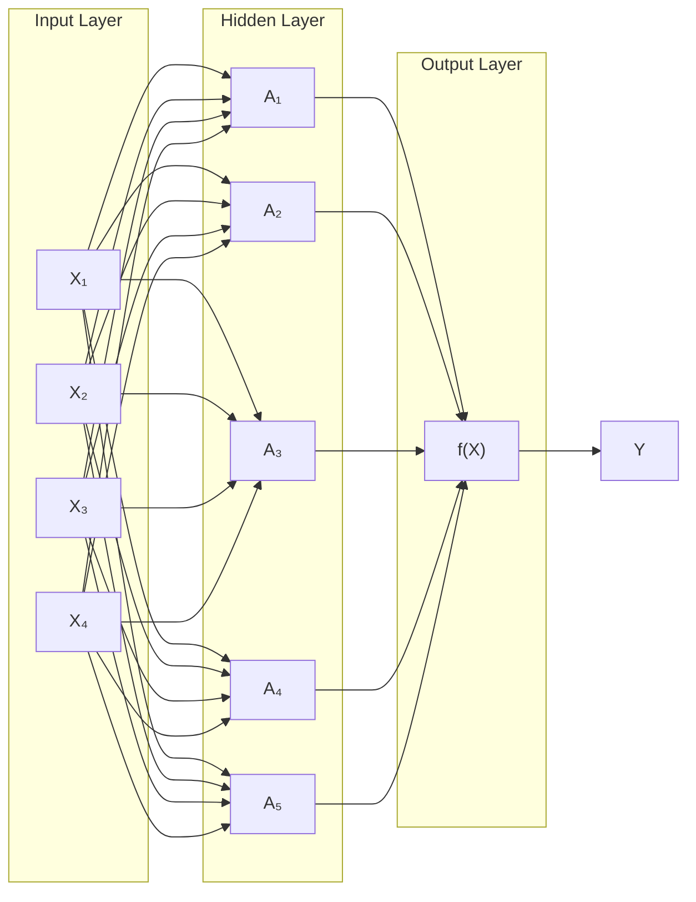
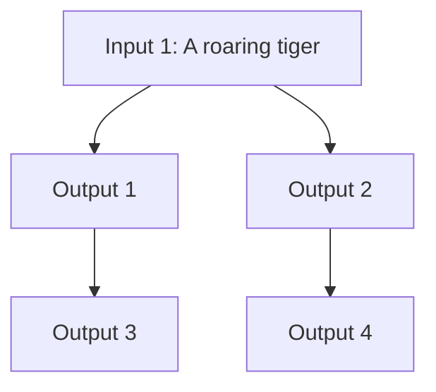
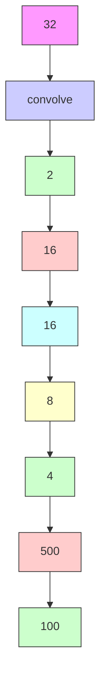
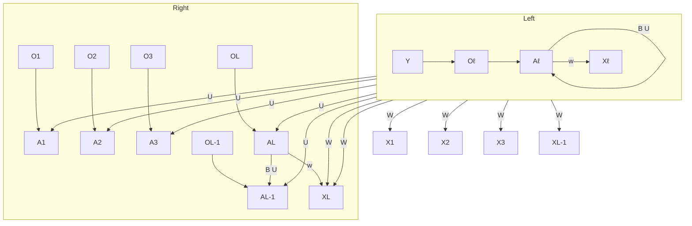
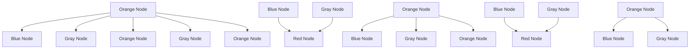

We now ft an SVM to the data:

In [31]:   
```python
svm_rbf_3 = SVC(kernel="rbf", C=10, gamma=1, decision_function_shape='ovo');
svm_rbf_3.fit(X, y)
fig, ax = subplots(figsize=(8,8))
plot_svm(X,
    y,
    svm_rbf_3,
    scatter_cmap=cm.tab10,
    ax=ax) 
```

The sklearn.svm library can also be used to perform support vector regression with a numerical response using the estimator SupportVector-Regression().

SupportVector Regression()

# 9.6.5 Application to Gene Expression Data

We now examine the Khan data set, which consists of a number of tissue samples corresponding to four distinct types of small round blue cell tumors. For each tissue sample, gene expression measurements are available. The data set consists of training data, xtrain and ytrain, and testing data, xtest and ytest.

We examine the dimension of the data:

In [32]:   
```python
Khan = load_data('Khan')
Khan['xtrain'].shape, Khan['xtest'].shape 
```  
Out[32]:

This data set consists of expression measurements for 2,308 genes. The training and test sets consist of 63 and 20 observations, respectively.

We will use a support vector approach to predict cancer subtype using gene expression measurements. In this data set, there is a very large number of features relative to the number of observations. This suggests that we should use a linear kernel, because the additional fexibility that will result from using a polynomial or radial kernel is unnecessary.

In [33]:   
```python
khan_linear = SVC(kernel='linear', C=10)
khan_linear.fit(Khan['xtrain'], Khan['ytrain'])
confusion_table(khan_linear.predict(Khan['xtrain']), Khan['ytrain']) 
```

Out[33]:   
```txt
Truth 1 2 3 4
Predicted
1 8 0 0 0
2 0 23 0 0
3 0 0 12 0
4 0 0 0 20 
```

We see that there are no training errors. In fact, this is not surprising, because the large number of variables relative to the number of observations implies that it is easy to fnd hyperplanes that fully separate the classes.

We are more interested in the support vector classifer’s performance on the test observations.

```javascript
In [34]: confusion_table(khan_linear.predict(Khan['xtest']), Khan['ytest']) 
```

```txt
Out[34]: Truth 1 2 3 4
Predicted
1 3 0 0 0
2 0 6 2 0
3 0 0 4 0
4 0 0 0 5 
```

We see that using C=10 yields two test set errors on these data.

# 9.7 Exercises

# Conceptual

1. This problem involves hyperplanes in two dimensions.

(a) Sketch the hyperplane $1 + 3 X _ { 1 } - X _ { 2 } = 0$ . Indicate the set of points for which $1 + 3 X _ { 1 } - X _ { 2 } > 0$ , as well as the set of points for which $1 + 3 X _ { 1 } - X _ { 2 } < 0$ .   
(b) On the same plot, sketch the hyperplane $- 2 + X _ { 1 } + 2 X _ { 2 } = 0$ . Indicate the set of points for which $- 2 + X _ { 1 } + 2 X _ { 2 } > 0$ , as well as the set of points for which $- 2 + X _ { 1 } + 2 X _ { 2 } < 0$ .

2. We have seen that in p = 2 dimensions, a linear decision boundary takes the form $\beta _ { 0 } + \beta _ { 1 } X _ { 1 } + \beta _ { 2 } X _ { 2 } = 0$ . We now investigate a non-linear decision boundary.

(a) Sketch the curve

$$
(1 + X _ {1}) ^ {2} + (2 - X _ {2}) ^ {2} = 4.
$$

(b) On your sketch, indicate the set of points for which

$$
(1 + X _ {1}) ^ {2} + (2 - X _ {2}) ^ {2} > 4,
$$

as well as the set of points for which

$$
(1 + X _ {1}) ^ {2} + (2 - X _ {2}) ^ {2} \leq 4.
$$

(c) Suppose that a classifer assigns an observation to the blue class if

$$
(1 + X _ {1}) ^ {2} + (2 - X _ {2}) ^ {2} > 4,
$$

and to the red class otherwise. To what class is the observation (0, 0) classifed? (−1, 1)? (2, 2)? (3, 8)?

(d) Argue that while the decision boundary in (c) is not linear in terms of $X _ { 1 }$ and $X _ { 2 }$ , it is linear in terms of $\dot { X } _ { 1 } , X _ { 1 } ^ { 2 } , X _ { 2 }$ , and $X _ { 2 } ^ { 2 }$ .

3. Here we explore the maximal margin classifer on a toy data set.

(a) We are given $n = 7$ observations in $p = 2$ dimensions. For each observation, there is an associated class label.

<table><tr><td>Obs.</td><td> $X_1$ </td><td> $X_2$ </td><td>Y</td></tr><tr><td>1</td><td>3</td><td>4</td><td>Red</td></tr><tr><td>2</td><td>2</td><td>2</td><td>Red</td></tr><tr><td>3</td><td>4</td><td>4</td><td>Red</td></tr><tr><td>4</td><td>1</td><td>4</td><td>Red</td></tr><tr><td>5</td><td>2</td><td>1</td><td>Blue</td></tr><tr><td>6</td><td>4</td><td>3</td><td>Blue</td></tr><tr><td>7</td><td>4</td><td>1</td><td>Blue</td></tr></table>

Sketch the observations.

(b) Sketch the optimal separating hyperplane, and provide the equation for this hyperplane (of the form (9.1)).   
(c) Describe the classifcation rule for the maximal margin classifer. It should be something along the lines of “Classify to Red if $\beta _ { 0 } + \beta _ { 1 } X _ { 1 } + \beta _ { 2 } X _ { 2 } > 0$ , and classify to Blue otherwise.” Provide the values for $\beta _ { 0 } , \beta _ { 1 }$ , and $\beta _ { 2 }$ .   
(d) On your sketch, indicate the margin for the maximal margin hyperplane.   
(e) Indicate the support vectors for the maximal margin classifer.   
(f) Argue that a slight movement of the seventh observation would not afect the maximal margin hyperplane.   
(g) Sketch a hyperplane that is not the optimal separating hyperplane, and provide the equation for this hyperplane.   
(h) Draw an additional observation on the plot so that the two classes are no longer separable by a hyperplane.

# Applied

4. Generate a simulated two-class data set with 100 observations and two features in which there is a visible but non-linear separation between the two classes. Show that in this setting, a support vector machine with a polynomial kernel (with degree greater than 1) or a radial kernel will outperform a support vector classifer on the training data. Which technique performs best on the test data? Make plots and report training and test error rates in order to back up your assertions.

5. We have seen that we can ft an SVM with a non-linear kernel in order to perform classifcation using a non-linear decision boundary. We will now see that we can also obtain a non-linear decision boundary by performing logistic regression using non-linear transformations of the features.

(a) Generate a data set with $n = 5 0 0$ and $p = 2$ , such that the observations belong to two classes with a quadratic decision boundary between them. For instance, you can do this as follows:

```python
rng = np.random.default_rng(5)
x1 = rng.uniform(size=500) - 0.5
x2 = rng.uniform(size=500) - 0.5
y = x1**2 - x2**2 > 0 
```

(b) Plot the observations, colored according to their class labels. Your plot should display $X _ { 1 }$ on the x-axis, and $X _ { 2 }$ on the $y -$ axis.   
(c) Fit a logistic regression model to the data, using $X _ { 1 }$ and $X _ { 2 }$ as predictors.   
(d) Apply this model to the training data in order to obtain a predicted class label for each training observation. Plot the observations, colored according to the predicted class labels. The decision boundary should be linear.   
(e) Now ft a logistic regression model to the data using non-linear functions of $X _ { 1 }$ and $X _ { 2 }$ as predictors $( \mathrm { e . g . } X _ { 1 } ^ { 2 } , X _ { 1 } \times X _ { 2 } , \log ( X _ { 2 } )$ , and so forth).   
(f) Apply this model to the training data in order to obtain a predicted class label for each training observation. Plot the observations, colored according to the predicted class labels. The decision boundary should be obviously non-linear. If it is not, then repeat (a)–(e) until you come up with an example in which the predicted class labels are obviously non-linear.   
(g) Fit a support vector classifer to the data with $X _ { 1 }$ and $X _ { 2 }$ as predictors. Obtain a class prediction for each training observation. Plot the observations, colored according to the predicted class labels.   
(h) Fit a SVM using a non-linear kernel to the data. Obtain a class prediction for each training observation. Plot the observations, colored according to the predicted class labels.   
(i) Comment on your results.

6. At the end of Section 9.6.1, it is claimed that in the case of data that is just barely linearly separable, a support vector classifer with a small value of C that misclassifes a couple of training observations may perform better on test data than one with a huge value of C that does not misclassify any training observations. You will now investigate this claim.

(a) Generate two-class data with $p = 2$ in such a way that the classes are just barely linearly separable.   
(b) Compute the cross-validation error rates for support vector classifers with a range of C values. How many training observations are misclassifed for each value of C considered, and how does this relate to the cross-validation errors obtained?

(c) Generate an appropriate test data set, and compute the test errors corresponding to each of the values of C considered. Which value of C leads to the fewest test errors, and how does this compare to the values of C that yield the fewest training errors and the fewest cross-validation errors?   
(d) Discuss your results.

7. In this problem, you will use support vector approaches in order to predict whether a given car gets high or low gas mileage based on the Auto data set.

(a) Create a binary variable that takes on a 1 for cars with gas mileage above the median, and a 0 for cars with gas mileage below the median.   
(b) Fit a support vector classifer to the data with various values of C, in order to predict whether a car gets high or low gas mileage. Report the cross-validation errors associated with diferent values of this parameter. Comment on your results. Note you will need to ft the classifer without the gas mileage variable to produce sensible results.   
(c) Now repeat (b), this time using SVMs with radial and polynomial basis kernels, with diferent values of gamma and degree and C. Comment on your results.   
(d) Make some plots to back up your assertions in (b) and (c).

Hint: In the lab, we used the plot\_svm() function for ftted SVMs. When p > 2, you can use the keyword argument features to create plots displaying pairs of variables at a time.

8. This problem involves the OJ data set which is part of the ISLP package.

(a) Create a training set containing a random sample of 800 observations, and a test set containing the remaining observations.   
(b) Fit a support vector classifer to the training data using C = 0.01, with Purchase as the response and the other variables as predictors. How many support points are there?   
(c) What are the training and test error rates?   
(d) Use cross-validation to select an optimal C. Consider values in the range 0.01 to 10.   
(e) Compute the training and test error rates using this new value for C.   
(f) Repeat parts (b) through (e) using a support vector machine with a radial kernel. Use the default value for gamma.   
(g) Repeat parts (b) through (e) using a support vector machine with a polynomial kernel. Set degree = 2.   
(h) Overall, which approach seems to give the best results on this data?

This chapter covers the important topic of deep learning. At the time of writing (2020), deep learning is a very active area of research in the machine learning and artifcial intelligence communities. The cornerstone of deep learning is the neural network.

Neural networks rose to fame in the late 1980s. There was a lot of excitement and a certain amount of hype associated with this approach, and they were the impetus for the popular Neural Information Processing Systems meetings (NeurIPS, formerly NIPS) held every year, typically in exotic places like ski resorts. This was followed by a synthesis stage, where the properties of neural networks were analyzed by machine learners, mathematicians and statisticians; algorithms were improved, and the methodology stabilized. Then along came SVMs, boosting, and random forests, and neural networks fell somewhat from favor. Part of the reason was that neural networks required a lot of tinkering, while the new methods were more automatic. Also, on many problems the new methods outperformed poorly-trained neural networks. This was the status quo for the frst decade in the new millennium.

All the while, though, a core group of neural-network enthusiasts were pushing their technology harder on ever-larger computing architectures and data sets. Neural networks resurfaced after 2010 with the new name deep learning, with new architectures, additional bells and whistles, and a string of success stories on some niche problems such as image and video classifcation, speech and text modeling. Many in the feld believe that the major reason for these successes is the availability of ever-larger training datasets, made possible by the wide-scale use of digitization in science and industry.

In this chapter we discuss the basics of neural networks and deep learning, and then go into some of the specializations for specifc problems, such as convolutional neural networks (CNNs) for image classifcation, and recurrent neural networks (RNNs) for time series and other sequences. We

deep learning

neural network


<details>
<summary>flowchart</summary>


</details>

FIGURE 10.1. Neural network with a single hidden layer. The hidden layer computes activations $A _ { k } = h _ { k } ( X )$ that are nonlinear transformations of linear combinations of the inputs $X _ { 1 } , X _ { 2 } , \ldots , X _ { p }$ . Hence these $A _ { k }$ are not directly observed. The functions $h _ { k } ( \cdot )$ are not fxed in advance, but are learned during the training of the network. The output layer is a linear model that uses these activations $A _ { k }$ as inputs, resulting in a function $f ( X )$ .

will also demonstrate these models using the Python torch package, along with a number of helper packages.

The material in this chapter is slightly more challenging than elsewhere in this book.

# 10.1 Single Layer Neural Networks

A neural network takes an input vector of p variables $X = ( X _ { 1 } , X _ { 2 } , \ldots , X _ { p } )$ Gowb and builds a nonlinear function $f ( X )$ to predict the response Y . We have built nonlinear prediction models in earlier chapters, using trees, boosting and generalized additive models. What distinguishes neural networks from these methods is the particular structure of the model. Figure 10.1 shows a simple feed-forward neural network for modeling a quantitative response using $p = 4$ predictors. In the terminology of neural networks, the four features $X _ { 1 } , \ldots , X _ { 4 }$ make up the units in the input layer. The arrows indicate that each of the inputs from the input layer feeds into each of the K hidden units (we get to pick $K \colon$ here we chose 5). The neural network model has the form

$$
f (X) = \beta_ {0} + \sum_ {k = 1} ^ {K} \beta_ {k} h _ {k} (X) \tag {10.1}
$$

$$
{ = } { \beta _ { 0 } + \sum _ { k = 1 } ^ { K } \beta _ { k } g ( w _ { k 0 } + \sum _ { j = 1 } ^ { p } w _ { k j } X _ { j } ) . }
$$

It is built up here in two steps. First the K activations $A _ { k } , k = 1 , \ldots , K$ , in the hidden layer are computed as functions of the input features $X _ { 1 } , \ldots , X _ { p } ,$ ,

$$
A _ {k} = h _ {k} (X) = g (w _ {k 0} + \sum_ {j = 1} ^ {p} w _ {k j} X _ {j}), \tag {10.2}
$$

feed-forward neural network input layer hidden units

activations


<details>
<summary>line</summary>

| z    | sigmoid | ReLU |
| ---- | ------- | ---- |
| -5   | 0.0     | 0.0  |
| -4   | 0.0     | 0.0  |
| -2   | 0.1     | 0.0  |
| 0    | 0.5     | 0.0  |
| 2    | 0.8     | 0.5  |
| 4    | 0.95    | 0.8  |
| 5    | 1.0     | 1.0  |
</details>

FIGURE 10.2. Activation functions. The piecewise-linear ReLU function is popular for its efciency and computability. We have scaled it down by a factor of fve for ease of comparison.

where $g ( z )$ is a nonlinear activation function that is specifed in advance. We can think of each $A _ { k }$ as a diferent transformation $h _ { k } ( X )$ of the original features, much like the basis functions of Chapter 7. These K activations from the hidden layer then feed into the output layer, resulting in

activation function

$$
f (X) = \beta_ {0} + \sum_ {k = 1} ^ {K} \beta_ {k} A _ {k}, \tag {10.3}
$$

a linear regression model in the $K = 5$ activations. All the parameters $\beta _ { 0 } , \ldots , \beta _ { K }$ and $w _ { 1 0 } , \ldots , w _ { K p }$ need to be estimated from data. In the early instances of neural networks, the sigmoid activation function was favored,

sigmoid

$$
g (z) = \frac {e ^ {z}}{1 + e ^ {z}} = \frac {1}{1 + e ^ {- z}}, \tag {10.4}
$$

which is the same function used in logistic regression to convert a linear function into probabilities between zero and one (see Figure 10.2). The preferred choice in modern neural networks is the ReLU (rectifed linear unit) activation function, which takes the form

$$
g (z) = (z) _ {+} = \left\{ \begin{array}{l l} 0 & \text { if   } z <   0 \\ z & \text { otherwise. } \end{array} \right. \tag {10.5}
$$

ReLU rectifed linear unit

A ReLU activation can be computed and stored more efciently than a sigmoid activation. Although it thresholds at zero, because we apply it to a linear function (10.2) the constant term $w _ { k 0 }$ will shift this infection point.

So in words, the model depicted in Figure 10.1 derives fve new features by computing fve diferent linear combinations of X, and then squashes each through an activation function $g ( \cdot )$ to transform it. The fnal model is linear in these derived variables.

The name neural network originally derived from thinking of these hidden units as analogous to neurons in the brain — values of the activations $A _ { k } \ = \ h _ { k } ( X )$ close to one are fring, while those close to zero are silent (using the sigmoid activation function).

The nonlinearity in the activation function $g ( \cdot )$ is essential, since without it the model f (X) in (10.1) would collapse into a simple linear model in

$X _ { 1 } , \ldots , X _ { p } .$ . Moreover, having a nonlinear activation function allows the model to capture complex nonlinearities and interaction efects. Consider a very simple example with $p \ : = \ : 2$ input variables $\boldsymbol { X } ~ = ~ ( X _ { 1 } , X _ { 2 } )$ , and K = 2 hidden units $h _ { 1 } ( X )$ and $h _ { 2 } ( X )$ with $g ( z ) = z ^ { 2 }$ . We specify the other parameters as

$$
\beta_ {0} = 0, \quad \beta_ {1} = \frac {1}{4}, \quad \beta_ {2} = - \frac {1}{4},
$$

$$
w _ {1 0} = 0, \quad w _ {1 1} = 1, \quad w _ {1 2} = 1, \tag {10.6}
$$

$$
w _ {2 0} = 0, \quad w _ {2 1} = 1, \quad w _ {2 2} = - 1.
$$

From (10.2), this means that

$$
\begin{array}{r c l} h _ {1} (X) & = & (0 + X _ {1} + X _ {2}) ^ {2}, \\ h _ {2} (X) & = & (0 + X _ {1} - X _ {2}) ^ {2}. \end{array} \tag {10.7}
$$

Then plugging (10.7) into (10.1), we get

$$
f (X) = 0 + \frac {1}{4} \cdot \left(0 + X _ {1} + X _ {2}\right) ^ {2} - \frac {1}{4} \cdot \left(0 + X _ {1} - X _ {2}\right) ^ {2}
$$

$$
= \frac {1}{4} \left[ \left(X _ {1} + X _ {2}\right) ^ {2} - \left(X _ {1} - X _ {2}\right) ^ {2} \right] \tag {10.8}
$$

$$
= X _ {1} X _ {2}.
$$

So the sum of two nonlinear transformations of linear functions can give us an interaction! In practice we would not use a quadratic function for $g ( z )$ , since we would always get a second-degree polynomial in the original coordinates $X _ { 1 } , \ldots , X _ { p }$ . The sigmoid or ReLU activations do not have such a limitation.

Fitting a neural network requires estimating the unknown parameters in (10.1). For a quantitative response, typically squared-error loss is used, so that the parameters are chosen to minimize

$$
\sum_ {i = 1} ^ {n} \left(y _ {i} - f (x _ {i})\right) ^ {2}. \tag {10.9}
$$

Details about how to perform this minimization are provided in Section 10.7.

# 10.2 Multilayer Neural Networks

Modern neural networks typically have more than one hidden layer, and often many units per layer. In theory a single hidden layer with a large number of units has the ability to approximate most functions. However, the learning task of discovering a good solution is made much easier with multiple layers each of modest size.

We will illustrate a large dense network on the famous and publicly available MNIST handwritten digit dataset.1 Figure 10.3 shows examples of these digits. The idea is to build a model to classify the images into their correct digit class 0–9. Every image has $p = 2 8 \times 2 8 = 7 8 4$ pixels, each of which is an eight-bit grayscale value between 0 and 255 representing the relative amount of the written digit in that tiny square.2 These pixels are stored in the input vector X (in, say, column order). The output is the class label, represented by a vector $Y = ( Y _ { 0 } , Y _ { 1 } , \dots , Y _ { 9 } )$ of 10 dummy variables, with a one in the position corresponding to the label, and zeros elsewhere. In the machine learning community, this is known as one-hot encoding. There are 60,000 training images, and 10,000 test images.


<details>
<summary>text_image</summary>

0 1 2 3 4 5 6 7 8 9
0 1 2 3 4 5 6 7 8 9
0 1 2 3 4 5 6 7 8 9
0 1 2 3 4 5 6 7 8 9
3 5 8
</details>

FIGURE 10.3. Examples of handwritten digits from the MNIST corpus. Each grayscale image has $2 8 \times 2 8$ pixels, each of which is an eight-bit number (0–255) which represents how dark that pixel is. The frst 3, 5, and 8 are enlarged to show their 784 individual pixel values.

On a historical note, digit recognition problems were the catalyst that accelerated the development of neural network technology in the late 1980s at AT&T Bell Laboratories and elsewhere. Pattern recognition tasks of this kind are relatively simple for humans. Our visual system occupies a large fraction of our brains, and good recognition is an evolutionary force for survival. These tasks are not so simple for machines, and it has taken more than 30 years to refne the neural-network architectures to match human performance.

Figure 10.4 shows a multilayer network architecture that works well for solving the digit-classifcation task. It difers from Figure 10.1 in several ways:

• It has two hidden layers $L _ { 1 }$ (256 units) and $L _ { 2 }$ (128 units) rather than one. Later we will see a network with seven hidden layers.   
• It has ten output variables, rather than one. In this case the ten variables really represent a single qualitative variable and so are quite dependent. (We have indexed them by the digit class 0–9 rather than 1–10, for clarity.) More generally, in multi-task learning one can predict diferent responses simultaneously with a single network; they all have a say in the formation of the hidden layers.   
• The loss function used for training the network is tailored for the multiclass classifcation task.

one-hot encoding

multi-task learning


<details>
<summary>flowchart</summary>


</details>

FIGURE 10.4. Neural network diagram with two hidden layers and multiple outputs, suitable for the MNIST handwritten-digit problem. The input layer has $p = 7 8 4$ units, the two hidden layers $K _ { 1 } = 2 5 6$ and $K _ { 2 } = 1 2 8$ units respectively, and the output layer 10 units. Along with intercepts (referred to as biases in the deep-learning community) this network has 235,146 parameters (referred to as weights).

The frst hidden layer is as in (10.2), with

$$
\begin{array}{l} A _ {k} ^ {(1)} = h _ {k} ^ {(1)} (X) \tag {10.10} \\ = g \left(w _ {k 0} ^ {(1)} + \sum_ {j = 1} ^ {p} w _ {k j} ^ {(1)} X _ {j}\right) \\ \end{array}
$$

for $k = 1 , \ldots , K _ { 1 }$ . The second hidden layer treats the activations $A _ { k } ^ { ( 1 ) }$ (k of the frst hidden layer as inputs and computes new activations

$$
\begin{array}{l} A _ {\ell} ^ {(2)} = h _ {\ell} ^ {(2)} (X) \tag {10.11} \\ = g (w _ {\ell 0} ^ {(2)} + \sum_ {k = 1} ^ {K _ {1}} w _ {\ell k} ^ {(2)} A _ {k} ^ {(1)}) \\ \end{array}
$$

for $\ell = 1 , \ldots , K _ { 2 }$ . Notice that each of the activations in the second layer $A _ { \ell } ^ { ( 2 ) } = h _ { \ell } ^ { ( 2 ) } ( X )$ is a function of the input vector X. This is the case because while they are explicitly a function of the activations $A _ { k } ^ { ( 1 ) }$ from layer $L _ { 1 }$ these in turn are functions of X. This would also be the case with more hidden layers. Thus, through a chain of transformations, the network is able to build up fairly complex transformations of X that ultimately feed into the output layer as features.

We have introduced additional superscript notation such as $h _ { \ell } ^ { ( 2 ) } ( X )$ and w\$j $w _ { \ell j } ^ { ( 2 ) }$ in (10.10) and (10.11) to indicate to which layer the activations and weights (coefcients) belong, in this case layer 2. The notation $\mathbf { W } _ { 1 }$ in Figure 10.4 represents the entire matrix of weights that feed from the input layer to the frst hidden layer $L _ { 1 }$ . This matrix will have $7 8 5 \times 2 5 6 = 2 0 0 , 9 6 0$ cYm.owb elements; there are 785 rather than 784 because we must account for the intercept or bias term.3

Each element $A _ { k } ^ { ( 1 ) }$ feeds to the second hidden layer $L _ { 2 }$ via the matrix of weights $\mathbf { W } _ { 2 }$ of dimension $2 5 7 \times 1 2 8 = 3 2 { , } 8 9 6$ .

We now get to the output layer, where we now have ten responses rather than one. The frst step is to compute ten diferent linear models similar to our single model (10.1),

$$
Z _ {m} = \beta_ {m 0} + \sum_ {\ell = 1} ^ {K _ {2}} \beta_ {m \ell} h _ {\ell} ^ {(2)} (X) \tag {10.12}
$$

$$
= \beta_ {m 0} + \sum_ {\ell = 1} ^ {K _ {2}} \beta_ {m \ell} A _ {\ell} ^ {(2)},
$$

for $m = 0 , 1 , \ldots , 9$ . The matrix B stores all $1 2 9 \times 1 0 = 1 { , } 2 9 0$ of these weights.

If these were all separate quantitative responses, we would simply set each $f _ { m } ( X ) = Z _ { m }$ and be done. However, we would like our estimates to represent class probabilities $f _ { m } ( X ) = \mathrm { P r } ( Y = m \vert X )$ , just like in multinomial logistic regression in Section 4.3.5. So we use the special softmax activation function (see (4.13) on page 145),

bias

$$
f _ {m} (X) = \operatorname * {P r} (Y = m | X) = \frac {e ^ {Z _ {m}}}{\sum_ {\ell = 0} ^ {9} e ^ {Z _ {\ell}}}, \tag {10.13}
$$

softmax

for $m = 0 , 1 , \ldots , 9$ . This ensures that the 10 numbers behave like probabilities (non-negative and sum to one). Even though the goal is to build a classifer, our model actually estimates a probability for each of the 10 classes. The classifer then assigns the image to the class with the highest probability.

To train this network, since the response is qualitative, we look for coeffcient estimates that minimize the negative multinomial log-likelihood

$$
- \sum_ {i = 1} ^ {n} \sum_ {m = 0} ^ {9} y _ {i m} \log (f _ {m} (x _ {i})), \tag {10.14}
$$

also known as the cross-entropy. This is a generalization of the criterion (4.5) for two-class logistic regression. Details on how to minimize this objective are given in Section 10.7. If the response were quantitative, we would instead minimize squared-error loss as in (10.9).

Table 10.1 compares the test performance of the neural network with two simple models presented in Chapter 4 that make use of linear decision boundaries: multinomial logistic regression and linear discriminant analysis. The improvement of neural networks over both of these linear methods is dramatic: the network with dropout regularization achieves a test error rate below 2% on the 10,000 test images. (We describe dropout regularization in Section 10.7.3.) In Section 10.9.2 of the lab, we present the code for ftting this model, which runs in just over two minutes on a laptop computer.

crossentropy

<table><tr><td>Method</td><td>Test Error</td></tr><tr><td>Neural Network + Ridge Regularization</td><td>2.3%</td></tr><tr><td>Neural Network + Dropout Regularization</td><td>1.8%</td></tr><tr><td>Multinomial Logistic Regression</td><td>7.2%</td></tr><tr><td>Linear Discriminant Analysis</td><td>12.7%</td></tr></table>

TABLE 10.1. Test error rate on the MNIST data, for neural networks with two forms of regularization, as well as multinomial logistic regression and linear discriminant analysis. In this example, the extra complexity of the neural network leads to a marked improvement in test error.


<details>
<summary>natural_image</summary>

Grid of 30 colorful and nature-themed images including animals, animals, animals, animals, animals, animals, animals, animals, animals, animals, animals, animals, animals, animals, animals, animals, animals, animals, animals, animals, animals, animals, animals, animals, animals, animals, animals, animals, animals, animals, animals, animals, animals, animals, animals, animals, animals, animals, animals, animals, animals, animals, animals, animals, animals, animals, animals, animals, animals, animals, animals
</details>

FIGURE 10.5. A sample of images from the CIFAR100 database: a collection of natural images from everyday life, with 100 diferent classes represented.

Adding the number of coefcients in $\mathbf { W } _ { 1 } , \ \mathbf { W } _ { 2 }$ and B, we get 235,146 in all, more than 33 times the number 785 9 = 7,065 needed for multinomial logistic regression. Recall that there are 60,000 images in the training set. While this might seem like a large training set, there are almost four times as many coefcients in the neural network model as there are observations in the training set! To avoid overftting, some regularization is needed. In this example, we used two forms of regularization: ridge regularization, which is similar to ridge regression from Chapter 6, and dropout regularization. We discuss both forms of regularization in Section 10.7.

dropout

# 10.3 Convolutional Neural Networks

Neural networks rebounded around 2010 with big successes in image classifcation. Around that time, massive databases of labeled images were being accumulated, with ever-increasing numbers of classes. Figure 10.5 shows 75 images drawn from the CIFAR100 database.4 This database consists of 60,000 images labeled according to 20 superclasses (e.g. aquatic mammals), with fve classes per superclass (beaver, dolphin, otter, seal, whale). Each image has a resolution of $3 2 \times 3 2$ pixels, with three eight-bit numbers per pixel representing red, green and blue. The numbers for each image are organized in a three-dimensional array called a feature map. The frst two

feature map


<details>
<summary>flowchart</summary>

```mermaid
graph TD
    A["TIGER"] --> B[" facial"]
    A --> C[" visually"]
    A --> D[" sensory"]
    B --> E[ facial emoji: eye, down arrow, smiling face, smiling face, down arrow, down arrow, down arrow, down arrow, down arrow, down arrow, down arrow, down arrow, down arrow, down arrow, down arrow, down arrow, down arrow, down arrow, down arrow, down arrow, down arrow, down arrow, down arrow, down arrow, down arrow, down arrow, down arrow, down arrow, down arrow, down arrow, down arrow, down arrow, down arrow, down arrow, down arrow, down arrow, down arrow, down arrow
```
</details>

FIGURE 10.6. Schematic showing how a convolutional neural network classifes an image of a tiger. The network takes in the image and identifes local features. It then combines the local features in order to create compound features, which in this example include eyes and ears. These compound features are used to output the label “tiger”.

axes are spatial (both are 32-dimensional), and the third is the channel axis,5 representing the three colors. There is a designated training set of 50,000 images, and a test set of 10,000.

A special family of convolutional neural networks (CNNs) has evolved for classifying images such as these, and has shown spectacular success on a wide range of problems. CNNs mimic to some degree how humans classify images, by recognizing specifc features or patterns anywhere in the image that distinguish each particular object class. In this section we give a brief overview of how they work.

Figure 10.6 illustrates the idea behind a convolutional neural network on a cartoon image of a tiger.6

The network frst identifes low-level features in the input image, such as small edges, patches of color, and the like. These low-level features are then combined to form higher-level features, such as parts of ears, eyes, and so on. Eventually, the presence or absence of these higher-level features contributes to the probability of any given output class.

How does a convolutional neural network build up this hierarchy? It combines two specialized types of hidden layers, called convolution layers and pooling layers. Convolution layers search for instances of small patterns in the image, whereas pooling layers downsample these to select a prominent subset. In order to achieve state-of-the-art results, contemporary neuralnetwork architectures make use of many convolution and pooling layers. We describe convolution and pooling layers next.

channel

convolutional neural networks

# 10.3.1 Convolution Layers

A convolution layer is made up of a large number of convolution flters, each

convolution layer convolution flter

of which is a template that determines whether a particular local feature is present in an image. A convolution flter relies on a very simple operation, called a convolution, which basically amounts to repeatedly multiplying matrix elements and then adding the results.

To understand how a convolution flter works, consider a very simple example of a 4 × 3 image:

$$
\text { Original   Image } = \left[ \begin{array}{c c c} a & b & c \\ d & e & f \\ g & h & i \\ j & k & l \end{array} \right].
$$

Now consider a 2 2 flter of the form

$$
\text { Convolution   Filter } = \left[ \begin{array}{c c} \alpha & \beta \\ \gamma & \delta \end{array} \right].
$$

When we convolve the image with the flter, we get the result7

$$
\text {Convolved Image} = \left[ \begin{array}{c c} a \alpha + b \beta + d \gamma + e \delta & b \alpha + c \beta + e \gamma + f \delta \\ d \alpha + e \beta + g \gamma + h \delta & e \alpha + f \beta + h \gamma + i \delta \\ g \alpha + h \beta + j \gamma + k \delta & h \alpha + i \beta + k \gamma + l \delta \end{array} \right].
$$

For instance, the top-left element comes from multiplying each element in the 2 × 2 flter by the corresponding element in the top left $2 \times 2$ portion of the image, and adding the results. The other elements are obtained in a similar way: the convolution flter is applied to every $2 \times 2$ submatrix of the original image in order to obtain the convolved image. If a $2 \times 2$ submatrix of the original image resembles the convolution flter, then it will have a large value in the convolved image; otherwise, it will have a small value. Thus, the convolved image highlights regions of the original image that resemble the convolution flter. We have used $2 \times 2$ as an example; in general convolution flters are small $\ell _ { 1 } \times \ell _ { 2 }$ arrays, with $\ell _ { 1 }$ and $\ell _ { 2 }$ small positive integers that are not necessarily equal.

Figure 10.7 illustrates the application of two convolution flters to a 192 179 image of a tiger, shown on the left-hand side.8 Each convolution flter is a $1 5 \times 1 5$ image containing mostly zeros (black), with a narrow strip of ones (white) oriented either vertically or horizontally within the image. When each flter is convolved with the image of the tiger, areas of the tiger that resemble the flter (i.e. that have either horizontal or vertical stripes or edges) are given large values, and areas of the tiger that do not resemble the feature are given small values. The convolved images are displayed on the right-hand side. We see that the horizontal stripe flter picks out horizontal stripes and edges in the original image, whereas the vertical stripe flter picks out vertical stripes and edges in the original image.


<details>
<summary>flowchart</summary>


</details>

FIGURE 10.7. Convolution flters fnd local features in an image, such as edges and small shapes. We begin with the image of the tiger shown on the left, and apply the two small convolution flters in the middle. The convolved images highlight areas in the original image where details similar to the flters are found. Specifcally, the top convolved image highlights the tiger’s vertical stripes, whereas the bottom convolved image highlights the tiger’s horizontal stripes. We can think of the original image as the input layer in a convolutional neural network, and the convolved images as the units in the frst hidden layer.

We have used a large image and two large flters in Figure 10.7 for illustration. For the CIFAR100 database there are 32 × 32 color pixels per image, and we use 3 3 convolution flters.

In a convolution layer, we use a whole bank of flters to pick out a variety of diferently-oriented edges and shapes in the image. Using predefned flters in this way is standard practice in image processing. By contrast, with CNNs the flters are learned for the specifc classifcation task. We can think of the flter weights as the parameters going from an input layer to a hidden layer, with one hidden unit for each pixel in the convolved image. This is in fact the case, though the parameters are highly structured and constrained (see Exercise 4 for more details). They operate on localized patches in the input image (so there are many structural zeros), and the same weights in a given flter are reused for all possible patches in the image (so the weights are constrained). 9

We now give some additional details.

• Since the input image is in color, it has three channels represented by a three-dimensional feature map (array). Each channel is a twodimensional (32 × 32) feature map — one for red, one for green, and one for blue. A single convolution flter will also have three channels, one per color, each of dimension 3 3, with potentially diferent flter weights. The results of the three convolutions are summed to form a two-dimensional output feature map. Note that at this point the color information has been used, and is not passed on to subsequent layers except through its role in the convolution.

• If we use K diferent convolution flters at this frst hidden layer, we get K two-dimensional output feature maps, which together are treated as a single three-dimensional feature map. We view each of the K output feature maps as a separate channel of information, so now we have K channels in contrast to the three color channels of the original input feature map. The three-dimensional feature map is just like the activations in a hidden layer of a simple neural network, except organized and produced in a spatially structured way.   
• We typically apply the ReLU activation function (10.5) to the convolved image. This step is sometimes viewed as a separate layer in the convolutional neural network, in which case it is referred to as a detector layer.

detector layer

# 10.3.2 Pooling Layers

A pooling layer provides a way to condense a large image into a smaller summary image. While there are a number of possible ways to perform pooling, the max pooling operation summarizes each non-overlapping 2 × 2 block of pixels in an image using the maximum value in the block. This reduces the size of the image by a factor of two in each direction, and it also provides some location invariance: i.e. as long as there is a large value in one of the four pixels in the block, the whole block registers as a large value in the reduced image.

Here is a simple example of max pooling:

$$
\text {Max pool} \left[ \begin{array}{c c c c} 1 & 2 & 5 & 3 \\ 3 & 0 & 1 & 2 \\ 2 & 1 & 3 & 4 \\ 1 & 1 & 2 & 0 \end{array} \right] \to \left[ \begin{array}{c c} 3 & 5 \\ 2 & 4 \end{array} \right].
$$

pooling

# 10.3.3 Architecture of a Convolutional Neural Network

So far we have defned a single convolution layer — each flter produces a new two-dimensional feature map. The number of convolution flters in a convolution layer is akin to the number of units at a particular hidden layer in a fully-connected neural network of the type we saw in Section 10.2. This number also defnes the number of channels in the resulting threedimensional feature map. We have also described a pooling layer, which reduces the frst two dimensions of each three-dimensional feature map. Deep CNNs have many such layers. Figure 10.8 shows a typical architecture for a CNN for the CIFAR100 image classifcation task.

At the input layer, we see the three-dimensional feature map of a color image, where the channel axis represents each color by a 32 × 32 twodimensional feature map of pixels. Each convolution flter produces a new channel at the frst hidden layer, each of which is a 32 × 32 feature map (after some padding at the edges). After this frst round of convolutions, we now have a new “image”; a feature map with considerably more channels than the three color input channels (six in the fgure, since we used six convolution flters).


<details>
<summary>flowchart</summary>


</details>

FIGURE 10.8. Architecture of a deep CNN for the CIFAR100 classifcation task. Convolution layers are interspersed with 2  2 max-pool layers, which reduce the size by a factor of 2 in both dimensions.

This is followed by a max-pool layer, which reduces the size of the feature map in each channel by a factor of four: two in each dimension.

This convolve-then-pool sequence is now repeated for the next two layers. Some details are as follows:

• Each subsequent convolve layer is similar to the frst. It takes as input the three-dimensional feature map from the previous layer and treats it like a single multi-channel image. Each convolution flter learned has as many channels as this feature map.   
• Since the channel feature maps are reduced in size after each pool layer, we usually increase the number of flters in the next convolve layer to compensate.   
• Sometimes we repeat several convolve layers before a pool layer. This efectively increases the dimension of the flter.

These operations are repeated until the pooling has reduced each channel feature map down to just a few pixels in each dimension. At this point the three-dimensional feature maps are fattened — the pixels are treated as separate units — and fed into one or more fully-connected layers before reaching the output layer, which is a softmax activation for the 100 classes (as in (10.13)).

There are many tuning parameters to be selected in constructing such a network, apart from the number, nature, and sizes of each layer. Dropout learning can be used at each layer, as well as lasso or ridge regularization (see Section 10.7). The details of constructing a convolutional neural network can seem daunting. Fortunately, terrifc software is available, with extensive examples and vignettes that provide guidance on sensible choices for the parameters. For the CIFAR100 ofcial test set, the best accuracy as of this writing is just above 75%, but undoubtedly this performance will continue to improve.

# 10.3.4 Data Augmentation

An additional important trick used with image modeling is data augmentation. Essentially, each training image is replicated many times, with each replicate randomly distorted in a natural way such that human recognition is unafected. Figure 10.9 shows some examples. Typical distortions are

data augmentation

  
FIGURE 10.9. Data augmentation. The original image (leftmost) is distorted in natural ways to produce diferent images with the same class label. These distortions do not fool humans, and act as a form of regularization when ftting the CNN.

zoom, horizontal and vertical shift, shear, small rotations, and in this case horizontal fips. At face value this is a way of increasing the training set considerably with somewhat diferent examples, and thus protects against overftting. In fact we can see this as a form of regularization: we build a cloud of images around each original image, all with the same label. This kind of fattening of the data is similar in spirit to ridge regularization.

We will see in Section 10.7.2 that the stochastic gradient descent algorithms for ftting deep learning models repeatedly process randomlyselected batches of, say, 128 training images at a time. This works hand-inglove with augmentation, because we can distort each image in the batch on the fy, and hence do not have to store all the new images.

# 10.3.5 Results Using a Pretrained Classifer

Here we use an industry-level pretrained classifer to predict the class of some new images. The resnet50 classifer is a convolutional neural network that was trained using the imagenet data set, which consists of millions of images that belong to an ever-growing number of categories.10 Figure 10.10 demonstrates the performance of resnet50 on six photographs (private collection of one of the authors).11 The CNN does a reasonable job classifying the hawk in the second image. If we zoom out as in the third image, it gets confused and chooses the fountain rather than the hawk. In the fnal image a “jacamar” is a tropical bird from South and Central America with similar coloring to the South African Cape Weaver. We give more details on this example in Section 10.9.4.

Much of the work in ftting a CNN is in learning the convolution flters at the hidden layers; these are the coefcients of a CNN. For models ft to massive corpora such as imagenet with many classes, the output of these flters can serve as features for general natural-image classifcation problems. One can use these pretrained hidden layers for new problems with much smaller training sets (a process referred to as weight freezing), and just train the last few layers of the network, which requires much less data.

weight freezing


famingo   
Cooper’s hawk   
Cooper’s hawk 

<table><tr><td>flamingo</td><td>0.83</td><td>kite</td><td>0.60</td><td>fountain</td><td>0.35</td></tr><tr><td>spoonbill</td><td>0.17</td><td>great grey owl</td><td>0.09</td><td>nail</td><td>0.12</td></tr><tr><td>white stork</td><td>0.00</td><td>robin</td><td>0.06</td><td>hook</td><td>0.07</td></tr></table>

Lhasa Apso   
cat   
Cape weaver 

<table><tr><td>Tibetan terrier</td><td>0.56</td><td>Old English sheepdog</td><td>0.82</td><td>jacamar</td><td>0.28</td></tr><tr><td>Lhasa</td><td>0.32</td><td>Shih-Tzu</td><td>0.04</td><td>macaw</td><td>0.12</td></tr><tr><td>cocker spaniel</td><td>0.03</td><td>Persian cat</td><td>0.04</td><td>robin</td><td>0.12</td></tr></table>

FIGURE 10.10. Classifcation of six photographs using the resnet50 CNN trained on the imagenet corpus. The table below the images displays the true (intended) label at the top of each panel, and the top three choices of the classifer (out of 100). The numbers are the estimated probabilities for each choice. (A kite is a raptor, but not a hawk.)

The vignettes and book12 that accompany the keras package give more details on such applications.

# 10.4 Document Classifcation

In this section we introduce a new type of example that has important applications in industry and science: predicting attributes of documents. Examples of documents include articles in medical journals, Reuters news feeds, emails, tweets, and so on. Our example will be IMDb (Internet Movie Database) ratings — short documents where viewers have written critiques of movies.13 The response in this case is the sentiment of the review, which will be positive or negative.

Here is the beginning of a rather amusing negative review:

This has to be one of the worst flms of the 1990s. When my friends & I were watching this flm (being the target audience it was aimed at) we just sat & watched the frst half an hour with our jaws touching the foor at how bad it really was. The rest of the time, everyone else in the theater just started talking to each other, leaving or generally crying into their popcorn . .

Each review can be a diferent length, include slang or non-words, have spelling errors, etc. We need to fnd a way to featurize such a document. This is modern parlance for defning a set of predictors.

The simplest and most common featurization is the bag-of-words model. We score each document for the presence or absence of each of the words in a language dictionary — in this case an English dictionary. If the dictionary contains M words, that means for each document we create a binary feature vector of length M, and score a 1 for every word present, and 0 otherwise. That can be a very wide feature vector, so we limit the dictionary — in this case to the 10,000 most frequently occurring words in the training corpus of 25,000 reviews. Fortunately there are nice tools for doing this automatically. Here is the beginning of a positive review that has been redacted in this way:

4START 5 this flm was just brilliant casting location scenery story direction everyone’s really suited the part they played and you could just imagine being there robert 4UNK 5 is an amazing actor and now the same being director 4UNK 5 father came from the same scottish island as myself so i loved . . .

Here we can see many words have been omitted, and some unknown words (UNK) have been marked as such. With this reduction the binary feature vector has length 10,000, and consists mostly of 0’s and a smattering of 1’s in the positions corresponding to words that are present in the document. We have a training set and test set, each with 25,000 examples, and each balanced with regard to sentiment. The resulting training feature matrix X has dimension 25,000×10,000, but only 1.3% of the binary entries are nonzero. We call such a matrix sparse, because most of the values are the same (zero in this case); it can be stored efciently in sparse matrix format. 14 There are a variety of ways to account for the document length; here we only score a word as in or out of the document, but for example one could instead record the relative frequency of words. We split of a validation set of size 2,000 from the 25,000 training observations (for model tuning), and ft two model sequences:

• A lasso logistic regression using the glmnet package;   
• A two-class neural network with two hidden layers, each with 16 ReLU units.


<details>
<summary>line</summary>

| -log(λ) | train  | validation | test   |
| ------- | ------ | ---------- | ------ |
| 3       | 0.61   | 0.61       | 0.61   |
| 4       | 0.65   | 0.65       | 0.65   |
| 5       | 0.75   | 0.75       | 0.75   |
| 6       | 0.82   | 0.82       | 0.82   |
| 7       | 0.87   | 0.87       | 0.87   |
| 8       | 0.90   | 0.90       | 0.90   |
| 9       | 0.93   | 0.93       | 0.93   |
| 10      | 0.96   | 0.96       | 0.96   |
| 11      | 0.98   | 0.98       | 0.98   |
| 12      | 1.00   | 0.98       | 0.98   |
</details>


<details>
<summary>line</summary>

| Epochs | Accuracy (Black) | Accuracy (Cyan) | Accuracy (Orange) |
| ------ | ---------------- | --------------- | ----------------- |
| 0      | 0.81             | 0.88            | 0.88              |
| 5      | 0.92             | 0.89            | 0.87              |
| 10     | 0.96             | 0.88            | 0.86              |
| 15     | 0.98             | 0.87            | 0.85              |
| 20     | 0.99             | 0.86            | 0.84              |
</details>

FIGURE 10.11. Accuracy of the lasso and a two-hidden-layer neural network on the IMDb data. For the lasso, the x-axis displays − log(λ), while for the neural network it displays epochs (number of times the ftting algorithm passes through the training set). Both show a tendency to overft, and achieve approximately the same test accuracy.

Both methods produce a sequence of solutions. The lasso sequence is indexed by the regularization parameter λ. The neural-net sequence is indexed by the number of gradient-descent iterations used in the ftting, as measured by training epochs or passes through the training set (Section 10.7). Notice that the training accuracy in Figure 10.11 (black points) increases monotonically in both cases. We can use the validation error to pick a good solution from each sequence (blue points in the plots), which would then be used to make predictions on the test data set.

Note that a two-class neural network amounts to a nonlinear logistic regression model. From (10.12) and (10.13) we can see that

$$
\begin{array}{l} \log \left(\frac {\operatorname* {P r} (Y = 1 | X)}{\operatorname* {P r} (Y = 0 | X)}\right) = Z _ {1} - Z _ {0} \tag {10.15} \\ { = } { ( \beta _ { 1 0 } - \beta _ { 0 0 } ) + \sum _ { \ell = 1 } ^ { K _ { 2 } } ( \beta _ { 1 \ell } - \beta _ { 0 \ell } ) A _ { \ell } ^ { ( 2 ) } . } \\ \end{array}
$$

(This shows the redundancy in the softmax function; for K classes we really only need to estimate K 1 sets of coefcients. See Section 4.3.5.) In Figure 10.11 we show accuracy (fraction correct) rather than classifcation error (fraction incorrect), the former being more popular in the machine learning community. Both models achieve a test-set accuracy of about 88%.

The bag-of-words model summarizes a document by the words present, and ignores their context. There are at least two popular ways to take the context into account:

• The bag-of-n-grams model. For example, a bag of 2-grams records

accuracy

bag-of-ngrams

the consecutive co-occurrence of every distinct pair of words. “Blissfully long” can be seen as a positive phrase in a movie review, while “blissfully short” a negative.

• Treat the document as a sequence, taking account of all the words in the context of those that preceded and those that follow.

In the next section we explore models for sequences of data, which have applications in weather forecasting, speech recognition, language translation, and time-series prediction, to name a few. We continue with this IMDb example there.

# 10.5 Recurrent Neural Networks

Many data sources are sequential in nature, and call for special treatment when building predictive models. Examples include:

• Documents such as book and movie reviews, newspaper articles, and tweets. The sequence and relative positions of words in a document capture the narrative, theme and tone, and can be exploited in tasks such as topic classifcation, sentiment analysis, and language translation.   
• Time series of temperature, rainfall, wind speed, air quality, and so on. We may want to forecast the weather several days ahead, or climate several decades ahead.   
• Financial time series, where we track market indices, trading volumes, stock and bond prices, and exchange rates. Here prediction is often difcult, but as we will see, certain indices can be predicted with reasonable accuracy.   
• Recorded speech, musical recordings, and other sound recordings. We may want to give a text transcription of a speech, or perhaps a language translation. We may want to assess the quality of a piece of music, or assign certain attributes.   
• Handwriting, such as doctor’s notes, and handwritten digits such as zip codes. Here we want to turn the handwriting into digital text, or read the digits (optical character recognition).

In a recurrent neural network (RNN), the input object X is a sequence. Consider a corpus of documents, such as the collection of IMDb movie reviews. Each document can be represented as a sequence of L words, so $X = \{ X _ { 1 } , X _ { 2 } , . . . , X _ { L } \}$ , where each $X _ { \ell }$ represents a word. The order of the words, and closeness of certain words in a sentence, convey semantic meaning. RNNs are designed to accommodate and take advantage of the sequential nature of such input objects, much like convolutional neural networks accommodate the spatial structure of image inputs. The output Y can also be a sequence (such as in language translation), but often is a scalar, like the binary sentiment label of a movie review document.

recurrent neural network


<details>
<summary>flowchart</summary>


</details>

FIGURE 10.12. Schematic of a simple recurrent neural network. The input is a sequence of vectors $\{ X _ { \ell } \} _ { 1 } ^ { L }$ , and here the target is a single response. The network processes the input sequence X sequentially; each $X _ { \ell }$ feeds into the hidden layer, which also has as input the activation vector $A _ { \ell - 1 }$ from the previous element in the sequence, and produces the current activation vector $A _ { \ell }$ . The same collections of weights W, U and B are used as each element of the sequence is processed. The output layer produces a sequence of predictions $O _ { \ell }$ from the current activation $A _ { \ell }$ , but typically only the last of these, $O _ { L }$ , is of relevance. To the left of the equal sign is a concise representation of the network, which is unrolled into a more explicit version on the right.

Figure 10.12 illustrates the structure of a very basic RNN with a sequence $X = \{ X _ { 1 } , X _ { 2 } , \ldots , X _ { L } \}$ as input, a simple output $Y ,$ , and a hidden-layer sequence $\{ A _ { \ell } \} _ { 1 } ^ { L } = \{ A _ { 1 } , A _ { 2 } , \ldots , A _ { L } \}$ . Each $X _ { \ell }$ is a vector; in the document example $X _ { \ell }$ could represent a one-hot encoding for the %th word based on the language dictionary for the corpus (see the top panel in Figure 10.13 for a simple example). As the sequence is processed one vector $X _ { \ell }$ at a time, the network updates the activations $A _ { \ell }$ in the hidden layer, taking as input the vector $X _ { \ell }$ and the activation vector $A _ { \ell - 1 }$ from the previous step in the sequence. Each $A _ { \ell }$ feeds into the output layer and produces a prediction $O _ { \ell }$ for $Y . O _ { L }$ , the last of these, is the most relevant.

In detail, suppose each vector $X _ { \ell }$ of the input sequence has p components $X _ { \ell } ^ { T } = ( X _ { \ell 1 } , X _ { \ell 2 } , \ldots , X _ { \ell p } )$ , and the hidden layer consists of K units $A _ { \ell } ^ { T } =$ $\left( A _ { \ell 1 } , A _ { \ell 2 } , \ldots , A _ { \ell K } \right)$ . As in Figure 10.4, we represent the collection of $K \times$ $( p + 1 )$ shared weights $w _ { k j }$ for the input layer by a matrix W, and similarly U is a $K \times K$ matrix of the weights $u _ { k s }$ for the hidden-to-hidden layers, and B is a $K + 1$ vector of weights $\beta _ { k }$ for the output layer. Then

$$
A _ {\ell k} = g \left(w _ {k 0} + \sum_ {j = 1} ^ {p} w _ {k j} X _ {\ell j} + \sum_ {s = 1} ^ {K} u _ {k s} A _ {\ell - 1, s}\right), \tag {10.16}
$$

and the output $O _ { \ell }$ is computed as

$$
O _ {\ell} = \beta_ {0} + \sum_ {k = 1} ^ {K} \beta_ {k} A _ {\ell k} \tag {10.17}
$$

for a quantitative response, or with an additional sigmoid activation function for a binary response, for example. Here $g ( \cdot )$ is an activation function such as ReLU. Notice that the same weights W, U and B are used as we process each element in the sequence, i.e. they are not functions of %. This is a form of weight sharing used by RNNs, and similar to the use of flters in convolutional neural networks (Section 10.3.1.) As we proceed from beginning to end, the activations $A _ { \ell }$ accumulate a history of what has been seen before, so that the learned context can be used for prediction.

For regression problems the loss function for an observation (X, Y ) is

$$
(Y - O _ {L}) ^ {2}, \tag {10.18}
$$

which only references the fnal output $\begin{array} { r } { O _ { L } = \beta _ { 0 } + \sum _ { k = 1 } ^ { K } \beta _ { k } A _ { L k } } \end{array}$ . Thus $O _ { 1 } , O _ { 2 }$ $\dots , O _ { L - 1 }$ are not used. When we ft the model, each element $X _ { \ell }$ of the input sequence X contributes to $O _ { L }$ via the chain (10.16), and hence contributes indirectly to learning the shared parameters W, U and B via the loss (10.18). With n input sequence/response pairs $( x _ { i } , y _ { i } )$ , the parameters are found by minimizing the sum of squares

$$
\sum_ {i = 1} ^ {n} (y _ {i} - o _ {i L}) ^ {2} = \sum_ {i = 1} ^ {n} \left(y _ {i} - \left(\beta_ {0} + \sum_ {k = 1} ^ {K} \beta_ {k} g \left(w _ {k 0} + \sum_ {j = 1} ^ {p} w _ {k j} x _ {i L j} + \sum_ {s = 1} ^ {K} u _ {k s} a _ {i, L - 1, s}\right)\right)\right) ^ {2}. \tag {10.19}
$$

Here we use lowercase letters for the observed $y _ { i }$ and vector sequences $x _ { i } = \{ x _ { i 1 } , x _ { i 2 } , \ldots , x _ { i L } \} , ^ { 1 5 }$ as well as the derived activations.

Since the intermediate outputs $O _ { \ell }$ are not used, one may well ask why they are there at all. First of all, they come for free, since they use the same output weights B needed to produce $O _ { L }$ , and provide an evolving prediction for the output. Furthermore, for some learning tasks the response is also a sequence, and so the output sequence $\{ O _ { 1 } , O _ { 2 } , \ldots , O _ { L } \}$ is explicitly needed.

When used at full strength, recurrent neural networks can be quite complex. We illustrate their use in two simple applications. In the frst, we continue with the IMDb sentiment analysis of the previous section, where we process the words in the reviews sequentially. In the second application, we illustrate their use in a fnancial time series forecasting problem.

# 10.5.1 Sequential Models for Document Classifcation

Here we return to our classifcation task with the IMDb reviews. Our approach in Section 10.4 was to use the bag-of-words model. Here the plan is to use instead the sequence of words occurring in a document to make predictions about the label for the entire document.

We have, however, a dimensionality problem: each word in our document is represented by a one-hot-encoded vector (dummy variable) with 10,000 elements (one per word in the dictionary)! An approach that has become popular is to represent each word in a much lower-dimensional embedding space. This means that rather than representing each word by a binary vector with 9,999 zeros and a single one in some position, we will represent it instead by a set of m real numbers, none of which are typically zero. Here m is the embedding dimension, and can be in the low 100s, or even less. This means (in our case) that we need a matrix E of dimension $m \times 1 0 { , } 0 0 0$ ,

weight sharing

embedding


<details>
<summary>bar</summary>

| Category | One-hot | Embed |
|---|---|---|
| this | black | blue |
| is | black | blue |
| one | black | red |
| of | black | yellow |
| the | black | blue |
| best | black | orange |
| films | black | red |
| actually | black | orange |
| the | black | red |
| best | black | blue |
| l | black | yellow |
| have | black | blue |
| ever | black | red |
| seen | black | yellow |
| the | black | blue |
| film | black | red |
| starts | black | red |
| one | black | blue |
| fall | black | yellow |
| day | black | red |
</details>

FIGURE 10.13. Depiction of a sequence of 20 words representing a single document: one-hot encoded using a dictionary of 16 words (top panel) and embedded in an m-dimensional space with m = 5 (bottom panel).

where each column is indexed by one of the 10,000 words in our dictionary, and the values in that column give the m coordinates for that word in the embedding space.

Figure 10.13 illustrates the idea (with a dictionary of 16 rather than 10,000, and $m = 5 )$ . Where does E come from? If we have a large corpus of labeled documents, we can have the neural network learn E as part of the optimization. In this case E is referred to as an embedding layer, and a specialized E is learned for the task at hand. Otherwise we can insert a precomputed matrix E in the embedding layer, a process known as weight freezing. Two pretrained embeddings, word2vec and GloVe, are widely used.16 These are built from a very large corpus of documents by a variant of principal components analysis (Section 12.2). The idea is that the positions of words in the embedding space preserve semantic meaning; e.g. synonyms should appear near each other.

So far, so good. Each document is now represented as a sequence of mvectors that represents the sequence of words. The next step is to limit each document to the last L words. Documents that are shorter than L get padded with zeros upfront. So now each document is represented by a series consisting of L vectors $X = \{ X _ { 1 } , X _ { 2 } , \ldots , X _ { L } \}$ , and each $X _ { \ell }$ in the sequence has m components.

We now use the RNN structure in Figure 10.12. The training corpus consists of n separate series (documents) of length L, each of which gets processed sequentially from left to right. In the process, a parallel series of hidden activation vectors A\$, $\ell = 1 , \ldots , L$ is created as in (10.16) for each document. $A _ { \ell }$ feeds into the output layer to produce the evolving prediction $O _ { \ell }$ . We use the fnal value $O _ { L }$ to predict the response: the sentiment of the review.

embedding layer

weight freezing word2vec GloVe

This is a simple RNN, and has relatively few parameters. If there are K hidden units, the common weight matrix W has $K \times ( m + 1 )$ parameters, the matrix U has $K \times K$ parameters, and B has 2(K + 1) for the two-class logistic regression as in (10.15). These are used repeatedly as we process the sequence $X ~ = ~ \{ X _ { \ell } \} _ { 1 } ^ { L }$ from left to right, much like we use a single convolution flter to process each patch in an image (Section 10.3.1). If the embedding layer E is learned, that adds an additional $m \times D$ parameters (D = 10,000 here), and is by far the biggest cost.

We ft the RNN as described in Figure 10.12 and the accompaying text to the IMDb data. The model had an embedding matrix E with m = 32 (which was learned in training as opposed to precomputed), followed by a single recurrent layer with K = 32 hidden units. The model was trained with dropout regularization on the 25,000 reviews in the designated training set, and achieved a disappointing 76% accuracy on the IMDb test data. A network using the GloVe pretrained embedding matrix E performed slightly worse.

For ease of exposition we have presented a very simple RNN. More elaborate versions use long term and short term memory (LSTM). Two tracks of hidden-layer activations are maintained, so that when the activation $A _ { \ell }$ is computed, it gets input from hidden units both further back in time, and closer in time — a so-called LSTM RNN. With long sequences, this overcomes the problem of early signals being washed out by the time they get propagated through the chain to the fnal activation vector $A _ { L }$ .

When we reft our model using the LSTM architecture for the hidden layer, the performance improved to 87% on the IMDb test data. This is comparable with the 88% achieved by the bag-of-words model in Section 10.4. We give details on ftting these models in Section 10.9.6.

Despite this added LSTM complexity, our RNN is still somewhat “entry level”. We could probably achieve slightly better results by changing the size of the model, changing the regularization, and including additional hidden layers. However, LSTM models take a long time to train, which makes exploring many architectures and parameter optimization tedious.

RNNs provide a rich framework for modeling data sequences, and they continue to evolve. There have been many advances in the development of RNNs — in architecture, data augmentation, and in the learning algorithms. At the time of this writing (early 2020) the leading RNN confgurations report accuracy above 95% on the IMDb data. The details are beyond the scope of this book.17

# 10.5.2 Time Series Forecasting

Figure 10.14 shows historical trading statistics from the New York Stock Exchange. Shown are three daily time series covering the period December 3, 1962 to December 31, 1986:18


<details>
<summary>line</summary>

| Year | Log(Trading Volume) | Dow Jones Return | Log(Volatility) |
|------|---------------------|------------------|-----------------|
| 1965 | ~0.0                | ~0.0             | ~-13            |
| 1970 | ~0.0                | ~0.0             | ~-8             |
| 1975 | ~0.0                | ~0.0             | ~-11            |
| 1980 | ~0.0                | ~0.0             | ~-9             |
| 1985 | ~0.0                | ~0.0             | ~-11            |
</details>

FIGURE 10.14. Historical trading statistics from the New York Stock Exchange. Daily values of the normalized log trading volume, DJIA return, and log volatility are shown for a 24-year period from 1962–1986. We wish to predict trading volume on any day, given the history on all earlier days. To the left of the red bar (January 2, 1980) is training data, and to the right test data.

• Log trading volume. This is the fraction of all outstanding shares that are traded on that day, relative to a 100-day moving average of past turnover, on the log scale.   
• Dow Jones return. This is the diference between the log of the Dow Jones Industrial Index on consecutive trading days.   
• Log volatility. This is based on the absolute values of daily price movements.

Predicting stock prices is a notoriously hard problem, but it turns out that predicting trading volume based on recent past history is more manageable (and is useful for planning trading strategies).

An observation here consists of the measurements $\left( { { v _ { t } } , { r _ { t } } , { z _ { t } } } \right)$ on day t, in this case the values for log\_volume, DJ\_return and log\_volatility. There are a total of $T = 6 { , } 0 5 1$ such triples, each of which is plotted as a time series in Figure 10.14. One feature that strikes us immediately is that the dayto-day observations are not independent of each other. The series exhibit auto-correlation — in this case values nearby in time tend to be similar to each other. This distinguishes time series from other data sets we have encountered, in which observations can be assumed to be independent of

autocorrelation


<details>
<summary>bar</summary>

| Lag | Autocorrelation Function |
| --- | ------------------------ |
| 0   | 0.7                      |
| 1   | 0.45                     |
| 2   | 0.4                      |
| 3   | 0.4                      |
| 4   | 0.4                      |
| 5   | 0.4                      |
| 6   | 0.35                     |
| 7   | 0.35                     |
| 8   | 0.35                     |
| 9   | 0.35                     |
| 10  | 0.3                      |
| 11  | 0.3                      |
| 12  | 0.3                      |
| 13  | 0.3                      |
| 14  | 0.3                      |
| 15  | 0.3                      |
| 16  | 0.25                     |
| 17  | 0.25                     |
| 18  | 0.25                     |
| 19  | 0.25                     |
| 20  | 0.2                      |
| 21  | 0.2                      |
| 22  | 0.2                      |
| 23  | 0.2                      |
| 24  | 0.2                      |
| 25  | 0.2                      |
| 26  | 0.15                     |
| 27  | 0.15                     |
| 28  | 0.15                     |
| 29  | 0.15                     |
| 30  | 0.15                     |
| 31  | 0.1                      |
| 32  | 0.1                      |
| 33  | 0.1                      |
| 34  | 0.1                      |
| 35  | 0.05                     |
| 36+ | <0.05                    |
</details>

FIGURE 10.15. The autocorrelation function for log\_volume. We see that nearby values are fairly strongly correlated, with correlations above 0.2 as far as 20 days apart.

each other. To be clear, consider pairs of observations $( v _ { t } , v _ { t - \ell } )$ , a lag of % days apart. If we take all such pairs in the $v _ { t }$ series and compute their corre- lag lation coefcient, this gives the autocorrelation at lag %. Figure 10.15 shows the autocorrelation function for all lags up to $3 7$ , and we see considerable correlation.

Another interesting characteristic of this forecasting problem is that the response variable vt — log\_volume — is also a predictor! In particular, we will use the past values of log\_volume to predict values in the future.

# RNN forecaster

We wish to predict a value $v _ { t }$ from past values $v _ { t - 1 } , v _ { t - 2 } , . . . ,$ and also to make use of past values of the other series $r _ { t - 1 } , r _ { t - 2 } , . . .$ . and $z _ { t - 1 } , z _ { t - 2 } , . . . .$ Although our combined data is quite a long series with 6,051 trading days, the structure of the problem is diferent from the previous documentclassifcation example.

• We only have one series of data, not 25,000.   
• We have an entire series of targets $v _ { t }$ , and the inputs include past values of this series.

How do we represent this problem in terms of the structure displayed in Figure 10.12? The idea is to extract many short mini-series of input sequences $X = \{ X _ { 1 } , X _ { 2 } , \ldots , X _ { L } \}$ with a predefned length L (called the lag lag in this context), and a corresponding target Y . They have the form

$$
X _ {1} = \left( \begin{array}{c} v _ {t - L} \\ r _ {t - L} \\ z _ {t - L} \end{array} \right), X _ {2} = \left( \begin{array}{c} v _ {t - L + 1} \\ r _ {t - L + 1} \\ z _ {t - L + 1} \end{array} \right), \dots , X _ {L} = \left( \begin{array}{c} v _ {t - 1} \\ r _ {t - 1} \\ z _ {t - 1} \end{array} \right), \text {   and   } Y = v _ {t}. \tag {10.20}
$$

So here the target $Y$ is the value of log\_volume $v _ { t }$ at a single timepoint $t ,$ and the input sequence X is the series of 3-vectors $\{ X _ { \ell } \} _ { 1 } ^ { L }$ each consisting of the three measurements log\_volume, DJ\_return and log\_volatility from day $t - L , t - L + 1$ , up to $t - 1$ . Each value of t makes a separate (X, Y ) pair, for t running from L + 1 to T . For the NYSE data we will use the past fve trading days to predict the next day’s trading volume. Hence, we use $L = 5$ . Since $T = 6 { , } 0 5 1$ , we can create 6,046 such (X, Y ) pairs. Clearly L is a parameter that should be chosen with care, perhaps using validation data.


<details>
<summary>line</summary>

| Year | log(Trading Volume) |
| ---- | ------------------- |
| 1980 | ~0.5                |
| 1981 | ~-0.5               |
| 1982 | ~0.0                |
| 1983 | ~0.5                |
| 1984 | ~0.0                |
| 1985 | ~0.5                |
| 1986 | ~0.0                |
</details>

YearFIGURE 10.16. RNN forecast of log\_volume on the NYSE test data. The black lines are the true volumes, and the superimposed orange the forecasts. The forecasted series accounts for 42% of the variance of log\_volume.

We ft this model with K = 12 hidden units using the 4,281 training sequences derived from the data before January 2, 1980 (see Figure 10.14), and then used it to forecast the 1,770 values of log\_volume after this date. We achieve an $R ^ { 2 } ~ = ~ 0 . 4 2$ on the test data. Details are given in Section 10.9.6. As a straw man, 19 using yesterday’s value for log\_volume as the prediction for today has $R ^ { 2 } = 0 . 1 8$ . Figure 10.16 shows the forecast results. We have plotted the observed values of the daily log\_volume for the test period 1980–1986 in black, and superimposed the predicted series in orange. The correspondence seems rather good.

In forecasting the value of log\_volume in the test period, we have to use the test data itself in forming the input sequences X. This may feel like cheating, but in fact it is not; we are always using past data to predict the future.

# Autoregression

The RNN we just ft has much in common with a traditional autoregression (AR) linear model, which we present now for comparison. We frst consider the response sequence vt alone, and construct a response vector y and a matrix M of predictors for least squares regression as follows:

$$
\mathbf {y} = \left[ \begin{array}{c} v _ {L + 1} \\ v _ {L + 2} \\ v _ {L + 3} \\ \vdots \\ v _ {T} \end{array} \right] \quad \mathbf {M} = \left[ \begin{array}{c c c c c} 1 & v _ {L} & v _ {L - 1} & \dots & v _ {1} \\ 1 & v _ {L + 1} & v _ {L} & \dots & v _ {2} \\ 1 & v _ {L + 2} & v _ {L + 1} & \dots & v _ {3} \\ \vdots & \vdots & \vdots & \ddots & \vdots \\ 1 & v _ {T - 1} & v _ {T - 2} & \dots & v _ {T - L} \end{array} \right]. \tag {10.21}
$$

M and y each have T  L rows, one per observation. We see that the predictors for any given response $v _ { t }$ on day t are the previous L values

autoregression

of the same series. Fitting a regression of y on M amounts to ftting the model

$$
\hat {v} _ {t} = \hat {\beta} _ {0} + \hat {\beta} _ {1} v _ {t - 1} + \hat {\beta} _ {2} v _ {t - 2} + \dots + \hat {\beta} _ {L} v _ {t - L}, \tag {10.22}
$$

and is called an order-L autoregressive model, or simply AR(L). For the NYSE data we can include lagged versions of DJ\_return and log\_volatility, $r _ { t }$ and $z _ { t }$ , in the predictor matrix M, resulting in $3 L + 1$ columns. An AR model with $L = 5$ achieves a test $R ^ { 2 }$ of 0.41, slightly inferior to the 0.42 achieved by the RNN.

Of course the RNN and AR models are very similar. They both use the same response Y and input sequences X of length $L = 5$ and dimension $p = 3$ in this case. The RNN processes this sequence from left to right with the same weights W (for the input layer), while the AR model simply treats all L elements of the sequence equally as a vector of $L \times p$ predictors — a process called fattening in the neural network literature. Of course the RNN also includes the hidden layer activations $A _ { \ell }$ which transfer information along the sequence, and introduces additional nonlinearity. From (10.19) with K = 12 hidden units, we see that the RNN has $1 3 + 1 2 \times ( 1 + 3 + 1 2 ) = 2 0 5$ parameters, compared to the 16 for the AR(5) model.

An obvious extension of the AR model is to use the set of lagged predictors as the input vector to an ordinary feedforward neural network (10.1), and hence add more fexibility. This achieved a test $R ^ { 2 } = 0 . 4 2$ , slightly better than the linear AR, and the same as the RNN.

All the models can be improved by including the variable day\_of\_week corresponding to the day t of the target $v _ { t }$ (which can be learned from the calendar dates supplied with the data); trading volume is often higher on Mondays and Fridays. Since there are fve trading days, this one-hot encodes to fve binary variables. The performance of the AR model improved to $R ^ { 2 } = 0 . 4 6$ as did the RNN, and the nonlinear AR model improved to $R ^ { 2 } = 0 . 4 7$ .

We used the most simple version of the RNN in our examples here. Additional experiments with the LSTM extension of the RNN yielded small improvements, typically of up to 1% in $R ^ { 2 }$ in these examples.

We give details of how we ft all three models in Section 10.9.6.

# 10.5.3 Summary of RNNs

We have illustrated RNNs through two simple use cases, and have only scratched the surface.

There are many variations and enhancements of the simple RNN we used for sequence modeling. One approach we did not discuss uses a onedimensional convolutional neural network, treating the sequence of vectors (say words, as represented in the embedding space) as an image. The convolution flter slides along the sequence in a one-dimensional fashion, with the potential to learn particular phrases or short subsequences relevant to the learning task.

One can also have additional hidden layers in an RNN. For example, with two hidden layers, the sequence $A _ { \ell }$ is treated as an input sequence to the next hidden layer in an obvious fashion.

The RNN we used scanned the document from beginning to end; alternative bidirectional RNNs scan the sequences in both directions.

In language translation the target is also a sequence of words, in a language diferent from that of the input sequence. Both the input sequence and the target sequence are represented by a structure similar to Figure 10.12, and they share the hidden units. In this so-called Seq2Seq learning, the hidden units are thought to capture the semantic meaning of the sentences. Some of the big breakthroughs in language modeling and translation resulted from the relatively recent improvements in such RNNs.

Algorithms used to ft RNNs can be complex and computationally costly. Fortunately, good software protects users somewhat from these complexities, and makes specifying and ftting these models relatively painless. Many of the models that we enjoy in daily life (like Google Translate) use stateof-the-art architectures developed by teams of highly skilled engineers, and have been trained using massive computational and data resources.

# 10.6 When to Use Deep Learning

The performance of deep learning in this chapter has been rather impressive. It nailed the digit classifcation problem, and deep CNNs have really revolutionized image classifcation. We see daily reports of new success stories for deep learning. Many of these are related to image classifcation tasks, such as machine diagnosis of mammograms or digital X-ray images, ophthalmology eye scans, annotations of MRI scans, and so on. Likewise there are numerous successes of RNNs in speech and language translation, forecasting, and document modeling. The question that then begs an answer is: should we discard all our older tools, and use deep learning on every problem with data? To address this question, we revisit our Hitters dataset from Chapter 6.

This is a regression problem, where the goal is to predict the Salary of a baseball player in 1987 using his performance statistics from 1986. After removing players with missing responses, we are left with 263 players and 19 variables. We randomly split the data into a training set of 176 players (two thirds), and a test set of 87 players (one third). We used three methods for ftting a regression model to these data.

• A linear model was used to ft the training data, and make predictions on the test data. The model has 20 parameters.   
• The same linear model was ft with lasso regularization. The tuning parameter was selected by 10-fold cross-validation on the training data. It selected a model with 12 variables having nonzero coefcients.   
• A neural network with one hidden layer consisting of 64 ReLU units was ft to the data. This model has 1,345 parameters.20

<table><tr><td>Model</td><td># Parameters</td><td>Mean Abs. Error</td><td>Test Set  $R^{2}$ </td></tr><tr><td>Linear Regression</td><td>20</td><td>254.7</td><td>0.56</td></tr><tr><td>Lasso</td><td>12</td><td>252.3</td><td>0.51</td></tr><tr><td>Neural Network</td><td>1345</td><td>257.4</td><td>0.54</td></tr></table>

TABLE 10.2. Prediction results on the Hitters test data for linear models ft by ordinary least squares and lasso, compared to a neural network ft by stochastic gradient descent with dropout regularization.

<table><tr><td></td><td>Coefficient</td><td>Std. error</td><td>t-statistic</td><td>p-value</td></tr><tr><td>Intercept</td><td>-226.67</td><td>86.26</td><td>-2.63</td><td>0.0103</td></tr><tr><td>Hits</td><td>3.06</td><td>1.02</td><td>3.00</td><td>0.0036</td></tr><tr><td>Walks</td><td>0.181</td><td>2.04</td><td>0.09</td><td>0.9294</td></tr><tr><td>CRuns</td><td>0.859</td><td>0.12</td><td>7.09</td><td>&lt; 0.0001</td></tr><tr><td>PutOuts</td><td>0.465</td><td>0.13</td><td>3.60</td><td>0.0005</td></tr></table>

TABLE 10.3. Least squares coefcient estimates associated with the regression of Salary on four variables chosen by lasso on the Hitters data set. This model achieved the best performance on the test data, with a mean absolute error of 224.8. The results reported here were obtained from a regression on the test data, which was not used in ftting the lasso model.

Table 10.2 compares the results. We see similar performance for all three models. We report the mean absolute error on the test data, as well as the test $R ^ { 2 }$ for each method, which are all respectable (see Exercise 5). We spent a fair bit of time fddling with the confguration parameters of the neural network to achieve these results. It is possible that if we were to spend more time, and got the form and amount of regularization just right, that we might be able to match or even outperform linear regression and the lasso. But with great ease we obtained linear models that work well. Linear models are much easier to present and understand than the neural network, which is essentially a black box. The lasso selected 12 of the 19 variables in making its prediction. So in cases like this we are much better of following the Occam’s razor principle: when faced with several methods that give roughly equivalent performance, pick the simplest.

After a bit more exploration with the lasso model, we identifed an even simpler model with four variables. We then reft the linear model with these four variables to the training data (the so-called relaxed lasso), and achieved a test mean absolute error of 224.8, the overall winner! It is tempting to present the summary table from this ft, so we can see coefcients and pvalues; however, since the model was selected on the training data, there would be selection bias. Instead, we reft the model on the test data, which was not used in the selection. Table 10.3 shows the results.

We have a number of very powerful tools at our disposal, including neural networks, random forests and boosting, support vector machines and generalized additive models, to name a few. And then we have linear models, and simple variants of these. When faced with new data modeling and prediction problems, it’s tempting to always go for the trendy new methods. Often they give extremely impressive results, especially when the datasets are very large and can support the ftting of high-dimensional nonlinear models. However, if we can produce models with the simpler tools that perform as well, they are likely to be easier to ft and understand, and potentially less fragile than the more complex approaches. Wherever possible, it makes sense to try the simpler models as well, and then make a choice based on the performance/complexity tradeof.

Typically we expect deep learning to be an attractive choice when the sample size of the training set is extremely large, and when interpretability of the model is not a high priority.

# 10.7 Fitting a Neural Network

Fitting neural networks is somewhat complex, and we give a brief overview here. The ideas generalize to much more complex networks. Readers who fnd this material challenging can safely skip it. Fortunately, as we see in the lab at the end of this chapter, good software is available to ft neural network models in a relatively automated way, without worrying about the technical details of the model-ftting procedure.

We start with the simple network depicted in Figure 10.1 in Section 10.1. In model (10.1) the parameters are $\beta = \left( \beta _ { 0 } , \beta _ { 1 } , \dots , \beta _ { K } \right)$ , as well as each of the $w _ { k } = ( w _ { k 0 } , w _ { k 1 } , \ldots , w _ { k p } ) , k = 1 , \ldots , K$ . Given observations $( x _ { i } , y _ { i } ) , i =$ 1, . . . , n, we could ft the model by solving a nonlinear least squares problem

$$
\underset {\{w _ {k} \} _ {1} ^ {K}, \beta} {\text { minimize }} \frac {1}{2} \sum_ {i = 1} ^ {n} (y _ {i} - f (x _ {i})) ^ {2}, \tag {10.23}
$$

where

$$
f (x _ {i}) = \beta_ {0} + \sum_ {k = 1} ^ {K} \beta_ {k} g \left(w _ {k 0} + \sum_ {j = 1} ^ {p} w _ {k j} x _ {i j}\right). \tag {10.24}
$$

The objective in (10.23) looks simple enough, but because of the nested arrangement of the parameters and the symmetry of the hidden units, it is not straightforward to minimize. The problem is nonconvex in the parameters, and hence there are multiple solutions. As an example, Figure 10.17 shows a simple nonconvex function of a single variable $\theta ;$ there are two solutions: one is a local minimum and the other is a global minimum. Furthermore, (10.1) is the very simplest of neural networks; in this chapter we have presented much more complex ones where these problems are compounded. To overcome some of these issues and to protect from overftting, two general strategies are employed when ftting neural networks.

• Slow Learning: the model is ft in a somewhat slow iterative fashion, using gradient descent. The ftting process is then stopped when overftting is detected.   
• Regularization: penalties are imposed on the parameters, usually lasso or ridge as discussed in Section 6.2.

Suppose we represent all the parameters in one long vector θ. Then we can rewrite the objective in (10.23) as

$$
R (\theta) = \frac {1}{2} \sum_ {i = 1} ^ {n} (y _ {i} - f _ {\theta} (x _ {i})) ^ {2}, \tag {10.25}
$$


<details>
<summary>line</summary>

| θ     | R(θ) |
| ------ | ---- |
| 0.3    | 2.1  |
| 0.4    | 1.9  |
| 0.6    | 1.2  |
| 1.0    | 0.5  |
</details>

FIGURE 10.17. Illustration of gradient descent for one-dimensional θ. The objective function $R ( \theta )$ is not convex, and has two minima, one at $\theta = - 0 . 4 6$ (local), the other at $\theta = 1 . 0 2$ (global). Starting at some value $\theta ^ { 0 }$ (typically randomly chosen), each step in θ moves downhill — against the gradient — until it cannot go down any further. Here gradient descent reached the global minimum in 7 steps.

where we make explicit the dependence of f on the parameters. The idea of gradient descent is very simple.

1. Start with a guess $\theta ^ { 0 }$ for all the parameters in θ, and set $t = 0$   
2. Iterate until the objective (10.25) fails to decrease:

(a) Find a vector δ that refects a small change in θ, such that $\theta ^ { t + 1 } =$ $\theta ^ { t } + \delta$ reduces the objective; i.e. such that $R ( \theta ^ { t + 1 } ) < R ( \theta ^ { t } )$ .   
(b) Set $t \gets t + 1$ .

One can visualize (Figure 10.17) standing in a mountainous terrain, and the goal is to get to the bottom through a series of steps. As long as each step goes downhill, we must eventually get to the bottom. In this case we were lucky, because with our starting guess $\theta ^ { 0 }$ we end up at the global minimum. In general we can hope to end up at a (good) local minimum.

# 10.7.1 Backpropagation

How do we fnd the directions to move $\theta$ so as to decrease the objective $R ( \theta )$ ) in (10.25)? The gradient of $R ( \theta )$ , evaluated at some current value $\theta = \theta ^ { m }$ , gradient is the vector of partial derivatives at that point:

$$
\nabla R (\theta^ {m}) = \left. \frac {\partial R (\theta)}{\partial \theta} \right| _ {\theta = \theta^ {m}}. \tag {10.26}
$$

The subscript $\theta = \theta ^ { m }$ means that after computing the vector of derivatives, we evaluate it at the current guess, $\theta ^ { m }$ . This gives the direction in θ-space in which $R ( \theta )$ increases most rapidly. The idea of gradient descent is to move θ a little in the opposite direction (since we wish to go downhill):

$$
\theta^ {m + 1} \leftarrow \theta^ {m} - \rho \nabla R (\theta^ {m}). \tag {10.27}
$$

For a small enough value of the learning rate $\rho ,$ this step will decrease the objective R(θ); i.e. $R ( \theta ^ { m + 1 } ) \leq R ( \theta ^ { m } )$ . If the gradient vector is zero, then we may have arrived at a minimum of the objective.

How complicated is the calculation (10.26)? It turns out that it is quite simple here, and remains simple even for much more complex networks, because of the chain rule of diferentiation.

Since $\begin{array} { r } { R ( \theta ) = \sum _ { i = 1 } ^ { n } R _ { i } ( \theta ) = \frac { 1 } { 2 } \sum _ { i = 1 } ^ { n } ( y _ { i } - f _ { \theta } ( x _ { i } ) ) ^ { 2 } } \end{array}$ is a sum, its gradient is also a sum over the n observations, so we will just examine one of these terms,

$$
R _ {i} (\theta) = \frac {1}{2} \left(y _ {i} - \beta_ {0} - \sum_ {k = 1} ^ {K} \beta_ {k} g \left(w _ {k 0} + \sum_ {j = 1} ^ {p} w _ {k j} x _ {i j}\right)\right) ^ {2}. \tag {10.28}
$$

To simplify the expressions to follow, we write $\begin{array} { r } { z _ { i k } = w _ { k 0 } + \sum _ { j = 1 } ^ { p } w _ { k j } x _ { i j } } \end{array}$ First we take the derivative with respect to $\beta _ { k }$ :

$$
{\frac {\partial R _ {i} (\theta)}{\partial \beta_ {k}}} = {\frac {\partial R _ {i} (\theta)}{\partial f _ {\theta} (x _ {i})} \cdot \frac {\partial f _ {\theta} (x _ {i})}{\partial \beta_ {k}}}
$$

$$
= - (y _ {i} - f _ {\theta} (x _ {i})) \cdot g (z _ {i k}). \tag {10.29}
$$

And now we take the derivative with respect to $w _ { k j }$ :

$$
\frac {\partial R _ {i} (\theta)}{\partial w _ {k j}} = \frac {\partial R _ {i} (\theta)}{\partial f _ {\theta} (x _ {i})} \cdot \frac {\partial f _ {\theta} (x _ {i})}{\partial g (z _ {i k})} \cdot \frac {\partial g (z _ {i k})}{\partial z _ {i k}} \cdot \frac {\partial z _ {i k}}{\partial w _ {k j}}
$$

$$
= - (y _ {i} - f _ {\theta} (x _ {i})) \cdot \beta_ {k} \cdot g ^ {\prime} (z _ {i k}) \cdot x _ {i j}. \tag {10.30}
$$

Notice that both these expressions contain the residual $y _ { i } - f _ { \theta } ( x _ { i } )$ . In (10.29) we see that a fraction of that residual gets attributed to each of the hidden units according to the value of $g ( z _ { i k } )$ . Then in (10.30) we see a similar attribution to input $j$ via hidden unit k. So the act of diferentiation assigns a fraction of the residual to each of the parameters via the chain rule — a process known as backpropagation in the neural network literature. Although these calculations are straightforward, it takes careful bookkeeping to keep track of all the pieces.

learning rate

chain rule

backpropagation

# 10.7.2 Regularization and Stochastic Gradient Descent

Gradient descent usually takes many steps to reach a local minimum. In practice, there are a number of approaches for accelerating the process. Also, when $n$ is large, instead of summing (10.29)–(10.30) over all n observations, we can sample a small fraction or minibatch of them each time we compute a gradient step. This process is known as stochastic gradient descent (SGD) and is the state of the art for learning deep neural networks. Fortunately, there is very good software for setting up deep learning models, and for ftting them to data, so most of the technicalities are hidden from the user.

We now turn to the multilayer network (Figure 10.4) used in the digit recognition problem. The network has over 235,000 weights, which is around four times the number of training examples. Regularization is essential here

minibatch

stochastic gradient descent


<details>
<summary>line</summary>

| Epochs | Training Set | Validation Set |
| ------ | ------------ | -------------- |
| 0      | 0.4          | 0.15           |
| 5      | 0.1          | 0.08           |
| 10     | 0.07         | 0.09           |
| 15     | 0.06         | 0.09           |
| 20     | 0.05         | 0.1            |
| 25     | 0.04         | 0.1            |
| 30     | 0.03         | 0.1            |
</details>


<details>
<summary>line</summary>

| Epochs | Classification Error (Blue Line) | Classification Error (Orange Line) |
| ------ | --------------------------------- | ----------------------------------- |
| 0      | 0.12                              | 0.045                               |
| 5      | 0.03                              | 0.02                                |
| 10     | 0.02                              | 0.02                                |
| 15     | 0.015                             | 0.018                               |
| 20     | 0.01                              | 0.015                               |
| 25     | 0.01                              | 0.015                               |
| 30     | 0.01                              | 0.015                               |
</details>

FIGURE 10.18. Evolution of training and validation errors for the MNIST neural network depicted in Figure 10.4, as a function of training epochs. The objective refers to the log-likelihood (10.14).

to avoid overftting. The frst row in Table 10.1 uses ridge regularization on the weights. This is achieved by augmenting the objective function (10.14) with a penalty term:

$$
R (\theta ; \lambda) = - \sum_ {i = 1} ^ {n} \sum_ {m = 0} ^ {9} y _ {i m} \log (f _ {m} (x _ {i})) + \lambda \sum_ {j} \theta_ {j} ^ {2}. \tag {10.31}
$$

The parameter λ is often preset at a small value, or else it is found using the validation-set approach of Section 5.3.1. We can also use diferent values of λ for the groups of weights from diferent layers; in this case $\mathbf { W } _ { 1 }$ and $\mathbf { W } _ { 2 }$ were penalized, while the relatively few weights B of the output layer were not penalized at all. Lasso regularization is also popular as an additional form of regularization, or as an alternative to ridge.

Figure 10.18 shows some metrics that evolve during the training of the network on the MNIST data. It turns out that SGD naturally enforces its own form of approximately quadratic regularization.21 Here the minibatch size was 128 observations per gradient update. The term epochs labeling the horizontal axis in Figure 10.18 counts the number of times an equivalent of the full training set has been processed. For this network, 20% of the 60,000 training observations were used as a validation set in order to determine when training should stop. So in fact 48,000 observations were used for training, and hence there are 48,000/128  375 minibatch gradient updates per epoch. We see that the value of the validation objective actually starts to increase by 30 epochs, so early stopping can also be used as an additional form of regularization.

```mermaid
graph TD
    A1["Orange Node"] --> B1["Blue Node"]
    A2["Orange Node"] --> B1["Blue Node"]
    A3["Orange Node"] --> B1["Blue Node"]
    A4["Orange Node"] --> B1["Blue Node"]
    A5["Orange Node"] --> B1["Blue Node"]
    A6["Orange Node"] --> B1["Blue Node"]
    A7["Orange Node"] --> B1["Blue Node"]
    A8["Orange Node"] --> B1["Blue Node"]
    A9["Orange Node"] --> B1["Blue Node"]
    A10["Orange Node"] --> B2["Blue Node"]
    A11["Orange Node"] --> B2["Blue Node"]
    A12["Orange Node"] --> B2["Blue Node"]
    A13["Orange Node"] --> B2["Blue Node"]
    A14["Orange Node"] --> B2["Blue Node"]
    A15["Orange Node"] --> B2["Blue Node"]
    A16["Orange Node"] --> B2["Blue Node"]
    A17["Orange Node"] --> B2["Blue Node"]
    A18["Orange Node"] --> B2["Blue Node"]
    A19["Orange Node"] --> B2["Blue Node"]
    A20["Orange Node"] --> B3["Red Node"]
```


<details>
<summary>flowchart</summary>


</details>


<details>
<summary>flowchart</summary>


</details>

FIGURE 10.19. Dropout Learning. Left: a fully connected network. Right: network with dropout in the input and hidden layer. The nodes in grey are selected at random, and ignored in an instance of training.

# 10.7.3 Dropout Learning

The second row in Table 10.1 is labeled dropout. This is a relatively new and efcient form of regularization, similar in some respects to ridge regularization. Inspired by random forests (Section 8.2), the idea is to randomly remove a fraction φ of the units in a layer when ftting the model. Figure 10.19 illustrates this. This is done separately each time a training observation is processed. The surviving units stand in for those missing, and their weights are scaled up by a factor of 1/(1 − φ) to compensate. This prevents nodes from becoming over-specialized, and can be seen as a form of regularization. In practice dropout is achieved by randomly setting the activations for the “dropped out” units to zero, while keeping the architecture intact.

dropout

# 10.7.4 Network Tuning

The network in Figure 10.4 is considered to be relatively straightforward; it nevertheless requires a number of choices that all have an efect on the performance:

• The number of hidden layers, and the number of units per layer. Modern thinking is that the number of units per hidden layer can be large, and overftting can be controlled via the various forms of regularization.   
• Regularization tuning parameters. These include the dropout rate φ and the strength λ of lasso and ridge regularization, and are typically set separately at each layer.   
• Details of stochastic gradient descent. These include the batch size, the number of epochs, and if used, details of data augmentation (Section 10.3.4.)

Choices such as these can make a diference. In preparing this MNIST example, we achieved a respectable 1.8% misclassifcation error after some trial and error. Finer tuning and training of a similar network can get under 1% error on these data, but the tinkering process can be tedious, and can result in overftting if done carelessly.


<details>
<summary>line</summary>

| Degrees of Freedom | Training Error | Test Error |
| ------------------- | -------------- | ---------- |
| 2                   | 0.65           | 0.55       |
| 4                   | 0.15           | 0.18       |
| 6                   | 0.10           | 0.15       |
| 8                   | 0.08           | 0.12       |
| 10                  | 0.07           | 0.18       |
| 12                  | 0.06           | 0.15       |
| 14                  | 0.05           | 0.40       |
| 16                  | 0.03           | 2.00       |
| 18                  | 0.02           | 1.60       |
| 20                  | 0.01           | 0.55       |
| 22                  | 0.01           | 0.35       |
| 24                  | 0.01           | 0.25       |
| 26                  | 0.01           | 0.25       |
| 28                  | 0.01           | 0.25       |
| 30                  | 0.01           | 0.25       |
| 32                  | 0.01           | 0.25       |
| 34                  | 0.01           | 0.25       |
| 36                  | 0.01           | 0.25       |
| 38                  | 0.01           | 0.25       |
| 40                  | 0.01           | 0.25       |
| 42                  | 0.01           | 0.25       |
| 44                  | 0.01           | 0.25       |
| 46                  | 0.01           | 0.25       |
| 48                  | 0.01           | 0.25       |
| 50                  | 0.01           | 0.25       |
| 52                  | 0.01           | 0.25       |
| 54                  | 0.01           | 0.25       |
| 56                  | 0.01           | 0.25       |
| 58                  | 0.01           | 0.25       |
| 60                  | 0.01           | 0.25       |
</details>

FIGURE 10.20. Double descent phenomenon, illustrated using error plots for a one-dimensional natural spline example. The horizontal axis refers to the number of spline basis functions on the log scale. The training error hits zero when the degrees of freedom coincides with the sample size $n = 2 0 .$ , the “interpolation threshold”, and remains zero thereafter. The test error increases dramatically at this threshold, but then descends again to a reasonable value before fnally increasing again.

# 10.8 Interpolation and Double Descent

Throughout this book, we have repeatedly discussed the bias-variance tradeof, frst presented in Section 2.2.2. This trade-of indicates that statistical learning methods tend to perform the best, in terms of test-set error, for an intermediate level of model complexity. In particular, if we plot “fexibility” on the x-axis and error on the y-axis, then we generally expect to see that test error has a U-shape, whereas training error decreases monotonically. Two “typical” examples of this behavior can be seen in the right-hand panel of Figure 2.9 on page 29, and in Figure 2.17 on page 39. One implication of the bias-variance trade-of is that it is generally not a good idea to interpolate the training data — that is, to get zero training error — since that will often result in very high test error.

However, it turns out that in certain specifc settings it can be possible for a statistical learning method that interpolates the training data to perform well — or at least, better than a slightly less complex model that does not quite interpolate the data. This phenomenon is known as double descent, and is displayed in Figure 10.20. “Double descent” gets its name from the fact that the test error has a U-shape before the interpolation threshold is reached, and then it descends again (for a while, at least) as an increasingly fexible model is ft.

We now describe the set-up that resulted in Figure 10.20. We simulated $n = 2 0$ observations from the model

$$
Y = \sin (X) + \epsilon ,
$$

where $X \sim U [ - 5 , 5 ]$ (uniform distribution), and $\epsilon \sim N ( 0 , \sigma ^ { 2 } )$ ) with $\sigma = 0 . 3$ . We then ft a natural spline to the data, as described in Section 7.4, with d degrees of freedom.22 Recall from Section 7.4 that ftting a natural spline with d degrees of freedom amounts to ftting a least-squares regression of the response onto a set of d basis functions. The upper-left panel of Figure 10.21 shows the data, the true function $f ( X )$ , and ${ \hat { f } } _ { 8 } ( X )$ , the ftted natural spline with $d = 8$ degrees of freedom.


<details>
<summary>line</summary>

| x    | y      |
| ---- | ------ |
| -5   | 1.0    |
| -4   | 0.5    |
| -3   | 0.0    |
| -2   | -0.5   |
| -1   | -1.0   |
| 0    | -0.5   |
| 1    | 0.0    |
| 2    | 0.5    |
| 3    | 1.0    |
| 4    | 0.5    |
| 5    | 0.0    |
</details>


<details>
<summary>line</summary>

| x    | y      |
| ---- | ------ |
| -4.5 | 1.0    |
| -4.0 | 0.8    |
| -3.5 | 0.6    |
| -3.0 | 0.4    |
| -2.5 | 0.2    |
| -2.0 | 0.0    |
| -1.5 | -0.2   |
| -1.0 | -0.4   |
| -0.5 | -0.6   |
| 0.0  | -0.8   |
| 0.5  | -1.0   |
| 1.0  | -1.2   |
| 1.5  | -1.4   |
| 2.0  | -1.6   |
| 2.5  | -1.8   |
| 3.0  | -2.0   |
| 3.5  | -2.2   |
| 4.0  | -2.4   |
| 4.5  | -2.6   |
</details>


<details>
<summary>line</summary>

| x    | y (black line) | y (orange line) |
| ---- | -------------- | --------------- |
| -5   | 1.0            | 1.0             |
| -4   | 0.5            | 0.5             |
| -3   | 0.0            | 0.0             |
| -2   | -0.5           | -0.5            |
| -1   | -1.0           | -1.0            |
| 0    | -0.5           | -0.5            |
| 1    | 0.0            | 0.0             |
| 2    | 0.5            | 0.5             |
| 3    | 0.0            | 0.0             |
| 4    | -0.5           | -0.5            |
| 5    | -1.0           | -1.0            |
</details>


<details>
<summary>line</summary>

| x    | y1     | y2     |
| ---- | ------ | ------ |
| -5   | 1.0    | 2.5    |
| -4   | 0.5    | 1.0    |
| -3   | 0.0    | -0.5   |
| -2   | -0.5   | -1.0   |
| -1   | -1.0   | -1.5   |
| 0    | -0.5   | 0.0    |
| 1    | 0.0    | 1.0    |
| 2    | 0.5    | 1.5    |
| 3    | 0.0    | 0.5    |
| 4    | -0.5   | -1.0   |
| 5    | -1.0   | -3.0   |
</details>

FIGURE 10.21. Fitted functions ${ \hat { f } } _ { d } ( X )$ (orange), true function f (X) (black) and the observed 20 training data points. A diferent value of d (degrees of freedom) is used in each panel. For $d \geq 2 0$ the orange curves all interpolate the training points, and hence the training error is zero.

Next, we ft a natural spline with $d = 2 0$ degrees of freedom. Since $n = 2 0$ , this means that $n = d ,$ , and we have zero training error; in other words, we have interpolated the training data! We can see from the top-right panel of Figure 10.21 that ${ \hat { f } } _ { 2 0 } ( X )$ makes wild excursions, and hence the test error will be large.

We now continue to ft natural splines to the data, with increasing values of d. For $d > 2 0$ , the least squares regression of Y onto d basis functions is not unique: there are an infnite number of least squares coefcient estimates that achieve zero error. To select among them, we choose the one with the smallest sum of squared coefcients, $\textstyle \sum _ { j = 1 } ^ { d } \hat { \beta } _ { j } ^ { 2 }$ . This is known as the minimum-norm solution.

The two lower panels of Figure 10.21 show the minimum-norm natural spline fts with $d = 4 2$ and $d = 8 0$ degrees of freedom. Incredibly, ${ \hat { f } } _ { 4 2 } ( X )$ is quite a bit less less wild than ${ \hat { f } } _ { 2 0 } ( X )$ , even though it makes use of more degrees of freedom. And ${ \hat { f } } _ { 8 0 } ( X )$ is not much diferent. How can this be? Essentially, ${ \hat { f } } _ { 2 0 } ( X )$ is very wild because there is just a single way to interpolate $n = 2 0$ observations using d = 20 basis functions, and that single way results in a somewhat extreme ftted function. By contrast, there are an infnite number of ways to interpolate $n = 2 0$ observations using $d = 4 2$ or $d = 8 0$ basis functions, and the smoothest of them — that is, the minimum norm solution — is much less wild than ${ \hat { f } } _ { 2 0 } ( X ) !$

In Figure 10.20, we display the training error and test error associated with ${ \hat { f } } _ { d } ( X )$ , for a range of values of the degrees of freedom d. We see that the training error drops to zero once $d = 2 0$ and beyond; i.e. once the interpolation threshold is reached. By contrast, the test error shows a U - shape for $d \leq 2 0$ , grows extremely large around $d = 2 0$ , and then shows a second region of descent for $d > 2 0$ . For this example the signal-to-noise ratio $- \operatorname { V a r } ( f ( X ) ) / \sigma ^ { 2 }$ — is 5.9, which is quite high (the data points are close to the true curve). So an estimate that interpolates the data and does not wander too far inbetween the observed data points will likely do well.

In Figures 10.20 and 10.21, we have illustrated the double descent phenomenon in a simple one-dimensional setting using natural splines. However, it turns out that the same phenomenon can arise for deep learning. Basically, when we ft neural networks with a huge number of parameters, we are sometimes able to get good results with zero training error. This is particularly true in problems with high signal-to-noise ratio, such as natural image recognition and language translation, for example. This is because the techniques used to ft neural networks, including stochastic gradient descent, naturally lend themselves to selecting a “smooth” interpolating model that has good test-set performance on these kinds of problems.

Some points are worth emphasizing:

• The double-descent phenomenon does not contradict the bias-variance trade-of, as presented in Section 2.2.2. Rather, the double-descent curve seen in the right-hand side of Figure 10.20 is a consequence of the fact that the x-axis displays the number of spline basis functions used, which does not properly capture the true “fexibility” of models that interpolate the training data. Stated another way, in this example, the minimum-norm natural spline with d = 42 has lower variance than the natural spline with $d = 2 0$ .   
• Most of the statistical learning methods seen in this book do not exhibit double descent. For instance, regularization approaches typically do not interpolate the training data, and thus double descent does not occur. This is not a drawback of regularized methods: they can give great results without interpolating the data!   
In particular, in the examples here, if we had ft the natural splines using ridge regression with an appropriately-chosen penalty rather than least squares, then we would not have seen double descent, and in fact would have obtained better test error results.   
• In Chapter 9, we saw that maximal margin classifers and SVMs that have zero training error nonetheless often achieve very good test error. This is in part because those methods seek smooth minimum norm solutions. This is similar to the fact that the minimum-norm natural spline can give good results with zero training error.   
• The double-descent phenomenon has been used by the machine learning community to explain the successful practice of using an over-

parametrized neural network (many layers, and many hidden units), and then ftting all the way to zero training error. However, ftting to zero error is not always optimal, and whether it is advisable depends on the signal-to-noise ratio. For instance, we may use ridge regularization to avoid overftting a neural network, as in (10.31). In this case, provided that we use an appropriate choice for the tuning parameter λ, we will never interpolate the training data, and thus will not see the double descent phenomenon. Nonetheless we can get very good test-set performance, likely much better than we would have achieved had we interpolated the training data. Early stopping during stochastic gradient descent can also serve as a form of regularization that prevents us from interpolating the training data, while still getting very good results on test data.

To summarize: though double descent can sometimes occur in neural networks, we typically do not want to rely on this behavior. Moreover, it is important to remember that the bias-variance trade-of always holds (though it is possible that test error as a function of fexibility may not exhibit a U-shape, depending on how we have parametrized the notion of “fexibility” on the x-axis).

# 10.9 Lab: Deep Learning

In this section we demonstrate how to ft the examples discussed in the text. We use the Python torch package, along with the pytorch\_lightning package which provides utilities to simplify ftting and evaluating models. This code can be impressively fast with certain special processors, such as Apple’s new M1 chip. The package is well-structured, fexible, and will feel comfortable to Python users. A good companion is the site pytorch.org/tutorials. Much of our code is adapted from there, as well as the pytorch\_lightning documentation.23

We start with several standard imports that we have seen before.

In [1]:   
```python
import numpy as np, pandas as pd
from matplotlib.pyplot import subplots
from sklearn.linear_model import \
    (LinearRegression,
    LogisticRegression,
    Lasso)
from sklearn.preprocessing import StandardScaler
from sklearn.model_selection import KFold
from sklearn.pipeline import Pipeline
from ISLP import load_data
from ISLP.models import ModelSpec as MS
from sklearn.model_selection import \
    (train_test_split,
    GridSearchCV) 
```

torch pytorch\_ lightning

# Torch-Specifc Imports

There are a number of imports for torch. (These are not included with ISLP, so must be installed separately.) First we import the main library and essential tools used to specify sequentially-structured networks.

```python
In [2]: import torch
from torch import nn
from torch.optim import RMSprop
from torch.utils.data import TensorDataset 
```

There are several other helper packages for torch. For instance, the torchmetrics package has utilities to compute various metrics to evaluate performance when ftting a model. The torchinfo package provides a useful summary of the layers of a model. We use the read\_image() function when loading test images in Section 10.9.4.

```txt
torchmetrics
torchinfo
read_image() 
```

```python
In [3]: from torchmetrics import (MeanAbsoluteError, R2Score)
from torchinfo import summary
from torchvision.io import read_image 
```

The package pytorch\_lightning is a somewhat higher-level interface to torch that simplifes the specifcation and ftting of models by reducing the amount of boilerplate code needed (compared to using torch alone).

```python
In [4]: from pytorch_lightning import Trainer
from pytorch_lightning.loggers import CSVLogger 
```

In order to reproduce results we use seed\_everything(). We will also instruct torch to use deterministic algorithms where possible.

```txt
seed_
everything() 
```

```python
In [5]: from pytorch_lightning.utilities.seed import seed_everything
seed_everything(0, workers=True)
torch.use_deterministic_algorithms(True, warn_only=True) 
```

We will use several datasets shipped with torchvision for our examples: a pretrained network for image classifcation, as well as some transforms used for preprocessing.

```txt
torchvision 
```

```python
In [6]: from torchvision.datasets import MNIST, CIFAR100
from torchvision.models import (resnet50,
ResNet50_Weights)
from torchvision.transforms import (Resize,
Normalize,
CenterCrop,
ToTensor) 
```

We have provided a few utilities in ISLP specifcally for this lab. The SimpleDataModule and SimpleModule are simple versions of objects used in pytorch\_lightning, the high-level module for ftting torch models. Although more advanced uses such as computing on graphical processing units (GPUs) and parallel data processing are possible in this module, we will not be focusing much on these in this lab. The ErrorTracker handles collections of targets and predictions over each mini-batch in the validation or test stage, allowing computation of the metric over the entire validation or test data set.

```python
In [7]: from ISLP.torch import (SimpleDataModule, SimpleModule, ErrorTracker, rec_num_workers) 
```

In addition we have included some helper functions to load the IMDb database, as well as a lookup that maps integers to particular keys in the database. We’ve included a slightly modifed copy of the preprocessed IMDb data from keras, a separate package for ftting deep learning models. This keras saves us signifcant preprocessing and allows us to focus on specifying and ftting the models themselves.

```python
In [8]: from ISLP.torch.imdb import (load_lookup, load_tensor, load_sparse, load_sequential) 
```

Finally, we introduce some utility imports not directly related to torch. The glob() function from the glob module is used to fnd all fles matching glob() glob() wildcard characters, which we will use in our example applying the ResNet50 model to some of our own images. The json module will be used to load a json json JSON fle for looking up classes to identify the labels of the pictures in the ResNet50 example.

```txt
In [9]: from glob import glob import json 
```

# 10.9.1 Single Layer Network on Hitters Data

We start by ftting the models in Section 10.6 on the Hitters data.

```python
In [10]: Hitters = load_data('Hitters').dropna()
n = Hitters.shape[0] 
```

We will ft two linear models (least squares and lasso) and compare their performance to that of a neural network. For this comparison we will use mean absolute error on a validation dataset.

$$
\operatorname{MAE} (y, \hat {y}) = \frac {1}{n} \sum_ {i = 1} ^ {n} | y _ {i} - \hat {y} _ {i} |.
$$

We set up the model matrix and the response.

```python
In [11]: model = MS(Hitters.columns.drop('Salary'), intercept=False)
X = model.fit_transform(Hitters).to_numpy()
Y = Hitters['Salary'].to_numpy() 
```

The to\_numpy() method above converts pandas data frames or series to numpy arrays. We do this because we will need to use sklearn to ft the lasso model, and it requires this conversion. We also use a linear regression method from sklearn, rather than the method in Chapter 3 from statsmodels, to facilitate the comparisons.

We now split the data into test and training, fxing the random state used by sklearn to do the split.

to\_numpy()

In [12]:   
```erlang
(X_train,
X_test,
Y_train,
Y_test) = train_test_split(X,
    Y,
    test_size=1/3,
    random_state=1) 
```

# Linear Models

We ft the linear model and evaluate the test error directly.

In [13]:   
```txt
hit_lm = LinearRegression().fit(X_train, Y_train)
Yhat_test = hit_lm.predict(X_test)
np.abs(Yhat_test - Y_test).mean() 
```  
Out[13]: 259.7153

Next we ft the lasso using sklearn. We are using mean absolute error to select and evaluate a model, rather than mean squared error. The specialized solver we used in Section 6.5.2 uses only mean squared error. So here, with a bit more work, we create a cross-validation grid and perform the cross-validation directly.

We encode a pipeline with two steps: we frst normalize the features using a StandardScaler() transform, and then ft the lasso without further normalization.

In [14]:   
```python
scaler = StandardScaler(with_mean=True, with_std=True)
lasso = Lasso(warm_start=True, max_iter=30000)
standard_lasso = Pipeline(steps=['scaler', scaler), ('lasso', lasso)]) 
```

We need to create a grid of values for λ. As is common practice, we choose a grid of 100 values of λ, uniform on the log scale from lam\_max down to 0.01\*lam\_max. Here lam\_max is the smallest value of λ with an allzero solution. This value equals the largest absolute inner-product between any predictor and the (centered) response.24

In [15]:   
```python
X_s = scaler.fit_transform(X_train)
n = X_s.shape[0]
lam_max = np.fabs(X_s.T.dot(Y_train - Y_train.mean()).max() / n
param_grid = {'alpha': np.exp(np.linspace(0, np.log(0.01), 100))
    * lam_max} 
```

Note that we had to transform the data frst, since the scale of the variables impacts the choice of λ. We now perform cross-validation using this sequence of λ values.

In [16]:   
```python
cv = KFold(10,
    shuffle=True,
    random_state=1)
grid = GridSearchCV(lasso, 
```

```txt
param_grid,
cv=cv,
scoring='neg_mean_absolute_error')
grid.fit(X_train, Y_train); 
```

We extract the lasso model with best cross-validated mean absolute error, and evaluate its performance on X\_test and Y\_test, which were not used in cross-validation.

```python
In [17]: trained_lasso = grid.best_estimator_Yhat_test = trained_lasso.predict(X_test) np.fabs(Yhat_test - Y_test).mean() 
```

```txt
Out [17]: 257.2382 
```

This is similar to the results we got for the linear model ft by least squares. However, these results can vary a lot for diferent train/test splits; we encourage the reader to try a diferent seed in code block 12 and rerun the subsequent code up to this point.

# Specifying a Network: Classes and Inheritance

To ft the neural network, we frst set up a model structure that describes the network. Doing so requires us to defne new classes specifc to the model we wish to ft. Typically this is done in pytorch by sub-classing a generic representation of a network, which is the approach we take here. Although this example is simple, we will go through the steps in some detail, since it will serve us well for the more complex examples to follow.

```python
In [18]: class HittersModel(nn.Module):
    def __init__(self, input_size):
    super(HittersModel, self).__init__()
    self.flatten = nn.Flatten()
    self.Sequential = nn.Sequential(
    nn.Linear(input_size, 50),
    nn.ReLU(),
    nn.Dropout(0.4),
    nn.Linear(50, 1))

    def forward(self, x):
    x = self.flatten(x)
    return torch.flatten(self.Sequential(x)) 
```

The class statement identifes the code chunk as a declaration for a class HittersModel that inherits from the base class nn.Module. This base class is ubiquitous in torch and represents the mappings in the neural networks.

Indented beneath the class statement are the methods of this class: in this case \_\_init\_\_ and forward. The \_\_init\_\_ method is called when an instance of the class is created as in the cell below. In the methods, self always refers to an instance of the class. In the \_\_init\_\_ method, we have attached two objects to self as attributes: flatten and sequential. These are used in the forward method to describe the map that this module implements.

There is one additional line in the \_\_init\_\_ method, which is a call to super(). This function allows subclasses (i.e. HittersModel) to access methods of the class they inherit from. For example, the class nn.Module has its own \_\_init\_\_ method, which is diferent from the HittersModel.\_\_init\_\_() method we’ve written above. Using super() allows us to call the method of the base class. For torch models, we will always be making this super() call as it is necessary for the model to be properly interpreted by torch.

super()

The object nn.Module has more methods than simply \_\_init\_\_ and forward. These methods are directly accessible to HittersModel instances because of this inheritance. One such method we will see shortly is the eval() method, used to disable dropout for when we want to evaluate the model on test data.

```txt
In [19]: hit_model = HittersModel(X.shape[1]) 
```

The object self.sequential is a composition of four maps. The frst maps the 19 features of Hitters to 50 dimensions, introducing 50 19 + 50 parameters for the weights and intercept of the map (often called the bias). This layer is then mapped to a ReLU layer followed by a 40% dropout layer, and fnally a linear map down to 1 dimension, again with a bias. The total number of trainable parameters is therefore 50  19 + 50 + 50 + 1 = 1051.

The package torchinfo provides a summary() function that neatly summarizes this information. We specify the size of the input and see the size of each tensor as it passes through layers of the network.

```python
In [20]: summary(hit_model,
    input_size=X_train.shape,
    col_names=['input_size',
    'output_size',
    'num_params']) 
```

<table><tr><td>Layer (type:depth-idx)</td><td>Input Shape</td><td>Output Shape</td><td>Param #</td></tr><tr><td>HittersModel</td><td>[175, 19]</td><td>[175]</td><td>--</td></tr><tr><td>Flatten: 1-1</td><td>[175, 19]</td><td>[175, 19]</td><td>--</td></tr><tr><td>Sequential: 1-2</td><td>[175, 19]</td><td>[175, 1]</td><td>--</td></tr><tr><td>Linear: 2-1</td><td>[175, 19]</td><td>[175, 50]</td><td>1,000</td></tr><tr><td>ReLU: 2-2</td><td>[175, 50]</td><td>[175, 50]</td><td>--</td></tr><tr><td>Dropout: 2-3</td><td>[175, 50]</td><td>[175, 50]</td><td>--</td></tr><tr><td>Linear: 2-4</td><td>[175, 50]</td><td>[175, 1]</td><td>51</td></tr></table>

Total params: 1,051

Trainable params: 1,051

We have truncated the end of the output slightly, here and in subsequent uses.

We now need to transform our training data into a form accessible to torch. The basic datatype in torch is a tensor, which is very similar to an ndarray from early chapters. We also note here that torch typically works with 32-bit (single precision) rather than 64-bit (double precision) foating point numbers. We therefore convert our data to np.float32 before forming the tensor. The X and Y tensors are then arranged into a Dataset

Dataset

recognized by torch using TensorDataset().

In [21]:

```python
X_train_t = torch.tensor(X_train.astype(np.float32))
Y_train_t = torch.tensor(Y_train.astype(np.float32))
hit_train = TensorDataset(X_train_t, Y_train_t) 
```

Tensor Dataset()

We do the same for the test data.

In [22]:

```python
X_test_t = torch.tensor(X_test.astype(np.float32))
Y_test_t = torch.tensor(Y_test.astype(np.float32))
hit_test = TensorDataset(X_test_t, Y_test_t) 
```

Finally, this dataset is passed to a DataLoader() which ultimately passes data into our network. While this may seem like a lot of overhead, this structure is helpful for more complex tasks where data may live on diferent machines, or where data must be passed to a GPU. We provide a helper function SimpleDataModule() in ISLP to make this task easier for standard usage. One of its arguments is num\_workers, which indicates how many processes we will use for loading the data. For small data like Hitters this will have little efect, but it does provide an advantage for the MNIST and CIFAR100 examples below. The torch package will inspect the process running and determine a maximum number of workers.25 We’ve included a function rec\_num\_workers() to compute this so we know how many workers might be reasonable (here the max was 16).

SimpleDataModule()

In [23]:

```python
max_num_workers = rec_num_workers() 
```

The general training setup in pytorch\_lightning involves training, validation and test data. These are each represented by diferent data loaders. During each epoch, we run a training step to learn the model and a validation step to track the error. The test data is typically used at the end of training to evaluate the model.

In this case, as we had split only into test and training, we’ll use the test data as validation data with the argument validation=hit\_test. The validation argument can be a foat between 0 and 1, an integer, or a Dataset. If a foat (respectively, integer), it is interpreted as a percentage (respectively number) of the training observations to be used for validation. If it is a Dataset, it is passed directly to a data loader.

In [24]:

```python
hit_dm = SimpleDataModule(hit_train,
    hit_test,
    batch_size=32,
    num_workers=min(4, max_num_workers),
    validation=hit_test) 
```

Next we must provide a pytorch\_lightning module that controls the steps performed during the training process. We provide methods for our SimpleModule() that simply record the value of the loss function and any additional metrics at the end of each epoch. These operations are controlled by the methods SimpleModule.[training/test/validation]\_step(), though we will not be modifying these in our examples.

```javascript
In [25]: hit_module = SimpleModule.regression(hit_model, metrics={'mae':MeanAbsoluteError()}) 
```

By using the SimpleModule.regression() method, we indicate that we will use squared-error loss as in ( 10.23). We have also asked for mean absolute error to be tracked as well in the metrics that are logged.

We log our results via CSVLogger(), which in this case stores the results in a CSV fle within a directory logs/hitters. After the ftting is complete, this allows us to load the results as a pd.DataFrame() and visualize them below. There are several ways to log the results within pytorch\_lightning, though we will not cover those here in detail.

SimpleModule.regression()

```txt
In [26]: hit_logger = CSVLogger('logs', name='hitters') 
```

Finally we are ready to train our model and log the results. We use the Trainer() object from pytorch\_lightning to do this work. The argument datamodule=hit\_dm tells the trainer how training/validation/test logs are produced, while the frst argument hit\_module specifes the network architecture as well as the training/validation/test steps. The callbacks argument allows for several tasks to be carried out at various points while training a model. Here our ErrorTracker() callback will enable us to compute validation error while training and, fnally, the test error. We now ft the model for 50 epochs.

```python
In [27]: hit_trainer = Trainer(deterministic=True,
    max_epochs=50,
    log_every_n_steps=5,
    logger=hit_logger,
    callbacks=[ErrorTracker()])
hit_trainer.fit(hit_module, datamodule=hit_dm) 
```

At each step of SGD, the algorithm randomly selects 32 training observations for the computation of the gradient. Recall from Section 10.7 that an epoch amounts to the number of SGD steps required to process n observations. Since the training set has n = 175, and we specifed a batch\_size of 32 in the construction of hit\_dm, an epoch is 175/32 = 5.5 SGD steps.

After having ft the model, we can evaluate performance on our test data using the test() method of our trainer.

```txt
In [28]: hit_trainer.test(hit_module, datamodule=hit_dm) 
```

```json
Out[28]: [{ 'test_loss': 104098.5469, 'test_mae': 229.5012}] 
```

The results of the ft have been logged into a CSV fle. We can fnd the results specifc to this run in the experiment.metrics\_file\_path attribute of our logger. Note that each time the model is ft, the logger will output results into a new subdirectory of our directory logs/hitters.

We now create a plot of the MAE (mean absolute error) as a function of the number of epochs. First we retrieve the logged summaries.

```python
hit_results = pd.read_csv(hit_logger.experiment.metrics_file_path) 
```

Since we will produce similar plots in later examples, we write a simple generic function to produce this plot.

In [29]:   
```python
def summary_plot(results,
    ax,
    col='loss',
    valid_legend='Validation',
    training_legend='Training',
    ylabel='Loss',
    fontsize=20):
    for (column,
    color,
    label) in zip([f'train_{col}_epoch',
    f'valid_{col}'],
    ['black',
    'red'],
    [training_legend,
    valid_legend]):
    results.plot(x='epoch',
    y=column,
    label=label,
    marker='o',
    color=color,
    ax=ax)
    ax.set_xlabel('Epoch')
    ax.set_ylabel(ylabel)
    return ax 
```

We now set up our axes, and use our function to produce the MAE plot.

In [30]:   
```txt
fig, ax = subplots(1, 1, figsize=(6, 6))
ax = summary_plot(hit_results,
    ax,
    col='mae',
    ylabel='MAE',
    valid_legend='Validation (=Test)')
ax.set_ylim([0, 400])
ax.set_xticks(np.linspace(0, 50, 11).astype(int)); 
```

We can predict directly from the fnal model, and evaluate its performance on the test data. Before ftting, we call the eval() method of hit\_model. This tells torch to efectively consider this model to be ftted, so that we can use it to predict on new data. For our model here, the biggest change is that the dropout layers will be turned of, i.e. no weights will be randomly dropped in predicting on new data.

In [31]:   
```txt
hit_model.eval()
preds = hit_module(X_test_t)
torch.abs(Y_test_t - preds).mean() 
```

Out[31]: tensor(229.5012, grad\_fn=<MeanBackward0 >)

# Cleanup

In setting up our data module, we had initiated several worker processes that will remain running. We delete all references to the torch objects to ensure these processes will be killed.

In [32]:

```erlang
del(Hitters,
    hit_model, hit_dm,
    hit_logger,
    hit_test, hit_train,
    X, Y,
    X_test, X_train,
    Y_test, Y_train,
    X_test_t, Y_test_t,
    hit_trainer, hit_module) 
```

# 10.9.2 Multilayer Network on the MNIST Digit Data

The torchvision package comes with a number of example datasets, including the MNIST digit data. Our frst step is to retrieve the training and test data sets; the MNIST() function within torchvision.datasets is provided for this purpose. The data will be downloaded the frst time this function is executed, and stored in the directory data/MNIST.

MNIST()

In [33]:

```txt
(mnist_train,
mnist_test) = [MNIST(root='data',
train=train,
download=True,
transform=ToTensor())
for train in [True, False]]
mnist_train 
```

Out[33]: Dataset MNIST

```swift
Number of datapoints: 60000
Root location: data
Split: Train
StandardTransform
Transform: ToTensor() 
```

There are 60,000 images in the training data and 10,000 in the test data. The images are 28 × 28, and stored as a matrix of pixels. We need to transform each one into a vector.

Neural networks are somewhat sensitive to the scale of the inputs, much as ridge and lasso regularization are afected by scaling. Here the inputs are eight-bit grayscale values between 0 and 255, so we rescale to the unit interval.26 This transformation, along with some reordering of the axes, is performed by the ToTensor() transform from the torchvision.transforms package.

As in our Hitters example, we form a data module from the training and test datasets, setting aside 20% of the training images for validation.

In [34]:

```python
mnist_dm = SimpleDataModule(mnist_train,
    mnist_test,
    validation=0.2,
    num_workers=max_num_workers,
    batch_size=256) 
```

Let’s take a look at the data that will get fed into our network. We loop through the frst few chunks of the test dataset, breaking after 2 batches:

In [35]:   
```python
for idx, (X_, Y_) in enumerate(mnist_dm.train_dataloader()):
    print('X: ', X_.shape)
    print('Y: ', Y_.shape)
    if idx >= 1:
    break 
```

```txt
X: torch.Size([256, 1, 28, 28])
Y: torch.Size([256])
X: torch.Size([256, 1, 28, 28])
Y: torch.Size([256]) 
```

We see that the X for each batch consists of 256 images of size 1x28x28. Here the 1 indicates a single channel (greyscale). For RGB images such as CIFAR100 below, we will see that the 1 in the size will be replaced by 3 for the three RGB channels.

Now we are ready to specify our neural network.

In [36]:   
```python
class MNISTModel(nn.Module):
    def __init__(self):
    super(MNISTModel, self).__init__()
    self.layer1 = nn.Sequential(
    nn.Flatten(),
    nn.Linear(28*28, 256),
    nn.ReLU(),
    nn.Dropout(0.4))
    self.layer2 = nn.Sequential(
    nn.Linear(256, 128),
    nn.ReLU(),
    nn.Dropout(0.3))
    self._forward = nn.Sequential(
    self.layer1,
    self.layer2,
    nn.Linear(128, 10))
    def forward(self, x):
    return self._forward(x) 
```

We see that in the frst layer, each 1x28x28 image is fattened, then mapped to 256 dimensions where we apply a ReLU activation with 40% dropout. A second layer maps the frst layer’s output down to 128 dimensions, applying a ReLU activation with 30% dropout. Finally, the 128 dimensions are mapped down to 10, the number of classes in the MNIST data.

In [37]:   
```python
mnist_model = MNISTModel() 
```

We can check that the model produces output of expected size based on our existing batch X\_ above.

In [38]:   
```python
mnist_model(X_).size() 
```

Out[38]:  
```txt
torch.Size([256, 10]) 
```

Let’s take a look at the summary of the model. Instead of an input\_size we can pass a tensor of correct shape. In this case, we pass through the fnal batched X\_ from above.

In [39]:

```bazel
summary(mnist_model,
    input_data=X_,
    col_names=['input_size',
    'output_size',
    'num_params']) 
```

Out[39]:

<table><tr><td>Layer (type:depth-idx)</td><td>Input Shape</td><td>Output Shape</td><td>Param #</td></tr><tr><td>MNISTModel</td><td>[256, 1, 28, 28]</td><td>[256, 10]</td><td>--</td></tr><tr><td>Sequential: 1-1</td><td>[256, 1, 28, 28]</td><td>[256, 10]</td><td>--</td></tr><tr><td>Sequential: 2-1</td><td>[256, 1, 28, 28]</td><td>[256, 256]</td><td>--</td></tr><tr><td>Flatten: 3-1</td><td>[256, 1, 28, 28]</td><td>[256, 784]</td><td>--</td></tr><tr><td>Linear: 3-2</td><td>[256, 784]</td><td>[256, 256]</td><td>200,960</td></tr><tr><td>ReLU: 3-3</td><td>[256, 256]</td><td>[256, 256]</td><td>--</td></tr><tr><td>Dropout: 3-4</td><td>[256, 256]</td><td>[256, 256]</td><td>--</td></tr><tr><td>Sequential: 2-2</td><td>[256, 256]</td><td>[256, 128]</td><td>--</td></tr><tr><td>Linear: 3-5</td><td>[256, 256]</td><td>[256, 128]</td><td>32,896</td></tr><tr><td>ReLU: 3-6</td><td>[256, 128]</td><td>[256, 128]</td><td>--</td></tr><tr><td>Dropout: 3-7</td><td>[256, 128]</td><td>[256, 128]</td><td>--</td></tr><tr><td>Linear: 2-3</td><td>[256, 128]</td><td>[256, 10]</td><td>1,290</td></tr></table>

Total params: 235,146

Trainable params: 235,146

Having set up both the model and the data module, ftting this model is now almost identical to the Hitters example. In contrast to our regression model, here we will use the SimpleModule.classification() method which uses the cross-entropy loss function instead of mean squared error.

SimpleModule. classification()

In [40]:

```python
mnist_module = SimpleModule.classification(mnist_model)
mnist_logger = CSVLogger('logs', name='MNIST') 
```

Now we are ready to go. The fnal step is to supply training data, and ft the model.

In [41]:

```python
mnist_trainer = Trainer(deterministic=True,
    max_epochs=30,
    logger=mnist_logger,
    callbacks=[ErrorTracker()])
mnist_trainer.fit(mnist_module,
    datamodule=mnist_dm) 
```

We have suppressed the output here, which is a progress report on the ftting of the model, grouped by epoch. This is very useful, since on large datasets ftting can take time. Fitting this model took 245 seconds on a MacBook Pro with an Apple M1 Pro chip with 10 cores and 16 GB of RAM. Here we specifed a validation split of 20%, so training is actually performed on 80% of the 60,000 observations in the training set. This is an alternative to actually supplying validation data, like we did for the Hitters data. SGD uses batches of 256 observations in computing the gradient, and doing the arithmetic, we see that an epoch corresponds to 188 gradient steps.

SimpleModule.classification() includes an accuracy metric by default. Other classifcation metrics can be added from torchmetrics. We will use our summary\_plot() function to display accuracy across epochs.

```matlab
In [42]: mnist_results = pd.read_csv(mnist_logger.experiment.metrics_file_path)
fig, ax = subplots(1, 1, figsize=(6, 6))
summary_plot(mnist_results,
    ax,
    col='accuracy',
    ylabel='Accuracy')
ax.set_ylim([0.5, 1])
ax.set_ylabel('Accuracy')
ax.set_xticks(np.linspace(0, 30, 7).astype(int)); 
```

Once again we evaluate the accuracy using the test() method of our trainer. This model achieves 97% accuracy on the test data.

```javascript
In [43]: mnist_trainer.test(mnist_module, datamodule=mnist_dm)
```

```txt
Out[43]: [{ 'test_loss': 0.1471, 'test_accuracy': 0.9681}] 
```

Table 10.1 also reports the error rates resulting from LDA (Chapter 4) and multiclass logistic regression. For LDA we refer the reader to Section 4.7.3. Although we could use the sklearn function LogisticRegression() to ft multiclass logistic regression, we are set up here to ft such a model with torch. We just have an input layer and an output layer, and omit the hidden layers!

```python
In [44]: class MNIST_MLR(nn.Module):
    def __init__(self):
    super(MNIST_MLR, self).__init__()
    self.linear = nn.Sequential(nn.Flatten(),
    nn.Linear(784, 10))
    def forward(self, x):
    return self.linear(x)

mlr_model = MNIST_MLR()
mlr_module = SimpleModule.classification(mlr_model)
mlr_logger = CSVLogger('logs', name='MNIST_MLR') 
```

```python
In [45]: mlr_trainer = Trainer(deterministic=True, max_epochs=30, callbacks=[ErrorTracker()])
mlr_trainer.fit(mlr_module, datamodule=mnist_dm) 
```

We ft the model just as before and compute the test results.

```txt
In [46]: mlr_trainer.test(mlr_module, datamodule=mnist_dm) 
```

```txt
Out[46]: [{ 'test_loss': 0.3187, 'test_accuracy': 0.9241}] 
```

The accuracy is above 90% even for this pretty simple model.

As in the Hitters example, we delete some of the objects we created above.

```txt
In [47]: del(mnist_test, mnist_train, 
```

```txt
mnist_model,
mnist_dm,
mnist_trainer,
mnist_module,
mnist_results,
mlr_model,
mlr_module,
mlr_trainer) 
```

# 10.9.3 Convolutional Neural Networks

In this section we ft a CNN to the CIFAR100 data, which is available in the torchvision package. It is arranged in a similar fashion as the MNIST data.

In [48]:   
```python
(cifar_train,
    cifar_test) = [CIFAR100(root="data",
    train=train,
    download=True)
    for train in [True, False]] 
```

In [49]:   
```python
transform = ToTensor()
cifar_train_X = torch.stack([transform(x) for x in
    cifar_train.data])
cifar_test_X = torch.stack([transform(x) for x in
    cifar_test.data])
cifar_train = TensorDataset(cifar_train_X,
    torch.tensor(cifar_train.targets))
cifar_test = TensorDataset(cifar_test_X,
    torch.tensor(cifar_test.targets)) 
```

The CIFAR100 dataset consists of 50,000 training images, each represented by a three-dimensional tensor: each three-color image is represented as a set of three channels, each of which consists of 32 × 32 eight-bit pixels. We standardize as we did for the digits, but keep the array structure. This is accomplished with the ToTensor() transform.

Creating the data module is similar to the MNIST example.

In [50]:   
```python
cifar_dm = SimpleDataModule(cifar_train,
    cifar_test,
    validation=0.2,
    num_workers=max_num_workers,
    batch_size=128) 
```

We again look at the shape of typical batches in our data loaders.

In [51]:   
```python
for idx, (X_, Y_) in enumerate(cifar_dm.train_dataloader()):
    print('X: ', X_.shape)
    print('Y: ', Y_.shape)
    if idx >= 1:
    break 
```

```elixir
X: torch.Size([128, 3, 32, 32])
Y: torch.Size([128])
X: torch.Size([128, 3, 32, 32])
Y: torch.Size([128]) 
```

Before we start, we look at some of the training images; similar code produced Figure 10.5 on page 406. The example below also illustrates that TensorDataset objects can be indexed with integers — we are choosing random images from the training data by indexing cifar\_train. In order to display correctly, we must reorder the dimensions by a call to np.transpose().

In [52]:   
```python
fig, axes = subplots(5, 5, figsize=(10,10))
rng = np.random.default_rng(4)
indices = rng.choice(np.arange(len(cifar_train)), 25, replace=False).reshape((5,5))
for i in range(5):
    for j in range(5):
    idx = indices[i,j]
    axes[i,j].imshow(np.transpose(cifar_train[idx][0], [1,2,0]), interpolation=None)
    axes[i,j].set_xticks([])
    axes[i,j].set_yticks([]) 
```

.imshow()

Here the imshow() method recognizes from the shape of its argument that it is a 3-dimensional array, with the last dimension indexing the three RGB color channels.

We specify a moderately-sized CNN for demonstration purposes, similar in structure to Figure 10.8. We use several layers, each consisting of convolution, ReLU, and max-pooling steps. We frst defne a module that defnes one of these layers. As in our previous examples, we overwrite the \_init\_\_() and forward() methods of nn.Module. This user-defned module can now be used in ways just like nn.Linear() or nn.Dropout().

In [53]:   
```python
class BuildingBlock(nn.Module):
    def __init__(self,
    in_channels,
    out_channels):
    super(BuildingBlock, self).__init__()
    self.conv = nn.Conv2d(in_channels=in_channels,
    out_channels=out_channels,
    kernel_size=(3,3),
    padding='same')
    self.activation = nn.ReLU()
    self.pool = nn.MaxPool2d(kernel_size=(2,2))

    def forward(self, x):
    return self.pool(self.activation(self.conv(x))) 
```

Notice that we used the padding = "same" argument to nn.Conv2d(), which ensures that the output channels have the same dimension as the input channels. There are 32 channels in the frst hidden layer, in contrast to the three channels in the input layer. We use a 3 3 convolution flter for each channel in all the layers. Each convolution is followed by a max-pooling layer over 2  2 blocks.

In forming our deep learning model for the CIFAR100 data, we use several of our BuildingBlock() modules sequentially. This simple example illustrates some of the power of torch. Users can defne modules of their own, which can be combined in other modules. Ultimately, everything is ft by a generic trainer.

In [54]:   
```python
class CIFARModel(nn.Module):
    def __init__(self):
    super(CIFARModel, self).__init__()
    sizes = [(3, 32),
    (32, 64),
    (64, 128),
    (128, 256)]
    self.conv = nn.Sequential(*[BuildingBlock(in_, out_)
    for in_, out_ in sizes])

    self.output = nn.Sequential(nn.Dropout(0.5),
    nn.Linear(2*2*256, 512),
    nn.ReLU(),
    nn.Linear(512, 100))

    def forward(self, x):
    val = self.conv(x)
    val = torch.flatten(val, start_dim=1)
    return self.output(val) 
```

We build the model and look at the summary. (We had created examples of X\_ earlier.)

In [55]:   
```bazel
cifar_model = CIFARModel()
summary(cifar_model,
    input_data=X_,
    col_names=['input_size',
    'output_size',
    'num_params']) 
```

Out[55]:   
```txt
Layer (type:depth-idx) Input Shape Output Shape Param #
CIFARModel [128, 3, 32, 32] [128, 100] -- Sequential: 1-1 [128, 3, 32, 32] [128, 256, 2, 2] -- BuildingBlock: 2-1 [128, 3, 32, 32] [128, 32, 16, 16] -- Conv2d: 3-1 [128, 3, 32, 32] [128, 32, 32, 32] 896 ReLU: 3-2 [128, 32, 32, 32] [128, 32, 32, 32] -- MaxPool2d: 3-3 [128, 32, 32, 32] [128, 32, 16, 16] -- BuildingBlock: 2-2 [128, 32, 16, 16] [128, 64, 8, 8] -- Conv2d: 3-4 [128, 32, 16, 16] [128, 64, 16, 16] 18,496 ReLU: 3-5 [128, 64, 16, 16] [128, 64, 16, 16] -- MaxPool2d: 3-6 [128, 64, 16, 16] [128, 64, 8, 8] -- BuildingBlock: 2-3 [128, 64, 8, 8] [128, 128, 4, 4] -- Conv2d: 3-7 [128, 64, 8, 8] [128, 128, 8, 8] 73,856 ReLU: 3-8 [128, 128, 8, 8] [128, 128, 8, 8] -- MaxPool2d: 3-9 [128, 128, 8, 8] [128, 128, 4, 4] -- BuildingBlock: 2-4 [128, 128, 4, 4] [128, 256, 2, 2] -- Conv2d: 3-10 [128, 128, 4, 4] [128, 256, 4, 4] 295,168 ReLU: 3-11 [128, 256, 4, 4] [128, 256, 4, 4] -- MaxPool2d: 3-12 [128, 256, 4, 4] [128, 256, 2, 2] -- Sequential: 1-2 [128, 1024] [128, 100] -- Dropout: 2-5 [128, 1024] [128, 1024] -- Linear: 2-6 [128, 1024] [128, 512] 524,800 
```

<table><tr><td>ReLU: 2-7</td><td>[128, 512]</td><td>[128, 512]</td><td>--</td></tr><tr><td>Linear: 2-8</td><td>[128, 512]</td><td>[128, 100]</td><td>51,300</td></tr></table>

Total params: 964,516

Trainable params: 964,516

The total number of trainable parameters is 964,516. By studying the size of the parameters, we can see that the channels halve in both dimensions after each of these max-pooling operations. After the last of these we have a layer with 256 channels of dimension 2 × 2. These are then fattened to a dense layer of size 1,024; in other words, each of the 2  2 matrices is turned into a 4-vector, and put side-by-side in one layer. This is followed by a dropout regularization layer, then another dense layer of size 512, and fnally, the output layer.

Up to now, we have been using a default optimizer in SimpleModule(). For these data, experiments show that a smaller learning rate performs better than the default 0.01. We use a custom optimizer here with a learning rate of 0.001. Besides this, the logging and training follow a similar pattern to our previous examples. The optimizer takes an argument params that informs the optimizer which parameters are involved in SGD (stochastic gradient descent).

We saw earlier that entries of a module’s parameters are tensors. In passing the parameters to the optimizer we are doing more than simply passing arrays; part of the structure of the graph is encoded in the tensors themselves.

```python
In [56]: cifar_optimizer = RMSprop(cifar_model.parameters(), lr=0.001)
cifar_module = SimpleModule.classification(cifar_model,
    optimizer=cifar_optimizer)
cifar_logger = CSVLogger('logs', name='CIFAR100') 
```

```python
In [57]: cifar_trainer = Trainer(deterministic=True,
    max_epochs=30,
    logger=cifar_logger,
    callbacks=[ErrorTracker()])
cifar_trainer.fit(cifar_module,
    datamodule=cifar_dm) 
```

This model takes 10 minutes or more to run and achieves about 42% accuracy on the test data. Although this is not terrible for 100-class data (a random classifer gets 1% accuracy), searching the web we see results around 75%. Typically it takes a lot of architecture carpentry, fddling with regularization, and time, to achieve such results.

Let’s take a look at the validation and training accuracy across epochs.

```matlab
In [58]: log_path = cifar_logger.experiment.metrics_file_path
cifar_results = pd.read_csv(log_path)
fig, ax = subplots(1, 1, figsize=(6, 6))
summary_plot(cifar_results,
    ax,
    col='accuracy',
    ylabel='Accuracy')
ax.set_xticks(np.linspace(0, 10, 6).astype(int))
ax.set_ylabel('Accuracy')
ax.set_ylim([0, 1]); 
```

Finally, we evaluate our model on our test data.

```javascript
In [59]: cifar_trainer.test(cifar_module, datamodule=cifar_dm)
```

```yaml
Out[59]: [{ 'test_loss': 2.4238 'test_accuracy': 0.4206}] 
```

# Hardware Acceleration

As deep learning has become ubiquitous in machine learning, hardware manufacturers have produced special libraries that can often speed up the gradient-descent steps.

For instance, Mac OS devices with the M1 chip may have the Metal programming framework enabled, which can speed up the torch computations. We present an example of how to use this acceleration.

The main changes are to the Trainer() call as well as to the metrics that will be evaluated on the data. These metrics must be told where the data will be located at evaluation time. This is accomplished with a call to the to() method of the metrics.

```python
In [60]: try:
    for name, metric in cifar_module.metrics.items():
    cifar_module.metrics[name] = metric.to('mps')
    cifar_trainer_mps = Trainer(accelerator='mps',
    deterministic=True,
    max_epochs=30)
    cifar_trainer_mps.fit(cifar_module,
    datamodule=cifar_dm)
    cifar_trainer_mps.test(cifar_module,
    datamodule=cifar_dm)
except:
    pass 
```

This yields approximately two- or three-fold acceleration for each epoch. We have protected this code block using try: and except: clauses; if it works, we get the speedup, if it fails, nothing happens.

# 10.9.4 Using Pretrained CNN Models

We now show how to use a CNN pretrained on the imagenet database to classify natural images, and demonstrate how we produced Figure 10.10. We copied six JPEG images from a digital photo album into the directory book\_images. These images are available from the data section of www. statlearning.com, the ISLP book website. Download book\_images.zip; when clicked it creates the book\_images directory.

The pretrained network we use is called resnet50; specifcation details can be found on the web. We will read in the images, and convert them into the array format expected by the torch software to match the specifcations in resnet50. The conversion involves a resize, a crop and then a predefned standardization for each of the three channels. We now read in the images and preprocess them.

```python
In [61]: resize = Resize((232,232))
crop = CenterCrop(224)
normalize = Normalize([0.485,0.456,0.406], [0.229,0.224,0.225])
imgfiles = sorted([f for f in glob('book_images/*')])
imgs = torch.stack([torch.div(crop(resize(read_image(f))), 255) for f in imgfiles])
imgs = normalize(imgs)
imgs.size() 
```  
Out[61]: torch.Size([6, 3, 224, 224])

We now set up the trained network with the weights we read in code block 6. The model has 50 layers, with a fair bit of complexity.

```python
In [62]: resnet_model = resnet50(weights=ResNet50_Weights.DEFAULT)
summary(resnet_model,
    input_data=imgs,
    col_names=['input_size',
    'output_size',
    'num_params']) 
```

We set the mode to eval() to ensure that the model is ready to predict on new data.

```javascript
In [63]: resnet_model.eval()
```

Inspecting the output above, we see that when setting up the resnet\_model, the authors defned a Bottleneck, much like our BuildingBlock module.

We now feed our six images through the ftted network.

```python
In [64]: img_preds = resnet_model(imgs) 
```

Let’s look at the predicted probabilities for each of the top 3 choices. First we compute the probabilities by applying the softmax to the logits in img\_preds. Note that we have had to call the detach() method on the tensor img\_preds in order to convert it to our a more familiar ndarray.

```python
In [65]: img_probs = np.exp(np.asarray(img_preds.detach()))
img_probs /= img_probs.sum(1)[:, None] 
```

In order to see the class labels, we must download the index fle associated with imagenet. 27

```python
In [66]: labs = json.load(open('imagenet_class_index.json'))
class_labels = pd.DataFrame([(int(k), v[1]) for k, v in labs.items()],
columns=['idx', 'label'])
class_labels = class_labels.set_index('idx')
class_labels = class_labels.sort_index() 
```

We’ll now construct a data frame for each image fle with the labels with the three highest probabilities as estimated by the model above.

In [67]:   
```python
for i, imgfile in enumerate(imgfiles):
    img_df = class_labels.copy()
    img_df['prob'] = img_probs[i]
    img_df = img_df.sort_values(by='prob', ascending=False)[:3]
    print(f'Image: {imgfile}')
    print(img_df.reset_index().drop(columns=['idx'])) 
```

```csv
Image: book_images/Cape_Weaver.jpg
label prob
0 jacamar 0.287283
1 bee_eater 0.046768
2 bulbul 0.037507
Image: book_images/Flamingo.jpg
label prob
0 flamingo 0.591761
1 spoonbill 0.012386
2 American_egret 0.002105
Image: book_images/Hawk_Fountain.jpg
label prob
0 great_grey_owl 0.287959
1 kite 0.039478
2 fountain 0.029384
Image: book_images/Hawk_cropped.jpg
label prob
0 kite 0.301830
1 jay 0.121674
2 magpie 0.015513
Image: book_images/Lhasa_Apso.jpg
label prob
0 Lhasa 0.151143
1 Shih-Tzu 0.129850
2 Tibetan_terrier 0.102358
Image: book_images/Sleeping_Cat.jpg
label prob
0 tabby 0.173627
1 tiger_cat 0.110414
2 doormat 0.093447 
```

We see that the model is quite confdent about Flamingo.jpg, but a little less so for the other images.

We end this section with our usual cleanup.

In [68]:   
```txt
del(cifar_test,
    cifar_train,
    cifar_dm,
    cifar_module,
    cifar_logger,
    cifar_optimizer,
    cifar_trainer) 
```

# 10.9.5 IMDB Document Classifcation

We now implement models for sentiment classifcation (Section 10.4) on the IMDB dataset. As mentioned above code block 8, we are using a preprocessed version of the IMDB dataset found in the keras package. As keras uses tensorflow, a diferent tensor and deep learning library, we have converted the data to be suitable for torch. The code used to convert from keras is available in the module ISLP.torch.\_make\_imdb. It requires some of the keras packages to run. These data use a dictionary of size 10,000.

We have stored three diferent representations of the review data for this lab:

• load\_tensor(), a sparse tensor version usable by torch;   
• load\_sparse(), a sparse matrix version usable by sklearn, since we will compare with a lasso ft;   
• load\_sequential(), a padded version of the original sequence representation, limited to the last 500 words of each review.

```python
In [69]: (imdb_seq_train,
    imdb_seq_test) = load_sequential(root='data/IMDB')
padded_sample = np.asarray(imdb_seq_train.tensors[0][0])
sample_review = padded_sample[padded_sample > 0][:12]
sample_review[:12] 
```

```javascript
Out[69]: array([1, 14, 22, 16, 43, 530, 973, 1622, 1385, 65, 458, 4468], dtype=int32) 
```

The datasets imdb\_seq\_train and imdb\_seq\_test are both instances of the class TensorDataset. The tensors used to construct them can be found in the tensors attribute, with the frst tensor the features X and the second the outcome Y. We have taken the frst row of features and stored it as padded\_sample. In the preprocessing used to form these data, sequences were padded with 0s in the beginning if they were not long enough, hence we remove this padding by restricting to entries where padded\_sample > 0. We then provide the frst 12 words of the sample review.

We can fnd these words in the lookup dictionary from the ISLP.torch.imdb module.

```python
In [70]: lookup = load_lookup(root='data/IMDB') ' '.join(lookup[i] for i in sample_review) 
```

```txt
Out[70]: "<START> this film was just brilliant casting location scenery story direction everyone's" 
```

For our frst model, we have created a binary feature for each of the 10,000 possible words in the dataset, with an entry of one in the i, j entry if word j appears in review i. As most reviews are quite short, such a feature matrix has over 98% zeros. These data are accessed using load\_tensor() from the ISLP library.

```python
In [71]: max_num_workers=10
(imdb_train,
    imdb_test) = load_tensor(root='data/IMDB')
imdb_dm = SimpleDataModule(imdb_train,
    imdb_test,
    validation=2000,
    num_workers=min(6, max_num_workers),
    batch_size=512) 
```

We’ll use a two-layer model for our frst model.

In [72]:   
```python
class IMDBModel(nn.Module):
    def __init__(self, input_size):
    super(IMDBModel, self).__init__()
    self.dense1 = nn.Linear(input_size, 16)
    self.activation = nn.ReLU()
    self.dense2 = nn.Linear(16, 16)
    self.output = nn.Linear(16, 1)

    def forward(self, x):
    val = x
    for _map in [self.dense1,
    self.activation,
    self.dense2,
    self.activation,
    self.output]:
    val = _map(val)
    return torch.flatten(val) 
```

We now instantiate our model and look at a summary (not shown).

In [73]:   
```python
imdb_model = IMDBModel(imdb_test.tensors[0].size()[1])
summary(imdb_model,
    input_size=imdb_test.tensors[0].size(),
    col_names=['input_size',
    'output_size',
    'num_params']) 
```

We’ll again use a smaller learning rate for these data, hence we pass an optimizer to the SimpleModule. Since the reviews are classifed into positive or negative sentiment, we use SimpleModule.binary\_classification().28

In [74]:   
```python
imdb_optimizer = RMSprop(imdb_model.parameters(), lr=0.001)
imdb_module = SimpleModule.binary_classification(
    imdb_model,
    optimizer=imdb_optimizer) 
```

Having loaded the datasets into a data module and created a SimpleModule, the remaining steps are familiar.

In [75]:   
```python
imdb_logger = CSVLogger('logs', name='IMDB')
imdb_trainer = Trainer(deterministic=True,
    max_epochs=30,
    logger=imdb_logger,
    callbacks=[ErrorTracker()])
imdb_trainer.fit(imdb_module,
    datamodule=imdb_dm) 
```

Evaluating the test error yields roughly 86% accuracy.

In [76]:   
```python
test_results = imdb_trainer.test(imdb_module, datamodule=imdb_dm)
test_results
```

Out[76]: [{'test\_loss': 1.0863, 'test\_accuracy': 0.8550}]

# Comparison to Lasso

We now ft a lasso logistic regression model using LogisticRegression() from sklearn. Since sklearn does not recognize the sparse tensors of torch, we use a sparse matrix that is recognized by sklearn.

```python
In [77]: ((X_train, Y_train), (X_valid, Y_valid), (X_test, Y_test)) = load_sparse(validation=2000, random_state=0, root='data/IMDB') 
```

Similar to what we did in Section 10.9.1, we construct a series of 50 values for the lasso reguralization parameter λ.

```python
In [78]: lam_max = np.abs(X_train.T * (Y_train - Y_train.mean()).max()
lam_val = lam_max * np.exp(np.linspace(np.log(1), np.log(1e-4), 50)) 
```

With LogisticRegression() the regularization parameter C is specifed as the inverse of λ. There are several solvers for logistic regression; here we use liblinear which works well with the sparse input format.

```python
In [79]: logit = LogisticRegression(penalty='l1', C=1/lam_max, solver='liblinear', warm_start=True, fit_intercept=True) 
```

The path of 50 values takes approximately 40 seconds to run.

```python
In [80]: coefs = []
intercepts = []

for l in lam_val:
    logit.C = 1/1
    logit.fit(X_train, Y_train)
    coefs.append(logit.coef_.copy())
    intercepts.append(logit.intercept_) 
```

The coefcient and intercepts have an extraneous dimension which can be removed by the np.squeeze() function.

```txt
In [81]: coefs = np.squeeze(coefs)
intercepts = np.squeeze(intercepts) 
```

We’ll now make a plot to compare our neural network results with the lasso.

```python
In [82]: %%capture
fig, axes = subplots(1, 2, figsize=(16, 8), sharey=True)
for ((X_, Y_),
    data_,
    color) in zip([(X_train, Y_train),
    (X_valid, Y_valid),
    (X_test, Y_test)], 
```

```python
['Training', 'Validation', 'Test'],
['black', 'red', 'blue']):
linpred_ = X_* coeffs.T + intercepts[None, :]
label_ = np.array(linpred_ > 0)
accuracy_ = np.array([np.mean(Y_ == 1) for l in label_.T])
axes[0].plot(-np.log(lam_val / X_train.shape[0]),
    accuracy_,
    '.-',
    color=color,
    markersize=13,
    linewidth=2,
    label=data_)
axes[0].legend()
axes[0].set_xlabel(r'$-\log(\lambda)$', fontsize=20)
axes[0].set_ylabel('Accuracy', fontsize=20) 
```

Notice the use of %%capture, which suppresses the displaying of the partially completed fgure. This is useful when making a complex fgure, since the steps can be spread across two or more cells. We now add a plot of the lasso accuracy, and display the composed fgure by simply entering its name at the end of the cell.

%%capture

```python
In [83]: imdb_results = pd.read_csv(imdb_logger.experiment.metrics_file_path)
summary_plot(imdb_results,
    axes[1],
    col='accuracy',
    ylabel='Accuracy')
axes[1].set_xticks(np.linspace(0, 30, 7).astype(int))
axes[1].set_ylabel('Accuracy', fontsize=20)
axes[1].set_xlabel('Epoch', fontsize=20)
axes[1].set_ylim([0.5, 1]);
axes[1].axhline(test_results[0]['test_accuracy'],
    color='blue',
    linestyle='--',
    linewidth=3)
fig 
```

From the graphs we see that the accuracy of the lasso logistic regression peaks at about 0.88, as it does for the neural network.

Once again, we end with a cleanup.

```txt
In [84]: del(imdb_model, imdb_trainer, imdb_logger, imdb_dm, imdb_train, imdb_test) 
```

# 10.9.6 Recurrent Neural Networks

In this lab we ft the models illustrated in Section 10.5.

# Sequential Models for Document Classifcation

Here we ft a simple LSTM RNN for sentiment prediction to the IMDb movie-review data, as discussed in Section 10.5.1. For an RNN we use the sequence of words in a document, taking their order into account. We loaded the preprocessed data at the beginning of Section 10.9.5. A script that details the preprocessing can be found in the ISLP library. Notably, since more than 90% of the documents had fewer than 500 words, we set the document length to 500. For longer documents, we used the last 500 words, and for shorter documents, we padded the front with blanks.

In [85]:   
```python
imdb_seq_dm = SimpleDataModule(imdb_seq_train,
    imdb_seq_test,
    validation=2000,
    batch_size=300,
    num_workers=min(6, max_num_workers)
) 
```

The frst layer of the RNN is an embedding layer of size 32, which will be learned during training. This layer one-hot encodes each document as a matrix of dimension 500 × 10, 003, and then maps these 10, 003 dimensions down to 32. 29 Since each word is represented by an integer, this is efectively achieved by the creation of an embedding matrix of size 10, 003 × 32; each of the 500 integers in the document are then mapped to the appropriate 32 real numbers by indexing the appropriate rows of this matrix.

The second layer is an LSTM with 32 units, and the output layer is a single logit for the binary classifcation task. In the last line of the forward() method below, we take the last 32-dimensional output of the LSTM and map it to our response.

In [86]:   
```python
class LSTMModel(nn.Module):
    def __init__(self, input_size):
    super(LSTMModel, self).__init__()
    self.embedding = nn.Embedding(input_size, 32)
    self.lstm = nn.LSTM(input_size=32,
    hidden_size=32,
    batch_first=True)
    self.dense = nn.Linear(32, 1)
    def forward(self, x):
    val, (h_n, c_n) = self.lstm(self.embedding(x))
    return torch.flatten(self.dense(val[:, -1])) 
```

We instantiate and take a look at the summary of the model, using the frst 10 documents in the corpus.

In [87]:   
```python
lstm_model = LSTMModel(X_test.shape[-1])
summary(lstm_model,
    input_data=imdb_seq_train.tensors[0][:10],
    col_names=['input_size',
    'output_size',
    'num_params']) 
```

Out[87]:   
```txt
Layer (type:depth-idx) Input Shape Output Shape Param #
LSTMModel [10, 500] [10] -- 
```

```txt
Embedding: 1-1 [10, 500] [10, 500, 32] 320,096  
LSTM: 1-2 [10, 500, 32] [10, 500, 32] 8,448  
Linear: 1-3 [10, 32] [10, 1] 33 
```

Total params: 328,577

Trainable params: 328,577

The 10,003 is suppressed in the summary, but we see it in the parameter count, since 10, 003  32 = 320, 096.

```python
In [88]: lstm_module = SimpleModule.binary_classification(lstm_model)
    lstm_logger = CSVLogger('logs', name='IMDB_LSTM') 
```

```python
In [89]: lstm_trainer = Trainer(deterministic=True,
    max_epochs=20,
    logger=lstm_logger,
    callbacks=[ErrorTracker()])
    lstm_trainer.fit(lstm_module,
    datamodule=imdb_seq_dm) 
```

The rest is now similar to other networks we have ft. We track the test performance as the network is ft, and see that it attains 85% accuracy.

```javascript
In [90]: lstm_trainer.test(lstm_module, datamodule=imdb_seq_dm)
```

Out[90]: [{'test\_loss': 0.8178, 'test\_accuracy': 0.8476}]

We once again show the learning progress, followed by cleanup.

```python
In [91]: lstm_results = pd.read_csv(lstm_logger.experiment.metrics_file_path)
fig, ax = subplots(1, 1, figsize=(6, 6))
summary_plot(lstm_results,
    ax,
    col='accuracy',
    ylabel='Accuracy')
ax.set_xticks(np.linspace(0, 20, 5).astype(int))
ax.set_ylabel('Accuracy')
ax.set_ylim([0.5, 1]) 
```

```python
In [92]: del(lstm_model,
    lstm_trainer,
    lstm_logger,
    imdb_seq_dm,
    imdb_seq_train,
    imdb_seq_test) 
```

# Time Series Prediction

We now show how to ft the models in Section 10.5.2 for time series prediction. We frst load and standardize the data.

```python
In [93]: NYSE = load_data('NYSE')
cols = ['DJ_return', 'log_volume', 'log_volatility']
X = pd.DataFrame(StandardScaler(
    with_mean=True,
    with_std=True).fit_transform(NYSE[cols]),
    columns=NYSE[cols].columns,
    index=NYSE.index) 
```

Next we set up the lagged versions of the data, dropping any rows with missing values using the dropna() method.

```python
In [94]: for lag in range(1, 6):
    for col in cols:
    newcol = np.zeros(X.shape[0]) * np.nan
    newcol[lag:] = X[col].values[:-lag]
    X.insert(len(X.columns), " {0} _ {1}".format(col, lag), newcol)
X.insert(len(X.columns), 'train', NYSE['train'])
X = X.dropna() 
```

Finally, we extract the response, training indicator, and drop the current day’s DJ\_return and log\_volatility to predict only from previous day’s data.

```python
In [95]: Y, train = X['log_volume'], X['train']
X = X.drop(columns=['train'] + cols)
X.columns 
```

```python
Out[95]: Index(['DJ_return_1', 'log_volume_1', 'log_volatility_1', 'DJ_return_2', 'log_volume_2', 'log_volatility_2', 'DJ_return_3', 'log_volume_3', 'log_volatility_3', 'DJ_return_4', 'log_volume_4', 'log_volatility_4', 'DJ_return_5', 'log_volume_5', 'log_volatility_5'], dtype='object') 
```

We frst ft a simple linear model and compute the $R ^ { 2 }$ on the test data using the score() method.

```python
In [96]: M = LinearRegression()
M.fit(X[train], Y[train])
M.score(X[~train], Y[~train]) 
```

```txt
Out [96]: 0.4129 
```

We reft this model, including the factor variable day\_of\_week. For a categorical series in pandas, we can form the indicators using the get\_dummies() method.

```python
In [97]: X_day = pd.merge(X,
    pd.get_dummies(NYSE['day_of_week']), 
    on='date') 
```

Note that we do not have to reinstantiate the linear regression model as its fit() method accepts a design matrix and a response directly.

```txt
In [98]: M.fit(X_day[train], Y[train])
M.score(X_day[~train], Y[~train]) 
```

```txt
Out [98]: 0.4595 
```

This model achieves an $R ^ { 2 }$ of about 46%.

To ft the RNN, we must reshape the data, as it will expect 5 lagged versions of each feature as indicated by the input\_shape argument to the layer nn.RNN() below. We frst ensure the columns of our data frame are such that a reshaped matrix will have the variables correctly lagged. We use the reindex() method to do this.

For an input shape (5,3), each row represents a lagged version of the three variables. The nn.RNN() layer also expects the frst row of each observation to be earliest in time, so we must reverse the current order. Hence we loop over range(5,0,-1) below, which is an example of using a slice() to index iterable objects. The general notation is start:end:step.

```python
In [99]: ordered_cols = []
for lag in range(5,0,-1):
    for col in cols:
    ordered_cols.append('[0}_{1}'.format(col, lag))
X = X.reindex(columns=ordered_cols)
X.columns 
```

```python
Out[99]: Index(['DJ_return_5', 'log_volume_5', 'log_volatility_5', 'DJ_return_4', 'log_volume_4', 'log_volatility_4', 'DJ_return_3', 'log_volume_3', 'log_volatility_3', 'DJ_return_2', 'log_volume_2', 'log_volatility_2', 'DJ_return_1', 'log_volume_1', 'log_volatility_1'], dtype='object') 
```

We now reshape the data.

```python
In [100]: X_rnn = X.to_numpy().reshape((-1,5,3))
X_rnn.shape 
```

```txt
Out[100]: (6046, 5, 3) 
```

By specifying the frst size as -1, numpy.reshape() deduces its size based on the remaining arguments.

Now we are ready to proceed with the RNN, which uses 12 hidden units, and 10% dropout. After passing through the RNN, we extract the fnal time point as val[:,-1] in forward() below. This gets passed through a 10% dropout and then fattened through a linear layer.

```python
In [101]: class NYSEModel(nn.Module):
    def __init__(self):
    super(NYSEModel, self).__init__()
    self.rnn = nn.RNN(3,
    12,
    batch_first=True)
    self.dense = nn.Linear(12, 1)
    self.dropout = nn.Dropout(0.1)
    def forward(self, x):
    val, h_n = self.rnn(x)
    val = self.dense(self.dropout(val[:, -1]))
    return torch.flatten(val)
    nyse_model = NYSEModel() 
```

We ft the model in a similar fashion to previous networks. We supply the fit function with test data as validation data, so that when we monitor its progress and plot the history function we can see the progress on the test data. Of course we should not use this as a basis for early stopping, since then the test performance would be biased.

We form the training dataset similar to our Hitters example.

```python
In [102]: datasets = []
for mask in [train, ~train]:
    X_rnn_t = torch.tensor(X_rnn[mask].astype(np.float32))
    Y_t = torch.tensor(Y[mask].astype(np.float32))
    datasets.append(TensorDataset(X_rnn_t, Y_t))
nyse_train, nyse_test = datasets 
```

Following our usual pattern, we inspect the summary.

```python
In [103]: summary(nyse_model,
    input_data=X_rnn_t,
    col_names=['input_size',
    'output_size',
    'num_params']) 
```

```txt
Out [103]:
Layer (type:depth-idx) Input Shape Output Shape Param #
NYSEModel [1770, 5, 3] [1770] --
RNN: 1-1 [1770, 5, 3] [1770, 5, 12] 204
Dropout: 1-2 [1770, 12] [1770, 12] --
Linear: 1-3 [1770, 12] [1770, 1] 13
Total params: 217
Trainable params: 217 
```

We again put the two datasets into a data module, with a batch size of 64.

```python
In [104]: nyse_dm = SimpleDataModule(nyse_train,
    nyse_test,
    num_workers=min(4, max_num_workers),
    validation=nyse_test,
    batch_size=64) 
```

We run some data through our model to be sure the sizes match up correctly.

```python
In [105]: for idx, (x, y) in enumerate(nyse_dm.train_dataloader()):
    out = nyse_model(x)
    print(y.size(), out.size())
    if idx >= 2:
    break 
```

```go
torch.Size([64]) torch.Size([64])
torch.Size([64]) torch.Size([64])
torch.Size([64]) torch.Size([64])
```

We follow our previous example for setting up a trainer for a regression problem, requesting the R2 metric to be be computed at each epoch.

```python
In [106]: nyse_optimizer = RMSprop(nyse_model.parameters(), lr=0.001)
nyse_module = SimpleModule.regression(nyse_model,
    optimizer=nyse_optimizer,
    metrics={'r2':R2Score()}) 
```

Fitting the model should by now be familiar. The results on the test data are very similar to the linear AR model.

In [107]:   
```python
nyse_trainer = Trainer(deterministic=True,
    max_epochs=200,
    callbacks=[ErrorTracker()])
nyse_trainer.fit(nyse_module,
    datamodule=nyse_dm)
nyse_trainer.test(nyse_module,
    datamodule=nyse_dm) 
```  
Out[107]: [{'test\_loss': 0.6141, 'test\_r2': 0.4172}]

We could also ft a model without the nn.RNN() layer by just using a nn.Flatten() layer instead. This would be a nonlinear AR model. If in addition we excluded the hidden layer, this would be equivalent to our earlier linear AR model.

Instead we will ft a nonlinear AR model using the feature set X\_day that includes the day\_of\_week indicators. To do so, we must frst create our test and training datasets and a corresponding data module. This may seem a little burdensome, but is part of the general pipeline for torch.

In [108]:   
```python
datasets = []
for mask in [train, ~train]:
    X_day_t = torch.tensor(
    np.asarray(X_day[mask]).astype(np.float32))
    Y_t = torch.tensor(np.asarray(Y[mask]).astype(np.float32))
    datasets.append(TensorDataset(X_day_t, Y_t))
day_train, day_test = datasets 
```

Creating a data module follows a familiar pattern.

In [109]:   
```python
day_dm = SimpleDataModule(day_train,
    day_test,
    num_workers=min(4, max_num_workers),
    validation=day_test,
    batch_size=64) 
```

We build a NonLinearARModel() that takes as input the 20 features and a hidden layer with 32 units. The remaining steps are familiar.

In [110]:   
```python
class NonLinearARModel(nn.Module):
    def __init__(self):
    super(NonLinearARModel, self).__init__()
    self._forward = nn.Sequential(nn.Flatten(),
    nn.Linear(20, 32),
    nn.ReLU(),
    nn.Dropout(0.5),
    nn.Linear(32, 1))
    def forward(self, x):
    return torch.flatten(self._forward(x)) 
```

In [111]:   
```python
nl_model = NonLinearARModel()
nl_optimizer = RMSprop(nl_model.parameters(),
    lr=0.001)
nl_module = SimpleModule.regression(nl_model,
    optimizer=nl_optimizer,
    metrics={'r2':R2Score()}) 
```

We continue with the usual training steps, ft the model, and evaluate the test error. We see the test $R ^ { 2 }$ is a slight improvement over the linear AR model that also includes day\_of\_week.

In [112]:   
```python
nl_trainer = Trainer(deterministic=True,
    max_epochs=20,
    callbacks=[ErrorTracker()])
nl_trainer.fit(nl_module, datamodule=day_dm)
nl_trainer.test(nl_module, datamodule=day_dm) 
```

```txt
Out[112]: [{'test_loss': 0.5625, 'test_r2': 0.4662}] 
```

# 10.10 Exercises

# Conceptual

1. Consider a neural network with two hidden layers: p = 4 input units, 2 units in the frst hidden layer, 3 units in the second hidden layer, and a single output.

(a) Draw a picture of the network, similar to Figures 10.1 or 10.4.   
(b) Write out an expression for f (X), assuming ReLU activation functions. Be as explicit as you can!   
(c) Now plug in some values for the coefcients and write out the value of f (X).   
(d) How many parameters are there?

2. Consider the softmax function in (10.13) (see also (4.13) on page 145) for modeling multinomial probabilities.

(a) In (10.13), show that if we add a constant c to each of the z\$, then the probability is unchanged.   
(b) In (4.13), show that if we add constants cj, j = 0, 1, . . . , p, to each of the corresponding coefcients for each of the classes, then the predictions at any new point x are unchanged.

This shows that the softmax function is over-parametrized. However, regularization and SGD typically constrain the solutions so that this is not a problem.

overparametrized

3. Show that the negative multinomial log-likelihood (10.14) is equivalent to the negative log of the likelihood expression (4.5) when there are M = 2 classes.

4. Consider a CNN that takes in 32 × 32 grayscale images and has a single convolution layer with three 5 × 5 convolution flters (without boundary padding).

(a) Draw a sketch of the input and frst hidden layer similar to Figure 10.8.

(b) How many parameters are in this model?   
(c) Explain how this model can be thought of as an ordinary feedforward neural network with the individual pixels as inputs, and with constraints on the weights in the hidden units. What are the constraints?   
(d) If there were no constraints, then how many weights would there be in the ordinary feed-forward neural network in (c)?

5. In Table 10.2 on page 426, we see that the ordering of the three methods with respect to mean absolute error is diferent from the ordering with respect to test set $R ^ { 2 }$ . How can this be?

# Applied

6. Consider the simple function $R ( \beta ) = \sin ( \beta ) + \beta / 1 0 .$

(a) Draw a graph of this function over the range $\beta \in [ - 6 , 6 ]$ .   
(b) What is the derivative of this function?   
(c) Given $\beta ^ { 0 } = 2 . 3 ,$ , run gradient descent to fnd a local minimum of $R ( \beta )$ using a learning rate of $\rho = 0 . 1$ . Show each of $\beta ^ { 0 } , \beta ^ { 1 } , \ldots$ in your plot, as well as the fnal answer.   
(d) Repeat with $\beta ^ { 0 } = 1 . 4 .$ .

7. Fit a neural network to the Default data. Use a single hidden layer with 10 units, and dropout regularization. Have a look at Labs 10.9.1– 10.9.2 for guidance. Compare the classifcation performance of your model with that of linear logistic regression.

8. From your collection of personal photographs, pick 10 images of animals (such as dogs, cats, birds, farm animals, etc.). If the subject does not occupy a reasonable part of the image, then crop the image. Now use a pretrained image classifcation CNN as in Lab 10.9.4 to predict the class of each of your images, and report the probabilities for the top fve predicted classes for each image.

9. Fit a lag-5 autoregressive model to the NYSE data, as described in the text and Lab 10.9.6. Reft the model with a 12-level factor representing the month. Does this factor improve the performance of the model?

10. In Section 10.9.6, we showed how to ft a linear AR model to the NYSE data using the LinearRegression() function. However, we also mentioned that we can “fatten” the short sequences produced for the RNN model in order to ft a linear AR model. Use this latter approach to ft a linear AR model to the NYSE data. Compare the test $R ^ { 2 }$ of this linear AR model to that of the linear AR model that we ft in the lab. What are the advantages/disadvantages of each approach?

11. Repeat the previous exercise, but now ft a nonlinear AR model by “fattening” the short sequences produced for the RNN model.

12. Consider the RNN ft to the NYSE data in Section 10.9.6. Modify the code to allow inclusion of the variable day\_of\_week, and ft the RNN. Compute the test $R ^ { 2 }$ .   
13. Repeat the analysis of Lab 10.9.5 on the IMDb data using a similarly structured neural network. We used 16 hidden units at each of two hidden layers. Explore the efect of increasing this to 32 and 64 units per layer, with and without 30% dropout regularization.

In this chapter, we will consider the topics of survival analysis and censored data. These arise in the analysis of a unique kind of outcome variable: the time until an event occurs.

For example, suppose that we have conducted a fve-year medical study, in which patients have been treated for cancer. We would like to ft a model to predict patient survival time, using features such as baseline health measurements or type of treatment. At frst pass, this may sound like a regression problem of the kind discussed in Chapter 3. But there is an important complication: hopefully some or many of the patients have survived until the end of the study. Such a patient’s survival time is said to be censored: we know that it is at least fve years, but we do not know its true value. We do not want to discard this subset of surviving patients, as the fact that they survived at least fve years amounts to valuable information. However, it is not clear how to make use of this information using the techniques covered thus far in this textbook.

Though the phrase “survival analysis” evokes a medical study, the applications of survival analysis extend far beyond medicine. For example, consider a company that wishes to model churn, the process by which customers cancel subscription to a service. The company might collect data on customers over some time period, in order to model each customer’s time to cancellation as a function of demographics or other predictors. However, presumably not all customers will have canceled their subscription by the end of this time period; for such customers, the time to cancellation is censored.

In fact, survival analysis is relevant even in application areas that are unrelated to time. For instance, suppose we wish to model a person’s weight as a function of some covariates, using a dataset with measurements for a large number of people. Unfortunately, the scale used to weigh those people is unable to report weights above a certain number. Then, any weights that

survival analysis censored data

exceed that number are censored. The survival analysis methods presented in this chapter could be used to analyze this dataset.

Survival analysis is a very well-studied topic within statistics, due to its critical importance in a variety of applications, both in and out of medicine. However, it has received relatively little attention in the machine learning community.

# 11.1 Survival and Censoring Times

For each individual, we suppose that there is a true survival time, T , as well as a true censoring time, C. (The survival time is also known as the failure time or the event time.) The survival time represents the time at which the event of interest occurs: for instance, the time at which the patient dies, or the customer cancels his or her subscription. By contrast, the censoring time is the time at which censoring occurs: for example, the time at which the patient drops out of the study or the study ends.

We observe either the survival time T or else the censoring time C. Specifcally, we observe the random variable

$$
Y = \min (T, C). \tag {11.1}
$$

In other words, if the event occurs before censoring (i.e. $T < C )$ then we observe the true survival time $T ;$ however, if censoring occurs before the event $( T > C )$ then we observe the censoring time. We also observe a status indicator,

$$
\delta = \left\{ \begin{array}{l l} 1 & \text {if T\leq C} \\ 0 & \text {if T > C.} \end{array} \right.
$$

Thus, $\delta = 1$ if we observe the true survival time, and $\delta = 0$ if we instead observe the censoring time.

Now, suppose we observe n $( Y , \delta )$ pairs, which we denote as $( y _ { 1 } , \delta _ { 1 } ) , \ldots ,$ , $( y _ { n } , \delta _ { n } )$ . Figure 11.1 displays an example from a (fctitious) medical study in which we observe $n = 4$ patients for a 365-day follow-up period. For patients 1 and 3, we observe the time to event (such as death or disease relapse) $T = t _ { i }$ . Patient 2 was alive when the study ended, and patient 4 dropped out of the study, or was “lost to follow-up”; for these patients we observe $C = c _ { i }$ . Therefore, $y _ { 1 } = t _ { 1 } , y _ { 3 } = t _ { 3 } , y _ { 2 } = c _ { 2 } , y _ { 4 } = c _ { 4 } , \delta _ { 1 } = \delta _ { 3 } = 1$ , and $\delta _ { 2 } = \delta _ { 4 } = 0$ .

# 11.2 A Closer Look at Censoring

In order to analyze survival data, we need to make some assumptions about why censoring has occurred. For instance, suppose that a number of patients drop out of a cancer study early because they are very sick. An analysis that does not take into consideration the reason why the patients dropped out will likely overestimate the true average survival time. Similarly, suppose that males who are very sick are more likely to drop out of the study than females who are very sick. Then a comparison of male and female survival times may wrongly suggest that males survive longer than females.


<details>
<summary>scatter</summary>

| Patient | Time in Days |
| ------- | ------------ |
| 1       | 300          |
| 2       | 350          |
| 3       | 150          |
| 4       | 250          |
</details>

FIGURE 11.1. Illustration of censored survival data. For patients 1 and 3, the event was observed. Patient 2 was alive when the study ended. Patient 4 dropped out of the study.

In general, we need to assume that the censoring mechanism is independent: conditional on the features, the event time T is independent of the censoring time C. The two examples above violate the assumption of independent censoring. Typically, it is not possible to determine from the data itself whether the censoring mechanism is independent. Instead, one has to carefully consider the data collection process in order to determine whether independent censoring is a reasonable assumption. In the remainder of this chapter, we will assume that the censoring mechanism is independent.1

In this chapter, we focus on right censoring, which occurs when $T \geq Y$ , i.e. the true event time $T$ is at least as large as the observed time Y . (Notice that $T \geq Y$ is a consequence of (11.1). Right censoring derives its name from the fact that time is typically displayed from left to right, as in Figure 11.1.) However, other types of censoring are possible. For instance, in $l e f t$ censoring, the true event time T is less than or equal to the observed time Y . For example, in a study of pregnancy duration, suppose that we survey patients 250 days after conception, when some have already had their babies. Then we know that for those patients, pregnancy duration is less than 250 days. More generally, interval censoring refers to the setting in which we do not know the exact event time, but we know that it falls in some interval. For instance, this setting arises if we survey patients once per week in order to determine whether the event has occurred. While left censoring and interval censoring can be accommodated using variants of the ideas presented in this chapter, in what follows we focus specifcally on right censoring.

# 11.3 The Kaplan–Meier Survival Curve

The survival curve, or survival function, is defned as

$$
S (t) = \operatorname * {P r} (T > t). \tag {11.2}
$$

survival curve survival function

This decreasing function quantifes the probability of surviving past time t. For example, suppose that a company is interested in modeling customer churn. Let T represent the time that a customer cancels a subscription to the company’s service. Then $S ( t )$ represents the probability that a customer cancels later than time t. The larger the value of $S ( t )$ , the less likely that the customer will cancel before time t.

In this section, we will consider the task of estimating the survival curve. Our investigation is motivated by the BrainCancer dataset, which contains the survival times for patients with primary brain tumors undergoing treatment with stereotactic radiation methods.2 The predictors are gtv (gross tumor volume, in cubic centimeters); sex (male or female); diagnosis (meningioma, LG glioma, HG glioma, or other); loc (the tumor location: either infratentorial or supratentorial); ki (Karnofsky index); and stereo (stereotactic method: either stereotactic radiosurgery or fractionated stereotactic radiotherapy, abbreviated as SRS and SRT, respectively). Only 53 of the 88 patients were still alive at the end of the study.

Now, we consider the task of estimating the survival curve (11.2) for these data. To estimate $S ( 2 0 ) = \mathrm { P r } ( T > 2 0 )$ , the probability that a patient survives for at least t = 20 months, it is tempting to simply compute the proportion of patients who are known to have survived past 20 months, i.e. the proportion of patients for whom $Y > 2 0$ . This turns out to be 48/88, or approximately 55%. However, this does not seem quite right, since Y and T represent diferent quantities. In particular, 17 of the 40 patients who did not survive to 20 months were actually censored, and this analysis implicitly assumes that $T < 2 0$ for all of those censored patients; of course, we do not know whether that is true.

Alternatively, to estimate S(20), we could consider computing the proportion of patients for whom $Y > 2 0$ , out of the 71 patients who were not censored by time $t = 2 0 ;$ ; this comes out to $4 8 / 7 1$ , or approximately 68%. However, this is not quite right either, since it amounts to completely ignoring the patients who were censored before time $t = 2 0$ , even though the time at which they are censored is potentially informative. For instance, a patient who was censored at time $t = 1 9 . 9$ likely would have survived past $t = 2 0$ had he or she not been censored.

We have seen that estimating S(t) is complicated by the presence of censoring. We now present an approach to overcome these challenges. We let $d _ { 1 } < d _ { 2 } < \dots < d _ { K }$ denote the K unique death times among the noncensored patients, and we let $q _ { k }$ denote the number of patients who died at time $d _ { k }$ . For $k = 1 , \ldots , K$ , we let $r _ { k }$ denote the number of patients alive and in the study just before $d _ { k } ;$ ; these are the at risk patients. The set of patients that are at risk at a given time are referred to as the risk set.

By the law of total probability,

risk set

$$
\begin{array}{l} \operatorname * {P r} (T > d _ {k}) = \operatorname * {P r} (T > d _ {k} | T > d _ {k - 1}) \operatorname * {P r} (T > d _ {k - 1}) \\ + \operatorname * {P r} (T > d _ {k} | T \leq d _ {k - 1}) \operatorname * {P r} (T \leq d _ {k - 1}). \\ \end{array}
$$

The fact that $d _ { k - 1 } < d _ { k }$ implies that $\operatorname* { P r } ( T > d _ { k } | T \leq d _ { k - 1 } ) = 0$ (it is impossible for a patient to survive past time $d _ { k }$ if he or she did not survive until an earlier time $d _ { k - 1 } )$ . Therefore,

$$
S (d _ {k}) = \operatorname * {P r} (T > d _ {k}) = \operatorname * {P r} (T > d _ {k} | T > d _ {k - 1}) \operatorname * {P r} (T > d _ {k - 1}).
$$

Plugging in (11.2) again, we see that

$$
S (d _ {k}) = \operatorname * {P r} (T > d _ {k} | T > d _ {k - 1}) S (d _ {k - 1}).
$$

This implies that

$$
S (d _ {k}) = \operatorname * {P r} (T > d _ {k} | T > d _ {k - 1}) \times \dots \times \operatorname * {P r} (T > d _ {2} | T > d _ {1}) \operatorname * {P r} (T > d _ {1}).
$$

We now must simply plug in estimates of each of the terms on the righthand side of the previous equation. It is natural to use the estimator

$$
\widehat {\operatorname * {P r}} (T > d _ {j} | T > d _ {j - 1}) = (r _ {j} - q _ {j}) / r _ {j},
$$

which is the fraction of the risk set at time $d _ { j }$ who survived past time $d _ { j }$ . This leads to the Kaplan–Meier estimator of the survival curve:

$$
\widehat {S} (d _ {k}) = \prod_ {j = 1} ^ {k} \left(\frac {r _ {j} - q _ {j}}{r _ {j}}\right). \tag {11.3}
$$

Kaplan– Meier estimator

For times t between $d _ { k }$ and $d _ { k + 1 }$ , we set $\widehat { S } ( t ) = \widehat { S } ( d _ { k } )$ . Consequently, the Kaplan–Meier survival curve has a step-like shape.

The Kaplan–Meier survival curve for the BrainCancer data is displayed in Figure 11.2. Each point in the solid step-like curve shows the estimated probability of surviving past the time indicated on the horizontal axis. The estimated probability of survival past 20 months is 71%, which is quite a bit higher than the naive estimates of 55% and 68% presented earlier.

The sequential construction of the Kaplan–Meier estimator — starting at time zero and mapping out the observed events as they unfold in time — is fundamental to many of the key techniques in survival analysis. These include the log-rank test of Section 11.4, and Cox’s proportional hazard model of Section 11.5.2.


<details>
<summary>line</summary>

| Months | Estimated Probability of Survival (Solid) | Estimated Probability of Survival (Dashed) |
| ------ | ---------------------------------------- | ------------------------------------------ |
| 0      | 1.0                                      | 1.0                                        |
| 20     | 0.7                                      | 0.8                                        |
| 40     | 0.5                                      | 0.6                                        |
| 60     | 0.4                                      | 0.6                                        |
| 80     | 0.4                                      | 0.6                                        |
</details>

FIGURE 11.2. For the BrainCancer data, we display the Kaplan–Meier survival curve (solid curve), along with standard error bands (dashed curves).


<details>
<summary>line</summary>

| Months | Female | Male |
| ------ | ------ | ---- |
| 0      | 1.0    | 1.0  |
| 10     | 0.9    | 0.85 |
| 20     | 0.8    | 0.7  |
| 30     | 0.75   | 0.6  |
| 40     | 0.7    | 0.45 |
| 50     | 0.6    | 0.45 |
| 60     | 0.45   | 0.45 |
| 70     | 0.45   | 0.45 |
| 80     | 0.45   | 0.45 |
</details>

FIGURE 11.3. For the BrainCancer data, Kaplan–Meier survival curves for males and females are displayed.

# 11.4 The Log-Rank Test

We now continue our analysis of the BrainCancer data introduced in Section 11.3. We wish to compare the survival of males to that of females. Figure 11.3 shows the Kaplan–Meier survival curves for the two groups. Females seem to fare a little better up to about 50 months, but then the two curves both level of to about 50%. How can we carry out a formal test of equality of the two survival curves?

At frst glance, a two-sample t-test seems like an obvious choice: we could test whether the mean survival time among the females equals the mean survival time among the males. But the presence of censoring again creates a complication. To overcome this challenge, we will conduct a log-rank test, 4 which examines how the events in each group unfold sequentially in time.

<table><tr><td></td><td>Group 1</td><td>Group 2</td><td>Total</td></tr><tr><td>Died</td><td> $q_{1k}$ </td><td> $q_{2k}$ </td><td> $q_k$ </td></tr><tr><td>Survived</td><td> $r_{1k} - q_{1k}$ </td><td> $r_{2k} - q_{2k}$ </td><td> $r_k - q_k$ </td></tr><tr><td>Total</td><td> $r_{1k}$ </td><td> $r_{2k}$ </td><td> $r_k$ </td></tr></table>

TABLE 11.1. Among the set of patients at risk at time $d _ { k }$ , the number of patients who died and survived in each of two groups is reported.

Recall from Section 11.3 that $d _ { 1 } < d _ { 2 } < \dots < d _ { K }$ are the unique death times among the non-censored patients, $r _ { k }$ is the number of patients at risk at time $d _ { k }$ , and $q _ { k }$ is the number of patients who died at time $d _ { k }$ . We further defne $r _ { 1 k }$ and $r _ { 2 k }$ to be the number of patients in groups 1 and 2, respectively, who are at risk at time $d _ { k }$ . Similarly, we defne $q _ { 1 k }$ and $q _ { 2 k }$ to be the number of patients in groups 1 and 2, respectively, who died at time $d _ { k }$ . Note that $r _ { 1 k } + r _ { 2 k } = r _ { k }$ and $q _ { 1 k } + q _ { 2 k } = q _ { k }$ .

At each death time $d _ { k }$ , we construct a $2 \times 2$ table of counts of the form shown in Table 11.1. Note that if the death times are unique (i.e. no two individuals die at the same time), then one of $q _ { 1 k }$ and $q _ { 2 k }$ equals one, and the other equals zero.

The main idea behind the log-rank test statistic is as follows. In order to test $H _ { 0 } : \operatorname { E } ( X ) = \mu$ for some random variable X, one approach is to construct a test statistic of the form

$$
W = \frac {X - \mu}{\sqrt {\operatorname{Var} (X)}}. \tag {11.4}
$$

To construct the log-rank test statistic, we compute a quantity that takes exactly the form (11.4), with $\textstyle X = \sum _ { k = 1 } ^ { K } q _ { 1 k }$ , where $q _ { 1 k }$ is given in the top left of Table 11.1.

In greater detail, if there is no diference in survival between the two groups, and conditioning on the row and column totals in Table 11.1, the expected value of $q _ { 1 k }$ is

$$
\mu_ {k} = \frac {r _ {1 k}}{r _ {k}} q _ {k}. \tag {11.5}
$$

So the expected value of $\textstyle X = \sum _ { k = 1 } ^ { K } q _ { 1 k }$ is $\begin{array} { r } { \mu = \sum _ { k = 1 } ^ { K } \frac { r _ { 1 k } } { r _ { k } } q _ { k } } \end{array}$ )k= k 1 r1kr qk. Furthermore, it can be shown5 that the variance of $q _ { 1 k }$ is

$$
\operatorname{Var} \left(q _ {1 k}\right) = \frac {q _ {k} (r _ {1 k} / r _ {k}) (1 - r _ {1 k} / r _ {k}) (r _ {k} - q _ {k})}{r _ {k} - 1}. \tag {11.6}
$$

Though $q _ { 1 1 } , \ldots , q _ { 1 K }$ may be correlated, we nonetheless estimate

$$
\operatorname{Var} \left(\sum_ {k = 1} ^ {K} q _ {1 k}\right) \approx \sum_ {k = 1} ^ {K} \operatorname{Var} \left(q _ {1 k}\right) = \sum_ {k = 1} ^ {K} \frac {q _ {k} (r _ {1 k} / r _ {k}) (1 - r _ {1 k} / r _ {k}) (r _ {k} - q _ {k})}{r _ {k} - 1}. \tag {11.7}
$$

Therefore, tin (11.4), with $\textstyle X = \sum _ { k = 1 } ^ { K } q _ { 1 k }$ log-rank test statistic, we simply proceed as, making use of (11.5) and (11.7). That is, we

$$
W = \frac {\sum_ {k = 1} ^ {K} \left(q _ {1 k} - \mu_ {k}\right)}{\sqrt {\sum_ {k = 1} ^ {K} \operatorname{Var} \left(q _ {1 k}\right)}} = \frac {\sum_ {k = 1} ^ {K} \left(q _ {1 k} - \frac {q _ {k}}{r _ {k}} r _ {1 k}\right)}{\sqrt {\sum_ {k = 1} ^ {K} \frac {q _ {k} (r _ {1 k} / r _ {k}) (1 - r _ {1 k} / r _ {k}) (r _ {k} - q _ {k})}{r _ {k} - 1}}}. \tag {11.8}
$$

When the sample size is large, the log-rank test statistic W has approximately a standard normal distribution; this can be used to compute a p-value for the null hypothesis that there is no diference between the survival curves in the two groups.6

Comparing the survival times of females and males on the BrainCancer data gives a log-rank test statistic of $W = 1 . 2$ , which corresponds to a twosided p-value of 0.2 using the theoretical null distribution, and a p-value of 0.25 using the permutation null distribution with 1,000 permutations. Thus, we cannot reject the null hypothesis of no diference in survival curves between females and males.

The log-rank test is closely related to Cox’s proportional hazards model, which we discuss in Section 11.5.2.

# 11.5 Regression Models With a Survival Response

We now consider the task of ftting a regression model to survival data. As in Section 11.1, the observations are of the form (Y, δ), where $Y =$ min(T, C) is the (possibly censored) survival time, and δ is an indicator variable that equals 1 if $T \leq C$ . Furthermore, $X \in \mathbb { R } ^ { p }$ is a vector of p features. We wish to predict the true survival time T .

Since the observed quantity Y is positive and may have a long right tail, we might be tempted to ft a linear regression of log(Y ) on X. But as the reader will surely guess, censoring again creates a problem since we are actually interested in predicting T and not Y . To overcome this difculty, we instead make use of a sequential construction, similar to the constructions of the Kaplan–Meier survival curve in Section 11.3 and the log-rank test in Section 11.4.

# 11.5.1 The Hazard Function

The hazard function or hazard rate — also known as the force of mortality — is formally defned as

$$
h (t) = \lim _ {\Delta t \rightarrow 0} \frac {\operatorname* {P r} (t <   T \leq t + \Delta t | T > t)}{\Delta t}, \tag {11.9}
$$

hazard function

where T is the (unobserved) survival time. It is the death rate in the instant after time t, given survival past that time.7 In (11.9), we take the limit as $\Delta t$ approaches zero, so we can think of $\Delta t$ as being an extremely tiny number. Thus, more informally, (11.9) implies that

$$
h (t) \approx \frac {\operatorname * {P r} (t <   T \leq t + \Delta t | T > t)}{\Delta t}
$$

for some arbitrarily small $\Delta t .$

Why should we care about the hazard function? First of all, it is closely related to the survival curve (11.2), as we will see next. Second, it turns out that a key approach for modeling survival data as a function of covariates relies heavily on the hazard function; we will introduce this approach — Cox’s proportional hazards model — in Section 11.5.2.

We now consider the hazard function $h ( t )$ in a bit more detail. Recall that for two events A and B, the probability of A given B can be expressed as $\operatorname* { P r } ( A \mid B ) = \operatorname* { P r } ( A \cap B ) / \operatorname* { P r } ( B )$ , i.e. the probability that A and B both occur divided by the probability that B occurs. Furthermore, recall from (11.2) that $S ( t ) = \operatorname* { P r } ( T > t )$ . Thus,

$$
\begin{array}{l} h (t) = \lim _ {\Delta t \rightarrow 0} \frac {\operatorname* {P r} \left((t <   T \leq t + \Delta t) \cap (T > t)\right) / \Delta t}{\operatorname* {P r} (T > t)} \\ = \lim _ {\Delta t \rightarrow 0} \frac {\operatorname* {P r} (t <   T \leq t + \Delta t) / \Delta t}{\operatorname* {P r} (T > t)} \\ = \frac {f (t)}{S (t)}, \tag {11.10} \\ \end{array}
$$

where

$$
f (t) = \lim _ {\Delta t \to 0} \frac {\operatorname * {P r} (t <   T \leq t + \Delta t)}{\Delta t} \tag {11.11}
$$

is the probability density function associated with T , i.e. it is the instantaneous rate of death at time t. The second equality in (11.10) made use of the fact that if $t < T \leq t + \Delta t$ , then it must be the case that $T > t ,$ .

Equation 11.10 implies a relationship between the hazard function $h ( t )$ , the survival function $S ( t )$ , and the probability density function $f ( t )$ . In fact, these are three equivalent $\mathrm { w a y s } ^ { 8 }$ of describing the distribution of $T .$ .

The likelihood associated with the ith observation is

$$
\begin{array}{l} L _ {i} = \left\{ \begin{array}{l l} f (y _ {i}) & \text { if   the   } i \text {th observation is not censored} \\ S (y _ {i}) & \text { if   the   } i \text {th observation is censored} \end{array} \right. \\ = f (y _ {i}) ^ {\delta_ {i}} S (y _ {i}) ^ {1 - \delta_ {i}}. \tag {11.12} \\ \end{array}
$$

The intuition behind (11.12) is as follows: if $Y = y _ { i }$ and the ith observation is not censored, then the likelihood is the probability of dying in a tiny interval around time $y _ { i }$ . If the ith observation is censored, then the likelihood

probability density function

is the probability of surviving at least until time $y _ { i }$ . Assuming that the n observations are independent, the likelihood for the data takes the form

$$
L = \prod_ {i = 1} ^ {n} f (y _ {i}) ^ {\delta_ {i}} S (y _ {i}) ^ {1 - \delta_ {i}} = \prod_ {i = 1} ^ {n} h (y _ {i}) ^ {\delta_ {i}} S (y _ {i}), \tag {11.13}
$$

where the second equality follows from (11.10).

We now consider the task of modeling the survival times. If we assume exponential survival, i.e. that the probability density function of the survival time T takes the form $f ( t ) = \lambda \exp ( - \lambda t )$ , then estimating the parameter λ by maximizing the likelihood in (11.13) is straightforward.9 Alternatively, we could assume that the survival times are drawn from a more fexible family of distributions, such as the Gamma or Weibull family. Another possibility is to model the survival times non-parametrically, as was done in Section 11.3 using the Kaplan–Meier estimator.

However, what we would really like to do is model the survival time as a function of the covariates. To do this, it is convenient to work directly with the hazard function, instead of the probability density function.10 One possible approach is to assume a functional form for the hazard function $h ( t | x _ { i } )$ , such as $\begin{array} { r } { h ( t | x _ { i } ) = \exp \left( \beta _ { 0 } + \sum _ { j = 1 } ^ { p } \beta _ { j } x _ { i j } \right) } \end{array}$ , where the exponent function guarantees that the hazard function is non-negative. Note that the exponential hazard function is special, in that it does not vary with time.11 Given $h ( t | x _ { i } )$ , we could calculate $S ( t | x _ { i } )$ . Plugging these equations into (11.13), we could then maximize the likelihood in order to estimate the parameter ${ \bf \beta } \beta = ( \beta _ { 0 } , \beta _ { 1 } , \ldots , \beta _ { p } ) ^ { T }$ . However, this approach is quite restrictive, in the sense that it requires us to make a very stringent assumption on the form of the hazard function $h ( t | x _ { i } )$ . In the next section, we will consider a much more fexible approach.

# 11.5.2 Proportional Hazards

The Proportional Hazards Assumption

The proportional hazards assumption states that

$$
h (t | x _ {i}) = h _ {0} (t) \exp \left(\sum_ {j = 1} ^ {p} x _ {i j} \beta_ {j}\right), \tag {11.14}
$$

proportional hazards assumption

where $h _ { 0 } ( t ) \geq 0$ is an unspecifed function, known as the baseline hazard. It is the hazard function for an individual with features $x _ { i 1 } = \cdot \cdot \cdot = x _ { i p } =$ 0. The name “proportional hazards” arises from the fact that the hazard function for an individual with feature vector $x _ { i }$ is some unknown function

baseline hazard


<details>
<summary>line</summary>

| Time | Log Hazard (Black Line) | Log Hazard (Green Line) |
|------|--------------------------|--------------------------|
| 0.0  | -2.5                     | -3.5                     |
| 0.5  | -1.0                     | -2.0                     |
| 1.0  | 0.0                      | -1.0                     |
| 1.5  | 0.5                      | -0.5                     |
| 2.0  | 1.0                      | 0.0                      |
</details>


<details>
<summary>line</summary>

| Time | Survival Probability (Black Line) | Survival Probability (Green Line) |
|------|------------------------------------|------------------------------------|
| 0.0  | 1.0                                | 1.0                                |
| 0.5  | ~0.8                               | ~0.9                               |
| 1.0  | ~0.6                               | ~0.7                               |
| 1.5  | ~0.4                               | ~0.5                               |
| 2.0  | ~0.2                               | ~0.3                               |
</details>


<details>
<summary>line</summary>

| Time | Log Hazard (Black Line) | Log Hazard (Green Line) |
|------|--------------------------|--------------------------|
| 0.0  | -3.0                     | -4.5                     |
| 0.5  | -1.5                     | -2.0                     |
| 1.0  | 0.0                      | 0.0                      |
| 1.5  | 0.5                      | 1.5                      |
| 2.0  | 1.0                      | 2.5                      |
</details>


<details>
<summary>line</summary>

| Time | Survival Probability (Black Line) | Survival Probability (Green Line) |
|------|------------------------------------|------------------------------------|
| 0.0  | 1.0                                | 1.0                                |
| 0.5  | ~0.8                               | ~0.9                               |
| 1.0  | ~0.6                               | ~0.7                               |
| 1.5  | ~0.4                               | ~0.4                               |
| 2.0  | ~0.2                               | ~0.1                               |
</details>

FIGURE 11.4. Top: In a simple example with $p = 1$ and a binary covariate $x _ { i } ~ \in ~ \{ 0 , 1 \}$ , the log hazard and the survival function under the model (11.14) are shown (green for $x _ { i } = 0$ and black for $x _ { i } = 1 )$ . Because of the proportional hazards assumption (11.14), the log hazard functions difer by a constant, and the survival functions do not cross. Bottom: Again we have a single binary covariate $x _ { i } \in \{ 0 , 1 \}$ . However, the proportional hazards assumption (11.14) does not hold. The log hazard functions cross, as do the survival functions.

$h _ { 0 } ( t )$ times the factor exp $\left( \sum _ { j = 1 } ^ { p } x _ { i j } \beta _ { j } \right)$ . The quantity exp $\left( \sum _ { j = 1 } ^ { p } x _ { i j } \beta _ { j } \right)$ is called the relative risk for the feature vector $x _ { i } = ( x _ { i 1 } , \ldots , x _ { i p } ) ^ { T }$ , relative to that for the feature vector $x _ { i } = ( 0 , \ldots , 0 ) ^ { T }$ .

What does it mean that the baseline hazard function $h _ { 0 } ( t )$ in (11.14) is unspecifed? Basically, we make no assumptions about its functional form. We allow the instantaneous probability of death at time $t ,$ given that one has survived at least until time t, to take any form. This means that the hazard function is very fexible and can model a wide range of relationships between the covariates and survival time. Our only assumption is that a one-unit increase in $x _ { i j }$ corresponds to an increase in $h ( t | x _ { i } )$ by a factor of $\exp ( \beta _ { j } )$ .

An illustration of the proportional hazards assumption (11.14) is given in Figure 11.4, in a simple setting with a single binary covariate $x _ { i } \in \{ 0 , 1 \}$ (so that $p = 1 )$ . In the top row, the proportional hazards assumption (11.14) holds. Thus, the hazard functions of the two groups are a constant multiple of each other, so that on the log scale, the gap between them is constant. Furthermore, the survival curves never cross, and in fact the gap between the survival curves tends to (initially) increase over time. By contrast, in the bottom row, (11.14) does not hold. We see that the log hazard functions for the two groups cross, as do the survival curves.

# Cox’s Proportional Hazards Model

Because the form of $h _ { 0 } ( t )$ in the proportional hazards assumption (11.14) is unknown, we cannot simply plug $h ( t | x _ { i } )$ into the likelihood (11.13) and then estimate $\beta = ( \beta _ { 1 } , \ldots , \beta _ { p } ) ^ { T }$ by maximum likelihood. The magic of Cox’s proportional hazards model lies in the fact that it is in fact possible to estimate $\beta$ without having to specify the form of $h _ { 0 } ( t )$ .

To accomplish this, we make use of the same “sequential in time” logic that we used to derive the Kaplan–Meier survival curve and the log-rank test. For simplicity, assume that there are no ties among the failure, or death, times: i.e. each failure occurs at a distinct time. Assume that $\delta _ { i } =$ 1, i.e. the ith observation is uncensored, and thus $y _ { i }$ is its failure time. Then the hazard function for the ith observation at time $y _ { i }$ is $h ( y _ { i } | x _ { i } ) =$ $\begin{array} { r } { h _ { 0 } ( y _ { i } ) \exp \left( \sum _ { j = 1 } ^ { p } x _ { i j } \beta _ { j } \right) } \end{array}$ , and the total hazard at time $y _ { i }$ for the at risk observations12 is

$$
\sum_ {i ^ {\prime}: y _ {i ^ {\prime}} \geq y _ {i}} h _ {0} (y _ {i}) \exp \left(\sum_ {j = 1} ^ {p} x _ {i ^ {\prime} j} \beta_ {j}\right).
$$

Therefore, the probability that the ith observation is the one to fail at time $y _ { i }$ (as opposed to one of the other observations in the risk set) is

$$
\frac {h _ {0} \left(y _ {i}\right) \exp \left(\sum_ {j = 1} ^ {p} x _ {i j} \beta_ {j}\right)}{\sum_ {i ^ {\prime} : y _ {i ^ {\prime}} \geq y _ {i}} h _ {0} \left(y _ {i}\right) \exp \left(\sum_ {j = 1} ^ {p} x _ {i ^ {\prime} j} \beta_ {j}\right)} = \frac {\exp \left(\sum_ {j = 1} ^ {p} x _ {i j} \beta_ {j}\right)}{\sum_ {i ^ {\prime} : y _ {i ^ {\prime}} \geq y _ {i}} \exp \left(\sum_ {j = 1} ^ {p} x _ {i ^ {\prime} j} \beta_ {j}\right)}. \tag {11.15}
$$

Notice that the unspecifed baseline hazard function $h _ { 0 } ( y _ { i } )$ cancels out of the numerator and denominator!

The partial likelihood is simply the product of these probabilities over all of the uncensored observations,

$$
P L (\beta) = \prod_ {i: \delta_ {i} = 1} \frac {\exp \left(\sum_ {j = 1} ^ {p} x _ {i j} \beta_ {j}\right)}{\sum_ {i ^ {\prime} : y _ {i ^ {\prime}} \geq y _ {i}} \exp \left(\sum_ {j = 1} ^ {p} x _ {i ^ {\prime} j} \beta_ {j}\right)}. \tag {11.16}
$$

Critically, the partial likelihood is valid regardless of the true value of $h _ { 0 } ( t )$ , making the model very fexible and robust.13

To estimate $\beta ,$ , we simply maximize the partial likelihood (11.16) with respect to $\beta .$ . As was the case for logistic regression in Chapter 4, no closedform solution is available, and so iterative algorithms are required.

In addition to estimating $\beta ,$ we can also obtain other model outputs that we saw in the context of least squares regression in Chapter 3 and logistic regression in Chapter 4. For example, we can obtain p-values corresponding

Cox’s proportional hazards model

partial likelihood

to particular null hypotheses $( \mathrm { e . g . ~ } H _ { 0 } : \beta _ { j } = 0 )$ , as well as confdence intervals associated with the coefcients.

# Connection With The Log-Rank Test

Suppose we have just a single predictor $( p = 1 )$ , which we assume to be binary, i.e. $x _ { i } \in \{ 0 , 1 \}$ . In order to determine whether there is a diference between the survival times of the observations in the group $\{ i : x _ { i } = 0 \}$ and those in the group $\{ i : x _ { i } = 1 \}$ , we can consider taking two possible approaches:

Approach $\# 1 .$ : Fit a Cox proportional hazards model, and test the null hypothesis $H _ { 0 } : \beta = 0$ . (Since $p = 1 , \beta$ is a scalar.)

Approach $\# 2 .$ : Perform a log-rank test to compare the two groups, as in Section 11.4.

Which one should we prefer?

In fact, there is a close relationship between these two approaches. In particular, when taking Approach $\# 1$ , there are a number of possible ways to test $H _ { 0 } .$ . One way is known as a score test. It turns out that in the case of a single binary covariate, the score test for $H _ { 0 } : \beta = 0$ in Cox’s proportional hazards model is exactly equal to the log-rank test. In other words, it does not matter whether we take Approach #1 or Approach $\# 2 !$

# Additional Details

The discussion of Cox’s proportional hazards model glossed over a few subtleties:

• There is no intercept in (11.14) nor in the equations that follow, because an intercept can be absorbed into the baseline hazard $h _ { 0 } ( t )$ .   
• We have assumed that there are no tied failure times. In the case of ties, the exact form of the partial likelihood (11.16) is a bit more complicated, and a number of computational approximations must be used.   
• (11.16) is known as the partial likelihood because it is not exactly a likelihood. That is, it does not correspond exactly to the probability of the data under the assumption (11.14). However, it is a very good approximation.   
• We have focused only on estimation of the coefcients $\beta = ( \beta _ { 1 } , \ldots , \beta _ { p } ) ^ { T }$ . However, at times we may also wish to estimate the baseline hazard $h _ { 0 } ( t )$ , for instance so that we can estimate the survival curve $S ( t | x )$ for an individual with feature vector x. The details are beyond the scope of this book. Estimation of $h _ { 0 } ( t )$ is implemented in the lifelines package in Python, which we will see in Section 11.8.

# 11.5.3 Example: Brain Cancer Data

Table 11.2 shows the result of ftting the proportional hazards model to the BrainCancer data, which was originally described in Section 11.3. The coefcient column displays $\hat { \beta } _ { j }$ . The results indicate, for instance, that the estimated hazard for a male patient is $e ^ { 0 . 1 8 } = 1 . 2$ times greater than for a female patient: in other words, with all other features held fxed, males have a 1.2 times greater chance of dying than females, at any point in time. However, the p-value is 0.61, which indicates that this diference between males and females is not signifcant.

As another example, we also see that each one-unit increase in the Karnofsky index corresponds to a multiplier of $\exp ( - 0 . 0 5 ) = 0 . 9 5$ in the instantaneous chance of dying. In other words, the higher the Karnofsky index, the lower the chance of dying at any given point in time. This efect is highly signifcant, with a p-value of 0.0027.

<table><tr><td></td><td>Coefficient</td><td>Std. error</td><td>z-statistic</td><td>p-value</td></tr><tr><td>sex [Male]</td><td>0.18</td><td>0.36</td><td>0.51</td><td>0.61</td></tr><tr><td>diagnosis [LG Glioma]</td><td>0.92</td><td>0.64</td><td>1.43</td><td>0.15</td></tr><tr><td>diagnosis [HG Glioma]</td><td>2.15</td><td>0.45</td><td>4.78</td><td>0.00</td></tr><tr><td>diagnosis [Other]</td><td>0.89</td><td>0.66</td><td>1.35</td><td>0.18</td></tr><tr><td>loc [Supratentorial]</td><td>0.44</td><td>0.70</td><td>0.63</td><td>0.53</td></tr><tr><td>ki</td><td>-0.05</td><td>0.02</td><td>-3.00</td><td>&lt;0.01</td></tr><tr><td>gtv</td><td>0.03</td><td>0.02</td><td>1.54</td><td>0.12</td></tr><tr><td>stereo [SRT]</td><td>0.18</td><td>0.60</td><td>0.30</td><td>0.77</td></tr></table>

TABLE 11.2. Results for Cox’s proportional hazards model ft to the BrainCancer data, which was frst described in Section 11.3. The variable diagnosis is qualitative with four levels: meningioma, LG glioma, HG glioma, or other. The variables sex, loc, and stereo are binary.

# 11.5.4 Example: Publication Data

Next, we consider the dataset Publication involving the time to publication of journal papers reporting the results of clinical trials funded by the National Heart, Lung, and Blood Institute.14 For 244 trials, the time in months until publication is recorded. Of the 244 trials, only 156 were published during the study period; the remaining studies were censored. The covariates include whether the trial focused on a clinical endpoint (clinend), whether the trial involved multiple centers (multi), the funding mechanism within the National Institutes of Health (mech), trial sample size (sampsize), budget (budget), impact (impact, related to the number of citations), and whether the trial produced a positive (signifcant) result (posres). The last covariate is particularly interesting, as a number of studies have suggested that positive trials have a higher publication rate.


<details>
<summary>line</summary>

| Months | Negative Result | Positive Result |
| ------ | --------------- | --------------- |
| 0      | 1.0             | 1.0             |
| 20     | 0.6             | 0.5             |
| 40     | 0.3             | 0.2             |
| 60     | 0.2             | 0.1             |
| 80     | 0.2             | 0.0             |
| 100    | 0.2             | 0.0             |
| 120    | 0.2             | 0.0             |
</details>

FIGURE 11.5. Survival curves for time until publication for the Publication data described in Section 11.5.4, stratifed by whether or not the study produced a positive result.

Figure 11.5 shows the Kaplan–Meier curves for the time until publication, stratifed by whether or not the study produced a positive result. We see slight evidence that time until publication is lower for studies with a positive result. However, the log-rank test yields a very unimpressive p-value of 0.36.

We now consider a more careful analysis that makes use of all of the available predictors. The results of ftting Cox’s proportional hazards model using all of the available features are shown in Table 11.3. We fnd that the chance of publication of a study with a positive result is $e ^ { 0 . 5 5 } = 1 . 7 4$ times higher than the chance of publication of a study with a negative result at any point in time, holding all other covariates fxed. The very small p-value associated with posres in Table 11.3 indicates that this result is highly signifcant. This is striking, especially in light of our earlier fnding that a log-rank test comparing time to publication for studies with positive versus negative results yielded a p-value of 0.36. How can we explain this discrepancy? The answer stems from the fact that the log-rank test did not consider any other covariates, whereas the results in Table 11.3 are based on a Cox model using all of the available covariates. In other words, after we adjust for all of the other covariates, then whether or not the study yielded a positive result is highly predictive of the time to publication.

In order to gain more insight into this result, in Figure 11.6 we display estimates of the survival curves associated with positive and negative results, adjusting for the other predictors. To produce these survival curves, we estimated the underlying baseline hazard $h _ { 0 } ( t )$ . We also needed to select representative values for the other predictors; we used the mean value for each predictor, except for the categorical predictor mech, for which we used the most prevalent category (R01). Adjusting for the other predictors, we now see a clear diference in the survival curves between studies with positive versus negative results.

Other interesting insights can be gleaned from Table 11.3. For example, studies with a clinical endpoint are more likely to be published at any given point in time than those with a non-clinical endpoint. The funding mechanism did not appear to be signifcantly associated with time until publication.

<table><tr><td></td><td>Coefficient</td><td>Std. error</td><td>z-statistic</td><td>p-value</td></tr><tr><td>posres[Yes]</td><td>0.55</td><td>0.18</td><td>3.02</td><td>0.00</td></tr><tr><td>multi[Yes]</td><td>0.15</td><td>0.31</td><td>0.47</td><td>0.64</td></tr><tr><td>clinend[Yes]</td><td>0.51</td><td>0.27</td><td>1.89</td><td>0.06</td></tr><tr><td>mech[K01]</td><td>1.05</td><td>1.06</td><td>1.00</td><td>0.32</td></tr><tr><td>mech[K23]</td><td>-0.48</td><td>1.05</td><td>-0.45</td><td>0.65</td></tr><tr><td>mech[P01]</td><td>-0.31</td><td>0.78</td><td>-0.40</td><td>0.69</td></tr><tr><td>mech[P50]</td><td>0.60</td><td>1.06</td><td>0.57</td><td>0.57</td></tr><tr><td>mech[R01]</td><td>0.10</td><td>0.32</td><td>0.30</td><td>0.76</td></tr><tr><td>mech[R18]</td><td>1.05</td><td>1.05</td><td>0.99</td><td>0.32</td></tr><tr><td>mech[R21]</td><td>-0.05</td><td>1.06</td><td>-0.04</td><td>0.97</td></tr><tr><td>mech[R24,K24]</td><td>0.81</td><td>1.05</td><td>0.77</td><td>0.44</td></tr><tr><td>mech[R42]</td><td>-14.78</td><td>3414.38</td><td>-0.00</td><td>1.00</td></tr><tr><td>mech[R44]</td><td>-0.57</td><td>0.77</td><td>-0.73</td><td>0.46</td></tr><tr><td>mech[RC2]</td><td>-14.92</td><td>2243.60</td><td>-0.01</td><td>0.99</td></tr><tr><td>mech[U01]</td><td>-0.22</td><td>0.32</td><td>-0.70</td><td>0.48</td></tr><tr><td>mech[U54]</td><td>0.47</td><td>1.07</td><td>0.44</td><td>0.66</td></tr><tr><td>sampsize</td><td>0.00</td><td>0.00</td><td>0.19</td><td>0.85</td></tr><tr><td>budget</td><td>0.00</td><td>0.00</td><td>1.67</td><td>0.09</td></tr><tr><td>impact</td><td>0.06</td><td>0.01</td><td>8.23</td><td>0.00</td></tr></table>

TABLE 11.3. Results for Cox’s proportional hazards model ft to the Publication data, using all of the available features. The features posres, multi, and clinend are binary. The feature mech is qualitative with $\it { 1 4 }$ levels; it is coded so that the baseline level is Contract.

# 11.6 Shrinkage for the Cox Model

In this section, we illustrate that the shrinkage methods of Section 6.2 can be applied to the survival data setting. In particular, motivated by the “loss+penalty” formulation of Section 6.2, we consider minimizing a penalized version of the negative log partial likelihood in (11.16),

$$
- \log \left(\prod_ {i: \delta_ {i} = 1} \frac {\exp \left(\sum_ {j = 1} ^ {p} x _ {i j} \beta_ {j}\right)}{\sum_ {i ^ {\prime} : y _ {i ^ {\prime}} \geq y _ {i}} \exp \left(\sum_ {j = 1} ^ {p} x _ {i ^ {\prime} j} \beta_ {j}\right)}\right) + \lambda P (\beta), \tag {11.17}
$$

with respect to $\beta = ( \beta _ { 1 } , \ldots , \beta _ { p } ) ^ { T }$ . We might take $\begin{array} { r } { P ( \beta ) = \sum _ { j = 1 } ^ { p } \beta _ { j } ^ { 2 } } \end{array}$ , which corresponds to a ridge penalty, or $\begin{array} { r } { P ( \beta ) = \sum _ { j = 1 } ^ { p } | \beta _ { j } | } \end{array}$ , which corresponds to a lasso penalty.

In (11.17), λ is a non-negative tuning parameter; typically we will minimize it over a range of values of λ. When $\lambda = 0$ , then minimizing (11.17) is equivalent to simply maximizing the usual Cox partial likelihood (11.16). However, when $\lambda > 0$ , then minimizing (11.17) yields a shrunken version of the coefcient estimates. When λ is large, then using a ridge penalty will give small coefcients that are not exactly equal to zero. By contrast, for a sufciently large value of λ, using a lasso penalty will give some coefcients that are exactly equal to zero.


<details>
<summary>line</summary>

| Months | Negative Result | Positive Result |
| ------ | --------------- | --------------- |
| 0      | 1.0             | 1.0             |
| 20     | 0.6             | 0.4             |
| 40     | 0.3             | 0.1             |
| 60     | 0.1             | 0.05            |
| 80     | 0.05            | 0.02            |
| 100    | 0.02            | 0.01            |
| 120    | 0.01            | 0.01            |
</details>

FIGURE 11.6. For the Publication data, we display survival curves for time until publication, stratifed by whether or not the study produced a positive result, after adjusting for all other covariates.

We now apply the lasso-penalized Cox model to the Publication data, described in Section 11.5.4. We frst randomly split the 244 trials into equallysized training and test sets. The cross-validation results from the training set are shown in Figure 11.7. The “partial likelihood deviance”, shown on the y-axis, is twice the cross-validated negative log partial likelihood; it plays the role of the cross-validation error.15 Note the “U-shape” of the partial likelihood deviance: just as we saw in previous chapters, the crossvalidation error is minimized for an intermediate level of model complexity. Specifcally, this occurs when just two predictors, budget and impact, have non-zero estimated coefcients.

Now, how do we apply this model to the test set? This brings up an important conceptual point: in essence, there is no simple way to compare predicted survival times and true survival times on the test set. The frst problem is that some of the observations are censored, and so the true survival times for those observations are unobserved. The second issue arises from the fact that in the Cox model, rather than predicting a single survival time given a covariate vector x, we instead estimate an entire survival curve, S(t x), as a function of t.

Therefore, to assess the model ft, we must take a diferent approach, which involves stratifying the observations using the coefcient estimates. In particular, for each test observation, we compute the “risk” score

$$
\text { budget } _ {i} \cdot \hat {\beta} _ {\text { budget }} + \text { impact } _ {i} \cdot \hat {\beta} _ {\text { impact }},
$$

where $\hat { \beta } _ { \mathrm { b u d g e t } }$ and $\hat { \beta } _ { \mathrm { i m p a c t } }$ are the coefcient estimates for these two features from the training set. We then use these risk scores to categorize the observations based on their “risk”. For instance, the high risk group consists of the observations for which budge $\dot { \boldsymbol { \mathscr { \rho } } } _ { i } \cdot \hat { \boldsymbol { \beta } } _ { \mathrm { b u d g e t } } + \mathrm { i m p a c t } _ { i } \cdot \hat { \boldsymbol { \beta } } _ { \mathrm { i m p a c t } }$ is largest; by (11.14), we see that these are the observations for which the instantaneous probability of being published at any moment in time is largest. In other words, the high risk group consists of the trials that are likely to be published sooner. On the Publication data, we stratify the observations into tertiles of low, medium, and high risk. The resulting survival curves for each of the three strata are displayed in Figure 11.8. We see that there is clear separation between the three strata, and that the strata are correctly ordered in terms of low, medium, and high risk of publication.

  
FIGURE 11.7. For the Publication data described in Section 11.5.4, cross-validation results for the lasso-penalized Cox model are shown. The y-axis displays the partial likelihood deviance, which plays the role of the cross-validation error. The x-axis displays the $\ell _ { 1 }$ norm (that is, the sum of the absolute values) of the coefcients of the lasso-penalized Cox model with tuning parameter $\lambda ,$ divided by the $\ell _ { 1 }$ norm of the coefcients of the unpenalized Cox model. The dashed line indicates the minimum cross-validation error.

# 11.7 Additional Topics

# 11.7.1 Area Under the Curve for Survival Analysis

In Chapter 4, we introduced the area under the ROC curve — often referred to as the $^ { * } \mathrm { A U C } ^ { * } - \mathrm { a s } \mathrm { a }$ way to quantify the performance of a two-class classifer. Defne the score for the ith observation to be the classifer’s estimate of $\operatorname* { P r } ( Y = 1 | X = x _ { i } )$ . It turns out that if we consider all pairs consisting of one observation in Class 1 and one observation in Class 2, then the AUC is the fraction of pairs for which the score for the observation in Class 1 exceeds the score for the observation in Class 2.

This suggests a way to generalize the notion of AUC to survival analysis. We calculate an estimated risk score, $\hat { \eta } _ { i } = \hat { \beta } _ { 1 } x _ { i 1 } + \cdot \cdot \cdot + \hat { \beta } _ { p } x _ { i p }$ , for $i = 1 , \ldots , n$ , using the Cox model coefcients. If $\hat { \eta } _ { i ^ { \prime } } > \hat { \eta } _ { i }$ , then the model predicts that the $i ^ { \prime } \mathrm { t h }$ observation has a larger hazard than the ith observation, and thus that the survival time $t _ { i }$ will be greater than $t _ { i ^ { \prime } }$ . Thus, it is tempting to try to generalize AUC by computing the proportion of observations for which $t _ { i } > t _ { i ^ { \prime } }$ and $\hat { \eta } _ { i ^ { \prime } } > \hat { \eta } _ { i }$ . However, things are not quite so easy, because recall that we do not observe $t _ { 1 } , \ldots , t _ { n } ;$ ; instead, we observe the (possibly-censored) times $y _ { 1 } , \ldots , y _ { n }$ , as well as the censoring indicators $\delta _ { 1 } , \ldots , \delta _ { n }$ .


<details>
<summary>line</summary>

| Months | Low Risk | Medium Risk | High Risk |
| ------ | -------- | ----------- | --------- |
| 0      | 1.0      | 1.0         | 1.0       |
| 20     | 0.8      | 0.6         | 0.4       |
| 40     | 0.5      | 0.3         | 0.1       |
| 60     | 0.4      | 0.2         | 0.0       |
| 80     | 0.4      | 0.1         | 0.0       |
| 100    | 0.4      | 0.0         | 0.0       |
| 120    | 0.4      | 0.0         | 0.0       |
</details>

FIGURE 11.8. For the Publication data introduced in Section 11.5.4, we compute tertiles of “risk” in the test set using coefcients estimated on the training set. There is clear separation between the resulting survival curves.

Therefore, Harrell’s concordance index (or C-index) computes the proportion of observation pairs for which $\hat { \eta } _ { i ^ { \prime } } > \hat { \eta } _ { i }$ and $y _ { i } > y _ { i ^ { \prime } }$ :

$$
C = \frac {\sum_ {i , i ^ {\prime} : y _ {i} > y _ {i ^ {\prime}}} I (\hat {\eta} _ {i ^ {\prime}} > \hat {\eta} _ {i}) \delta_ {i ^ {\prime}}}{\sum_ {i , i ^ {\prime} : y _ {i} > y _ {i ^ {\prime}}} \delta_ {i ^ {\prime}}},
$$

Harrell’s concordance index

where the indicator variable $I ( \hat { \eta } _ { i ^ { \prime } } > \hat { \eta } _ { i } )$ equals one if $\hat { \eta } _ { i ^ { \prime } } > \hat { \eta } _ { i }$ , and equals zero otherwise. The numerator and denominator are multiplied by the status indicator $\delta _ { i ^ { \prime } }$ , since if the i \$ th observation is uncensored (i.e. if $\delta _ { i ^ { \prime } } = 1 )$ ), then $y _ { i } > y _ { i ^ { \prime } }$ implies that $t _ { i } > t _ { i ^ { \prime } }$ . By contrast, if $\delta _ { i ^ { \prime } } = 0$ , then $y _ { i } > y _ { i ^ { \prime } }$ does not imply that $t _ { i } > t _ { i ^ { \prime } }$ .

We ft a Cox proportional hazards model on the training set of the Publication data, and computed the C-index on the test set. This yielded $C = 0 . 7 3 3$ . Roughly speaking, given two random papers from the test set, the model can predict with 73.3% accuracy which will be published frst.

# 11.7.2 Choice of Time Scale

In the examples considered thus far in this chapter, it has been fairly clear how to defne time. For example, in the Publication example, time zero for each paper was defned to be the calendar time at the end of the study, and the failure time was defned to be the number of months that elapsed from the end of the study until the paper was published.

However, in other settings, the defnitions of time zero and failure time may be more subtle. For example, when examining the association between risk factors and disease occurrence in an epidemiological study, one might use the patient’s age to defne time, so that time zero is the patient’s date of birth. With this choice, the association between age and survival cannot be measured; however, there is no need to adjust for age in the analysis. When examining covariates associated with disease-free survival (i.e. the amount of time elapsed between treatment and disease recurrence), one might use the date of treatment as time zero.

# 11.7.3 Time-Dependent Covariates

A powerful feature of the proportional hazards model is its ability to handle time-dependent covariates, predictors whose value may change over time. For example, suppose we measure a patient’s blood pressure every week over the course of a medical study. In this case, we can think of the blood pressure for the ith observation not as $x _ { i } ,$ , but rather as $x _ { i } ( t )$ at time t.

Because the partial likelihood in (11.16) is constructed sequentially in time, dealing with time-dependent covariates is straightforward. In particular, we simply replace $x _ { i j }$ and $x _ { i ^ { \prime } j }$ in (11.16) with $x _ { i j } ( y _ { i } )$ and $x _ { i ^ { \prime } j } ( y _ { i } )$ , respectively; these are the current values of the predictors at time yi. By contrast, time-dependent covariates would pose a much greater challenge within the context of a traditional parametric approach, such as (11.13).

One example of time-dependent covariates appears in the analysis of data from the Stanford Heart Transplant Program. Patients in need of a heart transplant were put on a waiting list. Some patients received a transplant, but others died while still on the waiting list. The primary objective of the analysis was to determine whether a transplant was associated with longer patient survival.

A naïve approach would use a fxed covariate to represent transplant status: that is, $x _ { i } = 1$ if the ith patient ever received a transplant, and $x _ { i } =$ 0 otherwise. But this approach overlooks the fact that patients had to live long enough to get a transplant, and hence, on average, healthier patients received transplants. This problem can be solved by using a time-dependent covariate for transplant: $x _ { i } ( t ) = 1$ if the patient received a transplant by time t, and $x _ { i } ( t ) = 0$ otherwise.

# 11.7.4 Checking the Proportional Hazards Assumption

We have seen that Cox’s proportional hazards model relies on the proportional hazards assumption (11.14). While results from the Cox model tend to be fairly robust to violations of this assumption, it is still a good idea to check whether it holds. In the case of a qualitative feature, we can plot the log hazard function for each level of the feature. If (11.14) holds, then the log hazard functions should just difer by a constant, as seen in the top-left panel of Figure 11.4. In the case of a quantitative feature, we can take a similar approach by stratifying the feature.

# 11.7.5 Survival Trees

In Chapter 8, we discussed fexible and adaptive learning procedures such as trees, random forests, and boosting, which we applied in both the regression and classifcation settings. Most of these approaches can be generalized to the survival analysis setting. For example, survival trees are a modifcation of classifcation and regression trees that use a split criterion that maximizes

survival trees

the diference between the survival curves in the resulting daughter nodes. Survival trees can then be used to create random survival forests.

# 11.8 Lab: Survival Analysis

In this lab, we perform survival analyses on three separate data sets. In Section 11.8.1 we analyze the BrainCancer data that was frst described in Section 11.3. In Section 11.8.2, we examine the Publication data from Section 11.5.4. Finally, Section 11.8.3 explores a simulated call-center data set.

We begin by importing some of our libraries at this top level. This makes the code more readable, as scanning the frst few lines of the notebook tell us what libraries are used in this notebook.

```python
In [1]: from matplotlib.pyplot import subplots
import numpy as np
import pandas as pd
from ISLP.models import ModelSpec as MS
from ISLP import load_data 
```

We also collect the new imports needed for this lab.

```python
In [2]: from lifelines import \
(KaplanMeierFitter,
CoxPHFitter)
from lifelines.statistics import \
(logrank_test,
multivariate_logrank_test)
from ISLP.survival import sim_time 
```

# 11.8.1 Brain Cancer Data

We begin with the BrainCancer data set, contained in the ISLP package.

```python
In [3]: BrainCancer = load_data('BrainCancer')
BrainCancer.columns 
```

```javascript
Out[3]: Index(['sex', 'diagnosis', 'loc', 'ki', 'gtv', 'stereo', 'status', 'time'], dtype='object') 
```

The rows index the 88 patients, while the 8 columns contain the predictors and outcome variables. We frst briefy examine the data.

```txt
In [4]: BrainCancer['sex'].value_counts() 
```

```txt
Out[4]: Female 45
Male 43
Name: sex, dtype: int64 
```

```txt
In [5]: BrainCancer['diagnosis'].value_counts() 
```

```txt
Out[5]: Meningioma 42
HG glioma 22
Other 14
LG glioma 9
Name: diagnosis, dtype: int64 
```

```txt
In [6]: BrainCancer['status'].value_counts() 
```

```txt
Out[6]:0 53
1 35 
```

```yaml
Name: status, dtype: int64 
```

Before beginning an analysis, it is important to know how the status variable has been coded. Most software uses the convention that a status of 1 indicates an uncensored observation (often death), and a status of 0 indicates a censored observation. But some scientists might use the opposite coding. For the BrainCancer data set 35 patients died before the end of the study, so we are using the conventional coding.

To begin the analysis, we re-create the Kaplan-Meier survival curve shown in Figure 11.2. The main package we will use for survival analysis is lifelines. The variable time corresponds to yi, the time to the ith event (either censoring or death). The frst argument to km.fit is the event time, and the second argument is the censoring variable, with a 1 indicating an observed failure time. The plot() method produces a survival curve with pointwise confdence intervals. By default, these are 90% confdence intervals, but this can be changed by setting the alpha argument to one minus the desired confdence level.

```python
In [7]: fig, ax = subplots(figsize=(8,8))
km = KaplanMeierFitter()
km_brain = km.fit(BrainCancer['time'], BrainCancer['status'])
km_brain.plot(label='Kaplan Meier estimate', ax=ax) 
```

Next we create Kaplan-Meier survival curves that are stratifed by sex, in order to reproduce Figure 11.3. We do this using the groupby() method of a dataframe. This method returns a generator that can be iterated over in the for loop. In this case, the items in the for loop are 2-tuples representing the groups: the frst entry is the value of the grouping column sex while the second value is the dataframe consisting of all rows in the dataframe matching that value of sex. We will want to use this data below in the logrank test, hence we store this information in the dictionary by\_sex. Finally, we have also used the notion of string interpolation to automatically label the diferent lines in the plot. String interpolation is a powerful technique to format strings — Python has many ways to facilitate such operations.

```python
In [8]: fig, ax = subplots(figsize=(8,8))
by_sex = {}
for sex, df in BrainCancer.groupby('sex'):
    by_sex[sex] = df
    km_sex = km.fit(df['time'], df['status'])
    km_sex.plot(label='Sex=%s' % sex, ax=ax) 
```

As discussed in Section 11.4, we can perform a log-rank test to compare the survival of males to females. We use the logrank\_test() function from the lifelines.statistics module. The frst two arguments are the event times, with the second denoting the corresponding (optional) censoring indicators.

```txt
In [9]: logrank_test(by_sex['Male']['time'], by_sex['Female']['time'], by_sex['Male']['status'], by_sex['Female']['status']) 
```

```csv
Out[9]: t_0 -1
null_distribution chi squared
degrees_of_freedom 1
test_name logrank_test
test_statistic p -log2(p)
1.44 0.23 2.12 
```

The resulting p-value is 0.23, indicating no evidence of a diference in survival between the two sexes.

Next, we use the CoxPHFitter() estimator from lifelines to ft Cox proportional hazards models. To begin, we consider a model that uses sex as the only predictor.

CoxPHFitter()

```python
In [10]: coxph = CoxPHFitter # shorthand
sex_df = BrainCancer[['time', 'status', 'sex']]
model_df = MS(['time', 'status', 'sex'],
    intercept=False).fit_transform(sex_df)
cox_fit = coxph().fit(model_df,
    'time',
    'status')
cox_fit.summary[['coef', 'se(coef)', 'p']] 
```

```txt
Out[10]: coef se(coef) p covariate sex [Male] 0.407667 0.342004 0.233263 
```

The frst argument to fit should be a data frame containing at least the event time (the second argument time in this case), as well as an optional censoring variable (the argument status in this case). Note also that the Cox model does not include an intercept, which is why we used the intercept=False argument to ModelSpec above. The summary() method delivers many columns; we chose to abbreviate its output here. It is possible to obtain the likelihood ratio test comparing this model to the one with no features as follows:

```txt
In [11]: cox_fit.log_likelihood_ratio_test() 
```

```csv
Out[11]: null_distribution chi squared
degrees_freedom 1
test_name log-likelihood ratio test
test_statistic p -log2(p)
1.44 0.23 2.12 
```

Regardless of which test we use, we see that there is no clear evidence for a diference in survival between males and females. As we learned in this chapter, the score test from the Cox model is exactly equal to the log rank test statistic!

Now we ft a model that makes use of additional predictors. We frst note that one of our diagnosis values is missing, hence we drop that observation before continuing.

```python
In [12]: cleaned = BrainCancer.dropna()
all_MS = MS(cleaned.columns, intercept=False)
all_df = all_MS.fit_transform(cleaned)
fit_all = coxph().fit(all_df,
    'time',
    'status')
fit_all.summary[['coef', 'se(coef)', 'p']] 
```

```txt
Out[12]: coef se(coef) p covariate sex [Male] 0.183748 0.360358 0.610119 diagnosis [LG glioma] -1.239541 0.579557 0.032454 diagnosis [Meningioma] -2.154566 0.450524 0.000002 diagnosis [Other] -1.268870 0.617672 0.039949 loc [Supratentorial] 0.441195 0.703669 0.530664 ki -0.054955 0.018314 0.002693 gtv 0.034293 0.022333 0.124660 stereo [SRT] 0.177778 0.601578 0.767597 
```

The diagnosis variable has been coded so that the baseline corresponds to HG glioma. The results indicate that the risk associated with HG glioma is more than eight times (i.e. e2.15 = 8.62) the risk associated with meningioma. In other words, after adjusting for the other predictors, patients with HG glioma have much worse survival compared to those with meningioma. In addition, larger values of the Karnofsky index, ki, are associated with lower risk, i.e. longer survival.

Finally, we plot estimated survival curves for each diagnosis category, adjusting for the other predictors. To make these plots, we set the values of the other predictors equal to the mean for quantitative variables and equal to the mode for categorical. To do this, we use the apply() method across rows (i.e. axis=0) with a function representative that checks if a column is categorical or not.

```python
In [13]: levels = cleaned['diagnosis'].unique()
    def representative(series):
    if hasattr(series.dtype, 'categories'):
    return pd.Series.mode(series)
    else:
    return series.mean()
    modal_data = cleaned.apply(representative, axis=0) 
```

We make four copies of the column means and assign the diagnosis column to be the four diferent diagnoses.

```python
In [14]: modal_df = pd.DataFrame(
    [modal_data.iloc[0] for _ in range(len(levels))])
    modal_df['diagnosis'] = levels
    modal_df 
```

```txt
Out[14]: sex diagnosis loc ki gtv stereo ...
Female Meningioma Supratentorial 80.920 8.687 SRT ...
Female HG glioma Supratentorial 80.920 8.687 SRT ...
Female LG glioma Supratentorial 80.920 8.687 SRT ...
Female Other Supratentorial 80.920 8.687 SRT ... 
```

We then construct the model matrix based on the model specifcation all\_MS used to ft the model, and name the rows according to the levels of diagnosis.

```txt
In [15]: modal_X = all_MS.transform(modal_df)
    modal_X.index = levels
    modal_X 
```

We can use the predict\_survival\_function() method to obtain the estimated survival function.

```cmake
.predict_survival_function() 
```

```txt
In [16]: predicted_survival = fit_all.predict_survival_function(modal_X)
predicted_survival 
```

```txt
Out[16]: Meningioma HG glioma LG glioma Other
0.070 0.998 0.982 0.995 0.995
1.180 0.998 0.982 0.995 0.995
1.410 0.996 0.963 0.989 0.990
1.540 0.996 0.963 0.989 0.990
... ... ... ... ...
67.380 0.689 0.040 0.394 0.405
73.740 0.689 0.040 0.394 0.405
78.750 0.689 0.040 0.394 0.405
82.560 0.689 0.040 0.394 0.405
85 rows × 4 columns 
```

This returns a data frame, whose plot methods yields the diferent survival curves. To avoid clutter in the plots, we do not display confdence intervals.

```javascript
In [17]: fig, ax = subplots(figsize=(8, 8))
predicted_survival.plot(ax=ax); 
```

# 11.8.2 Publication Data

The Publication data presented in Section 11.5.4 can be found in the ISLP package. We frst reproduce Figure 11.5 by plotting the Kaplan-Meier curves stratifed on the posres variable, which records whether the study had a positive or negative result.

```python
In [18]: fig, ax = subplots(figsize=(8,8))
Publication = load_data('Publication')
by_result = {}
for result, df in Publication.groupby('posres'):
    by_result[result] = df
    km_result = km.fit(df['time'], df['status'])
    km_result.plot(label='Result=%d' % result, ax=ax) 
```

As discussed previously, the p-values from ftting Cox’s proportional hazards model to the posres variable are quite large, providing no evidence of a diference in time-to-publication between studies with positive versus negative results.

```python
In [19]: posres_df = MS(['posres', 'time', 'status'], intercept=False).fit_transform(Publication)
    posres_fit = coxph().fit(posres_df, 'time', 'status')
    posres_fit.summary[['coef', 'se(coef)', 'p']] 
```

```txt
Out[19]: coef se(coef) p covariate posres 0.148076 0.161625 0.359578 
```

However, the results change dramatically when we include other predictors in the model. Here we exclude the funding mechanism variable.

```python
In [20]: model = MS(Publication.columns.drop('mech'), intercept=False)
coxph().fit(model.fit_transform(Publication), 'time', 'status').summary[['coef', 'se(coef)', 'p']] 
```

```txt
Out[20]: coef se(coef) p covariate posres 0.570774 0.175960 1.179606e-03 multi -0.040863 0.251194 8.707727e-01 clinend 0.546180 0.262001 3.710099e-02 sampsize 0.000005 0.000015 7.506978e-01 budget 0.004386 0.002464 7.511276e-02 impact 0.058318 0.006676 2.426779e-18 
```

We see that there are a number of statistically signifcant variables, including whether the trial focused on a clinical endpoint, the impact of the study, and whether the study had positive or negative results.

# 11.8.3 Call Center Data

In this section, we will simulate survival data using the relationship between cumulative hazard and the survival function explored in Exercise 8. Our simulated data will represent the observed wait times (in seconds) for 2,000 customers who have phoned a call center. In this context, censoring occurs if a customer hangs up before his or her call is answered.

There are three covariates: Operators (the number of call center operators available at the time of the call, which can range from 5 to 15), Center (either A, B, or C), and Time of day (Morning, Afternoon, or Evening). We generate data for these covariates so that all possibilities are equally likely: for instance, morning, afternoon and evening calls are equally likely, and any number of operators from 5 to 15 is equally likely.

```python
In [21]: rng = np.random.default_rng(10)
N = 2000
Operators = rng.choice(np.arange(5, 16), N,
replace=True) 
```

```python
Center = rng.choice(['A', 'B', 'C'], N, replace=True)
Time = rng.choice(['Morn.', 'After.', 'Even.'], N, replace=True)
D = pd.DataFrame({'Operators': Operators, 'Center': pd.Categorical(Center), 'Time': pd.Categorical(Time)}} 
```

We then build a model matrix (omitting the intercept)

```python
In [22]: model = MS(['Operators', 'Center', 'Time'], intercept=False)
X = model.fit_transform(D) 
```

It is worthwhile to take a peek at the model matrix X, so that we can be sure that we understand how the variables have been coded. By default, the levels of categorical variables are sorted and, as usual, the frst column of the one-hot encoding of the variable is dropped.

```jsonl
In [23]: X[:5] 
```

```txt
Out[23]: Operators Center[B] Center[C] Time[Even.] Time[Morn.]
0 13 0.0 1.0 0.0 0.0
1 15 0.0 0.0 1.0 0.0
2 7 1.0 0.0 0.0 1.0
3 7 0.0 1.0 0.0 1.0
4 13 0.0 1.0 1.0 0.0 
```

Next, we specify the coefcients and the hazard function.

```python
In [24]: true_beta = np.array([0.04, -0.3, 0, 0.2, -0.2])
true_linpred = X.dot(true_beta)
hazard = lambda t: 1e-5 * t 
```

Here, we have set the coefcient associated with Operators to equal 0.04; in other words, each additional operator leads to a e0.04 = 1.041-fold increase in the “risk” that the call will be answered, given the Center and Time covariates. This makes sense: the greater the number of operators at hand, the shorter the wait time! The coefcient associated with Center == B is 0.3, and Center == A is treated as the baseline. This means that the risk of a call being answered at Center B is 0.74 times the risk that it will be answered at Center A; in other words, the wait times are a bit longer at Center B.

Recall from Section 2.3.7 the use of lambda for creating short functions on the fy. We use the function sim\_time() from the ISLP.survival package. This function uses the relationship between the survival function and cumulative hazard S(t) = exp( H(t)) and the specifc form of the cumulative hazard function in the Cox model to simulate data based on values of the linear predictor true\_linpred and the cumulative hazard. We need to provide the cumulative hazard function, which we do here.

sim\_time()

```txt
In [25]: cum_hazard = lambda t: 1e-5 * t**2 / 2 
```

We are now ready to generate data under the Cox proportional hazards model. We truncate the maximum time to 1000 seconds to keep simulated wait times reasonable. The function sim\_time() takes a linear predictor, a cumulative hazard function and a random number generator.

```python
In [26]: W = np.array([sim_time(1, cum_hazard, rng) for l in true_linpred])
D['Wait time'] = np.clip(W, 0, 1000) 
```

We now simulate our censoring variable, for which we assume 90% of calls were answered (Failed==1) before the customer hung up (Failed==0).

```python
In [27]: D['Failed'] = rng.choice([1, 0], N, p=[0.9, 0.1])
D[:5] 
```

```csv
Out[27]: Operators Center Time Wait time Failed
0 13 C After. 525.064979 1
1 15 A Even. 254.677835 1
2 7 B Morn. 487.739224 1
3 7 C Morn. 308.580292 1
4 13 C Even. 154.174608 1 
```

```javascript
In [28]: D['Failed'].mean() 
```

```txt
Out [28]: 0.8985 
```

We now plot Kaplan-Meier survival curves. First, we stratify by Center.

```python
In [29]: fig, ax = subplots(figsize=(8,8))
by_center = {}
for center, df in D.groupby('Center'):
    by_center[center] = df
    km_center = km.fit(df['Wait time'], df['Failed'])
    km_center.plot(label='Center=%s' % center, ax=ax)
ax.set_title("Probability of Still Being on Hold") 
```

Next, we stratify by Time.

```python
In [30]: fig, ax = subplots(figsize=(8,8))
by_time = {}
for time, df in D.groupby('Time'):
    by_time[time] = df
    km_time = km.fit(df['Wait time'], df['Failed'])
    km_time.plot(label='Time=%s' % time, ax=ax)
ax.set_title("Probability of Still Being on Hold") 
```

It seems that calls at Call Center B take longer to be answered than calls at Centers A and C. Similarly, it appears that wait times are longest in the morning and shortest in the evening hours. We can use a log-rank test to determine whether these diferences are statistically signifcant using the function multivariate\_logrank\_test().

```python
In [31]: multivariate_logrank_test(D['Wait time'], D['Center'], D['Failed']) 
```

```shell
Out[31]: t_0 -1
null_distribution chi squared
degrees_of_freedom 2
test_name multivariate_logrank_test
test_statistic p -log2(p)
20.30 <0.005 14.65 
```

Next, we consider the efect of Time.

```txt
In [32]: multivariate_logrank_test(D['Wait time'], D['Time'], D['Failed']) 
```

```txt
Out[32]: t_0 -1
null_distribution chi squared
degrees_of_freedom 2
test_name multivariate_logrank_test
test_statistic p -log2(p)
49.90 <0.005 35.99 
```

As in the case of a categorical variable with 2 levels, these results are similar to the likelihood ratio test from the Cox proportional hazards model. First, we look at the results for Center.

```python
In [33]: X = MS(['Wait time', 'Failed', 'Center'], intercept=False).fit_transform(D)
F = coxph().fit(X, 'Wait time', 'Failed')
F.log_likelihood_ratio_test() 
```

```csv
Out[33]: null_distribution chi squared
degrees_freedom 2
test_name log-likelihood ratio test
test_statistic p -log2(p)
20.58 <0.005 14.85 
```

Next, we look at the results for Time.

```python
In [34]: X = MS(['Wait time', 'Failed', 'Time'], intercept=False).fit_transform(D)
F = coxph().fit(X, 'Wait time', 'Failed')
F.log_likelihood_ratio_test() 
```

```txt
Out[34]: null_distribution chi squared degrees_freedom 2 test_name log-likelihood ratio test
test_statistic p -log2(p)
48.12 <0.005 34.71 
```

We fnd that diferences between centers are highly signifcant, as are diferences between times of day.

Finally, we ft Cox’s proportional hazards model to the data.

In [35]:   
```python
X = MS(D.columns,
    intercept=False).fit_transform(D)
fit_queuing = coxph().fit(
    X,
    'Wait time',
    'Failed')
fit_queuing.summary[['coef', 'se(coef)', 'p']] 
```

Out[35]:   
```txt
coef se(coef) p covariate
Operators 0.043934 0.007520 5.143677e-09
Center [B] -0.236059 0.058113 4.864734e-05
Center [C] 0.012231 0.057518 8.316083e-01
Time [Even.] 0.268845 0.057797 3.294914e-06
Time [Morn.] -0.148215 0.057334 9.734378e-03 
```

The p-values for Center B and evening time are very small. It is also clear that the hazard — that is, the instantaneous risk that a call will be answered — increases with the number of operators. Since we generated the data ourselves, we know that the true coefcients for Operators, Center = B, Center = C, Time = Even. and Time = Morn. are 0.04, 0.3, 0, 0.2, and −0.2, respectively. The coefcient estimates from the ftted Cox model are fairly accurate.

# 11.9 Exercises

# Conceptual

1. For each example, state whether or not the censoring mechanism is independent. Justify your answer.

(a) In a study of disease relapse, due to a careless research scientist, all patients whose phone numbers begin with the number “2” are lost to follow up.   
(b) In a study of longevity, a formatting error causes all patient ages that exceed 99 years to be lost (i.e. we know that those patients are more than 99 years old, but we do not know their exact ages).   
(c) Hospital A conducts a study of longevity. However, very sick patients tend to be transferred to Hospital B, and are lost to follow up.   
(d) In a study of unemployment duration, the people who fnd work earlier are less motivated to stay in touch with study investigators, and therefore are more likely to be lost to follow up.   
(e) In a study of pregnancy duration, women who deliver their babies pre-term are more likely to do so away from their usual hospital, and thus are more likely to be censored, relative to women who deliver full-term babies.

(f) A researcher wishes to model the number of years of education of the residents of a small town. Residents who enroll in college out of town are more likely to be lost to follow up, and are also more likely to attend graduate school, relative to those who attend college in town.   
(g) Researchers conduct a study of disease-free survival (i.e. time until disease relapse following treatment). Patients who have not relapsed within fve years are considered to be cured, and thus their survival time is censored at fve years.   
(h) We wish to model the failure time for some electrical component. This component can be manufactured in Iowa or in Pittsburgh, with no diference in quality. The Iowa factory opened fve years ago, and so components manufactured in Iowa are censored at fve years. The Pittsburgh factory opened two years ago, so those components are censored at two years.   
(i) We wish to model the failure time of an electrical component made in two diferent factories, one of which opened before the other. We have reason to believe that the components manufactured in the factory that opened earlier are of higher quality.

2. We conduct a study with n = 4 participants who have just purchased cell phones, in order to model the time until phone replacement. The frst participant replaces her phone after 1.2 years. The second participant still has not replaced her phone at the end of the two-year study period. The third participant changes her phone number and is lost to follow up (but has not yet replaced her phone) 1.5 years into the study. The fourth participant replaces her phone after 0.2 years.

For each of the four participants $( i = 1 , \ldots , 4 )$ , answer the following questions using the notation introduced in Section 11.1:

(a) Is the participant’s cell phone replacement time censored?   
(b) Is the value of $c _ { i }$ known, and if so, then what is it?   
(c) Is the value of $t _ { i }$ known, and if so, then what is it?   
(d) Is the value of $y _ { i }$ known, and if so, then what is it?   
(e) Is the value of $\delta _ { i }$ known, and if so, then what is it?

3. For the example in Exercise 2, report the values of K, $d _ { 1 } , \ldots , d _ { K }$ , $r _ { 1 } , \ldots , r _ { K }$ , and $q _ { 1 } , \ldots , q _ { K }$ , where this notation was defned in Section 11.3.

4. This problem makes use of the Kaplan-Meier survival curve displayed in Figure 11.9. The raw data that went into plotting this survival curve is given in Table 11.4. The covariate column of that table is not needed for this problem.

(a) What is the estimated probability of survival past 50 days?

<table><tr><td>Observation (Y)</td><td>Censoring Indicator (δ)</td><td>Covariate (X)</td></tr><tr><td>26.5</td><td>1</td><td>0.1</td></tr><tr><td>37.2</td><td>1</td><td>11</td></tr><tr><td>57.3</td><td>1</td><td>-0.3</td></tr><tr><td>90.8</td><td>0</td><td>2.8</td></tr><tr><td>20.2</td><td>0</td><td>1.8</td></tr><tr><td>89.8</td><td>0</td><td>0.4</td></tr></table>

TABLE 11.4. Data used in Exercise $\it 4 .$ .

(b) Write out an analytical expression for the estimated survival function. For instance, your answer might be something along the lines of

$$
\widehat {S} (t) = \left\{ \begin{array}{l l} 0. 8 & \text { if } t <   3 1 \\ 0. 5 & \text { if } 3 1 \leq t <   7 7 \\ 0. 2 2 & \text { if } 7 7 \leq t. \end{array} \right.
$$

(The previous equation is for illustration only: it is not the correct answer!)

5. Sketch the survival function given by the equation

$$
\widehat {S} (t) = \left\{ \begin{array}{l l} 0. 8 & \text { if } t <   3 1 \\ 0. 5 & \text { if } 3 1 \leq t <   7 7 \\ 0. 2 2 & \text { if } 7 7 \leq t. \end{array} \right.
$$

Your answer should look something like Figure 11.9.


<details>
<summary>line</summary>

| Time in Days | Estimated Probability of Survival |
| ------------ | ---------------------------------- |
| 0            | 1.0                                |
| 25           | 1.0                                |
| 35           | 0.8                                |
| 40           | 0.6                                |
| 55           | 0.6                                |
| 60           | 0.4                                |
| 90           | 0.4                                |
</details>

FIGURE 11.9. A Kaplan-Meier survival curve used in Exercise $\it 4 .$

6. This problem makes use of the data displayed in Figure 11.1. In completing this problem, you can refer to the observation times as $y _ { 1 } , \ldots , y _ { 4 }$ . The ordering of these observation times can be seen from Figure 11.1; their exact values are not required.

(a) Report the values of ${ \delta _ { 1 } , \dots , \delta _ { 4 } , \ K , \ d _ { 1 } , \dots , d _ { K } , \ r _ { 1 } , \dots , r _ { K } }$ , and $q _ { 1 } , \ldots , q _ { K }$ . The relevant notation is defned in Sections 11.1 and 11.3.

(b) Sketch the Kaplan-Meier survival curve corresponding to this data set. (You do not need to use any software to do this — you can sketch it by hand using the results obtained in (a).)   
(c) Based on the survival curve estimated in (b), what is the probability that the event occurs within 200 days? What is the probability that the event does not occur within 310 days?   
(d) Write out an expression for the estimated survival curve from (b).

7. In this problem, we will derive (11.5) and (11.6), which are needed for the construction of the log-rank test statistic (11.8). Recall the notation in Table 11.1.

(a) Assume that there is no diference between the survival functions of the two groups. Then we can think of $q _ { 1 k }$ as the number of failures if we draw $r _ { 1 k }$ observations, without replacement, from a risk set of $r _ { k }$ observations that contains a total of $q _ { k }$ failures. Argue that $q _ { 1 k }$ follows a hypergeometric distribution. Write the parameters of this distribution in terms of $r _ { 1 k } , \ r _ { k }$ , and $q _ { k }$ .   
(b) Given your previous answer, and the properties of the hypergeometric distribution, what are the mean and variance of $q _ { 1 k } ?$ Compare your answer to (11.5) and (11.6).

8. Recall that the survival function S(t), the hazard function h(t), and the density function $f ( t )$ are defned in (11.2), (11.9), and (11.11), respectively. Furthermore, defne $F ( t ) = 1 - S ( t )$ . Show that the following relationships hold:


hypergeometric distribution

$$
f (t) = d F (t) / d t
$$

$$
S (t) = \exp \left(- \int_ {0} ^ {t} h (u) d u\right).
$$


9. In this exercise, we will explore the consequences of assuming that the survival times follow an exponential distribution.

(a) Suppose that a survival time follows an Exp(λ) distribution, so that its density function is $f ( t ) ~ = ~ \lambda \exp ( - \lambda t )$ . Using the relationships provided in Exercise 8, show that $S ( t ) = \exp ( - \lambda t )$ ).   
(b) Now suppose that each of n independent survival times follows an $\mathrm { E x p } ( \lambda )$ distribution. Write out an expression for the likelihood function (11.13).   
(c) Show that the maximum likelihood estimator for λ is

$$
\hat {\lambda} = \sum_ {i = 1} ^ {n} \delta_ {i} / \sum_ {i = 1} ^ {n} y _ {i}.
$$

(d) Use your answer to (c) to derive an estimator of the mean survival time.

Hint: For (d), recall that the mean of an $\mathrm { E x p } ( \lambda )$ random variable is $1 / \lambda$ .

# Applied

10. This exercise focuses on the brain tumor data, which is included in the ISLP library.

(a) Plot the Kaplan-Meier survival curve with 1 standard error bands, using the KaplanMeierFitter() estimator in the lifelines package.

(b) Draw a bootstrap sample of size n = 88 from the pairs $( y _ { i } , \delta _ { i } )$ , and compute the resulting Kaplan-Meier survival curve. Repeat this process $B = 2 0 0$ times. Use the results to obtain an estimate of the standard error of the Kaplan-Meier survival curve at each timepoint. Compare this to the standard errors obtained in (a).

(c) Fit a Cox proportional hazards model that uses all of the predictors to predict survival. Summarize the main fndings.

(d) Stratify the data by the value of ki. (Since only one observation has ki==40, you can group that observation together with the observations that have ki==60.) Plot Kaplan-Meier survival curves for each of the fve strata, adjusted for the other predictors.

11. This exercise makes use of the data in Table 11.4.

(a) Create two groups of observations. In Group 1, $X < 2$ , whereas in Group 2, $X \geq 2$ . Plot the Kaplan-Meier survival curves corresponding to the two groups. Be sure to label the curves so that it is clear which curve corresponds to which group. By eye, does there appear to be a diference between the two groups’ survival curves?

(b) Fit Cox’s proportional hazards model, using the group indicator as a covariate. What is the estimated coefcient? Write a sentence providing the interpretation of this coefcient, in terms of the hazard or the instantaneous probability of the event. Is there evidence that the true coefcient value is non-zero?

(c) Recall from Section 11.5.2 that in the case of a single binary covariate, the log-rank test statistic should be identical to the score statistic for the Cox model. Conduct a log-rank test to determine whether there is a diference between the survival curves for the two groups. How does the p-value for the log-rank test statistic compare to the p-value for the score statistic for the Cox model from (b)?

# 12

# Unsupervised Learning


Most of this book concerns supervised learning methods such as regression and classifcation. In the supervised learning setting, we typically have access to a set of $p$ features $X _ { 1 } , X _ { 2 } , \ldots , X _ { p } ,$ , measured on n observations, and a response Y also measured on those same n observations. The goal is then to predict Y using $X _ { 1 } , X _ { 2 } , \ldots , X _ { p } .$ .

This chapter will instead focus on unsupervised learning, a set of statistical tools intended for the setting in which we have only a set of features $X _ { 1 } , X _ { 2 } , \ldots , X _ { p }$ measured on n observations. We are not interested in prediction, because we do not have an associated response variable Y . Rather, the goal is to discover interesting things about the measurements on $X _ { 1 } , X _ { 2 } , \ldots , X _ { p }$ . Is there an informative way to visualize the data? Can we discover subgroups among the variables or among the observations? Unsupervised learning refers to a diverse set of techniques for answering questions such as these. In this chapter, we will focus on two particular types of unsupervised learning: principal components analysis, a tool used for data visualization or data pre-processing before supervised techniques are applied, and clustering, a broad class of methods for discovering unknown subgroups in data.

# 12.1 The Challenge of Unsupervised Learning

Supervised learning is a well-understood area. In fact, if you have read the preceding chapters in this book, then you should by now have a good grasp of supervised learning. For instance, if you are asked to predict a binary outcome from a data set, you have a very well developed set of tools at your disposal (such as logistic regression, linear discriminant analysis, classifcation trees, support vector machines, and more) as well as a clear understanding of how to assess the quality of the results obtained (using cross-validation, validation on an independent test set, and so forth).

In contrast, unsupervised learning is often much more challenging. The exercise tends to be more subjective, and there is no simple goal for the analysis, such as prediction of a response. Unsupervised learning is often performed as part of an exploratory data analysis. Furthermore, it can be hard to assess the results obtained from unsupervised learning methods, since there is no universally accepted mechanism for performing crossvalidation or validating results on an independent data set. The reason for this diference is simple. If we ft a predictive model using a supervised learning technique, then it is possible to check our work by seeing how well our model predicts the response Y on observations not used in ftting the model. However, in unsupervised learning, there is no way to check our work because we don’t know the true answer—the problem is unsupervised.

Techniques for unsupervised learning are of growing importance in a number of felds. A cancer researcher might assay gene expression levels in 100 patients with breast cancer. He or she might then look for subgroups among the breast cancer samples, or among the genes, in order to obtain a better understanding of the disease. An online shopping site might try to identify groups of shoppers with similar browsing and purchase histories, as well as items that are of particular interest to the shoppers within each group. Then an individual shopper can be preferentially shown the items in which he or she is particularly likely to be interested, based on the purchase histories of similar shoppers. A search engine might choose which search results to display to a particular individual based on the click histories of other individuals with similar search patterns. These statistical learning tasks, and many more, can be performed via unsupervised learning techniques.

exploratory data analysis

# 12.2 Principal Components Analysis

Principal components are discussed in Section 6.3.1 in the context of principal components regression. When faced with a large set of correlated variables, principal components allow us to summarize this set with a smaller number of representative variables that collectively explain most of the variability in the original set. The principal component directions are presented in Section 6.3.1 as directions in feature space along which the original data are highly variable. These directions also defne lines and subspaces that are as close as possible to the data cloud. To perform principal components regression, we simply use principal components as predictors in a regression model in place of the original larger set of variables.

Principal components analysis (PCA) refers to the process by which principal components are computed, and the subsequent use of these components in understanding the data. PCA is an unsupervised approach, since it involves only a set of features $X _ { 1 } , X _ { 2 } , \ldots , X _ { p }$ , and no associated response Y . Apart from producing derived variables for use in supervised learning problems, PCA also serves as a tool for data visualization (visualization of

principal components analysis

the observations or visualization of the variables). It can also be used as a tool for data imputation — that is, for flling in missing values in a data matrix.

We now discuss PCA in greater detail, focusing on the use of PCA as a tool for unsupervised data exploration, in keeping with the topic of this chapter.

# 12.2.1 What Are Principal Components?

Suppose that we wish to visualize n observations with measurements on a set of p features, $X _ { 1 } , X _ { 2 } , \ldots , X _ { p } ,$ , as part of an exploratory data analysis. We could do this by examining two-dimensional scatterplots of the data, each of which contains the n observations’ measurements on two of the features. However, there are $\binom { p } { 2 } = p ( p - 1 ) / 2$ such scatterplots; for example, with $p = 1 0$ there are 45 plots! If $p$ is large, then it will certainly not be possible to look at all of them; moreover, most likely none of them will be informative since they each contain just a small fraction of the total information present in the data set. Clearly, a better method is required to visualize the n observations when p is large. In particular, we would like to fnd a low-dimensional representation of the data that captures as much of the information as possible. For instance, if we can obtain a two-dimensional representation of the data that captures most of the information, then we can plot the observations in this low-dimensional space.

PCA provides a tool to do just this. It fnds a low-dimensional representation of a data set that contains as much as possible of the variation. The idea is that each of the n observations lives in p-dimensional space, but not all of these dimensions are equally interesting. PCA seeks a small number of dimensions that are as interesting as possible, where the concept of interesting is measured by the amount that the observations vary along each dimension. Each of the dimensions found by PCA is a linear combination of the p features. We now explain the manner in which these dimensions, or principal components, are found.

The frst principal component of a set of features $X _ { 1 } , X _ { 2 } , \ldots , X _ { p }$ is the normalized linear combination of the features

$$
Z _ {1} = \phi_ {1 1} X _ {1} + \phi_ {2 1} X _ {2} + \dots + \phi_ {p 1} X _ {p} \tag {12.1}
$$

that has the largest variance. By normalized, we mean that $\textstyle \sum _ { j = 1 } ^ { p } \phi _ { j 1 } ^ { 2 } = 1$ We refer to the elements $\phi _ { 1 1 } , \ldots , \phi _ { p 1 }$ as the loadings of the frst principal component; together, the loadings make up the principal component loading vector, ${ \boldsymbol { \phi } } _ { 1 } = ( \phi _ { 1 1 } \ \phi _ { 2 1 } \dots \phi _ { p 1 } ) ^ { T }$ . We constrain the loadings so that their sum of squares is equal to one, since otherwise setting these elements to be arbitrarily large in absolute value could result in an arbitrarily large variance.

Given an $n \times p$ data set X, how do we compute the frst principal component? Since we are only interested in variance, we assume that each of the variables in X has been centered to have mean zero (that is, the column means of X are zero). We then look for the linear combination of the sample feature values of the form

$$
z _ {i 1} = \phi_ {1 1} x _ {i 1} + \phi_ {2 1} x _ {i 2} + \dots + \phi_ {p 1} x _ {i p} \tag {12.2}
$$

that has largest sample variance, subject to the constraint that $\textstyle \sum _ { j = 1 } ^ { p } \phi _ { j 1 } ^ { 2 } = 1$ . In other words, the frst principal component loading vector solves the optimization problem

$$
\underset {\phi_ {1 1}, \dots , \phi_ {p 1}} {\text { maximize }} \left\{\frac {1}{n} \sum_ {i = 1} ^ {n} \left(\sum_ {j = 1} ^ {p} \phi_ {j 1} x _ {i j}\right) ^ {2} \right\} \text {   subject   to   } \sum_ {j = 1} ^ {p} \phi_ {j 1} ^ {2} = 1. \tag {12.3}
$$

From (12.2) we can write the objective in (12.3) as $\textstyle { \frac { 1 } { n } } \sum _ { i = 1 } ^ { n } z _ { i 1 } ^ { 2 }$ . Since 1n )ni=1 xij = 0, the average of the z11, . . . , zn1 will be zero as well. Hence $\begin{array} { r } { \frac { 1 } { n } \sum _ { i = 1 } ^ { n } x _ { i j } = 0 } \end{array}$ $z _ { 1 1 } , \ldots , z _ { n 1 }$ the objective that we are maximizing in (12.3) is just the sample variance of the n values of $z _ { i 1 }$ . We refer to $z _ { 1 1 } , \ldots , z _ { n 1 }$ as the scores of the frst principal component. Problem (12.3) can be solved via an eigen decomposition, a standard technique in linear algebra, but the details are outside of the scope of this book.1

There is a nice geometric interpretation of the frst principal component. The loading vector $\phi _ { 1 }$ with elements $\phi _ { 1 1 } , \phi _ { 2 1 } , . . . , \phi _ { p 1 }$ defnes a direction in feature space along which the data vary the most. If we project the n data points $x _ { 1 } , \ldots , x _ { n }$ onto this direction, the projected values are the principal component scores $z _ { 1 1 } , \ldots , z _ { n 1 }$ themselves. For instance, Figure 6.14 on page 254 displays the frst principal component loading vector (green solid line) on an advertising data set. In these data, there are only two features, and so the observations as well as the frst principal component loading vector can be easily displayed. As can be seen from (6.19), in that data set $\phi _ { 1 1 } = 0 . 8 3 9$ and $\phi _ { 2 1 } = 0 . 5 4 4$ .

After the frst principal component $Z _ { 1 }$ of the features has been determined, we can fnd the second principal component $Z _ { 2 }$ . The second principal component is the linear combination of $X _ { 1 } , \ldots , X _ { p }$ that has maximal variance out of all linear combinations that are uncorrelated with $Z _ { 1 }$ . The second principal component scores $z _ { 1 2 } , z _ { 2 2 } , . . . , z _ { n 2 }$ take the form

$$
z _ {i 2} = \phi_ {1 2} x _ {i 1} + \phi_ {2 2} x _ {i 2} + \dots + \phi_ {p 2} x _ {i p}, \tag {12.4}
$$

where $\phi _ { 2 }$ is the second principal component loading vector, with elements $\phi _ { 1 2 } , \phi _ { 2 2 } , . . . , \phi _ { p 2 }$ . It turns out that constraining $Z _ { 2 }$ to be uncorrelated with $Z _ { 1 }$ is equivalent to constraining the direction $\phi _ { 2 }$ to be orthogonal (perpendicular) to the direction $\phi _ { 1 }$ . In the example in Figure 6.14, the observations lie in two-dimensional space (since $p = 2 )$ , and so once we have found $\phi _ { 1 }$ , there is only one possibility for $\phi _ { 2 }$ , which is shown as a blue dashed line. (From Section 6.3.1, we know that $\phi _ { 1 2 } = 0 . 5 4 4$ and $\phi _ { 2 2 } = - 0 . 8 3 9 . )$ But in a larger data set with $p > 2$ variables, there are multiple distinct principal components, and they are defned in a similar manner. To fnd $\phi _ { 2 }$ , we solve a problem similar to (12.3) with $\phi _ { 2 }$ replacing $\phi _ { 1 }$ , and with the additional constraint that $\phi _ { 2 }$ is orthogonal to $\phi _ { 1 } . ^ { 2 }$


<details>
<summary>scatter</summary>

| State | First Principal Component | Second Principal Component |
| :--- | :--- | :--- |
| California | 2.5 | 0.4 |
| Nevada | 2.8 | 0.3 |
| New York | 1.8 | 0.2 |
| Texas | 1.5 | 0.1 |
| Rhode Island | -0.3 | 1.6 |
| Hawaii | -0.2 | 1.5 |
| Massachusetts | -0.4 | 1.4 |
| Connecticut | -1.2 | 1.1 |
| Washington | -0.1 | 0.9 |
| Ohio | -0.1 | 0.7 |
| Oregon | -0.1 | 0.6 |
| Minnesota | -1.8 | 0.6 |
| Pennsylvania | -0.8 | 0.5 |
| Wisconsin | -1.9 | 0.5 |
| Kansas | -0.6 | 0.4 |
| Oklahoma | -0.5 | 0.3 |
| Indiana | -0.4 | 0.3 |
| Delaware | -0.2 | 0.2 |
| Missouri | 0.3 | 0.1 |
| Virginia | -0.1 | 0.1 |
| Iowa | -2.2 | 0.0 |
| New Hampshire | -2.3 | 0.0 |
| Maine | -2.4 | -0.1 |
| Montana | -1.3 | -0.2 |
| Idaho | -1.5 | -0.3 |
| Wyoming | -0.7 | -0.4 |
| Kentucky | -0.6 | -0.5 |
| Arkansas | -0.3 | -0.6 |
| South Dakota | -1.4 | -0.7 |
| Vermont West Virginia | -2.5 | -0.8 |
| North Carolina | 1.8 | -2.1 |
| Mississippi | 1.7 | -2.2 |
| Alabama | 1.4 | -1.3 |
| Georgia | 1.5 | -1.4 |
| Louisiana | 1.6 | -1.5 |
| Tennessee | 1.3 | -1.6 |
| Maryland | 1.2 | -0.2 |
| Missouri | 0.8 | 0.0 |
| Michigan | 1.7 | 0.1 |
| New Mexico | 1.6 | 0.2 |
| Florida | 2.9 | 0.0 |
| Alaska | 1.5 | -1.3 |
| North Carolina | 1.4 | -2.2 |
| South Carolina | 1.3 | -2.3 |
| Murder | 1.4 | -2.4 |
| Texas | 1.3 | 0.3 |
| Illinois | 1.2 | 0.4 |
| New York | 1.1 | 0.5 |
| Colorado | 1.0 | 0.6 |
| Arizona | 1.9 | 0.7 |
| Rape | 1.8 | 0.8 |
| Utah | 1.7 | 0.9 |
| Nevada | 2.7 | 0.4 |
| Utah | 2.6 | 0.5 |
| Utah | 2.5 | 0.6 |
| Utah | 2.4 | 0.7 |
| Utah | 2.3 | 0.8 |
| Utah | 2.2 | 0.9 |
| Utah | 2.1 | 1.0 |
| Utah | 2.0 | 1.1 |
| Utah | 1.9 | 1.2 |
| Utah | 1.8 | 1.3 |
| Utah | 1.7 | 1.4 |
| Utah | 1.6 | 1.5 |
| Utah | 1.5 | 1.6 |
| Utah | 1.4 | 1.7 |
| Utah | 1.3 | 1.8 |
| Utah | 1.2 | 1.9 |
| Utah | 1.1 | 2.0 |
| Utah | 1.0 | 2.1 |
| Utah | 0.9 | 2.2 |
| Utah | 0.8 | 2.3 |
| Utah | 0.7 | 2.4 |
| Utah | 0.6 | 2.5 |
| Utah | 0.5 | 2.6 |
| Utah | 0.4 | 2.7 |
| Utah | 0.3 | 2.8 |
| Utah | 0.2 | 2.9 |
| Utah | 0.1 | 3.0 |
UrbanPop: UrbanPop; Assault: Assault; Murder: Murder; Kentucky: Kentucky; Arkansas: Arkansas; Tennessee: Tennessee; Alabama: Alabama; Georgia: Georgia; Alaska: Alaska; Louisiana: Louisiana; Tennessee: Louisiana; Tennessee: Tennessee; Tennessee: Tennessee; Tennessee: Tennessee; Tennessee: Tennessee; Tennessee: Tennessee; Tennessee: Tennessee; Tennessee: Tennessee; Tennessee: Tennessee; Tennessee: Tennessee; Tennessee: Tennessee; Tennessee: Tennessee; Tennessee: Tennessee; Tennessee: Tennessee; Tennessee: Tennessee; Tennessee: Tennessee; Tennessee: Tennessee; Tennessee: Tennessee; Tennessee: Tennessee; Tennessee: Tennessee; Tennessee: Tennessee; Tennessee: Tennessee; Tennessee: Tennessee; Tennessee: Tennessee; Tennessee: Tennessee; Tennessee: Tennessee; Tennessee: Tanzania; Tennessee: Tanzania; Tennessee: Tanzania; Tennessee: Tanzania; Tennessee: Tanzania; Tennessee: Tanzania; Tennessee: Tanzania; Tennessee: Tanzania; Tennessee: Tanzania; Tennessee: Tanzania; Tennessee: Tanzania; Tennessee: Tanzania; Tennessee: Tanzania; Tennessee: Tanzania; Tennessee: Tanzania; Tennessee: Tanzania; Tennessee: Tanzania; Tennessee: Tanzania; Tennessee: Tanzania; Tennessee: Tanzania; Tennessee: Tanzania; Tennessee: Tanzania; Tennessee: Tanzania; Tennessee: Tanzania; Tennessee: Tanzania; Tennessee: Terns Carolina; Tennessee: Terns Carolina; Tennessee: Terns Carolina; Tennessee: Terns Carolina; Tennessee: Terns Carolina; Tennessee: Terns Carolina; Tennessee: Terns Carolina; Tennessee: Terns Carolina; Tennessee: Terns Carolina; Tennessee: Terns Carolina; Tennessee: Terns Carolina; Tennessee: Terns Carolina; Tennessee: Terns Carolina; Tennessee: Terns Carolina; Tennessee: Terns Carolina; Terns Carolina: North Carolina, North Carolina, Mississippi, Mississippi, Mississippi, Mississippi, Mississippi, Mississippi, Mississippi, Mississippi, Mississippi, Mississippi, Mississippi, Mississippi, Mississippi, Mississippi, Mississippi, Mississippi, Mississippi, Mississippi, Mississippi, Mississippi, Mississippi, Mississippi, Mississippi, Mississippi, Mississippi, Mississippi, Mississippi, Mississippi, Mississippi, Mississippi, Mississippi, Mississippi, Mississippi, Mississippi, Mississippi, Mississippi, Mississippi, Mississippi, Mississippi, Mississippi, Mississippi, Mississippi, Mississippi, Mississippi, Mississippi, Mississippi, Mississippi, Mississippi, Mississippi, Mississippi, Missouri, Missouri, Missouri, Missouri, Missouri, Missouri, Missouri, Missouri, Missouri, Missouri, Missouri, Missouri, Missouri, Missouri, Missouri, Missouri, Missouri, Missouri, Missouri, Missouri, Missouri, Missouri, Missouri, Missouri, Missouri, Missouri, Missouri, Missouri, Missouri, Missouri, Missouri, Missouri, Missouri, Missouri, Missouri, Missouri, Missouri, Missouri, Missouri, Missouri, Missouri, Missouri, Missouri, Missouri, Missouri, Missouri, Missouri, Missouri, Missouri, Missouri, Mississippi, Mississippi, Mississippi, Mississippi, Mississippi, Mississippi, Mississippi, Mississippi, Mississippi, Mississippi, Mississippi, Mississippi, Mississippi, Mississippi, Mississippi, Mississippi, Mississippi, Mississippi, Mississippi, Mississippi, Mississippi, Mississippi, Mississippi, Mississippi, Mississippi, Mississippi, Mississippi, Mississippi, Mississippi, Mississippi, Mississippi, Mississippi, Mississippi, Mississippi, Mississippi, Mississippi, Mississippi, Mississippi, Mississippi, Mississippi, Mississippi, Mississippi, Mississippi, Mississippi, Mississippi, Mississippi, Mississippi, Mississippi, Mississippi, Pennsylvania & Florida (not labeled) — a separate label for the chart.
</details>

FIGURE 12.1. The frst two principal components for the USArrests data. The blue state names represent the scores for the frst two principal components. The orange arrows indicate the frst two principal component loading vectors (with axes on the top and right). For example, the loading for Rape on the frst component is 0.54, and its loading on the second principal component 0.17 (the word Rape is centered at the point (0.54, 0.17)). This fgure is known as a biplot, because it displays both the principal component scores and the principal component loadings.

Once we have computed the principal components, we can plot them against each other in order to produce low-dimensional views of the data. For instance, we can plot the score vector $Z _ { 1 }$ against $Z _ { 2 } , \ Z _ { 1 }$ against $Z _ { 3 }$ , $Z _ { 2 }$ against $Z _ { 3 }$ , and so forth. Geometrically, this amounts to projecting the original data down onto the subspace spanned by $\phi _ { 1 } , \ \phi _ { 2 }$ , and $\phi _ { 3 }$ , and plotting the projected points.

We illustrate the use of PCA on the USArrests data set. For each of the 50 states in the United States, the data set contains the number of arrests per 100, 000 residents for each of three crimes: Assault, Murder, and Rape. We also record UrbanPop (the percent of the population in each state living in urban areas). The principal component score vectors have length n = 50, and the principal component loading vectors have length p = 4. PCA was performed after standardizing each variable to have mean zero and standard deviation one. Figure 12.1 plots the frst two principal components of these data. The fgure represents both the principal component scores and the loading vectors in a single biplot display. The loadings are also given in Table 12.2.1.

<table><tr><td></td><td>PC1</td><td>PC2</td></tr><tr><td>Murder</td><td>0.5358995</td><td>-0.4181809</td></tr><tr><td>Assault</td><td>0.5831836</td><td>-0.1879856</td></tr><tr><td>UrbanPop</td><td>0.2781909</td><td>0.8728062</td></tr><tr><td>Rape</td><td>0.5434321</td><td>0.1673186</td></tr></table>

TABLE 12.1. The principal component loading vectors, φ1 and φ2, for the USArrests data. These are also displayed in Figure 12.1.

In Figure 12.1, we see that the frst loading vector places approximately equal weight on Assault, Murder, and Rape, but with much less weight on UrbanPop. Hence this component roughly corresponds to a measure of overall rates of serious crimes. The second loading vector places most of its weight on UrbanPop and much less weight on the other three features. Hence, this component roughly corresponds to the level of urbanization of the state. Overall, we see that the crime-related variables (Murder, Assault, and Rape) are located close to each other, and that the UrbanPop variable is far from the other three. This indicates that the crime-related variables are correlated with each other—states with high murder rates tend to have high assault and rape rates—and that the UrbanPop variable is less correlated with the other three.

We can examine diferences between the states via the two principal component score vectors shown in Figure 12.1. Our discussion of the loading vectors suggests that states with large positive scores on the frst component, such as California, Nevada and Florida, have high crime rates, while states like North Dakota, with negative scores on the frst component, have low crime rates. California also has a high score on the second component, indicating a high level of urbanization, while the opposite is true for states like Mississippi. States close to zero on both components, such as Indiana, have approximately average levels of both crime and urbanization.

biplot

# 12.2.2 Another Interpretation of Principal Components

The frst two principal component loading vectors in a simulated threedimensional data set are shown in the left-hand panel of Figure 12.2; these two loading vectors span a plane along which the observations have the highest variance.

In the previous section, we describe the principal component loading vectors as the directions in feature space along which the data vary the most, and the principal component scores as projections along these directions. However, an alternative interpretation of principal components can also be useful: principal components provide low-dimensional linear surfaces that are closest to the observations. We expand upon that interpretation here.3


<details>
<summary>network</summary>

| Category | Value |
| -------- | ----- |
| Green    | 0.8   |
| Green    | 0.7   |
| Green    | 0.9   |
| Green    | 0.6   |
| Green    | 0.5   |
| Green    | 0.7   |
| Green    | 0.8   |
| Green    | 0.6   |
| Green    | 0.8   |
| Orange   | 0.9   |
| Orange   | 0.8   |
| Orange   | 0.7   |
| Orange   | 0.6   |
| Orange   | 0.8   |
| Orange   | 0.7   |
| Orange   | 0.6   |
| Orange   | 0.8   |
| Orange   | 0.7   |
| Cyan     | 0.4   |
| Cyan     | 0.5   |
| Cyan     | 0.6   |
| Cyan     | 0.7   |
| Cyan     | 0.8   |
| Cyan     | 0.6   |
| Cyan     | 0.5   |
| Cyan     | 0.7   |
| Cyan     | 0.8   |
</details>


<details>
<summary>scatter</summary>

| First principal component | Second principal component | Group |
| ------------------------- | -------------------------- | ----- |
| -0.8                      | 0.1                        | Orange |
| -0.7                      | -0.2                       | Orange |
| -0.6                      | -0.3                       | Orange |
| -0.5                      | -0.4                       | Orange |
| -0.4                      | -0.5                       | Orange |
| -0.3                      | -0.6                       | Orange |
| -0.2                      | -0.7                       | Orange |
| -0.1                      | -0.8                       | Orange |
| 0.0                       | -0.9                       | Orange |
| 0.1                       | -1.0                       | Orange |
| 0.2                       | -1.1                       | Orange |
| 0.3                       | -1.2                       | Orange |
| 0.4                       | -1.3                       | Orange |
| 0.5                       | -1.4                       | Orange |
| 0.6                       | -1.5                       | Orange |
| 0.7                       | -1.6                       | Orange |
| 0.8                       | -1.7                       | Orange |
| 0.9                       | -1.8                       | Orange |
| 1.0                       | -1.9                       | Orange |
| -0.8                      | 0.2                        | Green |
| -0.7                      | 0.3                        | Green |
| -0.6                      | 0.4                        | Green |
| -0.5                      | 0.5                        | Green |
| -0.4                      | 0.6                        | Green |
| -0.3                      | 0.7                        | Green |
| -0.2                      | 0.8                        | Green |
| -0.1                      | 0.9                        | Green |
| 0.0                       | 1.0                        | Green |
| 0.1                       | 0.9                        | Green |
| 0.2                       | 0.8                        | Green |
| 0.3                       | 0.7                        | Green |
| 0.4                       | 0.6                        | Green |
| 0.5                       | 0.5                        | Green |
| 0.6                       | 0.4                        | Green |
| 0.7                       | 0.3                        | Green |
| 0.8                       | 0.2                        | Green |
| 0.9                       | 0.1                        | Green |
| 1.0                       | 0.0                        | Green |
| -0.8                      | -0.1                       | Cyan   |
| -0.7                      | -0.2                       | Cyan   |
| -0.6                      | -0.3                       | Cyan   |
| -0.5                      | -0.4                       | Cyan   |
| -0.4                      | -0.5                       | Cyan   |
| -0.3                      | -0.6                       | Cyan   |
| -0.2                      | -0.7                       | Cyan   |
| -0.1                      | -0.8                       | Cyan   |
| 0.0                       | -0.9                       | Cyan   |
| 0.1                       | -1.0                       | Cyan   |
| 0.2                       | -1.1                       | Cyan   |
| 0.3                       | -1.2                       | Cyan   |
| 0.4                       | -1.3                       | Cyan   |
| 0.5                       | -1.4                       | Cyan   |
| 0.6                       | -1.5                       | Cyan   |
| 0.7                       | -1.6                       | Cyan   |
| 0.8                       | -1.7                       | Cyan   |
| 0.9                       | -1.8                       | Cyan   |
| 1.0                       | -1.9                       | Cyan   |
</details>

FIGURE 12.2. Ninety observations simulated in three dimensions. The observations are displayed in color for ease of visualization. Left: the frst two principal component directions span the plane that best fts the data. The plane is positioned to minimize the sum of squared distances to each point. Right: the frst two principal component score vectors give the coordinates of the projection of the 90 observations onto the plane.

The frst principal component loading vector has a very special property: it is the line in p-dimensional space that is closest to the n observations (using average squared Euclidean distance as a measure of closeness). This interpretation can be seen in the left-hand panel of Figure 6.15; the dashed lines indicate the distance between each observation and the line defned by the frst principal component loading vector. The appeal of this interpretation is clear: we seek a single dimension of the data that lies as close as possible to all of the data points, since such a line will likely provide a good summary of the data.

The notion of principal components as the dimensions that are closest to the n observations extends beyond just the frst principal component. For instance, the frst two principal components of a data set span the plane that is closest to the n observations, in terms of average squared Euclidean distance. An example is shown in the left-hand panel of Figure 12.2. The frst three principal components of a data set span the three-dimensional hyperplane that is closest to the n observations, and so forth.

Using this interpretation, together the frst M principal component score vectors and the frst M principal component loading vectors provide the best M-dimensional approximation (in terms of Euclidean distance) to the ith observation xij. This representation can be written as

$$
x _ {i j} \approx \sum_ {m = 1} ^ {M} z _ {i m} \phi_ {j m}. \tag {12.5}
$$

We can state this more formally by writing down an optimization problem. Suppose the data matrix X is column-centered. Out of all approximations of the form $\begin{array} { r } { x _ { i j } \approx \sum _ { m = 1 } ^ { M } a _ { i m } b _ { j m } } \end{array}$ , we could ask for the one with the smallest residual sum of squares:

$$
\underset {\mathbf {A} \in \mathbb {R} ^ {n \times M}, \mathbf {B} \in \mathbb {R} ^ {p \times M}} {\text { minimize }} \left\{\sum_ {j = 1} ^ {p} \sum_ {i = 1} ^ {n} \left(x _ {i j} - \sum_ {m = 1} ^ {M} a _ {i m} b _ {j m}\right) ^ {2} \right\}. \tag {12.6}
$$

Here, A is an $n \times M$ matrix whose $( i , m )$ element is $a _ { i m }$ , and B is a $p \times M$ element whose $( j , m )$ element is $b _ { j m }$ .

It can be shown that for any value of M , the columns of the matrices Aˆ and Bˆ that solve (12.6) are in fact the frst M principal components score and loading vectors. In other words, if Aˆ and Bˆ solve (12.6), then $\hat { a } _ { i m } = z _ { i m }$ and $\hat { b } _ { j m } = \phi _ { j m } . ^ { 4 }$ This means that the smallest possible value of the objective in (12.6) is

$$
\sum_ {j = 1} ^ {p} \sum_ {i = 1} ^ {n} \left(x _ {i j} - \sum_ {m = 1} ^ {M} z _ {i m} \phi_ {j m}\right) ^ {2}. \tag {12.7}
$$

In summary, together the M principal component score vectors and M principal component loading vectors can give a good approximation to the data when M is sufciently large. When $M = \operatorname* { m i n } ( n - 1 , p )$ , then the representation is exact: $\begin{array} { r } { x _ { i j } = \sum _ { m = 1 } ^ { M } z _ { i m } \phi _ { j m } } \end{array}$ .

# 12.2.3 The Proportion of Variance Explained

In Figure 12.2, we performed PCA on a three-dimensional data set (lefthand panel) and projected the data onto the frst two principal component loading vectors in order to obtain a two-dimensional view of the data (i.e. the principal component score vectors; right-hand panel). We see that this two-dimensional representation of the three-dimensional data does successfully capture the major pattern in the data: the orange, green, and cyan observations that are near each other in three-dimensional space remain nearby in the two-dimensional representation. Similarly, we have seen on the USArrests data set that we can summarize the 50 observations and 4 variables using just the frst two principal component score vectors and the frst two principal component loading vectors.

We can now ask a natural question: how much of the information in a given data set is lost by projecting the observations onto the frst few principal components? That is, how much of the variance in the data is not contained in the frst few principal components? More generally, we are interested in knowing the proportion of variance explained (PVE) by each

proportion of variance explained

principal component. The total variance present in a data set (assuming that the variables have been centered to have mean zero) is defned as

$$
\sum_ {j = 1} ^ {p} \mathrm{Var} (X _ {j}) = \sum_ {j = 1} ^ {p} \frac {1}{n} \sum_ {i = 1} ^ {n} x _ {i j} ^ {2}, \tag {12.8}
$$

and the variance explained by the mth principal component is

$$
\frac {1}{n} \sum_ {i = 1} ^ {n} z _ {i m} ^ {2} = \frac {1}{n} \sum_ {i = 1} ^ {n} \left(\sum_ {j = 1} ^ {p} \phi_ {j m} x _ {i j}\right) ^ {2}. \tag {12.9}
$$

Therefore, the PVE of the mth principal component is given by

$$
\frac {\sum_ {i = 1} ^ {n} z _ {i m} ^ {2}}{\sum_ {j = 1} ^ {p} \sum_ {i = 1} ^ {n} x _ {i j} ^ {2}} = \frac {\sum_ {i = 1} ^ {n} \left(\sum_ {j = 1} ^ {p} \phi_ {j m} x _ {i j}\right) ^ {2}}{\sum_ {j = 1} ^ {p} \sum_ {i = 1} ^ {n} x _ {i j} ^ {2}}. \tag {12.10}
$$

The PVE of each principal component is a positive quantity. In order to compute the cumulative PVE of the frst M principal components, we can simply sum (12.10) over each of the frst M PVEs. In total, there are min(n − 1, p) principal components, and their PVEs sum to one.

In Section 12.2.2, we showed that the frst M principal component loading and score vectors can be interpreted as the best M-dimensional approximation to the data, in terms of residual sum of squares. It turns out that the variance of the data can be decomposed into the variance of the frst M principal components plus the mean squared error of this M-dimensional approximation, as follows:

$$
\underbrace {\sum_ {j = 1} ^ {p} \frac {1}{n} \sum_ {i = 1} ^ {n} x _ {i j} ^ {2}} _ {\text { Var.   of   data }} = \underbrace {\sum_ {m = 1} ^ {M} \frac {1}{n} \sum_ {i = 1} ^ {n} z _ {i m} ^ {2}} _ {\text { Var.   of   first   M   PCs }} + \underbrace {\frac {1}{n} \sum_ {j = 1} ^ {p} \sum_ {i = 1} ^ {n} \left(x _ {i j} - \sum_ {m = 1} ^ {M} z _ {i m} \phi_ {j m}\right) ^ {2}} _ {\text { MSE   of   M -dimensional   approximation }} \tag {12.11}
$$

The three terms in this decomposition are discussed in (12.8), (12.9), and (12.7), respectively. Since the frst term is fxed, we see that by maximizing the variance of the frst M principal components, we minimize the mean squared error of the M-dimensional approximation, and vice versa. This explains why principal components can be equivalently viewed as minimizing the approximation error (as in Section 12.2.2) or maximizing the variance (as in Section 12.2.1).

Moreover, we can use (12.11) to see that the PVE defned in (12.10) equals

$$
1 - \frac {\sum_ {j = 1} ^ {p} \sum_ {i = 1} ^ {n} \left(x _ {i j} - \sum_ {m = 1} ^ {M} z _ {i m} \phi_ {j m}\right) ^ {2}}{\sum_ {j = 1} ^ {p} \sum_ {i = 1} ^ {n} x _ {i j} ^ {2}} = 1 - \frac {\mathrm{RSS}}{\mathrm{TSS}},
$$

where TSS represents the total sum of squared elements of X, and RSS represents the residual sum of squares of the M-dimensional approximation given by the principal components. Recalling the defnition of $R ^ { 2 }$ from (3.17), this means that we can interpret the PVE as the $R ^ { 2 }$ of the approximation for X given by the frst M principal components.


<details>
<summary>line</summary>

| Principal Component | Prop. Variance Explained |
| ------------------- | ------------------------ |
| 1.0                 | 0.6                      |
| 2.0                 | 0.25                     |
| 3.0                 | 0.1                      |
| 4.0                 | 0.05                     |
</details>


<details>
<summary>line</summary>

| Principal Component | Cumulative Prop. Variance Explained |
| ------------------- | ---------------------------------- |
| 1.0                 | 0.6                                |
| 2.0                 | 0.85                               |
| 3.0                 | 0.95                               |
| 4.0                 | 1.0                                |
</details>

FIGURE 12.3. Left: a scree plot depicting the proportion of variance explained by each of the four principal components in the USArrests data. Right: the cumulative proportion of variance explained by the four principal components in the USArrests data.

In the USArrests data, the frst principal component explains 62.0 % of the variance in the data, and the next principal component explains 24.7 % of the variance. Together, the frst two principal components explain almost 87 % of the variance in the data, and the last two principal components explain only 13 % of the variance. This means that Figure 12.1 provides a pretty accurate summary of the data using just two dimensions. The PVE of each principal component, as well as the cumulative PVE, is shown in Figure 12.3. The left-hand panel is known as a scree plot, and will be discussed later in this chapter.

scree plot

# 12.2.4 More on PCA

# Scaling the Variables

We have already mentioned that before PCA is performed, the variables should be centered to have mean zero. Furthermore, the results obtained when we perform PCA will also depend on whether the variables have been individually scaled (each multiplied by a diferent constant). This is in contrast to some other supervised and unsupervised learning techniques, such as linear regression, in which scaling the variables has no efect. (In linear regression, multiplying a variable by a factor of c will simply lead to multiplication of the corresponding coefcient estimate by a factor of 1/c, and thus will have no substantive efect on the model obtained.)

For instance, Figure 12.1 was obtained after scaling each of the variables to have standard deviation one. This is reproduced in the left-hand plot in Figure 12.4. Why does it matter that we scaled the variables? In these data, the variables are measured in diferent units; Murder, Rape, and Assault are reported as the number of occurrences per 100, 000 people, and UrbanPop is the percentage of the state’s population that lives in an urban area. These four variables have variances of 18.97, 87.73, 6945.16, and 209.5, respectively. Consequently, if we perform PCA on the unscaled variables, then the frst principal component loading vector will have a very large loading for Assault, since that variable has by far the highest variance. The righthand plot in Figure 12.4 displays the frst two principal components for the USArrests data set, without scaling the variables to have standard deviation one. As predicted, the frst principal component loading vector places almost all of its weight on Assault, while the second principal component loading vector places almost all of its weight on UrbanPop. Comparing this to the left-hand plot, we see that scaling does indeed have a substantial efect on the results obtained.


<details>
<summary>scatter</summary>

| Label     | First Principal Component | Second Principal Component |
| --------- | ------------------------- | -------------------------- |
| UrbanPop  | ~1.5                      | ~0.5                       |
| Rape      | ~1.2                      | ~0.3                       |
| Assault   | ~1.8                      | ~-0.2                      |
| Murder    | ~1.6                      | ~-0.4                      |
</details>


<details>
<summary>scatter</summary>

| Label   | First Principal Component | Second Principal Component |
|---------|---------------------------|----------------------------|
| UrbanPop| 0                         | 150                        |
| Rape    | 0                         | 0                          |
| Murder  | 0                         | 0                          |
| Assa    | 150                       | -50                        |
</details>

FIGURE 12.4. Two principal component biplots for the USArrests data. Left: the same as Figure 12.1, with the variables scaled to have unit standard deviations. Right: principal components using unscaled data. Assault has by far the largest loading on the frst principal component because it has the highest variance among the four variables. In general, scaling the variables to have standard deviation one is recommended.

However, this result is simply a consequence of the scales on which the variables were measured. For instance, if Assault were measured in units of the number of occurrences per 100 people (rather than number of occurrences per 100, 000 people), then this would amount to dividing all of the elements of that variable by 1, 000. Then the variance of the variable would be tiny, and so the frst principal component loading vector would have a very small value for that variable. Because it is undesirable for the principal components obtained to depend on an arbitrary choice of scaling, we typically scale each variable to have standard deviation one before we perform PCA.

In certain settings, however, the variables may be measured in the same units. In this case, we might not wish to scale the variables to have standard deviation one before performing PCA. For instance, suppose that the variables in a given data set correspond to expression levels for p genes. Then since expression is measured in the same “units” for each gene, we might choose not to scale the genes to each have standard deviation one.

# Uniqueness of the Principal Components

While in theory the principal components need not be unique, in almost all practical settings they are (up to sign fips). This means that two diferent software packages will yield the same principal component loading vectors, although the signs of those loading vectors may difer. The signs may difer because each principal component loading vector specifes a direction in pdimensional space: fipping the sign has no efect as the direction does not change. (Consider Figure 6.14—the principal component loading vector is a line that extends in either direction, and fipping its sign would have no efect.) Similarly, the score vectors are unique up to a sign fip, since the variance of Z is the same as the variance of Z. It is worth noting that when we use (12.5) to approximate $x _ { i j }$ we multiply $z _ { i m }$ by $\phi _ { j m }$ . Hence, if the sign is fipped on both the loading and score vectors, the fnal product of the two quantities is unchanged.

# Deciding How Many Principal Components to Use

In general, an $n \times p$ data matrix X has min(n − 1, p) distinct principal components. However, we usually are not interested in all of them; rather, we would like to use just the frst few principal components in order to visualize or interpret the data. In fact, we would like to use the smallest number of principal components required to get a good understanding of the data. How many principal components are needed? Unfortunately, there is no single (or simple!) answer to this question.

We typically decide on the number of principal components required to visualize the data by examining a scree plot, such as the one shown in the left-hand panel of Figure 12.3. We choose the smallest number of principal components that are required in order to explain a sizable amount of the variation in the data. This is done by eyeballing the scree plot, and looking for a point at which the proportion of variance explained by each subsequent principal component drops of. This drop is often referred to as an elbow in the scree plot. For instance, by inspection of Figure 12.3, one might conclude that a fair amount of variance is explained by the frst two principal components, and that there is an elbow after the second component. After all, the third principal component explains less than ten percent of the variance in the data, and the fourth principal component explains less than half that and so is essentially worthless.

However, this type of visual analysis is inherently ad hoc. Unfortunately, there is no well-accepted objective way to decide how many principal components are enough. In fact, the question of how many principal components are enough is inherently ill-defned, and will depend on the specifc area of application and the specifc data set. In practice, we tend to look at the frst few principal components in order to fnd interesting patterns in the data. If no interesting patterns are found in the frst few principal components, then further principal components are unlikely to be of interest. Conversely, if the frst few principal components are interesting, then we typically continue to look at subsequent principal components until no further interesting patterns are found. This is admittedly a subjective approach, and is refective of the fact that PCA is generally used as a tool for exploratory data analysis.

On the other hand, if we compute principal components for use in a supervised analysis, such as the principal components regression presented in Section 6.3.1, then there is a simple and objective way to determine how many principal components to use: we can treat the number of principal component score vectors to be used in the regression as a tuning parameter to be selected via cross-validation or a related approach. The comparative simplicity of selecting the number of principal components for a supervised analysis is one manifestation of the fact that supervised analyses tend to be more clearly defned and more objectively evaluated than unsupervised analyses.

# 12.2.5 Other Uses for Principal Components

We saw in Section 6.3.1 that we can perform regression using the principal component score vectors as features. In fact, many statistical techniques, such as regression, classifcation, and clustering, can be easily adapted to use the $n \times M$ matrix whose columns are the frst $M \ll p$ principal component score vectors, rather than using the full $n \times p$ data matrix. This can lead to less noisy results, since it is often the case that the signal (as opposed to the noise) in a data set is concentrated in its frst few principal components.

# 12.3 Missing Values and Matrix Completion

Often datasets have missing values, which can be a nuisance. For example, suppose that we wish to analyze the USArrests data, and discover that 20 of the 200 values have been randomly corrupted and marked as missing. Unfortunately, the statistical learning methods that we have seen in this book cannot handle missing values. How should we proceed?

We could remove the rows that contain missing observations and perform our data analysis on the complete rows. But this seems wasteful, and depending on the fraction missing, unrealistic. Alternatively, if $x _ { i j }$ is missing, then we could replace it by the mean of the jth column (using the non-missing entries to compute the mean). Although this is a common and convenient strategy, often we can do better by exploiting the correlation between the variables.

In this section we show how principal components can be used to impute the missing values, through a process known as matrix completion. The completed matrix can then be used in a statistical learning method, such as linear regression or LDA.

This approach for imputing missing data is appropriate if the missingness is random. For example, it is suitable if a patient’s weight is missing because the battery of the electronic scale was fat at the time of his exam. By contrast, if the weight is missing because the patient was too heavy to climb on the scale, then this is not missing at random; the missingness is

impute imputation matrix completion

missing at random

informative, and the approach described here for handling missing data is not suitable.

Sometimes data is missing by necessity. For example, if we form a matrix of the ratings (on a scale from 1 to 5) that n customers have given to the entire Netfix catalog of p movies, then most of the matrix will be missing, since no customer will have seen and rated more than a tiny fraction of the catalog. If we can impute the missing values well, then we will have an idea of what each customer will think of movies they have not yet seen. Hence matrix completion can be used to power recommender systems.

recommender systems

# Principal Components with Missing Values

In Section 12.2.2, we showed that the frst M principal component score and loading vectors provide the “best” approximation to the data matrix X, in the sense of (12.6). Suppose that some of the observations $x _ { i j }$ are missing. We now show how one can both impute the missing values and solve the principal component problem at the same time. We return to a modifed form of the optimization problem (12.6),

$$
\underset {\mathbf {A} \in \mathbb {R} ^ {n \times M}, \mathbf {B} \in \mathbb {R} ^ {p \times M}} {\text { minimize }} \left\{\sum_ {(i, j) \in \mathcal {O}} \left(x _ {i j} - \sum_ {m = 1} ^ {M} a _ {i m} b _ {j m}\right) ^ {2} \right\}, \tag {12.12}
$$

where O is the set of all observed pairs of indices (i, j), a subset of the possible $n \times p$ pairs.

Once we solve this problem:

• we can estimate a missing observation xij using xˆij = )Mm=1 aˆimˆbjm, $\boldsymbol { x } _ { i j }$ $\begin{array} { r } { \hat { x } _ { i j } = \sum _ { m = 1 } ^ { M } \hat { a } _ { i m } \hat { b } _ { j m } } \end{array}$ where $\hat { a } _ { i m }$ and $\hat { b } _ { j m }$ are the $( i , m )$ and $( j , m )$ elements, respectively, of the matrices Aˆ and Bˆ that solve (12.12); and   
• we can (approximately) recover the M principal component scores and loadings, as we did when the data were complete.

It turns out that solving (12.12) exactly is difcult, unlike in the case of complete data: the eigen decomposition no longer applies. But the simple iterative approach in Algorithm 12.1, which is demonstrated in Section 12.5.2, typically provides a good solution.56

We illustrate Algorithm 12.1 on the USArrests data. There are $p = 4$ variables and $n = 5 0$ observations (states). We frst standardized the data so each variable has mean zero and standard deviation one. We then randomly selected 20 of the 50 states, and then for each of these we randomly set one of the four variables to be missing. Thus, 10% of the elements of the data matrix were missing. We applied Algorithm 12.1 with M = 1 principal component. Figure 12.5 shows that the recovery of the missing elements

# Algorithm 12.1 Iterative Algorithm for Matrix Completion

1. Create a complete data matrix $\tilde { \mathbf { X } }$ of dimension $n \times p$ of which the $( i , j )$ element equals

$$
\tilde {x} _ {i j} = \left\{ \begin{array}{l l} x _ {i j} & \text { if } (i, j) \in \mathcal {O} \\ \bar {x} _ {j} & \text { if } (i, j) \notin \mathcal {O}, \end{array} \right.
$$

where $\bar { x } _ { j }$ is the average of the observed values for the jth variable in the incomplete data matrix X. Here,  indexes the observations that are observed in X.

2. Repeat steps (a)–(c) until the objective (12.14) fails to decrease:

(a) Solve

$$
\underset {\mathbf {A} \in \mathbb {R} ^ {n \times M}, \mathbf {B} \in \mathbb {R} ^ {p \times M}} {\text { minimize }} \left\{\sum_ {j = 1} ^ {p} \sum_ {i = 1} ^ {n} \left(\tilde {x} _ {i j} - \sum_ {m = 1} ^ {M} a _ {i m} b _ {j m}\right) ^ {2} \right\} \tag {12.13}
$$

by computing the principal components of $\tilde { \mathbf { X } } .$ .

(b) For each element $( i , j ) \notin { \mathcal { O } } ,$ , set $\begin{array} { r } { \tilde { x } _ { i j } \gets \sum _ { m = 1 } ^ { M } \hat { a } _ { i m } \hat { b } _ { j m } } \end{array}$

(c) Compute the objective

$$
\sum_ {(i, j) \in \mathcal {O}} \left(x _ {i j} - \sum_ {m = 1} ^ {M} \hat {a} _ {i m} \hat {b} _ {j m}\right) ^ {2}. \tag {12.14}
$$

3. Return the estimated missing entries $\tilde { x } _ { i j } , ~ ( i , j ) \notin \mathcal { O }$

is pretty accurate. Over 100 random runs of this experiment, the average correlation between the true and imputed values of the missing elements is 0.63, with a standard deviation of 0.11. Is this good performance? To answer this question, we can compare this correlation to what we would have gotten if we had estimated these 20 values using the complete data — that is, if we had simply computed $\hat { x } _ { i j } = z _ { i 1 } \phi _ { j 1 }$ , where $z _ { i 1 }$ and $\phi _ { j 1 }$ are elements of the frst principal component score and loading vectors of the complete data.7 Using the complete data in this way results in an average correlation of 0.79 between the true and estimated values for these 20 elements, with a standard deviation of 0.08. Thus, our imputation method does worse than the method that uses all of the data $( 0 . 6 3 \pm 0 . 1 1$ versus $0 . 7 9 \pm 0 . 0 8 )$ , but its performance is still pretty good. (And of course, the method that uses all of the data cannot be applied in a real-world setting with missing data.)

Figure 12.6 further indicates that Algorithm 12.1 performs fairly well on this dataset.

  
FIGURE 12.5. Missing value imputation on the USArrests data. Twenty values (10% of the total number of matrix elements) were artifcially set to be missing, and then imputed via Algorithm 12.1 with $M = 1$ . The fgure displays the true value $\boldsymbol { x } _ { i j }$ and the imputed value $\hat { x } _ { i j }$ for all twenty missing values. For each of the twenty missing values, the color indicates the variable, and the label indicates the state. The correlation between the true and imputed values is around 0.63.

We close with a few observations:

• The USArrests data has only four variables, which is on the low end for methods like Algorithm 12.1 to work well. For this reason, for this demonstration we randomly set at most one variable per state to be missing, and only used M = 1 principal component.   
• In general, in order to apply Algorithm 12.1, we must select M , the number of principal components to use for the imputation. One approach is to randomly leave out a few additional elements from the matrix, and select M based on how well those known values are recovered. This is closely related to the validation-set approach seen in Chapter 5.

# Recommender Systems

Digital streaming services like Netfix and Amazon use data about the content that a customer has viewed in the past, as well as data from other customers, to suggest other content for the customer. As a concrete example, some years back, Netfix had customers rate each movie that they had seen with a score from 1–5. This resulted in a very big $n \times p$ matrix for which the $( i , j )$ element is the rating given by the ith customer to the jth movie. One specifc early example of this matrix had $n = 4 8 0 , 1 8 9$ customers and $p = 1 7 , 7 7 0$ movies. However, on average each customer had seen around 200 movies, so 99% of the matrix had missing elements. Table 12.2 illustrates the setup.


<details>
<summary>scatter</summary>

| True First Principal Component | Imputed First Principal Component |
| ------------------------------ | --------------------------------- |
| -3.0                           | -3.0                              |
| -2.5                           | -2.5                              |
| -2.0                           | -2.0                              |
| -1.5                           | -1.5                              |
| -1.0                           | -1.0                              |
| -0.5                           | -0.5                              |
| 0.0                            | 0.0                               |
| 0.5                            | 0.5                               |
| 1.0                            | 1.0                               |
| 1.5                            | 1.5                               |
| 2.0                            | 2.0                               |
| 2.5                            | 2.5                               |
| 3.0                            | 3.0                               |
</details>


<details>
<summary>scatter</summary>

| True PC Variances | Imputed PC Variances |
| ----------------- | -------------------- |
| 3                 | 2.5                  |
| 4                 | 4.0                  |
| 7                 | 6.5                  |
| 11                | 11.0                 |
</details>

FIGURE 12.6. As described in the text, in each of 100 trials, we left out 20 elements of the USArrests dataset. In each trial, we applied Algorithm 12.1 with $M = 1$ to impute the missing elements and compute the principal components. Left: For each of the 50 states, the imputed frst principal component scores (averaged over 100 trials, and displayed with a standard deviation bar) are plotted against the frst principal component scores computed using all the data. Right: The imputed principal component loadings (averaged over 100 trials, and displayed with a standard deviation bar) are plotted against the true principal component loadings.

In order to suggest a movie that a particular customer might like, Netfix needed a way to impute the missing values of this data matrix. The key idea is as follows: the set of movies that the ith customer has seen will overlap with those that other customers have seen. Furthermore, some of those other customers will have similar movie preferences to the ith customer. Thus, it should be possible to use similar customers’ ratings of movies that the ith customer has not seen to predict whether the ith customer will like those movies.

More concretely, by applying Algorithm 12.1, we can predict the ith customer’s rating for the jth movie using $\begin{array} { r } { \hat { x } _ { i j } = \sum _ { m = 1 } ^ { M } \hat { a } _ { i m } \hat { b } _ { j m } } \end{array}$ . Furthermore, we can interpret the M components in terms of “cliques” and “genres”:

• $\hat { a } _ { i m }$ represents the strength with which the ith user belongs to the mth clique, where a clique is a group of customers that enjoys movies of the mth genre;   
• $\hat { b } _ { j m }$ represents the strength with which the jth movie belongs to the mth genre.

Examples of genres include Romance, Western, and Action.

Principal component models similar to Algorithm 12.1 are at the heart of many recommender systems. Although the data matrices involved are typically massive, algorithms have been developed that can exploit the high level of missingness in order to perform efcient computations.

<table><tr><td rowspan="5"></td><td colspan="11">Jerry Maguire</td></tr><tr><td colspan="3">Oceans</td><td colspan="3">Road to Perdition</td><td colspan="5">Catch Me If You Can</td></tr><tr><td colspan="3"></td><td colspan="3">A Fortunate Man</td><td colspan="5">Driving Miss Daisy</td></tr><tr><td colspan="3"></td><td colspan="3">The Two Popes</td><td colspan="5">The Laundromat</td></tr><tr><td colspan="3"></td><td colspan="3">Code 8</td><td colspan="5">The Social Network</td></tr><tr><td>Customer 1</td><td>●</td><td>●</td><td>●</td><td>●</td><td>4</td><td>●</td><td>●</td><td>●</td><td>●</td><td>●</td><td>...</td></tr><tr><td>Customer 2</td><td>●</td><td>●</td><td>3</td><td>●</td><td>●</td><td>●</td><td>3</td><td>●</td><td>●</td><td>3</td><td>...</td></tr><tr><td>Customer 3</td><td>●</td><td>2</td><td>●</td><td>4</td><td>●</td><td>●</td><td>●</td><td>●</td><td>2</td><td>●</td><td>...</td></tr><tr><td>Customer 4</td><td>3</td><td>●</td><td>●</td><td>●</td><td>●</td><td>●</td><td>●</td><td>●</td><td>●</td><td>●</td><td>...</td></tr><tr><td>Customer 5</td><td>5</td><td>1</td><td>●</td><td>●</td><td>4</td><td>●</td><td>●</td><td>●</td><td>●</td><td>●</td><td>...</td></tr><tr><td>Customer 6</td><td>●</td><td>●</td><td>●</td><td>●</td><td>●</td><td>2</td><td>4</td><td>●</td><td>●</td><td>●</td><td>...</td></tr><tr><td>Customer 7</td><td>●</td><td>●</td><td>5</td><td>●</td><td>●</td><td>●</td><td>●</td><td>3</td><td>●</td><td>●</td><td>...</td></tr><tr><td>Customer 8</td><td>●</td><td>●</td><td>●</td><td>●</td><td>●</td><td>●</td><td>●</td><td>●</td><td>●</td><td>●</td><td>...</td></tr><tr><td>Customer 9</td><td>3</td><td>●</td><td>●</td><td>●</td><td>5</td><td>●</td><td>●</td><td>1</td><td>●</td><td>●</td><td>...</td></tr><tr><td>⋮</td><td>⋮</td><td>⋮</td><td>⋮</td><td>⋮</td><td>⋮</td><td>⋮</td><td>⋮</td><td>⋮</td><td>⋮</td><td>⋮</td><td>...</td></tr></table>

TABLE 12.2. Excerpt of the Netfix movie rating data. The movies are rated from 1 (worst) to 5 (best). The symbol • represents a missing value: a movie that was not rated by the corresponding customer.

# 12.4 Clustering Methods

Clustering refers to a very broad set of techniques for fnding subgroups, or clusters, in a data set. When we cluster the observations of a data set, we seek to partition them into distinct groups so that the observations within each group are quite similar to each other, while observations in diferent groups are quite diferent from each other. Of course, to make this concrete, we must defne what it means for two or more observations to be similar or diferent. Indeed, this is often a domain-specifc consideration that must be made based on knowledge of the data being studied.

For instance, suppose that we have a set of n observations, each with p features. The n observations could correspond to tissue samples for patients with breast cancer, and the p features could correspond to measurements collected for each tissue sample; these could be clinical measurements, such as tumor stage or grade, or they could be gene expression measurements. We may have a reason to believe that there is some heterogeneity among the n tissue samples; for instance, perhaps there are a few diferent unknown subtypes of breast cancer. Clustering could be used to fnd these subgroups. This is an unsupervised problem because we are trying to discover structure—in this case, distinct clusters—on the basis of a data set. The goal in supervised problems, on the other hand, is to try to predict some outcome vector such as survival time or response to drug treatment.

Both clustering and PCA seek to simplify the data via a small number of summaries, but their mechanisms are diferent:

• PCA looks to fnd a low-dimensional representation of the observations that explain a good fraction of the variance;   
• Clustering looks to fnd homogeneous subgroups among the observations.

Another application of clustering arises in marketing. We may have access to a large number of measurements (e.g. median household income, occupation, distance from nearest urban area, and so forth) for a large number of people. Our goal is to perform market segmentation by identifying subgroups of people who might be more receptive to a particular form of advertising, or more likely to purchase a particular product. The task of performing market segmentation amounts to clustering the people in the data set.

Since clustering is popular in many felds, there exist a great number of clustering methods. In this section we focus on perhaps the two best-known clustering approaches: K-means clustering and hierarchical clustering. In K-means clustering, we seek to partition the observations into a pre-specifed number of clusters. On the other hand, in hierarchical clustering, we do not know in advance how many clusters we want; in fact, we end up with a tree-like visual representation of the observations, called a dendrogram, that allows us to view at once the clusterings obtained for each possible number of clusters, from 1 to n. There are advantages and disadvantages to each of these clustering approaches, which we highlight in this chapter.

In general, we can cluster observations on the basis of the features in order to identify subgroups among the observations, or we can cluster features on the basis of the observations in order to discover subgroups among the features. In what follows, for simplicity we will discuss clustering observations on the basis of the features, though the converse can be performed by simply transposing the data matrix.

# 12.4.1 K-Means Clustering

K-means clustering is a simple and elegant approach for partitioning a data set into K distinct, non-overlapping clusters. To perform K-means clustering, we must frst specify the desired number of clusters $K ;$ then the K-means algorithm will assign each observation to exactly one of the K clusters. Figure 12.7 shows the results obtained from performing K-means clustering on a simulated example consisting of 150 observations in two dimensions, using three diferent values of K.

The K-means clustering procedure results from a simple and intuitive mathematical problem. We begin by defning some notation. Let $C _ { 1 } , \ldots , C _ { K }$ denote sets containing the indices of the observations in each cluster. These sets satisfy two properties:

1. $C _ { 1 } \cup C _ { 2 } \cup \dots \cup C _ { K } = \{ 1 , \dots , n \}$ . In other words, each observation belongs to at least one of the K clusters.   
2. $C _ { k } \cap C _ { k ^ { \prime } } = \emptyset$ for all $k \neq k ^ { \prime }$ . In other words, the clusters are nonoverlapping: no observation belongs to more than one cluster.


<details>
<summary>scatter</summary>

| K   | Color 1 | Color 2 | Color 3 |
|-----|---------|---------|---------|
| 2   | Blue    | Light Blue | Light Blue |
| 2   | Orange  | Yellow  | Yellow  |
| 3   | Green   | Light Green | Light Green |
| 3   | Blue    | Light Blue | Light Blue |
| 3   | Green   | Light Green | Light Green |
| 3   | Pink    | Light Pink | Light Pink |
| 4   | Light Blue | Light Blue | Light Blue |
| 4   | Green   | Light Green | Light Green |
| 4   | Pink    | Light Pink | Light Pink |
</details>

FIGURE 12.7. A simulated data set with 150 observations in two-dimensional space. Panels show the results of applying K-means clustering with diferent values of K, the number of clusters. The color of each observation indicates the cluster to which it was assigned using the K-means clustering algorithm. Note that there is no ordering of the clusters, so the cluster coloring is arbitrary. These cluster labels were not used in clustering; instead, they are the outputs of the clustering procedure.

For instance, if the ith observation is in the kth cluster, then $i \in C _ { k }$ . The idea behind K-means clustering is that a good clustering is one for which the within-cluster variation is as small as possible. The within-cluster variation for cluster $C _ { k }$ is a measure $W ( C _ { k } )$ of the amount by which the observations within a cluster difer from each other. Hence we want to solve the problem

$$
\underset {C _ {1}, \dots , C _ {K}} {\text { minimize }} \left\{\sum_ {k = 1} ^ {K} W (C _ {k}) \right\}. \tag {12.15}
$$

In words, this formula says that we want to partition the observations into K clusters such that the total within-cluster variation, summed over all K clusters, is as small as possible.

Solving (12.15) seems like a reasonable idea, but in order to make it actionable we need to defne the within-cluster variation. There are many possible ways to defne this concept, but by far the most common choice involves squared Euclidean distance. That is, we defne

$$
W (C _ {k}) = \frac {1}{| C _ {k} |} \sum_ {i, i ^ {\prime} \in C _ {k}} \sum_ {j = 1} ^ {p} (x _ {i j} - x _ {i ^ {\prime} j}) ^ {2}, \tag {12.16}
$$

where $| C _ { k } |$ denotes the number of observations in the kth cluster. In other words, the within-cluster variation for the kth cluster is the sum of all of the pairwise squared Euclidean distances between the observations in the kth cluster, divided by the total number of observations in the kth cluster. Combining (12.15) and (12.16) gives the optimization problem that defnes

K-means clustering,

$$
\underset {C _ {1}, \dots , C _ {K}} {\text { minimize }} \left\{\sum_ {k = 1} ^ {K} \frac {1}{| C _ {k} |} \sum_ {i, i ^ {\prime} \in C _ {k}} \sum_ {j = 1} ^ {p} (x _ {i j} - x _ {i ^ {\prime} j}) ^ {2} \right\}. \tag {12.17}
$$

Now, we would like to fnd an algorithm to solve (12.17)—that is, a method to partition the observations into K clusters such that the objective of (12.17) is minimized. This is in fact a very difcult problem to solve precisely, since there are almost $K ^ { n }$ ways to partition n observations into K clusters. This is a huge number unless K and n are tiny! Fortunately, a very simple algorithm can be shown to provide a local optimum—a pretty good solution—to the K-means optimization problem (12.17). This approach is laid out in Algorithm 12.2.

# Algorithm 12.2 K-Means Clustering

1. Randomly assign a number, from 1 to K, to each of the observations. These serve as initial cluster assignments for the observations.

2. Iterate until the cluster assignments stop changing:

(a) For each of the K clusters, compute the cluster centroid. The kth cluster centroid is the vector of the p feature means for the observations in the kth cluster.   
(b) Assign each observation to the cluster whose centroid is closest (where closest is defned using Euclidean distance).

Algorithm 12.2 is guaranteed to decrease the value of the objective (12.17) at each step. To understand why, the following identity is illuminating:

$$
\frac {1}{| C _ {k} |} \sum_ {i, i ^ {\prime} \in C _ {k}} \sum_ {j = 1} ^ {p} (x _ {i j} - x _ {i ^ {\prime} j}) ^ {2} = 2 \sum_ {i \in C _ {k}} \sum_ {j = 1} ^ {p} (x _ {i j} - \bar {x} _ {k j}) ^ {2}, \tag {12.18}
$$

where $\begin{array} { r } { \begin{array} { l r c l } { \bar { x } _ { k j } } & { = } & { \frac { 1 } { \left| C _ { k } \right| } \sum _ { i \in C _ { k } } x _ { i j } } \end{array} } \end{array}$ is the mean for feature j in cluster $C _ { k }$ . In Step 2(a) the cluster means for each feature are the constants that minimize the sum-of-squared deviations, and in Step 2(b), reallocating the observations can only improve (12.18). This means that as the algorithm is run, the clustering obtained will continually improve until the result no longer changes; the objective of (12.17) will never increase. When the result no longer changes, a local optimum has been reached. Figure 12.8 shows the progression of the algorithm on the toy example from Figure 12.7. K-means clustering derives its name from the fact that in Step 2(a), the cluster centroids are computed as the mean of the observations assigned to each cluster.

Because the K-means algorithm fnds a local rather than a global optimum, the results obtained will depend on the initial (random) cluster assignment of each observation in Step 1 of Algorithm 12.2. For this reason, it is important to run the algorithm multiple times from diferent random initial confgurations. Then one selects the best solution, i.e. that for which the objective (12.17) is smallest. Figure 12.9 shows the local optima obtained by running K-means clustering six times using six diferent initial cluster assignments, using the toy data from Figure 12.7. In this case, the best clustering is the one with an objective value of 235.8.

  
FIGURE 12.8. The progress of the K-means algorithm on the example of Figure 12.7 with K=3. Top left: the observations are shown. Top center: in Step 1 of the algorithm, each observation is randomly assigned to a cluster. Top right: in Step 2(a), the cluster centroids are computed. These are shown as large colored disks. Initially the centroids are almost completely overlapping because the initial cluster assignments were chosen at random. Bottom left: in Step 2(b), each observation is assigned to the nearest centroid. Bottom center: Step 2(a) is once again performed, leading to new cluster centroids. Bottom right: the results obtained after ten iterations.

As we have seen, to perform K-means clustering, we must decide how many clusters we expect in the data. The problem of selecting K is far from simple. This issue, along with other practical considerations that arise in performing K-means clustering, is addressed in Section 12.4.3.

  
FIGURE 12.9. K-means clustering performed six times on the data from Figure 12.7 with K = 3, each time with a diferent random assignment of the observations in Step 1 of the K-means algorithm. Above each plot is the value of the objective (12.17). Three diferent local optima were obtained, one of which resulted in a smaller value of the objective and provides better separation between the clusters. Those labeled in red all achieved the same best solution, with an objective value of 235.8.

# 12.4.2 Hierarchical Clustering

One potential disadvantage of K-means clustering is that it requires us to pre-specify the number of clusters K. Hierarchical clustering is an alternative approach which does not require that we commit to a particular choice of K. Hierarchical clustering has an added advantage over K-means clustering in that it results in an attractive tree-based representation of the observations, called a dendrogram.

In this section, we describe bottom-up or agglomerative clustering. This is the most common type of hierarchical clustering, and refers to the fact that a dendrogram (generally depicted as an upside-down tree; see Figure 12.11) is built starting from the leaves and combining clusters up to the trunk. We will begin with a discussion of how to interpret a dendrogram

bottom-up agglomerative


<details>
<summary>scatter</summary>

| X1       | X2       | Group |
| -------- | -------- | ----- |
| -6.5     | 0.5      | Green |
| -5.8     | 1.2      | Green |
| -5.2     | -0.3     | Green |
| -4.9     | 0.8      | Green |
| -4.7     | -1.5     | Green |
| -4.3     | 0.2      | Green |
| -4.1     | 2.1      | Green |
| -3.9     | -0.8     | Green |
| -3.7     | 0.5      | Green |
| -3.5     | -0.2     | Green |
| -3.3     | 0.9      | Green |
| -3.1     | -0.5     | Green |
| -2.9     | 0.3      | Green |
| -2.7     | -0.1     | Green |
| -2.5     | 0.7      | Green |
| -2.3     | -0.4     | Green |
| -2.1     | 0.1      | Green |
| -1.9     | -0.6     | Green |
| -1.7     | 0.4      | Green |
| -1.5     | -0.3     | Green |
| -1.3     | 0.6      | Green |
| -1.1     | -0.7     | Green |
| -0.9     | 0.2      | Green |
| -0.7     | -0.9     | Green |
| -0.5     | 0.5      | Green |
| -0.3     | -0.2     | Green |
| -0.1     | 0.8      | Green |
| 0.1      | -0.5     | Green |
| 0.3      | 0.3      | Green |
| 0.5      | -0.1     | Green |
| 0.7      | 0.7      | Green |
| 0.9      | -0.4     | Green |
| 1.1      | 0.2      | Green |
| 1.3      | -0.6     | Green |
| 1.5      | 0.6      | Green |
| 1.7      | -0.3     | Green |
| 1.9      | 0.9      | Green |
| 2.1      | -0.7     | Green |
| 2.3      | 0.4      | Green |
| 2.5      | -0.2     | Green |
| 2.7      | 0.8      | Green |
| 2.9      | -0.5     | Green |
| 3.1      | 0.3      | Green |
| 3.3      | -0.1     | Green |
| 3.5      | 0.6      | Green |
| 3.7      | -0.4     | Green |
| 3.9      | 0.2      | Green |
| 4.1      | -0.6     | Green |
| 4.3      | 0.7      | Green |
| 4.5      | -0.3     | Green |
| 4.7      | 0.5      | Green |
| 4.9      | -0.7     | Green |
| 5.1      | 0.4      | Green |
| 5.3      | -0.2     | Green |
| 5.5      | 0.8      | Green |
| 5.7      | -0.5     | Green |
| 5.9      | 0.3      | Green |
| 6.1      | -0.1     | Green |
| 6.3      | 0.6      | Green |
| 6.5      | -0.4     | Green |
| 6.7      | 0.2      | Green |
| 6.9      | -0.6     | Green |
| 7.1      | 0.7      | Green |
| 7.3      | -0.3     | Green |
| 7.5      | 0.5      | Green |
| 7.7      | -0.7     | Green |
| 7.9      | 0.4      | Green |
| 8.1      | -0.2     | Green |
| 8.3      | 0.8      | Green |
| 8.5      | -0.5     | Green |
| 8.7      | 0.3      | Green |
| 8.9      | -0.1     | Green |
| 9.1      | 0.6      | Green |
| 9.3      | -0.4     | Green |
| 9.5      | 0.2      | Green |
| 9.7      | -0.6     | Green |
| 9.9      | 0.7      | Green |
| 10.1     | -0.3     | Green |
| 10.3     | 0.5      | Green |
| 10.5     | -0.7     | Green |
| 10.7     | 0.4      | Green |
| 10.9     | -0.2     | Green |
| 11.1     | 0.8      | Green |
| 11.3     | -0.5     | Green |
| 11.5     | 0.3      | Green |
| 11.7     | -0.1     | Green |
| 11.9     | 0.6      | Green |
| 12.1     | -0.4     | Green |
| 12.3     | 0.2      | Green |
| 12.5     | -0.6     | Green |
| 12.7     | 0.7      | Green |
| 12.9     | -0.3     | Green |
| 13.1     | 0.5      | Green |
| 13.3     | -0.7     | Green |
| 13.5     | 0.4      | Green |
| 13.7     | -0.2     | Green |
| 13.9     | 0.8      | Green |
| 14.1     | -0.5     | Green |
| 14.3     | 0.3      | Green |
| 14.5     | -0.1     | Green |
| 14.7     | 0.6      | Green |
| 14.9     | -0.4     | Green |
| 15.1     | 0.2      | Green |
| 15.3     | -0.6     | Green |
| 15.5     | 0.7      | Green |
| 15.7     | -0.3     | Green |
| 15.9     | 0.5      | Green |
| 16.1     | -0.7     | Green |
| 16.3     | 0.4      | Green |
| 16.5     | -0.2     | Green |
| 16.7     | 0.8      | Green |
| 16.9     | -0.5     | Green |
| 17.1     | 0.3      | Green |
| 17.3     | -0.1     | Green |
| 17.5     | 0.6      | Green |
| 17.7     | -0.4     | Green |
| 17.9     | 0.2      | Green |
| 18.1     | -0.6     | Green |
| 18.3     | 0.7      | Green |
| 18.5     | -0.3     | Green |
| 18.7     | 0.5      | Green |
| 18.9     | -0.7     | Green |
| 19.1     | 0.4      | Green |
| 19.3     | -0.2     | Green |
| 19.5     | 0.8      | Green |
| 19.7     | -0.5     | Green |
| 19.9     | 0.3      | Green |
| 20   !**    )
</details>

FIGURE 12.10. Forty-fve observations generated in two-dimensional space. In reality there are three distinct classes, shown in separate colors. However, we will treat these class labels as unknown and will seek to cluster the observations in order to discover the classes from the data.

and then discuss how hierarchical clustering is actually performed—that is, how the dendrogram is built.

# Interpreting a Dendrogram

We begin with the simulated data set shown in Figure 12.10, consisting of 45 observations in two-dimensional space. The data were generated from a three-class model; the true class labels for each observation are shown in distinct colors. However, suppose that the data were observed without the class labels, and that we wanted to perform hierarchical clustering of the data. Hierarchical clustering (with complete linkage, to be discussed later) yields the result shown in the left-hand panel of Figure 12.11. How can we interpret this dendrogram?

In the left-hand panel of Figure 12.11, each leaf of the dendrogram represents one of the 45 observations in Figure 12.10. However, as we move up the tree, some leaves begin to fuse into branches. These correspond to observations that are similar to each other. As we move higher up the tree, branches themselves fuse, either with leaves or other branches. The earlier (lower in the tree) fusions occur, the more similar the groups of observations are to each other. On the other hand, observations that fuse later (near the top of the tree) can be quite diferent. In fact, this statement can be made precise: for any two observations, we can look for the point in the tree where branches containing those two observations are frst fused. The height of this fusion, as measured on the vertical axis, indicates how diferent the two observations are. Thus, observations that fuse at the very bottom of the tree are quite similar to each other, whereas observations that fuse close to the top of the tree will tend to be quite diferent.

This highlights a very important point in interpreting dendrograms that is often misunderstood. Consider the left-hand panel of Figure 12.12, which shows a simple dendrogram obtained from hierarchically clustering nine observations. One can see that observations 5 and 7 are quite similar to each other, since they fuse at the lowest point on the dendrogram. Observations 1 and 6 are also quite similar to each other. However, it is tempting but incorrect to conclude from the fgure that observations 9 and 2 are quite similar to each other on the basis that they are located near each other on the dendrogram. In fact, based on the information contained in the dendrogram, observation 9 is no more similar to observation 2 than it is to observations 8, 5, and 7. (This can be seen from the right-hand panel of Figure 12.12, in which the raw data are displayed.) To put it mathematically, there are $2 ^ { n - 1 }$ possible reorderings of the dendrogram, where n is the number of leaves. This is because at each of the n 1 points where fusions occur, the positions of the two fused branches could be swapped without afecting the meaning of the dendrogram. Therefore, we cannot draw conclusions about the similarity of two observations based on their proximity along the horizontal axis. Rather, we draw conclusions about the similarity of two observations based on the location on the vertical axis where branches containing those two observations frst are fused.


<details>
<summary>bar</summary>

| Level | Count |
|---|---|
| 1 | 10 |
| 2 | 4 |
| 3 | 3 |
| 4 | 2 |
| 5 | 1 |
| 6 | 7 |
| 7 | 4 |
| 8 | 3 |
| 9 | 2 |
| 10 | 1 |
| 11 | 1 |
| 12 | 1 |
| 13 | 1 |
| 14 | 1 |
| 15 | 1 |
| 16 | 1 |
| 17 | 1 |
| 18 | 1 |
| 19 | 1 |
| 20 | 1 |
| 21 | 1 |
| 22 | 1 |
| 23 | 1 |
| 24 | 1 |
| 25 | 1 |
| 26 | 1 |
| 27 | 1 |
| 28 | 1 |
| 29 | 1 |
| 30 | 1 |
| 31 | 1 |
| 32 | 1 |
| 33 | 1 |
| 34 | 1 |
| 35 | 1 |
| 36 | 1 |
| 37 | 1 |
| 38 | 1 |
| 39 | 1 |
| 40 | 1 |
| 41 | 1 |
| 42 | 1 |
| 43 | 1 |
| 44 | 1 |
| 45 | 1 |
| 46 | 1 |
| 47 | 1 |
| 48 | 1 |
| 49 | 1 |
| 50 | 1 |
| 51 | 1 |
| 52 | 1 |
| 53 | 1 |
| 54 | 1 |
| 55 | 1 |
| 56 | 1 |
| 57 | 1 |
| 58 | 1 |
| 59 | 1 |
| 60 | 1 |
| 61 | 1 |
| 62 | 1 |
| 63 | 1 |
| 64 | 1 |
| 65 | 1 |
| 66 | 1 |
| 67 | 1 |
| 68 | 1 |
| 69 | 1 |
| 70 | 1 |
| 71 | 1 |
| 72 | 1 |
| 73 | 1 |
| 74 | 1 |
| 75 | 1 |
| 76 | 1 |
| 77 | 1 |
| 78 | 1 |
| 79 | 1 |
| 80 | 1 |
| 81 | 1 |
| 82 | 1 |
| 83 | 1 |
| 84 | 1 |
| 85 | 1 |
| 86 | 1 |
| 87 | 1 |
| 88 | 1 |
| 89 | 1 |
| 90 | 1 |
| Note: The actual values for 'Count' are not provided in the code. The 'Number' is estimated based on the number of nodes in the tree structure. There is only one data series in this case. The 'Number' values are estimated based on the number of nodes in the tree structure. There is no additional data series present in the chart.
</details>


<details>
<summary>bar</summary>

| Level | Count |
|---|---|
| 1 | 10 |
| 2 | 4 |
| 3 | 3 |
| 4 | 2 |
| 5 | 3 |
| 6 | 7 |
| 7 | 4 |
| 8 | 3 |
| 9 | 2 |
| 10 | 1 |
| 11 | 1 |
| 12 | 1 |
| 13 | 1 |
| 14 | 1 |
| 15 | 1 |
| 16 | 1 |
| 17 | 1 |
| 18 | 1 |
| 19 | 1 |
| 20 | 1 |
| 21 | 1 |
| 22 | 1 |
| 23 | 1 |
| 24 | 1 |
| 25 | 1 |
| 26 | 1 |
| 27 | 1 |
| 28 | 1 |
| 29 | 1 |
| 30 | 1 |
| 31 | 1 |
| 32 | 1 |
| 33 | 1 |
| 34 | 1 |
| 35 | 1 |
| 36 | 1 |
| 37 | 1 |
| 38 | 1 |
| 39 | 1 |
| 40 | 1 |
| 41 | 1 |
| 42 | 1 |
| 43 | 1 |
| 44 | 1 |
| 45 | 1 |
| 46 | 1 |
| 47 | 1 |
| 48 | 1 |
| 49 | 1 |
| 50 | 1 |
| 51 | 1 |
| 52 | 1 |
| 53 | 1 |
| 54 | 1 |
| 55 | 1 |
| 56 | 1 |
| 57 | 1 |
| 58 | 1 |
| 59 | 1 |
| 60 | 1 |
| 61 | 1 |
| 62 | 1 |
| 63 | 1 |
| 64 | 1 |
| 65 | 1 |
| 66 | 1 |
| 67 | 1 |
| 68 | 1 |
| 69 | 1 |
| 70 | 1 |
| 71 | 1 |
| 72 | 1 |
| 73 | 1 |
| 74 | 1 |
| 75 | 1 |
| 76 | 1 |
| 77 | 1 |
| 78 | 1 |
| 79 | 1 |
| 80 | 1 |
| 81 | 1 |
| 82 | 1 |
| 83 | 1 |
| 84 | 1 |
| 85 | 1 |
| 86 | 1 |
| 87 | 1 |
| 88 | 1 |
| 89 | 1 |
| 90 | 1 |
| 91 | 1 |
| 92 | 1 |
| 93 | 1 |
| 94 | 1 |
| 95 | 1 |
| 96 | 1 |
| 97 | 1 |
| 98 | 1 |
| 99 | 1 |
| Note: The 'Number' in the chart is not explicitly labeled in the code. The 'Category' labels are not present in the image. The 'Value' values are estimated based on the number of categories (e.g., 'Number', 'Category'). The 'Percentage' values are estimated based on the number of categories (e.g., 'Percentage'). There is no additional data series or multiple series present in the chart.
</details>


<details>
<summary>bar</summary>

| Category | Value |
|---|---|
| Row 1 | 10 |
| Row 2 | 7 |
| Row 3 | 4 |
| Row 4 | 3 |
| Row 5 | 2 |
| Row 6 | 1 |
| Row 7 | 1 |
| Row 8 | 1 |
| Row 9 | 1 |
| Row 10 | 1 |
| Row 11 | 1 |
| Row 12 | 1 |
| Row 13 | 1 |
| Row 14 | 1 |
| Row 15 | 1 |
| Row 16 | 1 |
| Row 17 | 1 |
| Row 18 | 1 |
| Row 19 | 1 |
| Row 20 | 1 |
| Row 21 | 1 |
| Row 22 | 1 |
| Row 23 | 1 |
| Row 24 | 1 |
| Row 25 | 1 |
| Row 26 | 1 |
| Row 27 | 1 |
| Row 28 | 1 |
| Row 29 | 1 |
| Row 30 | 1 |
| Row 31 | 1 |
| Row 32 | 1 |
| Row 33 | 1 |
| Row 34 | 1 |
| Row 35 | 1 |
| Row 36 | 1 |
| Row 37 | 1 |
| Row 38 | 1 |
| Row 39 | 1 |
| Row 40 | 1 |
| Row 41 | 1 |
| Row 42 | 1 |
| Row 43 | 1 |
| Row 44 | 1 |
| Row 45 | 1 |
| Row 46 | 1 |
| Row 47 | 1 |
| Row 48 | 1 |
| Row 49 | 1 |
| Row 50 | 1 |
| Row 51 | 1 |
| Row 52 | 1 |
| Row 53 | 1 |
| Row 54 | 1 |
| Row 55 | 1 |
| Row 56 | 1 |
| Row 57 | 1 |
| Row 58 | 1 |
| Row 59 | 1 |
| Row 60 | 1 |
| Row 61 | 1 |
| Row 62 | 1 |
| Row 63 | 1 |
| Row 64 | 1 |
| Row 65 | 1 |
| Row 66 | 1 |
| Row 67 | 1 |
| Row 68 | 1 |
| Row 69 | 1 |
| Row 70 | 1 |
| Row 71 | 1 |
| Row 72 | 1 |
| Row 73 | 1 |
| Row 74 | 1 |
| Row 75 | 1 |
| Row 76 | 1 |
| Row 77 | 1 |
| Row 78 | 1 |
| Row 79 | 1 |
| Row 80 | 1 |
| Row 81 | 1 |
| Row 82 | 1 |
| Row 83 | 1 |
| Row 84 | 1 |
| Row 85 | 1 |
| Row 86 | 1 |
| Row 87 | 1 |
| Row 88 | 1 |
| Row 89 | 1 |
| Row 90 | 1 |
| Row 91 | 1 |
| Row 92 | 1 |
| Row 93 | 1 |
| Row 94 | 1 |
| Row 95 | 1 |
| Row 96 | 1 |
| Row 97 | 1 |
| Row 98 | 1 |
| Row 99 | 1 |
| Column End | -2.
</details>

FIGURE 12.11. Left: dendrogram obtained from hierarchically clustering the data from Figure 12.10 with complete linkage and Euclidean distance. Center: the dendrogram from the left-hand panel, cut at a height of nine (indicated by the dashed line). This cut results in two distinct clusters, shown in diferent colors. Right: the dendrogram from the left-hand panel, now cut at a height of fve. This cut results in three distinct clusters, shown in diferent colors. Note that the colors were not used in clustering, but are simply used for display purposes in this fgure.

Now that we understand how to interpret the left-hand panel of Figure 12.11, we can move on to the issue of identifying clusters on the basis of a dendrogram. In order to do this, we make a horizontal cut across the dendrogram, as shown in the center and right-hand panels of Figure 12.11. The distinct sets of observations beneath the cut can be interpreted as clusters. In the center panel of Figure 12.11, cutting the dendrogram at a height of nine results in two clusters, shown in distinct colors. In the right-hand panel, cutting the dendrogram at a height of fve results in three clusters. Further cuts can be made as one descends the dendrogram in order to obtain any number of clusters, between 1 (corresponding to no cut) and n (corresponding to a cut at height 0, so that each observation is in its own cluster). In other words, the height of the cut to the dendrogram serves the same role as the K in K-means clustering: it controls the number of clusters obtained.


<details>
<summary>dendrogram</summary>

| Category | Value |
| -------- | ----- |
| 1        | 0.5   |
| 2        | 1.5   |
| 3        | 1.0   |
| 4        | 0.8   |
| 5        | 0.3   |
| 6        | 0.2   |
| 7        | 0.1   |
| 8        | 0.6   |
| 9        | 1.8   |
</details>


<details>
<summary>scatter</summary>

| Point | X₁    | X₂    |
|-------|-------|-------|
| 1     | -0.5  | -1.0  |
| 2     | 0.0   | -0.8  |
| 3     | -1.5  | -1.5  |
| 4     | -1.5  | -1.5  |
| 5     | 1.0   | -0.2  |
| 6     | -1.0  | -1.2  |
| 7     | 1.0   | 0.0   |
| 8     | 0.5   | -0.3  |
| 9     | 0.0   | 0.5   |
</details>

FIGURE 12.12. An illustration of how to properly interpret a dendrogram with nine observations in two-dimensional space. Left: a dendrogram generated using Euclidean distance and complete linkage. Observations 5 and 7 are quite similar to each other, as are observations 1 and 6. However, observation 9 is no more similar to observation 2 than it is to observations 8, 5, and 7, even though observations 9 and 2 are close together in terms of horizontal distance. This is because observations 2, 8, 5, and 7 all fuse with observation 9 at the same height, approximately 1.8. Right: the raw data used to generate the dendrogram can be used to confrm that indeed, observation 9 is no more similar to observation 2 than it is to observations 8, 5, and 7.

Figure 12.11 therefore highlights a very attractive aspect of hierarchical clustering: one single dendrogram can be used to obtain any number of clusters. In practice, people often look at the dendrogram and select by eye a sensible number of clusters, based on the heights of the fusion and the number of clusters desired. In the case of Figure 12.11, one might choose to select either two or three clusters. However, often the choice of where to cut the dendrogram is not so clear.

The term hierarchical refers to the fact that clusters obtained by cutting the dendrogram at a given height are necessarily nested within the clusters obtained by cutting the dendrogram at any greater height. However, on an arbitrary data set, this assumption of hierarchical structure might be unrealistic. For instance, suppose that our observations correspond to a group of men and women, evenly split among Americans, Japanese, and French. We can imagine a scenario in which the best division into two groups might split these people by gender, and the best division into three groups might split them by nationality. In this case, the true clusters are not nested, in the sense that the best division into three groups does not result from taking the best division into two groups and splitting up one of those groups. Consequently, this situation could not be well-represented by hierarchical clustering. Due to situations such as this one, hierarchical clustering can sometimes yield worse (i.e. less accurate) results than Kmeans clustering for a given number of clusters.

# Algorithm 12.3 Hierarchical Clustering

1. Begin with n observations and a measure (such as Euclidean distance) of all the 'n ( = n(n − 1)/2 pairwise dissimilarities. Treat each observation as its own cluster.

2. For i = n, n − 1, . . . , 2:

(a) Examine all pairwise inter-cluster dissimilarities among the i clusters and identify the pair of clusters that are least dissimilar (that is, most similar). Fuse these two clusters. The dissimilarity between these two clusters indicates the height in the dendrogram at which the fusion should be placed.   
(b) Compute the new pairwise inter-cluster dissimilarities among the i − 1 remaining clusters.

# The Hierarchical Clustering Algorithm

The hierarchical clustering dendrogram is obtained via an extremely simple algorithm. We begin by defning some sort of dissimilarity measure between each pair of observations. Most often, Euclidean distance is used; we will discuss the choice of dissimilarity measure later in this chapter. The algorithm proceeds iteratively. Starting out at the bottom of the dendrogram, each of the n observations is treated as its own cluster. The two clusters that are most similar to each other are then fused so that there now are n 1 clusters. Next the two clusters that are most similar to each other are fused again, so that there now are n 2 clusters. The algorithm proceeds in this fashion until all of the observations belong to one single cluster, and the dendrogram is complete. Figure 12.13 depicts the frst few steps of the algorithm, for the data from Figure 12.12. To summarize, the hierarchical clustering algorithm is given in Algorithm 12.3.

This algorithm seems simple enough, but one issue has not been addressed. Consider the bottom right panel in Figure 12.13. How did we determine that the cluster 5, 7 should be fused with the cluster 8 ? We have a concept of the dissimilarity between pairs of observations, but how do we defne the dissimilarity between two clusters if one or both of the clusters contains multiple observations? The concept of dissimilarity between a pair of observations needs to be extended to a pair of groups of observations. This extension is achieved by developing the notion of linkage, which defnes the dissimilarity between two groups of observations. The four most common types of linkage—complete, average, single, and centroid—are briefy described in Table 12.3. Average, complete, and single linkage are most popular among statisticians. Average and complete linkage are generally preferred over single linkage, as they tend to yield more balanced dendrograms. Centroid linkage is often used in genomics, but sufers from a major drawback in that an inversion can occur, whereby two clusters are fused at a height below either of the individual clusters in the dendrogram. This can lead to difculties in visualization as well as in interpretation of the dendrogram. The dissimilarities computed in Step 2(b)

<table><tr><td>Linkage</td><td>Description</td></tr><tr><td>Complete</td><td>Maximal intercluster dissimilarity. Compute all pairwise dissimilarities between the observations in cluster A and the observations in cluster B, and record the largest of these dissimilarities.</td></tr><tr><td>Single</td><td>Minimal intercluster dissimilarity. Compute all pairwise dissimilarities between the observations in cluster A and the observations in cluster B, and record the smallest of these dissimilarities. Single linkage can result in extended, trailing clusters in which single observations are fused one-at-a-time.</td></tr><tr><td>Average</td><td>Mean intercluster dissimilarity. Compute all pairwise dissimilarities between the observations in cluster A and the observations in cluster B, and record the average of these dissimilarities.</td></tr><tr><td>Centroid</td><td>Dissimilarity between the centroid for cluster A (a mean vector of length p) and the centroid for cluster B. Centroid linkage can result in undesirable inversions.</td></tr></table>

TABLE 12.3. A summary of the four most commonly-used types of linkage in hierarchical clustering.

of the hierarchical clustering algorithm will depend on the type of linkage used, as well as on the choice of dissimilarity measure. Hence, the resulting dendrogram typically depends quite strongly on the type of linkage used, as is shown in Figure 12.14.

# Choice of Dissimilarity Measure

Thus far, the examples in this chapter have used Euclidean distance as the dissimilarity measure. But sometimes other dissimilarity measures might be preferred. For example, correlation-based distance considers two observations to be similar if their features are highly correlated, even though the observed values may be far apart in terms of Euclidean distance. This is an unusual use of correlation, which is normally computed between variables; here it is computed between the observation profles for each pair of observations. Figure 12.15 illustrates the diference between Euclidean and correlation-based distance. Correlation-based distance focuses on the shapes of observation profles rather than their magnitudes.

The choice of dissimilarity measure is very important, as it has a strong efect on the resulting dendrogram. In general, careful attention should be paid to the type of data being clustered and the scientifc question at hand. These considerations should determine what type of dissimilarity measure is used for hierarchical clustering.

For instance, consider an online retailer interested in clustering shoppers based on their past shopping histories. The goal is to identify subgroups of similar shoppers, so that shoppers within each subgroup can be shown items and advertisements that are particularly likely to interest them. Suppose the data takes the form of a matrix where the rows are the shoppers and the columns are the items available for purchase; the elements of the data matrix indicate the number of times a given shopper has purchased a given item (i.e. a 0 if the shopper has never purchased this item, a 1 if the shopper has purchased it once, etc.) What type of dissimilarity measure should be used to cluster the shoppers? If Euclidean distance is used, then shoppers who have bought very few items overall (i.e. infrequent users of the online shopping site) will be clustered together. This may not be desirable. On the other hand, if correlation-based distance is used, then shoppers with similar preferences (e.g. shoppers who have bought items A and B but never items C or D) will be clustered together, even if some shoppers with these preferences are higher-volume shoppers than others. Therefore, for this application, correlation-based distance may be a better choice.


<details>
<summary>scatter</summary>

| Point | X1    | X2    |
|-------|-------|-------|
| 1     | -0.6  | -1.0  |
| 2     | 0.0   | -0.8  |
| 3     | -1.3  | -0.4  |
| 4     | -1.3  | -1.5  |
| 5     | 1.0   | -0.2  |
| 6     | -0.9  | -1.2  |
| 7     | 1.1   | 0.1   |
| 8     | 0.6   | -0.3  |
| 9     | -0.2  | 0.6   |
</details>


<details>
<summary>scatter</summary>

| Point | X₁    | X₂    |
|-------|-------|-------|
| 1     | -0.6  | -1.2  |
| 2     | 0.1   | -0.8  |
| 3     | -1.4  | -0.5  |
| 4     | -1.4  | -1.5  |
| 5     | 1.0   | 0.0   |
| 6     | -0.9  | -1.1  |
| 7     | 1.0   | 0.0   |
| 8     | 0.6   | -0.2  |
| 9     | 0.0   | 0.5   |
</details>


<details>
<summary>scatter</summary>

| Point | X1    | X2    |
|-------|-------|-------|
| 1     | -0.8  | -1.2  |
| 2     | 0.0   | -0.8  |
| 3     | -1.2  | -1.0  |
| 4     | -1.3  | -1.4  |
| 5     | 1.0   | -0.2  |
| 6     | -0.9  | -1.3  |
| 7     | 1.0   | 0.1   |
| 8     | 0.7   | -0.3  |
| 9     | -0.6  | 0.4   |
</details>


<details>
<summary>scatter</summary>

| Point | X1    | X2    |
|-------|-------|-------|
| 1     | -0.8  | -1.2  |
| 2     | 0.0   | -0.8  |
| 3     | -1.0  | -1.0  |
| 4     | -1.3  | -1.4  |
| 5     | 1.0   | -0.2  |
| 6     | -0.9  | -1.1  |
| 7     | 1.0   | 0.1   |
| 8     | 0.6   | 0.1   |
| 9     | 0.8   | 0.0   |
</details>

FIGURE 12.13. An illustration of the frst few steps of the hierarchical clustering algorithm, using the data from Figure 12.12, with complete linkage and Euclidean distance. Top Left: initially, there are nine distinct clusters, $\{ 1 \} , \{ 2 \} , \dots , \{ 9 \}$ . Top Right: the two clusters that are closest together, {5} and {7}, are fused into a single cluster. Bottom Left: the two clusters that are closest together, {6} and {1}, are fused into a single cluster. Bottom Right: the two clusters that are closest together using complete linkage, {8} and the cluster {5, 7}, are fused into a single cluster.

In addition to carefully selecting the dissimilarity measure used, one must also consider whether or not the variables should be scaled to have standard deviation one before the dissimilarity between the observations is computed. To illustrate this point, we continue with the online shopping example just described. Some items may be purchased more frequently than others; for instance, a shopper might buy ten pairs of socks a year, but a computer very rarely. High-frequency purchases like socks therefore tend to have a much larger efect on the inter-shopper dissimilarities, and hence on the clustering ultimately obtained, than rare purchases like computers. This may not be desirable. If the variables are scaled to have standard deviation one before the inter-observation dissimilarities are computed, then each variable will in efect be given equal importance in the hierarchical clustering performed. We might also want to scale the variables to have standard deviation one if they are measured on diferent scales; otherwise, the choice of units (e.g. centimeters versus kilometers) for a particular variable will greatly afect the dissimilarity measure obtained. It should come as no surprise that whether or not it is a good decision to scale the variables before computing the dissimilarity measure depends on the application at hand. An example is shown in Figure 12.16. We note that the issue of whether or not to scale the variables before performing clustering applies to K-means clustering as well.

  
FIGURE 12.14. Average, complete, and single linkage applied to an example data set. Average and complete linkage tend to yield more balanced clusters.

# 12.4.3 Practical Issues in Clustering

Clustering can be a very useful tool for data analysis in the unsupervised setting. However, there are a number of issues that arise in performing clustering. We describe some of these issues here.

# Small Decisions with Big Consequences

In order to perform clustering, some decisions must be made.


<details>
<summary>line</summary>

| Variable Index | Observation 1 | Observation 2 | Observation 3 |
| -------------- | ------------- | ------------- | ------------- |
| 1              | 4             | 14            | 2             |
| 2              | 4             | 14            | 2             |
| 3              | 3             | 13            | 3             |
| 4              | 1             | 6             | 2             |
| 5              | 0             | 6             | 1             |
| 6              | -1            | 5             | 1             |
| 7              | 4             | 14            | 2             |
| 8              | 4             | 14            | 3             |
| 9              | 4             | 14            | 2             |
| 10             | 4             | 14            | 3             |
| 11             | 1             | 8             | 2             |
| 12             | -1            | 6             | 1             |
| 13             | -1            | 5             | 2             |
| 14             | 3             | 12            | 1             |
| 15             | 4             | 14            | 4             |
| 16             | 4             | 14            | 4             |
| 17             | 4             | 14            | 2             |
| 18             | 1             | 7             | 1             |
| 19             | 0             | 7             | 3             |
| 20             | 0             | 7             | 2             |
</details>

FIGURE 12.15. Three observations with measurements on 20 variables are shown. Observations 1 and 3 have similar values for each variable and so there is a small Euclidean distance between them. But they are very weakly correlated, so they have a large correlation-based distance. On the other hand, observations 1 and 2 have quite diferent values for each variable, and so there is a large Euclidean distance between them. But they are highly correlated, so there is a small correlation-based distance between them.

• Should the observations or features frst be standardized in some way? For instance, maybe the variables should be scaled to have standard deviation one.   
• In the case of hierarchical clustering,

– What dissimilarity measure should be used?   
– What type of linkage should be used?   
– Where should we cut the dendrogram in order to obtain clusters?

• In the case of K-means clustering, how many clusters should we look for in the data?

Each of these decisions can have a strong impact on the results obtained. In practice, we try several diferent choices, and look for the one with the most useful or interpretable solution. With these methods, there is no single right answer—any solution that exposes some interesting aspects of the data should be considered.

# Validating the Clusters Obtained

Any time clustering is performed on a data set we will fnd clusters. But we really want to know whether the clusters that have been found represent true subgroups in the data, or whether they are simply a result of clustering the noise. For instance, if we were to obtain an independent set of observations, then would those observations also display the same set of clusters? This is a hard question to answer. There exist a number of techniques for assigning a p-value to a cluster in order to assess whether there is more evidence for the cluster than one would expect due to chance. However, there has been no consensus on a single best approach. More details can be found in ESL.8


<details>
<summary>bar</summary>

| Category   | Black | Orange | Blue | Green | Yellow | Red  | Pink |
| ---------- | ----- | ------ | ---- | ----- | ------ | ---- | ---- |
| Socks      | 8     | 11     | 7    | 6     | 5      | 6    | 8    |
| Computers  | 1     | 1      | 1    | 1     | 1      | 1    | 1    |
</details>


<details>
<summary>bar</summary>

| Category | Series 1 | Series 2 | Series 3 | Series 4 |
|---|---|---|---|---|
| Socks | 1.0 | 1.3 | 0.75 | 0.6 |
| Computers | 1.3 | 1.3 | 1.3 | 1.3 |
</details>


<details>
<summary>bar</summary>

| Category   | Value |
| ---------- | ----- |
| Socks      | 0     |
| Computers  | 1500  |
</details>

FIGURE 12.16. An eclectic online retailer sells two items: socks and computers. Left: the number of pairs of socks, and computers, purchased by eight online shoppers is displayed. Each shopper is shown in a diferent color. If inter-observation dissimilarities are computed using Euclidean distance on the raw variables, then the number of socks purchased by an individual will drive the dissimilarities obtained, and the number of computers purchased will have little efect. This might be undesirable, since (1) computers are more expensive than socks and so the online retailer may be more interested in encouraging shoppers to buy computers than socks, and (2) a large diference in the number of socks purchased by two shoppers may be less informative about the shoppers’ overall shopping preferences than a small diference in the number of computers purchased. Center: the same data are shown, after scaling each variable by its standard deviation. Now the two products will have a comparable efect on the inter-observation dissimilarities obtained. Right: the same data are displayed, but now the y-axis represents the number of dollars spent by each online shopper on socks and on computers. Since computers are much more expensive than socks, now computer purchase history will drive the inter-observation dissimilarities obtained.

# Other Considerations in Clustering

Both K-means and hierarchical clustering will assign each observation to a cluster. However, sometimes this might not be appropriate. For instance, suppose that most of the observations truly belong to a small number of (unknown) subgroups, and a small subset of the observations are quite diferent from each other and from all other observations. Then since Kmeans and hierarchical clustering force every observation into a cluster, the clusters found may be heavily distorted due to the presence of outliers that do not belong to any cluster. Mixture models are an attractive approach for accommodating the presence of such outliers. These amount to a soft version of K-means clustering, and are described in ESL.

In addition, clustering methods generally are not very robust to perturbations to the data. For instance, suppose that we cluster n observations, and then cluster the observations again after removing a subset of the n observations at random. One would hope that the two sets of clusters obtained would be quite similar, but often this is not the case!

# A Tempered Approach to Interpreting the Results of Clustering

We have described some of the issues associated with clustering. However, clustering can be a very useful and valid statistical tool if used properly. We mentioned that small decisions in how clustering is performed, such as how the data are standardized and what type of linkage is used, can have a large efect on the results. Therefore, we recommend performing clustering with diferent choices of these parameters, and looking at the full set of results in order to see what patterns consistently emerge. Since clustering can be non-robust, we recommend clustering subsets of the data in order to get a sense of the robustness of the clusters obtained. Most importantly, we must be careful about how the results of a clustering analysis are reported. These results should not be taken as the absolute truth about a data set. Rather, they should constitute a starting point for the development of a scientifc hypothesis and further study, preferably on an independent data set.

# 12.5 Lab: Unsupervised Learning

In this lab we demonstrate PCA and clustering on several datasets. As in other labs, we import some of our libraries at this top level. This makes the code more readable, as scanning the frst few lines of the notebook tell us what libraries are used in this notebook.

```python
In [1]: import numpy as np
import pandas as pd
import matplotlib.pyplot as plt
from statsmodels.datasets import get_rdataset
from sklearn.decomposition import PCA
from sklearn.preprocessing import StandardScaler
from ISLP import load_data 
```

We also collect the new imports needed for this lab.

```python
In [2]: from sklearn.cluster import \
(KMeans,
AgglomerativeClustering)
from scipy.cluster.hierarchy import \
(dendrogram,
cut_tree)
from ISLP.cluster import compute_linkage 
```

# 12.5.1 Principal Components Analysis

In this lab, we perform PCA on USArrests, a data set in the R computing environment. We retrieve the data using get\_rdataset(), which can fetch data from many standard R packages.

The rows of the data set contain the 50 states, in alphabetical order.

```python
In [3]: USArrests = get_rdataset('USArrests').data
USArrests 
```

```txt
Out[3]: Murder Assault UrbanPop Rape
Alabama 13.2 236 58 21.2
Alaska 10.0 263 48 44.5
Arizona 8.1 294 80 31.0
...
Wisconsin 2.6 53 66 10.8
Wyoming 6.8 161 60 15.6 
```

The columns of the data set contain the four variables.

```txt
In [4]: USArrests.columns 
```

```javascript
Out[4]: Index(['Murder', 'Assault', 'UrbanPop', 'Rape'], dtype='object') 
```

We frst briefy examine the data. We notice that the variables have vastly diferent means.

```txt
In [5]: USArrests.mean() 
```

```txt
Out[5]: Murder 7.788
Assault 170.760
UrbanPop 65.540
Rape 21.232
dtype: float64 
```

Dataframes have several useful methods for computing column-wise summaries. We can also examine the variance of the four variables using the var() method.

```txt
In [6]: USArrests.var() 
```

```txt
Out[6]: Murder 18.970465
Assault 6945.165714
UrbanPop 209.518776
Rape 87.729159
dtype: float64 
```

Not surprisingly, the variables also have vastly diferent variances. The UrbanPop variable measures the percentage of the population in each state living in an urban area, which is not a comparable number to the number of rapes in each state per 100,000 individuals. PCA looks for derived variables that account for most of the variance in the data set. If we do not scale the variables before performing PCA, then the principal components would mostly be driven by the Assault variable, since it has by far the largest variance. So if the variables are measured in diferent units or vary widely in scale, it is recommended to standardize the variables to have standard deviation one before performing PCA. Typically we set the means to zero as well.

This scaling can be done via the StandardScaler() transform imported above. We frst fit the scaler, which computes the necessary means and standard deviations and then apply it to our data using the transform method. As before, we combine these steps using the fit\_transform() method.

```python
In [7]: scaler = StandardScaler(with_std=True, with_mean=True)
USArrests_scaled = scaler.fit_transform(USArrests) 
```

Having scaled the data, we can then perform principal components analysis using the PCA() transform from the sklearn.decomposition package.

PCA()

```txt
In [8]: pcaUS = PCA() 
```

(By default, the PCA() transform centers the variables to have mean zero though it does not scale them.) The transform pcaUS can be used to fnd the PCA scores returned by fit(). Once the fit method has been called, the pcaUS object also contains a number of useful quantities.

```javascript
In [9]: pcaUS.fit(USArrests_scaled) 
```

After ftting, the mean\_ attribute corresponds to the means of the variables. In this case, since we centered and scaled the data with scaler() the means will all be 0.

```txt
In [10]: pcaUS.mean_ 
```

```txt
Out[10]: array([-0., 0., -0., 0.])
```

The scores can be computed using the transform() method of pcaUS after it has been ft.

```python
In [11]: scores = pcaUS.transform(USArrests_scaled) 
```

We will plot these scores a bit further down. The components\_ attribute provides the principal component loadings: each row of pcaUS.components\_ contains the corresponding principal component loading vector.

```javascript
In [12]: pcaUS.components_ 
```

```txt
Out[12]: array([[0.53589947, 0.58318363, 0.27819087, 0.54343209], [0.41818087, 0.1879856, -0.87280619, -0.16731864], [-0.34123273, -0.26814843, -0.37801579, 0.81777791], [0.6492278, -0.74340748, 0.13387773, 0.08902432]])
```

The biplot is a common visualization method used with PCA. It is not built in as a standard part of sklearn, though there are python packages that do produce such plots. Here we make a simple biplot manually.

```python
In [13]: i, j = 0, 1 # which components
fig, ax = plt.subplots(1, 1, figsize=(8, 8))
ax.scatter(scores[:, 0], scores[:, 1])
ax.set_xlabel('PC%d' % (i+1))
ax.set_ylabel('PC%d' % (j+1))
for k in range(pcaUS.components_.shape[1]): 
```

```javascript
ax.arrow(0, 0, pcaUS.components_[i,k], pcaUS.components_[j,k])
ax.text(pcaUS.components_[i,k],
    pcaUS.components_[j,k],
    USArrests.columns[k]) 
```

Notice that this fgure is a refection of Figure 12.1 through the y-axis. Recall that the principal components are only unique up to a sign change, so we can reproduce that fgure by fipping the signs of the second set of scores and loadings. We also increase the length of the arrows to emphasize the loadings.

```python
In [14]: scale_arrow = s_ = 2
scores[:,1] *= -1
pcaUS.components_[1] *= -1 # flip the y-axis
fig, ax = plt.subplots(1, 1, figsize=(8, 8))
ax.scatter(scores[:,0], scores[:,1])
ax.set_xlabel('PC%d' % (i+1))
ax.set_ylabel('PC%d' % (j+1))
for k in range(pcaUS.components_.shape[1]):
    ax.arrow(0, 0, s_*pcaUS.components_[i,k], s_*pcaUS.components_[j,k])
    ax.text(s_*pcaUS.components_[i,k],
    s_*pcaUS.components_[j,k],
    USArrests.columns[k]) 
```

The standard deviations of the principal component scores are as follows:

```javascript
In [15]: scores.std(0, ddof=1) 
```

```txt
Out[15]: array([1.5909, 1.0050, 0.6032, 0.4207])
```

The variance of each score can be extracted directly from the pcaUS object via the explained\_variance\_ attribute.

```txt
In [16]: pcaUS.explained_variance_ 
```

```txt
Out[16]: array([2.5309, 1.01, 0.3638, 0.177])
```

The proportion of variance explained by each principal component (PVE) is stored as explained\_variance\_ratio\_:

```txt
In [17]: pcaUS.explained_variance_ratio_ 
```

```txt
Out[17]: array([0.6201, 0.2474, 0.0891, 0.0434]) 
```

We see that the frst principal component explains 62.0% of the variance in the data, the next principal component explains 24.7% of the variance, and so forth. We can plot the PVE explained by each component, as well as the cumulative PVE. We frst plot the proportion of variance explained.

```python
In [18]: %%capture
fig, axes = plt.subplots(1, 2, figsize=(15, 6))
ticks = np.arange(pcaUS.n_components_) + 1
ax = axes[0]
ax.plot(ticks,
    pcaUS.explained_variance_ratio_,
    marker='o') 
```

```python
ax.set_xlabel('Principal Component');
ax.set_ylabel('Proportion of Variance Explained')
ax.set_ylim([0,1])
ax.set_xticks(ticks) 
```

Notice the use of %%capture, which suppresses the displaying of the partially completed fgure.

In [19]:   
```python
ax = axes[1]
ax.plot(ticks,
    pcaUS.explained_variance_ratio_.cumsum(),
    marker='o')
ax.set_xlabel('Principal Component')
ax.set_ylabel('Cumulative Proportion of Variance Explained')
ax.set_ylim([0, 1])
ax.set_xticks(ticks)
fig 
```

cumsum()

The result is similar to that shown in Figure 12.3. Note that the method cumsum() computes the cumulative sum of the elements of a numeric vector. For instance:

In [20]:   
```txt
a = np.array([1,2,8,-3])
np.cumsum(a) 
```

Out[20]: array([ 1, 3, 11, 8])

# 12.5.2 Matrix Completion

We now re-create the analysis carried out on the USArrests data in Section 12.3.

We saw in Section 12.2.2 that solving the optimization problem (12.6) on a centered data matrix X is equivalent to computing the frst M principal components of the data. We use our scaled and centered USArrests data as X below. The singular value decomposition (SVD) is a general algorithm for solving (12.6).

singular value decomposition svd()

In [21]:   
```txt
X = USArrests_scaled
U, D, V = np.linalg.svd(X, full_matrices=False)
U.shape, D.shape, V.shape 
```

Out[21]: ((50, 4), (4,), (4, 4))

The np.linalg.svd() function returns three components, U, D and V. The matrix V is equivalent to the loading matrix from principal components (up to an unimportant sign fip). Using the full\_matrices=False option ensures that for a tall matrix the shape of U is the same as the shape of X.

np.linalg. svd()

In [22]:   
```txt
V 
```

```txt
Out[22]: array([[-0.53589947, -0.58318363, -0.27819087, -0.54343209], [0.41818087, 0.1879856, -0.87280619, -0.16731864], [-0.34123273, -0.26814843, -0.37801579, 0.81777791], [0.6492278, -0.74340748, 0.13387773, 0.08902432]]) 
```

```javascript
In [23]: pcaUS.components_ 
```

```txt
Out[23]: array([[0.53589947, 0.58318363, 0.27819087, 0.54343209], [0.41818087, 0.1879856, -0.87280619, -0.16731864], [-0.34123273, -0.26814843, -0.37801579, 0.81777791], [0.6492278, -0.74340748, 0.13387773, 0.08902432]])
```

The matrix U corresponds to a standardized version of the PCA score matrix (each column standardized to have sum-of-squares one). If we multiply each column of U by the corresponding element of D, we recover the PCA scores exactly (up to a meaningless sign fip).

```txt
In [24]: (U * D[None, :])[:3] 
```

```txt
Out[24]: array([[-0.9856, 1.1334, -0.4443, 0.1563], [-1.9501, 1.0732, 2.04, -0.4386], [-1.7632, -0.746, 0.0548, -0.8347]]) 
```

```snap
In [25]: scores[:3] 
```

```txt
Out[25]: array([[0.9856, -1.1334, -0.4443, 0.1563], [1.9501, -1.0732, 2.04, -0.4386], [1.7632, 0.746, 0.0548, -0.8347]]) 
```

While it would be possible to carry out this lab using the PCA() estimator, here we use the np.linalg.svd() function in order to illustrate its use.

We now omit 20 entries in the 50 4 data matrix at random. We do so by frst selecting 20 rows (states) at random, and then selecting one of the four entries in each row at random. This ensures that every row has at least three observed values.

```python
In [26]: n_omit = 20
np.random.seed(15)
r_idx = np.random.choice(np.arange(X.shape[0]), n_omit, replace=False)
c_idx = np.random.choice(np.arange(X.shape[1]), n_omit, replace=True)
Xna = X.copy()
Xna[r_idx, c_idx] = np.nan 
```

Here the array r\_idx contains 20 integers from 0 to 49; this represents the states (rows of X) that are selected to contain missing values. And c\_idx contains 20 integers from 0 to 3, representing the features (columns in X) that contain the missing values for each of the selected states.

We now write some code to implement Algorithm 12.1. We frst write a function that takes in a matrix, and returns an approximation to the matrix using the svd() function. This will be needed in Step 2 of Algorithm 12.1.

```python
In [27]: def low_rank(X, M=1):
    U, D, V = np.linalg.svd(X)
    L = U[:, :M] * D[None, :M]
    return L.dot(V[:M]) 
```

To conduct Step 1 of the algorithm, we initialize Xhat — this is $\tilde { \mathbf { X } }$ in Algorithm 12.1 — by replacing the missing values with the column means of the non-missing entries. These are stored in Xbar below after running np.nanmean() over the row axis. We make a copy so that when we assign values to Xhat below we do not also overwrite the values in Xna.

np.nanmean()

In [28]:

```python
Xhat = Xna.copy()
Xbar = np.nanmean(Xhat, axis=0)
Xhat[r_idx, c_idx] = Xbar[c_idx] 
```

Before we begin Step 2, we set ourselves up to measure the progress of our iterations:

In [29]:

```python
thresh = 1e-7
rel_err = 1
count = 0
ismiss = np.isnan(Xna)
mssold = np.mean(Xhat[~ismiss]**2)
mss0 = np.mean(Xna[~ismiss]**2) 
```

Here ismiss is a logical matrix with the same dimensions as Xna; a given element is True if the corresponding matrix element is missing. The notation ismiss negates this boolean vector. This is useful because it allows us to access both the missing and non-missing entries. We store the mean of the squared non-missing elements in mss0. We store the mean squared error of the non-missing elements of the old version of Xhat in mssold (which currently agrees with mss0). We plan to store the mean squared error of the non-missing elements of the current version of Xhat in mss, and will then iterate Step 2 of Algorithm 12.1 until the relative error, defned as (mssold mss) / mss0, falls below thresh = 1e-7. 9

In Step 2(a) of Algorithm 12.1, we approximate Xhat using low\_rank(); we call this Xapp. In Step 2(b), we use Xapp to update the estimates for elements in Xhat that are missing in Xna. Finally, in Step 2(c), we compute the relative error. These three steps are contained in the following while loop:

In [30]:

```python
while rel_err > thresh:
    count += 1
    # Step 2(a)
    Xapp = low_rank(Xhat, M=1)
    # Step 2(b)
    Xhat[ismiss] = Xapp[ismiss]
    # Step 2(c)
    mss = np.mean(((Xna - Xapp)[~ismiss])**2)
    rel_err = (mssold - mss) / mss0
    mssold = mss
    print("Iteration: {0}, MSS:{1:.3f}, Rel.Err {2:.2e}"
    .format(count, mss, rel_err)) 
```

```txt
Iteration: 1, MSS:0.395, Rel.Err 5.99e-01  
Iteration: 2, MSS:0.382, Rel.Err 1.33e-02  
Iteration: 3, MSS:0.381, Rel.Err 1.44e-03  
Iteration: 4, MSS:0.381, Rel.Err 1.79e-04  
Iteration: 5, MSS:0.381, Rel.Err 2.58e-05  
Iteration: 6, MSS:0.381, Rel.Err 4.22e-06  
Iteration: 7, MSS:0.381, Rel.Err 7.65e-07  
Iteration: 8, MSS:0.381, Rel.Err 1.48e-07  
Iteration: 9, MSS:0.381, Rel.Err 2.95e-08 
```

We see that after eight iterations, the relative error has fallen below thresh = 1e-7, and so the algorithm terminates. When this happens, the mean squared error of the non-missing elements equals 0.381.

Finally, we compute the correlation between the 20 imputed values and the actual values:

```txt
In [31]: np.corrcoef(Xapp[ismiss], X[ismiss])[0,1] 
```

```txt
Out [31]: 0.711 
```

In this lab, we implemented Algorithm 12.1 ourselves for didactic purposes. However, a reader who wishes to apply matrix completion to their data might look to more specialized Python implementations.

# 12.5.3 Clustering

# K-Means Clustering

The estimator sklearn.cluster.KMeans() performs K-means clustering in Python. We begin with a simple simulated example in which there truly are Kmeans() two clusters in the data: the frst 25 observations have a mean shift relative to the next 25 observations.

```javascript
In [32]: np.random.seed(0);
X = np.random.standard_normal((50, 2));
X[:25, 0] += 3;
X[:25, 1] -= 4; 
```

We now perform K-means clustering with K = 2.

```python
In [33]: kmeans = KMeans(n_clusters=2, random_state=2, n_init=20).fit(X) 
```

We specify random\_state to make the results reproducible. The cluster assignments of the 50 observations are contained in kmeans.labels\_.

```txt
In [34]: kmeans.labels_ 
```

```txt
Out[34]: array([1, 1, 1, 1, 1, 1, 1, 1, 1, 1, 1, 1, 1, 1, 1, 1, 1, 1, 1, 1, 0, 1, 1, 1, 0, 0, 0, 0, 0, 0, 0, 0, 0, 0, 0, 0, 0, 0, 0, 0, 0, 0, 0, 0, 0, 0, 0, 0]，dtype=int32) 
```

The K-means clustering perfectly separated the observations into two clusters even though we did not supply any group information to KMeans(). We can plot the data, with each observation colored according to its cluster assignment.

```txt
In [35]: fig, ax = plt.subplots(1, 1, figsize=(8,8))
ax.scatter(X[:,0], X[:,1], c=kmeans.labels_)
ax.set_title("K-Means Clustering Results with K=2"); 
```

Here the observations can be easily plotted because they are two-dimensional. If there were more than two variables then we could instead perform PCA and plot the frst two principal component score vectors to represent the clusters.

In this example, we knew that there really were two clusters because we generated the data. However, for real data, we do not know the true number of clusters, nor whether they exist in any precise way. We could instead have performed K-means clustering on this example with K = 3.

```txt
In [36]: kmeans = KMeans(n_clusters=3,
    random_state=3,
    n_init=20).fit(X)
fig, ax = plt.subplots(figsize=(8,8))
ax.scatter(X[:,0], X[:,1], c=kmeans.labels_)
ax.set_title("K-Means Clustering Results with K=3"); 
```

When K = 3, K-means clustering splits up the two clusters. We have used the n\_init argument to run the K-means with 20 initial cluster assignments (the default is 10). If a value of n\_init greater than one is used, then Kmeans clustering will be performed using multiple random assignments in Step 1 of Algorithm 12.2, and the KMeans() function will report only the best results. Here we compare using n\_init=1 to n\_init=20.

```python
In [37]: kmeans1 = KMeans(n_clusters=3,
    random_state=3,
    n_init=1).fit(X)
kmeans20 = KMeans(n_clusters=3,
    random_state=3,
    n_init=20).fit(X);
kmeans1.inertia_, kmeans20.inertia_ 
```

```txt
Out [37]: (78.06, 75.04) 
```

Note that kmeans.inertia\_ is the total within-cluster sum of squares, which we seek to minimize by performing K-means clustering (12.17).

We strongly recommend always running K-means clustering with a large value of n\_init, such as 20 or 50, since otherwise an undesirable local optimum may be obtained.

When performing K-means clustering, in addition to using multiple initial cluster assignments, it is also important to set a random seed using the random\_state argument to KMeans(). This way, the initial cluster assignments in Step 1 can be replicated, and the K-means output will be fully reproducible.

# Hierarchical Clustering

The AgglomerativeClustering() class from the sklearn.clustering package implements hierarchical clustering. As its name is long, we use the short hand HClust for hierarchical clustering. Note that this will not change

Agglomerative Clustering()

the return type when using this method, so instances will still be of class AgglomerativeClustering. In the following example we use the data from the previous lab to plot the hierarchical clustering dendrogram using complete, single, and average linkage clustering with Euclidean distance as the dissimilarity measure. We begin by clustering observations using complete linkage.

In [38]:   
```python
HClust = AgglomerativeClustering
hc_comp = HClust(distance_threshold=0,
    n_clusters=None,
    linkage='complete')
hc_comp.fit(X) 
```

This computes the entire dendrogram. We could just as easily perform hierarchical clustering with average or single linkage instead:

In [39]:   
```txt
hc_avg = HClust(distance_threshold=0,
    n_clusters=None,
    linkage='average');
hc_avg.fit(X)
hc_sing = HClust(distance_threshold=0,
    n_clusters=None,
    linkage='single');
hc_sing.fit(X); 
```

To use a precomputed distance matrix, we provide an additional argument metric="precomputed". In the code below, the frst four lines computes the 50 50 pairwise-distance matrix.

In [40]:   
```python
D = np.zeros((X.shape[0], X.shape[0]));
for i in range(X.shape[0]):
    x_ = np.multiply.outer(np.ones(X.shape[0]), X[i])
    D[i] = np.sqrt(np.sum((X - x_)**2, 1));
hc_sing_pre = HClust(distance_threshold=0,
    n_clusters=None,
    metric='precomputed',
    linkage='single')
hc_sing_pre.fit(D) 
```

We use dendrogram() from scipy.cluster.hierarchy to plot the dendrogram. However, dendrogram() expects a so-called linkage-matrix representation of the clustering, which is not provided by AgglomerativeClustering(), but can be computed. The function compute\_linkage() in the ISLP.cluster package is provided for this purpose.

We can now plot the dendrograms. The numbers at the bottom of the plot identify each observation. The dendrogram() function has a default method to color diferent branches of the tree that suggests a pre-defned cut of the tree at a particular depth. We prefer to overwrite this default by setting this threshold to be infnite. Since we want this behavior for many dendrograms, we store these values in a dictionary cargs and pass this as keyword arguments using the notation \*\*cargs.

In [41]:   
```python
cargs = {'color_threshold': -np.inf, 'above_threshold_color': 'black'}
linkage_comp = compute_linkage(hc_comp)
fig, ax = plt.subplots(1, 1, figsize=(8, 8)) 
```

```javascript
dendrogram(linkage_comp,
    ax=ax,
    **cargs); 
```

We may want to color branches of the tree above and below a cutthreshold diferently. This can be achieved by changing the color\_threshold. Let’s cut the tree at a height of 4, coloring links that merge above 4 in black.

```txt
In [42]: fig, ax = plt.subplots(1, 1, figsize=(8, 8))
dendrogram(linkage_comp,
    ax=ax,
    color_threshold=4,
    above_threshold_color='black'); 
```

To determine the cluster labels for each observation associated with a given cut of the dendrogram, we can use the cut\_tree() function from scipy.cluster.hierarchy:

cut\_tree()

```python
In [43]: cut_tree(linkage_comp, n_clusters=4).T 
```

```txt
Out[43]: array([[0, 1, 0, 0, 1, 1, 0, 1, 0, 0, 2, 0, 0, 0, 1, 1, 0, 0, 1, 0, 0, 2, 0, 2, 3, 2, 3, 2, 3, 3, 3, 3, 2, 3, 3, 3, 3, 2, 3, 3, 3, 3, 3, 3]]) 
```

This can also be achieved by providing an argument n\_clusters to HClust(); however each cut would require recomputing the clustering. Similarly, trees may be cut by distance threshold with an argument of distance\_threshold to HClust() or height to cut\_tree().

```txt
In [44]: cut_tree(linkage_comp, height=5) 
```

```txt
Out[44]: array([[0, 0, 0, 0, 0, 0, 0, 0, 0, 1, 0, 0, 0, 0, 0, 0, 0, 0, 0, 0, 0, 0, 1, 2, 2, 2, 2, 2, 2, 2, 2, 2, 2]]) 
```

To scale the variables before performing hierarchical clustering of the observations, we use StandardScaler() as in our PCA example:

```python
In [45]: scaler = StandardScaler()
X_scale = scaler.fit_transform(X)
hc_comp_scale = HClust(distance_threshold=0,
    n_clusters=None,
    linkage='complete').fit(X_scale)
linkage_comp_scale = compute_linkage(hc_comp_scale)
fig, ax = plt.subplots(1, 1, figsize=(8, 8))
dendrogram(linkage_comp_scale, ax=ax, **cargs)
ax.set_title("Hierarchical Clustering with Scaled Features"); 
```

Correlation-based distances between observations can be used for clustering. The correlation between two observations measures the similarity of their feature values.10 With n observations, the n × n correlation matrix can then be used as a similarity (or afnity) matrix, i.e. so that one minus the correlation matrix is the dissimilarity matrix used for clustering.

Note that using correlation only makes sense for data with at least three features since the absolute correlation between any two observations with measurements on two features is always one. Hence, we will cluster a threedimensional data set.

```python
In [46]: X = np.random.standard_normal((30, 3))
corD = 1 - np.corrcoef(X)
hc_cor = HClust(linkage='complete',
    distance_threshold=0,
    n_clusters=None,
    metric='precomputed')
hc_cor.fit(corD)
linkage_cor = compute_linkage(hc_cor)
fig, ax = plt.subplots(1, 1, figsize=(8, 8))
dendrogram(linkage_cor, ax=ax, **cargs)
ax.set_title("Complete Linkage with Correlation-Based Dissimilarity"); 
```

# 12.5.4 NCI60 Data Example

Unsupervised techniques are often used in the analysis of genomic data. In particular, PCA and hierarchical clustering are popular tools. We illustrate these techniques on the NCI60 cancer cell line microarray data, which consists of 6830 gene expression measurements on 64 cancer cell lines.

```python
In [47]: NCI60 = load_data('NCI60')
nci_labs = NCI60['labels']
nci_data = NCI60['data'] 
```

Each cell line is labeled with a cancer type. We do not make use of the cancer types in performing PCA and clustering, as these are unsupervised techniques. But after performing PCA and clustering, we will check to see the extent to which these cancer types agree with the results of these unsupervised techniques.

The data has 64 rows and 6830 columns.

```txt
In [48]: nci_data.shape 
```

```txt
Out [48]: (64, 6830) 
```

We begin by examining the cancer types for the cell lines.

```txt
In [49]: nci_labs.value_counts() 
```

```asm
Out [49]: label
NSCLC 9
RENAL 9
MELANOMA 8
BREAST 7
COLON 7
LEUKEMIA 6
OVARIAN 6 
```

```txt
CNS 5
PROSTATE 2
K562A-repro 1
K562B-repro 1
MCF7A-repro 1
MCF7D-repro 1
UNKNOWN 1
dtype: int64 
```

# PCA on the NCI60 Data

We frst perform PCA on the data after scaling the variables (genes) to have standard deviation one, although here one could reasonably argue that it is better not to scale the genes as they are measured in the same units.

In [50]:   
```python
scaler = StandardScaler()
nci_scaled = scaler.fit_transform(nci_data)
nci_pca = PCA()
nci_scores = nci_pca.fit_transform(nci_scaled) 
```

We now plot the frst few principal component score vectors, in order to visualize the data. The observations (cell lines) corresponding to a given cancer type will be plotted in the same color, so that we can see to what extent the observations within a cancer type are similar to each other.

In [51]:   
```python
cancer_types = list(np.unique(nci_labs))
nci_groups = np.array([cancer_types.index(lab)
    for lab in nci_labs.values])
fig, axes = plt.subplots(1, 2, figsize=(15,6))
ax = axes[0]
ax.scatter(nci_scores[:,0],
    nci_scores[:,1],
    c=nci_groups,
    marker='o',
    s=50)
ax.set_xlabel('PC1'); ax.set_ylabel('PC2')
ax = axes[1]
ax.scatter(nci_scores[:,0],
    nci_scores[:,2],
    c=nci_groups,
    marker='o',
    s=50)
ax.set_xlabel('PC1'); ax.set_ylabel('PC3'); 
```

The resulting plots are shown in Figure 12.17. On the whole, cell lines corresponding to a single cancer type do tend to have similar values on the frst few principal component score vectors. This indicates that cell lines from the same cancer type tend to have pretty similar gene expression levels.

We can also plot the percent variance explained by the principal components as well as the cumulative percent variance explained. This is similar to the plots we made earlier for the USArrests data.

In [52]:   
```python
fig, axes = plt.subplots(1, 2, figsize=(15,6))
ax = axes[0]
ticks = np.arange(nci_pca.n_components_) + 1 
```


<details>
<summary>scatter</summary>

| Z1  | Z2  |
| --- | --- |
| -40 | -10 |
| -30 | 5   |
| -20 | 10  |
| -10 | 15  |
| 0   | 20  |
| 10  | 10  |
| 20  | 5   |
| 30  | 0   |
| 40  | -5  |
| 50  | -10 |
| 60  | -15 |
| -50 | -5  |
| -40 | -15 |
| -30 | -25 |
| -20 | -35 |
| -10 | -45 |
| 0   | -55 |
| 10  | -65 |
| 20  | -75 |
| 30  | -85 |
| 40  | -95 |
| 50  | -105|
| 60  | -115|
| 70  | -125|
| 80  | -135|
| 90  | -145|
| 100 | -155|
| 110 | -165|
| 120 | -175|
| 130 | -185|
| 140 | -195|
| 150 | -205|
| 160 | -215|
| 170 | -225|
| 180 | -235|
| 190 | -245|
| 200 | -255|
| 210 | -265|
| 220 | -275|
| 230 | -285|
| 240 | -295|
| 250 | -305|
| 260 | -315|
| 270 | -325|
| 280 | -335|
| 290 | -345|
| 300 | -355|
| 310 | -365|
| 320 | -375|
| 330 | -385|
| 340 | -395|
| 350 | -405|
| 360 | -415|
| 370 | -425|
| 380 | -435|
| 390 | -445|
| 400 | -455|
| 410 | -465|
| 420 | -475|
| 430 | -485|
| 440 | -495|
| 450 | -505|
| 460 | -515|
| 470 | -525|
| 480 | -535|
| 490 | -545|
| 500 | -555|
| 510 | -565|
| 520 | -575|
| 530 | -585|
| 540 | -595|
| 550 | -605|
| 560 | -615|
| 570 | -625|
| 580 | -635|
| 590 | -645|
| 600 | -655|
| 610 | -665|
| 620 | -675|
| 630 | -685|
| 640 | -695|
| 650 | -705|
| 660 | -715|
| 670 | -725|
| 680 | -735|
| 690 | -745|
| 700 | -755|
| 710 | -765|
| 720 | -775|
| 730 | -785|
| 740 | -795|
| 750 | -805|
| 760 | -815|
| 770 | -825|
| 780 | -835|
| 790 | -845|
| 800 | -855|
| 810 | -865|
| 820 | -875|
| 830 | -885|
| 840 | -895|
| 850 | -905|
| 860 | -915|
| 870 | -925|
| 880 | -935|
| 890 | -945|
| 900 | -955|
| 910 | -965|
| 920 | -975|
| 930 | -985|
| 940 | -995|
| 950 | -1005|
| 960 | -1015|
| 970 | -1025|
| 980 | -1035|
| 990 | -1045|
| 1000| -1055|
</details>


<details>
<summary>scatter</summary>

| Z1  | Z3  |
| --- | --- |
| -40 | -20 |
| -30 | 0   |
| -20 | 10  |
| -10 | 5   |
| 0   | 0   |
| 10  | 10  |
| 20  | 20  |
| 30  | 30  |
| 40  | 40  |
| 50  | -30 |
| 60  | -40 |
</details>

FIGURE 12.17. Projections of the NCI60 cancer cell lines onto the frst three principal components (in other words, the scores for the frst three principal components). On the whole, observations belonging to a single cancer type tend to lie near each other in this low-dimensional space. It would not have been possible to visualize the data without using a dimension reduction method such as PCA, since based on the full data set there are $\binom { 6 , 8 3 0 } { 2 }$ cYanmaGentaYelowb possible scatterplots, none of which would have been particularly informative.

```matlab
ax.plot(ticks,
    nci_pca.explained_variance_ratio_,
    marker='o')
ax.set_xlabel('Principal Component');
ax.set_ylabel('PVE')
ax = axes[1]
ax.plot(ticks,
    nci_pca.explained_variance_ratio_.cumsum(),
    marker='o');
ax.set_xlabel('Principal Component')
ax.set_ylabel('Cumulative PVE'); 
```

The resulting plots are shown in Figure 12.18.

We see that together, the frst seven principal components explain around 40% of the variance in the data. This is not a huge amount of the variance. However, looking at the scree plot, we see that while each of the frst seven principal components explain a substantial amount of variance, there is a marked decrease in the variance explained by further principal components. That is, there is an elbow in the plot after approximately the seventh principal component. This suggests that there may be little beneft to examining more than seven or so principal components (though even examining seven principal components may be difcult).

# Clustering the Observations of the NCI60 Data

We now perform hierarchical clustering of the cell lines in the NCI60 data using complete, single, and average linkage. Once again, the goal is to fnd out whether or not the observations cluster into distinct types of cancer. Euclidean distance is used as the dissimilarity measure. We frst write a short function to produce the three dendrograms.


<details>
<summary>line</summary>

| Principal Component | PVE  |
| ------------------- | ---- |
| 0                   | 11.0 |
| 5                   | 6.8  |
| 10                  | 4.2  |
| 15                  | 3.0  |
| 20                  | 2.5  |
| 25                  | 2.2  |
| 30                  | 2.0  |
| 35                  | 1.8  |
| 40                  | 1.6  |
| 45                  | 1.4  |
| 50                  | 1.2  |
| 55                  | 1.0  |
| 60                  | 0.8  |
| 65                  | 0.6  |
</details>


<details>
<summary>line</summary>

| Principal Component | Cumulative PVE |
| ------------------- | -------------- |
| 0                   | 10             |
| 5                   | 30             |
| 10                  | 45             |
| 15                  | 55             |
| 20                  | 65             |
| 25                  | 75             |
| 30                  | 80             |
| 35                  | 85             |
| 40                  | 90             |
| 45                  | 92             |
| 50                  | 95             |
| 55                  | 97             |
| 60                  | 98             |
</details>

FIGURE 12.18. The PVE of the principal components of the NCI60 cancer cell line microarray data set. Left: the PVE of each principal component is shown. Right: the cumulative PVE of the principal components is shown. Together, all principal components explain 100,% of the variance.

In [53]:   
```python
def plot_nci(linkage, ax, cut=-np.inf):
    cargs = {'above_threshold_color':'black',
    'color_threshold':cut}
    hc = HClust(n_clusters=None,
    distance_threshold=0,
    linkage=linkage.lower()).fit(nci_scaled)
    linkage_ = compute_linkage(hc)
    dendrogram(linkage,)
    ax=ax,
    labels=np.asarray(nci_labs),
    leaf_font_size=10,
    **cargs)
    ax.set_title('%s Linkage' % linkage)
    return hc 
```

Let’s plot our results.

In [54]:   
```matlab
fig, axes = plt.subplots(3, 1, figsize=(15,30))
ax = axes[0]; hc_comp = plot_nci('Complete', ax)
ax = axes[1]; hc_avg = plot_nci('Average', ax)
ax = axes[2]; hc_sing = plot_nci('Single', ax) 
```

The results are shown in Figure 12.19. We see that the choice of linkage certainly does afect the results obtained. Typically, single linkage will tend to yield trailing clusters: very large clusters onto which individual observations attach one-by-one. On the other hand, complete and average linkage tend to yield more balanced, attractive clusters. For this reason, complete and average linkage are generally preferred to single linkage. Clearly cell lines within a single cancer type do tend to cluster together, although the clustering is not perfect. We will use complete linkage hierarchical clustering for the analysis that follows.

  
FIGURE 12.19. The NCI60 cancer cell line microarray data, clustered with average, complete, and single linkage, and using Euclidean distance as the dissimilarity measure. Complete and average linkage tend to yield evenly sized clusters whereas single linkage tends to yield extended clusters to which single leaves are fused one by one.

We can cut the dendrogram at the height that will yield a particular number of clusters, say four:

```python
In [55]: linkage_comp = compute_linkage(hc_comp)
comp_cut = cut_tree(linkage_comp, n_clusters=4).reshape(-1)
pd.crosstab(nci_labs['label'], pd.Series(comp_cut.reshape(-1), name='Complete')) 
```

There are some clear patterns. All the leukemia cell lines fall in one cluster, while the breast cancer cell lines are spread out over three diferent clusters.

We can plot a cut on the dendrogram that produces these four clusters:

```matlab
In [56]: fig, ax = plt.subplots(figsize=(10, 10))
plot_nci('Complete', ax, cut=140)
ax.axhline(140, c='r', linewidth=4); 
```

The axhline() function draws a horizontal line line on top of any existing set of axes. The argument 140 plots a horizontal line at height 140 on the dendrogram; this is a height that results in four distinct clusters. It is easy to verify that the resulting clusters are the same as the ones we obtained in comp\_cut.

We claimed earlier in Section 12.4.2 that K-means clustering and hierarchical clustering with the dendrogram cut to obtain the same number of clusters can yield very diferent results. How do these NCI60 hierarchical clustering results compare to what we get if we perform K-means clustering with K = 4?

```python
In [57]: nci_kmeans = KMeans(n_clusters=4,
    random_state=0,
    n_init=20).fit(nci_scaled)
pd.crosstab(pd.Series(comp_cut, name='HClust'),
    pd.Series(nci_kmeans.labels_, name='K-means')) 
```

```txt
Out[57]: K-means 0 1 2 3
HClust
0 28 3 9 0
1 7 0 0 0
2 0 0 0 8
3 0 9 0 0 
```

We see that the four clusters obtained using hierarchical clustering and K-means clustering are somewhat diferent. First we note that the labels in the two clusterings are arbitrary. That is, swapping the identifer of the cluster does not change the clustering. We see here Cluster 3 in K-means clustering is identical to cluster 2 in hierarchical clustering. However, the other clusters difer: for instance, cluster 0 in K-means clustering contains a portion of the observations assigned to cluster 0 by hierarchical clustering, as well as all of the observations assigned to cluster 1 by hierarchical clustering.

Rather than performing hierarchical clustering on the entire data matrix, we can also perform hierarchical clustering on the frst few principal component score vectors, regarding these frst few components as a less noisy version of the data.

In [58]:   
```python
hc_pca = HClust(n_clusters=None,
    distance_threshold=0,
    linkage='complete'
).fit(nci_scores[:,:5])

linkage_pca = compute_linkage(hc_pca)
fig, ax = plt.subplots(figsize=(8,8))

dendrogram(linkage_pca,
    labels=np.asarray(nci_labs),
    leaf_font_size=10,
    ax=ax,
    **cargs)

ax.set_title("Hier. Clust. on First Five Score Vectors")
pca_labels = pd.Series(cut_tree(linkage_pca,
    n_clusters=4).reshape(-1),
    name='Complete-PCA')
pd.crosstab(nci_labs['label'], pca_labels) 
```

# 12.6 Exercises

# Conceptual

1. This problem involves the K-means clustering algorithm.

(a) Prove (12.18).   
(b) On the basis of this identity, argue that the K-means clustering algorithm (Algorithm 12.2) decreases the objective (12.17) at each iteration.


2. Suppose that we have four observations, for which we compute a dissimilarity matrix, given by

$$
\left[ \begin{array}{c c c c} & 0. 3 & 0. 4 & 0. 7 \\ 0. 3 & & 0. 5 & 0. 8 \\ 0. 4 & 0. 5 & & 0. 4 5 \\ 0. 7 & 0. 8 & 0. 4 5 \end{array} \right].
$$

For instance, the dissimilarity between the frst and second observations is 0.3, and the dissimilarity between the second and fourth observations is 0.8.

(a) On the basis of this dissimilarity matrix, sketch the dendrogram that results from hierarchically clustering these four observations using complete linkage. Be sure to indicate on the plot the height at which each fusion occurs, as well as the observations corresponding to each leaf in the dendrogram.   
(b) Repeat (a), this time using single linkage clustering.   
(c) Suppose that we cut the dendrogram obtained in (a) such that two clusters result. Which observations are in each cluster?   
(d) Suppose that we cut the dendrogram obtained in (b) such that two clusters result. Which observations are in each cluster?

(e) It is mentioned in this chapter that at each fusion in the dendrogram, the position of the two clusters being fused can be swapped without changing the meaning of the dendrogram. Draw a dendrogram that is equivalent to the dendrogram in (a), for which two or more of the leaves are repositioned, but for which the meaning of the dendrogram is the same.

3. In this problem, you will perform K-means clustering manually, with K = 2, on a small example with n = 6 observations and $p \ : = \ : 2$ features. The observations are as follows.

<table><tr><td>Obs.</td><td> $X_1$ </td><td> $X_2$ </td></tr><tr><td>1</td><td>1</td><td>4</td></tr><tr><td>2</td><td>1</td><td>3</td></tr><tr><td>3</td><td>0</td><td>4</td></tr><tr><td>4</td><td>5</td><td>1</td></tr><tr><td>5</td><td>6</td><td>2</td></tr><tr><td>6</td><td>4</td><td>0</td></tr></table>

(a) Plot the observations.   
(b) Randomly assign a cluster label to each observation. You can use the np.random.choice() function to do this. Report the cluster labels for each observation.   
(c) Compute the centroid for each cluster.   
(d) Assign each observation to the centroid to which it is closest, in terms of Euclidean distance. Report the cluster labels for each observation.   
(e) Repeat (c) and (d) until the answers obtained stop changing.   
(f) In your plot from (a), color the observations according to the cluster labels obtained.

4. Suppose that for a particular data set, we perform hierarchical clustering using single linkage and using complete linkage. We obtain two dendrograms.

(a) At a certain point on the single linkage dendrogram, the clusters {1, 2, 3} and {4, 5} fuse. On the complete linkage dendrogram, the clusters {1, 2, 3} and {4, 5} also fuse at a certain point. Which fusion will occur higher on the tree, or will they fuse at the same height, or is there not enough information to tell?   
(b) At a certain point on the single linkage dendrogram, the clusters {5} and {6} fuse. On the complete linkage dendrogram, the clusters {5} and {6} also fuse at a certain point. Which fusion will occur higher on the tree, or will they fuse at the same height, or is there not enough information to tell?

5. In words, describe the results that you would expect if you performed K-means clustering of the eight shoppers in Figure 12.16, on the basis of their sock and computer purchases, with K = 2. Give three answers, one for each of the variable scalings displayed. Explain.

6. We saw in Section 12.2.2 that the principal component loading and score vectors provide an approximation to a matrix, in the sense of (12.5). Specifcally, the principal component score and loading vectors solve the optimization problem given in (12.6).

Now, suppose that the M principal component score vectors $z _ { i m }$ , m = $1 , \ldots , M .$ , are known. Using (12.6), explain that each of the frst M principal component loading vectors $\phi _ { j m } , \ m = 1 , \ldots , M _ { \mathrm { { \scriptsize ~ \cdot ~ } \mathrm { ~ } } }$ , can be obtained by performing p separate least squares linear regressions. In each regression, the principal component score vectors are the predictors, and one of the features of the data matrix is the response.

# Applied

7. In this chapter, we mentioned the use of correlation-based distance and Euclidean distance as dissimilarity measures for hierarchical clustering. It turns out that these two measures are almost equivalent: if each observation has been centered to have mean zero and standard deviation one, and if we let $r _ { i j }$ denote the correlation between the ith and jth observations, then the quantity $1 - r _ { i j }$ is proportional to the squared Euclidean distance between the ith and jth observations.

On the USArrests data, show that this proportionality holds.

Hint: The Euclidean distance can be calculated using the pairwise\_distances() function from the sklearn.metrics module, and correlations can be calculated using the np.corrcoef() function.

pairwise\_ distances()

8. In Section 12.2.3, a formula for calculating PVE was given in Equation 12.10. We also saw that the PVE can be obtained using the explained\_variance\_ratio\_ attribute of a ftted PCA() estimator.

On the USArrests data, calculate PVE in two ways:

(a) Using the explained\_variance\_ratio\_ output of the ftted PCA() estimator, as was done in Section 12.2.3.

(b) By applying Equation 12.10 directly. The loadings are stored as the components\_ attribute of the ftted PCA() estimator. Use those loadings in Equation 12.10 to obtain the PVE.

These two approaches should give the same results.

Hint: You will only obtain the same results in (a) and (b) if the same data is used in both cases. For instance, if in (a) you performed PCA() using centered and scaled variables, then you must center and scale the variables before applying Equation 12.10 in (b).

9. Consider the USArrests data. We will now perform hierarchical clustering on the states.

(a) Using hierarchical clustering with complete linkage and Euclidean distance, cluster the states.

(b) Cut the dendrogram at a height that results in three distinct clusters. Which states belong to which clusters?

(c) Hierarchically cluster the states using complete linkage and Euclidean distance, after scaling the variables to have standard deviation one.   
(d) What efect does scaling the variables have on the hierarchical clustering obtained? In your opinion, should the variables be scaled before the inter-observation dissimilarities are computed? Provide a justifcation for your answer.

10. In this problem, you will generate simulated data, and then perform PCA and K-means clustering on the data.

(a) Generate a simulated data set with 20 observations in each of three classes (i.e. 60 observations total), and 50 variables.

Hint: There are a number of functions in Python that you can use to generate data. One example is the normal() method of the random() function in numpy; the uniform() method is another option. Be sure to add a mean shift to the observations in each class so that there are three distinct classes.

(b) Perform PCA on the 60 observations and plot the frst two principal component score vectors. Use a diferent color to indicate the observations in each of the three classes. If the three classes appear separated in this plot, then continue on to part (c). If not, then return to part (a) and modify the simulation so that there is greater separation between the three classes. Do not continue to part (c) until the three classes show at least some separation in the frst two principal component score vectors.

(c) Perform K-means clustering of the observations with K = 3. How well do the clusters that you obtained in K-means clustering compare to the true class labels?

Hint: You can use the pd.crosstab() function in Python to compare the true class labels to the class labels obtained by clustering. Be careful how you interpret the results: K-means clustering will arbitrarily number the clusters, so you cannot simply check whether the true class labels and clustering labels are the same.

(d) Perform K-means clustering with K = 2. Describe your results.

(e) Now perform K-means clustering with K = 4, and describe your results.

(f) Now perform K-means clustering with K = 3 on the frst two principal component score vectors, rather than on the raw data. That is, perform K-means clustering on the 60  2 matrix of which the frst column is the frst principal component score vector, and the second column is the second principal component score vector. Comment on the results.

(g) Using the StandardScaler() estimator, perform K-means clustering with K = 3 on the data after scaling each variable to have standard deviation one. How do these results compare to those obtained in (b)? Explain.

11. Write a Python function to perform matrix completion as in Algorithm 12.1, and as outlined in Section 12.5.2. In each iteration, the function should keep track of the relative error, as well as the iteration count. Iterations should continue until the relative error is small enough or until some maximum number of iterations is reached (set a default value for this maximum number). Furthermore, there should be an option to print out the progress in each iteration.

Test your function on the Boston data. First, standardize the features to have mean zero and standard deviation one using the StandardScaler() function. Run an experiment where you randomly leave out an increasing (and nested) number of observations from 5% to 30%, in steps of 5%. Apply Algorithm 12.1 with M = 1, 2, . . . , 8. Display the approximation error as a function of the fraction of observations that are missing, and the value of M, averaged over 10 repetitions of the experiment.

12. In Section 12.5.2, Algorithm 12.1 was implemented using the svd() function from the np.linalg module. However, given the connection between the svd() function and the PCA() estimator highlighted in the lab, we could have instead implemented the algorithm using PCA().

Write a function to implement Algorithm 12.1 that makes use of PCA() rather than svd().

13. On the book website, www.statlearning.com, there is a gene expression data set (Ch12Ex13.csv) that consists of 40 tissue samples with measurements on 1,000 genes. The frst 20 samples are from healthy patients, while the second 20 are from a diseased group.

(a) Load in the data using pd.read\_csv(). You will need to select header = None.   
(b) Apply hierarchical clustering to the samples using correlationbased distance, and plot the dendrogram. Do the genes separate the samples into the two groups? Do your results depend on the type of linkage used?   
(c) Your collaborator wants to know which genes difer the most across the two groups. Suggest a way to answer this question, and apply it here.

# 13

# Multiple Testing


Thus far, this textbook has mostly focused on estimation and its close cousin, prediction. In this chapter, we instead focus on hypothesis testing, which is key to conducting inference. We remind the reader that inference was briefy discussed in Chapter 2.

While Section 13.1 provides a brief review of null hypotheses, p-values, test statistics, and other key ideas in hypothesis testing, this chapter assumes that the reader has had previous exposure to these topics. In particular, we will not focus on why or how to conduct a hypothesis test — a topic on which entire books can be (and have been) written! Instead, we will assume that the reader is interested in testing some particular set of null hypotheses, and has a specifc plan in mind for how to conduct the tests and obtain p-values.

Much of the emphasis in classical statistics focuses on testing a single null hypothesis, such as $H _ { 0 } .$ the expected blood pressure of mice in the control group equals the expected blood pressure of mice in the treatment group. Of course, we would probably like to discover that there is a diference between the mean blood pressure in the two groups. But for reasons that will become clear, we construct a null hypothesis corresponding to no diference.

In contemporary settings, we are often faced with huge amounts of data, and consequently may wish to test a great many null hypotheses. For instance, rather than simply testing $H _ { 0 }$ , we might want to test m null hypotheses, $H _ { 0 1 } , \ldots , H _ { 0 m }$ , where $H _ { 0 j }$ : the expected value of the $j ^ { t h }$ biomarker among mice in the control group equals the expected value of the $j ^ { t h }$ biomarker among mice in the treatment group. When conducting multiple testing, we need to be very careful about how we interpret the results, in order to avoid erroneously rejecting far too many null hypotheses.

This chapter discusses classical as well as more contemporary ways to conduct multiple testing in a big-data setting. In Section 13.2, we highlight the challenges associated with multiple testing. Classical solutions to these challenges are presented in Section 13.3, and more contemporary solutions in Sections 13.4 and 13.5.

In particular, Section 13.4 focuses on the false discovery rate. The notion of the false discovery rate dates back to the 1990s. It quickly rose in popularity in the early 2000s, when large-scale data sets began to come out of genomics. These datasets were unique not only because of their large size,1 but also because they were typically collected for exploratory purposes: researchers collected these datasets in order to test a huge number of null hypotheses, rather than just a very small number of pre-specifed null hypotheses. Today, of course, huge datasets are collected without a pre-specifed null hypothesis across virtually all felds. As we will see, the false discovery rate is perfectly-suited for this modern-day reality.

This chapter naturally centers upon the classical statistical technique of p-values, used to quantify the results of hypothesis tests. At the time of writing of this book (2020), p-values have recently been the topic of extensive commentary in the social science research community, to the extent that some social science journals have gone so far as to ban the use of p-values altogether! We will simply comment that when properly understood and applied, p-values provide a powerful tool for drawing inferential conclusions from our data.

# 13.1 A Quick Review of Hypothesis Testing

Hypothesis tests provide a rigorous statistical framework for answering simple “yes-or-no” questions about data, such as the following:

1. Is the true coefcient $\beta _ { j }$ in a linear regression of Y onto $X _ { 1 } , \ldots , X _ { p }$ equal to zero?2   
2. Is there a diference in the expected blood pressure of laboratory mice in the control group and laboratory mice in the treatment group?3

In Section 13.1.1, we briefy review the steps involved in hypothesis testing. Section 13.1.2 discusses the diferent types of mistakes, or errors, that can occur in hypothesis testing.

# 13.1.1 Testing a Hypothesis

Conducting a hypothesis test typically proceeds in four steps. First, we defne the null and alternative hypotheses. Next, we construct a test statistic that summarizes the strength of evidence against the null hypothesis. We then compute a p-value that quantifes the probability of having obtained a comparable or more extreme value of the test statistic under the null hypothesis. Finally, based on the p-value, we decide whether to reject the null hypothesis. We now briefy discuss each of these steps in turn.

# Step 1: Defne the Null and Alternative Hypotheses

In hypothesis testing, we divide the world into two possibilities: the null hypothesis and the alternative hypothesis. The null hypothesis, denoted $H _ { 0 }$ , is the default state of belief about the world.4 For instance, null hypotheses associated with the two questions posed earlier in this chapter are as follows:

null hypothesis alternative hypothesis

1. The true coefcient $\beta _ { j }$ in a linear regression of $Y$ onto $X _ { 1 } , \ldots , X _ { p }$ equals zero.   
2. There is no diference between the expected blood pressure of mice in the control and treatment groups.

The null hypothesis is boring by construction: it may well be true, but we might hope that our data will tell us otherwise.

The alternative hypothesis, denoted $H _ { a } ,$ , represents something diferent and unexpected: for instance, that there is a diference between the expected blood pressure of the mice in the two groups. Typically, the alternative hypothesis simply posits that the null hypothesis does not hold: if the null hypothesis states that there is no diference between A and B, then the alternative hypothesis states that there is a diference between A and $B .$

It is important to note that the treatment of $H _ { 0 }$ and $H _ { a }$ is asymmetric. $H _ { 0 }$ is treated as the default state of the world, and we focus on using data to reject $H _ { 0 }$ . If we reject $H _ { 0 }$ , then this provides evidence in favor of $H _ { a }$ . We can think of rejecting $H _ { 0 }$ as making a discovery about our data: namely, we are discovering that $H _ { 0 }$ does not hold! By contrast, if we fail to reject $H _ { 0 }$ , then our fndings are more nebulous: we will not know whether we failed to reject $H _ { 0 }$ because our sample size was too small (in which case testing $H _ { 0 }$ again on a larger or higher-quality dataset might lead to rejection), or whether we failed to reject $H _ { 0 }$ because $H _ { 0 }$ really holds.

# Step 2: Construct the Test Statistic

Next, we wish to use our data in order to fnd evidence for or against the null hypothesis. In order to do this, we must compute a test statistic, denoted $T$ , which summarizes the extent to which our data are consistent with $H _ { 0 }$ . The way in which we construct $T$ depends on the nature of the null hypothesis that we are testing.

To make things concrete, let $x _ { 1 } ^ { t } , \ldots , x _ { n _ { i } } ^ { t }$ t denote the blood pressure measurements for the $n _ { t }$ mice in the treatment group, and let $x _ { 1 } ^ { c } , \ldots , x _ { n _ { c } } ^ { c }$ c denote the blood pressure measurements for the $n _ { c }$ mice in the control group, and $\mu _ { t } = \operatorname { E } ( X ^ { t } ) , \mu _ { c } = \operatorname { E } ( X ^ { c } )$ . To test $H _ { 0 } : \mu _ { t } = \mu _ { c }$ , we make use of a two-sample t-statistic, 5 defned as

test statistic

two-sample t-statistic


<details>
<summary>area</summary>

| Value of Test Statistic | Probability Density Function |
| ----------------------- | ----------------------------- |
| 0                       | 0.4                           |
| 2.33                    | 0.0                           |
</details>

FIGURE 13.1. The density function for the N (0, 1) distribution, with the vertical line indicating a value of 2.33. 1% of the area under the curve falls to the right of the vertical line, so there is only a 2% chance of observing a N (0, 1) value that is greater than 2.33 or less than 2.33. Therefore, if a test statistic has a $N ( 0 , 1 )$ null distribution, then an observed test statistic of $T = 2 . 3 3$ leads to a p-value of 0.02.

$$
T = \frac {\hat {\mu} _ {t} - \hat {\mu} _ {c}}{s \sqrt {\frac {1}{n _ {t}} + \frac {1}{n _ {c}}}} \tag {13.1}
$$

where µˆt = 1n )nti=1 $\begin{array} { r } { \hat { \mu } _ { t } = \frac { 1 } { n _ { t } } \sum _ { i = 1 } ^ { n _ { t } } x _ { i } ^ { t } , \hat { \mu } _ { c } = \frac { 1 } { n _ { c } } \sum _ { i = 1 } ^ { n _ { c } } x _ { i } ^ { c } } \end{array}$ 1nc )nci=1 xci , and

$$
s = \sqrt {\frac {(n _ {t} - 1) s _ {t} ^ {2} + (n _ {c} - 1) s _ {c} ^ {2}}{n _ {t} + n _ {c} - 2}} \tag {13.2}
$$

is an estimator of the pooled standard deviation of the two samples.6 Here, $s _ { t } ^ { 2 }$ and $s _ { c } ^ { 2 }$ are unbiased estimators of the variance of the blood pressure in the treatment and control groups, respectively. A large (absolute) value of $T$ provides evidence against $H _ { 0 } : \mu _ { t } = \mu _ { c }$ , and hence evidence in support of $H _ { a } : \mu _ { t } \neq \mu _ { c }$ .

# Step 3: Compute the p-Value

In the previous section, we noted that a large (absolute) value of a twosample t-statistic provides evidence against $H _ { 0 }$ . This begs the question: how large is large? In other words, how much evidence against $H _ { 0 }$ is provided by a given value of the test statistic?

The notion of a p-value provides us with a way to formalize as well as answer this question. The p-value is defned as the probability of observing a test statistic equal to or more extreme than the observed statistic, under the assumption that $H _ { 0 }$ is in fact true. Therefore, a small p-value provides evidence against $H _ { 0 }$ .

p-value

To make this concrete, suppose that $T = 2 . 3 3$ for the test statistic in (13.1). Then, we can ask: what is the probability of having observed such a large value of $T ,$ , if indeed $H _ { 0 }$ holds? It turns out that under $H _ { 0 }$ , the distribution of T in (13.1) follows approximately a N (0, 1) distribution7 that is, a normal distribution with mean 0 and variance 1. This distribution is displayed in Figure 13.1. We see that the vast majority — 98% — of the N (0, 1) distribution falls between 2.33 and 2.33. This means that under $H _ { 0 } ,$ , we would expect to see such a large value of T only 2% of the time. Therefore, the p-value corresponding to $T = 2 . 3 3$ is 0.02.

The distribution of the test statistic under $H _ { 0 }$ (also known as the test statistic’s null distribution) will depend on the details of what type of null hypothesis is being tested, and what type of test statistic is used. In general, most commonly-used test statistics follow a well-known statistical distribution under the null hypothesis — such as a normal distribution, a t-distribution, a $\chi ^ { 2 } .$ -distribution, or an F -distribution — provided that the sample size is sufciently large and that some other assumptions hold. Typically, the R function that is used to compute a test statistic will make use of this null distribution in order to output a p-value. In Section 13.5, we will see an approach to estimate the null distribution of a test statistic using re-sampling; in many contemporary settings, this is a very attractive option, as it exploits the availability of fast computers in order to avoid having to make potentially problematic assumptions about the data.

The p-value is perhaps one of the most used and abused notions in all of statistics. In particular, it is sometimes said that the p-value is the probability that $H _ { 0 }$ holds, i.e., that the null hypothesis is true. This is not correct! The one and only correct interpretation of the p-value is as the fraction of the time that we would expect to see such an extreme value of the test statistic8 if we repeated the experiment many many times, provided $H _ { 0 }$ holds.

In Step 2 we computed a test statistic, and noted that a large (absolute) value of the test statistic provides evidence against $H _ { 0 }$ . In Step 3 the test statistic was converted to a p-value, with small p-values providing evidence against $H _ { 0 }$ . What, then, did we accomplish by converting the test statistic from Step 2 into a p-value in Step 3? To answer this question, suppose a data analyst conducts a statistical test, and reports a test statistic of $T = 1 7 . 3$ . Does this provide strong evidence against $H _ { 0 } ?$ It’s impossible to know, without more information: in particular, we would need to know

null distribution

<table><tr><td rowspan="2" colspan="2"></td><td colspan="2">Truth</td></tr><tr><td> $H_0$ </td><td> $H_a$ </td></tr><tr><td rowspan="2">Decision</td><td>Reject  $H_0$ </td><td>Type I Error</td><td>Correct</td></tr><tr><td>Do Not Reject  $H_0$ </td><td>Correct</td><td>Type II Error</td></tr></table>

TABLE 13.1. A summary of the possible scenarios associated with testing the null hypothesis $H _ { 0 }$ . Type I errors are also known as false positives, and Type II errors as false negatives.

what value of the test statistic should be expected, under $H _ { 0 }$ . This is exactly what a p-value gives us. In other words, a p-value allows us to transform our test statistic, which is measured on some arbitrary and uninterpretable scale, into a number between 0 and 1 that can be more easily interpreted.

# Step 4: Decide Whether to Reject the Null Hypothesis

Once we have computed a p-value corresponding to $H _ { 0 }$ , it remains for us to decide whether or not to reject $H _ { 0 }$ . (We do not usually talk about “accepting” $H _ { 0 } { \mathrm { : } }$ : instead, we talk about “failing to reject” $H _ { 0 } . )$ A small $p \textmd { - }$ value indicates that such a large value of the test statistic is unlikely to occur under $H _ { 0 }$ , and thereby provides evidence against $H _ { 0 }$ . If the p-value is sufciently small, then we will want to reject $H _ { 0 }$ (and, therefore, make a “discovery”). But how small is small enough to reject $H _ { 0 } ?$

It turns out that the answer to this question is very much in the eyes of the beholder, or more specifcally, the data analyst. The smaller the $p \textmd { - }$ value, the stronger the evidence against $H _ { 0 }$ . In some felds, it is typical to reject $H _ { 0 }$ if the p-value is below 0.05; this means that, if $H _ { 0 }$ holds, we would expect to see such a small p-value no more than 5% of the time.9 However, in other felds, a much higher burden of proof is required: for example, in some areas of physics, it is typical to reject $H _ { 0 }$ only if the p-value is below $1 0 ^ { - 9 } !$ !

In the example displayed in Figure 13.1, if we use a threshold of 0.05 as our cut-of for rejecting the null hypothesis, then we will reject the null. By contrast, if we use a threshold of 0.01, then we will fail to reject the null. These ideas are formalized in the next section.

# 13.1.2 Type I and Type II Errors

If the null hypothesis holds, then we say that it is a true null hypothesis; otherwise, it is a false null hypothesis. For instance, if we test $H _ { 0 } : \mu _ { t } = \mu _ { c }$ as in Section 13.1.1, and there is indeed no diference in the population mean blood pressure for mice in the treatment group and mice in the control group, then $H _ { 0 }$ is true; otherwise, it is false. Of course, we do not know a priori whether $H _ { 0 }$ is true or whether it is false: this is why we need to conduct a hypothesis test!

true null hypothesis false null hypothesis

Table 13.1 summarizes the possible scenarios associated with testing the null hypothesis $H _ { 0 } . ^ { 1 0 }$ Once the hypothesis test is performed, the row of the table is known (based on whether or not we have rejected $H _ { 0 } )$ ; however, it is impossible for us to know which column we are in. If we reject $H _ { 0 }$ when $H _ { 0 }$ is false (i.e., when $H _ { a }$ is true), or if we do not reject $H _ { 0 }$ when it is true, then we arrived at the correct result. However, if we erroneously reject $H _ { 0 }$ when $H _ { 0 }$ is in fact true, then we have committed a Type I error. The Type I error rate is defned as the probability of making a Type I error given that $H _ { 0 }$ holds, i.e., the probability of incorrectly rejecting $H _ { 0 }$ . Alternatively, if we do not reject $H _ { 0 }$ when $H _ { 0 }$ is in fact false, then we have committed a Type II error. The power of the hypothesis test is defned as the probability of not making a Type II error given that $H _ { a }$ holds, i.e., the probability of correctly rejecting $H _ { 0 }$ .

Ideally we would like both the Type I and Type II error rates to be small. But in practice, this is hard to achieve! There typically is a trade-of: we can make the Type I error small by only rejecting $H _ { 0 }$ if we are quite sure that it doesn’t hold; however, this will result in an increase in the Type II error. Alternatively, we can make the Type II error small by rejecting $H _ { 0 }$ in the presence of even modest evidence that it does not hold, but this will cause the Type I error to be large. In practice, we typically view Type I errors as more “serious” than Type II errors, because the former involves declaring a scientifc fnding that is not correct. Hence, when we perform hypothesis testing, we typically require a low Type I error rate $- \ \mathrm { e . g . }$ , at most $\alpha = 0 . 0 5 \mathrm { ~ - ~ }$ while trying to make the Type II error small (or, equivalently, the power large).

It turns out that there is a direct correspondence between the p-value threshold that causes us to reject $H _ { 0 }$ , and the Type I error rate. By only rejecting $H _ { 0 }$ when the p-value is below α, we ensure that the Type I error rate will be less than or equal to α.

Type I error Type I error rate

Type II error power

# 13.2 The Challenge of Multiple Testing

In the previous section, we saw that rejecting $H _ { 0 }$ if the p-value is below (say) 0.01 provides us with a simple way to control the Type I error for $H _ { 0 }$ at level 0.01: if $H _ { 0 }$ is true, then there is no more than a 1% probability that we will reject it. But now suppose that we wish to test m null hypotheses, $H _ { 0 1 } , \ldots , H _ { 0 m }$ . Will it do to simply reject all null hypotheses for which the corresponding p-value falls below (say) 0.01? Stated another way, if we reject all null hypotheses for which the p-value falls below 0.01, then how many Type I errors should we expect to make?

As a frst step towards answering this question, consider a stockbroker who wishes to drum up new clients by convincing them of her trading acumen. She tells $1 , 0 2 4 \ ( 1 , 0 2 4 = 2 ^ { 1 0 } )$ potential new clients that she can correctly predict whether Apple’s stock price will increase or decrease for 10 days running. There are $2 ^ { 1 0 }$ possibilities for how Apple’s stock price might change over the course of these 10 days. Therefore, she emails each client one of these $2 ^ { 1 0 }$ possibilities. The vast majority of her potential clients will fnd that the stockbroker’s predictions are no better than chance (and many will fnd them to be even worse than chance). But a broken clock is right twice a day, and one of her potential clients will be really impressed to fnd that her predictions were correct for all 10 of the days! And so the stockbroker gains a new client.

What happened here? Does the stockbroker have any actual insight into whether Apple’s stock price will increase or decrease? No. How, then, did she manage to predict Apple’s stock price perfectly for 10 days running? The answer is that she made a lot of guesses, and one of them happened to be exactly right.

How does this relate to multiple testing? Suppose that we fip 1,024 fair coins11 ten times each. Then we would expect (on average) one coin to come up all tails. (There’s a $1 / 2 ^ { 1 0 } = 1 / 1 \small { , } 0 2 4$ chance that any single coin will come up all tails. So if we fip 1,024 coins, then we expect one coin to come up all tails, on average.) If one of our coins comes up all tails, then we might therefore conclude that this particular coin is not fair. In fact, a standard hypothesis test for the null hypothesis that this particular coin is fair would lead to a p-value below 0.002! 12 But it would be incorrect to conclude that the coin is not fair: in fact, the null hypothesis holds, and we just happen to have gotten ten tails in a row by chance.

These examples illustrate the main challenge of multiple testing: when testing a huge number of null hypotheses, we are bound to get some very small p-values by chance. If we make a decision about whether to reject each null hypothesis without accounting for the fact that we have performed a very large number of tests, then we may end up rejecting a great number of true null hypotheses — that is, making a large number of Type I errors.

How severe is the problem? Recall from the previous section that if we reject a single null hypothesis, $H _ { 0 }$ , if its p-value is less than, say, $\alpha = 0 . 0 1$ , then there is a 1% chance of making a false rejection if $H _ { 0 }$ is in fact true. Now what if we test m null hypotheses, $H _ { 0 1 } , \ldots , H _ { 0 m }$ , all of which are true? There’s a 1% chance of rejecting any individual null hypothesis; therefore, we expect to falsely reject approximately $0 . 0 1 \times m$ null hypotheses. If $m =$ 10,000, then that means that we expect to falsely reject 100 null hypotheses by chance! That is a lot of Type I errors.

The crux of the issue is as follows: rejecting a null hypothesis if the p-value is below α controls the probability of falsely rejecting that null hypothesis at level α. However, if we do this for m null hypotheses, then the chance of falsely rejecting at least one of the m null hypotheses is quite a bit higher!

multiple testing

<table><tr><td></td><td> $H_0$  is True</td><td> $H_0$  is False</td><td>Total</td></tr><tr><td>Reject  $H_0$ </td><td>V</td><td>S</td><td>R</td></tr><tr><td>Do Not Reject  $H_0$ </td><td>U</td><td>W</td><td>m-R</td></tr><tr><td>Total</td><td> $m_0$ </td><td> $m - m_0$ </td><td>m</td></tr></table>

TABLE 13.2. A summary of the results of testing m null hypotheses. A given null hypothesis is either true or false, and a test of that null hypothesis can either reject or fail to reject it. In practice, the individual values of V , S, U , and W are unknown. However, we do have access to $V + S = R$ and $U + W = m - R$ , which are the numbers of null hypotheses rejected and not rejected, respectively.

We will investigate this issue in greater detail, and pose a solution to it, in Section 13.3.

# 13.3 The Family-Wise Error Rate

In the following sections, we will discuss testing multiple hypotheses while controlling the probability of making at least one Type I error.

# 13.3.1 What is the Family-Wise Error Rate?

Recall that the Type I error rate is the probability of rejecting $H _ { 0 }$ if $H _ { 0 }$ is true. The family-wise error rate (FWER) generalizes this notion to the setting of m null hypotheses, $H _ { 0 1 } , \ldots , H _ { 0 m }$ , and is defned as the probability of making at least one Type I error. To state this idea more formally, consider Table 13.2, which summarizes the possible outcomes when performing m hypothesis tests. Here, V represents the number of Type I errors (also known as false positives or false discoveries), S the number of true positives, U the number of true negatives, and W the number of Type II errors (also known as false negatives). Then the family-wise error rate is given by

$$
\mathrm{FWER} = \operatorname * {P r} (V \geq 1). \tag {13.3}
$$

A strategy of rejecting any null hypothesis for which the p-value is below α (i.e. controlling the Type I error for each null hypothesis at level α) leads to a FWER of

$$
\begin{array}{l} \operatorname{FWER} (\alpha) = 1 - \operatorname * {P r} (V = 0) \\ = 1 - \operatorname * {P r} (\text { do   not   falsely   reject   any   null   hypotheses }) \\ = 1 - \operatorname * {P r} \left(\bigcap_ {j = 1} ^ {m} \{\text { do   not   falsely   reject } H _ {0 j} \}\right). \tag {13.4} \\ \end{array}
$$

Recall from basic probability that if two events A and B are independent, then $\operatorname* { P r } ( A \cap B ) = \operatorname* { P r } ( A ) \operatorname* { P r } ( B )$ . Therefore, if we make the additional rather strong assumptions that the m tests are independent and that all m null hypotheses are true, then

$$
\mathrm{FWER} (\alpha) = 1 - \prod_ {j = 1} ^ {m} (1 - \alpha) = 1 - (1 - \alpha) ^ {m}. \tag {13.5}
$$

family-wise error rate


<details>
<summary>line</summary>

| Number of Hypotheses | α = 0.05 | α = 0.01 | α = 0.001 |
| ------------------- | -------- | -------- | --------- |
| 1                   | 0.03     | 0.01     | 0.00      |
| 2                   | 0.06     | 0.02     | 0.00      |
| 5                   | 0.15     | 0.04     | 0.01      |
| 10                  | 0.35     | 0.10     | 0.02      |
| 20                  | 0.65     | 0.25     | 0.03      |
| 50                  | 0.95     | 0.55     | 0.08      |
| 100                 | 0.99     | 0.85     | 0.15      |
| 200                 | 1.00     | 0.95     | 0.25      |
| 500                 | 1.00     | 1.00     | 0.40      |
</details>

FIGURE 13.2. The family-wise error rate, as a function of the number of hypotheses tested (displayed on the log scale), for three values of $\alpha \colon \alpha = 0 . 0 5$ ,) (orange), $\alpha = 0 . 0 1$ (blue), and $\alpha = 0 . 0 0 1$ (purple). The dashed line indicates 0.05. For example, in order to control the FWER at 0.05 when testing $m = 5 0$ cm.owb null hypotheses, we must control the Type I error for each null hypothesis at level $\alpha = 0 . 0 0 1$ .

Hence, if we test only one null hypothesis, then FWER $\begin{array} { r l r } { \mathrm { \Lambda } } & { { } } & { \mathrm { \Lambda } ( \alpha ) = 1 - ( 1 - \alpha ) ^ { 1 } = } \end{array}$ α, so the Type I error rate and the FWER are equal. However, if we perform $m = 1 0 0$ independent tests, then FWER $( \alpha ) = \bar { 1 } - ( 1 - \alpha ) ^ { 1 0 0 }$ . For instance, taking $\alpha = 0 . 0 5$ leads to a FWER of $1 - ( 1 - 0 . 0 5 ) ^ { 1 0 0 } = 0 . 9 9 4$ . In other words, we are virtually guaranteed to make at least one Type I error!

Figure 13.2 displays (13.5) for various values of m, the number of hypotheses, and α, the Type I error. We see that setting $\alpha = 0 . 0 5$ results in a high FWER even for moderate m. With $\alpha = 0 . 0 1$ , we can test no more than fve null hypotheses before the FWER exceeds 0.05. Only for very small values, such as $\alpha = 0 . 0 0 1$ , do we manage to ensure a small FWER, at least for moderately-sized m.

We now briefy return to the example in Section 13.1.1, in which we consider testing a single null hypothesis of the form $H _ { 0 } : \mu _ { t } = \mu _ { c }$ using a two-sample t-statistic. Recall from Figure 13.1 that in order to guarantee that the Type I error does not exceed 0.02, we decide whether or not to reject $H _ { 0 }$ using a cutpoint of 2.33 (i.e. we reject $H _ { 0 } { \mathrm { ~ i f ~ } } | T | \geq 2 . 3 3 )$ ). Now, what if we wish to test 10 null hypotheses using two-sample t-statistics, instead of just one? We will see in Section 13.3.2 that we can guarantee that the FWER does not exceed 0.02 by rejecting only null hypotheses for which the p-value falls below 0.002. This corresponds to a much more stringent cutpoint of 3.09 (i.e. we should reject $H _ { 0 j }$ only if its test statistic $| T _ { j } | \ge 3 . 0 9$ , for $j = 1 , \ldots , 1 0 )$ . In other words, controlling the FWER at level α amounts to a much higher bar, in terms of evidence required to reject any given null hypothesis, than simply controlling the Type I error for each null hypothesis at level α.

<table><tr><td>Manager</td><td>Mean,  $\bar{x}$ </td><td>Standard Deviation, s</td><td>t-statistic</td><td>p-value</td></tr><tr><td>One</td><td>3.0</td><td>7.4</td><td>2.86</td><td>0.006</td></tr><tr><td>Two</td><td>-0.1</td><td>6.9</td><td>-0.10</td><td>0.918</td></tr><tr><td>Three</td><td>2.8</td><td>7.5</td><td>2.62</td><td>0.012</td></tr><tr><td>Four</td><td>0.5</td><td>6.7</td><td>0.53</td><td>0.601</td></tr><tr><td>Five</td><td>0.3</td><td>6.8</td><td>0.31</td><td>0.756</td></tr></table>

TABLE 13.3. The frst two columns correspond to the sample mean and sample standard deviation of the percentage excess return, over $n = 5 0$ months, for the frst fve managers in the Fund dataset. The last two columns provide the t-statistic $( { \sqrt { n } } \cdot { \bar { X } } / S )$ and associated p-value for testing $H _ { 0 j } : \mu _ { j } = 0$ , the null hypothesis that the (population) mean return for the jth hedge fund manager equals zero.

# 13.3.2 Approaches to Control the Family-Wise Error Rate

In this section, we briefy survey some approaches to control the FWER. We will illustrate these approaches on the Fund dataset, which records the monthly percentage excess returns for 2,000 fund managers over $n = 5 0$ cYm.owb months.13 Table 13.3 provides relevant summary statistics for the frst fve managers.

We frst present the Bonferroni method and Holm’s step-down procedure, which are very general-purpose approaches for controlling the FWER that can be applied whenever m p-values have been computed, regardless of the form of the null hypotheses, the choice of test statistics, or the (in)dependence of the p-values. We then briefy discuss Tukey’s method and Schefé’s method in order to illustrate the fact that, in certain situations, more specialized approaches for controlling the FWER may be preferable.

# The Bonferroni Method

As in the previous section, suppose we wish to test $H _ { 0 1 } , \ldots , H _ { 0 m }$ . Let $A _ { j }$ denote the event that we make a Type I error for the jth null hypothesis, for $j = 1 , \ldots , m$ . Then

$$
\begin{array}{l} \mathrm{FWER} = \operatorname * {P r} (\text { falsely   reject   at   least   one   null   hypothesis }) \\ = \operatorname * {P r} (\cup_ {j = 1} ^ {m} A _ {j}) \\ \leq \sum_ {j = 1} ^ {m} \operatorname * {P r} (A _ {j}). \tag {13.6} \\ \end{array}
$$

In (13.6), the inequality results from the fact that for any two events A and B, $\operatorname* { P r } ( A \cup B ) \leq \operatorname* { P r } ( A ) + \operatorname* { P r } ( B )$ , regardless of whether A and B are independent. The Bonferroni method, or Bonferroni correction, sets the threshold for rejecting each hypothesis test to α/m, so that $\operatorname* { P r } ( A _ { j } ) \leq \alpha / m$ . Equation 13.6 implies that

$$
\mathrm{FWER} (\alpha / m) \leq m \times \frac {\alpha}{m} = \alpha ,
$$

so this procedure controls the FWER at level α. For instance, in order to control the FWER at level 0.1 while testing $m = 1 0 0$ null hypotheses, the Bonferroni procedure requires us to control the Type I error for each null hypothesis at level $0 . 1 / 1 0 0 = 0 . 0 0 1$ , i.e. to reject all null hypotheses for which the p-value is below 0.001.

We now consider the Fund dataset in Table 13.3. If we control the Type I error at level $\alpha = 0 . 0 5$ for each fund manager separately, then we will conclude that the frst and third managers have signifcantly non-zero excess returns; in other words, we will reject $H _ { 0 1 } : \mu _ { 1 } = 0$ and $H _ { 0 3 } : \mu _ { 3 } = 0$ . However, as discussed in previous sections, this procedure does not account for the fact that we have tested multiple hypotheses, and therefore it will lead to a FWER greater than 0.05. If we instead wish to control the FWER at level 0.05, then, using a Bonferroni correction, we must control the Type I error for each individual manager at level $\alpha / m = 0 . 0 5 / 5 = 0 . 0 1$ . Consequently, we will reject the null hypothesis only for the frst manager, since the p-values for all other managers exceed 0.01. The Bonferroni correction gives us peace of mind that we have not falsely rejected too many null hypotheses, but for a price: we reject few null hypotheses, and thus will typically make quite a few Type II errors.

The Bonferroni correction is by far the best-known and most commonlyused multiplicity correction in all of statistics. Its ubiquity is due in large part to the fact that it is very easy to understand and simple to implement, and also from the fact that it successfully controls Type I error regardless of whether the m hypothesis tests are independent. However, as we will see, it is typically neither the most powerful nor the best approach for multiple testing correction. In particular, the Bonferroni correction can be quite conservative, in the sense that the true FWER is often quite a bit lower than the nominal (or target) FWER; this results from the inequality in (13.6). By contrast, a less conservative procedure might allow us to control the FWER while rejecting more null hypotheses, and therefore making fewer Type II errors.

# Holm’s Step-Down Procedure

Holm’s method, also known as Holm’s step-down procedure or the Holm– Bonferroni method, is an alternative to the Bonferroni procedure. Holm’s method controls the FWER, but it is less conservative than Bonferroni, in the sense that it will reject more null hypotheses, typically resulting in fewer Type II errors and hence greater power. The procedure is summarized in Algorithm 13.1. The proof that this method controls the FWER is similar to, but slightly more complicated than, the argument in (13.6) that the Bonferroni method controls the FWER. It is worth noting that in Holm’s procedure, the threshold that we use to reject each null hypothesis — p(L) in Step 5 — actually depends on the values of all m of the p-values. (See the defnition of L in (13.7).) This is in contrast to the Bonferroni procedure, in which to control the FWER at level α, we reject any null hypotheses for which the p-value is below $\alpha / m$ , regardless of the other p-values. Holm’s method makes no independence assumptions about the m hypothesis tests, and is uniformly more powerful than the Bonferroni method — it will

# Algorithm 13.1 Holm’s Step-Down Procedure to Control the FWER

1. Specify α, the level at which to control the FWER.   
2. Compute p-values, $p _ { 1 } , \ldots , p _ { m }$ , for the m null hypotheses $H _ { 0 1 } , \ldots , H _ { 0 m }$ .   
3. Order the m p-values so that $p _ { ( 1 ) } \leq p _ { ( 2 ) } \leq \cdot \cdot \cdot \leq p _ { ( m ) }$   
4. Defne

$$
L = \min \left\{j: p _ {(j)} > \frac {\alpha}{m + 1 - j} \right\}. \tag {13.7}
$$

5. Reject all null hypotheses $H _ { 0 j }$ for which $p _ { j } < p _ { ( L ) }$

always reject at least as many null hypotheses as Bonferroni — and so it should always be preferred.

We now consider applying Holm’s method to the frst fve fund managers in the Fund dataset in Table 13.3, while controlling the FWER at level 0.05. The ordered p-values are $p _ { ( 1 ) } = 0 . 0 0 6 , p _ { ( 2 ) } = 0 . 0 1 2 , p _ { ( 3 ) } = 0 . 6 0 1 , p _ { ( 4 ) } =$ 0.756 and $p _ { ( 5 ) } ~ = ~ 0 . 9 1 8$ . The Holm procedure rejects the frst two null hypotheses, because $p _ { ( 1 ) } = 0 . 0 0 6 < 0 . 0 5 / ( 5 + 1 - 1 ) = 0 . 0 1$ and $p _ { ( 2 ) } =$ $0 . 0 1 2 < 0 . 0 5 / ( 5 + 1 - 2 ) = 0 . 0 1 2 5$ , but $p _ { ( 3 ) } = 0 . 6 0 1 > 0 . 0 5 / ( 5 + 1 - 3 ) =$ 0.0167, which implies that $L = 3$ . We note that, in this setting, Holm is more powerful than Bonferroni: the former rejects the null hypotheses for the frst and third managers, whereas the latter rejects the null hypothesis only for the frst manager.

Figure 13.3 provides an illustration of the Bonferroni and Holm methods on three simulated data sets in a setting involving $m = 1 0$ hypothesis tests, of which $m _ { 0 } = 2$ of the null hypotheses are true. Each panel displays the ten corresponding p-values, ordered from smallest to largest, and plotted on a log scale. The eight red points represent the false null hypotheses, and the two black points represent the true null hypotheses. We wish to control the FWER at level 0.05. The Bonferroni procedure requires us to reject all null hypotheses for which the p-value is below 0.005; this is represented by the black horizontal line. The Holm procedure requires us to reject all null hypotheses that fall below the blue line. The blue line always lies above the black line, so Holm will always reject more tests than Bonferroni; the region between the two lines corresponds to the hypotheses that are only rejected by Holm. In the left-hand panel, both Bonferroni and Holm successfully reject seven of the eight false null hypotheses. In the center panel, Holm successfully rejects all eight of the false null hypotheses, while Bonferroni fails to reject one. In the right-hand panel, Bonferroni only rejects three of the false null hypotheses, while Holm rejects all eight. Neither Bonferroni nor Holm makes any Type I errors in these examples.

# Two Special Cases: Tukey’s Method and Schefé’s Method

Bonferroni’s method and Holm’s method can be used in virtually any setting in which we wish to control the FWER for m null hypotheses: they make no assumptions about the nature of the null hypotheses, the type of test statistic used, or the (in)dependence of the p-values. However, in certain very specifc settings, we can achieve higher power by controlling the FWER using approaches that are more tailored to the task at hand. Tukey’s method and Schefé’s method provide two such examples.


<details>
<summary>scatter</summary>

| Ordering of p-values | p-values (log scale) |
| --------------------- | --------------------- |
| 2                     | 1e-05                 |
| 4                     | 1e-04                 |
| 6                     | 1e-03                 |
| 8                     | 1e-02                 |
| 10                    | 1e-01                 |
</details>


<details>
<summary>scatter</summary>

| Ordering of p-values | p-values (log scale) |
| --------------------- | --------------------- |
| 2                     | 1e-07                 |
| 4                     | 1e-05                 |
| 6                     | 1e-03                 |
| 8                     | 1e-01                 |
| 10                    | 1e-01                 |
</details>


<details>
<summary>scatter</summary>

| Ordering of p-values | p-values (log scale) |
| --------------------- | --------------------- |
| 2                     | 1e-05                 |
| 4                     | 1e-04                 |
| 6                     | 1e-03                 |
| 8                     | 1e-02                 |
| 10                    | 1e-01                 |
</details>

FIGURE 13.3. Each panel displays, for a separate simulation, the sorted p-values for tests of $m \ = \ 1 0$ null hypotheses. The p-values corresponding to the $m _ { 0 } = 2$ true null hypotheses are displayed in black, and the rest are in red. When controlling the FWER at level 0.05, the Bonferroni procedure rejects all null hypotheses that fall below the black line, and the Holm procedure rejects all null hypotheses that fall below the blue line. The region between the blue and black lines indicates null hypotheses that are rejected using the Holm procedure but not using the Bonferroni procedure. In the center panel, the Holm procedure rejects one more null hypothesis than the Bonferroni procedure. In the right-hand panel, it rejects fve more null hypotheses.

Table 13.3 indicates that for the Fund dataset, Managers One and Two have the greatest diference in their sample mean returns. This fnding might motivate us to test the null hypothesis $H _ { 0 } : \mu _ { 1 } = \mu _ { 2 }$ , where $\mu _ { j }$ is the (population) mean return for the jth fund manager. A two-sample t-test (13.1) for $H _ { 0 }$ yields a p-value of 0.0349, suggesting modest evidence against $H _ { 0 }$ . However, this p-value is misleading, since we decided to compare the average returns of Managers One and Two only after having examined the returns for all fve managers; this essentially amounts to having performed $m = 5 \times ( 5 - 1 ) / 2 = 1 0$ hypothesis tests, and selecting the one with the smallest p-value. This suggests that in order to control the FWER at level 0.05, we should make a Bonferroni correction for $m = 1 0$ hypothesis tests, and therefore should only reject a null hypothesis for which the p-value is below 0.005. If we do this, then we will be unable to reject the null hypothesis that Managers One and Two have identical performance.

However, in this setting, a Bonferroni correction is actually a bit too stringent, since it fails to consider the fact that the $m = 1 0$ hypothesis tests are all somewhat related: for instance, Managers Two and Five have similar mean returns, as do Managers Two and Four; this guarantees that the mean returns of Managers Four and Five are similar. Stated another way, the m p-values for the m pairwise comparisons are not independent. Therefore, it should be possible to control the FWER in a way that is less conservative. This is exactly the idea behind Tukey’s method: when performing $m = G ( G - 1 ) / 2$ pairwise comparisons of G means, it allows us to control the FWER at level α while rejecting all null hypotheses for which the p-value falls below $\alpha _ { T } .$ , for some $\alpha _ { T } > \alpha / m$ .


<details>
<summary>scatter</summary>

| Ordering of p-values | p-values (log scale) |
| --------------------- | --------------------- |
| 2                     | 1e-04                 |
| 4                     | 1e-03                 |
| 6                     | 1e-02                 |
| 8                     | 1e-01                 |
| 10                    | 1e+00                 |
| 12                    | 1e+00                 |
| 14                    | 1e+00                 |
</details>


<details>
<summary>scatter</summary>

| Ordering of p-values | p-values (log scale) |
| --------------------- | --------------------- |
| 2                     | 1e-06                 |
| 3                     | 1e-05                 |
| 4                     | 1e-04                 |
| 5                     | 1e-03                 |
| 6                     | 1e-02                 |
| 7                     | 1e+00                 |
| 8                     | 1e+00                 |
| 9                     | 1e+00                 |
| 10                    | 1e+00                 |
| 11                    | 1e+00                 |
| 12                    | 1e+00                 |
| 13                    | 1e+00                 |
| 14                    | 1e+00                 |
</details>


<details>
<summary>scatter</summary>

| Ordering of p-values | p-values (log scale) |
| --------------------- | --------------------- |
| 2                     | 1e-04                 |
| 4                     | 1e-03                 |
| 6                     | 1e-02                 |
| 8                     | 1e-01                 |
| 10                    | 1e-01                 |
| 12                    | 1e-01                 |
| 14                    | 1e-01                 |
</details>

FIGURE 13.4. Each panel displays, for a separate simulation, the sorted p-values for tests of $m = 1 5$ hypotheses, corresponding to pairwise tests for the equality $o f G = 6$ means. The $m _ { 0 } = 1 0$ true null hypotheses are displayed in black, and the rest are in red. When controlling the FWER at level 0.05, the Bonferroni procedure rejects all null hypotheses that fall below the black line, whereas Tukey rejects all those that fall below the blue line. Thus, Tukey’s method has slightly higher power than Bonferroni’s method. Controlling the Type I error without adjusting for multiple testing involves rejecting all those that fall below the green line.

Figure 13.4 illustrates Tukey’s method on three simulated data sets in a setting with $G = 6$ means, with $\mu _ { 1 } = \mu _ { 2 } = \mu _ { 3 } = \mu _ { 4 } = \mu _ { 5 } \neq \mu _ { 6 }$ . Therefore, of the $m = G ( G - 1 ) / 2 = 1 5$ null hypotheses of the form $H _ { 0 } : \mu _ { j } = \mu _ { k }$ , ten are true and fve are false. In each panel, the true null hypotheses are displayed in black, and the false ones are in red. The horizontal lines indicate that Tukey’s method always results in at least as many rejections as Bonferroni’s method. In the left-hand panel, Tukey correctly rejects two more null hypotheses than Bonferroni.

Now, suppose that we once again examine the data in Table 13.3, and notice that Managers One and Three have higher mean returns than Managers Two, Four, and Five. This might motivate us to test the null hypothesis

$$
H _ {0}: \frac {1}{2} \left(\mu_ {1} + \mu_ {3}\right) = \frac {1}{3} \left(\mu_ {2} + \mu_ {4} + \mu_ {5}\right). \tag {13.8}
$$

(Recall that $\mu _ { j }$ is the population mean return for the jth hedge fund manager.) It turns out that we could test (13.8) using a variant of the twosample t-test presented in (13.1), leading to a p-value of 0.004. This suggests strong evidence of a diference between Managers One and Three compared to Managers Two, Four, and Five. However, there is a problem: we decided to test the null hypothesis in (13.8) only after peeking at the data in Table 13.3. In a sense, this means that we have conducted multiple testing. In this setting, using Bonferroni to control the FWER at level α

Tukey’s method

would require a p-value threshold of $\alpha / m$ , for an extremely large value of m14. $m ^ { 1 4 }$

Schefé’s method is designed for exactly this setting. It allows us to compute a value $\alpha _ { S }$ such that rejecting the null hypothesis $H _ { 0 }$ in (13.8) if the p-value is below αS will control the Type I error at level α. It turns out that for the Fund example, in order to control the Type I error at level $\alpha = 0 . 0 5$ , we must set $\alpha _ { S } = 0 . 0 0 2$ . Therefore, we are unable to reject $H _ { 0 }$ in (13.8), despite the apparently very small p-value of 0.004. An important advantage of Schefé’s method is that we can use this same threshold of $\alpha _ { S } = 0 . 0 0 2$ in order to perform a pairwise comparison of any split of the managers into two groups: for instance, we could also test $H _ { 0 } : { \frac { 1 } { 3 } } \left( \mu _ { 1 } + \mu _ { 2 } + \mu _ { 3 } \right) = { \frac { 1 } { 2 } } \left( \mu _ { 4 } + \mu _ { 5 } \right)$ and $H _ { 0 } : \frac { 1 } { 4 } ( \mu _ { 1 } + \mu _ { 2 } + \mu _ { 3 } + \mu _ { 4 } ) = \mu _ { 5 }$ using the same threshold of 0.002, without needing to further adjust for multiple testing.

To summarize, Holm’s procedure and Bonferroni’s procedure are very general approaches for multiple testing correction that can be applied under all circumstances. However, in certain special cases, more powerful procedures for multiple testing correction may be available, in order to control the FWER while achieving higher power (i.e. committing fewer Type II errors) than would be possible using Holm or Bonferroni. In this section, we have illustrated two such examples.

Schefé’s method

# 13.3.3 Trade-Of Between the FWER and Power

In general, there is a trade-of between the FWER threshold that we choose, and our power to reject the null hypotheses. Recall that power is defned as the number of false null hypotheses that we reject divided by the total number of false null hypotheses, i.e. $S / ( m - m _ { 0 } )$ ) using the notation of Table 13.2. Figure 13.5 illustrates the results of a simulation setting involving m null hypotheses, of which 90% are true and the remaining 10% are false; power is displayed as a function of the FWER. In this particular simulation setting, when $m = 1 0$ , a FWER of 0.05 corresponds to power of approximately 60%. However, as m increases, the power decreases. With $m = 5 0 0$ , the power is below 0.2 at a FWER of 0.05, so that we successfully reject only 20% of the false null hypotheses.

Figure 13.5 indicates that it is reasonable to control the FWER when m takes on a small value, like 5 or 10. However, for $m = 1 0 0$ or $m = 1 { , } 0 0 0$ , attempting to control the FWER will make it almost impossible to reject any of the false null hypotheses. In other words, the power will be extremely low.

Why is this the case? Recall that, using the notation in Table 13.2, the FWER is defned as $\operatorname* { P r } ( V \geq 1 )$ (13.3). In other other words, controlling the FWER at level α guarantees that the data analyst is very unlikely (with probability no more than α) to reject any true null hypotheses, i.e. to have any false positives. In order to make good on this guarantee when m is large, the data analyst may be forced to reject very few null hypotheses, or perhaps even none at all (since if $R = 0$ then also $V = 0 ;$ see Table 13.2).


<details>
<summary>line</summary>

| Family-Wise Error Rate | m = 10 | m = 100 | m = 500 |
| ---------------------- | ------ | ------- | ------- |
| 0.0                    | 0.0    | 0.0     | 0.0     |
| 0.2                    | 0.8    | 0.4     | 0.2     |
| 0.4                    | 0.9    | 0.6     | 0.3     |
| 0.6                    | 0.95   | 0.7     | 0.4     |
| 0.8                    | 0.98   | 0.8     | 0.5     |
| 1.0                    | 1.0    | 0.9     | 0.6     |
</details>

FIGURE 13.5. In a simulation setting in which 90% of the m null hypotheses are true, we display the power (the fraction of false null hypotheses that we successfully reject) as a function of the family-wise error rate. The curves correspond to $m = 1 0$ (orange), $m = 1 0 0$ (blue), and $m = 5 0 0$ (purple). As the value of m increases, the power decreases. The vertical dashed line indicates a FWER of 0.05.

This is scientifcally uninteresting, and typically results in very low power, as in Figure 13.5.

In practice, when m is large, we may be willing to tolerate a few false positives, in the interest of making more discoveries, i.e. more rejections of the null hypothesis. This is the motivation behind the false discovery rate, which we present next.

# 13.4 The False Discovery Rate

# 13.4.1 Intuition for the False Discovery Rate

As we just discussed, when m is large, then trying to prevent any false positives (as in FWER control) is simply too stringent. Instead, we might try to make sure that the ratio of false positives (V ) to total positives (V + $S = R )$ is sufciently low, so that most of the rejected null hypotheses are not false positives. The ratio V /R is known as the false discovery proportion (FDP).

It might be tempting to ask the data analyst to control the FDP: to make sure that no more than, say, 20% of the rejected null hypotheses are false positives. However, in practice, controlling the FDP is an impossible task for the data analyst, since she has no way to be certain, on any particular dataset, which hypotheses are true and which are false. This is very similar to the fact that the data analyst can control the FWER, i.e. she can guarantee that $\operatorname* { P r } ( V \geq 1 ) \leq \alpha$ for any pre-specifed $\alpha ,$ , but she cannot guarantee that $V = 0$ on any particular dataset (short of failing to reject any null hypotheses, i.e. setting R = 0).

false discovery proportion

Therefore, we instead control the false discovery rate $\mathrm { ( F D R ) ^ { 1 5 } }$ , defned as

$$
\mathrm{FDR} = \mathrm{E} (\mathrm{FDP}) = \mathrm{E} (V / R). \tag {13.9}
$$

false discovery rate

When we control the FDR at (say) level $q = 2 0 \%$ , we are rejecting as many null hypotheses as possible while guaranteeing that no more than 20% of those rejected null hypotheses are false positives, on average.

In the defnition of the FDR in (13.9), the expectation is taken over the population from which the data are generated. For instance, suppose we control the FDR for m null hypotheses at $q = 0 . 2$ . This means that if we repeat this experiment a huge number of times, and each time control the FDR at $q = 0 . 2$ , then we should expect that, on average, 20% of the rejected null hypotheses will be false positives. On a given dataset, the fraction of false positives among the rejected hypotheses may be greater than or less than 20%.

Thus far, we have motivated the use of the FDR from a pragmatic perspective, by arguing that when m is large, controlling the FWER is simply too stringent, and will not lead to “enough” discoveries. An additional motivation for the use of the FDR is that it aligns well with the way that data are often collected in contemporary applications. As datasets continue to grow in size across a variety of felds, it is increasingly common to conduct a huge number of hypothesis tests for exploratory, rather than confrmatory, purposes. For instance, a genomic researcher might sequence the genomes of individuals with and without some particular medical condition, and then, for each of 20,000 genes, test whether sequence variants in that gene are associated with the medical condition of interest. This amounts to performing $m = 2 0 { , } 0 0 0$ hypothesis tests. The analysis is exploratory in nature, in the sense that the researcher does not have any particular hypothesis in mind; instead she wishes to see whether there is modest evidence for the association between each gene and the disease, with a plan to further investigate any genes for which there is such evidence. She is likely willing to tolerate some number of false positives in the set of genes that she will investigate further; thus, the FWER is not an appropriate choice. However, some correction for multiple testing is required: it would not be a good idea for her to simply investigate all genes with p-values less than (say) 0.05, since we would expect 1,000 genes to have such small p-values simply by chance, even if no genes are associated with the disease (since $0 . 0 5 \times 2 0 , 0 0 0 = 1 , 0 0 0 )$ . Controlling the FDR for her exploratory analysis at 20% guarantees that — on average — no more than 20% of the genes that she investigates further are false positives.

It is worth noting that unlike p-values, for which a threshold of 0.05 is typically viewed as the minimum standard of evidence for a “positive” result, and a threshold of 0.01 or even 0.001 is viewed as much more compelling, there is no standard accepted threshold for FDR control. Instead, the choice of FDR threshold is typically context-dependent, or even datasetdependent. For instance, the genomic researcher in the previous example might seek to control the FDR at a threshold of 10% if the planned followup analysis is time-consuming or expensive. Alternatively, a much larger threshold of 30% might be suitable if she plans an inexpensive follow-up analysis.

# 13.4.2 The Benjamini–Hochberg Procedure

We now focus on the task of controlling the FDR: that is, deciding which null hypotheses to reject while guaranteeing that the FDR, $\operatorname { E } ( V / R )$ , is less than or equal to some pre-specifed value q. In order to do this, we need some way to connect the p-values, $p _ { 1 } , \ldots , p _ { m }$ , from the m null hypotheses to the desired FDR value, q. It turns out that a very simple procedure, outlined in Algorithm 13.2, can be used to control the FDR.

# Algorithm 13.2 Benjamini–Hochberg Procedure to Control the FDR

1. Specify $q ,$ the level at which to control the FDR.   
2. Compute p-values, $p _ { 1 } , \ldots , p _ { m }$ , for the m null hypotheses $H _ { 0 1 } , \ldots , H _ { 0 m }$ .   
3. Order the m p-values so that $p _ { ( 1 ) } \leq p _ { ( 2 ) } \leq \cdot \cdot \cdot \leq p _ { ( m ) }$ .

4. Defne

$$
L = \max \{j: p _ {(j)} <   q j / m \}. \tag {13.10}
$$

5. Reject all null hypotheses $H _ { 0 j }$ for which $p _ { j } \leq p _ { ( L ) }$

Algorithm 13.2 is known as the Benjamini–Hochberg procedure. The crux of this procedure lies in (13.10). For example, consider again the frst fve managers in the Fund dataset, presented in Table 13.3. (In this example, $m = 5 .$ , although typically we control the FDR in settings involving a much greater number of null hypotheses.) We see that $p _ { ( 1 ) } = 0 . 0 0 6 < 0 . 0 5 \times 1 / 5 ,$ , $p _ { ( 2 ) } = 0 . 0 1 2 < 0 . 0 5 \times 2 / 5 , p _ { ( 3 ) } = 0 . 6 0 1 > 0 . 0 5 \times 3 / 5 , p _ { ( 4 ) } = 0 . 7 5 6 >$ $0 . { \dot { 0 } } 5 \times 4 / 5 .$ , and $p _ { ( 5 ) } = 0 . 9 1 8 > 0 . 0 5 \times 5 / 5$ . Therefore, to control the FDR at 5%, we reject the null hypotheses that the frst and third fund managers perform no better than chance.

As long as the m p-values are independent or only mildly dependent, then the Benjamini–Hochberg procedure guarantees16 that

$$
\mathrm{FDR} \leq q.
$$

In other words, this procedure ensures that, on average, no more than a fraction q of the rejected null hypotheses are false positives. Remarkably, this holds regardless of how many null hypotheses are true, and regardless of the distribution of the p-values for the null hypotheses that are false. Therefore, the Benjamini–Hochberg procedure gives us a very easy way to determine, given a set of m p-values, which null hypotheses to reject in order to control the FDR at any pre-specifed level $q .$

Benjamini– Hochberg procedure

  
FIGURE 13.6. Each panel displays the same set of $m = 2 { , } 0 0 0$ ordered p-values for the Fund data. The green lines indicate the p-value thresholds corresponding to FWER control, via the Bonferroni procedure, at levels $\alpha = 0 . 0 5 ~ ( \mathrm { l e f t } ) , \alpha = 0 . 1$ (center), and $\alpha = 0 . 3 ~ \mathrm { ( r i g h t ) }$ . The orange lines indicate the p-value thresholds corresponding to FDR control, via Benjamini–Hochberg, at levels $q = 0 . 0 5 ~ \mathrm { ( l e f t ) }$ , $q = 0 . 1$ (center), and $q = 0 . 3 \ \mathrm { ( r i g h t ) }$ . When the FDR is controlled at level $q = 0 . 1$ , $1 \%$ null hypotheses are rejected (center); the corresponding p-values are shown in blue. When the FDR is controlled at level $q = 0 . 3$ , 279 null hypotheses are rejected (right); the corresponding p-values are shown in blue.

There is a fundamental diference between the Bonferroni procedure of Section 13.3.2 and the Benjamini–Hochberg procedure. In the Bonferroni procedure, in order to control the FWER for m null hypotheses at level $\alpha ,$ we must simply reject null hypotheses for which the p-value is below $\alpha / m$ . This threshold of $\alpha / m$ does not depend on anything about the data (beyond the value of m), and certainly does not depend on the p-values themselves. By contrast, the rejection threshold used in the Benjamini– Hochberg procedure is more complicated: we reject all null hypotheses for which the p-value is less than or equal to the Lth smallest p-value, where L is itself a function of all m p-values, as in (13.10). Therefore, when conducting the Benjamini–Hochberg procedure, we cannot plan out in advance what threshold we will use to reject p-values; we need to frst see our data. For instance, in the abstract, there is no way to know whether we will reject a null hypothesis corresponding to a p-value of 0.01 when using an FDR threshold of 0.1 with $m = 1 0 0$ ; the answer depends on the values of the other $m - 1 \ p { \mathrm { - v a l u e s } }$ . This property of the Benjamini–Hochberg procedure is shared by the Holm procedure, which also involves a data-dependent p-value threshold.

Figure 13.6 displays the results of applying the Bonferroni and Benjamini– Hochberg procedures on the Fund data set, using the full set of $m = 2 { , } 0 0 0$ cYm.owb fund managers, of which the frst fve were displayed in Table 13.3. When the FWER is controlled at level 0.3 using Bonferroni, only one null hypothesis is rejected; that is, we can conclude only that a single fund manager is beating the market. This is despite the fact that a substantial portion of the $m = 2 { , } 0 0 0$ fund managers appear to have beaten the market without performing correction for multiple testing — for instance, 13 of them have p-values below 0.001. By contrast, when the FDR is controlled at level 0.3, we can conclude that 279 fund managers are beating the market: we expect that no more than around $2 7 9 \times 0 . 3 = 8 3 . 7$ of these fund managers had good performance only due to chance. Thus, we see that FDR control is much milder — and more powerful — than FWER control, in the sense that it allows us to reject many more null hypotheses, with a cost of substantially more false positives.

The Benjamini–Hochberg procedure has been around since the mid-1990s. While a great many papers have been published since then proposing alternative approaches for FDR control that can perform better in particular scenarios, the Benjamini–Hochberg procedure remains a very useful and widely-applicable approach.

# 13.5 A Re-Sampling Approach to p-Values and False Discovery Rates

Thus far, the discussion in this chapter has assumed that we are interested in testing a particular null hypothesis $H _ { 0 }$ using a test statistic T , which has some known (or assumed) distribution under $H _ { 0 }$ , such as a normal distribution, a t-distribution, a $\chi ^ { 2 } .$ -distribution, or an F -distribution. This is referred to as the theoretical null distribution. We typically rely upon the availability of a theoretical null distribution in order to obtain a $p \textmd { - }$ value associated with our test statistic. Indeed, for most of the types of null hypotheses that we might be interested in testing, a theoretical null distribution is available, provided that we are willing to make stringent assumptions about our data.

However, if our null hypothesis $H _ { 0 }$ or test statistic T is somewhat unusual, then it may be the case that no theoretical null distribution is available. Alternatively, even if a theoretical null distribution exists, then we may be wary of relying upon it, perhaps because some assumption that is required for it to hold is violated. For instance, maybe the sample size is too small.

In this section, we present a framework for performing inference in this setting, which exploits the availability of fast computers in order to approximate the null distribution of T , and thereby to obtain a p-value. While this framework is very general, it must be carefully instantiated for a specifc problem of interest. Therefore, in what follows, we consider a specifc example in which we wish to test whether the means of two random variables are equal, using a two-sample t-test.

The discussion in this section is more challenging than the preceding sections in this chapter, and can be safely skipped by a reader who is content to use the theoretical null distribution to compute p-values for his or her test statistics.

theoretical null distribution

# 13.5.1 A Re-Sampling Approach to the p-Value

We return to the example of Section 13.1.1, in which we wish to test whether the mean of a random variable X equals the mean of a random variable $Y _ { i \textrm { \scriptsize { F } } i }$ , i.e. $H _ { 0 } : \operatorname { E } ( X ) = \operatorname { E } ( Y )$ , against the alternative $H _ { a } : \operatorname { E } ( X ) \neq \operatorname { E } ( Y )$ . Given $n _ { X }$ independent observations from X and $n _ { Y }$ independent observations from $Y .$ , the two-sample t-statistic takes the form

$$
T = \frac {\hat {\mu} _ {X} - \hat {\mu} _ {Y}}{s \sqrt {\frac {1}{n _ {X}} + \frac {1}{n _ {Y}}}} \tag {13.11}
$$

where $\begin{array} { r } { \hat { \mu } _ { X } \ = \ \frac { 1 } { n _ { X } } \sum _ { i = 1 } ^ { n _ { X } } x _ { i } , \ \hat { \mu } _ { Y } \ = \ \frac { 1 } { n _ { Y } } \sum _ { i = 1 } ^ { n _ { Y } } y _ { i } , \ s \ = \ \sqrt { \frac { ( n _ { X } - 1 ) s _ { X } ^ { 2 } + ( n _ { Y } - 1 ) s _ { Y } ^ { 2 } } { n _ { X } + n _ { Y } - 2 } } } \end{array}$ nX )nXi=1 xi, µˆY = ) Yi=1 yi, s = and $s _ { X } ^ { 2 }$ and $s _ { Y } ^ { 2 }$ are unbiased estimators of the variances in the two groups. A large (absolute) value of $T$ provides evidence against $H _ { 0 }$ .

If $n _ { X }$ and $n _ { Y }$ are large, then T in (13.11) approximately follows a $N ( 0 , 1 )$ Gowb distribution. But if $n _ { X }$ and $n _ { Y }$ are small, then in the absence of a strong assumption about the distribution of X and $Y _ { ; }$ , we do not know the theoretical null distribution of $T . ^ { 1 7 }$ In this case, it turns out that we can approximate the null distribution of $T$ using a re-sampling approach, or more specifcally, a permutation approach.

To do this, we conduct a thought experiment. If $H _ { 0 }$ holds, so that $\operatorname { E } ( X ) =$ $\operatorname { E } ( Y )$ , and we make the stronger assumption that the distributions of X and $Y$ are the same, then the distribution of $T$ is invariant under swapping observations of X with observations of $Y$ . That is, if we randomly swap some of the observations in X with the observations in $Y _ { i \textrm { \scriptsize { F } } i }$ , then the test statistic $T$ in (13.11) computed based on this swapped data has the same distribution as T based on the original data. This is true only if $H _ { 0 }$ holds, and the distributions of X and Y are the same.

This suggests that in order to approximate the null distribution of $T _ { \cdot }$ , we can take the following approach. We randomly permute the $n _ { X } + n _ { Y }$ observations B times, for some large value of B, and each time we compute (13.11). We let $T ^ { * 1 } , \ldots , T ^ { * B }$ denote the values of (13.11) on the permuted data. These can be viewed as an approximation of the null distribution of $T$ under $H _ { 0 }$ . Recall that by defnition, a p-value is the probability of observing a test statistic at least this extreme under $H _ { 0 }$ . Therefore, to compute a p-value for $T ,$ , we can simply compute

$$
p \text {-value} = \frac {\sum_ {b = 1} ^ {B} 1 _ {(| T * b | \geq | T |)}}{B}, \tag {13.12}
$$

the fraction of permuted datasets for which the value of the test statistic is at least as extreme as the value observed on the original data. This procedure is summarized in Algorithm 13.3.

# Algorithm 13.3 Re-Sampling p-Value for a Two-Sample t-Test

1. Compute T , defned in (13.11), on the original data $x _ { 1 } , \ldots , x _ { n _ { X } }$ and $y _ { 1 } , \dotsc , y _ { n _ { Y } } .$ .

2. For $b = 1 , \dots , B _ { }$ , where B is a large number (e.g. $B = 1 0 , 0 0 0 )$ :

(a) Permute the $n _ { X } + n _ { Y }$ observations at random. Call the frst $n _ { X }$ permuted observations $x _ { 1 } ^ { * } , \ldots , x _ { n _ { X } } ^ { * }$ , and call the remaining nY observations y∗1, . . . , y∗n . $y _ { 1 } ^ { * } , \ldots , y _ { n _ { Y } } ^ { * } .$

(b) Compute (13.11) on the permuted data $x _ { 1 } ^ { * } , \ldots , x _ { n _ { X } } ^ { * }$ and y∗1 , . . . , y∗n , and call the result T ∗b. $y _ { 1 } ^ { * } , \ldots , y _ { n _ { Y } } ^ { * } ,$ $T ^ { * b }$

3. The p-value is given by $\frac { \sum _ { b = 1 } ^ { B } 1 _ { ( | T ^ { * b } | \geq | T | ) } } { B }$

We try out this procedure on the Khan dataset, which consists of expression measurements for 2,308 genes in four sub-types of small round blood cell tumors, a type of cancer typically seen in children. This dataset is part of the ISLR2 package. We restrict our attention to the two sub-types for which the most observations are available: rhabdomyosarcoma $( n _ { X } = 2 9 )$ and Burkitt’s lymphoma $( n _ { Y } = 2 5 )$ .

A two-sample t-test for the null hypothesis that the 11th gene’s mean expression values are equal in the two groups yields $T = - 2 . 0 9$ . Using the theoretical null distribution, which is a $t _ { 5 2 }$ distribution (since $n _ { X } ~ +$ $n _ { Y } - 2 = 5 2 )$ , we obtain a p-value of 0.041. (Note that a $t _ { 5 2 }$ distribution is virtually indistinguishable from a $N ( 0 , 1 )$ ) distribution.) If we instead apply Algorithm 13.3 with $B = 1 0 { , } 0 0 0$ , then we obtain a p-value of 0.042. Figure 13.7 displays the theoretical null distribution, the re-sampling null distribution, and the actual value of the test statistic $( T = - 2 . 0 9 )$ for this gene. In this example, we see very little diference between the p-values obtained using the theoretical null distribution and the re-sampling null distribution.

By contrast, Figure 13.8 shows an analogous set of results for the 877th gene. In this case, there is a substantial diference between the theoretical and re-sampling null distributions, which results in a diference between their p-values.

In general, in settings with a smaller sample size or a more skewed data distribution (so that the theoretical null distribution is less accurate), the diference between the re-sampling and theoretical p-values will tend to be more pronounced. In fact, the substantial diference between the resampling and theoretical null distributions in Figure 13.8 is due to the fact that a single observation in the 877th gene is very far from the other observations, leading to a very skewed distribution.

# 13.5.2 A Re-Sampling Approach to the False Discovery Rate

Now, suppose that we wish to control the FDR for m null hypotheses, $H _ { 0 1 } , \ldots , H _ { 0 m }$ , in a setting in which either no theoretical null distribution is available, or else we simply prefer to avoid the use of a theoretical null distribution. As in Section 13.5.1, we make use of a two-sample t-statistic for each hypothesis, leading to the test statistics $T _ { 1 } , \ldots , T _ { m }$ . We could simply compute a p-value for each of the m null hypotheses, as in Section 13.5.1, and then apply the Benjamini–Hochberg procedure of Section 13.4.2 to these p-values. However, it turns out that we can do this in a more direct way, without even needing to compute p-values.


<details>
<summary>histogram</summary>

| Bin Range | Frequency |
| --------- | --------- |
| -4 to -3  | 0         |
| -3 to -2  | 1         |
| -2 to -1  | 5         |
| -1 to 0   | 15        |
| 0 to 1    | 20        |
| 1 to 2    | 10        |
| 2 to 3    | 3         |
| 3 to 4    | 0         |
</details>

FIGURE 13.7. The 11th gene in the Khan dataset has a test statistic of $T = - 2 . 0 9$ . Its theoretical and re-sampling null distributions are almost identical. The theoretical p-value equals 0.041 and the re-sampling p-value equals 0.042.


<details>
<summary>histogram</summary>

| Bin Range | Frequency |
| --------- | --------- |
| -4 to -3  | 0         |
| -3 to -2  | 1         |
| -2 to -1  | 3         |
| -1 to 0   | 6         |
| 0 to 1    | 5         |
| 1 to 2    | 3         |
| 2 to 3    | 1         |
| 3 to 4    | 0         |
</details>

FIGURE 13.8. The 877th gene in the Khan dataset has a test statistic of $T = - 0 . 5 7$ . Its theoretical and re-sampling null distributions are quite diferent. The theoretical p-value equals 0.571, and the re-sampling p-value equals 0.673.

Recall from Section 13.4 that the FDR is defned as E(V/R), using the notation in Table 13.2. In order to estimate the FDR via re-sampling, we frst make the following approximation:

$$
\mathrm{FDR} = E \left(\frac {V}{R}\right) \approx \frac {\mathrm{E} (V)}{R}. \tag {13.13}
$$

Now suppose we reject any null hypothesis for which the test statistic exceeds c in absolute value. Then computing R in the denominator on the right-hand side of (13.13) is straightforward: $\begin{array} { r } { R = \sum _ { j = 1 } ^ { m } 1 _ { ( | T _ { j } | \geq c ) } } \end{array}$ .

However, the numerator E(V ) on the right-hand side of (13.13) is more challenging. This is the expected number of false positives associated with rejecting any null hypothesis for which the test statistic exceeds c in absolute value. At the risk of stating the obvious, estimating V is challenging because we do not know which of $H _ { 0 1 } , \ldots , H _ { 0 m }$ are really true, and so we do not know which rejected hypotheses are false positives. To overcome this problem, we take a re-sampling approach, in which we simulate data under $H _ { 0 1 } , \ldots , H _ { 0 m }$ , and then compute the resulting test statistics. The number of re-sampled test statistics that exceed c provides an estimate of V .

In greater detail, in the case of a two-sample t-statistic (13.11) for each of the null hypotheses $H _ { 0 1 } , \ldots , H _ { 0 m }$ , we can estimate E(V ) as follows. Let $x _ { 1 } ^ { ( j ) } , \ldots , x _ { n _ { X } } ^ { ( j ) }$ and $y _ { 1 } ^ { ( j ) } , \ldots , y _ { n _ { Y } } ^ { ( j ) }$ denote the data associated with the jth null hypothesis, $j = 1 , \ldots , m$ . We permute these $n _ { X } + n _ { Y }$ observations at random, and then compute the t-statistic on the permuted data. For this permuted data, we know that all of the null hypotheses $H _ { 0 1 } , \ldots , H _ { 0 m }$ hold; therefore, the number of permuted t-statistics that exceed the threshold c in absolute value provides an estimate for E(V ). This estimate can be further improved by repeating the permutation process B times, for a large value of B, and averaging the results.

Algorithm 13.4 details this procedure.18 It provides what is known as a plug-in estimate of the FDR, because the approximation in (13.13) allows us to estimate the FDR by plugging R into the denominator and an estimate for E(V ) into the numerator.

We apply the re-sampling approach to the FDR from Algorithm 13.4, as well as the Benjamini–Hochberg approach from Algorithm 13.2 using theoretical p-values, to the $m = 2 { , } 3 0 8$ genes in the Khan dataset. Results are shown in Figure 13.9. We see that for a given number of rejected hypotheses, the estimated FDRs are almost identical for the two methods.

We began this section by noting that in order to control the FDR for m hypothesis tests using a re-sampling approach, we could simply compute m re-sampling p-values as in Section 13.5.1, and then apply the Benjamini– Hochberg procedure of Section 13.4.2 to these p-values. It turns out that if we defne the jth re-sampling p-value as

$$
p _ {j} = \frac {\sum_ {j ^ {\prime} = 1} ^ {m} \sum_ {b = 1} ^ {B} 1 _ {\left(| T _ {j ^ {\prime}} ^ {* b} | \geq | T _ {j} |\right)}}{B m} \tag {13.14}
$$

for $j = 1 , \dots , m _ { ; }$ , instead of as in (13.12), then applying the Benjamini– Hochberg procedure to these re-sampled p-values is exactly equivalent to Algorithm 13.4. Note that (13.14) is an alternative to (13.12) that pools the information across all m hypothesis tests in approximating the null distribution.

# 13.5.3 When Are Re-Sampling Approaches Useful?

In Sections 13.5.1 and 13.5.2, we considered testing null hypotheses of the form $H _ { 0 } : \operatorname { E } ( X ) = \operatorname { E } ( Y )$ using a two-sample t-statistic (13.11), for which we

# Algorithm 13.4 Plug-In FDR for a Two-Sample T -Test

1. Select a threshold $^ { c , }$ where $c > 0 .$ .

2. For $j = 1 , \dots , m \colon$

(a) Compute $T ^ { ( j ) }$ , the two-sample t-statistic (13.11) for the null hypothesis $H _ { 0 j }$ on the basis of the original data, $x _ { 1 } ^ { ( j ) } , \ldots , x _ { n _ { X } } ^ { ( j ) }$ and y(j)1 , . . . , y(j) nY . $y _ { 1 } ^ { ( j ) } , \ldots , \dot { y _ { n _ { Y } } ^ { ( j ) } }$

(b) For $b = 1 , \dots , B$ , where B is a large number (e.g. $B = 1 0 , 0 0 0 )$ :

i. Permute the $n _ { X } + n _ { Y }$ observations at random. Call the frst $n _ { X }$ observations $x _ { 1 } ^ { * ( \hat { j } ) } , \ldots , x _ { n _ { X } } ^ { * ( j ) }$ . , x∗ nX , and call the remaining observations y∗ $y _ { 1 } ^ { * ( j ) } , \ldots , y _ { n _ { Y } } ^ { * ( j ) }$

ii. Compute (13.11) on the permuted data $x _ { 1 } ^ { * ( j ) } , \ldots , x _ { n _ { X } } ^ { * ( j ) }$ and $y _ { 1 } ^ { * ( j ) } , \ldots , y _ { n _ { Y } } ^ { * ( j ) }$ , and call the result $T ^ { ( j ) , * b }$ .

3. Compute R = )mj=1 1(|T (j)|≥c). $\begin{array} { r } { R = \sum _ { j = 1 } ^ { m } 1 _ { \left( \left. T ^ { \left( j \right) } \right. \geq c \right) } . } \end{array}$

4. Compute V = $\begin{array} { r } { \widehat { V } = \frac { \sum _ { b = 1 } ^ { B } \sum _ { j = 1 } ^ { m } 1 _ { \left( \mid T ^ { ( j ) , * b } \mid \geq c \right) } } { B } } \end{array}$

5. The estimated FDR associated with the threshold c is ${ \widehat { V } } / R .$

approximated the null distribution via a re-sampling approach. We saw that using the re-sampling approach gave us substantially diferent results from using the theoretical $p \textmd { - }$ value approach in Figure 13.8, but not in Figure 13.7.

In general, there are two settings in which a re-sampling approach is particularly useful:

1. Perhaps no theoretical null distribution is available. This may be the case if you are testing an unusual null hypothesis $H _ { 0 }$ , or using an unsual test statistic $T$ .

2. Perhaps a theoretical null distribution is available, but the assumptions required for its validity do not hold. For instance, the twosample t-statistic in (13.11) follows a $t _ { n _ { X } + n _ { Y } - 2 }$ distribution only if the observations are normally distributed. Furthermore, it follows a $N ( 0 , 1 )$ distribution only if $n _ { X }$ and $n _ { Y }$ are quite large. If the data are non-normal and $n _ { X }$ and $n _ { Y }$ are small, then p-values that make use of the theoretical null distribution will not be valid (i.e. they will not properly control the Type I error).

In general, if you can come up with a way to re-sample or permute your observations in order to generate data that follow the null distribution, then you can compute p-values or estimate the FDR using variants of Algorithms 13.3 and 13.4. In many real-world settings, this provides a powerful tool for hypothesis testing when no out-of-box hypothesis tests are available, or when the key assumptions underlying those out-of-box tests are violated.


<details>
<summary>line</summary>

| Number of Rejections | False Discovery Rate |
| -------------------- | -------------------- |
| 0                    | 0.0                  |
| 500                  | 0.2                  |
| 1000                 | 0.4                  |
| 1500                 | 0.6                  |
| 2000                 | 0.8                  |
| 2500                 | 1.0                  |
</details>

FIGURE 13.9. For $j = 1 , \ldots , m = 2 , 3 0 8$ , we tested the null hypothesis that for the jth gene in the Khan dataset, the mean expression in Burkitt’s lymphoma equals the mean expression in rhabdomyosarcoma. For each value of k from 1 to 2,308, the y-axis displays the estimated FDR associated with rejecting the null hypotheses corresponding to the k smallest p-values. The orange dashed curve shows the FDR obtained using the Benjamini–Hochberg procedure, whereas the blue solid curve shows the FDR obtained using the re-sampling approach of Algorithm 13.4, with B = 10,000. There is very little diference between the two FDR estimates. According to either estimate, rejecting the null hypothesis for the 500 genes with the smallest p-values corresponds to an FDR of around 17.7%.

# 13.6 Lab: Multiple Testing

We include our usual imports seen in earlier labs.

In [1]:

```python
import numpy as np
import pandas as pd
import matplotlib.pyplot as plt
import statsmodels.api as sm
from ISLP import load_data 
```

We also collect the new imports needed for this lab.

In [2]:

```python
from scipy.stats import \
(ttest_1samp,
ttest_rel,
ttest_ind,
t as t_dbn)
from statsmodels.stats.multicomp import \
pairwise_tukeyhsd
from statsmodels.stats.multitest import \
multipletests as mult_test 
```

# 13.6.1 Review of Hypothesis Tests

We begin by performing some one-sample t-tests. First we create 100 variables, each consisting of 10 observations. The frst 50 variables have mean 0.5 and variance 1, while the others have mean 0 and variance 1.

In [3]:

```python
rng = np.random.default_rng(12)
X = rng.standard_normal((10, 100))
true_mean = np.array([0.5]*50 + [0]*50)
X += true_mean[None, :] 
```

To begin, we use ttest\_1samp() from the scipy.stats module to test $H _ { 0 }$ : ttest\_1samp() $\mu _ { 1 } = 0$ , the null hypothesis that the frst variable has mean zero.

```txt
In [4]: result = ttest_1samp(X[:,0], 0)
result.pvalue 
```  
Out[4]: 0.931

The p-value comes out to 0.931, which is not low enough to reject the null hypothesis at level $\alpha = 0 . 0 5$ . In this case, $\mu _ { 1 } = 0 . 5$ , so the null hypothesis is false. Therefore, we have made a Type II error by failing to reject the null hypothesis when the null hypothesis is false.

We now test $H _ { 0 , j } : \mu _ { j } = 0$ for $j = 1 , \ldots , 1 0 0$ . We compute the 100 pvalues, and then construct a vector recording whether the jth p-value is less than or equal to 0.05, in which case we reject $H _ { 0 j }$ , or greater than 0.05, in which case we do not reject $H _ { 0 j }$ , for $j = 1 , \ldots , 1 0 0 .$ .

```python
In [5]: p_values = np.empty(100)
for i in range(100):
    p_values[i] = ttest_1samp(X[:,i], 0).pvalue
decision = pd.cut(p_values,
    [0, 0.05, 1],
    labels=['Reject HO',
    'Do not reject HO'])
truth = pd.Categorical(true_mean == 0,
    categories=[True, False],
    ordered=True) 
```

Since this is a simulated data set, we can create a $2 \times 2$ table similar to Table 13.2.

```txt
In [6]: pd.crosstab(decision,
    truth,
    rownames=['Decision'],
    colnames=['HO']) 
```

```txt
Out[6]: HO True False Decision Reject HO 5 15 Do not reject HO 45 35 
```

Therefore, at level $\alpha = 0 . 0 5$ , we reject 15 of the 50 false null hypotheses, and we incorrectly reject 5 of the true null hypotheses. Using the notation from Section 13.3, we have V = 5, S = 15, U = 45 and $W = 3 5$ . We have set α = 0.05, which means that we expect to reject around 5% of the true null hypotheses. This is in line with the $2 \times 2$ table above, which indicates that we rejected V = 5 of the 50 true null hypotheses.

In the simulation above, for the false null hypotheses, the ratio of the mean to the standard deviation was only $0 . 5 / 1 = 0 . 5$ . This amounts to quite a weak signal, and it resulted in a high number of Type II errors. Let’s instead simulate data with a stronger signal, so that the ratio of the mean to the standard deviation for the false null hypotheses equals 1. We make only 10 Type II errors.

```python
In [7]: true_mean = np.array([1]*50 + [0]*50)
X = rng.standard_normal((10, 100))
X += true_mean[None, :]
for i in range(100):
    p_values[i] = ttest_1samp(X[:, i], 0).pvalue
decision = pd.cut(p_values,
    [0, 0.05, 1],
    labels=['Reject HO',
    'Do not reject HO'])
truth = pd.Categorical(true_mean == 0,
    categories=[True, False],
    ordered=True)
pd.crosstab(decision,
    truth,
    rownames=['Decision'],
    colnames=['HO']) 
```

```txt
Out[7]: HO True False Decision Reject HO 2 40 Do not reject HO 48 10 
```

# 13.6.2 Family-Wise Error Rate

Recall from (13.5) that if the null hypothesis is true for each of m independent hypothesis tests, then the FWER is equal to $1 - ( 1 - \alpha ) ^ { m }$ . We can use this expression to compute the FWER for m = 1, . . . , 500 and α = 0.05, 0.01, and 0.001. We plot the FWER for these values of α in order to reproduce Figure 13.2.

In [8]: m = np.linspace(1, 501)
fig, ax = plt.subplots()
[ax.plot(m,
    1 - (1 - alpha)**m,
    label=r' $$ $$ alpha=%s' $$ % str(alpha))
    for alpha in [0.05, 0.01, 0.001]]
ax.set_xscale('log')
ax.set_xlabel('Number of Hypotheses')
ax.set_ylabel('Family-Wise Error Rate')
ax.legend()
ax.axhline(0.05, c='k', ls='--');

As discussed previously, even for moderate values of m such as 50, the FWER exceeds 0.05 unless α is set to a very low value, such as 0.001. Of course, the problem with setting α to such a low value is that we are likely to make a number of Type II errors: in other words, our power is very low.

We now conduct a one-sample t-test for each of the frst fve managers in the Fund dataset, in order to test the null hypothesis that the jth fund manager’s mean return equals zero, $H _ { 0 , j } : \mu _ { j } = 0$ .

```python
In [9]: Fund = load_data('Fund')
    fund_mini = Fund.iloc[:, :5]
    fund_mini_pvals = np.empty(5)
    for i in range(5): 
```

```python
fund_mini_pvals[i] = ttest_1samp(fund_mini.iloc[:, i], 0).pvalue fund_mini_pvals 
```

```txt
Out[9]: array([0.006, 0.918, 0.012, 0.601, 0.756])
```

The p-values are low for Managers One and Three, and high for the other three managers. However, we cannot simply reject H0,1 and H0,3, since this would fail to account for the multiple testing that we have performed. Instead, we will conduct Bonferroni’s method and Holm’s method to control the FWER.

To do this, we use the multipletests() function from the statsmodels module (abbreviated to mult\_test()). Given the p-values, for methods like Holm and Bonferroni the function outputs adjusted p-values, which can be thought of as a new set of p-values that have been corrected for multiple testing. If the adjusted p-value for a given hypothesis is less than or equal to α, then that hypothesis can be rejected while maintaining a FWER of no more than α. In other words, for such methods, the adjusted p-values resulting from the multipletests() function can simply be compared to the desired FWER in order to determine whether or not to reject each hypothesis. We will later see that we can use the same function to control FDR as well.

The mult\_test() function takes p-values and a method argument, as well as an optional alpha argument. It returns the decisions (reject below) as well as the adjusted p-values (bonf).

```python
In [10]: reject, bonf = mult_test(fund_mini_pvals, method = "bonferroni")[:2] reject 
```

```txt
Out[10]: array([ True, False, False, False, False]) 
```

The p-values bonf are simply the fund\_mini\_pvalues multiplied by 5 and truncated to be less than or equal to 1.

```txt
In [11]: bonf, np.minimum(fund_mini_pvals * 5, 1) 
```

```javascript
Out[11]: (array([0.03, 1., 0.06, 1., 1. ]), array([0.03, 1., 0.06, 1., 1. ])) 
```

Therefore, using Bonferroni’s method, we are able to reject the null hypothesis only for Manager One while controlling FWER at 0.05.

By contrast, using Holm’s method, the adjusted p-values indicate that we can reject the null hypotheses for Managers One and Three at a FWER of 0.05.

```txt
In [12]: mult_test(fund_mini_pvals, method = "holm", alpha=0.05)[:2] 
```

```txt
Out[12]: (array([ True, False, True, False, False]), array([0.03, 1., 0.05, 1., 1. ])) 
```

As discussed previously, Manager One seems to perform particularly well, whereas Manager Two has poor performance.

In [13]: fund\_mini.mean()   
```txt
Out[13]: Manager1 3.0
    Manager2 -0.1
    Manager3 2.8
    Manager4 0.5
    Manager5 0.3
dtype: float64 
```

Is there evidence of a meaningful diference in performance between these two managers? We can check this by performing a paired t-test using the ttest\_rel() function from scipy.stats:

paired t-test ttest\_rel()   
```javascript
In [14]: ttest_rel(fund_mini['Manager1'], fund_mini['Manager2']).pvalue
```  
Out[14]: 0.038

The test results in a p-value of 0.038, suggesting a statistically signifcant diference.

However, we decided to perform this test only after examining the data and noting that Managers One and Two had the highest and lowest mean performances. In a sense, this means that we have implicitly performed '52( = 5(5 − 1)/2 = 10 hypothesis tests, rather than just one, as discussed in Section 13.3.2. Hence, we use the pairwise\_tukeyhsd() function from statsmodels.stats.multicomp to apply Tukey’s method in order to adjust for multiple testing. This function takes as input a ftted ANOVA regression model, which is essentially just a linear regression in which all of the predictors are qualitative. In this case, the response consists of the monthly excess returns achieved by each manager, and the predictor indicates the manager to which each return corresponds.

pairwise\_ tukeyhsd() ANOVA   
```python
In [15]: returns = np.hstack([fund_mini.iloc[:,i] for i in range(5)])
managers = np.hstack([[i+1]*50 for i in range(5)])
tukey = pairwise_tukeyhsd(returns, managers)
print(tukey.summary()) 
```

Multiple Comparison of Means - Tukey HSD, FWER=0.05   
```txt
group1 group2 meandiff p-adj lower upper reject
1 2 -3.1 0.1862 -6.9865 0.7865 False
1 3 -0.2 0.9999 -4.0865 3.6865 False
1 4 -2.5 0.3948 -6.3865 1.3865 False
1 5 -2.7 0.3152 -6.5865 1.1865 False
2 3 2.9 0.2453 -0.9865 6.7865 False
2 4 0.6 0.9932 -3.2865 4.4865 False
2 5 0.4 0.9986 -3.4865 4.2865 False
3 4 -2.3 0.482 -6.1865 1.5865 False
3 5 -2.5 0.3948 -6.3865 1.3865 False
4 5 -0.2 0.9999 -4.0865 3.6865 False 
```

The pairwise\_tukeyhsd() function provides confdence intervals for the diference between each pair of managers (lower and upper), as well as a p-value. All of these quantities have been adjusted for multiple testing. Notice that the p-value for the diference between Managers One and Two has increased from 0.038 to 0.186, so there is no longer clear evidence of a diference between the managers’ performances. We can plot the confdence intervals for the pairwise comparisons using the plot\_simultaneous() method of tukey. Any pair of intervals that don’t overlap indicates a signifcant diference at the nominal level of 0.05. In this case, no diferences are considered signifcant as reported in the table above.


<details>
<summary>scatter</summary>

| x | y |
|---|---|
| 0 | 2 |
| 0 | 5 |
| 0.5 | 4 |
| 3 | 3 |
| 3 | 1 |
</details>

FIGURE 13.10. 95% confdence intervals for each manager on the Fund data, using Tukey’s method to adjust for multiple testing. All of the confdence intervals overlap, so none of the diferences among managers are statistically signifcant when controlling FWER at level 0.05.

```txt
In [16]: fig, ax = plt.subplots(figsize=(8,8))
tukey.plot_simultaneous(ax=ax); 
```

The result can be seen19 in Figure 13.10.

# 13.6.3 False Discovery Rate

Now we perform hypothesis tests for all 2,000 fund managers in the Fund dataset. We perform a one-sample t-test of $H _ { 0 , j } : \mu _ { j } = 0$ , which states that the jth fund manager’s mean return is zero.

```python
In [17]: fund_pvalues = np.empty(2000)
for i, manager in enumerate(Fund.columns):
    fund_pvalues[i] = ttest_1samp(Fund[manager], 0).pvalue 
```

There are far too many managers to consider trying to control the FWER. Instead, we focus on controlling the FDR: that is, the expected fraction of rejected null hypotheses that are actually false positives. The multipletests() function (abbreviated mult\_test()) can be used to carry out the Benjamini–Hochberg procedure.

```python
In [18]: fund_qvalues = mult_test(fund_pvalues, method = "fdr_bh")[1] fund_qvalues[:10] 
```

```javascript
Out[18]: array([0.09, 0.99, 0.12, 0.92, 0.96, 0.08, 0.08, 0.08, 0.08, 0.08]) 
```

The q-values output by the Benjamini–Hochberg procedure can be interpreted as the smallest FDR threshold at which we would reject a particular null hypothesis. For instance, a q-value of 0.1 indicates that we can reject the corresponding null hypothesis at an FDR of 10% or greater, but that we cannot reject the null hypothesis at an FDR below 10%.

q-values

If we control the FDR at 10%, then for how many of the fund managers can we reject $H _ { 0 , j } : \mu _ { j } = 0 ?$

```txt
In [19]: (fund_qvalues <= 0.1).sum() 
```

```txt
Out [19]: 146 
```

We fnd that 146 of the 2,000 fund managers have a q-value below 0.1; therefore, we are able to conclude that 146 of the fund managers beat the market at an FDR of 10%. Only about 15 (10% of 146) of these fund managers are likely to be false discoveries.

By contrast, if we had instead used Bonferroni’s method to control the FWER at level α = 0.1, then we would have failed to reject any null hypotheses!

```txt
In [20]: (fund_pvalues <= 0.1 / 2000).sum() 
```

```txt
Out [20]: 0 
```

Figure 13.6 displays the ordered p-values, $p _ { ( 1 ) } \leq p _ { ( 2 ) } \leq \cdot \cdot \cdot \leq p _ { ( 2 0 0 0 ) }$ , for the Fund dataset, as well as the threshold for rejection by the Benjamini– Hochberg procedure. Recall that the Benjamini–Hochberg procedure identifes the largest p-value such that $p _ { ( j ) } < q j / m$ , and rejects all hypotheses for which the p-value is less than or equal to $p _ { ( j ) }$ . In the code below, we implement the Benjamini–Hochberg procedure ourselves, in order to illustrate how it works. We frst order the p-values. We then identify all p-values that satisfy $p _ { ( j ) } < q j / m$ (sorted\_set\_). Finally, selected\_ is a boolean array indicating which p-values are less than or equal to the largest p-value in sorted\_[sorted\_set\_]. Therefore, selected\_ indexes the p-values rejected by the Benjamini–Hochberg procedure.

```python
In [21]: sorted_ = np.sort(fund_pvalues)
m = fund_pvalues.shape[0]
q = 0.1
sorted_set_ = np.where(sorted_ < q * np.linspace(1, m, m) / m)[0]
if sorted_set_.shape[0] > 0:
    selected_ = fund_pvalues < sorted_[sorted_set_].max()
    sorted_set_ = np.arange(sorted_set_.max())
else:
    selected_ = []
    sorted_set_ = [] 
```

We now reproduce the middle panel of Figure 13.6.

In [22]:   
```matlab
fig, ax = plt.subplots()
ax.scatter(np.arange(0, sorted_.shape[0]) + 1,
    sorted_, s=10)
ax.set_yscale('log')
ax.set_xscale('log')
ax.set_ylabel('P-Value')
ax.set_xlabel('Index')
ax.scatter(sorted_set_+1, sorted_[sorted_set_], c='r', s=20)
ax.axline((0, 0), (1, q/m), c='k', ls='--', linewidth=3); 
```

# 13.6.4 A Re-Sampling Approach

Here, we implement the re-sampling approach to hypothesis testing using the Khan dataset, which we investigated in Section 13.5. First, we merge the training and testing data, which results in observations on 83 patients for 2,308 genes.

In [23]:   
```python
Khan = load_data('Khan')
D = pd.concat([Khan['xtrain'], Khan['xtest']])
D['Y'] = pd.concat([Khan['ytrain'], Khan['ytest']])
D['Y'].value_counts() 
```

Out[23]:   
```yaml
2 29
4 25
3 18
1 11
Name: Y, dtype: int64 
```

There are four classes of cancer. For each gene, we compare the mean expression in the second class (rhabdomyosarcoma) to the mean expression in the fourth class (Burkitt’s lymphoma). Performing a standard two-sample t-test using ttest\_ind() from scipy.stats on the 11th gene produces a test-statistic of -2.09 and an associated p-value of 0.0412, suggesting modest evidence of a diference in mean expression levels between the two cancer types.

ttest\_ind()

In [24]:   
```python
D2 = D[lambda df:df['Y'] == 2]
D4 = D[lambda df:df['Y'] == 4]
gene_11 = 'G0011'
observedT, pvalue = ttest_ind(D2[gene_11],
    D4[gene_11],
    equal_var=True)
observedT, pvalue 
```  
Out[24]: (-2.094, 0.041)

However, this p-value relies on the assumption that under the null hypothesis of no diference between the two groups, the test statistic follows a t-distribution with 29 + 25  2 = 52 degrees of freedom. Instead of using this theoretical null distribution, we can randomly split the 54 patients into two groups of 29 and 25, and compute a new test statistic. Under the null hypothesis of no diference between the groups, this new test statistic should have the same distribution as our original one. Repeating this process 10,000 times allows us to approximate the null distribution of the test statistic. We compute the fraction of the time that our observed test statistic exceeds the test statistics obtained via re-sampling.

In [25]:   
```python
B = 10000
Tnull = np.empty(B)
D_ = np.hstack([D2[gene_11], D4[gene_11]])
n_ = D2[gene_11].shape[0]
D_null = D_.copy()
for b in range(B):
    rng.shuffle(D_null)
    ttest_ = ttest_ind(D_null[:n_],
    D_null[n_:], 
    equal_var=True)
    Tnull[b] = ttest_.statistic
(np.abs(Tnull) > np.abs(observedT)).mean() 
```  
Out[25]: 0.0398

This fraction, 0.0398, is our re-sampling-based p-value. It is almost identical to the p-value of 0.0412 obtained using the theoretical null distribution. We can plot a histogram of the re-sampling-based test statistics in order to reproduce Figure 13.7.

In [26]:   
```txt
fig, ax = plt.subplots(figsize=(8,8))
ax.hist(Tnull,
    bins=100,
    density=True,
    facecolor='y',
    label='Null')
xval = np.linspace(-4.2, 4.2, 1001)
ax.plot(xval,
    t_dbn.pdf(xval, D_.shape[0]-2),
    c='r')
ax.axvline(observedT,
    c='b',
    label='Observed')
ax.legend()
ax.set_xlabel("Null Distribution of Test Statistic"); 
```

The re-sampling-based null distribution is almost identical to the theoretical null distribution, which is displayed in red.

Finally, we implement the plug-in re-sampling FDR approach outlined in Algorithm 13.4. Depending on the speed of your computer, calculating the FDR for all 2,308 genes in the Khan dataset may take a while. Hence, we will illustrate the approach on a random subset of 100 genes. For each gene, we frst compute the observed test statistic, and then produce 10,000 re-sampled test statistics. This may take a few minutes to run. If you are in a rush, then you could set B equal to a smaller value (e.g. B=500).

In [27]:   
```python
m, B = 100, 10000
idx = rng.choice(Khan['xtest'].columns, m, replace=False)
T_vals = np.empty(m)
Tnull_vals = np.empty((m, B))
for j in range(m):
    col = idx[j] 
```

```python
T_vals[j] = ttest_ind(D2[col],
    D4[col],
    equal_var=True).statistic
D_ = np.hstack([D2[col], D4[col]])
D_null = D_.copy()
for b in range(B):
    rng.shuffle(D_null)
    ttest_ = ttest_ind(D_null[:n_],
    D_null[n_:], 
    equal_var=True)
    Tnull_vals[j,b] = ttest_.statistic
```

Next, we compute the number of rejected null hypotheses R, the estimated number of false positives ${ \widehat { V } } _ { \ ; }$ , and the estimated FDR, for a range of threshold values c in Algorithm 13.4. The threshold values are chosen using the absolute values of the test statistics from the 100 genes.

```python
In [28]: cutoffs = np.sort(np.abs(T_vals))
FDRs, Rs, Vs = np.empty((3, m))
for j in range(m):
    R = np.sum(np.abs(T_vals) >= cutoffs[j])
    V = np.sum(np.abs(Tnull_vals) >= cutoffs[j]) / B
    Rs[j] = R
    Vs[j] = V
    FDRs[j] = V / R 
```

Now, for any given FDR, we can fnd the genes that will be rejected. For example, with FDR controlled at 0.1, we reject 15 of the 100 null hypotheses. On average, we would expect about one or two of these genes (i.e. 10% of 15) to be false discoveries. At an FDR of 0.2, we can reject the null hypothesis for 28 genes, of which we expect around six to be false discoveries.

The variable idx stores which genes were included in our 100 randomlyselected genes. Let’s look at the genes whose estimated FDR is less than 0.1.

```txt
In [29]: sorted(idx[np.abs(T_vals) >= cutoffs[FDRs < 0.1].min()]) 
```

At an FDR threshold of 0.2, more genes are selected, at the cost of having a higher expected proportion of false discoveries.

```txt
In [30]: sorted(idx[np.abs(T_vals) >= cutoffs[FDRs < 0.2].min()]) 
```

The next line generates Figure 13.11, which is similar to Figure 13.9, except that it is based on only a subset of the genes.

```txt
In [31]: fig, ax = plt.subplots()
ax.plot(Rs, FDRs, 'b', linewidth=3)
ax.set_xlabel("Number of Rejections")
ax.set_ylabel("False Discovery Rate"); 
```


<details>
<summary>line</summary>

| Number of Rejections | False Discovery Rate |
| --------------------- | --------------------- |
| 0                     | 0.0                   |
| 10                    | 0.05                  |
| 20                    | 0.15                  |
| 30                    | 0.25                  |
| 40                    | 0.45                  |
| 50                    | 0.65                  |
| 60                    | 0.75                  |
| 70                    | 0.85                  |
| 80                    | 0.95                  |
| 90                    | 0.98                  |
| 100                   | 1.0                   |
</details>

FIGURE 13.11. The estimated false discovery rate versus the number of rejected null hypotheses, for 100 genes randomly selected from the Khan dataset.

# 13.7 Exercises

# Conceptual

1. Suppose we test m null hypotheses, all of which are true. We control the Type I error for each null hypothesis at level α. For each subproblem, justify your answer.

(a) In total, how many Type I errors do we expect to make?   
(b) Suppose that the m tests that we perform are independent. What is the family-wise error rate associated with these m tests?   
Hint: If two events A and B are independent, then $\operatorname* { P r } ( A \cap B ) =$ $\operatorname* { P r } ( A ) \operatorname* { P r } ( B )$ .   
(c) Suppose that m = 2, and that the p-values for the two tests are positively correlated, so that if one is small then the other will tend to be small as well, and if one is large then the other will tend to be large. How does the family-wise error rate associated with these $m = 2$ tests qualitatively compare to the answer in (b) with $m = 2 ?$

Hint: First, suppose that the two p-values are perfectly correlated.

(d) Suppose again that $m = 2$ , but that now the p-values for the two tests are negatively correlated, so that if one is large then the other will tend to be small. How does the family-wise error rate associated with these $m = 2$ tests qualitatively compare to the answer in (b) with $m = 2 ?$

Hint: First, suppose that whenever one p-value is less than α, then the other will be greater than α. In other words, we can never reject both null hypotheses.

2. Suppose that we test m hypotheses, and control the Type I error for each hypothesis at level α. Assume that all m p-values are independent, and that all null hypotheses are true.

(a) Let the random variable $A _ { j }$ equal 1 if the jth null hypothesis is rejected, and 0 otherwise. What is the distribution of $A _ { j } ?$   
(b) What is the distribution of $\textstyle \sum _ { j = 1 } ^ { m } A _ { j } ?$   
(c) What is the standard deviation of the number of Type I errors that we will make?

3. Suppose we test m null hypotheses, and control the Type I error for the jth null hypothesis at level $\alpha _ { j }$ , for $j = 1 , \ldots , m$ . Argue that the family-wise error rate is no greater than $\textstyle \sum _ { j = 1 } ^ { m } \alpha _ { j }$ .

<table><tr><td>Null Hypothesis</td><td>p-value</td></tr><tr><td> $H_{01}$ </td><td>0.0011</td></tr><tr><td> $H_{02}$ </td><td>0.031</td></tr><tr><td> $H_{03}$ </td><td>0.017</td></tr><tr><td> $H_{04}$ </td><td>0.32</td></tr><tr><td> $H_{05}$ </td><td>0.11</td></tr><tr><td> $H_{06}$ </td><td>0.90</td></tr><tr><td> $H_{07}$ </td><td>0.07</td></tr><tr><td> $H_{08}$ </td><td>0.006</td></tr><tr><td> $H_{09}$ </td><td>0.004</td></tr><tr><td> $H_{10}$ </td><td>0.0009</td></tr></table>

TABLE 13.4. p-values for Exercise 4.

4. Suppose we test $m = 1 0$ hypotheses, and obtain the p-values shown in Table 13.4.

(a) Suppose that we wish to control the Type I error for each null hypothesis at level $\alpha \ : = \ : 0 . 0 5$ . Which null hypotheses will we reject?   
(b) Now suppose that we wish to control the FWER at level $\alpha =$ 0.05. Which null hypotheses will we reject? Justify your answer.   
(c) Now suppose that we wish to control the FDR at level $q = 0 . 0 5$ Which null hypotheses will we reject? Justify your answer.   
(d) Now suppose that we wish to control the FDR at level $q = 0 . 2$ Which null hypotheses will we reject? Justify your answer.   
(e) Of the null hypotheses rejected at FDR level $q = 0 . 2$ , approximately how many are false positives? Justify your answer.

5. For this problem, you will make up p-values that lead to a certain number of rejections using the Bonferroni and Holm procedures.

(a) Give an example of fve p-values (i.e. fve numbers between 0 and 1 which, for the purpose of this problem, we will interpret as pvalues) for which both Bonferroni’s method and Holm’s method