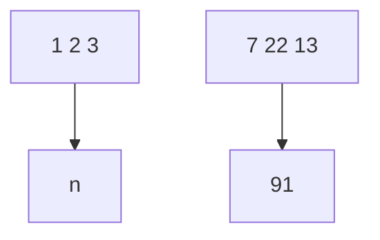
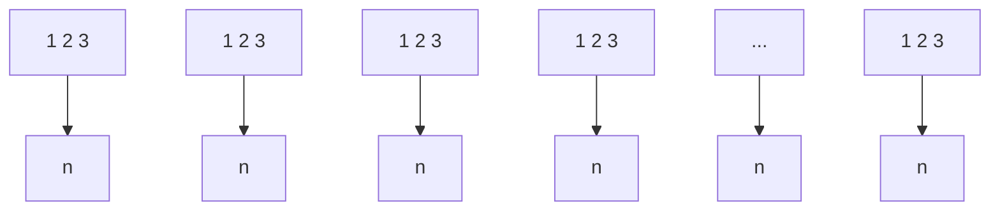

Gareth James Daniela Witten Trevor Hastie Robert Tibshirani

# An Introduction to Statistical Learning

with Applications in R

# Springer Texts in Statistics

Series Editors:

G. Casella

S. Fienberg

I. Olkin

Gareth James • Daniela Witten • Trevor Hastie Robert Tibshirani

# An Introduction to Statistical Learning

with Applications in R

Gareth James

Department of Information and Operations Management

University of Southern California

Los Angeles, CA, USA

Daniela Witten

Department of Biostatistics

University of Washington

Seattle, WA, USA

Trevor Hastie

Department of Statistics

Stanford University

Stanford, CA, USA

Robert Tibshirani

Department of Statistics

Stanford University

Stanford, CA, USA

ISSN 1431-875X

ISBN 978-1-4614-7137-0

ISBN 978-1-4614-7138-7 (eBook)

DOI 10.1007/978-1-4614-7138-7

Springer New York Heidelberg Dordrecht London

Library of Congress Control Number: 2013936251

© Springer Science+Business Media New York 2013 (Corrected at 4 printing 2014)

This work is subject to copyright. All rights are reserved by the Publisher, whether the whole or part of the material is concerned, specifically the rights of translation, reprinting, reuse of illustrations, recitation, broadcasting, reproduction on microfilms or in any other physical way, and transmission or information storage and retrieval, electronic adaptation, computer software, or by similar or dissimilar methodology now known or hereafter developed. Exempted from this legal reservation are brief excerpts in connection with reviews or scholarly analysis or material supplied specifically for the purpose of being entered and executed on a computer system, for exclusive use by the purchaser of the work. Duplication of this publication or parts thereof is permitted only under the provisions of the Copyright Law of the Publisher’s location, in its current version, and permission for use must always be obtained from Springer. Permissions for use may be obtained through RightsLink at the Copyright Clearance Center. Violations are liable to prosecution under the respective Copyright Law.

The use of general descriptive names, registered names, trademarks, service marks, etc. in this publication does not imply, even in the absence of a specific statement, that such names are exempt from the relevant protective laws and regulations and therefore free for general use.

While the advice and information in this book are believed to be true and accurate at the date of publication, neither the authors nor the editors nor the publisher can accept any legal responsibility for any errors or omissions that may be made. The publisher makes no warranty, express or implied, with respect to the material contained herein.

Printed on acid-free paper

Springer is part of Springer Science+Business Media (www.springer.com)

To our parents:

Alison and Michael James

Chiara Nappi and Edward Witten

Valerie and Patrick Hastie

Vera and Sami Tibshirani

and to our families:

Michael, Daniel, and Catherine

Ari

Samantha, Timothy, and Lynda

Charlie, Ryan, Julie, and Cheryl

# Preface

Statistical learning refers to a set of tools for modeling and understanding complex datasets. It is a recently developed area in statistics and blends with parallel developments in computer science and, in particular, machine learning. The field encompasses many methods such as the lasso and sparse regression, classification and regression trees, and boosting and support vector machines.

With the explosion of “Big Data” problems, statistical learning has become a very hot field in many scientific areas as well as marketing, finance, and other business disciplines. People with statistical learning skills are in high demand.

One of the first books in this area—The Elements of Statistical Learning (ESL) (Hastie, Tibshirani, and Friedman)—was published in 2001, with a second edition in 2009. ESL has become a popular text not only in statistics but also in related fields. One of the reasons for ESL’s popularity is its relatively accessible style. But ESL is intended for individuals with advanced training in the mathematical sciences. An Introduction to Statistical Learning (ISL) arose from the perceived need for a broader and less technical treatment of these topics. In this new book, we cover many of the same topics as ESL, but we concentrate more on the applications of the methods and less on the mathematical details. We have created labs illustrating how to implement each of the statistical learning methods using the popular statistical software package R. These labs provide the reader with valuable hands-on experience.

This book is appropriate for advanced undergraduates or master’s students in statistics or related quantitative fields or for individuals in other disciplines who wish to use statistical learning tools to analyze their data. It can be used as a textbook for a course spanning one or two semesters.

We would like to thank several readers for valuable comments on preliminary drafts of this book: Pallavi Basu, Alexandra Chouldechova, Patrick Danaher, Will Fithian, Luella Fu, Sam Gross, Max Grazier G’Sell, Courtney Paulson, Xinghao Qiao, Elisa Sheng, Noah Simon, Kean Ming Tan, and Xin Lu Tan.

It’s tough to make predictions, especially about the future.

-Yogi Berra

Los Angeles, USA

Seattle, USA

Palo Alto, USA

Palo Alto, USA

Gareth James

Daniela Witten

Trevor Hastie

Robert Tibshirani

# Contents

# Preface vii

# 1 Introduction 1

# 2 Statistical Learning 15

2.1 What Is Statistical Learning? 15

2.1.1 Why Estimate f? . . 17   
2.1.2 How Do We Estimate f? 21   
2.1.3 The Trade-Off Between Prediction Accuracy and Model Interpretability 24   
2.1.4 Supervised Versus Unsupervised Learning . . . . . . 26   
2.1.5 Regression Versus Classification Problems . . . 28

2.2 Assessing Model Accuracy 29

2.2.1 Measuring the Quality of Fit 29   
2.2.2 The Bias-Variance Trade-Off 33   
2.2.3 The Classification Setting . . 37

2.3 Lab: Introduction to R . . 42

2.3.1 Basic Commands 42   
2.3.2 Graphics 45   
2.3.3 Indexing Data 47   
2.3.4 Loading Data . . . 48   
2.3.5 Additional Graphical and Numerical Summaries 49

2.4 Exercises 52

# 3 Linear Regression 59

3.1 Simple Linear Regression 61

3.1.1 Estimating the Coefficients 61   
3.1.2 Assessing the Accuracy of the Coefficient Estimates 63   
3.1.3 Assessing the Accuracy of the Model . . 68

3.2 Multiple Linear Regression 71

3.2.1 Estimating the Regression Coefficients . . . 72   
3.2.2 Some Important Questions 75

3.3 Other Considerations in the Regression Model . . . 82

3.3.1 Qualitative Predictors 82   
3.3.2 Extensions of the Linear Model 86   
3.3.3 Potential Problems . . . 92

3.4 The Marketing Plan 102   
3.5 Comparison of Linear Regression with K-Nearest Neighbors 104   
3.6 Lab: Linear Regression 109

3.6.1 Libraries . 109   
3.6.2 Simple Linear Regression 110   
3.6.3 Multiple Linear Regression 113   
3.6.4 Interaction Terms 115   
3.6.5 Non-linear Transformations of the Predictors . . . . 115   
3.6.6 Qualitative Predictors 117   
3.6.7 Writing Functions 119

3.7 Exercises 120

# 4 Classification 127

4.1 An Overview of Classification 128   
4.2 Why Not Linear Regression? 129   
4.3 Logistic Regression 130

4.3.1 The Logistic Model . . 131   
4.3.2 Estimating the Regression Coefficients . . . 133   
4.3.3 Making Predictions . . 134   
4.3.4 Multiple Logistic Regression . . 135   
4.3.5 Logistic Regression for >2 Response Classes . . . . . 137

4.4 Linear Discriminant Analysis 138

4.4.1 Using Bayes’ Theorem for Classification . . 138   
4.4.2 Linear Discriminant Analysis for p = 1 . . 139   
4.4.3 Linear Discriminant Analysis for p >1 142   
4.4.4 Quadratic Discriminant Analysis 149

4.5 A Comparison of Classification Methods . . 151

4.6 Lab: Logistic Regression, LDA, QDA, and KNN . 154

4.6.1 The Stock Market Data . . 154   
4.6.2 Logistic Regression 156   
4.6.3 Linear Discriminant Analysis 161

4.6.4 Quadratic Discriminant Analysis . . 163   
4.6.5 K-Nearest Neighbors . 163   
4.6.6 An Application to Caravan Insurance Data . . 165

4.7 Exercises 168

# 5 Resampling Methods 175

5.1 Cross-Validation 176

5.1.1 The Validation Set Approach 176   
5.1.2 Leave-One-Out Cross-Validation 178   
5.1.3 k-Fold Cross-Validation 181   
5.1.4 Bias-Variance Trade-Off for k-Fold Cross-Validation 183   
5.1.5 Cross-Validation on Classification Problems . . . . . 184

5.2 The Bootstrap 187

5.3 Lab: Cross-Validation and the Bootstrap . . . 190

5.3.1 The Validation Set Approach . . 191   
5.3.2 Leave-One-Out Cross-Validation 192   
5.3.3 k-Fold Cross-Validation 193   
5.3.4 The Bootstrap . 194

5.4 Exercises 197

# 6 Linear Model Selection and Regularization 203

6.1 Subset Selection 205

6.1.1 Best Subset Selection 205   
6.1.2 Stepwise Selection 207   
6.1.3 Choosing the Optimal Model . . 210

6.2 Shrinkage Methods 214

6.2.1 Ridge Regression 215   
6.2.2 The Lasso . . . 219   
6.2.3 Selecting the Tuning Parameter . . 227

6.3 Dimension Reduction Methods 228

6.3.1 Principal Components Regression . 230   
6.3.2 Partial Least Squares 237

6.4 Considerations in High Dimensions 238

6.4.1 High-Dimensional Data 238   
6.4.2 What Goes Wrong in High Dimensions? 239   
6.4.3 Regression in High Dimensions 241   
6.4.4 Interpreting Results in High Dimensions . . . . 243

6.5 Lab 1: Subset Selection Methods 244

6.5.1 Best Subset Selection 244   
6.5.2 Forward and Backward Stepwise Selection . . . . . . 247   
6.5.3 Choosing Among Models Using the Validation Set Approach and Cross-Validation . . 248

6.6 Lab 2: Ridge Regression and the Lasso . . . . 251

6.6.1 Ridge Regression 251   
6.6.2 The Lasso 255

6.7 Lab 3: PCR and PLS Regression 256

6.7.1 Principal Components Regression . 256   
6.7.2 Partial Least Squares 258

6.8 Exercises 259

# 7 Moving Beyond Linearity 265

7.1 Polynomial Regression 266   
7.2 Step Functions 268   
7.3 Basis Functions 270   
7.4 Regression Splines 271

7.4.1 Piecewise Polynomials 271   
7.4.2 Constraints and Splines 271   
7.4.3 The Spline Basis Representation 273   
7.4.4 Choosing the Number and Locations of the Knots 274   
7.4.5 Comparison to Polynomial Regression 276

7.5 Smoothing Splines 277

7.5.1 An Overview of Smoothing Splines . . . 277   
7.5.2 Choosing the Smoothing Parameter λ 278

7.6 Local Regression 280

7.7 Generalized Additive Models 282

7.7.1 GAMs for Regression Problems 283   
7.7.2 GAMs for Classification Problems 286

7.8 Lab: Non-linear Modeling 287

7.8.1 Polynomial Regression and Step Functions 288   
7.8.2 Splines . . 293   
7.8.3 GAMs . . 294

7.9 Exercises 297

# 8 Tree-Based Methods 303

8.1 The Basics of Decision Trees 303

8.1.1 Regression Trees 304   
8.1.2 Classification Trees . . 311   
8.1.3 Trees Versus Linear Models 314   
8.1.4 Advantages and Disadvantages of Trees 315

8.2 Bagging, Random Forests, Boosting 316

8.2.1 Bagging . . 316   
8.2.2 Random Forests 320   
8.2.3 Boosting . . . 321

8.3 Lab: Decision Trees . . 324

8.3.1 Fitting Classification Trees 324   
8.3.2 Fitting Regression Trees . . 327

8.3.3 Bagging and Random Forests . . . . 328   
8.3.4 Boosting . . 330

8.4 Exercises 332

# 9 Support Vector Machines 337

9.1 Maximal Margin Classifier . . . . 338

9.1.1 What Is a Hyperplane? 338   
9.1.2 Classification Using a Separating Hyperplane . . . . 339   
9.1.3 The Maximal Margin Classifier 341   
9.1.4 Construction of the Maximal Margin Classifier . . . 342   
9.1.5 The Non-separable Case . . . 343

9.2 Support Vector Classifiers 344

9.2.1 Overview of the Support Vector Classifier . . . . . . 344   
9.2.2 Details of the Support Vector Classifier 345

9.3 Support Vector Machines 349

9.3.1 Classification with Non-linear Decision Boundaries 349   
9.3.2 The Support Vector Machine . 350   
9.3.3 An Application to the Heart Disease Data . . . . . . 354

9.4 SVMs with More than Two Classes . . . . 355

9.4.1 One-Versus-One Classification . . . 355   
9.4.2 One-Versus-All Classification . 356

9.5 Relationship to Logistic Regression . . 356

9.6 Lab: Support Vector Machines 359

9.6.1 Support Vector Classifier 359   
9.6.2 Support Vector Machine . . . 363   
9.6.3 ROC Curves 365   
9.6.4 SVM with Multiple Classes 366   
9.6.5 Application to Gene Expression Data . . . . . . . . 366

9.7 Exercises 368

# 10 Unsupervised Learning 373

10.1 The Challenge of Unsupervised Learning . 373   
10.2 Principal Components Analysis 374

10.2.1 What Are Principal Components? 375   
10.2.2 Another Interpretation of Principal Components . . 379   
10.2.3 More on PCA . . 380   
10.2.4 Other Uses for Principal Components 385

10.3 Clustering Methods . 385

10.3.1 K-Means Clustering 386   
10.3.2 Hierarchical Clustering . . . 390   
10.3.3 Practical Issues in Clustering 399

10.4 Lab 1: Principal Components Analysis 401

10.5 Lab 2: Clustering . . . 404

10.5.1 K-Means Clustering 404

10.5.2 Hierarchical Clustering . . . 406

10.6 Lab 3: NCI60 Data Example 407

10.6.1 PCA on the NCI60 Data 408

10.6.2 Clustering the Observations of the NCI60 Data . . . 410

10.7 Exercises 413

# Index

# 1

# Introduction

# An Overview of Statistical Learning

Statistical learning refers to a vast set of tools for understanding data. These tools can be classified as supervised or unsupervised. Broadly speaking, supervised statistical learning involves building a statistical model for predicting, or estimating, an output based on one or more inputs. Problems of this nature occur in fields as diverse as business, medicine, astrophysics, and public policy. With unsupervised statistical learning, there are inputs but no supervising output; nevertheless we can learn relationships and structure from such data. To provide an illustration of some applications of statistical learning, we briefly discuss three real-world data sets that are considered in this book.

# Wage Data

In this application (which we refer to as the Wage data set throughout this book), we examine a number of factors that relate to wages for a group of males from the Atlantic region of the United States. In particular, we wish to understand the association between an employee’s age and education, as well as the calendar year, on his wage. Consider, for example, the left-hand panel of Figure 1.1, which displays wage versus age for each of the individuals in the data set. There is evidence that wage increases with age but then decreases again after approximately age 60. The blue line, which provides an estimate of the average wage for a given age, makes this trend clearer.


<details>
<summary>scatter</summary>

| Age | Wage |
| --- | --- |
| 20 | 50 |
| 40 | 100 |
| 60 | 120 |
| 80 | 90 |
</details>


<details>
<summary>scatter</summary>

| Year | Wage |
| ---- | ---- |
| 2003 | 100  |
| 2006 | 100  |
| 2009 | 100  |
</details>


<details>
<summary>boxplot</summary>

| Education Level | Wage (Min) | Wage (Q1) | Wage (Median) | Wage (Q3) | Wage (Max) |
| --------------- | ---------- | --------- | ------------- | --------- | ---------- |
| 1               | 20         | 40        | 60            | 80        | 120        |
| 2               | 30         | 50        | 70            | 90        | 140        |
| 3               | 40         | 60        | 80            | 100       | 160        |
| 4               | 50         | 70        | 90            | 110       | 180        |
| 5               | 60         | 80        | 100           | 130       | 220        |
</details>

FIGURE 1.1. Wage data, which contains income survey information for males from the central Atlantic region of the United States. Left: wage as a function of age. On average, wage increases with age until about 60 years of age, at which point it begins to decline. Center: wage as a function of year. There is a slow but steady increase of approximately \$10,000 in the average wage between 2003 and 2009. Right: Boxplots displaying wage as a function of education, with 1 indicating the lowest level (no high school diploma) and 5 the highest level (an advanced graduate degree). On average, wage increases with the level of education.

Given an employee’s age, we can use this curve to predict his wage. However, it is also clear from Figure 1.1 that there is a significant amount of variability associated with this average value, and so age alone is unlikely to provide an accurate prediction of a particular man’s wage.

We also have information regarding each employee’s education level and the year in which the wage was earned. The center and right-hand panels of Figure 1.1, which display wage as a function of both year and education, indicate that both of these factors are associated with wage. Wages increase by approximately \$10,000, in a roughly linear (or straight-line) fashion, between 2003 and 2009, though this rise is very slight relative to the variability in the data. Wages are also typically greater for individuals with higher education levels: men with the lowest education level (1) tend to have substantially lower wages than those with the highest education level (5). Clearly, the most accurate prediction of a given man’s wage will be obtained by combining his age, his education, and the year. In Chapter 3, we discuss linear regression, which can be used to predict wage from this data set. Ideally, we should predict wage in a way that accounts for the non-linear relationship between wage and age. In Chapter 7, we discuss a class of approaches for addressing this problem.

# Stock Market Data

The Wage data involves predicting a continuous or quantitative output value. This is often referred to as a regression problem. However, in certain cases we may instead wish to predict a non-numerical value—that is, a categorical or qualitative output. For example, in Chapter 4 we examine a stock market data set that contains the daily movements in the Standard & Poor’s 500 (S&P) stock index over a 5-year period between 2001 and 2005. We refer to this as the Smarket data. The goal is to predict whether the index will increase or decrease on a given day using the past 5 days’ percentage changes in the index. Here the statistical learning problem does not involve predicting a numerical value. Instead it involves predicting whether a given day’s stock market performance will fall into the Up bucket or the Down bucket. This is known as a classification problem. A model that could accurately predict the direction in which the market will move would be very useful!


<details>
<summary>boxplot</summary>

| Today's Direction | Percentage change in S&P |
| ------------------ | ------------------------ |
| Down               | -2 to 3                  |
| Up                 | -4 to 5                  |
</details>


<details>
<summary>boxplot</summary>

| Today's Direction | Percentage change in S&P |
| ------------------ | ------------------------ |
| Down               | -3.0                     |
| Down               | -2.5                     |
| Down               | -1.0                     |
| Down               | 0.5                      |
| Down               | 1.0                      |
| Up                 | -4.0                     |
| Up                 | -3.5                     |
| Up                 | -2.0                     |
| Up                 | 0.0                      |
| Up                 | 1.0                      |
| Up                 | 2.0                      |
| Up                 | 3.0                      |
| Up                 | 4.0                      |
| Up                 | 5.0                      |
</details>


<details>
<summary>boxplot</summary>

| Today's Direction | Percentage change in S&P |
| ------------------ | ------------------------ |
| Down               | -3.0                     |
| Down               | -2.5                     |
| Down               | -1.0                     |
| Down               | 0.0                      |
| Down               | 1.0                      |
| Down               | 2.0                      |
| Down               | 3.0                      |
| Down               | 4.0                      |
| Down               | 5.0                      |
| Up                 | -3.0                     |
| Up                 | -2.5                     |
| Up                 | -1.0                     |
| Up                 | 0.0                      |
| Up                 | 1.0                      |
| Up                 | 2.0                      |
| Up                 | 3.0                      |
| Up                 | 4.0                      |
| Up                 | 5.0                      |
| Up                 | 6.0                      |
</details>

FIGURE 1.2. Left: Boxplots of the previous day’s percentage change in the S&P index for the days for which the market increased or decreased, obtained from the Smarket data. Center and Right: Same as left panel, but the percentage changes for 2 and 3 days previous are shown.

The left-hand panel of Figure 1.2 displays two boxplots of the previous day’s percentage changes in the stock index: one for the 648 days for which the market increased on the subsequent day, and one for the 602 days for which the market decreased. The two plots look almost identical, suggesting that there is no simple strategy for using yesterday’s movement in the S&P to predict today’s returns. The remaining panels, which display boxplots for the percentage changes 2 and 3 days previous to today, similarly indicate little association between past and present returns. Of course, this lack of pattern is to be expected: in the presence of strong correlations between successive days’ returns, one could adopt a simple trading strategy to generate profits from the market. Nevertheless, in Chapter 4, we explore these data using several different statistical learning methods. Interestingly, there are hints of some weak trends in the data that suggest that, at least for this 5-year period, it is possible to correctly predict the direction of movement in the market approximately 60% of the time (Figure 1.3).


<details>
<summary>boxplot</summary>

| Today's Direction | Predicted Probability |
| ------------------ | --------------------- |
| Down               | 0.46 - 0.52           |
| Up                 | 0.46 - 0.52           |
</details>

FIGURE 1.3. We fit a quadratic discriminant analysis model to the subset of the Smarket data corresponding to the 2001–2004 time period, and predicted the probability of a stock market decrease using the 2005 data. On average, the predicted probability of decrease is higher for the days in which the market does decrease. Based on these results, we are able to correctly predict the direction of movement in the market 60% of the time.

# Gene Expression Data

The previous two applications illustrate data sets with both input and output variables. However, another important class of problems involves situations in which we only observe input variables, with no corresponding output. For example, in a marketing setting, we might have demographic information for a number of current or potential customers. We may wish to understand which types of customers are similar to each other by grouping individuals according to their observed characteristics. This is known as a clustering problem. Unlike in the previous examples, here we are not trying to predict an output variable.

We devote Chapter 10 to a discussion of statistical learning methods for problems in which no natural output variable is available. We consider the NCI60 data set, which consists of 6,830 gene expression measurements for each of 64 cancer cell lines. Instead of predicting a particular output variable, we are interested in determining whether there are groups, or clusters, among the cell lines based on their gene expression measurements. This is a difficult question to address, in part because there are thousands of gene expression measurements per cell line, making it hard to visualize the data.

The left-hand panel of Figure 1.4 addresses this problem by representing each of the 64 cell lines using just two numbers, $Z _ { 1 }$ and $Z _ { 2 }$ . These are the first two principal components of the data, which summarize the 6, 830 expression measurements for each cell line down to two numbers or dimensions. While it is likely that this dimension reduction has resulted in some loss of information, it is now possible to visually examine the data for evidence of clustering. Deciding on the number of clusters is often a difficult problem. But the left-hand panel of Figure 1.4 suggests at least four groups of cell lines, which we have represented using separate colors. We can now examine the cell lines within each cluster for similarities in their types of cancer, in order to better understand the relationship between gene expression levels and cancer.


<details>
<summary>scatter</summary>

| Z1    | Z2    |
|-------|-------|
| -45   | -5    |
| -35   | -10   |
| -25   | 10    |
| -15   | 15    |
| -5    | 20    |
| 0     | 10    |
| 5     | 5     |
| 10    | 0     |
| 15    | -5    |
| 20    | -10   |
| 25    | -15   |
| 30    | -20   |
| 35    | -25   |
| 40    | -30   |
| 45    | -35   |
| 50    | -40   |
| 55    | -45   |
| 60    | -50   |
| 65    | -55   |
| 70    | -60   |
</details>

  
FIGURE 1.4. Left: Representation of the NCI60 gene expression data set in a two-dimensional space, $Z _ { 1 }$ and $Z _ { 2 }$ . Each point corresponds to one of the 64 cell lines. There appear to be four groups of cell lines, which we have represented using different colors. Right: Same as left panel except that we have represented each of the 14 different types of cancer using a different colored symbol. Cell lines corresponding to the same cancer type tend to be nearby in the two-dimensional space.

In this particular data set, it turns out that the cell lines correspond to 14 different types of cancer. (However, this information was not used to create the left-hand panel of Figure 1.4.) The right-hand panel of Figure 1.4 is identical to the left-hand panel, except that the 14 cancer types are shown using distinct colored symbols. There is clear evidence that cell lines with the same cancer type tend to be located near each other in this two-dimensional representation. In addition, even though the cancer information was not used to produce the left-hand panel, the clustering obtained does bear some resemblance to some of the actual cancer types observed in the right-hand panel. This provides some independent verification of the accuracy of our clustering analysis.

# A Brief History of Statistical Learning

Though the term statistical learning is fairly new, many of the concepts that underlie the field were developed long ago. At the beginning of the nineteenth century, Legendre and Gauss published papers on the method of least squares, which implemented the earliest form of what is now known as linear regression. The approach was first successfully applied to problems in astronomy. Linear regression is used for predicting quantitative values, such as an individual’s salary. In order to predict qualitative values, such as whether a patient survives or dies, or whether the stock market increases or decreases, Fisher proposed linear discriminant analysis in 1936. In the 1940s, various authors put forth an alternative approach, logistic regression. In the early 1970s, Nelder and Wedderburn coined the term generalized linear models for an entire class of statistical learning methods that include both linear and logistic regression as special cases.

By the end of the 1970s, many more techniques for learning from data were available. However, they were almost exclusively linear methods, because fitting non-linear relationships was computationally infeasible at the time. By the 1980s, computing technology had finally improved sufficiently that non-linear methods were no longer computationally prohibitive. In mid 1980s Breiman, Friedman, Olshen and Stone introduced classification and regression trees, and were among the first to demonstrate the power of a detailed practical implementation of a method, including cross-validation for model selection. Hastie and Tibshirani coined the term generalized additive models in 1986 for a class of non-linear extensions to generalized linear models, and also provided a practical software implementation.

Since that time, inspired by the advent of machine learning and other disciplines, statistical learning has emerged as a new subfield in statistics, focused on supervised and unsupervised modeling and prediction. In recent years, progress in statistical learning has been marked by the increasing availability of powerful and relatively user-friendly software, such as the popular and freely available R system. This has the potential to continue the transformation of the field from a set of techniques used and developed by statisticians and computer scientists to an essential toolkit for a much broader community.

# This Book

The Elements of Statistical Learning (ESL) by Hastie, Tibshirani, and Friedman was first published in 2001. Since that time, it has become an important reference on the fundamentals of statistical machine learning. Its success derives from its comprehensive and detailed treatment of many important topics in statistical learning, as well as the fact that (relative to many upper-level statistics textbooks) it is accessible to a wide audience. However, the greatest factor behind the success of ESL has been its topical nature. At the time of its publication, interest in the field of statistical learning was starting to explode. ESL provided one of the first accessible and comprehensive introductions to the topic.

Since ESL was first published, the field of statistical learning has continued to flourish. The field’s expansion has taken two forms. The most obvious growth has involved the development of new and improved statistical learning approaches aimed at answering a range of scientific questions across a number of fields. However, the field of statistical learning has also expanded its audience. In the 1990s, increases in computational power generated a surge of interest in the field from non-statisticians who were eager to use cutting-edge statistical tools to analyze their data. Unfortunately, the highly technical nature of these approaches meant that the user community remained primarily restricted to experts in statistics, computer science, and related fields with the training (and time) to understand and implement them.

In recent years, new and improved software packages have significantly eased the implementation burden for many statistical learning methods. At the same time, there has been growing recognition across a number of fields, from business to health care to genetics to the social sciences and beyond, that statistical learning is a powerful tool with important practical applications. As a result, the field has moved from one of primarily academic interest to a mainstream discipline, with an enormous potential audience. This trend will surely continue with the increasing availability of enormous quantities of data and the software to analyze it.

The purpose of An Introduction to Statistical Learning (ISL) is to facilitate the transition of statistical learning from an academic to a mainstream field. ISL is not intended to replace ESL, which is a far more comprehensive text both in terms of the number of approaches considered and the depth to which they are explored. We consider ESL to be an important companion for professionals (with graduate degrees in statistics, machine learning, or related fields) who need to understand the technical details behind statistical learning approaches. However, the community of users of statistical learning techniques has expanded to include individuals with a wider range of interests and backgrounds. Therefore, we believe that there is now a place for a less technical and more accessible version of ESL.

In teaching these topics over the years, we have discovered that they are of interest to master’s and PhD students in fields as disparate as business administration, biology, and computer science, as well as to quantitativelyoriented upper-division undergraduates. It is important for this diverse group to be able to understand the models, intuitions, and strengths and weaknesses of the various approaches. But for this audience, many of the technical details behind statistical learning methods, such as optimization algorithms and theoretical properties, are not of primary interest. We believe that these students do not need a deep understanding of these aspects in order to become informed users of the various methodologies, and in order to contribute to their chosen fields through the use of statistical learning tools.

ISLR is based on the following four premises.

1. Many statistical learning methods are relevant and useful in a wide range of academic and non-academic disciplines, beyond just the statistical sciences. We believe that many contemporary statistical learning procedures should, and will, become as widely available and used as is currently the case for classical methods such as linear regression. As a result, rather than attempting to consider every possible approach (an impossible task), we have concentrated on presenting the methods that we believe are most widely applicable.   
2. Statistical learning should not be viewed as a series of black boxes. No single approach will perform well in all possible applications. Without understanding all of the cogs inside the box, or the interaction between those cogs, it is impossible to select the best box. Hence, we have attempted to carefully describe the model, intuition, assumptions, and trade-offs behind each of the methods that we consider.   
3. While it is important to know what job is performed by each cog, it is not necessary to have the skills to construct the machine inside the box! Thus, we have minimized discussion of technical details related to fitting procedures and theoretical properties. We assume that the reader is comfortable with basic mathematical concepts, but we do not assume a graduate degree in the mathematical sciences. For instance, we have almost completely avoided the use of matrix algebra, and it is possible to understand the entire book without a detailed knowledge of matrices and vectors.   
4. We presume that the reader is interested in applying statistical learning methods to real-world problems. In order to facilitate this, as well as to motivate the techniques discussed, we have devoted a section within each chapter to R computer labs. In each lab, we walk the reader through a realistic application of the methods considered in that chapter. When we have taught this material in our courses, we have allocated roughly one-third of classroom time to working through the labs, and we have found them to be extremely useful. Many of the less computationally-oriented students who were initially intimidated by R’s command level interface got the hang of things over the course of the quarter or semester. We have used R because it is freely available and is powerful enough to implement all of the methods discussed in the book. It also has optional packages that can be downloaded to implement literally thousands of additional methods. Most importantly, R is the language of choice for academic statisticians, and new approaches often become available in

R years before they are implemented in commercial packages. However, the labs in ISL are self-contained, and can be skipped if the reader wishes to use a different software package or does not wish to apply the methods discussed to real-world problems.

# Who Should Read This Book?

This book is intended for anyone who is interested in using modern statistical methods for modeling and prediction from data. This group includes scientists, engineers, data analysts, or quants, but also less technical individuals with degrees in non-quantitative fields such as the social sciences or business. We expect that the reader will have had at least one elementary course in statistics. Background in linear regression is also useful, though not required, since we review the key concepts behind linear regression in Chapter 3. The mathematical level of this book is modest, and a detailed knowledge of matrix operations is not required. This book provides an introduction to the statistical programming language R. Previous exposure to a programming language, such as MATLAB or Python, is useful but not required.

We have successfully taught material at this level to master’s and PhD students in business, computer science, biology, earth sciences, psychology, and many other areas of the physical and social sciences. This book could also be appropriate for advanced undergraduates who have already taken a course on linear regression. In the context of a more mathematically rigorous course in which ESL serves as the primary textbook, ISL could be used as a supplementary text for teaching computational aspects of the various approaches.

# Notation and Simple Matrix Algebra

Choosing notation for a textbook is always a difficult task. For the most part we adopt the same notational conventions as ESL.

We will use n to represent the number of distinct data points, or observations, in our sample. We will let p denote the number of variables that are available for use in making predictions. For example, the Wage data set consists of 12 variables for 3,000 people, so we have n = 3,000 observations and p = 12 variables (such as year, age, wage, and more). Note that throughout this book, we indicate variable names using colored font: Variable Name.

In some examples, p might be quite large, such as on the order of thousands or even millions; this situation arises quite often, for example, in the analysis of modern biological data or web-based advertising data.

In general, we will let $\boldsymbol { x } _ { i j }$ represent the value of the jth variable for the ith observation, where $i = 1 , 2 , \ldots , n$ and $j = 1 , 2 , \dotsc , p .$ . Throughout this book, i will be used to index the samples or observations (from 1 to n) and $j$ will be used to index the variables (from 1 to p). We let X denote a $n \times p$ matrix whose $( i , j )$ th element is $x _ { i j }$ . That is,

$$
\mathbf {X} = \left( \begin{array}{c c c c} x _ {1 1} & x _ {1 2} & \ldots & x _ {1 p} \\ x _ {2 1} & x _ {2 2} & \ldots & x _ {2 p} \\ \vdots & \vdots & \ddots & \vdots \\ x _ {n 1} & x _ {n 2} & \ldots & x _ {n p} \end{array} \right).
$$

For readers who are unfamiliar with matrices, it is useful to visualize X as a spreadsheet of numbers with n rows and $p$ columns.

At times we will be interested in the rows of X, which we write as $x _ { 1 } , x _ { 2 } , \ldots , x _ { n }$ . Here $x _ { i }$ is a vector of length $p ,$ containing the $p$ variable measurements for the ith observation. That is,

$$
x _ {i} = \left( \begin{array}{c} x _ {i 1} \\ x _ {i 2} \\ \vdots \\ x _ {i p} \end{array} \right). \tag {1.1}
$$

(Vectors are by default represented as columns.) For example, for the Wage data, $x _ { i }$ is a vector of length 12, consisting of year, age, wage, and other values for the ith individual. At other times we will instead be interested in the columns of $\mathbf { X } ,$ , which we write as $\mathbf { x } _ { 1 } , \mathbf { x } _ { 2 } , \ldots , \mathbf { x } _ { p }$ . Each is a vector of length n. That is,

$$
\mathbf {x} _ {j} = \left( \begin{array}{c} x _ {1 j} \\ x _ {2 j} \\ \vdots \\ x _ {n j} \end{array} \right).
$$

For example, for the Wage data, $\mathbf { x } _ { 1 }$ contains the $n = 3 { , } 0 0 0$ values for year.

Using this notation, the matrix X can be written as

$$
\mathbf {X} = \left( \begin{array}{c c c c} \mathbf {x} _ {1} & \mathbf {x} _ {2} & \dots & \mathbf {x} _ {p} \end{array} \right),
$$

or

$$
\mathbf {X} = \left( \begin{array}{c} x _ {1} ^ {T} \\ x _ {2} ^ {T} \\ \vdots \\ x _ {n} ^ {T} \end{array} \right).
$$

The $_ T$ notation denotes the transpose of a matrix or vector. So, for example,

$$
\mathbf {X} ^ {T} = \left( \begin{array}{c c c c} x _ {1 1} & x _ {2 1} & \ldots & x _ {n 1} \\ x _ {1 2} & x _ {2 2} & \ldots & x _ {n 2} \\ \vdots & \vdots & & \vdots \\ x _ {1 p} & x _ {2 p} & \ldots & x _ {n p} \end{array} \right),
$$

while

$$
x _ {i} ^ {T} = \left( \begin{array}{c c c c} x _ {i 1} & x _ {i 2} & \dots & x _ {i p} \end{array} \right).
$$

We use $y _ { i }$ to denote the ith observation of the variable on which we wish to make predictions, such as wage. Hence, we write the set of all n observations in vector form as

$$
\mathbf {y} = \left( \begin{array}{c} y _ {1} \\ y _ {2} \\ \vdots \\ y _ {n} \end{array} \right).
$$

Then our observed data consists of $\left\{ ( x _ { 1 } , y _ { 1 } ) , ( x _ { 2 } , y _ { 2 } ) , \ldots , ( x _ { n } , y _ { n } ) \right\}$ , where each $x _ { i }$ is a vector of length $p .$ (If $p = 1$ , then $x _ { i }$ is simply a scalar.)

In this text, a vector of length n will always be denoted in lower case bold ; e.g.

$$
\mathbf {a} = \left( \begin{array}{c} a _ {1} \\ a _ {2} \\ \vdots \\ a _ {n} \end{array} \right).
$$

However, vectors that are not of length n (such as feature vectors of length $p ,$ as in (1.1)) will be denoted in lower case normal font, e.g. a. Scalars will also be denoted in lower case normal font, e.g. a. In the rare cases in which these two uses for lower case normal font lead to ambiguity, we will clarify which use is intended. Matrices will be denoted using bold capitals, such as A. Random variables will be denoted using capital normal font, e.g. A, regardless of their dimensions.

Occasionally we will want to indicate the dimension of a particular object. To indicate that an object is a scalar, we will use the notation $a \in \mathbb { R }$ . To indicate that it is a vector of length k, we will use $a \in \mathbb { R } ^ { k }$ (or $\mathbf { a } \in \mathbb { R } ^ { n }$ if it is of length n). We will indicate that an object is a $r \times s$ matrix using $\mathbf { A } \in \mathbb { R } ^ { r \times s }$ .

We have avoided using matrix algebra whenever possible. However, in a few instances it becomes too cumbersome to avoid it entirely. In these rare instances it is important to understand the concept of multiplying two matrices. Suppose that $\mathbf { A } \in \mathbb { R } ^ { r \times d }$ and $\mathbf { B } \in \mathbb { R } ^ { d \times s }$ . Then the product of A and B is denoted AB. The $( i , j )$ th element of AB is computed by multiplying each element of the ith row of A by the corresponding element of the jth column of B. That is, $\begin{array} { r } { ( { \bf A } { \bf B } ) _ { i j } = \sum _ { k = 1 } ^ { d } a _ { i k } b _ { k j } } \end{array}$ . As an example, consider

$$
\mathbf {A} = \left( \begin{array}{c c} 1 & 2 \\ 3 & 4 \end{array} \right) \quad \text {and} \quad \mathbf {B} = \left( \begin{array}{c c} 5 & 6 \\ 7 & 8 \end{array} \right).
$$

Then

$$
\mathbf {A B} = \left( \begin{array}{c c} 1 & 2 \\ 3 & 4 \end{array} \right) \left( \begin{array}{c c} 5 & 6 \\ 7 & 8 \end{array} \right) = \left( \begin{array}{c c} 1 \times 5 + 2 \times 7 & 1 \times 6 + 2 \times 8 \\ 3 \times 5 + 4 \times 7 & 3 \times 6 + 4 \times 8 \end{array} \right) = \left( \begin{array}{c c} 1 9 & 2 2 \\ 4 3 & 5 0 \end{array} \right).
$$

Note that this operation produces an r s matrix. It is only possible to compute AB if the number of columns of A is the same as the number of rows of B.

# Organization of This Book

Chapter 2 introduces the basic terminology and concepts behind statistical learning. This chapter also presents the K-nearest neighbor classifier, a very simple method that works surprisingly well on many problems. Chapters 3 and 4 cover classical linear methods for regression and classification. In particular, Chapter 3 reviews linear regression, the fundamental starting point for all regression methods. In Chapter 4 we discuss two of the most important classical classification methods, logistic regression and linear discriminant analysis.

A central problem in all statistical learning situations involves choosing the best method for a given application. Hence, in Chapter 5 we introduce cross-validation and the bootstrap, which can be used to estimate the accuracy of a number of different methods in order to choose the best one.

Much of the recent research in statistical learning has concentrated on non-linear methods. However, linear methods often have advantages over their non-linear competitors in terms of interpretability and sometimes also accuracy. Hence, in Chapter 6 we consider a host of linear methods, both classical and more modern, which offer potential improvements over standard linear regression. These include stepwise selection, ridge regression, principal components regression, partial least squares, and the lasso.

The remaining chapters move into the world of non-linear statistical learning. We first introduce in Chapter 7 a number of non-linear methods that work well for problems with a single input variable. We then show how these methods can be used to fit non-linear additive models for which there is more than one input. In Chapter 8, we investigate tree-based methods, including bagging, boosting, and random forests. Support vector machines, a set of approaches for performing both linear and non-linear classification, are discussed in Chapter 9. Finally, in Chapter 10, we consider a setting in which we have input variables but no output variable. In particular, we present principal components analysis, K-means clustering, and hierarchical clustering.

At the end of each chapter, we present one or more R lab sections in which we systematically work through applications of the various methods discussed in that chapter. These labs demonstrate the strengths and weaknesses of the various approaches, and also provide a useful reference for the syntax required to implement the various methods. The reader may choose to work through the labs at his or her own pace, or the labs may be the focus of group sessions as part of a classroom environment. Within each R lab, we present the results that we obtained when we performed the lab at the time of writing this book. However, new versions of R are continuously released, and over time, the packages called in the labs will be updated. Therefore, in the future, it is possible that the results shown in the lab sections may no longer correspond precisely to the results obtained by the reader who performs the labs. As necessary, we will post updates to the labs on the book website.

We use the symbol to denote sections or exercises that contain more challenging concepts. These can be easily skipped by readers who do not wish to delve as deeply into the material, or who lack the mathematical background.

# Data Sets Used in Labs and Exercises

In this textbook, we illustrate statistical learning methods using applications from marketing, finance, biology, and other areas. The ISLR package available on the book website contains a number of data sets that are required in order to perform the labs and exercises associated with this book. One other data set is contained in the MASS library, and yet another is part of the base R distribution. Table 1.1 contains a summary of the data sets required to perform the labs and exercises. A couple of these data sets are also available as text files on the book website, for use in Chapter 2.

# Book Website

The website for this book is located at

<table><tr><td>Name</td><td>Description</td></tr><tr><td>Auto</td><td>Gas mileage, horsepower, and other information for cars.</td></tr><tr><td>Boston</td><td>Housing values and other information about Boston suburbs.</td></tr><tr><td>Caravan</td><td>Information about individuals offered caravan insurance.</td></tr><tr><td>Carseats</td><td>Information about car seat sales in 400 stores.</td></tr><tr><td>College</td><td>Demographic characteristics, tuition, and more for USA colleges.</td></tr><tr><td>Default</td><td>Customer default records for a credit card company.</td></tr><tr><td>Hitters</td><td>Records and salaries for baseball players.</td></tr><tr><td>Khan</td><td>Gene expression measurements for four cancer types.</td></tr><tr><td>NCI60</td><td>Gene expression measurements for 64 cancer cell lines.</td></tr><tr><td>OJ</td><td>Sales information for Citrus Hill and Minute Maid orange juice.</td></tr><tr><td>Portfolio</td><td>Past values of financial assets, for use in portfolio allocation.</td></tr><tr><td>Smarket</td><td>Daily percentage returns for S&amp;P 500 over a 5-year period.</td></tr><tr><td>USArrests</td><td>Crime statistics per 100,000 residents in 50 states of USA.</td></tr><tr><td>Wage</td><td>Income survey data for males in central Atlantic region of USA.</td></tr><tr><td>Weekly</td><td>1,089 weekly stock market returns for 21 years.</td></tr></table>

TABLE 1.1. A list of data sets needed to perform the labs and exercises in this textbook. All data sets are available in the ISLR library, with the exception of Boston (part of MASS) and USArrests (part of the base R distribution).

It contains a number of resources, including the R package associated with this book, and some additional data sets.

# Acknowledgements

A few of the plots in this book were taken from ESL: Figures 6.7, 8.3, and 10.12. All other plots are new to this book.

# 2

# Statistical Learning

# 2.1 What Is Statistical Learning?

In order to motivate our study of statistical learning, we begin with a simple example. Suppose that we are statistical consultants hired by a client to provide advice on how to improve sales of a particular product. The Advertising data set consists of the sales of that product in 200 different markets, along with advertising budgets for the product in each of those markets for three different media: TV, radio, and newspaper. The data are displayed in Figure 2.1. It is not possible for our client to directly increase sales of the product. On the other hand, they can control the advertising expenditure in each of the three media. Therefore, if we determine that there is an association between advertising and sales, then we can instruct our client to adjust advertising budgets, thereby indirectly increasing sales. In other words, our goal is to develop an accurate model that can be used to predict sales on the basis of the three media budgets.

In this setting, the advertising budgets are input variables while sales is an output variable. The input variables are typically denoted using the symbol X, with a subscript to distinguish them. So $X _ { 1 }$ might be the TV budget, $X _ { 2 }$ the radio budget, and $X _ { 3 }$ the newspaper budget. The inputs go by different names, such as predictors, independent variables, features, or sometimes just variables. The output variable—in this case, sales— is often called the response or dependent variable, and is typically denoted using the symbol Y . Throughout this book, we will use all of these terms interchangeably.


<details>
<summary>scatter</summary>

| TV  | Sales |
| --- | ----- |
| 0   | 5     |
| 50  | 10    |
| 100 | 15    |
| 150 | 20    |
| 200 | 25    |
| 250 | 25    |
| 300 | 25    |
</details>


<details>
<summary>scatter</summary>

| Radio | Sales |
|-------|-------|
| 0     | 8     |
| 5     | 10    |
| 10    | 12    |
| 15    | 14    |
| 20    | 16    |
| 25    | 18    |
| 30    | 20    |
| 35    | 22    |
| 40    | 24    |
| 45    | 26    |
| 50    | 28    |
</details>


<details>
<summary>scatter</summary>

| Newspaper | Sales |
| --------- | ----- |
| 0         | 12    |
| 10        | 13    |
| 20        | 14    |
| 30        | 15    |
| 40        | 16    |
| 50        | 17    |
| 60        | 18    |
| 70        | 19    |
| 80        | 20    |
| 90        | 21    |
| 100       | 22    |
</details>

FIGURE 2.1. The Advertising data set. The plot displays sales, in thousands of units, as a function of TV, radio, and newspaper budgets, in thousands of dollars, for 200 different markets. In each plot we show the simple least squares fit of sales to that variable, as described in Chapter 3. In other words, each blue line represents a simple model that can be used to predict sales using TV, radio, and newspaper, respectively.

More generally, suppose that we observe a quantitative response Y and p different predictors, $X _ { 1 } , X _ { 2 } , \ldots , X _ { p }$ . We assume that there is some relationship between Y and $X = ( { \bar { X } } _ { 1 } , X _ { 2 } , \ldots , X _ { p } )$ , which can be written in the very general form

$$
Y = f (X) + \epsilon . \tag {2.1}
$$

Here f is some fixed but unknown function of $X _ { 1 } , \ldots , X _ { p } $ , and  is a random error term, which is independent of X and has mean zero. In this formulation, f represents the systematic information that X provides about Y .

As another example, consider the left-hand panel of Figure 2.2, a plot of income versus years of education for 30 individuals in the Income data set. The plot suggests that one might be able to predict income using years of education. However, the function f that connects the input variable to the output variable is in general unknown. In this situation one must estimate f based on the observed points. Since Income is a simulated data set, f is known and is shown by the blue curve in the right-hand panel of Figure 2.2. The vertical lines represent the error terms . We note that some of the 30 observations lie above the blue curve and some lie below it; overall, the errors have approximately mean zero.

In general, the function f may involve more than one input variable. In Figure 2.3 we plot income as a function of years of education and seniority. Here f is a two-dimensional surface that must be estimated based on the observed data.


<details>
<summary>scatter</summary>

| Years of Education | Income |
| ------------------ | ------ |
| 10                 | 27     |
| 11                 | 23     |
| 12                 | 16     |
| 13                 | 25     |
| 14                 | 35     |
| 15                 | 40     |
| 16                 | 45     |
| 17                 | 50     |
| 18                 | 58     |
| 19                 | 65     |
| 20                 | 75     |
| 21                 | 78     |
| 22                 | 80     |
</details>


<details>
<summary>line</summary>

| Years of Education | Income |
| ------------------ | ------ |
| 10                 | 25     |
| 11                 | 23     |
| 12                 | 18     |
| 13                 | 25     |
| 14                 | 35     |
| 15                 | 40     |
| 16                 | 50     |
| 17                 | 58     |
| 18                 | 65     |
| 19                 | 70     |
| 20                 | 75     |
| 21                 | 78     |
| 22                 | 80     |
</details>

FIGURE 2.2. The Income data set. Left: The red dots are the observed values of income (in tens of thousands of dollars) and years of education for 30 individuals. Right: The blue curve represents the true underlying relationship between income and years of education, which is generally unknown (but is known in this case because the data were simulated). The black lines represent the error associated with each observation. Note that some errors are positive (if an observation lies above the blue curve) and some are negative (if an observation lies below the curve). Overall, these errors have approximately mean zero.

In essence, statistical learning refers to a set of approaches for estimating $f .$ . In this chapter we outline some of the key theoretical concepts that arise in estimating f , as well as tools for evaluating the estimates obtained.

# 2.1.1 Why Estimate f?

There are two main reasons that we may wish to estimate f: prediction and inference. We discuss each in turn.

# Prediction

In many situations, a set of inputs X are readily available, but the output Y cannot be easily obtained. In this setting, since the error term averages to zero, we can predict $Y$ using

$$
\hat {Y} = \hat {f} (X), \tag {2.2}
$$

where $\hat { f }$ represents our estimate for $f ,$ , and $\hat { Y }$ represents the resulting prediction for $Y .$ . In this setting, $\hat { f }$ is often treated as a black box, in the sense that one is not typically concerned with the exact form of ${ \hat { f } } ,$ provided that it yields accurate predictions for Y .


<details>
<summary>scatter</summary>

| Years of Education | Income | Seniority |
| ------------------ | ------ | --------- |
| 0                  | 0      | 0         |
| 1                  | 1      | 1         |
| 2                  | 2      | 2         |
| 3                  | 3      | 3         |
| 4                  | 4      | 4         |
| 5                  | 5      | 5         |
| 6                  | 6      | 6         |
| 7                  | 7      | 7         |
| 8                  | 8      | 8         |
| 9                  | 9      | 9         |
| 10                 | 10     | 10        |
| 11                 | 11     | 11        |
| 12                 | 12     | 12        |
| 13                 | 13     | 13        |
| 14                 | 14     | 14        |
| 15                 | 15     | 15        |
| 16                 | 16     | 16        |
| 17                 | 17     | 17        |
| 18                 | 18     | 18        |
| 19                 | 19     | 19        |
| 20                 | 20     | 20        |
| 21                 | 21     | 21        |
| 22                 | 22     | 22        |
| 23                 | 23     | 23        |
| 24                 | 24     | 24        |
| 25                 | 25     | 25        |
| 26                 | 26     | 26        |
| 27                 | 27     | 27        |
| 28                 | 28     | 28        |
| 29                 | 29     | 29        |
| 30                 | 30     | 30        |
| 31                 | 31     | 31        |
| 32                 | 32     | 32        |
| 33                 | 33     | 33        |
| 34                 | 34     | 34        |
| 35                 | 35     | 35        |
| 36                 | 36     | 36        |
| 37                 | 37     | 37        |
| 38                 | 38     | 38        |
| 39                 | 39     | 39        |
| 40                 | 40     | 40        |
| 41                 | 41     | 41        |
| 42                 | 42     | 42        |
| 43                 | 43     | 43        |
| 44                 | 44     | 44        |
| 45                 | 45     | 45        |
| 46                 | 46     | 46        |
| 47                 | 47     | 47        |
| 48                 | 48     | 48        |
| 49                 | 49     | 49        |
| 50                 | 50     | 50        |
| Note: The actual values for Income and Seniority are not provided in the code. The chart type is a combination of Income and Seniority values. There is only one data series in this case. The values for Income and Seniority are estimated based on the provided data series. There is no label for Income in the chart.
</details>

FIGURE 2.3. The plot displays income as a function of years of education and seniority in the Income data set. The blue surface represents the true underlying relationship between income and years of education and seniority, which is known since the data are simulated. The red dots indicate the observed values of these quantities for 30 individuals.

As an example, suppose that $X _ { 1 } , \ldots , X _ { p }$ are characteristics of a patient’s blood sample that can be easily measured in a lab, and Y is a variable encoding the patient’s risk for a severe adverse reaction to a particular drug. It is natural to seek to predict $Y$ using $X ,$ , since we can then avoid giving the drug in question to patients who are at high risk of an adverse reaction—that is, patients for whom the estimate of Y is high.

The accuracy of $\hat { Y }$ as a prediction for Y depends on two quantities, which we will call the reducible error and the irreducible error. In general, $\hat { f }$ will not be a perfect estimate for $f ,$ and this inaccuracy will introduce some error. This error is reducible because we can potentially improve the accuracy of $\hat { f }$ by using the most appropriate statistical learning technique to estimate $f .$ However, even if it were possible to form a perfect estimate for $f .$ , so that our estimated response took the form ${ \hat { Y } } = f ( X )$ , our prediction would still have some error in it! This is because Y is also a function of , which, by definition, cannot be predicted using X. Therefore, variability associated with  also affects the accuracy of our predictions. This is known as the irreducible error, because no matter how well we estimate $f _ { i }$ , we cannot reduce the error introduced by .

Why is the irreducible error larger than zero? The quantity  may contain unmeasured variables that are useful in predicting Y : since we don’t measure them, $f$ cannot use them for its prediction. The quantity  may also contain unmeasurable variation. For example, the risk of an adverse reaction might vary for a given patient on a given day, depending on manufacturing variation in the drug itself or the patient’s general feeling of well-being on that day.

Consider a given estimate $\hat { f }$ and a set of predictors X, which yields the prediction ${ \hat { Y } } = { \hat { f } } ( X )$ . Assume for a moment that both $\hat { f }$ and X are fixed. Then, it is easy to show that

$$
\begin{array}{l} E (Y - \hat {Y}) ^ {2} = E [ f (X) + \epsilon - \hat {f} (X) ] ^ {2} \\ = \underbrace {\left[ f (X) - \hat {f} (X) \right] ^ {2}} _ {\text { Reducible }} + \underbrace {\operatorname{Var} (\epsilon)} _ {\text { Irreducible }}, \tag {2.3} \\ \end{array}
$$

where $E ( Y - { \hat { Y } } ) ^ { 2 }$ represents the average, or expected value, of the squared difference between the predicted and actual value of Y , and $\mathrm { V a r } ( \epsilon )$ represents the variance associated with the error term .

The focus of this book is on techniques for estimating f with the aim of minimizing the reducible error. It is important to keep in mind that the irreducible error will always provide an upper bound on the accuracy of our prediction for Y . This bound is almost always unknown in practice.

# Inference

We are often interested in understanding the way that Y is affected as $X _ { 1 } , \ldots , X _ { p }$ change. In this situation we wish to estimate f , but our goal is not necessarily to make predictions for Y . We instead want to understand the relationship between X and $Y$ , or more specifically, to understand how Y changes as a function of $X _ { 1 } , \ldots , X _ { p }$ . Now $\hat { \hat { f } }$ cannot be treated as a black box, because we need to know its exact form. In this setting, one may be interested in answering the following questions:

Which predictors are associated with the response? It is often the case that only a small fraction of the available predictors are substantially associated with Y . Identifying the few important predictors among a large set of possible variables can be extremely useful, depending on the application.   
What is the relationship between the response and each predictor? Some predictors may have a positive relationship with Y , in the sense that increasing the predictor is associated with increasing values of Y . Other predictors may have the opposite relationship. Depending on the complexity of $f ,$ , the relationship between the response and a given predictor may also depend on the values of the other predictors.   
Can the relationship between Y and each predictor be adequately summarized using a linear equation, or is the relationship more complicated? Historically, most methods for estimating f have taken a linear form. In some situations, such an assumption is reasonable or even desirable. But often the true relationship is more complicated, in which case a linear model may not provide an accurate representation of the relationship between the input and output variables.

In this book, we will see a number of examples that fall into the prediction setting, the inference setting, or a combination of the two.

For instance, consider a company that is interested in conducting a direct-marketing campaign. The goal is to identify individuals who will respond positively to a mailing, based on observations of demographic variables measured on each individual. In this case, the demographic variables serve as predictors, and response to the marketing campaign (either positive or negative) serves as the outcome. The company is not interested in obtaining a deep understanding of the relationships between each individual predictor and the response; instead, the company simply wants an accurate model to predict the response using the predictors. This is an example of modeling for prediction.

In contrast, consider the Advertising data illustrated in Figure 2.1. One may be interested in answering questions such as:

Which media contribute to sales?   
Which media generate the biggest boost in sales? or   
– How much increase in sales is associated with a given increase in TV advertising?

This situation falls into the inference paradigm. Another example involves modeling the brand of a product that a customer might purchase based on variables such as price, store location, discount levels, competition price, and so forth. In this situation one might really be most interested in how each of the individual variables affects the probability of purchase. For instance, what effect will changing the price of a product have on sales? This is an example of modeling for inference.

Finally, some modeling could be conducted both for prediction and inference. For example, in a real estate setting, one may seek to relate values of homes to inputs such as crime rate, zoning, distance from a river, air quality, schools, income level of community, size of houses, and so forth. In this case one might be interested in how the individual input variables affect the prices—that is, how much extra will a house be worth if it has a view of the river? This is an inference problem. Alternatively, one may simply be interested in predicting the value of a home given its characteristics: is this house under- or over-valued? This is a prediction problem.

Depending on whether our ultimate goal is prediction, inference, or a combination of the two, different methods for estimating f may be appropriate. For example, linear models allow for relatively simple and interpretable inference, but may not yield as accurate predictions as some other approaches. In contrast, some of the highly non-linear approaches that we discuss in the later chapters of this book can potentially provide quite accurate predictions for Y , but this comes at the expense of a less interpretable model for which inference is more challenging.

linear model

# 2.1.2 How Do We Estimate f?

Throughout this book, we explore many linear and non-linear approaches for estimating f . However, these methods generally share certain characteristics. We provide an overview of these shared characteristics in this section. We will always assume that we have observed a set of n different data points. For example in Figure 2.2 we observed $n = 3 0$ data points. These observations are called the training data because we will use these observations to train, or teach, our method how to estimate $f .$ . Let $x _ { i j }$ represent the value of the jth predictor, or input, for observation i, where $i = 1 , 2 , \ldots , n$ and $j = 1 , 2 , \dotsc , p .$ . Correspondingly, let $y _ { i }$ represent the response variable for the ith observation. Then our training data consist of $\left\{ ( x _ { 1 } , y _ { 1 } ) , ( x _ { 2 } , y _ { 2 } ) , \ldots , ( x _ { n } , y _ { n } ) \right\}$ where $x _ { i } = ( x _ { i 1 } , x _ { i 2 } , . . . , x _ { i p } ) ^ { T }$ .

Our goal is to apply a statistical learning method to the training data in order to estimate the unknown function $f .$ . In other words, we want to find a function $\hat { f }$ such that $Y \approx { \hat { f } } ( X )$ for any observation (X, Y ). Broadly speaking, most statistical learning methods for this task can be characterized as either parametric or non-parametric. We now briefly discuss these two types of approaches.

# Parametric Methods

Parametric methods involve a two-step model-based approach.

1. First, we make an assumption about the functional form, or shape, of f . For example, one very simple assumption is that f is linear in X:

$$
f (X) = \beta_ {0} + \beta_ {1} X _ {1} + \beta_ {2} X _ {2} + \dots + \beta_ {p} X _ {p}. \tag {2.4}
$$

This is a linear model, which will be discussed extensively in Chapter 3. Once we have assumed that f is linear, the problem of estimating f is greatly simplified. Instead of having to estimate an entirely arbitrary p-dimensional function f (X), one only needs to estimate the $p + 1$ coefficients $\beta _ { 0 } , \beta _ { 1 } , \ldots , \beta _ { p }$ .

2. After a model has been selected, we need a procedure that uses the training data to fit or train the model. In the case of the linear model (2.4), we need to estimate the parameters $\beta _ { 0 } , \beta _ { 1 } , \ldots , \beta _ { p }$ . That is, we want to find values of these parameters such that

$$
Y \approx \beta_ {0} + \beta_ {1} X _ {1} + \beta_ {2} X _ {2} + \ldots + \beta_ {p} X _ {p}.
$$

The most common approach to fitting the model (2.4) is referred to as (ordinary) least squares, which we discuss in Chapter 3. However, least squares is one of many possible ways way to fit the linear model. In Chapter 6, we discuss other approaches for estimating the parameters in (2.4).

The model-based approach just described is referred to as parametric; it reduces the problem of estimating f down to one of estimating a set of parameters. Assuming a parametric form for f simplifies the problem of estimating f because it is generally much easier to estimate a set of parameters, such as $\beta _ { 0 } , \beta _ { 1 } , \ldots , \beta _ { p }$ in the linear model (2.4), than it is to fit an entirely arbitrary function f. The potential disadvantage of a parametric approach is that the model we choose will usually not match the true unknown form of $f .$ If the chosen model is too far from the true $f ,$ then our estimate will be poor. We can try to address this problem by choosing flexible models that can fit many different possible functional forms for f . But in general, fitting a more flexible model requires estimating a greater number of parameters. These more complex models can lead to a phenomenon known as overfitting the data, which essentially means they follow the errors, or noise, too closely. These issues are discussed throughout this book.


<details>
<summary>scatter</summary>

| Years of Education | Income | Seniority |
| ------------------ | ------ | --------- |
| 0                  | 0      | 0         |
| 1                  | 1      | 1         |
| 2                  | 2      | 2         |
| 3                  | 3      | 3         |
| 4                  | 4      | 4         |
| 5                  | 5      | 5         |
| 6                  | 6      | 6         |
| 7                  | 7      | 7         |
| 8                  | 8      | 8         |
| 9                  | 9      | 9         |
| 10                 | 10     | 10        |
| 11                 | 11     | 11        |
| 12                 | 12     | 12        |
| 13                 | 13     | 13        |
| 14                 | 14     | 14        |
| 15                 | 15     | 15        |
| 16                 | 16     | 16        |
| 17                 | 17     | 17        |
| 18                 | 18     | 18        |
| 19                 | 19     | 19        |
| 20                 | 20     | 20        |
| 21                 | 21     | 21        |
| 22                 | 22     | 22        |
| 23                 | 23     | 23        |
| 24                 | 24     | 24        |
| 25                 | 25     | 25        |
| 26                 | 26     | 26        |
| 27                 | 27     | 27        |
| 28                 | 28     | 28        |
| 29                 | 29     | 29        |
| 30                 | 30     | 30        |
| 31                 | 31     | 31        |
| 32                 | 32     | 32        |
| 33                 | 33     | 33        |
| 34                 | 34     | 34        |
| 35                 | 35     | 35        |
| 36                 | 36     | 36        |
| 37                 | 37     | 37        |
| 38                 | 38     | 38        |
| 39                 | 39     | 39        |
| 40                 | 40     | 40        |
| 41                 | 41     | 41        |
| 42                 | 42     | 42        |
| 43                 | 43     | 43        |
| 44                 | 44     | 44        |
| 45                 | 45     | 45        |
| 46                 | 46     | 46        |
| 47                 | 47     | 47        |
| 48                 | 48     | 48        |
| 49                 | 49     | 49        |
| 50                 | 50     | 50        |
| Note: The data is already in the required format for visualization purposes. The 'Income' column is not explicitly labeled in the image. The 'Seniority' column is not explicitly labeled in the image but is included in the legend. There is only one data series in this case. The values are estimated based on the provided code.
</details>

FIGURE 2.4. A linear model fit by least squares to the Income data from Figure 2.3. The observations are shown in red, and the yellow plane indicates the least squares fit to the data.

Figure 2.4 shows an example of the parametric approach applied to the Income data from Figure 2.3. We have fit a linear model of the form

$$
\text { income } \approx \beta_ {0} + \beta_ {1} \times \text { education } + \beta_ {2} \times \text { seniority }.
$$

Since we have assumed a linear relationship between the response and the two predictors, the entire fitting problem reduces to estimating $\beta _ { 0 } , \beta _ { 1 }$ , and $\beta _ { 2 }$ , which we do using least squares linear regression. Comparing Figure 2.3 to Figure 2.4, we can see that the linear fit given in Figure 2.4 is not quite right: the true $f$ has some curvature that is not captured in the linear fit. However, the linear fit still appears to do a reasonable job of capturing the positive relationship between years of education and income, as well as the slightly less positive relationship between seniority and income. It may be that with such a small number of observations, this is the best we can do.


<details>
<summary>surface_3d</summary>

| Years of Education | Income | Seniority |
| ------------------ | ------ | --------- |
| 0                  | 0      | 0         |
| 1                  | 1      | 1         |
| 2                  | 2      | 2         |
| 3                  | 3      | 3         |
| 4                  | 4      | 4         |
| 5                  | 5      | 5         |
| 6                  | 6      | 6         |
| 7                  | 7      | 7         |
| 8                  | 8      | 8         |
| 9                  | 9      | 9         |
| 10                 | 10     | 10        |
| 11                 | 11     | 11        |
| 12                 | 12     | 12        |
| 13                 | 13     | 13        |
| 14                 | 14     | 14        |
| 15                 | 15     | 15        |
| 16                 | 16     | 16        |
| 17                 | 17     | 17        |
| 18                 | 18     | 18        |
| 19                 | 19     | 19        |
| 20                 | 20     | 20        |
| 21                 | 21     | 21        |
| 22                 | 22     | 22        |
| 23                 | 23     | 23        |
| 24                 | 24     | 24        |
| 25                 | 25     | 25        |
| 26                 | 26     | 26        |
| 27                 | 27     | 27        |
| 28                 | 28     | 28        |
| 29                 | 29     | 29        |
| 30                 | 30     | 30        |
| 31                 | 31     | 31        |
| 32                 | 32     | 32        |
| 33                 | 33     | 33        |
| 34                 | 34     | 34        |
| 35                 | 35     | 35        |
| 36                 | 36     | 36        |
| 37                 | 37     | 37        |
| 38                 | 38     | 38        |
| 39                 | 39     | 39        |
| 40                 | 40     | 40        |
| 41                 | 41     | 41        |
| 42                 | 42     | 42        |
| 43                 | 43     | 43        |
| 44                 | 44     | 44        |
| 45                 | 45     | 45        |
| 46                 | 46     | 46        |
| 47                 | 47     | 47        |
| 48                 | 48     | 48        |
| 49                 | 49     | 49        |
| 50                 | 50     | 50        |
| Note: The data is not explicitly provided in the code. The chart type is a type of data visualization based on the provided code. The y-axis label 'Income' and the x-axis label 'Years of Education' are mathematical notation.
</details>

FIGURE 2.5. A smooth thin-plate spline fit to the Income data from Figure 2.3 is shown in yellow; the observations are displayed in red. Splines are discussed in Chapter 7.

# Non-parametric Methods

Non-parametric methods do not make explicit assumptions about the functional form of f . Instead they seek an estimate of f that gets as close to the data points as possible without being too rough or wiggly. Such approaches can have a major advantage over parametric approaches: by avoiding the assumption of a particular functional form for f , they have the potential to accurately fit a wider range of possible shapes for f . Any parametric approach brings with it the possibility that the functional form used to estimate f is very different from the true f , in which case the resulting model will not fit the data well. In contrast, non-parametric approaches completely avoid this danger, since essentially no assumption about the form of f is made. But non-parametric approaches do suffer from a major disadvantage: since they do not reduce the problem of estimating f to a small number of parameters, a very large number of observations (far more than is typically needed for a parametric approach) is required in order to obtain an accurate estimate for f .

An example of a non-parametric approach to fitting the Income data is shown in Figure 2.5. A thin-plate spline is used to estimate f . This approach does not impose any pre-specified model on f . It instead attempts to produce an estimate for f that is as close as possible to the observed data, subject to the fit—that is, the yellow surface in Figure 2.5—being

thin-plate spline


<details>
<summary>surface_3d</summary>

| Years of Education | Income | Seniority |
| ------------------ | ------ | --------- |
| 0                  | 0      | 0         |
| 1                  | 1      | 1         |
| 2                  | 2      | 2         |
| 3                  | 3      | 3         |
| 4                  | 4      | 4         |
| 5                  | 5      | 5         |
| 6                  | 6      | 6         |
| 7                  | 7      | 7         |
| 8                  | 8      | 8         |
| 9                  | 9      | 9         |
| 10                 | 10     | 10        |
| 11                 | 11     | 11        |
| 12                 | 12     | 12        |
| 13                 | 13     | 13        |
| 14                 | 14     | 14        |
| 15                 | 15     | 15        |
| 16                 | 16     | 16        |
| 17                 | 17     | 17        |
| 18                 | 18     | 18        |
| 19                 | 19     | 19        |
| 20                 | 20     | 20        |
| 21                 | 21     | 21        |
| 22                 | 22     | 22        |
| 23                 | 23     | 23        |
| 24                 | 24     | 24        |
| 25                 | 25     | 25        |
| 26                 | 26     | 26        |
| 27                 | 27     | 27        |
| 28                 | 28     | 28        |
| 29                 | 29     | 29        |
| 30                 | 30     | 30        |
| 31                 | 31     | 31        |
| 32                 | 32     | 32        |
| 33                 | 33     | 33        |
| 34                 | 34     | 34        |
| 35                 | 35     | 35        |
| 36                 | 36     | 36        |
| 37                 | 37     | 37        |
| 38                 | 38     | 38        |
| 39                 | 39     | 39        |
| 40                 | 40     | 40        |
| 41                 | 41     | 41        |
| 42                 | 42     | 42        |
| 43                 | 43     | 43        |
| 44                 | 44     | 44        |
| 45                 | 45     | 45        |
| 46                 | 46     | 46        |
| 47                 | 47     | 47        |
| 48                 | 48     | 48        |
| 49                 | 49     | 49        |
| 50                 | 50     | 50        |
| Note: The data is not explicitly provided in the code. The 'Income' column is calculated based on the 'Years of Education' column. There is only one data series in this case. The 'Seniority' column is not used in the plot. The values are estimated based on the 'Income' and 'Seniority' columns. There is no additional data series labeled 'Income'.
</details>

FIGURE 2.6. A rough thin-plate spline fit to the Income data from Figure 2.3. This fit makes zero errors on the training data.

smooth. In this case, the non-parametric fit has produced a remarkably accurate estimate of the true f shown in Figure 2.3. In order to fit a thin-plate spline, the data analyst must select a level of smoothness. Figure 2.6 shows the same thin-plate spline fit using a lower level of smoothness, allowing for a rougher fit. The resulting estimate fits the observed data perfectly! However, the spline fit shown in Figure 2.6 is far more variable than the true function f , from Figure 2.3. This is an example of overfitting the data, which we discussed previously. It is an undesirable situation because the fit obtained will not yield accurate estimates of the response on new observations that were not part of the original training data set. We discuss methods for choosing the correct amount of smoothness in Chapter 5. Splines are discussed in Chapter 7.

As we have seen, there are advantages and disadvantages to parametric and non-parametric methods for statistical learning. We explore both types of methods throughout this book.

# 2.1.3 The Trade-Off Between Prediction Accuracy and Model Interpretability

Of the many methods that we examine in this book, some are less flexible, or more restrictive, in the sense that they can produce just a relatively small range of shapes to estimate f . For example, linear regression is a relatively inflexible approach, because it can only generate linear functions such as the lines shown in Figure 2.1 or the plane shown in Figure 2.3.


<details>
<summary>scatter</summary>

| Method | Interpretability | Flexibility |
| --- | --- | --- |
| Subset Selection Lasso | High | Low |
| Least Squares | High | Low |
| Generalized Additive Models Trees | High | Low |
| Bagging, Boosting | High | Low |
| Support Vector Machines | High | Low |
</details>

FIGURE 2.7. A representation of the tradeoff between flexibility and interpretability, using different statistical learning methods. In general, as the flexibility of a method increases, its interpretability decreases.

Other methods, such as the thin plate splines shown in Figures 2.5 and 2.6, are considerably more flexible because they can generate a much wider range of possible shapes to estimate f .

One might reasonably ask the following question: why would we ever choose to use a more restrictive method instead of a very flexible approach? There are several reasons that we might prefer a more restrictive model. If we are mainly interested in inference, then restrictive models are much more interpretable. For instance, when inference is the goal, the linear model may be a good choice since it will be quite easy to understand the relationship between Y and $X _ { 1 } , X _ { 2 } , \ldots , X _ { p }$ . In contrast, very flexible approaches, such as the splines discussed in Chapter 7 and displayed in Figures 2.5 and 2.6, and the boosting methods discussed in Chapter 8, can lead to such complicated estimates of f that it is difficult to understand how any individual predictor is associated with the response.

Figure 2.7 provides an illustration of the trade-off between flexibility and interpretability for some of the methods that we cover in this book. Least squares linear regression, discussed in Chapter 3, is relatively inflexible but is quite interpretable. The lasso, discussed in Chapter 6, relies upon the linear model (2.4) but uses an alternative fitting procedure for estimating the coefficients $\beta _ { 0 } , \beta _ { 1 } , \ldots , \beta _ { p }$ . The new procedure is more restrictive in estimating the coefficients, and sets a number of them to exactly zero. Hence in this sense the lasso is a less flexible approach than linear regression. It is also more interpretable than linear regression, because in the final model the response variable will only be related to a small subset of the predictors—namely, those with nonzero coefficient estimates. Generalized additive models (GAMs), discussed in Chapter 7, instead extend the linear model (2.4) to allow for certain non-linear relationships. Consequently, GAMs are more flexible than linear regression. They are also somewhat less interpretable than linear regression, because the relationship between each predictor and the response is now modeled using a curve. Finally, fully non-linear methods such as bagging, boosting, and support vector machines with non-linear kernels, discussed in Chapters 8 and 9, are highly flexible approaches that are harder to interpret.

We have established that when inference is the goal, there are clear advantages to using simple and relatively inflexible statistical learning methods. In some settings, however, we are only interested in prediction, and the interpretability of the predictive model is simply not of interest. For instance, if we seek to develop an algorithm to predict the price of a stock, our sole requirement for the algorithm is that it predict accurately— interpretability is not a concern. In this setting, we might expect that it will be best to use the most flexible model available. Surprisingly, this is not always the case! We will often obtain more accurate predictions using a less flexible method. This phenomenon, which may seem counterintuitive at first glance, has to do with the potential for overfitting in highly flexible methods. We saw an example of overfitting in Figure 2.6. We will discuss this very important concept further in Section 2.2 and throughout this book.

generalized additive model

bagging boosting support vector machine

# 2.1.4 Supervised Versus Unsupervised Learning

Most statistical learning problems fall into one of two categories: supervised or unsupervised. The examples that we have discussed so far in this chapter all fall into the supervised learning domain. For each observation of the predictor measurement $( \mathrm { s } ) \ x _ { i } , i = 1 , \dots , n$ there is an associated response measurement $y _ { i }$ . We wish to fit a model that relates the response to the predictors, with the aim of accurately predicting the response for future observations (prediction) or better understanding the relationship between the response and the predictors (inference). Many classical statistical learning methods such as linear regression and logistic regression (Chapter 4), as well as more modern approaches such as GAM, boosting, and support vector machines, operate in the supervised learning domain. The vast majority of this book is devoted to this setting.

In contrast, unsupervised learning describes the somewhat more challenging situation in which for every observation $i = 1 , \ldots , n$ , we observe a vector of measurements $x _ { i }$ but no associated response $y _ { i }$ . It is not possible to fit a linear regression model, since there is no response variable to predict. In this setting, we are in some sense working blind; the situation is referred to as unsupervised because we lack a response variable that can supervise our analysis. What sort of statistical analysis is

supervised unsupervised

logistic regression


<details>
<summary>scatter</summary>

| X1 | X2 | Group |
|----|----|-------|
| 0  | 6  | A     |
| 1  | 5  | B     |
| 2  | 4  | C     |
| 3  | 3  | A     |
| 4  | 2  | B     |
| 5  | 1  | C     |
| 6  | 0  | A     |
</details>

FIGURE 2.8. A clustering data set involving three groups. Each group is shown using a different colored symbol. Left: The three groups are well-separated. In this setting, a clustering approach should successfully identify the three groups. Right: There is some overlap among the groups. Now the clustering task is more challenging.

possible? We can seek to understand the relationships between the variables or between the observations. One statistical learning tool that we may use in this setting is cluster analysis, or clustering. The goal of cluster analysis is to ascertain, on the basis of $x _ { 1 } , \ldots , x _ { n }$ , whether the observations fall into relatively distinct groups. For example, in a market segmentation study we might observe multiple characteristics (variables) for potential customers, such as zip code, family income, and shopping habits. We might believe that the customers fall into different groups, such as big spenders versus low spenders. If the information about each customer’s spending patterns were available, then a supervised analysis would be possible. However, this information is not available—that is, we do not know whether each potential customer is a big spender or not. In this setting, we can try to cluster the customers on the basis of the variables measured, in order to identify distinct groups of potential customers. Identifying such groups can be of interest because it might be that the groups differ with respect to some property of interest, such as spending habits.

Figure 2.8 provides a simple illustration of the clustering problem. We have plotted 150 observations with measurements on two variables, $X _ { 1 }$ and $X _ { 2 }$ . Each observation corresponds to one of three distinct groups. For illustrative purposes, we have plotted the members of each group using different colors and symbols. However, in practice the group memberships are unknown, and the goal is to determine the group to which each observation belongs. In the left-hand panel of Figure 2.8, this is a relatively easy task because the groups are well-separated. In contrast, the right-hand panel illustrates a more challenging problem in which there is some overlap

cluster analysis

between the groups. A clustering method could not be expected to assign all of the overlapping points to their correct group (blue, green, or orange).

In the examples shown in Figure 2.8, there are only two variables, and so one can simply visually inspect the scatterplots of the observations in order to identify clusters. However, in practice, we often encounter data sets that contain many more than two variables. In this case, we cannot easily plot the observations. For instance, if there are p variables in our data set, then $p ( p - 1 ) / 2$ distinct scatterplots can be made, and visual inspection is simply not a viable way to identify clusters. For this reason, automated clustering methods are important. We discuss clustering and other unsupervised learning approaches in Chapter 10.

Many problems fall naturally into the supervised or unsupervised learning paradigms. However, sometimes the question of whether an analysis should be considered supervised or unsupervised is less clear-cut. For instance, suppose that we have a set of n observations. For m of the observations, where $m < n$ , we have both predictor measurements and a response measurement. For the remaining $n - m$ observations, we have predictor measurements but no response measurement. Such a scenario can arise if the predictors can be measured relatively cheaply but the corresponding responses are much more expensive to collect. We refer to this setting as a semi-supervised learning problem. In this setting, we wish to use a statistical learning method that can incorporate the m observations for which response measurements are available as well as the $n - m$ observations for which they are not. Although this is an interesting topic, it is beyond the scope of this book.

semisupervised learning

# 2.1.5 Regression Versus Classification Problems

Variables can be characterized as either quantitative or qualitative (also known as categorical). Quantitative variables take on numerical values. Examples include a person’s age, height, or income, the value of a house, and the price of a stock. In contrast, qualitative variables take on values in one of K different classes, or categories. Examples of qualitative variables include a person’s gender (male or female), the brand of product purchased (brand A, B, or C), whether a person defaults on a debt (yes or no), or a cancer diagnosis (Acute Myelogenous Leukemia, Acute Lymphoblastic Leukemia, or No Leukemia). We tend to refer to problems with a quantitative response as regression problems, while those involving a qualitative response are often referred to as classification problems. However, the distinction is not always that crisp. Least squares linear regression (Chapter 3) is used with a quantitative response, whereas logistic regression (Chapter 4) is typically used with a qualitative (two-class, or binary) response. As such it is often used as a classification method. But since it estimates class probabilities, it can be thought of as a regression

quantitative qualitative categorical

class

regression classification

binary

method as well. Some statistical methods, such as K-nearest neighbors (Chapters 2 and 4) and boosting (Chapter 8), can be used in the case of either quantitative or qualitative responses.

We tend to select statistical learning methods on the basis of whether the response is quantitative or qualitative; i.e. we might use linear regression when quantitative and logistic regression when qualitative. However, whether the predictors are qualitative or quantitative is generally considered less important. Most of the statistical learning methods discussed in this book can be applied regardless of the predictor variable type, provided that any qualitative predictors are properly coded before the analysis is performed. This is discussed in Chapter 3.

# 2.2 Assessing Model Accuracy

One of the key aims of this book is to introduce the reader to a wide range of statistical learning methods that extend far beyond the standard linear regression approach. Why is it necessary to introduce so many different statistical learning approaches, rather than just a single best method? There is no free lunch in statistics: no one method dominates all others over all possible data sets. On a particular data set, one specific method may work best, but some other method may work better on a similar but different data set. Hence it is an important task to decide for any given set of data which method produces the best results. Selecting the best approach can be one of the most challenging parts of performing statistical learning in practice.

In this section, we discuss some of the most important concepts that arise in selecting a statistical learning procedure for a specific data set. As the book progresses, we will explain how the concepts presented here can be applied in practice.

# 2.2.1 Measuring the Quality of Fit

In order to evaluate the performance of a statistical learning method on a given data set, we need some way to measure how well its predictions actually match the observed data. That is, we need to quantify the extent to which the predicted response value for a given observation is close to the true response value for that observation. In the regression setting, the most commonly-used measure is the mean squared error (MSE), given by

$$
M S E = \frac {1}{n} \sum_ {i = 1} ^ {n} (y _ {i} - \hat {f} (x _ {i})) ^ {2}, \tag {2.5}
$$

mean squared error

where ${ \hat { f } } ( x _ { i } )$ is the prediction that $\hat { f }$ gives for the ith observation. The MSE will be small if the predicted responses are very close to the true responses, and will be large if for some of the observations, the predicted and true responses differ substantially.

The MSE in (2.5) is computed using the training data that was used to fit the model, and so should more accurately be referred to as the training MSE. But in general, we do not really care how well the method works on the training data. Rather, we are interested in the accuracy of the predictions that we obtain when we apply our method to previously unseen test data. Why is this what we care about? Suppose that we are interested in developing an algorithm to predict a stock’s price based on previous stock returns. We can train the method using stock returns from the past 6 months. But we don’t really care how well our method predicts last week’s stock price. We instead care about how well it will predict tomorrow’s price or next month’s price. On a similar note, suppose that we have clinical measurements (e.g. weight, blood pressure, height, age, family history of disease) for a number of patients, as well as information about whether each patient has diabetes. We can use these patients to train a statistical learning method to predict risk of diabetes based on clinical measurements. In practice, we want this method to accurately predict diabetes risk for future patients based on their clinical measurements. We are not very interested in whether or not the method accurately predicts diabetes risk for patients used to train the model, since we already know which of those patients have diabetes.

To state it more mathematically, suppose that we fit our statistical learning method on our training observations $\left\{ ( x _ { 1 } , y _ { 1 } ) , ( x _ { 2 } , y _ { 2 } ) , \ldots , ( x _ { n } , y _ { n } ) \right\}$ , and we obtain the estimate $\hat { f } .$ We can then compute ${ \hat { f } } ( x _ { 1 } ) , { \hat { f } } ( x _ { 2 } ) , \dots , { \hat { f } } ( x _ { n } )$ . If these are approximately equal to $y _ { 1 } , y _ { 2 } , \ldots , y _ { n }$ , then the training MSE given by (2.5) is small. However, we are really not interested in whether ${ \hat { f } } ( x _ { i } ) \approx y _ { i } ;$ instead, we want to know whether $\hat { f } ( x _ { 0 } )$ is approximately equal to y0, where $( x _ { 0 } , y _ { 0 } )$ is a previously unseen test observation not used to train the statistical learning method. We want to choose the method that gives the lowest test MSE, as opposed to the lowest training MSE. In other words, if we had a large number of test observations, we could compute

$$
\operatorname{Ave} (y _ {0} - \hat {f} (x _ {0})) ^ {2}, \tag {2.6}
$$

the average squared prediction error for these test observations $( x _ { 0 } , y _ { 0 } )$ . We’d like to select the model for which the average of this quantity—the test MSE—is as small as possible.

How can we go about trying to select a method that minimizes the test MSE? In some settings, we may have a test data set available—that is, we may have access to a set of observations that were not used to train the statistical learning method. We can then simply evaluate (2.6) on the test observations, and select the learning method for which the test MSE is smallest. But what if no test observations are available? In that case, one might imagine simply selecting a statistical learning method that minimizes the training MSE (2.5). This seems like it might be a sensible approach, since the training MSE and the test MSE appear to be closely related. Unfortunately, there is a fundamental problem with this strategy: there is no guarantee that the method with the lowest training MSE will also have the lowest test MSE. Roughly speaking, the problem is that many statistical methods specifically estimate coefficients so as to minimize the training set MSE. For these methods, the training set MSE can be quite small, but the test MSE is often much larger.


<details>
<summary>line</summary>

| X  | Y (Black Line) | Y (Teal Line) | Y (Orange Line) |
|----|----------------|---------------|-----------------|
| 0  | 4.0            | 3.5           | 4.0             |
| 20 | 5.0            | 4.5           | 5.0             |
| 40 | 6.0            | 6.0           | 6.0             |
| 60 | 8.0            | 10.0          | 7.0             |
| 80 | 9.0            | 9.0           | 8.0             |
| 100| 6.0            | 5.0           | 10.0            |
</details>


<details>
<summary>line</summary>

| Flexibility | Mean Squared Error |
| ----------- | ------------------ |
| 2           | 2.1                |
| 5           | 1.1                |
| 22          | 1.5                |
</details>

FIGURE 2.9. Left: Data simulated from f, shown in black. Three estimates of f are shown: the linear regression line (orange curve), and two smoothing spline fits (blue and green curves). Right: Training MSE (grey curve), test MSE (red curve), and minimum possible test MSE over all methods (dashed line). Squares represent the training and test MSEs for the three fits shown in the left-hand panel.

Figure 2.9 illustrates this phenomenon on a simple example. In the lefthand panel of Figure 2.9, we have generated observations from (2.1) with the true f given by the black curve. The orange, blue and green curves illustrate three possible estimates for f obtained using methods with increasing levels of flexibility. The orange line is the linear regression fit, which is relatively inflexible. The blue and green curves were produced using smoothing splines, discussed in Chapter 7, with different levels of smoothness. It is clear that as the level of flexibility increases, the curves fit the observed data more closely. The green curve is the most flexible and matches the data very well; however, we observe that it fits the true f (shown in black) poorly because it is too wiggly. By adjusting the level of flexibility of the smoothing spline fit, we can produce many different fits to this data.

smoothing spline

We now move on to the right-hand panel of Figure 2.9. The grey curve displays the average training MSE as a function of flexibility, or more formally the degrees of freedom, for a number of smoothing splines. The degrees of freedom is a quantity that summarizes the flexibility of a curve; it is discussed more fully in Chapter 7. The orange, blue and green squares indicate the MSEs associated with the corresponding curves in the lefthand panel. A more restricted and hence smoother curve has fewer degrees of freedom than a wiggly curve—note that in Figure 2.9, linear regression is at the most restrictive end, with two degrees of freedom. The training MSE declines monotonically as flexibility increases. In this example the true f is non-linear, and so the orange linear fit is not flexible enough to estimate f well. The green curve has the lowest training MSE of all three methods, since it corresponds to the most flexible of the three curves fit in the left-hand panel.

In this example, we know the true function f , and so we can also compute the test MSE over a very large test set, as a function of flexibility. (Of course, in general f is unknown, so this will not be possible.) The test MSE is displayed using the red curve in the right-hand panel of Figure 2.9. As with the training MSE, the test MSE initially declines as the level of flexibility increases. However, at some point the test MSE levels off and then starts to increase again. Consequently, the orange and green curves both have high test MSE. The blue curve minimizes the test MSE, which should not be surprising given that visually it appears to estimate f the best in the left-hand panel of Figure 2.9. The horizontal dashed line indicates Var(), the irreducible error in (2.3), which corresponds to the lowest achievable test MSE among all possible methods. Hence, the smoothing spline represented by the blue curve is close to optimal.

In the right-hand panel of Figure 2.9, as the flexibility of the statistical learning method increases, we observe a monotone decrease in the training MSE and a U-shape in the test MSE. This is a fundamental property of statistical learning that holds regardless of the particular data set at hand and regardless of the statistical method being used. As model flexibility increases, training MSE will decrease, but the test MSE may not. When a given method yields a small training MSE but a large test MSE, we are said to be overfitting the data. This happens because our statistical learning procedure is working too hard to find patterns in the training data, and may be picking up some patterns that are just caused by random chance rather than by true properties of the unknown function f. When we overfit the training data, the test MSE will be very large because the supposed patterns that the method found in the training data simply don’t exist in the test data. Note that regardless of whether or not overfitting has occurred, we almost always expect the training MSE to be smaller than the test MSE because most statistical learning methods either directly or indirectly seek to minimize the training MSE. Overfitting refers specifically to the case in which a less flexible model would have yielded a smaller test MSE.


<details>
<summary>scatter</summary>

| X  | Y  |
|----|----|
| 0  | 2  |
| 10 | 3  |
| 20 | 4  |
| 30 | 5  |
| 40 | 6  |
| 50 | 7  |
| 60 | 8  |
| 70 | 9  |
| 80 | 10 |
| 90 | 11 |
| 100| 12 |
</details>


<details>
<summary>line</summary>

| Flexibility | Mean Squared Error |
| ----------- | ------------------ |
| 2           | 1.0                |
| 3           | 1.0                |
| 22          | 0.4                |
</details>

FIGURE 2.10. Details are as in Figure 2.9, using a different true f that is much closer to linear. In this setting, linear regression provides a very good fit to the data.

Figure 2.10 provides another example in which the true f is approximately linear. Again we observe that the training MSE decreases monotonically as the model flexibility increases, and that there is a U-shape in the test MSE. However, because the truth is close to linear, the test MSE only decreases slightly before increasing again, so that the orange least squares fit is substantially better than the highly flexible green curve. Finally, Figure 2.11 displays an example in which f is highly non-linear. The training and test MSE curves still exhibit the same general patterns, but now there is a rapid decrease in both curves before the test MSE starts to increase slowly.

In practice, one can usually compute the training MSE with relative ease, but estimating test MSE is considerably more difficult because usually no test data are available. As the previous three examples illustrate, the flexibility level corresponding to the model with the minimal test MSE can vary considerably among data sets. Throughout this book, we discuss a variety of approaches that can be used in practice to estimate this minimum point. One important method is cross-validation (Chapter 5), which is a method for estimating test MSE using the training data.

crossvalidation

# 2.2.2 The Bias-Variance Trade-Off

The U-shape observed in the test MSE curves (Figures 2.9–2.11) turns out to be the result of two competing properties of statistical learning methods. Though the mathematical proof is beyond the scope of this book, it is possible to show that the expected test MSE, for a given value x0, can always be decomposed into the sum of three fundamental quantities: the variance of ${ \hat { f } } ( x _ { 0 } )$ , the squared bias of ${ \hat { f } } ( x _ { 0 } )$ and the variance of the error terms . That is,


<details>
<summary>line</summary>

| X   | Y (Line 1) | Y (Line 2) |
| --- | ---------- | ---------- |
| 0   | 25.0       | 25.0       |
| 10  | 20.0       | 20.0       |
| 20  | 15.0       | 15.0       |
| 30  | 12.0       | 12.0       |
| 40  | 10.0       | 10.0       |
| 50  | 8.0        | 8.0        |
| 60  | 6.0        | 6.0        |
| 70  | 4.0        | 4.0        |
| 80  | 2.0        | 2.0        |
| 90  | 0.0        | 0.0        |
| 100 | -10.0      | -10.0      |
</details>


<details>
<summary>line</summary>

| Flexibility | Mean Squared Error (Red Line) | Mean Squared Error (Gray Line) |
| ----------- | ----------------------------- | ------------------------------ |
| 2           | 18.5                          | 14.5                           |
| 10          | 1.0                           | 1.0                            |
| 22          | 1.5                           | 0.5                            |
</details>

FIGURE 2.11. Details are as in Figure 2.9, using a different f that is far from linear. In this setting, linear regression provides a very poor fit to the data.

$$
E \left(y _ {0} - \hat {f} (x _ {0})\right) ^ {2} = \operatorname{Var} (\hat {f} (x _ {0})) + [ \operatorname{Bias} (\hat {f} (x _ {0})) ] ^ {2} + \operatorname{Var} (\epsilon). \tag {2.7}
$$

Here the notation $E \left( y _ { 0 } - { \hat { f } } ( x _ { 0 } ) \right) ^ { 2 }$ defines the expected test MSE, and refers to the average test MSE that we would obtain if we repeatedly estimated $f$ using a large number of training sets, and tested each at $x _ { 0 }$ . The overall expected test MSE can be computed by averaging $E \left( y _ { 0 } - { \hat { f } } ( x _ { 0 } ) \right) ^ { 2 }$ over all possible values of $x _ { 0 }$ in the test set.

Equation 2.7 tells us that in order to minimize the expected test error, we need to select a statistical learning method that simultaneously achieves low variance and low bias. Note that variance is inherently a nonnegative quantity, and squared bias is also nonnegative. Hence, we see that the expected test MSE can never lie below Var(), the irreducible error from (2.3).

What do we mean by the variance and bias of a statistical learning method? Variance refers to the amount by which $\hat { f }$ would change if we estimated it using a different training data set. Since the training data are used to fit the statistical learning method, different training data sets will result in a different ${ \hat { f } } .$ . But ideally the estimate for $f$ should not vary too much between training sets. However, if a method has high variance then small changes in the training data can result in large changes in $\hat { f } .$ . In general, more flexible statistical methods have higher variance. Consider the

variance bias

expected test MSE

green and orange curves in Figure 2.9. The flexible green curve is following the observations very closely. It has high variance because changing any one of these data points may cause the estimate $\hat { f }$ to change considerably. In contrast, the orange least squares line is relatively inflexible and has low variance, because moving any single observation will likely cause only a small shift in the position of the line.

On the other hand, bias refers to the error that is introduced by approximating a real-life problem, which may be extremely complicated, by a much simpler model. For example, linear regression assumes that there is a linear relationship between Y and $X _ { 1 } , X _ { 2 } , \ldots , X _ { p }$ . It is unlikely that any real-life problem truly has such a simple linear relationship, and so performing linear regression will undoubtedly result in some bias in the estimate of f . In Figure 2.11, the true f is substantially non-linear, so no matter how many training observations we are given, it will not be possible to produce an accurate estimate using linear regression. In other words, linear regression results in high bias in this example. However, in Figure 2.10 the true f is very close to linear, and so given enough data, it should be possible for linear regression to produce an accurate estimate. Generally, more flexible methods result in less bias.

As a general rule, as we use more flexible methods, the variance will increase and the bias will decrease. The relative rate of change of these two quantities determines whether the test MSE increases or decreases. As we increase the flexibility of a class of methods, the bias tends to initially decrease faster than the variance increases. Consequently, the expected test MSE declines. However, at some point increasing flexibility has little impact on the bias but starts to significantly increase the variance. When this happens the test MSE increases. Note that we observed this pattern of decreasing test MSE followed by increasing test MSE in the right-hand panels of Figures 2.9–2.11.

The three plots in Figure 2.12 illustrate Equation 2.7 for the examples in Figures 2.9–2.11. In each case the blue solid curve represents the squared bias, for different levels of flexibility, while the orange curve corresponds to the variance. The horizontal dashed line represents Var(), the irreducible error. Finally, the red curve, corresponding to the test set MSE, is the sum of these three quantities. In all three cases, the variance increases and the bias decreases as the method’s flexibility increases. However, the flexibility level corresponding to the optimal test MSE differs considerably among the three data sets, because the squared bias and variance change at different rates in each of the data sets. In the left-hand panel of Figure 2.12, the bias initially decreases rapidly, resulting in an initial sharp decrease in the expected test MSE. On the other hand, in the center panel of Figure 2.12 the true $f$ is close to linear, so there is only a small decrease in bias as flexibility increases, and the test MSE only declines slightly before increasing rapidly as the variance increases. Finally, in the right-hand panel of Figure 2.12, as flexibility increases, there is a dramatic decline in bias because the true f is very non-linear. There is also very little increase in variance as flexibility increases. Consequently, the test MSE declines substantially before experiencing a small increase as model flexibility increases.


<details>
<summary>line</summary>

| Flexibility | Red Line | Orange Line | Teal Line |
| ----------- | -------- | ----------- | --------- |
| 2           | 2.1      | 0.0         | 1.0       |
| 5           | 1.1      | 0.1         | 0.0       |
| 10          | 1.2      | 0.3         | 0.0       |
| 20          | 1.5      | 0.8         | 0.0       |
| 25          | 2.4      | 1.4         | 0.0       |
</details>


<details>
<summary>line</summary>

| Flexibility | Value (Red) | Value (Orange) | Value (Cyan) |
| ----------- | ----------- | -------------- | ------------ |
| 2           | 1.1         | 0.0            | 0.0          |
| 5           | 1.1         | 0.1            | 0.0          |
| 10          | 1.2         | 0.3            | 0.0          |
| 20          | 1.8         | 0.8            | 0.0          |
| 25          | 2.4         | 1.4            | 0.0          |
</details>


<details>
<summary>line</summary>

| Flexibility | MSE  | Bias | Var  |
| ----------- | ---- | ---- | ---- |
| 2           | 19.0 | 18.0 | 0.5  |
| 5           | 3.0  | 2.0  | 0.3  |
| 10          | 1.5  | 0.8  | 0.2  |
| 20          | 2.0  | 1.0  | 0.5  |
| 25          | 2.5  | 1.5  | 1.0  |
</details>

FIGURE 2.12. Squared bias (blue curve), variance (orange curve), Var(-) (dashed line), and test MSE (red curve) for the three data sets in Figures 2.9–2.11. The vertical dotted line indicates the flexibility level corresponding to the smallest test MSE.

The relationship between bias, variance, and test set MSE given in Equation 2.7 and displayed in Figure 2.12 is referred to as the bias-variance trade-off. Good test set performance of a statistical learning method requires low variance as well as low squared bias. This is referred to as a trade-off because it is easy to obtain a method with extremely low bias but high variance (for instance, by drawing a curve that passes through every single training observation) or a method with very low variance but high bias (by fitting a horizontal line to the data). The challenge lies in finding a method for which both the variance and the squared bias are low. This trade-off is one of the most important recurring themes in this book.

In a real-life situation in which f is unobserved, it is generally not possible to explicitly compute the test MSE, bias, or variance for a statistical learning method. Nevertheless, one should always keep the bias-variance trade-off in mind. In this book we explore methods that are extremely flexible and hence can essentially eliminate bias. However, this does not guarantee that they will outperform a much simpler method such as linear regression. To take an extreme example, suppose that the true f is linear. In this situation linear regression will have no bias, making it very hard for a more flexible method to compete. In contrast, if the true f is highly non-linear and we have an ample number of training observations, then we may do better using a highly flexible approach, as in Figure 2.11. In Chapter 5 we discuss cross-validation, which is a way to estimate the test MSE using the training data.

bias-variance trade-off

# 2.2.3 The Classification Setting

Thus far, our discussion of model accuracy has been focused on the regression setting. But many of the concepts that we have encountered, such as the bias-variance trade-off, transfer over to the classification setting with only some modifications due to the fact that $y _ { i }$ is no longer numerical. Suppose that we seek to estimate $f$ on the basis of training observations $\left\{ ( x _ { 1 } , y _ { 1 } ) , \dotsc , ( x _ { n } , y _ { n } ) \right\}$ , where now $y _ { 1 } , \ldots , y _ { n }$ are qualitative. The most common approach for quantifying the accuracy of our estimate $\hat { f }$ is the training error rate, the proportion of mistakes that are made if we apply our estimate $\hat { f }$ to the training observations:

$$
\frac {1}{n} \sum_ {i = 1} ^ {n} I (y _ {i} \neq \hat {y} _ {i}). \tag {2.8}
$$

Here $\hat { y } _ { i }$ is the predicted class label for the ith observation using ${ \hat { f } } .$ And $I ( y _ { i } \ne \hat { y } _ { i } )$ is an indicator variable that equals 1 if $y _ { i } \neq { \hat { y } } _ { i }$ and zero if $y _ { i } = { \hat { y } } _ { i }$ . If $I ( y _ { i } \ne \hat { y } _ { i } ) = 0$ then the ith observation was classified correctly by our classification method; otherwise it was misclassified. Hence Equation 2.8 computes the fraction of incorrect classifications.

Equation 2.8 is referred to as the training error rate because it is computed based on the data that was used to train our classifier. As in the regression setting, we are most interested in the error rates that result from applying our classifier to test observations that were not used in training. The test error rate associated with a set of test observations of the form $( x _ { 0 } , y _ { 0 } )$ is given by

$$
\operatorname{Ave} \left(I (y _ {0} \neq \hat {y} _ {0})\right), \tag {2.9}
$$

where $\hat { y } _ { 0 }$ is the predicted class label that results from applying the classifier to the test observation with predictor x . A good classifier is one for which the test error (2.9) is smallest.

# The Bayes Classifier

It is possible to show (though the proof is outside of the scope of this book) that the test error rate given in (2.9) is minimized, on average, by a very simple classifier that assigns each observation to the most likely class, given its predictor values. In other words, we should simply assign a test observation with predictor vector $x _ { 0 }$ to the class $j$ for which

$$
\operatorname * {P r} (Y = j | X = x _ {0}) \tag {2.10}
$$

is largest. Note that (2.10) is a conditional probability: it is the probability that $Y = j$ , given the observed predictor vector $x _ { 0 }$ . This very simple classifier is called the Bayes classifier. In a two-class problem where there are only two possible response values, say class 1 or class ${ \it 2 } ,$ the Bayes classifier corresponds to predicting class one if $\operatorname* { P r } ( Y = 1 | X = x _ { 0 } ) > 0 . 5$ , and class two otherwise.


<details>
<summary>scatter</summary>

| X₁ | X₂ | Group |
|----|----|-------|
| (various) | (various) | Blue Circle |
| (various) | (various) | Orange Circle |
| (various) | (various) | Purple Circle |
| (various) | (various) | Blue Square |
| (various) | (various) | Orange Square |
| (various) | (various) | Purple Square |
| (various) | (various) | Blue Circle |
| (various) | (various) | Orange Circle |
| (various) | (various) | Purple Circle |
| (various) | (various) | Blue Square |
| (various) | (various) | Orange Square |
| (various) | (various) | Purple Square |
| (various) | (various) | Blue Circle |
| [various] | (various) | Orange Circle |
| [various] | (various) | Orange Square |
| [various] | (various) | Purple Circle |
| [various] | (various) | Orange Circle |
| [various] | (various) | Purple Circle |
| [various] | (various) | Blue Circle |
| [various] | (various) | Orange Circle |
| [various] | (various) | Purple Circle |
| [various] | (various) | Blue Square |
| [various] | (various) | Orange Square |
| [various] | (various) | Purple Square |
| [various] | (various) | Blue Circle |
| [various] | (various) | Orange Circle |
| [various] | (various) | Purple Circle |
| [various] | (various) | Blue Square |
| [various] | (various) | Orange Square |
| [various] | (various) | Purple Square |
| [various] | (various) | Blue Circle |
</details>

FIGURE 2.13. A simulated data set consisting of 100 observations in each of two groups, indicated in blue and in orange. The purple dashed line represents the Bayes decision boundary. The orange background grid indicates the region in which a test observation will be assigned to the orange class, and the blue background grid indicates the region in which a test observation will be assigned to the blue class.

Figure 2.13 provides an example using a simulated data set in a twodimensional space consisting of predictors $X _ { 1 }$ and $X _ { 2 }$ . The orange and blue circles correspond to training observations that belong to two different classes. For each value of $X _ { 1 }$ and $X _ { 2 }$ , there is a different probability of the response being orange or blue. Since this is simulated data, we know how the data were generated and we can calculate the conditional probabilities for each value of $X _ { 1 }$ and $X _ { 2 }$ . The orange shaded region reflects the set of points for which $\mathrm { P r } ( Y = \mathrm { o r a n g e } | X )$ is greater than 50 %, while the blue shaded region indicates the set of points for which the probability is below 50 %. The purple dashed line represents the points where the probability is exactly 50 %. This is called the Bayes decision boundary. The Bayes classifier’s prediction is determined by the Bayes decision boundary; an observation that falls on the orange side of the boundary will be assigned to the orange class, and similarly an observation on the blue side of the boundary will be assigned to the blue class.

The Bayes classifier produces the lowest possible test error rate, called the Bayes error rate. Since the Bayes classifier will always choose the class for which (2.10) is largest, the error rate at $X = x _ { 0 }$ will be $1 - \operatorname* { m a x } _ { j } \operatorname* { P r } ( Y =$ $j | X = x _ { 0 } )$ . In general, the overall Bayes error rate is given by

$$
1 - E \left(\max _ {j} \operatorname * {P r} (Y = j | X)\right), \tag {2.11}
$$

Bayes decision boundary

Bayes error rate

where the expectation averages the probability over all possible values of X. For our simulated data, the Bayes error rate is 0.1304. It is greater than zero, because the classes overlap in the true population so maxj $\operatorname* { P r } ( Y =$ $j | X = x _ { 0 } ) < 1$ for some values of $x _ { 0 }$ . The Bayes error rate is analogous to the irreducible error, discussed earlier.

# K-Nearest Neighbors

In theory we would always like to predict qualitative responses using the Bayes classifier. But for real data, we do not know the conditional distribution of Y given X, and so computing the Bayes classifier is impossible. Therefore, the Bayes classifier serves as an unattainable gold standard against which to compare other methods. Many approaches attempt to estimate the conditional distribution of Y given X, and then classify a given observation to the class with highest estimated probability. One such method is the K-nearest neighbors (KNN) classifier. Given a positive integer K and a test observation $x _ { 0 }$ , the KNN classifier first identifies the K points in the training data that are closest to $x _ { 0 } .$ , represented by $\mathcal { N } _ { 0 }$ . It then estimates the conditional probability for class $j$ as the fraction of points in $\mathcal { N } _ { 0 }$ whose response values equal j:

$$
\operatorname * {P r} (Y = j | X = x _ {0}) = \frac {1}{K} \sum_ {i \in \mathcal {N} _ {0}} I (y _ {i} = j). \tag {2.12}
$$

K-nearest neighbors

Finally, KNN applies Bayes rule and classifies the test observation $x _ { 0 }$ to the class with the largest probability.

Figure 2.14 provides an illustrative example of the KNN approach. In the left-hand panel, we have plotted a small training data set consisting of six blue and six orange observations. Our goal is to make a prediction for the point labeled by the black cross. Suppose that we choose $K = 3$ . Then KNN will first identify the three observations that are closest to the cross. This neighborhood is shown as a circle. It consists of two blue points and one orange point, resulting in estimated probabilities of $2 / 3$ for the blue class and $1 / 3$ for the orange class. Hence KNN will predict that the black cross belongs to the blue class. In the right-hand panel of Figure 2.14 we have applied the KNN approach with $K = 3$ at all of the possible values for $X _ { 1 }$ and $X _ { 2 }$ , and have drawn in the corresponding KNN decision boundary.

Despite the fact that it is a very simple approach, KNN can often produce classifiers that are surprisingly close to the optimal Bayes classifier. Figure 2.15 displays the KNN decision boundary, using $K = 1 0$ , when applied to the larger simulated data set from Figure 2.13. Notice that even though the true distribution is not known by the KNN classifier, the KNN decision boundary is very close to that of the Bayes classifier. The test error rate using KNN is 0.1363, which is close to the Bayes error rate of 0.1304.


<details>
<summary>natural_image</summary>

Simple diagram with a green circle containing an 'x' and scattered colored circles (no text or labels)
</details>


<details>
<summary>text_image</summary>

Diagram with labeled regions and colored dotted grid, showing a path marked 'O' across a blue background.
</details>

FIGURE 2.14. The KNN approach, using $K = 3$ , is illustrated in a simple situation with six blue observations and six orange observations. Left: a test observation at which a predicted class label is desired is shown as a black cross. The three closest points to the test observation are identified, and it is predicted that the test observation belongs to the most commonly-occurring class, in this case blue. Right: The KNN decision boundary for this example is shown in black. The blue grid indicates the region in which a test observation will be assigned to the blue class, and the orange grid indicates the region in which it will be assigned to the orange class.

The choice of K has a drastic effect on the KNN classifier obtained. Figure 2.16 displays two KNN fits to the simulated data from Figure 2.13, using $K = 1$ and $K = 1 0 0$ . When $K = 1$ , the decision boundary is overly flexible and finds patterns in the data that don’t correspond to the Bayes decision boundary. This corresponds to a classifier that has low bias but very high variance. As K grows, the method becomes less flexible and produces a decision boundary that is close to linear. This corresponds to a low-variance but high-bias classifier. On this simulated data set, neither K = 1 nor $K = 1 0 0$ give good predictions: they have test error rates of 0.1695 and 0.1925, respectively.

Just as in the regression setting, there is not a strong relationship between the training error rate and the test error rate. With $K = 1$ , the KNN training error rate is 0, but the test error rate may be quite high. In general, as we use more flexible classification methods, the training error rate will decline but the test error rate may not. In Figure 2.17, we have plotted the KNN test and training errors as a function of $1 / K$ . As 1/K increases, the method becomes more flexible. As in the regression setting, the training error rate consistently declines as the flexibility increases. However, the test error exhibits a characteristic U-shape, declining at first (with a minimum at approximately $K \ = \ 1 0 )$ before increasing again when the method becomes excessively flexible and overfits.

KNN: K=10   


<details>
<summary>scatter</summary>

| X1 | X2 | Category |
|----|----|----------|
| (various) | (various) | Orange Circle |
| (various) | (various) | Blue Circle |
</details>

FIGURE 2.15. The black curve indicates the KNN decision boundary on the data from Figure 2.13, using K = 10. The Bayes decision boundary is shown as a purple dashed line. The KNN and Bayes decision boundaries are very similar.


<details>
<summary>scatter</summary>

| KNN | Shape | Color  |
|-----|-------|--------|
| 1   | Circle | Orange |
| 1   | Square | Blue   |
| 100 | Circle | Orange |
| 100 | Square | Blue   |
</details>

FIGURE 2.16. A comparison of the KNN decision boundaries (solid black curves) obtained using K = 1 and K = 100 on the data from Figure 2.13. With K = 1, the decision boundary is overly flexible, while with $K = 1 0 0$ it is not sufficiently flexible. The Bayes decision boundary is shown as a purple dashed line.


<details>
<summary>line</summary>

| 1/K    | Training Errors | Test Errors |
| ------ | --------------- | ----------- |
| 0.01   | 0.18            | 0.19        |
| 0.02   | 0.14            | 0.17        |
| 0.03   | 0.14            | 0.16        |
| 0.04   | 0.14            | 0.15        |
| 0.05   | 0.13            | 0.14        |
| 0.06   | 0.12            | 0.13        |
| 0.07   | 0.10            | 0.13        |
| 0.08   | 0.10            | 0.13        |
| 0.09   | 0.09            | 0.13        |
| 0.10   | 0.09            | 0.13        |
| 0.11   | 0.08            | 0.13        |
| 0.12   | 0.07            | 0.13        |
| 0.13   | 0.08            | 0.14        |
| 0.14   | 0.09            | 0.14        |
| 0.15   | 0.08            | 0.15        |
| 0.16   | 0.07            | 0.15        |
| 0.17   | 0.06            | 0.15        |
| 0.18   | 0.06            | 0.15        |
| 0.19   | 0.06            | 0.15        |
| 0.20   | 0.06            | 0.15        |
| 0.21   | 0.09            | 0.16        |
| 0.22   | 0.08            | 0.16        |
| 0.23   | 0.07            | 0.15        |
| 0.24   | 0.07            | 0.15        |
| 0.25   | 0.07            | 0.15        |
| 0.26   | 0.07            | 0.15        |
| 0.27   | 0.07            | 0.15        |
| 0.28   | 0.07            | 0.15        |
| 0.29   | 0.07            | 0.15        |
| 0.30   | 0.07            | 0.15        |
| 0.31   | 0.07            | 0.15        |
| 0.32   | 0.07            | 0.15        |
| 0.33   | 0.07            | 0.15        |
| 0.34   | 0.07            | 0.15        |
| 0.35   | 0.07            | 0.15        |
| 0.36   | 0.07            | 0.15        |
| 0.37   | 0.07            | 0.15        |
| 0.38   | 0.07            | 0.15        |
| 0.39   | 0.07            | 0.15        |
| 0.40   | 0.07            | 0.15        |
| 0.41   | 0.07            | 0.15        |
| 0.42   | 0.07            | 0.15        |
| 0.43   | 0.07            | 0.15        |
| 0.44   | 0.07            | 0.15        |
| 0.45   | 0.07            | 0.15        |
| 0.46   | 0.07            | 0.15        |
| 0.47   | 0.07            | 0.15        |
| 0.48   | 0.07            | 0.15        |
| 0.49   | 0.07            | 0.15        |
| 0.50   | 0.06            | 0.17        |
| 1.00   | 0.06            | 0.17        |
</details>

FIGURE 2.17. The KNN training error rate (blue, 200 observations) and test error rate (orange, 5,000 observations) on the data from Figure 2.13, as the level of flexibility (assessed using 1/K) increases, or equivalently as the number of neighbors K decreases. The black dashed line indicates the Bayes error rate. The jumpiness of the curves is due to the small size of the training data set.

In both the regression and classification settings, choosing the correct level of flexibility is critical to the success of any statistical learning method. The bias-variance tradeoff, and the resulting U-shape in the test error, can make this a difficult task. In Chapter 5, we return to this topic and discuss various methods for estimating test error rates and thereby choosing the optimal level of flexibility for a given statistical learning method.

# 2.3 Lab: Introduction to R

In this lab, we will introduce some simple R commands. The best way to learn a new language is to try out the commands. R can be downloaded from

http://cran.r-project.org/

# 2.3.1 Basic Commands

R uses functions to perform operations. To run a function called funcname, we type funcname(input1, input2), where the inputs (or arguments) input1

function argument

and input2 tell R how to run the function. A function can have any number of inputs. For example, to create a vector of numbers, we use the function c() (for concatenate). Any numbers inside the parentheses are joined together. The following command instructs R to join together the numbers 1, 3, 2, and 5, and to save them as a vector named x. When we type x, it gives us back the vector.

c() vector

```txt
> x <- c(1,3,2,5)
> x
[1] 1 3 2 5 
```

Note that the > is not part of the command; rather, it is printed by R to indicate that it is ready for another command to be entered. We can also save things using = rather than <-:

```txt
> x = c(1,6,2)
> x
[1] 1 6 2
> y = c(1,4,3) 
```

Hitting the up arrow multiple times will display the previous commands, which can then be edited. This is useful since one often wishes to repeat a similar command. In addition, typing ?funcname will always cause R to open a new help file window with additional information about the function funcname.

We can tell R to add two sets of numbers together. It will then add the first number from x to the first number from y, and so on. However, x and y should be the same length. We can check their length using the length() function.

length()

```txt
> length(x)
[1] 3
> length(y)
[1] 3
> x+y
[1] 2 10 5 
```

The ls() function allows us to look at a list of all of the objects, such as data and functions, that we have saved so far. The rm() function can be used to delete any that we don’t want.

ls() rm()

```txt
> ls()
[1] "x" "y"
> rm(x, y)
> ls()
character(0) 
```

It’s also possible to remove all objects at once:

```lisp
> rm(list=ls()) 
```

The matrix() function can be used to create a matrix of numbers. Before we use the matrix() function, we can learn more about it:

matrix()

```txt
> ?matrix 
```

The help file reveals that the matrix() function takes a number of inputs, but for now we focus on the first three: the data (the entries in the matrix), the number of rows, and the number of columns. First, we create a simple matrix.

```txt
> x=matrix(data=c(1,2,3,4), nrow=2, ncol=2)
> x
    [,1] [,2]
[1,]    1    3
[2,]    2    4 
```

Note that we could just as well omit typing data=, nrow=, and ncol= in the matrix() command above: that is, we could just type

```txt
> x=matrix(c(1,2,3,4),2,2) 
```

and this would have the same effect. However, it can sometimes be useful to specify the names of the arguments passed in, since otherwise R will assume that the function arguments are passed into the function in the same order that is given in the function’s help file. As this example illustrates, by default R creates matrices by successively filling in columns. Alternatively, the byrow=TRUE option can be used to populate the matrix in order of the rows.

```matlab
> matrix(c(1,2,3,4),2,2,byrow=TRUE)
    [,1] [,2]
[1,]    1    2
[2,]    3    4 
```

Notice that in the above command we did not assign the matrix to a value such as x. In this case the matrix is printed to the screen but is not saved for future calculations. The sqrt() function returns the square root of each element of a vector or matrix. The command x^2 raises each element of x to the power 2; any powers are possible, including fractional or negative powers.

sqrt()

```csv
> sqrt(x)
    [,1] [,2]
[1,] 1.00 1.73
[2,] 1.41 2.00
> x^2
    [,1] [,2]
[1,] 1 9
[2,] 4 16 
```

The rnorm() function generates a vector of random normal variables, with first argument n the sample size. Each time we call this function, we will get a different answer. Here we create two correlated sets of numbers, x and y, and use the cor() function to compute the correlation between them.

rnorm()

cor()

```txt
> x=rnorm(50)
> y=x+rnorm(50, mean=50, sd=.1)
> cor(x,y)
[1] 0.995 
```

By default, rnorm() creates standard normal random variables with a mean of 0 and a standard deviation of 1. However, the mean and standard deviation can be altered using the mean and sd arguments, as illustrated above. Sometimes we want our code to reproduce the exact same set of random numbers; we can use the set.seed() function to do this. The set.seed() function takes an (arbitrary) integer argument.

set.seed()

```diff
> set.seed(1303)
> rnorm(50)
[1] -1.1440 1.3421 2.1854 0.5364 0.0632 0.5022 -0.0004
... 
```

We use set.seed() throughout the labs whenever we perform calculations involving random quantities. In general this should allow the user to reproduce our results. However, it should be noted that as new versions of R become available it is possible that some small discrepancies may form between the book and the output from R.

The mean() and var() functions can be used to compute the mean and variance of a vector of numbers. Applying sqrt() to the output of var() will give the standard deviation. Or we can simply use the sd() function.

mean() var() sd()

```txt
> set.seed(3)
> y=rnorm(100)
> mean(y)
[1] 0.0110
> var(y)
[1] 0.7329
> sqrt(var(y))
[1] 0.8561
> sd(y)
[1] 0.8561 
```

# 2.3.2 Graphics

The plot() function is the primary way to plot data in R. For instance, plot(x,y) produces a scatterplot of the numbers in x versus the numbers in y. There are many additional options that can be passed in to the plot() function. For example, passing in the argument xlab will result in a label on the x-axis. To find out more information about the plot() function, type ?plot.

plot()

```txt
> x=rnorm(100)
> y=rnorm(100)
> plot(x,y)
> plot(x,y,xlab="this is the x-axis",ylab="this is the y-axis", main="Plot of X vs Y") 
```

We will often want to save the output of an R plot. The command that we use to do this will depend on the file type that we would like to create. For instance, to create a pdf, we use the pdf() function, and to create a jpeg, we use the jpeg() function.

```txt
> pdf("Figure.pdf")
> plot(x,y,col="green")
> dev.off()
null device
1 
```

```txt
pdf()
jpeg() 
```

The function dev.off() indicates to R that we are done creating the plot. Alternatively, we can simply copy the plot window and paste it into an appropriate file type, such as a Word document.

```txt
dev.off() 
```

The function seq() can be used to create a sequence of numbers. For instance, seq(a,b) makes a vector of integers between a and b. There are many other options: for instance, seq(0,1,length=10) makes a sequence of 10 numbers that are equally spaced between 0 and 1. Typing 3:11 is a shorthand for seq(3,11) for integer arguments.

```txt
seq() 
```

```lisp
> x=seq(1,10)
> x
[1] 1 2 3 4 5 6 7 8 9 10
> x=1:10
> x
[1] 1 2 3 4 5 6 7 8 9 10
> x=seq(-pi,pi,length=50) 
```

We will now create some more sophisticated plots. The contour() function produces a contour plot in order to represent three-dimensional data; it is like a topographical map. It takes three arguments:

```txt
contour()
contour plot 
```

1. A vector of the x values (the first dimension),   
2. A vector of the y values (the second dimension), and   
3. A matrix whose elements correspond to the z value (the third dimension) for each pair of (x,y) coordinates.

As with the plot() function, there are many other inputs that can be used to fine-tune the output of the contour() function. To learn more about these, take a look at the help file by typing ?contour.

```diff
> y=x
> f=outer(x,y,function(x,y)cos(y)/(1+x^2))
> contour(x,y,f)
> contour(x,y,f,nlevels=45,add=T)
> fa=(f-t(f))/2
> contour(x,y,fa,nlevels=15) 
```

The image() function works the same way as contour(), except that it produces a color-coded plot whose colors depend on the z value. This is known as a heatmap, and is sometimes used to plot temperature in weather forecasts. Alternatively, persp() can be used to produce a three-dimensional plot. The arguments theta and phi control the angles at which the plot is viewed.

```txt
image()
```

heatmap persp()

```csv
> image(x,y,fa)
> persp(x,y,fa)
> persp(x,y,fa,theta=30)
> persp(x,y,fa,theta=30,phi=20)
> persp(x,y,fa,theta=30,phi=70)
> persp(x,y,fa,theta=30,phi=40) 
```

# 2.3.3 Indexing Data

We often wish to examine part of a set of data. Suppose that our data is stored in the matrix A.

```txt
> A=matrix(1:16,4,4)
> A
    [,1]    [,2]    [,3]    [,4]
[1,]    1    5    9    13
[2,]    2    6    10    14
[3,]    3    7    11    15
[4,]    4    8    12    16 
```

Then, typing

```asm
> A [2,3]
[1] 10 
```

will select the element corresponding to the second row and the third column. The first number after the open-bracket symbol [ always refers to the row, and the second number always refers to the column. We can also select multiple rows and columns at a time, by providing vectors as the indices.

```csv
> A [c(1,3), c(2,4)]
    [,1] [,2]
[1,] 5 13
[2,] 7 15
> A [1:3,2:4]
    [,1] [,2] [,3]
[1,] 5 9 13
[2,] 6 10 14
[3,] 7 11 15
> A [1:2,]
    [,1] [,2] [,3] [,4]
[1,] 1 5 9 13
[2,] 2 6 10 14
> A [,1:2]
    [,1] [,2]
[1,] 1 5
[2,] 2 6 
```

```csv
[3,] 3 7
[4,] 4 8 
```

The last two examples include either no index for the columns or no index for the rows. These indicate that R should include all columns or all rows, respectively. R treats a single row or column of a matrix as a vector.

```txt
> A [1,]
[1] 1 5 9 13 
```

The use of a negative sign - in the index tells R to keep all rows or columns except those indicated in the index.

```csv
> A [-c(1,3),]
    [,1] [,2] [,3] [,4]
[1,] 2 6 10 14
[2,] 4 8 12 16
> A [-c(1,3),-c(1,3,4)]
[1] 6 8 
```

The dim() function outputs the number of rows followed by the number of dim() columns of a given matrix.

```txt
> dim(A)
[1] 4 4 
```

# 2.3.4 Loading Data

For most analyses, the first step involves importing a data set into R. The read.table() function is one of the primary ways to do this. The help file contains details about how to use this function. We can use the function write.table() to export data.

Before attempting to load a data set, we must make sure that R knows to search for the data in the proper directory. For example on a Windows system one could select the directory using the Change dir. . . option under the File menu. However, the details of how to do this depend on the operating system (e.g. Windows, Mac, Unix) that is being used, and so we do not give further details here. We begin by loading in the Auto data set. This data is part of the ISLR library (we discuss libraries in Chapter 3) but to illustrate the read.table() function we load it now from a text file. The following command will load the Auto.data file into R and store it as an object called Auto, in a format referred to as a data frame. (The text file can be obtained from this book’s website.) Once the data has been loaded, the fix() function can be used to view it in a spreadsheet like window. However, the window must be closed before further R commands can be entered.

```txt
> Auto=read.table("Auto.data")
> fix(Auto) 
```

Note that Auto.data is simply a text file, which you could alternatively open on your computer using a standard text editor. It is often a good idea to view a data set using a text editor or other software such as Excel before loading it into R.

This particular data set has not been loaded correctly, because R has assumed that the variable names are part of the data and so has included them in the first row. The data set also includes a number of missing observations, indicated by a question mark ?. Missing values are a common occurrence in real data sets. Using the option header=T (or header=TRUE) in the read.table() function tells R that the first line of the file contains the variable names, and using the option na.strings tells R that any time it sees a particular character or set of characters (such as a question mark), it should be treated as a missing element of the data matrix.

```julia
> Auto=read.table("Auto.data", header=T, na.strings="?")
> fix(Auto) 
```

Excel is a common-format data storage program. An easy way to load such data into R is to save it as a csv (comma separated value) file and then use the read.csv() function to load it in.

```txt
> Auto=read.csv("Auto.csv",header=T,na.strings="?")
> fix(Auto)
> dim(Auto)
[1] 397 9
> Auto[1:4,] 
```

The dim() function tells us that the data has 397 observations, or rows, and nine variables, or columns. There are various ways to deal with the missing data. In this case, only five of the rows contain missing observations, and so we choose to use the na.omit() function to simply remove these rows.

```txt
> Auto=na.omit(Auto)
> dim(Auto)
[1] 392 9 
```

Once the data are loaded correctly, we can use names() to check the variable names.

```txt
> names (Auto)
[1] "mpg"    "cylinders"    "displacement"  "horsepower"
[5] "weight"    "acceleration"  "year"    "origin"
[9] "name" 
```

# 2.3.5 Additional Graphical and Numerical Summaries

We can use the plot() function to produce scatterplots of the quantitative variables. However, simply typing the variable names will produce an error message, because R does not know to look in the Auto data set for those variables.

dim()

na.omit()

names()

scatterplot

```txt
> plot(cylinders, mpg)
Error in plot(cylinders, mpg) : object 'cylinders' not found 
```

To refer to a variable, we must type the data set and the variable name joined with a \$ symbol. Alternatively, we can use the attach() function in order to tell R to make the variables in this data frame available by name.

```txt
> plot(Auto$cylinders, Auto$mpg)
> attach(Auto)
> plot(cylinders, mpg) 
```

The cylinders variable is stored as a numeric vector, so R has treated it as quantitative. However, since there are only a small number of possible values for cylinders, one may prefer to treat it as a qualitative variable. The as.factor() function converts quantitative variables into qualitative variables.

```txt
> cylinders=as.factor(cylinders) 
```

If the variable plotted on the x-axis is categorial, then boxplots will automatically be produced by the plot() function. As usual, a number of options can be specified in order to customize the plots.

```txt
> plot(cylinders, mpg)
> plot(cylinders, mpg, col="red")
> plot(cylinders, mpg, col="red", varwidth=T)
> plot(cylinders, mpg, col="red", varwidth=T, horizontal=T)
> plot(cylinders, mpg, col="red", varwidth=T, xlab="cylinders", ylab="MPG") 
```

The hist() function can be used to plot a histogram. Note that col=2 has the same effect as col="red".

```txt
> hist(mpg)
> hist(mpg, col=2)
> hist(mpg, col=2, breaks=15) 
```

The pairs() function creates a scatterplot matrix i.e. a scatterplot for every pair of variables for any given data set. We can also produce scatterplots for just a subset of the variables.

```txt
> pairs(Auto)
> pairs(~ mpg + displacement + horsepower + weight + acceleration, Auto) 
```

In conjunction with the plot() function, identify() provides a useful interactive method for identifying the value for a particular variable for points on a plot. We pass in three arguments to identify(): the x-axis variable, the y-axis variable, and the variable whose values we would like to see printed for each point. Then clicking on a given point in the plot will cause R to print the value of the variable of interest. Right-clicking on the plot will exit the identify() function (control-click on a Mac). The numbers printed under the identify() function correspond to the rows for the selected points.

```txt
> plot(horsepower, mpg)
> identify(horsepower, mpg, name) 
```

The summary() function produces a numerical summary of each variable in a particular data set.

summary()

```txt
> summary (Auto)
mpg    cylinders    displacement
Min. : 9.00    Min. :3.000    Min. : 68.0
1st Qu.:17.00    1st Qu.:4.000    1st Qu.:105.0
Median :22.75    Median :4.000    Median :151.0
Mean :23.45    Mean :5.472    Mean :194.4
3rd Qu.:29.00    3rd Qu.:8.000    3rd Qu.:275.8
Max. :46.60    Max. :8.000    Max. :455.0

horsepower    weight    acceleration
Min. : 46.0    Min. :1613    Min. : 8.00
1st Qu.: 75.0    1st Qu.:2225    1st Qu.:13.78
Median : 93.5    Median :2804    Median :15.50
Mean :104.5    Mean :2978    Mean :15.54
3rd Qu.:126.0    3rd Qu.:3615    3rd Qu.:17.02
Max. :230.0    Max. :5140    Max. :24.80

year    origin    name
Min. :70.00    Min. :1.000    amc matador : 5
1st Qu.:73.00    1st Qu.:1.000    ford pinto : 5
Median :76.00    Median :1.000    toyota corolla : 5
Mean :75.98    Mean :1.577    amc gremlin : 4
3rd Qu.:79.00    3rd Qu.:2.000    amc hornet : 4
Max. :82.00    Max. :3.000    chevrolet chevette: 4
(Other) :365 
```

For qualitative variables such as name, R will list the number of observations that fall in each category. We can also produce a summary of just a single variable.

```haskell
> summary (mpg)
Min. 1st Qu. Median Mean 3rd Qu. Max.
9.00 17.00 22.75 23.45 29.00 46.60 
```

Once we have finished using R, we type q() in order to shut it down, or quit. When exiting R, we have the option to save the current workspace so that all objects (such as data sets) that we have created in this R session will be available next time. Before exiting R, we may want to save a record of all of the commands that we typed in the most recent session; this can be accomplished using the savehistory() function. Next time we enter R, we can load that history using the loadhistory() function.

# 2.4 Exercises

# Conceptual

1. For each of parts (a) through (d), indicate whether we would generally expect the performance of a flexible statistical learning method to be better or worse than an inflexible method. Justify your answer.

(a) The sample size n is extremely large, and the number of predictors p is small.

(b) The number of predictors p is extremely large, and the number of observations n is small.

(c) The relationship between the predictors and response is highly non-linear.

(d) The variance of the error terms, i.e. $\sigma ^ { 2 } = \mathrm { V a r } ( \epsilon )$ , is extremely high.

2. Explain whether each scenario is a classification or regression problem, and indicate whether we are most interested in inference or prediction. Finally, provide n and p.

(a) We collect a set of data on the top 500 firms in the US. For each firm we record profit, number of employees, industry and the CEO salary. We are interested in understanding which factors affect CEO salary.

(b) We are considering launching a new product and wish to know whether it will be a success or a failure. We collect data on 20 similar products that were previously launched. For each product we have recorded whether it was a success or failure, price charged for the product, marketing budget, competition price, and ten other variables.

(c) We are interesting in predicting the % change in the US dollar in relation to the weekly changes in the world stock markets. Hence we collect weekly data for all of 2012. For each week we record the % change in the dollar, the % change in the US market, the % change in the British market, and the % change in the German market.

3. We now revisit the bias-variance decomposition.

(a) Provide a sketch of typical (squared) bias, variance, training error, test error, and Bayes (or irreducible) error curves, on a single plot, as we go from less flexible statistical learning methods towards more flexible approaches. The x-axis should represent the amount of flexibility in the method, and the y-axis should represent the values for each curve. There should be five curves. Make sure to label each one.

(b) Explain why each of the five curves has the shape displayed in part (a).

4. You will now think of some real-life applications for statistical learning.

(a) Describe three real-life applications in which classification might be useful. Describe the response, as well as the predictors. Is the goal of each application inference or prediction? Explain your answer.

(b) Describe three real-life applications in which regression might be useful. Describe the response, as well as the predictors. Is the goal of each application inference or prediction? Explain your answer.

(c) Describe three real-life applications in which cluster analysis might be useful.

5. What are the advantages and disadvantages of a very flexible (versus a less flexible) approach for regression or classification? Under what circumstances might a more flexible approach be preferred to a less flexible approach? When might a less flexible approach be preferred?

6. Describe the differences between a parametric and a non-parametric statistical learning approach. What are the advantages of a parametric approach to regression or classification (as opposed to a nonparametric approach)? What are its disadvantages?

7. The table below provides a training data set containing six observations, three predictors, and one qualitative response variable.

<table><tr><td>Obs.</td><td> $X_1$ </td><td> $X_2$ </td><td> $X_3$ </td><td>Y</td></tr><tr><td>1</td><td>0</td><td>3</td><td>0</td><td>Red</td></tr><tr><td>2</td><td>2</td><td>0</td><td>0</td><td>Red</td></tr><tr><td>3</td><td>0</td><td>1</td><td>3</td><td>Red</td></tr><tr><td>4</td><td>0</td><td>1</td><td>2</td><td>Green</td></tr><tr><td>5</td><td>-1</td><td>0</td><td>1</td><td>Green</td></tr><tr><td>6</td><td>1</td><td>1</td><td>1</td><td>Red</td></tr></table>

Suppose we wish to use this data set to make a prediction for Y when $X _ { 1 } = X _ { 2 } = X _ { 3 } = 0$ using K-nearest neighbors.

(a) Compute the Euclidean distance between each observation and the test point, $X _ { 1 } = X _ { 2 } = X _ { 3 } = 0$ .

# 2. Statistical Learning

(b) What is our prediction with K = 1? Why?

(c) What is our prediction with K = 3? Why?

(d) If the Bayes decision boundary in this problem is highly nonlinear, then would we expect the best value for K to be large or small? Why?

# Applied

8. This exercise relates to the College data set, which can be found in the file College.csv. It contains a number of variables for 777 different universities and colleges in the US. The variables are

Private : Public/private indicator   
Apps : Number of applications received   
Accept : Number of applicants accepted   
Enroll : Number of new students enrolled   
Top10perc : New students from top 10 % of high school class   
Top25perc : New students from top 25 % of high school class   
F.Undergrad : Number of full-time undergraduates   
P.Undergrad : Number of part-time undergraduates   
Outstate : Out-of-state tuition   
Room.Board : Room and board costs   
Books : Estimated book costs   
Personal : Estimated personal spending   
PhD : Percent of faculty with Ph.D.’s   
Terminal : Percent of faculty with terminal degree   
S.F.Ratio : Student/faculty ratio   
perc.alumni : Percent of alumni who donate   
Expend : Instructional expenditure per student   
Grad.Rate : Graduation rate

Before reading the data into R, it can be viewed in Excel or a text editor.

(a) Use the read.csv() function to read the data into R. Call the loaded data college. Make sure that you have the directory set to the correct location for the data.

(b) Look at the data using the fix() function. You should notice that the first column is just the name of each university. We don’t really want R to treat this as data. However, it may be handy to have these names for later. Try the following commands:

```txt
> rownames (college) = college [, 1]
> fix (college) 
```

You should see that there is now a row.names column with the name of each university recorded. This means that R has given each row a name corresponding to the appropriate university. R will not try to perform calculations on the row names. However, we still need to eliminate the first column in the data where the names are stored. Try

```txt
> college=college [, -1]
> fix (college) 
```

Now you should see that the first data column is Private. Note that another column labeled row.names now appears before the Private column. However, this is not a data column but rather the name that R is giving to each row.

(c) i. Use the summary() function to produce a numerical summary of the variables in the data set.   
ii. Use the pairs() function to produce a scatterplot matrix of the first ten columns or variables of the data. Recall that you can reference the first ten columns of a matrix A using A[,1:10].   
iii. Use the plot() function to produce side-by-side boxplots of Outstate versus Private.   
iv. Create a new qualitative variable, called Elite, by binning the Top10perc variable. We are going to divide universities into two groups based on whether or not the proportion of students coming from the top 10 % of their high school classes exceeds 50 %.

```txt
> Elite=rep("No",nrow(college))
> Elite[college$Top10perc >50]="Yes"
> Elite=as.factor(Elite)
> college=data.frame(college,Elite) 
```

Use the summary() function to see how many elite universities there are. Now use the plot() function to produce side-by-side boxplots of Outstate versus Elite.

v. Use the hist() function to produce some histograms with differing numbers of bins for a few of the quantitative variables. You may find the command par(mfrow=c(2,2)) useful: it will divide the print window into four regions so that four plots can be made simultaneously. Modifying the arguments to this function will divide the screen in other ways.

vi. Continue exploring the data, and provide a brief summary of what you discover.

9. This exercise involves the Auto data set studied in the lab. Make sure that the missing values have been removed from the data.

(a) Which of the predictors are quantitative, and which are qualitative?

(b) What is the range of each quantitative predictor? You can answer this using the range() function.

(c) What is the mean and standard deviation of each quantitative predictor?

(d) Now remove the 10th through 85th observations. What is the range, mean, and standard deviation of each predictor in the subset of the data that remains?

(e) Using the full data set, investigate the predictors graphically, using scatterplots or other tools of your choice. Create some plots highlighting the relationships among the predictors. Comment on your findings.

(f) Suppose that we wish to predict gas mileage (mpg) on the basis of the other variables. Do your plots suggest that any of the other variables might be useful in predicting mpg? Justify your answer.

10. This exercise involves the Boston housing data set.

(a) To begin, load in the Boston data set. The Boston data set is part of the MASS library in R.

> library ( MASS)

Now the data set is contained in the object Boston.

> Boston

Read about the data set:

> ? Boston

How many rows are in this data set? How many columns? What do the rows and columns represent?

(b) Make some pairwise scatterplots of the predictors (columns) in this data set. Describe your findings.

(c) Are any of the predictors associated with per capita crime rate? If so, explain the relationship.

(d) Do any of the suburbs of Boston appear to have particularly high crime rates? Tax rates? Pupil-teacher ratios? Comment on the range of each predictor.

(e) How many of the suburbs in this data set bound the Charles river?

range()

(f) What is the median pupil-teacher ratio among the towns in this data set?   
(g) Which suburb of Boston has lowest median value of owneroccupied homes? What are the values of the other predictors for that suburb, and how do those values compare to the overall ranges for those predictors? Comment on your findings.   
(h) In this data set, how many of the suburbs average more than seven rooms per dwelling? More than eight rooms per dwelling? Comment on the suburbs that average more than eight rooms per dwelling.

# 3

# Linear Regression

This chapter is about linear regression, a very simple approach for supervised learning. In particular, linear regression is a useful tool for predicting a quantitative response. Linear regression has been around for a long time and is the topic of innumerable textbooks. Though it may seem somewhat dull compared to some of the more modern statistical learning approaches described in later chapters of this book, linear regression is still a useful and widely used statistical learning method. Moreover, it serves as a good jumping-off point for newer approaches: as we will see in later chapters, many fancy statistical learning approaches can be seen as generalizations or extensions of linear regression. Consequently, the importance of having a good understanding of linear regression before studying more complex learning methods cannot be overstated. In this chapter, we review some of the key ideas underlying the linear regression model, as well as the least squares approach that is most commonly used to fit this model.

Recall the Advertising data from Chapter 2. Figure 2.1 displays sales (in thousands of units) for a particular product as a function of advertising budgets (in thousands of dollars) for TV, radio, and newspaper media. Suppose that in our role as statistical consultants we are asked to suggest, on the basis of this data, a marketing plan for next year that will result in high product sales. What information would be useful in order to provide such a recommendation? Here are a few important questions that we might seek to address:

1. Is there a relationship between advertising budget and sales?

Our first goal should be to determine whether the data provide evidence of an association between advertising expenditure and sales. If the evidence is weak, then one might argue that no money should be spent on advertising!

2. How strong is the relationship between advertising budget and sales? Assuming that there is a relationship between advertising and sales, we would like to know the strength of this relationship. In other words, given a certain advertising budget, can we predict sales with a high level of accuracy? This would be a strong relationship. Or is a prediction of sales based on advertising expenditure only slightly better than a random guess? This would be a weak relationship.

3. Which media contribute to sales?

Do all three media—TV, radio, and newspaper—contribute to sales, or do just one or two of the media contribute? To answer this question, we must find a way to separate out the individual effects of each medium when we have spent money on all three media.

4. How accurately can we estimate the effect of each medium on sales? For every dollar spent on advertising in a particular medium, by what amount will sales increase? How accurately can we predict this amount of increase?

5. How accurately can we predict future sales?

For any given level of television, radio, or newspaper advertising, what is our prediction for sales, and what is the accuracy of this prediction?

6. Is the relationship linear?

If there is approximately a straight-line relationship between advertising expenditure in the various media and sales, then linear regression is an appropriate tool. If not, then it may still be possible to transform the predictor or the response so that linear regression can be used.

7. Is there synergy among the advertising media?

Perhaps spending \$50,000 on television advertising and \$50,000 on radio advertising results in more sales than allocating \$100,000 to either television or radio individually. In marketing, this is known as a synergy effect, while in statistics it is called an interaction effect.

It turns out that linear regression can be used to answer each of these questions. We will first discuss all of these questions in a general context, and then return to them in this specific context in Section 3.4.

synergy interaction

# 3.1 Simple Linear Regression

Simple linear regression lives up to its name: it is a very straightforward approach for predicting a quantitative response $Y$ on the basis of a single predictor variable X. It assumes that there is approximately a linear relationship between X and Y . Mathematically, we can write this linear relationship as

$$
Y \approx \beta_ {0} + \beta_ {1} X. \tag {3.1}
$$

You might read $^ { 6 6 } { \approx } ^ { 9 9 }$ as “is approximately modeled $a s ^ { \prime \prime }$ . We will sometimes describe (3.1) by saying that we are regressing Y on X (or Y onto X). For example, X may represent TV advertising and $Y$ may represent sales. Then we can regress sales onto TV by fitting the model

$$
\mathsf {s a l e s} \approx \beta_ {0} + \beta_ {1} \times \mathsf {T V}.
$$

In Equation 3.1, $\beta _ { 0 }$ and $\beta _ { 1 }$ are two unknown constants that represent the intercept and slope terms in the linear model. Together, $\beta _ { 0 }$ and $\beta _ { 1 }$ are known as the model coefficients or parameters. Once we have used our training data to produce estimates $\hat { \beta } _ { 0 }$ and $\hat { \beta } _ { 1 }$ for the model coefficients, we can predict future sales on the basis of a particular value of TV advertising by computing

$$
\hat {y} = \hat {\beta} _ {0} + \hat {\beta} _ {1} x, \tag {3.2}
$$

where $\hat { y }$ indicates a prediction of Y on the basis of $X = x$ . Here we use a hat symbol, ˆ , to denote the estimated value for an unknown parameter or coefficient, or to denote the predicted value of the response.

# 3.1.1 Estimating the Coefficients

In practice, $\beta _ { 0 }$ and $\beta _ { 1 }$ are unknown. So before we can use (3.1) to make predictions, we must use data to estimate the coefficients. Let

$$
(x _ {1}, y _ {1}), (x _ {2}, y _ {2}), \dots , (x _ {n}, y _ {n})
$$

represent n observation pairs, each of which consists of a measurement of X and a measurement of Y . In the Advertising example, this data set consists of the TV advertising budget and product sales in n = 200 different markets. (Recall that the data are displayed in Figure 2.1.) Our goal is to obtain coefficient estimates $\hat { \beta } _ { 0 }$ and $\hat { \beta } _ { 1 }$ such that the linear model (3.1) fits the available data well—that is, so that $y _ { i } \approx \hat { \beta } _ { 0 } + \hat { \beta } _ { 1 } x _ { i }$ for $i =$ 1, . . . , n. In other words, we want to find an intercept $\hat { \beta } _ { 0 }$ and a slope $\hat { \beta } _ { 1 }$ such that the resulting line is as close as possible to the $n = 2 0 0$ data points. There are a number of ways of measuring closeness. However, by far the most common approach involves minimizing the least squares criterion, and we take that approach in this chapter. Alternative approaches will be considered in Chapter 6.


<details>
<summary>scatter</summary>

| TV  | Sales |
| --- | ----- |
| 0   | 2     |
| 10  | 5     |
| 20  | 7     |
| 30  | 8     |
| 40  | 9     |
| 50  | 10    |
| 60  | 11    |
| 70  | 12    |
| 80  | 13    |
| 90  | 14    |
| 100 | 15    |
| 110 | 16    |
| 120 | 17    |
| 130 | 18    |
| 140 | 19    |
| 150 | 20    |
| 160 | 21    |
| 170 | 22    |
| 180 | 23    |
| 190 | 24    |
| 200 | 25    |
| 210 | 24    |
| 220 | 23    |
| 230 | 22    |
| 240 | 21    |
| 250 | 20    |
| 260 | 19    |
| 270 | 18    |
| 280 | 17    |
| 290 | 16    |
| 300 | 15    |
</details>

FIGURE 3.1. For the Advertising data, the least squares fit for the regression of sales onto TV is shown. The fit is found by minimizing the sum of squared errors. Each grey line segment represents an error, and the fit makes a compromise by averaging their squares. In this case a linear fit captures the essence of the relationship, although it is somewhat deficient in the left of the plot.

Let $\hat { y } _ { i } = \hat { \beta } _ { 0 } + \hat { \beta } _ { 1 } x _ { i }$ be the prediction for Y based on the ith value of X. Then $e _ { i } = y _ { i } - { \hat { y } } _ { i }$ represents the ith residual—this is the difference between the ith observed response value and the ith response value that is predicted by our linear model. We define the residual sum of squares (RSS) as

$$
\mathrm{RSS} = e _ {1} ^ {2} + e _ {2} ^ {2} + \dots + e _ {n} ^ {2},
$$

or equivalently as

$$
\mathrm{RSS} = (y _ {1} - \hat {\beta} _ {0} - \hat {\beta} _ {1} x _ {1}) ^ {2} + (y _ {2} - \hat {\beta} _ {0} - \hat {\beta} _ {1} x _ {2}) ^ {2} + \dots + (y _ {n} - \hat {\beta} _ {0} - \hat {\beta} _ {1} x _ {n}) ^ {2}. \tag {3.3}
$$

The least squares approach chooses $\hat { \beta } _ { 0 }$ and $\hat { \beta } _ { 1 }$ to minimize the RSS. Using some calculus, one can show that the minimizers are

$$
\hat {\beta} _ {1} = \frac {\sum_ {i = 1} ^ {n} (x _ {i} - \bar {x}) (y _ {i} - \bar {y})}{\sum_ {i = 1} ^ {n} (x _ {i} - \bar {x}) ^ {2}}, \tag {3.4}
$$

$$
\hat {\beta} _ {0} = \bar {y} - \hat {\beta} _ {1} \bar {x},
$$

where $\textstyle { \bar { y } } \equiv { \frac { 1 } { n } } \sum _ { i = 1 } ^ { n } y _ { i }$ and $\textstyle { \bar { x } } \equiv { \frac { 1 } { n } } \sum _ { i = 1 } ^ { n } x _ { i }$ 1n 
ni=1 xi are the sample means. In other 1 Pn words, (3.4) defines the least squares coefficient estimates for simple linear regression.

Figure 3.1 displays the simple linear regression fit to the Advertising data, where $\hat { \beta } _ { 0 } ~ = ~ 7 . 0 3$ and ${ \hat { \beta } } _ { 1 } ~ = ~ 0 . 0 4 7 5$ . In other words, according to this approximation, an additional \$1,000 spent on TV advertising is associated with selling approximately 47.5 additional units of the product. In Figure 3.2, we have computed RSS for a number of values of $\beta _ { 0 }$ and $\beta _ { 1 }$ , using the advertising data with sales as the response and TV as the predictor. In each plot, the red dot represents the pair of least squares estimates $( \hat { \beta } _ { 0 } , \hat { \beta } _ { 1 } )$ given by (3.4). These values clearly minimize the RSS.

  
FIGURE 3.2. Contour and three-dimensional plots of the RSS on the Advertising data, using sales as the response and TV as the predictor. The red dots correspond to the least squares estimates $\hat { \beta } _ { 0 }$ and $\hat { \beta } _ { 1 }$ , given by (3.4).

# 3.1.2 Assessing the Accuracy of the Coefficient Estimates

Recall from (2.1) that we assume that the true relationship between X and Y takes the form $\boldsymbol { Y } = f ( \boldsymbol { X } ) + \boldsymbol { \epsilon }$ for some unknown function f, where  is a mean-zero random error term. If f is to be approximated by a linear function, then we can write this relationship as

$$
Y = \beta_ {0} + \beta_ {1} X + \epsilon . \tag {3.5}
$$

Here $\beta _ { 0 }$ is the intercept term—that is, the expected value of Y when $X = 0$ , and $\beta _ { 1 }$ is the slope—the average increase in Y associated with a one-unit increase in X. The error term is a catch-all for what we miss with this simple model: the true relationship is probably not linear, there may be other variables that cause variation in $Y$ , and there may be measurement error. We typically assume that the error term is independent of X.

The model given by (3.5) defines the population regression line, which is the best linear approximation to the true relationship between X and Y .1 The least squares regression coefficient estimates (3.4) characterize the least squares line (3.2). The left-hand panel of Figure 3.3 displays these

population regression line

least squares line


<details>
<summary>scatter</summary>

| X    | Y    |
|------|------|
| -2.0 | -7.0 |
| -1.5 | -4.0 |
| -1.0 | -2.0 |
| -0.5 | 0.0  |
| 0.0  | 2.0  |
| 0.5  | 4.0  |
| 1.0  | 6.0  |
| 1.5  | 8.0  |
| 2.0  | 10.0 |
</details>


<details>
<summary>line</summary>

| X   | Red Line | Blue Line | Light Blue Lines (Lower) | Light Blue Lines (Upper) |
|-----|----------|-----------|--------------------------|--------------------------|
| -2  | -5       | -7        | -3                       | 0                        |
| -1  | -2       | -4        | -1                       | 2                        |
| 0   | 1        | 0         | 1                        | 4                        |
| 1   | 4        | 5         | 3                        | 6                        |
| 2   | 8        | 9         | 6                        | 10                       |
</details>

FIGURE 3.3. A simulated data set. Left: The red line represents the true relationship, $f ( X ) = 2 + 3 X$ , which is known as the population regression line. The blue line is the least squares line; it is the least squares estimate for f(X) based on the observed data, shown in black. Right: The population regression line is again shown in red, and the least squares line in dark blue. In light blue, ten least squares lines are shown, each computed on the basis of a separate random set of observations. Each least squares line is different, but on average, the least squares lines are quite close to the population regression line.

two lines in a simple simulated example. We created 100 random $X \mathrm { s } .$ , and generated 100 corresponding Y s from the model

$$
Y = 2 + 3 X + \epsilon , \tag {3.6}
$$

where  was generated from a normal distribution with mean zero. The red line in the left-hand panel of Figure 3.3 displays the true relationship, $f ( X ) = 2 + 3 X$ , while the blue line is the least squares estimate based on the observed data. The true relationship is generally not known for real data, but the least squares line can always be computed using the coefficient estimates given in (3.4). In other words, in real applications, we have access to a set of observations from which we can compute the least squares line; however, the population regression line is unobserved. In the right-hand panel of Figure 3.3 we have generated ten different data sets from the model given by (3.6) and plotted the corresponding ten least squares lines. Notice that different data sets generated from the same true model result in slightly different least squares lines, but the unobserved population regression line does not change.

At first glance, the difference between the population regression line and the least squares line may seem subtle and confusing. We only have one data set, and so what does it mean that two different lines describe the relationship between the predictor and the response? Fundamentally, the concept of these two lines is a natural extension of the standard statistical approach of using information from a sample to estimate characteristics of a large population. For example, suppose that we are interested in knowing the population mean $\mu$ of some random variable Y . Unfortunately, $\mu$ is unknown, but we do have access to n observations from $Y$ , which we can 1 n          estimate is ˆμ = ¯y, where ¯y = 1n 
ni=1 yi is the sample mean. The sample write as $y _ { 1 } , \ldots , y _ { n }$ $\hat { \mu } = \bar { y }$ , and which we can use to estimate $\textstyle { \bar { y } } = { \frac { 1 } { n } } \sum _ { i = 1 } ^ { n } y _ { i }$ $\mu .$ . A reasonable mean and the population mean are different, but in general the sample mean will provide a good estimate of the population mean. In the same way, the unknown coefficients $\beta _ { 0 }$ and $\beta _ { 1 }$ in linear regression define the population regression line. We seek to estimate these unknown coefficients using $\hat { \beta } _ { 0 }$ and $\hat { \beta } _ { 1 }$ given in (3.4). These coefficient estimates define the least squares line.

The analogy between linear regression and estimation of the mean of a random variable is an apt one based on the concept of bias. If we use the sample mean $\hat { \mu }$ to estimate $\mu _ { ; }$ , this estimate is unbiased, in the sense that on average, we expect $\hat { \mu }$ to equal $\mu .$ . What exactly does this mean? It means that on the basis of one particular set of observations $y _ { 1 } , \ldots , y _ { n } , { \hat { \mu } }$ might overestimate $\mu ,$ , and on the basis of another set of observations, $\hat { \mu }$ might underestimate $\mu$ . But if we could average a huge number of estimates of $\mu$ obtained from a huge number of sets of observations, then this average would exactly equal $\mu$ . Hence, an unbiased estimator does not systematically over- or under-estimate the true parameter. The property of unbiasedness holds for the least squares coefficient estimates given by (3.4) as well: if we estimate $\beta _ { 0 }$ and $\beta _ { 1 }$ on the basis of a particular data set, then our estimates won’t be exactly equal to $\beta _ { 0 }$ and $\beta _ { 1 }$ . But if we could average the estimates obtained over a huge number of data sets, then the average of these estimates would be spot on! In fact, we can see from the righthand panel of Figure 3.3 that the average of many least squares lines, each estimated from a separate data set, is pretty close to the true population regression line.

We continue the analogy with the estimation of the population mean $\mu$ of a random variable Y . A natural question is as follows: how accurate is the sample mean $\hat { \mu }$ as an estimate of $\mu ?$ We have established that the average of $\hat { \mu } \mathrm { ^ s }$ over many data sets will be very close to $\mu ,$ but that a single estimate $\hat { \mu }$ may be a substantial underestimate or overestimate of $\mu$ . How far off will that single estimate of $\hat { \mu }$ be? In general, we answer this question by computing the standard error of $\hat { \mu }$ , written as $\operatorname { S E } ( \hat { \mu } )$ . We have the well-known formula

$$
\mathrm{Var} (\hat {\mu}) = \mathrm{SE} (\hat {\mu}) ^ {2} = \frac {\sigma^ {2}}{n}, \tag {3.7}
$$

where $\sigma$ is the standard deviation of each of the realizations $y _ { i }$ of $Y . ^ { 2 }$ Roughly speaking, the standard error tells us the average amount that this estimate $\hat { \mu }$ differs from the actual value of $\mu .$ . Equation 3.7 also tells us how this deviation shrinks with $n \mathrm { \cdot }$ —the more observations we have, the smaller the standard error of $\hat { \mu } .$ . In a similar vein, we can wonder how close $\hat { \beta } _ { 0 }$ and $\hat { \beta } _ { 1 }$ are to the true values $\beta _ { 0 }$ and $\beta _ { 1 }$ . To compute the standard errors associated with $\hat { \beta } _ { 0 }$ and $\hat { \beta } _ { 1 }$ , we use the following formulas:

$$
\mathrm{SE} (\hat {\beta} _ {0}) ^ {2} = \sigma^ {2} \left[ \frac {1}{n} + \frac {\bar {x} ^ {2}}{\sum_ {i = 1} ^ {n} (x _ {i} - \bar {x}) ^ {2}} \right], \quad \mathrm{SE} (\hat {\beta} _ {1}) ^ {2} = \frac {\sigma^ {2}}{\sum_ {i = 1} ^ {n} (x _ {i} - \bar {x}) ^ {2}}, (3. 8)
$$

where $\sigma ^ { 2 } = \mathrm { V a r } ( \epsilon )$ . For these formulas to be strictly valid, we need to assume that the errors $\epsilon _ { i }$ for each observation are uncorrelated with common variance $\sigma ^ { 2 }$ . This is clearly not true in Figure 3.1, but the formula still turns out to be a good approximation. Notice in the formula that $\operatorname { S E } ( { \hat { \beta } } _ { 1 } )$ is smaller when the $x _ { i }$ are more spread out; intuitively we have more leverage to estimate a slope when this is the case. We also see that $\operatorname { S E } ( { \hat { \beta } } _ { 0 } )$ would be the same as $\operatorname { S E } ( \hat { \mu } )$ if ¯x were zero (in which case $\hat { \beta } _ { 0 }$ would be equal to $\bar { y } )$ . In general, $\sigma ^ { 2 }$ is not known, but can be estimated from the data. This estimate is known as the residual standard error, and is given by the formula $\mathrm { R S E } = \sqrt { \mathrm { R S S } / ( n - 2 ) }$ . Strictly speaking, when $\sigma ^ { 2 }$ is estimated from the data we should write ${ \widehat { \operatorname { S E } } } ( { \hat { \beta } } _ { 1 } )$ to indicate that an estimate has been made, but for simplicity of notation we will drop this extra “hat”.

Standard errors can be used to compute confidence intervals. A 95 % confidence interval is defined as a range of values such that with 95 % probability, the range will contain the true unknown value of the parameter. The range is defined in terms of lower and upper limits computed from the sample of data. For linear regression, the 95 % confidence interval for $\beta _ { 1 }$ approximately takes the form

$$
\hat {\beta} _ {1} \pm 2 \cdot \mathrm{SE} (\hat {\beta} _ {1}). \tag {3.9}
$$

That is, there is approximately a 95 % chance that the interval

$$
\left[ \hat {\beta} _ {1} - 2 \cdot \mathrm{SE} (\hat {\beta} _ {1}), \hat {\beta} _ {1} + 2 \cdot \mathrm{SE} (\hat {\beta} _ {1}) \right] \tag {3.10}
$$

will contain the true value of $\beta _ { 1 } . ^ { 3 }$ Similarly, a confidence interval for $\beta _ { 0 }$ approximately takes the form

$$
\hat {\beta} _ {0} \pm 2 \cdot \mathrm{SE} (\hat {\beta} _ {0}). \tag {3.11}
$$

In the case of the advertising data, the 95 % confidence interval for $\beta _ { 0 }$ is [6.130, 7.935] and the 95 % confidence interval for $\beta _ { 1 }$ is [0.042, 0.053]. Therefore, we can conclude that in the absence of any advertising, sales will, on average, fall somewhere between 6,130 and 7,940 units. Furthermore, for each \$1,000 increase in television advertising, there will be an average increase in sales of between 42 and 53 units.

Standard errors can also be used to perform hypothesis tests on the coefficients. The most common hypothesis test involves testing the null hypothesis of

$$
H _ {0}: \text { There   is   no   relationship   between } X \text { and } Y \tag {3.12}
$$

versus the alternative hypothesis

$$
H _ {a}: \text { There   is   some   relationship   between } X \text { and } Y. \tag {3.13}
$$

Mathematically, this corresponds to testing

$$
H _ {0}: \beta_ {1} = 0
$$

versus

$$
H _ {a}: \beta_ {1} \neq 0,
$$

since if $\beta _ { 1 } = 0$ then the model (3.5) reduces to $Y = \beta _ { 0 } + \epsilon$ , and X is not associated with Y . To test the null hypothesis, we need to determine whether $\hat { \beta } _ { 1 }$ , our estimate for $\beta _ { 1 }$ , is sufficiently far from zero that we can be confident that $\beta _ { 1 }$ is non-zero. How far is far enough? This of course depends on the accuracy of $\hat { \beta } _ { 1 }$ —that is, it depends on $\operatorname { S E } ( { \hat { \beta } } _ { 1 } )$ . If $\operatorname { S E } ( { \hat { \beta } } _ { 1 } )$ is small, then even relatively small values of $\hat { \beta } _ { 1 }$ may provide strong evidence that $\beta _ { 1 } \neq 0$ , and hence that there is a relationship between X and Y . In contrast, if $\operatorname { S E } ( { \hat { \beta } } _ { 1 } )$ is large, then $\hat { \beta } _ { 1 }$ must be large in absolute value in order for us to reject the null hypothesis. In practice, we compute a t-statistic, given by

$$
t = \frac {\hat {\beta} _ {1} - 0}{\mathrm{SE} (\hat {\beta} _ {1})}, \tag {3.14}
$$

which measures the number of standard deviations that $\hat { \beta } _ { 1 }$ is away from 0. If there really is no relationship between X and Y , then we expect that (3.14) will have a t-distribution with n 2 degrees of freedom. The tdistribution has a bell shape and for values of n greater than approximately 30 it is quite similar to the normal distribution. Consequently, it is a simple matter to compute the probability of observing any value equal to t or larger, assuming $\beta _ { 1 } ~ = ~ 0$ . We call this probability the p-value. Roughly speaking, we interpret the p-value as follows: a small p-value indicates that it is unlikely to observe such a substantial association between the predictor and the response due to chance, in the absence of any real association between the predictor and the response. Hence, if we see a small p-value,

hypothesis test

null hypothesis

alternative hypothesis

t-statistic

p-value

then we can infer that there is an association between the predictor and the response. We reject the null hypothesis—that is, we declare a relationship to exist between X and Y —if the p-value is small enough. Typical p-value cutoffs for rejecting the null hypothesis are 5 or 1 %. When $n = 3 0$ , these correspond to t-statistics (3.14) of around 2 and 2.75, respectively.

<table><tr><td></td><td>Coefficient</td><td>Std. error</td><td>t-statistic</td><td>p-value</td></tr><tr><td>Intercept</td><td>7.0325</td><td>0.4578</td><td>15.36</td><td>&lt; 0.0001</td></tr><tr><td>TV</td><td>0.0475</td><td>0.0027</td><td>17.67</td><td>&lt; 0.0001</td></tr></table>

TABLE 3.1. For the Advertising data, coefficients of the least squares model for the regression of number of units sold on TV advertising budget. An increase of \$1,000 in the TV advertising budget is associated with an increase in sales by around 50 units (Recall that the sales variable is in thousands of units, and the TV variable is in thousands of dollars).

Table 3.1 provides details of the least squares model for the regression of number of units sold on TV advertising budget for the Advertising data. Notice that the coefficients for $\hat { \beta } _ { 0 }$ and $\hat { \beta } _ { 1 }$ are very large relative to their standard errors, so the t-statistics are also large; the probabilities of seeing such values if $H _ { 0 }$ is true are virtually zero. Hence we can conclude that $\beta _ { 0 } \neq 0$ and $\beta _ { 1 } \neq 0 . ^ { 4 }$

# 3.1.3 Assessing the Accuracy of the Model

Once we have rejected the null hypothesis (3.12) in favor of the alternative hypothesis (3.13), it is natural to want to quantify the extent to which the model fits the data. The quality of a linear regression fit is typically assessed using two related quantities: the residual standard error (RSE) and the $R ^ { 2 }$ statistic.

Table 3.2 displays the RSE, the $R ^ { 2 }$ statistic, and the F-statistic (to be described in Section 3.2.2) for the linear regression of number of units sold on TV advertising budget.

# Residual Standard Error

Recall from the model (3.5) that associated with each observation is an error term . Due to the presence of these error terms, even if we knew the true regression line (i.e. even if $\beta _ { 0 }$ and $\beta _ { 1 }$ were known), we would not be able to perfectly predict Y from X. The RSE is an estimate of the standard deviation of . Roughly speaking, it is the average amount that the response will deviate from the true regression line. It is computed using the formula

<table><tr><td>Quantity</td><td>Value</td></tr><tr><td>Residual standard error</td><td>3.26</td></tr><tr><td> $R^{2}$ </td><td>0.612</td></tr><tr><td>F-statistic</td><td>312.1</td></tr></table>

TABLE 3.2. For the Advertising data, more information about the least squares model for the regression of number of units sold on TV advertising budget.

$$
\mathrm{RSE} = \sqrt {\frac {1}{n - 2} \mathrm{RSS}} = \sqrt {\frac {1}{n - 2} \sum_ {i = 1} ^ {n} (y _ {i} - \hat {y} _ {i}) ^ {2}}. \tag {3.15}
$$

Note that RSS was defined in Section 3.1.1, and is given by the formula

$$
\mathrm{RSS} = \sum_ {i = 1} ^ {n} (y _ {i} - \hat {y} _ {i}) ^ {2}. \tag {3.16}
$$

In the case of the advertising data, we see from the linear regression output in Table 3.2 that the RSE is 3.26. In other words, actual sales in each market deviate from the true regression line by approximately 3,260 units, on average. Another way to think about this is that even if the model were correct and the true values of the unknown coefficients $\beta _ { 0 }$ and $\beta _ { 1 }$ were known exactly, any prediction of sales on the basis of TV advertising would still be off by about 3,260 units on average. Of course, whether or not 3,260 units is an acceptable prediction error depends on the problem context. In the advertising data set, the mean value of sales over all markets is approximately 14,000 units, and so the percentage error is $3 , 2 6 0 / 1 4 , 0 0 0 = 2 3 \%$ .

The RSE is considered a measure of the lack of fit of the model (3.5) to the data. If the predictions obtained using the model are very close to the true outcome values—that is, if $\hat { y } _ { i } \approx y _ { i }$ for $i = 1 , \ldots , n$ —then (3.15) will be small, and we can conclude that the model fits the data very well. On the other hand, if $\hat { y } _ { i }$ is very far from $y _ { i }$ for one or more observations, then the RSE may be quite large, indicating that the model doesn’t fit the data well.

# $R ^ { 2 }$ Statistic

The RSE provides an absolute measure of lack of fit of the model (3.5) to the data. But since it is measured in the units of Y , it is not always clear what constitutes a good RSE. The $R ^ { 2 }$ statistic provides an alternative measure of fit. It takes the form of a proportion—the proportion of variance explained—and so it always takes on a value between 0 and 1, and is independent of the scale of Y .

To calculate $R ^ { 2 }$ , we use the formula

$$
R ^ {2} = \frac {\mathrm{TSS-RSS}}{\mathrm{TSS}} = 1 - \frac {\mathrm{RSS}}{\mathrm{TSS}} \tag {3.17}
$$

where $\begin{array} { r } { \mathrm { T S S } = \sum ( y _ { i } - \bar { y } ) ^ { 2 } } \end{array}$ is the total sum of squares, and RSS is defined in (3.16). TSS measures the total variance in the response Y , and can be thought of as the amount of variability inherent in the response before the regression is performed. In contrast, RSS measures the amount of variability that is left unexplained after performing the regression. Hence, TSS RSS measures the amount of variability in the response that is explained (or removed) by performing the regression, and $R ^ { 2 }$ measures the proportion of variability in $Y$ that can be explained using X. An $R ^ { 2 }$ statistic that is close to 1 indicates that a large proportion of the variability in the response has been explained by the regression. A number near 0 indicates that the regression did not explain much of the variability in the response; this might occur because the linear model is wrong, or the inherent error $\sigma ^ { 2 }$ is high, or both. In Table 3.2, the $R ^ { 2 }$ was 0.61, and so just under two-thirds of the variability in sales is explained by a linear regression on TV.

The $R ^ { 2 }$ statistic (3.17) has an interpretational advantage over the RSE (3.15), since unlike the RSE, it always lies between 0 and 1. However, it can still be challenging to determine what is a good $R ^ { 2 }$ value, and in general, this will depend on the application. For instance, in certain problems in physics, we may know that the data truly comes from a linear model with a small residual error. In this case, we would expect to see an $R ^ { 2 }$ value that is extremely close to 1, and a substantially smaller $R ^ { 2 }$ value might indicate a serious problem with the experiment in which the data were generated. On the other hand, in typical applications in biology, psychology, marketing, and other domains, the linear model (3.5) is at best an extremely rough approximation to the data, and residual errors due to other unmeasured factors are often very large. In this setting, we would expect only a very small proportion of the variance in the response to be explained by the predictor, and an $R ^ { 2 }$ value well below 0.1 might be more realistic!

The $R ^ { 2 }$ statistic is a measure of the linear relationship between X and Y . Recall that correlation, defined as

$$
\mathrm{Cor} (X, Y) = \frac {\sum_ {i = 1} ^ {n} (x _ {i} - \overline {{{x}}}) (y _ {i} - \overline {{{y}}})}{\sqrt {\sum_ {i = 1} ^ {n} (x _ {i} - \overline {{{x}}}) ^ {2}} \sqrt {\sum_ {i = 1} ^ {n} (y _ {i} - \overline {{{y}}}) ^ {2}}}, \tag {3.18}
$$

is also a measure of the linear relationship between X and $Y . ^ { 5 }$ This suggests that we might be able to use $r = \operatorname { C o r } ( X , Y )$ instead of $R ^ { 2 }$ in order to assess the fit of the linear model. In fact, it can be shown that in the simple linear regression setting, $R ^ { 2 } = r ^ { 2 }$ . In other words, the squared correlation and the $R ^ { 2 }$ statistic are identical. However, in the next section we will discuss the multiple linear regression problem, in which we use several predictors simultaneously to predict the response. The concept of correlation between the predictors and the response does not extend automatically to this setting, since correlation quantifies the association between a single pair of variables rather than between a larger number of variables. We will see that $R ^ { 2 }$ fills this role.

# 3.2 Multiple Linear Regression

Simple linear regression is a useful approach for predicting a response on the basis of a single predictor variable. However, in practice we often have more than one predictor. For example, in the Advertising data, we have examined the relationship between sales and TV advertising. We also have data for the amount of money spent advertising on the radio and in newspapers, and we may want to know whether either of these two media is associated with sales. How can we extend our analysis of the advertising data in order to accommodate these two additional predictors?

One option is to run three separate simple linear regressions, each of which uses a different advertising medium as a predictor. For instance, we can fit a simple linear regression to predict sales on the basis of the amount spent on radio advertisements. Results are shown in Table 3.3 (top table). We find that a \$1,000 increase in spending on radio advertising is associated with an increase in sales by around 203 units. Table 3.3 (bottom table) contains the least squares coefficients for a simple linear regression of sales onto newspaper advertising budget. A \$1,000 increase in newspaper advertising budget is associated with an increase in sales by approximately 55 units.

However, the approach of fitting a separate simple linear regression model for each predictor is not entirely satisfactory. First of all, it is unclear how to make a single prediction of sales given levels of the three advertising media budgets, since each of the budgets is associated with a separate regression equation. Second, each of the three regression equations ignores the other two media in forming estimates for the regression coefficients. We will see shortly that if the media budgets are correlated with each other in the 200 markets that constitute our data set, then this can lead to very misleading estimates of the individual media effects on sales.

Instead of fitting a separate simple linear regression model for each predictor, a better approach is to extend the simple linear regression model (3.5) so that it can directly accommodate multiple predictors. We can do this by giving each predictor a separate slope coefficient in a single model. In general, suppose that we have p distinct predictors. Then the multiple linear regression model takes the form

$$
Y = \beta_ {0} + \beta_ {1} X _ {1} + \beta_ {2} X _ {2} + \dots + \beta_ {p} X _ {p} + \epsilon , \tag {3.19}
$$

Simple regression of sales on radio 

<table><tr><td></td><td>Coefficient</td><td>Std. error</td><td>t-statistic</td><td>p-value</td></tr><tr><td>Intercept</td><td>9.312</td><td>0.563</td><td>16.54</td><td>&lt; 0.0001</td></tr><tr><td>radio</td><td>0.203</td><td>0.020</td><td>9.92</td><td>&lt; 0.0001</td></tr></table>

Simple regression of sales on newspaper 

<table><tr><td></td><td>Coefficient</td><td>Std. error</td><td>t-statistic</td><td>p-value</td></tr><tr><td>Intercept</td><td>12.351</td><td>0.621</td><td>19.88</td><td>&lt; 0.0001</td></tr><tr><td>newspaper</td><td>0.055</td><td>0.017</td><td>3.30</td><td>&lt; 0.0001</td></tr></table>

TABLE 3.3. More simple linear regression models for the Advertising data. Coefficients of the simple linear regression model for number of units sold on Top: radio advertising budget and Bottom: newspaper advertising budget. A \$1,000 increase in spending on radio advertising is associated with an average increase in sales by around 203 units, while the same increase in spending on newspaper advertising is associated with an average increase in sales by around 55 units (Note that the sales variable is in thousands of units, and the radio and newspaper variables are in thousands of dollars).

where $X _ { j }$ represents the jth predictor and $\beta _ { j }$ quantifies the association between that variable and the response. We interpret $\beta _ { j }$ as the average effect on Y of a one unit increase in $X _ { j }$ , holding all other predictors fixed. In the advertising example, (3.19) becomes

$$
\text { sales } = \beta_ {0} + \beta_ {1} \times \mathrm{TV} + \beta_ {2} \times \text { radio } + \beta_ {3} \times \text { newspaper } + \epsilon . \tag {3.20}
$$

# 3.2.1 Estimating the Regression Coefficients

As was the case in the simple linear regression setting, the regression coefficients $\beta _ { 0 } , \beta _ { 1 } , \ldots , \beta _ { p }$ in (3.19) are unknown, and must be estimated. Given estimates $\hat { \beta } _ { 0 } , \hat { \beta } _ { 1 } , \ldots , \hat { \beta } _ { p }$ , we can make predictions using the formula

$$
\hat {y} = \hat {\beta} _ {0} + \hat {\beta} _ {1} x _ {1} + \hat {\beta} _ {2} x _ {2} + \dots + \hat {\beta} _ {p} x _ {p}. \tag {3.21}
$$

The parameters are estimated using the same least squares approach that we saw in the context of simple linear regression. We choose $\beta _ { 0 } , \beta _ { 1 } , \ldots , \beta _ { p }$ to minimize the sum of squared residuals

$$
\begin{array}{l} \mathrm{RSS} = \sum_ {i = 1} ^ {n} (y _ {i} - \hat {y} _ {i}) ^ {2} \\ = \sum_ {i = 1} ^ {n} (y _ {i} - \hat {\beta} _ {0} - \hat {\beta} _ {1} x _ {i 1} - \hat {\beta} _ {2} x _ {i 2} - \dots - \hat {\beta} _ {p} x _ {i p}) ^ {2}. \tag {3.22} \\ \end{array}
$$

  
FIGURE 3.4. In a three-dimensional setting, with two predictors and one response, the least squares regression line becomes a plane. The plane is chosen to minimize the sum of the squared vertical distances between each observation (shown in red) and the plane.

The values $\hat { \beta } _ { 0 } , \hat { \beta } _ { 1 } , \dotsc , \hat { \beta } _ { p }$ that minimize (3.22) are the multiple least squares regression coefficient estimates. Unlike the simple linear regression estimates given in (3.4), the multiple regression coefficient estimates have somewhat complicated forms that are most easily represented using matrix algebra. For this reason, we do not provide them here. Any statistical software package can be used to compute these coefficient estimates, and later in this chapter we will show how this can be done in R. Figure 3.4 illustrates an example of the least squares fit to a toy data set with $p = 2$ predictors.

Table 3.4 displays the multiple regression coefficient estimates when TV, radio, and newspaper advertising budgets are used to predict product sales using the Advertising data. We interpret these results as follows: for a given amount of TV and newspaper advertising, spending an additional \$1,000 on radio advertising leads to an increase in sales by approximately 189 units. Comparing these coefficient estimates to those displayed in Tables 3.1 and 3.3, we notice that the multiple regression coefficient estimates for TV and radio are pretty similar to the simple linear regression coefficient estimates. However, while the newspaper regression coefficient estimate in Table 3.3 was significantly non-zero, the coefficient estimate for newspaper in the multiple regression model is close to zero, and the corresponding p-value is no longer significant, with a value around 0.86. This illustrates that the simple and multiple regression coefficients can be quite different. This difference stems from the fact that in the simple regression case, the slope term represents the average effect of a \$1,000 increase in newspaper advertising, ignoring other predictors such as TV and radio. In contrast, in the multiple regression setting, the coefficient for newspaper represents the average effect of increasing newspaper spending by \$1,000 while holding TV and radio fixed.

<table><tr><td></td><td>Coefficient</td><td>Std. error</td><td>t-statistic</td><td>p-value</td></tr><tr><td>Intercept</td><td>2.939</td><td>0.3119</td><td>9.42</td><td>&lt; 0.0001</td></tr><tr><td>TV</td><td>0.046</td><td>0.0014</td><td>32.81</td><td>&lt; 0.0001</td></tr><tr><td>radio</td><td>0.189</td><td>0.0086</td><td>21.89</td><td>&lt; 0.0001</td></tr><tr><td>newspaper</td><td>-0.001</td><td>0.0059</td><td>-0.18</td><td>0.8599</td></tr></table>

TABLE 3.4. For the Advertising data, least squares coefficient estimates of the multiple linear regression of number of units sold on radio, TV, and newspaper advertising budgets.

Does it make sense for the multiple regression to suggest no relationship between sales and newspaper while the simple linear regression implies the opposite? In fact it does. Consider the correlation matrix for the three predictor variables and response variable, displayed in Table 3.5. Notice that the correlation between radio and newspaper is 0.35. This reveals a tendency to spend more on newspaper advertising in markets where more is spent on radio advertising. Now suppose that the multiple regression is correct and newspaper advertising has no direct impact on sales, but radio advertising does increase sales. Then in markets where we spend more on radio our sales will tend to be higher, and as our correlation matrix shows, we also tend to spend more on newspaper advertising in those same markets. Hence, in a simple linear regression which only examines sales versus newspaper, we will observe that higher values of newspaper tend to be associated with higher values of sales, even though newspaper advertising does not actually affect sales. So newspaper sales are a surrogate for radio advertising; newspaper gets “credit” for the effect of radio on sales.

This slightly counterintuitive result is very common in many real life situations. Consider an absurd example to illustrate the point. Running a regression of shark attacks versus ice cream sales for data collected at a given beach community over a period of time would show a positive relationship, similar to that seen between sales and newspaper. Of course no one (yet) has suggested that ice creams should be banned at beaches to reduce shark attacks. In reality, higher temperatures cause more people to visit the beach, which in turn results in more ice cream sales and more shark attacks. A multiple regression of attacks versus ice cream sales and temperature reveals that, as intuition implies, the former predictor is no longer significant after adjusting for temperature.

<table><tr><td></td><td>TV</td><td>radio</td><td>newspaper</td><td>sales</td></tr><tr><td>TV</td><td>1.0000</td><td>0.0548</td><td>0.0567</td><td>0.7822</td></tr><tr><td>radio</td><td></td><td>1.0000</td><td>0.3541</td><td>0.5762</td></tr><tr><td>newspaper</td><td></td><td></td><td>1.0000</td><td>0.2283</td></tr><tr><td>sales</td><td></td><td></td><td></td><td>1.0000</td></tr></table>

TABLE 3.5. Correlation matrix for TV, radio, newspaper, and sales for the Advertising data.

# 3.2.2 Some Important Questions

When we perform multiple linear regression, we usually are interested in answering a few important questions.

1. Is at least one of the predictors $X _ { 1 } , X _ { 2 } , \ldots , X _ { p }$ useful in predicting the response?   
2. Do all the predictors help to explain Y , or is only a subset of the predictors useful?   
3. How well does the model fit the data?   
4. Given a set of predictor values, what response value should we predict, and how accurate is our prediction?

We now address each of these questions in turn.

# One: Is There a Relationship Between the Response and Predictors?

Recall that in the simple linear regression setting, in order to determine whether there is a relationship between the response and the predictor we can simply check whether $\beta _ { 1 } = 0$ . In the multiple regression setting with p predictors, we need to ask whether all of the regression coefficients are zero, i.e. whether $\beta _ { 1 } = \beta _ { 2 } = \cdot \cdot \cdot = \beta _ { p } = 0$ . As in the simple linear regression setting, we use a hypothesis test to answer this question. We test the null hypothesis,

$$
H _ {0}: \beta_ {1} = \beta_ {2} = \dots = \beta_ {p} = 0
$$

versus the alternative

$$
H _ {a}: \text {   at   least   one   } \beta_ {j} \text {   is   non - zero.   }
$$

This hypothesis test is performed by computing the F-statistic,

F-statistic

$$
F = \frac {(\mathrm{TSS} - \mathrm{RSS}) / p}{\mathrm{RSS} / (n - p - 1)}, \tag {3.23}
$$

<table><tr><td>Quantity</td><td>Value</td></tr><tr><td>Residual standard error</td><td>1.69</td></tr><tr><td> $R^{2}$ </td><td>0.897</td></tr><tr><td>F-statistic</td><td>570</td></tr></table>

TABLE 3.6. More information about the least squares model for the regression of number of units sold on $T V ,$ newspaper, and radio advertising budgets in the Advertising data. Other information about this model was displayed in Table 3.4.

where, as with simple linear regression, $\mathrm { T S S } = \textstyle \sum ( y _ { i } - { \bar { y } } ) ^ { 2 }$ and ${ \mathrm { R S S } } =$ $\sum ( y _ { i } - { \hat { y } } _ { i } ) ^ { 2 }$ . If the linear model assumptions are correct, one can show that

$$
E \{\mathrm{RSS} / (n - p - 1) \} = \sigma^ {2}
$$

and that, provided $H _ { 0 }$ is true,

$$
E \{(\mathrm{TSS-RSS}) / p \} = \sigma^ {2}.
$$

Hence, when there is no relationship between the response and predictors, one would expect the F-statistic to take on a value close to 1. On the other hand, if $H _ { a }$ is true, then $E \{ ( \mathrm { T S S - R S S } ) / p \} > \sigma ^ { 2 }$ , so we expect F to be greater than 1.

The F-statistic for the multiple linear regression model obtained by regressing sales onto radio, TV, and newspaper is shown in Table 3.6. In this example the F-statistic is 570. Since this is far larger than 1, it provides compelling evidence against the null hypothesis $H _ { 0 }$ . In other words, the large F-statistic suggests that at least one of the advertising media must be related to sales. However, what if the F-statistic had been closer to 1? How large does the F-statistic need to be before we can reject $H _ { 0 }$ and conclude that there is a relationship? It turns out that the answer depends on the values of n and $p .$ When n is large, an F-statistic that is just a little larger than 1 might still provide evidence against $H _ { 0 }$ . In contrast, a larger F-statistic is needed to reject $H _ { 0 }$ if $n$ is small. When $H _ { 0 }$ is true and the errors $\epsilon _ { i }$ have a normal distribution, the F-statistic follows an F-distribution.6 For any given value of n and $p ,$ any statistical software package can be used to compute the p-value associated with the F-statistic using this distribution. Based on this p-value, we can determine whether or not to reject $H _ { 0 }$ . For the advertising data, the p-value associated with the F-statistic in Table 3.6 is essentially zero, so we have extremely strong evidence that at least one of the media is associated with increased sales.

In (3.23) we are testing $H _ { 0 }$ that all the coefficients are zero. Sometimes we want to test that a particular subset of $q$ of the coefficients are zero. This corresponds to a null hypothesis

$$
H _ {0}: \quad \beta_ {p - q + 1} = \beta_ {p - q + 2} = \ldots = \beta_ {p} = 0,
$$

where for convenience we have put the variables chosen for omission at the end of the list. In this case we fit a second model that uses all the variables except those last q. Suppose that the residual sum of squares for that model is RSS0. Then the appropriate F-statistic is

$$
F = \frac {(\mathrm{RSS} _ {0} - \mathrm{RSS}) / q}{\mathrm{RSS} / (n - p - 1)}. \tag {3.24}
$$

Notice that in Table 3.4, for each individual predictor a t-statistic and a p-value were reported. These provide information about whether each individual predictor is related to the response, after adjusting for the other predictors. It turns out that each of these are exactly equivalent7 to the F-test that omits that single variable from the model, leaving all the others in—i.e. q=1 in (3.24). So it reports the partial effect of adding that variable to the model. For instance, as we discussed earlier, these p-values indicate that TV and radio are related to sales, but that there is no evidence that newspaper is associated with sales, in the presence of these two.

Given these individual p-values for each variable, why do we need to look at the overall F-statistic? After all, it seems likely that if any one of the p-values for the individual variables is very small, then at least one of the predictors is related to the response. However, this logic is flawed, especially when the number of predictors p is large.

For instance, consider an example in which $p = 1 0 0$ and $H _ { 0 } : \beta _ { 1 } = \beta _ { 2 } =$ $\dots = \beta _ { p } = 0$ is true, so no variable is truly associated with the response. In this situation, about 5 % of the p-values associated with each variable (of the type shown in Table 3.4) will be below 0.05 by chance. In other words, we expect to see approximately five small p-values even in the absence of any true association between the predictors and the response. In fact, we are almost guaranteed that we will observe at least one p-value below 0.05 by chance! Hence, if we use the individual t-statistics and associated pvalues in order to decide whether or not there is any association between the variables and the response, there is a very high chance that we will incorrectly conclude that there is a relationship. However, the F-statistic does not suffer from this problem because it adjusts for the number of predictors. Hence, if $H _ { 0 }$ is true, there is only a 5 % chance that the Fstatistic will result in a p-value below 0.05, regardless of the number of predictors or the number of observations.

The approach of using an F-statistic to test for any association between the predictors and the response works when p is relatively small, and certainly small compared to n. However, sometimes we have a very large number of variables. If $p > n$ then there are more coefficients $\beta _ { j }$ to estimate than observations from which to estimate them. In this case we cannot even fit the multiple linear regression model using least squares, so the

F-statistic cannot be used, and neither can most of the other concepts that we have seen so far in this chapter. When p is large, some of the approaches discussed in the next section, such as forward selection, can be used. This high-dimensional setting is discussed in greater detail in Chapter 6.

highdimensional

# Two: Deciding on Important Variables

As discussed in the previous section, the first step in a multiple regression analysis is to compute the F-statistic and to examine the associated pvalue. If we conclude on the basis of that p-value that at least one of the predictors is related to the response, then it is natural to wonder which are the guilty ones! We could look at the individual p-values as in Table 3.4, but as discussed, if $p$ is large we are likely to make some false discoveries.

It is possible that all of the predictors are associated with the response, but it is more often the case that the response is only related to a subset of the predictors. The task of determining which predictors are associated with the response, in order to fit a single model involving only those predictors, is referred to as variable selection. The variable selection problem is studied extensively in Chapter $6 ,$ and so here we will provide only a brief outline of some classical approaches.

Ideally, we would like to perform variable selection by trying out a lot of different models, each containing a different subset of the predictors. For instance, if $p = 2$ , then we can consider four models: (1) a model containing no variables, (2) a model containing $X _ { 1 }$ only, (3) a model containing $X _ { 2 }$ only, and (4) a model containing both $X _ { 1 }$ and $X _ { 2 }$ . We can then select the best model out of all of the models that we have considered. How do we determine which model is best? Various statistics can be used to judge the quality of a model. These include Mallow’s $C _ { p } .$ , Akaike information criterion (AIC), Bayesian information criterion (BIC), and adjusted $R ^ { 2 }$ . These are discussed in more detail in Chapter 6. We can also determine which model is best by plotting various model outputs, such as the residuals, in order to search for patterns.

Unfortunately, there are a total of $2 ^ { p }$ models that contain subsets of $p$ variables. This means that even for moderate $p ,$ trying out every possible subset of the predictors is infeasible. For instance, we saw that if $p = 2$ , then there are $2 ^ { 2 } = 4$ models to consider. But if $p = 3 0$ , then we must consider $2 ^ { 3 0 } = 1 , 0 7 3 , 7 4 1$ ,824 models! This is not practical. Therefore, unless $p$ is very small, we cannot consider all $2 ^ { p }$ models, and instead we need an automated and efficient approach to choose a smaller set of models to consider. There are three classical approaches for this task:

Forward selection. We begin with the null model—a model that contains an intercept but no predictors. We then fit $p$ simple linear regressions and add to the null model the variable that results in the lowest RSS. We then add to that model the variable that results

variable selection

Mallow’s $C _ { p }$ Akaike information criterion Bayesian information criterion adjusted $R ^ { 2 }$

forward selection null model

in the lowest RSS for the new two-variable model. This approach is continued until some stopping rule is satisfied.

Backward selection. We start with all variables in the model, and remove the variable with the largest p-value—that is, the variable that is the least statistically significant. The new $( p - 1 )$ -variable model is fit, and the variable with the largest p-value is removed. This procedure continues until a stopping rule is reached. For instance, we may stop when all remaining variables have a p-value below some threshold.

Mixed selection. This is a combination of forward and backward selection. We start with no variables in the model, and as with forward selection, we add the variable that provides the best fit. We continue to add variables one-by-one. Of course, as we noted with the Advertising example, the p-values for variables can become larger as new predictors are added to the model. Hence, if at any point the p-value for one of the variables in the model rises above a certain threshold, then we remove that variable from the model. We continue to perform these forward and backward steps until all variables in the model have a sufficiently low p-value, and all variables outside the model would have a large p-value if added to the model.

Backward selection cannot be used if $p > n$ , while forward selection can always be used. Forward selection is a greedy approach, and might include variables early that later become redundant. Mixed selection can remedy this.

# Three: Model Fit

Two of the most common numerical measures of model fit are the RSE and $R ^ { 2 }$ , the fraction of variance explained. These quantities are computed and interpreted in the same fashion as for simple linear regression.

Recall that in simple regression, $R ^ { 2 }$ is the square of the correlation of the response and the variable. In multiple linear regression, it turns out that it equals $\operatorname { C o r } ( Y , { \hat { Y } } ) ^ { 2 }$ , the square of the correlation between the response and the fitted linear model; in fact one property of the fitted linear model is that it maximizes this correlation among all possible linear models.

An $R ^ { 2 }$ value close to 1 indicates that the model explains a large portion of the variance in the response variable. As an example, we saw in Table 3.6 that for the Advertising data, the model that uses all three advertising media to predict sales has an $R ^ { 2 }$ of 0.8972. On the other hand, the model that uses only TV and radio to predict sales has an $R ^ { 2 }$ value of 0.89719. In other words, there is a small increase in $R ^ { 2 }$ if we include newspaper advertising in the model that already contains TV and radio advertising, even though we saw earlier that the p-value for newspaper advertising in Table 3.4 is not significant. It turns out that $R ^ { 2 }$ will always increase when more variables are added to the model, even if those variables are only weakly associated with the response. This is due to the fact that adding another variable to the least squares equations must allow us to fit the training data (though not necessarily the testing data) more accurately. Thus, the $R ^ { 2 }$ statistic, which is also computed on the training data, must increase. The fact that adding newspaper advertising to the model containing only TV and radio advertising leads to just a tiny increase in $R ^ { 2 }$ provides additional evidence that newspaper can be dropped from the model. Essentially, newspaper provides no real improvement in the model fit to the training samples, and its inclusion will likely lead to poor results on independent test samples due to overfitting.

In contrast, the model containing only TV as a predictor had an $R ^ { 2 }$ of 0.61 (Table 3.2). Adding radio to the model leads to a substantial improvement in $R ^ { 2 }$ . This implies that a model that uses TV and radio expenditures to predict sales is substantially better than one that uses only TV advertising. We could further quantify this improvement by looking at the p-value for the radio coefficient in a model that contains only TV and radio as predictors.

The model that contains only TV and radio as predictors has an RSE of 1.681, and the model that also contains newspaper as a predictor has an RSE of 1.686 (Table 3.6). In contrast, the model that contains only TV has an RSE of 3.26 (Table 3.2). This corroborates our previous conclusion that a model that uses TV and radio expenditures to predict sales is much more accurate (on the training data) than one that only uses TV spending. Furthermore, given that TV and radio expenditures are used as predictors, there is no point in also using newspaper spending as a predictor in the model. The observant reader may wonder how RSE can increase when newspaper is added to the model given that RSS must decrease. In general RSE is defined as

$$
\mathrm{RSE} = \sqrt {\frac {1}{n - p - 1}} \mathrm{RSS}, \tag {3.25}
$$

which simplifies to (3.15) for a simple linear regression. Thus, models with more variables can have higher RSE if the decrease in RSS is small relative to the increase in $p .$ .

In addition to looking at the RSE and $R ^ { 2 }$ statistics just discussed, it can be useful to plot the data. Graphical summaries can reveal problems with a model that are not visible from numerical statistics. For example, Figure 3.5 displays a three-dimensional plot of TV and radio versus sales. We see that some observations lie above and some observations lie below the least squares regression plane. In particular, the linear model seems to overestimate sales for instances in which most of the advertising money was spent exclusively on either TV or radio. It underestimates sales for instances where the budget was split between the two media. This pronounced non-linear pattern cannot be modeled accurately using linear regression. It suggests a synergy or interaction effect between the advertising media, whereby combining the media together results in a bigger boost to sales than using any single medium. In Section 3.3.2, we will discuss extending the linear model to accommodate such synergistic effects through the use of interaction terms.

  
FIGURE 3.5. For the Advertising data, a linear regression fit to sales using TV and radio as predictors. From the pattern of the residuals, we can see that there is a pronounced non-linear relationship in the data. The positive residuals (those visible above the surface), tend to lie along the 45-degree line, where TV and Radio budgets are split evenly. The negative residuals (most not visible), tend to lie away from this line, where budgets are more lopsided.

# Four: Predictions

Once we have fit the multiple regression model, it is straightforward to apply (3.21) in order to predict the response Y on the basis of a set of values for the predictors $X _ { 1 } , X _ { 2 } , \ldots , X _ { p }$ . However, there are three sorts of uncertainty associated with this prediction.

1. The coefficient estimates $\hat { \beta } _ { 0 } , \hat { \beta } _ { 1 } , \ldots , \hat { \beta } _ { p }$ are estimates for $\beta _ { 0 } , \beta _ { 1 } , \ldots , \beta _ { p }$ That is, the least squares plane

$$
\hat {Y} = \hat {\beta} _ {0} + \hat {\beta} _ {1} X _ {1} + \dots + \hat {\beta} _ {p} X _ {p}
$$

is only an estimate for the true population regression plane

$$
f (X) = \beta_ {0} + \beta_ {1} X _ {1} + \dots + \beta_ {p} X _ {p}.
$$

The inaccuracy in the coefficient estimates is related to the reducible error from Chapter 2. We can compute a confidence interval in order to determine how close $\hat { Y }$ will be to f (X).

2. Of course, in practice assuming a linear model for f (X) is almost always an approximation of reality, so there is an additional source of potentially reducible error which we call model bias. So when we use a linear model, we are in fact estimating the best linear approximation to the true surface. However, here we will ignore this discrepancy, and operate as if the linear model were correct.   
3. Even if we knew f (X)—that is, even if we knew the true values for $\beta _ { 0 } , \beta _ { 1 } , \ldots , \beta _ { p }$ —the response value cannot be predicted perfectly because of the random error  in the model (3.21). In Chapter 2, we referred to this as the irreducible error. How much will Y vary from Yˆ ? We use prediction intervals to answer this question. Prediction intervals are always wider than confidence intervals, because they incorporate both the error in the estimate for f (X) (the reducible error) and the uncertainty as to how much an individual point will differ from the population regression plane (the irreducible error).

We use a confidence interval to quantify the uncertainty surrounding the average sales over a large number of cities. For example, given that \$100,000 is spent on TV advertising and \$20,000 is spent on radio advertising in each city, the 95 % confidence interval is [10,985, 11,528]. We interpret this to mean that 95 % of intervals of this form will contain the true value of f (X).8 On the other hand, a prediction interval can be used to quantify the uncertainty surrounding sales for a particular city. Given that \$100,000 is spent on TV advertising and \$20,000 is spent on radio advertising in that city the 95 % prediction interval is [7,930, 14,580]. We interpret this to mean that 95 % of intervals of this form will contain the true value of Y for this city. Note that both intervals are centered at 11,256, but that the prediction interval is substantially wider than the confidence interval, reflecting the increased uncertainty about sales for a given city in comparison to the average sales over many locations.

confidence interval

prediction interval

# 3.3 Other Considerations in the Regression Model

# 3.3.1 Qualitative Predictors

In our discussion so far, we have assumed that all variables in our linear regression model are quantitative. But in practice, this is not necessarily the case; often some predictors are qualitative.

For example, the Credit data set displayed in Figure 3.6 records balance (average credit card debt for a number of individuals) as well as several quantitative predictors: age, cards (number of credit cards), education (years of education), income (in thousands of dollars), limit (credit limit), and rating (credit rating). Each panel of Figure 3.6 is a scatterplot for a pair of variables whose identities are given by the corresponding row and column labels. For example, the scatterplot directly to the right of the word “Balance” depicts balance versus age, while the plot directly to the right of “Age” corresponds to age versus cards. In addition to these quantitative variables, we also have four qualitative variables: gender, student (student status), status (marital status), and ethnicity (Caucasian, African American or Asian).


<details>
<summary>scatter</summary>

| Category   | X Range     | Y Range     |
|------------|-------------|-------------|
| Balance    | 20-100      | 0-1500      |
| Age        | 40-100      | 0-1500      |
| Cards      | 40-100      | 0-1500      |
| Education  | 40-100      | 0-1500      |
| Income     | 40-100      | 0-1500      |
| Limit      | 40-100      | 0-1500      |
| Rating     | 40-100      | 0-1500      |
</details>

FIGURE 3.6. The Credit data set contains information about balance, age, cards, education, income, limit, and rating for a number of potential customers.

<table><tr><td></td><td>Coefficient</td><td>Std. error</td><td>t-statistic</td><td>p-value</td></tr><tr><td>Intercept</td><td>509.80</td><td>33.13</td><td>15.389</td><td>&lt; 0.0001</td></tr><tr><td>gender [Female]</td><td>19.73</td><td>46.05</td><td>0.429</td><td>0.6690</td></tr></table>

TABLE 3.7. Least squares coefficient estimates associated with the regression of balance onto gender in the Credit data set. The linear model is given in (3.27). That is, gender is encoded as a dummy variable, as in (3.26).

# Predictors with Only Two Levels

Suppose that we wish to investigate differences in credit card balance between males and females, ignoring the other variables for the moment. If a qualitative predictor (also known as a factor) only has two levels, or possible values, then incorporating it into a regression model is very simple. We simply create an indicator or dummy variable that takes on two possible numerical values. For example, based on the gender variable, we can create a new variable that takes the form

$$
x _ {i} = \left\{ \begin{array}{l l} 1 & \text {   if   } i \text {th   person   is   female   } \\ 0 & \text {   if   } i \text {th   person   is   male,   } \end{array} \right. \tag {3.26}
$$

and use this variable as a predictor in the regression equation. This results in the model

$$
y _ {i} = \beta_ {0} + \beta_ {1} x _ {i} + \epsilon_ {i} = \left\{ \begin{array}{l l} \beta_ {0} + \beta_ {1} + \epsilon_ {i} & \text {   if   } i \text {th   person   is   female   } \\ \beta_ {0} + \epsilon_ {i} & \text {   if   } i \text {th   person   is   male.   } \end{array} \right. \tag {3.27}
$$

Now $\beta _ { 0 }$ can be interpreted as the average credit card balance among males, $\beta _ { 0 } + \beta _ { 1 }$ as the average credit card balance among females, and $\beta _ { 1 }$ as the average difference in credit card balance between females and males.

Table 3.7 displays the coefficient estimates and other information associated with the model (3.27). The average credit card debt for males is estimated to be \$509.80, whereas females are estimated to carry \$19.73 in additional debt for a total of $\$ 509.80+819.73=\ S 529.53$ . However, we notice that the p-value for the dummy variable is very high. This indicates that there is no statistical evidence of a difference in average credit card balance between the genders.

The decision to code females as 1 and males as 0 in (3.27) is arbitrary, and has no effect on the regression fit, but does alter the interpretation of the coefficients. If we had coded males as 1 and females as 0, then the estimates for $\beta _ { 0 }$ and $\beta _ { 1 }$ would have been 529.53 and 19.73, respectively, leading once again to a prediction of credit card debt of $\$ 529.53-\ S 19.73=\ S 509 .80$ for males and a prediction of \$529.53 for females. Alternatively, instead of a 0/1 coding scheme, we could create a dummy variable

$$
x _ {i} = \left\{ \begin{array}{l l} 1 & \quad \text {if ith person is female} \\ - 1 & \quad \text {if ith person is male} \end{array} \right.
$$

and use this variable in the regression equation. This results in the model

$$
y _ {i} = \beta_ {0} + \beta_ {1} x _ {i} + \epsilon_ {i} = \left\{ \begin{array}{l l} \beta_ {0} + \beta_ {1} + \epsilon_ {i} & \text { if   } i \text { th   person   is   female } \\ \beta_ {0} - \beta_ {1} + \epsilon_ {i} & \text { if   } i \text { th   person   is   male. } \end{array} \right.
$$

Now $\beta _ { 0 }$ can be interpreted as the overall average credit card balance (ignoring the gender effect), and $\beta _ { 1 }$ is the amount that females are above the average and males are below the average. In this example, the estimate for $\beta _ { 0 }$ would be \$519.665, halfway between the male and female averages of \$509.80 and \$529.53. The estimate for $\beta _ { 1 }$ would be \$9.865, which is half of \$19.73, the average difference between females and males. It is important to note that the final predictions for the credit balances of males and females will be identical regardless of the coding scheme used. The only difference is in the way that the coefficients are interpreted.

# Qualitative Predictors with More than Two Levels

When a qualitative predictor has more than two levels, a single dummy variable cannot represent all possible values. In this situation, we can create additional dummy variables. For example, for the ethnicity variable we create two dummy variables. The first could be

$$
x _ {i 1} = \left\{ \begin{array}{l l} 1 & \text {   if   } i \text {th   person   is   Asian   } \\ 0 & \text {   if   } i \text {th   person   is   not   Asian,   } \end{array} \right. \tag {3.28}
$$

and the second could be

$$
x _ {i 2} = \left\{ \begin{array}{l l} 1 & \text {   if   } i \text {th   person   is   Caucasian   } \\ 0 & \text {   if   } i \text {th   person   is   not   Caucasian.   } \end{array} \right. \tag {3.29}
$$

Then both of these variables can be used in the regression equation, in order to obtain the model

$$
y _ {i} = \beta_ {0} + \beta_ {1} x _ {i 1} + \beta_ {2} x _ {i 2} + \epsilon_ {i} = \left\{ \begin{array}{l l} \beta_ {0} + \beta_ {1} + \epsilon_ {i} & \text { if   } i \text {th   person   is   Asian } \\ \beta_ {0} + \beta_ {2} + \epsilon_ {i} & \text { if   } i \text {th   person   is   Caucasian } \\ \beta_ {0} + \epsilon_ {i} & \text { if   } i \text {th   person   is   African   American. } \end{array} \right. \tag {3.30}
$$

Now $\beta _ { 0 }$ can be interpreted as the average credit card balance for African Americans, $\beta _ { 1 }$ can be interpreted as the difference in the average balance between the Asian and African American categories, and $\beta _ { 2 }$ can be interpreted as the difference in the average balance between the Caucasian and

<table><tr><td></td><td>Coefficient</td><td>Std. error</td><td>t-statistic</td><td>p-value</td></tr><tr><td>Intercept</td><td>531.00</td><td>46.32</td><td>11.464</td><td>&lt; 0.0001</td></tr><tr><td>ethnicity[Asian]</td><td>-18.69</td><td>65.02</td><td>-0.287</td><td>0.7740</td></tr><tr><td>ethnicity[Caucasian]</td><td>-12.50</td><td>56.68</td><td>-0.221</td><td>0.8260</td></tr></table>

TABLE 3.8. Least squares coefficient estimates associated with the regression of balance onto ethnicity in the Credit data set. The linear model is given in (3.30). That is, ethnicity is encoded via two dummy variables (3.28) and (3.29).

African American categories. There will always be one fewer dummy variable than the number of levels. The level with no dummy variable—African American in this example—is known as the baseline.

From Table 3.8, we see that the estimated balance for the baseline, African American, is \$531.00. It is estimated that the Asian category will have \$18.69 less debt than the African American category, and that the Caucasian category will have \$12.50 less debt than the African American category. However, the p-values associated with the coefficient estimates for the two dummy variables are very large, suggesting no statistical evidence of a real difference in credit card balance between the ethnicities. Once again, the level selected as the baseline category is arbitrary, and the final predictions for each group will be the same regardless of this choice. However, the coefficients and their p-values do depend on the choice of dummy variable coding. Rather than rely on the individual coefficients, we can use an F-test to test $H _ { 0 } : \beta _ { 1 } = \beta _ { 2 } = 0$ ; this does not depend on the coding. This F-test has a p-value of 0.96, indicating that we cannot reject the null hypothesis that there is no relationship between balance and ethnicity.

Using this dummy variable approach presents no difficulties when incorporating both quantitative and qualitative predictors. For example, to regress balance on both a quantitative variable such as income and a qualitative variable such as student, we must simply create a dummy variable for student and then fit a multiple regression model using income and the dummy variable as predictors for credit card balance.

There are many different ways of coding qualitative variables besides the dummy variable approach taken here. All of these approaches lead to equivalent model fits, but the coefficients are different and have different interpretations, and are designed to measure particular contrasts. This topic is beyond the scope of the book, and so we will not pursue it further.

# 3.3.2 Extensions of the Linear Model

The standard linear regression model (3.19) provides interpretable results and works quite well on many real-world problems. However, it makes several highly restrictive assumptions that are often violated in practice. Two of the most important assumptions state that the relationship between the predictors and response are additive and linear. The additive assumption means that the effect of changes in a predictor $X _ { j }$ on the response $Y$ is independent of the values of the other predictors. The linear assumption states that the change in the response $Y$ due to a one-unit change in $X _ { j }$ is constant, regardless of the value of $X _ { j }$ . In this book, we examine a number of sophisticated methods that relax these two assumptions. Here, we briefly examine some common classical approaches for extending the linear model.

# Removing the Additive Assumption

In our previous analysis of the Advertising data, we concluded that both TV and radio seem to be associated with sales. The linear models that formed the basis for this conclusion assumed that the effect on sales of increasing one advertising medium is independent of the amount spent on the other media. For example, the linear model (3.20) states that the average effect on sales of a one-unit increase in TV is always $\beta _ { 1 }$ , regardless of the amount spent on radio.

However, this simple model may be incorrect. Suppose that spending money on radio advertising actually increases the effectiveness of TV advertising, so that the slope term for TV should increase as radio increases. In this situation, given a fixed budget of \$100,000, spending half on radio and half on TV may increase sales more than allocating the entire amount to either TV or to radio. In marketing, this is known as a synergy effect, and in statistics it is referred to as an interaction effect. Figure 3.5 suggests that such an effect may be present in the advertising data. Notice that when levels of either TV or radio are low, then the true sales are lower than predicted by the linear model. But when advertising is split between the two media, then the model tends to underestimate sales.

Consider the standard linear regression model with two variables,

$$
Y = \beta_ {0} + \beta_ {1} X _ {1} + \beta_ {2} X _ {2} + \epsilon .
$$

According to this model, if we increase $X _ { 1 }$ by one unit, then $Y$ will increase by an average of $\beta _ { 1 }$ units. Notice that the presence of $X _ { 2 }$ does not alter this statement—that is, regardless of the value of $X _ { 2 }$ , a one-unit increase in $X _ { 1 }$ will lead to a $\beta _ { 1 }$ -unit increase in $Y$ . One way of extending this model to allow for interaction effects is to include a third predictor, called an interaction term, which is constructed by computing the product of $X _ { 1 }$ and $X _ { 2 }$ . This results in the model

$$
Y = \beta_ {0} + \beta_ {1} X _ {1} + \beta_ {2} X _ {2} + \beta_ {3} X _ {1} X _ {2} + \epsilon . \tag {3.31}
$$

How does inclusion of this interaction term relax the additive assumption? Notice that (3.31) can be rewritten as

$$
\begin{array}{l} Y = \beta_ {0} + (\beta_ {1} + \beta_ {3} X _ {2}) X _ {1} + \beta_ {2} X _ {2} + \epsilon \tag {3.32} \\ = \beta_ {0} + \tilde {\beta} _ {1} X _ {1} + \beta_ {2} X _ {2} + \epsilon \\ \end{array}
$$

<table><tr><td></td><td>Coefficient</td><td>Std. error</td><td>t-statistic</td><td>p-value</td></tr><tr><td>Intercept</td><td>6.7502</td><td>0.248</td><td>27.23</td><td>&lt; 0.0001</td></tr><tr><td>TV</td><td>0.0191</td><td>0.002</td><td>12.70</td><td>&lt; 0.0001</td></tr><tr><td>radio</td><td>0.0289</td><td>0.009</td><td>3.24</td><td>0.0014</td></tr><tr><td>TV×radio</td><td>0.0011</td><td>0.000</td><td>20.73</td><td>&lt; 0.0001</td></tr></table>

TABLE 3.9. For the Advertising data, least squares coefficient estimates associated with the regression of sales onto TV and radio, with an interaction term, as in (3.33).

where $\tilde { \beta } _ { 1 } = \beta _ { 1 } + \beta _ { 3 } X _ { 2 }$ . Since $\tilde { \beta } _ { 1 }$ changes with $X _ { 2 }$ , the effect of $X _ { 1 }$ on $Y$ is no longer constant: adjusting $X _ { 2 }$ will change the impact of $X _ { 1 }$ on $Y$ .

For example, suppose that we are interested in studying the productivity of a factory. We wish to predict the number of units produced on the basis of the number of production lines and the total number of workers. It seems likely that the effect of increasing the number of production lines will depend on the number of workers, since if no workers are available to operate the lines, then increasing the number of lines will not increase production. This suggests that it would be appropriate to include an interaction term between lines and workers in a linear model to predict units. Suppose that when we fit the model, we obtain

$$
\begin{array}{l} \text { units } \approx 1. 2 + 3. 4 \times \text { lines } + 0. 2 2 \times \text { workers } + 1. 4 \times (\text { lines } \times \text { workers }) \\ = 1. 2 + (3. 4 + 1. 4 \times \text { workers }) \times \text { lines } + 0. 2 2 \times \text { workers }. \\ \end{array}
$$

In other words, adding an additional line will increase the number of units produced by $3 . 4 + 1 . 4 \times$ workers. Hence the more workers we have, the stronger will be the effect of lines.

We now return to the Advertising example. A linear model that uses radio, TV, and an interaction between the two to predict sales takes the form

$$
\begin{array}{l} \text { sales } = \beta_ {0} + \beta_ {1} \times \mathrm{TV} + \beta_ {2} \times \text { radio } + \beta_ {3} \times (\text { radio } \times \mathrm{TV}) + \epsilon \\ = \beta_ {0} + \left(\beta_ {1} + \beta_ {3} \times \text { radio }\right) \times \text { TV } + \beta_ {2} \times \text { radio } + \epsilon . \tag {3.33} \\ \end{array}
$$

We can interpret $\beta _ { 3 }$ as the increase in the effectiveness of TV advertising for a one unit increase in radio advertising (or vice-versa). The coefficients that result from fitting the model (3.33) are given in Table 3.9.

The results in Table 3.9 strongly suggest that the model that includes the interaction term is superior to the model that contains only main effects. The p-value for the interaction term, TV×radio, is extremely low, indicating that there is strong evidence for $H _ { a } : \beta _ { 3 } \neq 0$ . In other words, it is clear that the true relationship is not additive. The $R ^ { 2 }$ for the model (3.33) is 96.8 %, compared to only 89.7 % for the model that predicts sales using TV and radio without an interaction term. This means that $( 9 6 . 8 - 8 9 . 7 ) / ( 1 0 0 -$ $8 9 . 7 ) \ : = 6 9 \%$ of the variability in sales that remains after fitting the additive model has been explained by the interaction term. The coefficient estimates in Table 3.9 suggest that an increase in TV advertising of \$1,000 is associated with increased sales of $( \hat { \beta } _ { 1 } + \hat { \beta } _ { 3 } \times \mathrm { { r a d i o } ) \times 1 , 0 0 0 = 1 9 + 1 . 1 \times }$ radio units. And an increase in radio advertising of \$1,000 will be associated with an increase in sales of $( \hat { \beta } _ { 2 } + \hat { \beta } _ { 3 } \times \mathtt { T V } ) \times 1 , 0 0 0 = 2 9 + 1 . 1 \times \mathtt { T V }$ units.

In this example, the p-values associated with TV, radio, and the interaction term all are statistically significant (Table 3.9), and so it is obvious that all three variables should be included in the model. However, it is sometimes the case that an interaction term has a very small p-value, but the associated main effects (in this case, TV and radio) do not. The hierarchical principle states that if we include an interaction in a model, we should also include the main effects, even if the p-values associated with their coefficients are not significant. In other words, if the interaction between $X _ { 1 }$ and $X _ { 2 }$ seems important, then we should include both $X _ { 1 }$ and $X _ { 2 }$ in the model even if their coefficient estimates have large p-values. The rationale for this principle is that if $X _ { 1 } \times X _ { 2 }$ is related to the response, then whether or not the coefficients of $X _ { 1 }$ or $X _ { 2 }$ are exactly zero is of little interest. Also $X _ { 1 } \times X _ { 2 }$ is typically correlated with $X _ { 1 }$ and $X _ { 2 }$ , and so leaving them out tends to alter the meaning of the interaction.

In the previous example, we considered an interaction between TV and radio, both of which are quantitative variables. However, the concept of interactions applies just as well to qualitative variables, or to a combination of quantitative and qualitative variables. In fact, an interaction between a qualitative variable and a quantitative variable has a particularly nice interpretation. Consider the Credit data set from Section 3.3.1, and suppose that we wish to predict balance using the income (quantitative) and student (qualitative) variables. In the absence of an interaction term, the model takes the form

$$
\begin{array}{l} \text { balance } _ {i} \approx \beta_ {0} + \beta_ {1} \times \text { income } _ {i} + \left\{ \begin{array}{l} \beta_ {2} \\ 0 \end{array} \right. \\ = \beta_ {1} \times \text { income } _ {i} + \left\{ \begin{array}{l} \beta_ {0} + \beta_ {2} \\ \beta_ {0} \end{array} \right. \\ \end{array}
$$

Notice that this amounts to fitting two parallel lines to the data, one for students and one for non-students. The lines for students and non-students have different intercepts, $\beta _ { 0 } + \beta _ { 2 }$ versus $\beta _ { 0 }$ , but the same slope, $\beta _ { 1 }$ . This is illustrated in the left-hand panel of Figure 3.7. The fact that the lines are parallel means that the average effect on balance of a one-unit increase in income does not depend on whether or not the individual is a student. This represents a potentially serious limitation of the model, since in fact a change in income may have a very different effect on the credit card balance of a student versus a non-student.

This limitation can be addressed by adding an interaction variable, created by multiplying income with the dummy variable for student. Our


<details>
<summary>line</summary>

| Income | Balance (Red Line) | Balance (Black Line) |
| ------ | ------------------ | -------------------- |
| 0      | 600                | 200                  |
| 150    | 1400               | 1100                 |
</details>


<details>
<summary>line</summary>

| Income | student | non-student |
| ------ | ------- | ----------- |
| 0      | 650     | 200         |
| 150    | 1350    | 1200        |
</details>

FIGURE 3.7. For the Credit data, the least squares lines are shown for prediction of balance from income for students and non-students. Left: The model (3.34) was fit. There is no interaction between income and student. Right: The model (3.35) was fit. There is an interaction term between income and student.

model now becomes

$$
\begin{array}{l} \mathsf {b a l a n c e} _ {i} \approx \beta_ {0} + \beta_ {1} \times \mathsf {i n c o m e} _ {i} + \left\{ \begin{array}{l l} \beta_ {2} + \beta_ {3} \times \mathsf {i n c o m e} _ {i} & \text {if student} \\ 0 & \text {if not student} \end{array} \right. \\ = \left\{ \begin{array}{l l} \left(\beta_ {0} + \beta_ {2}\right) + \left(\beta_ {1} + \beta_ {3}\right) \times \text { income } _ {i} & \text { if   student } \\ \beta_ {0} + \beta_ {1} \times \text { income } _ {i} & \text { if   not   student } \end{array} \right. \tag {3.35} \\ \end{array}
$$

Once again, we have two different regression lines for the students and the non-students. But now those regression lines have different intercepts, $\beta _ { 0 } + \beta _ { 2 }$ versus $\beta _ { 0 }$ , as well as different slopes, $\beta _ { 1 } + \beta _ { 3 }$ versus $\beta _ { 1 }$ . This allows for the possibility that changes in income may affect the credit card balances of students and non-students differently. The right-hand panel of Figure 3.7 shows the estimated relationships between income and balance for students and non-students in the model (3.35). We note that the slope for students is lower than the slope for non-students. This suggests that increases in income are associated with smaller increases in credit card balance among students as compared to non-students.

# Non-linear Relationships

As discussed previously, the linear regression model (3.19) assumes a linear relationship between the response and predictors. But in some cases, the true relationship between the response and the predictors may be nonlinear. Here we present a very simple way to directly extend the linear model to accommodate non-linear relationships, using polynomial regression. In later chapters, we will present more complex approaches for performing non-linear fits in more general settings.

Consider Figure 3.8, in which the mpg (gas mileage in miles per gallon) versus horsepower is shown for a number of cars in the Auto data set. The

polynomial regression


<details>
<summary>scatter</summary>

| Horsepower | Miles per gallon | Series     |
| ---------- | ---------------- | ---------- |
| 50         | 34               | Linear     |
| 50         | 41               | Degree 2   |
| 50         | 35               | Degree 5   |
| 100        | 28               | Linear     |
| 100        | 26               | Degree 2   |
| 100        | 24               | Degree 5   |
| 150        | 18               | Linear     |
| 150        | 16               | Degree 2   |
| 150        | 15               | Degree 5   |
| 200        | 10               | Linear     |
| 200        | 12               | Degree 2   |
| 200        | 11               | Degree 5   |
| 220        | 7                | Linear     |
| 220        | 14               | Degree 2   |
| 220        | 21               | Degree 5   |
</details>

FIGURE 3.8. The Auto data set. For a number of cars, mpg and horsepower are shown. The linear regression fit is shown in orange. The linear regression fit for a model that includes horsepower2 is shown as a blue curve. The linear regression fit for a model that includes all polynomials of horsepower up to fifth-degree is shown in green.

orange line represents the linear regression fit. There is a pronounced relationship between mpg and horsepower, but it seems clear that this relationship is in fact non-linear: the data suggest a curved relationship. A simple approach for incorporating non-linear associations in a linear model is to include transformed versions of the predictors in the model. For example, the points in Figure 3.8 seem to have a quadratic shape, suggesting that a model of the form

$$
\mathrm{mpg} = \beta_ {0} + \beta_ {1} \times \text { horsepower } + \beta_ {2} \times \text { horsepower } ^ {2} + \epsilon \tag {3.36}
$$

may provide a better fit. Equation 3.36 involves predicting mpg using a non-linear function of horsepower. But it is still a linear model! That is, (3.36) is simply a multiple linear regression model with $X _ { 1 } = \mathtt { h o r s e p o w e r }$ and $X _ { 2 } =$ horsepower2. So we can use standard linear regression software to estimate $\beta _ { 0 } , \beta _ { 1 }$ , and $\beta _ { 2 }$ in order to produce a non-linear fit. The blue curve in Figure 3.8 shows the resulting quadratic fit to the data. The quadratic fit appears to be substantially better than the fit obtained when just the linear term is included. The $R ^ { 2 }$ of the quadratic fit is 0.688, compared to 0.606 for the linear fit, and the p-value in Table 3.10 for the quadratic term is highly significant.

If including horsepower2 led to such a big improvement in the model, why not include horsepower3, horsepower4, or even horsepower5? The green curve

quadratic

<table><tr><td></td><td>Coefficient</td><td>Std. error</td><td>t-statistic</td><td>p-value</td></tr><tr><td>Intercept</td><td>56.9001</td><td>1.8004</td><td>31.6</td><td>&lt; 0.0001</td></tr><tr><td>horsepower</td><td>-0.4662</td><td>0.0311</td><td>-15.0</td><td>&lt; 0.0001</td></tr><tr><td> $horsepower^2$ </td><td>0.0012</td><td>0.0001</td><td>10.1</td><td>&lt; 0.0001</td></tr></table>

TABLE 3.10. For the Auto data set, least squares coefficient estimates associated with the regression of mpg onto horsepower and horsepower2.

in Figure 3.8 displays the fit that results from including all polynomials up to fifth degree in the model (3.36). The resulting fit seems unnecessarily wiggly—that is, it is unclear that including the additional terms really has led to a better fit to the data.

The approach that we have just described for extending the linear model to accommodate non-linear relationships is known as polynomial regression, since we have included polynomial functions of the predictors in the regression model. We further explore this approach and other non-linear extensions of the linear model in Chapter 7.

# 3.3.3 Potential Problems

When we fit a linear regression model to a particular data set, many problems may occur. Most common among these are the following:

2. Correlation of error terms.   
3. Non-constant variance of error terms.   
4. Outliers.   
5. High-leverage points.   
6. Collinearity.

1. Non-linearity of the response-predictor relationships.

In practice, identifying and overcoming these problems is as much an art as a science. Many pages in countless books have been written on this topic. Since the linear regression model is not our primary focus here, we will provide only a brief summary of some key points.

# 1. Non-linearity of the Data

The linear regression model assumes that there is a straight-line relationship between the predictors and the response. If the true relationship is far from linear, then virtually all of the conclusions that we draw from the fit are suspect. In addition, the prediction accuracy of the model can be significantly reduced.

Residual plots are a useful graphical tool for identifying non-linearity. Given a simple linear regression model, we can plot the residuals, $e _ { i } ~ =$ $y _ { i } - { \hat { y } } _ { i }$ , versus the predictor $x _ { i }$ . In the case of a multiple regression model, since there are multiple predictors, we instead plot the residuals versus the predicted (or fitted) values $\hat { y } _ { i }$ . Ideally, the residual plot will show no discernible pattern. The presence of a pattern may indicate a problem with some aspect of the linear model.


<details>
<summary>scatter</summary>

| Fitted values | Residuals |
| ------------- | --------- |
| 334           | 14        |
| 323           | 16        |
| 330           | 15        |
</details>


<details>
<summary>scatter</summary>

| Fitted values | Residuals |
| ------------- | --------- |
| 15            | 0         |
| 20            | 0         |
| 25            | 0         |
| 30            | 0         |
| 35            | 0         |
</details>

FIGURE 3.9. Plots of residuals versus predicted (or fitted) values for the Auto data set. In each plot, the red line is a smooth fit to the residuals, intended to make it easier to identify a trend. Left: A linear regression of mpg on horsepower. A strong pattern in the residuals indicates non-linearity in the data. Right: A linear regression of mpg on horsepower and horsepower2. There is little pattern in the residuals.

The left panel of Figure 3.9 displays a residual plot from the linear regression of mpg onto horsepower on the Auto data set that was illustrated in Figure 3.8. The red line is a smooth fit to the residuals, which is displayed in order to make it easier to identify any trends. The residuals exhibit a clear U-shape, which provides a strong indication of non-linearity in the data. In contrast, the right-hand panel of Figure 3.9 displays the residual plot that results from the model (3.36), which contains a quadratic term. There appears to be little pattern in the residuals, suggesting that the quadratic term improves the fit to the data.

If the residual plot indicates that there are non-linear associations in the data, then a simple approach is to use non-linear transformations of the predictors, such as log X, √X, and $X ^ { 2 }$ , in the regression model. In the later chapters of this book, we will discuss other more advanced non-linear approaches for addressing this issue.

# 2. Correlation of Error Terms

An important assumption of the linear regression model is that the error terms, $\epsilon _ { 1 } , \epsilon _ { 2 } , \ldots , \epsilon _ { n }$ , are uncorrelated. What does this mean? For instance, if the errors are uncorrelated, then the fact that $\epsilon _ { i }$ is positive provides little or no information about the sign of $\epsilon _ { i + 1 }$ . The standard errors that are computed for the estimated regression coefficients or the fitted values are based on the assumption of uncorrelated error terms. If in fact there is correlation among the error terms, then the estimated standard errors will tend to underestimate the true standard errors. As a result, confidence and prediction intervals will be narrower than they should be. For example, a 95 % confidence interval may in reality have a much lower probability than 0.95 of containing the true value of the parameter. In addition, p-values associated with the model will be lower than they should be; this could cause us to erroneously conclude that a parameter is statistically significant. In short, if the error terms are correlated, we may have an unwarranted sense of confidence in our model.

As an extreme example, suppose we accidentally doubled our data, leading to observations and error terms identical in pairs. If we ignored this, our standard error calculations would be as if we had a sample of size 2n, when in fact we have only n samples. Our estimated parameters would be the same for the 2n samples as for the n samples, but the confidence intervals would be narrower by a factor of √2!

Why might correlations among the error terms occur? Such correlations frequently occur in the context of time series data, which consists of observations for which measurements are obtained at discrete points in time. In many cases, observations that are obtained at adjacent time points will have positively correlated errors. In order to determine if this is the case for a given data set, we can plot the residuals from our model as a function of time. If the errors are uncorrelated, then there should be no discernible pattern. On the other hand, if the error terms are positively correlated, then we may see tracking in the residuals—that is, adjacent residuals may have similar values. Figure 3.10 provides an illustration. In the top panel, we see the residuals from a linear regression fit to data generated with uncorrelated errors. There is no evidence of a time-related trend in the residuals. In contrast, the residuals in the bottom panel are from a data set in which adjacent errors had a correlation of 0.9. Now there is a clear pattern in the residuals—adjacent residuals tend to take on similar values. Finally, the center panel illustrates a more moderate case in which the residuals had a correlation of 0.5. There is still evidence of tracking, but the pattern is less clear.

Many methods have been developed to properly take account of correlations in the error terms in time series data. Correlation among the error terms can also occur outside of time series data. For instance, consider a study in which individuals’ heights are predicted from their weights. The assumption of uncorrelated errors could be violated if some of the individuals in the study are members of the same family, or eat the same diet, or have been exposed to the same environmental factors. In general, the assumption of uncorrelated errors is extremely important for linear regression as well as for other statistical methods, and good experimental design is crucial in order to mitigate the risk of such correlations.


<details>
<summary>line</summary>

| x  | Residual |
|----|----------|
| 0  | -0.5     |
| 5  | 1.2      |
| 10 | -0.8     |
| 15 | 0.3      |
| 20 | -0.6     |
| 25 | -2.8     |
| 30 | -0.4     |
| 35 | 0.7      |
| 40 | -0.9     |
| 45 | 2.5      |
| 50 | -0.3     |
| 55 | -0.7     |
| 60 | -1.1     |
| 65 | -2.6     |
| 70 | -0.5     |
| 75 | 1.3      |
| 80 | -0.8     |
| 85 | 0.9      |
| 90 | -0.6     |
| 95 | -3.2     |
| 100| -0.4     |
</details>

ρ=0.5   


<details>
<summary>line</summary>

| x  | Residual |
|----|----------|
| 0  | -0.5     |
| 5  | -1.2     |
| 10 | 1.8      |
| 15 | 0.3      |
| 20 | -4.5     |
| 25 | -0.8     |
| 30 | 1.5      |
| 35 | 0.9      |
| 40 | -1.5     |
| 45 | 1.2      |
| 50 | -2.8     |
| 55 | -0.3     |
| 60 | 1.7      |
| 65 | -0.6     |
| 70 | -2.2     |
| 75 | -0.9     |
| 80 | 0.7      |
| 85 | -1.1     |
| 90 | 2.3      |
| 95 | -0.4     |
| 100| 1.0      |
</details>

ρ=0.9   


<details>
<summary>line</summary>

| x  | Residual |
|----|----------|
| 0  | -0.6     |
| 5  | -0.4     |
| 10 | -0.3     |
| 15 | 0.1      |
| 20 | 0.4      |
| 25 | 0.6      |
| 30 | -1.8     |
| 35 | -0.7     |
| 40 | 0.3      |
| 45 | 0.5      |
| 50 | -0.2     |
| 55 | -0.4     |
| 60 | -0.6     |
| 65 | -0.3     |
| 70 | -0.5     |
| 75 | -0.7     |
| 80 | -1.5     |
| 85 | 0.4      |
| 90 | 0.6      |
| 95 | -0.3     |
| 100| -0.5     |
</details>

Observation   
FIGURE 3.10. Plots of residuals from simulated time series data sets generated with differing levels of correlation ρ between error terms for adjacent time points.

# 3. Non-constant Variance of Error Terms

Another important assumption of the linear regression model is that the error terms have a constant variance, $\mathrm { V a r } ( \epsilon _ { i } ) = \sigma ^ { 2 }$ . The standard errors, confidence intervals, and hypothesis tests associated with the linear model rely upon this assumption.

Unfortunately, it is often the case that the variances of the error terms are non-constant. For instance, the variances of the error terms may increase with the value of the response. One can identify non-constant variances in the errors, or heteroscedasticity, from the presence of a funnel shape in the residual plot. An example is shown in the left-hand panel of Figure 3.11, in which the magnitude of the residuals tends to increase with the fitted values. When faced with this problem, one possible solution is to transform the response Y using a concave function such as log $Y$ or $\sqrt { Y }$ . Such a transformation results in a greater amount of shrinkage of the larger responses, leading to a reduction in heteroscedasticity. The right-hand panel of Figure 3.11 displays the residual plot after transforming the response using log Y . The residuals now appear to have constant variance, though there is some evidence of a slight non-linear relationship in the data.


<details>
<summary>scatter</summary>

| Fitted values | Residuals |
| ------------- | --------- |
| 30            | 998       |
| 28            | 975       |
| 26            | 845       |
</details>


<details>
<summary>scatter</summary>

| Fitted values | Residuals |
| ------------- | --------- |
| 2.4           | -0.4      |
| 2.6           | -0.2      |
| 2.8           | 0.0       |
| 3.0           | 0.2       |
| 3.2           | 0.3       |
| 3.4           | 0.2       |
| 4.37          | -0.6      |
| 605           | -0.2      |
| 671           | -0.1      |
</details>

FIGURE 3.11. Residual plots. In each plot, the red line is a smooth fit to the residuals, intended to make it easier to identify a trend. The blue lines track the outer quantiles of the residuals, and emphasize patterns. Left: The funnel shape indicates heteroscedasticity. Right: The predictor has been log-transformed, and there is now no evidence of heteroscedasticity.

Sometimes we have a good idea of the variance of each response. For example, the ith response could be an average of $n _ { i }$ raw observations. If each of these raw observations is uncorrelated with variance $\sigma ^ { 2 }$ , then their average has variance $\sigma _ { i } ^ { 2 } = \sigma ^ { 2 } / n _ { i }$ . In this case a simple remedy is to fit our model by weighted least squares, with weights proportional to the inverse variances—i.e. $w _ { i } = n _ { i }$ in this case. Most linear regression software allows for observation weights.

weighted least squares

# 4. Outliers

An outlier is a point for which $y _ { i }$ is far from the value predicted by the model. Outliers can arise for a variety of reasons, such as incorrect recording of an observation during data collection.

The red point (observation 20) in the left-hand panel of Figure 3.12 illustrates a typical outlier. The red solid line is the least squares regression fit, while the blue dashed line is the least squares fit after removal of the outlier. In this case, removing the outlier has little effect on the least squares line: it leads to almost no change in the slope, and a miniscule reduction in the intercept. It is typical for an outlier that does not have an unusual predictor value to have little effect on the least squares fit. However, even if an outlier does not have much effect on the least squares fit, it can cause other problems. For instance, in this example, the RSE is 1.09 when the outlier is included in the regression, but it is only 0.77 when the outlier is removed. Since the RSE is used to compute all confidence intervals and

outlier


<details>
<summary>scatter</summary>

| X    | Y    |
|------|------|
| -2.0 | -4.0 |
| -1.5 | -2.0 |
| -1.0 | 0.0  |
| -0.5 | 2.0  |
| 0.0  | 4.0  |
| 0.5  | 6.0  |
| 1.0  | 8.0  |
| 1.5  | 10.0 |
| 2.0  | 12.0 |
</details>


<details>
<summary>scatter</summary>

| Fitted Values | Residuals |
| ------------- | --------- |
| -2            | -1        |
| 0             | 0         |
| 2             | 1         |
| 4             | 0         |
| 6             | -1        |
</details>


<details>
<summary>scatter</summary>

| Fitted Values | Studentized Residuals |
| ------------- | --------------------- |
| -2            | 0                     |
| 0             | 0                     |
| 2             | 0                     |
| 4             | 0                     |
| 6             | 0                     |
</details>

FIGURE 3.12. Left: The least squares regression line is shown in red, and the regression line after removing the outlier is shown in blue. Center: The residual plot clearly identifies the outlier. Right: The outlier has a studentized residual of 6; typically we expect values between 3 and 3.

p-values, such a dramatic increase caused by a single data point can have implications for the interpretation of the fit. Similarly, inclusion of the outlier causes the $R ^ { 2 }$ to decline from 0.892 to 0.805.

Residual plots can be used to identify outliers. In this example, the outlier is clearly visible in the residual plot illustrated in the center panel of Figure 3.12. But in practice, it can be difficult to decide how large a residual needs to be before we consider the point to be an outlier. To address this problem, instead of plotting the residuals, we can plot the studentized residuals, computed by dividing each residual $e _ { i }$ by its estimated standard error. Observations whose studentized residuals are greater than 3 in absolute value are possible outliers. In the right-hand panel of Figure 3.12, the outlier’s studentized residual exceeds 6, while all other observations have studentized residuals between 2 and 2.

If we believe that an outlier has occurred due to an error in data collection or recording, then one solution is to simply remove the observation. However, care should be taken, since an outlier may instead indicate a deficiency with the model, such as a missing predictor.

# 5. High Leverage Points

We just saw that outliers are observations for which the response $y _ { i }$ is unusual given the predictor $x _ { i }$ . In contrast, observations with high leverage have an unusual value for $x _ { i }$ . For example, observation 41 in the left-hand panel of Figure 3.13 has high leverage, in that the predictor value for this observation is large relative to the other observations. (Note that the data displayed in Figure 3.13 are the same as the data displayed in Figure 3.12, but with the addition of a single high leverage observation.) The red solid line is the least squares fit to the data, while the blue dashed line is the fit produced when observation 41 is removed. Comparing the left-hand panels of Figures 3.12 and 3.13, we observe that removing the high leverage observation has a much more substantial impact on the least squares line

studentized residual

high leverage


<details>
<summary>scatter</summary>

| x    | y    |
| ---- | ---- |
| -2   | 0    |
| -1   | 1    |
| 0    | 2    |
| 1    | 3    |
| 2    | 4    |
| 3    | 5    |
| 4    | 6    |
| 5    | 7    |
| 6    | 8    |
| 7    | 9    |
| 8    | 10   |
| 9    | 11   |
| 10   | 12   |
| 11   | 13   |
| 12   | 14   |
| 13   | 15   |
| 14   | 16   |
| 15   | 17   |
| 16   | 18   |
| 17   | 19   |
| 18   | 20   |
| 19   | 21   |
| 20   | 22   |
| 21   | 23   |
| 22   | 24   |
| 23   | 25   |
| 24   | 26   |
| 25   | 27   |
| 26   | 28   |
| 27   | 29   |
| 28   | 30   |
| 29   | 31   |
| 30   | 32   |
| 31   | 33   |
| 32   | 34   |
| 33   | 35   |
| 34   | 36   |
| 35   | 37   |
| 36   | 38   |
| 37   | 39   |
| 38   | 40   |
| 39   | 41   |
| 40   | 42   |
| 41   | 43   |
| 42   | 44   |
| 43   | 45   |
| 44   | 46   |
| 45   | 47   |
| 46   | 48   |
| 47   | 49   |
| 48   | 50   |
| 49   | 51   |
| 50   | 52   |
| 51   | 53   |
| 52   | 54   |
| 53   | 55   |
| 54   | 56   |
| 55   | 57   |
| 56   | 58   |
| 57   | 59   |
| 58   | 60   |
| 59   | 61   |
| 60   | 62   |
| 61   | 63   |
| 62   | 64   |
| 63   | 65   |
| 64   | 66   |
| 65   | 67   |
| 66   | 68   |
| 67   | 69   |
| 68   | 70   |
| 69   | 71   |
| 70   | 72   |
| 71   | 73   |
| 72   | 74   |
| 73   | 75   |
| 74   | 76   |
| 75   | 77   |
| 76   | 78   |
| 77   | 79   |
| 78   | 80   |
| 79   | 81   |
| 80   | 82   |
| 81   | 83   |
| 82   | 84   |
| 83   | 85   |
| 84   | 86   |
| 85   | 87   |
| 86   | 88   |
| 87   | 89   |
| 88   | 90   |
| 89   | 91   |
| 90   | 92   |
| 91   | 93   |
| 92   | 94   |
| 93   | 95   |
| 94   | 96   |
| 95   | 97   |
| 96   | 98   |
| 97   | 99   |
| 98   | 100  |
| -200 | -100 |
</details>


<details>
<summary>scatter</summary>

| X1    | X2    |
|-------|-------|
| -2.0  | -2.0  |
| -1.5  | -1.5  |
| -1.0  | -1.0  |
| -0.5  | -0.5  |
| 0.0   | 0.0   |
| 0.5   | 0.5   |
| 1.0   | 1.0   |
| 1.5   | 1.5   |
| 2.0   | 2.0   |
</details>


<details>
<summary>scatter</summary>

| Leverage | Studentized Residuals |
| -------- | --------------------- |
| 0.00     | 5                     |
| 0.25     | 41                    |
</details>

FIGURE 3.13. Left: Observation $\it 4 1$ is a high leverage point, while 20 is not. The red line is the $f i t$ to all the data, and the blue line is the fit with observation $\it 4 1$ removed. Center: The red observation is not unusual in terms of its $X _ { 1 }$ value or its $X _ { 2 }$ value, but still falls outside the bulk of the data, and hence has high leverage. Right: Observation 41 has a high leverage and a high residual.

than removing the outlier. In fact, high leverage observations tend to have a sizable impact on the estimated regression line. It is cause for concern if the least squares line is heavily affected by just a couple of observations, because any problems with these points may invalidate the entire fit. For this reason, it is important to identify high leverage observations.

In a simple linear regression, high leverage observations are fairly easy to identify, since we can simply look for observations for which the predictor value is outside of the normal range of the observations. But in a multiple linear regression with many predictors, it is possible to have an observation that is well within the range of each individual predictor’s values, but that is unusual in terms of the full set of predictors. An example is shown in the center panel of Figure 3.13, for a data set with two predictors, $X _ { 1 }$ and $X _ { 2 }$ . Most of the observations’ predictor values fall within the blue dashed ellipse, but the red observation is well outside of this range. But neither its value for $X _ { 1 }$ nor its value for $X _ { 2 }$ is unusual. So if we examine just $X _ { 1 }$ or just $X _ { 2 }$ , we will fail to notice this high leverage point. This problem is more pronounced in multiple regression settings with more than two predictors, because then there is no simple way to plot all dimensions of the data simultaneously.

In order to quantify an observation’s leverage, we compute the leverage statistic. A large value of this statistic indicates an observation with high leverage. For a simple linear regression,

$$
h _ {i} = \frac {1}{n} + \frac {(x _ {i} - \bar {x}) ^ {2}}{\sum_ {i ^ {\prime} = 1} ^ {n} (x _ {i ^ {\prime}} - \bar {x}) ^ {2}}. \tag {3.37}
$$

It is clear from this equation that $h _ { i }$ increases with the distance of $x _ { i }$ from $\bar { x }$ . There is a simple extension of $h _ { i }$ to the case of multiple predictors, though we do not provide the formula here. The leverage statistic $h _ { i }$ is always between $1 / n$ and 1, and the average leverage for all the observations is always equal to $( p + 1 ) / n$ . So if a given observation has a leverage statistic

leverage statistic


<details>
<summary>scatter</summary>

| Limit | Rating |
| ----- | ------ |
| 1000  | 150    |
| 2000  | 200    |
| 3000  | 250    |
| 4000  | 300    |
| 5000  | 350    |
| 6000  | 400    |
| 7000  | 450    |
| 8000  | 500    |
| 9000  | 550    |
| 10000 | 600    |
| 11000 | 650    |
| 12000 | 700    |
| 13000 | 750    |
| 14000 | 800    |
| 15000 | 850    |
| 16000 | 900    |
| 17000 | 950    |
| 18000 | 1000   |
| 19000 | 1050   |
| 20000 | 1100   |
| 21000 | 1150   |
| 22000 | 1200   |
| 23000 | 1250   |
| 24000 | 1300   |
| 25000 | 1350   |
| 26000 | 1400   |
| 27000 | 1450   |
| 28000 | 1500   |
| 29000 | 1550   |
| 30000 | 1600   |
| 31000 | 1650   |
| 32000 | 1700   |
| 33000 | 1750   |
| 34000 | 1800   |
| 35000 | 1850   |
| 36000 | 1900   |
| 37000 | 1950   |
| 38000 | 2000   |
| 39000 | 2050   |
| 40000 | 2100   |
| 41000 | 2150   |
| 42000 | 2200   |
| 43000 | 2250   |
| 44000 | 2300   |
| 45000 | 2350   |
| 46000 | 2400   |
| 47000 | 2450   |
| 48000 | 2500   |
| 49000 | 2550   |
| 50000 | 2600   |
| 51000 | 2650   |
| 52000 | 2700   |
| 53000 | 2750   |
| 54000 | 2800   |
| 55000 | 2850   |
| 56000 | 2900   |
| 57000 | 2950   |
| 58000 | 3000   |
| 59000 | 3050   |
| 60000 | 3100   |
| 61000 | 3150   |
| 62000 | 3200   |
| 63000 | 3250   |
| 64000 | 3300   |
| 65000 | 3350   |
| 66000 | 3400   |
| 67000 | 3450   |
| 68000 | 3500   |
| 69000 | 3550   |
| 70000 | 3600   |
| 71000 | 3650   |
| 72000 | 3700   |
| 73000 | 3750   |
| 74000 | 3800   |
| 7500<fcel>385<ecel><nl>
</details>

FIGURE 3.14. Scatterplots of the observations from the Credit data set. Left: A plot of age versus limit. These two variables are not collinear. Right: A plot of rating versus limit. There is high collinearity.

that greatly exceeds $( p + 1 ) / n$ , then we may suspect that the corresponding point has high leverage.

The right-hand panel of Figure 3.13 provides a plot of the studentized residuals versus $h _ { i }$ for the data in the left-hand panel of Figure 3.13. Observation 41 stands out as having a very high leverage statistic as well as a high studentized residual. In other words, it is an outlier as well as a high leverage observation. This is a particularly dangerous combination! This plot also reveals the reason that observation 20 had relatively little effect on the least squares fit in Figure 3.12: it has low leverage.

# 6. Collinearity

Collinearity refers to the situation in which two or more predictor variables are closely related to one another. The concept of collinearity is illustrated in Figure 3.14 using the Credit data set. In the left-hand panel of Figure 3.14, the two predictors limit and age appear to have no obvious relationship. In contrast, in the right-hand panel of Figure 3.14, the predictors limit and rating are very highly correlated with each other, and we say that they are collinear. The presence of collinearity can pose problems in the regression context, since it can be difficult to separate out the individual effects of collinear variables on the response. In other words, since limit and rating tend to increase or decrease together, it can be difficult to determine how each one separately is associated with the response, balance.

Figure 3.15 illustrates some of the difficulties that can result from collinearity. The left-hand panel of Figure 3.15 is a contour plot of the RSS (3.22) associated with different possible coefficient estimates for the regression of balance on limit and age. Each ellipse represents a set of coefficients that correspond to the same RSS, with ellipses nearest to the center taking on the lowest values of RSS. The black dots and associated dashed lines represent the coefficient estimates that result in the smallest possible RSS—in other words, these are the least squares estimates. The axes for limit and age have been scaled so that the plot includes possible coefficient estimates that are up to four standard errors on either side of the least squares estimates. Thus the plot includes all plausible values for the coefficients. For example, we see that the true limit coefficient is almost certainly somewhere between 0.15 and 0.20.


<details>
<summary>radar</summary>

| β_Limit | β_Age |
| ------- | ----- |
| 0.17    | -2.5  |
| 0.17    | -1.5  |
| 0.17    | -0.5  |
| 0.17    | 0.0   |
| 0.17    | 0.5   |
| 0.17    | 1.0   |
| 0.17    | 1.5   |
| 0.17    | 2.0   |
| 0.17    | 2.5   |
| 0.17    | 3.0   |
| 0.17    | 3.5   |
| 0.17    | 4.0   |
| 0.17    | 4.5   |
| 0.17    | 5.0   |
| 0.17    | 5.5   |
| 0.17    | 6.0   |
| 0.17    | 6.5   |
| 0.17    | 7.0   |
| 0.17    | 7.5   |
| 0.17    | 8.0   |
| 0.17    | 8.5   |
| 0.17    | 9.0   |
| 0.17    | 9.5   |
| 0.17    | 10.0  |
| 0.17    | 10.5  |
| 0.17    | 11.0  |
| 0.17    | 11.5  |
| 0.17    | 12.0  |
| 0.17    | 12.5  |
| 0.17    | 13.0  |
| 0.17    | 13.5  |
| 0.17    | 14.0  |
| 0.17    | 14.5  |
| 0.17    | 15.0  |
| 0.17    | 15.5  |
| 0.17    | 16.0  |
| 0.17    | 16.5  |
| 0.17    | 17.0  |
| 0.17    | 17.5  |
| 0.17    | 18.0  |
| 0.17    | 18.5  |
| 0.17    | 19.0  |
| 0.17    | 19.5  |
| 0.17    | 20.0  |
| 0.17    | 20.5  |
| 0.17    | 21.0  |
| 0.17    | 21.5  |
| 0.17    | 22.0  |
| 0.17    | 22.5  |
| 0.17    | 23.0  |
| 0.17    | 23.5  |
| 0.17    | 24.0  |
| 0.17    | 24.5  |
| 0.17    | 25.0  |
| 0.17    | 25.5  |
| 0.17    | 26.0  |
| 0.17    | 26.5  |
| 0.17    | 27.0  |
| 0.17    | 27.5  |
| 0.17    | 28.0  |
| 0.17    | 28.5  |
| 0.17    | 29.0  |
| 0.17    | 29.5  |
| 0.17    | 30.0  |
| 0.17    | 30.5  |
| 0.17    | 31.0  |
| 0.17    | 31.5  |
| 0.17    | 32.0  |
| 0.17    | 32.5  |
| 0.17    | 33.0  |
| 0.17    | 33.5  |
| 0.17    | 34.0  |
| 0.17    | 34.5  |
| 0.17    | 35.0  |
| 0.17    | 35.5  |
| 0.17    | 36.0  |
| 0.17    | 36.5  |
| 0.17    | 37.0  |
| 0.17    | 37.5  |
| 0.17    | 38.0  |
| 0.17    | 38.5  |
| 0.17    | 39.0  |
| 0.17    | 39.5  |
| 0.17    | 40.0  |
| 0.17    | -25   |
| -25     | -25   |
| -25     | -25   |
| -25     | -25   |
| -25     | -25   |
| -25     | -25   |
| -25     | -25   |
| -25     | -25   |
| -25     | -25   |
| -25     | -25   |
| -25     |
| -25     | -25   |
| -25     | -25   |
| -25     | -25   |
| -25     | -25   |
| -25     | -25   |
| -25     | -25   |
| -25     | -25   |
| -25     | -25   |
| -25     | -25   |
</details>


<details>
<summary>scatter</summary>

| β_Limit | β_Rating |
| ------- | -------- |
| -0.1    | 4.5      |
| 0.0     | 2.2      |
| 0.2     | 0.0      |
</details>

FIGURE 3.15. Contour plots for the RSS values as a function of the parameters β for various regressions involving the Credit data set. In each plot, the black dots represent the coefficient values corresponding to the minimum RSS. Left: A contour plot of RSS for the regression of balance onto age and limit. The minimum value is well defined. Right: A contour plot of RSS for the regression of balance onto rating and limit. Because of the collinearity, there are many pairs $( \beta _ { \mathrm { { L i m i t } } } , \beta _ { \mathrm { { R a t i n g } } } )$ with a similar value for RSS.

In contrast, the right-hand panel of Figure 3.15 displays contour plots of the RSS associated with possible coefficient estimates for the regression of balance onto limit and rating, which we know to be highly collinear. Now the contours run along a narrow valley; there is a broad range of values for the coefficient estimates that result in equal values for RSS. Hence a small change in the data could cause the pair of coefficient values that yield the smallest RSS—that is, the least squares estimates—to move anywhere along this valley. This results in a great deal of uncertainty in the coefficient estimates. Notice that the scale for the limit coefficient now runs from roughly 0.2 to 0.2; this is an eight-fold increase over the plausible range of the limit coefficient in the regression with age. Interestingly, even though the limit and rating coefficients now have much more individual uncertainty, they will almost certainly lie somewhere in this contour valley. For example, we would not expect the true value of the limit and rating coefficients to be 0.1 and 1 respectively, even though such a value is plausible for each coefficient individually.

<table><tr><td colspan="2"></td><td>Coefficient</td><td>Std. error</td><td>t-statistic</td><td>p-value</td></tr><tr><td rowspan="3">Model 1</td><td>Intercept</td><td>-173.411</td><td>43.828</td><td>-3.957</td><td>&lt; 0.0001</td></tr><tr><td>age</td><td>-2.292</td><td>0.672</td><td>-3.407</td><td>0.0007</td></tr><tr><td>limit</td><td>0.173</td><td>0.005</td><td>34.496</td><td>&lt; 0.0001</td></tr><tr><td rowspan="3">Model 2</td><td>Intercept</td><td>-377.537</td><td>45.254</td><td>-8.343</td><td>&lt; 0.0001</td></tr><tr><td>rating</td><td>2.202</td><td>0.952</td><td>2.312</td><td>0.0213</td></tr><tr><td>limit</td><td>0.025</td><td>0.064</td><td>0.384</td><td>0.7012</td></tr></table>

TABLE 3.11. The results for two multiple regression models involving the Credit data set are shown. Model 1 is a regression of balance on age and limit, and Model 2 a regression of balance on rating and limit. The standard error of $\hat { \beta } _ { { \sf I i m i t } }$ increases 12-fold in the second regression, due to collinearity.

Since collinearity reduces the accuracy of the estimates of the regression coefficients, it causes the standard error for $\hat { \beta } _ { j }$ to grow. Recall that the t-statistic for each predictor is calculated by dividing $\hat { \beta } _ { j }$ by its standard error. Consequently, collinearity results in a decline in the t-statistic. As a result, in the presence of collinearity, we may fail to reject $H _ { 0 } : \beta _ { j } = 0$ . This means that the power of the hypothesis test—the probability of correctly detecting a non-zero coefficient—is reduced by collinearity.

Table 3.11 compares the coefficient estimates obtained from two separate multiple regression models. The first is a regression of balance on age and limit, and the second is a regression of balance on rating and limit. In the first regression, both age and limit are highly significant with very small pvalues. In the second, the collinearity between limit and rating has caused the standard error for the limit coefficient estimate to increase by a factor of 12 and the p-value to increase to 0.701. In other words, the importance of the limit variable has been masked due to the presence of collinearity. To avoid such a situation, it is desirable to identify and address potential collinearity problems while fitting the model.

A simple way to detect collinearity is to look at the correlation matrix of the predictors. An element of this matrix that is large in absolute value indicates a pair of highly correlated variables, and therefore a collinearity problem in the data. Unfortunately, not all collinearity problems can be detected by inspection of the correlation matrix: it is possible for collinearity to exist between three or more variables even if no pair of variables has a particularly high correlation. We call this situation multicollinearity. Instead of inspecting the correlation matrix, a better way to assess multicollinearity is to compute the variance inflation factor (VIF). The VIF is the ratio of the variance of $\hat { \beta } _ { j }$ when fitting the full model divided by the variance of $\hat { \beta } _ { j }$ if fit on its own. The smallest possible value for VIF is 1, which indicates the complete absence of collinearity. Typically in practice there is a small amount of collinearity among the predictors. As a rule of thumb, a VIF value that exceeds 5 or 10 indicates a problematic amount of collinearity. The VIF for each variable can be computed using the formula

$$
V I F (\hat {\beta} _ {j}) = \frac {1}{1 - R _ {X _ {j} | X _ {- j}} ^ {2}},
$$

predic where R2Xj|X j $R _ { X _ { j } | X _ { - j } } ^ { 2 }$ $R ^ { 2 }$ from a regression of close to one, then colli $X _ { j }$ onto all of the otherrity is present, and so $\dot { R } _ { X _ { j } | X _ { - j } } ^ { 2 }$ is close to one, then collinearity is present, and so | − the VIF will be large.

In the Credit data, a regression of balance on age, rating, and limit indicates that the predictors have VIF values of 1.01, 160.67, and 160.59. As we suspected, there is considerable collinearity in the data!

When faced with the problem of collinearity, there are two simple solutions. The first is to drop one of the problematic variables from the regression. This can usually be done without much compromise to the regression fit, since the presence of collinearity implies that the information that this variable provides about the response is redundant in the presence of the other variables. For instance, if we regress balance onto age and limit, without the rating predictor, then the resulting VIF values are close to the minimum possible value of 1, and the $R ^ { 2 }$ drops from 0.754 to 0.75. So dropping rating from the set of predictors has effectively solved the collinearity problem without compromising the fit. The second solution is to combine the collinear variables together into a single predictor. For instance, we might take the average of standardized versions of limit and rating in order to create a new variable that measures credit worthiness.

# 3.4 The Marketing Plan

We now briefly return to the seven questions about the Advertising data that we set out to answer at the beginning of this chapter.

1. Is there a relationship between advertising sales and budget?

This question can be answered by fitting a multiple regression model of sales onto TV, radio, and newspaper, as in (3.20), and testing the hypothesis $H _ { 0 } : \beta _ { \mathtt { T V } } = \beta _ { \mathtt { r a d i o } } = \beta _ { \mathtt { n e w s p a p e r } } = 0$ . In Section 3.2.2, we showed that the F-statistic can be used to determine whether or not we should reject this null hypothesis. In this case the p-value corresponding to the F-statistic in Table 3.6 is very low, indicating clear evidence of a relationship between advertising and sales.

2. How strong is the relationship?

We discussed two measures of model accuracy in Section 3.1.3. First, the RSE estimates the standard deviation of the response from the population regression line. For the Advertising data, the RSE is 1,681 units while the mean value for the response is 14,022, indicating a percentage error of roughly 12 %. Second, the $R ^ { 2 }$ statistic records the percentage of variability in the response that is explained by the predictors. The predictors explain almost 90 % of the variance in sales. The RSE and $R ^ { 2 }$ statistics are displayed in Table 3.6.

# 3. Which media contribute to sales?

To answer this question, we can examine the p-values associated with each predictor’s t-statistic (Section 3.1.2). In the multiple linear regression displayed in Table 3.4, the p-values for TV and radio are low, but the p-value for newspaper is not. This suggests that only TV and radio are related to sales. In Chapter 6 we explore this question in greater detail.

# 4. How large is the effect of each medium on sales?

We saw in Section 3.1.2 that the standard error of $\hat { \beta } _ { j }$ can be used to construct confidence intervals for $\beta _ { j }$ . For the Advertising data, the 95 % confidence intervals are as follows: (0.043, 0.049) for TV, (0.172, 0.206) for radio, and ( 0.013, 0.011) for newspaper. The confidence intervals for TV and radio are narrow and far from zero, providing evidence that these media are related to sales. But the interval for newspaper includes zero, indicating that the variable is not statistically significant given the values of TV and radio.

We saw in Section 3.3.3 that collinearity can result in very wide standard errors. Could collinearity be the reason that the confidence interval associated with newspaper is so wide? The VIF scores are 1.005, 1.145, and 1.145 for TV, radio, and newspaper, suggesting no evidence of collinearity.

In order to assess the association of each medium individually on sales, we can perform three separate simple linear regressions. Results are shown in Tables 3.1 and 3.3. There is evidence of an extremely strong association between TV and sales and between radio and sales. There is evidence of a mild association between newspaper and sales, when the values of TV and radio are ignored.

# 5. How accurately can we predict future sales?

The response can be predicted using (3.21). The accuracy associated with this estimate depends on whether we wish to predict an individual response, $Y = f ( X ) + \epsilon .$ , or the average response, f (X) (Section 3.2.2). If the former, we use a prediction interval, and if the latter, we use a confidence interval. Prediction intervals will always be wider than confidence intervals because they account for the uncertainty associated with , the irreducible error.

# 6. Is the relationship linear?

In Section 3.3.3, we saw that residual plots can be used in order to identify non-linearity. If the relationships are linear, then the residual plots should display no pattern. In the case of the Advertising data, we observe a non-linear effect in Figure 3.5, though this effect could also be observed in a residual plot. In Section 3.3.2, we discussed the inclusion of transformations of the predictors in the linear regression model in order to accommodate non-linear relationships.

# 7. Is there synergy among the advertising media?

The standard linear regression model assumes an additive relationship between the predictors and the response. An additive model is easy to interpret because the effect of each predictor on the response is unrelated to the values of the other predictors. However, the additive assumption may be unrealistic for certain data sets. In Section 3.3.3, we showed how to include an interaction term in the regression model in order to accommodate non-additive relationships. A small p-value associated with the interaction term indicates the presence of such relationships. Figure 3.5 suggested that the Advertising data may not be additive. Including an interaction term in the model results in a substantial increase in $R ^ { 2 }$ , from around 90 % to almost 97 %.

# 3.5 Comparison of Linear Regression with K-Nearest Neighbors

As discussed in Chapter 2, linear regression is an example of a parametric approach because it assumes a linear functional form for f (X). Parametric methods have several advantages. They are often easy to fit, because one need estimate only a small number of coefficients. In the case of linear regression, the coefficients have simple interpretations, and tests of statistical significance can be easily performed. But parametric methods do have a disadvantage: by construction, they make strong assumptions about the form of f (X). If the specified functional form is far from the truth, and prediction accuracy is our goal, then the parametric method will perform poorly. For instance, if we assume a linear relationship between X and Y but the true relationship is far from linear, then the resulting model will provide a poor fit to the data, and any conclusions drawn from it will be suspect.

In contrast, non-parametric methods do not explicitly assume a parametric form for f (X), and thereby provide an alternative and more flexible approach for performing regression. We discuss various non-parametric methods in this book. Here we consider one of the simplest and best-known non-parametric methods, K-nearest neighbors regression (KNN regression).


<details>
<summary>natural_image</summary>

3D surface plot with x1, x2, y axes and colored regions (no text or symbols)
</details>


<details>
<summary>surface_3d</summary>

| x1 | x2 | k |
|---|---|---|
| Low | Low | Low |
| Medium | Medium | Medium |
| High | High | High |
</details>

FIGURE 3.16. Plots of ${ \hat { f } } ( X )$ using KNN regression on a two-dimensional data set with 64 observations (orange dots). Left: $K = 1$ results in a rough step function $\it { \Omega } \mathcal { f } t .$ . Right: $K = 9$ produces a much smoother fit.

The KNN regression method is closely related to the KNN classifier discussed in Chapter 2. Given a value for K and a prediction point $x _ { 0 }$ , KNN regression first identifies the K training observations that are closest to $x _ { 0 }$ , represented by $\mathcal { N } _ { 0 }$ . It then estimates $f ( x _ { 0 } )$ using the average of all the training responses in $\mathcal { N } _ { 0 }$ . In other words,

$$
\hat {f} (x _ {0}) = \frac {1}{K} \sum_ {x _ {i} \in \mathcal {N} _ {0}} y _ {i}.
$$

Figure 3.16 illustrates two KNN fits on a data set with $p = 2$ predictors. The fit with $K = 1$ is shown in the left-hand panel, while the right-hand panel corresponds to $K = 9$ . We see that when $K = 1$ , the KNN fit perfectly interpolates the training observations, and consequently takes the form of a step function. When $K = 9$ , the KNN fit still is a step function, but averaging over nine observations results in much smaller regions of constant prediction, and consequently a smoother fit. In general, the optimal value for K will depend on the bias-variance tradeoff, which we introduced in Chapter 2. A small value for K provides the most flexible fit, which will have low bias but high variance. This variance is due to the fact that the prediction in a given region is entirely dependent on just one observation. In contrast, larger values of K provide a smoother and less variable fit; the prediction in a region is an average of several points, and so changing one observation has a smaller effect. However, the smoothing may cause bias by masking some of the structure in $f ( X )$ . In Chapter 5, we introduce several approaches for estimating test error rates. These methods can be used to identify the optimal value of K in KNN regression.

In what setting will a parametric approach such as least squares linear regression outperform a non-parametric approach such as KNN regression? The answer is simple: the parametric approach will outperform the nonparametric approach if the parametric form that has been selected is close to the true form of f. Figure 3.17 provides an example with data generated from a one-dimensional linear regression model. The black solid lines represent $f ( X )$ , while the blue curves correspond to the KNN fits using $K = 1$ and $K = 9$ . In this case, the $K = 1$ predictions are far too variable, while the smoother $K = 9$ fit is much closer to $f ( X )$ . However, since the true relationship is linear, it is hard for a non-parametric approach to compete with linear regression: a non-parametric approach incurs a cost in variance that is not offset by a reduction in bias. The blue dashed line in the lefthand panel of Figure 3.18 represents the linear regression fit to the same data. It is almost perfect. The right-hand panel of Figure 3.18 reveals that linear regression outperforms KNN for this data. The green solid line, plotted as a function of $1 / K$ , represents the test set mean squared error (MSE) for KNN. The KNN errors are well above the black dashed line, which is the test MSE for linear regression. When the value of K is large, then KNN performs only a little worse than least squares regression in terms of MSE. It performs far worse when K is small.

In practice, the true relationship between X and Y is rarely exactly linear. Figure 3.19 examines the relative performances of least squares regression and KNN under increasing levels of non-linearity in the relationship between X and Y . In the top row, the true relationship is nearly linear. In this case we see that the test MSE for linear regression is still superior to that of KNN for low values of K. However, for $K \geq 4$ , KNN outperforms linear regression. The second row illustrates a more substantial deviation from linearity. In this situation, KNN substantially outperforms linear regression for all values of K. Note that as the extent of non-linearity increases, there is little change in the test set MSE for the non-parametric KNN method, but there is a large increase in the test set MSE of linear regression.

Figures 3.18 and 3.19 display situations in which KNN performs slightly worse than linear regression when the relationship is linear, but much better than linear regression for non-linear situations. In a real life situation in which the true relationship is unknown, one might draw the conclusion that KNN should be favored over linear regression because it will at worst be slightly inferior than linear regression if the true relationship is linear, and may give substantially better results if the true relationship is non-linear. But in reality, even when the true relationship is highly non-linear, KNN may still provide inferior results to linear regression. In particular, both Figures 3.18 and 3.19 illustrate settings with $p = 1$ predictor. But in higher dimensions, KNN often performs worse than linear regression.

Figure 3.20 considers the same strongly non-linear situation as in the second row of Figure 3.19, except that we have added additional noise


<details>
<summary>scatter</summary>

| x     | y     |
|-------|-------|
| -1.0  | 0.5   |
| -0.8  | 0.8   |
| -0.6  | 1.2   |
| -0.4  | 1.5   |
| -0.2  | 1.8   |
| 0.0   | 2.2   |
| 0.2   | 2.5   |
| 0.4   | 2.8   |
| 0.6   | 3.2   |
| 0.8   | 3.5   |
| 1.0   | 3.8   |
</details>

  
FIGURE 3.17. Plots of ${ \hat { f } } ( X )$ using KNN regression on a one-dimensional data set with 100 observations. The true relationship is given by the black solid line. Left: The blue curve corresponds to $K = 1$ and interpolates (i.e. passes directly through) the training data. Right: The blue curve corresponds to $K = 9$ , and represents a smoother $\it { \Omega } \mathcal { f } t .$ .


<details>
<summary>scatter</summary>

| x    | y    |
| ---- | ---- |
| -1.0 | 0.5  |
| -0.8 | 0.7  |
| -0.6 | 1.0  |
| -0.4 | 1.3  |
| -0.2 | 1.6  |
| 0.0  | 1.9  |
| 0.2  | 2.2  |
| 0.4  | 2.5  |
| 0.6  | 2.8  |
| 0.8  | 3.1  |
| 1.0  | 3.4  |
</details>


<details>
<summary>line</summary>

| 1/K  | Mean Squared Error |
| ---- | ------------------ |
| 0.0  | 0.11               |
| 0.1  | 0.11               |
| 0.2  | 0.12               |
| 0.3  | 0.12               |
| 0.4  | 0.12               |
| 0.5  | 0.14               |
| 1.0  | 0.18               |
</details>

FIGURE 3.18. The same data set shown in Figure 3.17 is investigated further. Left: The blue dashed line is the least squares fit to the data. Since f(X) is in fact linear (displayed as the black line), the least squares regression line provides a very good estimate of $f ( X )$ . Right: The dashed horizontal line represents the least squares test set MSE, while the green solid line corresponds to the MSE for KNN as a function of 1/K (on the log scale). Linear regression achieves a lower test MSE than does KNN regression, since $f ( X )$ is in fact linear. For KNN regression, the best results occur with a very large value of K, corresponding to a small value of $1 / K$ .


<details>
<summary>line</summary>

| x     | y (black line) | y (red line) |
|-------|----------------|--------------|
| -1.0  | 0.5            | 0.8          |
| -0.5  | 1.0            | 1.2          |
| 0.0   | 2.0            | 2.2          |
| 0.5   | 3.0            | 3.2          |
| 1.0   | 3.5            | 3.6          |
</details>


<details>
<summary>line</summary>

| 1/K   | Mean Squared Error |
|-------|---------------------|
| 0.0   | 0.06                |
| 0.1   | 0.055               |
| 0.2   | 0.05                |
| 0.3   | 0.055               |
| 0.4   | 0.06                |
| 0.5   | 0.07                |
| 1.0   | 0.085               |
</details>


<details>
<summary>line</summary>

| x     | y (black line) | y (red line) |
|-------|----------------|--------------|
| -1.0  | 1.0            | 1.0          |
| -0.5  | 1.2            | 1.3          |
| 0.0   | 2.0            | 2.1          |
| 0.5   | 3.5            | 3.4          |
| 1.0   | 3.0            | 3.3          |
</details>


<details>
<summary>line</summary>

| 1/K   | Mean Squared Error |
|-------|---------------------|
| 0.0   | 0.06                |
| 0.1   | 0.055               |
| 0.2   | 0.055               |
| 0.3   | 0.055               |
| 0.4   | 0.06                |
| 0.5   | 0.07                |
| 1.0   | 0.09                |
</details>

FIGURE 3.19. Top Left: In a setting with a slightly non-linear relationship between X and Y (solid black line), the KNN fits with K = 1 (blue) and $K = 9$ (red) are displayed. Top Right: For the slightly non-linear data, the test set MSE for least squares regression (horizontal black) and KNN with various values of 1/K (green) are displayed. Bottom Left and Bottom Right: As in the top panel, but with a strongly non-linear relationship between X and Y .

predictors that are not associated with the response. When $p = 1$ or $p = 2$ , KNN outperforms linear regression. But for $p = 3$ the results are mixed, and for $p \geq 4$ linear regression is superior to KNN. In fact, the increase in dimension has only caused a small deterioration in the linear regression test set MSE, but it has caused more than a ten-fold increase in the MSE for KNN. This decrease in performance as the dimension increases is a common problem for KNN, and results from the fact that in higher dimensions there is effectively a reduction in sample size. In this data set there are 100 training observations; when $p = 1$ , this provides enough information to accurately estimate $f ( X )$ . However, spreading 100 observations over $p = 2 0$ cYanmGenlowb dimensions results in a phenomenon in which a given observation has no nearby neighbors—this is the so-called curse of dimensionality. That is, the K observations that are nearest to a given test observation $x _ { 0 }$ may be very far away from $x _ { 0 }$ in p-dimensional space when $p$ is large, leading to a

curse of dimensionality

  
FIGURE 3.20. Test MSE for linear regression (black dashed lines) and KNN (green curves) as the number of variables p increases. The true function is non– linear in the first variable, as in the lower panel in Figure 3.19, and does not depend on the additional variables. The performance of linear regression deteriorates slowly in the presence of these additional noise variables, whereas KNN’s performance degrades much more quickly as p increases.

very poor prediction of $f ( x _ { 0 } )$ and hence a poor KNN fit. As a general rule, parametric methods will tend to outperform non-parametric approaches when there is a small number of observations per predictor.

Even in problems in which the dimension is small, we might prefer linear regression to KNN from an interpretability standpoint. If the test MSE of KNN is only slightly lower than that of linear regression, we might be willing to forego a little bit of prediction accuracy for the sake of a simple model that can be described in terms of just a few coefficients, and for which p-values are available.

# 3.6 Lab: Linear Regression

# 3.6.1 Libraries

The library() function is used to load libraries, or groups of functions and data sets that are not included in the base R distribution. Basic functions that perform least squares linear regression and other simple analyses come standard with the base distribution, but more exotic functions require additional libraries. Here we load the MASS package, which is a very large collection of data sets and functions. We also load the ISLR package, which includes the data sets associated with this book.

```txt
> library(MASS)
> library(ISLR) 
```

If you receive an error message when loading any of these libraries, it likely indicates that the corresponding library has not yet been installed on your system. Some libraries, such as MASS, come with R and do not need to be separately installed on your computer. However, other packages, such as

ISLR, must be downloaded the first time they are used. This can be done directly from within R. For example, on a Windows system, select the Install package option under the Packages tab. After you select any mirror site, a list of available packages will appear. Simply select the package you wish to install and R will automatically download the package. Alternatively, this can be done at the R command line via install.packages("ISLR"). This installation only needs to be done the first time you use a package. However, the library() function must be called each time you wish to use a given package.

# 3.6.2 Simple Linear Regression

The MASS library contains the Boston data set, which records medv (median house value) for 506 neighborhoods around Boston. We will seek to predict medv using 13 predictors such as rm (average number of rooms per house), age (average age of houses), and lstat (percent of households with low socioeconomic status).

```txt
> fix(Boston)
> names(Boston)
[1] "crim"    "zn"    "indus"    "chas"    "nox"    "rm"    "age"
[8] "dis"    "rad"    "tax"    "ptratio"  "black"    "lstat"    "medv" 
```

To find out more about the data set, we can type ?Boston.

We will start by using the lm() function to fit a simple linear regression model, with medv as the response and lstat as the predictor. The basic syntax is lm(y x,data), where y is the response, x is the predictor, and data is the data set in which these two variables are kept.

lm()

```txt
> lm.fit=lm(medv~lstat)
Error in eval(expr, envir, enclos) : Object "medv" not found 
```

The command causes an error because R does not know where to find the variables medv and lstat. The next line tells R that the variables are in Boston. If we attach Boston, the first line works fine because R now recognizes the variables.

```txt
> lm.fit=lm(medv~lstat, data=Boston)
> attach(Boston)
> lm.fit=lm(medv~lstat) 
```

If we type lm.fit, some basic information about the model is output. For more detailed information, we use summary(lm.fit). This gives us pvalues and standard errors for the coefficients, as well as the R2 statistic and F-statistic for the model.

```txt
> lm.fit
Call:
lm(formula = medv ~ lstat) 
```

```txt
Coefficients:
(Intercept)    lstat
34.55    -0.95

> summary(lm.fit)

Call:
lm(formula = medv ~ lstat)

Residuals:
Min 1Q Median 3Q Max
-15.17 -3.99 -1.32 2.03 24.50

Coefficients:
Estimate Std. Error t value Pr(>|t|)
(Intercept) 34.5538 0.5626 61.4 <2e-16 ***
lstat -0.9500 0.0387 -24.5 <2e-16 ***
---
Signif. codes: 0 *** 0.001 ** 0.01 * 0.05 . 0.1 1

Residual standard error: 6.22 on 504 degrees of freedom
Multiple R-squared: 0.544, Adjusted R-squared: 0.543
F-statistic: 602 on 1 and 504 DF, p-value: <2e-16 
```

We can use the names() function in order to find out what other pieces of information are stored in lm.fit. Although we can extract these quantities by name—e.g. lm.fit\$coefficients—it is safer to use the extractor functions like coef() to access them.

names()

coef()

```txt
> names(lm.fit)
[1] "coefficients" "residuals" "effects"
[4] "rank" "fitted.values" "assign"
[7] "qr" "df.residual" "xlevels"
[10] "call" "terms" "model"
> coef(lm.fit)
(Intercept) lstat
34.55 -0.95 
```

In order to obtain a confidence interval for the coefficient estimates, we can use the confint() command.

confint()

```txt
> confint(lm.fit)
2.5 % 97.5 %
(Intercept) 33.45 35.659
lstat -1.03 -0.874 
```

The predict() function can be used to produce confidence intervals and prediction intervals for the prediction of medv for a given value of lstat.

predict()

```txt
> predict(lm.fit, data.frame(lstat=(c(5,10,15))), interval="confidence")
fit lwr upr
1 29.80 29.01 30.60
2 25.05 24.47 25.63
3 20.30 19.73 20.87
```

```txt
> predict(lm.fit, data.frame(lstat=(c(5,10,15))), interval="prediction")
fit lwr upr
1 29.80 17.566 42.04
2 25.05 12.828 37.28
3 20.30 8.078 32.53
```

For instance, the 95 % confidence interval associated with a lstat value of 10 is (24.47, 25.63), and the 95 % prediction interval is (12.828, 37.28). As expected, the confidence and prediction intervals are centered around the same point (a predicted value of 25.05 for medv when lstat equals 10), but the latter are substantially wider.

We will now plot medv and lstat along with the least squares regression line using the plot() and abline() functions.

abline()

```txt
> plot(lstat,medv)
> abline(lm.fit) 
```

There is some evidence for non-linearity in the relationship between lstat and medv. We will explore this issue later in this lab.

The abline() function can be used to draw any line, not just the least squares regression line. To draw a line with intercept a and slope b, we type abline(a,b). Below we experiment with some additional settings for plotting lines and points. The lwd=3 command causes the width of the regression line to be increased by a factor of 3; this works for the plot() and lines() functions also. We can also use the pch option to create different plotting symbols.

```txt
> abline(lm.fit, lwd=3)
> abline(lm.fit, lwd=3, col="red")
> plot(lstat, medv, col="red")
> plot(lstat, medv, pch=20)
> plot(lstat, medv, pch="+")
> plot(1:20, 1:20, pch=1:20) 
```

Next we examine some diagnostic plots, several of which were discussed in Section 3.3.3. Four diagnostic plots are automatically produced by applying the plot() function directly to the output from lm(). In general, this command will produce one plot at a time, and hitting Enter will generate the next plot. However, it is often convenient to view all four plots together. We can achieve this by using the par() function, which tells R to split the display screen into separate panels so that multiple plots can be viewed simultaneously. For example, par(mfrow=c(2,2)) divides the plotting region into a 2 2 grid of panels.

par()

```lisp
> par(mfrow=c(2,2))
> plot(lm.fit)
```

Alternatively, we can compute the residuals from a linear regression fit using the residuals() function. The function rstudent() will return the studentized residuals, and we can use this function to plot the residuals against the fitted values.

residuals() rstudent()

```txt
> plot(predict(lm.fit), residuals(lm.fit))
> plot(predict(lm.fit), rstudent(lm.fit)) 
```

On the basis of the residual plots, there is some evidence of non-linearity. Leverage statistics can be computed for any number of predictors using the hatvalues() function.

hatvalues()

```txt
> plot(hatvalues(lm.fit))
> which.max(hatvalues(lm.fit))
375 
```

The which.max() function identifies the index of the largest element of a vector. In this case, it tells us which observation has the largest leverage statistic.

which.max()

# 3.6.3 Multiple Linear Regression

In order to fit a multiple linear regression model using least squares, we again use the lm() function. The syntax lm(y x1+x2+x3) is used to fit a model with three predictors, x1, x2, and x3. The summary() function now outputs the regression coefficients for all the predictors.

```txt
> lm.fit=lm(medv~lstat+age, data=Boston)
> summary(lm.fit)

Call:
lm(formula = medv ~ lstat + age, data = Boston)

Residuals:
Min 1Q Median 3Q Max
-15.98 -3.98 -1.28 1.97 23.16

Coefficients:
Estimate Std. Error t value Pr(>|t|)
(Intercept) 33.2228 0.7308 45.46 <2e-16 ***
lstat -1.0321 0.0482 -21.42 <2e-16 ***
age 0.0345 0.0122 2.83 0.0049 **
---
Signif. codes: 0 *** 0.001 ** 0.01 * 0.05 . 0.1 1

Residual standard error: 6.17 on 503 degrees of freedom
Multiple R-squared: 0.551, Adjusted R-squared: 0.549
F-statistic: 309 on 2 and 503 DF, p-value: <2e-16 
```

The Boston data set contains 13 variables, and so it would be cumbersome to have to type all of these in order to perform a regression using all of the predictors. Instead, we can use the following short-hand:

```python
> lm.fit=lm(medv~., data=Boston)
> summary(lm.fit)
Call:
lm(formula = medv ~ ., data = Boston) 
```

```csv
Residuals:
Min 1Q Median 3Q Max
-15.594 -2.730 -0.518 1.777 26.199
Coefficients:
Estimate Std. Error t value Pr(>|t|)
(Intercept) 3.646e+01 5.103e+00 7.144 3.28e-12 ***
crim -1.080e-01 3.286e-02 -3.287 0.001087 **
zn 4.642e-02 1.373e-02 3.382 0.000778 ***
indus 2.056e-02 6.150e-02 0.334 0.738288
chas 2.687e+00 8.616e-01 3.118 0.001925 **
nox -1.777e+01 3.820e+00 -4.651 4.25e-06 ***
rm 3.810e+00 4.179e-01 9.116 < 2e-16 ***
age 6.922e-04 1.321e-02 0.052 0.958229
dis -1.476e+00 1.995e-01 -7.398 6.01e-13 ***
rad 3.060e-01 6.635e-02 4.613 5.07e-06 ***
tax -1.233e-02 3.761e-03 -3.280 0.001112 **
ptratio -9.527e-01 1.308e-01 -7.283 1.31e-12 ***
black 9.312e-03 2.686e-03 3.467 0.000573 ***
lstat -5.248e-01 5.072e-02 -10.347 < 2e-16 ***
---
Signif. codes: 0 ‘***’ 0.001 ‘**’ 0.01 ‘*’ 0.05 ‘.’ 0.1 ‘ ’ 1 
```

```txt
Residual standard error: 4.745 on 492 degrees of freedom
Multiple R-Squared: 0.7406, Adjusted R-squared: 0.7338
F-statistic: 108.1 on 13 and 492 DF, p-value: < 2.2e-16 
```

We can access the individual components of a summary object by name (type ?summary.lm to see what is available). Hence summary(lm.fit)\$r.sq gives us the R2, and summary(lm.fit)\$sigma gives us the RSE. The vif() function, part of the car package, can be used to compute variance inflation factors. Most VIF’s are low to moderate for this data. The car package is not part of the base R installation so it must be downloaded the first time you use it via the install.packages option in R.

vif()

```txt
> library(car)
> vif(lm.fit)
    crim    zn    indus    chas    nox    rm    age
    1.79    2.30    3.99    1.07    4.39    1.93    3.10
    dis    rad    tax   ptratio    black    lstat
    3.96    7.48    9.01    1.80    1.35    2.94 
```

What if we would like to perform a regression using all of the variables but one? For example, in the above regression output, age has a high p-value. So we may wish to run a regression excluding this predictor. The following syntax results in a regression using all predictors except age.

```txt
> lm.fit1=lm(medv~.-age, data=Boston)
> summary(lm.fit1)
... 
```

Alternatively, the update() function can be used.

```python
> lm.fit1=update(lm.fit, ∼.-age) 
```

# 3.6.4 Interaction Terms

It is easy to include interaction terms in a linear model using the lm() function. The syntax lstat:black tells R to include an interaction term between lstat and black. The syntax lstat\*age simultaneously includes lstat, age, and the interaction term lstat age as predictors; it is a shorthand for lstat+age+lstat:age.

```python
> summary(lm(medv~lstat*age, data=Boston))
Call:
lm(formula = medv ~ lstat * age, data = Boston)
Residuals:
Min 1Q Median 3Q Max
-15.81 -4.04 -1.33 2.08 27.55
Coefficients:
Estimate Std. Error t value Pr(>|t|)
(Intercept) 36.088536 1.469835 24.55 < 2e-16 ***
lstat -1.392117 0.167456 -8.31 8.8e-16 ***
age -0.000721 0.019879 -0.04 0.971
lstat:age 0.004156 0.001852 2.24 0.025 *
---
Signif. codes: 0 '***' 0.001 '**' 0.01 '*' 0.05 '.' 0.1 ' ' 1
Residual standard error: 6.15 on 502 degrees of freedom
Multiple R-squared: 0.556, Adjusted R-squared: 0.553
F-statistic: 209 on 3 and 502 DF, p-value: <2e-16 
```

# 3.6.5 Non-linear Transformations of the Predictors

The lm() function can also accommodate non-linear transformations of the predictors. For instance, given a predictor X, we can create a predictor X2 using I(X^2). The function I() is needed since the ^ has a special meaning I() in a formula; wrapping as we do allows the standard usage in R, which is to raise X to the power 2. We now perform a regression of medv onto lstat and lstat2.

```txt
> lm.fit2=lm(medv~lstat+I(lstat^2))
> summary(lm.fit2)

Call:
lm(formula = medv ~ lstat + I(lstat^2))

Residuals:
Min 1Q Median 3Q Max
-15.28 -3.83 -0.53 2.31 25.41 
```

```txt
Coefficients:
Estimate Std. Error t value Pr(>|t|)
(Intercept) 42.86201 0.87208 49.1 <2e-16 ***
lstat -2.33282 0.12380 -18.8 <2e-16 ***
I(lstat^2) 0.04355 0.00375 11.6 <2e-16 ***
---
Signif. codes: 0 '***' 0.001 '**' 0.01 '*' 0.05 '.' 0.1 ' ' 1

Residual standard error: 5.52 on 503 degrees of freedom
Multiple R-squared: 0.641, Adjusted R-squared: 0.639
F-statistic: 449 on 2 and 503 DF, p-value: <2e-16 
```

The near-zero p-value associated with the quadratic term suggests that it leads to an improved model. We use the anova() function to further quantify the extent to which the quadratic fit is superior to the linear fit.

anova()

```txt
> lm.fit=lm(medv~lstat)
> anova(lm.fit,lm.fit2)
Analysis of Variance Table
Model 1: medv ~ lstat
Model 2: medv ~ lstat + I(lstat^2)
    Res.Df RSS Df Sum of Sq F Pr(>F)
1 504 19472
2 503 15347 1 4125 135 <2e-16 ***
---
Signif. codes: 0 '***' 0.001 '**' 0.01 '*' 0.05 '.' 0.1 ' ' 1 
```

Here Model 1 represents the linear submodel containing only one predictor, lstat, while Model 2 corresponds to the larger quadratic model that has two predictors, lstat and lstat2. The anova() function performs a hypothesis test comparing the two models. The null hypothesis is that the two models fit the data equally well, and the alternative hypothesis is that the full model is superior. Here the F-statistic is 135 and the associated p-value is virtually zero. This provides very clear evidence that the model containing the predictors lstat and lstat2 is far superior to the model that only contains the predictor lstat. This is not surprising, since earlier we saw evidence for non-linearity in the relationship between medv and lstat. If we type

```lisp
> par(mfrow=c(2,2))
> plot(lm.fit2)
```

then we see that when the lstat2 term is included in the model, there is little discernible pattern in the residuals.

In order to create a cubic fit, we can include a predictor of the form I(X^3). However, this approach can start to get cumbersome for higherorder polynomials. A better approach involves using the poly() function to create the polynomial within lm(). For example, the following command produces a fifth-order polynomial fit:

poly()

```python
> lm.fit5=lm(medv~poly(lstat,5))
> summary(lm.fit5)

Call:
lm(formula = medv ~ poly(lstat, 5))

Residuals:
Min 1Q Median 3Q Max
-13.543 -3.104 -0.705 2.084 27.115

Coefficients:
Estimate Std. Error t value Pr(>|t|)
(Intercept) 22.533 0.232 97.20 < 2e-16 ***
poly(lstat, 5)1 -152.460 5.215 -29.24 < 2e-16 ***
poly(lstat, 5)2 64.227 5.215 12.32 < 2e-16 ***
poly(lstat, 5)3 -27.051 5.215 -5.19 3.1e-07 ***
poly(lstat, 5)4 25.452 5.215 4.88 1.4e-06 ***
poly(lstat, 5)5 -19.252 5.215 -3.69 0.00025 ***
---
Signif. codes: 0 '***' 0.001 '**' 0.01 '*' 0.05 '.' 0.1 ' ' 1

Residual standard error: 5.21 on 500 degrees of freedom
Multiple R-squared: 0.682, Adjusted R-squared: 0.679
F-statistic: 214 on 5 and 500 DF, p-value: <2e-16 
```

This suggests that including additional polynomial terms, up to fifth order, leads to an improvement in the model fit! However, further investigation of the data reveals that no polynomial terms beyond fifth order have significant p-values in a regression fit.

Of course, we are in no way restricted to using polynomial transformations of the predictors. Here we try a log transformation.

```txt
> summary(lm(medv~log(rm), data = Boston))
... 
```

# 3.6.6 Qualitative Predictors

We will now examine the Carseats data, which is part of the ISLR library. We will attempt to predict Sales (child car seat sales) in 400 locations based on a number of predictors.

```txt
> fix(Carseats)
> names(Carseats)
[1] "Sales"    "CompPrice"    "Income"    "Advertising"
[5] "Population"    "Price"    "ShelveLoc"    "Age"
[9] "Education"    "Urban"    "US" 
```

The Carseats data includes qualitative predictors such as Shelveloc, an indicator of the quality of the shelving location—that is, the space within a store in which the car seat is displayed—at each location. The predictor Shelveloc takes on three possible values, Bad, Medium, and Good.

Given a qualitative variable such as Shelveloc, R generates dummy variables automatically. Below we fit a multiple regression model that includes some interaction terms.

```txt
> lm.fit=lm(Sales~.+Income:Advertising+Price:Age, data=Carseats)
> summary(lm.fit)

Call:
lm(formula = Sales ~ . + Income:Advertising + Price:Age, data = Carseats)

Residuals:
Min 1Q Median 3Q Max
-2.921 -0.750 0.018 0.675 3.341

Coefficients:
Estimate Std. Error t value Pr(>|t|)
(Intercept) 6.575565 1.008747 6.52 2.2e-10 ***
CompPrice 0.092937 0.004118 22.57 < 2e-16 ***
Income 0.010894 0.002604 4.18 3.6e-05 ***
Advertising 0.070246 0.022609 3.11 0.00203 **
Population 0.000159 0.000368 0.43 0.66533
Price -0.100806 0.007440 -13.55 < 2e-16 ***
ShelveLocGood 4.848676 0.152838 31.72 < 2e-16 ***
ShelveLocMedium 1.953262 0.125768 15.53 < 2e-16 ***
Age -0.057947 0.015951 -3.63 0.00032 ***
Education -0.020852 0.019613 -1.06 0.28836
UrbanYes 0.140160 0.112402 1.25 0.21317
USYes -0.157557 0.148923 -1.06 0.29073
Income:Advertising 0.000751 0.000278 2.70 0.00729 **
Price:Age 0.000107 0.000133 0.80 0.42381
---
Signif. codes: 0 '***' 0.001 '**' 0.01 '*' 0.05 '.' 0.1 ' ' 1

Residual standard error: 1.01 on 386 degrees of freedom
Multiple R-squared: 0.876, Adjusted R-squared: 0.872
F-statistic: 210 on 13 and 386 DF, p-value: <2e-16 
```

The contrasts() function returns the coding that R uses for the dummy variables.

```txt
> attach(Carseats)
> contrasts(ShelveLoc)
Good Medium
Bad 0 0
Good 1 0
Medium 0 1 
```

contrasts()

Use ?contrasts to learn about other contrasts, and how to set them.

R has created a ShelveLocGood dummy variable that takes on a value of 1 if the shelving location is good, and 0 otherwise. It has also created a ShelveLocMedium dummy variable that equals 1 if the shelving location is medium, and 0 otherwise. A bad shelving location corresponds to a zero for each of the two dummy variables. The fact that the coefficient for

ShelveLocGood in the regression output is positive indicates that a good shelving location is associated with high sales (relative to a bad location). And ShelveLocMedium has a smaller positive coefficient, indicating that a medium shelving location leads to higher sales than a bad shelving location but lower sales than a good shelving location.

# 3.6.7 Writing Functions

As we have seen, R comes with many useful functions, and still more functions are available by way of R libraries. However, we will often be interested in performing an operation for which no function is available. In this setting, we may want to write our own function. For instance, below we provide a simple function that reads in the ISLR and MASS libraries, called LoadLibraries(). Before we have created the function, R returns an error if we try to call it.

```javascript
> LoadLibraries
Error: object 'LoadLibraries' not found
> LoadLibraries()
Error: could not find function "LoadLibraries" 
```

We now create the function. Note that the + symbols are printed by R and should not be typed in. The symbol informs R that multiple commands are about to be input. Hitting Enter after typing will cause R to print the + symbol. We can then input as many commands as we wish, hitting Enter after each one. Finally the symbol informs R that no further commands will be entered.

```txt
> LoadLibraries=function() {
+ library(ISLR)
+ library(MASS)
+ print("The libraries have been loaded.")
+ } 
```

Now if we type in LoadLibraries, R will tell us what is in the function.

```r
> LoadLibraries
function(){
library(ISLR)
library(MASS)
print("The libraries have been loaded.")
} 
```

If we call the function, the libraries are loaded in and the print statement is output.

```txt
> LoadLibraries()
[1] "The libraries have been loaded." 
```

# 3.7 Exercises

# Conceptual

1. Describe the null hypotheses to which the p-values given in Table 3.4 correspond. Explain what conclusions you can draw based on these p-values. Your explanation should be phrased in terms of sales, TV, radio, and newspaper, rather than in terms of the coefficients of the linear model.

2. Carefully explain the differences between the KNN classifier and KNN regression methods.

3. Suppose we have a data set with five predictors, $X _ { 1 } = \mathrm { G P A } , X _ { 2 } = \mathrm { I Q }$ , $X _ { 3 } = \mathrm { G e n d e r }$ (1 for Female and 0 for Male), X4 = Interaction between GPA and IQ, and X5 = Interaction between GPA and Gender. The response is starting salary after graduation (in thousands of dollars). Suppose we use least squares to fit the model, and get $\hat { \beta } _ { 0 } = 5 0 , \hat { \beta } _ { 1 } =$ $2 0 , \hat { \beta } _ { 2 } = 0 . 0 7 , \hat { \beta } _ { 3 } = 3 5 , \hat { \beta } _ { 4 } = 0 . 0 1 , \hat { \beta } _ { 5 } = - 1 0$ .

(a) Which answer is correct, and why?

i. For a fixed value of IQ and GPA, males earn more on average than females.

ii. For a fixed value of IQ and GPA, females earn more on average than males.

iii. For a fixed value of IQ and GPA, males earn more on average than females provided that the GPA is high enough.

iv. For a fixed value of IQ and GPA, females earn more on average than males provided that the GPA is high enough.

(b) Predict the salary of a female with IQ of 110 and a GPA of 4.0.

(c) True or false: Since the coefficient for the GPA/IQ interaction term is very small, there is very little evidence of an interaction effect. Justify your answer.

4. I collect a set of data $( n = 1 0 0$ observations) containing a single predictor and a quantitative response. I then fit a linear regression model to the data, as well as a separate cubic regression, i.e. $Y =$ $\beta _ { 0 } + \beta _ { 1 } X + \beta _ { 2 } X ^ { 2 } + \beta _ { 3 } X ^ { 3 } + \epsilon .$ .

(a) Suppose that the true relationship between X and Y is linear, i.e. $Y = \beta _ { 0 } + \beta _ { 1 } X + \epsilon$ . Consider the training residual sum of squares (RSS) for the linear regression, and also the training RSS for the cubic regression. Would we expect one to be lower than the other, would we expect them to be the same, or is there not enough information to tell? Justify your answer.

(b) Answer (a) using test rather than training RSS.

(c) Suppose that the true relationship between X and Y is not linear, but we don’t know how far it is from linear. Consider the training RSS for the linear regression, and also the training RSS for the cubic regression. Would we expect one to be lower than the other, would we expect them to be the same, or is there not enough information to tell? Justify your answer.

(d) Answer (c) using test rather than training RSS.

5. Consider the fitted values that result from performing linear regression without an intercept. In this setting, the ith fitted value takes the form

$$
\hat {y} _ {i} = x _ {i} \hat {\beta},
$$

where

$$
\hat {\beta} = \left(\sum_ {i = 1} ^ {n} x _ {i} y _ {i}\right) / \left(\sum_ {i ^ {\prime} = 1} ^ {n} x _ {i ^ {\prime}} ^ {2}\right). \tag {3.38}
$$

Show that we can write

$$
\hat {y} _ {i} = \sum_ {i ^ {\prime} = 1} ^ {n} a _ {i ^ {\prime}} y _ {i ^ {\prime}}.
$$

What is $a _ { i ^ { \prime } } !$

Note: We interpret this result by saying that the fitted values from linear regression are linear combinations of the response values.

6. Using (3.4), argue that in the case of simple linear regression, the least squares line always passes through the point (¯x, y¯).

7. It is claimed in the text that in the case of simple linear regression of Y onto X, the $R ^ { 2 }$ statistic (3.17) is equal to the square of the correlation between X and Y (3.18). Prove that this is the case. For simplicity, you may assume that $\bar { x } = \bar { y } = 0$ .

# Applied

8. This question involves the use of simple linear regression on the Auto data set.

(a) Use the lm() function to perform a simple linear regression with mpg as the response and horsepower as the predictor. Use the summary() function to print the results. Comment on the output. For example:


i. Is there a relationship between the predictor and the response?

ii. How strong is the relationship between the predictor and the response?

iii. Is the relationship between the predictor and the response positive or negative?

iv. What is the predicted mpg associated with a horsepower of 98? What are the associated 95 % confidence and prediction intervals?

(b) Plot the response and the predictor. Use the abline() function to display the least squares regression line.

(c) Use the plot() function to produce diagnostic plots of the least squares regression fit. Comment on any problems you see with the fit.

9. This question involves the use of multiple linear regression on the Auto data set.

(a) Produce a scatterplot matrix which includes all of the variables in the data set.

(b) Compute the matrix of correlations between the variables using the function cor(). You will need to exclude the name variable, which is qualitative.

(c) Use the lm() function to perform a multiple linear regression with mpg as the response and all other variables except name as the predictors. Use the summary() function to print the results. Comment on the output. For instance:

i. Is there a relationship between the predictors and the response?

ii. Which predictors appear to have a statistically significant relationship to the response?

iii. What does the coefficient for the year variable suggest?

(d) Use the plot() function to produce diagnostic plots of the linear regression fit. Comment on any problems you see with the fit. Do the residual plots suggest any unusually large outliers? Does the leverage plot identify any observations with unusually high leverage?

(e) Use the \* and : symbols to fit linear regression models with interaction effects. Do any interactions appear to be statistically significant?

(f) Try a few different transformations of the variables, such as log(X), √ X, X2. Comment on your findings.

cor()

10. This question should be answered using the Carseats data set.

(a) Fit a multiple regression model to predict Sales using Price, Urban, and US.   
(b) Provide an interpretation of each coefficient in the model. Be careful—some of the variables in the model are qualitative!   
(c) Write out the model in equation form, being careful to handle the qualitative variables properly.   
(d) For which of the predictors can you reject the null hypothesis $H _ { 0 } : \beta _ { j } = 0 ?$   
(e) On the basis of your response to the previous question, fit a smaller model that only uses the predictors for which there is evidence of association with the outcome.   
(f) How well do the models in (a) and (e) fit the data?   
(g) Using the model from (e), obtain 95 % confidence intervals for the coefficient(s).   
(h) Is there evidence of outliers or high leverage observations in the model from (e)?

11. In this problem we will investigate the t-statistic for the null hypothesis $H _ { 0 } : \beta = 0$ in simple linear regression without an intercept. To begin, we generate a predictor x and a response y as follows.

```txt
> set.seed(1)
> x=rnorm(100)
> y=2*x+rnorm(100) 
```

(a) Perform a simple linear regression of y onto x, without an intercept. Report the coefficient estimate ${ \hat { \boldsymbol { \beta } } } .$ , the standard error of this coefficient estimate, and the t-statistic and p-value associated with the null hypothesis $H _ { 0 } : \beta = 0$ . Comment on these results. (You can perform regression without an intercept using the command lm(y x+0).)   
(b) Now perform a simple linear regression of x onto y without an intercept, and report the coefficient estimate, its standard error, and the corresponding t-statistic and p-values associated with the null hypothesis $H _ { 0 } : \beta = 0$ . Comment on these results.   
(c) What is the relationship between the results obtained in (a) and (b)?   
(d) For the regression of Y onto X without an intercept, the tstatistic for $H _ { 0 } : \beta = 0$ takes the form ${ \hat { \beta } } / \operatorname { S E } ( { \hat { \beta } } )$ , where $\hat { \beta }$ is given by (3.38), and where

$$
\mathrm{SE} (\hat {\beta}) = \sqrt {\frac {\sum_ {i = 1} ^ {n} (y _ {i} - x _ {i} \hat {\beta}) ^ {2}}{(n - 1) \sum_ {i ^ {\prime} = 1} ^ {n} x _ {i ^ {\prime}} ^ {2}}}.
$$

(These formulas are slightly different from those given in Sections 3.1.1 and 3.1.2, since here we are performing regression without an intercept.) Show algebraically, and confirm numerically in R, that the t-statistic can be written as

$$
\frac {(\sqrt {n - 1}) \sum_ {i = 1} ^ {n} x _ {i} y _ {i}}{\sqrt {(\sum_ {i = 1} ^ {n} x _ {i} ^ {2}) (\sum_ {i ^ {\prime} = 1} ^ {n} y _ {i ^ {\prime}} ^ {2}) - (\sum_ {i ^ {\prime} = 1} ^ {n} x _ {i ^ {\prime}} y _ {i ^ {\prime}}) ^ {2}}}.
$$

(e) Using the results from (d), argue that the t-statistic for the regression of y onto x is the same as the t-statistic for the regression of x onto y.

(f) In R, show that when regression is performed with an intercept, the t-statistic for $H _ { 0 } : \beta _ { 1 } = 0$ is the same for the regression of y onto x as it is for the regression of x onto y.

12. This problem involves simple linear regression without an intercept.

(a) Recall that the coefficient estimate $\hat { \beta }$ for the linear regression of Y onto X without an intercept is given by (3.38). Under what circumstance is the coefficient estimate for the regression of X onto Y the same as the coefficient estimate for the regression of Y onto X?

(b) Generate an example in R with n = 100 observations in which the coefficient estimate for the regression of X onto Y is different from the coefficient estimate for the regression of Y onto X.

(c) Generate an example in R with n = 100 observations in which the coefficient estimate for the regression of X onto Y is the same as the coefficient estimate for the regression of Y onto X.

13. In this exercise you will create some simulated data and will fit simple linear regression models to it. Make sure to use set.seed(1) prior to starting part (a) to ensure consistent results.

(a) Using the rnorm() function, create a vector, x, containing 100 observations drawn from a N (0, 1) distribution. This represents a feature, X.

(b) Using the rnorm() function, create a vector, eps, containing 100 observations drawn from a N(0, 0.25) distribution i.e. a normal distribution with mean zero and variance 0.25.

(c) Using x and eps, generate a vector y according to the model

$$
Y = - 1 + 0. 5 X + \epsilon . \tag {3.39}
$$

What is the length of the vector $y ?$ What are the values of $\beta _ { 0 }$ and $\beta _ { 1 }$ in this linear model?

(d) Create a scatterplot displaying the relationship between x and y. Comment on what you observe.

(e) Fit a least squares linear model to predict y using x. Comment on the model obtained. How do $\hat { \beta } _ { 0 }$ and $\hat { \beta } _ { 1 }$ compare to $\beta _ { 0 }$ and $\beta _ { 1 } ?$

(f) Display the least squares line on the scatterplot obtained in (d). Draw the population regression line on the plot, in a different color. Use the legend() command to create an appropriate legend.

(g) Now fit a polynomial regression model that predicts y using x and $\mathrm { x ^ { 2 } }$ . Is there evidence that the quadratic term improves the model fit? Explain your answer.

(h) Repeat (a)–(f) after modifying the data generation process in such a way that there is less noise in the data. The model (3.39) should remain the same. You can do this by decreasing the variance of the normal distribution used to generate the error term  in (b). Describe your results.

(i) Repeat (a)–(f) after modifying the data generation process in such a way that there is more noise in the data. The model (3.39) should remain the same. You can do this by increasing the variance of the normal distribution used to generate the error term  in (b). Describe your results.

(j) What are the confidence intervals for $\beta _ { 0 }$ and $\beta _ { 1 }$ based on the original data set, the noisier data set, and the less noisy data set? Comment on your results.

14. This problem focuses on the collinearity problem.

(a) Perform the following commands in R:

```txt
> set.seed(1)
> x1 = runif(100)
> x2 = 0.5 * x1 + rnorm(100) / 10
> y = 2 + 2 * x1 + 0.3 * x2 + rnorm(100) 
```

The last line corresponds to creating a linear model in which y is a function of x1 and x2. Write out the form of the linear model. What are the regression coefficients?

(b) What is the correlation between x1 and $\mathbf { x } 2 ?$ Create a scatterplot displaying the relationship between the variables.

(c) Using this data, fit a least squares regression to predict y using x1 and x2. Describe the results obtained. What are $\hat { \beta } _ { 0 } , \hat { \beta } _ { 1 }$ , and ${ \hat { \beta } } _ { 2 } ?$ How do these relate to the true $\beta _ { 0 } , \beta _ { 1 }$ , and $\beta _ { 2 } ?$ Can you reject the null hypothesis $H _ { 0 } : \beta _ { 1 } = 0 ?$ How about the null hypothesis $H _ { 0 } : \beta _ { 2 } = 0 ?$

(d) Now fit a least squares regression to predict y using only x1. Comment on your results. Can you reject the null hypothesis $H _ { 0 } : \beta _ { 1 } = 0 ?$

(e) Now fit a least squares regression to predict y using only x2. Comment on your results. Can you reject the null hypothesis $H _ { 0 } : \beta _ { 1 } = 0 ?$

(f) Do the results obtained in (c)–(e) contradict each other? Explain your answer.

(g) Now suppose we obtain one additional observation, which was unfortunately mismeasured.

```txt
> x1=c(x1, 0.1)
> x2=c(x2, 0.8)
> y=c(y,6) 
```

Re-fit the linear models from (c) to (e) using this new data. What effect does this new observation have on the each of the models? In each model, is this observation an outlier? A high-leverage point? Both? Explain your answers.

15. This problem involves the Boston data set, which we saw in the lab for this chapter. We will now try to predict per capita crime rate using the other variables in this data set. In other words, per capita crime rate is the response, and the other variables are the predictors.

(a) For each predictor, fit a simple linear regression model to predict the response. Describe your results. In which of the models is there a statistically significant association between the predictor and the response? Create some plots to back up your assertions.

(b) Fit a multiple regression model to predict the response using all of the predictors. Describe your results. For which predictors can we reject the null hypothesis $H _ { 0 } : \beta _ { j } = 0 ?$

(c) How do your results from (a) compare to your results from (b)? Create a plot displaying the univariate regression coefficients from (a) on the x-axis, and the multiple regression coefficients from (b) on the y-axis. That is, each predictor is displayed as a single point in the plot. Its coefficient in a simple linear regression model is shown on the x-axis, and its coefficient estimate in the multiple linear regression model is shown on the y-axis.

(d) Is there evidence of non-linear association between any of the predictors and the response? To answer this question, for each predictor X, fit a model of the form

$$
Y = \beta_ {0} + \beta_ {1} X + \beta_ {2} X ^ {2} + \beta_ {3} X ^ {3} + \epsilon .
$$

#

# Classification

The linear regression model discussed in Chapter 3 assumes that the response variable Y is quantitative. But in many situations, the response variable is instead qualitative. For example, eye color is qualitative, taking on values blue, brown, or green. Often qualitative variables are referred to as categorical ; we will use these terms interchangeably. In this chapter, we study approaches for predicting qualitative responses, a process that is known as classification. Predicting a qualitative response for an observation can be referred to as classifying that observation, since it involves assigning the observation to a category, or class. On the other hand, often the methods used for classification first predict the probability of each of the categories of a qualitative variable, as the basis for making the classification. In this sense they also behave like regression methods.

There are many possible classification techniques, or classifiers, that one might use to predict a qualitative response. We touched on some of these in Sections 2.1.5 and 2.2.3. In this chapter we discuss three of the most widely-used classifiers: logistic regression, linear discriminant analysis, and K-nearest neighbors. We discuss more computer-intensive methods in later chapters, such as generalized additive models (Chapter 7), trees, random forests, and boosting (Chapter 8), and support vector machines (Chapter 9).

# 4.1 An Overview of Classification

Classification problems occur often, perhaps even more so than regression problems. Some examples include:

1. A person arrives at the emergency room with a set of symptoms that could possibly be attributed to one of three medical conditions. Which of the three conditions does the individual have?

2. An online banking service must be able to determine whether or not a transaction being performed on the site is fraudulent, on the basis of the user’s IP address, past transaction history, and so forth.

3. On the basis of DNA sequence data for a number of patients with and without a given disease, a biologist would like to figure out which DNA mutations are deleterious (disease-causing) and which are not.

Just as in the regression setting, in the classification setting we have a set of training observations $( x _ { 1 } , y _ { 1 } ) , \dotsc , ( x _ { n } , y _ { n } )$ that we can use to build a classifier. We want our classifier to perform well not only on the training data, but also on test observations that were not used to train the classifier.

In this chapter, we will illustrate the concept of classification using the simulated Default data set. We are interested in predicting whether an individual will default on his or her credit card payment, on the basis of annual income and monthly credit card balance. The data set is displayed in Figure 4.1. We have plotted annual income and monthly credit card balance for a subset of 10, 000 individuals. The left-hand panel of Figure 4.1 displays individuals who defaulted in a given month in orange, and those who did not in blue. (The overall default rate is about 3 %, so we have plotted only a fraction of the individuals who did not default.) It appears that individuals who defaulted tended to have higher credit card balances than those who did not. In the right-hand panel of Figure 4.1, two pairs of boxplots are shown. The first shows the distribution of balance split by the binary default variable; the second is a similar plot for income. In this chapter, we learn how to build a model to predict default (Y ) for any given value of balance $( X _ { 1 } )$ and income $( X _ { 2 } )$ . Since Y is not quantitative, the simple linear regression model of Chapter 3 is not appropriate.

It is worth noting that Figure 4.1 displays a very pronounced relationship between the predictor balance and the response default. In most real applications, the relationship between the predictor and the response will not be nearly so strong. However, for the sake of illustrating the classification procedures discussed in this chapter, we use an example in which the relationship between the predictor and the response is somewhat exaggerated.


<details>
<summary>scatter</summary>

| Balance | Income | Group |
| ------- | ------ | ----- |
| 0       | 6000   | Blue  |
| 500     | 4000   | Blue  |
| 1000    | 2000   | Blue  |
| 1500    | 1000   | Orange|
| 2000    | 500    | Orange|
| 2500    | 200    | Orange|
</details>


<details>
<summary>boxplot</summary>

| Default | Balance |
| ------- | ------- |
| No      | 0–2500  |
| Yes     | 0–2500  |
</details>


<details>
<summary>boxplot</summary>

| Default | Income (Min) | Income (Q1) | Income (Max) |
| ------- | ------------ | ----------- | ------------ |
| No      | 0            | 20000       | 45000        |
| Yes     | 10000        | 25000       | 45000        |
</details>

FIGURE 4.1. The Default data set. Left: The annual incomes and monthly credit card balances of a number of individuals. The individuals who defaulted on their credit card payments are shown in orange, and those who did not are shown in blue. Center: Boxplots of balance as a function of default status. Right: Boxplots of income as a function of default status.

# 4.2 Why Not Linear Regression?

We have stated that linear regression is not appropriate in the case of a qualitative response. Why not?

Suppose that we are trying to predict the medical condition of a patient in the emergency room on the basis of her symptoms. In this simplified example, there are three possible diagnoses: stroke, drug overdose, and epileptic seizure. We could consider encoding these values as a quantitative response variable, Y , as follows:

$$
Y = \left\{ \begin{array}{l l} 1 & \text { if   stroke; } \\ 2 & \text { if   drug   overdose; } \\ 3 & \text { if   epileptic   seizure. } \end{array} \right.
$$

Using this coding, least squares could be used to fit a linear regression model to predict Y on the basis of a set of predictors $X _ { 1 } , \ldots , X _ { p }$ . Unfortunately, this coding implies an ordering on the outcomes, putting drug overdose in between stroke and epileptic seizure, and insisting that the difference between stroke and drug overdose is the same as the difference between drug overdose and epileptic seizure. In practice there is no particular reason that this needs to be the case. For instance, one could choose an equally reasonable coding,

$$
Y = \left\{ \begin{array}{l l} 1 & \text { if   epileptic   seizure; } \\ 2 & \text { if   stroke; } \\ 3 & \text { if   drug   overdose. } \end{array} \right.
$$

which would imply a totally different relationship among the three conditions. Each of these codings would produce fundamentally different linear models that would ultimately lead to different sets of predictions on test observations.

If the response variable’s values did take on a natural ordering, such as mild, moderate, and severe, and we felt the gap between mild and moderate was similar to the gap between moderate and severe, then a 1, 2, 3 coding would be reasonable. Unfortunately, in general there is no natural way to convert a qualitative response variable with more than two levels into a quantitative response that is ready for linear regression.

For a binary (two level) qualitative response, the situation is better. For instance, perhaps there are only two possibilities for the patient’s medical condition: stroke and drug overdose. We could then potentially use the dummy variable approach from Section 3.3.1 to code the response as follows:

$$
Y = \left\{ \begin{array}{l l} 0 & \text { if   stroke; } \\ 1 & \text { if   drug   overdose. } \end{array} \right.
$$

We could then fit a linear regression to this binary response, and predict drug overdose if $\hat { Y } > 0 . 5$ and stroke otherwise. In the binary case it is not hard to show that even if we flip the above coding, linear regression will produce the same final predictions.

For a binary response with a 0/1 coding as above, regression by least squares does make sense; it can be shown that the $X { \hat { \boldsymbol { \beta } } } $ obtained using linear regression is in fact an estimate of Pr(drug overdose X) in this special case. However, if we use linear regression, some of our estimates might be outside the [0, 1] interval (see Figure 4.2), making them hard to interpret as probabilities! Nevertheless, the predictions provide an ordering and can be interpreted as crude probability estimates. Curiously, it turns out that the classifications that we get if we use linear regression to predict a binary response will be the same as for the linear discriminant analysis (LDA) procedure we discuss in Section 4.4.

However, the dummy variable approach cannot be easily extended to accommodate qualitative responses with more than two levels. For these reasons, it is preferable to use a classification method that is truly suited for qualitative response values, such as the ones presented next.

# 4.3 Logistic Regression

Consider again the Default data set, where the response default falls into one of two categories, Yes or No. Rather than modeling this response Y directly, logistic regression models the probability that Y belongs to a particular category.


<details>
<summary>line</summary>

| Balance | Probability of Default |
| ------- | ---------------------- |
| 0       | 0.0                    |
| 500     | 0.0                    |
| 1000    | 0.1                    |
| 1500    | 0.2                    |
| 2000    | 0.3                    |
| 2500    | 0.4                    |
</details>


<details>
<summary>line</summary>

| Balance | Probability of Default |
| ------- | ---------------------- |
| 0       | 0.0                    |
| 500     | 0.0                    |
| 1000    | 0.0                    |
| 1500    | 0.2                    |
| 2000    | 0.8                    |
| 2500    | 1.0                    |
</details>

FIGURE 4.2. Classification using the Default data. Left: Estimated probability of default using linear regression. Some estimated probabilities are negative! The orange ticks indicate the 0/1 values coded for default(No or Yes). Right: Predicted probabilities of default using logistic regression. All probabilities lie between 0 and 1.

For the Default data, logistic regression models the probability of default. For example, the probability of default given balance can be written as

$$
\operatorname * {P r} (\text { default } = \text { Yes } | \text { balance }).
$$

The values of $\mathrm { P r } ( \mathtt { d e f a u l t } = \mathtt { Y e s } | \mathtt { b a l a n c e } )$ , which we abbreviate $p ( { \tt b a l a n c e } )$ , will range between 0 and 1. Then for any given value of balance, a prediction can be made for default. For example, one might predict default = Yes for any individual for whom p(balance) > 0.5. Alternatively, if a company wishes to be conservative in predicting individuals who are at risk for default, then they may choose to use a lower threshold, such as $p ( \mathtt { b a l a n c e } ) > 0 . 1$ .

# 4.3.1 The Logistic Model

How should we model the relationship between $p ( X ) = \operatorname* { P r } ( Y = 1 | X )$ and X? (For convenience we are using the generic 0/1 coding for the response). In Section 4.2 we talked of using a linear regression model to represent these probabilities:

$$
p (X) = \beta_ {0} + \beta_ {1} X. \tag {4.1}
$$

If we use this approach to predict default=Yes using balance, then we obtain the model shown in the left-hand panel of Figure 4.2. Here we see the problem with this approach: for balances close to zero we predict a negative probability of default; if we were to predict for very large balances, we would get values bigger than 1. These predictions are not sensible, since of course the true probability of default, regardless of credit card balance, must fall between 0 and 1. This problem is not unique to the credit default data. Any time a straight line is fit to a binary response that is coded as

0 or 1, in principle we can always predict $p ( X ) < 0$ for some values of X and $p ( X ) > 1$ for others (unless the range of X is limited).

To avoid this problem, we must model $p ( X )$ using a function that gives outputs between 0 and 1 for all values of X. Many functions meet this description. In logistic regression, we use the logistic function,

$$
p (X) = \frac {e ^ {\beta_ {0} + \beta_ {1} X}}{1 + e ^ {\beta_ {0} + \beta_ {1} X}}. \tag {4.2}
$$

To fit the model (4.2), we use a method called maximum likelihood, which we discuss in the next section. The right-hand panel of Figure 4.2 illustrates the fit of the logistic regression model to the Default data. Notice that for low balances we now predict the probability of default as close to, but never below, zero. Likewise, for high balances we predict a default probability close to, but never above, one. The logistic function will always produce an S-shaped curve of this form, and so regardless of the value of X, we will obtain a sensible prediction. We also see that the logistic model is better able to capture the range of probabilities than is the linear regression model in the left-hand plot. The average fitted probability in both cases is 0.0333 (averaged over the training data), which is the same as the overall proportion of defaulters in the data set.

After a bit of manipulation of (4.2), we find that

$$
\frac {p (X)}{1 - p (X)} = e ^ {\beta_ {0} + \beta_ {1} X}. \tag {4.3}
$$

The quantity $p ( X ) / [ 1 - p ( X ) ]$ is called the odds, and can take on any value between 0 and $\infty$ . Values of the odds close to 0 and indicate very low and very high probabilities of default, respectively. For example, on average 1 in 5 people with an odds of $1 / 4$ will default, since $p ( X ) = 0 . 2$ implies an odds of $\frac { 0 . 2 } { 1 - 0 . 2 } = 1 / 4$ . Likewise on average nine out of every ten people with an odds of 9 will default, since $p ( X ) = 0 . 9$ implies an odds of $\frac { 0 . 9 } { 1 - 0 . 9 } = 9$ . − Odds are traditionally used instead of probabilities in horse-racing, since they relate more naturally to the correct betting strategy.

By taking the logarithm of both sides of (4.3), we arrive at

$$
\log \left(\frac {p (X)}{1 - p (X)}\right) = \beta_ {0} + \beta_ {1} X. \tag {4.4}
$$

The left-hand side is called the log-odds or logit. We see that the logistic regression model (4.2) has a logit that is linear in X.

Recall from Chapter 3 that in a linear regression model, $\beta _ { 1 }$ gives the average change in $Y$ associated with a one-unit increase in X. In contrast, in a logistic regression model, increasing X by one unit changes the log odds by $\beta _ { 1 }$ (4.4), or equivalently it multiplies the odds by $e ^ { \beta _ { 1 } }$ (4.3). However, because the relationship between $p ( X )$ and X in (4.2) is not a straight line,

logistic function

maximum likelihood

odds

log-odds logit

$\beta _ { 1 }$ does not correspond to the change in $p ( X )$ associated with a one-unit increase in X. The amount that $p ( X )$ changes due to a one-unit change in X will depend on the current value of X. But regardless of the value of X, if $\beta _ { 1 }$ is positive then increasing X will be associated with increasing $p ( X )$ , and if $\beta _ { 1 }$ is negative then increasing X will be associated with decreasing $p ( X )$ . The fact that there is not a straight-line relationship between $p ( X )$ ) and X, and the fact that the rate of change in $p ( X )$ per unit change in X depends on the current value of X, can also be seen by inspection of the right-hand panel of Figure 4.2.

# 4.3.2 Estimating the Regression Coefficients

The coefficients $\beta _ { 0 }$ and $\beta _ { 1 }$ in (4.2) are unknown, and must be estimated based on the available training data. In Chapter 3, we used the least squares approach to estimate the unknown linear regression coefficients. Although we could use (non-linear) least squares to fit the model (4.4), the more general method of maximum likelihood is preferred, since it has better statistical properties. The basic intuition behind using maximum likelihood to fit a logistic regression model is as follows: we seek estimates for $\beta _ { 0 }$ and $\beta _ { 1 }$ such that the predicted probability ${ \hat { p } } ( x _ { i } )$ of default for each individual, using (4.2), corresponds as closely as possible to the individual’s observed default status. In other words, we try to find $\hat { \beta } _ { 0 }$ and $\hat { \beta } _ { 1 }$ such that plugging these estimates into the model for $p ( X )$ , given in (4.2), yields a number close to one for all individuals who defaulted, and a number close to zero for all individuals who did not. This intuition can be formalized using a mathematical equation called a likelihood function:

$$
\ell (\beta_ {0}, \beta_ {1}) = \prod_ {i: y _ {i} = 1} p (x _ {i}) \prod_ {i ^ {\prime}: y _ {i ^ {\prime}} = 0} (1 - p (x _ {i ^ {\prime}})). \tag {4.5}
$$

The estimates $\hat { \beta } _ { 0 }$ and $\hat { \beta } _ { 1 }$ are chosen to maximize this likelihood function.

Maximum likelihood is a very general approach that is used to fit many of the non-linear models that we examine throughout this book. In the linear regression setting, the least squares approach is in fact a special case of maximum likelihood. The mathematical details of maximum likelihood are beyond the scope of this book. However, in general, logistic regression and other models can be easily fit using a statistical software package such as R, and so we do not need to concern ourselves with the details of the maximum likelihood fitting procedure.

Table 4.1 shows the coefficient estimates and related information that result from fitting a logistic regression model on the Default data in order to predict the probability of default=Yes using balance. We see that $\hat { \beta } _ { 1 } =$ 0.0055; this indicates that an increase in balance is associated with an increase in the probability of default. To be precise, a one-unit increase in balance is associated with an increase in the log odds of default by 0.0055 units.

likelihood function

<table><tr><td></td><td>Coefficient</td><td>Std. error</td><td>Z-statistic</td><td>P-value</td></tr><tr><td>Intercept</td><td>-10.6513</td><td>0.3612</td><td>-29.5</td><td>&lt;0.0001</td></tr><tr><td>balance</td><td>0.0055</td><td>0.0002</td><td>24.9</td><td>&lt;0.0001</td></tr></table>

TABLE 4.1. For the Default data, estimated coefficients of the logistic regression model that predicts the probability of default using balance. A one-unit increase in balance is associated with an increase in the log odds of default by 0.0055 units.

Many aspects of the logistic regression output shown in Table 4.1 are similar to the linear regression output of Chapter 3. For example, we can measure the accuracy of the coefficient estimates by computing their standard errors. The z-statistic in Table 4.1 plays the same role as the t-statistic in the linear regression output, for example in Table 3.1 on page 68. For instance, the z-statistic associated with $\beta _ { 1 }$ is equal to $\hat { \beta } _ { 1 } / S E ( \hat { \beta } _ { 1 } )$ , and so a large (absolute) value of the z-statistic indicates evidence against the null hypothesis $H _ { 0 } : \beta _ { 1 } = 0$ . This null hypothesis implies that $\begin{array} { r } { p ( X ) = \frac { e ^ { \beta _ { 0 } } } { 1 + e ^ { \beta _ { 0 } } } } \end{array}$ eβ0 in other words, that the probability of default does not depend on balance. Since the p-value associated with balance in Table 4.1 is tiny, we can reject $H _ { 0 }$ . In other words, we conclude that there is indeed an association between balance and probability of default. The estimated intercept in Table 4.1 is typically not of interest; its main purpose is to adjust the average fitted probabilities to the proportion of ones in the data.

# 4.3.3 Making Predictions

Once the coefficients have been estimated, it is a simple matter to compute the probability of default for any given credit card balance. For example, using the coefficient estimates given in Table 4.1, we predict that the default probability for an individual with a balance of \$1, 000 is

$$
\hat {p} (X) = \frac {e ^ {\hat {\beta} _ {0} + \hat {\beta} _ {1} X}}{1 + e ^ {\hat {\beta} _ {0} + \hat {\beta} _ {1} X}} = \frac {e ^ {- 1 0 . 6 5 1 3 + 0 . 0 0 5 5 \times 1 , 0 0 0}}{1 + e ^ {- 1 0 . 6 5 1 3 + 0 . 0 0 5 5 \times 1 , 0 0 0}} = 0. 0 0 5 7 6,
$$

which is below 1 %. In contrast, the predicted probability of default for an individual with a balance of \$2, 000 is much higher, and equals 0.586 or 58.6 %.

One can use qualitative predictors with the logistic regression model using the dummy variable approach from Section 3.3.1. As an example, the Default data set contains the qualitative variable student. To fit the model we simply create a dummy variable that takes on a value of 1 for students and 0 for non-students. The logistic regression model that results from predicting probability of default from student status can be seen in Table 4.2. The coefficient associated with the dummy variable is positive, and the associated p-value is statistically significant. This indicates that students tend to have higher default probabilities than non-students:

<table><tr><td></td><td>Coefficient</td><td>Std. error</td><td>Z-statistic</td><td>P-value</td></tr><tr><td>Intercept</td><td>-3.5041</td><td>0.0707</td><td>-49.55</td><td>&lt;0.0001</td></tr><tr><td>student [Yes]</td><td>0.4049</td><td>0.1150</td><td>3.52</td><td>0.0004</td></tr></table>

TABLE 4.2. For the Default data, estimated coefficients of the logistic regression model that predicts the probability of default using student status. Student status is encoded as a dummy variable, with a value of 1 for a student and a value of 0 for a non-student, and represented by the variable student[Yes] in the table.

$$
\widehat {\operatorname * {P r}} (\text { default } = \text { Yes } | \text { student } = \text { Yes }) = \frac {e ^ {- 3 . 5 0 4 1 + 0 . 4 0 4 9 \times 1}}{1 + e ^ {- 3 . 5 0 4 1 + 0 . 4 0 4 9 \times 1}} = 0. 0 4 3 1,
$$

$$
\widehat {\operatorname * {P r}} (\text {default} = \text {Yes} | \text {student} = \text {No}) = \frac {e ^ {- 3 . 5 0 4 1 + 0 . 4 0 4 9 \times 0}}{1 + e ^ {- 3 . 5 0 4 1 + 0 . 4 0 4 9 \times 0}} = 0. 0 2 9 2.
$$

# 4.3.4 Multiple Logistic Regression

We now consider the problem of predicting a binary response using multiple predictors. By analogy with the extension from simple to multiple linear regression in Chapter 3, we can generalize (4.4) as follows:

$$
\log \left(\frac {p (X)}{1 - p (X)}\right) = \beta_ {0} + \beta_ {1} X _ {1} + \dots + \beta_ {p} X _ {p}, \tag {4.6}
$$

where $X = ( X _ { 1 } , \ldots , X _ { p } )$ are p predictors. Equation 4.6 can be rewritten as

$$
p (X) = \frac {e ^ {\beta_ {0} + \beta_ {1} X _ {1} + \cdots + \beta_ {p} X _ {p}}}{1 + e ^ {\beta_ {0} + \beta_ {1} X _ {1} + \cdots + \beta_ {p} X _ {p}}}. \tag {4.7}
$$

Just as in Section 4.3.2, we use the maximum likelihood method to estimate $\beta _ { 0 } , \beta _ { 1 } , \ldots , \beta _ { p }$ .

Table 4.3 shows the coefficient estimates for a logistic regression model that uses balance, income (in thousands of dollars), and student status to predict probability of default. There is a surprising result here. The pvalues associated with balance and the dummy variable for student status are very small, indicating that each of these variables is associated with the probability of default. However, the coefficient for the dummy variable is negative, indicating that students are less likely to default than nonstudents. In contrast, the coefficient for the dummy variable is positive in Table 4.2. How is it possible for student status to be associated with an increase in probability of default in Table 4.2 and a decrease in probability of default in Table 4.3? The left-hand panel of Figure 4.3 provides a graphical illustration of this apparent paradox. The orange and blue solid lines show the average default rates for students and non-students, respectively, as a function of credit card balance. The negative coefficient for student in the multiple logistic regression indicates that for a fixed value of balance and income, a student is less likely to default than a non-student. Indeed, we observe from the left-hand panel of Figure 4.3 that the student default rate is at or below that of the non-student default rate for every value of balance. But the horizontal broken lines near the base of the plot, which show the default rates for students and non-students averaged over all values of balance and income, suggest the opposite effect: the overall student default rate is higher than the non-student default rate. Consequently, there is a positive coefficient for student in the single variable logistic regression output shown in Table 4.2.

<table><tr><td></td><td>Coefficient</td><td>Std. error</td><td>Z-statistic</td><td>P-value</td></tr><tr><td>Intercept</td><td>-10.8690</td><td>0.4923</td><td>-22.08</td><td>&lt;0.0001</td></tr><tr><td>balance</td><td>0.0057</td><td>0.0002</td><td>24.74</td><td>&lt;0.0001</td></tr><tr><td>income</td><td>0.0030</td><td>0.0082</td><td>0.37</td><td>0.7115</td></tr><tr><td>student [Yes]</td><td>-0.6468</td><td>0.2362</td><td>-2.74</td><td>0.0062</td></tr></table>

TABLE 4.3. For the Default data, estimated coefficients of the logistic regression model that predicts the probability of default using balance, income, and student status. Student status is encoded as a dummy variable student[Yes], with a value of 1 for a student and a value of 0 for a non-student. In fitting this model, income was measured in thousands of dollars.

The right-hand panel of Figure 4.3 provides an explanation for this discrepancy. The variables student and balance are correlated. Students tend to hold higher levels of debt, which is in turn associated with higher probability of default. In other words, students are more likely to have large credit card balances, which, as we know from the left-hand panel of Figure 4.3, tend to be associated with high default rates. Thus, even though an individual student with a given credit card balance will tend to have a lower probability of default than a non-student with the same credit card balance, the fact that students on the whole tend to have higher credit card balances means that overall, students tend to default at a higher rate than non-students. This is an important distinction for a credit card company that is trying to determine to whom they should offer credit. A student is riskier than a non-student if no information about the student’s credit card balance is available. However, that student is less risky than a non-student with the same credit card balance!

This simple example illustrates the dangers and subtleties associated with performing regressions involving only a single predictor when other predictors may also be relevant. As in the linear regression setting, the results obtained using one predictor may be quite different from those obtained using multiple predictors, especially when there is correlation among the predictors. In general, the phenomenon seen in Figure 4.3 is known as confounding.


<details>
<summary>line</summary>

| Credit Card Balance | Default Rate (Blue Line) | Default Rate (Orange Line) |
| ------------------- | ------------------------ | -------------------------- |
| 500                 | 0.0                      | 0.0                        |
| 1000                | 0.0                      | 0.0                        |
| 1500                | 0.1                      | 0.1                        |
| 2000                | 0.8                      | 0.7                        |
| 2500                | 0.9                      | 0.8                        |
</details>


<details>
<summary>boxplot</summary>

| Student Status | Credit Card Balance |
| -------------- | ------------------- |
| No             | 750 - 1200          |
| Yes            | 1000 - 1500         |
</details>

FIGURE 4.3. Confounding in the Default data. Left: Default rates are shown for students (orange) and non-students (blue). The solid lines display default rate as a function of balance, while the horizontal broken lines display the overall default rates. Right: Boxplots of balance for students (orange) and non-students (blue) are shown.

By substituting estimates for the regression coefficients from Table 4.3 into (4.7), we can make predictions. For example, a student with a credit card balance of \$1, 500 and an income of \$40, 000 has an estimated probability of default of

$$
\hat {p} (X) = \frac {e ^ {- 1 0 . 8 6 9 + 0 . 0 0 5 7 4 \times 1 , 5 0 0 + 0 . 0 0 3 \times 4 0 - 0 . 6 4 6 8 \times 1}}{1 + e ^ {- 1 0 . 8 6 9 + 0 . 0 0 5 7 4 \times 1 , 5 0 0 + 0 . 0 0 3 \times 4 0 - 0 . 6 4 6 8 \times 1}} = 0. 0 5 8. \tag {4.8}
$$

A non-student with the same balance and income has an estimated probability of default of

$$
\hat {p} (X) = \frac {e ^ {- 1 0 . 8 6 9 + 0 . 0 0 5 7 4 \times 1 , 5 0 0 + 0 . 0 0 3 \times 4 0 - 0 . 6 4 6 8 \times 0}}{1 + e ^ {- 1 0 . 8 6 9 + 0 . 0 0 5 7 4 \times 1 , 5 0 0 + 0 . 0 0 3 \times 4 0 - 0 . 6 4 6 8 \times 0}} = 0. 1 0 5. \tag {4.9}
$$

(Here we multiply the income coefficient estimate from Table 4.3 by 40, rather than by 40,000, because in that table the model was fit with income measured in units of \$1, 000.)

# 4.3.5 Logistic Regression for ${ > } 2$ Response Classes

We sometimes wish to classify a response variable that has more than two classes. For example, in Section 4.2 we had three categories of medical condition in the emergency room: stroke, drug overdose, epileptic seizure. In this setting, we wish to model both $\operatorname* { P r } ( Y = { \mathsf { s t r o k e } } | X )$ and $\mathrm { P r } ( Y =$ drug overdose X), with the remaining $\operatorname* { P r } ( Y = \mathtt { e p i l e p t i c }$ seizure $| X ) =$ $1 - \operatorname* { P r } ( Y = { \mathrm { s t r o k e } } | X ) - \operatorname* { P r } ( Y = { \mathrm { d r u g ~ o v e r d o s e } } | X )$ . The two-class logistic regression models discussed in the previous sections have multiple-class extensions, but in practice they tend not to be used all that often. One of the reasons is that the method we discuss in the next section, discriminant analysis, is popular for multiple-class classification. So we do not go into the details of multiple-class logistic regression here, but simply note that such an approach is possible, and that software for it is available in R.

# 4.4 Linear Discriminant Analysis

Logistic regression involves directly modeling $\mathrm { P r } ( Y = k | X = x )$ using the logistic function, given by (4.7) for the case of two response classes. In statistical jargon, we model the conditional distribution of the response Y , given the predictor(s) X. We now consider an alternative and less direct approach to estimating these probabilities. In this alternative approach, we model the distribution of the predictors X separately in each of the response classes (i.e. given Y ), and then use Bayes’ theorem to flip these around into estimates for $\mathrm { P r } ( Y = k | X = x )$ . When these distributions are assumed to be normal, it turns out that the model is very similar in form to logistic regression.

Why do we need another method, when we have logistic regression? There are several reasons:

When the classes are well-separated, the parameter estimates for the logistic regression model are surprisingly unstable. Linear discriminant analysis does not suffer from this problem.   
If n is small and the distribution of the predictors X is approximately normal in each of the classes, the linear discriminant model is again more stable than the logistic regression model.   
As mentioned in Section 4.3.5, linear discriminant analysis is popular when we have more than two response classes.

# 4.4.1 Using Bayes’ Theorem for Classification

Suppose that we wish to classify an observation into one of K classes, where $K \geq 2$ . In other words, the qualitative response variable Y can take on K possible distinct and unordered values. Let $\pi _ { k }$ represent the overall or prior probability that a randomly chosen observation comes from the kth class; this is the probability that a given observation is associated with the kth category of the response variable Y . Let $f _ { k } ( X ) \equiv \operatorname* { P r } ( X = x | Y = k )$ denote the density function of X for an observation that comes from the kth class. In other words, $f _ { k } ( x )$ is relatively large if there is a high probability that an observation in the kth class has $X \approx x .$ , and $f _ { k } ( x )$ is small if it is very unlikely that an observation in the kth class has $X \approx x$ . Then Bayes’ theorem states that

$$
\operatorname * {P r} (Y = k | X = x) = \frac {\pi_ {k} f _ {k} (x)}{\sum_ {l = 1} ^ {K} \pi_ {l} f _ {l} (x)}. \tag {4.10}
$$

In accordance with our earlier notation, we will use the abbreviation $p _ { k } ( X )$ $= \operatorname* { P r } ( Y = k | X )$ . This suggests that instead of directly computing $p _ { k } ( X )$ as in Section 4.3.1, we can simply plug in estimates of $\pi _ { k }$ and $f _ { k } ( X )$ into (4.10). In general, estimating $\pi _ { k }$ is easy if we have a random sample of Y s from the population: we simply compute the fraction of the training observations that belong to the kth class. However, estimating $f _ { k } ( X )$ tends to be more challenging, unless we assume some simple forms for these densities. We refer to $p _ { k } ( x )$ as the posterior probability that an observation $X \ = \ x$ belongs to the kth class. That is, it is the probability that the observation belongs to the kth class, given the predictor value for that observation.

We know from Chapter 2 that the Bayes classifier, which classifies an observation to the class for which $p _ { k } ( X )$ is largest, has the lowest possible error rate out of all classifiers. (This is of course only true if the terms in (4.10) are all correctly specified.) Therefore, if we can find a way to estimate $f _ { k } ( X )$ , then we can develop a classifier that approximates the Bayes classifier. Such an approach is the topic of the following sections.

# 4.4.2 Linear Discriminant Analysis for $p = 1$

For now, assume that $p \ = \ 1 { \ - } \mathrm { t h a t }$ is, we have only one predictor. We would like to obtain an estimate for $f _ { k } ( x )$ that we can plug into (4.10) in order to estimate $p _ { k } ( x )$ . We will then classify an observation to the class for which $p _ { k } ( x )$ is greatest. In order to estimate $f _ { k } ( x )$ , we will first make some assumptions about its form.

Suppose we assume that $f _ { k } ( x )$ is normal or Gaussian. In the onedimensional setting, the normal density takes the form

$$
f _ {k} (x) = \frac {1}{\sqrt {2 \pi} \sigma_ {k}} \exp \left(- \frac {1}{2 \sigma_ {k} ^ {2}} (x - \mu_ {k}) ^ {2}\right), \tag {4.11}
$$

where $\mu _ { k }$ and $\sigma _ { k } ^ { 2 }$ are the mean and variance parameters for the kth class. k For now, let us further assume that $\sigma _ { 1 } ^ { 2 } = . . . = \sigma _ { K } ^ { 2 }$ : that is, there is a shared variance term across all K classes, which for simplicity we can denote by $\sigma ^ { 2 }$ . Plugging (4.11) into (4.10), we find that

$$
p _ {k} (x) = \frac {\pi_ {k} \frac {1}{\sqrt {2 \pi} \sigma} \exp \left(- \frac {1}{2 \sigma^ {2}} (x - \mu_ {k}) ^ {2}\right)}{\sum_ {l = 1} ^ {K} \pi_ {l} \frac {1}{\sqrt {2 \pi} \sigma} \exp \left(- \frac {1}{2 \sigma^ {2}} (x - \mu_ {l}) ^ {2}\right)}. \tag {4.12}
$$

(Note that in (4.12), $\pi _ { k }$ denotes the prior probability that an observation belongs to the kth class, not to be confused with $\pi \approx 3 . 1 4 1 5 9$ , the mathematical constant.) The Bayes classifier involves assigning an observation

Bayes’ theorem

posterior

normal Gaussian


<details>
<summary>line</summary>

| x    | Green Line | Pink Line |
| ---- | ---------- | --------- |
| -4   | 0          | 0         |
| -2   | 0.8        | 0         |
| 0    | 0          | 0         |
| 2    | 0.8        | 0.9       |
| 4    | 0          | 0         |
</details>


<details>
<summary>histogram</summary>

| Bin Range | Green Count | Pink Count |
|-----------|-------------|------------|
| -3 to -2  | 2           | 0          |
| -2 to -1  | 5           | 0          |
| -1 to 0   | 3           | 0          |
| 0 to 1    | 1           | 3          |
| 1 to 2    | 0           | 5          |
| 2 to 3    | 0           | 3          |
| 3 to 4    | 0           | 2          |
</details>

FIGURE 4.4. Left: Two one-dimensional normal density functions are shown. The dashed vertical line represents the Bayes decision boundary. Right: 20 observations were drawn from each of the two classes, and are shown as histograms. The Bayes decision boundary is again shown as a dashed vertical line. The solid vertical line represents the LDA decision boundary estimated from the training data.

$X \ = \ x$ to the class for which (4.12) is largest. Taking the log of (4.12) and rearranging the terms, it is not hard to show that this is equivalent to assigning the observation to the class for which

$$
\delta_ {k} (x) = x \cdot \frac {\mu_ {k}}{\sigma^ {2}} - \frac {\mu_ {k} ^ {2}}{2 \sigma^ {2}} + \log (\pi_ {k}) \tag {4.13}
$$

is largest. For instance, if $K = 2$ and $\pi _ { 1 } = \pi _ { 2 }$ , then the Bayes classifier assigns an observation to class 1 if 2x $( \mu _ { 1 } - \mu _ { 2 } ) > \mu _ { 1 } ^ { 2 } - \mu _ { 2 } ^ { 2 }$ , and to class 2 otherwise. In this case, the Bayes decision boundary corresponds to the point where

$$
x = \frac {\mu_ {1} ^ {2} - \mu_ {2} ^ {2}}{2 (\mu_ {1} - \mu_ {2})} = \frac {\mu_ {1} + \mu_ {2}}{2}. \tag {4.14}
$$

An example is shown in the left-hand panel of Figure 4.4. The two normal density functions that are displayed, $f _ { 1 } ( x )$ and $f _ { 2 } ( x )$ , represent two distinct classes. The mean and variance parameters for the two density functions are $\mu _ { 1 } = - 1 . 2 5 , \mu _ { 2 } = 1 . 2 5$ , and $\bar { \sigma } _ { 1 } ^ { 2 } = \sigma _ { 2 } ^ { 2 } = 1$ . The two densities overlap, and so given that $X = x$ , there is some uncertainty about the class to which the observation belongs. If we assume that an observation is equally likely to come from either class—that is, $\pi _ { 1 } = \pi _ { 2 } = 0 . 5$ —then by inspection of (4.14), we see that the Bayes classifier assigns the observation to class 1 if $x \ < \ 0$ and class 2 otherwise. Note that in this case, we can compute the Bayes classifier because we know that X is drawn from a Gaussian distribution within each class, and we know all of the parameters involved. In a real-life situation, we are not able to calculate the Bayes classifier.

In practice, even if we are quite certain of our assumption that X is drawn from a Gaussian distribution within each class, we still have to estimate the parameters $\mu _ { 1 } , \ldots , \mu _ { K } , \ \pi _ { 1 } , \ldots , \pi _ { K }$ , and $\sigma ^ { 2 }$ . The linear discriminant analysis (LDA) method approximates the Bayes classifier by plugging estimates for $\pi _ { k } , \mu _ { k }$ , and $\sigma ^ { 2 }$ into (4.13). In particular, the following estimates are used:

$$
\hat {\mu} _ {k} = \frac {1}{n _ {k}} \sum_ {i: y _ {i} = k} x _ {i}
$$

$$
\hat {\sigma} ^ {2} = \frac {1}{n - K} \sum_ {k = 1} ^ {K} \sum_ {i: y _ {i} = k} (x _ {i} - \hat {\mu} _ {k}) ^ {2} \tag {4.15}
$$

where n is the total number of training observations, and $n _ { k }$ is the number of training observations in the kth class. The estimate for $\mu _ { k }$ is simply the average of all the training observations from the kth class, while ${ \bar { \sigma } } ^ { 2 }$ can be seen as a weighted average of the sample variances for each of the K classes. Sometimes we have knowledge of the class membership probabilities $\pi _ { 1 } , \ldots , \pi _ { K }$ , which can be used directly. In the absence of any additional information, LDA estimates $\pi _ { k }$ using the proportion of the training observations that belong to the kth class. In other words,

$$
\hat {\pi} _ {k} = n _ {k} / n. \tag {4.16}
$$

The LDA classifier plugs the estimates given in (4.15) and (4.16) into (4.13), and assigns an observation $X = x$ to the class for which

$$
\hat {\delta} _ {k} (x) = x \cdot \frac {\hat {\mu} _ {k}}{\hat {\sigma} ^ {2}} - \frac {\hat {\mu} _ {k} ^ {2}}{2 \hat {\sigma} ^ {2}} + \log (\hat {\pi} _ {k}) \tag {4.17}
$$

is largest. The word linear in the classifier’s name stems from the fact that the discriminant functions $\hat { \delta } _ { k } ( x )$ in (4.17) are linear functions of x (as opposed to a more complex function of x).

The right-hand panel of Figure 4.4 displays a histogram of a random sample of 20 observations from each class. To implement LDA, we began by estimating $\pi _ { k } , \mu _ { k }$ , and $\sigma ^ { 2 }$ using (4.15) and (4.16). We then computed the decision boundary, shown as a black solid line, that results from assigning an observation to the class for which (4.17) is largest. All points to the left of this line will be assigned to the green class, while points to the right of this line are assigned to the purple class. In this case, since $n _ { 1 } = n _ { 2 } = 2 0$ , we have $\hat { \pi } _ { 1 } = \hat { \pi } _ { 2 }$ . As a result, the decision boundary corresponds to the midpoint between the sample means for the two classes, $( \hat { \mu } _ { 1 } + \hat { \mu } _ { 2 } ) / 2$ . The figure indicates that the LDA decision boundary is slightly to the left of the optimal Bayes decision boundary, which instead equals $( \mu _ { 1 } + \mu _ { 2 } ) / 2 =$ 0. How well does the LDA classifier perform on this data? Since this is simulated data, we can generate a large number of test observations in order to compute the Bayes error rate and the LDA test error rate. These are 10.6 % and 11.1 %, respectively. In other words, the LDA classifier’s error rate is only 0.5 % above the smallest possible error rate! This indicates that LDA is performing pretty well on this data set.

linear discriminant analysis

discriminant function


<details>
<summary>natural_image</summary>

3D surface plot with grid overlay showing a gradient from purple to yellow, labeled x₁ and x₂ (no text or symbols on the surface itself)
</details>


<details>
<summary>natural_image</summary>

3D surface plot with grid overlay, showing a smooth curve rising from origin to peak at x₁ and x₂ (no text or symbols)
</details>

FIGURE 4.5. Two multivariate Gaussian density functions are shown, with $p = 2$ . Left: The two predictors are uncorrelated. Right: The two variables have a correlation of 0.7.

To reiterate, the LDA classifier results from assuming that the observations within each class come from a normal distribution with a class-specific mean vector and a common variance $\sigma ^ { 2 }$ , and plugging estimates for these parameters into the Bayes classifier. In Section 4.4.4, we will consider a less stringent set of assumptions, by allowing the observations in the kth class to have a class-specific variance, $\sigma _ { k } ^ { 2 }$ .

# 4.4.3 Linear Discriminant Analysis for $p > 1$

We now extend the LDA classifier to the case of multiple predictors. To do this, we will assume that $X = ( X _ { 1 } , X _ { 2 } , \ldots , X _ { p } )$ is drawn from a multivariate Gaussian (or multivariate normal) distribution, with a class-specific mean vector and a common covariance matrix. We begin with a brief review of such a distribution.

The multivariate Gaussian distribution assumes that each individual predictor follows a one-dimensional normal distribution, as in (4.11), with some correlation between each pair of predictors. Two examples of multivariate Gaussian distributions with $p = 2$ are shown in Figure 4.5. The height of the surface at any particular point represents the probability that both $X _ { 1 }$ and $X _ { 2 }$ fall in a small region around that point. In either panel, if the surface is cut along the $X _ { 1 }$ axis or along the $X _ { 2 }$ axis, the resulting cross-section will have the shape of a one-dimensional normal distribution. The left-hand panel of Figure 4.5 illustrates an example in which $\operatorname { V a r } ( X _ { 1 } ) = \operatorname { V a r } ( X _ { 2 } )$ and $\operatorname { C o r } ( X _ { 1 } , X _ { 2 } ) = 0$ ; this surface has a characteristic bell shape. However, the bell shape will be distorted if the predictors are correlated or have unequal variances, as is illustrated in the right-hand panel of Figure 4.5. In this situation, the base of the bell will have an elliptical, rather than circular,

multivariate Gaussian


<details>
<summary>scatter</summary>

| Group | X1    | X2    |
|-------|-------|-------|
| Green | -3.5  | -3.0  |
| Green | -2.0  | -1.5  |
| Green | -1.0  | 0.0   |
| Green | 0.0   | 1.0   |
| Blue  | 1.0   | 1.0   |
| Blue  | 2.0   | 2.0   |
| Blue  | 3.0   | 3.0   |
| Blue  | 4.0   | 4.0   |
| Orange| -1.0  | 1.0   |
| Orange| 0.0   | 0.0   |
| Orange| 1.0   | -1.0  |
| Orange| 2.0   | -2.0  |
| Yellow| -1.0  | 1.0   |
| Yellow| 0.0   | 2.0   |
| Yellow| 1.0   | 3.0   |
| Yellow| 2.0   | 4.0   |
</details>


<details>
<summary>scatter</summary>

| X1    | X2    | Group |
|-------|-------|-------|
| -4.0  | 2.0   | Blue  |
| -3.5  | 1.5   | Blue  |
| -3.0  | 1.0   | Blue  |
| -2.5  | 0.5   | Blue  |
| -2.0  | 0.0   | Blue  |
| -1.5  | -0.5  | Blue  |
| -1.0  | -1.0  | Blue  |
| -0.5  | -1.5  | Blue  |
| 0.0   | -2.0  | Blue  |
| 0.5   | -2.5  | Blue  |
| 1.0   | -3.0  | Blue  |
| 1.5   | -3.5  | Blue  |
| 2.0   | -4.0  | Blue  |
| 2.5   | -4.5  | Blue  |
| 3.0   | -5.0  | Blue  |
| 3.5   | -5.5  | Blue  |
| 4.0   | -6.0  | Blue  |
| -4.0  | -3.0  | Green |
| -3.5  | -2.5  | Green |
| -3.0  | -2.0  | Green |
| -2.5  | -1.5  | Green |
| -2.0  | -1.0  | Green |
| -1.5  | -0.5  | Green |
| -1.0  | 0.0   | Green |
| -0.5  | 0.5   | Green |
| 0.0   | 1.0   | Green |
| 0.5   | 1.5   | Green |
| 1.0   | 2.0   | Green |
| 1.5   | 2.5   | Green |
| 2.0   | 3.0   | Green |
| 2.5   | 3.5   | Green |
| 3.0   | 4.0   | Green |
| 3.5   | 4.5   | Green |
| 4.0   | 5.0   | Green |
| -4.0  | -2.0  | Orange|
| -3.5  | -1.5  | Orange|
| -3.0  | -1.0  | Orange|
| -2.5  | -0.5  | Orange|
| -2.0  | 0.0   | Orange|
| -1.5  | 0.5   | Orange|
| -1.0  | 1.0   | Orange|
| -0.5  | 1.5   | Orange|
| 0.0   | 2.0   | Orange|
| 0.5   | 2.5   | Orange|
| 1.0   | 3.0   | Orange|
| 1.5   | 3.5   | Orange|
| 2.0   | 4.0   | Orange|
| 2.5   | 4.5   | Orange|
| 3.0   | 5.0   | Orange|
| 3.5   | 5.5   | Orange|
| 4.0   | 6.0   | Orange|
</details>

FIGURE 4.6. An example with three classes. The observations from each class are drawn from a multivariate Gaussian distribution with $p = 2$ , with a class-specific mean vector and a common covariance matrix. Left: Ellipses that contain 95 % of the probability for each of the three classes are shown. The dashed lines are the Bayes decision boundaries. Right: 20 observations were generated from each class, and the corresponding LDA decision boundaries are indicated using solid black lines. The Bayes decision boundaries are once again shown as dashed lines.

shape. To indicate that a p-dimensional random variable X has a multivariate Gaussian distribution, we write $X \sim { \cal N } ( \mu , \Sigma ) $ . Here $E ( X ) = \mu$ is the mean of X (a vector with p components), and Cov(X) = Σ is the $p \times p$ covariance matrix of X. Formally, the multivariate Gaussian density is defined as

$$
f (x) = \frac {1}{(2 \pi) ^ {p / 2} | \boldsymbol {\Sigma} | ^ {1 / 2}} \exp \left(- \frac {1}{2} (x - \mu) ^ {T} \boldsymbol {\Sigma} ^ {- 1} (x - \mu)\right). \tag {4.18}
$$

In the case of $p > 1$ predictors, the LDA classifier assumes that the observations in the kth class are drawn from a multivariate Gaussian distribution $N ( \mu _ { k } , \Sigma )$ , where $\mu _ { k }$ is a class-specific mean vector, and Σ is a covariance matrix that is common to all K classes. Plugging the density function for the kth class, $f _ { k } ( X = x )$ , into (4.10) and performing a little bit of algebra reveals that the Bayes classifier assigns an observation $X = x$ to the class for which

$$
\delta_ {k} (x) = x ^ {T} \boldsymbol {\Sigma} ^ {- 1} \mu_ {k} - \frac {1}{2} \mu_ {k} ^ {T} \boldsymbol {\Sigma} ^ {- 1} \mu_ {k} + \log \pi_ {k} \tag {4.19}
$$

is largest. This is the vector/matrix version of (4.13).

An example is shown in the left-hand panel of Figure 4.6. Three equallysized Gaussian classes are shown with class-specific mean vectors and a common covariance matrix. The three ellipses represent regions that contain 95 % of the probability for each of the three classes. The dashed lines are the Bayes decision boundaries. In other words, they represent the set of values x for which $\delta _ { k } ( x ) = \delta _ { \ell } ( x )$ ; i.e.

$$
x ^ {T} \boldsymbol {\Sigma} ^ {- 1} \mu_ {k} - \frac {1}{2} \mu_ {k} ^ {T} \boldsymbol {\Sigma} ^ {- 1} \mu_ {k} = x ^ {T} \boldsymbol {\Sigma} ^ {- 1} \mu_ {l} - \frac {1}{2} \mu_ {l} ^ {T} \boldsymbol {\Sigma} ^ {- 1} \mu_ {l} \tag {4.20}
$$

for $k \neq l .$ (The log $\pi _ { k }$ term from (4.19) has disappeared because each of the three classes has the same number of training observations; i.e. $\pi _ { k }$ is the same for each class.) Note that there are three lines representing the Bayes decision boundaries because there are three pairs of classes among the three classes. That is, one Bayes decision boundary separates class 1 from class 2, one separates class 1 from class 3, and one separates class 2 from class 3. These three Bayes decision boundaries divide the predictor space into three regions. The Bayes classifier will classify an observation according to the region in which it is located.

Once again, we need to estimate the unknown parameters $\mu _ { 1 } , \ldots , \mu _ { K }$ , $\pi _ { 1 } , \ldots , \pi _ { K }$ , and Σ; the formulas are similar to those used in the onedimensional case, given in (4.15). To assign a new observation $X \ = \ x .$ , LDA plugs these estimates into (4.19) and classifies to the class for which $\hat { \delta } _ { k } ( x )$ is largest. Note that in (4.19) $\delta _ { k } ( x )$ is a linear function of x; that is, the LDA decision rule depends on x only through a linear combination of its elements. Once again, this is the reason for the word linear in LDA.

In the right-hand panel of Figure 4.6, 20 observations drawn from each of the three classes are displayed, and the resulting LDA decision boundaries are shown as solid black lines. Overall, the LDA decision boundaries are pretty close to the Bayes decision boundaries, shown again as dashed lines. The test error rates for the Bayes and LDA classifiers are 0.0746 and 0.0770, respectively. This indicates that LDA is performing well on this data.

We can perform LDA on the Default data in order to predict whether or not an individual will default on the basis of credit card balance and student status. The LDA model fit to the 10, 000 training samples results in a training error rate of 2.75 %. This sounds like a low error rate, but two caveats must be noted.

First of all, training error rates will usually be lower than test error rates, which are the real quantity of interest. In other words, we might expect this classifier to perform worse if we use it to predict whether or not a new set of individuals will default. The reason is that we specifically adjust the parameters of our model to do well on the training data. The higher the ratio of parameters p to number of samples n, the more we expect this overfitting to play a role. For these data we don’t expect this to be a problem, since $p = 3$ and $n = 1 0 , 0 0 0$ .

Second, since only 3.33 % of the individuals in the training sample defaulted, a simple but useless classifier that always predicts that

overfitting

<table><tr><td rowspan="2" colspan="2"></td><td colspan="3">True default status</td></tr><tr><td>No</td><td>Yes</td><td>Total</td></tr><tr><td rowspan="3">Predicted default status</td><td>No</td><td>9,644</td><td>252</td><td>9,896</td></tr><tr><td>Yes</td><td>23</td><td>81</td><td>104</td></tr><tr><td>Total</td><td>9,667</td><td>333</td><td>10,000</td></tr></table>

TABLE 4.4. A confusion matrix compares the LDA predictions to the true default statuses for the 10, 000 training observations in the Default data set. Elements on the diagonal of the matrix represent individuals whose default statuses were correctly predicted, while off-diagonal elements represent individuals that were misclassified. LDA made incorrect predictions for 23 individuals who did not default and for 252 individuals who did default.

each individual will not default, regardless of his or her credit card balance and student status, will result in an error rate of 3.33 %. In other words, the trivial null classifier will achieve an error rate that is only a bit higher than the LDA training set error rate.

In practice, a binary classifier such as this one can make two types of errors: it can incorrectly assign an individual who defaults to the no default category, or it can incorrectly assign an individual who does not default to the default category. It is often of interest to determine which of these two types of errors are being made. A confusion matrix, shown for the Default data in Table 4.4, is a convenient way to display this information. The table reveals that LDA predicted that a total of 104 people would default. Of these people, 81 actually defaulted and 23 did not. Hence only 23 out of 9, 667 of the individuals who did not default were incorrectly labeled. This looks like a pretty low error rate! However, of the 333 individuals who defaulted, 252 (or 75.7 %) were missed by LDA. So while the overall error rate is low, the error rate among individuals who defaulted is very high. From the perspective of a credit card company that is trying to identify high-risk individuals, an error rate of 252/333 = 75.7 % among individuals who default may well be unacceptable.

Class-specific performance is also important in medicine and biology, where the terms sensitivity and specificity characterize the performance of a classifier or screening test. In this case the sensitivity is the percentage of true defaulters that are identified, a low 24.3 % in this case. The specificity is the percentage of non-defaulters that are correctly identified, here (1 23/9, 667) 100 = 99.8 %.

Why does LDA do such a poor job of classifying the customers who default? In other words, why does it have such a low sensitivity? As we have seen, LDA is trying to approximate the Bayes classifier, which has the lowest total error rate out of all classifiers (if the Gaussian model is correct). That is, the Bayes classifier will yield the smallest possible total number of misclassified observations, irrespective of which class the errors come from. That is, some misclassifications will result from incorrectly assigning a customer who does not default to the default class, and others will result from incorrectly assigning a customer who defaults to the non-default class. In contrast, a credit card company might particularly wish to avoid incorrectly classifying an individual who will default, whereas incorrectly classifying an individual who will not default, though still to be avoided, is less problematic. We will now see that it is possible to modify LDA in order to develop a classifier that better meets the credit card company’s needs.

<table><tr><td rowspan="2" colspan="2"></td><td colspan="3">True default status</td></tr><tr><td>No</td><td>Yes</td><td>Total</td></tr><tr><td rowspan="3">Predicted default status</td><td>No</td><td>9,432</td><td>138</td><td>9,570</td></tr><tr><td>Yes</td><td>235</td><td>195</td><td>430</td></tr><tr><td>Total</td><td>9,667</td><td>333</td><td>10,000</td></tr></table>

TABLE 4.5. A confusion matrix compares the LDA predictions to the true default statuses for the 10, 000 training observations in the Default data set, using a modified threshold value that predicts default for any individuals whose posterior default probability exceeds 20 %.

The Bayes classifier works by assigning an observation to the class for which the posterior probability $p _ { k } ( X )$ is greatest. In the two-class case, this amounts to assigning an observation to the default class if

$$
\operatorname * {P r} (\text { default } = \text { Yes } | X = x) > 0. 5. \tag {4.21}
$$

Thus, the Bayes classifier, and by extension LDA, uses a threshold of 50 % for the posterior probability of default in order to assign an observation to the default class. However, if we are concerned about incorrectly predicting the default status for individuals who default, then we can consider lowering this threshold. For instance, we might label any customer with a posterior probability of default above 20 % to the default class. In other words, instead of assigning an observation to the default class if (4.21) holds, we could instead assign an observation to this class if

$$
P (\text { default } = \text { Yes } | X = x) > 0. 2. \tag {4.22}
$$

The error rates that result from taking this approach are shown in Table 4.5. Now LDA predicts that 430 individuals will default. Of the 333 individuals who default, LDA correctly predicts all but 138, or 41.4 %. This is a vast improvement over the error rate of 75.7 % that resulted from using the threshold of 50 %. However, this improvement comes at a cost: now 235 individuals who do not default are incorrectly classified. As a result, the overall error rate has increased slightly to 3.73 %. But a credit card company may consider this slight increase in the total error rate to be a small price to pay for more accurate identification of individuals who do indeed default.

Figure 4.7 illustrates the trade-off that results from modifying the threshold value for the posterior probability of default. Various error rates are shown as a function of the threshold value. Using a threshold of 0.5, as in (4.21), minimizes the overall error rate, shown as a black solid line. This is to be expected, since the Bayes classifier uses a threshold of 0.5 and is known to have the lowest overall error rate. But when a threshold of 0.5 is used, the error rate among the individuals who default is quite high (blue dashed line). As the threshold is reduced, the error rate among individuals who default decreases steadily, but the error rate among the individuals who do not default increases. How can we decide which threshold value is best? Such a decision must be based on domain knowledge, such as detailed information about the costs associated with default.


<details>
<summary>line</summary>

| Threshold | Error Rate (Solid Line) | Error Rate (Dashed Line) |
| --------- | ------------------------ | ------------------------- |
| 0.0       | 0.7                      | 0.0                       |
| 0.1       | 0.1                      | 0.2                       |
| 0.2       | 0.05                     | 0.4                       |
| 0.3       | 0.02                     | 0.5                       |
| 0.4       | 0.01                     | 0.6                       |
| 0.5       | 0.0                      | 0.7                       |
</details>

FIGURE 4.7. For the Default data set, error rates are shown as a function of the threshold value for the posterior probability that is used to perform the assignment. The black solid line displays the overall error rate. The blue dashed line represents the fraction of defaulting customers that are incorrectly classified, and the orange dotted line indicates the fraction of errors among the non-defaulting customers.

The ROC curve is a popular graphic for simultaneously displaying the two types of errors for all possible thresholds. The name “ROC” is historic, and comes from communications theory. It is an acronym for receiver operating characteristics. Figure 4.8 displays the ROC curve for the LDA classifier on the training data. The overall performance of a classifier, summarized over all possible thresholds, is given by the area under the (ROC) curve (AUC). An ideal ROC curve will hug the top left corner, so the larger the AUC the better the classifier. For this data the AUC is 0.95, which is close to the maximum of one so would be considered very good. We expect a classifier that performs no better than chance to have an AUC of 0.5 (when evaluated on an independent test set not used in model training). ROC curves are useful for comparing different classifiers, since they take into account all possible thresholds. It turns out that the ROC curve for the logistic regression model of Section 4.3.4 fit to these data is virtually indistinguishable from this one for the LDA model, so we do not display it here.

As we have seen above, varying the classifier threshold changes its true positive and false positive rate. These are also called the sensitivity and one minus the specificity of our classifier. Since there is an almost bewildering array of terms used in this context, we now give a summary. Table 4.6 shows the possible results when applying a classifier (or diagnostic test) to a population. To make the connection with the epidemiology literature, we think of $" + "$ as the “disease” that we are trying to detect, and $^ { 6 6 } - { } ^ { \dag 3 }$ as the “non-disease” state. To make the connection to the classical hypothesis testing literature, we think of $^ { 6 6 } - ^ { 9 9 }$ as the null hypothesis and $" + "$ as the alternative (non-null) hypothesis. In the context of the Default data, $" + "$ indicates an individual who defaults, and “ ” indicates one who does not.

ROC Curve   


<details>
<summary>line</summary>

| False positive rate | True positive rate |
| ------------------- | ------------------ |
| 0.0                 | 0.0                |
| 0.2                 | 0.8                |
| 0.4                 | 0.95               |
| 0.6                 | 0.98               |
| 0.8                 | 0.99               |
| 1.0                 | 1.0                |
</details>

FIGURE 4.8. A ROC curve for the LDA classifier on the Default data. It traces out two types of error as we vary the threshold value for the posterior probability of default. The actual thresholds are not shown. The true positive rate is the sensitivity: the fraction of defaulters that are correctly identified, using a given threshold value. The false positive rate is 1-specificity: the fraction of non-defaulters that we classify incorrectly as defaulters, using that same threshold value. The ideal ROC curve hugs the top left corner, indicating a high true positive rate and a low false positive rate. The dotted line represents the “no information” classifier; this is what we would expect if student status and credit card balance are not associated with probability of default. 

<table><tr><td rowspan="2" colspan="2"></td><td colspan="3">Predicted class</td></tr><tr><td>- or Null</td><td>+ or Non-null</td><td>Total</td></tr><tr><td rowspan="3">Trueclass</td><td>- or Null</td><td>True Neg. (TN)</td><td>False Pos. (FP)</td><td>N</td></tr><tr><td>+ or Non-null</td><td>False Neg. (FN)</td><td>True Pos. (TP)</td><td>P</td></tr><tr><td>Total</td><td> $N^*$ </td><td> $P^*$ </td><td></td></tr></table>

TABLE 4.6. Possible results when applying a classifier or diagnostic test to a population.

<table><tr><td>Name</td><td>Definition</td><td>Synonyms</td></tr><tr><td>False Pos. rate</td><td>FP/N</td><td>Type I error, 1-Specificity</td></tr><tr><td>True Pos. rate</td><td>TP/P</td><td>1-Type II error, power, sensitivity, recall</td></tr><tr><td>Pos. Pred. value</td><td>TP/P*</td><td>Precision, 1-false discovery proportion</td></tr><tr><td>Neg. Pred. value</td><td>TN/N*</td><td></td></tr></table>

TABLE 4.7. Important measures for classification and diagnostic testing, derived from quantities in Table 4.6.

Table 4.7 lists many of the popular performance measures that are used in this context. The denominators for the false positive and true positive rates are the actual population counts in each class. In contrast, the denominators for the positive predictive value and the negative predictive value are the total predicted counts for each class.

# 4.4.4 Quadratic Discriminant Analysis

As we have discussed, LDA assumes that the observations within each class are drawn from a multivariate Gaussian distribution with a classspecific mean vector and a covariance matrix that is common to all K classes. Quadratic discriminant analysis (QDA) provides an alternative approach. Like LDA, the QDA classifier results from assuming that the observations from each class are drawn from a Gaussian distribution, and plugging estimates for the parameters into Bayes’ theorem in order to perform prediction. However, unlike LDA, QDA assumes that each class has its own covariance matrix. That is, it assumes that an observation from the kth class is of the form $X \sim N ( \mu _ { k } , \Sigma _ { k } )$ , where $\Sigma _ { k }$ is a covariance matrix for the kth class. Under this assumption, the Bayes classifier assigns an observation $X = x$ to the class for which

$$
\begin{array}{l} {\delta_ {k} (x)} = {- \frac {1}{2} (x - \mu_ {k}) ^ {T} {\pmb \Sigma} _ {k} ^ {- 1} (x - \mu_ {k}) - \frac {1}{2} \log | {\pmb \Sigma} _ {k} | + \log \pi_ {k}} \\ = - \frac {1}{2} x ^ {T} \boldsymbol {\Sigma} _ {k} ^ {- 1} x + x ^ {T} \boldsymbol {\Sigma} _ {k} ^ {- 1} \mu_ {k} - \frac {1}{2} \mu_ {k} ^ {T} \boldsymbol {\Sigma} _ {k} ^ {- 1} \mu_ {k} - \frac {1}{2} \log | \boldsymbol {\Sigma} _ {k} | + \log \pi_ {k} \tag {4.23} \\ \end{array}
$$

is largest. So the QDA classifier involves plugging estimates for $\Sigma _ { k } , \mu _ { k }$ , and $\pi _ { k }$ into (4.23), and then assigning an observation $X = x$ to the class for which this quantity is largest. Unlike in (4.19), the quantity x appears as a quadratic function in (4.23). This is where QDA gets its name.

Why does it matter whether or not we assume that the K classes share a common covariance matrix? In other words, why would one prefer LDA to QDA, or vice-versa? The answer lies in the bias-variance trade-off. When there are p predictors, then estimating a covariance matrix requires estimating $p ( p { + } 1 ) / 2$ parameters. QDA estimates a separate covariance matrix for each class, for a total of $K p ( p { + } 1 ) / 2$ parameters. With 50 predictors this is some multiple of 1,225, which is a lot of parameters. By instead assuming that the $K$ classes share a common covariance matrix, the LDA model becomes linear in $x ,$ which means there are $K p$ linear coefficients to estimate. Consequently, LDA is a much less flexible classifier than QDA, and so has substantially lower variance. This can potentially lead to improved prediction performance. But there is a trade-off: if LDA’s assumption that the K classes share a common covariance matrix is badly off, then LDA can suffer from high bias. Roughly speaking, LDA tends to be a better bet than QDA if there are relatively few training observations and so reducing variance is crucial. In contrast, QDA is recommended if the training set is very large, so that the variance of the classifier is not a major concern, or if the assumption of a common covariance matrix for the K classes is clearly untenable.


<details>
<summary>scatter</summary>

| X1    | X2    | Group |
|-------|-------|-------|
| -4.0  | 2.0   | Blue  |
| -3.5  | 1.5   | Blue  |
| -3.0  | 1.0   | Blue  |
| -2.5  | 0.5   | Blue  |
| -2.0  | 0.0   | Blue  |
| -1.5  | -0.5  | Blue  |
| -1.0  | -1.0  | Blue  |
| -0.5  | -1.5  | Blue  |
| 0.0   | -2.0  | Blue  |
| 0.5   | -2.5  | Blue  |
| 1.0   | -3.0  | Blue  |
| 1.5   | -3.5  | Blue  |
| 2.0   | -4.0  | Blue  |
| 2.5   | -4.5  | Blue  |
| 3.0   | -5.0  | Blue  |
| 3.5   | -5.5  | Blue  |
| 4.0   | -6.0  | Blue  |
| -4.0  | -2.0  | Orange|
| -3.5  | -1.5  | Orange|
| -3.0  | -1.0  | Orange|
| -2.5  | -0.5  | Orange|
| -2.0  | 0.0   | Orange|
| -1.5  | 0.5   | Orange|
| -1.0  | 1.0   | Orange|
| -0.5  | 1.5   | Orange|
| 0.0   | 2.0   | Orange|
| 0.5   | 2.5   | Orange|
| 1.0   | 3.0   | Orange|
| 1.5   | 3.5   | Orange|
| 2.0   | 4.0   | Orange|
| 2.5   | 4.5   | Orange|
| 3.0   | 5.0   | Orange|
| 3.5   | 5.5   | Orange|
| 4.0   | 6.0   | Orange|
</details>

FIGURE 4.9. Left: The Bayes (purple dashed), LDA (black dotted), and QDA (green solid) decision boundaries for a two-class problem with $\pmb { \Sigma } _ { 1 } = \pmb { \Sigma } _ { 2 }$ . The shading indicates the QDA decision rule. Since the Bayes decision boundary is linear, it is more accurately approximated by LDA than by QDA. Right: Details are as given in the left-hand panel, except that ${ \boldsymbol { \Sigma } } _ { 1 } \neq { \boldsymbol { \Sigma } } _ { 2 }$ . Since the Bayes decision boundary is non-linear, it is more accurately approximated by QDA than by LDA.

Figure 4.9 illustrates the performances of LDA and QDA in two scenarios. In the left-hand panel, the two Gaussian classes have a common correlation of 0.7 between $X _ { 1 }$ and $X _ { 2 }$ . As a result, the Bayes decision boundary is linear and is accurately approximated by the LDA decision boundary. The QDA decision boundary is inferior, because it suffers from higher variance without a corresponding decrease in bias. In contrast, the right-hand panel displays a situation in which the orange class has a correlation of 0.7 between the variables and the blue class has a correlation of 0.7. Now the Bayes decision boundary is quadratic, and so QDA more accurately approximates this boundary than does LDA.

# 4.5 A Comparison of Classification Methods

In this chapter, we have considered three different classification approaches: logistic regression, LDA, and QDA. In Chapter 2, we also discussed the K-nearest neighbors (KNN) method. We now consider the types of scenarios in which one approach might dominate the others.

Though their motivations differ, the logistic regression and LDA methods are closely connected. Consider the two-class setting with $p = 1$ predictor, and let $p _ { 1 } ( x )$ and $p _ { 2 } ( x ) = 1 { - } p _ { 1 } ( x )$ be the probabilities that the observation $X = x$ belongs to class 1 and class 2, respectively. In the LDA framework, we can see from (4.12) to (4.13) (and a bit of simple algebra) that the log odds is given by

$$
\log \left(\frac {p _ {1} (x)}{1 - p _ {1} (x)}\right) = \log \left(\frac {p _ {1} (x)}{p _ {2} (x)}\right) = c _ {0} + c _ {1} x, \tag {4.24}
$$

where $c _ { 0 }$ and $c _ { 1 }$ are functions of $\mu _ { 1 } , \mu _ { 2 }$ , and $\sigma ^ { 2 }$ . From (4.4), we know that in logistic regression,

$$
\log \left(\frac {p _ {1}}{1 - p _ {1}}\right) = \beta_ {0} + \beta_ {1} x. \tag {4.25}
$$

Both (4.24) and (4.25) are linear functions of x. Hence, both logistic regression and LDA produce linear decision boundaries. The only difference between the two approaches lies in the fact that $\beta _ { 0 }$ and $\beta _ { 1 }$ are estimated using maximum likelihood, whereas $c _ { 0 }$ and $c _ { 1 }$ are computed using the estimated mean and variance from a normal distribution. This same connection between LDA and logistic regression also holds for multidimensional data with $p > 1$ .

Since logistic regression and LDA differ only in their fitting procedures, one might expect the two approaches to give similar results. This is often, but not always, the case. LDA assumes that the observations are drawn from a Gaussian distribution with a common covariance matrix in each class, and so can provide some improvements over logistic regression when this assumption approximately holds. Conversely, logistic regression can outperform LDA if these Gaussian assumptions are not met.

Recall from Chapter 2 that KNN takes a completely different approach from the classifiers seen in this chapter. In order to make a prediction for an observation $X = x$ , the K training observations that are closest to x are identified. Then X is assigned to the class to which the plurality of these observations belong. Hence KNN is a completely non-parametric approach: no assumptions are made about the shape of the decision boundary. Therefore, we can expect this approach to dominate LDA and logistic regression when the decision boundary is highly non-linear. On the other hand, KNN does not tell us which predictors are important; we don’t get a table of coefficients as in Table 4.3.


<details>
<summary>boxplot</summary>

| Method   | Min  | Q1   | Median | Q3   | Max  |
| -------- | ---- | ---- | ------ | ---- | ---- |
| KNN-1    | 0.25 | 0.30 | 0.32   | 0.35 | 0.45 |
| KNN-CV   | 0.25 | 0.28 | 0.29   | 0.31 | 0.36 |
| LDA      | 0.25 | 0.27 | 0.28   | 0.30 | 0.34 |
| Logistic | 0.25 | 0.28 | 0.29   | 0.31 | 0.35 |
| QDA      | 0.25 | 0.29 | 0.30   | 0.32 | 0.36 |
</details>


<details>
<summary>boxplot</summary>

| Method   | Min  | Q1   | Median | Q3   | Max  |
| -------- | ---- | ---- | ------ | ---- | ---- |
| KNN-1    | 0.15 | 0.20 | 0.23   | 0.25 | 0.30 |
| KNN-CV   | 0.15 | 0.18 | 0.19   | 0.21 | 0.26 |
| LDA      | 0.14 | 0.17 | 0.16   | 0.18 | 0.20 |
| Logistic | 0.14 | 0.17 | 0.17   | 0.18 | 0.21 |
| QDA      | 0.14 | 0.17 | 0.17   | 0.18 | 0.22 |
</details>


<details>
<summary>boxplot</summary>

| Method   | Min  | Q1   | Median | Q3   | Max  |
| -------- | ---- | ---- | ------ | ---- | ---- |
| KNN-1    | 0.25 | 0.30 | 0.32   | 0.38 | 0.40 |
| KNN-CV   | 0.20 | 0.25 | 0.27   | 0.30 | 0.35 |
| LDA      | 0.20 | 0.25 | 0.27   | 0.30 | 0.35 |
| Logistic | 0.20 | 0.25 | 0.27   | 0.30 | 0.35 |
| QDA      | 0.20 | 0.25 | 0.27   | 0.30 | 0.45 |
</details>

FIGURE 4.10. Boxplots of the test error rates for each of the linear scenarios described in the main text.


<details>
<summary>boxplot</summary>

| Method   | Min  | Q1   | Median | Q3   | Max  |
| -------- | ---- | ---- | ------ | ---- | ---- |
| KNN-1    | 0.25 | 0.35 | 0.37   | 0.38 | 0.40 |
| KNN-CV   | 0.28 | 0.32 | 0.34   | 0.36 | 0.39 |
| LDA      | 0.30 | 0.34 | 0.36   | 0.37 | 0.39 |
| Logistic | 0.31 | 0.35 | 0.36   | 0.37 | 0.39 |
| QDA      | 0.27 | 0.31 | 0.32   | 0.33 | 0.35 |
</details>


<details>
<summary>boxplot</summary>

| Method   | Min  | Q1   | Median | Q3   | Max  |
| -------- | ---- | ---- | ------ | ---- | ---- |
| KNN-1    | 0.20 | 0.27 | 0.28   | 0.29 | 0.32 |
| KNN-CV   | 0.21 | 0.26 | 0.25   | 0.27 | 0.31 |
| LDA      | 0.22 | 0.36 | 0.38   | 0.39 | 0.41 |
| Logistic | 0.23 | 0.37 | 0.39   | 0.40 | 0.41 |
| QDA      | 0.24 | 0.28 | 0.29   | 0.30 | 0.31 |
</details>


<details>
<summary>boxplot</summary>

| Model    | Min  | Q1   | Median | Q3   | Max  |
| -------- | ---- | ---- | ------ | ---- | ---- |
| KNN-1    | 0.20 | 0.25 | 0.26   | 0.27 | 0.31 |
| KNN-CV   | 0.18 | 0.21 | 0.22   | 0.24 | 0.27 |
| LDA      | 0.20 | 0.24 | 0.25   | 0.29 | 0.31 |
| Logistic | 0.20 | 0.24 | 0.25   | 0.29 | 0.31 |
| QDA      | 0.20 | 0.23 | 0.24   | 0.26 | 0.31 |
</details>

FIGURE 4.11. Boxplots of the test error rates for each of the non-linear scenarios described in the main text.

Finally, QDA serves as a compromise between the non-parametric KNN method and the linear LDA and logistic regression approaches. Since QDA assumes a quadratic decision boundary, it can accurately model a wider range of problems than can the linear methods. Though not as flexible as KNN, QDA can perform better in the presence of a limited number of training observations because it does make some assumptions about the form of the decision boundary.

To illustrate the performances of these four classification approaches, we generated data from six different scenarios. In three of the scenarios, the Bayes decision boundary is linear, and in the remaining scenarios it is non-linear. For each scenario, we produced 100 random training data sets. On each of these training sets, we fit each method to the data and computed the resulting test error rate on a large test set. Results for the linear scenarios are shown in Figure 4.10, and the results for the non-linear scenarios are in Figure 4.11. The KNN method requires selection of K, the number of neighbors. We performed KNN with two values of K: K = 1, and a value of K that was chosen automatically using an approach called cross-validation, which we discuss further in Chapter 5.

In each of the six scenarios, there were $p = 2$ predictors. The scenarios were as follows:

Scenario 1: There were 20 training observations in each of two classes. The observations within each class were uncorrelated random normal variables with a different mean in each class. The left-hand panel of Figure 4.10 shows that LDA performed well in this setting, as one would expect since this is the model assumed by LDA. KNN performed poorly because it paid a price in terms of variance that was not offset by a reduction in bias. QDA also performed worse than LDA, since it fit a more flexible classifier than necessary. Since logistic regression assumes a linear decision boundary, its results were only slightly inferior to those of LDA.

Scenario 2: Details are as in Scenario 1, except that within each class, the two predictors had a correlation of 0.5. The center panel of Figure 4.10 indicates little change in the relative performances of the methods as compared to the previous scenario.

Scenario 3: We generated $X _ { 1 }$ and $X _ { 2 }$ from the t-distribution, with 50 observations per class. The t-distribution has a similar shape to the normal distribution, but it has a tendency to yield more extreme points—that is, more points that are far from the mean. In this setting, the decision boundary was still linear, and so fit into the logistic regression framework. The set-up violated the assumptions of LDA, since the observations were not drawn from a normal distribution. The right-hand panel of Figure 4.10 shows that logistic regression outperformed LDA, though both methods were superior to the other approaches. In particular, the QDA results deteriorated considerably as a consequence of non-normality.

Scenario $\it 4 :$ The data were generated from a normal distribution, with a correlation of 0.5 between the predictors in the first class, and correlation of 0.5 between the predictors in the second class. This setup corresponded to the QDA assumption, and resulted in quadratic decision boundaries. The left-hand panel of Figure 4.11 shows that QDA outperformed all of the other approaches.

Scenario 5: Within each class, the observations were generated from a normal distribution with uncorrelated predictors. However, the responses were sampled from the logistic function using $X _ { 1 } ^ { 2 } , ~ X _ { 2 } ^ { 2 }$ , and $X _ { 1 } \times X _ { 2 }$ as predictors. Consequently, there is a quadratic decision boundary. The center panel of Figure 4.11 indicates that QDA once again performed best, followed closely by KNN-CV. The linear methods had poor performance.

Scenario 6: Details are as in the previous scenario, but the responses were sampled from a more complicated non-linear function. As a result, even the quadratic decision boundaries of QDA could not adequately model the data. The right-hand panel of Figure 4.11 shows that QDA gave slightly better results than the linear methods, while the much more flexible KNN-CV method gave the best results. But KNN with K = 1 gave the worst results out of all methods. This highlights the fact that even when the data exhibits a complex nonlinear relationship, a non-parametric method such as KNN can still give poor results if the level of smoothness is not chosen correctly.

These six examples illustrate that no one method will dominate the others in every situation. When the true decision boundaries are linear, then the LDA and logistic regression approaches will tend to perform well. When the boundaries are moderately non-linear, QDA may give better results. Finally, for much more complicated decision boundaries, a non-parametric approach such as KNN can be superior. But the level of smoothness for a non-parametric approach must be chosen carefully. In the next chapter we examine a number of approaches for choosing the correct level of smoothness and, in general, for selecting the best overall method.

Finally, recall from Chapter 3 that in the regression setting we can accommodate a non-linear relationship between the predictors and the response by performing regression using transformations of the predictors. A similar approach could be taken in the classification setting. For instance, we could create a more flexible version of logistic regression by including $X ^ { 2 } , X ^ { 3 }$ , and even $X ^ { 4 }$ as predictors. This may or may not improve logistic regression’s performance, depending on whether the increase in variance due to the added flexibility is offset by a sufficiently large reduction in bias. We could do the same for LDA. If we added all possible quadratic terms and cross-products to LDA, the form of the model would be the same as the QDA model, although the parameter estimates would be different. This device allows us to move somewhere between an LDA and a QDA model.

# 4.6 Lab: Logistic Regression, LDA, QDA, and KNN

# 4.6.1 The Stock Market Data

We will begin by examining some numerical and graphical summaries of the Smarket data, which is part of the ISLR library. This data set consists of percentage returns for the S&P 500 stock index over 1, 250 days, from the beginning of 2001 until the end of 2005. For each date, we have recorded the percentage returns for each of the five previous trading days, Lag1 through Lag5. We have also recorded Volume (the number of shares traded on the previous day, in billions), Today (the percentage return on the date in question) and Direction (whether the market was Up or Down on this date).

```txt
> library(ISLR)
> names(Smarket)
[1] "Year" "Lag1" "Lag2" "Lag3" "Lag4"
[6] "Lag5" "Volume" "Today" "Direction"
> dim(Smarket)
[1] 1250 9
> summary(Smarket)
Year Lag1 Lag2
Min. :2001 Min. :-4.92200 Min. :-4.92200
1st Qu.:2002 1st Qu.:-0.63950 1st Qu.:-0.63950
Median :2003 Median : 0.03900 Median : 0.03900
Mean :2003 Mean : 0.00383 Mean : 0.00392
3rd Qu.:2004 3rd Qu.: 0.59675 3rd Qu.: 0.59675
Max. :2005 Max. : 5.73300 Max. : 5.73300
Lag3 Lag4 Lag5
Min. :-4.92200 Min. :-4.92200 Min. :-4.92200
1st Qu.:-0.64000 1st Qu.:-0.64000 1st Qu.:-0.64000
Median : 0.03850 Median : 0.03850 Median : 0.03850
Mean : 0.00172 Mean : 0.00164 Mean : 0.00561
3rd Qu.: 0.59675 3rd Qu.: 0.59675 3rd Qu.: 0.59700
Max. : 5.73300 Max. : 5.73300 Max. : 5.73300
Volume Today Direction
Min. :0.356 Min. :-4.92200 Down:602
1st Qu.:1.257 1st Qu.:-0.63950 Up :648
Median :1.423 Median : 0.03850
Mean :1.478 Mean : 0.00314
3rd Qu.:1.642 3rd Qu.: 0.59675
Max. :3.152 Max. : 5.73300
> pairs(Smarket) 
```

The cor() function produces a matrix that contains all of the pairwise correlations among the predictors in a data set. The first command below gives an error message because the Direction variable is qualitative.

```csv
> cor(Smarket)
Error in cor(Smarket) : 'x' must be numeric
> cor(Smarket [, -9])
Year Lag1 Lag2 Lag3 Lag4 Lag5
Year 1.0000 0.02970 0.03060 0.03319 0.03569 0.02979
Lag1 0.0297 1.00000 -0.02629 -0.01080 -0.00299 -0.00567
Lag2 0.0306 -0.02629 1.00000 -0.02590 -0.01085 -0.00356
Lag3 0.0332 -0.01080 -0.02590 1.00000 -0.02405 -0.01881
Lag4 0.0357 -0.00299 -0.01085 -0.02405 1.00000 -0.02708
Lag5 0.0298 -0.00567 -0.00356 -0.01881 -0.02708 1.00000
Volume 0.5390 0.04091 -0.04338 -0.04182 -0.04841 -0.02200
Today 0.0301 -0.02616 -0.01025 -0.00245 -0.00690 -0.03486
Volume Today
Year 0.5390 0.0301
```

```txt
Lag1 0.0409 -0.02616  
Lag2 -0.0434 -0.01025  
Lag3 -0.0418 -0.00245  
Lag4 -0.0484 -0.00690  
Lag5 -0.0220 -0.03486  
Volume 1.0000 0.01459  
Today 0.0146 1.00000
```

As one would expect, the correlations between the lag variables and today’s returns are close to zero. In other words, there appears to be little correlation between today’s returns and previous days’ returns. The only substantial correlation is between Year and Volume. By plotting the data we see that Volume is increasing over time. In other words, the average number of shares traded daily increased from 2001 to 2005.

```txt
> attach(Smarket)
> plot(Volume) 
```

# 4.6.2 Logistic Regression

Next, we will fit a logistic regression model in order to predict Direction using Lag1 through Lag5 and Volume. The glm() function fits generalized linear models, a class of models that includes logistic regression. The syntax of the glm() function is similar to that of lm(), except that we must pass in the argument family=binomial in order to tell R to run a logistic regression rather than some other type of generalized linear model.

```txt
> glm.fit=glm(Direction~Lag1+Lag2+Lag3+Lag4+Lag5+Volume, data=Smarket,family=binomial)
> summary(glm.fit)

Call:
glm(formula = Direction ~ Lag1 + Lag2 + Lag3 + Lag4 + Lag5 + Volume, family = binomial, data = Smarket)

Deviance Residuals:
Min 1Q Median 3Q Max
-1.45 -1.20 1.07 1.15 1.33

Coefficients:
Estimate Std. Error z value Pr(>|z|)
(Intercept) -0.12600 0.24074 -0.52 0.60
Lag1 -0.07307 0.05017 -1.46 0.15
Lag2 -0.04230 0.05009 -0.84 0.40
Lag3 0.01109 0.04994 0.22 0.82
Lag4 0.00936 0.04997 0.19 0.85
Lag5 0.01031 0.04951 0.21 0.83
Volume 0.13544 0.15836 0.86 0.39 
```

```txt
(Dispersion parameter for binomial family taken to be 1)
Null deviance: 1731.2 on 1249 degrees of freedom
Residual deviance: 1727.6 on 1243 degrees of freedom
AIC: 1742
Number of Fisher Scoring iterations: 3 
```

The smallest p-value here is associated with Lag1. The negative coefficient for this predictor suggests that if the market had a positive return yesterday, then it is less likely to go up today. However, at a value of 0.15, the p-value is still relatively large, and so there is no clear evidence of a real association between Lag1 and Direction.

We use the coef() function in order to access just the coefficients for this fitted model. We can also use the summary() function to access particular aspects of the fitted model, such as the p-values for the coefficients.

```csv
> coef(glm.fit)
(Intercept) Lag1 Lag2 Lag3 Lag4
-0.12600 -0.07307 -0.04230 0.01109 0.00936
Lag5 Volume
0.01031 0.13544
> summary(glm.fit)$coef
Estimate Std. Error z value Pr(>|z|)
(Intercept) -0.12600 0.2407 -0.523 0.601
Lag1 -0.07307 0.0502 -1.457 0.145
Lag2 -0.04230 0.0501 -0.845 0.398
Lag3 0.01109 0.0499 0.222 0.824
Lag4 0.00936 0.0500 0.187 0.851
Lag5 0.01031 0.0495 0.208 0.835
Volume 0.13544 0.1584 0.855 0.392
> summary(glm.fit)$coef [,4]
(Intercept) Lag1 Lag2 Lag3 Lag4
0.601 0.145 0.398 0.824 0.851
Lag5 Volume
0.835 0.392
```

The predict() function can be used to predict the probability that the market will go up, given values of the predictors. The type="response" option tells R to output probabilities of the form P (Y = 1 X), as opposed to other information such as the logit. If no data set is supplied to the predict() function, then the probabilities are computed for the training data that was used to fit the logistic regression model. Here we have printed only the first ten probabilities. We know that these values correspond to the probability of the market going up, rather than down, because the contrasts() function indicates that R has created a dummy variable with a 1 for Up.

```txt
> glm.probs=predict(glm.fit, type="response")
> glm.probs [1:10]
    1    2    3    4    5    6    7    8    9    10
0.507 0.481 0.481 0.515 0.511 0.507 0.493 0.509 0.518 0.489 
```

```txt
> contrasts(Direction)
    Up
Down 0
Up 1 
```

In order to make a prediction as to whether the market will go up or down on a particular day, we must convert these predicted probabilities into class labels, Up or Down. The following two commands create a vector of class predictions based on whether the predicted probability of a market increase is greater than or less than 0.5.

```python
> glm.pred=rep("Down",1250)
> glm.pred[glm.probs>.5]="Up" 
```

The first command creates a vector of 1,250 Down elements. The second line transforms to Up all of the elements for which the predicted probability of a market increase exceeds 0.5. Given these predictions, the table() function can be used to produce a confusion matrix in order to determine how many observations were correctly or incorrectly classified.

table()

```txt
> table(glm.pred, Direction)
Direction
glm.pred Down Up
Down 145 141
Up 457 507
> (507+145)/1250
[1] 0.5216
> mean(glm.pred==Direction)
[1] 0.5216 
```

The diagonal elements of the confusion matrix indicate correct predictions, while the off-diagonals represent incorrect predictions. Hence our model correctly predicted that the market would go up on 507 days and that it would go down on 145 days, for a total of 507 + 145 = 652 correct predictions. The mean() function can be used to compute the fraction of days for which the prediction was correct. In this case, logistic regression correctly predicted the movement of the market 52.2 % of the time.

At first glance, it appears that the logistic regression model is working a little better than random guessing. However, this result is misleading because we trained and tested the model on the same set of 1, 250 observations. In other words, 100 52.2 = 47.8 % is the training error rate. As we have seen previously, the training error rate is often overly optimistic—it tends to underestimate the test error rate. In order to better assess the accuracy of the logistic regression model in this setting, we can fit the model using part of the data, and then examine how well it predicts the held out data. This will yield a more realistic error rate, in the sense that in practice we will be interested in our model’s performance not on the data that we used to fit the model, but rather on days in the future for which the market’s movements are unknown.

To implement this strategy, we will first create a vector corresponding to the observations from 2001 through 2004. We will then use this vector to create a held out data set of observations from 2005.

```txt
> train=(Year<2005)
> Smarket.2005=Smarket[!train,]
> dim(Smarket.2005)
[1] 252 9
> Direction.2005=Direction[!train] 
```

The object train is a vector of 1, 250 elements, corresponding to the observations in our data set. The elements of the vector that correspond to observations that occurred before 2005 are set to TRUE, whereas those that correspond to observations in 2005 are set to FALSE. The object train is a Boolean vector, since its elements are TRUE and FALSE. Boolean vectors can be used to obtain a subset of the rows or columns of a matrix. For instance, the command Smarket[train,] would pick out a submatrix of the stock market data set, corresponding only to the dates before 2005, since those are the ones for which the elements of train are TRUE. The ! symbol can be used to reverse all of the elements of a Boolean vector. That is, !train is a vector similar to train, except that the elements that are TRUE in train get swapped to FALSE in !train, and the elements that are FALSE in train get swapped to TRUE in !train. Therefore, Smarket[!train,] yields a submatrix of the stock market data containing only the observations for which train is FALSE—that is, the observations with dates in 2005. The output above indicates that there are 252 such observations.

We now fit a logistic regression model using only the subset of the observations that correspond to dates before 2005, using the subset argument. We then obtain predicted probabilities of the stock market going up for each of the days in our test set—that is, for the days in 2005.

```python
> glm.fit=glm(Direction~Lag1+Lag2+Lag3+Lag4+Lag5+Volume, data=Smarket, family=binomial, subset=train)
> glm.probs=predict(glm.fit, Smarket.2005, type="response") 
```

Notice that we have trained and tested our model on two completely separate data sets: training was performed using only the dates before 2005, and testing was performed using only the dates in 2005. Finally, we compute the predictions for 2005 and compare them to the actual movements of the market over that time period.

```python
> glm.pred=rep("Down",252)
> glm.pred[glm.probs>.5]="Up"
> table(glm.pred,Direction.2005)
    Direction.2005
glm.pred Down Up
    Down 77 97
    Up 34 44
> mean(glm.pred==Direction.2005) 
```

```ini
[1] 0.48
> mean(glm.pred!=Direction.2005)
[1] 0.52 
```

The != notation means not equal to, and so the last command computes the test set error rate. The results are rather disappointing: the test error rate is 52 %, which is worse than random guessing! Of course this result is not all that surprising, given that one would not generally expect to be able to use previous days’ returns to predict future market performance. (After all, if it were possible to do so, then the authors of this book would be out striking it rich rather than writing a statistics textbook.)

We recall that the logistic regression model had very underwhelming pvalues associated with all of the predictors, and that the smallest p-value, though not very small, corresponded to Lag1. Perhaps by removing the variables that appear not to be helpful in predicting Direction, we can obtain a more effective model. After all, using predictors that have no relationship with the response tends to cause a deterioration in the test error rate (since such predictors cause an increase in variance without a corresponding decrease in bias), and so removing such predictors may in turn yield an improvement. Below we have refit the logistic regression using just Lag1 and Lag2, which seemed to have the highest predictive power in the original logistic regression model.

```txt
> glm.fit=glm(Direction~Lag1+Lag2, data=Smarket, family=binomial, subset=train)
> glm.probs=predict(glm.fit, Smarket.2005, type="response")
> glm.pred=rep("Down", 252)
> glm.pred[glm.probs>.5]="Up"
> table(glm.pred, Direction.2005)
Direction.2005
glm.pred Down Up
Down 35 35
Up 76 106
> mean(glm.pred==Direction.2005)
[1] 0.56
> 106/(106+76)
[1] 0.582 
```

Now the results appear to be a little better: 56% of the daily movements have been correctly predicted. It is worth noting that in this case, a much simpler strategy of predicting that the market will increase every day will also be correct 56% of the time! Hence, in terms of overall error rate, the logistic regression method is no better than the na¨ıve approach. However, the confusion matrix shows that on days when logistic regression predicts an increase in the market, it has a 58% accuracy rate. This suggests a possible trading strategy of buying on days when the model predicts an increasing market, and avoiding trades on days when a decrease is predicted. Of course one would need to investigate more carefully whether this small improvement was real or just due to random chance.

Suppose that we want to predict the returns associated with particular values of Lag1 and Lag2. In particular, we want to predict Direction on a day when Lag1 and Lag2 equal 1.2 and 1.1, respectively, and on a day when they equal 1.5 and 0.8. We do this using the predict() function.

```txt
> predict(glm.fit,newdata=data.frame(Lag1=c(1.2,1.5),Lag2=c(1.1,-0.8)),type="response")
    1    2
0.4791    0.4961 
```

# 4.6.3 Linear Discriminant Analysis

Now we will perform LDA on the Smarket data. In R, we fit a LDA model using the lda() function, which is part of the MASS library. Notice that the lda() syntax for the lda() function is identical to that of lm(), and to that of glm() except for the absence of the family option. We fit the model using only the observations before 2005.

```txt
> library(MASS)
> lda.fit=lda(Direction~Lag1+Lag2, data=Smarket, subset=train)
> lda.fit
Call:
lda(Direction ~ Lag1 + Lag2, data = Smarket, subset = train)

Prior probabilities of groups:
Down Up
0.492 0.508

Group means:
Lag1 Lag2
Down 0.0428 0.0339
Up -0.0395 -0.0313

Coefficients of linear discriminants:
LD1
Lag1 -0.642
Lag2 -0.514
> plot(lda.fit) 
```

The LDA output indicates that $\hat { \pi } _ { 1 } = 0 . 4 9 2$ and $\hat { \pi } _ { 2 } = 0 . 5 0 8 ;$ in other words, 49.2 % of the training observations correspond to days during which the market went down. It also provides the group means; these are the average of each predictor within each class, and are used by LDA as estimates of $\mu _ { k }$ . These suggest that there is a tendency for the previous 2 days’ returns to be negative on days when the market increases, and a tendency for the previous days’ returns to be positive on days when the market declines. The coefficients of linear discriminants output provides the linear combination of Lag1 and Lag2 that are used to form the LDA decision rule. In other words, these are the multipliers of the elements of $X ~ = ~ x$ in (4.19). If 0.642 Lag1 0.514 Lag2 is large, then the LDA classifier will predict a market increase, and if it is small, then the LDA classifier will predict a market decline. The plot() function produces plots of the linear discriminants, obtained by computing 0.642  Lag1  0.514  Lag2 for each of the training observations.

The predict() function returns a list with three elements. The first element, class, contains LDA’s predictions about the movement of the market. The second element, posterior, is a matrix whose kth column contains the posterior probability that the corresponding observation belongs to the kth class, computed from (4.10). Finally, x contains the linear discriminants, described earlier.

```txt
> lda.pred=predict(lda.fit, Smarket.2005)
> names(lda.pred)
[1] "class" "posterior" "x" 
```

As we observed in Section 4.5, the LDA and logistic regression predictions are almost identical.

```txt
> lda.class=lda.pred$class
> table(lda.class,Direction.2005)
    Direction.2005
lda.pred Down Up
    Down 35 35
    Up 76 106
> mean(lda.class==Direction.2005)
[1] 0.56 
```

Applying a 50 % threshold to the posterior probabilities allows us to recreate the predictions contained in lda.pred\$class.

```txt
> sum(lda.pred$posterior[,1]>=.5)
[1] 70
> sum(lda.pred$posterior[,1]<.5)
[1] 182 
```

Notice that the posterior probability output by the model corresponds to the probability that the market will decrease:

```txt
> lda.pred$posterior[1:20,1]
> lda.class[1:20] 
```

If we wanted to use a posterior probability threshold other than 50 % in order to make predictions, then we could easily do so. For instance, suppose that we wish to predict a market decrease only if we are very certain that the market will indeed decrease on that day—say, if the posterior probability is at least 90 %.

```txt
> sum(lda.pred$posterior[,1]>.9)
[1] 0 
```

No days in 2005 meet that threshold! In fact, the greatest posterior probability of decrease in all of 2005 was 52.02 %.

# 4.6.4 Quadratic Discriminant Analysis

We will now fit a QDA model to the Smarket data. QDA is implemented in R using the qda() function, which is also part of the MASS library. The syntax is identical to that of lda().

qda()

```txt
> qda.fit=qda(Direction~Lag1+Lag2, data=Smarket, subset=train)
> qda.fit
Call:
qda(Direction ~ Lag1 + Lag2, data = Smarket, subset = train)

Prior probabilities of groups:
Down    Up
0.492 0.508

Group means:
    Lag1    Lag2
Down   0.0428  0.0339
Up   -0.0395  -0.0313 
```

The output contains the group means. But it does not contain the coefficients of the linear discriminants, because the QDA classifier involves a quadratic, rather than a linear, function of the predictors. The predict() function works in exactly the same fashion as for LDA.

```txt
> qda.class=predict(qda.fit, Smarket.2005) $class
> table(qda.class, Direction.2005)
Direction.2005
qda.class Down Up
Down 30 20
Up 81 121
> mean(qda.class==Direction.2005)
[1] 0.599 
```

Interestingly, the QDA predictions are accurate almost 60 % of the time, even though the 2005 data was not used to fit the model. This level of accuracy is quite impressive for stock market data, which is known to be quite hard to model accurately. This suggests that the quadratic form assumed by QDA may capture the true relationship more accurately than the linear forms assumed by LDA and logistic regression. However, we recommend evaluating this method’s performance on a larger test set before betting that this approach will consistently beat the market!

# 4.6.5 K-Nearest Neighbors

We will now perform KNN using the knn() function, which is part of the class library. This function works rather differently from the other modelfitting functions that we have encountered thus far. Rather than a two-step approach in which we first fit the model and then we use the model to make predictions, knn() forms predictions using a single command. The function requires four inputs.

knn()

1. A matrix containing the predictors associated with the training data, labeled train.X below.   
2. A matrix containing the predictors associated with the data for which we wish to make predictions, labeled test.X below.   
3. A vector containing the class labels for the training observations, labeled train.Direction below.   
4. A value for K, the number of nearest neighbors to be used by the classifier.

We use the cbind() function, short for column bind, to bind the Lag1 and Lag2 variables together into two matrices, one for the training set and the other for the test set.

cbind()

```julia
> library(class)
> train.X=cbind(Lag1, Lag2) [train,]
> test.X=cbind(Lag1, Lag2) [!train,]
> train.Direction=Direction[train] 
```

Now the knn() function can be used to predict the market’s movement for the dates in 2005. We set a random seed before we apply knn() because if several observations are tied as nearest neighbors, then R will randomly break the tie. Therefore, a seed must be set in order to ensure reproducibility of results.

```txt
> set.seed(1)
> knn.pred=knn(train.X, test.X, train.Direction, k=1)
> table(knn.pred, Direction.2005)
Direction.2005
knn.pred Down Up
Down 43 58
Up 68 83
>(83+43)/252
[1] 0.5 
```

The results using K = 1 are not very good, since only 50 % of the observations are correctly predicted. Of course, it may be that K = 1 results in an overly flexible fit to the data. Below, we repeat the analysis using K = 3.

```python
> knn.pred=knn(train.X,test.X,train.Direction,k=3)
> table(knn.pred,Direction.2005)
    Direction.2005
knn.pred Down Up
    Down 48 54
    Up 63 87
> mean(knn.pred==Direction.2005)
[1] 0.536 
```

The results have improved slightly. But increasing K further turns out to provide no further improvements. It appears that for this data, QDA provides the best results of the methods that we have examined so far.

# 4.6.6 An Application to Caravan Insurance Data

Finally, we will apply the KNN approach to the Caravan data set, which is part of the ISLR library. This data set includes 85 predictors that measure demographic characteristics for 5,822 individuals. The response variable is Purchase, which indicates whether or not a given individual purchases a caravan insurance policy. In this data set, only 6 % of people purchased caravan insurance.

```julia
> dim(Caravan)
[1] 5822 86
> attach(Caravan)
> summary(Purchase)
No Yes
5474 348
> 348/5822
[1] 0.0598 
```

Because the KNN classifier predicts the class of a given test observation by identifying the observations that are nearest to it, the scale of the variables matters. Any variables that are on a large scale will have a much larger effect on the distance between the observations, and hence on the KNN classifier, than variables that are on a small scale. For instance, imagine a data set that contains two variables, salary and age (measured in dollars and years, respectively). As far as KNN is concerned, a difference of \$1,000 in salary is enormous compared to a difference of 50 years in age. Consequently, salary will drive the KNN classification results, and age will have almost no effect. This is contrary to our intuition that a salary difference of \$1, 000 is quite small compared to an age difference of 50 years. Furthermore, the importance of scale to the KNN classifier leads to another issue: if we measured salary in Japanese yen, or if we measured age in minutes, then we’d get quite different classification results from what we get if these two variables are measured in dollars and years.

A good way to handle this problem is to standardize the data so that all variables are given a mean of zero and a standard deviation of one. Then all variables will be on a comparable scale. The scale() function does just this. In standardizing the data, we exclude column 86, because that is the qualitative Purchase variable.

```txt
> standardized.X=scale(Caravan[, -86])
> var(Caravan[, 1])
[1] 165
> var(Caravan[, 2])
[1] 0.165
> var(standardized.X[, 1])
[1] 1
> var(standardized.X[, 2])
[1] 1 
```

Now every column of standardized.X has a standard deviation of one and a mean of zero.

We now split the observations into a test set, containing the first 1,000 observations, and a training set, containing the remaining observations. We fit a KNN model on the training data using K = 1, and evaluate its performance on the test data.

```ini
> test=1:1000
> train.X=standardized.X[-test,]
> test.X=standardized.X[test,]
> train.Y=Purchase [-test]
> test.Y=Purchase[test]
> set.seed(1)
> knn.pred=knn(train.X,test.X,train.Y,k=1)
> mean(test.Y!=knn.pred)
[1] 0.118
> mean(test.Y!"No")
[1] 0.059 
```

The vector test is numeric, with values from 1 through 1, 000. Typing standardized.X[test,] yields the submatrix of the data containing the observations whose indices range from 1 to 1, 000, whereas typing

standardized.X[-test,] yields the submatrix containing the observations whose indices do not range from 1 to 1, 000. The KNN error rate on the 1,000 test observations is just under 12 %. At first glance, this may appear to be fairly good. However, since only 6 % of customers purchased insurance, we could get the error rate down to 6 % by always predicting No regardless of the values of the predictors!

Suppose that there is some non-trivial cost to trying to sell insurance to a given individual. For instance, perhaps a salesperson must visit each potential customer. If the company tries to sell insurance to a random selection of customers, then the success rate will be only 6 %, which may be far too low given the costs involved. Instead, the company would like to try to sell insurance only to customers who are likely to buy it. So the overall error rate is not of interest. Instead, the fraction of individuals that are correctly predicted to buy insurance is of interest.

It turns out that KNN with K = 1 does far better than random guessing among the customers that are predicted to buy insurance. Among 77 such customers, 9, or 11.7 %, actually do purchase insurance. This is double the rate that one would obtain from random guessing.

```asm
> table(knn.pred, test.Y)
test.Y
knn.pred No Yes
No 873 50
Yes 68 9
> 9/(68+9)
[1] 0.117 
```

Using K = 3, the success rate increases to 19 %, and with K = 5 the rate is 26.7 %. This is over four times the rate that results from random guessing. It appears that KNN is finding some real patterns in a difficult data set!

```txt
> knn.pred=knn(train.X, test.X, train.Y, k=3)
> table(knn.pred, test.Y)
test.Y
knn.pred No Yes
No 920 54
Yes 21 5
> 5/26
[1] 0.192
> knn.pred=knn(train.X, test.X, train.Y, k=5)
> table(knn.pred, test.Y)
test.Y
knn.pred No Yes
No 930 55
Yes 11 4
> 4/15
[1] 0.267 
```

As a comparison, we can also fit a logistic regression model to the data. If we use 0.5 as the predicted probability cut-off for the classifier, then we have a problem: only seven of the test observations are predicted to purchase insurance. Even worse, we are wrong about all of these! However, we are not required to use a cut-off of 0.5. If we instead predict a purchase any time the predicted probability of purchase exceeds 0.25, we get much better results: we predict that 33 people will purchase insurance, and we are correct for about 33 % of these people. This is over five times better than random guessing!

```txt
> glm.fit=glm(Purchase~.,data=Caravan,family=binomial,
    subset=-test)
Warning message:
glm.fit: fitted probabilities numerically 0 or 1 occurred
> glm.probs=predict(glm.fit,Caravan[test,],type="response")
> glm.pred=rep("No",1000)
> glm.pred[glm.probs>.5]="Yes"
> table(glm.pred,test.Y)
    test.Y
glm.pred No Yes
    No 934 59
    Yes 7 0
> glm.pred=rep("No",1000)
> glm.pred[glm.probs>.25]="Yes"
> table(glm.pred,test.Y)
    test.Y
glm.pred No Yes
    No 919 48
    Yes 22 11
> 11/(22+11)
[1] 0.333 
```

# 4.7 Exercises

# Conceptual

1. Using a little bit of algebra, prove that (4.2) is equivalent to (4.3). In other words, the logistic function representation and logit representation for the logistic regression model are equivalent.

2. It was stated in the text that classifying an observation to the class for which (4.12) is largest is equivalent to classifying an observation to the class for which (4.13) is largest. Prove that this is the case. In other words, under the assumption that the observations in the kth class are drawn from a $N ( \mu _ { k } , \sigma ^ { 2 } )$ distribution, the Bayes’ classifier assigns an observation to the class for which the discriminant function is maximized.

3. This problem relates to the QDA model, in which the observations within each class are drawn from a normal distribution with a classspecific mean vector and a class specific covariance matrix. We consider the simple case where p = 1; i.e. there is only one feature.

Suppose that we have K classes, and that if an observation belongs to the kth class then X comes from a one-dimensional normal distribution, $X \sim \mathit { N } ( \mu _ { k } , \sigma _ { k } ^ { 2 } )$ . Recall that the density function for the one-dimensional normal distribution is given in (4.11). Prove that in this case, the Bayes’ classifier is not linear. Argue that it is in fact quadratic.

Hint: For this problem, you should follow the arguments laid out in Section 4.4.2, but without making the assumption that $\sigma _ { 1 } ^ { 2 } = . . . = \sigma _ { K } ^ { 2 }$ .

4. When the number of features p is large, there tends to be a deterioration in the performance of KNN and other local approaches that perform prediction using only observations that are near the test observation for which a prediction must be made. This phenomenon is known as the curse of dimensionality, and it ties into the fact that non-parametric approaches often perform poorly when p is large. We will now investigate this curse.

(a) Suppose that we have a set of observations, each with measurements on $p = 1$ feature, X. We assume that X is uniformly (evenly) distributed on [0, 1]. Associated with each observation is a response value. Suppose that we wish to predict a test observation’s response using only observations that are within 10 % of the range of X closest to that test observation. For instance, in order to predict the response for a test observation with X = 0.6,


curse of dimensionality

we will use observations in the range [0.55, 0.65]. On average, what fraction of the available observations will we use to make the prediction?

(b) Now suppose that we have a set of observations, each with measurements on $p = 2$ features, $X _ { 1 }$ and $X _ { 2 }$ . We assume that $( X _ { 1 } , X _ { 2 } )$ are uniformly distributed on $[ 0 , 1 ] \times [ 0 , 1 ]$ . We wish to predict a test observation’s response using only observations that are within $1 0 \%$ of the range of $X _ { 1 }$ and within 10 % of the range of $X _ { 2 }$ closest to that test observation. For instance, in order to predict the response for a test observation with $X _ { 1 } = 0 . 6$ and $X _ { 2 } = 0 . 3 5$ , we will use observations in the range [0.55, 0.65] for $X _ { 1 }$ and in the range [0.3, 0.4] for $X _ { 2 }$ . On average, what fraction of the available observations will we use to make the prediction?

(c) Now suppose that we have a set of observations on $p = 1 0 0$ features. Again the observations are uniformly distributed on each feature, and again each feature ranges in value from 0 to 1. We wish to predict a test observation’s response using observations within the 10 % of each feature’s range that is closest to that test observation. What fraction of the available observations will we use to make the prediction?

(d) Using your answers to parts (a)–(c), argue that a drawback of KNN when p is large is that there are very few training observations “near” any given test observation.

(e) Now suppose that we wish to make a prediction for a test observation by creating a p-dimensional hypercube centered around the test observation that contains, on average, 10 % of the training observations. For $p = 1 , 2$ , and 100, what is the length of each side of the hypercube? Comment on your answer.

Note: A hypercube is a generalization of a cube to an arbitrary number of dimensions. When $p = 1$ , a hypercube is simply a line segment, when p = 2 it is a square, and when $p = 1 0 0$ it is a 100-dimensional cube.

5. We now examine the differences between LDA and QDA.

(a) If the Bayes decision boundary is linear, do we expect LDA or QDA to perform better on the training set? On the test set?   
(b) If the Bayes decision boundary is non-linear, do we expect LDA or QDA to perform better on the training set? On the test set?   
(c) In general, as the sample size n increases, do we expect the test prediction accuracy of QDA relative to LDA to improve, decline, or be unchanged? Why?

(d) True or False: Even if the Bayes decision boundary for a given problem is linear, we will probably achieve a superior test error rate using QDA rather than LDA because QDA is flexible enough to model a linear decision boundary. Justify your answer.

6. Suppose we collect data for a group of students in a statistics class with variables $X _ { 1 } =$ hours studied, X = undergrad GPA, and $Y =$ receive an A. We fit a logistic regression and produce estimated coefficient, $\hat { \beta } _ { 0 } = - 6 , \hat { \beta } _ { 1 } = 0 . 0 5 , \hat { \beta } _ { 2 } = 1$ .

(a) Estimate the probability that a student who studies for 40 h and has an undergrad GPA of 3.5 gets an A in the class.

(b) How many hours would the student in part (a) need to study to have a 50 % chance of getting an A in the class?

7. Suppose that we wish to predict whether a given stock will issue a dividend this year (“Yes” or “No”) based on X, last year’s percent profit. We examine a large number of companies and discover that the mean value of X for companies that issued a dividend was $\bar { X } = 1 0$ , while the mean for those that didn’t was $\bar { X } = 0$ . In addition, the variance of X for these two sets of companies was $\hat { \sigma } ^ { 2 } = 3 6$ . Finally, 80 % of companies issued dividends. Assuming that X follows a normal distribution, predict the probability that a company will issue a dividend this year given that its percentage profit was $X = 4$ last year.

Hint: Recall that the density function for a normal random variable is f (x) = √ 12πσ2 $\begin{array} { r } { f ( x ) = \frac { 1 } { \sqrt { 2 \pi \sigma ^ { 2 } } } e ^ { - ( x - \mu ) ^ { 2 } / 2 \sigma ^ { 2 } } } \end{array}$ 1 . You will need to use Bayes’ theorem.

8. Suppose that we take a data set, divide it into equally-sized training and test sets, and then try out two different classification procedures. First we use logistic regression and get an error rate of 20 % on the training data and 30 % on the test data. Next we use 1-nearest neighbors (i.e. K = 1) and get an average error rate (averaged over both test and training data sets) of 18 %. Based on these results, which method should we prefer to use for classification of new observations? Why?

9. This problem has to do with odds.

(a) On average, what fraction of people with an odds of 0.37 of defaulting on their credit card payment will in fact default?

(b) Suppose that an individual has a 16 % chance of defaulting on her credit card payment. What are the odds that she will default?

# Applied

10. This question should be answered using the Weekly data set, which is part of the ISLR package. This data is similar in nature to the Smarket data from this chapter’s lab, except that it contains 1, 089 weekly returns for 21 years, from the beginning of 1990 to the end of 2010.

(a) Produce some numerical and graphical summaries of the Weekly data. Do there appear to be any patterns?

(b) Use the full data set to perform a logistic regression with Direction as the response and the five lag variables plus Volume as predictors. Use the summary function to print the results. Do any of the predictors appear to be statistically significant? If so, which ones?

(c) Compute the confusion matrix and overall fraction of correct predictions. Explain what the confusion matrix is telling you about the types of mistakes made by logistic regression.

(d) Now fit the logistic regression model using a training data period from 1990 to 2008, with Lag2 as the only predictor. Compute the confusion matrix and the overall fraction of correct predictions for the held out data (that is, the data from 2009 and 2010).

(e) Repeat (d) using LDA.

(f) Repeat (d) using QDA.

(g) Repeat (d) using KNN with K = 1.

(h) Which of these methods appears to provide the best results on this data?

(i) Experiment with different combinations of predictors, including possible transformations and interactions, for each of the methods. Report the variables, method, and associated confusion matrix that appears to provide the best results on the held out data. Note that you should also experiment with values for K in the KNN classifier.

11. In this problem, you will develop a model to predict whether a given car gets high or low gas mileage based on the Auto data set.

(a) Create a binary variable, mpg01, that contains a 1 if mpg contains a value above its median, and a 0 if mpg contains a value below its median. You can compute the median using the median() function. Note you may find it helpful to use the data.frame() function to create a single data set containing both mpg01 and the other Auto variables.

(b) Explore the data graphically in order to investigate the association between mpg01 and the other features. Which of the other features seem most likely to be useful in predicting mpg01? Scatterplots and boxplots may be useful tools to answer this question. Describe your findings.

(c) Split the data into a training set and a test set.

(d) Perform LDA on the training data in order to predict mpg01 using the variables that seemed most associated with mpg01 in (b). What is the test error of the model obtained?

(e) Perform QDA on the training data in order to predict mpg01 using the variables that seemed most associated with mpg01 in (b). What is the test error of the model obtained?

(f) Perform logistic regression on the training data in order to predict mpg01 using the variables that seemed most associated with mpg01 in (b). What is the test error of the model obtained?

(g) Perform KNN on the training data, with several values of K, in order to predict mpg01. Use only the variables that seemed most associated with mpg01 in (b). What test errors do you obtain? Which value of K seems to perform the best on this data set?

12. This problem involves writing functions.

(a) Write a function, Power(), that prints out the result of raising 2 to the 3rd power. In other words, your function should compute 23 and print out the results.

Hint: Recall that x^a raises x to the power a. Use the print() function to output the result.

(b) Create a new function, Power2(), that allows you to pass any two numbers, x and a, and prints out the value of x^a. You can do this by beginning your function with the line

```javascript
> Power2=function(x,a){ 
```

You should be able to call your function by entering, for instance, > Power2 (3 ,8)

on the command line. This should output the value of 38, namely, 6, 561.

(c) Using the Power2() function that you just wrote, compute 103, 817, and 1313.

(d) Now create a new function, Power3(), that actually returns the result x^a as an R object, rather than simply printing it to the screen. That is, if you store the value x^a in an object called result within your function, then you can simply return() this result, using the following line:

return()

```lua
return(result) 
```

The line above should be the last line in your function, before the  symbol.

(e) Now using the Power3() function, create a plot of $f ( x ) = x ^ { 2 }$ . The x-axis should display a range of integers from 1 to 10, and the y-axis should display $x ^ { 2 }$ . Label the axes appropriately, and use an appropriate title for the figure. Consider displaying either the x-axis, the y-axis, or both on the log-scale. You can do this by using $\scriptstyle \mathrm { 1 0 g = ( ~ ` ~ ( ~ _ { \mathbb ~ X } ~ ) ~ ) }$ , $\scriptstyle \mathtt { l o g } = { } ^ { ( } \mathbf { \mu } ^ { \mathfrak { c } } \mathbf { \mu } _ { \mathtt { y } } \mathbf { \sigma } ^ { , \mathrm { ~ } }$ , or $\mathrm { 1 0 g = ^ { ( \varepsilon _ { X } ) } \vec { \partial } ^ { \tau _ { } } \vec { \partial } ^ { \tau _ { } } \vec { \partial } ^ { \tau _ { } } \vec { \partial } ^ { \tau _ { } } \vec { \partial } ^ { \tau _ { } } \vec { \partial } ^ { \tau _ { } } \vec { \partial } ^ { \tau _ { } } \vec { \partial } ^ { \tau _ { } } \vec { \partial } ^ { \tau _ { } } }$ as arguments to the plot() function.

(f) Create a function, PlotPower(), that allows you to create a plot of x against x^a for a fixed a and for a range of values of x. For instance, if you call

```txt
> PlotPower(1:10,3) 
```

then a plot should be created with an x-axis taking on values $1 , 2 , \ldots , 1 0 $ , and a y-axis taking on values $1 ^ { 3 } , 2 ^ { 3 } , \dots , 1 0 ^ { 3 }$ .

13. Using the Boston data set, fit classification models in order to predict whether a given suburb has a crime rate above or below the median. Explore logistic regression, LDA, and KNN models using various subsets of the predictors. Describe your findings.

# 5

# Resampling Methods

Resampling methods are an indispensable tool in modern statistics. They involve repeatedly drawing samples from a training set and refitting a model of interest on each sample in order to obtain additional information about the fitted model. For example, in order to estimate the variability of a linear regression fit, we can repeatedly draw different samples from the training data, fit a linear regression to each new sample, and then examine the extent to which the resulting fits differ. Such an approach may allow us to obtain information that would not be available from fitting the model only once using the original training sample.

Resampling approaches can be computationally expensive, because they involve fitting the same statistical method multiple times using different subsets of the training data. However, due to recent advances in computing power, the computational requirements of resampling methods generally are not prohibitive. In this chapter, we discuss two of the most commonly used resampling methods, cross-validation and the bootstrap. Both methods are important tools in the practical application of many statistical learning procedures. For example, cross-validation can be used to estimate the test error associated with a given statistical learning method in order to evaluate its performance, or to select the appropriate level of flexibility. The process of evaluating a model’s performance is known as model assessment, whereas the process of selecting the proper level of flexibility for a model is known as model selection. The bootstrap is used in several contexts, most commonly to provide a measure of accuracy of a parameter estimate or of a given statistical learning method.

model assessment

model selection

# 5.1 Cross-Validation

In Chapter 2 we discuss the distinction between the test error rate and the training error rate. The test error is the average error that results from using a statistical learning method to predict the response on a new observation— that is, a measurement that was not used in training the method. Given a data set, the use of a particular statistical learning method is warranted if it results in a low test error. The test error can be easily calculated if a designated test set is available. Unfortunately, this is usually not the case. In contrast, the training error can be easily calculated by applying the statistical learning method to the observations used in its training. But as we saw in Chapter 2, the training error rate often is quite different from the test error rate, and in particular the former can dramatically underestimate the latter.

In the absence of a very large designated test set that can be used to directly estimate the test error rate, a number of techniques can be used to estimate this quantity using the available training data. Some methods make a mathematical adjustment to the training error rate in order to estimate the test error rate. Such approaches are discussed in Chapter 6. In this section, we instead consider a class of methods that estimate the test error rate by holding out a subset of the training observations from the fitting process, and then applying the statistical learning method to those held out observations.

In Sections 5.1.1–5.1.4, for simplicity we assume that we are interested in performing regression with a quantitative response. In Section 5.1.5 we consider the case of classification with a qualitative response. As we will see, the key concepts remain the same regardless of whether the response is quantitative or qualitative.

# 5.1.1 The Validation Set Approach

Suppose that we would like to estimate the test error associated with fitting a particular statistical learning method on a set of observations. The validation set approach, displayed in Figure 5.1, is a very simple strategy for this task. It involves randomly dividing the available set of observations into two parts, a training set and a validation set or hold-out set. The model is fit on the training set, and the fitted model is used to predict the responses for the observations in the validation set. The resulting validation set error rate—typically assessed using MSE in the case of a quantitative response—provides an estimate of the test error rate.

We illustrate the validation set approach on the Auto data set. Recall from Chapter 3 that there appears to be a non-linear relationship between mpg and horsepower, and that a model that predicts mpg using horsepower and horsepower2 gives better results than a model that uses only a linear term. It is natural to wonder whether a cubic or higher-order fit might provide even better results. We answer this question in Chapter 3 by looking at the p-values associated with a cubic term and higher-order polynomial terms in a linear regression. But we could also answer this question using the validation method. We randomly split the 392 observations into two sets, a training set containing 196 of the data points, and a validation set containing the remaining 196 observations. The validation set error rates that result from fitting various regression models on the training sample and evaluating their performance on the validation sample, using MSE as a measure of validation set error, are shown in the left-hand panel of Figure 5.2. The validation set MSE for the quadratic fit is considerably smaller than for the linear fit. However, the validation set MSE for the cubic fit is actually slightly larger than for the quadratic fit. This implies that including a cubic term in the regression does not lead to better prediction than simply using a quadratic term.


<details>
<summary>flowchart</summary>


</details>

FIGURE 5.1. A schematic display of the validation set approach. A set of n observations are randomly split into a training set (shown in blue, containing observations 7, 22, and 13, among others) and a validation set (shown in beige, and containing observation 91, among others). The statistical learning method is fit on the training set, and its performance is evaluated on the validation set.

Recall that in order to create the left-hand panel of Figure 5.2, we randomly divided the data set into two parts, a training set and a validation set. If we repeat the process of randomly splitting the sample set into two parts, we will get a somewhat different estimate for the test MSE. As an illustration, the right-hand panel of Figure 5.2 displays ten different validation set MSE curves from the Auto data set, produced using ten different random splits of the observations into training and validation sets. All ten curves indicate that the model with a quadratic term has a dramatically smaller validation set MSE than the model with only a linear term. Furthermore, all ten curves indicate that there is not much benefit in including cubic or higher-order polynomial terms in the model. But it is worth noting that each of the ten curves results in a different test MSE estimate for each of the ten regression models considered. And there is no consensus among the curves as to which model results in the smallest validation set MSE. Based on the variability among these curves, all that we can conclude with any confidence is that the linear fit is not adequate for this data.

The validation set approach is conceptually simple and is easy to implement. But it has two potential drawbacks:


<details>
<summary>line</summary>

| Degree of Polynomial | Mean Squared Error |
| -------------------- | ------------------ |
| 1                    | 23.5               |
| 2                    | 19.0               |
| 3                    | 19.2               |
| 4                    | 19.3               |
| 5                    | 18.8               |
| 6                    | 18.7               |
| 7                    | 18.5               |
| 8                    | 18.5               |
| 9                    | 18.5               |
| 10                   | 18.5               |
</details>


<details>
<summary>line</summary>

| Degree of Polynomial | Mean Squared Error (Line 1) | Mean Squared Error (Line 2) | Mean Squared Error (Line 3) | Mean Squared Error (Line 4) | Mean Squared Error (Line 5) | Mean Squared Error (Line 6) | Mean Squared Error (Line 7) |
|----------------------|-----------------------------|-----------------------------|-----------------------------|-----------------------------|-----------------------------|-----------------------------|-----------------------------|
| 1                    | 28.5                        | 26.0                        | 24.0                        | 22.5                        | 21.0                        | 19.5                        | 18.0                        |
| 2                    | 22.0                        | 23.5                        | 21.5                        | 19.0                        | 18.5                        | 17.0                        | 15.5                        |
| 3                    | 23.0                        | 24.0                        | 22.0                        | 19.5                        | 18.0                        | 17.5                        | 16.0                        |
| 4                    | 23.5                        | 24.5                        | 22.5                        | 20.0                        | 18.5                        | 18.0                        | 16.5                        |
| 5                    | 23.0                        | 24.0                        | 22.0                        | 20.5                        | 19.0                        | 18.5                        | 17.0                        |
| 6                    | 23.5                        | 24.5                        | 22.5                        | 21.0                        | 19.5                        | 19.0                        | 17.5                        |
| 7                    | 23.0                        | 24.0                        | 22.0                        | 20.5                        | 19.0                        | 18.5                        | 17.0                        |
| 8                    | 23.5                        | 24.5                        | 22.5                        | 21.0                        | 19.5                        | 19.0                        | 17.5                        |
| 9                    | 24.0                        | 25.0                        | 23.0                        | 21.5                        | 20.0                        | 19.5                        | 18.0                        |
| 10                   | 24.5                        | 25.5                        | 23.5                        | 22.0                        | 20.5                        | 20.0                        | 18.5                        |
</details>

FIGURE 5.2. The validation set approach was used on the Auto data set in order to estimate the test error that results from predicting mpg using polynomial functions of horsepower. Left: Validation error estimates for a single split into training and validation data sets. Right: The validation method was repeated ten times, each time using a different random split of the observations into a training set and a validation set. This illustrates the variability in the estimated test MSE that results from this approach.

1. As is shown in the right-hand panel of Figure 5.2, the validation estimate of the test error rate can be highly variable, depending on precisely which observations are included in the training set and which observations are included in the validation set.   
2. In the validation approach, only a subset of the observations—those that are included in the training set rather than in the validation set—are used to fit the model. Since statistical methods tend to perform worse when trained on fewer observations, this suggests that the validation set error rate may tend to overestimate the test error rate for the model fit on the entire data set.

In the coming subsections, we will present cross-validation, a refinement of the validation set approach that addresses these two issues.

# 5.1.2 Leave-One-Out Cross-Validation

Leave-one-out cross-validation (LOOCV) is closely related to the validation set approach of Section 5.1.1, but it attempts to address that method’s drawbacks.

Like the validation set approach, LOOCV involves splitting the set of observations into two parts. However, instead of creating two subsets of comparable size, a single observation $( x _ { 1 } , y _ { 1 } )$ is used for the validation set, and the remaining observations $\left\{ ( x _ { 2 } , y _ { 2 } ) , \ldots , ( x _ { n } , y _ { n } ) \right\}$ make up the training set. The statistical learning method is fit on the $n - 1$ training observations, and a prediction $\hat { y } _ { 1 }$ is made for the excluded observation, using its value $x _ { 1 }$ . Since $( x _ { 1 } , y _ { 1 } )$ was not used in the fitting process, $\mathrm { M S E _ { 1 } = }$ $( y _ { 1 } - { \hat { y } } _ { 1 } ) ^ { 2 }$ provides an approximately unbiased estimate for the test error. But even though $\mathrm { M S E _ { 1 } }$ is unbiased for the test error, it is a poor estimate because it is highly variable, since it is based upon a single observation $( x _ { 1 } , y _ { 1 } )$ .


<details>
<summary>flowchart</summary>


</details>

FIGURE 5.3. A schematic display of LOOCV. A set of n data points is repeatedly split into a training set (shown in blue) containing all but one observation, and a validation set that contains only that observation (shown in beige). The test error is then estimated by averaging the n resulting $M S E ' _ { s }$ . The first training set contains all but observation 1, the second training set contains all but observation 2, and so forth.

We can repeat the procedure by selecting $( x _ { 2 } , y _ { 2 } )$ for the validation data, training the statistical learning procedure on the $n - 1$ observations $\left\{ ( x _ { 1 } , y _ { 1 } ) , ( x _ { 3 } , y _ { 3 } ) , \dots , ( x _ { n } , y _ { n } ) \right\}$ }, and computing $\begin{array} { r } { \mathrm { M S E _ { 2 } } = ( y _ { 2 } - \hat { y } _ { 2 } ) ^ { 2 } } \end{array}$ . Repeating this approach n times produces n squared errors, $\mathrm { M S E _ { 1 } } , \ldots , \mathrm { M S E } _ { n }$ . The LOOCV estimate for the test MSE is the average of these n test error estimates:

$$
\mathrm{CV} _ {(n)} = \frac {1}{n} \sum_ {i = 1} ^ {n} \mathrm{MSE} _ {i}. \tag {5.1}
$$

A schematic of the LOOCV approach is illustrated in Figure 5.3.

LOOCV has a couple of major advantages over the validation set approach. First, it has far less bias. In LOOCV, we repeatedly fit the statistical learning method using training sets that contain $n - 1$ observations, almost as many as are in the entire data set. This is in contrast to the validation set approach, in which the training set is typically around half the size of the original data set. Consequently, the LOOCV approach tends not to overestimate the test error rate as much as the validation set approach does. Second, in contrast to the validation approach which will yield different results when applied repeatedly due to randomness in the training/validation set splits, performing LOOCV multiple times will always yield the same results: there is no randomness in the training/validation set splits.


<details>
<summary>line</summary>

| Degree of Polynomial | Mean Squared Error |
| --------------------- | ------------------ |
| 1                     | 24.5               |
| 2                     | 19.0               |
| 3                     | 19.2               |
| 4                     | 19.3               |
| 5                     | 19.0               |
| 6                     | 18.9               |
| 7                     | 18.8               |
| 8                     | 18.9               |
| 9                     | 19.0               |
| 10                    | 19.2               |
</details>


<details>
<summary>line</summary>

| Degree of Polynomial | Mean Squared Error |
| -------------------- | ------------------ |
| 1                    | 24.5               |
| 2                    | 19.0               |
| 3                    | 19.5               |
| 4                    | 19.8               |
| 5                    | 19.6               |
| 6                    | 19.7               |
| 7                    | 19.5               |
| 8                    | 19.6               |
| 9                    | 19.8               |
| 10                   | 20.5               |
</details>

FIGURE 5.4. Cross-validation was used on the Auto data set in order to estimate the test error that results from predicting mpg using polynomial functions of horsepower. Left: The LOOCV error curve. Right: 10-fold CV was run nine separate times, each with a different random split of the data into ten parts. The figure shows the nine slightly different CV error curves.

We used LOOCV on the Auto data set in order to obtain an estimate of the test set MSE that results from fitting a linear regression model to predict mpg using polynomial functions of horsepower. The results are shown in the left-hand panel of Figure 5.4.

LOOCV has the potential to be expensive to implement, since the model has to be fit n times. This can be very time consuming if n is large, and if each individual model is slow to fit. With least squares linear or polynomial regression, an amazing shortcut makes the cost of LOOCV the same as that of a single model fit! The following formula holds:

$$
\mathrm{CV} _ {(n)} = \frac {1}{n} \sum_ {i = 1} ^ {n} \left(\frac {y _ {i} - \hat {y} _ {i}}{1 - h _ {i}}\right) ^ {2}, \tag {5.2}
$$

where $\hat { y } _ { i }$ is the ith fitted value from the original least squares fit, and $h _ { i }$ is the leverage defined in (3.37) on page 98. This is like the ordinary MSE, except the ith residual is divided by $1 - h _ { i }$ . The leverage lies between $1 / n$ and 1, and reflects the amount that an observation influences its own fit. Hence the residuals for high-leverage points are inflated in this formula by exactly the right amount for this equality to hold.

LOOCV is a very general method, and can be used with any kind of predictive modeling. For example we could use it with logistic regression or linear discriminant analysis, or any of the methods discussed in later chapters. The magic formula (5.2) does not hold in general, in which case the model has to be refit n times.


<details>
<summary>bar_stacked</summary>

| Category | Value |
|---|---|
| 11765 | 47 |
| 11765 | 47 |
| 11765 | 47 |
| 11765 | 47 |
| 11765 | 47 |
</details>

FIGURE 5.5. A schematic display of 5-fold CV. A set of n observations is randomly split into five non-overlapping groups. Each of these fifths acts as a validation set (shown in beige), and the remainder as a training set (shown in blue). The test error is estimated by averaging the five resulting MSE estimates.

# 5.1.3 k-Fold Cross-Validation

An alternative to LOOCV is k-fold CV. This approach involves randomly dividing the set of observations into k groups, or folds, of approximately equal size. The first fold is treated as a validation set, and the method is fit on the remaining k 1 folds. The mean squared error, MSE , is then computed on the observations in the held-out fold. This procedure is repeated k times; each time, a different group of observations is treated as a validation set. This process results in k estimates of the test error, $\mathrm { M S E _ { 1 } } , \mathrm { M S E _ { 2 } } , \dotsc , \mathrm { M S E } _ { k }$ . The k-fold CV estimate is computed by averaging these values,

$$
\mathrm{CV} _ {(k)} = \frac {1}{k} \sum_ {i = 1} ^ {k} \mathrm{MSE} _ {i}. \tag {5.3}
$$

Figure 5.5 illustrates the k-fold CV approach.

It is not hard to see that LOOCV is a special case of k-fold CV in which k is set to equal n. In practice, one typically performs k-fold CV using k = 5 or k = 10. What is the advantage of using k = 5 or k = 10 rather than $k = n ?$ The most obvious advantage is computational. LOOCV requires fitting the statistical learning method n times. This has the potential to be computationally expensive (except for linear models fit by least squares, in which case formula (5.2) can be used). But cross-validation is a very general approach that can be applied to almost any statistical learning method. Some statistical learning methods have computationally intensive fitting procedures, and so performing LOOCV may pose computational problems, especially if n is extremely large. In contrast, performing 10-fold


<details>
<summary>line</summary>

| Flexibility | Mean Squared Error (Solid Line) | Mean Squared Error (Dashed Line) |
| ----------- | ------------------------------- | -------------------------------- |
| 2           | 2.1                             | 1.9                              |
| 5           | 1.1                             | 0.8                              |
| 10          | 0.7                             | 0.6                              |
| 20          | 1.5                             | 1.4                              |
| 30          | 2.5                             | 2.4                              |
</details>


<details>
<summary>line</summary>

| Flexibility | Mean Squared Error (Solid Line) | Mean Squared Error (Dashed Line) |
| ----------- | ------------------------------- | -------------------------------- |
| 2           | 1.0                             | 1.0                              |
| 5           | 1.0                             | 1.0                              |
| 10          | 1.2                             | 1.2                              |
| 20          | 1.8                             | 2.0                              |
| 25          | 2.5                             | 3.0                              |
</details>


<details>
<summary>line</summary>

| Flexibility | Mean Squared Error |
| ----------- | ------------------ |
| 2           | 18.0               |
| 5           | 3.0                |
| 10          | 1.0                |
| 20          | 2.0                |
</details>

FIGURE 5.6. True and estimated test MSE for the simulated data sets in Figures 2.9 ( left), 2.10 ( center), and 2.11 ( right). The true test MSE is shown in blue, the LOOCV estimate is shown as a black dashed line, and the 10-fold CV estimate is shown in orange. The crosses indicate the minimum of each of the MSE curves.

CV requires fitting the learning procedure only ten times, which may be much more feasible. As we see in Section 5.1.4, there also can be other non-computational advantages to performing 5-fold or 10-fold CV, which involve the bias-variance trade-off.

The right-hand panel of Figure 5.4 displays nine different 10-fold CV estimates for the Auto data set, each resulting from a different random split of the observations into ten folds. As we can see from the figure, there is some variability in the CV estimates as a result of the variability in how the observations are divided into ten folds. But this variability is typically much lower than the variability in the test error estimates that results from the validation set approach (right-hand panel of Figure 5.2).

When we examine real data, we do not know the true test MSE, and so it is difficult to determine the accuracy of the cross-validation estimate. However, if we examine simulated data, then we can compute the true test MSE, and can thereby evaluate the accuracy of our cross-validation results. In Figure 5.6, we plot the cross-validation estimates and true test error rates that result from applying smoothing splines to the simulated data sets illustrated in Figures 2.9–2.11 of Chapter 2. The true test MSE is displayed in blue. The black dashed and orange solid lines respectively show the estimated LOOCV and 10-fold CV estimates. In all three plots, the two cross-validation estimates are very similar. In the right-hand panel of Figure 5.6, the true test MSE and the cross-validation curves are almost identical. In the center panel of Figure 5.6, the two sets of curves are similar at the lower degrees of flexibility, while the CV curves overestimate the test set MSE for higher degrees of flexibility. In the left-hand panel of Figure 5.6, the CV curves have the correct general shape, but they underestimate the true test MSE.

When we perform cross-validation, our goal might be to determine how well a given statistical learning procedure can be expected to perform on independent data; in this case, the actual estimate of the test MSE is of interest. But at other times we are interested only in the location of the minimum point in the estimated test MSE curve. This is because we might be performing cross-validation on a number of statistical learning methods, or on a single method using different levels of flexibility, in order to identify the method that results in the lowest test error. For this purpose, the location of the minimum point in the estimated test MSE curve is important, but the actual value of the estimated test MSE is not. We find in Figure 5.6 that despite the fact that they sometimes underestimate the true test MSE, all of the CV curves come close to identifying the correct level of flexibility—that is, the flexibility level corresponding to the smallest test MSE.

# 5.1.4 Bias-Variance Trade-Off for k-Fold Cross-Validation

We mentioned in Section 5.1.3 that k-fold CV with $k < n$ has a computational advantage to LOOCV. But putting computational issues aside, a less obvious but potentially more important advantage of k-fold CV is that it often gives more accurate estimates of the test error rate than does LOOCV. This has to do with a bias-variance trade-off.

It was mentioned in Section 5.1.1 that the validation set approach can lead to overestimates of the test error rate, since in this approach the training set used to fit the statistical learning method contains only half the observations of the entire data set. Using this logic, it is not hard to see that LOOCV will give approximately unbiased estimates of the test error, since each training set contains n 1 observations, which is almost as many as the number of observations in the full data set. And performing k-fold CV for, say, k = 5 or k = 10 will lead to an intermediate level of bias, since each training set contains $( k - 1 ) n / k$ observations—fewer than in the LOOCV approach, but substantially more than in the validation set approach. Therefore, from the perspective of bias reduction, it is clear that LOOCV is to be preferred to k-fold CV.

However, we know that bias is not the only source for concern in an estimating procedure; we must also consider the procedure’s variance. It turns out that LOOCV has higher variance than does k-fold CV with $k < n$ . Why is this the case? When we perform LOOCV, we are in effect averaging the outputs of n fitted models, each of which is trained on an almost identical set of observations; therefore, these outputs are highly (positively) correlated with each other. In contrast, when we perform k-fold CV with $k < n ,$ , we are averaging the outputs of k fitted models that are somewhat less correlated with each other, since the overlap between the training sets in each model is smaller. Since the mean of many highly correlated quantities has higher variance than does the mean of many quantities that are not as highly correlated, the test error estimate resulting from LOOCV tends to have higher variance than does the test error estimate resulting from k-fold CV.

To summarize, there is a bias-variance trade-off associated with the choice of k in k-fold cross-validation. Typically, given these considerations, one performs k-fold cross-validation using $k = 5 \ \mathrm { o r } \ k = 1 0$ , as these values have been shown empirically to yield test error rate estimates that suffer neither from excessively high bias nor from very high variance.

# 5.1.5 Cross-Validation on Classification Problems

In this chapter so far, we have illustrated the use of cross-validation in the regression setting where the outcome Y is quantitative, and so have used MSE to quantify test error. But cross-validation can also be a very useful approach in the classification setting when Y is qualitative. In this setting, cross-validation works just as described earlier in this chapter, except that rather than using MSE to quantify test error, we instead use the number of misclassified observations. For instance, in the classification setting, the LOOCV error rate takes the form

$$
\mathrm{CV} _ {(n)} = \frac {1}{n} \sum_ {i = 1} ^ {n} \operatorname{Err} _ {i}, \tag {5.4}
$$

where $\mathrm { E r r } _ { i } = I ( y _ { i } \neq \hat { y } _ { i } )$ . The k-fold CV error rate and validation set error rates are defined analogously.

As an example, we fit various logistic regression models on the twodimensional classification data displayed in Figure 2.13. In the top-left panel of Figure 5.7, the black solid line shows the estimated decision boundary resulting from fitting a standard logistic regression model to this data set. Since this is simulated data, we can compute the true test error rate, which takes a value of 0.201 and so is substantially larger than the Bayes error rate of 0.133. Clearly logistic regression does not have enough flexibility to model the Bayes decision boundary in this setting. We can easily extend logistic regression to obtain a non-linear decision boundary by using polynomial functions of the predictors, as we did in the regression setting in Section 3.3.2. For example, we can fit a quadratic logistic regression model, given by

$$
\log \left(\frac {p}{1 - p}\right) = \beta_ {0} + \beta_ {1} X _ {1} + \beta_ {2} X _ {1} ^ {2} + \beta_ {3} X _ {2} + \beta_ {4} X _ {2} ^ {2}. \tag {5.5}
$$

The top-right panel of Figure 5.7 displays the resulting decision boundary, which is now curved. However, the test error rate has improved only slightly, to 0.197. A much larger improvement is apparent in the bottom-left panel of Figure 5.7, in which we have fit a logistic regression model involving cubic polynomials of the predictors. Now the test error rate has decreased to 0.160. Going to a quartic polynomial (bottom-right) slightly increases the test error.

  
FIGURE 5.7. Logistic regression fits on the two-dimensional classification data displayed in Figure 2.13. The Bayes decision boundary is represented using a purple dashed line. Estimated decision boundaries from linear, quadratic, cubic and quartic (degrees 1–4) logistic regressions are displayed in black. The test error rates for the four logistic regression fits are respectively 0.201, 0.197, 0.160, and 0.162, while the Bayes error rate is 0.133.

In practice, for real data, the Bayes decision boundary and the test error rates are unknown. So how might we decide between the four logistic regression models displayed in Figure 5.7? We can use cross-validation in order to make this decision. The left-hand panel of Figure 5.8 displays in black the 10-fold CV error rates that result from fitting ten logistic regression models to the data, using polynomial functions of the predictors up to tenth order. The true test errors are shown in brown, and the training errors are shown in blue. As we have seen previously, the training error tends to decrease as the flexibility of the fit increases. (The figure indicates that though the training error rate doesn’t quite decrease monotonically, it tends to decrease on the whole as the model complexity increases.) In contrast, the test error displays a characteristic U-shape. The 10-fold CV error rate provides a pretty good approximation to the test error rate. While it somewhat underestimates the error rate, it reaches a minimum when fourth-order polynomials are used, which is very close to the minimum of the test curve, which occurs when third-order polynomials are used. In fact, using fourth-order polynomials would likely lead to good test set performance, as the true test error rate is approximately the same for third, fourth, fifth, and sixth-order polynomials.


<details>
<summary>line</summary>

| Order of Polynomials Used | Error Rate (Black Line) | Error Rate (Orange Line) | Error Rate (Blue Line) |
| ------------------------- | ------------------------ | ------------------------- | ----------------------- |
| 2                         | 0.20                     | 0.19                      | 0.18                    |
| 4                         | 0.15                     | 0.16                      | 0.13                    |
| 6                         | 0.16                     | 0.16                      | 0.14                    |
| 8                         | 0.16                     | 0.17                      | 0.14                    |
| 10                        | 0.19                     | 0.19                      | 0.12                    |
</details>


<details>
<summary>line</summary>

| 1/K   | Error Rate (Black) | Error Rate (Blue) | Error Rate (Orange) |
|-------|--------------------|-------------------|---------------------|
| 0.01  | 0.19               | 0.18              | 0.19                |
| 0.02  | 0.15               | 0.14              | 0.18                |
| 0.05  | 0.13               | 0.12              | 0.16                |
| 0.10  | 0.12               | 0.12              | 0.13                |
| 0.20  | 0.12               | 0.12              | 0.14                |
| 0.50  | 0.12               | 0.12              | 0.16                |
| 1.00  | 0.12               | 0.12              | 0.17                |
</details>

FIGURE 5.8. Test error (brown), training error (blue), and 10-fold CV error (black) on the two-dimensional classification data displayed in Figure 5.7. Left: Logistic regression using polynomial functions of the predictors. The order of the polynomials used is displayed on the x-axis. Right: The KNN classifier with different values of K, the number of neighbors used in the KNN classifier.

The right-hand panel of Figure 5.8 displays the same three curves using the KNN approach for classification, as a function of the value of K (which in this context indicates the number of neighbors used in the KNN classifier, rather than the number of CV folds used). Again the training error rate declines as the method becomes more flexible, and so we see that the training error rate cannot be used to select the optimal value for K. Though the cross-validation error curve slightly underestimates the test error rate, it takes on a minimum very close to the best value for K.

# 5.2 The Bootstrap

The bootstrap is a widely applicable and extremely powerful statistical tool that can be used to quantify the uncertainty associated with a given estimator or statistical learning method. As a simple example, the bootstrap can be used to estimate the standard errors of the coefficients from a linear regression fit. In the specific case of linear regression, this is not particularly useful, since we saw in Chapter 3 that standard statistical software such as R outputs such standard errors automatically. However, the power of the bootstrap lies in the fact that it can be easily applied to a wide range of statistical learning methods, including some for which a measure of variability is otherwise difficult to obtain and is not automatically output by statistical software.

In this section we illustrate the bootstrap on a toy example in which we wish to determine the best investment allocation under a simple model. In Section 5.3 we explore the use of the bootstrap to assess the variability associated with the regression coefficients in a linear model fit.

Suppose that we wish to invest a fixed sum of money in two financial assets that yield returns of X and Y , respectively, where X and Y are random quantities. We will invest a fraction α of our money in X, and will invest the remaining 1 α in Y . Since there is variability associated with the returns on these two assets, we wish to choose α to minimize the total risk, or variance, of our investment. In other words, we want to minimize $\operatorname { V a r } ( \alpha X + ( 1 - \alpha ) Y )$ . One can show that the value that minimizes the risk is given by

$$
\alpha = \frac {\sigma_ {Y} ^ {2} - \sigma_ {X Y}}{\sigma_ {X} ^ {2} + \sigma_ {Y} ^ {2} - 2 \sigma_ {X Y}}, \tag {5.6}
$$

where $\sigma _ { X } ^ { 2 } = \operatorname { V a r } ( X ) , \sigma _ { Y } ^ { 2 } = \operatorname { V a r } ( Y )$ ), and $\sigma _ { X Y } = \operatorname { C o v } ( X , Y )$ .

X Y In reality, the quantities $\sigma _ { X } ^ { 2 } , \sigma _ { Y } ^ { 2 }$ , and σXY are unknown. We can compute X estimates for these quantities, $\bar { \hat { \sigma } } _ { X } ^ { 2 } , \ \hat { \sigma } _ { Y } ^ { 2 }$ , and $\hat { \sigma } _ { X Y }$ , using a data set that contains past measurements for X and Y . We can then estimate the value of α that minimizes the variance of our investment using

$$
\hat {\alpha} = \frac {\hat {\sigma} _ {Y} ^ {2} - \hat {\sigma} _ {X Y}}{\hat {\sigma} _ {X} ^ {2} + \hat {\sigma} _ {Y} ^ {2} - 2 \hat {\sigma} _ {X Y}}. \tag {5.7}
$$

Figure 5.9 illustrates this approach for estimating α on a simulated data set. In each panel, we simulated 100 pairs of returns for the investments X and Y . We used these returns to estimate $\sigma _ { X } ^ { 2 } , \sigma _ { Y } ^ { 2 }$ , and $\sigma _ { X Y }$ , which we then substituted into (5.7) in order to obtain estimates for α. The value of αˆ resulting from each simulated data set ranges from 0.532 to 0.657.

It is natural to wish to quantify the accuracy of our estimate of α. To estimate the standard deviation of $\hat { \alpha } .$ , we repeated the process of simulating 100 paired observations of X and Y , and estimating α using (5.7),