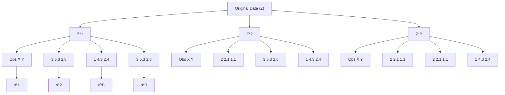
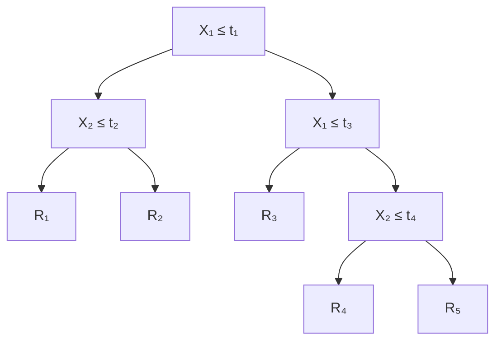
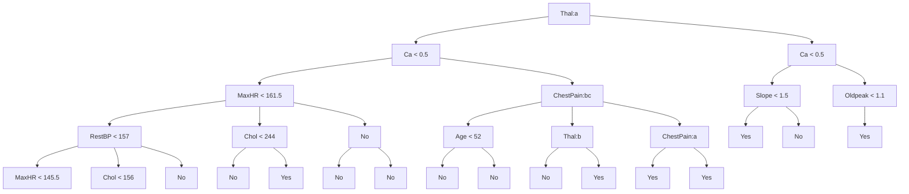
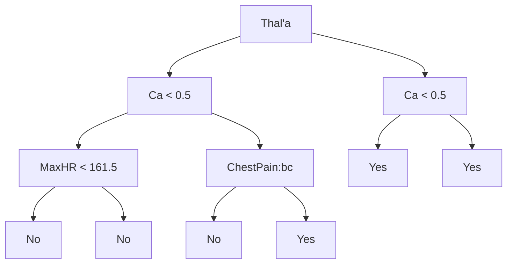

<details>
<summary>scatter</summary>

| X    | Y    |
|------|------|
| -2.0 | -2.0 |
| -1.5 | -1.5 |
| -1.0 | -1.0 |
| -0.5 | -0.5 |
| 0.0  | 0.0  |
| 0.5  | 0.5  |
| 1.0  | 1.0  |
| 1.5  | 1.5  |
| 2.0  | 2.0  |
</details>


<details>
<summary>scatter</summary>

| X    | Y    |
| ---- | ---- |
| -2.0 | -3.0 |
| -1.5 | 0.5  |
| -1.0 | 1.0  |
| -0.5 | 0.8  |
| 0.0  | 0.6  |
| 0.5  | 0.9  |
| 1.0  | 1.2  |
| 1.5  | 1.5  |
| 2.0  | 2.0  |
</details>


<details>
<summary>scatter</summary>

| X    | Y    |
| ---- | ---- |
| -3.0 | -2.5 |
| -2.5 | -1.0 |
| -2.0 | 0.0  |
| -1.5 | 0.5  |
| -1.0 | 1.0  |
| -0.5 | 1.5  |
| 0.0  | 2.0  |
| 0.5  | 1.5  |
| 1.0  | 1.0  |
| 1.5  | 0.5  |
| 2.0  | 0.0  |
| 2.5  | -0.5 |
| 3.0  | -1.0 |
</details>


<details>
<summary>scatter</summary>

| X    | Y    |
| ---- | ---- |
| -2.0 | -3.0 |
| -1.5 | -2.5 |
| -1.0 | -2.0 |
| -0.5 | -1.5 |
| 0.0  | -1.0 |
| 0.5  | -0.5 |
| 1.0  | 0.0  |
| 1.5  | 0.5  |
| 2.0  | 1.0  |
| 2.5  | 1.5  |
| 3.0  | 2.0  |
</details>

FIGURE 5.9. Each panel displays 100 simulated returns for investments X and Y . From left to right and top to bottom, the resulting estimates for α are 0.576, 0.532, 0.657, and 0.651.

1,000 times. We thereby obtained 1,000 estimates for α, which we can call $\hat { \alpha } _ { 1 } , \hat { \alpha } _ { 2 } , \dots , \hat { \alpha } _ { 1 }$ ,000. The left-hand panel of Figure 5.10 displays a histogram of the resulting estimates. For these simulations the parameters were set to $\sigma _ { X } ^ { 2 } = 1 , \sigma _ { Y } ^ { 2 } = 1 . 2 5$ , and $\sigma _ { X Y } = 0 . 5$ , and so we know that the true value of α is 0.6. We indicated this value using a solid vertical line on the histogram. The mean over all 1,000 estimates for α is

$$
\bar {\alpha} = \frac {1}{1 , 0 0 0} \sum_ {r = 1} ^ {1, 0 0 0} \hat {\alpha} _ {r} = 0. 5 9 9 6,
$$

very close to $\alpha = 0 . 6$ , and the standard deviation of the estimates is

$$
\sqrt {\frac {1}{1 , 0 0 0 - 1} \sum_ {r = 1} ^ {1 , 0 0 0} \left(\hat {\alpha} _ {r} - \bar {\alpha}\right) ^ {2}} = 0. 0 8 3.
$$

This gives us a very good idea of the accuracy of $\hat { \alpha } \colon \mathrm { S E } ( \hat { \alpha } ) \approx 0 . 0 8 3$ . So roughly speaking, for a random sample from the population, we would expect ˆα to differ from α by approximately 0.08, on average.

In practice, however, the procedure for estimating SE(ˆα) outlined above cannot be applied, because for real data we cannot generate new samples from the original population. However, the bootstrap approach allows us to use a computer to emulate the process of obtaining new sample sets, so that we can estimate the variability of ˆα without generating additional samples. Rather than repeatedly obtaining independent data sets from the population, we instead obtain distinct data sets by repeatedly sampling observations from the original data set.


<details>
<summary>histogram</summary>

| α Range | Frequency |
|---|---|
| 0.4 - 0.45 | 1 |
| 0.45 - 0.5 | 35 |
| 0.5 - 0.55 | 75 |
| 0.55 - 0.6 | 165 |
| 0.6 - 0.65 | 225 |
| 0.65 - 0.7 | 125 |
| 0.7 - 0.75 | 85 |
| 0.75 - 0.8 | 30 |
| 0.8 - 0.85 | 10 |
| 0.85 - 0.9 | 1 |
</details>


<details>
<summary>histogram</summary>

| α Range       | Frequency |
| ------------- | --------- |
| 0.3 - 0.4     | 10        |
| 0.4 - 0.5     | 50        |
| 0.5 - 0.6     | 200       |
| 0.6 - 0.7     | 180       |
| 0.7 - 0.8     | 40        |
| 0.8 - 0.9     | 10        |
</details>


<details>
<summary>boxplot</summary>

| Group    | Median | Q1   | Q3   | Min  | Max  |
| -------- | ------ | ---- | ---- | ---- | ---- |
| True     | 0.6    | 0.55 | 0.65 | 0.35 | 0.85 |
| Bootstrap| 0.55   | 0.5  | 0.6  | 0.3  | 0.8  |
</details>

FIGURE 5.10. Left: A histogram of the estimates of α obtained by generating 1,000 simulated data sets from the true population. Center: A histogram of the estimates of α obtained from 1,000 bootstrap samples from a single data set. Right: The estimates of α displayed in the left and center panels are shown as boxplots. In each panel, the pink line indicates the true value of α.

This approach is illustrated in Figure 5.11 on a simple data set, which we call $Z$ , that contains only n = 3 observations. We randomly select n observations from the data set in order to produce a bootstrap data set, $Z ^ { * 1 }$ . The sampling is performed with replacement, which means that the same observation can occur more than once in the bootstrap data set. In this example, $Z ^ { * 1 }$ contains the third observation twice, the first observation once, and no instances of the second observation. Note that if an observation is contained in $Z ^ { * 1 }$ , then both its X and Y values are included. We can use $Z ^ { * 1 }$ to produce a new bootstrap estimate for $\alpha ,$ which we call $\hat { \alpha } ^ { * 1 }$ . This procedure is repeated B times for some large value of B, in order to produce B different bootstrap data sets, $Z ^ { * 1 } , Z ^ { * 2 } , \ldots , Z ^ { * B }$ , and B corresponding α estimates, $\hat { \alpha } ^ { * 1 } , \hat { \alpha } ^ { * 2 } , \hat { \mathbf { \alpha } } _ { \cdot } \mathbf { \Phi } _ { \cdot } , \hat { \alpha } ^ { * B }$ . We can compute the standard error of these bootstrap estimates using the formula

$$
\mathrm{SE} _ {B} (\hat {\alpha}) = \sqrt {\frac {1}{B - 1} \sum_ {r = 1} ^ {B} \left(\hat {\alpha} ^ {* r} - \frac {1}{B} \sum_ {r ^ {\prime} = 1} ^ {B} \hat {\alpha} ^ {* r ^ {\prime}}\right) ^ {2}}. \tag {5.8}
$$

This serves as an estimate of the standard error of $\hat { \alpha }$ estimated from the original data set.

The bootstrap approach is illustrated in the center panel of Figure 5.10, which displays a histogram of 1,000 bootstrap estimates of $\alpha ,$ , each computed using a distinct bootstrap data set. This panel was constructed on the basis of a single data set, and hence could be created using real data.


<details>
<summary>flowchart</summary>


</details>

FIGURE 5.11. A graphical illustration of the bootstrap approach on a small sample containing $n = 3$ observations. Each bootstrap data set contains n observations, sampled with replacement from the original data set. Each bootstrap data set is used to obtain an estimate of α.

Note that the histogram looks very similar to the left-hand panel which displays the idealized histogram of the estimates of α obtained by generating 1,000 simulated data sets from the true population. In particular the bootstrap estimate SE(ˆα) from (5.8) is 0.087, very close to the estimate of 0.083 obtained using 1,000 simulated data sets. The right-hand panel displays the information in the center and left panels in a different way, via boxplots of the estimates for α obtained by generating 1,000 simulated data sets from the true population and using the bootstrap approach. Again, the boxplots are quite similar to each other, indicating that the bootstrap approach can be used to effectively estimate the variability associated with ˆα.

# 5.3 Lab: Cross-Validation and the Bootstrap

In this lab, we explore the resampling techniques covered in this chapter. Some of the commands in this lab may take a while to run on your computer.

# 5.3.1 The Validation Set Approach

We explore the use of the validation set approach in order to estimate the test error rates that result from fitting various linear models on the Auto data set.

Before we begin, we use the set.seed() function in order to set a seed for R’s random number generator, so that the reader of this book will obtain precisely the same results as those shown below. It is generally a good idea to set a random seed when performing an analysis such as cross-validation that contains an element of randomness, so that the results obtained can be reproduced precisely at a later time.

We begin by using the sample() function to split the set of observations into two halves, by selecting a random subset of 196 observations out of the original 392 observations. We refer to these observations as the training set.

```diff
> library(ISLR)
> set.seed(1)
> train=sample(392,196) 
```

(Here we use a shortcut in the sample command; see ?sample for details.) We then use the subset option in lm() to fit a linear regression using only the observations corresponding to the training set.

```txt
> lm.fit=lm(mpg~horsepower, data=Auto, subset=train) 
```

We now use the predict() function to estimate the response for all 392 observations, and we use the mean() function to calculate the MSE of the 196 observations in the validation set. Note that the -train index below selects only the observations that are not in the training set.

```txt
> attach(Auto)
> mean((mpg-predict(lm.fit, Auto))[−train]^2)
[1] 26.14 
```

Therefore, the estimated test MSE for the linear regression fit is 26.14. We can use the poly() function to estimate the test error for the polynomial and cubic regressions.

```txt
> lm.fit2=lm(mpg~poly(horsepower,2),data=Auto,subset=train)
> mean((mpg-predict(lm.fit2,Auto))[−train]^2)
[1] 19.82
> lm.fit3=lm(mpg~poly(horsepower,3),data=Auto,subset=train)
> mean((mpg-predict(lm.fit3,Auto))[−train]^2)
[1] 19.78 
```

These error rates are 19.82 and 19.78, respectively. If we choose a different training set instead, then we will obtain somewhat different errors on the validation set.

```txt
> set.seed(2)
> train=sample(392,196)
> lm.fit=lm(mpg~horsepower, subset=train) 
```

seed

sample()

```txt
> mean((mpg-predict(lm.fit, Auto))[−train]^2)
[1] 23.30
> lm.fit2=lm(mpg~poly(horsepower, 2), data=Auto, subset=train)
> mean((mpg-predict(lm.fit2, Auto))[−train]^2)
[1] 18.90
> lm.fit3=lm(mpg~poly(horsepower, 3), data=Auto, subset=train)
> mean((mpg-predict(lm.fit3, Auto))[−train]^2)
[1] 19.26 
```

Using this split of the observations into a training set and a validation set, we find that the validation set error rates for the models with linear, quadratic, and cubic terms are 23.30, 18.90, and 19.26, respectively.

These results are consistent with our previous findings: a model that predicts mpg using a quadratic function of horsepower performs better than a model that involves only a linear function of horsepower, and there is little evidence in favor of a model that uses a cubic function of horsepower.

# 5.3.2 Leave-One-Out Cross-Validation

The LOOCV estimate can be automatically computed for any generalized linear model using the glm() and cv.glm() functions. In the lab for Chapter 4, we used the glm() function to perform logistic regression by passing in the family="binomial" argument. But if we use glm() to fit a model without passing in the family argument, then it performs linear regression, just like the lm() function. So for instance,

```txt
> glm.fit=glm(mpg~horsepower, data=Auto)
> coef(glm.fit)
(Intercept) horsepower
39.936 -0.158 
```

and

```txt
> lm.fit=lm(mpg~horsepower, data=Auto)
> coef(lm.fit)
(Intercept) horsepower
39.936 -0.158 
```

yield identical linear regression models. In this lab, we will perform linear regression using the glm() function rather than the lm() function because the latter can be used together with cv.glm(). The cv.glm() function is part of the boot library.

```txt
> library (boot)
> glm.fit=glm(mpg~horsepower, data=Auto)
> cv.err=cv.glm(Auto, glm.fit)
> cv.err$delta
1 1
24.23 24.23 
```

The cv.glm() function produces a list with several components. The two numbers in the delta vector contain the cross-validation results. In this

cv.glm()

case the numbers are identical (up to two decimal places) and correspond to the LOOCV statistic given in (5.1). Below, we discuss a situation in which the two numbers differ. Our cross-validation estimate for the test error is approximately 24.23.

We can repeat this procedure for increasingly complex polynomial fits. To automate the process, we use the for() function to initiate a for loop which iteratively fits polynomial regressions for polynomials of order i = 1 to i = 5, computes the associated cross-validation error, and stores it in the ith element of the vector cv.error. We begin by initializing the vector. This command will likely take a couple of minutes to run.

for() for loop

```txt
> cv.error=rep(0,5)
> for (i in 1:5){
+ glm.fit=glm(mpg~poly(horsepower,i),data=Auto)
+ cv.error[i]=cv.glm(Auto,glm.fit)$delta[1]
+ }
> cv.error
[1] 24.23 19.25 19.33 19.42 19.03 
```

As in Figure 5.4, we see a sharp drop in the estimated test MSE between the linear and quadratic fits, but then no clear improvement from using higher-order polynomials.

# 5.3.3 k-Fold Cross-Validation

The cv.glm() function can also be used to implement k-fold CV. Below we use k = 10, a common choice for k, on the Auto data set. We once again set a random seed and initialize a vector in which we will store the CV errors corresponding to the polynomial fits of orders one to ten.

```diff
> set.seed(17)
> cv.error.10=rep(0,10)
> for (i in 1:10){
+ glm.fit=glm(mpg~poly(horsepower,i),data=Auto)
+ cv.error.10[i]=cv.glm(Auto,glm.fit,K=10)$delta[1]
+ }
> cv.error.10
[1] 24.21 19.19 19.31 19.34 18.88 19.02 18.90 19.71 18.95 19.50 
```

Notice that the computation time is much shorter than that of LOOCV. (In principle, the computation time for LOOCV for a least squares linear model should be faster than for k-fold CV, due to the availability of the formula (5.2) for LOOCV; however, unfortunately the cv.glm() function does not make use of this formula.) We still see little evidence that using cubic or higher-order polynomial terms leads to lower test error than simply using a quadratic fit.

We saw in Section 5.3.2 that the two numbers associated with delta are essentially the same when LOOCV is performed. When we instead perform k-fold CV, then the two numbers associated with delta differ slightly. The first is the standard k-fold CV estimate, as in (5.3). The second is a biascorrected version. On this data set, the two estimates are very similar to each other.

# 5.3.4 The Bootstrap

We illustrate the use of the bootstrap in the simple example of Section 5.2, as well as on an example involving estimating the accuracy of the linear regression model on the Auto data set.

# Estimating the Accuracy of a Statistic of Interest

One of the great advantages of the bootstrap approach is that it can be applied in almost all situations. No complicated mathematical calculations are required. Performing a bootstrap analysis in R entails only two steps. First, we must create a function that computes the statistic of interest. Second, we use the boot() function, which is part of the boot library, to perform the bootstrap by repeatedly sampling observations from the data set with replacement.

boot()

The Portfolio data set in the ISLR package is described in Section 5.2. To illustrate the use of the bootstrap on this data, we must first create a function, alpha.fn(), which takes as input the (X, Y ) data as well as a vector indicating which observations should be used to estimate α. The function then outputs the estimate for α based on the selected observations.

```diff
> alpha.fn=function(data,index){
+ X=data$X[index]
+ Y=data$Y[index]
+ return((var(Y)-cov(X,Y))/(var(X)+var(Y)-2*cov(X,Y)))
+ } 
```

This function returns, or outputs, an estimate for α based on applying (5.7) to the observations indexed by the argument index. For instance, the following command tells R to estimate α using all 100 observations.

```txt
> alpha.fn(Portfolio,1:100)
[1] 0.576 
```

The next command uses the sample() function to randomly select 100 observations from the range 1 to 100, with replacement. This is equivalent to constructing a new bootstrap data set and recomputing ˆα based on the new data set.

```txt
> set.seed(1)
> alpha.fn(Portfolio, sample(100, 100, replace=T))
[1] 0.596 
```

We can implement a bootstrap analysis by performing this command many times, recording all of the corresponding estimates for α, and computing the resulting standard deviation. However, the boot() function automates this approach. Below we produce R = 1, 000 bootstrap estimates for α.

boot()

```txt
> boot(Portfolio, alpha.fn, R=1000)
ORDINARY NONPARAMETRIC BOOTSTRAP
Call:
boot(data = Portfolio, statistic = alpha.fn, R = 1000)
Bootstrap Statistics :
original bias std. error
t1* 0.5758 -7.315e-05 0.0886 
```

The final output shows that using the original data, ˆα = 0.5758, and that the bootstrap estimate for SE(ˆα) is 0.0886.

# Estimating the Accuracy of a Linear Regression Model

The bootstrap approach can be used to assess the variability of the coefficient estimates and predictions from a statistical learning method. Here we use the bootstrap approach in order to assess the variability of the estimates for $\beta _ { 0 }$ and $\beta _ { 1 }$ , the intercept and slope terms for the linear regression model that uses horsepower to predict mpg in the Auto data set. We will compare the estimates obtained using the bootstrap to those obtained using the formulas for SE(βˆ ) and $\operatorname { S E } ( { \hat { \beta } } _ { 1 } )$ described in Section 3.1.2.

We first create a simple function, boot.fn(), which takes in the Auto data set as well as a set of indices for the observations, and returns the intercept and slope estimates for the linear regression model. We then apply this function to the full set of 392 observations in order to compute the estimates of $\beta _ { 0 }$ and $\beta _ { 1 }$ on the entire data set using the usual linear regression coefficient estimate formulas from Chapter 3. Note that we do not need the and at the beginning and end of the function because it is only one line long.

```txt
> boot.fn=function(data,index)
+ return(coef(lm(mpg~horsepower,data=data, subset=index)))
> boot.fn(Auto,1:392)
(Intercept) horsepower
39.936 -0.158 
```

The boot.fn() function can also be used in order to create bootstrap estimates for the intercept and slope terms by randomly sampling from among the observations with replacement. Here we give two examples.

```txt
> set.seed(1)
> boot.fn(Auto, sample(392, 392, replace=T))
(Intercept) horsepower
38.739 -0.148
> boot.fn(Auto, sample(392, 392, replace=T))
(Intercept) horsepower
40.038 -0.160 
```

Next, we use the boot() function to compute the standard errors of 1,000 bootstrap estimates for the intercept and slope terms.

```python
> boot(Auto,boot.fn,1000)
ORDINARY NONPARAMETRIC BOOTSTRAP
Call:
boot(data = Auto, statistic = boot.fn, R = 1000)
Bootstrap Statistics :
    original    bias    std. error
t1* 39.936    0.0297    0.8600
t2* -0.158    -0.0003    0.0074 
```

This indicates that the bootstrap estimate for $\operatorname { S E } ( { \hat { \beta } } _ { 0 } )$ is 0.86, and that the bootstrap estimate for $\operatorname { S E } ( { \hat { \beta } } _ { 1 } )$ is 0.0074. As discussed in Section 3.1.2, standard formulas can be used to compute the standard errors for the regression coefficients in a linear model. These can be obtained using the summary() function.

```powershell
> summary(lm(mpg~horsepower, data=Auto))$coef
Estimate Std. Error t value Pr(>|t|)
(Intercept) 39.936 0.71750 55.7 1.22e-187
horsepower -0.158 0.00645 -24.5 7.03e-81 
```

The standard error estimates for $\hat { \beta } _ { 0 }$ and $\hat { \beta } _ { 1 }$ obtained using the formulas from Section 3.1.2 are 0.717 for the intercept and 0.0064 for the slope. Interestingly, these are somewhat different from the estimates obtained using the bootstrap. Does this indicate a problem with the bootstrap? In fact, it suggests the opposite. Recall that the standard formulas given in Equation 3.8 on page 66 rely on certain assumptions. For example, they depend on the unknown parameter $\sigma ^ { 2 }$ , the noise variance. We then estimate $\sigma ^ { 2 }$ using the RSS. Now although the formula for the standard errors do not rely on the linear model being correct, the estimate for $\sigma ^ { 2 }$ does. We see in Figure 3.8 on page 91 that there is a non-linear relationship in the data, and so the residuals from a linear fit will be inflated, and so will $\hat { \sigma } ^ { 2 }$ . Secondly, the standard formulas assume (somewhat unrealistically) that the $x _ { i }$ are fixed, and all the variability comes from the variation in the errors $\epsilon _ { i }$ . The bootstrap approach does not rely on any of these assumptions, and so it is likely giving a more accurate estimate of the standard errors of $\hat { \beta } _ { 0 }$ and $\hat { \beta } _ { 1 }$ than is the summary() function.

Below we compute the bootstrap standard error estimates and the standard linear regression estimates that result from fitting the quadratic model to the data. Since this model provides a good fit to the data (Figure 3.8), there is now a better correspondence between the bootstrap estimates and the standard estimates of $\tilde { \mathrm { S E } } ( \hat { \beta } _ { 0 } ) , \mathrm { S E } ( \hat { \beta } _ { 1 } )$ and $\mathrm { S E } ( \hat { \beta } _ { 2 } )$ .

```txt
> boot.fn=function(data,index)
+ coefficients(lm(mpg~horsepower+I(horsepower^2),data=data, subset=index))
> set.seed(1)
> boot(Auto,boot.fn,1000)

ORDINARY NONPARAMETRIC BOOTSTRAP

Call:
boot(data = Auto, statistic = boot.fn, R = 1000)

Bootstrap Statistics :
original bias std. error
t1* 56.900 6.098e-03 2.0945
t2* -0.466 -1.777e-04 0.0334
t3* 0.001 1.324e-06 0.0001

> summary(lm(mpg~horsepower+I(horsepower^2),data=Auto))$coef
Estimate Std. Error t value Pr(>|t|)
(Intercept) 56.9001 1.80043 32 1.7e-109
horsepower -0.4662 0.03112 -15 2.3e-40
I(horsepower^2) 0.0012 0.00012 10 2.2e-21 
```

# 5.4 Exercises

# Conceptual

1. Using basic statistical properties of the variance, as well as singlevariable calculus, derive (5.6). In other words, prove that α given by (5.6) does indeed minimize Var $( \alpha X + ( 1 - \alpha ) Y )$ .   
2. We will now derive the probability that a given observation is part of a bootstrap sample. Suppose that we obtain a bootstrap sample from a set of n observations.

(a) What is the probability that the first bootstrap observation is not the jth observation from the original sample? Justify your answer.   
(b) What is the probability that the second bootstrap observation is not the jth observation from the original sample?   
(c) Argue that the probability that the jth observation is not in the bootstrap sample is $( 1 - 1 / n ) ^ { n }$ .   
(d) When n = 5, what is the probability that the jth observation is in the bootstrap sample?   
(e) When n = 100, what is the probability that the jth observation is in the bootstrap sample?

(f) When n = 10, 000, what is the probability that the jth observation is in the bootstrap sample?   
(g) Create a plot that displays, for each integer value of n from 1 to 100, 000, the probability that the jth observation is in the bootstrap sample. Comment on what you observe.   
(h) We will now investigate numerically the probability that a bootstrap sample of size n = 100 contains the jth observation. Here j = 4. We repeatedly create bootstrap samples, and each time we record whether or not the fourth observation is contained in the bootstrap sample.

```txt
> store=rep(NA, 10000)
> for(i in 1:10000){
store[i]=sum(sample(1:100, rep=TRUE)==4)>0
}
> mean(store) 
```

Comment on the results obtained.

3. We now review k-fold cross-validation.

(a) Explain how k-fold cross-validation is implemented.   
(b) What are the advantages and disadvantages of k-fold crossvalidation relative to:

i. The validation set approach?

ii. LOOCV?

4. Suppose that we use some statistical learning method to make a prediction for the response Y for a particular value of the predictor X. Carefully describe how we might estimate the standard deviation of our prediction.

# Applied

5. In Chapter 4, we used logistic regression to predict the probability of default using income and balance on the Default data set. We will now estimate the test error of this logistic regression model using the validation set approach. Do not forget to set a random seed before beginning your analysis.

(a) Fit a logistic regression model that uses income and balance to predict default.   
(b) Using the validation set approach, estimate the test error of this model. In order to do this, you must perform the following steps: i. Split the sample set into a training set and a validation set.

ii. Fit a multiple logistic regression model using only the training observations.

iii. Obtain a prediction of default status for each individual in the validation set by computing the posterior probability of default for that individual, and classifying the individual to the default category if the posterior probability is greater than 0.5.

iv. Compute the validation set error, which is the fraction of the observations in the validation set that are misclassified.

(c) Repeat the process in (b) three times, using three different splits of the observations into a training set and a validation set. Comment on the results obtained.

(d) Now consider a logistic regression model that predicts the probability of default using income, balance, and a dummy variable for student. Estimate the test error for this model using the validation set approach. Comment on whether or not including a dummy variable for student leads to a reduction in the test error rate.

6. We continue to consider the use of a logistic regression model to predict the probability of default using income and balance on the Default data set. In particular, we will now compute estimates for the standard errors of the income and balance logistic regression coefficients in two different ways: (1) using the bootstrap, and (2) using the standard formula for computing the standard errors in the glm() function. Do not forget to set a random seed before beginning your analysis.

(a) Using the summary() and glm() functions, determine the estimated standard errors for the coefficients associated with income and balance in a multiple logistic regression model that uses both predictors.

(b) Write a function, boot.fn(), that takes as input the Default data set as well as an index of the observations, and that outputs the coefficient estimates for income and balance in the multiple logistic regression model.

(c) Use the boot() function together with your boot.fn() function to estimate the standard errors of the logistic regression coefficients for income and balance.

(d) Comment on the estimated standard errors obtained using the glm() function and using your bootstrap function.

7. In Sections 5.3.2 and 5.3.3, we saw that the cv.glm() function can be used in order to compute the LOOCV test error estimate. Alternatively, one could compute those quantities using just the glm() and predict.glm() functions, and a for loop. You will now take this approach in order to compute the LOOCV error for a simple logistic regression model on the Weekly data set. Recall that in the context of classification problems, the LOOCV error is given in (5.4).

(a) Fit a logistic regression model that predicts Direction using Lag1 and Lag2.   
(b) Fit a logistic regression model that predicts Direction using Lag1 and Lag2 using all but the first observation.   
(c) Use the model from (b) to predict the direction of the first observation. You can do this by predicting that the first observation will go up if P (Direction="Up" Lag1, Lag2) > 0.5. Was this observation correctly classified?

(d) Write a for loop from i = 1 to i = n, where n is the number of observations in the data set, that performs each of the following steps:

i. Fit a logistic regression model using all but the ith observation to predict Direction using Lag1 and Lag2.   
ii. Compute the posterior probability of the market moving up for the ith observation.   
iii. Use the posterior probability for the ith observation in order to predict whether or not the market moves up.   
iv. Determine whether or not an error was made in predicting the direction for the ith observation. If an error was made, then indicate this as a 1, and otherwise indicate it as a 0.

(e) Take the average of the n numbers obtained in (d)iv in order to obtain the LOOCV estimate for the test error. Comment on the results.

8. We will now perform cross-validation on a simulated data set.

(a) Generate a simulated data set as follows:

```txt
> set.seed(1)
> y=rnorm(100)
> x=rnorm(100)
> y=x-2*x^2+rnorm(100) 
```

In this data set, what is n and what is p? Write out the model used to generate the data in equation form.

(b) Create a scatterplot of X against Y . Comment on what you find.

(c) Set a random seed, and then compute the LOOCV errors that result from fitting the following four models using least squares:

i. $Y = \beta _ { 0 } + \beta _ { 1 } X + \epsilon$

ii. $Y = \beta _ { 0 } + \beta _ { 1 } X + \beta _ { 2 } X ^ { 2 } + \epsilon$

iii. $Y = \beta _ { 0 } + \beta _ { 1 } X + \beta _ { 2 } X ^ { 2 } + \beta _ { 3 } X ^ { 3 } + \epsilon$

iv. $Y = \beta _ { 0 } + \beta _ { 1 } X + \beta _ { 2 } X ^ { 2 } + \beta _ { 3 } X ^ { 3 } + \beta _ { 4 } X ^ { 4 } + \epsilon .$

Note you may find it helpful to use the data.frame() function to create a single data set containing both X and $Y$ .

(d) Repeat (c) using another random seed, and report your results. Are your results the same as what you got in (c)? Why?

(e) Which of the models in (c) had the smallest LOOCV error? Is this what you expected? Explain your answer.

(f) Comment on the statistical significance of the coefficient estimates that results from fitting each of the models in (c) using least squares. Do these results agree with the conclusions drawn based on the cross-validation results?

9. We will now consider the Boston housing data set, from the MASS library.

(a) Based on this data set, provide an estimate for the population mean of medv. Call this estimate ${ \hat { \mu } } .$ .

(b) Provide an estimate of the standard error of $\hat { \mu }$ . Interpret this result.

Hint: We can compute the standard error of the sample mean by dividing the sample standard deviation by the square root of the number of observations.

(c) Now estimate the standard error of $\hat { \mu }$ using the bootstrap. How does this compare to your answer from (b)?

(d) Based on your bootstrap estimate from (c), provide a 95 % confidence interval for the mean of medv. Compare it to the results obtained using t.test(Boston\$medv).

Hint: You can approximate a 95 % confidence interval using the formula $\left[ \hat { \mu } - 2 S E ( \hat { \mu } ) , \hat { \mu } + 2 S E ( \hat { \mu } ) \right]$ ].

(e) Based on this data set, provide an estimate, $\hat { \mu } _ { m e d }$ , for the median value of medv in the population.

(f) We now would like to estimate the standard error of $\hat { \mu } _ { m e d }$ . Unfortunately, there is no simple formula for computing the standard error of the median. Instead, estimate the standard error of the median using the bootstrap. Comment on your findings.

(g) Based on this data set, provide an estimate for the tenth percentile of medv in Boston suburbs. Call this quantity $\hat { \mu } _ { 0 . 1 }$ . (You can use the quantile() function.)

(h) Use the bootstrap to estimate the standard error of $\hat { \mu } _ { 0 . 1 }$ . Comment on your findings.

# 6

# Linear Model Selection and Regularization

In the regression setting, the standard linear model

$$
Y = \beta_ {0} + \beta_ {1} X _ {1} + \dots + \beta_ {p} X _ {p} + \epsilon \tag {6.1}
$$

is commonly used to describe the relationship between a response Y and a set of variables $X _ { 1 } , X _ { 2 } , \ldots , X _ { p } ,$ . We have seen in Chapter 3 that one typically fits this model using least squares.

In the chapters that follow, we consider some approaches for extending the linear model framework. In Chapter 7 we generalize (6.1) in order to accommodate non-linear, but still additive, relationships, while in Chapter 8 we consider even more general non-linear models. However, the linear model has distinct advantages in terms of inference and, on real-world problems, is often surprisingly competitive in relation to non-linear methods. Hence, before moving to the non-linear world, we discuss in this chapter some ways in which the simple linear model can be improved, by replacing plain least squares fitting with some alternative fitting procedures.

Why might we want to use another fitting procedure instead of least squares? As we will see, alternative fitting procedures can yield better prediction accuracy and model interpretability.

Prediction Accuracy: Provided that the true relationship between the response and the predictors is approximately linear, the least squares estimates will have low bias. If n p—that is, if n, the number of observations, is much larger than p, the number of variables—then the least squares estimates tend to also have low variance, and hence will perform well on test observations. However, if n is not much larger than p, then there can be a lot of variability in the least squares fit, resulting in overfitting and consequently poor predictions on future observations not used in model training. And if $p > n$ , then there is no longer a unique least squares coefficient estimate: the variance is infinite so the method cannot be used at all. By constraining or shrinking the estimated coefficients, we can often substantially reduce the variance at the cost of a negligible increase in bias. This can lead to substantial improvements in the accuracy with which we can predict the response for observations not used in model training.

Model Interpretability: It is often the case that some or many of the variables used in a multiple regression model are in fact not associated with the response. Including such irrelevant variables leads to unnecessary complexity in the resulting model. By removing these variables—that is, by setting the corresponding coefficient estimates to zero—we can obtain a model that is more easily interpreted. Now least squares is extremely unlikely to yield any coefficient estimates that are exactly zero. In this chapter, we see some approaches for automatically performing feature selection or variable selection—that is, for excluding irrelevant variables from a multiple regression model.

There are many alternatives, both classical and modern, to using least squares to fit (6.1). In this chapter, we discuss three important classes of methods.

Subset Selection. This approach involves identifying a subset of the p predictors that we believe to be related to the response. We then fit a model using least squares on the reduced set of variables.   
Shrinkage. This approach involves fitting a model involving all p predictors. However, the estimated coefficients are shrunken towards zero relative to the least squares estimates. This shrinkage (also known as regularization) has the effect of reducing variance. Depending on what type of shrinkage is performed, some of the coefficients may be estimated to be exactly zero. Hence, shrinkage methods can also perform variable selection.   
Dimension Reduction. This approach involves projecting the p predictors into a M -dimensional subspace, where M < p. This is achieved by computing M different linear combinations, or projections, of the variables. Then these M projections are used as predictors to fit a linear regression model by least squares.

In the following sections we describe each of these approaches in greater detail, along with their advantages and disadvantages. Although this chapter describes extensions and modifications to the linear model for regression seen in Chapter 3, the same concepts apply to other methods, such as the classification models seen in Chapter 4.

# 6.1 Subset Selection

In this section we consider some methods for selecting subsets of predictors. These include best subset and stepwise model selection procedures.

# 6.1.1 Best Subset Selection

To perform best subset selection, we fit a separate least squares regression for each possible combination of the p predictors. That is, we fit all $p$ models that contain exactly one predictor, all $\binom { p } { 2 } = p ( p - 1 ) / 2$ models that contain exactly two predictors, and so forth. We then look at all of the resulting models, with the goal of identifying the one that is best.

The problem of selecting the best model from among the $2 ^ { p }$ possibilities considered by best subset selection is not trivial. This is usually broken up into two stages, as described in Algorithm 6.1.

best subset selection

# Algorithm 6.1 Best subset selection

1. Let $\mathcal { M } _ { 0 }$ denote the null model, which contains no predictors. This model simply predicts the sample mean for each observation.   
2. For k = 1, 2, . . . p:

(a) Fit all $\textstyle { \binom { p } { k } }$ models that contain exactly k predictors.

(b) Pick the best among these $\textstyle { \binom { p } { k } }$ models, and call it $\mathcal { M } _ { k }$ . Here best is defined as having the smallest RSS, or equivalently largest $R ^ { 2 }$ .

3. Select a single best model from among $\mathcal { M } _ { 0 } , \ldots , \mathcal { M } _ { p }$ using crossvalidated prediction error, $C _ { p }$ (AIC), BIC, or adjusted $R ^ { 2 }$ .

In Algorithm 6.1, Step 2 identifies the best model (on the training data) for each subset size, in order to reduce the problem from one of $2 ^ { p }$ possible models to one of $p + 1$ possible models. In Figure 6.1, these models form the lower frontier depicted in red.

Now in order to select a single best model, we must simply choose among these $p + 1$ options. This task must be performed with care, because the RSS of these $p + 1$ models decreases monotonically, and the $R ^ { 2 }$ increases monotonically, as the number of features included in the models increases. Therefore, if we use these statistics to select the best model, then we will always end up with a model involving all of the variables. The problem is that a low RSS or a high $R ^ { 2 }$ indicates a model with a low training error, whereas we wish to choose a model that has a low test error. (As shown in Chapter 2 in Figures 2.9–2.11, training error tends to be quite a bit smaller than test error, and a low training error by no means guarantees a low test error.) Therefore, in Step 3, we use cross-validated prediction error, $C _ { p }$ , BIC, or adjusted $R ^ { 2 }$ in order to select among $\mathcal { M } _ { 0 } , \mathcal { M } _ { 1 } , \ldots , \mathcal { M } _ { p }$ These approaches are discussed in Section 6.1.3.


<details>
<summary>line</summary>

| Number of Predictors | Residual Sum of Squares |
| --------------------- | ------------------------ |
| 1                     | 2e+07                    |
| 2                     | ~1.5e+07                 |
| 3                     | ~1e+07                   |
| 4                     | ~1e+07                   |
| 5                     | ~1e+07                   |
| 6                     | ~1e+07                   |
| 7                     | ~1e+07                   |
| 8                     | ~1e+07                   |
| 9                     | ~1e+07                   |
| 10                    | ~1e+07                   |
</details>


<details>
<summary>line</summary>

| Number of Predictors | R² (Red Line) | R² (Gray Dots) |
|----------------------|---------------|----------------|
| 2                    | 0.75          | 0.2            |
| 4                    | 0.95          | 0.25           |
| 6                    | 0.98          | 0.25           |
| 8                    | 0.98          | 0.25           |
| 10                   | 0.98          | 0.25           |
</details>

FIGURE 6.1. For each possible model containing a subset of the ten predictors in the Credit data set, the RSS and $R ^ { 2 }$ are displayed. The red frontier tracks the best model for a given number of predictors, according to RSS and $R ^ { 2 }$ . Though the data set contains only ten predictors, the x-axis ranges from 1 to 11, since one of the variables is categorical and takes on three values, leading to the creation of two dummy variables.

An application of best subset selection is shown in Figure 6.1. Each plotted point corresponds to a least squares regression model fit using a different subset of the 11 predictors in the Credit data set, discussed in Chapter 3. Here the variable ethnicity is a three-level qualitative variable, and so is represented by two dummy variables, which are selected separately in this case. We have plotted the RSS and $R ^ { 2 }$ statistics for each model, as a function of the number of variables. The red curves connect the best models for each model size, according to RSS or $R ^ { 2 }$ . The figure shows that, as expected, these quantities improve as the number of variables increases; however, from the three-variable model on, there is little improvement in RSS and $R ^ { 2 }$ as a result of including additional predictors.

Although we have presented best subset selection here for least squares regression, the same ideas apply to other types of models, such as logistic regression. In the case of logistic regression, instead of ordering models by RSS in Step 2 of Algorithm 6.1, we instead use the deviance, a measure that plays the role of RSS for a broader class of models. The deviance is negative two times the maximized log-likelihood; the smaller the deviance, the better the fit.

While best subset selection is a simple and conceptually appealing approach, it suffers from computational limitations. The number of possible models that must be considered grows rapidly as $p$ increases. In general, there are $2 ^ { p }$ models that involve subsets of $p$ predictors. So if $p = 1 0$ , then there are approximately 1,000 possible models to be considered, and if $p = 2 0$ , then there are over one million possibilities! Consequently, best subset selection becomes computationally infeasible for values of p greater than around 40, even with extremely fast modern computers. There are computational shortcuts—so called branch-and-bound techniques—for eliminating some choices, but these have their limitations as p gets large. They also only work for least squares linear regression. We present computationally efficient alternatives to best subset selection next.

# 6.1.2 Stepwise Selection

For computational reasons, best subset selection cannot be applied with very large p. Best subset selection may also suffer from statistical problems when p is large. The larger the search space, the higher the chance of finding models that look good on the training data, even though they might not have any predictive power on future data. Thus an enormous search space can lead to overfitting and high variance of the coefficient estimates.

For both of these reasons, stepwise methods, which explore a far more restricted set of models, are attractive alternatives to best subset selection.

# Forward Stepwise Selection

Forward stepwise selection is a computationally efficient alternative to best subset selection. While the best subset selection procedure considers all $2 ^ { p }$ possible models containing subsets of the p predictors, forward stepwise considers a much smaller set of models. Forward stepwise selection begins with a model containing no predictors, and then adds predictors to the model, one-at-a-time, until all of the predictors are in the model. In particular, at each step the variable that gives the greatest additional improvement to the fit is added to the model. More formally, the forward stepwise selection procedure is given in Algorithm 6.2.

# Algorithm 6.2 Forward stepwise selection

1. Let $\mathcal { M } _ { 0 }$ denote the null model, which contains no predictors.   
2. For $k = 0 , \ldots , p - 1 \colon$

(a) Consider all $p - k$ models that augment the predictors in $\mathcal { M } _ { k }$ with one additional predictor.

(b) Choose the best among these p − k models, and call it $\mathcal { M } _ { k + 1 }$ . Here best is defined as having smallest RSS or highest $R ^ { 2 }$ .

3. Select a single best model from among $\mathcal { M } _ { 0 } , \ldots , \mathcal { M } _ { p }$ using crossvalidated prediction error, $C _ { p } \ ( \mathrm { A I C } )$ , BIC, or adjusted $R ^ { 2 }$ .

Unlike best subset selection, which involved fitting $2 ^ { p }$ models, forward stepwise selection involves fitting one null model, along with $p - k$ models in the kth iteration, for $k = 0 , \ldots , p - 1$ . This amounts to a total of $1 +$ $\textstyle \sum _ { k = 0 } ^ { p - 1 } ( p - k ) = 1 + p ( p + 1 ) / 2$ models. This is a substantial difference: when $p = 2 0$ , best subset selection requires fitting 1,048,576 models, whereas forward stepwise selection requires fitting only 211 models.1

In Step $2 ( \mathrm { b } )$ of Algorithm 6.2, we must identify the best model from among those $p - k$ that augment $\mathcal { M } _ { k }$ with one additional predictor. We can do this by simply choosing the model with the lowest RSS or the highest $R ^ { 2 }$ . However, in Step 3, we must identify the best model among a set of models with different numbers of variables. This is more challenging, and is discussed in Section 6.1.3.

Forward stepwise selection’s computational advantage over best subset selection is clear. Though forward stepwise tends to do well in practice, it is not guaranteed to find the best possible model out of all $2 ^ { p }$ models containing subsets of the $p$ predictors. For instance, suppose that in a given data set with $p = 3$ predictors, the best possible one-variable model contains $X _ { 1 }$ , and the best possible two-variable model instead contains $X _ { 2 }$ and $X _ { 3 }$ . Then forward stepwise selection will fail to select the best possible two-variable model, because $\mathcal { M } _ { 1 }$ will contain $X _ { 1 }$ , so $\mathcal { M } _ { 2 }$ must also contain $X _ { 1 }$ together with one additional variable.

Table 6.1, which shows the first four selected models for best subset and forward stepwise selection on the Credit data set, illustrates this phenomenon. Both best subset selection and forward stepwise selection choose rating for the best one-variable model and then include income and student for the two- and three-variable models. However, best subset selection replaces rating by cards in the four-variable model, while forward stepwise selection must maintain rating in its four-variable model. In this example, Figure 6.1 indicates that there is not much difference between the threeand four-variable models in terms of RSS, so either of the four-variable models will likely be adequate.

Forward stepwise selection can be applied even in the high-dimensional setting where $n < p ;$ however, in this case, it is possible to construct submodels $\mathcal { M } _ { 0 } , \ldots , \mathcal { M } _ { n - 1 }$ only, since each submodel is fit using least squares, which will not yield a unique solution if $p \geq n$ .

# Backward Stepwise Selection

Like forward stepwise selection, backward stepwise selection provides an efficient alternative to best subset selection. However, unlike forward

backward stepwise selection

<table><tr><td># Variables</td><td>Best subset</td><td>Forward stepwise</td></tr><tr><td>One</td><td>rating</td><td>rating</td></tr><tr><td>Two</td><td>rating, income</td><td>rating, income</td></tr><tr><td>Three</td><td>rating, income, student</td><td>rating, income, student</td></tr><tr><td>Four</td><td>cards, income</td><td>rating, income,</td></tr><tr><td></td><td>student, limit</td><td>student, limit</td></tr></table>

TABLE 6.1. The first four selected models for best subset selection and forward stepwise selection on the Credit data set. The first three models are identical but the fourth models differ.

stepwise selection, it begins with the full least squares model containing all p predictors, and then iteratively removes the least useful predictor, one-at-a-time. Details are given in Algorithm 6.3.

# Algorithm 6.3 Backward stepwise selection

1. Let $\mathcal { M } _ { p }$ denote the full model, which contains all $p$ predictors.   
2. For $k = p , p - 1 , \ldots , 1$ 1:

(a) Consider all k models that contain all but one of the predictors in $\mathcal { M } _ { k }$ , for a total of $k - 1$ predictors.

(b) Choose the best among these k models, and call it $\mathcal { M } _ { k - 1 }$ . Here best is defined as having smallest RSS or highest $R ^ { 2 }$ .

3. Select a single best model from among $\mathcal { M } _ { 0 } , \ldots , \mathcal { M } _ { p }$ using crossvalidated prediction error, $C _ { p }$ (AIC), BIC, or adjusted $R ^ { 2 }$ .

Like forward stepwise selection, the backward selection approach searches through only $1 + p ( p + 1 ) / 2$ models, and so can be applied in settings where $p$ is too large to apply best subset selection.2 Also like forward stepwise selection, backward stepwise selection is not guaranteed to yield the best model containing a subset of the $p$ predictors.

Backward selection requires that the number of samples n is larger than the number of variables $p$ (so that the full model can be fit). In contrast, forward stepwise can be used even when $n < p .$ , and so is the only viable subset method when $p$ is very large.

# Hybrid Approaches

The best subset, forward stepwise, and backward stepwise selection approaches generally give similar but not identical models. As another alternative, hybrid versions of forward and backward stepwise selection are available, in which variables are added to the model sequentially, in analogy to forward selection. However, after adding each new variable, the method may also remove any variables that no longer provide an improvement in the model fit. Such an approach attempts to more closely mimic best subset selection while retaining the computational advantages of forward and backward stepwise selection.

# 6.1.3 Choosing the Optimal Model

Best subset selection, forward selection, and backward selection result in the creation of a set of models, each of which contains a subset of the p predictors. In order to implement these methods, we need a way to determine which of these models is best. As we discussed in Section 6.1.1, the model containing all of the predictors will always have the smallest RSS and the largest $R ^ { 2 }$ , since these quantities are related to the training error. Instead, we wish to choose a model with a low test error. As is evident here, and as we show in Chapter 2, the training error can be a poor estimate of the test error. Therefore, RSS and $R ^ { 2 }$ are not suitable for selecting the best model among a collection of models with different numbers of predictors.

In order to select the best model with respect to test error, we need to estimate this test error. There are two common approaches:

1. We can indirectly estimate test error by making an adjustment to the training error to account for the bias due to overfitting.   
2. We can directly estimate the test error, using either a validation set approach or a cross-validation approach, as discussed in Chapter 5.

We consider both of these approaches below.

# $C _ { p } ,$ AIC, BIC, and Adjusted $R ^ { 2 }$

We show in Chapter 2 that the training set MSE is generally an underestimate of the test MSE. (Recall that $\mathrm { M S E } = \mathrm { R S S } / n . )$ This is because when we fit a model to the training data using least squares, we specifically estimate the regression coefficients such that the training RSS (but not the test RSS) is as small as possible. In particular, the training error will decrease as more variables are included in the model, but the test error may not. Therefore, training set RSS and training set $R ^ { 2 }$ cannot be used to select from among a set of models with different numbers of variables.

However, a number of techniques for adjusting the training error for the model size are available. These approaches can be used to select among a set of models with different numbers of variables. We now consider four such approaches: $C _ { p }$ , Akaike information criterion (AIC), Bayesian information criterion (BIC), and adjusted $R ^ { 2 }$ . Figure 6.2 displays $C _ { p } .$ , BIC, and adjusted $R ^ { 2 }$ for the best model of each size produced by best subset selection on the Credit data set.


<details>
<summary>line</summary>

| Number of Predictors | Cp     |
| -------------------- | ------ |
| 2                    | 27000  |
| 4                    | 10000  |
| 6                    | 10000  |
| 8                    | 10000  |
| 10                   | 10000  |
</details>


<details>
<summary>line</summary>

| Number of Predictors | BIC    |
| -------------------- | ------ |
| 2                    | 27500  |
| 4                    | 11000  |
| 6                    | 11000  |
| 8                    | 11000  |
| 10                   | 11000  |
</details>


<details>
<summary>line</summary>

| Number of Predictors | Adjusted R² |
| --------------------- | ----------- |
| 2                     | 0.87        |
| 4                     | 0.95        |
| 6                     | 0.95        |
| 8                     | 0.95        |
| 10                    | 0.95        |
</details>

FIGURE 6.2. $C _ { p }$ , BIC, and adjusted $R ^ { 2 }$ are shown for the best models of each size for the Credit data set (the lower frontier in Figure 6.1). $C _ { p }$ and BIC are estimates of test MSE. In the middle plot we see that the BIC estimate of test error shows an increase after four variables are selected. The other two plots are rather flat after four variables are included.

For a fitted least squares model containing d predictors, the $C _ { p }$ estimate of test MSE is computed using the equation

$$
C _ {p} = \frac {1}{n} \left(\mathrm{RSS} + 2 d \hat {\sigma} ^ {2}\right), \tag {6.2}
$$

where $\hat { \sigma } ^ { 2 }$ is an estimate of the variance of the error  associated with each response measurement in (6.1).3 Essentially, the $C _ { p }$ statistic adds a penalty of $2 d \hat { \sigma } ^ { 2 }$ to the training RSS in order to adjust for the fact that the training error tends to underestimate the test error. Clearly, the penalty increases as the number of predictors in the model increases; this is intended to adjust for the corresponding decrease in training RSS. Though it is beyond the scope of this book, one can show that if $\hat { \sigma } ^ { 2 }$ is an unbiased estimate of $\sigma ^ { 2 }$ in (6.2), then $C _ { p }$ is an unbiased estimate of test MSE. As a consequence, the $C _ { p }$ statistic tends to take on a small value for models with a low test error, so when determining which of a set of models is best, we choose the model with the lowest $C _ { p }$ value. In Figure 6.2, $C _ { p }$ selects the six-variable model containing the predictors income, limit, rating, cards, age and student.

The AIC criterion is defined for a large class of models fit by maximum likelihood. In the case of the model (6.1) with Gaussian errors, maximum likelihood and least squares are the same thing. In this case AIC is given by

$$
\mathrm{AIC} = \frac {1}{n \hat {\sigma} ^ {2}} \left(\mathrm{RSS} + 2 d \hat {\sigma} ^ {2}\right),
$$

where, for simplicity, we have omitted an additive constant. Hence for least squares models, $C _ { p }$ and AIC are proportional to each other, and so only $C _ { p }$ is displayed in Figure 6.2.

BIC is derived from a Bayesian point of view, but ends up looking similar to $C _ { p }$ (and AIC) as well. For the least squares model with d predictors, the BIC is, up to irrelevant constants, given by

$$
\mathrm{BIC} = \frac {1}{n} \left(\mathrm{RSS} + \log (n) d \hat {\sigma} ^ {2}\right). \tag {6.3}
$$

Like $C _ { p }$ , the BIC will tend to take on a small value for a model with a low test error, and so generally we select the model that has the lowest BIC value. Notice that BIC replaces the $2 d \hat { \sigma } ^ { 2 }$ used by $C _ { p }$ with a $\log ( n ) d { \hat { \sigma } } ^ { 2 }$ term, where n is the number of observations. Since log $n > 2$ for any $n > 7$ , the BIC statistic generally places a heavier penalty on models with many variables, and hence results in the selection of smaller models than $C _ { p } .$ . In Figure 6.2, we see that this is indeed the case for the Credit data set; BIC chooses a model that contains only the four predictors income, limit, cards, and student. In this case the curves are very flat and so there does not appear to be much difference in accuracy between the four-variable and six-variable models.

The adjusted $R ^ { 2 }$ statistic is another popular approach for selecting among a set of models that contain different numbers of variables. Recall from Chapter 3 that the usual $R ^ { 2 }$ is defined as $1 - \mathrm { R S S } / \mathrm { T S S }$ , where $\mathrm { T S S = }$ $\sum ( y _ { i } - { \overline { { y } } } ) ^ { 2 }$ is the total sum of squares for the response. Since RSS always decreases as more variables are added to the model, the $R ^ { 2 }$ always increases as more variables are added. For a least squares model with d variables, the adjusted $R ^ { 2 }$ statistic is calculated as

$$
\text { Adjusted } R ^ {2} = 1 - \frac {\mathrm{RSS} / (n - d - 1)}{\mathrm{TSS} / (n - 1)}. \tag {6.4}
$$

Unlike $C _ { p }$ , AIC, and BIC, for which a small value indicates a model with a low test error, a large value of adjusted $R ^ { 2 }$ indicates a model with a small test error. Maximizing the adjusted $R ^ { 2 }$ is equivalent to minimizing RSSn d 1 . While RSS always decreases as the number of variables in the model $\textstyle { \frac { \mathrm { R S S } } { n - d - 1 } }$ increases, $\textstyle { \frac { \mathrm { R S S } } { n - d - 1 } }$ may increase or decrease, due to the presence of d in the −denominator.

The intuition behind the adjusted $R ^ { 2 }$ is that once all of the correct variables have been included in the model, adding additional noise variables will lead to only a very small decrease in RSS. Since adding noise variables leads to an increase in $d ,$ such variables will lead to an increase in $\textstyle { \frac { \mathrm { R S S } } { n - d - 1 } }$ , and consequently a decrease in the adjusted $R ^ { 2 }$ − − . Therefore, in theory, the model with the largest adjusted $R ^ { 2 }$ will have only correct variables and no noise variables. Unlike the $R ^ { 2 }$ statistic, the adjusted $R ^ { 2 }$ statistic pays a price for the inclusion of unnecessary variables in the model. Figure 6.2 displays the adjusted $R ^ { 2 }$ for the Credit data set. Using this statistic results in the selection of a model that contains seven variables, adding gender to the model selected by $C _ { p }$ and AIC.

$C _ { p } ,$ , AIC, and BIC all have rigorous theoretical justifications that are beyond the scope of this book. These justifications rely on asymptotic arguments (scenarios where the sample size n is very large). Despite its popularity, and even though it is quite intuitive, the adjusted $R ^ { 2 }$ is not as well motivated in statistical theory as AIC, BIC, and $C _ { p }$ . All of these measures are simple to use and compute. Here we have presented the formulas for AIC, BIC, and $C _ { p }$ in the case of a linear model fit using least squares; however, these quantities can also be defined for more general types of models.

# Validation and Cross-Validation

As an alternative to the approaches just discussed, we can directly estimate the test error using the validation set and cross-validation methods discussed in Chapter 5. We can compute the validation set error or the cross-validation error for each model under consideration, and then select the model for which the resulting estimated test error is smallest. This procedure has an advantage relative to AIC, BIC, $C _ { p } .$ and adjusted $R ^ { 2 }$ , in that it provides a direct estimate of the test error, and makes fewer assumptions about the true underlying model. It can also be used in a wider range of model selection tasks, even in cases where it is hard to pinpoint the model degrees of freedom (e.g. the number of predictors in the model) or hard to estimate the error variance $\sigma ^ { 2 }$ .

In the past, performing cross-validation was computationally prohibitive for many problems with large p and/or large n, and so AIC, BIC, $C _ { p } ,$ , and adjusted $R ^ { 2 }$ were more attractive approaches for choosing among a set of models. However, nowadays with fast computers, the computations required to perform cross-validation are hardly ever an issue. Thus, crossvalidation is a very attractive approach for selecting from among a number of models under consideration.

Figure 6.3 displays, as a function of d, the BIC, validation set errors, and cross-validation errors on the Credit data, for the best d-variable model. The validation errors were calculated by randomly selecting three-quarters of the observations as the training set, and the remainder as the validation set. The cross-validation errors were computed using $k = 1 0$ folds. In this case, the validation and cross-validation methods both result in a six-variable model. However, all three approaches suggest that the four-, five-, and six-variable models are roughly equivalent in terms of their test errors.


<details>
<summary>line</summary>

| Number of Predictors | Square Root of BIC |
| --------------------- | ------------------ |
| 2                     | 225                |
| 4                     | 105                |
| 6                     | 103                |
| 8                     | 104                |
| 10                    | 105                |
</details>


<details>
<summary>line</summary>

| Number of Predictors | Validation Set Error |
| -------------------- | --------------------- |
| 2                    | 225                   |
| 4                    | 105                   |
| 6                    | 100                   |
| 8                    | 105                   |
| 10                   | 105                   |
</details>


<details>
<summary>line</summary>

| Number of Predictors | Cross-Validation Error |
| --------------------- | ------------------------ |
| 2                     | 230                      |
| 4                     | 105                      |
| 6                     | 100                      |
| 8                     | 100                      |
| 10                    | 100                      |
</details>

FIGURE 6.3. For the Credit data set, three quantities are displayed for the best model containing d predictors, for d ranging from 1 to 11. The overall best model, based on each of these quantities, is shown as a blue cross. Left: Square root of BIC. Center: Validation set errors. Right: Cross-validation errors.

In fact, the estimated test error curves displayed in the center and righthand panels of Figure 6.3 are quite flat. While a three-variable model clearly has lower estimated test error than a two-variable model, the estimated test errors of the 3- to 11-variable models are quite similar. Furthermore, if we repeated the validation set approach using a different split of the data into a training set and a validation set, or if we repeated cross-validation using a different set of cross-validation folds, then the precise model with the lowest estimated test error would surely change. In this setting, we can select a model using the one-standard-error rule. We first calculate the standard error of the estimated test MSE for each model size, and then select the smallest model for which the estimated test error is within one standard error of the lowest point on the curve. The rationale here is that if a set of models appear to be more or less equally good, then we might as well choose the simplest model—that is, the model with the smallest number of predictors. In this case, applying the one-standard-error rule to the validation set or cross-validation approach leads to selection of the three-variable model.

# 6.2 Shrinkage Methods

The subset selection methods described in Section 6.1 involve using least squares to fit a linear model that contains a subset of the predictors. As an alternative, we can fit a model containing all p predictors using a technique that constrains or regularizes the coefficient estimates, or equivalently, that shrinks the coefficient estimates towards zero. It may not be immediately obvious why such a constraint should improve the fit, but it turns out that shrinking the coefficient estimates can significantly reduce their variance. The two best-known techniques for shrinking the regression coefficients towards zero are ridge regression and the lasso.

# 6.2.1 Ridge Regression

Recall from Chapter 3 that the least squares fitting procedure estimates $\beta _ { 0 } , \beta _ { 1 } , \ldots , \beta _ { p }$ using the values that minimize

$$
\mathrm{RSS} = \sum_ {i = 1} ^ {n} \left(y _ {i} - \beta_ {0} - \sum_ {j = 1} ^ {p} \beta_ {j} x _ {i j}\right) ^ {2}.
$$

Ridge regression is very similar to least squares, except that the coefficients are estimated by minimizing a slightly different quantity. In particular, the ridge regression coefficient estimates $\setminus \hat { \beta } ^ { R }$ are the values that minimize

$$
\sum_ {i = 1} ^ {n} \left(y _ {i} - \beta_ {0} - \sum_ {j = 1} ^ {p} \beta_ {j} x _ {i j}\right) ^ {2} + \lambda \sum_ {j = 1} ^ {p} \beta_ {j} ^ {2} = \mathrm{RSS} + \lambda \sum_ {j = 1} ^ {p} \beta_ {j} ^ {2}, \tag {6.5}
$$

where $\lambda \geq 0$ is a tuning parameter, to be determined separately. Equation 6.5 trades off two different criteria. As with least squares, ridge regression seeks coefficient estimates that fit the data well, by making the RSS small. However, the second term, $\lambda \textstyle \sum _ { j } \beta _ { j } ^ { 2 }$ , called a shrinkage penalty, is small when $\beta _ { 1 } , \ldots , \beta _ { p }$ are close to zero, and so it has the effect of shrinking the estimates of $\beta _ { j }$ towards zero. The tuning parameter λ serves to control the relative impact of these two terms on the regression coefficient estimates. When $\lambda = 0$ , the penalty term has no effect, and ridge regression will produce the least squares estimates. However, as $\lambda \to \infty$ , the impact of the shrinkage penalty grows, and the ridge regression coefficient estimates will approach zero. Unlike least squares, which generates only one set of coefficient estimates, ridge regression will produce a different set of coefficient estimates, $\hat { \beta } _ { \lambda } ^ { R }$ , for each value of λ. Selecting a good value for λ is critical; we defer this discussion to Section 6.2.3, where we use cross-validation.

Note that in (6.5), the shrinkage penalty is applied to $\beta _ { 1 } , \ldots , \beta _ { p }$ , but not to the intercept $\beta _ { 0 }$ . We want to shrink the estimated association of each variable with the response; however, we do not want to shrink the intercept, which is simply a measure of the mean value of the response when $x _ { i 1 } = x _ { i 2 } = . . . = x _ { i p } = 0$ . If we assume that the variables—that is, the columns of the data matrix X—have been centered to have mean zero before ridge regression is performed, then the estimated intercept will take the form $\begin{array} { r } { \hat { \beta } _ { 0 } = \bar { y } = \sum _ { i = 1 } ^ { n } y _ { i } / n } \end{array}$ .


<details>
<summary>line</summary>

| λ       | Income | Limit | Rating | Student |
| ------- | ------ | ----- | ------ | ------- |
| 1e-02   | -300   | 450   | 200    | 150     |
| 1e+00   | -250   | 350   | 250    | 150     |
| 1e+02   | -100   | 250   | 300    | 150     |
| 1e+04   | 0      | 0     | 0      | 0       |
</details>

  
FIGURE 6.4. The standardized ridge regression coefficients are displayed for the Credit data set, as a function of λ and $\| \hat { \beta } _ { \lambda } ^ { R } \| _ { 2 } / \| \hat { \beta } \| _ { 2 }$ .

# An Application to the Credit Data

In Figure 6.4, the ridge regression coefficient estimates for the Credit data set are displayed. In the left-hand panel, each curve corresponds to the ridge regression coefficient estimate for one of the ten variables, plotted as a function of λ. For example, the black solid line represents the ridge regression estimate for the income coefficient, as λ is varied. At the extreme left-hand side of the plot, λ is essentially zero, and so the corresponding ridge coefficient estimates are the same as the usual least squares estimates. But as λ increases, the ridge coefficient estimates shrink towards zero. When λ is extremely large, then all of the ridge coefficient estimates are basically zero; this corresponds to the null model that contains no predictors. In this plot, the income, limit, rating, and student variables are displayed in distinct colors, since these variables tend to have by far the largest coefficient estimates. While the ridge coefficient estimates tend to decrease in aggregate as λ increases, individual coefficients, such as rating and income, may occasionally increase as λ increases.

The right-hand panel of Figure 6.4 displays the same ridge coefficient estimates as the left-hand panel, but instead of displaying λ on the x-axis, we now display $\| \hat { \beta } _ { \lambda } ^ { R } \| _ { 2 } / \| \hat { \beta } \| _ { 2 }$ , where $\hat { \beta }$ denotes the vector of least squares coefficient estimates. The notation $\| \beta \| _ { 2 }$ denotes the $\ell _ { 2 }$ norm (pronounced “ell 2”) of a vector, and is defined as $\| \beta \| _ { 2 } = \sqrt { \textstyle \sum _ { j = 1 } ^ { p } \beta _ { j } ^ { 2 } }$ . It measures the distance of $\beta$ from zero. As λ increases, the $\ell _ { 2 }$ norm of $\hat { \beta } _ { \lambda } ^ { R }$ will always decrease, and so will $\| \hat { \beta } _ { \lambda } ^ { R } \| _ { 2 } / \| \hat { \beta } \| _ { 2 }$ . The latter quantity ranges from 1 (when $\lambda = 0$ , in which case the ridge regression coefficient estimate is the same as the least squares estimate, and so their $\ell _ { 2 }$ norms are the same) to 0 (when $\lambda = \infty$ , in which case the ridge regression coefficient estimate is a vector of zeros, with $\ell _ { 2 }$ norm equal to zero). Therefore, we can think of the x-axis in the right-hand panel of Figure 6.4 as the amount that the ridge

 norm

regression coefficient estimates have been shrunken towards zero; a small value indicates that they have been shrunken very close to zero.

The standard least squares coefficient estimates discussed in Chapter 3 are scale equivariant: multiplying $X _ { j }$ by a constant c simply leads to a scaling of the least squares coefficient estimates by a factor of $1 / c .$ . In other words, regardless of how the jth predictor is scaled, $X _ { j } \hat { \beta } _ { j }$ will remain the same. In contrast, the ridge regression coefficient estimates can change substantially when multiplying a given predictor by a constant. For instance, consider the income variable, which is measured in dollars. One could reasonably have measured income in thousands of dollars, which would result in a reduction in the observed values of income by a factor of 1,000. Now due to the sum of squared coefficients term in the ridge regression formulation (6.5), such a change in scale will not simply cause the ridge regression coefficient estimate for income to change by a factor of 1,000. In other words, $X _ { j } \hat { \beta } _ { j , \lambda } ^ { R }$ will depend not only on the value of λ, but also on the scaling of the jth predictor. In fact, the value of $X _ { j } \hat { \beta } _ { j , \lambda } ^ { R }$ may even depend on the scaling of the other predictors! Therefore, it is best to apply ridge regression after standardizing the predictors, using the formula

$$
\tilde {x} _ {i j} = \frac {x _ {i j}}{\sqrt {\frac {1}{n} \sum_ {i = 1} ^ {n} (x _ {i j} - \overline {{x}} _ {j}) ^ {2}}}, \tag {6.6}
$$

so that they are all on the same scale. In (6.6), the denominator is the estimated standard deviation of the jth predictor. Consequently, all of the standardized predictors will have a standard deviation of one. As a result the final fit will not depend on the scale on which the predictors are measured. In Figure 6.4, the y-axis displays the standardized ridge regression coefficient estimates—that is, the coefficient estimates that result from performing ridge regression using standardized predictors.

# Why Does Ridge Regression Improve Over Least Squares?

Ridge regression’s advantage over least squares is rooted in the bias-variance trade-off. As λ increases, the flexibility of the ridge regression fit decreases, leading to decreased variance but increased bias. This is illustrated in the left-hand panel of Figure 6.5, using a simulated data set containing $p = 4 5$ .) predictors and $n = 5 0$ observations. The green curve in the left-hand panel of Figure 6.5 displays the variance of the ridge regression predictions as a function of λ. At the least squares coefficient estimates, which correspond to ridge regression with $\lambda = 0$ , the variance is high but there is no bias. But as λ increases, the shrinkage of the ridge coefficient estimates leads to a substantial reduction in the variance of the predictions, at the expense of a slight increase in bias. Recall that the test mean squared error (MSE), plotted in purple, is a function of the variance plus the squared bias. For values of λ up to about 10, the variance decreases rapidly, with very little increase in bias, plotted in black. Consequently, the MSE drops considerably as λ increases from 0 to 10. Beyond this point, the decrease in variance due to increasing λ slows, and the shrinkage on the coefficients causes them to be significantly underestimated, resulting in a large increase in the bias. The minimum MSE is achieved at approximately $\lambda = 3 0$ . Interestingly, because of its high variance, the MSE associated with the least squares fit, when $\lambda = 0$ , is almost as high as that of the null model for which all coefficient estimates are zero, when $\lambda = \infty$ . However, for an intermediate value of λ, the MSE is considerably lower.


<details>
<summary>line</summary>

| λ      | Mean Squared Error (Line 1) | Mean Squared Error (Line 2) | Mean Squared Error (Line 3) |
| ------ | --------------------------- | --------------------------- | --------------------------- |
| 1e-01  | 48                          | 22                          | 0                           |
| 1e+01  | 36                          | 10                          | 0                           |
| 1e+03  | 58                          | 32                          | 0                           |
</details>

  
FIGURE 6.5. Squared bias (black), variance (green), and test mean squared error (purple) for the ridge regression predictions on a simulated data set, as a function of λ and $\| \hat { \beta } _ { \lambda } ^ { R } \| _ { 2 } / \| \hat { \beta } \| _ { 2 }$ . The horizontal dashed lines indicate the minimum possible MSE. The purple crosses indicate the ridge regression models for which the MSE is smallest.

The right-hand panel of Figure 6.5 displays the same curves as the lefthand panel, this time plotted against the $\ell _ { 2 }$ norm of the ridge regression coefficient estimates divided by the $\ell _ { 2 }$ norm of the least squares estimates. Now as we move from left to right, the fits become more flexible, and so the bias decreases and the variance increases.

In general, in situations where the relationship between the response and the predictors is close to linear, the least squares estimates will have low bias but may have high variance. This means that a small change in the training data can cause a large change in the least squares coefficient estimates. In particular, when the number of variables $p$ is almost as large as the number of observations $n ,$ as in the example in Figure 6.5, the least squares estimates will be extremely variable. And if $p > n$ , then the least squares estimates do not even have a unique solution, whereas ridge regression can still perform well by trading off a small increase in bias for a large decrease in variance. Hence, ridge regression works best in situations where the least squares estimates have high variance.

Ridge regression also has substantial computational advantages over best subset selection, which requires searching through $2 ^ { p }$ models. As we discussed previously, even for moderate values of $p ,$ such a search can be computationally infeasible. In contrast, for any fixed value of λ, ridge regression only fits a single model, and the model-fitting procedure can be performed quite quickly. In fact, one can show that the computations required to solve (6.5), simultaneously for all values of λ, are almost identical to those for fitting a model using least squares.

# 6.2.2 The Lasso

Ridge regression does have one obvious disadvantage. Unlike best subset, forward stepwise, and backward stepwise selection, which will generally select models that involve just a subset of the variables, ridge regression will include all $p$ predictors in the final model. The penalty $\lambda \bar { \Sigma } \beta _ { j } ^ { 2 }$ in (6.5) will shrink all of the coefficients towards zero, but it will not set any of them exactly to zero (unless λ = ). This may not be a problem for prediction accuracy, but it can create a challenge in model interpretation in settings in which the number of variables p is quite large. For example, in the Credit data set, it appears that the most important variables are income, limit, rating, and student. So we might wish to build a model including just these predictors. However, ridge regression will always generate a model involving all ten predictors. Increasing the value of λ will tend to reduce the magnitudes of the coefficients, but will not result in exclusion of any of the variables.

The lasso is a relatively recent alternative to ridge regression that overcomes this disadvantage. The lasso coefficients, $\hat { \beta } _ { \lambda } ^ { L }$ , minimize the quantity

$$
\sum_ {i = 1} ^ {n} \left(y _ {i} - \beta_ {0} - \sum_ {j = 1} ^ {p} \beta_ {j} x _ {i j}\right) ^ {2} + \lambda \sum_ {j = 1} ^ {p} | \beta_ {j} | = \mathrm{RSS} + \lambda \sum_ {j = 1} ^ {p} | \beta_ {j} |. \tag {6.7}
$$

Comparing (6.7) to (6.5), we see that the lasso and ridge regression have similar formulations. The only difference is that the $\beta _ { j } ^ { 2 }$ term in the ridge regression penalty (6.5) has been replaced by $| \beta _ { j } |$ in the lasso penalty (6.7). In statistical parlance, the lasso uses an $\ell _ { 1 }$ (pronounced “ell 1”) penalty instead of an $\ell _ { 2 }$ penalty. The $\ell _ { 1 }$ norm of a coefficient vector $\beta$ is given by $\| \beta \| _ { 1 } = \sum | \beta _ { j } |$ |.

As with ridge regression, the lasso shrinks the coefficient estimates towards zero. However, in the case of the lasso, the $\ell _ { 1 }$ penalty has the effect of forcing some of the coefficient estimates to be exactly equal to zero when the tuning parameter λ is sufficiently large. Hence, much like best subset selection, the lasso performs variable selection. As a result, models generated from the lasso are generally much easier to interpret than those produced by ridge regression. We say that the lasso yields sparse models—that is, models that involve only a subset of the variables. As in ridge regression, selecting a good value of λ for the lasso is critical; we defer this discussion to Section 6.2.3, where we use cross-validation.

lasso

sparse


<details>
<summary>line</summary>

| λ    | Standardized Coefficients (Black Solid) | Standardized Coefficients (Red Dashed) | Standardized Coefficients (Blue Dotted) | Standardized Coefficients (Orange Dash-Dot) | Standardized Coefficients (Gray Dash-Dot) |
| ---- | ---------------------------------------- | -------------------------------------- | --------------------------------------- | ------------------------------------------- | ----------------------------------------- |
| 20   | -250                                     | 450                                    | 200                                     | 150                                         | 50                                        |
| 50   | -200                                     | 400                                    | 250                                     | 150                                         | 50                                        |
| 100  | -150                                     | 350                                    | 300                                     | 150                                         | 50                                        |
| 200  | -100                                     | 300                                    | 350                                     | 150                                         | 50                                        |
| 500  | -50                                      | 200                                    | 350                                     | 150                                         | 50                                        |
| 1000 | 0                                        | 100                                    | 350                                     | 150                                         | 50                                        |
| 2000 | 50                                       | 50                                     | 350                                     | 150                                         | 50                                        |
| 5000 | 100                                      | 10                                     | 10                                      | 1                                           | 5                                         |
</details>

  
FIGURE 6.6. The standardized lasso coefficients on the Credit data set are shown as a function of λ and $\| \hat { \beta } _ { \lambda } ^ { L } \| _ { 1 } / \| \hat { \beta } \| _ { 1 }$ .

As an example, consider the coefficient plots in Figure 6.6, which are generated from applying the lasso to the Credit data set. When $\lambda = 0$ , then the lasso simply gives the least squares fit, and when λ becomes sufficiently large, the lasso gives the null model in which all coefficient estimates equal zero. However, in between these two extremes, the ridge regression and lasso models are quite different from each other. Moving from left to right in the right-hand panel of Figure 6.6, we observe that at first the lasso results in a model that contains only the rating predictor. Then student and limit enter the model almost simultaneously, shortly followed by income. Eventually, the remaining variables enter the model. Hence, depending on the value of λ, the lasso can produce a model involving any number of variables. In contrast, ridge regression will always include all of the variables in the model, although the magnitude of the coefficient estimates will depend on λ.

# Another Formulation for Ridge Regression and the Lasso

One can show that the lasso and ridge regression coefficient estimates solve the problems

$$
\underset {\beta} {\text { minimize }} \left\{\sum_ {i = 1} ^ {n} \left(y _ {i} - \beta_ {0} - \sum_ {j = 1} ^ {p} \beta_ {j} x _ {i j}\right) ^ {2} \right\} \quad \text { subject   to } \quad \sum_ {j = 1} ^ {p} | \beta_ {j} | \leq s \tag {6.8}
$$

and

$$
\underset {\beta} {\text { minimize }} \left\{\sum_ {i = 1} ^ {n} \left(y _ {i} - \beta_ {0} - \sum_ {j = 1} ^ {p} \beta_ {j} x _ {i j}\right) ^ {2} \right\} \quad \text { subject   to } \quad \sum_ {j = 1} ^ {p} \beta_ {j} ^ {2} \leq s, \tag {6.9}
$$

respectively. In other words, for every value of λ, there is some s such that the Equations (6.7) and (6.8) will give the same lasso coefficient estimates. Similarly, for every value of λ there is a corresponding s such that Equations (6.5) and (6.9) will give the same ridge regression coefficient estimates. When $p = 2$ , then (6.8) indicates that the lasso coefficient estimates have the smallest RSS out of all points that lie within the diamond defined by $| \beta _ { 1 } | + | \beta _ { 2 } | \le s$ . Similarly, the ridge regression estimates have the smallest RSS out of all points that lie within the circle defined by $\beta _ { 1 } ^ { 2 } + \beta _ { 2 } ^ { 2 } \le s$ .

We can think of (6.8) as follows. When we perform the lasso we are trying to find the set of coefficient estimates that lead to the smallest RSS, subject to the constraint that there is a budget s for how large $\textstyle \sum _ { j = 1 } ^ { p } | \beta _ { j } |$ can be. When s is extremely large, then this budget is not very restrictive, and so the coefficient estimates can be large. In fact, if s is large enough that the least squares solution falls within the budget, then (6.8) will simply yield the least squares solution. In contrast, if s is small, then $\textstyle \sum _ { j = 1 } ^ { p } | \beta _ { j } |$ must be small in order to avoid violating the budget. Similarly, (6.9) indicates that when we perform ridge regression, we seek a set of coefficient estimates such that the RSS is as small as possible, subject to the requirement that $\textstyle \sum _ { j = 1 } ^ { p } \beta _ { j } ^ { 2 }$ not exceed the budget s.

The formulations (6.8) and (6.9) reveal a close connection between the lasso, ridge regression, and best subset selection. Consider the problem

$$
\underset {\beta} {\text { minimize }} \left\{\sum_ {i = 1} ^ {n} \left(y _ {i} - \beta_ {0} - \sum_ {j = 1} ^ {p} \beta_ {j} x _ {i j}\right) ^ {2} \right\} \quad \text { subject   to } \quad \sum_ {j = 1} ^ {p} I (\beta_ {j} \neq 0) \leq s. \tag {6.10}
$$

Here $I ( \beta _ { j } \neq 0 )$ is an indicator variable: it takes on a value of 1 if $\beta _ { j } \neq 0$ , and equals zero otherwise. Then (6.10) amounts to finding a set of coefficient estimates such that RSS is as small as possible, subject to the constraint that no more than s coefficients can be nonzero. The problem (6.10) is equivalent to best subset selection. Unfortunately, solving (6.10) is computationally infeasible when p is large, since it requires considering all $\textstyle { \binom { p } { s } }$ models containing s predictors. Therefore, we can interpret ridge regression and the lasso as computationally feasible alternatives to best subset selection that replace the intractable form of the budget in (6.10) with forms that are much easier to solve. Of course, the lasso is much more closely related to best subset selection, since only the lasso performs feature selection for s sufficiently small in (6.8).

# The Variable Selection Property of the Lasso

Why is it that the lasso, unlike ridge regression, results in coefficient estimates that are exactly equal to zero? The formulations (6.8) and (6.9) can be used to shed light on the issue. Figure 6.7 illustrates the situation. The least squares solution is marked as $\hat { \beta }$ , while the blue diamond and circle represent the lasso and ridge regression constraints in (6.8) and (6.9), respectively. If s is sufficiently large, then the constraint regions will contain ${ \hat { \boldsymbol { \beta } } } .$ , and so the ridge regression and lasso estimates will be the same as the least squares estimates. (Such a large value of s corresponds to $\lambda = 0$ in (6.5) and (6.7).) However, in Figure 6.7 the least squares estimates lie outside of the diamond and the circle, and so the least squares estimates are not the same as the lasso and ridge regression estimates.


<details>
<summary>text_image</summary>

β₂
β̂
β₁
β₂
β̂
β₁
</details>

FIGURE 6.7. Contours of the error and constraint functions for the lasso (left) and ridge regression (right). The solid blue areas are the constraint regions, $| \beta _ { 1 } | + | \beta _ { 2 } | \le s$ and $\beta _ { 1 } ^ { 2 } + \beta _ { 2 } ^ { 2 } \leq s$ , while the red ellipses are the contours of the RSS.

The ellipses that are centered around $\stackrel { \smile } { \hat { \beta } }$ represent regions of constant RSS. In other words, all of the points on a given ellipse share a common value of the RSS. As the ellipses expand away from the least squares coefficient estimates, the RSS increases. Equations (6.8) and (6.9) indicate that the lasso and ridge regression coefficient estimates are given by the first point at which an ellipse contacts the constraint region. Since ridge regression has a circular constraint with no sharp points, this intersection will not generally occur on an axis, and so the ridge regression coefficient estimates will be exclusively non-zero. However, the lasso constraint has corners at each of the axes, and so the ellipse will often intersect the constraint region at an axis. When this occurs, one of the coefficients will equal zero. In higher dimensions, many of the coefficient estimates may equal zero simultaneously. In Figure 6.7, the intersection occurs at $\beta _ { 1 } = 0$ , and so the resulting model will only include $\beta _ { 2 }$ .

In Figure 6.7, we considered the simple case of $p = 2$ . When $p = 3$ , then the constraint region for ridge regression becomes a sphere, and the constraint region for the lasso becomes a polyhedron. When $p > 3$ , the constraint for ridge regression becomes a hypersphere, and the constraint for the lasso becomes a polytope. However, the key ideas depicted in Figure 6.7 still hold. In particular, the lasso leads to feature selection when $p > 2$ due to the sharp corners of the polyhedron or polytope.


<details>
<summary>line</summary>

| λ    | Mean Squared Error (Line 1) | Mean Squared Error (Line 2) | Mean Squared Error (Line 3) |
| ---- | --------------------------- | --------------------------- | --------------------------- |
| 0.02 | 47                          | 22                          | 0                           |
| 0.10 | 46                          | 21                          | 0                           |
| 0.50 | 44                          | 18                          | 0                           |
| 2.00 | 40                          | 12                          | 0                           |
| 10.00| 58                          | 35                          | 35                          |
| 50.00| 60                          | 35                          | 35                          |
</details>


<details>
<summary>line</summary>

| R² on Training Data | Mean Squared Error (Line 1) | Mean Squared Error (Line 2) | Mean Squared Error (Line 3) |
| ------------------- | --------------------------- | --------------------------- | --------------------------- |
| 0.0                 | 60                          | 35                          | 0                           |
| 0.2                 | 55                          | 30                          | 2                           |
| 0.4                 | 50                          | 25                          | 4                           |
| 0.6                 | 45                          | 20                          | 6                           |
| 0.8                 | 40                          | 15                          | 8                           |
| 1.0                 | 45                          | 25                          | 10                          |
</details>

FIGURE 6.8. Left: Plots of squared bias (black), variance (green), and test MSE (purple) for the lasso on a simulated data set. Right: Comparison of squared bias, variance and test MSE between lasso (solid) and ridge (dashed). Both are plotted against their $R ^ { 2 }$ on the training data, as a common form of indexing. The crosses in both plots indicate the lasso model for which the MSE is smallest.

# Comparing the Lasso and Ridge Regression

It is clear that the lasso has a major advantage over ridge regression, in that it produces simpler and more interpretable models that involve only a subset of the predictors. However, which method leads to better prediction accuracy? Figure 6.8 displays the variance, squared bias, and test MSE of the lasso applied to the same simulated data as in Figure 6.5. Clearly the lasso leads to qualitatively similar behavior to ridge regression, in that as λ increases, the variance decreases and the bias increases. In the right-hand panel of Figure 6.8, the dotted lines represent the ridge regression fits. Here we plot both against their $R ^ { 2 }$ on the training data. This is another useful way to index models, and can be used to compare models with different types of regularization, as is the case here. In this example, the lasso and ridge regression result in almost identical biases. However, the variance of ridge regression is slightly lower than the variance of the lasso. Consequently, the minimum MSE of ridge regression is slightly smaller than that of the lasso.

However, the data in Figure 6.8 were generated in such a way that all 45 predictors were related to the response—that is, none of the true coefficients $\beta _ { 1 } , \ldots , \beta _ { 4 5 }$ equaled zero. The lasso implicitly assumes that a number of the coefficients truly equal zero. Consequently, it is not surprising that ridge regression outperforms the lasso in terms of prediction error in this setting. Figure 6.9 illustrates a similar situation, except that now the response is a function of only 2 out of 45 predictors. Now the lasso tends to outperform ridge regression in terms of bias, variance, and MSE.


<details>
<summary>line</summary>

| λ    | Mean Squared Error (Black) | Mean Squared Error (Pink) | Mean Squared Error (Teal) |
| ---- | -------------------------- | ------------------------- | ------------------------- |
| 0.02 | ~0                         | ~48                       | ~22                       |
| 0.10 | ~0                         | ~46                       | ~20                       |
| 0.50 | ~0                         | ~44                       | ~18                       |
| 2.00 | ~0                         | ~38                       | ~12                       |
| 10.00| ~0                         | ~30                       | ~2                        |
| 50.00| ~100                       | ~100                      | ~2                        |
</details>


<details>
<summary>line</summary>

| R² on Training Data | Mean Squared Error |
| ------------------- | ------------------ |
| 0.4                 | 100                |
| 0.5                 | 80                 |
| 0.6                 | 60                 |
| 0.7                 | 40                 |
| 0.8                 | 20                 |
| 0.9                 | 10                 |
| 1.0                 | 0                  |
</details>

FIGURE 6.9. Left: Plots of squared bias (black), variance (green), and test MSE (purple) for the lasso. The simulated data is similar to that in Figure 6.8, except that now only two predictors are related to the response. Right: Comparison of squared bias, variance and test MSE between lasso (solid) and ridge (dashed). Both are plotted against their $R ^ { 2 }$ on the training data, as a common form of indexing. The crosses in both plots indicate the lasso model for which the MSE is smallest.

These two examples illustrate that neither ridge regression nor the lasso will universally dominate the other. In general, one might expect the lasso to perform better in a setting where a relatively small number of predictors have substantial coefficients, and the remaining predictors have coefficients that are very small or that equal zero. Ridge regression will perform better when the response is a function of many predictors, all with coefficients of roughly equal size. However, the number of predictors that is related to the response is never known a priori for real data sets. A technique such as cross-validation can be used in order to determine which approach is better on a particular data set.

As with ridge regression, when the least squares estimates have excessively high variance, the lasso solution can yield a reduction in variance at the expense of a small increase in bias, and consequently can generate more accurate predictions. Unlike ridge regression, the lasso performs variable selection, and hence results in models that are easier to interpret.

There are very efficient algorithms for fitting both ridge and lasso models; in both cases the entire coefficient paths can be computed with about the same amount of work as a single least squares fit. We will explore this further in the lab at the end of this chapter.

# A Simple Special Case for Ridge Regression and the Lasso

In order to obtain a better intuition about the behavior of ridge regression and the lasso, consider a simple special case with $n = p$ , and X a diagonal matrix with 1’s on the diagonal and 0’s in all off-diagonal elements.

To simplify the problem further, assume also that we are performing regression without an intercept. With these assumptions, the usual least squares problem simplifies to finding $\beta _ { 1 } , \ldots , \beta _ { p }$ that minimize

$$
\sum_ {j = 1} ^ {p} (y _ {j} - \beta_ {j}) ^ {2}. \tag {6.11}
$$

In this case, the least squares solution is given by

$$
\hat {\beta} _ {j} = y _ {j}.
$$

And in this setting, ridge regression amounts to finding $\beta _ { 1 } , \ldots , \beta _ { p }$ such that

$$
\sum_ {j = 1} ^ {p} (y _ {j} - \beta_ {j}) ^ {2} + \lambda \sum_ {j = 1} ^ {p} \beta_ {j} ^ {2} \tag {6.12}
$$

is minimized, and the lasso amounts to finding the coefficients such that

$$
\sum_ {j = 1} ^ {p} (y _ {j} - \beta_ {j}) ^ {2} + \lambda \sum_ {j = 1} ^ {p} | \beta_ {j} | \tag {6.13}
$$

is minimized. One can show that in this setting, the ridge regression estimates take the form

$$
\hat {\beta} _ {j} ^ {R} = y _ {j} / (1 + \lambda), \tag {6.14}
$$

and the lasso estimates take the form

$$
\hat {\beta} _ {j} ^ {L} = \left\{ \begin{array}{l l} y _ {j} - \lambda / 2 & \text { if   } y _ {j} > \lambda / 2; \\ y _ {j} + \lambda / 2 & \text { if   } y _ {j} <   - \lambda / 2; \\ 0 & \text { if   } | y _ {j} | \leq \lambda / 2. \end{array} \right. \tag {6.15}
$$

Figure 6.10 displays the situation. We can see that ridge regression and the lasso perform two very different types of shrinkage. In ridge regression, each least squares coefficient estimate is shrunken by the same proportion. In contrast, the lasso shrinks each least squares coefficient towards zero by a constant amount, λ/2; the least squares coefficients that are less than λ/2 in absolute value are shrunken entirely to zero. The type of shrinkage performed by the lasso in this simple setting (6.15) is known as softthresholding. The fact that some lasso coefficients are shrunken entirely to zero explains why the lasso performs feature selection.

In the case of a more general data matrix X, the story is a little more complicated than what is depicted in Figure 6.10, but the main ideas still hold approximately: ridge regression more or less shrinks every dimension of the data by the same proportion, whereas the lasso more or less shrinks all coefficients toward zero by a similar amount, and sufficiently small coefficients are shrunken all the way to zero.


<details>
<summary>line</summary>

| y_j   | Ridge | Least Squares |
|-------|-------|---------------|
| -1.5  | -1.5  | -1.5          |
| -0.5  | -0.5  | -0.5          |
| 0.0   | 0.0   | 0.0           |
| 0.5   | 0.5   | 0.5           |
| 1.0   | 1.0   | 1.0           |
| 1.5   | 1.5   | 1.5           |
</details>


<details>
<summary>line</summary>

| y_j   | Lasso | Least Squares |
|-------|-------|---------------|
| -1.5  | -1.5  | -1.5          |
| -0.5  | 0.0   | 0.0           |
| 0.0   | 0.0   | 0.0           |
| 0.5   | 0.2   | 0.2           |
| 1.0   | 0.5   | 0.5           |
| 1.5   | 1.0   | 1.0           |
</details>

FIGURE 6.10. The ridge regression and lasso coefficient estimates for a simple setting with $n = p$ and X a diagonal matrix with 1’s on the diagonal. Left: The ridge regression coefficient estimates are shrunken proportionally towards zero, relative to the least squares estimates. Right: The lasso coefficient estimates are soft-thresholded towards zero.

# Bayesian Interpretation for Ridge Regression and the Lasso

We now show that one can view ridge regression and the lasso through a Bayesian lens. A Bayesian viewpoint for regression assumes that the coefficient vector $\beta$ has some prior distribution, say $p ( \beta )$ , where $\beta \ =$ $( \beta _ { 0 } , \beta _ { 1 } , \ldots , \beta _ { p } ) ^ { T }$ . The likelihood of the data can be written as $f ( Y | X , \beta )$ , where $X = ( X _ { 1 } , \ldots , X _ { p } )$ . Multiplying the prior distribution by the likelihood gives us (up to a proportionality constant) the posterior distribution, which takes the form


posterior distribution

$$
p (\beta | X, Y) \propto f (Y | X, \beta) p (\beta | X) = f (Y | X, \beta) p (\beta),
$$

where the proportionality above follows from Bayes’ theorem, and the equality above follows from the assumption that X is fixed.

We assume the usual linear model,

$$
Y = \beta_ {0} + X _ {1} \beta_ {1} + \ldots + X _ {p} \beta_ {p} + \epsilon ,
$$

and suppose that the errors are independent and drawn from a normal distribution. Furthermore, assume that $\begin{array} { r } { p ( \beta ) = \prod _ { j = 1 } ^ { p } g ( \beta _ { j } ) } \end{array}$ , for some density function g. It turns out that ridge regression and the lasso follow naturally from two special cases of $g \colon$

If $g$ is a Gaussian distribution with mean zero and standard deviation a function of $\lambda ,$ then it follows that the posterior mode for $\beta -$ that is, the most likely value for $\beta _ { ; }$ , given the data—is given by the ridge regression solution. (In fact, the ridge regression solution is also the posterior mean.)

posterior mode


<details>
<summary>line</summary>

| β_j | g(β_j) |
| --- | ------ |
| -3  | 0.0    |
| -2  | 0.1    |
| -1  | 0.3    |
| 0   | 0.4    |
| 1   | 0.3    |
| 2   | 0.1    |
| 3   | 0.0    |
</details>


<details>
<summary>line</summary>

| β_j | g(β_j) |
| --- | ------ |
| -3  | 0.0    |
| -2  | 0.1    |
| -1  | 0.4    |
| 0   | 0.7    |
| 1   | 0.4    |
| 2   | 0.1    |
| 3   | 0.0    |
</details>

FIGURE 6.11. Left: Ridge regression is the posterior mode for $\beta$ under a Gaussian prior. Right: The lasso is the posterior mode for $\beta$ under a double-exponential prior.

If $g$ is a double-exponential (Laplace) distribution with mean zero and scale parameter a function of λ, then it follows that the posterior mode for $\beta$ is the lasso solution. (However, the lasso solution is not the posterior mean, and in fact, the posterior mean does not yield a sparse coefficient vector.)

The Gaussian and double-exponential priors are displayed in Figure 6.11. Therefore, from a Bayesian viewpoint, ridge regression and the lasso follow directly from assuming the usual linear model with normal errors, together with a simple prior distribution for $\beta .$ . Notice that the lasso prior is steeply peaked at zero, while the Gaussian is flatter and fatter at zero. Hence, the lasso expects a priori that many of the coefficients are (exactly) zero, while ridge assumes the coefficients are randomly distributed about zero.

# 6.2.3 Selecting the Tuning Parameter

Just as the subset selection approaches considered in Section 6.1 require a method to determine which of the models under consideration is best, implementing ridge regression and the lasso requires a method for selecting a value for the tuning parameter λ in (6.5) and (6.7), or equivalently, the value of the constraint s in (6.9) and (6.8). Cross-validation provides a simple way to tackle this problem. We choose a grid of λ values, and compute the cross-validation error for each value of λ, as described in Chapter 5. We then select the tuning parameter value for which the cross-validation error is smallest. Finally, the model is re-fit using all of the available observations and the selected value of the tuning parameter.

Figure 6.12 displays the choice of λ that results from performing leaveone-out cross-validation on the ridge regression fits from the Credit data set. The dashed vertical lines indicate the selected value of λ. In this case the value is relatively small, indicating that the optimal fit only involves a small amount of shrinkage relative to the least squares solution. In addition, the dip is not very pronounced, so there is rather a wide range of values that would give very similar error. In a case like this we might simply use the least squares solution.


<details>
<summary>line</summary>

| λ      | Cross-Validation Error |
| ------ | ---------------------- |
| 5e-03  | 25.0                   |
| 5e-02  | 25.0                   |
| 5e-01  | 25.0                   |
| 5e+00  | 25.6                   |
</details>


<details>
<summary>line</summary>

| λ      | Standardized Coefficients |
| ------ | ------------------------- |
| 5e-03  | ~300                      |
| 5e-02  | ~250                      |
| 5e-01  | ~100                      |
| 5e+00  | ~300                      |
</details>

FIGURE 6.12. Left: Cross-validation errors that result from applying ridge regression to the Credit data set with various value of λ. Right: The coefficient estimates as a function of λ. The vertical dashed lines indicate the value of λ selected by cross-validation.

Figure 6.13 provides an illustration of ten-fold cross-validation applied to the lasso fits on the sparse simulated data from Figure 6.9. The left-hand panel of Figure 6.13 displays the cross-validation error, while the right-hand panel displays the coefficient estimates. The vertical dashed lines indicate the point at which the cross-validation error is smallest. The two colored lines in the right-hand panel of Figure 6.13 represent the two predictors that are related to the response, while the grey lines represent the unrelated predictors; these are often referred to as signal and noise variables, respectively. Not only has the lasso correctly given much larger coefficient estimates to the two signal predictors, but also the minimum crossvalidation error corresponds to a set of coefficient estimates for which only the signal variables are non-zero. Hence cross-validation together with the lasso has correctly identified the two signal variables in the model, even though this is a challenging setting, with p = 45 variables and only n = 50 observations. In contrast, the least squares solution—displayed on the far right of the right-hand panel of Figure 6.13—assigns a large coefficient estimate to only one of the two signal variables.

# 6.3 Dimension Reduction Methods

The methods that we have discussed so far in this chapter have controlled variance in two different ways, either by using a subset of the original variables, or by shrinking their coefficients toward zero. All of these methods are defined using the original predictors, $X _ { 1 } , X _ { 2 } , \ldots , X _ { p }$ . We now explore a class of approaches that transform the predictors and then fit a least squares model using the transformed variables. We will refer to these techniques as dimension reduction methods.


  
FIGURE 6.13. Left: Ten-fold cross-validation MSE for the lasso, applied to the sparse simulated data set from Figure 6.9. Right: The corresponding lasso coefficient estimates are displayed. The vertical dashed lines indicate the lasso fit for which the cross-validation error is smallest.

Let $Z _ { 1 } , Z _ { 2 } , \dots , Z _ { M }$ represent $M < p$ linear combinations of our original p predictors. That is,

$$
Z _ {m} = \sum_ {j = 1} ^ {p} \phi_ {j m} X _ {j} \tag {6.16}
$$

for some constants $\phi _ { 1 m } , \phi _ { 2 m } \ldots , \phi _ { p m } , ~ m = 1 , \ldots , M$ . We can then fit the linear regression model

$$
y _ {i} = \theta_ {0} + \sum_ {m = 1} ^ {M} \theta_ {m} z _ {i m} + \epsilon_ {i}, \quad i = 1, \dots , n, \tag {6.17}
$$

using least squares. Note that in (6.17), the regression coefficients are given by $\theta _ { 0 } , \theta _ { 1 } , \dots , \theta _ { M }$ . If the constants $\phi _ { 1 m } , \phi _ { 2 m } , \ldots , \phi _ { p m }$ are chosen wisely, then such dimension reduction approaches can often outperform least squares regression. In other words, fitting (6.17) using least squares can lead to better results than fitting (6.1) using least squares.

The term dimension reduction comes from the fact that this approach reduces the problem of estimating the $p { + 1 }$ coefficients $\beta _ { 0 } , \beta _ { 1 } , \ldots , \beta _ { p }$ to the simpler problem of estimating the $M + 1$ coefficients $\theta _ { 0 } , \theta _ { 1 } , \dots , \theta _ { M }$ , where $M \ : < \ : p$ . In other words, the dimension of the problem has been reduced from $p + 1$ to $M + 1$ .

Notice that from (6.16),

$$
\sum_ {m = 1} ^ {M} \theta_ {m} z _ {i m} = \sum_ {m = 1} ^ {M} \theta_ {m} \sum_ {j = 1} ^ {p} \phi_ {j m} x _ {i j} = \sum_ {j = 1} ^ {p} \sum_ {m = 1} ^ {M} \theta_ {m} \phi_ {j m} x _ {i j} = \sum_ {j = 1} ^ {p} \beta_ {j} x _ {i j},
$$

dimension reduction linear combination where


<details>
<summary>scatter</summary>

| Population | Ad Spending |
| ---------- | ----------- |
| 15         | 3           |
| 20         | 9           |
| 25         | 12          |
| 30         | 14          |
| 35         | 18          |
| 40         | 22          |
| 45         | 25          |
| 50         | 28          |
| 55         | 30          |
| 60         | 33          |
</details>

FIGURE 6.14. The population size (pop) and ad spending (ad) for 100 different cities are shown as purple circles. The green solid line indicates the first principal component, and the blue dashed line indicates the second principal component.

$$
\beta_ {j} = \sum_ {m = 1} ^ {M} \theta_ {m} \phi_ {j m}. \tag {6.18}
$$

Hence (6.17) can be thought of as a special case of the original linear regression model given by (6.1). Dimension reduction serves to constrain the estimated $\beta _ { j }$ coefficients, since now they must take the form (6.18). This constraint on the form of the coefficients has the potential to bias the coefficient estimates. However, in situations where $p$ is large relative to n, selecting a value of $M \ll p$ can significantly reduce the variance of the fitted coefficients. If $M = p ,$ , and all the $Z _ { m }$ are linearly independent, then (6.18) poses no constraints. In this case, no dimension reduction occurs, and so fitting (6.17) is equivalent to performing least squares on the original $p$ predictors.

All dimension reduction methods work in two steps. First, the transformed predictors $Z _ { 1 } , Z _ { 2 } , \dots , Z _ { M }$ are obtained. Second, the model is fit using these M predictors. However, the choice of $Z _ { 1 } , Z _ { 2 } , \dots , Z _ { M }$ , or equivalently, the selection of the $\phi _ { j m } \mathrm { ^ { \circ } s }$ , can be achieved in different ways. In this chapter, we will consider two approaches for this task: principal components and partial least squares.

# 6.3.1 Principal Components Regression

Principal components analysis (PCA) is a popular approach for deriving a low-dimensional set of features from a large set of variables. PCA is discussed in greater detail as a tool for unsupervised learning in Chapter 10. Here we describe its use as a dimension reduction technique for regression.

principal components analysis

# An Overview of Principal Components Analysis

PCA is a technique for reducing the dimension of a $n \times p$ data matrix X. The first principal component direction of the data is that along which the observations vary the most. For instance, consider Figure 6.14, which shows population size (pop) in tens of thousands of people, and ad spending for a particular company (ad) in thousands of dollars, for 100 cities. The green solid line represents the first principal component direction of the data. We can see by eye that this is the direction along which there is the greatest variability in the data. That is, if we projected the 100 observations onto this line (as shown in the left-hand panel of Figure 6.15), then the resulting projected observations would have the largest possible variance; projecting the observations onto any other line would yield projected observations with lower variance. Projecting a point onto a line simply involves finding the location on the line which is closest to the point.

The first principal component is displayed graphically in Figure 6.14, but how can it be summarized mathematically? It is given by the formula

$$
Z _ {1} = 0. 8 3 9 \times (\text {pop} - \overline {{\text {pop}}}) + 0. 5 4 4 \times (\text {ad} - \overline {{\text {ad}}}). \tag {6.19}
$$

Here $\phi _ { 1 1 } = 0 . 8 3 9$ and $\phi _ { 2 1 } = 0 . 5 4 4$ are the principal component loadings, which define the direction referred to above. In (6.19), pop indicates the mean of all pop values in this data set, and ad indicates the mean of all advertising spending. The idea is that out of every possible linear combination of pop and ad such that $\phi _ { 1 1 } ^ { 2 } + \phi _ { 2 1 } ^ { 2 } = 1$ , this particular linear combination yields the highest variance: i.e. this is the linear combination for which $\mathrm { V a r } ( \phi _ { 1 1 } \times ( \mathrm { p o p } - \overline { { \mathrm { p o p } } } ) + \phi _ { 2 1 } \times ( \mathrm { a d } - \overline { { \mathrm { a d } } } ) )$ is maximized. It is necessary to consider only linear combinations of the form $\phi _ { 1 1 } ^ { 2 } + \phi _ { 2 1 } ^ { 2 } = 1$ , since otherwise we could increase $\phi _ { 1 1 }$ and $\phi _ { 2 1 }$ arbitrarily in order to blow up the variance. In (6.19), the two loadings are both positive and have similar size, and so $Z _ { 1 }$ is almost an average of the two variables.

Since $n = 1 0 0$ , pop and ad are vectors of length 100, and so is $Z _ { 1 }$ in (6.19). For instance,

$$
z _ {i 1} = 0. 8 3 9 \times (\text { pop } _ {i} - \overline {{\text { pop }}}) + 0. 5 4 4 \times (\text { ad } _ {i} - \overline {{\text { ad }}}). \tag {6.20}
$$

The values of $z _ { 1 1 } , \ldots , z _ { n 1 }$ are known as the principal component scores, and can be seen in the right-hand panel of Figure 6.15.

There is also another interpretation for PCA: the first principal component vector defines the line that is as close as possible to the data. For instance, in Figure 6.14, the first principal component line minimizes the sum of the squared perpendicular distances between each point and the line. These distances are plotted as dashed line segments in the left-hand panel of Figure 6.15, in which the crosses represent the projection of each point onto the first principal component line. The first principal component has been chosen so that the projected observations are as close as possible to the original observations.


<details>
<summary>scatter</summary>

| Population | Ad Spending |
| ---------- | ----------- |
| 20         | 5           |
| 30         | 15          |
| 40         | 20          |
| 50         | 30          |
</details>


<details>
<summary>scatter</summary>

| 1st Principal Component | 2nd Principal Component |
| ----------------------- | ----------------------- |
| -25                     | -7                      |
| -20                     | 0                       |
| -15                     | 4                       |
| -10                     | 6                       |
| -5                      | -8                      |
| 0                       | 0                       |
| 5                       | 4                       |
| 10                      | -6                      |
| 15                      | 0                       |
| 20                      | 0                       |
</details>

FIGURE 6.15. A subset of the advertising data. The mean pop and ad budgets are indicated with a blue circle. Left: The first principal component direction is shown in green. It is the dimension along which the data vary the most, and it also defines the line that is closest to all n of the observations. The distances from each observation to the principal component are represented using the black dashed line segments. The blue dot represents (pop, ad). Right: The left-hand panel has been rotated so that the first principal component direction coincides with the x-axis.

In the right-hand panel of Figure 6.15, the left-hand panel has been rotated so that the first principal component direction coincides with the x-axis. It is possible to show that the first principal component score for the ith observation, given in (6.20), is the distance in the x-direction of the ith cross from zero. So for example, the point in the bottom-left corner of the left-hand panel of Figure 6.15 has a large negative principal component score, $z _ { i 1 } ~ = ~ - 2 6 . 1$ , while the point in the top-right corner has a large positive score, $z _ { i 1 } ~ = ~ 1 8 . 7$ . These scores can be computed directly using (6.20).

We can think of the values of the principal component $Z _ { 1 }$ as singlenumber summaries of the joint pop and ad budgets for each location. In this example, if $z _ { i 1 } = 0 . 8 3 9 \times ( \mathrm { p o p } _ { i } - \mathrm { \overline { { { p o p } } } } ) + 0 . 5 4 4 \times ( \mathrm { a d } _ { i } - \mathrm { \overline { { { a d } } } } ) < 0$ , then this indicates a city with below-average population size and belowaverage ad spending. A positive score suggests the opposite. How well can a single number represent both pop and ad? In this case, Figure 6.14 indicates that pop and ad have approximately a linear relationship, and so we might expect that a single-number summary will work well. Figure 6.16 displays $z _ { i 1 }$ versus both pop and ad. The plots show a strong relationship between the first principal component and the two features. In other words, the first principal component appears to capture most of the information contained in the pop and ad predictors.

So far we have concentrated on the first principal component. In general, one can construct up to $p$ distinct principal components. The second principal component $Z _ { 2 }$ is a linear combination of the variables that is uncorrelated with $Z _ { 1 }$ , and has largest variance subject to this constraint. The second principal component direction is illustrated as a dashed blue line in Figure 6.14. It turns out that the zero correlation condition of $Z _ { 1 }$ with $Z _ { 2 }$ is equivalent to the condition that the direction must be perpendicular, or orthogonal, to the first principal component direction. The second principal component is given by the formula


<details>
<summary>scatter</summary>

| 1st Principal Component | Population |
| ----------------------- | ---------- |
| -3.0                    | 18.0       |
| -2.5                    | 20.0       |
| -2.0                    | 25.0       |
| -1.5                    | 30.0       |
| -1.0                    | 35.0       |
| -0.5                    | 40.0       |
| 0.0                     | 45.0       |
| 0.5                     | 50.0       |
| 1.0                     | 55.0       |
| 1.5                     | 60.0       |
| 2.0                     | 65.0       |
| 2.5                     | 70.0       |
| 3.0                     | 75.0       |
</details>


<details>
<summary>scatter</summary>

| 1st Principal Component | Ad Spending |
| ----------------------- | ----------- |
| -3.0                    | 4.0         |
| -2.5                    | 8.0         |
| -2.0                    | 10.0        |
| -1.5                    | 12.0        |
| -1.0                    | 14.0        |
| -0.5                    | 16.0        |
| 0.0                     | 18.0        |
| 0.5                     | 20.0        |
| 1.0                     | 22.0        |
| 1.5                     | 24.0        |
| 2.0                     | 26.0        |
| 2.5                     | 28.0        |
| 3.0                     | 30.0        |
</details>

FIGURE 6.16. Plots of the first principal component scores $z _ { i 1 }$ versus pop and ad. The relationships are strong.

perpendicular orthogonal

$$
Z _ {2} = 0. 5 4 4 \times (\text { pop } - \overline {{\text { pop }}}) - 0. 8 3 9 \times (\text { ad } - \overline {{\text { ad }}}).
$$

Since the advertising data has two predictors, the first two principal components contain all of the information that is in pop and ad. However, by construction, the first component will contain the most information. Consider, for example, the much larger variability of $z _ { i 1 }$ (the x-axis) versus $z _ { i 2 }$ (the y-axis) in the right-hand panel of Figure 6.15. The fact that the second principal component scores are much closer to zero indicates that this component captures far less information. As another illustration, Figure 6.17 displays $z _ { i 2 }$ versus pop and ad. There is little relationship between the second principal component and these two predictors, again suggesting that in this case, one only needs the first principal component in order to accurately represent the pop and ad budgets.

With two-dimensional data, such as in our advertising example, we can construct at most two principal components. However, if we had other predictors, such as population age, income level, education, and so forth, then additional components could be constructed. They would successively maximize variance, subject to the constraint of being uncorrelated with the preceding components.

# The Principal Components Regression Approach

The principal components regression (PCR) approach involves constructing the first M principal components, $Z _ { 1 } , \dots , Z _ { M }$ , and then using these components as the predictors in a linear regression model that is fit using least squares. The key idea is that often a small number of principal components suffice to explain most of the variability in the data, as well as the relationship with the response. In other words, we assume that the directions in which $X _ { 1 } , \ldots , X _ { p }$ show the most variation are the directions that are associated with Y . While this assumption is not guaranteed

principal components regression


<details>
<summary>scatter</summary>

| 2nd Principal Component | Population |
| ----------------------- | ---------- |
| -1.0                    | 40         |
| -0.5                    | 50         |
| 0.0                     | 60         |
| 0.5                     | 50         |
| 1.0                     | 30         |
</details>


<details>
<summary>scatter</summary>

| 2nd Principal Component | Ad Spending |
| ----------------------- | ----------- |
| -1.0                    | 12          |
| -0.8                    | 14          |
| -0.6                    | 16          |
| -0.4                    | 18          |
| -0.2                    | 20          |
| 0.0                     | 22          |
| 0.2                     | 24          |
| 0.4                     | 26          |
| 0.6                     | 28          |
| 0.8                     | 30          |
| 1.0                     | 22          |
</details>

FIGURE 6.17. Plots of the second principal component scores $z _ { i 2 }$ versus pop and ad. The relationships are weak.


<details>
<summary>line</summary>

| Number of Components | Mean Squared Error (Line 1) | Mean Squared Error (Line 2) | Mean Squared Error (Line 3) |
| -------------------- | --------------------------- | --------------------------- | --------------------------- |
| 0                    | 60                          | 35                          | 0                           |
| 10                   | 55                          | 25                          | 10                          |
| 20                   | 45                          | 10                          | 20                          |
| 30                   | 48                          | 5                           | 25                          |
| 40                   | 50                          | 2                           | 28                          |
</details>


<details>
<summary>line</summary>

| Number of Components | Squared Bias | Test MSE | Variance |
| -------------------- | ------------ | -------- | -------- |
| 0                    | 130          | 160      | 0        |
| 10                   | 80           | 120      | 5        |
| 20                   | 20           | 60       | 10       |
| 30                   | 5            | 45       | 15       |
| 40                   | 0            | 45       | 20       |
| 45                   | 0            | 45       | 25       |
</details>

FIGURE 6.18. PCR was applied to two simulated data sets. Left: Simulated data from Figure 6.8. Right: Simulated data from Figure 6.9.

to be true, it often turns out to be a reasonable enough approximation to give good results.

If the assumption underlying PCR holds, then fitting a least squares model to $Z _ { 1 } , \dots , Z _ { M }$ will lead to better results than fitting a least squares model to $X _ { 1 } , \ldots , X _ { p } ,$ , since most or all of the information in the data that relates to the response is contained in $Z _ { 1 } , \dots , Z _ { M }$ , and by estimating only $M \ll p$ coefficients we can mitigate overfitting. In the advertising data, the first principal component explains most of the variance in both pop and ad, so a principal component regression that uses this single variable to predict some response of interest, such as sales, will likely perform quite well.

Figure 6.18 displays the PCR fits on the simulated data sets from Figures 6.8 and 6.9. Recall that both data sets were generated using $n = 5 0$ observations and $p = 4 5$ predictors. However, while the response in the first data set was a function of all the predictors, the response in the second data set was generated using only two of the predictors. The curves are plotted as a function of M , the number of principal components used as predictors in the regression model. As more principal components are used in the regression model, the bias decreases, but the variance increases. This results in a typical U-shape for the mean squared error. When $M = p = 4 5$ , then PCR amounts simply to a least squares fit using all of the original predictors. The figure indicates that performing PCR with an appropriate choice of M can result in a substantial improvement over least squares, especially in the left-hand panel. However, by examining the ridge regression and lasso results in Figures 6.5, 6.8, and 6.9, we see that PCR does not perform as well as the two shrinkage methods in this example.


<details>
<summary>line</summary>

| Number of Components | Squared Bias | Test MSE | Variance |
| -------------------- | ------------ | -------- | -------- |
| 0                    | 35           | 60       | 2        |
| 5                    | 2            | 28       | 5        |
| 10                   | 2            | 30       | 7        |
| 20                   | 2            | 35       | 10       |
| 30                   | 2            | 40       | 15       |
| 40                   | 2            | 45       | 20       |
| 45                   | 2            | 50       | 25       |
</details>


<details>
<summary>line</summary>

| Shrinkage Factor | Mean Squared Error (Ridge Regression) | Mean Squared Error (Lasso) |
| ---------------- | ------------------------------------- | -------------------------- |
| 0.0              | 65.0                                  | 30.0                       |
| 0.2              | 40.0                                  | 35.0                       |
| 0.4              | 45.0                                  | 40.0                       |
| 0.6              | 48.0                                  | 45.0                       |
| 0.8              | 50.0                                  | 48.0                       |
| 1.0              | 52.0                                  | 50.0                       |
</details>

FIGURE 6.19. PCR, ridge regression, and the lasso were applied to a simulated data set in which the first five principal components of X contain all the information about the response $Y$ . In each panel, the irreducible error Var(-) is shown as a horizontal dashed line. Left: Results for PCR. Right: Results for lasso (solid) and ridge regression (dotted). The x-axis displays the shrinkage factor of the coefficient estimates, defined as the $\ell _ { 2 }$ norm of the shrunken coefficient estimates divided by the $\ell _ { 2 }$ norm of the least squares estimate.

The relatively worse performance of PCR in Figure 6.18 is a consequence of the fact that the data were generated in such a way that many principal components are required in order to adequately model the response. In contrast, PCR will tend to do well in cases when the first few principal components are sufficient to capture most of the variation in the predictors as well as the relationship with the response. The left-hand panel of Figure 6.19 illustrates the results from another simulated data set designed to be more favorable to PCR. Here the response was generated in such a way that it depends exclusively on the first five principal components. Now the bias drops to zero rapidly as M , the number of principal components used in PCR, increases. The mean squared error displays a clear minimum at $M = 5$ . The right-hand panel of Figure 6.19 displays the results on these data using ridge regression and the lasso. All three methods offer a significant improvement over least squares. However, PCR and ridge regression slightly outperform the lasso.

We note that even though PCR provides a simple way to perform regression using $M \ : < \ : p$ predictors, it is not a feature selection method. This is because each of the M principal components used in the regression is a linear combination of all p of the original features. For instance, in (6.19), $Z _ { 1 }$ was a linear combination of both pop and ad. Therefore, while PCR often performs quite well in many practical settings, it does not result in the development of a model that relies upon a small set of the original features. In this sense, PCR is more closely related to ridge regression than to the lasso. In fact, one can show that PCR and ridge regression are very closely related. One can even think of ridge regression as a continuous version of PCR!4


<details>
<summary>line</summary>

| Number of Components | Income | Limit | Rating | Student |
| -------------------- | ------ | ----- | ------ | ------- |
| 2                    | 100    | 100   | 100    | 0       |
| 4                    | 100    | 100   | 100    | 0       |
| 6                    | 100    | 100   | 100    | 0       |
| 8                    | 100    | 100   | 100    | 0       |
| 10                   | -300   | 400   | 200    | 150     |
</details>


<details>
<summary>line</summary>

| Number of Components | Cross-Validation MSE |
| -------------------- | --------------------- |
| 2                    | 90000                 |
| 4                    | 88000                 |
| 6                    | 85000                 |
| 8                    | 75000                 |
| 10                   | 10000                 |
</details>

FIGURE 6.20. Left: PCR standardized coefficient estimates on the Credit data set for different values of M. Right: The ten-fold cross validation MSE obtained using PCR, as a function of M.

In PCR, the number of principal components, M , is typically chosen by cross-validation. The results of applying PCR to the Credit data set are shown in Figure 6.20; the right-hand panel displays the cross-validation errors obtained, as a function of M . On these data, the lowest crossvalidation error occurs when there are M = 10 components; this corresponds to almost no dimension reduction at all, since PCR with M = 11 is equivalent to simply performing least squares.

When performing PCR, we generally recommend standardizing each predictor, using (6.6), prior to generating the principal components. This standardization ensures that all variables are on the same scale. In the absence of standardization, the high-variance variables will tend to play a larger role in the principal components obtained, and the scale on which the variables are measured will ultimately have an effect on the final PCR model. However, if the variables are all measured in the same units (say, kilograms, or inches), then one might choose not to standardize them.


<details>
<summary>scatter</summary>

| Population | Ad Spending |
| ---------- | ----------- |
| 20         | 3           |
| 25         | 12          |
| 30         | 18          |
| 35         | 20          |
| 40         | 22          |
| 45         | 25          |
| 50         | 28          |
| 55         | 30          |
| 60         | 32          |
</details>

FIGURE 6.21. For the advertising data, the first PLS direction (solid line) and first PCR direction (dotted line) are shown.

# 6.3.2 Partial Least Squares

The PCR approach that we just described involves identifying linear combinations, or directions, that best represent the predictors $X _ { 1 } , \ldots , X _ { p }$ . These directions are identified in an unsupervised way, since the response Y is not used to help determine the principal component directions. That is, the response does not supervise the identification of the principal components. Consequently, PCR suffers from a drawback: there is no guarantee that the directions that best explain the predictors will also be the best directions to use for predicting the response. Unsupervised methods are discussed further in Chapter 10.

We now present partial least squares (PLS), a supervised alternative to PCR. Like PCR, PLS is a dimension reduction method, which first identifies a new set of features $Z _ { 1 } , \dots , Z _ { M }$ that are linear combinations of the original features, and then fits a linear model via least squares using these M new features. But unlike PCR, PLS identifies these new features in a supervised way—that is, it makes use of the response $Y$ in order to identify new features that not only approximate the old features well, but also that are related to the response. Roughly speaking, the PLS approach attempts to find directions that help explain both the response and the predictors.

We now describe how the first PLS direction is computed. After standardizing the $p$ predictors, PLS computes the first direction $Z _ { 1 }$ by setting each $\phi _ { j 1 }$ in (6.16) equal to the coefficient from the simple linear regression of $Y$ onto $X _ { j }$ . One can show that this coefficient is proportional to the correlation between $Y$ and $X _ { j }$ . Hence, in computing $\begin{array} { r } { Z _ { 1 } = \sum _ { j = 1 } ^ { p } \phi _ { j 1 } X _ { j } } \end{array}$ , PLS places the highest weight on the variables that are most strongly related to the response.

Figure 6.21 displays an example of PLS on the advertising data. The solid green line indicates the first PLS direction, while the dotted line shows the first principal component direction. PLS has chosen a direction that has less change in the ad dimension per unit change in the pop dimension, relative to PCA. This suggests that pop is more highly correlated with the response than is ad. The PLS direction does not fit the predictors as closely as does PCA, but it does a better job explaining the response.

To identify the second PLS direction we first adjust each of the variables for $Z _ { 1 }$ , by regressing each variable on $Z _ { 1 }$ and taking residuals. These residuals can be interpreted as the remaining information that has not been explained by the first PLS direction. We then compute $Z _ { 2 }$ using this orthogonalized data in exactly the same fashion as $Z _ { 1 }$ was computed based on the original data. This iterative approach can be repeated M times to identify multiple PLS components $Z _ { 1 } , \dots , Z _ { M }$ . Finally, at the end of this procedure, we use least squares to fit a linear model to predict Y using $Z _ { 1 } , \dots , Z _ { M }$ in exactly the same fashion as for PCR.

As with PCR, the number M of partial least squares directions used in PLS is a tuning parameter that is typically chosen by cross-validation. We generally standardize the predictors and response before performing PLS.

PLS is popular in the field of chemometrics, where many variables arise from digitized spectrometry signals. In practice it often performs no better than ridge regression or PCR. While the supervised dimension reduction of PLS can reduce bias, it also has the potential to increase variance, so that the overall benefit of PLS relative to PCR is a wash.

# 6.4 Considerations in High Dimensions

# 6.4.1 High-Dimensional Data

Most traditional statistical techniques for regression and classification are intended for the low-dimensional setting in which n, the number of observations, is much greater than p, the number of features. This is due in part to the fact that throughout most of the field’s history, the bulk of scientific problems requiring the use of statistics have been low-dimensional. For instance, consider the task of developing a model to predict a patient’s blood pressure on the basis of his or her age, gender, and body mass index (BMI). There are three predictors, or four if an intercept is included in the model, and perhaps several thousand patients for whom blood pressure and age, gender, and BMI are available. Hence $n \gg p ,$ , and so the problem is low-dimensional. (By dimension here we are referring to the size of p.)

In the past 20 years, new technologies have changed the way that data are collected in fields as diverse as finance, marketing, and medicine. It is now commonplace to collect an almost unlimited number of feature measurements (p very large). While p can be extremely large, the number of observations n is often limited due to cost, sample availability, or other considerations. Two examples are as follows:

1. Rather than predicting blood pressure on the basis of just age, gender, and BMI, one might also collect measurements for half a million single nucleotide polymorphisms (SNPs; these are individual DNA mutations that are relatively common in the population) for inclusion in the predictive model. Then $n \approx 2 0 0$ and $p \approx 5 0 0 { , } 0 0 0$ .

2. A marketing analyst interested in understanding people’s online shopping patterns could treat as features all of the search terms entered by users of a search engine. This is sometimes known as the “bag-ofwords” model. The same researcher might have access to the search histories of only a few hundred or a few thousand search engine users who have consented to share their information with the researcher. For a given user, each of the p search terms is scored present (0) or absent (1), creating a large binary feature vector. Then $n \approx 1$ ,000 and p is much larger.

Data sets containing more features than observations are often referred to as high-dimensional. Classical approaches such as least squares linear regression are not appropriate in this setting. Many of the issues that arise in the analysis of high-dimensional data were discussed earlier in this book, since they apply also when $n > p { : }$ these include the role of the bias-variance trade-off and the danger of overfitting. Though these issues are always relevant, they can become particularly important when the number of features is very large relative to the number of observations.

We have defined the high-dimensional setting as the case where the number of features p is larger than the number of observations n. But the considerations that we will now discuss certainly also apply if p is slightly smaller than n, and are best always kept in mind when performing supervised learning.

# 6.4.2 What Goes Wrong in High Dimensions?

In order to illustrate the need for extra care and specialized techniques for regression and classification when $p > n$ , we begin by examining what can go wrong if we apply a statistical technique not intended for the highdimensional setting. For this purpose, we examine least squares regression. But the same concepts apply to logistic regression, linear discriminant analysis, and other classical statistical approaches.

When the number of features p is as large as, or larger than, the number of observations n, least squares as described in Chapter 3 cannot (or rather, should not) be performed. The reason is simple: regardless of whether or not there truly is a relationship between the features and the response, least squares will yield a set of coefficient estimates that result in a perfect fit to the data, such that the residuals are zero.

An example is shown in Figure 6.22 with $p = 1$ feature (plus an intercept) in two cases: when there are 20 observations, and when there are only two observations. When there are 20 observations, $n \ > \ p$ and the least squares regression line does not perfectly fit the data; instead, the regression line seeks to approximate the 20 observations as well as possible. On the other hand, when there are only two observations, then regardless of the values of those observations, the regression line will fit the data exactly. This is problematic because this perfect fit will almost certainly lead to overfitting of the data. In other words, though it is possible to perfectly fit the training data in the high-dimensional setting, the resulting linear model will perform extremely poorly on an independent test set, and therefore does not constitute a useful model. In fact, we can see that this happened in Figure 6.22: the least squares line obtained in the right-hand panel will perform very poorly on a test set comprised of the observations in the lefthand panel. The problem is simple: when $p > n$ or $p \approx n ,$ , a simple least squares regression line is too flexible and hence overfits the data.


<details>
<summary>scatter</summary>

| X | Y |
|---|---|
| -1.5 | -6 |
| 0.5 | 0 |
</details>

FIGURE 6.22. Left: Least squares regression in the low-dimensional setting. Right: Least squares regression with $n = 2$ observations and two parameters to be estimated (an intercept and a coefficient).

Figure 6.23 further illustrates the risk of carelessly applying least squares when the number of features p is large. Data were simulated with $n = 2 0$ observations, and regression was performed with between 1 and 20 features, each of which was completely unrelated to the response. As shown in the figure, the model $R ^ { 2 }$ increases to 1 as the number of features included in the model increases, and correspondingly the training set MSE decreases to 0 as the number of features increases, even though the features are completely unrelated to the response. On the other hand, the MSE on an independent test set becomes extremely large as the number of features included in the model increases, because including the additional predictors leads to a vast increase in the variance of the coefficient estimates. Looking at the test set MSE, it is clear that the best model contains at most a few variables. However, someone who carelessly examines only the $R ^ { 2 }$ or the training set MSE might erroneously conclude that the model with the greatest number of variables is best. This indicates the importance of applying extra care when analyzing data sets with a large number of variables, and of always evaluating model performance on an independent test set.


<details>
<summary>line</summary>

| Number of Variables | R²    |
| ------------------- | ----- |
| 0                   | 0.1   |
| 5                   | 0.3   |
| 10                  | 0.6   |
| 15                  | 0.9   |
| 20                  | 1.0   |
</details>


<details>
<summary>line</summary>

| Number of Variables | Training MSE |
| ------------------- | ------------ |
| 0                   | 0.9          |
| 5                   | 0.7          |
| 10                  | 0.5          |
| 15                  | 0.2          |
| 20                  | 0.0          |
</details>


<details>
<summary>line</summary>

| Number of Variables | Test MSE |
| ------------------- | -------- |
| 0                   | 1.0      |
| 5                   | 1.5      |
| 10                  | 2.5      |
| 15                  | 4.0      |
| 18                  | 6.0      |
| 19                  | 7.0      |
| 20                  | 8.0      |
| 21                  | 9.0      |
| 22                  | 10.0     |
| 23                  | 11.0     |
| 24                  | 12.0     |
| 25                  | 13.0     |
| 26                  | 14.0     |
| 27                  | 15.0     |
| 28                  | 16.0     |
| 29                  | 17.0     |
| 30                  | 18.0     |
| 31                  | 19.0     |
| 32                  | 20.0     |
| 33                  | 21.0     |
| 34                  | 22.0     |
| 35                  | 23.0     |
| 36                  | 24.0     |
| 37                  | 25.0     |
| 38                  | 26.0     |
| 39                  | 27.0     |
| 40                  | 28.0     |
| 41                  | 29.0     |
| 42                  | 30.0     |
| 43                  | 31.0     |
| 44                  | 32.0     |
| 45                  | 33.0     |
| 46                  | 34.0     |
| 47                  | 35.0     |
| 48                  | 36.0     |
| 49                  | 37.0     |
| 50                  | 38.0     |
| 51                  | 39.0     |
| 52                  | 40.0     |
| 53                  | 41.0     |
| 54                  | 42.0     |
| 55                  | 43.0     |
| 56                  | 44.0     |
| 57                  | 45.0     |
| 58                  | 46.0     |
| 59                  | 47.0     |
| 60                  | 48.0     |
| 61                  | 49.0     |
| 62                  | 50.0     |
| 63                  | 51.0     |
| 64                  | 52.0     |
| 65                  | 53.0     |
| 66                  | 54.0     |
| 67                  | 55.0     |
| 68                  | 56.0     |
| 69                  | 57.0     |
| 70                  | 58.0     |
| 71                  | 59.0     |
| 72                  | 60.0     |
| 73                  | 61.0     |
| 74                  | 62.0     |
| 75                  | 63.0     |
| 76                  | 64.0     |
| 77                  | 65.0     |
| 78                  | 66.0     |
| 79                  | 67.0     |
| 80                  | 68.0     |
| 81                  | 69.0     |
| 82                  | 70.0     |
| 83                  | 71.0     |
| 84                  | 72.0     |
| 85                  | 73.0     |
| 86                  | 74.0     |
| 87                  | 75.0     |
| 88                  | 76.0     |
| 89                  | 77.0     |
| 90                  | 78.0     |
| 91                  | 79.0     |
| 92                  | 80.0     |
| 93                  | 81.0     |
| 94                  | 82.0     |
| 95                  | 83.0     |
| 96                  | 84.0     |
| 97                  | 85.0     |
| 98                  | 86.0     |
| 99                  | 87.0     |
| 100                 | 88.0     |
</details>

FIGURE 6.23. On a simulated example with $n = 2 0$ training observations, features that are completely unrelated to the outcome are added to the model. Left: The $R ^ { 2 }$ increases to 1 as more features are included. Center: The training set MSE decreases to 0 as more features are included. Right: The test set MSE increases as more features are included.

In Section 6.1.3, we saw a number of approaches for adjusting the training set RSS or $R ^ { 2 }$ in order to account for the number of variables used to fit a least squares model. Unfortunately, the $C _ { p } .$ , AIC, and BIC approaches are not appropriate in the high-dimensional setting, because estimating $\hat { \sigma } ^ { 2 }$ is problematic. (For instance, the formula for $\hat { \sigma } ^ { 2 }$ from Chapter 3 yields an estimate $\hat { \sigma } ^ { 2 } = 0$ in this setting.) Similarly, problems arise in the application of adjusted $R ^ { 2 }$ in the high-dimensional setting, since one can easily obtain a model with an adjusted $R ^ { 2 }$ value of 1. Clearly, alternative approaches that are better-suited to the high-dimensional setting are required.

# 6.4.3 Regression in High Dimensions

It turns out that many of the methods seen in this chapter for fitting less flexible least squares models, such as forward stepwise selection, ridge regression, the lasso, and principal components regression, are particularly useful for performing regression in the high-dimensional setting. Essentially, these approaches avoid overfitting by using a less flexible fitting approach than least squares.

Figure 6.24 illustrates the performance of the lasso in a simple simulated example. There are $p = 2 0$ , 50, or 2,000 features, of which 20 are truly associated with the outcome. The lasso was performed on $n = 1 0 0$ training observations, and the mean squared error was evaluated on an independent test set. As the number of features increases, the test set error increases. When $p \ = \ 2 0$ , the lowest validation set error was achieved when λ in (6.7) was small; however, when p was larger then the lowest validation set error was achieved using a larger value of λ. In each boxplot, rather than reporting the values of λ used, the degrees of freedom of the resulting lasso solution is displayed; this is simply the number of non-zero coefficient estimates in the lasso solution, and is a measure of the flexibility of the lasso fit. Figure 6.24 highlights three important points: (1) regularization or shrinkage plays a key role in high-dimensional problems, (2) appropriate tuning parameter selection is crucial for good predictive performance, and (3) the test error tends to increase as the dimensionality of the problem (i.e. the number of features or predictors) increases, unless the additional features are truly associated with the response.


<details>
<summary>boxplot</summary>

| Group | Min | Q1 | Median | Q3 | Max |
|-------|-----|----|--------|----|-----|
| 1     | 2.0 | 2.5 | 2.7    | 3.0 | 4.0 |
| 16    | 1.0 | 1.5 | 1.7    | 2.0 | 2.5 |
| 21    | 1.0 | 1.5 | 1.7    | 2.0 | 2.5 |
</details>

Degrees of Freedom


<details>
<summary>boxplot</summary>

| Group | Min | Q1 | Median | Q3 | Max |
|-------|-----|----|--------|----|-----|
| 1     | 1.8 | 2.6 | 2.9    | 3.1 | 4.0 |
| 28    | 0.9 | 1.4 | 1.5    | 1.6 | 2.1 |
| 51    | 1.1 | 1.7 | 1.8    | 2.0 | 3.0 |
</details>

Degrees of Freedom


<details>
<summary>boxplot</summary>

| Group | Min | Q1 | Median | Q3 | Max |
|-------|-----|----|--------|----|-----|
| 1     | 1.0 | 2.5 | 2.7    | 3.0 | 3.6 |
| 70    | 1.5 | 2.5 | 2.7    | 3.0 | 3.4 |
| 111   | 1.8 | 2.8 | 2.9    | 3.2 | 3.6 |
</details>

Degrees of Freedom   
FIGURE 6.24. The lasso was performed with $n = 1 0 0$ observations and three values of $p ,$ the number of features. Of the p features, 20 were associated with the response. The boxplots show the test MSEs that result using three different values of the tuning parameter λ in (6.7). For ease of interpretation, rather than reporting λ, the degrees of freedom are reported; for the lasso this turns out to be simply the number of estimated non-zero coefficients. When $p = 2 0 .$ , the lowest test MSE was obtained with the smallest amount of regularization. When $p = 5 0$ , the lowest test MSE was achieved when there is a substantial amount of regularization. When $p = 2 { , } 0 0 0$ the lasso performed poorly regardless of the amount of regularization, due to the fact that only 20 of the 2,000 features truly are associated with the outcome.

The third point above is in fact a key principle in the analysis of highdimensional data, which is known as the curse of dimensionality. One might think that as the number of features used to fit a model increases, the quality of the fitted model will increase as well. However, comparing the left-hand and right-hand panels in Figure 6.24, we see that this is not necessarily the case: in this example, the test set MSE almost doubles as p increases from 20 to 2,000. In general, adding additional signal features that are truly associated with the response will improve the fitted model, in the sense of leading to a reduction in test set error. However, adding noise features that are not truly associated with the response will lead to a deterioration in the fitted model, and consequently an increased test set error. This is because noise features increase the dimensionality of the

curse of dimensionality

problem, exacerbating the risk of overfitting (since noise features may be assigned nonzero coefficients due to chance associations with the response on the training set) without any potential upside in terms of improved test set error. Thus, we see that new technologies that allow for the collection of measurements for thousands or millions of features are a double-edged sword: they can lead to improved predictive models if these features are in fact relevant to the problem at hand, but will lead to worse results if the features are not relevant. Even if they are relevant, the variance incurred in fitting their coefficients may outweigh the reduction in bias that they bring.

# 6.4.4 Interpreting Results in High Dimensions

When we perform the lasso, ridge regression, or other regression procedures in the high-dimensional setting, we must be quite cautious in the way that we report the results obtained. In Chapter 3, we learned about multicollinearity, the concept that the variables in a regression might be correlated with each other. In the high-dimensional setting, the multicollinearity problem is extreme: any variable in the model can be written as a linear combination of all of the other variables in the model. Essentially, this means that we can never know exactly which variables (if any) truly are predictive of the outcome, and we can never identify the best coefficients for use in the regression. At most, we can hope to assign large regression coefficients to variables that are correlated with the variables that truly are predictive of the outcome.

For instance, suppose that we are trying to predict blood pressure on the basis of half a million SNPs, and that forward stepwise selection indicates that 17 of those SNPs lead to a good predictive model on the training data. It would be incorrect to conclude that these 17 SNPs predict blood pressure more effectively than the other SNPs not included in the model. There are likely to be many sets of 17 SNPs that would predict blood pressure just as well as the selected model. If we were to obtain an independent data set and perform forward stepwise selection on that data set, we would likely obtain a model containing a different, and perhaps even non-overlapping, set of SNPs. This does not detract from the value of the model obtained— for instance, the model might turn out to be very effective in predicting blood pressure on an independent set of patients, and might be clinically useful for physicians. But we must be careful not to overstate the results obtained, and to make it clear that what we have identified is simply one of many possible models for predicting blood pressure, and that it must be further validated on independent data sets.

It is also important to be particularly careful in reporting errors and measures of model fit in the high-dimensional setting. We have seen that when $p > n$ , it is easy to obtain a useless model that has zero residuals. Therefore, one should never use sum of squared errors, p-values, $R ^ { 2 }$ statistics, or other traditional measures of model fit on the training data as evidence of a good model fit in the high-dimensional setting. For instance, as we saw in Figure 6.23, one can easily obtain a model with $R ^ { 2 } = 1$ when $p > n$ . Reporting this fact might mislead others into thinking that a statistically valid and useful model has been obtained, whereas in fact this provides absolutely no evidence of a compelling model. It is important to instead report results on an independent test set, or cross-validation errors. For instance, the MSE or $R ^ { 2 }$ on an independent test set is a valid measure of model fit, but the MSE on the training set certainly is not.

# 6.5 Lab 1: Subset Selection Methods

# 6.5.1 Best Subset Selection

Here we apply the best subset selection approach to the Hitters data. We wish to predict a baseball player’s Salary on the basis of various statistics associated with performance in the previous year.

First of all, we note that the Salary variable is missing for some of the players. The is.na() function can be used to identify the missing observations. It returns a vector of the same length as the input vector, with a TRUE for any elements that are missing, and a FALSE for non-missing elements. The sum() function can then be used to count all of the missing elements.

```txt
> library(ISLR)
> fix(Hitters)
> names(Hitters)
[1] "AtBat" "Hits" "HmRun" "Runs" "RBI"
[6] "Walks" "Years" "CAtBat" "CHits" "CHmRun"
[11] "CRuns" "CRBI" "CWalks" "League" "Division"
[16] "PutOuts" "Assists" "Errors" "Salary" "NewLeague"
> dim(Hitters)
[1] 322 20
> sum(is.na(Hitters$Salary))
[1] 59 
```

Hence we see that Salary is missing for 59 players. The na.omit() function removes all of the rows that have missing values in any variable.

```txt
> Hitters=na.omit(Hitters)
> dim(Hitters)
[1] 263 20
> sum(is.na(Hitters))
[1] 0 
```

The regsubsets() function (part of the leaps library) performs best subset selection by identifying the best model that contains a given number of predictors, where best is quantified using RSS. The syntax is the same as for lm(). The summary() command outputs the best set of variables for each model size.

```csv
> library(leaps)
> regfit.full=regsubsets(Salary~.,Hitters)
> summary(regfit.full)
Subset selection object
Call: regsubsets.formula(Salary ~ ., Hitters)
19 Variables (and intercept)
...
1 subsets of each size up to 8
Selection Algorithm: exhaustive
AtBat Hits HmRun Runs RBI Walks Years CAtBat CHits
1 (1) " " " " " " " " " " " " " " " "
2 (1) " " "*" " " " " " " " " " " " " "
3 (1) " " "*" " " " " " " " " " " " "
4 (1) " " "*" " " " " " " " " " " " "
5 (1) "*" "*" " " " " " " * " " " " "
6 (1) "*" "*" " " " " " "*"
7 (1) " " "*" " " " " " " "*"
8 (1) "*" "*" " " " " " "*"
CHmRun CRuns CRBI CWalks LeagueN DivisionW PutOuts
1 (1) " " " *" * " " " " "
2 (1) " " *" * " " " " "
3 (1) " " *" * " " " " "
4 (1) " " "*" * " " " "*"
5 (1) " " "*" * " " " "*"
6 (1) " " "*" * * " * "
7 (1) "*" * * " * "
8 (1) "*" * *" * *" *
Assists Errors NewLeagueN
1 (1) " " * "
2 (1) " " * "
3 (1) * "
4 (1) * "
5 (1) * "
6 (1) * "
7 (1) * "
8 (1) * "
9 (1) * "
10 (1) * "
11 (1) * "
12 (1) * "
13 (1) * "
14 (1) * "
15 (1) * "
16 (1) * "
17 (1) * "
18 (1) * "
19 (1) * "
20 (1) * "
21 (1) * "
22 (1) * "
23 (1) * "
24 (1) * "
25 (1) * "
26 (1) * "
27 (1) * "
28 (1) * "
29 (1) * "
30 (1) * "
31 (1) * "
32 (1) * "
33 (1) * "
34 (1) * "
35 (1) * "
36 (1) * "
37 (1) * "
38 (1) * "
39 (1) * "
40 (1) * "
41 (1) * "
42 (1) * "
43 (1) * "
44 (1) * "
45 (1) * "
46 (1) * "
47 (1) * "
48 (1) * "
49 (1) * "
50 (1) * "
51 (1) * "
52 (1) * "
53 (1) * "
54 (1) * "
55 (1) * "
56 (1) * "
57 (1) * "
58 (1) * "
59 (1) * "
60 (1) * "
61 (1) * "
62 (1) * "
63 (1) * "
64 (1) * "
65 (1) * "
66 (1) * "
67 (1) * "
68 (1) * "
69 (1) * "
70 (1) * "
71 (1) * "
72 (1) * "
73 (1) * "
74 (1) * "
75 (1) * "
76 (1) * "
77 (1) * "
78 (1) * "
79 (1) * "
80 (1) * "
81 (1) * "
82 (1) * "
83 (1) * "
84 (1) * "
85 (1) * "
86 (1) * "
87 (1) * "
88 (1) * "
89 (1) * "
90 (1) * "
91 (1) * "
92 (1) * "
93 (1) * "
94 (1) * "
95 (1) * "
96 (1) * "
97 (1) * "
98 (1) * "
99 (1) * " 
```

An asterisk indicates that a given variable is included in the corresponding model. For instance, this output indicates that the best two-variable model contains only Hits and CRBI. By default, regsubsets() only reports results up to the best eight-variable model. But the nvmax option can be used in order to return as many variables as are desired. Here we fit up to a 19-variable model.

```txt
> regfit.full = regsubsets(Salary~., data = Hitters, nvmax = 19)
> reg.summary = summary(regfit.full) 
```

The summary() function also returns $R ^ { 2 }$ , RSS, adjusted $R ^ { 2 } , C _ { p }$ , and BIC. We can examine these to try to select the best overall model.

```txt
> names(reg.summary)
[1] "which" "rsq" "rss" "adjr2" "cp" "bic"
[7] "outmat" "obj" 
```

For instance, we see that the $R ^ { 2 }$ statistic increases from 32 %, when only one variable is included in the model, to almost 55 %, when all variables are included. As expected, the $R ^ { 2 }$ statistic increases monotonically as more variables are included.

```markdown
> reg.summary$rsq
[1] 0.321 0.425 0.451 0.475 0.491 0.509 0.514 0.529 0.535
[10] 0.540 0.543 0.544 0.544 0.545 0.545 0.546 0.546 0.546
[19] 0.546 
```

Plotting RSS, adjusted $R ^ { 2 } , C _ { p } ,$ , and BIC for all of the models at once will help us decide which model to select. Note the type="l" option tells R to connect the plotted points with lines.

```txt
> par(mfrow=c(2,2))
> plot(reg.summary$rss, xlab="Number of Variables", ylab="RSS", type="1")
> plot(reg.summary$adjr2, xlab="Number of Variables", ylab="Adjusted RSq", type="1") 
```

The points() command works like the plot() command, except that it puts points on a plot that has already been created, instead of creating a new plot. The which.max() function can be used to identify the location of the maximum point of a vector. We will now plot a red dot to indicate the model with the largest adjusted $R ^ { 2 }$ statistic.

```txt
> which.max(reg.summary$adjr2)
[1] 11
> points(11,reg.summary$adjr2[11], col="red", cex=2, pch=20) 
```

In a similar fashion we can plot the $C _ { p }$ and BIC statistics, and indicate the models with the smallest statistic using which.min().

```txt
> plot(reg.summary$cp, xlab="Number of Variables", ylab="Cp", type='l')
> which.min(reg.summary$cp)
[1] 10
> points(10, reg.summary$cp [10], col="red", cex=2, pch=20)
> which.min(reg.summary$bic)
[1] 6
> plot(reg.summary$bic, xlab="Number of Variables", ylab="BIC", type='l')
> points(6, reg.summary$bic [6], col="red", cex=2, pch=20) 
```

The regsubsets() function has a built-in plot() command which can be used to display the selected variables for the best model with a given number of predictors, ranked according to the BIC, $C _ { p } .$ , adjusted $R ^ { 2 }$ , or AIC. To find out more about this function, type ?plot.regsubsets.

```txt
> plot(regfit.full, scale="r2")
> plot(regfit.full, scale="adjr2")
> plot(regfit.full, scale="Cp")
> plot(regfit.full, scale="bic") 
```

points()

which.min()

The top row of each plot contains a black square for each variable selected according to the optimal model associated with that statistic. For instance, we see that several models share a BIC close to 150. However, the model with the lowest BIC is the six-variable model that contains only AtBat, Hits, Walks, CRBI, DivisionW, and PutOuts. We can use the coef() function to see the coefficient estimates associated with this model.

```txt
> coef(regfit.full,6)
(Intercept) AtBat Hits Walks CRBI
91.512 -1.869 7.604 3.698 0.643
DivisionW PutOuts
-122.952 0.264 
```

# 6.5.2 Forward and Backward Stepwise Selection

We can also use the regsubsets() function to perform forward stepwise or backward stepwise selection, using the argument method="forward" or method="backward".

```txt
> regfit.fwd = regsubsets(Salary~., data = Hitters, nvmax = 19, method = "forward")
> summary(regfit.fwd)
> regfit.bwd = regsubsets(Salary~., data = Hitters, nvmax = 19, method = "backward")
> summary(regfit.bwd) 
```

For instance, we see that using forward stepwise selection, the best onevariable model contains only CRBI, and the best two-variable model additionally includes Hits. For this data, the best one-variable through sixvariable models are each identical for best subset and forward selection. However, the best seven-variable models identified by forward stepwise selection, backward stepwise selection, and best subset selection are different.

```csv
> coef(regfit.full,7)
(Intercept)    Hits    Walks    CAtBat    CHits
79.451    1.283    3.227    -0.375    1.496
CHmRun    DivisionW    PutOuts
1.442    -129.987    0.237
> coef(regfit.fwd,7)
(Intercept)    AtBat    Hits    Walks    CRBI
109.787    -1.959    7.450    4.913    0.854
CWalks    DivisionW    PutOuts
-0.305    -127.122    0.253
> coef(regfit.bwd,7)
(Intercept)    AtBat    Hits    Walks    CRuns
105.649    -1.976    6.757    6.056    1.129
CWalks    DivisionW    PutOuts
-0.716    -116.169    0.303 
```

# 6.5.3 Choosing Among Models Using the Validation Set Approach and Cross-Validation

We just saw that it is possible to choose among a set of models of different sizes using $C _ { p } .$ , BIC, and adjusted $R ^ { 2 }$ . We will now consider how to do this using the validation set and cross-validation approaches.

In order for these approaches to yield accurate estimates of the test error, we must use only the training observations to perform all aspects of model-fitting—including variable selection. Therefore, the determination of which model of a given size is best must be made using only the training observations. This point is subtle but important. If the full data set is used to perform the best subset selection step, the validation set errors and cross-validation errors that we obtain will not be accurate estimates of the test error.

In order to use the validation set approach, we begin by splitting the observations into a training set and a test set. We do this by creating a random vector, train, of elements equal to TRUE if the corresponding observation is in the training set, and FALSE otherwise. The vector test has a TRUE if the observation is in the test set, and a FALSE otherwise. Note the ! in the command to create test causes TRUEs to be switched to FALSEs and vice versa. We also set a random seed so that the user will obtain the same training set/test set split.

```txt
> set.seed(1)
> train=sample(c(TRUE,FALSE), nrow(Hitters),rep=TRUE)
> test=(!train) 
```

Now, we apply regsubsets() to the training set in order to perform best subset selection.

```txt
> regfit.best=regsubsets(Salary~., data=Hitters[train], nvmax=19) 
```

Notice that we subset the Hitters data frame directly in the call in order to access only the training subset of the data, using the expression Hitters[train,]. We now compute the validation set error for the best model of each model size. We first make a model matrix from the test data.

```javascript
test.mat=model.matrix(Salary~., data=Hitters[test,]) 
```

The model.matrix() function is used in many regression packages for building an “X” matrix from data. Now we run a loop, and for each size i, we extract the coefficients from regfit.best for the best model of that size, multiply them into the appropriate columns of the test model matrix to form the predictions, and compute the test MSE.

```diff
> val.errors=rep(NA,19)
> for(i in 1:19){
+    coefi=coef(regfit.best,id=i) 
```

```txt
+ pred=test.mat[,names(coefi)]%*%coefi
+ val.errors[i]=mean((Hitters$Salary[test]-pred)^2)
} 
```

We find that the best model is the one that contains ten variables.

```txt
> val.errors
[1] 220968 169157 178518 163426 168418 171271 162377 157909
[9] 154056 148162 151156 151742 152214 157359 158541 158743
[17] 159973 159860 160106
> which.min(val.errors)
[1] 10
> coef(regfit.best,10)
(Intercept)    AtBat    Hits    Walks    CAtBat
-80.275    -1.468    7.163    3.643    -0.186
CHits    CHmRun    CWalks    LeagueN    DivisionW
1.105    1.384    -0.748    84.558    -53.029
PutOuts
0.238 
```

This was a little tedious, partly because there is no predict() method for regsubsets(). Since we will be using this function again, we can capture our steps above and write our own predict method.

```txt
> predict.regsubsets=function(object,newdata,id,...){
+ form=as.formula(object$call [[2]])
+ mat=model.matrix(form,newdata)
+ coefi=coef(object,id=id)
+ xvars=names(coefi)
+ mat[,xvars]%*%coefi
+ } 
```

Our function pretty much mimics what we did above. The only complex part is how we extracted the formula used in the call to regsubsets(). We demonstrate how we use this function below, when we do cross-validation.

Finally, we perform best subset selection on the full data set, and select the best ten-variable model. It is important that we make use of the full data set in order to obtain more accurate coefficient estimates. Note that we perform best subset selection on the full data set and select the best tenvariable model, rather than simply using the variables that were obtained from the training set, because the best ten-variable model on the full data set may differ from the corresponding model on the training set.

```csv
> regfit.best=regsubsets(Salary~.,data=Hitters,nvmax=19)
> coef(regfit.best,10)
(Intercept)    AtBat    Hits    Walks    CAtBat
162.535 -2.169 6.918 5.773 -0.130
CRuns    CRBI    CWalks    DivisionW    PutOuts
1.408 0.774 -0.831 -112.380 0.297
Assists
0.283 
```

In fact, we see that the best ten-variable model on the full data set has a different set of variables than the best ten-variable model on the training set.

We now try to choose among the models of different sizes using crossvalidation. This approach is somewhat involved, as we must perform best subset selection within each of the k training sets. Despite this, we see that with its clever subsetting syntax, R makes this job quite easy. First, we create a vector that allocates each observation to one of k = 10 folds, and we create a matrix in which we will store the results.

```txt
> k=10
> set.seed(1)
> folds=sample(1:k,nrow(Hitters),replace=TRUE)
> cv.errors=matrix(NA,k,19, dimnames=list(NULL, paste(1:19))) 
```

Now we write a for loop that performs cross-validation. In the jth fold, the elements of folds that equal j are in the test set, and the remainder are in the training set. We make our predictions for each model size (using our new predict() method), compute the test errors on the appropriate subset, and store them in the appropriate slot in the matrix cv.errors.

```diff
> for(j in 1:k){
+    best.fit=regsubsets(Salary~.,data=Hitters[folds!=j],nvmax=19)
+    for(i in 1:19){
+    pred=predict(best.fit,Hitters[folds==j],id=i)
+    cv.errors[j,i]=mean((Hitters$Salary[folds==j]-pred)^2)
+    }
+ } 
```

This has given us a 10 19 matrix, of which the (i, j)th element corresponds to the test MSE for the ith cross-validation fold for the best j-variable model. We use the apply() function to average over the columns of this matrix in order to obtain a vector for which the jth element is the crossvalidation error for the j-variable model.

apply()

```diff
> mean.cv.errors=apply(cv.errors,2,mean)
> mean.cv.errors
[1] 160093 140197 153117 151159 146841 138303 144346 130208
[9] 129460 125335 125154 128274 133461 133975 131826 131883
[17] 132751 133096 132805
> par(mfrow=c(1,1))
> plot(mean.cv.errors,type='b') 
```

We see that cross-validation selects an 11-variable model. We now perform best subset selection on the full data set in order to obtain the 11-variable model.

```txt
> reg.best=regsubsets(Salary~.,data=Hitters, nvmax=19)
> coef(reg.best,11)
(Intercept)    AtBat    Hits    Walks    CAtBat
135.751 -2.128 6.924 5.620 -0.139 
```

<table><tr><td>CRuns</td><td>CRBI</td><td>CWalks</td><td>LeagueN</td><td>DivisionW</td></tr><tr><td>1.455</td><td>0.785</td><td>-0.823</td><td>43.112</td><td>-111.146</td></tr><tr><td>PutOuts</td><td>Assists</td><td></td><td></td><td></td></tr><tr><td>0.289</td><td>0.269</td><td></td><td></td><td></td></tr></table>

# 6.6 Lab 2: Ridge Regression and the Lasso

We will use the glmnet package in order to perform ridge regression and the lasso. The main function in this package is glmnet(), which can be used to fit ridge regression models, lasso models, and more. This function has slightly different syntax from other model-fitting functions that we have encountered thus far in this book. In particular, we must pass in an x matrix as well as a y vector, and we do not use the y x syntax. We will now perform ridge regression and the lasso in order to predict Salary on the Hitters data. Before proceeding ensure that the missing values have been removed from the data, as described in Section 6.5.

glmnet()

```txt
> x=model.matrix(Salary~.,Hitters)[,-1]
> y=Hitters$Salary 
```

The model.matrix() function is particularly useful for creating x; not only does it produce a matrix corresponding to the 19 predictors but it also automatically transforms any qualitative variables into dummy variables. The latter property is important because glmnet() can only take numerical, quantitative inputs.

# 6.6.1 Ridge Regression

The glmnet() function has an alpha argument that determines what type of model is fit. If alpha=0 then a ridge regression model is fit, and if alpha=1 then a lasso model is fit. We first fit a ridge regression model.

```txt
> library(glmnet)
> grid=10^ seq(10,-2,length=100)
> ridge.mod=glmnet(x,y,alpha=0,lambda=grid) 
```

By default the glmnet() function performs ridge regression for an automatically selected range of λ values. However, here we have chosen to implement the function over a grid of values ranging from λ = 1010 to λ = 10−2, essentially covering the full range of scenarios from the null model containing only the intercept, to the least squares fit. As we will see, we can also compute model fits for a particular value of λ that is not one of the original grid values. Note that by default, the glmnet() function standardizes the variables so that they are on the same scale. To turn off this default setting, use the argument standardize=FALSE.

Associated with each value of λ is a vector of ridge regression coefficients, stored in a matrix that can be accessed by coef(). In this case, it is a 20 100 matrix, with 20 rows (one for each predictor, plus an intercept) and 100 columns (one for each value of λ).

```txt
> dim(coef(ridge.mod))
[1] 20 100 
```

We expect the coefficient estimates to be much smaller, in terms of $\ell _ { 2 }$ norm, when a large value of λ is used, as compared to when a small value of λ is used. These are the coefficients when λ = 11,498, along with their $\ell _ { 2 }$ norm:

```perl
> ridge.mod$lambda [50]
[1] 11498
> coef(ridge.mod)[,50]
(Intercept)    AtBat    Hits    HmRun    Runs
407.356    0.037    0.138    0.525    0.231
RBI    Walks    Years    CAtBat    CHits
0.240    0.290    1.108    0.003    0.012
CHmRun    CRuns    CRBI    CWalks    LeagueN
0.088    0.023    0.024    0.025    0.085
DivisionW    PutOuts    Assists    Errors    NewLeagueN
-6.215    0.016    0.003    -0.021    0.301
> sqrt(sum(coef(ridge.mod)[-1,50]^2))
[1] 6.36 
```

In contrast, here are the coefficients when λ = 705, along with their $\ell _ { 2 }$ norm. Note the much larger $\ell _ { 2 }$ norm of the coefficients associated with this smaller value of λ.

```txt
> ridge.mod$lambda [60]
[1] 705
> coef(ridge.mod)[,60]
(Intercept)    AtBat    Hits    HmRun    Runs
54.325    0.112    0.656    1.180    0.938
RBI    Walks    Years    CAtBat    CHits
0.847    1.320    2.596    0.011    0.047
CHmRun    CRuns    CRBI    CWalks    LeagueN
0.338    0.094    0.098    0.072    13.684
DivisionW    PutOuts    Assists    Errors    NewLeagueN
-54.659    0.119    0.016    -0.704    8.612
> sqrt(sum(coef(ridge.mod)[-1,60]^2))
[1] 57.1 
```

We can use the predict() function for a number of purposes. For instance, we can obtain the ridge regression coefficients for a new value of λ, say 50:

```txt
> predict(ridge.mod,s=50,type="coefficients")[1:20,]
(Intercept)    AtBat    Hits    HmRun    Runs
48.766    -0.358    1.969    -1.278    1.146
RBI    Walks    Years    CAtBat    CHits
0.804    2.716    -6.218    0.005    0.106
CHmRun    CRuns    CRBI    CWalks    LeagueN
0.624    0.221    0.219    -0.150    45.926
DivisionW    PutOuts    Assists    Errors    NewLeagueN
-118.201    0.250    0.122    -3.279    -9.497 
```

We now split the samples into a training set and a test set in order to estimate the test error of ridge regression and the lasso. There are two common ways to randomly split a data set. The first is to produce a random vector of TRUE, FALSE elements and select the observations corresponding to TRUE for the training data. The second is to randomly choose a subset of numbers between 1 and n; these can then be used as the indices for the training observations. The two approaches work equally well. We used the former method in Section 6.5.3. Here we demonstrate the latter approach.

We first set a random seed so that the results obtained will be reproducible.

```txt
> set.seed(1)
> train=sample(1:nrow(x), nrow(x)/2)
> test=(-train)
> y.test=y[test]
```

Next we fit a ridge regression model on the training set, and evaluate its MSE on the test set, using λ = 4. Note the use of the predict() function again. This time we get predictions for a test set, by replacing type="coefficients" with the newx argument.

```txt
> ridge.mod=glmnet(x[train],y[train],alpha=0,lambda=grid,thresh=1e-12)
> ridge.pred=predict(ridge.mod,s=4,newx=x[test,])
> mean((ridge.pred-y.test)^2)
[1] 101037 
```

The test MSE is 101037. Note that if we had instead simply fit a model with just an intercept, we would have predicted each test observation using the mean of the training observations. In that case, we could compute the test set MSE like this:

```txt
> mean((mean(y[train]) - y.test)^2)
[1] 193253 
```

We could also get the same result by fitting a ridge regression model with a very large value of λ. Note that 1e10 means 1010.

```python
> ridge.pred=predict(ridge.mod, s=1e10, newx=x[test,])
> mean((ridge.pred-y.test)^2)
[1] 193253 
```

So fitting a ridge regression model with λ = 4 leads to a much lower test MSE than fitting a model with just an intercept. We now check whether there is any benefit to performing ridge regression with λ = 4 instead of just performing least squares regression. Recall that least squares is simply ridge regression with λ = 0.5

```erlang
> ridge.pred=predict(ridge.mod, s=0, newx=x[test,], exact=T)
> mean((ridge.pred-y.test)^2)
[1] 114783
> lm(y~x, subset=train)
> predict(ridge.mod, s=0, exact=T, type="coefficients")[1:20,] 
```

In general, if we want to fit a (unpenalized) least squares model, then we should use the lm() function, since that function provides more useful outputs, such as standard errors and p-values for the coefficients.

In general, instead of arbitrarily choosing λ = 4, it would be better to use cross-validation to choose the tuning parameter λ. We can do this using the built-in cross-validation function, cv.glmnet(). By default, the function performs ten-fold cross-validation, though this can be changed using the argument nfolds. Note that we set a random seed first so our results will be reproducible, since the choice of the cross-validation folds is random.

cv.glmnet()

```txt
> set.seed(1)
> cv.out=cv.glmnet(x[train], y[train], alpha=0)
> plot(cv.out)
> bestlam=cv.out$lambda.min
> bestlam
[1] 212 
```

Therefore, we see that the value of λ that results in the smallest crossvalidation error is 212. What is the test MSE associated with this value of λ?

```txt
> ridge.pred=predict(ridge.mod, s=bestlam, newx=x[test,])
> mean((ridge.pred-y.test)^2)
[1] 96016 
```

This represents a further improvement over the test MSE that we got using λ = 4. Finally, we refit our ridge regression model on the full data set, using the value of λ chosen by cross-validation, and examine the coefficient estimates.

```txt
> out=glmnet(x,y,alpha=0)
> predict(out,type="coefficients",s=bestlam)[1:20,]
(Intercept)    AtBat    Hits    HmRun    Runs
9.8849    0.0314    1.0088    0.1393    1.1132
RBI    Walks    Years    CAtBat    CHits
0.8732    1.8041    0.1307    0.0111    0.0649
CHmRun    CRuns    CRBI    CWalks    LeagueN
0.4516    0.1290    0.1374    0.0291    27.1823
DivisionW    PutOuts    Assists    Errors    NewLeagueN
-91.6341    0.1915    0.0425    -1.8124    7.2121 
```

As expected, none of the coefficients are zero—ridge regression does not perform variable selection!

# 6.6.2 The Lasso

We saw that ridge regression with a wise choice of λ can outperform least squares as well as the null model on the Hitters data set. We now ask whether the lasso can yield either a more accurate or a more interpretable model than ridge regression. In order to fit a lasso model, we once again use the glmnet() function; however, this time we use the argument alpha=1. Other than that change, we proceed just as we did in fitting a ridge model.

```txt
> lasso.mod=glmnet(x[train],y[train],alpha=1,lambda=grid)
> plot(lasso.mod) 
```

We can see from the coefficient plot that depending on the choice of tuning parameter, some of the coefficients will be exactly equal to zero. We now perform cross-validation and compute the associated test error.

```txt
> set.seed(1)
> cv.out=cv.glmnet(x[train],y[train],alpha=1)
> plot(cv.out)
> bestlam=cv.out$lambda.min
> lasso.pred=predict(lasso.mod,s=bestlam,newx=x[test,])
> mean((lasso.pred-y.test)^2)
[1] 100743 
```

This is substantially lower than the test set MSE of the null model and of least squares, and very similar to the test MSE of ridge regression with λ chosen by cross-validation.

However, the lasso has a substantial advantage over ridge regression in that the resulting coefficient estimates are sparse. Here we see that 12 of the 19 coefficient estimates are exactly zero. So the lasso model with λ chosen by cross-validation contains only seven variables.

```txt
> out=glmnet(x,y,alpha=1,lambda=grid)
> lasso.coef=predict(out,type="coefficients",s=bestlam)[1:20,]
> lasso.coef
(Intercept)    AtBat    Hits    HmRun    Runs
    18.539    0.000    1.874    0.000    0.000
    RBI    Walks    Years    CAtBat    CHits
    0.000    2.218    0.000    0.000    0.000
    CHmRun    CRuns    CRBI    CWalks    LeagueN
    0.000    0.207    0.413    0.000    3.267
    DivisionW    PutOuts    Assists    Errors    NewLeagueN
    -103.485   0.220    0.000    0.000    0.000
> lasso.coef[lasso.coef!=0]
(Intercept)    Hits    Walks    CRuns    CRBI
    18.539    1.874    2.218    0.207    0.413
    LeagueN    DivisionW    PutOuts
    3.267   -103.485   0.220 
```

# 6.7 Lab 3: PCR and PLS Regression

# 6.7.1 Principal Components Regression

Principal components regression (PCR) can be performed using the pcr() function, which is part of the pls library. We now apply PCR to the Hitters data, in order to predict Salary. Again, ensure that the missing values have been removed from the data, as described in Section 6.5.

pcr()

```txt
> library(pls)
> set.seed(2)
> pcr.fit=pcr(Salary~., data=Hitters, scale=TRUE, validation="CV") 
```

The syntax for the pcr() function is similar to that for lm(), with a few additional options. Setting scale=TRUE has the effect of standardizing each predictor, using (6.6), prior to generating the principal components, so that the scale on which each variable is measured will not have an effect. Setting validation="CV" causes pcr() to compute the ten-fold cross-validation error for each possible value of M, the number of principal components used. The resulting fit can be examined using summary().

```txt
> summary(pcr.fit)
Data: X dimension: 263 19
Y dimension: 263 1
Fit method: svdpc
Number of components considered: 19

VALIDATION: RMSEP
Cross-validated using 10 random segments.
(Intercept) 1 comps 2 comps 3 comps 4 comps
CV 452 348.9 352.2 353.5 352.8
adjCV 452 348.7 351.8 352.9 352.1
...
TRAINING: % variance explained
1 comps 2 comps 3 comps 4 comps 5 comps 6 comps
X 38.31 60.16 70.84 79.03 84.29 88.63
Salary 40.63 41.58 42.17 43.22 44.90 46.48
... 
```

The CV score is provided for each possible number of components, ranging from M = 0 onwards. (We have printed the CV output only up to M = 4.) Note that pcr() reports the root mean squared error; in order to obtain the usual MSE, we must square this quantity. For instance, a root mean squared error of 352.8 corresponds to an MSE of 352.82 = 124,468.

One can also plot the cross-validation scores using the validationplot() function. Using val.type="MSEP" will cause the cross-validation MSE to be plotted.

validation plot()

```txt
> validationplot(pcr.fit, val.type="MSEP") 
```

We see that the smallest cross-validation error occurs when M = 16 components are used. This is barely fewer than M = 19, which amounts to simply performing least squares, because when all of the components are used in PCR no dimension reduction occurs. However, from the plot we also see that the cross-validation error is roughly the same when only one component is included in the model. This suggests that a model that uses just a small number of components might suffice.

The summary() function also provides the percentage of variance explained in the predictors and in the response using different numbers of components. This concept is discussed in greater detail in Chapter 10. Briefly, we can think of this as the amount of information about the predictors or the response that is captured using M principal components. For example, setting M = 1 only captures 38.31 % of all the variance, or information, in the predictors. In contrast, using M = 6 increases the value to 88.63 %. If we were to use all M = p = 19 components, this would increase to 100 %.

We now perform PCR on the training data and evaluate its test set performance.

```txt
> set.seed(1)
> pcr.fit=pcr(Salary~., data=Hitters, subset=train, scale=TRUE, validation="CV")
> validationplot(pcr.fit, val.type="MSEP") 
```

Now we find that the lowest cross-validation error occurs when M = 7 component are used. We compute the test MSE as follows.

```txt
> pcr.pred=predict(pcr.fit,x[test],ncomp=7)
> mean((pcr.pred-y.test)^2)
[1] 96556 
```

This test set MSE is competitive with the results obtained using ridge regression and the lasso. However, as a result of the way PCR is implemented, the final model is more difficult to interpret because it does not perform any kind of variable selection or even directly produce coefficient estimates.

Finally, we fit PCR on the full data set, using M = 7, the number of components identified by cross-validation.

```txt
> pcr.fit=pcr(y~x, scale=TRUE, ncomp=7)
> summary(pcr.fit)
Data: X dimension: 263 19
Y dimension: 263 1
Fit method: svdpc
Number of components considered: 7
TRAINING: % variance explained
1 comps 2 comps 3 comps 4 comps 5 comps 6 comps
X 38.31 60.16 70.84 79.03 84.29 88.63
y 40.63 41.58 42.17 43.22 44.90 46.48
7 comps
X 92.26
y 46.69 
```

# 6.7.2 Partial Least Squares

We implement partial least squares (PLS) using the plsr() function, also in the pls library. The syntax is just like that of the pcr() function.

plsr()

```txt
> set.seed(1)
> pls.fit=plsr(Salary~., data=Hitters, subset=train, scale=TRUE, validation="CV")
> summary(pls.fit)
Data: X dimension: 131 19
Y dimension: 131 1
Fit method: kernelpls
Number of components considered: 19

VALIDATION: RMSEP
Cross-validated using 10 random segments.
(Intercept) 1 comps 2 comps 3 comps 4 comps
CV 464.6 394.2 391.5 393.1 395.0
adjCV 464.6 393.4 390.2 391.1 392.9
...
TRAINING: % variance explained
1 comps 2 comps 3 comps 4 comps 5 comps 6 comps
X 38.12 53.46 66.05 74.49 79.33 84.56
Salary 33.58 38.96 41.57 42.43 44.04 45.59
...
> validationplot(pls.fit, val.type="MSEP") 
```

The lowest cross-validation error occurs when only M = 2 partial least squares directions are used. We now evaluate the corresponding test set MSE.

```txt
> pls.pred=predict(pls.fit, x[test, ], ncomp=2)
> mean((pls.pred-y.test)^2)
[1] 101417 
```

The test MSE is comparable to, but slightly higher than, the test MSE obtained using ridge regression, the lasso, and PCR.

Finally, we perform PLS using the full data set, using M = 2, the number of components identified by cross-validation.

```txt
> pls.fit=plsr(Salary~., data=Hitters, scale=TRUE, ncomp=2)
> summary(pls.fit)
Data: X dimension: 263 19
Y dimension: 263 1
Fit method: kernelpls
Number of components considered: 2
TRAINING: % variance explained
1 comps 2 comps
X 38.08 51.03
Salary 43.05 46.40 
```

Notice that the percentage of variance in Salary that the two-component PLS fit explains, 46.40 %, is almost as much as that explained using the final seven-component model PCR fit, 46.69 %. This is because PCR only attempts to maximize the amount of variance explained in the predictors, while PLS searches for directions that explain variance in both the predictors and the response.

# 6.8 Exercises

# Conceptual

1. We perform best subset, forward stepwise, and backward stepwise selection on a single data set. For each approach, we obtain p + 1 models, containing 0, 1, 2, . . . , p predictors. Explain your answers:

(a) Which of the three models with k predictors has the smallest training RSS?   
(b) Which of the three models with k predictors has the smallest test RSS?   
(c) True or False:

i. The predictors in the k-variable model identified by forward stepwise are a subset of the predictors in the (k +1)-variable model identified by forward stepwise selection.   
ii. The predictors in the k-variable model identified by backward stepwise are a subset of the predictors in the (k + 1)- variable model identified by backward stepwise selection.   
iii. The predictors in the k-variable model identified by backward stepwise are a subset of the predictors in the (k + 1)- variable model identified by forward stepwise selection.   
iv. The predictors in the k-variable model identified by forward stepwise are a subset of the predictors in the (k +1)-variable model identified by backward stepwise selection.   
v. The predictors in the k-variable model identified by best subset are a subset of the predictors in the (k + 1)-variable model identified by best subset selection.

2. For parts (a) through (c), indicate which of i. through iv. is correct. Justify your answer.

(a) The lasso, relative to least squares, is:

i. More flexible and hence will give improved prediction accuracy when its increase in bias is less than its decrease in variance.   
ii. More flexible and hence will give improved prediction accuracy when its increase in variance is less than its decrease in bias.

iii. Less flexible and hence will give improved prediction accuracy when its increase in bias is less than its decrease in variance.

iv. Less flexible and hence will give improved prediction accuracy when its increase in variance is less than its decrease in bias.

(b) Repeat (a) for ridge regression relative to least squares.

(c) Repeat (a) for non-linear methods relative to least squares.

3. Suppose we estimate the regression coefficients in a linear regression model by minimizing

$$
\sum_ {i = 1} ^ {n} \left(y _ {i} - \beta_ {0} - \sum_ {j = 1} ^ {p} \beta_ {j} x _ {i j}\right) ^ {2} \quad \text { subject   to } \quad \sum_ {j = 1} ^ {p} | \beta_ {j} | \leq s
$$

for a particular value of s. For parts (a) through (e), indicate which of i. through v. is correct. Justify your answer.

(a) As we increase s from 0, the training RSS will:

i. Increase initially, and then eventually start decreasing in an inverted U shape.

ii. Decrease initially, and then eventually start increasing in a U shape.

iii. Steadily increase.

iv. Steadily decrease.

v. Remain constant.

(b) Repeat (a) for test RSS.

(c) Repeat (a) for variance.

(d) Repeat (a) for (squared) bias.

(e) Repeat (a) for the irreducible error.

4. Suppose we estimate the regression coefficients in a linear regression model by minimizing

$$
\sum_ {i = 1} ^ {n} \left(y _ {i} - \beta_ {0} - \sum_ {j = 1} ^ {p} \beta_ {j} x _ {i j}\right) ^ {2} + \lambda \sum_ {j = 1} ^ {p} \beta_ {j} ^ {2}
$$

for a particular value of λ. For parts (a) through (e), indicate which of i. through v. is correct. Justify your answer.

(a) As we increase λ from 0, the training RSS will:

i. Increase initially, and then eventually start decreasing in an inverted U shape.

ii. Decrease initially, and then eventually start increasing in a U shape.

iii. Steadily increase.

iv. Steadily decrease.

v. Remain constant.

(b) Repeat (a) for test RSS.

(c) Repeat (a) for variance.

(d) Repeat (a) for (squared) bias.

(e) Repeat (a) for the irreducible error.

5. It is well-known that ridge regression tends to give similar coefficient values to correlated variables, whereas the lasso may give quite different coefficient values to correlated variables. We will now explore this property in a very simple setting.


Suppose that $n = 2 , p = 2 , x _ { 1 1 } = x _ { 1 2 } , x _ { 2 1 } = x _ { 2 2 }$ . Furthermore, suppose that $y _ { 1 } + y _ { 2 } = 0$ and $x _ { 1 1 } + x _ { 2 1 } = 0$ and $x _ { 1 2 } + x _ { 2 2 } = 0$ , so that the estimate for the intercept in a least squares, ridge regression, or lasso model is zero: $\hat { \beta } _ { 0 } = 0$ .

(a) Write out the ridge regression optimization problem in this setting.

(b) Argue that in this setting, the ridge coefficient estimates satisfy $\hat { \beta } _ { 1 } = \hat { \beta } _ { 2 }$ .

(c) Write out the lasso optimization problem in this setting.

(d) Argue that in this setting, the lasso coefficients $\hat { \beta } _ { 1 }$ and $\hat { \beta } _ { 2 }$ are not unique—in other words, there are many possible solutions to the optimization problem in (c). Describe these solutions.

6. We will now explore (6.12) and (6.13) further.

(a) Consider (6.12) with $p = 1$ . For some choice of $y _ { 1 }$ and $\lambda > 0$ plot (6.12) as a function of $\beta _ { 1 }$ . Your plot should confirm that (6.12) is solved by (6.14).

(b) Consider (6.13) with $p = 1$ . For some choice of $y _ { 1 }$ and $\lambda > 0$ plot (6.13) as a function of $\beta _ { 1 }$ . Your plot should confirm that (6.13) is solved by (6.15).

7. We will now derive the Bayesian connection to the lasso and ridge regression discussed in Section 6.2.2.


(a) Suppose that $\begin{array} { r } { y _ { i } = \beta _ { 0 } + \sum _ { j = 1 } ^ { p } x _ { i j } \beta _ { j } + \epsilon _ { i } } \end{array}$ where $\epsilon _ { 1 } , \ldots , \epsilon _ { n }$ are independent and identically distributed from a $N ( 0 , \sigma ^ { 2 } )$ distribution. Write out the likelihood for the data.

(b) Assume the following prior for $\beta \colon \beta _ { 1 } , \ldots , \beta _ { p }$ are independent and identically distributed according to a double-exponential distribution with mean 0 and common scale parameter b: i.e. $\begin{array} { r } { p ( \beta ) ~ = ~ \frac { 1 } { 2 b } \exp ( - | \beta | / b ) } \end{array}$ . Write out the posterior for $\beta$ in this setting.

(c) Argue that the lasso estimate is the mode for $\beta$ under this posterior distribution.

(d) Now assume the following prior for $\beta \colon \beta _ { 1 } , \ldots , \beta _ { p }$ are independent and identically distributed according to a normal distribution with mean zero and variance c. Write out the posterior for $\beta$ in this setting.

(e) Argue that the ridge regression estimate is both the mode and the mean for $\beta$ under this posterior distribution.

# Applied

8. In this exercise, we will generate simulated data, and will then use this data to perform best subset selection.

(a) Use the rnorm() function to generate a predictor X of length $n = 1 0 0$ , as well as a noise vector  of length $n = 1 0 0$ .

(b) Generate a response vector Y of length $n = 1 0 0$ according to the model

$$
Y = \beta_ {0} + \beta_ {1} X + \beta_ {2} X ^ {2} + \beta_ {3} X ^ {3} + \epsilon ,
$$

where $\beta _ { 0 } , \beta _ { 1 } , \beta _ { 2 }$ , and $\beta _ { 3 }$ are constants of your choice.

(c) Use the regsubsets() function to perform best subset selection in order to choose the best model containing the predictors $X , X ^ { 2 } , \ldots , X ^ { 1 0 }$ . What is the best model obtained according to $C _ { p } .$ , BIC, and adjusted $R ^ { 2 \cdot } ?$ Show some plots to provide evidence for your answer, and report the coefficients of the best model obtained. Note you will need to use the data.frame() function to create a single data set containing both X and $Y$ .

(d) Repeat (c), using forward stepwise selection and also using backwards stepwise selection. How does your answer compare to the results in (c)?

(e) Now fit a lasso model to the simulated data, again using X, X2, . . . , X10 as predictors. Use cross-validation to select the optimal value of λ. Create plots of the cross-validation error as a function of λ. Report the resulting coefficient estimates, and discuss the results obtained.

(f) Now generate a response vector Y according to the model

$$
Y = \beta_ {0} + \beta_ {7} X ^ {7} + \epsilon ,
$$

and perform best subset selection and the lasso. Discuss the results obtained.

9. In this exercise, we will predict the number of applications received using the other variables in the College data set.

(a) Split the data set into a training set and a test set. (b) Fit a linear model using least squares on the training set, and report the test error obtained.

(c) Fit a ridge regression model on the training set, with λ chosen by cross-validation. Report the test error obtained.

(d) Fit a lasso model on the training set, with λ chosen by crossvalidation. Report the test error obtained, along with the number of non-zero coefficient estimates.

(e) Fit a PCR model on the training set, with M chosen by crossvalidation. Report the test error obtained, along with the value of M selected by cross-validation.

(f) Fit a PLS model on the training set, with M chosen by crossvalidation. Report the test error obtained, along with the value of M selected by cross-validation.

(g) Comment on the results obtained. How accurately can we predict the number of college applications received? Is there much difference among the test errors resulting from these five approaches?

10. We have seen that as the number of features used in a model increases, the training error will necessarily decrease, but the test error may not. We will now explore this in a simulated data set.

(a) Generate a data set with p = 20 features, n = 1,000 observations, and an associated quantitative response vector generated according to the model

$$
Y = X \beta + \epsilon ,
$$

where $\beta$ has some elements that are exactly equal to zero.

(b) Split your data set into a training set containing 100 observations and a test set containing 900 observations.

(c) Perform best subset selection on the training set, and plot the training set MSE associated with the best model of each size.

(d) Plot the test set MSE associated with the best model of each size.

(e) For which model size does the test set MSE take on its minimum value? Comment on your results. If it takes on its minimum value for a model containing only an intercept or a model containing all of the features, then play around with the way that you are generating the data in (a) until you come up with a scenario in which the test set MSE is minimized for an intermediate model size.

(f) How does the model at which the test set MSE is minimized compare to the true model used to generate the data? Comment on the coefficient values.

(g) Create a plot displaying $\sqrt { \textstyle \sum _ { j = 1 } ^ { p } ( \beta _ { j } - \hat { \beta } _ { j } ^ { r } ) ^ { 2 } }$ for a range of values of r, where $\hat { \beta } _ { j } ^ { r }$ is the jth coefficient estimate for the best model containing r coefficients. Comment on what you observe. How does this compare to the test MSE plot from (d)?

11. We will now try to predict per capita crime rate in the Boston data set.

(a) Try out some of the regression methods explored in this chapter, such as best subset selection, the lasso, ridge regression, and PCR. Present and discuss results for the approaches that you consider.

(b) Propose a model (or set of models) that seem to perform well on this data set, and justify your answer. Make sure that you are evaluating model performance using validation set error, crossvalidation, or some other reasonable alternative, as opposed to using training error.

(c) Does your chosen model involve all of the features in the data set? Why or why not?

# 7

# Moving Beyond Linearity

So far in this book, we have mostly focused on linear models. Linear models are relatively simple to describe and implement, and have advantages over other approaches in terms of interpretation and inference. However, standard linear regression can have significant limitations in terms of predictive power. This is because the linearity assumption is almost always an approximation, and sometimes a poor one. In Chapter 6 we see that we can improve upon least squares using ridge regression, the lasso, principal components regression, and other techniques. In that setting, the improvement is obtained by reducing the complexity of the linear model, and hence the variance of the estimates. But we are still using a linear model, which can only be improved so far! In this chapter we relax the linearity assumption while still attempting to maintain as much interpretability as possible. We do this by examining very simple extensions of linear models like polynomial regression and step functions, as well as more sophisticated approaches such as splines, local regression, and generalized additive models.

Polynomial regression extends the linear model by adding extra predictors, obtained by raising each of the original predictors to a power. For example, a cubic regression uses three variables, X, $X ^ { 2 }$ , and $X ^ { 3 }$ , as predictors. This approach provides a simple way to provide a nonlinear fit to data.   
Step functions cut the range of a variable into K distinct regions in order to produce a qualitative variable. This has the effect of fitting a piecewise constant function.

Regression splines are more flexible than polynomials and step functions, and in fact are an extension of the two. They involve dividing the range of X into K distinct regions. Within each region, a polynomial function is fit to the data. However, these polynomials are constrained so that they join smoothly at the region boundaries, or knots. Provided that the interval is divided into enough regions, this can produce an extremely flexible fit.

Smoothing splines are similar to regression splines, but arise in a slightly different situation. Smoothing splines result from minimizing a residual sum of squares criterion subject to a smoothness penalty.

• Local regression is similar to splines, but differs in an important way. The regions are allowed to overlap, and indeed they do so in a very smooth way.

Generalized additive models allow us to extend the methods above to deal with multiple predictors.

In Sections 7.1–7.6, we present a number of approaches for modeling the relationship between a response Y and a single predictor X in a flexible way. In Section 7.7, we show that these approaches can be seamlessly integrated in order to model a response Y as a function of several predictors $X _ { 1 } , \ldots , X _ { p }$ .

# 7.1 Polynomial Regression

Historically, the standard way to extend linear regression to settings in which the relationship between the predictors and the response is nonlinear has been to replace the standard linear model

$$
y _ {i} = \beta_ {0} + \beta_ {1} x _ {i} + \epsilon_ {i}
$$

with a polynomial function

$$
y _ {i} = \beta_ {0} + \beta_ {1} x _ {i} + \beta_ {2} x _ {i} ^ {2} + \beta_ {3} x _ {i} ^ {3} + \dots + \beta_ {d} x _ {i} ^ {d} + \epsilon_ {i}, \tag {7.1}
$$

where $\epsilon _ { i }$ is the error term. This approach is known as polynomial regression, and in fact we saw an example of this method in Section 3.3.2. For large enough degree $d ,$ a polynomial regression allows us to produce an extremely non-linear curve. Notice that the coefficients in (7.1) can be easily estimated using least squares linmodel with predictors $x _ { i } , x _ { i } ^ { 2 } , x _ { i } ^ { 3 } , \ldots , x _ { i } ^ { d }$ cause this is just. Generally spea standard linearng, it is unusual $d ,$ curve can become overly flexible and can take on some very strange shapes. This is especially true near the boundary of the X variable.

Degree−4 Polynomial   


<details>
<summary>scatter</summary>

| Age | Wage |
| --- | --- |
| 20 | 50 |
| 30 | 100 |
| 40 | 120 |
| 50 | 130 |
| 60 | 120 |
| 70 | 100 |
| 80 | 80 |
</details>

  
FIGURE 7.1. The Wage data. Left: The solid blue curve is a degree-4 polynomial of wage (in thousands of dollars) as a function of age, fit by least squares. The dotted curves indicate an estimated 95 % confidence interval. Right: We model the binary event wage>250 using logistic regression, again with a degree-4 polynomial. The fitted posterior probability of wage exceeding \$250,000 is shown in blue, along with an estimated 95 % confidence interval.

The left-hand panel in Figure 7.1 is a plot of wage against age for the Wage data set, which contains income and demographic information for males who reside in the central Atlantic region of the United States. We see the results of fitting a degree-4 polynomial using least squares (solid blue curve). Even though this is a linear regression model like any other, the individual coefficients are not of particular interest. Instead, we look at the entire fitted function across a grid of 62 values for age from 18 to 80 in order to understand the relationship between age and wage.

In Figure 7.1, a pair of dotted curves accompanies the fit; these are $( 2 \times )$ ) standard error curves. Let’s see how these arise. Suppose we have computed the fit at a particular value of age, x0:

$$
\hat {f} (x _ {0}) = \hat {\beta} _ {0} + \hat {\beta} _ {1} x _ {0} + \hat {\beta} _ {2} x _ {0} ^ {2} + \hat {\beta} _ {3} x _ {0} ^ {3} + \hat {\beta} _ {4} x _ {0} ^ {4}. \tag {7.2}
$$

What is the variance of the fit, i.e. $\mathrm { V a r } \hat { f } ( x _ { 0 } ) \ ?$ Least squares returns variance estimates for each of the fitted coefficients $\hat { \beta } _ { j }$ , as well as the covariances between pairs of coefficient estimates. We can use these to compute the estimated variance of $\hat { f } ( x _ { 0 } ) . ^ { 1 }$ The estimated pointwise standard error of ${ \hat { f } } ( x _ { 0 } )$ is the square-root of this variance. This computation is repeated at each reference point $x _ { 0 }$ , and we plot the fitted curve, as well as twice the standard error on either side of the fitted curve. We plot twice the standard error because, for normally distributed error terms, this quantity corresponds to an approximate 95 % confidence interval.

It seems like the wages in Figure 7.1 are from two distinct populations: there appears to be a high earners group earning more than \$250,000 per annum, as well as a low earners group. We can treat wage as a binary variable by splitting it into these two groups. Logistic regression can then be used to predict this binary response, using polynomial functions of age as predictors. In other words, we fit the model

$$
\operatorname * {P r} (y _ {i} > 2 5 0 | x _ {i}) = \frac {\exp (\beta_ {0} + \beta_ {1} x _ {i} + \beta_ {2} x _ {i} ^ {2} + \ldots + \beta_ {d} x _ {i} ^ {d})}{1 + \exp (\beta_ {0} + \beta_ {1} x _ {i} + \beta_ {2} x _ {i} ^ {2} + \ldots + \beta_ {d} x _ {i} ^ {d})}. \tag {7.3}
$$

The result is shown in the right-hand panel of Figure 7.1. The gray marks on the top and bottom of the panel indicate the ages of the high earners and the low earners. The solid blue curve indicates the fitted probabilities of being a high earner, as a function of age. The estimated 95 % confidence interval is shown as well. We see that here the confidence intervals are fairly wide, especially on the right-hand side. Although the sample size for this data set is substantial $( n = 3 , 0 0 0 )$ ), there are only 79 high earners, which results in a high variance in the estimated coefficients and consequently wide confidence intervals.

# 7.2 Step Functions

Using polynomial functions of the features as predictors in a linear model imposes a global structure on the non-linear function of X. We can instead use step functions in order to avoid imposing such a global structure. Here we break the range of X into bins, and fit a different constant in each bin. This amounts to converting a continuous variable into an ordered categorical variable.

In greater detail, we create cutpoints $c _ { 1 } , c _ { 2 } , \dotsc , c _ { K }$ in the range of X, and then construct $K + 1$ new variables

step function

$$
\begin{array}{l} C _ {0} (X) \quad = I (X <   c _ {1}), \\ C _ {1} (X) \quad = I (c _ {1} \leq X <   c _ {2}), \\ \begin{array}{r c l} C _ {2} (X) & = & I \left(c _ {2} \leq X <   c _ {3}\right), \\ & \vdots \end{array} \tag {7.4} \\ C _ {K - 1} (X) = I \left(c _ {K - 1} \leq X <   c _ {K}\right), \\ C _ {K} (X) \quad = I (c _ {K} \leq X), \\ \end{array}
$$

where I(·) is an indicator function that returns a 1 if the condition is true, and returns a 0 otherwise. For example, $I ( c _ { K } \leq X )$ equals 1 if $c _ { K } \leq X$ , and

ordered categorical variable

indicator function

# Piecewise Constant


<details>
<summary>scatter</summary>

| Age | Wage |
| --- | --- |
| 20 | 100 |
| 30 | 100 |
| 40 | 120 |
| 50 | 120 |
| 60 | 120 |
| 70 | 100 |
| 80 | 100 |
</details>

  
FIGURE 7.2. The Wage data. Left: The solid curve displays the fitted value from a least squares regression of wage (in thousands of dollars) using step functions of age. The dotted curves indicate an estimated 95 % confidence interval. Right: We model the binary event wage>250 using logistic regression, again using step functions of age. The fitted posterior probability of wage exceeding \$250,000 is shown, along with an estimated 95 % confidence interval.

equals 0 otherwise. These are sometimes called dummy variables. Notice that for any value of X, $C _ { 0 } ( X ) + C _ { 1 } ( X ) + \ldots + C _ { K } ( X ) = 1$ , since X must be in exactly one of the $K + 1$ intervals. We then use least squares to fit a linear model using $C _ { 1 } ( X ) , C _ { 2 } ( X ) , \ldots , C _ { K } ( X )$ as predictors2:

$$
y _ {i} = \beta_ {0} + \beta_ {1} C _ {1} (x _ {i}) + \beta_ {2} C _ {2} (x _ {i}) + \dots + \beta_ {K} C _ {K} (x _ {i}) + \epsilon_ {i}. \tag {7.5}
$$

For a given value of X, at most one of $C _ { 1 } , C _ { 2 } , \dots , C _ { K }$ can be non-zero. Note that when $X < c _ { 1 }$ , all of the predictors in (7.5) are zero, so $\beta _ { 0 }$ can be interpreted as the mean value of Y for $X < c _ { 1 }$ . By comparison, (7.5) predicts a response of $\beta _ { 0 } + \beta _ { j }$ for $c _ { j } \leq X < c _ { j + 1 }$ , so $\beta _ { j }$ represents the average increase in the response for X in $c _ { j } \leq X < c _ { j + 1 }$ relative to $X < c _ { 1 }$ .

An example of fitting step functions to the Wage data from Figure 7.1 is shown in the left-hand panel of Figure 7.2. We also fit the logistic regression model

$$
\operatorname * {P r} (y _ {i} > 2 5 0 | x _ {i}) = \frac {\exp (\beta_ {0} + \beta_ {1} C _ {1} (x _ {i}) + \dots + \beta_ {K} C _ {K} (x _ {i}))}{1 + \exp (\beta_ {0} + \beta_ {1} C _ {1} (x _ {i}) + \dots + \beta_ {K} C _ {K} (x _ {i}))} \tag {7.6}
$$

in order to predict the probability that an individual is a high earner on the basis of age. The right-hand panel of Figure 7.2 displays the fitted posterior probabilities obtained using this approach.

Unfortunately, unless there are natural breakpoints in the predictors, piecewise-constant functions can miss the action. For example, in the lefthand panel of Figure 7.2, the first bin clearly misses the increasing trend of wage with age. Nevertheless, step function approaches are very popular in biostatistics and epidemiology, among other disciplines. For example, 5-year age groups are often used to define the bins.

# 7.3 Basis Functions

Polynomial and piecewise-constant regression models are in fact special cases of a basis function approach. The idea is to have at hand a family of functions or transformations that can be applied to a variable X: $b _ { 1 } ( X ) , b _ { 2 } ( X ) , \dots , b _ { K } ( X )$ . Instead of fitting a linear model in X, we fit the model

$$
y _ {i} = \beta_ {0} + \beta_ {1} b _ {1} (x _ {i}) + \beta_ {2} b _ {2} (x _ {i}) + \beta_ {3} b _ {3} (x _ {i}) + \ldots + \beta_ {K} b _ {K} (x _ {i}) + \epsilon_ {i}. \tag {7.7}
$$

Note that the basis functions $b _ { 1 } ( \cdot ) , b _ { 2 } ( \cdot ) , \ldots , b _ { K } ( \cdot )$ are fixed and known. (In other words, we choose the functions ahead of time.) For polynomial regression, the basis functions are $b _ { j } ( x _ { i } ) = x _ { i } ^ { j }$ , and for piecewise constant functions they are $b _ { j } ( x _ { i } ) = I ( c _ { j } \leq \overline { { x _ { i } } } < c _ { j + 1 } )$ . We can think of (7.7) as a standard linear model with predictors $b _ { 1 } ( x _ { i } ) , b _ { 2 } ( x _ { i } ) , \dots , b _ { K } ( x _ { i } )$ . Hence, we can use least squares to estimate the unknown regression coefficients in (7.7). Importantly, this means that all of the inference tools for linear models that are discussed in Chapter 3, such as standard errors for the coefficient estimates and F-statistics for the model’s overall significance, are available in this setting.

Thus far we have considered the use of polynomial functions and piecewise constant functions for our basis functions; however, many alternatives are possible. For instance, we can use wavelets or Fourier series to construct basis functions. In the next section, we investigate a very common choice for a basis function: regression splines.

basis function

regression spline

# 7.4 Regression Splines

Now we discuss a flexible class of basis functions that extends upon the polynomial regression and piecewise constant regression approaches that we have just seen.

# 7.4.1 Piecewise Polynomials

Instead of fitting a high-degree polynomial over the entire range of X, piecewise polynomial regression involves fitting separate low-degree polynomials over different regions of X. For example, a piecewise cubic polynomial works by fitting a cubic regression model of the form

$$
y _ {i} = \beta_ {0} + \beta_ {1} x _ {i} + \beta_ {2} x _ {i} ^ {2} + \beta_ {3} x _ {i} ^ {3} + \epsilon_ {i}, \tag {7.8}
$$

where the coefficients $\beta _ { 0 } , \beta _ { 1 } , \beta _ { 2 }$ , and $\beta _ { 3 }$ differ in different parts of the range of X. The points where the coefficients change are called knots.

For example, a piecewise cubic with no knots is just a standard cubic polynomial, as in (7.1) with d = 3. A piecewise cubic polynomial with a single knot at a point c takes the form

$$
y _ {i} = \left\{ \begin{array}{l l} \beta_ {0 1} + \beta_ {1 1} x _ {i} + \beta_ {2 1} x _ {i} ^ {2} + \beta_ {3 1} x _ {i} ^ {3} + \epsilon_ {i} & \text {if x_{i} <  c ;} \\ \beta_ {0 2} + \beta_ {1 2} x _ {i} + \beta_ {2 2} x _ {i} ^ {2} + \beta_ {3 2} x _ {i} ^ {3} + \epsilon_ {i} & \text {if x_{i}\geq c .} \end{array} \right.
$$

In other words, we fit two different polynomial functions to the data, one on the subset of the observations with $x _ { i } < c ,$ and one on the subset of the observations with $x _ { i } \geq c$ . The first polynomial function has coefficients $\beta _ { 0 1 } , \beta _ { 1 1 } , \beta _ { 2 1 } , \beta _ { 3 1 }$ , and the second has coefficients $\beta _ { 0 2 } , \beta _ { 1 2 } , \beta _ { 2 2 } , \beta _ { 3 2 }$ . Each of these polynomial functions can be fit using least squares applied to simple functions of the original predictor.

Using more knots leads to a more flexible piecewise polynomial. In general, if we place K different knots throughout the range of X, then we will end up fitting K + 1 different cubic polynomials. Note that we do not need to use a cubic polynomial. For example, we can instead fit piecewise linear functions. In fact, our piecewise constant functions of Section 7.2 are piecewise polynomials of degree 0!

The top left panel of Figure 7.3 shows a piecewise cubic polynomial fit to a subset of the Wage data, with a single knot at age=50. We immediately see a problem: the function is discontinuous and looks ridiculous! Since each polynomial has four parameters, we are using a total of eight degrees of freedom in fitting this piecewise polynomial model.

# 7.4.2 Constraints and Splines

The top left panel of Figure 7.3 looks wrong because the fitted curve is just too flexible. To remedy this problem, we can fit a piecewise polynomial under the constraint that the fitted curve must be continuous. In other words, there cannot be a jump when age=50. The top right plot in Figure 7.3 shows the resulting fit. This looks better than the top left plot, but the Vshaped join looks unnatural.

  
FIGURE 7.3. Various piecewise polynomials are fit to a subset of the Wage data, with a knot at age=50. Top Left: The cubic polynomials are unconstrained. Top Right: The cubic polynomials are constrained to be continuous at age=50. Bottom Left: The cubic polynomials are constrained to be continuous, and to have continuous first and second derivatives. Bottom Right: A linear spline is shown, which is constrained to be continuous.

In the lower left plot, we have added two additional constraints: now both the first and second derivatives of the piecewise polynomials are continuous at age=50. In other words, we are requiring that the piecewise polynomial be not only continuous when age=50, but also very smooth. Each constraint that we impose on the piecewise cubic polynomials effectively frees up one degree of freedom, by reducing the complexity of the resulting piecewise polynomial fit. So in the top left plot, we are using eight degrees of freedom, but in the bottom left plot we imposed three constraints (continuity, continuity of the first derivative, and continuity of the second derivative) and so are left with five degrees of freedom. The curve in the bottom left plot is called a cubic $s p l i n e . ^ { 3 }$ In general, a cubic spline with K knots uses a total of 4 + K degrees of freedom.

In Figure 7.3, the lower right plot is a linear spline, which is continuous at age=50. The general definition of a degree-d spline is that it is a piecewise degree-d polynomial, with continuity in derivatives up to degree d 1 at each knot. Therefore, a linear spline is obtained by fitting a line in each region of the predictor space defined by the knots, requiring continuity at each knot.

In Figure 7.3, there is a single knot at age=50. Of course, we could add more knots, and impose continuity at each.

# 7.4.3 The Spline Basis Representation

The regression splines that we just saw in the previous section may have seemed somewhat complex: how can we fit a piecewise degree-d polynomial under the constraint that it (and possibly its first d 1 derivatives) be continuous? It turns out that we can use the basis model (7.7) to represent a regression spline. A cubic spline with K knots can be modeled as

$$
y _ {i} = \beta_ {0} + \beta_ {1} b _ {1} (x _ {i}) + \beta_ {2} b _ {2} (x _ {i}) + \dots + \beta_ {K + 3} b _ {K + 3} (x _ {i}) + \epsilon_ {i}, \tag {7.9}
$$

for an appropriate choice of basis functions $b _ { 1 } , b _ { 2 } , \dots , b _ { K + 3 }$ . The model (7.9) can then be fit using least squares.

Just as there were several ways to represent polynomials, there are also many equivalent ways to represent cubic splines using different choices of basis functions in (7.9). The most direct way to represent a cubic spline using (7.9) is to start off with a basis for a cubic polynomial—namely, $x , x ^ { 2 } , x ^ { 3 } .$ — and then add one truncated power basis function per knot. A truncated power basis function is defined as

$$
h (x, \xi) = (x - \xi) _ {+} ^ {3} = \left\{ \begin{array}{c l} (x - \xi) ^ {3} & \text { if   } x > \xi \\ 0 & \text { otherwise }, \end{array} \right. \tag {7.10}
$$

where $\xi$ is the knot. One can show that adding a term of the form $\beta _ { 4 } h ( x , \xi )$ to the model (7.8) for a cubic polynomial will lead to a discontinuity in only the third derivative at ξ; the function will remain continuous, with continuous first and second derivatives, at each of the knots.

In other words, in order to fit a cubic spline to a data set with K knots, we perform least squares regression with an intercept and 3 + K predictors, of the form $X , X ^ { 2 } , X ^ { 3 } , h ( \bar { X } , \xi _ { 1 } ) , h ( X , \xi _ { 2 } ) , \dots , h ( X , \xi _ { K } )$ , where $\xi _ { 1 } , \dots , \xi _ { K }$ are the knots. This amounts to estimating a total of K + 4 regression coefficients; for this reason, fitting a cubic spline with K knots uses K +4 degrees of freedom.


<details>
<summary>line</summary>

| Age | Natural Cubic Spline Wage | Cubic Spline Wage |
|-----|---------------------------|-------------------|
| 20  | ~50                       | ~50               |
| 30  | ~100                      | ~100              |
| 40  | ~120                      | ~120              |
| 50  | ~110                      | ~110              |
| 60  | ~100                      | ~100              |
| 70  | ~90                       | ~80               |
| 75  | ~80                       | ~60               |
</details>

FIGURE 7.4. A cubic spline and a natural cubic spline, with three knots, fit to a subset of the Wage data.

Unfortunately, splines can have high variance at the outer range of the predictors—that is, when X takes on either a very small or very large value. Figure 7.4 shows a fit to the Wage data with three knots. We see that the confidence bands in the boundary region appear fairly wild. A natural spline is a regression spline with additional boundary constraints: the function is required to be linear at the boundary (in the region where X is smaller than the smallest knot, or larger than the largest knot). This additional constraint means that natural splines generally produce more stable estimates at the boundaries. In Figure 7.4, a natural cubic spline is also displayed as a red line. Note that the corresponding confidence intervals are narrower.

natural spline

# 7.4.4 Choosing the Number and Locations of the Knots

When we fit a spline, where should we place the knots? The regression spline is most flexible in regions that contain a lot of knots, because in those regions the polynomial coefficients can change rapidly. Hence, one option is to place more knots in places where we feel the function might vary most rapidly, and to place fewer knots where it seems more stable. While this option can work well, in practice it is common to place knots in a uniform fashion. One way to do this is to specify the desired degrees of freedom, and then have the software automatically place the corresponding number of knots at uniform quantiles of the data.

Figure 7.5 shows an example on the Wage data. As in Figure 7.4, we have fit a natural cubic spline with three knots, except this time the knot locations were chosen automatically as the 25th, 50th, and 75th percentiles of age. This was specified by requesting four degrees of freedom. The argument by which four degrees of freedom leads to three interior knots is somewhat technical.4

Natural Cubic Spline   


<details>
<summary>scatter</summary>

| Age | Wage |
| --- | --- |
| 20 | 50 |
| 30 | 100 |
| 40 | 120 |
| 50 | 120 |
| 60 | 110 |
| 70 | 100 |
| 80 | 90 |
</details>

  
FIGURE 7.5. A natural cubic spline function with four degrees of freedom is fit to the Wage data. Left: A spline is fit to wage (in thousands of dollars) as a function of age. Right: Logistic regression is used to model the binary event wage>250 as a function of age. The fitted posterior probability of wage exceeding \$250,000 is shown.

How many knots should we use, or equivalently how many degrees of freedom should our spline contain? One option is to try out different numbers of knots and see which produces the best looking curve. A somewhat more objective approach is to use cross-validation, as discussed in Chapters 5 and 6. With this method, we remove a portion of the data (say 10 %), fit a spline with a certain number of knots to the remaining data, and then use the spline to make predictions for the held-out portion. We repeat this process multiple times until each observation has been left out once, and then compute the overall cross-validated RSS. This procedure can be repeated for different numbers of knots K. Then the value of K giving the smallest RSS is chosen.


<details>
<summary>line</summary>

| Degrees of Freedom of Natural Spline | Mean Squared Error |
| ------------------------------------- | ------------------ |
| 1                                     | 1680               |
| 2                                     | 1600               |
| 3                                     | 1595               |
| 4                                     | 1595               |
| 5                                     | 1595               |
| 6                                     | 1595               |
| 7                                     | 1595               |
| 8                                     | 1595               |
| 9                                     | 1595               |
| 10                                    | 1600               |
</details>


<details>
<summary>line</summary>

| Degrees of Freedom of Cubic Spline | Mean Squared Error |
| ----------------------------------- | ------------------ |
| 1                                   | 1680               |
| 2                                   | 1600               |
| 3                                   | 1595               |
| 4                                   | 1592               |
| 5                                   | 1590               |
| 6                                   | 1592               |
| 7                                   | 1595               |
| 8                                   | 1593               |
| 9                                   | 1592               |
| 10                                  | 1590               |
</details>

FIGURE 7.6. Ten-fold cross-validated mean squared errors for selecting the degrees of freedom when fitting splines to the Wage data. The response is wage and the predictor age. Left: A natural cubic spline. Right: A cubic spline.

Figure 7.6 shows ten-fold cross-validated mean squared errors for splines with various degrees of freedom fit to the Wage data. The left-hand panel corresponds to a natural spline and the right-hand panel to a cubic spline. The two methods produce almost identical results, with clear evidence that a one-degree fit (a linear regression) is not adequate. Both curves flatten out quickly, and it seems that three degrees of freedom for the natural spline and four degrees of freedom for the cubic spline are quite adequate.

In Section 7.7 we fit additive spline models simultaneously on several variables at a time. This could potentially require the selection of degrees of freedom for each variable. In cases like this we typically adopt a more pragmatic approach and set the degrees of freedom to a fixed number, say four, for all terms.

# 7.4.5 Comparison to Polynomial Regression

Regression splines often give superior results to polynomial regression. This is because unlike polynomials, which must use a high degree (exponent in the highest monomial term, e.g. X15) to produce flexible fits, splines introduce flexibility by increasing the number of knots but keeping the degree fixed. Generally, this approach produces more stable estimates. Splines also allow us to place more knots, and hence flexibility, over regions where the function f seems to be changing rapidly, and fewer knots where f appears more stable. Figure 7.7 compares a natural cubic spline with 15 degrees of freedom to a degree-15 polynomial on the Wage data set. The extra flexibility in the polynomial produces undesirable results at the boundaries, while the natural cubic spline still provides a reasonable fit to the data.


<details>
<summary>line</summary>

| Age | Natural Cubic Spline | Polynomial |
| --- | --- | --- |
| 20 | 50 | 70 |
| 30 | 100 | 100 |
| 40 | 120 | 120 |
| 50 | 120 | 120 |
| 60 | 120 | 120 |
| 70 | 100 | 100 |
| 80 | 70 | 150 |
</details>

FIGURE 7.7. On the Wage data set, a natural cubic spline with 15 degrees of freedom is compared to a degree-15 polynomial. Polynomials can show wild behavior, especially near the tails.

# 7.5 Smoothing Splines

# 7.5.1 An Overview of Smoothing Splines

In the last section we discussed regression splines, which we create by specifying a set of knots, producing a sequence of basis functions, and then using least squares to estimate the spline coefficients. We now introduce a somewhat different approach that also produces a spline.

In fitting a smooth curve to a set of data, what we really want to do is find some function, say g(x), that fits the observed data well: that is, we want $\begin{array} { r } { \mathrm { R S S } = \sum _ { i = 1 } ^ { n } ( y _ { i } - g ( x _ { i } ) ) ^ { 2 } } \end{array}$ to be small. However, there is a problem with this approach. If we don’t put any constraints on $g ( x _ { i } )$ , then we can always make RSS zero simply by choosing g such that it interpolates all of the $y _ { i }$ . Such a function would woefully overfit the data—it would be far too flexible. What we really want is a function g that makes RSS small, but that is also smooth.

How might we ensure that g is smooth? There are a number of ways to do this. A natural approach is to find the function g that minimizes

$$
\sum_ {i = 1} ^ {n} (y _ {i} - g (x _ {i})) ^ {2} + \lambda \int g ^ {\prime \prime} (t) ^ {2} d t \tag {7.11}
$$

where λ is a nonnegative tuning parameter. The function g that minimizes (7.11) is known as a smoothing spline.

What does (7.11) mean? Equation 7.11 takes the “Loss+Penalty” formulation that we encounter in the context of ridge regression and the lasso in Chapter 6. The term $\textstyle \sum _ { i = 1 } ^ { n } ( y _ { i } - g ( x _ { i } ) ) ^ { 2 }$ is a loss function that encourages g to fit the data well, and the term $\textstyle \lambda \int g ^ { \prime \prime } ( t ) ^ { \dot { 2 } } d t$ is a penalty term

smoothing spline

loss function

that penalizes the variability in g. The notation $g ^ { \prime \prime } ( t )$ indicates the second derivative of the function g. The first derivative $g ^ { \prime } ( t )$ measures the slope of a function at t, and the second derivative corresponds to the amount by which the slope is changing. Hence, broadly speaking, the second derivative of a function is a measure of its roughness: it is large in absolute value if $g ( t )$ is very wiggly near t, and it is close to zero otherwise. (The second derivative of a straight line is zero; note that a line is perfectly smooth.) The . notation is an integral, which we can think of as a summation over the range of t. In other words, $\int g ^ { \prime \prime } ( t ) ^ { 2 } d t$ is simply a measure of the total change in the function $g ^ { \prime } ( t )$ , over its entire range. If g is very smooth, then $g ^ { \prime } ( t )$ will be close to constant and $\textstyle \int g ^ { \prime \prime } ( t ) ^ { 2 } d t$ will take on a small value. Conversely, if $g$ is jumpy and variable then $g ^ { \prime } ( t )$ will vary significantly and $\begin{array} { r } { \int g ^ { \prime \prime } ( t ) ^ { 2 } d t } \end{array}$ will take on a large value. Therefore, in (7.11), $\begin{array} { r } { \lambda \int g ^ { \prime \prime } ( t ) ^ { 2 } d t } \end{array}$ encourages g to be smooth. The larger the value of λ, the smoother g will be.

When $\lambda = 0$ , then the penalty term in (7.11) has no effect, and so the function g will be very jumpy and will exactly interpolate the training observations. When $\lambda  \infty$ , g will be perfectly smooth—it will just be a straight line that passes as closely as possible to the training points. In fact, in this case, g will be the linear least squares line, since the loss function in (7.11) amounts to minimizing the residual sum of squares. For an intermediate value of $\lambda , g$ will approximate the training observations but will be somewhat smooth. We see that λ controls the bias-variance trade-off of the smoothing spline.

The function $g ( x )$ that minimizes (7.11) can be shown to have some special properties: it is a piecewise cubic polynomial with knots at the unique values of $x _ { 1 } , \ldots , x _ { n }$ , and continuous first and second derivatives at each knot. Furthermore, it is linear in the region outside of the extreme knots. In other words, the function $g ( x )$ that minimizes (7.11) is a natural cubic spline with knots at $x _ { 1 } , \ldots , x _ { n } !$ However, it is not the same natural cubic spline that one would get if one applied the basis function approach described in Section 7.4.3 with knots at $x _ { 1 } , \ldots , x _ { n }$ —rather, it is a shrunken version of such a natural cubic spline, where the value of the tuning parameter λ in (7.11) controls the level of shrinkage.

# 7.5.2 Choosing the Smoothing Parameter λ

We have seen that a smoothing spline is simply a natural cubic spline with knots at every unique value of $x _ { i }$ . It might seem that a smoothing spline will have far too many degrees of freedom, since a knot at each data point allows a great deal of flexibility. But the tuning parameter λ controls the roughness of the smoothing spline, and hence the effective degrees of freedom. It is possible to show that as λ increases from 0 to , the effective degrees of freedom, which we write $d f _ { \lambda }$ , decrease from n to 2.

In the context of smoothing splines, why do we discuss effective degrees of freedom instead of degrees of freedom? Usually degrees of freedom refer

effective degrees of freedom

to the number of free parameters, such as the number of coefficients fit in a polynomial or cubic spline. Although a smoothing spline has n parameters and hence n nominal degrees of freedom, these n parameters are heavily constrained or shrunk down. Hence $d f _ { \lambda }$ is a measure of the flexibility of the smoothing spline—the higher it is, the more flexible (and the lower-bias but higher-variance) the smoothing spline. The definition of effective degrees of freedom is somewhat technical. We can write

$$
\hat {\mathbf {g}} _ {\lambda} = \mathbf {S} _ {\lambda} \mathbf {y}, \tag {7.12}
$$

where $\hat { \bf g }$ is the solution to (7.11) for a particular choice of λ—that is, it is a n-vector containing the fitted values of the smoothing spline at the training points $x _ { 1 } , \ldots , x _ { n }$ . Equation 7.12 indicates that the vector of fitted values when applying a smoothing spline to the data can be written as a $n \times n$ matrix $\mathbf { S } _ { \lambda }$ (for which there is a formula) times the response vector y. Then the effective degrees of freedom is defined to be

$$
d f _ {\lambda} = \sum_ {i = 1} ^ {n} \{\mathbf {S} _ {\lambda} \} _ {i i}, \tag {7.13}
$$

the sum of the diagonal elements of the matrix $\mathbf { S } _ { \lambda }$ .

In fitting a smoothing spline, we do not need to select the number or location of the knots—there will be a knot at each training observation, $x _ { 1 } , \ldots , x _ { n }$ . Instead, we have another problem: we need to choose the value of λ. It should come as no surprise that one possible solution to this problem is cross-validation. In other words, we can find the value of λ that makes the cross-validated RSS as small as possible. It turns out that the leaveone-out cross-validation error (LOOCV) can be computed very efficiently for smoothing splines, with essentially the same cost as computing a single fit, using the following formula:

$$
\mathrm{RSS} _ {c v} (\lambda) = \sum_ {i = 1} ^ {n} (y _ {i} - \hat {g} _ {\lambda} ^ {(- i)} (x _ {i})) ^ {2} = \sum_ {i = 1} ^ {n} \left[ \frac {y _ {i} - \hat {g} _ {\lambda} (x _ {i})}{1 - \{\mathbf {S} _ {\lambda} \} _ {i i}} \right] ^ {2}.
$$

The notation $\hat { g } _ { \lambda } ^ { ( - i ) } ( x _ { i } )$ indicates the fitted value for this smoothing spline evaluated at $x _ { i }$ , where the fit uses all of the training observations except for the ith observation $( x _ { i } , y _ { i } )$ . In contrast, ${ \hat { g } } _ { \lambda } ( x _ { i } )$ indicates the smoothing spline function fit to all of the training observations and evaluated at $x _ { i }$ . This remarkable formula says that we can compute each of these leaveone-out fits using only $\hat { g } _ { \lambda }$ , the original fit to all of the $\mathrm { d a t a ! ^ { 5 } }$ We have a very similar formula (5.2) on page 180 in Chapter 5 for least squares linear regression. Using (5.2), we can very quickly perform LOOCV for the regression splines discussed earlier in this chapter, as well as for least squares regression using arbitrary basis functions.

Smoothing Spline   


<details>
<summary>line</summary>

| Age | Wage (16 Degrees of Freedom) | Wage (6.8 Degrees of Freedom (LOOCV)) |
|-----|------------------------------|----------------------------------------|
| 20  | ~50                          | ~50                                    |
| 30  | ~100                         | ~100                                   |
| 40  | ~120                         | ~120                                   |
| 50  | ~110                         | ~110                                   |
| 60  | ~110                         | ~110                                   |
| 70  | ~100                         | ~100                                   |
| 80  | ~90                          | ~90                                    |
</details>

FIGURE 7.8. Smoothing spline fits to the Wage data. The red curve results from specifying 16 effective degrees of freedom. For the blue curve, λ was found automatically by leave-one-out cross-validation, which resulted in 6.8 effective degrees of freedom.

Figure 7.8 shows the results from fitting a smoothing spline to the Wage data. The red curve indicates the fit obtained from pre-specifying that we would like a smoothing spline with 16 effective degrees of freedom. The blue curve is the smoothing spline obtained when λ is chosen using LOOCV; in this case, the value of λ chosen results in 6.8 effective degrees of freedom (computed using (7.13)). For this data, there is little discernible difference between the two smoothing splines, beyond the fact that the one with 16 degrees of freedom seems slightly wigglier. Since there is little difference between the two fits, the smoothing spline fit with 6.8 degrees of freedom is preferable, since in general simpler models are better unless the data provides evidence in support of a more complex model.

# 7.6 Local Regression

Local regression is a different approach for fitting flexible non-linear functions, which involves computing the fit at a target point $x _ { 0 }$ using only the nearby training observations. Figure 7.9 illustrates the idea on some simulated data, with one target point near 0.4, and another near the boundary at 0.05. In this figure the blue line represents the function $f ( x )$ from which the data were generated, and the light orange line corresponds to the local regression estimate ${ \hat { f } } ( x )$ . Local regression is described in Algorithm 7.1.

Note that in Step 3 of Algorithm 7.1, the weights $K _ { i 0 }$ will differ for each value of $x _ { 0 }$ . In other words, in order to obtain the local regression fit at a new point, we need to fit a new weighted least squares regression model by minimizing (7.14) for a new set of weights. Local regression is sometimes referred to as a memory-based procedure, because like nearest-neighbors, we need all the training data each time we wish to compute a prediction. We will avoid getting into the technical details of local regression here—there are books written on the topic.

Local Regression   


<details>
<summary>scatter</summary>

| x    | y     |
| ---- | ----- |
| 0.0  | 0.0   |
| 0.1  | 0.3   |
| 0.2  | 0.8   |
| 0.3  | 1.0   |
| 0.4  | 1.1   |
| 0.5  | 1.0   |
| 0.6  | 0.8   |
| 0.7  | 0.5   |
| 0.8  | 0.2   |
| 0.9  | -0.1  |
| 1.0  | -0.5  |
</details>


<details>
<summary>scatter</summary>

| x    | y     |
| ---- | ----- |
| 0.0  | 0.0   |
| 0.2  | 0.8   |
| 0.4  | 1.0   |
| 0.6  | 0.8   |
| 0.8  | 0.2   |
| 1.0  | -0.5  |
</details>

FIGURE 7.9. Local regression illustrated on some simulated data, where the blue curve represents f(x) from which the data were generated, and the light orange curve corresponds to the local regression estimate ˆf(x). The orange colored points are local to the target point x0, represented by the orange vertical line. The yellow bell-shape superimposed on the plot indicates weights assigned to each point, decreasing to zero with distance from the target point. The fit ˆf(x0) at x0 is obtained by fitting a weighted linear regression (orange line segment), and using the fitted value at x0 (orange solid dot) as the estimate ${ \hat { f } } ( x _ { 0 } )$ .

In order to perform local regression, there are a number of choices to be made, such as how to define the weighting function K, and whether to fit a linear, constant, or quadratic regression in Step 3 above. (Equation 7.14 corresponds to a linear regression.) While all of these choices make some difference, the most important choice is the span s, defined in Step 1 above. The span plays a role like that of the tuning parameter λ in smoothing splines: it controls the flexibility of the non-linear fit. The smaller the value of s, the more local and wiggly will be our fit; alternatively, a very large value of s will lead to a global fit to the data using all of the training observations. We can again use cross-validation to choose s, or we can specify it directly. Figure 7.10 displays local linear regression fits on the Wage data, using two values of s: 0.7 and 0.2. As expected, the fit obtained using $s = 0 . 7$ is smoother than that obtained using s = 0.2.

The idea of local regression can be generalized in many different ways. In a setting with multiple features $X _ { 1 } , X _ { 2 } , \ldots , X _ { p }$ , one very useful generalization involves fitting a multiple linear regression model that is global in some variables, but local in another, such as time. Such varying coefficient

# Algorithm 7.1 Local Regression $A t X = x _ { 0 }$ cYamlow

1. Gather the fraction $s = k / n$ of training points whose $x _ { i }$ are closest to $x _ { 0 }$ .   
2. Assign a weight $K _ { i 0 } = K ( x _ { i } , x _ { 0 } )$ to each point in this neighborhood, so that the point furthest from $x _ { 0 }$ has weight zero, and the closest has the highest weight. All but these k nearest neighbors get weight zero.   
3. Fit a weighted least squares regression of the $y _ { i }$ on the $x _ { i }$ using the aforementioned weights, by finding $\hat { \beta } _ { 0 }$ and $\hat { \beta } _ { 1 }$ that minimize

$$
\sum_ {i = 1} ^ {n} K _ {i 0} (y _ {i} - \beta_ {0} - \beta_ {1} x _ {i}) ^ {2}. \tag {7.14}
$$

4. The fitted value at $x _ { 0 }$ is given by $\hat { f } ( x _ { 0 } ) = \hat { \beta } _ { 0 } + \hat { \beta } _ { 1 } x _ { 0 } ,$

models are a useful way of adapting a model to the most recently gathered data. Local regression also generalizes very naturally when we want to fit models that are local in a pair of variables $X _ { 1 }$ and $X _ { 2 }$ , rather than one. We can simply use two-dimensional neighborhoods, and fit bivariate linear regression models using the observations that are near each target point in two-dimensional space. Theoretically the same approach can be implemented in higher dimensions, using linear regressions fit to p-dimensional neighborhoods. However, local regression can perform poorly if $p$ is much larger than about 3 or 4 because there will generally be very few training observations close to $x _ { 0 }$ . Nearest-neighbors regression, discussed in Chapter 3, suffers from a similar problem in high dimensions.

# 7.7 Generalized Additive Models

In Sections 7.1–7.6, we present a number of approaches for flexibly predicting a response Y on the basis of a single predictor X. These approaches can be seen as extensions of simple linear regression. Here we explore the problem of flexibly predicting $Y$ on the basis of several predictors, $X _ { 1 } , \ldots , X _ { p }$ . This amounts to an extension of multiple linear regression.

Generalized additive models (GAMs) provide a general framework for extending a standard linear model by allowing non-linear functions of each of the variables, while maintaining additivity. Just like linear models, GAMs can be applied with both quantitative and qualitative responses. We first examine GAMs for a quantitative response in Section 7.7.1, and then for a qualitative response in Section 7.7.2.

Local Linear Regression   


<details>
<summary>line</summary>

| Age | Wage (Span 0.2) | Wage (Span 0.7) |
|-----|------------------|------------------|
| 20  | ~60              | ~60              |
| 30  | ~100             | ~100             |
| 40  | ~120             | ~120             |
| 50  | ~110             | ~110             |
| 60  | ~110             | ~110             |
| 70  | ~100             | ~100             |
| 80  | ~90              | ~90              |
</details>

FIGURE 7.10. Local linear fits to the Wage data. The span specifies the fraction of the data used to compute the fit at each target point.

# 7.7.1 GAMs for Regression Problems

A natural way to extend the multiple linear regression model

$$
y _ {i} = \beta_ {0} + \beta_ {1} x _ {i 1} + \beta_ {2} x _ {i 2} + \dots + \beta_ {p} x _ {i p} + \epsilon_ {i}
$$

in order to allow for non-linear relationships between each feature and the response is to replace each linear component $\beta _ { j } x _ { i j }$ with a (smooth) nonlinear function $f _ { j } ( x _ { i j } )$ . We would then write the model as

$$
\begin{array}{l} y _ {i} = \beta_ {0} + \sum_ {j = 1} ^ {p} f _ {j} (x _ {i j}) + \epsilon_ {i} \\ = \beta_ {0} + f _ {1} (x _ {i 1}) + f _ {2} (x _ {i 2}) + \dots + f _ {p} (x _ {i p}) + \epsilon_ {i}. \tag {7.15} \\ \end{array}
$$

This is an example of a GAM. It is called an additive model because we calculate a separate $f _ { j }$ for each $X _ { j }$ , and then add together all of their contributions.

In Sections 7.1–7.6, we discuss many methods for fitting functions to a single variable. The beauty of GAMs is that we can use these methods as building blocks for fitting an additive model. In fact, for most of the methods that we have seen so far in this chapter, this can be done fairly trivially. Take, for example, natural splines, and consider the task of fitting the model

$$
\text { wage } = \beta_ {0} + f _ {1} (\text { year }) + f _ {2} (\text { age }) + f _ {3} (\text { education }) + \epsilon \tag {7.16}
$$

  
FIGURE 7.11. For the Wage data, plots of the relationship between each feature and the response, wage, in the fitted model (7.16). Each plot displays the fitted function and pointwise standard errors. The first two functions are natural splines in year and age, with four and five degrees of freedom, respectively. The third function is a step function, fit to the qualitative variable education.

on the Wage data. Here year and age are quantitative variables, and education is a qualitative variable with five levels: <HS, HS, <Coll, Coll, >Coll, referring to the amount of high school or college education that an individual has completed. We fit the first two functions using natural splines. We fit the third function using a separate constant for each level, via the usual dummy variable approach of Section 3.3.1.

Figure 7.11 shows the results of fitting the model (7.16) using least squares. This is easy to do, since as discussed in Section 7.4, natural splines can be constructed using an appropriately chosen set of basis functions. Hence the entire model is just a big regression onto spline basis variables and dummy variables, all packed into one big regression matrix.

Figure 7.11 can be easily interpreted. The left-hand panel indicates that holding age and education fixed, wage tends to increase slightly with year; this may be due to inflation. The center panel indicates that holding education and year fixed, wage tends to be highest for intermediate values of age, and lowest for the very young and very old. The right-hand panel indicates that holding year and age fixed, wage tends to increase with education: the more educated a person is, the higher their salary, on average. All of these findings are intuitive.

Figure 7.12 shows a similar triple of plots, but this time $f _ { 1 }$ and $f _ { 2 }$ are smoothing splines with four and five degrees of freedom, respectively. Fitting a GAM with a smoothing spline is not quite as simple as fitting a GAM with a natural spline, since in the case of smoothing splines, least squares cannot be used. However, standard software such as the gam() function in R can be used to fit GAMs using smoothing splines, via an approach known as backfitting. This method fits a model involving multiple predictors by repeatedly updating the fit for each predictor in turn, holding the others fixed. The beauty of this approach is that each time we update a function, we simply apply the fitting method for that variable to a partial residual.6

  
FIGURE 7.12. Details are as in Figure 7.11, but now $f _ { 1 }$ and $f _ { 2 }$ are smoothing splines with four and five degrees of freedom, respectively.

The fitted functions in Figures 7.11 and 7.12 look rather similar. In most situations, the differences in the GAMs obtained using smoothing splines versus natural splines are small.

We do not have to use splines as the building blocks for GAMs: we can just as well use local regression, polynomial regression, or any combination of the approaches seen earlier in this chapter in order to create a GAM. GAMs are investigated in further detail in the lab at the end of this chapter.

# Pros and Cons of GAMs

Before we move on, let us summarize the advantages and limitations of a GAM.

▲ GAMs allow us to fit a non-linear $f _ { j }$ to each $X _ { j }$ , so that we can automatically model non-linear relationships that standard linear regression will miss. This means that we do not need to manually try out many different transformations on each variable individually.   
▲ The non-linear fits can potentially make more accurate predictions for the response Y .   
▲ Because the model is additive, we can still examine the effect of each $X _ { j }$ on Y individually while holding all of the other variables fixed. Hence if we are interested in inference, GAMs provide a useful representation.

▲ The smoothness of the function $f _ { j }$ for the variable $X _ { j }$ can be summarized via degrees of freedom.

◆ The main limitation of GAMs is that the model is restricted to be additive. With many variables, important interactions can be missed. However, as with linear regression, we can manually add interaction terms to the GAM model by including additional predictors of the form $X _ { j } \times X _ { k }$ . In addition we can add low-dimensional interaction functions of the form $f _ { j k } ( X _ { j } , X _ { k } )$ into the model; such terms can be fit using two-dimensional smoothers such as local regression, or two-dimensional splines (not covered here).

For fully general models, we have to look for even more flexible approaches such as random forests and boosting, described in Chapter 8. GAMs provide a useful compromise between linear and fully nonparametric models.

# 7.7.2 GAMs for Classification Problems

GAMs can also be used in situations where Y is qualitative. For simplicity, here we will assume Y takes on values zero or one, and let $p ( X ) = \operatorname* { P r } ( Y =$ $1 | X )$ be the conditional probability (given the predictors) that the response equals one. Recall the logistic regression model (4.6):

$$
\log \left(\frac {p (X)}{1 - p (X)}\right) = \beta_ {0} + \beta_ {1} X _ {1} + \beta_ {2} X _ {2} + \dots + \beta_ {p} X _ {p}. \tag {7.17}
$$

This logit is the log of the odds of $P ( \boldsymbol { Y } = 1 | \boldsymbol { X } )$ versus $P ( \boldsymbol { Y } = 0 | \boldsymbol { X } )$ , which (7.17) represents as a linear function of the predictors. A natural way to extend (7.17) to allow for non-linear relationships is to use the model

$$
\log \left(\frac {p (X)}{1 - p (X)}\right) = \beta_ {0} + f _ {1} (X _ {1}) + f _ {2} (X _ {2}) + \dots + f _ {p} (X _ {p}). \tag {7.18}
$$

Equation 7.18 is a logistic regression GAM. It has all the same pros and cons as discussed in the previous section for quantitative responses.

We fit a GAM to the Wage data in order to predict the probability that an individual’s income exceeds \$250,000 per year. The GAM that we fit takes the form

$$
\log \left(\frac {p (X)}{1 - p (X)}\right) = \beta_ {0} + \beta_ {1} \times \text { year } + f _ {2} (\text { age }) + f _ {3} (\text { education }), \tag {7.19}
$$

where

$$
p (X) = \operatorname * {P r} (\text { wage } > 2 5 0 | \text { year }, \text { age }, \text { education }).
$$

  
FIGURE 7.13. For the Wage data, the logistic regression GAM given in (7.19) is fit to the binary response I(wage>250). Each plot displays the fitted function and pointwise standard errors. The first function is linear in year, the second function a smoothing spline with five degrees of freedom in age, and the third a step function for education. There are very wide standard errors for the first level <HS of education.

Once again $f _ { 2 }$ is fit using a smoothing spline with five degrees of freedom, and $f _ { 3 }$ is fit as a step function, by creating dummy variables for each of the levels of education. The resulting fit is shown in Figure 7.13. The last panel looks suspicious, with very wide confidence intervals for level <HS. In fact, there are no ones for that category: no individuals with less than a high school education make more than \$250,000 per year. Hence we refit the GAM, excluding the individuals with less than a high school education. The resulting model is shown in Figure 7.14. As in Figures 7.11 and 7.12, all three panels have the same vertical scale. This allows us to visually assess the relative contributions of each of the variables. We observe that age and education have a much larger effect than year on the probability of being a high earner.

# 7.8 Lab: Non-linear Modeling

In this lab, we re-analyze the Wage data considered in the examples throughout this chapter, in order to illustrate the fact that many of the complex non-linear fitting procedures discussed can be easily implemented in R. We begin by loading the ISLR library, which contains the data.

```r
> library(ISLR)
> attach(Wage) 
```

  
FIGURE 7.14. The same model is fit as in Figure 7.13, this time excluding the observations for which education is <HS. Now we see that increased education tends to be associated with higher salaries.

# 7.8.1 Polynomial Regression and Step Functions

We now examine how Figure 7.1 was produced. We first fit the model using the following command:

```csv
> fit=lm(wage~poly(age,4),data=Wage)
> coef(summary(fit))
Estimate Std. Error t value Pr(>|t|)
(Intercept) 111.704 0.729 153.28 <2e-16
poly(age, 4)1 447.068 39.915 11.20 <2e-16
poly(age, 4)2 -478.316 39.915 -11.98 <2e-16
poly(age, 4)3 125.522 39.915 3.14 0.0017
poly(age, 4)4 -77.911 39.915 -1.95 0.0510 
```

This syntax fits a linear model, using the lm() function, in order to predict wage using a fourth-degree polynomial in age: poly(age,4). The poly() command allows us to avoid having to write out a long formula with powers of age. The function returns a matrix whose columns are a basis of orthogonal polynomials, which essentially means that each column is a linear combination of the variables age, age^2, age^3 and age^4.

However, we can also use poly() to obtain age, age^2, age^3 and age^4 directly, if we prefer. We can do this by using the raw=TRUE argument to the poly() function. Later we see that this does not affect the model in a meaningful way—though the choice of basis clearly affects the coefficient estimates, it does not affect the fitted values obtained.

```txt
> fit2=lm(wage~poly(age,4,raw=T),data=Wage)
> coef(summary(fit2))
    Estimate Std. Error t value Pr(>|t|)
(Intercept) -1.84e+02 6.00e+01 -3.07 0.002180
poly(age, 4, raw = T)1 2.12e+01 5.89e+00 3.61 0.000312
poly(age, 4, raw = T)2 -5.64e-01 2.06e-01 -2.74 0.006261 
```

```txt
poly(age, 4, raw = T)3 6.81e-03 3.07e-03 2.22 0.026398
poly(age, 4, raw = T)4 -3.20e-05 1.64e-05 -1.95 0.051039 
```

There are several other equivalent ways of fitting this model, which showcase the flexibility of the formula language in R. For example

```txt
> fit2a=lm(wage~age+I(age^2)+I(age^3)+I(age^4),data=Wage)
> coef(fit2a)
(Intercept)    age    I(age^2)    I(age^3)    I(age^4)
-1.84e+02  2.12e+01 -5.64e-01  6.81e-03 -3.20e-05 
```

This simply creates the polynomial basis functions on the fly, taking care to protect terms like age^2 via the wrapper function I() (the ^ symbol has a special meaning in formulas).

wrapper

```txt
> fit2b=lm(wage~cbind(age, age^2, age^3, age^4), data=Wage) 
```

This does the same more compactly, using the cbind() function for building a matrix from a collection of vectors; any function call such as cbind() inside a formula also serves as a wrapper.

We now create a grid of values for age at which we want predictions, and then call the generic predict() function, specifying that we want standard errors as well.

```prolog
> agelims=range(age)
> age.grid=seq(from=agelims[1],to=agelims[2])
> preds=predict(fit,newdata=list(age=age.grid),se=TRUE)
> se.bands=cbind(preds$fit+2*preds$se.fit,preds$fit-2*preds$se.fit) 
```

Finally, we plot the data and add the fit from the degree-4 polynomial.

```txt
> par(mfrow=c(1,2),mar=c(4.5,4.5,1,1),oma=c(0,0,4,0))
> plot(age,wage,xlim=agelims,cex=.5,col="darkgrey")
> title("Degree-4 Polynomial",outer=T)
> lines(age.grid,preds$fit,lwd=2,col="blue")
> matlines(age.grid,se.bands,lwd=1,col="blue",lty=3) 
```

Here the mar and oma arguments to par() allow us to control the margins of the plot, and the title() function creates a figure title that spans both subplots.

title()

We mentioned earlier that whether or not an orthogonal set of basis functions is produced in the poly() function will not affect the model obtained in a meaningful way. What do we mean by this? The fitted values obtained in either case are identical:

```txt
> preds2=predict(fit2,newdata=list(age=age.grid),se=TRUE)
> max(abs(preds$fit-preds2$fit))
[1] 7.39e-13 
```

In performing a polynomial regression we must decide on the degree of the polynomial to use. One way to do this is by using hypothesis tests. We now fit models ranging from linear to a degree-5 polynomial and seek to determine the simplest model which is sufficient to explain the relationship between wage and age. We use the anova() function, which performs an analysis of variance (ANOVA, using an F-test) in order to test the null hypothesis that a model $\mathcal { M } _ { 1 }$ is sufficient to explain the data against the alternative hypothesis that a more complex model $\mathcal { M } _ { 2 }$ is required. In order to use the anova() function, $\mathcal { M } _ { 1 }$ and $\mathcal { M } _ { 2 }$ must be nested models: the predictors in $\mathcal { M } _ { 1 }$ must be a subset of the predictors in $\mathcal { M } _ { 2 }$ . In this case, we fit five different models and sequentially compare the simpler model to the more complex model.

```txt
> fit.1=lm(wage~age, data=Wage)
> fit.2=lm(wage~poly(age, 2), data=Wage)
> fit.3=lm(wage~poly(age, 3), data=Wage)
> fit.4=lm(wage~poly(age, 4), data=Wage)
> fit.5=lm(wage~poly(age, 5), data=Wage)
> anova(fit.1, fit.2, fit.3, fit.4, fit.5)
Analysis of Variance Table
Model 1: wage ~ age
Model 2: wage ~ poly(age, 2)
Model 3: wage ~ poly(age, 3)
Model 4: wage ~ poly(age, 4)
Model 5: wage ~ poly(age, 5)
Res.Df RSS Df Sum of Sq F Pr(>F)
1 2998 5022216
2 2997 4793430 1 228786 143.59 <2e-16 ***
3 2996 4777674 1 15756 9.89 0.0017 **
4 2995 4771604 1 6070 3.81 0.0510 .
5 2994 4770322 1 1283 0.80 0.3697
---
Signif. codes: 0 '***' 0.001 '**' 0.01 '*' 0.05 '.' 0.1 ' ' 1 
```

The p-value comparing the linear Model 1 to the quadratic Model 2 is essentially zero (<10−15), indicating that a linear fit is not sufficient. Similarly the p-value comparing the quadratic Model 2 to the cubic Model 3 is very low (0.0017), so the quadratic fit is also insufficient. The p-value comparing the cubic and degree-4 polynomials, Model 3 and Model 4, is approximately 5 % while the degree-5 polynomial Model 5 seems unnecessary because its p-value is 0.37. Hence, either a cubic or a quartic polynomial appear to provide a reasonable fit to the data, but lower- or higher-order models are not justified.

In this case, instead of using the anova() function, we could have obtained these p-values more succinctly by exploiting the fact that poly() creates orthogonal polynomials.

```csv
> coef(summary(fit.5))
Estimate Std. Error t value Pr(>|t|)
(Intercept) 111.70 0.7288 153.2780 0.000e+00
poly(age, 5)1 447.07 39.9161 11.2002 1.491e-28
poly(age, 5)2 -478.32 39.9161 -11.9830 2.368e-32
poly(age, 5)3 125.52 39.9161 3.1446 1.679e-03 
```

```txt
poly(age, 5)4 -77.91 39.9161 -1.9519 5.105e-02
poly(age, 5)5 -35.81 39.9161 -0.8972 3.697e-01 
```

Notice that the p-values are the same, and in fact the square of the t-statistics are equal to the F-statistics from the anova() function; for example:

```txt
> (-11.983)^2
[1] 143.6 
```

However, the ANOVA method works whether or not we used orthogonal polynomials; it also works when we have other terms in the model as well. For example, we can use anova() to compare these three models:

```txt
> fit.1=lm(wage~education+age, data=Wage)
> fit.2=lm(wage~education+poly(age, 2), data=Wage)
> fit.3=lm(wage~education+poly(age, 3), data=Wage)
> anova(fit.1, fit.2, fit.3) 
```

As an alternative to using hypothesis tests and ANOVA, we could choose the polynomial degree using cross-validation, as discussed in Chapter 5.

Next we consider the task of predicting whether an individual earns more than \$250,000 per year. We proceed much as before, except that first we create the appropriate response vector, and then apply the glm() function using family="binomial" in order to fit a polynomial logistic regression model.

```txt
> fit=glm(I(wage>250)~poly(age,4),data=Wage,family=binomial) 
```

Note that we again use the wrapper I() to create this binary response variable on the fly. The expression wage>250 evaluates to a logical variable containing TRUEs and FALSEs, which glm() coerces to binary by setting the TRUEs to 1 and the FALSEs to 0.

Once again, we make predictions using the predict() function.

```javascript
> preds=predict(fit,newdata=list(age=age.grid),se=T) 
```

However, calculating the confidence intervals is slightly more involved than in the linear regression case. The default prediction type for a glm() model is type="link", which is what we use here. This means we get predictions for the logit: that is, we have fit a model of the form

$$
\log \left(\frac {\operatorname* {P r} (Y = 1 | X)}{1 - \operatorname* {P r} (Y = 1 | X)}\right) = X \beta ,
$$

and the predictions given are of the form Xβˆ. The standard errors given are also of this form. In order to obtain confidence intervals for Pr(Y = 1 X), we use the transformation

$$
\operatorname * {P r} (Y = 1 | X) = \frac {\exp (X \beta)}{1 + \exp (X \beta)}.
$$

```txt
> pfit=exp(preds$fit)/(1+exp(preds$fit))
> se.bands.logit = cbind(preds$fit+2*preds$se.fit, preds$fit-2*preds$se.fit)
> se.bands = exp(se.bands.logit)/(1+exp(se.bands.logit)) 
```

Note that we could have directly computed the probabilities by selecting the type="response" option in the predict() function.

```javascript
> preds=predict(fit,newdata=list(age=age.grid),type="response",se=T) 
```

However, the corresponding confidence intervals would not have been sensible because we would end up with negative probabilities!

Finally, the right-hand plot from Figure 7.1 was made as follows:

```txt
> plot(age, I(wage > 250), xlim = agelims, type="n", ylim = c(0, .2))
> points(jitter(age), I((wage > 250) / 5), cex = .5, pch = "|", col = "darkgrey")
> lines(age.grid, pfit, lwd = 2, col = "blue")
> matlines(age.grid, se.bands, lwd = 1, col = "blue", lty = 3) 
```

We have drawn the age values corresponding to the observations with wage values above 250 as gray marks on the top of the plot, and those with wage values below 250 are shown as gray marks on the bottom of the plot. We used the jitter() function to jitter the age values a bit so that observations with the same age value do not cover each other up. This is often called a rug plot.

In order to fit a step function, as discussed in Section 7.2, we use the cut() function.

```matlab
> table(cut(age,4))
(17.9,33.5] (33.5,49] (49,64.5] (64.5,80.1]
750 1399 779 72
> fit=lm(wage~cut(age,4),data=Wage)
> coef(summary(fit))
Estimate Std. Error t value Pr(>|t|)
(Intercept) 94.16 1.48 63.79 0.00e+00
cut(age, 4)(33.5,49] 24.05 1.83 13.15 1.98e-38
cut(age, 4)(49,64.5] 23.66 2.07 11.44 1.04e-29
cut(age, 4)(64.5,80.1] 7.64 4.99 1.53 1.26e-01 
```

Here cut() automatically picked the cutpoints at 33.5, 49, and 64.5 years of age. We could also have specified our own cutpoints directly using the breaks option. The function cut() returns an ordered categorical variable; the lm() function then creates a set of dummy variables for use in the regression. The age<33.5 category is left out, so the intercept coefficient of \$94,160 can be interpreted as the average salary for those under 33.5 years of age, and the other coefficients can be interpreted as the average additional salary for those in the other age groups. We can produce predictions and plots just as we did in the case of the polynomial fit.

# 7.8.2 Splines

In order to fit regression splines in R, we use the splines library. In Section 7.4, we saw that regression splines can be fit by constructing an appropriate matrix of basis functions. The bs() function generates the entire matrix of basis functions for splines with the specified set of knots. By default, cubic splines are produced. Fitting wage to age using a regression spline is simple:

bs()

```txt
> library(splines)
> fit=lm(wage~bs(age,knots=c(25,40,60)),data=Wage)
> pred=predict(fit,newdata=list(age=age.grid),se=T)
> plot(age,wage,col="gray")
> lines(age.grid,pred$fit,lwd=2)
> lines(age.grid,pred$fit+2*pred$se,lty="dashed")
> lines(age.grid,pred$fit-2*pred$se,lty="dashed") 
```

Here we have prespecified knots at ages 25, 40, and 60. This produces a spline with six basis functions. (Recall that a cubic spline with three knots has seven degrees of freedom; these degrees of freedom are used up by an intercept, plus six basis functions.) We could also use the df option to produce a spline with knots at uniform quantiles of the data.

```txt
> dim(bs(age, knots=c(25,40,60)))
[1] 3000 6
> dim(bs(age, df=6))
[1] 3000 6
> attr(bs(age, df=6), "knots")
25% 50% 75%
33.8 42.0 51.0 
```

In this case R chooses knots at ages 33.8, 42.0, and 51.0, which correspond to the 25th, 50th, and 75th percentiles of age. The function bs() also has a degree argument, so we can fit splines of any degree, rather than the default degree of 3 (which yields a cubic spline).

ns()

In order to instead fit a natural spline, we use the ns() function. Here we fit a natural spline with four degrees of freedom.

```txt
> fit2=lm(wage~ns(age,df=4),data=Wage)
> pred2=predict(fit2,newdata=list(age=age.grid),se=T)
> lines(age.grid, pred2$fit,col="red",lwd=2) 
```

As with the bs() function, we could instead specify the knots directly using the knots option.

smooth. spline()

In order to fit a smoothing spline, we use the smooth.spline() function. Figure 7.8 was produced with the following code:

```txt
> plot(age, wage, xlim=agelims, cex=.5, col="darkgrey")
> title("Smoothing Spline")
> fit=smooth.spline(age, wage, df=16)
> fit2=smooth.spline(age, wage, cv=TRUE)
> fit2$df
[1] 6.8
> lines(fit, col="red", lwd=2) 
```

```txt
> lines(fit2, col="blue", lwd=2)
> legend("topright", legend=c("16 DF", "6.8 DF"), col=c("red", "blue"), lty=1, lwd=2, cex=.8) 
```

Notice that in the first call to smooth.spline(), we specified df=16. The function then determines which value of λ leads to 16 degrees of freedom. In the second call to smooth.spline(), we select the smoothness level by crossvalidation; this results in a value of λ that yields 6.8 degrees of freedom.

In order to perform local regression, we use the loess() function.

loess()

```txt
> plot(age, wage, xlim=agelims, cex=.5, col="darkgrey")
> title("Local Regression")
> fit=loess(wage~age, span=.2, data=Wage)
> fit2=loess(wage~age, span=.5, data=Wage)
> lines(age.grid, predict(fit, data.frame(age=age.grid)), col="red", lwd=2)
> lines(age.grid, predict(fit2, data.frame(age=age.grid)), col="blue", lwd=2)
> legend("topright", legend=c("Span=0.2", "Span=0.5"), col=c("red", "blue"), lty=1, lwd=2, cex=.8) 
```

Here we have performed local linear regression using spans of 0.2 and 0.5: that is, each neighborhood consists of 20 % or 50 % of the observations. The larger the span, the smoother the fit. The locfit library can also be used for fitting local regression models in R.

# 7.8.3 GAMs

We now fit a GAM to predict wage using natural spline functions of year and age, treating education as a qualitative predictor, as in (7.16). Since this is just a big linear regression model using an appropriate choice of basis functions, we can simply do this using the lm() function.

```txt
> gam1=lm(wage~ns(year,4)+ns(age,5)+education,data=Wage) 
```

We now fit the model (7.16) using smoothing splines rather than natural splines. In order to fit more general sorts of GAMs, using smoothing splines or other components that cannot be expressed in terms of basis functions and then fit using least squares regression, we will need to use the gam library in R.

The s() function, which is part of the gam library, is used to indicate that we would like to use a smoothing spline. We specify that the function of year should have 4 degrees of freedom, and that the function of age will have 5 degrees of freedom. Since education is qualitative, we leave it as is, and it is converted into four dummy variables. We use the gam() function in order to fit a GAM using these components. All of the terms in (7.16) are fit simultaneously, taking each other into account to explain the response.

s()

gam()

```txt
> library(gam)
> gam.m3=gam(wage~s(year,4)+s(age,5)+education,data=Wage) 
```

In order to produce Figure 7.12, we simply call the plot() function:

```txt
> par(mfrow=c(1,3))
> plot(gam.m3, se=TRUE, col="blue") 
```

The generic plot() function recognizes that gam.m3 is an object of class gam, and invokes the appropriate plot.gam() method. Conveniently, even though gam1 is not of class gam but rather of class lm, we can still use plot.gam() on it. Figure 7.11 was produced using the following expression:

plot.gam()

```txt
> plot.gam(gam1, se=TRUE, col="red") 
```

Notice here we had to use plot.gam() rather than the generic plot() function.

In these plots, the function of year looks rather linear. We can perform a series of ANOVA tests in order to determine which of these three models is best: a GAM that excludes year ( 1), a GAM that uses a linear function of year ( 2), or a GAM that uses a spline function of year ( 3).

```txt
> gam.m1=gam(wage~s(age,5)+education,data=Wage)
> gam.m2=gam(wage~year+s(age,5)+education,data=Wage)
> anova(gam.m1,gam.m2,gam.m3,test="F")
Analysis of Deviance Table
Model 1: wage ~ s(age, 5) + education
Model 2: wage ~ year + s(age, 5) + education
Model 3: wage ~ s(year, 4) + s(age, 5) + education
Resid. Df Resid. Dev Df Deviance F Pr(>F)
1 2990 3711730
2 2989 3693841 1 17889 14.5 0.00014 ***
3 2986 3689770 3 4071 1.1 0.34857
---
Signif. codes: 0 '***' 0.001 '**' 0.01 '*' 0.05 '.' 0.1 ' ' 1 
```

We find that there is compelling evidence that a GAM with a linear function of year is better than a GAM that does not include year at all (p-value = 0.00014). However, there is no evidence that a non-linear function of year is needed (p-value = 0.349). In other words, based on the results of this ANOVA, is preferred.

The summary() function produces a summary of the gam fit.

```txt
> summary(gam.m3)
Call: gam(formula = wage ~ s(year, 4) + s(age, 5) + education, data = Wage)
Deviance Residuals:
Min 1Q Median 3Q Max
-119.43 -19.70 -3.33 14.17 213.48
(Dispersion Parameter for gaussian family taken to be 1236)
Null Deviance: 5222086 on 2999 degrees of freedom
Residual Deviance: 3689770 on 2986 degrees of freedom 
```

```txt
AIC: 29888
Number of Local Scoring Iterations: 2
DF for Terms and F-values for Nonparametric Effects
    Df Npar Df Npar F Pr(F)
(Intercept) 1
s(year, 4) 1 3 1.1 0.35
s(age, 5) 1 4 32.4 <2e-16 ***
education 4
---
Signif. codes: 0 '***' 0.001 '**' 0.01 '*' 0.05 '.' 0.1 ' ' 1 
```

The p-values for year and age correspond to a null hypothesis of a linear relationship versus the alternative of a non-linear relationship. The large p-value for year reinforces our conclusion from the ANOVA test that a linear function is adequate for this term. However, there is very clear evidence that a non-linear term is required for age.

We can make predictions from gam objects, just like from lm objects, using the predict() method for the class gam. Here we make predictions on the training set.

```javascript
> preds=predict(gam.m2,newdata=Wage) 
```

We can also use local regression fits as building blocks in a GAM, using the lo() function.

```javascript
> gam.lo=gam(wage~s(year,df=4)+lo(age,span=0.7)+education, data=Wage)
> plot.gam(gam.lo, se=TRUE, col="green") 
```

lo()

Here we have used local regression for the age term, with a span of 0.7. We can also use the lo() function to create interactions before calling the gam() function. For example,

```txt
> gam.lo.i=gam(wage~lo(year, age, span=0.5)+education, data=Wage) 
```

fits a two-term model, in which the first term is an interaction between year and age, fit by a local regression surface. We can plot the resulting two-dimensional surface if we first install the akima package.

```julia
> library(akima)
> plot(gam.lo.i) 
```

In order to fit a logistic regression GAM, we once again use the I() function in constructing the binary response variable, and set family=binomial.

```txt
> gam.lr=gam(I(wage>250)~year+s(age,df=5)+education, family=binomial,data=Wage)
> par(mfrow=c(1,3))
> plot(gam.lr,se=T,col="green") 
```

It is easy to see that there are no high earners in the <HS category:

```txt
> table(education, I(wage >250))
education FALSE TRUE
1. < HS Grad 268 0
2. HS Grad 966 5
3. Some College 643 7
4. College Grad 663 22
5. Advanced Degree 381 45 
```

Hence, we fit a logistic regression GAM using all but this category. This provides more sensible results.

```r
> gam.lr.s=gam(I(wage>250)~year+s(age,df=5)+education,family=binomial,data=Wage,subset=(education != "1. < HS Grad"))
> plot(gam.lr.s,se=T,col="green") 
```

# 7.9 Exercises

# Conceptual

1. It was mentioned in the chapter that a cubic regression spline with one knot at $\xi$ can be obtained using a basis of the form $x , x ^ { 2 } , x ^ { 3 }$ , $( x - \xi ) _ { + } ^ { 3 }$ , where $( x - \xi ) _ { + } ^ { 3 } = ( x - \xi ) ^ { 3 } { \mathrm { ~ i f ~ } } x > \xi$ and equals 0 otherwise. We will now show that a function of the form


$$
f (x) = \beta_ {0} + \beta_ {1} x + \beta_ {2} x ^ {2} + \beta_ {3} x ^ {3} + \beta_ {4} (x - \xi) _ {+} ^ {3}
$$

is indeed a cubic regression spline, regardless of the values of $\beta _ { 0 } , \beta _ { 1 } , \beta _ { 2 }$ , $\beta _ { 3 } , \beta _ { 4 }$ .

(a) Find a cubic polynomial

$$
f _ {1} (x) = a _ {1} + b _ {1} x + c _ {1} x ^ {2} + d _ {1} x ^ {3}
$$

such that $f ( x ) = f _ { 1 } ( x )$ for all $x \ \leq \ \xi$ . Express $a _ { 1 } , b _ { 1 } , c _ { 1 } , d _ { 1 }$ in terms of $\beta _ { 0 } , \beta _ { 1 } , \beta _ { 2 } , \beta _ { 3 } , \beta _ { 4 }$ .

(b) Find a cubic polynomial

$$
f _ {2} (x) = a _ {2} + b _ {2} x + c _ {2} x ^ {2} + d _ {2} x ^ {3}
$$

such that $f ( x ) = f _ { 2 } ( x )$ for all $x > \xi$ . Express $a _ { 2 } , b _ { 2 } , c _ { 2 } , d _ { 2 }$ in terms of $\beta _ { 0 } , \beta _ { 1 } , \beta _ { 2 } , \beta _ { 3 } , \beta _ { 4 }$ . We have now established that $f ( x )$ is a piecewise polynomial.

(c) Show that $f _ { 1 } ( \xi ) = f _ { 2 } ( \xi )$ . That is, f (x) is continuous at $\xi .$ .   
(d) Show that $f _ { 1 } ^ { \prime } ( \xi ) = f _ { 2 } ^ { \prime } ( \xi )$ . That is, $f ^ { \prime } ( x )$ is continuous at $\xi$

(e) Show that $f _ { 1 } ^ { \prime \prime } ( \xi ) = f _ { 2 } ^ { \prime \prime } ( \xi )$ . That is, $f ^ { \prime \prime } ( x )$ is continuous at $\xi .$

Therefore, $f ( x )$ is indeed a cubic spline.

Hint: Parts (d) and $( e )$ of this problem require knowledge of singlevariable calculus. As a reminder, given a cubic polynomial

$$
f _ {1} (x) = a _ {1} + b _ {1} x + c _ {1} x ^ {2} + d _ {1} x ^ {3},
$$

the first derivative takes the form

$$
f _ {1} ^ {\prime} (x) = b _ {1} + 2 c _ {1} x + 3 d _ {1} x ^ {2}
$$

and the second derivative takes the form

$$
f _ {1} ^ {\prime \prime} (x) = 2 c _ {1} + 6 d _ {1} x.
$$

2. Suppose that a curve $\hat { g }$ is computed to smoothly fit a set of n points using the following formula:

$$
\hat {g} = \arg \min _ {g} \left(\sum_ {i = 1} ^ {n} (y _ {i} - g (x _ {i})) ^ {2} + \lambda \int \left[ g ^ {(m)} (x) \right] ^ {2} d x\right),
$$

where $g ^ { ( m ) }$ represents the mth derivative of $g$ (and $g ^ { ( 0 ) } = g )$ . Provide example sketches of $\hat { g }$ in each of the following scenarios.

(a) $\lambda = \infty , m = 0 .$   
(b) $\lambda = \infty , m = 1 .$   
(c) λ = , m = 2.   
(d) λ = , m = 3.   
(e) λ = 0, m = 3.

3. Suppose we fit a curve with basis functions $b _ { 1 } ( X ) = X , b _ { 2 } ( X ) =$ $( X - 1 ) ^ { 2 } I ( X \geq 1 )$ . (Note that $I ( X \geq 1 )$ equals 1 for $X \geq 1$ and 0 otherwise.) We fit the linear regression model

$$
Y = \beta_ {0} + \beta_ {1} b _ {1} (X) + \beta_ {2} b _ {2} (X) + \epsilon ,
$$

and obtain coefficient estimates $\hat { \beta } _ { 0 } = 1 , \hat { \beta } _ { 1 } = 1 , \hat { \beta } _ { 2 } = - 2$ . Sketch the estimated curve between $X = - 2$ and $X = 2$ . Note the intercepts, slopes, and other relevant information.

4. Suppose we fit a curve with basis functions $b _ { 1 } ( X ) = I ( 0 \leq X \leq 2 ) -$ $( X - 1 ) I ( 1 \leq X \leq 2 ) , b _ { 2 } ( X ) = ( X - 3 ) I ( 3 \leq X \leq 4 ) + I ( 4 < X \leq 5 )$ . We fit the linear regression model

$$
Y = \beta_ {0} + \beta_ {1} b _ {1} (X) + \beta_ {2} b _ {2} (X) + \epsilon ,
$$

and obtain coefficient estimates $\hat { \beta } _ { 0 } = 1 , \hat { \beta } _ { 1 } = 1 , \hat { \beta } _ { 2 } = 3$ . Sketch the estimated curve between $X = - 2$ and $X = 2$ . Note the intercepts, slopes, and other relevant information.

5. Consider two curves, $\hat { g } _ { 1 }$ and ${ \hat { g } } _ { 2 }$ , defined by

$$
\hat {g} _ {1} = \arg \min _ {g} \left(\sum_ {i = 1} ^ {n} (y _ {i} - g (x _ {i})) ^ {2} + \lambda \int \left[ g ^ {(3)} (x) \right] ^ {2} d x\right),
$$

$$
\hat {g} _ {2} = \arg \min _ {g} \left(\sum_ {i = 1} ^ {n} (y _ {i} - g (x _ {i})) ^ {2} + \lambda \int \left[ g ^ {(4)} (x) \right] ^ {2} d x\right),
$$

where $g ^ { ( m ) }$ represents the mth derivative of $g .$

(a) $\mathrm { A s } \ \lambda \to \infty$ , will $\hat { g } _ { 1 }$ or ${ \hat { g } } _ { 2 }$ have the smaller training RSS?   
(b) As $\lambda \to \infty$ , will $\hat { g } _ { 1 }$ or ${ \hat { g } } _ { 2 }$ have the smaller test RSS?   
(c) For $\lambda = 0$ , will $\hat { g } _ { 1 }$ or ${ \hat { g } } _ { 2 }$ have the smaller training and test RSS?

# Applied

6. In this exercise, you will further analyze the Wage data set considered throughout this chapter.

(a) Perform polynomial regression to predict wage using age. Use cross-validation to select the optimal degree d for the polynomial. What degree was chosen, and how does this compare to the results of hypothesis testing using ANOVA? Make a plot of the resulting polynomial fit to the data.   
(b) Fit a step function to predict wage using age, and perform crossvalidation to choose the optimal number of cuts. Make a plot of the fit obtained.

7. The Wage data set contains a number of other features not explored in this chapter, such as marital status (maritl), job class (jobclass), and others. Explore the relationships between some of these other predictors and wage, and use non-linear fitting techniques in order to fit flexible models to the data. Create plots of the results obtained, and write a summary of your findings.

8. Fit some of the non-linear models investigated in this chapter to the Auto data set. Is there evidence for non-linear relationships in this data set? Create some informative plots to justify your answer.

9. This question uses the variables dis (the weighted mean of distances to five Boston employment centers) and nox (nitrogen oxides concentration in parts per 10 million) from the Boston data. We will treat dis as the predictor and nox as the response.

(a) Use the poly() function to fit a cubic polynomial regression to predict nox using dis. Report the regression output, and plot the resulting data and polynomial fits.

(b) Plot the polynomial fits for a range of different polynomial degrees (say, from 1 to 10), and report the associated residual sum of squares.

(c) Perform cross-validation or another approach to select the optimal degree for the polynomial, and explain your results.

(d) Use the bs() function to fit a regression spline to predict nox using dis. Report the output for the fit using four degrees of freedom. How did you choose the knots? Plot the resulting fit.

(e) Now fit a regression spline for a range of degrees of freedom, and plot the resulting fits and report the resulting RSS. Describe the results obtained.

(f) Perform cross-validation or another approach in order to select the best degrees of freedom for a regression spline on this data. Describe your results.

10. This question relates to the College data set.

(a) Split the data into a training set and a test set. Using out-of-state tuition as the response and the other variables as the predictors, perform forward stepwise selection on the training set in order to identify a satisfactory model that uses just a subset of the predictors.

(b) Fit a GAM on the training data, using out-of-state tuition as the response and the features selected in the previous step as the predictors. Plot the results, and explain your findings.

(c) Evaluate the model obtained on the test set, and explain the results obtained.

(d) For which variables, if any, is there evidence of a non-linear relationship with the response?

11. In Section 7.7, it was mentioned that GAMs are generally fit using a backfitting approach. The idea behind backfitting is actually quite simple. We will now explore backfitting in the context of multiple linear regression.

Suppose that we would like to perform multiple linear regression, but we do not have software to do so. Instead, we only have software to perform simple linear regression. Therefore, we take the following iterative approach: we repeatedly hold all but one coefficient estimate fixed at its current value, and update only that coefficient estimate using a simple linear regression. The process is continued until convergence—that is, until the coefficient estimates stop changing.

We now try this out on a toy example.

(a) Generate a response Y and two predictors $X _ { 1 }$ and $X _ { 2 }$ , with n = 100.

(b) Initialize $\hat { \beta } _ { 1 }$ to take on a value of your choice. It does not matter what value you choose.

(c) Keeping $\hat { \beta } _ { 1 }$ fixed, fit the model

$$
Y - \hat {\beta} _ {1} X _ {1} = \beta_ {0} + \beta_ {2} X _ {2} + \epsilon .
$$

You can do this as follows:

```lisp
> a=y-beta1*x1
> beta2=lm(a~x2)$coef[2] 
```

(d) Keeping ${ \hat { \beta } } _ { 2 }$ fixed, fit the model

$$
Y - \hat {\beta} _ {2} X _ {2} = \beta_ {0} + \beta_ {1} X _ {1} + \epsilon .
$$

You can do this as follows:

```lisp
> a=y-beta2*x2
> beta1=lm(a~x1)$coef[2] 
```

(e) Write a for loop to repeat (c) and (d) 1,000 times. Report the estimates of $\hat { \beta } _ { 0 } , \ \hat { \beta } _ { 1 }$ , and ${ \hat { \beta } } _ { 2 }$ at each iteration of the for loop. Create a plot in which each of these values is displayed, with $\hat { \beta } _ { 0 }$ , $\hat { \beta } _ { 1 }$ , and ${ \hat { \beta } } _ { 2 }$ each shown in a different color.

(f) Compare your answer in (e) to the results of simply performing multiple linear regression to predict Y using $X _ { 1 }$ and $X _ { 2 }$ . Use the abline() function to overlay those multiple linear regression coefficient estimates on the plot obtained in (e).

(g) On this data set, how many backfitting iterations were required in order to obtain a “good” approximation to the multiple regression coefficient estimates?

12. This problem is a continuation of the previous exercise. In a toy example with p = 100, show that one can approximate the multiple linear regression coefficient estimates by repeatedly performing simple linear regression in a backfitting procedure. How many backfitting iterations are required in order to obtain a “good” approximation to the multiple regression coefficient estimates? Create a plot to justify your answer.

# 8

# Tree-Based Methods

In this chapter, we describe tree-based methods for regression and classification. These involve stratifying or segmenting the predictor space into a number of simple regions. In order to make a prediction for a given observation, we typically use the mean or the mode of the training observations in the region to which it belongs. Since the set of splitting rules used to segment the predictor space can be summarized in a tree, these types of approaches are known as decision tree methods.

Tree-based methods are simple and useful for interpretation. However, they typically are not competitive with the best supervised learning approaches, such as those seen in Chapters 6 and 7, in terms of prediction accuracy. Hence in this chapter we also introduce bagging, random forests, and boosting. Each of these approaches involves producing multiple trees which are then combined to yield a single consensus prediction. We will see that combining a large number of trees can often result in dramatic improvements in prediction accuracy, at the expense of some loss in interpretation.

# 8.1 The Basics of Decision Trees

Decision trees can be applied to both regression and classification problems. We first consider regression problems, and then move on to classification.


<details>
<summary>tree</summary>

| Node | Value |
|---|---|
| 1 | 5.11 |
| 2 | 6.00 |
| 3 | 6.74 |
| 4 | 6.00 |
| 5 | 6.74 |
Years < 4.5
Hits < 117.5
</details>

FIGURE 8.1. For the Hitters data, a regression tree for predicting the log salary of a baseball player, based on the number of years that he has played in the major leagues and the number of hits that he made in the previous year. At a given internal node, the label (of the form $X _ { j } < t _ { k } )$ indicates the left-hand branch emanating from that split, and the right-hand branch corresponds to $X _ { j } ~ \geq ~ t _ { k }$ . For instance, the split at the top of the tree results in two large branches. The left-hand branch corresponds to Years<4.5, and the right-hand branch corresponds to Years>=4.5. The tree has two internal nodes and three terminal nodes, or leaves. The number in each leaf is the mean of the response for the observations that fall there.

# 8.1.1 Regression Trees

In order to motivate regression trees, we begin with a simple example.

regression tree

# Predicting Baseball Players’ Salaries Using Regression Trees

We use the Hitters data set to predict a baseball player’s Salary based on Years (the number of years that he has played in the major leagues) and Hits (the number of hits that he made in the previous year). We first remove observations that are missing Salary values, and log-transform Salary so that its distribution has more of a typical bell-shape. (Recall that Salary is measured in thousands of dollars.)

Figure 8.1 shows a regression tree fit to this data. It consists of a series of splitting rules, starting at the top of the tree. The top split assigns observations having Years<4.5 to the left branch.1 The predicted salary for these players is given by the mean response value for the players in the data set with Years<4.5. For such players, the mean log salary is 5.107, and so we make a prediction of $e ^ { 5 . 1 0 7 }$ thousands of dollars, i.e. \$165,174, for these players. Players with Years>=4.5 are assigned to the right branch, and then that group is further subdivided by Hits. Overall, the tree stratifies or segments the players into three regions of predictor space: players who have played for four or fewer years, players who have played for five or more years and who made fewer than 118 hits last year, and players who have played for five or more years and who made at least 118 hits last year. These three regions can be written as $R _ { 1 } = \{ \mathrm { X }$ Years<4.5 , $R _ { 2 } = \{ \mathrm { X } \}$ Years>=4.5, Hits<117.5 , and $R _ { 3 } = \{ \mathrm { X } \mid$ Years>=4.5, Hits>=117.5 . Figure 8.2 illustrates the regions as a function of Years and Hits. The predicted salaries for these three groups are $\ S 1 , 0 0 0 \times e ^ { 5 . 1 0 7 } = \ S 1 6 5 , 1 7 4 , \ : \ S 1 , 0 0 0 \times e ^ { 5 . 9 9 9 } = \ S 4 0 2 , 8 3 4$ , and $\$ 1,000\times e ^ { 6.7 4 0 } = \ S 8 45 ,3 46$ respectively.


<details>
<summary>scatter</summary>

| Years | Hits |
|-------|------|
| 1     | 1    |
| 4.5   | 238  |
| 117.5 | 117.5|
| 24    | 1    |
</details>

FIGURE 8.2. The three-region partition for the Hitters data set from the regression tree illustrated in Figure 8.1.

In keeping with the tree analogy, the regions $R _ { 1 } , R _ { 2 }$ , and $R _ { 3 }$ are known as terminal nodes or leaves of the tree. As is the case for Figure 8.1, decision trees are typically drawn upside down, in the sense that the leaves are at the bottom of the tree. The points along the tree where the predictor space is split are referred to as internal nodes. In Figure 8.1, the two internal nodes are indicated by the text Years<4.5 and Hits<117.5. We refer to the segments of the trees that connect the nodes as branches.

We might interpret the regression tree displayed in Figure 8.1 as follows: Years is the most important factor in determining Salary, and players with less experience earn lower salaries than more experienced players. Given that a player is less experienced, the number of hits that he made in the previous year seems to play little role in his salary. But among players who have been in the major leagues for five or more years, the number of hits made in the previous year does affect salary, and players who made more hits last year tend to have higher salaries. The regression tree shown in Figure 8.1 is likely an over-simplification of the true relationship between Hits, Years, and Salary. However, it has advantages over other types of regression models (such as those seen in Chapters 3 and 6): it is easier to interpret, and has a nice graphical representation.

# Prediction via Stratification of the Feature Space

We now discuss the process of building a regression tree. Roughly speaking, there are two steps.

1. We divide the predictor space—that is, the set of possible values for $X _ { 1 } , X _ { 2 } , \ldots , X _ { p }$ —into J distinct and non-overlapping regions, $R _ { 1 } , R _ { 2 } , \ldots , R _ { J }$ .   
2. For every observation that falls into the region $R _ { j }$ , we make the same prediction, which is simply the mean of the response values for the training observations in $R _ { j }$ .

For instance, suppose that in Step 1 we obtain two regions, $R _ { 1 }$ and $R _ { 2 }$ , and that the response mean of the training observations in the first region is 10, while the response mean of the training observations in the second region is 20. Then for a given observation $X = x$ , if $x \in R _ { 1 }$ we will predict a value of 10, and if $x \in R _ { 2 }$ we will predict a value of 20.

We now elaborate on Step 1 above. How do we construct the regions $R _ { 1 } , \ldots , R _ { J } ?$ In theory, the regions could have any shape. However, we choose to divide the predictor space into high-dimensional rectangles, or boxes, for simplicity and for ease of interpretation of the resulting predictive model. The goal is to find boxes $R _ { 1 } , \ldots , R _ { J }$ that minimize the RSS, given by

$$
\sum_ {j = 1} ^ {J} \sum_ {i \in R _ {j}} (y _ {i} - \hat {y} _ {R _ {j}}) ^ {2}, \tag {8.1}
$$

where $\hat { y } _ { R _ { j } }$ is the mean response for the training observations within the jth box. Unfortunately, it is computationally infeasible to consider every possible partition of the feature space into J boxes. For this reason, we take a top-down, greedy approach that is known as recursive binary splitting. The approach is top-down because it begins at the top of the tree (at which point all observations belong to a single region) and then successively splits the predictor space; each split is indicated via two new branches further down on the tree. It is greedy because at each step of the tree-building process, the best split is made at that particular step, rather than looking ahead and picking a split that will lead to a better tree in some future step.

In order to perform recursive binary splitting, we first select the predictor $X _ { j }$ and the cutpoint s such that splitting the predictor space into the regions $\{ X | X _ { j } \ < \ s \}$ and $\{ X | X _ { j } \ \geq \ s \}$ leads to the greatest possible reduction in RSS. (The notation $\{ X | X _ { j } < s \}$ means the region of predictor space in which $X _ { j }$ takes on a value less than s.) That is, we consider all predictors $X _ { 1 } , \ldots , X _ { p }$ , and all possible values of the cutpoint s for each of the predictors, and then choose the predictor and cutpoint such that the resulting tree has the lowest RSS. In greater detail, for any j and s, we define the pair of half-planes

$$
R _ {1} (j, s) = \{X | X _ {j} <   s \} \text { and } R _ {2} (j, s) = \{X | X _ {j} \geq s \}, \tag {8.2}
$$

and we seek the value of j and s that minimize the equation

$$
\sum_ {i: x _ {i} \in R _ {1} (j, s)} (y _ {i} - \hat {y} _ {R _ {1}}) ^ {2} + \sum_ {i: x _ {i} \in R _ {2} (j, s)} (y _ {i} - \hat {y} _ {R _ {2}}) ^ {2}, \tag {8.3}
$$

where $\hat { y } _ { R _ { 1 } }$ is the mean response for the training observations in $R _ { 1 } ( j , s )$ , and $\hat { y } _ { R _ { 2 } }$ is the mean response for the training observations in $R _ { 2 } ( j , s )$ . Finding the values of j and s that minimize (8.3) can be done quite quickly, especially when the number of features p is not too large.

Next, we repeat the process, looking for the best predictor and best cutpoint in order to split the data further so as to minimize the RSS within each of the resulting regions. However, this time, instead of splitting the entire predictor space, we split one of the two previously identified regions. We now have three regions. Again, we look to split one of these three regions further, so as to minimize the RSS. The process continues until a stopping criterion is reached; for instance, we may continue until no region contains more than five observations.

Once the regions $R _ { 1 } , \ldots , R _ { J }$ have been created, we predict the response for a given test observation using the mean of the training observations in the region to which that test observation belongs.

A five-region example of this approach is shown in Figure 8.3.

# Tree Pruning

The process described above may produce good predictions on the training set, but is likely to overfit the data, leading to poor test set performance. This is because the resulting tree might be too complex. A smaller tree with fewer splits (that is, fewer regions $R _ { 1 } , \ldots , R _ { J } )$ might lead to lower variance and better interpretation at the cost of a little bias. One possible alternative to the process described above is to build the tree only so long as the decrease in the RSS due to each split exceeds some (high) threshold. This strategy will result in smaller trees, but is too short-sighted since a seemingly worthless split early on in the tree might be followed by a very good split—that is, a split that leads to a large reduction in RSS later on.


<details>
<summary>text_image</summary>

X₂
X₁
</details>


<details>
<summary>text_image</summary>

X₂
t₂
R₂
R₃
R₅
t₄
R₁
R₄
t₁ t₃
X₁
</details>


<details>
<summary>flowchart</summary>


</details>


<details>
<summary>natural_image</summary>

3D diagram of a layered structure within a cube, labeled X₁, X₂, with no visible text or symbols.
</details>

FIGURE 8.3. Top Left: A partition of two-dimensional feature space that could not result from recursive binary splitting. Top Right: The output of recursive binary splitting on a two-dimensional example. Bottom Left: A tree corresponding to the partition in the top right panel. Bottom Right: A perspective plot of the prediction surface corresponding to that tree.

Therefore, a better strategy is to grow a very large tree $T _ { 0 }$ , and then prune it back in order to obtain a subtree. How do we determine the best way to prune the tree? Intuitively, our goal is to select a subtree that leads to the lowest test error rate. Given a subtree, we can estimate its test error using cross-validation or the validation set approach. However, estimating the cross-validation error for every possible subtree would be too cumbersome, since there is an extremely large number of possible subtrees. Instead, we need a way to select a small set of subtrees for consideration.

Cost complexity pruning—also known as weakest link pruning—gives us a way to do just this. Rather than considering every possible subtree, we consider a sequence of trees indexed by a nonnegative tuning parameter α.

prune subtree

cost complexity pruning weakest link pruning

# Algorithm 8.1 Building a Regression Tree

1. Use recursive binary splitting to grow a large tree on the training data, stopping only when each terminal node has fewer than some minimum number of observations.   
2. Apply cost complexity pruning to the large tree in order to obtain a sequence of best subtrees, as a function of α.   
3. Use K-fold cross-validation to choose α. That is, divide the training observations into K folds. For each k = 1, . . . , K:

(a) Repeat Steps 1 and 2 on all but the kth fold of the training data.   
(b) Evaluate the mean squared prediction error on the data in the left-out kth fold, as a function of α.

Average the results for each value of $\alpha ,$ , and pick α to minimize the average error.

4. Return the subtree from Step 2 that corresponds to the chosen value of α.

For each value of α there corresponds a subtree $T \subset T _ { 0 }$ such that

$$
\sum_ {m = 1} ^ {| T |} \sum_ {i: x _ {i} \in R _ {m}} (y _ {i} - \hat {y} _ {R _ {m}}) ^ {2} + \alpha | T | \tag {8.4}
$$

is as small as possible. Here T indicates the number of terminal nodes of the tree T , $R _ { m }$ is the rectangle (i.e. the subset of predictor space) corresponding to the mth terminal node, and $\hat { y } _ { R _ { m } }$ is the predicted response associated with $R _ { m }$ —that is, the mean of the training observations in $R _ { m }$ . The tuning parameter α controls a trade-off between the subtree’s complexity and its fit to the training data. When $\alpha = 0$ , then the subtree $T$ will simply equal $T _ { 0 }$ , because then (8.4) just measures the training error. However, as α increases, there is a price to pay for having a tree with many terminal nodes, and so the quantity (8.4) will tend to be minimized for a smaller subtree. Equation 8.4 is reminiscent of the lasso (6.7) from Chapter 6, in which a similar formulation was used in order to control the complexity of a linear model.

It turns out that as we increase α from zero in (8.4), branches get pruned from the tree in a nested and predictable fashion, so obtaining the whole sequence of subtrees as a function of α is easy. We can select a value of α using a validation set or using cross-validation. We then return to the full data set and obtain the subtree corresponding to α. This process is summarized in Algorithm 8.1.

  
FIGURE 8.4. Regression tree analysis for the Hitters data. The unpruned tree that results from top-down greedy splitting on the training data is shown.

Figures 8.4 and 8.5 display the results of fitting and pruning a regression tree on the Hitters data, using nine of the features. First, we randomly divided the data set in half, yielding 132 observations in the training set and 131 observations in the test set. We then built a large regression tree on the training data and varied α in (8.4) in order to create subtrees with different numbers of terminal nodes. Finally, we performed six-fold crossvalidation in order to estimate the cross-validated MSE of the trees as a function of α. (We chose to perform six-fold cross-validation because 132 is an exact multiple of six.) The unpruned regression tree is shown in Figure 8.4. The green curve in Figure 8.5 shows the CV error as a function of the number of leaves,2 while the orange curve indicates the test error. Also shown are standard error bars around the estimated errors. For reference, the training error curve is shown in black. The CV error is a reasonable approximation of the test error: the CV error takes on its minimum for a three-node tree, while the test error also dips down at the three-node tree (though it takes on its lowest value at the ten-node tree). The pruned tree containing three terminal nodes is shown in Figure 8.1.


<details>
<summary>line</summary>

| Tree Size | Training | Cross-Validation | Test |
| --------- | -------- | ---------------- | ---- |
| 1         | 0.7      | 0.7              | 0.85 |
| 2         | 0.4      | 0.45             | 0.45 |
| 3         | 0.35     | 0.4              | 0.35 |
| 4         | 0.3      | 0.4              | 0.35 |
| 5         | 0.25     | 0.45             | 0.35 |
| 6         | 0.25     | 0.45             | 0.35 |
| 7         | 0.25     | 0.5              | 0.35 |
| 8         | 0.25     | 0.5              | 0.35 |
| 9         | 0.25     | 0.5              | 0.35 |
| 10        | 0.2      | 0.5              | 0.35 |
</details>

FIGURE 8.5. Regression tree analysis for the Hitters data. The training, cross-validation, and test MSE are shown as a function of the number of terminal nodes in the pruned tree. Standard error bands are displayed. The minimum cross-validation error occurs at a tree size of three.

# 8.1.2 Classification Trees

A classification tree is very similar to a regression tree, except that it is used to predict a qualitative response rather than a quantitative one. Recall that for a regression tree, the predicted response for an observation is given by the mean response of the training observations that belong to the same terminal node. In contrast, for a classification tree, we predict that each observation belongs to the most commonly occurring class of training observations in the region to which it belongs. In interpreting the results of a classification tree, we are often interested not only in the class prediction corresponding to a particular terminal node region, but also in the class proportions among the training observations that fall into that region.

The task of growing a classification tree is quite similar to the task of growing a regression tree. Just as in the regression setting, we use recursive binary splitting to grow a classification tree. However, in the classification setting, RSS cannot be used as a criterion for making the binary splits. A natural alternative to RSS is the classification error rate. Since we plan to assign an observation in a given region to the most commonly occurring class of training observations in that region, the classification error rate is simply the fraction of the training observations in that region that do not belong to the most common class:

$$
E = 1 - \max _ {k} (\hat {p} _ {m k}). \tag {8.5}
$$

Here $\hat { p } _ { m k }$ represents the proportion of training observations in the mth region that are from the kth class. However, it turns out that classification error is not sufficiently sensitive for tree-growing, and in practice two other measures are preferable.

The Gini index is defined by

Gini index

$$
G = \sum_ {k = 1} ^ {K} \hat {p} _ {m k} (1 - \hat {p} _ {m k}), \tag {8.6}
$$

a measure of total variance across the K classes. It is not hard to see that the Gini index takes on a small value if all of the $\hat { p } _ { m k } { ' } \mathrm { s }$ are close to zero or one. For this reason the Gini index is referred to as a measure of node purity—a small value indicates that a node contains predominantly observations from a single class.

An alternative to the Gini index is cross-entropy, given by

$$
D = - \sum_ {k = 1} ^ {K} \hat {p} _ {m k} \log \hat {p} _ {m k}. \tag {8.7}
$$

crossentropy

Since $0 \leq \hat { p } _ { m k } \leq 1$ , it follows that $0 \leq - \hat { p } _ { m k } \log \hat { p } _ { m k }$ . One can show that the cross-entropy will take on a value near zero if the $\hat { p } _ { m k } { ' } \mathrm { s }$ are all near zero or near one. Therefore, like the Gini index, the cross-entropy will take on a small value if the mth node is pure. In fact, it turns out that the Gini index and the cross-entropy are quite similar numerically.

When building a classification tree, either the Gini index or the crossentropy are typically used to evaluate the quality of a particular split, since these two approaches are more sensitive to node purity than is the classification error rate. Any of these three approaches might be used when pruning the tree, but the classification error rate is preferable if prediction accuracy of the final pruned tree is the goal.

Figure 8.6 shows an example on the Heart data set. These data contain a binary outcome HD for 303 patients who presented with chest pain. An outcome value of Yes indicates the presence of heart disease based on an angiographic test, while No means no heart disease. There are 13 predictors including Age, Sex, Chol (a cholesterol measurement), and other heart and lung function measurements. Cross-validation results in a tree with six terminal nodes.

In our discussion thus far, we have assumed that the predictor variables take on continuous values. However, decision trees can be constructed even in the presence of qualitative predictor variables. For instance, in the Heart data, some of the predictors, such as Sex, Thal (Thalium stress test), and ChestPain, are qualitative. Therefore, a split on one of these variables amounts to assigning some of the qualitative values to one branch and assigning the remaining to the other branch. In Figure 8.6, some of the internal nodes correspond to splitting qualitative variables. For instance, the top internal node corresponds to splitting Thal. The text Thal:a indicates that the left-hand branch coming out of that node consists of observations with the first value of the Thal variable (normal), and the right-hand node consists of the remaining observations (fixed or reversible defects). The text ChestPain:bc two splits down the tree on the left indicates that the left-hand branch coming out of that node consists of observations with the second and third values of the ChestPain variable, where the possible values are typical angina, atypical angina, non-anginal pain, and asymptomatic.


<details>
<summary>flowchart</summary>


</details>


<details>
<summary>line</summary>

| Epoch | Training Error | Cross-Validation Error | Test Error |
|-------|----------------|------------------------|------------|
| 1     | 0.45           | 0.48                   | 0.50       |
| 2     | 0.25           | 0.28                   | 0.27       |
| 3     | 0.18           | 0.26                   | 0.25       |
| 4     | 0.15           | 0.24                   | 0.23       |
| 5     | 0.13           | 0.22                   | 0.21       |
| 6     | 0.12           | 0.21                   | 0.20       |
| 7     | 0.11           | 0.20                   | 0.19       |
| 8     | 0.10           | 0.19                   | 0.18       |
| 9     | 0.10           | 0.18                   | 0.17       |
| 10    | 0.10           | 0.17                   | 0.16       |
| 11    | 0.10           | 0.16                   | 0.15       |
| 12    | 0.10           | 0.15                   | 0.14       |
| 13    | 0.10           | 0.14                   | 0.13       |
| 14    | 0.10           | 0.13                   | 0.12       |
| 15    | 0.10           | 0.12                   | 0.11       |
| 16    | 0.10           | 0.11                   | 0.10       |
| 17    | 0.10           | 0.10                   | 0.09       |
| 18    | 0.10           | 0.09                   | 0.08       |
| 19    | 0.10           | 0.08                   | 0.07       |
| 20    | 0.10           | 0.07                   | 0.06       |
</details>

Tree Size


<details>
<summary>flowchart</summary>


</details>

FIGURE 8.6. Heart data. Top: The unpruned tree. Bottom Left: Cross -validation error, training, and test error, for different sizes of the pruned tree. Bottom Right: The pruned tree corresponding to the minimal cross-validation error.

Figure 8.6 has a surprising characteristic: some of the splits yield two terminal nodes that have the same predicted value. For instance, consider the split RestECG<1 near the bottom right of the unpruned tree. Regardless of the value of RestECG, a response value of Yes is predicted for those observations. Why, then, is the split performed at all? The split is performed because it leads to increased node purity. That is, all 9 of the observations corresponding to the right-hand leaf have a response value of Yes, whereas 7/11 of those corresponding to the left-hand leaf have a response value of Yes. Why is node purity important? Suppose that we have a test observation that belongs to the region given by that right-hand leaf. Then we can be pretty certain that its response value is Yes. In contrast, if a test observation belongs to the region given by the left-hand leaf, then its response value is probably Yes, but we are much less certain. Even though the split RestECG<1 does not reduce the classification error, it improves the Gini index and the cross-entropy, which are more sensitive to node purity.

# 8.1.3 Trees Versus Linear Models

Regression and classification trees have a very different flavor from the more classical approaches for regression and classification presented in Chapters 3 and 4. In particular, linear regression assumes a model of the form

$$
f (X) = \beta_ {0} + \sum_ {j = 1} ^ {p} X _ {j} \beta_ {j}, \tag {8.8}
$$

whereas regression trees assume a model of the form

$$
f (X) = \sum_ {m = 1} ^ {M} c _ {m} \cdot 1 _ {(X \in R _ {m})} \tag {8.9}
$$

where $R _ { 1 } , \dots , R _ { M }$ represent a partition of feature space, as in Figure 8.3.

Which model is better? It depends on the problem at hand. If the relationship between the features and the response is well approximated by a linear model as in (8.8), then an approach such as linear regression will likely work well, and will outperform a method such as a regression tree that does not exploit this linear structure. If instead there is a highly non-linear and complex relationship between the features and the response as indicated by model (8.9), then decision trees may outperform classical approaches. An illustrative example is displayed in Figure 8.7. The relative performances of tree-based and classical approaches can be assessed by estimating the test error, using either cross-validation or the validation set approach (Chapter 5).

Of course, other considerations beyond simply test error may come into play in selecting a statistical learning method; for instance, in certain settings, prediction using a tree may be preferred for the sake of interpretability and visualization.


<details>
<summary>area</summary>

| X1 | X2 |
|---|---|
| -2 | -2 |
| -1 | -1 |
| 0 | 0 |
| 1 | 1 |
| 2 | 2 |
</details>


<details>
<summary>area</summary>

| X1 | X2 |
|---|---|
| -2 | 0 |
| -1 | 0 |
| 0 | 0 |
| 1 | 0 |
| 2 | 0 |
| -2 | 1 |
| -1 | 1 |
| 0 | 1 |
| 1 | 1 |
| 2 | 1 |
| -2 | 2 |
| -1 | 2 |
| 0 | 2 |
| 1 | 2 |
| 2 | 2 |
</details>


<details>
<summary>line</summary>

| x1 | x2 |
|----|----|
| -2 | -2 |
| -1 | -1 |
| 0  | 0  |
| 1  | 1  |
| 2  | 2  |
</details>


<details>
<summary>area</summary>

| X₁ | X₂ |
|---|---|
| -1 | 1 |
| -1 | 2 |
</details>

FIGURE 8.7. Top Row: A two-dimensional classification example in which the true decision boundary is linear, and is indicated by the shaded regions. A classical approach that assumes a linear boundary (left) will outperform a decision tree that performs splits parallel to the axes (right). Bottom Row: Here the true decision boundary is non-linear. Here a linear model is unable to capture the true decision boundary (left), whereas a decision tree is successful (right).

# 8.1.4 Advantages and Disadvantages of Trees

Decision trees for regression and classification have a number of advantages over the more classical approaches seen in Chapters 3 and 4:

▲ Trees are very easy to explain to people. In fact, they are even easier to explain than linear regression!   
▲ Some people believe that decision trees more closely mirror human decision-making than do the regression and classification approaches seen in previous chapters.   
▲ Trees can be displayed graphically, and are easily interpreted even by a non-expert (especially if they are small).   
▲ Trees can easily handle qualitative predictors without the need to create dummy variables.

▼ Unfortunately, trees generally do not have the same level of predictive accuracy as some of the other regression and classification approaches seen in this book.

However, by aggregating many decision trees, using methods like bagging, random forests, and boosting, the predictive performance of trees can be substantially improved. We introduce these concepts in the next section.

# 8.2 Bagging, Random Forests, Boosting

Bagging, random forests, and boosting use trees as building blocks to construct more powerful prediction models.

# 8.2.1 Bagging

The bootstrap, introduced in Chapter 5, is an extremely powerful idea. It is used in many situations in which it is hard or even impossible to directly compute the standard deviation of a quantity of interest. We see here that the bootstrap can be used in a completely different context, in order to improve statistical learning methods such as decision trees.

The decision trees discussed in Section 8.1 suffer from high variance. This means that if we split the training data into two parts at random, and fit a decision tree to both halves, the results that we get could be quite different. In contrast, a procedure with low variance will yield similar results if applied repeatedly to distinct data sets; linear regression tends to have low variance, if the ratio of n to p is moderately large. Bootstrap aggregation, or bagging, is a general-purpose procedure for reducing the variance of a statistical learning method; we introduce it here because it is particularly useful and frequently used in the context of decision trees.

Recall that given a set of n independent observations $Z _ { 1 } , \ldots , Z _ { n }$ , each with variance $\sigma ^ { 2 }$ , the variance of the mean Z¯ of the observations is given by $\sigma ^ { 2 } / n$ . In other words, averaging a set of observations reduces variance. Hence a natural way to reduce the variance and hence increase the prediction accuracy of a statistical learning method is to take many training sets from the population, build a separate prediction model using each training set, and average the resulting predictions. In other words, we could calculate $\hat { f } ^ { 1 } ( x ) , \tilde { f } ^ { 2 } ( x ) , \ldots , \hat { f } ^ { B } ( x )$ using B separate training sets, and average them in order to obtain a single low-variance statistical learning model, given by

$$
\hat {f} _ {\mathrm{avg}} (x) = \frac {1}{B} \sum_ {b = 1} ^ {B} \hat {f} ^ {b} (x).
$$

Of course, this is not practical because we generally do not have access to multiple training sets. Instead, we can bootstrap, by taking repeated samples from the (single) training data set. In this approach we generate B different bootstrapped training data sets. We then train our method on the bth bootstrapped training set in order to get ${ \hat { f } } ^ { * b } ( x )$ , and finally average all the predictions, to obtain

$$
\hat {f} _ {\mathrm{bag}} (x) = \frac {1}{B} \sum_ {b = 1} ^ {B} \hat {f} ^ {* b} (x).
$$

This is called bagging.

While bagging can improve predictions for many regression methods, it is particularly useful for decision trees. To apply bagging to regression trees, we simply construct B regression trees using B bootstrapped training sets, and average the resulting predictions. These trees are grown deep, and are not pruned. Hence each individual tree has high variance, but low bias. Averaging these B trees reduces the variance. Bagging has been demonstrated to give impressive improvements in accuracy by combining together hundreds or even thousands of trees into a single procedure.

Thus far, we have described the bagging procedure in the regression context, to predict a quantitative outcome Y . How can bagging be extended to a classification problem where Y is qualitative? In that situation, there are a few possible approaches, but the simplest is as follows. For a given test observation, we can record the class predicted by each of the B trees, and take a majority vote: the overall prediction is the most commonly occurring class among the B predictions.

Figure 8.8 shows the results from bagging trees on the Heart data. The test error rate is shown as a function of B, the number of trees constructed using bootstrapped training data sets. We see that the bagging test error rate is slightly lower in this case than the test error rate obtained from a single tree. The number of trees B is not a critical parameter with bagging; using a very large value of B will not lead to overfitting. In practice we use a value of B sufficiently large that the error has settled down. Using B = 100 is sufficient to achieve good performance in this example.

# Out-of-Bag Error Estimation

It turns out that there is a very straightforward way to estimate the test error of a bagged model, without the need to perform cross-validation or the validation set approach. Recall that the key to bagging is that trees are repeatedly fit to bootstrapped subsets of the observations. One can show that on average, each bagged tree makes use of around two-thirds of the observations.3 The remaining one-third of the observations not used to fit a given bagged tree are referred to as the out-of-bag (OOB) observations. We can predict the response for the ith observation using each of the trees in

majority vote

out-of-bag


<details>
<summary>line</summary>

| Number of Trees | Test: Bagging | Test: RandomForest | OOB: Bagging | OOB: RandomForest |
| --------------- | ------------- | ----------------- | ------------ | ---------------- |
| 0               | 0.25          | 0.26              | 0.24         | 0.27             |
| 50              | 0.25          | 0.23              | 0.19         | 0.18             |
| 100             | 0.25          | 0.23              | 0.20         | 0.17             |
| 150             | 0.25          | 0.23              | 0.19         | 0.16             |
| 200             | 0.25          | 0.23              | 0.19         | 0.16             |
| 250             | 0.25          | 0.23              | 0.19         | 0.16             |
| 300             | 0.25          | 0.23              | 0.19         | 0.16             |
</details>

FIGURE 8.8. Bagging and random forest results for the Heart data. The test error (black and orange) is shown as a function of B, the number of bootstrapped training sets used. Random forests were applied with $m = { \sqrt { p } } .$ . The dashed line indicates the test error resulting from a single classification tree. The green and blue traces show the OOB error, which in this case is considerably lower.

which that observation was OOB. This will yield around B/3 predictions for the ith observation. In order to obtain a single prediction for the ith observation, we can average these predicted responses (if regression is the goal) or can take a majority vote (if classification is the goal). This leads to a single OOB prediction for the ith observation. An OOB prediction can be obtained in this way for each of the n observations, from which the overall OOB MSE (for a regression problem) or classification error (for a classification problem) can be computed. The resulting OOB error is a valid estimate of the test error for the bagged model, since the response for each observation is predicted using only the trees that were not fit using that observation. Figure 8.8 displays the OOB error on the Heart data. It can be shown that with B sufficiently large, OOB error is virtually equivalent to leave-one-out cross-validation error. The OOB approach for estimating the test error is particularly convenient when performing bagging on large data sets for which cross-validation would be computationally onerous.

# Variable Importance Measures

As we have discussed, bagging typically results in improved accuracy over prediction using a single tree. Unfortunately, however, it can be difficult to interpret the resulting model. Recall that one of the advantages of decision trees is the attractive and easily interpreted diagram that results, such as the one displayed in Figure 8.1. However, when we bag a large number of trees, it is no longer possible to represent the resulting statistical learning procedure using a single tree, and it is no longer clear which variables are most important to the procedure. Thus, bagging improves prediction accuracy at the expense of interpretability.


<details>
<summary>bar</summary>

| Variable | Variable Importance |
| :--- | :--- |
| Fbs | 2 |
| RestECG | 6 |
| ExAng | 9 |
| Sex | 11 |
| Slope | 18 |
| Chol | 22 |
| Age | 22 |
| RestBP | 24 |
| MaxHR | 31 |
| Oldpeak | 36 |
| ChestPain | 44 |
| Ca | 55 |
| Thal | 100 |
</details>

FIGURE 8.9. A variable importance plot for the Heart data. Variable importance is computed using the mean decrease in Gini index, and expressed relative to the maximum.

Although the collection of bagged trees is much more difficult to interpret than a single tree, one can obtain an overall summary of the importance of each predictor using the RSS (for bagging regression trees) or the Gini index (for bagging classification trees). In the case of bagging regression trees, we can record the total amount that the RSS (8.1) is decreased due to splits over a given predictor, averaged over all B trees. A large value indicates an important predictor. Similarly, in the context of bagging classification trees, we can add up the total amount that the Gini index (8.6) is decreased by splits over a given predictor, averaged over all B trees.

A graphical representation of the variable importances in the Heart data is shown in Figure 8.9. We see the mean decrease in Gini index for each variable, relative to the largest. The variables with the largest mean decrease in Gini index are Thal, Ca, and ChestPain.

variable importance

# 8.2.2 Random Forests

Random forests provide an improvement over bagged trees by way of a small tweak that decorrelates the trees. As in bagging, we build a number of decision trees on bootstrapped training samples. But when building these decision trees, each time a split in a tree is considered, a random sample of m predictors is chosen as split candidates from the full set of p predictors. The split is allowed to use only one of those m predictors. A fresh sample of m predictors is taken at each split, and typically we choose $m \approx { \sqrt { p } }$ —that is, the number of predictors considered at each split is approximately equal to the square root of the total number of predictors (4 out of the 13 for the Heart data).

In other words, in building a random forest, at each split in the tree, the algorithm is not even allowed to consider a majority of the available predictors. This may sound crazy, but it has a clever rationale. Suppose that there is one very strong predictor in the data set, along with a number of other moderately strong predictors. Then in the collection of bagged trees, most or all of the trees will use this strong predictor in the top split. Consequently, all of the bagged trees will look quite similar to each other. Hence the predictions from the bagged trees will be highly correlated. Unfortunately, averaging many highly correlated quantities does not lead to as large of a reduction in variance as averaging many uncorrelated quantities. In particular, this means that bagging will not lead to a substantial reduction in variance over a single tree in this setting.

Random forests overcome this problem by forcing each split to consider only a subset of the predictors. Therefore, on average $( p - m ) / p$ of the splits will not even consider the strong predictor, and so other predictors will have more of a chance. We can think of this process as decorrelating the trees, thereby making the average of the resulting trees less variable and hence more reliable.

The main difference between bagging and random forests is the choice of predictor subset size m. For instance, if a random forest is built using $m = p$ , then this amounts simply to bagging. On the Heart data, random forests using $m = { \sqrt { p } }$ leads to a reduction in both test error and OOB error over bagging (Figure 8.8).

Using a small value of m in building a random forest will typically be helpful when we have a large number of correlated predictors. We applied random forests to a high-dimensional biological data set consisting of expression measurements of 4,718 genes measured on tissue samples from 349 patients. There are around 20,000 genes in humans, and individual genes have different levels of activity, or expression, in particular cells, tissues, and biological conditions. In this data set, each of the patient samples has a qualitative label with 15 different levels: either normal or 1 of 14 different types of cancer. Our goal was to use random forests to predict cancer type based on the 500 genes that have the largest variance in the training set.

random forest


<details>
<summary>line</summary>

| Number of Trees | m=p    | m=p/2  | m=√p   |
| --------------- | ------ | ------ | ------ |
| 0               | 0.5    | 0.5    | 0.5    |
| 50              | 0.25   | 0.28   | 0.22   |
| 100             | 0.24   | 0.26   | 0.21   |
| 150             | 0.23   | 0.25   | 0.20   |
| 200             | 0.24   | 0.25   | 0.20   |
| 250             | 0.23   | 0.25   | 0.20   |
| 300             | 0.23   | 0.25   | 0.20   |
| 350             | 0.23   | 0.25   | 0.20   |
| 400             | 0.23   | 0.25   | 0.20   |
| 450             | 0.23   | 0.25   | 0.20   |
| 500             | 0.23   | 0.25   | 0.20   |
</details>

FIGURE 8.10. Results from random forests for the 15-class gene expression data set with $p = 5 0 0$ predictors. The test error is displayed as a function of the number of trees. Each colored line corresponds to a different value of m, the number of predictors available for splitting at each interior tree node. Random forests $( m \textless p )$ lead to a slight improvement over bagging $( m = p )$ . A single classification tree has an error rate of 45.7 %.

We randomly divided the observations into a training and a test set, and applied random forests to the training set for three different values of the number of splitting variables m. The results are shown in Figure 8.10. The error rate of a single tree is $4 5 . 7 \%$ , and the null rate is $7 5 . 4 \% . ^ { 4 }$ We see that using 400 trees is sufficient to give good performance, and that the choice $m = { \sqrt { p } }$ gave a small improvement in test error over bagging $( m = p )$ in this example. As with bagging, random forests will not overfit if we increase B, so in practice we use a value of B sufficiently large for the error rate to have settled down.

# 8.2.3 Boosting

We now discuss boosting, yet another approach for improving the predictions resulting from a decision tree. Like bagging, boosting is a general approach that can be applied to many statistical learning methods for regression or classification. Here we restrict our discussion of boosting to the context of decision trees.

Recall that bagging involves creating multiple copies of the original training data set using the bootstrap, fitting a separate decision tree to each copy, and then combining all of the trees in order to create a single predictive model. Notably, each tree is built on a bootstrap data set, independent of the other trees. Boosting works in a similar way, except that the trees are grown sequentially: each tree is grown using information from previously grown trees. Boosting does not involve bootstrap sampling; instead each tree is fit on a modified version of the original data set.

# Algorithm 8.2 Boosting for Regression Trees

1. Set ${ \hat { f } } ( x ) = 0$ and $r _ { i } = y _ { i }$ for all i in the training set.   
2. For $b = 1 , 2 , \ldots , B .$ , repeat:

(a) Fit a tree $\hat { f } ^ { b }$ with d splits (d + 1 terminal nodes) to the training data $( X , r )$ .

(b) Update $\hat { f }$ by adding in a shrunken version of the new tree:

$$
\hat {f} (x) \leftarrow \hat {f} (x) + \lambda \hat {f} ^ {b} (x). \tag {8.10}
$$

(c) Update the residuals,

$$
r _ {i} \leftarrow r _ {i} - \lambda \hat {f} ^ {b} (x _ {i}). \tag {8.11}
$$

3. Output the boosted model,

$$
\hat {f} (x) = \sum_ {b = 1} ^ {B} \lambda \hat {f} ^ {b} (x). \tag {8.12}
$$

Consider first the regression setting. Like bagging, boosting involves combining a large number of decision trees, $\hat { f } ^ { 1 } , \dotsc , \tilde { f } ^ { B }$ . Boosting is described in Algorithm 8.2.

What is the idea behind this procedure? Unlike fitting a single large decision tree to the data, which amounts to fitting the data hard and potentially overfitting, the boosting approach instead learns slowly. Given the current model, we fit a decision tree to the residuals from the model. That is, we fit a tree using the current residuals, rather than the outcome $Y$ , as the response. We then add this new decision tree into the fitted function in order to update the residuals. Each of these trees can be rather small, with just a few terminal nodes, determined by the parameter d in the algorithm. By fitting small trees to the residuals, we slowly improve $\hat { f }$ in areas where it does not perform well. The shrinkage parameter $\lambda$ slows the process down even further, allowing more and different shaped trees to attack the residuals. In general, statistical learning approaches that learn slowly tend to perform well. Note that in boosting, unlike in bagging, the construction of each tree depends strongly on the trees that have already been grown.


<details>
<summary>line</summary>

| Number of Trees | Boosting: depth=1 | Boosting: depth=2 | RandomForest: m=√p |
| --------------- | ----------------- | ----------------- | ------------------ |
| 0               | 0.24              | 0.24              | 0.19               |
| 500             | 0.12              | 0.13              | 0.14               |
| 1000            | 0.09              | 0.10              | 0.13               |
| 1500            | 0.08              | 0.10              | 0.13               |
| 2000            | 0.08              | 0.10              | 0.13               |
| 2500            | 0.08              | 0.10              | 0.13               |
| 3000            | 0.08              | 0.10              | 0.13               |
| 3500            | 0.08              | 0.10              | 0.13               |
| 4000            | 0.08              | 0.10              | 0.13               |
| 4500            | 0.08              | 0.10              | 0.13               |
| 5000            | 0.08              | 0.10              | 0.13               |
</details>

FIGURE 8.11. Results from performing boosting and random forests on the 15-class gene expression data set in order to predict cancer versus normal. The test error is displayed as a function of the number of trees. For the two boosted models, $\lambda = 0 . 0 1$ . Depth-1 trees slightly outperform depth-2 trees, and both outperform the random forest, although the standard errors are around 0.02, making none of these differences significant. The test error rate for a single tree is 24 %.

We have just described the process of boosting regression trees. Boosting classification trees proceeds in a similar but slightly more complex way, and the details are omitted here.

Boosting has three tuning parameters:

1. The number of trees B. Unlike bagging and random forests, boosting can overfit if B is too large, although this overfitting tends to occur slowly if at all. We use cross-validation to select B.   
2. The shrinkage parameter λ, a small positive number. This controls the rate at which boosting learns. Typical values are 0.01 or 0.001, and the right choice can depend on the problem. Very small λ can require using a very large value of B in order to achieve good performance.   
3. The number d of splits in each tree, which controls the complexity of the boosted ensemble. Often d = 1 works well, in which case each tree is a stump, consisting of a single split. In this case, the boosted ensemble is fitting an additive model, since each term involves only a single variable. More generally d is the interaction depth, and controls the interaction order of the boosted model, since d splits can involve at most d variables.

In Figure 8.11, we applied boosting to the 15-class cancer gene expression data set, in order to develop a classifier that can distinguish the normal class from the 14 cancer classes. We display the test error as a function of the total number of trees and the interaction depth d. We see that simple stumps with an interaction depth of one perform well if enough of them are included. This model outperforms the depth-two model, and both outperform a random forest. This highlights one difference between boosting and random forests: in boosting, because the growth of a particular tree takes into account the other trees that have already been grown, smaller trees are typically sufficient. Using smaller trees can aid in interpretability as well; for instance, using stumps leads to an additive model.

# 8.3 Lab: Decision Trees

# 8.3.1 Fitting Classification Trees

The tree library is used to construct classification and regression trees.

```txt
> library(tree) 
```

We first use classification trees to analyze the Carseats data set. In these data, Sales is a continuous variable, and so we begin by recoding it as a binary variable. We use the ifelse() function to create a variable, called High, which takes on a value of Yes if the Sales variable exceeds 8, and takes on a value of No otherwise.

ifelse()

```txt
> library(ISLR)
> attach(Carseats)
> High=ifelse(Sales <=8,"No","Yes") 
```

Finally, we use the data.frame() function to merge High with the rest of the Carseats data.

```python
> Carseats=data.frame(Carseats, High) 
```

We now use the tree() function to fit a classification tree in order to predict High using all variables but Sales. The syntax of the tree() function is quite similar to that of the lm() function.

tree()

```javascript
> tree.carseats=tree(High~.-Sales,Carseats) 
```

The summary() function lists the variables that are used as internal nodes in the tree, the number of terminal nodes, and the (training) error rate.

```python
> summary(tree.carseats)
Classification tree:
tree(formula = High ~ . - Sales, data = Carseats)
Variables actually used in tree construction:
[1] "ShelveLoc" "Price" "Income" "CompPrice"
[5] "Population" "Advertising" "Age" "US"
Number of terminal nodes: 27
Residual mean deviance: 0.4575 = 170.7 / 373
Misclassification error rate: 0.09 = 36 / 400 
```

We see that the training error rate is 9 %. For classification trees, the deviance reported in the output of summary() is given by

$$
- 2 \sum_ {m} \sum_ {k} n _ {m k} \log \hat {p} _ {m k},
$$

where $n _ { m k }$ is the number of observations in the mth terminal node that belong to the kth class. A small deviance indicates a tree that provides a good fit to the (training) data. The residual mean deviance reported is simply the deviance divided by $n - | T _ { 0 } |$ , which in this case is 400 27 = 373.

One of the most attractive properties of trees is that they can be graphically displayed. We use the plot() function to display the tree structure, and the text() function to display the node labels. The argument pretty=0 instructs R to include the category names for any qualitative predictors, rather than simply displaying a letter for each category.

```txt
> plot(tree.carseats)
> text(tree.carseats, pretty=0) 
```

The most important indicator of Sales appears to be shelving location, since the first branch differentiates Good locations from Bad and Medium locations.

If we just type the name of the tree object, R prints output corresponding to each branch of the tree. R displays the split criterion (e.g. Price<92.5), the number of observations in that branch, the deviance, the overall prediction for the branch (Yes or No), and the fraction of observations in that branch that take on values of Yes and No. Branches that lead to terminal nodes are indicated using asterisks.

```txt
> tree.carseats
node), split, n, deviance, yval, (yprob)
* denotes terminal node
1) root 400 541.5 No (0.590 0.410)
2) ShelveLoc: Bad, Medium 315 390.6 No (0.689 0.311)
4) Price < 92.5 46 56.53 Yes (0.304 0.696)
8) Income < 57 10 12.22 No (0.700 0.300) 
```

In order to properly evaluate the performance of a classification tree on these data, we must estimate the test error rather than simply computing the training error. We split the observations into a training set and a test set, build the tree using the training set, and evaluate its performance on the test data. The predict() function can be used for this purpose. In the case of a classification tree, the argument type="class" instructs R to return the actual class prediction. This approach leads to correct predictions for around 71.5 % of the locations in the test data set.

```txt
> set.seed(2)
> train=sample(1:nrow(Carseats), 200)
> Carseats.test=Carseats[-train,]
> High.test=High[-train] 
```

```txt
> tree.carseats = tree(High~.-Sales, Carseats, subset = train)
> tree.pred = predict(tree.carseats, Carseats.test, type="class")
> table(tree.pred, High.test)
High.test
tree.pred No Yes
No 86 27
Yes 30 57
>(86+57)/200
[1] 0.715 
```

Next, we consider whether pruning the tree might lead to improved results. The function cv.tree() performs cross-validation in order to determine the optimal level of tree complexity; cost complexity pruning is used in order to select a sequence of trees for consideration. We use the argument FUN=prune.misclass in order to indicate that we want the classification error rate to guide the cross-validation and pruning process, rather than the default for the cv.tree() function, which is deviance. The cv.tree() function reports the number of terminal nodes of each tree considered (size) as well as the corresponding error rate and the value of the cost-complexity parameter used (k, which corresponds to α in (8.4)).

cv.tree()

> set.seed(3)
> cv.carseats=cv.tree(tree.carseats, FUN=prune.misclass)
> names(cv.carseats)
[1] "size"    "dev"    "k"    "method"
> cv.carseats $size$ [1] 19 17 14 13 9 7 3 2 1 $dev$ [1] 55 55 53 52 50 56 69 65 80 $k$ [1] -Inf    0.0000000    0.6666667    1.0000000    1.7500000
    2.0000000    4.2500000
[8]    5.0000000    23.0000000 $method$ [1] "misclass"
attr(,"class")
[1] "prune"    "tree.sequence"

Note that, despite the name, dev corresponds to the cross-validation error rate in this instance. The tree with 9 terminal nodes results in the lowest cross-validation error rate, with 50 cross-validation errors. We plot the error rate as a function of both size and k.

```txt
> par(mfrow=c(1,2))
> plot(cv.carseats$size, cv.carseats$dev, type="b")
> plot(cv.carseats$k, cv.carseats$dev, type="b") 
```

We now apply the prune.misclass() function in order to prune the tree to obtain the nine-node tree.

prune. misclass()

```txt
> prune.carseats=prune.misclass(tree.carseats,best=9)
> plot(prune.carseats)
> text(prune.carseats,pretty=0) 
```

How well does this pruned tree perform on the test data set? Once again, we apply the predict() function.

```txt
> tree.pred=predict(prune.carseats, Carseats.test, type="class")
> table(tree.pred, High.test)
High.test
tree.pred No Yes
No 94 24
Yes 22 60
>(94+60)/200
[1] 0.77 
```

Now 77 % of the test observations are correctly classified, so not only has the pruning process produced a more interpretable tree, but it has also improved the classification accuracy.

If we increase the value of best, we obtain a larger pruned tree with lower classification accuracy:

```txt
> prune.carseats=prune.misclass(tree.carseats,best=15)
> plot(prune.carseats)
> text(prune.carseats,pretty=0)
> tree.pred=predict(prune.carseats,Carseats.test,type="class")
> table(tree.pred,High.test)
    High.test
tree.pred No Yes
    No 86 22
    Yes 30 62
>(86+62)/200
[1] 0.74 
```

# 8.3.2 Fitting Regression Trees

Here we fit a regression tree to the Boston data set. First, we create a training set, and fit the tree to the training data.

```txt
> library(MASS)
> set.seed(1)
> train = sample(1:nrow(Boston), nrow(Boston)/2)
> tree.boston=tree(medv~.,Boston, subset=train)
> summary(tree.boston)

Regression tree:
tree(formula = medv ~ ., data = Boston, subset = train)
Variables actually used in tree construction:
[1] "lstat" "rm" "dis"
Number of terminal nodes: 8 
```

```txt
Residual mean deviance: 12.65 = 3099 / 245
Distribution of residuals:
Min. 1st Qu. Median Mean 3rd Qu. Max.
-14.1000 -2.0420 -0.0536 0.0000 1.9600 12.6000 
```

Notice that the output of summary() indicates that only three of the variables have been used in constructing the tree. In the context of a regression tree, the deviance is simply the sum of squared errors for the tree. We now plot the tree.

```txt
> plot(tree.boston)
> text(tree.boston, pretty=0) 
```

The variable lstat measures the percentage of individuals with lower socioeconomic status. The tree indicates that lower values of lstat correspond to more expensive houses. The tree predicts a median house price of \$46, 400 for larger homes in suburbs in which residents have high socioeconomic status (rm>=7.437 and lstat<9.715).

Now we use the cv.tree() function to see whether pruning the tree will improve performance.

```txt
> cv.boston=cv.tree(tree.boston)
> plot(cv.boston$size, cv.boston$dev, type='b') 
```

In this case, the most complex tree is selected by cross-validation. However, if we wish to prune the tree, we could do so as follows, using the prune.tree() function:

```txt
> prune.boston=prune.tree(tree.boston, best=5)
> plot(prune.boston)
> text(prune.boston, pretty=0) 
```

prune.tree()

In keeping with the cross-validation results, we use the unpruned tree to make predictions on the test set.

```txt
> yhat=predict(tree.boston,newdata=Boston[-train,])
> boston.test=Boston[-train,"medv"]
> plot(yhat,boston.test)
> abline(0,1)
> mean((yhat-boston.test)^2)
[1] 25.05 
```

In other words, the test set MSE associated with the regression tree is 25.05. The square root of the MSE is therefore around 5.005, indicating that this model leads to test predictions that are within around \$5, 005 of the true median home value for the suburb.

# 8.3.3 Bagging and Random Forests

Here we apply bagging and random forests to the Boston data, using the randomForest package in R. The exact results obtained in this section may depend on the version of R and the version of the randomForest package installed on your computer. Recall that bagging is simply a special case of a random forest with m = p. Therefore, the randomForest() function can be used to perform both random forests and bagging. We perform bagging as follows:

randomForest()

```python
> library(randomForest)
> set.seed(1)
> bag.boston=randomForest(medv~., data = Boston, subset = train, mtry = 13, importance = TRUE)
> bag.boston
Call:
    randomForest(formula = medv ~ ., data = Boston, mtry = 13, importance = TRUE, subset = train)
    Type of random forest: regression
    Number of trees: 500
No. of variables tried at each split: 13
Mean of squared residuals: 10.77
% Var explained: 86.96 
```

The argument mtry=13 indicates that all 13 predictors should be considered for each split of the tree—in other words, that bagging should be done. How well does this bagged model perform on the test set?

```txt
> yhat.bag = predict(bag.boston,newdata=Boston[-train,])
> plot(yhat.bag,boston.test)
> abline(0,1)
> mean((yhat.bag-boston.test)^2)
[1] 13.16 
```

The test set MSE associated with the bagged regression tree is 13.16, almost half that obtained using an optimally-pruned single tree. We could change the number of trees grown by randomForest() using the ntree argument:

```txt
> bag.boston=randomForest(medv~., data=Boston, subset=train, mtry=13, ntree=25)
> yhat.bag = predict(bag.boston,newdata=Boston[-train,])
> mean((yhat.bag-boston.test)^2)
[1] 13.31 
```

Growing a random forest proceeds in exactly the same way, except that we use a smaller value of the mtry argument. By default, randomForest() uses p/3 variables when building a random forest of regression trees, and √p variables when building a random forest of classification trees. Here we use mtry = 6.

```txt
> set.seed(1)
> rf.boston=randomForest(medv~., data=Boston, subset=train, mtry=6, importance=TRUE)
> yhat.rf = predict(rf.boston,newdata=Boston[-train,])
> mean((yhat.rf-boston.test)^2)
[1] 11.31 
```

The test set MSE is 11.31; this indicates that random forests yielded an improvement over bagging in this case.

Using the importance() function, we can view the importance of each variable.

importance()

```txt
> importance (rf.boston)
%IncMSE IncNodePurity
crim 12.384 1051.54
zn 2.103 50.31
indus 8.390 1017.64
chas 2.294 56.32
nox 12.791 1107.31
rm 30.754 5917.26
age 10.334 552.27
dis 14.641 1223.93
rad 3.583 84.30
tax 8.139 435.71
ptratio 11.274 817.33
black 8.097 367.00
lstat 30.962 7713.63 
```

Two measures of variable importance are reported. The former is based upon the mean decrease of accuracy in predictions on the out of bag samples when a given variable is excluded from the model. The latter is a measure of the total decrease in node impurity that results from splits over that variable, averaged over all trees (this was plotted in Figure 8.9). In the case of regression trees, the node impurity is measured by the training RSS, and for classification trees by the deviance. Plots of these importance measures can be produced using the varImpPlot() function.

```txt
> varImpPlot(rf.boston) 
```

varImpPlot()

The results indicate that across all of the trees considered in the random forest, the wealth level of the community (lstat) and the house size (rm) are by far the two most important variables.

# 8.3.4 Boosting

Here we use the gbm package, and within it the gbm() function, to fit boosted regression trees to the Boston data set. We run gbm() with the option distribution="gaussian" since this is a regression problem; if it were a binary classification problem, we would use distribution="bernoulli". The argument n.trees=5000 indicates that we want 5000 trees, and the option interaction.depth=4 limits the depth of each tree.

gbm()

```javascript
> library(gbm)
> set.seed(1)
> boost.boston=gbm(medv~., data=Boston[train,], distribution="gaussian", n.trees=5000, interaction.depth=4) 
```

The summary() function produces a relative influence plot and also outputs the relative influence statistics.

```asm
> summary(boost.boston)
var rel.inf
1 lstat 45.96
2 rm 31.22
3 dis 6.81
4 crim 4.07
5 nox 2.56
6 ptratio 2.27
7 black 1.80
8 age 1.64
9 tax 1.36
10 indus 1.27
11 chas 0.80
12 rad 0.20
13 zn 0.015 
```

We see that lstat and rm are by far the most important variables. We can also produce partial dependence plots for these two variables. These plots illustrate the marginal effect of the selected variables on the response after integrating out the other variables. In this case, as we might expect, median house prices are increasing with rm and decreasing with lstat.

partial dependence plot

```txt
> par(mfrow=c(1,2))
> plot(boost.boston,i="rm")
> plot(boost.boston,i="lstat") 
```

We now use the boosted model to predict medv on the test set:

```txt
> yhat. boost=predict(boost.boston,newdata=Boston[-train],n.trees=5000)
> mean((yhat. boost-boston.test)^2)
[1] 11.8 
```

The test MSE obtained is 11.8; similar to the test MSE for random forests and superior to that for bagging. If we want to, we can perform boosting with a different value of the shrinkage parameter λ in (8.10). The default value is 0.001, but this is easily modified. Here we take λ = 0.2.

```txt
> boost.boston=gbm(medv~.,data=Boston[train],distribution="gaussian",n.trees=5000,interaction.depth=4,shrinkage=0.2,verbose=F)
> yhat.boost=predict(boost.boston,newdata=Boston[-train],n.trees=5000)
> mean((yhat.boost-boston.test)^2)
[1] 11.5 
```

In this case, using λ = 0.2 leads to a slightly lower test MSE than λ = 0.001.

# 8.4 Exercises

# Conceptual

1. Draw an example (of your own invention) of a partition of twodimensional feature space that could result from recursive binary splitting. Your example should contain at least six regions. Draw a decision tree corresponding to this partition. Be sure to label all aspects of your figures, including the regions $R _ { 1 } , R _ { 2 } , . . . ,$ the cutpoints $t _ { 1 } , t _ { 2 } , . . . ,$ and so forth.

Hint: Your result should look something like Figures 8.1 and 8.2.

2. It is mentioned in Section 8.2.3 that boosting using depth-one trees (or stumps) leads to an additive model: that is, a model of the form

$$
f (X) = \sum_ {j = 1} ^ {p} f _ {j} (X _ {j}).
$$

Explain why this is the case. You can begin with (8.12) in Algorithm 8.2.

3. Consider the Gini index, classification error, and cross-entropy in a simple classification setting with two classes. Create a single plot that displays each of these quantities as a function of $\hat { p } _ { m 1 }$ . The xaxis should display $\hat { p } _ { m 1 }$ , ranging from 0 to 1, and the y-axis should display the value of the Gini index, classification error, and entropy.

Hint: In a setting with two classes, $\hat { p } _ { m 1 } = 1 - \hat { p } _ { m 2 }$ . You could make this plot by hand, but it will be much easier to make in R.

4. This question relates to the plots in Figure 8.12.

(a) Sketch the tree corresponding to the partition of the predictor space illustrated in the left-hand panel of Figure 8.12. The numbers inside the boxes indicate the mean of Y within each region.

(b) Create a diagram similar to the left-hand panel of Figure 8.12, using the tree illustrated in the right-hand panel of the same figure. You should divide up the predictor space into the correct regions, and indicate the mean for each region.

5. Suppose we produce ten bootstrapped samples from a data set containing red and green classes. We then apply a classification tree to each bootstrapped sample and, for a specific value of X, produce 10 estimates of P (Class is Red|X):

0.1, 0.15, 0.2, 0.2, 0.55, 0.6, 0.6, 0.65, 0.7, and 0.75.

  
FIGURE 8.12. Left: A partition of the predictor space corresponding to Exercise 4a. Right: A tree corresponding to Exercise 4b.

There are two common ways to combine these results together into a single class prediction. One is the majority vote approach discussed in this chapter. The second approach is to classify based on the average probability. In this example, what is the final classification under each of these two approaches?

6. Provide a detailed explanation of the algorithm that is used to fit a regression tree.

# Applied

7. In the lab, we applied random forests to the Boston data using mtry=6 and using ntree=25 and ntree=500. Create a plot displaying the test error resulting from random forests on this data set for a more comprehensive range of values for mtry and ntree. You can model your plot after Figure 8.10. Describe the results obtained.   
8. In the lab, a classification tree was applied to the Carseats data set after converting Sales into a qualitative response variable. Now we will seek to predict Sales using regression trees and related approaches, treating the response as a quantitative variable.

(a) Split the data set into a training set and a test set.   
(b) Fit a regression tree to the training set. Plot the tree, and interpret the results. What test MSE do you obtain?   
(c) Use cross-validation in order to determine the optimal level of tree complexity. Does pruning the tree improve the test MSE?   
(d) Use the bagging approach in order to analyze this data. What test MSE do you obtain? Use the importance() function to determine which variables are most important.

(e) Use random forests to analyze this data. What test MSE do you obtain? Use the importance() function to determine which variables are most important. Describe the effect of m, the number of variables considered at each split, on the error rate obtained.

9. This problem involves the OJ data set which is part of the ISLR package.

(a) Create a training set containing a random sample of 800 observations, and a test set containing the remaining observations.

(b) Fit a tree to the training data, with Purchase as the response and the other variables except for Buy as predictors. Use the summary() function to produce summary statistics about the tree, and describe the results obtained. What is the training error rate? How many terminal nodes does the tree have?

(c) Type in the name of the tree object in order to get a detailed text output. Pick one of the terminal nodes, and interpret the information displayed.

(d) Create a plot of the tree, and interpret the results.

(e) Predict the response on the test data, and produce a confusion matrix comparing the test labels to the predicted test labels. What is the test error rate?

(f) Apply the cv.tree() function to the training set in order to determine the optimal tree size.

(g) Produce a plot with tree size on the x-axis and cross-validated classification error rate on the y-axis.

(h) Which tree size corresponds to the lowest cross-validated classification error rate?

(i) Produce a pruned tree corresponding to the optimal tree size obtained using cross-validation. If cross-validation does not lead to selection of a pruned tree, then create a pruned tree with five terminal nodes.

(j) Compare the training error rates between the pruned and unpruned trees. Which is higher?

(k) Compare the test error rates between the pruned and unpruned trees. Which is higher?

10. We now use boosting to predict Salary in the Hitters data set.

(a) Remove the observations for whom the salary information is unknown, and then log-transform the salaries.

(b) Create a training set consisting of the first 200 observations, and a test set consisting of the remaining observations.   
(c) Perform boosting on the training set with 1,000 trees for a range of values of the shrinkage parameter λ. Produce a plot with different shrinkage values on the x-axis and the corresponding training set MSE on the y-axis.   
(d) Produce a plot with different shrinkage values on the x-axis and the corresponding test set MSE on the y-axis.   
(e) Compare the test MSE of boosting to the test MSE that results from applying two of the regression approaches seen in Chapters 3 and 6.   
(f) Which variables appear to be the most important predictors in the boosted model?   
(g) Now apply bagging to the training set. What is the test set MSE for this approach?

11. This question uses the Caravan data set.

(a) Create a training set consisting of the first 1,000 observations, and a test set consisting of the remaining observations.   
(b) Fit a boosting model to the training set with Purchase as the response and the other variables as predictors. Use 1,000 trees, and a shrinkage value of 0.01. Which predictors appear to be the most important?   
(c) Use the boosting model to predict the response on the test data. Predict that a person will make a purchase if the estimated probability of purchase is greater than 20 %. Form a confusion matrix. What fraction of the people predicted to make a purchase do in fact make one? How does this compare with the results obtained from applying KNN or logistic regression to this data set?

12. Apply boosting, bagging, and random forests to a data set of your choice. Be sure to fit the models on a training set and to evaluate their performance on a test set. How accurate are the results compared to simple methods like linear or logistic regression? Which of these approaches yields the best performance?

# 9

# Support Vector Machines

In this chapter, we discuss the support vector machine (SVM), an approach for classification that was developed in the computer science community in the 1990s and that has grown in popularity since then. SVMs have been shown to perform well in a variety of settings, and are often considered one of the best “out of the box” classifiers.

The support vector machine is a generalization of a simple and intuitive classifier called the maximal margin classifier, which we introduce in Section 9.1. Though it is elegant and simple, we will see that this classifier unfortunately cannot be applied to most data sets, since it requires that the classes be separable by a linear boundary. In Section 9.2, we introduce the support vector classifier, an extension of the maximal margin classifier that can be applied in a broader range of cases. Section 9.3 introduces the support vector machine, which is a further extension of the support vector classifier in order to accommodate non-linear class boundaries. Support vector machines are intended for the binary classification setting in which there are two classes; in Section 9.4 we discuss extensions of support vector machines to the case of more than two classes. In Section 9.5 we discuss the close connections between support vector machines and other statistical methods such as logistic regression.

People often loosely refer to the maximal margin classifier, the support vector classifier, and the support vector machine as “support vector machines”. To avoid confusion, we will carefully distinguish between these three notions in this chapter.

# 9.1 Maximal Margin Classifier

In this section, we define a hyperplane and introduce the concept of an optimal separating hyperplane.

# 9.1.1 What Is a Hyperplane?

In a p-dimensional space, a hyperplane is a flat affine subspace of dimension $p - 1 . ^ { 1 }$ For instance, in two dimensions, a hyperplane is a flat one-dimensional subspace—in other words, a line. In three dimensions, a hyperplane is a flat two-dimensional subspace—that is, a plane. In $p > 3$ dimensions, it can be hard to visualize a hyperplane, but the notion of a (p 1)-dimensional flat subspace still applies.

The mathematical definition of a hyperplane is quite simple. In two dimensions, a hyperplane is defined by the equation

$$
\beta_ {0} + \beta_ {1} X _ {1} + \beta_ {2} X _ {2} = 0 \tag {9.1}
$$

for parameters $\beta _ { 0 } , \beta _ { 1 }$ , and $\beta _ { 2 }$ . When we say that (9.1) “defines” the hyperplane, we mean that any $\boldsymbol { X } = ( X _ { 1 } , X _ { 2 } ) ^ { T }$ for which (9.1) holds is a point on the hyperplane. Note that (9.1) is simply the equation of a line, since indeed in two dimensions a hyperplane is a line.

Equation 9.1 can be easily extended to the p-dimensional setting:

$$
\beta_ {0} + \beta_ {1} X _ {1} + \beta_ {2} X _ {2} + \dots + \beta_ {p} X _ {p} = 0 \tag {9.2}
$$

defines a p-dimensional hyperplane, again in the sense that if a point $X =$ $( X _ { 1 } , X _ { 2 } , \ldots , X _ { p } ) ^ { T }$ in p-dimensional space (i.e. a vector of length p) satisfies (9.2), then X lies on the hyperplane.

Now, suppose that X does not satisfy (9.2); rather,

$$
\beta_ {0} + \beta_ {1} X _ {1} + \beta_ {2} X _ {2} + \dots + \beta_ {p} X _ {p} > 0. \tag {9.3}
$$

Then this tells us that X lies to one side of the hyperplane. On the other hand, if

$$
\beta_ {0} + \beta_ {1} X _ {1} + \beta_ {2} X _ {2} + \dots + \beta_ {p} X _ {p} <   0, \tag {9.4}
$$

then X lies on the other side of the hyperplane. So we can think of the hyperplane as dividing p-dimensional space into two halves. One can easily determine on which side of the hyperplane a point lies by simply calculating the sign of the left hand side of (9.2). A hyperplane in two-dimensional space is shown in Figure 9.1.


<details>
<summary>scatter</summary>

| X1    | X2    |
|-------|-------|
| -1.5  | 0.7   |
| -1.0  | 0.4   |
| -0.5  | 0.0   |
| 0.0   | -0.4  |
| 0.5   | -0.8  |
| 1.0   | -1.2  |
| 1.5   | -1.6  |
</details>

FIGURE 9.1. The hyperplane $1 + 2 X _ { 1 } + 3 X _ { 2 } = 0$ is shown. The blue region is the set of points for which $1 + 2 X _ { 1 } + 3 X _ { 2 } > 0$ , and the purple region is the set of points for which $1 + 2 X _ { 1 } + 3 X _ { 2 } < 0$ .

# 9.1.2 Classification Using a Separating Hyperplane

Now suppose that we have a $n \times p$ data matrix X that consists of n training observations in p-dimensional space,

$$
x _ {1} = \left( \begin{array}{c} x _ {1 1} \\ \vdots \\ x _ {1 p} \end{array} \right), \dots , x _ {n} = \left( \begin{array}{c} x _ {n 1} \\ \vdots \\ x _ {n p} \end{array} \right), \tag {9.5}
$$

and that these observations fall into two classes—that is, $y _ { 1 } , \dotsc , y _ { n } \in$ 1, 1 where 1 represents one class and 1 the other class. We also have a test observation, a p-vector of observed features $x ^ { * } = \left( x _ { 1 } ^ { * } \quad \ldots \quad x _ { p } ^ { * } \right) ^ { T }$ T . Our goal is to develop a classifier based on the training data that will correctly classify the test observation using its feature measurements. We have seen a number of approaches for this task, such as linear discriminant analysis and logistic regression in Chapter 4, and classification trees, bagging, and boosting in Chapter 8. We will now see a new approach that is based upon the concept of a separating hyperplane.

Suppose that it is possible to construct a hyperplane that separates the training observations perfectly according to their class labels. Examples of three such separating hyperplanes are shown in the left-hand panel of Figure 9.2. We can label the observations from the blue class as $y _ { i } = 1$ and those from the purple class as $y _ { i } = - 1$ . Then a separating hyperplane has the property that


<details>
<summary>scatter</summary>

| X1    | X2    | Group |
|-------|-------|-------|
| -0.8  | 3.5   | Blue  |
| -0.6  | 3.0   | Blue  |
| -0.4  | 2.8   | Blue  |
| -0.2  | 2.5   | Blue  |
| 0.0   | 2.0   | Blue  |
| 0.2   | 1.5   | Blue  |
| 0.4   | 1.0   | Blue  |
| 0.6   | 0.5   | Blue  |
| 0.8   | 0.0   | Blue  |
| 1.0   | -0.5  | Blue  |
| 1.2   | -1.0  | Blue  |
| 1.4   | -1.5  | Blue  |
| 1.6   | -2.0  | Blue  |
| 1.8   | -2.5  | Blue  |
| 2.0   | -3.0  | Blue  |
| 2.2   | -3.5  | Blue  |
| 2.4   | -4.0  | Blue  |
| 2.6   | -4.5  | Blue  |
| 2.8   | -5.0  | Blue  |
| -0.8  | -3.0  | Pink  |
| -0.6  | -2.5  | Pink  |
| -0.4  | -2.0  | Pink  |
| -0.2  | -1.5  | Pink  |
| 0.0   | -1.0  | Pink  |
| 0.2   | -0.5  | Pink  |
| 0.4   | 0.0   | Pink  |
| 0.6   | 0.5   | Pink  |
| 0.8   | 1.0   | Pink  |
| 1.0   | 1.5   | Pink  |
| 1.2   | 2.0   | Pink  |
| 1.4   | 2.5   | Pink  |
| 1.6   | 3.0   | Pink  |
| 1.8   | 3.5   | Pink  |
| 2.0   | -3.5  | Pink  |
| 2.2   | -4.0  | Pink  |
| 2.4   | -4.5  | Pink  |
| 2.6   | -5.0  | Pink  |
| 2.8   | -5.5  | Pink  |
| -1.0  | -3.5  | Pink  |
| -0.8  | -3.0  | Pink  |
| -0.6  | -2.5  | Pink  |
| -0.4  | -2.0  | Pink  |
| -0.2  | -1.5  | Pink  |
| 0.0   | -1.0  | Pink  |
| 0.2   | -0.5  | Pink  |
| -1.2  | -3.25 | Pink  |
| -1.0  | -3.75 | Pink  |
| -0.8  | -4.25 | Pink  |
| -0.6  | -4.75 | Pink  |
| -0.4  | -5.25 | Pink  |
| -0.2  | -5.75 | Pink  |
| +0.0   | -6.25 | Pink  |
| +0.2   | -6.75 | Pink  |
| +0.4   | -7.25 | Pink  |
| +0.6   | -7.75 | Pink  |
| +0.8   | -8.25 | Pink  |
| +1.0   | -8.75 | Pink  |
| +1.2   | -9.25 | Pink  |
| +1.4   | -9.75 | Pink  |
| +1.6   | -10.25| Pink, Pink, Pink, Pink, Pink, Pink, Pink, Pink, Pink, Pink, Pink, Pink, Pink, Pink, Pink, Pink, Pink, Pink, Pink, Pink, Pink, Pink, Pink, Pink, Pink, Pink, Pink, Pink, Pink, Pink, Pink, Pink, Pink, Pink, Pink, Pink, Pink, Pink, Pink, Pink, Pink, Pink, Pink, Pink, Pink, Pink, Pink, Pink, Pink, Pink, Pink
</details>


<details>
<summary>scatter</summary>

| X1    | X2    |
|-------|-------|
| -0.8  | 3.5   |
| -0.6  | 3.0   |
| -0.4  | 2.8   |
| -0.2  | 2.5   |
| 0.0   | 2.2   |
| 0.2   | 1.9   |
| 0.4   | 1.6   |
| 0.6   | 1.3   |
| 0.8   | 1.0   |
| 1.0   | 0.7   |
| 1.2   | 0.4   |
| 1.4   | 0.1   |
| 1.6   | -0.2  |
| 1.8   | -0.5  |
| 2.0   | -0.8  |
| 2.2   | -1.1  |
| 2.4   | -1.4  |
| 2.6   | -1.7  |
| 2.8   | -2.0  |
| 3.0   | -2.3  |
| 3.2   | -2.6  |
| 3.4   | -2.9  |
| 3.6   | -3.2  |
| 3.8   | -3.5  |
| 4.0   | -3.8  |
| 4.2   | -4.1  |
| 4.4   | -4.4  |
| 4.6   | -4.7  |
| 4.8   | -5.0  |
| 5.0   | -5.3  |
| 5.2   | -5.6  |
| 5.4   | -5.9  |
| 5.6   | -6.2  |
| 5.8   | -6.5  |
| 6.0   | -6.8  |
| 6.2   | -7.1  |
| 6.4   | -7.4  |
| 6.6   | -7.7  |
| 6.8   | -8.0  |
| 7.0   | -8.3  |
| 7.2   | -8.6  |
| 7.4   | -8.9  |
| 7.6   | -9.2  |
| 7.8   | -9.5  |
| 8.0   | -9.8  |
| 8.2   | -10.1 |
| 8.4   | -10.4 |
| 8.6   | -10.7 |
| 8.8   | -11.0 |
| 9.0   | -11.3 |
| 9.2   | -11.6 |
| 9.4   | -11.9 |
| 9.6   | -12.2 |
| 9.8   | -12.5 |
| 10.0  | -12.8 |
</details>

FIGURE 9.2. Left: There are two classes of observations, shown in blue and in purple, each of which has measurements on two variables. Three separating hyperplanes, out of many possible, are shown in black. Right: A separating hyperplane is shown in black. The blue and purple grid indicates the decision rule made by a classifier based on this separating hyperplane: a test observation that falls in the blue portion of the grid will be assigned to the blue class, and a test observation that falls into the purple portion of the grid will be assigned to the purple class.

$$
\beta_ {0} + \beta_ {1} x _ {i 1} + \beta_ {2} x _ {i 2} + \dots + \beta_ {p} x _ {i p} > 0 \text {   if   } y _ {i} = 1, \tag {9.6}
$$

and

$$
\beta_ {0} + \beta_ {1} x _ {i 1} + \beta_ {2} x _ {i 2} + \dots + \beta_ {p} x _ {i p} <   0 \text {   if   } y _ {i} = - 1. \tag {9.7}
$$

Equivalently, a separating hyperplane has the property that

$$
y _ {i} (\beta_ {0} + \beta_ {1} x _ {i 1} + \beta_ {2} x _ {i 2} + \dots + \beta_ {p} x _ {i p}) > 0 \tag {9.8}
$$

for all $i = 1 , \ldots , n$ .

If a separating hyperplane exists, we can use it to construct a very natural classifier: a test observation is assigned a class depending on which side of the hyperplane it is located. The right-hand panel of Figure 9.2 shows an example of such a classifier. That is, we classify the test observation $x ^ { * }$ based on the sign of $f ( x ^ { * } ) = \beta _ { 0 } + \beta _ { 1 } x _ { 1 } ^ { * } + \beta _ { 2 } x _ { 2 } ^ { * } + . . . + \beta _ { p } x _ { p } ^ { * }$ . If $f ( x ^ { * } )$ is positive, then we assign the test observation to class 1, and if $f { \ ' } ( x ^ { * } )$ is negative, then we assign it to class 1. We can also make use of the magnitude of $f ( x ^ { * } )$ . If $f ( x ^ { * } )$ is far from zero, then this means that $x ^ { * }$ lies far from the hyperplane, and so we can be confident about our class assignment for $x ^ { * }$ . On the other hand, if $f ( x ^ { * } )$ is close to zero, then $x ^ { * }$ is located near the hyperplane, and so we are less certain about the class assignment for $x ^ { * }$ . Not surprisingly, and as we see in Figure 9.2, a classifier that is based on a separating hyperplane leads to a linear decision boundary.

# 9.1.3 The Maximal Margin Classifier

In general, if our data can be perfectly separated using a hyperplane, then there will in fact exist an infinite number of such hyperplanes. This is because a given separating hyperplane can usually be shifted a tiny bit up or down, or rotated, without coming into contact with any of the observations. Three possible separating hyperplanes are shown in the left-hand panel of Figure 9.2. In order to construct a classifier based upon a separating hyperplane, we must have a reasonable way to decide which of the infinite possible separating hyperplanes to use.

A natural choice is the maximal margin hyperplane (also known as the optimal separating hyperplane), which is the separating hyperplane that is farthest from the training observations. That is, we can compute the (perpendicular) distance from each training observation to a given separating hyperplane; the smallest such distance is the minimal distance from the observations to the hyperplane, and is known as the margin. The maximal margin hyperplane is the separating hyperplane for which the margin is largest—that is, it is the hyperplane that has the farthest minimum distance to the training observations. We can then classify a test observation based on which side of the maximal margin hyperplane it lies. This is known as the maximal margin classifier. We hope that a classifier that has a large margin on the training data will also have a large margin on the test data, and hence will classify the test observations correctly. Although the maximal margin classifier is often successful, it can also lead to overfitting when p is large.

If $\beta _ { 0 } , \beta _ { 1 } , \ldots , \beta _ { p }$ are the coefficients of the maximal margin hyperplane, then the maximal margin classifier classifies the test observation $x ^ { * }$ based on the sign of $f ( x ^ { * } ) = \beta _ { 0 } + \beta _ { 1 } x _ { 1 } ^ { * } + \beta _ { 2 } x _ { 2 } ^ { * } + . . . + \beta _ { p } x _ { p } ^ { * } .$ .

Figure 9.3 shows the maximal margin hyperplane on the data set of Figure 9.2. Comparing the right-hand panel of Figure 9.2 to Figure 9.3, we see that the maximal margin hyperplane shown in Figure 9.3 does indeed result in a greater minimal distance between the observations and the separating hyperplane—that is, a larger margin. In a sense, the maximal margin hyperplane represents the mid-line of the widest “slab” that we can insert between the two classes.

Examining Figure 9.3, we see that three training observations are equidistant from the maximal margin hyperplane and lie along the dashed lines indicating the width of the margin. These three observations are known as support vectors, since they are vectors in p-dimensional space (in Figure 9.3, $p = 2 )$ and they “support” the maximal margin hyperplane in the sense that if these points were moved slightly then the maximal margin hyperplane would move as well. Interestingly, the maximal margin hyperplane depends directly on the support vectors, but not on the other observations: a movement to any of the other observations would not affect the separating hyperplane, provided that the observation’s movement does not cause it to cross the boundary set by the margin. The fact that the maximal margin hyperplane depends directly on only a small subset of the observations is an important property that will arise later in this chapter when we discuss the support vector classifier and support vector machines.

  
FIGURE 9.3. There are two classes of observations, shown in blue and in purple. The maximal margin hyperplane is shown as a solid line. The margin is the distance from the solid line to either of the dashed lines. The two blue points and the purple point that lie on the dashed lines are the support vectors, and the distance from those points to the margin is indicated by arrows. The purple and blue grid indicates the decision rule made by a classifier based on this separating hyperplane.

support vector

# 9.1.4 Construction of the Maximal Margin Classifier

We now consider the task of constructing the maximal margin hyperplane based on a set of n training observations $x _ { 1 } , \ldots , x _ { n } \in \mathbb { R } ^ { p }$ and associated class labels $y _ { 1 } , \ldots , y _ { n } \in \{ - 1 , 1 \}$ . Briefly, the maximal margin hyperplane is the solution to the optimization problem

$$
\underset {\beta_ {0}, \beta_ {1}, \dots , \beta_ {p}} {\text { maximize }} M \tag {9.9}
$$

$$
\text { subject   to } \sum_ {j = 1} ^ {p} \beta_ {j} ^ {2} = 1, \tag {9.10}
$$

$$
y _ {i} (\beta_ {0} + \beta_ {1} x _ {i 1} + \beta_ {2} x _ {i 2} + \dots + \beta_ {p} x _ {i p}) \geq M \forall i = 1, \dots , n. (9. 1 1)
$$

This optimization problem (9.9)–(9.11) is actually simpler than it looks. First of all, the constraint in (9.11) that

$$
y _ {i} \left(\beta_ {0} + \beta_ {1} x _ {i 1} + \beta_ {2} x _ {i 2} + \dots + \beta_ {p} x _ {i p}\right) \geq M \forall i = 1, \dots , n
$$

guarantees that each observation will be on the correct side of the hyperplane, provided that M is positive. (Actually, for each observation to be on the correct side of the hyperplane we would simply need $y _ { i } ( \beta _ { 0 } + \beta _ { 1 } x _ { i 1 } +$ $\beta _ { 2 } x _ { i 2 } + . . . + \beta _ { p } x _ { i p } ) > 0$ , so the constraint in (9.11) in fact requires that each observation be on the correct side of the hyperplane, with some cushion, provided that M is positive.)

Second, note that (9.10) is not really a constraint on the hyperplane, since if $\beta _ { 0 } + \beta _ { 1 } x _ { i 1 } + \beta _ { 2 } x _ { i 2 } + . . . + \beta _ { p } x _ { i p } = 0$ defines a hyperplane, then so does $k ( \beta _ { 0 } + \beta _ { 1 } x _ { i 1 } + \beta _ { 2 } x _ { i 2 } + . . . + \beta _ { p } x _ { i p } ) = 0$ for any $k \neq 0$ . However, (9.10) adds meaning to (9.11); one can show that with this constraint the perpendicular distance from the ith observation to the hyperplane is given by

$$
y _ {i} (\beta_ {0} + \beta_ {1} x _ {i 1} + \beta_ {2} x _ {i 2} + \ldots + \beta_ {p} x _ {i p}).
$$

Therefore, the constraints (9.10) and (9.11) ensure that each observation is on the correct side of the hyperplane and at least a distance M from the hyperplane. Hence, M represents the margin of our hyperplane, and the optimization problem chooses $\beta _ { 0 } , \beta _ { 1 } , \ldots , \beta _ { p }$ to maximize M . This is exactly the definition of the maximal margin hyperplane! The problem (9.9)–(9.11) can be solved efficiently, but details of this optimization are outside of the scope of this book.

# 9.1.5 The Non-separable Case

The maximal margin classifier is a very natural way to perform classification, if a separating hyperplane exists. However, as we have hinted, in many cases no separating hyperplane exists, and so there is no maximal margin classifier. In this case, the optimization problem (9.9)–(9.11) has no solution with $M > 0$ . An example is shown in Figure 9.4. In this case, we cannot exactly separate the two classes. However, as we will see in the next section, we can extend the concept of a separating hyperplane in order to develop a hyperplane that almost separates the classes, using a so-called soft margin. The generalization of the maximal margin classifier to the non-separable case is known as the support vector classifier.


<details>
<summary>scatter</summary>

| X1    | X2    |
|-------|-------|
| -0.5  | 1.8   |
| -0.3  | 0.5   |
| -0.2  | 1.7   |
| -0.1  | 0.0   |
| 0.0   | 2.2   |
| 0.1   | 1.0   |
| 0.2   | 1.2   |
| 0.3   | 0.4   |
| 0.4   | 0.3   |
| 0.5   | 2.1   |
| 0.6   | 0.2   |
| 0.7   | -0.3  |
| 0.8   | -0.5  |
| 0.9   | -0.4  |
| 1.0   | 0.5   |
| 1.1   | 0.7   |
| 1.2   | 0.4   |
| 1.3   | -0.6  |
| 1.4   | -0.7  |
| 1.5   | -1.0  |
| 1.6   | -1.1  |
| 1.7   | -1.2  |
| 1.8   | -1.3  |
| 1.9   | -1.4  |
| 2.0   | 2.0   |
| 2.1   | -0.3  |
| 2.2   | -0.4  |
| 2.3   | -0.5  |
| 2.4   | -0.6  |
| 2.5   | -0.7  |
| 2.6   | -0.8  |
| 2.7   | -0.9  |
| 2.8   | -1.0  |
| 2.9   | -1.1  |
| 3.0   | -1.2  |
</details>

FIGURE 9.4. There are two classes of observations, shown in blue and in purple. In this case, the two classes are not separable by a hyperplane, and so the maximal margin classifier cannot be used.

# 9.2 Support Vector Classifiers

# 9.2.1 Overview of the Support Vector Classifier

In Figure 9.4, we see that observations that belong to two classes are not necessarily separable by a hyperplane. In fact, even if a separating hyperplane does exist, then there are instances in which a classifier based on a separating hyperplane might not be desirable. A classifier based on a separating hyperplane will necessarily perfectly classify all of the training observations; this can lead to sensitivity to individual observations. An example is shown in Figure 9.5. The addition of a single observation in the right-hand panel of Figure 9.5 leads to a dramatic change in the maximal margin hyperplane. The resulting maximal margin hyperplane is not satisfactory—for one thing, it has only a tiny margin. This is problematic because as discussed previously, the distance of an observation from the hyperplane can be seen as a measure of our confidence that the observation was correctly classified. Moreover, the fact that the maximal margin hyperplane is extremely sensitive to a change in a single observation suggests that it may have overfit the training data.

In this case, we might be willing to consider a classifier based on a hyperplane that does not perfectly separate the two classes, in the interest of


<details>
<summary>scatter</summary>

| X1    | X2    |
|-------|-------|
| -0.8  | 3.5   |
| -0.6  | 3.0   |
| -0.4  | 2.8   |
| -0.2  | 2.5   |
| 0.0   | 2.0   |
| 0.2   | 1.5   |
| 0.4   | 1.0   |
| 0.6   | 0.5   |
| 0.8   | 0.0   |
| 1.0   | -0.5  |
| 1.2   | -1.0  |
| 1.4   | -1.5  |
| 1.6   | -2.0  |
| 1.8   | -2.5  |
| 2.0   | -3.0  |
| 2.2   | -3.5  |
| 2.4   | -4.0  |
| 2.6   | -4.5  |
| 2.8   | -5.0  |
| 3.0   | -5.5  |
| 3.2   | -6.0  |
| 3.4   | -6.5  |
| 3.6   | -7.0  |
| 3.8   | -7.5  |
| 4.0   | -8.0  |
| 4.2   | -8.5  |
| 4.4   | -9.0  |
| 4.6   | -9.5  |
| 4.8   | -10.0 |
| 5.0   | -10.5 |
| 5.2   | -11.0 |
| 5.4   | -11.5 |
| 5.6   | -12.0 |
| 5.8   | -12.5 |
| 6.0   | -13.0 |
| 6.2   | -13.5 |
| 6.4   | -14.0 |
| 6.6   | -14.5 |
| 6.8   | -15.0 |
| 7.0   | -15.5 |
| 7.2   | -16.0 |
| 7.4   | -16.5 |
| 7.6   | -17.0 |
| 7.8   | -17.5 |
| 8.0   | -18.0 |
| 8.2   | -18.5 |
| 8.4   | -19.0 |
| 8.6   | -19.5 |
| 8.8   | -20.0 |
| 9.0   | -20.5 |
| 9.2   | -21.0 |
| 9.4   | -21.5 |
| 9.6   | -22.0 |
| 9.8   | -22.5 |
| 10.0  | -23.0 |
| 10.2  | -23.5 |
| 10.4  | -24.0 |
| 10.6  | -24.5 |
| 10.8  | -25.0 |
| 11.0  | -25.5 |
| 11.2  | -26.0 |
| 11.4  | -26.5 |
| 11.6  | -27.0 |
| 11.8  | -27.5 |
| 12.0  | -28.0 |
| 12.2  | -28.5 |
| 12.4  | -29.0 |
| 12.6  | -29.5 |
| 12.8  | -30.0 |
| 13.0  | -30.5 |
| 13.2  | -31.0 |
| 13.4  | -31.5 |
| 13.6  | -32.0 |
| 13.8  | -32.5 |
| 14.0  | -33.0 |
| 14.2  | -33.5 |
| 14.4  | -34.0 |
| 14.6  | -34.5 |
| 14.8  | -35.0 |
| 15.0  | -35.5 |
| 15.2  | -36.0 |
| 15.4  | -36.5 |
| 15.6  | -37.0 |
| 15.8  | -37.5 |
| 16.0  | -38.0 |
| 16.2  | -38.5 |
| 16.4  | -39.0 |
| 16.6  | -39.5 |
| 16.8  | -40.0 |
| 17.0  | -40.5 |
| 17.2  | -41.0 |
| 17.4  | -41.5 |
| 17.6  | -42.0 |
| 17.8  | -42.5 |
| 18.0  | -43.0 |
| 18.2  | -43.5 |
| 18.4  | -44.0 |
| 18.6  | -44.5 |
| 18.8  | -45.0 |
| 19.0  | -45.5 |
| 19.2  | -46.0 |
| 19.4  | -46.5 |
| 19.6  | -47.0 |
| 19.8  | -47.5 |
| 20.0  | -48.0 |
| 20.2  | -48.5 |
| 20.4  | -49.0 |
| 20.6  | -49.5 |
| 20.8  | -50.0 |
| 21.0  | -50.5 |
| 21.2  | -51.0 |
| 21.4  | -51.5 |
| 21.6  | -52.0 |
| 21.8  | -52.5 |
| 22.0  | -53.0 |
| 22.2  | -53.5 |
| 22.4  | -54.0 |
| 22.6  | -54.5 |
| 22.8  | -55.0 |
| 23.0  | -55.5 |
| 23.2  | -56.0 |
| 23.4  | -56.5 |
| 23.6  | -57.0 |
| 23.8  | -57.5 |
| 24.0  | -58.0 |
| 24.2  | -58.5 |
| 24.4  | -59.0 |
| 24.6  | -59.5 |
| 24.8  | -60.0 |
| 25.0  | -60.5 |
| Note: The actual values for X₁ and X₂ are not provided in the code and are estimated based on the provided code to estimate the actual values from the code execution process.
</details>


<details>
<summary>scatter</summary>

| X1    | X2    |
|-------|-------|
| -0.8  | 3.5   |
| -0.6  | 2.9   |
| -0.4  | 2.8   |
| -0.2  | 2.7   |
| 0.0   | 2.6   |
| 0.2   | 2.5   |
| 0.4   | 2.4   |
| 0.6   | 2.3   |
| 0.8   | 2.2   |
| 1.0   | 2.1   |
| 1.2   | 2.0   |
| 1.4   | 1.9   |
| 1.6   | 1.8   |
| 1.8   | 1.7   |
| 2.0   | 1.6   |
| 2.2   | 1.5   |
| 2.4   | 1.4   |
| 2.6   | 1.3   |
| 2.8   | 1.2   |
| 3.0   | 1.1   |
| 3.2   | 1.0   |
| 3.4   | 0.9   |
| 3.6   | 0.8   |
| 3.8   | 0.7   |
| 4.0   | 0.6   |
| 4.2   | 0.5   |
| 4.4   | 0.4   |
| 4.6   | 0.3   |
| 4.8   | 0.2   |
| 5.0   | 0.1   |
| 5.2   | 0.0   |
| 5.4   | -0.1  |
| 5.6   | -0.2  |
| 5.8   | -0.3  |
| 6.0   | -0.4  |
| 6.2   | -0.5  |
| 6.4   | -0.6  |
| 6.6   | -0.7  |
| 6.8   | -0.8  |
| 7.0   | -0.9  |
| 7.2   | -1.0  |
| 7.4   | -1.1  |
| 7.6   | -1.2  |
| 7.8   | -1.3  |
| 8.0   | -1.4  |
| 8.2   | -1.5  |
| 8.4   | -1.6  |
| 8.6   | -1.7  |
| 8.8   | -1.8  |
| 9.0   | -1.9  |
| 9.2   | -2.0  |
| 9.4   | -2.1  |
| 9.6   | -2.2  |
| 9.8   | -2.3  |
| 10.0  | -2.4  |
</details>

FIGURE 9.5. Left: Two classes of observations are shown in blue and in purple, along with the maximal margin hyperplane. Right: An additional blue observation has been added, leading to a dramatic shift in the maximal margin hyperplane shown as a solid line. The dashed line indicates the maximal margin hyperplane that was obtained in the absence of this additional point.

Greater robustness to individual observations, and   
Better classification of most of the training observations.

That is, it could be worthwhile to misclassify a few training observations in order to do a better job in classifying the remaining observations.

The support vector classifier, sometimes called a soft margin classifier, does exactly this. Rather than seeking the largest possible margin so that every observation is not only on the correct side of the hyperplane but also on the correct side of the margin, we instead allow some observations to be on the incorrect side of the margin, or even the incorrect side of the hyperplane. (The margin is soft because it can be violated by some of the training observations.) An example is shown in the left-hand panel of Figure 9.6. Most of the observations are on the correct side of the margin. However, a small subset of the observations are on the wrong side of the margin.

An observation can be not only on the wrong side of the margin, but also on the wrong side of the hyperplane. In fact, when there is no separating hyperplane, such a situation is inevitable. Observations on the wrong side of the hyperplane correspond to training observations that are misclassified by the support vector classifier. The right-hand panel of Figure 9.6 illustrates such a scenario.

# 9.2.2 Details of the Support Vector Classifier

The support vector classifier classifies a test observation depending on which side of a hyperplane it lies. The hyperplane is chosen to correctly separate most of the training observations into the two classes, but may misclassify a few observations. It is the solution to the optimization problem


<details>
<summary>scatter</summary>

| Point | X1    | X2    |
|-------|-------|-------|
| 1     | 1.0   | 0.5   |
| 2     | 1.5   | -0.5  |
| 3     | -0.5  | 0.5   |
| 4     | 0.0   | -0.5  |
| 5     | 0.5   | -0.5  |
| 6     | 0.0   | -0.5  |
| 7     | 2.0   | 3.5   |
| 8     | 2.0   | 2.5   |
| 9     | 2.5   | 2.5   |
| 10    | 2.5   | 2.5   |
</details>


<details>
<summary>scatter</summary>

| Point | X1    | X2    |
|-------|-------|-------|
| 1     | 1.0   | 0.0   |
| 2     | 1.5   | -0.5  |
| 3     | -0.5  | 0.0   |
| 4     | 0.0   | -0.5  |
| 5     | 0.5   | -0.5  |
| 6     | 0.0   | -0.5  |
| 7     | 1.0   | 3.0   |
| 8     | 1.5   | 2.0   |
| 9     | 2.5   | 2.0   |
| 10    | 2.5   | 2.0   |
| 11    | 1.0   | 3.0   |
| 12    | 0.5   | 0.5   |
</details>

FIGURE 9.6. Left: A support vector classifier was $f i t$ to a small data set. The hyperplane is shown as a solid line and the margins are shown as dashed lines. Purple observations: Observations 3, 4, 5, and 6 are on the correct side of the margin, observation 2 is on the margin, and observation 1 is on the wrong side of the margin. Blue observations: Observations 7 and 10 are on the correct side of the margin, observation 9 is on the margin, and observation 8 is on the wrong side of the margin. No observations are on the wrong side of the hyperplane. Right: Same as left panel with two additional points, 11 and 12. These two observations are on the wrong side of the hyperplane and the wrong side of the margin.

$$
\underset {\beta_ {0}, \beta_ {1}, \dots , \beta_ {p}, \epsilon_ {1}, \dots , \epsilon_ {n}} {\text { maximize }} M \tag {9.12}
$$

$$
\text { subject   to } \sum_ {j = 1} ^ {p} \beta_ {j} ^ {2} = 1, \tag {9.13}
$$

$$
y _ {i} (\beta_ {0} + \beta_ {1} x _ {i 1} + \beta_ {2} x _ {i 2} + \dots + \beta_ {p} x _ {i p}) \geq M (1 - \epsilon_ {i}), \tag {9.14}
$$

$$
\epsilon_ {i} \geq 0, \sum_ {i = 1} ^ {n} \epsilon_ {i} \leq C, \tag {9.15}
$$

where C is a nonnegative tuning parameter. As in (9.11), M is the width of the margin; we seek to make this quantity as large as possible. In (9.14), $\epsilon _ { 1 } , \ldots , \epsilon _ { n }$ are slack variables that allow individual observations to be on the wrong side of the margin or the hyperplane; we will explain them in greater detail momentarily. Once we have solved (9.12)–(9.15), we classify a test observation $x ^ { * }$ as before, by simply determining on which side of the hyperplane it lies. That is, we classify the test observation based on the sign of $f ( x ^ { * } ) = \beta _ { 0 } + \beta _ { 1 } x _ { 1 } ^ { * } + . . . + \beta _ { p } x _ { p } ^ { * }$ .

The problem (9.12)–(9.15) seems complex, but insight into its behavior can be made through a series of simple observations presented below. First of all, the slack variable $\epsilon _ { i }$ tells us where the ith observation is located, relative to the hyperplane and relative to the margin. If $\epsilon _ { i } = 0$ then the ith observation is on the correct side of the margin, as we saw in Section 9.1.4. If $\epsilon _ { i } > 0$ then the ith observation is on the wrong side of the margin, and we say that the ith observation has violated the margin. If $\epsilon _ { i } > 1$ then it is on the wrong side of the hyperplane.

We now consider the role of the tuning parameter C. In (9.14), C bounds the sum of the $\epsilon _ { i } { ' } \mathrm { s } .$ , and so it determines the number and severity of the violations to the margin (and to the hyperplane) that we will tolerate. We can think of C as a budget for the amount that the margin can be violated by the n observations. If $C = 0$ then there is no budget for violations to the margin, and it must be the case that $\epsilon _ { 1 } = . . . = \epsilon _ { n } = 0$ , in which case (9.12)–(9.15) simply amounts to the maximal margin hyperplane optimization problem (9.9)–(9.11). (Of course, a maximal margin hyperplane exists only if the two classes are separable.) For $C > 0$ no more than C observations can be on the wrong side of the hyperplane, because if an observation is on the wrong side of the hyperplane then $\epsilon _ { i } > 1$ , and (9.14) requires that $\textstyle \sum _ { i = 1 } ^ { n } \epsilon _ { i } \leq C$ . As the budget C increases, we become more tolerant of violations to the margin, and so the margin will widen. Conversely, as C decreases, we become less tolerant of violations to the margin and so the margin narrows. An example in shown in Figure 9.7.

In practice, C is treated as a tuning parameter that is generally chosen via cross-validation. As with the tuning parameters that we have seen throughout this book, C controls the bias-variance trade-off of the statistical learning technique. When C is small, we seek narrow margins that are rarely violated; this amounts to a classifier that is highly fit to the data, which may have low bias but high variance. On the other hand, when C is larger, the margin is wider and we allow more violations to it; this amounts to fitting the data less hard and obtaining a classifier that is potentially more biased but may have lower variance.

The optimization problem (9.12)–(9.15) has a very interesting property: it turns out that only observations that either lie on the margin or that violate the margin will affect the hyperplane, and hence the classifier obtained. In other words, an observation that lies strictly on the correct side of the margin does not affect the support vector classifier! Changing the position of that observation would not change the classifier at all, provided that its position remains on the correct side of the margin. Observations that lie directly on the margin, or on the wrong side of the margin for their class, are known as support vectors. These observations do affect the support vector classifier.

The fact that only support vectors affect the classifier is in line with our previous assertion that C controls the bias-variance trade-off of the support vector classifier. When the tuning parameter C is large, then the margin is wide, many observations violate the margin, and so there are many support vectors. In this case, many observations are involved in determining the hyperplane. The top left panel in Figure 9.7 illustrates this setting: this classifier has low variance (since many observations are support vectors)

  
FIGURE 9.7. A support vector classifier was fit using four different values of the tuning parameter C in (9.12)–(9.15). The largest value of C was used in the top left panel, and smaller values were used in the top right, bottom left, and bottom right panels. When C is large, then there is a high tolerance for observations being on the wrong side of the margin, and so the margin will be large. As C decreases, the tolerance for observations being on the wrong side of the margin decreases, and the margin narrows.

but potentially high bias. In contrast, if C is small, then there will be fewer support vectors and hence the resulting classifier will have low bias but high variance. The bottom right panel in Figure 9.7 illustrates this setting, with only eight support vectors.

The fact that the support vector classifier’s decision rule is based only on a potentially small subset of the training observations (the support vectors) means that it is quite robust to the behavior of observations that are far away from the hyperplane. This property is distinct from some of the other classification methods that we have seen in preceding chapters, such as linear discriminant analysis. Recall that the LDA classification rule depends on the mean of all of the observations within each class, as well as the within-class covariance matrix computed using all of the observations. In contrast, logistic regression, unlike LDA, has very low sensitivity to observations far from the decision boundary. In fact we will see in Section 9.5 that the support vector classifier and logistic regression are closely related.


<details>
<summary>scatter</summary>

| X1    | X2    |
|-------|-------|
| -4.5  | -3.0  |
| -4.0  | -2.5  |
| -3.5  | -2.0  |
| -3.0  | -1.5  |
| -2.5  | -1.0  |
| -2.0  | -0.5  |
| -1.5  | 0.0   |
| -1.0  | 0.5   |
| -0.5  | 1.0   |
| 0.0   | 1.5   |
| 0.5   | 2.0   |
| 1.0   | 2.5   |
| 1.5   | 3.0   |
| 2.0   | 3.5   |
| 2.5   | 4.0   |
| 3.0   | 4.5   |
| 3.5   | 5.0   |
| 4.0   | 5.5   |
| 4.5   | 6.0   |
</details>


<details>
<summary>scatter</summary>

| X1    | X2    |
|-------|-------|
| -4.0  | -3.5  |
| -3.5  | -3.0  |
| -3.0  | -2.5  |
| -2.5  | -2.0  |
| -2.0  | -1.5  |
| -1.5  | -1.0  |
| -1.0  | -0.5  |
| -0.5  | 0.0   |
| 0.0   | 0.5   |
| 0.5   | 1.0   |
| 1.0   | 1.5   |
| 1.5   | 2.0   |
| 2.0   | 2.5   |
| 2.5   | 3.0   |
| 3.0   | 3.5   |
| 3.5   | 4.0   |
| 4.0   | 4.5   |
</details>

FIGURE 9.8. Left: The observations fall into two classes, with a non-linear boundary between them. Right: The support vector classifier seeks a linear boundary, and consequently performs very poorly.

# 9.3 Support Vector Machines

We first discuss a general mechanism for converting a linear classifier into one that produces non-linear decision boundaries. We then introduce the support vector machine, which does this in an automatic way.

# 9.3.1 Classification with Non-linear Decision Boundaries

The support vector classifier is a natural approach for classification in the two-class setting, if the boundary between the two classes is linear. However, in practice we are sometimes faced with non-linear class boundaries. For instance, consider the data in the left-hand panel of Figure 9.8. It is clear that a support vector classifier or any linear classifier will perform poorly here. Indeed, the support vector classifier shown in the right-hand panel of Figure 9.8 is useless here.

In Chapter 7, we are faced with an analogous situation. We see there that the performance of linear regression can suffer when there is a nonlinear relationship between the predictors and the outcome. In that case, we consider enlarging the feature space using functions of the predictors, such as quadratic and cubic terms, in order to address this non-linearity. In the case of the support vector classifier, we could address the problem of possibly non-linear boundaries between classes in a similar way, by enlarging the feature space using quadratic, cubic, and even higher-order polynomial functions of the predictors. For instance, rather than fitting a support vector classifier using p features

$$
X _ {1}, X _ {2}, \ldots , X _ {p},
$$

we could instead fit a support vector classifier using 2p features

$$
X _ {1}, X _ {1} ^ {2}, X _ {2}, X _ {2} ^ {2}, \ldots , X _ {p}, X _ {p} ^ {2}.
$$

Then (9.12)–(9.15) would become

$$
\underset {\beta_ {0}, \beta_ {1 1}, \beta_ {1 2} \dots , \beta_ {p 1}, \beta_ {p 2}, \epsilon_ {1}, \dots , \epsilon_ {n}} {\text { maximize }} M \tag {9.16}
$$

$$
\text { subject   to } y _ {i} \left(\beta_ {0} + \sum_ {j = 1} ^ {p} \beta_ {j 1} x _ {i j} + \sum_ {j = 1} ^ {p} \beta_ {j 2} x _ {i j} ^ {2}\right) \geq M (1 - \epsilon_ {i}),
$$

$$
\sum_ {i = 1} ^ {n} \epsilon_ {i} \leq C, \epsilon_ {i} \geq 0, \sum_ {j = 1} ^ {p} \sum_ {k = 1} ^ {2} \beta_ {j k} ^ {2} = 1.
$$

Why does this lead to a non-linear decision boundary? In the enlarged feature space, the decision boundary that results from (9.16) is in fact linear. But in the original feature space, the decision boundary is of the form $q ( x ) = 0$ , where q is a quadratic polynomial, and its solutions are generally non-linear. One might additionally want to enlarge the feature space with higher-order polynomial terms, or with interaction terms of the form $X _ { j } X _ { j ^ { \prime } }$ for $j \neq j ^ { \prime }$ . Alternatively, other functions of the predictors could be considered rather than polynomials. It is not hard to see that there are many possible ways to enlarge the feature space, and that unless we are careful, we could end up with a huge number of features. Then computations would become unmanageable. The support vector machine, which we present next, allows us to enlarge the feature space used by the support vector classifier in a way that leads to efficient computations.

# 9.3.2 The Support Vector Machine

The support vector machine (SVM) is an extension of the support vector classifier that results from enlarging the feature space in a specific way, using kernels. We will now discuss this extension, the details of which are somewhat complex and beyond the scope of this book. However, the main idea is described in Section 9.3.1: we may want to enlarge our feature space

support vector machine kernel

in order to accommodate a non-linear boundary between the classes. The kernel approach that we describe here is simply an efficient computational approach for enacting this idea.

We have not discussed exactly how the support vector classifier is computed because the details become somewhat technical. However, it turns out that the solution to the support vector classifier problem (9.12)–(9.15) involves only the inner products of the observations (as opposed to the observations themselves). The inner product of two r-vectors a and b is defined as $\begin{array} { r } { \langle a , b \rangle = \sum _ { i = 1 } ^ { r } a _ { i } b _ { i } } \end{array}$ . Thus the inner product of two observations $x _ { i } , \ x _ { i ^ { \prime } }$ is given by

$$
\langle x _ {i}, x _ {i ^ {\prime}} \rangle = \sum_ {j = 1} ^ {p} x _ {i j} x _ {i ^ {\prime} j}. \tag {9.17}
$$

It can be shown that

The linear support vector classifier can be represented as

$$
f (x) = \beta_ {0} + \sum_ {i = 1} ^ {n} \alpha_ {i} \langle x, x _ {i} \rangle , \tag {9.18}
$$

where there are n parameters $\alpha _ { i } , \ i \ = \ 1 , \ldots , n$ , one per training observation.

To estimate the parameters $\alpha _ { 1 } , \ldots , \alpha _ { n }$ and $\beta _ { 0 }$ , all we need are the $\binom { n } { 2 }$ inner products $\left. { { x } _ { i } , { x } _ { i ^ { \prime } } } \right.$ between all pairs of training observations. (The notation $\binom { n } { 2 }$ means $n ( n - 1 ) / 2$ , and gives the number of pairs among a set of n items.)

Notice that in (9.18), in order to evaluate the function $f ( x )$ , we need to compute the inner product between the new point x and each of the training points $x _ { i }$ . However, it turns out that $\alpha _ { i }$ is nonzero only for the support vectors in the solution—that is, if a training observation is not a support vector, then its $\alpha _ { i }$ equals zero. So if is the collection of indices of these support points, we can rewrite any solution function of the form (9.18) as

$$
f (x) = \beta_ {0} + \sum_ {i \in \mathcal {S}} \alpha_ {i} \langle x, x _ {i} \rangle , \tag {9.19}
$$

which typically involves far fewer terms than in $( 9 . 1 8 ) . ^ { 2 }$

To summarize, in representing the linear classifier $f ( x )$ , and in computing its coefficients, all we need are inner products.

Now suppose that every time the inner product (9.17) appears in the representation (9.18), or in a calculation of the solution for the support vector classifier, we replace it with a generalization of the inner product of the form

$$
K (x _ {i}, x _ {i ^ {\prime}}), \tag {9.20}
$$

where K is some function that we will refer to as a kernel. A kernel is a function that quantifies the similarity of two observations. For instance, we could simply take

kernel

$$
K (x _ {i}, x _ {i ^ {\prime}}) = \sum_ {j = 1} ^ {p} x _ {i j} x _ {i ^ {\prime} j}, \tag {9.21}
$$

which would just give us back the support vector classifier. Equation 9.21 is known as a linear kernel because the support vector classifier is linear in the features; the linear kernel essentially quantifies the similarity of a pair of observations using Pearson (standard) correlation. But one could instead choose another form for (9.20). For instance, one could replace every instance of $\textstyle \sum _ { j = 1 } ^ { p } x _ { i j } x _ { i ^ { \prime } j }$ with the quantity

$$
K (x _ {i}, x _ {i ^ {\prime}}) = (1 + \sum_ {j = 1} ^ {p} x _ {i j} x _ {i ^ {\prime} j}) ^ {d}. \tag {9.22}
$$

This is known as a polynomial kernel of degree d, where d is a positive integer. Using such a kernel with d > 1, instead of the standard linear kernel (9.21), in the support vector classifier algorithm leads to a much more flexible decision boundary. It essentially amounts to fitting a support vector classifier in a higher-dimensional space involving polynomials of degree d, rather than in the original feature space. When the support vector classifier is combined with a non-linear kernel such as (9.22), the resulting classifier is known as a support vector machine. Note that in this case the (non-linear) function has the form

$$
f (x) = \beta_ {0} + \sum_ {i \in \mathcal {S}} \alpha_ {i} K (x, x _ {i}). \tag {9.23}
$$

The left-hand panel of Figure 9.9 shows an example of an SVM with a polynomial kernel applied to the non-linear data from Figure 9.8. The fit is a substantial improvement over the linear support vector classifier. When d = 1, then the SVM reduces to the support vector classifier seen earlier in this chapter.

The polynomial kernel shown in (9.22) is one example of a possible non-linear kernel, but alternatives abound. Another popular choice is the radial kernel, which takes the form

polynomial kernel

$$
K (x _ {i}, x _ {i ^ {\prime}}) = \exp (- \gamma \sum_ {j = 1} ^ {p} (x _ {i j} - x _ {i ^ {\prime} j}) ^ {2}). \tag {9.24}
$$

radial kernel


<details>
<summary>scatter</summary>

| X1    | X2    | Group |
|-------|-------|-------|
| -4.0  | -3.0  | Blue  |
| -3.5  | -2.5  | Blue  |
| -3.0  | -2.0  | Blue  |
| -2.5  | -1.5  | Blue  |
| -2.0  | -1.0  | Blue  |
| -1.5  | -0.5  | Blue  |
| -1.0  | 0.0   | Blue  |
| -0.5  | 0.5   | Blue  |
| 0.0   | 1.0   | Blue  |
| 0.5   | 1.5   | Blue  |
| 1.0   | 2.0   | Blue  |
| 1.5   | 2.5   | Blue  |
| 2.0   | 3.0   | Blue  |
| 2.5   | 3.5   | Blue  |
| 3.0   | 4.0   | Blue  |
| -4.0  | -3.5  | Pink  |
| -3.5  | -3.0  | Pink  |
| -3.0  | -2.5  | Pink  |
| -2.5  | -2.0  | Pink  |
| -2.0  | -1.5  | Pink  |
| -1.5  | -1.0  | Pink  |
| -1.0  | -0.5  | Pink  |
| -0.5  | 0.0   | Pink  |
| 0.0   | 0.5   | Pink  |
| 0.5   | 1.0   | Pink  |
| 1.0   | 1.5   | Pink  |
| 1.5   | 2.0   | Pink  |
| 2.0   | 2.5   | Pink  |
| 2.5   | 3.0   | Pink  |
| 3.0   | 3.5   | Pink  |
| 3.5   | 4.0   | Pink  |
| -4.0  | -4.0  | Pink  |
| -3.5  | -3.5  | Pink  |
| -3.0  | -3.0  | Pink  |
| -2.5  | -2.5  | Pink  |
| -2.0  | -2.0  | Pink  |
| -1.5  | -1.5  | Pink  |
| -1.0  | -1.0  | Pink  |
| -0.5  | -0.5  | Pink  |
| 0.0   | 0.0   | Pink  |
| 0.5   | 0.5   | Pink  |
| 1.0   | 1.0   | Pink  |
| 1.5   | 1.5   | Pink  |
| 2.0   | 2.0   | Pink  |
| 2.5   | 2.5   | Pink  |
| 3.0   | 3.0   | Pink  |
| 3.5   | 3.5   | Pink  |
| -4.0  | -4.5  | Pink  |
| -3.5  | -4.0  | Pink  |
| -3.0  | -3.5  | Pink  |
| -2.5  | -3.0  | Pink  |
| -2.0  | -2.5  | Pink  |
| -1.5  | -2.0  | Pink  |
| -1.0  | -1.5  | Pink  |
| -0.5  | -1.0  | Pink  |
| 0.0   | -0.5  | Pink  |
| 0.5   | 0.0   | Pink  |
| 1.0   | 0.5   | Pink  |
| 1.5   | 1.0   | Pink  |
| 2.0   | 1.5   | Pink  |
| 2.5   | 2.0   | Pink  |
| 3.0   | 2.5   | Pink  |
| -4.0  | -5.0  | Pink  |
| -3.5  | -4.5  | Pink  |
| -3.0  | -4.0  | Pink  |
| -2.5  | -3.5  | Pink  |
| -2.0  | -3.0  | Pink  |
| -1.5  | -2.5  | Pink  |
| -1.0  | -2.0  | Pink  |
| -0.5  | -1.5  | Pink  |
| +0.0   | -1.0  | Pink  |
| +0.5   | -0.5  | Pink  |
| +1.0   | +0.0  | Pink  |
| +1.5   | +0.5  | Pink  |
| +2.0   | +1.0  | Pink  |
| +2.5   | +1.5  | Pink  |
| +3.0   | +2.0  | Pink  |
| +3.5   | +2.5  | Pink  |
| +4.0   | +3.0  | Pink
</details>


<details>
<summary>scatter</summary>

| X1    | X2    | Group |
|-------|-------|-------|
| -4.0  | -3.0  | Blue  |
| -3.5  | -2.5  | Blue  |
| -3.0  | -2.0  | Blue  |
| -2.5  | -1.5  | Blue  |
| -2.0  | -1.0  | Blue  |
| -1.5  | -0.5  | Blue  |
| -1.0  | 0.0   | Blue  |
| -0.5  | 0.5   | Blue  |
| 0.0   | 1.0   | Blue  |
| 0.5   | 1.5   | Blue  |
| 1.0   | 2.0   | Blue  |
| 1.5   | 2.5   | Blue  |
| 2.0   | 3.0   | Blue  |
| 2.5   | 3.5   | Blue  |
| 3.0   | 4.0   | Blue  |
| 3.5   | 4.5   | Blue  |
| -4.0  | -3.5  | Pink  |
| -3.5  | -3.0  | Pink  |
| -3.0  | -2.5  | Pink  |
| -2.5  | -2.0  | Pink  |
| -2.0  | -1.5  | Pink  |
| -1.5  | -1.0  | Pink  |
| -1.0  | -0.5  | Pink  |
| -0.5  | 0.0   | Pink  |
| 0.0   | 0.5   | Pink  |
| 0.5   | 1.0   | Pink  |
| 1.0   | 1.5   | Pink  |
| 1.5   | 2.0   | Pink  |
| 2.0   | 2.5   | Pink  |
| 2.5   | 3.0   | Pink  |
| 3.0   | 3.5   | Pink  |
| 3.5   | 4.0   | Pink  |
| -4.0  | -4.0  | Pink  |
| -3.5  | -3.5  | Pink  |
| -3.0  | -3.0  | Pink  |
| -2.5  | -2.5  | Pink  |
| -2.0  | -2.0  | Pink  |
| -1.5  | -1.5  | Pink  |
| -1.0  | -1.0  | Pink  |
| -0.5  | -0.5  | Pink  |
| 0.0   | 0.0   | Pink  |
| 0.5   | 0.5   | Pink  |
| 1.0   | 1.0   | Pink  |
| 1.5   | 1.5   | Pink  |
| 2.0   | 2.0   | Pink  |
| 2.5   | 2.5   | Pink  |
| 3.0   | 3.0   | Pink  |
| 3.5   | 3.5   | Pink  |
| -4.0  | -4.5  | Pink  |
| -3.5  | -4.0  | Pink  |
| -3.0  | -3.5  | Pink  |
| -2.5  | -3.0  | Pink  |
| -2.0  | -2.5  | Pink  |
| -1.5  | -2.0  | Pink  |
| -1.0  | -1.5  | Pink  |
| -0.5  | -1.0  | Pink  |
| 0.0   | -0.5  | Pink  |
| 0.5   | 0.0   | Pink  |
| 1.0   | 0.5   | Pink  |
| 1.5   | 1.0   | Pink  |
| 2.0   | 1.5   | Pink  |
| 2.5   | 2.0   | Pink  |
| 3.0   | 2.5   | Pink  |
| -4.0  | -5.0  | Pink  |
| -3.5  | -4.5  | Pink  |
| -3.0  | -4.0  | Pink  |
| -2.5  | -3.5  | Pink  |
| -2.0  | -3.0  | Pink  |
| -1.5  | -2.5  | Pink  |
| -1.0  | -2.0  | Pink  |
| -0.5  | -1.5  | Pink  |
| +0.0   | -1.0  | Pink  |
| +0.5   | -0.5  | Pink  |
| +1.0   | +0.0   | Pink  |
| +1.5   | +0.5   | Pink  |
| +2.0   | +1.0   | Pink  |
| +2.5   | +1.5   | Pink  |
| +3.0   | +2.0   | Pink  |
| +3.5   | +2.5   | Pink, Blue, Black Dashed Line, Dotted Line, Solid Line, Dashed Line, Dash-Dash Line, Dash-Dash Line, Dash-Dash Line, Dash-Dash Line, Dash-Dash Line, Dash-Dash Line, Dash-Dash Line, Dash-Dash Line, Dash-Dash Line, Dash-Dash Line, Dash-Dash Line, Dash-Dash Line, Dash-Dash Line, Dash-Dash Line, Dash-Dash Line, Dash-Dash Line, Dash-Dash Line, Dash-Dash Line, Dash-Dash Line, Dash-Dash Line, Dash-DASH Line, Dash-Dash Line, Dash-Dash Line, Dash-Dash Line, Dash-Dash Line, Dash-Dash Line, Dash-Dash Line, Dash-Dash Line, Dash-Dash Line, Dash-Dash Line, Dash-Dash Line, Dash-Dash Line, Dash-Dash Line, Dash-Dash Line, Dash-Dash Line, Dash-Dash Line, Dash-Dash Line, Dash-Dash Line, Dash-Dash Line, Dash-Dash Line, Dash-DAS, Dash-Dash Line, Dash-Dash Line, Dash-Dash Line, Dash-Dash Line, Dash-Dash Line, Dash-Dash Line, Dash-Dash Line, Dash-Dash Line, Dash-Dash Line, Dash-Dash Line, Dash-Dash Line, Dash-Dash Line, Dash-Dash Line, Dash-Dash Line, Dash-Dash Line, Dash-Dash Line, Dash-Dash Line, Dash-Dash Line, Dash-Dash Line, Dash-Dash L<sup>H</sup>, Dash-Dash L<sup>H</sup>, Dash-Dash L<sup>H</sup>, Dash-Dash L<sup>H</sup>, Dash-Dash L<sup>H</sup>, Dash-Dash L<sup>H</sup>, Dash-Dash L<sup>H</sup>, Dash-Dash L<sup>H</sup>, Dash-Dash L<sup>H</sup>, Dash-Dash L<sup>H</sup>, Dot-Dot<sup>H</sup>, Dot-Dot<sup>O</sup>, Dot-Dot<sup>L</sup>, Dot-Dot<sup>P</sup>, Dot-Dot<sup>Q</sup>, Dot-Dot<sup>R</sup>, Dot-Dot<sup>S</sup>, Dot-Dot<sup>T</sup>, Dot-Dot<sup>U</sup>, Dot-Dot<sup>V</sup>, Dot-Dot<sup>W</sup>, Dot-Dot<sup>X</sup>, Dot-Dot<sup>Y</sup>, Dot-Dot<sup>Z</sup>, Dot-Dot<sup>A</sup>, Dot-Dot<sup>B</sup>, Dot-Dot<sup>C</sup>, Dot-Dot<sup>D</sup>, Dot-Dot<sup>E</sup>, Dot-Dot<sup>F</sup>, Dot-Dot<sup>G</sup>, Dot-Dot<sup>H</sup>, Dot-Dot<sup>I</sup>, Dot-Dot<sup>J</sup>, Dot-Dot<sup>K</sup>, Dot-Dot<sup>L</sup>, Dot-Dot<sup>M</sup>, Dot-Dot<sup>N</sup>, Dot-Dot<sup>O</sup>, Dot-Dot<sup>P</sup>, Dot-Dot<sup>Q</sup>, Dot-Dot<sup>R</sup>, Dot-Dot<sup>S</sup>, Dot-Dot<sup>T</sup>, Dot-Dot<sup>U</sup>, Dot-Dot<sup>V</sup>, Dot-Dot<sup>W</sup>, Dot-Dot<sup>X</sup>, Dot-Dot<sup>Z</sup>, Dot-Dot<sup>A</sup>, Dot-Dot<sup>B</sup>, Dot-Dot<sup>C</sup>, Dot-Dot<sup>D</sup>, Dot-Dot<sup>E</sup>, Dot-Dot<sup>F</sup>, Dot-Dot<sup>G</sup>, Dot-Dot<sup>H</sup>, Dot-Dot<sup>J</sup>, Dot-Dot<sup>K</sup>, Dot-Dot<sup>L</sup>, Dot-Dot<sup>M</sup>, Dot-Dot<sup>N</sup>, Dot-Dot<sup>O</sup>, Dot-Dot<sup>P</sup>, Dot-Dot<sup>Q</sup>, Dot-Dot<sup>R</sup>, Dot-Dot<sup>R</sup>, Dot-Dot<sup>S</sup>, Dot-Dot<span,Mid to Nid then to Mif then to Mif then to Mif then to Mif then to Mif then to Mif then to Mif then to Mif then to Mif then to Mif then to Mif then to Mif then to Mif then to Mif then to Mif then to Mif then to Mif then to Mif then to Mif then to Mif then to Mif then to Mif then to Mif then to Mif then to Mif then to MIF then to MIF then to MIF then to MIF then to MIF then to MIF then to MIF then to MIF then to MIF then to MIF then to MIF then to MIF then to MIF then to MIF then to MIF then to MIF then to MIF then to MIF then to MIF then to MIF then to MIF then to MIF then to MIF then to MIF then to MIF then to MIf then to MIF then to MIF then to MIF then to MIF then to MIF then to MIF then to MIF then to MIF then to MIF then to MIF then to MIF then to MIF then to MIF then to MIF then to MIF then to MIF then to MIF then to MIF then to MIF then to MIF then to MIF then to MIF then to MIF then to MIF then to M if then to M if then to M if then to M if then to M if then to M if then to M if then to M if then to M if then to M if then to M if then to M if then to M if then to M if then to M if then to M if then to M if then to M if then to M if then to M if then to M if then to M if then to M if then to M if then to M if then to M If then to M if then to M if then to M if then to M if then to M if then to M if then to M if then to M if then to M if then to M if then to M if then to M if then to M if then to M if then to M if then to M if then to M if then to M if then to M if then to M if then toMif then toMif then toMif then toMif then toMif then toMif then toMif then toMif then toMif then toMif then toMif then toMif then toMif then toMif then toMif then toMif then toMif then toMif then toMif then toMif then toMif then toMif then toMif then toMif then toMif then toMIf then toMif then toMif then toMif then toMif then toMif then toMif then toMif then toMif then toMif then toMif then toMif then toMif then toMif then toMif then toMif then toMif then toMif then toMif then toMif then toMif then toMif then toMif then toMIf then toMif then toMIf then toMIf then toMIf then toMIf then toMIf then toMIf then toMIf then toMIf then toMIf then toMIf then toMIf then toMIf then toMIf then toMIf then toMIf thentofthentofthentofthentofthentofthentofthentofthentofthentofthentofthentofthentofthentofthentofthentofthentofthentofthentofthentofthentofthentofthentofthentofthentofthentofthentofthentofthentofthentofthentofthentofthentofthentofthentofthenatofthentofthentofthentofthentofthentofthentofthentofthentofthentofthentofthentofthentofthentofthentofthentofthentofthentofthentofthentofthentofthentofthentofthentofthentofthentofthentofthentofthentofthentofthentofthentofthentofthentofor all of the series are filled with dots.
</details>

FIGURE 9.9. Left: An SVM with a polynomial kernel of degree 3 is applied to the non-linear data from Figure 9.8, resulting in a far more appropriate decision rule. Right: An SVM with a radial kernel is applied. In this example, either kernel is capable of capturing the decision boundary.

In (9.24), γ is a positive constant. The right-hand panel of Figure 9.9 shows an example of an SVM with a radial kernel on this non-linear data; it also does a good job in separating the two classes.

How does the radial kernel (9.24) actually work? If a given test observation $\boldsymbol { x } ^ { * } = ( x _ { 1 } ^ { * } \ldots x _ { p } ^ { * } ) ^ { T }$ is far from a training observation $x _ { i }$ in terms of Euclidean distance, then $\textstyle \sum _ { j = 1 } ^ { p } ( x _ { j } ^ { * } - x _ { i j } ) ^ { 2 }$ will be large, and so $K ( x ^ { * } , x _ { i } ) =$ $\begin{array} { r } { \exp \bigl ( - \gamma \sum _ { j = 1 } ^ { p } ( x _ { j } ^ { * } - x _ { i j } ) ^ { 2 } \bigr ) } \end{array}$ will be very tiny. This means that in (9.23), $x _ { i }$ will play virtually no role in $f ( x ^ { * } )$ . Recall that the predicted class label for the test observation $x ^ { * }$ is based on the sign of $f ( x ^ { * } )$ . In other words, training observations that are far from $x ^ { * }$ will play essentially no role in the predicted class label for $x ^ { * }$ . This means that the radial kernel has very local behavior, in the sense that only nearby training observations have an effect on the class label of a test observation.

What is the advantage of using a kernel rather than simply enlarging the feature space using functions of the original features, as in (9.16)? One advantage is computational, and it amounts to the fact that using kernels, one need only compute $K ( x _ { i } , x _ { i } ^ { \prime } )$ for all $\binom { n } { 2 }$ distinct pairs i, $i ^ { \prime } .$ . This can be done without explicitly working in the enlarged feature space. This is important because in many applications of SVMs, the enlarged feature space is so large that computations are intractable. For some kernels, such as the radial kernel (9.24), the feature space is implicit and infinite-dimensional, so we could never do the computations there anyway!


<details>
<summary>line</summary>

| False positive rate | Support Vector Classifier | LDA |
| ------------------- | ------------------------- | --- |
| 0.0                 | 0.0                       | 0.0 |
| 0.1                 | 0.8                       | 0.7 |
| 0.2                 | 0.9                       | 0.85 |
| 0.3                 | 0.95                      | 0.9 |
| 0.4                 | 0.98                      | 0.95 |
| 0.5                 | 0.99                      | 0.98 |
| 0.6                 | 0.995                     | 0.99 |
| 0.7                 | 0.998                     | 0.995 |
| 0.8                 | 0.999                     | 0.998 |
| 0.9                 | 1.0                       | 1.0 |
| 1.0                 | 1.0                       | 1.0 |
</details>


<details>
<summary>line</summary>

| False positive rate | True positive rate (Support Vector Classifier) | True positive rate (SVM: γ=10⁻³) | True positive rate (SVM: γ=10⁻²) | True positive rate (SVM: γ=10⁻¹) |
| ------------------- | ----------------------------------------------- | --------------------------------- | --------------------------------- | --------------------------------- |
| 0.0                 | 0.0                                             | 0.0                               | 0.0                               | 0.0                               |
| 0.2                 | 0.8                                             | 0.6                               | 0.7                               | 0.9                               |
| 0.4                 | 0.9                                             | 0.8                               | 0.9                               | 0.95                              |
| 0.6                 | 0.95                                            | 0.9                               | 0.95                              | 0.98                              |
| 0.8                 | 0.98                                            | 0.95                              | 0.98                              | 0.99                              |
| 1.0                 | 1.0                                             | 1.0                               | 1.0                               | 1.0                               |
</details>

FIGURE 9.10. ROC curves for the Heart data training set. Left: The support vector classifier and LDA are compared. Right: The support vector classifier is compared to an SVM using a radial basis kernel with $\gamma = 1 0 ^ { - 3 } , 1 0 ^ { - 2 }$ , and $1 0 ^ { - 1 }$ .

# 9.3.3 An Application to the Heart Disease Data

In Chapter 8 we apply decision trees and related methods to the Heart data. The aim is to use 13 predictors such as Age, Sex, and Chol in order to predict whether an individual has heart disease. We now investigate how an SVM compares to LDA on this data. After removing 6 missing observations, the data consist of 297 subjects, which we randomly split into 207 training and 90 test observations.

We first fit LDA and the support vector classifier to the training data. Note that the support vector classifier is equivalent to a SVM using a polynomial kernel of degree d = 1. The left-hand panel of Figure 9.10 displays ROC curves (described in Section 4.4.3) for the training set predictions for both LDA and the support vector classifier. Both classifiers compute scores of the form $\hat { f } ( X ) = \hat { \hat { \beta } _ { 0 } } + \hat { \beta } _ { 1 } X _ { 1 } + \hat { \beta } _ { 2 } X _ { 2 } + . . . + \hat { \beta } _ { p } X _ { p }$ for each observation. For any given cutoff t, we classify observations into the heart disease or no heart disease categories depending on whether ${ \hat { f } } ( X ) < t$ or ${ \hat { f } } ( X ) \geq t .$ . The ROC curve is obtained by forming these predictions and computing the false positive and true positive rates for a range of values of t. An optimal classifier will hug the top left corner of the ROC plot. In this instance LDA and the support vector classifier both perform well, though there is a suggestion that the support vector classifier may be slightly superior.

The right-hand panel of Figure 9.10 displays ROC curves for SVMs using a radial kernel, with various values of $\gamma . \mathrm { A s } \gamma$ increases and the fit becomes more non-linear, the ROC curves improve. Using $\gamma = 1 0 ^ { - 1 }$ appears to give an almost perfect ROC curve. However, these curves represent training error rates, which can be misleading in terms of performance on new test data. Figure 9.11 displays ROC curves computed on the 90 test observations. We observe some differences from the training ROC curves. In the left-hand panel of Figure 9.11, the support vector classifier appears to have a small advantage over LDA (although these differences are not statistically significant). In the right-hand panel, the SVM using $\gamma = 1 0 ^ { - 1 }$ , which showed the best results on the training data, produces the worst estimates on the test data. This is once again evidence that while a more flexible method will often produce lower training error rates, this does not necessarily lead to improved performance on test data. The SVMs with $\gamma = 1 0 ^ { - 2 }$ and $\gamma = 1 0 ^ { - 3 }$ perform comparably to the support vector classifier, and all three outperform the SVM with $\gamma = 1 0 ^ { - 1 }$ .


<details>
<summary>line</summary>

| False positive rate | Support Vector Classifier | LDA |
| ------------------- | ------------------------- | --- |
| 0.0                 | 0.0                       | 0.0 |
| 0.1                 | 0.7                       | 0.3 |
| 0.2                 | 0.8                       | 0.6 |
| 0.3                 | 0.85                      | 0.7 |
| 0.4                 | 0.9                       | 0.8 |
| 0.5                 | 0.95                      | 0.85 |
| 0.6                 | 0.98                      | 0.9 |
| 0.7                 | 0.99                      | 0.95 |
| 0.8                 | 1.0                       | 0.98 |
| 0.9                 | 1.0                       | 1.0 |
| 1.0                 | 1.0                       | 1.0 |
</details>


<details>
<summary>line</summary>

| False positive rate | True positive rate (Support Vector Classifier) | True positive rate (SVM: γ=10⁻³) | True positive rate (SVM: γ=10⁻²) | True positive rate (SVM: γ=10⁻¹) |
| ------------------- | ----------------------------------------------- | --------------------------------- | --------------------------------- | --------------------------------- |
| 0.0                 | 0.0                                             | 0.0                               | 0.0                               | 0.0                               |
| 0.2                 | 0.8                                             | 0.75                              | 0.7                               | 0.65                              |
| 0.4                 | 0.9                                             | 0.85                              | 0.8                               | 0.75                              |
| 0.6                 | 0.95                                            | 0.9                               | 0.85                              | 0.8                               |
| 0.8                 | 0.98                                            | 0.95                              | 0.9                               | 0.85                              |
| 1.0                 | 1.0                                             | 1.0                               | 1.0                               | 1.0                               |
</details>

FIGURE 9.11. ROC curves for the test set of the Heart data. Left: The support vector classifier and LDA are compared. Right: The support vector classifier is compared to an SVM using a radial basis kernel with $\gamma = 1 0 ^ { - 3 } , 1 0 ^ { - 2 }$ , and $1 0 ^ { - 1 }$ .

# 9.4 SVMs with More than Two Classes

So far, our discussion has been limited to the case of binary classification: that is, classification in the two-class setting. How can we extend SVMs to the more general case where we have some arbitrary number of classes? It turns out that the concept of separating hyperplanes upon which SVMs are based does not lend itself naturally to more than two classes. Though a number of proposals for extending SVMs to the K-class case have been made, the two most popular are the one-versus-one and one-versus-all approaches. We briefly discuss those two approaches here.

# 9.4.1 One-Versus-One Classification

Suppose that we would like to perform classification using SVMs, and there are $K > 2$ classes. A one-versus-one or all-pairs approach constructs $\binom { K } { 2 }$

SVMs, each of which compares a pair of classes. For example, one such SVM might compare the kth class, coded as +1, to the $k ^ { \prime } \mathrm { t h }$ class, coded as 1. We classify a test observation using each of the $\binom { K } { 2 }$ classifiers, and we tally the number of times that the test observation is assigned to each of the K classes. The final classification is performed by assigning the test observation to the class to which it was most frequently assigned in these $\binom { K } { 2 }$ pairwise classifications.

# 9.4.2 One-Versus-All Classification

The one-versus-all approach is an alternative procedure for applying SVMs in the case of $K > 2$ classes. We fit K SVMs, each time comparing one of the K classes to the remaining K − 1 classes. Let $\beta _ { 0 k } , \beta _ { 1 k } , \ldots , \beta _ { p k }$ denote the parameters that result from fitting an SVM comparing the kth class (coded as +1) to the others (coded as 1). Let $x ^ { * }$ denote a test observation. We assign the observation to the class for which $\beta _ { 0 k } + \beta _ { 1 k } x _ { 1 } ^ { * } + \beta _ { 2 k } x _ { 2 } ^ { * } + . . . +$ $\beta _ { p k } x _ { p } ^ { * }$ is largest, as this amounts to a high level of confidence that the test observation belongs to the kth class rather than to any of the other classes.

one-versusall

# 9.5 Relationship to Logistic Regression

When SVMs were first introduced in the mid-1990s, they made quite a splash in the statistical and machine learning communities. This was due in part to their good performance, good marketing, and also to the fact that the underlying approach seemed both novel and mysterious. The idea of finding a hyperplane that separates the data as well as possible, while allowing some violations to this separation, seemed distinctly different from classical approaches for classification, such as logistic regression and linear discriminant analysis. Moreover, the idea of using a kernel to expand the feature space in order to accommodate non-linear class boundaries appeared to be a unique and valuable characteristic.

However, since that time, deep connections between SVMs and other more classical statistical methods have emerged. It turns out that one can rewrite the criterion (9.12)–(9.15) for fitting the support vector classifier $f ( X ) = \beta _ { 0 } + \beta _ { 1 } X _ { 1 } + . . . + \beta _ { p } X _ { p }$ as

$$
\underset {\beta_ {0}, \beta_ {1}, \dots , \beta_ {p}} {\text { minimize }} \left\{\sum_ {i = 1} ^ {n} \max \left[ 0, 1 - y _ {i} f (x _ {i}) \right] + \lambda \sum_ {j = 1} ^ {p} \beta_ {j} ^ {2} \right\}, \tag {9.25}
$$


where λ is a nonnegative tuning parameter. When λ is large then $\beta _ { 1 } , \ldots , \beta _ { p }$ are small, more violations to the margin are tolerated, and a low-variance but high-bias classifier will result. When λ is small then few violations to the margin will occur; this amounts to a high-variance but low-bias classifier. Thus, a small value of λ in (9.25) amounts to a small value of C in (9.15). Note that the $\lambda \sum _ { j = 1 } ^ { p } \beta _ { j } ^ { 2 }$ term in (9.25) is the ridge penalty term from Section 6.2.1, and plays a similar role in controlling the bias-variance trade-off for the support vector classifier.

Now (9.25) takes the “Loss + Penalty” form that we have seen repeatedly throughout this book:

$$
\underset {\beta_ {0}, \beta_ {1}, \dots , \beta_ {p}} {\text { minimize }} \left\{L (\mathbf {X}, \mathbf {y}, \beta) + \lambda P (\beta) \right\}. \tag {9.26}
$$

In (9.26), $L ( \mathbf { X } , \mathbf { y } , \beta )$ is some loss function quantifying the extent to which the model, parametrized by $\beta _ { ; }$ , fits the data $( \mathbf { X } , \mathbf { y } )$ , and $P ( \beta )$ is a penalty function on the parameter vector $\beta$ whose effect is controlled by a nonnegative tuning parameter λ. For instance, ridge regression and the lasso both take this form with

$$
L (\mathbf {X}, \mathbf {y}, \beta) = \sum_ {i = 1} ^ {n} \left(y _ {i} - \beta_ {0} - \sum_ {j = 1} ^ {p} x _ {i j} \beta_ {j}\right) ^ {2}
$$

and with $\begin{array} { r } { P ( \beta ) = \sum _ { j = 1 } ^ { p } \beta _ { j } ^ { 2 } } \end{array}$ for ridge regression and $\begin{array} { r } { P ( \beta ) = \sum _ { j = 1 } ^ { p } | \beta _ { j } | } \end{array}$ for the lasso. In the case of (9.25) the loss function instead takes the form

$$
L (\mathbf {X}, \mathbf {y}, \beta) = \sum_ {i = 1} ^ {n} \max \left[ 0, 1 - y _ {i} (\beta_ {0} + \beta_ {1} x _ {i 1} + \ldots + \beta_ {p} x _ {i p}) \right].
$$

This is known as hinge loss, and is depicted in Figure 9.12. However, it turns out that the hinge loss function is closely related to the loss function used in logistic regression, also shown in Figure 9.12.

An interesting characteristic of the support vector classifier is that only support vectors play a role in the classifier obtained; observations on the correct side of the margin do not affect it. This is due to the fact that the loss function shown in Figure 9.12 is exactly zero for observations for which $y _ { i } ( \beta _ { 0 } + \beta _ { 1 } x _ { i 1 } + . . . + \beta _ { p } x _ { i p } ) \geq 1$ ; these correspond to observations that are on the correct side of the margin.3 In contrast, the loss function for logistic regression shown in Figure 9.12 is not exactly zero anywhere. But it is very small for observations that are far from the decision boundary. Due to the similarities between their loss functions, logistic regression and the support vector classifier often give very similar results. When the classes are well separated, SVMs tend to behave better than logistic regression; in more overlapping regimes, logistic regression is often preferred.


<details>
<summary>line</summary>

| x    | SVM Loss | Logistic Regression Loss |
| ---- | -------- | ------------------------- |
| -7   | 8.0      | 7.0                       |
| -4   | 5.0      | 4.5                       |
| -2   | 3.0      | 2.5                       |
| 0    | 1.0      | 1.0                       |
| 2    | 0.0      | 0.0                       |
</details>

yi(β0 + β1xi1 + . . . + βpxip)

FIGURE 9.12. The SVM and logistic regression loss functions are compared, as a function of $y _ { i } ( \beta _ { 0 } + \beta _ { 1 } x _ { i 1 } + . . . + \beta _ { p } x _ { i p } )$ . When $y _ { i } ( \beta _ { 0 } + \beta _ { 1 } x _ { i 1 } + . . . + \beta _ { p } x _ { i p } )$ is greater than 1, then the SVM loss is zero, since this corresponds to an observation that is on the correct side of the margin. Overall, the two loss functions have quite similar behavior.

When the support vector classifier and SVM were first introduced, it was thought that the tuning parameter C in (9.15) was an unimportant “nuisance” parameter that could be set to some default value, like 1. However, the “Loss + Penalty” formulation (9.25) for the support vector classifier indicates that this is not the case. The choice of tuning parameter is very important and determines the extent to which the model underfits or overfits the data, as illustrated, for example, in Figure 9.7.

We have established that the support vector classifier is closely related to logistic regression and other preexisting statistical methods. Is the SVM unique in its use of kernels to enlarge the feature space to accommodate non-linear class boundaries? The answer to this question is “no”. We could just as well perform logistic regression or many of the other classification methods seen in this book using non-linear kernels; this is closely related to some of the non-linear approaches seen in Chapter 7. However, for historical reasons, the use of non-linear kernels is much more widespread in the context of SVMs than in the context of logistic regression or other methods.

Though we have not addressed it here, there is in fact an extension of the SVM for regression (i.e. for a quantitative rather than a qualitative response), called support vector regression. In Chapter 3, we saw that least squares regression seeks coefficients $\beta _ { 0 } , \beta _ { 1 } , \ldots , \beta _ { p }$ such that the sum of squared residuals is as small as possible. (Recall from Chapter 3 that residuals are defined as $y _ { i } - \beta _ { 0 } - \beta _ { 1 } x _ { i 1 } - \cdot \cdot \cdot - \beta _ { p } x _ { i p } . )$ Support vector regression instead seeks coefficients that minimize a different type of loss, where only residuals larger in absolute value than some positive constant

support vector regression

contribute to the loss function. This is an extension of the margin used in support vector classifiers to the regression setting.

# 9.6 Lab: Support Vector Machines

We use the e1071 library in R to demonstrate the support vector classifier and the SVM. Another option is the LiblineaR library, which is useful for very large linear problems.

# 9.6.1 Support Vector Classifier

The e1071 library contains implementations for a number of statistical learning methods. In particular, the svm() function can be used to fit a support vector classifier when the argument kernel="linear" is used. This function uses a slightly different formulation from (9.14) and (9.25) for the support vector classifier. A cost argument allows us to specify the cost of a violation to the margin. When the cost argument is small, then the margins will be wide and many support vectors will be on the margin or will violate the margin. When the cost argument is large, then the margins will be narrow and there will be few support vectors on the margin or violating the margin.

We now use the svm() function to fit the support vector classifier for a given value of the cost parameter. Here we demonstrate the use of this function on a two-dimensional example so that we can plot the resulting decision boundary. We begin by generating the observations, which belong to two classes.

```javascript
> set.seed(1)
> x=matrix(rnorm(20*2), ncol=2)
> y=c(rep(-1,10), rep(1,10))
> x[y==1,]=x[y==1,]+1 
```

We begin by checking whether the classes are linearly separable.

```txt
> plot(x, col=(3-y)) 
```

They are not. Next, we fit the support vector classifier. Note that in order for the svm() function to perform classification (as opposed to SVM-based regression), we must encode the response as a factor variable. We now create a data frame with the response coded as a factor.

```txt
> dat=data.frame(x=x, y=as.factor(y))
> library(e1071)
> svmfit=svm(y~., data=dat, kernel="linear", cost=10, scale=FALSE) 
```

The argument scale=FALSE tells the svm() function not to scale each feature to have mean zero or standard deviation one; depending on the application, one might prefer to use scale=TRUE.

We can now plot the support vector classifier obtained:

```txt
> plot(svmfit, dat)
```

Note that the two arguments to the plot.svm() function are the output of the call to svm(), as well as the data used in the call to svm(). The region of feature space that will be assigned to the 1 class is shown in light blue, and the region that will be assigned to the +1 class is shown in purple. The decision boundary between the two classes is linear (because we used the argument kernel="linear"), though due to the way in which the plotting function is implemented in this library the decision boundary looks somewhat jagged in the plot. We see that in this case only one observation is misclassified. (Note that here the second feature is plotted on the x-axis and the first feature is plotted on the y-axis, in contrast to the behavior of the usual plot() function in R.) The support vectors are plotted as crosses and the remaining observations are plotted as circles; we see here that there are seven support vectors. We can determine their identities as follows:

```txt
> svmfit$index
[1] 1 2 5 7 14 16 17 
```

We can obtain some basic information about the support vector classifier fit using the summary() command:

```python
> summary(svmfit)
Call:
svm(formula = y ~ ., data = dat, kernel = "linear", cost = 10,
    scale = FALSE)
Parameters:
    SVM-Type: C-classification
    SVM-Kernel: linear
    cost: 10
    gamma: 0.5
Number of Support Vectors: 7
(43)
Number of Classes: 2
Levels:
-1 1 
```

This tells us, for instance, that a linear kernel was used with cost=10, and that there were seven support vectors, four in one class and three in the other.

What if we instead used a smaller value of the cost parameter?

```txt
> svmfit=svm(y~., data=dat, kernel="linear", cost=0.1, scale=FALSE)
> plot(svmfit, dat)
> svmfit$index
[1] 1 2 3 4 5 7 9 10 12 13 14 15 16 17 18 20 
```

Now that a smaller value of the cost parameter is being used, we obtain a larger number of support vectors, because the margin is now wider. Unfortunately, the svm() function does not explicitly output the coefficients of the linear decision boundary obtained when the support vector classifier is fit, nor does it output the width of the margin.

The e1071 library includes a built-in function, tune(), to perform crossvalidation. By default, tune() performs ten-fold cross-validation on a set of models of interest. In order to use this function, we pass in relevant information about the set of models that are under consideration. The following command indicates that we want to compare SVMs with a linear kernel, using a range of values of the cost parameter.

tune()

```txt
> set.seed(1)
> tune.out=tune(svm,y~.,data=dat,kernel="linear", ranges=list(cost=c(0.001, 0.01, 0.1, 1,5,10,100))) 
```

We can easily access the cross-validation errors for each of these models using the summary() command:

```txt
> summary(tune.out)
Parameter tuning of 'svm':
- sampling method: 10-fold cross validation
- best parameters:
cost
0.1
- best performance: 0.1
- Detailed performance results:
cost error dispersion
1 1e-03 0.70 0.422
2 1e-02 0.70 0.422
3 1e-01 0.10 0.211
4 1e+00 0.15 0.242
5 5e+00 0.15 0.242
6 1e+01 0.15 0.242
7 1e+02 0.15 0.242 
```

We see that cost=0.1 results in the lowest cross-validation error rate. The tune() function stores the best model obtained, which can be accessed as follows:

```julia
> bestmod=tune.out$best.model
> summary(bestmod) 
```

The predict() function can be used to predict the class label on a set of test observations, at any given value of the cost parameter. We begin by generating a test data set.

```txt
> xtest=matrix(rnorm(20*2), ncol=2)
> ytest=sample(c(-1,1), 20, rep=TRUE)
> xtest[ytest==1,]=xtest[ytest==1,] + 1
> testdat=data.frame(x=xtest, y=as.factor(ytest)) 
```

Now we predict the class labels of these test observations. Here we use the best model obtained through cross-validation in order to make predictions.

```txt
> ypred=predict(bestmod, testdat)
> table(predict=ypred, truth=testdat$y)
    truth
predict -1 1
-1 11 1
1 0 8 
```

Thus, with this value of cost, 19 of the test observations are correctly classified. What if we had instead used cost=0.01?

```txt
> svmfit=svm(y~., data=dat, kernel="linear", cost=.01, scale=FALSE)
> ypred=predict(svmfit,testdat)
> table(predict=ypred, truth=testdat$y)
    truth
predict -1 1
-1 11 2
1 0 7 
```

In this case one additional observation is misclassified.

Now consider a situation in which the two classes are linearly separable. Then we can find a separating hyperplane using the svm() function. We first further separate the two classes in our simulated data so that they are linearly separable:

```txt
> x[y==1,]=x[y==1,]+0.5
> plot(x, col=(y+5)/2, pch=19) 
```

Now the observations are just barely linearly separable. We fit the support vector classifier and plot the resulting hyperplane, using a very large value of cost so that no observations are misclassified.

```txt
> dat=data.frame(x=x,y=as.factor(y))
> svmfit=svm(y~., data=dat, kernel="linear", cost=1e5)
> summary(svmfit)
Call:
svm(formula = y ~ ., data = dat, kernel = "linear", cost = 1e+05)
Parameters:
SVM-Type: C-classification
SVM-Kernel: linear
cost: 1e+05
gamma: 0.5
Number of Support Vectors: 3
(12)
Number of Classes: 2
Levels:
-1 1
> plot(svmfit, dat) 
```

No training errors were made and only three support vectors were used. However, we can see from the figure that the margin is very narrow (because the observations that are not support vectors, indicated as circles, are very close to the decision boundary). It seems likely that this model will perform poorly on test data. We now try a smaller value of cost:

```python
> svmfit=svm(y~., data=dat, kernel="linear", cost=1)
> summary(svmfit)
> plot(svmfit, dat) 
```

Using cost=1, we misclassify a training observation, but we also obtain a much wider margin and make use of seven support vectors. It seems likely that this model will perform better on test data than the model with cost=1e5.

# 9.6.2 Support Vector Machine

In order to fit an SVM using a non-linear kernel, we once again use the svm() function. However, now we use a different value of the parameter kernel. To fit an SVM with a polynomial kernel we use kernel="polynomial", and to fit an SVM with a radial kernel we use kernel="radial". In the former case we also use the degree argument to specify a degree for the polynomial kernel (this is d in (9.22)), and in the latter case we use gamma to specify a value of γ for the radial basis kernel (9.24).

We first generate some data with a non-linear class boundary, as follows:

```txt
> set.seed(1)
> x=matrix(rnorm(200*2), ncol=2)
> x[1:100,]=x[1:100,]+2
> x[101:150,]=x[101:150,-2
> y=c(rep(1,150),rep(2,50))
> dat=data.frame(x=x,y=as.factor(y)) 
```

Plotting the data makes it clear that the class boundary is indeed nonlinear:

```txt
> plot(x, col=y) 
```

The data is randomly split into training and testing groups. We then fit the training data using the svm() function with a radial kernel and γ = 1:

```txt
> train=sample(200,100)
> svmfit=svm(y~., data=dat[train], kernel="radial", gamma=1, cost=1)
> plot(svmfit, dat[train,]) 
```

The plot shows that the resulting SVM has a decidedly non-linear boundary. The summary() function can be used to obtain some information about the SVM fit:

```python
> summary(svmfit)
Call:
svm(formula = y ~ ., data = dat, kernel = "radial", gamma = 1, cost = 1)
Parameters:
SVM-Type: C-classification 
```

```yaml
SVM-Kernel: radial
cost: 1
gamma: 1
Number of Support Vectors: 37
(17 20)
Number of Classes: 2
Levels:
1 2 
```

We can see from the figure that there are a fair number of training errors in this SVM fit. If we increase the value of cost, we can reduce the number of training errors. However, this comes at the price of a more irregular decision boundary that seems to be at risk of overfitting the data.

```python
> svmfit=svm(y~., data=dat[train], kernel="radial", gamma=1, cost=1e5)
> plot(svmfit, dat[train,]) 
```

We can perform cross-validation using tune() to select the best choice of γ and cost for an SVM with a radial kernel:

```txt
> set.seed(1)
> tune.out=tune(svm, y~., data=dat[train,], kernel="radial", ranges=list(cost=c(0.1,1,10,100,1000), gamma=c(0.5,1,2,3,4)))
> summary(tune.out)
Parameter tuning of 'svm':
- sampling method: 10-fold cross validation
- best parameters:
cost gamma
1 2
- best performance: 0.12
Detailed performance results:
cost gamma error dispersion
1 1e-01 0.5 0.27 0.1160
2 1e+00 0.5 0.13 0.0823
3 1e+01 0.5 0.15 0.0707
4 1e+02 0.5 0.17 0.0823
5 1e+03 0.5 0.21 0.0994
6 1e-01 1.0 0.25 0.1354
7 1e+00 1.0 0.13 0.0823 
```

Therefore, the best choice of parameters involves cost=1 and gamma=2. We can view the test set predictions for this model by applying the predict() function to the data. Notice that to do this we subset the dataframe dat using -train as an index set.

```txt
> table(true=dat[-train,"y"], pred=predict(tune.out$best.model, newx=dat[-train,])) 
```

39 % of test observations are misclassified by this SVM.

# 9.6.3 ROC Curves

The ROCR package can be used to produce ROC curves such as those in Figures 9.10 and 9.11. We first write a short function to plot an ROC curve given a vector containing a numerical score for each observation, pred, and a vector containing the class label for each observation, truth.

```txt
> library(ROCR)
> rocplot=function(pred, truth, ...){
+ predob = prediction(pred, truth)
+ perf = performance(predob, "tpr", "fpr")
+ plot(perf, ...)} 
```

SVMs and support vector classifiers output class labels for each observation. However, it is also possible to obtain fitted values for each observation, which are the numerical scores used to obtain the class labels. For instance, in the case of a support vector classifier, the fitted value for an observation $X = ( X _ { 1 } , X _ { 2 } , \ldots , X _ { p } ) ^ { T }$ takes the form $\hat { \beta } _ { 0 } + \hat { \beta } _ { 1 } X _ { 1 } + \hat { \beta } _ { 2 } X _ { 2 } + . . . + \hat { \beta } _ { p } X _ { p }$ . For an SVM with a non-linear kernel, the equation that yields the fitted value is given in (9.23). In essence, the sign of the fitted value determines on which side of the decision boundary the observation lies. Therefore, the relationship between the fitted value and the class prediction for a given observation is simple: if the fitted value exceeds zero then the observation is assigned to one class, and if it is less than zero than it is assigned to the other. In order to obtain the fitted values for a given SVM model fit, we use decision.values=TRUE when fitting svm(). Then the predict() function will output the fitted values.

```javascript
> svmfit.opt=svm(y~, ., data=dat[train,], kernel="radial", gamma=2, cost=1, decision.values=T)
> fitted=attributes(predict(svmfit.opt, dat[train,], decision.values=TRUE))$decision.values 
```

Now we can produce the ROC plot.

```python
> par(mfrow=c(1,2))
> rocplot(fitted,dat[train,"y"],main="Training Data") 
```

SVM appears to be producing accurate predictions. By increasing γ we can produce a more flexible fit and generate further improvements in accuracy.

```txt
> svmfit.flex=svm(y~,. data=dat[train,], kernel="radial", gamma=50, cost=1, decision.values=T)
> fitted=attributes(predict(svmfit.flex,dat[train,],decision.values=T))$decision.values
> rocplot(fitted,dat[train,"y"],add=T,col="red") 
```

However, these ROC curves are all on the training data. We are really more interested in the level of prediction accuracy on the test data. When we compute the ROC curves on the test data, the model with γ = 2 appears to provide the most accurate results.

```r
> fitted=attributes(predict(svmfit.opt,dat[-train],decision.values=T))$decision.values
> rocplot(fitted,dat[-train,"y"],main="Test Data")
> fitted=attributes(predict(svmfit.flex,dat[-train],decision.values=T))$decision.values
> rocplot(fitted,dat[-train,"y"],add=T,col="red") 
```

# 9.6.4 SVM with Multiple Classes

If the response is a factor containing more than two levels, then the svm() function will perform multi-class classification using the one-versus-one approach. We explore that setting here by generating a third class of observations.

```txt
> set.seed(1)
> x=rbind(x, matrix(rnorm(50*2), ncol=2))
> y=c(y, rep(0,50))
> x[y==0,2]=x[y==0,2]+2
> dat=data.frame(x=x, y=as.factor(y))
> par(mfrow=c(1,1))
> plot(x,col=(y+1)) 
```

We now fit an SVM to the data:

```txt
> svmfit=svm(y~, data=dat, kernel="radial", cost=10, gamma=1)
> plot(svmfit, dat) 
```

The e1071 library can also be used to perform support vector regression, if the response vector that is passed in to svm() is numerical rather than a factor.

# 9.6.5 Application to Gene Expression Data

We now examine the Khan data set, which consists of a number of tissue samples corresponding to four distinct types of small round blue cell tumors. For each tissue sample, gene expression measurements are available. The data set consists of training data, xtrain and ytrain, and testing data, xtest and ytest.

We examine the dimension of the data:

```txt
> library(ISLR)
> names(Khan)
[1] "xtrain" "xtest" "ytrain" "ytest"
> dim(Khan$xtrain)
[1] 63 2308
> dim(Khan$xtest)
[1] 20 2308
> length(Khan$ytrain)
[1] 63
> length(Khan$ytest)
[1] 20 
```

This data set consists of expression measurements for 2,308 genes. The training and test sets consist of 63 and 20 observations respectively.

```txt
> table(Khan$ytrain)
1 2 3 4
8 23 12 20
> table(Khan$ytest)
1 2 3 4
3 6 6 5 
```

We will use a support vector approach to predict cancer subtype using gene expression measurements. In this data set, there are a very large number of features relative to the number of observations. This suggests that we should use a linear kernel, because the additional flexibility that will result from using a polynomial or radial kernel is unnecessary.

```txt
> dat=data.frame(x=Khan$xtrain, y=as.factor(Khan$ytrain))
> out=svm(y~., data=dat, kernel="linear", cost=10)
> summary(out)

Call:
svm(formula = y ~ ., data = dat, kernel = "linear", cost = 10)

Parameters:
SVM-Type: C-classification
SVM-Kernel: linear
cost: 10
gamma: 0.000433

Number of Support Vectors: 58
(20 20 11 7)

Number of Classes: 4

Levels:
1 2 3 4

> table(out$fitted, dat$y)

1 2 3 4
1 8 0 0 0
2 0 23 0 0
3 0 0 12 0
4 0 0 0 20 
```

We see that there are no training errors. In fact, this is not surprising, because the large number of variables relative to the number of observations implies that it is easy to find hyperplanes that fully separate the classes. We are most interested not in the support vector classifier’s performance on the training observations, but rather its performance on the test observations.

```python
> dat.te=data.frame(x=Khan$xtest, y=as.factor(Khan$ytest))
> pred.te=predict(out, newdata=dat.te)
> table(pred.te, dat.te$y)

pred.te 1 2 3 4
    1 3 0 0 0
    2 0 6 2 0
    3 0 0 4 0
    4 0 0 0 5 
```

We see that using cost=10 yields two test set errors on this data.

# 9.7 Exercises

# Conceptual

1. This problem involves hyperplanes in two dimensions.

(a) Sketch the hyperplane $1 + 3 X _ { 1 } - X _ { 2 } = 0$ . Indicate the set of points for which $1 + 3 X _ { 1 } - X _ { 2 } > 0$ , as well as the set of points for which $1 + 3 X _ { 1 } - X _ { 2 } < 0$ .

(b) On the same plot, sketch the hyperplane $- 2 + X _ { 1 } + 2 X _ { 2 } = 0$ . Indicate the set of points for which $- 2 + X _ { 1 } + 2 X _ { 2 } > 0$ , as well as the set of points for which $- 2 + X _ { 1 } + 2 X _ { 2 } < 0$ .

2. We have seen that in $p = 2$ dimensions, a linear decision boundary takes the form $\beta _ { 0 } + \beta _ { 1 } X _ { 1 } + \beta _ { 2 } X _ { 2 } = 0$ . We now investigate a non-linear decision boundary.

(a) Sketch the curve

$$
(1 + X _ {1}) ^ {2} + (2 - X _ {2}) ^ {2} = 4.
$$

(b) On your sketch, indicate the set of points for which

$$
(1 + X _ {1}) ^ {2} + (2 - X _ {2}) ^ {2} > 4,
$$

as well as the set of points for which

$$
(1 + X _ {1}) ^ {2} + (2 - X _ {2}) ^ {2} \leq 4.
$$

(c) Suppose that a classifier assigns an observation to the blue class if

$$
(1 + X _ {1}) ^ {2} + (2 - X _ {2}) ^ {2} > 4,
$$

and to the red class otherwise. To what class is the observation (0, 0) classified? $( - 1 , 1 ) ? ( 2 , 2 ) ? ( 3 , 8 ) ?$

(d) Argue that while the decision boundary in (c) is not linear in terms of $X _ { 1 }$ and $X _ { 2 }$ , it is linear in terms of $\dot { X } _ { 1 } , X _ { 1 } ^ { 2 } , X _ { 2 }$ , and $X _ { 2 } ^ { 2 }$ .

3. Here we explore the maximal margin classifier on a toy data set.

(a) We are given $n = 7$ observations in $p = 2$ dimensions. For each observation, there is an associated class label.

<table><tr><td>Obs.</td><td> $X_1$ </td><td> $X_2$ </td><td>Y</td></tr><tr><td>1</td><td>3</td><td>4</td><td>Red</td></tr><tr><td>2</td><td>2</td><td>2</td><td>Red</td></tr><tr><td>3</td><td>4</td><td>4</td><td>Red</td></tr><tr><td>4</td><td>1</td><td>4</td><td>Red</td></tr><tr><td>5</td><td>2</td><td>1</td><td>Blue</td></tr><tr><td>6</td><td>4</td><td>3</td><td>Blue</td></tr><tr><td>7</td><td>4</td><td>1</td><td>Blue</td></tr></table>

Sketch the observations.

(b) Sketch the optimal separating hyperplane, and provide the equation for this hyperplane (of the form (9.1)).   
(c) Describe the classification rule for the maximal margin classifier. It should be something along the lines of “Classify to Red if $\beta _ { 0 } + \beta _ { 1 } X _ { 1 } + \beta _ { 2 } X _ { 2 } > 0$ , and classify to Blue otherwise.” Provide the values for $\beta _ { 0 } , \beta _ { 1 }$ , and $\beta _ { 2 }$ .   
(d) On your sketch, indicate the margin for the maximal margin hyperplane.   
(e) Indicate the support vectors for the maximal margin classifier.   
(f) Argue that a slight movement of the seventh observation would not affect the maximal margin hyperplane.   
(g) Sketch a hyperplane that is not the optimal separating hyperplane, and provide the equation for this hyperplane.   
(h) Draw an additional observation on the plot so that the two classes are no longer separable by a hyperplane.

# Applied

4. Generate a simulated two-class data set with 100 observations and two features in which there is a visible but non-linear separation between the two classes. Show that in this setting, a support vector machine with a polynomial kernel (with degree greater than 1) or a radial kernel will outperform a support vector classifier on the training data. Which technique performs best on the test data? Make plots and report training and test error rates in order to back up your assertions.   
5. We have seen that we can fit an SVM with a non-linear kernel in order to perform classification using a non-linear decision boundary. We will now see that we can also obtain a non-linear decision boundary by performing logistic regression using non-linear transformations of the features.

(a) Generate a data set with $n = 5 0 0$ and $p = 2$ , such that the observations belong to two classes with a quadratic decision boundary between them. For instance, you can do this as follows:

```txt
> x1 = runif(500) - 0.5
> x2 = runif(500) - 0.5
> y = 1 * (x1^2 - x2^2 > 0) 
```

(b) Plot the observations, colored according to their class labels. Your plot should display $X _ { 1 }$ on the x-axis, and $X _ { 2 }$ on the $y -$ axis.

(c) Fit a logistic regression model to the data, using $X _ { 1 }$ and $X _ { 2 }$ as predictors.

(d) Apply this model to the training data in order to obtain a predicted class label for each training observation. Plot the observations, colored according to the predicted class labels. The decision boundary should be linear.

(e) Now fit a logistic regression model to the data using non-linear functions of $X _ { 1 }$ and $X _ { 2 }$ as predictors $( \mathrm { e . g . } X _ { 1 } ^ { 2 } , X _ { 1 } \times X _ { 2 } , \log ( X _ { 2 } )$ , and so forth).

(f) Apply this model to the training data in order to obtain a predicted class label for each training observation. Plot the observations, colored according to the predicted class labels. The decision boundary should be obviously non-linear. If it is not, then repeat (a)-(e) until you come up with an example in which the predicted class labels are obviously non-linear.

(g) Fit a support vector classifier to the data with $X _ { 1 }$ and $X _ { 2 }$ as predictors. Obtain a class prediction for each training observation. Plot the observations, colored according to the predicted class labels.

(h) Fit a SVM using a non-linear kernel to the data. Obtain a class prediction for each training observation. Plot the observations, colored according to the predicted class labels.

(i) Comment on your results.

6. At the end of Section 9.6.1, it is claimed that in the case of data that is just barely linearly separable, a support vector classifier with a small value of cost that misclassifies a couple of training observations may perform better on test data than one with a huge value of cost that does not misclassify any training observations. You will now investigate this claim.

(a) Generate two-class data with $p = 2$ in such a way that the classes are just barely linearly separable.

(b) Compute the cross-validation error rates for support vector classifiers with a range of cost values. How many training errors are misclassified for each value of cost considered, and how does this relate to the cross-validation errors obtained?

(c) Generate an appropriate test data set, and compute the test errors corresponding to each of the values of cost considered. Which value of cost leads to the fewest test errors, and how does this compare to the values of cost that yield the fewest training errors and the fewest cross-validation errors?

(d) Discuss your results.

7. In this problem, you will use support vector approaches in order to predict whether a given car gets high or low gas mileage based on the Auto data set.

(a) Create a binary variable that takes on a 1 for cars with gas mileage above the median, and a 0 for cars with gas mileage below the median.

(b) Fit a support vector classifier to the data with various values of cost, in order to predict whether a car gets high or low gas mileage. Report the cross-validation errors associated with different values of this parameter. Comment on your results.

(c) Now repeat (b), this time using SVMs with radial and polynomial basis kernels, with different values of gamma and degree and cost. Comment on your results.

(d) Make some plots to back up your assertions in (b) and (c).

Hint: In the lab, we used the plot() function for svm objects only in cases with p = 2. When p > 2, you can use the plot() function to create plots displaying pairs of variables at a time. Essentially, instead of typing

```txt
> plot(svmfit, dat)
```

where svmfit contains your fitted model and dat is a data frame containing your data, you can type

```txt
> plot(svmfit, dat, x1~x4) 
```

in order to plot just the first and fourth variables. However, you must replace x1 and x4 with the correct variable names. To find out more, type ?plot.svm.

8. This problem involves the OJ data set which is part of the ISLR package.

(a) Create a training set containing a random sample of 800 observations, and a test set containing the remaining observations.

(b) Fit a support vector classifier to the training data using cost=0.01, with Purchase as the response and the other variables as predictors. Use the summary() function to produce summary statistics, and describe the results obtained.

(c) What are the training and test error rates?

(d) Use the tune() function to select an optimal cost. Consider values in the range 0.01 to 10.

(e) Compute the training and test error rates using this new value for cost.

(f) Repeat parts (b) through (e) using a support vector machine with a radial kernel. Use the default value for gamma.

(g) Repeat parts (b) through (e) using a support vector machine with a polynomial kernel. Set degree=2.

(h) Overall, which approach seems to give the best results on this data?

# 10

# Unsupervised Learning

Most of this book concerns supervised learning methods such as regression and classification. In the supervised learning setting, we typically have access to a set of $p$ features $X _ { 1 } , X _ { 2 } , \ldots , X _ { p }$ , measured on n observations, and a response Y also measured on those same n observations. The goal is then to predict Y using $X _ { 1 } , X _ { 2 } , \ldots , X _ { p }$ .

This chapter will instead focus on unsupervised learning, a set of statistical tools intended for the setting in which we have only a set of features $X _ { 1 } , X _ { 2 } , \ldots , X _ { p }$ measured on n observations. We are not interested in prediction, because we do not have an associated response variable Y . Rather, the goal is to discover interesting things about the measurements on $X _ { 1 } , X _ { 2 } , \ldots , X _ { p }$ . Is there an informative way to visualize the data? Can we discover subgroups among the variables or among the observations? Unsupervised learning refers to a diverse set of techniques for answering questions such as these. In this chapter, we will focus on two particular types of unsupervised learning: principal components analysis, a tool used for data visualization or data pre-processing before supervised techniques are applied, and clustering, a broad class of methods for discovering unknown subgroups in data.

# 10.1 The Challenge of Unsupervised Learning

Supervised learning is a well-understood area. In fact, if you have read the preceding chapters in this book, then you should by now have a good grasp of supervised learning. For instance, if you are asked to predict a binary outcome from a data set, you have a very well developed set of tools at your disposal (such as logistic regression, linear discriminant analysis, classification trees, support vector machines, and more) as well as a clear understanding of how to assess the quality of the results obtained (using cross-validation, validation on an independent test set, and so forth).

In contrast, unsupervised learning is often much more challenging. The exercise tends to be more subjective, and there is no simple goal for the analysis, such as prediction of a response. Unsupervised learning is often performed as part of an exploratory data analysis. Furthermore, it can be hard to assess the results obtained from unsupervised learning methods, since there is no universally accepted mechanism for performing crossvalidation or validating results on an independent data set. The reason for this difference is simple. If we fit a predictive model using a supervised learning technique, then it is possible to check our work by seeing how well our model predicts the response Y on observations not used in fitting the model. However, in unsupervised learning, there is no way to check our work because we don’t know the true answer—the problem is unsupervised.

Techniques for unsupervised learning are of growing importance in a number of fields. A cancer researcher might assay gene expression levels in 100 patients with breast cancer. He or she might then look for subgroups among the breast cancer samples, or among the genes, in order to obtain a better understanding of the disease. An online shopping site might try to identify groups of shoppers with similar browsing and purchase histories, as well as items that are of particular interest to the shoppers within each group. Then an individual shopper can be preferentially shown the items in which he or she is particularly likely to be interested, based on the purchase histories of similar shoppers. A search engine might choose what search results to display to a particular individual based on the click histories of other individuals with similar search patterns. These statistical learning tasks, and many more, can be performed via unsupervised learning techniques.

# 10.2 Principal Components Analysis

Principal components are discussed in Section 6.3.1 in the context of principal components regression. When faced with a large set of correlated variables, principal components allow us to summarize this set with a smaller number of representative variables that collectively explain most of the variability in the original set. The principal component directions are presented in Section 6.3.1 as directions in feature space along which the original data are highly variable. These directions also define lines and subspaces that are as close as possible to the data cloud. To perform principal components regression, we simply use principal components as predictors in a regression model in place of the original larger set of variables.

Principal component analysis (PCA) refers to the process by which principal components are computed, and the subsequent use of these components in understanding the data. PCA is an unsupervised approach, since it involves only a set of features $X _ { 1 } , X _ { 2 } , \ldots , X _ { p }$ , and no associated response Y . Apart from producing derived variables for use in supervised learning problems, PCA also serves as a tool for data visualization (visualization of the observations or visualization of the variables). We now discuss PCA in greater detail, focusing on the use of PCA as a tool for unsupervised data exploration, in keeping with the topic of this chapter.

principal component analysis

# 10.2.1 What Are Principal Components $\ell$

Suppose that we wish to visualize n observations with measurements on a set of p features, $X _ { 1 } , X _ { 2 } , \ldots , X _ { p } ,$ as part of an exploratory data analysis. We could do this by examining two-dimensional scatterplots of the data, each of which contains the n observations’ measurements on two of the features. However, there are $\textstyle { \binom { p } { 2 } } = p ( p - 1 ) / 2$ such scatterplots; for example, with $p = 1 0$ there are 45 plots! If $p$ is large, then it will certainly not be possible to look at all of them; moreover, most likely none of them will be informative since they each contain just a small fraction of the total information present in the data set. Clearly, a better method is required to visualize the n observations when p is large. In particular, we would like to find a low-dimensional representation of the data that captures as much of the information as possible. For instance, if we can obtain a two-dimensional representation of the data that captures most of the information, then we can plot the observations in this low-dimensional space.

PCA provides a tool to do just this. It finds a low-dimensional representation of a data set that contains as much as possible of the variation. The idea is that each of the n observations lives in p-dimensional space, but not all of these dimensions are equally interesting. PCA seeks a small number of dimensions that are as interesting as possible, where the concept of interesting is measured by the amount that the observations vary along each dimension. Each of the dimensions found by PCA is a linear combination of the p features. We now explain the manner in which these dimensions, or principal components, are found.

The first principal component of a set of features $X _ { 1 } , X _ { 2 } , \ldots , X _ { p }$ is the normalized linear combination of the features

$$
Z _ {1} = \phi_ {1 1} X _ {1} + \phi_ {2 1} X _ {2} + \dots + \phi_ {p 1} X _ {p} \tag {10.1}
$$

that has the largest variance. By normalized, we mean that $\textstyle \sum _ { j = 1 } ^ { p } \phi _ { j 1 } ^ { 2 } = 1$ We refer to the elements $\phi _ { 1 1 } , \ldots , \phi _ { p 1 }$ as the loadings of the first principal

loading

component; together, the loadings make up the principal component loading vector, ${ \phi } _ { 1 } = ( \phi _ { 1 1 } \phi _ { 2 1 } \ldots \phi _ { p 1 } ) ^ { T }$ . We constrain the loadings so that their sum of squares is equal to one, since otherwise setting these elements to be arbitrarily large in absolute value could result in an arbitrarily large variance.

Given a $n \times p$ data set X, how do we compute the first principal component? Since we are only interested in variance, we assume that each of the variables in X has been centered to have mean zero (that is, the column means of X are zero). We then look for the linear combination of the sample feature values of the form

$$
z _ {i 1} = \phi_ {1 1} x _ {i 1} + \phi_ {2 1} x _ {i 2} + \dots + \phi_ {p 1} x _ {i p} \tag {10.2}
$$

that has largest sample variance, subject to the constraint that $\begin{array} { r } { \sum _ { j = 1 } ^ { p } \phi _ { j 1 } ^ { 2 } = 1 } \end{array}$ In other words, the first principal component loading vector solves the optimization problem

$$
\underset {\phi_ {1 1}, \dots , \phi_ {p 1}} {\text { maximize }} \left\{\frac {1}{n} \sum_ {i = 1} ^ {n} \left(\sum_ {j = 1} ^ {p} \phi_ {j 1} x _ {i j}\right) ^ {2} \right\} \text {   subject   to   } \sum_ {j = 1} ^ {p} \phi_ {j 1} ^ {2} = 1. \tag {10.3}
$$

From (10.2) we can write the objective in (10.3) as n $\textstyle { \frac { 1 } { n } } \sum _ { i = 1 } ^ { n } z _ { i 1 } ^ { 2 }$ . Since 1 
i=1 xij = 0, the average of the z11, . . . , zn1 will be zero as well. Hence $\begin{array} { r } { { \frac { 1 } { n } } \sum _ { i = 1 } ^ { n } x _ { i j } = 0 } \end{array}$ $z _ { 1 1 } , \ldots , z _ { n 1 }$ the objective that we are maximizing in (10.3) is just the sample variance of the n values of $z _ { i 1 }$ . We refer to $z _ { 1 1 } , \ldots , z _ { n 1 }$ as the scores of the first principal component. Problem (10.3) can be solved via an eigen decomposition, a standard technique in linear algebra, but details are outside of the scope of this book.

There is a nice geometric interpretation for the first principal component. The loading vector $\phi _ { 1 }$ with elements $\phi _ { 1 1 } , \phi _ { 2 1 } , . . . , \phi _ { p 1 }$ defines a direction in feature space along which the data vary the most. If we project the n data points $x _ { 1 } , \ldots , x _ { n }$ onto this direction, the projected values are the principal component scores $z _ { 1 1 } , \ldots , z _ { n 1 }$ themselves. For instance, Figure 6.14 on page 230 displays the first principal component loading vector (green solid line) on an advertising data set. In these data, there are only two features, and so the observations as well as the first principal component loading vector can be easily displayed. As can be seen from (6.19), in that data set $\phi _ { 1 1 } = 0 . 8 3 9$ and $\phi _ { 2 1 } = 0 . 5 4 4$ .

After the first principal component $Z _ { 1 }$ of the features has been determined, we can find the second principal component $Z _ { 2 }$ . The second principal component is the linear combination of $X _ { 1 } , \ldots , X _ { p }$ that has maximal variance out of all linear combinations that are uncorrelated with $Z _ { 1 }$ . The second principal component scores $z _ { 1 2 } , z _ { 2 2 } , . . . , z _ { n 2 }$ take the form

$$
z _ {i 2} = \phi_ {1 2} x _ {i 1} + \phi_ {2 2} x _ {i 2} + \dots + \phi_ {p 2} x _ {i p}, \tag {10.4}
$$

<table><tr><td></td><td>PC1</td><td>PC2</td></tr><tr><td>Murder</td><td>0.5358995</td><td>-0.4181809</td></tr><tr><td>Assault</td><td>0.5831836</td><td>-0.1879856</td></tr><tr><td>UrbanPop</td><td>0.2781909</td><td>0.8728062</td></tr><tr><td>Rape</td><td>0.5434321</td><td>0.1673186</td></tr></table>

TABLE 10.1. The principal component loading vectors, $\phi _ { 1 }$ and $\phi _ { 2 }$ , for the USArrests data. These are also displayed in Figure 10.1.

where $\phi _ { 2 }$ is the second principal component loading vector, with elements $\phi _ { 1 2 } , \phi _ { 2 2 } , . . . , \phi _ { p 2 }$ . It turns out that constraining $Z _ { 2 }$ to be uncorrelated with $Z _ { 1 }$ is equivalent to constraining the direction $\phi _ { 2 }$ to be orthogonal (perpendicular) to the direction $\phi _ { 1 }$ . In the example in Figure 6.14, the observations lie in two-dimensional space (since $p = 2 )$ , and so once we have found $\phi _ { 1 }$ , there is only one possibility for $\phi _ { 2 }$ , which is shown as a blue dashed line. (From Section 6.3.1, we know that $\phi _ { 1 2 } = 0 . 5 4 4$ and $\phi _ { 2 2 } = - 0 . 8 3 9 . \rangle$ But in a larger data set with $p > 2$ variables, there are multiple distinct principal components, and they are defined in a similar manner. To find $\phi _ { 2 }$ , we solve a problem similar to (10.3) with $\phi _ { 2 }$ replacing $\phi _ { 1 }$ , and with the additional constraint that $\phi _ { 2 }$ is orthogonal to φ1.1

Once we have computed the principal components, we can plot them against each other in order to produce low-dimensional views of the data. For instance, we can plot the score vector $Z _ { 1 }$ against $Z _ { 2 } , \ Z _ { 1 }$ against $Z _ { 3 }$ , $Z _ { 2 }$ against $Z _ { 3 }$ , and so forth. Geometrically, this amounts to projecting the original data down onto the subspace spanned by $\phi _ { 1 } , \phi _ { 2 }$ , and $\phi _ { 3 }$ , and plotting the projected points.

We illustrate the use of PCA on the USArrests data set. For each of the 50 states in the United States, the data set contains the number of arrests per 100, 000 residents for each of three crimes: Assault, Murder, and Rape. We also record UrbanPop (the percent of the population in each state living in urban areas). The principal component score vectors have length $n = 5 0$ , and the principal component loading vectors have length $p = 4$ . PCA was performed after standardizing each variable to have mean zero and standard deviation one. Figure 10.1 plots the first two principal components of these data. The figure represents both the principal component scores and the loading vectors in a single biplot display. The loadings are also given in Table 10.1.

In Figure 10.1, we see that the first loading vector places approximately equal weight on Assault, Murder, and Rape, with much less weight on

biplot


<details>
<summary>scatter</summary>

| State | First Principal Component | Second Principal Component |
| :--- | :--- | :--- |
| California | 2.5 | 0.4 |
| Nevada | 2.8 | 0.3 |
| Texas | 1.2 | 0.2 |
| New York | 1.5 | 0.3 |
| Arizona | 1.8 | 0.2 |
| Colorado | 1.3 | 0.1 |
| Illinois | 1.1 | 0.1 |
| Oklahoma | -0.3 | 0.1 |
| Minnesota | -1.7 | 0.6 |
| Pennsylvania | -1.5 | 0.6 |
| Wisconsin | -1.9 | 0.6 |
| Connecticut | -1.6 | 1.1 |
| Hawaii | -0.8 | 1.5 |
| Rhode Island | -0.4 | 1.6 |
| Massachusetts | -0.3 | 1.7 |
| New Jersey | -0.2 | 1.8 |
| Washington | -0.4 | 0.9 |
| Ohio | -0.2 | 0.7 |
| Oregon | -0.1 | 0.7 |
| Delaware | -0.1 | 0.4 |
| Missouri | 0.3 | 0.1 |
| Michigan | 1.8 | 0.1 |
| Florida | 2.2 | 0.0 |
| Maryland | 1.4 | -0.1 |
| Vermont West Virginia | -2.5 | -1.5 |
| Maine | -2.3 | -0.8 |
| North Dakota | -2.7 | -1.0 |
| South Dakota | -2.4 | -0.9 |
| Montana | -1.4 | -0.7 |
| Idaho | -1.6 | -0.4 |
| Nebraska | -1.3 | -0.3 |
| Kansas | -0.8 | 0.3 |
| Oklahoma | -0.6 | 0.3 |
| Indiana | -0.5 | 0.3 |
| Virginia | -0.3 | 0.3 |
| Kentucky | -0.7 | -1.1 |
| Arkansas | -0.4 | -1.3 |
| Tennessee | 1.2 | -0.4 |
| Louisiana | 1.5 | -0.4 |
| Alabama | 1.3 | -0.4 |
| Georgia | 1.4 | -0.4 |
| South Carolina | 1.6 | -2.0 |
| North Carolina | 1.7 | -2.1 |
| Mississippi | 1.8 | -2.2 |
| New Hampshire | -2.6 | 0.0 |
| Iowa | -2.5 | 0.0 |
| New Hampshire (second) | -2.7 | 0.0 |
The chart is a scatter plot with two axes: "First Principal Component" on the x-axis and "Second Principal Component" on the y-axis, which is calculated based on the y-axis values for the scatter plot and the x-axis values for the scatter plot and the y-axis values for the scatter plot and the y-axis values for the scatter plot and the y-axis values for the scatter plot and the y-axis values for the scatter plot and the y-axis values for the scatter plot and the y-axis values for the scatter plot and the y-axis values for the scatter plot and the y-axis values for the scatter plot and the y-axis values for the scatter plot and the y-axis values for the scatter plot and the y-axis values for the scatter plot and the y axis values for the scatter plot.
</details>

FIGURE 10.1. The first two principal components for the USArrests data. The blue state names represent the scores for the first two principal components. The orange arrows indicate the first two principal component loading vectors (with axes on the top and right). For example, the loading for Rape on the first component is 0.54, and its loading on the second principal component 0.17 (the word Rape is centered at the point (0.54, 0.17)). This figure is known as a biplot, because it displays both the principal component scores and the principal component loadings.

UrbanPop. Hence this component roughly corresponds to a measure of overall rates of serious crimes. The second loading vector places most of its weight on UrbanPop and much less weight on the other three features. Hence, this component roughly corresponds to the level of urbanization of the state. Overall, we see that the crime-related variables (Murder, Assault, and Rape) are located close to each other, and that the UrbanPop variable is far from the other three. This indicates that the crime-related variables are correlated with each other—states with high murder rates tend to have high assault and rape rates—and that the UrbanPop variable is less correlated with the other three.

We can examine differences between the states via the two principal component score vectors shown in Figure 10.1. Our discussion of the loading vectors suggests that states with large positive scores on the first component, such as California, Nevada and Florida, have high crime rates, while states like North Dakota, with negative scores on the first component, have low crime rates. California also has a high score on the second component, indicating a high level of urbanization, while the opposite is true for states like Mississippi. States close to zero on both components, such as Indiana, have approximately average levels of both crime and urbanization.

# 10.2.2 Another Interpretation of Principal Components

The first two principal component loading vectors in a simulated threedimensional data set are shown in the left-hand panel of Figure 10.2; these two loading vectors span a plane along which the observations have the highest variance.

In the previous section, we describe the principal component loading vectors as the directions in feature space along which the data vary the most, and the principal component scores as projections along these directions. However, an alternative interpretation for principal components can also be useful: principal components provide low-dimensional linear surfaces that are closest to the observations. We expand upon that interpretation here.

The first principal component loading vector has a very special property: it is the line in p-dimensional space that is closest to the n observations (using average squared Euclidean distance as a measure of closeness). This interpretation can be seen in the left-hand panel of Figure 6.15; the dashed lines indicate the distance between each observation and the first principal component loading vector. The appeal of this interpretation is clear: we seek a single dimension of the data that lies as close as possible to all of the data points, since such a line will likely provide a good summary of the data.

The notion of principal components as the dimensions that are closest to the n observations extends beyond just the first principal component. For instance, the first two principal components of a data set span the plane that is closest to the n observations, in terms of average squared Euclidean distance. An example is shown in the left-hand panel of Figure 10.2. The first three principal components of a data set span the three-dimensional hyperplane that is closest to the n observations, and so forth.

Using this interpretation, together the first M principal component score vectors and the first M principal component loading vectors provide the best M -dimensional approximation (in terms of Euclidean distance) to the ith observation $x _ { i j }$ . This representation can be written


<details>
<summary>line</summary>

| Point ID | X Coordinate | Y Coordinate | Color  |
|----------|--------------|--------------|--------|
| 1        | 0.1          | 0.2          | Green  |
| 2        | 0.2          | 0.3          | Green  |
| 3        | 0.3          | 0.4          | Green  |
| 4        | 0.4          | 0.5          | Green  |
| 5        | 0.5          | 0.6          | Green  |
| 6        | 0.6          | 0.7          | Green  |
| 7        | 0.7          | 0.8          | Green  |
| 8        | 0.8          | 0.9          | Green  |
| 9        | 0.9          | 1.0          | Green  |
| 10       | 1.0          | 0.9          | Green  |
| 11       | 0.9          | 0.8          | Orange |
| 12       | 0.8          | 0.7          | Orange |
| 13       | 0.7          | 0.6          | Orange |
| 14       | 0.6          | 0.5          | Orange |
| 15       | 0.5          | 0.4          | Orange |
| 16       | 0.4          | 0.3          | Orange |
| 17       | 0.3          | 0.2          | Orange |
| 18       | 0.2          | 0.1          | Orange |
| 19       | 0.1          | 0.2          | Orange |
| 20       | 0.2          | 0.3          | Cyan   |
| 21       | 0.3          | 0.4          | Cyan   |
| 22       | 0.4          | 0.5          | Cyan   |
| 23       | 0.5          | 0.6          | Cyan   |
| 24       | 0.6          | 0.7          | Cyan   |
| 25       | 0.7          | 0.8          | Cyan   |
| 26       | 0.8          | 0.9          | Cyan   |
| 27       | 0.9          | 1.0          | Cyan   |
| 28       | 1.0          | 0.9          | Cyan   |
| 29       | 0.9          | 0.8          | Cyan   |
| 30       | 0.8          | 0.7          | Cyan   |
| 31       | 0.7          | 0.6          | Cyan   |
| 32       | 0.6          | 0.5          | Cyan   |
| 33       | 0.5          | 0.4          | Cyan   |
| 34       | 0.4          | 0.3          | Cyan   |
| 35       | 0.3          | 0.2          | Cyan   |
| 36       | 0.2          | 0.1          | Cyan   |
| 37       | 0.1          | 0.2          | Cyan   |
| 38       | 0.2          | 0.3          | Cyan   |
| 39       | 0.3          | 0.4          | Cyan   |
| 40       | 0.4          | 0.5          | Cyan   |
| 41       | 0.5          | 0.6          | Cyan   |
| 42       | 0.6          | 0.7          | Cyan   |
| 43       | 0.7          | 0.8          | Cyan   |
| 44       | 0.8          | 0.9          | Cyan   |
| 45       | 0.9          | 1.0          | Cyan   |
| 46       | 1.0          | 0.9          | Cyan   |
| Note: The actual values in the CSV data are not provided in the code; they are randomly generated using numpy's random.randint function and IQR to estimate the values from the `data` array `df`.
</details>


<details>
<summary>scatter</summary>

| First principal component | Second principal component | Group |
| ------------------------- | -------------------------- | ----- |
| -0.8                      | 0.1                        | Orange |
| -0.7                      | -0.2                       | Orange |
| -0.6                      | -0.3                       | Orange |
| -0.5                      | -0.4                       | Orange |
| -0.4                      | -0.5                       | Orange |
| -0.3                      | -0.6                       | Orange |
| -0.2                      | -0.7                       | Orange |
| -0.1                      | -0.8                       | Orange |
| 0.0                       | -0.9                       | Orange |
| 0.1                       | -1.0                       | Orange |
| 0.2                       | -1.1                       | Orange |
| 0.3                       | -1.2                       | Orange |
| 0.4                       | -1.3                       | Orange |
| 0.5                       | -1.4                       | Orange |
| 0.6                       | -1.5                       | Orange |
| 0.7                       | -1.6                       | Orange |
| 0.8                       | -1.7                       | Orange |
| 0.9                       | -1.8                       | Orange |
| 1.0                       | -1.9                       | Orange |
| -0.8                      | 0.2                        | Green |
| -0.7                      | 0.3                        | Green |
| -0.6                      | 0.4                        | Green |
| -0.5                      | 0.5                        | Green |
| -0.4                      | 0.6                        | Green |
| -0.3                      | 0.7                        | Green |
| -0.2                      | 0.8                        | Green |
| -0.1                      | 0.9                        | Green |
| 0.0                       | 1.0                        | Green |
| 0.1                       | 0.9                        | Green |
| 0.2                       | 0.8                        | Green |
| 0.3                       | 0.7                        | Green |
| 0.4                       | 0.6                        | Green |
| 0.5                       | 0.5                        | Green |
| 0.6                       | 0.4                        | Green |
| 0.7                       | 0.3                        | Green |
| 0.8                       | 0.2                        | Green |
| 0.9                       | 0.1                        | Green |
| 1.0                       | 0.0                        | Green |
| -0.8                      | -0.1                       | Cyan   |
| -0.7                      | -0.2                       | Cyan   |
| -0.6                      | -0.3                       | Cyan   |
| -0.5                      | -0.4                       | Cyan   |
| -0.4                      | -0.5                       | Cyan   |
| -0.3                      | -0.6                       | Cyan   |
| -0.2                      | -0.7                       | Cyan   |
| -0.1                      | -0.8                       | Cyan   |
| 0.0                       | -0.9                       | Cyan   |
| 0.1                       | -1.0                       | Cyan   |
| 0.2                       | -1.1                       | Cyan   |
| 0.3                       | -1.2                       | Cyan   |
| 0.4                       | -1.3                       | Cyan   |
| 0.5                       | -1.4                       | Cyan   |
| 0.6                       | -1.5                       | Cyan   |
| 0.7                       | -1.6                       | Cyan   |
| 0.8                       | -1.7                       | Cyan   |
| 0.9                       | -1.8                       | Cyan   |
| 1.0                       | -1.9                       | Cyan   |
| -0.8                      | 0.3                        | Blue   |
| -0.7                      | 0.4                        | Blue   |
| -0.6                      | 0.5                        | Blue   |
| -0.5                      | 0.6                        | Blue   |
| -0.4                      | 0.7                        | Blue   |
| -0.3                      | 0.8                        | Blue   |
| -0.2                      | 0.9                        | Blue   |
| -0.1                      | 1.0                        | Blue   |
| 0.0                       | 1.1                        | Blue   |
| 0.1                       | 1.2                        | Blue   |
| 0.2                       | 1.3                        | Blue   |
| 0.3                       | 1.4                        | Blue   |
| 0.4                       | 1.5                        | Blue   |
| 0.5                       | 1.6                        | Blue   |
| 0.6                       | 1.7                        | Blue   |
| 0.7                       | 1.8                        | Blue   |
| 0.8                       | 1.9                        | Blue   |
| 0.9                       | 2.0                        | Blue   |
| 1.0                       | 2.1                        | Blue   |
| -0.8                      | -0.4                       | Red   |
| -0.7                      | -0.5                       | Red   |
| -0.6                      | -0.6                       | Red   |
| -0.5                      | -0.7                       | Red   |
| -0.4                      | -0.8                       | Red   |
| -0.3                      | -0.9                       | Red   |
| -0.2                      | -1.0                       | Red   |
| -0.1                      | -1.1                       | Red   |
| 0.0                       | -1.2                       | Red   |
| 0.1                       | -1.3                       | Red   |
| 0.2                       | -1.4                       | Red   |
| 0.3                       | -1.5                       | Red   |
| 0.4                       | -1.6                       | Red   |
| 0.5                       | -1.7                       | Red   |
| 0.6                       | -1.8                       | Red   |
| 0.7                       | -1.9                       | Red   |
| 0.8                       | -2.0                       | Red   |
| 0.9                       | -2.1                       | Red   |
| 1.0                       | -2.2                       | Red   |
| -0.8                      | -1.5                       | Grey   |
| -0.7                      | -1.6                       | Grey   |
| -0.6                      | -1.7                       | Grey   |
| -0.5                      | -1.8                       | Grey   |
| -0.4                      | -1.9                       | Grey   |
| -0.3                      | -2.0                       | Grey   |
| -0.2                      | -2.1                       | Grey   |
| -0.1                      | -2.2                       | Grey   |
| 0.0                       | -2.3                       | Grey   |
| 0.1                       | -2.4                       | Grey   |
| 0.2                       | -2.5                       | Grey   |
| 0.3                       | -2.6                       | Grey   |
| 0.4                       | -2.7                       | Grey   |
| 0.5                       | -2.8                       | Grey   |
| 0.6                       | -2.9                       | Grey   |
| 0.7                       | -3.0                       | Grey   |
| 0.8                       | -3.1                       | Grey   |
| 0.9                       | -3.2                       | Grey   |
| 1.0                       | -3.3                       | Grey   |
| -0.8                      | -2.5                       | Yellow|
| -0.7                      | -2.6                       | Yellow|
| -0.6                      | -2.7                       | Yellow|
| -0.5                      | -2.8                       | Yellow|
| -0.4                      | -2.9                       | Yellow|
| -0.3                      | -3.0                       | Yellow|
| -0.2                      | -3.1                       | Yellow|
| -0.1                      | -3.2                       | Yellow|
| 0.0                       | -3.3                       | Yellow|
| 0.1                       | -3.4                       | Yellow|
| 0.2                       | -3.5                       | Yellow|
| 0.3                       | -3.6                       | Yellow|
| 0.4                       | -3.7                       | Yellow|
| 0.5                       | -3.8                       | Yellow|
| 0.6                       | -3.9                       | Yellow|
| 0.7                       | -4.0                       | Yellow|
| 0.8                       | -4.1                       | Yellow|
| 0.9                       | -4.2                       | Yellow|
| 1.0                       | -4.3                       | Yellow|
</details>

FIGURE 10.2. Ninety observations simulated in three dimensions. Left: the first two principal component directions span the plane that best fits the data. It minimizes the sum of squared distances from each point to the plane. Right: the first two principal component score vectors give the coordinates of the projection of the 90 observations onto the plane. The variance in the plane is maximized.

$$
x _ {i j} \approx \sum_ {m = 1} ^ {M} z _ {i m} \phi_ {j m} \tag {10.5}
$$

(assuming the original data matrix X is column-centered). In other words, together the M principal component score vectors and M principal component loading vectors can give a good approximation to the data when M is suis exact: $\begin{array} { r } { x _ { i j } = \sum _ { m = 1 } ^ { M } z _ { i m } \phi _ { j m } } \end{array}$ $M = \operatorname* { m i n } ( n - 1 , p )$ , then the representation

# 10.2.3 More on PCA

# Scaling the Variables

We have already mentioned that before PCA is performed, the variables should be centered to have mean zero. Furthermore, the results obtained when we perform PCA will also depend on whether the variables have been individually scaled (each multiplied by a different constant). This is in contrast to some other supervised and unsupervised learning techniques, such as linear regression, in which scaling the variables has no effect. (In linear regression, multiplying a variable by a factor of c will simply lead to multiplication of the corresponding coefficient estimate by a factor of $1 / c ,$ and thus will have no substantive effect on the model obtained.)

For instance, Figure 10.1 was obtained after scaling each of the variables to have standard deviation one. This is reproduced in the left-hand plot in Figure 10.3. Why does it matter that we scaled the variables? In these data, the variables are measured in different units; Murder, Rape, and Assault are reported as the number of occurrences per 100, 000 people, and UrbanPop is the percentage of the state’s population that lives in an urban area. These four variables have variance 18.97, 87.73, 6945.16, and 209.5, respectively. Consequently, if we perform PCA on the unscaled variables, then the first principal component loading vector will have a very large loading for Assault, since that variable has by far the highest variance. The righthand plot in Figure 10.3 displays the first two principal components for the USArrests data set, without scaling the variables to have standard deviation one. As predicted, the first principal component loading vector places almost all of its weight on Assault, while the second principal component loading vector places almost all of its weight on UrpanPop. Comparing this to the left-hand plot, we see that scaling does indeed have a substantial effect on the results obtained.


<details>
<summary>scatter</summary>

| Label     | First Principal Component | Second Principal Component |
| --------- | ------------------------- | -------------------------- |
| UrbanPop  | ~0.5                      | ~0.5                       |
| Rape      | ~1.5                      | ~0.5                       |
| Assault   | ~1.5                      | ~0.0                       |
| Murder    | ~1.5                      | ~-0.5                      |
</details>


<details>
<summary>scatter</summary>

| Label    | First Principal Component | Second Principal Component |
| -------- | ------------------------- | -------------------------- |
| UrbanPop | 0                         | 150                        |
| Rape     | 0                         | 0                          |
| Murder   | 0                         | 0                          |
| Assa     | 150                       | -50                        |
</details>

FIGURE 10.3. Two principal component biplots for the USArrests data. Left: the same as Figure 10.1, with the variables scaled to have unit standard deviations. Right: principal components using unscaled data. Assault has by far the largest loading on the first principal component because it has the highest variance among the four variables. In general, scaling the variables to have standard deviation one is recommended.

However, this result is simply a consequence of the scales on which the variables were measured. For instance, if Assault were measured in units of the number of occurrences per 100 people (rather than number of occurrences per 100, 000 people), then this would amount to dividing all of the elements of that variable by 1, 000. Then the variance of the variable would be tiny, and so the first principal component loading vector would have a very small value for that variable. Because it is undesirable for the principal components obtained to depend on an arbitrary choice of scaling, we typically scale each variable to have standard deviation one before we perform PCA.

In certain settings, however, the variables may be measured in the same units. In this case, we might not wish to scale the variables to have standard deviation one before performing PCA. For instance, suppose that the variables in a given data set correspond to expression levels for p genes. Then since expression is measured in the same “units” for each gene, we might choose not to scale the genes to each have standard deviation one.

# Uniqueness of the Principal Components

Each principal component loading vector is unique, up to a sign flip. This means that two different software packages will yield the same principal component loading vectors, although the signs of those loading vectors may differ. The signs may differ because each principal component loading vector specifies a direction in p-dimensional space: flipping the sign has no effect as the direction does not change. (Consider Figure 6.14—the principal component loading vector is a line that extends in either direction, and flipping its sign would have no effect.) Similarly, the score vectors are unique up to a sign flip, since the variance of Z is the same as the variance of Z. It is worth noting that when we use (10.5) to approximate $x _ { i j }$ we multiply $z _ { i m }$ by $\phi _ { j m }$ . Hence, if the sign is flipped on both the loading and score vectors, the final product of the two quantities is unchanged.

# The Proportion of Variance Explained

In Figure 10.2, we performed PCA on a three-dimensional data set (lefthand panel) and projected the data onto the first two principal component loading vectors in order to obtain a two-dimensional view of the data (i.e. the principal component score vectors; right-hand panel). We see that this two-dimensional representation of the three-dimensional data does successfully capture the major pattern in the data: the orange, green, and cyan observations that are near each other in three-dimensional space remain nearby in the two-dimensional representation. Similarly, we have seen on the USArrests data set that we can summarize the 50 observations and 4 variables using just the first two principal component score vectors and the first two principal component loading vectors.

We can now ask a natural question: how much of the information in a given data set is lost by projecting the observations onto the first few principal components? That is, how much of the variance in the data is not contained in the first few principal components? More generally, we are interested in knowing the proportion of variance explained (PVE) by each principal component. The total variance present in a data set (assuming that the variables have been centered to have mean zero) is defined as

$$
\sum_ {j = 1} ^ {p} \mathrm{Var} (X _ {j}) = \sum_ {j = 1} ^ {p} \frac {1}{n} \sum_ {i = 1} ^ {n} x _ {i j} ^ {2}, \tag {10.6}
$$

proportion of variance explained


<details>
<summary>line</summary>

| Principal Component | Prop. Variance Explained |
| ------------------- | ------------------------ |
| 1.0                 | 0.6                      |
| 2.0                 | 0.2                      |
| 3.0                 | 0.1                      |
| 4.0                 | 0.05                     |
</details>


<details>
<summary>line</summary>

| Principal Component | Cumulative Prop. Variance Explained |
| ------------------- | ----------------------------------- |
| 1.0                 | 0.6                                 |
| 2.0                 | 0.85                                |
| 3.0                 | 0.95                                |
| 4.0                 | 1.0                                 |
</details>

FIGURE 10.4. Left: a scree plot depicting the proportion of variance explained by each of the four principal components in the USArrests data. Right: the cumulative proportion of variance explained by the four principal components in the USArrests data.

and the variance explained by the mth principal component is

$$
\frac {1}{n} \sum_ {i = 1} ^ {n} z _ {i m} ^ {2} = \frac {1}{n} \sum_ {i = 1} ^ {n} \left(\sum_ {j = 1} ^ {p} \phi_ {j m} x _ {i j}\right) ^ {2}. \tag {10.7}
$$

Therefore, the PVE of the mth principal component is given by

$$
\frac {\sum_ {i = 1} ^ {n} \left(\sum_ {j = 1} ^ {p} \phi_ {j m} x _ {i j}\right) ^ {2}}{\sum_ {j = 1} ^ {p} \sum_ {i = 1} ^ {n} x _ {i j} ^ {2}}. \tag {10.8}
$$

The PVE of each principal component is a positive quantity. In order to compute the cumulative PVE of the first M principal components, we can simply sum (10.8) over each of the first M PVEs. In total, there are min $( n - 1 , p )$ principal components, and their PVEs sum to one.

In the USArrests data, the first principal component explains 62.0 % of the variance in the data, and the next principal component explains 24.7 % of the variance. Together, the first two principal components explain almost 87 % of the variance in the data, and the last two principal components explain only 13 % of the variance. This means that Figure 10.1 provides a pretty accurate summary of the data using just two dimensions. The PVE of each principal component, as well as the cumulative PVE, is shown in Figure 10.4. The left-hand panel is known as a scree plot, and will be discussed next.

# Deciding How Many Principal Components to Use

In general, a $n \times p$ data matrix X has min $( n - 1 , p )$ distinct principal components. However, we usually are not interested in all of them; rather,

scree plot

we would like to use just the first few principal components in order to visualize or interpret the data. In fact, we would like to use the smallest number of principal components required to get a good understanding of the data. How many principal components are needed? Unfortunately, there is no single (or simple!) answer to this question.

We typically decide on the number of principal components required to visualize the data by examining a scree plot, such as the one shown in the left-hand panel of Figure 10.4. We choose the smallest number of principal components that are required in order to explain a sizable amount of the variation in the data. This is done by eyeballing the scree plot, and looking for a point at which the proportion of variance explained by each subsequent principal component drops off. This is often referred to as an elbow in the scree plot. For instance, by inspection of Figure 10.4, one might conclude that a fair amount of variance is explained by the first two principal components, and that there is an elbow after the second component. After all, the third principal component explains less than ten percent of the variance in the data, and the fourth principal component explains less than half that and so is essentially worthless.

However, this type of visual analysis is inherently ad hoc. Unfortunately, there is no well-accepted objective way to decide how many principal components are enough. In fact, the question of how many principal components are enough is inherently ill-defined, and will depend on the specific area of application and the specific data set. In practice, we tend to look at the first few principal components in order to find interesting patterns in the data. If no interesting patterns are found in the first few principal components, then further principal components are unlikely to be of interest. Conversely, if the first few principal components are interesting, then we typically continue to look at subsequent principal components until no further interesting patterns are found. This is admittedly a subjective approach, and is reflective of the fact that PCA is generally used as a tool for exploratory data analysis.

On the other hand, if we compute principal components for use in a supervised analysis, such as the principal components regression presented in Section 6.3.1, then there is a simple and objective way to determine how many principal components to use: we can treat the number of principal component score vectors to be used in the regression as a tuning parameter to be selected via cross-validation or a related approach. The comparative simplicity of selecting the number of principal components for a supervised analysis is one manifestation of the fact that supervised analyses tend to be more clearly defined and more objectively evaluated than unsupervised analyses.

# 10.2.4 Other Uses for Principal Components

We saw in Section 6.3.1 that we can perform regression using the principal component score vectors as features. In fact, many statistical techniques, such as regression, classification, and clustering, can be easily adapted to use the $n \times M$ matrix whose columns are the first $M \ll p$ principal component score vectors, rather than using the full $n \times p$ data matrix. This can lead to less noisy results, since it is often the case that the signal (as opposed to the noise) in a data set is concentrated in its first few principal components.

# 10.3 Clustering Methods

Clustering refers to a very broad set of techniques for finding subgroups, or clusters, in a data set. When we cluster the observations of a data set, we seek to partition them into distinct groups so that the observations within each group are quite similar to each other, while observations in different groups are quite different from each other. Of course, to make this concrete, we must define what it means for two or more observations to be similar or different. Indeed, this is often a domain-specific consideration that must be made based on knowledge of the data being studied.

For instance, suppose that we have a set of n observations, each with p features. The n observations could correspond to tissue samples for patients with breast cancer, and the p features could correspond to measurements collected for each tissue sample; these could be clinical measurements, such as tumor stage or grade, or they could be gene expression measurements. We may have a reason to believe that there is some heterogeneity among the n tissue samples; for instance, perhaps there are a few different unknown subtypes of breast cancer. Clustering could be used to find these subgroups. This is an unsupervised problem because we are trying to discover structure—in this case, distinct clusters—on the basis of a data set. The goal in supervised problems, on the other hand, is to try to predict some outcome vector such as survival time or response to drug treatment.

Both clustering and PCA seek to simplify the data via a small number of summaries, but their mechanisms are different:

PCA looks to find a low-dimensional representation of the observations that explain a good fraction of the variance;   
• Clustering looks to find homogeneous subgroups among the observations.

Another application of clustering arises in marketing. We may have access to a large number of measurements (e.g. median household income, occupation, distance from nearest urban area, and so forth) for a large number of people. Our goal is to perform market segmentation by identifying subgroups of people who might be more receptive to a particular form of advertising, or more likely to purchase a particular product. The task of performing market segmentation amounts to clustering the people in the data set.

Since clustering is popular in many fields, there exist a great number of clustering methods. In this section we focus on perhaps the two best-known clustering approaches: K-means clustering and hierarchical clustering. In K-means clustering, we seek to partition the observations into a pre-specified number of clusters. On the other hand, in hierarchical clustering, we do not know in advance how many clusters we want; in fact, we end up with a tree-like visual representation of the observations, called a dendrogram, that allows us to view at once the clusterings obtained for each possible number of clusters, from 1 to n. There are advantages and disadvantages to each of these clustering approaches, which we highlight in this chapter.

In general, we can cluster observations on the basis of the features in order to identify subgroups among the observations, or we can cluster features on the basis of the observations in order to discover subgroups among the features. In what follows, for simplicity we will discuss clustering observations on the basis of the features, though the converse can be performed by simply transposing the data matrix.

# 10.3.1 K-Means Clustering

K-means clustering is a simple and elegant approach for partitioning a data set into K distinct, non-overlapping clusters. To perform K-means clustering, we must first specify the desired number of clusters K; then the K-means algorithm will assign each observation to exactly one of the K clusters. Figure 10.5 shows the results obtained from performing K-means clustering on a simulated example consisting of 150 observations in two dimensions, using three different values of K.

The K-means clustering procedure results from a simple and intuitive mathematical problem. We begin by defining some notation. Let $C _ { 1 } , \ldots , C _ { K }$ denote sets containing the indices of the observations in each cluster. These sets satisfy two properties:

1. $C _ { 1 } \cup C _ { 2 } \cup \ldots \cup C _ { K } = \{ 1 , \ldots , n \}$ . In other words, each observation belongs to at least one of the K clusters.   
2. $C _ { k } \cap C _ { k ^ { \prime } } = \emptyset$ for all $k \neq k ^ { \prime }$ . In other words, the clusters are nonoverlapping: no observation belongs to more than one cluster.

For instance, if the ith observation is in the kth cluster, then $i \in C _ { k }$ . The idea behind K-means clustering is that a good clustering is one for which the within-cluster variation is as small as possible. The within-cluster variation for cluster $C _ { k }$ is a measure $W ( C _ { k } )$ of the amount by which the observations within a cluster differ from each other. Hence we want to solve the problem

  
FIGURE 10.5. A simulated data set with 150 observations in two-dimensional space. Panels show the results of applying K-means clustering with different values of K, the number of clusters. The color of each observation indicates the cluster to which it was assigned using the K-means clustering algorithm. Note that there is no ordering of the clusters, so the cluster coloring is arbitrary. These cluster labels were not used in clustering; instead, they are the outputs of the clustering procedure.

$$
\underset {C _ {1}, \dots , C _ {K}} {\text { minimize }} \left\{\sum_ {k = 1} ^ {K} W (C _ {k}) \right\}. \tag {10.9}
$$

In words, this formula says that we want to partition the observations into K clusters such that the total within-cluster variation, summed over all K clusters, is as small as possible.

Solving (10.9) seems like a reasonable idea, but in order to make it actionable we need to define the within-cluster variation. There are many possible ways to define this concept, but by far the most common choice involves squared Euclidean distance. That is, we define

$$
W (C _ {k}) = \frac {1}{| C _ {k} |} \sum_ {i, i ^ {\prime} \in C _ {k}} \sum_ {j = 1} ^ {p} (x _ {i j} - x _ {i ^ {\prime} j}) ^ {2}, \tag {10.10}
$$

where $| C _ { k } |$ denotes the number of observations in the kth cluster. In other words, the within-cluster variation for the kth cluster is the sum of all of the pairwise squared Euclidean distances between the observations in the kth cluster, divided by the total number of observations in the kth cluster. Combining (10.9) and (10.10) gives the optimization problem that defines K-means clustering,

$$
\underset {C _ {1}, \dots , C _ {K}} {\text { minimize }} \left\{\sum_ {k = 1} ^ {K} \frac {1}{| C _ {k} |} \sum_ {i, i ^ {\prime} \in C _ {k}} \sum_ {j = 1} ^ {p} (x _ {i j} - x _ {i ^ {\prime} j}) ^ {2} \right\}. \tag {10.11}
$$

Now, we would like to find an algorithm to solve (10.11)—that is, a method to partition the observations into K clusters such that the objective of (10.11) is minimized. This is in fact a very difficult problem to solve precisely, since there are almost $K ^ { n }$ ways to partition n observations into K clusters. This is a huge number unless K and n are tiny! Fortunately, a very simple algorithm can be shown to provide a local optimum—a pretty good solution—to the K-means optimization problem (10.11). This approach is laid out in Algorithm 10.1.

# Algorithm 10.1 K-Means Clustering

1. Randomly assign a number, from 1 to K, to each of the observations. These serve as initial cluster assignments for the observations.   
2. Iterate until the cluster assignments stop changing:

(a) For each of the K clusters, compute the cluster centroid. The kth cluster centroid is the vector of the p feature means for the observations in the kth cluster.

(b) Assign each observation to the cluster whose centroid is closest (where closest is defined using Euclidean distance).

Algorithm 10.1 is guaranteed to decrease the value of the objective (10.11) at each step. To understand why, the following identity is illuminating:

$$
\frac {1}{| C _ {k} |} \sum_ {i, i ^ {\prime} \in C _ {k}} \sum_ {j = 1} ^ {p} (x _ {i j} - x _ {i ^ {\prime} j}) ^ {2} = 2 \sum_ {i \in C _ {k}} \sum_ {j = 1} ^ {p} (x _ {i j} - \bar {x} _ {k j}) ^ {2}, \tag {10.12}
$$

where $\begin{array} { r } { \begin{array} { l r c l } { \bar { x } _ { k j } } & { = } & { \frac { 1 } { \left| C _ { k } \right| } \sum _ { i \in C _ { k } } x _ { i j } } \end{array} } \end{array}$ is the mean for feature j in cluster $C _ { k }$ In Step 2(a) the cluster means for each feature are the constants that minimize the sum-of-squared deviations, and in Step 2(b), reallocating the observations can only improve (10.12). This means that as the algorithm is run, the clustering obtained will continually improve until the result no longer changes; the objective of (10.11) will never increase. When the result no longer changes, a local optimum has been reached. Figure 10.6 shows the progression of the algorithm on the toy example from Figure 10.5. K-means clustering derives its name from the fact that in Step 2(a), the cluster centroids are computed as the mean of the observations assigned to each cluster.

Because the K-means algorithm finds a local rather than a global optimum, the results obtained will depend on the initial (random) cluster assignment of each observation in Step 1 of Algorithm 10.1. For this reason, it is important to run the algorithm multiple times from different random initial configurations. Then one selects the best solution, i.e. that for which the objective (10.11) is smallest. Figure 10.7 shows the local optima obtained by running K-means clustering six times using six different initial cluster assignments, using the toy data from Figure 10.5. In this case, the best clustering is the one with an objective value of 235.8.

  
FIGURE 10.6. The progress of the K-means algorithm on the example of Figure 10.5 with $K = 3 .$ Top left: the observations are shown. Top center: in Step 1 of the algorithm, each observation is randomly assigned to a cluster. Top right: in Step $\mathcal { Z } ( a )$ , the cluster centroids are computed. These are shown as large colored disks. Initially the centroids are almost completely overlapping because the initial cluster assignments were chosen at random. Bottom left: in Step 2(b), each observation is assigned to the nearest centroid. Bottom center: Step 2(a) is once again performed, leading to new cluster centroids. Bottom right: the results obtained after ten iterations.

As we have seen, to perform K-means clustering, we must decide how many clusters we expect in the data. The problem of selecting K is far from simple. This issue, along with other practical considerations that arise in performing K-means clustering, is addressed in Section 10.3.3.

  
FIGURE 10.7. K-means clustering performed six times on the data from Figure 10.5 with K = 3, each time with a different random assignment of the observations in Step 1 of the K-means algorithm. Above each plot is the value of the objective (10.11). Three different local optima were obtained, one of which resulted in a smaller value of the objective and provides better separation between the clusters. Those labeled in red all achieved the same best solution, with an objective value of 235.8.

# 10.3.2 Hierarchical Clustering

One potential disadvantage of K-means clustering is that it requires us to pre-specify the number of clusters K. Hierarchical clustering is an alternative approach which does not require that we commit to a particular choice of K. Hierarchical clustering has an added advantage over K-means clustering in that it results in an attractive tree-based representation of the observations, called a dendrogram.

In this section, we describe bottom-up or agglomerative clustering. This is the most common type of hierarchical clustering, and refers to the fact that a dendrogram (generally depicted as an upside-down tree; see