<!-- part 1: pages 1-200 -->

# python turtle tur size turt rtpsen(-4e(4: sesercle(40 for

turtle import turtup(650,350

turtlee.penup250)

turtle.fd(-2own()

e.pendowze(25)purple"

for turtle.circle(-80/2)

turtlecle(40,

turtle. fd(40)(16, 180

turtle.circle(12/3) tu

urtle. fd(40

# 第1章 辅学内容


python

嵩 天

北京理工大学

python

# 前课复习

# 课程之前

# 基本要求


<details>
<summary>natural_image</summary>

Generic male avatar icon with beard and mustache (no text or symbols)
</details>

会使用计算机和Office软件  
阅读简单英文内容、3级及以上水平  
熟练使用Web浏览器  
每周至少1-2个小时，连续9周

# 本课概要

# 第1章 Python基本语法元素


<details>
<summary>natural_image</summary>

Generic male avatar icon with beard and mustache (no text or symbols)
</details>

- 1.1 程序设计基本方法  
- 1.2 Python开发环境配置  
- 1.3 实例1: 温度转换   
- 1.4 Python程序语法元素分析

# 第1章 Python基本语法元素


<details>
<summary>natural_image</summary>

Generic male avatar icon with beard and mustache (no text or symbols)
</details>

# 方法论

\- 程序的基本编写方法：IPO

# 实践能力

\- 看懂10行左右简单Python代码

# 练习与作业

# 第1章 Python基本语法元素

# 练习 (可选)


<details>
<summary>natural_image</summary>

Generic male avatar icon with beard and mustache (no text or symbols)
</details>

5道编程题 @Python123

# 作业

15道单选题 @Python123

# 使用介绍@Python123


<details>
<summary>natural_image</summary>

Abstract geometric line drawing with interconnected nodes and lines (no text or symbols)
</details>


<details>
<summary>natural_image</summary>

Abstract geometric network diagram with interconnected nodes and lines (no text or symbols)
</details>

# 注册学生账号并登陆

# https://python123.io


# thon

ythn?

NEWS!

Python#


# 注册学生账号并登陆

# https://python123.io


<details>
<summary>text_image</summary>

构建更好的 Python 学习体验
还没有装 Python ? 点这里去下载
选择注册账号类型
NEWS! Python 计算
学生
教师
基础入门
网络爬虫
数据分析
机器学习
科学计算
游戏开发
云端系统
</details>

# 绑定中国大学MOOC账号

# https://python123.io


<details>
<summary>text_image</summary>

python
首页 课程 下载
新闻!
Python 计算生态 三月推荐榜 发布
切换到教师端
账号设置
退出登录
新消息
2017 12.25 更多 Python 学习内容将在 2018 年上线，敬请期待
2017 12.25 Turtle 创意绘图活动正进行重新设计，将在不久后上线
推荐课程
import code
def drawSnake( rad, in range( rad, in range( rad, in range( rad, in range( rad, in range( rad, in range( rad, in range( rad, in range( rad, in range( rad, in range( rad, in range( rad, in range( rad, in range( rad, in range( rad, in range( rad, in range( rad, in range( rad, in range( rad, in range( rad, in range( rad, in wide) to the right of the right of the right of the right of the right of the right of the right of the right of the right of the right of the right of the right of the right of the right of the right of the right of the right of the right of the right of the right of the right of the right of the right of the right of the right of the right of the right of the right of the right of the right of the right of the right of the right of the right of
python语言程序设计
2017 09.12 - 2018 12.31 意天 4110
python游戏开发入门
2017 11.07 - 2018 03.31 意天 2929
</details>

# 绑定中国大学MOOC账号

# https://python123.io


<details>
<summary>text_image</summary>

头像
① 教师用户请上传真实头像
上传图片
学校
北京理工大学
学院
专业
职称
中国大学MOOC账号
绑定中国大学 MOOC 帐号
注册时间
更新时间
点击后根据流程完成绑定
保存
</details>

# 选择本课程对应实践课程

# https://python123.io


<details>
<summary>text_image</summary>

python
首页 课程 下载
NEWS! Python 计算生态 三月推荐榜 发布
新消息
2017 12.25 更多 Python 学习内容将在 2018 年上线，敬请期待
2017 12.25 Turtle 创意绘图活动正进行重新设计，将在不久后上线
推荐课程
python
加入该课程
Python游戏开发入门
2017 11.07 - 2018 03:31 晕天 2929
python123demo@126.com
切换到教师端
账号设置
退出登录
意见反馈
关于
</details>

# 欢迎学习Python语言程序设计课程

# 程序设计基本方法


python

嵩 天

北京理工大学

python

# 单元开篇

# 程序设计基本方法


<details>
<summary>natural_image</summary>

Generic male avatar icon with beard and mustache (no text or symbols)
</details>

- 计算机与程序设计  
- 编译和解释   
- 程序的基本编写方法  
- 计算机编程


<details>
<summary>text_image</summary>

计算机与程序设计
</details>

# 计算机的概念

# 计算机是根据指令操作数据的设备

# - 功能性

对数据的操作，表现为数据计算、输出输出处理和结果存储等

# 可编程性

根据一系列指令自动地、可预测地、准确地完成操作者的意图

# 计算机的发展

# 计算机的发展参照摩尔定律，表现为指数方式

计算机硬件所依赖的集成电路规模参照摩尔定律发展  
计算机运行速度因此也接近几何级数快速增长  
计算机高效支撑的各类运算功能不断丰富发展

# 摩尔定律 Moore’s Law

# 计算机发展历史上最重要的预测法则

Intel公司创始人之一戈登·摩尔在1965年提出  
单位面积集成电路上可容纳晶体管的数量约每两年翻一番  
CPU/GPU、内存、硬盘、电子产品价格等都遵循摩尔定律


<details>
<summary>scatter</summary>

集成电路晶体管数量实测 1971-2016
| Year of introduction | Transistor count | Technology |
|---|---|---|
| 1970 | 1,000,000 | Intel 4004 |
| 1972 | 3,000,000 | Intel 8008 |
| 1974 | 5,000,000 | Zilog Z80 |
| 1976 | 8,000,000 | Intel 8080 |
| 1978 | 10,000,000 | Motorola 6809 |
| 1980 | 15,000,000 | MOS Technology |
| 1982 | 25,000,000 | WDC 65C816 |
| 1984 | 50,000,000 | Intel 80286 |
| 1986 | 15,000,000 | ARM 2 |
| 1988 | 35,000,000 | Intel 80386 |
| 1990 | 1,25,000,000 | ARM 3 |
| 1992 | 3,5,000,000 | Intel Pro |
| 1994 | 5,5,000,000 | ARM700 |
| 1996 | 8,5,000,000 | AMD K5 |
| 1998 | 12,5,000,000 | AMD K6 |
| 2000 | 25,5,000,000 | Pentium II Mobile Dixon |
| 2002 | 45,5,000,000 | Pentium III Tualatin |
| 2004 | 75,5,000,000 | Pentium IIS Northwood |
| 2006 | 1.25,000,000 | Core 2 Duo Conroe |
| 2008 | 3.5,000,000 | Core 2 Duo Allendale |
| 2010 | 6.5,000,000 | Core 2 Duo Wolfdale |
| 2012 | 1.25,000,000 | Core 2 Duo Workhead-E |
| 2014 | 3.5,000,000 | Apple A7 (dual-core ARM64 "mobile SoC") |
| 2016 | 7.5,000,000 | IBM z13 (diode) |
| 2017: 约2^22，四百万倍; 实际上: 四百三十五万倍; 
Intel 4D4(1971): 230O; 
ARM Epyc(2017): 19,2oO,oO,oO; 
ARM Cortex-A9: 
ARM Cortex-A9: 
ARM Cortex-A9: 
ARM Cortex-A9: 
ARM Cortex-A9: 
ARM Cortex-A9: 
ARM Cortex-A9: 
ARM Cortex-A9: 
ARM Cortex-A9: 
ARM Cortex-A9: 
ARM Cortex-A9: 
ARM Cortex-A9: 
ARM Cortex-A9: 
ARM Cortex-A9: 
ARM Cortex-A9: 
ARM Cortex-A9: 
ARM Cortex-A9: 
ARM Cortex - AMD Cortex-A9: 
ARM Cortex-A9: 
ARM Cortex-A9: 
ARM Cortex-A9: 
ARM Cortex-A9: 
ARM Cortex-A9: 
ARM Cortex-A9: 
ARM Cortex-A9: 
ARM Cortex-A9: 
ARM Cortex-A9: 
ARM Cortex-A9: 
ARM Cortex-A9: 
ARM Cortex-A9: 
ARM Cortex-A9: 
ARM Cortex-A9: 
ARM Cortex-A9: 
ARM Cortex-A9 : AMD Cortex-A9 : SPARC M7 (2015): 1oOoO,oO,oO,oO; 
SPARC M7 (215): 44A理论上：约2^22，四百万倍; 
SPARC M7 (215): 44A理论上：约2^22，四百万倍; 
SPARC M7 (215): 44A理论上：约2^22，四百万倍; 
SPARC M7 (215): 44A理论上：约2^22，四百万倍; 
SPARC M7 (215): 44A理论上：约2^22，四百万倍; 
SPARC M7 (215):44A理论上：约2^22，四百万倍; 
SPARC M7 (215):44A理论上：约2^22，四百万倍; 
SPARC M7 (215):44A理论上：约2^22，四百万倍; 
SPARC M7 (215):44A理论上：约2^22，四百万倍; 
SPARC M7 (215) : AMD Cortex-A9 : Intel Cortex-A9 : ARM Cortex-A9 : Intel Cortex-A9 : ARM Cortex-A9 : Intel Cortex-A9 : ARM Cortex-A9 : Intel Cortex-A9 : ARM Cortex-A9 : ARM Cortex-A9 : ARM Cortex-A9 : ARM Cortex-A9 : ARM Cortex-A9 : ARM Cortex-A9 : ARM Cortex-A9 : ARM Cortex-A9 : ARM Cortex-A9 : ARM Cortex-A9 : ARM Cortex-A9 : ARM Cortex-A9 : ARM Cortex-A9 : ARM Cortex-A9 : ARM Cortex-A9 : ARM Cortex-A9 : ARM Cortex-A9 : ARM Cortex-A9 : ARM Cortex-A9 : ARM Cortex-A9 : Arm Cortex-A9 : ARM Cortex-A9 : ARM Cortex-A9 : ARM Cortex-A9 : ARM Cortex-A9 : ARM Cortex-A9 : ARM Cortex-A9 : ARM Cortex-A9 : ARM Cortex-A9 : ARM Cortex-A9 : ARM Cortex-A9 : ARM Cortex-A9 : ARM Cortex-A9 : ARM Cortex-A9 : ARM Cortex-A9 : ARM Cortex-A9 : ARM Cortex-A9 : ARM Cortex-A9 : ARM Cortex-A9 : ARM Cortex-A9 : RMX / ARM Xeon NEahalem-EX / Dual-core ITanium 2/3/4/6/7/8/9/1/1/3/4/6/7/8/1/3/4/6/7/8/1/3/4/6/7/8/1/3/4/6/7/8/1/3/4/6/7/8/1/3/4/6/7/8/1/3/4/6/7/8/1/3/4/6/7/8/1/3/4/6/7/8/1/4/6/7/8/1/3/4/6/7/8/1/3/4/6/7/8/1/3/4/6/7/8/1/3/4/6/7/8/1/3/4/6/7/8/1/3/4/6/7/8/1/3/4/6/7/8/1/3/4/8e-<nl>
</details>

# 计算机的发展

# 计算机的发展参照摩尔定律，表现为指数方式

当今世界，唯一长达50年有效且按照指数发展的技术领域  
计算机深刻改变人类社会，甚至可能改变人类本身  
可预见的未来30年，摩尔定律还将持续有效

# 程序设计

# 程序设计是计算机可编程性的体现

程序设计，亦称编程，深度应用计算机的主要手段  
程序设计已经成为当今社会需求量最大的职业技能之一  
很多岗位都将被计算机程序接管，程序设计将是生存技能

# 程序设计语言

# 程序设计语言是一种用于交互(交流)的人造语言

- 程序设计语言，亦称编程语言，程序设计的具体实现方式  
编程语言相比自然语言更简单、更严谨、更精确  
编程语言主要用于人类和计算机之间的交互

# 程序设计语言

# 编程语言种类很多，但生命力强劲的却不多

编程语言有超过600种，绝大部分都不再被使用  
C语言诞生于1972年，它是第一个被广泛使用的编程语言  
Python语言诞生于1990年，它是最流行最好用的编程语言

# 编译和解释


<details>
<summary>natural_image</summary>

Abstract geometric network diagram with interconnected nodes and lines (no text or symbols)
</details>


<details>
<summary>natural_image</summary>

Abstract geometric network diagram with interconnected nodes and lines (no text or symbols)
</details>

# 编程语言的执行方式

# 计算机执行源程序的两种方式：编译和解释

- 源代码：采用某种编程语言编写的计算机程序，人类可读   
例如：result = 2 + 3

目标代码：计算机可直接执行，人类不可读 (专家除外)

例如：11010010 00111011

# 编译

将源代码一次性转换成目标代码的过程  


<details>
<summary>flowchart</summary>

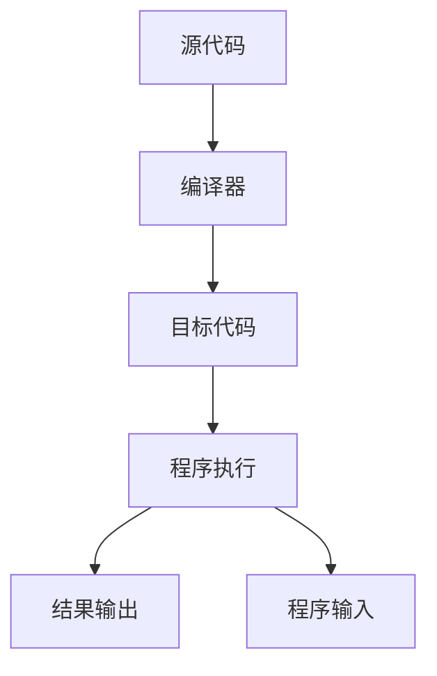
</details>

执行编译过程的程序叫作编译器

# 解释

# 将源代码逐条转换成目标代码同时逐条运行的过程


<details>
<summary>flowchart</summary>

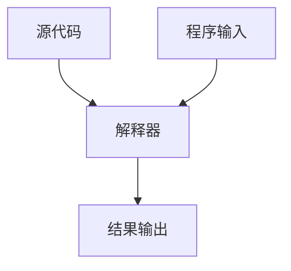
</details>

执行解释过程的程序叫作解释器

# 编译和解释


<details>
<summary>flowchart</summary>


</details>


<details>
<summary>flowchart</summary>

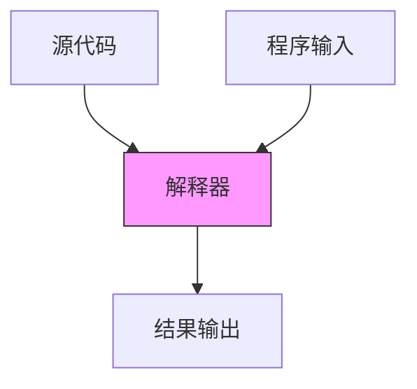
</details>

编译：一次性翻译，之后不再需要源代码（类似英文翻译）  
解释：每次程序运行时随翻译随执行（类似实时的同声传译）

# 静态语言和脚本语言

# 根据执行方式不同，编程语言分为两类

静态语言：使用编译执行的编程语言

C/C++语言、Java语言

脚本语言：使用解释执行的编程语言

Python语言、JavaScript语言、PHP语言

# 静态语言和脚本语言

# 执行方式不同，优势各有不同

静态语言：编译器一次性生成目标代码，优化更充分程序运行速度更快  
脚本语言：执行程序时需要源代码，维护更灵活源代码在维护灵活、跨多个操作系统平台

# 程序的基本编写方法


<details>
<summary>natural_image</summary>

Abstract geometric line drawing with interconnected nodes and lines (no text or symbols)
</details>


<details>
<summary>natural_image</summary>

Abstract geometric network diagram with interconnected nodes and lines (no text or symbols)
</details>

# IPO

# 程序的基本编写方法

I：Input 输入，程序的输入  
P：Process 处理，程序的主要逻辑  
O：Output 输出，程序的输出

# 理解IPO

# 输入

程序的输入

文件输入、网络输入、控制台输入、交互界面输入、内部参数输入等

输入是一个程序的开始

# 理解IPO

# 输出

# 程序的输出

控制台输出、图形输出、文件输出、网络输出、操作系统内部变量输出等

# 输出是程序展示运算结果的方式

# 理解IPO

# 处理

处理是程序对输入数据进行计算产生输出结果的过程  
处理方法统称为算法，它是程序最重要的部分  
算法是一个程序的灵魂

# 问题的计算部分

一个待解决问题中，可以用程序辅助完成的部分

计算机只能解决计算问题，即问题的计算部分  
一个问题可能有多种角度理解，产生不同的计算部分  
问题的计算部分一般都有输入、处理和输出过程

# 编程解决问题的步骤

# 6个步骤 (1-3)

分析问题：分析问题的计算部分，想清楚  
划分边界：划分问题的功能边界，规划IPO  
设计算法：设计问题的求解算法，关注算法

# 使用计算机解决问题

# 6个步骤 (4-6)

编写程序：编写问题的计算程序，编程序  
调试测试：调试程序使正确运行，运行调试  
升级维护：适应问题的升级维护，更新完善

# 求解计算问题的精简步骤

# 3个精简步骤

确定IPO：明确计算部分及功能边界  
编写程序：将计算求解的设计变成现实  
调试程序：确保程序按照正确逻辑能够正确运行

# 计算机编程

Q：为什么要学习计算机编程？

A：因为“编程是件很有趣的事儿”!

# 计算机编程

# 编程能够训练思维

编程体现了一种抽象交互关系、自动化执行的思维模式  
计算思维：区别逻辑思维和实证思维的第三种思维模式  
能够促进人类思考，增进观察力和深化对交互关系的理解

# 计算机编程

# 编程能够增进认识

编程不单纯是求解计算问题  
不仅要思考解决方法，还要思考用户体验、执行效率等  
能够帮助程序员加深用户行为以及社会和文化认识

# 计算机编程

# 编程能够带来乐趣

编程能够提供展示自身思想和能力的舞台  
让世界增加新的颜色、让自己变得更酷、提升心理满足感  
在信息空间里思考创新、将创新变为现实

# 计算机编程

# 编程能够提高效率

能够更好地利用计算机解决问题  
显著提高工作、生活和学习效率  
为个人理想实现提供一种借助计算机的高效手段

# 计算机编程

# 编程带来就业机会

程序员是信息时代最重要的工作岗位之一  
国内外对程序员岗位的缺口都在百万以上规模  
计算机已经渗透于各个行业， 就业前景非常广阔

# 学习编程的误区

Q：编程很难学吗？ A：掌握方法就很容易！

首先，掌握编程语言的语法，熟悉基本概念和逻辑  
其次，结合计算问题思考程序结构，会使用编程套路  
最后，参照案例多练习多实践，学会举一反三次

# 编程辣么好，还等什么？开始学习吧！

# 单元小结

# 程序设计基本方法

计算机的功能性和可编程性  
编译和解释、静态语言和脚本语言  
- IPO、理解问题的计算部分  
掌握计算机编程的价值

# Python语言程序设计

# Python开发环境配置


python

嵩 天

北京理工大学

pythom

# 单元开篇

# Python开发环境配置


<details>
<summary>natural_image</summary>

Generic male avatar icon with beard and mustache (no text or symbols)
</details>

Python语言概述  
Python语言Windows系统开发环境  
Python语言Mac系统开发环境  
Python语言Linux系统开发环境  
Python语言Web开发环境  
Python程序编写与运行

# 三选一

# Python语言概述


<details>
<summary>natural_image</summary>

Abstract geometric network diagram with interconnected nodes and lines (no text or symbols)
</details>


<details>
<summary>text_image</summary>

python
</details>

Python [\`paiθən]，译为“蟒蛇”

Python语言拥有者是Python Software Foundation(PSF)

PSF是非盈利组织，致力于保护Python语言开放、开源和发展

# Python语言的诞生

Guido van Rossum

Python语言创立者

2002年，Python 2.x

2008年，Python 3.x


<details>
<summary>text_image</summary>

YOU
NEED
PYTHON
P
</details>


<details>
<summary>natural_image</summary>

Portrait of a person with curly hair and glasses, outdoors near a tree (no text or symbols visible)
</details>


<details>
<summary>text_image</summary>

AS SEEN ON
ad
</details>


<details>
<summary>natural_image</summary>

Black-and-white photo of a group of smiling men in formal and casual attire, including a chef's hat and bow tie (no text or symbols visible)
</details>

Monty Python组合


<details>
<summary>text_image</summary>

MONTY
PYTHON'S
FLYING CIRCUS
It's ...
SPAM
</details>


<details>
<summary>text_image</summary>

python
</details>

Python语言是一个由编程牛人领导设计并开发的编程语言

Python语言是一个有开放、开源精神的编程语言

Python语言应用于火星探测、搜索引擎、引力波分析等众多领域

# Python语言Windows系统开发环境


<details>
<summary>natural_image</summary>

Abstract geometric line drawing with interconnected nodes and lines (no text or symbols)
</details>


<details>
<summary>natural_image</summary>

Abstract geometric network diagram with interconnected nodes and lines (no text or symbols)
</details>

# 这部分要看视频哦！

# Python语言Mac系统开发环境


<details>
<summary>natural_image</summary>

Abstract geometric line drawing with interconnected nodes and lines (no text or symbols)
</details>


<details>
<summary>natural_image</summary>

Abstract geometric network diagram with interconnected nodes and lines (no text or symbols)
</details>

# 这部分要看视频哦！

# Python语言Linux系统开发环境


<details>
<summary>natural_image</summary>

Abstract geometric line drawing with interconnected nodes and lines (no text or symbols)
</details>


<details>
<summary>natural_image</summary>

Abstract geometric network diagram with interconnected nodes and lines (no text or symbols)
</details>

# 这部分要看视频哦！

# Python语言Web开发环境


<details>
<summary>natural_image</summary>

Abstract geometric line drawing with interconnected nodes and lines (no text or symbols)
</details>


<details>
<summary>natural_image</summary>

Abstract geometric network diagram with interconnected nodes and lines (no text or symbols)
</details>

# 关注PYTHON123, 这部分要看视频哦！

# Python程序编写与运行


<details>
<summary>natural_image</summary>

Abstract geometric line drawing with interconnected nodes and lines (no text or symbols)
</details>


<details>
<summary>natural_image</summary>

Abstract geometric network diagram with interconnected nodes and lines (no text or symbols)
</details>

# Python的两种编程方式

# 交互式和文件式

交互式：对每个输入语句即时运行结果，适合语法练习  
文件式：批量执行一组语句并运行结果，编程的主要方式

# 实例1: 圆面积的计算

# 根据半径r计算圆面积

```txt
>>> r = 25
>>> area = 3.1415 * r * r
>>> print(area)
1963.4375000000002
>>> print(" {:.2f}F".format(area))
1963.44 
```

# 实例1: 圆面积的计算

# 根据半径r计算圆面积

$$
r = 2 5
$$

$$
\text { area } = 3. 1 4 1 5 * r * r
$$

$$
\operatorname{print} (\text {area})
$$

$$
\text { print } (" \{:. 2 f \} F". \text { format(area) })
$$

输出结果如下：

1963.4375000000002

1963.44

# 实例2: 同切圆绘制

# 绘制多个同切圆

import turtle

turtle.pensize(2)

turtle.circle(10)

turtle.circle(40)

turtle.circle(80)

turtle.circle(160)


<details>
<summary>natural_image</summary>

Simple concentric circle diagram with a small arrow at the center (no text or symbols)
</details>

# 实例2: 同切圆绘制

# 绘制多个同切圆

>>> import turtle  
>>> turtle.pensize(2)  
>>> turtle.circle(10)   
>>> turtle.circle(40)   
>>> turtle.circle(80)   
>>> turtle.circle(160)


<details>
<summary>natural_image</summary>

Simple concentric circle diagram with a small arrow at the bottom center (no text or symbols)
</details>

# 实例3: 五角星绘制

# 绘制一个五角星

>>> from turtle import \*

>>> color('red', 'red')

>>> begin\_fill()

>>> for i in range(5):

fd(200)

rt(144)

>>> end\_fill()

>>>


<details>
<summary>natural_image</summary>

Red five-pointed star shape with black outline and diagonal lines (no text or symbols)
</details>

# 实例3: 五角星绘制

# 绘制一个五角星

```python
from turtle import *
color('red', 'red')
begin_fill()
for i in range(5):
    fd(200)
    rt(144)
end_fill()
done() 
```


<details>
<summary>natural_image</summary>

Red five-pointed star shape with black outline, no text or symbols present
</details>

# 单元小结

# Python开发环境配置

Python语言的发展历史  
选取一种系统平台构建Python开发环境  
尝试编写与运行3个Python小程序

# Python语言程序设计

# 实例1: 温度转换


python

嵩 天

北京理工大学

python


<details>
<summary>text_image</summary>

"温度转换"问题分析
</details>

# 温度转换

# 温度刻画的两种不同体系

摄氏度：中国等世界大多数国家使用

以1标准大气压下水的结冰点为0度，沸点为100度，将温度进行等分刻画

华氏度：美国、英国等国家使用

以1标准大气压下水的结冰点为32度，沸点为212度，将温度进行等分刻画

# 需求分析

# 两种温度体系的转换

摄氏度转换为华氏度  
华氏度转换为摄氏度

# 问题分析

# 该问题中计算部分的理解和确定

理解1：直接将温度值进行转换  
理解2：将温度信息发布的声音或图像形式进行理解和转换  
理解3：监控温度信息发布渠道，实时获取并转换温度值

# 问题分析

# 分析问题

# 采用 理解1：直接将温度值进行转换

温度数值需要标明温度体系，即摄氏度或华氏度

转换后也需要给出温度体系

# 问题分析

# 划分边界

输入：带华氏或摄氏标志的温度值   
处理：根据温度标志选择适当的温度转换算法  
- 输出：带摄氏或华氏标志的温度值

# 问题分析

# 输入输出格式设计

标识放在温度最后，F表示华氏度，C表示摄氏度

82F表示华氏82度，28C表示摄氏28度

# 问题分析

# 设计算法

根据华氏和摄氏温度定义，利用转换公式如下：

$$
\mathbf {C} = (\mathbf {F} - \mathbf {3 2}) / \mathbf {1 . 8}
$$

$$
\mathbf {F} = \mathbf {C} ^ {*} \mathbf {1 . 8} + \mathbf {3 2}
$$

其中， C表示摄氏温度， F表示华氏温度

# 问题分析清楚，可以开始编程啦！


<details>
<summary>text_image</summary>

"温度转换"实例编写
</details>

#TempConvert.py

TempStr = input("请输入带有符号的温度值: ")

if TempStr[-1] in ['F', 'f']:

C = (eval(TempStr[0:-1]) - 32)/1.8

print("转换后的温度是{:.2f}C".format(C))

elif TempStr[-1] in ['C', 'c']:

F = 1.8\*eval(TempStr[0:-1]) + 32

print("转换后的温度是{:.2f}F".format(F))

else:

print("输入格式错误")

编写上述代码，并保存为TempConvert.py文件

# 运行效果

# IDLE打开文件，按F5运行

>>>

82 2778

>>>

>>>

28 82.40F

>>>

# 准备好电脑，与老师一起编码吧！


<details>
<summary>text_image</summary>

"温度转换"举一反三
</details>

# #TempConvert.py

TempStr = input("请输入带有符号的温度值: ")

if TempStr[-1] in ['F', 'f']:

$$
C = (\text { eval } (\text { TempStr } [ 0: - 1 ]) - 3 2) / 1. 8
$$

print("转换后的温度是{:.2f}C".format(C))

elif TempStr[-1] in ['C', 'c']:

$$
F = 1. 8 ^ {*} \text {eval} (\text {TempStr} [ 0: - 1 ]) + 3 2
$$

print("转换后的温度是{:.2f}F".format(F))

else:

print("输入格式错误")

# 举一反三

# Python语法元素理解

- 温度转换程序共10行代码，但包含很多语法元素  
清楚理解这10行代码能够快速入门Python语言  
参考框架结构、逐行分析、逐词理解

# 举一反三

# 输入输出的改变

温度数值与温度标识之间关系的设计可以改变  
标识改变放在温度数值之前：C82, F28  
标识字符改变为多个字符：82Ce、28Fa

# 举一反三

# 计算问题的扩展

温度转换问题是各类转换问题的代表性问题  
货币转换、长度转换、重量转换、面积转换…  
- 问题不同，但程序代码相似

# Python程序语法元素分析


python

嵩 天

北京理工大学

python

# 单元开篇

# Python程序语法元素分析


<details>
<summary>natural_image</summary>

Generic male avatar icon with beard and mustache (no text or symbols)
</details>

程序的格式框架  
命名与保留字  
数据类型  
语句与函数  
Python程序的输入输出  
温度转换"代码分析

# 程序的格式框架


<details>
<summary>natural_image</summary>

Abstract geometric network diagram with interconnected nodes and lines (no text or symbols)
</details>

```python
#TempConvert.py
TempStr = input("请输入带有符号的温度值：")
if TempStr[-1] in ['F', 'f']:
    C = (eval(TempStr[0:-1]) - 32)/1.8
    print("转换后的温度是{:.2f}C".format(C))
elif TempStr[-1] in ['C', 'c']:
    F = 1.8*eval(TempStr[0:-1]) + 32
    print("转换后的温度是{:.2f}F".format(F))
else:
    print("输入格式错误") 
```

代码高亮：编程的色彩辅助体系，不是语法要求

```python
#TempConvert.py
TempStr = input("请输入带有符号的温度值：")
if TempStr[-1] in ['F', 'f']:
    C = (eval(TempStr[0:-1]) - 32)/1.8
    print("转换后的温度是{:.2f}C".format(C))
elif TempStr[-1] in ['C', 'c']:
    F = 1.8*eval(TempStr[0:-1]) + 32
    print("转换后的温度是{:.2f}F".format(F))
else:
    print("输入格式错误") 
```

缩进：一行代码开始前的空白区域，表达程序的格式框架

#TempConvert.py   
TempStr = input("请输入带有符号的温度值: ")   
if TempStr[-1] in ['F', 'f']:   
  
C = (eval(TempStr[0:-1]) - 32)/1.8   
print("转换后的温度是{:.2f}C".format(C))

elif TempStr[-1] in ['C', 'c']:   
  
F = 1.8\*eval(TempStr[0:-1]) + 32   
print("转换后的温度是{:.2f}F".format(F))

else:   
  
print("输入格式错误")

DARTS = 1000   
hits = 0.0   
clock()   
for i in range(1, DARTS):   
  
x, y = random(), random()   
dist = sqrt(x\*\*2 + y\*\*2)

if dist <= 1.0:   
  
hits = hits + 1   
pi = 4 \* (hits/DARTS)   
print("Pi的值是 {:.2f}F".format(pi))

# 单层缩进

# 多层缩进

# 缩进

# 缩进表达程序的格式框架

严格明确：缩进是语法的一部分，缩进不正确程序运行错误  
所属关系：表达代码间包含和层次关系的唯一手段  
长度一致：程序内一致即可，一般用4个空格或1个TAB

#TempConvert.py   
```python
TempStr = input("请输入带有符号的温度值: ")
if TempStr[-1] in ['F', 'f']:
    C = (eval(TempStr[0:-1]) - 32)/1.8
    print("转换后的温度是{:.2f}C".format(C))
elif TempStr[-1] in ['C', 'c']:
    F = 1.8*eval(TempStr[0:-1]) + 32
    print("转换后的温度是{:.2f}F".format(F))
else:
    print("输入格式错误") 
```

注释：用于提高代码可读性的辅助性文字，不被执行

# 注释

# 不被程序执行的辅助性说明信息

单行注释：以#开头，其后内容为注释

\# 这里是单行注释

多行注释：以'''开头和结尾

这是多行注释第一行

这是多行注释第二行

#TempConvert.py   
TempStr = input("请输入带有符号的温度值: ")   
if TempStr[-1] in ['F', 'f']:   
```txt
C = (eval(TempStr[0:-1]) - 32)/1.8
print("转换后的温度是{:.2f}C".format(C)) 
```  
elif TempStr[-1] in ['C', 'c']:

```txt
F = 1.8*eval(TempStr[0:-1]) + 32
print("转换后的温度是{:.2f}F".format(F)) 
```

else:   
```lua
print("输入格式错误")
```

# 缩进 注释

# 命名与保留字


<details>
<summary>natural_image</summary>

Abstract geometric network diagram with interconnected nodes and lines (no text or symbols)
</details>

```python
#TempConvert.py
TempStr = input("请输入带有符号的温度值：")
if TempStr[-1] in ['F', 'f']:
    C = (eval(TempStr[0:-1]) - 32)/1.8
    print("转换后的温度是{:.2f}C".format(C))
elif TempStr[-1] in ['C', 'c']:
    F = 1.8*eval(TempStr[0:-1]) + 32
    print("转换后的温度是{:.2f}F".format(F))
else:
    print("输入格式错误") 
```

变量：程序中用于保存和表示数据的占位符号

# 变量

# 用来保存和表示数据的占位符号

变量采用标识符(名字) 来表示，关联标识符的过程叫命名  
TempStr是变量名字

可以使用等号(=)向变量赋值或修改值，=被称为赋值符号

TempStr = "82F" #向变量TempStr赋值"82F"

# 命名

# 关联标识符的过程

命名规则: 大小写字母、数字、下划线和汉字等字符及组合

如: TempStr, Python\_Great, 这是门Python好课

注意事项: 大小写敏感、首字符不能是数字、不与保留字相同

Python和python是不同变量，123Python是不合法的

# 保留字

# 被编程语言内部定义并保留使用的标识符

Python语言有33个保留字(也叫关键字)

if, elif, else, in

保留字是编程语言的基本单词，大小写敏感

if 是保留字，If 是变量

# 保留字

<table><tr><td>and</td><td>elif</td><td>import</td><td>raise</td><td>global</td></tr><tr><td>as</td><td>else</td><td>in</td><td>return</td><td>nonlocal</td></tr><tr><td>assert</td><td>except</td><td>is</td><td>try</td><td>True</td></tr><tr><td>break</td><td>finally</td><td>lambda</td><td>while</td><td>False</td></tr><tr><td>class</td><td>for</td><td>not</td><td>with</td><td>None</td></tr><tr><td>continue</td><td>from</td><td>or</td><td>yield</td><td></td></tr><tr><td>def</td><td>if</td><td>pass</td><td>del</td><td></td></tr></table>

(26/33)

```python
#TempConvert.py
TempStr = input("请输入带有符号的温度值：")
if TempStr[-1] in ['F', 'f']:
    C = (eval(TempStr[0:-1]) - 32)/1.8
    print("转换后的温度是{:.2f}C".format(C))
elif TempStr[-1] in ['C', 'c']:
    F = 1.8*eval(TempStr[0:-1]) + 32
    print("转换后的温度是{:.2f}F".format(F))
else:
    print("输入格式错误") 
```

# 变量 命名 保留字

# 数据类型


<details>
<summary>natural_image</summary>

Abstract geometric network diagram with interconnected nodes and lines (no text or symbols)
</details>

```python
#TempConvert.py
TempStr = input("请输入带有符号的温度值：")
if TempStr[-1] in ['F', 'f']:
    C = (eval(TempStr[0:-1]) - 32)/1.8
    print("转换后的温度是{:.2f}C".format(C))
elif TempStr[-1] in ['C', 'c']:
    F = 1.8*eval(TempStr[0:-1]) + 32
    print("转换后的温度是{:.2f}F".format(F))
else:
    print("输入格式错误") 
```

数据类型：字符串、整数、浮点数、列表

# 数据类型

10,011,101 该如何解释呢？

这是一个二进制数字 或者 十进制数字

作为二进制数字，10,011,101的值是十进制157

这是一段文本 或者 用逗号,分隔的3个数字

作为一段文本，逗号是文本中的一部分，一共包含10个字符

# 数据类型

# 供计算机程序理解的数据形式

- 程序设计语言不允许存在语法歧义，需要定义数据的形式需要给10,011,101关联一种计算机可以理解的形式  
程序设计语言通过一定方式向计算机表达数据的形式

"123"表示文本字符串123，123则表示数字123

# 数据类型

10,011,101

整数类型： 10011101  
字符串类型： "10,011,101"   
列表类型： [10, 011, 101]

```python
#TempConvert.py
TempStr = input("请输入带有符号的温度值：")
if TempStr[-1] in ['F', 'f']:
    C = (eval(TempStr[0:-1]) - 32)/1.8
    print("转换后的温度是{:.2f}C".format(C))
elif TempStr[-1] in ['C', 'c']:
    F = 1.8*eval(TempStr[0:-1]) + 32
    print("转换后的温度是{:.2f}F".format(F))
else:
    print("输入格式错误") 
```

字符串：由0个或多个字符组成的有序字符序列

# 字符串

# 由0个或多个字符组成的有序字符序列

字符串由一对单引号或一对双引号表示

"请输入带有符号的温度值: "或者

字符串是字符的有序序列，可以对其中的字符进行索引

"请" 是 "请输入带有符号的温度值: " 的第0个字符

# 字符串的序号

# 正向递增序号 和 反向递减序号

反向递减序号

$$
- 1 2 - 1 1 - 1 0 - 9 - 8 - 7 - 6 - 5 - 4 - 3 - 2 - 1
$$

<table><tr><td>请</td><td>输</td><td>入</td><td>带</td><td>有</td><td>符</td><td>号</td><td>的</td><td>温</td><td>度</td><td>值</td><td>:</td></tr></table>


<details>
<summary>text_image</summary>

0 1 2 3 4 5 6 7 8 9 10 11
</details>

正向递增序号

# 字符串的使用

# 使用[ ]获取字符串中一个或多个字符

\- 索引：返回字符串中单个字符 <字符串>[M]

"请输入带有符号的温度值: "[0] 或者 TempStr[-1]

切片：返回字符串中一段字符子串 <字符串>[M: N]

"请输入带有符号的温度值: "[1:3] 或者 TempStr[0:-1]

```python
#TempConvert.py
TempStr = input("请输入带有符号的温度值: ")
if TempStr[-1] in ['F', 'f']:
    C = (eval(TempStr[0:-1]) - 32)/1.8
    print("转换后的温度是{:.2f}C".format(C))
elif TempStr[-1] in ['C', 'c']:
    F = 1.8*eval(TempStr[0:-1]) + 32
    print("转换后的温度是{:.2f}F".format(F))
else:
    print("输入格式错误") 
```

# 数字类型：整数和浮点数

# 数字类型

# 整数和浮点数都是数字类型

整数：数学中的整数

32 或者 -89

浮点数：数学中的实数，带有小数部分

1.8 或者 -1.8 或者 -1.0

```python
#TempConvert.py
TempStr = input("请输入带有符号的温度值：")
if TempStr[-1] in ['F', 'f']:
    C = (eval(TempStr[0:-1]) - 32)/1.8
    print("转换后的温度是{:.2f}C".format(C))
elif TempStr[-1] in ['C', 'c']:
    F = 1.8*eval(TempStr[0:-1]) + 32
    print("转换后的温度是{:.2f}F".format(F))
else:
    print("输入格式错误") 
```

列表类型：由0个或多个数据组成的有序序列

# 列表类型

# 由0个或多个数据组成的有序序列

列表使用[ ]表示，采用逗号(,)分隔各元素

['F','f']表示两个元素'F'和'f'

使用保留字 in 判断一个元素是否在列表中

TempStr[-1] in ['C','c']判断前者是否与列表中某个元素相同

```python
#TempConvert.py
TempStr = input("请输入带有符号的温度值：")
if TempStr[-1] in ['F', 'f']:
    C = (eval(TempStr[0:-1]) - 32)/1.8
    print("转换后的温度是{:.2f}C".format(C))
elif TempStr[-1] in ['C', 'c']:
    F = 1.8*eval(TempStr[0:-1]) + 32
    print("转换后的温度是{:.2f}F".format(F))
else:
    print("输入格式错误") 
```

# 字符串 整数 浮点数 列表

# 语句与函数

#TempConvert.py   
```txt
TempStr = input("请输入带有符号的温度值:") 
```  
if TempStr[-1] in ['F', 'f']:

```javascript
C = (eval(TempStr[0:-1]) - 32)/1.8 
```

print("转换后的温度是{:.2f}C".format(C)) elif TempStr[-1] in ['C', 'c']:

```txt
F = 1.8*eval(TempStr[0:-1]) + 32 
```

print("转换后的温度是{:.2f}F".format(F)) else:

print("输入格式错误")

# 赋值语句：由赋值符号构成的一行代码

# 赋值语句

# 由赋值符号构成的一行代码

赋值语句用来给变量赋予新的数据值

$$
C = (\text { eval } (\text { TempStr } [ 0: - 1 ]) - 3 2) / 1. 8 \# \text { 右侧运算结果赋给变量 } C
$$

赋值语句右侧的数据类型同时作用于变量

$$
\text { TempStr } = \text { input(  )   \#input()返回一个字符串，TempStr也是字符串 }
$$

```python
#TempConvert.py
TempStr = input("请输入带有符号的温度值：")
if TempStr[-1] in ['F', 'f']:
    C = (eval(TempStr[0:-1]) - 32)/1.8
    print("转换后的温度是{:.2f}C".format(C))
elif TempStr[-1] in ['C', 'c']:
    F = 1.8*eval(TempStr[0:-1]) + 32
    print("转换后的温度是{:.2f}F".format(F))
else:
    print("输入格式错误") 
```

分支语句：由判断条件决定程序运行方向的语句

# 分支语句

# 由判断条件决定程序运行方向的语句

使用保留字if elif else构成条件判断的分支结构

if TempStr[-1] in ['F','f']:#如果条件为True则执行冒号后语句

\- 每个保留字所在行最后存在一个冒号(:)，语法的一部分

冒号及后续缩进用来表示后续语句与条件的所属关系

```python
#TempConvert.py
TempStr = input("请输入带有符号的温度值：")
if TempStr[-1] in ['F', 'f']:
    C = (eval(TempStr[0:-1]) - 32)/1.8
    print("转换后的温度是{:.2f}C".format(C))
elif TempStr[-1] in ['C', 'c']:
    F = 1.8*eval(TempStr[0:-1]) + 32
    print("转换后的温度是{:.2f}F".format(F))
else:
    print("输入格式错误") 
```

函数：根据输入参数产生不同输出的功能过程

# 函数

# 根据输入参数产生不同输出的功能过程

类似数学中的函数， $\boldsymbol { \mathsf { y } } = \boldsymbol { \mathsf { f } } ( \boldsymbol { \mathsf { x } } )$

print("输入格式错误") #打印输出 "输入格式错误"

函数采用 <函数名>(<参数>) 方式使用

eval(TempStr[0:-1]) # TempStr[0:-1]是参数

#TempConvert.py   
TempStr = input("请输入带有符号的温度值：")
if TempStr[-1] in ['F', 'f']:
    C = (eval(TempStr[0:-1]) - 32)/1.8
    print("转换后的温度是{:.2f}C".format(C))
elif TempStr[-1] in ['C', 'c']:
    F = 1.8*eval(TempStr[0:-1]) + 32
    print("转换后的温度是{:.2f}F".format(F))
else:
    print("输入格式错误")

# 赋值语句 分支语句 函数

# Python程序的输入输出


<details>
<summary>natural_image</summary>

Abstract geometric line drawing with interconnected nodes and lines (no text or symbols)
</details>


<details>
<summary>natural_image</summary>

Abstract geometric network diagram with interconnected nodes and lines (no text or symbols)
</details>

#TempConvert.py   
TempStr = input("请输入带有符号的温度值: ")   
```python
if TempStr[-1] in ['F', 'f']:
    C = (eval(TempStr[0:-1]) - 32)/1.8
    print("转换后的温度是{:.2f}C".format(C))
elif TempStr[-1] in ['C', 'c']:
    F = 1.8*eval(TempStr[0:-1]) + 32
    print("转换后的温度是{:.2f}F".format(F))
else:
    print("输入格式错误") 
```

input()：从控制台获得用户输入的函数

# 输入函数 input()

# 从控制台获得用户输入的函数

input()函数的使用格式：

<变量> = input(<提示信息字符串>)

用户输入的信息以字符串类型保存在<变量>中

TempStr = input(“请输入”) # TempStr保存用户输入的信息

```python
#TempConvert.py
TempStr = input("请输入带有符号的温度值：")
if TempStr[-1] in ['F', 'f']:
    C = (eval(TempStr[0:-1]) - 32)/1.8
    print("转换后的温度是{:.2f}C".format(C))
elif TempStr[-1] in ['C', 'c']:
    F = 1.8*eval(TempStr[0:-1]) + 32
    print("转换后的温度是{:.2f}F".format(F))
else:
    print("输入格式错误") 
```

print()：以字符形式向控制台输出结果的函数

# 输出函数 print()

# 以字符形式向控制台输出结果的函数

print()函数的基本使用格式：

print(<拟输出字符串或字符串变量>)

字符串类型的一对引号仅在程序内部使用，输出无引号

print("输入格式错误") # 向控制台输出 输入格式错误

# 输出函数 print()

# 以字符形式向控制台输出结果的函数

# print()函数的格式化：

print("转换后的温度是{:.2f}C".format(C))


<details>
<summary>natural_image</summary>

Simple geometric line drawing with a horizontal and vertical line intersecting at an angle (no text or symbols)
</details>

{ }表示槽，后续变量填充到槽中

{ :.2f }表示将变量C填充到这个位置时取小数点后2位

# 输出函数 print()

# 以字符形式向控制台输出结果的函数

print("转换后的温度是{:.2f}C".format(C))

如果C的值是 123.456789，则输出结果为：

转换后的温度是123.45C

```python
#TempConvert.py
TempStr = input("请输入带有符号的温度值：")
if TempStr[-1] in ['F', 'f']:
    C = (eval(TempStr[0:-1]) - 32)/1.8
    print("转换后的温度是{:.2f}C".format(C))
elif TempStr[-1] in ['C', 'c']:
    F = 1.8*eval(TempStr[0:-1]) + 32
    print("转换后的温度是{:.2f}F".format(F))
else:
    print("输入格式错误") 
```

eval()：去掉参数最外侧引号并执行余下语句的函数

# 评估函数 eval()

# 去掉参数最外侧引号并执行余下语句的函数

# eval()函数的基本使用格式：

# eval(<字符串或字符串变量>)

```python
>>> eval("1")    >>> eval('1+2')
1    '1+2'
>>> eval("1+2")    >>> eval('print("Hello")')
3    Hello 
```

# 评估函数 eval()

# 去掉参数最外侧引号并执行余下语句的函数

eval(TempStr[0:-1])

如果 $\mathsf { T e m p s t r } [ \theta : - 1$ ]值是" $" 1 2 . 3 "$ ，输出是:

12.3

#TempConvert.py   
TempStr = input("请输入带有符号的温度值: ")   
```python
if TempStr[-1] in ['F', 'f']: 
```

```javascript
C = (eval(TempStr[0:-1]) - 32)/1.8 
```

```lua
print("转换后的温度是{:.2f}C".format(C)) 
```

```txt
elif TempStr[-1] in ['C', 'c']: 
```

```txt
F = 1.8*eval(TempStr[0:-1]) + 32 
```

```lua
print("转换后的温度是{:.2f}F".format(F)) 
```

```txt
else: 
```

```lua
print("输入格式错误")
```


<details>
<summary>text_image</summary>

"温度转换"代码分析
</details>

#TempConvert.py

TempStr = input("请输入带有符号的温度值: ")

if TempStr[-1] in ['F', 'f']:

C = (eval(TempStr[0:-1]) - 32)/1.8

print("转换后的温度是{:.2f}C".format(C))

elif TempStr[-1] in ['C', 'c']:

F = 1.8\*eval(TempStr[0:-1]) + 32

print("转换后的温度是{:.2f}F".format(F))

else:

print("输入格式错误")

# “温度转换”实例代码逐行分析

# 单元小结

# Python程序语法元素分析

- 缩进、注释、命名、变量、保留字   
数据类型、字符串、 整数、浮点数、列表  
- 赋值语句、分支语句、 函数  
input()、print()、eval()、 print()格式化

# 第2章 辅学内容


python

嵩 天

北京理工大学

pythom

# 前课复习

# Python基本语法元素

- 缩进、注释、命名、变量、保留字   
数据类型、字符串、 整数、浮点数、列表  
- 赋值语句、分支语句、 函数  
input()、print()、eval()、 print()格式化

<table><tr><td>and</td><td>elif</td><td>import</td><td>raise</td><td>global</td></tr><tr><td>as</td><td>else</td><td>in</td><td>return</td><td>nonlocal</td></tr><tr><td>assert</td><td>except</td><td>is</td><td>try</td><td>True</td></tr><tr><td>break</td><td>finally</td><td>lambda</td><td>while</td><td>False</td></tr><tr><td>class</td><td>for</td><td>not</td><td>with</td><td>None</td></tr><tr><td>continue</td><td>from</td><td>or</td><td>yield</td><td></td></tr><tr><td>def</td><td>if</td><td>pass</td><td>del</td><td></td></tr></table>

```python
#TempConvert.py
TempStr = input("请输入带有符号的温度值：")
if TempStr[-1] in ['F', 'f']:
    C = (eval(TempStr[0:-1]) - 32)/1.8
    print("转换后的温度是{:.2f}C".format(C))
elif TempStr[-1] in ['C', 'c']:
    F = 1.8*eval(TempStr[0:-1]) + 32
    print("转换后的温度是{:.2f}F".format(F))
else:
    print("输入格式错误") 
```

# 温度转换


<details>
<summary>natural_image</summary>

Silhouette of a person riding a bicycle with wheels, no text or symbols present
</details>

# 本课概要

# 第2章 Python基本图形绘制


<details>
<summary>natural_image</summary>

Generic male avatar icon with beard and mustache (no text or symbols)
</details>

- 2.1 深入理解Python语言  
- 2.2 实例2: Python蟒蛇绘制  
- 2.3 模块1: turtle库的使用  
- 2.4 turtle程序语法元素分析


<details>
<summary>natural_image</summary>

Silhouette of a person riding a bicycle with wheels and a blue lane (no text or symbols)
</details>

# 第2章 Python基本图形绘制


<details>
<summary>natural_image</summary>

Generic male avatar icon with beard and mustache (no text or symbols)
</details>

# 方法论

Python语言及海龟绘图体系

# 实践能力

\- 初步学会使用Python绘制简单图形


<details>
<summary>natural_image</summary>

Silhouette of a person riding a bicycle with wheels and a blue lane (no text or symbols)
</details>

# 练习与作业

# 第2章 Python基本图形绘制

# 练习 (可选)


<details>
<summary>natural_image</summary>

Generic male avatar icon with beard and mustache (no text or symbols)
</details>

5道编程题 @Python123

# 作业

\- 15道单选题 @Python123


<details>
<summary>natural_image</summary>

Silhouette of a person riding a bicycle with blue lane line (no text or symbols)
</details>

# Python语言程序设计

# 深入理解Python语言


python

嵩 天

北京理工大学

pythom

# 单元开篇

# 深入理解Python语言


<details>
<summary>natural_image</summary>

Generic male avatar icon with beard and mustache (no text or symbols)
</details>

计算机技术的演进  
编程语言的多样初心  
Python语言的特点  
"超级语言"的诞生


<details>
<summary>natural_image</summary>

Silhouette of a person riding a bicycle with blue lane markings (no text or symbols)
</details>


<details>
<summary>text_image</summary>

计算机技术的演进
</details>

计算机技术的演进过程  


<details>
<summary>flowchart</summary>

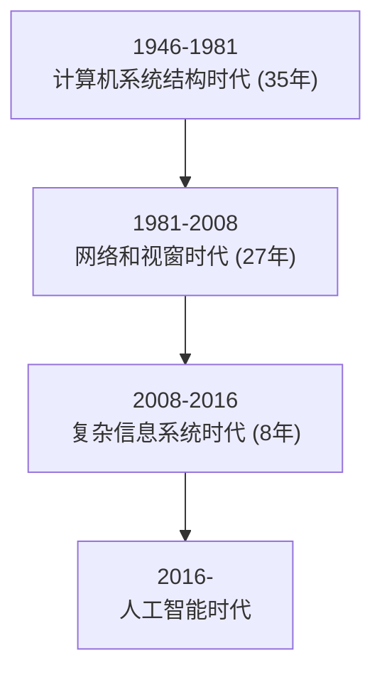
</details>

# 计算机技术的演进过程

2017-

人工智能时代

人类的问题

新计算时代

2008-2016

复杂信息系统时代

数据问题

1981-2008

网络和视窗时代

交互问题

1946-1981

计算机系统结构时代

计算能力问题

# 编程语言的多样初心


<details>
<summary>natural_image</summary>

Abstract geometric line drawing with interconnected nodes and lines (no text or symbols)
</details>


<details>
<summary>natural_image</summary>

Abstract geometric network diagram with interconnected nodes and lines (no text or symbols)
</details>

# 编程语言有哪些？

Basic, C, C++, C#, CSS, Fortran, Go, HTML, Java, JavaScript, Lisp, Lua, Matlab, Object C, Pascal, Perl, PHP, PostScript, Python, Ruby, Scala, SQL, Swift, VBA, VB.NET, Verilog, VHDL, Visual Basic

编程语言，也是一个江湖！

# 不同编程语言的初心和适用对象

<table><tr><td>编程语言</td><td>学习内容</td><td>语言本质</td><td>解决问题</td><td>适用对象</td></tr><tr><td>C</td><td>指针、内存、数据类型</td><td>理解计算机系统结构</td><td>性能</td><td>计算机类专业</td></tr><tr><td>Java</td><td>对象、跨平台、运行时</td><td>理解主客体关系</td><td>跨平台</td><td>软件类专业</td></tr><tr><td>C++</td><td>对象、多态、继承</td><td>理解主客体关系</td><td>大规模程序</td><td>计算机类专业</td></tr><tr><td>VB</td><td>对象、按钮、文本框</td><td>理解交互逻辑</td><td>桌面应用</td><td>不确定</td></tr><tr><td>Python</td><td>编程逻辑、第三方库</td><td>理解问题求解</td><td>各类问题</td><td>所有专业</td></tr></table>

各编程语言所处历史时期和使命不同，Python是计算时代演进的选择！

# 2018年以后的计算环境…

# 计算机性能不再是解决一般问题的瓶颈

# 移动互联网广泛普及

大数据、云计算、物联网、信息安全、人工智能等需求爆发

解决日益增长的计算需求，用什么语言？


<details>
<summary>text_image</summary>

Python语言的特点
</details>

# python

Python语言是通用语言   
- Python语言是脚本语言  
Python语言是开源语言  
Python语言是跨平台语言  
Python语言是多模型语言


<details>
<summary>text_image</summary>

YOU
NEED
PYTHON
P
</details>

Guido van Rossum

Python语言创立者

2002年，Python 2.x

2008年，Python 3.x

# Python特点与优势

# 语法简洁


10x

10x


# 生态高产

C代码量的10%   
强制可读性  
较少的底层语法元素  
多种编程方式  
支持中文字符

>13万第三方库  
快速增长的计算生态  
避免重复造轮子  
• 开放共享   
跨操作系统平台


<details>
<summary>natural_image</summary>

Nighttime view of a large suspension bridge illuminated with blue lights over water, no visible text or symbols.
</details>


<details>
<summary>natural_image</summary>

Black-and-white sketch of a long steel arch bridge spanning a wide river, with no visible text or symbols.
</details>

Python 21行代码

# 如何看待Python语言？

# 人生苦短，我学Python

C/C++：Python归Python，C归C  
Java：针对特定开发和岗位需求  
HTML/CSS/JS：不可替代的前端技术，全栈能力  
其他语言：R/Go/Matlab等，特定领域

# 如何看待Python语言？

# Python是最高产的程序设计语言及

掌握抽象并求解计算问题综合能力的语言  
了解产业界解决复杂计算问题方法的语言  
享受利用编程将创新变为实现乐趣的语言

# 如何看待Python语言？

# 工具决定思维：关注工具变革的力量！


<details>
<summary>natural_image</summary>

Illustration of a prehistoric human evolution from the earliest to the latest period, showing sequential generations (no text or symbols present)
</details>


<details>
<summary>text_image</summary>

"超级语言"的诞生
</details>

# 编程语言的种类

# 机器语言

一种二进制语言，直接使用二进制代码表达指令  
计算机硬件(CPU)可以直接执行，与具体CPU型号有关  
完成 2+3 功能的机器语言

11010010 00111011

# 编程语言的种类

# 汇编语言

一种将二进制代码直接对应助记符的编程语言  
汇编语言与CPU型号有关，程序不通用，需要汇编器转换  
完成 2+3 功能的汇编语言

add 2,3,result

# 编程语言的种类

# 高级语言

更接近自然语言，同时更容易描述计算问题  
高级语言代码与具体CPU型号无关，编译后运行  
完成 2+3 功能的高级语言

$$
\text { result } = 2 + 3
$$

# 编程语言种类的发展

超级语言 粘性整合已有程序，具备庞大计算生态

高级语言 - 接近自然语言，编译器，与CPU型号无关

汇编语言 有助记符，汇编器，与CPU型号有关

机器语言 代码直接执行，与CPU型号有关

# 编程语言的种类

# 超级语言

具有庞大计算生态，可以很容易利用已有代码功能  
编程思维不再是刀耕火种，而是集成开发  
完成 2+3 功能的超级语言

$$
\text { result } = \text { sum } (2, 3)
$$

# Python: 唯一的"超级语言"！

# Python前进的步伐不可阻挡

# 单元小结

# 深入理解Python语言

计算机系统结构时代到人工智能时代的演进路线  
五种编程语言的初心和历史使命  
Python语言的通用性、简洁性和生态性  
Python是以计算生态为标志的"超级语言"

# Python语言程序设计

# 实例2: Python蟒蛇绘制


python

嵩 天

北京理工大学

pythom

# "Python蟒蛇绘制"问题分析


<details>
<summary>natural_image</summary>

Abstract geometric line drawing with interconnected nodes and lines (no text or symbols)
</details>


<details>
<summary>natural_image</summary>

Abstract geometric network diagram with interconnected nodes and lines (no text or symbols)
</details>

# Python蟒蛇绘制

# 用程序绘制一条蟒蛇

貌似很有趣，可以来试试

先学会蟒蛇绘制，再绘朵玫瑰花送给TA

# Python蟒蛇绘制

# 设计蟒蛇的基本形状


<details>
<summary>natural_image</summary>

Purple wavy line drawing with a small arrowhead at the end (no text or symbols)
</details>

# Python蟒蛇绘制

# 用程序绘制一条蟒蛇

问题1: 计算机绘图是什么原理？

一段程序为何能够产生窗体？为何能在窗体上绘制图形？

问题2: Python蟒蛇绘制从哪里开始呢？

如何绘制一条线？如何绘制一个弧形？如何绘制一个蟒蛇？

<!-- part 2: pages 201-400 -->

# Python蟒蛇绘制

# 用程序绘制一条蟒蛇

实例1: 温度转换


Python蟒蛇绘制

能否借鉴？

# 似乎无从下手，且听老师继续分解…

# "Python蟒蛇绘制"实例编写


<details>
<summary>natural_image</summary>

Abstract geometric line drawing with interconnected nodes and lines (no text or symbols)
</details>


<details>
<summary>natural_image</summary>

Abstract geometric network diagram with interconnected nodes and lines (no text or symbols)
</details>

#PythonDraw.py   
```python
import turtle
turtle.setup(650, 350, 200, 200)
turtle.penup()
turtle.fd(-250)
turtle.pendown()
turtle.pensize(25)
turtle.pencolor("purple")
turtle.seth(-40) 
```

```python
for i in range(4):
    turtle.circle(40, 80)
    turtle.circle(-40, 80)
turtle.circle(40, 80/2)
turtle.fd(40)
turtle.circle(16, 180)
turtle.fd(40 * 2/3)
turtle.done() 
```

# 使用IDLE的文件方式

# 编写代码

# 并保存为

# PythonDraw.py 文件

# 运行效果

# IDLE打开文件，按F5运行


<details>
<summary>natural_image</summary>

Purple wavy line drawing on white background, resembling a stylized worm or snake (no text or symbols)
</details>

#PythonDraw.py   
import turtle  
```lua
turtle.setup(650, 350, 200, 200)
turtle.penup()
turtle.fd(-250)
turtle.pendown()
turtle.pensize(25)
turtle.pencolor("purple")
turtle.seth(-40) 
```

```python
for i in range(4):
    turtle.circle(40, 80)
    turtle.circle(-40, 80)
turtle.circle(40, 80/2)
turtle.fd(40)
turtle.circle(16, 180)
turtle.fd(40 * 2/3)
turtle.done() 
```

# 程序关键

import 保留字

引入了一个绘图库

名字叫：turtle

没错，就是 海龟

# 准备好电脑，与老师一起编码吧！

# Python蟒蛇绘制"举一反三


<details>
<summary>natural_image</summary>

Abstract geometric line drawing with interconnected nodes and lines (no text or symbols)
</details>


<details>
<summary>natural_image</summary>

Abstract geometric network diagram with interconnected nodes and lines (no text or symbols)
</details>

#PythonDraw.py

import turtle

turtle.setup(650, 350, 200, 200)

turtle.penup()

turtle.fd(-250)

turtle.pendown()

turtle.pensize(25)

turtle.pencolor("purple")

turtle.seth(-40)

for i in range(4):

turtle.circle(40, 80)

turtle.circle(-40, 80)

turtle.circle(40, 80/2)

turtle.fd(40)

turtle.circle(16, 180)

turtle.fd(40 \* 2/3)

turtle.done()


<details>
<summary>natural_image</summary>

Purple wavy line drawing with a small arrowhead at the end (no text or symbols)
</details>

# 举一反三

# Python语法元素理解

Python蟒蛇绘制共17行代码，但很多行类似  
清楚理解这17行代码能够掌握Python基本绘图方法  
参考框架结构、逐行分析、逐词理解

# 举一反三

# 程序参数的改变

Python蟒蛇的颜色：黑色、白色、七彩色…   
Python蟒蛇的长度：1节、3节、10节…  
Python蟒蛇的方向：向左走、斜着走…

# 举一反三

# 计算问题的扩展

Python蟒蛇绘制问题是各类图像绘制问题的代表  
圆形绘制、五角星绘制、国旗绘制、机器猫绘制…   
掌握绘制一条线的方法，就可以绘制整个世界

# 模块1: turtle库的使用


python

嵩 天

北京理工大学

pythom

# 单元开篇

# 模块1: turtle库的使用


<details>
<summary>natural_image</summary>

Generic male avatar icon with beard and mustache (no text or symbols)
</details>

turtle库基本介绍  
turtle绘图窗体布局  
turtle空间坐标体系  
turtle角度坐标体系   
RGB色彩体系


<details>
<summary>natural_image</summary>

Silhouette of a person riding a bicycle with wheels, no text or symbols present
</details>

# turtle库基本介绍


<details>
<summary>natural_image</summary>

Abstract geometric network diagram with interconnected nodes and lines (no text or symbols)
</details>

# turtle库概述

# turtle(海龟)库是turtle绘图体系的Python实现

turtle绘图体系：1969年诞生，主要用于程序设计入门  
Python语言的标准库之一  
入门级的图形绘制函数库

# 标准库

# Python计算生态 = 标准库 + 第三方库

标准库：随解释器直接安装到操作系统中的功能模块  
第三方库：需要经过安装才能使用的功能模块  
库Library、包Package、模块Module，统称模块

# turtle的原（wan）理（fa）

# turtle(海龟)是一种真实的存在

- 有一只海龟，其实在窗体正中心，在画布上游走  
走过的轨迹形成了绘制的图形  
海龟由程序控制，可以变换颜色、改变宽度等

# turtle的魅力


<details>
<summary>natural_image</summary>

Abstract geometric pattern of intersecting colored lines (no text or symbols)
</details>


<details>
<summary>natural_image</summary>

Yellow smiling emoji face with closed eyes and wide eyebrows (no text or symbols)
</details>


<details>
<summary>text_image</summary>

turtle绘图窗体布局
</details>

# turtle的绘图窗体


<details>
<summary>text_image</summary>

turtle的一个画布空间
最小单位是像素
</details>

# turtle的绘图窗体

(0, 0)


<details>
<summary>text_image</summary>

starty
(Python Turtle Graphics
(startx, starty)
height
width
</details>

屏幕坐标系

# turtle的绘图窗体

turtle.setup(width, height, startx, starty)


<details>
<summary>text_image</summary>

starty
Icon Turtle Graphics
width
height
startx
</details>

setup()设置窗体大小及位置  
4个参数中后两个可选  
setup()不是必须的

# turtle的绘图窗体

turtle.setup(800,800,0,0)


<details>
<summary>text_image</summary>

Python Turtle Graphics
</details>

turtle.setup(800,800)


<details>
<summary>text_image</summary>

Python Turtle Graphics
</details>


<details>
<summary>text_image</summary>

turtle空间坐标体系
</details>

# turtle空间坐标体系

# 绝对坐标


<details>
<summary>scatter</summary>

| Point | X     | Y     |
|-------|-------|-------|
| 1     | 0     | 100   |
| 2     | 0     | 100   |
| 3     | 0     | 0     |
| 4     | 0     | -100  |
| 5     | 0     | -100  |
</details>

# turtle空间坐标体系

turtle.goto(x, y)


<details>
<summary>scatter</summary>

| Point | X     | Y     |
|-------|-------|-------|
| 1     | -100  | 100   |
| 2     | 100   | 100   |
| 3     | -100  | -100  |
| 4     | 100   | -100  |
</details>

# turtle空间坐标体系

import turtle

turtle.goto( 100, 100)

turtle.goto( 100,-100)

turtle.goto(-100,-100)

turtle.goto(-100, 100)

turtle.goto(0,0)


<details>
<summary>line</summary>

| Label       | Value |
| ----------- | ----- |
| (0, 0)      | 0     |
| (100, 100)  | 100   |
| (100, -100) | -100  |
</details>

# turtle空间坐标体系

# 海龟坐标


<details>
<summary>flowchart</summary>

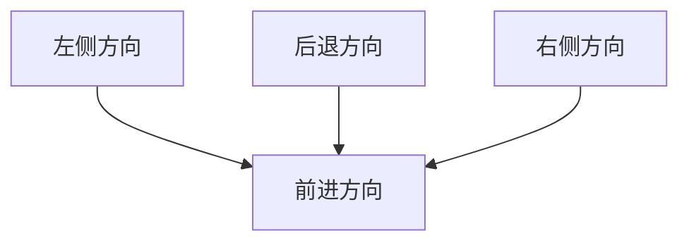
</details>

# turtle空间坐标体系


<details>
<summary>flowchart</summary>


</details>


<details>
<summary>text_image</summary>

turtle角度坐标体系
</details>

# turtle角度坐标体系

# 绝对角度


<details>
<summary>text_image</summary>

Python Turtle Graphics
90 / -270 度
180 / -180 度
y
0 / 360 度
x
270 / -90 度
</details>

# turtle角度坐标体系

# turtle.seth(angle)


<details>
<summary>text_image</summary>

Python Turtle Graphics
90 / -270 度
180 / -180 度
0 / 360 度
270 / -90 度
y
x
</details>

seth()改变海龟行进方向  
angle为绝对度数  
seth()只改变方向但不行进

# turtle角度坐标体系

turtle.seth(45)


<details>
<summary>text_image</summary>

Python Turtle Graphics
45度
</details>

turtle.seth(-135)


<details>
<summary>text_image</summary>

Python Turtle Graphics
-135度
</details>

# Turtle角度坐标体系

# 海龟角度


<details>
<summary>text_image</summary>

turtle.left(angle)
turtle.right(angle)
</details>

# Turtle角度坐标体系

import turtle turtle.left(45) turtle.fd(150) turtle.right(135) turtle.fd(300) turtle.left(135) turtle.fd(150)


<details>
<summary>text_image</summary>

Python Turtle Graphics
150
300
150
</details>

# RGB色彩体系


<details>
<summary>natural_image</summary>

Abstract geometric network diagram with interconnected nodes and lines (no text or symbols)
</details>

# RGB色彩模式

# 由三种颜色构成的万物色


<details>
<summary>natural_image</summary>

Geometric star pattern composed of colorful triangles forming a symmetrical design (no text or symbols)
</details>

RGB指红蓝绿三个通道的颜色组合  
覆盖视力所能感知的所有颜色  
RGB每色取值范围0-255整数或0-1小数

常用RGB色彩

<table><tr><td>英文名称</td><td>RGB整数值</td><td>RGB小数值</td><td>中文名称</td></tr><tr><td>white</td><td>255, 255, 255</td><td>1, 1, 1</td><td>白色</td></tr><tr><td>yellow</td><td>255, 255, 0</td><td>1, 1, 0</td><td>黄色</td></tr><tr><td>magenta</td><td>255, 0, 255</td><td>1, 0, 1</td><td>洋红</td></tr><tr><td>cyan</td><td>0, 255, 255</td><td>0, 1, 1</td><td>青色</td></tr><tr><td>blue</td><td>0, 0, 255</td><td>0, 0, 1</td><td>蓝色</td></tr><tr><td>black</td><td>0, 0, 0</td><td>0, 0, 0</td><td>黑色</td></tr></table>

常用RGB色彩

<table><tr><td>英文名称</td><td>RGB整数值</td><td>RGB小数值</td><td>中文名称</td></tr><tr><td>seashell</td><td>255, 245, 238</td><td>1, 0.96, 0.93</td><td>海贝色</td></tr><tr><td>gold</td><td>255, 215, 0</td><td>1, 0.84, 0</td><td>金色</td></tr><tr><td>pink</td><td>255, 192, 203</td><td>1, 0.75, 0.80</td><td>粉红色</td></tr><tr><td>brown</td><td>165, 42, 42</td><td>0.65, 0.16, 0.16</td><td>棕色</td></tr><tr><td>purple</td><td>160, 32, 240</td><td>0.63, 0.13, 0.94</td><td>紫色</td></tr><tr><td>tomato</td><td>255, 99, 71</td><td>1, 0.39, 0.28</td><td>番茄色</td></tr></table>

# turtle的RGB色彩模式

# 默认采用小数值 可切换为整数值


<details>
<summary>natural_image</summary>

Geometric star pattern composed of colorful triangles forming a symmetrical design (no text or symbols)
</details>

turtle.colormode(mode)

- 1.0：RGB小数值模式  
255：RGB整数值模式

# 单元小结

# 模块1: turtle库的使用

turtle库的海龟绘图法  
- turtle.setup()调整绘图窗体在电脑屏幕中的布局  
画布上以中心为原点的空间坐标系: 绝对坐标&海龟坐标  
画布上以空间x轴为0度的角度坐标系: 绝对角度&海龟角度  
RGB色彩体系，整数值&小数值，色彩模式切换

# turtle程序语法元素分析


python

嵩 天

北京理工大学

pythom

# 单元开篇


<details>
<summary>natural_image</summary>

Abstract geometric diagram with interconnected nodes and lines (no text or symbols)
</details>

# turtle程序语法元素分析


<details>
<summary>natural_image</summary>

Generic male avatar icon with beard and mustache (no text or symbols)
</details>

库引用与import   
turtle画笔控制函数  
turtle运动控制函数  
turtle方向控制函数  
基本循环语句  
Python蟒蛇绘制"代码分析


<details>
<summary>natural_image</summary>

Silhouette of a person riding a bicycle on a blue track (no text or symbols)
</details>

# 库引用与import


<details>
<summary>natural_image</summary>

Abstract geometric diagram with interconnected nodes and lines (no text or symbols)
</details>

import turtle

turtle.setup(650, 350, 200, 200)

turtle.penup()

turtle.fd(-250)

turtle.pendown()

turtle.pensize(25)

turtle.pencolor("purple")

turtle.seth(-40)

for i in range(4):

turtle.circle(40, 80)

turtle.circle(-40, 80)

turtle.circle(40, 80/2)

turtle.fd(40)

turtle.circle(16, 180)

turtle.fd(40 \* 2/3)

turtle.done()


<details>
<summary>natural_image</summary>

Purple wavy line drawing on white background, resembling a stylized worm or snake (no text or symbols)
</details>

<a>.<b>()的编码风格

# 库引用

# 扩充Python程序功能的方式

使用import保留字完成，采用<a>.<b>()编码风格

import <库名>

<库名>.<函数名>(<函数参数>)

import turtle

turtle.setup(650, 350, 200, 200)

turtle.penup()

turtle.fd(-250)

turtle.pendown()

turtle.pensize(25)

turtle.pencolor("purple")

turtle.seth(-40)

for i in range(4):

turtle.circle(40, 80)

turtle.circle(-40, 80)

turtle.circle(40, 80/2)

turtle.fd(40)

turtle.circle(16, 180)

turtle.fd(40 \* 2/3)

turtle.done()

# 引入turtle库

# 使用turtle库函数

# 完成功能

可是可是, 好多turtle，很繁琐嘛…

# import更多用法

# 使用from和import保留字共同完成

from <库名> import <函数名>

from <库名> import \*

<函数名>(<函数参数>)

# import turtle

turtle.setup(650, 350, 200, 200)

turtle.penup()

turtle.fd(-250)

turtle.pendown()

turtle.pensize(25)

turtle.pencolor("purple")

turtle.seth(-40)

for i in range(4):

turtle.circle(40, 80)

turtle.circle(-40, 80)

turtle.circle(40, 80/2)

turtle.fd(40)

turtle.circle(16, 180)

turtle.fd(40 \* 2/3)

turtle.done()


# from turtle import \*

setup(650, 350, 200, 200)

penup()

fd(-250)

pendown()

pensize(25)

pencolor("purple")

seth(-40)

for i in range(4):

circle(40, 80)

circle(-40, 80)

circle(40, 80/2)

fd(40)

circle(16, 180)

fd(40 \* 2/3)

done()

老师老师, 这么好的方

法为何不早说…

# import更多用法

# 两种方法比较

import <库名>

<库名>.<函数名>(<函数参数>)

from <库名> import <函数名>

from <库名> import \*

<函数名>(<函数参数>)

第一种方法不会出现函数重名问题，第二种方法则会出现

# import更多用法

使用import和as保留字共同完成

import <库名> as <库别名>

<库别名>.<函数名>(<函数参数>)

给调用的外部库关联一个更短、更适合自己的名字

# import turtle

turtle.setup(650, 350, 200, 200)

turtle.penup()

turtle.fd(-250)

turtle.pendown()

turtle.pensize(25)

turtle.pencolor("purple")

turtle.seth(-40)

for i in range(4):

turtle.circle(40, 80)

turtle.circle(-40, 80)

turtle.circle(40, 80/2)

turtle.fd(40)

turtle.circle(16, 180)

turtle.fd(40 \* 2/3)

turtle.done()


# import turtle as t

t.setup(650, 350, 200, 200)

t.penup()

t.fd(-250)

t.pendown()

t.pensize(25)

t.pencolor("purple")

t.seth(-40)

for i in range(4):

t.circle(40, 80)

t.circle(-40, 80)

t.circle(40, 80/2)

t.fd(40)

t.circle(16, 180)

t.fd(40 \* 2/3)

t.done()

这个方法好！


<details>
<summary>text_image</summary>

turtle画笔控制函数
</details>

import turtle turtle.setup(650, 350, 200, 200)

turtle.penup()

turtle.fd(-250)

turtle.pendown()

turtle.pensize(25)

turtle.pencolor("purple")

turtle.seth(-40)

for i in range(4):

turtle.circle(40, 80)

turtle.circle(-40, 80)

turtle.circle(40, 80/2)

turtle.fd(40)

turtle.circle(16, 180)

turtle.fd(40 \* 2/3)

turtle.done()

penup(), pendown()

pensize(), pencolor()

# 画笔控制函数

# 画笔操作后一直有效，一般成对出现

turtle.penup() 别名 turtle.pu()

抬起画笔，海龟在飞行

turtle.pendown() 别名 turtle.pd()

落下画笔，海龟在爬行

# 画笔控制函数

# 画笔设置后一直有效，直至下次重新设置

turtle.pensize(width) 别名 turtle.width(width)画笔宽度，海龟的腰围

turtle.pencolor(color) color为颜色字符串或r,g,b值画笔颜色，海龟在涂装

# 画笔控制函数

# pencolor(color)的color参与可以有三种形式

颜色字符串 ：turtle.pencolor("purple")  
RGB的小数值：turtle.pencolor(0.63, 0.13, 0.94)  
RGB的元组值：turtle.pencolor((0.63,0.13,0.94))

import turtle

turtle.setup(650, 350, 200, 200)

turtle.penup()

turtle.fd(-250)

turtle.pendown()

turtle.pensize(25)

turtle.pencolor("purple")

turtle.seth(-40)

for i in range(4):

turtle.circle(40, 80)

turtle.circle(-40, 80)

turtle.circle(40, 80/2)

turtle.fd(40)

turtle.circle(16, 180)

turtle.fd(40 \* 2/3)

turtle.done()

penup()

pendown()

pensize(width)

pencolor(colorstring)

pencolor(r,g,b)

pencolor((r,g,b))


<details>
<summary>text_image</summary>

turtle运动控制函数
</details>

import turtle  
turtle.setup(650, 350, 200, 200)   
turtle.penup()   
turtle.fd(-250)  
turtle.pendown()   
turtle.pensize(25)   
turtle.pencolor("purple")  
turtle.seth(-40)   
for i in range(4):   
turtle.circle(40, 80)   
turtle.circle(-40, 80)   
turtle.circle(40, 80/2)   
turtle.fd(40)  
turtle.circle(16, 180)   
turtle.fd(40 \* 2/3)  
turtle.done()

fd()

circle()

# 运动控制函数

# 控制海龟行进：走直线 & 走曲线

turtle.forward(d) 别名 turtle.fd(d)

向前行进，海龟走直线

\- d: 行进距离，可以为负数

# 运动控制函数

# 控制海龟行进：走直线 & 走曲线

turtle.circle(r, extent=None)

根据半径r绘制extent角度的弧形

- r: 默认圆心在海龟左侧r距离的位置  
extent: 绘制角度，默认是360度整圆

# 运动控制函数

turtle.circle(100)


<details>
<summary>text_image</summary>

Python Turtle Graphics
100
</details>

turtle.circle(-100,90)


<details>
<summary>text_image</summary>

Python Turtle Graphics
-100
</details>

```python
import turtle
turtle.setup(650, 350, 200, 200)
turtle.penup()
turtle.fd(-250)
turtle.pendown()
turtle.pensize(25)
turtle.pencolor("purple")
turtle.seth(-40)
for i in range(4):
    turtle.circle(40, 80)
    turtle.circle(-40, 80)
turtle.circle(40, 80/2)
turtle.fd(40)
turtle.circle(16, 180)
turtle.fd(40 * 2/3)
turtle.done() 
```  
fd(d)   
circle(r,extent=None)

# 运动控制函数

# 画笔设置后一直有效，直至下次重新设置

turtle.forward(d) 别名 turtle.fd(d)

向前行进，海龟走直线

\- d: 行进距离，可以为负数


<details>
<summary>text_image</summary>

turtle方向控制函数
</details>

```python
import turtle
turtle.setup(650, 350, 200, 200)
turtle.penup()
turtle.fd(-250)
turtle.pendown()
turtle.pensize(25)
turtle.pencolor("purple") 
```

turtle.seth(-40)   
```python
for i in range(4):
    turtle.circle(40, 80)
    turtle.circle(-40, 80)
turtle.circle(40, 80/2)
turtle.fd(40)
turtle.circle(16, 180)
turtle.fd(40 * 2/3)
turtle.done() 
```

seth()

# 方向控制函数

# 控制海龟面对方向: 绝对角度 & 海龟角度

turtle.setheading(angle) 别名 turtle.seth(angle)

改变行进方向，海龟走角度

angle: 行进方向的绝对角度

# 方向控制函数

turtle.seth(45)


<details>
<summary>text_image</summary>

Python Turtle Graphics
45度
</details>

turtle.seth(-135)


<details>
<summary>text_image</summary>

Python Turtle Graphics
-135度
</details>

# 方向控制函数

# 控制海龟面对方向: 绝对角度 & 海龟角度

turtle.left(angle) 海龟向左转   
turtle.right(angle) 海龟向右转   
angle: 在海龟当前行进方向上旋转的角度

```python
import turtle
turtle.setup(650, 350, 200, 200)
turtle.penup()
turtle.fd(-250)
turtle.pendown()
turtle.pensize(25)
turtle.pencolor("purple") 
```

turtle.seth(-40)   
```python
for i in range(4):
    turtle.circle(40, 80)
    turtle.circle(-40, 80)
turtle.circle(40, 80/2)
turtle.fd(40)
turtle.circle(16, 180)
turtle.fd(40 * 2/3)
turtle.done() 
```

# seth(angle)

# 循环语句与range()函数


<details>
<summary>natural_image</summary>

Abstract geometric line drawing with interconnected nodes and lines (no text or symbols)
</details>


<details>
<summary>natural_image</summary>

Abstract geometric diagram with interconnected nodes and lines (no text or symbols)
</details>

```python
import turtle
turtle.setup(650, 350, 200, 200)
turtle.penup()
turtle.fd(-250)
turtle.pendown()
turtle.pensize(25)
turtle.pencolor("purple")
turtle.seth(-40) 
```

```python
for i in range(4):
    turtle.circle(40, 80)
    turtle.circle(-40, 80)
turtle.circle(40, 80/2)
turtle.fd(40)
turtle.circle(16, 180)
turtle.fd(40 * 2/3)
turtle.done() 
```

# for 和 in 保留字

# range()

# 循环语句

# 按照一定次数循环执行一组语句

for <变量> in range(<次数>):

<被循环执行的语句>

<变量>表示每次循环的计数，0到<次数>-1

# 循环语句

>>> for i in range(5): print(i)

>>> for i in range(5): print("Hello:",i)

Hello: 0   
Hello: 1   
Hello: 2   
Hello: 3   
Hello: 4

# range()函数

# 产生循环计数序列

range(N)

产生 0 到 N-1的整数序列，共N个

range(M,N)

range(5)

0, 1, 2, 3, 4

range(2, 5)

2, 3, 4

产生 M 到 N-1的整数序列，共N-M个import turtleturtle.setup(650, 350, 200, 200)turtle.penup()turtle.fd(-250)turtle.pendown()turtle.pensize(25)turtle.pencolor("purple")turtle.seth(-40)

for i in range(4): turtle.circle(40, 80) turtle.circle(-40, 80)

turtle.circle(40, 80/2) turtle.fd(40) turtle.circle(16, 180) turtle.fd(40 \* 2/3) turtle.done()

for i in range(N): range(N) range(M, N)

# "Python蟒蛇绘制"代码分析


<details>
<summary>natural_image</summary>

Abstract geometric line drawing with interconnected nodes and lines (no text or symbols)
</details>


<details>
<summary>natural_image</summary>

Abstract geometric diagram with interconnected nodes and lines (no text or symbols)
</details>

import turtle

turtle.setup(650, 350, 200, 200)

turtle.penup()

turtle.fd(-250)

turtle.pendown()

turtle.pensize(25)

turtle.pencolor("purple")

turtle.seth(-40)

for i in range(4):

turtle.circle(40, 80)

turtle.circle(-40, 80)

turtle.circle(40, 80/2)

turtle.fd(40)

turtle.circle(16, 180)

turtle.fd(40 \* 2/3)

turtle.done()

Python Turtle Graphics

A

import turtle

turtle.setup(650, 350, 200, 200)

turtle.penup()

turtle.fd(-250)

turtle.pendown()

turtle.pensize(25)

turtle.pencolor("purple")

turtle.seth(-40)

for i in range(4):

turtle.circle(40, 80)

turtle.circle(-40, 80)

turtle.circle(40, 80/2)

turtle.fd(40)

turtle.circle(16, 180)

turtle.fd(40 \* 2/3)

turtle.done()

Python Turtle Graphics


<details>
<summary>natural_image</summary>

Purple wavy line with a small triangular mark at the end (no text or symbols)
</details>

import turtle

turtle.setup(650, 350, 200, 200)

turtle.penup()

turtle.fd(-250)

turtle.pendown()

turtle.pensize(25)

turtle.pencolor("purple")

turtle.seth(-40)

for i in range(4):

turtle.circle(40, 80)

turtle.circle(-40, 80)

turtle.circle(40, 80/2)

turtle.fd(40)

turtle.circle(16, 180)

turtle.fd(40 \* 2/3)

turtle.done()

Python Turtle Graphics


<details>
<summary>natural_image</summary>

Purple wavy line with a small arrow at the end (no text or symbols)
</details>

import turtle

turtle.setup(650, 350, 200, 200)

turtle.penup()

turtle.fd(-250)

turtle.pendown()

turtle.pensize(25)

turtle.pencolor("purple")

turtle.seth(-40)

for i in range(4):

turtle.circle(40, 80)

turtle.circle(-40, 80)

turtle.circle(40, 80/2)

turtle.fd(40)

turtle.circle(16, 180)

turtle.fd(40 \* 2/3)

turtle.done()

Python Turtle Graphics


<details>
<summary>natural_image</summary>

Purple wavy line drawing with a small arrowhead at the end (no text or symbols)
</details>

# 单元小结


<details>
<summary>natural_image</summary>

Abstract geometric diagram with interconnected nodes and lines (no text or symbols)
</details>

# turtle程序语法元素分析

库引用: import、from…import、import…as…   
penup()、pendown()、pensize()、pencolor()  
fd()、circle()、seth()  
- 循环语句：for和in、range()函数

# 第3章 辅学内容


python

嵩 天

北京理工大学

pythom

# 前课复习

# Python基本语法元素

- 缩进、注释、命名、变量、保留字   
数据类型、字符串、 整数、浮点数、列表  
- 赋值语句、分支语句、函数  
input()、print()、eval()、 print()格式化

# Python基本图形绘制

从计算机技术演进角度看待Python语言  
海龟绘图体系及import保留字用法  
penup()、pendown()、pensize()、pencolor()  
fd()、circle()、seth()  
循环语句：for和in、range()函数

<table><tr><td>and</td><td>elif</td><td>import</td><td>raise</td><td>global</td></tr><tr><td>as</td><td>else</td><td>in</td><td>return</td><td>nonlocal</td></tr><tr><td>assert</td><td>except</td><td>is</td><td>try</td><td>True</td></tr><tr><td>break</td><td>finally</td><td>lambda</td><td>while</td><td>False</td></tr><tr><td>class</td><td>for</td><td>not</td><td>with</td><td>None</td></tr><tr><td>continue</td><td>from</td><td>or</td><td>yield</td><td></td></tr><tr><td>def</td><td>if</td><td>pass</td><td>del</td><td></td></tr></table>

#TempConvert.py   
TempStr = input("请输入带有符号的温度值: ")   
if TempStr[-1] in ['F', 'f']:   
```javascript
C = (eval(TempStr[0:-1]) - 32)/1.8 
```  
print("转换后的温度是{:.2f}C".format(C))

elif TempStr[-1] in ['C', 'c']:   
```txt
F = 1.8*eval(TempStr[0:-1]) + 32 
```  
print("转换后的温度是{:.2f}F".format(F))   
else:   
print("输入格式错误")

import turtle

turtle.setup(650, 350, 200, 200)

turtle.penup()

turtle.fd(-250)

turtle.pendown()

turtle.pensize(25)

turtle.pencolor("purple")

turtle.seth(-40)

for i in range(4):

turtle.circle(40, 80)

turtle.circle(-40, 80)

turtle.circle(40, 80/2)

turtle.fd(40)

turtle.circle(16, 180)

turtle.fd(40 \* 2/3)

turtle.done()

Python Turtle Graphics

←


<details>
<summary>natural_image</summary>

Purple wavy line drawing with a small arrowhead at the end (no text or symbols)
</details>

# 本课概要

# 第3章 基本数据类型


<details>
<summary>natural_image</summary>

Generic male avatar icon with beard and mustache (no text or symbols)
</details>

- 3.1 数字类型及操作  
- 3.2 实例3: 天天向上的力量  
- 3.3 字符串类型及操作  
- 3.4 模块2: time库的使用  
- 3.5 实例4: 文本进度条

# 第3章 基本数据类型


<details>
<summary>natural_image</summary>

Generic male avatar icon with beard and mustache (no text or symbols)
</details>

# 方法论

Python语言数字及字符串类型

# 实践能力

初步学会编程进行字符类操作


<details>
<summary>natural_image</summary>

Silhouette of a person riding a bicycle on a blue track (no text or symbols)
</details>

# 练习与作业

# 第3章 基本数据类型


<details>
<summary>natural_image</summary>

Generic male avatar icon with beard and mustache (no text or symbols)
</details>

# 练习 (可选)

5道编程题 @Python123

# 作业

15道单选题 @Python123


<details>
<summary>natural_image</summary>

Silhouette of a person riding a bicycle on a blue track (no text or symbols)
</details>

# Python语言程序设计

# 数字类型及操作


python

嵩 天

北京理工大学

pythom

# 单元开篇

# 数字类型及操作


<details>
<summary>natural_image</summary>

Generic male avatar icon with beard and mustache (no text or symbols)
</details>


<details>
<summary>natural_image</summary>

Silhouette of a person riding a bicycle with wheels and a blue lane (no text or symbols)
</details>

整数类型  
浮点数类型  
复数类型  
数值运算操作符   
数值运算函数

# 整数类型


<details>
<summary>natural_image</summary>

Abstract geometric network diagram with interconnected nodes and lines (no text or symbols)
</details>

# 整数类型

# 与数学中整数的概念一致

可正可负，没有取值范围限制  
pow(x,y)函数：计算 xy，想算多大算多大

>>> pow(2,100)

1267650600228229401496703205376

>>> pow(2,pow(2,15))

1415461031044954789001553……

# 整数类型

# 4种进制表示形式

十进制：1010, 99, -217  
二进制，以0b或0B开头：0b010, -0B101  
八进制，以0o或0O开头：0o123, -0O456  
十六进制，以0x或0X开头：0x9a, -0X89

# 关于Python整数，就需要知道这些。

• 整数无限制 pow()   
• 4种进制表示形式

# 浮点数类型


<details>
<summary>natural_image</summary>

Abstract geometric network diagram with interconnected nodes and lines (no text or symbols)
</details>


<details>
<summary>natural_image</summary>

Abstract geometric network diagram with interconnected nodes and lines (no text or symbols)
</details>

# 浮点数类型

# 与数学中实数的概念一致

带有小数点及小数的数字  
- 浮点数取值范围和小数精度都存在限制，但常规计算可忽略  
取值范围数量级约-10308至10308，精度数量级10-16

# 浮点数类型

# 浮点数间运算存在不确定尾数，不是bug

>>> 0.1 + 0.3   
0.4   
>>> 0.1 + 0.2   
0.30000000000000004

不确定尾数

# 浮点数类型

# 浮点数间运算存在不确定尾数，不是bug

0.1 53位二进制表示小数部分，约10-16

0.00011001100110011001100110011001100110011001100110011010 (二进制表示)

0.1000000000000000055511151231257827021181583404541015625 (十进制表示)

二进制表示小数，可以无限接近，但不完全相同

0.1 + 0.2

结果无限接近0.3，但可能存在尾数

# 浮点数类型

# 浮点数间运算存在不确定尾数

>>> 0.1 + 0.2 == 0.3   
False   
>>> round(0.1+0.2, 1) == 0.3   
True

# 浮点数类型

# 浮点数间运算存在不确定尾数

round(x, d)：对x四舍五入，d是小数截取位数  
浮点数间运算及比较用round()函数辅助  
不确定尾数一般发生在10-16左右，round()十分有效

# 浮点数类型

# 浮点数可以采用科学计数法表示

使用字母e或E作为幂的符号，以10为基数，格式如下：

<a>e<b>

表示 a\*10b

例如：4.3e-3 值为0.0043 9.6E5 值为960000.0

# 关于Python浮点数，需要知道多些。

• 取值范围和精度基本无限制  
• 运算存在不确定尾数 round()  
• 科学计数法表示

# 复数类型


<details>
<summary>natural_image</summary>

Abstract geometric network diagram with interconnected nodes and lines (no text or symbols)
</details>

# 复数类型

# 与数学中复数的概念一致

如果 $x ^ { 2 } = - 1$ ，那么x的值什么？

定义 $j = \sqrt { - 1 }$ ，以此为基础，构建数学体系  
- a+bj 被称为复数，其中，a是实部，b是虚部

# 复数类型

# 复数实例

$$
z = 1. 2 3 e - 4 + 5. 6 e + 8 9 j
$$

实部是什么？ z.real 获得实部  
虚部是什么？ z.imag 获得虚部

# 数值运算操作符


<details>
<summary>natural_image</summary>

Abstract geometric network diagram with interconnected nodes and lines (no text or symbols)
</details>

# 数值运算操作符

操作符是完成运算的一种符号体系

<table><tr><td>操作符及使用</td><td>描述</td></tr><tr><td>x + y</td><td>加,x与y之和</td></tr><tr><td>x - y</td><td>减,x与y之差</td></tr><tr><td>x * y</td><td>乘,x与y之积</td></tr><tr><td>x / y</td><td>除,x与y之商 10/3结果是3.3333333333333335</td></tr><tr><td>x // y</td><td>整数除,x与y之整数商 10//3结果是3</td></tr></table>

# 数值运算操作符

操作符是完成运算的一种符号体系

<table><tr><td>操作符及使用</td><td>描述</td></tr><tr><td>+x</td><td>x本身</td></tr><tr><td>-y</td><td>x的负值</td></tr><tr><td>x % y</td><td>余数,模运算 10%3结果是1</td></tr><tr><td rowspan="2">x ** y</td><td>幂运算,x的y次幂,xy</td></tr><tr><td>当y是小数时,开方运算 10**0.5结果是  $\sqrt{10}$ </td></tr></table>

# 数值运算操作符

二元操作符有对应的增强赋值操作符

<table><tr><td>增强操作符及使用</td><td>描述</td></tr><tr><td rowspan="3">x op = y</td><td>即 x = x op y,其中,op为二元操作符</td></tr><tr><td>x += y x -= y x *= y x /= yx // = y x %= y x ** = y</td></tr><tr><td>&gt;&gt;&gt; x = 3.1415&gt;&gt;&gt; x **= 3 #与 x = x **3 等价31.006276662836743</td></tr></table>

# 数字类型的关系

# 类型间可进行混合运算，生成结果为"最宽"类型

三种类型存在一种逐渐"扩展"或"变宽"的关系：

整数 -> 浮点数 -> 复数

例如： $1 2 3 + 4 . 0 = 1 2 7 . 0$ (整数+浮点数 = 浮点数)

# 数值运算函数


<details>
<summary>natural_image</summary>

Abstract geometric network diagram with interconnected nodes and lines (no text or symbols)
</details>

# 数值运算函数

一些以函数形式提供的数值运算功能

<table><tr><td>函数及使用</td><td>描述</td></tr><tr><td>abs(x)</td><td>绝对值,x的绝对值abs(-10.01)结果为 10.01</td></tr><tr><td>divmod(x,y)</td><td>商余,(x//y, x%y),同时输出商和余数divmod(10, 3)结果为 (3, 1)</td></tr><tr><td>pow(x, y[, z])</td><td>幂余,(x**y)%z,[..]表示参数z可省略pow(3, pow(3, 99), 10000)结果为 4587</td></tr></table>

# 数值运算函数

一些以函数形式提供的数值运算功能

<table><tr><td>函数及使用</td><td>描述</td></tr><tr><td>round(x[, d])</td><td>四舍五入,d是保留小数位数,默认值为0 round(-10.123, 2)结果为-10.12</td></tr><tr><td>max(x1,x2,...,xn)</td><td>最大值,返回x1,x2,...,xn中的最大值,n不限 max(1, 9, 5, 4 3)结果为9</td></tr><tr><td>min(x1,x2,...,xn)</td><td>最小值,返回x1,x2,...,xn中的最小值,n不限 min(1, 9, 5, 4 3)结果为1</td></tr></table>

# 数值运算函数

一些以函数形式提供的数值运算功能

<table><tr><td>函数及使用</td><td>描述</td></tr><tr><td>int(x)</td><td>将x变成整数,舍弃小数部分int(123.45)结果为123;int(&quot;123&quot;)结果为123</td></tr><tr><td>float(x)</td><td>将x变成浮点数,增加小数部分float(12)结果为12.0;float(&quot;1.23&quot;)结果为1.23</td></tr><tr><td>complex(x)</td><td>将x变成复数,增加虚数部分complex(4)结果为4+0j</td></tr></table>

# 单元小结

# 数字类型及操作

整数类型的无限范围及4种进制表示  
- 浮点数类型的近似无限范围、小尾数及科学计数法  
- +、-、\*、/、//、%、\*\*、二元增强赋值操作符   
- abs()、divmod()、pow()、round()、max()、min()  
int()、float()、complex()

# 实例3: 天天向上的力量


python

嵩 天

北京理工大学

pythom

# "天天向上的力量"问题分析


<details>
<summary>natural_image</summary>

Abstract geometric line drawing with interconnected nodes and lines (no text or symbols)
</details>


<details>
<summary>natural_image</summary>

Abstract geometric network diagram with interconnected nodes and lines (no text or symbols)
</details>

# 天天向上的力量

# 基本问题：持续的价值

一年365天，每天进步1%，累计进步多少呢？

1.01365

\- 一年365天，每天退步1%，累计剩下多少呢？

0.99365

# 需求分析

# 天天向上的力量

数学公式可以求解，似乎没必要用程序  
如果是"三天打鱼两天晒网"呢？  
如果是"双休日又不退步"呢？

# "天天向上的力量"第一问


<details>
<summary>natural_image</summary>

Abstract geometric network diagram with interconnected nodes and lines (no text or symbols)
</details>


<details>
<summary>natural_image</summary>

Abstract geometric network diagram with interconnected nodes and lines (no text or symbols)
</details>

# 天天向上的力量

问题1： 1‰的力量

\- 一年365天，每天进步1‰，累计进步多少呢？

1.001365

一年365天，每天退步1‰，累计剩下多少呢？

0.999365

# 天天向上的力量

# 问题1： 1‰的力量

```python
#DayDayUpQ1.py
dayup = pow(1.001, 365)
daydown = pow(0.999, 365)
print("向上：{:.2f}，向下：{:.2f}".format(dayup, daydown)) 
```

编写上述代码，并保存为DayDayUpQ1.py文件

# 天天向上的力量

问题1： 1‰的力量

>>> (运行结果)

向上：1.44，向下：0.69

$$
1. 0 0 1 ^ {3 6 5} = 1. 4 4
$$

$$
\mathbf {0 . 9 9 9 ^ {3 6 5} = 0 . 6 9}
$$

1‰的力量，接近2倍，不可小觑哦

# "天天向上的力量"第二问


<details>
<summary>natural_image</summary>

Abstract geometric line drawing with interconnected nodes and lines (no text or symbols)
</details>


<details>
<summary>natural_image</summary>

Abstract geometric network diagram with interconnected nodes and lines (no text or symbols)
</details>

# 天天向上的力量

# 问题2： 5‰和1%的力量

年365天，每天进步5‰或1%，累计进步多少呢？

1.005365 1.01365

年365天，每天退步5‰或1%，累计剩下多少呢？

0.995365 0.99365

# 天天向上的力量

# 问题2： 5‰和1%的力量

#DayDayUpQ2.py   
```txt
dayfactor = 0.005 使用变量的好处：一处修改即可
dayup = pow(1+dayfactor, 365)
daydown = pow(1-dayfactor, 365)
print("向上：{:.2f}，向下：{:.2f}".format(dayup, daydown)) 
```

编写上述代码，并保存为DayDayUpQ2.py文件

# 天天向上的力量

# 问题2： 5‰和1%的力量

>>> (5‰运行结果)

向上：6.17，向下：0.16

$$
1. 0 0 5 ^ {3 6 5} = 6. 1 7
$$

$$
0. 9 9 5 ^ {3 6 5} = 0. 1 6
$$

>>> (1%运行结果)

向上：37.78，向下：0.03

$$
1. 0 1 ^ {3 6 5} = 3 7. 7 8
$$

$$
\mathbf {0 . 9 9 ^ {3 6 5}} = \mathbf {0 . 0 3}
$$

5‰的力量，惊讶！

1%的力量，惊人！

# "天天向上的力量"第三问


<details>
<summary>natural_image</summary>

Abstract geometric line drawing with interconnected nodes and lines (no text or symbols)
</details>


<details>
<summary>natural_image</summary>

Abstract geometric network diagram with interconnected nodes and lines (no text or symbols)
</details>

# 天天向上的力量

# 问题3： 工作日的力量

一年365天，一周5个工作日，每天进步1%  
一年365天，一周2个休息日，每天退步1%  
这种工作日的力量，如何呢？

1.01365 (数学思维)


for..in.. (计算思维)

# 天天向上的力量

#DayDayUpQ3.py   
```python
dayup = 1.0
dayfactor = 0.01
for i in range(365):
    if i % 7 in [6,0]:
    dayup = dayup*(1-dayfactor)
    else:
    dayup = dayup*(1+dayfactor)
print("工作日的力量：{:.2f}".format(dayup)) 
```

# 天天向上的力量

问题3： 工作日的力量

>>> (运行结果)

工作日的力量：4.63

$$
1. 0 0 1 ^ {3 6 5} = 1. 4 4
$$

$$
1. 0 0 5 ^ {3 6 5} = 6. 1 7
$$

$$
1. 0 1 ^ {3 6 5} = 3 7. 7 8
$$

尽管提高1%，但介于1‰和5‰的力量之间

# "天天向上的力量"第四问


<details>
<summary>natural_image</summary>

Abstract geometric line drawing with interconnected nodes and lines (no text or symbols)
</details>


<details>
<summary>natural_image</summary>

Abstract geometric network diagram with interconnected nodes and lines (no text or symbols)
</details>

# 天天向上的力量

# 问题4： 工作日的努力

- 工作日模式要努力到什么水平，才能与每天努力1%一样？  
- A君: 一年365天，每天进步1%，不停歇  
B君: 一年365天，每周工作5天休息2天，休息日下降1%，要多努力呢？

for..in.. (计算思维)


def..while.. ("笨办法"试错)

# 天天向上的力量

问题4： 工作日的努力  


<details>
<summary>flowchart</summary>

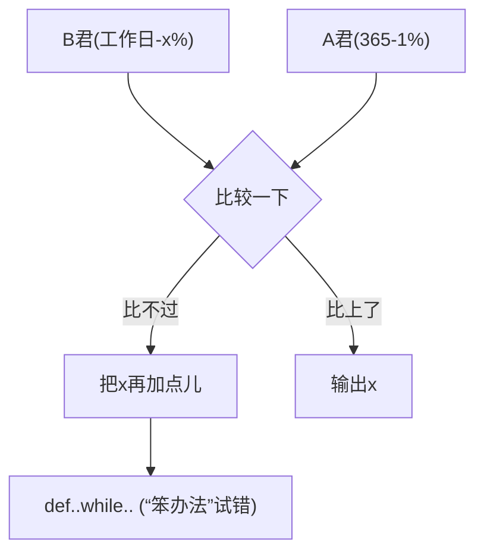
</details>

# 天天向上的力量

#DayDayUpQ4.py   
```python
def dayUP(df):
    dayup = 1
    for i in range(365):
    if i % 7 in [6,0]:
    dayup = dayup*(1 - 0.01)
    else:
    dayup = dayup*(1 + df)
    return dayup
dayfactor = 0.01
while dayUP(dayfactor) < 37.78:
    dayfactor += 0.001 
```

根据df参数计算工作日力量的函数

参数不同，这段代码可共用

def保留字用于定义函数

while保留字判断条件是否成立

条件成立时循环执行

print("工作日的努力参数是：{:.3f} ".format(dayfactor))

# 准备好电脑，与老师一起编码吧！

# 天天向上的力量

问题4： 工作日的努力

>>> (运行结果)

工作日的努力参数是：0.019

$$
1. 0 1 ^ {3 6 5} = 3 7. 7 8
$$

$$
1. 0 1 9 ^ {3 6 5} = 9 6 2. 8 9
$$

工作日模式，每天要努力到1.9%，相当于365模式每天1%的一倍！

# 天天向上的力量

GRIT：perseverance and passion for long-term goals

$$
1. 0 1 ^ {3 6 5} = 3 7. 7 8
$$

$$
1. 0 1 9 ^ {3 6 5} = 9 6 2. 8 9
$$

GRIT，坚毅，对长期目标的持续激情及持久耐力  
GRIT是获得成功最重要的因素之一，牢记天天向上的力量

# 天天向上的力量"举一反三


<details>
<summary>natural_image</summary>

Abstract geometric line drawing with interconnected nodes and lines (no text or symbols)
</details>


<details>
<summary>natural_image</summary>

Abstract geometric network diagram with interconnected nodes and lines (no text or symbols)
</details>

#DayDayUpQ3.py   
```python
dayup = 1.0    for..in.. (计算思维)
dayfactor = 0.01
for i in range(365):
    if i % 7 in [6,0]:
    dayup = dayup*(1-dayfactor)
    else:
    dayup = dayup*(1+dayfactor)
print("工作日的力量：{:.2f} ".format(dayup)) 
```

#DayDayUpQ4.py   
def dayUP(df):
    dayup = 1
    for i in range(365):
    if i % 7 in [6,0]:
    dayup = dayup*(1 - 0.01)
    else:
    dayup = dayup*(1 + df)
    return dayup
dayfactor = 0.01
while dayUP(dayfactor) < 37.78:
    dayfactor += 0.001   
print("工作日的努力参数是：{:.3f} ".format(dayfactor))

# 举一反三

# 天天向上的力量

实例虽然仅包含8-12行代码，但包含很多语法元素  
判断条件循环、次数循环、分支、函数、计算思维  
清楚理解这些代码能够快速入门Python语言

# 举一反三

# 问题的变化和扩展

工作日模式中，如果休息日不下降呢？  
如果努力每天提高1%，休息时每天下降1‰呢？   
如果工作3天休息1天呢？

# 举一反三

# 问题的变化和扩展

"三天打鱼，两天晒网"呢？   
"多一份努力"呢？ (努力比下降多一点儿）  
多一点懈怠"呢？（下降比努力多一点儿）

12

# 字符串类型及操作


python

嵩 天

北京理工大学

pythom

# 单元开篇

# 字符串类型及操作


<details>
<summary>natural_image</summary>

Generic male avatar icon with beard and mustache (no text or symbols)
</details>

字符串类型的表示  
字符串操作符   
字符串处理函数  
字符串处理方法  
字符串类型的格式化


<details>
<summary>natural_image</summary>

Silhouette of a person riding a bicycle on a blue track (no text or symbols)
</details>


<details>
<summary>text_image</summary>

字符串类型的表示
</details>

# 字符串

# 由0个或多个字符组成的有序字符序列

字符串由一对单引号或一对双引号表示

"请输入带有符号的温度值: "或者

字符串是字符的有序序列，可以对其中的字符进行索引

"请" 是 "请输入带有符号的温度值: " 的第0个字符

# 字符串

# 字符串有 2类共4种 表示方法

由一对单引号或双引号表示，仅表示单行字符串

"请输入带有符号的温度值: "或者

由一对三单引号或三双引号表示，可表示多行字符串

Python

语言 Q: 老师老师，三引号不是多行注释吗？

# Python语言为何提供 2类共4种 字符串表示方式？

# 字符串

# 字符串有 2类共4种 表示方法

如果希望在字符串中包含双引号或单引号呢？

'这里有个双引号(")' 或者 "这里有个单引号(')"

如果希望在字符串中既包括单引号又包括双引号呢？

这里既有单引号(')又有双引号 (")

# 字符串的序号

# 正向递增序号 和 反向递减序号

反向递减序号

$$
- 1 2 - 1 1 - 1 0 - 9 - 8 - 7 - 6 - 5 - 4 - 3 - 2 - 1
$$

<table><tr><td colspan="9">请输入带有符号的温度值：</td></tr></table>


<details>
<summary>text_image</summary>

0 1 2 3 4 5 6 7 8 9 10 11
</details>

正向递增序号

# 字符串的使用

# 使用[ ]获取字符串中一个或多个字符

索引：返回字符串中单个字符 <字符串>[M]

"请输入带有符号的温度值: "[0] 或者 TempStr[-1]

切片：返回字符串中一段字符子串 <字符串>[M: N]

"请输入带有符号的温度值: "[1:3] 或者 TempStr[0:-1]

# 字符串切片高级用法

# 使用[M: N: K]根据步长对字符串切片

<字符串>[M: N]，M缺失表示至开头，N缺失表示至结尾

"〇一二三四五六七八九十"[:3] 结果是 "〇一二"

<字符串>[M: N: K]，根据步长K对字符串切片

"〇一二三四五六七八九十"[1:8:2] 结果是 "一三五七"

"〇一二三四五六七八九十"[::-1] 结果是 "十九八七六五四三二一〇"

# 字符串的特殊字符

# 转义符 \

转义符表达特定字符的本意

"这里有个双引号(\")" 结果为 这里有个双引号(")

转义符形成一些组合，表达一些不可打印的含义

"\b"回退 "\n"换行(光标移动到下行首) "\r" 回车(光标移动到本行首)

# 字符串操作符


<details>
<summary>natural_image</summary>

Abstract geometric network diagram with interconnected nodes and lines (no text or symbols)
</details>

# 字符串操作符

# 由0个或多个字符组成的有序字符序列

<table><tr><td>操作符及使用</td><td>描述</td></tr><tr><td>x + y</td><td>连接两个字符串x和y</td></tr><tr><td>n * x 或 x * n</td><td>复制n次字符串x</td></tr><tr><td>x in s</td><td>如果x是s的子串,返回True,否则返回False</td></tr></table>

# 字符串操作符

# 获取星期字符串

输入：1-7的整数，表示星期几  
输出：输入整数对应的星期字符串  
例如：输入3，输出 星期三

# 字符串操作符

# 获取星期字符串

#WeekNamePrintV1.py

weekStr = "星期一星期二星期三星期四星期五星期六星期日"

weekId = eval(input("请输入星期数字(1-7)："))

pos = (weekId – 1 ) \* 3

print(weekStr[pos: pos+3])

# 字符串操作符

# 获取星期字符串

#WeekNamePrintV2.py   
```txt
weekStr = "一二三四五六日"
weekId = eval(input("请输入星期数字(1-7):"))
print("星期" + weekStr[weekId-1]) 
```

# 字符串处理函数


<details>
<summary>natural_image</summary>

Abstract geometric network diagram with interconnected nodes and lines (no text or symbols)
</details>

# 字符串处理函数

一些以函数形式提供的字符串处理功能

<table><tr><td>函数及使用</td><td>描述</td></tr><tr><td>len(x)</td><td>长度,返回字符串x的长度len(&quot;一二三456&quot;)结果为6</td></tr><tr><td>str(x)</td><td>任意类型x所对应的字符串形式str(1.23)结果为&quot;1.23&quot; str([1,2])结果为&quot;[1,2]&quot;</td></tr><tr><td>hex(x)或 oct(x)</td><td>整数x的十六进制或八进制小写形式字符串hex(425)结果为&quot;0x1a9&quot; oct(425)结果为&quot;0o651&quot;</td></tr></table>

# 字符串处理函数

# 一些以函数形式提供的字符串处理功能

<table><tr><td>函数及使用</td><td>描述</td></tr><tr><td>chr(u)</td><td>x为Unicode编码,返回其对应的字符</td></tr><tr><td>ord(x)</td><td>x为字符,返回其对应的Unicode编码</td></tr></table>


<details>
<summary>flowchart</summary>

```mermaid
graph LR
    A["Unicode"] -->|chr(u)| B["单字符"]
    A <-->|ord(x)| B
```
</details>

# Unicode编码

# Python字符串的编码方式

- 统一字符编码，即覆盖几乎所有字符的编码方式  
从0到1114111 (0x10FFFF)空间，每个编码对应一个字符  
Python字符串中每个字符都是Unicode编码字符

# Unicode编码

# 一些有趣的例子

>>> "1 + 1 = 2 " + chr(10004)

'1 + 1 = 2 ✔'

>>> "这个字符♉的Unicode值是：" + str(ord("♉"))

'这个字符♉的Unicode值是： 9801'

>>> for i in range(12):

print(chr(9800 + i), end="")

♈♉♊♋♌♍♎♏♐♑♒♓

# 字符串处理方法


<details>
<summary>natural_image</summary>

Abstract geometric network diagram with interconnected nodes and lines (no text or symbols)
</details>

# 字符串处理方法

# "方法"在编程中是一个专有名词

方法"特指<a>.<b>()风格中的函数<b>()  
方法本身也是函数，但与<a>有关，<a>.<b>()风格使用  
字符串及变量也是<a>，存在一些方法

# 字符串处理方法

一些以方法形式提供的字符串处理功能

<table><tr><td>方法及使用 1/3</td><td>描述</td></tr><tr><td>str.lower() 或 str.upper()</td><td>返回字符串的副本,全部字符小写/大写&quot;AbCdEfGh&quot;.lower() 结果为 &quot;abcdefgh&quot;</td></tr><tr><td>str.split(sep=None)</td><td>返回一个列表,由str根据sep被分隔的部分组成&quot;A,B,C&quot;.split(&quot;,&quot;) 结果为 [&#x27;A&#x27;,&#x27;B&#x27;,&#x27;C&#x27;]</td></tr><tr><td>str.count(sub)</td><td>返回子串sub在str中出现的次数&quot;a apple a day&quot;.count(&quot;a&quot;) 结果为 4</td></tr></table>

# 字符串处理方法

一些以方法形式提供的字符串处理功能

<table><tr><td>方法及使用 2/3</td><td>描述</td></tr><tr><td>str.replace(old, new)</td><td>返回字符串str副本,所有old子串被替换为new&quot;python&quot;.replace(&quot;n&quot;,&quot;n123.io&quot;)结果为&quot;python123.io&quot;</td></tr><tr><td>str.center(width[,fillchar])</td><td>字符串str根据宽度width居中,fillchar可选&quot;python&quot;.center(20,&quot;=&quot;)结果为&#x27;==========python===========&#x27;</td></tr></table>

# 字符串处理方法

一些以方法形式提供的字符串处理功能

<table><tr><td>方法及使用 3/3</td><td>描述</td></tr><tr><td>str.strip Management)</td><td>从str中去掉在其左侧和右侧chars中列出的字符&quot; = python = &quot;.strip(&quot; = np&quot;) 结果为&quot;ytho&quot;</td></tr><tr><td>str.join(iter)</td><td>在iter变量除最后元素外每个元素后增加一个str&quot;,&quot;.join(&quot;12345&quot;) 结果为&quot;1,2,3,4,5&quot; #主要用于字符串分隔等</td></tr></table>

# 字符串类型的格式化


<details>
<summary>natural_image</summary>

Abstract geometric line drawing with interconnected nodes and lines (no text or symbols)
</details>


<details>
<summary>natural_image</summary>

Abstract geometric network diagram with interconnected nodes and lines (no text or symbols)
</details>

# 字符串类型的格式化

# 格式化是对字符串进行格式表达的方式

字符串格式化使用.format()方法，用法如下：

<模板字符串>.format(<逗号分隔的参数>)

# 字符串类型的格式化

槽

"{ }:计算机{ }的CPU占用率为{ }%".format("2018-10-10","C",10)


<details>
<summary>text_image</summary>

0
1
2
</details>

字符串中槽{}的默认顺序


<details>
<summary>text_image</summary>

0
1
2
</details>

format()中参数的顺序

# 字符串类型的格式化

槽


<details>
<summary>flowchart</summary>

```mermaid
graph TD
    A["&quot;{1}:计算机{0}的CPU占用率为{2}%&quot;.format(&quot;2018-10-10&quot;, &quot;C&quot;, 10)"]
    B[""]
```
</details>

# format()方法的格式控制

# 槽内部对格式化的配置方式

# { <参数序号> ： <格式控制标记>}

<table><tr><td>:</td><td>&lt;填充&gt;</td><td>&lt;对齐&gt;</td><td>&lt;宽度&gt;</td><td>&lt;, &gt;</td><td>&lt;.精度&gt;</td><td>&lt;类型&gt;</td></tr><tr><td>引导符号</td><td>用于填充的单个字符</td><td>&lt;左对齐&gt;右对齐^居中对齐</td><td>槽设定的输出宽度</td><td>数字的千位分隔符</td><td>浮点数小数精度或字符串最大输出长度</td><td>整数类型b, c, d, o, x, X浮点数类型e, E, f, %</td></tr></table>

# format()方法的格式控制

<table><tr><td>:</td><td>&lt;填充&gt;</td><td>&lt;对齐&gt;</td><td>&lt;宽度&gt;</td><td>&lt;,&gt;</td><td>&lt;.精度&gt;</td><td>&lt;类型&gt;</td></tr><tr><td>引导符号</td><td>用于填充的单个字符</td><td>&lt;左对齐&gt;右对齐^居中对齐</td><td>槽设定的输出宽度</td><td colspan="3">&gt;&gt;&gt;{{0:=^20}&quot;.format(&quot;PYTHON)&#x27;=======PYTHON=====&#x27;&gt;&gt;&gt;{{0:*&gt;20}&quot;.format(&quot;BIT&#x27;)&#x27;**********BIT&#x27;&gt;&gt;&gt;{{:10}&quot;.format(&quot;BIT&#x27;)&#x27;BIT&#x27;</td></tr></table>

# format()方法的格式控制

<table><tr><td>&lt;填充&gt; &lt;对齐&gt; &lt;宽度&gt;</td><td>&lt;, &gt;</td><td>&lt;.精度&gt;</td><td>&lt;类型&gt;</td></tr><tr><td>&gt;&gt;&gt; &quot;{0:, .2f}&quot;.format(12345.6789)&#x27;12,345.68&#x27;</td><td>数字的千位分隔符</td><td>浮点数小数精度或字符串最大输出长度</td><td>整数类型b, c, d, o, x, X浮点数类型e, E, f, %</td></tr><tr><td>&gt;&gt;&gt; &quot;{0:b}, {0:c}, {0:d}, {0:o}, {0:x}, {0:X}&quot;.format(425)&#x27;110101001, Σ, 425, 651, 1a9, 1A9&#x27;</td><td></td><td></td><td></td></tr><tr><td>&gt;&gt;&gt; &quot;{0:e}, {0:E}, {0:f}, {0:%}&quot;.format(3.14)&#x27;3.140000e+00, 3.140000E+00, 3.140000, 314.000000%&#x27;</td><td></td><td></td><td></td></tr></table>

# 单元小结

# 字符串类型及操作

正向递增序号、反向递减序号、<字符串>[M:N:K]   
- +、\*、len()、str()、hex()、oct()、ord()、chr()  
- .lower()、.upper()、.split()、.count()、.replace()  
- .center()、.strip()、.join(）、.format()格式化

# 模块2: time库的使用


python

嵩 天

北京理工大学

pythom

# 单元开篇

# 模块2: time库的使用


<details>
<summary>natural_image</summary>

Generic male avatar icon with beard and collared shirt (no text or symbols)
</details>

time库基本介绍  
时间获取  
时间格式化  
- 程序计时应用


<details>
<summary>natural_image</summary>

Silhouette of a person riding a bicycle on a blue track (no text or symbols)
</details>

# time库基本介绍


<details>
<summary>natural_image</summary>

Abstract geometric network diagram with interconnected nodes and lines (no text or symbols)
</details>

# time库概述

# time库是Python中处理时间的标准库

计算机时间的表达

import time

提供获取系统时间并格式化输出功能

time.<b>()

提供系统级精确计时功能，用于程序性能分析

# time库概述

# time库包括三类函数

时间获取：time() ctime() gmtime()  
时间格式化：strftime() strptime()  
程序计时：sleep(), perf\_counter()

<!-- part 3: pages 401-600 -->

# 时间获取


<details>
<summary>natural_image</summary>

Abstract geometric network diagram with interconnected nodes and lines (no text or symbols)
</details>

# 时间获取

<table><tr><td>函数</td><td>描述</td></tr><tr><td>time()</td><td>获取当前时间戳,即计算机内部时间值,浮点数&gt;&gt;&gt;time.time()1516939876.6022282</td></tr><tr><td>ctime()</td><td>获取当前时间并以易读方式表示,返回字符串&gt;&gt;&gt;time.ctime()&#x27;Fri Jan 26 12:11:16 2018&#x27;</td></tr></table>

# 时间获取

<table><tr><td>函数</td><td>描述</td></tr><tr><td>gmtime()</td><td>获取当前时间,表示为计算机可处理的时间格式&gt;&gt;&gt;time.gmtime()time.struct_time(tm_year=2018, tm_mon=1, tm_mday=26, tm_hour=4, tm_min=11, tm_sec=16, tm_wday=4, tm_yday=26, tm_isdst=0)</td></tr></table>

# 时间格式化

# 时间格式化

# 将时间以合理的方式展示出来

格式化：类似字符串格式化，需要有展示模板  
展示模板由特定的格式化控制符组成  
strftime()方法

# 时间格式化

<table><tr><td>函数</td><td>描述</td></tr><tr><td>strftime(tpl, ts)</td><td>tpl是格式化模板字符串,用来定义输出效果ts是计算机内部时间类型变量&gt;&gt;&gt;t = time.gmtime()&gt;&gt;&gt;time.strftime(&quot;%Y-%m-%d %H:%M:%S&quot;,t)&#x27;2018-01-26 12:55:20&#x27;</td></tr></table>

# 格式化控制符

<table><tr><td>格式化字符串</td><td>日期/时间说明</td><td>值范围和实例</td></tr><tr><td>%Y</td><td>年份</td><td>0000~9999,例如:1900</td></tr><tr><td>%m</td><td>月份</td><td>01~12,例如:10</td></tr><tr><td>%B</td><td>月份名称</td><td>January~December,例如:April</td></tr><tr><td>%b</td><td>月份名称缩写</td><td>Jan~Dec,例如:Apr</td></tr><tr><td>%d</td><td>日期</td><td>01~31,例如:25</td></tr><tr><td>%A</td><td>星期</td><td>Monday~Sunday,例如:Wednesday</td></tr></table>

# 格式化控制符

<table><tr><td>格式化字符串</td><td>日期/时间说明</td><td>值范围和实例</td></tr><tr><td>%a</td><td>星期缩写</td><td>Mon~Sun,例如:Wed</td></tr><tr><td>%H</td><td>小时(24h制)</td><td>00~23,例如:12</td></tr><tr><td>%h</td><td>小时(12h制)</td><td>01~12,例如:7</td></tr><tr><td>%p</td><td>上/下午</td><td>AM,PM,例如:PM</td></tr><tr><td>%M</td><td>分钟</td><td>00~59,例如:26</td></tr><tr><td>%S</td><td>秒</td><td>00~59,例如:26</td></tr></table>

# 时间格式化

>>>t = time.gmtime()

>>>time.strftime("%Y-%m-%d %H:%M:%S",t)


2018-01-26 12:55:20


>>>timeStr = '2018-01-26 12:55:20'

>>>time.strptime(timeStr, “%Y-%m-%d %H:%M:%S”)

# 时间格式化

<table><tr><td>函数</td><td>描述</td></tr><tr><td>strptime(str, tpl)</td><td>str是字符串形式的时间值tpl是格式化模板字符串,用来定义输入效果&gt;&gt;&gt;timeStr = &#x27;2018-01-26 12:55:20&#x27;&gt;&gt;&gt;time.strptime(timeStr, &quot;%Y-%m-%d %H:%M:%S&quot;)time.struct_time(tm_year=2018, tm_mon=1,tm_mday=26, tm_hour=4, tm_min=11, tm_sec=16,tm_wday=4, tm_yday=26, tm_isdst=0)</td></tr></table>

# 程序计时应用


<details>
<summary>natural_image</summary>

Abstract geometric network diagram with interconnected nodes and lines (no text or symbols)
</details>

# 程序计时

# 程序计时应用广泛

程序计时指测量起止动作所经历时间的过程  
测量时间：perf\_counter()  
产生时间：sleep()

# 程序计时

<table><tr><td>函数</td><td>描述</td></tr><tr><td>perf_counter()</td><td>返回一个CPU级别的精确时间计数值,单位为秒由于这个计数值起点不确定,连续调用差值才有意义&gt;&gt;&gt;start = time.perf_counter()318.66599499718114&gt;&gt;&gt;end = time.perf_counter()341.3905185375658&gt;&gt;&gt;end - start22.724523540384666</td></tr></table>

# 程序计时

<table><tr><td>函数</td><td>描述</td></tr><tr><td>sleep(s)</td><td>s拟休眠的时间,单位是秒,可以是浮点数&gt;&gt;&gt;def wait():time.sleep(3.3)&gt;&gt;wait() #程序将等待3.3秒后再退出</td></tr></table>

# 单元小结

# 模块2: time库的使用

时间获取：time() ctime() gmtime()  
- 时间格式化：strftime() strptime()  
- 程序计时：perf\_counter() sleep()

# 实例4: 文本进度条


python

嵩 天

北京理工大学

pythom


<details>
<summary>text_image</summary>

"文本进度条"问题分析
</details>

# 文本进度条

# 用过计算机的都见过

进度条什么原理呢？


<details>
<summary>bar</summary>

| Category | Value (%) |
|---|---|
| Bar (Red) | 75 |
</details>


<details>
<summary>natural_image</summary>

Silhouette of a person riding a bicycle on a blue track (no text or symbols)
</details>

# 需求分析

# 文本进度条

采用字符串方式打印可以动态变化的文本进度条  
进度条需要能在一行中逐渐变化

# 问题分析

如何获得文本进度条的变化时间？

采用sleep()模拟一个持续的进度  
似乎不那么难

# "文本进度条"简单的开始


<details>
<summary>natural_image</summary>

Abstract geometric line drawing with interconnected nodes and lines (no text or symbols)
</details>


<details>
<summary>natural_image</summary>

Abstract geometric network diagram with interconnected nodes and lines (no text or symbols)
</details>

# 简单的开始

#TextProBarV1.py   
```python
import time
scale = 10
print("----执行开始----")
for i in range(scale+1):
    a = '*' * i
    b = '.' * (scale - i)
    c = (i / scale)*100
    print("{:^3.0f}%[{}->{}
    time.sleep(0.1) 
```  
print("------执行结束------")

<table><tr><td>- - - - - - - - - - - - - - - - - - - - - - - - - - - - - - - - - - - - - - - - - - - - - - - - - - - - - - - - - - - - - - - - - - - - - - - - - - - - - - - - - - - - - - - - - - - - -</td></tr><tr><td>0 %[--&gt;. . . . . . . . . . ]</td></tr><tr><td>10 %[*-&gt;. . . . . . . . . ]</td></tr><tr><td>20 %[**-&gt;. . . . . . . . ]</td></tr><tr><td>30 %[***-&gt;. . . . . . . ]</td></tr><tr><td>40 %[****-&gt;. . . . . . ]</td></tr><tr><td>50 %[*****-&gt;. . . . . ]</td></tr><tr><td>60 %[*****-&gt;. . . ]</td></tr><tr><td>70 %[*********--&gt;. . ]</td></tr><tr><td>80 %[*********--&gt;. ]</td></tr><tr><td>90 %[*********--&gt;. ]</td></tr><tr><td>100%[*********--&gt;]</td></tr><tr><td>- -- -- -- -- -- -- -- -- -- -- -- -- -- -- -- -- -- -- -- -- -- -- -- -- -- -- -- -- -- -- -- -- -- -- -- -- -- -- -- -- -- -- -- -- -- -- -- -- -- -- -- -- -- -- -- -- -- -- -- -- -- -- -- -- -- -- -- -- -- -- -- -- -- -- -- -- -- -- -- -- -- -- -- -- -- -- -- -- -- -- -- -- -- -- -- -- -- -- -- --</td></tr></table>

# "文本进度条"单行动态刷新


<details>
<summary>natural_image</summary>

Abstract geometric line drawing with interconnected nodes and lines (no text or symbols)
</details>


<details>
<summary>natural_image</summary>

Abstract geometric network diagram with interconnected nodes and lines (no text or symbols)
</details>

# 单行动态刷新

# 刷新的关键是 \r

刷新的本质是：用后打印的字符覆盖之前的字符  
不能换行：print()需要被控制  
要能回退：打印后光标退回到之前的位置 \r

# 单行动态刷新

#TextProBarV2.py

import time

for i in range(101):

print("\r{:3}%".format(i), end="")

time.sleep(0.1)

<table><tr><td>0%</td><td>1%</td><td>2%</td><td>3%</td><td>4%</td><td>5%</td><td>6%</td><td>7%</td><td>8%</td><td>9%</td><td>10%</td><td>11%</td><td>12%</td><td>13%</td><td>14%</td><td>15%</td><td>16%</td><td>17%</td><td>18%</td><td>19%</td></tr><tr><td>20%</td><td>21%</td><td>22%</td><td>23%</td><td>24%</td><td>25%</td><td>26%</td><td>27%</td><td>28%</td><td>29%</td><td>30%</td><td>31%</td><td>32%</td><td>33%</td><td>34%</td><td>35%</td><td>36%</td><td>37%</td><td>38%</td><td>39%</td></tr><tr><td>40%</td><td>41%</td><td>42%</td><td>43%</td><td>44%</td><td>45%</td><td>46%</td><td>47%</td><td>48%</td><td>49%</td><td>50%</td><td>51%</td><td>52%</td><td>53%</td><td>54%</td><td>55%</td><td>56%</td><td>57%</td><td>58%</td><td>59%</td></tr><tr><td>60%</td><td>61%</td><td>62%</td><td>63%</td><td>64%</td><td>65%</td><td>66%</td><td>67%</td><td>68%</td><td>69%</td><td>70%</td><td>71%</td><td>72%</td><td>73%</td><td>74%</td><td>75%</td><td>76%</td><td>77%</td><td>78%</td><td>79%</td></tr><tr><td>80%</td><td>81%</td><td>82%</td><td>83%</td><td>84%</td><td>85%</td><td>86%</td><td>87%</td><td>88%</td><td>89%</td><td>90%</td><td>91%</td><td>92%</td><td>93%</td><td>94%</td><td>95%</td><td>96%</td><td>97%</td><td>98%</td><td>99%</td></tr></table>

# 单行动态刷新

```python
#TextProBarV2.py
import time
for i in range(101):
    print("\r{3}%".format(i), end="")
time.sleep(0.1) 
```

```batch
D:\PYECourse>python TextProBarV2.py 44% 
```

# 命令行执行

# "文本进度条"实例完整效果


<details>
<summary>natural_image</summary>

Abstract geometric line drawing with interconnected nodes and lines (no text or symbols)
</details>


<details>
<summary>natural_image</summary>

Abstract geometric network diagram with interconnected nodes and lines (no text or symbols)
</details>

#TextProBarV3.py   
import time  
```txt
scale = 50 
```

print("执行开始".center(scale//2, "-"))  
```lua
start = time.perf_counter() 
```  
for i in range(scale+1):

```txt
a = '*' * i
b = '.' * (scale - i) 
```

```txt
c = (i / scale)*100 
```

```txt
dur = time.perf_counter() - start 
```

```javascript
print("\r{:^3.0f}%[ {} -> {} ]{:.2f}s".format(c,a,b,dur),end='') 
```

```elixir
time.sleep(0.1) 
```  
print("\n"+"执行结束".center(scale//2,'-'))

# 完整效果

```txt
D:\PYECourse>python TextProBar.py
----执行开始----
100%[**************************]5.02s
----执行结束----
```

# 准备好电脑，与老师一起编码吧！


<details>
<summary>text_image</summary>

"文本进度条"举一反三
</details>

#TextProBarV3.py   
```python
import time
scale = 50
print("执行开始".center(scale//2, "-"))
start = time.perf_counter()
for i in range(scale+1):
    a = '*' * i
    b = '.' * (scale - i)
    c = (i / scale)*100
    dur = time.perf_counter() - start
    print("\r{:^3.0f}%[{}->{}]{:.2f}s"
    time.sleep(0.1) 
```  
print("\n"+"执行结束".center(scale//2,'-'))

# 举一反三

# 计算问题扩展

文本进度条程序使用了perf\_counter()计时  
计时方法适合各类需要统计时间的计算问题  
例如：比较不同算法时间、统计部分程序运行时间

# 举一反三

# 进度条应用

在任何运行时间需要较长的程序中增加进度条  
在任何希望提高用户体验的应用中增加进度条  
进度条是人机交互的纽带之一


<details>
<summary>line</summary>

| 实际执行进度 | Linear | Early Pause | Late Pause | Slow Wavy | Fast Wavy | Power | Inverse Power | Fast Power | Inverse Fast Power |
| ------------ | ------ | ----------- | ---------- | --------- | --------- | ----- | ------------- | ---------- | ------------------ |
| 0%           | 0%     | 0%          | 0%         | 0%        | 0%        | 0%    | 0%            | 0%         | 0%                 |
| 100%         | 100%   | 100%        | 100%       | 100%      | 100%      | 100%  | 100%          | 100%       | 100%               |
</details>

# 举一反三

文本进度条的不同设计函数

<table><tr><td>设计名称</td><td>趋势</td><td>设计函数</td></tr><tr><td>Linear</td><td>Constant</td><td>f(x) = x</td></tr><tr><td>Early Pause</td><td>Speeds up</td><td>f(x) = x + (1 - sin(x*π*2 + π/2)/-8</td></tr><tr><td>Late Pause</td><td>Slows down</td><td>f(x) = x + (1 - sin(x*π*2 + π/2)/8</td></tr><tr><td>Slow Wavy</td><td>Constant</td><td>f(x) = x + sin(x*π*5)/20</td></tr><tr><td>Fast Wavy</td><td>Constant</td><td>f(x) = x + sin(x*π*20)/80</td></tr></table>

# 举一反三

文本进度条的不同设计函数

<table><tr><td>设计名称</td><td>趋势</td><td>设计函数</td></tr><tr><td>Power</td><td>Speeds up</td><td> $f(x) = (x + (1 - x)*0.03)^2$ </td></tr><tr><td>Inverse Power</td><td>Slows down</td><td> $f(x) = 1 + (1 - x)^{1.5} * -1$ </td></tr><tr><td>Fast Power</td><td>Speeds up</td><td> $f(x) = (x + (1 - x)/2)^8$ </td></tr><tr><td>Inverse Fast Power</td><td>Slows down</td><td> $f(x) = 1 + (1 - x)^3 * -1$ </td></tr></table>

# Python语言程序设计

# 第4章 辅学内容


python

嵩 天

北京理工大学

pythom

# 前课复习

# Python基本语法元素

- 缩进、注释、命名、变量、保留字   
数据类型、字符串、 整数、浮点数、列表  
- 赋值语句、分支语句、函数  
input()、print()、eval()、 print()格式化

# Python基本图形绘制

从计算机技术演进角度看待Python语言  
海龟绘图体系及import保留字用法  
penup()、pendown()、pensize()、pencolor()  
fd()、circle()、seth()  
循环语句：for和in、range()函数

# 基本数据类型

数据类型：整数、浮点数、复数及  
数据类型运算操作符、运算函数  
字符串类型：表示、索引、切片  
- 字符串操作符、处理函数、处理方法、.format()格式化  
- time库：time()、strftime()、strptime()、sleep()等

<table><tr><td>and</td><td>elif</td><td>import</td><td>raise</td><td>global</td></tr><tr><td>as</td><td>else</td><td>in</td><td>return</td><td>nonlocal</td></tr><tr><td>assert</td><td>except</td><td>is</td><td>try</td><td>True</td></tr><tr><td>break</td><td>finally</td><td>lambda</td><td>while</td><td>False</td></tr><tr><td>class</td><td>for</td><td>not</td><td>with</td><td>None</td></tr><tr><td>continue</td><td>from</td><td>or</td><td>yield</td><td></td></tr><tr><td>def</td><td>if</td><td>pass</td><td>del</td><td></td></tr></table>

保留字

```python
#TempConvert.py
TempStr = input("请输入带有符号的温度值：")
if TempStr[-1] in ['F', 'f']:
    C = (eval(TempStr[0:-1]) - 32)/1.8
    print("转换后的温度是{:.2f}C".format(C))
elif TempStr[-1] in ['C', 'c']:
    F = 1.8*eval(TempStr[0:-1]) + 32
    print("转换后的温度是{:.2f}F".format(F))
else:
    print("输入格式错误") 
```

# 温度转换


<details>
<summary>natural_image</summary>

Silhouette of a person riding a bicycle with blue lane line (no text or symbols)
</details>

import turtle

turtle.setup(650, 350, 200, 200)

turtle.penup()

turtle.fd(-250)

turtle.pendown()

turtle.pensize(25)

turtle.pencolor("purple")

turtle.seth(-40)

for i in range(4):

turtle.circle(40, 80)

turtle.circle(-40, 80)

turtle.circle(40, 80/2)

turtle.fd(40)

turtle.circle(16, 180)

turtle.fd(40 \* 2/3)

turtle.done()

Python Turtle Graphics

←


<details>
<summary>natural_image</summary>

Purple wavy line drawing with a small arrowhead at the end (no text or symbols)
</details>

Python蟒蛇绘制

# 本课概要

# 第4章 程序的控制结构


<details>
<summary>natural_image</summary>

Generic male avatar icon with beard and mustache (no text or symbols)
</details>

- 4.1 程序的分支结构  
- 4.2 实例5: 身体质量指数BMI   
4.3 程序的循环结构  
4.4 模块3: random库的使用  
- 4.5 实例6: 圆周率的计算


<details>
<summary>natural_image</summary>

Silhouette of a person riding a bicycle on a blue track (no text or symbols)
</details>

# 程序的控制结构"

- 顺序结构  
分支结构  
- 循环结构


<details>
<summary>flowchart</summary>

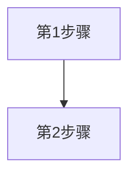
</details>


<details>
<summary>flowchart</summary>

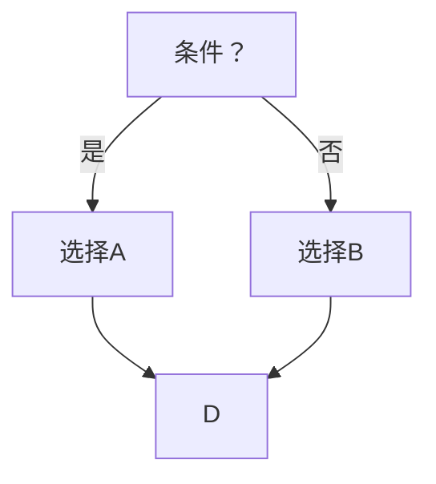
</details>


<details>
<summary>flowchart</summary>

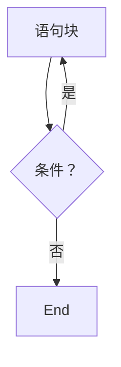
</details>

# 第4章 程序的控制结构


<details>
<summary>natural_image</summary>

Generic male avatar icon with beard and mustache (no text or symbols)
</details>

# 方法论

Python程序的控制语法及结构

# 实践能力

学会编写带有条件判断及循环的程序


<details>
<summary>natural_image</summary>

Silhouette of a person riding a bicycle on a blue track (no text or symbols)
</details>

# 练习与作业

# 第4章 程序的控制结构


<details>
<summary>natural_image</summary>

Generic male avatar icon with beard and mustache (no text or symbols)
</details>

# 练习 (可选)

5道编程题 @Python123

# 作业

15道单选题 @Python123


<details>
<summary>natural_image</summary>

Silhouette of a person riding a bicycle on a blue track (no text or symbols)
</details>

# Python语言程序设计

# 程序的分支结构


python

嵩 天

北京理工大学

pythom

# 单元开篇

# 程序的分支结构


<details>
<summary>natural_image</summary>

Generic male avatar icon with beard and mustache (no text or symbols)
</details>

单分支结构  
二分支结构  
多分支结构  
条件判断及组合  
程序的异常处理


<details>
<summary>natural_image</summary>

Silhouette of a person riding a bicycle with a blue lane line (no text or symbols)
</details>

# 单分支结构

# 单分支结构

# 根据判断条件结果而选择不同向前路径的运行方式

if <条件>

<语句块>


<details>
<summary>flowchart</summary>

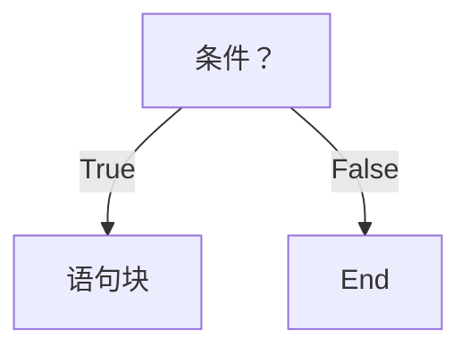
</details>

# 单分支结构

# 单分支示例

$$
\text { guess } = \text { eval(input() }
$$

$$
i f \quad g u e s s = = 9 9:
$$

$$
\mathrm{print} (\text {   "猜对了   })
$$

if True:

print("条件正确")

# 二分支结构

# 二分支结构

# 根据判断条件结果而选择不同向前路径的运行方式

if <条件>

<语句块1>

else :

<语句块2>


<details>
<summary>flowchart</summary>

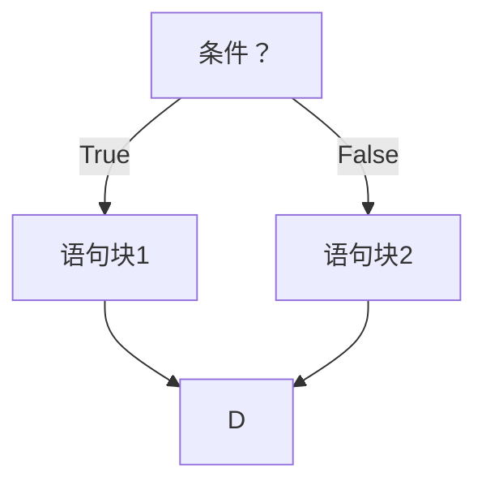
</details>

# 二分支结构

# 二分支示例

```julia
guess = eval(input()) 
```

```txt
if guess == 99: 
```

```txt
print("猜对了") 
```

```txt
else : 
```

```txt
print("猜错了") 
```

```txt
if True: 
```

```lua
print("语句块1") 
```

```txt
else : 
```

```lua
print("语句块2") 
```

# 二分支结构

# 紧凑形式：适用于简单表达式的二分支结构

# <表达式1> if <条件> else <表达式2>

$$
\text { guess } = \text { eval(input() }
$$

print("猜{}了".format("对" if guess==99 else "错"))

# 多分支结构

# 多分支结构

if <条件1> :

<语句块1>

elif <条件2>

<语句块2>

else :

<语句块N>


<details>
<summary>flowchart</summary>

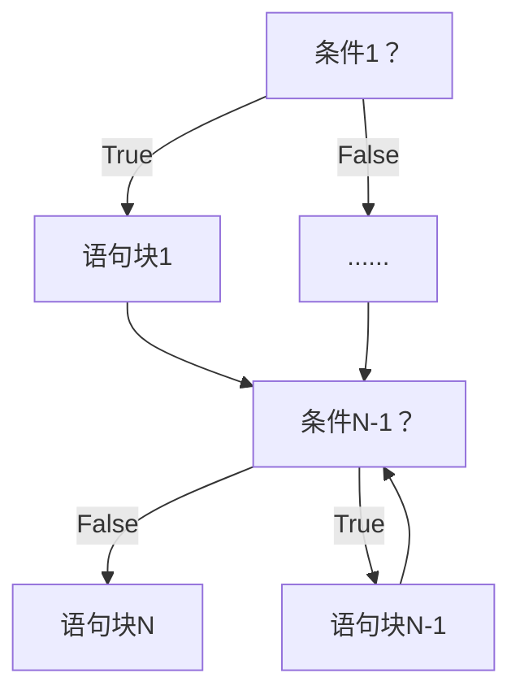
</details>

# 多分支结构

# 对不同分数分级的问题

```txt
score = eval(input()) 
```

```txt
if score >= 60: 
```

```txt
grade = "D" 
```

```txt
elif score >= 70: 
```

```txt
grade = "C" 
```

```txt
elif score >= 80: 
```

```txt
grade = "B" 
```

```txt
elif score >= 90: 
```

```txt
grade = "A" 
```

注意多条件之间的包含关系

注意变量取值范围的覆盖

print("输入成绩属于级别{}".format(grade))

# 程序的控制结构"

- 顺序结构  
- 分支结构  
循环结构


<details>
<summary>flowchart</summary>


</details>


<details>
<summary>flowchart</summary>


</details>


<details>
<summary>flowchart</summary>


</details>

# 条件判断及组合


<details>
<summary>natural_image</summary>

Abstract geometric network diagram with interconnected nodes and lines (no text or symbols)
</details>

# 条件判断

操作符 

<table><tr><td>操作符</td><td>数学符号</td><td>描述</td></tr><tr><td>&lt;</td><td>&lt;</td><td>小于</td></tr><tr><td>&lt;=</td><td>≤</td><td>小于等于</td></tr><tr><td>&gt;=</td><td>≥</td><td>大于等于</td></tr><tr><td>&gt;</td><td>&gt;</td><td>大于</td></tr><tr><td>==</td><td>=</td><td>等于</td></tr><tr><td>!=</td><td>≠</td><td>不等于</td></tr></table>

# 条件组合

# 用于条件组合的三个保留字

<table><tr><td>操作符及使用</td><td>描述</td></tr><tr><td>x and y</td><td>两个条件x和y的逻辑与</td></tr><tr><td>x or y</td><td>两个条件x和y的逻辑或</td></tr><tr><td>not x</td><td>条件x的逻辑非</td></tr></table>

# 条件判断及组合

# 示例

```python
guess = eval(input())
if guess > 99 or guess < 99:
    print("猜错了")
else :
    print("猜对了") 
```

```python
if not True:
    print("语句块2")
else :
    print("语句块1") 
```

# 程序的异常处理


<details>
<summary>natural_image</summary>

Abstract geometric network diagram with interconnected nodes and lines (no text or symbols)
</details>

# 异常处理

num = eval(input("请输入一个整数: "))

print(num\*\*2)

当用户没有输入整数时，会产生异常，怎么处理？

# 异常处理

# 异常发生的代码行数

```txt
Traceback (most recent call last):
File "t.py", line 1, in <module>
num = eval(input("请输入一个整数："))
File "<string>", line 1, in <module> 
```

```txt
NameError: name 'abc' is not defined 
```

# 异常处理

# 异常处理的基本使用

try

<语句块1>

except

<语句块2>

try

<语句块1>

except <异常类型>

<语句块2>

# 异常处理

# 示例1

try

num = eval(input("请输入一个整数: "))

print(num\*\*2)

except

print("输入不是整数")

# 异常处理

# 示例2

try

num = eval(input("请输入一个整数: "))

print(num\*\*2)

except NameError:

标注异常类型后，仅响应该异常

异常类型名字等同于变量

print("输入不是整数")

try

<语句块1>

except

<语句块2>

else :

<语句块3>

finally :

<语句块4>

# 异常处理

# 异常处理的高级使用

finally对应语句块4一定执行

else对应语句块3在不发生异常时执行

# 单元小结

# 程序的分支结构

单分支 if 二分支 if-else 及紧凑形式  
多分支 if-elif-else 及条件之间关系  
- not and or > >= == <= < !   
异常处理 try-except-else-finally


<details>
<summary>natural_image</summary>

Silhouette of a person riding a bicycle with a blue lane line (no text or symbols)
</details>

# 实例5: 身体质量指数BMI


python

嵩 天

北京理工大学

pythom

# 身体质量指数BMI"问题分析


<details>
<summary>natural_image</summary>

Abstract geometric network diagram with interconnected nodes and lines (no text or symbols)
</details>


<details>
<summary>natural_image</summary>

Abstract geometric network diagram with interconnected nodes and lines (no text or symbols)
</details>

# 身体质量指数BMI

# BMI：对身体质量的刻画

\- BMI：Body Mass Index

国际上常用的衡量人体肥胖和健康程度的重要标准，主要用于统计分析

定义

$$
\mathrm{BMI} = \text {体重(kg) / 身高} ^ {2} (\mathrm{m} ^ {2})
$$

# 身体质量指数BMI

# BMI：对身体质量的刻画

实例：体重 72 kg 身高 1.75 m

BMI 值是 23.5

这个值是否健康呢？

# 身体质量指数BMI

# 国际：世界卫生组织 国内：国家卫生健康委员会

<table><tr><td>分类</td><td>国际BMI值 (kg/m2)</td><td>国内BMI值 (kg/m2)</td></tr><tr><td>偏瘦</td><td>&lt;18.5</td><td>&lt;18.5</td></tr><tr><td>正常</td><td>18.5 ~ 25</td><td>18.5 ~ 24</td></tr><tr><td>偏胖</td><td>25 ~ 30</td><td>24 ~ 28</td></tr><tr><td>肥胖</td><td>≥30</td><td>≥28</td></tr></table>

# 身体质量指数BMI

# 问题需求

输入：给定体重和身高值  
输出：BMI指标分类信息(国际和国内)

# "身体质量指数BMI"实例讲解


<details>
<summary>natural_image</summary>

Abstract geometric network diagram with interconnected nodes and lines (no text or symbols)
</details>


<details>
<summary>natural_image</summary>

Abstract geometric network diagram with interconnected nodes and lines (no text or symbols)
</details>

# 身体质量指标BMI

# 思路方法

- 难点在于同时输出国际和国内对应的分类  
思路1：分别计算并给出国际和国内BMI分类  
思路2：混合计算并给出国际和国内BMI分类

# 身体质量指标BMI

#CalBMIv1.py   
height, weight = eval(input("请输入身高(米)和体重\(公斤)[逗号隔开]: "))   
```python
bmi = weight / pow(height, 2) 
```  
print("BMI 数值为：{:.2f}".format(bmi))

```txt
who = "" 
```

if bmi < 18.5:   
```txt
who = "偏瘦" 
```

elif 18.5 <= bmi < 25:   
```txt
who = "正常" 
```

elif 25 <= bmi < 30:   
```txt
who = "偏胖" 
```

else:   
```txt
who = "肥胖" 
```  
print("BMI 指标为:国际'{0}'".format(who))

<table><tr><td>分类</td><td>国际BMI值</td><td>国内BMI值</td></tr><tr><td>偏瘦</td><td>&lt;18.5</td><td>&lt;18.5</td></tr><tr><td>正常</td><td>18.5 ~ 25</td><td>18.5 ~ 24</td></tr><tr><td>偏胖</td><td>25 ~ 30</td><td>24 ~ 28</td></tr><tr><td>肥胖</td><td>≥30</td><td>≥28</td></tr></table>

# 身体质量指标BMI

#CalBMIv2.py   
height, weight = eval(input("请输入身高(米)和体重\(公斤)[逗号隔开]: "))   
```python
bmi = weight / pow(height, 2) 
```  
print("BMI 数值为：{:.2f}".format(bmi))

```python
nat = "" 
```

if bmi < 18.5:   
```txt
nat = "偏瘦" 
```

elif 18.5 <= bmi < 24:   
```txt
nat = "正常" 
```

elif 24 <= bmi < 28:   
```toml
nat = "偏胖" 
```

else:   
```txt
nat = "肥胖" 
```  
print(“BMI 指标为:国内'{0}'".format(nat))

<table><tr><td>分类</td><td>国际BMI值</td><td>国内BMI值</td></tr><tr><td>偏瘦</td><td>&lt;18.5</td><td>&lt;18.5</td></tr><tr><td>正常</td><td>18.5 ~ 25</td><td>18.5 ~ 24</td></tr><tr><td>偏胖</td><td>25 ~ 30</td><td>24 ~ 28</td></tr><tr><td>肥胖</td><td>≥30</td><td>≥28</td></tr></table>

#CalBMIv3.py   
height, weight = eval(input("请输入身高(米)和体重\(公斤)[逗号隔开]: "))   
```python
bmi = weight / pow(height, 2) 
```  
print("BMI 数值为：{:.2f}".format(bmi))

```txt
who, nat = "", "" 
```  
if bmi < 18.5:

```txt
who, nat = "偏瘦", "偏瘦" 
```

elif 18.5 <= bmi < 24:   
```txt
who, nat = "正常", "正常" 
```

elif 24 <= bmi < 25:   
```txt
who, nat = "正常", "偏胖" 
```

elif 25 <= bmi < 28:   
```txt
who, nat = "偏胖", "偏胖" 
```

elif 28 <= bmi < 30:   
```txt
who, nat = "偏胖", "肥胖" 
```

else:   
```txt
who, nat = "肥胖", "肥胖" 
```  
print("BMI 指标为:国际'{0}', 国内'{1}'".format(who, nat))

<table><tr><td>分类</td><td>国际BMI值</td><td>国内BMI值</td></tr><tr><td>偏瘦</td><td>&lt;18.5</td><td>&lt;18.5</td></tr><tr><td>正常</td><td>18.5 ~ 25</td><td>18.5 ~ 24</td></tr><tr><td>偏胖</td><td>25 ~ 30</td><td>24 ~ 28</td></tr><tr><td>肥胖</td><td>≥30</td><td>≥28</td></tr></table>

# 准备好电脑，与老师一起编码吧！

# 身体质量指数BMI"举一反三


<details>
<summary>natural_image</summary>

Abstract geometric line drawing with interconnected nodes and lines (no text or symbols)
</details>


<details>
<summary>natural_image</summary>

Abstract geometric network diagram with interconnected nodes and lines (no text or symbols)
</details>

#CalBMI.py   
height, weight = eval(input("请输入身高(米)和体重\(公斤)[逗号隔开]: "))   
```python
bmi = weight / pow(height, 2) 
```  
print("BMI 数值为：{:.2f}".format(bmi))

```txt
who, nat = "", "" 
```  
if bmi < 18.5:

```txt
who, nat = "偏瘦", "偏瘦" 
```

elif 18.5 <= bmi < 24:   
```txt
who, nat = "正常", "正常" 
```

elif 24 <= bmi < 25:   
```txt
who, nat = "正常", "偏胖" 
```

elif 25 <= bmi < 28:   
```txt
who, nat = "偏胖", "偏胖" 
```

elif 28 <= bmi < 30:   
```txt
who, nat = "偏胖", "肥胖" 
```

else:   
```txt
who, nat = "肥胖", "肥胖" 
```  
print("BMI 指标为:国际'{0}', 国内'{1}'".format(who, nat))


<details>
<summary>other</summary>

| 类别 | 数值 |
|---|---|
| 消瘦 | 13.1 以下 |
| 超重 | 17.4 以上 |
| 肥胖 | 19.2 以上 |
</details>

# 举一反三

# 关注多分支条件的组合

多分支条件之间的覆盖是重要问题  
程序可运行，但不正确，要注意多分支  
分支结构是程序的重要框架，读程序先看分支

# Python语言程序设计

# 程序的循环结构


python

嵩 天

北京理工大学

pythom

# 单元开篇

# 程序的循环结构


<details>
<summary>natural_image</summary>

Generic male avatar icon with beard and mustache (no text or symbols)
</details>

遍历循环   
无限循环  
循环控制保留字  
循环的高级用法


<details>
<summary>natural_image</summary>

Silhouette of a person riding a bicycle with a blue lane line (no text or symbols)
</details>

# 遍历循环

# 遍历循环

# 遍历某个结构形成的循环运行方式

for <循环变量> in <遍历结构>  
<语句块>

从遍历结构中逐一提取元素，放在循环变量中

# 遍历循环


<details>
<summary>flowchart</summary>

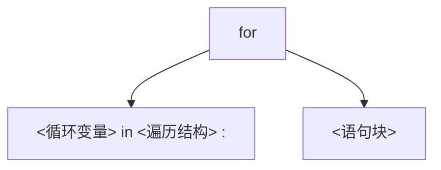
</details>

由保留字for和in组成，完整遍历所有元素后结束  
每次循环，所获得元素放入循环变量，并执行一次语句块

# 遍历循环的应用

# 计数循环(N次)

for i in range(N)

<语句块>

遍历由range()函数产生的数字序列，产生循环

# 遍历循环的应用

# 计数循环(N次)

>>> for i in range(5): print(i)

>>> for i in range(5): print("Hello:",i)

0

1

2

3

4

Hello: 0

Hello: 1

Hello: 2

Hello: 3

Hello: 4

# 遍历循环的应用

# 计数循环(特定次)

for i in range(M,N,K)

<语句块>

遍历由range()函数产生的数字序列，产生循环

# 遍历循环的应用

# 计数循环(特定次)

>>> for i in range(1,6): print(i)

>>> for i in range(1,6,2): print("Hello:",i)

Hello: 1 Hello: 3 Hello: 5

# 遍历循环的应用

# 字符串遍历循环

for c in s

<语句块>

s是字符串，遍历字符串每个字符，产生循环

# 遍历循环的应用

# 字符串遍历循环

>>> for c in "Python123":

print(c, end="," )

P,y,t,h,o,n,1,2,3,

# 遍历循环的应用

# 列表遍历循环

for item in ls

<语句块>

ls是一个列表，遍历其每个元素，产生循环

# 遍历循环的应用

# 列表遍历循环

>>> for item in [123, "PY", 456] : print(item, end=",")

123,PY,456,

# 遍历循环的应用

# 文件遍历循环

for line in fi

<语句块>

fi是一个文件标识符，遍历其每行，产生循环

# 遍历循环的应用

# 文件遍历循环

>>> for line in fi : print(line)

优美胜于丑陋

明了胜于隐晦

简洁胜于复杂

优美胜于丑陋 明了胜于隐晦 简洁胜于复杂

# 遍历循环

for <循环变量> in <遍历结构>


<语句块>

- 计数循环(N次)   
- 列表遍历循环  
- 计数循环(特定次)   
文件遍历循环  
字符串遍历循环

# 无限循环

# 无限循环

# 由条件控制的循环运行方式

while <条件>

<语句块>

反复执行语句块，直到条件不满足时结束

# 无限循环的应用

# 无限循环的条件

$$
\ggg a = 3
$$

$$
\ggg \text { while } a > 0:
$$

$$
\texttt {a} = \texttt {a} - 1
$$

$$
\operatorname{print} (a)
$$

2

1

0

$$
\ggg a = 3
$$

$$
\ggg \text { while } a > 0:
$$

$$
a = a + 1
$$

$$
\operatorname{print} (a)
$$

4

5

$$
\dots \quad (\text { CTRL } + \text { C } \text { 退出执行 })
$$

# 循环控制保留字


<details>
<summary>natural_image</summary>

Abstract geometric network diagram with interconnected nodes and lines (no text or symbols)
</details>

# 循环控制保留字

# break 和 continue

break跳出并结束当前整个循环，执行循环后的语句   
continue结束当次循环，继续执行后续次数循环   
break和continue可以与for和while循环搭配使用

# 循环控制保留字

# break 和 continue

```txt
>>> for c in "PYTHON" :
if c == "T" :
continue
print(c, end="") 
```

```txt
>>> for c in "PYTHON" :
if c == "T" :
break
print(c, end="") 
```

PYHON

PY

# 循环控制保留字

>>> s = "PYTHON"

>>> while s !=

for c in s :

print(c, end="")

s = s[:-1]

>>> s = "PYTHON"

>>> while s !=

for c in s :

if c ==

break

print(c, end="") s = s[:-1]

PYTHONPYTHOPYTHPYTPYP

PYPYPYPYPYP

\- break仅跳出当前最内层循环

# 循环的高级用法


<details>
<summary>natural_image</summary>

Abstract geometric network diagram with interconnected nodes and lines (no text or symbols)
</details>

# 循环的扩展

# 循环与else

for <变量> in <遍历结构> : while <条件> :

<语句块1> <语句块1>

else : else :

<语句块2> <语句块2>

# 循环的扩展

# 循环与else

当循环没有被break语句退出时，执行else语句块  
else语句块作为"正常"完成循环的奖励  
这里else的用法与异常处理中else用法相似

# 循环的扩展

# 循环与else

>>> for c in "PYTHON"

if c == "T

continue

print(c, end="")

else:

print("正常退出")

>>> for c in "PYTHON"

if c == "T

break

print(c, end="")

else:

print("正常退出")

PYHON正常退出

PY

# 单元小结

# 程序的循环结构

- for…in 遍历循环: 计数、字符串、列表、文件…  
while无限循环   
- continue和break保留字: 退出当前循环层次  
- 循环else的高级用法: 与break有关

# 模块3: random库的使用


python

嵩 天

北京理工大学

pythom


<details>
<summary>text_image</summary>

random库基本介绍
</details>

# random库概述

# random库是使用随机数的Python标准库

伪随机数: 采用梅森旋转算法生成的(伪)随机序列中元素  
random库主要用于生成随机数  
使用random库: import random

# random库概述

# random库包括两类函数，常用共8个

基本随机数函数： seed(), random()  
扩展随机数函数： randint(), getrandbits(), uniform(),

randrange(), choice(), shuffle()

# 基本随机数函数


<details>
<summary>natural_image</summary>

Abstract geometric network diagram with interconnected nodes and lines (no text or symbols)
</details>

# 基本随机数函数

# 随机数种子

随机数种子

10

梅森旋转算法

随
机
序
列

0.5714025946899135

0.4288890546751146

0.5780913011344704

0.20609823213950174

0.81332125135732

随机数

0.8235888725334455

0.6534725339011758

0.16022955651881965

0.5206693596399246

0.32777281162209315

# 基本随机数函数

<table><tr><td>函数</td><td>描述</td></tr><tr><td>seed(a=None)</td><td>初始化给定的随机数种子,默认为当前系统时间&gt;&gt;&gt;random.seed(10) #产生种子10对应的序列</td></tr><tr><td>random()</td><td>生成一个[0.0, 1.0)之间的随机小数&gt;&gt;&gt;random.random()0.5714025946899135</td></tr></table>

# 基本随机数函数

>>> import random

>>> random.seed(10)

>>> random.random()

0.5714025946899135

>>> random.random()

0.4288890546751146

>>> import random

>>> random.seed(10)

>>> random.random()

0.5714025946899135

>>> random.seed(10)

>>> random.random()

0.5714025946899135

# 扩展随机数函数


<details>
<summary>natural_image</summary>

Abstract geometric network diagram with interconnected nodes and lines (no text or symbols)
</details>

# 扩展随机数函数


<details>
<summary>flowchart</summary>

```mermaid
graph TD
    A["random()"] --> B["randint()"]
    A --> C["randrange()"]
    A --> D["getrandbits()"]
    A --> E["uniform()"]
    B --> F["choice()"]
    C --> G["shuffle()"]
```
</details>

# 扩展随机数函数

<table><tr><td>函数</td><td>描述</td></tr><tr><td>randint(a, b)</td><td>生成一个[a, b]之间的整数&gt;&gt;&gt;random.randint(10, 100)64</td></tr><tr><td>randrange(m, n[, k])</td><td>生成一个[m, n)之间以k为步长的随机整数&gt;&gt;&gt;random.randrange(10, 100, 10)80</td></tr></table>

# 扩展随机数函数

<table><tr><td>函数</td><td>描述</td></tr><tr><td>getrandbits(k)</td><td>生成一个k比特长的随机整数&gt;&gt;&gt;random.getrandbits(16)37885</td></tr><tr><td>uniform(a, b)</td><td>生成一个[a, b]之间的随机小数&gt;&gt;&gt;random.uniform(10, 100)13.096321648808136</td></tr></table>

# 扩展随机数函数

<table><tr><td>函数</td><td>描述</td></tr><tr><td>choice(seq)</td><td>从序列seq中随机选择一个元素&gt;&gt;&gt;random.choice([1,2,3,4,5,6,7,8,9])8</td></tr><tr><td>shuffle(seq)</td><td>将序列seq中元素随机排列,返回打乱后的序列&gt;&gt;&gt;s=[1,2,3,4,5,6,7,8,9];random.shuffle(s);print(s)[3, 5, 8, 9, 6, 1, 2, 7, 4]</td></tr></table>

# 随机数函数的使用

# 需要掌握的能力

能够利用随机数种子产生"确定"伪随机数  
能够产生随机整数  
能够对序列类型进行随机操作

# 实例6: 圆周率的计算


python

嵩 天

北京理工大学

pythom

# 圆周率的计算"问题分析


<details>
<summary>natural_image</summary>

Abstract geometric line drawing with interconnected nodes and lines (no text or symbols)
</details>


<details>
<summary>natural_image</summary>

Abstract geometric network diagram with interconnected nodes and lines (no text or symbols)
</details>

# 圆周率的计算"问题分析

# 圆周率的近似计算公式

$$
\pi = \sum_ {k = 0} ^ {\infty} [ \frac {1}{1 6 ^ {k}} \left(\frac {4}{8 k + 1} - \frac {2}{8 k + 4} - \frac {1}{8 k + 5} - \frac {1}{8 k + 6}\right) ]
$$

# II 圆周率的计算"问题分析


<details>
<summary>text_image</summary>

-1
-1
1
1
1
</details>

蒙特卡罗方法


<details>
<summary>scatter</summary>

| x    | y    |
| ---- | ---- |
| 0.0  | 1.0  |
| 0.2  | 0.95 |
| 0.4  | 0.85 |
| 0.6  | 0.70 |
| 0.8  | 0.50 |
| 1.0  | 0.20 |
</details>

# II 圆周率的计算"实例讲解


<details>
<summary>natural_image</summary>

Abstract geometric line drawing with interconnected nodes and lines (no text or symbols)
</details>


<details>
<summary>natural_image</summary>

Abstract geometric network diagram with interconnected nodes and lines (no text or symbols)
</details>

# 圆周率的计算"实例讲解

# 圆周率的近似计算公式

$$
\pi = \sum_ {k = 0} ^ {\infty} [ \frac {1}{1 6 ^ {k}} \bigg (\frac {4}{8 k + 1} - \frac {2}{8 k + 4} - \frac {1}{8 k + 5} - \frac {1}{8 k + 6} \bigg) ]
$$

#CalPiV1.py   
```txt
pi = 0 
```

```txt
N = 100 
```  
for k in range(N) :

$$
\begin{array}{l} \text { pi } + = 1 / \text { pow } (1 6, k) * (\backslash \\ 4 / (8 ^ {*} k + 1) - 2 / (8 ^ {*} k + 4) - \backslash \\ 1 / (8 ^ {*} k + 5) - 1 / (8 ^ {*} k + 6)) \\ \end{array}
$$

print("圆周率值是: {}".format(pi))

$$
\pi = \sum_ {k = 0} ^ {\infty} [ \frac {1}{1 6 ^ {k}} \bigg (\frac {4}{8 k + 1} - \frac {2}{8 k + 4} - \frac {1}{8 k + 5} - \frac {1}{8 k + 6} \bigg) ]
$$

圆周率值是: 3.141592653589793

# II 圆周率的计算"实例讲解

# 蒙特卡罗方法


<details>
<summary>text_image</summary>

-1
-1
1
1
</details>


<details>
<summary>scatter</summary>

| x | y | group |
|---|---|-------|
| 0.1 | 0.95 | blue |
| 0.2 | 0.85 | blue |
| 0.3 | 0.75 | blue |
| 0.4 | 0.65 | blue |
| 0.5 | 0.55 | blue |
| 0.6 | 0.45 | blue |
| 0.7 | 0.35 | blue |
| 0.8 | 0.25 | blue |
| 0.9 | 0.15 | blue |
| 0.15 | 0.88 | white |
| 0.25 | 0.78 | white |
| 0.35 | 0.68 | white |
| 0.45 | 0.58 | white |
| 0.55 | 0.48 | white |
| 0.65 | 0.38 | white |
| 0.75 | 0.28 | white |
| 0.85 | 0.18 | white |
| 0.95 | 0.08 | white |
</details>

#CalPiV2.py   
```python
from random import random
from time import perf_counter 
```

```txt
DARTS = 1000*1000 
```

```txt
hits = 0.0 
```

```txt
start = perf_counter() 
```  
for i in range(1, DARTS+1):

```javascript
x, y = random(), random() 
```

```python
dist = pow(x ** 2 + y ** 2, 0.5) 
```

```txt
if dist <= 1.0: 
```

```txt
hits = hits + 1 
```  
pi = 4 \* (hits/DARTS)   
print("圆周率值是: {}".format(pi))   
print("运行时间是: {:.5f}s".format(perf\_counter()-start))


<details>
<summary>scatter</summary>

| x | y | group |
|---|---|-------|
| 0.1 | 0.95 | blue |
| 0.2 | 0.85 | blue |
| 0.3 | 0.75 | blue |
| 0.4 | 0.65 | blue |
| 0.5 | 0.55 | blue |
| 0.6 | 0.45 | blue |
| 0.7 | 0.35 | blue |
| 0.8 | 0.25 | blue |
| 0.9 | 0.15 | blue |
| 0.15 | 0.88 | white |
| 0.25 | 0.78 | white |
| 0.35 | 0.68 | white |
| 0.45 | 0.58 | white |
| 0.55 | 0.48 | white |
| 0.65 | 0.38 | white |
| 0.75 | 0.28 | white |
| 0.85 | 0.18 | white |
| 0.95 | 0.08 | white |
</details>

# 准备好电脑，与老师一起编码吧！

# 圆周率的计算"举一反三


<details>
<summary>natural_image</summary>

Abstract geometric line drawing with interconnected nodes and lines (no text or symbols)
</details>


<details>
<summary>natural_image</summary>

Abstract geometric network diagram with interconnected nodes and lines (no text or symbols)
</details>

# #CalPiV2.py

from random import random

from time import perf\_counter

DARTS = 1000\*1000

hits = 0.0

start = perf\_counter()

for i in range(1, DARTS+1):

x, y = random(), random()

dist = pow(x \*\* 2 + y \*\* 2, 0.5)

if dist <= 1.0:

hits = hits + 1

pi = 4 \* (hits/DARTS)

print("圆周率值是: {}".format(pi))

print("运行时间是: {:.5f}s".format(perf\_counter()-start))


<details>
<summary>text_image</summary>

π
</details>

原创 @嵩天老师团队

# 举一反三

# 理解方法思维

数学思维：找到公式，利用公式求解  
计算思维：抽象一种过程，用计算机自动化求解  
谁更准确？ （不好说…）

# 举一反三

# 程序运行时间分析

使用time库的计时方法获得程序运行时间  
改变撒点数量，理解程序运行时间的分布  
初步掌握简单的程序性能分析方法

# 举一反三

# 计算问题的扩展


<details>
<summary>scatter</summary>

| x    | y    |
| ---- | ---- |
| 0.0  | 1.0  |
| 0.2  | 0.8  |
| 0.4  | 0.6  |
| 0.6  | 0.4  |
| 0.8  | 0.2  |
| 1.0  | 0.0  |
</details>

不求解圆周率，而是某个特定图形的面积  
在工程计算中寻找蒙特卡罗方法的应用场景

# 第5章 辅学内容


python

嵩 天

北京理工大学

pythom

# 前课复习

# 数字类型及操作

整数类型的无限范围及4种进制表示  
- 浮点数类型的近似无限范围、小尾数及科学计数法  
- +、-、\*、/、//、%、\*\*、二元增强赋值操作符   
- abs()、divmod()、pow()、round()、max()、min()  
int()、float()、complex()

#DayDayUpQ3.py   
```python
dayup = 1.0 for..in.. (计算思维)
dayfactor = 0.01
for i in range(365):
    if i % 7 in [6,0]:
    dayup = dayup*(1-dayfactor)
else:
    dayup = dayup*(1+dayfactor) 
```  
print("工作日的力量：{:.2f} ".format(dayup))

#DayDayUpQ4.py   
def dayUP(df):
    dayup = 1
    for i in range(365):
    if i % 7 in [6,0]:
    dayup = dayup*(1 - 0.01)
    else:
    dayup = dayup*(1 + df)
    return dayup
dayfactor = 0.01
while dayUP(dayfactor) < 37.78:
    dayfactor += 0.001

print("工作日的努力参数是：{:.3f} ".format(dayfactor))

def..while..   
("笨办法"试错)   


<details>
<summary>text_image</summary>

好好學習
天天向上
朱泽东
</details>

# 字符串类型及操作

正向递增序号、反向递减序号、<字符串>[M:N:K]   
- +、\*、len()、str()、hex()、oct()、ord()、chr()  
- .lower()、.upper()、.split()、.count()、.replace()  
- .center()、.strip()、.join(）、.format()格式化

#TextProBarV3.py   
```python
import time
scale = 50
print("执行开始".center(scale//2, "-"))
start = time.perf_counter()
for i in range(scale+1):
    a = '*' * i
    b = '.' * (scale - i)
    c = (i / scale)*100
    dur = time.perf_counter() - start
    print("\r{:^3.0f}%[{}->{}]{:.2f}s"
time.sleep(0.1) 
```  
print("\n"+"执行结束".center(scale//2,'-'))


<details>
<summary>bar</summary>

| Category | Value (%) |
|---|---|
| Bar Segment | 75% |
</details>

# 程序的分支结构

单分支 if 二分支 if-else 及紧凑形式  
多分支 if-elif-else 及条件之间关系  
- not and or > >= == <= < !=   
异常处理 try-except-else-finally


<details>
<summary>natural_image</summary>

Silhouette of a person riding a bicycle with a blue line at the base (no text or symbols)
</details>

#CalBMI.py   
height, weight = eval(input("请输入身高(米)和体重\(公斤)[逗号隔开]: "))   
```python
bmi = weight / pow(height, 2) 
```  
print("BMI 数值为：{:.2f}".format(bmi))

```txt
who, nat = "", "" 
```  
if bmi < 18.5:

```txt
who, nat = "偏瘦", "偏瘦" 
```

elif 18.5 <= bmi < 24:   
```txt
who, nat = "正常", "正常" 
```

elif 24 <= bmi < 25:   
```txt
who, nat = "正常", "偏胖" 
```

elif 25 <= bmi < 28:   
```txt
who, nat = "偏胖", "偏胖" 
```

elif 28 <= bmi < 30:   
```txt
who, nat = "偏胖", "肥胖" 
```

else:   
```txt
who, nat = "肥胖", "肥胖" 
```  
print("BMI 指标为:国际'{0}', 国内'{1}'".format(who, nat))


<details>
<summary>other</summary>

| 类别 | 数值 |
|---|---|
| 消瘦 | 13.1 以下 |
| 超重 | 17.4 以上 |
| 肥胖 | 19.2 以上 |
</details>

# 程序的循环结构

- for…in 遍历循环: 计数、字符串、列表、文件…  
while无限循环   
- continue和break保留字: 退出当前循环层次  
- 循环else的高级用法: 与break有关

# #CalPiV2.py

from random import random

from time import perf\_counter

DARTS = 1000\*1000

hits = 0.0

start = perf\_counter()

for i in range(1, DARTS+1):

x, y = random(), random()

dist = pow(x \*\* 2 + y \*\* 2, 0.5)

if dist <= 1.0:

hits = hits + 1

pi = 4 \* (hits/DARTS)

print("圆周率值是: {}".format(pi))

print("运行时间是: {:.5f}s".format(perf\_counter()-start))


<details>
<summary>text_image</summary>

π
</details>

原创 @嵩天老师团队

# 本课概要

# 第5章 函数和代码复用


<details>
<summary>natural_image</summary>

Generic male avatar icon with beard and mustache (no text or symbols)
</details>

- 5.1 函数的定义与使用  
- 5.2 实例7: 七段数码管绘制  
- 5.3 代码复用与函数递归  
- 5.4 模块4: PyInstaller库的使用  
- 5.5 实例8: 科赫雪花小包裹


# 第5章 函数和代码复用

# 方法论


<details>
<summary>natural_image</summary>

Generic male avatar icon with beard and mustache (no text or symbols)
</details>

\- Python基本代码抽象即函数的使用方法

# 实践能力

\- 学会编写带有函数并复用代码的程序


<details>
<summary>natural_image</summary>

Silhouette of a person riding a bicycle with blue lane line (no text or symbols)
</details>

# 练习与作业

# 第5章 函数和代码复用


<details>
<summary>natural_image</summary>

Generic male avatar icon with beard and mustache (no text or symbols)
</details>

# 练习 (可选)

5道编程题 @Python123

# 作业

15道单选题 @Python123


<details>
<summary>natural_image</summary>

Silhouette of a person riding a bicycle with wheels, no text or symbols present
</details>

# 函数的定义与使用


python

嵩 天

北京理工大学

pythom

# 单元开篇

# 函数的定义与使用


<details>
<summary>natural_image</summary>

Simple icon of a person with beard and mustache, wearing a collared shirt (no text or symbols)
</details>

函数的理解与定义  
函数的使用及调用过程  
函数的参数传递  
函数的返回值  
局部变量和全局变量  
lambda函数


<details>
<summary>natural_image</summary>

Silhouette of a person riding a bicycle on a blue line (no text or symbols)
</details>


<details>
<summary>text_image</summary>

函数的理解和定义
</details>

#DayDayUpQ4.py   
```python
def dayUP(df):
    dayup = 1
    for i in range(365):
    if i % 7 in [6,0]:
    dayup = dayup*(1 - 0.01)
    else:
    dayup = dayup*(1 + df)
    return dayup 
```

```txt
dayfactor = 0.01 
```

```txt
while dayUP(dayfactor) < 37.78: 
```

```txt
dayfactor += 0.001 
```

```lua
print("工作日的努力参数是：{:.3f}".format(dayfactor))
```  
def..while..   
("笨办法"试错)

# 函数的定义

# 函数是一段代码的表示

函数是一段具有特定功能的、可重用的语句组  
函数是一种功能的抽象，一般函数表达特定功能  
两个作用：降低编程难度 和 代码复用

# 函数的定义

# 函数是一段代码的表示

def <函数名>(<参数(0个或多个)>) :

<函数体>

return <返回值>

# 函数的定义

函数名

参数

def fact(n) :

s = 1

计算 n!

for i in range(1, n+1):

s \*= i

return s


返回值

# 函数的定义

$$
y = f (x)
$$

函数定义时，所指定的参数是一种占位符  
函数定义后，如果不经过调用，不会被执行  
函数定义时，参数是输入、函数体是处理、结果是输出 (IPO)

# 函数的使用及调用过程


<details>
<summary>natural_image</summary>

Abstract geometric line drawing with interconnected nodes and lines (no text or symbols)
</details>


<details>
<summary>natural_image</summary>

Abstract geometric network diagram with interconnected nodes and lines (no text or symbols)
</details>

# 函数的调用

# 调用是运行函数代码的方式

```python
def fact(n) : 函数的定义
s = 1
for i in range(1, n+1):
    s *= i
return s 
```

fact(10)

函数的调用

调用时要给出实际参数  
实际参数替换定义中的参数  
函数调用后得到返回值

# 函数的调用过程


<details>
<summary>flowchart</summary>

```mermaid
graph TD
    A["a = fact(10)"] --> B["def fact(n) :"]
    C["print(a)"] --> D["3628800"]
    B --> E["s = 1"]
    B --> F["for i in range(1, n+1) :"]
    F --> G["s *= i"]
    F --> H["return s"]
```
</details>

# 函数的参数传递


<details>
<summary>natural_image</summary>

Abstract geometric network diagram with interconnected nodes and lines (no text or symbols)
</details>

# 参数个数

# 函数可以有参数，也可以没有，但必须保留括号

def <函数名>() :

def fact() :

<函数体>

print("我也是函数")

return <返回值>

# 可选参数传递

# 函数定义时可以为某些参数指定默认值，构成可选参数

def <函数名>(<非可选参数>, <可选参数>) :

<函数体>

return <返回值>

# 可选参数传递


<details>
<summary>text_image</summary>

可选参数
def fact(n, m=1) :
s = 1
>>> fact(10)
3628800
>>> fact(10,5)
return s//m
</details>

# 可变参数传递

# 函数定义时可以设计可变数量参数，既不确定参数总数量

def <函数名>(<参数>, \*b

<函数体>

return <返回值>

# 可变参数传递

可变参数def fact(n, \*b) :

$$
s = 1
$$

for i in range(1, n+1):

s \*= i

for item in b:

s \*= item

return s

>>> fact(10,3)

10886400

>>> fact(10,3,5,8)

435456000

计算 n!乘数

# 参数传递的两种方式

# 函数调用时，参数可以按照位置或名称方式传递

```txt
def fact(n, m=1) : 
```

```txt
s = 1 
```

```txt
for i in range(1, n+1): 
```

```txt
s *= i 
```

```txt
return s//m 
```


<details>
<summary>text_image</summary>

>> fact( 10,5 )
725760
>>> fact( m=5,n=10 )
725760
位置传递
名称传递
</details>

# 函数的返回值


<details>
<summary>natural_image</summary>

Abstract geometric network diagram with interconnected nodes and lines (no text or symbols)
</details>

# 函数的返回值

# 函数可以返回0个或多个结果

- return保留字用来传递返回值   
函数可以有返回值，也可以没有，可以有return，也可以没有  
- return可以传递0个返回值，也可以传递任意多个返回值

# 函数的返回值

# 函数调用时，参数可以按照位置或名称方式传递

def fact(n, m=1) :

$$
s = 1
$$

for i in range(1, n+1):

$$
s ^ {*} = i
$$

return s//m, n, m

>>> fact( 10,5 )

元组类型

(725760, 10, 5)

>>> a,b,c = fact(10,5)

>>> print(a,b,c)

725760 10 5

# 局部变量和全局变量


<details>
<summary>natural_image</summary>

Abstract geometric line drawing with interconnected nodes and lines (no text or symbols)
</details>


<details>
<summary>natural_image</summary>

Abstract geometric network diagram with interconnected nodes and lines (no text or symbols)
</details>

# 局部变量和全局变量

# 程序全局变量

<语句块1>

def <函数名>(<参数>)

<函数体>

return <返回值>

<语句块2>

# 函数局部变量

# 局部变量和全局变量


<details>
<summary>text_image</summary>

n, s = 10, 100 ← n和s是全局变量
def fact(n) :
    s = 1 ← fact()函数中的n和s是局部变量
for i in range(1, n+1):
    s *= i        运行结果
return s        >>>
print(fact(n), s) ← n和s是全局变量 3628800
</details>

# 局部变量和全局变量

# 规则1: 局部变量和全局变量是不同变量

局部变量是函数内部的占位符，与全局变量可能重名但不同  
函数运算结束后，局部变量被释放  
可以使用global保留字在函数内部使用全局变量

# 局部变量和全局变量

$$
n, s = 1 0, 1 0 0
$$

def fact(n) :

$$
\boxed {s} = 1
$$

fact()函数中s是局部变量

与全局变量s不同

for i in range(1, n+1):

$$
s ^ {*} = i
$$

运行结果

return s

此处局部变量s是3628800

print(fact(n), s) 此处全局变量s是100

3628800 100

# 局部变量和全局变量

$$
n, s = 1 0, 1 0 0
$$

def fact(n) :

fact()函数中使用global保留字声明

global s

此处s是全局变量s

for i in range(1, n+1):

s \*= i

运行结果

return s

此处s指全局变量s

print(fact(n), s) 此处全局变量s被函数修改

362880000 362880000

# 局部变量和全局变量

# 规则2: 局部变量为组合数据类型且未创建，等同于全局变量


<details>
<summary>text_image</summary>

ls = ["F", "f"]
def func(a) :
    ls.append(a)
    return
func("C")
print(ls)
通过使用[]真实创建了一个全局变量列表ls
此处ls是列表类型，未真实创建
则等同于全局变量
运行结果
全局变量ls被修改
>>> ['F', 'f', 'C']
</details>

# 局部变量和全局变量

ls = ["F", "f"] 通过使用[]真实创建了一个全局变量列表ls

def func(a) :

$$
\mathbf {l s} = [ ]
$$

此处ls是列表类型，真实创建

ls是局部变量

ls.append(a)

return

func("C")

print(ls)

局部变量ls被修改

运行结果

['F', 'f']

# 局部变量和全局变量

# 使用规则

基本数据类型，无论是否重名，局部变量与全局变量不同  
可以通过global保留字在函数内部声明全局变量  
- 组合数据类型，如果局部变量未真实创建，则是全局变量

# lambda函数

<!-- part 4: pages 601-800 -->

# lambda函数

# lambda函数返回函数名作为结果

lambda函数是一种匿名函数，即没有名字的函数  
使用lambda保留字定义，函数名是返回结果  
lambda函数用于定义简单的、能够在一行内表示的函数

# lambda函数

<函数名> = lambda <参数>: <表达式>

def <函数名>(<参数>)

等价于

<函数体>

return <返回值>

# lambda函数

>>> f = lambda x, y : x + y

>>> f(10, 15)

25

>>> f = lambda : "lambda函数"

>>> print(f())

lambda函数

# lambda函数的应用

# 谨慎使用lambda函数

lambda函数主要用作一些特定函数或方法的参数  
lambda函数有一些固定使用方式，建议逐步掌握  
一般情况，建议使用def定义的普通函数

# 单元小结

# 函数的定义与使用

使用保留字def定义函数，lambda定义匿名函数  
可选参数(赋初值)、可变参数(\*b)、名称传递  
保留字return可以返回任意多个结果  
保留字global声明使用全局变量，一些隐式规则


<details>
<summary>natural_image</summary>

Silhouette of a person riding a bicycle with wheels, no text or symbols present
</details>

# 实例7: 七段数码管绘制


python

嵩 天

北京理工大学

pythom

# "七段数码管绘制"问题分析


<details>
<summary>natural_image</summary>

Abstract geometric line drawing with interconnected nodes and lines (no text or symbols)
</details>


<details>
<summary>natural_image</summary>

Abstract geometric network diagram with interconnected nodes and lines (no text or symbols)
</details>

# 问题分析

# 七段数码管


<details>
<summary>natural_image</summary>

Exterior view of a black metal-framed digital display unit with 8888 digits, featuring hexagonal grid patterns and small connectors (no text or symbols visible)
</details>


<details>
<summary>text_image</summary>

a
f
g
b
e
c
d
dp
</details>


<details>
<summary>text_image</summary>

8.8.8.8.4.5.6.7.8.9
8.6.0.8.6.6.
</details>

# 问题分析

# 七段数码管绘制

需求：用程序绘制七段数码管，似乎很有趣  
该怎么做呢？

turtle绘图体系


七段数码管绘制

# 问题分析

# 七段数码管绘制时间


Python Turtle Graphics


<details>
<summary>text_image</summary>

20 18 年 10 月 10 日
</details>

# "七段数码管绘制"实例讲解(上)


<details>
<summary>natural_image</summary>

Abstract geometric line drawing with interconnected nodes and lines (no text or symbols)
</details>


<details>
<summary>natural_image</summary>

Abstract geometric network diagram with interconnected nodes and lines (no text or symbols)
</details>

# 七段数码管绘制

# 基本思路

步骤1：绘制单个数字对应的数码管  
步骤2：获得一串数字，绘制对应的数码管  
步骤3：获得当前系统时间，绘制对应的数码管

# 七段数码管绘制

# 步骤1: 绘制单个数码管


<details>
<summary>flowchart</summary>

```mermaid
graph TD
    A["起点"] --> B["1"]
    B --> C["2"]
    C --> D["3"]
    D --> E["4"]
    E --> F["5"]
    F --> G["6"]
    G --> H["7"]
    style A fill:#f9f,stroke:#333
    style B fill:#ccf,stroke:#333
    style C fill:#cfc,stroke:#333
    style D fill:#fcc,stroke:#333
    style E fill:#cff,stroke:#333
    style F fill:#ffc,stroke:#333
    style G fill:#fcf,stroke:#333
```
</details>

七段数码管由7个基本线条组成  
七段数码管可以有固定顺序  
不同数字显示不同的线条

# import turtle

def drawLine(draw): #绘制单段数码管

```txt
turtle.pendown() if draw else turtle.penup()
turtle.fd(40)
turtle.right(90) 
```

def drawDigit(digit): #根据数字绘制七段数码管

```txt
drawLine(True) if digit in [2,3,4,5,6,8,9] else drawLine(False)
drawLine(True) if digit in [0,1,3,4,5,6,7,8,9] else drawLine(False)
drawLine(True) if digit in [0,2,3,5,6,8,9] else drawLine(False)
drawLine(True) if digit in [0,2,6,8] else drawLine(False)
turtle.left(90)
drawLine(True) if digit in [0,4,5,6,8,9] else drawLine(False)
drawLine(True) if digit in [0,2,3,5,6,7,8,9] else drawLine(False)
drawLine(True) if digit in [0,1,2,3,4,7,8,9] else drawLine(False)
turtle.left(180) 
```

```javascript
turtle.penup() #为绘制后续数字确定位置
turtle.fd(20) #为绘制后续数字确定位置
```


<details>
<summary>flowchart</summary>

```mermaid
graph TD
    A["起点"] --> B["1"]
    B --> C["2"]
    C --> D["3"]
    D --> E["4"]
    E --> F["5"]
    F --> G["6"]
    G --> H["7"]
    H --> I["↓7"]
```
</details>

# 七段数码管绘制

步骤2: 获取一段数字，绘制多个数码管  


<details>
<summary>flowchart</summary>

```mermaid
graph TD
    A["起点"] --> B["1"]
    B --> C["2"]
    C --> D["3"]
    D --> E["4"]
    E --> F["5"]
    F --> G["6"]
    G --> H["7"]
    style A fill:#f9f,stroke:#333
    style B fill:#ccf,stroke:#333
    style C fill:#cfc,stroke:#333
    style D fill:#fcc,stroke:#333
    style E fill:#cff,stroke:#333
    style F fill:#ffc,stroke:#333
    style G fill:#fcf,stroke:#333
```
</details>

第1个


<details>
<summary>flowchart</summary>

```mermaid
graph TD
    A["起点"] --> B["1"]
    B --> C["2"]
    C --> D["3"]
    D --> E["4"]
    E --> F["5"]
    F --> G["6"]
    G --> H["7"]
    style A fill:#f9f,stroke:#333
    style B fill:#ccf,stroke:#333
    style C fill:#cfc,stroke:#333
    style D fill:#fcc,stroke:#333
    style E fill:#cff,stroke:#333
    style F fill:#ffc,stroke:#333
    style G fill:#fcf,stroke:#333
```
</details>

第2个


<details>
<summary>flowchart</summary>

```mermaid
graph TD
    A["起点"] --> B["1"]
    B --> C["2"]
    C --> D["3"]
    D --> E["4"]
    E --> F["5"]
    F --> G["6"]
    G --> H["7"]
    H --> I["↓7"]
    I --> J["↓2"]
    J --> K["3"]
    K --> L["4"]
    L --> M["5"]
```
</details>

第N个

import turtle  
```python
def drawLine(draw): #绘制单段数码管
...(略) 
```

```txt
def drawDigit(digit): #根据数字绘制七段数码管
...(略) 
```

```txt
def drawDate(date): #获得要输出的数字
for i in date: 
```

drawDigit(eval(i)) #通过eval()函数将数字变为整数

def main():   
```lua
turtle.setup(800, 350, 200, 200)
turtle.penup()
turtle.fd(-300)
turtle.pensize(5)
drawDate('20181010')
turtle.hideturtle()
turtle.done() 
```  
main()

Python Turtle Graphics

$$
2 0 1 8 1 0 1 0
$$

# 准备好电脑，与老师一起编码吧！

# "七段数码管绘制"实例讲解(下)


<details>
<summary>natural_image</summary>

Abstract geometric line drawing with interconnected nodes and lines (no text or symbols)
</details>


<details>
<summary>natural_image</summary>

Abstract geometric network diagram with interconnected nodes and lines (no text or symbols)
</details>

# 七段数码管绘制

# 基本思路

- 步骤1：绘制单个数字对应的数码管  
- 步骤2：获得一串数字，绘制对应的数码管  
步骤3：获得当前系统时间，绘制对应的数码管

# 七段数码管绘制

# 绘制漂亮的七段数码管


<details>
<summary>flowchart</summary>

```mermaid
graph TD
    A["起点"] --> B["1"]
    B --> C["2"]
    C --> D["3"]
    D --> E["4"]
    E --> F["5"]
    F --> G["6"]
    G --> H["7"]
    style A fill:#f9f,stroke:#333
    style B fill:#ccf,stroke:#333
    style C fill:#cfc,stroke:#333
    style D fill:#fcc,stroke:#333
    style E fill:#cff,stroke:#333
    style F fill:#ffc,stroke:#333
    style G fill:#fcf,stroke:#333
```
</details>

\- 增加七段数码管之间线条间隔

import turtle  
```txt
def drawGap(): #绘制数码管间隔
turtle.penup()
turtle.fd(5) 
```  
def drawLine(draw): #绘制单段数码管

```txt
drawGap()
turtle.pendown() if draw else turtle.penup()
turtle.fd(40)
drawGap()
turtle.right(90) 
```  
def drawDigit(digit): #根据数字绘制七段数码管

```txt
drawLine(True) if digit in [2,3,4,5,6,8,9] else drawLine(False)
drawLine(True) if digit in [0,1,3,4,5,6,7,8,9] else drawLine(False)
drawLine(True) if digit in [0,2,3,5,6,8,9] else drawLine(False)
drawLine(True) if digit in [0,2,6,8] else drawLine(False)
...(略) 
```

# 七段数码管绘制

# 步骤3: 获取系统时间，绘制七段数码管


<details>
<summary>flowchart</summary>

```mermaid
graph TD
    A["起点"] --> B["1"]
    B --> C["2"]
    C --> D["3"]
    D --> E["4"]
    E --> F["5"]
    F --> G["6"]
    G --> H["7"]
    style A fill:#f9f,stroke:#333
    style B fill:#ccf,stroke:#333
    style C fill:#cfc,stroke:#333
    style D fill:#fcc,stroke:#333
    style E fill:#cff,stroke:#333
    style F fill:#ffc,stroke:#333
    style G fill:#fcf,stroke:#333
```
</details>

使用time库获得系统当前时间  
增加年月日标记  
- 年月日颜色不同

import turtle, time  
…(略)   
def drawDate(date): #data为日期，格式为 '%Y-%m=%d+'   
turtle.pencolor("red")  
for i in date:   
```python
if i == '-':
    turtle.write('年', font = ("Arial", 18, "normal"))
    turtle.pencolor("green")
    turtle.fd(40) 
```

```python
elif i == '=':
    turtle.write('月', font = ("Arial", 18, "normal"))
    turtle.pencolor("blue")
    turtle.fd(40) 
```

```python
elif i == '+':
    turtle.write('日', font = ("Arial", 18, "normal"))
else:
    drawDigit(eval(i)) 
```  
def main():   
…(略)

import turtle, time  
…(略)   
def drawDate(date):   
…(略)   
def main():   
```lua
turtle.setup(800, 350, 200, 200)
turtle.penup()
turtle.fd(-300)
turtle.pensize(5)
```  
drawDate(time.strftime('%Y-%m=%d+',time.gmtime()))

```lua
turtle.hideturtle()
turtle.done() 
```  
main()

Python Turtle Graphics

t


<details>
<summary>text_image</summary>

20 18 年
</details>


# 准备好电脑，与老师一起编码吧！

# "七段数码管绘制"举一反三


<details>
<summary>natural_image</summary>

Abstract geometric line drawing with interconnected nodes and lines (no text or symbols)
</details>


<details>
<summary>natural_image</summary>

Abstract geometric network diagram with interconnected nodes and lines (no text or symbols)
</details>

import turtle, time

…(略)

def drawLine(draw):

drawGap()

turtle.pendown() if draw else turtle.penup()

turtle.fd(40)

drawGap()

turtle.right(90)

def drawDigit(digit):

drawLine(True) if digit in [2,3,4,5,6,8,9] else drawLine(False)

drawLine(True) if digit in [0,1,3,4,5,6,7,8,9] else drawLine(False)

drawLine(True) if digit in [0,2,3,5,6,8,9] else drawLine(False)

drawLine(True) if digit in [0,2,6,8] else drawLine(False)

turtle.left(90)

drawLine(True) if digit in [0,4,5,6,8,9] else drawLine(False)

drawLine(True) if digit in [0,2,3,5,6,7,8,9] else drawLine(False)

drawLine(True) if digit in [0,1,2,3,4,7,8,9] else drawLine(False)

…(略)


<details>
<summary>text_image</summary>

Python Turtle Graphics
20 18 年 10 月 10 日
</details>

# 举一反三

# 理解方法思维

模块化思维：确定模块接口，封装功能  
规则化思维：抽象过程为规则，计算机自动执行  
化繁为简：将大功能变为小功能组合，分而治之

# 举一反三

# 应用问题的扩展

绘制带小数点的七段数码管  
带刷新的时间倒计时效果  
绘制高级的数码管


<details>
<summary>natural_image</summary>

Abstract geometric pattern with red and gray shapes forming a symmetrical design (no text or symbols)
</details>


<details>
<summary>natural_image</summary>

Abstract geometric pattern with interlocking hexagonal shapes (no text or symbols)
</details>

# 代码复用与函数递归


python

嵩 天

北京理工大学

pythom

# 单元开篇

# 代码复用与函数递归


<details>
<summary>natural_image</summary>

Simple icon of a person with beard and mustache, wearing a collared shirt (no text or symbols)
</details>

代码复用与模块化设计  
函数递归的理解  
函数递归的调用过程  
函数递归实例解析


<details>
<summary>natural_image</summary>

Silhouette of a person riding a bicycle on a blue track (no text or symbols)
</details>

# 代码复用与模块化设计


<details>
<summary>natural_image</summary>

Abstract geometric line drawing with interconnected nodes and lines (no text or symbols)
</details>


<details>
<summary>natural_image</summary>

Abstract geometric network diagram with interconnected nodes and lines (no text or symbols)
</details>

# 代码复用

# 把代码当成资源进行抽象

代码资源化：程序代码是一种用来表达计算的"资源"  
代码抽象化：使用函数等方法对代码赋予更高级别的定义  
代码复用：同一份代码在需要时可以被重复使用

# 代码复用

# 函数 和 对象 是代码复用的两种主要形式

函数：将代码命名

在代码层面建立了初步抽象

对象：属性和方法

<a>.<b> 和 <a>.<b>()

在函数之上再次组织进行抽象

# 模块化设计

# 分而治之

通过函数或对象封装将程序划分为模块及模块间的表达  
具体包括：主程序、子程序和子程序间关系  
分而治之：一种分而治之、分层抽象、体系化的设计思想

# 模块化设计

# 紧耦合 松耦合

紧耦合：两个部分之间交流很多，无法独立存在  
松耦合：两个部分之间交流较少，可以独立存在  
模块内部紧耦合、模块之间松耦合

# 函数递归的理解


<details>
<summary>natural_image</summary>

Abstract geometric network diagram with interconnected nodes and lines (no text or symbols)
</details>

# 递归的定义

# 函数定义中调用函数自身的方式

$$
\boxed {n!} = \left\{ \begin{array}{l l} 1 & n = 0 \\ n (n - 1)! & o t h e r w i s e \end{array} \right.
$$

# 递归的定义

# 两个关键特征

$$
n! = \left\{ \begin{array}{c c} 1 & n = 0 \\ n (n - 1)! & o t h e r w i s e \end{array} \right.
$$

链条：计算过程存在递归链条  
基例：存在一个或多个不需要再次递归的基例

# 递归的定义

# 类似数学归纳法

# 数学归纳法

证明当n取第一个值 $n _ { \theta }$ 时命题成立  
假设当 $\boldsymbol { n } _ { k }$ 时命题成立，证明当 $\ n = n _ { k + 1 }$ 时命题也成立

# 递归是数学归纳法思维的编程体现

# 函数递归的调用过程


<details>
<summary>natural_image</summary>

Abstract geometric line drawing with interconnected nodes and lines (no text or symbols)
</details>


<details>
<summary>natural_image</summary>

Abstract geometric network diagram with interconnected nodes and lines (no text or symbols)
</details>

# 递归的实现

$$
n! = \left\{ \begin{array}{l l} 1 & n = 0 \\ n (n - 1)! & o t h e r w i s e \end{array} \right.
$$

def fact(n):

if n == 0 :

return 1

else

return n\*fact(n-1)

# 递归的实现

# 函数 + 分支语句

递归本身是一个函数，需要函数定义方式描述  
函数内部，采用分支语句对输入参数进行判断  
基例和链条，分别编写对应代码

# 递归的调用过程


<details>
<summary>flowchart</summary>

```mermaid
graph TD
    A["n=5"] --> B["def fact(n): if n == 0: return 1 else: return n*fact(n-1)"]
    B --> C["24"]
    D["n=4"] --> E["def fact(n): if n == 0: return 1 else: return n*fact(n-1)"]
    E --> F["6"]
    G["n=3"] --> H["def fact(n): if n == 0: return 1 else: return n*fact(n-1)"]
    H --> I["2"]
    J["n=2"] --> K["def fact(n): if n == 0: return 1 else: return n*fact(n-1)"]
    K --> L["1"]
    M["n=1"] --> N["def fact(n): if n == 0: return 1 else: return n*fact(n-1)"]
    N --> O["1"]
    P["n=0"] --> Q["def fact(n): if n == 0: return 1 else: return n*fact(n-1)"]
    Q --> R["120"]
    S["递归调用"] --> T["n=5"]
```
</details>


<details>
<summary>text_image</summary>

函数递归实例解析
</details>

# 字符串反转

# 将字符串s反转后输出 >>> s[::-1]

函数 + 分支结构  
def rvs(s):   
递归链条  
return s   
else   
递归基例  
return rvs(s[1:])+s[0]

$$
i f \texttt {s} = = "":
$$

# 斐波那契数列

# 一个经典数列

$$
F (n) = \left\{ \begin{array}{c l} 1 & n = 1 \\ 1 & n = 2 \\ F (n - 1) + F (n - 2) & o t h e r w i s e \end{array} \right.
$$

# 斐波那契数列

$$
F (n) = F (n - 1) + F (n - 2)
$$

函数 + 分支结构  
def f(n):   
if n == 1 or n == 2 :   
递归链条  
return 1   
else   
递归基例  
return f(n-1) + f(n-2)

# 汉诺塔


<details>
<summary>natural_image</summary>

Wooden abacus with a colorful striped top (no text or symbols)
</details>


<details>
<summary>text_image</summary>

N片
</details>


<details>
<summary>natural_image</summary>

Simple diagram of a wooden abacus with colored rods and arrows indicating motion (no text or symbols)
</details>


<details>
<summary>text_image</summary>

2^n步
N片
N片
</details>


<details>
<summary>text_image</summary>

A
B
C
</details>

# 汉诺塔

函数 + 分支结构  
递归链条  
递归基例

$$
\text { count } = 0
$$

def hanoi(n, src, dst, mid):

global count

if n == 1 :

print("{}:{}->{}".format(1,src,dst))

count += 1

else :

hanoi(n-1, src, mid, dst)

print("{}:{}->{}".format(n,src,dst))

count += 1

hanoi(n-1, mid, dst, src)


<details>
<summary>text_image</summary>

A
B
C
</details>

# 汉诺塔

count = 0

def hanoi(n, src, dst, mid): … (略)

hanoi(3, "A", "C", "B")

print(count)

>>>

1:A->C

2:A->B

1:C->B

3:A->C

1:B->A

2:B->C

1:A->C

7

# 单元小结

# 代码复用与函数递归

模块化设计：松耦合、紧耦合  
- 函数递归的2个特征：基例和链条  
函数递归的实现：函数 + 分支结构


<details>
<summary>natural_image</summary>

Silhouette of a person riding a bicycle on a blue track (no text or symbols)
</details>

# Python语言程序设计

# 模块4: PyInstaller库的使用


python

嵩 天

北京理工大学

pythom

# PyInstaller库基本介绍


<details>
<summary>natural_image</summary>

Abstract geometric line drawing with interconnected nodes and lines (no text or symbols)
</details>


<details>
<summary>natural_image</summary>

Abstract geometric network diagram with interconnected nodes and lines (no text or symbols)
</details>

# PyInstaller库概述

# 将.py源代码转换成无需源代码的可执行文件


<details>
<summary>flowchart</summary>

```mermaid
graph LR
    A[".py文件"] --> B["PyInstaller"]
    B --> C["Windows (exe文件)"]
    B --> D["Linux"]
    B --> E["Mac OS X"]
```
</details>

# PyInstaller库概述

# PyInstaller库是第三方库

官方网站：http://www.pyinstaller.org  
第三方库：使用前需要额外安装  
安装第三方库需要使用pip工具

# PyInstaller库的安装

# (cmd命令行) pip install pyinstaller


<details>
<summary>text_image</summary>

C:\Users\Tian Song>pip install pyinstaller
Collecting pyinstaller
Downloading PyInstaller-3.3.1.tar.gz (3.5MB)
0% | 10kB 93kB/s eta 0:0
0% | 20kB 65kB/s eta 0:
0% | 30kB 78kB/s eta 0:
1% | 40kB 49kB/s eta 0:
1% | 51kB 61kB/s eta 0:
1% | 61kB 74kB/s eta 0:
2% | 71kB 86kB/s eta 0:
2% | 81kB 98kB/s eta 0:
2% | 92kB 111kB/s eta 0
2% | 102kB 94kB/s eta 0
3% | 112kB 104kB/s eta
</details>


<details>
<summary>text_image</summary>

99%
100%
8.3MB 11kB/s
Installing collected packages: pefile, altgraph, macholib, py win32, pypiwin32, pyinstaller
Running setup.py install for pefile ... done
Running setup.py install for pyinstaller ... done
Successfully installed altgraph-0.15 macholib-1.9 pefile-2017
.11.5 pyinstaller 3.3.1 pypiwin32-223 pywin32-223
C:\Users\Tian Song>
</details>

# PyInstaller库使用说明


<details>
<summary>natural_image</summary>

Abstract geometric line drawing with interconnected nodes and lines (no text or symbols)
</details>


<details>
<summary>natural_image</summary>

Abstract geometric network diagram with interconnected nodes and lines (no text or symbols)
</details>

# 简单的使用

# (cmd命令行) pyinstaller -F <文件名.py>

\- pyinstaller SevenDigitsDraw2.py

```batch
D:\PYECourse>pyinstaller -F SevenDigitsDrawV2.py
140 INFO: PyInstaller: 3.3.1
140 INFO: Python: 3.6.4
140 INFO: Platform: Windows-10-10.0.15063-SP0
156 INFO: wrote D:\PYECourse\SevenDigitsDrawV2.spec
156 INFO: UPX is not available.
172 INFO: Extending PYTHONPATH with paths
['D:\\PYECourse', 'D:\\PYECourse']
172 INFO: checking Analysis
172 INFO: Building Analysis because out00-Analysis.toc is non
    existent
172 INFO: Initializing module dependency graph...
172 INFO: Initializing module graph hooks...
172 INFO: Analyzing base_library.zip ... 
```


<details>
<summary>text_image</summary>

pycache_
build
dist
SevenDigitsDrawV2
</details>


# PyInstaller库常用参数

<table><tr><td>参数</td><td>描述</td></tr><tr><td>-h</td><td>查看帮助</td></tr><tr><td>--clean</td><td>清理打包过程中的临时文件</td></tr><tr><td>-D, --onedir</td><td>默认值,生成dist文件夹</td></tr><tr><td>-F, --onefile</td><td>在dist文件夹中只生成独立的打包文件</td></tr><tr><td>-i &lt;图标文件名.ico&gt;</td><td>指定打包程序使用的图标(icon)文件</td></tr></table>

# 使用举例

# pyinstaller –i curve.ico –F SevenDigitsDrawV2.py


+   


SevenDigitsDrawV2


SevenDigitsDrawV2

# 实例8: 科赫雪花小包裹


python

嵩 天

北京理工大学

pythom

# "科赫雪花小包裹"问题分析


<details>
<summary>natural_image</summary>

Abstract geometric line drawing with interconnected nodes and lines (no text or symbols)
</details>


<details>
<summary>natural_image</summary>

Abstract geometric network diagram with interconnected nodes and lines (no text or symbols)
</details>

# 科赫雪花

# 高大上的分形几何


<details>
<summary>natural_image</summary>

Symmetrical abstract floral design with blue and pink petal-like petals against a dark blue background (no text or symbols)
</details>


<details>
<summary>natural_image</summary>

Fractal spiral pattern with green, blue, and red hues, no text or symbols present
</details>


<details>
<summary>natural_image</summary>

Close-up of bright green fern leaves with detailed fronds (no text or symbols)
</details>


<details>
<summary>natural_image</summary>

Close-up of a bright green, multi-colored ram-follet with leafy green leaves (no text or symbols visible)
</details>

\- 分形几何是一种迭代的几何图形，广泛存在于自然界中

# 科赫雪花

# 科赫曲线，也叫雪花曲线


<details>
<summary>natural_image</summary>

Fractal pattern with swirling orange and purple patterns against a dark background (no text or symbols)
</details>


<details>
<summary>natural_image</summary>

Symmetrical fractal snowflake pattern on dark background (no text or symbols)
</details>


<details>
<summary>natural_image</summary>

Close-up of a frost-covered snowflake on dark, reflective surface (no text or symbols)
</details>

# 科赫雪花绘制

# 用Python绘制科赫曲线

1

2

5


<details>
<summary>natural_image</summary>

Abstract geometric line patterns with no text or symbols
</details>


<details>
<summary>text_image</summary>

取1/3长
60度
</details>

每分隔一次为一阶

# 科赫雪花小包裹"实例讲解(上)


<details>
<summary>natural_image</summary>

Abstract geometric line drawing with interconnected nodes and lines (no text or symbols)
</details>


<details>
<summary>natural_image</summary>

Abstract geometric network diagram with interconnected nodes and lines (no text or symbols)
</details>

# 科赫雪花小包裹(上)

# 科赫曲线的绘制


<details>
<summary>text_image</summary>

Python Turtle Graphics
绘制n阶科赫曲线线段
</details>

# 科赫雪花小包裹(上)

#KochDrawV1.py

import turtle

def koch(size, n):

if n == 0:

turtle.fd(size)

else:

for angle in [0, 60, -120, 60]:

turtle.left(angle)

koch(size/3, n-1)

# 科赫曲线的绘制

递归思想：函数+分支  
递归链条：线段的组合  
递归基例：初识线段

#KochDrawV1.py   
```python
import turtle
def koch(size, n):
    if n == 0:
    turtle.fd(size)
    else:
    for angle in [0, 60, -120, 60]:
    turtle.left(angle)
    koch(size/3, n-1)
def main():
    turtle.setup(800, 400)
    turtle.penup()
    turtle.goto(-300, -50)
    turtle.pendown()
    turtle.pensize(2)
    koch(600, 3) # 3阶科赫曲线，阶数
    turtle.hideturtle()
main() 
```

# 科赫雪花小包裹(上)

# 科赫曲线的绘制

#KochDrawV2.py   
```python
import turtle
def koch(size, n):
    ...(略) 
```  
def main():

```lua
turtle.setup(600, 600)
turtle.penup()
turtle.goto(-200, 100)
turtle.pendown()
turtle.pensize(2)
level = 3 # 3阶科赫雪花，阶数
koch(400, level)
turtle.right(120)
koch(400, level)
turtle.right(120)
koch(400, level)
turtle.hideturtle()
main() 
```

# 科赫雪花小包裹(上)

# 科赫曲线的绘制


# 科赫雪花的绘制

#KochDrawV2.py   
import turtle  
```txt
def koch(size, n): 
```  
…(略)

def main():   
```txt
turtle.setup(600, 600)
turtle.penup()
turtle.goto(-200, 100)
turtle.pendown()
turtle.pensize(2)
level = 3 # 3阶科赫雪花，阶数
koch(400, level)
turtle.right(120)
koch(400, level)
turtle.right(120)
koch(400, level)
turtle.hideturtle() 
```  
main()

# 科赫雪花小包裹(上)


Python Turtle Graphics


<details>
<summary>natural_image</summary>

Geometric pattern with a central orange triangle surrounded by black zigzag lines forming a symmetrical design (no text or symbols)
</details>

# 准备好电脑，与老师一起编码吧！

# 科赫雪花小包裹"实例讲解(下)


<details>
<summary>natural_image</summary>

Abstract geometric line drawing with interconnected nodes and lines (no text or symbols)
</details>


<details>
<summary>natural_image</summary>

Abstract geometric network diagram with interconnected nodes and lines (no text or symbols)
</details>

# 科赫雪花小包裹(下)

打包才能上路…

pyinstaller –i curve.ico –F KochDrawV2.py


KochDrawV2


KochDrawV2

对编写后的科赫雪花代码进行打包处理

# 科赫雪花小包裹(下)


<details>
<summary>text_image</summary>

D:\PYECourse>pyinstaller -i curve.ico -F KochDrawV2.py
62 INFO: PyInstaller: 3.3.1
62 INFO: Python: 3.6.4
62 INFO: Platform: Windows-10-10.0.15063-SPO
62 INFO: wrote D:\PYECourse\KochDrawV2.spec
62 INFO: UPX is not available.
62 INFO: Extending PYTHONPATH with paths
['D:\\PYECourse', 'D:\\PYECourse']
62 INFO: checking Analysis
62 INFO: Building Analysis because out00-Analysis.toc is non
existent
62 INFO: Initializing module dependency graph...
62 INFO: Initializing module graph hooks...
62 INFO: Analyzing base_library.zip ...
</details>


<details>
<summary>natural_image</summary>

Simple icon of a green abstract node or structure inside a black square, labeled 'KochDrawV2' below (no other text or symbols)
</details>

# 准备好电脑，与老师一起编码吧！

# 科赫雪花小包裹"举一反三


<details>
<summary>natural_image</summary>

Abstract geometric line drawing with interconnected nodes and lines (no text or symbols)
</details>


<details>
<summary>natural_image</summary>

Abstract geometric network diagram with interconnected nodes and lines (no text or symbols)
</details>

#KochDrawV2.py   
import turtle  
def koch(size, n):   
```txt
if n == 0: 
```

```txt
turtle.fd(size)
```  
else:

```txt
for angle in [0, 60, -120, 60]:
turtle.left(angle)
koch(size/3, n-1) 
```

def main():   
```lua
turtle.setup(600, 600)
turtle.penup()
turtle.goto(-200, 100)
turtle.pendown()
turtle.pensize(2) 
```

```txt
level = 3 # 3阶科赫雪花，阶数
```

```txt
koch(400, level) 
```

```javascript
turtle.right(120) 
```

```txt
koch(400, level) 
```

```javascript
turtle.right(120) 
```

```txt
koch(400, level) 
```

```javascript
turtle.hideturtle() 
```  
main()


Python Turtle Graphics


<details>
<summary>natural_image</summary>

Fractal geometric pattern composed of interlocking zigzag shapes (no text or symbols)
</details>

# 举一反三

# 绘制条件的扩展

修改分形几何绘制阶数  
修改科赫曲线的基本定义及旋转角度  
修改绘制科赫雪花的基础框架图形


<details>
<summary>natural_image</summary>

Pure electrical circuit lines without any symbols
</details>

90度

# 举一反三

# 分形几何千千万

康托尔集、谢尔宾斯基三角形、门格海绵…  
龙形曲线、空间填充曲线、科赫曲线…   
函数递归的深入应用…

# 第6章 辅学内容


python

嵩 天

北京理工大学

pythom

# 前课复习

# 数字类型及操作

整数类型的无限范围及4种进制表示  
- 浮点数类型的近似无限范围、小尾数及科学计数法  
- +、-、\*、/、//、%、\*\*、二元增强赋值操作符   
- abs()、divmod()、pow()、round()、max()、min()  
int()、float()、complex()

# 字符串类型及操作

正向递增序号、反向递减序号、<字符串>[M:N:K]   
- +、\*、len()、str()、hex()、oct()、ord()、chr()  
- .lower()、.upper()、.split()、.count()、.replace()  
- .center()、.strip()、.join(）、.format()格式化

# 程序的分支结构

单分支 if 二分支 if-else 及紧凑形式  
多分支 if-elif-else 及条件之间关系  
- not and or > >= == <= < !=   
异常处理 try-except-else-finally


<details>
<summary>natural_image</summary>

Silhouette of a person riding a bicycle with a blue line at the base (no text or symbols)
</details>

# 程序的循环结构

- for…in 遍历循环: 计数、字符串、列表、文件…  
while无限循环   
- continue和break保留字: 退出当前循环层次  
- 循环else的高级用法: 与break有关

# 函数的定义与使用

使用保留字def定义函数，lambda定义匿名函数  
可选参数(赋初值)、可变参数(\*b)、名称传递  
保留字return可以返回任意多个结果  
保留字global声明使用全局变量，一些隐式规则


<details>
<summary>natural_image</summary>

Silhouette of a person riding a bicycle with wheels, no text or symbols present
</details>

# 代码复用与函数递归

模块化设计：松耦合、紧耦合  
- 函数递归的2个特征：基例和链条  
函数递归的实现：函数 + 分支结构


<details>
<summary>natural_image</summary>

Silhouette of a person riding a bicycle on a blue track (no text or symbols)
</details>

# 本课概要

# 第6章 组合数据类型

3.14

从一个数据到一组数据


3.1413

3.1404

3.1398

3.1401 3.1376

3.1349

一个数据

表达一个含义

一组数据


<details>
<summary>natural_image</summary>

Silhouette of a person riding a bicycle with a blue horizontal bar at the base (no text or symbols)
</details>

表达一个或多个含义

# 第6章 组合数据类型


<details>
<summary>natural_image</summary>

Generic male avatar icon with beard and mustache (no text or symbols)
</details>

- 6.1 集合类型及操作  
6.2 序列类型及操作  
元组类型  
列表类型  
- 6.3 实例9: 基本统计值计算  
6.4 字典类型及操作  
6.5 模块5: jieba库的使用  
- 6.6 实例10: 文本词频统计


<details>
<summary>natural_image</summary>

Silhouette of a person riding a bicycle with blue lane markings (no text or symbols)
</details>

# 第6章 组合数据类型

# 方法论


<details>
<summary>natural_image</summary>

Generic male avatar icon with beard and mustache (no text or symbols)
</details>

\- Python三种主流组合数据类型的使用方法

# 实践能力

\- 学会编写处理一组数据的程序


<details>
<summary>natural_image</summary>

Silhouette of a person riding a bicycle with no visible text or symbols
</details>

# 练习与作业

# 第6章 组合数据类型


<details>
<summary>natural_image</summary>

Generic male avatar icon with beard and mustache (no text or symbols)
</details>

# 练习 (可选)

5道编程题 @Python123

# 作业

15道单选题 @Python123


<details>
<summary>natural_image</summary>

Silhouette of a person riding a bicycle with a blue line at the base (no text or symbols)
</details>

# 集合类型及操作


python

嵩 天

北京理工大学

pythom

# 单元开篇

# 集合类型及操作


<details>
<summary>natural_image</summary>

Generic male avatar icon with beard and mustache (no text or symbols)
</details>

集合类型定义  
集合操作符  
集合处理方法  
- 集合类型应用场景


<details>
<summary>natural_image</summary>

Silhouette of a person riding a bicycle with wheels and a blue horizontal bar (no text or symbols)
</details>

# 集合类型定义


<details>
<summary>natural_image</summary>

Abstract geometric network diagram with interconnected nodes and lines (no text or symbols)
</details>

# 集合类型的定义

# 集合是多个元素的无序组合

集合类型与数学中的集合概念一致  
- 集合元素之间无序，每个元素唯一，不存在相同元素  
集合元素不可更改，不能是可变数据类型 为什么？

# 集合类型的定义

# 集合是多个元素的无序组合

- 集合用大括号 {} 表示，元素间用逗号分隔  
- 建立集合类型用 {} 或 set()  
建立空集合类型，必须使用set()

# 集合类型的定义

```txt
>>> A = {"python", 123, ("python", 123)} #使用{}建立集合
{123, 'python', ('python', 123)}
>>> B = set("pypy123") #使用set()建立集合
{'1', 'p', '2', '3', 'y'}
>>> C = {"python", 123, "python", 123}
{'python', 123} 
```

# 集合操作符

# 集合间操作


<details>
<summary>text_image</summary>

S
T
</details>

S | T 并


<details>
<summary>text_image</summary>

S
T
</details>

S - T 差


<details>
<summary>text_image</summary>

S
T
</details>

S & T 交


<details>
<summary>text_image</summary>

S
T
</details>

S ^ T补

# 集合操作符

# 6个操作符

<table><tr><td>操作符及应用</td><td>描述</td></tr><tr><td>S | T</td><td>返回一个新集合,包括在集合S和T中的所有元素</td></tr><tr><td>S - T</td><td>返回一个新集合,包括在集合S但不在T中的元素</td></tr><tr><td>S &amp; T</td><td>返回一个新集合,包括同时在集合S和T中的元素</td></tr><tr><td>S ^ T</td><td>返回一个新集合,包括集合S和T中的非相同元素</td></tr><tr><td>S &lt;= T 或 S &lt; T</td><td>返回True/False,判断S和T的子集关系</td></tr><tr><td>S &gt;= T 或 S &gt; T</td><td>返回True/False,判断S和T的包含关系</td></tr></table>

# 集合操作符

# 4个增强操作符

<table><tr><td>操作符及应用</td><td>描述</td></tr><tr><td>S |= T</td><td>更新集合S,包括在集合S和T中的所有元素</td></tr><tr><td>S -= T</td><td>更新集合S,包括在集合S但不在T中的元素</td></tr><tr><td>S &amp;= T</td><td>更新集合S,包括同时在集合S和T中的元素</td></tr><tr><td>S ^= T</td><td>更新集合S,包括集合S和T中的非相同元素</td></tr></table>

# 集合类型的定义

$$
\ggg A = \{\text { "p" }, \text { "y" }, 1 2 3 \}
$$

$$
\ggg B = \text { set("pypy123") }
$$

$$
\ggg A - B
$$

$$
\ggg \quad A \& B
$$

$$
\ggg \mathrm{A} ^ {\wedge} \mathrm{B}
$$

$$
\{1 2 3 \}
$$

$$
\{^ {\prime} p ^ {\prime}, ^ {\prime} y ^ {\prime} \}
$$

$$
\{^ {\prime} 2 ^ {\prime}, 1 2 3, ^ {\prime} 3 ^ {\prime}, ^ {\prime} 1 ^ {\prime} \}
$$

$$
\ggg B - A
$$

$$
\ggg A | B
$$

$$
\{^ {\prime} 3 ^ {\prime}, ^ {\prime} 1 ^ {\prime}, ^ {\prime} 2 ^ {\prime} \}
$$

$$
\{^ {\prime} 1 ^ {\prime}, ^ {\prime} p ^ {\prime}, ^ {\prime} 2 ^ {\prime}, ^ {\prime} y ^ {\prime}, ^ {\prime} 3 ^ {\prime}, 1 2 3 \}
$$

# 集合处理方法


<details>
<summary>natural_image</summary>

Abstract geometric network diagram with interconnected nodes and lines (no text or symbols)
</details>

# 集合处理方法

<table><tr><td>操作函数或方法</td><td>描述</td></tr><tr><td>S.add(x)</td><td>如果x不在集合S中,将x增加到S</td></tr><tr><td>S.discard(x)</td><td>移除S中元素x,如果x不在集合S中,不报错</td></tr><tr><td>S.remove(x)</td><td>移除S中元素x,如果x不在集合S中,产生KeyError异常</td></tr><tr><td>S.clear()</td><td>移除S中所有元素</td></tr><tr><td>S.pop()</td><td>随机返回S的一个元素,更新S,若S为空产生KeyError异常</td></tr></table>

# 集合处理方法

<table><tr><td>操作函数或方法</td><td>描述</td></tr><tr><td>S.copy()</td><td>返回集合S的一个副本</td></tr><tr><td>len(S)</td><td>返回集合S的元素个数</td></tr><tr><td>x in S</td><td>判断S中元素x,x在集合S中,返回True,否则返回False</td></tr><tr><td>x not in S</td><td>判断S中元素x,x不在集合S中,返回False,否则返回True</td></tr><tr><td>set(x)</td><td>将其他类型变量x转变为集合类型</td></tr></table>

# 集合处理方法

```python
>>> try:
>>> A = {"p", "y", 123}    while True:
>>> for item in A:    print(A.pop(), end=""))
    print(item, end="") except:
p123y    pass
>>> A    p123y
{'p', 123, 'y'}    >>> A
    set() 
```


<details>
<summary>text_image</summary>

集合类型应用场景
</details>

# 集合类型应用场景

# 包含关系比较

>>> "p" in {"p", "y" , 123}

True

>>> {"p", "y"} >= {"p", "y" , 123}

False

# 集合类型应用场景

# 数据去重：集合类型所有元素无重复

>>> ls = ["p", y", "y", 123]   
>>> s = set(ls) # 利用了集合无重复元素的特点  
{'p', 'y', 123}   
>>> lt = list(s) # 还可以将集合转换为列表  
['p', 'y', 123]

# 单元小结

# 集合类型及操作

- 集合使用{}和set()函数创建  
- 集合间操作：交(&)、并(|)、差(-)、补(^)、比较(>=<)  
- 集合类型方法：.add()、.discard()、.pop()等  
- 集合类型主要应用于：包含关系比较、数据去重


<details>
<summary>natural_image</summary>

Silhouette of a person riding a bicycle with blue lane line (no text or symbols)
</details>

# 序列类型及操作


python

嵩 天

北京理工大学

pythom

# 单元开篇

# 序列类型及操作


<details>
<summary>natural_image</summary>

Generic male avatar icon with beard and mustache (no text or symbols)
</details>

序列类型定义  
序列处理函数及方法  
元组类型及操作  
列表类型及操作  
序列类型应用场景


<details>
<summary>natural_image</summary>

Silhouette of a person riding a bicycle with a blue line at the base (no text or symbols)
</details>

# 序列类型定义

# 序列类型定义

# 序列是具有先后关系的一组元素

序列是一维元素向量，元素类型可以不同  
类似数学元素序列： s0, s1, … , sn-1 $s _ { \theta } , ~ s _ { 1 } , ~ . . . ~ , ~ s _ { n - 1 }$   
元素间由序号引导，通过下标访问序列的特定元素

# 序列类型定义

# 序列是一个基类类型

字符串类型

元组类型

列表类型


<details>
<summary>natural_image</summary>

Pure horizontal and vertical blue lines forming a cross shape (no text or symbols)
</details>

序列类型

# 序列类型定义

# 序号的定义

反向递减序号

<table><tr><td>-5</td><td>-4</td><td>-3</td><td>-2</td><td>-1</td></tr><tr><td>&quot;BIT&quot;</td><td>3.1415</td><td>1024</td><td>(2,3)</td><td>[&quot;中国&quot;,9]</td></tr><tr><td>0</td><td>1</td><td>2</td><td>3</td><td>4</td></tr><tr><td colspan="5">正向递增序号</td></tr></table>

# 序列处理函数及方法


<details>
<summary>natural_image</summary>

Abstract geometric line drawing with interconnected nodes and lines (no text or symbols)
</details>


<details>
<summary>natural_image</summary>

Abstract geometric network diagram with interconnected nodes and lines (no text or symbols)
</details>

# 序列类型通用操作符

# 6个操作符

<table><tr><td>操作符及应用</td><td>描述</td></tr><tr><td>x in s</td><td>如果x是序列s的元素,返回True,否则返回False</td></tr><tr><td>x not in s</td><td>如果x是序列s的元素,返回False,否则返回True</td></tr><tr><td>s + t</td><td>连接两个序列s和t</td></tr><tr><td>s*n 或 n*s</td><td>将序列s复制n次</td></tr><tr><td>s[i]</td><td>索引,返回s中的第i个元素,i是序列的序号</td></tr><tr><td>s[i: j] 或 s[i: j: k]</td><td>切片,返回序列s中第i到j以k为步长的元素子序列</td></tr></table>

# 序列类型操作实例

>>> ls = ["python", 123, ".io"]

>>> ls[::-1]

['.io', 123, 'python']

>>> s = "python123.io"

>>> s[::-1]

'oi.321nohtyp

# 序列类型通用函数和方法

5个函数和方法

<table><tr><td>函数和方法</td><td>描述</td></tr><tr><td>len(s)</td><td>返回序列s的长度</td></tr><tr><td>min(s)</td><td>返回序列s的最小元素,s中元素需要可比较</td></tr><tr><td>max(s)</td><td>返回序列s的最大元素,s中元素需要可比较</td></tr><tr><td>s.index(x)或s.index(x,i,j)</td><td>返回序列s从i开始到j位置中第一次出现元素x的位置</td></tr><tr><td>s.count(x)</td><td>返回序列s中出现x的总次数</td></tr></table>

# 序列类型操作实例

```python
>>> ls = ["python", 123, ".io"]
>>> len(ls)
3
>>> s = "python123.io"
>>> max(s)
'y' 
```

# 元组类型及操作


<details>
<summary>natural_image</summary>

Abstract geometric network diagram with interconnected nodes and lines (no text or symbols)
</details>

# 元组类型定义

# 元组是序列类型的一种扩展

元组是一种序列类型，一旦创建就不能被修改

使用小括号 () 或 tuple() 创建，元素间用逗号 , 分隔

可以使用或不使用小括号

def func():

return 1,2

# 元组类型定义

>>> creature = "cat", "dog", "tiger", "human"   
>>> creature

('cat', 'dog', 'tiger', 'human')

>>> color = (0x001100, "blue", creature)   
>>> color

(4352, 'blue', ('cat', 'dog', 'tiger', 'human'))

# 元组类型操作

# 元组继承序列类型的全部通用操作

元组继承了序列类型的全部通用操作  
元组因为创建后不能修改，因此没有特殊操作  
使用或不使用小括号

# 元组类型操作

>>> creature = "cat", "dog", "tiger", "human"

>>> creature[::-1]

('human', 'tiger', 'dog', 'cat')

>>> color = (0x001100, "blue", creature)

>>> color[-1][2]

'tiger'

# 列表类型及操作


<details>
<summary>natural_image</summary>

Abstract geometric network diagram with interconnected nodes and lines (no text or symbols)
</details>

# 列表类型定义

# 列表是序列类型的一种扩展，十分常用

列表是一种序列类型，创建后可以随意被修改  
使用方括号 [] 或list() 创建，元素间用逗号 , 分隔  
列表中各元素类型可以不同，无长度限制

# 列表类型定义

>>> ls = ["cat", "dog", "tiger", 1024]

>>> ls

['cat', 'dog', 'tiger', 1024]

>>> lt = ls

>>> lt

['cat', 'dog', 'tiger', 1024]

ls

lt

['cat','dog','tiger',1024]

方括号 [] 真正创建一个列表，赋值仅传递引用

# 列表类型操作函数和方法

<table><tr><td>函数或方法</td><td>描述</td></tr><tr><td>ls[i] = x</td><td>替换列表ls第i元素为x</td></tr><tr><td>ls[i: j: k] = lt</td><td>用列表lt替换ls切片后所对应元素子列表</td></tr><tr><td>del ls[i]</td><td>删除列表ls中第i元素</td></tr><tr><td>del ls[i: j: k]</td><td>删除列表ls中第i到第j以k为步长的元素</td></tr><tr><td>ls += lt</td><td>更新列表ls,将列表lt元素增加到列表ls中</td></tr><tr><td>ls *= n</td><td>更新列表ls,其元素重复n次</td></tr></table>

# 列表类型操作

>>> ls = ["cat", "dog", "tiger", 1024]

>>> ls[1:2] = [1, 2, 3, 4]

['cat', 1, 2, 3, 4, 'tiger', 1024]

>>> del ls[::3]

[1, 2, 4, 'tiger']

>>> ls\*2

[1, 2, 4, 'tiger', 1, 2, 4, 'tiger']

# 列表类型操作函数和方法

<table><tr><td>函数或方法</td><td>描述</td></tr><tr><td>ls.append(x)</td><td>在列表ls最后增加一个元素x</td></tr><tr><td>ls.clear()</td><td>删除列表ls中所有元素</td></tr><tr><td>ls.copy()</td><td>生成一个新列表,赋值ls中所有元素</td></tr><tr><td>ls.insert(i,x)</td><td>在列表ls的第i位置增加元素x</td></tr><tr><td>ls.pop(i)</td><td>将列表ls中第i位置元素取出并删除该元素</td></tr><tr><td>ls.remove(x)</td><td>将列表ls中出现的第一个元素x删除</td></tr><tr><td>ls.reverse()</td><td>将列表ls中的元素反转</td></tr></table>

# 列表类型操作

>>> ls = ["cat", "dog", "tiger", 1024]

>>> ls.append(1234)

['cat', 'dog', 'tiger', 1024, 1234]

>>> ls.insert(3, "human")

['cat', 'dog', 'tiger', 'human', 1024, 1234]

>>> ls.reverse()

[1234, 1024, 'human', 'tiger', 'dog', 'cat']

# 列表功能默写

定义空列表lt  
向lt新增5个元素  
修改lt中第2个元素  
向lt中第2个位置增加一个元素  
从lt中第1个位置删除一个元素  
删除lt中第1-3位置元素  
判断lt中是否包含数字0  
向lt新增数字0  
返回数字0所在lt中的索引  
lt的长度  
lt中最大元素  
清空lt

# 列表功能默写

定义空列表lt  
>>> lt = []   
向lt新增5个元素  
>>> lt += [1,2,3,4,5]   
修改lt中第2个元素  
>>> lt[2] = 6   
向lt中第2个位置增加一个元素  
>>> lt.insert(2, 7)   
从lt中第1个位置删除一个元素  
>>> del lt[1]   
删除lt中第1-3位置元素  
>>> del lt[1:4]

# 列表功能默写

>>> 0 in lt

>>> lt.append(0)

>>> lt.index(0)

>>> len(lt)

>>> max(lt)

>>> lt.clear()

判断lt中是否包含数字0

向lt新增数字0

返回数字0所在lt中的索引

lt的长度

lt中最大元素

清空lt


<details>
<summary>text_image</summary>

序列类型应用场景
</details>

# 序列类型应用场景

# 数据表示：元组 和 列表

元组用于元素不改变的应用场景，更多用于固定搭配场景  
列表更加灵活，它是最常用的序列类型  
最主要作用：表示一组有序数据，进而操作它们

# 序列类型应用场景

# 元素遍历

for item in ls • for item in tp • • :

<语句块>

<语句块>

# 序列类型应用场景

# 数据保护

# 如果不希望数据被程序所改变，转换成元组类型

>>> ls = ["cat", "dog", "tiger", 1024]

>>> lt = tuple(ls)

>>> lt

('cat', 'dog', 'tiger', 1024)

# 单元小结

# 序列类型及操作

序列是基类类型，扩展类型包括：字符串、元组和列表  
元组用()和tuple()创建，列表用[]和set()创建  
- 元组操作与序列操作基本相同  
列表操作在序列操作基础上，增加了更多的灵活性


<details>
<summary>natural_image</summary>

Silhouette of a person riding a bicycle with wheels, no text or symbols visible
</details>

# 实例9: 基本统计值计算


python

嵩 天

北京理工大学

pythom

# 基本统计值计算"问题分析


<details>
<summary>natural_image</summary>

Abstract geometric line drawing with interconnected nodes and lines (no text or symbols)
</details>


<details>
<summary>natural_image</summary>

Abstract geometric network diagram with interconnected nodes and lines (no text or symbols)
</details>

# 问题分析

# 基本统计值

需求：给出一组数，对它们有个概要理解  
该怎么做呢？

总个数、求和、平均值、方差、中位数…

# 问题分析

# 基本统计值

总个数：len()  
求和：for … in   
平均值：求和/总个数

方差：

各数据与平均数差的平方的和的平均数

中位数：排序，然后…

奇数找中间1个，偶数找中间2个取平均

# 基本统计值计算"实例讲解


<details>
<summary>natural_image</summary>

Abstract geometric line drawing with interconnected nodes and lines (no text or symbols)
</details>


<details>
<summary>natural_image</summary>

Abstract geometric network diagram with interconnected nodes and lines (no text or symbols)
</details>

# 基本统计值计算

#CalStatisticsV1.py   
```python
def getNum():    # 获取用户不定长度的输入
    nums = []
    iNumStr = input("请输入数字(回车退出): ")
    while iNumStr != "":
    nums.append(eval(iNumStr))
    iNumStr = input("请输入数字(回车退出): ")
    return nums 
```

def mean(numbers): #计算平均值   
```python
s = 0.0
for num in numbers:
    s = s + num
return s / len(numbers) 
```

获取多数据输入

通过函数分隔功能

def dev(numbers, mean): #计算方差   
```python
sdev = 0.0
for num in numbers:
    sdev = sdev + (num - mean)**2
return pow(sdev / (len(numbers)-1), 0.5) 
```

# 基本统计值计算

def median(numbers): #计算中位数  
```python
sorted(numbers)
size = len(numbers)
if size % 2 == 0:
    med = (numbers[size//2-1] + numbers[size//2])/2
else:
    med = numbers[size//2]
return med 
```

# 获取多数据输入

# 通过函数分隔功能

```txt
n = getNum()
m = mean(n) 
```

print("平均值:{},方差:{:.2},中位数:{}.".format(m, dev(n,m),median(n)))

# 准备好电脑，与老师一起编码吧！

# 基本统计值计算"举一反三


<details>
<summary>natural_image</summary>

Abstract geometric line drawing with interconnected nodes and lines (no text or symbols)
</details>


<details>
<summary>natural_image</summary>

Abstract geometric network diagram with interconnected nodes and lines (no text or symbols)
</details>

def dev(numbers, mean): #计算方差   
```python
sdev = 0.0
for num in numbers:
    sdev = sdev + (num - mean)**2
return pow(sdev / (len(numbers)-1), 0.5) 
```

def median(numbers): #计算中位数  
```python
sorted(numbers)
size = len(numbers)
if size % 2 == 0:
    med = (numbers[size//2-1] + numbers[size//2])/2
else:
    med = numbers[size//2]
return med 
```

```txt
n = getNum() 
```

```lisp
m = mean(n) 
```  
print("平均值:{},方差:{:.2},中位数:{}.".format(m, dev(n,m),median(n)))

```python
#CalStatisticsV1.py
def getNum():    #获取用户不定长度的输入
    nums = []
    iNumStr = input("请输入数字(回车退出): ")
    while iNumStr != "":
    nums.append(eval(iNumStr))
    iNumStr = input("请输入数字(回车退出): ")
    return nums 
```

def mean(numbers): #计算平均值   
```python
s = 0.0
for num in numbers:
    s = s + num
return s / len(numbers) 
```

# 举一反三

# 技术能力扩展

获取多个数据：从控制台获取多个不确定数据的方法  
分隔多个函数：模块化设计方法  
充分利用函数：充分利用Python提供的内容函数

# 字典类型及操作


python

嵩 天

北京理工大学

pythom

# 单元开篇

# 字典类型及操作


<details>
<summary>natural_image</summary>

Generic male avatar icon with beard and mustache (no text or symbols)
</details>

字典类型定义  
字典处理函数及方法  
字典类型应用场景


<details>
<summary>natural_image</summary>

Silhouette of a person riding a bicycle with wheels, no text or symbols present
</details>

# 字典类型定义


<details>
<summary>natural_image</summary>

Geometric diagram of interconnected triangles and dots forming a network (no text or symbols)
</details>


<details>
<summary>natural_image</summary>

Abstract geometric network diagram with interconnected nodes and lines (no text or symbols)
</details>

# 字典类型定义

# 理解“映射”

# 映射是一种键(索引)和值(数据)的对应


<details>
<summary>flowchart</summary>

```mermaid
graph LR
    A["内部颜色"] --> C["红色"]
    B["外部颜色"] --> D["黑色"]
    B --> E["蓝色"]
    B --> F["白色"]
    C --> G["内部颜色：蓝色"]
    D --> H["外部颜色：红色"]
```
</details>

# 字典类型定义

# 理解“映射”

# 映射是一种键(索引)和值(数据)的对应

内部颜色：蓝色

外部颜色：红色


"streetAddr" "中关村南大街5号"

"city" "北京市"

"zipcode" "100081"

# 字典类型定义

# 理解“映射”

# 映射是一种键(索引)和值(数据)的对应

["python", 123, ".io"]

  
0

  
1

  
2


内部颜色：蓝色

外部颜色：红色

# 字典类型定义

# 字典类型是 “映射” 的体现

- 键值对：键是数据索引的扩展  
字典是键值对的集合，键值对之间无序   
采用大括号{}和dict()创建，键值对用冒号: 表示  
{<键1>:<值1>, <键2>:<值2>, … <键n>:<值n>}

# 字典类型的用法

# 在字典变量中，通过键获得值

<字典变量> = {<键1>:<值1>, <键n>:<值n>}

<值> = <字典变量>[<键>] <字典变量>[<键>] = <值>

[ ] 用来向字典变量中索引或增加元素

# 字典类型定义和使用

>>> d = {"中国":"北京", "美国":"华盛顿", "法国":"巴黎"}

>>> d

{'中国': '北京', '美国': '华盛顿', '法国': '巴黎'}

>>> d["中国"]

'北京

>>> de = {} ; type(de)

<class 'dict'>

type(x)

返回变量x的类型

# 字典处理函数及方法


<details>
<summary>natural_image</summary>

Abstract geometric line drawing with interconnected nodes and lines (no text or symbols)
</details>


<details>
<summary>natural_image</summary>

Abstract geometric network diagram with interconnected nodes and lines (no text or symbols)
</details>

# 字典类型操作函数和方法

<table><tr><td>函数或方法</td><td>描述</td></tr><tr><td>del d[k]</td><td>删除字典d中键k对应的数据值</td></tr><tr><td>k in d</td><td>判断键k是否在字典d中,如果在返回True,否则False</td></tr><tr><td>d.keys()</td><td>返回字典d中所有的键信息</td></tr><tr><td>d.values()</td><td>返回字典d中所有的值信息</td></tr><tr><td>d.items()</td><td>返回字典d中所有的键值对信息</td></tr></table>

# 字典类型操作

>>> d = {"中国":"北京", "美国":"华盛顿", "法国":"巴黎"}

>>> "中国" in d

True

>>> d.keys()

dict\_keys(['中国', '美国', '法国'])

>>> d.values()

dict\_values(['北京', '华盛顿', '巴黎'])

# 字典类型操作函数和方法

<table><tr><td>函数或方法</td><td>描述</td></tr><tr><td>d.get(k,)</td><td>键k存在,则返回相应值,不在则返回值</td></tr><tr><td>d.pop(k,)</td><td>键k存在,则取出相应值,不在则返回值</td></tr><tr><td>d.popitem()</td><td>随机从字典d中取出一个键值对,以元组形式返回</td></tr><tr><td>d.clear()</td><td>删除所有的键值对</td></tr><tr><td>len(d)</td><td>返回字典d中元素的个数</td></tr></table>

# 字典类型操作

>>> d = {"中国":"北京", "美国":"华盛顿", "法国":"巴黎"}

>>> d.get("中国","伊斯兰堡")

'北京

>>> d.get("巴基斯坦","伊斯兰堡")

伊斯兰堡

>>> d.popitem()

('美国', '华盛顿')

# 字典功能默写

定义空字典d  
>>> d = {}   
向d新增2个键值对元素  
>>> d["a"] = 1; d["b"] = 2   
修改第2个元素  
$> > > ~ \mathsf { d } [ " \mathsf { b } " ] ~ = ~ 3$   
判断字符"c"是否是d的键   
>>> "c" in d   
计算d的长度  
>>> len(d)   
清空d   
>>> d.clear()


<details>
<summary>text_image</summary>

字典类型应用场景
</details>

# 字典类型应用场景

# 映射的表达

映射无处不在，键值对无处不在  
例如：统计数据出现的次数，数据是键，次数是值  
最主要作用：表达键值对数据，进而操作它们

# 字典类型应用场景

# 元素遍历

for k in d :

<语句块>

# 单元小结

# 字典类型及操作

映射关系采用键值对表达  
字典类型使用{}和dict()创建，键值对之间用:分隔  
d[key] 方式既可以索引，也可以赋值  
字典类型有一批操作方法和函数，最重要的是.get()


<details>
<summary>natural_image</summary>

Silhouette of a person riding a bicycle with wheels and a blue horizontal bar (no text or symbols)
</details>

# 模块5: jieba库的使用


python

嵩 天

北京理工大学

pythom


<details>
<summary>text_image</summary>

jieba库基本介绍
</details>

# jieba库概述

# jieba是优秀的中文分词第三方库

中文文本需要通过分词获得单个的词语  
jieba是优秀的中文分词第三方库，需要额外安装  
jieba库提供三种分词模式，最简单只需掌握一个函数

# jieba库的安装

# (cmd命令行) pip install jieba


<details>
<summary>text_image</summary>

C:\Users\Tian Song>pip install jieba
Collecting jieba
Downloading jieba-0.39.zip (7.3MB)
4% | ■ | | 327kB 94kB/s eta 0:01:14
</details>


<details>
<summary>text_image</summary>

命令提示符
98%
99%
99%
99%
99%
99%
99%
99%
100%
7.3MB 61kB/s
Installing collected packages: jieba
Running setup.py install for jieba ... done
Successfully installed jieba-0.39
C:\Users\Tian Song>
</details>

# jieba分词的原理

# Jieba分词依靠中文词库

利用一个中文词库，确定汉字之间的关联概率  
汉字间概率大的组成词组，形成分词结果  
除了分词，用户还可以添加自定义的词组


<details>
<summary>text_image</summary>

jieba库使用说明
</details>

# jieba分词的三种模式

# 精确模式、全模式、搜索引擎模式

精确模式：把文本精确的切分开，不存在冗余单词  
全模式：把文本中所有可能的词语都扫描出来，有冗余  
- 搜索引擎模式：在精确模式基础上，对长词再次切分

# jieba库常用函数

<table><tr><td>函数</td><td>描述</td></tr><tr><td>jieba.lcut(s)</td><td>精确模式,返回一个列表类型的分词结果&gt;&gt;&gt;jieba.lcut(&quot;中国是一个伟大的国家&quot;)[ &#x27;中国&#x27;, &#x27;是&#x27;, &#x27;一个&#x27;, &#x27;伟大&#x27;, &#x27;的&#x27;, &#x27;国家&#x27;]</td></tr><tr><td>jieba.lcut(s,cut_all=True)</td><td>全模式,返回一个列表类型的分词结果,存在冗余&gt;&gt;&gt;jieba.lcut(&quot;中国是一个伟大的国家&quot;,cut_all=True)[ &#x27;中国&#x27;, &#x27;国是&#x27;, &#x27;一个&#x27;, &#x27;伟大&#x27;, &#x27;的&#x27;, &#x27;国家&#x27;]</td></tr></table>

# jieba库常用函数

<table><tr><td>函数</td><td>描述</td></tr><tr><td>jieba.lcut_for_search(s)</td><td>搜索引擎模式,返回一个列表类型的分词结果,存在冗余&gt;&gt;&gt;jieba.lcut_for_search(“中华人民共和国是伟大的”)[‘中华’,‘华人’,‘人民’,‘共和’,‘共和国’,‘中华人民共和国’,‘是’,‘伟大’,‘的’]</td></tr><tr><td>jieba.add_word(w)</td><td>向分词词典增加新词w&gt;&gt;&gt;jieba.add_word(“蟒蛇语言”)</td></tr></table>

# jieba分词要点

jieba.lcut(s)

# 实例10: 文本词频统计


python

嵩 天

北京理工大学

pythom

# "文本词频统计"问题分析


<details>
<summary>natural_image</summary>

Abstract geometric line drawing with interconnected nodes and lines (no text or symbols)
</details>


<details>
<summary>natural_image</summary>

Abstract geometric network diagram with interconnected nodes and lines (no text or symbols)
</details>

# 问题分析

# 文本词频统计

需求：一篇文章，出现了哪些词？哪些词出现得最多？  
该怎么做呢？

英文文本


中文文本

# 问题分析

# 文本词频统计

英文文本： 分析词频

https://python123.io/resources/pye/hamlet.txt

中文文本：《三国演义》 分析人物

https://python123.io/resources/pye/threekingdoms.txt

# Hamlet英文词频统计"实例讲解


<details>
<summary>natural_image</summary>

Abstract geometric line drawing with interconnected nodes and lines (no text or symbols)
</details>


<details>
<summary>natural_image</summary>

Abstract geometric network diagram with interconnected nodes and lines (no text or symbols)
</details>

#CalHamletV1.py   
```python
def setText():
    txt = open("hamlet.txt", "r").read()
    txt = txt.lower()
    for ch in '!"#$%&()*+,-./:;<=>?@[\\]^_'{}~':
    txt = txt.replace(ch, " ")
    return txt 
```

```python
hamletTxt = getText()
words = hamletTxt.split()
counts = {}
for word in words:
    counts[word] = counts.get(word,0) + 1
items = list(counts.items())
items.sort(key=lambda x:x[1], reverse=True) 
```

```python
for i in range(10):
    word, count = items[i]
    print("{0:<10}{1:>5}".format(word, count)) 
```


<details>
<summary>text_image</summary>

HAMLET
</details>

文本去噪及归一化  
- 使用字典表达词频

<!-- part 5: pages 801-1000 -->

>>>

the 1138

and 965

to 754

of 669

you 550

i 542

a 542

my 514

hamlet 462

in 436


<details>
<summary>text_image</summary>

HAMLET
</details>

运行结果由大到小排序   
观察单词出现次数

# 准备好电脑，与老师一起编码吧！

# II 《三国演义》人物出场统计"实例讲解(上)


<details>
<summary>natural_image</summary>

Abstract geometric line drawing with interconnected nodes and lines (no text or symbols)
</details>


<details>
<summary>natural_image</summary>

Abstract geometric network diagram with interconnected nodes and lines (no text or symbols)
</details>

#CalThreeKingdomsV1.py   
```python
import jieba
txt = open("threekingdoms.txt", "r", encoding="utf-8").read()
words = jieba.lcut(txt)
counts = {}
for word in words:
    if len(word) == 1:
    continue
    else:
    counts[word] = counts.get(word,0) + 1
items = list(counts.items())
items.sort(key=lambda x:x[1], reverse=True)
for i in range(15):
    word, count = items[i]
    print("{0:<10}{1:>5}".format(word, count)) 
```


<details>
<summary>text_image</summary>

三国演义
</details>

中文文本分词  
使用字典表达词频

曹操 953

孔明 836

将军 772

却说 656

玄德 585

关公 510

丞相 491

469

不可 440

荆州 425

玄德曰 390

孔明曰 390

不能 384

如此 378

张飞 358


<details>
<summary>text_image</summary>

三国演义
</details>

中文文本分词

使用字典表达词频

# 准备好电脑，与老师一起编码吧！

# II 《三国演义》人物出场统计"实例讲解(下)


<details>
<summary>natural_image</summary>

Abstract geometric line drawing with interconnected nodes and lines (no text or symbols)
</details>


<details>
<summary>natural_image</summary>

Abstract geometric network diagram with interconnected nodes and lines (no text or symbols)
</details>

# 《三国演义》人物出场统计

将词频与人物相关联， 面向问题

词频统计


人物统计

#CalThreeKingdomsV2.py   
```txt
import jieba
txt = open("threekingdoms.txt", "r", encoding="utf-8").read() 
```  
excludes = {"将军","却说","荆州","二人","不可","不能","如此"}

```lua
words = jieba.lcut(txt)
counts = {} 
```

for word in words:   
```python
if len(word) == 1:
    continue
elif word == "诸葛亮" or word == "孔明日":
    rword = "孔明" 
```  
elif word == "关公" or word == "云长":

```txt
rword = "关羽" 
```

```python
elif word == "玄德" or word == "玄德日":
    rword = "刘备" 
```

```txt
elif word == "孟德" or word == "丞相":
rword = "曹操" 
```

```txt
else:
rword = word 
```

```javascript
counts[rword] = counts.get(rword,0) + 1 
```

```txt
for word in excludes:
del counts[word] 
```  
items = list(counts.items())

```javascript
items.sort(key=lambda x:x[1], reverse=True) 
```

```python
for i in range(10):
    word, count = items[i] 
```

```txt
print("{0:<10}{1:>5}".format(word, count)) 
```


<details>
<summary>text_image</summary>

三国演义
</details>

中文文本分词

使用字典表达词频

\- 扩展程序解决问题

>>>

曹操 1451

孔明 1383

刘备 1252

关羽 784

张飞 358

商议 344

如何 338

主公 331

军士 317

吕布 300


<details>
<summary>text_image</summary>

三国演义
</details>

# 根据结果进一步优化

隆重发布《三国演义》人物出场顺序前20：

曹操、孔明、刘备、关羽、张飞、吕布、赵云、孙权、

司马懿、周瑜、袁绍、马超、魏延、黄忠、姜维、马岱、

庞德、孟获、刘表、夏侯惇

# 准备好电脑，与老师一起编码吧！

# "文本词频统计"举一反三


<details>
<summary>natural_image</summary>

Abstract geometric line drawing with interconnected nodes and lines (no text or symbols)
</details>


<details>
<summary>natural_image</summary>

Abstract geometric network diagram with interconnected nodes and lines (no text or symbols)
</details>

#CalThreeKingdomsV2.py   
```txt
import jieba
txt = open("threekingdoms.txt", "r", encoding="utf-8").read() 
```  
excludes = {"将军","却说","荆州","二人","不可","不能","如此"}

```lua
words = jieba.lcut(txt)
counts = {} 
```

for word in words:   
```python
if len(word) == 1:
    continue
elif word == "诸葛亮" or word == "孔明日":
    rword = "孔明" 
```  
elif word == "关公" or word == "云长":

```txt
rword = "关羽" 
```

```python
elif word == "玄德" or word == "玄德日":
    rword = "刘备" 
```

```txt
elif word == "孟德" or word == "丞相":
rword = "曹操" 
```

```txt
else:
rword = word 
```

```javascript
counts[rword] = counts.get(rword,0) + 1 
```

```txt
for word in excludes:
del counts[word] 
```  
items = list(counts.items())

```javascript
items.sort(key=lambda x:x[1], reverse=True) 
```

```python
for i in range(10):
    word, count = items[i] 
```

```txt
print("{0:<10}{1:>5}".format(word, count)) 
```


<details>
<summary>text_image</summary>

三国演义
</details>

中文文本分词

使用字典表达词频

\- 扩展程序解决问题

# 举一反三

# 应用问题的扩展

《红楼梦》、《西游记》、《水浒传》…  
政府工作报告、科研论文、新闻报道 …  
进一步呢？ 未来还有词云…

# 第7章 辅学内容


python

嵩 天

北京理工大学

pythom

# 前课复习

# 数字类型及操作

整数类型的无限范围及4种进制表示  
- 浮点数类型的近似无限范围、小尾数及科学计数法  
- +、-、\*、/、//、%、\*\*、二元增强赋值操作符   
- abs()、divmod()、pow()、round()、max()、min()  
int()、float()、complex()

# 字符串类型及操作

正向递增序号、反向递减序号、<字符串>[M:N:K]   
- +、\*、len()、str()、hex()、oct()、ord()、chr()  
- .lower()、.upper()、.split()、.count()、.replace()  
- .center()、.strip()、.join(）、.format()格式化

# 程序的分支结构

单分支 if 二分支 if-else 及紧凑形式  
多分支 if-elif-else 及条件之间关系  
- not and or > >= == <= < !   
异常处理 try-except-else-finally


<details>
<summary>natural_image</summary>

Silhouette of a person riding a bicycle with a blue lane line (no text or symbols)
</details>

# 程序的循环结构

- for…in 遍历循环: 计数、字符串、列表、文件…  
while无限循环   
- continue和break保留字: 退出当前循环层次  
- 循环else的高级用法: 与break有关

# 函数的定义与使用

使用保留字def定义函数，lambda定义匿名函数  
可选参数(赋初值)、可变参数(\*b)、名称传递  
保留字return可以返回任意多个结果  
保留字global声明使用全局变量，一些隐式规则


<details>
<summary>natural_image</summary>

Silhouette of a person riding a bicycle with wheels, no text or symbols present
</details>

# 代码复用与函数递归

模块化设计：松耦合、紧耦合  
- 函数递归的2个特征：基例和链条  
函数递归的实现：函数 + 分支结构


<details>
<summary>natural_image</summary>

Silhouette of a person riding a bicycle on a blue track (no text or symbols)
</details>

# 集合类型及操作

- 集合使用{}和set()函数创建  
- 集合间操作：交(&)、并(|)、差(-)、补(^)、比较(>=<)  
- 集合类型方法：.add()、.discard()、.pop()等  
- 集合类型主要应用于：包含关系比较、数据去重


<details>
<summary>natural_image</summary>

Silhouette of a person riding a bicycle with blue lane line (no text or symbols)
</details>

# 序列类型及操作

序列是基类类型，扩展类型包括：字符串、元组和列表  
元组用()和tuple()创建，列表用[]和set()创建  
- 元组操作与序列操作基本相同  
列表操作在序列操作基础上，增加了更多的灵活性


<details>
<summary>natural_image</summary>

Silhouette of a person riding a bicycle with wheels and a blue line (no text or symbols)
</details>

# 字典类型及操作

映射关系采用键值对表达  
字典类型使用{}和dict()创建，键值对之间用:分隔  
d[key] 方式既可以索引，也可以赋值  
字典类型有一批操作方法和函数，最重要的是.get()


<details>
<summary>natural_image</summary>

Silhouette of a person riding a bicycle with wheels and a blue lane (no text or symbols)
</details>

# 本课概要

# 第7章 文件和数据格式化

# 格式化

字符串格式化


"{ }{ }{ }".format()

将字符串按照一定规格和式样进行规范


数据格式化

将一组数据按照一定规格和式样进行

规范：表示、存储、运算等


<details>
<summary>natural_image</summary>

Silhouette of a person riding a bicycle with a blue line at the base (no text or symbols)
</details>

# 第7章 文件和数据格式化


<details>
<summary>natural_image</summary>

Generic male avatar icon with beard and mustache (no text or symbols)
</details>

- 7.1 文件的使用  
- 7.2 实例11: 自动轨迹绘制  
- 7.3 一维数据的格式化和处理  
- 7.4 二维数据的格式化和处理  
- 7.5 模块6: wordcloud库的使用  
- 7.6 实例12: 政府工作报告词云

# 第7章 文件和数据格式化

# 方法论


<details>
<summary>natural_image</summary>

Generic male avatar icon with beard and mustache (no text or symbols)
</details>

从Python角度理解的文件和数据表示

# 实践能力

学会编写带有文件输入输出的程序


<details>
<summary>natural_image</summary>

Silhouette of a person riding a bicycle with wheels, no text or symbols visible
</details>

# 练习与作业

# 第7章 文件和数据格式化


<details>
<summary>natural_image</summary>

Generic male avatar icon with beard and mustache (no text or symbols)
</details>

# 练习 (可选)

5道编程题 @Python123

# 作业

15道单选题 @Python123


<details>
<summary>natural_image</summary>

Silhouette of a person riding a bicycle with blue lane in foreground (no text or symbols)
</details>

# Python语言程序设计

# 文件的使用


python

嵩 天

北京理工大学

pythom

# 单元开篇

# 文件的使用


<details>
<summary>natural_image</summary>

Generic male avatar icon with beard and mustache (no text or symbols)
</details>

文件的类型  
文件的打开和关闭  
文件内容的读取  
数据的文件写入


<details>
<summary>natural_image</summary>

Silhouette of a person riding a bicycle on a blue track (no text or symbols)
</details>

# 文件的类型

# 文件的理解

# 文件是数据的抽象和集合

文件是存储在辅助存储器上的数据序列  
文件是数据存储的一种形式  
文件展现形态：文本文件和二进制文件

# 文件的理解

# 文本文件 vs. 二进制文件

文件文件和二进制文件只是文件的展示方式  
本质上，所有文件都是二进制形式存储  
形式上，所有文件采用两种方式展示

# 文本文件

# 文件是数据的抽象和集合

由单一特定编码组成的文件，如UTF-8编码  
由于存在编码，也被看成是存储着的长字符串  
适用于例如：.txt文件、.py文件等

# 二进制文件

# 文件是数据的抽象和集合

直接由比特0和1组成，没有统一字符编码  
一般存在二进制0和1的组织结构，即文件格式  
适用于例如：.png文件、.avi文件等

# 文本文件 vs. 二进制文件

中国是个伟大的国家!"

# 文本形式

中国是个伟大的国家!

# 二进制形式

b'\xd6\xd0\xb9\xfa\xca\xc7\xb8\xf6\xce\xb0\xb4\xf3\xb5\ xc4\xb9\xfa\xbc\xd2\xa3\xa1'

# 文本文件 vs. 二进制文件

# f.txt文件保存: "中国是个伟大的国家!"

#文本形式打开文件

tf = open("f.txt", "rt")

print(tf.readline())

tf.close()

中国是个伟大的国家!

# 文本文件 vs. 二进制文件

# f.txt文件保存: "中国是个伟大的国家!"

# #二进制形式打开文件

$$
b f = \text { open } (" f. t x t"," r b")
$$

$$
\text { print } (\text { bf.readline() })
$$

$$
b f. c l o s e ()
$$

b'\xd6\xd0\xb9\xfa\xca\xc7\xb8\xf6\xce\xb0

\xb4\xf3\xb5\xc4\xb9\xfa\xbc\xd2\xa3\xa1'


<details>
<summary>text_image</summary>

文件的打开和关闭
</details>

# 文件的打开关闭

# 文件处理的步骤: 打开-操作-关闭

$$
a = \text {open} (,)
$$

文件的存储状态

文件的占用状态

a.close()

a.read(size)

a.readline(size)

a.readlines(hint)

a.write(s)

a.writelines(lines)

a.seek(offset)

读文件


<details>
<summary>natural_image</summary>

Illustration of a clipboard with horizontal lines, no text or symbols present
</details>

写文件

# 文件的打开

<变量名> open(<文件名>, <打开模式>)

文件句柄

文件路径和名称

源文件同目录可省路径

文本 or 二进制

读 or 写

# 文件路径

<变量名> open(<文件名>, <打开模式>)

D:\PYE\f.txt


文件路径和名称

"D:/PYE/f.txt"

"./PYE/f.txt"

源文件同目录可省路径

"D:\\PYE\\f.txt"

"f.txt"

# 打开模式

<table><tr><td>文件的打开模式</td><td>描述</td></tr><tr><td>&#x27;r&#x27;</td><td>只读模式,默认值,如果文件不存在,返回FileNotFoundException</td></tr><tr><td>&#x27;w&#x27;</td><td>覆盖写模式,文件不存在则创建,存在则完全覆盖</td></tr><tr><td>&#x27;x&#x27;</td><td>创建写模式,文件不存在则创建,存在则返回FileNotFoundException</td></tr><tr><td>&#x27;a&#x27;</td><td>追加写模式,文件不存在则创建,存在则在文件最后追加内容</td></tr><tr><td>&#x27;b&#x27;</td><td>二进制文件模式</td></tr><tr><td>&#x27;t&#x27;</td><td>文本文件模式,默认值</td></tr><tr><td>&#x27;+&#x27;</td><td>与r/w/x/a一同使用,在原功能基础上增加同时读写功能</td></tr></table>

# 打开模式

$$
f = \text { open } (" f. t x t")
$$

$$
f = \text { open } (" f. t x t"," r t")
$$

$$
f = \text { open } (" f. t x t"," w")
$$

$$
f = \text { open } (" f. t x t", " a +")
$$

$$
f = \text { open } (" f. t x t"," x")
$$

$$
f = \text { open } (" f. t x t", " b")
$$

$$
f = \text { open } (" f. t x t"," w b")
$$

文本形式、只读模式、默认值

文本形式、只读模式、同默认值

文本形式、 覆盖写模式

文本形式、追加写模式+ 读文件

文本形式、 创建写模式

二进制形式、只读模式

\- 二进制形式、覆盖写模式

# 文件的关闭

<变量名>.close()

文件句柄

# 文件使用

# #文本形式打开文件

$$
t f = \text { open } (" f. t x t"," r t")
$$

$$
\text { print(tf.readline()) }
$$

$$
t f. c l o s e ()
$$

# #二进制形式打开文件

$$
b f = \text { open } (" f. t x t"," r b")
$$

$$
\text { print } (\text { bf.readline() })
$$

$$
b f. c l o s e ()
$$

# 文件内容的读取


<details>
<summary>natural_image</summary>

Abstract geometric network diagram with interconnected nodes and lines (no text or symbols)
</details>

# 文件内容的读取

<table><tr><td>操作方法</td><td>描述</td></tr><tr><td></td><td>读入全部内容,如果给出参数,读入前size长度&gt;&gt;&gt;s = f.read(2)中国</td></tr><tr><td></td><td>读入一行内容,如果给出参数,读入该行前size长度&gt;&gt;&gt;s = f.readline()中国是一个伟大的国家!</td></tr></table>

# 文件内容的读取

<table><tr><td>操作方法</td><td>描述</td></tr><tr><td>.f&gt;.readlines(hint=-1)</td><td>读入文件所有行,以每行为元素形成列表如果给出参数,读入前hint行&gt;&gt;&gt;s = f.readlines()[&#x27;中国是一个伟大的国家!&#x27;]</td></tr></table>

# 文件的全文本操作

# 遍历全文本：方法一

fname = input("请输入要打开的文件名称:")

fo = open(fname,"r")

txt = fo.read()

#对全文txt进行处理

fo.close()

一次读入，统一处理

# 文件的全文本操作

# 遍历全文本：方法二

fname = input("请输入要打开的文件名称:")

fo = open(fname,"r")

txt = fo.read(2)

while txt !=

#对txt进行处理

txt = fo.read(2)

fo.close()

按数量读入，逐步处理

# 文件的逐行操作

# 逐行遍历文件：方法一

fname = input("请输入要打开的文件名称:")

fo = open(fname,"r")

for line in fo.readlines():

print(line)

一次读入，分行处理

fo.close()

# 文件的逐行操作

# 逐行遍历文件：方法二

fname = input("请输入要打开的文件名称:")

fo = open(fname,"r")

for line in fo:

print(line)

fo.close()

分行读入，逐行处理

# 数据的文件写入


<details>
<summary>natural_image</summary>

Abstract geometric network diagram with interconnected nodes and lines (no text or symbols)
</details>

# 数据的文件写入

<table><tr><td>操作方法</td><td>描述</td></tr><tr><td></td><td>向文件写入一个字符串或字节流&gt;&gt;&gt;f.write(&quot;中国是一个伟大的国家!&quot;)</td></tr><tr><td></td><td>将一个元素全为字符串的列表写入文件&gt;&gt;&gt;ls = [&quot;中国&quot;, &quot;法国&quot;, &quot;美国&quot;]&gt;&gt;&gt;f.writelines(ls)中国法国美国</td></tr></table>

# 数据的文件写入

<table><tr><td>操作方法</td><td>描述</td></tr><tr><td></td><td>改变当前文件操作指针的位置,offset含义如下:0 - 文件开头;1 - 当前位置;2 - 文件结尾&gt;&gt;&gt;f.seek(0) #回到文件开头</td></tr></table>

# 数据的文件写入

fo = open("output.txt","w+")

ls = ["中国", "法国", "美国"]

fo.writelines(ls)

for line in fo:

print(line)

fo.close()

写入一个字符串列表

>>> (没有任何输出)

# 数据的文件写入

fo = open("output.txt","w+")

ls = ["中国", "法国", "美国"]

fo.writelines(ls)

fo.seek(0)

for line in fo:

print(line)

fo.close()

写入一个字符串列表

中国法国美国

# 单元小结

# 文件的使用

- 文件的使用方式：打开-操作-关闭  
文本文件&二进制文件，open( , )和.close()  
文件内容的读取：.read() .readline() .readlines()  
数据的文件写入：.write() .writelines() .seek()

# 实例11: 自动轨迹绘制


python

嵩 天

北京理工大学

pythom

# 自动轨迹绘制"问题分析


<details>
<summary>natural_image</summary>

Abstract geometric line drawing with interconnected nodes and lines (no text or symbols)
</details>


<details>
<summary>natural_image</summary>

Abstract geometric network diagram with interconnected nodes and lines (no text or symbols)
</details>

# 问题分析

# 自动轨迹绘制

需求：根据脚本来绘制图形？  
不是写代码而是写数据绘制轨迹  
数据脚本是自动化最重要的第一步

# 问题分析

# 自动轨迹绘制

300,0,144,1,0,0

300,0,144,0,1,0

300,0,144,0,0,1

300,0,144,1,1,0

300,0,108,0,1,1

184,0,72,1,0,1


<details>
<summary>natural_image</summary>

Geometric diagram showing two polygons with intersecting lines and a red horizontal line (no text or symbols)
</details>

# 自动轨迹绘制"实例讲解


<details>
<summary>natural_image</summary>

Abstract geometric line drawing with interconnected nodes and lines (no text or symbols)
</details>


<details>
<summary>natural_image</summary>

Abstract geometric network diagram with interconnected nodes and lines (no text or symbols)
</details>

# 自动轨迹绘制

# 基本思路

步骤1：定义数据文件格式（接口）  
步骤2：编写程序，根据文件接口解析参数绘制图形  
步骤3：编制数据文件

# 数据接口定义

# 非常具有个性色彩

300,0,144,1,0,0

300,1,144,0,1,0

行进距离

转向判断

转向角度

0: 左转 1:右转

RGB三个通道颜色

0-1之间浮点数

#AutoTraceDraw.py   
```txt
import turtle as t
t.title('自动轨迹绘制')
t.setup(800, 600, 0, 0)
t.pencolor("red")
t.pensize(5) 
```  
#数据读取

```python
datals = []
f = open("data.txt")
for line in f:
    line = line.replace("\n", "")
    datals.append(list(map(eval, line.split(",)))))
f.close() 
```  
#自动绘制

```python
for i in range(len(datals)):
    t.pencolor(datals[i][3],datals[i][4],datals[i][5])
    t.fd(datals[i][0])
    if datals[i][1]:
    t.right(datals[i][2])
    else:
    t.left(datals[i][2]) 
```


<details>
<summary>natural_image</summary>

Geometric diagram showing a pentagon and a polyhedron with colored lines connecting vertices (no text or symbols)
</details>

# 数据文件

300,0,144,1,0,0 184,0,72,0,0,0

300,0,144,0,1,0 184,0,72,0,0,0

300,0,144,0,0,1 184,1,72,1,0,1

300,0,144,1,1,0 184,1,72,0,0,0

300,0,108,0,1,1 184,1,72,0,0,0

184,0,72,1,0,1 184,1,72,0,0,0

184,0,72,0,0,0 184,1,72,0,0,0

data.txt


184,1,720,0,0,0

# 准备好电脑，与老师一起编码吧！

# 自动轨迹绘制"举一反三


<details>
<summary>natural_image</summary>

Abstract geometric line drawing with interconnected nodes and lines (no text or symbols)
</details>


<details>
<summary>natural_image</summary>

Abstract geometric network diagram with interconnected nodes and lines (no text or symbols)
</details>

import turtle as t   
```lua
t.title('自动轨迹绘制')
t.setup(800, 600, 0, 0)
t.pencolor("red")
t.pensize(5)
datals = []
f = open("data.txt") 
```

```python
for line in f:
    line = line.replace("\n", "")
    datals.append(list(map(eval, line.split(",)))))
f.close() 
```

```python
for i in range(len(datals)):
    t.pencolor(datals[i][3],datals[i][4],datals[i][5])
    t.fd(datals[i][0])
    if datals[i][1]:
    t.right(datals[i][2])
    else:
    t.left(datals[i][2]) 
```


<details>
<summary>natural_image</summary>

Geometric diagram showing a pentagon and a polyhedron with colored lines connecting vertices (no text or symbols)
</details>

# 举一反三

# 理解方法思维

自动化思维：数据和功能分离，数据驱动的自动运行  
接口化设计：格式化设计接口，清晰明了  
二维数据应用：应用维度组织数据，二维数据最常用

# 举一反三

# 应用问题的扩展

扩展接口设计，增加更多控制接口  
扩展功能设计，增加弧形等更多功能  
- 扩展应用需求，发展自动轨迹绘制到动画绘制

# 一维数据的格式化和处理


python

嵩 天

北京理工大学

pythom

# 单元开篇

# 一维数据的格式化和处理


<details>
<summary>natural_image</summary>

Generic male avatar icon with beard and mustache (no text or symbols)
</details>

数据组织的维度  
一维数据的表示  
一维数据的存储  
一维数据的处理


<details>
<summary>natural_image</summary>

Silhouette of a person riding a bicycle on a blue track (no text or symbols)
</details>

# 数据组织的维度


<details>
<summary>natural_image</summary>

Abstract geometric network diagram with interconnected nodes and lines (no text or symbols)
</details>

# 从一个数据到一组数据

3.14


3.1413

3.1404

3.1401

3.1398

3.1349

一个数据

表达一个含义

组数据

表达一个或多个含义

# 维度：一组数据的组织形式

3.1413

3.1398

3.1404

3.1401 3.1376

3.1349


3.1413,3.1398,3.1404,3.1401,3.1349,3.1376

# 或

3.1398, 3.1349, 3.1376

3.1413, 3.1404, 3.1401

# 组数据

# 数据的组织形式

# 一维数据

由对等关系的有序或无序数据构成，采用线性方式组织

3.1413, 3.1398, 3.1404, 3.1401, 3.1349, 3.1376

对应列表、数组和集合等概念

# 二维数据

# 由多个一维数据构成，是一维数据的组合形式

<table><tr><td rowspan="2">排名</td><td rowspan="2">学校名称</td><td rowspan="2">省市</td><td rowspan="2">总分</td><td>指标得分</td></tr><tr><td>生源质量(新生高考成绩得分)▼</td></tr><tr><td>1</td><td>清华大学</td><td>北京</td><td>94.0</td><td>100.0</td></tr><tr><td>2</td><td>北京大学</td><td>北京</td><td>81.2</td><td>96.1</td></tr><tr><td>3</td><td>浙江大学</td><td>浙江</td><td>77.8</td><td>87.2</td></tr><tr><td>4</td><td>上海交通大学</td><td>上海</td><td>77.5</td><td>89.4</td></tr><tr><td>5</td><td>复旦大学</td><td>上海</td><td>71.1</td><td>91.8</td></tr><tr><td>6</td><td>中国科学技术大学</td><td>安徽</td><td>65.9</td><td>91.9</td></tr><tr><td>7</td><td>南京大学</td><td>江苏</td><td>65.3</td><td>87.1</td></tr><tr><td>8</td><td>华中科技大学</td><td>湖北</td><td>63.0</td><td>80.6</td></tr><tr><td>9</td><td>中山大学</td><td>广东</td><td>62.7</td><td>81.1</td></tr><tr><td>10</td><td>哈尔滨工业大学</td><td>黑龙江</td><td>61.6</td><td>76.4</td></tr></table>

# 表格是典型的二维数据

其中，表头是二维数据的一部分

# 多维数据

# 由一维或二维数据在新维度上扩展形成

<table><tr><td>排名</td><td>学校名称</td><td>省市</td><td>总分</td><td>指标得分生源质量(新生高考成绩得分)</td></tr><tr><td>1</td><td>清华大学</td><td>北京市</td><td>95.9</td><td>100.0</td></tr><tr><td>2</td><td>北京大学</td><td>北京市</td><td>82.6</td><td>98.9</td></tr><tr><td>3</td><td>浙江大学</td><td>浙江省</td><td>80</td><td>88.8</td></tr><tr><td>4</td><td>上海交通大学</td><td>上海市</td><td>78.7</td><td>90.6</td></tr><tr><td>5</td><td>复旦大学</td><td>上海市</td><td>70.9</td><td>90.4</td></tr><tr><td>6</td><td>南京大学</td><td>江苏省</td><td>66.1</td><td>90.7</td></tr><tr><td>7</td><td>中国科学技术大学</td><td>安徽省</td><td>65.5</td><td>90.1</td></tr><tr><td>8</td><td>哈尔滨工业大学</td><td>黑龙江省</td><td>63.5</td><td>80.9</td></tr><tr><td>9</td><td>华中科技大学</td><td>湖北省</td><td>62.9</td><td>83.5</td></tr><tr><td>10</td><td>中山大学</td><td>广东省</td><td>62.1</td><td>81.8</td></tr></table>

# 间维


6

<table><tr><td>排名</td><td>学校名称</td><td>省市</td><td>总分</td><td>指标得分生源质量(新生高考成绩得分)</td></tr><tr><td>1</td><td>清华大学</td><td>北京</td><td>94.0</td><td>100.0</td></tr><tr><td>2</td><td>北京大学</td><td>北京</td><td>81.2</td><td>96.1</td></tr><tr><td>3</td><td>浙江大学</td><td>浙江</td><td>77.8</td><td>87.2</td></tr><tr><td>4</td><td>上海交通大学</td><td>上海</td><td>77.5</td><td>89.4</td></tr><tr><td>5</td><td>复旦大学</td><td>上海</td><td>71.1</td><td>91.8</td></tr><tr><td>6</td><td>中国科学技术大学</td><td>安徽</td><td>65.9</td><td>91.8</td></tr><tr><td>7</td><td>南京大学</td><td>江苏</td><td>65.3</td><td>87.1</td></tr><tr><td>8</td><td>华中科技大学</td><td>湖北</td><td>63.0</td><td>80.6</td></tr><tr><td>9</td><td>中山大学</td><td>广东</td><td>62.7</td><td>81.1</td></tr><tr><td>10</td><td>哈尔滨工业大学</td><td>黑龙江</td><td>61.6</td><td>76.4</td></tr></table>

# 高维数据

# 仅利用最基本的二元关系展示数据间的复杂结构

```json
{
    "firstName": "Tian",
    "lastName": "Song",
    "address": {
    "streetAddr": "中关村南大街5号",
    "city": "北京市",
    "zipcode": "100081"
    },
    "professional": ["Computer Networking", "Security"]
} 
```

# 键值对

# 数据的操作周期

存储 <-> 表示 <-> 操作


<details>
<summary>flowchart</summary>

```mermaid
graph TD
    A["数据存储"] --> B["数据表示"]
    B --> C["数据操作"]
    C --> A
```
</details>

存储格式

数据类型

操作方式

# 维数据的表示


<details>
<summary>natural_image</summary>

Abstract geometric network diagram with interconnected nodes and lines (no text or symbols)
</details>

# 一维数据的表示

# 如果数据间有序：使用列表类型

$$
\mathrm{ls} = [ 3. 1 3 9 8, 3. 1 3 4 9, 3. 1 3 7 6 ]
$$

列表类型可以表达一维有序数据  
for循环可以遍历数据，进而对每个数据进行处理

# 一维数据的表示

如果数据间无序：使用集合类型

$$
s t = \{3. 1 3 9 8, 3. 1 3 4 9, 3. 1 3 7 6 \}
$$

集合类型可以表达一维无序数据  
for循环可以遍历数据，进而对每个数据进行处理

# 维数据的存储


<details>
<summary>natural_image</summary>

Abstract geometric network diagram with interconnected nodes and lines (no text or symbols)
</details>

# 一维数据的存储

# 存储方式一：空格分隔

中国 美国 日本 德国 法国 英国 意大利

使用一个或多个空格分隔进行存储，不换行  
缺点：数据中不能存在空格

# 一维数据的存储

# 存储方式二：逗号分隔

中国,美国,日本,德国,法国,英国,意大利

使用英文半角逗号分隔数据进行存储，不换行  
缺点：数据中不能有英文逗号

# 一维数据的存储

# 存储方式三：其他方式

中国\$美国\$日本\$德国\$法国\$英国\$意大利

使用其他符号或符号组合分隔，建议采用特殊符号  
缺点：需要根据数据特点定义，通用性较差

# 维数据的处理


<details>
<summary>natural_image</summary>

Abstract geometric network diagram with interconnected nodes and lines (no text or symbols)
</details>

# 数据的处理

# 存储 <-> 表示


<details>
<summary>flowchart</summary>

```mermaid
graph TD
    A["数据存储"] --> B["数据表示"]
    B --> A
    A --> C["存储格式"]
    B --> D["数据类型"]
```
</details>

将存储的数据读入程序  
将程序表示的数据写入文件

# 一维数据的读入处理

# 从空格分隔的文件中读入数据

# 中国 美国 日本 德国 法国 英国 意大利

$$
\text { txt } = \text { open } (\text { fname }). \text { read } ()
$$

$$
\mathbf {l s} = \boxed {\text { txt.split() }}
$$

$$
f. c l o s e ()
$$

>>> ls

['中国', '美国', 日本', '德国I '法国', '英国', '意大利'])

# 一维数据的读入处理

# 从特殊符号分隔的文件中读入数据

# 中国\$美国\$日本\$德国\$法国\$英国\$意大利

$$
\text { txt } = \text { open } (\text { fname }). \text { read } ()
$$

$$
\text { ls } = \text { txt.split(")" }
$$

$$
f. c l o s e ()
$$

>>> ls

['中国', '美国', 日本', '德国I '法国', '英国', '意大利'])

# 一维数据的写入处理

# 采用空格分隔方式将数据写入文件

ls = ['中国', '美国', '日本']

f = open(fname, 'w')

f.write(' '.join(ls))

f.close()

# 一维数据的写入处理

# 采用特殊分隔方式将数据写入文件

ls = ['中国', '美国', '日本']

f = open(fname, 'w')

f.write('\$'.join(ls))

f.close()

# 单元小结

# 一维数据的格式化和处理

数据的维度：一维、二维、多维、高维  
一维数据的表示：列表类型(有序)和集合类型(无序)  
一维数据的存储：空格分隔、逗号分隔、特殊符号分隔  
- 一维数据的处理：字符串方法 .split() 和 .join()

# 二维数据的格式化和处理


python

嵩 天

北京理工大学

pythom

# 单元开篇

# 二维数据的格式化和处理


<details>
<summary>natural_image</summary>

Simple icon of a person with beard and mustache, wearing a collared shirt (no text or symbols)
</details>

二维数据的表示  
CSV数据存储格式  
二维数据的存储  
二维数据的处理


<details>
<summary>natural_image</summary>

Silhouette of a person riding a bicycle on a blue track (no text or symbols)
</details>

# 二维数据的表示


<details>
<summary>natural_image</summary>

Abstract geometric network diagram with interconnected nodes and lines (no text or symbols)
</details>

# 二维数据的表示

# 使用列表类型

<table><tr><td rowspan="2">排名</td><td rowspan="2">学校名称</td><td rowspan="2">省市</td><td rowspan="2">总分</td><td>指标得分</td></tr><tr><td>生源质量(新生高考成绩得分)▼</td></tr><tr><td>1</td><td>清华大学</td><td>北京</td><td>94.0</td><td>100.0</td></tr><tr><td>2</td><td>北京大学</td><td>北京</td><td>81.2</td><td>96.1</td></tr><tr><td>3</td><td>浙江大学</td><td>浙江</td><td>77.8</td><td>87.2</td></tr><tr><td>4</td><td>上海交通大学</td><td>上海</td><td>77.5</td><td>89.4</td></tr><tr><td>5</td><td>复旦大学</td><td>上海</td><td>71.1</td><td>91.8</td></tr><tr><td>6</td><td>中国科学技术大学</td><td>安徽</td><td>65.9</td><td>91.9</td></tr><tr><td>7</td><td>南京大学</td><td>江苏</td><td>65.3</td><td>87.1</td></tr><tr><td>8</td><td>华中科技大学</td><td>湖北</td><td>63.0</td><td>80.6</td></tr><tr><td>9</td><td>中山大学</td><td>广东</td><td>62.7</td><td>81.1</td></tr><tr><td>10</td><td>哈尔滨工业大学</td><td>黑龙江</td><td>61.6</td><td>76.4</td></tr></table>

列表类型可以表达二维数据  
使用二维列表

[3.1398, 3.1349, 3.1376],   
[3.1413, 3.1404, 3.1401]

# 二维数据的表示

# 使用列表类型

[ [3.1398, 3.1349, 3.1376],   
[3.1413, 3.1404, 3.1401]

使用两层for循环遍历每个元素  
外层列表中每个元素可以对应一行，也可以对应一列

# 一二维数据的Python表示

# 数据维度是数据的组织形式

# 一维数据：列表和集合类型

[3.1398, 3.1349, 3.1376] 数据间有序

{3.1398, 3.1349, 3.1376} 数据间无序

# 二维数据：列表类型

[ [3.1398, 3.1349, 3.1376],

[3.1413, 3.1404, 3.1401]

# CSV格式与二维数据存储


<details>
<summary>natural_image</summary>

Abstract geometric line drawing with interconnected nodes and lines (no text or symbols)
</details>


<details>
<summary>natural_image</summary>

Abstract geometric network diagram with interconnected nodes and lines (no text or symbols)
</details>

# CSV数据存储格式

# CSV: Comma-Separated Values

国际通用的一二维数据存储格式，一般.csv扩展名  
每行一个一维数据，采用逗号分隔，无空行  
Excel软件可读入输出，一般编辑软件都可以产生

# CSV数据存储格式

<table><tr><td>城市</td><td>环比</td><td>同比</td><td>定基</td></tr><tr><td>北京</td><td>101.5</td><td>120.7</td><td>121.4</td></tr><tr><td>上海</td><td>101.2</td><td>127.3</td><td>127.8</td></tr><tr><td>广州</td><td>101.3</td><td>119.4</td><td>120.0</td></tr><tr><td>深圳</td><td>102.0</td><td>140.0</td><td>145.5</td></tr><tr><td>沈阳</td><td>100.0</td><td>101.4</td><td>101.6</td></tr></table>


城市,环比,同比,定基

北京,101.5,120.7,121.4

上海,101.2,127.3,127.8

广州,101.3,119.4,120.0

深圳,102.0,140.0,145.5

沈阳,100.0,101.4,101.6

# CSV数据存储格式

# CSV: Comma-Separated Values

如果某个元素缺失，逗号仍要保留   
二维数据的表头可以作为数据存储，也可以另行存储  
逗号为英文半角逗号，逗号与数据之间无额外空格

# 二维数据的存储

按行存？按列存？

按行存或者按列存都可以，具体由程序决定  
一般索引习惯：ls[row][column]，先行后列  
根据一般习惯，外层列表每个元素是一行，按行存

# 二维数据的处理


<details>
<summary>natural_image</summary>

Abstract geometric network diagram with interconnected nodes and lines (no text or symbols)
</details>

# 二维数据的读入处理

# 从CSV格式的文件中读入数据

$$
f o = \text { open } (f n a m e)
$$

$$
\mathbf {l s} = [ ]
$$

for line in fo:

$$
\text { line } = \text { line.replace("\n","") }
$$

$$
\text { ls.append(line.split(",")) }
$$

fo.close()

# 二维数据的写入处理

# 将数据写入CSV格式的文件

ls = [[], [], []] #二维列表

f = open(fname, w

for item in ls:

f.write(','.join(item) + '\n')

f.close()

# 二维数据的逐一处理

# 采用二层循环

ls = [[], [], []] #二维列表

for row in ls:

for column in row:

print(ls[row][column])

# 单元小结

# 二维数据的格式化和处理

二维数据的表示：列表类型，其中每个元素也是一个列表  
CSV格式：逗号分隔表示一维，按行分隔表示二维   
二维数据的处理：for循环+.split()和.join()


<details>
<summary>natural_image</summary>

Silhouette of a person riding a bicycle with a blue line at the base (no text or symbols)
</details>

# Python语言程序设计

# 模块6: wordcloud库的使用


python

嵩 天

北京理工大学

pythom

# wordcloud库基本介绍


<details>
<summary>natural_image</summary>

Abstract geometric line drawing with interconnected nodes and lines (no text or symbols)
</details>


<details>
<summary>natural_image</summary>

Abstract geometric network diagram with interconnected nodes and lines (no text or symbols)
</details>

# wordcloud库概述

# wordcloud是优秀的词云展示第三方库


<details>
<summary>text_image</summary>

要发展
坚持中国
产业
增长政府
落实
产能
市场开展
标准
保障
新型城市
试点调整
加强
地区
以上特别
取得
我们
体制
实现
工作
我国
战略创业
亿元
财政
全面
力度
重点
增加
社会经济
加强
实施
支持
推动
金融
完善安全
下降全国
优化
结构性
提高
国际区域
合作培育
基础设施
目标
深化
社会政策
推动
中央资源
资源管理
机构机制
农村金融
问题
地方国际化
保护教育
管理结构
扩大技术
监管
运行机制
实行制造
贸易
增强
增强
增强
增强
增强
增强
增强
增强
增强
增强
增强
增强
增强
增强
增强
增强
增强
增强
增强
增强
增强
增强
增强
增强
增强
增强
增强
增强
增强
增强
增强
增强
增强
增强
增强
增强
增强
增强
增强
增强
增强
增强
增强
增强
增强
增强
增强
增强
增强
增强
强化
</details>


<details>
<summary>text_image</summary>

cloud computing
scalable metaphor
systems services
sites
security resources
internet browser features
online cost
system
network
software
software
software
software
software
software
software
software
software
software
software
software
software
software
software
software
software
software
software
software
software
software
software
software
software
software
software
software
software
software
software
software
software
software
software
software
software
software
software
software
software
software
software
software
software
software
software
software
software
software
Software
Software
Software
Software
Software
Software
Software
Software
Software
Software
Software
Software
Software
Software
Software
Software
Software
Software
Software
Software
Software
Software
Software
Software
Software
Software
Software
Software
Software
Software
Software
Software
Software
Software
Software
Software
Software
Software
Software
Software
Software
Software
Software
Software
Software
Software
Software
Software
Software
Software
 Software
</details>

词云以词语为基本单位，更加直观和艺术的展示文本

# wordcloud库的安装

# (cmd命令行) pip install wordcloud

Microsoft Windows [ 10.0. 16299.371] c) 2017Microsoft Corporation   
C:\Users\Tian Song>pip instal1 wordcloud Collecting wordcloud Downloading https://files.pythonhosted.org/packages/bc/e8/cab8479b25297b3847cfb55e85a5014e8 53b80e513eaf1ba58c7b3a6acd/wordc1oud-1.4.1.tar.gz (172kB)


python36-32\1ib\site-packages (from wordcloud) Requirement already satisfied: numpy>=1.6.1 in c:\users\tian song\appdata\local\programs\pytho n\python36-32\1ib\site-packages (from wordcloud) Requirement already satisfied: pillow in c:\users\tian song\appdata\local\programs\python\pyth on36-32\1ib\site-packages (from wordcloud) Requirement already satisfied: six>=1.10 in c:\users\tian song\appdata\local\programs\python\p ython36-32\1ib\site-packages (from matplotlib->wordcloud) Requirement already satisfied: pytz in c:\users\tian song\appdata\local\programs\python\python 36-32\1ib\site-packages (from matplotlib->wordcloud) Requirement already satisfied: cycler>=0.10 in c:\users\tian song\appdata\local\programs\pytho n\python36-32\1ib\site-packages(from matplotlib->wordcloud) Requirement already satisfied: python-dateutil>=2.1 in c:users\tian song\appdata\local\progra ms\python\python36-32\1ib\site-packages (from matplotlib->wordcloud) Requirement already satisfied pyparsing!20.4!2.1.2,!2.1.62.0.1 in :users\tian song appdata\local\programs\python\python36-32\1ib\site-packages (from matplotlib->wordcloud) Requirement already satisfied: olefile in c:users\tian song\appdata\local\programs\python\pyt hon36-32\1ib\site-packages (from pi11ow->wordcloud) Installing collected packages: wordcloud

Rurmmng setup. py mnstal vorucioua done Successfully installed wordcloud-1. 4.1 You are using pip version 9.0. 1. however version 10.0.0 is available. You should consider upgrading via the python -m pip install -upgrade pip' command. C:\Users\Tian Song>

# wordcloud库使用说明


<details>
<summary>natural_image</summary>

Abstract geometric line drawing with interconnected nodes and lines (no text or symbols)
</details>


<details>
<summary>natural_image</summary>

Abstract geometric network diagram with interconnected nodes and lines (no text or symbols)
</details>

# wordcloud库基本使用

# wordcloud库把词云当作一个WordCloud对象

wordcloud.WordCloud()代表一个文本对应的词云  
可以根据文本中词语出现的频率等参数绘制词云  
绘制词云的形状、尺寸和颜色都可以设定

# wordcloud库常规方法

# w = wordcloud.WordCloud()

以WordCloud对象为基础  
配置参数、加载文本、输出文件

# wordcloud库常规方法

# w = wordcloud.WordCloud()

<table><tr><td>方法</td><td>描述</td></tr><tr><td>w.generate(txt)</td><td>向WordCloud对象w中加载文本txt,&gt;&gt;&gt;w.generate(&quot;Python and WordCloud&quot;)</td></tr><tr><td>w.to_file(filename)</td><td>将词云输出为图像文件,.png或.jpg格式&gt;&gt;&gt;w.to_file(&quot;outfile.png&quot;)</td></tr></table>

# wordcloud库常规方法

import wordcloud

c = wordcloud.WordCloud()

c.generate("wordcloud by Python")

c.to\_file("pywordcloud.png")

步骤1：配置对象参数  
步骤2：加载词云文本  
步骤3：输出词云文件

# wordcloud库常规方法


<details>
<summary>text_image</summary>

wordcloud
Python
400
200
</details>

# wordcloud库常规方法

"wordcloud by Python"


wordcloud ython

文本

① 分隔: 以空格分隔单词

② 统计: 单词出现次数并过滤


③ 字体: 根据统计配置字号

布局: 颜色环境尺寸

词云


# 配置对象参数

# w = wordcloud.WordCloud(<参数>)

<table><tr><td>参数</td><td>描述</td></tr><tr><td>width</td><td>指定词云对象生成图片的宽度,默认400像素&gt;&gt;&gt;w=wordcloud.WordCloud(width=600)</td></tr><tr><td>height</td><td>指定词云对象生成图片的高度,默认200像素&gt;&gt;&gt;w=wordcloud.WordCloud(width=400)</td></tr></table>

# 配置对象参数

<table><tr><td>参数</td><td>描述</td></tr><tr><td>min_font_size</td><td>指定词云中字体的最小字号,默认4号&gt;&gt;&gt;w=wordcloud.WordCloud(min_font_size=10)</td></tr><tr><td>max_font_size</td><td>指定词云中字体的最大字号,根据高度自动调节&gt;&gt;&gt;w=wordcloud.WordCloud(min_font_size=20)</td></tr><tr><td>font_step</td><td>指定词云中字体字号的步进间隔,默认为1&gt;&gt;&gt;w=wordcloud.WordCloud(font_step=2)</td></tr></table>

# 配置对象参数

<table><tr><td>参数</td><td>描述</td></tr><tr><td>font_path</td><td>指定字体文件的路径,默认None&gt;&gt;&gt;w=wordcloud.WordCloud(font_path=&quot;msyh.ttc&quot;)</td></tr><tr><td>max_words</td><td>指定词云显示的最大单词数量,默认200&gt;&gt;&gt;w=wordcloud.WordCloud(max_words=20)</td></tr><tr><td>stop_words</td><td>指定词云的排除词列表,即不显示的单词列表&gt;&gt;&gt;w=wordcloud.WordCloud(stop_words={&quot;Python&quot;})</td></tr></table>

# 配置对象参数

<table><tr><td>参数</td><td>描述</td></tr><tr><td>mask</td><td>指定词云形状,默认为长方形,需要引用imread()函数&gt;&gt;&gt;from scipy.misc import imread&gt;&gt;&gt;mk=imread(&quot;pic.png&quot;)&gt;&gt;&gt;w=wordcloud.WordCloud(mask=mk)</td></tr><tr><td>background_color</td><td>指定词云图片的背景颜色,默认为黑色&gt;&gt;&gt;w=wordcloud.WordCloud(background_color=&quot;white&quot;)</td></tr></table>

# wordcloud应用实例

import wordcloud  
```txt
txt = "life is short, you need python" 
```

```javascript
w = wordcloud.WordCloud( \ 
```

```hcl
background_color = "white") 
```

```txt
w.generate(txt) 
```

```txt
w.to_file("pywcloud.png") 
```

short

python life need

以空格分隔单词

```txt
import jieba 
```

```txt
import wordcloud
```

txt = "程序设计语言是计算机能够理解和\识别用户操作意图的一种交互体系， 它按照\特定规则组织计算机指令，使计算机能够自\动进行各种运算处理。

```javascript
w = wordcloud.WordCloud(width=1000,\) 
```

```txt
font_path="msyh.ttc", height=700) 
```

```javascript
w.generate(" ".join(jieba.lcut(txt))) 
```

```txt
w.to_file("pywcloud.png") 
```


<details>
<summary>text_image</summary>

理解
特定按照
识别
能够
进行体系
意图
交互操作
处理器
计算机
运算
语言
规则
组织
程序设计
一种
</details>

中文需要先分词并组成空格分隔字符串

# 实例12: 政府工作报告词云


python

嵩 天

北京理工大学

pythom

# 政府工作报告词云"问题分析


<details>
<summary>natural_image</summary>

Abstract geometric line drawing with interconnected nodes and lines (no text or symbols)
</details>


<details>
<summary>natural_image</summary>

Abstract geometric network diagram with interconnected nodes and lines (no text or symbols)
</details>

# 问题分析

# 直观理解政策文件

需求：对于政府工作报告等政策文件，如何直观理解？  
-体会直观的价值：生成词云 & 优化词云

政府工作报告等文件


有效展示的词云

# 问题分析

# 《决胜全面建成小康社会 夺取新时代中国特色社会主义伟大胜利》

# 在中国共产党第十九次全国代表大会上的报告

（2017年10月18日）

习近平

https://python123.io/resources/pye/新时代中国特色社会主义.txt

# 问题分析

# 《中共中央 国务院关于实施乡村振兴战略的意见》

2018一号文件

（2018年01月02日）

中共中央 国务院

# 政府工作报告词云"实例讲解(上)


<details>
<summary>natural_image</summary>

Abstract geometric line drawing with interconnected nodes and lines (no text or symbols)
</details>


<details>
<summary>natural_image</summary>

Abstract geometric network diagram with interconnected nodes and lines (no text or symbols)
</details>

# 政府工作报告词云

# 基本思路

步骤1：读取文件、分词整理  
步骤2：设置并输出词云   
步骤3：观察结果，优化迭代

#GovRptWordCloudv1.py   
```python
import jieba
import wordcloud
f = open("新时代中国特色社会主义.txt", "r", encoding="utf-8")
t = f.read()
f.close()
ls = jieba.lcut(t)
txt = " ".join(ls)
w = wordcloud.WordCloud( font_path = "msyh.ttc",\
    width = 1000, height = 700, background_color = "white", \
    )
w.generate(txt)
w.to_file("grwordcloud.png") 
```


<details>
<summary>text_image</summary>

中国特色
发展
建设
改革
坚持
中国
实现
必须增强
坚持
中国
特点
工作经济
创新
世界
人民全面文化
外
化
建设
推进
中国
加强
改革
推进制度
深化
加快
问题
战略体系
提高
改革
以“十四五”为根本
建立现代化
开放
坚持原则统筹
支持原则统筹
健全
引领
主义
引领
社会教育
伟大复兴
民主党的领导
贯彻中华民族
建设社会主义现代化
建立方式
解决方式
人类
历史
依法
保护
 Liberia
 Liberia
 Liberia
 Liberia
 Liberia
 Liberia
 Liberia
 Liberia
 Liberia
 Liberia
 Liberia
 Liberia
 Liberia
 Liberia
 Liberia
 Liberia
 Liberia
 Liberia
 Liberia
 Liberia
 Liberia
 Liberia
 Liberia
 Liberia
 Liberia
 Liberia
 Liberia
 Liberia
 Liberia
 Liberia
 Liberia
 Liberia
 Liberia
 Liberia
 Liberia
 Liberia
 Liberia
 Liberia
 Liberia
 Liberia
 Liberia
 Liberia
 Liberia
 Liberia
 Liberia
 Liberia
 Liberia
 Liberia
 Liberia
 Liberia
限制性政策：建立现代化、现代化、现代化、现代化、现代化、现代化、现代化、现代化、现代化、现代化、现代化、现代化、现代化、现代化、现代化、现代化、现代化、现代化、现代化、现代化、现代化、现代化、现代化、现代化、现代化、现代化、现代化、现代化、现代化、现代化、现代化、现代化、现代化、现代化、现代化、现代化、现代化、现代化、现代化、现代化、现代化、现代化、现代化、现代化、现代化、现代化、现代化、现代化、现代化、现代化、现代化
</details>

新时代中国特色社会主义

#GovRptWordCloudv1.py   
```python
import jieba
import wordcloud 
```  
f = open("关于实施乡村振兴战略的意见.txt", " n." encoding="utf-8")

```python
t = f.read() 
```

```txt
f.close() 
```

```python
ls = jieba.lcut(t) 
```

```txt
txt = " ".join(1s) 
```  
w = wordcloud.WordCloud( font\_path = "msyh.ttc",\ width = 1000, height = 700, background\_color = "white", \ )

```txt
w.generate(txt) 
```

```txt
w.to_file("grwordcloud.png") 
```


<details>
<summary>text_image</summary>

乡村振兴
实施体系
强化
坚持服务乡村
农村工作转移
作为企业
实施乡村
社会
就业公共服务
推动问题治理
农村建设
发展
农民农业
健全作用
重点时代
推进农村
农户
地区考核更加
产业有序
质量推行
综合有效
贫困人口
制定
稳定
资源
主体
供给基础设施
队伍
要求
扶持
政策
保护
加强农村
地方政府
加强农村
水平利用
重要引导范围
建立健全
深入推进
电力
活力
改善
美丽
解决
文化
人才
国家资金做好
农业农村领导
工作提升
农村基层
城乡优先规划优先
鼓励继续扩大持续
重点用地建设用地
金融建设用地
加大绿色教育
培养组织教育
深化土地依法优化
统筹方式
实施集体优势
基本生活贫困产品
提高发展战略战略
创新取得
增强中国特色
实现保障新型能力
成为丰富功能
大力发展乡村振兴的现代化建设
</details>

2018年一号文件

#GovRptWordCloudv1.py   
```python
import jieba
import wordcloud
f = open("新时代中国特色社会主义.txt", "r", encoding="utf-8")
t = f.read()
f.close()
ls = jieba.lcut(t)
txt = " ".join(ls)
w = wordcloud.WordCloud( font_path = "msyh.ttc",\
    width = 1000, height = 700, background_color = "white", \
    max_words = 15)
w.generate(txt)
w.to_file("grwordcloud.png") 
```

E LE H

#GovRptWordCloudv1.py   
```python
import jieba
import wordcloud 
```  
f = open("关于实施乡村振兴战略的意见.txt", "r", encoding="utf-8")

```python
t = f.read() 
```  
f.close()

```python
ls = jieba.lcut(t) 
```  
txt = " ".join(ls)

```python
w = wordcloud.WordCloud( font_path = "msyh.ttc", \
width = 1000, height = 700, background_color = "white", \
max_words = 15) 
```

w.generate(txt)   
```txt
w.to_file("grwordcloud.png") 
```

N HIIf 1 E

# 准备好电脑，与老师一起编码吧！

# 政府工作报告词云"实例讲解(下)


<details>
<summary>natural_image</summary>

Abstract geometric line drawing with interconnected nodes and lines (no text or symbols)
</details>


<details>
<summary>natural_image</summary>

Abstract geometric network diagram with interconnected nodes and lines (no text or symbols)
</details>

# 政府工作报告词云

# 更有形的词云


<details>
<summary>natural_image</summary>

Solid red five-pointed star on white background (no text or symbols)
</details>


<details>
<summary>text_image</summary>

新疆
西藏
甘肃
宁夏
陕西
内蒙古
青海
四川
重庆
贵州
云南
广西
广东
澳门
海南
台湾
福建
江西
湖北
河南
山东
河北
北京
天津
黑龙江
吉林
辽宁
江苏
上海
安徽
浙江
湖南
广西
香港
澳门
</details>

#GovRptWordCloudv2.py   
```python
import jieba
import wordcloud 
```

```python
from scipy.misc import imread
mask = imread("fivestart.png") 
```  
f = open("新时代中国特色社会主义.txt", "r", encoding="utf-8")

```lua
t = f.read()
f.close() 
```

ls = jieba.lcut(t)   
```txt
txt = " ".join(1s) 
```  
w = wordcloud.WordCloud( font\_path = "msyh.ttc", mask = mask\ width = 1000, height = 700, background\_color = "white", \ )

```txt
w.generate(txt) 
```  
w.to\_file("grwordcloud.png")


<details>
<summary>text_image</summary>

制度
坚持发展
中国特色
政治体系
建设
推进
文化
战略
基本
开展
制度
基本
创新
实现
加强
领导时代
世界
必须
保护
现代化
制度
促进
全面建成
国家安全
法治
发展
中华民族 伟大
健全
组织和平 发展
文化
更加
推动
经济
全面
推进
增强
我们
统一
作用
文明
文化
文明
精神
能力
精神
马克思主义 社会 治育
教育
教育
强国
文化
文明
文化
共同
我国
科技
人才
要求成为
国际精神
增强
社会
创新
人民 教育
教育
银行
文化
文明
文化
共同
绿色 全党 机制
法律 传统 工业 法治 空间 城市 地方 法治 保障 促进 人民 持续 促进 体制改革 保持 重要 关系 体制改革 促进 保障 促进 体制改革 促进 体制改革 促进 体制改革 促进 体制改革 促进 体制改革 促进 体制改革 促进 体制改革 促进 体制改革 促进 体制改革 促进 体制改革 促进 体制改革 促进 体制改革 促进 体制改革 促进 体制改革 促进 体制改革 促进 体制改革 促进 体制改革 促进 体制改革 促进 体制改革 促进 体制改革 促进 体制革制化管理与实践管理与实践管理与实践管理与实践管理与实践管理与实践管理与实践管理与实践管理与实践管理与实践管理与实践管理与实践管理与实践管理与实践管理与实践管理与实践管理与实践管理与实践管理与实践管理与实践管理与实践管理与实践管理与实践管理与实践管理与实践管理与实践管理与实践管理与实践管理与实践管理与实践管理与实践管理与实践管理与实践管理与实践理制化管理与实践管理与实践管理与实践管理与实践管理与实践管理与实践管理与实践管理与实践管理与实践管理与实践管理与实践管理与实践管理与实践管理与实践管理与实践管理与实践管理与实践管理与实践管理与实践管理与实践管理与实践管理与实践管理与实践管理与实践管理与实践管理与实践管理与实践管理与实践管理与实践管理与实践管理与实践管理与实践管理、文化、文明、文化、文明、文化、文明、文化、文明、文化、文明、文化、文明、文化、文明、文化、文明、文化、文明、文化、文明、文化、文明、文化、文明、文化、文明、文化、文明、文化、文明、文化、文明、文化、文明、文化、文明、文化、文明、文化、文明、文化、文明、文化、文明、文化、文明、文化、文明、文化、文明、文化、文
</details>

新时代中国特色社会主义


<details>
<summary>text_image</summary>

项目
卖出
应用
培育
坚持
引导
综合
实践
实施
设施
力度
强化
规划
制度
行动资金
地方
基础
乡村振兴
体系
农业
推进
农村基层
现代化
基础设施
加快
加强
农村文化
群众
水平
推进
人才
教育
推动
时代集体
统筹
条件持续
一通过构建
工作实现管理
管理改革基本改善
基本完善继续做好农民服务
开发农产品
通过任务治理生产扶贫
转移转移转移
培训产业
公共服务培训人员
公共服务培训人员
公共服务培训人员
公共服务培训人员
公共服务培训人员
公共服务培训人员
公共服务培训人员
公共服务培训人员
公共服务培训人员
公共服务培训人员
公共服务培训人员
公共服务培训人员
公共服务培训人员
公共服务培训人员
公共服务培训人员
公共服务培训人员
公共服务培训人员
公共服务培训人员
公共服务培训人员
公共服务培训人员
公共服务培训人员
公共服务培训人员
公共服务培训人员
公共服务培训人员
公共服务培训人员
公共服务培训人数
公共服务培训人数
公共服务培训人数
公共服务培训人数
公共服务培训人数
公共服务培训人数
公共服务培训人数
公共服务培训人数
公共服务培训人数
公共服务培训人数
公共服务培训人数
公共服务培训人数
公共服务培训人数
公共服务培训人数
公共服务培训人数
公共服务培训人数
公共服务培训人数
公共服务培训人数
公共服务培训人数
公共服务培训人数
公共服务培训人数
公共服务培训人数
公共服务培训人数
公共服务培训人数
公共服务培训人数
公共服务培训人员数量统计表
</details>

2018年一号文件

#GovRptWordCloudv2.py   
```python
import jieba
import wordcloud 
```

```python
from scipy.misc import imread
mask = imread("chinamap.jpg") 
```  
f = open("新时代中国特色社会主义.txt", "r", encoding="utf-8")

```lua
t = f.read()
f.close()
ls = jieba.lcut(t)
txt = " ".join(ls) 
```  
w = wordcloud.WordCloud( font\_path = "msyh.ttc", mask = mask\ width = 1000, height = 700, background\_color = "white", \ )

```txt
w.generate(txt)
w.to_file("grwordcloud.png") 
```


<details>
<summary>text_image</summary>

制度
完善
群众
政府
必须
保障
体制改革
监督
引领
巩固
思想
事业维护
决策
理论
创造
创新经济
坚持
深化
作用
中华民族
伟大
这个
确保
创造
中国特色
要求
规律
党内
农村
管理
人民
民主
取得
改革政治
健全
社会治理
健康
民族
我国社会主义
更加促进
精神
文化
生活
文化
我们形成
发展
我们的服务
提高一个开展
扩大
安全中国共产党
实现中华民族
政策
中国人民广泛
</details>

新时代中国特色社会主义


<details>
<summary>text_image</summary>

乡村
保护
强化
体系
推动
新型
作为
美丽
生产
条件
改革
农业
三农 工作
综合
制
建
促
进
增
料
制定
开
发
重
成
理
管
理
有
效
有效
管理
形成
提升
基
层
资源
创建
立
结
化
国家
优化
治理
质量
要求
提升
工作
领导
国家
优化
村
场
设
施
治
理
求
力
化
产
业
化
制
造
育
治
理
求
力
化
产
业
化
制
造
育
治
理
求
力
化
产
业
化
制
造
育
治
理
求
力
化
产
业
化
制
造
育
治
理
求
力
化
产
业
化
制
造
育
治
理
求
力
化
工
产
业
化
制
造
育
治
理
求
力
化
产
业
化
制
造
育
治
理
求
力
化
产
业
化
制
造
育
治
理
求
力
化
产
业
化
</details>

2018年一号文件

# 政府工作报告词云"举一反三


<details>
<summary>natural_image</summary>

Abstract geometric line drawing with interconnected nodes and lines (no text or symbols)
</details>


<details>
<summary>natural_image</summary>

Abstract geometric network diagram with interconnected nodes and lines (no text or symbols)
</details>

# 举一反三

# 扩展能力

了解wordcloud更多参数，扩展词云能力  
特色词云：设计一款属于自己的特色词云风格  
更多文件：用更多文件练习词云生成

# Python语言程序设计

# 第8章 辅学内容


python

嵩 天

北京理工大学

pythom

# 前课复习

# 数字类型及操作

整数类型的无限范围及4种进制表示  
- 浮点数类型的近似无限范围、小尾数及科学计数法  
- +、-、\*、/、//、%、\*\*、二元增强赋值操作符   
- abs()、divmod()、pow()、round()、max()、min()  
int()、float()、complex()

# 字符串类型及操作

正向递增序号、反向递减序号、<字符串>[M:N:K]   
- +、\*、len()、str()、hex()、oct()、ord()、chr()  
- .lower()、.upper()、.split()、.count()、.replace()  
- .center()、.strip()、.join(）、.format()格式化

# 程序的分支结构

单分支 if 二分支 if-else 及紧凑形式  
多分支 if-elif-else 及条件之间关系  
- not and or > >= == <= < !=   
异常处理 try-except-else-finally


<details>
<summary>natural_image</summary>

Silhouette of a person riding a bicycle with a blue line at the base (no text or symbols)
</details>

# 程序的循环结构

- for…in 遍历循环: 计数、字符串、列表、文件…  
while无限循环   
- continue和break保留字: 退出当前循环层次  
- 循环else的高级用法: 与break有关

# 函数的定义与使用

使用保留字def定义函数，lambda定义匿名函数  
可选参数(赋初值)、可变参数(\*b)、名称传递  
保留字return可以返回任意多个结果  
保留字global声明使用全局变量，一些隐式规则


<details>
<summary>natural_image</summary>

Silhouette of a person riding a bicycle with wheels, no text or symbols present
</details>

# 代码复用与函数递归

模块化设计：松耦合、紧耦合  
- 函数递归的2个特征：基例和链条  
函数递归的实现：函数 + 分支结构


<details>
<summary>natural_image</summary>

Silhouette of a person riding a bicycle on a blue track (no text or symbols)
</details>

# 集合类型及操作

- 集合使用{}和set()函数创建  
- 集合间操作：交(&)、并(|)、差(-)、补(^)、比较(>=<)  
- 集合类型方法：.add()、.discard()、.pop()等  
- 集合类型主要应用于：包含关系比较、数据去重


<details>
<summary>natural_image</summary>

Silhouette of a person riding a bicycle with blue lane line (no text or symbols)
</details>

# 序列类型及操作

序列是基类类型，扩展类型包括：字符串、元组和列表  
元组用()和tuple()创建，列表用[]和set()创建  
- 元组操作与序列操作基本相同  
列表操作在序列操作基础上，增加了更多的灵活性


<details>
<summary>natural_image</summary>

Silhouette of a person riding a bicycle with wheels and a blue line (no text or symbols)
</details>

# 字典类型及操作

映射关系采用键值对表达  
字典类型使用{}和dict()创建，键值对之间用:分隔  
d[key] 方式既可以索引，也可以赋值  
字典类型有一批操作方法和函数，最重要的是.get()


<details>
<summary>natural_image</summary>

Silhouette of a person riding a bicycle with wheels and a blue horizontal bar (no text or symbols)
</details>

# 文件的使用

- 文件的使用方式：打开-操作-关闭  
文本文件&二进制文件，open( , )和.close()  
文件内容的读取：.read() .readline() .readlines()  
数据的文件写入：.write() .writelines() .seek()

# 一维数据的格式化和处理

数据的维度：一维、二维、多维、高维  
一维数据的表示：列表类型(有序)和集合类型(无序)  
一维数据的存储：空格分隔、逗号分隔、特殊符号分隔  
一维数据的处理：字符串方法 .split() 和 .join()


<details>
<summary>text_image</summary>

和.JC
</details>

# 二维数据的格式化和处理

二维数据的表示：列表类型，其中每个元素也是一个列表  
CSV格式：逗号分隔表示一维，按行分隔表示二维   
二维数据的处理：for循环+.split()和.join()


<details>
<summary>natural_image</summary>

Silhouette of a person riding a bicycle with a blue line at the base (no text or symbols)
</details>

# 本课概要

# 第8章 程序设计方法学


<details>
<summary>natural_image</summary>

Generic male avatar icon with beard and mustache (no text or symbols)
</details>

- 8.1 实例13: 体育竞技分析  
- 8.2 Python程序设计思维  
- 8.3 Python第三方库安装  
- 8.4 模块7: os库的基本使用  
- 8.5 实例14: 第三方库自动安装脚本


<details>
<summary>natural_image</summary>

Silhouette of a person riding a bicycle with a blue horizontal bar at the base (no text or symbols)
</details>


# 第8章 程序设计方法学

# 方法论


<details>
<summary>natural_image</summary>

Generic male avatar icon with beard and mustache (no text or symbols)
</details>

理解并掌握一批Python程序设计思维

# 实践能力

学会编写更有设计感的程序


<details>
<summary>natural_image</summary>

Silhouette of a person riding a bicycle with a blue lane line (no text or symbols)
</details>


# 练习与作业

# 第8章 程序设计方法学


<details>
<summary>natural_image</summary>

Generic male avatar icon with beard and mustache (no text or symbols)
</details>

# 练习 (可选)

5道编程题 @Python123

# 作业

15道单选题 @Python12


<details>
<summary>natural_image</summary>

Silhouette of a person riding a bicycle with number 23 in the background (no text or symbols on the figures)
</details>

# 实例13: 体育竞技分析


python

嵩 天

北京理工大学

pythom

# 体育竞技分析"问题分析


<details>
<summary>natural_image</summary>

Abstract geometric line drawing with interconnected nodes and lines (no text or symbols)
</details>


<details>
<summary>natural_image</summary>

Abstract geometric network diagram with interconnected nodes and lines (no text or symbols)
</details>

# 问题分析

# 体育竞技分析


<details>
<summary>natural_image</summary>

Two table tennis players in red uniforms mid-swing during a match (no visible text or symbols)
</details>


<details>
<summary>natural_image</summary>

Badminton match in progress on an indoor court, players mid-throw and mid-air during a match (no visible text or signage)
</details>


<details>
<summary>natural_image</summary>

Tennis player in red and maroon attire mid-swing on a blue court, hitting a yellow ball (no visible text or symbols)
</details>

高手过招，胜负只在毫厘之间

# 问题分析

# 体育竞技分析

- 需求：毫厘是多少？如何科学分析体育竞技比赛？  
输入：球员的水平  
- 输出：可预测的比赛成绩

# 问题分析

# 体育竞技分析：模拟N场比赛

计算思维：抽象 + 自动化  
模拟：抽象比赛过程 + 自动化执行N场比赛  
当N越大时，比赛结果分析会越科学

# 问题分析

# 比赛规则

双人击球比赛：A & B，回合制，5局3胜  
开始时一方先发球，直至判分，接下来胜者发球  
球员只能在发球局得分，15分胜一局

# 自顶向下和自底向上


<details>
<summary>natural_image</summary>

Abstract geometric line drawing with interconnected nodes and lines (no text or symbols)
</details>


<details>
<summary>natural_image</summary>

Abstract geometric network diagram with interconnected nodes and lines (no text or symbols)
</details>

# 自顶向下

# 解决复杂问题的有效方法

将一个总问题表达为若干个小问题组成的形式  
使用同样方法进一步分解小问题  
直至，小问题可以用计算机简单明了的解决

# 自顶向下(设计)

# 解决复杂问题的有效方法

改善

居住条件


<details>
<summary>natural_image</summary>

Illustration of a city skyline with colorful buildings, palm trees, and sailboats on water (no text or symbols)
</details>


<details>
<summary>natural_image</summary>

Simple line drawing of a tall building with horizontal lines and an arrow pointing right (no text or symbols)
</details>


组织

设计和施工


# 自底向上(执行)

# 逐步组建复杂系统的有效测试方法

分单元测试，逐步组装  
- 按照自顶向下相反的路径操作  
直至，系统各部分以组装的思路都经过测试和验证

# 自底向上(执行)

# 逐步组建复杂系统的有效测试方法

改善

居住条件


<details>
<summary>natural_image</summary>

Illustration of a city skyline with colorful buildings, palm trees, and sailboats on water (no text or symbols)
</details>


<details>
<summary>natural_image</summary>

Illustration of a tall building with horizontal lines and a red arrow pointing left (no text or symbols)
</details>


单独测试

各开发模块


# 体育竞技分析"实例讲解


<details>
<summary>natural_image</summary>

Abstract geometric line drawing with interconnected nodes and lines (no text or symbols)
</details>


<details>
<summary>natural_image</summary>

Abstract geometric network diagram with interconnected nodes and lines (no text or symbols)
</details>

# 体育竞技分析

# 程序总体框架及步骤

步骤1：打印程序的介绍性信息  
步骤2：获得程序运行参数：proA, proB, n  
步骤3：利用球员A和B的能力值，模拟n局比赛  
步骤4：输出球员A和B获胜比赛的场次及概率

# 体育竞技分析

# 程序总体框架及步骤

- 步骤1：打印程序的介绍性信息  
printInfo()   
步骤2：获得程序运行参数：proA, proB, n  
getInputs()   
步骤3：利用球员A和B的能力值，模拟n局比赛  
simNGames()   
- 步骤4：输出球员A和B获胜比赛的场次及概率   
printSummary()

# 体育竞技分析

第一阶段：程序总体框架及步骤  


<details>
<summary>flowchart</summary>

```mermaid
graph TD
    A["main()"] --> B["printInfo()"]
    A --> C["getInputs()"]
    A --> D["simNGames()"]
    A --> E["printSummary()"]
    B --> F["proA\nproB\nn"]
    C --> G["proA\nproB\nn"]
    D --> H["winsA\nwinsB"]
    E --> I["winsA\nwinsB"]
```
</details>

# 体育竞技分析

# 第一阶段


<details>
<summary>flowchart</summary>

```mermaid
graph TD
    A["main()"] --> B["printInfo()"]
    A --> C["getInputs()"]
    A --> D["simNGames()"]
    A --> E["printSummary()"]
```
</details>

def main():

printIntro()

probA, probB, n = getInputs()

winsA, winsB = simNGames(n, probA, probB)

printSummary(winsA, winsB)

# 体育竞技分析

# 第一阶段


<details>
<summary>flowchart</summary>

```mermaid
graph TD
    A["main()"] --> B["printInfo()"]
    A --> C["getInputs()"]
    A --> D["simNGames()"]
    A --> E["printSummary()"]
```
</details>

def printIntro():

print("这个程序模拟两个选手A和B的某种竞技比赛")

print("程序运行需要A和B的能力值(以0到1之间的小数表示)")

介绍性内容，提高用户体验

# 体育竞技分析

# 第一阶段

def getInputs():


<details>
<summary>flowchart</summary>

```mermaid
graph TD
    A["main()"] --> B["printInfo()"]
    A --> C["getInputs()"]
    A --> D["simNGames()"]
    A --> E["printSummary()"]
```
</details>

a = eval(input("请输入选手A的能力值(0-1): "))

b = eval(input("请输入选手B的能力值(0-1): "))

n = eval(input("模拟比赛的场次: "))

return a, b, n

<!-- part 6: pages 1001-1200 -->

# 体育竞技分析

# 第一阶段

def printSummary(winsA, winsB):

$$
n = \text { winsA } + \text { winsB }
$$


<details>
<summary>flowchart</summary>

```mermaid
graph TD
    A["main()"] --> B["printInfo()"]
    A --> C["getInputs()"]
    A --> D["simNGames()"]
    A --> E["printSummary()"]
```
</details>

print("竞技分析开始，共模拟{}场比赛".format(n))

print("选手A获胜{}场比赛，占比{:0.1%}".format(winsA, winsA/n))

print("选手B获胜{}场比赛，占比{:0.1%}".format(winsB, winsB/n))

# 体育竞技分析

第二阶段：步骤3 模拟N局比赛  


<details>
<summary>flowchart</summary>

```mermaid
graph TD
    A["main()"] --> B["printInfo()"]
    A --> C["getInputs()"]
    A --> D["simNGames()"]
    A --> E["printSummary()"]
    B --> F["simOneGame()"]
    C --> G["proA proB n"]
    C --> H["proA proB n"]
    D --> I["proA proB"]
    D --> J["winsA winsB"]
    E --> K["winsA winsB"]
    G --> L["scoreA scoreB"]
```
</details>

# 体育竞技分析

# 第二阶段

def simNGames(n, probA, probB):

winsA, winsB = 0, 0

for i in range(n):

scoreA, scoreB = simOneGame(probA, probB)

if scoreA > scoreB:

winsA += 1

else:

winsB += 1

return winsA, winsB


<details>
<summary>flowchart</summary>

```mermaid
graph TD
    A["main()"] --> B["printInfo()"]
    A --> C["getInputs()"]
    A --> D["simNGames()"]
    A --> E["printSummary()"]
    D --> F["simOneGame()"]
```
</details>

体育竞技分析  


<details>
<summary>flowchart</summary>

```mermaid
graph TD
    A["main()"] --> B["printInfo()"]
    A --> C["getInputs()"]
    A --> D["simNGames()"]
    A --> E["printSummary()"]
    B --> F["proA proB n"]
    C --> G["proA proB n"]
    D --> H["proA proB"]
    D --> I["winsA winsB"]
    E --> J["winSA winsB"]
    H --> K["simOneGame()"]
    I --> L["ScoreA scoreB"]
    K --> M["scoreA scoreB"]
    L --> N["True False"]
    M --> O["gameOver()"]
    N --> P["ScoreA scoreB"]
    O --> Q["ScoreA scoreB"]
    style A fill:#f9f,stroke:#333
    style B fill:#ccf,stroke:#333
    style C fill:#ccf,stroke:#333
    style D fill:#ccf,stroke:#333
    style E fill:#ccf,stroke:#333
    style F fill:#cfc,stroke:#333
    style G fill:#cfc,stroke:#333
    style H fill:#cfc,stroke:#333
    style I fill:#cfc,stroke:#333
    style J fill:#cfc,stroke:#333
    style K fill:#cfc,stroke:#333
    style L fill:#cfc,stroke:#333
    style M fill:#cfc,stroke:#333
    style N fill:#cfc,stroke:#333
    style O fill:#cfc,stroke:#333
    style P fill:#cfc,stroke:#333
```
</details>

# 体育竞技分析

def simOneGame(probA, probB):   
scoreA, scoreB = 0, 0
serving = "A"
while not gameOver(scoreA, scoreB):
    if serving == "A":
    if random() < probA:
    scoreA += 1
    else:
    serving="B"
    else:
    if random() < probB:
    scoreB += 1
    else:
    serving="A"
return scoreA, scoreB


<details>
<summary>flowchart</summary>

```mermaid
graph TD
    A["main()"] --> B["printInfo()"]
    A --> C["getInputs()"]
    A --> D["simNGames()"]
    A --> E["printSummary()"]
    D --> F["simOneGame()"]
    F --> G["gameOver()"]
```
</details>

def gameOver(a,b):   
```lua
return a==15 or b==15 
```

体育竞技分析  


<details>
<summary>flowchart</summary>

```mermaid
graph TD
    A["main()"] --> B["printInfo()"]
    A --> C["getInputs()"]
    A --> D["simNGames()"]
    A --> E["printSummary()"]
    B --> F["proA\nproB\nn"]
    C --> G["proA\nproB\nn"]
    D --> H["proA\nproB\ndown"]
    D --> I["simOneGame()"]
    I --> J["scoreA\nscoreB\nup"]
    I --> K["ScoreA\nScoreB\nup"]
    I --> L["True\nFalse\nup"]
    E --> M["gameOver()"]
    style A fill:#f9f9f9,stroke:#333
    style B fill:#e6f7ff,stroke:#333
    style C fill:#e6f7ff,stroke:#333
    style D fill:#e6f7ff,stroke:#333
    style E fill:#e6f7ff,stroke:#333
    style F fill:#e6f7ff,stroke:#333
    style G fill:#e6f7ff,stroke:#333
    style H fill:#e6f7ff,stroke:#333
    style I fill:#e6f7ff,stroke:#333
    style J fill:#e6f7ff,stroke:#333
    style K fill:#e6f7ff,stroke:#333
    style L fill:#e6f7ff,stroke:#333
```
</details>

# 体育竞技分析


这个程序模拟两个选手A和B的某种竞技比赛

程序运行需要A和B的能力值（以0到1之间的小数表示）

请输入选手A的能力值(0-1): 0.45

请输入选手B的能力值(0-1): 0.50

模拟比赛的场次: 1000

竞技分析开始，共模拟1000场比赛

选手A获胜365场比赛，占比36.5%

选手B获胜635场比赛，占比63.5%

能力值：0.45 v.s. 0.50

获胜数：36.5% v.s. 63.5%

# 准备好电脑，与老师一起编码吧！

# 体育竞技分析"举一反三


<details>
<summary>natural_image</summary>

Abstract geometric line drawing with interconnected nodes and lines (no text or symbols)
</details>


<details>
<summary>natural_image</summary>

Abstract geometric network diagram with interconnected nodes and lines (no text or symbols)
</details>

# 举一反三

# 理解自顶向下和自底向上

理解自顶向下的设计思维：分而治之  
理解自底向上的执行思维：模块化集成  
自顶向下是“系统”思维的简化

# 举一反三

# 应用问题的扩展

- 扩展比赛参数，增加对更多能力对比情况的判断  
扩展比赛设计，增加对真实比赛结果的预测  
扩展分析逻辑，反向推理，用胜率推算能力？

# Python程序设计思维


python

嵩 天

北京理工大学

pythom

# 单元开篇

# Python程序设计思维


<details>
<summary>natural_image</summary>

Generic male avatar icon with beard and mustache (no text or symbols)
</details>

- 计算思维与程序设计  
计算生态与Python语言  
用户体验与软件产品  
基本的程序设计模式


<details>
<summary>natural_image</summary>

Silhouette of a person riding a bicycle with a blue line at the base (no text or symbols)
</details>


pythom

# 计算思维与程序设计


<details>
<summary>natural_image</summary>

Abstract geometric line drawing with interconnected nodes and lines (no text or symbols)
</details>


<details>
<summary>natural_image</summary>

Abstract geometric network diagram with interconnected nodes and lines (no text or symbols)
</details>

# 计算思维

# 第3种人类思维特征

逻辑思维：推理和演绎，数学为代表，A->B B->C A->C   
实证思维：实验和验证，物理为代表，引力波<-实验  
计算思维：设计和构造，计算机为代表，汉诺塔递归

# 计算思维

# 抽象和自动化

计算思维：Computational Thinking   
- 抽象问题的计算过程，利用计算机自动化求解  
计算思维是基于计算机的思维方式

# 计算思维

# 计数求和：计算1-100的计数和

$$
\mathbf {s} = \frac {(a _ {1} + a _ {n}) n}{2}
$$

$$
s = \theta
$$

$$
f o r \quad i \text { in } \quad \text { range } (1, 1 0 1):
$$

$$
s + = i
$$

逻辑思维

数学家高斯的玩儿法

计算思维

现代人的新玩儿法

# 计算思维

# 圆周率的计算

$$
\pi = \sum_ {k = 0} ^ {\infty} [ \frac {1}{1 6 ^ {k}} \bigg (\frac {4}{8 k + 1} - \frac {2}{8 k + 4} - \frac {1}{8 k + 5} - \frac {1}{8 k + 6} \bigg) ]
$$


<details>
<summary>scatter</summary>

| x    | y    |
| ---- | ---- |
| 0.0  | 1.0  |
| 0.2  | 0.8  |
| 0.4  | 0.6  |
| 0.6  | 0.4  |
| 0.8  | 0.2  |
| 1.0  | 0.0  |
</details>

逻辑思维

计算思维


<details>
<summary>text_image</summary>

N片
</details>


<details>
<summary>natural_image</summary>

Simple diagram of a wooden abacus with colored rods and arrows indicating motion (no text or symbols)
</details>


<details>
<summary>text_image</summary>

2^n-1步
N片
N片
</details>

# 计算思维

# 汉诺塔问题

>>>

$$
\text { count } = 0
$$

1:A->C

def hanoi(n, src, dst, mid): … (略)

2:A->B

hanoi(3, "A", "C", "B")

1:C->B

print(count)

3:A->C

1:B->A

2:B->C

1:A->C

7

# 逻辑思维 ??n − ?? 计算思维

# 计算思维


<details>
<summary>natural_image</summary>

Three-panel image showing a bright sun, dark clouds with lightning, and cloudy sky (no text or symbols)
</details>

经验 猜

天气预报  


<details>
<summary>natural_image</summary>

Grid of 16 weather and weather icons including sun, cloud, lightning, moon, rain, umbrella, and moon (no text or symbols)
</details>

MM5模型

@超算   


<details>
<summary>natural_image</summary>

3D wireframe globe with grid lines and colored trajectory lines (no text or labels)
</details>


<details>
<summary>text_image</summary>

170
150
140
130
110
190
170
180
190
200
210
10km
10km
内流
</details>

实证思维+逻辑思维

计算思维

# 计算思维

量化分析  


<details>
<summary>bar_line</summary>

| 时间   | 现量  | 成交量 |
| ------ | ----- | ------ |
| 14:59  | 12.27 | 156996 |
| 14:59  | 12.27 | 3.96   |
| 14:59  | 12.30 | 0.05   |
| 14:59  | 12.30 | 0.05   |
| 14:59  | 12.30 | 0.05   |
| 14:59  | 12.30 | 0.05   |
| 14:59  | 12.30 | 0.05   |
| 14:49  | 12.27 | 12403  |
| 14:49  | 12.27 | 12403  |
| 14:49  | 12.30 | 12403  |
| 14:49  | 12.30 | 12403  |
| 14:49  | 12.30 | 12403  |
| 14:49  | 12.30 | 12403  |
| 14:49  | 12.30 | 17.17  |
| 14:49  | 12.29 | 17.17  |
| 14:49  | 12.29 | 17.17  |
| 14:49  | 12.29 | 17.17  |
| 14:49  | 12.29 | 17.17  |
| 14:49  | 12.29 | 12.24  |
| 14:49  | 12.29 | 12.24  |
| 14:49  | 12.29 | 12.24  |
| 14:49  | 12.29 | 12.24  |
| 14:49  | 12.29 | 12.24  |
| ...    | ...   | ...    |
| ...    | ...   | ...    |
| ...    | ...   | ...    |
| ...    | ...   | ...    |
| ...    | ...   | ...    |
| ...    | ...   | ...    |
| ...    | ...   | ...    |
| ...    | ...   | ...    |
| ...    | ...   | ...    |
| ...    | ...   | ...    |
| ...    | ...   | ...     |
| ...    | ...   | ...    |
| ...    | ...   | ...    |
| ...    | ...   | ...    |
| ...    | ...   | ...    |
| ...    | ...   | ...    |
| ...    | ...   | ...    |
| ...    | ...   | ...    |
| ...    | ...   | ...    |
| ...    | ...   | ...    |
| ...    | ...   | ...```
</details>


<details>
<summary>text_image</summary>

猜
</details>

机器学习

  
自动交易


<details>
<summary>scatter</summary>

| SGA score, replicate 1 | Value |
| ---------------------- | ----- |
| -1.0                   | -1.0  |
| -0.5                   | -0.5  |
| 0.0                    | 0.0   |
| 0.5                    | 0.5   |
</details>


<details>
<summary>scatter</summary>

| SGA score, AB | Value |
| ------------- | ----- |
| -1.0          | 0     |
| -0.5          | 565   |
| 0.0           | 1,130 |
| 0.5           | 1,695 |
| 1.0           | 2,260 |
</details>


<details>
<summary>scatter</summary>

| SGA score | Value |
| --------- | ----- |
| -0.8      | -0.9  |
| -0.7      | -0.8  |
| -0.6      | -0.7  |
| -0.5      | -0.6  |
| -0.4      | -0.5  |
| -0.3      | -0.4  |
| -0.2      | -0.3  |
| -0.1      | -0.2  |
| 0.0       | -0.1  |
| 0.1       | 0.0   |
| 0.2       | 0.1   |
| 0.3       | 0.2   |
| 0.4       | 0.3   |
| 0.5       | 0.4   |
</details>

实证思维+逻辑思维

计算思维

# 计算思维

# 抽象问题的计算过程，利用计算机自动化求解

计算思维基于计算机强大的算力及海量数据  
抽象计算过程，关注设计和构造，而非因果  
以计算机程序设计为实现的主要手段


<details>
<summary>natural_image</summary>

Illustration of a glowing light bulb with orange and black outlines, surrounded by radiating orange dots (no text or symbols)
</details>

# 计算思维与程序设计

# 编程是将计算思维变成现实的手段


<details>
<summary>natural_image</summary>

Illustration of a light bulb with orange filament and radiating lines, symbolizing an idea or innovation (no text or symbols present)
</details>

抽象


设计和构造


<details>
<summary>natural_image</summary>

Simple line drawing of a person in uniform with no text or symbols
</details>

自动化


编程


<details>
<summary>natural_image</summary>

Simple line drawing of a computer monitor with a keyboard and screen (no text or symbols)
</details>

# 计算思维 真的很有用…

# 计算生态与Python语言


<details>
<summary>natural_image</summary>

Abstract geometric line drawing with interconnected nodes and lines (no text or symbols)
</details>


<details>
<summary>natural_image</summary>

Abstract geometric network diagram with interconnected nodes and lines (no text or symbols)
</details>

# 计算生态

# 从开源运动说起…


<details>
<summary>text_image</summary>

openSUSE
CakePHP
e
git
php
openmoko
mongoDB
MySQL
</details>

1983, Richard Stallman启动GNU项目  
- 1989, GNU通用许可协议诞生

自由软件时代到来

# 计算生态

# 从开源运动说起…


<details>
<summary>text_image</summary>

openSUSE
CakePHP
e
git
php
openmoko
mongoDB
MySQL
</details>

- 1991, Linus Torvalds发布了Linux内核   
- 1998, 网景浏览器开源，产生了Mozilla

开源生态逐步建立

# 计算生态

# 从开源运动说起…


<details>
<summary>natural_image</summary>

Exterior view of a Gothic cathedral with a prominent spire and a tall stone tower under a blue sky (no signage or text visible)
</details>

1983, Richard Stallman

大教堂模式

V.S.


<details>
<summary>natural_image</summary>

Aerial night view of a bustling riverside town with illuminated buildings and crowds, no visible text or signage.
</details>

1991, Linus Torvalds

集市模式

# 计算生态

# 开源思想深入演化和发展，形成了计算生态

计算生态以开源项目为组织形式，充分利


<details>
<summary>natural_image</summary>

Four hands holding a colorful puzzle piece (green, blue, yellow, red) against a white background, no text or symbols present.
</details>

用“共识原则”和“社会利他”组织人员，在

竞争发展、相互依存和迅速更迭中完成信息技

术的更新换代，形成了技术的自我演化路径。

# 计算生态

# 没有顶层设计、以功能为单位、具备三个特点


<details>
<summary>natural_image</summary>

Four hands holding a colorful puzzle piece (green, blue, yellow, red) against a white background, no text or symbols present.
</details>

竞争发展  
相互依存  
迅速更迭


<details>
<summary>natural_image</summary>

Two cheetah animals in dynamic motion on a rock, one running and the other leaping (no text or symbols visible)
</details>

# 计算生态与Python语言

以开源项目为代表的大量第三方库

Python语言提供 >13万个第三方库

库的建设经过野蛮生长和自然选择

同一个功能，Python语言2个以上第三方库

# 计算生态与Python语言

库之间相互关联使用，依存发展

Python库间广泛联系，逐级封装

社区庞大，新技术更迭迅速

AlphaGo深度学习算法采用Python语言开源

# 计算生态与Python语言

API != 生态

# 计算生态的价值

创新：跟随创新、集成创新、原始创新


<details>
<summary>natural_image</summary>

Four hands holding a colorful puzzle piece (green, blue, yellow, red) against a white background, no text or symbols present.
</details>

加速科技类应用创新的重要支撑  
发展科技产品商业价值的重要模式  
国家科技体系安全和稳固的基础

# 计算生态的运用

# 刀耕火种 -> 站在巨人的肩膀上


<details>
<summary>natural_image</summary>

Illustration of a hand placing a piggy bank into puzzle pieces (no text or symbols)
</details>

编程的起点不是算法而是系统  
编程如同搭积木，利用计算生态为主要模式  
编程的目标是快速解决问题

# 计算生态

# 优质的计算生态

#

http://python123.io

E

# 理解和运用计算生态

# 用户体验与及软件产品


<details>
<summary>natural_image</summary>

Abstract geometric line drawing with interconnected nodes and lines (no text or symbols)
</details>


<details>
<summary>natural_image</summary>

Abstract geometric network diagram with interconnected nodes and lines (no text or symbols)
</details>

# 用户体验

# 实现功能 关注体验

用户体验指用户对产品建立的主观感受和认识  
关心功能实现，更要关心用户体验，才能做出好产品  
编程只是手段，不是目的，程序最终为人类服务

# 提高用户体验的方法

# 方法1：进度展示

如果程序需要计算时间，可能产生等待，请增加进度展示  
- 如果程序有若干步骤，需要提示用户，请增加进度展示  
如果程序可能存在大量次数的循环，请增加进度展示

# 提高用户体验的方法

# 方法2：异常处理

当获得用户输入，对合规性需要检查，需要异常处理  
当读写文件时，对结果进行判断，需要异常处理  
当进行输入输出时，对运算结果进行判断，需要异常处理

# 提高用户体验的方法

# 其他类方法

打印输出：特定位置，输出程序运行的过程信息  
日志文件：对程序异常及用户使用进行定期记录  
帮助信息：给用户多种方式提供帮助信息

# 软件程序 -> 软件产品

# 用户体验是程序到产品的关键环节

# 基本的程序设计模式


<details>
<summary>natural_image</summary>

Abstract geometric line drawing with interconnected nodes and lines (no text or symbols)
</details>


<details>
<summary>natural_image</summary>

Abstract geometric network diagram with interconnected nodes and lines (no text or symbols)
</details>

# 基本的程序设计模式

# 从IPO开始…

I：Input 输入，程序的输入  
- P：Process 处理，程序的主要逻辑  
O：Output 输出，程序的输出

# 基本的程序设计模式

从IPO开始…

确定IPO：明确计算部分及功能边界  
编写程序：将计算求解的设计变成现实  
调试程序：确保程序按照正确逻辑能够正确运行

# 基本的程序设计模式

# 自顶向下设计

Input 输入，程序的输入  
- P：Process 处理，程序的主要逻辑  
O：Output 输出，程序的输出

# 基本的程序设计模式

# 自顶向下设计

Input 输入，程序的输入  
- P：Process 处理，程序的主要逻辑  
O：Output 输出，程序的输出

# 基本的程序设计模式

# 模块化设计

通过函数或对象封装将程序划分为模块及模块间的表达  
具体包括：主程序、子程序和子程序间关系  
分而治之：一种分而治之、分层抽象、体系化的设计思想

# 基本的程序设计模式

# 模块化设计

- 紧耦合：两个部分之间交流很多，无法独立存在  
松耦合：两个部分之间交流较少，可以独立存在  
模块内部紧耦合、模块之间松耦合

# 基本的程序设计模式

# 配置化设计


<details>
<summary>natural_image</summary>

Geometric diagram showing a pentagon and a polyhedron with colored lines connecting vertices (no text or symbols)
</details>


<details>
<summary>natural_image</summary>

Detailed cutaway view of a mechanical engine assembly (no visible text or labels)
</details>

程序引擎  
+


<details>
<summary>natural_image</summary>

Illustration of a clipboard with horizontal lines, no text or symbols present
</details>

配置文件

# 基本的程序设计模式

# 配置化设计

引擎+配置：程序执行和配置分离，将可选参数配置化  
将程序开发变成配置文件编写，扩展功能而不修改程序  
关键在于接口设计，清晰明了、灵活可扩展

# 应用开发的四个步骤

# 从应用需求到软件产品

1 产品定义

3 设计与实现

2 系统架构

4 用户体验

# 应用开发的四个步骤

# 从应用需求到软件产品

- 1 产品定义：对应用需求充分理解和明确定义产品定义，而不仅是功能定义，要考虑商业模式  
- 2 系统架构：以系统方式思考产品的技术实现系统架构，关注数据流、模块化、体系架构

# 应用开发的四个步骤

# 从应用需求到软件产品

- 3 设计与实现：结合架构完成关键设计及系统实现结合可扩展性、灵活性等进行设计优化  
- 4 用户体验：从用户角度思考应用效果用户至上，体验优先，以用户为中心

# 单元小结

# Python程序设计思维

计算思维：抽象计算过程和自动化执行  
- 计算生态：竞争发展、相互依存、快速更迭  
- 用户体验：进度展示、 异常处理等

IPO、自顶向下、模块化、配置化、应用开发的四个步骤

# Python语言程序设计

# Python第三方库安装


python

嵩 天

北京理工大学

pythom

# 单元开篇

# Python第三方库安装


<details>
<summary>natural_image</summary>

Simple icon of a person with beard and mustache, wearing a collared shirt (no text or symbols)
</details>

看见更大的Python世界  
第三方库的pip安装方法  
第三方库的集成安装方法  
第三方库的文件安装方法


<details>
<summary>natural_image</summary>

Silhouette of a person riding a bicycle with wheels and a blue lane (no text or symbols)
</details>


pythom

# 看见更大的Python世界


<details>
<summary>natural_image</summary>

Abstract geometric line drawing with interconnected nodes and lines (no text or symbols)
</details>


<details>
<summary>natural_image</summary>

Abstract geometric network diagram with interconnected nodes and lines (no text or symbols)
</details>

# Python社区

# >13万个第三方库 https://pypi.org/


Help Donate Login Register

Find, install and publish Python packages with the Python Package Index

Or browse projects

136,970 projects

953,587 releases

1,270,368 files

275,048 users

# Python社区

PyPI

PyPI: Python Package Index   
PSF维护的展示全球Python计算生态的主站  
学会检索并利用PyPI，找到合适的第三方库开发程序

# Python社区

# 实例：开发与区块链相关的程序

第1步：在pypi.org搜索 blockchain  
第2步：挑选适合开发目标的第三方库作为基础  
第3步：完成自己需要的功能

# Python社区

# 实例：开发与区块链相关的程序


Help

Donate

Log in

Register

# Filter by classifier

3   
3   
  
  
  
  
  
3

192 projects for "blockchain"


blockchain 1.4.0


cert-schema\_pastday 2.0b1


easychain 0.2.1


blockchain-certificates 0.10.4

Relevance

# 安装Python第三方库

# 三种方法

方法1(主要方法): 使用pip命令  
方法2: 集成安装方法  
方法3: 文件安装方法

# 第三方库的pip安装方法


<details>
<summary>natural_image</summary>

Abstract geometric line drawing with interconnected nodes and lines (no text or symbols)
</details>


<details>
<summary>natural_image</summary>

Abstract geometric network diagram with interconnected nodes and lines (no text or symbols)
</details>

# pip安装方法

# D:\>pip –h

Usage:

pip <command> [options]

Commands:

install

# 使用pip安装工具（命令行下执行）

  
Windows

  
Mac OS

  
Linux

download

Download packages.

uninstall

Uninstall packages.

freeze

Output installed packages in requirements format.

list

List installed packages.

show

Show information about installed packages.

check

Verify installed packages have compatible dependencies.

search

Search PyPI for packages.

wheel

Build wheels from your requirements.

Show help for commands.

# pip安装方法

# 常用的pip命令

D:\>pip install <第三方库名>

安装指定的第三方库

# pip安装方法

# 常用的pip命令

D:\>pip install –U <第三方库名>

使用-U标签更新已安装的指定第三方库

# pip安装方法

# 常用的pip命令

D:\>pip uninstall <第三方库名>

卸载指定的第三方库

# pip安装方法

# 常用的pip命令

D:\>pip download <第三方库名>

下载但不安装指定的第三方库

# pip安装方法

# 常用的pip命令

D:\>pip show <第三方库名>

列出某个指定第三方库的详细信息

# pip安装方法

# 常用的pip命令

D:\>pip search <关键词>

根据关键词在名称和介绍中搜索第三方库

# pip安装方法

# pip search blockchain


C:\Users\Tian Song>pip search blockh

blockchain (1.4.0)

easy-blockchain (0.1.6)

blockchain-parser (0.1.4)

blockchain-certificates (0.10.4)

cert-issuer (2.0.12)

justblockchain (1.0.0)

virtualchain (0.18.0.1)

assemblycoins (0.1.2)

BigchainDB (1.3.0)

blockchainauth (0. 2.0)

blockrecord (0. 1.0)

blocktools (0.1.3)

bts\_tools (0.5.3)

catena (0.0.1. dev8)

cert-schema\_pastday(2.0b1)

cert-store (2.0.5)

cert-tools (2.0.9)

cert-verifier (2.0.12)

Cryptonet (0.0.5)

- Blockchain API 1ibrary (v1)   
- A blockchain for human   
- Bitcoin blockchain parser   
Create pdf certificate files and issue on the blockchain!   
Issues blockchain certificates using the Bitcoin blockchain   
- A blockchain linker to help understand hash functions in blockchain   
- A library for constructing virtual blockchains within a cryptocurrency S blockchain   
- Digital Tokens on the Bitcoin Blockchain   
- BigchainDB: A Scalable Blockchain Database   
- Blockchain Auth Library   
- Blockchain-inspired datastore   
- Bitcoin blockchain parser   
- Graphene blockchains management tools   
- Catena is blockchain as a service.   
- tools for working with blockchain certificates   
A library for retrieving blockchain certificates   
- creates blockchain certificates   
- Verifies blockchain certificates   
Brockthain and Cryptonet Framework

# pip安装方法

# 常用的pip命令

D:\>pip list

列出当前系统已经安装的第三方库

# pip安装方法

# 主要方法， 适合99%以上情况

适合Windows、Mac和Linux等操作系统  
未来获取第三方库的方式，目前的主要方式  
适合99%以上情况，需要联网安装

# 第三方库的集成安装方法


<details>
<summary>natural_image</summary>

Abstract geometric line drawing with interconnected nodes and lines (no text or symbols)
</details>


<details>
<summary>natural_image</summary>

Abstract geometric network diagram with interconnected nodes and lines (no text or symbols)
</details>

# 集成安装方法

# 集成安装：结合特定Python开发工具的批量安装

# Anaconda

https://www.continuum.io

支持近800个第三方库  
包含多个主流工具  
适合数据计算领域开发


<details>
<summary>text_image</summary>

ANACONDA NAVIGATOR BETA
Home
Environments
Learning
Community
My Applications
Refresh
jupyter
notebook
4.1.0
Web-based, interactive computing
notebook environment. Edit and run
human-readable docs while describing the
data analysis.
Launch
IPyty
qtconsole
4.2.0
PyQt GUI that supports inline figures,
proper multiline editing with syntax
highlighting, graphical callips, and more.
Launch
spyder
2.3.8
Scientific Python Development
Environnent. Powerful Python IDE with
advanced editing, interactive testing,
debugging and introspection features
Launch
glueviz
0.8.2
Multidimensional data visualization across
files. Explore relationships within and
among related datasets.
Install
orange-app
1.0.1
Component based data mining framework.
Data visualization and data analysis for
novice and expert. Interactive workflows
with a large toolbox.
Install
</details>

# 第三方库的文件安装方法


<details>
<summary>natural_image</summary>

Abstract geometric line drawing with interconnected nodes and lines (no text or symbols)
</details>


<details>
<summary>natural_image</summary>

Abstract geometric network diagram with interconnected nodes and lines (no text or symbols)
</details>

# 文件安装方法

为什么有些第三方库用pip可以下载，但无法安装？

某些第三方库pip下载后，需要编译再安装  
如果操作系统没有编译环境，则能下载但不能安装  
可以直接下载编译后的版本用于安装吗？

# 文件安装方法

# http://www.lfd.uci.edu/\~gohlke/pythonlibs/

# Unofficial Windows Binaries for Python Extension Packages

by Christoph Gohlke, Laboratory for Fluorescence Dynamics, University of California, Irvine.

T distribution of the Python programming language.

T made available for testing and evaluation purposes.

any, have been submitted to the project maintainers or are included in the packages.

Refer to the documentation of the individual packages for license restrictions and dependencies.

reduce number and frequency of downloads. Please only download files manually as needed.

Use pip version 9 or newer to install the dowmoaded,whl files. This page is not a pip package index.

e 0 Visal + 6 r 8  y 5iu p.

Install numpy+mk1 before other packages that depend on it.

T WinPython etc. Many binaries are not compatible with Windows XP or Wine.

Th p    t gi.

T ls e provid s wiut wrranty  support  y kindTe ene sk s  e qualy performance is with you.

T  e Fluorescence Dynamics or the University of California.

  
Windows

# 文件安装方法

# 实例：安装wordcloud库

步骤1：在UCI页面上搜索wordcloud  
步骤2：下载对应版本的文件  
步骤3：使用pip install <文件名>安装

# 单元小结

# Python第三方库安装

- PyPI：Python Package Index   
- pip命令的各种用法  
Anaconda集成开发工具及安装方法  
UCI页面的“补丁”安装方法


<details>
<summary>natural_image</summary>

Silhouette of a person riding a bicycle with a blue line at the base (no text or symbols)
</details>


pythom

# 模块7: os库的使用


python

嵩 天

北京理工大学

pythom

# os库基本介绍


<details>
<summary>natural_image</summary>

Abstract geometric network diagram with interconnected nodes and lines (no text or symbols)
</details>

# os库基本介绍

# os库提供通用的、基本的操作系统交互功能

  
Windows

  
Mac OS

  
Linux

os库是Python标准库，包含几百个函数  
常用路径操作、进程管理、环境参数等几类

# os库基本介绍

路径操作：os.path子库，处理文件路径及信息  
进程管理：启动系统中其他程序  
环境参数：获得系统软硬件信息等环境参数

# os库之路径操作


<details>
<summary>natural_image</summary>

Abstract geometric line drawing with interconnected nodes and lines (no text or symbols)
</details>


<details>
<summary>natural_image</summary>

Abstract geometric network diagram with interconnected nodes and lines (no text or symbols)
</details>

# 路径操作

os.path子库以path为入口，用于操作和处理文件路径

import os.path

或

import os.path as op

# 路径操作

<table><tr><td>函数</td><td>描述</td></tr><tr><td>os.path.abspath(path)</td><td>返回path在当前系统中的绝对路径&gt;&gt;&gt;os.path.abspath(&quot;file.txt&quot;)&#x27;C:\\Users\\Tian Song\\Python36-32\\file.txt&#x27;</td></tr><tr><td>os.path.normpath(path)</td><td>归一化path的表示形式,统一用\\分隔路径&gt;&gt;&gt;os.path.normpath(&quot;D://PYE//file.txt&quot;)&#x27;D:\\PYE\\file.txt&#x27;</td></tr><tr><td>os.path.relpath(path)</td><td>返回当前程序与文件之间的相对路径 (relative path)&gt;&gt;&gt;os.path.relpath(&quot;C://PYE//file.txt&quot;)&#x27;..\\...\\...\\...\\...\\...\\...\\PYE\\file.txt&#x27;</td></tr></table>

# 路径操作

<table><tr><td>函数</td><td>描述</td></tr><tr><td>os.path.dirname(path)</td><td>返回path中的目录名称&gt;&gt;&gt;os.path.dirname(&quot;D://PYE//file.txt&quot;)&#x27;D://PYE&#x27;</td></tr><tr><td>os.path.basename(path)</td><td>返回path中最后的文件名称&gt;&gt;&gt;os.path.basename(&quot;D://PYE//file.txt&quot;)&#x27;file.txt&#x27;</td></tr><tr><td>os.path.join(path, *paths)</td><td>组合path与paths,返回一个路径字符串&gt;&gt;&gt;os.path.join(&quot;D:/&quot;, &quot;PYE/file.txt&quot;)&#x27;D:/PYE/file.txt&#x27;</td></tr></table>

# 路径操作

<table><tr><td>函数</td><td>描述</td></tr><tr><td>os.path.exists(path)</td><td>判断path对应文件或目录是否存在,返回True或False&gt;&gt;&gt;os.path.exists(&quot;D://PYE//file.txt&quot;)False</td></tr><tr><td>os.path.isfile(path)</td><td>判断path所对应是否为已存在的文件,返回True或False&gt;&gt;&gt;os.path.isfile(&quot;D://PYE//file.txt&quot;)True</td></tr><tr><td>os.path.isdir(path)</td><td>判断path所对应是否为已存在的目录,返回True或False&gt;&gt;&gt;os.path.isdir(&quot;D://PYE//file.txt&quot;)False</td></tr></table>

# 路径操作

<table><tr><td>函数</td><td>描述</td></tr><tr><td>os.path.getatime(path)</td><td>返回path对应文件或目录上一次的访问时间&gt;&gt;&gt;os.path.getatime(&quot;D:/PYE/file.txt&quot;)1518356633.7551725</td></tr><tr><td>os.path.getmtime(path)</td><td>返回path对应文件或目录最近一次的修改时间&gt;&gt;&gt;os.path.getmtime(&quot;D:/PYE/file.txt&quot;)1518356633.7551725</td></tr><tr><td>os.path.getctime(path)</td><td>返回path对应文件或目录的创建时间&gt;&gt;time.ctime(os.path.getctime(&quot;D:/PYE/file.txt&quot;))&#x27;Sun Feb 11 21:43:53 2018&#x27;</td></tr></table>

# 路径操作

<table><tr><td>函数</td><td>描述</td></tr><tr><td>os.path.getsize(path)</td><td>返回path对应文件的大小,以字节为单位&gt;&gt;&gt;os.path.getsize(&quot;D:/PYE/file.txt&quot;)180768</td></tr></table>

# 路径操作

os.path.abspath(path)   
os.path.normpath(path)   
os.path.relpath(path)

os.path.dirname(path)

os.path.basename(path)

os.path.join(path)

os.path.exists(path)  
os.path.isfile(path)   
os.path.isdir(path)   
os.path.getatime(path)   
os.path.getmtime(path)   
os.path.getctime(path)   
os.path.getsize(path)

# os库之进程管理


<details>
<summary>natural_image</summary>

Abstract geometric network diagram with interconnected nodes and lines (no text or symbols)
</details>

# 进程管理

os.system(command)

执行程序或命令command   
在Windows系统中，返回值为cmd的调用返回信息

# 进程管理

import os

os.system("C:\\Windows\\System32\\calc.exe")

0


<details>
<summary>text_image</summary>

计算器
≡ 程序员
0
HEX 0
DEC 0
OCT 0
BIN 0
QWORD MS M*
Lsh Rsh Or Xor Not And
↑ Mod CE C ✉ ÷
A B 7 8 9 ×
C D 4 5 6 —
E F 1 2 3 +
( ) ± 0 . =
</details>

# 进程管理

import os

os.system("C:\\Windows\\System32\\mspaint.exe \

D:\\PYECourse\\grwordcloud.png")

0


<details>
<summary>text_image</summary>

文件
主页
查看
编辑
剪贴板
图像
工具
形状
颜色
颜色
打开
3D
应用
深化 创新 增强 全面 文化 国家人民
深化 创造 创造 全面 文化 国家人民
深化 创造 创造 全面 文化 国家人民
深化 创造 创造 全面 文化 国家人民
深化 创造 创造 全面 文化 国家人民
深化 创造 创造 全面 文化 国家人民
深化 创造 创造 全面 文化 国家人民
深化 创造 建功 促进 优化 优化 优化 优化 优化 优化 优化 优化 优化 优化 优化 优化 优化 优化 优化 优化 优化 优化 优化 优化 优化 优化 优化 优化 优化 优化 优化 优化 优化 优化 优化 优化 优化 优化 优化 优化 优化 优化 优化 优化 优化 优化 优化 优化 优化 优化 优化 优化 优化 优化 100%
推动
中国 特色 加强
推动
中国 特色 加强
推动
中国 特色 加强
推动
中国 特色 加强
推动
中国 特色 加强
推动
中国 特色 加强
推动
中国 特色 加强
推动
中国 特色 加强
推动
中国 特色 加强
推动
中国 特色 加强
推动
中国 特色 加强
推动
中国 特色 加强
推进
中国 特色 加强
推进
中国 特色 加强
推进
中国 特色 加强
推进
中国 特色 加强
推进
中国 特色 加强
推进
中国 特色 加强
推进
中国 特色 加强
推进
中国 特色 加强
推进
中国 特色 加强
推进
中国 特色 加强
推进
中国 特色 加强
推进
</details>

# os库之环境参数


<details>
<summary>natural_image</summary>

Abstract geometric network diagram with interconnected nodes and lines (no text or symbols)
</details>

# 环境参数

获取或改变系统环境信息

<table><tr><td>函数</td><td>描述</td></tr><tr><td>os.chdir(path)</td><td>修改当前程序操作的路径&gt;&gt;&gt;os.chdir(&quot;D:&quot;)</td></tr><tr><td>os.getcwd()</td><td>返回程序的当前路径&gt;&gt;&gt;os.getcwd()&#x27;D:\\&#x27;</td></tr></table>

# 环境参数

获取操作系统环境信息

<table><tr><td>函数</td><td>描述</td></tr><tr><td>os.getlogin()</td><td>获得当前系统登录用户名称&gt;&gt;&gt;os.getlogin(&#x27;Tian Song&#x27;</td></tr><tr><td>os.cpu_count()</td><td>获得当前系统的CPU数量&gt;&gt;&gt;os.cpu_count()8</td></tr></table>

# 环境参数

# 获取操作系统环境信息

<table><tr><td>函数</td><td>描述</td></tr><tr><td>os.urandom(n)</td><td>获得n个字节长度的随机字符串,通常用于加解密运算&gt;&gt;&gt;os.urandom(10)b&#x27;7\xbe\xf2! \xc1= \x01gL \xb3&#x27;</td></tr></table>

# 实例14: 第三方库自动安装脚本


python

嵩 天

北京理工大学

pythom

# 第三方库自动安装脚本"问题分析


<details>
<summary>natural_image</summary>

Abstract geometric line drawing with interconnected nodes and lines (no text or symbols)
</details>


<details>
<summary>natural_image</summary>

Abstract geometric network diagram with interconnected nodes and lines (no text or symbols)
</details>

# 问题分析

# 第三方库自动安装脚本

需求：批量安装第三方库需要人工干预，能否自动安装？  
自动执行pip逐一根据安装需求安装

如何自动执行一个程序？例如：pip？

# 问题分析

第三方库自动安装脚本

<table><tr><td>库名</td><td>用途</td><td>pip安装指令</td></tr><tr><td>NumPy</td><td>N维数据表示和运算</td><td>pip install numpy</td></tr><tr><td>Matplotlib</td><td>二维数据可视化</td><td>pip install matplotlib</td></tr><tr><td>PIL</td><td>图像处理</td><td>pip install pillow</td></tr><tr><td>Scikit-Learn</td><td>机器学习和数据挖掘</td><td>pip install sklearn</td></tr><tr><td>Requests</td><td>HTTP协议访问及网络爬虫</td><td>pip install requests</td></tr></table>

# 问题分析

第三方库自动安装脚本

<table><tr><td>库名</td><td>用途</td><td>pip安装指令</td></tr><tr><td>Jieba</td><td>中文分词</td><td>pip install jieba</td></tr><tr><td>Beautiful Soup</td><td>HTML和XML解析器</td><td>pip install beautifulsoup4</td></tr><tr><td>Wheel</td><td>Python第三方库文件打包工具</td><td>pip install wheel</td></tr><tr><td>PyInstaller</td><td>打包Python源文件为可执行文件</td><td>pip install pyinstaller</td></tr><tr><td>Django</td><td>Python最流行的Web开发框架</td><td>pip install django</td></tr></table>

# 问题分析

第三方库自动安装脚本

<table><tr><td>库名</td><td>用途</td><td>pip安装指令</td></tr><tr><td>Flask</td><td>轻量级Web开发框架</td><td>pip install flask</td></tr><tr><td>WeRoBot</td><td>微信机器人开发框架</td><td>pip install werobot</td></tr><tr><td>SymPy</td><td>数学符号计算工具</td><td>pip install sympy</td></tr><tr><td>Pandas</td><td>高效数据分析和计算</td><td>pip install pandas</td></tr><tr><td>Networkx</td><td>复杂网络和图结构的建模和分析</td><td>pip install networkx</td></tr></table>

# 问题分析

第三方库自动安装脚本

<table><tr><td>库名</td><td>用途</td><td>pip安装指令</td></tr><tr><td>PyQt5</td><td>基于Qt的专业级GUI开发框架</td><td>pip install pyqt5</td></tr><tr><td>PyOpenGL</td><td>多平台OpenGL开发接口</td><td>pip install pyopengl</td></tr><tr><td>PyPDF2</td><td>PDF文件内容提取及处理</td><td>pip install pypdf2</td></tr><tr><td>docopt</td><td>Python命令行解析</td><td>pip install docopt</td></tr><tr><td>PyGame</td><td>简单小游戏开发框架</td><td>pip install pygame</td></tr></table>

# 第三方库自动安装脚本"实例讲解


<details>
<summary>natural_image</summary>

Abstract geometric line drawing with interconnected nodes and lines (no text or symbols)
</details>


<details>
<summary>natural_image</summary>

Abstract geometric network diagram with interconnected nodes and lines (no text or symbols)
</details>

# 第三方库自动安装脚本

#BatchInstall.py   
```python
import os
libs = {"numpy","matplotlib","pillow","sklearn","requests",\
    "jieba","beautifulsoup4","wheel","networkx","sympy",\
    "pyinstaller","django","flask","werobot","pyqt5",\
    "pandas","pyopengl","pypdf2","docopt","pygame"}
try:
    for lib in libs:
    os.system("pip install " + lib)
    print("Successful")
except:
    print("Failed Somehow") 
```

# 第三方库自动安装脚本

C:\WINDOWS\system32\cmd.exe

```txt
Collecting pandas
Downloading https://files.pythonhosted.org/packages/00/65/89b3bdf8889be9cca85f1676be6870b430613d718585b8b92c2de8f91eb2/pandas-0.22.0-cp36-cp36m-win32.wh1 (8.2MB)
0% || | 30kB 2.4kB/s eta 0:58:07. 
```

# 准备好电脑，与老师一起编码吧！

# 第三方库自动安装脚本"举一反三


<details>
<summary>natural_image</summary>

Abstract geometric line drawing with interconnected nodes and lines (no text or symbols)
</details>


<details>
<summary>natural_image</summary>

Abstract geometric network diagram with interconnected nodes and lines (no text or symbols)
</details>

#BatchInstall.py   
```python
import os
libs = {"numpy","matplotlib","pillow","sklearn","requests",\
    "jieba","beautifulsoup4","wheel","networkx","sympy",\
    "pyinstaller","django","flask","werobot","pyqt5",\
    "pandas","pyopengl","pypdf2","docopt","pygame"} 
```

try:   
```python
for lib in libs:
    os.system("pip install " + lib)
print("Successful") 
```

except:   
```lua
print("Failed Somehow") 
```

# 举一反三

# 自动化脚本+

编写各类自动化运行程序的脚本，调用已有程序  
扩展应用：安装更多第三方库，增加配置文件  
扩展异常检测：捕获更多异常类型，程序更稳定友好

# 全课程总结与学习展望


python

嵩 天

北京理工大学

pythom

# 全课程总结

# 课程内容设计

 第一部分：Python快速入门（2周）

围绕2个具体实例，讲解Python基本语法元素，感性认识

 第二部分：Python基础语法（5周）

从5个方面讲解基础语法全体系，提供10个实例，理性学习

 第三部分：Python编程思维 （2周）

从方法学角度开阔认识，提升整体编程能力，展望未来

# 课程内容设计

# 面向过程编程的"Python基础语法"全体系

Python基础语法

Python实例解析


Python计算生态

# 课程内容设计

# 好的开始是成功的一半


<details>
<summary>flowchart</summary>

```mermaid
graph LR
    A["Person riding on bicycle"] --> B["Person riding on bike"]
    B --> C["Person riding on board with checkered box"]
```
</details>

# Python基础语法 (全体系)

基本数据类型

- 整数、浮点数、复数  
- 字符串

③ 函数和代码复用

函数定义和使用  
函数递归


程序的控制结构

- 分支结构与异常处理  
- 遍历循环、无限循环

- 集合类型 A  
- 序列类型：元组和列表 :  
- 字典类型 # #

⑤ 文件和数据格式化

文件的使用  
- 一二维数据的表示存储和处理


组合数据类型

# Python计算生态 (详解7个)

① turtle库

\- 基本图形绘制

③ random库

随机数产生及应用

⑤ jieba库

简洁的中文分词

⑦ os库

\- 操作系统小功能


② time库

\- 时间的基本处理

④ PyInstaller库

\- 源代码打包为可执行文件

⑥ wordcloud库

中英文词云生成


<details>
<summary>natural_image</summary>

Silhouette of a person riding a bicycle on a blue line (no text or symbols)
</details>


<details>
<summary>natural_image</summary>

Silhouette of a person riding a bicycle with a blue line at the base (no text or symbols)
</details>


<details>
<summary>natural_image</summary>

Illustration of a person riding a bicycle with a grid-patterned bar (no text or symbols)
</details>

pythom

# Python计算生态 (概览一批)

# ① 从数据处理到人工智能

- 数据分析   
数据可视化  
文本处理  
- 机器学习

# ② 从Web解析到网络空间

网络爬虫  
Web信息提取  
Web网站开发  
网络应用开发

# ③ 从人机交互到艺术设计

图形用户界面  
- 游戏开发  
虚拟现实   
- 图形艺术


<details>
<summary>natural_image</summary>

Silhouette of a person riding a bicycle with wheels, no text or symbols present
</details>


<details>
<summary>natural_image</summary>

Silhouette of a person riding a bicycle with wheels, no text or symbols present
</details>


<details>
<summary>natural_image</summary>

Silhouette of a person riding a bicycle with a grid-patterned bar (no text or symbols)
</details>

pythom

# Python实例解析 (16个)

实例1: 温度转换   
实例2: Python蟒蛇绘制  
实例3: 天天向上的力量  
实例4: 文本进度条

实例5:身体质量指数BMI   
实例6: 圆周率的计算   
实例7: 七段数码管绘制  
实例8: 科赫雪花小包裹


<details>
<summary>natural_image</summary>

Silhouette of a person riding a bicycle on a blue line (no text or symbols)
</details>


<details>
<summary>natural_image</summary>

Silhouette of a person riding a bicycle with wheels, no text or symbols present
</details>


<details>
<summary>natural_image</summary>

Silhouette of a person riding a bicycle with a checkered board in the background (no text or symbols)
</details>

# Python实例解析 (16个)

实例9: 基本统计值计算  
实例10: 文本词频统计  
实例11: 自动轨迹绘制  
实例12: 政府工作报告词云

实例13: 体育竞技分析  
实例14: 第三方库安装脚本  
实例15: 霍兰德人格分析雷达图  
实例16: 玫瑰花绘制


<details>
<summary>natural_image</summary>

Silhouette of a person riding a bicycle on a blue line (no text or symbols)
</details>


<details>
<summary>natural_image</summary>

Silhouette of a person riding a bicycle with wheels, no text or symbols present
</details>


<details>
<summary>natural_image</summary>

Silhouette of a person riding a bicycle with a grid-patterned bar (no text or symbols)
</details>

# 课程考核及证书


<details>
<summary>natural_image</summary>

Abstract geometric network diagram with interconnected nodes and lines (no text or symbols)
</details>

# 全课程考核

# 9次作业 + 4次测验 @python123.io

15道单选题/作业  
2-3-4-5编程题/测验   
5-10分/作业  
5-10-15-20分/测验   
共50分  
共50分

# 课程证书

# 课程证书申领

if 课程当前学期 and 开课期内完成考核 • •

按照中国大学MOOC要求，申请结课证书

else :

关注课程，学习内容，全部内容自由查看，并完成考核

待课程再次开设，不用再次考核，直接向中国大学MOOC申请证书

# 课程证书

# 课程证书什么样子呢？


iR

#

python

# 合格 / 优秀


00091820160303

# 免费结课证书(电子)

# 收费认证证书(纸质)

Python

# 课程证书

# 课程证书有什么用？

不解决就业问题，不解决行业准入问题，不解决收入问题  
- 证书是一份证明：证明自己的努力、自己的水平  
- 证书是一份提醒：提醒自己继续努力、继续前行

# 学习展望

# Python从入门到精通

# Python语法的三个阶段


<details>
<summary>natural_image</summary>

Blue square icon with white handshake symbol (no text or numbers)
</details>

Python基础语法

函数式编程


<details>
<summary>natural_image</summary>

Simple icon of an envelope inside a rounded square (no text or symbols)
</details>

Python进阶语法

面向对象编程


<details>
<summary>natural_image</summary>

Icon of a wrench and screwdriver crossed on a gray background (no text or symbols)
</details>

Python高级语法

Pythonic编程

# 应用深度

# 计
算
生
态

# Python科学计算三维可视化

Python机器学习应用

Python数据分析与展示

Python网络爬虫与信息提取

Python+大数据+人工智能

Python+嵌入式+可编程硬件

语法深度

Python基础语法

Python进阶语法

Python高级语法

# 应用深度

# 计
算
生


<details>
<summary>text_image</summary>

python
</details>

Python


<details>
<summary>text_image</summary>

python
</details>

Python


<details>
<summary>text_image</summary>

python
</details>

Python \$\ra}\$


<details>
<summary>text_image</summary>

python
</details>

Python λPJ


<details>
<summary>text_image</summary>

python
</details>

Python


<details>
<summary>text_image</summary>

python
</details>

Python

爱课程中国大学MOOC

在线开放课程 & 微专业课程

网易云课堂 微专业课程

语法深度

Python基础语法

Python进阶语法

Python高级语法

# 学习展望

# Python未来之路在哪里？

Python Everywhere，Python无处不在   
Python Only Not Enough，只有Python可以但不足够  
Python EcoSystem，Python计算生态将成为编程主流

# 人生苦短， 我学Python"


python

国家精品在线开放课程 “Python语言程序设计”

# 读万卷书 行万里路 只为最好的修炼

微博: weibo.com/songtian425

Email: songtian@bit.edu.cn


<details>
<summary>text_image</summary>

QR code image containing encoded data, no visible human-readable text
</details>

# Python语言程序设计

# 第9章 辅学内容


python

嵩 天

北京理工大学

pythom

# 前课复习

# Python基础语法 (全体系)

基本数据类型

- 整数、浮点数、复数  
- 字符串

③ 函数和代码复用

函数定义和使用  
函数递归


程序的控制结构

- 分支结构与异常处理  
- 遍历循环、无限循环

- 集合类型 A  
- 序列类型：元组和列表 :  
- 字典类型 # #

⑤ 文件和数据格式化

文件的使用  
- 一二维数据的表示存储和处理


组合数据类型

# Python程序设计思维

计算思维：抽象计算过程和自动化执行  
- 计算生态：竞争发展、相互依存、快速更迭  
- 用户体验：进度展示、 异常处理等

IPO、自顶向下、模块化、配置化、应用开发的四个步骤

# Python第三方库安装

- PyPI：Python Package Index   
- pip命令的各种用法  
Anaconda集成开发工具及安装方法  
UCI页面的“补丁”安装方法


<details>
<summary>natural_image</summary>

Silhouette of a person riding a bicycle with a blue line at the base (no text or symbols)
</details>


pythom

# 本课概要

# 第9章 Python计算生态概览


<details>
<summary>natural_image</summary>

Generic male avatar icon with beard and mustache (no text or symbols)
</details>

- 9.1 从数据处理到人工智能  
- 9.2 实例15: 霍兰德人格分析雷达图  
- 9.3 从Web解析到网络空间  
- 9.4 从人机交互到艺术设计  
- 9.5 实例16: 玫瑰花绘制

# 第9章 Python计算生态概览


<details>
<summary>natural_image</summary>

Generic male avatar icon with beard and mustache (no text or symbols)
</details>

# 方法论

\- 纵览Python计算生态，看见更大的世界

# 实践能力

\- 初步编写带有计算生态的复杂程序


<details>
<summary>natural_image</summary>

Silhouette of a person riding a bicycle with a checkered board in the background (no text or symbols)
</details>

# 练习与作业

# 第9章 Python计算生态概览


<details>
<summary>natural_image</summary>

Generic male avatar icon with beard and mustache (no text or symbols)
</details>

# 练习 (可选)

5道编程题 @Python123

# 作业

15道单选题 @Python123


<details>
<summary>natural_image</summary>

Silhouette of a person riding a bicycle with a blue and white checkered board in the background (no text or symbols)
</details>


<details>
<summary>natural_image</summary>

Field of yellow rapeseed flowers with a dirt path leading to a vibrant sunset sky, surrounded by trees and a cloudy sky (no text or symbols)
</details>

# python turtlefdendown) turtle tur turtile.pennsiz utor rtpsen(-4e(4): sesercle(40 ennsize(25) size for

turtle import turtup(650,350

turtle.penup( ur

turtle. curts ∞ fd(-250) own

2("purple

for turtle.circle(-80/2)

turtercle(40,

turtle.cin e.fd(40)e(16, 180)

turtle.circle(12/3) \* 2/3)

turtle.fd(40

# 从数据处理到人工智能


python

嵩 天

北京理工大学

pythom

# 单元开篇

# 从数据处理到人工智能

数据表示->数据清洗->数据统计->数据可视化->数据挖掘->人工智能

数据表示：采用合适方式用程序表达数据  
数据清理：数据归一化、数据转换、异常值处理  
数据统计：数据的概要理解，数量、分布、中位数等

# 从数据处理到人工智能

数据表示->数据清洗->数据统计->数据可视化->数据挖掘->人工智能

数据可视化：直观展示数据内涵的方式  
数据挖掘：从数据分析获得知识，产生数据外的价值  
人工智能：数据/语言/图像/视觉等方面深度分析与决策

# 从数据处理到人工智能


<details>
<summary>natural_image</summary>

Generic male avatar icon with beard and mustache (no text or symbols)
</details>

Python库之数据分析   
Python库之数据可视化  
Python库之文本处理  
Python库之机器学习

# Python库之数据分析


<details>
<summary>natural_image</summary>

Abstract geometric line drawing with interconnected nodes and lines (no text or symbols)
</details>


<details>
<summary>natural_image</summary>

Abstract geometric network diagram with interconnected nodes and lines (no text or symbols)
</details>

# Python库之数据分析

# Numpy: 表达N维数组的最基础库

Python接口使用，C语言实现，计算速度优异  
Python数据分析及科学计算的基础库，支撑Pandas等  
提供直接的矩阵运算、广播函数、线性代数等功能

# Python库之数据分析

# Numpy: 表达N维数组的最基础库

def pySum():   
```txt
a = [0, 1, 2, 3, 4]
b = [9, 8, 7, 6, 5]
c = [] 
```

```python
for i in range(len(a)):
    c.append(a[i]**2 + b[i]**3) 
```

```txt
return c 
```  
print(pySum())


import numpy as np   
```python
def npSum():
    a = np.array([0, 1, 2, 3, 4])
    b = np.array([9, 8, 7, 6, 5]) 
```

```txt
c = a**2 + b**3 
```

```txt
return c 
```  
print(npSum())

# Python库之数据分析

# Pandas: Python数据分析高层次应用库

提供了简单易用的数据结构和数据分析工具  
理解数据类型与索引的关系，操作索引即操作数据  
Python最主要的数据分析功能库，基于Numpy开发

# Python库之数据分析

# Pandas: Python数据分析高层次应用库

Series = 索引 + 一维数据

DataFrame = 行列索引 + 二维数据

pandas

$$
y _ {i t} = \beta^ {\prime} x _ {i t} + \mu_ {i} + \epsilon_ {i t}
$$


<details>
<summary>natural_image</summary>

Abstract blue bar-like pattern with no text or symbols
</details>


<details>
<summary>line</summary>

| Time | Series 1 | Series 2 | Series 3 | Series 4 |
|------|----------|----------|----------|----------|
| 0    | 1        | 0.5      | 0.8      | 0.3      |
| 1    | 0.7      | 0.6      | 0.9      | 0.4      |
| 2    | 0.9      | 0.4      | 0.7      | 0.6      |
| 3    | 0.5      | 0.8      | 0.6      | 0.2      |
| 4    | 0.8      | 0.3      | 0.5      | 0.7      |
| 5    | 0.6      | 0.7      | 0.8      | 0.1      |
| 6    | 0.4      | 0.9      | 0.4      | 0.5      |
| 7    | 0.7      | 0.2      | 0.6      | 0.8      |
| 8    | 0.5      | 0.8      | 0.3      | 0.4      |
| 9    | 0.6      | 0.1      | 0.7      | 0.9      |
| 10   | 0.8      | 0.5      | 0.2      | 0.6      |
| 11   | 0.3      | 0.7      | 0.6      | 0.3      |
| 12   | 0.9      | 0.4      | 0.8      | 0.5      |
| 13   | 0.2      | 0.6      | 0.3      | 0.7      |
| 14   | 0.7      | 0.8      | 0.1      | 0.2      |
| 15   | 0.5      | 0.3      | 0.6      | 0.8      |
| 16   | 0.6      | 0.7      | 0.4      | 0.1      |
| 17   | 0.8      | 0.2      | 0.5      | 0.6      |
| 18   | 0.3      | 0.9      | 0.7      | 0.4      |
| 19   | 0.9      | 0.1      | 0.3      | 0.8      |
| 20   | 0.2      | 0.5      | 0.6      | 0.3      |
| 21   | 0.7      | 0.8      | 0.2      | 0.7      |
| 22   | 0.5      | 0.4      | 0.7      | 0.2      |
| 23   | 0.6      | 0.6      | 0.3      | 0.9      |
| 24   | 0.8      | 0.3      | 0.5      | 0.1      |
| 25   | 0.3      | 0.7      | 0.8      | 0.6      |
| 26   | 0.9      | 0.2      | 0.4      | 0.5      |
| 27   | 0.2      | 0.8      | 0.6      | 0.3      |
| 28   | 0.7      | 0.1      | 0.7      | 0.8      |
| 29   | 0.5      | 0.6      | 0.2      | 0.4      |
| 30   | 0.6      | 0.4      | 0.5      | 0.7      |
| 31   | 0.8      | 0.7      | 0.3      | 0.3      |
| 32   | 0.3      | 0.2      | 0.6      | 0.8      |
| 33   | -        | -        | -        | -        |
| 34   | -        | -        | -        | -        |
| 35   | -        | -        | -        | -        |
| 36   | -        | -        | -        | -        |
| 37   | -        | -        | -        | -        |
| 38   | -        | -        | -        | -        |
| 39   | -        | -        | -        | -        |
| 40   | -        | -        | -        | -        |
| 41   | -        | -        | -        | -        |
| 42   | -        | -        | -        | -        |
| 43   | -        | -        | -        | -        |
| 44   | -        | -        | -        | -        |
| 45   | -        | -        | -        | -        |
| 46   | -        | -        | -        | -        |
| 47   | -        | -        | -        | -        |
| 48   | -        | -        | -        | -        |
| 49   | -        | -        | -        | -        |
| 50   | -        | -        | -        | -        |
| Note: The actual values for the series are not provided in the code, so they are estimated from the provided code.
</details>


http://pandas.pydata.org

# Python库之数据分析

# SciPy: 数学、科学和工程计算功能库

- 提供了一批数学算法及工程数据运算功能  
类似Matlab，可用于如傅里叶变换、信号处理等应用  
Python最主要的科学计算功能库，基于Numpy开发

# Python库之数据分析

# SciPy: 数学、科学和工程相关功能库


<details>
<summary>flowchart</summary>

```mermaid
graph TD
    A["傅里叶变换类"] --> B["SCIPy.org"]
    C["信号处理类"] --> B
    D["优化算法类"] --> B
    E["稀疏运算类"] --> B
    F["线性代数类"] --> B
    G["图像处理类"] --> B
```
</details>

稀疏图压缩类

# Python库之数据可视化


<details>
<summary>natural_image</summary>

Abstract geometric line drawing with interconnected nodes and lines (no text or symbols)
</details>


<details>
<summary>natural_image</summary>

Abstract geometric network diagram with interconnected nodes and lines (no text or symbols)
</details>

# Python库之数据可视化

# Matplotlib: 高质量的二维数据可视化功能库

提供了超过100种数据可视化展示效果  
通过matplotlib.pyplot子库调用各可视化效果  
Python最主要的数据可视化功能库，基于Numpy开发

# Python库之数据可视化


<details>
<summary>line</summary>

| x    | y     |
| ---- | ----- |
| 0.0  | -2.0  |
| 0.2  | -1.0  |
| 0.4  | 0.0   |
| 0.6  | 1.0   |
| 0.8  | 0.0   |
| 1.0  | -1.0  |
| 1.2  | -2.0  |
| 1.4  | -1.0  |
| 1.6  | 0.0   |
| 1.8  | 1.0   |
| 2.0  | 0.0   |
| 2.2  | -1.0  |
| 2.4  | -2.0  |
| 2.6  | -1.0  |
| 2.8  | 0.0   |
| 3.0  | 1.0   |
| 3.2  | 0.0   |
| 3.4  | -1.0  |
| 3.6  | -2.0  |
| 3.8  | -1.0  |
| 4.0  | 0.0   |
| 4.2  | 1.0   |
| 4.4  | 0.0   |
| 4.6  | -1.0  |
| 4.8  | -2.0  |
| 5.0  | -1.0  |
</details>


# Python库之数据可视化

# Seaborn: 统计类数据可视化功能库

- 提供了一批高层次的统计类数据可视化展示效果  
主要展示数据间分布、分类和线性关系等内容  
基于Matplotlib开发，支持Numpy和Pandas

# Python库之数据可视化

# Seaborn: 统计类数据可视化功能库


<details>
<summary>scatter</summary>

| Group | X     | Y     |
|-------|-------|-------|
| Blue  | 0.1   | 0.8   |
| Blue  | 0.2   | 0.9   |
| Blue  | 0.3   | 1.0   |
| Blue  | 0.4   | 1.1   |
| Blue  | 0.5   | 1.2   |
| Blue  | 0.6   | 1.3   |
| Blue  | 0.7   | 1.4   |
| Blue  | 0.8   | 1.5   |
| Blue  | 0.9   | 1.6   |
| Blue  | 1.0   | 1.7   |
| Red   | 0.1   | 0.6   |
| Red   | 0.2   | 0.7   |
| Red   | 0.3   | 0.8   |
| Red   | 0.4   | 0.9   |
| Red   | 0.5   | 1.0   |
| Red   | 0.6   | 1.1   |
| Red   | 0.7   | 1.2   |
| Red   | 0.8   | 1.3   |
| Red   | 0.9   | 1.4   |
| Red   | 1.0   | 1.5   |
| Green | 0.1   | 0.5   |
| Green | 0.2   | 0.6   |
| Green | 0.3   | 0.7   |
| Green | 0.4   | 0.8   |
| Green | 0.5   | 0.9   |
| Green | 0.6   | 1.0   |
| Green | 0.7   | 1.1   |
| Green | 0.8   | 1.2   |
| Green | 0.9   | 1.3   |
| Green | 1.0   | 1.4   |
| Green | 1.1   | 1.5   |
| Green | 1.2   | 1.6   |
| Green | 1.3   | 1.7   |
| Green | 1.4   | 1.8   |
| Green | 1.5   | 1.9   |
| Green | 1.6   | 2.0   |
| Green | 1.7   | 2.1   |
| Green | 1.8   | 2.2   |
| Green | 1.9   | 2.3   |
| Green | 2.0   | 2.4   |
| Green | 2.1   | 2.5   |
| Green | 2.2   | 2.6   |
| Green | 2.3   | 2.7   |
| Green | 2.4   | 2.8   |
| Green | 2.5   | 2.9   |
| Green | 2.6   | 3.0   |
| Green | 2.7   | 3.1   |
| Green | 2.8   | 3.2   |
| Green | 2.9   | 3.3   |
| Green | 3.0   | 3.4   |
| Green | 3.1   | 3.5   |
| Green | 3.2   | 3.6   |
| Green | 3.3   | 3.7   |
| Green | 3.4   | 3.8   |
| Green | 3.5   | 3.9   |
| Green | 3.6   | 4.0   |
| Green | 3.7   | 4.1   |
| Green | 3.8   | 4.2   |
| Green | 3.9   | 4.3   |
| Green | 4.0   | 4.4   |
| Green | 4.1   | 4.5   |
| Green | 4.2   | 4.6   |
| Green | 4.3   | 4.7   |
| Green | 4.4   | 4.8   |
| Green | 4.5   | 4.9   |
| Green | 4.6   | 5.0   |
| Green | 4.7   | 5.1   |
| Green | 4.8   | 5.2   |
| Green | 4.9   | 5.3   |
| Green | 5.0   | 5.4   |
| Green | 5.1   | 5.5   |
| Green | 5.2   | 5.6   |
| Green | 5.3   | 5.7   |
| Green | 5.4   | 5.8   |
| Green | 5.5   | 5.9   |
| Green | 5.6   | 6.0   |
| Green | 5.7   | 6.1   |
| Green | 5.8   | 6.2   |
| Green | 5.9   | 6.3   |
| Green | 6.0   | 6.4   |
| Green | 6.1   | 6.5   |
| Green | 6.2   | 6.6   |
| Green | 6.3   | 6.7   |
| Green | 6.4   | 6.8   |
| Green | 6.5   | 6.9   |
| Green | 6.6   | 7.0   |
| Green | 6.7   | 7.1   |
| Green | 6.8   | 7.2   |
| Green | 6.9   | 7.3   |
| Green | 7.0   | 7.4   |
| Green | 7.1   | 7.5   |
| Green | 7.2   | 7.6   |
| Green | 7.3   | 7.7   |
| Green | 7.4   | 7.8   |
| Green | 7.5   | 7.9   |
| Green | 7.6   | 8.0   |
| Green | 7.7   | 8.1   |
| Green | 7.8   | 8.2   |
| Green | 7.9   | 8.3   |
| Green | 8.0   | 8.4   |
| Green | 8.1   | 8.5   |
| Green | 8.2   | 8.6   |
| Green | 8.3   | 8.7   |
| Green | 8.4   | 8.8   |
| Green | 8.5   | 8.9   |
| Green | 8.6   | 9.0   |
| Green | 8.7   | 9.1   |
| Green | 8.8   | 9.2   |
| Green | 8.9   | 9.3   |
| Green | 9.0   | 9.4   |
| Green | 9.1   | 9.5   |
| Green | 9.2   | 9.6   |
| Green | 9.3   | 9.7   |
| Green | 9.4   | 9.8   |
| Green | 9.5   | 9.9   |
| Green | 9.6   | -0    |
| Red    | -0    | -0    |
| Red    | -0    | -1    |
| Red    | -0    | -2    |
| Red    | -0    | -3    |
| Red    | -0    | -4    |
| Red    | -0    | -5    |
| Red    | -0    | -6    |
| Red    | -0    | -7    |
| Red    | -0    | -8    |
| Red    | -0    | -9    |
| Red    | -0    | -10    |
| Red    | -0    | -11    |
| Red    | -0    | -12    |
| Red    | -0    | -13    |
| Red    | -0    | -14    |
| Red    | -0    | -15    |
| Red    | -0    | -16    |
| Red    | -0    | -17    |
| Red    | -0    | -18    |
| Red    | -0    | -19    |
| Red    | -0    | -20    |
| Red    | -0    | -21    |
| Red    | -0    | -22    |
| Red    | -0    | -23    |
| Red    | -0    | -24    |
| Red    | -0    | -25    |
| Red    | -0    | -26    |
| Red    | -0    | -27    |
| Red    | -0    | -28    |
| Red    | -0    | -29    |
| Red    | -0    | -30    |
| Red    | -0    | -31    |
| Red    | -0    | -32    |
| Red    | -0    | -33    |
| Red    | -0    | -34    |
| Red    | -0    | -35    |
| Red    | -0    | -36    |
| Red    | -0    | -37    |
| Red    | -0    | -38    |
| Red    | -0    | -39    |
| Red    | -0    | -40    |
| Red    | -0    | -41    |
| Red    | -0    | -42    |
| Red    | -0    | -43    |
| Red    | -0    | -44    |
| Red    | -0    | -45    |
| Red    | -0    | -46    |
| Red    | -0    | -47    |
| Red    | -0    | -48    |
| Red    | -0    | -49    |
| Red    | -0    | -50    |
| Red    | -0    | -51    |
| Red    | -0    | -52    |
| Red    | -0    | -53    |
| Red    | -0    | -54    |
| Red    | -0    | -55    |
| Red    (Green)      (Red)      (Green)      (Green)      (Green)      (Green)      (Green)      (Green)      (Green)      (Green)      (Green)      (Green)      (Green)      (Green)      (Green)      (Green)      (Green)      (Green)      (Green)      (Green)      (Green)      (Green)      (Green)      (Green)      (Green)      (Green)      (Green)      (Blue)       (Blue)        (Blue)       (Blue)       (Blue)       (Blue)       (Blue)       (Blue)       (Blue)       (Blue)       (Blue)       (Blue)       (Blue)       (Blue)       (Blue)       (Blue)       (Blue)       (Blue)       (Blue)       (Blue)       (Blue)       (Blue)       (Blue)       (Blue)       (Blue)       (Blue)       (Blue)       (Blue)      (Blue)       (Blue)       (Blue)       (Blue)       (Blue)       (Blue)       (Blue)       (Blue)       (Blue)       (Blue)      (Blue)       (Blue)       (Blue)       (Blue)       (Blue)       (Blue)       (Blue)       (Blue)       (Blue)      (Blue)       (Blue)       (Blue)       (Blue)       (Blue)       (Blue)       (Blue)       (Blue)      (Blue)       (Blue)       (Blue)       (Blue)       (Blue)       (Blue)      (Blue)      (Blue)       (Blue)       (Blue)       (Blue)       (Blue)      (Blue)      (Blue)      (Blue)      (Blue)      (Blue)      (Blue)      (Blue)
</details>


<details>
<summary>line</summary>

| walk | Value |
|------|-------|
| 5    | 5     |
| 6    | 6     |
| 7    | 7     |
| 10   | 10    |
| 11   | 11    |
| 12   | 12    |
</details>


<details>
<summary>text_image</summary>

Color-coded grid chart with color blocks and hierarchical structure above, likely representing a clustering or data visualization system.
</details>


<details>
<summary>bar</summary>

| Group | Blue Bar | Red Bar | Green Bar | White Bar |
|---|---|---|---|---|
| 1 | 0.5 | 0.3 | 0.2 | 0.1 |
| 2 | 0.8 | 0.6 | 0.4 | 0.2 |
| 3 | 0.7 | 0.5 | 0.3 | 0.1 |
| 4 | 0.6 | 0.4 | 0.2 | 0.1 |
| 5 | 0.9 | 0.7 | 0.5 | 0.3 |
| 6 | 0.4 | 0.2 | 0.1 | 0.1 |
| 7 | 0.3 | 0.1 | 0.1 | 0.1 |
| 8 | 0.2 | 0.1 | 0.1 | 0.1 |
| 9 | 0.1 | 0.1 | 0.1 | 0.1 |
| 10 | 0.1 | 0.1 | 0.1 | 0.1 |
| 11 | 0.1 | 0.1 | 0.1 | 0.1 |
| 12 | 0.1 | 0.1 | 0.1 | 0.1 |
| 13 | 0.1 | 0.1 | 0.1 | 0.1 |
| 14 | 0.1 | 0.1 | 0.1 | 0.1 |
| 15 | 0.1 | 0.1 | 0.1 | 0.1 |
| 16 | 0.1 | 0.1 | 0.1 | 0.1 |
| 17 | 0.1 | 0.1 | 0.1 | 0.1 |
| 18 | 0.1 | 0.1 | 0.1 | 0.1 |
| 19 | 0.1 | 0.1 | 0.1 | 0.1 |
| 20 | 0.1 | 0.1 | 0.1 | 0.1 |
| 21 | 0.1 | 0.1 | 0.1 | 0.1 |
| 22 | 0.1 | 0.1 | 0.1 | 0.1 |
| 23 | 0.1 | 0.1 | 0.1 | 0.1 |
| 24 | 0.1 | 0.1 | 0.1 | 0.1 |
| 25 | 0.1 | 0.1 | 0.1 | 0.1 |
| 26 | 0.1 | 0.1 | 0.1 | 0.1 |
| 27 | 0.1 | 0.1 | 0.1 | 0.1 |
| 28 | 0.1 | 0.1 | 0.1 | 0.1 |
| 29 | 0.1 | 0.1 | 0.1 | 0.1 |
| 30 | 0.1 | 0.1 | 0.1 | 0.1 |
| Note: The 'Blue' and 'Red' bars represent two distinct categories for comparison; the 'Green' and 'White' bars represent two distinct categories for comparison; the 'Blue' and 'Red' bars represent two distinct categories for comparison; the 'Green' and 'White' bars represent two distinct categories for comparison; the 'Blue' and 'Red' bars represent two distinct categories for comparison; the 'Green' and 'White' bars represent two distinct categories for comparison; the 'Blue' and 'Red' bars represent two distinct categories for comparison; the 'Green' and 'White' bars represent two distinct categories for comparison; the 'Blue' bar is labeled as 'Blue'.
</details>


<details>
<summary>flowchart</summary>

```mermaid
graph TD
    A["Top Node"] --> B["Box 1"]
    A --> C["Box 2"]
    B --> D["Box 3"]
    C --> E["Box 4"]
    D --> F["Box 5"]
    E --> G["Box 6"]
    F --> H["Box 7"]
    G --> I["Box 8"]
    H --> J["Box 9"]
    I --> K["Box 10"]
    J --> L["End"]
```
</details>

# Python之数据可视化

# Mayavi：三维科学数据可视化功能库

- 提供了一批简单易用的3D科学计算数据可视化展示效果  
目前版本是Mayavi2，三维可视化最主要的第三方库  
支持Numpy、TVTK、Traits、Envisage等第三方库

# Python之数据可视化

# Mayavi：三维科学数据可视化功能库


<details>
<summary>text_image</summary>

Mayavi
an ETS project
3D Project
View out & Manager: Mayavi
View out
View out
View out
View out
View out
View out
View out
View out
View out
View out
View out
View out
View out
View out
View out
View out
View out
View out
View out
View out
View out
View out
View out
View out
View out
View out
View out
View out
View out
View out
View out
View out
View out
View out
</details>


<details>
<summary>natural_image</summary>

3D rendered abstract structure with yellow and cyan ribbons inside a cube (no text or symbols)
</details>


<details>
<summary>natural_image</summary>

3D diagram of airflow visualization through a cube with colored streamlines and directional arrows (no text or symbols)
</details>

# Python库之文本处理


<details>
<summary>natural_image</summary>

Abstract geometric line drawing with interconnected nodes and lines (no text or symbols)
</details>


<details>
<summary>natural_image</summary>

Abstract geometric network diagram with interconnected nodes and lines (no text or symbols)
</details>

# Python之文本处理

# PyPDF2：用来处理pdf文件的工具集

提供了一批处理PDF文件的计算功能  
支持获取信息、分隔/整合文件、加密解密等  
完全Python语言实现，不需要额外依赖，功能稳定

# Python之文本处理

# PyPDF2：用来处理pdf文件的工具集

from PyPDF2 import PdfFileReader, PdfFileMerger

merger = PdfFileMerger()

input1 = open("document1.pdf", "rb")

input2 = open("document2.pdf", "rb")

merger.append(fileobj = input1, pages = (0,3))

merger.merge(position = 2, fileobj = input2, pages = (0,1))

output = open("document-output.pdf", "wb")

merger.write(output)

http://mstamy2.github.io/PyPDF2

# Python之文本处理

# NLTK：自然语言文本处理第三方库

提供了一批简单易用的自然语言文本处理功能  
- 支持语言文本分类、标记、语法句法、语义分析等  
最优秀的Python自然语言处理库

# Python之文本处理

# NLTK：自然语言文本处理第三方库

from nltk.corpus import treebank

t = treebank.parsed\_sents('wsj\_0001.mrg')[0]

t.draw()

http://www.nltk.org/


<details>
<summary>flowchart</summary>

```mermaid
graph TD
    S --> NP-SBJ
    S --> VP
    NP-SBJ --> NP
    NP-SBJ --> ADJP
    ADJP --> NP
    ADJP --> JJ
    MD --> will
    VP --> VB
    VP --> PP-CLR
    PP-CLR --> DT
    PP-CLR --> NN
    PP-CLR --> IN
    PP-CLR --> as
    PP-CLR --> NT
    PP-CLR --> JNJ
    PP-CLR --> NN
    PP-CLR --> Director
    NP-SBJ --> NNP
    NP-SBJ --> CD
    NP-SBJ --> NNP_Pierre
    NP-SBJ --> NNP_Vinken
    ADJP --> ND
    ADJP --> NJ
    VP --> ND
    VP --> BB
    VP --> PP-CLR
    PP-CLR --> DT_the["the"]
    PP-CLR --> NN_board["board"]
    PP-CLR --> IN_as["as"]
    PP-CLR --> INDT_a["DT"]
    PP-CLR --> PP-CLR_JJ["nonexecutive"]
    PP-CLR --> NN_director["director"]
    VP --> ND_NNP29
    VP --> ND_NNP_Pierre29
```
</details>

# Python之文本处理

# Python-docx：创建或更新Microsoft Word文件的第三方库

- 提供创建或更新.doc .docx等文件的计算功能  
增加并配置段落、图片、表格、文字等，功能全面

# Python之文本处理

# Python-docx：创建或更新Microsoft Word文件的第三方库

from docx import Document

document = Document()

document.add\_heading('Document Title', 0)

p = document.add\_paragraph('A plain paragraph having some

document.add\_page\_break()

document.save('demo.docx')

# Python库之机器学习


<details>
<summary>natural_image</summary>

Abstract geometric line drawing with interconnected nodes and lines (no text or symbols)
</details>


<details>
<summary>natural_image</summary>

Abstract geometric network diagram with interconnected nodes and lines (no text or symbols)
</details>

# Python之机器学习

# Scikit-learn：机器学习方法工具集

- 提供一批统一化的机器学习方法功能接口  
- 提供聚类、分类、回归、强化学习等计算功能  
机器学习最基本且最优秀的Python第三方库

# Python之机器学习

# Scikit-learn：与数据处理相关的第三方库


<details>
<summary>flowchart</summary>

```mermaid
graph TD
    subgraph classification
        A["SVC"] --> B["Ensemble Classifiers"]
        B --> C["KNeighbors Classifier"]
        C --> D["SGD Classifier"]
        D --> E["Text Data"]
        E --> F["Linear SVC"]
        F --> G["<100K samples"]
        G --> H["geq more data"]
        H --> I[">50 samples"]
        I --> J["predicting a category"]
        J --> K["predicting a quantity"]
        K --> L["just looking"]
        L --> M["predicting structure"]
        M --> N["tough luck"]
        N --> O["number of categories known"]
        O --> P["<10K samples"]
        P --> Q["MiniBatch KMeans"]
        Q --> R["MeanShift VBGMM"]
        R --> S["<10K samples"]
        S --> T["不确定 data"]
        T --> U["do you have labeled data"]
        U --> V["NEAR"]
    end

    subgraph regression
        W["SGD Regressor"] --> X["few features should be important"]
        X --> Y["RidgeRegression SVR(kernel='linear')"]
        Y --> Z["SVR(kernel='rhf') EnsembleRegressors"]
        Z --> AA["Lasso ElasticNet"]
        AA --> AB["START"]
    end

    subgraph clustering
        AC["Spectral Clustering GMM"] --> AD["KMeans"]
        AD --> AE["<10K samples"]
        AE --> AF["number of categories known"]
        AF --> AG["<10K samples"]
        AG --> AH["smaller text labels like 'yes' and 'NO' for some classes"]
        AH --> AI["<10K samples"]
        AI --> AJ["smaller text labels like 'yes' and 'NO' for some classes"]
        AJ --> AK["<10K samples"]
        AK --> AL["smaller text labels like 'yes' and 'NO' for some classes"]
        AL --> AM["<10K samples"]
        AM --> AN["smaller text labels like 'yes' and 'NO' for some classes"]
        AN --> AO["<10K samples"]
        AO --> AP["smaller text labels like 'yes' and 'NO' for some classes"]
        AP --> AQ["<10K samples"]
        AQ --> AR["smaller text labels like 'yes' and 'NO' for some classes"]
        AR --> AS["<10K samples"]
        AS --> AT["smaller text labels like 'yes' and 'NO' for some classes"]
        AT --> AU["<10K samples"]
        AU --> AV["smaller text labels like 'yes' and 'NO' for some classes"]
        AV --> AW["<10K samples"]
        AW --> AX["smaller text labels like 'yes' and 'NO' for some classes"]
        AX --> AY["<10K samples"]
        AY --> AZ["smaller text labels like 'yes' and 'NO' for some classes"]
        AZ --> BA["<10K samples"]
        BA --> BB["smaller text labels like 'yes' and 'NO' for some classes"]
        BB --> BC["<10K samples"]
        BC --> BD["smaller text labels like 'yes' and 'NO' for some classes"]
        BD --> BE["<10K samples"]
        BE --> BF["smaller text labels like 'yes' and 'NO' for some classes"]
        BF --> BG["<10K samples"]
        BG --> BH["smaller text labels like 'yes' and 'NO' for some classes"]
        BH --> BI["<10K samples"]
        BI --> BJ["smaller text labels like 'yes' and 'NO' for some classes"]
        BJ --> BK["<10K samples"]
        BK --> BL["smaller text labels like 'yes' and 'NO' for some classes"]
        BL --> BM["<10K samples"]
        BM --> BN["smaller text labels like 'yes' and 'NO' for some classes"]
        BN --> BO["<10K samples"]
        BO --> BP["smaller text labels like 'yes' and 'NO' for some classes"]
        BP --> BQ["<10K samples"]
        BQ --> BR["smaller text labels like 'yes' and 'NO' for some classes"]
        BR --> BS["<10K samples"]
        BS --> BT["smaller text labels like 'yes' and 'NO' for some classes"]
        BT --> BU["<10K samples"]
        BU --> BV["smaller text labels like 'yes' and 'NO' for some classes"]
        BV --> BW["<10K samples"]
        BW --> BX["smaller text labels like 'yes' and 'NO' for some classes"]
        BX --> BY["<10K samples"]
        BY --> BZ["smaller text labels like 'yes' and 'NO' for some classes"]
        BZ --> CA["<10K samples"]
        CA --> CB["smaller text labels like 'yes' and 'NO' for some classes"]
        CB --> CC["<10K samples"]
        CC --> CD["smaller text labels like 'yes' and 'NO' for some classes"]
        CD --> CE["<10K samples"]
        CE --> CF["smaller text labels like 'yes' and 'NO' for some classes"]
        CF --> CG["<10K samples"]
        CG --> CH["smaller text labels like 'yes' and 'NO' for some classes"]
        CH --> CI["<10K samples"]
        CI --> CJ["smaller text labels like 'yes' and 'NO' for some classes"]
        CJ --> CK["<10K samples"]
        CK --> CL["smaller text labels like 'yes' and 'NO' for some classes"]
        CL --> CM["<10K samples"]
        CM --> CN["smaller text labels like 'yes' and 'NO' for some classes"]
        CN --> CO["<10K samples"]
        CO --> CP["smaller text labels like 'yes' and 'NO' for some classes"]
        CP --> CQ["<10K samples"]
        CQ --> CR["smaller text labels like 'yes' and 'NO' for some classes"]
        CR --> CS["<10K samples"]
        CS --> CT["smaller text labels like 'yes' and 'NO' for some classes"]
        CT --> CU["<10K samples"]
        CU --> CV["smaller text labels like 'yes' and 'NO' for some classes"]
        CV --> CW["<10K samples"]
        CW --> CX["smaller text labels like 'yes' and 'NO' for some classes"]
        CX --> CY["<10K samples"]
        CY --> CZ["smaller text labels like 'yes' and 'NO' for some classes"]
        CZ --> DA["<10K samples"]
        DA --> DB["smaller text labels like 'yes' and 'NO' for some classes"]
        DB --> DC["<10K samples"]
        DC --> DD["smaller text labels like 'yes' and 'NO' for some classes"]
        DD --> DE["<10K samples"]
        DE --> DF["smaller text labels like 'yes' and 'NO' for some classes"]
        DF --> DG["<10K samples"]
        DG --> DH["smaller text labels like 'yes' and 'NO' for some classes"]
        DH --> DI["<10K samples"]
        DI --> DJ["smaller text labels like 'yes' and 'NO' for some classes"]
        DJ --> DK["<10K samples"]
        DK --> DL["smaller text labels like 'yes' and 'NO' for some classes"]
        DL --> DM["<10K samples"]
        DM --> DN["smaller text labels like 'yes' and 'NO' for some classes"]
        DN --> DO
    end

    subgraph dimensionality reduction
        O["Randomized PCA"] --> P["NOT WORKING"] & Q["NOT WORKING"] & R["NOT WORKING"] & S["NOT WORKING"] & T["NOT WORKING"] & U["NOT WORKING"] & V["NOT WORKING"] & W["NOT WORKING"] & X["NOT WORKING"] & Y["NOT WORKING"] & Z["NOT WORKING"] & AA["NOT WORKING"] & AB["NOT WORKING"] & AC["NOT WORKING"] & AD["NOT WORKING"] & AE["NOT WORKING"] & AF["NOT WORKING"] & AG["NOT WORKING"] & AH["NOT WORKING"] & AI["NOT WORKING"] & AJ["NOT WORKING"] & AK["NOT WORKING"] & AL["NOT WORKING"] & AM["NOT WORKING"] & AN["NOT WORKING"] & AO["NOT WORKING"] & AP["NOT WORKING"] & AQ["NOT WORKING"] & AR["NOT WORKING"] & AS["NOT WORKING"] & AT["NOT WORKING"] & AU["NOT WORKING"] & AV["NOT WORKING"] & AW["NOT WORKING"] & AX["NOT WORKING"] & AY["NOT WORKING"] & AZ["NOT WORKING"] & BA["NOT WORKING"] & BB["NOT WORKING"] & BC["NOT WORKING"] & BD["NOT WORKING"] & BE["NOT WORKING"] & BC(NOT WORKING) & BE(NOT WORKING) & BE(NOT WORKING) & BE(NOT WORKING) & BE(NOT WORKING) & BE(NOT WORKING) & BE(NOT WORKING) & BE(NOT WORKING) & BE(NOT WORKING) & BE(NOT WORKING) & BE(NOT WORKING) & BE(NOT WORKING) & BE(NOT WORKING) & BE(NOT WORKING) & BE(NOT WORKING) & BE(NOOR) & BE(NOOR) & BE(NOOR) & BE(NOOR) & BE(NOOR) & BE(NOOR) & BE(NOOR) & BE(NOOR) & BE(NOOR) & BE(NOOR) & BE(NOOR) & BE(NOOR) & BE(NOOR) & BE(NOOR) & BE(NOOR) & BE(NOOR) & BE(NOOR) & BE(NOOR) & BE(NOOR) & BE(NOOR) & BE(NOOR) & BE(NOOR) & BE(NOOR) & BE(NOOR) & BE(NOOR) & BE(NOOR) & BE(NOOR) & BE(NOOR) & BE(NOOR) & BE(NOOR) & BE(NOOR) & BE(NOOR) & BE(NOOR) & BE(NOOR) & BE(NOOR) & BE(NOOR) & BE(NOOR) & BE(SNR)
    end
```
</details>

# Python之机器学习

# TensorFlow：AlphaGo背后的机器学习计算框架

谷歌公司推动的开源机器学习框架  
将数据流图作为基础，图节点代表运算，边代表张量  
应用机器学习方法的一种方式，支撑谷歌人工智能应用

# Python之机器学习

# TensorFlow：AlphaGo背后的机器学习计算框架

import tensorflow as tf

init = tf.global\_variables\_initializer()

sess = tf.Session()

sess.run(init)

res = sess.run(result)

print('result:', res)


<details>
<summary>text_image</summary>

TensorFlow
</details>

https://www.tensorflow.org/

# Python之机器学习

# MXNet：基于神经网络的深度学习计算框架

提供可扩展的神经网络及深度学习计算功能  
可用于自动驾驶、机器翻译、语音识别等众多领域  
Python最重要的深度学习计算框架

# Python之机器学习

# MXNet：基于神经网络的深度学习计算框架


<details>
<summary>flowchart</summary>

```mermaid
graph TD
    A["Dog Image"] --> B["Node 1"]
    A --> C["Node 2"]
    A --> D["Node 3"]
    A --> E["Node 4"]
    A --> F["Node 5"]
    B --> G[".1"]
    C --> H[".7"]
    D --> I[".05"]
    E --> J[".03"]
    F --> K[".02"]
    G --> L["..."]
    H --> M["Husky"]
    I --> N["Lizard"]
    J --> O["Nutella"]
```
</details>


<details>
<summary>text_image</summary>

mxnet
</details>

https://mxnet.incubator.apache.org/

# 单元小结

# 从数据处理到人工智能

Numpy、Pandas、SciPy  
Matplotlib、Seaborn、Mayavi  
- PyPDF2、NLTK、python-docx   
Scikit-learn、TensorFlow、MXNet

# 实例15: 霍兰德人格分析雷达图


python

嵩 天

北京理工大学

pythom

# 霍兰德人格分析雷达图"问题分析


<details>
<summary>natural_image</summary>

Abstract geometric line drawing with interconnected nodes and lines (no text or symbols)
</details>


<details>
<summary>natural_image</summary>

Abstract geometric network diagram with interconnected nodes and lines (no text or symbols)
</details>

# 问题分析

# 雷达图 Radar Chart


<details>
<summary>text_image</summary>

Green radar chart with concentric circles and measurement scales, displaying data points and a waveform visualization above.
</details>


<details>
<summary>radar</summary>

| Angle (°) | Series 1 | Series 2 |
|-----------|----------|----------|
| 0         | 45       | 30       |
| 20        | 40       | 25       |
| 40        | 35       | 20       |
| 60        | 30       | 15       |
| 80        | 25       | 10       |
| 100       | 20       | 5        |
| 120       | 15       | 0        |
| 140       | 10       | 5        |
| 160       | 5        | 10       |
| 180       | 0        | 15       |
| 200       | 5        | 20       |
| 220       | 10       | 25       |
| 240       | 15       | 30       |
| 260       | 20       | 35       |
| 280       | 25       | 40       |
| 300       | 30       | 45       |
| 320       | 35       | 50       |
| 340       | 40       | 55       |
</details>


<details>
<summary>radar</summary>

| Compound | Value |
| -------- | ----- |
| Sulfate  | 0.8   |
| O3       | 0.6   |
| CO       | 0.4   |
| OP       | 0.7   |
| OC3      | 0.5   |
| OC2      | 0.6   |
| OC1      | 0.4   |
| EC       | 0.5   |
| Nitrate  | 0.9   |
</details>

雷达图是多特性直观展示的重要方式

# 问题分析

# 霍兰德人格分析

霍兰德认为：人格兴趣与职业之间应有一种内在的对应关系  
人格分类：研究型、艺术型、社会型、企业型、传统型、现实性  
职业：工程师、实验员、艺术家、推销员、记事员、社会工作者

# 问题分析

# 霍兰德人格分析雷达图

需求：雷达图方式验证霍兰德人格分析  
- 输入：各职业人群结合兴趣的调研数据  
输出：雷达图

# 问题分析

# 霍兰德人格分析雷达图

通用雷达图绘制：matplotlib库  
专业的多维数据表示：numpy库  
输出：雷达图

# 霍兰德人格分析雷达图"实例展示


<details>
<summary>natural_image</summary>

Abstract geometric line drawing with interconnected nodes and lines (no text or symbols)
</details>


<details>
<summary>natural_image</summary>

Abstract geometric network diagram with interconnected nodes and lines (no text or symbols)
</details>

#HollandRadarDraw   
import numpy as np
import matplotlib.pyplot as plt
import matplotlib
matplotlib.rcParams['font.family'] = 'SimHei'
radar_labels = np.array(['研究型(I)', '艺术型(A)', '社会型(S)', \
    '企业型(E)', '常规型(C)', '现实型(R')])
data = np.array([[0.40, 0.32, 0.35, 0.30, 0.30, 0.88],
    [0.85, 0.35, 0.30, 0.40, 0.40, 0.30],
    [0.43, 0.89, 0.30, 0.28, 0.22, 0.30],
    [0.30, 0.25, 0.48, 0.85, 0.45, 0.40],
    [0.20, 0.38, 0.87, 0.45, 0.32, 0.28],
    [0.34, 0.31, 0.38, 0.40, 0.92, 0.28]]) #数据   
data\_labels = ('艺术家','实验员','工程师','推销员','社会工作者','记事员')

angles = np.linspace(0, 2*np.pi, 6, endpoint=False)
data = np.concatenate((data, [data[0]])
angles = np.concatenate((angles, [angles[0]]))
fig = plt.figure(facecolor="white")
plt.subplot(111, polar=True)
plt.plot(angles, data, 'o-', linewidth=1, alpha=0.2)
plt.fill(angles, data, alpha=0.25)
plt.thetagrids(angles*180/np.pi, radar_labels, frac = 1.2)
plt.figtext(0.52, 0.95, '霍兰德人格分析', ha='center', size=20)
legend = plt.legend(data_labels, loc=(0.94, 0.80), labelspacing=0.1)
plt.setp(legend.get_texts(), fontsize='large')
plt.grid(True)
plt.savefig('holland_radar.jpg')
plt.show()


<details>
<summary>radar</summary>

| 类别 | 实验员 | 工程师 | 推销员 | 社会工作者 | 记事员 |
|---|---|---|---|---|---|
| 研究型 (I) | 0.35 | 0.25 | 0.30 | 0.40 | 0.60 |
| 研究型 (R) | 0.30 | 0.35 | 0.25 | 0.70 | 0.30 |
| 技术型 (A) | 0.45 | 0.20 | 0.45 | 0.85 | 0.35 |
| 社会型 (S) | 0.90 | 0.25 | 0.15 | 0.35 | 0.30 |
| 企业型 (E) | 0.35 | 0.40 | 0.85 | 0.30 | 0.35 |
</details>

#HollandRadarDraw

import numpy as np

import matplotlib.pyplot as plt

import matplotlib

(略)


<details>
<summary>radar</summary>

| 类别 | 实验员 | 工程师 | 推销员 | 社会工作者 | 记事员 |
|---|---|---|---|---|---|
| 研究型 (I) | 0.35 | 0.25 | 0.30 | 0.40 | 0.60 |
| 研究型 (R) | 0.30 | 0.35 | 0.25 | 0.70 | 0.30 |
| 技术型 (A) | 0.45 | 0.20 | 0.45 | 0.85 | 0.35 |
| 社会型 (S) | 0.90 | 0.15 | 0.10 | 0.35 | 0.25 |
| 企业型 (E) | 0.35 | 0.40 | 0.85 | 0.25 | 0.30 |
</details>

(略)

```python
matplotlib.rcParams['font.family'] = 'SimHei' 
```

```python
radar_labels = np.array(['研究型(I)','艺术型(A)','社会型(S)',' 
```

```txt
'企业型(E)', '常规型(C)', '现实型(R)'] 
```

```python
data = np.array([0.40, 0.32, 0.35, 0.30, 0.30, 0.88], 
```

```javascript
[0.85, 0.35, 0.30, 0.40, 0.40, 0.30], 
```

```javascript
[0.43, 0.89, 0.30, 0.28, 0.22, 0.30], 
```

```javascript
[0.30, 0.25, 0.48, 0.85, 0.45, 0.40], 
```

```javascript
[0.20, 0.38, 0.87, 0.45, 0.32, 0.28], 
```

```txt
[0.34, 0.31, 0.38, 0.40, 0.92, 0.28]]）#数据值
```

```python
data_labels = ('艺术家', '实验员', '工程师', '推销员', '社会工作者', '记事员')
```

(略)

<!-- part 7: pages 1201-1287 -->

(略)

angles = np.linspace(0, 2\*np.pi, 6, endpoint=False)

data = np.concatenate((data, [data[0]]))

angles = np.concatenate((angles, [angles[0]]))

fig = plt.figure(facecolor="white")

plt.subplot(111, polar=True)

plt.plot(angles,data,'o-', linewidth=1, alpha=0.2)

plt.fill(angles,data, alpha=0.25)

plt.thetagrids(angles\*180/np.pi, radar\_labels,frac = 1.2)

(略)


<details>
<summary>radar</summary>

| 类别 | 实验员 | 工程师 | 推销员 | 社会工作者 | 记事员 |
|---|---|---|---|---|---|
| 研究型 (I) | 0.35 | 0.25 | 0.30 | 0.40 | 0.60 |
| 研究型 (R) | 0.30 | 0.35 | 0.25 | 0.70 | 0.30 |
| 技术型 (A) | 0.45 | 0.20 | 0.45 | 0.85 | 0.35 |
| 社会型 (S) | 0.90 | 0.25 | 0.15 | 0.35 | 0.30 |
| 企业型 (E) | 0.35 | 0.40 | 0.85 | 0.30 | 0.35 |
</details>

(略)

```python
plt.figtext(0.52, 0.95, '霍兰德人格分析', ha='center', size=20)
legend = plt.legend(data_labels, loc=(0.94, 0.80), labelspacing=0.1)
plt.setp(legend.get_texts(), fontsize='large')
plt.grid(True)
plt.savefig('holland_radar.jpg')
plt.show() 
```

# 霍兰德人格分析雷达图"举一反三


<details>
<summary>natural_image</summary>

Abstract geometric line drawing with interconnected nodes and lines (no text or symbols)
</details>


<details>
<summary>natural_image</summary>

Abstract geometric network diagram with interconnected nodes and lines (no text or symbols)
</details>

# 举一反三

目标 + 沉浸 + 熟练

编程的目标感：寻找感兴趣的目标，寻(wa)觅(jue)之   
编程的沉浸感：寻找可实现的方法，思(zuo)考(mo)之  
编程的熟练度：练习、练习、再练习，熟练之

# 从Web解析到网络空间


python

嵩 天

北京理工大学

pythom

# 单元开篇

# 从Web解析到网络空间


<details>
<summary>natural_image</summary>

Generic male avatar icon with beard and mustache (no text or symbols)
</details>

Python库之网络爬虫  
Python库之Web信息提取  
Python库之Web网站开发  
Python库之网络应用开发


<details>
<summary>natural_image</summary>

Silhouette of a person riding a bicycle with a checkered board in the background (no text or symbols)
</details>

# Python库之网络爬虫


<details>
<summary>natural_image</summary>

Abstract geometric line drawing with interconnected nodes and lines (no text or symbols)
</details>


<details>
<summary>natural_image</summary>

Abstract geometric network diagram with interconnected nodes and lines (no text or symbols)
</details>

# Python库之网络爬虫

# Requests: 最友好的网络爬虫功能库

提供了简单易用的类HTTP协议网络爬虫功能  
- 支持连接池、SSL、Cookies、HTTP(S)代理等  
Python最主要的页面级网络爬虫功能库

# Python库之网络爬虫

# Requests: 最友好的网络爬虫功能库

import requests   
```python
r = requests.get('https://api.github.com/user', \
auth=('user', 'pass')) 
```

r.status\_code   
```txt
r.headers['content-type'] 
```  
r.encoding   
r.text


<details>
<summary>text_image</summary>

Requests
http for humans
</details>

# Python库之网络爬虫

# Scrapy: 优秀的网络爬虫框架

- 提供了构建网络爬虫系统的框架功能，功能半成品  
支持批量和定时网页爬取、提供数据处理流程等  
Python最主要且最专业的网络爬虫框架

# Python库之网络爬虫

# Scrapy: Python数据分析高层次应用库


<details>
<summary>flowchart</summary>

```mermaid
graph TD
    A["SPIDERS"] -->|1| B["ENGINE"]
    B -->|2| C["SCHEDULER"]
    C -->|3| D["ITEMS/REQUESTS"]
    D -->|4| E["DOWNLOADER"]
    E -->|5| F["RESPONSE REQUESTS"]
    F -->|6| G["ITEMS"]
    G -->|7| H["MIDDLEWARE"]
    H -->|8| I["ITEMI PIPELINES"]
    I -->|ITEMS| J["RESPONSE"]
    J -->|REQUESTS| K["REQUESTS"]
    K -->|REQUESTS| L["RESPONSE"]
    L -->|INTERNET| M["INTERNET"]
```
</details>

https://scrapy.org

# Python库之网络爬虫

# pyspider: 强大的Web页面爬取系统

提供了完整的网页爬取系统构建功能  
支持数据库后端、消息队列、优先级、分布式架构等  
Python重要的网络爬虫类第三方库

# Python库之网络爬虫

# pyspider: 强大的Web页面爬取系统


<details>
<summary>text_image</summary>

pyspider >js_test_sciencedirect
Quickstart 脚本编写指南
#!/usr/bin/env python
# -*- encoding: utf-8 -*-
# vim: set et sw=4 ts=4 sts=4 ff=unix fenc=utf8:
# Created on 2014-10-31 13:05:52
import re
from libs.base_handler import *
class Handler(BaseHandler):
    this is a sample handler
    def on_start(self):
    self.crawl('http://www.sciencedirect.com/science/article/pii/S1568494612005741',
    callback=self.detail_page)
    def index_page(self, response):
        for each in response.doc('a').items():
            if re.match('http://www.sciencedirect.com/science/article/pii/\w+$',
    each.attr.href):
        self.crawl(each.attr.href, callback=self.detail_page)
    @config(fetch_type="js")
    def detail_page(self, response):
        self.index_page(response)
        self.crawl(response.doc('HTML>BODY>DIV#page-
area>DIV#rightPane>DIV#rightOuter>DIV#rightInner>DIV.innerPadding>DIV#recommend_rela
ted_articles>OL#relArtist>LI>A.viewMoreArticles.cLink').attr.href,
    callback=self.index_page)
    return {
        "url": response.url,
        "title": response.doc('HTML>BODY>DIV#page-
area>DIV#centerPane>DIV#centerContent>DIV#centerInner>DIV#frag_1>H1.svTitle').text(),
        "authors": ["name": x.text(), "url": x.attr.href} for x in
response.doc('HTML>BODY>DIV#page-
area>DIV#centerPane>DIV#centerContent>DIV#centerInner>DIV#frag_1>UL.authorGroup.noCo
lab>LI.smh5>A.authorName').items"),
        "abstract": response.doc('HTML>BODY>DIV#page-
area>DIV#centerPane>DIV#centerContent>DIV#centerInner>DIV#frag_2>DIV.abstract.svAbst
FactSP").text(),
    "abstract": "keywords": [x.text() for x in response.doc('HTML>BODY>DIV#page-
author#: [][name': J.R Lothian],
        "url": http://www.sciencedirect.com/science/article/pii/S02615606020004
'keywords: [],
    'title': 'Editorial',
    'url': u:http://www.sciencedirect.com/science/article/pii/S0261560602000463'}
</details>

http://docs.pyspider.org

# Python库之Web信息提取


<details>
<summary>natural_image</summary>

Abstract geometric line drawing with interconnected nodes and lines (no text or symbols)
</details>


<details>
<summary>natural_image</summary>

Abstract geometric network diagram with interconnected nodes and lines (no text or symbols)
</details>

# Python库之Web信息提取

# Beautiful Soup: HTML和XML的解析库

提供了解析HTML和XML等Web信息的功能  
又名beautifulsoup4或bs4，可以加载多种解析引擎  
常与网络爬虫库搭配使用，如Scrapy、requests等

# Python库之Web信息提取

# Beautiful Soup: HTML和XML的解析库


<details>
<summary>flowchart</summary>

```mermaid
graph TD
    A["下行遍历"] --> B["上行遍历"]
    B --> C["下行遍历"]
    C --> D["下行遍历"]
    D --> E["下行遍历"]
    E --> F["下行遍历"]
    F --> G["下行遍历"]
    G --> H["下行遍历"]
    H --> I["下行遍历"]
    I --> J["下行遍历"]
    J --> K["下行遍历"]
    K --> L["下行遍历"]
    L --> M["下行遍历"]
    M --> N["下行遍历"]
    N --> O["下行遍历"]
    O --> P["下行遍历"]
    P --> Q["下行遍历"]
    Q --> R["下行遍历"]
    R --> S["下行遍历"]
    S --> T["下行遍历"]
    T --> U["下行遍历"]
    U --> V["下行遍历"]
    V --> W["下行遍历"]
    W --> X["下行遍历"]
    X --> Y["下行遍历"]
    Y --> Z["下行遍历"]
    Z --> AA["下行遍历"]
    AA --> AB["下行遍历"]
    AB --> AC["下行遍历"]
    AC --> AD["下行遍历"]
    AD --> AE["下行遍历"]
    AE --> AF["下行遍历"]
    AF --> AG["下行遍历"]
    AG --> AH["下行遍历"]
    AH --> AI["下行遍历"]
    AI --> AJ["下行遍历"]
    AJ --> AK["下行遍历"]
    AK --> AL["下行遍历"]
    AL --> AM["下行遍历"]
    AM --> AN["下行遍历"]
    AN --> AO["下行遍历"]
    AO --> AP["下行遍历"]
    AP --> AQ["下行遍历"]
    AQ --> AR["下行遍历"]
    AR --> AS["下行遍历"]
    AS --> AT["下行遍历"]
    AT --> AU["下行遍历"]
    AU --> AV["下行遍历"]
    AV --> AW["下行遍历"]
    AW --> AX["下行遍历"]
    AX --> AY["下行遍历"]
```
</details>

# Python库之Web信息提取

# Re: 正则表达式解析和处理功能库

提供了定义和解析正则表达式的一批通用功能  
可用于各类场景，包括定点的Web信息提取  
Python最主要的标准库之一，无需安装

# Python库之Web信息提取

# Re: 正则表达式解析和处理功能库

re.search()

re.match()

re.findall()

re.split()

r'\d{3}-\d{8}|\d{4}-\d{7}

re.finditer()

re.sub()

# Python库之Web信息提取

# Python-Goose: 提取文章类型Web页面的功能库

- 提供了对Web页面中文章信息/视频等元数据的提取功能  
- 针对特定类型Web页面，应用覆盖面较广  
Python最主要的Web信息提取库

# Python库之Web信息提取

# Python-Goose: 提取文章类型Web页面的功能库

from goose import Goose

url = 'http://www.elmundo.es/elmundo/2012/10/28/espana/1351388909.html'

g = Goose({'use\_meta\_language': False, 'target\_language':'es'})

article = g.extract(url=url)

article.cleaned\_text[:150]

# Python库之Web网站开发

# Python库之Web网站开发

# Django: 最流行的Web应用框架

提供了构建Web系统的基本应用框架  
MTV模式：模型(model)、模板(Template)、视图(Views)  
Python最重要的Web应用框架，略微复杂的应用框架

# Python库之Web网站开发

Django: 最流行的Web应用框架  


<details>
<summary>flowchart</summary>

```mermaid
graph LR
    A["浏览器"] -->|HTTP| B["WSGI"]
    B <-->|URLs| C["路由"]
    C <--> D["功能处理逻辑"]
    D <--> E["数据库"]
    F["HTML/CSS/JS 等文件"] --> D
    style A fill:#f9f,stroke:#333
    style B fill:#bbf,stroke:#333
    style C fill:#bfb,stroke:#333
    style D fill:#ffb,stroke:#333
    style E fill:#cfc,stroke:#333
```
</details>

# Python库之Web网站开发

# Pyramid: 规模适中的Web应用框架

- 提供了简单方便构建Web系统的应用框架  
不大不小，规模适中，适合快速构建并适度扩展类应用  
Python产品级Web应用框架，起步简单可扩展性好

# Python库之Web网站开发

# Pyramid: 规模适中的Web应用框架

```python
from wsgiref.simple_server import make_server
from pyramid.config import Configurator
from pyramid.response import Response
def hello_world(request): 
```

```lua
return Response('Hello World!') 
```

```python
if __name__ == '__main__': 
```

```python
with Configurator() as config:
    config.add_route('hello', '/')
    config.add_view(hello_world, route_name='hello')
    app = config.make_wsgi_app() 
```

```txt
server = make_server('0.0.0.0', 6543, app)
server.serve_forever() 
```

# 10行左右Hello Word程序

https://trypyramid.com/

# Python库之Web网站开发

# Flask: Web应用开发微框架

提供了最简单构建Web系统的应用框架  
特点是：简单、规模小、快速   
Django > Pyramid > Flask

# Python库之Web网站开发

# Flask: Web应用开发微框架

from flask import Flask

app = Flask(\_\_name\_\_)

@app.route('/')

def hello\_world():

return 'Hello, World!'


<details>
<summary>text_image</summary>

F
</details>

# lask

web development, one drop at a time

# Python库之网络应用开发


<details>
<summary>natural_image</summary>

Abstract geometric line drawing with interconnected nodes and lines (no text or symbols)
</details>


<details>
<summary>natural_image</summary>

Abstract geometric network diagram with interconnected nodes and lines (no text or symbols)
</details>

# Python库之网络应用开发

# WeRoBot: 微信公众号开发框架

提供了解析微信服务器消息及反馈消息的功能  
建立微信机器人的重要技术手段

# Python库之Web网站开发

# WeRoBot: 微信公众号开发框架

import werobot

robot = werobot.WeRoBot(token='tokenhere')

@robot.handler

def hello(message):

return 'Hello World!'

\- 对微信每个消息反馈一个Hello World

# Python库之网络应用开发

aip: 百度AI开放平台接口

- 提供了访问百度AI服务的Python功能接口  
语音、人脸、OCR、NLP、知识图谱、图像搜索等领域  
Python百度AI应用的最主要方式

# Python库之Web网站开发

# aip: 百度AI开放平台接口


AR


# Python库之网络应用开发

# MyQR: 二维码生成第三方库

提供了生成二维码的系列功能  
基本二维码、艺术二维码和动态二维码

# Python库之Web网站开发

MyQR: 二维码生成第三方库


<details>
<summary>text_image</summary>

QR code with a purple cat face logo in the center, likely linking to a digital resource or webpage.
</details>


<details>
<summary>text_image</summary>

QR code image with pixelated graphic of a vehicle silhouette and trees, likely for digital scanning or web-based content.
</details>


<details>
<summary>natural_image</summary>

Colorful cartoon character with a large red head and gray body, surrounded by a QR code (no text or symbols)
</details>

# 单元小结

# 从Web解析到网络空间

- Requests、Scrapy、pyspider  
- Beautiful Soup、Re、Python-Goose  
- Django、Pyramid、Flask   
WeRobot、aip、MyQR

# 从人机交互到艺术设计


python

嵩 天

北京理工大学

pythom

# 单元开篇

# 从人机交互到艺术设计


<details>
<summary>natural_image</summary>

Generic male avatar icon with beard and mustache (no text or symbols)
</details>

- Python库之图形用户界面  
Python库之游戏开发  
Python库之虚拟现实   
Python库之图形艺术


<details>
<summary>natural_image</summary>

Illustration of a person riding a bicycle with a checkered board in the background (no text or symbols)
</details>

# Python库之图形用户界面


<details>
<summary>natural_image</summary>

Abstract geometric line drawing with interconnected nodes and lines (no text or symbols)
</details>


<details>
<summary>natural_image</summary>

Abstract geometric network diagram with interconnected nodes and lines (no text or symbols)
</details>

# Python库之图形用户界面

# PyQt5: Qt开发框架的Python接口

提供了创建Qt5程序的Python API接口  
Qt是非常成熟的跨平台桌面应用开发系统，完备GUI  
推荐的Python GUI开发第三方库

# Python库之图形用户界面

# PyQt5: Qt开发框架的Python接口


<details>
<summary>text_image</summary>

网格布局
1	2	3
4	5	6
7	8	9
</details>


<details>
<summary>text_image</summary>

与Python对话中
Me : 2016-10-02 18:03:39
Python语言程序设计(第2版)
发送	取消	历史记录
</details>

# Python库之图形用户界面

wxPython: 跨平台GUI开发框架

提供了专用于Python的跨平台GUI开发框架  
理解数据类型与索引的关系，操作索引即操作数据  
Python最主要的数据分析功能库，基于Numpy开发

# Python库之图形用户界面

# wxPython: 跨平台GUI开发框架

import wx   
```python
app = wx.App(False)
frame = wx.Frame(None, wx.ID_ANY, "Hello World")
frame.Show(True)
app.MainLoop() 
```


<details>
<summary>text_image</summary>

wxPython
http://wxPython.org/
Cross-Platform GUI Library
</details>

# Python库之图形用户界面

# PyGObject: 使用GTK+开发GUI的功能库

提供了整合GTK+、WebKitGTK+等库的功能  
GTK+：跨平台的一种用户图形界面GUI框架  
- 实例：Anaconda采用该库构建GUI

# Python库之图形用户界面

# PyGObject: 使用GTK+开发GUI的功能库

import gi

gi.require\_version("Gtk", "3.0")

from gi.repository import Gtk

window = Gtk.Window(title="Hello World")

window.show()

window.connect("destroy", Gtk.main\_quit)

Gtk.main()


PyGObject

# Python库之游戏开发


<details>
<summary>natural_image</summary>

Abstract geometric line drawing with interconnected nodes and lines (no text or symbols)
</details>


<details>
<summary>natural_image</summary>

Abstract geometric network diagram with interconnected nodes and lines (no text or symbols)
</details>

# Python库之游戏开发

# PyGame: 简单的游戏开发功能库

- 提供了基于SDL的简单游戏开发功能及实现引擎  
理解游戏对外部输入的响应机制及角色构建和交互机制  
Python游戏入门最主要的第三方库

# Python库之游戏开发

# PyGame: 简单的游戏开发功能库


<details>
<summary>text_image</summary>

SCORE 2000
+10%
-10%
</details>


<details>
<summary>text_image</summary>

Level: 4
 launch Time
Outward Time
Outward Time
Outward Time
Level 4
</details>


<details>
<summary>text_image</summary>

pygame
</details>

# Python库之游戏开发

# Panda3D: 开源、跨平台的3D渲染和游戏开发库

一个3D游戏引擎，提供Python和C++两种接口  
支持很多先进特性：法线贴图、光泽贴图、卡通渲染等  
由迪士尼和卡尼基梅隆大学共同开发

# Python库之游戏开发

# Panda3D: 开源、跨平台的3D渲染和游戏开发库


<details>
<summary>natural_image</summary>

Animated character with red hat and green eyes, no visible text or symbols in the scene
</details>


<details>
<summary>natural_image</summary>

Illustration of the Caribbean online cruise ship at sea, featuring multiple sailing ships and a distant skyline under a cloudy sky (no text or symbols on the scene itself)
</details>


<details>
<summary>text_image</summary>

PANDA3D
</details>

# Python库之游戏开发

cocos2d: 构建2D游戏和图形界面交互式应用的框架

提供了基于OpenGL的游戏开发图形渲染功能  
支持GPU加速，采用树形结构分层管理游戏对象类型  
适用于2D专业级游戏开发

# Python库之游戏开发

# cocos2d: 构建2D游戏和图形界面交互式应用的框架


<details>
<summary>natural_image</summary>

Illustration of a cartoon character surrounded by multiple robotic characters and sound equipment (no text or symbols)
</details>


<details>
<summary>text_image</summary>

For one WIS.COMS our new robot overKinds.
</details>

cocos2d

# Python库之虚拟现实


<details>
<summary>natural_image</summary>

Abstract geometric line drawing with interconnected nodes and lines (no text or symbols)
</details>


<details>
<summary>natural_image</summary>

Abstract geometric network diagram with interconnected nodes and lines (no text or symbols)
</details>

# Python库之虚拟现实

# VR Zero: 在树莓派上开发VR应用的Python库

提供大量与VR开发相关的功能  
针对树莓派的VR开发库，支持设备小型化，配置简单化  
非常适合初学者实践VR开发及应用

# Python库之虚拟现实

# VR Zero: 在树莓派上开发VR应用的Python库


<details>
<summary>natural_image</summary>

Two-panel image showing Earth from space, with a small planet visible in the sky (no text or symbols)
</details>


<details>
<summary>natural_image</summary>

Exterior view of a Gothic-style cathedral at dusk, showing its stone facade and spire (no signage or text visible)
</details>

https://github.com/WayneKeenan/python-vrzero

# Python库之虚拟现实

# pyovr: Oculus Rift的Python开发接口

针对Oculus VR设备的Python开发库  
- 基于成熟的VR设备，提供全套文档，工业级应用设备  
Python+虚拟现实领域探索的一种思路

# Python库之虚拟现实

# pyovr: 开发Oculus Rift的Python库


<details>
<summary>text_image</summary>

oculus Go
</details>


<details>
<summary>natural_image</summary>

Two 3D geometric shapes, one red and one blue, displayed against a black background (no text or symbols)
</details>

# Python库之虚拟现实

# Vizard: 基于Python的通用VR开发引擎

专业的企业级虚拟现实开发引擎  
提供详细的官方文档  
支持多种主流的VR硬件设备，具有一定通用性

# Python库之虚拟现实

# Vizard: 基于Python的通用VR开发引擎


<details>
<summary>natural_image</summary>

Industrial facility exterior with steel frameworks and concrete pillars under a cloudy sky (no visible text or symbols)
</details>


<details>
<summary>text_image</summary>

The object is configured
to be rotated, bigger,
and floated up when the
presenter enters the
sensor
</details>


<details>
<summary>text_image</summary>

Screenshot of a 3D modeling software interface displaying a virtual room interior with tool panels and property settings.
</details>

# Python库之图形艺术


<details>
<summary>natural_image</summary>

Abstract geometric line drawing with interconnected nodes and lines (no text or symbols)
</details>


<details>
<summary>natural_image</summary>

Abstract geometric network diagram with interconnected nodes and lines (no text or symbols)
</details>

# Python库之图形艺术

# Quads: 迭代的艺术

对图片进行四分迭代，形成像素风  
可以生成动图或静图图像  
简单易用，具有很高展示度

# Python库之虚拟现实

# Quads: 迭代的艺术


<details>
<summary>natural_image</summary>

Abstract pattern with zebra and dot textures in shades of blue and beige (no text or symbols)
</details>


<details>
<summary>natural_image</summary>

Pixelated abstract pattern with red, yellow, and olive squares on a grid background (no text or symbols)
</details>


<details>
<summary>natural_image</summary>

Pixelated image of an owl with large eyes and brown feathers, set against a grid background (no text or symbols)
</details>

# Python库之图形艺术

ascii\_art: ASCII艺术库

将普通图片转为ASCII艺术风格  
输出可以是纯文本或彩色文本  
可采用图片格式输出

# Python库之虚拟现实 sat\*\*\*\*\*+\*\*\*\*@@000\*xx\*\*\*\*\*\*\*\*\*\*\*\*\*\*\*\*##\*@@ \*\*##\*\*\*+++\*##\*\*\*@@@@@\*\*###\*+++

ascii\_art: ASCII艺术库


<details>
<summary>natural_image</summary>

A young tabby kitten peeking over a wooden deck, looking upward with blue eyes (no text or symbols visible)
</details>


<details>
<summary>natural_image</summary>

Close-up grayscale image of a tabby cat with a red circle highlighting the eye area (no text or symbols)
</details>

黑白


<details>
<summary>natural_image</summary>

Black-and-white photo of a fluffy kitten standing on a wooden surface, looking upward (no text or symbols visible)
</details>

彩色

\*\* \*\*\*\*\*\*\*\*\*\*\*\*\*\*\*\*\*\*#\*\*\* \*###\*\*\*\*#####\*\*\*\*% \*\*+\*+\*\*@\*\*\*\*\*\*\*#\*\*\*\*\*\*\*\*\*\*\*\*\*\*\* \*\*#\*\*\*\*\*\*\*\*\*\*\*@@@@@@\*\*\*\*\*\*\*\*\*\*\*\*##\*##\*\* \*\*\*\*\*\*\*\*\*\*\*\*\*\*\*\*\*\*\*\*\*\*\*\*\*\*\*\*\* \*\*\*\*\*\*\*\*\*\*\*\*\*\*\*\*\*\*\*\*\*\*\* \*\*\*\*\*\*\*\*\*\* \*@\*\*\*\*\*\*\*\*\*\*\*\*\*\* \*\*\*\*\*\*\*#\*\*\*@\*\*\*\*\*\*\*\*\*\*\*\*\*\*\*\*\*\*\*\*\*\*\*\*\*\*\*\*\*\*\*\*\*\*\*\*\*\*\*\*\*\*\*\*\*\*\*\*\*\* \*\*\*\*\*\*\*###\*\*\*\*\*\*#\*\*\*\*#\*\*\*\*\*#\*\*\*\*\*\*\*\*\*\*\*\*\*\*\*\*+\*\*\*\*\* \*\*\*\*\*\*\*## \*\*\*\*\*\*\*++\*\*\* \*\*\*\*\*\*\*\*\*\* ###\*\*\*\*##\*\*\*\*\*\*####\*\*\*\*+\*\*+\*\*\*++++++\*\*\*\*++\*\*\*\*++++++\*\*\*\*+\*\*\* \*\*\*\*\*\*\*\*\*\*\*\*\*\*\*\*\*\*\*\*\*\*\*\*\* \*\*\*\*\*\*\*\*\*\*\*\*\*\*\* === \*+\*\*\*\*\*\*\*\*\*+\*+\*+===\*+++\*\*\*\* \*\*\*\*\*\*\*+\*\*\*\*\*\*\*\*\*\*\*\*\*\*\*\* \*\*\*\*\*\*\*\*\*\*\*\*\*\*\*\*\*\*+ \*+\*\*\*\*\*\*\* ##\*@@@\*\* ##\*\*\*@####\*\*\*\*\*\* \*\*\*\*\*\*\*\*\*\*\*\*\*\*\*\*\*#\*\*\*\*\*\*\*\*\*\*\*\* ####\*#\*++++++++\*#\*@@@@@\*\*\*\*###\*@\*\*####\*+ \*\*\*\*\*\*+\*\*\*\* \*\*\*\*\*\*\*\*\*\*\*\*\*\* \*#\*\*\*\*++\*\*\*\*+\*\*+\*\*\*\*\*\*##\* t\*##\*\*+++++++\*#\*@@@@t##\*\*#\*\*@@@@\*\*##\*+==- -#\*#\*++++\*\*\*\*\*t@@@@@ccccc@@\*\*#######\* ###\*++++++++\*\*x@@@@@\*###\*\*#\*x@@@@\*#\*++== -\*\*#\*+===++\*\*###\*\*z@@@@@@@\*\*#####\*\*\* #\*++++#@@##\*#\*#@@@\*+++\*\*+\*\*\*\*@@@@@####\* \*\*\*\*\*\*@@\*\*\*\*\*\*\*\*\*\*\*\*\*\*\*\*\*\*\*##\*\*\* \*\*\*\*\*\*\*\*@@\*\*\*\*\*\*\*\*\*\*\*\*\*\*\*\*\*+\*\*\*\*\*\*\*#\*\* \*\*\*\*\*+\*#@@@@@@@\*\*#\*\*\*\*##@\*\*+\*\*\*\*\*\*\*\*\*###x@@x##\* ##\*\*++++\*\*@@@@@@@@@\*###\*\*\*\*\*#\*@@\*\*+++\*\*\*\*\*\*\*\*\*###\*\*+ \*\*x@@@@@@@@\*\*+\*###\*#\*\*#+ \*#\*\*\*\*#\*@@@@@@∞###\*#\*####\*\*\*+\*\*+

##\*\*\*+ +\*\*\*\*\*\*\*\* \*\*\*\*\*\*\*#\*\*\*\*\*##\*\*\*+ \*\*\*\*\*\*\*\*\*\*\*\*\*\*\*\*\*\*\*\*\* \*\*\*\*\*\*\*\*\*\*\*\* \*\*\*\*\*\*\*\*\*\*\*\*\*\*\*\*\*\*\*\*\* \*\*\*\*\*\*\*\*\*\*\*\*\*\*\*\*\*\*\*\*\*\*\*\*\*\*\* \*jjj\*\*\*\*\*\*\*\*\*\* x\*\*\*\*\*\*\*\*\*\*\*\*\*\*\*\*\* \*\*\*\*\*\*\*\*\*\*\*\*\*\*\*\*\*\*\*\*\*\*\*\*\*\*\*\*\*\*\*\*\*\*\*\*\*

# Python库之图形艺术

# turtle: 海龟绘图体系


<details>
<summary>natural_image</summary>

Illustration of two starfish with flying birds against a yellow background (no text or symbols)
</details>


<details>
<summary>natural_image</summary>

Abstract geometric pattern with interlocking black, orange, and red shapes (no text or symbols)
</details>


<details>
<summary>natural_image</summary>

Stylized illustration of a sunset over blue water with birds flying around (no text or symbols)
</details>


<details>
<summary>natural_image</summary>

Colorful abstract floral pattern with interlocking leaves (no text or symbols)
</details>


<details>
<summary>natural_image</summary>

Abstract black-and-white pattern with scattered colorful star-like shapes and a reflective surface (no text or symbols)
</details>


<details>
<summary>text_image</summary>

Rainbow
</details>

# Python库之图形艺术

# turtle: 海龟绘图体系


<details>
<summary>natural_image</summary>

Illustration of colorful flower-like patterns scattered above a dark water surface with white wavy lines at the bottom (no text or symbols)
</details>

Random Art

# 单元小结

# 从人机交互到艺术设计

- PyQt5、wxPython、PyGObject  
- PyGame、Panda3D、cocos2d  
VR Zero、pyovr、Vizard   
Quads、ascii\_art、turtle

# 实例16: 玫瑰花绘制


python

嵩 天

北京理工大学

pythom


<details>
<summary>text_image</summary>

"玫瑰花绘制"问题分析
</details>

# 问题分析

# 玫瑰花绘制


<details>
<summary>natural_image</summary>

Close-up of a vibrant red rose with green leaves against a white background (no text or symbols)
</details>


<details>
<summary>natural_image</summary>

Close-up of a vibrant red rose with a spiral, no text or symbols visible
</details>


<details>
<summary>natural_image</summary>

Close-up of a single red rose with green leaves against a white background (no text or symbols)
</details>

# 问题分析

# 玫瑰花绘制

- 需求：用Python绘制一朵玫瑰花，献给所思所念   
输入：你的想象力！  
输出：玫瑰花

# 问题分析

# 玫瑰花绘制

绘制机理：turtle基本图形绘制  
绘制思想：因人而异   
思想有多大、 世界就有多大


<details>
<summary>text_image</summary>

"玫瑰花绘制"实例展示
</details>

\# RoseDraw.py

import turtle as t

\# 定义一个曲线绘制函数

def DegreeCurve(n, r, d=1): for i in range(n): t.left(d) t.circle(r, abs(d))

\# 初始位置设定

s = 0.2 # size

t.setup(450\*5\*s, 750\*5\*s)

t.pencolor("black")

t.fillcolor("red")

t.speed(100)

t.penup()

t.goto(0, 900\*s)

t.pendown()

\# 绘制花朵形状

t.begin\_fill()

t.circle(200\*s,30)

DegreeCurve(60, 50\*s)

t.circle(200\*s,30)

DegreeCurve(4, 100\*s)

t.circle(200\*s,50)

DegreeCurve(50, 50\*s)

t.circle(350\*s,65)

DegreeCurve(40, 70\*s)

t.circle(150\*s,50)

DegreeCurve(20, 50\*s, -1)

t.circle(400\*s,60)

DegreeCurve(18, 50\*s)

t.fd(250\*s)

t.right(150)

# 玫瑰花绘制

t.circle(-500\*s,12)

t.left(140)

t.circle(550\*s,110)

t.left(27)

t.circle(650\*s,100)

t.left(130)

t.circle(-300\*s,20)

t.right(123)

t.circle(220\*s,57)

t.end\_fill()

\# 绘制花枝形状

t.left(120)

t.fd(280\*s)

t.left(115)

t.circle(300\*s,33)

t.left(180)

t.circle(-300\*s,33)

DegreeCurve(70, 225\*s, -1)

t.circle(350\*s,104)

t.left(90)

t.circle(200\*s,105)

t.circle(-500\*s,63)

t.penup()

t.goto(170\*s,-30\*s)

t.pendown()

t.left(160)

DegreeCurve(20, 2500\*s)

DegreeCurve(220, 250\*s, -1)

\# 绘制一个绿色叶子

t.fillcolor('green')

t.penup()

t.goto(670\*s,-180\*s)

t.pendown()

t.right(140)

t.begin\_fill()

t.circle(300\*s,120)

t.left(60)

t.circle(300\*s,120)

t.end\_fill()

t.penup()

t.goto(180\*s,-550\*s)

t.pendown()

t.right(85)

t.circle(600\*s,40)

\# 绘制另一个绿色叶子

t.penup()

t.goto(-150\*s,-1000\*s)

t.pendown()

t.begin\_fill()

t.rt(120)

t.circle(300\*s,115)

t.left(75)


<details>
<summary>natural_image</summary>

Simple line drawing of a red rose with green leaves and stem (no text or symbols)
</details>

t.circle(300\*s,100)

t.end\_fill()

t.penup()

t.goto(430\*s,-1070\*s)

t.pendown()

t.right(30)

t.circle(-600\*s,35)

t.done()

\# RoseDraw.py

import turtle as t

\# 定义一个曲线绘制函数

def DegreeCurve(n, r, d=1): for i in range(n): t.left(d) t.circle(r, abs(d))

\# 初始位置设定

s = 0.2 # size

t.setup(450\*5\*s, 750\*5\*s)

t.pencolor("black")

t.fillcolor("red")

t.speed(100)

t.penup()

t.goto(0, 900\*s)

t.pendown()

\# 绘制花朵形状

t.begin\_fill()

t.circle(200\*s,30)

DegreeCurve(60, 50\*s)

t.circle(200\*s,30)

DegreeCurve(4, 100\*s)

t.circle(200\*s,50)

DegreeCurve(50, 50\*s)

t.circle(350\*s,65)

DegreeCurve(40, 70\*s)

t.circle(150\*s,50)

DegreeCurve(20, 50\*s, -1)

t.circle(400\*s,60)

DegreeCurve(18, 50\*s)

t.fd(250\*s)

t.right(150)

# 玫瑰花绘制

t.circle(-500\*s,12)

t.left(140)

t.circle(550\*s,110)

t.left(27)

t.circle(650\*s,100)

t.left(130)

t.circle(-300\*s,20)

t.right(123)

t.circle(220\*s,57)

t.end\_fill()

\# 绘制花枝形状

t.left(120)

t.fd(280\*s)

t.left(115)

t.circle(300\*s,33)

t.left(180)

t.circle(-300\*s,33)

DegreeCurve(70, 225\*s, -1)

t.circle(350\*s,104)

t.left(90)

t.circle(200\*s,105)

t.circle(-500\*s,63)

t.penup()

t.goto(170\*s,-30\*s)

t.pendown()

t.left(160)

DegreeCurve(20, 2500\*s)

DegreeCurve(220, 250\*s, -1)

\# 绘制一个绿色叶子

t.fillcolor('green')

t.penup()

t.goto(670\*s,-180\*s)

t.pendown()

t.right(140)

t.begin\_fill()

t.circle(300\*s,120)

t.left(60)

t.circle(300\*s,120)

t.end\_fill()

t.penup()

t.goto(180\*s,-550\*s)

t.pendown()

t.right(85)

t.circle(600\*s,40)

\# 绘制另一个绿色叶子

t.penup()

t.goto(-150\*s,-1000\*s)

t.pendown()

t.begin\_fill()

t.rt(120)

t.circle(300\*s,115)

t.left(75)


<details>
<summary>natural_image</summary>

Simple line drawing of a red rose with green leaves and stem (no text or symbols)
</details>

t.circle(300\*s,100)

t.end\_fill()

t.penup()

t.goto(430\*s,-1070\*s)

t.pendown()

t.right(30)

t.circle(-600\*s,35)

t.done()

\# RoseDraw.py

import turtle as t

\# 定义一个曲线绘制函数

def DegreeCurve(n, r, d=1):

for i in range(n):

t.left(d)

t.circle(r, abs(d))

\# 初始位置设定

s = 0.2 # size

t.setup(450\*5\*s, 750\*5\*s)

t.pencolor("black")

t.fillcolor("red")

t.speed(100)

t.penup()

t.goto(0, 900\*s)

t.pendown()

\# 绘制花朵形状

t.begin\_fill()

t.circle(200\*s,30)

DegreeCurve(60, 50\*s)

t.circle(200\*s,30)

DegreeCurve(4, 100\*s)

t.circle(200\*s,50)

DegreeCurve(50, 50\*s)

t.circle(350\*s,65)

DegreeCurve(40, 70\*s)

t.circle(150\*s,50)

DegreeCurve(20, 50\*s, -1)

t.circle(400\*s,60)

DegreeCurve(18, 50\*s)

t.fd(250\*s)

t.right(150)

# 玫瑰花绘制

t.circle(-500\*s,12)

t.left(140)

t.circle(550\*s,110)

t.left(27)

t.circle(650\*s,100)

t.left(130)

t.circle(-300\*s,20)

t.right(123)

t.circle(220\*s,57)

t.end\_fill()

\# 绘制花枝形状

t.left(120)

t.fd(280\*s)

t.left(115)

t.circle(300\*s,33)

t.left(180)

t.circle(-300\*s,33)

DegreeCurve(70, 225\*s, -1)

t.circle(350\*s,104)

t.left(90)

t.circle(200\*s,105)

t.circle(-500\*s,63)

t.penup()

t.goto(170\*s,-30\*s)

t.pendown()

t.left(160)

DegreeCurve(20, 2500\*s)

DegreeCurve(220, 250\*s, -1)

\# 绘制一个绿色叶子

t.fillcolor('green')

t.penup()

t.goto(670\*s,-180\*s)

t.pendown()

t.right(140)

t.begin\_fill()

t.circle(300\*s,120)

t.left(60)

t.circle(300\*s,120)

t.end\_fill()

t.penup()

t.goto(180\*s,-550\*s)

t.pendown()

t.right(85)

t.circle(600\*s,40)

\# 绘制另一个绿色叶子

t.penup()

t.goto(-150\*s,-1000\*s)

t.pendown()

t.begin\_fill()

t.rt(120)

t.circle(300\*s,115)

t.left(75)


<details>
<summary>natural_image</summary>

Simple line drawing of a red rose with green leaves (no text or symbols)
</details>

t.circle(300\*s,100)

t.end\_fill()

t.penup()

t.goto(430\*s,-1070\*s)

t.pendown()

t.right(30)

t.circle(-600\*s,35)

t.done()

\# RoseDraw.py

import turtle as t

\# 定义一个曲线绘制函数

def DegreeCurve(n, r, d=1): for i in range(n): t.left(d) t.circle(r, abs(d))

\# 初始位置设定

s = 0.2 # size

t.setup(450\*5\*s, 750\*5\*s)

t.pencolor("black")

t.fillcolor("red")

t.speed(100)

t.penup()

t.goto(0, 900\*s)

t.pendown()

\# 绘制花朵形状

t.begin\_fill()

t.circle(200\*s,30)

DegreeCurve(60, 50\*s)

t.circle(200\*s,30)

DegreeCurve(4, 100\*s)

t.circle(200\*s,50)

DegreeCurve(50, 50\*s)

t.circle(350\*s,65)

DegreeCurve(40, 70\*s)

t.circle(150\*s,50)

DegreeCurve(20, 50\*s, -1)

t.circle(400\*s,60)

DegreeCurve(18, 50\*s)

t.fd(250\*s)

t.right(150)

# 玫瑰花绘制

t.circle(-500\*s,12)

t.left(140)

t.circle(550\*s,110)

t.left(27)

t.circle(650\*s,100)

t.left(130)

t.circle(-300\*s,20)

t.right(123)

t.circle(220\*s,57)

t.end\_fill()

\# 绘制花枝形状

t.left(120)

t.fd(280\*s)

t.left(115)

t.circle(300\*s,33)

t.left(180)

t.circle(-300\*s,33)

DegreeCurve(70, 225\*s, -1)

t.circle(350\*s,104)

t.left(90)

t.circle(200\*s,105)

t.circle(-500\*s,63)

t.penup()

t.goto(170\*s,-30\*s)

t.pendown()

t.left(160)

DegreeCurve(20, 2500\*s)

DegreeCurve(220, 250\*s, -1)

\# 绘制一个绿色叶子

t.fillcolor('green')

t.penup()

t.goto(670\*s,-180\*s)

t.pendown()

t.right(140)

t.begin\_fill()

t.circle(300\*s,120)

t.left(60)

t.circle(300\*s,120)

t.end\_fill()

t.penup()

t.goto(180\*s,-550\*s)

t.pendown()

t.right(85)

t.circle(600\*s,40)

\# 绘制另一个绿色叶子

t.penup()

t.goto(-150\*s,-1000\*s)

t.pendown()

t.begin\_fill()

t.rt(120)

t.circle(300\*s,115)

t.left(75)


<details>
<summary>natural_image</summary>

Simple line drawing of a red rose with green leaves (no text or symbols)
</details>

t.circle(300\*s,100)

t.end\_fill()

t.penup()

t.goto(430\*s,-1070\*s)

t.pendown()

t.right(30)

t.circle(-600\*s,35)

t.done()

\# RoseDraw.py

import turtle as t

\# 定义一个曲线绘制函数

def DegreeCurve(n, r, d=1): for i in range(n): t.left(d) t.circle(r, abs(d))

\# 初始位置设定

s = 0.2 # size

t.setup(450\*5\*s, 750\*5\*s)

t.pencolor("black")

t.fillcolor("red")

t.speed(100)

t.penup()

t.goto(0, 900\*s)

t.pendown()

\# 绘制花朵形状

t.begin\_fill()

t.circle(200\*s,30)

DegreeCurve(60, 50\*s)

t.circle(200\*s,30)

DegreeCurve(4, 100\*s)

t.circle(200\*s,50)

DegreeCurve(50, 50\*s)

t.circle(350\*s,65)

DegreeCurve(40, 70\*s)

t.circle(150\*s,50)

DegreeCurve(20, 50\*s, -1)

t.circle(400\*s,60)

DegreeCurve(18, 50\*s)

t.fd(250\*s)

t.right(150)

# 玫瑰花绘制

t.circle(-500\*s,12)

t.left(140)

t.circle(550\*s,110)

t.left(27)

t.circle(650\*s,100)

t.left(130)

t.circle(-300\*s,20)

t.right(123)

t.circle(220\*s,57)

t.end\_fill()

\# 绘制花枝形状

t.left(120)

t.fd(280\*s)

t.left(115)

t.circle(300\*s,33)

t.left(180)

t.circle(-300\*s,33)

DegreeCurve(70, 225\*s, -1)

t.circle(350\*s,104)

t.left(90)

t.circle(200\*s,105)

t.circle(-500\*s,63)

t.penup()

t.goto(170\*s,-30\*s)

t.pendown()

t.left(160)

DegreeCurve(20, 2500\*s)

DegreeCurve(220, 250\*s, -1)

绘制 个绿色叶子

t.fillcolor('green')

t.penup()

t.goto(670\*s,-180\*s)

t.pendown()

t.right(140)

t.begin\_fill()

t.circle(300\*s,120)

t.left(60)

t.circle(300\*s,120)

t.end\_fill()

t.penup()

t.goto(180\*s,-550\*s)

t.pendown()

t.right(85)

t.circle(600\*s,40)

\# 绘制另一个绿色叶子

t.penup()

t.goto(-150\*s,-1000\*s)

t.pendown()

t.begin\_fill()

t.rt(120)

t.circle(300\*s,115)

t.left(75)


<details>
<summary>natural_image</summary>

Simple line drawing of a red rose with green leaves (no text or symbols)
</details>

t.circle(300\*s,100)

t.end\_fill()

t.penup()

t.goto(430\*s,-1070\*s)

t.pendown()

t.right(30)

t.circle(-600\*s,35)

t.done()

\# RoseDraw.py

import turtle as t

\# 定义一个曲线绘制函数

def DegreeCurve(n, r, d=1): for i in range(n): t.left(d) t.circle(r, abs(d))

\# 初始位置设定

s = 0.2 # size

t.setup(450\*5\*s, 750\*5\*s)

t.pencolor("black")

t.fillcolor("red")

t.speed(100)

t.penup()

t.goto(0, 900\*s)

t.pendown()

\# 绘制花朵形状

t.begin\_fill()

t.circle(200\*s,30)

DegreeCurve(60, 50\*s)

t.circle(200\*s,30)

DegreeCurve(4, 100\*s)

t.circle(200\*s,50)

DegreeCurve(50, 50\*s)

t.circle(350\*s,65)

DegreeCurve(40, 70\*s)

t.circle(150\*s,50)

DegreeCurve(20, 50\*s, -1)

t.circle(400\*s,60)

DegreeCurve(18, 50\*s)

t.fd(250\*s)

t.right(150)

# 玫瑰花绘制

t.circle(-500\*s,12)

t.left(140)

t.circle(550\*s,110)

t.left(27)

t.circle(650\*s,100)

t.left(130)

t.circle(-300\*s,20)

t.right(123)

t.circle(220\*s,57)

t.end\_fill()

\# 绘制花枝形状

t.left(120)

t.fd(280\*s)

t.left(115)

t.circle(300\*s,33)

t.left(180)

t.circle(-300\*s,33)

DegreeCurve(70, 225\*s, -1)

t.circle(350\*s,104)

t.left(90)

t.circle(200\*s,105)

t.circle(-500\*s,63)

t.penup()

t.goto(170\*s,-30\*s)

t.pendown()

t.left(160)

DegreeCurve(20, 2500\*s)

DegreeCurve(220, 250\*s, -1)

\# 绘制一个绿色叶子

t.fillcolor('green')

t.penup()

t.goto(670\*s,-180\*s)

t.pendown()

t.right(140)

t.begin\_fill()

t.circle(300\*s,120)

t.left(60)

t.circle(300\*s,120)

t.end\_fill()

t.penup()

t.goto(180\*s,-550\*s)

t.pendown()

t.right(85)

t.circle(600\*s,40)

\# 绘制另一个绿色叶子

t.penup()

t.goto(-150\*s,-1000\*s)

t.pendown()

t.begin\_fill()

t.rt(120)

t.circle(300\*s,115)

t.left(75)


<details>
<summary>natural_image</summary>

Simple line drawing of a red rose with green leaves (no text or symbols)
</details>

t.circle(300\*s,100)

t.end\_fill()

t.penup()

t.goto(430\*s,-1070\*s)

t.pendown()

t.right(30)

t.circle(-600\*s,35)

t.done()

\# RoseDraw.py

import turtle as t

\# 定义一个曲线绘制函数

def DegreeCurve(n, r, d=1): for i in range(n): t.left(d) t.circle(r, abs(d))

\# 初始位置设定

s = 0.2 # size

t.setup(450\*5\*s, 750\*5\*s)

t.pencolor("black")

t.fillcolor("red")

t.speed(100)

t.penup()

t.goto(0, 900\*s)

t.pendown()

\# 绘制花朵形状

t.begin\_fill()

t.circle(200\*s,30)

DegreeCurve(60, 50\*s)

t.circle(200\*s,30)

DegreeCurve(4, 100\*s)

t.circle(200\*s,50)

DegreeCurve(50, 50\*s)

t.circle(350\*s,65)

DegreeCurve(40, 70\*s)

t.circle(150\*s,50)

DegreeCurve(20, 50\*s, -1)

t.circle(400\*s,60)

DegreeCurve(18, 50\*s)

t.fd(250\*s)

t.right(150)

# 玫瑰花绘制

t.circle(-500\*s,12)

t.left(140)

t.circle(550\*s,110)

t.left(27)

t.circle(650\*s,100)

t.left(130)

t.circle(-300\*s,20)

t.right(123)

t.circle(220\*s,57)

t.end\_fill()

\# 绘制花枝形状

t.left(120)

t.fd(280\*s)

t.left(115)

t.circle(300\*s,33)

t.left(180)

t.circle(-300\*s,33)

DegreeCurve(70, 225\*s, -1)

t.circle(350\*s,104)

t.left(90)

t.circle(200\*s,105)

t.circle(-500\*s,63)

t.penup()

t.goto(170\*s,-30\*s)

t.pendown()

t.left(160)

DegreeCurve(20, 2500\*s)

DegreeCurve(220, 250\*s, -1)

\# 绘制一个绿色叶子

t.fillcolor('green')

t.penup()

t.goto(670\*s,-180\*s)

t.pendown()

t.right(140)

t.begin\_fill()

t.circle(300\*s,120)

t.left(60)

t.circle(300\*s,120)

t.end\_fill()

t.penup()

t.goto(180\*s,-550\*s)

t.pendown()

t.right(85)

t.circle(600\*s,40)

\# 绘制另一个绿色叶子

t.penup()

t.goto(-150\*s,-1000\*s)

t.pendown()

t.begin\_fill()

t.rt(120)

t.circle(300\*s,115)

t.left(75)


<details>
<summary>natural_image</summary>

Simple line drawing of a red rose with green leaves (no text or symbols)
</details>

t.circle(300\*s,100)

t.end\_fill()

t.penup()

t.goto(430\*s,-1070\*s)

t.pendown()

t.right(30)

t.circle(-600\*s,35)

t.done()


<details>
<summary>text_image</summary>

"玫瑰花绘制"举一反三
</details>

# 举一反三

# 艺术之于编程， 设计之于编程

艺术：思想优先，编程是手段  
设计：想法和编程同等重要  
工程：编程优先，思想次之

# 举一反三

# 编程不重要， 思想才重要！

认识自己：明确自己的目标，有自己的思想(想法)  
方式方法：编程只是手段，熟练之，未雨绸缪为思想服务  
为谁编程：将自身发展与祖国发展相结合，创造真正价值


<details>
<summary>natural_image</summary>

Field of yellow rapeseed flowers with a dirt path, under a vibrant orange sunset sky with trees and distant hills (no text or symbols)
</details>