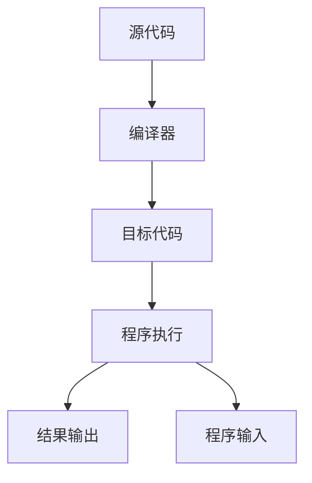
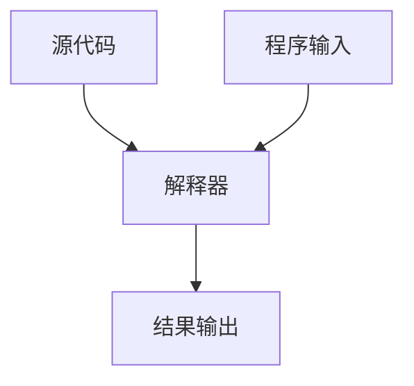
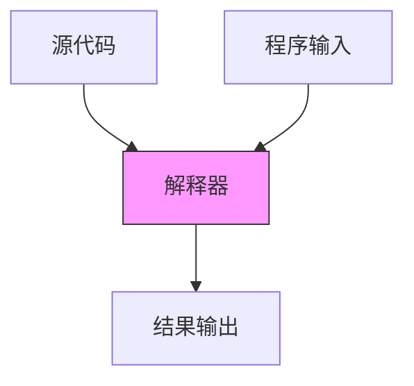
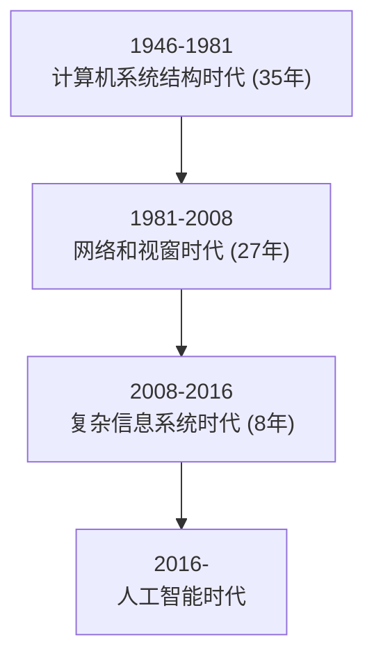

# python turtle tur size turt rtpsen(-4e(4: sesercle(40 for

turtle import turtup(650,350

turtlee.penup250)

turtle.fd(-2own()

e.pendowze(25)purple"

for turtle.circle(-80/2)

turtlecle(40,

turtle. fd(40)(16, 180

turtle.circle(12/3) tu

urtle. fd(40

# 第1章 辅学内容


python

嵩 天

北京理工大学

python

# 前课复习

# 课程之前

# 基本要求


<details>
<summary>natural_image</summary>

Generic male avatar icon with beard and mustache (no text or symbols)
</details>

会使用计算机和Office软件  
阅读简单英文内容、3级及以上水平  
熟练使用Web浏览器  
每周至少1-2个小时，连续9周

# 本课概要

# 第1章 Python基本语法元素


<details>
<summary>natural_image</summary>

Generic male avatar icon with beard and mustache (no text or symbols)
</details>

- 1.1 程序设计基本方法  
- 1.2 Python开发环境配置  
- 1.3 实例1: 温度转换   
- 1.4 Python程序语法元素分析

# 第1章 Python基本语法元素


<details>
<summary>natural_image</summary>

Generic male avatar icon with beard and mustache (no text or symbols)
</details>

# 方法论

\- 程序的基本编写方法：IPO

# 实践能力

\- 看懂10行左右简单Python代码

# 练习与作业

# 第1章 Python基本语法元素

# 练习 (可选)


<details>
<summary>natural_image</summary>

Generic male avatar icon with beard and mustache (no text or symbols)
</details>

5道编程题 @Python123

# 作业

15道单选题 @Python123

# 使用介绍@Python123


<details>
<summary>natural_image</summary>

Abstract geometric line drawing with interconnected nodes and lines (no text or symbols)
</details>


<details>
<summary>natural_image</summary>

Abstract geometric network diagram with interconnected nodes and lines (no text or symbols)
</details>

# 注册学生账号并登陆

# https://python123.io


# thon

ythn?

NEWS!

Python#


# 注册学生账号并登陆

# https://python123.io


<details>
<summary>text_image</summary>

构建更好的 Python 学习体验
还没有装 Python ? 点这里去下载
选择注册账号类型
NEWS! Python 计算
学生
教师
基础入门
网络爬虫
数据分析
机器学习
科学计算
游戏开发
云端系统
</details>

# 绑定中国大学MOOC账号

# https://python123.io


<details>
<summary>text_image</summary>

python
首页 课程 下载
新闻!
Python 计算生态 三月推荐榜 发布
切换到教师端
账号设置
退出登录
新消息
2017 12.25 更多 Python 学习内容将在 2018 年上线，敬请期待
2017 12.25 Turtle 创意绘图活动正进行重新设计，将在不久后上线
推荐课程
import code
def drawSnake( rad, in range( rad, in range( rad, in range( rad, in range( rad, in range( rad, in range( rad, in range( rad, in range( rad, in range( rad, in range( rad, in range( rad, in range( rad, in range( rad, in range( rad, in range( rad, in range( rad, in range( rad, in range( rad, in range( rad, in range( rad, in wide) to the right of the right of the right of the right of the right of the right of the right of the right of the right of the right of the right of the right of the right of the right of the right of the right of the right of the right of the right of the right of the right of the right of the right of the right of the right of the right of the right of the right of the right of the right of the right of the right of the right of the right of
python语言程序设计
2017 09.12 - 2018 12.31 意天 4110
python游戏开发入门
2017 11.07 - 2018 03.31 意天 2929
</details>

# 绑定中国大学MOOC账号

# https://python123.io


<details>
<summary>text_image</summary>

头像
① 教师用户请上传真实头像
上传图片
学校
北京理工大学
学院
专业
职称
中国大学MOOC账号
绑定中国大学 MOOC 帐号
注册时间
更新时间
点击后根据流程完成绑定
保存
</details>

# 选择本课程对应实践课程

# https://python123.io


<details>
<summary>text_image</summary>

python
首页 课程 下载
NEWS! Python 计算生态 三月推荐榜 发布
新消息
2017 12.25 更多 Python 学习内容将在 2018 年上线，敬请期待
2017 12.25 Turtle 创意绘图活动正进行重新设计，将在不久后上线
推荐课程
python
加入该课程
Python游戏开发入门
2017 11.07 - 2018 03:31 晕天 2929
python123demo@126.com
切换到教师端
账号设置
退出登录
意见反馈
关于
</details>

# 欢迎学习Python语言程序设计课程

# 程序设计基本方法


python

嵩 天

北京理工大学

python

# 单元开篇

# 程序设计基本方法


<details>
<summary>natural_image</summary>

Generic male avatar icon with beard and mustache (no text or symbols)
</details>

- 计算机与程序设计  
- 编译和解释   
- 程序的基本编写方法  
- 计算机编程


<details>
<summary>text_image</summary>

计算机与程序设计
</details>

# 计算机的概念

# 计算机是根据指令操作数据的设备

# - 功能性

对数据的操作，表现为数据计算、输出输出处理和结果存储等

# 可编程性

根据一系列指令自动地、可预测地、准确地完成操作者的意图

# 计算机的发展

# 计算机的发展参照摩尔定律，表现为指数方式

计算机硬件所依赖的集成电路规模参照摩尔定律发展  
计算机运行速度因此也接近几何级数快速增长  
计算机高效支撑的各类运算功能不断丰富发展

# 摩尔定律 Moore’s Law

# 计算机发展历史上最重要的预测法则

Intel公司创始人之一戈登·摩尔在1965年提出  
单位面积集成电路上可容纳晶体管的数量约每两年翻一番  
CPU/GPU、内存、硬盘、电子产品价格等都遵循摩尔定律


<details>
<summary>scatter</summary>

集成电路晶体管数量实测 1971-2016
| Year of introduction | Transistor count | Technology |
|---|---|---|
| 1970 | 1,000,000 | Intel 4004 |
| 1972 | 3,000,000 | Intel 8008 |
| 1974 | 5,000,000 | Zilog Z80 |
| 1976 | 8,000,000 | Intel 8080 |
| 1978 | 10,000,000 | Motorola 6809 |
| 1980 | 15,000,000 | MOS Technology |
| 1982 | 25,000,000 | WDC 65C816 |
| 1984 | 50,000,000 | Intel 80286 |
| 1986 | 15,000,000 | ARM 2 |
| 1988 | 35,000,000 | Intel 80386 |
| 1990 | 1,25,000,000 | ARM 3 |
| 1992 | 3,5,000,000 | Intel Pro |
| 1994 | 5,5,000,000 | ARM700 |
| 1996 | 8,5,000,000 | AMD K5 |
| 1998 | 12,5,000,000 | AMD K6 |
| 2000 | 25,5,000,000 | Pentium II Mobile Dixon |
| 2002 | 45,5,000,000 | Pentium III Tualatin |
| 2004 | 75,5,000,000 | Pentium IIS Northwood |
| 2006 | 1.25,000,000 | Core 2 Duo Conroe |
| 2008 | 3.5,000,000 | Core 2 Duo Allendale |
| 2010 | 6.5,000,000 | Core 2 Duo Wolfdale |
| 2012 | 1.25,000,000 | Core 2 Duo Workhead-E |
| 2014 | 3.5,000,000 | Apple A7 (dual-core ARM64 "mobile SoC") |
| 2016 | 7.5,000,000 | IBM z13 (diode) |
| 2017: 约2^22，四百万倍; 实际上: 四百三十五万倍; 
Intel 4D4(1971): 230O; 
ARM Epyc(2017): 19,2oO,oO,oO; 
ARM Cortex-A9: 
ARM Cortex-A9: 
ARM Cortex-A9: 
ARM Cortex-A9: 
ARM Cortex-A9: 
ARM Cortex-A9: 
ARM Cortex-A9: 
ARM Cortex-A9: 
ARM Cortex-A9: 
ARM Cortex-A9: 
ARM Cortex-A9: 
ARM Cortex-A9: 
ARM Cortex-A9: 
ARM Cortex-A9: 
ARM Cortex-A9: 
ARM Cortex-A9: 
ARM Cortex-A9: 
ARM Cortex - AMD Cortex-A9: 
ARM Cortex-A9: 
ARM Cortex-A9: 
ARM Cortex-A9: 
ARM Cortex-A9: 
ARM Cortex-A9: 
ARM Cortex-A9: 
ARM Cortex-A9: 
ARM Cortex-A9: 
ARM Cortex-A9: 
ARM Cortex-A9: 
ARM Cortex-A9: 
ARM Cortex-A9: 
ARM Cortex-A9: 
ARM Cortex-A9: 
ARM Cortex-A9: 
ARM Cortex-A9 : AMD Cortex-A9 : SPARC M7 (2015): 1oOoO,oO,oO,oO; 
SPARC M7 (215): 44A理论上：约2^22，四百万倍; 
SPARC M7 (215): 44A理论上：约2^22，四百万倍; 
SPARC M7 (215): 44A理论上：约2^22，四百万倍; 
SPARC M7 (215): 44A理论上：约2^22，四百万倍; 
SPARC M7 (215): 44A理论上：约2^22，四百万倍; 
SPARC M7 (215):44A理论上：约2^22，四百万倍; 
SPARC M7 (215):44A理论上：约2^22，四百万倍; 
SPARC M7 (215):44A理论上：约2^22，四百万倍; 
SPARC M7 (215):44A理论上：约2^22，四百万倍; 
SPARC M7 (215) : AMD Cortex-A9 : Intel Cortex-A9 : ARM Cortex-A9 : Intel Cortex-A9 : ARM Cortex-A9 : Intel Cortex-A9 : ARM Cortex-A9 : Intel Cortex-A9 : ARM Cortex-A9 : ARM Cortex-A9 : ARM Cortex-A9 : ARM Cortex-A9 : ARM Cortex-A9 : ARM Cortex-A9 : ARM Cortex-A9 : ARM Cortex-A9 : ARM Cortex-A9 : ARM Cortex-A9 : ARM Cortex-A9 : ARM Cortex-A9 : ARM Cortex-A9 : ARM Cortex-A9 : ARM Cortex-A9 : ARM Cortex-A9 : ARM Cortex-A9 : ARM Cortex-A9 : ARM Cortex-A9 : ARM Cortex-A9 : Arm Cortex-A9 : ARM Cortex-A9 : ARM Cortex-A9 : ARM Cortex-A9 : ARM Cortex-A9 : ARM Cortex-A9 : ARM Cortex-A9 : ARM Cortex-A9 : ARM Cortex-A9 : ARM Cortex-A9 : ARM Cortex-A9 : ARM Cortex-A9 : ARM Cortex-A9 : ARM Cortex-A9 : ARM Cortex-A9 : ARM Cortex-A9 : ARM Cortex-A9 : ARM Cortex-A9 : ARM Cortex-A9 : ARM Cortex-A9 : RMX / ARM Xeon NEahalem-EX / Dual-core ITanium 2/3/4/6/7/8/9/1/1/3/4/6/7/8/1/3/4/6/7/8/1/3/4/6/7/8/1/3/4/6/7/8/1/3/4/6/7/8/1/3/4/6/7/8/1/3/4/6/7/8/1/3/4/6/7/8/1/3/4/6/7/8/1/4/6/7/8/1/3/4/6/7/8/1/3/4/6/7/8/1/3/4/6/7/8/1/3/4/6/7/8/1/3/4/6/7/8/1/3/4/6/7/8/1/3/4/6/7/8/1/3/4/8e-<nl>
</details>

# 计算机的发展

# 计算机的发展参照摩尔定律，表现为指数方式

当今世界，唯一长达50年有效且按照指数发展的技术领域  
计算机深刻改变人类社会，甚至可能改变人类本身  
可预见的未来30年，摩尔定律还将持续有效

# 程序设计

# 程序设计是计算机可编程性的体现

程序设计，亦称编程，深度应用计算机的主要手段  
程序设计已经成为当今社会需求量最大的职业技能之一  
很多岗位都将被计算机程序接管，程序设计将是生存技能

# 程序设计语言

# 程序设计语言是一种用于交互(交流)的人造语言

- 程序设计语言，亦称编程语言，程序设计的具体实现方式  
编程语言相比自然语言更简单、更严谨、更精确  
编程语言主要用于人类和计算机之间的交互

# 程序设计语言

# 编程语言种类很多，但生命力强劲的却不多

编程语言有超过600种，绝大部分都不再被使用  
C语言诞生于1972年，它是第一个被广泛使用的编程语言  
Python语言诞生于1990年，它是最流行最好用的编程语言

# 编译和解释


<details>
<summary>natural_image</summary>

Abstract geometric network diagram with interconnected nodes and lines (no text or symbols)
</details>


<details>
<summary>natural_image</summary>

Abstract geometric network diagram with interconnected nodes and lines (no text or symbols)
</details>

# 编程语言的执行方式

# 计算机执行源程序的两种方式：编译和解释

- 源代码：采用某种编程语言编写的计算机程序，人类可读   
例如：result = 2 + 3

目标代码：计算机可直接执行，人类不可读 (专家除外)

例如：11010010 00111011

# 编译

将源代码一次性转换成目标代码的过程  


<details>
<summary>flowchart</summary>


</details>

执行编译过程的程序叫作编译器

# 解释

# 将源代码逐条转换成目标代码同时逐条运行的过程


<details>
<summary>flowchart</summary>


</details>

执行解释过程的程序叫作解释器

# 编译和解释


<details>
<summary>flowchart</summary>


</details>


<details>
<summary>flowchart</summary>


</details>

编译：一次性翻译，之后不再需要源代码（类似英文翻译）  
解释：每次程序运行时随翻译随执行（类似实时的同声传译）

# 静态语言和脚本语言

# 根据执行方式不同，编程语言分为两类

静态语言：使用编译执行的编程语言

C/C++语言、Java语言

脚本语言：使用解释执行的编程语言

Python语言、JavaScript语言、PHP语言

# 静态语言和脚本语言

# 执行方式不同，优势各有不同

静态语言：编译器一次性生成目标代码，优化更充分程序运行速度更快  
脚本语言：执行程序时需要源代码，维护更灵活源代码在维护灵活、跨多个操作系统平台

# 程序的基本编写方法


<details>
<summary>natural_image</summary>

Abstract geometric line drawing with interconnected nodes and lines (no text or symbols)
</details>


<details>
<summary>natural_image</summary>

Abstract geometric network diagram with interconnected nodes and lines (no text or symbols)
</details>

# IPO

# 程序的基本编写方法

I：Input 输入，程序的输入  
P：Process 处理，程序的主要逻辑  
O：Output 输出，程序的输出

# 理解IPO

# 输入

程序的输入

文件输入、网络输入、控制台输入、交互界面输入、内部参数输入等

输入是一个程序的开始

# 理解IPO

# 输出

# 程序的输出

控制台输出、图形输出、文件输出、网络输出、操作系统内部变量输出等

# 输出是程序展示运算结果的方式

# 理解IPO

# 处理

处理是程序对输入数据进行计算产生输出结果的过程  
处理方法统称为算法，它是程序最重要的部分  
算法是一个程序的灵魂

# 问题的计算部分

一个待解决问题中，可以用程序辅助完成的部分

计算机只能解决计算问题，即问题的计算部分  
一个问题可能有多种角度理解，产生不同的计算部分  
问题的计算部分一般都有输入、处理和输出过程

# 编程解决问题的步骤

# 6个步骤 (1-3)

分析问题：分析问题的计算部分，想清楚  
划分边界：划分问题的功能边界，规划IPO  
设计算法：设计问题的求解算法，关注算法

# 使用计算机解决问题

# 6个步骤 (4-6)

编写程序：编写问题的计算程序，编程序  
调试测试：调试程序使正确运行，运行调试  
升级维护：适应问题的升级维护，更新完善

# 求解计算问题的精简步骤

# 3个精简步骤

确定IPO：明确计算部分及功能边界  
编写程序：将计算求解的设计变成现实  
调试程序：确保程序按照正确逻辑能够正确运行

# 计算机编程

Q：为什么要学习计算机编程？

A：因为“编程是件很有趣的事儿”!

# 计算机编程

# 编程能够训练思维

编程体现了一种抽象交互关系、自动化执行的思维模式  
计算思维：区别逻辑思维和实证思维的第三种思维模式  
能够促进人类思考，增进观察力和深化对交互关系的理解

# 计算机编程

# 编程能够增进认识

编程不单纯是求解计算问题  
不仅要思考解决方法，还要思考用户体验、执行效率等  
能够帮助程序员加深用户行为以及社会和文化认识

# 计算机编程

# 编程能够带来乐趣

编程能够提供展示自身思想和能力的舞台  
让世界增加新的颜色、让自己变得更酷、提升心理满足感  
在信息空间里思考创新、将创新变为现实

# 计算机编程

# 编程能够提高效率

能够更好地利用计算机解决问题  
显著提高工作、生活和学习效率  
为个人理想实现提供一种借助计算机的高效手段

# 计算机编程

# 编程带来就业机会

程序员是信息时代最重要的工作岗位之一  
国内外对程序员岗位的缺口都在百万以上规模  
计算机已经渗透于各个行业， 就业前景非常广阔

# 学习编程的误区

Q：编程很难学吗？ A：掌握方法就很容易！

首先，掌握编程语言的语法，熟悉基本概念和逻辑  
其次，结合计算问题思考程序结构，会使用编程套路  
最后，参照案例多练习多实践，学会举一反三次

# 编程辣么好，还等什么？开始学习吧！

# 单元小结

# 程序设计基本方法

计算机的功能性和可编程性  
编译和解释、静态语言和脚本语言  
- IPO、理解问题的计算部分  
掌握计算机编程的价值

# Python语言程序设计

# Python开发环境配置


python

嵩 天

北京理工大学

pythom

# 单元开篇

# Python开发环境配置


<details>
<summary>natural_image</summary>

Generic male avatar icon with beard and mustache (no text or symbols)
</details>

Python语言概述  
Python语言Windows系统开发环境  
Python语言Mac系统开发环境  
Python语言Linux系统开发环境  
Python语言Web开发环境  
Python程序编写与运行

# 三选一

# Python语言概述


<details>
<summary>natural_image</summary>

Abstract geometric network diagram with interconnected nodes and lines (no text or symbols)
</details>


<details>
<summary>text_image</summary>

python
</details>

Python [\`paiθən]，译为“蟒蛇”

Python语言拥有者是Python Software Foundation(PSF)

PSF是非盈利组织，致力于保护Python语言开放、开源和发展

# Python语言的诞生

Guido van Rossum

Python语言创立者

2002年，Python 2.x

2008年，Python 3.x


<details>
<summary>text_image</summary>

YOU
NEED
PYTHON
P
</details>


<details>
<summary>natural_image</summary>

Portrait of a person with curly hair and glasses, outdoors near a tree (no text or symbols visible)
</details>


<details>
<summary>text_image</summary>

AS SEEN ON
ad
</details>


<details>
<summary>natural_image</summary>

Black-and-white photo of a group of smiling men in formal and casual attire, including a chef's hat and bow tie (no text or symbols visible)
</details>

Monty Python组合


<details>
<summary>text_image</summary>

MONTY
PYTHON'S
FLYING CIRCUS
It's ...
SPAM
</details>


<details>
<summary>text_image</summary>

python
</details>

Python语言是一个由编程牛人领导设计并开发的编程语言

Python语言是一个有开放、开源精神的编程语言

Python语言应用于火星探测、搜索引擎、引力波分析等众多领域

# Python语言Windows系统开发环境


<details>
<summary>natural_image</summary>

Abstract geometric line drawing with interconnected nodes and lines (no text or symbols)
</details>


<details>
<summary>natural_image</summary>

Abstract geometric network diagram with interconnected nodes and lines (no text or symbols)
</details>

# 这部分要看视频哦！

# Python语言Mac系统开发环境


<details>
<summary>natural_image</summary>

Abstract geometric line drawing with interconnected nodes and lines (no text or symbols)
</details>


<details>
<summary>natural_image</summary>

Abstract geometric network diagram with interconnected nodes and lines (no text or symbols)
</details>

# 这部分要看视频哦！

# Python语言Linux系统开发环境


<details>
<summary>natural_image</summary>

Abstract geometric line drawing with interconnected nodes and lines (no text or symbols)
</details>


<details>
<summary>natural_image</summary>

Abstract geometric network diagram with interconnected nodes and lines (no text or symbols)
</details>

# 这部分要看视频哦！

# Python语言Web开发环境


<details>
<summary>natural_image</summary>

Abstract geometric line drawing with interconnected nodes and lines (no text or symbols)
</details>


<details>
<summary>natural_image</summary>

Abstract geometric network diagram with interconnected nodes and lines (no text or symbols)
</details>

# 关注PYTHON123, 这部分要看视频哦！

# Python程序编写与运行


<details>
<summary>natural_image</summary>

Abstract geometric line drawing with interconnected nodes and lines (no text or symbols)
</details>


<details>
<summary>natural_image</summary>

Abstract geometric network diagram with interconnected nodes and lines (no text or symbols)
</details>

# Python的两种编程方式

# 交互式和文件式

交互式：对每个输入语句即时运行结果，适合语法练习  
文件式：批量执行一组语句并运行结果，编程的主要方式

# 实例1: 圆面积的计算

# 根据半径r计算圆面积

```txt
>>> r = 25
>>> area = 3.1415 * r * r
>>> print(area)
1963.4375000000002
>>> print(" {:.2f}F".format(area))
1963.44 
```

# 实例1: 圆面积的计算

# 根据半径r计算圆面积

$$
r = 2 5
$$

$$
\text { area } = 3. 1 4 1 5 * r * r
$$

$$
\operatorname{print} (\text {area})
$$

$$
\text { print } (" \{:. 2 f \} F". \text { format(area) })
$$

输出结果如下：

1963.4375000000002

1963.44

# 实例2: 同切圆绘制

# 绘制多个同切圆

import turtle

turtle.pensize(2)

turtle.circle(10)

turtle.circle(40)

turtle.circle(80)

turtle.circle(160)


<details>
<summary>natural_image</summary>

Simple concentric circle diagram with a small arrow at the center (no text or symbols)
</details>

# 实例2: 同切圆绘制

# 绘制多个同切圆

>>> import turtle  
>>> turtle.pensize(2)  
>>> turtle.circle(10)   
>>> turtle.circle(40)   
>>> turtle.circle(80)   
>>> turtle.circle(160)


<details>
<summary>natural_image</summary>

Simple concentric circle diagram with a small arrow at the bottom center (no text or symbols)
</details>

# 实例3: 五角星绘制

# 绘制一个五角星

>>> from turtle import \*

>>> color('red', 'red')

>>> begin\_fill()

>>> for i in range(5):

fd(200)

rt(144)

>>> end\_fill()

>>>


<details>
<summary>natural_image</summary>

Red five-pointed star shape with black outline and diagonal lines (no text or symbols)
</details>

# 实例3: 五角星绘制

# 绘制一个五角星

```python
from turtle import *
color('red', 'red')
begin_fill()
for i in range(5):
    fd(200)
    rt(144)
end_fill()
done() 
```


<details>
<summary>natural_image</summary>

Red five-pointed star shape with black outline, no text or symbols present
</details>

# 单元小结

# Python开发环境配置

Python语言的发展历史  
选取一种系统平台构建Python开发环境  
尝试编写与运行3个Python小程序

# Python语言程序设计

# 实例1: 温度转换


python

嵩 天

北京理工大学

python


<details>
<summary>text_image</summary>

"温度转换"问题分析
</details>

# 温度转换

# 温度刻画的两种不同体系

摄氏度：中国等世界大多数国家使用

以1标准大气压下水的结冰点为0度，沸点为100度，将温度进行等分刻画

华氏度：美国、英国等国家使用

以1标准大气压下水的结冰点为32度，沸点为212度，将温度进行等分刻画

# 需求分析

# 两种温度体系的转换

摄氏度转换为华氏度  
华氏度转换为摄氏度

# 问题分析

# 该问题中计算部分的理解和确定

理解1：直接将温度值进行转换  
理解2：将温度信息发布的声音或图像形式进行理解和转换  
理解3：监控温度信息发布渠道，实时获取并转换温度值

# 问题分析

# 分析问题

# 采用 理解1：直接将温度值进行转换

温度数值需要标明温度体系，即摄氏度或华氏度

转换后也需要给出温度体系

# 问题分析

# 划分边界

输入：带华氏或摄氏标志的温度值   
处理：根据温度标志选择适当的温度转换算法  
- 输出：带摄氏或华氏标志的温度值

# 问题分析

# 输入输出格式设计

标识放在温度最后，F表示华氏度，C表示摄氏度

82F表示华氏82度，28C表示摄氏28度

# 问题分析

# 设计算法

根据华氏和摄氏温度定义，利用转换公式如下：

$$
\mathbf {C} = (\mathbf {F} - \mathbf {3 2}) / \mathbf {1 . 8}
$$

$$
\mathbf {F} = \mathbf {C} ^ {*} \mathbf {1 . 8} + \mathbf {3 2}
$$

其中， C表示摄氏温度， F表示华氏温度

# 问题分析清楚，可以开始编程啦！


<details>
<summary>text_image</summary>

"温度转换"实例编写
</details>

#TempConvert.py

TempStr = input("请输入带有符号的温度值: ")

if TempStr[-1] in ['F', 'f']:

C = (eval(TempStr[0:-1]) - 32)/1.8

print("转换后的温度是{:.2f}C".format(C))

elif TempStr[-1] in ['C', 'c']:

F = 1.8\*eval(TempStr[0:-1]) + 32

print("转换后的温度是{:.2f}F".format(F))

else:

print("输入格式错误")

编写上述代码，并保存为TempConvert.py文件

# 运行效果

# IDLE打开文件，按F5运行

>>>

82 2778

>>>

>>>

28 82.40F

>>>

# 准备好电脑，与老师一起编码吧！


<details>
<summary>text_image</summary>

"温度转换"举一反三
</details>

# #TempConvert.py

TempStr = input("请输入带有符号的温度值: ")

if TempStr[-1] in ['F', 'f']:

$$
C = (\text { eval } (\text { TempStr } [ 0: - 1 ]) - 3 2) / 1. 8
$$

print("转换后的温度是{:.2f}C".format(C))

elif TempStr[-1] in ['C', 'c']:

$$
F = 1. 8 ^ {*} \text {eval} (\text {TempStr} [ 0: - 1 ]) + 3 2
$$

print("转换后的温度是{:.2f}F".format(F))

else:

print("输入格式错误")

# 举一反三

# Python语法元素理解

- 温度转换程序共10行代码，但包含很多语法元素  
清楚理解这10行代码能够快速入门Python语言  
参考框架结构、逐行分析、逐词理解

# 举一反三

# 输入输出的改变

温度数值与温度标识之间关系的设计可以改变  
标识改变放在温度数值之前：C82, F28  
标识字符改变为多个字符：82Ce、28Fa

# 举一反三

# 计算问题的扩展

温度转换问题是各类转换问题的代表性问题  
货币转换、长度转换、重量转换、面积转换…  
- 问题不同，但程序代码相似

# Python程序语法元素分析


python

嵩 天

北京理工大学

python

# 单元开篇

# Python程序语法元素分析


<details>
<summary>natural_image</summary>

Generic male avatar icon with beard and mustache (no text or symbols)
</details>

程序的格式框架  
命名与保留字  
数据类型  
语句与函数  
Python程序的输入输出  
温度转换"代码分析

# 程序的格式框架


<details>
<summary>natural_image</summary>

Abstract geometric network diagram with interconnected nodes and lines (no text or symbols)
</details>

```python
#TempConvert.py
TempStr = input("请输入带有符号的温度值：")
if TempStr[-1] in ['F', 'f']:
    C = (eval(TempStr[0:-1]) - 32)/1.8
    print("转换后的温度是{:.2f}C".format(C))
elif TempStr[-1] in ['C', 'c']:
    F = 1.8*eval(TempStr[0:-1]) + 32
    print("转换后的温度是{:.2f}F".format(F))
else:
    print("输入格式错误") 
```

代码高亮：编程的色彩辅助体系，不是语法要求

```python
#TempConvert.py
TempStr = input("请输入带有符号的温度值：")
if TempStr[-1] in ['F', 'f']:
    C = (eval(TempStr[0:-1]) - 32)/1.8
    print("转换后的温度是{:.2f}C".format(C))
elif TempStr[-1] in ['C', 'c']:
    F = 1.8*eval(TempStr[0:-1]) + 32
    print("转换后的温度是{:.2f}F".format(F))
else:
    print("输入格式错误") 
```

缩进：一行代码开始前的空白区域，表达程序的格式框架

#TempConvert.py   
TempStr = input("请输入带有符号的温度值: ")   
if TempStr[-1] in ['F', 'f']:   
  
C = (eval(TempStr[0:-1]) - 32)/1.8   
print("转换后的温度是{:.2f}C".format(C))

elif TempStr[-1] in ['C', 'c']:   
  
F = 1.8\*eval(TempStr[0:-1]) + 32   
print("转换后的温度是{:.2f}F".format(F))

else:   
  
print("输入格式错误")

DARTS = 1000   
hits = 0.0   
clock()   
for i in range(1, DARTS):   
  
x, y = random(), random()   
dist = sqrt(x\*\*2 + y\*\*2)

if dist <= 1.0:   
  
hits = hits + 1   
pi = 4 \* (hits/DARTS)   
print("Pi的值是 {:.2f}F".format(pi))

# 单层缩进

# 多层缩进

# 缩进

# 缩进表达程序的格式框架

严格明确：缩进是语法的一部分，缩进不正确程序运行错误  
所属关系：表达代码间包含和层次关系的唯一手段  
长度一致：程序内一致即可，一般用4个空格或1个TAB

#TempConvert.py   
```python
TempStr = input("请输入带有符号的温度值: ")
if TempStr[-1] in ['F', 'f']:
    C = (eval(TempStr[0:-1]) - 32)/1.8
    print("转换后的温度是{:.2f}C".format(C))
elif TempStr[-1] in ['C', 'c']:
    F = 1.8*eval(TempStr[0:-1]) + 32
    print("转换后的温度是{:.2f}F".format(F))
else:
    print("输入格式错误") 
```

注释：用于提高代码可读性的辅助性文字，不被执行

# 注释

# 不被程序执行的辅助性说明信息

单行注释：以#开头，其后内容为注释

\# 这里是单行注释

多行注释：以'''开头和结尾

这是多行注释第一行

这是多行注释第二行

#TempConvert.py   
TempStr = input("请输入带有符号的温度值: ")   
if TempStr[-1] in ['F', 'f']:   
```txt
C = (eval(TempStr[0:-1]) - 32)/1.8
print("转换后的温度是{:.2f}C".format(C)) 
```  
elif TempStr[-1] in ['C', 'c']:

```txt
F = 1.8*eval(TempStr[0:-1]) + 32
print("转换后的温度是{:.2f}F".format(F)) 
```

else:   
```lua
print("输入格式错误")
```

# 缩进 注释

# 命名与保留字


<details>
<summary>natural_image</summary>

Abstract geometric network diagram with interconnected nodes and lines (no text or symbols)
</details>

```python
#TempConvert.py
TempStr = input("请输入带有符号的温度值：")
if TempStr[-1] in ['F', 'f']:
    C = (eval(TempStr[0:-1]) - 32)/1.8
    print("转换后的温度是{:.2f}C".format(C))
elif TempStr[-1] in ['C', 'c']:
    F = 1.8*eval(TempStr[0:-1]) + 32
    print("转换后的温度是{:.2f}F".format(F))
else:
    print("输入格式错误") 
```

变量：程序中用于保存和表示数据的占位符号

# 变量

# 用来保存和表示数据的占位符号

变量采用标识符(名字) 来表示，关联标识符的过程叫命名  
TempStr是变量名字

可以使用等号(=)向变量赋值或修改值，=被称为赋值符号

TempStr = "82F" #向变量TempStr赋值"82F"

# 命名

# 关联标识符的过程

命名规则: 大小写字母、数字、下划线和汉字等字符及组合

如: TempStr, Python\_Great, 这是门Python好课

注意事项: 大小写敏感、首字符不能是数字、不与保留字相同

Python和python是不同变量，123Python是不合法的

# 保留字

# 被编程语言内部定义并保留使用的标识符

Python语言有33个保留字(也叫关键字)

if, elif, else, in

保留字是编程语言的基本单词，大小写敏感

if 是保留字，If 是变量

# 保留字

<table><tr><td>and</td><td>elif</td><td>import</td><td>raise</td><td>global</td></tr><tr><td>as</td><td>else</td><td>in</td><td>return</td><td>nonlocal</td></tr><tr><td>assert</td><td>except</td><td>is</td><td>try</td><td>True</td></tr><tr><td>break</td><td>finally</td><td>lambda</td><td>while</td><td>False</td></tr><tr><td>class</td><td>for</td><td>not</td><td>with</td><td>None</td></tr><tr><td>continue</td><td>from</td><td>or</td><td>yield</td><td></td></tr><tr><td>def</td><td>if</td><td>pass</td><td>del</td><td></td></tr></table>

(26/33)

```python
#TempConvert.py
TempStr = input("请输入带有符号的温度值：")
if TempStr[-1] in ['F', 'f']:
    C = (eval(TempStr[0:-1]) - 32)/1.8
    print("转换后的温度是{:.2f}C".format(C))
elif TempStr[-1] in ['C', 'c']:
    F = 1.8*eval(TempStr[0:-1]) + 32
    print("转换后的温度是{:.2f}F".format(F))
else:
    print("输入格式错误") 
```

# 变量 命名 保留字

# 数据类型


<details>
<summary>natural_image</summary>

Abstract geometric network diagram with interconnected nodes and lines (no text or symbols)
</details>

```python
#TempConvert.py
TempStr = input("请输入带有符号的温度值：")
if TempStr[-1] in ['F', 'f']:
    C = (eval(TempStr[0:-1]) - 32)/1.8
    print("转换后的温度是{:.2f}C".format(C))
elif TempStr[-1] in ['C', 'c']:
    F = 1.8*eval(TempStr[0:-1]) + 32
    print("转换后的温度是{:.2f}F".format(F))
else:
    print("输入格式错误") 
```

数据类型：字符串、整数、浮点数、列表

# 数据类型

10,011,101 该如何解释呢？

这是一个二进制数字 或者 十进制数字

作为二进制数字，10,011,101的值是十进制157

这是一段文本 或者 用逗号,分隔的3个数字

作为一段文本，逗号是文本中的一部分，一共包含10个字符

# 数据类型

# 供计算机程序理解的数据形式

- 程序设计语言不允许存在语法歧义，需要定义数据的形式需要给10,011,101关联一种计算机可以理解的形式  
程序设计语言通过一定方式向计算机表达数据的形式

"123"表示文本字符串123，123则表示数字123

# 数据类型

10,011,101

整数类型： 10011101  
字符串类型： "10,011,101"   
列表类型： [10, 011, 101]

```python
#TempConvert.py
TempStr = input("请输入带有符号的温度值：")
if TempStr[-1] in ['F', 'f']:
    C = (eval(TempStr[0:-1]) - 32)/1.8
    print("转换后的温度是{:.2f}C".format(C))
elif TempStr[-1] in ['C', 'c']:
    F = 1.8*eval(TempStr[0:-1]) + 32
    print("转换后的温度是{:.2f}F".format(F))
else:
    print("输入格式错误") 
```

字符串：由0个或多个字符组成的有序字符序列

# 字符串

# 由0个或多个字符组成的有序字符序列

字符串由一对单引号或一对双引号表示

"请输入带有符号的温度值: "或者

字符串是字符的有序序列，可以对其中的字符进行索引

"请" 是 "请输入带有符号的温度值: " 的第0个字符

# 字符串的序号

# 正向递增序号 和 反向递减序号

反向递减序号

$$
- 1 2 - 1 1 - 1 0 - 9 - 8 - 7 - 6 - 5 - 4 - 3 - 2 - 1
$$

<table><tr><td>请</td><td>输</td><td>入</td><td>带</td><td>有</td><td>符</td><td>号</td><td>的</td><td>温</td><td>度</td><td>值</td><td>:</td></tr></table>


<details>
<summary>text_image</summary>

0 1 2 3 4 5 6 7 8 9 10 11
</details>

正向递增序号

# 字符串的使用

# 使用[ ]获取字符串中一个或多个字符

\- 索引：返回字符串中单个字符 <字符串>[M]

"请输入带有符号的温度值: "[0] 或者 TempStr[-1]

切片：返回字符串中一段字符子串 <字符串>[M: N]

"请输入带有符号的温度值: "[1:3] 或者 TempStr[0:-1]

```python
#TempConvert.py
TempStr = input("请输入带有符号的温度值: ")
if TempStr[-1] in ['F', 'f']:
    C = (eval(TempStr[0:-1]) - 32)/1.8
    print("转换后的温度是{:.2f}C".format(C))
elif TempStr[-1] in ['C', 'c']:
    F = 1.8*eval(TempStr[0:-1]) + 32
    print("转换后的温度是{:.2f}F".format(F))
else:
    print("输入格式错误") 
```

# 数字类型：整数和浮点数

# 数字类型

# 整数和浮点数都是数字类型

整数：数学中的整数

32 或者 -89

浮点数：数学中的实数，带有小数部分

1.8 或者 -1.8 或者 -1.0

```python
#TempConvert.py
TempStr = input("请输入带有符号的温度值：")
if TempStr[-1] in ['F', 'f']:
    C = (eval(TempStr[0:-1]) - 32)/1.8
    print("转换后的温度是{:.2f}C".format(C))
elif TempStr[-1] in ['C', 'c']:
    F = 1.8*eval(TempStr[0:-1]) + 32
    print("转换后的温度是{:.2f}F".format(F))
else:
    print("输入格式错误") 
```

列表类型：由0个或多个数据组成的有序序列

# 列表类型

# 由0个或多个数据组成的有序序列

列表使用[ ]表示，采用逗号(,)分隔各元素

['F','f']表示两个元素'F'和'f'

使用保留字 in 判断一个元素是否在列表中

TempStr[-1] in ['C','c']判断前者是否与列表中某个元素相同

```python
#TempConvert.py
TempStr = input("请输入带有符号的温度值：")
if TempStr[-1] in ['F', 'f']:
    C = (eval(TempStr[0:-1]) - 32)/1.8
    print("转换后的温度是{:.2f}C".format(C))
elif TempStr[-1] in ['C', 'c']:
    F = 1.8*eval(TempStr[0:-1]) + 32
    print("转换后的温度是{:.2f}F".format(F))
else:
    print("输入格式错误") 
```

# 字符串 整数 浮点数 列表

# 语句与函数

#TempConvert.py   
```txt
TempStr = input("请输入带有符号的温度值:") 
```  
if TempStr[-1] in ['F', 'f']:

```javascript
C = (eval(TempStr[0:-1]) - 32)/1.8 
```

print("转换后的温度是{:.2f}C".format(C)) elif TempStr[-1] in ['C', 'c']:

```txt
F = 1.8*eval(TempStr[0:-1]) + 32 
```

print("转换后的温度是{:.2f}F".format(F)) else:

print("输入格式错误")

# 赋值语句：由赋值符号构成的一行代码

# 赋值语句

# 由赋值符号构成的一行代码

赋值语句用来给变量赋予新的数据值

$$
C = (\text { eval } (\text { TempStr } [ 0: - 1 ]) - 3 2) / 1. 8 \# \text { 右侧运算结果赋给变量 } C
$$

赋值语句右侧的数据类型同时作用于变量

$$
\text { TempStr } = \text { input(  )   \#input()返回一个字符串，TempStr也是字符串 }
$$

```python
#TempConvert.py
TempStr = input("请输入带有符号的温度值：")
if TempStr[-1] in ['F', 'f']:
    C = (eval(TempStr[0:-1]) - 32)/1.8
    print("转换后的温度是{:.2f}C".format(C))
elif TempStr[-1] in ['C', 'c']:
    F = 1.8*eval(TempStr[0:-1]) + 32
    print("转换后的温度是{:.2f}F".format(F))
else:
    print("输入格式错误") 
```

分支语句：由判断条件决定程序运行方向的语句

# 分支语句

# 由判断条件决定程序运行方向的语句

使用保留字if elif else构成条件判断的分支结构

if TempStr[-1] in ['F','f']:#如果条件为True则执行冒号后语句

\- 每个保留字所在行最后存在一个冒号(:)，语法的一部分

冒号及后续缩进用来表示后续语句与条件的所属关系

```python
#TempConvert.py
TempStr = input("请输入带有符号的温度值：")
if TempStr[-1] in ['F', 'f']:
    C = (eval(TempStr[0:-1]) - 32)/1.8
    print("转换后的温度是{:.2f}C".format(C))
elif TempStr[-1] in ['C', 'c']:
    F = 1.8*eval(TempStr[0:-1]) + 32
    print("转换后的温度是{:.2f}F".format(F))
else:
    print("输入格式错误") 
```

函数：根据输入参数产生不同输出的功能过程

# 函数

# 根据输入参数产生不同输出的功能过程

类似数学中的函数， $\boldsymbol { \mathsf { y } } = \boldsymbol { \mathsf { f } } ( \boldsymbol { \mathsf { x } } )$

print("输入格式错误") #打印输出 "输入格式错误"

函数采用 <函数名>(<参数>) 方式使用

eval(TempStr[0:-1]) # TempStr[0:-1]是参数

#TempConvert.py   
TempStr = input("请输入带有符号的温度值：")
if TempStr[-1] in ['F', 'f']:
    C = (eval(TempStr[0:-1]) - 32)/1.8
    print("转换后的温度是{:.2f}C".format(C))
elif TempStr[-1] in ['C', 'c']:
    F = 1.8*eval(TempStr[0:-1]) + 32
    print("转换后的温度是{:.2f}F".format(F))
else:
    print("输入格式错误")

# 赋值语句 分支语句 函数

# Python程序的输入输出


<details>
<summary>natural_image</summary>

Abstract geometric line drawing with interconnected nodes and lines (no text or symbols)
</details>


<details>
<summary>natural_image</summary>

Abstract geometric network diagram with interconnected nodes and lines (no text or symbols)
</details>

#TempConvert.py   
TempStr = input("请输入带有符号的温度值: ")   
```python
if TempStr[-1] in ['F', 'f']:
    C = (eval(TempStr[0:-1]) - 32)/1.8
    print("转换后的温度是{:.2f}C".format(C))
elif TempStr[-1] in ['C', 'c']:
    F = 1.8*eval(TempStr[0:-1]) + 32
    print("转换后的温度是{:.2f}F".format(F))
else:
    print("输入格式错误") 
```

input()：从控制台获得用户输入的函数

# 输入函数 input()

# 从控制台获得用户输入的函数

input()函数的使用格式：

<变量> = input(<提示信息字符串>)

用户输入的信息以字符串类型保存在<变量>中

TempStr = input(“请输入”) # TempStr保存用户输入的信息

```python
#TempConvert.py
TempStr = input("请输入带有符号的温度值：")
if TempStr[-1] in ['F', 'f']:
    C = (eval(TempStr[0:-1]) - 32)/1.8
    print("转换后的温度是{:.2f}C".format(C))
elif TempStr[-1] in ['C', 'c']:
    F = 1.8*eval(TempStr[0:-1]) + 32
    print("转换后的温度是{:.2f}F".format(F))
else:
    print("输入格式错误") 
```

print()：以字符形式向控制台输出结果的函数

# 输出函数 print()

# 以字符形式向控制台输出结果的函数

print()函数的基本使用格式：

print(<拟输出字符串或字符串变量>)

字符串类型的一对引号仅在程序内部使用，输出无引号

print("输入格式错误") # 向控制台输出 输入格式错误

# 输出函数 print()

# 以字符形式向控制台输出结果的函数

# print()函数的格式化：

print("转换后的温度是{:.2f}C".format(C))


<details>
<summary>natural_image</summary>

Simple geometric line drawing with a horizontal and vertical line intersecting at an angle (no text or symbols)
</details>

{ }表示槽，后续变量填充到槽中

{ :.2f }表示将变量C填充到这个位置时取小数点后2位

# 输出函数 print()

# 以字符形式向控制台输出结果的函数

print("转换后的温度是{:.2f}C".format(C))

如果C的值是 123.456789，则输出结果为：

转换后的温度是123.45C

```python
#TempConvert.py
TempStr = input("请输入带有符号的温度值：")
if TempStr[-1] in ['F', 'f']:
    C = (eval(TempStr[0:-1]) - 32)/1.8
    print("转换后的温度是{:.2f}C".format(C))
elif TempStr[-1] in ['C', 'c']:
    F = 1.8*eval(TempStr[0:-1]) + 32
    print("转换后的温度是{:.2f}F".format(F))
else:
    print("输入格式错误") 
```

eval()：去掉参数最外侧引号并执行余下语句的函数

# 评估函数 eval()

# 去掉参数最外侧引号并执行余下语句的函数

# eval()函数的基本使用格式：

# eval(<字符串或字符串变量>)

```python
>>> eval("1")    >>> eval('1+2')
1    '1+2'
>>> eval("1+2")    >>> eval('print("Hello")')
3    Hello 
```

# 评估函数 eval()

# 去掉参数最外侧引号并执行余下语句的函数

eval(TempStr[0:-1])

如果 $\mathsf { T e m p s t r } [ \theta : - 1$ ]值是" $" 1 2 . 3 "$ ，输出是:

12.3

#TempConvert.py   
TempStr = input("请输入带有符号的温度值: ")   
```python
if TempStr[-1] in ['F', 'f']: 
```

```javascript
C = (eval(TempStr[0:-1]) - 32)/1.8 
```

```lua
print("转换后的温度是{:.2f}C".format(C)) 
```

```txt
elif TempStr[-1] in ['C', 'c']: 
```

```txt
F = 1.8*eval(TempStr[0:-1]) + 32 
```

```lua
print("转换后的温度是{:.2f}F".format(F)) 
```

```txt
else: 
```

```lua
print("输入格式错误")
```


<details>
<summary>text_image</summary>

"温度转换"代码分析
</details>

#TempConvert.py

TempStr = input("请输入带有符号的温度值: ")

if TempStr[-1] in ['F', 'f']:

C = (eval(TempStr[0:-1]) - 32)/1.8

print("转换后的温度是{:.2f}C".format(C))

elif TempStr[-1] in ['C', 'c']:

F = 1.8\*eval(TempStr[0:-1]) + 32

print("转换后的温度是{:.2f}F".format(F))

else:

print("输入格式错误")

# “温度转换”实例代码逐行分析

# 单元小结

# Python程序语法元素分析

- 缩进、注释、命名、变量、保留字   
数据类型、字符串、 整数、浮点数、列表  
- 赋值语句、分支语句、 函数  
input()、print()、eval()、 print()格式化

# 第2章 辅学内容


python

嵩 天

北京理工大学

pythom

# 前课复习

# Python基本语法元素

- 缩进、注释、命名、变量、保留字   
数据类型、字符串、 整数、浮点数、列表  
- 赋值语句、分支语句、 函数  
input()、print()、eval()、 print()格式化

<table><tr><td>and</td><td>elif</td><td>import</td><td>raise</td><td>global</td></tr><tr><td>as</td><td>else</td><td>in</td><td>return</td><td>nonlocal</td></tr><tr><td>assert</td><td>except</td><td>is</td><td>try</td><td>True</td></tr><tr><td>break</td><td>finally</td><td>lambda</td><td>while</td><td>False</td></tr><tr><td>class</td><td>for</td><td>not</td><td>with</td><td>None</td></tr><tr><td>continue</td><td>from</td><td>or</td><td>yield</td><td></td></tr><tr><td>def</td><td>if</td><td>pass</td><td>del</td><td></td></tr></table>

```python
#TempConvert.py
TempStr = input("请输入带有符号的温度值：")
if TempStr[-1] in ['F', 'f']:
    C = (eval(TempStr[0:-1]) - 32)/1.8
    print("转换后的温度是{:.2f}C".format(C))
elif TempStr[-1] in ['C', 'c']:
    F = 1.8*eval(TempStr[0:-1]) + 32
    print("转换后的温度是{:.2f}F".format(F))
else:
    print("输入格式错误") 
```

# 温度转换


<details>
<summary>natural_image</summary>

Silhouette of a person riding a bicycle with wheels, no text or symbols present
</details>

# 本课概要

# 第2章 Python基本图形绘制


<details>
<summary>natural_image</summary>

Generic male avatar icon with beard and mustache (no text or symbols)
</details>

- 2.1 深入理解Python语言  
- 2.2 实例2: Python蟒蛇绘制  
- 2.3 模块1: turtle库的使用  
- 2.4 turtle程序语法元素分析


<details>
<summary>natural_image</summary>

Silhouette of a person riding a bicycle with wheels and a blue lane (no text or symbols)
</details>

# 第2章 Python基本图形绘制


<details>
<summary>natural_image</summary>

Generic male avatar icon with beard and mustache (no text or symbols)
</details>

# 方法论

Python语言及海龟绘图体系

# 实践能力

\- 初步学会使用Python绘制简单图形


<details>
<summary>natural_image</summary>

Silhouette of a person riding a bicycle with wheels and a blue lane (no text or symbols)
</details>

# 练习与作业

# 第2章 Python基本图形绘制

# 练习 (可选)


<details>
<summary>natural_image</summary>

Generic male avatar icon with beard and mustache (no text or symbols)
</details>

5道编程题 @Python123

# 作业

\- 15道单选题 @Python123


<details>
<summary>natural_image</summary>

Silhouette of a person riding a bicycle with blue lane line (no text or symbols)
</details>

# Python语言程序设计

# 深入理解Python语言


python

嵩 天

北京理工大学

pythom

# 单元开篇

# 深入理解Python语言


<details>
<summary>natural_image</summary>

Generic male avatar icon with beard and mustache (no text or symbols)
</details>

计算机技术的演进  
编程语言的多样初心  
Python语言的特点  
"超级语言"的诞生


<details>
<summary>natural_image</summary>

Silhouette of a person riding a bicycle with blue lane markings (no text or symbols)
</details>


<details>
<summary>text_image</summary>

计算机技术的演进
</details>

计算机技术的演进过程  


<details>
<summary>flowchart</summary>


</details>

# 计算机技术的演进过程

2017-

人工智能时代

人类的问题

新计算时代

2008-2016

复杂信息系统时代

数据问题

1981-2008

网络和视窗时代

交互问题

1946-1981

计算机系统结构时代

计算能力问题

# 编程语言的多样初心


<details>
<summary>natural_image</summary>

Abstract geometric line drawing with interconnected nodes and lines (no text or symbols)
</details>


<details>
<summary>natural_image</summary>

Abstract geometric network diagram with interconnected nodes and lines (no text or symbols)
</details>

# 编程语言有哪些？

Basic, C, C++, C#, CSS, Fortran, Go, HTML, Java, JavaScript, Lisp, Lua, Matlab, Object C, Pascal, Perl, PHP, PostScript, Python, Ruby, Scala, SQL, Swift, VBA, VB.NET, Verilog, VHDL, Visual Basic

编程语言，也是一个江湖！

# 不同编程语言的初心和适用对象

<table><tr><td>编程语言</td><td>学习内容</td><td>语言本质</td><td>解决问题</td><td>适用对象</td></tr><tr><td>C</td><td>指针、内存、数据类型</td><td>理解计算机系统结构</td><td>性能</td><td>计算机类专业</td></tr><tr><td>Java</td><td>对象、跨平台、运行时</td><td>理解主客体关系</td><td>跨平台</td><td>软件类专业</td></tr><tr><td>C++</td><td>对象、多态、继承</td><td>理解主客体关系</td><td>大规模程序</td><td>计算机类专业</td></tr><tr><td>VB</td><td>对象、按钮、文本框</td><td>理解交互逻辑</td><td>桌面应用</td><td>不确定</td></tr><tr><td>Python</td><td>编程逻辑、第三方库</td><td>理解问题求解</td><td>各类问题</td><td>所有专业</td></tr></table>

各编程语言所处历史时期和使命不同，Python是计算时代演进的选择！

# 2018年以后的计算环境…

# 计算机性能不再是解决一般问题的瓶颈

# 移动互联网广泛普及

大数据、云计算、物联网、信息安全、人工智能等需求爆发

解决日益增长的计算需求，用什么语言？


<details>
<summary>text_image</summary>

Python语言的特点
</details>

# python

Python语言是通用语言   
- Python语言是脚本语言  
Python语言是开源语言  
Python语言是跨平台语言  
Python语言是多模型语言


<details>
<summary>text_image</summary>

YOU
NEED
PYTHON
P
</details>

Guido van Rossum

Python语言创立者

2002年，Python 2.x

2008年，Python 3.x

# Python特点与优势

# 语法简洁


10x

10x


# 生态高产

C代码量的10%   
强制可读性  
较少的底层语法元素  
多种编程方式  
支持中文字符

>13万第三方库  
快速增长的计算生态  
避免重复造轮子  
• 开放共享   
跨操作系统平台


<details>
<summary>natural_image</summary>

Nighttime view of a large suspension bridge illuminated with blue lights over water, no visible text or symbols.
</details>


<details>
<summary>natural_image</summary>

Black-and-white sketch of a long steel arch bridge spanning a wide river, with no visible text or symbols.
</details>

Python 21行代码

# 如何看待Python语言？

# 人生苦短，我学Python

C/C++：Python归Python，C归C  
Java：针对特定开发和岗位需求  
HTML/CSS/JS：不可替代的前端技术，全栈能力  
其他语言：R/Go/Matlab等，特定领域

# 如何看待Python语言？

# Python是最高产的程序设计语言及

掌握抽象并求解计算问题综合能力的语言  
了解产业界解决复杂计算问题方法的语言  
享受利用编程将创新变为实现乐趣的语言

# 如何看待Python语言？

# 工具决定思维：关注工具变革的力量！


<details>
<summary>natural_image</summary>

Illustration of a prehistoric human evolution from the earliest to the latest period, showing sequential generations (no text or symbols present)
</details>


<details>
<summary>text_image</summary>

"超级语言"的诞生
</details>

# 编程语言的种类

# 机器语言

一种二进制语言，直接使用二进制代码表达指令  
计算机硬件(CPU)可以直接执行，与具体CPU型号有关  
完成 2+3 功能的机器语言

11010010 00111011

# 编程语言的种类

# 汇编语言

一种将二进制代码直接对应助记符的编程语言  
汇编语言与CPU型号有关，程序不通用，需要汇编器转换  
完成 2+3 功能的汇编语言

add 2,3,result

# 编程语言的种类

# 高级语言

更接近自然语言，同时更容易描述计算问题  
高级语言代码与具体CPU型号无关，编译后运行  
完成 2+3 功能的高级语言

$$
\text { result } = 2 + 3
$$

# 编程语言种类的发展

超级语言 粘性整合已有程序，具备庞大计算生态

高级语言 - 接近自然语言，编译器，与CPU型号无关

汇编语言 有助记符，汇编器，与CPU型号有关

机器语言 代码直接执行，与CPU型号有关

# 编程语言的种类

# 超级语言

具有庞大计算生态，可以很容易利用已有代码功能  
编程思维不再是刀耕火种，而是集成开发  
完成 2+3 功能的超级语言

$$
\text { result } = \text { sum } (2, 3)
$$

# Python: 唯一的"超级语言"！

# Python前进的步伐不可阻挡

# 单元小结

# 深入理解Python语言

计算机系统结构时代到人工智能时代的演进路线  
五种编程语言的初心和历史使命  
Python语言的通用性、简洁性和生态性  
Python是以计算生态为标志的"超级语言"

# Python语言程序设计

# 实例2: Python蟒蛇绘制


python

嵩 天

北京理工大学

pythom

# "Python蟒蛇绘制"问题分析


<details>
<summary>natural_image</summary>

Abstract geometric line drawing with interconnected nodes and lines (no text or symbols)
</details>


<details>
<summary>natural_image</summary>

Abstract geometric network diagram with interconnected nodes and lines (no text or symbols)
</details>

# Python蟒蛇绘制

# 用程序绘制一条蟒蛇

貌似很有趣，可以来试试

先学会蟒蛇绘制，再绘朵玫瑰花送给TA

# Python蟒蛇绘制

# 设计蟒蛇的基本形状


<details>
<summary>natural_image</summary>

Purple wavy line drawing with a small arrowhead at the end (no text or symbols)
</details>

# Python蟒蛇绘制

# 用程序绘制一条蟒蛇

问题1: 计算机绘图是什么原理？

一段程序为何能够产生窗体？为何能在窗体上绘制图形？

问题2: Python蟒蛇绘制从哪里开始呢？

如何绘制一条线？如何绘制一个弧形？如何绘制一个蟒蛇？