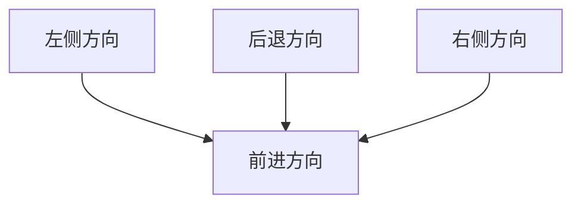
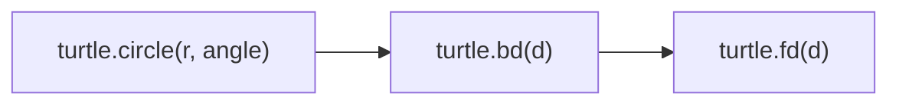
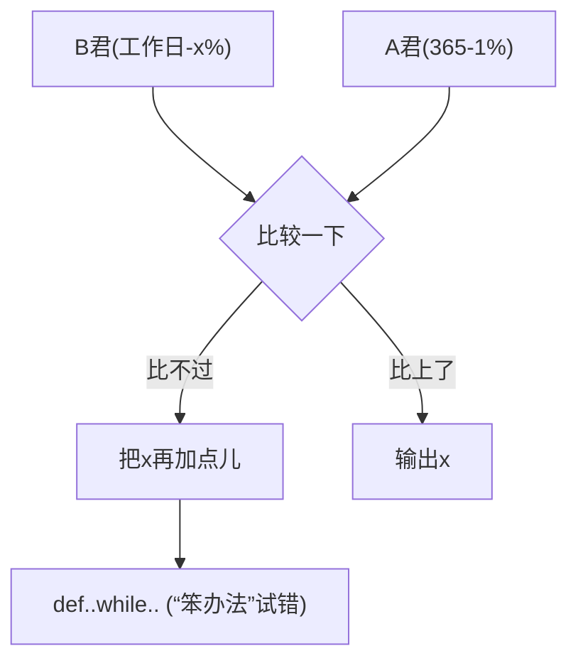

# Python蟒蛇绘制

# 用程序绘制一条蟒蛇

实例1: 温度转换


Python蟒蛇绘制

能否借鉴？

# 似乎无从下手，且听老师继续分解…

# "Python蟒蛇绘制"实例编写


<details>
<summary>natural_image</summary>

Abstract geometric line drawing with interconnected nodes and lines (no text or symbols)
</details>


<details>
<summary>natural_image</summary>

Abstract geometric network diagram with interconnected nodes and lines (no text or symbols)
</details>

#PythonDraw.py   
```python
import turtle
turtle.setup(650, 350, 200, 200)
turtle.penup()
turtle.fd(-250)
turtle.pendown()
turtle.pensize(25)
turtle.pencolor("purple")
turtle.seth(-40) 
```

```python
for i in range(4):
    turtle.circle(40, 80)
    turtle.circle(-40, 80)
turtle.circle(40, 80/2)
turtle.fd(40)
turtle.circle(16, 180)
turtle.fd(40 * 2/3)
turtle.done() 
```

# 使用IDLE的文件方式

# 编写代码

# 并保存为

# PythonDraw.py 文件

# 运行效果

# IDLE打开文件，按F5运行


<details>
<summary>natural_image</summary>

Purple wavy line drawing on white background, resembling a stylized worm or snake (no text or symbols)
</details>

#PythonDraw.py   
import turtle  
```lua
turtle.setup(650, 350, 200, 200)
turtle.penup()
turtle.fd(-250)
turtle.pendown()
turtle.pensize(25)
turtle.pencolor("purple")
turtle.seth(-40) 
```

```python
for i in range(4):
    turtle.circle(40, 80)
    turtle.circle(-40, 80)
turtle.circle(40, 80/2)
turtle.fd(40)
turtle.circle(16, 180)
turtle.fd(40 * 2/3)
turtle.done() 
```

# 程序关键

import 保留字

引入了一个绘图库

名字叫：turtle

没错，就是 海龟

# 准备好电脑，与老师一起编码吧！

# Python蟒蛇绘制"举一反三


<details>
<summary>natural_image</summary>

Abstract geometric line drawing with interconnected nodes and lines (no text or symbols)
</details>


<details>
<summary>natural_image</summary>

Abstract geometric network diagram with interconnected nodes and lines (no text or symbols)
</details>

#PythonDraw.py

import turtle

turtle.setup(650, 350, 200, 200)

turtle.penup()

turtle.fd(-250)

turtle.pendown()

turtle.pensize(25)

turtle.pencolor("purple")

turtle.seth(-40)

for i in range(4):

turtle.circle(40, 80)

turtle.circle(-40, 80)

turtle.circle(40, 80/2)

turtle.fd(40)

turtle.circle(16, 180)

turtle.fd(40 \* 2/3)

turtle.done()


<details>
<summary>natural_image</summary>

Purple wavy line drawing with a small arrowhead at the end (no text or symbols)
</details>

# 举一反三

# Python语法元素理解

Python蟒蛇绘制共17行代码，但很多行类似  
清楚理解这17行代码能够掌握Python基本绘图方法  
参考框架结构、逐行分析、逐词理解

# 举一反三

# 程序参数的改变

Python蟒蛇的颜色：黑色、白色、七彩色…   
Python蟒蛇的长度：1节、3节、10节…  
Python蟒蛇的方向：向左走、斜着走…

# 举一反三

# 计算问题的扩展

Python蟒蛇绘制问题是各类图像绘制问题的代表  
圆形绘制、五角星绘制、国旗绘制、机器猫绘制…   
掌握绘制一条线的方法，就可以绘制整个世界

# 模块1: turtle库的使用


python

嵩 天

北京理工大学

pythom

# 单元开篇

# 模块1: turtle库的使用


<details>
<summary>natural_image</summary>

Generic male avatar icon with beard and mustache (no text or symbols)
</details>

turtle库基本介绍  
turtle绘图窗体布局  
turtle空间坐标体系  
turtle角度坐标体系   
RGB色彩体系


<details>
<summary>natural_image</summary>

Silhouette of a person riding a bicycle with wheels, no text or symbols present
</details>

# turtle库基本介绍


<details>
<summary>natural_image</summary>

Abstract geometric network diagram with interconnected nodes and lines (no text or symbols)
</details>

# turtle库概述

# turtle(海龟)库是turtle绘图体系的Python实现

turtle绘图体系：1969年诞生，主要用于程序设计入门  
Python语言的标准库之一  
入门级的图形绘制函数库

# 标准库

# Python计算生态 = 标准库 + 第三方库

标准库：随解释器直接安装到操作系统中的功能模块  
第三方库：需要经过安装才能使用的功能模块  
库Library、包Package、模块Module，统称模块

# turtle的原（wan）理（fa）

# turtle(海龟)是一种真实的存在

- 有一只海龟，其实在窗体正中心，在画布上游走  
走过的轨迹形成了绘制的图形  
海龟由程序控制，可以变换颜色、改变宽度等

# turtle的魅力


<details>
<summary>natural_image</summary>

Abstract geometric pattern of intersecting colored lines (no text or symbols)
</details>


<details>
<summary>natural_image</summary>

Yellow smiling emoji face with closed eyes and wide eyebrows (no text or symbols)
</details>


<details>
<summary>text_image</summary>

turtle绘图窗体布局
</details>

# turtle的绘图窗体


<details>
<summary>text_image</summary>

turtle的一个画布空间
最小单位是像素
</details>

# turtle的绘图窗体

(0, 0)


<details>
<summary>text_image</summary>

starty
(Python Turtle Graphics
(startx, starty)
height
width
</details>

屏幕坐标系

# turtle的绘图窗体

turtle.setup(width, height, startx, starty)


<details>
<summary>text_image</summary>

starty
Icon Turtle Graphics
width
height
startx
</details>

setup()设置窗体大小及位置  
4个参数中后两个可选  
setup()不是必须的

# turtle的绘图窗体

turtle.setup(800,800,0,0)


<details>
<summary>text_image</summary>

Python Turtle Graphics
</details>

turtle.setup(800,800)


<details>
<summary>text_image</summary>

Python Turtle Graphics
</details>


<details>
<summary>text_image</summary>

turtle空间坐标体系
</details>

# turtle空间坐标体系

# 绝对坐标


<details>
<summary>scatter</summary>

| Point | X     | Y     |
|-------|-------|-------|
| 1     | 0     | 100   |
| 2     | 0     | 100   |
| 3     | 0     | 0     |
| 4     | 0     | -100  |
| 5     | 0     | -100  |
</details>

# turtle空间坐标体系

turtle.goto(x, y)


<details>
<summary>scatter</summary>

| Point | X     | Y     |
|-------|-------|-------|
| 1     | -100  | 100   |
| 2     | 100   | 100   |
| 3     | -100  | -100  |
| 4     | 100   | -100  |
</details>

# turtle空间坐标体系

import turtle

turtle.goto( 100, 100)

turtle.goto( 100,-100)

turtle.goto(-100,-100)

turtle.goto(-100, 100)

turtle.goto(0,0)


<details>
<summary>line</summary>

| Label       | Value |
| ----------- | ----- |
| (0, 0)      | 0     |
| (100, 100)  | 100   |
| (100, -100) | -100  |
</details>

# turtle空间坐标体系

# 海龟坐标


<details>
<summary>flowchart</summary>


</details>

# turtle空间坐标体系


<details>
<summary>flowchart</summary>


</details>


<details>
<summary>text_image</summary>

turtle角度坐标体系
</details>

# turtle角度坐标体系

# 绝对角度


<details>
<summary>text_image</summary>

Python Turtle Graphics
90 / -270 度
180 / -180 度
y
0 / 360 度
x
270 / -90 度
</details>

# turtle角度坐标体系

# turtle.seth(angle)


<details>
<summary>text_image</summary>

Python Turtle Graphics
90 / -270 度
180 / -180 度
0 / 360 度
270 / -90 度
y
x
</details>

seth()改变海龟行进方向  
angle为绝对度数  
seth()只改变方向但不行进

# turtle角度坐标体系

turtle.seth(45)


<details>
<summary>text_image</summary>

Python Turtle Graphics
45度
</details>

turtle.seth(-135)


<details>
<summary>text_image</summary>

Python Turtle Graphics
-135度
</details>

# Turtle角度坐标体系

# 海龟角度


<details>
<summary>text_image</summary>

turtle.left(angle)
turtle.right(angle)
</details>

# Turtle角度坐标体系

import turtle turtle.left(45) turtle.fd(150) turtle.right(135) turtle.fd(300) turtle.left(135) turtle.fd(150)


<details>
<summary>text_image</summary>

Python Turtle Graphics
150
300
150
</details>

# RGB色彩体系


<details>
<summary>natural_image</summary>

Abstract geometric network diagram with interconnected nodes and lines (no text or symbols)
</details>

# RGB色彩模式

# 由三种颜色构成的万物色


<details>
<summary>natural_image</summary>

Geometric star pattern composed of colorful triangles forming a symmetrical design (no text or symbols)
</details>

RGB指红蓝绿三个通道的颜色组合  
覆盖视力所能感知的所有颜色  
RGB每色取值范围0-255整数或0-1小数

常用RGB色彩

<table><tr><td>英文名称</td><td>RGB整数值</td><td>RGB小数值</td><td>中文名称</td></tr><tr><td>white</td><td>255, 255, 255</td><td>1, 1, 1</td><td>白色</td></tr><tr><td>yellow</td><td>255, 255, 0</td><td>1, 1, 0</td><td>黄色</td></tr><tr><td>magenta</td><td>255, 0, 255</td><td>1, 0, 1</td><td>洋红</td></tr><tr><td>cyan</td><td>0, 255, 255</td><td>0, 1, 1</td><td>青色</td></tr><tr><td>blue</td><td>0, 0, 255</td><td>0, 0, 1</td><td>蓝色</td></tr><tr><td>black</td><td>0, 0, 0</td><td>0, 0, 0</td><td>黑色</td></tr></table>

常用RGB色彩

<table><tr><td>英文名称</td><td>RGB整数值</td><td>RGB小数值</td><td>中文名称</td></tr><tr><td>seashell</td><td>255, 245, 238</td><td>1, 0.96, 0.93</td><td>海贝色</td></tr><tr><td>gold</td><td>255, 215, 0</td><td>1, 0.84, 0</td><td>金色</td></tr><tr><td>pink</td><td>255, 192, 203</td><td>1, 0.75, 0.80</td><td>粉红色</td></tr><tr><td>brown</td><td>165, 42, 42</td><td>0.65, 0.16, 0.16</td><td>棕色</td></tr><tr><td>purple</td><td>160, 32, 240</td><td>0.63, 0.13, 0.94</td><td>紫色</td></tr><tr><td>tomato</td><td>255, 99, 71</td><td>1, 0.39, 0.28</td><td>番茄色</td></tr></table>

# turtle的RGB色彩模式

# 默认采用小数值 可切换为整数值


<details>
<summary>natural_image</summary>

Geometric star pattern composed of colorful triangles forming a symmetrical design (no text or symbols)
</details>

turtle.colormode(mode)

- 1.0：RGB小数值模式  
255：RGB整数值模式

# 单元小结

# 模块1: turtle库的使用

turtle库的海龟绘图法  
- turtle.setup()调整绘图窗体在电脑屏幕中的布局  
画布上以中心为原点的空间坐标系: 绝对坐标&海龟坐标  
画布上以空间x轴为0度的角度坐标系: 绝对角度&海龟角度  
RGB色彩体系，整数值&小数值，色彩模式切换

# turtle程序语法元素分析


python

嵩 天

北京理工大学

pythom

# 单元开篇


<details>
<summary>natural_image</summary>

Abstract geometric diagram with interconnected nodes and lines (no text or symbols)
</details>

# turtle程序语法元素分析


<details>
<summary>natural_image</summary>

Generic male avatar icon with beard and mustache (no text or symbols)
</details>

库引用与import   
turtle画笔控制函数  
turtle运动控制函数  
turtle方向控制函数  
基本循环语句  
Python蟒蛇绘制"代码分析


<details>
<summary>natural_image</summary>

Silhouette of a person riding a bicycle on a blue track (no text or symbols)
</details>

# 库引用与import


<details>
<summary>natural_image</summary>

Abstract geometric diagram with interconnected nodes and lines (no text or symbols)
</details>

import turtle

turtle.setup(650, 350, 200, 200)

turtle.penup()

turtle.fd(-250)

turtle.pendown()

turtle.pensize(25)

turtle.pencolor("purple")

turtle.seth(-40)

for i in range(4):

turtle.circle(40, 80)

turtle.circle(-40, 80)

turtle.circle(40, 80/2)

turtle.fd(40)

turtle.circle(16, 180)

turtle.fd(40 \* 2/3)

turtle.done()


<details>
<summary>natural_image</summary>

Purple wavy line drawing on white background, resembling a stylized worm or snake (no text or symbols)
</details>

<a>.<b>()的编码风格

# 库引用

# 扩充Python程序功能的方式

使用import保留字完成，采用<a>.<b>()编码风格

import <库名>

<库名>.<函数名>(<函数参数>)

import turtle

turtle.setup(650, 350, 200, 200)

turtle.penup()

turtle.fd(-250)

turtle.pendown()

turtle.pensize(25)

turtle.pencolor("purple")

turtle.seth(-40)

for i in range(4):

turtle.circle(40, 80)

turtle.circle(-40, 80)

turtle.circle(40, 80/2)

turtle.fd(40)

turtle.circle(16, 180)

turtle.fd(40 \* 2/3)

turtle.done()

# 引入turtle库

# 使用turtle库函数

# 完成功能

可是可是, 好多turtle，很繁琐嘛…

# import更多用法

# 使用from和import保留字共同完成

from <库名> import <函数名>

from <库名> import \*

<函数名>(<函数参数>)

# import turtle

turtle.setup(650, 350, 200, 200)

turtle.penup()

turtle.fd(-250)

turtle.pendown()

turtle.pensize(25)

turtle.pencolor("purple")

turtle.seth(-40)

for i in range(4):

turtle.circle(40, 80)

turtle.circle(-40, 80)

turtle.circle(40, 80/2)

turtle.fd(40)

turtle.circle(16, 180)

turtle.fd(40 \* 2/3)

turtle.done()


# from turtle import \*

setup(650, 350, 200, 200)

penup()

fd(-250)

pendown()

pensize(25)

pencolor("purple")

seth(-40)

for i in range(4):

circle(40, 80)

circle(-40, 80)

circle(40, 80/2)

fd(40)

circle(16, 180)

fd(40 \* 2/3)

done()

老师老师, 这么好的方

法为何不早说…

# import更多用法

# 两种方法比较

import <库名>

<库名>.<函数名>(<函数参数>)

from <库名> import <函数名>

from <库名> import \*

<函数名>(<函数参数>)

第一种方法不会出现函数重名问题，第二种方法则会出现

# import更多用法

使用import和as保留字共同完成

import <库名> as <库别名>

<库别名>.<函数名>(<函数参数>)

给调用的外部库关联一个更短、更适合自己的名字

# import turtle

turtle.setup(650, 350, 200, 200)

turtle.penup()

turtle.fd(-250)

turtle.pendown()

turtle.pensize(25)

turtle.pencolor("purple")

turtle.seth(-40)

for i in range(4):

turtle.circle(40, 80)

turtle.circle(-40, 80)

turtle.circle(40, 80/2)

turtle.fd(40)

turtle.circle(16, 180)

turtle.fd(40 \* 2/3)

turtle.done()


# import turtle as t

t.setup(650, 350, 200, 200)

t.penup()

t.fd(-250)

t.pendown()

t.pensize(25)

t.pencolor("purple")

t.seth(-40)

for i in range(4):

t.circle(40, 80)

t.circle(-40, 80)

t.circle(40, 80/2)

t.fd(40)

t.circle(16, 180)

t.fd(40 \* 2/3)

t.done()

这个方法好！


<details>
<summary>text_image</summary>

turtle画笔控制函数
</details>

import turtle turtle.setup(650, 350, 200, 200)

turtle.penup()

turtle.fd(-250)

turtle.pendown()

turtle.pensize(25)

turtle.pencolor("purple")

turtle.seth(-40)

for i in range(4):

turtle.circle(40, 80)

turtle.circle(-40, 80)

turtle.circle(40, 80/2)

turtle.fd(40)

turtle.circle(16, 180)

turtle.fd(40 \* 2/3)

turtle.done()

penup(), pendown()

pensize(), pencolor()

# 画笔控制函数

# 画笔操作后一直有效，一般成对出现

turtle.penup() 别名 turtle.pu()

抬起画笔，海龟在飞行

turtle.pendown() 别名 turtle.pd()

落下画笔，海龟在爬行

# 画笔控制函数

# 画笔设置后一直有效，直至下次重新设置

turtle.pensize(width) 别名 turtle.width(width)画笔宽度，海龟的腰围

turtle.pencolor(color) color为颜色字符串或r,g,b值画笔颜色，海龟在涂装

# 画笔控制函数

# pencolor(color)的color参与可以有三种形式

颜色字符串 ：turtle.pencolor("purple")  
RGB的小数值：turtle.pencolor(0.63, 0.13, 0.94)  
RGB的元组值：turtle.pencolor((0.63,0.13,0.94))

import turtle

turtle.setup(650, 350, 200, 200)

turtle.penup()

turtle.fd(-250)

turtle.pendown()

turtle.pensize(25)

turtle.pencolor("purple")

turtle.seth(-40)

for i in range(4):

turtle.circle(40, 80)

turtle.circle(-40, 80)

turtle.circle(40, 80/2)

turtle.fd(40)

turtle.circle(16, 180)

turtle.fd(40 \* 2/3)

turtle.done()

penup()

pendown()

pensize(width)

pencolor(colorstring)

pencolor(r,g,b)

pencolor((r,g,b))


<details>
<summary>text_image</summary>

turtle运动控制函数
</details>

import turtle  
turtle.setup(650, 350, 200, 200)   
turtle.penup()   
turtle.fd(-250)  
turtle.pendown()   
turtle.pensize(25)   
turtle.pencolor("purple")  
turtle.seth(-40)   
for i in range(4):   
turtle.circle(40, 80)   
turtle.circle(-40, 80)   
turtle.circle(40, 80/2)   
turtle.fd(40)  
turtle.circle(16, 180)   
turtle.fd(40 \* 2/3)  
turtle.done()

fd()

circle()

# 运动控制函数

# 控制海龟行进：走直线 & 走曲线

turtle.forward(d) 别名 turtle.fd(d)

向前行进，海龟走直线

\- d: 行进距离，可以为负数

# 运动控制函数

# 控制海龟行进：走直线 & 走曲线

turtle.circle(r, extent=None)

根据半径r绘制extent角度的弧形

- r: 默认圆心在海龟左侧r距离的位置  
extent: 绘制角度，默认是360度整圆

# 运动控制函数

turtle.circle(100)


<details>
<summary>text_image</summary>

Python Turtle Graphics
100
</details>

turtle.circle(-100,90)


<details>
<summary>text_image</summary>

Python Turtle Graphics
-100
</details>

```python
import turtle
turtle.setup(650, 350, 200, 200)
turtle.penup()
turtle.fd(-250)
turtle.pendown()
turtle.pensize(25)
turtle.pencolor("purple")
turtle.seth(-40)
for i in range(4):
    turtle.circle(40, 80)
    turtle.circle(-40, 80)
turtle.circle(40, 80/2)
turtle.fd(40)
turtle.circle(16, 180)
turtle.fd(40 * 2/3)
turtle.done() 
```  
fd(d)   
circle(r,extent=None)

# 运动控制函数

# 画笔设置后一直有效，直至下次重新设置

turtle.forward(d) 别名 turtle.fd(d)

向前行进，海龟走直线

\- d: 行进距离，可以为负数


<details>
<summary>text_image</summary>

turtle方向控制函数
</details>

```python
import turtle
turtle.setup(650, 350, 200, 200)
turtle.penup()
turtle.fd(-250)
turtle.pendown()
turtle.pensize(25)
turtle.pencolor("purple") 
```

turtle.seth(-40)   
```python
for i in range(4):
    turtle.circle(40, 80)
    turtle.circle(-40, 80)
turtle.circle(40, 80/2)
turtle.fd(40)
turtle.circle(16, 180)
turtle.fd(40 * 2/3)
turtle.done() 
```

seth()

# 方向控制函数

# 控制海龟面对方向: 绝对角度 & 海龟角度

turtle.setheading(angle) 别名 turtle.seth(angle)

改变行进方向，海龟走角度

angle: 行进方向的绝对角度

# 方向控制函数

turtle.seth(45)


<details>
<summary>text_image</summary>

Python Turtle Graphics
45度
</details>

turtle.seth(-135)


<details>
<summary>text_image</summary>

Python Turtle Graphics
-135度
</details>

# 方向控制函数

# 控制海龟面对方向: 绝对角度 & 海龟角度

turtle.left(angle) 海龟向左转   
turtle.right(angle) 海龟向右转   
angle: 在海龟当前行进方向上旋转的角度

```python
import turtle
turtle.setup(650, 350, 200, 200)
turtle.penup()
turtle.fd(-250)
turtle.pendown()
turtle.pensize(25)
turtle.pencolor("purple") 
```

turtle.seth(-40)   
```python
for i in range(4):
    turtle.circle(40, 80)
    turtle.circle(-40, 80)
turtle.circle(40, 80/2)
turtle.fd(40)
turtle.circle(16, 180)
turtle.fd(40 * 2/3)
turtle.done() 
```

# seth(angle)

# 循环语句与range()函数


<details>
<summary>natural_image</summary>

Abstract geometric line drawing with interconnected nodes and lines (no text or symbols)
</details>


<details>
<summary>natural_image</summary>

Abstract geometric diagram with interconnected nodes and lines (no text or symbols)
</details>

```python
import turtle
turtle.setup(650, 350, 200, 200)
turtle.penup()
turtle.fd(-250)
turtle.pendown()
turtle.pensize(25)
turtle.pencolor("purple")
turtle.seth(-40) 
```

```python
for i in range(4):
    turtle.circle(40, 80)
    turtle.circle(-40, 80)
turtle.circle(40, 80/2)
turtle.fd(40)
turtle.circle(16, 180)
turtle.fd(40 * 2/3)
turtle.done() 
```

# for 和 in 保留字

# range()

# 循环语句

# 按照一定次数循环执行一组语句

for <变量> in range(<次数>):

<被循环执行的语句>

<变量>表示每次循环的计数，0到<次数>-1

# 循环语句

>>> for i in range(5): print(i)

>>> for i in range(5): print("Hello:",i)

Hello: 0   
Hello: 1   
Hello: 2   
Hello: 3   
Hello: 4

# range()函数

# 产生循环计数序列

range(N)

产生 0 到 N-1的整数序列，共N个

range(M,N)

range(5)

0, 1, 2, 3, 4

range(2, 5)

2, 3, 4

产生 M 到 N-1的整数序列，共N-M个import turtleturtle.setup(650, 350, 200, 200)turtle.penup()turtle.fd(-250)turtle.pendown()turtle.pensize(25)turtle.pencolor("purple")turtle.seth(-40)

for i in range(4): turtle.circle(40, 80) turtle.circle(-40, 80)

turtle.circle(40, 80/2) turtle.fd(40) turtle.circle(16, 180) turtle.fd(40 \* 2/3) turtle.done()

for i in range(N): range(N) range(M, N)

# "Python蟒蛇绘制"代码分析


<details>
<summary>natural_image</summary>

Abstract geometric line drawing with interconnected nodes and lines (no text or symbols)
</details>


<details>
<summary>natural_image</summary>

Abstract geometric diagram with interconnected nodes and lines (no text or symbols)
</details>

import turtle

turtle.setup(650, 350, 200, 200)

turtle.penup()

turtle.fd(-250)

turtle.pendown()

turtle.pensize(25)

turtle.pencolor("purple")

turtle.seth(-40)

for i in range(4):

turtle.circle(40, 80)

turtle.circle(-40, 80)

turtle.circle(40, 80/2)

turtle.fd(40)

turtle.circle(16, 180)

turtle.fd(40 \* 2/3)

turtle.done()

Python Turtle Graphics

A

import turtle

turtle.setup(650, 350, 200, 200)

turtle.penup()

turtle.fd(-250)

turtle.pendown()

turtle.pensize(25)

turtle.pencolor("purple")

turtle.seth(-40)

for i in range(4):

turtle.circle(40, 80)

turtle.circle(-40, 80)

turtle.circle(40, 80/2)

turtle.fd(40)

turtle.circle(16, 180)

turtle.fd(40 \* 2/3)

turtle.done()

Python Turtle Graphics


<details>
<summary>natural_image</summary>

Purple wavy line with a small triangular mark at the end (no text or symbols)
</details>

import turtle

turtle.setup(650, 350, 200, 200)

turtle.penup()

turtle.fd(-250)

turtle.pendown()

turtle.pensize(25)

turtle.pencolor("purple")

turtle.seth(-40)

for i in range(4):

turtle.circle(40, 80)

turtle.circle(-40, 80)

turtle.circle(40, 80/2)

turtle.fd(40)

turtle.circle(16, 180)

turtle.fd(40 \* 2/3)

turtle.done()

Python Turtle Graphics


<details>
<summary>natural_image</summary>

Purple wavy line with a small arrow at the end (no text or symbols)
</details>

import turtle

turtle.setup(650, 350, 200, 200)

turtle.penup()

turtle.fd(-250)

turtle.pendown()

turtle.pensize(25)

turtle.pencolor("purple")

turtle.seth(-40)

for i in range(4):

turtle.circle(40, 80)

turtle.circle(-40, 80)

turtle.circle(40, 80/2)

turtle.fd(40)

turtle.circle(16, 180)

turtle.fd(40 \* 2/3)

turtle.done()

Python Turtle Graphics


<details>
<summary>natural_image</summary>

Purple wavy line drawing with a small arrowhead at the end (no text or symbols)
</details>

# 单元小结


<details>
<summary>natural_image</summary>

Abstract geometric diagram with interconnected nodes and lines (no text or symbols)
</details>

# turtle程序语法元素分析

库引用: import、from…import、import…as…   
penup()、pendown()、pensize()、pencolor()  
fd()、circle()、seth()  
- 循环语句：for和in、range()函数

# 第3章 辅学内容


python

嵩 天

北京理工大学

pythom

# 前课复习

# Python基本语法元素

- 缩进、注释、命名、变量、保留字   
数据类型、字符串、 整数、浮点数、列表  
- 赋值语句、分支语句、函数  
input()、print()、eval()、 print()格式化

# Python基本图形绘制

从计算机技术演进角度看待Python语言  
海龟绘图体系及import保留字用法  
penup()、pendown()、pensize()、pencolor()  
fd()、circle()、seth()  
循环语句：for和in、range()函数

<table><tr><td>and</td><td>elif</td><td>import</td><td>raise</td><td>global</td></tr><tr><td>as</td><td>else</td><td>in</td><td>return</td><td>nonlocal</td></tr><tr><td>assert</td><td>except</td><td>is</td><td>try</td><td>True</td></tr><tr><td>break</td><td>finally</td><td>lambda</td><td>while</td><td>False</td></tr><tr><td>class</td><td>for</td><td>not</td><td>with</td><td>None</td></tr><tr><td>continue</td><td>from</td><td>or</td><td>yield</td><td></td></tr><tr><td>def</td><td>if</td><td>pass</td><td>del</td><td></td></tr></table>

#TempConvert.py   
TempStr = input("请输入带有符号的温度值: ")   
if TempStr[-1] in ['F', 'f']:   
```javascript
C = (eval(TempStr[0:-1]) - 32)/1.8 
```  
print("转换后的温度是{:.2f}C".format(C))

elif TempStr[-1] in ['C', 'c']:   
```txt
F = 1.8*eval(TempStr[0:-1]) + 32 
```  
print("转换后的温度是{:.2f}F".format(F))   
else:   
print("输入格式错误")

import turtle

turtle.setup(650, 350, 200, 200)

turtle.penup()

turtle.fd(-250)

turtle.pendown()

turtle.pensize(25)

turtle.pencolor("purple")

turtle.seth(-40)

for i in range(4):

turtle.circle(40, 80)

turtle.circle(-40, 80)

turtle.circle(40, 80/2)

turtle.fd(40)

turtle.circle(16, 180)

turtle.fd(40 \* 2/3)

turtle.done()

Python Turtle Graphics

←


<details>
<summary>natural_image</summary>

Purple wavy line drawing with a small arrowhead at the end (no text or symbols)
</details>

# 本课概要

# 第3章 基本数据类型


<details>
<summary>natural_image</summary>

Generic male avatar icon with beard and mustache (no text or symbols)
</details>

- 3.1 数字类型及操作  
- 3.2 实例3: 天天向上的力量  
- 3.3 字符串类型及操作  
- 3.4 模块2: time库的使用  
- 3.5 实例4: 文本进度条

# 第3章 基本数据类型


<details>
<summary>natural_image</summary>

Generic male avatar icon with beard and mustache (no text or symbols)
</details>

# 方法论

Python语言数字及字符串类型

# 实践能力

初步学会编程进行字符类操作


<details>
<summary>natural_image</summary>

Silhouette of a person riding a bicycle on a blue track (no text or symbols)
</details>

# 练习与作业

# 第3章 基本数据类型


<details>
<summary>natural_image</summary>

Generic male avatar icon with beard and mustache (no text or symbols)
</details>

# 练习 (可选)

5道编程题 @Python123

# 作业

15道单选题 @Python123


<details>
<summary>natural_image</summary>

Silhouette of a person riding a bicycle on a blue track (no text or symbols)
</details>

# Python语言程序设计

# 数字类型及操作


python

嵩 天

北京理工大学

pythom

# 单元开篇

# 数字类型及操作


<details>
<summary>natural_image</summary>

Generic male avatar icon with beard and mustache (no text or symbols)
</details>


<details>
<summary>natural_image</summary>

Silhouette of a person riding a bicycle with wheels and a blue lane (no text or symbols)
</details>

整数类型  
浮点数类型  
复数类型  
数值运算操作符   
数值运算函数

# 整数类型


<details>
<summary>natural_image</summary>

Abstract geometric network diagram with interconnected nodes and lines (no text or symbols)
</details>

# 整数类型

# 与数学中整数的概念一致

可正可负，没有取值范围限制  
pow(x,y)函数：计算 xy，想算多大算多大

>>> pow(2,100)

1267650600228229401496703205376

>>> pow(2,pow(2,15))

1415461031044954789001553……

# 整数类型

# 4种进制表示形式

十进制：1010, 99, -217  
二进制，以0b或0B开头：0b010, -0B101  
八进制，以0o或0O开头：0o123, -0O456  
十六进制，以0x或0X开头：0x9a, -0X89

# 关于Python整数，就需要知道这些。

• 整数无限制 pow()   
• 4种进制表示形式

# 浮点数类型


<details>
<summary>natural_image</summary>

Abstract geometric network diagram with interconnected nodes and lines (no text or symbols)
</details>


<details>
<summary>natural_image</summary>

Abstract geometric network diagram with interconnected nodes and lines (no text or symbols)
</details>

# 浮点数类型

# 与数学中实数的概念一致

带有小数点及小数的数字  
- 浮点数取值范围和小数精度都存在限制，但常规计算可忽略  
取值范围数量级约-10308至10308，精度数量级10-16

# 浮点数类型

# 浮点数间运算存在不确定尾数，不是bug

>>> 0.1 + 0.3   
0.4   
>>> 0.1 + 0.2   
0.30000000000000004

不确定尾数

# 浮点数类型

# 浮点数间运算存在不确定尾数，不是bug

0.1 53位二进制表示小数部分，约10-16

0.00011001100110011001100110011001100110011001100110011010 (二进制表示)

0.1000000000000000055511151231257827021181583404541015625 (十进制表示)

二进制表示小数，可以无限接近，但不完全相同

0.1 + 0.2

结果无限接近0.3，但可能存在尾数

# 浮点数类型

# 浮点数间运算存在不确定尾数

>>> 0.1 + 0.2 == 0.3   
False   
>>> round(0.1+0.2, 1) == 0.3   
True

# 浮点数类型

# 浮点数间运算存在不确定尾数

round(x, d)：对x四舍五入，d是小数截取位数  
浮点数间运算及比较用round()函数辅助  
不确定尾数一般发生在10-16左右，round()十分有效

# 浮点数类型

# 浮点数可以采用科学计数法表示

使用字母e或E作为幂的符号，以10为基数，格式如下：

<a>e<b>

表示 a\*10b

例如：4.3e-3 值为0.0043 9.6E5 值为960000.0

# 关于Python浮点数，需要知道多些。

• 取值范围和精度基本无限制  
• 运算存在不确定尾数 round()  
• 科学计数法表示

# 复数类型


<details>
<summary>natural_image</summary>

Abstract geometric network diagram with interconnected nodes and lines (no text or symbols)
</details>

# 复数类型

# 与数学中复数的概念一致

如果 $x ^ { 2 } = - 1$ ，那么x的值什么？

定义 $j = \sqrt { - 1 }$ ，以此为基础，构建数学体系  
- a+bj 被称为复数，其中，a是实部，b是虚部

# 复数类型

# 复数实例

$$
z = 1. 2 3 e - 4 + 5. 6 e + 8 9 j
$$

实部是什么？ z.real 获得实部  
虚部是什么？ z.imag 获得虚部

# 数值运算操作符


<details>
<summary>natural_image</summary>

Abstract geometric network diagram with interconnected nodes and lines (no text or symbols)
</details>

# 数值运算操作符

操作符是完成运算的一种符号体系

<table><tr><td>操作符及使用</td><td>描述</td></tr><tr><td>x + y</td><td>加,x与y之和</td></tr><tr><td>x - y</td><td>减,x与y之差</td></tr><tr><td>x * y</td><td>乘,x与y之积</td></tr><tr><td>x / y</td><td>除,x与y之商 10/3结果是3.3333333333333335</td></tr><tr><td>x // y</td><td>整数除,x与y之整数商 10//3结果是3</td></tr></table>

# 数值运算操作符

操作符是完成运算的一种符号体系

<table><tr><td>操作符及使用</td><td>描述</td></tr><tr><td>+x</td><td>x本身</td></tr><tr><td>-y</td><td>x的负值</td></tr><tr><td>x % y</td><td>余数,模运算 10%3结果是1</td></tr><tr><td rowspan="2">x ** y</td><td>幂运算,x的y次幂,xy</td></tr><tr><td>当y是小数时,开方运算 10**0.5结果是  $\sqrt{10}$ </td></tr></table>

# 数值运算操作符

二元操作符有对应的增强赋值操作符

<table><tr><td>增强操作符及使用</td><td>描述</td></tr><tr><td rowspan="3">x op = y</td><td>即 x = x op y,其中,op为二元操作符</td></tr><tr><td>x += y x -= y x *= y x /= yx // = y x %= y x ** = y</td></tr><tr><td>&gt;&gt;&gt; x = 3.1415&gt;&gt;&gt; x **= 3 #与 x = x **3 等价31.006276662836743</td></tr></table>

# 数字类型的关系

# 类型间可进行混合运算，生成结果为"最宽"类型

三种类型存在一种逐渐"扩展"或"变宽"的关系：

整数 -> 浮点数 -> 复数

例如： $1 2 3 + 4 . 0 = 1 2 7 . 0$ (整数+浮点数 = 浮点数)

# 数值运算函数


<details>
<summary>natural_image</summary>

Abstract geometric network diagram with interconnected nodes and lines (no text or symbols)
</details>

# 数值运算函数

一些以函数形式提供的数值运算功能

<table><tr><td>函数及使用</td><td>描述</td></tr><tr><td>abs(x)</td><td>绝对值,x的绝对值abs(-10.01)结果为 10.01</td></tr><tr><td>divmod(x,y)</td><td>商余,(x//y, x%y),同时输出商和余数divmod(10, 3)结果为 (3, 1)</td></tr><tr><td>pow(x, y[, z])</td><td>幂余,(x**y)%z,[..]表示参数z可省略pow(3, pow(3, 99), 10000)结果为 4587</td></tr></table>

# 数值运算函数

一些以函数形式提供的数值运算功能

<table><tr><td>函数及使用</td><td>描述</td></tr><tr><td>round(x[, d])</td><td>四舍五入,d是保留小数位数,默认值为0 round(-10.123, 2)结果为-10.12</td></tr><tr><td>max(x1,x2,...,xn)</td><td>最大值,返回x1,x2,...,xn中的最大值,n不限 max(1, 9, 5, 4 3)结果为9</td></tr><tr><td>min(x1,x2,...,xn)</td><td>最小值,返回x1,x2,...,xn中的最小值,n不限 min(1, 9, 5, 4 3)结果为1</td></tr></table>

# 数值运算函数

一些以函数形式提供的数值运算功能

<table><tr><td>函数及使用</td><td>描述</td></tr><tr><td>int(x)</td><td>将x变成整数,舍弃小数部分int(123.45)结果为123;int(&quot;123&quot;)结果为123</td></tr><tr><td>float(x)</td><td>将x变成浮点数,增加小数部分float(12)结果为12.0;float(&quot;1.23&quot;)结果为1.23</td></tr><tr><td>complex(x)</td><td>将x变成复数,增加虚数部分complex(4)结果为4+0j</td></tr></table>

# 单元小结

# 数字类型及操作

整数类型的无限范围及4种进制表示  
- 浮点数类型的近似无限范围、小尾数及科学计数法  
- +、-、\*、/、//、%、\*\*、二元增强赋值操作符   
- abs()、divmod()、pow()、round()、max()、min()  
int()、float()、complex()

# 实例3: 天天向上的力量


python

嵩 天

北京理工大学

pythom

# "天天向上的力量"问题分析


<details>
<summary>natural_image</summary>

Abstract geometric line drawing with interconnected nodes and lines (no text or symbols)
</details>


<details>
<summary>natural_image</summary>

Abstract geometric network diagram with interconnected nodes and lines (no text or symbols)
</details>

# 天天向上的力量

# 基本问题：持续的价值

一年365天，每天进步1%，累计进步多少呢？

1.01365

\- 一年365天，每天退步1%，累计剩下多少呢？

0.99365

# 需求分析

# 天天向上的力量

数学公式可以求解，似乎没必要用程序  
如果是"三天打鱼两天晒网"呢？  
如果是"双休日又不退步"呢？

# "天天向上的力量"第一问


<details>
<summary>natural_image</summary>

Abstract geometric network diagram with interconnected nodes and lines (no text or symbols)
</details>


<details>
<summary>natural_image</summary>

Abstract geometric network diagram with interconnected nodes and lines (no text or symbols)
</details>

# 天天向上的力量

问题1： 1‰的力量

\- 一年365天，每天进步1‰，累计进步多少呢？

1.001365

一年365天，每天退步1‰，累计剩下多少呢？

0.999365

# 天天向上的力量

# 问题1： 1‰的力量

```python
#DayDayUpQ1.py
dayup = pow(1.001, 365)
daydown = pow(0.999, 365)
print("向上：{:.2f}，向下：{:.2f}".format(dayup, daydown)) 
```

编写上述代码，并保存为DayDayUpQ1.py文件

# 天天向上的力量

问题1： 1‰的力量

>>> (运行结果)

向上：1.44，向下：0.69

$$
1. 0 0 1 ^ {3 6 5} = 1. 4 4
$$

$$
\mathbf {0 . 9 9 9 ^ {3 6 5} = 0 . 6 9}
$$

1‰的力量，接近2倍，不可小觑哦

# "天天向上的力量"第二问


<details>
<summary>natural_image</summary>

Abstract geometric line drawing with interconnected nodes and lines (no text or symbols)
</details>


<details>
<summary>natural_image</summary>

Abstract geometric network diagram with interconnected nodes and lines (no text or symbols)
</details>

# 天天向上的力量

# 问题2： 5‰和1%的力量

年365天，每天进步5‰或1%，累计进步多少呢？

1.005365 1.01365

年365天，每天退步5‰或1%，累计剩下多少呢？

0.995365 0.99365

# 天天向上的力量

# 问题2： 5‰和1%的力量

#DayDayUpQ2.py   
```txt
dayfactor = 0.005 使用变量的好处：一处修改即可
dayup = pow(1+dayfactor, 365)
daydown = pow(1-dayfactor, 365)
print("向上：{:.2f}，向下：{:.2f}".format(dayup, daydown)) 
```

编写上述代码，并保存为DayDayUpQ2.py文件

# 天天向上的力量

# 问题2： 5‰和1%的力量

>>> (5‰运行结果)

向上：6.17，向下：0.16

$$
1. 0 0 5 ^ {3 6 5} = 6. 1 7
$$

$$
0. 9 9 5 ^ {3 6 5} = 0. 1 6
$$

>>> (1%运行结果)

向上：37.78，向下：0.03

$$
1. 0 1 ^ {3 6 5} = 3 7. 7 8
$$

$$
\mathbf {0 . 9 9 ^ {3 6 5}} = \mathbf {0 . 0 3}
$$

5‰的力量，惊讶！

1%的力量，惊人！

# "天天向上的力量"第三问


<details>
<summary>natural_image</summary>

Abstract geometric line drawing with interconnected nodes and lines (no text or symbols)
</details>


<details>
<summary>natural_image</summary>

Abstract geometric network diagram with interconnected nodes and lines (no text or symbols)
</details>

# 天天向上的力量

# 问题3： 工作日的力量

一年365天，一周5个工作日，每天进步1%  
一年365天，一周2个休息日，每天退步1%  
这种工作日的力量，如何呢？

1.01365 (数学思维)


for..in.. (计算思维)

# 天天向上的力量

#DayDayUpQ3.py   
```python
dayup = 1.0
dayfactor = 0.01
for i in range(365):
    if i % 7 in [6,0]:
    dayup = dayup*(1-dayfactor)
    else:
    dayup = dayup*(1+dayfactor)
print("工作日的力量：{:.2f}".format(dayup)) 
```

# 天天向上的力量

问题3： 工作日的力量

>>> (运行结果)

工作日的力量：4.63

$$
1. 0 0 1 ^ {3 6 5} = 1. 4 4
$$

$$
1. 0 0 5 ^ {3 6 5} = 6. 1 7
$$

$$
1. 0 1 ^ {3 6 5} = 3 7. 7 8
$$

尽管提高1%，但介于1‰和5‰的力量之间

# "天天向上的力量"第四问


<details>
<summary>natural_image</summary>

Abstract geometric line drawing with interconnected nodes and lines (no text or symbols)
</details>


<details>
<summary>natural_image</summary>

Abstract geometric network diagram with interconnected nodes and lines (no text or symbols)
</details>

# 天天向上的力量

# 问题4： 工作日的努力

- 工作日模式要努力到什么水平，才能与每天努力1%一样？  
- A君: 一年365天，每天进步1%，不停歇  
B君: 一年365天，每周工作5天休息2天，休息日下降1%，要多努力呢？

for..in.. (计算思维)


def..while.. ("笨办法"试错)

# 天天向上的力量

问题4： 工作日的努力  


<details>
<summary>flowchart</summary>


</details>

# 天天向上的力量

#DayDayUpQ4.py   
```python
def dayUP(df):
    dayup = 1
    for i in range(365):
    if i % 7 in [6,0]:
    dayup = dayup*(1 - 0.01)
    else:
    dayup = dayup*(1 + df)
    return dayup
dayfactor = 0.01
while dayUP(dayfactor) < 37.78:
    dayfactor += 0.001 
```

根据df参数计算工作日力量的函数

参数不同，这段代码可共用

def保留字用于定义函数

while保留字判断条件是否成立

条件成立时循环执行

print("工作日的努力参数是：{:.3f} ".format(dayfactor))

# 准备好电脑，与老师一起编码吧！

# 天天向上的力量

问题4： 工作日的努力

>>> (运行结果)

工作日的努力参数是：0.019

$$
1. 0 1 ^ {3 6 5} = 3 7. 7 8
$$

$$
1. 0 1 9 ^ {3 6 5} = 9 6 2. 8 9
$$

工作日模式，每天要努力到1.9%，相当于365模式每天1%的一倍！

# 天天向上的力量

GRIT：perseverance and passion for long-term goals

$$
1. 0 1 ^ {3 6 5} = 3 7. 7 8
$$

$$
1. 0 1 9 ^ {3 6 5} = 9 6 2. 8 9
$$

GRIT，坚毅，对长期目标的持续激情及持久耐力  
GRIT是获得成功最重要的因素之一，牢记天天向上的力量

# 天天向上的力量"举一反三


<details>
<summary>natural_image</summary>

Abstract geometric line drawing with interconnected nodes and lines (no text or symbols)
</details>


<details>
<summary>natural_image</summary>

Abstract geometric network diagram with interconnected nodes and lines (no text or symbols)
</details>

#DayDayUpQ3.py   
```python
dayup = 1.0    for..in.. (计算思维)
dayfactor = 0.01
for i in range(365):
    if i % 7 in [6,0]:
    dayup = dayup*(1-dayfactor)
    else:
    dayup = dayup*(1+dayfactor)
print("工作日的力量：{:.2f} ".format(dayup)) 
```

#DayDayUpQ4.py   
def dayUP(df):
    dayup = 1
    for i in range(365):
    if i % 7 in [6,0]:
    dayup = dayup*(1 - 0.01)
    else:
    dayup = dayup*(1 + df)
    return dayup
dayfactor = 0.01
while dayUP(dayfactor) < 37.78:
    dayfactor += 0.001   
print("工作日的努力参数是：{:.3f} ".format(dayfactor))

# 举一反三

# 天天向上的力量

实例虽然仅包含8-12行代码，但包含很多语法元素  
判断条件循环、次数循环、分支、函数、计算思维  
清楚理解这些代码能够快速入门Python语言

# 举一反三

# 问题的变化和扩展

工作日模式中，如果休息日不下降呢？  
如果努力每天提高1%，休息时每天下降1‰呢？   
如果工作3天休息1天呢？

# 举一反三

# 问题的变化和扩展

"三天打鱼，两天晒网"呢？   
"多一份努力"呢？ (努力比下降多一点儿）  
多一点懈怠"呢？（下降比努力多一点儿）

12

# 字符串类型及操作


python

嵩 天

北京理工大学

pythom

# 单元开篇

# 字符串类型及操作


<details>
<summary>natural_image</summary>

Generic male avatar icon with beard and mustache (no text or symbols)
</details>

字符串类型的表示  
字符串操作符   
字符串处理函数  
字符串处理方法  
字符串类型的格式化


<details>
<summary>natural_image</summary>

Silhouette of a person riding a bicycle on a blue track (no text or symbols)
</details>


<details>
<summary>text_image</summary>

字符串类型的表示
</details>

# 字符串

# 由0个或多个字符组成的有序字符序列

字符串由一对单引号或一对双引号表示

"请输入带有符号的温度值: "或者

字符串是字符的有序序列，可以对其中的字符进行索引

"请" 是 "请输入带有符号的温度值: " 的第0个字符

# 字符串

# 字符串有 2类共4种 表示方法

由一对单引号或双引号表示，仅表示单行字符串

"请输入带有符号的温度值: "或者

由一对三单引号或三双引号表示，可表示多行字符串

Python

语言 Q: 老师老师，三引号不是多行注释吗？

# Python语言为何提供 2类共4种 字符串表示方式？

# 字符串

# 字符串有 2类共4种 表示方法

如果希望在字符串中包含双引号或单引号呢？

'这里有个双引号(")' 或者 "这里有个单引号(')"

如果希望在字符串中既包括单引号又包括双引号呢？

这里既有单引号(')又有双引号 (")

# 字符串的序号

# 正向递增序号 和 反向递减序号

反向递减序号

$$
- 1 2 - 1 1 - 1 0 - 9 - 8 - 7 - 6 - 5 - 4 - 3 - 2 - 1
$$

<table><tr><td colspan="9">请输入带有符号的温度值：</td></tr></table>


<details>
<summary>text_image</summary>

0 1 2 3 4 5 6 7 8 9 10 11
</details>

正向递增序号

# 字符串的使用

# 使用[ ]获取字符串中一个或多个字符

索引：返回字符串中单个字符 <字符串>[M]

"请输入带有符号的温度值: "[0] 或者 TempStr[-1]

切片：返回字符串中一段字符子串 <字符串>[M: N]

"请输入带有符号的温度值: "[1:3] 或者 TempStr[0:-1]

# 字符串切片高级用法

# 使用[M: N: K]根据步长对字符串切片

<字符串>[M: N]，M缺失表示至开头，N缺失表示至结尾

"〇一二三四五六七八九十"[:3] 结果是 "〇一二"

<字符串>[M: N: K]，根据步长K对字符串切片

"〇一二三四五六七八九十"[1:8:2] 结果是 "一三五七"

"〇一二三四五六七八九十"[::-1] 结果是 "十九八七六五四三二一〇"

# 字符串的特殊字符

# 转义符 \

转义符表达特定字符的本意

"这里有个双引号(\")" 结果为 这里有个双引号(")

转义符形成一些组合，表达一些不可打印的含义

"\b"回退 "\n"换行(光标移动到下行首) "\r" 回车(光标移动到本行首)

# 字符串操作符


<details>
<summary>natural_image</summary>

Abstract geometric network diagram with interconnected nodes and lines (no text or symbols)
</details>

# 字符串操作符

# 由0个或多个字符组成的有序字符序列

<table><tr><td>操作符及使用</td><td>描述</td></tr><tr><td>x + y</td><td>连接两个字符串x和y</td></tr><tr><td>n * x 或 x * n</td><td>复制n次字符串x</td></tr><tr><td>x in s</td><td>如果x是s的子串,返回True,否则返回False</td></tr></table>

# 字符串操作符

# 获取星期字符串

输入：1-7的整数，表示星期几  
输出：输入整数对应的星期字符串  
例如：输入3，输出 星期三

# 字符串操作符

# 获取星期字符串

#WeekNamePrintV1.py

weekStr = "星期一星期二星期三星期四星期五星期六星期日"

weekId = eval(input("请输入星期数字(1-7)："))

pos = (weekId – 1 ) \* 3

print(weekStr[pos: pos+3])

# 字符串操作符

# 获取星期字符串

#WeekNamePrintV2.py   
```txt
weekStr = "一二三四五六日"
weekId = eval(input("请输入星期数字(1-7):"))
print("星期" + weekStr[weekId-1]) 
```

# 字符串处理函数


<details>
<summary>natural_image</summary>

Abstract geometric network diagram with interconnected nodes and lines (no text or symbols)
</details>

# 字符串处理函数

一些以函数形式提供的字符串处理功能

<table><tr><td>函数及使用</td><td>描述</td></tr><tr><td>len(x)</td><td>长度,返回字符串x的长度len(&quot;一二三456&quot;)结果为6</td></tr><tr><td>str(x)</td><td>任意类型x所对应的字符串形式str(1.23)结果为&quot;1.23&quot; str([1,2])结果为&quot;[1,2]&quot;</td></tr><tr><td>hex(x)或 oct(x)</td><td>整数x的十六进制或八进制小写形式字符串hex(425)结果为&quot;0x1a9&quot; oct(425)结果为&quot;0o651&quot;</td></tr></table>

# 字符串处理函数

# 一些以函数形式提供的字符串处理功能

<table><tr><td>函数及使用</td><td>描述</td></tr><tr><td>chr(u)</td><td>x为Unicode编码,返回其对应的字符</td></tr><tr><td>ord(x)</td><td>x为字符,返回其对应的Unicode编码</td></tr></table>


<details>
<summary>flowchart</summary>

```mermaid
graph LR
    A["Unicode"] -->|chr(u)| B["单字符"]
    A <-->|ord(x)| B
```
</details>

# Unicode编码

# Python字符串的编码方式

- 统一字符编码，即覆盖几乎所有字符的编码方式  
从0到1114111 (0x10FFFF)空间，每个编码对应一个字符  
Python字符串中每个字符都是Unicode编码字符

# Unicode编码

# 一些有趣的例子

>>> "1 + 1 = 2 " + chr(10004)

'1 + 1 = 2 ✔'

>>> "这个字符♉的Unicode值是：" + str(ord("♉"))

'这个字符♉的Unicode值是： 9801'

>>> for i in range(12):

print(chr(9800 + i), end="")

♈♉♊♋♌♍♎♏♐♑♒♓

# 字符串处理方法


<details>
<summary>natural_image</summary>

Abstract geometric network diagram with interconnected nodes and lines (no text or symbols)
</details>

# 字符串处理方法

# "方法"在编程中是一个专有名词

方法"特指<a>.<b>()风格中的函数<b>()  
方法本身也是函数，但与<a>有关，<a>.<b>()风格使用  
字符串及变量也是<a>，存在一些方法

# 字符串处理方法

一些以方法形式提供的字符串处理功能

<table><tr><td>方法及使用 1/3</td><td>描述</td></tr><tr><td>str.lower() 或 str.upper()</td><td>返回字符串的副本,全部字符小写/大写&quot;AbCdEfGh&quot;.lower() 结果为 &quot;abcdefgh&quot;</td></tr><tr><td>str.split(sep=None)</td><td>返回一个列表,由str根据sep被分隔的部分组成&quot;A,B,C&quot;.split(&quot;,&quot;) 结果为 [&#x27;A&#x27;,&#x27;B&#x27;,&#x27;C&#x27;]</td></tr><tr><td>str.count(sub)</td><td>返回子串sub在str中出现的次数&quot;a apple a day&quot;.count(&quot;a&quot;) 结果为 4</td></tr></table>

# 字符串处理方法

一些以方法形式提供的字符串处理功能

<table><tr><td>方法及使用 2/3</td><td>描述</td></tr><tr><td>str.replace(old, new)</td><td>返回字符串str副本,所有old子串被替换为new&quot;python&quot;.replace(&quot;n&quot;,&quot;n123.io&quot;)结果为&quot;python123.io&quot;</td></tr><tr><td>str.center(width[,fillchar])</td><td>字符串str根据宽度width居中,fillchar可选&quot;python&quot;.center(20,&quot;=&quot;)结果为&#x27;==========python===========&#x27;</td></tr></table>

# 字符串处理方法

一些以方法形式提供的字符串处理功能

<table><tr><td>方法及使用 3/3</td><td>描述</td></tr><tr><td>str.strip Management)</td><td>从str中去掉在其左侧和右侧chars中列出的字符&quot; = python = &quot;.strip(&quot; = np&quot;) 结果为&quot;ytho&quot;</td></tr><tr><td>str.join(iter)</td><td>在iter变量除最后元素外每个元素后增加一个str&quot;,&quot;.join(&quot;12345&quot;) 结果为&quot;1,2,3,4,5&quot; #主要用于字符串分隔等</td></tr></table>

# 字符串类型的格式化


<details>
<summary>natural_image</summary>

Abstract geometric line drawing with interconnected nodes and lines (no text or symbols)
</details>


<details>
<summary>natural_image</summary>

Abstract geometric network diagram with interconnected nodes and lines (no text or symbols)
</details>

# 字符串类型的格式化

# 格式化是对字符串进行格式表达的方式

字符串格式化使用.format()方法，用法如下：

<模板字符串>.format(<逗号分隔的参数>)

# 字符串类型的格式化

槽

"{ }:计算机{ }的CPU占用率为{ }%".format("2018-10-10","C",10)


<details>
<summary>text_image</summary>

0
1
2
</details>

字符串中槽{}的默认顺序


<details>
<summary>text_image</summary>

0
1
2
</details>

format()中参数的顺序

# 字符串类型的格式化

槽


<details>
<summary>flowchart</summary>

```mermaid
graph TD
    A["&quot;{1}:计算机{0}的CPU占用率为{2}%&quot;.format(&quot;2018-10-10&quot;, &quot;C&quot;, 10)"]
    B[""]
```
</details>

# format()方法的格式控制

# 槽内部对格式化的配置方式

# { <参数序号> ： <格式控制标记>}

<table><tr><td>:</td><td>&lt;填充&gt;</td><td>&lt;对齐&gt;</td><td>&lt;宽度&gt;</td><td>&lt;, &gt;</td><td>&lt;.精度&gt;</td><td>&lt;类型&gt;</td></tr><tr><td>引导符号</td><td>用于填充的单个字符</td><td>&lt;左对齐&gt;右对齐^居中对齐</td><td>槽设定的输出宽度</td><td>数字的千位分隔符</td><td>浮点数小数精度或字符串最大输出长度</td><td>整数类型b, c, d, o, x, X浮点数类型e, E, f, %</td></tr></table>

# format()方法的格式控制

<table><tr><td>:</td><td>&lt;填充&gt;</td><td>&lt;对齐&gt;</td><td>&lt;宽度&gt;</td><td>&lt;,&gt;</td><td>&lt;.精度&gt;</td><td>&lt;类型&gt;</td></tr><tr><td>引导符号</td><td>用于填充的单个字符</td><td>&lt;左对齐&gt;右对齐^居中对齐</td><td>槽设定的输出宽度</td><td colspan="3">&gt;&gt;&gt;{{0:=^20}&quot;.format(&quot;PYTHON)&#x27;=======PYTHON=====&#x27;&gt;&gt;&gt;{{0:*&gt;20}&quot;.format(&quot;BIT&#x27;)&#x27;**********BIT&#x27;&gt;&gt;&gt;{{:10}&quot;.format(&quot;BIT&#x27;)&#x27;BIT&#x27;</td></tr></table>

# format()方法的格式控制

<table><tr><td>&lt;填充&gt; &lt;对齐&gt; &lt;宽度&gt;</td><td>&lt;, &gt;</td><td>&lt;.精度&gt;</td><td>&lt;类型&gt;</td></tr><tr><td>&gt;&gt;&gt; &quot;{0:, .2f}&quot;.format(12345.6789)&#x27;12,345.68&#x27;</td><td>数字的千位分隔符</td><td>浮点数小数精度或字符串最大输出长度</td><td>整数类型b, c, d, o, x, X浮点数类型e, E, f, %</td></tr><tr><td>&gt;&gt;&gt; &quot;{0:b}, {0:c}, {0:d}, {0:o}, {0:x}, {0:X}&quot;.format(425)&#x27;110101001, Σ, 425, 651, 1a9, 1A9&#x27;</td><td></td><td></td><td></td></tr><tr><td>&gt;&gt;&gt; &quot;{0:e}, {0:E}, {0:f}, {0:%}&quot;.format(3.14)&#x27;3.140000e+00, 3.140000E+00, 3.140000, 314.000000%&#x27;</td><td></td><td></td><td></td></tr></table>

# 单元小结

# 字符串类型及操作

正向递增序号、反向递减序号、<字符串>[M:N:K]   
- +、\*、len()、str()、hex()、oct()、ord()、chr()  
- .lower()、.upper()、.split()、.count()、.replace()  
- .center()、.strip()、.join(）、.format()格式化

# 模块2: time库的使用


python

嵩 天

北京理工大学

pythom

# 单元开篇

# 模块2: time库的使用


<details>
<summary>natural_image</summary>

Generic male avatar icon with beard and collared shirt (no text or symbols)
</details>

time库基本介绍  
时间获取  
时间格式化  
- 程序计时应用


<details>
<summary>natural_image</summary>

Silhouette of a person riding a bicycle on a blue track (no text or symbols)
</details>

# time库基本介绍


<details>
<summary>natural_image</summary>

Abstract geometric network diagram with interconnected nodes and lines (no text or symbols)
</details>

# time库概述

# time库是Python中处理时间的标准库

计算机时间的表达

import time

提供获取系统时间并格式化输出功能

time.<b>()

提供系统级精确计时功能，用于程序性能分析

# time库概述

# time库包括三类函数

时间获取：time() ctime() gmtime()  
时间格式化：strftime() strptime()  
程序计时：sleep(), perf\_counter()