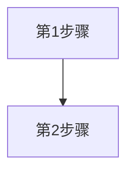
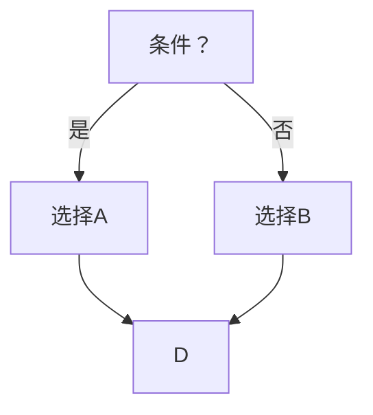
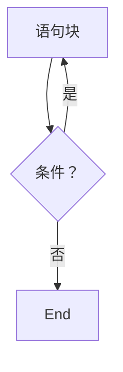
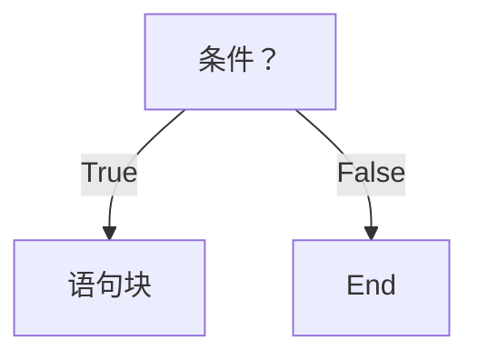
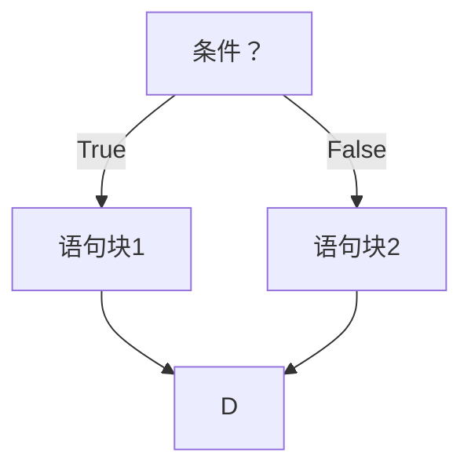
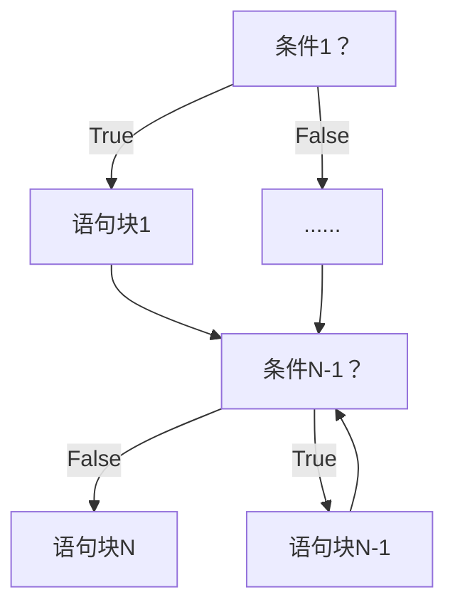
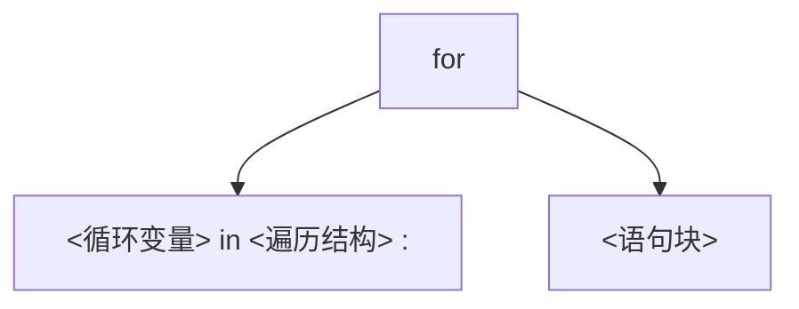
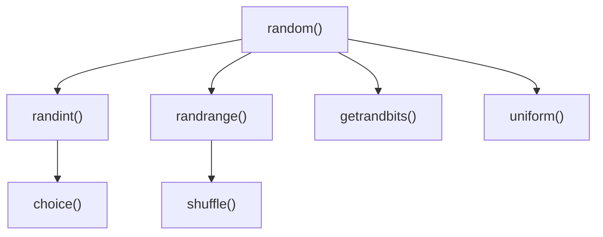
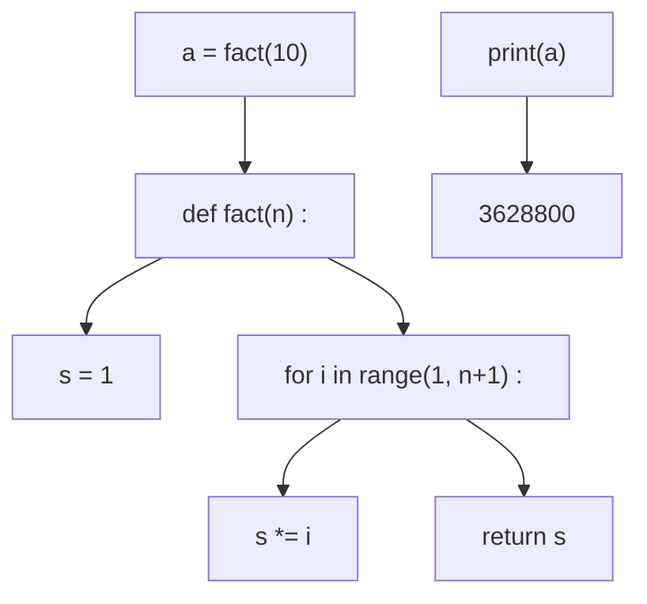

# 时间获取


<details>
<summary>natural_image</summary>

Abstract geometric network diagram with interconnected nodes and lines (no text or symbols)
</details>

# 时间获取

<table><tr><td>函数</td><td>描述</td></tr><tr><td>time()</td><td>获取当前时间戳,即计算机内部时间值,浮点数&gt;&gt;&gt;time.time()1516939876.6022282</td></tr><tr><td>ctime()</td><td>获取当前时间并以易读方式表示,返回字符串&gt;&gt;&gt;time.ctime()&#x27;Fri Jan 26 12:11:16 2018&#x27;</td></tr></table>

# 时间获取

<table><tr><td>函数</td><td>描述</td></tr><tr><td>gmtime()</td><td>获取当前时间,表示为计算机可处理的时间格式&gt;&gt;&gt;time.gmtime()time.struct_time(tm_year=2018, tm_mon=1, tm_mday=26, tm_hour=4, tm_min=11, tm_sec=16, tm_wday=4, tm_yday=26, tm_isdst=0)</td></tr></table>

# 时间格式化

# 时间格式化

# 将时间以合理的方式展示出来

格式化：类似字符串格式化，需要有展示模板  
展示模板由特定的格式化控制符组成  
strftime()方法

# 时间格式化

<table><tr><td>函数</td><td>描述</td></tr><tr><td>strftime(tpl, ts)</td><td>tpl是格式化模板字符串,用来定义输出效果ts是计算机内部时间类型变量&gt;&gt;&gt;t = time.gmtime()&gt;&gt;&gt;time.strftime(&quot;%Y-%m-%d %H:%M:%S&quot;,t)&#x27;2018-01-26 12:55:20&#x27;</td></tr></table>

# 格式化控制符

<table><tr><td>格式化字符串</td><td>日期/时间说明</td><td>值范围和实例</td></tr><tr><td>%Y</td><td>年份</td><td>0000~9999,例如:1900</td></tr><tr><td>%m</td><td>月份</td><td>01~12,例如:10</td></tr><tr><td>%B</td><td>月份名称</td><td>January~December,例如:April</td></tr><tr><td>%b</td><td>月份名称缩写</td><td>Jan~Dec,例如:Apr</td></tr><tr><td>%d</td><td>日期</td><td>01~31,例如:25</td></tr><tr><td>%A</td><td>星期</td><td>Monday~Sunday,例如:Wednesday</td></tr></table>

# 格式化控制符

<table><tr><td>格式化字符串</td><td>日期/时间说明</td><td>值范围和实例</td></tr><tr><td>%a</td><td>星期缩写</td><td>Mon~Sun,例如:Wed</td></tr><tr><td>%H</td><td>小时(24h制)</td><td>00~23,例如:12</td></tr><tr><td>%h</td><td>小时(12h制)</td><td>01~12,例如:7</td></tr><tr><td>%p</td><td>上/下午</td><td>AM,PM,例如:PM</td></tr><tr><td>%M</td><td>分钟</td><td>00~59,例如:26</td></tr><tr><td>%S</td><td>秒</td><td>00~59,例如:26</td></tr></table>

# 时间格式化

>>>t = time.gmtime()

>>>time.strftime("%Y-%m-%d %H:%M:%S",t)


2018-01-26 12:55:20


>>>timeStr = '2018-01-26 12:55:20'

>>>time.strptime(timeStr, “%Y-%m-%d %H:%M:%S”)

# 时间格式化

<table><tr><td>函数</td><td>描述</td></tr><tr><td>strptime(str, tpl)</td><td>str是字符串形式的时间值tpl是格式化模板字符串,用来定义输入效果&gt;&gt;&gt;timeStr = &#x27;2018-01-26 12:55:20&#x27;&gt;&gt;&gt;time.strptime(timeStr, &quot;%Y-%m-%d %H:%M:%S&quot;)time.struct_time(tm_year=2018, tm_mon=1,tm_mday=26, tm_hour=4, tm_min=11, tm_sec=16,tm_wday=4, tm_yday=26, tm_isdst=0)</td></tr></table>

# 程序计时应用


<details>
<summary>natural_image</summary>

Abstract geometric network diagram with interconnected nodes and lines (no text or symbols)
</details>

# 程序计时

# 程序计时应用广泛

程序计时指测量起止动作所经历时间的过程  
测量时间：perf\_counter()  
产生时间：sleep()

# 程序计时

<table><tr><td>函数</td><td>描述</td></tr><tr><td>perf_counter()</td><td>返回一个CPU级别的精确时间计数值,单位为秒由于这个计数值起点不确定,连续调用差值才有意义&gt;&gt;&gt;start = time.perf_counter()318.66599499718114&gt;&gt;&gt;end = time.perf_counter()341.3905185375658&gt;&gt;&gt;end - start22.724523540384666</td></tr></table>

# 程序计时

<table><tr><td>函数</td><td>描述</td></tr><tr><td>sleep(s)</td><td>s拟休眠的时间,单位是秒,可以是浮点数&gt;&gt;&gt;def wait():time.sleep(3.3)&gt;&gt;wait() #程序将等待3.3秒后再退出</td></tr></table>

# 单元小结

# 模块2: time库的使用

时间获取：time() ctime() gmtime()  
- 时间格式化：strftime() strptime()  
- 程序计时：perf\_counter() sleep()

# 实例4: 文本进度条


python

嵩 天

北京理工大学

pythom


<details>
<summary>text_image</summary>

"文本进度条"问题分析
</details>

# 文本进度条

# 用过计算机的都见过

进度条什么原理呢？


<details>
<summary>bar</summary>

| Category | Value (%) |
|---|---|
| Bar (Red) | 75 |
</details>


<details>
<summary>natural_image</summary>

Silhouette of a person riding a bicycle on a blue track (no text or symbols)
</details>

# 需求分析

# 文本进度条

采用字符串方式打印可以动态变化的文本进度条  
进度条需要能在一行中逐渐变化

# 问题分析

如何获得文本进度条的变化时间？

采用sleep()模拟一个持续的进度  
似乎不那么难

# "文本进度条"简单的开始


<details>
<summary>natural_image</summary>

Abstract geometric line drawing with interconnected nodes and lines (no text or symbols)
</details>


<details>
<summary>natural_image</summary>

Abstract geometric network diagram with interconnected nodes and lines (no text or symbols)
</details>

# 简单的开始

#TextProBarV1.py   
```python
import time
scale = 10
print("----执行开始----")
for i in range(scale+1):
    a = '*' * i
    b = '.' * (scale - i)
    c = (i / scale)*100
    print("{:^3.0f}%[{}->{}
    time.sleep(0.1) 
```  
print("------执行结束------")

<table><tr><td>- - - - - - - - - - - - - - - - - - - - - - - - - - - - - - - - - - - - - - - - - - - - - - - - - - - - - - - - - - - - - - - - - - - - - - - - - - - - - - - - - - - - - - - - - - - - -</td></tr><tr><td>0 %[--&gt;. . . . . . . . . . ]</td></tr><tr><td>10 %[*-&gt;. . . . . . . . . ]</td></tr><tr><td>20 %[**-&gt;. . . . . . . . ]</td></tr><tr><td>30 %[***-&gt;. . . . . . . ]</td></tr><tr><td>40 %[****-&gt;. . . . . . ]</td></tr><tr><td>50 %[*****-&gt;. . . . . ]</td></tr><tr><td>60 %[*****-&gt;. . . ]</td></tr><tr><td>70 %[*********--&gt;. . ]</td></tr><tr><td>80 %[*********--&gt;. ]</td></tr><tr><td>90 %[*********--&gt;. ]</td></tr><tr><td>100%[*********--&gt;]</td></tr><tr><td>- -- -- -- -- -- -- -- -- -- -- -- -- -- -- -- -- -- -- -- -- -- -- -- -- -- -- -- -- -- -- -- -- -- -- -- -- -- -- -- -- -- -- -- -- -- -- -- -- -- -- -- -- -- -- -- -- -- -- -- -- -- -- -- -- -- -- -- -- -- -- -- -- -- -- -- -- -- -- -- -- -- -- -- -- -- -- -- -- -- -- -- -- -- -- -- -- -- -- -- --</td></tr></table>

# "文本进度条"单行动态刷新


<details>
<summary>natural_image</summary>

Abstract geometric line drawing with interconnected nodes and lines (no text or symbols)
</details>


<details>
<summary>natural_image</summary>

Abstract geometric network diagram with interconnected nodes and lines (no text or symbols)
</details>

# 单行动态刷新

# 刷新的关键是 \r

刷新的本质是：用后打印的字符覆盖之前的字符  
不能换行：print()需要被控制  
要能回退：打印后光标退回到之前的位置 \r

# 单行动态刷新

#TextProBarV2.py

import time

for i in range(101):

print("\r{:3}%".format(i), end="")

time.sleep(0.1)

<table><tr><td>0%</td><td>1%</td><td>2%</td><td>3%</td><td>4%</td><td>5%</td><td>6%</td><td>7%</td><td>8%</td><td>9%</td><td>10%</td><td>11%</td><td>12%</td><td>13%</td><td>14%</td><td>15%</td><td>16%</td><td>17%</td><td>18%</td><td>19%</td></tr><tr><td>20%</td><td>21%</td><td>22%</td><td>23%</td><td>24%</td><td>25%</td><td>26%</td><td>27%</td><td>28%</td><td>29%</td><td>30%</td><td>31%</td><td>32%</td><td>33%</td><td>34%</td><td>35%</td><td>36%</td><td>37%</td><td>38%</td><td>39%</td></tr><tr><td>40%</td><td>41%</td><td>42%</td><td>43%</td><td>44%</td><td>45%</td><td>46%</td><td>47%</td><td>48%</td><td>49%</td><td>50%</td><td>51%</td><td>52%</td><td>53%</td><td>54%</td><td>55%</td><td>56%</td><td>57%</td><td>58%</td><td>59%</td></tr><tr><td>60%</td><td>61%</td><td>62%</td><td>63%</td><td>64%</td><td>65%</td><td>66%</td><td>67%</td><td>68%</td><td>69%</td><td>70%</td><td>71%</td><td>72%</td><td>73%</td><td>74%</td><td>75%</td><td>76%</td><td>77%</td><td>78%</td><td>79%</td></tr><tr><td>80%</td><td>81%</td><td>82%</td><td>83%</td><td>84%</td><td>85%</td><td>86%</td><td>87%</td><td>88%</td><td>89%</td><td>90%</td><td>91%</td><td>92%</td><td>93%</td><td>94%</td><td>95%</td><td>96%</td><td>97%</td><td>98%</td><td>99%</td></tr></table>

# 单行动态刷新

```python
#TextProBarV2.py
import time
for i in range(101):
    print("\r{3}%".format(i), end="")
time.sleep(0.1) 
```

```batch
D:\PYECourse>python TextProBarV2.py 44% 
```

# 命令行执行

# "文本进度条"实例完整效果


<details>
<summary>natural_image</summary>

Abstract geometric line drawing with interconnected nodes and lines (no text or symbols)
</details>


<details>
<summary>natural_image</summary>

Abstract geometric network diagram with interconnected nodes and lines (no text or symbols)
</details>

#TextProBarV3.py   
import time  
```txt
scale = 50 
```

print("执行开始".center(scale//2, "-"))  
```lua
start = time.perf_counter() 
```  
for i in range(scale+1):

```txt
a = '*' * i
b = '.' * (scale - i) 
```

```txt
c = (i / scale)*100 
```

```txt
dur = time.perf_counter() - start 
```

```javascript
print("\r{:^3.0f}%[ {} -> {} ]{:.2f}s".format(c,a,b,dur),end='') 
```

```elixir
time.sleep(0.1) 
```  
print("\n"+"执行结束".center(scale//2,'-'))

# 完整效果

```txt
D:\PYECourse>python TextProBar.py
----执行开始----
100%[**************************]5.02s
----执行结束----
```

# 准备好电脑，与老师一起编码吧！


<details>
<summary>text_image</summary>

"文本进度条"举一反三
</details>

#TextProBarV3.py   
```python
import time
scale = 50
print("执行开始".center(scale//2, "-"))
start = time.perf_counter()
for i in range(scale+1):
    a = '*' * i
    b = '.' * (scale - i)
    c = (i / scale)*100
    dur = time.perf_counter() - start
    print("\r{:^3.0f}%[{}->{}]{:.2f}s"
    time.sleep(0.1) 
```  
print("\n"+"执行结束".center(scale//2,'-'))

# 举一反三

# 计算问题扩展

文本进度条程序使用了perf\_counter()计时  
计时方法适合各类需要统计时间的计算问题  
例如：比较不同算法时间、统计部分程序运行时间

# 举一反三

# 进度条应用

在任何运行时间需要较长的程序中增加进度条  
在任何希望提高用户体验的应用中增加进度条  
进度条是人机交互的纽带之一


<details>
<summary>line</summary>

| 实际执行进度 | Linear | Early Pause | Late Pause | Slow Wavy | Fast Wavy | Power | Inverse Power | Fast Power | Inverse Fast Power |
| ------------ | ------ | ----------- | ---------- | --------- | --------- | ----- | ------------- | ---------- | ------------------ |
| 0%           | 0%     | 0%          | 0%         | 0%        | 0%        | 0%    | 0%            | 0%         | 0%                 |
| 100%         | 100%   | 100%        | 100%       | 100%      | 100%      | 100%  | 100%          | 100%       | 100%               |
</details>

# 举一反三

文本进度条的不同设计函数

<table><tr><td>设计名称</td><td>趋势</td><td>设计函数</td></tr><tr><td>Linear</td><td>Constant</td><td>f(x) = x</td></tr><tr><td>Early Pause</td><td>Speeds up</td><td>f(x) = x + (1 - sin(x*π*2 + π/2)/-8</td></tr><tr><td>Late Pause</td><td>Slows down</td><td>f(x) = x + (1 - sin(x*π*2 + π/2)/8</td></tr><tr><td>Slow Wavy</td><td>Constant</td><td>f(x) = x + sin(x*π*5)/20</td></tr><tr><td>Fast Wavy</td><td>Constant</td><td>f(x) = x + sin(x*π*20)/80</td></tr></table>

# 举一反三

文本进度条的不同设计函数

<table><tr><td>设计名称</td><td>趋势</td><td>设计函数</td></tr><tr><td>Power</td><td>Speeds up</td><td> $f(x) = (x + (1 - x)*0.03)^2$ </td></tr><tr><td>Inverse Power</td><td>Slows down</td><td> $f(x) = 1 + (1 - x)^{1.5} * -1$ </td></tr><tr><td>Fast Power</td><td>Speeds up</td><td> $f(x) = (x + (1 - x)/2)^8$ </td></tr><tr><td>Inverse Fast Power</td><td>Slows down</td><td> $f(x) = 1 + (1 - x)^3 * -1$ </td></tr></table>

# Python语言程序设计

# 第4章 辅学内容


python

嵩 天

北京理工大学

pythom

# 前课复习

# Python基本语法元素

- 缩进、注释、命名、变量、保留字   
数据类型、字符串、 整数、浮点数、列表  
- 赋值语句、分支语句、函数  
input()、print()、eval()、 print()格式化

# Python基本图形绘制

从计算机技术演进角度看待Python语言  
海龟绘图体系及import保留字用法  
penup()、pendown()、pensize()、pencolor()  
fd()、circle()、seth()  
循环语句：for和in、range()函数

# 基本数据类型

数据类型：整数、浮点数、复数及  
数据类型运算操作符、运算函数  
字符串类型：表示、索引、切片  
- 字符串操作符、处理函数、处理方法、.format()格式化  
- time库：time()、strftime()、strptime()、sleep()等

<table><tr><td>and</td><td>elif</td><td>import</td><td>raise</td><td>global</td></tr><tr><td>as</td><td>else</td><td>in</td><td>return</td><td>nonlocal</td></tr><tr><td>assert</td><td>except</td><td>is</td><td>try</td><td>True</td></tr><tr><td>break</td><td>finally</td><td>lambda</td><td>while</td><td>False</td></tr><tr><td>class</td><td>for</td><td>not</td><td>with</td><td>None</td></tr><tr><td>continue</td><td>from</td><td>or</td><td>yield</td><td></td></tr><tr><td>def</td><td>if</td><td>pass</td><td>del</td><td></td></tr></table>

保留字

```python
#TempConvert.py
TempStr = input("请输入带有符号的温度值：")
if TempStr[-1] in ['F', 'f']:
    C = (eval(TempStr[0:-1]) - 32)/1.8
    print("转换后的温度是{:.2f}C".format(C))
elif TempStr[-1] in ['C', 'c']:
    F = 1.8*eval(TempStr[0:-1]) + 32
    print("转换后的温度是{:.2f}F".format(F))
else:
    print("输入格式错误") 
```

# 温度转换


<details>
<summary>natural_image</summary>

Silhouette of a person riding a bicycle with blue lane line (no text or symbols)
</details>

import turtle

turtle.setup(650, 350, 200, 200)

turtle.penup()

turtle.fd(-250)

turtle.pendown()

turtle.pensize(25)

turtle.pencolor("purple")

turtle.seth(-40)

for i in range(4):

turtle.circle(40, 80)

turtle.circle(-40, 80)

turtle.circle(40, 80/2)

turtle.fd(40)

turtle.circle(16, 180)

turtle.fd(40 \* 2/3)

turtle.done()

Python Turtle Graphics

←


<details>
<summary>natural_image</summary>

Purple wavy line drawing with a small arrowhead at the end (no text or symbols)
</details>

Python蟒蛇绘制

# 本课概要

# 第4章 程序的控制结构


<details>
<summary>natural_image</summary>

Generic male avatar icon with beard and mustache (no text or symbols)
</details>

- 4.1 程序的分支结构  
- 4.2 实例5: 身体质量指数BMI   
4.3 程序的循环结构  
4.4 模块3: random库的使用  
- 4.5 实例6: 圆周率的计算


<details>
<summary>natural_image</summary>

Silhouette of a person riding a bicycle on a blue track (no text or symbols)
</details>

# 程序的控制结构"

- 顺序结构  
分支结构  
- 循环结构


<details>
<summary>flowchart</summary>


</details>


<details>
<summary>flowchart</summary>


</details>


<details>
<summary>flowchart</summary>


</details>

# 第4章 程序的控制结构


<details>
<summary>natural_image</summary>

Generic male avatar icon with beard and mustache (no text or symbols)
</details>

# 方法论

Python程序的控制语法及结构

# 实践能力

学会编写带有条件判断及循环的程序


<details>
<summary>natural_image</summary>

Silhouette of a person riding a bicycle on a blue track (no text or symbols)
</details>

# 练习与作业

# 第4章 程序的控制结构


<details>
<summary>natural_image</summary>

Generic male avatar icon with beard and mustache (no text or symbols)
</details>

# 练习 (可选)

5道编程题 @Python123

# 作业

15道单选题 @Python123


<details>
<summary>natural_image</summary>

Silhouette of a person riding a bicycle on a blue track (no text or symbols)
</details>

# Python语言程序设计

# 程序的分支结构


python

嵩 天

北京理工大学

pythom

# 单元开篇

# 程序的分支结构


<details>
<summary>natural_image</summary>

Generic male avatar icon with beard and mustache (no text or symbols)
</details>

单分支结构  
二分支结构  
多分支结构  
条件判断及组合  
程序的异常处理


<details>
<summary>natural_image</summary>

Silhouette of a person riding a bicycle with a blue lane line (no text or symbols)
</details>

# 单分支结构

# 单分支结构

# 根据判断条件结果而选择不同向前路径的运行方式

if <条件>

<语句块>


<details>
<summary>flowchart</summary>


</details>

# 单分支结构

# 单分支示例

$$
\text { guess } = \text { eval(input() }
$$

$$
i f \quad g u e s s = = 9 9:
$$

$$
\mathrm{print} (\text {   "猜对了   })
$$

if True:

print("条件正确")

# 二分支结构

# 二分支结构

# 根据判断条件结果而选择不同向前路径的运行方式

if <条件>

<语句块1>

else :

<语句块2>


<details>
<summary>flowchart</summary>


</details>

# 二分支结构

# 二分支示例

```julia
guess = eval(input()) 
```

```txt
if guess == 99: 
```

```txt
print("猜对了") 
```

```txt
else : 
```

```txt
print("猜错了") 
```

```txt
if True: 
```

```lua
print("语句块1") 
```

```txt
else : 
```

```lua
print("语句块2") 
```

# 二分支结构

# 紧凑形式：适用于简单表达式的二分支结构

# <表达式1> if <条件> else <表达式2>

$$
\text { guess } = \text { eval(input() }
$$

print("猜{}了".format("对" if guess==99 else "错"))

# 多分支结构

# 多分支结构

if <条件1> :

<语句块1>

elif <条件2>

<语句块2>

else :

<语句块N>


<details>
<summary>flowchart</summary>


</details>

# 多分支结构

# 对不同分数分级的问题

```txt
score = eval(input()) 
```

```txt
if score >= 60: 
```

```txt
grade = "D" 
```

```txt
elif score >= 70: 
```

```txt
grade = "C" 
```

```txt
elif score >= 80: 
```

```txt
grade = "B" 
```

```txt
elif score >= 90: 
```

```txt
grade = "A" 
```

注意多条件之间的包含关系

注意变量取值范围的覆盖

print("输入成绩属于级别{}".format(grade))

# 程序的控制结构"

- 顺序结构  
- 分支结构  
循环结构


<details>
<summary>flowchart</summary>


</details>


<details>
<summary>flowchart</summary>


</details>


<details>
<summary>flowchart</summary>


</details>

# 条件判断及组合


<details>
<summary>natural_image</summary>

Abstract geometric network diagram with interconnected nodes and lines (no text or symbols)
</details>

# 条件判断

操作符 

<table><tr><td>操作符</td><td>数学符号</td><td>描述</td></tr><tr><td>&lt;</td><td>&lt;</td><td>小于</td></tr><tr><td>&lt;=</td><td>≤</td><td>小于等于</td></tr><tr><td>&gt;=</td><td>≥</td><td>大于等于</td></tr><tr><td>&gt;</td><td>&gt;</td><td>大于</td></tr><tr><td>==</td><td>=</td><td>等于</td></tr><tr><td>!=</td><td>≠</td><td>不等于</td></tr></table>

# 条件组合

# 用于条件组合的三个保留字

<table><tr><td>操作符及使用</td><td>描述</td></tr><tr><td>x and y</td><td>两个条件x和y的逻辑与</td></tr><tr><td>x or y</td><td>两个条件x和y的逻辑或</td></tr><tr><td>not x</td><td>条件x的逻辑非</td></tr></table>

# 条件判断及组合

# 示例

```python
guess = eval(input())
if guess > 99 or guess < 99:
    print("猜错了")
else :
    print("猜对了") 
```

```python
if not True:
    print("语句块2")
else :
    print("语句块1") 
```

# 程序的异常处理


<details>
<summary>natural_image</summary>

Abstract geometric network diagram with interconnected nodes and lines (no text or symbols)
</details>

# 异常处理

num = eval(input("请输入一个整数: "))

print(num\*\*2)

当用户没有输入整数时，会产生异常，怎么处理？

# 异常处理

# 异常发生的代码行数

```txt
Traceback (most recent call last):
File "t.py", line 1, in <module>
num = eval(input("请输入一个整数："))
File "<string>", line 1, in <module> 
```

```txt
NameError: name 'abc' is not defined 
```

# 异常处理

# 异常处理的基本使用

try

<语句块1>

except

<语句块2>

try

<语句块1>

except <异常类型>

<语句块2>

# 异常处理

# 示例1

try

num = eval(input("请输入一个整数: "))

print(num\*\*2)

except

print("输入不是整数")

# 异常处理

# 示例2

try

num = eval(input("请输入一个整数: "))

print(num\*\*2)

except NameError:

标注异常类型后，仅响应该异常

异常类型名字等同于变量

print("输入不是整数")

try

<语句块1>

except

<语句块2>

else :

<语句块3>

finally :

<语句块4>

# 异常处理

# 异常处理的高级使用

finally对应语句块4一定执行

else对应语句块3在不发生异常时执行

# 单元小结

# 程序的分支结构

单分支 if 二分支 if-else 及紧凑形式  
多分支 if-elif-else 及条件之间关系  
- not and or > >= == <= < !   
异常处理 try-except-else-finally


<details>
<summary>natural_image</summary>

Silhouette of a person riding a bicycle with a blue lane line (no text or symbols)
</details>

# 实例5: 身体质量指数BMI


python

嵩 天

北京理工大学

pythom

# 身体质量指数BMI"问题分析


<details>
<summary>natural_image</summary>

Abstract geometric network diagram with interconnected nodes and lines (no text or symbols)
</details>


<details>
<summary>natural_image</summary>

Abstract geometric network diagram with interconnected nodes and lines (no text or symbols)
</details>

# 身体质量指数BMI

# BMI：对身体质量的刻画

\- BMI：Body Mass Index

国际上常用的衡量人体肥胖和健康程度的重要标准，主要用于统计分析

定义

$$
\mathrm{BMI} = \text {体重(kg) / 身高} ^ {2} (\mathrm{m} ^ {2})
$$

# 身体质量指数BMI

# BMI：对身体质量的刻画

实例：体重 72 kg 身高 1.75 m

BMI 值是 23.5

这个值是否健康呢？

# 身体质量指数BMI

# 国际：世界卫生组织 国内：国家卫生健康委员会

<table><tr><td>分类</td><td>国际BMI值 (kg/m2)</td><td>国内BMI值 (kg/m2)</td></tr><tr><td>偏瘦</td><td>&lt;18.5</td><td>&lt;18.5</td></tr><tr><td>正常</td><td>18.5 ~ 25</td><td>18.5 ~ 24</td></tr><tr><td>偏胖</td><td>25 ~ 30</td><td>24 ~ 28</td></tr><tr><td>肥胖</td><td>≥30</td><td>≥28</td></tr></table>

# 身体质量指数BMI

# 问题需求

输入：给定体重和身高值  
输出：BMI指标分类信息(国际和国内)

# "身体质量指数BMI"实例讲解


<details>
<summary>natural_image</summary>

Abstract geometric network diagram with interconnected nodes and lines (no text or symbols)
</details>


<details>
<summary>natural_image</summary>

Abstract geometric network diagram with interconnected nodes and lines (no text or symbols)
</details>

# 身体质量指标BMI

# 思路方法

- 难点在于同时输出国际和国内对应的分类  
思路1：分别计算并给出国际和国内BMI分类  
思路2：混合计算并给出国际和国内BMI分类

# 身体质量指标BMI

#CalBMIv1.py   
height, weight = eval(input("请输入身高(米)和体重\(公斤)[逗号隔开]: "))   
```python
bmi = weight / pow(height, 2) 
```  
print("BMI 数值为：{:.2f}".format(bmi))

```txt
who = "" 
```

if bmi < 18.5:   
```txt
who = "偏瘦" 
```

elif 18.5 <= bmi < 25:   
```txt
who = "正常" 
```

elif 25 <= bmi < 30:   
```txt
who = "偏胖" 
```

else:   
```txt
who = "肥胖" 
```  
print("BMI 指标为:国际'{0}'".format(who))

<table><tr><td>分类</td><td>国际BMI值</td><td>国内BMI值</td></tr><tr><td>偏瘦</td><td>&lt;18.5</td><td>&lt;18.5</td></tr><tr><td>正常</td><td>18.5 ~ 25</td><td>18.5 ~ 24</td></tr><tr><td>偏胖</td><td>25 ~ 30</td><td>24 ~ 28</td></tr><tr><td>肥胖</td><td>≥30</td><td>≥28</td></tr></table>

# 身体质量指标BMI

#CalBMIv2.py   
height, weight = eval(input("请输入身高(米)和体重\(公斤)[逗号隔开]: "))   
```python
bmi = weight / pow(height, 2) 
```  
print("BMI 数值为：{:.2f}".format(bmi))

```python
nat = "" 
```

if bmi < 18.5:   
```txt
nat = "偏瘦" 
```

elif 18.5 <= bmi < 24:   
```txt
nat = "正常" 
```

elif 24 <= bmi < 28:   
```toml
nat = "偏胖" 
```

else:   
```txt
nat = "肥胖" 
```  
print(“BMI 指标为:国内'{0}'".format(nat))

<table><tr><td>分类</td><td>国际BMI值</td><td>国内BMI值</td></tr><tr><td>偏瘦</td><td>&lt;18.5</td><td>&lt;18.5</td></tr><tr><td>正常</td><td>18.5 ~ 25</td><td>18.5 ~ 24</td></tr><tr><td>偏胖</td><td>25 ~ 30</td><td>24 ~ 28</td></tr><tr><td>肥胖</td><td>≥30</td><td>≥28</td></tr></table>

#CalBMIv3.py   
height, weight = eval(input("请输入身高(米)和体重\(公斤)[逗号隔开]: "))   
```python
bmi = weight / pow(height, 2) 
```  
print("BMI 数值为：{:.2f}".format(bmi))

```txt
who, nat = "", "" 
```  
if bmi < 18.5:

```txt
who, nat = "偏瘦", "偏瘦" 
```

elif 18.5 <= bmi < 24:   
```txt
who, nat = "正常", "正常" 
```

elif 24 <= bmi < 25:   
```txt
who, nat = "正常", "偏胖" 
```

elif 25 <= bmi < 28:   
```txt
who, nat = "偏胖", "偏胖" 
```

elif 28 <= bmi < 30:   
```txt
who, nat = "偏胖", "肥胖" 
```

else:   
```txt
who, nat = "肥胖", "肥胖" 
```  
print("BMI 指标为:国际'{0}', 国内'{1}'".format(who, nat))

<table><tr><td>分类</td><td>国际BMI值</td><td>国内BMI值</td></tr><tr><td>偏瘦</td><td>&lt;18.5</td><td>&lt;18.5</td></tr><tr><td>正常</td><td>18.5 ~ 25</td><td>18.5 ~ 24</td></tr><tr><td>偏胖</td><td>25 ~ 30</td><td>24 ~ 28</td></tr><tr><td>肥胖</td><td>≥30</td><td>≥28</td></tr></table>

# 准备好电脑，与老师一起编码吧！

# 身体质量指数BMI"举一反三


<details>
<summary>natural_image</summary>

Abstract geometric line drawing with interconnected nodes and lines (no text or symbols)
</details>


<details>
<summary>natural_image</summary>

Abstract geometric network diagram with interconnected nodes and lines (no text or symbols)
</details>

#CalBMI.py   
height, weight = eval(input("请输入身高(米)和体重\(公斤)[逗号隔开]: "))   
```python
bmi = weight / pow(height, 2) 
```  
print("BMI 数值为：{:.2f}".format(bmi))

```txt
who, nat = "", "" 
```  
if bmi < 18.5:

```txt
who, nat = "偏瘦", "偏瘦" 
```

elif 18.5 <= bmi < 24:   
```txt
who, nat = "正常", "正常" 
```

elif 24 <= bmi < 25:   
```txt
who, nat = "正常", "偏胖" 
```

elif 25 <= bmi < 28:   
```txt
who, nat = "偏胖", "偏胖" 
```

elif 28 <= bmi < 30:   
```txt
who, nat = "偏胖", "肥胖" 
```

else:   
```txt
who, nat = "肥胖", "肥胖" 
```  
print("BMI 指标为:国际'{0}', 国内'{1}'".format(who, nat))


<details>
<summary>other</summary>

| 类别 | 数值 |
|---|---|
| 消瘦 | 13.1 以下 |
| 超重 | 17.4 以上 |
| 肥胖 | 19.2 以上 |
</details>

# 举一反三

# 关注多分支条件的组合

多分支条件之间的覆盖是重要问题  
程序可运行，但不正确，要注意多分支  
分支结构是程序的重要框架，读程序先看分支

# Python语言程序设计

# 程序的循环结构


python

嵩 天

北京理工大学

pythom

# 单元开篇

# 程序的循环结构


<details>
<summary>natural_image</summary>

Generic male avatar icon with beard and mustache (no text or symbols)
</details>

遍历循环   
无限循环  
循环控制保留字  
循环的高级用法


<details>
<summary>natural_image</summary>

Silhouette of a person riding a bicycle with a blue lane line (no text or symbols)
</details>

# 遍历循环

# 遍历循环

# 遍历某个结构形成的循环运行方式

for <循环变量> in <遍历结构>  
<语句块>

从遍历结构中逐一提取元素，放在循环变量中

# 遍历循环


<details>
<summary>flowchart</summary>


</details>

由保留字for和in组成，完整遍历所有元素后结束  
每次循环，所获得元素放入循环变量，并执行一次语句块

# 遍历循环的应用

# 计数循环(N次)

for i in range(N)

<语句块>

遍历由range()函数产生的数字序列，产生循环

# 遍历循环的应用

# 计数循环(N次)

>>> for i in range(5): print(i)

>>> for i in range(5): print("Hello:",i)

0

1

2

3

4

Hello: 0

Hello: 1

Hello: 2

Hello: 3

Hello: 4

# 遍历循环的应用

# 计数循环(特定次)

for i in range(M,N,K)

<语句块>

遍历由range()函数产生的数字序列，产生循环

# 遍历循环的应用

# 计数循环(特定次)

>>> for i in range(1,6): print(i)

>>> for i in range(1,6,2): print("Hello:",i)

Hello: 1 Hello: 3 Hello: 5

# 遍历循环的应用

# 字符串遍历循环

for c in s

<语句块>

s是字符串，遍历字符串每个字符，产生循环

# 遍历循环的应用

# 字符串遍历循环

>>> for c in "Python123":

print(c, end="," )

P,y,t,h,o,n,1,2,3,

# 遍历循环的应用

# 列表遍历循环

for item in ls

<语句块>

ls是一个列表，遍历其每个元素，产生循环

# 遍历循环的应用

# 列表遍历循环

>>> for item in [123, "PY", 456] : print(item, end=",")

123,PY,456,

# 遍历循环的应用

# 文件遍历循环

for line in fi

<语句块>

fi是一个文件标识符，遍历其每行，产生循环

# 遍历循环的应用

# 文件遍历循环

>>> for line in fi : print(line)

优美胜于丑陋

明了胜于隐晦

简洁胜于复杂

优美胜于丑陋 明了胜于隐晦 简洁胜于复杂

# 遍历循环

for <循环变量> in <遍历结构>


<语句块>

- 计数循环(N次)   
- 列表遍历循环  
- 计数循环(特定次)   
文件遍历循环  
字符串遍历循环

# 无限循环

# 无限循环

# 由条件控制的循环运行方式

while <条件>

<语句块>

反复执行语句块，直到条件不满足时结束

# 无限循环的应用

# 无限循环的条件

$$
\ggg a = 3
$$

$$
\ggg \text { while } a > 0:
$$

$$
\texttt {a} = \texttt {a} - 1
$$

$$
\operatorname{print} (a)
$$

2

1

0

$$
\ggg a = 3
$$

$$
\ggg \text { while } a > 0:
$$

$$
a = a + 1
$$

$$
\operatorname{print} (a)
$$

4

5

$$
\dots \quad (\text { CTRL } + \text { C } \text { 退出执行 })
$$

# 循环控制保留字


<details>
<summary>natural_image</summary>

Abstract geometric network diagram with interconnected nodes and lines (no text or symbols)
</details>

# 循环控制保留字

# break 和 continue

break跳出并结束当前整个循环，执行循环后的语句   
continue结束当次循环，继续执行后续次数循环   
break和continue可以与for和while循环搭配使用

# 循环控制保留字

# break 和 continue

```txt
>>> for c in "PYTHON" :
if c == "T" :
continue
print(c, end="") 
```

```txt
>>> for c in "PYTHON" :
if c == "T" :
break
print(c, end="") 
```

PYHON

PY

# 循环控制保留字

>>> s = "PYTHON"

>>> while s !=

for c in s :

print(c, end="")

s = s[:-1]

>>> s = "PYTHON"

>>> while s !=

for c in s :

if c ==

break

print(c, end="") s = s[:-1]

PYTHONPYTHOPYTHPYTPYP

PYPYPYPYPYP

\- break仅跳出当前最内层循环

# 循环的高级用法


<details>
<summary>natural_image</summary>

Abstract geometric network diagram with interconnected nodes and lines (no text or symbols)
</details>

# 循环的扩展

# 循环与else

for <变量> in <遍历结构> : while <条件> :

<语句块1> <语句块1>

else : else :

<语句块2> <语句块2>

# 循环的扩展

# 循环与else

当循环没有被break语句退出时，执行else语句块  
else语句块作为"正常"完成循环的奖励  
这里else的用法与异常处理中else用法相似

# 循环的扩展

# 循环与else

>>> for c in "PYTHON"

if c == "T

continue

print(c, end="")

else:

print("正常退出")

>>> for c in "PYTHON"

if c == "T

break

print(c, end="")

else:

print("正常退出")

PYHON正常退出

PY

# 单元小结

# 程序的循环结构

- for…in 遍历循环: 计数、字符串、列表、文件…  
while无限循环   
- continue和break保留字: 退出当前循环层次  
- 循环else的高级用法: 与break有关

# 模块3: random库的使用


python

嵩 天

北京理工大学

pythom


<details>
<summary>text_image</summary>

random库基本介绍
</details>

# random库概述

# random库是使用随机数的Python标准库

伪随机数: 采用梅森旋转算法生成的(伪)随机序列中元素  
random库主要用于生成随机数  
使用random库: import random

# random库概述

# random库包括两类函数，常用共8个

基本随机数函数： seed(), random()  
扩展随机数函数： randint(), getrandbits(), uniform(),

randrange(), choice(), shuffle()

# 基本随机数函数


<details>
<summary>natural_image</summary>

Abstract geometric network diagram with interconnected nodes and lines (no text or symbols)
</details>

# 基本随机数函数

# 随机数种子

随机数种子

10

梅森旋转算法

随
机
序
列

0.5714025946899135

0.4288890546751146

0.5780913011344704

0.20609823213950174

0.81332125135732

随机数

0.8235888725334455

0.6534725339011758

0.16022955651881965

0.5206693596399246

0.32777281162209315

# 基本随机数函数

<table><tr><td>函数</td><td>描述</td></tr><tr><td>seed(a=None)</td><td>初始化给定的随机数种子,默认为当前系统时间&gt;&gt;&gt;random.seed(10) #产生种子10对应的序列</td></tr><tr><td>random()</td><td>生成一个[0.0, 1.0)之间的随机小数&gt;&gt;&gt;random.random()0.5714025946899135</td></tr></table>

# 基本随机数函数

>>> import random

>>> random.seed(10)

>>> random.random()

0.5714025946899135

>>> random.random()

0.4288890546751146

>>> import random

>>> random.seed(10)

>>> random.random()

0.5714025946899135

>>> random.seed(10)

>>> random.random()

0.5714025946899135

# 扩展随机数函数


<details>
<summary>natural_image</summary>

Abstract geometric network diagram with interconnected nodes and lines (no text or symbols)
</details>

# 扩展随机数函数


<details>
<summary>flowchart</summary>


</details>

# 扩展随机数函数

<table><tr><td>函数</td><td>描述</td></tr><tr><td>randint(a, b)</td><td>生成一个[a, b]之间的整数&gt;&gt;&gt;random.randint(10, 100)64</td></tr><tr><td>randrange(m, n[, k])</td><td>生成一个[m, n)之间以k为步长的随机整数&gt;&gt;&gt;random.randrange(10, 100, 10)80</td></tr></table>

# 扩展随机数函数

<table><tr><td>函数</td><td>描述</td></tr><tr><td>getrandbits(k)</td><td>生成一个k比特长的随机整数&gt;&gt;&gt;random.getrandbits(16)37885</td></tr><tr><td>uniform(a, b)</td><td>生成一个[a, b]之间的随机小数&gt;&gt;&gt;random.uniform(10, 100)13.096321648808136</td></tr></table>

# 扩展随机数函数

<table><tr><td>函数</td><td>描述</td></tr><tr><td>choice(seq)</td><td>从序列seq中随机选择一个元素&gt;&gt;&gt;random.choice([1,2,3,4,5,6,7,8,9])8</td></tr><tr><td>shuffle(seq)</td><td>将序列seq中元素随机排列,返回打乱后的序列&gt;&gt;&gt;s=[1,2,3,4,5,6,7,8,9];random.shuffle(s);print(s)[3, 5, 8, 9, 6, 1, 2, 7, 4]</td></tr></table>

# 随机数函数的使用

# 需要掌握的能力

能够利用随机数种子产生"确定"伪随机数  
能够产生随机整数  
能够对序列类型进行随机操作

# 实例6: 圆周率的计算


python

嵩 天

北京理工大学

pythom

# 圆周率的计算"问题分析


<details>
<summary>natural_image</summary>

Abstract geometric line drawing with interconnected nodes and lines (no text or symbols)
</details>


<details>
<summary>natural_image</summary>

Abstract geometric network diagram with interconnected nodes and lines (no text or symbols)
</details>

# 圆周率的计算"问题分析

# 圆周率的近似计算公式

$$
\pi = \sum_ {k = 0} ^ {\infty} [ \frac {1}{1 6 ^ {k}} \left(\frac {4}{8 k + 1} - \frac {2}{8 k + 4} - \frac {1}{8 k + 5} - \frac {1}{8 k + 6}\right) ]
$$

# II 圆周率的计算"问题分析


<details>
<summary>text_image</summary>

-1
-1
1
1
1
</details>

蒙特卡罗方法


<details>
<summary>scatter</summary>

| x    | y    |
| ---- | ---- |
| 0.0  | 1.0  |
| 0.2  | 0.95 |
| 0.4  | 0.85 |
| 0.6  | 0.70 |
| 0.8  | 0.50 |
| 1.0  | 0.20 |
</details>

# II 圆周率的计算"实例讲解


<details>
<summary>natural_image</summary>

Abstract geometric line drawing with interconnected nodes and lines (no text or symbols)
</details>


<details>
<summary>natural_image</summary>

Abstract geometric network diagram with interconnected nodes and lines (no text or symbols)
</details>

# 圆周率的计算"实例讲解

# 圆周率的近似计算公式

$$
\pi = \sum_ {k = 0} ^ {\infty} [ \frac {1}{1 6 ^ {k}} \bigg (\frac {4}{8 k + 1} - \frac {2}{8 k + 4} - \frac {1}{8 k + 5} - \frac {1}{8 k + 6} \bigg) ]
$$

#CalPiV1.py   
```txt
pi = 0 
```

```txt
N = 100 
```  
for k in range(N) :

$$
\begin{array}{l} \text { pi } + = 1 / \text { pow } (1 6, k) * (\backslash \\ 4 / (8 ^ {*} k + 1) - 2 / (8 ^ {*} k + 4) - \backslash \\ 1 / (8 ^ {*} k + 5) - 1 / (8 ^ {*} k + 6)) \\ \end{array}
$$

print("圆周率值是: {}".format(pi))

$$
\pi = \sum_ {k = 0} ^ {\infty} [ \frac {1}{1 6 ^ {k}} \bigg (\frac {4}{8 k + 1} - \frac {2}{8 k + 4} - \frac {1}{8 k + 5} - \frac {1}{8 k + 6} \bigg) ]
$$

圆周率值是: 3.141592653589793

# II 圆周率的计算"实例讲解

# 蒙特卡罗方法


<details>
<summary>text_image</summary>

-1
-1
1
1
</details>


<details>
<summary>scatter</summary>

| x | y | group |
|---|---|-------|
| 0.1 | 0.95 | blue |
| 0.2 | 0.85 | blue |
| 0.3 | 0.75 | blue |
| 0.4 | 0.65 | blue |
| 0.5 | 0.55 | blue |
| 0.6 | 0.45 | blue |
| 0.7 | 0.35 | blue |
| 0.8 | 0.25 | blue |
| 0.9 | 0.15 | blue |
| 0.15 | 0.88 | white |
| 0.25 | 0.78 | white |
| 0.35 | 0.68 | white |
| 0.45 | 0.58 | white |
| 0.55 | 0.48 | white |
| 0.65 | 0.38 | white |
| 0.75 | 0.28 | white |
| 0.85 | 0.18 | white |
| 0.95 | 0.08 | white |
</details>

#CalPiV2.py   
```python
from random import random
from time import perf_counter 
```

```txt
DARTS = 1000*1000 
```

```txt
hits = 0.0 
```

```txt
start = perf_counter() 
```  
for i in range(1, DARTS+1):

```javascript
x, y = random(), random() 
```

```python
dist = pow(x ** 2 + y ** 2, 0.5) 
```

```txt
if dist <= 1.0: 
```

```txt
hits = hits + 1 
```  
pi = 4 \* (hits/DARTS)   
print("圆周率值是: {}".format(pi))   
print("运行时间是: {:.5f}s".format(perf\_counter()-start))


<details>
<summary>scatter</summary>

| x | y | group |
|---|---|-------|
| 0.1 | 0.95 | blue |
| 0.2 | 0.85 | blue |
| 0.3 | 0.75 | blue |
| 0.4 | 0.65 | blue |
| 0.5 | 0.55 | blue |
| 0.6 | 0.45 | blue |
| 0.7 | 0.35 | blue |
| 0.8 | 0.25 | blue |
| 0.9 | 0.15 | blue |
| 0.15 | 0.88 | white |
| 0.25 | 0.78 | white |
| 0.35 | 0.68 | white |
| 0.45 | 0.58 | white |
| 0.55 | 0.48 | white |
| 0.65 | 0.38 | white |
| 0.75 | 0.28 | white |
| 0.85 | 0.18 | white |
| 0.95 | 0.08 | white |
</details>

# 准备好电脑，与老师一起编码吧！

# 圆周率的计算"举一反三


<details>
<summary>natural_image</summary>

Abstract geometric line drawing with interconnected nodes and lines (no text or symbols)
</details>


<details>
<summary>natural_image</summary>

Abstract geometric network diagram with interconnected nodes and lines (no text or symbols)
</details>

# #CalPiV2.py

from random import random

from time import perf\_counter

DARTS = 1000\*1000

hits = 0.0

start = perf\_counter()

for i in range(1, DARTS+1):

x, y = random(), random()

dist = pow(x \*\* 2 + y \*\* 2, 0.5)

if dist <= 1.0:

hits = hits + 1

pi = 4 \* (hits/DARTS)

print("圆周率值是: {}".format(pi))

print("运行时间是: {:.5f}s".format(perf\_counter()-start))


<details>
<summary>text_image</summary>

π
</details>

原创 @嵩天老师团队

# 举一反三

# 理解方法思维

数学思维：找到公式，利用公式求解  
计算思维：抽象一种过程，用计算机自动化求解  
谁更准确？ （不好说…）

# 举一反三

# 程序运行时间分析

使用time库的计时方法获得程序运行时间  
改变撒点数量，理解程序运行时间的分布  
初步掌握简单的程序性能分析方法

# 举一反三

# 计算问题的扩展


<details>
<summary>scatter</summary>

| x    | y    |
| ---- | ---- |
| 0.0  | 1.0  |
| 0.2  | 0.8  |
| 0.4  | 0.6  |
| 0.6  | 0.4  |
| 0.8  | 0.2  |
| 1.0  | 0.0  |
</details>

不求解圆周率，而是某个特定图形的面积  
在工程计算中寻找蒙特卡罗方法的应用场景

# 第5章 辅学内容


python

嵩 天

北京理工大学

pythom

# 前课复习

# 数字类型及操作

整数类型的无限范围及4种进制表示  
- 浮点数类型的近似无限范围、小尾数及科学计数法  
- +、-、\*、/、//、%、\*\*、二元增强赋值操作符   
- abs()、divmod()、pow()、round()、max()、min()  
int()、float()、complex()

#DayDayUpQ3.py   
```python
dayup = 1.0 for..in.. (计算思维)
dayfactor = 0.01
for i in range(365):
    if i % 7 in [6,0]:
    dayup = dayup*(1-dayfactor)
else:
    dayup = dayup*(1+dayfactor) 
```  
print("工作日的力量：{:.2f} ".format(dayup))

#DayDayUpQ4.py   
def dayUP(df):
    dayup = 1
    for i in range(365):
    if i % 7 in [6,0]:
    dayup = dayup*(1 - 0.01)
    else:
    dayup = dayup*(1 + df)
    return dayup
dayfactor = 0.01
while dayUP(dayfactor) < 37.78:
    dayfactor += 0.001

print("工作日的努力参数是：{:.3f} ".format(dayfactor))

def..while..   
("笨办法"试错)   


<details>
<summary>text_image</summary>

好好學習
天天向上
朱泽东
</details>

# 字符串类型及操作

正向递增序号、反向递减序号、<字符串>[M:N:K]   
- +、\*、len()、str()、hex()、oct()、ord()、chr()  
- .lower()、.upper()、.split()、.count()、.replace()  
- .center()、.strip()、.join(）、.format()格式化

#TextProBarV3.py   
```python
import time
scale = 50
print("执行开始".center(scale//2, "-"))
start = time.perf_counter()
for i in range(scale+1):
    a = '*' * i
    b = '.' * (scale - i)
    c = (i / scale)*100
    dur = time.perf_counter() - start
    print("\r{:^3.0f}%[{}->{}]{:.2f}s"
time.sleep(0.1) 
```  
print("\n"+"执行结束".center(scale//2,'-'))


<details>
<summary>bar</summary>

| Category | Value (%) |
|---|---|
| Bar Segment | 75% |
</details>

# 程序的分支结构

单分支 if 二分支 if-else 及紧凑形式  
多分支 if-elif-else 及条件之间关系  
- not and or > >= == <= < !=   
异常处理 try-except-else-finally


<details>
<summary>natural_image</summary>

Silhouette of a person riding a bicycle with a blue line at the base (no text or symbols)
</details>

#CalBMI.py   
height, weight = eval(input("请输入身高(米)和体重\(公斤)[逗号隔开]: "))   
```python
bmi = weight / pow(height, 2) 
```  
print("BMI 数值为：{:.2f}".format(bmi))

```txt
who, nat = "", "" 
```  
if bmi < 18.5:

```txt
who, nat = "偏瘦", "偏瘦" 
```

elif 18.5 <= bmi < 24:   
```txt
who, nat = "正常", "正常" 
```

elif 24 <= bmi < 25:   
```txt
who, nat = "正常", "偏胖" 
```

elif 25 <= bmi < 28:   
```txt
who, nat = "偏胖", "偏胖" 
```

elif 28 <= bmi < 30:   
```txt
who, nat = "偏胖", "肥胖" 
```

else:   
```txt
who, nat = "肥胖", "肥胖" 
```  
print("BMI 指标为:国际'{0}', 国内'{1}'".format(who, nat))


<details>
<summary>other</summary>

| 类别 | 数值 |
|---|---|
| 消瘦 | 13.1 以下 |
| 超重 | 17.4 以上 |
| 肥胖 | 19.2 以上 |
</details>

# 程序的循环结构

- for…in 遍历循环: 计数、字符串、列表、文件…  
while无限循环   
- continue和break保留字: 退出当前循环层次  
- 循环else的高级用法: 与break有关

# #CalPiV2.py

from random import random

from time import perf\_counter

DARTS = 1000\*1000

hits = 0.0

start = perf\_counter()

for i in range(1, DARTS+1):

x, y = random(), random()

dist = pow(x \*\* 2 + y \*\* 2, 0.5)

if dist <= 1.0:

hits = hits + 1

pi = 4 \* (hits/DARTS)

print("圆周率值是: {}".format(pi))

print("运行时间是: {:.5f}s".format(perf\_counter()-start))


<details>
<summary>text_image</summary>

π
</details>

原创 @嵩天老师团队

# 本课概要

# 第5章 函数和代码复用


<details>
<summary>natural_image</summary>

Generic male avatar icon with beard and mustache (no text or symbols)
</details>

- 5.1 函数的定义与使用  
- 5.2 实例7: 七段数码管绘制  
- 5.3 代码复用与函数递归  
- 5.4 模块4: PyInstaller库的使用  
- 5.5 实例8: 科赫雪花小包裹


# 第5章 函数和代码复用

# 方法论


<details>
<summary>natural_image</summary>

Generic male avatar icon with beard and mustache (no text or symbols)
</details>

\- Python基本代码抽象即函数的使用方法

# 实践能力

\- 学会编写带有函数并复用代码的程序


<details>
<summary>natural_image</summary>

Silhouette of a person riding a bicycle with blue lane line (no text or symbols)
</details>

# 练习与作业

# 第5章 函数和代码复用


<details>
<summary>natural_image</summary>

Generic male avatar icon with beard and mustache (no text or symbols)
</details>

# 练习 (可选)

5道编程题 @Python123

# 作业

15道单选题 @Python123


<details>
<summary>natural_image</summary>

Silhouette of a person riding a bicycle with wheels, no text or symbols present
</details>

# 函数的定义与使用


python

嵩 天

北京理工大学

pythom

# 单元开篇

# 函数的定义与使用


<details>
<summary>natural_image</summary>

Simple icon of a person with beard and mustache, wearing a collared shirt (no text or symbols)
</details>

函数的理解与定义  
函数的使用及调用过程  
函数的参数传递  
函数的返回值  
局部变量和全局变量  
lambda函数


<details>
<summary>natural_image</summary>

Silhouette of a person riding a bicycle on a blue line (no text or symbols)
</details>


<details>
<summary>text_image</summary>

函数的理解和定义
</details>

#DayDayUpQ4.py   
```python
def dayUP(df):
    dayup = 1
    for i in range(365):
    if i % 7 in [6,0]:
    dayup = dayup*(1 - 0.01)
    else:
    dayup = dayup*(1 + df)
    return dayup 
```

```txt
dayfactor = 0.01 
```

```txt
while dayUP(dayfactor) < 37.78: 
```

```txt
dayfactor += 0.001 
```

```lua
print("工作日的努力参数是：{:.3f}".format(dayfactor))
```  
def..while..   
("笨办法"试错)

# 函数的定义

# 函数是一段代码的表示

函数是一段具有特定功能的、可重用的语句组  
函数是一种功能的抽象，一般函数表达特定功能  
两个作用：降低编程难度 和 代码复用

# 函数的定义

# 函数是一段代码的表示

def <函数名>(<参数(0个或多个)>) :

<函数体>

return <返回值>

# 函数的定义

函数名

参数

def fact(n) :

s = 1

计算 n!

for i in range(1, n+1):

s \*= i

return s


返回值

# 函数的定义

$$
y = f (x)
$$

函数定义时，所指定的参数是一种占位符  
函数定义后，如果不经过调用，不会被执行  
函数定义时，参数是输入、函数体是处理、结果是输出 (IPO)

# 函数的使用及调用过程


<details>
<summary>natural_image</summary>

Abstract geometric line drawing with interconnected nodes and lines (no text or symbols)
</details>


<details>
<summary>natural_image</summary>

Abstract geometric network diagram with interconnected nodes and lines (no text or symbols)
</details>

# 函数的调用

# 调用是运行函数代码的方式

```python
def fact(n) : 函数的定义
s = 1
for i in range(1, n+1):
    s *= i
return s 
```

fact(10)

函数的调用

调用时要给出实际参数  
实际参数替换定义中的参数  
函数调用后得到返回值

# 函数的调用过程


<details>
<summary>flowchart</summary>


</details>

# 函数的参数传递


<details>
<summary>natural_image</summary>

Abstract geometric network diagram with interconnected nodes and lines (no text or symbols)
</details>

# 参数个数

# 函数可以有参数，也可以没有，但必须保留括号

def <函数名>() :

def fact() :

<函数体>

print("我也是函数")

return <返回值>

# 可选参数传递

# 函数定义时可以为某些参数指定默认值，构成可选参数

def <函数名>(<非可选参数>, <可选参数>) :

<函数体>

return <返回值>

# 可选参数传递


<details>
<summary>text_image</summary>

可选参数
def fact(n, m=1) :
s = 1
>>> fact(10)
3628800
>>> fact(10,5)
return s//m
</details>

# 可变参数传递

# 函数定义时可以设计可变数量参数，既不确定参数总数量

def <函数名>(<参数>, \*b

<函数体>

return <返回值>

# 可变参数传递

可变参数def fact(n, \*b) :

$$
s = 1
$$

for i in range(1, n+1):

s \*= i

for item in b:

s \*= item

return s

>>> fact(10,3)

10886400

>>> fact(10,3,5,8)

435456000

计算 n!乘数

# 参数传递的两种方式

# 函数调用时，参数可以按照位置或名称方式传递

```txt
def fact(n, m=1) : 
```

```txt
s = 1 
```

```txt
for i in range(1, n+1): 
```

```txt
s *= i 
```

```txt
return s//m 
```


<details>
<summary>text_image</summary>

>> fact( 10,5 )
725760
>>> fact( m=5,n=10 )
725760
位置传递
名称传递
</details>

# 函数的返回值


<details>
<summary>natural_image</summary>

Abstract geometric network diagram with interconnected nodes and lines (no text or symbols)
</details>

# 函数的返回值

# 函数可以返回0个或多个结果

- return保留字用来传递返回值   
函数可以有返回值，也可以没有，可以有return，也可以没有  
- return可以传递0个返回值，也可以传递任意多个返回值

# 函数的返回值

# 函数调用时，参数可以按照位置或名称方式传递

def fact(n, m=1) :

$$
s = 1
$$

for i in range(1, n+1):

$$
s ^ {*} = i
$$

return s//m, n, m

>>> fact( 10,5 )

元组类型

(725760, 10, 5)

>>> a,b,c = fact(10,5)

>>> print(a,b,c)

725760 10 5

# 局部变量和全局变量


<details>
<summary>natural_image</summary>

Abstract geometric line drawing with interconnected nodes and lines (no text or symbols)
</details>


<details>
<summary>natural_image</summary>

Abstract geometric network diagram with interconnected nodes and lines (no text or symbols)
</details>

# 局部变量和全局变量

# 程序全局变量

<语句块1>

def <函数名>(<参数>)

<函数体>

return <返回值>

<语句块2>

# 函数局部变量

# 局部变量和全局变量


<details>
<summary>text_image</summary>

n, s = 10, 100 ← n和s是全局变量
def fact(n) :
    s = 1 ← fact()函数中的n和s是局部变量
for i in range(1, n+1):
    s *= i        运行结果
return s        >>>
print(fact(n), s) ← n和s是全局变量 3628800
</details>

# 局部变量和全局变量

# 规则1: 局部变量和全局变量是不同变量

局部变量是函数内部的占位符，与全局变量可能重名但不同  
函数运算结束后，局部变量被释放  
可以使用global保留字在函数内部使用全局变量

# 局部变量和全局变量

$$
n, s = 1 0, 1 0 0
$$

def fact(n) :

$$
\boxed {s} = 1
$$

fact()函数中s是局部变量

与全局变量s不同

for i in range(1, n+1):

$$
s ^ {*} = i
$$

运行结果

return s

此处局部变量s是3628800

print(fact(n), s) 此处全局变量s是100

3628800 100

# 局部变量和全局变量

$$
n, s = 1 0, 1 0 0
$$

def fact(n) :

fact()函数中使用global保留字声明

global s

此处s是全局变量s

for i in range(1, n+1):

s \*= i

运行结果

return s

此处s指全局变量s

print(fact(n), s) 此处全局变量s被函数修改

362880000 362880000

# 局部变量和全局变量

# 规则2: 局部变量为组合数据类型且未创建，等同于全局变量


<details>
<summary>text_image</summary>

ls = ["F", "f"]
def func(a) :
    ls.append(a)
    return
func("C")
print(ls)
通过使用[]真实创建了一个全局变量列表ls
此处ls是列表类型，未真实创建
则等同于全局变量
运行结果
全局变量ls被修改
>>> ['F', 'f', 'C']
</details>

# 局部变量和全局变量

ls = ["F", "f"] 通过使用[]真实创建了一个全局变量列表ls

def func(a) :

$$
\mathbf {l s} = [ ]
$$

此处ls是列表类型，真实创建

ls是局部变量

ls.append(a)

return

func("C")

print(ls)

局部变量ls被修改

运行结果

['F', 'f']

# 局部变量和全局变量

# 使用规则

基本数据类型，无论是否重名，局部变量与全局变量不同  
可以通过global保留字在函数内部声明全局变量  
- 组合数据类型，如果局部变量未真实创建，则是全局变量

# lambda函数