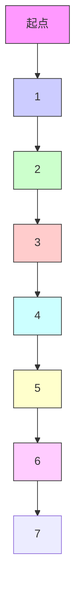
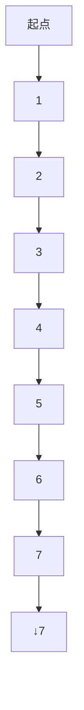
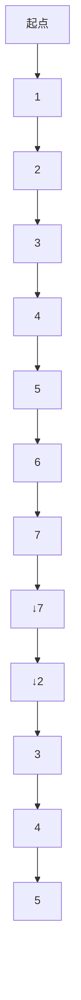
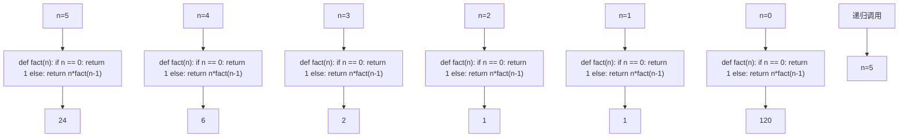
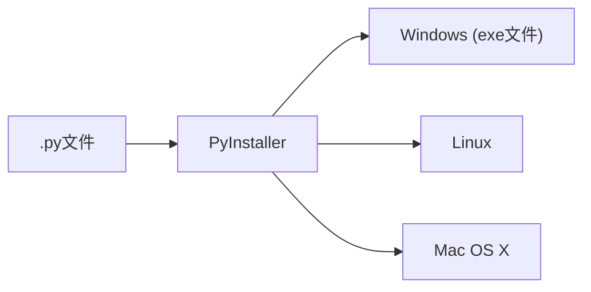
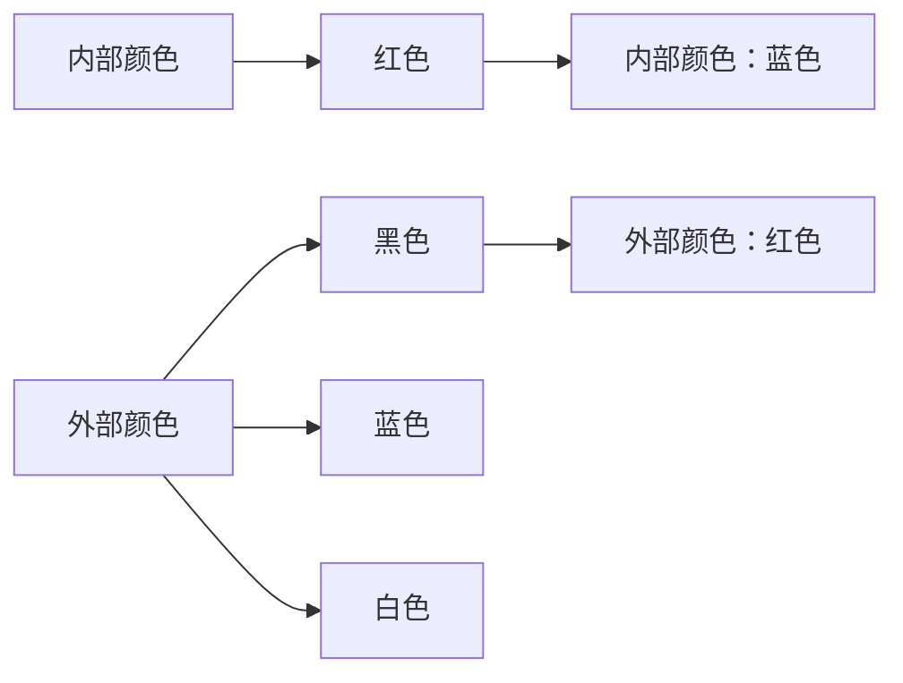

# lambda函数

# lambda函数返回函数名作为结果

lambda函数是一种匿名函数，即没有名字的函数  
使用lambda保留字定义，函数名是返回结果  
lambda函数用于定义简单的、能够在一行内表示的函数

# lambda函数

<函数名> = lambda <参数>: <表达式>

def <函数名>(<参数>)

等价于

<函数体>

return <返回值>

# lambda函数

>>> f = lambda x, y : x + y

>>> f(10, 15)

25

>>> f = lambda : "lambda函数"

>>> print(f())

lambda函数

# lambda函数的应用

# 谨慎使用lambda函数

lambda函数主要用作一些特定函数或方法的参数  
lambda函数有一些固定使用方式，建议逐步掌握  
一般情况，建议使用def定义的普通函数

# 单元小结

# 函数的定义与使用

使用保留字def定义函数，lambda定义匿名函数  
可选参数(赋初值)、可变参数(\*b)、名称传递  
保留字return可以返回任意多个结果  
保留字global声明使用全局变量，一些隐式规则


<details>
<summary>natural_image</summary>

Silhouette of a person riding a bicycle with wheels, no text or symbols present
</details>

# 实例7: 七段数码管绘制


python

嵩 天

北京理工大学

pythom

# "七段数码管绘制"问题分析


<details>
<summary>natural_image</summary>

Abstract geometric line drawing with interconnected nodes and lines (no text or symbols)
</details>


<details>
<summary>natural_image</summary>

Abstract geometric network diagram with interconnected nodes and lines (no text or symbols)
</details>

# 问题分析

# 七段数码管


<details>
<summary>natural_image</summary>

Exterior view of a black metal-framed digital display unit with 8888 digits, featuring hexagonal grid patterns and small connectors (no text or symbols visible)
</details>


<details>
<summary>text_image</summary>

a
f
g
b
e
c
d
dp
</details>


<details>
<summary>text_image</summary>

8.8.8.8.4.5.6.7.8.9
8.6.0.8.6.6.
</details>

# 问题分析

# 七段数码管绘制

需求：用程序绘制七段数码管，似乎很有趣  
该怎么做呢？

turtle绘图体系


七段数码管绘制

# 问题分析

# 七段数码管绘制时间


Python Turtle Graphics


<details>
<summary>text_image</summary>

20 18 年 10 月 10 日
</details>

# "七段数码管绘制"实例讲解(上)


<details>
<summary>natural_image</summary>

Abstract geometric line drawing with interconnected nodes and lines (no text or symbols)
</details>


<details>
<summary>natural_image</summary>

Abstract geometric network diagram with interconnected nodes and lines (no text or symbols)
</details>

# 七段数码管绘制

# 基本思路

步骤1：绘制单个数字对应的数码管  
步骤2：获得一串数字，绘制对应的数码管  
步骤3：获得当前系统时间，绘制对应的数码管

# 七段数码管绘制

# 步骤1: 绘制单个数码管


<details>
<summary>flowchart</summary>


</details>

七段数码管由7个基本线条组成  
七段数码管可以有固定顺序  
不同数字显示不同的线条

# import turtle

def drawLine(draw): #绘制单段数码管

```txt
turtle.pendown() if draw else turtle.penup()
turtle.fd(40)
turtle.right(90) 
```

def drawDigit(digit): #根据数字绘制七段数码管

```txt
drawLine(True) if digit in [2,3,4,5,6,8,9] else drawLine(False)
drawLine(True) if digit in [0,1,3,4,5,6,7,8,9] else drawLine(False)
drawLine(True) if digit in [0,2,3,5,6,8,9] else drawLine(False)
drawLine(True) if digit in [0,2,6,8] else drawLine(False)
turtle.left(90)
drawLine(True) if digit in [0,4,5,6,8,9] else drawLine(False)
drawLine(True) if digit in [0,2,3,5,6,7,8,9] else drawLine(False)
drawLine(True) if digit in [0,1,2,3,4,7,8,9] else drawLine(False)
turtle.left(180) 
```

```javascript
turtle.penup() #为绘制后续数字确定位置
turtle.fd(20) #为绘制后续数字确定位置
```


<details>
<summary>flowchart</summary>


</details>

# 七段数码管绘制

步骤2: 获取一段数字，绘制多个数码管  


<details>
<summary>flowchart</summary>


</details>

第1个


<details>
<summary>flowchart</summary>


</details>

第2个


<details>
<summary>flowchart</summary>


</details>

第N个

import turtle  
```python
def drawLine(draw): #绘制单段数码管
...(略) 
```

```txt
def drawDigit(digit): #根据数字绘制七段数码管
...(略) 
```

```txt
def drawDate(date): #获得要输出的数字
for i in date: 
```

drawDigit(eval(i)) #通过eval()函数将数字变为整数

def main():   
```lua
turtle.setup(800, 350, 200, 200)
turtle.penup()
turtle.fd(-300)
turtle.pensize(5)
drawDate('20181010')
turtle.hideturtle()
turtle.done() 
```  
main()

Python Turtle Graphics

$$
2 0 1 8 1 0 1 0
$$

# 准备好电脑，与老师一起编码吧！

# "七段数码管绘制"实例讲解(下)


<details>
<summary>natural_image</summary>

Abstract geometric line drawing with interconnected nodes and lines (no text or symbols)
</details>


<details>
<summary>natural_image</summary>

Abstract geometric network diagram with interconnected nodes and lines (no text or symbols)
</details>

# 七段数码管绘制

# 基本思路

- 步骤1：绘制单个数字对应的数码管  
- 步骤2：获得一串数字，绘制对应的数码管  
步骤3：获得当前系统时间，绘制对应的数码管

# 七段数码管绘制

# 绘制漂亮的七段数码管


<details>
<summary>flowchart</summary>


</details>

\- 增加七段数码管之间线条间隔

import turtle  
```txt
def drawGap(): #绘制数码管间隔
turtle.penup()
turtle.fd(5) 
```  
def drawLine(draw): #绘制单段数码管

```txt
drawGap()
turtle.pendown() if draw else turtle.penup()
turtle.fd(40)
drawGap()
turtle.right(90) 
```  
def drawDigit(digit): #根据数字绘制七段数码管

```txt
drawLine(True) if digit in [2,3,4,5,6,8,9] else drawLine(False)
drawLine(True) if digit in [0,1,3,4,5,6,7,8,9] else drawLine(False)
drawLine(True) if digit in [0,2,3,5,6,8,9] else drawLine(False)
drawLine(True) if digit in [0,2,6,8] else drawLine(False)
...(略) 
```

# 七段数码管绘制

# 步骤3: 获取系统时间，绘制七段数码管


<details>
<summary>flowchart</summary>


</details>

使用time库获得系统当前时间  
增加年月日标记  
- 年月日颜色不同

import turtle, time  
…(略)   
def drawDate(date): #data为日期，格式为 '%Y-%m=%d+'   
turtle.pencolor("red")  
for i in date:   
```python
if i == '-':
    turtle.write('年', font = ("Arial", 18, "normal"))
    turtle.pencolor("green")
    turtle.fd(40) 
```

```python
elif i == '=':
    turtle.write('月', font = ("Arial", 18, "normal"))
    turtle.pencolor("blue")
    turtle.fd(40) 
```

```python
elif i == '+':
    turtle.write('日', font = ("Arial", 18, "normal"))
else:
    drawDigit(eval(i)) 
```  
def main():   
…(略)

import turtle, time  
…(略)   
def drawDate(date):   
…(略)   
def main():   
```lua
turtle.setup(800, 350, 200, 200)
turtle.penup()
turtle.fd(-300)
turtle.pensize(5)
```  
drawDate(time.strftime('%Y-%m=%d+',time.gmtime()))

```lua
turtle.hideturtle()
turtle.done() 
```  
main()

Python Turtle Graphics

t


<details>
<summary>text_image</summary>

20 18 年
</details>


# 准备好电脑，与老师一起编码吧！

# "七段数码管绘制"举一反三


<details>
<summary>natural_image</summary>

Abstract geometric line drawing with interconnected nodes and lines (no text or symbols)
</details>


<details>
<summary>natural_image</summary>

Abstract geometric network diagram with interconnected nodes and lines (no text or symbols)
</details>

import turtle, time

…(略)

def drawLine(draw):

drawGap()

turtle.pendown() if draw else turtle.penup()

turtle.fd(40)

drawGap()

turtle.right(90)

def drawDigit(digit):

drawLine(True) if digit in [2,3,4,5,6,8,9] else drawLine(False)

drawLine(True) if digit in [0,1,3,4,5,6,7,8,9] else drawLine(False)

drawLine(True) if digit in [0,2,3,5,6,8,9] else drawLine(False)

drawLine(True) if digit in [0,2,6,8] else drawLine(False)

turtle.left(90)

drawLine(True) if digit in [0,4,5,6,8,9] else drawLine(False)

drawLine(True) if digit in [0,2,3,5,6,7,8,9] else drawLine(False)

drawLine(True) if digit in [0,1,2,3,4,7,8,9] else drawLine(False)

…(略)


<details>
<summary>text_image</summary>

Python Turtle Graphics
20 18 年 10 月 10 日
</details>

# 举一反三

# 理解方法思维

模块化思维：确定模块接口，封装功能  
规则化思维：抽象过程为规则，计算机自动执行  
化繁为简：将大功能变为小功能组合，分而治之

# 举一反三

# 应用问题的扩展

绘制带小数点的七段数码管  
带刷新的时间倒计时效果  
绘制高级的数码管


<details>
<summary>natural_image</summary>

Abstract geometric pattern with red and gray shapes forming a symmetrical design (no text or symbols)
</details>


<details>
<summary>natural_image</summary>

Abstract geometric pattern with interlocking hexagonal shapes (no text or symbols)
</details>

# 代码复用与函数递归


python

嵩 天

北京理工大学

pythom

# 单元开篇

# 代码复用与函数递归


<details>
<summary>natural_image</summary>

Simple icon of a person with beard and mustache, wearing a collared shirt (no text or symbols)
</details>

代码复用与模块化设计  
函数递归的理解  
函数递归的调用过程  
函数递归实例解析


<details>
<summary>natural_image</summary>

Silhouette of a person riding a bicycle on a blue track (no text or symbols)
</details>

# 代码复用与模块化设计


<details>
<summary>natural_image</summary>

Abstract geometric line drawing with interconnected nodes and lines (no text or symbols)
</details>


<details>
<summary>natural_image</summary>

Abstract geometric network diagram with interconnected nodes and lines (no text or symbols)
</details>

# 代码复用

# 把代码当成资源进行抽象

代码资源化：程序代码是一种用来表达计算的"资源"  
代码抽象化：使用函数等方法对代码赋予更高级别的定义  
代码复用：同一份代码在需要时可以被重复使用

# 代码复用

# 函数 和 对象 是代码复用的两种主要形式

函数：将代码命名

在代码层面建立了初步抽象

对象：属性和方法

<a>.<b> 和 <a>.<b>()

在函数之上再次组织进行抽象

# 模块化设计

# 分而治之

通过函数或对象封装将程序划分为模块及模块间的表达  
具体包括：主程序、子程序和子程序间关系  
分而治之：一种分而治之、分层抽象、体系化的设计思想

# 模块化设计

# 紧耦合 松耦合

紧耦合：两个部分之间交流很多，无法独立存在  
松耦合：两个部分之间交流较少，可以独立存在  
模块内部紧耦合、模块之间松耦合

# 函数递归的理解


<details>
<summary>natural_image</summary>

Abstract geometric network diagram with interconnected nodes and lines (no text or symbols)
</details>

# 递归的定义

# 函数定义中调用函数自身的方式

$$
\boxed {n!} = \left\{ \begin{array}{l l} 1 & n = 0 \\ n (n - 1)! & o t h e r w i s e \end{array} \right.
$$

# 递归的定义

# 两个关键特征

$$
n! = \left\{ \begin{array}{c c} 1 & n = 0 \\ n (n - 1)! & o t h e r w i s e \end{array} \right.
$$

链条：计算过程存在递归链条  
基例：存在一个或多个不需要再次递归的基例

# 递归的定义

# 类似数学归纳法

# 数学归纳法

证明当n取第一个值 $n _ { \theta }$ 时命题成立  
假设当 $\boldsymbol { n } _ { k }$ 时命题成立，证明当 $\ n = n _ { k + 1 }$ 时命题也成立

# 递归是数学归纳法思维的编程体现

# 函数递归的调用过程


<details>
<summary>natural_image</summary>

Abstract geometric line drawing with interconnected nodes and lines (no text or symbols)
</details>


<details>
<summary>natural_image</summary>

Abstract geometric network diagram with interconnected nodes and lines (no text or symbols)
</details>

# 递归的实现

$$
n! = \left\{ \begin{array}{l l} 1 & n = 0 \\ n (n - 1)! & o t h e r w i s e \end{array} \right.
$$

def fact(n):

if n == 0 :

return 1

else

return n\*fact(n-1)

# 递归的实现

# 函数 + 分支语句

递归本身是一个函数，需要函数定义方式描述  
函数内部，采用分支语句对输入参数进行判断  
基例和链条，分别编写对应代码

# 递归的调用过程


<details>
<summary>flowchart</summary>


</details>


<details>
<summary>text_image</summary>

函数递归实例解析
</details>

# 字符串反转

# 将字符串s反转后输出 >>> s[::-1]

函数 + 分支结构  
def rvs(s):   
递归链条  
return s   
else   
递归基例  
return rvs(s[1:])+s[0]

$$
i f \texttt {s} = = "":
$$

# 斐波那契数列

# 一个经典数列

$$
F (n) = \left\{ \begin{array}{c l} 1 & n = 1 \\ 1 & n = 2 \\ F (n - 1) + F (n - 2) & o t h e r w i s e \end{array} \right.
$$

# 斐波那契数列

$$
F (n) = F (n - 1) + F (n - 2)
$$

函数 + 分支结构  
def f(n):   
if n == 1 or n == 2 :   
递归链条  
return 1   
else   
递归基例  
return f(n-1) + f(n-2)

# 汉诺塔


<details>
<summary>natural_image</summary>

Wooden abacus with a colorful striped top (no text or symbols)
</details>


<details>
<summary>text_image</summary>

N片
</details>


<details>
<summary>natural_image</summary>

Simple diagram of a wooden abacus with colored rods and arrows indicating motion (no text or symbols)
</details>


<details>
<summary>text_image</summary>

2^n步
N片
N片
</details>


<details>
<summary>text_image</summary>

A
B
C
</details>

# 汉诺塔

函数 + 分支结构  
递归链条  
递归基例

$$
\text { count } = 0
$$

def hanoi(n, src, dst, mid):

global count

if n == 1 :

print("{}:{}->{}".format(1,src,dst))

count += 1

else :

hanoi(n-1, src, mid, dst)

print("{}:{}->{}".format(n,src,dst))

count += 1

hanoi(n-1, mid, dst, src)


<details>
<summary>text_image</summary>

A
B
C
</details>

# 汉诺塔

count = 0

def hanoi(n, src, dst, mid): … (略)

hanoi(3, "A", "C", "B")

print(count)

>>>

1:A->C

2:A->B

1:C->B

3:A->C

1:B->A

2:B->C

1:A->C

7

# 单元小结

# 代码复用与函数递归

模块化设计：松耦合、紧耦合  
- 函数递归的2个特征：基例和链条  
函数递归的实现：函数 + 分支结构


<details>
<summary>natural_image</summary>

Silhouette of a person riding a bicycle on a blue track (no text or symbols)
</details>

# Python语言程序设计

# 模块4: PyInstaller库的使用


python

嵩 天

北京理工大学

pythom

# PyInstaller库基本介绍


<details>
<summary>natural_image</summary>

Abstract geometric line drawing with interconnected nodes and lines (no text or symbols)
</details>


<details>
<summary>natural_image</summary>

Abstract geometric network diagram with interconnected nodes and lines (no text or symbols)
</details>

# PyInstaller库概述

# 将.py源代码转换成无需源代码的可执行文件


<details>
<summary>flowchart</summary>


</details>

# PyInstaller库概述

# PyInstaller库是第三方库

官方网站：http://www.pyinstaller.org  
第三方库：使用前需要额外安装  
安装第三方库需要使用pip工具

# PyInstaller库的安装

# (cmd命令行) pip install pyinstaller


<details>
<summary>text_image</summary>

C:\Users\Tian Song>pip install pyinstaller
Collecting pyinstaller
Downloading PyInstaller-3.3.1.tar.gz (3.5MB)
0% | 10kB 93kB/s eta 0:0
0% | 20kB 65kB/s eta 0:
0% | 30kB 78kB/s eta 0:
1% | 40kB 49kB/s eta 0:
1% | 51kB 61kB/s eta 0:
1% | 61kB 74kB/s eta 0:
2% | 71kB 86kB/s eta 0:
2% | 81kB 98kB/s eta 0:
2% | 92kB 111kB/s eta 0
2% | 102kB 94kB/s eta 0
3% | 112kB 104kB/s eta
</details>


<details>
<summary>text_image</summary>

99%
100%
8.3MB 11kB/s
Installing collected packages: pefile, altgraph, macholib, py win32, pypiwin32, pyinstaller
Running setup.py install for pefile ... done
Running setup.py install for pyinstaller ... done
Successfully installed altgraph-0.15 macholib-1.9 pefile-2017
.11.5 pyinstaller 3.3.1 pypiwin32-223 pywin32-223
C:\Users\Tian Song>
</details>

# PyInstaller库使用说明


<details>
<summary>natural_image</summary>

Abstract geometric line drawing with interconnected nodes and lines (no text or symbols)
</details>


<details>
<summary>natural_image</summary>

Abstract geometric network diagram with interconnected nodes and lines (no text or symbols)
</details>

# 简单的使用

# (cmd命令行) pyinstaller -F <文件名.py>

\- pyinstaller SevenDigitsDraw2.py

```batch
D:\PYECourse>pyinstaller -F SevenDigitsDrawV2.py
140 INFO: PyInstaller: 3.3.1
140 INFO: Python: 3.6.4
140 INFO: Platform: Windows-10-10.0.15063-SP0
156 INFO: wrote D:\PYECourse\SevenDigitsDrawV2.spec
156 INFO: UPX is not available.
172 INFO: Extending PYTHONPATH with paths
['D:\\PYECourse', 'D:\\PYECourse']
172 INFO: checking Analysis
172 INFO: Building Analysis because out00-Analysis.toc is non
    existent
172 INFO: Initializing module dependency graph...
172 INFO: Initializing module graph hooks...
172 INFO: Analyzing base_library.zip ... 
```


<details>
<summary>text_image</summary>

pycache_
build
dist
SevenDigitsDrawV2
</details>


# PyInstaller库常用参数

<table><tr><td>参数</td><td>描述</td></tr><tr><td>-h</td><td>查看帮助</td></tr><tr><td>--clean</td><td>清理打包过程中的临时文件</td></tr><tr><td>-D, --onedir</td><td>默认值,生成dist文件夹</td></tr><tr><td>-F, --onefile</td><td>在dist文件夹中只生成独立的打包文件</td></tr><tr><td>-i &lt;图标文件名.ico&gt;</td><td>指定打包程序使用的图标(icon)文件</td></tr></table>

# 使用举例

# pyinstaller –i curve.ico –F SevenDigitsDrawV2.py


+   


SevenDigitsDrawV2


SevenDigitsDrawV2

# 实例8: 科赫雪花小包裹


python

嵩 天

北京理工大学

pythom

# "科赫雪花小包裹"问题分析


<details>
<summary>natural_image</summary>

Abstract geometric line drawing with interconnected nodes and lines (no text or symbols)
</details>


<details>
<summary>natural_image</summary>

Abstract geometric network diagram with interconnected nodes and lines (no text or symbols)
</details>

# 科赫雪花

# 高大上的分形几何


<details>
<summary>natural_image</summary>

Symmetrical abstract floral design with blue and pink petal-like petals against a dark blue background (no text or symbols)
</details>


<details>
<summary>natural_image</summary>

Fractal spiral pattern with green, blue, and red hues, no text or symbols present
</details>


<details>
<summary>natural_image</summary>

Close-up of bright green fern leaves with detailed fronds (no text or symbols)
</details>


<details>
<summary>natural_image</summary>

Close-up of a bright green, multi-colored ram-follet with leafy green leaves (no text or symbols visible)
</details>

\- 分形几何是一种迭代的几何图形，广泛存在于自然界中

# 科赫雪花

# 科赫曲线，也叫雪花曲线


<details>
<summary>natural_image</summary>

Fractal pattern with swirling orange and purple patterns against a dark background (no text or symbols)
</details>


<details>
<summary>natural_image</summary>

Symmetrical fractal snowflake pattern on dark background (no text or symbols)
</details>


<details>
<summary>natural_image</summary>

Close-up of a frost-covered snowflake on dark, reflective surface (no text or symbols)
</details>

# 科赫雪花绘制

# 用Python绘制科赫曲线

1

2

5


<details>
<summary>natural_image</summary>

Abstract geometric line patterns with no text or symbols
</details>


<details>
<summary>text_image</summary>

取1/3长
60度
</details>

每分隔一次为一阶

# 科赫雪花小包裹"实例讲解(上)


<details>
<summary>natural_image</summary>

Abstract geometric line drawing with interconnected nodes and lines (no text or symbols)
</details>


<details>
<summary>natural_image</summary>

Abstract geometric network diagram with interconnected nodes and lines (no text or symbols)
</details>

# 科赫雪花小包裹(上)

# 科赫曲线的绘制


<details>
<summary>text_image</summary>

Python Turtle Graphics
绘制n阶科赫曲线线段
</details>

# 科赫雪花小包裹(上)

#KochDrawV1.py

import turtle

def koch(size, n):

if n == 0:

turtle.fd(size)

else:

for angle in [0, 60, -120, 60]:

turtle.left(angle)

koch(size/3, n-1)

# 科赫曲线的绘制

递归思想：函数+分支  
递归链条：线段的组合  
递归基例：初识线段

#KochDrawV1.py   
```python
import turtle
def koch(size, n):
    if n == 0:
    turtle.fd(size)
    else:
    for angle in [0, 60, -120, 60]:
    turtle.left(angle)
    koch(size/3, n-1)
def main():
    turtle.setup(800, 400)
    turtle.penup()
    turtle.goto(-300, -50)
    turtle.pendown()
    turtle.pensize(2)
    koch(600, 3) # 3阶科赫曲线，阶数
    turtle.hideturtle()
main() 
```

# 科赫雪花小包裹(上)

# 科赫曲线的绘制

#KochDrawV2.py   
```python
import turtle
def koch(size, n):
    ...(略) 
```  
def main():

```lua
turtle.setup(600, 600)
turtle.penup()
turtle.goto(-200, 100)
turtle.pendown()
turtle.pensize(2)
level = 3 # 3阶科赫雪花，阶数
koch(400, level)
turtle.right(120)
koch(400, level)
turtle.right(120)
koch(400, level)
turtle.hideturtle()
main() 
```

# 科赫雪花小包裹(上)

# 科赫曲线的绘制


# 科赫雪花的绘制

#KochDrawV2.py   
import turtle  
```txt
def koch(size, n): 
```  
…(略)

def main():   
```txt
turtle.setup(600, 600)
turtle.penup()
turtle.goto(-200, 100)
turtle.pendown()
turtle.pensize(2)
level = 3 # 3阶科赫雪花，阶数
koch(400, level)
turtle.right(120)
koch(400, level)
turtle.right(120)
koch(400, level)
turtle.hideturtle() 
```  
main()

# 科赫雪花小包裹(上)


Python Turtle Graphics


<details>
<summary>natural_image</summary>

Geometric pattern with a central orange triangle surrounded by black zigzag lines forming a symmetrical design (no text or symbols)
</details>

# 准备好电脑，与老师一起编码吧！

# 科赫雪花小包裹"实例讲解(下)


<details>
<summary>natural_image</summary>

Abstract geometric line drawing with interconnected nodes and lines (no text or symbols)
</details>


<details>
<summary>natural_image</summary>

Abstract geometric network diagram with interconnected nodes and lines (no text or symbols)
</details>

# 科赫雪花小包裹(下)

打包才能上路…

pyinstaller –i curve.ico –F KochDrawV2.py


KochDrawV2


KochDrawV2

对编写后的科赫雪花代码进行打包处理

# 科赫雪花小包裹(下)


<details>
<summary>text_image</summary>

D:\PYECourse>pyinstaller -i curve.ico -F KochDrawV2.py
62 INFO: PyInstaller: 3.3.1
62 INFO: Python: 3.6.4
62 INFO: Platform: Windows-10-10.0.15063-SPO
62 INFO: wrote D:\PYECourse\KochDrawV2.spec
62 INFO: UPX is not available.
62 INFO: Extending PYTHONPATH with paths
['D:\\PYECourse', 'D:\\PYECourse']
62 INFO: checking Analysis
62 INFO: Building Analysis because out00-Analysis.toc is non
existent
62 INFO: Initializing module dependency graph...
62 INFO: Initializing module graph hooks...
62 INFO: Analyzing base_library.zip ...
</details>


<details>
<summary>natural_image</summary>

Simple icon of a green abstract node or structure inside a black square, labeled 'KochDrawV2' below (no other text or symbols)
</details>

# 准备好电脑，与老师一起编码吧！

# 科赫雪花小包裹"举一反三


<details>
<summary>natural_image</summary>

Abstract geometric line drawing with interconnected nodes and lines (no text or symbols)
</details>


<details>
<summary>natural_image</summary>

Abstract geometric network diagram with interconnected nodes and lines (no text or symbols)
</details>

#KochDrawV2.py   
import turtle  
def koch(size, n):   
```txt
if n == 0: 
```

```txt
turtle.fd(size)
```  
else:

```txt
for angle in [0, 60, -120, 60]:
turtle.left(angle)
koch(size/3, n-1) 
```

def main():   
```lua
turtle.setup(600, 600)
turtle.penup()
turtle.goto(-200, 100)
turtle.pendown()
turtle.pensize(2) 
```

```txt
level = 3 # 3阶科赫雪花，阶数
```

```txt
koch(400, level) 
```

```javascript
turtle.right(120) 
```

```txt
koch(400, level) 
```

```javascript
turtle.right(120) 
```

```txt
koch(400, level) 
```

```javascript
turtle.hideturtle() 
```  
main()


Python Turtle Graphics


<details>
<summary>natural_image</summary>

Fractal geometric pattern composed of interlocking zigzag shapes (no text or symbols)
</details>

# 举一反三

# 绘制条件的扩展

修改分形几何绘制阶数  
修改科赫曲线的基本定义及旋转角度  
修改绘制科赫雪花的基础框架图形


<details>
<summary>natural_image</summary>

Pure electrical circuit lines without any symbols
</details>

90度

# 举一反三

# 分形几何千千万

康托尔集、谢尔宾斯基三角形、门格海绵…  
龙形曲线、空间填充曲线、科赫曲线…   
函数递归的深入应用…

# 第6章 辅学内容


python

嵩 天

北京理工大学

pythom

# 前课复习

# 数字类型及操作

整数类型的无限范围及4种进制表示  
- 浮点数类型的近似无限范围、小尾数及科学计数法  
- +、-、\*、/、//、%、\*\*、二元增强赋值操作符   
- abs()、divmod()、pow()、round()、max()、min()  
int()、float()、complex()

# 字符串类型及操作

正向递增序号、反向递减序号、<字符串>[M:N:K]   
- +、\*、len()、str()、hex()、oct()、ord()、chr()  
- .lower()、.upper()、.split()、.count()、.replace()  
- .center()、.strip()、.join(）、.format()格式化

# 程序的分支结构

单分支 if 二分支 if-else 及紧凑形式  
多分支 if-elif-else 及条件之间关系  
- not and or > >= == <= < !=   
异常处理 try-except-else-finally


<details>
<summary>natural_image</summary>

Silhouette of a person riding a bicycle with a blue line at the base (no text or symbols)
</details>

# 程序的循环结构

- for…in 遍历循环: 计数、字符串、列表、文件…  
while无限循环   
- continue和break保留字: 退出当前循环层次  
- 循环else的高级用法: 与break有关

# 函数的定义与使用

使用保留字def定义函数，lambda定义匿名函数  
可选参数(赋初值)、可变参数(\*b)、名称传递  
保留字return可以返回任意多个结果  
保留字global声明使用全局变量，一些隐式规则


<details>
<summary>natural_image</summary>

Silhouette of a person riding a bicycle with wheels, no text or symbols present
</details>

# 代码复用与函数递归

模块化设计：松耦合、紧耦合  
- 函数递归的2个特征：基例和链条  
函数递归的实现：函数 + 分支结构


<details>
<summary>natural_image</summary>

Silhouette of a person riding a bicycle on a blue track (no text or symbols)
</details>

# 本课概要

# 第6章 组合数据类型

3.14

从一个数据到一组数据


3.1413

3.1404

3.1398

3.1401 3.1376

3.1349

一个数据

表达一个含义

一组数据


<details>
<summary>natural_image</summary>

Silhouette of a person riding a bicycle with a blue horizontal bar at the base (no text or symbols)
</details>

表达一个或多个含义

# 第6章 组合数据类型


<details>
<summary>natural_image</summary>

Generic male avatar icon with beard and mustache (no text or symbols)
</details>

- 6.1 集合类型及操作  
6.2 序列类型及操作  
元组类型  
列表类型  
- 6.3 实例9: 基本统计值计算  
6.4 字典类型及操作  
6.5 模块5: jieba库的使用  
- 6.6 实例10: 文本词频统计


<details>
<summary>natural_image</summary>

Silhouette of a person riding a bicycle with blue lane markings (no text or symbols)
</details>

# 第6章 组合数据类型

# 方法论


<details>
<summary>natural_image</summary>

Generic male avatar icon with beard and mustache (no text or symbols)
</details>

\- Python三种主流组合数据类型的使用方法

# 实践能力

\- 学会编写处理一组数据的程序


<details>
<summary>natural_image</summary>

Silhouette of a person riding a bicycle with no visible text or symbols
</details>

# 练习与作业

# 第6章 组合数据类型


<details>
<summary>natural_image</summary>

Generic male avatar icon with beard and mustache (no text or symbols)
</details>

# 练习 (可选)

5道编程题 @Python123

# 作业

15道单选题 @Python123


<details>
<summary>natural_image</summary>

Silhouette of a person riding a bicycle with a blue line at the base (no text or symbols)
</details>

# 集合类型及操作


python

嵩 天

北京理工大学

pythom

# 单元开篇

# 集合类型及操作


<details>
<summary>natural_image</summary>

Generic male avatar icon with beard and mustache (no text or symbols)
</details>

集合类型定义  
集合操作符  
集合处理方法  
- 集合类型应用场景


<details>
<summary>natural_image</summary>

Silhouette of a person riding a bicycle with wheels and a blue horizontal bar (no text or symbols)
</details>

# 集合类型定义


<details>
<summary>natural_image</summary>

Abstract geometric network diagram with interconnected nodes and lines (no text or symbols)
</details>

# 集合类型的定义

# 集合是多个元素的无序组合

集合类型与数学中的集合概念一致  
- 集合元素之间无序，每个元素唯一，不存在相同元素  
集合元素不可更改，不能是可变数据类型 为什么？

# 集合类型的定义

# 集合是多个元素的无序组合

- 集合用大括号 {} 表示，元素间用逗号分隔  
- 建立集合类型用 {} 或 set()  
建立空集合类型，必须使用set()

# 集合类型的定义

```txt
>>> A = {"python", 123, ("python", 123)} #使用{}建立集合
{123, 'python', ('python', 123)}
>>> B = set("pypy123") #使用set()建立集合
{'1', 'p', '2', '3', 'y'}
>>> C = {"python", 123, "python", 123}
{'python', 123} 
```

# 集合操作符

# 集合间操作


<details>
<summary>text_image</summary>

S
T
</details>

S | T 并


<details>
<summary>text_image</summary>

S
T
</details>

S - T 差


<details>
<summary>text_image</summary>

S
T
</details>

S & T 交


<details>
<summary>text_image</summary>

S
T
</details>

S ^ T补

# 集合操作符

# 6个操作符

<table><tr><td>操作符及应用</td><td>描述</td></tr><tr><td>S | T</td><td>返回一个新集合,包括在集合S和T中的所有元素</td></tr><tr><td>S - T</td><td>返回一个新集合,包括在集合S但不在T中的元素</td></tr><tr><td>S &amp; T</td><td>返回一个新集合,包括同时在集合S和T中的元素</td></tr><tr><td>S ^ T</td><td>返回一个新集合,包括集合S和T中的非相同元素</td></tr><tr><td>S &lt;= T 或 S &lt; T</td><td>返回True/False,判断S和T的子集关系</td></tr><tr><td>S &gt;= T 或 S &gt; T</td><td>返回True/False,判断S和T的包含关系</td></tr></table>

# 集合操作符

# 4个增强操作符

<table><tr><td>操作符及应用</td><td>描述</td></tr><tr><td>S |= T</td><td>更新集合S,包括在集合S和T中的所有元素</td></tr><tr><td>S -= T</td><td>更新集合S,包括在集合S但不在T中的元素</td></tr><tr><td>S &amp;= T</td><td>更新集合S,包括同时在集合S和T中的元素</td></tr><tr><td>S ^= T</td><td>更新集合S,包括集合S和T中的非相同元素</td></tr></table>

# 集合类型的定义

$$
\ggg A = \{\text { "p" }, \text { "y" }, 1 2 3 \}
$$

$$
\ggg B = \text { set("pypy123") }
$$

$$
\ggg A - B
$$

$$
\ggg \quad A \& B
$$

$$
\ggg \mathrm{A} ^ {\wedge} \mathrm{B}
$$

$$
\{1 2 3 \}
$$

$$
\{^ {\prime} p ^ {\prime}, ^ {\prime} y ^ {\prime} \}
$$

$$
\{^ {\prime} 2 ^ {\prime}, 1 2 3, ^ {\prime} 3 ^ {\prime}, ^ {\prime} 1 ^ {\prime} \}
$$

$$
\ggg B - A
$$

$$
\ggg A | B
$$

$$
\{^ {\prime} 3 ^ {\prime}, ^ {\prime} 1 ^ {\prime}, ^ {\prime} 2 ^ {\prime} \}
$$

$$
\{^ {\prime} 1 ^ {\prime}, ^ {\prime} p ^ {\prime}, ^ {\prime} 2 ^ {\prime}, ^ {\prime} y ^ {\prime}, ^ {\prime} 3 ^ {\prime}, 1 2 3 \}
$$

# 集合处理方法


<details>
<summary>natural_image</summary>

Abstract geometric network diagram with interconnected nodes and lines (no text or symbols)
</details>

# 集合处理方法

<table><tr><td>操作函数或方法</td><td>描述</td></tr><tr><td>S.add(x)</td><td>如果x不在集合S中,将x增加到S</td></tr><tr><td>S.discard(x)</td><td>移除S中元素x,如果x不在集合S中,不报错</td></tr><tr><td>S.remove(x)</td><td>移除S中元素x,如果x不在集合S中,产生KeyError异常</td></tr><tr><td>S.clear()</td><td>移除S中所有元素</td></tr><tr><td>S.pop()</td><td>随机返回S的一个元素,更新S,若S为空产生KeyError异常</td></tr></table>

# 集合处理方法

<table><tr><td>操作函数或方法</td><td>描述</td></tr><tr><td>S.copy()</td><td>返回集合S的一个副本</td></tr><tr><td>len(S)</td><td>返回集合S的元素个数</td></tr><tr><td>x in S</td><td>判断S中元素x,x在集合S中,返回True,否则返回False</td></tr><tr><td>x not in S</td><td>判断S中元素x,x不在集合S中,返回False,否则返回True</td></tr><tr><td>set(x)</td><td>将其他类型变量x转变为集合类型</td></tr></table>

# 集合处理方法

```python
>>> try:
>>> A = {"p", "y", 123}    while True:
>>> for item in A:    print(A.pop(), end=""))
    print(item, end="") except:
p123y    pass
>>> A    p123y
{'p', 123, 'y'}    >>> A
    set() 
```


<details>
<summary>text_image</summary>

集合类型应用场景
</details>

# 集合类型应用场景

# 包含关系比较

>>> "p" in {"p", "y" , 123}

True

>>> {"p", "y"} >= {"p", "y" , 123}

False

# 集合类型应用场景

# 数据去重：集合类型所有元素无重复

>>> ls = ["p", y", "y", 123]   
>>> s = set(ls) # 利用了集合无重复元素的特点  
{'p', 'y', 123}   
>>> lt = list(s) # 还可以将集合转换为列表  
['p', 'y', 123]

# 单元小结

# 集合类型及操作

- 集合使用{}和set()函数创建  
- 集合间操作：交(&)、并(|)、差(-)、补(^)、比较(>=<)  
- 集合类型方法：.add()、.discard()、.pop()等  
- 集合类型主要应用于：包含关系比较、数据去重


<details>
<summary>natural_image</summary>

Silhouette of a person riding a bicycle with blue lane line (no text or symbols)
</details>

# 序列类型及操作


python

嵩 天

北京理工大学

pythom

# 单元开篇

# 序列类型及操作


<details>
<summary>natural_image</summary>

Generic male avatar icon with beard and mustache (no text or symbols)
</details>

序列类型定义  
序列处理函数及方法  
元组类型及操作  
列表类型及操作  
序列类型应用场景


<details>
<summary>natural_image</summary>

Silhouette of a person riding a bicycle with a blue line at the base (no text or symbols)
</details>

# 序列类型定义

# 序列类型定义

# 序列是具有先后关系的一组元素

序列是一维元素向量，元素类型可以不同  
类似数学元素序列： s0, s1, … , sn-1 $s _ { \theta } , ~ s _ { 1 } , ~ . . . ~ , ~ s _ { n - 1 }$   
元素间由序号引导，通过下标访问序列的特定元素

# 序列类型定义

# 序列是一个基类类型

字符串类型

元组类型

列表类型


<details>
<summary>natural_image</summary>

Pure horizontal and vertical blue lines forming a cross shape (no text or symbols)
</details>

序列类型

# 序列类型定义

# 序号的定义

反向递减序号

<table><tr><td>-5</td><td>-4</td><td>-3</td><td>-2</td><td>-1</td></tr><tr><td>&quot;BIT&quot;</td><td>3.1415</td><td>1024</td><td>(2,3)</td><td>[&quot;中国&quot;,9]</td></tr><tr><td>0</td><td>1</td><td>2</td><td>3</td><td>4</td></tr><tr><td colspan="5">正向递增序号</td></tr></table>

# 序列处理函数及方法


<details>
<summary>natural_image</summary>

Abstract geometric line drawing with interconnected nodes and lines (no text or symbols)
</details>


<details>
<summary>natural_image</summary>

Abstract geometric network diagram with interconnected nodes and lines (no text or symbols)
</details>

# 序列类型通用操作符

# 6个操作符

<table><tr><td>操作符及应用</td><td>描述</td></tr><tr><td>x in s</td><td>如果x是序列s的元素,返回True,否则返回False</td></tr><tr><td>x not in s</td><td>如果x是序列s的元素,返回False,否则返回True</td></tr><tr><td>s + t</td><td>连接两个序列s和t</td></tr><tr><td>s*n 或 n*s</td><td>将序列s复制n次</td></tr><tr><td>s[i]</td><td>索引,返回s中的第i个元素,i是序列的序号</td></tr><tr><td>s[i: j] 或 s[i: j: k]</td><td>切片,返回序列s中第i到j以k为步长的元素子序列</td></tr></table>

# 序列类型操作实例

>>> ls = ["python", 123, ".io"]

>>> ls[::-1]

['.io', 123, 'python']

>>> s = "python123.io"

>>> s[::-1]

'oi.321nohtyp

# 序列类型通用函数和方法

5个函数和方法

<table><tr><td>函数和方法</td><td>描述</td></tr><tr><td>len(s)</td><td>返回序列s的长度</td></tr><tr><td>min(s)</td><td>返回序列s的最小元素,s中元素需要可比较</td></tr><tr><td>max(s)</td><td>返回序列s的最大元素,s中元素需要可比较</td></tr><tr><td>s.index(x)或s.index(x,i,j)</td><td>返回序列s从i开始到j位置中第一次出现元素x的位置</td></tr><tr><td>s.count(x)</td><td>返回序列s中出现x的总次数</td></tr></table>

# 序列类型操作实例

```python
>>> ls = ["python", 123, ".io"]
>>> len(ls)
3
>>> s = "python123.io"
>>> max(s)
'y' 
```

# 元组类型及操作


<details>
<summary>natural_image</summary>

Abstract geometric network diagram with interconnected nodes and lines (no text or symbols)
</details>

# 元组类型定义

# 元组是序列类型的一种扩展

元组是一种序列类型，一旦创建就不能被修改

使用小括号 () 或 tuple() 创建，元素间用逗号 , 分隔

可以使用或不使用小括号

def func():

return 1,2

# 元组类型定义

>>> creature = "cat", "dog", "tiger", "human"   
>>> creature

('cat', 'dog', 'tiger', 'human')

>>> color = (0x001100, "blue", creature)   
>>> color

(4352, 'blue', ('cat', 'dog', 'tiger', 'human'))

# 元组类型操作

# 元组继承序列类型的全部通用操作

元组继承了序列类型的全部通用操作  
元组因为创建后不能修改，因此没有特殊操作  
使用或不使用小括号

# 元组类型操作

>>> creature = "cat", "dog", "tiger", "human"

>>> creature[::-1]

('human', 'tiger', 'dog', 'cat')

>>> color = (0x001100, "blue", creature)

>>> color[-1][2]

'tiger'

# 列表类型及操作


<details>
<summary>natural_image</summary>

Abstract geometric network diagram with interconnected nodes and lines (no text or symbols)
</details>

# 列表类型定义

# 列表是序列类型的一种扩展，十分常用

列表是一种序列类型，创建后可以随意被修改  
使用方括号 [] 或list() 创建，元素间用逗号 , 分隔  
列表中各元素类型可以不同，无长度限制

# 列表类型定义

>>> ls = ["cat", "dog", "tiger", 1024]

>>> ls

['cat', 'dog', 'tiger', 1024]

>>> lt = ls

>>> lt

['cat', 'dog', 'tiger', 1024]

ls

lt

['cat','dog','tiger',1024]

方括号 [] 真正创建一个列表，赋值仅传递引用

# 列表类型操作函数和方法

<table><tr><td>函数或方法</td><td>描述</td></tr><tr><td>ls[i] = x</td><td>替换列表ls第i元素为x</td></tr><tr><td>ls[i: j: k] = lt</td><td>用列表lt替换ls切片后所对应元素子列表</td></tr><tr><td>del ls[i]</td><td>删除列表ls中第i元素</td></tr><tr><td>del ls[i: j: k]</td><td>删除列表ls中第i到第j以k为步长的元素</td></tr><tr><td>ls += lt</td><td>更新列表ls,将列表lt元素增加到列表ls中</td></tr><tr><td>ls *= n</td><td>更新列表ls,其元素重复n次</td></tr></table>

# 列表类型操作

>>> ls = ["cat", "dog", "tiger", 1024]

>>> ls[1:2] = [1, 2, 3, 4]

['cat', 1, 2, 3, 4, 'tiger', 1024]

>>> del ls[::3]

[1, 2, 4, 'tiger']

>>> ls\*2

[1, 2, 4, 'tiger', 1, 2, 4, 'tiger']

# 列表类型操作函数和方法

<table><tr><td>函数或方法</td><td>描述</td></tr><tr><td>ls.append(x)</td><td>在列表ls最后增加一个元素x</td></tr><tr><td>ls.clear()</td><td>删除列表ls中所有元素</td></tr><tr><td>ls.copy()</td><td>生成一个新列表,赋值ls中所有元素</td></tr><tr><td>ls.insert(i,x)</td><td>在列表ls的第i位置增加元素x</td></tr><tr><td>ls.pop(i)</td><td>将列表ls中第i位置元素取出并删除该元素</td></tr><tr><td>ls.remove(x)</td><td>将列表ls中出现的第一个元素x删除</td></tr><tr><td>ls.reverse()</td><td>将列表ls中的元素反转</td></tr></table>

# 列表类型操作

>>> ls = ["cat", "dog", "tiger", 1024]

>>> ls.append(1234)

['cat', 'dog', 'tiger', 1024, 1234]

>>> ls.insert(3, "human")

['cat', 'dog', 'tiger', 'human', 1024, 1234]

>>> ls.reverse()

[1234, 1024, 'human', 'tiger', 'dog', 'cat']

# 列表功能默写

定义空列表lt  
向lt新增5个元素  
修改lt中第2个元素  
向lt中第2个位置增加一个元素  
从lt中第1个位置删除一个元素  
删除lt中第1-3位置元素  
判断lt中是否包含数字0  
向lt新增数字0  
返回数字0所在lt中的索引  
lt的长度  
lt中最大元素  
清空lt

# 列表功能默写

定义空列表lt  
>>> lt = []   
向lt新增5个元素  
>>> lt += [1,2,3,4,5]   
修改lt中第2个元素  
>>> lt[2] = 6   
向lt中第2个位置增加一个元素  
>>> lt.insert(2, 7)   
从lt中第1个位置删除一个元素  
>>> del lt[1]   
删除lt中第1-3位置元素  
>>> del lt[1:4]

# 列表功能默写

>>> 0 in lt

>>> lt.append(0)

>>> lt.index(0)

>>> len(lt)

>>> max(lt)

>>> lt.clear()

判断lt中是否包含数字0

向lt新增数字0

返回数字0所在lt中的索引

lt的长度

lt中最大元素

清空lt


<details>
<summary>text_image</summary>

序列类型应用场景
</details>

# 序列类型应用场景

# 数据表示：元组 和 列表

元组用于元素不改变的应用场景，更多用于固定搭配场景  
列表更加灵活，它是最常用的序列类型  
最主要作用：表示一组有序数据，进而操作它们

# 序列类型应用场景

# 元素遍历

for item in ls • for item in tp • • :

<语句块>

<语句块>

# 序列类型应用场景

# 数据保护

# 如果不希望数据被程序所改变，转换成元组类型

>>> ls = ["cat", "dog", "tiger", 1024]

>>> lt = tuple(ls)

>>> lt

('cat', 'dog', 'tiger', 1024)

# 单元小结

# 序列类型及操作

序列是基类类型，扩展类型包括：字符串、元组和列表  
元组用()和tuple()创建，列表用[]和set()创建  
- 元组操作与序列操作基本相同  
列表操作在序列操作基础上，增加了更多的灵活性


<details>
<summary>natural_image</summary>

Silhouette of a person riding a bicycle with wheels, no text or symbols visible
</details>

# 实例9: 基本统计值计算


python

嵩 天

北京理工大学

pythom

# 基本统计值计算"问题分析


<details>
<summary>natural_image</summary>

Abstract geometric line drawing with interconnected nodes and lines (no text or symbols)
</details>


<details>
<summary>natural_image</summary>

Abstract geometric network diagram with interconnected nodes and lines (no text or symbols)
</details>

# 问题分析

# 基本统计值

需求：给出一组数，对它们有个概要理解  
该怎么做呢？

总个数、求和、平均值、方差、中位数…

# 问题分析

# 基本统计值

总个数：len()  
求和：for … in   
平均值：求和/总个数

方差：

各数据与平均数差的平方的和的平均数

中位数：排序，然后…

奇数找中间1个，偶数找中间2个取平均

# 基本统计值计算"实例讲解


<details>
<summary>natural_image</summary>

Abstract geometric line drawing with interconnected nodes and lines (no text or symbols)
</details>


<details>
<summary>natural_image</summary>

Abstract geometric network diagram with interconnected nodes and lines (no text or symbols)
</details>

# 基本统计值计算

#CalStatisticsV1.py   
```python
def getNum():    # 获取用户不定长度的输入
    nums = []
    iNumStr = input("请输入数字(回车退出): ")
    while iNumStr != "":
    nums.append(eval(iNumStr))
    iNumStr = input("请输入数字(回车退出): ")
    return nums 
```

def mean(numbers): #计算平均值   
```python
s = 0.0
for num in numbers:
    s = s + num
return s / len(numbers) 
```

获取多数据输入

通过函数分隔功能

def dev(numbers, mean): #计算方差   
```python
sdev = 0.0
for num in numbers:
    sdev = sdev + (num - mean)**2
return pow(sdev / (len(numbers)-1), 0.5) 
```

# 基本统计值计算

def median(numbers): #计算中位数  
```python
sorted(numbers)
size = len(numbers)
if size % 2 == 0:
    med = (numbers[size//2-1] + numbers[size//2])/2
else:
    med = numbers[size//2]
return med 
```

# 获取多数据输入

# 通过函数分隔功能

```txt
n = getNum()
m = mean(n) 
```

print("平均值:{},方差:{:.2},中位数:{}.".format(m, dev(n,m),median(n)))

# 准备好电脑，与老师一起编码吧！

# 基本统计值计算"举一反三


<details>
<summary>natural_image</summary>

Abstract geometric line drawing with interconnected nodes and lines (no text or symbols)
</details>


<details>
<summary>natural_image</summary>

Abstract geometric network diagram with interconnected nodes and lines (no text or symbols)
</details>

def dev(numbers, mean): #计算方差   
```python
sdev = 0.0
for num in numbers:
    sdev = sdev + (num - mean)**2
return pow(sdev / (len(numbers)-1), 0.5) 
```

def median(numbers): #计算中位数  
```python
sorted(numbers)
size = len(numbers)
if size % 2 == 0:
    med = (numbers[size//2-1] + numbers[size//2])/2
else:
    med = numbers[size//2]
return med 
```

```txt
n = getNum() 
```

```lisp
m = mean(n) 
```  
print("平均值:{},方差:{:.2},中位数:{}.".format(m, dev(n,m),median(n)))

```python
#CalStatisticsV1.py
def getNum():    #获取用户不定长度的输入
    nums = []
    iNumStr = input("请输入数字(回车退出): ")
    while iNumStr != "":
    nums.append(eval(iNumStr))
    iNumStr = input("请输入数字(回车退出): ")
    return nums 
```

def mean(numbers): #计算平均值   
```python
s = 0.0
for num in numbers:
    s = s + num
return s / len(numbers) 
```

# 举一反三

# 技术能力扩展

获取多个数据：从控制台获取多个不确定数据的方法  
分隔多个函数：模块化设计方法  
充分利用函数：充分利用Python提供的内容函数

# 字典类型及操作


python

嵩 天

北京理工大学

pythom

# 单元开篇

# 字典类型及操作


<details>
<summary>natural_image</summary>

Generic male avatar icon with beard and mustache (no text or symbols)
</details>

字典类型定义  
字典处理函数及方法  
字典类型应用场景


<details>
<summary>natural_image</summary>

Silhouette of a person riding a bicycle with wheels, no text or symbols present
</details>

# 字典类型定义


<details>
<summary>natural_image</summary>

Geometric diagram of interconnected triangles and dots forming a network (no text or symbols)
</details>


<details>
<summary>natural_image</summary>

Abstract geometric network diagram with interconnected nodes and lines (no text or symbols)
</details>

# 字典类型定义

# 理解“映射”

# 映射是一种键(索引)和值(数据)的对应


<details>
<summary>flowchart</summary>


</details>

# 字典类型定义

# 理解“映射”

# 映射是一种键(索引)和值(数据)的对应

内部颜色：蓝色

外部颜色：红色


"streetAddr" "中关村南大街5号"

"city" "北京市"

"zipcode" "100081"

# 字典类型定义

# 理解“映射”

# 映射是一种键(索引)和值(数据)的对应

["python", 123, ".io"]

  
0

  
1

  
2


内部颜色：蓝色

外部颜色：红色

# 字典类型定义

# 字典类型是 “映射” 的体现

- 键值对：键是数据索引的扩展  
字典是键值对的集合，键值对之间无序   
采用大括号{}和dict()创建，键值对用冒号: 表示  
{<键1>:<值1>, <键2>:<值2>, … <键n>:<值n>}

# 字典类型的用法

# 在字典变量中，通过键获得值

<字典变量> = {<键1>:<值1>, <键n>:<值n>}

<值> = <字典变量>[<键>] <字典变量>[<键>] = <值>

[ ] 用来向字典变量中索引或增加元素

# 字典类型定义和使用

>>> d = {"中国":"北京", "美国":"华盛顿", "法国":"巴黎"}

>>> d

{'中国': '北京', '美国': '华盛顿', '法国': '巴黎'}

>>> d["中国"]

'北京

>>> de = {} ; type(de)

<class 'dict'>

type(x)

返回变量x的类型

# 字典处理函数及方法


<details>
<summary>natural_image</summary>

Abstract geometric line drawing with interconnected nodes and lines (no text or symbols)
</details>


<details>
<summary>natural_image</summary>

Abstract geometric network diagram with interconnected nodes and lines (no text or symbols)
</details>

# 字典类型操作函数和方法

<table><tr><td>函数或方法</td><td>描述</td></tr><tr><td>del d[k]</td><td>删除字典d中键k对应的数据值</td></tr><tr><td>k in d</td><td>判断键k是否在字典d中,如果在返回True,否则False</td></tr><tr><td>d.keys()</td><td>返回字典d中所有的键信息</td></tr><tr><td>d.values()</td><td>返回字典d中所有的值信息</td></tr><tr><td>d.items()</td><td>返回字典d中所有的键值对信息</td></tr></table>

# 字典类型操作

>>> d = {"中国":"北京", "美国":"华盛顿", "法国":"巴黎"}

>>> "中国" in d

True

>>> d.keys()

dict\_keys(['中国', '美国', '法国'])

>>> d.values()

dict\_values(['北京', '华盛顿', '巴黎'])

# 字典类型操作函数和方法

<table><tr><td>函数或方法</td><td>描述</td></tr><tr><td>d.get(k,)</td><td>键k存在,则返回相应值,不在则返回值</td></tr><tr><td>d.pop(k,)</td><td>键k存在,则取出相应值,不在则返回值</td></tr><tr><td>d.popitem()</td><td>随机从字典d中取出一个键值对,以元组形式返回</td></tr><tr><td>d.clear()</td><td>删除所有的键值对</td></tr><tr><td>len(d)</td><td>返回字典d中元素的个数</td></tr></table>

# 字典类型操作

>>> d = {"中国":"北京", "美国":"华盛顿", "法国":"巴黎"}

>>> d.get("中国","伊斯兰堡")

'北京

>>> d.get("巴基斯坦","伊斯兰堡")

伊斯兰堡

>>> d.popitem()

('美国', '华盛顿')

# 字典功能默写

定义空字典d  
>>> d = {}   
向d新增2个键值对元素  
>>> d["a"] = 1; d["b"] = 2   
修改第2个元素  
$> > > ~ \mathsf { d } [ " \mathsf { b } " ] ~ = ~ 3$   
判断字符"c"是否是d的键   
>>> "c" in d   
计算d的长度  
>>> len(d)   
清空d   
>>> d.clear()


<details>
<summary>text_image</summary>

字典类型应用场景
</details>

# 字典类型应用场景

# 映射的表达

映射无处不在，键值对无处不在  
例如：统计数据出现的次数，数据是键，次数是值  
最主要作用：表达键值对数据，进而操作它们

# 字典类型应用场景

# 元素遍历

for k in d :

<语句块>

# 单元小结

# 字典类型及操作

映射关系采用键值对表达  
字典类型使用{}和dict()创建，键值对之间用:分隔  
d[key] 方式既可以索引，也可以赋值  
字典类型有一批操作方法和函数，最重要的是.get()


<details>
<summary>natural_image</summary>

Silhouette of a person riding a bicycle with wheels and a blue horizontal bar (no text or symbols)
</details>

# 模块5: jieba库的使用


python

嵩 天

北京理工大学

pythom


<details>
<summary>text_image</summary>

jieba库基本介绍
</details>

# jieba库概述

# jieba是优秀的中文分词第三方库

中文文本需要通过分词获得单个的词语  
jieba是优秀的中文分词第三方库，需要额外安装  
jieba库提供三种分词模式，最简单只需掌握一个函数

# jieba库的安装

# (cmd命令行) pip install jieba


<details>
<summary>text_image</summary>

C:\Users\Tian Song>pip install jieba
Collecting jieba
Downloading jieba-0.39.zip (7.3MB)
4% | ■ | | 327kB 94kB/s eta 0:01:14
</details>


<details>
<summary>text_image</summary>

命令提示符
98%
99%
99%
99%
99%
99%
99%
99%
100%
7.3MB 61kB/s
Installing collected packages: jieba
Running setup.py install for jieba ... done
Successfully installed jieba-0.39
C:\Users\Tian Song>
</details>

# jieba分词的原理

# Jieba分词依靠中文词库

利用一个中文词库，确定汉字之间的关联概率  
汉字间概率大的组成词组，形成分词结果  
除了分词，用户还可以添加自定义的词组


<details>
<summary>text_image</summary>

jieba库使用说明
</details>

# jieba分词的三种模式

# 精确模式、全模式、搜索引擎模式

精确模式：把文本精确的切分开，不存在冗余单词  
全模式：把文本中所有可能的词语都扫描出来，有冗余  
- 搜索引擎模式：在精确模式基础上，对长词再次切分

# jieba库常用函数

<table><tr><td>函数</td><td>描述</td></tr><tr><td>jieba.lcut(s)</td><td>精确模式,返回一个列表类型的分词结果&gt;&gt;&gt;jieba.lcut(&quot;中国是一个伟大的国家&quot;)[ &#x27;中国&#x27;, &#x27;是&#x27;, &#x27;一个&#x27;, &#x27;伟大&#x27;, &#x27;的&#x27;, &#x27;国家&#x27;]</td></tr><tr><td>jieba.lcut(s,cut_all=True)</td><td>全模式,返回一个列表类型的分词结果,存在冗余&gt;&gt;&gt;jieba.lcut(&quot;中国是一个伟大的国家&quot;,cut_all=True)[ &#x27;中国&#x27;, &#x27;国是&#x27;, &#x27;一个&#x27;, &#x27;伟大&#x27;, &#x27;的&#x27;, &#x27;国家&#x27;]</td></tr></table>

# jieba库常用函数

<table><tr><td>函数</td><td>描述</td></tr><tr><td>jieba.lcut_for_search(s)</td><td>搜索引擎模式,返回一个列表类型的分词结果,存在冗余&gt;&gt;&gt;jieba.lcut_for_search(“中华人民共和国是伟大的”)[‘中华’,‘华人’,‘人民’,‘共和’,‘共和国’,‘中华人民共和国’,‘是’,‘伟大’,‘的’]</td></tr><tr><td>jieba.add_word(w)</td><td>向分词词典增加新词w&gt;&gt;&gt;jieba.add_word(“蟒蛇语言”)</td></tr></table>

# jieba分词要点

jieba.lcut(s)

# 实例10: 文本词频统计


python

嵩 天

北京理工大学

pythom

# "文本词频统计"问题分析


<details>
<summary>natural_image</summary>

Abstract geometric line drawing with interconnected nodes and lines (no text or symbols)
</details>


<details>
<summary>natural_image</summary>

Abstract geometric network diagram with interconnected nodes and lines (no text or symbols)
</details>

# 问题分析

# 文本词频统计

需求：一篇文章，出现了哪些词？哪些词出现得最多？  
该怎么做呢？

英文文本


中文文本

# 问题分析

# 文本词频统计

英文文本： 分析词频

https://python123.io/resources/pye/hamlet.txt

中文文本：《三国演义》 分析人物

https://python123.io/resources/pye/threekingdoms.txt

# Hamlet英文词频统计"实例讲解


<details>
<summary>natural_image</summary>

Abstract geometric line drawing with interconnected nodes and lines (no text or symbols)
</details>


<details>
<summary>natural_image</summary>

Abstract geometric network diagram with interconnected nodes and lines (no text or symbols)
</details>

#CalHamletV1.py   
```python
def setText():
    txt = open("hamlet.txt", "r").read()
    txt = txt.lower()
    for ch in '!"#$%&()*+,-./:;<=>?@[\\]^_'{}~':
    txt = txt.replace(ch, " ")
    return txt 
```

```python
hamletTxt = getText()
words = hamletTxt.split()
counts = {}
for word in words:
    counts[word] = counts.get(word,0) + 1
items = list(counts.items())
items.sort(key=lambda x:x[1], reverse=True) 
```

```python
for i in range(10):
    word, count = items[i]
    print("{0:<10}{1:>5}".format(word, count)) 
```


<details>
<summary>text_image</summary>

HAMLET
</details>

文本去噪及归一化  
- 使用字典表达词频