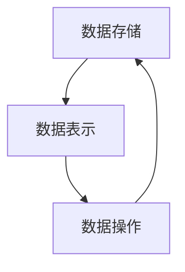
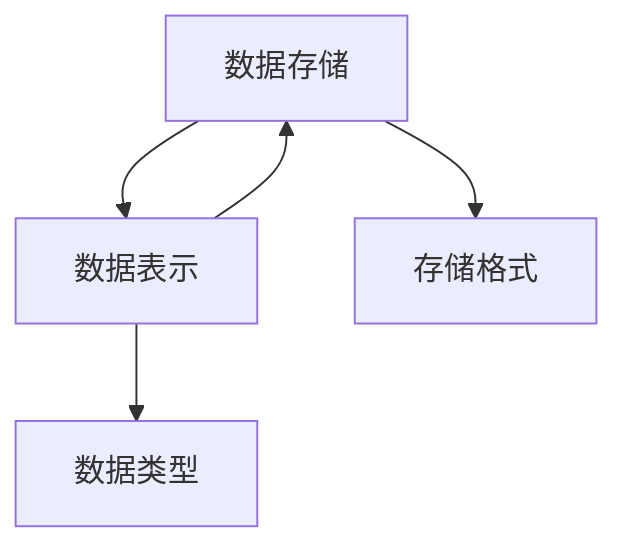
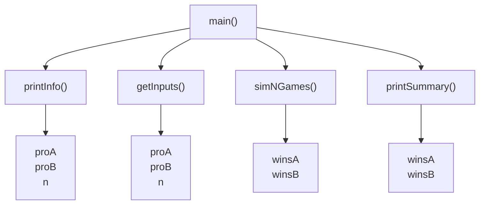
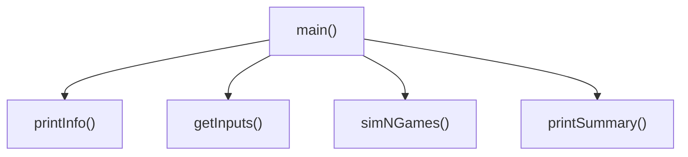

>>>

the 1138

and 965

to 754

of 669

you 550

i 542

a 542

my 514

hamlet 462

in 436


<details>
<summary>text_image</summary>

HAMLET
</details>

运行结果由大到小排序   
观察单词出现次数

# 准备好电脑，与老师一起编码吧！

# II 《三国演义》人物出场统计"实例讲解(上)


<details>
<summary>natural_image</summary>

Abstract geometric line drawing with interconnected nodes and lines (no text or symbols)
</details>


<details>
<summary>natural_image</summary>

Abstract geometric network diagram with interconnected nodes and lines (no text or symbols)
</details>

#CalThreeKingdomsV1.py   
```python
import jieba
txt = open("threekingdoms.txt", "r", encoding="utf-8").read()
words = jieba.lcut(txt)
counts = {}
for word in words:
    if len(word) == 1:
    continue
    else:
    counts[word] = counts.get(word,0) + 1
items = list(counts.items())
items.sort(key=lambda x:x[1], reverse=True)
for i in range(15):
    word, count = items[i]
    print("{0:<10}{1:>5}".format(word, count)) 
```


<details>
<summary>text_image</summary>

三国演义
</details>

中文文本分词  
使用字典表达词频

曹操 953

孔明 836

将军 772

却说 656

玄德 585

关公 510

丞相 491

469

不可 440

荆州 425

玄德曰 390

孔明曰 390

不能 384

如此 378

张飞 358


<details>
<summary>text_image</summary>

三国演义
</details>

中文文本分词

使用字典表达词频

# 准备好电脑，与老师一起编码吧！

# II 《三国演义》人物出场统计"实例讲解(下)


<details>
<summary>natural_image</summary>

Abstract geometric line drawing with interconnected nodes and lines (no text or symbols)
</details>


<details>
<summary>natural_image</summary>

Abstract geometric network diagram with interconnected nodes and lines (no text or symbols)
</details>

# 《三国演义》人物出场统计

将词频与人物相关联， 面向问题

词频统计


人物统计

#CalThreeKingdomsV2.py   
```txt
import jieba
txt = open("threekingdoms.txt", "r", encoding="utf-8").read() 
```  
excludes = {"将军","却说","荆州","二人","不可","不能","如此"}

```lua
words = jieba.lcut(txt)
counts = {} 
```

for word in words:   
```python
if len(word) == 1:
    continue
elif word == "诸葛亮" or word == "孔明日":
    rword = "孔明" 
```  
elif word == "关公" or word == "云长":

```txt
rword = "关羽" 
```

```python
elif word == "玄德" or word == "玄德日":
    rword = "刘备" 
```

```txt
elif word == "孟德" or word == "丞相":
rword = "曹操" 
```

```txt
else:
rword = word 
```

```javascript
counts[rword] = counts.get(rword,0) + 1 
```

```txt
for word in excludes:
del counts[word] 
```  
items = list(counts.items())

```javascript
items.sort(key=lambda x:x[1], reverse=True) 
```

```python
for i in range(10):
    word, count = items[i] 
```

```txt
print("{0:<10}{1:>5}".format(word, count)) 
```


<details>
<summary>text_image</summary>

三国演义
</details>

中文文本分词

使用字典表达词频

\- 扩展程序解决问题

>>>

曹操 1451

孔明 1383

刘备 1252

关羽 784

张飞 358

商议 344

如何 338

主公 331

军士 317

吕布 300


<details>
<summary>text_image</summary>

三国演义
</details>

# 根据结果进一步优化

隆重发布《三国演义》人物出场顺序前20：

曹操、孔明、刘备、关羽、张飞、吕布、赵云、孙权、

司马懿、周瑜、袁绍、马超、魏延、黄忠、姜维、马岱、

庞德、孟获、刘表、夏侯惇

# 准备好电脑，与老师一起编码吧！

# "文本词频统计"举一反三


<details>
<summary>natural_image</summary>

Abstract geometric line drawing with interconnected nodes and lines (no text or symbols)
</details>


<details>
<summary>natural_image</summary>

Abstract geometric network diagram with interconnected nodes and lines (no text or symbols)
</details>

#CalThreeKingdomsV2.py   
```txt
import jieba
txt = open("threekingdoms.txt", "r", encoding="utf-8").read() 
```  
excludes = {"将军","却说","荆州","二人","不可","不能","如此"}

```lua
words = jieba.lcut(txt)
counts = {} 
```

for word in words:   
```python
if len(word) == 1:
    continue
elif word == "诸葛亮" or word == "孔明日":
    rword = "孔明" 
```  
elif word == "关公" or word == "云长":

```txt
rword = "关羽" 
```

```python
elif word == "玄德" or word == "玄德日":
    rword = "刘备" 
```

```txt
elif word == "孟德" or word == "丞相":
rword = "曹操" 
```

```txt
else:
rword = word 
```

```javascript
counts[rword] = counts.get(rword,0) + 1 
```

```txt
for word in excludes:
del counts[word] 
```  
items = list(counts.items())

```javascript
items.sort(key=lambda x:x[1], reverse=True) 
```

```python
for i in range(10):
    word, count = items[i] 
```

```txt
print("{0:<10}{1:>5}".format(word, count)) 
```


<details>
<summary>text_image</summary>

三国演义
</details>

中文文本分词

使用字典表达词频

\- 扩展程序解决问题

# 举一反三

# 应用问题的扩展

《红楼梦》、《西游记》、《水浒传》…  
政府工作报告、科研论文、新闻报道 …  
进一步呢？ 未来还有词云…

# 第7章 辅学内容


python

嵩 天

北京理工大学

pythom

# 前课复习

# 数字类型及操作

整数类型的无限范围及4种进制表示  
- 浮点数类型的近似无限范围、小尾数及科学计数法  
- +、-、\*、/、//、%、\*\*、二元增强赋值操作符   
- abs()、divmod()、pow()、round()、max()、min()  
int()、float()、complex()

# 字符串类型及操作

正向递增序号、反向递减序号、<字符串>[M:N:K]   
- +、\*、len()、str()、hex()、oct()、ord()、chr()  
- .lower()、.upper()、.split()、.count()、.replace()  
- .center()、.strip()、.join(）、.format()格式化

# 程序的分支结构

单分支 if 二分支 if-else 及紧凑形式  
多分支 if-elif-else 及条件之间关系  
- not and or > >= == <= < !   
异常处理 try-except-else-finally


<details>
<summary>natural_image</summary>

Silhouette of a person riding a bicycle with a blue lane line (no text or symbols)
</details>

# 程序的循环结构

- for…in 遍历循环: 计数、字符串、列表、文件…  
while无限循环   
- continue和break保留字: 退出当前循环层次  
- 循环else的高级用法: 与break有关

# 函数的定义与使用

使用保留字def定义函数，lambda定义匿名函数  
可选参数(赋初值)、可变参数(\*b)、名称传递  
保留字return可以返回任意多个结果  
保留字global声明使用全局变量，一些隐式规则


<details>
<summary>natural_image</summary>

Silhouette of a person riding a bicycle with wheels, no text or symbols present
</details>

# 代码复用与函数递归

模块化设计：松耦合、紧耦合  
- 函数递归的2个特征：基例和链条  
函数递归的实现：函数 + 分支结构


<details>
<summary>natural_image</summary>

Silhouette of a person riding a bicycle on a blue track (no text or symbols)
</details>

# 集合类型及操作

- 集合使用{}和set()函数创建  
- 集合间操作：交(&)、并(|)、差(-)、补(^)、比较(>=<)  
- 集合类型方法：.add()、.discard()、.pop()等  
- 集合类型主要应用于：包含关系比较、数据去重


<details>
<summary>natural_image</summary>

Silhouette of a person riding a bicycle with blue lane line (no text or symbols)
</details>

# 序列类型及操作

序列是基类类型，扩展类型包括：字符串、元组和列表  
元组用()和tuple()创建，列表用[]和set()创建  
- 元组操作与序列操作基本相同  
列表操作在序列操作基础上，增加了更多的灵活性


<details>
<summary>natural_image</summary>

Silhouette of a person riding a bicycle with wheels and a blue line (no text or symbols)
</details>

# 字典类型及操作

映射关系采用键值对表达  
字典类型使用{}和dict()创建，键值对之间用:分隔  
d[key] 方式既可以索引，也可以赋值  
字典类型有一批操作方法和函数，最重要的是.get()


<details>
<summary>natural_image</summary>

Silhouette of a person riding a bicycle with wheels and a blue lane (no text or symbols)
</details>

# 本课概要

# 第7章 文件和数据格式化

# 格式化

字符串格式化


"{ }{ }{ }".format()

将字符串按照一定规格和式样进行规范


数据格式化

将一组数据按照一定规格和式样进行

规范：表示、存储、运算等


<details>
<summary>natural_image</summary>

Silhouette of a person riding a bicycle with a blue line at the base (no text or symbols)
</details>

# 第7章 文件和数据格式化


<details>
<summary>natural_image</summary>

Generic male avatar icon with beard and mustache (no text or symbols)
</details>

- 7.1 文件的使用  
- 7.2 实例11: 自动轨迹绘制  
- 7.3 一维数据的格式化和处理  
- 7.4 二维数据的格式化和处理  
- 7.5 模块6: wordcloud库的使用  
- 7.6 实例12: 政府工作报告词云

# 第7章 文件和数据格式化

# 方法论


<details>
<summary>natural_image</summary>

Generic male avatar icon with beard and mustache (no text or symbols)
</details>

从Python角度理解的文件和数据表示

# 实践能力

学会编写带有文件输入输出的程序


<details>
<summary>natural_image</summary>

Silhouette of a person riding a bicycle with wheels, no text or symbols visible
</details>

# 练习与作业

# 第7章 文件和数据格式化


<details>
<summary>natural_image</summary>

Generic male avatar icon with beard and mustache (no text or symbols)
</details>

# 练习 (可选)

5道编程题 @Python123

# 作业

15道单选题 @Python123


<details>
<summary>natural_image</summary>

Silhouette of a person riding a bicycle with blue lane in foreground (no text or symbols)
</details>

# Python语言程序设计

# 文件的使用


python

嵩 天

北京理工大学

pythom

# 单元开篇

# 文件的使用


<details>
<summary>natural_image</summary>

Generic male avatar icon with beard and mustache (no text or symbols)
</details>

文件的类型  
文件的打开和关闭  
文件内容的读取  
数据的文件写入


<details>
<summary>natural_image</summary>

Silhouette of a person riding a bicycle on a blue track (no text or symbols)
</details>

# 文件的类型

# 文件的理解

# 文件是数据的抽象和集合

文件是存储在辅助存储器上的数据序列  
文件是数据存储的一种形式  
文件展现形态：文本文件和二进制文件

# 文件的理解

# 文本文件 vs. 二进制文件

文件文件和二进制文件只是文件的展示方式  
本质上，所有文件都是二进制形式存储  
形式上，所有文件采用两种方式展示

# 文本文件

# 文件是数据的抽象和集合

由单一特定编码组成的文件，如UTF-8编码  
由于存在编码，也被看成是存储着的长字符串  
适用于例如：.txt文件、.py文件等

# 二进制文件

# 文件是数据的抽象和集合

直接由比特0和1组成，没有统一字符编码  
一般存在二进制0和1的组织结构，即文件格式  
适用于例如：.png文件、.avi文件等

# 文本文件 vs. 二进制文件

中国是个伟大的国家!"

# 文本形式

中国是个伟大的国家!

# 二进制形式

b'\xd6\xd0\xb9\xfa\xca\xc7\xb8\xf6\xce\xb0\xb4\xf3\xb5\ xc4\xb9\xfa\xbc\xd2\xa3\xa1'

# 文本文件 vs. 二进制文件

# f.txt文件保存: "中国是个伟大的国家!"

#文本形式打开文件

tf = open("f.txt", "rt")

print(tf.readline())

tf.close()

中国是个伟大的国家!

# 文本文件 vs. 二进制文件

# f.txt文件保存: "中国是个伟大的国家!"

# #二进制形式打开文件

$$
b f = \text { open } (" f. t x t"," r b")
$$

$$
\text { print } (\text { bf.readline() })
$$

$$
b f. c l o s e ()
$$

b'\xd6\xd0\xb9\xfa\xca\xc7\xb8\xf6\xce\xb0

\xb4\xf3\xb5\xc4\xb9\xfa\xbc\xd2\xa3\xa1'


<details>
<summary>text_image</summary>

文件的打开和关闭
</details>

# 文件的打开关闭

# 文件处理的步骤: 打开-操作-关闭

$$
a = \text {open} (,)
$$

文件的存储状态

文件的占用状态

a.close()

a.read(size)

a.readline(size)

a.readlines(hint)

a.write(s)

a.writelines(lines)

a.seek(offset)

读文件


<details>
<summary>natural_image</summary>

Illustration of a clipboard with horizontal lines, no text or symbols present
</details>

写文件

# 文件的打开

<变量名> open(<文件名>, <打开模式>)

文件句柄

文件路径和名称

源文件同目录可省路径

文本 or 二进制

读 or 写

# 文件路径

<变量名> open(<文件名>, <打开模式>)

D:\PYE\f.txt


文件路径和名称

"D:/PYE/f.txt"

"./PYE/f.txt"

源文件同目录可省路径

"D:\\PYE\\f.txt"

"f.txt"

# 打开模式

<table><tr><td>文件的打开模式</td><td>描述</td></tr><tr><td>&#x27;r&#x27;</td><td>只读模式,默认值,如果文件不存在,返回FileNotFoundException</td></tr><tr><td>&#x27;w&#x27;</td><td>覆盖写模式,文件不存在则创建,存在则完全覆盖</td></tr><tr><td>&#x27;x&#x27;</td><td>创建写模式,文件不存在则创建,存在则返回FileNotFoundException</td></tr><tr><td>&#x27;a&#x27;</td><td>追加写模式,文件不存在则创建,存在则在文件最后追加内容</td></tr><tr><td>&#x27;b&#x27;</td><td>二进制文件模式</td></tr><tr><td>&#x27;t&#x27;</td><td>文本文件模式,默认值</td></tr><tr><td>&#x27;+&#x27;</td><td>与r/w/x/a一同使用,在原功能基础上增加同时读写功能</td></tr></table>

# 打开模式

$$
f = \text { open } (" f. t x t")
$$

$$
f = \text { open } (" f. t x t"," r t")
$$

$$
f = \text { open } (" f. t x t"," w")
$$

$$
f = \text { open } (" f. t x t", " a +")
$$

$$
f = \text { open } (" f. t x t"," x")
$$

$$
f = \text { open } (" f. t x t", " b")
$$

$$
f = \text { open } (" f. t x t"," w b")
$$

文本形式、只读模式、默认值

文本形式、只读模式、同默认值

文本形式、 覆盖写模式

文本形式、追加写模式+ 读文件

文本形式、 创建写模式

二进制形式、只读模式

\- 二进制形式、覆盖写模式

# 文件的关闭

<变量名>.close()

文件句柄

# 文件使用

# #文本形式打开文件

$$
t f = \text { open } (" f. t x t"," r t")
$$

$$
\text { print(tf.readline()) }
$$

$$
t f. c l o s e ()
$$

# #二进制形式打开文件

$$
b f = \text { open } (" f. t x t"," r b")
$$

$$
\text { print } (\text { bf.readline() })
$$

$$
b f. c l o s e ()
$$

# 文件内容的读取


<details>
<summary>natural_image</summary>

Abstract geometric network diagram with interconnected nodes and lines (no text or symbols)
</details>

# 文件内容的读取

<table><tr><td>操作方法</td><td>描述</td></tr><tr><td></td><td>读入全部内容,如果给出参数,读入前size长度&gt;&gt;&gt;s = f.read(2)中国</td></tr><tr><td></td><td>读入一行内容,如果给出参数,读入该行前size长度&gt;&gt;&gt;s = f.readline()中国是一个伟大的国家!</td></tr></table>

# 文件内容的读取

<table><tr><td>操作方法</td><td>描述</td></tr><tr><td>.f&gt;.readlines(hint=-1)</td><td>读入文件所有行,以每行为元素形成列表如果给出参数,读入前hint行&gt;&gt;&gt;s = f.readlines()[&#x27;中国是一个伟大的国家!&#x27;]</td></tr></table>

# 文件的全文本操作

# 遍历全文本：方法一

fname = input("请输入要打开的文件名称:")

fo = open(fname,"r")

txt = fo.read()

#对全文txt进行处理

fo.close()

一次读入，统一处理

# 文件的全文本操作

# 遍历全文本：方法二

fname = input("请输入要打开的文件名称:")

fo = open(fname,"r")

txt = fo.read(2)

while txt !=

#对txt进行处理

txt = fo.read(2)

fo.close()

按数量读入，逐步处理

# 文件的逐行操作

# 逐行遍历文件：方法一

fname = input("请输入要打开的文件名称:")

fo = open(fname,"r")

for line in fo.readlines():

print(line)

一次读入，分行处理

fo.close()

# 文件的逐行操作

# 逐行遍历文件：方法二

fname = input("请输入要打开的文件名称:")

fo = open(fname,"r")

for line in fo:

print(line)

fo.close()

分行读入，逐行处理

# 数据的文件写入


<details>
<summary>natural_image</summary>

Abstract geometric network diagram with interconnected nodes and lines (no text or symbols)
</details>

# 数据的文件写入

<table><tr><td>操作方法</td><td>描述</td></tr><tr><td></td><td>向文件写入一个字符串或字节流&gt;&gt;&gt;f.write(&quot;中国是一个伟大的国家!&quot;)</td></tr><tr><td></td><td>将一个元素全为字符串的列表写入文件&gt;&gt;&gt;ls = [&quot;中国&quot;, &quot;法国&quot;, &quot;美国&quot;]&gt;&gt;&gt;f.writelines(ls)中国法国美国</td></tr></table>

# 数据的文件写入

<table><tr><td>操作方法</td><td>描述</td></tr><tr><td></td><td>改变当前文件操作指针的位置,offset含义如下:0 - 文件开头;1 - 当前位置;2 - 文件结尾&gt;&gt;&gt;f.seek(0) #回到文件开头</td></tr></table>

# 数据的文件写入

fo = open("output.txt","w+")

ls = ["中国", "法国", "美国"]

fo.writelines(ls)

for line in fo:

print(line)

fo.close()

写入一个字符串列表

>>> (没有任何输出)

# 数据的文件写入

fo = open("output.txt","w+")

ls = ["中国", "法国", "美国"]

fo.writelines(ls)

fo.seek(0)

for line in fo:

print(line)

fo.close()

写入一个字符串列表

中国法国美国

# 单元小结

# 文件的使用

- 文件的使用方式：打开-操作-关闭  
文本文件&二进制文件，open( , )和.close()  
文件内容的读取：.read() .readline() .readlines()  
数据的文件写入：.write() .writelines() .seek()

# 实例11: 自动轨迹绘制


python

嵩 天

北京理工大学

pythom

# 自动轨迹绘制"问题分析


<details>
<summary>natural_image</summary>

Abstract geometric line drawing with interconnected nodes and lines (no text or symbols)
</details>


<details>
<summary>natural_image</summary>

Abstract geometric network diagram with interconnected nodes and lines (no text or symbols)
</details>

# 问题分析

# 自动轨迹绘制

需求：根据脚本来绘制图形？  
不是写代码而是写数据绘制轨迹  
数据脚本是自动化最重要的第一步

# 问题分析

# 自动轨迹绘制

300,0,144,1,0,0

300,0,144,0,1,0

300,0,144,0,0,1

300,0,144,1,1,0

300,0,108,0,1,1

184,0,72,1,0,1


<details>
<summary>natural_image</summary>

Geometric diagram showing two polygons with intersecting lines and a red horizontal line (no text or symbols)
</details>

# 自动轨迹绘制"实例讲解


<details>
<summary>natural_image</summary>

Abstract geometric line drawing with interconnected nodes and lines (no text or symbols)
</details>


<details>
<summary>natural_image</summary>

Abstract geometric network diagram with interconnected nodes and lines (no text or symbols)
</details>

# 自动轨迹绘制

# 基本思路

步骤1：定义数据文件格式（接口）  
步骤2：编写程序，根据文件接口解析参数绘制图形  
步骤3：编制数据文件

# 数据接口定义

# 非常具有个性色彩

300,0,144,1,0,0

300,1,144,0,1,0

行进距离

转向判断

转向角度

0: 左转 1:右转

RGB三个通道颜色

0-1之间浮点数

#AutoTraceDraw.py   
```txt
import turtle as t
t.title('自动轨迹绘制')
t.setup(800, 600, 0, 0)
t.pencolor("red")
t.pensize(5) 
```  
#数据读取

```python
datals = []
f = open("data.txt")
for line in f:
    line = line.replace("\n", "")
    datals.append(list(map(eval, line.split(",)))))
f.close() 
```  
#自动绘制

```python
for i in range(len(datals)):
    t.pencolor(datals[i][3],datals[i][4],datals[i][5])
    t.fd(datals[i][0])
    if datals[i][1]:
    t.right(datals[i][2])
    else:
    t.left(datals[i][2]) 
```


<details>
<summary>natural_image</summary>

Geometric diagram showing a pentagon and a polyhedron with colored lines connecting vertices (no text or symbols)
</details>

# 数据文件

300,0,144,1,0,0 184,0,72,0,0,0

300,0,144,0,1,0 184,0,72,0,0,0

300,0,144,0,0,1 184,1,72,1,0,1

300,0,144,1,1,0 184,1,72,0,0,0

300,0,108,0,1,1 184,1,72,0,0,0

184,0,72,1,0,1 184,1,72,0,0,0

184,0,72,0,0,0 184,1,72,0,0,0

data.txt


184,1,720,0,0,0

# 准备好电脑，与老师一起编码吧！

# 自动轨迹绘制"举一反三


<details>
<summary>natural_image</summary>

Abstract geometric line drawing with interconnected nodes and lines (no text or symbols)
</details>


<details>
<summary>natural_image</summary>

Abstract geometric network diagram with interconnected nodes and lines (no text or symbols)
</details>

import turtle as t   
```lua
t.title('自动轨迹绘制')
t.setup(800, 600, 0, 0)
t.pencolor("red")
t.pensize(5)
datals = []
f = open("data.txt") 
```

```python
for line in f:
    line = line.replace("\n", "")
    datals.append(list(map(eval, line.split(",)))))
f.close() 
```

```python
for i in range(len(datals)):
    t.pencolor(datals[i][3],datals[i][4],datals[i][5])
    t.fd(datals[i][0])
    if datals[i][1]:
    t.right(datals[i][2])
    else:
    t.left(datals[i][2]) 
```


<details>
<summary>natural_image</summary>

Geometric diagram showing a pentagon and a polyhedron with colored lines connecting vertices (no text or symbols)
</details>

# 举一反三

# 理解方法思维

自动化思维：数据和功能分离，数据驱动的自动运行  
接口化设计：格式化设计接口，清晰明了  
二维数据应用：应用维度组织数据，二维数据最常用

# 举一反三

# 应用问题的扩展

扩展接口设计，增加更多控制接口  
扩展功能设计，增加弧形等更多功能  
- 扩展应用需求，发展自动轨迹绘制到动画绘制

# 一维数据的格式化和处理


python

嵩 天

北京理工大学

pythom

# 单元开篇

# 一维数据的格式化和处理


<details>
<summary>natural_image</summary>

Generic male avatar icon with beard and mustache (no text or symbols)
</details>

数据组织的维度  
一维数据的表示  
一维数据的存储  
一维数据的处理


<details>
<summary>natural_image</summary>

Silhouette of a person riding a bicycle on a blue track (no text or symbols)
</details>

# 数据组织的维度


<details>
<summary>natural_image</summary>

Abstract geometric network diagram with interconnected nodes and lines (no text or symbols)
</details>

# 从一个数据到一组数据

3.14


3.1413

3.1404

3.1401

3.1398

3.1349

一个数据

表达一个含义

组数据

表达一个或多个含义

# 维度：一组数据的组织形式

3.1413

3.1398

3.1404

3.1401 3.1376

3.1349


3.1413,3.1398,3.1404,3.1401,3.1349,3.1376

# 或

3.1398, 3.1349, 3.1376

3.1413, 3.1404, 3.1401

# 组数据

# 数据的组织形式

# 一维数据

由对等关系的有序或无序数据构成，采用线性方式组织

3.1413, 3.1398, 3.1404, 3.1401, 3.1349, 3.1376

对应列表、数组和集合等概念

# 二维数据

# 由多个一维数据构成，是一维数据的组合形式

<table><tr><td rowspan="2">排名</td><td rowspan="2">学校名称</td><td rowspan="2">省市</td><td rowspan="2">总分</td><td>指标得分</td></tr><tr><td>生源质量(新生高考成绩得分)▼</td></tr><tr><td>1</td><td>清华大学</td><td>北京</td><td>94.0</td><td>100.0</td></tr><tr><td>2</td><td>北京大学</td><td>北京</td><td>81.2</td><td>96.1</td></tr><tr><td>3</td><td>浙江大学</td><td>浙江</td><td>77.8</td><td>87.2</td></tr><tr><td>4</td><td>上海交通大学</td><td>上海</td><td>77.5</td><td>89.4</td></tr><tr><td>5</td><td>复旦大学</td><td>上海</td><td>71.1</td><td>91.8</td></tr><tr><td>6</td><td>中国科学技术大学</td><td>安徽</td><td>65.9</td><td>91.9</td></tr><tr><td>7</td><td>南京大学</td><td>江苏</td><td>65.3</td><td>87.1</td></tr><tr><td>8</td><td>华中科技大学</td><td>湖北</td><td>63.0</td><td>80.6</td></tr><tr><td>9</td><td>中山大学</td><td>广东</td><td>62.7</td><td>81.1</td></tr><tr><td>10</td><td>哈尔滨工业大学</td><td>黑龙江</td><td>61.6</td><td>76.4</td></tr></table>

# 表格是典型的二维数据

其中，表头是二维数据的一部分

# 多维数据

# 由一维或二维数据在新维度上扩展形成

<table><tr><td>排名</td><td>学校名称</td><td>省市</td><td>总分</td><td>指标得分生源质量(新生高考成绩得分)</td></tr><tr><td>1</td><td>清华大学</td><td>北京市</td><td>95.9</td><td>100.0</td></tr><tr><td>2</td><td>北京大学</td><td>北京市</td><td>82.6</td><td>98.9</td></tr><tr><td>3</td><td>浙江大学</td><td>浙江省</td><td>80</td><td>88.8</td></tr><tr><td>4</td><td>上海交通大学</td><td>上海市</td><td>78.7</td><td>90.6</td></tr><tr><td>5</td><td>复旦大学</td><td>上海市</td><td>70.9</td><td>90.4</td></tr><tr><td>6</td><td>南京大学</td><td>江苏省</td><td>66.1</td><td>90.7</td></tr><tr><td>7</td><td>中国科学技术大学</td><td>安徽省</td><td>65.5</td><td>90.1</td></tr><tr><td>8</td><td>哈尔滨工业大学</td><td>黑龙江省</td><td>63.5</td><td>80.9</td></tr><tr><td>9</td><td>华中科技大学</td><td>湖北省</td><td>62.9</td><td>83.5</td></tr><tr><td>10</td><td>中山大学</td><td>广东省</td><td>62.1</td><td>81.8</td></tr></table>

# 间维


6

<table><tr><td>排名</td><td>学校名称</td><td>省市</td><td>总分</td><td>指标得分生源质量(新生高考成绩得分)</td></tr><tr><td>1</td><td>清华大学</td><td>北京</td><td>94.0</td><td>100.0</td></tr><tr><td>2</td><td>北京大学</td><td>北京</td><td>81.2</td><td>96.1</td></tr><tr><td>3</td><td>浙江大学</td><td>浙江</td><td>77.8</td><td>87.2</td></tr><tr><td>4</td><td>上海交通大学</td><td>上海</td><td>77.5</td><td>89.4</td></tr><tr><td>5</td><td>复旦大学</td><td>上海</td><td>71.1</td><td>91.8</td></tr><tr><td>6</td><td>中国科学技术大学</td><td>安徽</td><td>65.9</td><td>91.8</td></tr><tr><td>7</td><td>南京大学</td><td>江苏</td><td>65.3</td><td>87.1</td></tr><tr><td>8</td><td>华中科技大学</td><td>湖北</td><td>63.0</td><td>80.6</td></tr><tr><td>9</td><td>中山大学</td><td>广东</td><td>62.7</td><td>81.1</td></tr><tr><td>10</td><td>哈尔滨工业大学</td><td>黑龙江</td><td>61.6</td><td>76.4</td></tr></table>

# 高维数据

# 仅利用最基本的二元关系展示数据间的复杂结构

```json
{
    "firstName": "Tian",
    "lastName": "Song",
    "address": {
    "streetAddr": "中关村南大街5号",
    "city": "北京市",
    "zipcode": "100081"
    },
    "professional": ["Computer Networking", "Security"]
} 
```

# 键值对

# 数据的操作周期

存储 <-> 表示 <-> 操作


<details>
<summary>flowchart</summary>


</details>

存储格式

数据类型

操作方式

# 维数据的表示


<details>
<summary>natural_image</summary>

Abstract geometric network diagram with interconnected nodes and lines (no text or symbols)
</details>

# 一维数据的表示

# 如果数据间有序：使用列表类型

$$
\mathrm{ls} = [ 3. 1 3 9 8, 3. 1 3 4 9, 3. 1 3 7 6 ]
$$

列表类型可以表达一维有序数据  
for循环可以遍历数据，进而对每个数据进行处理

# 一维数据的表示

如果数据间无序：使用集合类型

$$
s t = \{3. 1 3 9 8, 3. 1 3 4 9, 3. 1 3 7 6 \}
$$

集合类型可以表达一维无序数据  
for循环可以遍历数据，进而对每个数据进行处理

# 维数据的存储


<details>
<summary>natural_image</summary>

Abstract geometric network diagram with interconnected nodes and lines (no text or symbols)
</details>

# 一维数据的存储

# 存储方式一：空格分隔

中国 美国 日本 德国 法国 英国 意大利

使用一个或多个空格分隔进行存储，不换行  
缺点：数据中不能存在空格

# 一维数据的存储

# 存储方式二：逗号分隔

中国,美国,日本,德国,法国,英国,意大利

使用英文半角逗号分隔数据进行存储，不换行  
缺点：数据中不能有英文逗号

# 一维数据的存储

# 存储方式三：其他方式

中国\$美国\$日本\$德国\$法国\$英国\$意大利

使用其他符号或符号组合分隔，建议采用特殊符号  
缺点：需要根据数据特点定义，通用性较差

# 维数据的处理


<details>
<summary>natural_image</summary>

Abstract geometric network diagram with interconnected nodes and lines (no text or symbols)
</details>

# 数据的处理

# 存储 <-> 表示


<details>
<summary>flowchart</summary>


</details>

将存储的数据读入程序  
将程序表示的数据写入文件

# 一维数据的读入处理

# 从空格分隔的文件中读入数据

# 中国 美国 日本 德国 法国 英国 意大利

$$
\text { txt } = \text { open } (\text { fname }). \text { read } ()
$$

$$
\mathbf {l s} = \boxed {\text { txt.split() }}
$$

$$
f. c l o s e ()
$$

>>> ls

['中国', '美国', 日本', '德国I '法国', '英国', '意大利'])

# 一维数据的读入处理

# 从特殊符号分隔的文件中读入数据

# 中国\$美国\$日本\$德国\$法国\$英国\$意大利

$$
\text { txt } = \text { open } (\text { fname }). \text { read } ()
$$

$$
\text { ls } = \text { txt.split(")" }
$$

$$
f. c l o s e ()
$$

>>> ls

['中国', '美国', 日本', '德国I '法国', '英国', '意大利'])

# 一维数据的写入处理

# 采用空格分隔方式将数据写入文件

ls = ['中国', '美国', '日本']

f = open(fname, 'w')

f.write(' '.join(ls))

f.close()

# 一维数据的写入处理

# 采用特殊分隔方式将数据写入文件

ls = ['中国', '美国', '日本']

f = open(fname, 'w')

f.write('\$'.join(ls))

f.close()

# 单元小结

# 一维数据的格式化和处理

数据的维度：一维、二维、多维、高维  
一维数据的表示：列表类型(有序)和集合类型(无序)  
一维数据的存储：空格分隔、逗号分隔、特殊符号分隔  
- 一维数据的处理：字符串方法 .split() 和 .join()

# 二维数据的格式化和处理


python

嵩 天

北京理工大学

pythom

# 单元开篇

# 二维数据的格式化和处理


<details>
<summary>natural_image</summary>

Simple icon of a person with beard and mustache, wearing a collared shirt (no text or symbols)
</details>

二维数据的表示  
CSV数据存储格式  
二维数据的存储  
二维数据的处理


<details>
<summary>natural_image</summary>

Silhouette of a person riding a bicycle on a blue track (no text or symbols)
</details>

# 二维数据的表示


<details>
<summary>natural_image</summary>

Abstract geometric network diagram with interconnected nodes and lines (no text or symbols)
</details>

# 二维数据的表示

# 使用列表类型

<table><tr><td rowspan="2">排名</td><td rowspan="2">学校名称</td><td rowspan="2">省市</td><td rowspan="2">总分</td><td>指标得分</td></tr><tr><td>生源质量(新生高考成绩得分)▼</td></tr><tr><td>1</td><td>清华大学</td><td>北京</td><td>94.0</td><td>100.0</td></tr><tr><td>2</td><td>北京大学</td><td>北京</td><td>81.2</td><td>96.1</td></tr><tr><td>3</td><td>浙江大学</td><td>浙江</td><td>77.8</td><td>87.2</td></tr><tr><td>4</td><td>上海交通大学</td><td>上海</td><td>77.5</td><td>89.4</td></tr><tr><td>5</td><td>复旦大学</td><td>上海</td><td>71.1</td><td>91.8</td></tr><tr><td>6</td><td>中国科学技术大学</td><td>安徽</td><td>65.9</td><td>91.9</td></tr><tr><td>7</td><td>南京大学</td><td>江苏</td><td>65.3</td><td>87.1</td></tr><tr><td>8</td><td>华中科技大学</td><td>湖北</td><td>63.0</td><td>80.6</td></tr><tr><td>9</td><td>中山大学</td><td>广东</td><td>62.7</td><td>81.1</td></tr><tr><td>10</td><td>哈尔滨工业大学</td><td>黑龙江</td><td>61.6</td><td>76.4</td></tr></table>

列表类型可以表达二维数据  
使用二维列表

[3.1398, 3.1349, 3.1376],   
[3.1413, 3.1404, 3.1401]

# 二维数据的表示

# 使用列表类型

[ [3.1398, 3.1349, 3.1376],   
[3.1413, 3.1404, 3.1401]

使用两层for循环遍历每个元素  
外层列表中每个元素可以对应一行，也可以对应一列

# 一二维数据的Python表示

# 数据维度是数据的组织形式

# 一维数据：列表和集合类型

[3.1398, 3.1349, 3.1376] 数据间有序

{3.1398, 3.1349, 3.1376} 数据间无序

# 二维数据：列表类型

[ [3.1398, 3.1349, 3.1376],

[3.1413, 3.1404, 3.1401]

# CSV格式与二维数据存储


<details>
<summary>natural_image</summary>

Abstract geometric line drawing with interconnected nodes and lines (no text or symbols)
</details>


<details>
<summary>natural_image</summary>

Abstract geometric network diagram with interconnected nodes and lines (no text or symbols)
</details>

# CSV数据存储格式

# CSV: Comma-Separated Values

国际通用的一二维数据存储格式，一般.csv扩展名  
每行一个一维数据，采用逗号分隔，无空行  
Excel软件可读入输出，一般编辑软件都可以产生

# CSV数据存储格式

<table><tr><td>城市</td><td>环比</td><td>同比</td><td>定基</td></tr><tr><td>北京</td><td>101.5</td><td>120.7</td><td>121.4</td></tr><tr><td>上海</td><td>101.2</td><td>127.3</td><td>127.8</td></tr><tr><td>广州</td><td>101.3</td><td>119.4</td><td>120.0</td></tr><tr><td>深圳</td><td>102.0</td><td>140.0</td><td>145.5</td></tr><tr><td>沈阳</td><td>100.0</td><td>101.4</td><td>101.6</td></tr></table>


城市,环比,同比,定基

北京,101.5,120.7,121.4

上海,101.2,127.3,127.8

广州,101.3,119.4,120.0

深圳,102.0,140.0,145.5

沈阳,100.0,101.4,101.6

# CSV数据存储格式

# CSV: Comma-Separated Values

如果某个元素缺失，逗号仍要保留   
二维数据的表头可以作为数据存储，也可以另行存储  
逗号为英文半角逗号，逗号与数据之间无额外空格

# 二维数据的存储

按行存？按列存？

按行存或者按列存都可以，具体由程序决定  
一般索引习惯：ls[row][column]，先行后列  
根据一般习惯，外层列表每个元素是一行，按行存

# 二维数据的处理


<details>
<summary>natural_image</summary>

Abstract geometric network diagram with interconnected nodes and lines (no text or symbols)
</details>

# 二维数据的读入处理

# 从CSV格式的文件中读入数据

$$
f o = \text { open } (f n a m e)
$$

$$
\mathbf {l s} = [ ]
$$

for line in fo:

$$
\text { line } = \text { line.replace("\n","") }
$$

$$
\text { ls.append(line.split(",")) }
$$

fo.close()

# 二维数据的写入处理

# 将数据写入CSV格式的文件

ls = [[], [], []] #二维列表

f = open(fname, w

for item in ls:

f.write(','.join(item) + '\n')

f.close()

# 二维数据的逐一处理

# 采用二层循环

ls = [[], [], []] #二维列表

for row in ls:

for column in row:

print(ls[row][column])

# 单元小结

# 二维数据的格式化和处理

二维数据的表示：列表类型，其中每个元素也是一个列表  
CSV格式：逗号分隔表示一维，按行分隔表示二维   
二维数据的处理：for循环+.split()和.join()


<details>
<summary>natural_image</summary>

Silhouette of a person riding a bicycle with a blue line at the base (no text or symbols)
</details>

# Python语言程序设计

# 模块6: wordcloud库的使用


python

嵩 天

北京理工大学

pythom

# wordcloud库基本介绍


<details>
<summary>natural_image</summary>

Abstract geometric line drawing with interconnected nodes and lines (no text or symbols)
</details>


<details>
<summary>natural_image</summary>

Abstract geometric network diagram with interconnected nodes and lines (no text or symbols)
</details>

# wordcloud库概述

# wordcloud是优秀的词云展示第三方库


<details>
<summary>text_image</summary>

要发展
坚持中国
产业
增长政府
落实
产能
市场开展
标准
保障
新型城市
试点调整
加强
地区
以上特别
取得
我们
体制
实现
工作
我国
战略创业
亿元
财政
全面
力度
重点
增加
社会经济
加强
实施
支持
推动
金融
完善安全
下降全国
优化
结构性
提高
国际区域
合作培育
基础设施
目标
深化
社会政策
推动
中央资源
资源管理
机构机制
农村金融
问题
地方国际化
保护教育
管理结构
扩大技术
监管
运行机制
实行制造
贸易
增强
增强
增强
增强
增强
增强
增强
增强
增强
增强
增强
增强
增强
增强
增强
增强
增强
增强
增强
增强
增强
增强
增强
增强
增强
增强
增强
增强
增强
增强
增强
增强
增强
增强
增强
增强
增强
增强
增强
增强
增强
增强
增强
增强
增强
增强
增强
增强
增强
增强
强化
</details>


<details>
<summary>text_image</summary>

cloud computing
scalable metaphor
systems services
sites
security resources
internet browser features
online cost
system
network
software
software
software
software
software
software
software
software
software
software
software
software
software
software
software
software
software
software
software
software
software
software
software
software
software
software
software
software
software
software
software
software
software
software
software
software
software
software
software
software
software
software
software
software
software
software
software
software
software
software
Software
Software
Software
Software
Software
Software
Software
Software
Software
Software
Software
Software
Software
Software
Software
Software
Software
Software
Software
Software
Software
Software
Software
Software
Software
Software
Software
Software
Software
Software
Software
Software
Software
Software
Software
Software
Software
Software
Software
Software
Software
Software
Software
Software
Software
Software
Software
Software
Software
Software
 Software
</details>

词云以词语为基本单位，更加直观和艺术的展示文本

# wordcloud库的安装

# (cmd命令行) pip install wordcloud

Microsoft Windows [ 10.0. 16299.371] c) 2017Microsoft Corporation   
C:\Users\Tian Song>pip instal1 wordcloud Collecting wordcloud Downloading https://files.pythonhosted.org/packages/bc/e8/cab8479b25297b3847cfb55e85a5014e8 53b80e513eaf1ba58c7b3a6acd/wordc1oud-1.4.1.tar.gz (172kB)


python36-32\1ib\site-packages (from wordcloud) Requirement already satisfied: numpy>=1.6.1 in c:\users\tian song\appdata\local\programs\pytho n\python36-32\1ib\site-packages (from wordcloud) Requirement already satisfied: pillow in c:\users\tian song\appdata\local\programs\python\pyth on36-32\1ib\site-packages (from wordcloud) Requirement already satisfied: six>=1.10 in c:\users\tian song\appdata\local\programs\python\p ython36-32\1ib\site-packages (from matplotlib->wordcloud) Requirement already satisfied: pytz in c:\users\tian song\appdata\local\programs\python\python 36-32\1ib\site-packages (from matplotlib->wordcloud) Requirement already satisfied: cycler>=0.10 in c:\users\tian song\appdata\local\programs\pytho n\python36-32\1ib\site-packages(from matplotlib->wordcloud) Requirement already satisfied: python-dateutil>=2.1 in c:users\tian song\appdata\local\progra ms\python\python36-32\1ib\site-packages (from matplotlib->wordcloud) Requirement already satisfied pyparsing!20.4!2.1.2,!2.1.62.0.1 in :users\tian song appdata\local\programs\python\python36-32\1ib\site-packages (from matplotlib->wordcloud) Requirement already satisfied: olefile in c:users\tian song\appdata\local\programs\python\pyt hon36-32\1ib\site-packages (from pi11ow->wordcloud) Installing collected packages: wordcloud

Rurmmng setup. py mnstal vorucioua done Successfully installed wordcloud-1. 4.1 You are using pip version 9.0. 1. however version 10.0.0 is available. You should consider upgrading via the python -m pip install -upgrade pip' command. C:\Users\Tian Song>

# wordcloud库使用说明


<details>
<summary>natural_image</summary>

Abstract geometric line drawing with interconnected nodes and lines (no text or symbols)
</details>


<details>
<summary>natural_image</summary>

Abstract geometric network diagram with interconnected nodes and lines (no text or symbols)
</details>

# wordcloud库基本使用

# wordcloud库把词云当作一个WordCloud对象

wordcloud.WordCloud()代表一个文本对应的词云  
可以根据文本中词语出现的频率等参数绘制词云  
绘制词云的形状、尺寸和颜色都可以设定

# wordcloud库常规方法

# w = wordcloud.WordCloud()

以WordCloud对象为基础  
配置参数、加载文本、输出文件

# wordcloud库常规方法

# w = wordcloud.WordCloud()

<table><tr><td>方法</td><td>描述</td></tr><tr><td>w.generate(txt)</td><td>向WordCloud对象w中加载文本txt,&gt;&gt;&gt;w.generate(&quot;Python and WordCloud&quot;)</td></tr><tr><td>w.to_file(filename)</td><td>将词云输出为图像文件,.png或.jpg格式&gt;&gt;&gt;w.to_file(&quot;outfile.png&quot;)</td></tr></table>

# wordcloud库常规方法

import wordcloud

c = wordcloud.WordCloud()

c.generate("wordcloud by Python")

c.to\_file("pywordcloud.png")

步骤1：配置对象参数  
步骤2：加载词云文本  
步骤3：输出词云文件

# wordcloud库常规方法


<details>
<summary>text_image</summary>

wordcloud
Python
400
200
</details>

# wordcloud库常规方法

"wordcloud by Python"


wordcloud ython

文本

① 分隔: 以空格分隔单词

② 统计: 单词出现次数并过滤


③ 字体: 根据统计配置字号

布局: 颜色环境尺寸

词云


# 配置对象参数

# w = wordcloud.WordCloud(<参数>)

<table><tr><td>参数</td><td>描述</td></tr><tr><td>width</td><td>指定词云对象生成图片的宽度,默认400像素&gt;&gt;&gt;w=wordcloud.WordCloud(width=600)</td></tr><tr><td>height</td><td>指定词云对象生成图片的高度,默认200像素&gt;&gt;&gt;w=wordcloud.WordCloud(width=400)</td></tr></table>

# 配置对象参数

<table><tr><td>参数</td><td>描述</td></tr><tr><td>min_font_size</td><td>指定词云中字体的最小字号,默认4号&gt;&gt;&gt;w=wordcloud.WordCloud(min_font_size=10)</td></tr><tr><td>max_font_size</td><td>指定词云中字体的最大字号,根据高度自动调节&gt;&gt;&gt;w=wordcloud.WordCloud(min_font_size=20)</td></tr><tr><td>font_step</td><td>指定词云中字体字号的步进间隔,默认为1&gt;&gt;&gt;w=wordcloud.WordCloud(font_step=2)</td></tr></table>

# 配置对象参数

<table><tr><td>参数</td><td>描述</td></tr><tr><td>font_path</td><td>指定字体文件的路径,默认None&gt;&gt;&gt;w=wordcloud.WordCloud(font_path=&quot;msyh.ttc&quot;)</td></tr><tr><td>max_words</td><td>指定词云显示的最大单词数量,默认200&gt;&gt;&gt;w=wordcloud.WordCloud(max_words=20)</td></tr><tr><td>stop_words</td><td>指定词云的排除词列表,即不显示的单词列表&gt;&gt;&gt;w=wordcloud.WordCloud(stop_words={&quot;Python&quot;})</td></tr></table>

# 配置对象参数

<table><tr><td>参数</td><td>描述</td></tr><tr><td>mask</td><td>指定词云形状,默认为长方形,需要引用imread()函数&gt;&gt;&gt;from scipy.misc import imread&gt;&gt;&gt;mk=imread(&quot;pic.png&quot;)&gt;&gt;&gt;w=wordcloud.WordCloud(mask=mk)</td></tr><tr><td>background_color</td><td>指定词云图片的背景颜色,默认为黑色&gt;&gt;&gt;w=wordcloud.WordCloud(background_color=&quot;white&quot;)</td></tr></table>

# wordcloud应用实例

import wordcloud  
```txt
txt = "life is short, you need python" 
```

```javascript
w = wordcloud.WordCloud( \ 
```

```hcl
background_color = "white") 
```

```txt
w.generate(txt) 
```

```txt
w.to_file("pywcloud.png") 
```

short

python life need

以空格分隔单词

```txt
import jieba 
```

```txt
import wordcloud
```

txt = "程序设计语言是计算机能够理解和\识别用户操作意图的一种交互体系， 它按照\特定规则组织计算机指令，使计算机能够自\动进行各种运算处理。

```javascript
w = wordcloud.WordCloud(width=1000,\) 
```

```txt
font_path="msyh.ttc", height=700) 
```

```javascript
w.generate(" ".join(jieba.lcut(txt))) 
```

```txt
w.to_file("pywcloud.png") 
```


<details>
<summary>text_image</summary>

理解
特定按照
识别
能够
进行体系
意图
交互操作
处理器
计算机
运算
语言
规则
组织
程序设计
一种
</details>

中文需要先分词并组成空格分隔字符串

# 实例12: 政府工作报告词云


python

嵩 天

北京理工大学

pythom

# 政府工作报告词云"问题分析


<details>
<summary>natural_image</summary>

Abstract geometric line drawing with interconnected nodes and lines (no text or symbols)
</details>


<details>
<summary>natural_image</summary>

Abstract geometric network diagram with interconnected nodes and lines (no text or symbols)
</details>

# 问题分析

# 直观理解政策文件

需求：对于政府工作报告等政策文件，如何直观理解？  
-体会直观的价值：生成词云 & 优化词云

政府工作报告等文件


有效展示的词云

# 问题分析

# 《决胜全面建成小康社会 夺取新时代中国特色社会主义伟大胜利》

# 在中国共产党第十九次全国代表大会上的报告

（2017年10月18日）

习近平

https://python123.io/resources/pye/新时代中国特色社会主义.txt

# 问题分析

# 《中共中央 国务院关于实施乡村振兴战略的意见》

2018一号文件

（2018年01月02日）

中共中央 国务院

# 政府工作报告词云"实例讲解(上)


<details>
<summary>natural_image</summary>

Abstract geometric line drawing with interconnected nodes and lines (no text or symbols)
</details>


<details>
<summary>natural_image</summary>

Abstract geometric network diagram with interconnected nodes and lines (no text or symbols)
</details>

# 政府工作报告词云

# 基本思路

步骤1：读取文件、分词整理  
步骤2：设置并输出词云   
步骤3：观察结果，优化迭代

#GovRptWordCloudv1.py   
```python
import jieba
import wordcloud
f = open("新时代中国特色社会主义.txt", "r", encoding="utf-8")
t = f.read()
f.close()
ls = jieba.lcut(t)
txt = " ".join(ls)
w = wordcloud.WordCloud( font_path = "msyh.ttc",\
    width = 1000, height = 700, background_color = "white", \
    )
w.generate(txt)
w.to_file("grwordcloud.png") 
```


<details>
<summary>text_image</summary>

中国特色
发展
建设
改革
坚持
中国
实现
必须增强
坚持
中国
特点
工作经济
创新
世界
人民全面文化
外
化
建设
推进
中国
加强
改革
推进制度
深化
加快
问题
战略体系
提高
改革
以“十四五”为根本
建立现代化
开放
坚持原则统筹
支持原则统筹
健全
引领
主义
引领
社会教育
伟大复兴
民主党的领导
贯彻中华民族
建设社会主义现代化
建立方式
解决方式
人类
历史
依法
保护
 Liberia
 Liberia
 Liberia
 Liberia
 Liberia
 Liberia
 Liberia
 Liberia
 Liberia
 Liberia
 Liberia
 Liberia
 Liberia
 Liberia
 Liberia
 Liberia
 Liberia
 Liberia
 Liberia
 Liberia
 Liberia
 Liberia
 Liberia
 Liberia
 Liberia
 Liberia
 Liberia
 Liberia
 Liberia
 Liberia
 Liberia
 Liberia
 Liberia
 Liberia
 Liberia
 Liberia
 Liberia
 Liberia
 Liberia
 Liberia
 Liberia
 Liberia
 Liberia
 Liberia
 Liberia
 Liberia
 Liberia
 Liberia
 Liberia
 Liberia
限制性政策：建立现代化、现代化、现代化、现代化、现代化、现代化、现代化、现代化、现代化、现代化、现代化、现代化、现代化、现代化、现代化、现代化、现代化、现代化、现代化、现代化、现代化、现代化、现代化、现代化、现代化、现代化、现代化、现代化、现代化、现代化、现代化、现代化、现代化、现代化、现代化、现代化、现代化、现代化、现代化、现代化、现代化、现代化、现代化、现代化、现代化、现代化、现代化、现代化、现代化、现代化、现代化
</details>

新时代中国特色社会主义

#GovRptWordCloudv1.py   
```python
import jieba
import wordcloud 
```  
f = open("关于实施乡村振兴战略的意见.txt", " n." encoding="utf-8")

```python
t = f.read() 
```

```txt
f.close() 
```

```python
ls = jieba.lcut(t) 
```

```txt
txt = " ".join(1s) 
```  
w = wordcloud.WordCloud( font\_path = "msyh.ttc",\ width = 1000, height = 700, background\_color = "white", \ )

```txt
w.generate(txt) 
```

```txt
w.to_file("grwordcloud.png") 
```


<details>
<summary>text_image</summary>

乡村振兴
实施体系
强化
坚持服务乡村
农村工作转移
作为企业
实施乡村
社会
就业公共服务
推动问题治理
农村建设
发展
农民农业
健全作用
重点时代
推进农村
农户
地区考核更加
产业有序
质量推行
综合有效
贫困人口
制定
稳定
资源
主体
供给基础设施
队伍
要求
扶持
政策
保护
加强农村
地方政府
加强农村
水平利用
重要引导范围
建立健全
深入推进
电力
活力
改善
美丽
解决
文化
人才
国家资金做好
农业农村领导
工作提升
农村基层
城乡优先规划优先
鼓励继续扩大持续
重点用地建设用地
金融建设用地
加大绿色教育
培养组织教育
深化土地依法优化
统筹方式
实施集体优势
基本生活贫困产品
提高发展战略战略
创新取得
增强中国特色
实现保障新型能力
成为丰富功能
大力发展乡村振兴的现代化建设
</details>

2018年一号文件

#GovRptWordCloudv1.py   
```python
import jieba
import wordcloud
f = open("新时代中国特色社会主义.txt", "r", encoding="utf-8")
t = f.read()
f.close()
ls = jieba.lcut(t)
txt = " ".join(ls)
w = wordcloud.WordCloud( font_path = "msyh.ttc",\
    width = 1000, height = 700, background_color = "white", \
    max_words = 15)
w.generate(txt)
w.to_file("grwordcloud.png") 
```

E LE H

#GovRptWordCloudv1.py   
```python
import jieba
import wordcloud 
```  
f = open("关于实施乡村振兴战略的意见.txt", "r", encoding="utf-8")

```python
t = f.read() 
```  
f.close()

```python
ls = jieba.lcut(t) 
```  
txt = " ".join(ls)

```python
w = wordcloud.WordCloud( font_path = "msyh.ttc", \
width = 1000, height = 700, background_color = "white", \
max_words = 15) 
```

w.generate(txt)   
```txt
w.to_file("grwordcloud.png") 
```

N HIIf 1 E

# 准备好电脑，与老师一起编码吧！

# 政府工作报告词云"实例讲解(下)


<details>
<summary>natural_image</summary>

Abstract geometric line drawing with interconnected nodes and lines (no text or symbols)
</details>


<details>
<summary>natural_image</summary>

Abstract geometric network diagram with interconnected nodes and lines (no text or symbols)
</details>

# 政府工作报告词云

# 更有形的词云


<details>
<summary>natural_image</summary>

Solid red five-pointed star on white background (no text or symbols)
</details>


<details>
<summary>text_image</summary>

新疆
西藏
甘肃
宁夏
陕西
内蒙古
青海
四川
重庆
贵州
云南
广西
广东
澳门
海南
台湾
福建
江西
湖北
河南
山东
河北
北京
天津
黑龙江
吉林
辽宁
江苏
上海
安徽
浙江
湖南
广西
香港
澳门
</details>

#GovRptWordCloudv2.py   
```python
import jieba
import wordcloud 
```

```python
from scipy.misc import imread
mask = imread("fivestart.png") 
```  
f = open("新时代中国特色社会主义.txt", "r", encoding="utf-8")

```lua
t = f.read()
f.close() 
```

ls = jieba.lcut(t)   
```txt
txt = " ".join(1s) 
```  
w = wordcloud.WordCloud( font\_path = "msyh.ttc", mask = mask\ width = 1000, height = 700, background\_color = "white", \ )

```txt
w.generate(txt) 
```  
w.to\_file("grwordcloud.png")


<details>
<summary>text_image</summary>

制度
坚持发展
中国特色
政治体系
建设
推进
文化
战略
基本
开展
制度
基本
创新
实现
加强
领导时代
世界
必须
保护
现代化
制度
促进
全面建成
国家安全
法治
发展
中华民族 伟大
健全
组织和平 发展
文化
更加
推动
经济
全面
推进
增强
我们
统一
作用
文明
文化
文明
精神
能力
精神
马克思主义 社会 治育
教育
教育
强国
文化
文明
文化
共同
我国
科技
人才
要求成为
国际精神
增强
社会
创新
人民 教育
教育
银行
文化
文明
文化
共同
绿色 全党 机制
法律 传统 工业 法治 空间 城市 地方 法治 保障 促进 人民 持续 促进 体制改革 保持 重要 关系 体制改革 促进 保障 促进 体制改革 促进 体制改革 促进 体制改革 促进 体制改革 促进 体制改革 促进 体制改革 促进 体制改革 促进 体制改革 促进 体制改革 促进 体制改革 促进 体制改革 促进 体制改革 促进 体制改革 促进 体制改革 促进 体制改革 促进 体制改革 促进 体制改革 促进 体制改革 促进 体制改革 促进 体制改革 促进 体制革制化管理与实践管理与实践管理与实践管理与实践管理与实践管理与实践管理与实践管理与实践管理与实践管理与实践管理与实践管理与实践管理与实践管理与实践管理与实践管理与实践管理与实践管理与实践管理与实践管理与实践管理与实践管理与实践管理与实践管理与实践管理与实践管理与实践管理与实践管理与实践管理与实践管理与实践管理与实践管理与实践管理与实践管理与实践理制化管理与实践管理与实践管理与实践管理与实践管理与实践管理与实践管理与实践管理与实践管理与实践管理与实践管理与实践管理与实践管理与实践管理与实践管理与实践管理与实践管理与实践管理与实践管理与实践管理与实践管理与实践管理与实践管理与实践管理与实践管理与实践管理与实践管理与实践管理与实践管理与实践管理与实践管理与实践管理与实践管理、文化、文明、文化、文明、文化、文明、文化、文明、文化、文明、文化、文明、文化、文明、文化、文明、文化、文明、文化、文明、文化、文明、文化、文明、文化、文明、文化、文明、文化、文明、文化、文明、文化、文明、文化、文明、文化、文明、文化、文明、文化、文明、文化、文明、文化、文明、文化、文明、文化、文明、文化、文
</details>

新时代中国特色社会主义


<details>
<summary>text_image</summary>

项目
卖出
应用
培育
坚持
引导
综合
实践
实施
设施
力度
强化
规划
制度
行动资金
地方
基础
乡村振兴
体系
农业
推进
农村基层
现代化
基础设施
加快
加强
农村文化
群众
水平
推进
人才
教育
推动
时代集体
统筹
条件持续
一通过构建
工作实现管理
管理改革基本改善
基本完善继续做好农民服务
开发农产品
通过任务治理生产扶贫
转移转移转移
培训产业
公共服务培训人员
公共服务培训人员
公共服务培训人员
公共服务培训人员
公共服务培训人员
公共服务培训人员
公共服务培训人员
公共服务培训人员
公共服务培训人员
公共服务培训人员
公共服务培训人员
公共服务培训人员
公共服务培训人员
公共服务培训人员
公共服务培训人员
公共服务培训人员
公共服务培训人员
公共服务培训人员
公共服务培训人员
公共服务培训人员
公共服务培训人员
公共服务培训人员
公共服务培训人员
公共服务培训人员
公共服务培训人员
公共服务培训人数
公共服务培训人数
公共服务培训人数
公共服务培训人数
公共服务培训人数
公共服务培训人数
公共服务培训人数
公共服务培训人数
公共服务培训人数
公共服务培训人数
公共服务培训人数
公共服务培训人数
公共服务培训人数
公共服务培训人数
公共服务培训人数
公共服务培训人数
公共服务培训人数
公共服务培训人数
公共服务培训人数
公共服务培训人数
公共服务培训人数
公共服务培训人数
公共服务培训人数
公共服务培训人数
公共服务培训人数
公共服务培训人员数量统计表
</details>

2018年一号文件

#GovRptWordCloudv2.py   
```python
import jieba
import wordcloud 
```

```python
from scipy.misc import imread
mask = imread("chinamap.jpg") 
```  
f = open("新时代中国特色社会主义.txt", "r", encoding="utf-8")

```lua
t = f.read()
f.close()
ls = jieba.lcut(t)
txt = " ".join(ls) 
```  
w = wordcloud.WordCloud( font\_path = "msyh.ttc", mask = mask\ width = 1000, height = 700, background\_color = "white", \ )

```txt
w.generate(txt)
w.to_file("grwordcloud.png") 
```


<details>
<summary>text_image</summary>

制度
完善
群众
政府
必须
保障
体制改革
监督
引领
巩固
思想
事业维护
决策
理论
创造
创新经济
坚持
深化
作用
中华民族
伟大
这个
确保
创造
中国特色
要求
规律
党内
农村
管理
人民
民主
取得
改革政治
健全
社会治理
健康
民族
我国社会主义
更加促进
精神
文化
生活
文化
我们形成
发展
我们的服务
提高一个开展
扩大
安全中国共产党
实现中华民族
政策
中国人民广泛
</details>

新时代中国特色社会主义


<details>
<summary>text_image</summary>

乡村
保护
强化
体系
推动
新型
作为
美丽
生产
条件
改革
农业
三农 工作
综合
制
建
促
进
增
料
制定
开
发
重
成
理
管
理
有
效
有效
管理
形成
提升
基
层
资源
创建
立
结
化
国家
优化
治理
质量
要求
提升
工作
领导
国家
优化
村
场
设
施
治
理
求
力
化
产
业
化
制
造
育
治
理
求
力
化
产
业
化
制
造
育
治
理
求
力
化
产
业
化
制
造
育
治
理
求
力
化
产
业
化
制
造
育
治
理
求
力
化
产
业
化
制
造
育
治
理
求
力
化
工
产
业
化
制
造
育
治
理
求
力
化
产
业
化
制
造
育
治
理
求
力
化
产
业
化
制
造
育
治
理
求
力
化
产
业
化
</details>

2018年一号文件

# 政府工作报告词云"举一反三


<details>
<summary>natural_image</summary>

Abstract geometric line drawing with interconnected nodes and lines (no text or symbols)
</details>


<details>
<summary>natural_image</summary>

Abstract geometric network diagram with interconnected nodes and lines (no text or symbols)
</details>

# 举一反三

# 扩展能力

了解wordcloud更多参数，扩展词云能力  
特色词云：设计一款属于自己的特色词云风格  
更多文件：用更多文件练习词云生成

# Python语言程序设计

# 第8章 辅学内容


python

嵩 天

北京理工大学

pythom

# 前课复习

# 数字类型及操作

整数类型的无限范围及4种进制表示  
- 浮点数类型的近似无限范围、小尾数及科学计数法  
- +、-、\*、/、//、%、\*\*、二元增强赋值操作符   
- abs()、divmod()、pow()、round()、max()、min()  
int()、float()、complex()

# 字符串类型及操作

正向递增序号、反向递减序号、<字符串>[M:N:K]   
- +、\*、len()、str()、hex()、oct()、ord()、chr()  
- .lower()、.upper()、.split()、.count()、.replace()  
- .center()、.strip()、.join(）、.format()格式化

# 程序的分支结构

单分支 if 二分支 if-else 及紧凑形式  
多分支 if-elif-else 及条件之间关系  
- not and or > >= == <= < !=   
异常处理 try-except-else-finally


<details>
<summary>natural_image</summary>

Silhouette of a person riding a bicycle with a blue line at the base (no text or symbols)
</details>

# 程序的循环结构

- for…in 遍历循环: 计数、字符串、列表、文件…  
while无限循环   
- continue和break保留字: 退出当前循环层次  
- 循环else的高级用法: 与break有关

# 函数的定义与使用

使用保留字def定义函数，lambda定义匿名函数  
可选参数(赋初值)、可变参数(\*b)、名称传递  
保留字return可以返回任意多个结果  
保留字global声明使用全局变量，一些隐式规则


<details>
<summary>natural_image</summary>

Silhouette of a person riding a bicycle with wheels, no text or symbols present
</details>

# 代码复用与函数递归

模块化设计：松耦合、紧耦合  
- 函数递归的2个特征：基例和链条  
函数递归的实现：函数 + 分支结构


<details>
<summary>natural_image</summary>

Silhouette of a person riding a bicycle on a blue track (no text or symbols)
</details>

# 集合类型及操作

- 集合使用{}和set()函数创建  
- 集合间操作：交(&)、并(|)、差(-)、补(^)、比较(>=<)  
- 集合类型方法：.add()、.discard()、.pop()等  
- 集合类型主要应用于：包含关系比较、数据去重


<details>
<summary>natural_image</summary>

Silhouette of a person riding a bicycle with blue lane line (no text or symbols)
</details>

# 序列类型及操作

序列是基类类型，扩展类型包括：字符串、元组和列表  
元组用()和tuple()创建，列表用[]和set()创建  
- 元组操作与序列操作基本相同  
列表操作在序列操作基础上，增加了更多的灵活性


<details>
<summary>natural_image</summary>

Silhouette of a person riding a bicycle with wheels and a blue line (no text or symbols)
</details>

# 字典类型及操作

映射关系采用键值对表达  
字典类型使用{}和dict()创建，键值对之间用:分隔  
d[key] 方式既可以索引，也可以赋值  
字典类型有一批操作方法和函数，最重要的是.get()


<details>
<summary>natural_image</summary>

Silhouette of a person riding a bicycle with wheels and a blue horizontal bar (no text or symbols)
</details>

# 文件的使用

- 文件的使用方式：打开-操作-关闭  
文本文件&二进制文件，open( , )和.close()  
文件内容的读取：.read() .readline() .readlines()  
数据的文件写入：.write() .writelines() .seek()

# 一维数据的格式化和处理

数据的维度：一维、二维、多维、高维  
一维数据的表示：列表类型(有序)和集合类型(无序)  
一维数据的存储：空格分隔、逗号分隔、特殊符号分隔  
一维数据的处理：字符串方法 .split() 和 .join()


<details>
<summary>text_image</summary>

和.JC
</details>

# 二维数据的格式化和处理

二维数据的表示：列表类型，其中每个元素也是一个列表  
CSV格式：逗号分隔表示一维，按行分隔表示二维   
二维数据的处理：for循环+.split()和.join()


<details>
<summary>natural_image</summary>

Silhouette of a person riding a bicycle with a blue line at the base (no text or symbols)
</details>

# 本课概要

# 第8章 程序设计方法学


<details>
<summary>natural_image</summary>

Generic male avatar icon with beard and mustache (no text or symbols)
</details>

- 8.1 实例13: 体育竞技分析  
- 8.2 Python程序设计思维  
- 8.3 Python第三方库安装  
- 8.4 模块7: os库的基本使用  
- 8.5 实例14: 第三方库自动安装脚本


<details>
<summary>natural_image</summary>

Silhouette of a person riding a bicycle with a blue horizontal bar at the base (no text or symbols)
</details>


# 第8章 程序设计方法学

# 方法论


<details>
<summary>natural_image</summary>

Generic male avatar icon with beard and mustache (no text or symbols)
</details>

理解并掌握一批Python程序设计思维

# 实践能力

学会编写更有设计感的程序


<details>
<summary>natural_image</summary>

Silhouette of a person riding a bicycle with a blue lane line (no text or symbols)
</details>


# 练习与作业

# 第8章 程序设计方法学


<details>
<summary>natural_image</summary>

Generic male avatar icon with beard and mustache (no text or symbols)
</details>

# 练习 (可选)

5道编程题 @Python123

# 作业

15道单选题 @Python12


<details>
<summary>natural_image</summary>

Silhouette of a person riding a bicycle with number 23 in the background (no text or symbols on the figures)
</details>

# 实例13: 体育竞技分析


python

嵩 天

北京理工大学

pythom

# 体育竞技分析"问题分析


<details>
<summary>natural_image</summary>

Abstract geometric line drawing with interconnected nodes and lines (no text or symbols)
</details>


<details>
<summary>natural_image</summary>

Abstract geometric network diagram with interconnected nodes and lines (no text or symbols)
</details>

# 问题分析

# 体育竞技分析


<details>
<summary>natural_image</summary>

Two table tennis players in red uniforms mid-swing during a match (no visible text or symbols)
</details>


<details>
<summary>natural_image</summary>

Badminton match in progress on an indoor court, players mid-throw and mid-air during a match (no visible text or signage)
</details>


<details>
<summary>natural_image</summary>

Tennis player in red and maroon attire mid-swing on a blue court, hitting a yellow ball (no visible text or symbols)
</details>

高手过招，胜负只在毫厘之间

# 问题分析

# 体育竞技分析

- 需求：毫厘是多少？如何科学分析体育竞技比赛？  
输入：球员的水平  
- 输出：可预测的比赛成绩

# 问题分析

# 体育竞技分析：模拟N场比赛

计算思维：抽象 + 自动化  
模拟：抽象比赛过程 + 自动化执行N场比赛  
当N越大时，比赛结果分析会越科学

# 问题分析

# 比赛规则

双人击球比赛：A & B，回合制，5局3胜  
开始时一方先发球，直至判分，接下来胜者发球  
球员只能在发球局得分，15分胜一局

# 自顶向下和自底向上


<details>
<summary>natural_image</summary>

Abstract geometric line drawing with interconnected nodes and lines (no text or symbols)
</details>


<details>
<summary>natural_image</summary>

Abstract geometric network diagram with interconnected nodes and lines (no text or symbols)
</details>

# 自顶向下

# 解决复杂问题的有效方法

将一个总问题表达为若干个小问题组成的形式  
使用同样方法进一步分解小问题  
直至，小问题可以用计算机简单明了的解决

# 自顶向下(设计)

# 解决复杂问题的有效方法

改善

居住条件


<details>
<summary>natural_image</summary>

Illustration of a city skyline with colorful buildings, palm trees, and sailboats on water (no text or symbols)
</details>


<details>
<summary>natural_image</summary>

Simple line drawing of a tall building with horizontal lines and an arrow pointing right (no text or symbols)
</details>


组织

设计和施工


# 自底向上(执行)

# 逐步组建复杂系统的有效测试方法

分单元测试，逐步组装  
- 按照自顶向下相反的路径操作  
直至，系统各部分以组装的思路都经过测试和验证

# 自底向上(执行)

# 逐步组建复杂系统的有效测试方法

改善

居住条件


<details>
<summary>natural_image</summary>

Illustration of a city skyline with colorful buildings, palm trees, and sailboats on water (no text or symbols)
</details>


<details>
<summary>natural_image</summary>

Illustration of a tall building with horizontal lines and a red arrow pointing left (no text or symbols)
</details>


单独测试

各开发模块


# 体育竞技分析"实例讲解


<details>
<summary>natural_image</summary>

Abstract geometric line drawing with interconnected nodes and lines (no text or symbols)
</details>


<details>
<summary>natural_image</summary>

Abstract geometric network diagram with interconnected nodes and lines (no text or symbols)
</details>

# 体育竞技分析

# 程序总体框架及步骤

步骤1：打印程序的介绍性信息  
步骤2：获得程序运行参数：proA, proB, n  
步骤3：利用球员A和B的能力值，模拟n局比赛  
步骤4：输出球员A和B获胜比赛的场次及概率

# 体育竞技分析

# 程序总体框架及步骤

- 步骤1：打印程序的介绍性信息  
printInfo()   
步骤2：获得程序运行参数：proA, proB, n  
getInputs()   
步骤3：利用球员A和B的能力值，模拟n局比赛  
simNGames()   
- 步骤4：输出球员A和B获胜比赛的场次及概率   
printSummary()

# 体育竞技分析

第一阶段：程序总体框架及步骤  


<details>
<summary>flowchart</summary>


</details>

# 体育竞技分析

# 第一阶段


<details>
<summary>flowchart</summary>


</details>

def main():

printIntro()

probA, probB, n = getInputs()

winsA, winsB = simNGames(n, probA, probB)

printSummary(winsA, winsB)

# 体育竞技分析

# 第一阶段


<details>
<summary>flowchart</summary>


</details>

def printIntro():

print("这个程序模拟两个选手A和B的某种竞技比赛")

print("程序运行需要A和B的能力值(以0到1之间的小数表示)")

介绍性内容，提高用户体验

# 体育竞技分析

# 第一阶段

def getInputs():


<details>
<summary>flowchart</summary>


</details>

a = eval(input("请输入选手A的能力值(0-1): "))

b = eval(input("请输入选手B的能力值(0-1): "))

n = eval(input("模拟比赛的场次: "))

return a, b, n