# 体育竞技分析

# 第一阶段

def printSummary(winsA, winsB):

$$
n = \text { winsA } + \text { winsB }
$$


<details>
<summary>flowchart</summary>

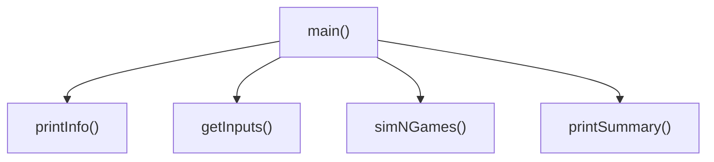
</details>

print("竞技分析开始，共模拟{}场比赛".format(n))

print("选手A获胜{}场比赛，占比{:0.1%}".format(winsA, winsA/n))

print("选手B获胜{}场比赛，占比{:0.1%}".format(winsB, winsB/n))

# 体育竞技分析

第二阶段：步骤3 模拟N局比赛  


<details>
<summary>flowchart</summary>

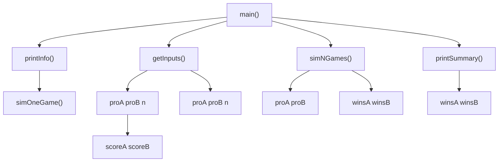
</details>

# 体育竞技分析

# 第二阶段

def simNGames(n, probA, probB):

winsA, winsB = 0, 0

for i in range(n):

scoreA, scoreB = simOneGame(probA, probB)

if scoreA > scoreB:

winsA += 1

else:

winsB += 1

return winsA, winsB


<details>
<summary>flowchart</summary>

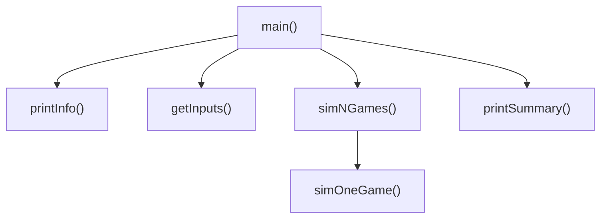
</details>

体育竞技分析  


<details>
<summary>flowchart</summary>

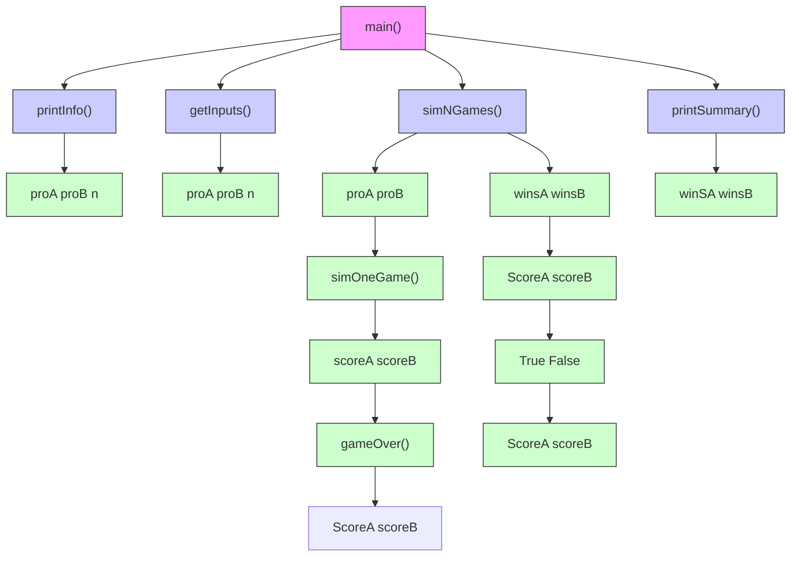
</details>

# 体育竞技分析

def simOneGame(probA, probB):   
scoreA, scoreB = 0, 0
serving = "A"
while not gameOver(scoreA, scoreB):
    if serving == "A":
    if random() < probA:
    scoreA += 1
    else:
    serving="B"
    else:
    if random() < probB:
    scoreB += 1
    else:
    serving="A"
return scoreA, scoreB


<details>
<summary>flowchart</summary>

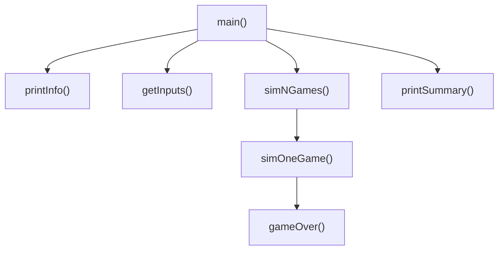
</details>

def gameOver(a,b):   
```lua
return a==15 or b==15 
```

体育竞技分析  


<details>
<summary>flowchart</summary>

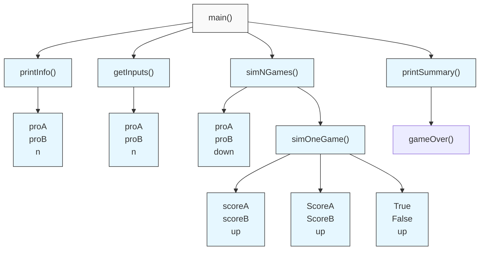
</details>

# 体育竞技分析


这个程序模拟两个选手A和B的某种竞技比赛

程序运行需要A和B的能力值（以0到1之间的小数表示）

请输入选手A的能力值(0-1): 0.45

请输入选手B的能力值(0-1): 0.50

模拟比赛的场次: 1000

竞技分析开始，共模拟1000场比赛

选手A获胜365场比赛，占比36.5%

选手B获胜635场比赛，占比63.5%

能力值：0.45 v.s. 0.50

获胜数：36.5% v.s. 63.5%

# 准备好电脑，与老师一起编码吧！

# 体育竞技分析"举一反三


<details>
<summary>natural_image</summary>

Abstract geometric line drawing with interconnected nodes and lines (no text or symbols)
</details>


<details>
<summary>natural_image</summary>

Abstract geometric network diagram with interconnected nodes and lines (no text or symbols)
</details>

# 举一反三

# 理解自顶向下和自底向上

理解自顶向下的设计思维：分而治之  
理解自底向上的执行思维：模块化集成  
自顶向下是“系统”思维的简化

# 举一反三

# 应用问题的扩展

- 扩展比赛参数，增加对更多能力对比情况的判断  
扩展比赛设计，增加对真实比赛结果的预测  
扩展分析逻辑，反向推理，用胜率推算能力？

# Python程序设计思维


python

嵩 天

北京理工大学

pythom

# 单元开篇

# Python程序设计思维


<details>
<summary>natural_image</summary>

Generic male avatar icon with beard and mustache (no text or symbols)
</details>

- 计算思维与程序设计  
计算生态与Python语言  
用户体验与软件产品  
基本的程序设计模式


<details>
<summary>natural_image</summary>

Silhouette of a person riding a bicycle with a blue line at the base (no text or symbols)
</details>


pythom

# 计算思维与程序设计


<details>
<summary>natural_image</summary>

Abstract geometric line drawing with interconnected nodes and lines (no text or symbols)
</details>


<details>
<summary>natural_image</summary>

Abstract geometric network diagram with interconnected nodes and lines (no text or symbols)
</details>

# 计算思维

# 第3种人类思维特征

逻辑思维：推理和演绎，数学为代表，A->B B->C A->C   
实证思维：实验和验证，物理为代表，引力波<-实验  
计算思维：设计和构造，计算机为代表，汉诺塔递归

# 计算思维

# 抽象和自动化

计算思维：Computational Thinking   
- 抽象问题的计算过程，利用计算机自动化求解  
计算思维是基于计算机的思维方式

# 计算思维

# 计数求和：计算1-100的计数和

$$
\mathbf {s} = \frac {(a _ {1} + a _ {n}) n}{2}
$$

$$
s = \theta
$$

$$
f o r \quad i \text { in } \quad \text { range } (1, 1 0 1):
$$

$$
s + = i
$$

逻辑思维

数学家高斯的玩儿法

计算思维

现代人的新玩儿法

# 计算思维

# 圆周率的计算

$$
\pi = \sum_ {k = 0} ^ {\infty} [ \frac {1}{1 6 ^ {k}} \bigg (\frac {4}{8 k + 1} - \frac {2}{8 k + 4} - \frac {1}{8 k + 5} - \frac {1}{8 k + 6} \bigg) ]
$$


<details>
<summary>scatter</summary>

| x    | y    |
| ---- | ---- |
| 0.0  | 1.0  |
| 0.2  | 0.8  |
| 0.4  | 0.6  |
| 0.6  | 0.4  |
| 0.8  | 0.2  |
| 1.0  | 0.0  |
</details>

逻辑思维

计算思维


<details>
<summary>text_image</summary>

N片
</details>


<details>
<summary>natural_image</summary>

Simple diagram of a wooden abacus with colored rods and arrows indicating motion (no text or symbols)
</details>


<details>
<summary>text_image</summary>

2^n-1步
N片
N片
</details>

# 计算思维

# 汉诺塔问题

>>>

$$
\text { count } = 0
$$

1:A->C

def hanoi(n, src, dst, mid): … (略)

2:A->B

hanoi(3, "A", "C", "B")

1:C->B

print(count)

3:A->C

1:B->A

2:B->C

1:A->C

7

# 逻辑思维 ??n − ?? 计算思维

# 计算思维


<details>
<summary>natural_image</summary>

Three-panel image showing a bright sun, dark clouds with lightning, and cloudy sky (no text or symbols)
</details>

经验 猜

天气预报  


<details>
<summary>natural_image</summary>

Grid of 16 weather and weather icons including sun, cloud, lightning, moon, rain, umbrella, and moon (no text or symbols)
</details>

MM5模型

@超算   


<details>
<summary>natural_image</summary>

3D wireframe globe with grid lines and colored trajectory lines (no text or labels)
</details>


<details>
<summary>text_image</summary>

170
150
140
130
110
190
170
180
190
200
210
10km
10km
内流
</details>

实证思维+逻辑思维

计算思维

# 计算思维

量化分析  


<details>
<summary>bar_line</summary>

| 时间   | 现量  | 成交量 |
| ------ | ----- | ------ |
| 14:59  | 12.27 | 156996 |
| 14:59  | 12.27 | 3.96   |
| 14:59  | 12.30 | 0.05   |
| 14:59  | 12.30 | 0.05   |
| 14:59  | 12.30 | 0.05   |
| 14:59  | 12.30 | 0.05   |
| 14:59  | 12.30 | 0.05   |
| 14:49  | 12.27 | 12403  |
| 14:49  | 12.27 | 12403  |
| 14:49  | 12.30 | 12403  |
| 14:49  | 12.30 | 12403  |
| 14:49  | 12.30 | 12403  |
| 14:49  | 12.30 | 12403  |
| 14:49  | 12.30 | 17.17  |
| 14:49  | 12.29 | 17.17  |
| 14:49  | 12.29 | 17.17  |
| 14:49  | 12.29 | 17.17  |
| 14:49  | 12.29 | 17.17  |
| 14:49  | 12.29 | 12.24  |
| 14:49  | 12.29 | 12.24  |
| 14:49  | 12.29 | 12.24  |
| 14:49  | 12.29 | 12.24  |
| 14:49  | 12.29 | 12.24  |
| ...    | ...   | ...    |
| ...    | ...   | ...    |
| ...    | ...   | ...    |
| ...    | ...   | ...    |
| ...    | ...   | ...    |
| ...    | ...   | ...    |
| ...    | ...   | ...    |
| ...    | ...   | ...    |
| ...    | ...   | ...    |
| ...    | ...   | ...    |
| ...    | ...   | ...     |
| ...    | ...   | ...    |
| ...    | ...   | ...    |
| ...    | ...   | ...    |
| ...    | ...   | ...    |
| ...    | ...   | ...    |
| ...    | ...   | ...    |
| ...    | ...   | ...    |
| ...    | ...   | ...    |
| ...    | ...   | ...    |
| ...    | ...   | ...```
</details>


<details>
<summary>text_image</summary>

猜
</details>

机器学习

  
自动交易


<details>
<summary>scatter</summary>

| SGA score, replicate 1 | Value |
| ---------------------- | ----- |
| -1.0                   | -1.0  |
| -0.5                   | -0.5  |
| 0.0                    | 0.0   |
| 0.5                    | 0.5   |
</details>


<details>
<summary>scatter</summary>

| SGA score, AB | Value |
| ------------- | ----- |
| -1.0          | 0     |
| -0.5          | 565   |
| 0.0           | 1,130 |
| 0.5           | 1,695 |
| 1.0           | 2,260 |
</details>


<details>
<summary>scatter</summary>

| SGA score | Value |
| --------- | ----- |
| -0.8      | -0.9  |
| -0.7      | -0.8  |
| -0.6      | -0.7  |
| -0.5      | -0.6  |
| -0.4      | -0.5  |
| -0.3      | -0.4  |
| -0.2      | -0.3  |
| -0.1      | -0.2  |
| 0.0       | -0.1  |
| 0.1       | 0.0   |
| 0.2       | 0.1   |
| 0.3       | 0.2   |
| 0.4       | 0.3   |
| 0.5       | 0.4   |
</details>

实证思维+逻辑思维

计算思维

# 计算思维

# 抽象问题的计算过程，利用计算机自动化求解

计算思维基于计算机强大的算力及海量数据  
抽象计算过程，关注设计和构造，而非因果  
以计算机程序设计为实现的主要手段


<details>
<summary>natural_image</summary>

Illustration of a glowing light bulb with orange and black outlines, surrounded by radiating orange dots (no text or symbols)
</details>

# 计算思维与程序设计

# 编程是将计算思维变成现实的手段


<details>
<summary>natural_image</summary>

Illustration of a light bulb with orange filament and radiating lines, symbolizing an idea or innovation (no text or symbols present)
</details>

抽象


设计和构造


<details>
<summary>natural_image</summary>

Simple line drawing of a person in uniform with no text or symbols
</details>

自动化


编程


<details>
<summary>natural_image</summary>

Simple line drawing of a computer monitor with a keyboard and screen (no text or symbols)
</details>

# 计算思维 真的很有用…

# 计算生态与Python语言


<details>
<summary>natural_image</summary>

Abstract geometric line drawing with interconnected nodes and lines (no text or symbols)
</details>


<details>
<summary>natural_image</summary>

Abstract geometric network diagram with interconnected nodes and lines (no text or symbols)
</details>

# 计算生态

# 从开源运动说起…


<details>
<summary>text_image</summary>

openSUSE
CakePHP
e
git
php
openmoko
mongoDB
MySQL
</details>

1983, Richard Stallman启动GNU项目  
- 1989, GNU通用许可协议诞生

自由软件时代到来

# 计算生态

# 从开源运动说起…


<details>
<summary>text_image</summary>

openSUSE
CakePHP
e
git
php
openmoko
mongoDB
MySQL
</details>

- 1991, Linus Torvalds发布了Linux内核   
- 1998, 网景浏览器开源，产生了Mozilla

开源生态逐步建立

# 计算生态

# 从开源运动说起…


<details>
<summary>natural_image</summary>

Exterior view of a Gothic cathedral with a prominent spire and a tall stone tower under a blue sky (no signage or text visible)
</details>

1983, Richard Stallman

大教堂模式

V.S.


<details>
<summary>natural_image</summary>

Aerial night view of a bustling riverside town with illuminated buildings and crowds, no visible text or signage.
</details>

1991, Linus Torvalds

集市模式

# 计算生态

# 开源思想深入演化和发展，形成了计算生态

计算生态以开源项目为组织形式，充分利


<details>
<summary>natural_image</summary>

Four hands holding a colorful puzzle piece (green, blue, yellow, red) against a white background, no text or symbols present.
</details>

用“共识原则”和“社会利他”组织人员，在

竞争发展、相互依存和迅速更迭中完成信息技

术的更新换代，形成了技术的自我演化路径。

# 计算生态

# 没有顶层设计、以功能为单位、具备三个特点


<details>
<summary>natural_image</summary>

Four hands holding a colorful puzzle piece (green, blue, yellow, red) against a white background, no text or symbols present.
</details>

竞争发展  
相互依存  
迅速更迭


<details>
<summary>natural_image</summary>

Two cheetah animals in dynamic motion on a rock, one running and the other leaping (no text or symbols visible)
</details>

# 计算生态与Python语言

以开源项目为代表的大量第三方库

Python语言提供 >13万个第三方库

库的建设经过野蛮生长和自然选择

同一个功能，Python语言2个以上第三方库

# 计算生态与Python语言

库之间相互关联使用，依存发展

Python库间广泛联系，逐级封装

社区庞大，新技术更迭迅速

AlphaGo深度学习算法采用Python语言开源

# 计算生态与Python语言

API != 生态

# 计算生态的价值

创新：跟随创新、集成创新、原始创新


<details>
<summary>natural_image</summary>

Four hands holding a colorful puzzle piece (green, blue, yellow, red) against a white background, no text or symbols present.
</details>

加速科技类应用创新的重要支撑  
发展科技产品商业价值的重要模式  
国家科技体系安全和稳固的基础

# 计算生态的运用

# 刀耕火种 -> 站在巨人的肩膀上


<details>
<summary>natural_image</summary>

Illustration of a hand placing a piggy bank into puzzle pieces (no text or symbols)
</details>

编程的起点不是算法而是系统  
编程如同搭积木，利用计算生态为主要模式  
编程的目标是快速解决问题

# 计算生态

# 优质的计算生态

#

http://python123.io

E

# 理解和运用计算生态

# 用户体验与及软件产品


<details>
<summary>natural_image</summary>

Abstract geometric line drawing with interconnected nodes and lines (no text or symbols)
</details>


<details>
<summary>natural_image</summary>

Abstract geometric network diagram with interconnected nodes and lines (no text or symbols)
</details>

# 用户体验

# 实现功能 关注体验

用户体验指用户对产品建立的主观感受和认识  
关心功能实现，更要关心用户体验，才能做出好产品  
编程只是手段，不是目的，程序最终为人类服务

# 提高用户体验的方法

# 方法1：进度展示

如果程序需要计算时间，可能产生等待，请增加进度展示  
- 如果程序有若干步骤，需要提示用户，请增加进度展示  
如果程序可能存在大量次数的循环，请增加进度展示

# 提高用户体验的方法

# 方法2：异常处理

当获得用户输入，对合规性需要检查，需要异常处理  
当读写文件时，对结果进行判断，需要异常处理  
当进行输入输出时，对运算结果进行判断，需要异常处理

# 提高用户体验的方法

# 其他类方法

打印输出：特定位置，输出程序运行的过程信息  
日志文件：对程序异常及用户使用进行定期记录  
帮助信息：给用户多种方式提供帮助信息

# 软件程序 -> 软件产品

# 用户体验是程序到产品的关键环节

# 基本的程序设计模式


<details>
<summary>natural_image</summary>

Abstract geometric line drawing with interconnected nodes and lines (no text or symbols)
</details>


<details>
<summary>natural_image</summary>

Abstract geometric network diagram with interconnected nodes and lines (no text or symbols)
</details>

# 基本的程序设计模式

# 从IPO开始…

I：Input 输入，程序的输入  
- P：Process 处理，程序的主要逻辑  
O：Output 输出，程序的输出

# 基本的程序设计模式

从IPO开始…

确定IPO：明确计算部分及功能边界  
编写程序：将计算求解的设计变成现实  
调试程序：确保程序按照正确逻辑能够正确运行

# 基本的程序设计模式

# 自顶向下设计

Input 输入，程序的输入  
- P：Process 处理，程序的主要逻辑  
O：Output 输出，程序的输出

# 基本的程序设计模式

# 自顶向下设计

Input 输入，程序的输入  
- P：Process 处理，程序的主要逻辑  
O：Output 输出，程序的输出

# 基本的程序设计模式

# 模块化设计

通过函数或对象封装将程序划分为模块及模块间的表达  
具体包括：主程序、子程序和子程序间关系  
分而治之：一种分而治之、分层抽象、体系化的设计思想

# 基本的程序设计模式

# 模块化设计

- 紧耦合：两个部分之间交流很多，无法独立存在  
松耦合：两个部分之间交流较少，可以独立存在  
模块内部紧耦合、模块之间松耦合

# 基本的程序设计模式

# 配置化设计


<details>
<summary>natural_image</summary>

Geometric diagram showing a pentagon and a polyhedron with colored lines connecting vertices (no text or symbols)
</details>


<details>
<summary>natural_image</summary>

Detailed cutaway view of a mechanical engine assembly (no visible text or labels)
</details>

程序引擎  
+


<details>
<summary>natural_image</summary>

Illustration of a clipboard with horizontal lines, no text or symbols present
</details>

配置文件

# 基本的程序设计模式

# 配置化设计

引擎+配置：程序执行和配置分离，将可选参数配置化  
将程序开发变成配置文件编写，扩展功能而不修改程序  
关键在于接口设计，清晰明了、灵活可扩展

# 应用开发的四个步骤

# 从应用需求到软件产品

1 产品定义

3 设计与实现

2 系统架构

4 用户体验

# 应用开发的四个步骤

# 从应用需求到软件产品

- 1 产品定义：对应用需求充分理解和明确定义产品定义，而不仅是功能定义，要考虑商业模式  
- 2 系统架构：以系统方式思考产品的技术实现系统架构，关注数据流、模块化、体系架构

# 应用开发的四个步骤

# 从应用需求到软件产品

- 3 设计与实现：结合架构完成关键设计及系统实现结合可扩展性、灵活性等进行设计优化  
- 4 用户体验：从用户角度思考应用效果用户至上，体验优先，以用户为中心

# 单元小结

# Python程序设计思维

计算思维：抽象计算过程和自动化执行  
- 计算生态：竞争发展、相互依存、快速更迭  
- 用户体验：进度展示、 异常处理等

IPO、自顶向下、模块化、配置化、应用开发的四个步骤

# Python语言程序设计

# Python第三方库安装


python

嵩 天

北京理工大学

pythom

# 单元开篇

# Python第三方库安装


<details>
<summary>natural_image</summary>

Simple icon of a person with beard and mustache, wearing a collared shirt (no text or symbols)
</details>

看见更大的Python世界  
第三方库的pip安装方法  
第三方库的集成安装方法  
第三方库的文件安装方法


<details>
<summary>natural_image</summary>

Silhouette of a person riding a bicycle with wheels and a blue lane (no text or symbols)
</details>


pythom

# 看见更大的Python世界


<details>
<summary>natural_image</summary>

Abstract geometric line drawing with interconnected nodes and lines (no text or symbols)
</details>


<details>
<summary>natural_image</summary>

Abstract geometric network diagram with interconnected nodes and lines (no text or symbols)
</details>

# Python社区

# >13万个第三方库 https://pypi.org/


Help Donate Login Register

Find, install and publish Python packages with the Python Package Index

Or browse projects

136,970 projects

953,587 releases

1,270,368 files

275,048 users

# Python社区

PyPI

PyPI: Python Package Index   
PSF维护的展示全球Python计算生态的主站  
学会检索并利用PyPI，找到合适的第三方库开发程序

# Python社区

# 实例：开发与区块链相关的程序

第1步：在pypi.org搜索 blockchain  
第2步：挑选适合开发目标的第三方库作为基础  
第3步：完成自己需要的功能

# Python社区

# 实例：开发与区块链相关的程序


Help

Donate

Log in

Register

# Filter by classifier

3   
3   
  
  
  
  
  
3

192 projects for "blockchain"


blockchain 1.4.0


cert-schema\_pastday 2.0b1


easychain 0.2.1


blockchain-certificates 0.10.4

Relevance

# 安装Python第三方库

# 三种方法

方法1(主要方法): 使用pip命令  
方法2: 集成安装方法  
方法3: 文件安装方法

# 第三方库的pip安装方法


<details>
<summary>natural_image</summary>

Abstract geometric line drawing with interconnected nodes and lines (no text or symbols)
</details>


<details>
<summary>natural_image</summary>

Abstract geometric network diagram with interconnected nodes and lines (no text or symbols)
</details>

# pip安装方法

# D:\>pip –h

Usage:

pip <command> [options]

Commands:

install

# 使用pip安装工具（命令行下执行）

  
Windows

  
Mac OS

  
Linux

download

Download packages.

uninstall

Uninstall packages.

freeze

Output installed packages in requirements format.

list

List installed packages.

show

Show information about installed packages.

check

Verify installed packages have compatible dependencies.

search

Search PyPI for packages.

wheel

Build wheels from your requirements.

Show help for commands.

# pip安装方法

# 常用的pip命令

D:\>pip install <第三方库名>

安装指定的第三方库

# pip安装方法

# 常用的pip命令

D:\>pip install –U <第三方库名>

使用-U标签更新已安装的指定第三方库

# pip安装方法

# 常用的pip命令

D:\>pip uninstall <第三方库名>

卸载指定的第三方库

# pip安装方法

# 常用的pip命令

D:\>pip download <第三方库名>

下载但不安装指定的第三方库

# pip安装方法

# 常用的pip命令

D:\>pip show <第三方库名>

列出某个指定第三方库的详细信息

# pip安装方法

# 常用的pip命令

D:\>pip search <关键词>

根据关键词在名称和介绍中搜索第三方库

# pip安装方法

# pip search blockchain


C:\Users\Tian Song>pip search blockh

blockchain (1.4.0)

easy-blockchain (0.1.6)

blockchain-parser (0.1.4)

blockchain-certificates (0.10.4)

cert-issuer (2.0.12)

justblockchain (1.0.0)

virtualchain (0.18.0.1)

assemblycoins (0.1.2)

BigchainDB (1.3.0)

blockchainauth (0. 2.0)

blockrecord (0. 1.0)

blocktools (0.1.3)

bts\_tools (0.5.3)

catena (0.0.1. dev8)

cert-schema\_pastday(2.0b1)

cert-store (2.0.5)

cert-tools (2.0.9)

cert-verifier (2.0.12)

Cryptonet (0.0.5)

- Blockchain API 1ibrary (v1)   
- A blockchain for human   
- Bitcoin blockchain parser   
Create pdf certificate files and issue on the blockchain!   
Issues blockchain certificates using the Bitcoin blockchain   
- A blockchain linker to help understand hash functions in blockchain   
- A library for constructing virtual blockchains within a cryptocurrency S blockchain   
- Digital Tokens on the Bitcoin Blockchain   
- BigchainDB: A Scalable Blockchain Database   
- Blockchain Auth Library   
- Blockchain-inspired datastore   
- Bitcoin blockchain parser   
- Graphene blockchains management tools   
- Catena is blockchain as a service.   
- tools for working with blockchain certificates   
A library for retrieving blockchain certificates   
- creates blockchain certificates   
- Verifies blockchain certificates   
Brockthain and Cryptonet Framework

# pip安装方法

# 常用的pip命令

D:\>pip list

列出当前系统已经安装的第三方库

# pip安装方法

# 主要方法， 适合99%以上情况

适合Windows、Mac和Linux等操作系统  
未来获取第三方库的方式，目前的主要方式  
适合99%以上情况，需要联网安装

# 第三方库的集成安装方法


<details>
<summary>natural_image</summary>

Abstract geometric line drawing with interconnected nodes and lines (no text or symbols)
</details>


<details>
<summary>natural_image</summary>

Abstract geometric network diagram with interconnected nodes and lines (no text or symbols)
</details>

# 集成安装方法

# 集成安装：结合特定Python开发工具的批量安装

# Anaconda

https://www.continuum.io

支持近800个第三方库  
包含多个主流工具  
适合数据计算领域开发


<details>
<summary>text_image</summary>

ANACONDA NAVIGATOR BETA
Home
Environments
Learning
Community
My Applications
Refresh
jupyter
notebook
4.1.0
Web-based, interactive computing
notebook environment. Edit and run
human-readable docs while describing the
data analysis.
Launch
IPyty
qtconsole
4.2.0
PyQt GUI that supports inline figures,
proper multiline editing with syntax
highlighting, graphical callips, and more.
Launch
spyder
2.3.8
Scientific Python Development
Environnent. Powerful Python IDE with
advanced editing, interactive testing,
debugging and introspection features
Launch
glueviz
0.8.2
Multidimensional data visualization across
files. Explore relationships within and
among related datasets.
Install
orange-app
1.0.1
Component based data mining framework.
Data visualization and data analysis for
novice and expert. Interactive workflows
with a large toolbox.
Install
</details>

# 第三方库的文件安装方法


<details>
<summary>natural_image</summary>

Abstract geometric line drawing with interconnected nodes and lines (no text or symbols)
</details>


<details>
<summary>natural_image</summary>

Abstract geometric network diagram with interconnected nodes and lines (no text or symbols)
</details>

# 文件安装方法

为什么有些第三方库用pip可以下载，但无法安装？

某些第三方库pip下载后，需要编译再安装  
如果操作系统没有编译环境，则能下载但不能安装  
可以直接下载编译后的版本用于安装吗？

# 文件安装方法

# http://www.lfd.uci.edu/\~gohlke/pythonlibs/

# Unofficial Windows Binaries for Python Extension Packages

by Christoph Gohlke, Laboratory for Fluorescence Dynamics, University of California, Irvine.

T distribution of the Python programming language.

T made available for testing and evaluation purposes.

any, have been submitted to the project maintainers or are included in the packages.

Refer to the documentation of the individual packages for license restrictions and dependencies.

reduce number and frequency of downloads. Please only download files manually as needed.

Use pip version 9 or newer to install the dowmoaded,whl files. This page is not a pip package index.

e 0 Visal + 6 r 8  y 5iu p.

Install numpy+mk1 before other packages that depend on it.

T WinPython etc. Many binaries are not compatible with Windows XP or Wine.

Th p    t gi.

T ls e provid s wiut wrranty  support  y kindTe ene sk s  e qualy performance is with you.

T  e Fluorescence Dynamics or the University of California.

  
Windows

# 文件安装方法

# 实例：安装wordcloud库

步骤1：在UCI页面上搜索wordcloud  
步骤2：下载对应版本的文件  
步骤3：使用pip install <文件名>安装

# 单元小结

# Python第三方库安装

- PyPI：Python Package Index   
- pip命令的各种用法  
Anaconda集成开发工具及安装方法  
UCI页面的“补丁”安装方法


<details>
<summary>natural_image</summary>

Silhouette of a person riding a bicycle with a blue line at the base (no text or symbols)
</details>


pythom

# 模块7: os库的使用


python

嵩 天

北京理工大学

pythom

# os库基本介绍


<details>
<summary>natural_image</summary>

Abstract geometric network diagram with interconnected nodes and lines (no text or symbols)
</details>

# os库基本介绍

# os库提供通用的、基本的操作系统交互功能

  
Windows

  
Mac OS

  
Linux

os库是Python标准库，包含几百个函数  
常用路径操作、进程管理、环境参数等几类

# os库基本介绍

路径操作：os.path子库，处理文件路径及信息  
进程管理：启动系统中其他程序  
环境参数：获得系统软硬件信息等环境参数

# os库之路径操作


<details>
<summary>natural_image</summary>

Abstract geometric line drawing with interconnected nodes and lines (no text or symbols)
</details>


<details>
<summary>natural_image</summary>

Abstract geometric network diagram with interconnected nodes and lines (no text or symbols)
</details>

# 路径操作

os.path子库以path为入口，用于操作和处理文件路径

import os.path

或

import os.path as op

# 路径操作

<table><tr><td>函数</td><td>描述</td></tr><tr><td>os.path.abspath(path)</td><td>返回path在当前系统中的绝对路径&gt;&gt;&gt;os.path.abspath(&quot;file.txt&quot;)&#x27;C:\\Users\\Tian Song\\Python36-32\\file.txt&#x27;</td></tr><tr><td>os.path.normpath(path)</td><td>归一化path的表示形式,统一用\\分隔路径&gt;&gt;&gt;os.path.normpath(&quot;D://PYE//file.txt&quot;)&#x27;D:\\PYE\\file.txt&#x27;</td></tr><tr><td>os.path.relpath(path)</td><td>返回当前程序与文件之间的相对路径 (relative path)&gt;&gt;&gt;os.path.relpath(&quot;C://PYE//file.txt&quot;)&#x27;..\\...\\...\\...\\...\\...\\...\\PYE\\file.txt&#x27;</td></tr></table>

# 路径操作

<table><tr><td>函数</td><td>描述</td></tr><tr><td>os.path.dirname(path)</td><td>返回path中的目录名称&gt;&gt;&gt;os.path.dirname(&quot;D://PYE//file.txt&quot;)&#x27;D://PYE&#x27;</td></tr><tr><td>os.path.basename(path)</td><td>返回path中最后的文件名称&gt;&gt;&gt;os.path.basename(&quot;D://PYE//file.txt&quot;)&#x27;file.txt&#x27;</td></tr><tr><td>os.path.join(path, *paths)</td><td>组合path与paths,返回一个路径字符串&gt;&gt;&gt;os.path.join(&quot;D:/&quot;, &quot;PYE/file.txt&quot;)&#x27;D:/PYE/file.txt&#x27;</td></tr></table>

# 路径操作

<table><tr><td>函数</td><td>描述</td></tr><tr><td>os.path.exists(path)</td><td>判断path对应文件或目录是否存在,返回True或False&gt;&gt;&gt;os.path.exists(&quot;D://PYE//file.txt&quot;)False</td></tr><tr><td>os.path.isfile(path)</td><td>判断path所对应是否为已存在的文件,返回True或False&gt;&gt;&gt;os.path.isfile(&quot;D://PYE//file.txt&quot;)True</td></tr><tr><td>os.path.isdir(path)</td><td>判断path所对应是否为已存在的目录,返回True或False&gt;&gt;&gt;os.path.isdir(&quot;D://PYE//file.txt&quot;)False</td></tr></table>

# 路径操作

<table><tr><td>函数</td><td>描述</td></tr><tr><td>os.path.getatime(path)</td><td>返回path对应文件或目录上一次的访问时间&gt;&gt;&gt;os.path.getatime(&quot;D:/PYE/file.txt&quot;)1518356633.7551725</td></tr><tr><td>os.path.getmtime(path)</td><td>返回path对应文件或目录最近一次的修改时间&gt;&gt;&gt;os.path.getmtime(&quot;D:/PYE/file.txt&quot;)1518356633.7551725</td></tr><tr><td>os.path.getctime(path)</td><td>返回path对应文件或目录的创建时间&gt;&gt;time.ctime(os.path.getctime(&quot;D:/PYE/file.txt&quot;))&#x27;Sun Feb 11 21:43:53 2018&#x27;</td></tr></table>

# 路径操作

<table><tr><td>函数</td><td>描述</td></tr><tr><td>os.path.getsize(path)</td><td>返回path对应文件的大小,以字节为单位&gt;&gt;&gt;os.path.getsize(&quot;D:/PYE/file.txt&quot;)180768</td></tr></table>

# 路径操作

os.path.abspath(path)   
os.path.normpath(path)   
os.path.relpath(path)

os.path.dirname(path)

os.path.basename(path)

os.path.join(path)

os.path.exists(path)  
os.path.isfile(path)   
os.path.isdir(path)   
os.path.getatime(path)   
os.path.getmtime(path)   
os.path.getctime(path)   
os.path.getsize(path)

# os库之进程管理


<details>
<summary>natural_image</summary>

Abstract geometric network diagram with interconnected nodes and lines (no text or symbols)
</details>

# 进程管理

os.system(command)

执行程序或命令command   
在Windows系统中，返回值为cmd的调用返回信息

# 进程管理

import os

os.system("C:\\Windows\\System32\\calc.exe")

0


<details>
<summary>text_image</summary>

计算器
≡ 程序员
0
HEX 0
DEC 0
OCT 0
BIN 0
QWORD MS M*
Lsh Rsh Or Xor Not And
↑ Mod CE C ✉ ÷
A B 7 8 9 ×
C D 4 5 6 —
E F 1 2 3 +
( ) ± 0 . =
</details>

# 进程管理

import os

os.system("C:\\Windows\\System32\\mspaint.exe \

D:\\PYECourse\\grwordcloud.png")

0


<details>
<summary>text_image</summary>

文件
主页
查看
编辑
剪贴板
图像
工具
形状
颜色
颜色
打开
3D
应用
深化 创新 增强 全面 文化 国家人民
深化 创造 创造 全面 文化 国家人民
深化 创造 创造 全面 文化 国家人民
深化 创造 创造 全面 文化 国家人民
深化 创造 创造 全面 文化 国家人民
深化 创造 创造 全面 文化 国家人民
深化 创造 创造 全面 文化 国家人民
深化 创造 建功 促进 优化 优化 优化 优化 优化 优化 优化 优化 优化 优化 优化 优化 优化 优化 优化 优化 优化 优化 优化 优化 优化 优化 优化 优化 优化 优化 优化 优化 优化 优化 优化 优化 优化 优化 优化 优化 优化 优化 优化 优化 优化 优化 优化 优化 优化 优化 优化 优化 优化 优化 100%
推动
中国 特色 加强
推动
中国 特色 加强
推动
中国 特色 加强
推动
中国 特色 加强
推动
中国 特色 加强
推动
中国 特色 加强
推动
中国 特色 加强
推动
中国 特色 加强
推动
中国 特色 加强
推动
中国 特色 加强
推动
中国 特色 加强
推动
中国 特色 加强
推进
中国 特色 加强
推进
中国 特色 加强
推进
中国 特色 加强
推进
中国 特色 加强
推进
中国 特色 加强
推进
中国 特色 加强
推进
中国 特色 加强
推进
中国 特色 加强
推进
中国 特色 加强
推进
中国 特色 加强
推进
中国 特色 加强
推进
</details>

# os库之环境参数


<details>
<summary>natural_image</summary>

Abstract geometric network diagram with interconnected nodes and lines (no text or symbols)
</details>

# 环境参数

获取或改变系统环境信息

<table><tr><td>函数</td><td>描述</td></tr><tr><td>os.chdir(path)</td><td>修改当前程序操作的路径&gt;&gt;&gt;os.chdir(&quot;D:&quot;)</td></tr><tr><td>os.getcwd()</td><td>返回程序的当前路径&gt;&gt;&gt;os.getcwd()&#x27;D:\\&#x27;</td></tr></table>

# 环境参数

获取操作系统环境信息

<table><tr><td>函数</td><td>描述</td></tr><tr><td>os.getlogin()</td><td>获得当前系统登录用户名称&gt;&gt;&gt;os.getlogin(&#x27;Tian Song&#x27;</td></tr><tr><td>os.cpu_count()</td><td>获得当前系统的CPU数量&gt;&gt;&gt;os.cpu_count()8</td></tr></table>

# 环境参数

# 获取操作系统环境信息

<table><tr><td>函数</td><td>描述</td></tr><tr><td>os.urandom(n)</td><td>获得n个字节长度的随机字符串,通常用于加解密运算&gt;&gt;&gt;os.urandom(10)b&#x27;7\xbe\xf2! \xc1= \x01gL \xb3&#x27;</td></tr></table>

# 实例14: 第三方库自动安装脚本


python

嵩 天

北京理工大学

pythom

# 第三方库自动安装脚本"问题分析


<details>
<summary>natural_image</summary>

Abstract geometric line drawing with interconnected nodes and lines (no text or symbols)
</details>


<details>
<summary>natural_image</summary>

Abstract geometric network diagram with interconnected nodes and lines (no text or symbols)
</details>

# 问题分析

# 第三方库自动安装脚本

需求：批量安装第三方库需要人工干预，能否自动安装？  
自动执行pip逐一根据安装需求安装

如何自动执行一个程序？例如：pip？

# 问题分析

第三方库自动安装脚本

<table><tr><td>库名</td><td>用途</td><td>pip安装指令</td></tr><tr><td>NumPy</td><td>N维数据表示和运算</td><td>pip install numpy</td></tr><tr><td>Matplotlib</td><td>二维数据可视化</td><td>pip install matplotlib</td></tr><tr><td>PIL</td><td>图像处理</td><td>pip install pillow</td></tr><tr><td>Scikit-Learn</td><td>机器学习和数据挖掘</td><td>pip install sklearn</td></tr><tr><td>Requests</td><td>HTTP协议访问及网络爬虫</td><td>pip install requests</td></tr></table>

# 问题分析

第三方库自动安装脚本

<table><tr><td>库名</td><td>用途</td><td>pip安装指令</td></tr><tr><td>Jieba</td><td>中文分词</td><td>pip install jieba</td></tr><tr><td>Beautiful Soup</td><td>HTML和XML解析器</td><td>pip install beautifulsoup4</td></tr><tr><td>Wheel</td><td>Python第三方库文件打包工具</td><td>pip install wheel</td></tr><tr><td>PyInstaller</td><td>打包Python源文件为可执行文件</td><td>pip install pyinstaller</td></tr><tr><td>Django</td><td>Python最流行的Web开发框架</td><td>pip install django</td></tr></table>

# 问题分析

第三方库自动安装脚本

<table><tr><td>库名</td><td>用途</td><td>pip安装指令</td></tr><tr><td>Flask</td><td>轻量级Web开发框架</td><td>pip install flask</td></tr><tr><td>WeRoBot</td><td>微信机器人开发框架</td><td>pip install werobot</td></tr><tr><td>SymPy</td><td>数学符号计算工具</td><td>pip install sympy</td></tr><tr><td>Pandas</td><td>高效数据分析和计算</td><td>pip install pandas</td></tr><tr><td>Networkx</td><td>复杂网络和图结构的建模和分析</td><td>pip install networkx</td></tr></table>

# 问题分析

第三方库自动安装脚本

<table><tr><td>库名</td><td>用途</td><td>pip安装指令</td></tr><tr><td>PyQt5</td><td>基于Qt的专业级GUI开发框架</td><td>pip install pyqt5</td></tr><tr><td>PyOpenGL</td><td>多平台OpenGL开发接口</td><td>pip install pyopengl</td></tr><tr><td>PyPDF2</td><td>PDF文件内容提取及处理</td><td>pip install pypdf2</td></tr><tr><td>docopt</td><td>Python命令行解析</td><td>pip install docopt</td></tr><tr><td>PyGame</td><td>简单小游戏开发框架</td><td>pip install pygame</td></tr></table>

# 第三方库自动安装脚本"实例讲解


<details>
<summary>natural_image</summary>

Abstract geometric line drawing with interconnected nodes and lines (no text or symbols)
</details>


<details>
<summary>natural_image</summary>

Abstract geometric network diagram with interconnected nodes and lines (no text or symbols)
</details>

# 第三方库自动安装脚本

#BatchInstall.py   
```python
import os
libs = {"numpy","matplotlib","pillow","sklearn","requests",\
    "jieba","beautifulsoup4","wheel","networkx","sympy",\
    "pyinstaller","django","flask","werobot","pyqt5",\
    "pandas","pyopengl","pypdf2","docopt","pygame"}
try:
    for lib in libs:
    os.system("pip install " + lib)
    print("Successful")
except:
    print("Failed Somehow") 
```

# 第三方库自动安装脚本

C:\WINDOWS\system32\cmd.exe

```txt
Collecting pandas
Downloading https://files.pythonhosted.org/packages/00/65/89b3bdf8889be9cca85f1676be6870b430613d718585b8b92c2de8f91eb2/pandas-0.22.0-cp36-cp36m-win32.wh1 (8.2MB)
0% || | 30kB 2.4kB/s eta 0:58:07. 
```

# 准备好电脑，与老师一起编码吧！

# 第三方库自动安装脚本"举一反三


<details>
<summary>natural_image</summary>

Abstract geometric line drawing with interconnected nodes and lines (no text or symbols)
</details>


<details>
<summary>natural_image</summary>

Abstract geometric network diagram with interconnected nodes and lines (no text or symbols)
</details>

#BatchInstall.py   
```python
import os
libs = {"numpy","matplotlib","pillow","sklearn","requests",\
    "jieba","beautifulsoup4","wheel","networkx","sympy",\
    "pyinstaller","django","flask","werobot","pyqt5",\
    "pandas","pyopengl","pypdf2","docopt","pygame"} 
```

try:   
```python
for lib in libs:
    os.system("pip install " + lib)
print("Successful") 
```

except:   
```lua
print("Failed Somehow") 
```

# 举一反三

# 自动化脚本+

编写各类自动化运行程序的脚本，调用已有程序  
扩展应用：安装更多第三方库，增加配置文件  
扩展异常检测：捕获更多异常类型，程序更稳定友好

# 全课程总结与学习展望


python

嵩 天

北京理工大学

pythom

# 全课程总结

# 课程内容设计

 第一部分：Python快速入门（2周）

围绕2个具体实例，讲解Python基本语法元素，感性认识

 第二部分：Python基础语法（5周）

从5个方面讲解基础语法全体系，提供10个实例，理性学习

 第三部分：Python编程思维 （2周）

从方法学角度开阔认识，提升整体编程能力，展望未来

# 课程内容设计

# 面向过程编程的"Python基础语法"全体系

Python基础语法

Python实例解析


Python计算生态

# 课程内容设计

# 好的开始是成功的一半


<details>
<summary>flowchart</summary>


</details>

# Python基础语法 (全体系)

基本数据类型

- 整数、浮点数、复数  
- 字符串

③ 函数和代码复用

函数定义和使用  
函数递归


程序的控制结构

- 分支结构与异常处理  
- 遍历循环、无限循环

- 集合类型 A  
- 序列类型：元组和列表 :  
- 字典类型 # #

⑤ 文件和数据格式化

文件的使用  
- 一二维数据的表示存储和处理


组合数据类型

# Python计算生态 (详解7个)

① turtle库

\- 基本图形绘制

③ random库

随机数产生及应用

⑤ jieba库

简洁的中文分词

⑦ os库

\- 操作系统小功能


② time库

\- 时间的基本处理

④ PyInstaller库

\- 源代码打包为可执行文件

⑥ wordcloud库

中英文词云生成


<details>
<summary>natural_image</summary>

Silhouette of a person riding a bicycle on a blue line (no text or symbols)
</details>


<details>
<summary>natural_image</summary>

Silhouette of a person riding a bicycle with a blue line at the base (no text or symbols)
</details>


<details>
<summary>natural_image</summary>

Illustration of a person riding a bicycle with a grid-patterned bar (no text or symbols)
</details>

pythom

# Python计算生态 (概览一批)

# ① 从数据处理到人工智能

- 数据分析   
数据可视化  
文本处理  
- 机器学习

# ② 从Web解析到网络空间

网络爬虫  
Web信息提取  
Web网站开发  
网络应用开发

# ③ 从人机交互到艺术设计

图形用户界面  
- 游戏开发  
虚拟现实   
- 图形艺术


<details>
<summary>natural_image</summary>

Silhouette of a person riding a bicycle with wheels, no text or symbols present
</details>


<details>
<summary>natural_image</summary>

Silhouette of a person riding a bicycle with wheels, no text or symbols present
</details>


<details>
<summary>natural_image</summary>

Silhouette of a person riding a bicycle with a grid-patterned bar (no text or symbols)
</details>

pythom

# Python实例解析 (16个)

实例1: 温度转换   
实例2: Python蟒蛇绘制  
实例3: 天天向上的力量  
实例4: 文本进度条

实例5:身体质量指数BMI   
实例6: 圆周率的计算   
实例7: 七段数码管绘制  
实例8: 科赫雪花小包裹


<details>
<summary>natural_image</summary>

Silhouette of a person riding a bicycle on a blue line (no text or symbols)
</details>


<details>
<summary>natural_image</summary>

Silhouette of a person riding a bicycle with wheels, no text or symbols present
</details>


<details>
<summary>natural_image</summary>

Silhouette of a person riding a bicycle with a checkered board in the background (no text or symbols)
</details>

# Python实例解析 (16个)

实例9: 基本统计值计算  
实例10: 文本词频统计  
实例11: 自动轨迹绘制  
实例12: 政府工作报告词云

实例13: 体育竞技分析  
实例14: 第三方库安装脚本  
实例15: 霍兰德人格分析雷达图  
实例16: 玫瑰花绘制


<details>
<summary>natural_image</summary>

Silhouette of a person riding a bicycle on a blue line (no text or symbols)
</details>


<details>
<summary>natural_image</summary>

Silhouette of a person riding a bicycle with wheels, no text or symbols present
</details>


<details>
<summary>natural_image</summary>

Silhouette of a person riding a bicycle with a grid-patterned bar (no text or symbols)
</details>

# 课程考核及证书


<details>
<summary>natural_image</summary>

Abstract geometric network diagram with interconnected nodes and lines (no text or symbols)
</details>

# 全课程考核

# 9次作业 + 4次测验 @python123.io

15道单选题/作业  
2-3-4-5编程题/测验   
5-10分/作业  
5-10-15-20分/测验   
共50分  
共50分

# 课程证书

# 课程证书申领

if 课程当前学期 and 开课期内完成考核 • •

按照中国大学MOOC要求，申请结课证书

else :

关注课程，学习内容，全部内容自由查看，并完成考核

待课程再次开设，不用再次考核，直接向中国大学MOOC申请证书

# 课程证书

# 课程证书什么样子呢？


iR

#

python

# 合格 / 优秀


00091820160303

# 免费结课证书(电子)

# 收费认证证书(纸质)

Python

# 课程证书

# 课程证书有什么用？

不解决就业问题，不解决行业准入问题，不解决收入问题  
- 证书是一份证明：证明自己的努力、自己的水平  
- 证书是一份提醒：提醒自己继续努力、继续前行

# 学习展望

# Python从入门到精通

# Python语法的三个阶段


<details>
<summary>natural_image</summary>

Blue square icon with white handshake symbol (no text or numbers)
</details>

Python基础语法

函数式编程


<details>
<summary>natural_image</summary>

Simple icon of an envelope inside a rounded square (no text or symbols)
</details>

Python进阶语法

面向对象编程


<details>
<summary>natural_image</summary>

Icon of a wrench and screwdriver crossed on a gray background (no text or symbols)
</details>

Python高级语法

Pythonic编程

# 应用深度

# 计
算
生
态

# Python科学计算三维可视化

Python机器学习应用

Python数据分析与展示

Python网络爬虫与信息提取

Python+大数据+人工智能

Python+嵌入式+可编程硬件

语法深度

Python基础语法

Python进阶语法

Python高级语法

# 应用深度

# 计
算
生


<details>
<summary>text_image</summary>

python
</details>

Python


<details>
<summary>text_image</summary>

python
</details>

Python


<details>
<summary>text_image</summary>

python
</details>

Python \$\ra}\$


<details>
<summary>text_image</summary>

python
</details>

Python λPJ


<details>
<summary>text_image</summary>

python
</details>

Python


<details>
<summary>text_image</summary>

python
</details>

Python

爱课程中国大学MOOC

在线开放课程 & 微专业课程

网易云课堂 微专业课程

语法深度

Python基础语法

Python进阶语法

Python高级语法

# 学习展望

# Python未来之路在哪里？

Python Everywhere，Python无处不在   
Python Only Not Enough，只有Python可以但不足够  
Python EcoSystem，Python计算生态将成为编程主流

# 人生苦短， 我学Python"


python

国家精品在线开放课程 “Python语言程序设计”

# 读万卷书 行万里路 只为最好的修炼

微博: weibo.com/songtian425

Email: songtian@bit.edu.cn


<details>
<summary>text_image</summary>

QR code image containing encoded data, no visible human-readable text
</details>

# Python语言程序设计

# 第9章 辅学内容


python

嵩 天

北京理工大学

pythom

# 前课复习

# Python基础语法 (全体系)

基本数据类型

- 整数、浮点数、复数  
- 字符串

③ 函数和代码复用

函数定义和使用  
函数递归


程序的控制结构

- 分支结构与异常处理  
- 遍历循环、无限循环

- 集合类型 A  
- 序列类型：元组和列表 :  
- 字典类型 # #

⑤ 文件和数据格式化

文件的使用  
- 一二维数据的表示存储和处理


组合数据类型

# Python程序设计思维

计算思维：抽象计算过程和自动化执行  
- 计算生态：竞争发展、相互依存、快速更迭  
- 用户体验：进度展示、 异常处理等

IPO、自顶向下、模块化、配置化、应用开发的四个步骤

# Python第三方库安装

- PyPI：Python Package Index   
- pip命令的各种用法  
Anaconda集成开发工具及安装方法  
UCI页面的“补丁”安装方法


<details>
<summary>natural_image</summary>

Silhouette of a person riding a bicycle with a blue line at the base (no text or symbols)
</details>


pythom

# 本课概要

# 第9章 Python计算生态概览


<details>
<summary>natural_image</summary>

Generic male avatar icon with beard and mustache (no text or symbols)
</details>

- 9.1 从数据处理到人工智能  
- 9.2 实例15: 霍兰德人格分析雷达图  
- 9.3 从Web解析到网络空间  
- 9.4 从人机交互到艺术设计  
- 9.5 实例16: 玫瑰花绘制

# 第9章 Python计算生态概览


<details>
<summary>natural_image</summary>

Generic male avatar icon with beard and mustache (no text or symbols)
</details>

# 方法论

\- 纵览Python计算生态，看见更大的世界

# 实践能力

\- 初步编写带有计算生态的复杂程序


<details>
<summary>natural_image</summary>

Silhouette of a person riding a bicycle with a checkered board in the background (no text or symbols)
</details>

# 练习与作业

# 第9章 Python计算生态概览


<details>
<summary>natural_image</summary>

Generic male avatar icon with beard and mustache (no text or symbols)
</details>

# 练习 (可选)

5道编程题 @Python123

# 作业

15道单选题 @Python123


<details>
<summary>natural_image</summary>

Silhouette of a person riding a bicycle with a blue and white checkered board in the background (no text or symbols)
</details>


<details>
<summary>natural_image</summary>

Field of yellow rapeseed flowers with a dirt path leading to a vibrant sunset sky, surrounded by trees and a cloudy sky (no text or symbols)
</details>

# python turtlefdendown) turtle tur turtile.pennsiz utor rtpsen(-4e(4): sesercle(40 ennsize(25) size for

turtle import turtup(650,350

turtle.penup( ur

turtle. curts ∞ fd(-250) own

2("purple

for turtle.circle(-80/2)

turtercle(40,

turtle.cin e.fd(40)e(16, 180)

turtle.circle(12/3) \* 2/3)

turtle.fd(40

# 从数据处理到人工智能


python

嵩 天

北京理工大学

pythom

# 单元开篇

# 从数据处理到人工智能

数据表示->数据清洗->数据统计->数据可视化->数据挖掘->人工智能

数据表示：采用合适方式用程序表达数据  
数据清理：数据归一化、数据转换、异常值处理  
数据统计：数据的概要理解，数量、分布、中位数等

# 从数据处理到人工智能

数据表示->数据清洗->数据统计->数据可视化->数据挖掘->人工智能

数据可视化：直观展示数据内涵的方式  
数据挖掘：从数据分析获得知识，产生数据外的价值  
人工智能：数据/语言/图像/视觉等方面深度分析与决策

# 从数据处理到人工智能


<details>
<summary>natural_image</summary>

Generic male avatar icon with beard and mustache (no text or symbols)
</details>

Python库之数据分析   
Python库之数据可视化  
Python库之文本处理  
Python库之机器学习

# Python库之数据分析


<details>
<summary>natural_image</summary>

Abstract geometric line drawing with interconnected nodes and lines (no text or symbols)
</details>


<details>
<summary>natural_image</summary>

Abstract geometric network diagram with interconnected nodes and lines (no text or symbols)
</details>

# Python库之数据分析

# Numpy: 表达N维数组的最基础库

Python接口使用，C语言实现，计算速度优异  
Python数据分析及科学计算的基础库，支撑Pandas等  
提供直接的矩阵运算、广播函数、线性代数等功能

# Python库之数据分析

# Numpy: 表达N维数组的最基础库

def pySum():   
```txt
a = [0, 1, 2, 3, 4]
b = [9, 8, 7, 6, 5]
c = [] 
```

```python
for i in range(len(a)):
    c.append(a[i]**2 + b[i]**3) 
```

```txt
return c 
```  
print(pySum())


import numpy as np   
```python
def npSum():
    a = np.array([0, 1, 2, 3, 4])
    b = np.array([9, 8, 7, 6, 5]) 
```

```txt
c = a**2 + b**3 
```

```txt
return c 
```  
print(npSum())

# Python库之数据分析

# Pandas: Python数据分析高层次应用库

提供了简单易用的数据结构和数据分析工具  
理解数据类型与索引的关系，操作索引即操作数据  
Python最主要的数据分析功能库，基于Numpy开发

# Python库之数据分析

# Pandas: Python数据分析高层次应用库

Series = 索引 + 一维数据

DataFrame = 行列索引 + 二维数据

pandas

$$
y _ {i t} = \beta^ {\prime} x _ {i t} + \mu_ {i} + \epsilon_ {i t}
$$


<details>
<summary>natural_image</summary>

Abstract blue bar-like pattern with no text or symbols
</details>


<details>
<summary>line</summary>

| Time | Series 1 | Series 2 | Series 3 | Series 4 |
|------|----------|----------|----------|----------|
| 0    | 1        | 0.5      | 0.8      | 0.3      |
| 1    | 0.7      | 0.6      | 0.9      | 0.4      |
| 2    | 0.9      | 0.4      | 0.7      | 0.6      |
| 3    | 0.5      | 0.8      | 0.6      | 0.2      |
| 4    | 0.8      | 0.3      | 0.5      | 0.7      |
| 5    | 0.6      | 0.7      | 0.8      | 0.1      |
| 6    | 0.4      | 0.9      | 0.4      | 0.5      |
| 7    | 0.7      | 0.2      | 0.6      | 0.8      |
| 8    | 0.5      | 0.8      | 0.3      | 0.4      |
| 9    | 0.6      | 0.1      | 0.7      | 0.9      |
| 10   | 0.8      | 0.5      | 0.2      | 0.6      |
| 11   | 0.3      | 0.7      | 0.6      | 0.3      |
| 12   | 0.9      | 0.4      | 0.8      | 0.5      |
| 13   | 0.2      | 0.6      | 0.3      | 0.7      |
| 14   | 0.7      | 0.8      | 0.1      | 0.2      |
| 15   | 0.5      | 0.3      | 0.6      | 0.8      |
| 16   | 0.6      | 0.7      | 0.4      | 0.1      |
| 17   | 0.8      | 0.2      | 0.5      | 0.6      |
| 18   | 0.3      | 0.9      | 0.7      | 0.4      |
| 19   | 0.9      | 0.1      | 0.3      | 0.8      |
| 20   | 0.2      | 0.5      | 0.6      | 0.3      |
| 21   | 0.7      | 0.8      | 0.2      | 0.7      |
| 22   | 0.5      | 0.4      | 0.7      | 0.2      |
| 23   | 0.6      | 0.6      | 0.3      | 0.9      |
| 24   | 0.8      | 0.3      | 0.5      | 0.1      |
| 25   | 0.3      | 0.7      | 0.8      | 0.6      |
| 26   | 0.9      | 0.2      | 0.4      | 0.5      |
| 27   | 0.2      | 0.8      | 0.6      | 0.3      |
| 28   | 0.7      | 0.1      | 0.7      | 0.8      |
| 29   | 0.5      | 0.6      | 0.2      | 0.4      |
| 30   | 0.6      | 0.4      | 0.5      | 0.7      |
| 31   | 0.8      | 0.7      | 0.3      | 0.3      |
| 32   | 0.3      | 0.2      | 0.6      | 0.8      |
| 33   | -        | -        | -        | -        |
| 34   | -        | -        | -        | -        |
| 35   | -        | -        | -        | -        |
| 36   | -        | -        | -        | -        |
| 37   | -        | -        | -        | -        |
| 38   | -        | -        | -        | -        |
| 39   | -        | -        | -        | -        |
| 40   | -        | -        | -        | -        |
| 41   | -        | -        | -        | -        |
| 42   | -        | -        | -        | -        |
| 43   | -        | -        | -        | -        |
| 44   | -        | -        | -        | -        |
| 45   | -        | -        | -        | -        |
| 46   | -        | -        | -        | -        |
| 47   | -        | -        | -        | -        |
| 48   | -        | -        | -        | -        |
| 49   | -        | -        | -        | -        |
| 50   | -        | -        | -        | -        |
| Note: The actual values for the series are not provided in the code, so they are estimated from the provided code.
</details>


http://pandas.pydata.org

# Python库之数据分析

# SciPy: 数学、科学和工程计算功能库

- 提供了一批数学算法及工程数据运算功能  
类似Matlab，可用于如傅里叶变换、信号处理等应用  
Python最主要的科学计算功能库，基于Numpy开发

# Python库之数据分析

# SciPy: 数学、科学和工程相关功能库


<details>
<summary>flowchart</summary>

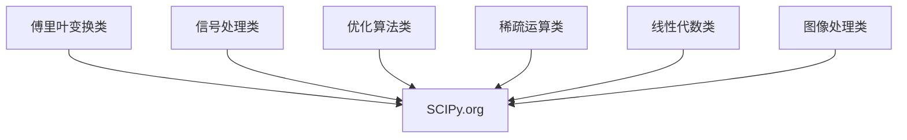
</details>

稀疏图压缩类

# Python库之数据可视化


<details>
<summary>natural_image</summary>

Abstract geometric line drawing with interconnected nodes and lines (no text or symbols)
</details>


<details>
<summary>natural_image</summary>

Abstract geometric network diagram with interconnected nodes and lines (no text or symbols)
</details>

# Python库之数据可视化

# Matplotlib: 高质量的二维数据可视化功能库

提供了超过100种数据可视化展示效果  
通过matplotlib.pyplot子库调用各可视化效果  
Python最主要的数据可视化功能库，基于Numpy开发

# Python库之数据可视化


<details>
<summary>line</summary>

| x    | y     |
| ---- | ----- |
| 0.0  | -2.0  |
| 0.2  | -1.0  |
| 0.4  | 0.0   |
| 0.6  | 1.0   |
| 0.8  | 0.0   |
| 1.0  | -1.0  |
| 1.2  | -2.0  |
| 1.4  | -1.0  |
| 1.6  | 0.0   |
| 1.8  | 1.0   |
| 2.0  | 0.0   |
| 2.2  | -1.0  |
| 2.4  | -2.0  |
| 2.6  | -1.0  |
| 2.8  | 0.0   |
| 3.0  | 1.0   |
| 3.2  | 0.0   |
| 3.4  | -1.0  |
| 3.6  | -2.0  |
| 3.8  | -1.0  |
| 4.0  | 0.0   |
| 4.2  | 1.0   |
| 4.4  | 0.0   |
| 4.6  | -1.0  |
| 4.8  | -2.0  |
| 5.0  | -1.0  |
</details>


# Python库之数据可视化

# Seaborn: 统计类数据可视化功能库

- 提供了一批高层次的统计类数据可视化展示效果  
主要展示数据间分布、分类和线性关系等内容  
基于Matplotlib开发，支持Numpy和Pandas

# Python库之数据可视化

# Seaborn: 统计类数据可视化功能库


<details>
<summary>scatter</summary>

| Group | X     | Y     |
|-------|-------|-------|
| Blue  | 0.1   | 0.8   |
| Blue  | 0.2   | 0.9   |
| Blue  | 0.3   | 1.0   |
| Blue  | 0.4   | 1.1   |
| Blue  | 0.5   | 1.2   |
| Blue  | 0.6   | 1.3   |
| Blue  | 0.7   | 1.4   |
| Blue  | 0.8   | 1.5   |
| Blue  | 0.9   | 1.6   |
| Blue  | 1.0   | 1.7   |
| Red   | 0.1   | 0.6   |
| Red   | 0.2   | 0.7   |
| Red   | 0.3   | 0.8   |
| Red   | 0.4   | 0.9   |
| Red   | 0.5   | 1.0   |
| Red   | 0.6   | 1.1   |
| Red   | 0.7   | 1.2   |
| Red   | 0.8   | 1.3   |
| Red   | 0.9   | 1.4   |
| Red   | 1.0   | 1.5   |
| Green | 0.1   | 0.5   |
| Green | 0.2   | 0.6   |
| Green | 0.3   | 0.7   |
| Green | 0.4   | 0.8   |
| Green | 0.5   | 0.9   |
| Green | 0.6   | 1.0   |
| Green | 0.7   | 1.1   |
| Green | 0.8   | 1.2   |
| Green | 0.9   | 1.3   |
| Green | 1.0   | 1.4   |
| Green | 1.1   | 1.5   |
| Green | 1.2   | 1.6   |
| Green | 1.3   | 1.7   |
| Green | 1.4   | 1.8   |
| Green | 1.5   | 1.9   |
| Green | 1.6   | 2.0   |
| Green | 1.7   | 2.1   |
| Green | 1.8   | 2.2   |
| Green | 1.9   | 2.3   |
| Green | 2.0   | 2.4   |
| Green | 2.1   | 2.5   |
| Green | 2.2   | 2.6   |
| Green | 2.3   | 2.7   |
| Green | 2.4   | 2.8   |
| Green | 2.5   | 2.9   |
| Green | 2.6   | 3.0   |
| Green | 2.7   | 3.1   |
| Green | 2.8   | 3.2   |
| Green | 2.9   | 3.3   |
| Green | 3.0   | 3.4   |
| Green | 3.1   | 3.5   |
| Green | 3.2   | 3.6   |
| Green | 3.3   | 3.7   |
| Green | 3.4   | 3.8   |
| Green | 3.5   | 3.9   |
| Green | 3.6   | 4.0   |
| Green | 3.7   | 4.1   |
| Green | 3.8   | 4.2   |
| Green | 3.9   | 4.3   |
| Green | 4.0   | 4.4   |
| Green | 4.1   | 4.5   |
| Green | 4.2   | 4.6   |
| Green | 4.3   | 4.7   |
| Green | 4.4   | 4.8   |
| Green | 4.5   | 4.9   |
| Green | 4.6   | 5.0   |
| Green | 4.7   | 5.1   |
| Green | 4.8   | 5.2   |
| Green | 4.9   | 5.3   |
| Green | 5.0   | 5.4   |
| Green | 5.1   | 5.5   |
| Green | 5.2   | 5.6   |
| Green | 5.3   | 5.7   |
| Green | 5.4   | 5.8   |
| Green | 5.5   | 5.9   |
| Green | 5.6   | 6.0   |
| Green | 5.7   | 6.1   |
| Green | 5.8   | 6.2   |
| Green | 5.9   | 6.3   |
| Green | 6.0   | 6.4   |
| Green | 6.1   | 6.5   |
| Green | 6.2   | 6.6   |
| Green | 6.3   | 6.7   |
| Green | 6.4   | 6.8   |
| Green | 6.5   | 6.9   |
| Green | 6.6   | 7.0   |
| Green | 6.7   | 7.1   |
| Green | 6.8   | 7.2   |
| Green | 6.9   | 7.3   |
| Green | 7.0   | 7.4   |
| Green | 7.1   | 7.5   |
| Green | 7.2   | 7.6   |
| Green | 7.3   | 7.7   |
| Green | 7.4   | 7.8   |
| Green | 7.5   | 7.9   |
| Green | 7.6   | 8.0   |
| Green | 7.7   | 8.1   |
| Green | 7.8   | 8.2   |
| Green | 7.9   | 8.3   |
| Green | 8.0   | 8.4   |
| Green | 8.1   | 8.5   |
| Green | 8.2   | 8.6   |
| Green | 8.3   | 8.7   |
| Green | 8.4   | 8.8   |
| Green | 8.5   | 8.9   |
| Green | 8.6   | 9.0   |
| Green | 8.7   | 9.1   |
| Green | 8.8   | 9.2   |
| Green | 8.9   | 9.3   |
| Green | 9.0   | 9.4   |
| Green | 9.1   | 9.5   |
| Green | 9.2   | 9.6   |
| Green | 9.3   | 9.7   |
| Green | 9.4   | 9.8   |
| Green | 9.5   | 9.9   |
| Green | 9.6   | -0    |
| Red    | -0    | -0    |
| Red    | -0    | -1    |
| Red    | -0    | -2    |
| Red    | -0    | -3    |
| Red    | -0    | -4    |
| Red    | -0    | -5    |
| Red    | -0    | -6    |
| Red    | -0    | -7    |
| Red    | -0    | -8    |
| Red    | -0    | -9    |
| Red    | -0    | -10    |
| Red    | -0    | -11    |
| Red    | -0    | -12    |
| Red    | -0    | -13    |
| Red    | -0    | -14    |
| Red    | -0    | -15    |
| Red    | -0    | -16    |
| Red    | -0    | -17    |
| Red    | -0    | -18    |
| Red    | -0    | -19    |
| Red    | -0    | -20    |
| Red    | -0    | -21    |
| Red    | -0    | -22    |
| Red    | -0    | -23    |
| Red    | -0    | -24    |
| Red    | -0    | -25    |
| Red    | -0    | -26    |
| Red    | -0    | -27    |
| Red    | -0    | -28    |
| Red    | -0    | -29    |
| Red    | -0    | -30    |
| Red    | -0    | -31    |
| Red    | -0    | -32    |
| Red    | -0    | -33    |
| Red    | -0    | -34    |
| Red    | -0    | -35    |
| Red    | -0    | -36    |
| Red    | -0    | -37    |
| Red    | -0    | -38    |
| Red    | -0    | -39    |
| Red    | -0    | -40    |
| Red    | -0    | -41    |
| Red    | -0    | -42    |
| Red    | -0    | -43    |
| Red    | -0    | -44    |
| Red    | -0    | -45    |
| Red    | -0    | -46    |
| Red    | -0    | -47    |
| Red    | -0    | -48    |
| Red    | -0    | -49    |
| Red    | -0    | -50    |
| Red    | -0    | -51    |
| Red    | -0    | -52    |
| Red    | -0    | -53    |
| Red    | -0    | -54    |
| Red    | -0    | -55    |
| Red    (Green)      (Red)      (Green)      (Green)      (Green)      (Green)      (Green)      (Green)      (Green)      (Green)      (Green)      (Green)      (Green)      (Green)      (Green)      (Green)      (Green)      (Green)      (Green)      (Green)      (Green)      (Green)      (Green)      (Green)      (Green)      (Green)      (Green)      (Blue)       (Blue)        (Blue)       (Blue)       (Blue)       (Blue)       (Blue)       (Blue)       (Blue)       (Blue)       (Blue)       (Blue)       (Blue)       (Blue)       (Blue)       (Blue)       (Blue)       (Blue)       (Blue)       (Blue)       (Blue)       (Blue)       (Blue)       (Blue)       (Blue)       (Blue)       (Blue)       (Blue)      (Blue)       (Blue)       (Blue)       (Blue)       (Blue)       (Blue)       (Blue)       (Blue)       (Blue)       (Blue)      (Blue)       (Blue)       (Blue)       (Blue)       (Blue)       (Blue)       (Blue)       (Blue)       (Blue)      (Blue)       (Blue)       (Blue)       (Blue)       (Blue)       (Blue)       (Blue)       (Blue)      (Blue)       (Blue)       (Blue)       (Blue)       (Blue)       (Blue)      (Blue)      (Blue)       (Blue)       (Blue)       (Blue)       (Blue)      (Blue)      (Blue)      (Blue)      (Blue)      (Blue)      (Blue)      (Blue)
</details>


<details>
<summary>line</summary>

| walk | Value |
|------|-------|
| 5    | 5     |
| 6    | 6     |
| 7    | 7     |
| 10   | 10    |
| 11   | 11    |
| 12   | 12    |
</details>


<details>
<summary>text_image</summary>

Color-coded grid chart with color blocks and hierarchical structure above, likely representing a clustering or data visualization system.
</details>


<details>
<summary>bar</summary>

| Group | Blue Bar | Red Bar | Green Bar | White Bar |
|---|---|---|---|---|
| 1 | 0.5 | 0.3 | 0.2 | 0.1 |
| 2 | 0.8 | 0.6 | 0.4 | 0.2 |
| 3 | 0.7 | 0.5 | 0.3 | 0.1 |
| 4 | 0.6 | 0.4 | 0.2 | 0.1 |
| 5 | 0.9 | 0.7 | 0.5 | 0.3 |
| 6 | 0.4 | 0.2 | 0.1 | 0.1 |
| 7 | 0.3 | 0.1 | 0.1 | 0.1 |
| 8 | 0.2 | 0.1 | 0.1 | 0.1 |
| 9 | 0.1 | 0.1 | 0.1 | 0.1 |
| 10 | 0.1 | 0.1 | 0.1 | 0.1 |
| 11 | 0.1 | 0.1 | 0.1 | 0.1 |
| 12 | 0.1 | 0.1 | 0.1 | 0.1 |
| 13 | 0.1 | 0.1 | 0.1 | 0.1 |
| 14 | 0.1 | 0.1 | 0.1 | 0.1 |
| 15 | 0.1 | 0.1 | 0.1 | 0.1 |
| 16 | 0.1 | 0.1 | 0.1 | 0.1 |
| 17 | 0.1 | 0.1 | 0.1 | 0.1 |
| 18 | 0.1 | 0.1 | 0.1 | 0.1 |
| 19 | 0.1 | 0.1 | 0.1 | 0.1 |
| 20 | 0.1 | 0.1 | 0.1 | 0.1 |
| 21 | 0.1 | 0.1 | 0.1 | 0.1 |
| 22 | 0.1 | 0.1 | 0.1 | 0.1 |
| 23 | 0.1 | 0.1 | 0.1 | 0.1 |
| 24 | 0.1 | 0.1 | 0.1 | 0.1 |
| 25 | 0.1 | 0.1 | 0.1 | 0.1 |
| 26 | 0.1 | 0.1 | 0.1 | 0.1 |
| 27 | 0.1 | 0.1 | 0.1 | 0.1 |
| 28 | 0.1 | 0.1 | 0.1 | 0.1 |
| 29 | 0.1 | 0.1 | 0.1 | 0.1 |
| 30 | 0.1 | 0.1 | 0.1 | 0.1 |
| Note: The 'Blue' and 'Red' bars represent two distinct categories for comparison; the 'Green' and 'White' bars represent two distinct categories for comparison; the 'Blue' and 'Red' bars represent two distinct categories for comparison; the 'Green' and 'White' bars represent two distinct categories for comparison; the 'Blue' and 'Red' bars represent two distinct categories for comparison; the 'Green' and 'White' bars represent two distinct categories for comparison; the 'Blue' and 'Red' bars represent two distinct categories for comparison; the 'Green' and 'White' bars represent two distinct categories for comparison; the 'Blue' bar is labeled as 'Blue'.
</details>


<details>
<summary>flowchart</summary>

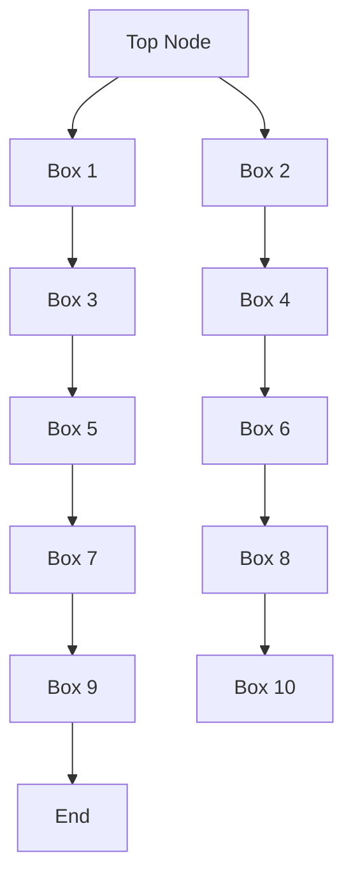
</details>

# Python之数据可视化

# Mayavi：三维科学数据可视化功能库

- 提供了一批简单易用的3D科学计算数据可视化展示效果  
目前版本是Mayavi2，三维可视化最主要的第三方库  
支持Numpy、TVTK、Traits、Envisage等第三方库

# Python之数据可视化

# Mayavi：三维科学数据可视化功能库


<details>
<summary>text_image</summary>

Mayavi
an ETS project
3D Project
View out & Manager: Mayavi
View out
View out
View out
View out
View out
View out
View out
View out
View out
View out
View out
View out
View out
View out
View out
View out
View out
View out
View out
View out
View out
View out
View out
View out
View out
View out
View out
View out
View out
View out
View out
View out
View out
View out
</details>


<details>
<summary>natural_image</summary>

3D rendered abstract structure with yellow and cyan ribbons inside a cube (no text or symbols)
</details>


<details>
<summary>natural_image</summary>

3D diagram of airflow visualization through a cube with colored streamlines and directional arrows (no text or symbols)
</details>

# Python库之文本处理


<details>
<summary>natural_image</summary>

Abstract geometric line drawing with interconnected nodes and lines (no text or symbols)
</details>


<details>
<summary>natural_image</summary>

Abstract geometric network diagram with interconnected nodes and lines (no text or symbols)
</details>

# Python之文本处理

# PyPDF2：用来处理pdf文件的工具集

提供了一批处理PDF文件的计算功能  
支持获取信息、分隔/整合文件、加密解密等  
完全Python语言实现，不需要额外依赖，功能稳定

# Python之文本处理

# PyPDF2：用来处理pdf文件的工具集

from PyPDF2 import PdfFileReader, PdfFileMerger

merger = PdfFileMerger()

input1 = open("document1.pdf", "rb")

input2 = open("document2.pdf", "rb")

merger.append(fileobj = input1, pages = (0,3))

merger.merge(position = 2, fileobj = input2, pages = (0,1))

output = open("document-output.pdf", "wb")

merger.write(output)

http://mstamy2.github.io/PyPDF2

# Python之文本处理

# NLTK：自然语言文本处理第三方库

提供了一批简单易用的自然语言文本处理功能  
- 支持语言文本分类、标记、语法句法、语义分析等  
最优秀的Python自然语言处理库

# Python之文本处理

# NLTK：自然语言文本处理第三方库

from nltk.corpus import treebank

t = treebank.parsed\_sents('wsj\_0001.mrg')[0]

t.draw()

http://www.nltk.org/


<details>
<summary>flowchart</summary>

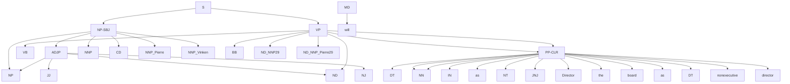
</details>

# Python之文本处理

# Python-docx：创建或更新Microsoft Word文件的第三方库

- 提供创建或更新.doc .docx等文件的计算功能  
增加并配置段落、图片、表格、文字等，功能全面

# Python之文本处理

# Python-docx：创建或更新Microsoft Word文件的第三方库

from docx import Document

document = Document()

document.add\_heading('Document Title', 0)

p = document.add\_paragraph('A plain paragraph having some

document.add\_page\_break()

document.save('demo.docx')

# Python库之机器学习


<details>
<summary>natural_image</summary>

Abstract geometric line drawing with interconnected nodes and lines (no text or symbols)
</details>


<details>
<summary>natural_image</summary>

Abstract geometric network diagram with interconnected nodes and lines (no text or symbols)
</details>

# Python之机器学习

# Scikit-learn：机器学习方法工具集

- 提供一批统一化的机器学习方法功能接口  
- 提供聚类、分类、回归、强化学习等计算功能  
机器学习最基本且最优秀的Python第三方库

# Python之机器学习

# Scikit-learn：与数据处理相关的第三方库


<details>
<summary>flowchart</summary>

```mermaid
graph TD
    subgraph classification
        A["SVC"] --> B["Ensemble Classifiers"]
        B --> C["KNeighbors Classifier"]
        C --> D["SGD Classifier"]
        D --> E["Text Data"]
        E --> F["Linear SVC"]
        F --> G["<100K samples"]
        G --> H["geq more data"]
        H --> I[">50 samples"]
        I --> J["predicting a category"]
        J --> K["predicting a quantity"]
        K --> L["just looking"]
        L --> M["predicting structure"]
        M --> N["tough luck"]
        N --> O["number of categories known"]
        O --> P["<10K samples"]
        P --> Q["MiniBatch KMeans"]
        Q --> R["MeanShift VBGMM"]
        R --> S["<10K samples"]
        S --> T["不确定 data"]
        T --> U["do you have labeled data"]
        U --> V["NEAR"]
    end

    subgraph regression
        W["SGD Regressor"] --> X["few features should be important"]
        X --> Y["RidgeRegression SVR(kernel='linear')"]
        Y --> Z["SVR(kernel='rhf') EnsembleRegressors"]
        Z --> AA["Lasso ElasticNet"]
        AA --> AB["START"]
    end

    subgraph clustering
        AC["Spectral Clustering GMM"] --> AD["KMeans"]
        AD --> AE["<10K samples"]
        AE --> AF["number of categories known"]
        AF --> AG["<10K samples"]
        AG --> AH["smaller text labels like 'yes' and 'NO' for some classes"]
        AH --> AI["<10K samples"]
        AI --> AJ["smaller text labels like 'yes' and 'NO' for some classes"]
        AJ --> AK["<10K samples"]
        AK --> AL["smaller text labels like 'yes' and 'NO' for some classes"]
        AL --> AM["<10K samples"]
        AM --> AN["smaller text labels like 'yes' and 'NO' for some classes"]
        AN --> AO["<10K samples"]
        AO --> AP["smaller text labels like 'yes' and 'NO' for some classes"]
        AP --> AQ["<10K samples"]
        AQ --> AR["smaller text labels like 'yes' and 'NO' for some classes"]
        AR --> AS["<10K samples"]
        AS --> AT["smaller text labels like 'yes' and 'NO' for some classes"]
        AT --> AU["<10K samples"]
        AU --> AV["smaller text labels like 'yes' and 'NO' for some classes"]
        AV --> AW["<10K samples"]
        AW --> AX["smaller text labels like 'yes' and 'NO' for some classes"]
        AX --> AY["<10K samples"]
        AY --> AZ["smaller text labels like 'yes' and 'NO' for some classes"]
        AZ --> BA["<10K samples"]
        BA --> BB["smaller text labels like 'yes' and 'NO' for some classes"]
        BB --> BC["<10K samples"]
        BC --> BD["smaller text labels like 'yes' and 'NO' for some classes"]
        BD --> BE["<10K samples"]
        BE --> BF["smaller text labels like 'yes' and 'NO' for some classes"]
        BF --> BG["<10K samples"]
        BG --> BH["smaller text labels like 'yes' and 'NO' for some classes"]
        BH --> BI["<10K samples"]
        BI --> BJ["smaller text labels like 'yes' and 'NO' for some classes"]
        BJ --> BK["<10K samples"]
        BK --> BL["smaller text labels like 'yes' and 'NO' for some classes"]
        BL --> BM["<10K samples"]
        BM --> BN["smaller text labels like 'yes' and 'NO' for some classes"]
        BN --> BO["<10K samples"]
        BO --> BP["smaller text labels like 'yes' and 'NO' for some classes"]
        BP --> BQ["<10K samples"]
        BQ --> BR["smaller text labels like 'yes' and 'NO' for some classes"]
        BR --> BS["<10K samples"]
        BS --> BT["smaller text labels like 'yes' and 'NO' for some classes"]
        BT --> BU["<10K samples"]
        BU --> BV["smaller text labels like 'yes' and 'NO' for some classes"]
        BV --> BW["<10K samples"]
        BW --> BX["smaller text labels like 'yes' and 'NO' for some classes"]
        BX --> BY["<10K samples"]
        BY --> BZ["smaller text labels like 'yes' and 'NO' for some classes"]
        BZ --> CA["<10K samples"]
        CA --> CB["smaller text labels like 'yes' and 'NO' for some classes"]
        CB --> CC["<10K samples"]
        CC --> CD["smaller text labels like 'yes' and 'NO' for some classes"]
        CD --> CE["<10K samples"]
        CE --> CF["smaller text labels like 'yes' and 'NO' for some classes"]
        CF --> CG["<10K samples"]
        CG --> CH["smaller text labels like 'yes' and 'NO' for some classes"]
        CH --> CI["<10K samples"]
        CI --> CJ["smaller text labels like 'yes' and 'NO' for some classes"]
        CJ --> CK["<10K samples"]
        CK --> CL["smaller text labels like 'yes' and 'NO' for some classes"]
        CL --> CM["<10K samples"]
        CM --> CN["smaller text labels like 'yes' and 'NO' for some classes"]
        CN --> CO["<10K samples"]
        CO --> CP["smaller text labels like 'yes' and 'NO' for some classes"]
        CP --> CQ["<10K samples"]
        CQ --> CR["smaller text labels like 'yes' and 'NO' for some classes"]
        CR --> CS["<10K samples"]
        CS --> CT["smaller text labels like 'yes' and 'NO' for some classes"]
        CT --> CU["<10K samples"]
        CU --> CV["smaller text labels like 'yes' and 'NO' for some classes"]
        CV --> CW["<10K samples"]
        CW --> CX["smaller text labels like 'yes' and 'NO' for some classes"]
        CX --> CY["<10K samples"]
        CY --> CZ["smaller text labels like 'yes' and 'NO' for some classes"]
        CZ --> DA["<10K samples"]
        DA --> DB["smaller text labels like 'yes' and 'NO' for some classes"]
        DB --> DC["<10K samples"]
        DC --> DD["smaller text labels like 'yes' and 'NO' for some classes"]
        DD --> DE["<10K samples"]
        DE --> DF["smaller text labels like 'yes' and 'NO' for some classes"]
        DF --> DG["<10K samples"]
        DG --> DH["smaller text labels like 'yes' and 'NO' for some classes"]
        DH --> DI["<10K samples"]
        DI --> DJ["smaller text labels like 'yes' and 'NO' for some classes"]
        DJ --> DK["<10K samples"]
        DK --> DL["smaller text labels like 'yes' and 'NO' for some classes"]
        DL --> DM["<10K samples"]
        DM --> DN["smaller text labels like 'yes' and 'NO' for some classes"]
        DN --> DO
    end

    subgraph dimensionality reduction
        O["Randomized PCA"] --> P["NOT WORKING"] & Q["NOT WORKING"] & R["NOT WORKING"] & S["NOT WORKING"] & T["NOT WORKING"] & U["NOT WORKING"] & V["NOT WORKING"] & W["NOT WORKING"] & X["NOT WORKING"] & Y["NOT WORKING"] & Z["NOT WORKING"] & AA["NOT WORKING"] & AB["NOT WORKING"] & AC["NOT WORKING"] & AD["NOT WORKING"] & AE["NOT WORKING"] & AF["NOT WORKING"] & AG["NOT WORKING"] & AH["NOT WORKING"] & AI["NOT WORKING"] & AJ["NOT WORKING"] & AK["NOT WORKING"] & AL["NOT WORKING"] & AM["NOT WORKING"] & AN["NOT WORKING"] & AO["NOT WORKING"] & AP["NOT WORKING"] & AQ["NOT WORKING"] & AR["NOT WORKING"] & AS["NOT WORKING"] & AT["NOT WORKING"] & AU["NOT WORKING"] & AV["NOT WORKING"] & AW["NOT WORKING"] & AX["NOT WORKING"] & AY["NOT WORKING"] & AZ["NOT WORKING"] & BA["NOT WORKING"] & BB["NOT WORKING"] & BC["NOT WORKING"] & BD["NOT WORKING"] & BE["NOT WORKING"] & BC(NOT WORKING) & BE(NOT WORKING) & BE(NOT WORKING) & BE(NOT WORKING) & BE(NOT WORKING) & BE(NOT WORKING) & BE(NOT WORKING) & BE(NOT WORKING) & BE(NOT WORKING) & BE(NOT WORKING) & BE(NOT WORKING) & BE(NOT WORKING) & BE(NOT WORKING) & BE(NOT WORKING) & BE(NOT WORKING) & BE(NOOR) & BE(NOOR) & BE(NOOR) & BE(NOOR) & BE(NOOR) & BE(NOOR) & BE(NOOR) & BE(NOOR) & BE(NOOR) & BE(NOOR) & BE(NOOR) & BE(NOOR) & BE(NOOR) & BE(NOOR) & BE(NOOR) & BE(NOOR) & BE(NOOR) & BE(NOOR) & BE(NOOR) & BE(NOOR) & BE(NOOR) & BE(NOOR) & BE(NOOR) & BE(NOOR) & BE(NOOR) & BE(NOOR) & BE(NOOR) & BE(NOOR) & BE(NOOR) & BE(NOOR) & BE(NOOR) & BE(NOOR) & BE(NOOR) & BE(NOOR) & BE(NOOR) & BE(NOOR) & BE(NOOR) & BE(SNR)
    end
```
</details>

# Python之机器学习

# TensorFlow：AlphaGo背后的机器学习计算框架

谷歌公司推动的开源机器学习框架  
将数据流图作为基础，图节点代表运算，边代表张量  
应用机器学习方法的一种方式，支撑谷歌人工智能应用

# Python之机器学习

# TensorFlow：AlphaGo背后的机器学习计算框架

import tensorflow as tf

init = tf.global\_variables\_initializer()

sess = tf.Session()

sess.run(init)

res = sess.run(result)

print('result:', res)


<details>
<summary>text_image</summary>

TensorFlow
</details>

https://www.tensorflow.org/

# Python之机器学习

# MXNet：基于神经网络的深度学习计算框架

提供可扩展的神经网络及深度学习计算功能  
可用于自动驾驶、机器翻译、语音识别等众多领域  
Python最重要的深度学习计算框架

# Python之机器学习

# MXNet：基于神经网络的深度学习计算框架


<details>
<summary>flowchart</summary>

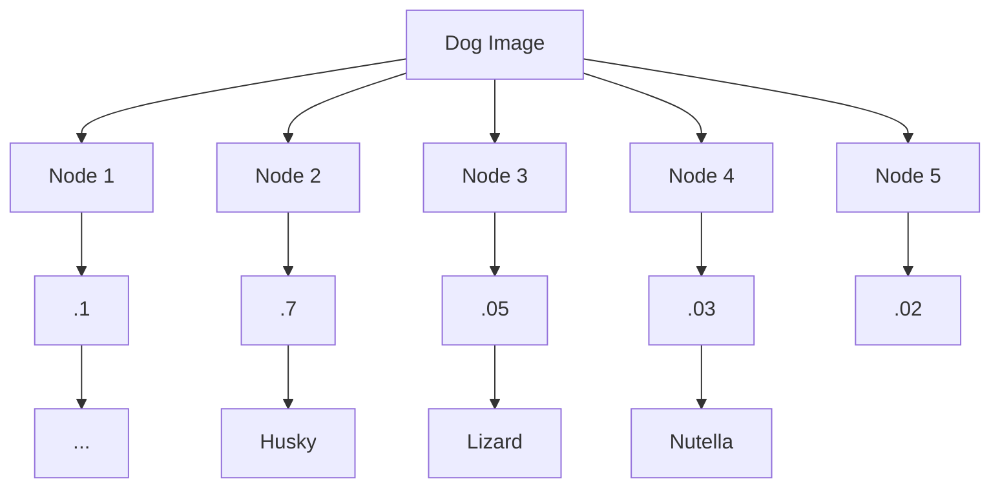
</details>


<details>
<summary>text_image</summary>

mxnet
</details>

https://mxnet.incubator.apache.org/

# 单元小结

# 从数据处理到人工智能

Numpy、Pandas、SciPy  
Matplotlib、Seaborn、Mayavi  
- PyPDF2、NLTK、python-docx   
Scikit-learn、TensorFlow、MXNet

# 实例15: 霍兰德人格分析雷达图


python

嵩 天

北京理工大学

pythom

# 霍兰德人格分析雷达图"问题分析


<details>
<summary>natural_image</summary>

Abstract geometric line drawing with interconnected nodes and lines (no text or symbols)
</details>


<details>
<summary>natural_image</summary>

Abstract geometric network diagram with interconnected nodes and lines (no text or symbols)
</details>

# 问题分析

# 雷达图 Radar Chart


<details>
<summary>text_image</summary>

Green radar chart with concentric circles and measurement scales, displaying data points and a waveform visualization above.
</details>


<details>
<summary>radar</summary>

| Angle (°) | Series 1 | Series 2 |
|-----------|----------|----------|
| 0         | 45       | 30       |
| 20        | 40       | 25       |
| 40        | 35       | 20       |
| 60        | 30       | 15       |
| 80        | 25       | 10       |
| 100       | 20       | 5        |
| 120       | 15       | 0        |
| 140       | 10       | 5        |
| 160       | 5        | 10       |
| 180       | 0        | 15       |
| 200       | 5        | 20       |
| 220       | 10       | 25       |
| 240       | 15       | 30       |
| 260       | 20       | 35       |
| 280       | 25       | 40       |
| 300       | 30       | 45       |
| 320       | 35       | 50       |
| 340       | 40       | 55       |
</details>


<details>
<summary>radar</summary>

| Compound | Value |
| -------- | ----- |
| Sulfate  | 0.8   |
| O3       | 0.6   |
| CO       | 0.4   |
| OP       | 0.7   |
| OC3      | 0.5   |
| OC2      | 0.6   |
| OC1      | 0.4   |
| EC       | 0.5   |
| Nitrate  | 0.9   |
</details>

雷达图是多特性直观展示的重要方式

# 问题分析

# 霍兰德人格分析

霍兰德认为：人格兴趣与职业之间应有一种内在的对应关系  
人格分类：研究型、艺术型、社会型、企业型、传统型、现实性  
职业：工程师、实验员、艺术家、推销员、记事员、社会工作者

# 问题分析

# 霍兰德人格分析雷达图

需求：雷达图方式验证霍兰德人格分析  
- 输入：各职业人群结合兴趣的调研数据  
输出：雷达图

# 问题分析

# 霍兰德人格分析雷达图

通用雷达图绘制：matplotlib库  
专业的多维数据表示：numpy库  
输出：雷达图

# 霍兰德人格分析雷达图"实例展示


<details>
<summary>natural_image</summary>

Abstract geometric line drawing with interconnected nodes and lines (no text or symbols)
</details>


<details>
<summary>natural_image</summary>

Abstract geometric network diagram with interconnected nodes and lines (no text or symbols)
</details>

#HollandRadarDraw   
import numpy as np
import matplotlib.pyplot as plt
import matplotlib
matplotlib.rcParams['font.family'] = 'SimHei'
radar_labels = np.array(['研究型(I)', '艺术型(A)', '社会型(S)', \
    '企业型(E)', '常规型(C)', '现实型(R')])
data = np.array([[0.40, 0.32, 0.35, 0.30, 0.30, 0.88],
    [0.85, 0.35, 0.30, 0.40, 0.40, 0.30],
    [0.43, 0.89, 0.30, 0.28, 0.22, 0.30],
    [0.30, 0.25, 0.48, 0.85, 0.45, 0.40],
    [0.20, 0.38, 0.87, 0.45, 0.32, 0.28],
    [0.34, 0.31, 0.38, 0.40, 0.92, 0.28]]) #数据   
data\_labels = ('艺术家','实验员','工程师','推销员','社会工作者','记事员')

angles = np.linspace(0, 2*np.pi, 6, endpoint=False)
data = np.concatenate((data, [data[0]])
angles = np.concatenate((angles, [angles[0]]))
fig = plt.figure(facecolor="white")
plt.subplot(111, polar=True)
plt.plot(angles, data, 'o-', linewidth=1, alpha=0.2)
plt.fill(angles, data, alpha=0.25)
plt.thetagrids(angles*180/np.pi, radar_labels, frac = 1.2)
plt.figtext(0.52, 0.95, '霍兰德人格分析', ha='center', size=20)
legend = plt.legend(data_labels, loc=(0.94, 0.80), labelspacing=0.1)
plt.setp(legend.get_texts(), fontsize='large')
plt.grid(True)
plt.savefig('holland_radar.jpg')
plt.show()


<details>
<summary>radar</summary>

| 类别 | 实验员 | 工程师 | 推销员 | 社会工作者 | 记事员 |
|---|---|---|---|---|---|
| 研究型 (I) | 0.35 | 0.25 | 0.30 | 0.40 | 0.60 |
| 研究型 (R) | 0.30 | 0.35 | 0.25 | 0.70 | 0.30 |
| 技术型 (A) | 0.45 | 0.20 | 0.45 | 0.85 | 0.35 |
| 社会型 (S) | 0.90 | 0.25 | 0.15 | 0.35 | 0.30 |
| 企业型 (E) | 0.35 | 0.40 | 0.85 | 0.30 | 0.35 |
</details>

#HollandRadarDraw

import numpy as np

import matplotlib.pyplot as plt

import matplotlib

(略)


<details>
<summary>radar</summary>

| 类别 | 实验员 | 工程师 | 推销员 | 社会工作者 | 记事员 |
|---|---|---|---|---|---|
| 研究型 (I) | 0.35 | 0.25 | 0.30 | 0.40 | 0.60 |
| 研究型 (R) | 0.30 | 0.35 | 0.25 | 0.70 | 0.30 |
| 技术型 (A) | 0.45 | 0.20 | 0.45 | 0.85 | 0.35 |
| 社会型 (S) | 0.90 | 0.15 | 0.10 | 0.35 | 0.25 |
| 企业型 (E) | 0.35 | 0.40 | 0.85 | 0.25 | 0.30 |
</details>

(略)

```python
matplotlib.rcParams['font.family'] = 'SimHei' 
```

```python
radar_labels = np.array(['研究型(I)','艺术型(A)','社会型(S)',' 
```

```txt
'企业型(E)', '常规型(C)', '现实型(R)'] 
```

```python
data = np.array([0.40, 0.32, 0.35, 0.30, 0.30, 0.88], 
```

```javascript
[0.85, 0.35, 0.30, 0.40, 0.40, 0.30], 
```

```javascript
[0.43, 0.89, 0.30, 0.28, 0.22, 0.30], 
```

```javascript
[0.30, 0.25, 0.48, 0.85, 0.45, 0.40], 
```

```javascript
[0.20, 0.38, 0.87, 0.45, 0.32, 0.28], 
```

```txt
[0.34, 0.31, 0.38, 0.40, 0.92, 0.28]]）#数据值
```

```python
data_labels = ('艺术家', '实验员', '工程师', '推销员', '社会工作者', '记事员')
```

(略)