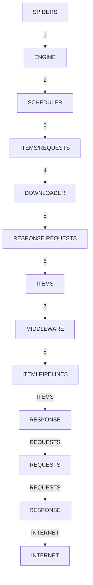
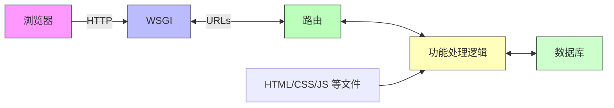

(略)

angles = np.linspace(0, 2\*np.pi, 6, endpoint=False)

data = np.concatenate((data, [data[0]]))

angles = np.concatenate((angles, [angles[0]]))

fig = plt.figure(facecolor="white")

plt.subplot(111, polar=True)

plt.plot(angles,data,'o-', linewidth=1, alpha=0.2)

plt.fill(angles,data, alpha=0.25)

plt.thetagrids(angles\*180/np.pi, radar\_labels,frac = 1.2)

(略)


<details>
<summary>radar</summary>

| 类别 | 实验员 | 工程师 | 推销员 | 社会工作者 | 记事员 |
|---|---|---|---|---|---|
| 研究型 (I) | 0.35 | 0.25 | 0.30 | 0.40 | 0.60 |
| 研究型 (R) | 0.30 | 0.35 | 0.25 | 0.70 | 0.30 |
| 技术型 (A) | 0.45 | 0.20 | 0.45 | 0.85 | 0.35 |
| 社会型 (S) | 0.90 | 0.25 | 0.15 | 0.35 | 0.30 |
| 企业型 (E) | 0.35 | 0.40 | 0.85 | 0.30 | 0.35 |
</details>

(略)

```python
plt.figtext(0.52, 0.95, '霍兰德人格分析', ha='center', size=20)
legend = plt.legend(data_labels, loc=(0.94, 0.80), labelspacing=0.1)
plt.setp(legend.get_texts(), fontsize='large')
plt.grid(True)
plt.savefig('holland_radar.jpg')
plt.show() 
```

# 霍兰德人格分析雷达图"举一反三


<details>
<summary>natural_image</summary>

Abstract geometric line drawing with interconnected nodes and lines (no text or symbols)
</details>


<details>
<summary>natural_image</summary>

Abstract geometric network diagram with interconnected nodes and lines (no text or symbols)
</details>

# 举一反三

目标 + 沉浸 + 熟练

编程的目标感：寻找感兴趣的目标，寻(wa)觅(jue)之   
编程的沉浸感：寻找可实现的方法，思(zuo)考(mo)之  
编程的熟练度：练习、练习、再练习，熟练之

# 从Web解析到网络空间


python

嵩 天

北京理工大学

pythom

# 单元开篇

# 从Web解析到网络空间


<details>
<summary>natural_image</summary>

Generic male avatar icon with beard and mustache (no text or symbols)
</details>

Python库之网络爬虫  
Python库之Web信息提取  
Python库之Web网站开发  
Python库之网络应用开发


<details>
<summary>natural_image</summary>

Silhouette of a person riding a bicycle with a checkered board in the background (no text or symbols)
</details>

# Python库之网络爬虫


<details>
<summary>natural_image</summary>

Abstract geometric line drawing with interconnected nodes and lines (no text or symbols)
</details>


<details>
<summary>natural_image</summary>

Abstract geometric network diagram with interconnected nodes and lines (no text or symbols)
</details>

# Python库之网络爬虫

# Requests: 最友好的网络爬虫功能库

提供了简单易用的类HTTP协议网络爬虫功能  
- 支持连接池、SSL、Cookies、HTTP(S)代理等  
Python最主要的页面级网络爬虫功能库

# Python库之网络爬虫

# Requests: 最友好的网络爬虫功能库

import requests   
```python
r = requests.get('https://api.github.com/user', \
auth=('user', 'pass')) 
```

r.status\_code   
```txt
r.headers['content-type'] 
```  
r.encoding   
r.text


<details>
<summary>text_image</summary>

Requests
http for humans
</details>

# Python库之网络爬虫

# Scrapy: 优秀的网络爬虫框架

- 提供了构建网络爬虫系统的框架功能，功能半成品  
支持批量和定时网页爬取、提供数据处理流程等  
Python最主要且最专业的网络爬虫框架

# Python库之网络爬虫

# Scrapy: Python数据分析高层次应用库


<details>
<summary>flowchart</summary>


</details>

https://scrapy.org

# Python库之网络爬虫

# pyspider: 强大的Web页面爬取系统

提供了完整的网页爬取系统构建功能  
支持数据库后端、消息队列、优先级、分布式架构等  
Python重要的网络爬虫类第三方库

# Python库之网络爬虫

# pyspider: 强大的Web页面爬取系统


<details>
<summary>text_image</summary>

pyspider >js_test_sciencedirect
Quickstart 脚本编写指南
#!/usr/bin/env python
# -*- encoding: utf-8 -*-
# vim: set et sw=4 ts=4 sts=4 ff=unix fenc=utf8:
# Created on 2014-10-31 13:05:52
import re
from libs.base_handler import *
class Handler(BaseHandler):
    this is a sample handler
    def on_start(self):
    self.crawl('http://www.sciencedirect.com/science/article/pii/S1568494612005741',
    callback=self.detail_page)
    def index_page(self, response):
        for each in response.doc('a').items():
            if re.match('http://www.sciencedirect.com/science/article/pii/\w+$',
    each.attr.href):
        self.crawl(each.attr.href, callback=self.detail_page)
    @config(fetch_type="js")
    def detail_page(self, response):
        self.index_page(response)
        self.crawl(response.doc('HTML>BODY>DIV#page-
area>DIV#rightPane>DIV#rightOuter>DIV#rightInner>DIV.innerPadding>DIV#recommend_rela
ted_articles>OL#relArtist>LI>A.viewMoreArticles.cLink').attr.href,
    callback=self.index_page)
    return {
        "url": response.url,
        "title": response.doc('HTML>BODY>DIV#page-
area>DIV#centerPane>DIV#centerContent>DIV#centerInner>DIV#frag_1>H1.svTitle').text(),
        "authors": ["name": x.text(), "url": x.attr.href} for x in
response.doc('HTML>BODY>DIV#page-
area>DIV#centerPane>DIV#centerContent>DIV#centerInner>DIV#frag_1>UL.authorGroup.noCo
lab>LI.smh5>A.authorName').items"),
        "abstract": response.doc('HTML>BODY>DIV#page-
area>DIV#centerPane>DIV#centerContent>DIV#centerInner>DIV#frag_2>DIV.abstract.svAbst
FactSP").text(),
    "abstract": "keywords": [x.text() for x in response.doc('HTML>BODY>DIV#page-
author#: [][name': J.R Lothian],
        "url": http://www.sciencedirect.com/science/article/pii/S02615606020004
'keywords: [],
    'title': 'Editorial',
    'url': u:http://www.sciencedirect.com/science/article/pii/S0261560602000463'}
</details>

http://docs.pyspider.org

# Python库之Web信息提取


<details>
<summary>natural_image</summary>

Abstract geometric line drawing with interconnected nodes and lines (no text or symbols)
</details>


<details>
<summary>natural_image</summary>

Abstract geometric network diagram with interconnected nodes and lines (no text or symbols)
</details>

# Python库之Web信息提取

# Beautiful Soup: HTML和XML的解析库

提供了解析HTML和XML等Web信息的功能  
又名beautifulsoup4或bs4，可以加载多种解析引擎  
常与网络爬虫库搭配使用，如Scrapy、requests等

# Python库之Web信息提取

# Beautiful Soup: HTML和XML的解析库


<details>
<summary>flowchart</summary>


</details>

# Python库之Web信息提取

# Re: 正则表达式解析和处理功能库

提供了定义和解析正则表达式的一批通用功能  
可用于各类场景，包括定点的Web信息提取  
Python最主要的标准库之一，无需安装

# Python库之Web信息提取

# Re: 正则表达式解析和处理功能库

re.search()

re.match()

re.findall()

re.split()

r'\d{3}-\d{8}|\d{4}-\d{7}

re.finditer()

re.sub()

# Python库之Web信息提取

# Python-Goose: 提取文章类型Web页面的功能库

- 提供了对Web页面中文章信息/视频等元数据的提取功能  
- 针对特定类型Web页面，应用覆盖面较广  
Python最主要的Web信息提取库

# Python库之Web信息提取

# Python-Goose: 提取文章类型Web页面的功能库

from goose import Goose

url = 'http://www.elmundo.es/elmundo/2012/10/28/espana/1351388909.html'

g = Goose({'use\_meta\_language': False, 'target\_language':'es'})

article = g.extract(url=url)

article.cleaned\_text[:150]

# Python库之Web网站开发

# Python库之Web网站开发

# Django: 最流行的Web应用框架

提供了构建Web系统的基本应用框架  
MTV模式：模型(model)、模板(Template)、视图(Views)  
Python最重要的Web应用框架，略微复杂的应用框架

# Python库之Web网站开发

Django: 最流行的Web应用框架  


<details>
<summary>flowchart</summary>


</details>

# Python库之Web网站开发

# Pyramid: 规模适中的Web应用框架

- 提供了简单方便构建Web系统的应用框架  
不大不小，规模适中，适合快速构建并适度扩展类应用  
Python产品级Web应用框架，起步简单可扩展性好

# Python库之Web网站开发

# Pyramid: 规模适中的Web应用框架

```python
from wsgiref.simple_server import make_server
from pyramid.config import Configurator
from pyramid.response import Response
def hello_world(request): 
```

```lua
return Response('Hello World!') 
```

```python
if __name__ == '__main__': 
```

```python
with Configurator() as config:
    config.add_route('hello', '/')
    config.add_view(hello_world, route_name='hello')
    app = config.make_wsgi_app() 
```

```txt
server = make_server('0.0.0.0', 6543, app)
server.serve_forever() 
```

# 10行左右Hello Word程序

https://trypyramid.com/

# Python库之Web网站开发

# Flask: Web应用开发微框架

提供了最简单构建Web系统的应用框架  
特点是：简单、规模小、快速   
Django > Pyramid > Flask

# Python库之Web网站开发

# Flask: Web应用开发微框架

from flask import Flask

app = Flask(\_\_name\_\_)

@app.route('/')

def hello\_world():

return 'Hello, World!'


<details>
<summary>text_image</summary>

F
</details>

# lask

web development, one drop at a time

# Python库之网络应用开发


<details>
<summary>natural_image</summary>

Abstract geometric line drawing with interconnected nodes and lines (no text or symbols)
</details>


<details>
<summary>natural_image</summary>

Abstract geometric network diagram with interconnected nodes and lines (no text or symbols)
</details>

# Python库之网络应用开发

# WeRoBot: 微信公众号开发框架

提供了解析微信服务器消息及反馈消息的功能  
建立微信机器人的重要技术手段

# Python库之Web网站开发

# WeRoBot: 微信公众号开发框架

import werobot

robot = werobot.WeRoBot(token='tokenhere')

@robot.handler

def hello(message):

return 'Hello World!'

\- 对微信每个消息反馈一个Hello World

# Python库之网络应用开发

aip: 百度AI开放平台接口

- 提供了访问百度AI服务的Python功能接口  
语音、人脸、OCR、NLP、知识图谱、图像搜索等领域  
Python百度AI应用的最主要方式

# Python库之Web网站开发

# aip: 百度AI开放平台接口


AR


# Python库之网络应用开发

# MyQR: 二维码生成第三方库

提供了生成二维码的系列功能  
基本二维码、艺术二维码和动态二维码

# Python库之Web网站开发

MyQR: 二维码生成第三方库


<details>
<summary>text_image</summary>

QR code with a purple cat face logo in the center, likely linking to a digital resource or webpage.
</details>


<details>
<summary>text_image</summary>

QR code image with pixelated graphic of a vehicle silhouette and trees, likely for digital scanning or web-based content.
</details>


<details>
<summary>natural_image</summary>

Colorful cartoon character with a large red head and gray body, surrounded by a QR code (no text or symbols)
</details>

# 单元小结

# 从Web解析到网络空间

- Requests、Scrapy、pyspider  
- Beautiful Soup、Re、Python-Goose  
- Django、Pyramid、Flask   
WeRobot、aip、MyQR

# 从人机交互到艺术设计


python

嵩 天

北京理工大学

pythom

# 单元开篇

# 从人机交互到艺术设计


<details>
<summary>natural_image</summary>

Generic male avatar icon with beard and mustache (no text or symbols)
</details>

- Python库之图形用户界面  
Python库之游戏开发  
Python库之虚拟现实   
Python库之图形艺术


<details>
<summary>natural_image</summary>

Illustration of a person riding a bicycle with a checkered board in the background (no text or symbols)
</details>

# Python库之图形用户界面


<details>
<summary>natural_image</summary>

Abstract geometric line drawing with interconnected nodes and lines (no text or symbols)
</details>


<details>
<summary>natural_image</summary>

Abstract geometric network diagram with interconnected nodes and lines (no text or symbols)
</details>

# Python库之图形用户界面

# PyQt5: Qt开发框架的Python接口

提供了创建Qt5程序的Python API接口  
Qt是非常成熟的跨平台桌面应用开发系统，完备GUI  
推荐的Python GUI开发第三方库

# Python库之图形用户界面

# PyQt5: Qt开发框架的Python接口


<details>
<summary>text_image</summary>

网格布局
1	2	3
4	5	6
7	8	9
</details>


<details>
<summary>text_image</summary>

与Python对话中
Me : 2016-10-02 18:03:39
Python语言程序设计(第2版)
发送	取消	历史记录
</details>

# Python库之图形用户界面

wxPython: 跨平台GUI开发框架

提供了专用于Python的跨平台GUI开发框架  
理解数据类型与索引的关系，操作索引即操作数据  
Python最主要的数据分析功能库，基于Numpy开发

# Python库之图形用户界面

# wxPython: 跨平台GUI开发框架

import wx   
```python
app = wx.App(False)
frame = wx.Frame(None, wx.ID_ANY, "Hello World")
frame.Show(True)
app.MainLoop() 
```


<details>
<summary>text_image</summary>

wxPython
http://wxPython.org/
Cross-Platform GUI Library
</details>

# Python库之图形用户界面

# PyGObject: 使用GTK+开发GUI的功能库

提供了整合GTK+、WebKitGTK+等库的功能  
GTK+：跨平台的一种用户图形界面GUI框架  
- 实例：Anaconda采用该库构建GUI

# Python库之图形用户界面

# PyGObject: 使用GTK+开发GUI的功能库

import gi

gi.require\_version("Gtk", "3.0")

from gi.repository import Gtk

window = Gtk.Window(title="Hello World")

window.show()

window.connect("destroy", Gtk.main\_quit)

Gtk.main()


PyGObject

# Python库之游戏开发


<details>
<summary>natural_image</summary>

Abstract geometric line drawing with interconnected nodes and lines (no text or symbols)
</details>


<details>
<summary>natural_image</summary>

Abstract geometric network diagram with interconnected nodes and lines (no text or symbols)
</details>

# Python库之游戏开发

# PyGame: 简单的游戏开发功能库

- 提供了基于SDL的简单游戏开发功能及实现引擎  
理解游戏对外部输入的响应机制及角色构建和交互机制  
Python游戏入门最主要的第三方库

# Python库之游戏开发

# PyGame: 简单的游戏开发功能库


<details>
<summary>text_image</summary>

SCORE 2000
+10%
-10%
</details>


<details>
<summary>text_image</summary>

Level: 4
 launch Time
Outward Time
Outward Time
Outward Time
Level 4
</details>


<details>
<summary>text_image</summary>

pygame
</details>

# Python库之游戏开发

# Panda3D: 开源、跨平台的3D渲染和游戏开发库

一个3D游戏引擎，提供Python和C++两种接口  
支持很多先进特性：法线贴图、光泽贴图、卡通渲染等  
由迪士尼和卡尼基梅隆大学共同开发

# Python库之游戏开发

# Panda3D: 开源、跨平台的3D渲染和游戏开发库


<details>
<summary>natural_image</summary>

Animated character with red hat and green eyes, no visible text or symbols in the scene
</details>


<details>
<summary>natural_image</summary>

Illustration of the Caribbean online cruise ship at sea, featuring multiple sailing ships and a distant skyline under a cloudy sky (no text or symbols on the scene itself)
</details>


<details>
<summary>text_image</summary>

PANDA3D
</details>

# Python库之游戏开发

cocos2d: 构建2D游戏和图形界面交互式应用的框架

提供了基于OpenGL的游戏开发图形渲染功能  
支持GPU加速，采用树形结构分层管理游戏对象类型  
适用于2D专业级游戏开发

# Python库之游戏开发

# cocos2d: 构建2D游戏和图形界面交互式应用的框架


<details>
<summary>natural_image</summary>

Illustration of a cartoon character surrounded by multiple robotic characters and sound equipment (no text or symbols)
</details>


<details>
<summary>text_image</summary>

For one WIS.COMS our new robot overKinds.
</details>

cocos2d

# Python库之虚拟现实


<details>
<summary>natural_image</summary>

Abstract geometric line drawing with interconnected nodes and lines (no text or symbols)
</details>


<details>
<summary>natural_image</summary>

Abstract geometric network diagram with interconnected nodes and lines (no text or symbols)
</details>

# Python库之虚拟现实

# VR Zero: 在树莓派上开发VR应用的Python库

提供大量与VR开发相关的功能  
针对树莓派的VR开发库，支持设备小型化，配置简单化  
非常适合初学者实践VR开发及应用

# Python库之虚拟现实

# VR Zero: 在树莓派上开发VR应用的Python库


<details>
<summary>natural_image</summary>

Two-panel image showing Earth from space, with a small planet visible in the sky (no text or symbols)
</details>


<details>
<summary>natural_image</summary>

Exterior view of a Gothic-style cathedral at dusk, showing its stone facade and spire (no signage or text visible)
</details>

https://github.com/WayneKeenan/python-vrzero

# Python库之虚拟现实

# pyovr: Oculus Rift的Python开发接口

针对Oculus VR设备的Python开发库  
- 基于成熟的VR设备，提供全套文档，工业级应用设备  
Python+虚拟现实领域探索的一种思路

# Python库之虚拟现实

# pyovr: 开发Oculus Rift的Python库


<details>
<summary>text_image</summary>

oculus Go
</details>


<details>
<summary>natural_image</summary>

Two 3D geometric shapes, one red and one blue, displayed against a black background (no text or symbols)
</details>

# Python库之虚拟现实

# Vizard: 基于Python的通用VR开发引擎

专业的企业级虚拟现实开发引擎  
提供详细的官方文档  
支持多种主流的VR硬件设备，具有一定通用性

# Python库之虚拟现实

# Vizard: 基于Python的通用VR开发引擎


<details>
<summary>natural_image</summary>

Industrial facility exterior with steel frameworks and concrete pillars under a cloudy sky (no visible text or symbols)
</details>


<details>
<summary>text_image</summary>

The object is configured
to be rotated, bigger,
and floated up when the
presenter enters the
sensor
</details>


<details>
<summary>text_image</summary>

Screenshot of a 3D modeling software interface displaying a virtual room interior with tool panels and property settings.
</details>

# Python库之图形艺术


<details>
<summary>natural_image</summary>

Abstract geometric line drawing with interconnected nodes and lines (no text or symbols)
</details>


<details>
<summary>natural_image</summary>

Abstract geometric network diagram with interconnected nodes and lines (no text or symbols)
</details>

# Python库之图形艺术

# Quads: 迭代的艺术

对图片进行四分迭代，形成像素风  
可以生成动图或静图图像  
简单易用，具有很高展示度

# Python库之虚拟现实

# Quads: 迭代的艺术


<details>
<summary>natural_image</summary>

Abstract pattern with zebra and dot textures in shades of blue and beige (no text or symbols)
</details>


<details>
<summary>natural_image</summary>

Pixelated abstract pattern with red, yellow, and olive squares on a grid background (no text or symbols)
</details>


<details>
<summary>natural_image</summary>

Pixelated image of an owl with large eyes and brown feathers, set against a grid background (no text or symbols)
</details>

# Python库之图形艺术

ascii\_art: ASCII艺术库

将普通图片转为ASCII艺术风格  
输出可以是纯文本或彩色文本  
可采用图片格式输出

# Python库之虚拟现实 sat\*\*\*\*\*+\*\*\*\*@@000\*xx\*\*\*\*\*\*\*\*\*\*\*\*\*\*\*\*##\*@@ \*\*##\*\*\*+++\*##\*\*\*@@@@@\*\*###\*+++

ascii\_art: ASCII艺术库


<details>
<summary>natural_image</summary>

A young tabby kitten peeking over a wooden deck, looking upward with blue eyes (no text or symbols visible)
</details>


<details>
<summary>natural_image</summary>

Close-up grayscale image of a tabby cat with a red circle highlighting the eye area (no text or symbols)
</details>

黑白


<details>
<summary>natural_image</summary>

Black-and-white photo of a fluffy kitten standing on a wooden surface, looking upward (no text or symbols visible)
</details>

彩色

\*\* \*\*\*\*\*\*\*\*\*\*\*\*\*\*\*\*\*\*#\*\*\* \*###\*\*\*\*#####\*\*\*\*% \*\*+\*+\*\*@\*\*\*\*\*\*\*#\*\*\*\*\*\*\*\*\*\*\*\*\*\*\* \*\*#\*\*\*\*\*\*\*\*\*\*\*@@@@@@\*\*\*\*\*\*\*\*\*\*\*\*##\*##\*\* \*\*\*\*\*\*\*\*\*\*\*\*\*\*\*\*\*\*\*\*\*\*\*\*\*\*\*\*\* \*\*\*\*\*\*\*\*\*\*\*\*\*\*\*\*\*\*\*\*\*\*\* \*\*\*\*\*\*\*\*\*\* \*@\*\*\*\*\*\*\*\*\*\*\*\*\*\* \*\*\*\*\*\*\*#\*\*\*@\*\*\*\*\*\*\*\*\*\*\*\*\*\*\*\*\*\*\*\*\*\*\*\*\*\*\*\*\*\*\*\*\*\*\*\*\*\*\*\*\*\*\*\*\*\*\*\*\*\* \*\*\*\*\*\*\*###\*\*\*\*\*\*#\*\*\*\*#\*\*\*\*\*#\*\*\*\*\*\*\*\*\*\*\*\*\*\*\*\*+\*\*\*\*\* \*\*\*\*\*\*\*## \*\*\*\*\*\*\*++\*\*\* \*\*\*\*\*\*\*\*\*\* ###\*\*\*\*##\*\*\*\*\*\*####\*\*\*\*+\*\*+\*\*\*++++++\*\*\*\*++\*\*\*\*++++++\*\*\*\*+\*\*\* \*\*\*\*\*\*\*\*\*\*\*\*\*\*\*\*\*\*\*\*\*\*\*\*\* \*\*\*\*\*\*\*\*\*\*\*\*\*\*\* === \*+\*\*\*\*\*\*\*\*\*+\*+\*+===\*+++\*\*\*\* \*\*\*\*\*\*\*+\*\*\*\*\*\*\*\*\*\*\*\*\*\*\*\* \*\*\*\*\*\*\*\*\*\*\*\*\*\*\*\*\*\*+ \*+\*\*\*\*\*\*\* ##\*@@@\*\* ##\*\*\*@####\*\*\*\*\*\* \*\*\*\*\*\*\*\*\*\*\*\*\*\*\*\*\*#\*\*\*\*\*\*\*\*\*\*\*\* ####\*#\*++++++++\*#\*@@@@@\*\*\*\*###\*@\*\*####\*+ \*\*\*\*\*\*+\*\*\*\* \*\*\*\*\*\*\*\*\*\*\*\*\*\* \*#\*\*\*\*++\*\*\*\*+\*\*+\*\*\*\*\*\*##\* t\*##\*\*+++++++\*#\*@@@@t##\*\*#\*\*@@@@\*\*##\*+==- -#\*#\*++++\*\*\*\*\*t@@@@@ccccc@@\*\*#######\* ###\*++++++++\*\*x@@@@@\*###\*\*#\*x@@@@\*#\*++== -\*\*#\*+===++\*\*###\*\*z@@@@@@@\*\*#####\*\*\* #\*++++#@@##\*#\*#@@@\*+++\*\*+\*\*\*\*@@@@@####\* \*\*\*\*\*\*@@\*\*\*\*\*\*\*\*\*\*\*\*\*\*\*\*\*\*\*##\*\*\* \*\*\*\*\*\*\*\*@@\*\*\*\*\*\*\*\*\*\*\*\*\*\*\*\*\*+\*\*\*\*\*\*\*#\*\* \*\*\*\*\*+\*#@@@@@@@\*\*#\*\*\*\*##@\*\*+\*\*\*\*\*\*\*\*\*###x@@x##\* ##\*\*++++\*\*@@@@@@@@@\*###\*\*\*\*\*#\*@@\*\*+++\*\*\*\*\*\*\*\*\*###\*\*+ \*\*x@@@@@@@@\*\*+\*###\*#\*\*#+ \*#\*\*\*\*#\*@@@@@@∞###\*#\*####\*\*\*+\*\*+

##\*\*\*+ +\*\*\*\*\*\*\*\* \*\*\*\*\*\*\*#\*\*\*\*\*##\*\*\*+ \*\*\*\*\*\*\*\*\*\*\*\*\*\*\*\*\*\*\*\*\* \*\*\*\*\*\*\*\*\*\*\*\* \*\*\*\*\*\*\*\*\*\*\*\*\*\*\*\*\*\*\*\*\* \*\*\*\*\*\*\*\*\*\*\*\*\*\*\*\*\*\*\*\*\*\*\*\*\*\*\* \*jjj\*\*\*\*\*\*\*\*\*\* x\*\*\*\*\*\*\*\*\*\*\*\*\*\*\*\*\* \*\*\*\*\*\*\*\*\*\*\*\*\*\*\*\*\*\*\*\*\*\*\*\*\*\*\*\*\*\*\*\*\*\*\*\*\*

# Python库之图形艺术

# turtle: 海龟绘图体系


<details>
<summary>natural_image</summary>

Illustration of two starfish with flying birds against a yellow background (no text or symbols)
</details>


<details>
<summary>natural_image</summary>

Abstract geometric pattern with interlocking black, orange, and red shapes (no text or symbols)
</details>


<details>
<summary>natural_image</summary>

Stylized illustration of a sunset over blue water with birds flying around (no text or symbols)
</details>


<details>
<summary>natural_image</summary>

Colorful abstract floral pattern with interlocking leaves (no text or symbols)
</details>


<details>
<summary>natural_image</summary>

Abstract black-and-white pattern with scattered colorful star-like shapes and a reflective surface (no text or symbols)
</details>


<details>
<summary>text_image</summary>

Rainbow
</details>

# Python库之图形艺术

# turtle: 海龟绘图体系


<details>
<summary>natural_image</summary>

Illustration of colorful flower-like patterns scattered above a dark water surface with white wavy lines at the bottom (no text or symbols)
</details>

Random Art

# 单元小结

# 从人机交互到艺术设计

- PyQt5、wxPython、PyGObject  
- PyGame、Panda3D、cocos2d  
VR Zero、pyovr、Vizard   
Quads、ascii\_art、turtle

# 实例16: 玫瑰花绘制


python

嵩 天

北京理工大学

pythom


<details>
<summary>text_image</summary>

"玫瑰花绘制"问题分析
</details>

# 问题分析

# 玫瑰花绘制


<details>
<summary>natural_image</summary>

Close-up of a vibrant red rose with green leaves against a white background (no text or symbols)
</details>


<details>
<summary>natural_image</summary>

Close-up of a vibrant red rose with a spiral, no text or symbols visible
</details>


<details>
<summary>natural_image</summary>

Close-up of a single red rose with green leaves against a white background (no text or symbols)
</details>

# 问题分析

# 玫瑰花绘制

- 需求：用Python绘制一朵玫瑰花，献给所思所念   
输入：你的想象力！  
输出：玫瑰花

# 问题分析

# 玫瑰花绘制

绘制机理：turtle基本图形绘制  
绘制思想：因人而异   
思想有多大、 世界就有多大


<details>
<summary>text_image</summary>

"玫瑰花绘制"实例展示
</details>

\# RoseDraw.py

import turtle as t

\# 定义一个曲线绘制函数

def DegreeCurve(n, r, d=1): for i in range(n): t.left(d) t.circle(r, abs(d))

\# 初始位置设定

s = 0.2 # size

t.setup(450\*5\*s, 750\*5\*s)

t.pencolor("black")

t.fillcolor("red")

t.speed(100)

t.penup()

t.goto(0, 900\*s)

t.pendown()

\# 绘制花朵形状

t.begin\_fill()

t.circle(200\*s,30)

DegreeCurve(60, 50\*s)

t.circle(200\*s,30)

DegreeCurve(4, 100\*s)

t.circle(200\*s,50)

DegreeCurve(50, 50\*s)

t.circle(350\*s,65)

DegreeCurve(40, 70\*s)

t.circle(150\*s,50)

DegreeCurve(20, 50\*s, -1)

t.circle(400\*s,60)

DegreeCurve(18, 50\*s)

t.fd(250\*s)

t.right(150)

# 玫瑰花绘制

t.circle(-500\*s,12)

t.left(140)

t.circle(550\*s,110)

t.left(27)

t.circle(650\*s,100)

t.left(130)

t.circle(-300\*s,20)

t.right(123)

t.circle(220\*s,57)

t.end\_fill()

\# 绘制花枝形状

t.left(120)

t.fd(280\*s)

t.left(115)

t.circle(300\*s,33)

t.left(180)

t.circle(-300\*s,33)

DegreeCurve(70, 225\*s, -1)

t.circle(350\*s,104)

t.left(90)

t.circle(200\*s,105)

t.circle(-500\*s,63)

t.penup()

t.goto(170\*s,-30\*s)

t.pendown()

t.left(160)

DegreeCurve(20, 2500\*s)

DegreeCurve(220, 250\*s, -1)

\# 绘制一个绿色叶子

t.fillcolor('green')

t.penup()

t.goto(670\*s,-180\*s)

t.pendown()

t.right(140)

t.begin\_fill()

t.circle(300\*s,120)

t.left(60)

t.circle(300\*s,120)

t.end\_fill()

t.penup()

t.goto(180\*s,-550\*s)

t.pendown()

t.right(85)

t.circle(600\*s,40)

\# 绘制另一个绿色叶子

t.penup()

t.goto(-150\*s,-1000\*s)

t.pendown()

t.begin\_fill()

t.rt(120)

t.circle(300\*s,115)

t.left(75)


<details>
<summary>natural_image</summary>

Simple line drawing of a red rose with green leaves and stem (no text or symbols)
</details>

t.circle(300\*s,100)

t.end\_fill()

t.penup()

t.goto(430\*s,-1070\*s)

t.pendown()

t.right(30)

t.circle(-600\*s,35)

t.done()

\# RoseDraw.py

import turtle as t

\# 定义一个曲线绘制函数

def DegreeCurve(n, r, d=1): for i in range(n): t.left(d) t.circle(r, abs(d))

\# 初始位置设定

s = 0.2 # size

t.setup(450\*5\*s, 750\*5\*s)

t.pencolor("black")

t.fillcolor("red")

t.speed(100)

t.penup()

t.goto(0, 900\*s)

t.pendown()

\# 绘制花朵形状

t.begin\_fill()

t.circle(200\*s,30)

DegreeCurve(60, 50\*s)

t.circle(200\*s,30)

DegreeCurve(4, 100\*s)

t.circle(200\*s,50)

DegreeCurve(50, 50\*s)

t.circle(350\*s,65)

DegreeCurve(40, 70\*s)

t.circle(150\*s,50)

DegreeCurve(20, 50\*s, -1)

t.circle(400\*s,60)

DegreeCurve(18, 50\*s)

t.fd(250\*s)

t.right(150)

# 玫瑰花绘制

t.circle(-500\*s,12)

t.left(140)

t.circle(550\*s,110)

t.left(27)

t.circle(650\*s,100)

t.left(130)

t.circle(-300\*s,20)

t.right(123)

t.circle(220\*s,57)

t.end\_fill()

\# 绘制花枝形状

t.left(120)

t.fd(280\*s)

t.left(115)

t.circle(300\*s,33)

t.left(180)

t.circle(-300\*s,33)

DegreeCurve(70, 225\*s, -1)

t.circle(350\*s,104)

t.left(90)

t.circle(200\*s,105)

t.circle(-500\*s,63)

t.penup()

t.goto(170\*s,-30\*s)

t.pendown()

t.left(160)

DegreeCurve(20, 2500\*s)

DegreeCurve(220, 250\*s, -1)

\# 绘制一个绿色叶子

t.fillcolor('green')

t.penup()

t.goto(670\*s,-180\*s)

t.pendown()

t.right(140)

t.begin\_fill()

t.circle(300\*s,120)

t.left(60)

t.circle(300\*s,120)

t.end\_fill()

t.penup()

t.goto(180\*s,-550\*s)

t.pendown()

t.right(85)

t.circle(600\*s,40)

\# 绘制另一个绿色叶子

t.penup()

t.goto(-150\*s,-1000\*s)

t.pendown()

t.begin\_fill()

t.rt(120)

t.circle(300\*s,115)

t.left(75)


<details>
<summary>natural_image</summary>

Simple line drawing of a red rose with green leaves and stem (no text or symbols)
</details>

t.circle(300\*s,100)

t.end\_fill()

t.penup()

t.goto(430\*s,-1070\*s)

t.pendown()

t.right(30)

t.circle(-600\*s,35)

t.done()

\# RoseDraw.py

import turtle as t

\# 定义一个曲线绘制函数

def DegreeCurve(n, r, d=1):

for i in range(n):

t.left(d)

t.circle(r, abs(d))

\# 初始位置设定

s = 0.2 # size

t.setup(450\*5\*s, 750\*5\*s)

t.pencolor("black")

t.fillcolor("red")

t.speed(100)

t.penup()

t.goto(0, 900\*s)

t.pendown()

\# 绘制花朵形状

t.begin\_fill()

t.circle(200\*s,30)

DegreeCurve(60, 50\*s)

t.circle(200\*s,30)

DegreeCurve(4, 100\*s)

t.circle(200\*s,50)

DegreeCurve(50, 50\*s)

t.circle(350\*s,65)

DegreeCurve(40, 70\*s)

t.circle(150\*s,50)

DegreeCurve(20, 50\*s, -1)

t.circle(400\*s,60)

DegreeCurve(18, 50\*s)

t.fd(250\*s)

t.right(150)

# 玫瑰花绘制

t.circle(-500\*s,12)

t.left(140)

t.circle(550\*s,110)

t.left(27)

t.circle(650\*s,100)

t.left(130)

t.circle(-300\*s,20)

t.right(123)

t.circle(220\*s,57)

t.end\_fill()

\# 绘制花枝形状

t.left(120)

t.fd(280\*s)

t.left(115)

t.circle(300\*s,33)

t.left(180)

t.circle(-300\*s,33)

DegreeCurve(70, 225\*s, -1)

t.circle(350\*s,104)

t.left(90)

t.circle(200\*s,105)

t.circle(-500\*s,63)

t.penup()

t.goto(170\*s,-30\*s)

t.pendown()

t.left(160)

DegreeCurve(20, 2500\*s)

DegreeCurve(220, 250\*s, -1)

\# 绘制一个绿色叶子

t.fillcolor('green')

t.penup()

t.goto(670\*s,-180\*s)

t.pendown()

t.right(140)

t.begin\_fill()

t.circle(300\*s,120)

t.left(60)

t.circle(300\*s,120)

t.end\_fill()

t.penup()

t.goto(180\*s,-550\*s)

t.pendown()

t.right(85)

t.circle(600\*s,40)

\# 绘制另一个绿色叶子

t.penup()

t.goto(-150\*s,-1000\*s)

t.pendown()

t.begin\_fill()

t.rt(120)

t.circle(300\*s,115)

t.left(75)


<details>
<summary>natural_image</summary>

Simple line drawing of a red rose with green leaves (no text or symbols)
</details>

t.circle(300\*s,100)

t.end\_fill()

t.penup()

t.goto(430\*s,-1070\*s)

t.pendown()

t.right(30)

t.circle(-600\*s,35)

t.done()

\# RoseDraw.py

import turtle as t

\# 定义一个曲线绘制函数

def DegreeCurve(n, r, d=1): for i in range(n): t.left(d) t.circle(r, abs(d))

\# 初始位置设定

s = 0.2 # size

t.setup(450\*5\*s, 750\*5\*s)

t.pencolor("black")

t.fillcolor("red")

t.speed(100)

t.penup()

t.goto(0, 900\*s)

t.pendown()

\# 绘制花朵形状

t.begin\_fill()

t.circle(200\*s,30)

DegreeCurve(60, 50\*s)

t.circle(200\*s,30)

DegreeCurve(4, 100\*s)

t.circle(200\*s,50)

DegreeCurve(50, 50\*s)

t.circle(350\*s,65)

DegreeCurve(40, 70\*s)

t.circle(150\*s,50)

DegreeCurve(20, 50\*s, -1)

t.circle(400\*s,60)

DegreeCurve(18, 50\*s)

t.fd(250\*s)

t.right(150)

# 玫瑰花绘制

t.circle(-500\*s,12)

t.left(140)

t.circle(550\*s,110)

t.left(27)

t.circle(650\*s,100)

t.left(130)

t.circle(-300\*s,20)

t.right(123)

t.circle(220\*s,57)

t.end\_fill()

\# 绘制花枝形状

t.left(120)

t.fd(280\*s)

t.left(115)

t.circle(300\*s,33)

t.left(180)

t.circle(-300\*s,33)

DegreeCurve(70, 225\*s, -1)

t.circle(350\*s,104)

t.left(90)

t.circle(200\*s,105)

t.circle(-500\*s,63)

t.penup()

t.goto(170\*s,-30\*s)

t.pendown()

t.left(160)

DegreeCurve(20, 2500\*s)

DegreeCurve(220, 250\*s, -1)

\# 绘制一个绿色叶子

t.fillcolor('green')

t.penup()

t.goto(670\*s,-180\*s)

t.pendown()

t.right(140)

t.begin\_fill()

t.circle(300\*s,120)

t.left(60)

t.circle(300\*s,120)

t.end\_fill()

t.penup()

t.goto(180\*s,-550\*s)

t.pendown()

t.right(85)

t.circle(600\*s,40)

\# 绘制另一个绿色叶子

t.penup()

t.goto(-150\*s,-1000\*s)

t.pendown()

t.begin\_fill()

t.rt(120)

t.circle(300\*s,115)

t.left(75)


<details>
<summary>natural_image</summary>

Simple line drawing of a red rose with green leaves (no text or symbols)
</details>

t.circle(300\*s,100)

t.end\_fill()

t.penup()

t.goto(430\*s,-1070\*s)

t.pendown()

t.right(30)

t.circle(-600\*s,35)

t.done()

\# RoseDraw.py

import turtle as t

\# 定义一个曲线绘制函数

def DegreeCurve(n, r, d=1): for i in range(n): t.left(d) t.circle(r, abs(d))

\# 初始位置设定

s = 0.2 # size

t.setup(450\*5\*s, 750\*5\*s)

t.pencolor("black")

t.fillcolor("red")

t.speed(100)

t.penup()

t.goto(0, 900\*s)

t.pendown()

\# 绘制花朵形状

t.begin\_fill()

t.circle(200\*s,30)

DegreeCurve(60, 50\*s)

t.circle(200\*s,30)

DegreeCurve(4, 100\*s)

t.circle(200\*s,50)

DegreeCurve(50, 50\*s)

t.circle(350\*s,65)

DegreeCurve(40, 70\*s)

t.circle(150\*s,50)

DegreeCurve(20, 50\*s, -1)

t.circle(400\*s,60)

DegreeCurve(18, 50\*s)

t.fd(250\*s)

t.right(150)

# 玫瑰花绘制

t.circle(-500\*s,12)

t.left(140)

t.circle(550\*s,110)

t.left(27)

t.circle(650\*s,100)

t.left(130)

t.circle(-300\*s,20)

t.right(123)

t.circle(220\*s,57)

t.end\_fill()

\# 绘制花枝形状

t.left(120)

t.fd(280\*s)

t.left(115)

t.circle(300\*s,33)

t.left(180)

t.circle(-300\*s,33)

DegreeCurve(70, 225\*s, -1)

t.circle(350\*s,104)

t.left(90)

t.circle(200\*s,105)

t.circle(-500\*s,63)

t.penup()

t.goto(170\*s,-30\*s)

t.pendown()

t.left(160)

DegreeCurve(20, 2500\*s)

DegreeCurve(220, 250\*s, -1)

绘制 个绿色叶子

t.fillcolor('green')

t.penup()

t.goto(670\*s,-180\*s)

t.pendown()

t.right(140)

t.begin\_fill()

t.circle(300\*s,120)

t.left(60)

t.circle(300\*s,120)

t.end\_fill()

t.penup()

t.goto(180\*s,-550\*s)

t.pendown()

t.right(85)

t.circle(600\*s,40)

\# 绘制另一个绿色叶子

t.penup()

t.goto(-150\*s,-1000\*s)

t.pendown()

t.begin\_fill()

t.rt(120)

t.circle(300\*s,115)

t.left(75)


<details>
<summary>natural_image</summary>

Simple line drawing of a red rose with green leaves (no text or symbols)
</details>

t.circle(300\*s,100)

t.end\_fill()

t.penup()

t.goto(430\*s,-1070\*s)

t.pendown()

t.right(30)

t.circle(-600\*s,35)

t.done()

\# RoseDraw.py

import turtle as t

\# 定义一个曲线绘制函数

def DegreeCurve(n, r, d=1): for i in range(n): t.left(d) t.circle(r, abs(d))

\# 初始位置设定

s = 0.2 # size

t.setup(450\*5\*s, 750\*5\*s)

t.pencolor("black")

t.fillcolor("red")

t.speed(100)

t.penup()

t.goto(0, 900\*s)

t.pendown()

\# 绘制花朵形状

t.begin\_fill()

t.circle(200\*s,30)

DegreeCurve(60, 50\*s)

t.circle(200\*s,30)

DegreeCurve(4, 100\*s)

t.circle(200\*s,50)

DegreeCurve(50, 50\*s)

t.circle(350\*s,65)

DegreeCurve(40, 70\*s)

t.circle(150\*s,50)

DegreeCurve(20, 50\*s, -1)

t.circle(400\*s,60)

DegreeCurve(18, 50\*s)

t.fd(250\*s)

t.right(150)

# 玫瑰花绘制

t.circle(-500\*s,12)

t.left(140)

t.circle(550\*s,110)

t.left(27)

t.circle(650\*s,100)

t.left(130)

t.circle(-300\*s,20)

t.right(123)

t.circle(220\*s,57)

t.end\_fill()

\# 绘制花枝形状

t.left(120)

t.fd(280\*s)

t.left(115)

t.circle(300\*s,33)

t.left(180)

t.circle(-300\*s,33)

DegreeCurve(70, 225\*s, -1)

t.circle(350\*s,104)

t.left(90)

t.circle(200\*s,105)

t.circle(-500\*s,63)

t.penup()

t.goto(170\*s,-30\*s)

t.pendown()

t.left(160)

DegreeCurve(20, 2500\*s)

DegreeCurve(220, 250\*s, -1)

\# 绘制一个绿色叶子

t.fillcolor('green')

t.penup()

t.goto(670\*s,-180\*s)

t.pendown()

t.right(140)

t.begin\_fill()

t.circle(300\*s,120)

t.left(60)

t.circle(300\*s,120)

t.end\_fill()

t.penup()

t.goto(180\*s,-550\*s)

t.pendown()

t.right(85)

t.circle(600\*s,40)

\# 绘制另一个绿色叶子

t.penup()

t.goto(-150\*s,-1000\*s)

t.pendown()

t.begin\_fill()

t.rt(120)

t.circle(300\*s,115)

t.left(75)


<details>
<summary>natural_image</summary>

Simple line drawing of a red rose with green leaves (no text or symbols)
</details>

t.circle(300\*s,100)

t.end\_fill()

t.penup()

t.goto(430\*s,-1070\*s)

t.pendown()

t.right(30)

t.circle(-600\*s,35)

t.done()

\# RoseDraw.py

import turtle as t

\# 定义一个曲线绘制函数

def DegreeCurve(n, r, d=1): for i in range(n): t.left(d) t.circle(r, abs(d))

\# 初始位置设定

s = 0.2 # size

t.setup(450\*5\*s, 750\*5\*s)

t.pencolor("black")

t.fillcolor("red")

t.speed(100)

t.penup()

t.goto(0, 900\*s)

t.pendown()

\# 绘制花朵形状

t.begin\_fill()

t.circle(200\*s,30)

DegreeCurve(60, 50\*s)

t.circle(200\*s,30)

DegreeCurve(4, 100\*s)

t.circle(200\*s,50)

DegreeCurve(50, 50\*s)

t.circle(350\*s,65)

DegreeCurve(40, 70\*s)

t.circle(150\*s,50)

DegreeCurve(20, 50\*s, -1)

t.circle(400\*s,60)

DegreeCurve(18, 50\*s)

t.fd(250\*s)

t.right(150)

# 玫瑰花绘制

t.circle(-500\*s,12)

t.left(140)

t.circle(550\*s,110)

t.left(27)

t.circle(650\*s,100)

t.left(130)

t.circle(-300\*s,20)

t.right(123)

t.circle(220\*s,57)

t.end\_fill()

\# 绘制花枝形状

t.left(120)

t.fd(280\*s)

t.left(115)

t.circle(300\*s,33)

t.left(180)

t.circle(-300\*s,33)

DegreeCurve(70, 225\*s, -1)

t.circle(350\*s,104)

t.left(90)

t.circle(200\*s,105)

t.circle(-500\*s,63)

t.penup()

t.goto(170\*s,-30\*s)

t.pendown()

t.left(160)

DegreeCurve(20, 2500\*s)

DegreeCurve(220, 250\*s, -1)

\# 绘制一个绿色叶子

t.fillcolor('green')

t.penup()

t.goto(670\*s,-180\*s)

t.pendown()

t.right(140)

t.begin\_fill()

t.circle(300\*s,120)

t.left(60)

t.circle(300\*s,120)

t.end\_fill()

t.penup()

t.goto(180\*s,-550\*s)

t.pendown()

t.right(85)

t.circle(600\*s,40)

\# 绘制另一个绿色叶子

t.penup()

t.goto(-150\*s,-1000\*s)

t.pendown()

t.begin\_fill()

t.rt(120)

t.circle(300\*s,115)

t.left(75)


<details>
<summary>natural_image</summary>

Simple line drawing of a red rose with green leaves (no text or symbols)
</details>

t.circle(300\*s,100)

t.end\_fill()

t.penup()

t.goto(430\*s,-1070\*s)

t.pendown()

t.right(30)

t.circle(-600\*s,35)

t.done()


<details>
<summary>text_image</summary>

"玫瑰花绘制"举一反三
</details>

# 举一反三

# 艺术之于编程， 设计之于编程

艺术：思想优先，编程是手段  
设计：想法和编程同等重要  
工程：编程优先，思想次之

# 举一反三

# 编程不重要， 思想才重要！

认识自己：明确自己的目标，有自己的思想(想法)  
方式方法：编程只是手段，熟练之，未雨绸缪为思想服务  
为谁编程：将自身发展与祖国发展相结合，创造真正价值


<details>
<summary>natural_image</summary>

Field of yellow rapeseed flowers with a dirt path, under a vibrant orange sunset sky with trees and distant hills (no text or symbols)
</details>