<!-- part 1: pages 1-200 -->

# EA R Z AI- I-Assisted Python Programming

With GitHub Copilot and ChatGPT

Leo Porter ● Daniel Zingaro

Foreword by Beth Simon, Ph.D.


<details>
<summary>natural_image</summary>

Illustration of a historical figure wearing a dark hat and patterned garment (no text or symbols visible)
</details>


<details>
<summary>flowchart</summary>

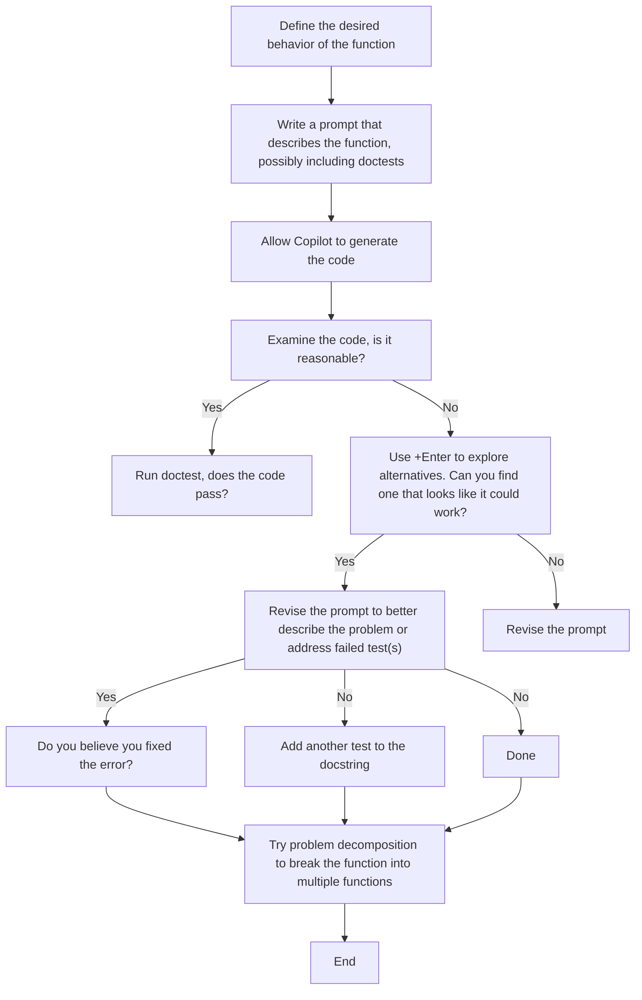
</details>

The function design cycle with Copilot, augmented to include debugging

# Learn AI-Assisted Python Programming

With GitHub Copilot and ChatGPT

LEO PORTER

DANIEL ZINGARO

For online information and ordering of this and other Manning books, please visit www.manning.com. The publisher offers discounts on this book when ordered in quantity.

For more information, please contact

Special Sales Department

Manning Publications Co.

20 Baldwin Road

PO Box 761

Shelter Island, NY 11964

Email: orders@manning.com

© 2024 by Manning Publications Co. All rights Reserved.

No part of this publication may be reproduced, stored in a retrieval system, or transmitted, in any form or by means electronic, mechanical, photocopying, or otherwise, without prior written permission of the publisher.

Many of the designations used by manufacturers and sellers to distinguish their products are claimed as trademarks. Where those designations appear in the book, and Manning Publications was aware of a trademark claim, the designations have been printed in initial caps or all caps.

Recognizing the importance of preserving what has been written, it is Manning’s policy to have the books ∞ we publish printed on acid-free paper, and we exert our best efforts to that end. Recognizing also our responsibility to conserve the resources of our planet, Manning books are printed on paper that is at least 15 percent recycled and processed without the use of elemental chlorine.

The author and publisher have made every effort to ensure that the information in this book was correct at press time. The author and publisher do not assume and hereby disclaim any liability to any party for any loss, damage, or disruption caused by errors or omissions, whether such errors or omissions result from negligence, accident, or any other cause, or from any usage of the information herein.


Manning Publications Co.

20 Baldwin Road

PO Box 761

Shelter Island, NY 11964

Development editor: Rebecca Johnson

Technical editor: Peter Morgan

Review editor: Dunja NikitoviÊ

Production editor: Aleksandar DragosavljeviÊ

Copy editor: Katie Petito

Technical proofreader: Mark Thomas

Typesetter: Tamara ŠveliÊ SabljiÊ

Cover designer: Marija Tudor

Dan thanks his wife, Doyali, for trading some of their time, again, to help this book exist.

Leo thanks his wife, Lori, and his children Sam and Avery for their love and support.

foreword ix acknowledgments xi introduction xiii about the authors xxii about the cover illustration xxiv

# Introducing AI-assisted programming with Copilot 1

1.1 How we talk to computers 2   
Making it a little easier 2 ■ Making it a lot easier 3   
1.2 About the technology 3   
Copilot, your AI Assistant 4 ■ How Copilot works behind the scenes—in 30 seconds 5   
1.3 How Copilot changes how we learn to program 6   
1.4 What else can Copilot do for us? 7   
1.5 Risks and challenges when using Copilot 8   
1.6 The skills we need 10   
1.7 Societal concerns about AI code assistants like   
Copilot 11   
Summary 12

# Getting started with Copilot 13

2.1 Time to set up your computer to start learning 14 Overview of the software in your programming environment 14   
2.2 Getting your system set up 15   
2.3 Working with Copilot in Visual Studio Code 16 Set up your working folder 17 ■ Check to see if your setup is working properly 18   
2.4 Addressing common Copilot challenges 20   
2.5 Our first programming problem 22 Showcasing Copilot’s value in a data processing task 23

Summary 32

# Designing functions 33

3.1 Functions 34 The components of a function 35 ■ Using a function 37   
3.2 Benefits of functions 38   
3.3 Roles of functions 40   
3.4 What’s a reasonable task for a function? 43 Attributes of good functions 43 ■ Examples of good (and bad) leaf functions 44   
3.5 The cycle of design of functions with Copilot 45   
3.6 Examples of creating good functions with Copilot 46 Dan’s stock pick 47 ■ Leo’s password 50 ■ Getting a strong password 54 ■ Scrabble scoring 55 ■ The best word 57 Summary 59

# Reading Python code: Part 1 60

4.1 Why we need to read code 61   
4.2 Asking Copilot to explain code 63   
4.3 Top 10 programming features you need to know:   
Part 1 66   
#1. Functions 67 ■ #2. Variables 67 ■ #3. Conditionals 69 #4. Strings 72 ■ #5. Lists 74 ■ Conclusion 76

Summary 77

# Reading Python code: Part 2 78

5.1 Top 10 programming features you need to know:

Part 2 79

#6. Loops 79 ■ #7. Indentation 83 ■ #8. Dictionaries 90

#9. Files 91 ■ #10. Modules 94

Summary 98

# Testing and prompt engineering 99

6.1 Why it is crucial to test code 99

6.2 Closed-box and open-box testing 100

Closed-box testing 101 ■ How do we know which test cases to use? 103 ■ Open-box testing 103

6.3 How to test your code 104

Testing using the Python prompt 105 ■ Testing in your Python file (we won’t be doing it this way) 105 ■ doctest 105

6.4 Revisiting the cycle of designing functions with

Copilot 108

6.5 Full testing example 110

Finding the most students we can add to a row 110 ■ Improving the prompt to find a better solution 113 ■ Testing the new solution 114

6.6 Another full testing example—Testing with files 116

What tests should we run? 117 ■ Creating the function 120 Testing the function 120 ■ Common challenges with doctest 121

Summary 123

# Problem decomposition 124

7.1 Problem decomposition 125

7.2 Small examples of top-down design 125

7.3 Authorship identification 127

7.4 Authorship identification using top-down design 129

7.5 Breaking down the process subproblem 130

Figuring out the signature for the mystery book 130

7.6 Summary of our top-down design 138

7.7 Implementing our functions 138   
clean\_word 139 ■ average\_word\_length 140 ■ different\_to\_   
total 142 ■ exactly\_once\_to\_total 142 ■ split\_string 144   
get\_sentences 146 ■ average\_sentence\_length 146   
get\_phrases 147 ■ average\_sentence\_complexity 147   
make\_signature 148 ■ get\_all\_signatures 149   
get\_score 152 ■ lowest\_score 153 ■ process\_data 154   
make\_guess 154

7.8 Going further 156

Summary 157

# CY Debugging and better understanding your code 158

8.1 What causes errors (bugs)? 159   
8.2 How to find the bug 160   
Using print statements to learn about the code behavior 160   
Using VS Code’s debugger to learn about the code behavior 162

8.3 How to fix a bug (once found) 169

Asking Copilot to fix your bug via chat 169 ■ Giving Copilot

a new prompt for the whole function 171 ■ Giving Copilot a

targeted prompt for part of a function 171 ■ Modifying the code

to fix the bug yourself 172

8.4 Modifying our workflow in light of our new skills 173

8.5 Applying our debugging skills to a new problem 174

8.6 Using the debugger to better understand code 180

8.7 A caution about debugging 180

Summary 181

# Automating tedious tasks 182

9.1 Why programmers make tools 183   
9.2 How to use Copilot to write tools 184   
9.3 Example 1: Cleaning up email text 184   
Conversing with Copilot 185 ■ Writing the tool to clean up email 189

9.4 Example 2: Adding cover pages to PDF files 192

Conversing with Copilot 194 ■ Writing the tool 198

9.5 Example 3: Merging phone picture libraries 206

Conversing with Copilot 208 ■ Top-down design 211

Writing the tool 212

Summary 215

# Making some games 216

10.1 Game programs 217

10.2 Adding randomness 218

10.3 Example 1: Bulls and Cows 220

How the game works 220 ■ Top-down design 222

Parameters and return types 224 ■ Implementing our

functions 226 ■ Adding a graphical interface for Bulls and

Cows 233

10.4 Example 2: Bogart 234

How the game works 234 ■ Top-down design 236

Implementing our functions 240

Summary 247

# Future directions 248

11.1 Prompt patterns 248

Flipped interaction pattern 250 ■ Persona pattern 253

11.2 Limitations and future directions 255

Where Copilot (currently) struggles 255 ■ Is Copilot a new

programming language? 256

Summary 260

references 261

index 264

# foreword

It’s an awesome time to learn programming. Why? Let me use an analogy to explain.

I like to make my own bread. I make it more frequently, and more reliably, when I use my stand mixer to knead the dough compared to kneading it by hand. Maybe you’d say that’s lazy. I’d say it makes me more productive and more likely to actually make the bread. Maybe you have something that makes your life easier by taking over a tedious task, leaving you free to focus on more important or interesting things. Do you have a car that supports you in parallel parking? I recall when Gmail added spell and grammar checks in languages other than English. My husband’s German relative were so excited that he was writing them longer emails—because the effort of remembering little-used German language specifics went away and allowed him to spend more time on the content!

Sadly, until recently, when learning programming, you had no equivalent of a stand mixer or grammar check to support you. And there are lots of tedious things to learn and remember when you start programming.

Good news! As of spring 2023, radically new and (we think) effective support is finally here. You are about to learn programming with one of the most exciting human task supporters so far this century: artificial intelligence. Specifically, this book seeks to support you in developing your ability to program in Python to solve computational problems more easily and faster by teaching you using a tool called GitHub Copilot. Copilot is a programming support tool that uses something called a LLM (large language model) to draw “help” from a huge number of previously written programs. Once you learn how to direct it (sadly, it’s more complicated than effectively using a stand mixer), Copilot can dramatically increase your productivity and success in writing programs to solve your problem.

But should you use Copilot? Are you really learning to program if you use it? Preliminary evidence looks positive—showing that students who learned with Copilot, when assigned a programming task to be done without the help of Copilot, did better than students who learned without Copilot (and also did the task without Copilot) [1]. That said, compared to what we used to teach in an introductory programming class, there are different skills you will need to focus on when programming with Copilot, specifically problem decomposition and debugging (it’s OK if you don’t know what those are). Just know, practicing programmers need to know those skills as well, but we previously weren’t able to teach them explicitly or effectively in introductory courses, because students didn’t have the brain space left for learning these “high-level skills” while focusing on nit-picky things like spelling and grammar (programming languages have these, just like real world languages).

Leo and Dan are expert computing educators and researchers; the decisions that they’ve made to guide your learning in this book are grounded in what we know about teaching and learning programming. I’m excited that, with this book, they’re taking steps toward what the next wave of teaching programming will look like.

So, congratulations! Whether you have never done any programming or whether you started to learn before and got frustrated… we think you will find learning to program with Copilot transformative and will allow you to engage your brain in more meaningful and “expert-like” programming experiences!

—Beth Simon, Ph.D.

# acknowledgments

Writing a book about technology in flux was new for us. Each day of writing started with us reading the new articles, opinion pieces, and capabilities of LLMs. Early plans had to be scrapped or revised. New ideas presented themselves for later chapters only after we’d written earlier chapters and had access to the latest LLM features. We thank the entire Manning Publications team for their agility and help throughout the process.

In particular, we thank our Development Editor Rebecca Johnson for her expertise, wisdom, and support.

Rebecca provided insightful feedback, constructive criticism, and creative suggestions that have greatly improved the quality and clarity of our work. Rebecca was supportive and encouraging and helped us manage book timelines and our busy schedules. Thank you, Rebecca—you went above and beyond for us.

We also thank our Technical Editor Peter Morgan and our Technical Proofreader Mark Thomas. Both offered valuable contributions to the quality of the book.

To all the reviewers: Aishvarya Verma, Andrew Freed, Andy Wiesendanger, Beth Simon, Brent Honadel, Cairo Cananea, Frank Thomas-Hockey, Ganesh Falak, Ganesh Swaminathan, Georgerobert Freeman, Hariskumar Panakmal, Hendrica van Emde Boas, Ildar Akhmetov, Jean-Baptiste Bang Nteme, Kalai C. E. Nathan, Max Fowler, Maya Lea-Langton, Mikael Dautrey, Monica Popa, Natasha Chong, Ozren Harlovic, Pedro Antonio Ibarra Facio, Radhakrishna Anil,

Snehal Bobade, Srihari Sridharan, Tan Wee, Tony Holdroyd, Wei Luo, Wondi Wolde, your suggestions helped make this a better book.

We thank our colleagues for supporting our work and offering their ideas for what such a book should attempt to do. Many of their ideas have informed our thinking as we sought to redefine what an introductory programming course looks like. We particularly thank Brett Becker, Michelle Craig, Paul Denny, Bill Griswold, Philip Guo, and Gerald Soosai Raj.

# introduction

Software is essential today. It’s hard to think of any industry where software isn’t changing practically everything about how work is done. Manufacturing needs software to monitor production and shipping, let alone the robots that increasingly perform the actual task. Advertising, politics, and fitness, among others, are awash in big data and they routinely use software to make sense of it. Video games and movies are created using software. We could go on and on, but you get the point.

The result has been that more people than ever want to learn how to program. We’re not just talking about the computer science, computer engineering, and data science majors at universities who have been in a perpetual “enrollment crisis” for the past decade. We’re also talking about the scientist who needs to write software to evaluate their data, the office worker who wants to automate some of their tedious data processing tasks, and the hobbyist who wants to create a fun video game for their friends.

Despite the desire to learn programming, there are decades of research in our field (computing education) that have identified many reasons for why learning to write software is hard. Even after you figure out how to solve the problem, you have to tell a machine how to accomplish it in a programming language whose rules are unforgiving. Granted, writing programs in a language like Python is substantially easier than in machine code using punch cards, but it’s still hard. We know it’s hard because we’ve seen the failure rates of introductory computer science courses. We’ve seen first-hand as we’ve watched motivated and intelligent students fail our courses, sometimes multiple times, before they succeed or, worse, give up.

But what if we could talk to computers in a better way? A way that doesn’t require us to know all the detailed syntax rules that trip up most novices. That era has just begun thanks to AI assistants like Copilot that offer intelligent code suggestions in the same way ChatGPT can write reasonable text when prompted. This book is for everyone who wants to learn how to write software in the AI assistant era. We’re excited to be on your learning journey with you.

# AI assistants change how programming is done

We’ll introduce you to your AI assistant, Copilot, in chapter 1, but we want to give you a brief overview now. If you read the news headlines or even opinion pieces by lauded software engineering professionals talking about Copilot or ChatGPT, you’ve seen that opinions run the gamut. Some people say that AI assistants mean the end of all programming jobs. Others say that AI assistants are so hopelessly flawed you are better without them. These views of the world are at such extremes that it’s easy to poke holes in either argument. AI assistants learn from existing code, so if some new tool/technology is developed, humans will need to write the bulk of the initial code. As a recent article well expressed, there isn’t a lot (or any) code out there for quantum computers since they are still in their infancy [1]. So human programmers aren’t going away, at least not any time soon. At the same time, in our time working with Copilot, we’ve seen how powerful it is. Both of us have written software for decades and Copilot can often give us correct code much faster than we could write it on our own. To ignore such a powerful tool seems analogous to a carpenter refusing to use power tools.

As educators, the opportunity to help people learn to write software is instantly apparent. Why should students spend so much time fighting with syntax when writing code from scratch when the code suggested by an AI assistant is almost always syntactically correct? Why should students have to reach out to professors, instructional staff, friends, or internet forums for help explaining what a section of code is doing when AI assistants are really good at explaining code (particularly for questions asked by novices)? And if AI assistants often write correct code when solving common programming problems (by learning from huge volumes of code written in the past), why shouldn’t students be using it to help them program?

Be warned that this doesn’t mean that writing software is now just easy and that we can entirely offload the skill of programming onto the AI. Instead, the skills to write good software are evolving. Skills like problem decomposition, code specification, code reading, and code testing have become even more important than they were in the past; skills like knowing library semantics and syntax become less important. We’ll say more about this in the next chapters, but this book will teach you the skills that matter going forward. These skills will be valuable whether you dabble in writing software from time to time or you are starting a career in software engineering.

# Audience

We have two primary audiences for the book. The first is everyone who has thought about writing software (and even tried and failed before) to make their lives better in some way. This includes the accountant who gets frustrated that their software can’t do what they want so they are left solving problems by hand. Or scientists who want to analyze their data quickly, but existing tools aren’t capable of doing what they want. We also imagine the office manager who feels limited by what their spreadsheet software can do and wants a better way to gain insight from their data. Additionally, we imagine the exec at a small company who wants to be notified when something is said publicly on social media about their company but can’t afford to pay a software engineering team to write the tool for them. And we imagine the hobbyist of any age who just wants to write software for fun—whether it be for making their own small video games, storytelling with pictures, or creating fun family photo collages. These are just some of the people who want to write software to improve some element of their professional or personal lives.

The second is the student who is considering a career in software engineering or programming and wants to learn how to write software. They want to learn the basics and start creating interesting software, without the trappings of a classic computer science class. Certainly, there will be more courses or books that will follow this first book on the road to becoming a professional software developer, but this will hopefully be a fun and rewarding first step.

# What we expect from you

This book requires no background whatsoever in programming. If you learned some programming and forgotten or it didn’t go well the first time, we think this is a great place to resume your learning.

This book does require basic computer literacy. This means you should be comfortable installing software, copying files between folders, and opening files on your computer. If you don’t have those skills, you could still start this book, but realize there may be moments when you need to look to outside resources (e.g., YouTube videos on how to copy a file from one folder to another).

You’ll also need a computer where you have permission to install software so you can follow along and apply the ideas we’re learning. Any Windows, Mac, or Linux personal computer or laptop will work.

# What you will be able to do after reading this book

In this book, we’re going to teach you how to use Copilot to write Python code. We’ll teach you how to identify whether that code does what you want, and what to do when it doesn’t. We’ll teach you enough about Python to be able to read it for a general understanding of what it does and whether it is doing something potentially meaningful.

We won’t, however, teach you how to program in Python entirely from scratch. You’ll be in a good position to learn to do that with other resources following this book if you like—but for many tasks, as we will show you, it may not be necessary.

We don’t know exactly what it will look like to be a professional programmer or software engineer in light of AI coding assistants. That role is already changing and will change further as the AI technology improves. For now, we will say that you need more than this book to be a professional programmer or software engineer. You’ll need to know a great deal more about Python and other computer science topics to get there.

The good news is that learning how to program using Copilot will make you capable of writing basic software to address common needs. The software will be more complex than what we typically teach in an introductory course, and you’ll be able to write these useful programs without banging your head on syntax or spending months learning just Python. If you wish to continue learning about writing professional software, this will be your first step toward mastery.

By the end of this book, you will be able to write basic software capable of data analysis, automating repetitive tasks, and creating simple games, among many others.

# The challenge in working with AI assistants

We expect you’re ready to jump into a technology that is maturing and changing quickly. What you see from Copilot may not match what you see in the book. Copilot is advancing and changing daily, and we cannot possibly keep up to the minute with such a moving target. More than that, Copilot is nondeterministic, which means that if you ask it to solve the same task multiple times, it may not give you the same code each time. And sometimes you’ll get correct code for a task, but then if you ask again, you get code that is not correct. So even if you use the exact same prompts we do, you will likely see different code responses than we do. Much of this book is devoted to ensuring you learn how to determine whether the answer from Copilot is right or not and, if it isn’t, how to fix it. In short, we hope you’re ready for what it means to learn on the leading edge of technology.

# Why we wrote this book

Both of us have been professors for over a decade and programmers for a decade longer than that. Our care for our students’ success led us to become researchers studying how students learn computing and how to improve their outcomes. Between the two of us, we’ve written nearly a hundred articles in our field exploring pedagogies, student beliefs, and assessments—all with the goal of improving the student experience.

We’ve also had students in our office hours who struggled to learn how to program, even when we are employing best practices in teaching computing. These are intelligent students who want to learn, but who are tripped up on some part of the programming process. The programming process has many steps, from understanding a problem, to coming up with a solution, to imparting the process of solving the problem to a computer. So, when we began working with AI assistants, specifically Copilot, we instantly saw how it could be a game changer for students, particularly in improving that last step “imparting the process of solving the problem to a computer”. We want our students to succeed. We want you to succeed. And we believe AI assistants can help.

# Warning: beware of elitism

One of the saddest things we see in our classes at our universities is students intimidating other students. We’ve heard students in our introductory Python programming courses try to show off how they already learned to program in such-and-such programming language and the affect that has on the other students in the course. Although we try to gently point these students to other, more appropriate courses, we’ve also seen that the students bragging in this way are often the students struggling to pass at the end of the term, having vastly over-estimated their proficiency at the start. And it doesn’t take a licensed psychologist to see that this kind of posturing comes from a place of low self-esteem.

Beyond students in our introductory courses, we see how different kinds of programmers treat each other and their respective fields. For example, Human-Computer Interaction (HCI) professionals study how to improve the design of software to make it better for its human users. Sounds important, right? Unfortunately, that field was put down by computer scientists as merely “applied psychology” for years, and then major companies showed that maybe, just maybe, if you care about the users of your technology, those people might just appreciate it more and be inclined to buy it. It’s not surprising that HCI quickly became mainstream in computer science. This snobbery isn’t limited to specific fields. We even see it occurring between programmers of different languages. For example, we’ve seen C++ (one programming language) programmers say silly things like JavaScript (another programming language) programming isn’t real programming. (It definitely is real programming, whatever that might mean!)

All of this, in our opinion, is unproductive and unfortunate posturing that pushes people away from the field. A comic we both enjoy called XKCD, captured the ludicrousness of this posturing well in “Real Programmers” [2]. In the comic, programmers argue about what the best text editor app is for programming. Programmers need to use a text editor to enter their code, which is exactly what you’ll start doing in chapter 2. There’s been a long-standing, and mostly unserious, debate over the best editors (“emacs” is one of many editors). The comic is making light of the meaninglessness of the debate in a truly clever way.

The reason we’re talking about this unfortunate aspect of our field is we know what some people will say about learning to program with Copilot. They’ll say that to learn to write software, you have to learn how to write code entirely from scratch. And for future professional engineers, we actually agree that at some point in your career, you should learn to write code from scratch. But, for most people and even people starting their studies in software engineering, we wholeheartedly disagree that writing code entirely from scratch makes sense anymore as a starting place. So, if someone criticizes you for doing something to make yourself or your life or the world better, we encourage you to look to the immortal wisdom of Taylor Swift and just “Shake it off”.

# How this book is organized: a roadmap

This book is divided into 11 chapters. We recommend that you read this book from beginning to end, rather than skipping around. That’s because most chapters introduce skills that will be assumed in later chapters:

Chapter 1 describes what AI code assistants are, how they work, and why they are irrevocably changing how programming is done. It also explores the concerns we need to keep in mind when using AI coding assistants.   
Chapter 2 helps you set up your computer to be able to program with GitHub Copilot (that’s your AI coding assistant) and Python (that’s the programming language we’ll use). Once your computer is set up, we’ll use Copilot in our first programming example: doing some analysis on freely available sports data.

Chapter 3 teaches you all about functions, which help you organize your code and make it easier for Copilot to write code for you. It also uses many examples to demonstrate the general workflow we’ll use in order to be productive with Copilot.   
Chapter 4 is the first of two chapters that teaches you how to read Python code. It’s true that Copilot will be writing code for you, but you need to be able to read that code to help you determine whether that code is going to do what you want. And don’t worry: Copilot can help you read code, too!   
Chapter 5 is the second of two chapters that teaches you how to read Python code.   
Chapter 6 is a primer on two critical skills that you need to hone when working with AI coding assistants: testing and prompt engineering. Testing involves checking that your code operates correctly; prompt engineering involves changing the words you use in order to communicate more effectively with your AI assistant.   
¡ Chapter 7 is all about breaking large problems down into smaller problems that are easier for Copilot to handle. The technique is called topdown design, and in this chapter, you’ll use it to design a complete program to identify the author of mystery books.   
Chapter 8 is a deep dive into bugs (errors in your code!), how to find them, and how to fix them. You’ll learn how to step line by line through your code to pinpoint exactly what’s going wrong and even how to ask Copilot to help you fix bugs.   
Chapter 9 puts Copilot to work to help you automate tedious tasks. You’ll see three examples—cleaning up emails that have been forwarded many times, adding cover pages to hundreds of PDF files, and removing duplicate images—and you’ll be able to apply the principles to your own specific tasks as well.   
¡ Chapter 10 shows you how to use Copilot to write computer games. You’ll use the skills you developed throughout the book to write two games: a logic game similar to Wordle, and a two-player, press-your-luck board game.   
¡ Chapter 11 delves into the fledgling field of prompt patterns, which are tools to help you get even more out of your AI assistant. It also summarizes the current limitations of AI coding assistants and looks at what may be on the horizon.

# Source code downloads

For many books about programming, the reader types the code exactly as the author has written it in order to accomplish a task with code. Our book is different because, as described earlier, the code we get back from Copilot is nondeterministic; your code will not match our code. For that reason, we are not providing all of the code for download that you see in this book. We want you to focus on generating that code from Copilot, not typing it in yourself! That said, we do have some important files to share, and they are available from the publisher’s website at https://www.manning.com/books/ learn-ai-assisted-python-programming.

This book contains many examples of source code both in numbered listings and in line with normal text. In both cases, source code is formatted in a fixed-width font like this to separate it from ordinary text. Comments or code we’ve written as prompts to be interpreted by Copilot or ChatGPT are in bold to highlight what we wrote rather than what was given to us by the large language model.

In many cases, the original source code has been reformatted; we’ve added line breaks and reworked indentation to accommodate the available page space in the book. In rare cases, even this was not enough, and listings include line-continuation markers (➥). Additionally, comments in the source code have often been removed from the listings when the code is described in the text. Code annotations accompany many of the listings, highlighting important concepts.

# Software/hardware requirements

You’ll need access to any Windows, Mac, or Linux computer on which you have permission to install software. As we discuss in further detail in chapter 2, you’ll need to install the Python software, the Visual Studio Code (VS Code) software, as well as various extensions. You’ll also need to sign up for a GitHub Copilot account which, at the time of writing, has a free trial, is free for students and educators, but otherwise has a monthly charge.

# liveBook discussion forum

Purchase of Learn AI-Assisted Python Programming with GitHub Copilot and ChatGPT includes free access to liveBook, Manning’s online reading platform. Using liveBook’s exclusive discussion features, you can attach comments to the book globally or to specific sections or paragraphs. It’s a snap to make notes for yourself, ask and answer technical questions, and receive help from the author and other users. To access the forum, go to https://livebook.manning.com/book/ learn-ai-assisted-python-programming/discussion. You can also learn more about Manning’s forums and the rules of conduct at https://livebook.manning .com/discussion.

Manning’s commitment to our readers is to provide a venue where a meaningful dialogue between individual readers and between readers and the author can take place. It is not a commitment to any specific amount of participation on the part of the author, whose contribution to the forum remains voluntary (and unpaid). We suggest you try asking the author some challenging questions lest his interest stray! The forum and the archives of previous discussions will be accessible from the publisher’s website as long as the book is in print.

# about the authors

Dr. Leo Porter is a Teaching Professor in the Computer Science and Engineering Department at UC San Diego. He is best known for his research on the effect of peer instruction in computing courses, the use of clicker data to predict student outcomes, and the development of the Basic Data Structures Concept Inventory. He co-teaches the popular Coursera Specialization “Object-Oriented Java Programming: Data Structures and Beyond” with more than 300,000 enrolled learners and the first course in the edX MicroMasters in Data Science, “Python for Data Science”, with more than 200,000 enrolled learners. He has received six Best Paper Awards, SIGCSE’s 50th Year Anniversary Top Ten Symposium Papers of All Time Award, an Outstanding Teaching Award from Warren College, and the Academic Senate Distinguished Teaching Award at UC San Diego. He is a Distinguished Member of the ACM and previously served on the ACM SIGCSE Board.

Dr. Daniel Zingaro is an Associate Teaching Professor at University of Toronto. He has taught introductory Python programming to thousands of students over the past 15 years and wrote the Python textbook that is currently being used for the course. He has also written dozens of research articles about how to teach and learn introductory CS. Dan has written two books with No Starch Press—the aforementioned one on Python and one on algorithms—that have been translated into multiple languages. Dan has received several prestigious teaching and research awards, including a 50-Year Test of Time award and multiple Best Paper awards.

# About the technical editor

Peter Morgan is the founder of the AI consulting company Deep Learning Partnership based in London (www.deeplp.com). He has an advanced degree in physics along with an MBA. He has been working in AI for the past ten years and before that spent ten years as a Solutions Architect for companies such as Cisco Systems and IBM. Peter has written several reports, papers and book chapters on AI, physics, and quantum computing. He consults on LLMOps and quantum computing for startups and enterprises globally. You can follow Peter on Twitter (@PMZepto).

# about the cover illustration

The figure on the cover of Learn AI-Assisted Python Programming with GitHub Copilot and ChatGPT is “Prussien de Silésie,” or “Prussian from Silesia,” taken from a collection by Jacques Grasset de Saint-Sauveur, published in 1788. Each illustration is finely drawn and colored by hand.

In those days, it was easy to identify where people lived and what their trade or station in life was just by their dress. Manning celebrates the inventiveness and initiative of the computer business with book covers based on the rich diversity of regional culture centuries ago, brought back to life by pictures from collections such as this one.

# Introducing AI-assisted 1programming with Copilot

# This chapter covers

¡	How AI assistants change how new programmers learn   
¡	Why programming is never going to be the same   
¡	How AI assistants like Copilot work   
¡	How Copilot solves introductory programming problems   
¡	Possible perils of AI-assisted programming

In this chapter, we’ll talk about how humans communicate with computers. We’ll introduce you to your AI assistant, GitHub Copilot, an amazing tool that uses artificial intelligence (AI) to help people write software. More importantly, we’ll show you how Copilot can help you learn how to program. We’re not expecting that you’ve written any programs before. If you have, please don’t skip this chapter, even if you already know a little bit about programming. Everyone needs to know why writing programs is different now that we have AI assistants like ChatGPT and Copilot, and that the skills we need to be effective programmers change. As we’ll see, we also need to be vigilant, because sometimes tools like ChatGPT and Copilot lie.

# 1.1 How we talk to computers

Would you be happy if we started by asking you to read and understand the code below?1

```asm
section .text
global _start
_start:
    mov ecx, 10
    mov eax, '0'
    l1:
    mov [num], eax
    mov eax, 4
    mov ebx, 1
    push ecx
    mov ecx, num
    mov edx, 1
    int 0x80
    mov eax, [num]
    inc eax
    pop ecx
    loop l1
    mov eax, 1
    int 0x80
section .bss
    num resb 1 
```

That monstrosity prints out the numbers from 0 to 9. It’s written using code in assembly language, a low-level programming language. Low-level programming languages, as you can see, are not languages that humans can easily read and write. They’re designed for computers, not humans.

No one wants to write programs like that, but especially in the past, it was sometimes necessary. Programmers could use it to define exactly what they wanted the computer to do, down to individual instructions. This level of control was needed to squeeze every bit of performance out of underpowered computers. For example, the most speed-critical pieces of 1990s computer games, such as Doom and Quake, were written in assembly language like the previous code example. It simply wouldn’t have been possible to make those games otherwise.

# 1.1.1 Making it a little easier

Okay, no more of that. Let’s move on. Would you be happier reading this code below?

```python
for num in range(0, 9):
    print(num) 
```

This code is in the Python language, which is what many programmers use these days. Unlike assembly language, which is a low-level language, Python is considered a highlevel language because it’s much closer to natural language. Even though you don’t know about Python code yet, you might be able to guess what this program is trying to do. The first line looks like it’s doing something with the range of numbers from 0 to

9. The second line is printing something. It’s not too hard to believe that this program, just like the assembly language monstrosity, is supposed to print the numbers from 0 to 9. Unfortunately, something is wrong with it, and it doesn’t actually print the numbers from 0 to 9 (instead, it prints 0 to 8).

While this code is closer to English, it isn’t English. It’s a programming language that, like assembly language, has specific rules. As in the previous code, misunderstanding the details of those rules can result in a broken program.

The holy grail of communicating with a computer is to do so in a natural language such as English. We’ve been talking to computers using various programming languages over the past 70 years, not because we want to but because we have to. Computers were simply not powerful enough for the vagaries and idiosyncrasies of a language like English. Our programming languages improved—from symbol-soup assembly language to Python, for example—but they are still computer languages, not natural languages. This is changing.

# 1.1.2 Making it a lot easier

Using an AI assistant, we can now ask for what we want in English and have the computer code written for us in response. To get a correct Python program that does actually print the numbers from 0 to 9, we can ask our AI assistant (Copilot) in normal English language like this:

\# Output the numbers from 0 to 9

Copilot might respond to this prompt by generating something like this:

for i in range(10): print(i)

Unlike the example we showed you before, this piece of Python code actually works!

AI coding assistants can be used to help people write code. In this book, we will learn how to use Copilot to write code for us. We will ask for what we want in English, and we will get the code back in Python.

More than that, we’ll be able to use Copilot as a seamless part of our workflow. Without tools like Copilot, programmers routinely have two windows open: the one to write code and the other to ask Google how to write code. This second window has Google search results, Python documentation, or forums of programmers talking about how to write code to solve that particular problem. They’re often pasting code from these results into their code, then tweaking it slightly for their context, trying alternatives, and so on. This has become a way of life for programmers, but you can imagine the inefficiency here. By some estimates, up to 35% of programmers’ time is spent searching for code [1], and much of the code that is found is not readily usable. Copilot greatly improves this experience by helping us write our code.

# 1.2 About the technology

We’ll use two main technologies in this book: Python and GitHub Copilot.

Python is a programming language. It’s a way to communicate with a computer. People use it to write all kinds of programs that do useful things, like games, interactive websites, visualizations, apps for file organization, automating routine tasks, and so on.

There are other programming languages, like Java, C++, Rust, and many others. Copilot works with those, too, but at the time of this writing, it works really well with Python. Python code is a lot easier to write compared to many other languages (especially assembly code). Even more importantly, Python is easy to read. After all, we’re not going to be the ones writing the Python code. Our AI assistant is!

Computers don’t actually know how to read and run Python code. The only thing computers can understand is something called machine code, which looks even more ridiculous than assembly code, because it is the binary representation of the assembly code (yep, just a bunch of 0s and 1s!). Behind the scenes, your computer takes any Python code that you provide and converts it into machine code before it runs, as shown in figure 1.1.


<details>
<summary>flowchart</summary>

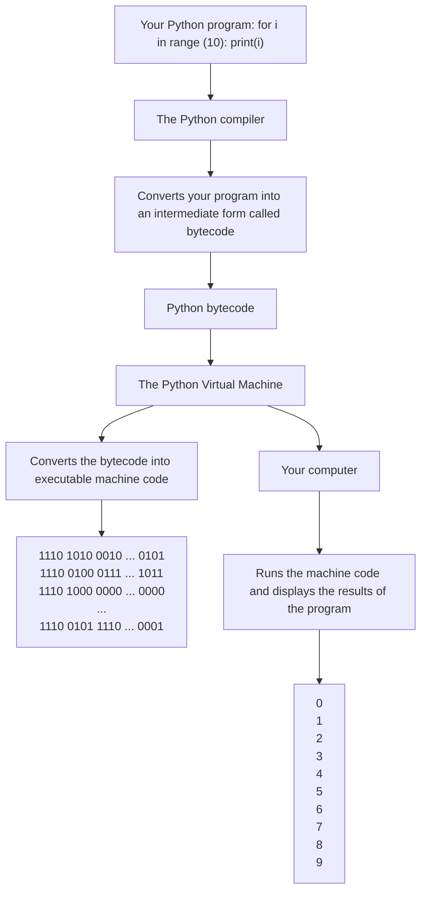
</details>

# 1.2.1 Copilot, your AI Assistant

What is an AI assistant? An AI assistant is an artificial intelligence (AI) agent that helps you get work done. Maybe you have an Amazon Alexa device at home, or an iPhone with Siri—these are AI assistants. They help you order groceries, learn the weather, or determine that, yes, the woman who played Bellatrix in the Harry Potter movies really was in Fight Club. An AI assistant is just a computer program that responds to normal human inputs like speech and text with human-like answers.

Copilot is an AI assistant with a specific job: it converts English into computer programs. (It can also do a whole lot more, as we will soon see.) There are other AI assistants like Copilot, including CodeWhisperer, Tabnine, and Ghostwriter. We chose Copilot for this book by a combination of the quality of code that we have been able to produce, stability (it has never crashed for us!), and our own personal preferences. We encourage you to also check out other tools when you feel comfortable doing so.

# 1.2.2 How Copilot works behind the scenes—in 30 seconds

You can think of Copilot as a layer between you and the computer program you’re writing. Instead of writing the Python directly, you simply describe the program you want in words—this is called a prompt—and Copilot generates the program for you.

The brains behind Copilot is a fancy computer program called a large language model, or LLM. An LLM stores information about relationships between words, including which words make sense in certain contexts, and uses this to predict the best sequence of words to respond to a prompt.

Imagine that we asked you what the next word should be in this sentence: “The person opened the .” There are many words that you could fill in here, like “door” or “box” or “conversation,” but there are also many words that would not fit here, like “the” or “it” or “open.” An LLM takes into account the current context of words to produce the next word, and it keeps doing this until it has completed the task.

Notice that we didn’t say anything about Copilot having an understanding of what it is doing. It just uses the current context to keep writing code. Keep this in mind throughout your journey: only we know whether the code that’s generated does what we intended it to do. Very often it does, but you should always exercise healthy skepticism regardless. Figure 1.2 gives you an idea of how Copilot goes from prompt to program.


<details>
<summary>flowchart</summary>

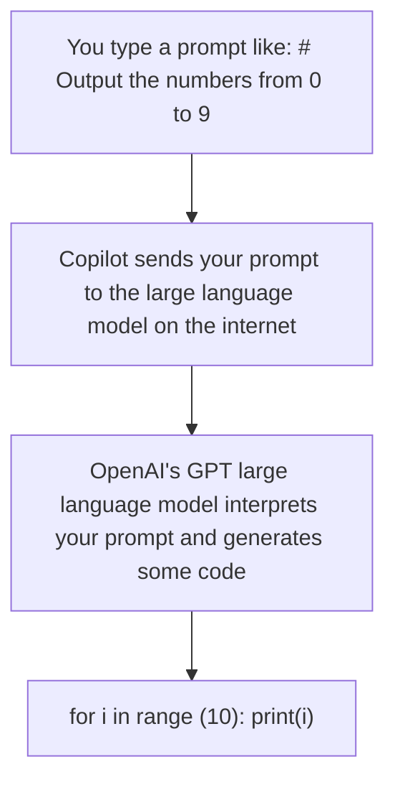
</details>

You might wonder why Copilot writes Python code for us and not machine code directly. Isn’t Python an expendable intermediate step now? Well, no, and the reason is that Copilot is going to make mistakes. And if it’s going to make mistakes that we need to fix, it’s a lot easier to do that with Python than with machine code.

In fact, virtually no one checks if the machine code produced from Python is correct. This is partially because of the determinism of the Python language specification. One could imagine a future where Copilot conversations are so accurate that inspecting the Python is unnecessary, but we’re a long way from that.

# 1.3 How Copilot changes how we learn to program

To illustrate how learning to program changes in the presence of an AI assistant, we want to show you how powerful Copilot is at solving a programming task typically given to students in the middle of a programming course or in a book on how to program.

When learning how to program in the past, learners often spent most of their time working with the syntax and basic structure of programs. Writing a program from scratch (line by line), like the one we’ll show you next, is seen as the culmination of all of their learning. Before we dive into the problem, we need to be clear: many new programmers cannot write the code to solve this problem despite the fact most programming instructors (and book authors) think that new programmers should be able to do so. Here are the instructions for one version of this problem [6]:

“Write a program that will read the amount of rainfall for each day. A negative value of rainfall should be rejected since this is invalid and inadmissible. The program should print out the number of valid recorded days, the number of rainy days, the rainfall over the period, and the maximum amount of rain that fell on any one day. Use a sentinel value of 9999 to terminate the program.”

If you have tried to learn to program before, this kind of problem statement may be familiar to you, and you may have struggled to solve such a problem. But now, if we give this exact prompt to Copilot, we get the following Python code as a result. (Remember from the introduction that Copilot is nondeterministic, so if we ask it again, we might get different code!)

Listing 1.1 Copilot code that solves the classic rainfall problem   
```python
rainfall = 0
total_rainfall = 0
num_rainy_days = 0
num_valid_days = 0
max_rainfall = 0
rainfall = int(input(
    "Enter the amount of rainfall for the day: "))
while rainfall != 9999:
    if rainfall < 0:
    print("Invalid rainfall amount. Please try again.")
    rainfall = int(input(
    "Enter the amount of rainfall for the day: "))
    else: 
```

```python
num_valid_days += 1
total_rainfall += rainfall
if rainfall > 0:
    num_rainy_days += 1
if rainfall > max_rainfall:
    max_rainfall = rainfall
rainfall = int(input(
    "Enter the amount of rainfall for the day: "))
print("Number of valid days:", num_valid_days)
print("Number of rainy days:", num_rainy_days)
print("Total rainfall over the period:", total_rainfall)
print("Maximum amount of rain that fell on any one day:", max_rainfall) 
```

We’re not expecting you to have any intuition right now that this code is good. But it is. As computer science professors, we’d grade this code highly.

People learning to program used to spend weeks or months to get to a point where they could write programs like this. Now Copilot can offer code immediately. As we’ll see in the rest of the book, we still need to verify that this code is correct, because Copilot can make mistakes. However, we don’t need to write it from scratch anymore. We believe this successful interaction with Copilot signals the end of the way that we have historically taught and learned programming.

You, as someone interested in learning how to program, simply don’t need to struggle with syntax, control flow, and the host of other Python concepts needed to write code like this in the past. Sure, we are going to learn about those concepts in this book, but not so that you can demonstrate your understanding by writing code from scratch that Copilot can produce easily. No, we’ll learn those concepts only because they help us solve meaningful problems and interact productively with Copilot. Instead, you get to learn how to write larger, more meaningful software faster, because of how an AI assistant fundamentally changes the skills needed to learn programming.

# 1.4 What else can Copilot do for us?

As we’ve seen, we can use Copilot to write Python code for us starting from an English description of what we want. Programmers use the word syntax to refer to the symbols and words that are valid in a given language. So, we can say that Copilot takes a description in English syntax and gives us back code in Python syntax. That’s a big win, because learning programming syntax has historically been a major stumbling block for new programmers. What kind of bracket— [, (, or { —am I supposed to use here? Do I need indentation here? What’s the order in which we’re supposed to write these things: x and then y, or y and then x?

Such questions abound, and let’s be honest: it’s uninteresting stuff. Who cares about this when all we want to do is write a program to make something happen? Copilot can help free us from the tedium of syntax. We see this as an important step to help more people successfully write programs, and we look forward to the day when this artificial barrier is completely removed. For now, we still need Python syntax, but at least Copilot helps us with it.

But that’s not all Copilot can do. Here are some associated—and no less important— tasks Copilot can help us with:

Explaining code—When Copilot generates Python code for us, we’ll need to determine whether that code does what we want. Again, as we said previously, Copilot is going to make mistakes. Although we’re not interested in teaching you every nuance of how Python works (that’s the old model of programming), we are going to teach you how to read Python code to gain an overall understanding of what it does. We’re also going to use the feature of Copilot that explains code to you in English. When you finish with this book and our explanations, you’ll still have Copilot available to help you understand that next bit of gnarly code that it gives you.   
¡ Making code easier to understand—There are different ways to write code to accomplish the same task. Some may be easier to understand than others. Copilot has a tool that can reorganize your code to make it easier to work with. For example, code that’s easier to read is often easier to enhance or fix when needed.   
Fixing bugs—A bug is a mistake made when writing a program that can result in the program doing the wrong thing. Sometimes, your Python code almost works, or works almost always but not in one specific circumstance. If you’ve listened to programmers talk, you may have heard the common story where a programmer would spend hours only to finally remove one = symbol that was making their program fail. Not a fun few hours! In these cases, you can try the Copilot feature that helps to automatically find and fix the bug in the program.

# 1.5 Risks and challenges when using Copilot

Now that we’re all pumped up about getting Copilot to write code for us, we need to talk about the dangers inherent in using AI assistants. See references [2] and [3] for elaboration on some of these points.

¡ Copyright—Copilot learned how to program using human-written code. (You’ll hear people use the word “train” when talking about AI tools like Copilot. In this context, training is another word for learning.) More specifically, it was trained using millions of GitHub repositories containing open-source code. One worry is that Copilot will “steal” that code and give it to us. In our experience, Copilot doesn’t often suggest a large chunk of someone else’s code, but that possibility is there. Even if the code that Copilot gives us is a melding and transformation of various bits of other people’s code, there may still be licensing problems. For example, who owns the code produced by Copilot? There is currently no consensus on the answer. The Copilot team is adding features to help; for example, Copilot can tell you whether the code that it produced is similar to already-existing code and what the license is on that code [4]. Learning and experimenting on your own is great, and we encourage that—but take the necessary care if you do intend to use this code for purposes beyond your home. We’re a bit vague here, and that’s intentional: it may take some time for laws to catch up to this new technology. It’s best to play it safe while these debates are had within society.

Education—As instructors of introductory programming courses ourselves, we have seen first-hand how well Copilot does on the types of assignments we have historically given our students. In one study [5], Copilot was asked to solve 166 common introductory programming tasks. And how well did it do? On its first attempt, it solved almost 50% of these problems. Give Copilot a little more information, and that number goes up to 80%. You have already seen for yourself how Copilot solves a standard introductory programming problem. Education needs to change in light of tools like Copilot, and instructors are currently discussing how these changes may look. Will students be allowed to use Copilot and, if so, in what ways? How can Copilot help students learn? And what will programming assignments look like now?   
Code quality—We need to be careful not to trust Copilot, especially with sensitive code or code that needs to be secure. Code written for medical devices, for example, or code that handles sensitive user data must always be thoroughly understood. It’s tempting to ask Copilot for code, marvel at the code that it produces, and accept that code without scrutiny. But that code might be plain wrong. In this book, we will work on code that will not be deployed at large, so while we will focus on getting correct code, we will not worry about the implications of using this code for broader purposes. We will start building the foundations you will need to independently determine whether code is correct.   
¡ Code security—As with code quality, code security is absolutely not assured when we get code from Copilot. For example, if we are working with user data, getting code from Copilot is not enough. We would need to perform security audits and have expertise to determine that the code is secure. Again, though, we will not be using code from Copilot in real-world scenarios. Therefore, we will not focus on security concerns.   
¡ Not an expert—One of the markers of being an expert is awareness of what one knows and, equally important, what one doesn’t. Experts are also often able to state how confident they are in their response; and, if they are not confident enough, they will learn further until they know that they know. Copilot and, more generally, LLMs do not do this. You ask them a question, and they answer, plain as that. They will confabulate if necessary: they will mix bits of truth with bits of garbage into a plausible-sounding but overall nonsensical response. For example, we have seen LLMs fabricate obituaries for people who are alive, which doesn’t make any sense, yet the “obituaries” do contain elements of truth about people’s lives. When asked why an abacus can perform math faster than a computer, we have seen LLMs come up with responses—including something about abacuses being mechanical and therefore necessarily the fastest. There is ongoing work in this area for LLMs to be able to say, “sorry, no, I don’t know this”, but we are not there yet. They don’t know what they don’t know, and that means they need supervision.

¡ Bias—LLMs will reproduce the same biases present in the data on which they were trained. If you ask Copilot to generate a list of names, it will generate primarily English names. If you ask for a graph, it may produce a graph that doesn’t consider perceptual differences among humans. And if you ask for code, it may produce code in a style reminiscent of how dominant groups write code. (After all, the dominant groups wrote most of the code in the world, and Copilot is trained on that code.) Computer science and software engineering have long suffered from a lack of diversity. We cannot afford to stifle diversity further, and indeed we need to reverse the trend. We need to let more people in and allow them to express themselves in their own ways. How this will be handled with tools like Copilot is currently being worked out and is of crucial importance for the future of programming. However, we believe Copilot has the potential to improve diversity by lowering barriers for entry into the field.

# 1.6 The skills we need

If Copilot can write our code, explain it, and fix bugs in it, are we just done? Do we just tell Copilot what to do and celebrate our pure awesomeness?

No. It’s true that some of the skills that programmers rely upon (writing correct syntax, for example) will decrease in importance. But other skills remain critical. For example, you cannot throw a huge task at Copilot like, “Make a video game. Oh, and make it fun.” Copilot will fail. Instead, we need to break down such a large problem into smaller tasks that Copilot can help us with. And how do we break a problem down like that? Not easily, it turns out. Humans need to develop this key skill when engaging in conversations with tools like Copilot, and we teach this skill throughout the book.

Other skills, believe it or not, may take on even more importance with Copilot. Testing code has always been a critical task in writing code that works. We know a lot about testing code written by humans, because we know where to look for typical problems. We know that humans often make programming errors at the boundaries of values. For example, if we wrote a program to multiply two numbers, it’s likely that we’d get most values right but maybe not when one value is 0. What about code written by AI, where 20 lines of flawless code could hide one line so absurd that we likely wouldn’t expect it there? We don’t have experience with that. We need to test even more carefully than before.

Finally, some required skills are entirely new. The main one here is called prompt engineering, which involves how to tell Copilot what to do. When we’re asking Copilot to write some code, we’re using a prompt to make the request. It’s true that we can use English to write that prompt and ask for what we want, but that isn’t enough. We need to be very precise if we want Copilot to have any chance of doing the right thing. And even when we are precise, Copilot may still do the wrong thing. In that case, we need to first identify that Copilot has indeed made a mistake and then tweak our description to hopefully nudge it in the right direction. In our experience, seemingly minor changes to the prompt can have outsized effects on what Copilot produces.

In this book, we will teach you all these skills.

# 1.7 Societal concerns about AI code assistants like Copilot

There’s societal uncertainty right now about AI code assistants like Copilot. We thought we’d end the chapter with a few questions and our current answers. Perhaps you’ve been wondering about some of these questions yourself! Our answers may turn out to be hilariously incorrect, but they do capture our current thoughts as two professors and researchers who have dedicated their careers to teaching programming.

Q: Are there going to be fewer tech and programming jobs now that we have Copilot?

A: Probably not. What we do expect to change is the nature of these jobs. For example, we see Copilot as being able to help with many tasks typically associated with entrylevel programming jobs. This doesn’t mean that entry-level programming jobs go away, only that they change as programmers are able to get more done given increasingly sophisticated tools.

Q: Will Copilot stifle human creativity? Will it just keep swirling around and recycling the same code that humans have already written, limiting introduction of new ideas?

A: We suspect not. Copilot helps us work at a higher level, further removed from the underlying machine code, assembly code, or Python code. Computer scientists use the term abstraction to refer to the extent that we can disconnect ourselves from low-level details of computers. Abstraction has been happening since the dawn of computer science, and we don’t seem to have suffered for it. On the contrary, it enables us to ignore problems that have already been solved and focus on solving broader and broader problems. Indeed, it’s been the advent of better programming languages that have facilitated better software—software that powers Google search, Amazon shopping carts, and macOS weren’t written (and likely could not have been written) when we only had assembly!

Q: I keep hearing about ChatGPT. What is it? Is it the same as Copilot?

A: It’s not the same as Copilot, but it’s built on the same technology. Rather than focus on code, though, ChatGPT focuses on knowledge in general. And as a result, it has insinuated itself into a wider variety of tasks than Copilot. For example, it can answer questions, write essays, and even do well on a Wharton MBA exam [7]. Education will need to change as a result: we cannot have people ChatGPT’ing their ways to MBAs! The worthwhile ways in which we spend our time may change. Will humans keep writing books and, if so, in what ways? Will people want to read books knowing they were partially or fully written by AI? There will be effects across industries, including finance, health care, and publishing [8]. At the same time, there is unfettered hype right now, so it can be difficult to separate truth from fiction. This problem is compounded by the simple truth that no one knows what’s going to happen here in the long term. In fact, there’s an old adage coined by Roy Amara (known as Amara’s Law) that says, “We tend to overestimate the effect of a technology in the short run and underestimate the effect in the long run.” As such, we need to do our best to be tuned into the discussion so that we can adapt accordingly.

In the next chapter, we’ll get you started using Copilot on your computer so you can get up and running writing software.

# Summary

¡ Copilot is an AI assistant, which is an artificial intelligence (AI) agent that helps you get work done.   
¡ Copilot changes how humans interact with computers, and the way that we write programs.   
Copilot changes the focus of skills we need to hone (less focus on syntax, more focus on prompt engineering and testing).   
¡ Copilot is nondeterministic; sometimes it produces correct code, sometimes it doesn’t. We need to be vigilant.   
Problems around copyright of code, education and job training, and bias in Copilot results still need to be worked out.

# Getting started 2with Copilot

# This chapter covers

¡	Setting up Python, VS Code, and Copilot on your system   
¡	Introducing the Copilot design process   
¡	Copilot’s value for a basic data processing task

This chapter will help you start working with Copilot on your own machine and familiarize you with how to interact with it. After you are set up with Copilot, we’ll ask that you follow along with our examples when you can. There’s no substitute for practice, and we believe you can learn right alongside us for the remainder of the book.

Once you’ve set up Copilot, we’ll walk through a fun example that showcases the power of Copilot in solving standard tasks, you’ll see how to interact with Copilot, and you’ll learn how we can write software without writing any actual code ourselves.

# 2.1 Time to set up your computer to start learning

Learning how to write software requires that you perform the task of writing software, not just reading about it. If this were a book on how to play guitar, would you keep reading it without ever trying to play the guitar? We thought not. Reading this book without following along and trying it out yourself would be like watching a marathon runner finish the race and thinking you’re ready to go run one yourself. We’ll stop with the analogies, but seriously, you need to get your software installed and running before we go farther.

What scares us the most right now is that we just hit the most common point where novices, even those eager to learn programming, tend to fail, and we really want to see you succeed. Now, you might be thinking, “Wait, really? We’re just getting started.” Yes, that’s exactly the point. In Leo’s popular Coursera course about learning Java programming [1], can you guess the point when most new learners leave? Is it the challenging assignment at the end of the course that involves plotting earthquake markers on the globe in real time? No. It’s actually the warmup assignment where learners must set up their programming environment. As such, we understand this could be a hurdle for you. We hope that with this not-so-subtle nudge, we can help you achieve all the goals you had in mind when you bought this book. It all starts with installing the software.

# 2.1.1 Overview of the software in your programming environment

To set up and use Copilot easily, we’ll install the software editing tools used by novices and software engineers alike. The tools you will use are GitHub, Copilot, Python, and Visual Studio Code. Of course, if you already have all these tools installed, jump to section 2.5.

# GitHub account

GitHub is an industry-standard tool for developing, maintaining, and storing software. We won’t use GitHub in this book, however. We’re signing up for GitHub simply because you’ll need an account to access Copilot. Signing up for a GitHub account is free but, at the time of writing, they charge for Copilot. If you are a student, they will waive that fee. If you aren’t a student, as of writing, you can get a 30-day free trial.

You might ask why they charge for the service, and there’s a good answer. It’s expensive to build the GPT3 models (imagine thousands of computers running for a year to build the model), and GitHub incurs costs by providing predictions from the model (many machines are receiving your input, running it through the model, and generating your output). If you are not ready to commit to using Copilot, you could make a calendar note for roughly 25 days from the day you sign up, and if you aren’t using Copilot at that time, just cancel. If, on the other hand, you have succeeded in learning how to write software with Copilot and are using it to improve your productivity at work or just as a hobby, keep it.

# Python

Really any programming language would have worked for this book, but we picked Python because it is one of the most popular programming languages in the world and is the language we teach in our introductory courses at our universities. As we said in chapter 1, compared to other languages, Python is easier to read, easier to understand, and easier to write. For this book, Copilot will primarily generate the code, not you. However, you will want to read and understand the code generated by Copilot, and Python is great for that.

# Visual Studio Code (VS Code)

You can use any text editor to program. However, if you want a nice programming environment where you can write code, easily get suggestions from Copilot, and run your code, VS Code is our preferred tool. VS Code is used by novices learning software and is well liked by students [2]. It’s also used globally by professional software engineers, which means you can work and learn while using this environment after finishing the book.

For VS Code to work for this book, you’ll need to install a few extensions that enable working with Python and using Copilot, but one of the great things about VS Code is that it’s easy to install those extensions.

# 2.2 Getting your system set up

This is a four-step process. To streamline this chapter, we’re just providing the main steps for this process. However, there are more detailed instructions available in the following locations:

Visit GitHub’s documentation at https://docs.github.com/en/copilot/getting -started-with-github-copilot.   
The website for this book(https://www.manning.com/books/learn-ai-assisted -python-programming) provides detailed instructions for setting up both PC and macOS systems. Because the websites for these tools might change after we write this book, we encourage you to use a combination of the GitHub link and the book website together.   
In the online book forum (https://livebook.manning.com/book/learn-ai -assisted-python-programming/discussion), you can ask for help and see the answers to a list of frequently asked questions.

The primary steps you’ll need to accomplish are as follows:

1 Set up your GitHub account and sign up for Copilot:

a Go to https://github.com/signup and sign up for a GitHub account.   
b Go into your settings in GitHub and enable Copilot. This is the point where you’ll either need to verify you are a student or sign up for the 30-day free trial (available at the time of this writing).

2 Install Python:

a Go to www.python.org/downloads/.   
b Download and install the latest version of Python (3.11.1 at the time of writing).

3 Install VS Code:

a Go to https://code.visualstudio.com/download, select the main download for your operating system (e.g., Windows Download or Mac Download).   
b Download and install the latest version of VS Code.

4 Install the following VS Code extensions (for details, see https://code.visualstudio .com/docs/editor/extension-marketplace).

a Python (by Microsoft)—Follow the instructions at https://code.visualstudio. com/docs/languages/python to set up the Python extension correctly (specifically, selecting the correct interpreter).   
b GitHub Copilot (by GitHub)   
c GitHub Copilot Labs (by GitHub)—Note that Copilot Labs is not needed for the majority of the book, so if it has changed from the time of writing, please do not be discouraged. The interactions that we will have with Copilot Labs could also be done by interacting with ChatGPT or Github Copilot Chat.   
d GitHub Copilot Chat (by GitHub)—At the time of writing, GitHub Copilot Chat is not yet available to everyone. This feature will be used in later chapters but if it is still unavailable, the same conversations we’ll have with Copilot Chat could be had with ChatGPT. We’ll provide more details when we use this feature.

We know that the steps here are brief. If you encounter any problems, we encourage you to consult the resources mentioned earlier for more detailed setup instructions.

# 2.3 Working with Copilot in Visual Studio Code

Now that you have your system set up, let’s get acquainted with the VS Code interface shown in figure 2.1. (You may need to click the Explorer icon in the middle/top left to have this same view.) The following regions are identified in figure 2.1:

Activity Bar—On the far left is the Activity Bar where we can open file folders (also known as directories) or install extensions (as you did to install the GitHub Copilot extension in the previous section).   
Side Bar—The side bar shows what is presently open in the Activity Bar. In figure 2.1, the Activity Bar has the Explorer selected, so the Side Bar is showing the files in the present folder.   
Editor Pane(s)—These are the primary areas we will use to create our software. The editor in the Editor Pane is similar to any other text editor in that you can write, edit, copy, and paste text using the clipboard. What is special about it, however, is that it is designed to work well with code. As we’ll see in the next example, you will primarily work in this window by asking Copilot to generate code and then testing that code.

¡ Output and Terminal Panel—This is the area of the interface for seeing the output of your code or any errors that have occurred. It has the tabs Problems, Output, Debug Console, and Terminal. We will primarily use the Problems tab, where we can see potential errors in our code, and the Terminal tab, which allows us to interact with Python and see the output of our code.

We highlighted the Copilot logo in the bottom right of figure 2.1 because you should see this symbol (or similar) if you set up Copilot properly in the previous section.


<details>
<summary>text_image</summary>

Activity Bar
Side Bar
Editor Panes
EXPLORER
CHAPTER 2
HelloWorld.py
Welcome
HelloWorld.py
HelloWorld.py
1 # output "Hello World"
2
3 print("Hello World")
PROBLEMS OUTPUT DEBUG CONSOLE TERMINAL Tasks
Output and
Terminal Panel
Copilot Symbol
Timeline
0 0 Live Share Ln 3, Col 21 Spaces: 4 UTF-8 CRLF Python
</details>

Figure 2.1 The VS Code interface [3]

# 2.3.1 Set up your working folder

In the top of the Activity Bar on the left in VS Code, you will find Explorer as the top icon. After you click Explorer, it should say “No Folder Open”. Click the button to open folder and select a folder on your computer (or make a new one—we like the folder name fun\_with\_Copilot). Once you’ve opened this folder, your workspace will be the folder you opened, which means you should have your code and any data files, like the one we’ll use later this chapter, in that folder.

# File not found or file missing errors

If you ever receive an error that says you are missing a file, take heart: these are the kinds of errors that everyone makes. They can be really annoying when writing software. It could be that you just didn’t put the file in your working folder—this happens. That’s an easy fix by copying or moving the file into the correct folder. However, sometimes, you’ll look in the folder and the file will be there, but when you run your code in VS Code, Python can’t seem to find it. If this happens to you (it happened to us when writing the book!), be sure to have the folder with the code and the desired file open using Explorer in VS Code (as shown in the Side Bar in figure 2.1).

# 2.3.2 Check to see if your setup is working properly

Let’s check to see if we’ve set up everything properly and that Copilot is working. To do this, start by creating a new file to hold our program. You do this by going to File > New File (figure 2.2), then selecting Python File (figure 2.3).


<details>
<summary>text_image</summary>

File
Edit
Selection
View
Go
Run
Terminal
Help
New Text File	Ctrl+N
New File...	Ctrl+Alt+Windows+N
New Window	Ctrl+Shift+N
Open File...	Ctrl+O
Open Folder...	Ctrl+K Ctrl+O
Open Workspace from File...
Open Recent
Add Folder to Workspace...
Save Workspace As...
Duplicate Workspace
Save	Ctrl+S
Save As...	Ctrl+Shift+S
Save All	Ctrl+K S
Share
Auto Save
Live Share
</details>

Figure 2.2 How to create a new file in VS Code


<details>
<summary>text_image</summary>

New File...
Select File Type or Enter File Name...
Text File Built-In
Ctrl + N File
Python File Python
Jupyter Notebook .ipynb Support
Notebook
Select Python File
</details>

Figure 2.3 Select to create the New File as a Python File

After creating it, we like to make sure that we’ve saved the file. Go to File > Save As and let’s name this file first\_Copilot\_program.py.

Next, in the text editor, type

\# output "Hello Copilot" to the screen

The prompts and code we write will be in bold font to help distinguish between what we write, and the code and comments Copilot may give us. The # sign at the start is important (and you should include it in what you typed). It means that what you wrote is a comment (depending on your VS Code color palette, it’ll be a different color than the code we’re about to produce). Comments are not code: the computer executes code and does not execute comments. Comments are used by programmers to provide a human-readable summary of what the code did to help other software engineers read the code. Today, its purpose has expanded to also prompt Copilot. After writing a comment (and sometimes even while writing comments), Copilot will attempt to give us suggestions. You can think of this as a much more sophisticated autocomplete, like when you type “New York T” in your search engine, and it autocompletes with “New York Times.”

To trigger Copilot to start giving us code (or more comments), press Enter at the end of the line, and you’ll be at the start of a new line. Pause for a moment, and you should see something appear. Until accepted, Copilot’s suggestions are in light gray italics. If you do not get a suggestion yet, you may need to hit Enter a second time to trigger Copilot to suggest the code. Here’s what happened for us:

\# output "Hello Copilot" to the screen

print("Hello Copilot")

If you still do not see a suggestion from Copilot, try pressing Ctrl–Enter (hold Ctrl while pressing Enter). When you press Ctrl–Enter, a new window on the right-hand side of the screen should appear. The window will be to the right of your editor window with the program and will be called GitHub Copilot. If that window does not appear, there may be something wrong with your setup, and we encourage you to go to the book website to double-check that you followed all the steps correctly or to find (or ask for) help.

If you saw the suggestion from Copilot, Tab to accept Copilot’s suggestion. Once you do this, the suggestion that was previously in light gray italics should now be in a standard font:


<details>
<summary>text_image</summary>

# output "Hello Copilot" to the screen ← The prompt
print("Hello Copilot") ← The code produced
by Copilot
</details>

If you are seeing different code than this, it’s because of something we mentioned in the introduction: Copilot is nondeterministic so you may see different code than us. We mention this because sometimes Copilot makes a minor mistake with the code here and may give you code similar to this:

print "Hello Copilot"

You might think this slight difference (no parentheses around "Hello Copilot") wouldn’t matter, but it does. Before Python 3, this was the correct syntax for a print statement and when Python 3 was introduced, it switched to the code with parentheses. Since we’re running Python 3, you need to have the parentheses for the code to work. You might ask why Copilot gets this wrong: the problem is Copilot was trained on some old Python code as part of its training. If this seems annoying, we agree. But it’s a hint of the frustration novice programmers went through before Copilot. Most of what Copilot suggests is syntactically correct. But if you are a novice writing the code from scratch, missing parentheses or a missing colon somewhere might cost you a lot of time.

Now that we have the correct code,

```txt
# output "Hello Copilot" to the screen
print("Hello Copilot") 
```

which, as you might guess, prints “Hello Copilot” to the screen, we should test it. First, you’ll want to save your file by going to File > Save.

BE SURE TO SAVE YOUR FILE BEFORE YOU RUN IT We’re embarrassed to admit the amount of time we’ve spent trying to fix code that was correct but hadn’t been saved.

To run your program, go to the top right corner of the text editor and click the Run Code icon as shown in figure 2.1. After pressing the icon, in the Terminal section at the bottom, you should see something like this:

```txt
> & C:/Users/YOURNAME/AppData/Local/Programs/Python/Python311/Python.exec:/Users/YOURNAME/Copilot-book/first_Copilot_program.py 
```

Hello Copilot

The top line starting with > is the command for the computer to run your code, and all it says is to run your first\_Copilot\_program.py using Python. The second line is the output from running the command, and it says, “Hello Copilot,” which is what we’d hoped to see.

Congratulations! You’ve written your first program! We now know that your programming environment is set up correctly and we can move onto our first programming task. But before we do, we’d like to go over tips for how to deal with some common problems we’ve encountered when working with Copilot, so you have these tips available to you when working through the next example.

# 2.4 Addressing common Copilot challenges

It may seem early in your experience with Copilot to start talking about common challenges with Copilot, but you may have already run into challenges when writing your first program. You’ll certainly encounter some of these working through our next example and in the next chapters, so we wanted to give these to you now.

In our time working with Copilot, we’ve run into a few common challenges. These challenges will likely decrease with time as Copilot improves, but they were still problems at the time of this writing. Although the challenges in table 2.1 are not exhaustive of what you might encounter, we hope our tips on how to address these common challenges will help you get up and running quickly. We’ll keep a running list at our book’s website, so please feel free to reach out to us on the forums if you feel we’ve missed something!

Table 2.1 Common challenges working with Copilot 

<table><tr><td>Challenge</td><td>Description</td><td>Remedies</td></tr><tr><td>Comments only</td><td>If you give Copilot a prompt using the comment symbol (#), when you start a newline, it wants to just give you more comments rather than code. For example:# output "Hello Copilot" to the screen# print "Hello world" to the screenWe've seen Copilot generate line after line of comments, sometimes repeating itself! When this happens, suggestion 3 (use docstrings) is sometimes the most effective.</td><td>1. Add a newline (Enter) between your comment and Copilot's suggestion to help it switch from comments to code.2. If a newline doesn't work, you can type a letter or two of code (no comment symbol). A couple letters from a keyword in your prompt usually works. For example:# output "Hello Copilot" to the screenprA couple letters from a keyword typically causes Copilot to give a code suggestion.3. Switch from using # comments to docstring comments like this:" ""output "Hello Copilot" to the screen""4. Use Ctrl-Enter to see if Copilot will give you suggestions that are code rather than comments</td></tr><tr><td>Wrong code</td><td>Sometimes Copilot just gives you obviously wrong code from the start. (You'll learn throughout this book how to identify incorrect code!)In addition, sometimes Copilot seems to get stuck down wrong paths. For example, it might seem to be trying to solve a different problem than what you've asked it to solve. (Suggestion 3, in particular, can help with getting Copilot to go down a new path.)</td><td>Much of this book is about how to address this problem, but here are some quick tips to get Copilot to help:1. Change your prompt to see if you can better describe what you need.2. Try using Ctrl-Enter to find a suggestion from Copilot that is the correct code.3. Close the VS Code program, wait a little bit, and restart it. This can help clear the Copilot cache to get new suggestions.4. Try breaking down the problem into smaller steps (see chapter 7 for more details).5. Debug the code (see chapter 8).6. Try asking ChatGPT for the code and feed its suggestions into VS Code. A different large language model (LLM) can sometimes give suggestions that help the other LLM to get unstuck.</td></tr><tr><td>Copilot gives you# YOUR CODE HERE</td><td>We’ve had Copilot seem to tell us to write our own code by generating this (or similar text) after a prompt:# YOUR CODE HERE</td><td>We believe this is happening when we ask Copilot to solve a problem that has been given by an instructor to students to solve in the past. Why? Well, when we write our assignments for our students, we (as instructors) often write some code and then tell our students to write the rest by writing# YOUR CODE HERewhere we want students to write their code. Students tend to leave that comment in their solution code, which means Copilot was trained to think this comment is an important part of the solution (it’s not). Often, we’re able to solve this problem by finding reasonable solutions in the Copilot suggestions with Ctrl–Enter, but please see the solutions for Wrong Code if that doesn’t work.</td></tr><tr><td>Missing modules</td><td>Copilot gives you code, but it won’t work because there are modules missing. (Modules are additional libraries that can be added to Python to give prebuilt functionality.)</td><td>See section 2.5, under “Modules” for how to install new modules on your machine.</td></tr></table>

# 2.5 Our first programming problem

The goal of this next section is twofold: (1) for you to see the workflow of interacting with Copilot and (2) for you to gain an appreciation of how powerful Copilot can be by seeing it solve a complicated task fairly easily.

In our next chapter, we’ll talk through the workflow with Copilot in more detail, but you’ll generally use the following steps when authoring code with Copilot:

1 Write a prompt to Copilot using comments (#) or docstrings (""").   
2 Let Copilot generate code for you.   
3 Check to see whether the code is correct by reading through it and by testing.   
a If it works, move to step 1 for the next thing you’d like it to do.   
b If it doesn’t work, delete the code from Copilot and go back to step 1 and modify the prompt (and see suggestions in table 2.1).

Because you’ve just started working with Copilot, we’re wary of showing you such a large example, but we feel you’ll value seeing how powerful Copilot can be now that you have it installed. As such, we want you to follow along as best as you can to get a feel for working with Copilot on your own, but if you get stuck, just read along and save working along with Copilot in VS Code for the next chapter. Later chapters will explain the process of working with Copilot in more detail. Also, Copilot will generate a lot of code in this section, and we don’t expect you to understand the code until much later in the book. We provide the code solely so you can see what Copilot gave us, but do not feel as though you need to try to understand the code in this chapter.

To get started, let’s create a new file. If you aren’t already in VS Code, go ahead and start it. Then create a new Python file and save it as nfl\_stats.py.

# 2.5.1 Showcasing Copilot’s value in a data processing task

We want to start with some basic data processing as this is something that many of you have likely done in your personal or professional lives. To find a dataset, we went to a great website called Kaggle [4], which has tons of datasets freely available for use. Many of them include important data like health statistics for different countries, information to help track the spread of disease, and so on. We’re not going to use those because we’d like to have something lighter for our first program. Since both of us are American football fans, we felt we should play with the National Football League (NFL) offensive stats database.

Let’s get started by downloading the dataset from www.kaggle.com/datasets/ dtrade84/nfl-offensive-stats-2019-2022.

To download the dataset, you will have to sign up for a Kaggle account. If you don’t want to create the account, it’s okay to just read through this section without using VS Code and Copilot to generate the code yourself. Once downloaded, you may need to extract the zip file using the default zip extractor on your computer. Copy the dataset file from that zip file into your current folder in VS Code where you have your code (the folder you have open in Explorer). (If you are on a Mac and the file is saved as a .numbers file, you will need to use File > Export To and save the file as a CSV in your current working directory.) That dataset has NFL information from 2019 to 2022 (figure 2.4).

nfL\_offensive\_stats.csv   
1 game_id, player_id, position , player, team, pass_cmp, pass_att, pass_yds, p
2 201909050chi, RodgAa00, QB, Aaron Rodgers, GNB, 18, 30, 203, 1, 0, 5, 37, 47, 91.
3 201909050chi, JoneAa00, RB, Aaron Jones, GNB, 0, 0, 0, 0, 0, 0, 0, 0, 13, 39, 0,
4 201909050chi, ValdMa00, WR, Marquez Valdes-Scantling, GNB, 0, 0, 0, 0, 0, 0,
5 201909050chi, AdamDa01, WR, Davante Adams, GNB, 0, 0, 0, 0, 0, 0, 0, 0, 0, 0,
6 201909050chi, GrahJi00, TE, Jimmy Graham, GNB, 0, 0, 0, 0, 0, 0, 0, 0, 0, 0,
7 201909050chi, DaviTr03, WR, Trevor Davis, GNB, 0, 0, 0, 0, 0, 0, 0, 0, 0, 0,
8 201909050chi, TonyRo00, TE, Robert Tonyan, GNB, 0, 0, 0, 0, 0, 0, 0, 0, 0, 0,
9 201909050chi, WillJa06, RB, Jamaal Williams, GNB, 0, 0, 0, 0, 0, 0, 0, 0, 5, 0,
10 201909050chi, LewiMa00, TE, Marcedes Lewis, GNB, 0, 0, 0, 0, 0, 0, 0, 0, 0,
11 201909050chi, TrubMi00, QB, Mitchell Trubisky, CHI, 26, 45, 228, 0, 1, 5, 20, 27,
12 201909050chi, DaviMi01, RB, Mike Davis, CHI, 0, 0, 0, 0, 0, 0, 0, 5, 19, 0.8,
13 201909050chi MontDa01 RB David Montgomery CHT.   
Figure 2.4 The first few columns and rows of the nfl\_offensive\_stats.csv dataset

The nfl\_offensive\_stats.csv file is something known as a comma separated value text file (see figure 2.4 for a portion of the file). This is a standard format for storing data. It has a header row at the top that explains what’s in every column. The way that we (or a computer) know the boundaries between columns is to use commas between cells. Also notice that each row is placed on its own line. Good news: Python has a bunch of tools for reading in CSV files.

# Step 1: How many passing yards did Aaron Rodgers throw in 2019–2022

Let’s start by exploring what is stored in this file. To preview what is in the file, you can look at the Kaggle webpage for these stats under “Detail”, open it in VS Code, or open it in spreadsheet software like Microsoft Excel. (If you open it with Excel, be sure not to save the file. We need to leave the file in a .csv format.) Whichever way you choose to open it, here’s the start of the header (top) row (also shown in figure 2.4):

game\_id,player\_id,position ,player,team,pass\_cmp,pass\_att,pass\_yds,…

There are more columns, but these have all we need to perform our first task. We know now that there’s a column for players and a column for passing yards. Aaron Rodgers is a player who gets passing yards in each game that he plays. But how many passing yards does he have in total, over all the games that he played from 2019 to 2022? This isn’t so easy to answer by looking directly at the file. So, we want the computer to make this easier for us!

We want it to sum up all the passing yards (pass\_yds) for rows (games) where Aaron Rodgers is the player. For now, we’re going to just ask for all the yards in the database even though it covers multiple seasons. We can change this later if we’d like. This problem might be a good problem to give to programmers learning to program in their fourth week of a standard college-level introductory programming course, but we have Copilot! So instead of learning how to write this code from scratch, we’re just going to ask Copilot to generate it for us. To make that happen, we need to be quite specific in our request to make sure Copilot knows what we are asking for. We’re only going to ask it to perform small amounts of work and then re-prompt it to perform the next step. Later we’ll discuss how to write good prompts, but for now, just go ahead and use what we’ve written by placing this text at the top of your new file:

```python
"""
open the csv file called "nfl_offensive_stats.csv" and read in the csv data from the file
""" 
```

The """ at the top and the bottom are surrounding something called a docstring. Docstrings are an alternative way of commenting (similar to text starting with #). They are commonly used for describing functions (see chapter 3 for details on functions), but we use them in this example to avoid Copilot continually generating comments (see the Comments Only problem in table 2.1). Given this prompt, Copilot should start generating code. For us, it produced this block of code:

```python
import csv
with open('nfl_offensive_stats.csv', 'r') as f: ← Notice the file name.
reader = csv.reader(f)
nfl_data = list(reader) 
```

First, for the purpose of reading this book, we want to remind you that the prompt is displayed differently than what Copilot produces. This is intentional so you can tell what we wrote (and you should write) and what Copilot wrote.

Second, the code produced by Copilot is quite reasonable. We don’t expect you to understand the code at this point in the book, but you can likely see the name of the file we wanted opened and some code about opening and reading in the file. Later in the book, we’ll learn how to read through the code. For now, just keep following along.

Now that we have the data from the file, we’re going to give it a new prompt to ask it to sum all the passing yards for Aaron Rodgers in this dataset. Because the computer doesn’t know what football is or specifics like that Aaron Rodgers is a quarterback, our prompt is going to be quite specific. We’ll teach you how to write prompts like this over the course of the book. Here is the new prompt:

```txt
In the data we just read in, the fourth column is the player and the 8th column is the passing yards. Get the sum of yards from column 8 where the 4th column value is "Aaron Rodgers" 
```

Notice that we tell the computer which columns are for players and which are for passing yards. That’s to tell the computer how to interpret the data. Also, notice that we say specifically that we only want to sum the yards in the case that the player’s name is Aaron Rodgers. Again, we’ll teach you how to write prompts like this as we move forward in the book. Given this prompt, Copilot then produced the following code:

```python
passing_yards = 0
for row in nfl_data:
    if row[3] == 'Aaron Rodgers':
    passing_yards += int(row[7])
print(passing_yards) 
```

# Reminder: Copilot is nondeterministic

Remember from the Introduction that Copilot is nondeterministic, so what Copilot gives you may not match what it gives us. This is going to be a challenge for the rest of the book: What do you do if you get a wrong result when we get a right result? We’re fairly confident that Copilot will give you a correct answer here, but if you get a wrong answer from Copilot, go ahead and read the remainder of this section rather than working along with Copilot in VS Code. We will absolutely give you all the tools you need to fix the code when Copilot gives you a wrong answer, but that skill will be taught over the remainder of the book, so we don’t want you to get stuck on this now.

When we run this code (recall how to Run Code from figure 2.1), we get the result 13852,which is the correct answer. (We double-checked the answer, but if you are familiar with football, you can likely use estimates to see if the figure seems reasonable. Quarterbacks throw for 3,000–5,500 yards per season, and this is three seasons worth of data, so 13,852 yards over three seasons seems like the right ballpark for a high-performing quarterback.) What’s particularly interesting is that we planned on giving Copilot a third prompt to ask it to print the result, but Copilot guessed that’s what we’d want to do and did it on its own.

What we want you to take from this example (and the rest of the chapter):

1 Copilot is a powerful tool. We didn’t write any code, but we were able to get Copilot to generate the code needed to perform a basic analysis of the data. For readers who have used spreadsheets, you can probably think of a way to do this using spreadsheet applications like Excel, but it likely wouldn’t be as easy as writing code like this. Even if you haven’t used spreadsheets before, you’ve got to admit that it’s amazing that writing basic, human-readable prompts can produce correct code and output like this.   
2 Breaking problems into small tasks is important. For this example, we tried writing this code with just a single large prompt (not shown) or by breaking it into two smaller tasks. The larger prompt was almost identical text to the two smaller tasks we used, just as a single prompt. We found that Copilot would usually give us the right answer with the larger prompt but would sometimes make mistakes. This was especially true in the next example we’ll show you. However, breaking the problem into smaller tasks significantly increased the likelihood of Copilot generating the right code. We’ll see how to break down larger problems into smaller tasks throughout the remainder of this book because this is one of the most important skills you’ll need. In fact, the next chapter helps you start understanding what are reasonable tasks to give to Copilot.   
3 We still need to understand code to some degree. This is true for several reasons. One is that writing good prompts requires a basic understanding of what computers know and what they don’t. We can’t just give a prompt to Copilot that says, “Give me the number of passing yards for Aaron Rodgers.” Copilot likely wouldn’t be able to figure out where the data is stored, the format of the data, which columns correspond to players and passing yards, or that Aaron Rodgers is a player. We had to spell that out to Copilot for it to be successful. Another reason has to do with determining whether code from Copilot is reasonable. When the two of us read the response from Copilot, we know how to read code so we can determine whether the code produced by Copilot is reasonable. You’ll need to be able to do this to some degree, which is why chapters 4 and 5 are dedicated to reading code.   
4 Testing is important. When programmers talk about testing, they’re referring to the practice of making sure that their code works correctly, even in possibly unexpected circumstances. We didn’t spend much time on this piece, other than checking whether Copilot’s answer is plausible using estimates on just one data set, but in general, we’ll need to spend more time on testing because this is a critical part of the code-writing process. It likely goes without saying, but errors in code range from embarrassing (if you tell your hard-core NFL fan friend the wrong number of passing yards for a player) to dangerous (if software in a car behaves incorrectly) to costly (if businesses make decisions on wrong analyses). Even after you’ve learned how to read code, we have first-hand experience that even if the code looks correct, it might not be! To address this, we must test every

piece of code created by Copilot to ensure it does what it should. We’ll learn how to rigorously test Copilot’s code in later chapters.

To showcase the power of Copilot, we’re going to continue this example. Please feel free to follow along writing the prompts and running the code in Copilot or by just reading along.

# Step 2: How well did all the quarterbacks do ov er that time period?

Knowing how well Aaron Rodgers did is interesting. But a more meaningful step would be to compare his stats to other quarterbacks over that time period. We only want to compare against other quarterbacks because they are the players whose job is to throw the ball. Sure, a running back might throw the ball once a season, and it’s often fun when they do, but it’s not really their job. To include only the quarterbacks, we need to go back to the data for a moment. The third column is Position and QB stands for quarterback. As such, let’s delete all the code Copilot gave us (everything after the end of our initial comments) and start over. We won’t show each step like we did before. Instead, the following listing is the result of the entire interaction with Copilot with our prompts highlighted as separate from the code it gave us.

Listing 2.1 Copilot’s code to analyze the top quarterbacks   
```python
"""
open the csv file called "nfl_offensive_stats.csv" and
read in the csv data from the file
"""

# import the csv module ← Copilot's responses sometimes include comments.
import csv
Comments that we get from Copilot will not be in
bold, unlike our prompts which appear in bold.

# open the csv file
with open('nfl_offensive_stats.csv', 'r') as f:
    # read the csv data
    data = list(csv.reader(f))

"""

the 3rd column in data is player position, the fourth column
is the player, and the 8th column is the passing yards.
For each player whose position in column 3 is "QB",
determine the sum of yards from column 8

"""

# create a dictionary to hold the player name and passing yards
passing_yards = {}

# loop through the data
for row in data:
    # check if the player is a quarterback
    if row[2] == 'QB':
    # check if the player is already in the dictionary
    if row[3] in passing_yards:
    # add the passing yards to the existing value
    passing_yards[row[3]] += int(row[7])

""" 
```

```python
else:
    # add the player to the dictionary
    passing_yards[row[3]] = int(row[7])

```python
print the sum of the passing yards sorted by sum
of passing yards in descending order
```

for player in sorted(passing_yards, key=passing_yards.get, reverse=True):
    print(player, passing_yards[player]) 
```

Notice that we gave Copilot three prompts. The first was to handle the input data, the second was to process the data, and the third was to output the response. This cycle of input data, process data, provide output is exceptionally common in programming tasks.

Looking at the results from Copilot, we have to point out that we’ve taught programming for years and this is pretty impressive. We might ask students to solve something like this on a final exam in our college-level classes, and we suspect less than half the class would do it correctly. Without diving into too many details, Copilot chose a good way of storing the data by using a dictionary (not a normal dictionary like an English dictionary but a way of storing data in Python), which is a good choice here, and used a clever way of sorting the data to help in displaying the results.

Thinking of the results, the first five lines from the output if you run the code are

```txt
Patrick Mahomes 16132
Tom Brady 15876
Aaron Rodgers 13852
Josh Allen 13758
Derek Carr 13271 
```

If you follow football, these results should not be a surprise to you. Just to see how well Copilot can adapt to our wishes, let’s try to make a minor change. Suppose that because Tom Brady is already recognized as one of the best QBs of all time, you would rather omit him from this comparison.

To make this change, we’re just going to modify the prompt at the bottom. Go to the point in the code where it says

```python
"""
print the sum of the passing yards sorted by sum
of passing yards in descending order
"""
for player in sorted(passing_yards, key=passing_yards.get, reverse=True):
    print(player, passing_yards[player]) 
```

Delete the code, leaving just the comment, and add another line to the docstring:

```python
"""
print the sum of the passing yards sorted by sum of passing yards in descending order
Do not include Tom Brady because he wins too much
""" 
```

Copilot then suggested to us:

```python
for player in sorted(passing_yards, key=passing_yards.get, reverse=True):
    if player != "Tom Brady":
    print(player, passing_yards[player])
    Code that excludes Tom Brady from the data 
```

That’s exactly what we’d like to see changed in the code. (Thanks, Tom Brady, for being a good sport in this example.) The code excluded all data for Tom Brady at the point of printing the results. When we save the file and run it again, the first five lines are now

```txt
Patrick Mahomes 16132
Aaron Rodgers 13852
Josh Allen 13758
Derek Carr 13271
Matt Ryan 13015 
```

# Step 3: Let’s plot these stats so we can compare them better

Let’s drive home our key point that Copilot is a powerful tool by asking it to go even one step farther. The printout of all the quarterback stats is likely a useful analysis for some purposes. But a visual plot might be a better way of presenting this information. Can we ask Copilot to plot it? Suppose we only care about the top-performing quarterbacks, so we decide to set an arbitrary limit of more than 4,000 yards as the minimum number of yards a quarterback needs to throw during this time window to be included in our plot. Granted, asking Copilot to plot the data is likely to introduce some new challenges because it will involve going beyond straight text, but let’s give it a try.

At the end of the code we just wrote, add the following comment:

```python
"""
plot the players by their number of passing yards only for players with more than 4000 passing yards
""" 
```

The following listing shows the code Copilot gave us in response to our prompt.

Listing 2.2 Code given by Copilot to plot our data about quarterbacks   
```python
import matplotlib.pyplot as plt
import numpy as np
# create a list of players
players = []
# create a list of passing yards
yards = []
# for each player in the dictionary
for player in passing_yards:
    # if the player has more than 4000 passing yards
    if passing_yards[player] > 4000:
    # add the player to the list of players
    players.append(player)
    # add the passing yards to the list of passing yards
    yards.append(passing_yards[player]) 
```

```python
# create a numpy array of the passing yards
yards = np.array(yards)
# create a numpy array of the players
players = np.array(players)
# sort the players by the passing yards
print(np.argsort(yards))
players = players[np.argsort(yards)]
# sort the passing yards
yards = np.sort(yards)
# create a figure
plt.figure()
# create a bar chart of the players and their passing yards
plt.bar(players, yards)
# rotate the x axis labels
plt.xticks(rotation=90)
# show the plot
plt.show() 
```

We gave Copilot this prompt a number of times and it consistently produced a reasonable graph, but the code and graph varied each time. This is just one representative result, and in this result, the code is notably more advanced than the code you saw earlier this chapter. In fact, we need a more in-depth understanding of the code to be able to walk through it in any real detail, so we’re just going to skip any attempt to read through or interpret the code at this point in the book. We can tell you that, at a high-level, it properly imported a Python module designed to make plots (called matplotlib), did some fairly clever data manipulation in the middle using a Python module called numpy, and even had the sense to rotate player names so that they could print well as an x-axis label.

If you run this code, you might hit a snag, however. Because Copilot learned from code in GitHub, it doesn’t know what Python modules are installed on your personal machine. The programmers who wrote the code that Copilot learned from likely had matplotlib installed, and matplotlib is the right module to use here, but matplotlib is not a module installed by default in Python. If you don’t have it installed, you’ll get an error about not finding the matplotlib module when you try to run the code.

# Python modules

Python modules expand the capability of the programming language. There are many modules in Python, and they can help you do anything from data analysis to creating websites to writing video games. You can recognize when code wants to use a Python module by the import statement in the code. Python doesn’t automatically install all the modules for you because you likely won’t use most of them. When you want to use a module then, you’ll need to install the package containing the module yourself.

To fix this error, you’ll need to install matplotlib. The good news is that Python has made it easy to install new packages. Go to the Terminal at the bottom right of VS Code and type:

pip install matplotlib

NOTE For some operating systems, you may need to use pip3 rather than pip. On Windows machines, we recommend using pip if you followed our installation instructions. On Mac or Linux machines, we recommend using pip3.

When you run this command, you’ll see that a bunch of modules are installed, including numpy (the next module this code wants to use). (matplotlib requires Python modules of its own, so it installs all the modules you need to use matplotlib in addition to matplotlib itself.) When you try to run the code again, you’ll get a plot like figure 2.5.


<details>
<summary>bar</summary>

| Category | Value |
|---|---|
| Jones | 4000 |
| Allen | 4100 |
| rissett | 4200 |
| Hurts | 4300 |
| vailoa | 4400 |
| v Lock | 4600 |
| Jbský | 5300 |
| natrick | 5600 |
| hew li | 5900 |
| Inston | 6400 |
| Brees | 6500 |
| Dalton | 7100 |
| arnold | 7800 |
| water | 8100 |
| Jones | 8400 |
| Urow | 8500 |
| Berger | 8600 |
| Rivers | 9100 |
| Jatson | 9300 |
| erbert | 9400 |
| ckson | 9500 |
| oppolo | 9700 |
| Wentz | 10200 |
| fyfield | 10900 |
| mehill | 11100 |
| escott | 11500 |
| murray | 11600 |
| d Goff | 12200 |
| Milson | 12300 |
| housins | 12500 |
| afford | 12700 |
| L Ryan | 13100 |
| k Carr | 13300 |
| Allen | 13800 |
| udgers | 13900 |
| Brady | 15900 |
| Homes | 16200 |
</details>

Figure 2.5 The plot produced by the code in listing 2.2

In this bar graph, we see the y-axis is the number of passing yards, and the x-axis is the player’s name. The players are sorted from fewest yards (with a minimum of 4,000) to most yards. Admittedly, it’s not perfect because it is missing a y-axis label and the names on the x-axis are cut off at the bottom, but this is pretty impressive given all we gave Copilot was a short prompt. We could keep adding prompts to see if we can format the graph better, but we’ve already achieved the primary goals for this section, which was to show you how powerful Copilot is at helping us write code and to get a feel for how to interact with Copilot.

Indeed, in this chapter, we’ve accomplished a great deal! If you’ve finished setting up your programming environment and followed along the example with us, you should be proud. You’ve taken a huge step toward writing software! Beyond the details of setting up your environment, we’ve written software to solve our first problem. Moreover, you’ve observed the process of writing software with Copilot that starts with writing good prompts to help Copilot give us the code we want. In the examples in this chapter, Copilot gave us the code we wanted without us needing to change the prompt or debug the code to figure out why it’s not working properly. That was a nice way to showcase the power of using an AI assistant to program, but you will often find yourself having to test the code, change the prompts, and sometimes try to understand why the code is wrong. This is the AI assistant programming process that we’ll learn more about in upcoming chapters.

# Summary

You installed Python and VS Code and set up Copilot so you can work along with the book and start writing code yourself!   
¡ The VS Code interface has areas for file management, code editing, and running code that will be used throughout the book.   
Prompts are how we tell Copilot to generate code and, when written carefully, can be a highly effective way of creating software.   
Data analysis is a common programming task, and CSV files are a common way for storing data to be processed by computers.   
Copilot may generate code that requires you to install additional Python modules.   
¡ Copilot is a powerful tool that can produce code that is as sophisticated (or more) as that produced by college students finishing their first programming course.

# Designing functions

# This chapter covers

¡	Functions in Python and their role in designing software   
¡	Reasonable tasks for Copilot to solve   
¡	The standard workflow when interacting with Copilot   
Examples of writing good functions using Copilot

One of the hardest challenges for programming novices is to know what a reasonable task is to give to Copilot so that it finds a good solution. If you give it too big a task, it will often fail in spectacular ways that can be extremely difficult to fix. What, then, is a reasonable task?

This question is important for our use of Copilot but goes far beyond it. Human programmers struggle with complexity, too. If experienced software engineers try to write code to solve a problem that’s too complex without breaking it down into smaller, more solvable subparts, they often have trouble as well. The solution for humans has been to use something called a function, whose job is to perform one task. There are various rules of thumb for how to write a reasonable function in terms of number of lines of code, but fundamentally these rules try to capture writing something that (1) performs a single task and (2) is not so complex that it’s hard to get right.

For students who learned to program the old-fashioned way, without Copilot, they may have struggled with syntax in code that’s 5–10 lines long for about a month before we typically introduce them to functions. At that point, it’s a natural segue to tell them not to write more code in a single function than they can handle testing and debugging. As you are learning to work with Copilot rather than syntax directly, our job in this chapter is to teach you about functions and what are reasonable and unreasonable tasks to ask Copilot to solve in a single function.

To help you gain perspective on functions, we’ll provide you with a number of examples in this chapter. For those examples, we’ll employ the central workflow of interacting with Copilot—specifically, the cycle of writing prompts, receiving code from Copilot, and testing to see whether that code is correct. In the functions produced by Copilot, you’ll begin to see the core programming tools, like loops, conditionals, and lists, which we’ll expand on in the next two chapters.

# 3.1 Functions

Before we can learn about the details of writing a function, we need some insight into their purpose in software. Functions are small tasks that help accomplish larger tasks, which, in turn, help solve larger tasks, and so forth. You probably already have a lot of intuition about breaking apart large tasks into smaller tasks that you can use in the following example.

Suppose that you’ve found a word search puzzle in the newspaper that you’d like to solve (see figure 3.1 for an example puzzle). In these kinds of puzzles, you’re looking for each word in the word list. The words can be found going from left to right, right to left, top to bottom, or bottom to top.

<table><tr><td>R</td><td>M</td><td>E</td><td>L</td><td>L</td><td>L</td><td>D</td><td>I</td><td>L</td><td>A</td><td>Z</td><td>K</td></tr><tr><td>B</td><td>F</td><td>W</td><td>H</td><td>F</td><td>M</td><td>O</td><td>Z</td><td>G</td><td>L</td><td>Z</td><td>C</td></tr><tr><td>B</td><td>D</td><td>T</td><td>U</td><td>C</td><td>N</td><td>G</td><td>S</td><td>L</td><td>S</td><td>H</td><td>A</td></tr><tr><td>Y</td><td>Y</td><td>O</td><td>F</td><td>U</td><td>N</td><td>C</td><td>T</td><td>I</td><td>O</td><td>N</td><td>T</td></tr><tr><td>F</td><td>A</td><td>H</td><td>S</td><td>I</td><td>L</td><td>T</td><td>A</td><td>S</td><td>K</td><td>O</td><td>C</td></tr><tr><td>H</td><td>N</td><td>H</td><td>J</td><td>O</td><td>H</td><td>E</td><td>L</td><td>L</td><td>O</td><td>C</td><td>A</td></tr><tr><td>Y</td><td>F</td><td>M</td><td>P</td><td>I</td><td>P</td><td>W</td><td>L</td><td>B</td><td>T</td><td>R</td><td>J</td></tr><tr><td>L</td><td>N</td><td>S</td><td>J</td><td>N</td><td>E</td><td>Z</td><td>Y</td><td>Z</td><td>Z</td><td>I</td><td>T</td></tr></table>

Find theollownghiden words inthe puze:

<table><tr><td>CAT</td><td>FUNCTION</td><td>TASK</td></tr><tr><td>DOG</td><td>HELLO</td><td></td></tr></table>

Figure 3.1 Example word search puzzle

At a high level, your task is “find all of the words in the word search”. Unfortunately, that description of the task isn’t helpful on its own. It doesn’t tell us what steps we need to carry out to solve the problem.

Try working on the problem right now for a couple minutes. How did you start? How did you break down the overall task to make it more achievable?

One thing you might do is say, “OK, finding every word is a big task, but a smaller task is just finding the first word (CAT). Let me work on that first!” This is an example of taking a large task and breaking it into smaller tasks. To solve the entire puzzle, then, you could repeat that smaller task for each word that you need to find.

Now, how would we find an individual word, such as CAT? Even this task can be broken down further to make it easier to accomplish. For example, we could break it into four tasks: search for CAT from left to right, search for CAT from right to left, search for CAT from top to bottom, and search for CAT from bottom to top. Not only are we making simpler and simpler tasks, but we’re also organizing our work into logical pieces. And, most importantly, as we’ll see throughout the chapter, it’s these simpler tasks whose code we’re going to ask Copilot to write and ultimately assemble into our complete programs.

Taking a large problem and dividing it into smaller tasks is called problem decomposition, which is one of the most important skills in software design. We’ve dedicated an entire later chapter to it. For now, what is essential is knowing when a task is too big to ask Copilot to complete. Asking it to make a new video game that’s a combination of Wordscapes meets Wordle is not going to work at all. However, you can get Copilot to write a function that’s important to solve a larger problem; for example, you might have a function that checks whether the word provided by the player is present in a list of valid words. Copilot can solve that problem well, and that function would help Copilot get closer to solving the larger problem.

# 3.1.1 The components of a function

The origin of the name function goes back to math where functions define the output of something based on an input. For example, if $\operatorname { f } ( \mathbf { x } ) = \mathbf { X } ^ { 2 } ;$ , we can say that when x is 6, f(x) is 36. As programming functions also have expected output for a particular input, the name is quite apt for programming as well.

As software engineers, we also like to think of functions as promises or contracts. If there is a function called “larger” and we’re told that it takes two numbers and gives us the larger of the two, we have faith that when we give the function the numbers 2 and 5, it will return the answer of 5. We don’t need to see how that function works to use it, any more than we need to know how the mechanics of a car works to use the brake pedal. Press the brake, and the car slows down. Give the function two numbers, and it gives us back the larger of the two.

Every function in Python has a function header (also called a signature), which is the first line of code of the function. Given their ubiquitous nature, we’ll want to read and write function headers. The function header describes the name of the function and its inputs. In some other languages, it sometimes includes information about what the output looks like, but in Python, you have to find that elsewhere in the code.

In chapter 2, we wrote # comments to tell Copilot what to do. We can continue to use that approach if we want Copilot to generate a function. For example, we can use comments to ask Copilot to write a function that tells us which of two numbers is biggest:

```python
# write a function that returns the larger of two numbers
# input is two numbers
# output is the larger of the two numbers
def larger(num1, num2):
    if num1 > num2:
    return num1
    else:
    return num2
This line is the function header. 
```

As with the code in the last chapter, we just wrote the comments to prompt Copilot to give us the code. The function header has three main components: the keyword, which tells Python that this is a function; the name of the function; and the inputs to the function. There’s also a colon at the end of the line—be sure to include that or the code will not be valid Python code. The word def denotes that it is creating (defining) a function. After def is the name of the function; that name should describe the behavior of the function as well as possible. The name of this function is larger. If it’s hard to name a function because it does a bunch of different things, that’s usually a clue that it’s too big of a task for a single function, but more on that later.

What appears in the parentheses of the function declaration is the parameters. Parameters are how you provide information to a function that it needs to run. A function can have any number of parameters, and some functions have no parameters. This function has two parameters named num1 and num2; there are two parameters because it needs to know the two numbers it’s comparing.

There can be only one output of a function; the keyword to look for when determining what the function is outputting is return. Whatever follows return is the output of the function. In this code, either num1 or num2 will be returned. Functions are not required to return anything (e.g., a function that prints a list to the screen has no reason to return anything), so if you don’t see a return statement, it isn’t necessarily a problem because the function may be doing something else (interacting with the user, for example) rather than returning something. Functions must also either return something or not return something: they can’t return something in some cases and nothing in other cases.

Although we had Copilot generate this function using # comments, this approach is actually a lot of work for Copilot. It first must get the header right, including figuring out how many parameters you need. Then it must get the actual code of the function right.

There’s an alternate way to prompt Copilot to write the code for a function that may help it generate code more accurately and may help us better understand exactly what we want our function to do. It involves writing a docstring, and we’ll use docstrings to write functions for the majority of the book.

# Docstrings explain function behavior

Docstrings are how Python functions are described by programmers. They follow the function header and begin and end with three quotation marks.

By writing the header and docstring, you’ll make it easier for Copilot to generate the right code. In the header, you will be the one deciding on the name of the function and will provide the names of each parameter that you want the function to use. After the function header, you’ll provide a docstring that tells Copilot what the function does. Then, just as before, Copilot will generate the code for the function. Because we gave Copilot the function header, it will be able to learn from the header and is less likely to make mistakes.

Here’s what the alternate approach would look like when writing that same larger function:

```python
def larger(num1, num2):
    """
    num1 and num2 are two numbers.
    Return the larger of the two numbers.
    """
    if num1 > num2:
    return num1
    else:
    return num2 
```

Notice that we wrote the function header as well as the docstring, and Copilot supplied the body of the function.

# 3.1.2 Using a function

Once we have a function, how do we use it? Thinking back to our f(x) = x2 analogy, how do we give the function a value of 6 for x so that it returns 36? Let’s see how to do this with code by using that larger function we just wrote.

The way to use a function is to call it. Calling a function means to invoke the function on specific values of parameters. These parameter values are called arguments. Each value in Python has a type, and we need to take care to give values of the proper type. For example, that larger function is expecting two numbers; it might not work as expected if we supply inputs that aren’t numbers. When we call a function, it runs its code and returns its result. We need to capture that result so that we can use it later; otherwise, it will be lost. To capture a result, we use a variable, which is just a name that refers to a value.

Here, we ask Copilot to call the function, store the result in a variable, and then print the result:

```txt
# call the larger function with the values 3 and 5
# store the result in a variable called result
# then print result
result = larger(3, 5)
print(result) 
```

The code correctly calls larger. Notice that it puts the two values we want compared after the opening parenthesis. When the function finishes, it returns a value that we assign to result. Then we print the result. If you run this program, you’ll see that the output 5 gets produced, and that’s because 5 is the larger of the two values that we asked about.

It’s okay if you aren’t comfortable with all the details here, but what we want you to recognize is when a function is being called, as in

larger(3, 5)

The general format for a function call is

function\_name(argument1, argument2, argument3,... )

So, when you see those parentheses right after a name, it means there’s a function call. Calling functions as we did here will be important to our workflow with Copilot, particularly in how we test functions to see if they are working properly. We’ll also need to call functions to get work done because functions don’t do anything until we call them.

# 3.2 Benefits of functions

We already mentioned that functions are critical in performing problem decomposition. Beyond problem decomposition, functions are valuable in software for a number of other reasons, including

Cognitive load—You may have heard of cognitive load [1] before. It’s the amount of information your brain can handle at any given time and still be effective. If you are given four random words and asked to repeat them back, you might be able to do that. If you are given the same task with 20 words, most of us would fail because it’s too much information to handle at once. Similarly, if you’ve ever been on a road trip with your family and are trying to optimize the travel time, combined with stops for the kids, lunch breaks, bathroom stops, gas station stops, good locations for hotels, and so on, you might have felt your head swimming to manage all those constraints at once. That point when you can’t handle it all at once is when you’ve exceeded your own brain’s processing power. Programmers have the same problem. If they are trying to do too much at once or solve too complex a problem in one piece of code, they struggle to do it correctly. Functions are designed to help programmers avoid doing too much work at once.

Avoid repetition—Programmers (and, we’d argue, humans in general) aren’t very excited about solving the same problem over and over. If I write a function that can correctly compute the area of a circle once, I don’t need to write that code ever again. That means if I have two sections of my code that need to compute the area of a circle, I’d write one function that computes the area of the circle, and then I’d have my code call that function in each of those two places.   
Improve testing—It’s a lot harder to test a section of code that does multiple things compared to code that does one thing. Programmers use a variety of testing techniques, but a key technique is known as unit testing. Every function takes some

input and produces some output. For a function that computes the area of a circle, for example, the input would be the circle’s radius, and the output would be its area. Unit tests give a function an input and then compare that input to the desired result. For the area-of-a-circle function, we might test it by giving it varying inputs (e.g., some small positive numbers, some large positive numbers, and 0) and compare the result of the function against the values we know to be correct. If the answers from the function match what we expect, we have a higher degree of confidence that the code is correct. If the code produces a mistake, we won’t have much code to check to find and fix the problem. But if a function does more than one task, it vastly complicates the testing process because you need to test each task and the interaction of those tasks.

Improve reliability—When we write code as experienced software engineers, we know we make mistakes. We also know Copilot makes mistakes. If you imagine you are an amazing programmer and each line of code you write is 95% likely to be correct, how many lines of code do you think you can write before at least one of those lines is likely to be incorrect? The answer is only 14. We think 95% correctness per line is probably a high bar for even experienced programmers and is likely a higher bar than what Copilot produces. By keeping the tasks small, tasks solvable in 12–20 lines of code, we reduce the likelihood that there’s an error in the code. If combined with good testing as noted previously, we can feel even more confident that the code is correct. Last, nothing is worse than code that has multiple mistakes that interact together, and the likelihood of multiple mistakes grows the more code you write. Both of us have been on multi-hour debugging expeditions because our code had more than one mistake and, for both of us, we became a lot better at frequent testing of short pieces of code as a result!

¡ Improve code readability—In this book, we’re going to mostly use Copilot to write code from scratch, but that’s not the only way to use Copilot. If you have a larger piece of software that you or your coworkers are all editing and using, Copilot can jump in to help write code for that, too. It’s in everyone’s interest to understand the code, whether most of it is written by humans or by Copilot. That way, we can find bugs more easily, determine what code to start modifying when we want to add new features, and understand at a high level what would be easy or difficult to achieve with our overall program design. Having tasks broken down into functions helps us understand what each part of the code is doing so we can gain better insight into how it all works together. It also helps divide up the work and responsibility for ensuring the code is correct.

These benefits are huge for programmers. Programming languages haven’t always had functions. But even before they did, programmers did their best to use other features to mimic functions. They were ugly hacks (Google “goto statements” if you’re interested), and all programmers are happy that we have proper functions now.

You may be asking, “I see how these advantages matter to humans, but how do they affect Copilot?” In general, we believe all the principles that apply to humans apply to Copilot, albeit sometimes for different reasons. Copilot may not have cognitive load, but it’s going to do better when we ask it to solve problems similar to what’s been done by humans before. Since humans write functions to solve tasks, Copilot will mimic that and write functions as well. Once we’ve written and tested a function, whether by hand or by Copilot, we don’t want to write it again. Knowing how to test if your program is working properly is just as essential for code produced by humans as it is by Copilot. Copilot is as likely to make mistakes when it generates code, so we want to catch those mistakes quickly, just as we do with human-written code. Even if you only work on your own code and never have anyone else read it, as programmers who have had to go back to edit code we wrote years ago, let us tell you that it is important for your code to be readable, even if the only person reading it is you.

# 3.3 Roles of functions

Functions are used in many different roles in programming. At a high level, programs are functions that (often) call other functions. Critically, all programs, including Python programs, originate with a single function (named main in languages like Java, C, and C++). Python’s main function is essentially the first line of code that isn’t in a function. But if every program starts with a single function and we just told you that trying to solve a large problem with a single function is a mistake, how does that work? Well, main will call other functions, which, in turn, will call other functions, and so forth. The code will still execute (mostly) sequentially in each function, so it may start in main but then move to another function, and so forth.

As an example, let’s use the code in the following listing. We wrote this code, not Copilot, because no one would ever want to write this code for anything useful outside teaching. It’s just for demonstrating how function calls work.

Listing 3.1 Python code to demonstrate how Python handles function calls   
```python
def funct1():
    print("there")
    funct2()
    print("friend")
    funct3()
    print("")  
def funct2():
    print("my")  
def funct3():
    print(.)")  
def funct4():
    print("well")  
print("Hi")  
funct1() 
```

```lua
print("I'm")
funct4()
funct3()
print("")
print("Bye.") 
```

If we ran this program, the output would be (we’ll explain why after):

```ignorefile
Hi
there
my
friend
.
I'm
well
. 
```

Bye.

In figure 3.2, we provide a diagram of how the code in listing 3.1 would be executed by the computer. We’ve intentionally provided an example that has many function calls to tie together what we just learned. Again, this is not practical code; it’s just for learning purposes. Let’s trace through the code execution together. It may be easier to refer to figure 3.2 than listing 3.1 as you follow along, but either will work.

The program will start execution with the first line in the Python code that isn’t a function ( print("Hi")). Although Python doesn’t have a main function per se, we’ll refer to the block of code after the functions as main to help this explanation. Code executes sequentially unless it encounters commands that tell it to execute code somewhere else. So, after executing print("Hi"), it will go to the next line, which is the call to funct1: funct1(). The call to funct1 changes where the code is executing to the start of that function, which is the statement: print("there"). The next line of funct1 calls funct2, so the program will execute the first line of funct2: print("my"). What gets interesting is what happens when funct2 finishes. There are no more lines of code to execute, so it automatically moves execution back to the first line following the call to funct2 in funct1. (If the function call is in the middle of another statement, that statement resumes execution, but for this example, the function calls are each on their own line.) You may be curious why it goes to the next line after the call to funct2 rather than back to the call of funct2. The problem is if it returned back to the call to funct2, it would be trapped calling funct2 forever. As a result, functions always return back to the next piece of code to execute (in this example, the next line) after they are called.

Continuing this example, the next line of the code executed will be the line that prints friend. The next line calls funct3 which prints a period (.) and then returns back to its caller.

So, we’re back in funct1, on the line print(""). Printing an empty piece of text causes a new line. Now funct1 is finished, so it transfers execution back to the next line in main after it was called. We suspect you are getting the idea by now, so let’s move a bit more quickly:

main next prints I'm and then calls funct4.   
funct4 prints well and then returns to main where the next line of code calls funct3.   
¡ funct3 prints a period (.) and then returns to main. Notice that funct3 was called both by funct1 and by main, but that’s okay because functions remember how to return to the function that called them. In fact, having multiple functions calling the same function is a sign that the function being called multiple times is a good function because of its reuse.   
After funct3 returns to main, it will print "" which causes a new line to be started, and then it prints the word Bye.


<details>
<summary>flowchart</summary>

```mermaid
graph TD
    A["Program starts executing here"] --> B["(main)"]
    B --> C["print(&quot;Hi&quot;)<br>funct1())<br>print(&quot;I'm &quot;)<br>funct4())<br>funct3())<br>print(&quot; State )<br>print(&quot;Bye&quot;)"]
    C --> D["funct1(): print(&quot;there&quot;)<br>funct2())<br>print(&quot;friend&quot;)<br>funct3())<br>print(&quot;State )"]
    D --> E["funct2(): print(&quot;my&quot;)"]
    E --> F["funct4(): print(&quot;well&quot;)"]
    F --> G["funct3(): print(&quot;. &quot;. })"]
    G --> H["funct3()"]
    H --> I["funct3(): print(&quot;.&quot; . &quot; )"]
    I --> J["funct3(): print(&quot;.&quot; . &quot; )"]
    J --> K["funct3(): print(&quot;.&quot; . &quot; )"]
    K --> L["funct3(): print(&quot;.&quot; . &quot; )"]
    L --> M["funct3(): print(&quot;.&quot; . &quot; )"]
    M --> N["funct3(): print(&quot;.&quot; . &quot; )"]
    N --> O["funct3(): print(&quot;.&quot; . &quot; )"]
    O --> P["funct3(): print(&quot;.&quot; . &quot; )"]
    P --> Q["funct3(): print(&quot;.&quot; . &quot; )"]
    Q --> R["funct3(): print(&quot;.&quot; . &quot; )"]
    R --> S["funct3(): print(&quot;.&quot; . &quot; )"]
    S --> T["funct3(): print(&quot;.&quot; . &quot; )"]
    T --> U["funct3(): print(&quot;.&quot; . &quot; )"]
    U --> V["funct3(): print(&quot;.&quot; . &quot; )"]
    V --> W["funct3(): print(&quot;.&quot; . &quot; )"]
    W --> X["funct3(): print(&quot;.&quot; . &quot; )"]
    X --> Y["funct3(): print(&quot;.&quot; . &quot; )"]
    Y --> Z["funct3(): print(&quot;.&quot; . &quot; )"]
    Z --> AA["funct3(): print(&quot;.&quot; . &quot; )"]
    AA --> AB["funct3(): print(&quot;.&quot; . &quot; )"]
    AB --> AC["funct3(): print(&quot;.&quot; . &quot; )"]
    AC --> AD["funct3(): print(&quot;.&quot; . &quot; )"]
    AD --> AE["funct3(): print(&quot;.&quot; . &quot; )"]
    AE --> AF["funct3(): print(&quot;.&quot; . &quot; )"]
    AF --> AG["funct3(): print(&quot;.&quot; . &quot; )"]
    AG --> AH["funct3(): print(&quot;.&quot; . &quot; )"]
    AH --> AI["funct3(): print(&quot;.&quot; . &quot; )"]
    AI --> AJ["funct3(): print(&quot;.&quot; . &quot; )"]
    AJ --> AK["funct3(): print(&quot;.&quot; . &quot; )"]
    AK --> AL["funct3(): print(&quot;.&quot; . &quot; )"]
    AL --> AM["funct3(): print(&quot;.&quot; . &quot; )"]
    AM --> AN["funct3(): print(&quot;.&quot; . &quot; )"]
    AN --> AO["funct3(): print(&quot;.&quot; . &quot; )"]
    AO --> AP["funct3(): print(&quot;.&quot; . &quot; )"]
    AP --> AQ["funct3(): print(&quot;.&quot; . &quot; )"]
    AQ --> AR["funct3(): print(&quot;.&quot; . &quot; )"]
    AR --> AS["funct3(): print(&quot;.&quot; . &quot; )"]
    AS --> AT["funct3(): print(&quot;.&quot; . &quot; )"]
    AT --> AU["funct3(): print(&quot;.&quot; . &quot; )"]
    AU --> AV["funct3(): print(&quot;.&quot; . &quot; )"]
    AV --> AW["funct3(): print(&quot;.&quot; . &quot; )"]
    AW --> AX["funct3(): print(&quot;.&quot; . &quot; )"]
    AX --> AY["funct3(): print(&quot;.&quot; . &quot; )"]
    AY --> AZ["funct3(): print(&quot;.&quot; . &quot; )"]
    AZ --> BA["funct3(): print(&quot;.&quot; . &quot; )"]
    BA --> BB["funct3(): print(&quot;.&quot; . &quot; )"]
    BB --> BC["funct3(): print(&quot;.&quot; . &quot; )"]
    BC --> BD["funct3(): print(&quot;.&quot; . &quot; )"]
    BD --> BE["funct3(): print(&quot;.&quot; . &quot; )"]
    BE --> BF["funct3(): print(&quot;.&quot; . &quot; )"]
    BF --> BG["funct3(): print(&quot;.&quot; . &quot; )"]
    BG --> BH["funct3(): print(&quot;.&quot; . &quot; )"]
    BH --> BI["funct3(): print(&quot;.&quot; . &quot; )"]
    BI --> BJ["funct3(): print(&quot;.&quot; . &quot; )"]
    BJ --> BK["funct3(): print(&quot;.&quot; . &quot; )"]
    BK --> BL["funct3(): print(&quot;.&quot; . &quot; )"]
    BL --> BM["funct3(): print(&quot;.&quot; . &quot; )"]
    BM --> BN["funct3(): print(&quot;.&quot; . &quot; )"]
    BN --> BO["funct3(): print(&quot;.&quot; . &quot; )"]
    BO --> BP["funct3(): print(&quot;.&quot; . &quot; )"]
    BP --> BQ["funct3(): print(&quot;.&quot; . &quot; )"]
    BQ --> BR["funct3(): print(&quot;.&quot; . &quot; )"]
    BR --> BS["funct3(): print(&quot;.&quot; . &quot; )"]
    BS --> BT["funct3(): print(&quot;.&quot; . &quot; )"]
    BT --> BU["funct3(): print(&quot;.&quot; . &quot; )"]
    BU --> BV["funct3(): print(&quot;.&quot; . &quot; )"]
    BV --> BW["funct3(): print(&quot;.&quot; . &quot; )"]
    BW --> BX["funct3(): print(&quot;.&quot; . &quot; )"]
    BX --> BY["funct3(): print(&quot;.&quot; . &quot; )"]
    BY --> BZ["funct3(): print(&quot;.&quot; . &quot; )"]
    BZ --> CA["funct3(): print(&quot;.&quot; . &quot; )"]
    CA --> CB["funct3(): print(&quot;.&quot; . &quot; )"]
    CB --> CC["funct3(): print(&quot;.&quot; . &quot; )"]
    CC --> CD["funct3(): print(&quot;.&quot; . &quot; )"]
    CD --> CE["funct3(): print(&quot;.&quot; . &quot; )"]
    CE --> CF["funct3(): print(&quot;.&quot; . &quot; )"]
    CF --> CG["funct3(): print(&quot;.&quot; . &quot; )"]
    CG --> CH["funct3(): print(&quot;.&quot; . &quot; )"]
    CH --> CI["funct3(): print(&quot;.&quot; . &quot; )"]
    CI --> CJ["funct3(): print(&quot;.&quot; . &quot; )"]
    CJ --> CK["funct3(): print(&quot;.&quot; . &quot; )"]
```
</details>

Figure 3.2 Flow of function execution in our example from listing 3.1

That was a long example, but we provided it to give you an idea of how functions execute and how programs consist of defining and calling functions. In any software you use, think about the specific tasks that it performs: the programmers probably wrote one or more functions for each one. The button in a text editor that changes the text to bold probably calls a function to change the text to bold. That function might change the editor’s internal idea of the text (the editor likely stores your text in a different format than how you view it), and then it might call another function that updates the user’s (your) view of the text.

We’d also like to use this example to discuss the different roles that functions play. A helper function is a function whose job is to make another function’s job easier. In a sense, every function that isn’t “main” is a helper function.

Some functions simply call a bunch of other functions without doing any of their own work. There aren’t any of these in our example. However, if you removed the three print statements from funct1, it becomes this type of coordinating function. Others may call helper function(s) and then do some work on their own. funct1 is a great example of a function that calls other functions but also does work on its own.

Another group of functions stand on their own without calling other functions (except perhaps functions that already come with Python) for help—we’ll call these functions leaf functions. Why leaf? If you imagine all the function calls as a big tree, these functions are the leaves of the tree because they have nothing coming out of them. funct2, funct3, and funct4 are all leaf functions in our example. We’re primarily concerned with leaf functions in this chapter, but you’ll see examples of other kinds of functions here and especially in later chapters.

# 3.4 What’s a reasonable task for a function?

There’s no clear rule for what makes a good function, but there are some intuitions and recommendations we can share. Make no mistake, though: identifying good functions is a skill that takes time and practice. To help you with this, in this section we’ll outline our recommendations and provide you with some good and bad examples to help build that intuition. Then, in section 3.6, we’ll show you examples of how to write good functions.

# 3.4.1 Attributes of good functions

Here are some guidelines that we believe will help you see what makes a good function:

¡ One clear task to perform—A leaf functions, might be something like“compute the volume of a sphere,” “find the largest number in a list,” or “check to see if a list contains a specific value.” Nonleaf functions can achieve broader goals, like “update the game graphics” or “collect and sanitize input from the user.” Nonleaf functions should still have a particular goal in mind but are designed knowing they will likely call other functions to achieve their goal.   
¡ Clearly defined behavior—The task “find the largest number in a list” is clearly defined. If I gave you a list of numbers and asked you for the largest number, you know what you should do. In contrast, the task “find the best word in the list” is poorly defined as stated. You need more information: What is the “best” word? Is it the longest, the one that uses the fewest vowels, or the one that doesn’t share any of the same letters as “Leo” or “Dan”? You get the point; subjective tasks aren’t great for computers. Instead, we could write the function “find the word in the list that has the most characters” because what is expected is well defined. Often programmers can’t put all the particulars of a function just in the name, so they fill in the details in the docstring to clarify its use. If you find yourself having to write more than a few sentences to describe the function’s behavior, the task is probably too much for a single function.

Short in number of lines of code—We’ve heard different rules over the years for the length of functions, informed by different company style guidelines. The lengths we’ve heard vary from 12 to 20 lines of Python code as the maximum number of lines. In these rules, the number of lines is being used as a proxy for code complexity, and it’s not a bad general rule of thumb. As programmers ourselves, we both apply similar rules to our code to ensure the complexity doesn’t get out of hand. With Copilot, we can use this as a guide as well. If you ask Copilot for a function and it gives you back 50 lines of code, this probably isn’t a good function name or task, and as we discussed earlier, that many lines of code are likely to have errors anyway.   
¡ General value over specific use—A function that returns the number of values in a list that are greater than 1 might be a specific need for a part of your program, but there’s a way to make this better. The function should be rewritten to return the number of values in the list that are greater than another parameter. The new function would work for your use case (give the function 1 for the second parameter) and for any value other than 1. We strive to have functions be as simple but as powerful as possible.   
¡ Clear input and output—You generally don’t want a lot of parameters. That doesn’t mean you can’t have a lot of input, though. A single parameter could be a list of items (we’ll talk more about lists soon). It does mean that you want to find ways to keep the number of inputs to a minimum. You can only return one thing, but again, you can return a list so you aren’t as limited as it may appear. But if you find yourself writing a function that sometimes returns a list, sometimes returns a single value, and sometimes returns nothing, that’s probably not a good function.

# 3.4.2 Examples of good (and bad) leaf functions

Here are examples of good leaf functions:

¡ Compute the volume of a sphere—Given the sphere’s radius, return its volume.   
Find the largest number in a list—Given a list, return the largest value.   
Check whether a list contains a specific value—Given a list and a value, return True if the list contains the value and False if it does not.   
Print the state of the checkers game—Given a 2D list representing the game board, output the game board to the screen in text.   
¡ Insert a value in a list—Given a list, a new value, and a location in the list, return a new list that is the old list with the new value inserted at the desired location.

Here are examples of bad leaf functions and our reasons for why they are bad:

Request a user’s tax information and return the amount they owe this year—Perhaps in some countries this wouldn’t be too bad, but we can’t imagine this as a single function in either the United States or Canada given the complexity of the tax rules!

Identify the largest value in the list and remove that value from the list—This might not seem so bad, but it’s really doing two things. The first is to find the largest value in the list. The second is to remove a value from the list. We’d recommend two leaf functions, one that finds the largest and one that removes the value from the list. However, this might make a good nonleaf function if your program needs to perform this task frequently.   
¡ (Thinking of our dataset from chapter 2) Return the names of the quarterbacks with more than 4,000 yards of passing in the dataset—This has too much specificity. Without a doubt, the number 4,000 should be a parameter. But it’d likely be better to make a function that takes as input the position (quarterback, running back), the statistic (passing yards, games played), and the cutoff that we care about (4,000, 8,000) as parameters. This new function provides far more capability than the original, allowing a user to call the function to determine not only the names of particular quarterbacks who threw for more than 4,000 yards but also, for example, running backs who had more than 12 rushing touchdowns.   
Determine the best movie of all time—This function is too vague. Best movie by what definition? What movies should be considered? A better version of this might be a function that determines the highest-rated movie by users given at least a minimum number of ratings. This function would likely be part of a larger program where the function would have data from a movie database (say, IMDB) and minimum number of user ratings as inputs. The output of the function would be the highest-rated movie that has at least as many ratings as specified.   
Play Call of Duty—This might be the main function in the large code base for the game Call of Duty, but it is definitely not a leaf function.

# 3.5 The cycle of design of functions with Copilot

Designing functions with Copilot involves the following cycle of steps (see figure 3.3):

1 Determine the desired behavior of the function.   
2 Write a prompt that describes the function as clearly as possible.   
3 Allow Copilot to generate the code.   
4 Read through the code to see if it seems reasonable.   
5 Test the code to see if it is correct:

a If the code is correct after multiple tests, move on.   
b If the code is incorrect, move to step 2 and edit the prompt.


<details>
<summary>flowchart</summary>

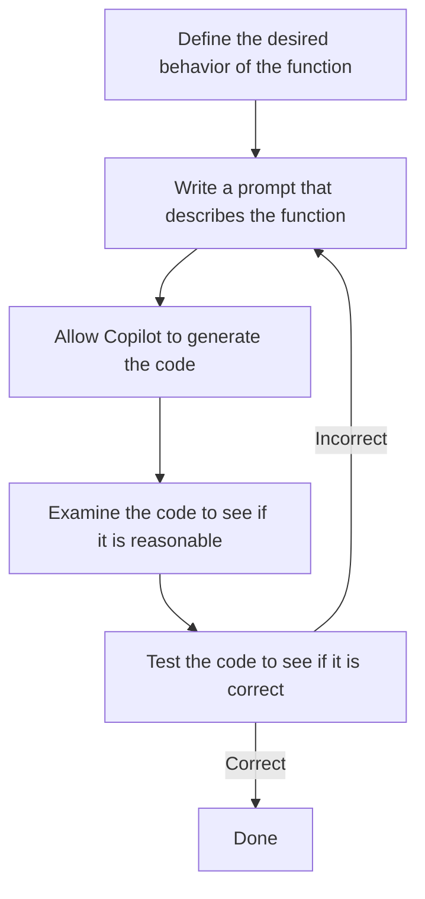
</details>

Figure 3.3 General editing cycle with Copilot. This assumes you define a reasonable function.

We won’t learn how to do step 4 until the next chapter, but we bet you can already recognize when the code is blatantly wrong. For example, Copilot might give you only comments to fill the body of the function. Comments don’t do anything—they are not code!—so a bunch of comments with no other code is clearly not the right thing to do. Or it might just write a single line return -1. Or, our personal favorite, Your code here. Copilot learned that one from us professors when we provide students partial code and ask them to write the rest with “Your code here.” Those are all obviously incorrect, but in the next chapter, we’ll go over how to read code so you can more quickly spot when more complicated code is incorrect and, perhaps more importantly, see where and how to fix it. In later chapters, we’ll keep expanding on this cycle to include effective debugging practices, and we’ll keep practicing how to improve prompts.

# 3.6 Examples of creating good functions with Copilot

In this section, we’re going to write a bunch of functions with Copilot. We’ll code them entirely in Copilot to help you see the cycle of function design we just described. Although our goal in this chapter isn’t to help you read code just yet, we will see programming features (sometimes called constructs) in the solutions that are very common in code (e.g., if statements, loops), so we’ll point those out when we see them. Then, in chapter 4, we’ll say more about how to read this code in more detail.

Many of the functions we’re about to work on are unrelated to each other. For example, we’ll start with a function about stock share prices and move to functions about strong passwords. You typically wouldn’t store unrelated stuff like this in the same Python file. Because we’re just exploring different examples of good functions, feel free to store all functions in the same Python file, perhaps named function\_practice.py or ch3.py.

# 3.6.1 Dan’s stock pick

Dan is an investor in a stock called AAAPL. He purchased 10 shares for \$15 each. Now, each of those shares is worth \$17. Dan would like to know how much money he has made on the stock.

Remember that we want to make our function as general as possible. If the only thing our function does is calculate this exact AAAPL situation, it wouldn’t be that useful in general. Sure, it would help Dan right now, but what about when AAAPL’s share price changes again or when he is interested in another stock entirely?

A useful general function here would take three parameters, all of which are numbers. The first parameter is the number of shares purchased, the second is the share price when the shares were purchased, and the third is the current share price. Let’s call this function money\_made, since it’s going to determine how much money we’ve made or lost on the stock. In general, you want to name your function as an action word or words that describe what your function is doing. With that, we have enough to write the function header:

def money\_made(num\_shares, purchase\_share\_price, current\_share\_price):

Now we need a docstring. In the docstring, we need to explain what each parameter is for by using its name in a sentence. We also need to include what the function is supposed to do.

Adding our docstring, here is the full prompt we provide to Copilot:

```python
def money_made(num_shares, purchase_share_price, current_share_price):
    """
    num_shares is the number of shares of a stock that we purchased.
    purchase_share_price is the price of each of those shares.
    current_share_price is the current share price.

    Return the amount of money we have earned on the stock.
    """ 
```

After typing that prompt, go to the next line and press the Tab key. Copilot will fill in the code for the function. Don’t worry that the code gets indented: the code of functions is supposed to be indented, and, in fact, it’s an error if it isn’t!

Here’s what we got from Copilot:

return num\_shares \* (current\_share\_price - purchase\_share\_price)

This code seems sensible. In the parentheses, it figures out the difference between the current price and the purchase price (the - is used for subtraction), and then it multiplies that by the number of shares that we have (the \* is used for multiplication). Inspecting code like this is a useful skill, and we’ll get serious about it in the next chapter. Another useful skill is testing the function.

To test the function, we call it using various inputs and observe the output in each case. We could do this by asking Copilot to call the function and then running our program, much as we did with our “larger” function. We could then ask Copilot to change the function call by asking it to call the function with a different input and run our program again, repeating as many times as needed. However, we find it easier and more convenient to call the function ourselves from an interactive window.

This way, we can call the function as many times as we like without going through Copilot at all and without cluttering up our program with stuff we’re going to delete anyway. To try this interactive approach, select/highlight all the code of the function and then press Shift–Enter (you can access a similar interactive session by selecting the text, right-clicking, and choosing Run Selection/Line in the Python window, but the guidance here is if you use Shift–Enter). Figure 3.4 shows what this looks like if you select the text of the function and press Shift–Enter.


<details>
<summary>text_image</summary>

Python code snippet for buying money on a stock, showing key steps and definitions in a script editor.
</details>

Figure 3.4 Running Python in an interactive session in the Terminal of VS Code. Note the >>> at the bottom of the terminal.

At the bottom of the resulting window, you will see three greater-than symbols >>>. This is called a prompt, and you’re allowed to type Python code here. (This prompt has nothing to do with the kind of prompt that we use when interacting with Copilot.) It will show us right away the result of the code that we type, which is convenient and fast.

To call our money\_made function, we need to provide three arguments, and they will be assigned left to right to the parameters. Whatever we put first will be assigned to num\_shares, whatever we put second will be assigned to purchase\_share\_price, and whatever we put third will be assigned to current\_share\_price.

Let’s try this! At the prompt, type the following and press Enter (or Shift–Enter). Don’t type the >>> as that’s already there; we are including it throughout the book to make it clear where we are typing. Please see figure 3.5 for an example of running the function in the terminal at the Python prompt:

```txt
>>> money_made(10, 15, 17) 
```

You’ll see the output:

Is 20 correct? Well, we bought 10 shares, and each of them went up \$2 (from \$15 to \$17), so we did make \$20. Looks good!

```python
PROBLEMS OUTPUT DEBUG CONSOLE TERMINAL
Type "help", "copyright", "credits" or "license" for more information.
>>> def money_made(num_shares, purchase_share_price, current_share_price):
...    """
... num_shares is the number of shares of a stock that we purchased.
...    purchase_share_price is the price of each of those shares.
...    current_share_price is the current share price.
...    Return the amount of money we have earned on the stock.
...    """
... return num_shares * (current_share_price - purchase_share_price)
...
>>> money_made(10, 15, 17)
20
>>> [] 
```  
Figure 3.5 Calling the money\_made function from Python prompt in the VS Code terminal

We’re not done testing, though. When testing a function, you want to test it in various ways, not just once. All one test case tells you is that it happened to work with the particular input values that you provided. The more test cases we try, each testing the function in a different way, the more confident we are that our function is correct.

How do we test this function in a different way? We’re looking for inputs that are somehow a different category of input. One not-so-good test right now would be to say, “What if our stock went from \$15 to \$18, instead of \$15 to \$17?” This is pretty much the same test as before, and chances are that it will work just fine.

A good idea is to test what happens when the stock actually loses money. We expect to get a negative return value in this case. And it appears that our function works just fine with this category of test. Here’s our function call and the output returned to us:

```erlang
>>> money_made(10, 17, 15)
-20 
```

What other tests can we do? Well, sometimes a stock price doesn’t change at all. We expect 0 in this case. Let’s verify it:

```txt
>>> money_made(10, 15, 15)
0 
```

Looks good!

Testing is a combination of science and art. How many categories of things are there to test? Are these two calls really two different categories? Have we missed any categories? You will improve your testing ability through practice, and we’ll spend all of chapter 6 talking about testing. For now, it looks like our money\_made function is doing its job.

It’s possible for a function to use variables (rather than just its parameters) in its code, and we want to show you an example of that now so that you’re ready when you see Copilot doing it.

Here’s an equivalent way to write the code for our money\_made function:

```txt
price_difference = current_share_price - purchase_share_price
return num_shares * price_difference 
```

This code may even be easier to read for you: it first figures out the difference in share price, and then it multiplies that by the number of shares. We encourage you to test this version to help convince yourself that it is still correct.

# 3.6.2 Leo’s password

Leo is signing up for a new social network website called ProgrammerBook. He wants to make sure that his password is strong.

Leo starts with a modest definition of what it means for a password to be strong: it’s strong if it’s not the word password and not the word qwerty. (Those are terrible passwords, for sure, but in reality, we have to do way better than this definition to ensure that our password is strong!) A helpful function would be one that takes a proposed password and tells us whether it is strong or not.

Unlike our previous functions in this chapter, we’re not dealing with numbers here. The parameter, the password to check, is text. And the return value is supposed to indicate some yes/no result. We need new types!

The Python type for text is called a string. There are zillions of possible strings because we can use a string to store whatever text we want. And the Python type for a yes/no result is called a Boolean or bool. A bool has only two values: True or False.

Alright! We’re ready to prompt Copilot. For functions that return bool (True/False) values, we usually name the function as has\_x, or is\_x, or using some other verb that implies a true/false result:

```python
def is_strong_password(password):
    """
    A strong password is not the word 'password'
    and is not the word 'qwerty'.

    Return True if the password is a strong password, False if not.
    """ 
```

In response, here’s what Copilot wrote for us:

```txt
return password != 'password' and password != 'qwerty' 
```

Look over that code for a moment. That != operator is the “not equal” operator, and each string that doesn’t count as a strong password is in single quotation marks. We’re going to use quotation marks every time we work with a string value. Again, we’ll talk more about how to read code in the next chapter, but for now, we hope that the code makes a fuzzy sort of sense: it looks like it’s checking that the password isn’t password or qwerty, which matches our definition of a strong password.

Now let’s make sure that this function does indeed work by making a few test calls. We’ll start by testing the passwords that are not strong. We had better get back False for each of these—and we do!

```txt
>>> is_strong_password('password')
False
>>> is_strong_password('qwerty')
False 
```

Good! Now, let’s try a strong password. We need to see True here:

```txt
>>> is_strong_password('N3w Y0rk J375')
True
```

Good stuff! We now see that the function sometimes returns False and other times returns True, so at least it’s not always returning False.

Let’s try one more:

```txt
>>> is_strong_password('Leo')
True 
```

Well, technically True is correct, but, wow, is Leo a bad password. We should really have done better with our definition of a strong password. Let’s change our prompt to give a more reasonable definition of what it means for a password to be strong.

Here’s our next prompt and what Copilot gave us:

```python
def is_strong_password(password):
    """
    A strong password has at least one uppercase character,
    at least one number, and at least one special symbol.

    Return True if the password is a strong password, False if not.
    """
    return any(char.isupper() for char in password) and \
    any(char.isdigit() for char in password) and \
    any(not char.isalnum() for char in password) 
```

That for char in password that shows up a few times here is a way for Python to consider each character of the password. It enables something called a loop, which is a key topic that we’ll study in chapter 5.

Of course, it’s possible that you didn’t get the same code from Copilot as we did. But based on the code that we got, it looks like the first piece is looking for any uppercase character, the second piece is looking for any digit, and the third is looking for something that’s not an isalnum.

Maybe isalnum means “is alphanumeric.” Does that include special symbols and, if so, which ones? Let’s test this function to see how well we’re doing:

```python
>>> is_strong_password('Leo')
False
>>> is_strong_password('N3w Y0rk J37$')
True
>>> is_strong_password('N3w Y0rk J375')
True 
```

Uh oh! We got the wrong answer for that third password. It looks pretty strong, but it’s not, because it lacks a special symbol. Our function returned True, but that’s the wrong return value: it was supposed to return False.

The code that Copilot gave us is wrong. Maybe the code that you got worked fine, but we didn’t get so lucky, and it’s important we know how to identify (like we just did) when the code is wrong and then fix it. It’s not important to know why it’s wrong right now, but if you are curious about why our prompt may have given us the wrong behavior, it’s because we didn’t specify what we meant by a special character, and the code it gave us counts spaces as special characters.

At this point, with our wrong code, we have two options. One option is to hit Ctrl–Enter and look through the other suggestions that Copilot gives us. Maybe one of those suggestions will have something to do with special symbols that looks different from the one that didn’t work?

Indeed, on our computer here, we see such options, including this one:

```python
num_upper = 0
num_num = 0
num_special = 0
for char in password:
    if char.isupper():
    num_upper += 1
    elif char.isnumeric():
    num_num += 1
    elif char in '!@#$%^&*':
    num_special += 1
if num_upper >= 1 and num_num >= 1 and num_special >= 1:
    return True
else:
    return False 
```

Test this function with strings like Leo, N3w Y0rk J375, and N3w Y0rk J375\$ and you should see that the function works well.

Our second option is to do some prompt engineering, which means adjusting our prompt to influence what Copilot gives us. In our original prompt, we talked about special symbols. This, in retrospect, is vague. We probably meant something more specific, like punctuation. If we specifically talk about punctuation in our prompt, we get this interaction with Copilot:

```python
def is_strong_password(password):
    """
    A strong password has at least one uppercase character,
    at least one number, and at least one punctuation.

    Return True if the password is a strong password, False if not.
    """
    return any(char.isupper() for char in password) and \
    any(char.isdigit() for char in password) and \
    any(char in string.punctuation for char in password) 
```

Looks good! That last line is talking about punctuation, which is hopeful. Let’s test:

```python
>>> is_strong_password('Leo')
False

>>> is_strong_password('N3w Y0rk J375')
Traceback (most recent call last):
  File "<stdin>", line 1, in <module>
  File "ch2.py", line 44, in is_strong_password
    any(char in string.punctuation for char in password)
  File "ch2.py", line 44, in <genexpr>
    any(char in string.punctuation for char in password) 
```

NameError: name 'string' is not defined

Look at the bottom of that error message, 'string' is not defined, eh? We’re running into a problem that’s similar to what we saw in chapter 2 with modules. Copilot wants to use a module, called string, but it is a module that needs to be imported before we can use it. There are a lot of modules in Python, but the string module is well known. As you work with Copilot more, you’ll learn which modules are commonly used so you know to import them. You could also do a quick internet search to ask, “Is string a Python module,” and the results would confirm that it is. What we need to do is import the module.

Note that this is somewhat different from what we encountered in chapter 2. In chapter 2, we saw what happens when the code from Copilot imports modules we didn’t have installed, and we had to install the package containing those modules to fix the problem. In this case, the code from Copilot is using a module that already happens to be installed with Python, but it forgot to import it. So, we don’t need to install string; we just have to import it.

# Importing modules

There are a number of useful modules available in Python. We saw how powerful matplotlib is in chapter 2. But for Python code to take advantage of a module, we have to import that module. You might ask why we don’t have modules available to us without importing them, but that would massively increase the complexity of the code and what Python has to do to run code behind the scenes. Instead, the model is to include modules if you want to use them, and they aren’t included by default.

Let’s add import string at the top of our code:

import string

```python
def is_strong_password(password):
    """
    A strong password has at least one uppercase character,
    at least one number, and at least one punctuation. 
```

```txt
Return True if the password is a strong password, False if not.
"""
return any(char.isupper() for char in password) and \
any(char.isdigit() for char in password) and \
any(char in string.punctuation for char in password) 
```

Now we’re in good shape:

```txt
>>> is_strong_password('Leo')
False
>>> is_strong_password('N3w Y0rk J375')
False
>>> is_strong_password('N3w Y0rk J375$')
True
```

That last one is True—it’s a strong password!—because it has the \$ punctuation added to it.

We hope that you’re now convinced of the value of testing! Sometimes our students don’t test their code. They assume that the code they write is correct because it made sense to them. An interesting difference between novice and experienced programmers is that novices often assume their code is right, whereas experience programmers assume their code is wrong until thoroughly tested and proved otherwise. Beyond this, we find that our students sometimes fail to test well because it’s disheartening to learn that the code is wrong. But it’s better to know now rather than later when others are using your code in a serious application. Finding errors through testing is actually a good thing.

# 3.6.3 Getting a strong password

Now that we have a function that tells us whether a password is strong or not, let’s write a function that obtains a strong password from the user. It will ask again and again for a password until the user types a strong one. This is the kind of code that websites use when they tell you, “Sorry, your password is too weak, try again.”

What should the header for such a function look like? Well, it’s going to ask the user for a password, but we won’t have a password parameter. In fact, we won’t have any parameters at all, because the function doesn’t need any information to do its job—it just has to prompt the user and the user is going to type the password at the keyboard. When the function has done its work, it will return the strong password, so it will continue to return a string as the output.

Let’s try this prompt:

```python
def get_strong_password():
    """
    Keep asking the user for a password until it is a strong password, and return that strong password.
    """ 
```

We get the following code from Copilot as a result:

```python
password = input("Enter a strong password: ")
while not is_strong_password(password):
    password = input("Enter a strong password: ")
return password 
```

That while keyword creates another kind of loop, this one continuing as long as the entered password is not strong. Copilot is also smart enough to call our earlier is strong\_password function to determine what counts as a strong password. As we will see in future chapters, using functions as building blocks in this way is precisely how large programs are built. You will often notice Copilot calling your earlier functions to solve later ones, much as we observed here.

Let’s test this! Highlight all our password function code and hit Shift–Enter. We’ll call the function that we want to test. Then, try typing passwords, pressing Enter after each one. You’ll notice that it keeps asking you until you finally provide a strong password:

```txt
>>> get_strong_password()
Enter a strong password: Leo
Enter a strong password: N3w Y0rk J375
Enter a strong password: N3w Y0rk J375$
'N3w Y0rk J375$'
```

Notice that it stops asking us for a password when we finally provide a strong password. Then, we see the string in quotes that it returned, which is, indeed, our strong password.

# 3.6.4 Scrabble scoring

One of Dan’s favorite board games is Scrabble. Have you played it? If not, all you need to know is that you have some tiles in your hand, each with a letter on it, and your goal is to form a word using any combination of those letters. You don’t need to form the word exclusively with your tiles—you can attach those letters to existing letters on the board to create longer words—but we’re not going to worry about that here. The important thing for us is that different letters are worth different numbers of points. For example, an a is worth only one point, because a is such a common letter. But q and z? Those doozies are each worth 10 points because they’re so tough to use—or should we say puzzling to use. Yeah, that’s better.

To calculate the score for a word, we add up the scores for each of its letters. For example, the score for zap would be 14. That’s because z is worth 10, a is worth 1, and p is worth 3.

Dan would like a function that, given a word, tells him how many points that word is worth. OK, so we need a function that takes a word (which is just one parameter). Let’s try this prompt, where we’ve included the number of points that each letter is worth per official Scrabble rules:

```python
def num_points(word):
    """
    Each letter is worth the following points:
    a, e, i, o, u, l, n, s, t, r: 1 point
    d, g: 2 points
    b, c, m, p: 3 points
    f, h, v, w, y: 4 points
    k: 5 points
    j, x: 8 points
    q, z: 10 points

    word is a word consisting of lowercase characters.
    Return the sum of points for each letter in word.
    """ 
```

For this function, Copilot isn’t filling in the whole body for us with one press of the Tab key. Tab is also used to indent the code, which we also need to do here before Copilot will present us with code. So, we’re having to press Tab (sometimes once for the indentation and then again for Copilot), wait for the code to appear, then press Enter to accept that code, then press Tab again for more code, and repeat the process.

# Getting Copilot to suggest code may require pressing Tab or Enter

We find that Copilot will sometimes pause in giving suggestions until you press a key to help prompt it. As mentioned in table 2.1, if you are giving it comments, it will sometimes just want to give you more comments as suggestions. Pressing Enter another time can often trigger it to start generating code instead. Other times, pressing Tab will cause it to continue providing suggestions. Please refer to table 2.1 if Copilot is not generating code for you.

Finally, after doing that a few times, the entire code unfurls, and we get the following:

```python
points = 0
for char in word:
    if char in "aeioulnstr":
    points += 1
    elif char in "dg":
    points += 2
    elif char in "bcmp":
    points += 3
    elif char in "fhvwy":
    points += 4
    elif char == "k":
    points += 5
    elif char in "jx":
    points += 8
    elif char in "qz":
    points += 10
return points 
```

Notice that all of the letters of the alphabet are accounted for here, and the number of points that each category is worth is on the following line. We’ll discuss this overall kind of decision structure in the next chapter, but, at a high level, it is walking through the word character by character and, for each character, figuring out which letter it is and adding the appropriate number of points for that letter.

Let’s test this to make sure our code is performing the way we want. We know that the word zap should be worth 14 points. And it is:

```txt
>>> num_points('zap')
14 
```

Let’s try a couple more. In each case, calculate by hand what you expect the answer to be—that way you’ll know if the code is doing the right thing:

```erlang
>>> num_points('pack')
12
>>> num_points('quack')
20 
```

There are many ways to write correct code for a function. If you press Ctrl–Enter and look at the Copilot suggestions, you may see different types of code. It doesn’t necessarily mean that one of these types is right and the others are wrong.

For example, here’s another solution for num\_points that we got from the other Copilot suggestions:

```python
points = {'a': 1, 'e': 1, 'i': 1, 'o': 1, 'u': 1, 'l': 1,
    'n': 1, 's': 1, 't': 1, 'r': 1,
    'd': 2, 'g': 2,
    'b': 3, 'c': 3, 'm': 3, 'p': 3,
    'f': 4, 'h': 4, 'v': 4, 'w': 4, 'y': 4,
    'k': 5,
    'j': 8, 'x': 8,
    'q': 10, 'z': 10}
return sum(points[char] for char in word) 
```

Notice here that each letter is listed individually along with its number of points. This structure with the letters and points is called a dictionary, and again, we’ll learn about dictionaries properly in a later chapter. The point for now is just that there are often multiple, equivalently good ways for Copilot to write the code for a function. Give this one a try with some test cases before you continue!

# 3.6.5 The best word

Let’s continue with the Scrabble theme. Suppose that Dan has a bunch of words that he can make right now, but he doesn’t know which one will give him the most points. Should he make the word zap, pack, or quack? It would be nice if we had a function that could take a bunch of words and tell us which is the best one.

How many parameters should we have in such a function? Your first instinct may be 3, one for each of the 3 words in our options. But that wouldn’t be very flexible. After all, what if we want to know the best of five words? Ten words? Fifty? We would like our function to work no matter how many words we are considering.

The trick is to use a function with one (yes, just one!) parameter, which is a list of words. Just like numbers and strings and dictionaries, a list is a type supported by Python. It’s incredibly useful because it allows us to collect as many values into one place as we like.

We can prompt Copilot like this to get the function that we want:

```python
def best_word(word_list):
    """
    word_list is a list of words.
    Return the word worth the most points.
    """ 
```

How will Copilot know how many points each word is worth? Well, it can call that num\_ points function that we wrote in the previous section!

Here’s the code that Copilot gives us.

```python
best_word = ""
best_points = 0
for word in word_list:
    points = num_points(word)
    if points > best_points:
    best_word = word
    best_points = points
return best_word 
```

We need to be careful to call this function correctly when testing. This won’t work:

```txt
>>> best_word('zap', 'pack', 'quack') 
```

Because that’s passing values for three parameters, not one. The right way to call it is to put the words inside square brackets, like this (we’ll see more about lists in the next chapter):

```txt
>>> best_word(['zap', 'pack', 'quack'])
'quack' 
```

But, as usual, you shouldn’t be content with just one test case. This function should work in other valid but perhaps strange cases, too, such as when we have only one word in the list:

```txt
>>> best_word(['zap'])
'zap' 
```

However, we wouldn’t test this function on a list that has no words in it. What would it even make sense to do in that case? Regardless of what the function does, it’d be hard to say one way or the other whether it was doing the correct thing in a situation where there really is no correct behavior!

Overall, in this chapter we’ve learned about functions in Python and how we can use Copilot to help us write them. We’ve also learned about the characteristics of good functions and how important it is to make sure our functions are solving tasks that can be managed well by Copilot. Our next steps in this book all revolve around understanding whether the code produced by Copilot is correct and how to fix it when it isn’t. In the next chapter, we’ll start by learning the basics of being able to read the code produced by Copilot because this gives us the first sanity check for whether Copilot is doing what we think it should be. Then, in later chapters, we’ll dig deeper into how to carefully test the code and what to do when it is wrong.

# Summary

Problem decomposition involves breaking a large problem into smaller tasks.   
¡ We use functions to perform problem decomposition in our programs.   
Each function must solve one small, well-defined task.   
¡ Functions reduce duplication, make it easier to test our code, and reduce the likelihood of bugs.   
Unit testing involves checking that the function does what we expect on a variety of different inputs.   
¡ A function header or signature is the first line of code of the function.   
Parameters are used to provide information to functions.   
¡ The function header indicates the name of the function and names of its parameters.   
We use return to output a value from a function.   
A docstring uses the names of each function parameter to describe the purpose of the function.   
¡ To ask Copilot to write a function, we provide it the function header and docstring.   
We get a function to do its work by calling it with values (also called arguments) for its parameters.   
¡ A variable is a name that refers to a value.   
A helper function is a small function written to make it easier to write a bigger function.   
A leaf function doesn’t call any other function to do its job.   
¡ To test whether a function is correct, we call it with different types of inputs.   
¡ Every Python value has a type, such as a number, text (string), true/false value (bool), or collection of values (list or dictionary).   
¡ Prompt engineering involves modifying our prompt for Copilot to influence the code that we get back.   
We need to ensure that we import any module (such as string) our code is using.

# Reading Python

# 4code: Part 1

# This chapter covers

¡	Why knowing how to read code is important   
¡	How to ask Copilot to explain code   
¡	Using functions to break a problem into smaller subproblems   
¡	Using variables to hang on to values   
¡	Using if-statements to make decisions   
¡	Using strings to store and manipulate text   
¡	Using lists to collect and manipulate many values

In chapter 3, we used Copilot to write several functions for us. What are they good for? Maybe our money\_made function could be part of a stock trading system. Maybe our is\_strong\_password function could be used as part of a social network website. Maybe our best\_word function could be used as part of some Scrabble AI. Overall, we’ve written some useful functions that could be part of larger programs. And we did this without writing much code ourselves or, indeed, understanding what the code even does.

However, we believe that you need to understand at a high level what code does. Because this will require some time to learn, we’ve split this discussion over two chapters. In this chapter, we’ll explain why reading code is important and introduce you to a Copilot labs feature that can help you understand the code. After that, we’ll dive into the top 10 programming features you’ll need to recognize in order to read most basic code produced by Copilot. We’ll do the first five in this chapter and the remaining five in the next chapter. Don’t worry: you've actually been informally introduced to all 10 already—we’re just going to deepen your understanding of each one.

# 4.1 Why we need to read code

When we talk about reading code, what we mean is understanding what code does by looking at it. There are two such levels of understanding.

The first level is being able to understand, line by line, what a program will do. This often involves tracing the values of variables as the code runs to determine exactly what the code is doing at each step.

The second level is determining the overall purpose of a program. As professors, we often test students at this level with questions that ask them to “explain in plain English.”

At the end of these two chapters, we want you to do both levels of interpreting code produced by Copilot. We’ll start focusing on that line-by-line understanding, but toward the end of the chapter, you’ll start being able to look at a small chunk of code and determine its purpose.

We can illustrate the difference between the two levels of reading code by referring back to our best\_word function from chapter 3, reprinted in the following listing.

Listing 4.1 best\_word function for Scrabble   
```python
def best_word(word_list):
    """
    word_list is a list of words.

    Return the word worth the most points.
    """
    best_word = ""
    best_points = 0
    for word in word_list:
    points = num_points(word)
    if points > best_points:
    best_word = word
    best_points = points
    return best_word 
```

A tracing description of what this program does would be a description of each line. For example, we would say that we’re defining a function called best\_word. We have a variable called best\_word that we start off as a string with no characters, otherwise known as the empty string. (It’s unfortunate that the function and this variable are both called best\_word, because it makes it trickier to refer to one or the other, but that’s what Copilot gave us.) We also have another variable, best\_points, that we start at 0. Then we have a for loop over each word in the word\_list. Inside the for loop, we call our num\_points helper function. And so on. (We’ll explain how we know what each line of code does over this chapter and the next!)

In contrast, a description of the overall purpose would be something like our docstring description: “Return the word with the highest Scrabble point value from a list of words.” Rather than refer to each line, this description refers to the code’s purpose as a whole, explaining what it does at a high level.

You’ll come to an overall-purpose level of understanding through a combination of practice with tracing and testing, and we hope you arrive there in full glory by the end of the book. Working at a tracing level generally precedes the ability to work at an overallpurpose level [1], so in this chapter and the next, we’re going to focus on the tracing level by understanding what each line of code does.

There are three reasons why we want you to be able to read code:

1 To help determine whether code is correct—In chapter 3, we practiced how to test the code that Copilot gives us. Testing is a powerful skill for determining whether code does the right thing, and we will continue to use it throughout the book. But many programmers, the two of us included, will only test something if it seems plausibly correct. If we can determine by inspection that the code is wrong, then we won’t bother to test it: we’ll try to fix the code first. Similarly, we want you to identify when code is simply wrong without having to spend time testing it. The more code that you can identify as wrong (through quick tracing or honing your overall purpose skills), the more time you save testing broken code.   
2 To inform testing—Understanding what the code is doing line by line is useful on its own, but it also helps turbocharge your ability to test effectively. For example, in the next chapter, you’ll learn about loops—that they can cause your code to repeat zero times, one time, two times, or as many times as needed. You’ll be able to combine that knowledge with what you already know about testing to help you identify important categories of cases to test.   
3 To help you write code—We know, you want Copilot to write all of your code! We want that, too. But inevitably, there will be code that Copilot just doesn’t get right, no matter how much prompt engineering you do. Or maybe enough prompt engineering could finally cajole Copilot to write the correct code, but it would be simpler and faster to just do it ourselves. In writing this book, the two of us strive to have Copilot write as much code as possible. But, because of our knowledge of Python programming, we are often able to see a mistake and just fix it without going through any hoops to have Copilot fix it for us. Longer term, we want you to be empowered to learn more programming on your own, and having an understanding of Python is our way to provide a bridge for you from this book to other resources later. There is research evidence that being able to trace and explain code is prerequisite to being able to write code [1].

Before we get to it, we need to be clear about the level of depth that we’re striving for. We’re not going to teach you every nuance of every line of code. Doing so would revert us back to the traditional way programming was taught prior to tools like Copilot. Rather, through a combination of Copilot tools and our own explanations, we’re going to help you understand the gist or overall goal of each line of code. You will need more than this if you endeavor to write large portions of programs in the future. We are trying to target the sweet spot between “this code is magic” and “I know exactly how every line of the code works.”

# 4.2 Asking Copilot to explain code

In chapter 2, when setting up your computer to use GitHub Copilot, you installed the GitHub Copilot Labs extension to Visual Studio Code (VS Code). This experimental extension is changing rapidly and is designed to offer new features that are not quite ready for everyday use. We’re going to show you one of its best features right now: explaining what Python code does!

We suspect that, soon, the Copilot Labs extension, or parts of it, will be folded into the main Copilot extension. If that happens, the specific steps we give here may vary somewhat, and in that case, we encourage you to consult more general GitHub Copilot documentation.

For now, with the Copilot Labs extension installed, you can highlight some code that you want Copilot to describe to you. Let’s try this with our best\_word function (figure 4.1).


<details>
<summary>text_image</summary>

GITHUB COPILOT LABS
✓ EXPLAIN
Explain code
Advanced
Ask Copilot
✓ LANGUAGE TRANSLATION
Translate code into
✓ BRUSHES
READABLE ADD TYPES FIX BUG DEBUG CLEAN LIST STEPS MAKE ROBUST
✓ TEST GENERATION
Selected Text
✓ Test generation is currently only supported for JavaScript and TypeScript.
</details>

Figure 4.1 The Copilot Labs view in VS Code

First, click the Copilot Labs tab in your Activity Bar (on the left-hand side of VS Code), and you should see a window similar to figure 4.1.

Next, highlight all of the code for our best\_word function as is highlighted in figure 4.2. (You may need to have Copilot generate the code for you again if you didn’t save it from chapter 3.)

```python
def best_word(word_list):
    """
    word_list is a list of words.

    Return the word worth the most points.
    """
    best_word = ""
    best_points = 0
    for word in word_list:
    points = num_points(word)
    if points > best_points:
    best_word = word
    best_points = points
    return best_word 
```  
Figure 4.2 The code from the best\_word function highlighted in the editor

After highlighting the code, you should now see the code appear on the left in the Explain feature, as shown in figure 4.3.

```python
GITHUB COPILOT LABS
EXPLAIN
def best_word(word_list):
    """
    word_list is a list of words.
    Return the word worth the most points.
    """
    best_word = ""
    best_points = 0
    for word in word_list:
    points = num_points(word)
    if points > best_points:
    best_word = word
    best_points = points
    return best_word

Explain code
Advanced
Ask Copilot 
```  
Figure 4.3 The code from the best\_word function appearing in Copilot Labs

Figure 4.4 shows the different prompts provided by Copilot that you can use to ask for code explanations. Each will generally yield different responses that vary in how specific they are and whether they produce fewer or more examples. We’ll leave it at the default prompt of Explain Code, but if you like, you can try other prompts from the drop-down box (shown in figure 4.4). The current options are Explain Code, Code

Does Following, Code Does Following (English), and Show Example Code. There’s also a Custom option that allows you to use whatever prompt you like.


<details>
<summary>text_image</summary>

GITHUB COPILOT LABS
EXPLAIN
def best_word(word_list):
    """
    word_list is a list of words.
    Return the word worth the most points.
    """
    best_word = ""
    best_points = 0
    for word in word_list:
        points = num_points(word)
        if points > best_points:
            best_word = word
            best_points = points
    return best_word

Explain code
Custom
Explain code
Code does following
Code does following (English)
Show example code
</details>

Figure 4.4 The different options for explaining your code in Copilot Labs

The last step is to click Ask Copilot (as shown as the bottom button in figure 4.3). You’ll get an explanation of the code. As usual, Copilot is nondeterministic, so your results will likely differ from ours. In fact, if an explanation is confusing you, you might try clicking Ask Copilot again or changing the prompt to get a different explanation. As educators, this is the start of a dream come true, where students will be able to ask for as many explanations as they need to fully understand how code works.

# Copilot Labs explanations can be wrong

As with the code produced by Copilot, the explanations from Copilot Labs can be wrong, too. You might be thinking, “Wait, what’s the value of a tool to understand code if it can be wrong?!” First, let us say that we agree that this can be really frustrating. However, it is right often enough in our experience that it can be really helpful, particularly for understanding code basics like the things we’re teaching in these two chapters. Moreover, what students do now when they are confused about their code is to ask friends or websites about the code and, candidly, those make mistakes too. A way to help mitigate the potential for error is to ask Copilot for its explanation a couple times because you are less likely to get grossly incorrect answers across multiple tries.

# Here’s what Copilot gave us the first time we asked:

""" Here is the explanation for the code above:   
1. We define a function called best\_word that takes one argument, word\_list.   
2. We define the variables best\_word and best\_points and set them equal to the empty string and 0, respectively.   
3. We use a for loop to iterate over the elements in word\_list.

4. We define a variable called points that is equal to the result of calling num\_points with word as an argument.   
5. We use an if statement to check if points is greater than best\_points.   
6. If it is, we set best\_word equal to word and best\_points equal to points.   
7. Finally, we return best\_word. """

To us, this is an excellent description of what the code does line by line. Notice, however, to make full sense of it, you need to know important Python terminology and features. The explanation from Copilot refers to functions, arguments, variables, strings, for loops, if statements, and returning. This explanation is quite useful if you understand the terminology, but much less useful if you do not. By the end of this and the next chapter, you will know the main terminology and features of Python that you need to interpret a typical explanation from Copilot.

# 4.3 Top 10 programming features you need to know: Part 1

We’re going to give you a whirlwind tour of the 10 Python features that you’ll need for the rest of your programming journey, starting with the first five of those in this chapter.

Python is an interactive language, which makes it easier than other languages for us to play around with and see what stuff does. We’ll take advantage of that here as we explore programming features. This is how the two of us learned Python and, indeed, how many thousands of programmers have done so. Don’t hesitate to experiment! To get started, press Ctrl–Shift–P and type REPL, and then select Python: Start REPL. This should result in the situation shown in figure 4.5.


<details>
<summary>text_image</summary>

>REPL
Python: Start REPL
Replace	Ctrl + H
Replace with Next Value	Ctrl + Shift + .
Replace with Previous Value	Ctrl + Shift + .
Search: Replace in Files	Ctrl + Shift + H
</details>

Figure 4.5 Starting REPL from VS Code

This will put you back at the same Python prompt as in chapter 3 (as shown in figure 4.6), except with none of your functions loaded.

```txt
PROBLEMS OUTPUT DEBUG CONSOLE TERMINAL
PS C:\Users\leona\copilot-book> & C:/Users/leona/AppData/Local/Programs/Python/Python311/python.exe
Python 3.11.1 (tags/v3.11.1:a7a450f, Dec 6 2022, 19:58:39) [MSC v.1934 64 bit (AMD64)] on win32
Type "help", "copyright", "credits" or "license" for more information.
>>> 
```  
Figure 4.6 REPL running in VS Code

Then we can start typing Python code. For example, type and press Enter. You’ll see the response of 20. We won’t spend time on simple math here, but the way you interact with Python to learn how it works is exactly the same: you type some code and Python responds.

```txt
>>> 5 * 4 
```

# 4.3.1 #1. Functions

You learned all about functions in chapter 3, so let’s just summarize what we learned. You use functions to break a large problem into smaller pieces. In retrospect, that best\_word function we wrote in chapter 3 is a pretty big task: it has to figure out which word in a list of words is worth the most points. How many points is a word worth? Aha—that’s a subtask that we can carve out from this function. And, indeed, we did that in our earlier num\_points function.

We design a function to take parameters, one parameter for each piece or collection of data that the function needs to do its job. After doing their work, most functions use return to send the answer back to the line of code that called them. When we call a function, we pass values, known as arguments, with one value for each parameter, and we often store that return value using a variable.

For each program we write, we’ll likely need to design a few functions, but there are also some functions that are built-in to Python that we get for free. We can call those like we call our own functions. For example, there’s a built-in max function that takes one or more arguments and tells us the largest:

```txt
>>> max(5, 2, 8, 1)
8 
```

There’s also the input function, which we used in our get\_strong\_password function from chapter 3. It takes an argument that becomes the prompt, and it returns whatever the user types at the keyboard:

```txt
>>> name = input("What is your name? ")
What is your name? Dan
>>> name
'Dan' 
```

If input is the function to receive input from the keyboard, is there an output function to output a message to the screen? Well, yes, but it’s called print, not output:

```txt
>>> print('Hello', name)
Hello Dan 
```

# 4.3.2 #2. Variables

A variable is a name that refers to a value. We used variables in chapter 3 to keep track of return values from functions. We also just used a variable here to hold the user’s name. Whenever we need to remember a value for later, we use a variable.

To assign a value to a variable, we use the = (equal sign) symbol, which is called the assignment symbol. It figures out the value of whatever is on the right and then assigns that to the variable:


<details>
<summary>text_image</summary>

>>> age = 20 + 4
>>> age
24
The right-hand side of the equal symbol is evaluated, which means 20 + 4 is evaluated to be 24. Then the variable age is assigned the value of 24.
</details>

# The = symbol is different in Python than in math

The = sign is used in Python and other programming languages to denote assignment. The variable on the left side of the equal symbol is given the value of the calculation performed on the right side of the equal symbol. This is not a permanent relationship as the variable can have its value changed. People new to programming who are strong in math can find this confusing, but just remember that the = sign in Python means assignment, not equality.

We can use the variable in a larger context, called an expression. The value that the variable refers to gets substituted for its name:


<details>
<summary>text_image</summary>

>>> age + 3
27
>>> age
24
Age is still available in the Python prompt and has the value 24.
24 + 3 is evaluated to be 27.
The expression of age + 3 does not change age because we did not reassign age.
</details>

# Variables persist in the Python prompt

We assigned age in the earlier batch of code. Why can we keep referring to it? Any variable declared during a session of programming with your Python prompt will stick around until you quit. That’s just how variables work in programs, too. They’re available as soon as you assign a value to them.

But notice that the variable age didn’t change when we said age + 3! To change it, we need another = assignment statement:


<details>
<summary>text_image</summary>

>>> age = age + 5
>>> age
2.9
We have changed age by doing an assignment (the equal symbol).
</details>

Let’s see a few more ways to change what a variable refers to. We’ll include some explanations as annotations with the code:


<details>
<summary>text_image</summary>

>>> age += 5
>>> age
34
>>> age *= 2
>>> age
68
A shortcut way to add. age += 5 is
equivalent to age = age + 5.
A shortcut way to multiply
by 2. age *= 2 is equivalent
to age = age * 2.
</details>

# 4.3.3 #3. Conditionals

Whenever our program has to make a decision, we need a conditional statement. For example, in chapter 2, we needed to make a decision about which quarterbacks to include in our data. To do so, we used if statements.

Remember our larger function from chapter 3? We’ve reproduced it here in the following listing.

Listing 4.2 Function to determine the larger of two values   


<details>
<summary>flowchart</summary>

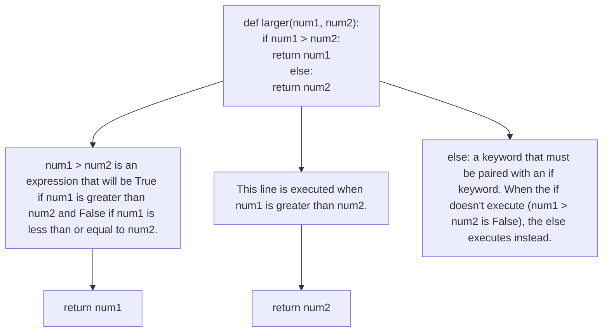
</details>

The if-else structure in listing 4.2 is known as a conditional statement, and it allows our program to make decisions. Here, if num1 is greater than num2, then num1 is returned; else, num2 is returned. That’s how it returns the larger one!

After if, we put a Boolean condition (num1 > num2). A Boolean condition is an expression that tests a condition where the result would either be True or False. If it’s True, then the code under the if runs; if it’s False, then the code under the else runs. We create Boolean expressions using comparison symbols such as >= for greater than or equal to, < for less than, and != for not equal to. Notice that we’re using indentation not only for the code of the function but also for the code of the if and else parts of the if-else statement. Indentation is necessary for the code to function properly, so it is worth paying attention to (in the next chapter, we talk more about indentation). This is how Python knows which lines of code belong to the function and which additionally belong to the if or else.

We can play around with conditional statements at the Python prompt, too—we don’t need to be writing code inside of a function. Here’s an example:


<details>
<summary>text_image</summary>

>>> age = 40
>>> if age < 40:
...    print("Binging Friends")
... else:
...    print("What's binging? ")
...
What's binging?
We assign 40 to age.
Because age is 40, this code
is asking whether 40 < 40.
It's not, so the if part of the
code is skipped.
The else portion
runs because the
if condition is
False.
</details>

You’ll notice that the prompt changes from >>> to ... when you’re typing inside the if statement. The change of prompt lets you know that you’re in the middle of typing code that you need to complete. You need an extra press of Enter when you’re done with the else code to get out of the ... prompt and back to the >>> prompt.

We set the age variable to 40. As $4 0 ~ < ~ 4 0$ is False, the else runs.

Let’s try again, this time making the if run:


<details>
<summary>text_image</summary>

>>> age = 25
>>> if age < 40:
...    print("Binging Friends")
... else:
...    print("What's binging? ")
...
Binging Friends
We assign 25 to age.
Because age is 25, this is asking whether 25 < 40. It is, so the if part of the code runs.
The else portion doesn't run.
</details>

You might see some if statements with no else part, and that’s okay: the else part is optional. In that case, if the condition is False, then the if statement won’t do anything:


<details>
<summary>text_image</summary>

>>> age = 25
>>> if age == 30:
...    print("You are exactly 30!")
...
We assign 25 to age.
== tests to see if the two
values are equal
</details>

Notice that the way to test whether two values are equal is to use two equal signs, (==), not one equal sign. (We already know that one equal sign is for the assignment statement to assign a value to a variable!)

What do you do if you have more than two possible outcomes? For example, let’s say that people’s age determines the show that they’ll likely binge, like in table 4.1.

Table 4.1 Possible favorite TV shows by age 

<table><tr><td>Age</td><td>Show</td></tr><tr><td>30–39</td><td>Friends</td></tr><tr><td>20–29</td><td>The Office</td></tr><tr><td>10–19</td><td>Pretty Little Liars</td></tr><tr><td>0–9</td><td>Chi’s Sweet Home</td></tr></table>

We can’t capture all these outcomes with just an if-else, so the elif (short for else-if) allows us to capture the logic for more than two possible outcomes as shown in the following code. We’re presenting this code without the python prompt (>>>) and ... since this would be a lot to type:


<details>
<summary>text_image</summary>

This is True if both age >= 30 and age <= 39 are true; for example, if age were 35.
if age >= 30 and age <= 39:
    print("Binging Friends")
elif age >= 20 and age <= 29:
        print("Binging The Office")
elif age >= 10 and age <= 19:
        print("Binging Pretty Little Liars")
elif age >= 0 and age <= 9:
        print("Binging Chi's Sweet Home")
else:
    print("What's binging?")

This condition is checked if the above condition is False.
This code runs if all conditions above are False.
</details>

We’re using and to capture a complex condition. For example, in the first line, we want age to be greater than or equal to 30 and less than or equal to 39. Python works from top to bottom, and when it finds a condition that’s true, it runs the corresponding indented code. Then it stops checking any remaining elifs or else—so if two conditions happened to be true, only the code for the first one would run.

Try experimenting with various values for the age variable to observe that the correct code runs in each case. In fact, if we were serious about testing this code, we could use the if statement structure for a good sense of the values we’d want to test. It’s all about testing the boundaries of values. For example, we definitely want to test the ages 30 and 39 to make sure, for example, that we’re correctly capturing the full 30–39 range with the first condition. Similarly, we’d want to test 20, 29, 10, 19, 0, 9, and then something larger than 39 to test the else way at the bottom.

If you use additional ifs rather than elifs, then they become separate if statements, rather than a single if statement. This matters, because Python always checks each independent if statement on its own, regardless of what may have happened in previous if statements.

For example, let’s change the elifs to ifs in our age code. That gives us the following:


<details>
<summary>text_image</summary>

if age >= 30 and age <= 39:
    print("Binging Friends")
if age >= 20 and age <= 29:
        print("Binging The Office")
if age >= 10 and age <= 19:
            print("Binging Pretty Little Liars")
if age >= 0 and age <= 9:
                print("Binging Chi's Sweet Home")
else:
            print("What's binging?")

This condition is always checked.
This condition is always checked.
This else goes with the most recent if statement.
</details>

Suppose that you put age = 25 above this code and run it. What do you think will happen?

Well, the second if condition age >= 20 and age <= 29 is True, so we’ll certainly output Binging The Office. But that’s not all that happens! Remember, because we’re using ifs here, each of the remaining ones is going to be checked. (If they were elifs, we’d be done.) age >= 10 and age <= 19 is False, so we’re not going to output Binging Pretty Little Liars.

The final if condition age >= 0 and age <= 9 is also False, so we’re not going to output Binging Chi's Sweet Home. But this if has an else! So, we are going to output What's binging? We didn’t intend this! We only wanted What's binging? for people over 40. This is all to say that if and elif behave differently and that we need to be using the one that matches the behavior that we want (if if we want multiple chunks of code to potentially run, and elif if we want only one).

# 4.3.4 #4. Strings

As we learned in chapter 3, a string is the type we use whenever we want to store text. Text is everywhere—stats like in chapter 2, passwords, books—so strings show up in almost every Python program.

We use quotation marks to indicate the beginning and end of the string. You’ll see Copilot use double quotes or single quotes. It doesn’t matter which you use; just be sure to start and end the string with the same type of quote.

Strings come with a powerful set of methods. A method is a function that’s associated with a particular type—in this case, strings. The way you call a method is a little different than how you call a function: we need to put the value on which we’re calling the method first, outside of the parentheses, followed by a dot.

In chapter 3, Copilot used some string methods to implement is\_strong\_ password. Let’s try using those methods here to gain a better understanding of how they work:

```txt
>>> 'abc'.isupper()
False
>>> 'Abc'.isupper()
False
>>> 'ABC'.isupper()
True

>>> 'abc'.isdigit()
False
>>> '345bc'.isdigit()
False
>>> '345'.isdigit()
True

>>> 'abc6'.isalnum()
True
>>> 'abc def'.isalnum()
False
>>> 'abcdef#'.isalnum()
False

isupper needs all characters to be uppercase for it to return True.

isdigit needs all characters to be numbers for it to return True.

isalnum needs all characters to be alphanumeric to return True (a space is not considered alphanumeric). 
```

There are many other string methods as well. Some help you convert strings between lowercase and uppercase, others help you search a string, and still others help you format a string (for example, centering or right-justifying it).

Copilot’s Explain feature can often be helpful if you’re not sure what a given string method does. For example, what does this function do?


<details>
<summary>text_image</summary>

def clean_number(phone_number):
    phone_number = phone_number.replace('(', '')
    phone_number = phone_number.replace(')', '')
    phone_number = phone_number.replace('-', '')
    return phone_number
Removes all ( characters from phone number
Removes all ) characters from phone number
</details>

The first time we asked Copilot to explain, we got this:

""" Here is the explanation for the code above:

1. The replace() method returns a copy of the string in which the occurrences of old have been replaced with new, optionally restricting the number of replacements to max.   
2. When we call the replace() method and pass in the value of the first argument, the method will look for that value in the string and replace it with the value of the second argument. If we call the method again and pass in a different value, the method will look for that value and replace it with the value of the second argument. We can call the method as many times as we want to replace as many values as we want.   
3. In the above code, we are calling the replace() method three times to replace the '(', ')' and '-' characters in the phone number with empty strings. """

This is all accurate information, but one thing it fails to answer is whether we are getting rid of every (, ), and - in the phone number or only the first of each? It turns out that the replace method replaces them all! So, if a phone number had multiple parentheses or dashes, they would all be gone in the returned phone number. The reason that they’re gone is because we’re replacing each with the empty string, and the empty string has no characters. To learn about this nuance of the replace method, you could conduct your own testing using replace at the Python prompt.

Other times, we received very general information about what a function does and what returning a value does—not very helpful in this specific case.

Here’s another explanation that we got:

""" Here is the explanation for the code above:

1. First we convert the phone\_number argument into a string   
2. Then we replace the parentheses and dashes from the string with nothing.   
This will remove the parentheses and dashes from the string.   
3. Then we return the string with the parentheses and dashes removed. """

Points 2 and 3 are accurate, but point 1 is wrong. We aren’t converting anything to a string! This is an example of why we need a baseline of Python knowledge: to help us separate truth from bits of incorrect information.

You’ll also often see what look like mathematical operators being used on strings. They are the same as math symbols, but they do different things on strings. The + operator is used to put two strings together, and the \* operator is used to repeat a string a specific number of times. For example,


<details>
<summary>text_image</summary>

>>> first = 'This is a '
>>> second = 'sentence.'
>>> sentence = first + second
>>> print(sentence)
This is a sentence.
>>> print('-=' * 5)
-------- Repeats the -= string
    five times
</details>

# 4.3.5 #5. Lists

A string is great when we have a sequence of characters, like a password or a single Scrabble word. But sometimes we need to store many words or many numbers. For that, we need a list.

We used a list in chapter 3 for the best\_word function, because that function needed to work with a list of individual words.

Whereas we use quotation marks to start and end a string, we use opening and closing square brackets to start and end a list. And, as for strings, there are many methods available on lists. To give you an idea of the kinds of list methods available and what they do, let’s explore some of these:


<details>
<summary>text_image</summary>

>>> books = ['The Invasion', 'The Encounter', 'The Message']
>> books
['The Invasion', 'The Encounter', 'The Message']
>> books.append('The Predator')
>> books
['The Invasion', 'The Encounter', 'The Message', 'The Predator']
>> books.reverse()
>> books
['The Predator', 'The Message', 'The Encounter', 'The Invasion']

A list with three string values in it
Adds a new string value
to the end of the list
Reverses the list (now the values
are in the opposite order)
</details>

Many Python types, including strings and lists, allow you to work with particular values using an index. The index starts at 0 and goes up to, but not including, the number of values. That is, the first value has index 0 (not index 1!), the second has index 1, and so on. The last value in the list is at the index that’s the length of the list minus 1. The length of the list can be determined by using the len function. For example, if we do len(books), we’ll get a value of 4 (so the valid indices are from 0 up to and including 3). People also often use negative indices, which gives another way to index each value: the rightmost value has index –1, the value to its left has index –2, and so on. Figure 4.7 depicts this example with both positive and negative indexing.


<details>
<summary>other</summary>

| Positive Index | Negative Index | books |
|---|---|---|
| 0 | -4 | "The Predator" |
| 1 | -3 | "The Message" |
| 2 | -2 | "The Encounter" |
| 3 | -1 | "The Invasion" |
Figure 4.7 List elements can be accessed through either positive or negative indexes.
</details>

Let’s practice indexing on the current books list:

```txt
>>> books
['The Predator', 'The Message', 'The Encounter', 'The Invasion']
>>> books[0]
'The Predator'
>>> books[1]
'The Message'
>>> books[2]
'The Encounter'
>>> books[3]
'The Invasion'
>>> books[4]
Traceback (most recent call last):
  File "<stdin>", line 1, in <module>
IndexError: list index out of range
>>> books[-1]
'The Invasion'
>>> books[-2]
'The Encounter'
books[0] corresponds to the first element.
Error because index 3 is the last book!
books[-1] refers to the last element in the list. 
```

There’s also a way to pull multiple values out of a string or list, rather than just one. It’s called slicing. We specify the index of the first value, a colon, and the index to the right of the value, like this:

```txt
>>> books [1:3]
['The Message', 'The Encounter']
Starts at index 1, end at index 2 (not 3!) 
```

We specified 1:3, so you might expect to get the values including index 3. But the value at the second index (the one after the colon) is not included. It’s counterintuitive but true!

If we leave out the starting or ending index, Python uses the start or end as appropriate:

```txt
Same as using books[0:3]
>>> books[:3]
['The Predator', 'The Message', 'The Encounter']
>>> books[1:]
['The Message', 'The Encounter', 'The Invasion']
Same as using books[1:4] 
```

We can also use indexing to change a specific value in a list. For example,

```python
>>> books
['The Predator', 'The Message', 'The Encounter', 'The Invasion']

>>> books[0] = 'The Android'
>>> books[0]
'The Android'
>>> books[1] = books[1].upper()
>>> books[1]
'THE MESSAGE'
>>> books
['The Android', 'THE MESSAGE', 'The Encounter', 'The Invasion'] 
```

If we try that on a string, though, we get an error:

```python
>>> title = 'The Invasion'
>>> title[0] ← Looking up a char works fine.
'T'
>>> title[1]
'h'
>>> title[-1]
'n'
>>> title[0] = 't' ← But assigning doesn't!
Traceback (most recent call last):
  File "<stdin>", line 1, in <module>
TypeError: 'str' object does not support item assignment 
```

A string is known as an immutable value, which means that you cannot change its characters. You can only create an entirely new string. By contrast, a list is known as a mutable value, which means that you can change it.

# 4.3.6 Conclusion

In this chapter, we introduced you to five of the most common code features in Python. We’ll continue with five more in the next chapter. We also showed you how you can use the Copilot explanation tool to help you understand what the code is doing and offered guidance for verifying the veracity of these explanations. Table 4.2 provides a summary of the features we covered in this chapter.

Table 4.2 Summary of Python code features from this chapter 

<table><tr><td>Code element</td><td>Example</td><td>Brief description</td></tr><tr><td>Functions</td><td>def larger (num1, num2)</td><td>Code feature that allows us to manage code complexity. Functions take in inputs, process those inputs, and possibly return an output.</td></tr><tr><td>Variables</td><td>age = 25</td><td>A human readable name that refers to a stored value. It can be assigned using the = assignment statement.</td></tr><tr><td>Conditionals</td><td>if age &lt; 18: print(&quot;Can&#x27;t vote&quot;) else: print(&quot;Can vote&quot;)</td><td>Conditionals allow the code to make decisions. In Python, we have three key words associated with condition- als: if, elif, and else.</td></tr><tr><td>Strings</td><td>name = &#x27;Dan&#x27;</td><td>Strings store a sequence of charac- ters (text). There are many powerful methods available for modifying strings.</td></tr><tr><td>Lists</td><td>list = [&#x27;Leo&#x27;, &#x27;Dan&#x27;]</td><td>A sequence of values of any type. There are many powerful methods available for modifying lists.</td></tr></table>

# Summary

¡ We need to be able to read code to determine whether it is correct, test it effectively, and write our own code when needed.   
The Copilot Labs Extension can provide line-by-line explanations of code to explain to you what the code is doing.   
Python has built-in functions such as max, input, and print that we call just like we call our own functions.   
A variable is a name that refers to a value.   
An assignment statement makes a variable refer to a specific value.   
An if statement is used to have our programs make decisions and proceed down one of multiple paths.   
A string is used to store and manipulate text.   
A method is a function associated with a particular type.   
A list is used to store and manipulate a general sequence of values (like a sequence of numbers or a sequence of strings).   
Each value in a string or list has an index; indexing starts at 0, not 1.   
¡ Strings are immutable (not changeable); lists are mutable (changeable).

# Reading Python 5code: Part 2

# This chapter covers

Repeating code the required number of times using loops   
¡	Using indentation to tell Python which code goes together   
Building dictionaries to store pairs of associated values   
¡	Setting up files to read and process data   
¡	Adding modules to extend Python into new domains   
¡	Asking Copilot to explain code

In chapter 4, we explored five Python features that you’re going to see all the time as you continue in your programming journey: functions, variables, conditionals (if statements), strings, and lists. You need to know those features to read code, and we explained why being able to read code is important whether or not we’re using Copilot.

We’re going to continue in this chapter with five more Python features, which will round out our top 10. As in chapter 4, we’ll do this through a combination of our own explanations, explanations from Copilot, and experimenting at the Python prompt.

# 5.1 Top 10 programming features you need to know: Part 2

Let’s continue where we left off in the last chapter with feature number 6.

# 5.1.1 #6. Loops

A loop allows the computer to repeat the same block of code as many times as needed. If a single one of our top 10 programming features exemplifies why computers are so useful for helping us get work done, it’s this one. Without the ability to loop, our programs would generally execute in order, line by line. Sure, they could still call functions and use if statements to make decisions, but the amount of work a program does would be proportional to the amount of code we write. Not so with loops: a single loop can process thousands or millions of values with ease.

There are two types of loops: for loops and while loops. Generally speaking, we use a for loop whenever we know how many times we need the loop to run, and we use a while loop when we don’t. For example, in chapter 3, our best\_word function (reproduced as listing 5.1) used a for loop because we know how many times we want the loop to run. It’s once for each word in word\_list! But in get\_strong\_password (which we’ll see again in listing 5.4), we used a while loop, because we have no idea how many bad passwords the user is going to type before they type a strong one. We’ll start with for loops and then move onto while loops.

Listing 5.1 Best\_word function from chapter 3   
```python
def best_word(word_list):
    """
    word_list is a list of words.

    Return the word worth the most points.
    """
    best_word = ""
    best_points = 0
    for word in word_list:
    points = num_points(word)
    if points > best_points:
    best_word = word
    best_points = points
    return best_word 
```

A for loop allows us to access each value in a string or list. Let’s try it with a string first:

```txt
>>> s = 'vacation'
>>> for char in s:
...    print('Next letter is', char)
...
Next letter is v
Next letter is a
Next letter is c
Next letter is a
Next letter is t
Next letter is i
Next letter is o
Next letter is n
Because "vacation" has eight letters, this code will run eight times.
This repeats the indented code one time for each character of s. 
```

Notice that we don’t need an assignment statement for char. That’s because it’s a special variable called a loop variable that’s automatically managed by the for loop. char stands for character, and it’s an extremely popular name that people use for the loop variable. The char variable automatically gets assigned to each character of the string. When talking about a loop, we often use the word iteration to refer to the code that executes each time through the loop. Here, for example, we would say that on the first iteration, char refers to "v"; on the second iteration, it refers to "a"; and so on. Python automatically assigns the variable to each character of the string. Notice also, just like for functions and if statements, we have indentation for the code that makes up the loop. We have only one line of code in the body of this loop, but for functions and if statements, we could have more.

Let’s see an example of a for loop on a list this time. We’ll also throw two lines of code into the loop to demonstrate how that works, too.

Listing 5.2 Loop example using a for loop   
```python
>>> lst = ['cat', 'dog', 'bird', 'fish']
>>> for animal in lst:
...    print('Got', animal)    This code runs on each iteration.
...    print('Hello', animal)
...
Got cat
Hello, cat
Got dog
Hello, dog
Got bird
Hello, bird
Got fish
Hello, fish 
```

The code in listing 5.2 is just one way to loop through a list. The approach of for animal in lst assigns the variable animal to the next value in the list each time through the loop. Alternatively, you could use an index to access each element of the list. To do that, we need to learn about the built-in range function.

The range function gives you numbers within a range. We can provide a starting number and an ending number, and it will produce the range that goes from the starting number up to, but not including, the ending number. If we want to see the numbers that range produces, we need to put the list function around it. Here’s an example of using range:

```txt
>>> list(range(3, 9))
[3, 4, 5, 6, 7, 8]
Produces the range from 3 to 8 (not 3 to 9!) 
```

Notice that it starts with the value 3 and includes all values between 3 and 8. That is, it includes all numbers from the starting value 3 up to, but not including, the ending value 9.

Now, how is range going to help us write a loop? Well, rather than hard-coding numbers like 3 and 9 in the range, we can include the length of a string or list, like this:

```txt
>>> lst
['cat', 'dog', 'bird', 'fish']
>>> list(range(0, len(lst)))
[0, 1, 2, 3] Start at 0 and go up to, but not including the length of 1st. 
```

Notice that the range here is 0, 1, 2, 3, which are exactly the valid indices of our lst list! We can therefore use range to control a for loop, and that will give us access to each valid index from the string or list.

We can use range to perform the same task in listing 5.2. See listing 5.3 for the new code.

Listing 5.3 Loop example using for loop and range   
```python
>>> for index in range(0, len(lst)):
...    print('Got', lst[index])
...    print('Hello,' , lst[index])
...
Got cat
Hello, cat
Got dog
Hello, dog
Got bird
Hello, bird
Got fish
Hello, fish 
```

We’ve used a variable named index here, but you’ll also often see people use just i for simplicity. That variable will be given the value 0 for the first iteration of the loop, 1 for the second, 2 for the third, and 3 for the last iteration. It stops at 3 because the length of the list is 4, and range stops one before that. Using indexing into the list, the code grabs the first element, then the second, then the third, and then the fourth, using the increasing indexes. We could have also written the for loop without the 0; range will assume we want the values between 0 and the value provided, like this:

```python
for index in range(len(lst)):
    print('Got', lst[index])
    print('Hello,'', lst[index])

With one argument, range assumes that we want to start at 0. 
```

We’ll stop here with for loops. But we’re not done with loops yet because there’s another type of loop that we need to talk about: the while loop.

We use a while loop when we don’t know how many times to loop. A nice example of this situation is in our get\_strong\_password function from chapter 3. We’ve reproduced that code here as listing 5.4.

Listing 5.4 get strong\_password function from chapter 3   
```python
def get_strong_password():
    """
    Keep asking the user for a password until it is a strong password, and return that strong password.
    """
    password = input("Enter a strong password: ")
    while not is_strong_password(password):
    password = input("Enter a strong password: ")
    return password 
```

We have no idea how many passwords the user is going to type until they type a strong one. Will it be on the first try? Second try? Fiftieth try? Who knows. That’s why we need a while loop: it ensures that the user is asked again and again until they provide a strong password.

To write a while loop, we follow while with a Boolean condition. If it’s True, Python runs one iteration of the loop. If, after that iteration, that Boolean condition is still True, then it runs another iteration. It keeps doing that until the condition is False, at which point the loop terminates.

Now we have enough information to make sense of the code for our get\_strong\_ password function. By looking at the code, we can see that it begins by using the input function to ask the user for a password. Then there’s a while loop. This loop continues as long as the password is not a strong password. And, to avoid an infinite loop and to ask the user to try again, we have another use of input inside of the loop. We need the call of input above the loop to get the first try from the user. Without that, the password variable wouldn’t exist, and the while loop line would give an error because it would not have a password value to pass to the is\_strong\_password function.

When we asked Copilot for an explanation of this code, here’s what we got:

""" Here is the explanation for the code above:

1. The function, get\_strong\_password() is defined.   
2. The function returns the password only if it is strong, otherwise it keeps asking for a strong password.   
3. The while loop is used here because we don't know how many times the user will enter a wrong password.   
4. The is\_strong\_password() function is used to check if the password is strong or not. """

This explanation is a very good description of the function and matches the description that we just gave! It contains useful general Python information as well, including a reminder in step 3 of why exactly we are using a while loop.

# Copilot explanations can be wrong

We chose the previous Copilot explanation because it was the best answer from Copilot after we asked it to explain the code three times. One of the answers it gave us sounded quite plausible, until it started talking about functions that didn’t exist. We believe the explanations can be helpful as a learning aid if you run it multiple times and look for common ideas, but a principal goal of this chapter is to give you the tools you need to understand when it makes mistakes.

# (continued)

We’ll let you use Copilot explanations going forward and, if you’re interested, we encourage you to ask Copilot to explain any code from prior chapters that you’re still curious about. We do need to caution you again that these explanations can be wrong and that you should ask Copilot for several explanations to limit your reliance on a single erroneous explanation.

As with anything related to AI coding assistants right now: they’re going to mess up. But we’ve introduced Copilot explanations here because we see them as a potentially powerful teaching resource now and that will become even more true as Copilot further improves.

We’re supposed to use a while loop in these kinds of situations where we don’t know how many iterations there will be. But we can use a while loop even when we know how many iterations there are. For example, we can use a while loop to process the characters in a string or the values in a list. We sometimes see Copilot do this, even though a for loop would have been a better choice. For example, we can use a while loop to process the animals in our earlier animals list, as in the following listing. It’s more work, though!

Listing 5.5 Loop example using a while loop   
```python
>>> lst
['cat', 'dog', 'bird', 'fish']
>>> index = 0
>>> while index < len(lst):
...    print('Got', lst[index])
...    print('Hello,', lst[index])
...    index += 1
...
Got cat
Hello, cat
Got dog
Hello, dog
Got bird
Hello, bird
Got fish
Hello, fish 
```

Without the index += 1, we would never increase the index through the string, and we’d print out the information for the first value over and over. That’s called an infinite loop. If you think back to how we wrote for loops, you’ll find that we didn’t have to manually increase any index variable. For such reasons, programmers prefer to use for loops when they can. We don’t have to manually keep track of any index in a for loop, so we automatically avoid certain kinds of indexing problems and infinite loops.

# 5.1.2 #7. Indentation

Indentation is critical in Python code because Python uses it to determine which lines of code go together. That’s why, for example, we always indent all of the lines of code inside of a function, the various portions of an if statement, and the code for a for or while loop. It’s not just nice formatting: if we get the indentation wrong, then we get the code wrong.

For example, let’s say that we want to ask the user for the current hour and then output some text based on whether it is morning, afternoon, or evening:

If it is morning, we want to output “Good morning!” and “Have a nice day.”   
If it is afternoon, we want to output “Good afternoon!”   
If it is evening, we want to output “Good evening!” and “Have a good night.”

We’ve written the following code; do you see a problem with the indentation?

```python
hour = int(input('Please enter the current hour from 0 to 23:')) 
```

```python
if hour < 12:
    print('Good morning!')
    print('Have a nice day.')
elif hour < 18:
    print('Good afternoon!')
else:
    print('Good evening!')
print('Have a good night.') ← This is not indented. 
```

The problem is the last line: it’s not indented, but it should be! Because it is not indented, we will output Have a good night. regardless of which hour the user types in. We need to indent it so that it is part of the else portion of the if statement, ensuring that it only executes when it is evening.

Whenever we write code, we need to use multiple levels of indentation to express which pieces of code are associated with functions, if statements, loops, and so on. For example, when we write a function header, we need to indent all the code associated with that function below the function header. Some languages use brackets (like {}) to show this, but Python just indents. If you are already in the body of a function (one indent) and write a loop, then you’ll have to indent again (two indents) for the body of the loop, and so forth.

Looking back at our functions from chapter 3, we can see this in action. For example, in our larger function (reprinted as listing 5.6), the whole body of the function is indented, but there’s further indentation on the if portion and the else portion of the if statement.

# Listing 5.6 Function to determine the larger of two values


<details>
<summary>text_image</summary>

This shows a single indent for body of the function.
def larger(num1, num2):
    if num1 > num2:
        return num1
    else:
        return num2
This shows a double indent for body of the function and body of if statement.
This shows a single indent for body of the function.
This shows a double indent for body of the function and body of the else statement.
</details>

Or consider our get\_strong\_password function that we looked at in listing 5.4: as usual, everything in the function is indented, but there’s further indentation for the body of the while loop.

There are even more levels of indentation in the first version of our num\_points function (reproduced here from chapter 3 as listing 5.7). That’s because, inside of the for loop through each character of the word, we have an if statement. Each piece of the if statement, as we have learned, needs to be indented, leading to the extra level of indentation.

Listing 5.7 num\_points function   
```python
def num_points(word):
    """
    Each letter is worth the following points:
    a, e, i, o, u, l, n, s, t, r: 1 point
    d, g: 2 points
    b, c, m, p: 3 points
    f, h, v, w, y: 4 points
    k: 5 points
    j, x: 8 points
    q, z: 10 points

    word is a word consisting of lowercase characters.
    Return the sum of points for each letter in word.
    """
    points = 0
    for char in word:
    if char in "aeioulnstr":
    points += 1
    elif char in "dg":
    points += 2
    elif char in "bcmp":
    points += 3
    elif char in "fhvwy":
    points += 4
    elif char == "k":
    points += 5
    elif char in "jx":
    points += 8
    elif char in "qz":
    points += 10
    return points

This is indented to be inside the function.

This is indented again to be inside the for loop. 
```

There’s additional indentation in is\_strong\_password, too (reproduced from chapter 3 as listing 5.8), but that’s only to spread out one super long line of code across multiple lines. Notice that the lines end with \, which is the character that allows us to continue a line of code on the next line.

Listing 5.8 is\_strong\_password function   
def is_strong_password(password):
    """
    A strong password has at least one uppercase character,
    at least one number, and at least one punctuation.

    Return True if the password is a strong password,
    False if not.
    """
    return any(char.isupper() for char in password) and \
    any(char.isdigit() for char in password) and \
    any(char in string.punctuation for char in password)

    The line ends with a backslash to continue the statement.

    The indent is not required but is useful for visually laying out the single return statement.

Similarly, there’s some further indentation in our second version of num\_points (reproduced from chapter 3 as listing 5.9), but that’s just to spread the dictionary out over multiple lines to make it more readable.

Listing 5.9 num\_points alternative solution   
def num_points(word):
    """
Each letter is worth the following points:
a, e, i, o, u, l, n, s, t, r: 1 point
d, g: 2 points
b, c, m, p: 3 points
f, h, v, w, y: 4 points
k: 5 points
j, x: 8 points
q, z: 10 points

word is a word consisting of lowercase characters.
Return the sum of points for each letter in word.

    """
points = {'a': 1, 'e': 1, 'i': 1, 'o': 1, 'u': 1, 'l': 1,
    'n': 1, 's': 1, 't': 1, 'r': 1,
    'd': 2, 'g': 2,
    'b': 3, 'c': 3, 'm': 3, 'p': 3,
    'f': 4, 'h': 4, 'v': 4, 'w': 4, 'y': 4,
    'k': 5,
    'j': 8, 'x': 8,
    'q': 10, 'z': 10}
return sum(points[char] for char in word)

Indentation makes a huge difference on what our programs ultimately do. For example, let’s compare putting two consecutive loops versus nesting one in the other using indentation. Here are two loops in a row:

```txt
>>> countries = ['Canada', 'USA', 'Japan']
>>> for country in countries:
...    print(country)
...
Canada
USA
Japan
>>> for country in countries:
...    print(country)
...
Canada
USA
Japan
This is the first loop.
This is the second loop (happens after the first loop). 
```

That caused us to get the same output twice because we looped two separate times through the countries list.

Now, if instead we nest the loops, this happens:


<details>
<summary>text_image</summary>

>>> for country1 in countries:
...    for country2 in countries:
...    print(country1, country2)
...
Canada Canada
Canada USA
Canada Japan
USA Canada
USA USA
USA Japan
Japan Canada
Japan USA
Japan Japan
This is the first loop.
This is the nested loop inside of the first loop.
print is nested in the second loop that is nested in the first loop.
</details>

We’ve used different variable names, country1 and country2, for each for loop, so that we can refer to both.

On the first iteration of the country1 loop, country1 refers to Canada. On the first iteration of the country2 loop, country2 refers to Canada as well. That’s why the first line of output is Canada Canada. Did you expect the next line of output after that to be USA USA? That isn’t what happens! Instead, the country2 loop moves on to its next iteration, but the country1 loop doesn’t move yet. The country1 loop only moves ahead when the country2 loop is complete. That’s why we get Canada USA and Canada Japan before the country1 loop finally moves on to its second iteration. When one loop is inside of another loop, this is called nested loops. In general, when there’s nesting, the inner loop (for country2 in countries) will complete all of its steps before the outer loop (for country1 in countries) moves on to its next step (which in turn will restart the inner loop (for country2 in countries).

If you see a loop nested inside another loop, chances are good that the loops are being used to process two-dimensional data. Two-dimensional data is data that is organized into rows and columns, of the kind you might see in a table (like table 5.1). This kind of data is really common in computing because it includes basic spreadsheet data like CSV files, images like photos or a single frame of video, or the computer screen.

In Python, we can store two-dimensional data using a list where the values themselves are other lists. Each sub-list in the overall list is one row of data, and each row has a value for each column.

For example, say we had some data about the figure skating medals won at the 2018 Winter Olympics, as shown in table 5.1.

Table 5.1 Medals in the 2018 Winter Olympics 

<table><tr><td>Nation</td><td>Gold</td><td>Silver</td><td>Bronze</td></tr><tr><td>Canada</td><td>2</td><td>0</td><td>2</td></tr><tr><td>OAR</td><td>1</td><td>2</td><td>0</td></tr><tr><td>Japan</td><td>1</td><td>1</td><td>0</td></tr><tr><td>China</td><td>0</td><td>1</td><td>0</td></tr><tr><td>Germany</td><td>1</td><td>0</td><td>0</td></tr></table>

We could store this as a list, with one country per row:

```txt
>>> medals = [[2, 0, 2],
...    [1, 2, 0],
...    [1, 1, 0],
...    [0, 1, 0],
...    [1, 0, 0]] 
```

Notice that our list of lists is just storing the numeric values, and we can find a value in the list of lists by referring to its row and column (for example, Japan’s gold medal corresponds to the row at index 2 and the column at index 0). We can use an index to get a complete row of data:

```txt
>>> medals[0] ← This is row 0 (first row).
[2, 0, 2]
>>> medals[1] ← This is row 1 (second row).
[1, 2, 0]
>>> medals[-1] ← This is the last row.
[1, 0, 0] 
```

If we do a for loop on this list, we get each complete row, one row at a time:

```txt
>>> for country_medals in medals:
...    print(country_medals)
...
[2, 0, 2]
[1, 2, 0]
[1, 1, 0]
[0, 1, 0]
[1, 0, 0]

The for loop gives us one value of the list at a time (i.e., one sub-list at a time). 
```

If we want just a specific value from the medals list (not a whole row), we have to index twice:

```txt
>>> medals[0][0] ← This is row 0, column 0.
2
>>> medals[0][1] ← This is row 0, column 1.
0
>>> medals[1][0] ← This is row 1, column 0.
1 
```

Suppose we want to loop through each value individually. To do that, we can use nested for loops. To help us keep track of exactly where we are, we’ll use range for loops so that we can print out the current row and column numbers in addition to the value stored there.

The outer loop will go through the rows, so we need to control it using range(len(medals)). The inner loop will go through the columns. How many columns are there? Well, the number of columns is the number of values in one of the rows, so we can use range(len(medals[0])) to control this loop.

Each line of output will provide three numbers: the row coordinate, the column coordinate, and the value at that row and column. Here’s the code and output:

```txt
This loops through the rows.
>>> for i in range(len(medals)):
...    for j in range(len(medals[i])):
...    print(i, j, medals[i][j])
...
0 0 2
0 1 0
0 2 2
1 0 1
1 1 2
1 2 0
2 0 1
2 1 1
2 2 0
3 0 0
3 1 1
3 2 0
4 0 1
4 1 0
4 2 0 
```

Notice how the row stays constant for the first three lines of output, during which the column varies from 0 to 2. That’s how we work our way through the first row. Only then does the row increase to 1, at which point we complete the work for columns 0 to 2 on this new row.

Nested loops give us a systematic way to loop through each value in a two-dimensional list. You’ll see them frequently when dealing with two-dimensional data in general, such as images, board games, and spreadsheets.

# 5.1.3 #8. Dictionaries

Remember that each value in Python has a specific type. There are a lot of different types because there are many kinds of values that we might want to use! We’ve talked about using numbers to work with numeric values, Booleans to work with True/False values, strings to work with text, and lists to work with a sequence of other values such as numbers or strings.

There’s one more Python type that shows up often, and it’s called a dictionary. As we mentioned in chapter 2 when we talk about a dictionary in Python, we don’t mean a list of words and their definitions. In Python, a dictionary is a useful way of storing data whenever you need to keep track of associations between data. For example, imagine that you wanted to know which words are used most often in your favorite book. You could use a dictionary to map each word to the number of times it is used.

That dictionary would probably be huge, but a small version of such a dictionary might look like this:

```txt
>>> freq = {'DNA': 11, 'acquire': 11, 'Taxxon': 13, \
... 'Controller': 20, 'morph': 41} 
```

Each entry in the dictionary maps a word to its frequency. The words here (DNA, acquire, Taxxon, and so on) are referred to as keys, and the frequencies (11, 11, 13, and so on) are referred to as values. So, a dictionary maps each key to its value. We’re not allowed to have duplicate keys, but as shown here with the two 11 values, having duplicate values is no problem.

We saw a dictionary in chapter 2 that stored each quarterback’s name and their associated number of passing yards. In chapter 3, we saw a dictionary again in our second solution for num\_points (reproduced in listing 5.9). There, the dictionary mapped each letter to the number of points awarded for using that letter.

Just like for strings and lists, dictionaries have methods that you can use to interact with them. Here are some methods operating on our freq dictionary:

```python
>>> freq.keys()
dict_keys(['DNA', 'acquire', 'Taxxon', 'Controller', 'morph'])
>>> freq.values()
dict_values([11, 11, 13, 20, 41])
>>> freq.pop('Controller')
20
>>> freq
{'DNA': 11, 'acquire': 11, 'Taxxon': 13, 'morph': 41}
Gets all the keys
Gets all the values
Gets rid of key and associated value 
```

You can also use the index notation to access the value for a given key:

```python
>>> freq['dna']  # Oops, wrong key name because it is case sensitive
Traceback (most recent call last):
    File "<stdin>", line 1, in <module>
KeyError: 'dna'
>>> freq['DNA']
11
>>> freq['morph']
41 
```

Are dictionaries immutable like strings or mutable like lists? Let’s try to use indexing to change a value and see for ourselves! The value associated with “morph” is currently 41. Let’s try to change it to 6:

```python
>>> freq['morph'] = 6
>>> freq
{'DNA': 11, 'acquire': 11, 'Taxxon': 13, 'morph': 6} 
```

It worked! We have discovered that dictionaries are mutable. Our freq dictionary allows us to start from whatever word we want and find its frequency. More generally, a dictionary allows us to go from key to value. However, it doesn’t allow us to easily go in the opposite direction, from value to key. If we wanted to do that, we’d need to produce the opposite dictionary—for example, one whose keys are frequencies and whose values are lists of words with those frequencies. That would enable us to answer questions such as the following: which words have a frequency of exactly 5? Which words have the minimum or maximum frequency of all?

As with strings and lists, we can use a loop to process the information in a dictionary as well. A for loop gives us the dictionary keys, and we can use indexing to get the associated value for each key:


<details>
<summary>text_image</summary>

>>> for word in freq: ← Loops through each key in the freq dictionary
...    print('Word', word, 'has frequency', freq[word])
...
Word DNA has frequency 11
Word acquire has frequency 11
Word Taxxon has frequency 13
Word morph has frequency 6
Uses the key (word) and associated value (freq[word])
</details>

# 5.1.4 #9. Files

It’s often the case that we’ll want to work with datasets that exist in files. For example, in chapter 2, we worked with a file of NFL stats to visualize the most effective quarterbacks. Using files is common of other data science tasks as well. For example, if you’re plotting information about earthquakes around the world or determining whether two books are written by the same author, you’ll need to work with those datasets, and typically those datasets will be stored in files.

In chapter 2, we worked with a file called nfl\_offensive\_stats.csv. Make sure that this file is in your current program directory because we’ll use that file now to further understand some of the code we used in chapter 2.

The first step in working with data from a file is to use Python’s open function to open the file:

```python
>>> nfl_file = open('nfl_offensive_stats.csv') 
```

You’ll sometimes see Copilot add an r as a second argument here:

```python
>>> nfl_file = open('nfl_offensive_stats.csv', 'r') 
```

But we don’t need the r; the r just means that we want to read from the file, but that’s the default anyway if we don’t specify it.

We’ve used an assignment statement to assign that open file to a variable named nfl\_ file. Now, we can use nfl\_file to access the contents of the file. An open file is a Python type, just like numbers and strings and all of the other types you’ve seen to this point. As such, there are methods that we can call to interact with the file. One method is readline, and it gives us the next line of the file as a string. We’re going to use it now to get the first line of our open file, but don’t worry about the line itself because it’s super long with tons of information about columns we won’t end up using!

```txt
>>> line = nfl_file.readline( ) ← Reads the line from the file
>>> line
'game_id, player_id, position, player, team, pass_cmp, pass_att, pass_yds, pass_td, pass_int, pass_sacked, pass_sacked_yds, pass_long, pass_rating, rush_att, rush_yds, rush_td, rush_long, targets, rec, rec_yds, rec_td, rec_long, fumbles_lost, rush_scrambles, designed_rush_att, comb_pass_rush_play, comb_pass_play, comb_rush_play, Team_abbrev, Opponent_abbrev, two_point_conv, total_ret_td, offensive_fumble_recovery_td, pass_yds_bonus, rush_yds_bonus, rec_yds_bonus, Total_DKP, Off_DKP, Total_FDP, Off_FDP, Total_SDP, Off_SDP, pass_target_yds, pass_poor_throws, pass_blitzed, pass_hurried, rush_yds_before_contact, rush_yac, rush_broken_tackles, rec_air_yds, rec_yac, rec_drops, offense, off_pct, vis_team, home_team, vis_score, home_score, OT, Roof, Surface, Temperature, Humidity, Wind_Speed, Vegas_Line, Vegas_Favorite, Over_Under, game_date\n' 
```

One of the first things we tend to do with such a line is split it up into its individual column data. We can do that using the string split method. That method takes a separator as an argument and splits the string into a list by using that separator:

```txt
>>> lst = line.split(',')
>>> len(lst)
69
Splits the string using a comma (,) as a separator 
```

Now we can look at individual column names:

```txt
>>> lst[0]
'game_id'
>>> lst[1]
'player_id'
>>> lst[2]
'position'
>>> lst[3]
'player'
>>> lst[7]
'pass_yds'
The space at the end of the word is in the original dataset, but no other column headers have a space. 
```

That first line of the file that we’re looking at isn’t a real data line—it’s just the header that tells us the name of each column. The next time we do readline, we get the first real line of data:

```txt
>>> line = nfl_file.readline()
>>> lst = line.split(',')
>>> lst[3]
'Aaron Rodgers'
>>> lst[7]
'203' 
```

Moving one line at a time like this is fine for exploring what’s in a file, but eventually we’ll probably want to process the whole thing. To do so, we can use a for loop on the file. It’ll give us back one line on each iteration, which we can process in any way we like.

Once we’re finished with a file, we should call close on it:

```txt
>>> nfl_file.close() 
```

Once we do that, we aren’t allowed to use the file anymore. Now that we’ve discussed how to read, process, and close a file, let’s see a full example. In listing 5.10, we provide a new version of our program from chapter 2 that finds the total passing yards of Aaron Rodgers. We’re using the Python features that we taught earlier in the chapter.

Listing 5.10 Alternative NFL statistics code without using the csv module   


<details>
<summary>text_image</summary>

nfl_file = open('nfl_offensive_stats.csv')
total_yards = 0
for line in nfl_file:
    lst = line.split(',')
    if lst[3] == 'Aaron Rodgers':
        total_yards += int(lst[7])
nfl_file.close()
print(total_yards)
Loops through each line of the file
Focuses only on the quarterback that we care about
Has to convert strings like 203 to integer 203
</details>

This program would work just fine; if you run it, you should see the same output as you did when running the code from chapter 2. Sometimes, though, it’s possible to write a program more easily using modules (we cover modules in more depth in the next section). Because CSV files are so common, Python comes with a module to make it easier to process them. In chapter 2, the solution that we were given used the csv module. So, let’s discuss the main differences between our code in listing 5.10 that doesn’t use the module and our code from chapter 2, reprinted here in the following listing (our prompts are not shown).

Listing 5.11 NFL statistics code using the csv module   


<details>
<summary>text_image</summary>

import csv
with open('nfl_offensive_stats.csv', 'r') as f:
reader = csv.reader(f)
nfl_data = list(reader)
passing_yards = 0
for row in nfl_data:
if row[3] == 'Aaron Rodgers':
    passing_yards += int(row[7])
print(passing_yards)
Shows the alternate syntax for opening a file
Reads all data from the file
Uses a special module that knows how to process CSV files
Loops through each line of data
</details>

First, listing 5.11 uses the csv module to make dealing with CSV files easier. The csv module knows how to manipulate CSV files, so, for example, we don’t have to worry about breaking a line into its columns. Second, listing 5.11 uses the with keyword, which results in the file automatically being closed when the program is done with it. Third, listing 5.11 reads the entire file first before doing any processing. By contrast, in listing 5.10, we read and process each line as soon as we read it.

# More than one way to solve a programming problem

There are always many different programs that can be written to solve the same task. Some may be easier to read than others. The most important criterion for code is that it does the correct thing. After that, we care most about readability and efficiency. So, if you find yourself struggling to understand how some code works, it may be worth some time looking at other code from Copilot in case there’s a simpler or more understandable solution available there.

Files are used commonly in computing tasks because they are a common source for data to be processed. This includes CSV files like the one from this section, log files that keep track of events on computers or websites, and files that store the graphic specifications for graphics you might see in video games, among others. Because files are so commonly used, it’s no surprise there are many modules that help us read various file formats. That leads us to the larger topic of modules.

# 5.1.5 #10. Modules

People use Python to make all kinds of things—games, data analysis apps, websites, apps to automate repetitive tasks, apps to control robots, you name it. How can Python possibly have all of the tools for us to do all of this?

Answer: It can’t! It has only the most fundamental tools available by default. What makes Python so powerful is that we can import modules that can help us do all of that stuff.

# Modules in Python

A module is a collection of code designed for a specific purpose. Recall that we don’t need to know how a function works to use it. It’s the same with modules: we don’t need to know how modules work to be able to use them, much as we don’t need to know how a light switch works internally to use it. As users of modules, we just need to know what a module will help us do and how to write the code to correctly call its functions. Of course, Copilot can help us write that kind of code.

Some modules come with Python, but we still need to import them. Other modules we first have to download. Trust us, if there’s a specific kind of task you want to do with Python, someone’s probably already written a module to help you out. Table 5.2 has a list of some of the commonly used Python modules and whether they are built-in and can be used without installation (if they are not built-in, they require installation).

Table 5.2 Summary of commonly used Python modules 

<table><tr><td>Module</td><td>Built-In</td><td>Description</td></tr><tr><td>csv</td><td>Yes</td><td>Aids in the reading, writing, and analysis of CSV files.</td></tr><tr><td>zipfile</td><td>Yes</td><td>Aids in the creation and extraction of compressed ZIP archive files.</td></tr><tr><td>matplotlib</td><td>No</td><td>Graphics library for plotting and is the basis of other graphics libraries and can offer high levels of customization.</td></tr><tr><td>plotly</td><td>No</td><td>A graphics library used for creating interactive plots for the web.</td></tr><tr><td>seaborn</td><td>No</td><td>A graphics library built on top of matplotlib that aids in creating high-quality plots more easily than matplotlib.</td></tr><tr><td>pandas</td><td>No</td><td>A data processing library that specializes in data frames, which are analogous to spreadsheets.</td></tr><tr><td>scikit-learn</td><td>No</td><td>Contains basic tools for machine learning (i.e., helping to learn from data and make predictions).</td></tr><tr><td>numpy</td><td>No</td><td>Offers highly efficient data processing.</td></tr><tr><td>pygame</td><td>No</td><td>A game programming library that helps to build interactive, graphical games in Python.</td></tr><tr><td>django</td><td>No</td><td>Web development library that aids in designing websites and web applications.</td></tr></table>

In chapter 2, our code used the csv module that comes with Python. Let’s continue here by learning about a different module that comes with Python.

When people want to organize their files, perhaps prior to backing them up or uploading them, they often archive them first into a ZIP file. Then they can pass around that single ZIP file, rather than potentially hundreds or thousands of individual files. Python comes with a module called zipfile that can help you create a ZIP file.

To try this, create a few files in your programming directory, and make them all end with .csv. You could start with your nfl\_offensive\_stats.csv file and then add a few more. For example, you could add one called actors.csv with the names of a few actors and their ages, such as

```txt
Actor Name, Age
Anne Hathaway, 40
Daniel Radcliffe, 33 
```

and you could add one called chores.csv with a list of chores and whether you’ve finished each one:

```txt
Chore, Finished?
Clean dishes, Yes
Read Chapter 6, No 
```

The contents don’t matter as long as you have a few .csv files to test with.

Now we can use the zipfile module to add them all to a new .zip file!


<details>
<summary>text_image</summary>

>>> import zipfile
>>> zf = zipfile.ZipFile('my_stuff.zip', 'w', zipfile.ZIP_DEFLATED)
>>> zf.write('nfl_offensive_stats.csv')
>>> zf.write('actors.csv')
>>> zf.write('chores.csv')
>>> zf.close()
Adds the third file
Creates the new .zip file
Adds the second file
Adds the first file
</details>

If you run that code, you’ll find a new file called my\_stuff.zip that contains your three .csv files. Working with .zip files directly used to be a very specialized, error-prone task. Not so with Python. Python comes with modules that are helpful for data science, making games, dealing with various file formats, and so on, but again, Python can’t come with everything. And when we need more, we turn to downloadable packages of modules.

Let’s talk about a package that doesn’t come with Python and that you have to download. In chapter 2, you used the matplotlib module to visualize the NFL quarterback information. Matplotlib is a powerful package of data visualization tools that professional programmers and data scientists use. All we need to do to start using it is to install it, as you did in chapter 2.

There are de facto Python packages for many tasks, including matplotlib for data visualization, pandas for data science, numpy for numerical analysis, pygame for game development, django for web development, and so on. It’s helpful to have a sense of the available packages for a problem domain prior to getting started. That way you can install what’s needed, and direct Copilot to use that package (or redirect it through your prompts if it starts using some other package that you’ve decided not to use).

You might be wondering how to determine which Python modules or packages you should use. How do you know which ones exist? A simple Google search is often helpful. For example, if we search for “Python module to create a zip file,” the first result tells us that it is part of the Python standard library, which means that it comes with Python. If we search for “Python package for visualization” we learn about packages named matplotlib, plotly, seaborn, and more. Searching for each of these should lead you to galleries of visualizations showing you the capabilities of each and what each is typically used for. Most modules are free to download and use, although a simple Google search can help answer that question as well.

In this chapter, we introduced you to our second half of our top 10 Python features. We’ve summarized them in table 5.3. We’ve covered a lot about reading code in the previous chapter and this chapter. Although we haven’t covered everything you might see Copilot produce, you are in a good position to spot-check Copilot code to determine whether it’s given a good attempt at producing the code you requested. We also showed more examples of using the Copilot explanation tool to help you understand new code. In the next chapters, we’ll see how to test the code from Copilot to determine whether it is correct, and what you can do when it is not.

Table 5.3 Summary of Python code features from this chapter 

<table><tr><td>Code Element</td><td>Example</td><td>Brief Description</td></tr><tr><td>Loops</td><td>for loop:for country in countries:print (country)while loop:index = 0while index &lt; 4:print (index)index = index + 1</td><td>Loops allow us to run the same code as many times as needed. We use a for loop when we know how many iterations there will be (e.g., number of characters in a string) and a while loop when we don&#x27;t (e.g., asking the user for a strong password).</td></tr><tr><td>Indentation</td><td>for country in countries:print (country)</td><td>Indentation tells Python when a piece of code belongs as part of another body of code (e.g., that the print statement is within the for loop).</td></tr><tr><td>Dictionaries</td><td>points = {&#x27;a&#x27;: 1, &#x27;b&#x27;: 3}</td><td>Dictionaries allow us to associate a key with a value. For example, the key &#x27;a&#x27; is associated with the value 1.</td></tr><tr><td>Files</td><td>file = open(&#x27;chores.csv&#x27;)first_line = file.readline()</td><td>Files contain data and are stored on your computer. Python can open the file and read the data, allowing you to process the data in the file.</td></tr><tr><td>Modules</td><td>import matplotlib</td><td>Modules are already existing libraries that provide additional functionality. Commonly used modules include csv, numpy, matplotlib, pandas, and scikit-learn.</td></tr></table>

# Summary

A loop is used to repeat code as many times as needed.   
We use a for loop when we know how many iterations the loop will do; we use a while loop when we don’t know how many iterations a loop will do.   
¡ Python uses indentation to determine which lines of code go together.   
A dictionary is a mapping from keys (such as words) to values (such as their frequencies).   
We need to open a file before we can read from it.   
¡ Once a file is open, we can use methods or a loop to read its lines.   
¡ Some modules (such as csv and zipfile) come with Python and can be used by importing them.   
¡ Other modules, such as matplotlib, need to be installed first before they can be imported and used.

# Testing and prompt 6engineering

# This chapter covers

¡	Understanding the importance of testing Copilot code   
¡	Using closed-box versus open-box testing   
¡	Addressing errors by Copilot by modifying prompts   
¡	Viewing examples of testing code produced by Copilot

In chapter 3, we first started to see the importance of testing the code produced by Copilot. Testing is an essential skill for anyone writing software because it gives you confidence that the code is functioning properly. In this chapter, we’ll learn how to test our code thoroughly and how to help Copilot fix code that doesn’t work by modifying our prompts.

# 6.1 Why it is crucial to test code

Back in chapter 3, we mentioned that you should test code to make sure it is correct. Unfortunately, we’ve seen student after student be reluctant to test. Why? We think a couple of things are at play. The first is that there’s this well-documented problem nicknamed the Superbug, which is that humans, when first learning to code, think the computer can understand the intent of the code and respond accordingly [1]. Since they wrote the code and the code made sense to them, of course it should work. The second problem is compounded on the first: if you think your code is right, testing can only bring you bad news. If you don’t test, you can’t find out if the code is wrong. It’s like the old saying about putting your head in the sand.

Professional software engineers take a completely different approach than students. They take testing extremely seriously because a mistake in the code can have significant consequences for their company. No one wants to be the person whose code causes the company to lose tons of revenue, lets hackers gain access to confidential user data, or has the self-driving car cause an accident. Given the cost of a mistake, it makes more sense to assume the code is wrong until proven otherwise. Only after testing it extensively should we trust that it’s working correctly. And companies don’t just test the code once, they keep the tests in their system so every time someone changes code, tests are run not just on the changed code but any code that the changed code might affect (this is called regression testing).

Companies take this so seriously that they often write their tests before writing their code in a process called test-driven development (TDD). This ensures everyone agrees on what the code should or should not do. We don’t think you (as readers) need to take this approach for the programs you are writing with this book, but we mention it here to convey how crucial it is to test. Thinking about testing before writing code can help you understand what the code should do and that will help you write better prompts. In fact, you can include test cases directly in your prompts!

Finally, let’s remember what we know about Copilot: it makes mistakes. We shouldn’t assume anything about the correctness of any code given to us by Copilot. All this is to say that any code you are given by Copilot should be tested before you trust it.

# 6.2 Closed-box and open-box testing

There are two ways that software engineers commonly test their code. The first is called closed-box testing (also known as black-box testing), and this approach assumes you know nothing about how the code works and are going to test it by changing inputs and observing the outputs. Because it’s bound to changing inputs, we often see closed-box testing applied to functions or entire programs. The advantage of closed-box testing is that you don’t need to look at the code to perform the tests and can therefore focus simply on the desired behavior. The second approach to testing is called open-box testing (also known as white-box testing), and in this approach, we look at the code to see where the errors might occur. The advantage of open-box testing is that by looking at the particular structure of the code, we may see where the code is likely to fail and can design additional tests specific to that code. We will use both closed-box and open-box testing to come up with test cases that combine to strengthen our testing. A brief summary of closed-box and open-box testing appears in table 6.1. In this section, let’s look at how we might test some functions using these approaches.

Table 6.1 Brief overview of closed-box and open-box testing 

<table><tr><td>Closed-box testing</td><td>Open-box testing</td></tr><tr><td>Requires understanding the function specification to test.</td><td>Requires both the function specification and the code that implements the function to test.</td></tr><tr><td>Tests do not require an understanding of what the code does.</td><td>Tests should be tailored based on how the code was written.</td></tr><tr><td>Testers need not have technical expertise about the code they’re testing.</td><td>Testers need to be able to understand the code sufficiently well to determine which tests may be more important.</td></tr><tr><td>Tests the function by varying inputs and checking against expected results.</td><td>Can test the function in the same way as closed-box testing but can also test within a function.</td></tr></table>

# 6.2.1 Closed-box testing

Let’s imagine we are trying to test a function that takes in a list of words (strings) and returns the longest word. To be more precise, the function signature would be

```txt
def longest_word(words): 
```

The expected input is a list of words. The expected output is the word in that list with the most characters. In the event that multiple words are tied for the most characters, it should return the first word of that length.

# Shorthand for expressing test cases

When writing tests for a function, the standard format is to write the function name and its input along with the desired outcome. For example, the call

```txt
>>> longest_word(['a', 'bb', 'ccc'])
'ccc'
means that if we call the function longest_word with the input list ['a', 'bb', 'ccc'], then the value returned from the function should be 'ccc'. 
```

There are two categories for which we typically think about writing test cases:

1 Common use cases—These would include some standard inputs you could imagine the function receiving and the corresponding result.   
2 Edge cases—Edge cases are uncommon but possible, cases that might break the code. These are inputs that might test some of the rules for the function in more depth or contain unexpected inputs (e.g., a list with all empty strings).

Looking back at our longest\_word function signature in the previous example, let’s think about some test cases we might use to test it. Later in the chapter, we’ll see how to actually run these test cases to determine whether our code is working correctly. Let’s start with common use cases. We would likely want to include a test with just a few words where one word is longer than the others:

```txt
>>> longest_word(['cat', 'dog', 'bird'])
'bird'
```

Here’s another test with more words with the longest word appearing elsewhere in the list:

```python
>>> longest_word(['happy', 'birthday', 'my', 'cat'])
'birthday' 
```

And last, let’s have a test with just one word:

```txt
>>> longest_word(['happy'])
'happy' 
```

If the program is working for these common uses, our next step would be to think about some edge cases. Let’s consider some edge cases.

Say we want to check whether the function conforms to our description by returning the first word when there are multiple words of the same length. This test may be considered a common case or an edge case, depending on whom you ask:

```python
>>> longest_word(['cat', 'dog', 'me'])
'cat' 
```

What do we do if all of the words in the list have no characters? A string with no characters is called the empty string and is written as just an empty pair of quotes. If all we have is a list of empty strings, then the longest word is just the empty string! So, a test with all empty strings should just give us back an empty string:

```txt
>>> longest_word(['', ''])
' 
```

The term edge case comes from the fact that errors often happen at the “edge” of execution, meaning either the first or last element. In many loops, mistakes can be made when the loop is starting (e.g., forgetting or mishandling the first element in the list) or at the end (e.g., forgetting the last element or going past the end of the list and trying to access an element that doesn’t exist). Especially when the code is likely to have loops processing many elements, you’ll want to watch the behavior at the start and end of the loop.

# Incorrect input testing

Another category of tests will test the function on how it responds when given incorrect input. We won’t talk about this much in our book because we’re assuming you are calling your own functions, but in production code, this can be common. A few examples of calling this function with incorrect inputs might be to give the function a nonexisting list by using the value None instead of an actual list (e.g., longest\_word(None)), to give the function an empty list (e.g., longest\_word([])), to give the function a list with integers as input (e.g., longest\_word([1,2])), or to provide a list of strings but have the

# (continued)

strings contain spaces or more than single words (e.g., longest\_word(['hi there', my 'friend'])). It’s hard to say what the function should do when given incorrect input and programmers need to decide whether they care about this in larger code bases, but we’ll ignore this category of tests in this book because we’ll assume you will call your own functions in ways that the functions are designed to handle.

# 6.2.2 How do we know which test cases to use?

In chapter 3, we discussed that good testing involves capturing different categories of function calls. One way to find these categories is by using the types of parameters and varying their values.

For example, if the function takes a string or list as a parameter, it may make sense to test the case when that string or list is empty, has one element, and has multiple elements. If we’re trying to test multiple elements, we might use four elements, for example. It likely also wouldn’t make sense to test with five or six elements or more because if our code works with four elements, it’s unlikely that something could suddenly go wrong when we increase to five. Sometimes, some of these test cases may not make sense for a given function; for example, it wouldn’t make sense to ask for the longest word in a list that didn’t have any words in it, so we wouldn’t test the empty list for our longest\_word function.

As another example, if a function takes two numbers as parameters, it may make sense to test when one number is zero, both numbers are zero, one number is negative, both numbers are negative, and both numbers are positive.

Another way to find categories is to think about the specific task of the function. For example, for our longest\_word function, it’s supposed to be finding the longest word, so we should test that it is actually doing that in a typical case. And if multiple words are the longest, it’s supposed to return the first of those, so we should have a test case where the list has multiple words that are the longest.

Finding the categories to test is a mix of science and art. We’ve given you some rules of thumb here, but what counts as useful test cases often depends on the specific functionality being tested. As is so often the case, practicing your testing skill is the best way to improve your ability to write useful tests that ultimately help you make your code better.

# 6.2.3 Open-box testing

The big difference between open-box testing and to closed-box testing is that openbox testing examines the code to see if there are additional kinds of test cases to check. In theory, closed-box testing may be sufficient to fully test the function, but open-box testing tends to give you more ideas about where the code might be failing. Let’s say we asked for Copilot to write our longest\_word function and we got back the code shown in the following listing.

Listing 6.1 Function to find the longest word in a list (with an error)   
```python
def longest_word(words):
    ...
    words is a list of words
    return the word from the list with the most characters
    if multiple words are the longest, return the first
    such word
    ...
    longest = ""
    for i in range(0,len(words)):
    if len(words[i]) >= len(longest):
    longest = words[i]
    return longest 
```

For this example, we intentionally introduced an error in the code to help explain the role of open-box testing. Let’s say that when you were thinking through your test cases, you forgot to test what happens when there are two words in the list of words that both have the most characters. Well, reading through this code you might spot the following if statement:

```python
if len(words[i]) >= len(longest):
    longest = words[i] 
```

When reading the if statement, you might notice that it is going to update the longest word in the list of words when the length of the most recent element is greater than or equal to the longest word we’ve seen so far. This is a mistake; it should be >, not >=, but suppose you aren’t sure. This would motivate you to write a test case like the one we describe previously that has multiple words, all of which are the longest:

```python
>>> longest_word(['cat', 'dog', 'me'])
'cat' 
```

This test will fail with the code in listing 6.1 as it would return 'dog' rather than the correct answer of 'cat'. The test failing is valuable information that the code in listing 6.1 is incorrect.

As we have said, open-box testing is useful as it leads to test cases that follow the structure of the code itself. For example, if our code is using a loop, we’ll find that loop when doing open-box testing. The loop in listing 6.1 is correct, but by seeing the loop in our code, we’ll be reminded to test the edge cases to make sure it is properly handling the first element, the last element, and an empty list. In sum, knowing how the code is processing the input often offers insight into when the program might be misfunctioning.

# 6.3 How to test your code

There are a number of good ways to test your code that vary from quick tests you might perform just to check if your code is working for yourself to tests that are built into a company’s regression test suite. For production code, tools like pytest are common, but we feel this is beyond the scope of this book. Instead, we’ll focus on lightweight testing to help you gain confidence that the code from Copilot works properly. We can do that either by testing at the Python prompt or using a tool called doctest.

# 6.3.1 Testing using the Python prompt

The first way to test is in the Python prompt through the interactive window like we have in the previous chapters. The advantage of this testing is that it can be quick to run, and you can easily add more tests as a result of output from the previous test. The tests we’ve run so far are examples of testing with the Python prompt. For example,

```python
>>> longest_word(['cat', 'dog', 'me'])
'cat' 
```

In running that test, if you expected the result to be 'cat', you’d be pleased to see that result. However, if the test shows that your code was wrong, you now have the opportunity to go back to fix it.

After you fix the code (we’ll talk more about this in a moment), you’ll want to test the new code. Here is where you may go wrong with testing using the Python prompt alone. When you come back to test the code you just changed, you might be tempted to run just the test case that had failed previously. However, in fixing the code to correctly address the test case that had failed, you could have introduced an error that would cause the previous test cases that had already passed to now fail. What you really want then is a way to run not just your current test but all previous tests as well.

# 6.3.2 Testing in your Python file (we won’t be doing it this way)

It’d be tempting to then put all your test cases in your Python program (outside a function, so in the equivalent of a main function) so they can all run. This solution addresses the problem with Python prompts that we just described, but it introduces a new problem. What happens when you want your Python program to perform the main task for which it was designed rather than just run tests? You could delete all the tests, but the point was running them again if so desired. You could comment them out so you can run them in the future, but that’s not a very clean solution either. What we want then is a way to run all our tests on our functions when we want to but still have the ability to run the program. The way to do this is using a module called doctest.

# 6.3.3 doctest

Doctest is a module that’s built into Python. The great thing about using doctest is that we simply add our test cases to the docstring that describes the function. This beefed-up docstring serves a dual purpose. First, we can use doctest to run all those test cases whenever we’d like. Second, it can sometimes help Copilot generate better code in the first place or if you are trying to fix code that you already have for the function. Let’s write that longest\_word function with all the test cases included and ready to be executed with doctest. See listing 6.2.

Listing 6.2 Using doctest to test longest\_word function   
```python
def longest_word(words):
    ' Words is a list of words
    return the word from the list with the most characters
    if multiple words are the longest, return the first
    such word

>>> longest_word(['cat', 'dog', 'bird'])
    'bird'

>>> longest_word(['happy', 'birthday', 'my', 'cat'])
    'birthday'

>>> longest_word(['happy'])
    'happy'

>>> longest_word(['cat', 'dog', 'me'])
    'cat'

>>> longest_word(['', ''])

longest = '' for i in range(0, len(words)):
    if len(words[i]) > len(longest):
    longest = words[i]
return longest 
```

```python
import doctest
    code (in main) that calls
doctest.testmod(verbose=True)
    doctest to perform the test 
```

In this code, we see the docstring with our test cases provided as the prompt. Copilot generated the correct code to implement this function. We then manually wrote the last two lines of the code to perform the testing. When run, we get this output in the following listing.

Listing 6.3 Doctest output from running our program in listing 6.2   
```python
Trying:
    longest_word(['cat', 'dog', 'bird'])
Expecting:
    'bird'
ok ← First test in longest_word passed
Trying:
    longest_word(['happy', 'birthday', 'my', 'cat'])
Expecting:
    'birthday'
ok ← Second test in longest_word passed
Trying:
    longest_word(['happy'])
Expecting: 
```


<details>
<summary>text_image</summary>

'happy'
ok ← Third test in longest_word passed
Trying:
    longest_word(['cat', 'dog', 'me'])
Expecting:
    'cat'
ok ← Fourth test in longest_word passed
Trying:
    longest_word(['', ''])
Expecting:
        Fifth test in
        longest_word passed
ok ←
1 items had no tests:          There are no tests in main
        (outside the function).
__main_
1 items passed all tests:         longest_word
5 tests in __main__.longest_word
5 tests in 2 items.
5 passed and 0 failed.      0 failed is what you hope to see.
Test passed.
</details>

From this output, we can see that each test ran and each test passed. The reason these tests ran is because of the last two lines that we added in listing 6.2:

```txt
import doctest
doctest.testmod(verbose=True) 
```

In the first line, we import the doctest module. That’s the module that helps us test our code by automatically running the test cases when we run our program. In the second line, we’re calling the testmod function from the doctest module. That function call tells doctest to perform all the tests; the argument verbose=True tells doctest to give us the outcome for all tests, whether they pass or not. If we switch to verbose=False, it will only give us output if test cases fail (verbose=False is actually the default, so you can just call the function with no arguments, and it will default to not providing output unless one or more tests fail). This can be a nice feature as we can keep the doctest running and only see the output when tests fail.

In this case, our code passed the test cases. But let’s experience what happens when our code doesn’t pass.

If we find a word that’s the same length as our current longest word, we should ignore it because we always want to return the first longest word if there are multiple words tied for the longest. That’s why the correct thing to do is to use > in the if statement (finding a new longest word only if it’s truly longer than our current longest word) rather than >=.

We can break the code in listing 6.2 then by changing the > to >=, which will cause it to select the last word of the longest length rather than the first. Let’s change the following line from

```txt
if len(words[i]) > len(longest):
to
if len(words[i]) >= len(longest) 
```

Now, the tests shouldn’t all pass. In addition, let’s change the last line to

```javascript
doctest.testmod() 
```

By providing no arguments to the testmod function, verbose is now set to False.

When we run the code, this is the output:

```txt
****************************************************************************************** 
```

```python
File "c:\Users\leo\Copilot_book\Chapter6\test_longest_word.py", line 12, in __main__.longest_word
Failed example:
    longest_word(['cat', 'dog', 'me'])
Expected:
    'cat'
Got:
    'dog' 
```

```python
1 items had failures:
    1 of    5 in __main__.longest_word
***Test Failed*** 1 failures. 
```

Doctest conveniently tells us which test was run, what the expected output was, and what it received instead. This would catch the bug and allow us to go back to fix the error.

# Test cases are not automatically run by Copilot

A common question we hear is, Why doesn’t Copilot directly incorporate the test cases when generating code. For example, if we add test cases, it would be nice if Copilot could try to generate functions and only provide us with the code that would pass those test cases. Unfortunately, there are some technical challenges in doing this, and as of the time of writing this book, this feature is not yet included. So, if you add test cases, it just improves the prompt to Copilot but does not guarantee that the Copilot code suggestion passes those tests.

At this point, we’ve seen how to run our tests with both the Python prompt and doctest. Now that we know how to test our code, let’s think about how this modifies our code design cycle.

# 6.4 Revisiting the cycle of designing functions with Copilot

In chapter 3, we gave you an early version of how to design functions in figure 3.3. At that point, we didn’t know as much about examining our code (which we learned in chapters 4 and 5) or as much about how to test our code as we do now. As such, let’s create a new version of this cycle (figure 6.1) to reflect our new understanding.


<details>
<summary>flowchart</summary>

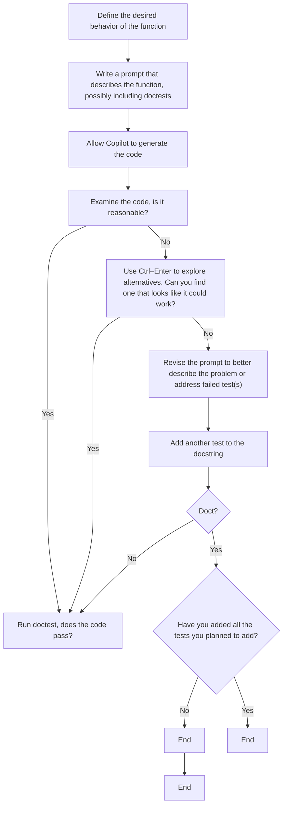
</details>

Figure 6.1 The function design cycle with Copilot, augmented to include more about testing

The figure is a bit more complex than before, but if we examine it closely, we can see much of the original process is retained. The things that have been added or changed include the following:

¡ When we write the prompt, we may include doctests as part of that initial prompt to help Copilot in generating the code.   
Having made our way through chapters 4 and 5, we’re in good shape to read the code to see whether it behaves properly, so we now have an additional step to address what happens when the initial code from Copilot looks wrong. If that occurs, we’ll use Ctrl–Enter to explore the Copilot suggestions hopefully finding a solution. If we can find such a solution, we’ll select it and move forward. If we can’t, we’ll need to revise our prompt to help Copilot generate us improved suggestions.   
¡	After finding code that looks like it could be correct, we’ll run doctest to see whether the code passes the doctests we included in the prompt (if we didn’t include any, it will pass automatically). If doctest passes, then we can continue adding tests and checking them until we’re happy that the code is functioning properly. If doctest fails, we will need to figure out how to modify the prompt to address the failed tests. Once the prompt is modified, it will hopefully help Copilot generate new code that may be capable of passing the tests that we’ve provided.

With this new workflow, we’re in a much better position not only to determine whether our code is working properly but also to fix the code if it isn’t already working. In the next chapters, we’ll give ourselves even more tools to help when the code isn’t working properly, but for now, let’s put this all together by solving a new problem and testing the Copilot solutions using the workflow we described here.

# 6.5 Full testing example

Let’s try a problem that we might need to solve to help students decide where to sit in in-person classes. Suppose we have the classroom layout as a two-dimensional list with rows of seats. Each seat either contains a space (' ') or a student ('S') to represent an empty or occupied seat, respectively. We’re going to ask Copilot to create a function to determine which row we could add the most students to, and along the way, we will design the tests needed to check whether the code is working properly.

# 6.5.1 Finding the most students we can add to a row

We want to figure out the largest number of new students we could add in a single row in the classroom. (Equivalently, we’re looking for the largest number of empty seats in any row.) For this, let’s start with a somewhat ambiguous prompt and see how well Copilot does.

Listing 6.4 Determining the largest number of students that can be added to a row   
```python
def most_students(classroom):
    ...
    classroom is a list of lists
    Each ' ' is an empty seat
    Each 'S' is a student

    How many new students can sit in a row?
    ...
    max_students = 0
    for row in classroom:
    students = 0
    for seat in row:
    if seat == 'S':
    students += 1
    else:
    students = 0
    if students > max_students:
    max_students = students
    return max_students 
```

For the sake of this example, our prompt wasn’t very good. “How many new students can sit in a row?” is a pretty reasonable description to give to a human, but it’s not that specific, and it’s easy to imagine Copilot struggling to interpret what we mean. Copilot might get confused about whether we are counting the number of students or the number of empty seats in a row, or it might return the total number of available seats in the classroom rather than in a row. It turns out that our prompt confused Copilot and the code isn’t correct, but before we dive into the code, let’s think about what tests we should run. We’ve come up with the following set of test cases:

A classroom with some number of consecutive empty seats and some number of nonconsecutive empty seats to make sure it isn’t just counting consecutive empty seats.   
A classroom with no empty seats to make sure it returns 0 in that case.   
A classroom with a row full of empty seats to make sure all are counted, including the first and last seats (edge case).   
A classroom with multiple rows with the same number of empty seats to make sure it returns just one of those values (and not, perhaps, the sum of the number of empty seats across all of these rows).

Let’s start by adding the first test case and adding the doctest code to run the test, as shown in the following listing.

Listing 6.5 Determining the largest number of students that can be added to a row   
```python
def most_students(classroom):
    ...
    classroom is a list of lists
    Each ' ' is an empty seat
    Each 'S' is a student

    How many new students can sit in a row?

    >>> most_students([['S', ' ', 'S', 'S', 'S', 'S'], \
    ['S', 'S', 'S', 'S', 'S'], \
    [' ', 'S', ' ', 'S', ' ', '']]) 4
    ...

    max_students = 0
    for row in classroom:
    students = 0
    for seat in row:
    if seat == 'S':
    students += 1
    else:
    students = 0
    if students > max_students:
    max_students = students
    return max_students

import doctest
doctest.testmod(verbose=False) 
```

When we run this code, we get this output (we cleaned up the formatting of the classroom list manually to help with the readability of the answer):

```txt
****************************************************************************************** 
```

```txt
Failed example:
most_students([['S', ' ', 'S', 'S', 'S', 'S'], ['S', 'S', 'S', 'S', 'S', 'S'], [' ', 'S', ' ', 'S', ' ', '']]) 
```

```txt
Expected: 
```

```rst
Got:
6
**************************
1 items had failures:
    1 of    1 in __main__.most_students
***Test Failed*** 1 failures. 
```

Although we’d prefer the code to work, we appreciate that the first test case found an error. The row with the most empty seats is the third row with four seats available. But the code from Copilot is incorrectly telling us the answer is six. That’s pretty odd. Even without reading the code, you might hypothesize that it’s counting either the number of seats per row or the maximum number of students seated per row. Our test case had a full row of students in row 2, so it’s hard to tell. What we can do is change the classroom to be

```python
>>> most_students([['S', ' ', 'S', 'S', 'S', 'S'], \
    [' ', 'S', 'S', 'S', 'S', 'S'], \
    [' ', 'S', ' ', 'S', ' ', '']]) ← We removed the first student from the row.
4 
```

So, the second row now has five students. When we run the code again, the test again fails with the code giving us an answer of five. It seems that the code isn’t just telling us the number of seats per row. It must be doing something related to where students are sitting. Our next step would be to improve the prompt and determine whether we can get better code from Copilot, but for completeness, let’s first explain what the code was really doing in the following listing.

Listing 6.6 Walkthrough of the incorrect code from Copilot   


<details>
<summary>flowchart</summary>

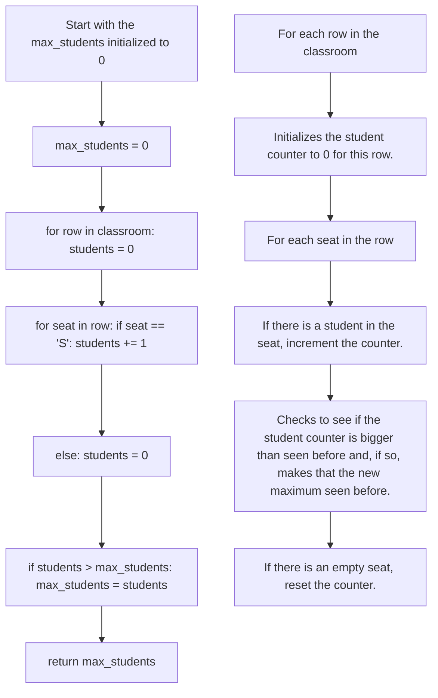
</details>

You can see from the code description what is happening per line, but at a high level, this code is counting the number of consecutive students in each row. It does this by initializing a counter to 0 for each row and then incrementing that counter as long as it keeps seeing a student in a seat. It also resets the counter as soon as it sees an empty seat. The if statement at the end of the inner loop is a pretty standard way of keeping track of the largest of something seen before, and in this case, it is keeping track of the largest number of consecutive students seen. That’s not at all what we wanted, and our poor prompt is partially to blame. The key piece, though, is that our test lets us know the code is incorrect! (If you spotted the error yourself in reading the code, that’s great, too!)

# 6.5.2 Improving the prompt to find a better solution

Let’s rewrite the prompt, keep the test case, and see whether we can do better in the following listing.

Listing 6.7 Second attempt to determine the largest number of students   
```python
def most_students(classroom):
    ...
    classroom is a list of lists
    Each ' ' is an empty seat
    Each 'S' is a student

    Return the maximum total number of '' characters in a given row.

    >>> most_students([['S', ' ', 'S', 'S', 'S', 'S'], \
    [' ', 'S', 'S', 'S', 'S', 'S'], \
    [' ', 'S', ' ', 'S', ' ', '']])

    4
    '''
    max_seats = 0
    for row in classroom:
    seats = row.count(' ') 
    if seats > max_seats:
    max_seats = seats
    return max_seats 
```  
import doctest doctest.testmod(verbose=False)

To get this solution, we had to look through the possible Copilot solutions using Ctrl– Enter. Some of the solutions now counted the consecutive occurrences of ' ', whereas others, like the one in the previous listing, passed the doctest. Oddly, the first time we tried the improved prompt, the suggested solution was correct. This is another reminder of why nondeterminism in the Copilot output makes testing so important.

Let’s take a minute and look at what made this second prompt better than the first. Both prompts had

```python
def most_students(classroom):
    '''
    classroom is a list of lists
    Each ' ' is an empty seat
    Each 'S' is a student 
```

The part of the prompt that led to us receiving the wrong answer was

How many new students can sit in a row?

The part of the prompt that yielded a correct answer was

Return the maximum total number of ' ' characters in a given row.

You can never really know why an LLM like Copilot produces the answer it does, but let’s remember that it’s trained to just make predictions of next words based on the words it’s been given and words that were in its training data (i.e., lots of code in GitHub). The first prompt asks Copilot to make some inferences, some of which it does well, and some not so well. The prompt, in a sense, is asking Copilot to know what a row is in a list of lists. Thankfully, that’s really common in programming, so it had no problem there.

Then the prompt asks Copilot to make the basic logical step of inferring that an empty seat is where a new student could sit. Here is where it struggled. We suspect that because we’re asking about students sitting in a row, it wasn’t able to make the jump to realize that “new” students would require figuring out how many students you can add or, in other words, how many empty seats there are. Instead, Copilot focused on the “students … in a row” part of the prompt and started counting students in each row. It could have also used the function name (which, admittedly, could be better; i.e., max\_ empty\_seats\_per\_row) to think it needs to count the maximum number of students. That’s not what we want, but we can understand how it makes this mistake.

Now let’s talk about why Copilot decided to count consecutive students in a given row. Maybe that’s a more common problem given to Copilot. Maybe it’s because “sit in a row” could be interpreted as “sit consecutively.” Or maybe it’s because when we were coding this example, we’d been working on another version of the problem that asked for consecutive empty seats, and Copilot remembered that conversation. We don’t know why Copilot gave us this answer, but we know that our prompt was too vague.

In contrast, our second prompt was more specific in a few ways. First, it clearly asks for the maximum (although the function name does that as well). Second, it asks for the number of spaces, or empty seats, in a row. That takes away the need for Copilot to infer that an empty seat means a spot for a new student. We also used “total” and “given row” to try to get Copilot out of its current approach to counting consecutive values, but that didn’t quite do the trick. Consequently, we ended up having to sift through Copilot answers (using Ctrl–Enter) that were sometimes looking for consecutive empty seats and sometimes finding the count of empty seats.

# 6.5.3 Testing the new solution

Returning to our example, because the new code passes the current test, let’s give it more tests to ensure it is behaving correctly. In the next test, we’ll check that the code properly returns 0 when there are no empty seats in any rows:

```python
>>> most_students([['S', 'S', 'S'], \
    ['S', 'S', 'S'], \
    ['S', 'S', 'S']]) 
```

The next test will ensure that the code properly counts all three open seats in a single row (here, row 2) so there isn’t an edge case problem (e.g., it fails to count the first or last element). Admittedly, looking at the code we can see the count function is being used, and since that function is built into Python, we should be fairly confident this test will pass. However, it’s still safer to test it to make sure:

```python
>>> most_students([['S', 'S', 'S'], \
    [' ', ' ', ' ], \
    ['S', 'S', 'S']])
3 
```

The last test checks to see that Copilot properly handles the case that two rows have the same number of open seats:

```python
>>> most_students([[' ', ' ', 'S'], \
    ['S', ' ', ' ], \
    ['S', 'S', 'S']])
2 
```

After adding these test cases, we again ran the full program, shown in the following listing, and all test cases passed.

Listing 6.8 Full code with doctests for determining the largest number of students   
```python
def most_students(classroom):
    ...
    classroom is a list of lists
    Each ' ' is an empty seat
    Each 'S' is a student

    Return the maximum total number of '' characters in a given row.

    >>> most_students([['S', ' ', 'S', 'S', 'S', 'S'], \
    [' ', 'S', 'S', 'S', 'S'], \
    [' ', 'S', ' ', 'S', ' ', '']])
    4
    >>> most_students([['S', 'S', 'S'], \
    ['S', 'S', 'S'], \
    ['S', 'S', 'S']])
    0
    >>> most_students([['S', 'S', 'S'], \
    [' ', ' ', ' ], \
    ['S', 'S', 'S']])
    3
    >>> most_students([[' ', ' ', 'S'], \
    ['S', ' ', ' ], \
    ['S', 'S', 'S']])
    2
    '''
    max_seats = 0
    for row in classroom:
    seats = row.count(' ') 
    if seats > max_seats: 
```

```python
max_seats = seats
return max_seats 
```

```python
import doctest
doctest.testmod(verbose=False) 
```

In this example, we saw how to write a function to solve a problem from start to finish. Copilot gave us the wrong answer, partially because of a difficult-to-interpret prompt. We figured out that it gave us the wrong answer because the code failed on our first test. We then improved the prompt and used the code reading skills we learned in the previous two chapters to pick out a solution that looked correct for our needs. The new code passed our initial basic test, so we added more test cases to see whether the code worked in more situations. After seeing it pass those additional tests, we have more evidence that the code is correct. At this point, we’ve tested the common cases and edge cases, so we are highly confident that the code is correct at this point. Regarding testing, this example showed us how tests can help us find mistakes and give us more confidence that the code will function properly.

# 6.6 Another full testing example—Testing with files

In most cases, you’ll be able to test your code by adding examples to the docstring like we did in the last example. However, there are times when testing can be a bit more challenging. This is true when you need to test your code against some kind of external input. An example is when one needs to test code that interacts with external websites, but this is more common in advanced code than the kind of code you’ll be creating within the scope of this book. An example that is within the scope of this book is working with files. How do you write test cases when your input is a file? Python does support doing this in a way internal to the docstring here, but for continuity with what we’ve already done, we’re not going to do it that way. Instead, we’ll use external files to test our code. Let’s see how to do that by revising our NFL quarterback (QB) example from chapter 2.

We could walk through an example with the entire file, but since our queries about quarterbacks were only for the first nine columns of the file, we’re going to strip off the remaining columns of the file to make things more readable. After stripping off the remaining columns, table 6.2 shows the first four rows of the file.

Table 6.2 The first three lines of an abridged version of the NFL dataset 

<table><tr><td>game_id</td><td>player_id</td><td>position</td><td>player</td><td>team</td><td>pass_cmp</td><td>pass_att</td><td>pass_yds</td><td>pass_td</td></tr><tr><td>201909050chi</td><td>RodgAa00</td><td>QB</td><td>Aaron Rodgers</td><td>GNB</td><td>18</td><td>30</td><td>203</td><td>1</td></tr><tr><td>201909050chi</td><td>JoneAa00</td><td>RB</td><td>Aaron Jones</td><td>GNB</td><td>0</td><td>0</td><td>0</td><td>0</td></tr><tr><td>201909050chi</td><td>ValdMa00</td><td>WR</td><td>Marquez Valdes-Scantling</td><td>GNB</td><td>0</td><td>0</td><td>0</td><td>0</td></tr></table>

We’ll assume that each row in the dataset has just these nine columns for the remainder of the example, but we hope it’s not a big stretch to imagine how to do this for the full dataset (you’d just need to add all the additional columns in each case).

Suppose we want to make a function that takes in the filename of the dataset and the name of a player as input and then outputs the total number of passing yards that player achieved in the dataset. We’ll assume that the user will be providing the data as formatted in the NFL offensive stats file in chapter 2 and in table 6.2. Before we write the prompt or function, how should we test this? Well, we have some options:

1 Find tests in the larger dataset—A solution is to give the full dataset to the function and multiple player names as inputs. The challenge is figuring out whether we are correct or not. We could open the file in spreadsheet software like Google Sheets or Microsoft Excel and, using the tool, figure out the answer for each player. For example, we could open the sheet in Excel, sort by player, find a player, and use the sum function in Excel to add up all the passing yards for that player. This isn’t a bad solution at all, but it’s also a fair bit of work, and if you put enough time into finding the answer for testing, you might have already fulfilled your needs and no longer require the Python code! In other words, figuring out the answer for the test cases might just give you the answer you wanted in the first place, making the code less valuable. Another problem is in finding all the edge cases you might want to test: Will your dataset have all the edge cases you’d want to test to write a program that will work on other datasets later? Yet another drawback of this approach is determining what you do when the function is doing something considerably more complicated than just summing a value in a bunch of rows? There, figuring out the answers for some real test values might be a great deal of work.

2 Create artificial dataset(s) for testing—Another solution would be to create artificial datasets where you know the answer to a number of possible queries. Because the dataset is artificial, you can add edge cases to see how the code performs in those edge cases without having to find examples in the real dataset that test those edge cases. (Indeed, sometimes the real dataset won’t include those edge cases, but you still want to test them, so the code behaves properly if you get an updated or new dataset.)

Given the advantages to creating test cases in an artificial dataset, we’re going to proceed with that approach here.

# 6.6.1 What tests should we run?

Let’s think through the common cases and edge cases that we would want to test. For common cases, we’d want to have a few tests:

1 A player appears multiple times in different rows of the dataset (nonconsecutively), including the last row. This test makes sure the code iterates over all the players before returning a result (i.e., doesn’t make the false assumption that the data is sorted by player name).

2 A player appears in consecutive rows of the dataset. This test makes sure there isn’t some kind of error where consecutive values are somehow skipped.   
3 A player appears just once in the dataset. This test makes sure that the sum behaves properly even when it is just summing one value.   
4 A non-quarterback should appear in the dataset, so we ensure the code is including all players, not just quarterbacks.   
5 A player who has 0 total passing yards in a game. This checks to make sure that the code behaves properly when players don’t have any passing yards. This is a common case to test because players can get hurt and miss a game due to the injury.

For edge cases, we’d want to test a couple more things:

1 The player isn’t in the dataset: This is actually pretty interesting: What do we want the code to do in this case? A reasonable answer is to return that they passed for 0 yards. If we asked the dataset how many yards Lebron James (a basketball player, not a football player) passed for in the NFL from 2019–2022, 0 is the right answer. However, this may not be the most elegant solution for production code. For example, if we ask for the passing yards for Aron Rodgers (misspelling Aaron Rodgers), we’d rather have the code tell us he’s not in the dataset than that he passed for 0 yards, which could really confuse us when he won the league MVP twice during this time frame. To signal that the name was missing, we might return a large negative value (e.g., –9999), or we might use something called exceptions, but they are beyond the scope of this book.   
2 A player has a negative total number of yards across all games or a player has a single game with negative yards to ensure the code is properly handling negative values: If you don’t follow American football, this can happen if a player catches a ball and is tackled behind the starting point (line of scrimmage). It’s unlikely a quarterback would have negative passing yards for an entire game, but it could happen if they throw one pass for a loss (negative yards) and get hurt at the same time, causing them to not play for the rest of the game.

Now that we have an idea of what we want to test, let’s build an artificial file that captures these test cases. We could have split these tests across multiple files, and that’d be a reasonable choice to make as well, but an advantage of putting them all in one file is that we can keep all of our test cases together. Table 6.3 is what we built and saved as test\_file.csv.

Table 6.3 Our file to test the NFL passing yards function 

<table><tr><td>game_id</td><td>player_id</td><td>position</td><td>player</td><td>team</td><td>pass_cmp</td><td>pass_att</td><td>pass_yds</td><td>pass_td</td></tr><tr><td>201909050chi</td><td>RodgAa00</td><td>QB</td><td>Aaron Rodgers</td><td>GNB</td><td>20</td><td>30</td><td>200</td><td>1</td></tr><tr><td>201909080crd</td><td>JohnKe06</td><td>RB</td><td>Kerryon Johnson</td><td>DET</td><td>1</td><td>1</td><td>5</td><td>0</td></tr><tr><td>201909080crd</td><td>PortLe00</td><td>QB</td><td>Leo Porter</td><td>UCSD</td><td>0</td><td>1</td><td>0</td><td>0</td></tr><tr><td>201909080car</td><td>GoffJa00</td><td>QB</td><td>Jared Goff</td><td>LAR</td><td>20</td><td>25</td><td>200</td><td>1</td></tr><tr><td>201909050chi</td><td>RodgAa00</td><td>QB</td><td>Aaron Rodgers</td><td>GNB</td><td>10</td><td>15</td><td>150</td><td>1</td></tr><tr><td>201909050chi</td><td>RodgAa00</td><td>QB</td><td>Aaron Rodgers</td><td>GNB</td><td>25</td><td>35</td><td>300</td><td>1</td></tr><tr><td>201909080car</td><td>GoffJa00</td><td>QB</td><td>Jared Goff</td><td>LAR</td><td>1</td><td>1</td><td>-10</td><td>0</td></tr><tr><td>201909080crd</td><td>ZingDa00</td><td>QB</td><td>Dan Zingaro</td><td>UT</td><td>1</td><td>1</td><td>-10</td><td>0</td></tr><tr><td>201909050chi</td><td>RodgAa00</td><td>QB</td><td>Aaron Rodgers</td><td>GNB</td><td>15</td><td>25</td><td>150</td><td>0</td></tr></table>

Notice that the data here is entirely artificial. (These are not the real statistics for any player, as you can tell by the fact Dan and Leo are now magically NFL quarterbacks.) We did keep the names of some real players as well as real game\_ids and player\_ids from the original dataset. It’s generally a good idea to make your artificial data be as close to real data as possible so that the tests are genuine and more apt to be representative of what will happen with real data.

Let’s look at how we incorporated all the test cases in this test file. Aaron Rodgers occurs multiple times in the file, both consecutively and nonconsecutively, and as the last entry. Jared Goff appears multiple times, and we gave him an artificial –10 yards in a game (as Jared Goff’s an elite NFL QB, I hope he’s okay with us giving him an artificially bad single game). We kept Kerryon Johnson as a running back (RB) from the real dataset and gave him 5 passing yards to make sure the solution doesn’t filter for only QBs. Kerryon Johnson also only has one entry in the data. We added Leo Porter to the dataset and gave him 0 passing yards (he’s pretty sure he’d do anything to not get tackled by an NFL player). We also added Dan Zingaro and gave him a completed pass, but for –10 yards, covering the case that a single player’s total is negative. Table 6.4 shows what it should return per player when we run the query for each player.

Table 6.4 Passing yards per player in the test case 

<table><tr><td>Player</td><td>Passing yards in the test case</td></tr><tr><td>Aaron Rodgers</td><td>800</td></tr><tr><td>Kerryon Johnson</td><td>5</td></tr><tr><td>Leo Porter</td><td>0</td></tr><tr><td>Jared Goff</td><td>190</td></tr><tr><td>Dan Zingaro</td><td>-10</td></tr></table>

# 6.6.2 Creating the function

Let’s start with the function name and describe the problem in the docstring. This problem may be complicated enough that we’ll need to offer prompts within the function to help it know to open the file, process the data, and close the file, but let’s try to just describe the function first and see how Copilot does.

Listing 6.9 Function to find total passing yards per player   
```python
def tot_pass_yds_player(input_file, player):
    """
    input_file is a string that is the name of a file
    player is the name of a player

    The file is a csv file with a header row
    Column 4 is the player's name and column
    8 is the number of passing yards for that player

    return the total number of passing yards for the player
    """
    import csv
    with open(input_file, 'r') as csvfile:
    reader = csv.reader(csvfile)
    next(reader)
    total = 0
    for row in reader:
    if row[3] == player:
    total += int(row[7])
    return total 
```

Before looking at the code produced, we want to point out that we didn’t include the test cases for this example because they likely wouldn’t help Copilot. We recommend having Copilot generate code prior to you adding test cases if your test cases will simply open and use artificial files. Each test case will just be a filename, a player, and the expected output. Copilot likely can’t read the file that corresponds to that filename and figure out that we’re summing the eighth column to get the desired result. This means that giving Copilot the test cases isn’t going to add to the quality of the prompt. In fact, the artificial nature of our data might even confuse it (e.g., in what scenario does a real NFL player have a negative total for passing yards?)

Now looking at the code that Copilot gave us, we can see that it is quite reasonable and almost identical to the code we saw in chapter 2. Given that it seems reasonable when we read it, let’s see how to test it.

# 6.6.3 Testing the function

To test the function, we’ll augment the docstring to include our test cases for the full piece of code, as shown in the following listing.

Listing 6.10 Testing the function to find total passing yards per player   
```python
def tot_pass_yds_player(input_file, player):
    """
    input_file is a string that is the name of a file
    player is the name of a player

    The file is a csv file with a header row
    Column 4 is the player's name and column
    8 is the number of passing yards for that player

    return the total number of passing yards for the player

    >>> tot_pass_yds_player('test_file.csv', 'Aaron Rodgers')
    800
    >>> tot_pass_yds_player('test_file.csv', 'Kerryon Johnson')
    5
    >>> tot_pass_yds_player('test_file.csv', 'Leo Porter')
    0
    >>> tot_pass_yds_player('test_file.csv', 'Dan Zingaro')
    -10
    >>> tot_pass_yds_player('test_file.csv', 'Jared Goff')
    190
    >>> tot_pass_yds_player('test_file.csv', 'Tom Brady')
    0
    """
    import csv
    with open(input_file, 'r') as csvfile:
    reader = csv.reader(csvfile)
    next(reader)
    total = 0
    for row in reader:
    if row[3] == player:
    total += int(row[7])
    return total 
```

We ran this code, and all the test cases passed. We have additional evidence that the code is functioning properly!

# 6.6.4 Common challenges with doctest

Let’s rewrite the previous prompt and add a really subtle error to the first test, as shown in the following listing.

Listing 6.11 Mistake in doctest   
```python
def tot_pass_yds_player(input_file, player):
    """
    input_file is a string that is the name of a file
    player is the name of a player

    The file is a csv file with a header row 
```

```python
The 4th Column is the player's name and the 8th column
is the number of passing yards for that player

return the total number of passing yards for the player

>>> tot_pass_yds_player('test_file.csv', 'Aaron Rodgers')
800

>>> tot_pass_yds_player('test_file.csv', 'Kerryon Johnson')
5

>>> tot_pass_yds_player('test_file.csv', 'Leo Porter')
0

>>> tot_pass_yds_player('test_file.csv', 'Dan Zingaro')
-10

>>> tot_pass_yds_player('test_file.csv', 'Jared Goff')
190

>>> tot_pass_yds_player('test_file.csv', 'Tom Brady')
0

```"
import csv
with open(input_file, 'r') as csvfile:
    reader = csv.reader(csvfile)
    next(reader)
    total = 0
    for row in reader:
    if row[3] == player:
    total += int(row[7])
    return total

import doctest
doctest.testmod(verbose=False) 
```

When we ran this code, we received this error:

```csv
Failed example:
tot_pass_yds_player('test_file.csv', 'Aaron Rodgers')
Expected:
800
Got:
800 
```

On first glance, this seems really odd. The test case expects 800 and it got 800, but it’s telling us it failed. Well, it turns out that we made a mistake in writing the test case and wrote “800 ” (with a space at the end) rather than “800”. This mistake causes Python to think the space is important and causes the test to fail. The bad news is that this is a really common problem working with doctest! We’ve made this mistake more often than we’d like to admit. The good news is it’s really easy to fix by just finding and deleting the space. If a test is failing but the output from doctest suggests that it should be passing, always check ends of lines for spaces or extra or missing spaces in your output compared to exactly what doctest is expecting.

Given that all our test cases passed, we can feel confident returning to the larger dataset and using the function we just created. The key thing from this example is that we can, and should, create artificial files to test functions that work with files. Again, testing is all about gaining confidence that the code is working properly, and you want to be sure you test any code you write or is given to you by Copilot.

In this chapter as a whole, we learned about the importance of testing code, how to test code, and how to do it in two detailed examples. In our examples, we wrote and tested functions. But how do we decide which functions should be written to solve even larger problems? Well, we figure that out through a process known as problem decomposition that we’ll cover in detail in our next chapter.

# Summary

Testing is a critical skill when writing software using Copilot.   
¡ Closed-box and open-box testing are different approaches to ensuring the code is correct. In closed-box testing, we come up with test cases based on what we know about the problem; in open-box testing, we additionally examine the code itself.   
Doctest is a convenient way to test your code by adding test cases to the docstring description of a function.   
¡ Creating artificial files is an effective way to test code that uses files.

# Problem decomposition

# This chapter covers

¡	Understanding problem decomposition and why we need to do it   
¡	Using top-down design to carry out problem decomposition and write programs   
¡	Writing an authorship identification program using top-down design

In chapter 3, we talked about why we shouldn’t ask Copilot to solve big problems. Imagine what could happen if we asked Copilot, “Write a program to determine the author of a book.”

In the best case, we’d get a canned program with all of the decisions made for us. That program may not match what we wanted. Part of the power of being a programmer is customizing what we’re creating. To do this, we need to feed small subproblems to Copilot and assemble those solutions into a program of our own. Even if we didn’t want to customize anything, what would we do if the program from Copilot had flaws? It would be difficult for us to fix a large program that we don’t understand.

In the worst case, Copilot wouldn’t do anything useful. We observe this sometimes when Copilot gives us comments again and again but never provides us with real code.

In this chapter, we will learn how to break large problems into smaller ones. We can then use Copilot to solve each of the small subproblems, thereby solving the large problem that we ultimately care about solving.

# 7.1 Problem decomposition

Problem decomposition involves starting with a large problem that may not be fully specified and breaking it down into subproblems, each of which is well-defined and useful for solving our overall problem. Our goal is to write a function to solve each of those subproblems. We may be able to do this for some subproblems without any further work. But other subproblems may still be too big for us to capture in a function of reasonable size. (In chapter 3, we mentioned that we want to keep functions short— something like 12–20 lines—to give us the best chance of getting good code from Copilot, testing that code, and fixing bugs in that code if necessary.) If a subproblem is still too large to be implemented in a single function, then we further divide that subproblem into sub-subproblems of their own. Hopefully, each of those sub-subproblems will be small enough now, but if not, we will continue dividing those, too! The key reason we do this is to manage complexity. Each function should be simple enough that we can understand its purpose and that Copilot can solve it well. When we ask ourselves or Copilot to write code that is extremely complex, we, and Copilot, often make mistakes.

The process of starting with a large problem and breaking it down is called top-down design. Once we have completed the top-down design, we can implement these functions in code. We’ll have one function for our overall problem, which will call the functions for each of our subproblems. Each of those subproblem functions will further call their own functions, as needed, to solve any of their sub-subproblems, and so on.

As we discussed in chapter 3, we’re looking to end up with functions that each have a small role to play in our overall program and whose behavior is clearly defined. We’re also looking for opportunities to design small functions that are called by multiple other functions to reduce complexity of those larger functions and prevent code repetition. Finally, we seek to design functions that have a small number of parameters and return a meaningful and useful result to the function that calls them.

# 7.2 Small examples of top-down design

We’ll soon jump into an authentic example of how top-down design works, but we’d first like to set the stage using a couple of our earlier examples. Let’s think about the design of a function we previously wrote in chapter 3: get\_strong\_password. It repeatedly prompts the user for a password until they enter a strong password. Don’t go back and look at that code—we want to start fresh here.

Suppose that we want to use a top-down design to write this function. If it’s one small, well-defined task, we may be able to implement it directly as a single function. However, for this function, we do see a subtask; namely, what’s a strong password? What are the rules around that? To us, this sounds like a subtask that we can try to carve out of this function to make it simpler. Indeed, in chapter 3, when we wrote this function, we did call our earlier is\_strong\_password function, which makes the True/False decision about what it means for a password to be strong.

We can depict this top-down design as shown in figure 7.1. For ease of displaying what will ultimately be large figures later in the chapter, we’re going to consistently show the design from left to right rather than top to bottom, but the same fundamental principles still apply.


<details>
<summary>flowchart</summary>

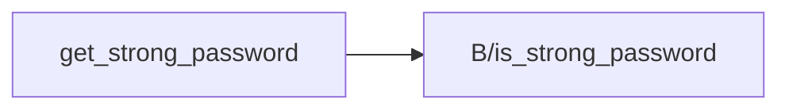
</details>

Figure 7.1 Functions diagram for the get\_strong\_password function. get\_strong\_password calls is\_strong\_password.

This figure indicates that it is our goal to have get\_strong\_password call is\_strong\_ password to do some of its work.

Also, in chapter 3, we wrote a best\_word function that takes a list of words as its parameter and returns the one worth the most points. Again, don’t go back and look at that code—we want to figure it out again here. Let’s think about what the code might look like. It will probably use a loop to consider each word, and in that loop, it will need to keep track of the best word we’ve seen so far. For each word, we need to figure out how many points it’s worth by adding up the number of points for each of its letters. Remember that A is worth 1 point, B is worth 3 points, C is worth 3 points, D is worth 2 points, E is worth 1 point, and so on.

Whoa there! We’re really going in-depth on this “How many points each letter is worth?” thing. This sounds like a subtask to us. If we had a function that we could call to tell us the number of points each word is worth, we wouldn’t need to worry about this points business in our best\_word function. In chapter 3, we wrote a function called num\_points that carries out exactly this task: take a word as a parameter and return its total point value. We can call num\_points from best\_word, as depicted in figure 7.2. Again, this makes the task of best\_word easier for us.


<details>
<summary>flowchart</summary>

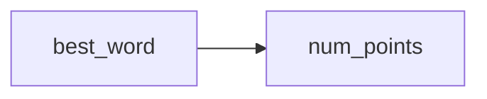
</details>

Figure 7.2 Functions diagram for best\_word

In chapter 3, we happened to write these functions from subtask to task, from the leaf function to the parent function. We will continue to do that in this chapter, but we will do the top-down design first to figure out which functions we’ll need.

The two examples we just talked about are small, and you may indeed be able to get their code written by powering ahead with a single function. But with a large example, as we will see next, top-down design is the only way to keep the complexity under control.

We’ve chosen our upcoming large example for a couple of reasons. First, the process of top-down design is quite abstract, and we feel that this authentic example will make it much more concrete. Second, we want to solve a problem with you that we hope is motivating and feels like a real problem that you could imagine yourself wanting to solve.

We’re going to write a program that tries to identify the author of a mystery book whose author we don’t know. It’ll be an example of a program that uses artificial intelligence (AI) to make a prediction. (We couldn’t resist the opportunity to include an AI example in a book about programming with AI!)

The key skill that we want you to take from this chapter is how to break a large problem down into smaller subproblems. We are going to code up the whole solution using Copilot, but don’t take this to mean that we want you to fully grasp how all of the code fits together. Rather, we’re coding it up to show you that once we do top-down design, we can implement each function on its own and get a fully working program.

# 7.3 Authorship identification

This problem is based on an assignment created by our colleague Michelle Craig [1]. Let’s start by taking a look at these two book excerpts:

# Excerpt 1

I have not yet described to you the most singular part. About six years ago—to be exact, upon the 4th of May 1882—an advertisement appeared in the Times asking for the address of Miss Mary Morstan and stating that it would be to her advantage to come forward. There was no name or address appended. I had at that time just entered the family of Mrs. Cecil Forrester in the capacity of governess. By her advice I published my address in the advertisement column. The same day there arrived through the post a small card-board box addressed to me, which I found to contain a very large and lustrous pearl. No word of writing was enclosed. Since then, every year upon the same date there has always appeared a similar box, containing a similar pearl, without any clue as to the sender. They have been pronounced by an expert to be of a rare variety and of considerable value. You can see for yourselves that they are very handsome.

# Excerpt 2

It was the Dover Road that lay on a Friday night late in November, before the first of the persons with whom this history has business. The Dover Road lay, as to him, beyond the Dover mail, as it lumbered up Shooter’s Hill. He walked up hill in the mire by the side of the mail, as the rest of the passengers did; not because they had the least relish for walking exercise, under the circumstances, but because the hill, and the harness, and the mud, and the mail, were all so heavy, that the horses had three times already come to a stop, besides once drawing the coach across the road, with the mutinous intent of taking it back to Blackheath. Reins and whip and coachman and guard, however, in combination, had read that article of war which forbade a purpose otherwise strongly in favour of the argument, that some brute animals are endued with Reason; and the team had capitulated and returned to their duty.

Suppose we asked you whether these two excerpts were likely written by the same author. One assumption you might make is that different authors write differently, and that these differences would show up in metrics that we could calculate about their texts.

For example, whoever wrote the first excerpt seems to use quite a few short sentences in terms of number of words compared to the second excerpt. We find short sentences like “There was no name or address appended” and “No word of writing was enclosed” in the first excerpt; those kinds of sentences are absent from the second. Similarly, the sentences from the first excerpt seem to be less complex than those in the second; look at all of those commas and semicolons in the second excerpt.

This analysis may lead you to believe that these texts are written by different authors, and, indeed, they are. The first is written by Sir Arthur Conan Doyle, and the second, by Charles Dickens.

To be fair, we’ve absolutely cherry-picked these two excerpts. Doyle does use some long, complex sentences. Dickens does use some short ones. But, on average, at least for the two books that we took these excerpts from, Doyle does write shorter sentences than Dickens. More generally, if we look at two books written by different authors, we might expect to find some quantifiable differences on average.

Suppose that we have a bunch of books whose authors we know. We have one written by Doyle, one written by Dickens, and so on. Then, along comes a mystery book. Oh no! We don’t know who wrote it! Is it a lost Sherlock Holmes story from Doyle? A lost Oliver Twist sequel from Dickens? We want to find out who that unknown author is.

Our strategy will be to come up with a signature for each author, using one of the books we know they wrote. We’ll refer to these signatures as known signatures. Each of these signatures will capture metrics about the book text, such as the average number of words per sentence and the average sentence complexity. Then, we’ll come up with a signature for the mystery book with an unknown author. We’ll call this the unknown signature. We’ll look through all the known signatures, comparing each one to our unknown signature. We’ll use whichever is the closest as our guess for the unknown author.

Of course, we have no idea if the unknown author is really one of the authors whose signatures we have. It could be a completely new author, for example. Even if the unknown author is one of the authors whose signature we have, we still might end up guessing wrong. After all, maybe the same author writes books in different styles (giving their books very different signatures), or we simply fail to capture what is most salient about how each of our authors writes. Indeed, we’re not after an industry-strength author identification program in this chapter. Still, considering the difficulty of this task, we think it’s impressive how well the approach that we’ll show you here works.

# Machine Learning

Authorship identification, as we’re doing here, is a machine learning (ML) task. ML is a branch of AI designed to help computers “learn” from data in order to make predictions. There are various forms of ML; the one we’re doing here is called supervised learning. In supervised learning, we have access to training data, which consists of objects and their known categories (or labels). In our case, our objects are book texts, and the category for each book is the author who wrote it. We can train (i.e., learn) on the training set by calculating features—average number of words per sentence, average sentence complexity, and so on—for each book. Later, when we’re provided a book whose author we don’t know, we can use what we learned in the training to make our guess.

# 7.4 Authorship identification using top-down design

Alright, we want to “write a program to determine the author of a book.” This seems like a daunting task, and it indeed would be if we were trying to do this in one shot, using a single function. But we’re not going to do that. We’re going to systematically break this problem down into subproblems that we can solve.

In chapter 2, we learned that many programs follow a model of reading input, processing that input, and producing an output result. We can think about our authorship identification program as following that model as well:

For the input step, we need to ask the user for the filename of the mystery book.   
For the process step, we need to figure out the signature for the mystery book (that’s the unknown signature), as well as the signature for each of the books whose author we know (those are the known signatures). We also need to compare the unknown signature to each known signature to figure out which known signature is closest.   
For the output step, we need to report to the user the unknown signature that’s closest to the known signature.

That is, to solve our overall authorship identification problem, we need to solve these three subproblems. We’re starting our top-down design!

We’ll name our top-level function make\_guess. In it, we will solve each of the three subproblems we identified.

For the input step, we’re simply asking the user for a filename. That sounds like something we can do in a small number of lines of code, so we probably don’t need a separate function for that. The output step seems similar: assuming that we already know which known signature is closest, we can just report that to the user. By contrast, the process step looks like a lot of work, and we’ll certainly want to break that subproblem down further. That’s what we’ll do next!

# 7.5 Breaking down the process subproblem

We’ll name our overall process function process\_data. It will take the mystery book filename and the name of a directory of known-author books as parameters and return the name of the closest known signature.

Looking at our description for the process step, it seems that we have three subproblems to solve here:

Figure out the signature for the mystery book. That’s our unknown signature. We’ll name this function make\_signature.   
Figure out the signature for each of the books whose author we know. These are our known signatures. We’ll name this function get\_all\_signatures.   
¡ Compare the unknown signature to each known signature to figure out which known signature is closest. Since close signatures will have small differences, we’ll name this function lowest\_score.

We’ll work on our top-down design for each of these subproblems in turn. Figure 7.3 shows a diagram of what we have so far.


<details>
<summary>flowchart</summary>

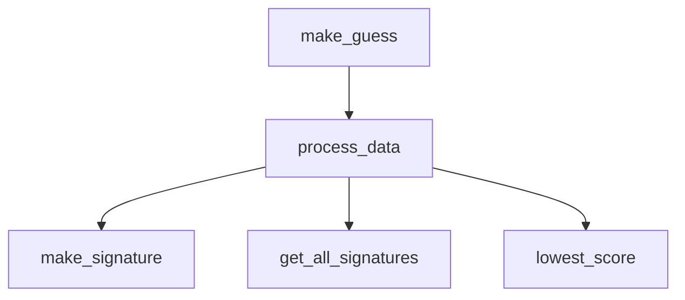
</details>

Figure 7.3 Functions diagram with three subtasks of process\_data

# 7.5.1 Figuring out the signature for the mystery book

The function for this task, make\_signature, will take the text for our book as a parameter and return the book’s signature. At this point, we need to decide on the features that we’ll use to determine the signature for each book. Let’s break this down by thinking back to the previous example passages. We noticed there are differences in the authors passages based on the complexity and length of sentences. You may have also suspected that the authors may differ in the length of words used and ways they use words (e.g., some authors may be more repetitive than others). As such, we’ll want some features to be based on the structure of the author’s sentences and others based on the words that the author uses. We’ll look at each of these in detail.

# Features related to the structure of the author’s sentences

In our earlier Doyle versus Dickens example, we talked about using the average number of words per sentence as one feature. We can calculate this by dividing the total number of words by the total number of sentences. For example, consider the text:

The same day there arrived through the post a small card-board box addressed to me, which I found to contain a very large and lustrous pearl. No word of writing was enclosed.

If you count the words and sentences, you should find that there are 32 words (cardboard counts as one word) and two sentences, so we’ll calculate the average words per sentence as $3 2 / 2 = 1 6$ . This will be the average number of words per sentence feature.

We also noticed that the complexity of sentences may vary between authors (i.e., some authors have sentences with many more commas and semicolons compared to other authors), so it makes sense to use that as another feature. More complex sentences have more phrases, which are coherent pieces of sentences. Breaking a sentence into its component phrases is a tough challenge in its own right, and although we could try to do it more accurately, we’ll settle here for a simpler rule of thumb. Namely, we’ll say that a phrase is separated from other phrases in the sentence by a comma, semicolon, or colon. Looking at the previous text again, we find that there are three phrases. The first sentence has two phrases: “The same day there arrived through the post a small card-board box addressed to me” and “which I found to contain a very large and lustrous pearl.” The second sentence has no commas, semicolons, or colons, so it has only one phrase. As there are three phrases and two sentences, we’d say that the sentence complexity for this text is $3 / 2 = 1 . 5$ . This will be the average sentence complexity feature.

We hope that these sentence-level features intuitively make sense as things we could use to differentiate how authors write. Next, let’s start looking at the ways that authors may differ in their use of words.

# Features related to the author’s word selection

You can probably think of your own metrics for word-level features, but we’ll use three here that in our experience work well.

First, it’s likely that some authors use shorter words on average than other authors. To that end, we’ll use the average word length, which is just the average number of letters per word. Let’s consider this sample text that we created:

A pearl! Pearl! Lustrous pearl! Rare. What a nice find.

If you count the letters and words, you should find that there are 41 letters and 10 words. (Don’t count punctuation as letters here.) So, we’ll calculate the average word length as $4 1 / 1 0 = 4 . 1 $ . This will be the average word length feature.

Second, it may be that some authors use words more repetitively than others. To capture this, we’ll take the number of different words that the author uses and divide it by the total number of words. For our previous sample text, there are only seven different words used: a, pearl, lustrous, rare, what, nice, and find. There are 10 words in all, so our calculation for this metric would be $7 / 1 0 = 0 . 7$ . This will be the different words divided by total words feature.

Third, it may be that some authors tend to use many words a single time, whereas other authors tend to use words multiple times. To calculate this one, we’ll take the number of words used exactly once and divide it by the total number of words. For our sample text, there are five words that are used exactly once: lustrous, rare, what, nice, and find. There are 10 words in all, so our calculation for this metric would be 5/10 = 0.5. This will be the number of words used exactly once divided by total words feature.

In all, we have five features that will make up each signature. We’ll need to store those numbers together in a single value, so we’ll end up using a list of five numbers for each signature.

Let’s dig into how we’ll implement each of these features, starting with the wordlevel ones and proceeding to the sentence-level ones. We’ll go in this order:

Average word length   
Different words divided by total words   
Words used exactly once divided by total words   
Average number of words per sentence   
Average sentence complexity

For each one, we’ll ultimately end up writing a function. We have an updated diagram with function names for each of these five new functions that will help make\_ signature in figure 7.4. Do we need to further break down these problems, or are they OK as is? Let’s see!


<details>
<summary>flowchart</summary>

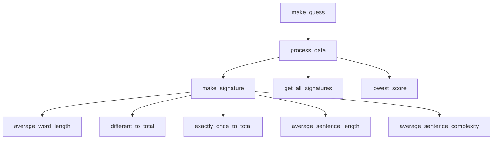
</details>

Figure 7.4 Functions diagram with additional five subtasks of make\_signature

# Av erage word length

The function for this task, average\_word\_length, will take the text of the book as a parameter and return the average word length.

We might start solving this task by using the split method in the text. As a reminder, the split method is used to split a string into a list of its pieces. By default, split will split around spaces. The book text is a string, and if we split around spaces, we’ll get its words! That’s exactly what we need here. We can then loop through that list of words, counting up the number of letters and number of words.

That’s a good start, but we need to be a little more careful here because we don’t want to end up counting nonletters as letters. For example, “pearl” has five letters. But so does “pearl.” or “pearl!!” or “(pearl)”. Aha! This sounds like a subtask to us! Namely, we can divide out the subtask of cleaning up a word into its own function to be used by average\_word\_length. We’ll call that cleanup function clean\_word.

There’s another benefit to having our clean\_word function, and that’s to help us identify when a “word” is actually not a word. For example, suppose one of our “words” in the text is “...”. When we pass this to clean\_word, we’ll get an empty string back. That signifies that this in fact is not a word at all, so we won’t count it as such.

# Different words div ided by total words

The function for this task, different\_to\_total, will take the text of the book as a parameter and will return the number of different words used divided by the total number of words.

As with average\_word\_length, we need to be careful to count only letters, not punctuation. But wait—we just talked about a clean\_word function that we needed for average\_word\_length. We can use that function here as well! In fact, we’ll use clean\_ word in most of our five feature tasks. This is the sign of a useful general-purpose function! Our top-down design is going well. We can see how the clean\_word function will be called by both functions in our updated function diagram in figure 7.5.


<details>
<summary>flowchart</summary>

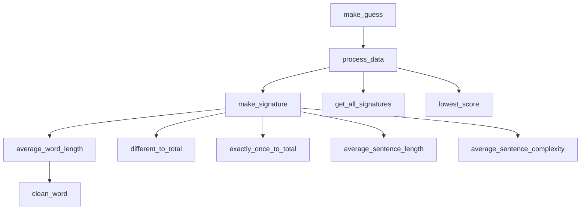
</details>

Figure 7.5 Functions diagram with two functions, both using our clean\_word function to help

There’s one extra complication here, though, and it involves words like pearl, Pearl, and PEARL. We want to consider those to be the same words, but if we simply use string comparisons, they will be treated as different words. One solution here is to split this off into another subproblem to convert a string to all lowercase. We could also think of this as another part of cleaning up a word, right along with removing the punctuation. We’ll go with this second option. What we’ll do, then, is make our clean\_word function not only remove punctuation but also convert the word to lowercase.

You might wonder whether we need to split off another subtask here, one that determines the number of different words. You could indeed do that, and it would not be a mistake to do so. However, if we persevere without doing that, we will see that the function remains quite manageable without this additional subtask. Practice and experience over time will help you anticipate when a task needs to be further broken down.

# Words used exactly once div ided by total words

The function for this task, exactly\_once\_to\_total, will take the text of the book as a parameter and will return the number of words used exactly once divided by the total number of words.

We’re going to need our clean\_word function here as well for reasons similar to why we needed it in the prior two tasks: to make sure we’re working only with letters, not punctuation.

And again, while we could split out a subtask to determine the number of words that are used exactly once, we’ll find that it doesn’t take much Python code to do this, so we’ll just leave this task alone without splitting it further.

# Av erage number of words per sentence

The function for this task, average\_sentence\_length, will take the text of the book as a parameter and will return the average number of words per sentence.

To split our text into words for the previous three tasks, we can use the string split method. How do we split our text into sentences? Is there a string method for that?

Unfortunately, not. For that reason, it will be helpful to split out a task to break our text string into sentences. We’ll call the function for that subtask get\_sentences. get\_ sentences will take the text of the book as a parameter and will return a list of sentences from the text.

What’s a sentence? We’ll define a sentence as text that is separated by a period (.), question mark (?), or exclamation point (!). This rule, while convenient and simple, is going to make mistakes. For example, how many sentences are in this text?

I had at that time just entered the family of Mrs. Cecil Forrester in the capacity of governess.

The answer is one. Our program, though, is going to pull out two sentences, not one. It’ll get tricked by the word Mrs., which has a period at the end. If you continue with authorship identification past this chapter, you could work on making your rules more robust or, indeed, use sophisticated natural language processing (NLP) software to do even better, but for our purposes, we’ll be content with this rule that sometimes gets sentences wrong because most of the time we will get them right. If we're only wrong once in a while, the errors won't have an appreciable effect on our metric.

# Av erage sentence complexity

We’ll name the function for this task average\_sentence\_complexity. It will take the text of a sentence as a parameter and return a measure of the sentence complexity.

As we discussed previously, we’re interested in quantifying sentence complexity using the number of phrases in a sentence. Much as we used punctuation to separate sentences from each other, we’ll use different punctuation to separate phrases from each other. Namely, we’ll say that a phrase is separated by a comma (,), semicolon (;), or colon (:).

It would be nice to have a subtask to break a sentence into its phrases, just like we had a subtask to break text into its sentences. Let’s make that happen! We’ll call the function for that subtask get\_phrases. get\_phrases will take a sentence of the book as a parameter and return a list of phrases from the sentence.

Let’s pause for a moment and think about what we’re doing with our get\_sentences and get\_phrases functions. They’re both quite similar, come to think of it. All that distinguishes them is the characters that they use to make the splits. get\_sentences cares about periods, question marks, and exclamation points, whereas get\_phrases cares about commas, semicolons, and colons. We see an opportunity for a parent task that would simplify both of these tasks!

Namely, imagine that we had a split\_string function that took two parameters, the text and a string of separator characters, and it returned a list of pieces of text separated by any of the separators. We could then call it with '.?!' to split into sentences and ',;:' to split into phrases. That would make both get\_sentences and get\_phrases easier to implement and reduce code duplication. This is a win!

At this point, we’ve fully fleshed out the functions necessary to solve the higher-level function make\_signature, as reflected in figure 7.6. We’ll next turn to the get\_all signatures function.


<details>
<summary>flowchart</summary>

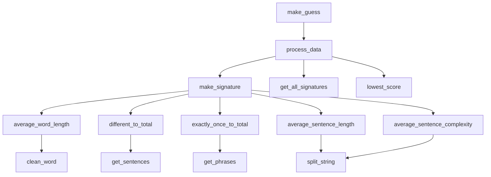
</details>

Figure 7.6 Functions diagram with all the supporting functions for the make\_signature function complete

# Figuring out each known signature

We just worked hard to break down our make\_signature function into five main tasks, one for each feature of our signatures. We designed that function to determine the unknown signature—the signature for the mystery text whose author we’re trying to identify.

Our next task is to figure out the signature for each of the books for which we know the author. In the resources for this book, under ch7, you’ll find a directory called known\_authors. In there, you’ll find several files, each named as an author. Each file contains a book written by that author. For example, if you open Arthur\_Conan\_Doyle. txt, you’ll find the text of the book A Study in Scarlet by Arthur Conan Doyle. We need to determine the signature for each of these files.

Amazingly, we have far less work to do to solve this problem than it may seem. That’s because we can use that same make\_signature function, the one we designed to determine the signature of the mystery book, to also determine the signature for any known book!

We’ll name the function for this task get\_all\_signatures. It wouldn’t make sense for this function to take the text of one book as a parameter since it’s supposed to be able to get the signature for all of our known books. Rather, it will take a directory of known books as a parameter. Its behavior will be to loop through the files in that directory, calculating the signature for each one.

We need the function to tell us which signature goes with which book. In other words, we need it to associate each book with its corresponding signature. This kind of association is precisely why Python has dictionaries! We’ll therefore have this function return a dictionary, where the keys are names of files and the values are the corresponding signature.

Our function diagram didn’t need any new functions to solve the get\_all signatures function, so our updated diagram in figure 7.7 just shows how get\_all signatures calls make\_signature.


<details>
<summary>flowchart</summary>


</details>

Figure 7.7 Functions diagram updated for get\_all\_signatures to call make\_signature

# Finding closest known signature

Let’s recap what we’ve designed so far:

We’ve designed our make\_signature function to get us the unknown signature for the mystery book.   
¡ We’ve designed our get\_all\_signatures function to get us all of our known signatures.

Now, we need to design a function that tells us which of those known signatures is best; that is, which known signature is closest to our unknown signature.

Each of our signatures will be a list of five numbers giving the quantity for each of our five features. The order we’ll use is average word length, different words divided by total words, words used exactly once divided by total words, average number of words per sentence, and average sentence complexity.

Suppose that we have two signatures. The first one is [4.6, 0.1, 0.05, 10, 2]. That means that the average word length for that book is 4.6, the different words divided by total words is 0.1, and so on. The second signature is [4.3, 0.1, 0.04, 16, 4].

There are many ways to get an overall score giving the difference between signatures. The one we’ll use will give us a difference score for each feature, and then we’ll add up those scores to get our overall score.

Let’s look at the values of each signature for the first feature: 4.6 and 4.3. If we subtract those, we get a difference of 4.6 – 4.3 = 0.3. We could use 0.3 as our answer for this feature, but it turns out to work better if we weight each difference using a different weight. Each weight gives the importance of that feature. We will use some weights ([11, 33, 50, 0.4, 4]) that in our experience have proven to work well. You might wonder where the heck these weights come from. But note that there’s no magic about them: in working with our students over the years, we’ve just found that these weights seem to work out. This would be only a starting point for a stronger authorship identification program. When doing this type of research, people routinely tune their training, which means to adjust weights to obtain stronger results.

When we say that we’re using weights of [11, 33, 50, 0.4, 4], it means that we’ll multiply the difference on the first feature by 11, the difference on the second feature by 33, and so on. So, rather than getting a difference of 0.3 for the first feature, we’ll get $0 . 3 \ast 1 1 = 3 . 3$ .

We need to be careful with features like the fourth one, where the difference is negative. We don’t want to start with 10 – 16 = –6 because that’s a negative number, and that would undo some of the positive difference from other features. Instead, we need to first make this number positive and then multiply it by its weight. Removing the negative sign from a number is known as taking the absolute value, and the absolute value is denoted as abs. The full calculation for this fourth feature, then, is abs $( 1 0 - 1 6 ) \div 0 . 4 =$ 2.4.

Table 7.1 gives the calculation for each feature. If we add up all five scores, we get an overall score of 14.2.

Table 7.1 Calculates the difference between two signatures 

<table><tr><td>Feature number</td><td>Value of feature in signature 1</td><td>Value of feature in signature 2</td><td>Weight of feature</td><td>Weight of feature</td></tr><tr><td>1</td><td>4.6</td><td>4.3</td><td>11</td><td> $\text{abs}(4.6 - 4.3) * 11 = 3.3$ </td></tr><tr><td>2</td><td>0.1</td><td>0.1</td><td>33</td><td> $\text{abs}(0.1 - 0.1) * 33 = 0$ </td></tr><tr><td>3</td><td>0.05</td><td>0.04</td><td>50</td><td> $\text{abs}(0.05 - 0.04) * 50 = .5$ </td></tr><tr><td>4</td><td>10</td><td>16</td><td>0.4</td><td> $\text{abs}(10 - 16) * 0.4 = 2.4$ </td></tr><tr><td>5</td><td>2</td><td>4</td><td>4</td><td> $\text{abs}(2 - 4) * 4 = 8$ </td></tr><tr><td>Sum</td><td></td><td></td><td></td><td>14.2</td></tr></table>

Remember where we are in the top-down design: we need a function that tells us which known signature is best. Well, now we know how to compare two signatures and get the score for that comparison. We’ll want to make that comparison between the unknown signature and each known signature to determine which known signature is best. The lower the score, the closer the signatures; the higher the score, the more different the signatures. As such, we’ll want to ultimately choose the signature with the lowest comparison score.

We’ll name the function for this task lowest\_score. It will take three parameters: a dictionary mapping author names to their known signatures, an unknown signature, and a list of weights. It will return the signature that has the lowest comparison score with our unknown signature.

Think about the work that this function will need to do. It needs to loop through the known signatures. We can do that with a for loop—no need for a subtask there. It will need to compare the unknown signature to the current known signature. Oh! That’s a subtask right there, embodying the scoring mechanism that we outlined in table 7.1. We’ll name the function for that subtask get\_score.

Our get\_score function will take two signatures to compare and the list of weights and return the score for the comparison between these two signatures.

# 7.6 Summary of our top-down design

We did it! We’ve broken down our original big problem into several smaller problems that are amenable to being implemented as a function.

Figure 7.8 depicts all the work that we have done during the process of decomposing the problem. Remember we started with a make\_guess function, which will solve the overall problem. To help us with make\_guess, we created a process\_data function that will do some of the work for make\_guess. To help process\_data, we created three more functions, make\_signature, get\_all\_signatures, and lowest\_score, that each have their own helper functions, and so forth. Having sketched out the functions we’ll need to solve our problem, our next step will be to implement them.


<details>
<summary>flowchart</summary>

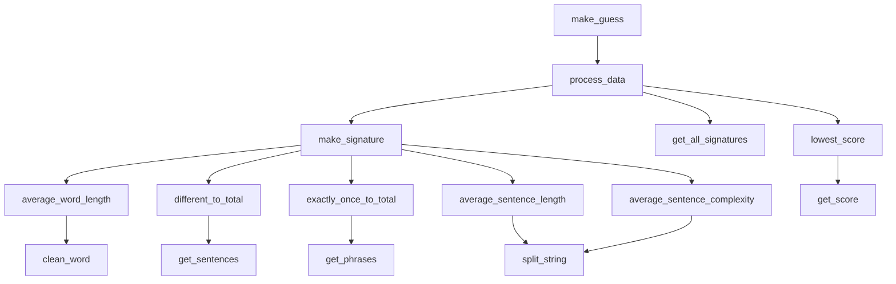
</details>

Figure 7.8 Full functions diagram for make\_guess

# 7.7 Implementing our functions

Now we’re ready to ask Copilot to implement each function that we need. We designed our functions by starting from the top—the biggest problem—and working down to smaller problems. By contrast, we’re going to implement the functions in the opposite order, from bottom to top (or right to left in figure 7.8). The reason we do it this way is so that Copilot will have our subtask functions available to influence how it writes the parent task function. We won’t write the code for a task until we’ve implemented all of its subtask functions.

You learned all about testing in chapter 6. While we will include some tests in our docstrings here, we will not be pursuing full testing in this example—we want to stay squarely focused on implementing a top-down design. We encourage you to let doctest run the tests that we do provide as well as add your own tests for further confidence in the code. We have also not dwelled much on our prompt engineering either, instead focusing on the prompts that yielded good results. In the next chapter, we will focus on debugging, and that’s where we will return to prompt engineering.

In chapters 4 and 5, we learned how to read Python code. That isn’t our focus here. So, while we have included some annotations to explain what the code is doing and how it works, we aren’t going to go in depth on the code. Again, the main goal of the chapter is to get this large top-down design example under our belt, and we don’t want to lose the forest for the trees.

# 7.7.1 clean\_word

We’ll start with our clean\_word function. In this and all of our code in this chapter, we provide the def line and docstring, and we let Copilot fill in the code. We also provide some annotations to briefly illustrate how the code works.

Remember that we want our clean\_word function to remove punctuation that might show up around the word and to convert the word to lowercase. But we don’t want to mess with punctuation in the middle of the word, such as the “-” in card-board. We’ve written the docstring to make clear what we want.

Listing 7.1 Function to clean words for analysis   
```python
def clean_word(word):
    '''
    word is a string.

    Return a version of word in which all letters have been converted to lowercase, and punctuation characters have been stripped from both ends. Inner punctuation is left untouched.

    >>> clean_word('Pearl!')
    'pearl'
    >>> clean_word('card-board')
    'card-board'
    '''
    word = word.lower()
    word = word.strip(string.punctuation)
    return word

    Converts the word to lowercase
    Uses the string module 
```

When working on our password functions in chapter 3, we saw Copilot using the string module, and we see Copilot doing that again here. We know from our work in chapter 3 that this will not work unless we import string first, so please add

import string

above this function as we’ve done in the following listing.

Listing 7.2 Complete function to clean words for analysis   
```python
import string
def clean_word(word):
    '''
    word is a string.

    Return a version of word in which all letters have been converted to lowercase, and punctuation characters have been stripped from both ends. Inner punctuation is left untouched.

    >>> clean_word('Pearl!')
    'pearl'
    >>> clean_word('card-board')
    'card-board'
    '''
    word = word.lower()
    word = word.strip(string.punctuation)
    return word 
```

This completes the clean\_word function, so we can mark this as complete in our functions diagram in figure 7.9.


<details>
<summary>flowchart</summary>

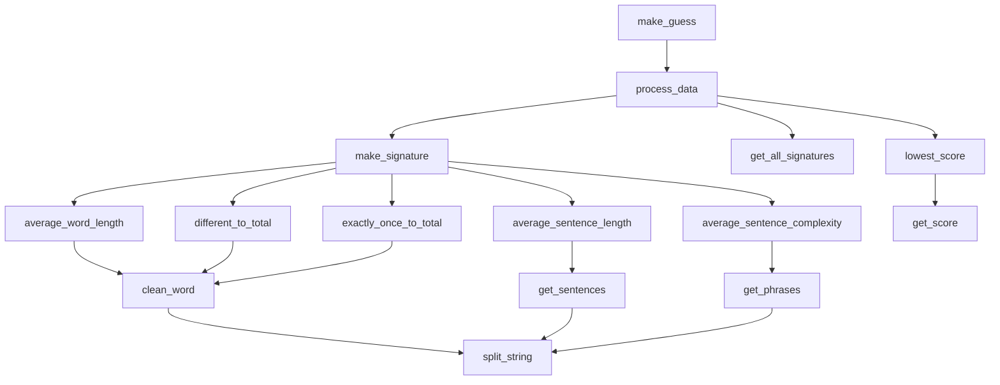
</details>

Figure 7.9 Full functions diagram with clean\_word now finished

# 7.7.2 average\_word\_length

Now let’s tackle the first of our five signature feature functions: average\_word length. It needs to determine the average number of letters per word. But we don’t want to count surrounding punctuation as letters, and we don’t want to include words that don’t have any letters. We want to use our clean\_word function here! As always, we have written the docstring in a way that we hope directs Copilot to make these decisions. See the following listing.

Listing 7.3 Function to determine average word length   
def average_word_length(text):
    ...
    text is a string of text.

    Return the average word length of the words in text.
    Do not count empty words as words.
    Do not include surrounding punctuation.

    >>> average_word_length('A pearl! Pearl! Lustrous pearl! \ Rare. What a nice find.')
4.1
    ...
    words = text.split()
    total = 0
    count = 0

    for word in words:
    word = clean_word(word)
    if word != '':
    total += len(word)
    count += 1
    return total / count

    Splits string into its words
    totals will count the total number of letters across all words.
    count will count the number of words.

    Loops through each word
    Copilot calls clean_word for us!
    Adds 1 to count this word
    Adds number of letters in word
    Considers this word only if it isn't empty

    Returns number of letters divided by number of words

You’ll notice in the doctest here that we’ve split our string over two lines, ending the first line with a \ character. The reason we did this is that the string wouldn’t otherwise fit on one line in the book. We also needed to keep the second line without any indentation; otherwise, doctest would use that indentation as spaces in the string. On your computer, you can type the string on a single line and not worry about the \ or lack of indentation.

We can now mark average\_word\_length as done in our updated figure (figure 7.10). Albeit satisfying, marking these off in the figure one by one might be a bit too much noise, so we will revisit the figure only periodically going forward.


<details>
<summary>flowchart</summary>

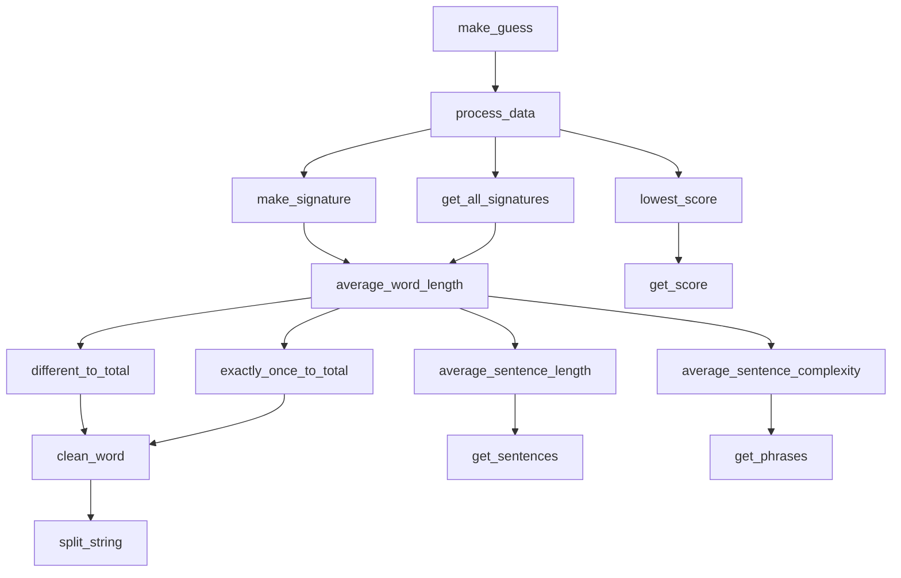
</details>

Figure 7.10 Full functions diagram with average\_word\_length now finished

# 7.7.3 different\_to\_total

This is the second of our signature features. We need this one to calculate the number of different words used divided by the total number of words. Again, we don’t want surrounding punctuation, and we don’t want empty words.

Listing 7.4 Function to determine different words divided by total number of words   
def different_to_total(text):
    ''' text is a string of text.

    Return the number of unique words in text
    divided by the total number of words in text.
    Do not count empty words as words.
    Do not include surrounding punctuation.

>>> different_to_total('A pearl! Pearl! Lustrous pearl! \
Rare. What a nice find.')
0.7
    ''
words = text.split()
total = 0
unique = set()
for word in words:
    word = clean_word(word)
    if word != '':
    total += 1
    unique.add(word)
return len(unique) / total

Splits string into its words
A set of the unique words found
Copilot again calls clean_word for us!
A set is like a list but does not accept duplicates.
Returns the number of different words divided by total number of words

This code uses a Python set, rather than a Python list, to store the unique words that it finds. A set is similar to a list except that it doesn’t accept duplicates, so if you try to add the same word multiple times, it retains only one copy of the word. That’s why we can use len(unique) in the return statement to get the total number of unique words.

We don’t need to know any more about Python sets to continue here. But if you are interested in learning more, you can ask Copilot for a code explanation and/or Google for information on Python sets.

# 7.7.4 exactly\_once\_to\_total

We’re ready to implement our third signature feature. This one calculates the number of words used exactly once divided by the total number of words, as shown in the following listing. We provided the prompt to Copilot and received the following function.

Listing 7.5 Function to calculate the fraction of words used just once – Try 1   
```txt
def exactly_once_to_total(text):
    '''text is a string of text.

    Return the number of words that show up exactly once in text divided by the total number of words in text.
    Do not count empty words as words.
    Do not include surrounding punctuation.

    >>> exactly_once_to_total('A pearl! Pearl! Lustrous pearl! \Rare. What a nice find.')
    0.5
    '''
    words = text.split()
    unique = set()
    total = 0
    for word in words:
    word = clean_word(word)
    if word != ''':
    if word not in unique:
    unique.add(word)
    else:
    unique.remove(word)
    total += 1
    return len(unique) / total

Removing a word from the unique set??? 
```

When we skim that code, it looks like unique is a set that keeps track of the unique words. At the end, we divide that number of unique words by the total number of words.

However, run our test case using doctest, and you will see that our code fails the test. We need the result to be 0.5, but our code is unfortunately giving us 0.6. Our code is wrong. We need to stay vigilant!

Let’s review the code to see why it was wrong. Imagine that a word is used three times in a text. The first time our code finds it, the code will add it to unique. The second time, it will remove it from unique. That’s fine so far because the word isn’t being used exactly once anymore, so it shouldn’t be in there. But then the third time, it will add that word back to unique! So, our code is going to count some words as being used exactly once when in fact they were used more than once.

We looked through the Ctrl–Enter list and found this alternate version, which is correct, as shown in the following listing.

Listing 7.6 Function to calculate the fraction of words used just once – Try 2   
```python
def exactly_once_to_total(text):
    '''
text is a string of text.
Return the number of words that show up exactly once in text divided by the total number of words in text. 
```


<details>
<summary>text_image</summary>

Do not count empty words as words.
Do not include surrounding punctuation.

>>> exactly_once_to_total('A pearl! Pearl! Lustrous pearl! \ Rare. What a nice find.')
0.5
```mermaid
words = text.split()
total = 0
unique = set()
once = set()
for word in words:
    word = clean_word(word)
    if word != ''':
        total += 1
    if word in unique:
            once.discard(word)
    else:
                unique.add(word)
                once.add(word)
return len(once) / total

Keeps track of all
words we have seen

Keeps track of words used exactly
once; what we ultimately care about

We're seeing the
word again.

So the word has to be removed from once.

Returns number of words used exactly
once divided by total number of words

So far, the word
is used exactly
once.

We have
now seen
this word.
</details>

This code is tricky! To understand it, start by focusing on the else code. That’s the code that runs the first time we see each word. That word gets added to both the unique and once sets. It’s the once set that’s going to keep track for us of the words used exactly once.

Now imagine that we see a word for a second time. The if code is going to run when this happens because the word is already in unique (we added it there the first time we saw this word). Now, since we’ve seen the word more than once, we need it gone from the once set. And that’s exactly what the if code does: it uses once.discard(word) to remove the word from once.

To summarize, the first time we see a word, it gets added to once. When we see it again, it gets removed from once with no way to ever have that word added back to once. The once set is correctly tracking the words used exactly once.

# 7.7.5 split\_string

We’ve finished our three word-level signature feature functions. Before we can move on to our two sentence-level signature feature functions, we need to write get\_ sentences. But to write get\_sentences, we first need split\_string, which is what we’ll work on now.

Our split\_string function is supposed to be able to split a string around any number of separators. It inherently has nothing to do with sentences or phrases. We’ve included one docstring test to highlight this fact: even though we’re going to use it to split sentences and phrases, it’s more general than that. Look at the following listing.

Listing 7.7 Function to split a string around separators   
```python
def split_string(text, separators):
    ''' text is a string of text.
    separators is a string of separator characters.

    Split the text into a list using any of the one-character separators and return the result.
    Remove spaces from beginning and end of a string before adding it to the list.
    Do not include empty strings in the list.

    >>> split_string('one*two[three', '*[')
    ['one', 'two', 'three']
    >>> split_string('A pearl! Pearl! Lustrous pearl! Rare. \
What a nice find.', '.?!')
    ['A pearl', 'Pearl', 'Lustrous pearl', 'Rare', \
'What a nice find']
    '''
    words = []
    word = ''    A better variable name would be all_strings.
    for char in text:
    if char in separators:
    word = word.strip()
    if word != '':
    words.append(word)
    word = ''    Current string ends here.
    else:
    word += char
    word = word.strip()
    if word != '':
    words.append(word)
    return words

    Handles the final split string by adding if not empty
    ------------------------
    -------------------------
    --------------------------
    ----------------------------
    ----------------------------
    ----------------------------
    ----------------------------
    ----------------------------
    ----------------------------
    ----------------------------
    ----------------------------
    ----------------------------
    ----------------------------
    ----------------------------
    ----------------------------
    ----------------------------
    ----------------------------
    ----------------------------
    ----------------------------
    ----------------------------
    ----------------------------
    ----------------------------
    ----------------------------
    ----------------------------
    ----------------------------
    ----------------------------
    ----------------------------
    ----------------------------
    ----------------------------- 
```

You might be curious about the code after the for loop and before the return statement. It seems to be duplicating some of the code from within the for loop, so what’s it doing there? It’s there because the loop only adds a split string to our list of strings when it finds one of the separator characters. If the text doesn’t end with a separator character, the loop won’t add the final split string. The code below the loop ensures that this final split string isn’t lost.

It’s been a little while since we updated our diagram with functions we’ve completed. Time for an update! This also serves as a reminder that we’re finishing functions from the bottom up (right-to-left in the diagram). As such, figure 7.11 has our functions completed so far.


<details>
<summary>flowchart</summary>

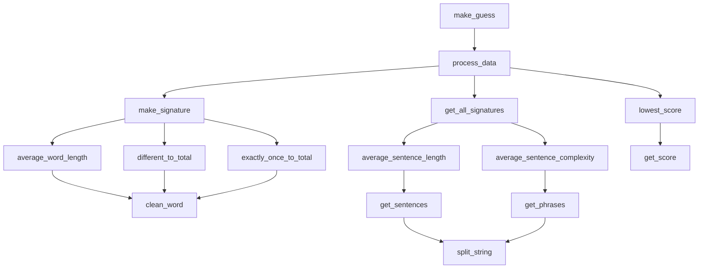
</details>

Figure 7.11 Full functions diagram updated with different\_to\_total, exactly\_once\_to\_total, and split\_string now finished

# 7.7.6 get\_sentences

In our top-down design, we kicked most of the work for get\_sentences off to the split\_string function. Therefore, what we’re hoping for is that Copilot implements get\_sentences by making a suitable call to split\_string.

We don’t want our sentences to have any space at the beginning or end, and we don’t want any empty sentences. We initially had these requirements in the docstring, but even without them Copilot correctly calls split\_string, and that function handles these edge cases anyway.

Listing 7.8 Function that returns a list of sentences in text   
```python
def get_sentences(text):
    '''
    text is a string of text.

    Return a list of the sentences from text.
    Sentences are separated by a '.', '?' or '!!'.

    >>> get_sentences('A pearl! Pearl! Lustrous pearl! Rare. \ What a nice find.')
    ['A pearl', 'Pearl', 'Lustrous pearl', 'Rare', \
'What a nice find']
    '''
    return split_string(text, '.?!')

    Calls split_string with the sentence separator characters 
```

# 7.7.7 average\_sentence\_length

Now that we have get\_sentences, we can proceed with average\_sentence\_length, our fourth signature feature. This one calculates the average number of words per sentence. We provided the prompt to Copilot and received the following function.

Listing 7.9 Function that determines the average number of words per sentence   
def average_sentence_length(text):
    ...
    text is a string of text.

    Return the average number of words per sentence in text.
    Do not count empty words as words.

    >>> average_sentence_length('A pearl! Pearl! Lustrous pearl! \ Rare. What a nice find.')
    2.0
    ...
    sentences = get_sentences(text)
    total = 0
    for sentence in sentences:
    words = sentence.split()
    for word in words:
    if word != '':
    total += 1
    return total / len(sentences)

    Gets a list of sentences
    Loops through the sentences
    Breaks current sentence into its words
    Loops through sentence's words
    Returns number of words divided by number of sentences

# 7.7.8 get\_phrases

Much as we needed get\_sentences before we could implement average\_sentence \_length, we need get\_phrases before we can implement average\_sentence \_complexity.

As with get\_sentences, we expect Copilot to call split\_string to get the phrases. That is what it has done for us here, as shown in the following listing.

Listing 7.10 Function that returns phrases from a sentence   
def get_phrases(sentence):
    '''
    sentence is a sentence string.

    Return a list of the phrases from sentence.
    Phrases are separated by a '',', ';' or ':'.

    >>> get_phrases('Lustrous pearl, Rare, What a nice find')
    ['Lustrous pearl', 'Rare', 'What a nice find']
    '''
    return split_string(sentence, ',;:') Calls split_string with the phrase separator characters

# 7.7.9 average\_sentence\_complexity

With get\_phrases completed, we can now prompt for an implementation of average\_sentence\_complexity as shown in the following listing.

Listing 7.11 Function to determine the average number of phrases per sentence   
def average_sentence_complexity(text):
    ''' text is a string of text.

    Return the average number of phrases per sentence in text.

    >>> average_sentence_complexity('A pearl! Pearl! Lustrous \ pearl! Rare. What a nice find.')
    1.0
    >>> average_sentence_complexity('A pearl! Pearl! Lustrous \ pearl! Rare, what a nice find.')
    1.25
    '''
    sentences = get_sentences(text)
    total = 0
    for sentence in sentences:
    phrases = get_phrase(sentence)
    total += len(phrases)
    return total / len(sentences)

    Returns number of phrases divided by the number of sentences

We changed the last period to a comma to make this 5/4 = 1.25.
Gets a list of sentences
Loops through the sentences
Adds the number of phrases in current sentence
Gets a list of phrases in the current sentence

We’re really coming along now! We’ve finished all the functions needed to create make\_signature as shown in figure 7.12.


<details>
<summary>flowchart</summary>

```mermaid
graph TD
    A["make_guess"] --> B["process_data"]
    B --> C["make_signature"]
    B --> D["get_all_signatures"]
    B --> E["lowest_score"]
    C --> F["average_word_length"]
    C --> G["different_to_total"]
    C --> H["exactly_once_to_total"]
    C --> I["average_sentence_length"]
    C --> J["average_sentence_complexity"]
    F --> K["clean_word"]
    G --> L["get_sentences"]
    H --> M["get_phrases"]
    I --> N["split_string"]
    J --> N
    E --> O["get_score"]
```
</details>

Figure 7.12 Full functions diagram updated to show that we’re now ready to write make\_signature

# 7.7.10 make\_signature

We’ve written nine functions to this point, and while they’re all important, we may feel a little unsatisfied right now because we’re not even dealing with text signatures yet. We’ve got some functions that clean words, split strings in various ways, and calculate individual features of signatures, but no function to make a full signature.

That changes now because we’re finally ready to implement make\_signature to give us the signature for a text.

This function will take the text of a book and will return a list of five numbers, each of which is the result of calling one of our five feature functions.

Listing 7.12 Function that determines a numeric signature for the text   
```python
def make_signature(text):
    The signature for text is a list of five elements:
    average word length, different words divided by total words, words used
    exactly once divided by total words,
    average sentence length, and average sentence complexity.

    Return the signature for text.

    >>> make_signature('A pearl! Pearl! Lustrous pearl! \
Rare, what a nice find.')
    [4.1, 0.7, 0.5, 2.5, 1.25]
    return [average_word_length(text), different_to_total(text),
    exactly_once_to_total(text),
    average_sentence_length(text),
    average_sentence_complexity(text)] Each of our
five feature
functions is
called. 
```

Notice that this function can be implemented as nothing more than a call to each of our five feature functions.

It’s important to pause now to think about just how messy this function would have been without having done a solid top-down design first. The code for all five of the functions that we’re calling here would have had to be in a single function, with all of their own variables and calculations mingled together into a real mess. Lucky for us, we are using top-down design! Our function is therefore easier for us to read and easier to convince ourselves that it is doing the right thing.

# 7.7.11 get\_all\_signatures

Our process\_data function has three subtasks for us to implement, and we just finished with the first one (make\_signature).

Now, on to its second subtask, which is our get\_all\_signatures function.

From now on, we’ll assume that your working directory has your code and that it also has the subdirectory of books that we’ve provided. We need this function to return the signature for each file in our directory of known authors. We’re hoping for Copilot to call make\_signature here to make this function far simpler than it otherwise would be.

Copilot did do that for us, but the code we got still had two problems. Here was our initial code.

Listing 7.13 Function to get all the signatures from known authors – Try 1   
```python
def get_all_signatures (known_dir):
    ...
    known_dir is the name of a directory of books.
    For each file in directory known_dir, determine its signature.

    Return a dictionary where each key is the name of a file, and the value is its signature.
    ...
    signatures = {}
    for filename in os.listdir (known_dir):
    with open(os.path.join (known_dir, filename)) as f:
    text = f.read()
    signatures [filename] = make_signature(text)
    return signatures

    It loops through each file in the known authors directory.
    Our dictionary is mapping filenames to signatures.

    Makes the signature for text and store in dictionary
    Reads all text from file
    Opens the current file 
```

Try running this function from the Python prompt, as follows:

```txt
>>> get_all_signatures('known_authors') 
```  
You’ll get an error:

```python
Traceback (most recent call last):
  File "<stdin>", line 1, in <module>
  File "C:\repos\book_code\ch7\authorship.py", line 207, in get_all signatures
    for filename in os.listdir(known_dir): 
```

```txt
NameError: name 'os' is not defined 
```

The error is telling us that the function is trying to use a module named os, but we don’t have this module available. This module is built-in to Python, and we know what to do in this case: import it! That is, we need to add

```txt
import os 
```

above this function. After that, we still get an error:   
```python
>>> get_all_signatures('known_authors')
Traceback (most recent call last):
  File "<stdin>", line 1, in <module>
  File "C:\repos\book_code\ch7\authorship.py", line 209, in get_all_
    signatures
    text = f.read()
    ^^^^^^^
  File "C:\Users\danie\AppData\Local\Programs\Python\Python311\Lib\encodings\
    cp1252.py", line 23, in decode
  return codecs.charmap_decode(input,self.errors,decoding_table)[0]
  ^^^^^^^^^ 
```

```txt
UnicodeDecodeError: 'charmap' codec can't decode byte 0x9d in position 2913: character maps to <undefined> 
```

A UnicodeDecodeError—what’s that? You could learn about it using Google or ChatGPT if you’re interested in a technical explanation. What we need to know is that each file that we open is encoded in a specific way, and Python has chosen the wrong encoding to try to read this file.

We can, however, direct Copilot to fix it by adding a comment near the top of our function. (When you encounter errors like these, you can try placing a comment directly above the erroneous code that was generated. Then once you delete the incorrect code, Copilot can often generate new code that is correct.) Once we do that, all is well, as shown in the following listing.

Listing 7.14 Function to get all the signatures from known authors – Try 2   
```python
import os

def get_all_signatures(known_dir):
    '''
    known_dir is the name of a directory of books.
    For each file in directory known_dir, determine its signature.

    Return a dictionary where each key is
    the name of a file, and the value is its signature.
    '''
    signatures = {}
    # Fix UnicodeDecodeError
    for filename in os.listdir(known_dir):
    with open(os.path.join(known_dir, filename), encoding='utf-8') as f:
    text = f.read()
    signatures[filename] = make_signature(text)
    return signatures 
```

Now, if you run this function, you should see a dictionary of authors and their signatures, like this:

```python
>>> get_all_signatures('known_authors')
{'Arthur_Conan_Doyle.txt': [4.3745884086670195, 0.1547122890234636, 0.09005503235165442, 15.48943661971831, 2.082394366197183], 'Charles_Dickens.txt': [4.229579999566339, 0.0796743207788547, 0.041821158307855766, 17.286386709736963, 2.698477157360406], 'Frances_Hodgson_Burnett.txt': [4.230464334694739, 0.08356818832607418, 0.04201769324672584, 13.881251286272896, 1.9267338958633464], 'Jane_Austen.txt': [4.492473405509028, 0.06848572461149259, 0.03249477538065084, 17.507478923035084, 2.607560511286375], 'Mark_Twain.txt': [4.372851190055795, 0.1350377851543188, 0.07780210466840878, 14.395167731629392, 2.16194089456869]} 
```

For simplicity, we haven’t added a test in the docstring for this function. But we could, and the way to do it would be to create a fake, small book, along the lines of what we did in our second example in chapter 6. We’d like to proceed here with our overall purpose of function decomposition, though, so we’ll leave that exercise to you if you’d like to pursue that. As shown in figure 7.13, we’ve gotten two process\_data tasks out of the way. Let’s keep going!


<details>
<summary>flowchart</summary>

```mermaid
graph TD
    A["make_guess"] --> B["process_data"]
    B --> C["make_signature"]
    B --> D["get_all_signatures"]
    B --> E["lowest_score"]
    C --> F["average_word_length"]
    C --> G["different_to_total"]
    C --> H["exactly_once_to_total"]
    C --> I["average_sentence_length"]
    C --> J["average_sentence_complexity"]
    F --> K["clean_word"]
    G --> L["get_sentences"]
    H --> M["get_phrases"]
    I --> N["split_string"]
    J --> N
    E --> O["get_score"]
```
</details>

Figure 7.13 Full functions diagram updated to show that make\_signature and get\_all\_signatures are finished

# 7.7.12 get\_score

Let’s implement get\_score, where we need to encode the way that we compare signatures. Remember the whole thing where we find the difference on each weight, multiply it by a weight, and then add everything together into an overall score? That’s what we want get\_score to do.

It would be a challenge to explain this formula in the docstring. And we’re not even sure that it should go there: a docstring is supposed to explain how someone can use your function, not how it works internally, and arguably, users of our function won’t care about this specific formula anyway.

What we can do is use a general docstring, without our specific formula, and see what Copilot does with it. Here we go.

Listing 7.15 Function to compare two signatures   
```python
def get_score(signature1, signature2, weights):
    ...
    signature1 and signature2 are signatures.
    weights is a list of five weights.

    Return the score for signature1 and signature2.

    >>> get_score([4.6, 0.1, 0.05, 10, 2], \
    [4.3, 0.1, 0.04, 16, 4], \
    [11, 33, 50, 0.4, 4]) ← These weights, [11, 33, 50, 0.4, 4], worked well for us.
    14.2
    ...
    score = 0
    for i in range(len(signature1)):
    score += abs(signature1[i] - signature2[i]) * weights[i]
    return score

    Loops through each signature index ←
    Add the weighted difference to score 
```

Copilot has implemented exactly the formula that we wanted.

Now, before we start thinking that Copilot mind-melded us or anything like that, remember that the formula we’ve used here is a very common metric for comparing signatures. Many students and other programmers over the years have implemented authorship identification using this very formula. Copilot is just giving that back to us because it occurs so often in its training data.

If Copilot happened to give us a different formula, we could have tried to describe what we want in a comment or, failing that, changed the code ourselves to get what we want.

# 7.7.13 lowest\_score

Our lowest\_score function will finally wrap up everything we need to implement process\_data.

The get\_score function that we just implemented gives us the score between any two signatures. Our lowest\_score function is going to call get\_score once for each known signature to compare the unknown signature to each known signature. It will then return the known signature that has the lowest score with the unknown signature, as shown in the following listing.

Listing 7.16 Function to give us the closest known signature   
def lowest_score(signatures_dict, unknown_signature, weights):
    ...
    signatures_dict is a dictionary mapping keys to signatures.
    unknown_signature is a signature.
    weights is a list of five weights.
    Return the key whose signature value has the lowest score with unknown_signature.

>>> d = {'Dan': [1, 1, 1, 1, 1], 'Leo': [3, 3, 3, 3, 3]}
>>> unknown = [1, 0.8, 0.9, 1.3, 1.4]
>>> weights = [11, 33, 50, 0.4, 4]
>>> lowest_score(d, unknown, weights)

'Tan'

...
lowest = None
for key in signatures_dict:
    score = get_score(signatures_dict[key], unknown_signature, weights)
    if lowest is None or score < lowest[1]:
    lowest = (key, score)
return lowest[0]

'Loops through each author name

Storing both best key and score for that key

If this is first comparison or lower score than best comparison.

Using variables in the doctest to make the test itself easier to read

Gets a score for comparing this known signature to the unknown signature

The first parameter, signatures\_dict, is a dictionary that maps names of authors to their known signatures. That will ultimately come from the get\_all\_signatures function. The second parameter, unknown\_signature, will ultimately come from calling make\_signature on the mystery book. The third parameter, weights, will be hard-coded by us when we call this function.

# 7.7.14 process\_data

Only two functions to go! One of them is process\_data—it feels like it took us forever, but we’re finally ready for it.

Our process\_data function is going to take two parameters in the following listing: the filename of a mystery book and the directory of known-author books. It will return the author that we think wrote the mystery book.

Listing 7.17 Function to find the signature closes to the mystery author   
def process_data(mystery_filename, known_dir):
    ...
    mystery_filename is the filename of a mystery book whose author we want to know.
    known_dir is the name of a directory of books.

    Return the name of the signature closest to the signature of the text of mystery_filename.
    ...
    signatures = get_all_signatures(known_dir)
    with open(mystery_filename, encoding='utf-8') as f:
    text = f.read()
    unknown_signature = make_signature(text)

    return lowest_score(signatures, unknown_signature, [11, 33, 50, 0.4, 4])

    Gets all of the known signatures

    Copies our prior work to get the encoding right this time.
    Reads text of mystery book

    Returns the signature with the lowest comparison score

    Gets the unknown signature

Again, notice how much we’re relying on our earlier functions. This massively useful process\_data function is now really nothing more than a carefully sequenced list of function calls.

In the book resources for this chapter, we’ve included a few unknown author files—for example, unknown1.txt and unknown2.txt. Those should be in your current working directory along with your code (and the subdirectory of known author files).

Let’s call process\_data to guess who wrote 'unknown1.txt':

```python
>>> process_data('unknown1.txt', 'known_authors')
'Arthur_Conan_Doyle.txt' 
```

Our program guesses that Arthur Conan Doyle wrote unknown1.txt. And if you peek at the text of unknown1.txt by opening the file, you’ll see that our guess is right. The book is called The Sign of the Four, which is a famous Arthur Conan Doyle book.

# 7.7.15 make\_guess

To guess the author of a book, we currently need to type the Python code to run process\_data. That’s not very friendly to users; it would be nice if we could run the program and have it ask us which mystery book file we want to work with.

We’ll put that finishing touch on our program by implementing make\_guess, our top-most function!

This function will ask the user for a filename of a mystery book, get the best guess using process\_data, and tell the user about that guess.

Listing 7.18 Function that interacts with the user and guesses the text’s author   
```python
def make_guess(known_dir):
    ...
    Ask user for a filename.
    Get all known signatures from known_dir,
    and print the name of the one that has the lowest score
    with the user's filename.
    ...
    filename = input('Enter filename: ')
    print(process_data(filename, known_dir)) 
```

Now all we need to do is call this function on our known\_authors directory, and we’re done.

This completes all of the functions from our diagram! Figure 7.14 shows that we’ve checked off every function from the bottom to the very top of our diagram.


<details>
<summary>flowchart</summary>

```mermaid
graph TD
    A["make_guess"] --> B["process_data"]
    B --> C["make_signature"]
    B --> D["get_all signatures"]
    B --> E["lowest_score"]
    C --> F["average_word_length"]
    C --> G["different_to_total"]
    C --> H["exactly_once_to_total"]
    C --> I["average_sentence_length"]
    C --> J["average_sentence_complexity"]
    C --> K["get_score"]
    F --> L["clean_word"]
    G --> L
    H --> L
    I --> M["get_sentences"]
    J --> N["get_phrases"]
    K --> O["split_string"]
```
</details>

Figure 7.14 All of the required functions for make\_guess are now complete!

If you have all of our code in your Python file, you’ll be able to run it to guess the author of a mystery book after you add the following line of code at the bottom of that file:

```txt
make_guess('known_authors') 
```

Try running it for each of the unknown book files that we’ve provided. How many author files does it guess correctly? Which ones does it get wrong?

Congratulations! You’ve completed your first real-world top-down design. And look at what we’ve managed to accomplish—an authorship identification program that any beginning programmer should be proud of. Your program uses AI to learn how individual authors write (do they use shorter or longer words on average, shorter or longer sentences on average, and so on?) by using the text of books in its training data. It then applies that learning to make a prediction on a mystery book by determining which author the mystery book most closely emulates. Very cool!

We managed to solve a very difficult problem, and we did it by breaking down the problem and letting Copilot write the code for each of the subproblems.

# 7.8 Going further

After people do a top-down design, they often see opportunities to refactor their code, which means making the code cleaner or better organized without changing its behavior. It’s indeed possible to refactor our program in several ways. For example, you might notice that many of our signature feature functions split the string into words and then ignore empty words. This task (returning a list of nonempty words from a string) could be split off into its own subtask function, and that would further simplify any function that calls it.

We might also decide that weights should be passed to process\_data, rather than hard-coding the weights in that function. The weights would then be hard-coded in make\_guess, moving the decision higher in the function hierarchy and therefore easier to find and change if needed.

It’s also possible to improve the program in terms of its features or efficiency.

In terms of features, right now, our program simply prints its best guess for the mystery book author. But we don’t know anything about that guess. Was there a second author that was very close to the one that was guessed? If so, we might want to know that. More generally, we might want to know the top few guesses rather than just the top guess. That way, we have useful information about who the author might be even if the top guess happens to be wrong. These are additional features that we could add to our program.

In terms of efficiency, let’s think about that get\_all\_signatures function again. That function does a lot of work! If we have five books in our known directory, then it will read each of the five files and calculate each signature. Big deal, right? It’s only five files, and computers are really fast. But imagine if we had 100 files or 10,000 files. It may be acceptable to do all of that work as a one-time only thing, but that’s not what our program does. In fact, every time we run the program to get a guess for the author of a mystery book, it runs that get\_all\_signatures function, which means recreating those signatures every single time. That’s a huge amount of wasted effort; it would be nice if we could just store those signatures somewhere, never having to calculate them again. Indeed, if we were to redesign the code for efficiency, a first step would be to ensure the signature for a known text is only computed once and reused thereafter.

Indeed, that’s what tools like Copilot do! OpenAI trained GitHub Copilot just once on a huge corpus of code. That took thousands or millions of computer hours. But now that the training is done, it can keep writing code for us without having to train from scratch every time. The idea of doing the training once and then using that training for many subsequent predictions is a common paradigm throughout all of ML.

Many computer scientists view problem decomposition as the most critical skill needed to write good software. We saw the value of problem decomposition in this chapter: problem decomposition made a large problem solvable by breaking it into smaller steps until each step was easy to solve. This skill remains critical when working with tools like Copilot and ChatGPT because they perform better when solving small, well-defined problems compared to large problems. All that said, problem decomposition is more of an art than a science, and it takes practice to get it right. We’ll do more problem decomposition in our upcoming chapters to help give you more intuition into how to approach it yourself.

# Summary

¡ We need to divide a big programming problem into smaller subproblems before we can effectively implement it.   
Top-down design is a systematic technique for breaking a problem down into small subtask functions.   
In top-down design, we seek small functions that solve well-defined tasks and that can be used by one or more other functions.   
Author identification is the process of guessing the author of a mystery book.   
¡ We can use features about words (e.g., average word length) and sentences (e.g., average number of words per sentence) to characterize how each known author writes.   
Machine learning is an important area of computer science that investigates how machines can learn from data and make predictions.   
In supervised learning, we have some training data in the form of objects (e.g., books) and their categories (who wrote each book). We can learn from that data to make predictions about new objects.   
¡ A signature consists of a list of features, one signature per object.   
¡ When we’re ready to implement our functions that arose from top-down design, we implement them from the bottom up; that is, we implement the leaf functions first, then functions that depend on those leaf functions, and so on until we implement the topmost function.   
Refactoring code means to improve the design of the code (e.g., by reducing code repetition).

# Debugging and better 8understanding your code

# This chapter covers

¡	Determining the source of a bug   
¡	Fixing errors with Copilot techniques   
¡	Debugging code with Copilot   
¡	Using VS Code debugger to see how code is functioning

There will be a point in every programmer’s career when their code isn’t doing what they want it to do. This has likely happened to you already, and, rest assured, it is a normal part of learning to program. How do we fix the code? Sometimes, changing the prompt or better decomposing the problem like you learned in earlier chapters is sufficient to fix the problem. But what do you do when you just can’t get Copilot to give you different or better code and you can’t seem to figure out why the code you’ve been given doesn’t work properly?

This chapter serves two purposes. The primary goal is to learn how to find errors (called bugs) in the code and fix them. To find those bugs, you’ll need to fulfill the second goal, which is gaining a deeper understanding of how your code works while you are running it.

The good news is that having an error in your code is such a common occurrence for programmers that programming environments, like Visual Studio Code (VS Code), have tools to help us uncover what is going wrong. We’ll learn how to use that tool, called a debugger, in this chapter as well.

Like the last few chapters where we started small, we’ll learn the concepts behind finding and fixing errors with some small examples, and then we’ll more authentically showcase the process by diving into a larger example that’s similar to the kind of code you’re likely to write in the future.

# 8.1 What causes errors (bugs)?

First, a quick terminology lesson. Programmers call the mistakes in their code bugs because when computers used vacuum tubes many decades ago, a bug (insect) in a vacuum tube could cause the computer to make mistakes. Today, bugs are caused by mistakes by programmers. (There can be bugs in the implementation of Python itself or even in computer hardware, but they are so rare it’s safe to assume an error in your code is because of the code.)

No one intentionally causes bugs in their code if they are genuinely trying to solve the problem. So why do bugs happen? Because software engineers, and Copilot, make mistakes. What kind of mistakes you might ask? Well, there are two primary categories of bugs:

¡ Syntax errors: These errors occur when the code doesn’t follow the Python syntax requirements. For example, forgetting to write a : at the end of the first line of a for loop is a syntax error. When you run Python, because it’s trying to generate machine code based on your program description, it will run into a mistake, not know what to do, and give you an error. Sometimes these error messages are more readable than others. When people learn to program in the traditional way, without Copilot, these errors are really, really common. It takes a while to learn all the rules of Python and to make those rules a habit. Even the two of us still sometimes write code with syntax errors, despite decades of writing code. The good news is that writing code with Copilot almost entirely eliminates this problem! The bad news is that of the two types of bugs, syntax errors are the easier to find and fix.

¡ Logical errors: These errors occur when there is something logically wrong with the program. For example, maybe the intent of the code is to count how many times the exact word “Dan” appears in a list of words, but the code actually counts how many words in the list contain “dan” (ignoring case) anywhere in the word. This code would be doing the wrong thing on two counts: it would count words like dan and DAN as matches even though we don’t want those to be matches, and it would find dan as any part of a word rather than the full word. That is, it would count words like Daniel, danger, and dan, even though we don’t want to count any of these! Somewhere, the code isn’t doing what it should, and we have to figure out where and why. Often, finding the logical error is the hardest part! Once we know where the mistake is, we have to fix it, and fixing these bugs can range from changing a single character to completely rewriting the code. Logical errors can happen when a prompt isn’t well described or when Copilot, for various reasons, generates the wrong code.

# 8.2 How to find the bug

Finding bugs can be challenging. Fundamentally, whether you or Copilot wrote the code, you or Copilot thought the code was correct when it was written. This is why it’s often easier for a colleague to find a bug in the code rather than the author. The author can’t see the bug because they created it!

Bugs aren’t new to us in this book as we’ve seen mistakes in code already, and we’ve found those errors by reading the code and/or testing. In previous chapters, we figured out the source of the bug by reading through the code. In this chapter, we’ll address the bugs that you identify when testing but can’t seem to figure out why the code is wrong. Often, you can bypass the process of figuring out why the code is wrong by trying other Copilot suggestions, using new prompts to fix the error, or asking Copilot to fix the bug for you, but in our experience, these techniques don’t always work.

What we need then are more tools to help us figure out where the error is in the code.

# 8.2.1 Using print statements to learn about the code behavior

Fundamentally, a logical error means that there is a mismatch between what the author thought the code would do and what the code actually does. A common way to identify that mismatch is by using print statements to get insight into the behavior of the program because they tell you what the computer is actually doing. A useful practice is to print variables at various points in time to see what the values of those variables are at those points. Let’s try this for that example we just gave of looking for the word Dan in a list of words. Here’s the wrong code.

Listing 8.1 Incorrect function for counting the number of words Dan in a list   
```python
def count_words(words):
    count = 0
    for word in words:
    if "dan" in word.lower():
    count += 1
    return count 
```

You may already see what’s wrong with the code, but let’s assume we don’t know what’s going on, and we’re trying to figure out where the code went wrong. Suppose we found out that our code is wrong by running the test case:

```txt
>>> words = ["Dan", "danger", "Leo"]
>>> count_words(words)
2 
```

We expected the answer of 1, but we got 2. Notably, including danger in this test case helped us catch the error in the code. Where in the code did things go wrong? To figure that out, we could add print statements. When you want to do this, you’ll need to read the code to figure out where to put them. Looking at this code, printing the list at the start of the function might not be a bad idea depending on the bug we’re seeing, but the bug here seems to have to do with the count and not specifically with the list of words. Printing each word in the list as the first line in the for loop may be helpful so we can check that the code is processing each word. We might print count right before it is returned, but we already have a good idea of the value returned. These are all reasonable ideas that will help you get closer to the bug, but it’s not where we’d start. To be clear, if we started with one of these other ideas, we wouldn’t be wrong; it might just take a few more steps before finding the bug.

Because the bug is counting too many words as Dan words, we’d put the print statement within the if statement right where count is incremented, like the following listing.

Listing 8.2 Example of a print statement to find the bug in the code   
```python
def count_words(words):
    count = 0
    for word in words:
    if "dan" in word.lower():
    print(word, "is being counted")
    count += 1
    return count 
```

Rerunning our code with the same test case, this is what is printed now:

```txt
>>> words = ["Dan", "danger", "Leo"]
>>> count_words(words)
Dan is being counted
danger is being counted
2 
```

Aha! This would tell us that our program is counting the word danger when it should not be. We could then give Copilot a new prompt incorporating what we just learned to hopefully have Copilot fix the problem. Here’s the prompt we added, and Copilot fixed the code in the following listing.

Listing 8.3 Using a prompt to fix a known bug   
```python
def count_words(words):
    count = 0
    for word in words:
    # only count words that are exactly "Dan"
    if word == "Dan":
    count += 1
    return count 
```

Once we knew the bug, it was easier to tell Copilot how to fix it. Granted, this is a basic example, but the idea applies to far more complex code. The process is often iterative. You ask the code to print something, and what it prints aligns with what you think it should be doing. You then ask the code to print something else and check it against what you expect. You keep doing this until there’s a point where what the code prints doesn’t align with what you wanted it to do. That’s when you’ve found the bug and can give Copilot a prompt to help it give you better code, or if the fix is simple, you can change the code directly.

Depending on the complexity of the code, using print statements is often an effective way of debugging, and we often use it as our first step in debugging.

# Debugging is really an art more than a science

The iterative process when debugging is necessary because we’re genuinely confused about what the code is doing and why it isn’t matching our expectations. It’s okay to add a bunch of print statements that just tell you what you thought was happening in the first place because each of these print statements tells you where not to look for the bug and is an effective process of elimination. Figuring out where to look for bugs takes time and practice, so don’t worry if you find yourself spending a fair bit of time on it when you first start.

# 8.2.2 Using VS Code’s debugger to learn about the code behavior

VS Code is used by novices and professionals alike, so it has tools to help with the process of debugging. Because it is used by professionals, debugging tools have a large number of features. For the purpose of this book, we’ll focus on a few of the most commonly used features, but feel free to look into more resources on using the VS Code debugger if you are curious (https://code.visualstudio.com/docs/editor/debugging).

To showcase these tools, we’ll work through debugging the same function from the last example (listing 8.1) in a few ways. Listing 8.4 provides the code we’ll be working with throughout this section. Note that we’ve added the test of the count\_words function to the program.

Listing 8.4 Incorrect count\_words function for debugging   
```python
def count_words(words):
    count = 0
    for word in words:
    if "dan" in word.lower():
    count += 1
    return count

words = ["Dan", "danger", "Leo"]
print(count_words(words)) | Code to call the count_words function directly 
```

# Getting started with the debugger and setting breakpoints

To start using the debugger, we need to set a breakpoint and start the debugger. Setting a breakpoint tells the debugger when you would like to start debugging the program as it executes. Once you hit the breakpoint, you’ll be able to inspect variable values and step through the program line by line. Breakpoints are extremely useful. For a large program like our author signature program in chapter 7, you wouldn’t want to step line by line through the entire program because that could take a great deal of time. Instead, using a breakpoint, you can step through just the lines of code that are most relevant to you.

To set a breakpoint, hover your mouse cursor to the left of the code, and you’ll see a dot appear. Click that dot, as shown in figure 8.1, and you’ll have a breakpoint set.


<details>
<summary>text_image</summary>

count_words.py
count_words.py > ...
1 √ def count_words(words):
2    count = 0
3 √    for word in words:
4 √    if "dan" in word.lower():
5    count += 1
6    return count
Figure 8.1
Creating a
breakpoint in VS
Code by clicking to
the left of the line
of code
</details>

You can check that the breakpoint is properly set by it having a red dot to the left of it after you move your mouse away, as shown in figure 8.2.


<details>
<summary>text_image</summary>

count_words.py
count_words.py > ...
1 √ def count_words(words):
2    count = 0
3 √    for word in words:
4 √    if "dan" in word.lower(   ):
5    count += 1
6    return count
Figure 8.2
A breakpoint has
been set on line 2 of
our count_words.py
file in VS Code
</details>

You can have more than one breakpoint, but for this example, let’s just stick with the one breakpoint on line 2. (Note that you can remove a breakpoint by clicking on that red dot again.) Next, we’ll start the debugger and see how it works with the breakpoint.

# How to step through the code line by line

To start the debugger, go to Run, then Start Debugging as shown in figure 8.3.


<details>
<summary>text_image</summary>

Start Debugging F5
Run Without Debugging Ctrl+F5
Stop Debugging Shift+F5
Restart Debugging Ctrl+Shift+F5
Open Configurations
Add Configuration...
Step Over F10
Step Into F11
Step Out Shift+F11
Continue F5
Toggle Breakpoint F9
New Breakpoint >
Enable All Breakpoints
Disable All Breakpoints
Remove All Breakpoints
Install Additional Debuggers...
</details>

Figure 8.3 Starting the debugger in VS Code

Once the debugger is started, you should see a screen similar to the screen in figure 8.4. (If this is the first time using the debugger, it may ask you to select a debug configuration in which case you’ll want to choose Python.)


<details>
<summary>text_image</summary>

Debug Side Bar
File Edit Selection View Go Run Terminal Help count_words.py - Copilot Visual Studio Code
RUN AND DEB... ▶ No Config▼
VARIABLES
√ Locals
> words: ['Dan', 'danger', 'Leo']
> Globals
count_words.py
count_words.py > count words
1 def count_words(words):
2 count = 0
3 for word in words:
4 if "dan" in word.lower():
5 count += 1
6 return count
7
8 words = ["Dan", "danger", "Leo"]
9 print(count_words(words))
Watch Section
WATCH
CALL STACK Paused on breakpoint
count_words count_words.py 2:1
<module> count_words.py 9:1
Call Stack Section
</details>

Figure 8.4 The Debugging view in VS Code

The VS Code debugger has a number of components [1]. On the left-hand side, we have the Debug Side Bar, which contains the Variables Section, Watch Section, and Call Stack Section. Let’s briefly examine each of these sections:

The Variables Section contains the variables that are declared within the current scope (e.g., within count\_words) and their current values. For example, the words parameter is defined to be a list containing ['Dan', 'danger', 'Leo']. You can click on the arrow (>) to the left of words to see more details about that variable. This section is incredibly useful as you can examine the value of each variable!   
¡ The Watch Section contains any expressions you want to watch specifically. For example, you might add the expression: "dan" in word.lower() to the watched expressions, and you’d be able to see if it is True or False for each different value of word. To add an expression, hover over the Watch section and press the + sign.   
The Call Stack Section contains the functions that have been called that have led to this line of code executing. Here we have that the main function (called <module> by VS Code) called the function count\_words on line 9. Within the function count\_words, we’re presently on line 2. You can double-check that this is true by looking at the line of code presently highlighted.

Speaking of which, on the right-hand side, where we have our code editor, we can see the line count = 0 highlighted. This is the current line of code that has not yet been executed. The reason the line hasn’t been executed yet is because we set our breakpoint, shown by the arrow with a dot in it, at this line of code. When we started the debugger, it ran the code until just before executing count = 0.

The Debug Toolbar is critical as it drives the process once you start debugging. With it, you can advance an instruction, restart debugging, or stop debugging. The buttons, going left to right, are

¡ Continue (F5)—This button will advance until the next time a breakpoint is executed. In our example, line 2 of count\_words never executes again, so clicking Continue will cause the program and debugging session to run to the end.   
Step Over (F10)—This button advances to the next line of code in the current function. Step Over means that if a line of code in this function calls another function (e.g., when word.lower() is called on line 4), the debugger will stay in the count\_words function and will just run the called function (e.g., word. lower()) to its completion.   
¡ Step Into (F11)—This button advances to the next line of code, including going into any functions that are called. Unlike Step Over, when you use Step Into, the debugger will go into any function called by the current function. For example, if you used Step Into on a line of code that calls another function, it would go into that function and continue debugging (line by line) from inside that method. By default, it does not step into library function calls (e.g., word.lower() is part of the Python standard library) but will step into functions you have written.   
Step Out (Shift + F11)—This button will execute the code until the present function ends and then continue debugging from after this function’s exit.   
¡ Restart—This button restarts the debugging process. It will restart the program, and the program will execute until its first breakpoint.   
Stop—This button stops the debugging process.

# Stepping through the code line by line

Now that we have a handle on the debugger, let’s continue our example by using the Step Over button. Let’s click Step Over once and see how our view changes (figure 8.5).

Step Over advanced to the next line of code, line 3. This means it executed the line of code

```txt
count = 0 
```

and is just about ready to execute

for word in words:


<details>
<summary>text_image</summary>

Count is set to 0
RUN AND DEB... ▶ No Config▼
VARIABLES
Locals
count: 0
> words: ['Dan', 'danger', 'Leo']
> Globals
WATCH
CALL STACK Paused on step
count_words count_words.py 3:1
<module> count_words.py 9:1
Step Over
count_words.py > ...
def count_words(words):
count = 0
for word in words:
if "dan" in word.lower():
count += 1
return count
words = ["Dan", "danger", "Leo"]
print(count_words(words))
Next Line to Execute
</details>

Figure 8.5 Our debugger after pressing Step Over once. The next line (line 3) is now highlighted.

We can see from various clues in the interface that the line count = 0 was executed. First, in the editor on the right, we can see the for loop is highlighted and the arrow on the left points to this line of code. On the left, in the Call Stack Section, we can see that it is now on line 3 of count\_words. Perhaps most importantly, on the left in the Variables Section we can now see the variable count has been added to the local variables, and it has a value of 0. This last piece is pretty amazing because if you were trying to read through the code and trace what is happening line by line, the line count = 0 on line 2 would mean that a variable count is created and assigned a value of 0. This is just what the VS Code debugger has told us as well. We hope you are starting to see how powerful this tool can be.

Let’s click Step Over one more time. Now we’re stopping just before the line

if "dan" in word.lower():

We can see that there is now a new variable, word, which has been assigned the value 'Dan', and that’s just what we’d expect: word was given the value of the first element in the list words. This is a good spot to point out that in addition to being able to read the variables values in the Variables Section, you can also just hover your mouse over any variable that’s been declared already, and it will tell you it’s value as well. Pretty neat, huh?

Let’s click Step Over one more time and see that the condition in the if statement, "dan" in word.lower(), evaluated to True, so we’re going to execute the line

```solidity
count += 1 
```

Now that we’re getting the hang of this, let’s keep clicking Step Over a few more times. The first time you click it, it will go back to the for loop, and you can see count has incremented to 1. The second time you click Step Over, it will stop at the if statement, and you can see that word is now 'danger'. We could stop here and add a watch expression to see what this if statement will do. To add a watch expression, hover your mouse over the Watch section and click on the plus arrow to the right of the word Watch. This will let you type anything you want. We typed "dan" in word.lower() and press Enter to add this watch expression as shown in the debug sidebar of figure 8.6.


<details>
<summary>text_image</summary>

RUN AND DEB... ▷ No Config▼
VARIABLES
Locals
count: 1
word: 'danger'
words: ['Dan', 'danger', 'Leo']
> Globals
WATCH
"dan" in word.lower(): True
Watched
Expression
Value of the
Expression
count_words.py > count_words
def count_words(words):
    count = 0
    for word in words:
    if "dan" in word.lower():
    count += 1
    return count
words = ["Dan", "danger", "Leo"]
print(count_words(words))
</details>

Figure 8.6 View of the debugger after adding the Watch expression

If we hadn’t already found the bug earlier in this chapter, this is where we’d find it. The expression "dan" in word.lower() evaluates to True, which means count will be incremented again. But we only wanted exact matches to the word "Dan" and didn’t want "danger" to count!

This is a completely reasonable way to debug a function. You can create a breakpoint at the start of the function’s execution and then step through it one step at a time. The only times you might struggle to use this approach is if the for loop ran through thousands of values before making a mistake. To address challenges like this, we might put a breakpoint in a specific spot to avoid spending a lot of time in the debugger. Let’s stop the debugger (click Stop in the Debug Toolbar), remove the breakpoint from line 2 (click on the red dot to the left of the line), and try a different breakpoint.

# Using a breakpoint to selectiv ely debug

This time, let’s put the breakpoint at a point in the code we want to monitor more closely. Based on our test case showing that two words of the list “counted” when we expected just one to, we should try putting our breakpoint at the line where count is incremented, as we have in figure 8.7.


<details>
<summary>text_image</summary>

count_words.py
count_words.py > ...
1 def count_words(words):
2    count = 0
3    for word in words:
4    if "dan" in word.lower():
5    count += 1
6    return count
7
8 words = ["Dan", "danger", "Leo"]
9 print(count_words(words))
</details>

Figure 8.7 View of the code after placing our new breakpoint on line 5

Once we start the debugger, the code will run until the first time the if statement is evaluated to True and the line count += 1 is ready to execute. Figure 8.8 offers the view of the debugger once we start it.


<details>
<summary>text_image</summary>

RUN AND DEB... ▷ No Config▼
✓ VARIABLES
✓ Locals
    count: 0
    word: 'Dan'
> words: ['Dan', 'danger', 'Leo']
> Globals
✓ WATCH
count_words.py > :: ▶ ▼ ↓ ↑ □
count_words.py > ▶ count_words
1 def count_words(words):
2    count = 0
3    for word in words:
4    if "dan" in word.lower():
5    count += 1
6    return count
7
8 words = ["Dan", "danger", "Leo"]
9 print(count_words(words))
10
</details>

Figure 8.8 View of the debugger when it encounters the breakpoint (line 5) for the first time

We put the breakpoint at the incrementing of count because we wanted to see what item in the list is causing count to increment. Examining our local variables, we can see that word is 'Dan', and that is when we want the count variable to be incremented. Given this is what we wanted to happen, we haven’t found our bug yet.

Now is when we can really take advantage of our breakpoint placement. We want the code to execute until it comes across the breakpoint again. The way to do this is to click Continue in the Debug Toolbar. After clicking Continue, the debugger should appear as in figure 8.9.


<details>
<summary>text_image</summary>

Highlighted Variables Changed During Continue
RUN AND DEB... ▶ No Config▼
✓ VARIABLES
✓ Locals
count: 1
word: 'danger'
> words: ['Dan', 'danger', 'Leo']
> Globals
✓ WATCH
count_words.py > count_words
1 def count_words(words):
2    count = 0
3    for word in words:
4        if "dan" in word.lower():
5    count += 1
6    return count
7
8    words = ["Dan", "danger", "Leo"]
9    print(count_words(words))
10
</details>

Figure 8.9 View of the debugger when it encounters the breakpoint (line 5) for the second time

In the Variables Section, notice that the value of count and the value of word are highlighted. This is to tell you that since you clicked Continue, those two values have changed. The value in count increased to 1, as expected, after having found the word 'Dan'. The value in word updated to 'danger'. Although 'danger' is the next value in the list of words, we shouldn’t expect to find the code incrementing count for the word 'danger'. At this point, we’d have found our bug. Notice how much quicker it can be to find a bug with a good placement of a breakpoint. But we caution that knowing the best place to put a breakpoint is a lot like knowing the best variables to print when debugging. It takes time and practice to learn how to do it well.

In this section, we’ve seen how powerful the debugger can be in VS Code. It’s pretty easy to set a breakpoint and start a debugging session. As the debugger monitors the variables in the function, you can inspect those in the debug sidebar as the code executes.

# 8.3 How to fix a bug (once found)

In the old way of learning to program, this would be a short section that would tell you to fix the bug yourself. Although that’s still an option, we have a lot of choices now with Copilot. These choices include asking Copilot to fix it, giving it a new prompt for the entire function that better describes the problem in a way to fix the bug, giving Copilot a targeted prompt to fix the spot in the code you found was wrong, and, if it’s a small fix, making it yourself. Let’s see how we could do each of these.

# 8.3.1 Asking Copilot to fix your bug via chat

# Copilot chat feature

In the following example, we’ll interact with the Copilot chat feature. The Copilot chat feature lets you interact with Copilot as you might with ChatGPT but is limited to questions pertaining to programming.

At the time of writing, this feature is only available via a waitlist, but we imagine this feature will become more commonly available soon. If it is not available when you are

# (continued)

reading this, you can interact with ChatGPT instead (available via https://openai.com with free tiers at the time of writing) in the exact same way as we show in this section. We’re preferential to Copilot chat just because its interface is built into the latest version of VS Code and the Copilot extension.

Using the GitHub Copilot chat feature, let’s see if Copilot can help us out here. To help you follow, we’ll use “Human” for the prompts that we type, and “GitHub Copilot” for Copilot’s responses.

Human I have a function, below, that is supposed to count the number of times the word “Dan” appears in the parameter list “words”. Instead, it seems to be counting the number of times the characters “dan” appear anywhere in the list. Can you help fix this for me?

```python
def count_words(words):
    count = 0
    for word in words:
    if "dan" in word.lower():
    count += 1
    return count 
```

GitHub Copilot Certainly! To count the number of times the word “Dan” appears in the list, you can modify the if statement to check if the whole word is equal to “Dan” (case -insensitive). Here’s the modified code:

```python
def count_words(words):
    count = 0
    for word in words:
    if word.lower() == "dan":
    count += 1
    return count 
```

This code will count the number of times the word “Dan” (case-insensitive) appears in the list.

The answer back from Copilot Chat changed the line

if "dan" in word.lower():

to

if word.lower() == "dan":

Although the change may look small, it has a big effect. The original line of code searched for the string "dan" anywhere in word (after the word has been made all lowercase letters by the .lower() method). The new line of code checks to see whether word (again, made all lowercase letters by the .lower() method) is an exact match for the string "dan".

This answer from Copilot is a step closer to a correct solution as it will only match the whole word rather than looking for an occurrence of dan anywhere in the word.

However, the call to .lower() makes it case-insensitive so it would also match dan rather than how our solution earlier (listing 8.3) was case-sensitive (it had to be exactly Dan). We’d like to be case-sensitive, so we could continue with Copilot Chat to have Copilot fix this for us.

Human Can you give me the same code but count only the word “Dan” (case-sensitive)?

GitHub Copilot Sure! Here’s the modified code that counts only the word “Dan” (case-sensitive):

```python
def count_words(words):
    count = 0
    for word in words:
    if word == "Dan":
    count += 1
    return count 
```

This code will count the number of times the word “Dan” (case-sensitive) appears in the list.

In this case, Copilot chat was able to solve the problem for us when we knew how the code was misfunctioning. We didn’t explicitly say what line of code was broken, but if you knew this, you could convey that to chat as well. One advantage of knowing which line was broken, like we did here, is that we could look to make sure the fix from Copilot changes the broken line. Let’s move on and examine other options for fixing the bug.

# 8.3.2 Giving Copilot a new prompt for the whole function

You’ve seen us rewrite the prompt for a function a fair number of times already in this book. It simply involves rewriting the function prompt and seeing if Copilot can do better, sometimes using Ctrl–Enter to explore Copilot’s solutions. We won’t repeat this here because you’ve already seen it many times before (e.g., in section 6.5.2).

# 8.3.3 Giving Copilot a targeted prompt for part of a function

We used this technique earlier in the chapter in listing 8.3. We’ve reproduced this as listing 8.5.

Listing 8.5 Using a prompt to fix a known bug (Relisted)   
```python
def count_words(words):
    count = 0
    for word in words:
    # only count words that are exactly "Dan"
    if word == "Dan":
    count += 1
    return count 
```

Here, we’d figured out that the previous line

if "dan" in word.lower():

was not doing what we wanted. So, we removed the incorrect code, specifically added a prompt to say exactly what we wanted Copilot to do, and it was able to produce the correct code.

# 8.3.4 Modifying the code to fix the bug yourself

This approach to fixing broken code is new to this chapter. You’ve seen enough code at this point in the book that you can likely fix some code by yourself by directly modifying it. For example, suppose we wrote the following code in listing 8.6.

Listing 8.6 Function to count numbers in a list between two values   
```python
def count_between(numbers, x, y):
    count = 0
    for number in numbers:
    if number >= x and number <= y:
    count += 1
    return count 
```

We’ve seen functions like this earlier in the book. It iterates through all the numbers in the list of numbers and checks if each number is bigger than or equal to x and is less than or equal to y. If a number is between x and y, it increases the count. At the end of the function, it returns the count. The code isn’t wrong here if the goal is to count numbers in the list that are between x and y (including x and y).

However, the term between can be a bit ambiguous. Do you want to include x and y or just the values between them (not including them)? Suppose that when you imagined this function you wanted to not include x and y. For example, if the list were 2, 4, 8, and you provided x and y values of 3 and 8, you would want the count to be 1 (including 4, but not 8). You might already see how the function is wrong for this goal and how to fix it, but let’s pretend you don’t realize yet that the code doesn’t match what you want.

As with any function that is created either by Copilot or us, we should test the function. Fortunately, when writing the first test case, we included a value in the test case (numbers) that is equal to x (the lower bound) and equal to y (the upper bound).

```txt
>>> numbers = [1, 2, 3, 4, 5, 6, 7, 8, 9]
>>> print(count_between(numbers, 3, 7))
5 
```

Testing the code at the prompt, we found that our function returns 5, but we thought the answer should be 3. By our definition of between, we felt that only the numbers 4, 5, and 6 are between 3 and 7, so the answer should be 3. Instead, the code gave us the answer of 5. So, we know it isn’t working correctly thanks to our test cases.

Whether we go on to find the bug by inspecting the code or by using the debugging techniques from this chapter, we realize the statement

```txt
if number >= x and number <= y: 
```

is the culprit. Here, the complete fix requires us to change the if statement from

```txt
if number >= x and number <= y: 
```

```txt
to 
```

```txt
if number > x and number < y: 
```

This is a change we could just make directly, without asking for Copilot’s help (although Copilot would likely be able to help us here as well). Listing 8.7 has the fixed function after the change.

Listing 8.7 Function to count numbers in a list between two values (corrected)   
```python
def count_between(numbers, x, y):
    count = 0
    for number in numbers:
    if number > x and number < y:
    count += 1
    return count

Changed the >= to > and <= to < manually 
```

# 8.4 Modifying our workflow in light of our new skills

Now that we know how to find and fix bugs in a more deliberate manner, let’s revisit the workflow we last visited in chapter 6. Note that this workflow is about how to design a single function, so it presumes you’ve already done the function decomposition described in chapter 7 to determine the appropriate functions. The new workflow appears in figure 8.10.

Although the figure is starting to get a bit complicated, most of this is what you saw previously in chapter 6. The only changes here are to include debugging. Specifically, if you’ve found yourself in the situation where you’ve already tried to revise the prompt and you still can’t get code that works, then it’s time to try debugging explicitly. With the tools you’ve gained in this chapter, you’ll likely be successful at finding some bugs but likely not all possible bugs. If you find the bug and feel you’ve successfully fixed it, the flowchart sends you back to testing to make sure your fix worked (and didn’t break any other test cases). On the off chance you can’t get the code to work through new prompts and you just can’t seem to debug it, we’ve found that problem decomposition is often your best next step. In other words, if you can’t get a function to work no matter how hard you try, the function should probably be broken into multiple functions, and you’re more likely to be successful coding those smaller functions.


<details>
<summary>flowchart</summary>

```mermaid
graph TD
    A["Define the desired behavior of the function"] --> B["Write a prompt that describes the function, possibly including doctests"]
    B --> C["Allow Copilot to generate the code"]
    C --> D["Examine the code, is it reasonable?"]
    D -->|Yes| E["Run doctest, does the code pass?"]
    D -->|No| F["Use <Ctrl>+Enter to explore alternatives. Can you find one that looks like it could work?"]
    F -->|Yes| G["Revise the prompt to better describe the problem or address failed test(s)"]
    F -->|No| H["Revise the prompt"]
    G -->|Yes| I["Do you believe you fixed the error?"]
    G -->|No| J["Add another test to the docstring"]
    G -->|No| K["Done"]
    I --> L["Try problem decomposition to break the function into multiple functions"]
    J --> L
    K --> L
    L --> M["End"]
```
</details>

Figure 8.10 The function design cycle with Copilot, augmented to include debugging

# 8.5 Applying our debugging skills to a new problem

With our new skills in place and a new workflow, let’s try tackling a more challenging debugging problem. Remember in chapter 6 when we tried to determine the largest number of empty seats in a given row in a classroom? We’re going to solve a similar problem here.

Instead of looking for empty seats, let’s say that we want to count the most students seated consecutively in a row because you are trying to space them out better before an exam. We wrote the prompt and a basic doctest and Copilot generated a solution. The code appears in listing 8.8.

<!-- part 2: pages 201-298 -->

Listing 8.8 First attempt to count consecutive students in a row   
def most_students(classroom):
    ...
    classroom is a list of lists
    Each ' ' is an empty seat
    Each 'S' is a student

    Find the most students seated consecutively in a row

>>> most_students([['S', ' ', 'S', ' ', 'S', 'S'],\
    ['S', ' ', 'S', 'S', 'S', ' ],\
    [' ', 'S', ' ', 'S', ' ', '']]) The first test case
3

max_count = 0
for row in classroom:
    count = 0
    for seat in row:
    if seat == 'S':
    count += 1
    else:
    if count > max_count:
    max_count = count
    count = 0
return max_count

import doctest
doctest.testmod(verbose=True) The code to run doctest that we added

Given this chapter is about debugging, you can probably guess the code isn’t working correctly. We caught this bug when we read the code Copilot gave us, but it’s a subtle bug that we suspect could be missed fairly easily. If you see it already, great job, but pretend you didn’t for the rest of the chapter. If you haven’t seen it, the rest of the chapter is going to be more valuable to you.

Let’s imagine then that we just wrote this prompt and test. We read through the code, and it looks like it’s probably keeping track of the most consecutive students. As long as it sees a student in a seat, it increments the count. When there isn’t a student in the seat, it checks to see whether the count is bigger than any previously seen and resets the count. It seems like it’s at least on the right track. We included a test case, so we ran the code and the test case passed. We’re feeling pretty good about the code but know we need to do more test cases, particularly ones to catch edge cases (remember that edge cases are uncommon cases that could break the code).

We know when we work with lists, it’s good to check that the code does the right thing at the start and end of the list. To test the end of the list, let’s add a test case where the largest group of consecutive students includes the last seat and rerun the code. Here’s the new test case we’re adding to the docstring:

```python
>>> most_students([['S', ' ', 'S', 'S', 'S', 'S'],\
    ['S', ' ', 'S', 'S', 'S', ' ],\
    [' ', 'S', ' ', 'S', ' ', '']]) The longest group of consecutive students is 4.
4 
```

We run the code again and are surprised when the test cases fail. Here’s what it told us (we reformatted the output for readability):

```txt
Trying:
    most_students([['S', ' ', 'S', 'S', 'S', 'S'],
    ['S', ' ', 'S', 'S', 'S', ' ' ],
    [' ', 'S', ' ', 'S', ' ', ' ']])
Expecting:
4
*******************************
File "c:\Copilot\max_consecutive.py",
line 12, in __main__.most_students

Failed example:
    most_students([['S', ' ', 'S', 'S', 'S', 'S'],
    ['S', ' ', 'S', 'S', 'S', ' ' ],
    [' ', 'S', ' ', 'S', ' ', ' ']])
Expected:
4
Got:
3 
```

That’s odd—the code seemed to be working properly. Something about this edge case has uncovered the error. At this point, we’d want to generate some hypotheses about why the code isn’t working properly to help guide our debugging efforts. (If you’re truly stumped, you could take the approach of just setting a breakpoint at the first line of code in the function and stepping through it rather than trying to create a hypothesis). Here are two hypotheses that come to mind:

1 The updating of count is skipping the last element in the list.   
2 The updating of max is missing the last element in the list.

To simplify the debugging process, we removed the test that is passing (just set it aside to restore later) and are only going to run the test that is failing. The following listing shows our full code before we start the debugging process.

Listing 8.9 Setting up to debug the function to count consecutive students in a row   
```python
def most_students(classroom):
    classroom is a list of lists
    Each ' ' is an empty seat
    Each 'S' is a student

    Find the most students seated consecutively in a row 
```

```python
>>> most_students([['S', ' ', 'S', 'S', 'S', 'S'],\
    ['S', ' ', 'S', 'S', 'S', ' ],\
    [' ', 'S', ' ', 'S', ' ', '']]) | See the first test case
4
...
max_count = 0
for row in classroom:
    count = 0
    for seat in row:
    if seat == 'S':
    count += 1
    else:
    if count > max_count:
    max_count = count
    count = 0
return max_count

import doctest
doctest.testmod(verbose=True) 
```

We’ll start with the first hypothesis, that count isn’t updating properly at the end of the list and set a breakpoint at the updating of count. Figure 8.11 shows the first time the debugger pauses after it’s started.


<details>
<summary>text_image</summary>

RUN AND DEBUG ▶ No Configu √ ⋯
VARIABLES
✓ Locals
> classroom: [['S', ' ', 'S', 'S', 'S...
count: 0
max_count: 0
> row: ['S', ' ', 'S', 'S', 'S', 'S']
seat: 'S'
> Globals
max_consecutive.py ×
max_consecutive.py > most_students
10
11
12
13
14
15
16
17
18
19
20
21
22
23
24
[ ' S , ', ' S , ' S , ' S , ', ' S ' ] ,
[' ', ' S ', ' ', ' S ', ' ', ' ' ]])
4
...
max_count = 0
for row in classroom:
count = 0
for seat in row:
if seat == 'S':
count += 1
else:
if count > max_count:
max_count = count
count = 0
return max_count
</details>

Figure 8.11 Debugger stopping before the first update of count

From the debugger, we can see that count is still 0, so it hasn’t been updated yet. We’re in the first row of that first test case because row is $[ { \mathrm { ~ \bf ~ " ~ S ~ " ~ } } , \mathrm { ~  ~ \omega ~ } ^ { \mathrm { ~ \bf ~ " ~ } } , \mathrm { ~  ~ \omega ~ } ^ { \mathrm { ~ \bf ~ " ~ } } { \mathrm { ~ \bf ~ > ~ " ~ } } , \mathrm { ~  ~ \omega ~ } ^ { \mathrm { ~ \bf ~ " ~ } } { \mathrm { ~ \bf ~ > ~ " ~ } } , \mathrm { ~  ~ \omega ~ } ^ { \mathrm { ~ \bf ~ " ~ } } { \mathrm { ~ \bf ~ S ~ " ~ } } ]$ , 'S']. The seat we’re looking at is an 'S', which is why the count is increasing. Let’s click Continue in the Debug Toolbar to see the next update of count. The state of the debugger after clicking Continue appears in figure 8.12.


<details>
<summary>text_image</summary>

RUN AND DEBUG ▷ No Configu √ ⋯
MAX_CONSECUTIVE.py ×
MAX_CONSECUTIVE.py > ⏻ most_students
VARIABLES
> Locals
> classroom: [['S', ' ', 'S', 'S', 'S...
count: 0
max_count: 1
> row: ['S', ' ', 'S', 'S', 'S', 'S']
seat: 'S'
> Globals
14
max_count = 0
for row in classroom:
15
count = 0
for seat in row:
16
if seat == 'S':
17
18
19
count += 1
20
else:
21
if count > max_count:
22
max_count = count
23
count = 0
24
return max_count
25
import doctest
26
doctest.testmod(verbose=True)
</details>

Figure 8.12 Debugger stopping before the second update of count

A fair bit has happened, it seems, since the last update of count since max\_count is now 1. This must have happened when the empty space was processed because max\_ count was set to 1 and count was reset back to 0. At this point, we’re at the third seat in the row with a student there, and count is ready to update. We’ll want to check that count keeps updating with each new student. We clicked Continue, and count increased to 1. We clicked Continue again, and the count increased to 2. We click Continue, and the count increased to 3. At this point, we’re at the last student in the row, and we want to check that count increases to 4. To check this, we clicked Step Over once, and count indeed updates to 4. You can see the state of the debugger at this point in figure 8.13.


<details>
<summary>text_image</summary>

RUN AND DEBUG ▶ No Configu √ ⋯
VARIABLES
> Locals
> classroom: [['S', ' ', 'S', 'S', 'S...
count: 4
max_count: 1
> row: ['S', ' ', 'S', 'S', 'S', 'S']
seat: 'S'
> Globals
max_consecutive.py ×
max_consecutive.py > most_students
14
max_count = 0
for row in classroom:
15
count = 0
16
for seat in row:
17
if seat == 'S':
    count += 1
20
else:
21
if count > max_count:
22
max_count = count
23
count = 0
24
return max_count
</details>

Figure 8.13 Debugger stopping right after the fourth consecutive update of count

Well, we have good news and bad news at this point. The good news is that count is properly updating. The bad news is that our first hypothesis was wrong, and we haven’t found our bug yet. We could move our breakpoint to the line where max\_count is updated and then click Restart and start over the debugging process for our second hypothesis, but given the fact count is 4 right now in our debugger, let’s just continue to trace through the code and make sure max\_count gets updated. Or rather, we know it won’t be, so we want to see why.

Before clicking Step Over, we’ve got a clue already present in the debugger. This clue comes from the fact that the next line of code to execute is for seat in row. But the student we just saw was the last student in row. This means this for loop is just about to finish (meaning we’ll not execute the body of the loop again, which means max\_count can’t get updated). Let’s see whether that’s what happens by clicking Step Over. The state of the debugger appears in figure 8.14.


<details>
<summary>text_image</summary>

RUN AND DEBUG ▶ No Configu √ ⋯
MAX_CONSECUTIVE.py ✗
MAX_CONSECUTIVE.py > ⬆ most_students
VARIABLES
√ Locals
> classroom: [['S', ' ', 'S', 'S', 'S...
count: 4
max_count: 1
> row: ['S', ' ', 'S', 'S', 'S', 'S']
seat: 'S'
> Globals
14
max_count = 0
for row in classroom:
15
count = 0
for seat in row:
if seat == 'S':
    count += 1
else:
21
if count > max_count:
22
max_count = count
23
count = 0
return max_count
</details>

Figure 8.14 Debugger stopping after finishing the first row

We just finished processing the first row, but we never updated the max\_count. The next line of code will pick the next row, and the line after that will set count to 0 again. We finished the loop over the row without ever updating max\_count even though we found a count that’s bigger than the current max\_count. If you don’t see the bug yet, we encourage you to step through until the next time max\_count is updated, and it may be more obvious at that point.

The error in the code is that it only updates max\_count when it encounters an empty seat. This means that if a row ends with a student, the code to check whether max\_count should be updated will never run for that row. Examining the code more closely, the test to see whether max\_count should be updated and the update of max\_count should both occur either outside the if-else statement or right after count is updated.

This is a fix we can probably just make manually since all we need to do is move two lines of code to a better location. The code in listing 8.10 is the corrected function (without the tests or prompts).

Listing 8.10 Corrected function to find the maximum consecutive students in a row   
```python
def most_students(classroom):
    max_count = 0
    for row in classroom:
    count = 0
    for seat in row:
    if seat == 'S':
    count += 1
    if count > max_count:
    max_count = count
    else:
    count = 0
    return max_count 
```

This new code does pass the test that failed with the old code and the original test. After adding another test that makes sure the code works when the longest group of consecutive students appears at the start of the row, we’re more confident the code is now working properly.

# 8.6 Using the debugger to better understand code

We suspect you’re already pretty impressed by the debugger. We are too. When students were taught programming in the traditional manner, a lot of time was spent making sure students could essentially trace through code like a debugger would, drawing out the state of all the variables and updating them with each new line of execution. Indeed, there’s even a free tool on the web called PythonTutor [2] that creates diagrams of the state of memory that can be easier to read than a debugger, just to help new programmers learn how the code executes.

Whether you like using the debugger or want to use a tool like PythonTutor, we encourage you to play with some of the code you’ve written from earlier sections of the book. In our personal experience working with people learning how to program, walking through a program line by line and watching how the state of variables changes can be a truly enlightening experience, and we hope you’ll appreciate it too.

# 8.7 A caution about debugging

From working with students, we’ve also seen that debugging can be a really frustrating experience for new learners [3]. When learning how to program, everyone wants their code to work, and finding and fixing bugs is time spent when things aren’t working. There are a couple of ways to help overcome this frustration. First, problem decomposition can go a really long way to helping you get code from Copilot that is right without the need for extensive debugging. Second, remember that everyone’s code doesn’t work sometimes, including ours. It’s just a natural part of the programming process and a part that can take some practice. Last, always, and we mean always, test every function you write. More often than not, when our students are really stuck debugging, it’s because there are bugs in multiple functions interacting as a result of not testing each function. When that happens, it’s exceptionally hard to find and remedy the bugs. Debugging interacting bugs is so frustrating that avoiding that experience is a big reason why both of us religiously test every function we write.

The good news is that if you test every function you write and you diligently break down problems into small, manageable steps, you shouldn’t find yourself debugging that often. And if you do, you’ll be debugging the error in one function, which is what essentially every programmer on the planet does. With some practice, you’ll get the hang of it.

# Summary

Debugging is an important skill that includes finding errors in code and then correcting them.   
¡ Print statements can be an effective way of learning about what is happening in your code.   
The VS Code debugger is another way of learning what is happening in your code that provides powerful features for monitoring how variables change as the code executes.   
¡ Once an error is uncovered, there are multiple ways to help Copilot fix the error for you, but if that fails, you can often fix the code directly.   
¡ Our workflow of designing functions now includes debugging, and with the skill of debugging, you are more apt to write the software you want.   
¡ Outside of debugging, the VS Code debugger can be a powerful tool in learning more about how the code works.

# Automating tedious tasks

# This chapter covers

¡	Understanding why programmers write tools   
¡	Determining which modules we need to write a given tool   
¡	Automating cleaning up emails that have > > > symbols   
¡	Automating manipulating PDF files   
¡	Organizing your and your partner’s phone pictures in the same place

Suppose that you’re responsible for creating 100 reports, one for each of 100 people. Perhaps you’re a teacher and need to send a report to each of your students. Perhaps you work for HR and need to send an annual assessment report to each employee. Regardless of your role, you have the problem of having to create these reports, and you decided to prepare your reports as .pdf files. You need a customized cover page for each report, too, and those cover pages are designed by one of your colleagues (a graphic design artist).

You and your colleague work independently, and finally, the job is done. Or wait, not so fast. Because now you have to put each cover page at the beginning of each of your reports.

At this point, a nonprogrammer might grit their teeth and start on the job, manually merging the cover page with the first report, the second cover page with the second report, and so on. That could take hours. Not knowing that there may be another way, a nonprogrammer may just power ahead until the job is done.

But you’re a programmer now. And most programmers, the two of us included, would never power ahead with manual work like this.

In this chapter, we’re going to show you how to write programs to automate tedious tasks. The second example in the chapter will automate the “merging cover pages with reports” situation. But we’ll do others as well. Received an email that’s been forwarded so many times

```txt
>>>>>> that it looks
like
>>>>>> this? 
```

Or does your family have several phones, each with hundreds of images, and you just want to get them all in the same place so that you can archive them without losing anything? In this chapter, we’ll show you how to automate tasks like that.

# 9.1 Why programmers make tools

There’s a common sentiment that programmers often express: we’re lazy. This doesn’t mean that we don’t want to do our work. It means that we don’t want to do repetitive, boring, tedious work because that’s what computers are good at. Programmers develop a sort of spidey-sense for this kind of drudgery. Suppose Leo has a few hundred photos, and he wants to delete any photos that are duplicates. There’s no way he’d do this by hand. Or suppose that Dan has to send out a customized email to each of his students. If it’s more than a few students, there’s no way he’s doing this by hand. As soon as programmers start noticing that they’re repeating the same keys on the keyboard or working through the same steps over and over, they’ll stop and make a tool to automate it.

When programmers talk about tools, they’re talking about programs that do something that saves them time. A tool isn’t often the end goal and writing one can itself feel tedious and not glamorous. But once we have a tool, we can use it to save us time. Sometimes, we’ll use a tool once, for one specific job, and then never again. Commonly, though, a tool ends up being useful over and over, whether we use the tool exactly as we wrote it or by making some small changes. For example, after Dan finishes teaching each course, he uses a program he wrote to collate all student grades and submit them to the university. He makes small changes to the tool each time—changing the weights of each assignment, for example—but then Dan can use that slightly modified tool to do the work.

The great thing about using Copilot is that it makes it easier to crank out these tools. Here’s how one software engineer explains it: “We all know that tools are important, that effective tools are challenging to create, and that management doesn’t care or understand the need for tools. . . . I can’t express how fundamentally different programming feels now that I can build two quality tools per day, for every single itch I want to scratch” [1].

# 9.2 How to use Copilot to write tools

As we learned in chapter 5 when talking about modules, sometimes we need to use a module to help us write the program we want. Some modules are built into Python. For example, in chapter 5, we used the built-in zipfile module to help us create a .zip file. Other modules are not built in, and we need to install them first before we can use them. That was the case in chapter 2 when we used the matplotlib module to visualize our quarterback data.

When writing a tool, it’s often the case that we’ll be working with some specialized data format (ZIP files, PDF files, Excel spreadsheets, images) or performing some specialized task (sending email, interacting with a website, moving files around). For most of this, we’re going to need to use a module. Which module, though? And is it built in, or do we need to install it? These are the first questions we need to get answers to.

Fortunately, we can use Copilot’s chat feature (or ChatGPT) to help us get started. We already saw the Copilot chat feature in chapter 8. As a reminder, we’re using the Copilot chat feature because it is built into our VS Code IDE and because Copilot chat has access to the very code we’re currently writing so it can incorporate what we’re doing into its answers.

The plan is to have a conversation with Copilot to determine which module we need to use. Once we know that and install the module, if necessary, then we can get down to the business of writing the code for our tool. And we’ll do that the way we’ve always done it: by writing the function header and a docstring and having Copilot fill in the code for us. Once Copilot starts writing code, we need to follow the same steps as in previous chapters, including checking code correctness, fixing bugs, and maybe even doing some problem decomposition. To focus our attention on writing tools to automate tasks, we’ll minimize the time we spend on them here.

It may be possible to ask Copilot or ChatGPT to write the entire tool for us, without even having to put it inside of a function. We won’t do that here, though, because we still think that the benefits of functions are worthwhile. A function will help us document our code so that we know what it does and it enables flexibility if we later decide, for example, to add additional parameters to our function to change the behavior of the tool.

# 9.3 Example 1: Cleaning up email text

Sometimes, an email gets replied to and forwarded so many times that it becomes a mess, with many greater than (>) signs and spaces on some of the lines. Here’s a sample email of what we mean:

> > > Hi Leo,   
> > > > > Dan -- any luck with your natural language research?

```txt
>>> Yes! That website you showed me
https://www.kaggle.com/
>>> is very useful. I found a dataset on there that collects a lot
>>> of questions and answers that might be useful to my research.
>>> Thank you,
>>> Dan 
```

Suppose that you wanted to save this email information for future use. You might like to clean up the > and space symbols at the start of lines. You could start manually deleting them—this email isn’t that long, after all—but don’t do that. Because here you have an opportunity to design a general-purpose tool that you can use whenever you need to perform this task. Whether your email has five lines or a hundred lines or a million lines, it won’t matter: just use the tool and be done.

# 9.3.1 Conversing with Copilot

We need to make the messy email available to our tool so that the tool can clean it up. One way we can do this is to first copy the text of an email to the clipboard (using your Copy to Clipboard command on your operating system, such as Ctrl–C.) We could then run the tool, and the tool could clean up the email and replace the clipboard contents with the cleaned-up version. For the tool to do something reasonable, we assume that your clipboard has email text on it. The tool will remove the > and space characters at the start of each line so that you can paste (using your operating system Paste command, such as Ctrl–V) the newly cleaned-up email wherever you want. In terms of Python, it will need to pull the clipboard contents into a string (i.e., copy the contents of the clipboard), clean it up, and then put that new cleaned-up text back on the clipboard (i.e., paste to the clipboard), replacing the junky version of the email that was there before.

So, how do we access the clipboard in our Python program? That’s what we need to figure out, so that will frame the conversation that we have with Copilot. Similar with chapter 8, we’re going to use “Human” for the prompts that we type and “GitHub Copilot” for Copilot’s responses. Recall that if the Copilot chat feature isn’t available at the point you are reading this, you can use ChatGPT to have a similar conversation. We are typing our prompts into the Copilot chat window.

In our chats with Copilot, we’re going to explore widely before settling on a solution. We’ll explain why we’re doing this once we’ve gotten the hang of things through one example, but we note this here so that you’ll be ready for this seemingly less direct approach. Copilot provides quite a bit of sample code in its responses. As we’re exploring, feel free to skim that code, but don’t get bogged down in it. We’ll look at more particulars of the code once we finish exploring and settle on a plan. Let’s start learning!

Human I would like to write a Python program that accesses the clipboard and lets me copy and paste using the clipboard. How can I do this?

GitHub Copilot You can use the \`pyperclip\` module to access the clipboard in Python. Here’s an example program that lets you copy and paste using the clipboard:

```python
import pyperclip

# Copy to clipboard
pyperclip.copy('Hello, world!')
# Paste from clipboard
text = pyperclip.paste()
print(text) 
```

This program first imports the pyperclip module. It then copies the string 'Hello, world!’ to the clipboard using the copy() function. Finally, it pastes the contents of the clipboard into the text variable using the paste() function and prints the result.

You can install the \`pyperclip\` module using pip by running \`pip install pyperclip\` in your terminal.

Copilot’s response teaches us that we can use the pyperclip module to interact with the clipboard in our Python program. The sample code that it provided even showed us how to copy stuff from our program to the clipboard and paste stuff from the clipboard into a variable. We are making great progress!

The final paragraph of the response tells us how to install pyperclip. Aha! So pyperclip doesn’t come with Python by default. While we do know how to install modules (we did that starting in chapter 2 with matplotlib), it might be nice to not have to worry about that. So, let’s continue the conversation, asking Copilot if we can do better.

Human Is there a way I can do it without having to install a Python module?

GitHub Copilot Yes, you can use the \`tkinter\` module that comes with Python to access the clipboard. Here’s an example program that lets you copy and paste using the clipboard without installing any additional modules:

```python
import tkinter as tk

# Create a Tkinter window
root = tk.Tk()

# Hide the window
root.withdraw()

# Copy to clipboard 
```

```python
root.clipboard_clear()
root.clipboard_append('Hello, world!')
# Paste from clipboard
text = root.clipboard_get()
print(text) 
```

This program first creates a hidden Tkinter window using the \`Tk()\` function and hides it using the \`withdraw()\` method. It then clears the clipboard using the \`clipboard\_ clear()\` method and appends the string \`’Hello, world!’\` to the clipboard using the \`clipboard\_append()\` method. Finally, it retrieves the contents of the clipboard using the \`clipboard\_get()\` method and prints the result.

Note that this method only works if you have a graphical environment available, such as a desktop environment on Linux or macOS, or the Windows desktop on Windows. If you’re running Python in a terminal-only environment, you’ll need to use a different method to access the clipboard.

It seems that we’ve won something and lost something else. The win is that this tkinter module is built into Python. The loss is that “the method only works if you have a graphical environment available.” Do we have a graphical environment available in our Python setup? While we could certainly try the code to find out, this requirement gives us pause. After all, the pyperclip solution didn’t have that requirement, so we might not need it (whatever it happens to mean). Let’s try again.

Human Is there another way I can do it without having to install a Python module?

GitHub Copilot Yes, you can access the clipboard using the \`win32clipboard\` module, which is included in the standard library on Windows. Here’s an example program that allows you to copy and paste using the clipboard without installing any additional modules:

```python
import win32clipboard

# Copy to clipboard
text = "Hello, world!"
win32clipboard.OpenClipboard()
win32clipboard.EmptyClipboard()
win32clipboard.SetClipboardText(text)
win32clipboard.CloseClipboard()

# Paste from clipboard
win32clipboard.OpenClipboard()
pasted_text = win32clipboard.GetClipboardData()
win32clipboard.CloseClipboard()
print(pasted_text) 
```

This program first imports the \`win32clipboard\` module. To copy text to the clipboard, you can call the \`OpenClipboard()\` function to open the clipboard, then call \`EmptyClipboard()\` to clear any existing data, and finally call \`SetClipboardText()\` to set the text on the clipboard. After setting the text, you should call \`CloseClipboard()\` to close the clipboard.

To paste from the clipboard, you can call \`OpenClipboard()\` to open the clipboard, then call \`GetClipboardData()\` to get the text from the clipboard. After getting the text, you should call \`CloseClipboard()\` to close the clipboard. In this example, the program copies the text “Hello, world!” to the clipboard, then pastes it and prints it to the console.

“Standard library on Windows,” eh? That’s concerning because it means that our tool might not work on other operating systems. Let’s see about that.

Human Does that work on Linux or Mac OS too?

GitHub Copilot No, the \`win32clipboard\` module is specific to Windows and won’t work on Linux or Mac OS. On Linux, you can use the \`xclip\` command-line utility to access the clipboard. Here’s an example program that allows you to copy and paste using the clipboard on Linux:

```python
import subprocess

# Copy to clipboard
text = "Hello, world!"
subprocess.run(['xclip', '-selection', 'clipboard'], input=text.encode('utf-8'))
# Paste from clipboard
p = subprocess.Popen(['xclip', '-selection', 'clipboard', '-o'], stdout=subprocess.PIPE)
pasted_text = p.stdout.read().decode('utf-8')
print(pasted_text) 
```

This program uses the \`subprocess\` module to run the \`xclip\` command-line utility. To copy text to the clipboard, you can call \`subprocess.run()\` and pass in the \`xclip\` command with the \`-selection clipboard\` option to specify the clipboard selection, and the \`input\` parameter to pass in the text you want to copy. To paste from the clipboard, you can call \`subprocess.Popen()\` and pass in the \`xclip\` command with the \`-selection clipboard -o\` options to read the text from the clipboard, and then read the output of the command using the \`stdout\` attribute of the \`Popen\` object. In this example, the program copies the text “Hello, world!” to the clipboard, then pastes it and prints it to the console.

On Mac OS, you can use the \`pbcopy\` and \`pbpaste\` command-line utilities to access the clipboard. The usage is similar to \`xclip\`.

We’ve gotten some solutions that are specific to different operating systems. We don’t like this! We want our tool to work no matter which operating system we are using. (Even if we are using only Windows ourselves, maybe one day we’ll share this tool with others who use different operating systems.)

We could continue our conversation, but in retrospect, having to install that single pyperclip module doesn’t seem so bad. Let’s go ahead with it. In general, it can be valuable to explore your options when deciding how to start writing a tool, and conversing with Copilot is helpful for carrying out this exploration.

# Why we should explore and understand our options

There are several reasons why you shouldn’t just use the first module that Copilot chat tells you to use:

1 It may not work on all operating systems. In general, we want to find modules that work across multiple operating systems so that the tool can be used by you (if you later switch operating systems) or others with whom you’ve shared the tool.   
2 It may turn out not to work for our use case after all, or we may struggle to get the code to work. If we have other options, we can start trying those before sinking too much time into a strategy that may or may not ultimately work out.   
3 Modules are updated frequently. Usually this is to add new features and fix bugs, but sometimes, functions are removed or changed in this process as well. When the author of a module removes a function, it’s known as deprecating that function. Once a function is deprecated, it may no longer work, and we need to find a replacement. Copilot is trained only every once in a while, not continuously, so if a new version of a module comes out after Copilot was trained on it, Copilot won’t know about the updates. This can lead to Copilot suggesting code that depends on an older version of the module than the one you have. There are ways to address this, as we will see later in the chapter. But if you run into trouble, having other options to explore is useful.

# 9.3.2 Writing the tool to clean up email

The first thing we need to do is to install the pyperclip module. To do that, you’ll need to type pip install pyperclip into the Terminal at the bottom right of VS Code. (It’s been a while, but we did install a module in chapter 2, matplotlib, using this same approach.)

Once that’s installed, we can import the module and then write the header and docstring for our function that will remove the > and space characters from the start of lines. The reason we’re importing the module here is to influence Copilot to use that module when writing the code for the function. Here’s the prompt we used and the code that Copilot gave us.

Listing 9.1 First try: Code to clean up email text in the clipboard   


<details>
<summary>text_image</summary>

import hyperlink
def clean_email():
    ''' The clipboard contains lines of text.
    Clean up the text by removing any > or space
    characters from the beginning of each line.
    Replace the clipboard with the cleaned text.
    '''
    text = hyperlink.paste()
    lines = text.splitlines()
    for i in range(len(lines)):
        lines[i] = lines[i].lstrip(' >')
    text = '
    this looks odd...
    '.join(lines)
    puperclip.copy(text)
if __name__ == '__main__':
        clean_email()
        Calls our function to
                automatically clean up
                the clipboard!
        Notes a common
            Python
              convention (see
                the following)
                discussion
        Puts the current
            contents of the clipboard
            into the text string
        Splits the
            string into a
                list of its
                lines
        Loops
            through
            each line
        Removes spaces and > symbols
            from the start of the line
        Copies the
                cleaned-up text
                to the clipboard
</details>

We can see that the program is carrying out the correct sequence of steps: it’s obtaining the clipboard contents, cleaning up that text, and then copying the cleaned-up text back to the clipboard. As we learned from our earlier chat with Copilot, we want Copilot to write code that uses the paste and copy functions of pyperclip, and that’s exactly what it’s doing. The second-to-last line of the program is something we haven’t seen before in this book:

```python
if __name__ == '__main__': 
```

You can actually remove this line if you like (and if you do, also unindent the line below it). It ensures that the clean\_email function is only called when you run your program, not when you import it as a module. After all, if you did want to import this as a module (to be used as part of a larger program), you would call clean\_email whenever you needed that functionality, not necessarily as soon as the module was imported. (And, in general, whenever you’re interested in understanding a line of code more fully, you can ask Copilot about it!) Unfortunately, this code doesn’t work. If you run it, you will receive this error:

```txt
File "C:\repos\book_code\ch9\email_cleanup.py", line 14
text = ' 
```

```txt
SyntaxError: unterminated string literal (detected at line 14) 
```

The syntax error means that we have a program that is not written in valid Python code. We’re going to fix this now! We have a couple of options for how to do so. One is to highlight your code and click the Copilot Labs button Fix Bug. For us, this did fix the problem. If that option isn’t available, try asking Copilot chat or ChatGPT in conversation: “Propose a fix for the bugs in my code <insert your code>“. This is a useful tip to keep in mind whenever the code that you get back from Copilot doesn’t work as expected.

Copilot fixed the code for us by fixing the line with the syntax error. The new code is shown in the following listing.

Listing 9.2 Second try: Code to clean up email text in the clipboard   
```python
import hyperlink

def clean_email():
    '''
    The clipboard contains lines of text.
    Clean up the text by removing any > or space characters from the beginning of each line.
    Replace the clipboard with the cleaned text.
    '''
    text = hyperlink.paste()
    lines = text.splitlines()
    for i in range(len(lines)):
    lines[i] = lines[i].lstrip('>')
    text = '\n'.join(lines)
    hyperlink.copy(text)

if __name__ == '__main__':
    clean_email() 
```

The new line of code, changed from the odd line of code that we had previously, is:

```txt
text = '\n'.join(lines) 
```

The goal of this line is to join all the lines of text together into a single string that the program will later copy to the clipboard. What does that \n mean? We can understand that by experimenting a little with join. Here’s an example of using join with an empty string rather than the '\n' string:

```python
>>> lines = ['first line', 'second', 'the last line']
>>> print(''.join(lines))
first linessecond the last line
Calls "join" on the empty string
Shows the list of three lines 
```

Notice that some of the words are squished together. That’s not exactly what we want— we need something between them. How about a space? Let’s try using join again, this time with a space in the string rather than the empty string:

```txt
>>> print(' '.join(lines))
first line second the last line 
```

Or we could use '\*':

```txt
>>> print('*'.join(lines))
first line*second*the last line 
```

That fixes our squished words. And the \*s tells us where each line ends, but it would be nicer to actually maintain the fact that the email is three lines.

We need a way in Python to use a line break or newline character, rather than a space or \*. We can’t just press Enter because that would split the string over two lines and that isn’t valid Python syntax. The way to do it is by using '\n':

```txt
>>> print('\n'.join(lines))
first line
second
the last line 
```

Now our tool is ready to be used. If you copy some messy email text to your clipboard, run our program, and paste the clipboard, you’ll see that the email has been cleaned up. For example, if we run it on our previous sample email, we get the following cleaned-up version:

```txt
Hi Leo,
Dan – any luck with your natural language research?
Yes! That website you showed me
https://www.kaggle.com/
is very useful. I found a dataset on there that collects
a lot
of questions and answers that might be useful to my research.
Thank you,
Dan 
```

Of course, we could still do more. The line breaks in that email aren’t great (the line “a lot” is extremely and needlessly short), and you might want to clean that up as well. You could begin to make these kinds of improvements by adding new requirements to your prompts to Copilot. We’ll stop here because we have accomplished our initial goal of email cleanup, but we encourage you to continue exploring more robust solutions on your own.

# 9.4 Example 2: Adding cover pages to PDF files

Let’s return to the scenario from the start of the chapter. We have written 100 reports that are in .pdf format. Our colleague has designed 100 covers for those reports that are also in .pdf format. And we need to merge the covers with the reports so that each finalized .pdf file starts with the cover and continues with the report. Figure 9.1 provides an illustration of the desired process.


<details>
<summary>flowchart</summary>

```mermaid
graph TD
    A["Cover1.pdf"] --> C["Combined pdf"]
    B["Cover2.pdf"] --> C
    D["Cover3.pdf"] --> C
    E["Cover4.pdf"] --> C
    F["..."] --> C
    G["Cover98.pdf"] --> C
    H["Cover99.pdf"] --> C
    I["1.pdf"] --> C
    J["1.pdf"] --> K["Reports"]
    L["2.pdf"] --> K
    M["3.pdf"] --> K
    N["4.pdf"] --> K
    O["..."] --> K
    P["98.pdf"] --> K
    Q["99.pdf"] --> K
```
</details>

Figure 9.1 Illustration of the desired process of creating combined .pdfs by merging the report cover in the cover directory with the report in the report’s directory. Note that the reports may be more than one page.

# .pdf files (and Word files, Excel files) are not text files

You might wonder why we can’t simply use Python methods like read and write to manipulate .pdf files. After all, that’s just what we did when working with .csv files in chapter 2.

The big difference is that .csv files are text files, which are files readable by humans with no formatting or special commands. Many other file formats are not text files, however. A .pdf file, for example, is not human-readable and needs to be processed by code that is aware of the .pdf format. This is true of Microsoft Word files and Microsoft Excel files as well: they’re not text files, so we need specialized tools to work with them.

In the resources for this book, in the ch9 folder, you will find two subfolders. One is called reports, and it contains 100 reports as .pdf files. The other is called covers, and it contains 100 covers as .pdf files, one for each report. The reports are named 1.pdf, 2.pdf, 3.pdf, and so on; the covers are named cover1.pdf, cover2.pdf, cover3.pdf, and so on. The cover for the 1.pdf report is cover1.pdf, the cover for 2.pdf is cover2.pdf, and so on. It’s these reports and covers that we will merge together in this section.

Open some of the cover .pdf files and some of the report .pdf files. You can do that using a program like Adobe Acrobat or however you typically open .pdf files on your computer. You’ll notice that the covers are always exactly one page, but the reports can be more than one page. When we get to the code, we should take care to tell Copilot that reports can be more than one page; otherwise, Copilot might write code assuming that the reports, like the covers, are only one page.

You might be wondering how we created these 100 covers and reports. You’d be disappointed if we made them manually, one at a time, right? Don’t worry. We automated that creation process in much the same way we will automate the merging process next.

# 9.4.1 Conversing with Copilot

We need our tool to find all reports and covers, add the cover to the front of each report, and produce a finalized .pdf for each report that contains both the cover page and report pages.

How do we merge .pdf files using Python? Let’s find out.

Human I need to write a Python program that merges .pdf files. How do I do this?

GitHub Copilot You can use the PyPDF2 library to merge PDF files in Python. Here is an example code snippet that shows how to merge two PDF files:

```python
import PyPDF2

# Open the PDF files to be merged
pdf1 = open('file1.pdf', 'rb')
pdf2 = open('file2.pdf', 'rb')

# Create a PDF reader object for each file
reader1 = PyPDF2.PdfFileReader(pdf1)
reader2 = PyPDF2.PdfFileReader(pdf2)

# Create a PDF writer object
writer = PyPDF2.PdFileWriter()

# Loop through the pages of each PDF and add them to the writer object
for i in range(reader1.getNumPages()):
    page = reader1.getPage(i)
    writer.addPage(page)

for i in range(reader2.getNumPages()):
    page = reader2.getPage(i)
    writer.addPage(page)

# Write the merged PDF to a file
output = open('merged.pdf', 'wb')
writer.write(output)

# Close the input and output files
pdf1.close()
pdf2.close()
output.close() 
```

In this example, we first open the two PDF files to be merged using the \`open()\` function. We then create a PDF reader object for each file using the \`PdfFileReader()\` function from PyPDF2.

Next, we create a PDF writer object using the \`PdfFileWriter()\` function. We then loop through the pages of each PDF file using the \`getNumPages()\` and \`get-Page()\` methods of the reader objects and add each page to the writer object using the \`addPage()\` method.

Finally, we write the merged PDF to a file using the \`write()\` method of the writer object and close all the input and output files using the \`close()\` method.

We have a lead! This PyPDF2 module seems to do what we need. It looks like it gives us PdfFileReader to read an existing .pdf file and PdfFileWriter to create a new .pdf file. We see the code using getPage to get a page from an existing .pdf file and addPage to write it to the new .pdf file. Very promising.

Is there something built-in to Python that we could use, so that we don’t have to worry about installing PyPDF2?

Human Is there a way I can do it without having to install a Python module?

GitHub Copilot Yes, you can use the \`subprocess\` module to call a command-line tool like \`pdftk\` to merge PDF files. Here is an example code snippet that shows how to merge two PDF files using \`pdftk\`:

```txt
import subprocess 
```

```txt
# Call pdftk to merge the PDF files
subprocess.call(['pdftk', 'file1.pdf', 'file2.pdf', 'cat', 'output', 'merged.pdf']) 
```

In this example, we use the \`subprocess.call()\` function to call \`pdftk\` with the appropriate arguments to merge the two PDF files \`file1.pdf\` and \`file2.pdf\`. The \`cat\` argument tells \`pdftk\` to concatenate the input files, and the \`output\` argument specifies the output file name as \`merged.pdf\`.

Note that you will need to have \`pdftk\` installed on your system for this code to work. If you don’t have \`pdftk\` installed, you can download it from the official website: https:// www.pdflabs.com/tools/pdftk-the-pdf-toolkit/.

This approach may ultimately end up being valuable, but it’s not exactly a built-in solution. After all, the final paragraph talks about us having to install some new software called pdftk!

At this point, we’d probably go with the first option of using PyPDF2. But let’s press forward once more with Copilot to make sure we don’t miss any good options.

Human Are there other Python .pdf libraries that I should consider?

GitHub Copilot Yes, there are several other Python libraries that you can use to work with PDF files. Here are some popular ones:

1 ReportLab - a library for creating PDF documents from scratch, with support for text, graphics, and images.   
2 FPDF - a library for creating PDF documents from scratch, with support for text, graphics, and images.   
3 PDFMiner - a library for extracting text and metadata from PDF files.   
4 PyMuPDF - a library for working with PDF files, with support for text, graphics, and images.   
5 pdfrw - a library for reading and writing PDF files, with support for text, graphics, and images.

Each library has its own strengths and weaknesses, so you should choose the one that best fits your needs. If you only need to merge PDF files, then PyPDF2 or pdftk may be sufficient. However, if you need to create or manipulate PDF files in more complex ways, then one of the other libraries may be a better choice.

The last paragraph tells us that we’re probably in good shape using PyPDF2 if all we need to do is merge .pdf files. But let’s finish our conversation here by understanding the pros and cons of all these tools. That way, if we get stuck with PyPDF2, we know where to turn to next.

Human Can you summarize the strengths and weaknesses of these libraries?

GitHub Copilot Certainly! Here is a summary of the strengths and weaknesses of the libraries I mentioned:

1 PyPDF2 - a library for working with PDF files, with support for text, graphics, and images.

# Strengths:

– Easy to use for simple tasks like merging PDF files.   
– Good documentation and examples available.   
– Supports a wide range of PDF features.

# Weaknesses:

– Limited support for advanced PDF features like forms and annotations.   
– Can be slow for large PDF files.

2 ReportLab - a library for creating PDF documents from scratch, with support for text, graphics, and images.

# Strengths:

– Very powerful and flexible for creating complex PDF documents.   
– Supports a wide range of PDF features.   
– Good documentation and examples available.

# Weaknesses:

– Steep learning curve for beginners.   
– Can be slow for large PDF files.

3 FPDF - a library for creating PDF documents from scratch, with support for text, graphics, and images.

# Strengths:

– Lightweight and easy to use.   
– Good documentation and examples available.   
– Supports a wide range of PDF features.

# Weaknesses:

– Limited support for advanced PDF features like forms and annotations.   
– Can be slow for large PDF files.

4 PDFMiner - a library for extracting text and metadata from PDF files.

# Strengths:

– Very powerful and flexible for extracting text and metadata from PDF files.   
– Supports a wide range of PDF features.   
– Good documentation and examples available.

# Weaknesses:

– Steep learning curve for beginners.   
– Limited support for creating or manipulating PDF files.

5 PyMuPDF - a library for working with PDF files, with support for text, graphics, and images.

# Strengths:

– Very fast and efficient for working with PDF files.   
– Supports a wide range of PDF features.   
– Good documentation and examples available.

# Weaknesses:

– Steep learning curve for beginners.   
– Limited support for creating or manipulating PDF files.

6 pdfrw - a library for reading and writing PDF files, with support for text, graphics, and images.

# Strengths:

– Very powerful and flexible for reading and writing PDF files.   
– Supports a wide range of PDF features.   
– Good documentation and examples available.

# Weaknesses:

– Steep learning curve for beginners.   
– Can be slow for large PDF files.

Don’t be too intimidated by the “Steep learning curve for beginners” cautions in there. If Copilot has been trained on the library, then you may still be successful.

Based on what we’ve learned here, we might eliminate PDFMiner because it apparently has “limited support for creating or manipulating PDF files,” but we’d keep all others in contention just in case we need them. For now, we’re going to proceed with PyPDF2 and see how it goes.

# 9.4.2 Writing the tool

Go ahead and install the PyPDF2 module. Be careful with the capitalization: the module is called exactly PyPDF2, not pypdf2 or pyPDF2 or any other capitalization.

In our previous example, we wrote a function to clean up an email that was on the clipboard. We didn’t need to pass any information to that function, so the function had no parameters. Here, we think it would be useful for our function to have three parameters: the name of the directory with the reports, the name of the directory with the covers, and the name of the directory where we want to write our finalized (merged) .pdf files.

In our docstring, we need to explain what each of these directories is for and also the pattern of the filenames in the directories. After all, Copilot will need to know how the reports match up with the cover pages.

# Trying PyPDF 2

We’re going to use the PyPDF2 Python library to try to get the job done. Look back to what Copilot chat told us about the PyPDF2 library. The sample code it gave us used PdfFileReader to read existing .pdf files and PdfFileWriter to create a new .pdf file. It also used getPage and addPage to manipulate pages. Look out for these in the code that Copilot produces—they’re telltale signs that Copilot is generating code that’s on the right track. Here’s the prompt that we used and the code that Copilot gave us.

Listing 9.3 Function to add covers to .pdf documents   
import PyPDF2

def add_covers(report_dir, cover_dir, final_dir):
    '''
    report_dir is a directory of reports named 1.pdf, 2.pdf, and so on. These files may be one page or more than one page.

    cover_dir is a directory of covers, with one cover per report.
    The filenames in this directory are cover1.pdf, cover2.pdf, and so on. Each of these files is one page.

    Add the cover to the beginning of each report, and store all resulting pdfs in final_dir.
    '''
    report_files = os.listdir(report_dir)
    for report_file in report_files:
    report = open(os.path.join(report_dir, report_file), 'rb')
    report_reader = PyPDF2.PdFileReader(report)
    report_writer = PyPDF2.PdFileWriter()
    for page_num in range(report_reader.numPages):
    report_writer.addPage(report_reader.getPage(page_num))
    cover = open(os.path.join(cover_dir, 'cover' + report_file), 'rb')
    cover_reader = PyPDF2.PdFileReader(cover)
    report_writer.insertPage(cover_reader.getPage(0), 0)
    result = open(os.path.join(final_dir, report_file), 'wb')
    report_writer.write(result)
    report.close()
    cover.close()
    result.close()

    if __name__ == '__main__':
    add_covers('reports', 'covers', 'final')
    Calls our function to do all of the merging!
    Opens the cover associated with this report
    Adds the page to our new .pdf file
    Loops through each page of the report
    We can use report_writer to write pages into a new .pdf file.
    We can use report_reader to read the pages of the report.

# Be careful with automation programs

Programs like the one we’ve written to merge .pdf files can rip through hundreds or thousands of files very quickly. If they aren’t operating correctly, they can easily result in you damaging or losing files. Any time we use open with 'w' or 'wb' as the second parameter, it means that we are overwriting a file.

# (continued)

Let’s focus on this line from our program in listing 9.3:

```python
result = open(os.path.join(final_dir, report_file), 'wb') 
```

It’s using the open function to open a file. Specifically, it’s opening the current report\_ file file in the final\_dir directory. The second argument to open here, 'wb', means that we want to open the file so we can write to it (that’s the 'w') and that the file we’re writing is a binary file (that’s the 'b'), not a text file. If the file doesn’t already exist, then the 'w' we’ve included will result in the file being created. That’s not the dangerous part. The dangerous part is what happens when the file already exists. In that case, 'w' wipes out its contents and gives us an empty file that we can start writing to. Now, if our program is working correctly and only doing this in our final\_dir, then we’re OK. But this is what we need to carefully verify before letting our program loose.

We highly recommend that you first test on a small directory of files that you don’t care about. Further, we recommend changing lines of code that open files using 'w' or 'wb' to print a harmless output message instead, so that you can see exactly which files are going to be overwritten or created. For example, in our program here, we need to comment out these two lines:

```lua
result = open(os.path.join(final_dir, report_file), 'wb')
report_writer.write(result) 
```

Instead, we’ll use print to print out the file that we would have created or overwritten:

```txt
print('Will write', os.path.join(final_dir, report_file)) 
```

Then when you run your program, you’ll see the names of files that the program intended to write. If the output looks good—that is, the program is operating exactly on the files that you wanted it to operate on—then you can uncomment the code that actually does the work.

Exercise caution and always keep backups of your important files!

The last line of the program in listing 9.3 makes the assumption that the directory of reports is called reports, the directory of cover pages is called covers, and the directory where the final .pdf files should go is called final.

Please create the final directory now. It should be there along with your reports and covers directories.

The overall structure of the code looks promising to us: it’s getting a list of the .pdf reports, and then for each one, it’s merging those pages with the cover page. It’s using a for loop to loop through the pages of the report, which is good because it can grab all the pages that way. By contrast, it’s not using a for loop on the cover .pdf file, which again is good because we know that the cover has only one page anyway.

However, the first line of code it gave us looks like it’s using a function called listdir in a module called os. There are other lines that use this module as well. Do we need to be importing that os module? Indeed, we do! And we can prove it by running the code. If you run the code, you’ll get an error:

```python
Traceback (most recent call last):
  File "merge_pdfs.py", ...
    add_covers('reports', 'covers', 'final')
  File "merge_pdfs.py", ...
    report_files = os.listdir(report_dir)
    NameError: name 'os' is not defined 
```

We need to add import os at the start of our program to fix this. Here’s the updated code in the following listing.

Listing 9.4 Improved function to add covers to .pdf documents   
```python
import os
import PyPDF2
We were missing this
import before.

def add_covers(report_dir, cover_dir, final_dir):
    '''
    report_dir is a directory of reports named 1.pdf, 2.pdf, and so on.
    These files may be one page or more than one page.

    cover_dir is a directory of covers, with one cover per report.
    The filenames in this directory are cover1.pdf, cover2.pdf, and so on.
    Each of these files is one page.

    Add the cover to the beginning of each report,
    and store all resulting pdfs in final_dir.
    '''
    report_files = os.listdir(report_dir)
    for report_file in report_files:
    report = open(os.path.join(report_dir, report_file), 'rb')
    report_reader = PyPDF2.PdfFileReader(report)
    report_writer = PyPDF2.PdfFileWriter()
    for page_num in range(report_reader.numPages):
    report_writer.addPage(report_reader.getPage(page_num))
    cover = open(os.path.join(cover_dir, 'cover' + report_file), 'rb')
    cover_reader = PyPDF2.PdfFileReader(cover)
    report_writer.insertPage(cover_reader.getPage(0), 0)
    result = open(os.path.join(final_dir, report_file), 'wb')
    report_writer.write(result)
    report.close()
    cover.close()
    result.close()

if __name__ == '__main__':
    add_covers('reports', 'covers', 'final') 
```

We’re not out of the woods yet, though. Our updated program still doesn’t work. Here’s the error we get when we run our program:

```python
Traceback (most recent call last):
  File "merge_pdfs.py", line 34, in <module>
    add_covers('reports', 'covers', 'final')
  File "merge_pdfs.py", line 20, in add_covers
    report_reader = PyPDF2.PdfFileReader(report)
The line in our code that's causing an error 
```

```txt
File "...\PyPDF2\_reader.py", line 1974, in __init_deprecation_with_replacement("PdfFileReader", "PdfReader", "3.0.0")
File "...\PyPDF2\_utils.py", line 369, in deprecation_with_replacement_deprecation(DEPR_MSG_HAPPENED.format(old_name, removed_in, new_name))
File "...\PyPDF2\_utils.py", line 351, in deprecation_raise DeprecationError(msg)
PyPDF2.errors.DeprecationError: PdfFileReader is deprecated and was removed in PyPDF2 3.0.0. Use PdfReader instead.
We can't use PdfFileReader anymore—it's gone! 
```

We’ve run into the problem where Copilot thinks, “Hey, let’s use PdfFileReader, since I’ve been trained that this is part of PyPDF2”, but between Copilot being trained and the time of our writing, the PyPDF2 maintainers have removed PdfFileReader and replaced it with something else (PdfReader, according to the final line of the error message). This discrepancy may very well be fixed for you by the time you read this book, but we want to pretend it’s still messed up so that we can teach you what to do if this does happen to you in future. At this point, we have three options:

1 Install an earlier version of PyPDF2. The last two lines of the error message tell us that PdfFileReader, the function we need from PyPDF2, was removed in PyPDF2 3.0.0. As a result, if we install a version of PyPDF2 earlier than 3.0.0, we should have our function back. In general, installing earlier versions of libraries is not advisable because security concerns may be present in those versions that have since been fixed in more recent versions. In addition, there may be bugs present in the older versions that have since been fixed. It’s worth Googling what has been changed in the library recently to determine whether using an older version is safe. In this case, we have done that homework and see no obvious risk in using an older version of PyPDF2.   
2 Fix the code ourselves using the suggestion in the error message. That is, we would replace PdfFileReader with PdfReader and run the program again. In this case, we would be told about other deprecations, and we’d need to fix those following the same process. It’s very nice of the authors of PyPDF2 to tell us what to do inside the error messages. For practice, you might like to work through this, making each update suggested by the error message. We wish all error messages were so useful, but this won’t always be the case. Sometimes, a function will be removed without giving us any recourse. In that case, it may be easier to consider our next option.   
3 Use a different library. Earlier, we asked Copilot for other possible .pdf Python libraries we could use, and we received many suggestions. If the first two of our options here are not satisfactory, we could jump to trying one of those.

We’re going to illustrate how to solve the problem and get our code running with option 1 (using an earlier version of PyPDF2) and option 3 (using a different library entirely).

# Using an earlier v ersion of PyPDF 2

When using pip install to install a Python library, by default, we get the most current version of the library. That’s usually what we want—the latest and greatest—but it’s also possible to explicitly request an older version of the library.

Here, we need a version of PyPDF2 prior to version 3.0.0. Rather than the standard usage of pip,

```batch
pip install PyPDF2 
```

we can instead use

```batch
pip install "PyPDF2 < 3.0.0" 
```

The < 3.0.0 is what we use to ask for the most recent version of the library that’s less than version 3.0.0. The command should result in output like the following:


<details>
<summary>text_image</summary>

Collecting PyPDF2<3.0.0
Installing collected packages: PyPDF2
Attempting uninstall: PyPDF2
Found existing installation: PyPDF2 3.0.1
Uninstalling PyPDF2-3.0.1:
Successfully uninstalled PyPDF2-3.0.1
Successfully installed PyPDF2-2.12.1
... and version 2.12.1 is being installed.
We had an existing version that is >= 3.0.0
That version is being removed ...
</details>

Now we have an older version of PyPDF2 installed. At this point, you should be able to run our program. It’ll take a few seconds, and then the job will be done. You can check your final directory for the newly created .pdf files. Open a few of them to make sure that our program has done the right thing: each .pdf file should start with a cover page and contain all the pages of the report (not just the first page if the report has multiple pages).

Think of how tedious this would have been by hand, and we’ve gotten the computer to do it for us. Moreover, the next time we have to do the same thing at work (more reports for more people), we’ve got a tool all set to help us get it done quickly.

# Using a different .pdf library

Now let’s try solving our problem with PyPDF2 by using another library—one of the ones that Copilot told us about in our initial conversation about .pdf libraries.

We won’t go through all the gory details with you on how we decided which library to try next, but we will walk through the highlights of our journey. We started by asking Copilot chat how we can use the ReportLab Python module to merge .pdf files, but that redirected us back to using PyPDF2. We received the same response for FPDF: we were told that FPDF cannot merge .pdf files but that PyPDF2 can. We then moved on to asking about PyMuPDF, and this part of the conversation was productive.

Human How can I use the Python PyMuPDF library to merge .pdf files?

GitHub Copilot You can use the \`fitz\` module from the \`PyMuPDF\` library to merge PDF files. Here’s an example code snippet that shows how to merge two PDF files using \`PyMuPDF\`:

```python
import fitz

# Merge the two PDF files
pdf_files = ['file1.pdf', 'file2.pdf']
pdf_writer = fitz.Document()
for pdf_file in pdf_files:
    pdf_reader = fitz.open(pdf_file)
    for page in pdf_reader:
    pdf_writer.insert_pdf(page)
pdf_writer.save('merged.pdf')
pdf_writer.close() 
```

This code first creates a list of PDF files to merge (\`file1.pdf\` and \`file2.pdf\`). It then creates a new \`Document\` object using \`fitz\`, which represents the merged PDF. It loops through each PDF file in the list, opens it using \`fitz\`, and inserts each page of the PDF file into the \`pdf\_writer\` object using the \`insert\_pdf()\` method. Finally, it saves the merged PDF to a new file called \`merged.pdf\` using the \`save()\` method.

You can modify this code to add any additional content to the merged PDF using \`PyMuPDF\`. Just create a new \`Page\` object, add the content to the page, and insert the page into the \`pdf\_writer\` object using the \`insert\_page()\` method.

The sample code here is using insert\_pdf to add each .pdf file to the merged .pdf file. We should be on the lookout for our code using insert\_pdf as well.

The library is called PyMuPDF, so we need to install it with

pip install PyMuPDF

But then we have to use import fitz? Why import fitz and not import PyMuPDF? Apparently, the designers of this library liked fitz more than PyMuPDF, so we’ll need to go with it. It’s rare indeed, but occasionally we use one name to install the library and another to import it! If Python gives you a NameError referring to the library that you’re trying to import, it’s a good bet that you haven’t successfully imported that library. It could be that the library isn’t in fact installed, or that you need to use a different name to import it. Use Copilot chat to have a conversation if you ever find that you’ve installed a library but cannot seem to import it.

Now we’re ready to generate some code. The following listing shows the prompt that we used and the code that Copilot gave us.

Listing 9.5 Improved function to add covers to .pdf documents   
```python
import os
import fitz

def add_covers(report_dir, cover_dir, final_dir):
    '''
    report_dir is a directory of reports named 1.pdf, 2.pdf, and so on.
    These files may be one page or more than one page.

    cover_dir is a directory of covers, with one cover per report.
    The filenames in this directory are cover1.pdf, cover2.pdf, and so on.
    Each of these files is one page. 
```


<details>
<summary>text_image</summary>

Add the cover to the beginning of each report,
and store all resulting pdfs in final_dir.
...
if not os.path.exists(final_dir):
    os.mkdir(final_dir)
for report in os.listdir(report_dir):
        report_path = os.path.join(report_dir, report)
        cover_path = os.path.join(cover_dir, f'cover{report}')
        final_path = os.path.join(final_dir, report)
        cover_doc = fitz.open(cover_path)
        report_doc = fitz.open(report_path)
        final_doc = fitz.open()
        final_doc.insert_pdf(cover_doc)
        final_doc.insert_pdf(report_doc)
        final_doc.save(final_path)

if __name__ == '__main__':
    add_covers('reports', 'covers', 'final')

If the final_dir
directory
doesn't exist, ...
... create
the final_dir
directory.

Loops through
the .pdf reports

Used as our
new output file

Used to read the report

Used to read the cover

Adds the cover to our
new .pdf file

Adds the report to our new .pdf file
</details>

This program happens to start with some convenience code: if our directory of output files doesn’t exist, the code creates it for us. After that, the steps are similar to those in our earlier program that used PyPDF2, although the functions called by each program are different. (That makes sense because PyPDF2 and PyMuPDF are different libraries, with different features and functions.) In both cases, we’re using listdir to get a list of the report .pdf filenames. In the for loop, we go through each of those reports; the code in the loop is responsible for creating a new .pdf file that contains the cover followed by the report. In our PyPDF2 code, there was an inner for loop that we needed to loop through all the pages of the report. In our current program, we don’t need that because Copilot used the insert\_pdf function, which inserts a .pdf file into another .pdf file in one shot (not page by page).

Whether you took the approach of installing the older library or you chose to use a different library, we’ve solved our problem and automated what would have been an unpleasantly tedious task.

Notice that we’ve slightly altered the workflow that we described in the last chapter to take into account handling the different Python modules that could aid you with your task. A modified workflow is provided in figure 9.2.


<details>
<summary>flowchart</summary>

```mermaid
graph TD
    A["Ask Copilot or ChatGPT for a list of modules in Python that can help with your task"] --> B["Ask Copilot or ChatGPT for the pros and cons of using each of the suggested modules"]
    B --> C["Pick one module based on the pros/cons provided"]
    C --> D{If necessary, install the module}
    D --> E["Start the function design cycle from figure 8.10 including the name of your selected module in the initial prompt"]
    E --> F{If stuck, try a different suggested module}
```
</details>

Figure 9.2 Additions to our workflow to account for working with different Python modules

# 9.5 Example 3: Merging phone picture libraries

Suppose that you take a lot of pictures on your phone. Your partner (or sibling, or parent, or child) also takes a lot of pictures on their phone. You each have hundreds or thousands of pictures! Sometimes you send pictures to your partner, and they send pictures to you, so that you and your partner have some but not all of each other’s pictures.

You live life like this for a while, but honestly, it’s becoming a mess. Half the time you want a picture, you can’t find it because it’s a picture that your partner took on their phone that they didn’t send you. And you’re starting to have many duplicate pictures all over the place.

You then have an idea. “What if we take all of the pictures from my phone,” you exude, “and all of the pictures from your phone, and we create a combined library of all of the pictures! Then we’ll have all of the pictures in one place!”

Remember that both of your phones may have hundreds of pictures, so doing this manually is out of the question. We’re going to automate this!

To specify our task more precisely, we will say that we have two directories of pictures (think of each directory as the contents of a phone) that we want to combine into a new directory. A common file format for pictures is a .png file, so we’ll work with those files here. Your actual phone might use .jpg files rather than .png files, but don’t worry. You can adapt what we do here to that picture file format (or any other picture file format) if you like.

In the resources for this book, in the ch9 directory, you will find two subdirectories of picture files. These subdirectories are named pictures1 and pictures2. You can imagine that pictures1 has the pictures from your phone (98 pictures) and pictures2 has the pictures from your partner’s phone (112 pictures). We are going to combine these two phone directories into a new directory.

Open some of the .png files in the same way that you open pictures or photos on your computer. The pictures we’ve generated are just some random shapes, but the program we write here will work no matter what’s inside the pictures.

At the outset, we said that the same picture might be on both phones, so we’ve generated some duplicate files in our pictures. (We have a total of 210 picture files, but 10 of them are duplicates, so there are only 200 unique pictures.) For example, in the pictures1 directory, there’s a file called 1566.png; in the pictures2 directory, there’s a file called 2471.png. These two files are identical, and when we generate our directory of files from both phones, we’ll only want to keep one of these. What’s tricky here is that these pictures are the same even though their filenames are not.

What if two filenames are the same? Does that mean that the pictures are the same? For example, notice that each directory, pictures1 and pictures2, has a file called 9595. png. You might think that filenames being the same means that the pictures inside will be the same, too. But no, if you open these pictures, you’ll see that they’re different! This could happen in real life, too: you and your partner could both take different pictures, and, however remote, it’s possible that the filenames your phones choose for those pictures just happen to be the same.

If we’re not careful, we’ll end up copying 9595.png from pictures1 into our new directory and then overwriting it later by copying 9595.png from pictures2 into our new directory. We need to be sure that when we copy a file, we’re not overwriting a different picture that may already be there with the same filename. We provide an example of this process in figure 9.3.


<details>
<summary>flowchart</summary>

```mermaid
graph TD
    A["Pictures—combined"] --> B["1.png"]
    A --> C["7.png"]
    A --> D["9.png"]
    A --> E["11.png"]
    A --> F["5.png"]
    A --> G["9_.png"]
    H["Pictures 1"] --> I["1.png"]
    H --> J["7.png"]
    H --> K["9.png"]
    H --> L["11.png"]
    M["Pictures 2"] --> N["3.png"]
    M --> O["5.png"]
    M --> P["7.png"]
    M --> Q["9.png"]
    R["9.png in Pictures 1 is different than 9.png in Pictures 2, so we rename the second to 9_.png"] --> S
    T["duplicate"] --> U
    V["duplicate"] --> W
```
</details>

Figure 9.3 Example of merging the photos in folders pictures1 and pictures2 into pictures–combined and managing the removal of duplicates.

# We’re working with directories, not actual phones

We’re assuming here that you have two directories of pictures already on your computer. These directories could have come from anywhere, and nothing we do here has anything specific to do with cell phones.

But if you wanted to do this task for real, with pictures on your phones, you’d need to get those pictures onto your computer first. You could use ChatGPT to have that discussion! As the details are specific to different phones and go beyond what we want to use Copilot to automate, we won’t go further into this here.

# 9.5.1 Conversing with Copilot

Our tool is going to create a combined directory of pictures from pictures1 and pictures2, but without duplicate pictures. If our combined original picture directories had the same picture multiple times, we want only one of those copies of the picture to survive in our new directory.

At this point, there are at least two things we might like to know: How do we copy a file using Python, and how do we know whether two files are the same picture? Let’s start by asking Copilot chat how we can copy a file.

Human I need to write a Python program that copies files. How do I do this?

GitHub Copilot You can use the \`shutil\` module in Python to copy files. Here’s an example:

```python
import shutil

# Replace the source and destination paths with your own
source = '/path/to/source/file'
destination = '/path/to/destination/file'

# Copy the file
shutil.copy(source, destination)
````
This will copy the file from the source path to the destination path. If the destination file already exists, it will be overwritten. 
```

Excellent. We can use that shutil module to copy a file; we’ll need to remember to import that module. The final sentence that Copilot gave us is an important warning. We should be careful to avoid copying a file over the top of another file that already exists.

Next, let’s determine whether this shutil module is built into Python.

Human Is this shutil module built into Python?

GitHub Copilot Yes, the \`shutil\` module is a built-in module in Python, so you don’t need to install anything extra to use it.

You might wonder why we’re focusing on making copies of files and putting them into our new directory, rather than moving them from our original directories into the new directory. The reason is that we want to leave our original directories alone just in case we have a bug and fail to get all of the files into our new directory. If anything goes wrong in our new directory, it won’t matter because our original directories will still be intact.

That wraps up what we need to know about copying files. Now let’s move on to learn how we can determine whether two files are the same picture.

As we’ve already said, it’s not sufficient to use filenames to determine whether pictures are the same. How can we do it, then?

Human Using Python, how can I determine whether .png files are the same?

GitHub Copilot You can use the \`filecmp\` module in Python to compare two files and check if they are the same. Here’s an example code snippet that compares two .png files:

```python
import filecmp

# Replace these file paths with the actual file paths of the .png files
# you want to compare
file1 = '/path/to/file1.png'
file2 = '/path/to/file2.png'

if filecmp.cmp(file1, file2):
    print('The files are the same.')
else:
    print('The files are different.')
```

This code will compare the contents of the two files and return `True` if they are the same, and `False` if they are different. 
```

As a quick aside, the last sentence from Copilot is wrong. That code isn’t returning True or False anywhere. Just like Copilot can generate faulty code for us in our Python file, Copilot chat can produce faulty explanations.

Our prompt wasn’t precise about the number of files that we need to compare. Do we want to compare two files? Hundreds? Our prompt doesn’t say. Copilot has told us what to do if we want to compare two files, which is a reasonable thing to tell us. But that’s not quite what we need. We need to be able to determine, among hundreds of files, which files are duplicates of other files. That way, we can detect a duplicate file and not copy it into our new directory. Let’s try again.

Human What if I have hundreds of .png files and I want to find duplicates—is that approach you gave me still good?

GitHub Copilot If you have hundreds of \`.png\` files and you want to find duplicates, you can use the \`os\` module to iterate over all the files in a directory and compare each file to every other file in the directory. Here’s an example code snippet that does that:

```python
import os
import filecmp

# Replace this with the actual directory path where your .png
# files are located
directory = '/path/to/directory'

# Iterate over all the files in the directory
for filename1 in os.listdir(directory):
    if filename1.endswith('.png'):
    for filename2 in os.listdir(directory):
    if filename2.endswith('.png') and filename1 != filename2:
    file1 = os.path.join(directory, filename1)
    file2 = os.path.join(directory, filename2)
    if filecmp.cmp(file1, file2):
    print(f'{filename1} and {filename2} are duplicates.') 
```

This code will iterate over all the files in the directory and compare each \`.png\` file to every other \`.png\` file in the directory. If two files are the same, it will print a message indicating that they are duplicates. Note that this approach can be slow for large directories with many files.

The outer for loop goes through each file in the directory. How do we know whether the current file has a duplicate? Well, we can go through each other file in the directory and compare it to the current file. That’s the role of the inner for loop: it uses filecmp.cmp to compare the current file (file1) to each other file (file2).

We didn’t mention in our prompt that we care about finding duplicates across multiple directories, so Copilot has focused on a single directory here. If that difference turns out to be a roadblock, we could make our prompt more precise.

Copilot is using two other modules here, os and filecmp. We could ask Copilot if these are built-in Python modules or not, but we’ll save a little time and just tell you here that they are built-in.

We now want you to focus on the final sentence from Copilot: “Note that this approach can be slow for large directories with many files.” How slow is “slow”? How many is “many”? We don’t know.

You might be tempted to ask Copilot for a better solution, one that isn’t “slow for large directories with many files.” But many programmers wouldn’t do that. It’s often a mistake to optimize our solution before we have even tried out our (unoptimized, apparently slow) approach for two reasons. First, maybe our “slow” program turns out to be fast enough! We may as well try it. Second, more optimized programs are often more sophisticated programs, and they may be more difficult for us to get right. That isn’t always the case, but it can be. And again, if our unoptimized program gets the job done, we don’t even have to worry about a more optimized version at all.

Now, if it turns out that our program really is too slow or you find yourself using the program repeatedly, then it may be worth extra investment in continuing to work with Copilot on a faster solution. For now, though, we’re good.

# 9.5.2 Top-down design

There’s a little more going on in this task than in our prior two tasks. For one, we need to be careful not to overwrite a file that already exists in our new directory. For another, we need to determine which files to copy in the first place (remember that we only want to copy files that don’t already match a file in our new directory). Compare this to the .pdf merging task we just accomplished, where we didn’t have these extra concerns.

To that end, we’re going to do some top-down design here. Don’t worry, it won’t be a full-on top-down design marathon like we did in chapter 7. Our task here is much smaller than our authorship identification task from that chapter. We’ll just do a little top-down design and that will help Copilot get us what we want.

Our top-level function will be responsible for solving our overall task: taking the pictures1 and pictures2 directories and putting all unique pictures into a target directory.

Back in chapter 3, we learned that we should make functions as general as we can, to make them more useful or generalizable to other tasks. Here, we’ve been thinking about combining two picture directories together. But why not three? Five? Fifty? Who cares how many directories we have; we should be able to just combine as many directories as we want.

We’ll design our top-level function, then, to take, not two strings (directory names) as parameters, but a list of strings. That way, we can use it on as many picture directories as we want. And we can still readily use it on two picture directories—we’ll just pass a list containing the names of the two directories.

We’ll name our top-level function make\_copies. We’ll need two parameters: the list of directory names that we just discussed, and the name of our target directory where we want all the files to go.

What’s this function going to do? It’s going to loop through each directory in the list of directories, and then, for each directory, it’s going to loop through each file. For each file, we need to determine whether to copy it or not and, if we need to copy it, to do the actual copying.

Determining whether to copy the file, and then possibly copying it, is a subtask that we can split out of make\_copies. We’ll name our function for this subtask make\_copy.

Our make\_copy function will take two parameters: the name of a file and the target directory. If the file is not identical to any file in the target directory, then the function will copy the file into the target directory.

Say we want to copy a file called 9595.png from one of our picture directories into our target directory but that file already exists in the target directory. We don’t want to overwrite the file that’s already there, so we’ll need to come up with a new filename. We might try adding an \_ (underscore) character prior to the .png part of the filename. That would give us 9595\_.png. That one probably wouldn’t exist in the target directory, but if it did, we could then try 9595\_\_.png, 9595\_\_\_.png, and so on, until we find a filename that doesn’t already exist in there.

Generating a unique filename is a task that we can split out of our make\_copy function. We’ll call it get\_good\_filename. It will take a filename as a parameter and return a version of that filename that doesn’t already exist.

And with that, our top-down design is done. Figure 9.4 depicts our work as a tree (well, at least the trunk of a tree), showing which function is called by which other function.


<details>
<summary>flowchart</summary>

```mermaid
graph LR
    A["make_copies"] --> B["make_copy"]
    B --> C["get_good_filename"]
```
</details>

Figure 9.4 Figure of top-down design. Top-most (left-most) function is make\_copies, the child of that is make\_copy, and the child of that is get\_good\_filename.

# 9.5.3 Writing the tool

We don’t have any modules to install this time around. We do know, from our Copilot conversation that we’ll use the built-in shutil module to copy files. We’ll also use the built-in filecmp module to compare files and the built-in os module to get a list of the files in a directory. We’ll therefore import these three modules at the top of our Python program.

As in chapter 7, we’re going to solve our problem by starting at the bottom of our function tree and working toward the top. We do that so Copilot can call our already-written functions when writing code for a parent function. For each function, we provide the def line and docstring, and Copilot writes the code. We’ve also provided some annotations to explain how the code works.

Looking again at figure 9.1, we see that the first function we need to implement is get\_good\_filename. Let’s get that one done now in the following listing.

Listing 9.6 get\_good\_filename function for our picture merge task   
import shutil
import filecmp
import os

def get_good_filename(fname):
    '''
    fname is the name of a png file.

    While the file fname exists, add an _ character right before the .png part of the filename;
    e.g. 9595.png becomes 9595_.png.

    Return the resulting filename.
    '''
    while os.path.exists(fname):
    fname = fname.replace('.png', '_.png')
    return fname

    While the filename exists, ...
    ...insert an _ prior to .png by replacing .png with _.png.

    Returns the filename that we know now does not exist

The next function we need to write is make\_copy. This is the function that copies a file into a target directory but only if the file isn’t identical to a file that we’ve already copied. We’re looking for Copilot to do several things in its code here:

Use os.listdir to get a list of files in the target directory.   
Use filecmp.cmp to determine whether two files are identical.   
Use shutil.copy to copy the file if there was no identical file.   
Call the function get\_good\_filename that we just wrote.

The following listing shows our prompt and the code that Copilot provided. Notice that the code is doing everything that we wanted it to do.

Listing 9.7 make\_copy function for our pictures merge task   
def make_copy(fname, target_dir):
    ...
    fname is a filename like pictures1/1262.png.
    target_dir is the name of a directory.
    If the file is the same as one of the files in the target directory, ...
    Loops through the files in the target directory
    Compare the file fname to all files in target_dir.
    If fname is not identical to any file in target_dir, copy it to target_dir
    ...
    for target_fname in os.listdir(target_dir):
    if filecmp.cmp(fname, os.path.join(target_dir, target_fname)):
    return
    shutil.copy(fname, get_good_filename(
    os.path.join(target_dir, os.path.basename(fname))))
    Otherwise copies the file; uses a good filename that doesn't already exist.
    ...
    returns from the function without having copied the file

There’s only one function to go, and it’s our top-level make\_copies function. For each file in each of our picture directories, we’re expecting the code to call make\_copy to copy the file if needed, as shown in the following listing.

Listing 9.8 make\_copies function for our picture merge task   
```python
def make_copies(dirs, target_dir):
    '''
    dirs is a list of directory names.
    target_dir is the name of a directory.

    Check each file in the directories and compare it to all files in target_dir.
    If a file is not identical to any file in target_dir, copy it to target_dir
    '''
    for dir in dirs:
    for fname in os.listdir(dir):
    make_copy(os.path.join(dir, fname), target_dir)
    make_copies(['pictures1', 'pictures2'], 'pictures_combined')
    Runs our program on our two picture directories and the given target directory
    Copies the current file into the target directory, if needed
    Loops through the files in the current picture directory
    Loops through our picture directories 
```

The final line of code from Copilot, beneath the make\_copies function, makes the assumption that our target directory will be named pictures\_combined. Please create that directory now so that it sits alongside your pictures1 and pictures2 directories of pictures.

As we discussed when working with .pdf files earlier in the chapter, it’s important that you first test the program on sample directories that you don’t care about. Your sample directories should have only a few files in them, so that you can manually determine whether the program is working as expected. You should also include important edge cases, such as having the same filename in each directory.

Once you have your sample directories, you should create a “harmless” version of the program that simply outputs messages rather than actually copying files. For our program here, you would change the line in make\_copy to use print rather than shutil. copy.

If the output looks good after you check the results carefully, only then should you run the real program on your real directories. Remember that our program is copying (rather than moving) files, so even in our real directories, if something goes wrong, there’s a good chance that the problem will be in our new directory and not the original directories that we actually care about.

We’ll assume that you’re now ready to run the program on the pictures1 and pictures2 directories. Once you run it, you can check your pictures\_combined directory for the results. You should see that the directory has 200 files, which is exactly the number of unique pictures that we had across our two picture directories. Did we correctly handle the situation where the same filename existed in both picture directories but were different pictures? Yes, you can see that we have files named 9595.png and 9595\_ .png and that we therefore haven’t overwritten one with the other.

Oh, and how long did the program take to run on your computer? At most a few seconds, right? It turns out that “ this approach can be slow for large directories with many files” didn’t matter for us.

Now, we all know that people tend to have thousands of pictures on their phones, not hundreds. If you ran this program on two real phone picture libraries, you would again need to determine whether it completes in an acceptable amount of time. You could run the program and let it run for a minute or two or however long you’re willing to wait. For fun, we also tested our program on a total of 10,000 files (a more realistic scenario than the 210 pictures across our pictures1 and pictures2 directories that we used in this chapter), and we found that it only took one minute to complete. At some point, our program will become too slow to be practical, and that’s when you’d need to do further research with Copilot chat to arrive at a more efficient program.

In this chapter, we succeeded in automating three tedious tasks: cleaning up an email, adding covers to hundreds of .pdf files, and wrangling multiple picture libraries into one. The approach in each case was the same: use Copilot chat to determine which module to use, then follow the approach that we’ve honed throughout the book to have Copilot write the required code.

Whenever you find yourself repeating the same task, it’s worth trying to automate it using Copilot and Python. There are many helpful Python modules for doing so, beyond what we showed in this chapter. For example, there are modules to manipulate images, work with Microsoft Excel or Microsoft Word files, send email, scrape data from websites, and more. If it’s a tedious task, chances are that someone has made a Python module to help with it and that Copilot will be able to help you use that module effectively.

# Summary

Programmers often make tools to automate tedious tasks.   
It’s often necessary to use a Python module to help us write our tool.   
We can use Copilot chat to determine which Python modules we should be using.   
It’s helpful to converse with Copilot to understand the pros and cons of various Python modules that may be available to us.   
¡ There are Python modules for working with the clipboard, working with .pdf files and other file formats, copying files, and more.

# Making some games

# This chapter covers

¡	Adding randomness to our programs   
¡	Designing and programming a code-breaking logic game   
¡	Designing and programming a press-your-luck dice game

There are many reasons why people learn to program. Some people want to automate tedious tasks as we did in the previous chapter. Some people want to work with artificial intelligence as we did in chapter 7. Other people want to make interactive websites, Android or iOS apps, or Alexa skills. There’s an endless amount of stuff that programmers can make.

Another popular reason to learn programming is to create games. For that reason, we thought we’d end our Copilot programming journey with you by designing two small computer games. The first is a code-breaking game where you use clues to identify the computer’s secret number. The second is a two-player dice game where each player needs to balance risk and luck to reach the required number of points before the other player does. Instead of using graphics and animation, these games use text. We’ve made this decision to help us stay focused on the game logic, rather than the way that the game is represented or the way that the player interacts with the games. Along the way, we offer some next steps if you are interested in taking your game-making abilities further. And don’t worry, your current skills are a great start to that!

# 10.1 Game programs

If you think about playing a board game with your family or friends, you can break down what happens in two major phases. The first phase is game setup. This will include setting up the game board, giving each player starting funds or cards, and so on. The second phase is the playing of the game. In a board game, the game typically includes a person taking a turn and, assuming no one has won yet, another person taking a turn. With each turn, the game state (board, players funds, and so on) all change. We need to take care to implement each of these phases when programming a computer game as well.

In many programming environments catered to video game design, the two phases are often separate standard functions. There’s a setup function for what is done to set up the game and an update function to change the state of the game either because a player has taken an action or because time has passed. Figure 10.1 shows the basic flow for video games.


<details>
<summary>flowchart</summary>

```mermaid
graph TD
    A["Game Setup"] --> B["Initialize the players\nInitialize the state of the game"]
    B --> C["Gameplay"]
    C --> D["While no one has won and the player has not quit:\nPlayer takes action(s)\nUpdate game state"]
```
</details>

Figure 10.1 Basic flow of most video games

Let’s focus on the update part of the game for a moment. Suppose a player may press a button on their keyboard to move forward in a 2D game. The update function will cause the player’s character to move forward and also check to see if the player’s movement caused the player to interact with something in the game world. Some games also change state based on time, regardless of a player’s actions. In those games, the update function would also update the state of the game itself (e.g., move the ghosts in a game of PacMan). At the end of every time step or user action, the game will check for end conditions. End conditions typically include

A player won the game by achieving an objective   
A player lost the game by falling off a cliff, running into a monster, etc.   
A player chose to quit the game

There are many programming environments that cater to game design, and we recommend pygame [1] as a Python module as a good starting place. If you want to explore game programming in more depth after you have a fair bit more programming experience, we recommend Unity [2] for 3D game design. In this chapter though, we’ll be working with just standard Python to show you how to design a basic game without having to dive into these new environments.

# 10.2 Adding randomness

Many games, including the two that we’ll build in this chapter, rely on randomness to make them fun. In our first game, we’ll need the computer to generate the random digits of the number that we’ll be deducing. In the second game, we’ll need to roll dice, which just amounts to generating random numbers between 1 and 6. Enemy behavior, initial orientation of a puzzle, amount of damage caused by attacks---randomness is typically involved in all of these and many other aspects of game design.

We’ll therefore need to be able to generate random numbers in our Python programs. To learn how to do that, let’s use Copilot chat, much as we did in the previous chapter.

Human I need to generate random numbers in my Python program. How can I do this?

GitHub Copilot You can use the \`random\` module in Python to generate random numbers. Here’s an example:

```python
import random

# Generate a random integer between 1 and 10 (inclusive)
random_number = random.randint(1, 10)
print(random_number)

# Generate a random float between 0 and 1
random_float = random.random()
print(random_float) 
```

This code imports the \`random\` module and then uses the \`randint\` function to generate a random integer between 1 and 10 (inclusive), and the \`random\` function to generate a random float between 0 and 1.

Copilot suggests using functions inside of a module called random to generate the random numbers. Let’s check whether the random module is built into Python.

Human Is this random module built into Python?

GitHub Copilot Yes, the \`random\` module is a built-in module in Python, so you don’t need to install any additional packages to use it. You can simply import it in your Python code and start using its functions.

We’ll follow Copilot’s suggestion and import this module to test the two functions that we just learned. We’ll do this at the Python >>> prompt, which we have used in previous chapters to explore how Python features work. To get to the Python prompt, press Ctrl–Shift–P and type REPL, then select Python: Start REPL.

Based on Copilot’s response to our first question, we know that we can use the randint function to generate a random integer in a range from the lowest allowed number to the highest allowed number.

We might use this function to generate individual digits that could be assembled into a larger number. Each digit is between 0 and 9, so we’ll ask randint for some random numbers between 0 and 9:

```txt
>>> import random
>>> random.randint(0, 9)
5
>>> random.randint(0, 9)
1
>>> random.randint(0, 9)
9
>>> random.randint(0, 9)
9
>>> random.randint(0, 9)
5
>>> random.randint(0, 9)
0
>>> random.randint(0, 9)
4
We happened to get the maximum value.
We happened to get the minimum value. 
```

Or we might want to generate rolls of a die. Each roll is between 1 and 6, so we can ask randint for some random numbers between 1 and 6:

```txt
>>> random.randint(1, 6)
2
>>> random.randint(1, 6)
2
>>> random.randint(1, 6)
4
>>> random.randint(1, 6)
1
>>> random.randint(1, 6)
5 
```

The other function that Copilot told us about is called random. (Yes, both the module and function are called random! So, we’ll need to use random.random() to call this function.) This one doesn’t generate a random integer; rather, it generates a random fractional number between 0 and 1 (not including 1). For example, rather than a random number like 5, you’ll get a random number like 0.1926502. These kinds of numbers, with decimals, are referred to as floats (or floating-point numbers). Here are a few calls of this function:

```diff
>>> random.random()
0.03853937835258148
>>> random.random()
```

```txt
0.44152027974631813  
>>> random.random()  
0.774000627219771  
>>> random.random()  
0.4388949032154501 
```

We can imagine this function being useful for games as well. For example, you can think of these float values as probabilities that an event occurs, with higher numbers corresponding to higher probabilities. You could then use these floats to determine whether an event should happen or not. For the games in this chapter, though, we won’t need this function.

# 10.3 Example 1: Bulls and Cows

Our first game will be based on an old code-breaking game called Bulls and Cows. It might remind you of the game Wordle (but don’t worry if you haven’t played Wordle before). We’ll be able to play this game against the computer. Randomness plays a critical role in this game, as we will see.

# 10.3.1 How the game works

In this game, Player 1 thinks up a secret code, which is a sequence of four digits. Player 2 has to figure out what that secret code is. In our version of the game, the computer will be Player 1 and the human player will be Player 2.

Here’s how it works. The computer will randomly choose four distinct digits (duplicate digits are not allowed). That’s the secret code. For example, it might choose the digits 1862. Then, you will guess what you think the computer’s four digits are. For example, you might guess 3821.

For each guess, you are told two things. First, you’re told how many digits in your guess match the corresponding position in the secret code exactly. We’ll refer to digits that are in the correct place in the secret code as “correct.” Say that the secret code is 1862, and you guess 3821. The second digit in both your guess and the secret code is 8, so that’s a match. There are no other matches, so you would be told for this guess that the number of correct digits is 1.

Second, you’re told how many digits in your guess exist at some other position in the secret code. We’ll refer to digits that are in the secret code but in a different location as “misplaced.” Let’s again use 1862 for the secret code and 3821 for your guess. The third digit in your guess is 2. It doesn’t match the third digit of the secret code (that’s a 6), but there is a 2 somewhere else in the secret code. Similarly, the fourth digit in your guess is a 1. It doesn’t match the fourth digit of the secret code, but there is a 1 somewhere else in the secret code. All told, two of your digits (1 and 2) exist in the secret code, although they do not match their expected position. You would be told from this guess that the number of misplaced digits is 2. You can use these clues to narrow down what the secret code could be.

# Wordle

If you’ve played Wordle before, you might notice some similarities between Wordle and our game here. Wordle uses letters, and ours uses digits, but the type of feedback you receive for your guesses is similar. In both cases, you’re told about letters or digits that are in the right or wrong place. In Wordle, you’re given a clue about each of your letters on its own. For example, if the first letter of your guess is “h,” you might be told that the “h” is in the word but in the wrong place. By contrast, in our game, you aren’t given hints about each digit individually but instead are given hints about your guess in aggregate. Still, we hope you’re struck by these similarities and by the fact that you’re building something that resembles a recent, world-wide phenomenon of a game!

We found a free version of the Bulls and Cows game that you can play at https:// www.mathsisfun.com/games/bulls-and-cows.html. We recommend that you play a few rounds of the game before continuing, just so the way the game works is crystal clear in your head. (Note that they use the terminology bulls instead of correct and cows instead of misplaced.)

In table 10.1 we’ve provided an example interaction with the game. We have included a Comments column to convey our thinking and what we learned from each guess.

Table 10.1 Example of playing the game 

<table><tr><td>Guess</td><td>Misplaced</td><td>Correct</td><td>Comments</td></tr><tr><td>0123</td><td>1</td><td>0</td><td>One of 0, 1, 2, 3 is in the answer; none are in the correct location.</td></tr><tr><td>4567</td><td>3</td><td>0</td><td>Three of 4, 5, 6, 7 are in the answer; none are in the correct location.</td></tr><tr><td>9045</td><td>0</td><td>1</td><td>Because one number from 0123 and three numbers from 4567 are in the answer, we know 8 and 9 are not in the answer. We know at least one of the numbers 4 or 5 must be in the answer from prior guesses and that 0 could be in the answer. 1 correct means that either 4 or 5 is in the correct location, either 4 or 5 is not present in the solution, and 0 is not in the solution.</td></tr><tr><td>9048</td><td>0</td><td>0</td><td>We know 8, 9, and 0 are not in the answer from prior guesses. 0 correct and 0 misplaced tells us 4 is also not in the answer, and from the previous guess; we now know that 5 is the last digit.</td></tr><tr><td>1290</td><td>1</td><td>0</td><td>Going back to the original guess, we want to know which digit of 1, 2, and 3 is in the answer. We know 9 and 0 are not in the answer, so 1 misplaced means either 1 or 2 is in the answer and 3 is not in the answer. Also, whichever of the numbers 1 and 2 are in the answer; it is currently in the wrong spot.</td></tr><tr><td>6715</td><td>2</td><td>1</td><td>Because 4 is not in the solution, we know from the second guess that 5, 6, and 7 are. Our guess here tells us that 1 is not in the answer and that 6 and 7 are in the wrong place. Since 1 is not in the answer, 2 must be (from the previous guess). Because 5 is at the end and we’ve tried 2 in the second and third position previously with zero correct, 2 must be in the first position. Because we’ve tried 6 in the first and third position and neither were correct, 6 must be in the second position. That leaves 7 for the third position. We’ve got it.</td></tr><tr><td>2675</td><td>0</td><td>4</td><td>Yes, this is correct.</td></tr></table>

The challenge of the game is that you have a limited number of guesses in which you must successfully guess the computer’s secret code. In our example from table 10.1, we took seven guesses to guess the code 2675. For each guess, we were given the number of digits misplaced and correct to guide our thinking.

In the free version of the game that we just mentioned, you’re not allowed to include the same digit multiple times in your guess. For example, the guess 1231 wouldn’t be allowed because of the two 1s. We’ll maintain this restriction in our version of the game as well.

# 10.3.2 Top-down design

Our overall task is to write a program to play the Bulls and Cows game against the computer. Let’s do top-down design on this large task, just as we did in chapters 7 and 9. What has to happen during this game? Answering that question will help us break down the game into smaller tasks. To help us with this, we took the rules of the game and our example and thought through what happens at each step of the game. Each of those high-level steps appears in figure 10.2, so let’s break them down one by one.

Game Setup:

Randomly generate secret code

Gameplay:

```txt
while the player has not won and the player has guesses left: tell player to input their guess read in valid player guess compare guess against secret code if guess == secret code: player wins, notify player else give feedback to player about guess update number of guesses 
```

The player is out of guesses so tell the player the answer and end the game

Figure 10.2 Steps in the Bulls and Cows game

We’ll start with the setup. For us to be able to play the game, the computer has to randomly generate a secret code. We need to prevent the code from having duplicate digits. To us, this sounds like something that’s sufficiently complicated and self-contained that it should be its own subtask function.

After the computer generates its secret code, we can move to the game play itself. Here’s where the player starts making their guesses. We might think that we could just use input to ask the player for their guesses and thereby avoid having a separate function for this. But we do need to ensure that the player enters the correct number of digits and that they don’t include duplicate digits in their guess. This is more than we can do with a single call of input, so we’ll make this its own function as well.

Once the player makes their valid guess, we need to figure out two things: how many digits are correct and how many digits are misplaced. Should we have one function to carry out both of these tasks? Or maybe we should have two functions, one for the correct information and one for the misplaced information? We see good arguments on each side. If we put the tasks together into the same function, we keep the player feedback centralized in one place, and that may make it easier for us to confirm it is written correctly. On the other hand, having two separate functions would make it easier to test each type of feedback (correct or misplaced) at the expense of spreading out the logic for the feedback across two functions. We somewhat arbitrarily chose to use a single function here, but if you were hoping to have two separate functions, we encourage you to try that on your own after you finish working through this section.

Let’s take stock. We have a function to generate the computer’s secret code. We have a function to get the player’s next guess. We have a function to get the correct/misplaced clues for the player’s guess. Those are three major subtasks that we’re happy to split out of our top-level function.

Is there any other subtask to split out? There’s certainly a little more work to do in our top-level function. For example, we need to detect if the player’s guess matches the secret code and end the game in that case. We feel that we don’t need a separate function for that, though. To determine whether the user’s guess equals the secret code, we can use Python’s == operator, which tells us directly whether two values are equal. And to end the game, we can use a return statement to end the top-level game function and thereby stop the program. Similarly, if the player uses all of their guesses without getting the secret code, then we need to tell them that they lost the game, but again, we should be able to do this with a small amount of Python code. As such, we’ll stop here with our main top-level function calling three subtask functions.

When we worked through our authorship identification problem in chapter 7, the problem was so complex that we needed to break subtasks into sub-subtasks. Sometimes it felt like we’d never get to the bottom of the splitting! But here, each of our three subtasks will be manageable as a single function.

For example, let’s think again about our first subtask: generating the computer’s secret code, with no duplicate digits allowed. Could we split any sub-subtasks out of here? Maybe we could have a function to check whether there are any duplicate digits in a proposed secret code. Then we could keep generating secret codes, calling our sub-subtask function until it tells us that there are no duplicates. That would work, but we could also just generate the secret code digit by digit and not allow a duplicate to be added to the code in the first place. This latter plan seems to not need any sub-subtask to be split.

Now let’s think about our second subtask: getting the player’s next guess. We could split out a sub-subtask to tell us whether a guess is valid (i.e., it has the correct length and has no duplicates). And while we could surely do that, it’s not much of a stretch to do this with a couple of checks in the subtask function itself. (Did your mind just go back to our example in chapter 7 about valid passwords and detecting valid passwords, where we split the check for validity into its own function? If so, the difference is that checking whether a password is valid is likely a more substantial task than the validity checks we need here.) It would certainly be okay to break this into another subtask, but we’ll move forward without doing so.

We’ve already argued that our third subtask is fine as is, so we’ll stop our top-down design here.

We’ll name our top-level function play. In it, we will call three functions corresponding to the three subtasks that we just identified. We’ll call the function for our first subtask random\_string, the function for our second subtask get\_guess, and the function for our third subtask guess\_result. See figure 10.3 for this top-down design depicted as a tree.


<details>
<summary>flowchart</summary>

```mermaid
graph TD
    A["play"] --> B["random_string"]
    A --> C["get_guess"]
    A --> D["guess_result"]
```
</details>

Figure 10.3 Top-down design for Bulls and Cows game. Top-most (left-most) function is play, which calls random\_string, get\_guess, and guess\_result.

# 10.3.3 Parameters and return types

Normally, we define the types of parameters and return value for each function during the top-down design itself, but we wanted to split that out here because there are some subtle aspects this time. For example, you may already be imagining that we’ll use integers to represent the secret code and guesses, but it turns out that this is not the best choice. We will make some decisions about how we’ll represent the data for all of the functions before we write each one.

The play function is our top-level function and the starting point for our game. It would be possible to have this function take no parameters. Somewhere in the code of the function, we’d have to hard-code the fact that the secret code has four digits and that the player gets, say, 10 guesses. But that wouldn’t be very flexible. What if we wanted to play a version of the game where the secret code is seven digits, and that the player gets 100 guesses? We’d have to go into the code and make all the necessary changes. So, to make the game easily configurable, we can provide some parameters to this function. For example, rather than always having the secret code be four digits, we could use a parameter to allow the length of the secret code to be set to whatever we want. Similarly, rather than putting the maximum number of player guesses directly into the function, we could make that a parameter, too, so that we can easily change it. Then all we need to do to alter the gameplay is to change these parameters, without having to mess around with the code of the function itself.

# Using parameters and variables to avoid magic numbers

The number of allowed guesses and the number of digits in the secret code and, equivalently, the number of digits in each guess are good examples that we can use to explain an important principle in code design. This principle is that when we write code, if a number can be a parameter or variable, it should be. This principle ensures the code is as versatile as possible. When programmers see a number being used, rather than a friendly name, they call this a “magic number” and that’s what we want to avoid. In our discussion about the number of guesses the player gets or the number of digits for the secret code, those should be parameters if we abide by this principle. At some point, these parameters need to be given concrete numbers for the code to work, but we should assign them values at the highest level of the code as possible (e.g., the player might set these parameters when the game starts).

To help adhere to the general principle, whenever you see a raw number (e.g., 4) in the code, ask yourself if that could be a parameter or variable. More often than not, it should be.

Adding these parameters is another example, as per our discussion in chapter 3, of making functions general purpose rather than unnecessarily restrictive.

Our random\_string function is the function that generates the computer’s secret code. Why did we put string in this function name? Shouldn’t we be returning a random integer, like 1862? What does a string have to do with this?

Well, the problem with returning an integer is that the secret code might start with 0. A secret code like 0825 is a perfectly valid four-digit secret code. But 0825 as an integer is 825, which doesn’t have enough digits. The string '0825' is just four characters that happen to each be digits, so there’s no problem with starting a string like this with a '0'.

Beyond that, let’s think ahead about what we’ll eventually need to be doing with the computer’s secret code. We’ll need to compare it digit by digit with the player’s guess to determine which digits match. Using indexing on strings will give us easy access to each character of the string, which is exactly what we need. It’s more challenging to access each individual digit of an integer!

So, our random\_string function will take the required number of digits of the secret code as a parameter and will return a random string of that length, where each character in the string is a digit character. When we talk about digits in a string, all we’re referring to are the characters of the string. They happen to be digit characters, but they’re still characters, just like 'a' or '\*'. Don’t be confused by the fact that the string might look like a number! Here’s an example showing that these strings work the same way every other string works:

```python
>>> s = '1862'
>>> s[0]
'1'
>>> s[1]
'8'
>>> s[2]
'6'
>>> s[3]
'2'
>>> s + 1
Traceback (most recent call last):
    File "<stdin>", line 1, in <module>
TypeError: can only concatenate str (not "int") to str
>>> s + '1'
'18621'
We access characters of the string as we always do.
We can't add a string and an integer.
This is string concatenation, not numeric addition. 
```

What about get\_guess, the function to get the next guess from the player? As with random\_string, this function will need to know the number of digits of a valid guess, so we’ll make that a parameter. It will return a string giving the player’s guess.

And finally, let’s talk about guess\_result, the function that tells us how many digits are correct and how many are misplaced. This function will need both the player’s guess string and the computer’s secret code string in order to make comparisons between them, so we’ll need this function to take those two parameters. We need to return two pieces of information—the number of digits that are correct and the number of digits that are misplaced— the so we’ll return a list of two integers.

# 10.3.4 Implementing our functions

Having completed our top-down design, we can now work with Copilot to write the code for each of our functions. As always, we’re going to write the functions in order from bottom to top. This means that we’ll first implement our three subtask functions and then ultimately implement our top-level play function.

# random\_string

When asking Copilot to generate code, we provide the def line and docstring and then ask Copilot to write the code. In each code listing, we’ll also provide some guidance about how the code works.

We want our random\_string function to take the number of digits in a secret code as a parameter and return a random secret code without duplicates. In the code for this function, we might expect Copilot to use random.randint in a loop that continues running as long as we don’t have enough digits. To avoid adding duplicate digits, the code would add a random digit to the secret code only if that digit isn’t already in there. We found such a solution in our Copilot results, and that’s the one we’ve chosen to present. Here’s that code in listing 10.1.

Listing 10.1 Function random\_string for generating a secret code   


<details>
<summary>flowchart</summary>

```mermaid
graph TD
    A["Starts with the empty string (no digits so far) as the secret code"] --> B["Returns the secret code"]
    B --> C["If this digit isn't already in the secret code, ..."]
    C --> D["Returns the string of the given length, where each character is a digit from 0 to 9, and with no repeated digits."]
    D --> E["Return s = ''"]
    E --> F["while len(s) < length: r = random.randint(0, 9) if str(r) not in s: s += str(r)"]
    F --> G["... add this digit to the secret code"]
    G --> H["End"]
    I["Starts with the empty string (no digits so far) as the secret code"] --> J["Returns the string of the given length, where each character is a digit from 0 to 9, and with no repeated digits."]
    J --> K["Return s = ''"]
    K --> L["End"]
    M["Starts with the empty string (no digits so far) as the secret code"] --> N["Returns the string of the given length, where each character is a digit from 0 to 9, and with no repeated digits."]
    N --> O["Return s = ''"]
    O --> P["End"]
```
</details>

We’re not focusing on testing in this chapter, but even if we were, we wouldn’t include exact tests in our docstring for this function. That’s because this function has a random result. Randomness can make testing functions difficult because it is hard to control the random values you get. What we could do is add a test to our docstring that at least checks that the generated secret code contains the correct number of characters and that each character is a valid digit. You can also test such functions by running them and observing that their result is always within the bounds of your random range and that the results appear random.

If you did carry through with testing, you’d find that we have a perfectly fine implementation of this function and that there’s no need to do more. If you just want the game to work, you can skip to where we start writing the get\_guess function. If you’d like to learn more about Python and function design, we’d like to take this opportunity to spend a bit more time looking at different solutions to this function.

We encourage you to check out the Copilot suggestions in the Ctrl–Enter window to see some of the other possibilities. For example, we can start with a list of all of the integers from 0 to 9 and then use a function called random.shuffle to shuffle that list into random order. Then all we do is take the first length integers from that shuffled list (where length is the length of the secret code), and that’s the secret code! We’re guaranteed not to get any duplicate digits since the original list that we shuffle doesn’t have any duplicate digits. That version of the function might look like the code in listing 10.2.

Listing 10.2 Alternative solution for the function random\_string   
import random
def random_string(length):
    ...
    length is an integer.
    Create the list [0, 1, 2, 3, 4, 5, 6, 7, 8, 9]
    Return a string of the given length, where each character is a digit from 0 to 9, and with no repeated digits.
    ...
    digits = list(range(10))
    random.shuffle(digits)
    return ''.join(str(d) for d in digits[:length])
    Shuffles the list in a random order
    Returns the first "length" digits from the shuffled list

If you want to learn more about what this code is doing, you have the tools to do that! Don’t assume that the code is out of your grasp. You can ask Copilot to explain the code. You might get an explanation the following.

Human What does my random\_string function do?

GitHub Copilot The code is a Python function called \`random\_string\` that takes an integer \`length\` as input and returns a string of the given length, where each character is a digit from 0 to 9, and with no repeated digits.

The function first creates a list of digits from 0 to 9 using the \`range\` function and the \`list\` constructor. It then shuffles the list using the \`shuffle\` function from the \`random\` module. This ensures that the digits are in a random order.

Finally, the function uses a list comprehension to convert the first \`length\` digits of the shuffled list to strings and join them together into a single string using the \`join\` method.

Overall, the \`random\_string\` function generates a random string of digits with no repeated digits, which can be useful for generating unique identifiers or passwords.

What’s a list comprehension? You don’t need to figure this out on your own; you can ask Copilot to explain it.

Human How does that list comprehension work?

GitHub Copilot The list comprehension in the \`random\_string\` function is used to convert the first \`length\` digits of the shuffled list to strings and join them together into a single string using the \`join\` method.

Here’s a breakdown of how the list comprehension works:

\`str(d) for d in digits[:length]\` is the expression that generates the list of strings. It takes each digit in the first \`length\` elements of the \`digits\` list, converts it to a string using the \`str\` function, and returns the resulting string.   
\`digits[:length]\` is the iterable that the list comprehension operates on. It takes the first \`length\` elements of the \`digits\` list, which have been shuffled randomly.   
– The entire list comprehension is enclosed in square brackets, which creates a new list from the elements generated by the expression.

Finally, the \`join\` method is called on the resulting list of strings to join them together into a single string with no separator between them.

Some of this text from Copilot may not be completely understandable, but you could keep asking it to explain what you are unsure about until you’re satisfied you understand how this is working.

We didn’t need to show this second working solution for this function, but we want to take this opportunity at the end of the book to remind you of how far you’ve come. As you’ve progressed through the book, you’ve been developing tools and techniques to understand and create software as well as the confidence to learn and keep learning more!

Getting back to the problem at hand, let’s code our next function.

# get\_guess

Our get\_guess function takes the number of required digits as a parameter and returns a valid guess from the player. Remember that for a guess to be valid, it must contain the right number of digits, and it must not have any duplicate digits. Here’s what we got from Copilot in the following listing.

Listing 10.3 Function get\_guess for user input   
```python
def get_guess(length):
    ...
    length is an integer.

Keep asking the player to enter a string where each character is a digit from 0 to 9, until they enter a valid guess.
A valid guess has the given length and has no repeated digits.

```python
    guess = input('Enter a guess:')
    while len(guess) != length or not guess.isdigit()\
    or len(set(guess)) != length:
    guess = input('Enter a guess:')
    return guess

    Returns the valid guess

    While length is wrong, or guess isn't all digits or guess has duplicates, ...

    ... subsequently tries to get a valid guess from the player 
```

# guess\_result

Our guess\_result function takes two strings as parameters: the player’s most recent guess and the secret code. It returns a list of two integers: the number of correct digits and the number of misplaced digits.

This is a tricky function to get right, so even though we haven’t been showing the tests we’d want to run in prior examples, we’re going to provide some explicit tests in this docstring for this function. We’re adding these docstring tests because the logic for this function is going to be complex enough that it will be hard to determine whether the code is correct by solely reading the code. For our docstring tests, we’ll need some good example cases of different secret codes and user guesses to ensure the number of correct and misplaced digits returned by the function are as expected. Of course, as per chapter 6, you’d likely want to add even more test cases if you were interested in doing serious testing.

Our first test case is

```python
>>> guess_result('3821', '1862') 
```

The correct return value here is [1, 2] because there’s one digit that’s correct (the 8), and two misplaced digits (the 2 and the 1). Our second test case is

```python
>>> guess_result('1234', '4321') 
```

The correct return value this time is [0, 4] because there are zero correct digits, but all four digits of the guess are misplaced.

Here’s our complete docstring, including test cases, and the code from Copilot in listing 10.4.

Listing 10.4 Function guess\_result for obtaining the result of a guess   
```python
def guess_result(guess, secret_code):
    ...
    guess and secret_code are strings of the same length.

    Return a list of two values:
    the first value is the number of indices in guess where the character at that index matches the character at the same index in secret_code; the second value is the number of indices in guess where the character at that index exists at a different index in secret_code.

    >>> guess_result('3821', '1862')
    [1, 2]
    >>> guess_result('1234', '4321')
    [0, 4]
    '''
    correct = 0
    misplaced = 0
    for i in range(len(guess)):
    if guess[i] == secret_code[i]:
    This digit is correct
    This variable is for the correct digits
    This variable is for the misplaced digits
    Goes through each index of the digits 
```


<details>
<summary>flowchart</summary>

```mermaid
graph TD
    A["correct += 1\nelif guess[i"] in secret_code:\nmisplaced += 1\nreturn["correct, misplaced"]] --> B{Increases correct count by 1}
    B --> C["This is not a match but is misplaced"]
    B --> D["Increases misplaced count by 1"]
    D --> E["Returns both results in a list"]
```
</details>

The use of elif is subtle here. If it were written as if rather than elif, then the code would be wrong! Do you see why? If not, try conversing with Copilot before continuing to read our explanation here.

Suppose that the if condition guess[i] == secret\_code[i] is True. In that case, we increase correct by 1, and we skip the elif statements. (Remember, the elif statements run only if the preceding if and any preceding elif conditions are False.)

Now, imagine we changed the elif to an if. If the if condition guess[i] == secret\_code[i] is True, we’d still increase correct by 1. But then, we’d check the guess[i] in secret\_code condition. And this one would be True as well. After all, we just said that guess[i] == secret\_code[i], which proves that guess[i] is indeed somewhere in secret\_code. So, we’d erroneously do the misplaced += 1, which we certainly don’t want to do (it’s a matched digit, not a misplace one, too)!

# play

We’re done with our subtask functions! Now all we need to do is write the play toplevel function.

Our play function takes two integers as parameters: the number of digits in the secret code and guesses and the number of guesses that the player has to guess the secret code. It doesn’t return anything—it just plays the game! Our final prompt and code for this function is in the following listing.

Listing 10.5 Function play for playing the game   
```python
def play(num_digits, num_guesses):
    """
    Generate a random string with num_digits digits.
    The player has num_guesses guesses to guess the random string. After each guess, the player is told how many digits in the guess are in the correct place, and how many digits exist but are in the wrong place.
    """
    answer = random_string(num_digits)
    print('I generated a random {}-digit number.'.format(num_digits))
    print('You have {} guesses to guess the number.'.format(num_guesses))
    for i in range(num_guesses):
    guess = get_guess(num_digits)

    Gets the next valid guess from the player

    Loops once for each possible player guess 
```


<details>
<summary>flowchart</summary>

```mermaid
graph TD
    A["Start"] --> B{Get the "correct" and "misplaced" feedback for this guess}
    B -->|Yes| C["Result = guess_result(guess, answer"]
    B -->|No| D["print('Correct: {}, Misplaced: {}'.format(result[0"], result["1"]))
    if guess == answer:
        print('You win!')
        return]
    C --> E["print('You lose! The correct answer was {}'.format(answer))"]
    D --> E
    E --> F{If we get here, then the player ran out of guesses.}
    F -->|Yes| G["Leave the function; this ends the game."]
    F -->|No| H["Player correctly guesses the secret code!"]
    H --> I["Tells the player the hints"]
```
</details>

If we ran our program now, nothing would happen. That’s because we haven’t called the play function yet! To call it, we can add this line below the play function:

```txt
play(4, 10) 
```

The 4 means that we’re playing with four-digit codes and guesses, and the 10 means that we have 10 guesses to correctly guess the secret code. You can change these arguments to tune the game how you like!

Let’s give our game a whirl before we continue. We’ll show our first few guesses and then our final guess:

```txt
I generated a random 4-digit number.
You have 10 guesses to guess the number.
Enter a guess: 0123
Correct: 1, Misplaced: 0
Enter a guess: 4567
Correct: 1, Misplaced: 0
Enter a guess: 8901
Correct: 2, Misplaced: 0
Enter a guess: 8902
Correct: 2, Misplaced: 1
...
Enter a guess: 2897
Correct: 1, Misplaced: 3
You lose! The correct answer was 8927. 
```

We’ve succeeded in designing a computer game, which is a very different kind of program than the other programs we’ve written in this book. Our computer game interacts with the user, has randomness, involves two players, and has winning and losing conditions. That’s a lot of new stuff! However, we also hope that you see how much we have learned and brought forward from prior chapters. We’re still doing top-down design, still designing functions, still testing code, still reading code, and still conversing with Copilot. You hadn’t written a game prior to this chapter, but essentially, you already had the skills to do that. Don’t let a seemingly new type of program or app stop you from trying to do it.

# 10.3.5 Adding a graphical interface for Bulls and Cows

You might be disappointed that our game doesn’t look much like a game you’ve recently played because there are no graphics, just text. For example, there’s no nice area to type in and no buttons to click and no graphical interface at all. We’ve already argued why we focus on text games in this chapter, but it doesn’t mean that turning this game into a graphical interface version is entirely out of your grasp because you could interact with Copilot to see if it can help you get started.

The challenge is that programmers create graphical user interfaces using a style of programming called event-driven programming, which we haven’t taught you yet and is too large to teach in this chapter. You can likely read through event-driven programming code and make some sense of it, and that’s what you’d need to do if you ask Copilot to write code to produce a graphical interface. That said, if Copilot doesn’t give you what you want, it may be difficult to fix without first becoming familiar with event-driven programming. There’s a nice book on game programming that includes graphical user interfaces and event-driven programming in Python called Invent Your Own Computer Games with Python [3] if you’d like to learn more.

# Event-driven programming

Event-driven programming is commonly used for programs that interact with users. At a high level, the program sets up a way for the user to interact with the program (e.g., by pressing buttons or entering text) and then just sits and waits for the user to do something, sometimes updating the state of the game while waiting for the user input. Once the human interacts with the game, the code recognizes this interaction as an event and each event has code associated with it that should execute when the event occurs. For example, when a user presses the Quit Game button, it would trigger the code that needs to be executed when the user wants to quit (e.g., saving the state of the game and exiting the program).

We were quite impressed by what Copilot gave us when we asked it to create the graphical interface for Bulls and Cows, so we’d like to show you how well it did. And the code is somewhat readable even without knowing event-driven programming. For example, you can probably find the title of the game and change it. To do this, we asked this question to Copilot Chat:

Human Can you convert this program to use a graphical interface instead of a text interface?

Copilot responded to us by laying out, step by step, the changes that we’d need to make to do so. It then rewrote the code so that the game now used a graphical interface with buttons and edit boxes, rather than a text interface. See figure 10.4 for the new interface. The code to generate this interface is on the website for the book in case you’re interested in running it yourself or learning about the code.


<details>
<summary>text_image</summary>

Cows and Bulls
Enter a guess with no repeated digits:
Submit
Guesses remaining: 10
Secret code length: 4
Secret code: 8705
</details>

Figure 10.4 The graphical interface for the game as provided by Copilot. Note that it provides the secret code, presumably to help with testing.

# 10.4 Example 2: Bogart

Our second game will be a two-player dice game. In Bulls and Cows, one of our players was human and the other was the computer. This time, we’ll write a game for two human players. Randomness again will play a key role. Once we’re done, you can play against a friend or family member!

# 10.4.1 How the game works

The game that we’ll be writing here is called Bogart (Bogart game designed by James Ernest, © 1999 James Ernest and Cheapass Games, used by permission. https:// crabfragmentlabs.com/). It was designed by Crab Fragment Labs. You can download the instructions for the original game for free as part of a .pdf file of games: https:// crabfragmentlabs.com/shop/p/chief-herman-1. If you enjoy the game and can’t stop playing our recreation, we encourage you to support the work that Crab Fragment Labs are doing. We thank them for letting us use their game here!

This is a dice game for two players. The game also uses a pot of chips or coins. We obviously won’t need actual dice or chips, though, as we’re implementing this as a computer game!

When the game starts, the pot of chips is empty (has no chips in it). One of the two players is randomly chosen to start the game. From there, each player takes turns until the game is over. We’ll first explain what it means for a player to take a turn and then give the rules for when the game ends. Figure 10.5 provides an overview of the flow of the game as well.

At the beginning of a player’s turn, one chip gets added to the pot, and that player rolls one die. If that die is a 1, then the player’s turn is over, and they don’t collect any chips. If that die is not a 1, then the player gets to decide whether to continue their turn or not. If they decide not to continue their turn, they collect all of the chips from the pot (making the pot empty).


<details>
<summary>flowchart</summary>

```mermaid
graph TD
    A["start turn n=1"] --> B["add n chip(s) to pot roll n dice"]
    B --> C{if one or more dice is 1}
    B --> D{if n=5 and no dice are 1}
    B --> E{player chooses to continue turn}
    B --> F{if player chooses to end turn}
    B --> G{item of the number of turns}
    C --> H["end turn switch player"]
    D --> I["game over current player wins"]
    E --> J["collect chips from pot"]
    F --> K["increment n by 1"]
    G --> L{if current player has >= 30 chips}
    H --> M{if current player has < 30 chips}
    I --> M
    J --> M
    K --> M
```
</details>

Figure 10.5 Player turn in Bogart

If they do decide to continue their turn, then two chips get added to the pot, and they roll two dice. If one or both of those dice is a 1, then the player’s turn is over. Otherwise, the player again gets to decide whether to continue their turn or not.

If they continue their turn, then they roll three dice, then four dice, and then five dice. (Players cannot choose to skip a number of dice; they must work through the number of dice sequentially starting from one die.) If they ever roll a 1, then their turn ends, and they don’t collect any chips. If they decide not to continue their turn, then they collect all of the chips from the pot.

Rolling a 1 in this game is bad news. When rolling one die, the probability of rolling a 1 is low. When rolling two dice, the probability of rolling at least one 1 is higher. It’s higher still when rolling three dice, or four dice, or five dice. So, the longer you extend your turn, the higher the probability that you’ll eventually roll a 1 and get nothing for your turn. Worse, you’ll likely leave the pot quite full for the other player to collect if they play more conservatively than you. At the same time, the longer you extend your turn, the faster the chips in the pot accumulate and the more chips you can collect assuming that you do successfully end your turn eventually. The whole trick is to decide when to press your luck for more chips and when to take what you’ve got.

This is how a player’s turn works. Player’s alternate turns, rolling dice and collecting chips, until the game ends. How does the game end?

There are two ways that the game can end:

1 If a player collects a total of 30 or more chips, then that player wins.   
2 Say a player on their turn rolls one die, then two dice, then three, then four, and then five, never once rolling a 1. Then, that player instantly wins. It doesn’t matter how many chips they’ve collected: if they get to five dice none of which are a 1, they win.

# Example game of Bogart

Let’s play out a few turns of the game to make sure we’re clear on how it all works.

The pot starts out empty. Let’s say that Player 1 is the player randomly chosen to go first. We add one chip to the pot, and Player 1 rolls one die. Let’s say that they roll a 5. Now Player 1 has to decide whether to end their turn and take the one chip from the pot or continue their turn.

Let’s say that they continue their turn. We add two chips to the pot; now the pot has three chips. Player 1 rolls two dice. Let’s say they roll a 4 and a 2.

Should they end their turn and take the three chips? Nah, nah. They want more. They continue their turn. We add three chips to the pot; now the pot has six chips. Player 1 rolls three dice. This time, they roll a 6, a 5, and—oh no!—a 1. Player 1’s turn is over. They got no chips, and they left a juicy six chips in the pot for Player 2.

Now it’s Player 2’s turn. We add one chip to the pot—that’s seven chips now!—and Player 2 rolls one die. Let’s say that they roll a 2. If Player 2 ends their turn now, they’ll collect the seven chips from the pot. That feels like a lot, so let’s say that Player 2 does this.

Now the pot is empty, and it’s back to being Player 1’s turn. Player 1 has some catching up to do: they have zero chips and Player 2 has seven chips. We’ll stop here, but the game will continue until one of the players racks up 30 or more chips or they get to roll five dice and manage not to roll a single 1.

# 10.4.2 Top-down design

As was the case when we implemented our Bulls and Cows game, implementing Bogart is a large problem for which we need top-down design. We’ll do that design now, but here we encourage you to try it on your own before continuing. We recommend this because we found an effective top-down design to be subtle for this game due to the number of interacting elements. For example, a player’s turn can end in one of three ways: collect the chips, don’t collect the chips, and instantly win. We need to be able to determine which of these situations happened. As another example, after each player’s turn, we need to switch to the other player—except, unfortunately, not always: if a player wins the game, we want to stop the game right there and declare them the winner, not switch to the other player! We’ll primarily focus on our successful top-down design here, but we’ll occasionally justify why we made our decisions and what went wrong with other decisions.

We’ll name our top-level function play. Here are the main subtasks that we’ll need to solve for our game:

1 Initialize the pot and start Player 1 and Player 2 with zero chips. This is part of the game setup phase.   
2 Randomly choose Player 1 or Player 2 to start the game. This too is part of the game setup.   
3 Now we enter the game play phase. While the game isn’t over,

a Print number of chips in pot, number of chips Player 1 has, and number of chips Player 2 has.   
b Take a full turn for the current player.   
c If the current player won chips, give the chips to the current player, and reset the pot to have zero chips.   
d Switch to the other player’s turn.   
Print the name of the player (Player 1 or Player 2) who won the game.

At this point in the book, we suspect you’ve become familiar enough with the code from Copilot to have some nice intuition about which of these tasks will require separate functions. Task 1 is just a few variable assignments, so we don’t need a separate function for that. Other tasks for which we don’t need a separate function are task 2 (just a call to random.randint), 3.a (just a few print calls), and 4 (a print call). We’ll capture each of the remaining subtasks in a function.

# Task 3. While the game isn’t ov er

We’ll have a while loop that continues while the game isn’t over, so we’ll need a function to tell us whether the game is over! How can the function know whether the game is over? It’ll need to know the current number of chips that Player 1 has and the current number of chips that Player 2 has. That way, it can check whether one of these is at least 30. But remember that there’s another way for the game to end, and that’s when a player rolls five dice, none of which is a 1. Therefore, this function will also need to know the most recent dice rolls for the current player.

We’ll name this function game\_over. It will take three parameters: Player 1 chips, Player 2 chips, and list of rolls. It will return True if the game is over and False otherwise. The code for this function will need to check a few conditions, but we should be able to do that without splitting it out into further subtasks.

# Task 3.b. Take a full turn for the current player

We’ll name this function take\_full\_turn. The function needs to know how many chips are in the pot right now, so that it can update that as needed. It’ll also need to return the updated number of chips in the pot. Beyond that, there’s a lot that we need to manage to carry out a full turn, so we’re going to need to keep the complexity of this function under control. Here’s what comes to mind for what this function may need to do:

1 Allow the player to roll one die, then two dice, then three dice, and so on until the player’s turn is over.   
2 Update the current player’s number of chips based on what happened on this turn. We could add an additional return value to communicate this updated information to whoever called this function.   
3 Determine whether the game is over. We could add an additional return value where True means that the game is over and False means that it isn’t.

We initially tried to have the function do all three of these things but were unable to receive satisfactory code from Copilot. This isn’t too surprising because we’re asking the function to do too much. This led us to focus on the core of this function, which is point 1.

But OK, if we focus only on point 1, then how are we going to update the current player’s number of chips (point 2) and how will we know whether the game is over (point 3)? For point 2, the solution we thought of is to not update the current player’s chip count at all in this function, instead returning the total number of chips in the pot after this turn.

For example, if there were 10 chips in the pot and this player’s turn generated 6 chips, then we’d return 16. The player may or may not get to collect these 16 chips—it depends on how their turn ended—but we won’t deal with that here (this is for the calling function to manage now).

For point 3 (knowing whether the game is over), our solution is to have the function return the most recent list of rolls as part of its return value. (This list of rolls will also be needed by the calling function for point 2.) The function that calls this one can then use those rolls to determine whether the game is over.

In summary, our function will take the number of chips in the pot as a parameter and will return a list of two values: the new number of chips in the pot after the player’s turn and the most recent list of rolls.

To take a full turn, we’ll need to be able to roll dice: first one die, then two dice, then three dice, and so on. We’ll split this out into a function named roll\_dice. It will take the number of dice to roll as a parameter and will return a list of rolls. For example, if we ask the function to roll three dice, we might get back [6, 1, 4].

We’ll also need to be able to determine whether the turn is over based on the most recent list of rolls. If the player rolled any 1s or rolled five dice none of which is a 1, then the turn is over. We’ll split that out, too, into a function named turn\_over. It will take the list of rolls as a parameter and will return True if the turn is over and False if not.

If the turn isn’t over, then we’ll need to ask the player whether they wish to continue their turn. We’ll ask for a yes (y) or no (n) response. We can do that using a call to the input function. If the player wants to keep going, we can again call roll\_dice. We don’t need a separate function for asking for user input, so we won’t break this part down any further. If we wanted to validate the user’s input (rejecting any response that’s not y or n), that would increase the complexity enough so that we’d probably split it out.

In summary, we’ve split out two subtasks for our take\_full\_turn function: roll dice and turn\_over. These functions don’t need to be broken down any further. For roll\_dice, we can use random.randint in a loop to generate the rolls that we need. And turn\_over will amount to a couple of checks on the dice rolls to determine whether they ended the turn for which we won’t need any further breaking down.

# Task 3.C. If the current player won chips

When a player’s turn ends, we’re furnished with the new number of chips in the pot and the final list of rolls that ended the turn. We need to determine whether the player gets those chips or not. (If the final list of rolls doesn’t contain a 1, then the player collects the chips; otherwise, they don’t, and the chips stay in the pot.)

We’ll split out a function to tell us whether the player collects the chips or not. We’ll name it wins\_chips. It will take the most recent list of rolls as a parameter and will return True if the player wins the chips and False otherwise.

# Task 3.D. Switch to the other player’s turn

We’ll name this function switch\_player. Suppose that the current player has just finished their turn. We need to switch to the other player’s turn, but only if the game isn’t over yet. Our function will encapsulate this logic. It will need to call game\_over to determine whether the game is over, so we need at least three parameters for switch player: player 1’s chips, player 2’s chips, and the most recent list of dice rolls. We’ll also need a parameter to indicate the current player (1 or 2), so that we can return the number of the other player. So, the function will take those four parameters, and it will return a 1 or a 2 indicating the player that we are switching to next.

If the game is over, this function won’t do anything. And if the game isn’t over, then we’ll need to change a 1 to a 2 or a 2 to a 1. We already have the game\_over function, and that’s sufficient for breaking down this function.

We’re finished our top-down design! Check out figure 10.6 for our tree of functions.


<details>
<summary>flowchart</summary>

```mermaid
graph TD
    A["play"] --> B["switch_player"]
    A --> C["game_over"]
    A --> D["take_full_turn"]
    A --> E["win_chips"]
    B --> F["roll_dice"]
    C --> F
    D --> G["turn_over"]
    E --> G
```
</details>

Figure 10.6 Top-down design for the Bogart game

# 10.4.3 Implementing our functions

Now it’s time to work with Copilot to write the code for each of our functions. As always, we go bottom to top, implementing our top-level play function only when all other functions have been implemented.

# game\_ov er

This function takes three parameters: the number of chips that Player 1 has, the number of chips that Player 2 has, and the most recent list of rolls. It returns True if the game is over, and False, if not. See the following listing.

Listing 10.7 game\_over function in Bogart   
```python
def game_over(player1, player2, rolls):
    ...
    player1 is the number of chips that player 1 has.
    player2 is the number of chips that player 2 has.
    rolls is the last list of dice rolls.

    Return True if the game is over, False otherwise.

    The game is over if player1 has at least 30 points,
    or player 2 has at least 30 points,
    or there are 5 rolls none of which is a 1.
    ...
    return player1 >= 30 or player2 >= 30 or (len(rolls) == 5 and not 1 in rolls)

    The three ways that
    the game is over 
```

Remember that there are three ways for the game to be over: Player 1 has at least 30 chips, Player 2 has at least 30 chips, or a player managed to roll five dice on their last turn without rolling a 1.

You may have expected to see the code this way, with the use of if-else and actual return True and return False lines:

```python
if player1 >= 30 or player2 >= 30 or (len(rolls) == 5 and not 1 in rolls):
    return True
else:
    return False 
```

This would work, but it’s more common to see programmers use a return statement directly with the True/False expression. It works because if the expression is true, True gets returned and if the expression is false, False gets returned. That’s exactly the same thing that the if-else version does!

# roll\_dice

This is the function that rolls our dice and adds randomness to our game. It takes the number of dice to roll as a parameter, and it returns the list of dice rolls. We’ll expect Copilot to make use of random.randint here.

In addition to returning the list of rolls, it’s also helpful if this function prints each dice roll. That way, the player can see exactly what they rolled. In the docstring, we ask Copilot to print the rolls (in addition to returning the list of rolls).

Listing 10.8 roll\_dice function in Bogart   


<details>
<summary>flowchart</summary>

```mermaid
graph TD
    A["import random"] --> B["def roll_dice(n):"]
    B --> C["Create a list of n random integers between 1 and 6."]
    C --> D["Print each of these integers, and return the list."]
    D --> E["rolls = ["]]
    E --> F["for i in range(n):"]
    F --> G["roll = random.randint(1, 6)"]
    G --> H["print(roll)"]
    H --> I["rolls.append(roll)"]
    I --> J["return rolls"]
    J --> K["Returns list of rolls"]
    K --> L["Adds roll to list of rolls"]
    L --> M["Prints roll for players to see"]
    M --> N["Uses &quot;randint&quot; to generate a random integer between 1 and 6"]
    N --> O["Loop n times, once per roll"]
    O --> P["List of dice rolls (integers between 1 and 6)"]
```
</details>

# turn\_ov er

This function takes the most recent list of rolls and uses that to determine whether the current player’s turn is over or not. It returns True if the turn is over, and False, if not. See the following listing.

Listing 10.9 turn\_over function in Bogart   
```python
def turn_over(rolls):
    ...
    Return True if the turn is over, False otherwise.

    The turn is over if any of the rolls is a 1,
    or if there are exactly five rolls.
    ...
    return 1 in rolls or len(rolls) == 5
    The two ways for the turn to be over 
```

There are two ways for the player’s turn to be over. The first is when there’s a 1 in the list of rolls. The second is when the player has rolled five dice.

Is len(rolls) == 5 really enough for the turn to be over? Don’t we have to check whether there were any 1s rolled? No, if the player rolls five dice, then their turn is over no matter what, regardless of what the dice rolls were. If they rolled any 1s, then the turn is over because they rolled a 1 (and they won’t collect any chips). If they didn’t roll any 1s, then the turn is still over (and they’ll win the game automatically in this case).

# take\_full\_turn

We’re ready for take\_full\_turn now, as shown in the following listing. This function takes the number of chips currently in the pot as a parameter. It will process all the rolls from a full turn for the current player, and then returns a list of two values: the new number of chips in the pot and the final list of rolls.

Listing 10.10 take\_full\_turn function in Bogart   
def take_full_turn(pot_chips):
    The pot has pot_chips chips.

    Take a full turn for the current player and, once done,
    return a list of two values:
    the number of chips in the pot, and the final list of dice rolls.

    Begin by rolling 1 die, and put 1 chip into the pot.
    Then, if the turn isn't over, ask the player whether
    they'd like to continue their turn.
    If they respond 'n', then the turn is over.
    If they respond 'y', then roll one more die than last time,
    and add 1 chip to the pot for each die that is rolled.
    (for example, if 3 dice were rolled last time, then
    roll 4 dice and add 4 chips to the pot.)
    If the turn is not over, repeat by asking the player again
    whether they'd like to continue their turn.
    rolls = roll_dice(1)
    pot_chips += 1
    while not turn_over(rolls):
    keep_going = input('Continue? (y/n) ')
    if keep_going == 'y':
    rolls = roll_dice(len(rolls) + 1)
    pot_chips += len(rolls)
    else:
    break
    return pot_chips, rolls

    Returns both number of
    chips in pot and list of rolls

    Gets out of the while loop

    Rolls one dice

    Adds one
    chip to
    the pot

    While the
    current
    player's turn
    isn't over, ...

    ... asks
    player if they
    want to
    continue
    their turn.

    If they do want to
    continue their turn,
    rolls one more dice
    than last time.

    adds new chips
    to the pot

# wins\_chips

This function takes a list of rolls as a parameter. If the rolls are good (i.e., contain no 1s), then the player will collect the chips. If the rolls contain any 1s, then the player won’t collect the chips. This function returns True if the player gets to collect the chips, and False otherwise, as shown in the following listing.

Listing 10.11 wins\_chips function in Bogart   
```python
def wins_chips(rolls):
    ...
    Return True if the player wins chips, False otherwise.
    The player wins the chips if none of the rolls is a 1.
    ...
    return not 1 in rolls
    Returns True exactly when there are no 1s 
```

# switch\_player

This function takes four parameters: the number of chips that Player 1 has, the number of chips that Player 2 has, the most recent list of rolls (rolled by the current player), and the number of the current player. If the game is not over, this function returns the number of the other player. If the game is over, then the function returns the current player (because there’s no turn for the other player!). See the following listing.

Listing 10.12 game\_over function in Bogart   
```python
def switch_player(player1, player2, rolls, current_player):
    ...
    player1 is the number of chips that player 1 has.
    player2 is the number of chips that player 2 has.
    rolls is the last list of dice rolls.
    current_player is the current player (1 or 2).

    If the game is not over, switch current_player to the other player.
    Return the new current_player.

    ...
    if not game_over(player1, player2, rolls):
    if current_player == 1:
    current_player = 2
    else:
    current_player = 1
    return current_player

    If game isn't over,...
    ... switches from 1 to 2 or from 2 to 1.
    Returns new current player 
```

# play

We’ve made it all the way up to our play function! This function doesn’t take any parameters and doesn’t return anything. Instead, it plays the game, as shown in the following listing.

Listing 10.13 play function in Bogart   
```txt
def play():
    Play the game until the game is over.
    The pot starts with 0 chips, and each player starts with 0 chips.
    Randomly decide whether player 1 or player 2 goes first. 
```

Before each turn, print three lines of information:

1. The number of chips in the pot   
2. The number of chips that each player has   
3. Whether it is player 1's turn or player 2's turn

Take a full turn for the current player.

If they won the chips, add the chips in the pot to the total for that player and reset the pot to have 0 chips.

Then, switch to the other player's turn.

Once the game is over, print the current player (that's the player who won).


<details>
<summary>text_image</summary>

pot_chips = 0
player1 = 0
player2 = 0
current_player = random.randint(1, 2)
rolls = []
while not game_over(player1, player2, rolls):
    print('Pot chips:', pot_chips)
    print('Player 1 chips:', player1)
    print('Player 2 chips:', player2)
    print('Player', current_player, 'turn')
    pot_chips, rolls = take_full_turn(pot_chips)
    if wins_chips(rolls):
        if current_player == 1:
            player1 += pot_chips
            else:
                player2 += pot_chips
        pot_chips = 0
    current_player = switch_player(player1, player2,
        rolls, current_player)
print('Player', current_player, 'wins!')

...gives Player 1 the
chips from the pot; ...
Randomly makes
Player 1 or Player 2
start the game
Which
is
... prints current
state of the game.
Prints out who wins
</details>

We now have all of the code that we need for the game. Just add a line of code below all of your existing code to call our play function:

play()

Then, you’ll be able to play!

# Customizing the game

We’re happy with what Copilot has given us, and the game is certainly playable. But, admittedly, the interaction with the players could be a little more user-friendly. For example, here’s how the game might start when we run it and press y a few times:

```txt
Pot chips: 0
Player 1 chips: 0
Player 2 chips: 0
Player 2 turn
4
Continue? (y/n) y
5
2
Continue? (y/n) y
3
1
4
Pot chips: 6
Player 1 chips: 0
Player 2 chips: 0
Player 1 turn
2
Continue? (y/n) 
```

There’s no welcome message. Numbers like 4, 5, 2, and so on are just there, with no context of what they mean. The game asks us whether we want to “Continue? (y/n).” Continue what, though? It isn’t clear.

We can make the interaction with the players more pleasant by spicing up the print calls in our functions. We can just put what we want in each print statement ourselves. Why not just use Copilot? It’s likely easier to just do it rather than trying to cajole Copilot to print exactly what we want.

For example, the following listing shows a new version of play where we’ve added more print calls to explain what’s going on and better format the game output.

# Listing 10.14 play function in Bogart with better formatting

```txt
def play(): 
```

Play the game until the game is over.

The pot starts with 0 chips, and each player starts with 0 chips.

Randomly decide whether player 1 or player 2 goes first.

Before each turn, print three lines of information:

1. The number of chips in the pot   
2. The number of chips that each player has   
3. Whether it is player 1's turn or player 2's turn

Take a full turn for the current player.

If they won the chips, add the chips in the pot to the total for that player and reset the pot to have 0 chips.

Then, switch to the other player's turn.

Once the game is over, print the current player (that's the player who won).

python
pot_chips = 0
player1 = 0
player2 = 0
current_player = random.randint(1, 2)
rolls = []

print('Welcome to Bogart!')
print()

while not game_over(player1, player2, rolls):
    print('Pot chips:', pot_chips)
    print('Player 1 chips:', player1)
    print('Player 2 chips:', player2)
    print('Player', current_player, 'turn')
    pot_chips, rolls = take_full_turn(pot_chips)
    if wins_chips(rolls):
    print('Player', current_player, 'gets', pot_chips, 'chips'
    if current_player == 1:
    player1 += pot_chips
    else:
    player2 += pot_chips
    pot_chips = 0
    current_player = switch_player(player1, player2, rolls, curre)

print()
print()
print)'-=' * 20)
print()

print('Player', current\_player, 'wins!')

We encourage you to add print calls elsewhere as well to make the game interaction even better! For example, in roll\_dice, you could add a print call to tell the players that dice are about to be rolled. In take\_full\_turn, you could add a print call to print the number of chips in the pot prior to asking the player whether they’d like to continue their turn. Here’s what an interaction with our game looks like after we made those changes:

Welcome to Bogart!

Pot chips: 0

Player 1 chips: 0

Player 2 chips: 0

Player 2 turn

\*\*ROLLS\*\*

2

The pot currently has 1 chips.

Continue turn? (y/n) y

\*\*ROLLS\*\*

6

3

The pot currently has 3 chips.

Continue turn? (y/n) y

\*\*ROLLS\*\*

1

1

6

Pot chips: 6

Player 1 chips: 0

Player 2 chips: 0

Player 1 turn

\*\*ROLLS\*\*

5

The pot currently has 7 chips.

Continue turn? (y/n)

Try making such changes to your code as well. Make the game yours! In this chapter, we used Copilot to help us write two computer games: a logic game similar to Wordle, and a two-player dice game. We were able to do this using the skills we’ve honed throughout the book, including problem decomposition, writing clear docstrings, and interacting with Copilot Chat.

# Summary

Games have a common program flow that includes game setup and gameplay.   
Randomness is an important ingredient of many games.   
¡ We can add randomness to our Python games by using functions in the random module.   
¡ We can implement games with Copilot using the same workflow that we’ve used throughout the book, with problem decomposition playing a key role.

# Future directions

# This chapter covers

¡	Using prompt patterns to write and explain code   
Current limitations and future directions of generative AI tools

In this final chapter, we want to give you a glimpse of the creative ways people are currently using generative AI tools like GitHub Copilot and ChatGPT. For example, it’s possible to make Copilot Chat ask you the questions, rather than the other way around. And it’s possible to make Copilot take on a different persona to be even more helpful to your current programming task. We’re going to keep this brief, and it’s not clear how much of this will become standard practice, but we want to take this opportunity to demonstrate the power of being creative with these new tools. We’ll also talk about some of the current limitations of generative AI tools (you’ve seen some of them already in this book!) and offer our thoughts on what may be next.

# 11.1 Prompt patterns

Throughout the book, we’ve conveyed why programming directly in Python is a very different experience compared to programming using Copilot. Rather than writing code, our focus shifts to writing prompts and then interacting with the generated code to determine whether or not it is correct and fixing it if needed. But along with those differences, there are surprising similarities between coding without Copilot and coding with Copilot.

When programmers write code, they don’t start from scratch each time they write a new program. Researchers and programmers have created catalogs of design patterns, general-purpose ways of organizing programs to make them easier to write, debug, and extend. The most famous such catalog is a book called Design Patterns: Elements of Reusable Object-Oriented Software [1], also known as the “Gang of Four book” because it was written by four authors. It requires familiarity with object-oriented programming, which we have not taught in this book, so we don’t recommend picking up that book quite yet. Suffice it to say that thousands of programmers have saved thousands of hours using the patterns in this book and not reinventing the wheel.

As just one example of a design pattern, suppose that you’re writing a computer game where a human player plays against the computer. You want to implement several AI opponents of varying difficulties (e.g., beginner, intermediate, advanced, and expert) to provide different skill levels of opponents for the human. Each AI opponent will have its own code for determining its behavior. It would be possible to use if conditions to determine what the AI opponent should do:

```python
if ai_opponent == 'beginner':
    # make decision consistent with beginner AI opponent
elif ai_opponent == 'intermediate':
    # make decision consistent with intermediate AI opponent
... 
```

The downside to doing it that way, though, is organizational. We’d have all of the AI code for the various AI opponents in the same place. We know from what we’ve learned in this book that huge functions like that are not easy to design and test.

The clean way to organize this kind of program is using a pattern called the strategy pattern. We’re not going to go into details of that pattern here, but the important thing is that people have documented this pattern [1] for others to use. The pattern documentation tells you its intent (purpose), motivation for why we would use it, the structure of the code needed to implement it, and example code.

Researchers are beginning to catalog patterns that can be used with generative AI tools like GitHub Copilot and ChatGPT [2]. They’re called prompt patterns, and similar to design patterns, they tell you how to construct a prompt to achieve a desired goal. The documentation for each of these patterns is similar to the documentation for design patterns, but rather than example code, we get example prompts that we can use.

In this book, we’ve spent most of our time on two types of responses from the AI: generating code (by pressing Tab in VS Code) and explaining code (by using Copilot Labs or a chat interface). The new prompt patterns that are emerging can help generative AI tools go beyond these to help with other code-related tasks.

To give you a flavor of the state of the art in prompt patterns, we’ll sample a couple of them here. For many more, we encourage you to check the catalog of prompt patterns that we have used [2]. Be warned, though: we’re referring you to an academic paper, rather than a beginner’s guide because we’re not aware of any beginner’s guide at this time (this is brand new stuff).

# Copilot chat may not engage in these prompt patterns

At the time of writing, Copilot Chat refuses to engage in some of the cataloged prompt patterns, claiming that they are unrelated to programming assistance. While some may be less specifically related to programming, they are all designed to help programmers. Unlike ChatGPT, Copilot has been designed to try to always stay squarely on the topic of programming. If you decide to explore the variety of patterns further, you may wish to do so using ChatGPT when your interaction with Copilot is not productive.

# 11.1.1 Flipped interaction pattern

To this point, we’ve been the one requesting code and asking questions, and Copilot has been the one answering. But it’s possible to flip the script so that Copilot does the asking and we do the answering. This is called the flipped interaction pattern.

The intent of this pattern is to help us interact with an AI when we don’t know what information it needs to perform a task. The motivation is that the AI may know what to ask us to get to its goal faster than if we provided incomplete or unhelpful information.

The structure of our prompt will look like:

“I would like you to ask me questions to achieve X. You should ask questions until we achieve this goal, where X is the goal we’d like to achieve.”

This structure is not meant to precisely dictate the prompt that we should use. Rather, it cues us to the key ideas that we need to convey in the prompt. Here, for example, the key ideas are that we want Copilot to ask the questions and that we don’t want it to stop until our goal has been achieved.

In chapter 3, we wrote a function to keep asking the user for a password until they typed a strong password. Suppose we weren’t sure how to design this function. We could ask Copilot to design it for us by providing a code prompt, but then it might make decisions that we don’t agree with. Instead, we can have Copilot ask us the questions. Let’s use Copilot Chat to do this.

Human I would like a Python function that keeps asking the user for a password until they provide a strong password. Ask me questions one at a time until you can write that Python function.

GitHub Copilot Sure, I’d be happy to help you write a Python function that keeps asking the user for a strong password! Here are some questions to get started:

1 What do you consider to be a strong password?   
2 Should the function have any input parameters?   
3 What should the function return?

4 Should the function have any side effects, such as printing messages to the console?   
5 Should the function have any error handling, such as handling invalid input from the user?

Copilot failed to follow our instruction to “Ask me questions one at a time.” Let’s remind it.

Human Ask me the questions one at a time.

GitHub Copilot Sure, let’s start with the first question:

1 What do you consider to be a strong password?

Now we can start answering the questions, the answers to which Copilot will use to write the code for us.

Human The password must have at least one uppercase character, at least one number, and at least one punctuation.

GitHub Copilot Great, thanks for letting me know! Here’s the next question:

2 Should the function have any input parameters?

Human I don’t know. What would they be used for?

GitHub Copilot Input parameters are used to pass data into a function so that the function can perform some operation on that data. For example, if we want to write a function that adds two numbers together, we would need to pass those two numbers into the function as input parameters.

In the case of our password function, we might want to pass in some parameters that define the requirements for a strong password. For example, we might want to pass in the minimum length of the password, the required number of uppercase characters, the required number of numbers, and the required number of punctuation characters.

Alternatively, we could hard-code these requirements into the function itself, but using input parameters would make the function more flexible and reusable.

Human Please hard code them.

GitHub Copilot Sure, we can hard-code the password requirements into the function itself. Here’s the next question:

3 What should the function return?

Human It should return the user’s strong password.

GitHub Copilot Great, thanks for letting me know! Here’s the next question:

4 Should the function have any side effects, such as printing messages to the console?

We’ll stop here as we don’t think it’s interesting to read our full interaction. We continued our conversation with Copilot and answered questions 4 and 5, and Copilot had the information it needed to write the code we wanted. The code we ultimately received, after answering all five questions, is shown in the following listing.

Listing 11.1 Function designed with Copilot using the flipped interaction pattern   
import string

def get_strong_password():
    """
    Keep asking the user to enter a password until they provide a strong password.
    A strong password has at least one uppercase character, one number, and one punctuation character.

    """
    # Print the password requirements
    print("Your password must contain at least:")
    print("- One uppercase letter")
    print("- One number")
    print("- One punctuation character")

    # Keep asking for a password until a strong one is provided while True:
    password = input("Enter a password: ")
    # Check if the password meets the requirements
    if not any(c.isupper() for c in password):
    print("Password does not contain an uppercase letter.")
    elif not any(c.isdigit() for c in password):
    print("Password does not contain a number.")
    elif not any(c in string.punctuation for c in password):
    print("Password does not contain a punctuation character.")
    else:
    print("Password is strong!")
    return password

    This is how we get out of the "while True" loop

    If there's no digit character in the password
    If there's no uppercase character in the password

In our while loops to this point, we’ve always used a loop condition that we hope eventually becomes False (otherwise we’d have an infinite loop). For example, we could imagine having a loop that says, in effect, “while the password is not valid.” But here, the code is using while True, and True is a condition that can never become False. There must be some other way out of the loop—and there is! We get out of the loop through a return statement when the password is valid. That is, instead of “while the password is not valid,” the logic here is “loop forever; if the password is valid, stop looping.” The while True form of while loops is a common alternative structure to the style that we’ve seen throughout the book.

This code does a good job at implementing our task. It starts with some print calls to tell the user the rules for strong passwords. It also tells the user what’s wrong with their password if, in fact, it isn’t strong. It keeps looping until the user enters a strong password. And, when we eventually have a strong password from the user, we return it.

Now, we already knew how to write this function because of our work in chapter 3. And your Python knowledge by this point is sufficiently strong that you can cut to the chase and write the function signature for Copilot to write the code as we have been doing throughout the book. But for tasks with which you’re less familiar and may not know where to start, this flipped interaction pattern may help.

# 11.1.2 Persona pattern

The intent of this pattern is to have the AI take on a particular persona or point of view. Why would we ever be motivated to do this? Well, here’s an example: say you’re a student in an introductory Python programming course. Your instructor is using Copilot as part of the course, but they are disallowing some Python features that they feel detract from learning introductory Python. You could ask Copilot to take on the persona of that instructor and then help you check your code to find and, if necessary, remove any disallowed Python features.

The structure of our prompt will look like this:

“From now on, act as persona X. Provide outputs that persona X would create.” We’ll fill in X with a particular persona.

Let’s try this with our introductory programming instructor persona. We’ll ask Copilot to play the part, disallowing a list of more advanced Python concepts (don’t worry if you’ve never heard of these!)

Human From now on, act as an introductory Python programming instructor. In the course that you’re teaching, the following Python features are not allowed: list comprehensions, generators, “lambda”, and the “any” function. I will provide code, and you will review the code for any Python features that are not allowed and suggest how to rewrite the code to not use those features.

GitHub Copilot Sure, I can do that! Please provide the code you would like me to review.

Let’s feed it the get\_strong\_password function from the previous section. It uses the any function, and by our persona rules, that function is not allowed. Here’s our original code and what Copilot does in response.

Human   
```python
def get_strong_password():
    """
    Keep asking the user to enter a password until they provide a strong password.
    A strong password has at least one uppercase character, one number, and one punctuation character.
    """
    # Print the password requirements
    print("Your password must contain at least:")
    print("- One uppercase letter")
    print("- One number")
    print("- One punctuation character")

    # Keep asking for a password until a strong one is provided while True:
    password = input("Enter a password: ")
    # Check if the password meets the requirements
    if not any(c.isupper() for c in password):
    print("Password does not contain an uppercase letter.")
    elif not any(c.isdigit() for c in password):
    print("Password does not contain a number.")
    elif not any(c in string.punctuation for c in password):
    print("Password does not contain a punctuation character.")
    else:
    print("Password is strong!")
    return password 
```

GitHub Copilot The \`get\_strong\_password\` function uses the \`any\` function, which is not allowed in your course. Here’s a modified version of the function that does not use the \`any\` function:

import string   
```python
def get_strong_password():
    """
    Keep asking the user to enter a password until they provide a strong password.
    A strong password has at least one uppercase character, one number, and one punctuation character.
    """

    # Print the password requirements
    print("Your password must contain at least:")
    print("- One uppercase letter")
    print("- One number")
    print("- One punctuation character")

    # Keep asking for a password until a strong one is provided while True:
    password = input("Enter a password: ")
    # Check if the password meets the requirements
    has_uppercase = False 
```

```python
has_number = False
has_punctuation = False
for c in password:
    if c.isupper():
    has_uppercase = True
    elif c.isdigit():
    has_number = True
    elif c in string.punctuation:
    has_punctuation = True
if not has_uppercase:
    print("Password does not contain an uppercase letter.")
elif not has_number:
    print("Password does not contain a number.")
elif not has_punctuation:
    print("Password does not contain a punctuation character.")
else:
    print("Password is strong!")
    return password 
```

This version of the function uses a \`for\` loop to iterate over each character in the password and check if it meets the requirements. This approach is more verbose than using the \`any\` function, but it does not use any disallowed Python features.

As Copilot Chat indicated, this program doesn’t use the any function. Copilot has rewritten the program to avoid that function, thereby following the rules set by our Python programming persona.

The any function returns True if one or more values in its argument are true, and False if all values in its argument are false. Behind the scenes, any must be looking at each value to check whether it’s true or false. Sounds like a loop, right? Indeed, a loop is exactly what Copilot has used here to replace the any function calls.

# 11.2 Limitations and future directions

In our experience working with Copilot (and students) and reading the research literature published while we were writing this book, we’ve observed some limitations and future possibilities of generative AI models that we wanted to share.

# 11.2.1 Where Copilot (currently) struggles

We found that Copilot struggles in three different types of scenarios: contrived problems, ill-defined problems, and large tasks.

# Contriv ed problems

Shortly after ChatGPT and GitHub Copilot took the world by storm, programming instructors feverishly worked to find types of tasks that these tools could not do well. One early proposal was to use contrived tasks: tasks made obscure and convoluted in an attempt to misdirect tools like Copilot to have them generate incorrect code. To us, such tasks seem wholly uninteresting and unfair to students, and their use seems to be a last-ditch attempt to retain the previous style of programming courses without acknowledging the disruption wrought by tools like Copilot. Our sense is that these contrived tasks will eventually be solved by Copilot as the models continue to improve, but even if they aren’t, these types of problems aren’t generally important to solve anyway.

# Ill-defined problems

An ill-defined problem is a problem that hasn’t been precisely specified (which means we don’t exactly know or haven’t decided what we should do in all cases). For example, asking Copilot for a function to determine whether a password is strong is ill-defined until we define what we mean by “strong password.” Your first thought may be that Copilot can’t possibly get better at solving these kinds of problems. After all, if we struggle to precisely specify the behavior we want, how are we going to communicate the required behavior to Copilot? Ill-defined problems are certainly challenging for Copilot, but they are not impossible. Remember the flipped interaction prompt pattern that we discussed earlier in the chapter? Perhaps, one day soon, Copilot will automatically switch into that mode when it doesn’t have enough precision from you to solve the problem.

# Large tasks

We’ve spent a lot of time throughout the book teaching you how to design small functions, and how to organize those functions using top-down design to solve large problems. We did this because Copilot struggles when given a monolithic task to solve. Is this an inherent limitation of tools like Copilot, or can AI get past it? We don’t know. Right now, Copilot struggles with problem decomposition, and even if it could get that right, probabilities aren’t in its favor. Specifically, it has a higher probability of getting something wrong the more code it writes. For example, if it needs to write 20 functions to solve a task and each function averages 10 lines, it’s almost certainly going to make a mistake somewhere. But it’s also foolish to bet against these systems. With advancements in how Copilot learns, perhaps this isn’t that far off after all.

# 11.2.2 Is Copilot a new programming language?

When we write computer code in a language like Python, there’s a compiler behind the scenes converting the Python to an assembly code or machine code that the computer can understand. There was a time when programmers wrote code in an old computer language like Fortran or C, ran the compiler to produce code in assembly language, and then checked the assembly code to make sure it was correct. We weren’t around then, and it probably didn’t happen that much, but we can understand why programmers didn’t trust compilers back then. Compilers were a new technology, and it took time to work out the bugs. Also, the code output from compilers was probably fairly inefficient compared to hand-written assembly. But after decades of improvements both to correctness and efficiency (compiler optimizations are a really exciting and interesting topic for anyone curious!), very few programmers ever look at the output of compilers. Could there be a point when humans simply use large language models (LLMs) as the primary interface to computers and don’t spend much time examining the code they produce? Let’s think about both possible answers to this question.

# Why LLM s may not replace programming languages

There are reasons to think LLMs won’t become the primary interface for humans to program computers. The principle one is that LLMs aren’t a stringent programming language. We trust compilers because there’s a programming language specification for each programming language and there’s an exact behavior expected from each line of code. LLMs don’t have this. It’s just someone writing English or another natural language to an LLM. The LLM isn’t bound to interpret the natural language in a particular way. It doesn’t have to output the answer based on any rigorous specification. And randomness and nondeterminism make it so the answer it gives us could vary or be wrong! Compilers are deterministic and by now are a mature, trusted technology. They don’t face these problems.

# Why LLM s may replace programming languages

But there are also reasons to believe that, like compilers, LLMs will get better and become our primary interface. In fact, for data science, this is already starting to happen.

As we’ve noticed throughout the book, a key challenge working with Copilot is determining whether the generated code is correct. In a sense, it isn’t fair to nonprogrammers: we give Copilot natural language (our preference), and it gives us back code that’s not in a natural language (the computer’s preference). It would be nice if we could “skip the code” and use natural language not only to communicate with Copilot but to receive our answer.

Indeed, researchers are beginning to explore this possibility in restricted domains of interest to millions of computer users. As one example, let’s think about data science. Data scientists make sense of data by exploring the data, visualizing the data, and using data to make predictions. Much of what they do involves manipulating data in constrained, well-understood ways, such as merging spreadsheets, cleaning particular columns of data, or conducting analyses such as clustering the data into meaningful categories or simplifying data to focus only on its core underlying structure. Data scientists who use Python use many libraries to work with their data, but one extremely popular library is called pandas.

Researchers have successfully “skipped the code” in this context of doing data science with pandas [3]. Here’s how it works:

1 The user expresses their intent in a natural language like English.   
2 The AI generates Python code and runs it to get the result (such as a table of results for an analysis or a new spreadsheet) for the user. Importantly, the user does not see this Python code.

3 The AI converts the code back to natural language and presents that (not the Python code!) back to the user. The natural language that the user gets back is in a consistent format that can be reliably interpreted by the AI. The researchers describe the purpose of the response from the AI like this: “This is how you should ask the system to do what the system thinks you just asked it to do.” The response helps the user understand the capabilities of the AI and the types of queries that are effective.   
4 The user can edit the natural language from step 3 if it is not correct. If the user makes an edit, they can submit the new prompt, which repeats the cycle.

An example provided by the researchers clarifies this process [3]. Suppose we have a spreadsheet with one astronaut per row. Each row has three relevant columns: the astronaut’s name, their total time in space, and a comma-separated list of missions that they participated in. We want to calculate the average mission length for each astronaut.

In step 1, the user writes a prompt like “calculate average mission length.”

In step 2, the AI generates code corresponding to that prompt. It runs the code and adds a new column to the user’s spreadsheet containing the average mission length.

In step 3, the AI converts the code to a list of tasks in natural language, such as

1 Create column “Mission Length.”   
2 Column “Space Flight(hr)” divided by (count “,” from column “Missions” + 1).

In step 4, the user can edit the natural language from step 3 and resubmit the updated tasks to the AI.

Might we be able to “skip the code” in the far broader area of “Python programming” rather than the more restricted setting of “data science with pandas”? It’s too early to tell. Data manipulation has the benefit of working in a visual medium, with spreadsheets and graphs that can be directly presented to the user, who may be able to discern whether the analysis looks correct or if further prompt engineering is needed. Such visual representations are not readily apparent for general-purpose programming.

Still, we can imagine a new era where humans continue to perform important tasks like problem decomposition, specifying program behavior, writing tests, designing algorithms, and so on but where the programming of functions is entirely done using LLMs. The human tells the AI tool what the program is required to do and provides the test cases, and the AI generates the code. The human can then check that the program works properly without ever needing to see the code.

For another take on whether LLMs will replace programming languages, we recommend the blog post written by Chris Lattner [4], a programming and compiler expert. Lattner argues that, at least in the short term and possibly longer, programming languages won’t go away, because the code from LLMs can be subtly wrong. So, if programming languages are sticking around for a while, the question is: which programming languages should we be using? Lattner says, “The best language for an LLM is one that is highly usable and easy to read for humans, but whose implementation can scale to many different use cases and applications” [4]. Do existing languages meet this goal? Can we do better by designing a programming language that’s easier to read than, say, Python? Stay tuned!

OK, so maybe programming languages go away, or maybe they don’t; maybe they change. Regardless, do we need to worry about programmer jobs? We think not. Anyone who has worked at a software company will tell you that writing code is not the only or even main thing that programmers do with their time. Programmers also meet with clients to determine what they need. They specify what programs do and how they fit together. They check systems for performance and security concerns. They work with other teams to coordinate the design of huge pieces of software. If the writing code step gets easier, maybe we just get more useful software. That’s what happened when we got high-level languages. No one is going to code the next killer app in assembly! Compilers improve how we make software. Used thoughtfully, we think LLMs can do this, too.

# An exciting future

Although we’re partially unsure of what’s to come, it’s clear LLMs are going to dramatically change the future of programming. Perhaps for now they are just aids to help software engineers write better code. Perhaps five years from now the majority of software will be written by LLMs and only a small subset of software engineers will be writing code from scratch. Whichever the outcome, changes are coming fast, and they’ll likely lead to more people being able to write software to meet their needs.

More than anything else, we hope that you are now able to make your own, informed decision on how you will use LLMs to program and what LLMs may mean for the future of programming. At times like these, with some fervently proclaiming, “Programming is over!” and others equally fervently proclaiming, “Programming won’t change much at all!” [5], it’s important for us to be able to weigh the arguments ourselves and the ways that this change may affect us and the people we care about. Can these tools help us? We think so. We should therefore use them but use them responsibly. Are there concerns? Again, we think so, as we have discussed throughout the book. We should take steps, such as testing and debugging, to mitigate those concerns.

The approach to teaching programming that we’ve taken in this book is new. Teachers and professors are still determining exactly how programming courses will look now. But we want to stress to you that you’ve learned absolutely essential skills that everyone needs to create good software, whether you are writing code occasionally at work to automate tedious tasks or if you plan to become a professional software engineer. You have a strong foundation going forward, wherever your path may take you.

# Summary

A prompt pattern is a template to help us construct a prompt to meet a given goal.   
The flipped interaction pattern flips the script: rather than asking questions to the LLM, the LLM asks questions to us.   
¡ The flipped interaction pattern is useful when we don’t know how to effectively prompt the LLM.   
The persona pattern is used to have the AI take on a particular persona, such as “introductory programming instructor,” or point of view.   
¡ The persona pattern is useful when we want the LLM to respond from a given perspective.   
Copilot currently struggles with tasks that are contrived, not well defined, or large.   
¡ Some believe that LLMs will replace programming languages; others believe that programming languages are here to stay.   
LLMs are helping people do data science without those people ever seeing the Python code.   
It may be that programming languages themselves are not replaced, but that the leading languages will be developed to be more readable than today’s languages.

# Foreword

[1] M. Kazemitabaar, J. Chow, C.K.T.M., B. Ericson, D. Weintrop, and T. Grossman. “Studying the Effect of AI Code Generators on Supporting Novice Learners in Introductory Programming.” ACM CHI Conference on Human Factors in Computing Systems, April 2023.

# Introduction

[1] D. M. Yellin. “The Premature Obituary of Programming.” Commun. ACM, 66, 2 (Feb. 2023), 41–44.

[2] XKCD. “Real Programmers.” https://xkcd.com/378/. Accessed Feb. 1, 2023.

# Chapter 1

[1] G. Heyman, R. Huysegems, P. Justen, and T. Van Cutsem. “Natural Language-Guided Programming,” In 2021 Proc. ACM SIGPLAN Int. Symp. on New Ideas, New Paradigms, and Reflections on Programming and Software (Oct. 2021), 39–55.   
[2] N. A. Ernst and G. Bavota. “AI-Driven Development Is Here: Should You Worry?” IEEExplore. https://ieeexplore.ieee.org/document/9713901/figures#figures. Accessed Feb. 7, 2023.   
[3] M. Chen, J. Tworek, H. Jun, Q. Yuan, H.P.D.O. Pinto, J. Kaplan, et al. “Evaluating large language models trained on code,” 2021. arXiv preprint. https://arxiv.org/abs/2107.03374. Accessed February 7, 2023.   
[4] R. D. Caballar. “Ownership of AI-Generated Code Hotly Disputed > A Copyright Storm May Be Brewing for GitHub Copilot.” Spectrum.IEEE.org. https://spectrum.ieee.org/ai-code-generation -ownership. Accessed Feb. 7, 2023.   
[5] P. Denny, V. Kumar, and N. Giacaman. “Conversing with Copilot: Exploring Prompt Engineering for Solving CS1 Problems Using Natural Language,” 2022. arXiv preprint. https://arxiv .org/abs/2210.15157. Accessed February 7, 2023.   
[6] A. Ebrahimi. “Novice Programmer Errors: Language Constructs and Plan Composition,” Int. J. Hum.-Comput. Stud. 41, 4 (Oct. 1994), 457–480.   
[7] A. Zilber. “AI Bot ChatGPT Outperforms Students on Wharton MBA Exam: Professor.” New York Post, Jan. 1, 2023. https://nypost.com/2023/01/23/chatgpt-outperforms-humans-on-wharton -mba-exam-professor/. Accessed February 7, 2023.   
[8] A. Mitchell. “ChatGPT Could Make These Jobs Obsolete: ‘The Wolf Is at the Door.’” New York Post, Jan. 25, 2023. https://nypost.com/2023/01/25/chat-gpt-could-make-these-jobs -obsolete/ Accessed Feb. 7, 2023.

# Chapter 2

[1] C. Alvarado, M. Minnes, and L. Porter. “Object Oriented Java Programming: Data Structures and Beyond Specialization.” https://www.coursera.org/specializations/java-object-oriented. Accessed Apr. 9, 2023.   
[2] S. Valstar, W. G. Griswold, and L. Porter. “Using DevContainers to Standardize Student Development Environments: An Experience Report.” In Proceedings of 2020 ACM Conference on Innovation and Technology in Computer Science Education, July 2020, pp. 377–383.   
[3] Visual Studio Code. “User Interface.” https://code.visualstudio.com/docs/getstarted/userinterface Accessed Apr. 9, 2023.   
[4] Kaggle. Kaggle Inc. https://www.kaggle.com/ Accessed Apr. 9, 2023.

# Chapter 3

[1] J. Sweller. “Cognitive Load Theory.” Psychology of Learning and Motivation (Vol. 55, pp. 37–76). Academic Press, 2011.

# Chapter 4

[1] R. Lister, C. Fidge, and D. Teague. “Further Evidence of a Relationship between Explaining, Tracing and Writing Skills in Introductory Programming.” In ACM SIGCSE Bulletin, 41, 3 (Sept. 2009), 161–165.

# Chapter 5

[1] R. Lister, C. Fidge, and D. Teague. “Further Evidence of a Relationship between Explaining, Tracing and Writing Skills in Introductory Programming.” ACM SIGCSE Bulletin, 41, 3 (Sept. 2009), 161–165.

# Chapter 6

[1] R. D. Pea, “Language-Independent Conceptual ‘bugs’ in Novice Programming.” Journal of Educational Computing Research, 2, no. 1, pp. 25–36. 1986.

# Chapter 7

[1] M. Craig, “Nifty Assignment: Authorship Detection.” http://nifty.stanford.edu/2013/craig -authorship-detection/. Accessed Apr. 9, 2023.

# Chapter 8

[1] “Debugging.” https://code.visualstudio.com/docs/editor/debugging. Accessed June 7, 2023.   
[2] “Python Tutor” https://pythontutor.com/. Accessed June 7, 2023.   
[3] J. Gorson, K. Cunningham, M. Worsley, and E. O’Rourke. “Using Electrodermal Activity Measurements to Understand Student Emotions While Programming.” In Proceedings of the 2022 ACM Conf. on Intl. Comp. Education Research, 1 (Aug. 2022), 105–119.

# Chapter 9

[1] M. Odendahl. “LLMs Will Fundamentally Change Software Engineering.” https://dev.to/ wesen/llms-will-fundamentally-change-software-engineering-3oj8. Accessed June 2, 2023.

# Chapter 10

[1] Pygame. https://www.pygame.org/. Accessed July 20, 2023.   
[2] Unity Real-Time Development Platform. https://unity.com/. Accessed July 20, 2023.   
[3] A. Sweigart. Invent Your Own Computer Games with Python, 4th Edition. No Starch Press, 2016.

# Chapter 11

[1] E. Gamma, R. Helm, R. Johnson, and J. Vlissides. Design Patterns: Elements of Reusable Object-Oriented Software. Addison-Wesley Professional, 1994.   
[2] J. White, Q. Fu, S. Hays, M. Sandborn, C. Olea, H. Gilbert, et al. “A Prompt Pattern Catalog to Enhance Prompt Engineering with ChatGPT.” https://arxiv.org/abs/2302.11382. Feb. 2023.   
[3] M. X. Liu, A. Sarkar, C. Negreanu, B. Zorn, J. Williams, N. Toronto, et al. “‘What It Wants Me To Say’: Bridging the Abstraction Gap Between End-User Programmers and Code-Generating Large Language Models.” In Proc. of the 2023 CHI Conf. on Hum. Fact. in Comp. Syst., 598 (Apr. 2023).   
[4] C. Lattner. “Do LLMs Eliminate the Need for Programming Languages?” https://www.modular .com/blog/do-llms-eliminate-the-need-for-programming-languages. Accessed July 4, 2023.   
[5] A. J. Ko. “Large Language Models Will Change Programming . . . A Little.” https://medium.com/ bits-and-behavior/large-language-models-will-change-programming-a-little-81445778d957. Accessed July 4, 2023.

# Symbols

== symbol 68, 70, 223

!= operator 50

>>> prompt 48

\# sign 18

# A

abstraction 11

Activity Bar, VS Code 16, 64

AI (artificial intelligence) 127

and many reasons for learning programming 216

AI (artificial intelligence) tools

current limitations and future directions of 248, 255

AI assistants 1

and learning how to program 6

code writing 3

described 4

AI-assisted programming, introduction 1

Amara’s Law 11

Amazon Alexa, AI assistant 4

arguments 59

assembly code vs. Python code 4

assignment symbol 67

authorship identification 157

machine learning 129

top-down design

breaking down process subproblem 130

using 129

authorship identification program, example of 129—156

average\_sentence\_complexity function 134, 147

average\_sentence\_length function 134, 146

average\_word\_length function 132, 140

clean\_word function 139

different\_to\_total function 133, 142

exactly\_once\_to\_total function 133, 142

figuring out book’s signature 130

get\_all\_signatures function 135, 149

get\_phrases function 147

get\_score function 138, 152

get\_sentences function 146

implementing functions 138

input step 129

known signatures 128

lowest\_score function 137, 153

make\_guess function 154

make\_signature function 130, 135, 148

output step 129

overview 127—129

process\_data function 130, 154

process step 129, 130

specific features 130

split\_string function 144

unknown signatures 128

automation programs, exercising caution 199

# B

bias, risks, and challenges when using Copilot and 10

black-box testing 100

Bogart game 234, 236

Boolean (bool) values 50

Boolean condition 69

breakpoints, debugging and 162

Bulls and Cows game 220

# C

Call Stack Section, VS Code debugger 164

catalogs of designed patterns 249

char variable 80

ChatGPT 11

AI assistant 1

exploring variety of patterns 250

clipboard

accessing in Python program 185

accessing without installing Python module 186

copying and pasting without installing additional modules 187

pasting from, different operating systems 188

tkinter module 186

win32clipboard module 187

closed-box testing 101—103

compared to open-box testing 103

code

asking Copilot to explain 63

cleaning up email text in clipboard 189, 191

confusing explanation 65

debugging and better understanding 158—181

determining whether it is correct 62

difference between two levels of reading 61

errors in 26

as common occurence for programmers 158

explaining code, as type of response from AI 249

fixing 158

functions and improving code readability 39

generating code, as type of response from AI 249

importance of being able to read code 62

informing testing 62

line-by-line understanding of 61

loops and repeating same blocks of 79

pandas and skipping code 257

prerequisite of being able to write code 62

prompt patterns and writing and explaining code 248

readability and efficiency 94

refactoring 156

testing 26

testing example and walkthrough of incorrect code 112

two levels of understanding what it does 61

understanding 26

understanding overall purpose of program 61

using debugger to better understand code 180

why is testing crucial 99

code-breaking game 216, 220—234

adding graphical interface for 233, 234

braking down into smaller tasks 222

example of playing 221

gameplay 222

game setup 222

get\_guess, subtask function 229

guess\_result, subtask function 230

how it works 220

implementing functions 226

parameters 224

play function 231

randomness and 220

random\_string, subtask function 226

return types 224

steps in 222

top-down design 222

Code does following (English) option 65

Code does following option 64

code quality, risks and challenges when using Copilot and 9

code security, risks and challenges when using Copilot and 9

CodeWhisperer, AI assistant 5

cognitive load 38

column coordinate 89

comments

addressing common challenges in Copilot 21, 24

Copilot and purpose of 18

designing functions 46

docstrings as alternative to 24

suggested by Copilot 18

compilers 256

as trusted technology 257

computer games and assembly languages 2

computer languages vs. natural languages 3

conditionals 69—72, 76

described 69

conditional statement 69

constructs 46

Continue, Debug toolbar button 165, 168

contrived problems 255

Copilot 1

adding cover pages to PDF files, suggestions for writing a tools 194

addressing common challenges 20

and implementing functions for code-breaking game 226

as powerful tool 32

asking Copilot to explain code 63

as part of workflow 3

benefits of using in writing software faster 7

changing nature of programming jobs 11

chat feature 169, 184

faulty explanations 209

how to copy files 208

what to do if it is not available 185

cleaning up email text, suggestions for writing tools 185

code testing 10. See  also testing

comments suggested by 18, 56

cycle of steps for function design 45

data plotting 29

designing functions 33

example of data analysis 27

examples of creating good functions with 46

explaining code 8

finding bugs 160

fixing bugs 8

flipped interaction pattern 250

function design cycle 109

functions, benefits of 38, 40

going from prompt to program, example of 5

impact on human creativity 11

implementing functions for two-player dice game 240

implementing games 216

insert\_pdf function 205

learning Python concepts 7

making code-breaking game 220

making code easier to understand 8

making mistakes 8

making two-player dice game 234 merging phone picture libraries, suggestions for writing tools 208

necessary skills 10

nondeterministic nature of 6, 12, 19, 25

possibility of getting wrong explanations 82

problem decomposition 256

programming environment and 14

programming languages and 4

random function 219

reading Python code 60

risks and challenges when using 8

similar AI assistants 5

similarities between coding with and without 249

societal concerns and 11

solving big problems 124

specific job of 5

storing data 28

successful interaction with 7

types of scenarios Copilot struggles with 255

workflow of interacting with 22

writing good prompts 26, 31

writing tools 184

Copilot Labs 63

Ask Copilot command 65

different options for explaining code in 64

possibility of getting wrong explanations 65

Copy to Clipboard command 185

cover pages, adding to PDF files, example of automating tasks 192

conversing with Copilot 194

Crab Fragment Labs 234

.csv files 32

described 23

csv module 95

Custom option 65

# D

supervised learning and training data 129

two-dimensional 87

data analysis 32

example of 23

Kaggle website 23

data processing

example of basic 23

showcasing Copilot’s value 23

data science 257, 260

Debug Console tab 17

debugging 181

and finding what causes errors (bugs) 159

caution about 180

how to find bugs 160

modifying workflow, example 173

more challenging problems, example 174

using debugger to better understand code 180

using print statements

as first step in debugging 161

VS Code and tools for 162

Debug sidebar, VS Code debugger 164

description of overall purpose 62

Design Patterns, Elements of Reusable Object-Oriented Software 249

dictionaries 57, 59, 90—91, 97

described 90

entries and mapping words to their frequency 90

methods for interacting with 90

mutable 91

docstrings 21

described 24

example of creating good functions with Copilot 47

function behavior 36

Doom, 1990s computer game 2

# E

Editor Panes 16

education, risks, and challenges when using Copilot 9

elif keyword 231

email text, cleaning up, example of automating task 184

conversing with Copilot 185

errors (bugs)

finding 160

fixing 169—173, 176

asking Copilot to fix bug via chat 169

giving Copilot new prompt 171

giving Copilot targeting prompt 171

modifying code 172

primary categories of 159

terminology 159

using print statement to identify 160

using prompt to fix known 161

event-driven programming 233

experiments, importance of 66

Explain code option 64

explanations

Ask Copilot explanation tool 65

changing prompts to Ask Copilot to get different 65

getting wrong 65, 82

expression 68

# F

features, machine learning 129

filecmp module, comparing files 209

file missing errors 17

files 91—94, 97

common use of 94

readline method 92

saving before running 20

split method 92

fitz module, merging PDF files 204

floating-point numbers 219

for loops, use of 79

FPDF, Python .pdf library 197

functions 76

and breaking large problem into smaller pieces 67

and dividing problem into subproblems 125

and example of useful general function 47

attributes of good 43

benefits of 38

built-in 67

calls

described 37

example of Python handling 40, 41

interactive approach of function calling 48

components of 35

Copilot and designing 45

Copilot and examples of creating good 46

creating artificial files for testing 117

deprecating 189

described 33

designing 33, 108

cycle of steps for 45

example of creating 120

example of flow of function execution 42

example of testing 120

for code-breaking game example 224

function header (signature) 35, 59

main components 36

keeping short 125

leaf functions 43

parameters 36, 67

reasonable 33

reasonable tasks for 43

roles of 40

use of 37

# G

game programs

gameplay 217

game setup 217

update function 217

games

and many reasons for learning programming 216

common program flow 217

randomness 218

video game design 217

Gang of Four book 249

Ghostwriter, AI assistant 5

GitHub

account 14, 15

described 14

# H

helper functions 42, 59

humans, AI assistants, and changes in human interaction with computers 1

# I

if-else structure 69

ill-defined problems 256

import statement, Python module 30

indentation 69, 83—89, 97

multiple levels of 84

index 74

leaving out starting or ending 75

negative 74

index variable 81

infinite loop 83

input function 67

iteration 80

# K

Kaggle website 23

keys, Python dictionary 90

# L

large language model (LLM)

and replacing programming languages 257

bias and 10

described 5

randomness and non-determinism 257

large tasks 256

leaf functions 43, 59

examples of bad 44

examples of good 44

line break (new line) character 192

lists 74—76

as mutable values 76

for loop and accessing each value in 79

positive and negative indexes in 74

square brackets for starting and ending 74

logical errors 159

loops 79— 83, 97

dictionaries 91

example of using for loop 80

example of using for loop and range 81

example of using while loop 83

loop variable 80

nested 87, 89

range built-in function and 80

# M

machine code 4

machine learning (ML) 129

magic number 225

main, function 40

matplotlib 30, 31, 96

matplotlib module 184

max function 67

merging phone picture libraries, example of automating tasks 206

method 72

modules 94—97

commonly used in Python 95

Copilot and determining which module to use 184

defined 94

downloadable packages of 96

frequently updated 189

importing 53

Python built-in 184

writing programs 184

# N

NameError 204

Natural Language Processing (NLP) software 134

nfl\_stats 23

numpy module 31

# O

open-box testing 103—104

compared to closed-box testing 103

open function 91

os module, comparing hundreds of files 210

Output and Terminal Panel 17

Output tab 17

# P

pandas, Python library 257

parameters 59

and avoiding magic number 225

arguments as specific values of 37

code-breaking game example 224

parentheses 19, 37

calling functions 38

pbcopy, command-line utility, Mac OS 188

pbpaste, command-line utility, Mac OS 188

.pdf files 193

PdfFileReader 198

PdfFileWriter 198

pdfrw, Python .pdf library 196, 198

print function 67

print statement 181

and getting insight into code behavior 160

as iterative process 161

example of 161

problem

breaking down into subproblems 125

Copilot and solving big problems 124

problem decomposition 35, 59, 124—157

described 125

in code-breaking game example 222

in two-player dice game example 236

top-down design 125

value of 157

Problems tab 17

programmers

catalogs of designed patterns 249

learning how to program in the past 6

learning programming syntax 7

programming

many reasons for learning 216

use of functions in 40

programming environment

setting up 15

software overview 14

VS Code as preferred tool 15

prompt 5, 10, 32

correct code and human-readable 26

improving to find better solution 113

prompt engineering 10, 99—123

prompt patterns

catalogued, and Copilot chat refusing to engage in some of 250

flipped interaction pattern 250

overview 248

persona pattern 253

pygame Python module 218

PyPDF2, Python .pdf library 194

function to add covers to .pdf documents 199

using earlier version of 203

improved function to add covers to .pdf documents 201

pyperclip module 186

cleaning up email 189

Python

and adding randomness 218

and number of lines of code 44

as high-level programming language 2

as interactive language 66

compared to other languages 14

.csv files 23

described 3

dictionary 90

docstrings and explaining function behavior 36

installing 15

modules 30, 53, 94

programming using Copilot vs. using Python 248

random built-in module 218

regression testing 100

strengths and weaknesses of Python .pdf libraries 196

string (text) 50

testing code 105

true/false values 50

two-dimensional data 88

writing a tool for cleaning up email, example of 189

writing a tool that merges .pdf files, example of 194

Python modules

built-in 184

commonly used 95

for working with PDF files 195

working with clipboard 185

Python prompt, variables in 68

Python terminology, importance of knowing 66

PythonTutor 180

# Q

Quake, 1990s computer game 2

# R

random module 218

randomness, adding 218

range function 80

reliability, functions and improving 39

repetition, functions and avoiding 38

Restart, Debug Toolbar button 165

return keyword 36, 59

row coordinate 89

Run Code icon 20

# S

sentence, defined 134

Show example code option 65

shutil module 208

sidebar 16

Siri, AI assistant 5

slicing 75

software, learning how to write 14

special symbols 51, 52

Step Into, Debug Toolbar button 165

Step Out, Debug Toolbar button 165

Step Over, Debug Toolbar button 165, 166

Stop, Debug Toolbar button 165

strategy pattern 249. See  also prompt patterns

strings 52, 72—74, 75, 76

as immutable values 76

described 72

for loop and accessing each value in 79

quotation marks in 72

subprocess module, merging PDF files in Python 195

Superbug 99

supervised learning 129, 157

syntax errors 159, 191

# T

tasks

automating tedious 182

adding cover pages to PDF files 192

cleaning up email text 184

examples 184—215

making tools for 183

merging phone picture libraries 206, 208

reasons for learning programming 216

using Copilot to write tools 184

clear input and output 44

clearly defined behavior of 43

contrived 255

data processing and breaking problem into small 26

functions and larger 34

functions and reasonable 43

general value over specific use in 44

large 256

number of lines of code 44

performing clear 43

problem decomposition and 35, 59

reasonable 33

two-player dice game example 237

Test Driven Development (TDD) 100

Terminal tab 17

test cases

adding to docstring 105

and files as inputs 116

common use cases 101, 102

determining which test to use 103

edge cases 101, 102, 175

not automatically run by Copilot 108

testing 26

as combination of science and art 49, 103

checking extra or missing spaces 122

closed-box testing 100

common challenges with doctest 121

common ways to test code 100

creating artificial datasets for 117

doctest 105

expressing test cases 101

full testing example 110—116

functions and improving 38

incorrect input 102

in Python file 105

modifying prompts to find better solutions 113

multiple elements 103

new solutions 114

open-box testing 100

why it is crucial to test code 99

with files 116— 123

with Python prompt 105

Test Driven Development (TDD) 100

tests

larger datasets 117

understanding code and testing effectively 62

tkinter module 186

for adding cover pages to PDF files, example of writing using PyMuPDF library 203

for cleaning up email, example of writing 189

for merging phone picture libraries example of writing tools 212

programmers and reasons for making 183

using Copilot to write 184

exploring and understanding options 189

working with specialized data format 184

top-down design

authorship identification and 129

described 125

example of code-breaking game 222

examples of 126

merging phone picture libraries, example of automating task 211

summary of 138

two-player dice game example 236

tracing description 61

two-player dice game 216, 234—247

customizing 245

game\_over function 240

how it works 234

implementing functions 240

play function 237, 243

roll-dice function 240

switch-player function 243

take\_full\_turn function 241

top-down design 236

turn\_over function 241

while loop 237

wins-chips function 242

# U

UnicodeDecodeError 151

unit testing 38, 59

# V

values, Python dictionary 90

variable 37

variables 37, 67—68, 76

avoiding magic number 225

defined 67

Variables section, VS Code debugger 164

Visual Studio Code (VS Code) 15

Copilot Labs view in 63

creating new file in 18

different areas of interface 16, 17, 32

Explorer and file missing errors 17

installing 16

working with Copilot in 16

VS Code debugger 181

breakpoints

setting 162

using to selectively debug 167

components of

Debug sidebar 164

Debug toolbar 165

example of debugging 162

getting started 162

learning about code behavior 162

overview 162

selecting debug configuration 164

Watch expression 167

# W

Watch section, VS Code debugger 164

while loops 82

use of 79

win32clipboard module 187

Wordle 221

working folder, setting up 17

# X

xclip command-line utility, Linux 188

# Z

zipfile module 95, 184

<table><tr><td>Challenge</td><td>Description</td><td>Remedies</td></tr><tr><td>Comments only</td><td>If you give Copilot a prompt using the comment symbol (#), when you start a new line, it wants to just give you more comments rather than code. For example:# output &quot;Hello Copilot&quot; to the screen# print &quot;Hello world&quot; to the screenWe&#x27;ve seen Copilot generate line after line of comments, sometimes repeating itself! When this happens, suggestion #3 (use docstrings) is sometimes the most effective.</td><td>1. Add a newline (Enter) between your comment and Copilot&#x27;s suggestion to help it switch from comments to code.2. If a newline doesn&#x27;t work, you can type a letter or two of code (no comment symbol). A couple letters from a keyword in your prompt usually works. For example:# output &quot;Hello Copilot&quot; to the screenprA couple letters from a keyword typically causes Copilot to give a code suggestion.3. Switch from using # comments to docstring comments like this: &quot;&quot;&quot;output &quot;Hello Copilot&quot; to the screen&quot;&quot;4. Use Ctrl-Enter to see if Copilot will give you suggestions that are code rather than comments</td></tr><tr><td>Wrong code</td><td>Sometimes Copilot just gives you obviously wrong code from the start. (You&#x27;ll learn throughout this book how to identify incorrect code!)In addition, sometimes Copilot seems to get stuck down wrong paths. For example, it might seem to be trying to solve a different problem than what you&#x27;ve asked it to solve. (Suggestion 3, in particular, can help with getting Copilot to go down a new path.)</td><td>Much of this book is about how to address this problem, but here are some quick tips to get Copilot to help:1. Change your prompt to see if you can better describe what you need.2. Try using Ctrl-Enter to find a suggestion from Copilot that is the correct code.3. Close the VSCode program, wait a little bit, and restart it. This can help clear the Copilot cache to get new suggestions.4. Try breaking down the problem into smaller steps (see chapter 7 for more details).5. Debug the code (see chapter 8).6. Try asking ChatGPT for the code and feed its suggestions into VSCode. A different LLM can sometimes give suggestions that help the other LLM to get unstuck.</td></tr><tr><td>Copilot gives you:# YOUR CODE HERE</td><td>We&#x27;ve had Copilot seem to tell us to write our own code by generating this (or similar text) after a prompt:# YOUR CODE HERE</td><td>We believe this is happening when we ask Copilot to solve a problem that has been given by an instructor to students to solve in the past. Why? Well, when we write our assignments for our students, we (as instructors) often write some code and then tell our students to write the rest by writing:# YOUR CODE HEREWhere we want students to write their code. Students tend to leave that comment in their solution code which means Copilot was trained to think this comment is an important part of the solution (it&#x27;s not). Often, we&#x27;re able to solve this problem by finding reasonable solutions in the Copilot suggestions withCtrl-Enter, but please see the solutions for Wrong Code if that doesn&#x27;t work.</td></tr><tr><td>Missing modules</td><td>Copilot gives you code, but it won&#x27;t work because there are modules missing. (Modules are additional libraries that can be added to Python to give pre-built functionality.)</td><td>See section 2.5, under &quot;Modules&quot; for how to install new modules on your machine.</td></tr></table>

# LEARN AI-Assisted Python Programming

Madhusudhan Konda Konda ● Foreword by Foreword by Shay Banon Leo Porter ● Daniel Zingaro ● Foreword by Beth Simon, Ph.D.

he way people write computer programs has changed forever. Using GitHub Copilot, you describe in plain English what you want your program to do, and the AI generates it instantly.

Th is book shows you how to create and improve Python programs using AI—even if you’ve never written a line of computer code before. Spend less time on the slow, low-level programming details and instead learn how an AI assistant can bring your ideas to life immediately. As you go, you’ll even learn enough of the Python language to understand and improve what your AI assistant creates.

# What’s Inside

Prompts for working code   
● Tweak code manually and with AI   
● AI-test your programs   
● Let AI handle tedious details

If you can move fi les around on your computer and install new programs, you can learn to write useful software!

Dr. Leo Porter is a Teaching Professor at UC San Diego. Dr. Daniel Zingaro is an Associate Teaching Professor at the University of Toronto.

Th e technical editor on this book was Peter Morgan.


<details>
<summary>natural_image</summary>

Illustration of a historical figure in 18th-century attire holding a sword, wearing a hat and boots (no text or symbols)
</details>

Pree cBook See first page

. . .masterfully blends the “basics of programming with the eff ective use of AI tools to produce code.

—Mehran Sahami Stanford University

Th is is such a well thought out book from the point of view of someone just starting to code post generative AI tools.

—Ana Bell, MIT

You are about to learn programming with one of the most exciting human tasksupporters of this century...

—From the foreword by Beth Simon, UC San Diego

Th is book accelerates your Copilot programming learning journey beyond what I ever thought possible.

—Austin Z. Henley, Microsoft

For print book owners, all ebook formats are free: https://www.manning.com/freebook

ISBN-13: 978-1-63343-778-4


<details>
<summary>text_image</summary>

9 781633 437784
90000
</details>