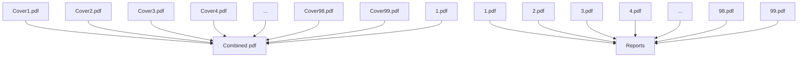
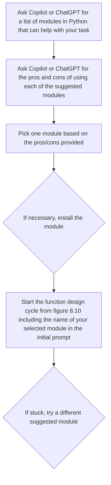
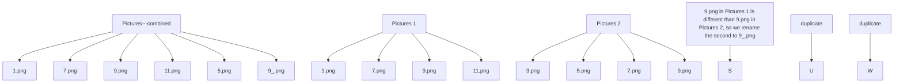
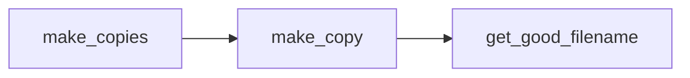
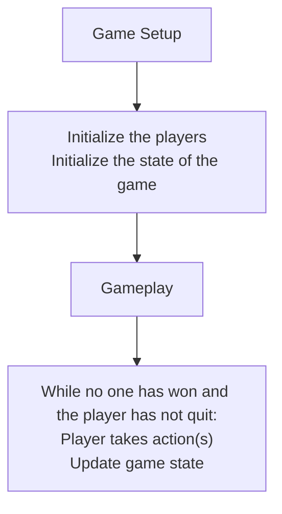
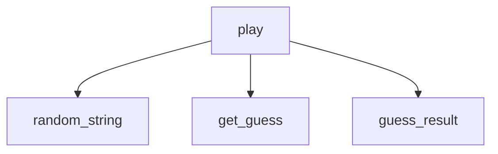
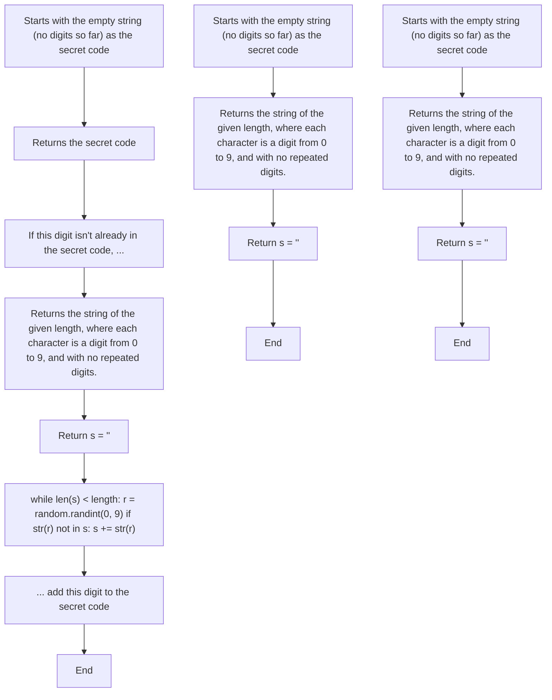
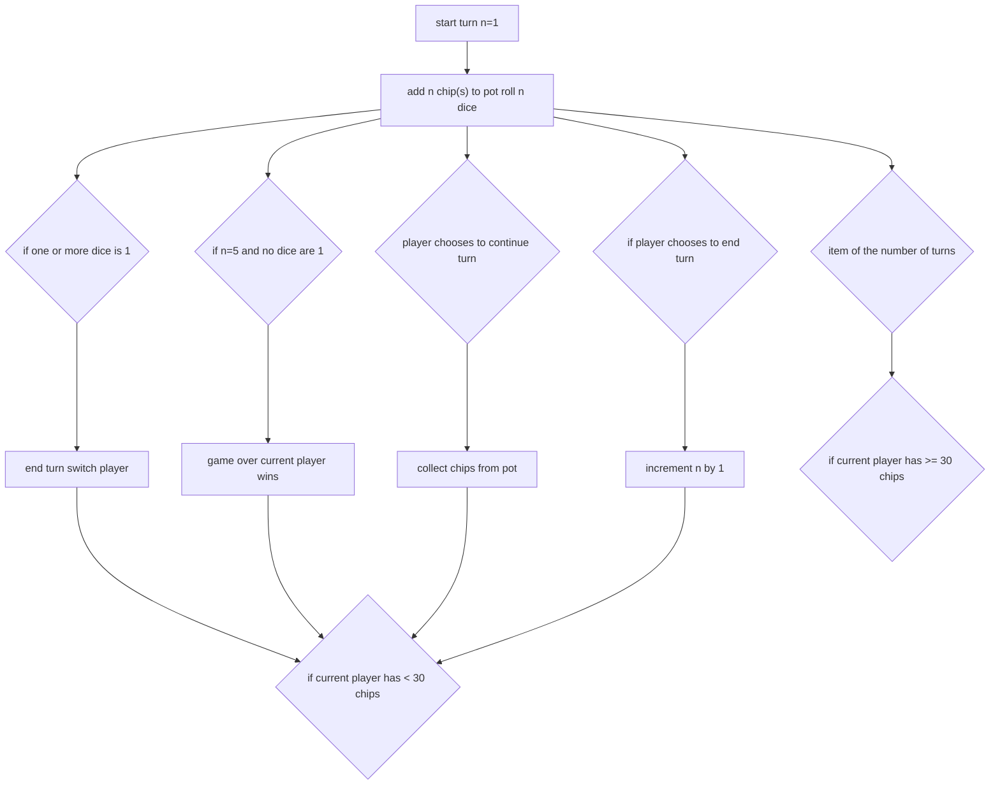
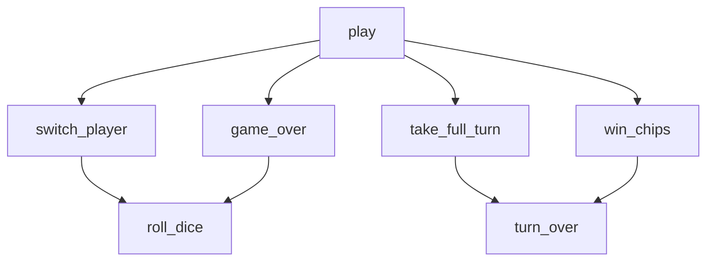

Listing 8.8 First attempt to count consecutive students in a row   
def most_students(classroom):
    ...
    classroom is a list of lists
    Each ' ' is an empty seat
    Each 'S' is a student

    Find the most students seated consecutively in a row

>>> most_students([['S', ' ', 'S', ' ', 'S', 'S'],\
    ['S', ' ', 'S', 'S', 'S', ' ],\
    [' ', 'S', ' ', 'S', ' ', '']]) The first test case
3

max_count = 0
for row in classroom:
    count = 0
    for seat in row:
    if seat == 'S':
    count += 1
    else:
    if count > max_count:
    max_count = count
    count = 0
return max_count

import doctest
doctest.testmod(verbose=True) The code to run doctest that we added

Given this chapter is about debugging, you can probably guess the code isn’t working correctly. We caught this bug when we read the code Copilot gave us, but it’s a subtle bug that we suspect could be missed fairly easily. If you see it already, great job, but pretend you didn’t for the rest of the chapter. If you haven’t seen it, the rest of the chapter is going to be more valuable to you.

Let’s imagine then that we just wrote this prompt and test. We read through the code, and it looks like it’s probably keeping track of the most consecutive students. As long as it sees a student in a seat, it increments the count. When there isn’t a student in the seat, it checks to see whether the count is bigger than any previously seen and resets the count. It seems like it’s at least on the right track. We included a test case, so we ran the code and the test case passed. We’re feeling pretty good about the code but know we need to do more test cases, particularly ones to catch edge cases (remember that edge cases are uncommon cases that could break the code).

We know when we work with lists, it’s good to check that the code does the right thing at the start and end of the list. To test the end of the list, let’s add a test case where the largest group of consecutive students includes the last seat and rerun the code. Here’s the new test case we’re adding to the docstring:

```python
>>> most_students([['S', ' ', 'S', 'S', 'S', 'S'],\
    ['S', ' ', 'S', 'S', 'S', ' ],\
    [' ', 'S', ' ', 'S', ' ', '']]) The longest group of consecutive students is 4.
4 
```

We run the code again and are surprised when the test cases fail. Here’s what it told us (we reformatted the output for readability):

```txt
Trying:
    most_students([['S', ' ', 'S', 'S', 'S', 'S'],
    ['S', ' ', 'S', 'S', 'S', ' ' ],
    [' ', 'S', ' ', 'S', ' ', ' ']])
Expecting:
4
*******************************
File "c:\Copilot\max_consecutive.py",
line 12, in __main__.most_students

Failed example:
    most_students([['S', ' ', 'S', 'S', 'S', 'S'],
    ['S', ' ', 'S', 'S', 'S', ' ' ],
    [' ', 'S', ' ', 'S', ' ', ' ']])
Expected:
4
Got:
3 
```

That’s odd—the code seemed to be working properly. Something about this edge case has uncovered the error. At this point, we’d want to generate some hypotheses about why the code isn’t working properly to help guide our debugging efforts. (If you’re truly stumped, you could take the approach of just setting a breakpoint at the first line of code in the function and stepping through it rather than trying to create a hypothesis). Here are two hypotheses that come to mind:

1 The updating of count is skipping the last element in the list.   
2 The updating of max is missing the last element in the list.

To simplify the debugging process, we removed the test that is passing (just set it aside to restore later) and are only going to run the test that is failing. The following listing shows our full code before we start the debugging process.

Listing 8.9 Setting up to debug the function to count consecutive students in a row   
```python
def most_students(classroom):
    classroom is a list of lists
    Each ' ' is an empty seat
    Each 'S' is a student

    Find the most students seated consecutively in a row 
```

```python
>>> most_students([['S', ' ', 'S', 'S', 'S', 'S'],\
    ['S', ' ', 'S', 'S', 'S', ' ],\
    [' ', 'S', ' ', 'S', ' ', '']]) | See the first test case
4
...
max_count = 0
for row in classroom:
    count = 0
    for seat in row:
    if seat == 'S':
    count += 1
    else:
    if count > max_count:
    max_count = count
    count = 0
return max_count

import doctest
doctest.testmod(verbose=True) 
```

We’ll start with the first hypothesis, that count isn’t updating properly at the end of the list and set a breakpoint at the updating of count. Figure 8.11 shows the first time the debugger pauses after it’s started.


<details>
<summary>text_image</summary>

RUN AND DEBUG ▶ No Configu √ ⋯
VARIABLES
✓ Locals
> classroom: [['S', ' ', 'S', 'S', 'S...
count: 0
max_count: 0
> row: ['S', ' ', 'S', 'S', 'S', 'S']
seat: 'S'
> Globals
max_consecutive.py ×
max_consecutive.py > most_students
10
11
12
13
14
15
16
17
18
19
20
21
22
23
24
[ ' S , ', ' S , ' S , ' S , ', ' S ' ] ,
[' ', ' S ', ' ', ' S ', ' ', ' ' ]])
4
...
max_count = 0
for row in classroom:
count = 0
for seat in row:
if seat == 'S':
count += 1
else:
if count > max_count:
max_count = count
count = 0
return max_count
</details>

Figure 8.11 Debugger stopping before the first update of count

From the debugger, we can see that count is still 0, so it hasn’t been updated yet. We’re in the first row of that first test case because row is $[ { \mathrm { ~ \bf ~ " ~ S ~ " ~ } } , \mathrm { ~  ~ \omega ~ } ^ { \mathrm { ~ \bf ~ " ~ } } , \mathrm { ~  ~ \omega ~ } ^ { \mathrm { ~ \bf ~ " ~ } } { \mathrm { ~ \bf ~ > ~ " ~ } } , \mathrm { ~  ~ \omega ~ } ^ { \mathrm { ~ \bf ~ " ~ } } { \mathrm { ~ \bf ~ > ~ " ~ } } , \mathrm { ~  ~ \omega ~ } ^ { \mathrm { ~ \bf ~ " ~ } } { \mathrm { ~ \bf ~ S ~ " ~ } } ]$ , 'S']. The seat we’re looking at is an 'S', which is why the count is increasing. Let’s click Continue in the Debug Toolbar to see the next update of count. The state of the debugger after clicking Continue appears in figure 8.12.


<details>
<summary>text_image</summary>

RUN AND DEBUG ▷ No Configu √ ⋯
MAX_CONSECUTIVE.py ×
MAX_CONSECUTIVE.py > ⏻ most_students
VARIABLES
> Locals
> classroom: [['S', ' ', 'S', 'S', 'S...
count: 0
max_count: 1
> row: ['S', ' ', 'S', 'S', 'S', 'S']
seat: 'S'
> Globals
14
max_count = 0
for row in classroom:
15
count = 0
for seat in row:
16
if seat == 'S':
17
18
19
count += 1
20
else:
21
if count > max_count:
22
max_count = count
23
count = 0
24
return max_count
25
import doctest
26
doctest.testmod(verbose=True)
</details>

Figure 8.12 Debugger stopping before the second update of count

A fair bit has happened, it seems, since the last update of count since max\_count is now 1. This must have happened when the empty space was processed because max\_ count was set to 1 and count was reset back to 0. At this point, we’re at the third seat in the row with a student there, and count is ready to update. We’ll want to check that count keeps updating with each new student. We clicked Continue, and count increased to 1. We clicked Continue again, and the count increased to 2. We click Continue, and the count increased to 3. At this point, we’re at the last student in the row, and we want to check that count increases to 4. To check this, we clicked Step Over once, and count indeed updates to 4. You can see the state of the debugger at this point in figure 8.13.


<details>
<summary>text_image</summary>

RUN AND DEBUG ▶ No Configu √ ⋯
VARIABLES
> Locals
> classroom: [['S', ' ', 'S', 'S', 'S...
count: 4
max_count: 1
> row: ['S', ' ', 'S', 'S', 'S', 'S']
seat: 'S'
> Globals
max_consecutive.py ×
max_consecutive.py > most_students
14
max_count = 0
for row in classroom:
15
count = 0
16
for seat in row:
17
if seat == 'S':
    count += 1
20
else:
21
if count > max_count:
22
max_count = count
23
count = 0
24
return max_count
</details>

Figure 8.13 Debugger stopping right after the fourth consecutive update of count

Well, we have good news and bad news at this point. The good news is that count is properly updating. The bad news is that our first hypothesis was wrong, and we haven’t found our bug yet. We could move our breakpoint to the line where max\_count is updated and then click Restart and start over the debugging process for our second hypothesis, but given the fact count is 4 right now in our debugger, let’s just continue to trace through the code and make sure max\_count gets updated. Or rather, we know it won’t be, so we want to see why.

Before clicking Step Over, we’ve got a clue already present in the debugger. This clue comes from the fact that the next line of code to execute is for seat in row. But the student we just saw was the last student in row. This means this for loop is just about to finish (meaning we’ll not execute the body of the loop again, which means max\_count can’t get updated). Let’s see whether that’s what happens by clicking Step Over. The state of the debugger appears in figure 8.14.


<details>
<summary>text_image</summary>

RUN AND DEBUG ▶ No Configu √ ⋯
MAX_CONSECUTIVE.py ✗
MAX_CONSECUTIVE.py > ⬆ most_students
VARIABLES
√ Locals
> classroom: [['S', ' ', 'S', 'S', 'S...
count: 4
max_count: 1
> row: ['S', ' ', 'S', 'S', 'S', 'S']
seat: 'S'
> Globals
14
max_count = 0
for row in classroom:
15
count = 0
for seat in row:
if seat == 'S':
    count += 1
else:
21
if count > max_count:
22
max_count = count
23
count = 0
return max_count
</details>

Figure 8.14 Debugger stopping after finishing the first row

We just finished processing the first row, but we never updated the max\_count. The next line of code will pick the next row, and the line after that will set count to 0 again. We finished the loop over the row without ever updating max\_count even though we found a count that’s bigger than the current max\_count. If you don’t see the bug yet, we encourage you to step through until the next time max\_count is updated, and it may be more obvious at that point.

The error in the code is that it only updates max\_count when it encounters an empty seat. This means that if a row ends with a student, the code to check whether max\_count should be updated will never run for that row. Examining the code more closely, the test to see whether max\_count should be updated and the update of max\_count should both occur either outside the if-else statement or right after count is updated.

This is a fix we can probably just make manually since all we need to do is move two lines of code to a better location. The code in listing 8.10 is the corrected function (without the tests or prompts).

Listing 8.10 Corrected function to find the maximum consecutive students in a row   
```python
def most_students(classroom):
    max_count = 0
    for row in classroom:
    count = 0
    for seat in row:
    if seat == 'S':
    count += 1
    if count > max_count:
    max_count = count
    else:
    count = 0
    return max_count 
```

This new code does pass the test that failed with the old code and the original test. After adding another test that makes sure the code works when the longest group of consecutive students appears at the start of the row, we’re more confident the code is now working properly.

# 8.6 Using the debugger to better understand code

We suspect you’re already pretty impressed by the debugger. We are too. When students were taught programming in the traditional manner, a lot of time was spent making sure students could essentially trace through code like a debugger would, drawing out the state of all the variables and updating them with each new line of execution. Indeed, there’s even a free tool on the web called PythonTutor [2] that creates diagrams of the state of memory that can be easier to read than a debugger, just to help new programmers learn how the code executes.

Whether you like using the debugger or want to use a tool like PythonTutor, we encourage you to play with some of the code you’ve written from earlier sections of the book. In our personal experience working with people learning how to program, walking through a program line by line and watching how the state of variables changes can be a truly enlightening experience, and we hope you’ll appreciate it too.

# 8.7 A caution about debugging

From working with students, we’ve also seen that debugging can be a really frustrating experience for new learners [3]. When learning how to program, everyone wants their code to work, and finding and fixing bugs is time spent when things aren’t working. There are a couple of ways to help overcome this frustration. First, problem decomposition can go a really long way to helping you get code from Copilot that is right without the need for extensive debugging. Second, remember that everyone’s code doesn’t work sometimes, including ours. It’s just a natural part of the programming process and a part that can take some practice. Last, always, and we mean always, test every function you write. More often than not, when our students are really stuck debugging, it’s because there are bugs in multiple functions interacting as a result of not testing each function. When that happens, it’s exceptionally hard to find and remedy the bugs. Debugging interacting bugs is so frustrating that avoiding that experience is a big reason why both of us religiously test every function we write.

The good news is that if you test every function you write and you diligently break down problems into small, manageable steps, you shouldn’t find yourself debugging that often. And if you do, you’ll be debugging the error in one function, which is what essentially every programmer on the planet does. With some practice, you’ll get the hang of it.

# Summary

Debugging is an important skill that includes finding errors in code and then correcting them.   
¡ Print statements can be an effective way of learning about what is happening in your code.   
The VS Code debugger is another way of learning what is happening in your code that provides powerful features for monitoring how variables change as the code executes.   
¡ Once an error is uncovered, there are multiple ways to help Copilot fix the error for you, but if that fails, you can often fix the code directly.   
¡ Our workflow of designing functions now includes debugging, and with the skill of debugging, you are more apt to write the software you want.   
¡ Outside of debugging, the VS Code debugger can be a powerful tool in learning more about how the code works.

# Automating tedious tasks

# This chapter covers

¡	Understanding why programmers write tools   
¡	Determining which modules we need to write a given tool   
¡	Automating cleaning up emails that have > > > symbols   
¡	Automating manipulating PDF files   
¡	Organizing your and your partner’s phone pictures in the same place

Suppose that you’re responsible for creating 100 reports, one for each of 100 people. Perhaps you’re a teacher and need to send a report to each of your students. Perhaps you work for HR and need to send an annual assessment report to each employee. Regardless of your role, you have the problem of having to create these reports, and you decided to prepare your reports as .pdf files. You need a customized cover page for each report, too, and those cover pages are designed by one of your colleagues (a graphic design artist).

You and your colleague work independently, and finally, the job is done. Or wait, not so fast. Because now you have to put each cover page at the beginning of each of your reports.

At this point, a nonprogrammer might grit their teeth and start on the job, manually merging the cover page with the first report, the second cover page with the second report, and so on. That could take hours. Not knowing that there may be another way, a nonprogrammer may just power ahead until the job is done.

But you’re a programmer now. And most programmers, the two of us included, would never power ahead with manual work like this.

In this chapter, we’re going to show you how to write programs to automate tedious tasks. The second example in the chapter will automate the “merging cover pages with reports” situation. But we’ll do others as well. Received an email that’s been forwarded so many times

```txt
>>>>>> that it looks
like
>>>>>> this? 
```

Or does your family have several phones, each with hundreds of images, and you just want to get them all in the same place so that you can archive them without losing anything? In this chapter, we’ll show you how to automate tasks like that.

# 9.1 Why programmers make tools

There’s a common sentiment that programmers often express: we’re lazy. This doesn’t mean that we don’t want to do our work. It means that we don’t want to do repetitive, boring, tedious work because that’s what computers are good at. Programmers develop a sort of spidey-sense for this kind of drudgery. Suppose Leo has a few hundred photos, and he wants to delete any photos that are duplicates. There’s no way he’d do this by hand. Or suppose that Dan has to send out a customized email to each of his students. If it’s more than a few students, there’s no way he’s doing this by hand. As soon as programmers start noticing that they’re repeating the same keys on the keyboard or working through the same steps over and over, they’ll stop and make a tool to automate it.

When programmers talk about tools, they’re talking about programs that do something that saves them time. A tool isn’t often the end goal and writing one can itself feel tedious and not glamorous. But once we have a tool, we can use it to save us time. Sometimes, we’ll use a tool once, for one specific job, and then never again. Commonly, though, a tool ends up being useful over and over, whether we use the tool exactly as we wrote it or by making some small changes. For example, after Dan finishes teaching each course, he uses a program he wrote to collate all student grades and submit them to the university. He makes small changes to the tool each time—changing the weights of each assignment, for example—but then Dan can use that slightly modified tool to do the work.

The great thing about using Copilot is that it makes it easier to crank out these tools. Here’s how one software engineer explains it: “We all know that tools are important, that effective tools are challenging to create, and that management doesn’t care or understand the need for tools. . . . I can’t express how fundamentally different programming feels now that I can build two quality tools per day, for every single itch I want to scratch” [1].

# 9.2 How to use Copilot to write tools

As we learned in chapter 5 when talking about modules, sometimes we need to use a module to help us write the program we want. Some modules are built into Python. For example, in chapter 5, we used the built-in zipfile module to help us create a .zip file. Other modules are not built in, and we need to install them first before we can use them. That was the case in chapter 2 when we used the matplotlib module to visualize our quarterback data.

When writing a tool, it’s often the case that we’ll be working with some specialized data format (ZIP files, PDF files, Excel spreadsheets, images) or performing some specialized task (sending email, interacting with a website, moving files around). For most of this, we’re going to need to use a module. Which module, though? And is it built in, or do we need to install it? These are the first questions we need to get answers to.

Fortunately, we can use Copilot’s chat feature (or ChatGPT) to help us get started. We already saw the Copilot chat feature in chapter 8. As a reminder, we’re using the Copilot chat feature because it is built into our VS Code IDE and because Copilot chat has access to the very code we’re currently writing so it can incorporate what we’re doing into its answers.

The plan is to have a conversation with Copilot to determine which module we need to use. Once we know that and install the module, if necessary, then we can get down to the business of writing the code for our tool. And we’ll do that the way we’ve always done it: by writing the function header and a docstring and having Copilot fill in the code for us. Once Copilot starts writing code, we need to follow the same steps as in previous chapters, including checking code correctness, fixing bugs, and maybe even doing some problem decomposition. To focus our attention on writing tools to automate tasks, we’ll minimize the time we spend on them here.

It may be possible to ask Copilot or ChatGPT to write the entire tool for us, without even having to put it inside of a function. We won’t do that here, though, because we still think that the benefits of functions are worthwhile. A function will help us document our code so that we know what it does and it enables flexibility if we later decide, for example, to add additional parameters to our function to change the behavior of the tool.

# 9.3 Example 1: Cleaning up email text

Sometimes, an email gets replied to and forwarded so many times that it becomes a mess, with many greater than (>) signs and spaces on some of the lines. Here’s a sample email of what we mean:

> > > Hi Leo,   
> > > > > Dan -- any luck with your natural language research?

```txt
>>> Yes! That website you showed me
https://www.kaggle.com/
>>> is very useful. I found a dataset on there that collects a lot
>>> of questions and answers that might be useful to my research.
>>> Thank you,
>>> Dan 
```

Suppose that you wanted to save this email information for future use. You might like to clean up the > and space symbols at the start of lines. You could start manually deleting them—this email isn’t that long, after all—but don’t do that. Because here you have an opportunity to design a general-purpose tool that you can use whenever you need to perform this task. Whether your email has five lines or a hundred lines or a million lines, it won’t matter: just use the tool and be done.

# 9.3.1 Conversing with Copilot

We need to make the messy email available to our tool so that the tool can clean it up. One way we can do this is to first copy the text of an email to the clipboard (using your Copy to Clipboard command on your operating system, such as Ctrl–C.) We could then run the tool, and the tool could clean up the email and replace the clipboard contents with the cleaned-up version. For the tool to do something reasonable, we assume that your clipboard has email text on it. The tool will remove the > and space characters at the start of each line so that you can paste (using your operating system Paste command, such as Ctrl–V) the newly cleaned-up email wherever you want. In terms of Python, it will need to pull the clipboard contents into a string (i.e., copy the contents of the clipboard), clean it up, and then put that new cleaned-up text back on the clipboard (i.e., paste to the clipboard), replacing the junky version of the email that was there before.

So, how do we access the clipboard in our Python program? That’s what we need to figure out, so that will frame the conversation that we have with Copilot. Similar with chapter 8, we’re going to use “Human” for the prompts that we type and “GitHub Copilot” for Copilot’s responses. Recall that if the Copilot chat feature isn’t available at the point you are reading this, you can use ChatGPT to have a similar conversation. We are typing our prompts into the Copilot chat window.

In our chats with Copilot, we’re going to explore widely before settling on a solution. We’ll explain why we’re doing this once we’ve gotten the hang of things through one example, but we note this here so that you’ll be ready for this seemingly less direct approach. Copilot provides quite a bit of sample code in its responses. As we’re exploring, feel free to skim that code, but don’t get bogged down in it. We’ll look at more particulars of the code once we finish exploring and settle on a plan. Let’s start learning!

Human I would like to write a Python program that accesses the clipboard and lets me copy and paste using the clipboard. How can I do this?

GitHub Copilot You can use the \`pyperclip\` module to access the clipboard in Python. Here’s an example program that lets you copy and paste using the clipboard:

```python
import pyperclip

# Copy to clipboard
pyperclip.copy('Hello, world!')
# Paste from clipboard
text = pyperclip.paste()
print(text) 
```

This program first imports the pyperclip module. It then copies the string 'Hello, world!’ to the clipboard using the copy() function. Finally, it pastes the contents of the clipboard into the text variable using the paste() function and prints the result.

You can install the \`pyperclip\` module using pip by running \`pip install pyperclip\` in your terminal.

Copilot’s response teaches us that we can use the pyperclip module to interact with the clipboard in our Python program. The sample code that it provided even showed us how to copy stuff from our program to the clipboard and paste stuff from the clipboard into a variable. We are making great progress!

The final paragraph of the response tells us how to install pyperclip. Aha! So pyperclip doesn’t come with Python by default. While we do know how to install modules (we did that starting in chapter 2 with matplotlib), it might be nice to not have to worry about that. So, let’s continue the conversation, asking Copilot if we can do better.

Human Is there a way I can do it without having to install a Python module?

GitHub Copilot Yes, you can use the \`tkinter\` module that comes with Python to access the clipboard. Here’s an example program that lets you copy and paste using the clipboard without installing any additional modules:

```python
import tkinter as tk

# Create a Tkinter window
root = tk.Tk()

# Hide the window
root.withdraw()

# Copy to clipboard 
```

```python
root.clipboard_clear()
root.clipboard_append('Hello, world!')
# Paste from clipboard
text = root.clipboard_get()
print(text) 
```

This program first creates a hidden Tkinter window using the \`Tk()\` function and hides it using the \`withdraw()\` method. It then clears the clipboard using the \`clipboard\_ clear()\` method and appends the string \`’Hello, world!’\` to the clipboard using the \`clipboard\_append()\` method. Finally, it retrieves the contents of the clipboard using the \`clipboard\_get()\` method and prints the result.

Note that this method only works if you have a graphical environment available, such as a desktop environment on Linux or macOS, or the Windows desktop on Windows. If you’re running Python in a terminal-only environment, you’ll need to use a different method to access the clipboard.

It seems that we’ve won something and lost something else. The win is that this tkinter module is built into Python. The loss is that “the method only works if you have a graphical environment available.” Do we have a graphical environment available in our Python setup? While we could certainly try the code to find out, this requirement gives us pause. After all, the pyperclip solution didn’t have that requirement, so we might not need it (whatever it happens to mean). Let’s try again.

Human Is there another way I can do it without having to install a Python module?

GitHub Copilot Yes, you can access the clipboard using the \`win32clipboard\` module, which is included in the standard library on Windows. Here’s an example program that allows you to copy and paste using the clipboard without installing any additional modules:

```python
import win32clipboard

# Copy to clipboard
text = "Hello, world!"
win32clipboard.OpenClipboard()
win32clipboard.EmptyClipboard()
win32clipboard.SetClipboardText(text)
win32clipboard.CloseClipboard()

# Paste from clipboard
win32clipboard.OpenClipboard()
pasted_text = win32clipboard.GetClipboardData()
win32clipboard.CloseClipboard()
print(pasted_text) 
```

This program first imports the \`win32clipboard\` module. To copy text to the clipboard, you can call the \`OpenClipboard()\` function to open the clipboard, then call \`EmptyClipboard()\` to clear any existing data, and finally call \`SetClipboardText()\` to set the text on the clipboard. After setting the text, you should call \`CloseClipboard()\` to close the clipboard.

To paste from the clipboard, you can call \`OpenClipboard()\` to open the clipboard, then call \`GetClipboardData()\` to get the text from the clipboard. After getting the text, you should call \`CloseClipboard()\` to close the clipboard. In this example, the program copies the text “Hello, world!” to the clipboard, then pastes it and prints it to the console.

“Standard library on Windows,” eh? That’s concerning because it means that our tool might not work on other operating systems. Let’s see about that.

Human Does that work on Linux or Mac OS too?

GitHub Copilot No, the \`win32clipboard\` module is specific to Windows and won’t work on Linux or Mac OS. On Linux, you can use the \`xclip\` command-line utility to access the clipboard. Here’s an example program that allows you to copy and paste using the clipboard on Linux:

```python
import subprocess

# Copy to clipboard
text = "Hello, world!"
subprocess.run(['xclip', '-selection', 'clipboard'], input=text.encode('utf-8'))
# Paste from clipboard
p = subprocess.Popen(['xclip', '-selection', 'clipboard', '-o'], stdout=subprocess.PIPE)
pasted_text = p.stdout.read().decode('utf-8')
print(pasted_text) 
```

This program uses the \`subprocess\` module to run the \`xclip\` command-line utility. To copy text to the clipboard, you can call \`subprocess.run()\` and pass in the \`xclip\` command with the \`-selection clipboard\` option to specify the clipboard selection, and the \`input\` parameter to pass in the text you want to copy. To paste from the clipboard, you can call \`subprocess.Popen()\` and pass in the \`xclip\` command with the \`-selection clipboard -o\` options to read the text from the clipboard, and then read the output of the command using the \`stdout\` attribute of the \`Popen\` object. In this example, the program copies the text “Hello, world!” to the clipboard, then pastes it and prints it to the console.

On Mac OS, you can use the \`pbcopy\` and \`pbpaste\` command-line utilities to access the clipboard. The usage is similar to \`xclip\`.

We’ve gotten some solutions that are specific to different operating systems. We don’t like this! We want our tool to work no matter which operating system we are using. (Even if we are using only Windows ourselves, maybe one day we’ll share this tool with others who use different operating systems.)

We could continue our conversation, but in retrospect, having to install that single pyperclip module doesn’t seem so bad. Let’s go ahead with it. In general, it can be valuable to explore your options when deciding how to start writing a tool, and conversing with Copilot is helpful for carrying out this exploration.

# Why we should explore and understand our options

There are several reasons why you shouldn’t just use the first module that Copilot chat tells you to use:

1 It may not work on all operating systems. In general, we want to find modules that work across multiple operating systems so that the tool can be used by you (if you later switch operating systems) or others with whom you’ve shared the tool.   
2 It may turn out not to work for our use case after all, or we may struggle to get the code to work. If we have other options, we can start trying those before sinking too much time into a strategy that may or may not ultimately work out.   
3 Modules are updated frequently. Usually this is to add new features and fix bugs, but sometimes, functions are removed or changed in this process as well. When the author of a module removes a function, it’s known as deprecating that function. Once a function is deprecated, it may no longer work, and we need to find a replacement. Copilot is trained only every once in a while, not continuously, so if a new version of a module comes out after Copilot was trained on it, Copilot won’t know about the updates. This can lead to Copilot suggesting code that depends on an older version of the module than the one you have. There are ways to address this, as we will see later in the chapter. But if you run into trouble, having other options to explore is useful.

# 9.3.2 Writing the tool to clean up email

The first thing we need to do is to install the pyperclip module. To do that, you’ll need to type pip install pyperclip into the Terminal at the bottom right of VS Code. (It’s been a while, but we did install a module in chapter 2, matplotlib, using this same approach.)

Once that’s installed, we can import the module and then write the header and docstring for our function that will remove the > and space characters from the start of lines. The reason we’re importing the module here is to influence Copilot to use that module when writing the code for the function. Here’s the prompt we used and the code that Copilot gave us.

Listing 9.1 First try: Code to clean up email text in the clipboard   


<details>
<summary>text_image</summary>

import hyperlink
def clean_email():
    ''' The clipboard contains lines of text.
    Clean up the text by removing any > or space
    characters from the beginning of each line.
    Replace the clipboard with the cleaned text.
    '''
    text = hyperlink.paste()
    lines = text.splitlines()
    for i in range(len(lines)):
        lines[i] = lines[i].lstrip(' >')
    text = '
    this looks odd...
    '.join(lines)
    puperclip.copy(text)
if __name__ == '__main__':
        clean_email()
        Calls our function to
                automatically clean up
                the clipboard!
        Notes a common
            Python
              convention (see
                the following)
                discussion
        Puts the current
            contents of the clipboard
            into the text string
        Splits the
            string into a
                list of its
                lines
        Loops
            through
            each line
        Removes spaces and > symbols
            from the start of the line
        Copies the
                cleaned-up text
                to the clipboard
</details>

We can see that the program is carrying out the correct sequence of steps: it’s obtaining the clipboard contents, cleaning up that text, and then copying the cleaned-up text back to the clipboard. As we learned from our earlier chat with Copilot, we want Copilot to write code that uses the paste and copy functions of pyperclip, and that’s exactly what it’s doing. The second-to-last line of the program is something we haven’t seen before in this book:

```python
if __name__ == '__main__': 
```

You can actually remove this line if you like (and if you do, also unindent the line below it). It ensures that the clean\_email function is only called when you run your program, not when you import it as a module. After all, if you did want to import this as a module (to be used as part of a larger program), you would call clean\_email whenever you needed that functionality, not necessarily as soon as the module was imported. (And, in general, whenever you’re interested in understanding a line of code more fully, you can ask Copilot about it!) Unfortunately, this code doesn’t work. If you run it, you will receive this error:

```txt
File "C:\repos\book_code\ch9\email_cleanup.py", line 14
text = ' 
```

```txt
SyntaxError: unterminated string literal (detected at line 14) 
```

The syntax error means that we have a program that is not written in valid Python code. We’re going to fix this now! We have a couple of options for how to do so. One is to highlight your code and click the Copilot Labs button Fix Bug. For us, this did fix the problem. If that option isn’t available, try asking Copilot chat or ChatGPT in conversation: “Propose a fix for the bugs in my code <insert your code>“. This is a useful tip to keep in mind whenever the code that you get back from Copilot doesn’t work as expected.

Copilot fixed the code for us by fixing the line with the syntax error. The new code is shown in the following listing.

Listing 9.2 Second try: Code to clean up email text in the clipboard   
```python
import hyperlink

def clean_email():
    '''
    The clipboard contains lines of text.
    Clean up the text by removing any > or space characters from the beginning of each line.
    Replace the clipboard with the cleaned text.
    '''
    text = hyperlink.paste()
    lines = text.splitlines()
    for i in range(len(lines)):
    lines[i] = lines[i].lstrip('>')
    text = '\n'.join(lines)
    hyperlink.copy(text)

if __name__ == '__main__':
    clean_email() 
```

The new line of code, changed from the odd line of code that we had previously, is:

```txt
text = '\n'.join(lines) 
```

The goal of this line is to join all the lines of text together into a single string that the program will later copy to the clipboard. What does that \n mean? We can understand that by experimenting a little with join. Here’s an example of using join with an empty string rather than the '\n' string:

```python
>>> lines = ['first line', 'second', 'the last line']
>>> print(''.join(lines))
first linessecond the last line
Calls "join" on the empty string
Shows the list of three lines 
```

Notice that some of the words are squished together. That’s not exactly what we want— we need something between them. How about a space? Let’s try using join again, this time with a space in the string rather than the empty string:

```txt
>>> print(' '.join(lines))
first line second the last line 
```

Or we could use '\*':

```txt
>>> print('*'.join(lines))
first line*second*the last line 
```

That fixes our squished words. And the \*s tells us where each line ends, but it would be nicer to actually maintain the fact that the email is three lines.

We need a way in Python to use a line break or newline character, rather than a space or \*. We can’t just press Enter because that would split the string over two lines and that isn’t valid Python syntax. The way to do it is by using '\n':

```txt
>>> print('\n'.join(lines))
first line
second
the last line 
```

Now our tool is ready to be used. If you copy some messy email text to your clipboard, run our program, and paste the clipboard, you’ll see that the email has been cleaned up. For example, if we run it on our previous sample email, we get the following cleaned-up version:

```txt
Hi Leo,
Dan – any luck with your natural language research?
Yes! That website you showed me
https://www.kaggle.com/
is very useful. I found a dataset on there that collects
a lot
of questions and answers that might be useful to my research.
Thank you,
Dan 
```

Of course, we could still do more. The line breaks in that email aren’t great (the line “a lot” is extremely and needlessly short), and you might want to clean that up as well. You could begin to make these kinds of improvements by adding new requirements to your prompts to Copilot. We’ll stop here because we have accomplished our initial goal of email cleanup, but we encourage you to continue exploring more robust solutions on your own.

# 9.4 Example 2: Adding cover pages to PDF files

Let’s return to the scenario from the start of the chapter. We have written 100 reports that are in .pdf format. Our colleague has designed 100 covers for those reports that are also in .pdf format. And we need to merge the covers with the reports so that each finalized .pdf file starts with the cover and continues with the report. Figure 9.1 provides an illustration of the desired process.


<details>
<summary>flowchart</summary>


</details>

Figure 9.1 Illustration of the desired process of creating combined .pdfs by merging the report cover in the cover directory with the report in the report’s directory. Note that the reports may be more than one page.

# .pdf files (and Word files, Excel files) are not text files

You might wonder why we can’t simply use Python methods like read and write to manipulate .pdf files. After all, that’s just what we did when working with .csv files in chapter 2.

The big difference is that .csv files are text files, which are files readable by humans with no formatting or special commands. Many other file formats are not text files, however. A .pdf file, for example, is not human-readable and needs to be processed by code that is aware of the .pdf format. This is true of Microsoft Word files and Microsoft Excel files as well: they’re not text files, so we need specialized tools to work with them.

In the resources for this book, in the ch9 folder, you will find two subfolders. One is called reports, and it contains 100 reports as .pdf files. The other is called covers, and it contains 100 covers as .pdf files, one for each report. The reports are named 1.pdf, 2.pdf, 3.pdf, and so on; the covers are named cover1.pdf, cover2.pdf, cover3.pdf, and so on. The cover for the 1.pdf report is cover1.pdf, the cover for 2.pdf is cover2.pdf, and so on. It’s these reports and covers that we will merge together in this section.

Open some of the cover .pdf files and some of the report .pdf files. You can do that using a program like Adobe Acrobat or however you typically open .pdf files on your computer. You’ll notice that the covers are always exactly one page, but the reports can be more than one page. When we get to the code, we should take care to tell Copilot that reports can be more than one page; otherwise, Copilot might write code assuming that the reports, like the covers, are only one page.

You might be wondering how we created these 100 covers and reports. You’d be disappointed if we made them manually, one at a time, right? Don’t worry. We automated that creation process in much the same way we will automate the merging process next.

# 9.4.1 Conversing with Copilot

We need our tool to find all reports and covers, add the cover to the front of each report, and produce a finalized .pdf for each report that contains both the cover page and report pages.

How do we merge .pdf files using Python? Let’s find out.

Human I need to write a Python program that merges .pdf files. How do I do this?

GitHub Copilot You can use the PyPDF2 library to merge PDF files in Python. Here is an example code snippet that shows how to merge two PDF files:

```python
import PyPDF2

# Open the PDF files to be merged
pdf1 = open('file1.pdf', 'rb')
pdf2 = open('file2.pdf', 'rb')

# Create a PDF reader object for each file
reader1 = PyPDF2.PdfFileReader(pdf1)
reader2 = PyPDF2.PdfFileReader(pdf2)

# Create a PDF writer object
writer = PyPDF2.PdFileWriter()

# Loop through the pages of each PDF and add them to the writer object
for i in range(reader1.getNumPages()):
    page = reader1.getPage(i)
    writer.addPage(page)

for i in range(reader2.getNumPages()):
    page = reader2.getPage(i)
    writer.addPage(page)

# Write the merged PDF to a file
output = open('merged.pdf', 'wb')
writer.write(output)

# Close the input and output files
pdf1.close()
pdf2.close()
output.close() 
```

In this example, we first open the two PDF files to be merged using the \`open()\` function. We then create a PDF reader object for each file using the \`PdfFileReader()\` function from PyPDF2.

Next, we create a PDF writer object using the \`PdfFileWriter()\` function. We then loop through the pages of each PDF file using the \`getNumPages()\` and \`get-Page()\` methods of the reader objects and add each page to the writer object using the \`addPage()\` method.

Finally, we write the merged PDF to a file using the \`write()\` method of the writer object and close all the input and output files using the \`close()\` method.

We have a lead! This PyPDF2 module seems to do what we need. It looks like it gives us PdfFileReader to read an existing .pdf file and PdfFileWriter to create a new .pdf file. We see the code using getPage to get a page from an existing .pdf file and addPage to write it to the new .pdf file. Very promising.

Is there something built-in to Python that we could use, so that we don’t have to worry about installing PyPDF2?

Human Is there a way I can do it without having to install a Python module?

GitHub Copilot Yes, you can use the \`subprocess\` module to call a command-line tool like \`pdftk\` to merge PDF files. Here is an example code snippet that shows how to merge two PDF files using \`pdftk\`:

```txt
import subprocess 
```

```txt
# Call pdftk to merge the PDF files
subprocess.call(['pdftk', 'file1.pdf', 'file2.pdf', 'cat', 'output', 'merged.pdf']) 
```

In this example, we use the \`subprocess.call()\` function to call \`pdftk\` with the appropriate arguments to merge the two PDF files \`file1.pdf\` and \`file2.pdf\`. The \`cat\` argument tells \`pdftk\` to concatenate the input files, and the \`output\` argument specifies the output file name as \`merged.pdf\`.

Note that you will need to have \`pdftk\` installed on your system for this code to work. If you don’t have \`pdftk\` installed, you can download it from the official website: https:// www.pdflabs.com/tools/pdftk-the-pdf-toolkit/.

This approach may ultimately end up being valuable, but it’s not exactly a built-in solution. After all, the final paragraph talks about us having to install some new software called pdftk!

At this point, we’d probably go with the first option of using PyPDF2. But let’s press forward once more with Copilot to make sure we don’t miss any good options.

Human Are there other Python .pdf libraries that I should consider?

GitHub Copilot Yes, there are several other Python libraries that you can use to work with PDF files. Here are some popular ones:

1 ReportLab - a library for creating PDF documents from scratch, with support for text, graphics, and images.   
2 FPDF - a library for creating PDF documents from scratch, with support for text, graphics, and images.   
3 PDFMiner - a library for extracting text and metadata from PDF files.   
4 PyMuPDF - a library for working with PDF files, with support for text, graphics, and images.   
5 pdfrw - a library for reading and writing PDF files, with support for text, graphics, and images.

Each library has its own strengths and weaknesses, so you should choose the one that best fits your needs. If you only need to merge PDF files, then PyPDF2 or pdftk may be sufficient. However, if you need to create or manipulate PDF files in more complex ways, then one of the other libraries may be a better choice.

The last paragraph tells us that we’re probably in good shape using PyPDF2 if all we need to do is merge .pdf files. But let’s finish our conversation here by understanding the pros and cons of all these tools. That way, if we get stuck with PyPDF2, we know where to turn to next.

Human Can you summarize the strengths and weaknesses of these libraries?

GitHub Copilot Certainly! Here is a summary of the strengths and weaknesses of the libraries I mentioned:

1 PyPDF2 - a library for working with PDF files, with support for text, graphics, and images.

# Strengths:

– Easy to use for simple tasks like merging PDF files.   
– Good documentation and examples available.   
– Supports a wide range of PDF features.

# Weaknesses:

– Limited support for advanced PDF features like forms and annotations.   
– Can be slow for large PDF files.

2 ReportLab - a library for creating PDF documents from scratch, with support for text, graphics, and images.

# Strengths:

– Very powerful and flexible for creating complex PDF documents.   
– Supports a wide range of PDF features.   
– Good documentation and examples available.

# Weaknesses:

– Steep learning curve for beginners.   
– Can be slow for large PDF files.

3 FPDF - a library for creating PDF documents from scratch, with support for text, graphics, and images.

# Strengths:

– Lightweight and easy to use.   
– Good documentation and examples available.   
– Supports a wide range of PDF features.

# Weaknesses:

– Limited support for advanced PDF features like forms and annotations.   
– Can be slow for large PDF files.

4 PDFMiner - a library for extracting text and metadata from PDF files.

# Strengths:

– Very powerful and flexible for extracting text and metadata from PDF files.   
– Supports a wide range of PDF features.   
– Good documentation and examples available.

# Weaknesses:

– Steep learning curve for beginners.   
– Limited support for creating or manipulating PDF files.

5 PyMuPDF - a library for working with PDF files, with support for text, graphics, and images.

# Strengths:

– Very fast and efficient for working with PDF files.   
– Supports a wide range of PDF features.   
– Good documentation and examples available.

# Weaknesses:

– Steep learning curve for beginners.   
– Limited support for creating or manipulating PDF files.

6 pdfrw - a library for reading and writing PDF files, with support for text, graphics, and images.

# Strengths:

– Very powerful and flexible for reading and writing PDF files.   
– Supports a wide range of PDF features.   
– Good documentation and examples available.

# Weaknesses:

– Steep learning curve for beginners.   
– Can be slow for large PDF files.

Don’t be too intimidated by the “Steep learning curve for beginners” cautions in there. If Copilot has been trained on the library, then you may still be successful.

Based on what we’ve learned here, we might eliminate PDFMiner because it apparently has “limited support for creating or manipulating PDF files,” but we’d keep all others in contention just in case we need them. For now, we’re going to proceed with PyPDF2 and see how it goes.

# 9.4.2 Writing the tool

Go ahead and install the PyPDF2 module. Be careful with the capitalization: the module is called exactly PyPDF2, not pypdf2 or pyPDF2 or any other capitalization.

In our previous example, we wrote a function to clean up an email that was on the clipboard. We didn’t need to pass any information to that function, so the function had no parameters. Here, we think it would be useful for our function to have three parameters: the name of the directory with the reports, the name of the directory with the covers, and the name of the directory where we want to write our finalized (merged) .pdf files.

In our docstring, we need to explain what each of these directories is for and also the pattern of the filenames in the directories. After all, Copilot will need to know how the reports match up with the cover pages.

# Trying PyPDF 2

We’re going to use the PyPDF2 Python library to try to get the job done. Look back to what Copilot chat told us about the PyPDF2 library. The sample code it gave us used PdfFileReader to read existing .pdf files and PdfFileWriter to create a new .pdf file. It also used getPage and addPage to manipulate pages. Look out for these in the code that Copilot produces—they’re telltale signs that Copilot is generating code that’s on the right track. Here’s the prompt that we used and the code that Copilot gave us.

Listing 9.3 Function to add covers to .pdf documents   
import PyPDF2

def add_covers(report_dir, cover_dir, final_dir):
    '''
    report_dir is a directory of reports named 1.pdf, 2.pdf, and so on. These files may be one page or more than one page.

    cover_dir is a directory of covers, with one cover per report.
    The filenames in this directory are cover1.pdf, cover2.pdf, and so on. Each of these files is one page.

    Add the cover to the beginning of each report, and store all resulting pdfs in final_dir.
    '''
    report_files = os.listdir(report_dir)
    for report_file in report_files:
    report = open(os.path.join(report_dir, report_file), 'rb')
    report_reader = PyPDF2.PdFileReader(report)
    report_writer = PyPDF2.PdFileWriter()
    for page_num in range(report_reader.numPages):
    report_writer.addPage(report_reader.getPage(page_num))
    cover = open(os.path.join(cover_dir, 'cover' + report_file), 'rb')
    cover_reader = PyPDF2.PdFileReader(cover)
    report_writer.insertPage(cover_reader.getPage(0), 0)
    result = open(os.path.join(final_dir, report_file), 'wb')
    report_writer.write(result)
    report.close()
    cover.close()
    result.close()

    if __name__ == '__main__':
    add_covers('reports', 'covers', 'final')
    Calls our function to do all of the merging!
    Opens the cover associated with this report
    Adds the page to our new .pdf file
    Loops through each page of the report
    We can use report_writer to write pages into a new .pdf file.
    We can use report_reader to read the pages of the report.

# Be careful with automation programs

Programs like the one we’ve written to merge .pdf files can rip through hundreds or thousands of files very quickly. If they aren’t operating correctly, they can easily result in you damaging or losing files. Any time we use open with 'w' or 'wb' as the second parameter, it means that we are overwriting a file.

# (continued)

Let’s focus on this line from our program in listing 9.3:

```python
result = open(os.path.join(final_dir, report_file), 'wb') 
```

It’s using the open function to open a file. Specifically, it’s opening the current report\_ file file in the final\_dir directory. The second argument to open here, 'wb', means that we want to open the file so we can write to it (that’s the 'w') and that the file we’re writing is a binary file (that’s the 'b'), not a text file. If the file doesn’t already exist, then the 'w' we’ve included will result in the file being created. That’s not the dangerous part. The dangerous part is what happens when the file already exists. In that case, 'w' wipes out its contents and gives us an empty file that we can start writing to. Now, if our program is working correctly and only doing this in our final\_dir, then we’re OK. But this is what we need to carefully verify before letting our program loose.

We highly recommend that you first test on a small directory of files that you don’t care about. Further, we recommend changing lines of code that open files using 'w' or 'wb' to print a harmless output message instead, so that you can see exactly which files are going to be overwritten or created. For example, in our program here, we need to comment out these two lines:

```lua
result = open(os.path.join(final_dir, report_file), 'wb')
report_writer.write(result) 
```

Instead, we’ll use print to print out the file that we would have created or overwritten:

```txt
print('Will write', os.path.join(final_dir, report_file)) 
```

Then when you run your program, you’ll see the names of files that the program intended to write. If the output looks good—that is, the program is operating exactly on the files that you wanted it to operate on—then you can uncomment the code that actually does the work.

Exercise caution and always keep backups of your important files!

The last line of the program in listing 9.3 makes the assumption that the directory of reports is called reports, the directory of cover pages is called covers, and the directory where the final .pdf files should go is called final.

Please create the final directory now. It should be there along with your reports and covers directories.

The overall structure of the code looks promising to us: it’s getting a list of the .pdf reports, and then for each one, it’s merging those pages with the cover page. It’s using a for loop to loop through the pages of the report, which is good because it can grab all the pages that way. By contrast, it’s not using a for loop on the cover .pdf file, which again is good because we know that the cover has only one page anyway.

However, the first line of code it gave us looks like it’s using a function called listdir in a module called os. There are other lines that use this module as well. Do we need to be importing that os module? Indeed, we do! And we can prove it by running the code. If you run the code, you’ll get an error:

```python
Traceback (most recent call last):
  File "merge_pdfs.py", ...
    add_covers('reports', 'covers', 'final')
  File "merge_pdfs.py", ...
    report_files = os.listdir(report_dir)
    NameError: name 'os' is not defined 
```

We need to add import os at the start of our program to fix this. Here’s the updated code in the following listing.

Listing 9.4 Improved function to add covers to .pdf documents   
```python
import os
import PyPDF2
We were missing this
import before.

def add_covers(report_dir, cover_dir, final_dir):
    '''
    report_dir is a directory of reports named 1.pdf, 2.pdf, and so on.
    These files may be one page or more than one page.

    cover_dir is a directory of covers, with one cover per report.
    The filenames in this directory are cover1.pdf, cover2.pdf, and so on.
    Each of these files is one page.

    Add the cover to the beginning of each report,
    and store all resulting pdfs in final_dir.
    '''
    report_files = os.listdir(report_dir)
    for report_file in report_files:
    report = open(os.path.join(report_dir, report_file), 'rb')
    report_reader = PyPDF2.PdfFileReader(report)
    report_writer = PyPDF2.PdfFileWriter()
    for page_num in range(report_reader.numPages):
    report_writer.addPage(report_reader.getPage(page_num))
    cover = open(os.path.join(cover_dir, 'cover' + report_file), 'rb')
    cover_reader = PyPDF2.PdfFileReader(cover)
    report_writer.insertPage(cover_reader.getPage(0), 0)
    result = open(os.path.join(final_dir, report_file), 'wb')
    report_writer.write(result)
    report.close()
    cover.close()
    result.close()

if __name__ == '__main__':
    add_covers('reports', 'covers', 'final') 
```

We’re not out of the woods yet, though. Our updated program still doesn’t work. Here’s the error we get when we run our program:

```python
Traceback (most recent call last):
  File "merge_pdfs.py", line 34, in <module>
    add_covers('reports', 'covers', 'final')
  File "merge_pdfs.py", line 20, in add_covers
    report_reader = PyPDF2.PdfFileReader(report)
The line in our code that's causing an error 
```

```txt
File "...\PyPDF2\_reader.py", line 1974, in __init_deprecation_with_replacement("PdfFileReader", "PdfReader", "3.0.0")
File "...\PyPDF2\_utils.py", line 369, in deprecation_with_replacement_deprecation(DEPR_MSG_HAPPENED.format(old_name, removed_in, new_name))
File "...\PyPDF2\_utils.py", line 351, in deprecation_raise DeprecationError(msg)
PyPDF2.errors.DeprecationError: PdfFileReader is deprecated and was removed in PyPDF2 3.0.0. Use PdfReader instead.
We can't use PdfFileReader anymore—it's gone! 
```

We’ve run into the problem where Copilot thinks, “Hey, let’s use PdfFileReader, since I’ve been trained that this is part of PyPDF2”, but between Copilot being trained and the time of our writing, the PyPDF2 maintainers have removed PdfFileReader and replaced it with something else (PdfReader, according to the final line of the error message). This discrepancy may very well be fixed for you by the time you read this book, but we want to pretend it’s still messed up so that we can teach you what to do if this does happen to you in future. At this point, we have three options:

1 Install an earlier version of PyPDF2. The last two lines of the error message tell us that PdfFileReader, the function we need from PyPDF2, was removed in PyPDF2 3.0.0. As a result, if we install a version of PyPDF2 earlier than 3.0.0, we should have our function back. In general, installing earlier versions of libraries is not advisable because security concerns may be present in those versions that have since been fixed in more recent versions. In addition, there may be bugs present in the older versions that have since been fixed. It’s worth Googling what has been changed in the library recently to determine whether using an older version is safe. In this case, we have done that homework and see no obvious risk in using an older version of PyPDF2.   
2 Fix the code ourselves using the suggestion in the error message. That is, we would replace PdfFileReader with PdfReader and run the program again. In this case, we would be told about other deprecations, and we’d need to fix those following the same process. It’s very nice of the authors of PyPDF2 to tell us what to do inside the error messages. For practice, you might like to work through this, making each update suggested by the error message. We wish all error messages were so useful, but this won’t always be the case. Sometimes, a function will be removed without giving us any recourse. In that case, it may be easier to consider our next option.   
3 Use a different library. Earlier, we asked Copilot for other possible .pdf Python libraries we could use, and we received many suggestions. If the first two of our options here are not satisfactory, we could jump to trying one of those.

We’re going to illustrate how to solve the problem and get our code running with option 1 (using an earlier version of PyPDF2) and option 3 (using a different library entirely).

# Using an earlier v ersion of PyPDF 2

When using pip install to install a Python library, by default, we get the most current version of the library. That’s usually what we want—the latest and greatest—but it’s also possible to explicitly request an older version of the library.

Here, we need a version of PyPDF2 prior to version 3.0.0. Rather than the standard usage of pip,

```batch
pip install PyPDF2 
```

we can instead use

```batch
pip install "PyPDF2 < 3.0.0" 
```

The < 3.0.0 is what we use to ask for the most recent version of the library that’s less than version 3.0.0. The command should result in output like the following:


<details>
<summary>text_image</summary>

Collecting PyPDF2<3.0.0
Installing collected packages: PyPDF2
Attempting uninstall: PyPDF2
Found existing installation: PyPDF2 3.0.1
Uninstalling PyPDF2-3.0.1:
Successfully uninstalled PyPDF2-3.0.1
Successfully installed PyPDF2-2.12.1
... and version 2.12.1 is being installed.
We had an existing version that is >= 3.0.0
That version is being removed ...
</details>

Now we have an older version of PyPDF2 installed. At this point, you should be able to run our program. It’ll take a few seconds, and then the job will be done. You can check your final directory for the newly created .pdf files. Open a few of them to make sure that our program has done the right thing: each .pdf file should start with a cover page and contain all the pages of the report (not just the first page if the report has multiple pages).

Think of how tedious this would have been by hand, and we’ve gotten the computer to do it for us. Moreover, the next time we have to do the same thing at work (more reports for more people), we’ve got a tool all set to help us get it done quickly.

# Using a different .pdf library

Now let’s try solving our problem with PyPDF2 by using another library—one of the ones that Copilot told us about in our initial conversation about .pdf libraries.

We won’t go through all the gory details with you on how we decided which library to try next, but we will walk through the highlights of our journey. We started by asking Copilot chat how we can use the ReportLab Python module to merge .pdf files, but that redirected us back to using PyPDF2. We received the same response for FPDF: we were told that FPDF cannot merge .pdf files but that PyPDF2 can. We then moved on to asking about PyMuPDF, and this part of the conversation was productive.

Human How can I use the Python PyMuPDF library to merge .pdf files?

GitHub Copilot You can use the \`fitz\` module from the \`PyMuPDF\` library to merge PDF files. Here’s an example code snippet that shows how to merge two PDF files using \`PyMuPDF\`:

```python
import fitz

# Merge the two PDF files
pdf_files = ['file1.pdf', 'file2.pdf']
pdf_writer = fitz.Document()
for pdf_file in pdf_files:
    pdf_reader = fitz.open(pdf_file)
    for page in pdf_reader:
    pdf_writer.insert_pdf(page)
pdf_writer.save('merged.pdf')
pdf_writer.close() 
```

This code first creates a list of PDF files to merge (\`file1.pdf\` and \`file2.pdf\`). It then creates a new \`Document\` object using \`fitz\`, which represents the merged PDF. It loops through each PDF file in the list, opens it using \`fitz\`, and inserts each page of the PDF file into the \`pdf\_writer\` object using the \`insert\_pdf()\` method. Finally, it saves the merged PDF to a new file called \`merged.pdf\` using the \`save()\` method.

You can modify this code to add any additional content to the merged PDF using \`PyMuPDF\`. Just create a new \`Page\` object, add the content to the page, and insert the page into the \`pdf\_writer\` object using the \`insert\_page()\` method.

The sample code here is using insert\_pdf to add each .pdf file to the merged .pdf file. We should be on the lookout for our code using insert\_pdf as well.

The library is called PyMuPDF, so we need to install it with

pip install PyMuPDF

But then we have to use import fitz? Why import fitz and not import PyMuPDF? Apparently, the designers of this library liked fitz more than PyMuPDF, so we’ll need to go with it. It’s rare indeed, but occasionally we use one name to install the library and another to import it! If Python gives you a NameError referring to the library that you’re trying to import, it’s a good bet that you haven’t successfully imported that library. It could be that the library isn’t in fact installed, or that you need to use a different name to import it. Use Copilot chat to have a conversation if you ever find that you’ve installed a library but cannot seem to import it.

Now we’re ready to generate some code. The following listing shows the prompt that we used and the code that Copilot gave us.

Listing 9.5 Improved function to add covers to .pdf documents   
```python
import os
import fitz

def add_covers(report_dir, cover_dir, final_dir):
    '''
    report_dir is a directory of reports named 1.pdf, 2.pdf, and so on.
    These files may be one page or more than one page.

    cover_dir is a directory of covers, with one cover per report.
    The filenames in this directory are cover1.pdf, cover2.pdf, and so on.
    Each of these files is one page. 
```


<details>
<summary>text_image</summary>

Add the cover to the beginning of each report,
and store all resulting pdfs in final_dir.
...
if not os.path.exists(final_dir):
    os.mkdir(final_dir)
for report in os.listdir(report_dir):
        report_path = os.path.join(report_dir, report)
        cover_path = os.path.join(cover_dir, f'cover{report}')
        final_path = os.path.join(final_dir, report)
        cover_doc = fitz.open(cover_path)
        report_doc = fitz.open(report_path)
        final_doc = fitz.open()
        final_doc.insert_pdf(cover_doc)
        final_doc.insert_pdf(report_doc)
        final_doc.save(final_path)

if __name__ == '__main__':
    add_covers('reports', 'covers', 'final')

If the final_dir
directory
doesn't exist, ...
... create
the final_dir
directory.

Loops through
the .pdf reports

Used as our
new output file

Used to read the report

Used to read the cover

Adds the cover to our
new .pdf file

Adds the report to our new .pdf file
</details>

This program happens to start with some convenience code: if our directory of output files doesn’t exist, the code creates it for us. After that, the steps are similar to those in our earlier program that used PyPDF2, although the functions called by each program are different. (That makes sense because PyPDF2 and PyMuPDF are different libraries, with different features and functions.) In both cases, we’re using listdir to get a list of the report .pdf filenames. In the for loop, we go through each of those reports; the code in the loop is responsible for creating a new .pdf file that contains the cover followed by the report. In our PyPDF2 code, there was an inner for loop that we needed to loop through all the pages of the report. In our current program, we don’t need that because Copilot used the insert\_pdf function, which inserts a .pdf file into another .pdf file in one shot (not page by page).

Whether you took the approach of installing the older library or you chose to use a different library, we’ve solved our problem and automated what would have been an unpleasantly tedious task.

Notice that we’ve slightly altered the workflow that we described in the last chapter to take into account handling the different Python modules that could aid you with your task. A modified workflow is provided in figure 9.2.


<details>
<summary>flowchart</summary>


</details>

Figure 9.2 Additions to our workflow to account for working with different Python modules

# 9.5 Example 3: Merging phone picture libraries

Suppose that you take a lot of pictures on your phone. Your partner (or sibling, or parent, or child) also takes a lot of pictures on their phone. You each have hundreds or thousands of pictures! Sometimes you send pictures to your partner, and they send pictures to you, so that you and your partner have some but not all of each other’s pictures.

You live life like this for a while, but honestly, it’s becoming a mess. Half the time you want a picture, you can’t find it because it’s a picture that your partner took on their phone that they didn’t send you. And you’re starting to have many duplicate pictures all over the place.

You then have an idea. “What if we take all of the pictures from my phone,” you exude, “and all of the pictures from your phone, and we create a combined library of all of the pictures! Then we’ll have all of the pictures in one place!”

Remember that both of your phones may have hundreds of pictures, so doing this manually is out of the question. We’re going to automate this!

To specify our task more precisely, we will say that we have two directories of pictures (think of each directory as the contents of a phone) that we want to combine into a new directory. A common file format for pictures is a .png file, so we’ll work with those files here. Your actual phone might use .jpg files rather than .png files, but don’t worry. You can adapt what we do here to that picture file format (or any other picture file format) if you like.

In the resources for this book, in the ch9 directory, you will find two subdirectories of picture files. These subdirectories are named pictures1 and pictures2. You can imagine that pictures1 has the pictures from your phone (98 pictures) and pictures2 has the pictures from your partner’s phone (112 pictures). We are going to combine these two phone directories into a new directory.

Open some of the .png files in the same way that you open pictures or photos on your computer. The pictures we’ve generated are just some random shapes, but the program we write here will work no matter what’s inside the pictures.

At the outset, we said that the same picture might be on both phones, so we’ve generated some duplicate files in our pictures. (We have a total of 210 picture files, but 10 of them are duplicates, so there are only 200 unique pictures.) For example, in the pictures1 directory, there’s a file called 1566.png; in the pictures2 directory, there’s a file called 2471.png. These two files are identical, and when we generate our directory of files from both phones, we’ll only want to keep one of these. What’s tricky here is that these pictures are the same even though their filenames are not.

What if two filenames are the same? Does that mean that the pictures are the same? For example, notice that each directory, pictures1 and pictures2, has a file called 9595. png. You might think that filenames being the same means that the pictures inside will be the same, too. But no, if you open these pictures, you’ll see that they’re different! This could happen in real life, too: you and your partner could both take different pictures, and, however remote, it’s possible that the filenames your phones choose for those pictures just happen to be the same.

If we’re not careful, we’ll end up copying 9595.png from pictures1 into our new directory and then overwriting it later by copying 9595.png from pictures2 into our new directory. We need to be sure that when we copy a file, we’re not overwriting a different picture that may already be there with the same filename. We provide an example of this process in figure 9.3.


<details>
<summary>flowchart</summary>


</details>

Figure 9.3 Example of merging the photos in folders pictures1 and pictures2 into pictures–combined and managing the removal of duplicates.

# We’re working with directories, not actual phones

We’re assuming here that you have two directories of pictures already on your computer. These directories could have come from anywhere, and nothing we do here has anything specific to do with cell phones.

But if you wanted to do this task for real, with pictures on your phones, you’d need to get those pictures onto your computer first. You could use ChatGPT to have that discussion! As the details are specific to different phones and go beyond what we want to use Copilot to automate, we won’t go further into this here.

# 9.5.1 Conversing with Copilot

Our tool is going to create a combined directory of pictures from pictures1 and pictures2, but without duplicate pictures. If our combined original picture directories had the same picture multiple times, we want only one of those copies of the picture to survive in our new directory.

At this point, there are at least two things we might like to know: How do we copy a file using Python, and how do we know whether two files are the same picture? Let’s start by asking Copilot chat how we can copy a file.

Human I need to write a Python program that copies files. How do I do this?

GitHub Copilot You can use the \`shutil\` module in Python to copy files. Here’s an example:

```python
import shutil

# Replace the source and destination paths with your own
source = '/path/to/source/file'
destination = '/path/to/destination/file'

# Copy the file
shutil.copy(source, destination)
````
This will copy the file from the source path to the destination path. If the destination file already exists, it will be overwritten. 
```

Excellent. We can use that shutil module to copy a file; we’ll need to remember to import that module. The final sentence that Copilot gave us is an important warning. We should be careful to avoid copying a file over the top of another file that already exists.

Next, let’s determine whether this shutil module is built into Python.

Human Is this shutil module built into Python?

GitHub Copilot Yes, the \`shutil\` module is a built-in module in Python, so you don’t need to install anything extra to use it.

You might wonder why we’re focusing on making copies of files and putting them into our new directory, rather than moving them from our original directories into the new directory. The reason is that we want to leave our original directories alone just in case we have a bug and fail to get all of the files into our new directory. If anything goes wrong in our new directory, it won’t matter because our original directories will still be intact.

That wraps up what we need to know about copying files. Now let’s move on to learn how we can determine whether two files are the same picture.

As we’ve already said, it’s not sufficient to use filenames to determine whether pictures are the same. How can we do it, then?

Human Using Python, how can I determine whether .png files are the same?

GitHub Copilot You can use the \`filecmp\` module in Python to compare two files and check if they are the same. Here’s an example code snippet that compares two .png files:

```python
import filecmp

# Replace these file paths with the actual file paths of the .png files
# you want to compare
file1 = '/path/to/file1.png'
file2 = '/path/to/file2.png'

if filecmp.cmp(file1, file2):
    print('The files are the same.')
else:
    print('The files are different.')
```

This code will compare the contents of the two files and return `True` if they are the same, and `False` if they are different. 
```

As a quick aside, the last sentence from Copilot is wrong. That code isn’t returning True or False anywhere. Just like Copilot can generate faulty code for us in our Python file, Copilot chat can produce faulty explanations.

Our prompt wasn’t precise about the number of files that we need to compare. Do we want to compare two files? Hundreds? Our prompt doesn’t say. Copilot has told us what to do if we want to compare two files, which is a reasonable thing to tell us. But that’s not quite what we need. We need to be able to determine, among hundreds of files, which files are duplicates of other files. That way, we can detect a duplicate file and not copy it into our new directory. Let’s try again.

Human What if I have hundreds of .png files and I want to find duplicates—is that approach you gave me still good?

GitHub Copilot If you have hundreds of \`.png\` files and you want to find duplicates, you can use the \`os\` module to iterate over all the files in a directory and compare each file to every other file in the directory. Here’s an example code snippet that does that:

```python
import os
import filecmp

# Replace this with the actual directory path where your .png
# files are located
directory = '/path/to/directory'

# Iterate over all the files in the directory
for filename1 in os.listdir(directory):
    if filename1.endswith('.png'):
    for filename2 in os.listdir(directory):
    if filename2.endswith('.png') and filename1 != filename2:
    file1 = os.path.join(directory, filename1)
    file2 = os.path.join(directory, filename2)
    if filecmp.cmp(file1, file2):
    print(f'{filename1} and {filename2} are duplicates.') 
```

This code will iterate over all the files in the directory and compare each \`.png\` file to every other \`.png\` file in the directory. If two files are the same, it will print a message indicating that they are duplicates. Note that this approach can be slow for large directories with many files.

The outer for loop goes through each file in the directory. How do we know whether the current file has a duplicate? Well, we can go through each other file in the directory and compare it to the current file. That’s the role of the inner for loop: it uses filecmp.cmp to compare the current file (file1) to each other file (file2).

We didn’t mention in our prompt that we care about finding duplicates across multiple directories, so Copilot has focused on a single directory here. If that difference turns out to be a roadblock, we could make our prompt more precise.

Copilot is using two other modules here, os and filecmp. We could ask Copilot if these are built-in Python modules or not, but we’ll save a little time and just tell you here that they are built-in.

We now want you to focus on the final sentence from Copilot: “Note that this approach can be slow for large directories with many files.” How slow is “slow”? How many is “many”? We don’t know.

You might be tempted to ask Copilot for a better solution, one that isn’t “slow for large directories with many files.” But many programmers wouldn’t do that. It’s often a mistake to optimize our solution before we have even tried out our (unoptimized, apparently slow) approach for two reasons. First, maybe our “slow” program turns out to be fast enough! We may as well try it. Second, more optimized programs are often more sophisticated programs, and they may be more difficult for us to get right. That isn’t always the case, but it can be. And again, if our unoptimized program gets the job done, we don’t even have to worry about a more optimized version at all.

Now, if it turns out that our program really is too slow or you find yourself using the program repeatedly, then it may be worth extra investment in continuing to work with Copilot on a faster solution. For now, though, we’re good.

# 9.5.2 Top-down design

There’s a little more going on in this task than in our prior two tasks. For one, we need to be careful not to overwrite a file that already exists in our new directory. For another, we need to determine which files to copy in the first place (remember that we only want to copy files that don’t already match a file in our new directory). Compare this to the .pdf merging task we just accomplished, where we didn’t have these extra concerns.

To that end, we’re going to do some top-down design here. Don’t worry, it won’t be a full-on top-down design marathon like we did in chapter 7. Our task here is much smaller than our authorship identification task from that chapter. We’ll just do a little top-down design and that will help Copilot get us what we want.

Our top-level function will be responsible for solving our overall task: taking the pictures1 and pictures2 directories and putting all unique pictures into a target directory.

Back in chapter 3, we learned that we should make functions as general as we can, to make them more useful or generalizable to other tasks. Here, we’ve been thinking about combining two picture directories together. But why not three? Five? Fifty? Who cares how many directories we have; we should be able to just combine as many directories as we want.

We’ll design our top-level function, then, to take, not two strings (directory names) as parameters, but a list of strings. That way, we can use it on as many picture directories as we want. And we can still readily use it on two picture directories—we’ll just pass a list containing the names of the two directories.

We’ll name our top-level function make\_copies. We’ll need two parameters: the list of directory names that we just discussed, and the name of our target directory where we want all the files to go.

What’s this function going to do? It’s going to loop through each directory in the list of directories, and then, for each directory, it’s going to loop through each file. For each file, we need to determine whether to copy it or not and, if we need to copy it, to do the actual copying.

Determining whether to copy the file, and then possibly copying it, is a subtask that we can split out of make\_copies. We’ll name our function for this subtask make\_copy.

Our make\_copy function will take two parameters: the name of a file and the target directory. If the file is not identical to any file in the target directory, then the function will copy the file into the target directory.

Say we want to copy a file called 9595.png from one of our picture directories into our target directory but that file already exists in the target directory. We don’t want to overwrite the file that’s already there, so we’ll need to come up with a new filename. We might try adding an \_ (underscore) character prior to the .png part of the filename. That would give us 9595\_.png. That one probably wouldn’t exist in the target directory, but if it did, we could then try 9595\_\_.png, 9595\_\_\_.png, and so on, until we find a filename that doesn’t already exist in there.

Generating a unique filename is a task that we can split out of our make\_copy function. We’ll call it get\_good\_filename. It will take a filename as a parameter and return a version of that filename that doesn’t already exist.

And with that, our top-down design is done. Figure 9.4 depicts our work as a tree (well, at least the trunk of a tree), showing which function is called by which other function.


<details>
<summary>flowchart</summary>


</details>

Figure 9.4 Figure of top-down design. Top-most (left-most) function is make\_copies, the child of that is make\_copy, and the child of that is get\_good\_filename.

# 9.5.3 Writing the tool

We don’t have any modules to install this time around. We do know, from our Copilot conversation that we’ll use the built-in shutil module to copy files. We’ll also use the built-in filecmp module to compare files and the built-in os module to get a list of the files in a directory. We’ll therefore import these three modules at the top of our Python program.

As in chapter 7, we’re going to solve our problem by starting at the bottom of our function tree and working toward the top. We do that so Copilot can call our already-written functions when writing code for a parent function. For each function, we provide the def line and docstring, and Copilot writes the code. We’ve also provided some annotations to explain how the code works.

Looking again at figure 9.1, we see that the first function we need to implement is get\_good\_filename. Let’s get that one done now in the following listing.

Listing 9.6 get\_good\_filename function for our picture merge task   
import shutil
import filecmp
import os

def get_good_filename(fname):
    '''
    fname is the name of a png file.

    While the file fname exists, add an _ character right before the .png part of the filename;
    e.g. 9595.png becomes 9595_.png.

    Return the resulting filename.
    '''
    while os.path.exists(fname):
    fname = fname.replace('.png', '_.png')
    return fname

    While the filename exists, ...
    ...insert an _ prior to .png by replacing .png with _.png.

    Returns the filename that we know now does not exist

The next function we need to write is make\_copy. This is the function that copies a file into a target directory but only if the file isn’t identical to a file that we’ve already copied. We’re looking for Copilot to do several things in its code here:

Use os.listdir to get a list of files in the target directory.   
Use filecmp.cmp to determine whether two files are identical.   
Use shutil.copy to copy the file if there was no identical file.   
Call the function get\_good\_filename that we just wrote.

The following listing shows our prompt and the code that Copilot provided. Notice that the code is doing everything that we wanted it to do.

Listing 9.7 make\_copy function for our pictures merge task   
def make_copy(fname, target_dir):
    ...
    fname is a filename like pictures1/1262.png.
    target_dir is the name of a directory.
    If the file is the same as one of the files in the target directory, ...
    Loops through the files in the target directory
    Compare the file fname to all files in target_dir.
    If fname is not identical to any file in target_dir, copy it to target_dir
    ...
    for target_fname in os.listdir(target_dir):
    if filecmp.cmp(fname, os.path.join(target_dir, target_fname)):
    return
    shutil.copy(fname, get_good_filename(
    os.path.join(target_dir, os.path.basename(fname))))
    Otherwise copies the file; uses a good filename that doesn't already exist.
    ...
    returns from the function without having copied the file

There’s only one function to go, and it’s our top-level make\_copies function. For each file in each of our picture directories, we’re expecting the code to call make\_copy to copy the file if needed, as shown in the following listing.

Listing 9.8 make\_copies function for our picture merge task   
```python
def make_copies(dirs, target_dir):
    '''
    dirs is a list of directory names.
    target_dir is the name of a directory.

    Check each file in the directories and compare it to all files in target_dir.
    If a file is not identical to any file in target_dir, copy it to target_dir
    '''
    for dir in dirs:
    for fname in os.listdir(dir):
    make_copy(os.path.join(dir, fname), target_dir)
    make_copies(['pictures1', 'pictures2'], 'pictures_combined')
    Runs our program on our two picture directories and the given target directory
    Copies the current file into the target directory, if needed
    Loops through the files in the current picture directory
    Loops through our picture directories 
```

The final line of code from Copilot, beneath the make\_copies function, makes the assumption that our target directory will be named pictures\_combined. Please create that directory now so that it sits alongside your pictures1 and pictures2 directories of pictures.

As we discussed when working with .pdf files earlier in the chapter, it’s important that you first test the program on sample directories that you don’t care about. Your sample directories should have only a few files in them, so that you can manually determine whether the program is working as expected. You should also include important edge cases, such as having the same filename in each directory.

Once you have your sample directories, you should create a “harmless” version of the program that simply outputs messages rather than actually copying files. For our program here, you would change the line in make\_copy to use print rather than shutil. copy.

If the output looks good after you check the results carefully, only then should you run the real program on your real directories. Remember that our program is copying (rather than moving) files, so even in our real directories, if something goes wrong, there’s a good chance that the problem will be in our new directory and not the original directories that we actually care about.

We’ll assume that you’re now ready to run the program on the pictures1 and pictures2 directories. Once you run it, you can check your pictures\_combined directory for the results. You should see that the directory has 200 files, which is exactly the number of unique pictures that we had across our two picture directories. Did we correctly handle the situation where the same filename existed in both picture directories but were different pictures? Yes, you can see that we have files named 9595.png and 9595\_ .png and that we therefore haven’t overwritten one with the other.

Oh, and how long did the program take to run on your computer? At most a few seconds, right? It turns out that “ this approach can be slow for large directories with many files” didn’t matter for us.

Now, we all know that people tend to have thousands of pictures on their phones, not hundreds. If you ran this program on two real phone picture libraries, you would again need to determine whether it completes in an acceptable amount of time. You could run the program and let it run for a minute or two or however long you’re willing to wait. For fun, we also tested our program on a total of 10,000 files (a more realistic scenario than the 210 pictures across our pictures1 and pictures2 directories that we used in this chapter), and we found that it only took one minute to complete. At some point, our program will become too slow to be practical, and that’s when you’d need to do further research with Copilot chat to arrive at a more efficient program.

In this chapter, we succeeded in automating three tedious tasks: cleaning up an email, adding covers to hundreds of .pdf files, and wrangling multiple picture libraries into one. The approach in each case was the same: use Copilot chat to determine which module to use, then follow the approach that we’ve honed throughout the book to have Copilot write the required code.

Whenever you find yourself repeating the same task, it’s worth trying to automate it using Copilot and Python. There are many helpful Python modules for doing so, beyond what we showed in this chapter. For example, there are modules to manipulate images, work with Microsoft Excel or Microsoft Word files, send email, scrape data from websites, and more. If it’s a tedious task, chances are that someone has made a Python module to help with it and that Copilot will be able to help you use that module effectively.

# Summary

Programmers often make tools to automate tedious tasks.   
It’s often necessary to use a Python module to help us write our tool.   
We can use Copilot chat to determine which Python modules we should be using.   
It’s helpful to converse with Copilot to understand the pros and cons of various Python modules that may be available to us.   
¡ There are Python modules for working with the clipboard, working with .pdf files and other file formats, copying files, and more.

# Making some games

# This chapter covers

¡	Adding randomness to our programs   
¡	Designing and programming a code-breaking logic game   
¡	Designing and programming a press-your-luck dice game

There are many reasons why people learn to program. Some people want to automate tedious tasks as we did in the previous chapter. Some people want to work with artificial intelligence as we did in chapter 7. Other people want to make interactive websites, Android or iOS apps, or Alexa skills. There’s an endless amount of stuff that programmers can make.

Another popular reason to learn programming is to create games. For that reason, we thought we’d end our Copilot programming journey with you by designing two small computer games. The first is a code-breaking game where you use clues to identify the computer’s secret number. The second is a two-player dice game where each player needs to balance risk and luck to reach the required number of points before the other player does. Instead of using graphics and animation, these games use text. We’ve made this decision to help us stay focused on the game logic, rather than the way that the game is represented or the way that the player interacts with the games. Along the way, we offer some next steps if you are interested in taking your game-making abilities further. And don’t worry, your current skills are a great start to that!

# 10.1 Game programs

If you think about playing a board game with your family or friends, you can break down what happens in two major phases. The first phase is game setup. This will include setting up the game board, giving each player starting funds or cards, and so on. The second phase is the playing of the game. In a board game, the game typically includes a person taking a turn and, assuming no one has won yet, another person taking a turn. With each turn, the game state (board, players funds, and so on) all change. We need to take care to implement each of these phases when programming a computer game as well.

In many programming environments catered to video game design, the two phases are often separate standard functions. There’s a setup function for what is done to set up the game and an update function to change the state of the game either because a player has taken an action or because time has passed. Figure 10.1 shows the basic flow for video games.


<details>
<summary>flowchart</summary>


</details>

Figure 10.1 Basic flow of most video games

Let’s focus on the update part of the game for a moment. Suppose a player may press a button on their keyboard to move forward in a 2D game. The update function will cause the player’s character to move forward and also check to see if the player’s movement caused the player to interact with something in the game world. Some games also change state based on time, regardless of a player’s actions. In those games, the update function would also update the state of the game itself (e.g., move the ghosts in a game of PacMan). At the end of every time step or user action, the game will check for end conditions. End conditions typically include

A player won the game by achieving an objective   
A player lost the game by falling off a cliff, running into a monster, etc.   
A player chose to quit the game

There are many programming environments that cater to game design, and we recommend pygame [1] as a Python module as a good starting place. If you want to explore game programming in more depth after you have a fair bit more programming experience, we recommend Unity [2] for 3D game design. In this chapter though, we’ll be working with just standard Python to show you how to design a basic game without having to dive into these new environments.

# 10.2 Adding randomness

Many games, including the two that we’ll build in this chapter, rely on randomness to make them fun. In our first game, we’ll need the computer to generate the random digits of the number that we’ll be deducing. In the second game, we’ll need to roll dice, which just amounts to generating random numbers between 1 and 6. Enemy behavior, initial orientation of a puzzle, amount of damage caused by attacks---randomness is typically involved in all of these and many other aspects of game design.

We’ll therefore need to be able to generate random numbers in our Python programs. To learn how to do that, let’s use Copilot chat, much as we did in the previous chapter.

Human I need to generate random numbers in my Python program. How can I do this?

GitHub Copilot You can use the \`random\` module in Python to generate random numbers. Here’s an example:

```python
import random

# Generate a random integer between 1 and 10 (inclusive)
random_number = random.randint(1, 10)
print(random_number)

# Generate a random float between 0 and 1
random_float = random.random()
print(random_float) 
```

This code imports the \`random\` module and then uses the \`randint\` function to generate a random integer between 1 and 10 (inclusive), and the \`random\` function to generate a random float between 0 and 1.

Copilot suggests using functions inside of a module called random to generate the random numbers. Let’s check whether the random module is built into Python.

Human Is this random module built into Python?

GitHub Copilot Yes, the \`random\` module is a built-in module in Python, so you don’t need to install any additional packages to use it. You can simply import it in your Python code and start using its functions.

We’ll follow Copilot’s suggestion and import this module to test the two functions that we just learned. We’ll do this at the Python >>> prompt, which we have used in previous chapters to explore how Python features work. To get to the Python prompt, press Ctrl–Shift–P and type REPL, then select Python: Start REPL.

Based on Copilot’s response to our first question, we know that we can use the randint function to generate a random integer in a range from the lowest allowed number to the highest allowed number.

We might use this function to generate individual digits that could be assembled into a larger number. Each digit is between 0 and 9, so we’ll ask randint for some random numbers between 0 and 9:

```txt
>>> import random
>>> random.randint(0, 9)
5
>>> random.randint(0, 9)
1
>>> random.randint(0, 9)
9
>>> random.randint(0, 9)
9
>>> random.randint(0, 9)
5
>>> random.randint(0, 9)
0
>>> random.randint(0, 9)
4
We happened to get the maximum value.
We happened to get the minimum value. 
```

Or we might want to generate rolls of a die. Each roll is between 1 and 6, so we can ask randint for some random numbers between 1 and 6:

```txt
>>> random.randint(1, 6)
2
>>> random.randint(1, 6)
2
>>> random.randint(1, 6)
4
>>> random.randint(1, 6)
1
>>> random.randint(1, 6)
5 
```

The other function that Copilot told us about is called random. (Yes, both the module and function are called random! So, we’ll need to use random.random() to call this function.) This one doesn’t generate a random integer; rather, it generates a random fractional number between 0 and 1 (not including 1). For example, rather than a random number like 5, you’ll get a random number like 0.1926502. These kinds of numbers, with decimals, are referred to as floats (or floating-point numbers). Here are a few calls of this function:

```diff
>>> random.random()
0.03853937835258148
>>> random.random()
```

```txt
0.44152027974631813  
>>> random.random()  
0.774000627219771  
>>> random.random()  
0.4388949032154501 
```

We can imagine this function being useful for games as well. For example, you can think of these float values as probabilities that an event occurs, with higher numbers corresponding to higher probabilities. You could then use these floats to determine whether an event should happen or not. For the games in this chapter, though, we won’t need this function.

# 10.3 Example 1: Bulls and Cows

Our first game will be based on an old code-breaking game called Bulls and Cows. It might remind you of the game Wordle (but don’t worry if you haven’t played Wordle before). We’ll be able to play this game against the computer. Randomness plays a critical role in this game, as we will see.

# 10.3.1 How the game works

In this game, Player 1 thinks up a secret code, which is a sequence of four digits. Player 2 has to figure out what that secret code is. In our version of the game, the computer will be Player 1 and the human player will be Player 2.

Here’s how it works. The computer will randomly choose four distinct digits (duplicate digits are not allowed). That’s the secret code. For example, it might choose the digits 1862. Then, you will guess what you think the computer’s four digits are. For example, you might guess 3821.

For each guess, you are told two things. First, you’re told how many digits in your guess match the corresponding position in the secret code exactly. We’ll refer to digits that are in the correct place in the secret code as “correct.” Say that the secret code is 1862, and you guess 3821. The second digit in both your guess and the secret code is 8, so that’s a match. There are no other matches, so you would be told for this guess that the number of correct digits is 1.

Second, you’re told how many digits in your guess exist at some other position in the secret code. We’ll refer to digits that are in the secret code but in a different location as “misplaced.” Let’s again use 1862 for the secret code and 3821 for your guess. The third digit in your guess is 2. It doesn’t match the third digit of the secret code (that’s a 6), but there is a 2 somewhere else in the secret code. Similarly, the fourth digit in your guess is a 1. It doesn’t match the fourth digit of the secret code, but there is a 1 somewhere else in the secret code. All told, two of your digits (1 and 2) exist in the secret code, although they do not match their expected position. You would be told from this guess that the number of misplaced digits is 2. You can use these clues to narrow down what the secret code could be.

# Wordle

If you’ve played Wordle before, you might notice some similarities between Wordle and our game here. Wordle uses letters, and ours uses digits, but the type of feedback you receive for your guesses is similar. In both cases, you’re told about letters or digits that are in the right or wrong place. In Wordle, you’re given a clue about each of your letters on its own. For example, if the first letter of your guess is “h,” you might be told that the “h” is in the word but in the wrong place. By contrast, in our game, you aren’t given hints about each digit individually but instead are given hints about your guess in aggregate. Still, we hope you’re struck by these similarities and by the fact that you’re building something that resembles a recent, world-wide phenomenon of a game!

We found a free version of the Bulls and Cows game that you can play at https:// www.mathsisfun.com/games/bulls-and-cows.html. We recommend that you play a few rounds of the game before continuing, just so the way the game works is crystal clear in your head. (Note that they use the terminology bulls instead of correct and cows instead of misplaced.)

In table 10.1 we’ve provided an example interaction with the game. We have included a Comments column to convey our thinking and what we learned from each guess.

Table 10.1 Example of playing the game 

<table><tr><td>Guess</td><td>Misplaced</td><td>Correct</td><td>Comments</td></tr><tr><td>0123</td><td>1</td><td>0</td><td>One of 0, 1, 2, 3 is in the answer; none are in the correct location.</td></tr><tr><td>4567</td><td>3</td><td>0</td><td>Three of 4, 5, 6, 7 are in the answer; none are in the correct location.</td></tr><tr><td>9045</td><td>0</td><td>1</td><td>Because one number from 0123 and three numbers from 4567 are in the answer, we know 8 and 9 are not in the answer. We know at least one of the numbers 4 or 5 must be in the answer from prior guesses and that 0 could be in the answer. 1 correct means that either 4 or 5 is in the correct location, either 4 or 5 is not present in the solution, and 0 is not in the solution.</td></tr><tr><td>9048</td><td>0</td><td>0</td><td>We know 8, 9, and 0 are not in the answer from prior guesses. 0 correct and 0 misplaced tells us 4 is also not in the answer, and from the previous guess; we now know that 5 is the last digit.</td></tr><tr><td>1290</td><td>1</td><td>0</td><td>Going back to the original guess, we want to know which digit of 1, 2, and 3 is in the answer. We know 9 and 0 are not in the answer, so 1 misplaced means either 1 or 2 is in the answer and 3 is not in the answer. Also, whichever of the numbers 1 and 2 are in the answer; it is currently in the wrong spot.</td></tr><tr><td>6715</td><td>2</td><td>1</td><td>Because 4 is not in the solution, we know from the second guess that 5, 6, and 7 are. Our guess here tells us that 1 is not in the answer and that 6 and 7 are in the wrong place. Since 1 is not in the answer, 2 must be (from the previous guess). Because 5 is at the end and we’ve tried 2 in the second and third position previously with zero correct, 2 must be in the first position. Because we’ve tried 6 in the first and third position and neither were correct, 6 must be in the second position. That leaves 7 for the third position. We’ve got it.</td></tr><tr><td>2675</td><td>0</td><td>4</td><td>Yes, this is correct.</td></tr></table>

The challenge of the game is that you have a limited number of guesses in which you must successfully guess the computer’s secret code. In our example from table 10.1, we took seven guesses to guess the code 2675. For each guess, we were given the number of digits misplaced and correct to guide our thinking.

In the free version of the game that we just mentioned, you’re not allowed to include the same digit multiple times in your guess. For example, the guess 1231 wouldn’t be allowed because of the two 1s. We’ll maintain this restriction in our version of the game as well.

# 10.3.2 Top-down design

Our overall task is to write a program to play the Bulls and Cows game against the computer. Let’s do top-down design on this large task, just as we did in chapters 7 and 9. What has to happen during this game? Answering that question will help us break down the game into smaller tasks. To help us with this, we took the rules of the game and our example and thought through what happens at each step of the game. Each of those high-level steps appears in figure 10.2, so let’s break them down one by one.

Game Setup:

Randomly generate secret code

Gameplay:

```txt
while the player has not won and the player has guesses left: tell player to input their guess read in valid player guess compare guess against secret code if guess == secret code: player wins, notify player else give feedback to player about guess update number of guesses 
```

The player is out of guesses so tell the player the answer and end the game

Figure 10.2 Steps in the Bulls and Cows game

We’ll start with the setup. For us to be able to play the game, the computer has to randomly generate a secret code. We need to prevent the code from having duplicate digits. To us, this sounds like something that’s sufficiently complicated and self-contained that it should be its own subtask function.

After the computer generates its secret code, we can move to the game play itself. Here’s where the player starts making their guesses. We might think that we could just use input to ask the player for their guesses and thereby avoid having a separate function for this. But we do need to ensure that the player enters the correct number of digits and that they don’t include duplicate digits in their guess. This is more than we can do with a single call of input, so we’ll make this its own function as well.

Once the player makes their valid guess, we need to figure out two things: how many digits are correct and how many digits are misplaced. Should we have one function to carry out both of these tasks? Or maybe we should have two functions, one for the correct information and one for the misplaced information? We see good arguments on each side. If we put the tasks together into the same function, we keep the player feedback centralized in one place, and that may make it easier for us to confirm it is written correctly. On the other hand, having two separate functions would make it easier to test each type of feedback (correct or misplaced) at the expense of spreading out the logic for the feedback across two functions. We somewhat arbitrarily chose to use a single function here, but if you were hoping to have two separate functions, we encourage you to try that on your own after you finish working through this section.

Let’s take stock. We have a function to generate the computer’s secret code. We have a function to get the player’s next guess. We have a function to get the correct/misplaced clues for the player’s guess. Those are three major subtasks that we’re happy to split out of our top-level function.

Is there any other subtask to split out? There’s certainly a little more work to do in our top-level function. For example, we need to detect if the player’s guess matches the secret code and end the game in that case. We feel that we don’t need a separate function for that, though. To determine whether the user’s guess equals the secret code, we can use Python’s == operator, which tells us directly whether two values are equal. And to end the game, we can use a return statement to end the top-level game function and thereby stop the program. Similarly, if the player uses all of their guesses without getting the secret code, then we need to tell them that they lost the game, but again, we should be able to do this with a small amount of Python code. As such, we’ll stop here with our main top-level function calling three subtask functions.

When we worked through our authorship identification problem in chapter 7, the problem was so complex that we needed to break subtasks into sub-subtasks. Sometimes it felt like we’d never get to the bottom of the splitting! But here, each of our three subtasks will be manageable as a single function.

For example, let’s think again about our first subtask: generating the computer’s secret code, with no duplicate digits allowed. Could we split any sub-subtasks out of here? Maybe we could have a function to check whether there are any duplicate digits in a proposed secret code. Then we could keep generating secret codes, calling our sub-subtask function until it tells us that there are no duplicates. That would work, but we could also just generate the secret code digit by digit and not allow a duplicate to be added to the code in the first place. This latter plan seems to not need any sub-subtask to be split.

Now let’s think about our second subtask: getting the player’s next guess. We could split out a sub-subtask to tell us whether a guess is valid (i.e., it has the correct length and has no duplicates). And while we could surely do that, it’s not much of a stretch to do this with a couple of checks in the subtask function itself. (Did your mind just go back to our example in chapter 7 about valid passwords and detecting valid passwords, where we split the check for validity into its own function? If so, the difference is that checking whether a password is valid is likely a more substantial task than the validity checks we need here.) It would certainly be okay to break this into another subtask, but we’ll move forward without doing so.

We’ve already argued that our third subtask is fine as is, so we’ll stop our top-down design here.

We’ll name our top-level function play. In it, we will call three functions corresponding to the three subtasks that we just identified. We’ll call the function for our first subtask random\_string, the function for our second subtask get\_guess, and the function for our third subtask guess\_result. See figure 10.3 for this top-down design depicted as a tree.


<details>
<summary>flowchart</summary>


</details>

Figure 10.3 Top-down design for Bulls and Cows game. Top-most (left-most) function is play, which calls random\_string, get\_guess, and guess\_result.

# 10.3.3 Parameters and return types

Normally, we define the types of parameters and return value for each function during the top-down design itself, but we wanted to split that out here because there are some subtle aspects this time. For example, you may already be imagining that we’ll use integers to represent the secret code and guesses, but it turns out that this is not the best choice. We will make some decisions about how we’ll represent the data for all of the functions before we write each one.

The play function is our top-level function and the starting point for our game. It would be possible to have this function take no parameters. Somewhere in the code of the function, we’d have to hard-code the fact that the secret code has four digits and that the player gets, say, 10 guesses. But that wouldn’t be very flexible. What if we wanted to play a version of the game where the secret code is seven digits, and that the player gets 100 guesses? We’d have to go into the code and make all the necessary changes. So, to make the game easily configurable, we can provide some parameters to this function. For example, rather than always having the secret code be four digits, we could use a parameter to allow the length of the secret code to be set to whatever we want. Similarly, rather than putting the maximum number of player guesses directly into the function, we could make that a parameter, too, so that we can easily change it. Then all we need to do to alter the gameplay is to change these parameters, without having to mess around with the code of the function itself.

# Using parameters and variables to avoid magic numbers

The number of allowed guesses and the number of digits in the secret code and, equivalently, the number of digits in each guess are good examples that we can use to explain an important principle in code design. This principle is that when we write code, if a number can be a parameter or variable, it should be. This principle ensures the code is as versatile as possible. When programmers see a number being used, rather than a friendly name, they call this a “magic number” and that’s what we want to avoid. In our discussion about the number of guesses the player gets or the number of digits for the secret code, those should be parameters if we abide by this principle. At some point, these parameters need to be given concrete numbers for the code to work, but we should assign them values at the highest level of the code as possible (e.g., the player might set these parameters when the game starts).

To help adhere to the general principle, whenever you see a raw number (e.g., 4) in the code, ask yourself if that could be a parameter or variable. More often than not, it should be.

Adding these parameters is another example, as per our discussion in chapter 3, of making functions general purpose rather than unnecessarily restrictive.

Our random\_string function is the function that generates the computer’s secret code. Why did we put string in this function name? Shouldn’t we be returning a random integer, like 1862? What does a string have to do with this?

Well, the problem with returning an integer is that the secret code might start with 0. A secret code like 0825 is a perfectly valid four-digit secret code. But 0825 as an integer is 825, which doesn’t have enough digits. The string '0825' is just four characters that happen to each be digits, so there’s no problem with starting a string like this with a '0'.

Beyond that, let’s think ahead about what we’ll eventually need to be doing with the computer’s secret code. We’ll need to compare it digit by digit with the player’s guess to determine which digits match. Using indexing on strings will give us easy access to each character of the string, which is exactly what we need. It’s more challenging to access each individual digit of an integer!

So, our random\_string function will take the required number of digits of the secret code as a parameter and will return a random string of that length, where each character in the string is a digit character. When we talk about digits in a string, all we’re referring to are the characters of the string. They happen to be digit characters, but they’re still characters, just like 'a' or '\*'. Don’t be confused by the fact that the string might look like a number! Here’s an example showing that these strings work the same way every other string works:

```python
>>> s = '1862'
>>> s[0]
'1'
>>> s[1]
'8'
>>> s[2]
'6'
>>> s[3]
'2'
>>> s + 1
Traceback (most recent call last):
    File "<stdin>", line 1, in <module>
TypeError: can only concatenate str (not "int") to str
>>> s + '1'
'18621'
We access characters of the string as we always do.
We can't add a string and an integer.
This is string concatenation, not numeric addition. 
```

What about get\_guess, the function to get the next guess from the player? As with random\_string, this function will need to know the number of digits of a valid guess, so we’ll make that a parameter. It will return a string giving the player’s guess.

And finally, let’s talk about guess\_result, the function that tells us how many digits are correct and how many are misplaced. This function will need both the player’s guess string and the computer’s secret code string in order to make comparisons between them, so we’ll need this function to take those two parameters. We need to return two pieces of information—the number of digits that are correct and the number of digits that are misplaced— the so we’ll return a list of two integers.

# 10.3.4 Implementing our functions

Having completed our top-down design, we can now work with Copilot to write the code for each of our functions. As always, we’re going to write the functions in order from bottom to top. This means that we’ll first implement our three subtask functions and then ultimately implement our top-level play function.

# random\_string

When asking Copilot to generate code, we provide the def line and docstring and then ask Copilot to write the code. In each code listing, we’ll also provide some guidance about how the code works.

We want our random\_string function to take the number of digits in a secret code as a parameter and return a random secret code without duplicates. In the code for this function, we might expect Copilot to use random.randint in a loop that continues running as long as we don’t have enough digits. To avoid adding duplicate digits, the code would add a random digit to the secret code only if that digit isn’t already in there. We found such a solution in our Copilot results, and that’s the one we’ve chosen to present. Here’s that code in listing 10.1.

Listing 10.1 Function random\_string for generating a secret code   


<details>
<summary>flowchart</summary>


</details>

We’re not focusing on testing in this chapter, but even if we were, we wouldn’t include exact tests in our docstring for this function. That’s because this function has a random result. Randomness can make testing functions difficult because it is hard to control the random values you get. What we could do is add a test to our docstring that at least checks that the generated secret code contains the correct number of characters and that each character is a valid digit. You can also test such functions by running them and observing that their result is always within the bounds of your random range and that the results appear random.

If you did carry through with testing, you’d find that we have a perfectly fine implementation of this function and that there’s no need to do more. If you just want the game to work, you can skip to where we start writing the get\_guess function. If you’d like to learn more about Python and function design, we’d like to take this opportunity to spend a bit more time looking at different solutions to this function.

We encourage you to check out the Copilot suggestions in the Ctrl–Enter window to see some of the other possibilities. For example, we can start with a list of all of the integers from 0 to 9 and then use a function called random.shuffle to shuffle that list into random order. Then all we do is take the first length integers from that shuffled list (where length is the length of the secret code), and that’s the secret code! We’re guaranteed not to get any duplicate digits since the original list that we shuffle doesn’t have any duplicate digits. That version of the function might look like the code in listing 10.2.

Listing 10.2 Alternative solution for the function random\_string   
import random
def random_string(length):
    ...
    length is an integer.
    Create the list [0, 1, 2, 3, 4, 5, 6, 7, 8, 9]
    Return a string of the given length, where each character is a digit from 0 to 9, and with no repeated digits.
    ...
    digits = list(range(10))
    random.shuffle(digits)
    return ''.join(str(d) for d in digits[:length])
    Shuffles the list in a random order
    Returns the first "length" digits from the shuffled list

If you want to learn more about what this code is doing, you have the tools to do that! Don’t assume that the code is out of your grasp. You can ask Copilot to explain the code. You might get an explanation the following.

Human What does my random\_string function do?

GitHub Copilot The code is a Python function called \`random\_string\` that takes an integer \`length\` as input and returns a string of the given length, where each character is a digit from 0 to 9, and with no repeated digits.

The function first creates a list of digits from 0 to 9 using the \`range\` function and the \`list\` constructor. It then shuffles the list using the \`shuffle\` function from the \`random\` module. This ensures that the digits are in a random order.

Finally, the function uses a list comprehension to convert the first \`length\` digits of the shuffled list to strings and join them together into a single string using the \`join\` method.

Overall, the \`random\_string\` function generates a random string of digits with no repeated digits, which can be useful for generating unique identifiers or passwords.

What’s a list comprehension? You don’t need to figure this out on your own; you can ask Copilot to explain it.

Human How does that list comprehension work?

GitHub Copilot The list comprehension in the \`random\_string\` function is used to convert the first \`length\` digits of the shuffled list to strings and join them together into a single string using the \`join\` method.

Here’s a breakdown of how the list comprehension works:

\`str(d) for d in digits[:length]\` is the expression that generates the list of strings. It takes each digit in the first \`length\` elements of the \`digits\` list, converts it to a string using the \`str\` function, and returns the resulting string.   
\`digits[:length]\` is the iterable that the list comprehension operates on. It takes the first \`length\` elements of the \`digits\` list, which have been shuffled randomly.   
– The entire list comprehension is enclosed in square brackets, which creates a new list from the elements generated by the expression.

Finally, the \`join\` method is called on the resulting list of strings to join them together into a single string with no separator between them.

Some of this text from Copilot may not be completely understandable, but you could keep asking it to explain what you are unsure about until you’re satisfied you understand how this is working.

We didn’t need to show this second working solution for this function, but we want to take this opportunity at the end of the book to remind you of how far you’ve come. As you’ve progressed through the book, you’ve been developing tools and techniques to understand and create software as well as the confidence to learn and keep learning more!

Getting back to the problem at hand, let’s code our next function.

# get\_guess

Our get\_guess function takes the number of required digits as a parameter and returns a valid guess from the player. Remember that for a guess to be valid, it must contain the right number of digits, and it must not have any duplicate digits. Here’s what we got from Copilot in the following listing.

Listing 10.3 Function get\_guess for user input   
```python
def get_guess(length):
    ...
    length is an integer.

Keep asking the player to enter a string where each character is a digit from 0 to 9, until they enter a valid guess.
A valid guess has the given length and has no repeated digits.

```python
    guess = input('Enter a guess:')
    while len(guess) != length or not guess.isdigit()\
    or len(set(guess)) != length:
    guess = input('Enter a guess:')
    return guess

    Returns the valid guess

    While length is wrong, or guess isn't all digits or guess has duplicates, ...

    ... subsequently tries to get a valid guess from the player 
```

# guess\_result

Our guess\_result function takes two strings as parameters: the player’s most recent guess and the secret code. It returns a list of two integers: the number of correct digits and the number of misplaced digits.

This is a tricky function to get right, so even though we haven’t been showing the tests we’d want to run in prior examples, we’re going to provide some explicit tests in this docstring for this function. We’re adding these docstring tests because the logic for this function is going to be complex enough that it will be hard to determine whether the code is correct by solely reading the code. For our docstring tests, we’ll need some good example cases of different secret codes and user guesses to ensure the number of correct and misplaced digits returned by the function are as expected. Of course, as per chapter 6, you’d likely want to add even more test cases if you were interested in doing serious testing.

Our first test case is

```python
>>> guess_result('3821', '1862') 
```

The correct return value here is [1, 2] because there’s one digit that’s correct (the 8), and two misplaced digits (the 2 and the 1). Our second test case is

```python
>>> guess_result('1234', '4321') 
```

The correct return value this time is [0, 4] because there are zero correct digits, but all four digits of the guess are misplaced.

Here’s our complete docstring, including test cases, and the code from Copilot in listing 10.4.

Listing 10.4 Function guess\_result for obtaining the result of a guess   
```python
def guess_result(guess, secret_code):
    ...
    guess and secret_code are strings of the same length.

    Return a list of two values:
    the first value is the number of indices in guess where the character at that index matches the character at the same index in secret_code; the second value is the number of indices in guess where the character at that index exists at a different index in secret_code.

    >>> guess_result('3821', '1862')
    [1, 2]
    >>> guess_result('1234', '4321')
    [0, 4]
    '''
    correct = 0
    misplaced = 0
    for i in range(len(guess)):
    if guess[i] == secret_code[i]:
    This digit is correct
    This variable is for the correct digits
    This variable is for the misplaced digits
    Goes through each index of the digits 
```


<details>
<summary>flowchart</summary>

```mermaid
graph TD
    A["correct += 1\nelif guess[i"] in secret_code:\nmisplaced += 1\nreturn["correct, misplaced"]] --> B{Increases correct count by 1}
    B --> C["This is not a match but is misplaced"]
    B --> D["Increases misplaced count by 1"]
    D --> E["Returns both results in a list"]
```
</details>

The use of elif is subtle here. If it were written as if rather than elif, then the code would be wrong! Do you see why? If not, try conversing with Copilot before continuing to read our explanation here.

Suppose that the if condition guess[i] == secret\_code[i] is True. In that case, we increase correct by 1, and we skip the elif statements. (Remember, the elif statements run only if the preceding if and any preceding elif conditions are False.)

Now, imagine we changed the elif to an if. If the if condition guess[i] == secret\_code[i] is True, we’d still increase correct by 1. But then, we’d check the guess[i] in secret\_code condition. And this one would be True as well. After all, we just said that guess[i] == secret\_code[i], which proves that guess[i] is indeed somewhere in secret\_code. So, we’d erroneously do the misplaced += 1, which we certainly don’t want to do (it’s a matched digit, not a misplace one, too)!

# play

We’re done with our subtask functions! Now all we need to do is write the play toplevel function.

Our play function takes two integers as parameters: the number of digits in the secret code and guesses and the number of guesses that the player has to guess the secret code. It doesn’t return anything—it just plays the game! Our final prompt and code for this function is in the following listing.

Listing 10.5 Function play for playing the game   
```python
def play(num_digits, num_guesses):
    """
    Generate a random string with num_digits digits.
    The player has num_guesses guesses to guess the random string. After each guess, the player is told how many digits in the guess are in the correct place, and how many digits exist but are in the wrong place.
    """
    answer = random_string(num_digits)
    print('I generated a random {}-digit number.'.format(num_digits))
    print('You have {} guesses to guess the number.'.format(num_guesses))
    for i in range(num_guesses):
    guess = get_guess(num_digits)

    Gets the next valid guess from the player

    Loops once for each possible player guess 
```


<details>
<summary>flowchart</summary>

```mermaid
graph TD
    A["Start"] --> B{Get the "correct" and "misplaced" feedback for this guess}
    B -->|Yes| C["Result = guess_result(guess, answer"]
    B -->|No| D["print('Correct: {}, Misplaced: {}'.format(result[0"], result["1"]))
    if guess == answer:
        print('You win!')
        return]
    C --> E["print('You lose! The correct answer was {}'.format(answer))"]
    D --> E
    E --> F{If we get here, then the player ran out of guesses.}
    F -->|Yes| G["Leave the function; this ends the game."]
    F -->|No| H["Player correctly guesses the secret code!"]
    H --> I["Tells the player the hints"]
```
</details>

If we ran our program now, nothing would happen. That’s because we haven’t called the play function yet! To call it, we can add this line below the play function:

```txt
play(4, 10) 
```

The 4 means that we’re playing with four-digit codes and guesses, and the 10 means that we have 10 guesses to correctly guess the secret code. You can change these arguments to tune the game how you like!

Let’s give our game a whirl before we continue. We’ll show our first few guesses and then our final guess:

```txt
I generated a random 4-digit number.
You have 10 guesses to guess the number.
Enter a guess: 0123
Correct: 1, Misplaced: 0
Enter a guess: 4567
Correct: 1, Misplaced: 0
Enter a guess: 8901
Correct: 2, Misplaced: 0
Enter a guess: 8902
Correct: 2, Misplaced: 1
...
Enter a guess: 2897
Correct: 1, Misplaced: 3
You lose! The correct answer was 8927. 
```

We’ve succeeded in designing a computer game, which is a very different kind of program than the other programs we’ve written in this book. Our computer game interacts with the user, has randomness, involves two players, and has winning and losing conditions. That’s a lot of new stuff! However, we also hope that you see how much we have learned and brought forward from prior chapters. We’re still doing top-down design, still designing functions, still testing code, still reading code, and still conversing with Copilot. You hadn’t written a game prior to this chapter, but essentially, you already had the skills to do that. Don’t let a seemingly new type of program or app stop you from trying to do it.

# 10.3.5 Adding a graphical interface for Bulls and Cows

You might be disappointed that our game doesn’t look much like a game you’ve recently played because there are no graphics, just text. For example, there’s no nice area to type in and no buttons to click and no graphical interface at all. We’ve already argued why we focus on text games in this chapter, but it doesn’t mean that turning this game into a graphical interface version is entirely out of your grasp because you could interact with Copilot to see if it can help you get started.

The challenge is that programmers create graphical user interfaces using a style of programming called event-driven programming, which we haven’t taught you yet and is too large to teach in this chapter. You can likely read through event-driven programming code and make some sense of it, and that’s what you’d need to do if you ask Copilot to write code to produce a graphical interface. That said, if Copilot doesn’t give you what you want, it may be difficult to fix without first becoming familiar with event-driven programming. There’s a nice book on game programming that includes graphical user interfaces and event-driven programming in Python called Invent Your Own Computer Games with Python [3] if you’d like to learn more.

# Event-driven programming

Event-driven programming is commonly used for programs that interact with users. At a high level, the program sets up a way for the user to interact with the program (e.g., by pressing buttons or entering text) and then just sits and waits for the user to do something, sometimes updating the state of the game while waiting for the user input. Once the human interacts with the game, the code recognizes this interaction as an event and each event has code associated with it that should execute when the event occurs. For example, when a user presses the Quit Game button, it would trigger the code that needs to be executed when the user wants to quit (e.g., saving the state of the game and exiting the program).

We were quite impressed by what Copilot gave us when we asked it to create the graphical interface for Bulls and Cows, so we’d like to show you how well it did. And the code is somewhat readable even without knowing event-driven programming. For example, you can probably find the title of the game and change it. To do this, we asked this question to Copilot Chat:

Human Can you convert this program to use a graphical interface instead of a text interface?

Copilot responded to us by laying out, step by step, the changes that we’d need to make to do so. It then rewrote the code so that the game now used a graphical interface with buttons and edit boxes, rather than a text interface. See figure 10.4 for the new interface. The code to generate this interface is on the website for the book in case you’re interested in running it yourself or learning about the code.


<details>
<summary>text_image</summary>

Cows and Bulls
Enter a guess with no repeated digits:
Submit
Guesses remaining: 10
Secret code length: 4
Secret code: 8705
</details>

Figure 10.4 The graphical interface for the game as provided by Copilot. Note that it provides the secret code, presumably to help with testing.

# 10.4 Example 2: Bogart

Our second game will be a two-player dice game. In Bulls and Cows, one of our players was human and the other was the computer. This time, we’ll write a game for two human players. Randomness again will play a key role. Once we’re done, you can play against a friend or family member!

# 10.4.1 How the game works

The game that we’ll be writing here is called Bogart (Bogart game designed by James Ernest, © 1999 James Ernest and Cheapass Games, used by permission. https:// crabfragmentlabs.com/). It was designed by Crab Fragment Labs. You can download the instructions for the original game for free as part of a .pdf file of games: https:// crabfragmentlabs.com/shop/p/chief-herman-1. If you enjoy the game and can’t stop playing our recreation, we encourage you to support the work that Crab Fragment Labs are doing. We thank them for letting us use their game here!

This is a dice game for two players. The game also uses a pot of chips or coins. We obviously won’t need actual dice or chips, though, as we’re implementing this as a computer game!

When the game starts, the pot of chips is empty (has no chips in it). One of the two players is randomly chosen to start the game. From there, each player takes turns until the game is over. We’ll first explain what it means for a player to take a turn and then give the rules for when the game ends. Figure 10.5 provides an overview of the flow of the game as well.

At the beginning of a player’s turn, one chip gets added to the pot, and that player rolls one die. If that die is a 1, then the player’s turn is over, and they don’t collect any chips. If that die is not a 1, then the player gets to decide whether to continue their turn or not. If they decide not to continue their turn, they collect all of the chips from the pot (making the pot empty).


<details>
<summary>flowchart</summary>


</details>

Figure 10.5 Player turn in Bogart

If they do decide to continue their turn, then two chips get added to the pot, and they roll two dice. If one or both of those dice is a 1, then the player’s turn is over. Otherwise, the player again gets to decide whether to continue their turn or not.

If they continue their turn, then they roll three dice, then four dice, and then five dice. (Players cannot choose to skip a number of dice; they must work through the number of dice sequentially starting from one die.) If they ever roll a 1, then their turn ends, and they don’t collect any chips. If they decide not to continue their turn, then they collect all of the chips from the pot.

Rolling a 1 in this game is bad news. When rolling one die, the probability of rolling a 1 is low. When rolling two dice, the probability of rolling at least one 1 is higher. It’s higher still when rolling three dice, or four dice, or five dice. So, the longer you extend your turn, the higher the probability that you’ll eventually roll a 1 and get nothing for your turn. Worse, you’ll likely leave the pot quite full for the other player to collect if they play more conservatively than you. At the same time, the longer you extend your turn, the faster the chips in the pot accumulate and the more chips you can collect assuming that you do successfully end your turn eventually. The whole trick is to decide when to press your luck for more chips and when to take what you’ve got.

This is how a player’s turn works. Player’s alternate turns, rolling dice and collecting chips, until the game ends. How does the game end?

There are two ways that the game can end:

1 If a player collects a total of 30 or more chips, then that player wins.   
2 Say a player on their turn rolls one die, then two dice, then three, then four, and then five, never once rolling a 1. Then, that player instantly wins. It doesn’t matter how many chips they’ve collected: if they get to five dice none of which are a 1, they win.

# Example game of Bogart

Let’s play out a few turns of the game to make sure we’re clear on how it all works.

The pot starts out empty. Let’s say that Player 1 is the player randomly chosen to go first. We add one chip to the pot, and Player 1 rolls one die. Let’s say that they roll a 5. Now Player 1 has to decide whether to end their turn and take the one chip from the pot or continue their turn.

Let’s say that they continue their turn. We add two chips to the pot; now the pot has three chips. Player 1 rolls two dice. Let’s say they roll a 4 and a 2.

Should they end their turn and take the three chips? Nah, nah. They want more. They continue their turn. We add three chips to the pot; now the pot has six chips. Player 1 rolls three dice. This time, they roll a 6, a 5, and—oh no!—a 1. Player 1’s turn is over. They got no chips, and they left a juicy six chips in the pot for Player 2.

Now it’s Player 2’s turn. We add one chip to the pot—that’s seven chips now!—and Player 2 rolls one die. Let’s say that they roll a 2. If Player 2 ends their turn now, they’ll collect the seven chips from the pot. That feels like a lot, so let’s say that Player 2 does this.

Now the pot is empty, and it’s back to being Player 1’s turn. Player 1 has some catching up to do: they have zero chips and Player 2 has seven chips. We’ll stop here, but the game will continue until one of the players racks up 30 or more chips or they get to roll five dice and manage not to roll a single 1.

# 10.4.2 Top-down design

As was the case when we implemented our Bulls and Cows game, implementing Bogart is a large problem for which we need top-down design. We’ll do that design now, but here we encourage you to try it on your own before continuing. We recommend this because we found an effective top-down design to be subtle for this game due to the number of interacting elements. For example, a player’s turn can end in one of three ways: collect the chips, don’t collect the chips, and instantly win. We need to be able to determine which of these situations happened. As another example, after each player’s turn, we need to switch to the other player—except, unfortunately, not always: if a player wins the game, we want to stop the game right there and declare them the winner, not switch to the other player! We’ll primarily focus on our successful top-down design here, but we’ll occasionally justify why we made our decisions and what went wrong with other decisions.

We’ll name our top-level function play. Here are the main subtasks that we’ll need to solve for our game:

1 Initialize the pot and start Player 1 and Player 2 with zero chips. This is part of the game setup phase.   
2 Randomly choose Player 1 or Player 2 to start the game. This too is part of the game setup.   
3 Now we enter the game play phase. While the game isn’t over,

a Print number of chips in pot, number of chips Player 1 has, and number of chips Player 2 has.   
b Take a full turn for the current player.   
c If the current player won chips, give the chips to the current player, and reset the pot to have zero chips.   
d Switch to the other player’s turn.   
Print the name of the player (Player 1 or Player 2) who won the game.

At this point in the book, we suspect you’ve become familiar enough with the code from Copilot to have some nice intuition about which of these tasks will require separate functions. Task 1 is just a few variable assignments, so we don’t need a separate function for that. Other tasks for which we don’t need a separate function are task 2 (just a call to random.randint), 3.a (just a few print calls), and 4 (a print call). We’ll capture each of the remaining subtasks in a function.

# Task 3. While the game isn’t ov er

We’ll have a while loop that continues while the game isn’t over, so we’ll need a function to tell us whether the game is over! How can the function know whether the game is over? It’ll need to know the current number of chips that Player 1 has and the current number of chips that Player 2 has. That way, it can check whether one of these is at least 30. But remember that there’s another way for the game to end, and that’s when a player rolls five dice, none of which is a 1. Therefore, this function will also need to know the most recent dice rolls for the current player.

We’ll name this function game\_over. It will take three parameters: Player 1 chips, Player 2 chips, and list of rolls. It will return True if the game is over and False otherwise. The code for this function will need to check a few conditions, but we should be able to do that without splitting it out into further subtasks.

# Task 3.b. Take a full turn for the current player

We’ll name this function take\_full\_turn. The function needs to know how many chips are in the pot right now, so that it can update that as needed. It’ll also need to return the updated number of chips in the pot. Beyond that, there’s a lot that we need to manage to carry out a full turn, so we’re going to need to keep the complexity of this function under control. Here’s what comes to mind for what this function may need to do:

1 Allow the player to roll one die, then two dice, then three dice, and so on until the player’s turn is over.   
2 Update the current player’s number of chips based on what happened on this turn. We could add an additional return value to communicate this updated information to whoever called this function.   
3 Determine whether the game is over. We could add an additional return value where True means that the game is over and False means that it isn’t.

We initially tried to have the function do all three of these things but were unable to receive satisfactory code from Copilot. This isn’t too surprising because we’re asking the function to do too much. This led us to focus on the core of this function, which is point 1.

But OK, if we focus only on point 1, then how are we going to update the current player’s number of chips (point 2) and how will we know whether the game is over (point 3)? For point 2, the solution we thought of is to not update the current player’s chip count at all in this function, instead returning the total number of chips in the pot after this turn.

For example, if there were 10 chips in the pot and this player’s turn generated 6 chips, then we’d return 16. The player may or may not get to collect these 16 chips—it depends on how their turn ended—but we won’t deal with that here (this is for the calling function to manage now).

For point 3 (knowing whether the game is over), our solution is to have the function return the most recent list of rolls as part of its return value. (This list of rolls will also be needed by the calling function for point 2.) The function that calls this one can then use those rolls to determine whether the game is over.

In summary, our function will take the number of chips in the pot as a parameter and will return a list of two values: the new number of chips in the pot after the player’s turn and the most recent list of rolls.

To take a full turn, we’ll need to be able to roll dice: first one die, then two dice, then three dice, and so on. We’ll split this out into a function named roll\_dice. It will take the number of dice to roll as a parameter and will return a list of rolls. For example, if we ask the function to roll three dice, we might get back [6, 1, 4].

We’ll also need to be able to determine whether the turn is over based on the most recent list of rolls. If the player rolled any 1s or rolled five dice none of which is a 1, then the turn is over. We’ll split that out, too, into a function named turn\_over. It will take the list of rolls as a parameter and will return True if the turn is over and False if not.

If the turn isn’t over, then we’ll need to ask the player whether they wish to continue their turn. We’ll ask for a yes (y) or no (n) response. We can do that using a call to the input function. If the player wants to keep going, we can again call roll\_dice. We don’t need a separate function for asking for user input, so we won’t break this part down any further. If we wanted to validate the user’s input (rejecting any response that’s not y or n), that would increase the complexity enough so that we’d probably split it out.

In summary, we’ve split out two subtasks for our take\_full\_turn function: roll dice and turn\_over. These functions don’t need to be broken down any further. For roll\_dice, we can use random.randint in a loop to generate the rolls that we need. And turn\_over will amount to a couple of checks on the dice rolls to determine whether they ended the turn for which we won’t need any further breaking down.

# Task 3.C. If the current player won chips

When a player’s turn ends, we’re furnished with the new number of chips in the pot and the final list of rolls that ended the turn. We need to determine whether the player gets those chips or not. (If the final list of rolls doesn’t contain a 1, then the player collects the chips; otherwise, they don’t, and the chips stay in the pot.)

We’ll split out a function to tell us whether the player collects the chips or not. We’ll name it wins\_chips. It will take the most recent list of rolls as a parameter and will return True if the player wins the chips and False otherwise.

# Task 3.D. Switch to the other player’s turn

We’ll name this function switch\_player. Suppose that the current player has just finished their turn. We need to switch to the other player’s turn, but only if the game isn’t over yet. Our function will encapsulate this logic. It will need to call game\_over to determine whether the game is over, so we need at least three parameters for switch player: player 1’s chips, player 2’s chips, and the most recent list of dice rolls. We’ll also need a parameter to indicate the current player (1 or 2), so that we can return the number of the other player. So, the function will take those four parameters, and it will return a 1 or a 2 indicating the player that we are switching to next.

If the game is over, this function won’t do anything. And if the game isn’t over, then we’ll need to change a 1 to a 2 or a 2 to a 1. We already have the game\_over function, and that’s sufficient for breaking down this function.

We’re finished our top-down design! Check out figure 10.6 for our tree of functions.


<details>
<summary>flowchart</summary>


</details>

Figure 10.6 Top-down design for the Bogart game

# 10.4.3 Implementing our functions

Now it’s time to work with Copilot to write the code for each of our functions. As always, we go bottom to top, implementing our top-level play function only when all other functions have been implemented.

# game\_ov er

This function takes three parameters: the number of chips that Player 1 has, the number of chips that Player 2 has, and the most recent list of rolls. It returns True if the game is over, and False, if not. See the following listing.

Listing 10.7 game\_over function in Bogart   
```python
def game_over(player1, player2, rolls):
    ...
    player1 is the number of chips that player 1 has.
    player2 is the number of chips that player 2 has.
    rolls is the last list of dice rolls.

    Return True if the game is over, False otherwise.

    The game is over if player1 has at least 30 points,
    or player 2 has at least 30 points,
    or there are 5 rolls none of which is a 1.
    ...
    return player1 >= 30 or player2 >= 30 or (len(rolls) == 5 and not 1 in rolls)

    The three ways that
    the game is over 
```

Remember that there are three ways for the game to be over: Player 1 has at least 30 chips, Player 2 has at least 30 chips, or a player managed to roll five dice on their last turn without rolling a 1.

You may have expected to see the code this way, with the use of if-else and actual return True and return False lines:

```python
if player1 >= 30 or player2 >= 30 or (len(rolls) == 5 and not 1 in rolls):
    return True
else:
    return False 
```

This would work, but it’s more common to see programmers use a return statement directly with the True/False expression. It works because if the expression is true, True gets returned and if the expression is false, False gets returned. That’s exactly the same thing that the if-else version does!

# roll\_dice

This is the function that rolls our dice and adds randomness to our game. It takes the number of dice to roll as a parameter, and it returns the list of dice rolls. We’ll expect Copilot to make use of random.randint here.

In addition to returning the list of rolls, it’s also helpful if this function prints each dice roll. That way, the player can see exactly what they rolled. In the docstring, we ask Copilot to print the rolls (in addition to returning the list of rolls).

Listing 10.8 roll\_dice function in Bogart   


<details>
<summary>flowchart</summary>

```mermaid
graph TD
    A["import random"] --> B["def roll_dice(n):"]
    B --> C["Create a list of n random integers between 1 and 6."]
    C --> D["Print each of these integers, and return the list."]
    D --> E["rolls = ["]]
    E --> F["for i in range(n):"]
    F --> G["roll = random.randint(1, 6)"]
    G --> H["print(roll)"]
    H --> I["rolls.append(roll)"]
    I --> J["return rolls"]
    J --> K["Returns list of rolls"]
    K --> L["Adds roll to list of rolls"]
    L --> M["Prints roll for players to see"]
    M --> N["Uses &quot;randint&quot; to generate a random integer between 1 and 6"]
    N --> O["Loop n times, once per roll"]
    O --> P["List of dice rolls (integers between 1 and 6)"]
```
</details>

# turn\_ov er

This function takes the most recent list of rolls and uses that to determine whether the current player’s turn is over or not. It returns True if the turn is over, and False, if not. See the following listing.

Listing 10.9 turn\_over function in Bogart   
```python
def turn_over(rolls):
    ...
    Return True if the turn is over, False otherwise.

    The turn is over if any of the rolls is a 1,
    or if there are exactly five rolls.
    ...
    return 1 in rolls or len(rolls) == 5
    The two ways for the turn to be over 
```

There are two ways for the player’s turn to be over. The first is when there’s a 1 in the list of rolls. The second is when the player has rolled five dice.

Is len(rolls) == 5 really enough for the turn to be over? Don’t we have to check whether there were any 1s rolled? No, if the player rolls five dice, then their turn is over no matter what, regardless of what the dice rolls were. If they rolled any 1s, then the turn is over because they rolled a 1 (and they won’t collect any chips). If they didn’t roll any 1s, then the turn is still over (and they’ll win the game automatically in this case).

# take\_full\_turn

We’re ready for take\_full\_turn now, as shown in the following listing. This function takes the number of chips currently in the pot as a parameter. It will process all the rolls from a full turn for the current player, and then returns a list of two values: the new number of chips in the pot and the final list of rolls.

Listing 10.10 take\_full\_turn function in Bogart   
def take_full_turn(pot_chips):
    The pot has pot_chips chips.

    Take a full turn for the current player and, once done,
    return a list of two values:
    the number of chips in the pot, and the final list of dice rolls.

    Begin by rolling 1 die, and put 1 chip into the pot.
    Then, if the turn isn't over, ask the player whether
    they'd like to continue their turn.
    If they respond 'n', then the turn is over.
    If they respond 'y', then roll one more die than last time,
    and add 1 chip to the pot for each die that is rolled.
    (for example, if 3 dice were rolled last time, then
    roll 4 dice and add 4 chips to the pot.)
    If the turn is not over, repeat by asking the player again
    whether they'd like to continue their turn.
    rolls = roll_dice(1)
    pot_chips += 1
    while not turn_over(rolls):
    keep_going = input('Continue? (y/n) ')
    if keep_going == 'y':
    rolls = roll_dice(len(rolls) + 1)
    pot_chips += len(rolls)
    else:
    break
    return pot_chips, rolls

    Returns both number of
    chips in pot and list of rolls

    Gets out of the while loop

    Rolls one dice

    Adds one
    chip to
    the pot

    While the
    current
    player's turn
    isn't over, ...

    ... asks
    player if they
    want to
    continue
    their turn.

    If they do want to
    continue their turn,
    rolls one more dice
    than last time.

    adds new chips
    to the pot

# wins\_chips

This function takes a list of rolls as a parameter. If the rolls are good (i.e., contain no 1s), then the player will collect the chips. If the rolls contain any 1s, then the player won’t collect the chips. This function returns True if the player gets to collect the chips, and False otherwise, as shown in the following listing.

Listing 10.11 wins\_chips function in Bogart   
```python
def wins_chips(rolls):
    ...
    Return True if the player wins chips, False otherwise.
    The player wins the chips if none of the rolls is a 1.
    ...
    return not 1 in rolls
    Returns True exactly when there are no 1s 
```

# switch\_player

This function takes four parameters: the number of chips that Player 1 has, the number of chips that Player 2 has, the most recent list of rolls (rolled by the current player), and the number of the current player. If the game is not over, this function returns the number of the other player. If the game is over, then the function returns the current player (because there’s no turn for the other player!). See the following listing.

Listing 10.12 game\_over function in Bogart   
```python
def switch_player(player1, player2, rolls, current_player):
    ...
    player1 is the number of chips that player 1 has.
    player2 is the number of chips that player 2 has.
    rolls is the last list of dice rolls.
    current_player is the current player (1 or 2).

    If the game is not over, switch current_player to the other player.
    Return the new current_player.

    ...
    if not game_over(player1, player2, rolls):
    if current_player == 1:
    current_player = 2
    else:
    current_player = 1
    return current_player

    If game isn't over,...
    ... switches from 1 to 2 or from 2 to 1.
    Returns new current player 
```

# play

We’ve made it all the way up to our play function! This function doesn’t take any parameters and doesn’t return anything. Instead, it plays the game, as shown in the following listing.

Listing 10.13 play function in Bogart   
```txt
def play():
    Play the game until the game is over.
    The pot starts with 0 chips, and each player starts with 0 chips.
    Randomly decide whether player 1 or player 2 goes first. 
```

Before each turn, print three lines of information:

1. The number of chips in the pot   
2. The number of chips that each player has   
3. Whether it is player 1's turn or player 2's turn

Take a full turn for the current player.

If they won the chips, add the chips in the pot to the total for that player and reset the pot to have 0 chips.

Then, switch to the other player's turn.

Once the game is over, print the current player (that's the player who won).


<details>
<summary>text_image</summary>

pot_chips = 0
player1 = 0
player2 = 0
current_player = random.randint(1, 2)
rolls = []
while not game_over(player1, player2, rolls):
    print('Pot chips:', pot_chips)
    print('Player 1 chips:', player1)
    print('Player 2 chips:', player2)
    print('Player', current_player, 'turn')
    pot_chips, rolls = take_full_turn(pot_chips)
    if wins_chips(rolls):
        if current_player == 1:
            player1 += pot_chips
            else:
                player2 += pot_chips
        pot_chips = 0
    current_player = switch_player(player1, player2,
        rolls, current_player)
print('Player', current_player, 'wins!')

...gives Player 1 the
chips from the pot; ...
Randomly makes
Player 1 or Player 2
start the game
Which
is
... prints current
state of the game.
Prints out who wins
</details>

We now have all of the code that we need for the game. Just add a line of code below all of your existing code to call our play function:

play()

Then, you’ll be able to play!

# Customizing the game

We’re happy with what Copilot has given us, and the game is certainly playable. But, admittedly, the interaction with the players could be a little more user-friendly. For example, here’s how the game might start when we run it and press y a few times:

```txt
Pot chips: 0
Player 1 chips: 0
Player 2 chips: 0
Player 2 turn
4
Continue? (y/n) y
5
2
Continue? (y/n) y
3
1
4
Pot chips: 6
Player 1 chips: 0
Player 2 chips: 0
Player 1 turn
2
Continue? (y/n) 
```

There’s no welcome message. Numbers like 4, 5, 2, and so on are just there, with no context of what they mean. The game asks us whether we want to “Continue? (y/n).” Continue what, though? It isn’t clear.

We can make the interaction with the players more pleasant by spicing up the print calls in our functions. We can just put what we want in each print statement ourselves. Why not just use Copilot? It’s likely easier to just do it rather than trying to cajole Copilot to print exactly what we want.

For example, the following listing shows a new version of play where we’ve added more print calls to explain what’s going on and better format the game output.

# Listing 10.14 play function in Bogart with better formatting

```txt
def play(): 
```

Play the game until the game is over.

The pot starts with 0 chips, and each player starts with 0 chips.

Randomly decide whether player 1 or player 2 goes first.

Before each turn, print three lines of information:

1. The number of chips in the pot   
2. The number of chips that each player has   
3. Whether it is player 1's turn or player 2's turn

Take a full turn for the current player.

If they won the chips, add the chips in the pot to the total for that player and reset the pot to have 0 chips.

Then, switch to the other player's turn.

Once the game is over, print the current player (that's the player who won).

python
pot_chips = 0
player1 = 0
player2 = 0
current_player = random.randint(1, 2)
rolls = []

print('Welcome to Bogart!')
print()

while not game_over(player1, player2, rolls):
    print('Pot chips:', pot_chips)
    print('Player 1 chips:', player1)
    print('Player 2 chips:', player2)
    print('Player', current_player, 'turn')
    pot_chips, rolls = take_full_turn(pot_chips)
    if wins_chips(rolls):
    print('Player', current_player, 'gets', pot_chips, 'chips'
    if current_player == 1:
    player1 += pot_chips
    else:
    player2 += pot_chips
    pot_chips = 0
    current_player = switch_player(player1, player2, rolls, curre)

print()
print()
print)'-=' * 20)
print()

print('Player', current\_player, 'wins!')

We encourage you to add print calls elsewhere as well to make the game interaction even better! For example, in roll\_dice, you could add a print call to tell the players that dice are about to be rolled. In take\_full\_turn, you could add a print call to print the number of chips in the pot prior to asking the player whether they’d like to continue their turn. Here’s what an interaction with our game looks like after we made those changes:

Welcome to Bogart!

Pot chips: 0

Player 1 chips: 0

Player 2 chips: 0

Player 2 turn

\*\*ROLLS\*\*

2

The pot currently has 1 chips.

Continue turn? (y/n) y

\*\*ROLLS\*\*

6

3

The pot currently has 3 chips.

Continue turn? (y/n) y

\*\*ROLLS\*\*

1

1

6

Pot chips: 6

Player 1 chips: 0

Player 2 chips: 0

Player 1 turn

\*\*ROLLS\*\*

5

The pot currently has 7 chips.

Continue turn? (y/n)

Try making such changes to your code as well. Make the game yours! In this chapter, we used Copilot to help us write two computer games: a logic game similar to Wordle, and a two-player dice game. We were able to do this using the skills we’ve honed throughout the book, including problem decomposition, writing clear docstrings, and interacting with Copilot Chat.

# Summary

Games have a common program flow that includes game setup and gameplay.   
Randomness is an important ingredient of many games.   
¡ We can add randomness to our Python games by using functions in the random module.   
¡ We can implement games with Copilot using the same workflow that we’ve used throughout the book, with problem decomposition playing a key role.

# Future directions

# This chapter covers

¡	Using prompt patterns to write and explain code   
Current limitations and future directions of generative AI tools

In this final chapter, we want to give you a glimpse of the creative ways people are currently using generative AI tools like GitHub Copilot and ChatGPT. For example, it’s possible to make Copilot Chat ask you the questions, rather than the other way around. And it’s possible to make Copilot take on a different persona to be even more helpful to your current programming task. We’re going to keep this brief, and it’s not clear how much of this will become standard practice, but we want to take this opportunity to demonstrate the power of being creative with these new tools. We’ll also talk about some of the current limitations of generative AI tools (you’ve seen some of them already in this book!) and offer our thoughts on what may be next.

# 11.1 Prompt patterns

Throughout the book, we’ve conveyed why programming directly in Python is a very different experience compared to programming using Copilot. Rather than writing code, our focus shifts to writing prompts and then interacting with the generated code to determine whether or not it is correct and fixing it if needed. But along with those differences, there are surprising similarities between coding without Copilot and coding with Copilot.

When programmers write code, they don’t start from scratch each time they write a new program. Researchers and programmers have created catalogs of design patterns, general-purpose ways of organizing programs to make them easier to write, debug, and extend. The most famous such catalog is a book called Design Patterns: Elements of Reusable Object-Oriented Software [1], also known as the “Gang of Four book” because it was written by four authors. It requires familiarity with object-oriented programming, which we have not taught in this book, so we don’t recommend picking up that book quite yet. Suffice it to say that thousands of programmers have saved thousands of hours using the patterns in this book and not reinventing the wheel.

As just one example of a design pattern, suppose that you’re writing a computer game where a human player plays against the computer. You want to implement several AI opponents of varying difficulties (e.g., beginner, intermediate, advanced, and expert) to provide different skill levels of opponents for the human. Each AI opponent will have its own code for determining its behavior. It would be possible to use if conditions to determine what the AI opponent should do:

```python
if ai_opponent == 'beginner':
    # make decision consistent with beginner AI opponent
elif ai_opponent == 'intermediate':
    # make decision consistent with intermediate AI opponent
... 
```

The downside to doing it that way, though, is organizational. We’d have all of the AI code for the various AI opponents in the same place. We know from what we’ve learned in this book that huge functions like that are not easy to design and test.

The clean way to organize this kind of program is using a pattern called the strategy pattern. We’re not going to go into details of that pattern here, but the important thing is that people have documented this pattern [1] for others to use. The pattern documentation tells you its intent (purpose), motivation for why we would use it, the structure of the code needed to implement it, and example code.

Researchers are beginning to catalog patterns that can be used with generative AI tools like GitHub Copilot and ChatGPT [2]. They’re called prompt patterns, and similar to design patterns, they tell you how to construct a prompt to achieve a desired goal. The documentation for each of these patterns is similar to the documentation for design patterns, but rather than example code, we get example prompts that we can use.

In this book, we’ve spent most of our time on two types of responses from the AI: generating code (by pressing Tab in VS Code) and explaining code (by using Copilot Labs or a chat interface). The new prompt patterns that are emerging can help generative AI tools go beyond these to help with other code-related tasks.

To give you a flavor of the state of the art in prompt patterns, we’ll sample a couple of them here. For many more, we encourage you to check the catalog of prompt patterns that we have used [2]. Be warned, though: we’re referring you to an academic paper, rather than a beginner’s guide because we’re not aware of any beginner’s guide at this time (this is brand new stuff).

# Copilot chat may not engage in these prompt patterns

At the time of writing, Copilot Chat refuses to engage in some of the cataloged prompt patterns, claiming that they are unrelated to programming assistance. While some may be less specifically related to programming, they are all designed to help programmers. Unlike ChatGPT, Copilot has been designed to try to always stay squarely on the topic of programming. If you decide to explore the variety of patterns further, you may wish to do so using ChatGPT when your interaction with Copilot is not productive.

# 11.1.1 Flipped interaction pattern

To this point, we’ve been the one requesting code and asking questions, and Copilot has been the one answering. But it’s possible to flip the script so that Copilot does the asking and we do the answering. This is called the flipped interaction pattern.

The intent of this pattern is to help us interact with an AI when we don’t know what information it needs to perform a task. The motivation is that the AI may know what to ask us to get to its goal faster than if we provided incomplete or unhelpful information.

The structure of our prompt will look like:

“I would like you to ask me questions to achieve X. You should ask questions until we achieve this goal, where X is the goal we’d like to achieve.”

This structure is not meant to precisely dictate the prompt that we should use. Rather, it cues us to the key ideas that we need to convey in the prompt. Here, for example, the key ideas are that we want Copilot to ask the questions and that we don’t want it to stop until our goal has been achieved.

In chapter 3, we wrote a function to keep asking the user for a password until they typed a strong password. Suppose we weren’t sure how to design this function. We could ask Copilot to design it for us by providing a code prompt, but then it might make decisions that we don’t agree with. Instead, we can have Copilot ask us the questions. Let’s use Copilot Chat to do this.

Human I would like a Python function that keeps asking the user for a password until they provide a strong password. Ask me questions one at a time until you can write that Python function.

GitHub Copilot Sure, I’d be happy to help you write a Python function that keeps asking the user for a strong password! Here are some questions to get started:

1 What do you consider to be a strong password?   
2 Should the function have any input parameters?   
3 What should the function return?

4 Should the function have any side effects, such as printing messages to the console?   
5 Should the function have any error handling, such as handling invalid input from the user?

Copilot failed to follow our instruction to “Ask me questions one at a time.” Let’s remind it.

Human Ask me the questions one at a time.

GitHub Copilot Sure, let’s start with the first question:

1 What do you consider to be a strong password?

Now we can start answering the questions, the answers to which Copilot will use to write the code for us.

Human The password must have at least one uppercase character, at least one number, and at least one punctuation.

GitHub Copilot Great, thanks for letting me know! Here’s the next question:

2 Should the function have any input parameters?

Human I don’t know. What would they be used for?

GitHub Copilot Input parameters are used to pass data into a function so that the function can perform some operation on that data. For example, if we want to write a function that adds two numbers together, we would need to pass those two numbers into the function as input parameters.

In the case of our password function, we might want to pass in some parameters that define the requirements for a strong password. For example, we might want to pass in the minimum length of the password, the required number of uppercase characters, the required number of numbers, and the required number of punctuation characters.

Alternatively, we could hard-code these requirements into the function itself, but using input parameters would make the function more flexible and reusable.

Human Please hard code them.

GitHub Copilot Sure, we can hard-code the password requirements into the function itself. Here’s the next question:

3 What should the function return?

Human It should return the user’s strong password.

GitHub Copilot Great, thanks for letting me know! Here’s the next question:

4 Should the function have any side effects, such as printing messages to the console?

We’ll stop here as we don’t think it’s interesting to read our full interaction. We continued our conversation with Copilot and answered questions 4 and 5, and Copilot had the information it needed to write the code we wanted. The code we ultimately received, after answering all five questions, is shown in the following listing.

Listing 11.1 Function designed with Copilot using the flipped interaction pattern   
import string

def get_strong_password():
    """
    Keep asking the user to enter a password until they provide a strong password.
    A strong password has at least one uppercase character, one number, and one punctuation character.

    """
    # Print the password requirements
    print("Your password must contain at least:")
    print("- One uppercase letter")
    print("- One number")
    print("- One punctuation character")

    # Keep asking for a password until a strong one is provided while True:
    password = input("Enter a password: ")
    # Check if the password meets the requirements
    if not any(c.isupper() for c in password):
    print("Password does not contain an uppercase letter.")
    elif not any(c.isdigit() for c in password):
    print("Password does not contain a number.")
    elif not any(c in string.punctuation for c in password):
    print("Password does not contain a punctuation character.")
    else:
    print("Password is strong!")
    return password

    This is how we get out of the "while True" loop

    If there's no digit character in the password
    If there's no uppercase character in the password

In our while loops to this point, we’ve always used a loop condition that we hope eventually becomes False (otherwise we’d have an infinite loop). For example, we could imagine having a loop that says, in effect, “while the password is not valid.” But here, the code is using while True, and True is a condition that can never become False. There must be some other way out of the loop—and there is! We get out of the loop through a return statement when the password is valid. That is, instead of “while the password is not valid,” the logic here is “loop forever; if the password is valid, stop looping.” The while True form of while loops is a common alternative structure to the style that we’ve seen throughout the book.

This code does a good job at implementing our task. It starts with some print calls to tell the user the rules for strong passwords. It also tells the user what’s wrong with their password if, in fact, it isn’t strong. It keeps looping until the user enters a strong password. And, when we eventually have a strong password from the user, we return it.

Now, we already knew how to write this function because of our work in chapter 3. And your Python knowledge by this point is sufficiently strong that you can cut to the chase and write the function signature for Copilot to write the code as we have been doing throughout the book. But for tasks with which you’re less familiar and may not know where to start, this flipped interaction pattern may help.

# 11.1.2 Persona pattern

The intent of this pattern is to have the AI take on a particular persona or point of view. Why would we ever be motivated to do this? Well, here’s an example: say you’re a student in an introductory Python programming course. Your instructor is using Copilot as part of the course, but they are disallowing some Python features that they feel detract from learning introductory Python. You could ask Copilot to take on the persona of that instructor and then help you check your code to find and, if necessary, remove any disallowed Python features.

The structure of our prompt will look like this:

“From now on, act as persona X. Provide outputs that persona X would create.” We’ll fill in X with a particular persona.

Let’s try this with our introductory programming instructor persona. We’ll ask Copilot to play the part, disallowing a list of more advanced Python concepts (don’t worry if you’ve never heard of these!)

Human From now on, act as an introductory Python programming instructor. In the course that you’re teaching, the following Python features are not allowed: list comprehensions, generators, “lambda”, and the “any” function. I will provide code, and you will review the code for any Python features that are not allowed and suggest how to rewrite the code to not use those features.

GitHub Copilot Sure, I can do that! Please provide the code you would like me to review.

Let’s feed it the get\_strong\_password function from the previous section. It uses the any function, and by our persona rules, that function is not allowed. Here’s our original code and what Copilot does in response.

Human   
```python
def get_strong_password():
    """
    Keep asking the user to enter a password until they provide a strong password.
    A strong password has at least one uppercase character, one number, and one punctuation character.
    """
    # Print the password requirements
    print("Your password must contain at least:")
    print("- One uppercase letter")
    print("- One number")
    print("- One punctuation character")

    # Keep asking for a password until a strong one is provided while True:
    password = input("Enter a password: ")
    # Check if the password meets the requirements
    if not any(c.isupper() for c in password):
    print("Password does not contain an uppercase letter.")
    elif not any(c.isdigit() for c in password):
    print("Password does not contain a number.")
    elif not any(c in string.punctuation for c in password):
    print("Password does not contain a punctuation character.")
    else:
    print("Password is strong!")
    return password 
```

GitHub Copilot The \`get\_strong\_password\` function uses the \`any\` function, which is not allowed in your course. Here’s a modified version of the function that does not use the \`any\` function:

import string   
```python
def get_strong_password():
    """
    Keep asking the user to enter a password until they provide a strong password.
    A strong password has at least one uppercase character, one number, and one punctuation character.
    """

    # Print the password requirements
    print("Your password must contain at least:")
    print("- One uppercase letter")
    print("- One number")
    print("- One punctuation character")

    # Keep asking for a password until a strong one is provided while True:
    password = input("Enter a password: ")
    # Check if the password meets the requirements
    has_uppercase = False 
```

```python
has_number = False
has_punctuation = False
for c in password:
    if c.isupper():
    has_uppercase = True
    elif c.isdigit():
    has_number = True
    elif c in string.punctuation:
    has_punctuation = True
if not has_uppercase:
    print("Password does not contain an uppercase letter.")
elif not has_number:
    print("Password does not contain a number.")
elif not has_punctuation:
    print("Password does not contain a punctuation character.")
else:
    print("Password is strong!")
    return password 
```

This version of the function uses a \`for\` loop to iterate over each character in the password and check if it meets the requirements. This approach is more verbose than using the \`any\` function, but it does not use any disallowed Python features.

As Copilot Chat indicated, this program doesn’t use the any function. Copilot has rewritten the program to avoid that function, thereby following the rules set by our Python programming persona.

The any function returns True if one or more values in its argument are true, and False if all values in its argument are false. Behind the scenes, any must be looking at each value to check whether it’s true or false. Sounds like a loop, right? Indeed, a loop is exactly what Copilot has used here to replace the any function calls.

# 11.2 Limitations and future directions

In our experience working with Copilot (and students) and reading the research literature published while we were writing this book, we’ve observed some limitations and future possibilities of generative AI models that we wanted to share.

# 11.2.1 Where Copilot (currently) struggles

We found that Copilot struggles in three different types of scenarios: contrived problems, ill-defined problems, and large tasks.

# Contriv ed problems

Shortly after ChatGPT and GitHub Copilot took the world by storm, programming instructors feverishly worked to find types of tasks that these tools could not do well. One early proposal was to use contrived tasks: tasks made obscure and convoluted in an attempt to misdirect tools like Copilot to have them generate incorrect code. To us, such tasks seem wholly uninteresting and unfair to students, and their use seems to be a last-ditch attempt to retain the previous style of programming courses without acknowledging the disruption wrought by tools like Copilot. Our sense is that these contrived tasks will eventually be solved by Copilot as the models continue to improve, but even if they aren’t, these types of problems aren’t generally important to solve anyway.

# Ill-defined problems

An ill-defined problem is a problem that hasn’t been precisely specified (which means we don’t exactly know or haven’t decided what we should do in all cases). For example, asking Copilot for a function to determine whether a password is strong is ill-defined until we define what we mean by “strong password.” Your first thought may be that Copilot can’t possibly get better at solving these kinds of problems. After all, if we struggle to precisely specify the behavior we want, how are we going to communicate the required behavior to Copilot? Ill-defined problems are certainly challenging for Copilot, but they are not impossible. Remember the flipped interaction prompt pattern that we discussed earlier in the chapter? Perhaps, one day soon, Copilot will automatically switch into that mode when it doesn’t have enough precision from you to solve the problem.

# Large tasks

We’ve spent a lot of time throughout the book teaching you how to design small functions, and how to organize those functions using top-down design to solve large problems. We did this because Copilot struggles when given a monolithic task to solve. Is this an inherent limitation of tools like Copilot, or can AI get past it? We don’t know. Right now, Copilot struggles with problem decomposition, and even if it could get that right, probabilities aren’t in its favor. Specifically, it has a higher probability of getting something wrong the more code it writes. For example, if it needs to write 20 functions to solve a task and each function averages 10 lines, it’s almost certainly going to make a mistake somewhere. But it’s also foolish to bet against these systems. With advancements in how Copilot learns, perhaps this isn’t that far off after all.

# 11.2.2 Is Copilot a new programming language?

When we write computer code in a language like Python, there’s a compiler behind the scenes converting the Python to an assembly code or machine code that the computer can understand. There was a time when programmers wrote code in an old computer language like Fortran or C, ran the compiler to produce code in assembly language, and then checked the assembly code to make sure it was correct. We weren’t around then, and it probably didn’t happen that much, but we can understand why programmers didn’t trust compilers back then. Compilers were a new technology, and it took time to work out the bugs. Also, the code output from compilers was probably fairly inefficient compared to hand-written assembly. But after decades of improvements both to correctness and efficiency (compiler optimizations are a really exciting and interesting topic for anyone curious!), very few programmers ever look at the output of compilers. Could there be a point when humans simply use large language models (LLMs) as the primary interface to computers and don’t spend much time examining the code they produce? Let’s think about both possible answers to this question.

# Why LLM s may not replace programming languages

There are reasons to think LLMs won’t become the primary interface for humans to program computers. The principle one is that LLMs aren’t a stringent programming language. We trust compilers because there’s a programming language specification for each programming language and there’s an exact behavior expected from each line of code. LLMs don’t have this. It’s just someone writing English or another natural language to an LLM. The LLM isn’t bound to interpret the natural language in a particular way. It doesn’t have to output the answer based on any rigorous specification. And randomness and nondeterminism make it so the answer it gives us could vary or be wrong! Compilers are deterministic and by now are a mature, trusted technology. They don’t face these problems.

# Why LLM s may replace programming languages

But there are also reasons to believe that, like compilers, LLMs will get better and become our primary interface. In fact, for data science, this is already starting to happen.

As we’ve noticed throughout the book, a key challenge working with Copilot is determining whether the generated code is correct. In a sense, it isn’t fair to nonprogrammers: we give Copilot natural language (our preference), and it gives us back code that’s not in a natural language (the computer’s preference). It would be nice if we could “skip the code” and use natural language not only to communicate with Copilot but to receive our answer.

Indeed, researchers are beginning to explore this possibility in restricted domains of interest to millions of computer users. As one example, let’s think about data science. Data scientists make sense of data by exploring the data, visualizing the data, and using data to make predictions. Much of what they do involves manipulating data in constrained, well-understood ways, such as merging spreadsheets, cleaning particular columns of data, or conducting analyses such as clustering the data into meaningful categories or simplifying data to focus only on its core underlying structure. Data scientists who use Python use many libraries to work with their data, but one extremely popular library is called pandas.

Researchers have successfully “skipped the code” in this context of doing data science with pandas [3]. Here’s how it works:

1 The user expresses their intent in a natural language like English.   
2 The AI generates Python code and runs it to get the result (such as a table of results for an analysis or a new spreadsheet) for the user. Importantly, the user does not see this Python code.

3 The AI converts the code back to natural language and presents that (not the Python code!) back to the user. The natural language that the user gets back is in a consistent format that can be reliably interpreted by the AI. The researchers describe the purpose of the response from the AI like this: “This is how you should ask the system to do what the system thinks you just asked it to do.” The response helps the user understand the capabilities of the AI and the types of queries that are effective.   
4 The user can edit the natural language from step 3 if it is not correct. If the user makes an edit, they can submit the new prompt, which repeats the cycle.

An example provided by the researchers clarifies this process [3]. Suppose we have a spreadsheet with one astronaut per row. Each row has three relevant columns: the astronaut’s name, their total time in space, and a comma-separated list of missions that they participated in. We want to calculate the average mission length for each astronaut.

In step 1, the user writes a prompt like “calculate average mission length.”

In step 2, the AI generates code corresponding to that prompt. It runs the code and adds a new column to the user’s spreadsheet containing the average mission length.

In step 3, the AI converts the code to a list of tasks in natural language, such as

1 Create column “Mission Length.”   
2 Column “Space Flight(hr)” divided by (count “,” from column “Missions” + 1).

In step 4, the user can edit the natural language from step 3 and resubmit the updated tasks to the AI.

Might we be able to “skip the code” in the far broader area of “Python programming” rather than the more restricted setting of “data science with pandas”? It’s too early to tell. Data manipulation has the benefit of working in a visual medium, with spreadsheets and graphs that can be directly presented to the user, who may be able to discern whether the analysis looks correct or if further prompt engineering is needed. Such visual representations are not readily apparent for general-purpose programming.

Still, we can imagine a new era where humans continue to perform important tasks like problem decomposition, specifying program behavior, writing tests, designing algorithms, and so on but where the programming of functions is entirely done using LLMs. The human tells the AI tool what the program is required to do and provides the test cases, and the AI generates the code. The human can then check that the program works properly without ever needing to see the code.

For another take on whether LLMs will replace programming languages, we recommend the blog post written by Chris Lattner [4], a programming and compiler expert. Lattner argues that, at least in the short term and possibly longer, programming languages won’t go away, because the code from LLMs can be subtly wrong. So, if programming languages are sticking around for a while, the question is: which programming languages should we be using? Lattner says, “The best language for an LLM is one that is highly usable and easy to read for humans, but whose implementation can scale to many different use cases and applications” [4]. Do existing languages meet this goal? Can we do better by designing a programming language that’s easier to read than, say, Python? Stay tuned!

OK, so maybe programming languages go away, or maybe they don’t; maybe they change. Regardless, do we need to worry about programmer jobs? We think not. Anyone who has worked at a software company will tell you that writing code is not the only or even main thing that programmers do with their time. Programmers also meet with clients to determine what they need. They specify what programs do and how they fit together. They check systems for performance and security concerns. They work with other teams to coordinate the design of huge pieces of software. If the writing code step gets easier, maybe we just get more useful software. That’s what happened when we got high-level languages. No one is going to code the next killer app in assembly! Compilers improve how we make software. Used thoughtfully, we think LLMs can do this, too.

# An exciting future

Although we’re partially unsure of what’s to come, it’s clear LLMs are going to dramatically change the future of programming. Perhaps for now they are just aids to help software engineers write better code. Perhaps five years from now the majority of software will be written by LLMs and only a small subset of software engineers will be writing code from scratch. Whichever the outcome, changes are coming fast, and they’ll likely lead to more people being able to write software to meet their needs.

More than anything else, we hope that you are now able to make your own, informed decision on how you will use LLMs to program and what LLMs may mean for the future of programming. At times like these, with some fervently proclaiming, “Programming is over!” and others equally fervently proclaiming, “Programming won’t change much at all!” [5], it’s important for us to be able to weigh the arguments ourselves and the ways that this change may affect us and the people we care about. Can these tools help us? We think so. We should therefore use them but use them responsibly. Are there concerns? Again, we think so, as we have discussed throughout the book. We should take steps, such as testing and debugging, to mitigate those concerns.

The approach to teaching programming that we’ve taken in this book is new. Teachers and professors are still determining exactly how programming courses will look now. But we want to stress to you that you’ve learned absolutely essential skills that everyone needs to create good software, whether you are writing code occasionally at work to automate tedious tasks or if you plan to become a professional software engineer. You have a strong foundation going forward, wherever your path may take you.

# Summary

A prompt pattern is a template to help us construct a prompt to meet a given goal.   
The flipped interaction pattern flips the script: rather than asking questions to the LLM, the LLM asks questions to us.   
¡ The flipped interaction pattern is useful when we don’t know how to effectively prompt the LLM.   
The persona pattern is used to have the AI take on a particular persona, such as “introductory programming instructor,” or point of view.   
¡ The persona pattern is useful when we want the LLM to respond from a given perspective.   
Copilot currently struggles with tasks that are contrived, not well defined, or large.   
¡ Some believe that LLMs will replace programming languages; others believe that programming languages are here to stay.   
LLMs are helping people do data science without those people ever seeing the Python code.   
It may be that programming languages themselves are not replaced, but that the leading languages will be developed to be more readable than today’s languages.

# Foreword

[1] M. Kazemitabaar, J. Chow, C.K.T.M., B. Ericson, D. Weintrop, and T. Grossman. “Studying the Effect of AI Code Generators on Supporting Novice Learners in Introductory Programming.” ACM CHI Conference on Human Factors in Computing Systems, April 2023.

# Introduction

[1] D. M. Yellin. “The Premature Obituary of Programming.” Commun. ACM, 66, 2 (Feb. 2023), 41–44.

[2] XKCD. “Real Programmers.” https://xkcd.com/378/. Accessed Feb. 1, 2023.

# Chapter 1

[1] G. Heyman, R. Huysegems, P. Justen, and T. Van Cutsem. “Natural Language-Guided Programming,” In 2021 Proc. ACM SIGPLAN Int. Symp. on New Ideas, New Paradigms, and Reflections on Programming and Software (Oct. 2021), 39–55.   
[2] N. A. Ernst and G. Bavota. “AI-Driven Development Is Here: Should You Worry?” IEEExplore. https://ieeexplore.ieee.org/document/9713901/figures#figures. Accessed Feb. 7, 2023.   
[3] M. Chen, J. Tworek, H. Jun, Q. Yuan, H.P.D.O. Pinto, J. Kaplan, et al. “Evaluating large language models trained on code,” 2021. arXiv preprint. https://arxiv.org/abs/2107.03374. Accessed February 7, 2023.   
[4] R. D. Caballar. “Ownership of AI-Generated Code Hotly Disputed > A Copyright Storm May Be Brewing for GitHub Copilot.” Spectrum.IEEE.org. https://spectrum.ieee.org/ai-code-generation -ownership. Accessed Feb. 7, 2023.   
[5] P. Denny, V. Kumar, and N. Giacaman. “Conversing with Copilot: Exploring Prompt Engineering for Solving CS1 Problems Using Natural Language,” 2022. arXiv preprint. https://arxiv .org/abs/2210.15157. Accessed February 7, 2023.   
[6] A. Ebrahimi. “Novice Programmer Errors: Language Constructs and Plan Composition,” Int. J. Hum.-Comput. Stud. 41, 4 (Oct. 1994), 457–480.   
[7] A. Zilber. “AI Bot ChatGPT Outperforms Students on Wharton MBA Exam: Professor.” New York Post, Jan. 1, 2023. https://nypost.com/2023/01/23/chatgpt-outperforms-humans-on-wharton -mba-exam-professor/. Accessed February 7, 2023.   
[8] A. Mitchell. “ChatGPT Could Make These Jobs Obsolete: ‘The Wolf Is at the Door.’” New York Post, Jan. 25, 2023. https://nypost.com/2023/01/25/chat-gpt-could-make-these-jobs -obsolete/ Accessed Feb. 7, 2023.

# Chapter 2

[1] C. Alvarado, M. Minnes, and L. Porter. “Object Oriented Java Programming: Data Structures and Beyond Specialization.” https://www.coursera.org/specializations/java-object-oriented. Accessed Apr. 9, 2023.   
[2] S. Valstar, W. G. Griswold, and L. Porter. “Using DevContainers to Standardize Student Development Environments: An Experience Report.” In Proceedings of 2020 ACM Conference on Innovation and Technology in Computer Science Education, July 2020, pp. 377–383.   
[3] Visual Studio Code. “User Interface.” https://code.visualstudio.com/docs/getstarted/userinterface Accessed Apr. 9, 2023.   
[4] Kaggle. Kaggle Inc. https://www.kaggle.com/ Accessed Apr. 9, 2023.

# Chapter 3

[1] J. Sweller. “Cognitive Load Theory.” Psychology of Learning and Motivation (Vol. 55, pp. 37–76). Academic Press, 2011.

# Chapter 4

[1] R. Lister, C. Fidge, and D. Teague. “Further Evidence of a Relationship between Explaining, Tracing and Writing Skills in Introductory Programming.” In ACM SIGCSE Bulletin, 41, 3 (Sept. 2009), 161–165.

# Chapter 5

[1] R. Lister, C. Fidge, and D. Teague. “Further Evidence of a Relationship between Explaining, Tracing and Writing Skills in Introductory Programming.” ACM SIGCSE Bulletin, 41, 3 (Sept. 2009), 161–165.

# Chapter 6

[1] R. D. Pea, “Language-Independent Conceptual ‘bugs’ in Novice Programming.” Journal of Educational Computing Research, 2, no. 1, pp. 25–36. 1986.

# Chapter 7

[1] M. Craig, “Nifty Assignment: Authorship Detection.” http://nifty.stanford.edu/2013/craig -authorship-detection/. Accessed Apr. 9, 2023.

# Chapter 8

[1] “Debugging.” https://code.visualstudio.com/docs/editor/debugging. Accessed June 7, 2023.   
[2] “Python Tutor” https://pythontutor.com/. Accessed June 7, 2023.   
[3] J. Gorson, K. Cunningham, M. Worsley, and E. O’Rourke. “Using Electrodermal Activity Measurements to Understand Student Emotions While Programming.” In Proceedings of the 2022 ACM Conf. on Intl. Comp. Education Research, 1 (Aug. 2022), 105–119.

# Chapter 9

[1] M. Odendahl. “LLMs Will Fundamentally Change Software Engineering.” https://dev.to/ wesen/llms-will-fundamentally-change-software-engineering-3oj8. Accessed June 2, 2023.

# Chapter 10

[1] Pygame. https://www.pygame.org/. Accessed July 20, 2023.   
[2] Unity Real-Time Development Platform. https://unity.com/. Accessed July 20, 2023.   
[3] A. Sweigart. Invent Your Own Computer Games with Python, 4th Edition. No Starch Press, 2016.

# Chapter 11

[1] E. Gamma, R. Helm, R. Johnson, and J. Vlissides. Design Patterns: Elements of Reusable Object-Oriented Software. Addison-Wesley Professional, 1994.   
[2] J. White, Q. Fu, S. Hays, M. Sandborn, C. Olea, H. Gilbert, et al. “A Prompt Pattern Catalog to Enhance Prompt Engineering with ChatGPT.” https://arxiv.org/abs/2302.11382. Feb. 2023.   
[3] M. X. Liu, A. Sarkar, C. Negreanu, B. Zorn, J. Williams, N. Toronto, et al. “‘What It Wants Me To Say’: Bridging the Abstraction Gap Between End-User Programmers and Code-Generating Large Language Models.” In Proc. of the 2023 CHI Conf. on Hum. Fact. in Comp. Syst., 598 (Apr. 2023).   
[4] C. Lattner. “Do LLMs Eliminate the Need for Programming Languages?” https://www.modular .com/blog/do-llms-eliminate-the-need-for-programming-languages. Accessed July 4, 2023.   
[5] A. J. Ko. “Large Language Models Will Change Programming . . . A Little.” https://medium.com/ bits-and-behavior/large-language-models-will-change-programming-a-little-81445778d957. Accessed July 4, 2023.

# Symbols

== symbol 68, 70, 223

!= operator 50

>>> prompt 48

\# sign 18

# A

abstraction 11

Activity Bar, VS Code 16, 64

AI (artificial intelligence) 127

and many reasons for learning programming 216

AI (artificial intelligence) tools

current limitations and future directions of 248, 255

AI assistants 1

and learning how to program 6

code writing 3

described 4

AI-assisted programming, introduction 1

Amara’s Law 11

Amazon Alexa, AI assistant 4

arguments 59

assembly code vs. Python code 4

assignment symbol 67

authorship identification 157

machine learning 129

top-down design

breaking down process subproblem 130

using 129

authorship identification program, example of 129—156

average\_sentence\_complexity function 134, 147

average\_sentence\_length function 134, 146

average\_word\_length function 132, 140

clean\_word function 139

different\_to\_total function 133, 142

exactly\_once\_to\_total function 133, 142

figuring out book’s signature 130

get\_all\_signatures function 135, 149

get\_phrases function 147

get\_score function 138, 152

get\_sentences function 146

implementing functions 138

input step 129

known signatures 128

lowest\_score function 137, 153

make\_guess function 154

make\_signature function 130, 135, 148

output step 129

overview 127—129

process\_data function 130, 154

process step 129, 130

specific features 130

split\_string function 144

unknown signatures 128

automation programs, exercising caution 199

# B

bias, risks, and challenges when using Copilot and 10

black-box testing 100

Bogart game 234, 236

Boolean (bool) values 50

Boolean condition 69

breakpoints, debugging and 162

Bulls and Cows game 220

# C

Call Stack Section, VS Code debugger 164

catalogs of designed patterns 249

char variable 80

ChatGPT 11

AI assistant 1

exploring variety of patterns 250

clipboard

accessing in Python program 185

accessing without installing Python module 186

copying and pasting without installing additional modules 187

pasting from, different operating systems 188

tkinter module 186

win32clipboard module 187

closed-box testing 101—103

compared to open-box testing 103

code

asking Copilot to explain 63

cleaning up email text in clipboard 189, 191

confusing explanation 65

debugging and better understanding 158—181

determining whether it is correct 62

difference between two levels of reading 61

errors in 26

as common occurence for programmers 158

explaining code, as type of response from AI 249

fixing 158

functions and improving code readability 39

generating code, as type of response from AI 249

importance of being able to read code 62

informing testing 62

line-by-line understanding of 61

loops and repeating same blocks of 79

pandas and skipping code 257

prerequisite of being able to write code 62

prompt patterns and writing and explaining code 248

readability and efficiency 94

refactoring 156

testing 26

testing example and walkthrough of incorrect code 112

two levels of understanding what it does 61

understanding 26

understanding overall purpose of program 61

using debugger to better understand code 180

why is testing crucial 99

code-breaking game 216, 220—234

adding graphical interface for 233, 234

braking down into smaller tasks 222

example of playing 221

gameplay 222

game setup 222

get\_guess, subtask function 229

guess\_result, subtask function 230

how it works 220

implementing functions 226

parameters 224

play function 231

randomness and 220

random\_string, subtask function 226

return types 224

steps in 222

top-down design 222

Code does following (English) option 65

Code does following option 64

code quality, risks and challenges when using Copilot and 9

code security, risks and challenges when using Copilot and 9

CodeWhisperer, AI assistant 5

cognitive load 38

column coordinate 89

comments

addressing common challenges in Copilot 21, 24

Copilot and purpose of 18

designing functions 46

docstrings as alternative to 24

suggested by Copilot 18

compilers 256

as trusted technology 257

computer games and assembly languages 2

computer languages vs. natural languages 3

conditionals 69—72, 76

described 69

conditional statement 69

constructs 46

Continue, Debug toolbar button 165, 168

contrived problems 255

Copilot 1

adding cover pages to PDF files, suggestions for writing a tools 194

addressing common challenges 20

and implementing functions for code-breaking game 226

as powerful tool 32

asking Copilot to explain code 63

as part of workflow 3

benefits of using in writing software faster 7

changing nature of programming jobs 11

chat feature 169, 184

faulty explanations 209

how to copy files 208

what to do if it is not available 185

cleaning up email text, suggestions for writing tools 185

code testing 10. See  also testing

comments suggested by 18, 56

cycle of steps for function design 45

data plotting 29

designing functions 33

example of data analysis 27

examples of creating good functions with 46

explaining code 8

finding bugs 160

fixing bugs 8

flipped interaction pattern 250

function design cycle 109

functions, benefits of 38, 40

going from prompt to program, example of 5

impact on human creativity 11

implementing functions for two-player dice game 240

implementing games 216

insert\_pdf function 205

learning Python concepts 7

making code-breaking game 220

making code easier to understand 8

making mistakes 8

making two-player dice game 234 merging phone picture libraries, suggestions for writing tools 208

necessary skills 10

nondeterministic nature of 6, 12, 19, 25

possibility of getting wrong explanations 82

problem decomposition 256

programming environment and 14

programming languages and 4

random function 219

reading Python code 60

risks and challenges when using 8

similar AI assistants 5

similarities between coding with and without 249

societal concerns and 11

solving big problems 124

specific job of 5

storing data 28

successful interaction with 7

types of scenarios Copilot struggles with 255

workflow of interacting with 22

writing good prompts 26, 31

writing tools 184

Copilot Labs 63

Ask Copilot command 65

different options for explaining code in 64

possibility of getting wrong explanations 65

Copy to Clipboard command 185

cover pages, adding to PDF files, example of automating tasks 192

conversing with Copilot 194

Crab Fragment Labs 234

.csv files 32

described 23

csv module 95

Custom option 65

# D

supervised learning and training data 129

two-dimensional 87

data analysis 32

example of 23

Kaggle website 23

data processing

example of basic 23

showcasing Copilot’s value 23

data science 257, 260

Debug Console tab 17

debugging 181

and finding what causes errors (bugs) 159

caution about 180

how to find bugs 160

modifying workflow, example 173

more challenging problems, example 174

using debugger to better understand code 180

using print statements

as first step in debugging 161

VS Code and tools for 162

Debug sidebar, VS Code debugger 164

description of overall purpose 62

Design Patterns, Elements of Reusable Object-Oriented Software 249

dictionaries 57, 59, 90—91, 97

described 90

entries and mapping words to their frequency 90

methods for interacting with 90

mutable 91

docstrings 21

described 24

example of creating good functions with Copilot 47

function behavior 36

Doom, 1990s computer game 2

# E

Editor Panes 16

education, risks, and challenges when using Copilot 9

elif keyword 231

email text, cleaning up, example of automating task 184

conversing with Copilot 185

errors (bugs)

finding 160

fixing 169—173, 176

asking Copilot to fix bug via chat 169

giving Copilot new prompt 171

giving Copilot targeting prompt 171

modifying code 172

primary categories of 159

terminology 159

using print statement to identify 160

using prompt to fix known 161

event-driven programming 233

experiments, importance of 66

Explain code option 64

explanations

Ask Copilot explanation tool 65

changing prompts to Ask Copilot to get different 65

getting wrong 65, 82

expression 68

# F

features, machine learning 129

filecmp module, comparing files 209

file missing errors 17

files 91—94, 97

common use of 94

readline method 92

saving before running 20

split method 92

fitz module, merging PDF files 204

floating-point numbers 219

for loops, use of 79

FPDF, Python .pdf library 197

functions 76

and breaking large problem into smaller pieces 67

and dividing problem into subproblems 125

and example of useful general function 47

attributes of good 43

benefits of 38

built-in 67

calls

described 37

example of Python handling 40, 41

interactive approach of function calling 48

components of 35

Copilot and designing 45

Copilot and examples of creating good 46

creating artificial files for testing 117

deprecating 189

described 33

designing 33, 108

cycle of steps for 45

example of creating 120

example of flow of function execution 42

example of testing 120

for code-breaking game example 224

function header (signature) 35, 59

main components 36

keeping short 125

leaf functions 43

parameters 36, 67

reasonable 33

reasonable tasks for 43

roles of 40

use of 37

# G

game programs

gameplay 217

game setup 217

update function 217

games

and many reasons for learning programming 216

common program flow 217

randomness 218

video game design 217

Gang of Four book 249

Ghostwriter, AI assistant 5

GitHub

account 14, 15

described 14

# H

helper functions 42, 59

humans, AI assistants, and changes in human interaction with computers 1

# I

if-else structure 69

ill-defined problems 256

import statement, Python module 30

indentation 69, 83—89, 97

multiple levels of 84

index 74

leaving out starting or ending 75

negative 74

index variable 81

infinite loop 83

input function 67

iteration 80

# K

Kaggle website 23

keys, Python dictionary 90

# L

large language model (LLM)

and replacing programming languages 257

bias and 10

described 5

randomness and non-determinism 257

large tasks 256

leaf functions 43, 59

examples of bad 44

examples of good 44

line break (new line) character 192

lists 74—76

as mutable values 76

for loop and accessing each value in 79

positive and negative indexes in 74

square brackets for starting and ending 74

logical errors 159

loops 79— 83, 97

dictionaries 91

example of using for loop 80

example of using for loop and range 81

example of using while loop 83

loop variable 80

nested 87, 89

range built-in function and 80

# M

machine code 4

machine learning (ML) 129

magic number 225

main, function 40

matplotlib 30, 31, 96

matplotlib module 184

max function 67

merging phone picture libraries, example of automating tasks 206

method 72

modules 94—97

commonly used in Python 95

Copilot and determining which module to use 184

defined 94

downloadable packages of 96

frequently updated 189

importing 53

Python built-in 184

writing programs 184

# N

NameError 204

Natural Language Processing (NLP) software 134

nfl\_stats 23

numpy module 31

# O

open-box testing 103—104

compared to closed-box testing 103

open function 91

os module, comparing hundreds of files 210

Output and Terminal Panel 17

Output tab 17

# P

pandas, Python library 257

parameters 59

and avoiding magic number 225

arguments as specific values of 37

code-breaking game example 224

parentheses 19, 37

calling functions 38

pbcopy, command-line utility, Mac OS 188

pbpaste, command-line utility, Mac OS 188

.pdf files 193

PdfFileReader 198

PdfFileWriter 198

pdfrw, Python .pdf library 196, 198

print function 67

print statement 181

and getting insight into code behavior 160

as iterative process 161

example of 161

problem

breaking down into subproblems 125

Copilot and solving big problems 124

problem decomposition 35, 59, 124—157

described 125

in code-breaking game example 222

in two-player dice game example 236

top-down design 125

value of 157

Problems tab 17

programmers

catalogs of designed patterns 249

learning how to program in the past 6

learning programming syntax 7

programming

many reasons for learning 216

use of functions in 40

programming environment

setting up 15

software overview 14

VS Code as preferred tool 15

prompt 5, 10, 32

correct code and human-readable 26

improving to find better solution 113

prompt engineering 10, 99—123

prompt patterns

catalogued, and Copilot chat refusing to engage in some of 250

flipped interaction pattern 250

overview 248

persona pattern 253

pygame Python module 218

PyPDF2, Python .pdf library 194

function to add covers to .pdf documents 199

using earlier version of 203

improved function to add covers to .pdf documents 201

pyperclip module 186

cleaning up email 189

Python

and adding randomness 218

and number of lines of code 44

as high-level programming language 2

as interactive language 66

compared to other languages 14

.csv files 23

described 3

dictionary 90

docstrings and explaining function behavior 36

installing 15

modules 30, 53, 94

programming using Copilot vs. using Python 248

random built-in module 218

regression testing 100

strengths and weaknesses of Python .pdf libraries 196

string (text) 50

testing code 105

true/false values 50

two-dimensional data 88

writing a tool for cleaning up email, example of 189

writing a tool that merges .pdf files, example of 194

Python modules

built-in 184

commonly used 95

for working with PDF files 195

working with clipboard 185

Python prompt, variables in 68

Python terminology, importance of knowing 66

PythonTutor 180

# Q

Quake, 1990s computer game 2

# R

random module 218

randomness, adding 218

range function 80

reliability, functions and improving 39

repetition, functions and avoiding 38

Restart, Debug Toolbar button 165

return keyword 36, 59

row coordinate 89

Run Code icon 20

# S

sentence, defined 134

Show example code option 65

shutil module 208

sidebar 16

Siri, AI assistant 5

slicing 75

software, learning how to write 14

special symbols 51, 52

Step Into, Debug Toolbar button 165

Step Out, Debug Toolbar button 165

Step Over, Debug Toolbar button 165, 166

Stop, Debug Toolbar button 165

strategy pattern 249. See  also prompt patterns

strings 52, 72—74, 75, 76

as immutable values 76

described 72

for loop and accessing each value in 79

quotation marks in 72

subprocess module, merging PDF files in Python 195

Superbug 99

supervised learning 129, 157

syntax errors 159, 191

# T

tasks

automating tedious 182

adding cover pages to PDF files 192

cleaning up email text 184

examples 184—215

making tools for 183

merging phone picture libraries 206, 208

reasons for learning programming 216

using Copilot to write tools 184

clear input and output 44

clearly defined behavior of 43

contrived 255

data processing and breaking problem into small 26

functions and larger 34

functions and reasonable 43

general value over specific use in 44

large 256

number of lines of code 44

performing clear 43

problem decomposition and 35, 59

reasonable 33

two-player dice game example 237

Test Driven Development (TDD) 100

Terminal tab 17

test cases

adding to docstring 105

and files as inputs 116

common use cases 101, 102

determining which test to use 103

edge cases 101, 102, 175

not automatically run by Copilot 108

testing 26

as combination of science and art 49, 103

checking extra or missing spaces 122

closed-box testing 100

common challenges with doctest 121

common ways to test code 100

creating artificial datasets for 117

doctest 105

expressing test cases 101

full testing example 110—116

functions and improving 38

incorrect input 102

in Python file 105

modifying prompts to find better solutions 113

multiple elements 103

new solutions 114

open-box testing 100

why it is crucial to test code 99

with files 116— 123

with Python prompt 105

Test Driven Development (TDD) 100

tests

larger datasets 117

understanding code and testing effectively 62

tkinter module 186

for adding cover pages to PDF files, example of writing using PyMuPDF library 203

for cleaning up email, example of writing 189

for merging phone picture libraries example of writing tools 212

programmers and reasons for making 183

using Copilot to write 184

exploring and understanding options 189

working with specialized data format 184

top-down design

authorship identification and 129

described 125

example of code-breaking game 222

examples of 126

merging phone picture libraries, example of automating task 211

summary of 138

two-player dice game example 236

tracing description 61

two-player dice game 216, 234—247

customizing 245

game\_over function 240

how it works 234

implementing functions 240

play function 237, 243

roll-dice function 240

switch-player function 243

take\_full\_turn function 241

top-down design 236

turn\_over function 241

while loop 237

wins-chips function 242

# U

UnicodeDecodeError 151

unit testing 38, 59

# V

values, Python dictionary 90

variable 37

variables 37, 67—68, 76

avoiding magic number 225

defined 67

Variables section, VS Code debugger 164

Visual Studio Code (VS Code) 15

Copilot Labs view in 63

creating new file in 18

different areas of interface 16, 17, 32

Explorer and file missing errors 17

installing 16

working with Copilot in 16

VS Code debugger 181

breakpoints

setting 162

using to selectively debug 167

components of

Debug sidebar 164

Debug toolbar 165

example of debugging 162

getting started 162

learning about code behavior 162

overview 162

selecting debug configuration 164

Watch expression 167

# W

Watch section, VS Code debugger 164

while loops 82

use of 79

win32clipboard module 187

Wordle 221

working folder, setting up 17

# X

xclip command-line utility, Linux 188

# Z

zipfile module 95, 184

<table><tr><td>Challenge</td><td>Description</td><td>Remedies</td></tr><tr><td>Comments only</td><td>If you give Copilot a prompt using the comment symbol (#), when you start a new line, it wants to just give you more comments rather than code. For example:# output &quot;Hello Copilot&quot; to the screen# print &quot;Hello world&quot; to the screenWe&#x27;ve seen Copilot generate line after line of comments, sometimes repeating itself! When this happens, suggestion #3 (use docstrings) is sometimes the most effective.</td><td>1. Add a newline (Enter) between your comment and Copilot&#x27;s suggestion to help it switch from comments to code.2. If a newline doesn&#x27;t work, you can type a letter or two of code (no comment symbol). A couple letters from a keyword in your prompt usually works. For example:# output &quot;Hello Copilot&quot; to the screenprA couple letters from a keyword typically causes Copilot to give a code suggestion.3. Switch from using # comments to docstring comments like this: &quot;&quot;&quot;output &quot;Hello Copilot&quot; to the screen&quot;&quot;4. Use Ctrl-Enter to see if Copilot will give you suggestions that are code rather than comments</td></tr><tr><td>Wrong code</td><td>Sometimes Copilot just gives you obviously wrong code from the start. (You&#x27;ll learn throughout this book how to identify incorrect code!)In addition, sometimes Copilot seems to get stuck down wrong paths. For example, it might seem to be trying to solve a different problem than what you&#x27;ve asked it to solve. (Suggestion 3, in particular, can help with getting Copilot to go down a new path.)</td><td>Much of this book is about how to address this problem, but here are some quick tips to get Copilot to help:1. Change your prompt to see if you can better describe what you need.2. Try using Ctrl-Enter to find a suggestion from Copilot that is the correct code.3. Close the VSCode program, wait a little bit, and restart it. This can help clear the Copilot cache to get new suggestions.4. Try breaking down the problem into smaller steps (see chapter 7 for more details).5. Debug the code (see chapter 8).6. Try asking ChatGPT for the code and feed its suggestions into VSCode. A different LLM can sometimes give suggestions that help the other LLM to get unstuck.</td></tr><tr><td>Copilot gives you:# YOUR CODE HERE</td><td>We&#x27;ve had Copilot seem to tell us to write our own code by generating this (or similar text) after a prompt:# YOUR CODE HERE</td><td>We believe this is happening when we ask Copilot to solve a problem that has been given by an instructor to students to solve in the past. Why? Well, when we write our assignments for our students, we (as instructors) often write some code and then tell our students to write the rest by writing:# YOUR CODE HEREWhere we want students to write their code. Students tend to leave that comment in their solution code which means Copilot was trained to think this comment is an important part of the solution (it&#x27;s not). Often, we&#x27;re able to solve this problem by finding reasonable solutions in the Copilot suggestions withCtrl-Enter, but please see the solutions for Wrong Code if that doesn&#x27;t work.</td></tr><tr><td>Missing modules</td><td>Copilot gives you code, but it won&#x27;t work because there are modules missing. (Modules are additional libraries that can be added to Python to give pre-built functionality.)</td><td>See section 2.5, under &quot;Modules&quot; for how to install new modules on your machine.</td></tr></table>

# LEARN AI-Assisted Python Programming

Madhusudhan Konda Konda ● Foreword by Foreword by Shay Banon Leo Porter ● Daniel Zingaro ● Foreword by Beth Simon, Ph.D.

he way people write computer programs has changed forever. Using GitHub Copilot, you describe in plain English what you want your program to do, and the AI generates it instantly.

Th is book shows you how to create and improve Python programs using AI—even if you’ve never written a line of computer code before. Spend less time on the slow, low-level programming details and instead learn how an AI assistant can bring your ideas to life immediately. As you go, you’ll even learn enough of the Python language to understand and improve what your AI assistant creates.

# What’s Inside

Prompts for working code   
● Tweak code manually and with AI   
● AI-test your programs   
● Let AI handle tedious details

If you can move fi les around on your computer and install new programs, you can learn to write useful software!

Dr. Leo Porter is a Teaching Professor at UC San Diego. Dr. Daniel Zingaro is an Associate Teaching Professor at the University of Toronto.

Th e technical editor on this book was Peter Morgan.


<details>
<summary>natural_image</summary>

Illustration of a historical figure in 18th-century attire holding a sword, wearing a hat and boots (no text or symbols)
</details>

Pree cBook See first page

. . .masterfully blends the “basics of programming with the eff ective use of AI tools to produce code.

—Mehran Sahami Stanford University

Th is is such a well thought out book from the point of view of someone just starting to code post generative AI tools.

—Ana Bell, MIT

You are about to learn programming with one of the most exciting human tasksupporters of this century...

—From the foreword by Beth Simon, UC San Diego

Th is book accelerates your Copilot programming learning journey beyond what I ever thought possible.

—Austin Z. Henley, Microsoft

For print book owners, all ebook formats are free: https://www.manning.com/freebook

ISBN-13: 978-1-63343-778-4


<details>
<summary>text_image</summary>

9 781633 437784
90000
</details>